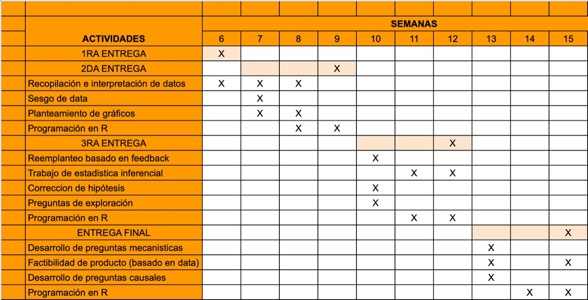
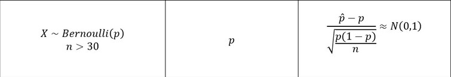

# Aceptación de consumo de insectos en Lima

### Una introducción
El consumo de insectos ha sido  practicado  por generaciones en diversas partes del mundo, el principal motivo es por los altos costos de producción que requieren otras fuentes de proteína, como la carnes de res o pollo. Esta es una opción mucho más económica y, debido a sus bajas emisiones de CO2 , una opción más amigable con el medio ambiente. Asimismo, la ONU promueve su consumo y la considera como una fuente nutricional de alto valor biológico, no solo por los factores antes mencionados, sino también debido a su alto porcentaje de proteína. Debido a que el consumo de productos derivados de insectos en Lima es una minoría en comparación con otras fuentes de alimento proteicos, hemos decidido estudiarlo a mayor profundidad.

### La importancia del trabajo
* La razón por la que elegimos este tema y por la cual creemos que es importante es que los insectos son una gran fuente de proteínas que no es muy conocida por la población limeña.
* Para contextualizar, 100 gramos de insecto contiene aproximadamente entre 40-50gr de proteínas, más del doble de lo que aporta el pollo.
* Es por esto que queremos darle a la gente a conocer que tienen otras posibilidades de consumir proteínas que no requieren el consumo de carnes. 
* Con la data obtenida podremos conocer la aceptación que tendría la  proteína a base de insectos en Lima .
* También, sabremos si los limeños están dispuestos a usarla como alternativa al consumo de algunas carnes. 

### Muestra y población
Utilizaremos una muestra por conveniencia para intentar representar a la población de Lima Metropolitana, mayor de 15 años, que tenga cierto interés o control sobre su alimentación diaria. No obstante, al ser la muestra por conveniencia una técnica de muestreo no probabilístico, trataremos de fomentar la representatividad al entregar la encuesta a cualquier persona de la zona de lima metropolitana en un rango de edades de 15 años a más. Asimismo, no seleccionamos por género tampoco. 

### Objetivos
El objetivo principal de esta investigación es recopilar y analizar información acerca de la aceptación y consumo actual de los alimentos derivados de insectos por la población de Lima Metropolitana.

* Se busca delimitar los grupos más dispuestos a adoptar una nueva dieta que incluya productos derivados de insectos.
* Analizar los posibles vínculos entre edad, gastos promedios y la aceptación de estos productos.
* Analizar la relación entre los hábitos alimenticios y deportivos con la aceptación de estos nuevos productos como fuente de nutrición y del tipo de alimento que desearía consumir.

### Factibilidad
 

### Preguntas utilizadas 
1. ¿Cuál es su edad?
2. ¿Cuál es su sexo?
3. ¿Cuántas horas de ejercicio hace semanalmente?
4. ¿Qué tipo de proteína es de su preferencia diaria?
5. ¿Consume algún tipo de suplemento proteico?
6. ¿Cuánto gasta en víveres y comida semanalmente?
7. En una escala del 1 al 10, ¿qué tan dispuesto estaría a consumir productos derivados de insectos?
8. ¿Cuánto estaría dispuesto a pagar por un 1kg de insectos como grillos procesados y criados para consumo humano?
9. ¿Cuántos productos de insectos o derivados de insectos ha probado?
10. ¿Qué producto derivado de insectos estaría más dispuesto a probar?

### Variables

**Categóricas:**

* Nominal:
    + Sexo
    + Consumo de suplemento proteico
    + Tipos de productos
    + Proteína de preferencia
* Ordinal:
    + Disposición a consumir productos derivados de insectos
    
**Numéricas**

* Discreta:
    + Edad
    + Ejercicio semanal
    + Cantidad de productos derivados de insectos probados
* Continua
    + Gasto de soles en víveres y comida semanal
    + Precio a pagar por productos de insectos

```{r,include=FALSE}
##Si no se tienen los paquetes, correr el siguiente chunk y sacar de comentario las siguientes lineas:
##install.packages("ggplot2",repos = "http://cran.us.r-project.org")
##install.packages("ggmosaic",repos = "http://cran.us.r-project.org")
```

```{r, include=FALSE}
library(readr)
library(dplyr)
library(ggplot2)
library(ggmosaic)
```

```{r, include=FALSE}
DF <- read_csv("DF_proyecto.csv")
```

```{r, include=FALSE}
names(DF)
```


```{r, include=FALSE}
DF %>% rename(Hora = 'Marca temporal', Edad = '¿Cual es su edad? (ej. 31)', Sexo = Sexo, H_ejercicio = 'Aproximadamente cuantas horas de ejercicio/deporte hace semanalmente (ej. 3)', tipo_proteina = '¿Qué tipo de proteína es de su preferencia diaria?', c_proteina = '¿Consume algún tipo de suplemento proteico? (Proteína en polvo, barras de proteína, ensure, etc.)', comida_semana = 'Aproximadamente cuantos soles gasta a la semana en compras de víveres y comida (ej. 200)', consumir_insectos = '¿Del 1 al 10, qué tan dispuesto estarías a consumir productos derivados de insectos? Siendo 1 nada dispuesto y 10 muy dispuesto.', precio_insectos = '¿Aproximadamente qué precio le darías a 1 kg de insectos como grillos procesados y criados para consumo humano? (en soles ej. 10.00)', cuantos_insectos = '¿Cuántos productos de insectos o derivados de insectos has probado? (ej. 2)', cual_p_insecto = '¿Cuál producto derivado de insectos estarías más dispuesto a probar tomando en cuenta que todos son aptos para consumo?') -> DFN
```

```{r, include=FALSE}
DFN$Hora <- NULL
```

```{r, include=FALSE}
summary(DFN)
```

```{r, include=FALSE}
table(DFN$Edad)
```

```{r, include=FALSE}
DFN$Edad[DFN$Edad == "77años"] <- 77
```

```{r, include=FALSE}
DFN$Edad <- as.numeric(DFN$Edad)
```

```{r, include=FALSE}
DFN$Edad[DFN$Edad >= 90] <- NA
```

```{r, include=FALSE}
table(DFN$Sexo)
```

```{r, include=FALSE}
table(DFN$H_ejercicio)
```
```{r, include=FALSE}
DFN$H_ejercicio[DFN$H_ejercicio == "2.30 horas"] <- 2.5
DFN$H_ejercicio[DFN$H_ejercicio == "3 horas"] <- 3
DFN$H_ejercicio[DFN$H_ejercicio == "Dos a tres horas"] <- 2.5
DFN$H_ejercicio[DFN$H_ejercicio == "No hago ejerciciom"] <- 0
DFN$H_ejercicio[DFN$H_ejercicio == "15-18"] <- 16.5
DFN$H_ejercicio[DFN$H_ejercicio == "3 horas.0.3 min diarios"] <- NA 
DFN$H_ejercicio[DFN$H_ejercicio == "4:30"] <- 4.5
DFN$H_ejercicio[DFN$H_ejercicio == "6 horas"] <- 6
DFN$H_ejercicio[DFN$H_ejercicio == "Nada"] <- 0
DFN$H_ejercicio[DFN$H_ejercicio == "1/2 hora"] <- 0.5
DFN$H_ejercicio[DFN$H_ejercicio == "3:00"] <- 3
DFN$H_ejercicio[DFN$H_ejercicio == "8 horas"] <- 8
DFN$H_ejercicio[DFN$H_ejercicio == "Nel"] <- 0
DFN$H_ejercicio[DFN$H_ejercicio == "Q"] <- NA
DFN$H_ejercicio[DFN$H_ejercicio == "2 horas"] <- 2
DFN$H_ejercicio[DFN$H_ejercicio == "28 horas semanales"] <- 28
DFN$H_ejercicio[DFN$H_ejercicio == "7-8"] <- 7.5
DFN$H_ejercicio[DFN$H_ejercicio == "Ninguna"] <- 0
DFN$H_ejercicio[DFN$H_ejercicio == "10 a 15 horas"] <- 12.5
DFN$H_ejercicio[DFN$H_ejercicio == "2 horas GAAAAA"] <- 2
DFN$H_ejercicio[DFN$H_ejercicio == "3horas"] <- 3
DFN$H_ejercicio[DFN$H_ejercicio == "5h"] <- 5
DFN$H_ejercicio[DFN$H_ejercicio == "7 hrs"] <- 7
DFN$H_ejercicio[DFN$H_ejercicio == "Carnes"] <- NA
DFN$H_ejercicio[DFN$H_ejercicio == "No"] <- 0
DFN$H_ejercicio[DFN$H_ejercicio == "7 hs"] <- 7
DFN$H_ejercicio[DFN$H_ejercicio == "O"] <- 0
```

```{r, include=FALSE}
table(DFN$H_ejercicio)
```
```{r, include=FALSE}
DFN$H_ejercicio <- as.numeric(DFN$H_ejercicio)
```

```{r, include=FALSE}
table(DFN$tipo_proteina)
```

```{r, include=FALSE}
table(DFN$c_proteina)
```

```{r, include=FALSE}
table(DFN$comida_semana)
```

```{r, include=FALSE}
DFN$comida_semana[DFN$comida_semana == "50-100 soles"] <- 75
DFN$comida_semana[DFN$comida_semana == "r"] <- NA
DFN$comida_semana[DFN$comida_semana == "300 - 400"] <- 350
DFN$comida_semana[DFN$comida_semana == "120 soles"] <- 120
DFN$comida_semana[DFN$comida_semana == "250 soles"] <- 250
DFN$comida_semana[DFN$comida_semana == "400+"] <- 400
DFN$comida_semana[DFN$comida_semana == "500.00"] <- 500
DFN$comida_semana[DFN$comida_semana == "Nada, todo me lo da el PAD"] <- 0
DFN$comida_semana[DFN$comida_semana == "350-400"] <- 375
DFN$comida_semana[DFN$comida_semana == "no se"] <- NA

```

```{r, include=FALSE}
DFN$comida_semana <- as.numeric(DFN$comida_semana)
```

```{r, include=FALSE}
table(DFN$comida_semana)
```

```{r, include=FALSE}
table(DFN$consumir_insectos)
```
```{r, include=FALSE}
table(DFN$precio_insectos)
```

```{r, include=FALSE}
DFN$precio_insectos[DFN$precio_insectos == "6 soles"] <- 6
DFN$precio_insectos[DFN$precio_insectos == "Nada"] <- 0
DFN$precio_insectos[DFN$precio_insectos == "20 sokes"] <- 20
DFN$precio_insectos[DFN$precio_insectos == "Ninguna"] <- 0
DFN$precio_insectos[DFN$precio_insectos == "No consumiría"] <- 0
DFN$precio_insectos[DFN$precio_insectos == "7 soles"] <- 7
DFN$precio_insectos[DFN$precio_insectos == "No lo se"] <- NA
DFN$precio_insectos[DFN$precio_insectos == "7,00soles"] <- 7
DFN$precio_insectos[DFN$precio_insectos == "No sé"] <- NA
DFN$precio_insectos[DFN$precio_insectos == "10 soles"] <- 10
DFN$precio_insectos[DFN$precio_insectos == "5 soles"] <- 5
DFN$precio_insectos[DFN$precio_insectos == "O.00"] <- 0
DFN$precio_insectos[DFN$precio_insectos == "3 soles"] <- 3
DFN$precio_insectos[DFN$precio_insectos == "12 soles"] <- 12
DFN$precio_insectos[DFN$precio_insectos == "2 soles"] <- 2
DFN$precio_insectos[DFN$precio_insectos == "20 soles"] <- 20
DFN$precio_insectos[DFN$precio_insectos == "000"] <- 0
DFN$precio_insectos[DFN$precio_insectos == "5-6"] <- 5.5

```

```{r, include=FALSE}
DFN$precio_insectos <- as.numeric(DFN$precio_insectos)
```

```{r, include=FALSE}
table(DFN$precio_insectos)
```

```{r, include=FALSE}
table(DFN$cuantos_insectos)
```

```{r, include=FALSE}
DFN$cuantos_insectos[DFN$cuantos_insectos == "Ninguna"] <- 0
DFN$cuantos_insectos[DFN$cuantos_insectos == "O."] <- 0
DFN$cuantos_insectos[DFN$cuantos_insectos == "0, creo"] <- NA
DFN$cuantos_insectos[DFN$cuantos_insectos == "ninguno"] <- 0
DFN$cuantos_insectos[DFN$cuantos_insectos == "Un par"] <- 2
DFN$cuantos_insectos[DFN$cuantos_insectos == "Cero"] <- 0
DFN$cuantos_insectos[DFN$cuantos_insectos == "Ninguno"] <- 0
DFN$cuantos_insectos[DFN$cuantos_insectos == "Uno"] <- 1
DFN$cuantos_insectos[DFN$cuantos_insectos == "e"] <- NA
DFN$cuantos_insectos[DFN$cuantos_insectos == "No he probado insectos"] <- 0
DFN$cuantos_insectos[DFN$cuantos_insectos == "Nada"] <- 0
DFN$cuantos_insectos[DFN$cuantos_insectos == "O"] <- 0
```

```{r, include=FALSE}
DFN$cuantos_insectos <- as.numeric(DFN$cuantos_insectos)
```

```{r, include=FALSE}
table(DFN$cual_p_insecto)
```

```{r, include=FALSE}
DFN$cual_p_insecto[DFN$cual_p_insecto == "Niniguno"] <- "Ninguno"
DFN$cual_p_insecto[DFN$cual_p_insecto == "No la consumiría"] <- "Ninguno"
DFN$cual_p_insecto[DFN$cual_p_insecto == "Miel de abeja"] <- NA
DFN$cual_p_insecto[DFN$cual_p_insecto == "Miel de abejas"] <- NA
DFN$cual_p_insecto[DFN$cual_p_insecto == "Nada"] <- "Ninguno"
DFN$cual_p_insecto[DFN$cual_p_insecto == "Ninguna"] <- "Ninguno"
DFN$cual_p_insecto[DFN$cual_p_insecto == "No se"] <- NA
```

```{r, include=FALSE}
table(DFN$cual_p_insecto)
```

## Descriptores numéricos y gráficos.

A continuación, se muestran los descriptores numéricos que se pueden utilizar para cada distinto valor numérico:

### Edad

Utilizando la función *summary*, se puede encontrar el valor mínimo y máximo, la mediana, la media y los cuartiles 1 y 3.

```{r}
summary(DFN$Edad)
```
Luego, se puede hallar la desviación estándar y el rango intercuartil.
```{r}
sd(DFN$Edad, na.rm = TRUE)
IQR(DFN$Edad, na.rm = TRUE)
```

Asimismo, utilizando la siguiente función se puede encontrar el coeficiente de variación:
```{r}
cv <- function(x)
  return(round(sd(x, na.rm = TRUE)/mean(x, na.rm = TRUE),2))

cv(DFN$Edad)
```

A partir de los valores hallados al analizar la muestra, se puede decir que nuestra población tiene un gran rango de edades. No obstante, se debe señalar que la muestra tiene una media de 35.69, lo cual nos demuestra que la mayoría de las personas que respondieron a la encuesta son adultos jóvenes. Esto es importante porque sabemos que nuestra muestra es por conveniencia; sin embargo, no significa que esta sea totalmente representativa de la población. No obstante, si lo tomamos de ese modo, se podría señalar que hay una gran parte de la población que es joven.


```{r}
boxplot(DFN$Edad, horizontal = TRUE, main = " Diagrama de Caja de Edad")
```

```{r}
hist(DFN$Edad, main = "Histograma de Edad", xlab = "Edad", ylab = "Frecuencia", col = "blue", breaks = 5)
```

La variable Edad es una variable que se podría considerar bimodal con una moda en 15 y otra en 55 años como es mostrado en el histograma. Además, se puede decir que la gráfica está sesgada hacia la derecha. Esto refuerza la idea de que la muestra representa a una población principalmente joven. Sin embargo, se debe agregar que los datos están muy dispersos por lo cual se reitera la presencia de personas de todas las edades en la población.

### Horas de ejercicio a la semana

La variable que responde a la pregunta "¿Aproximadamente cuántas horas de ejercicio/deporte hace semanalmente?" está representada por H_ejercicio. Aplicando descriptores numéricos a los valores de esta variable, podemos hallar lo siguiente:

```{r}
summary(DFN$H_ejercicio)
```
```{r}
sd(DFN$H_ejercicio, na.rm = TRUE)
IQR(DFN$H_ejercicio, na.rm = TRUE)
cv(DFN$H_ejercicio)
```
Al ser la media 5.29, el primer cuartil 2 y el tercer cuartil 6, podemos asumir que hay una gran parte de la población que se ejercita regularmente cada semana. No obstante, se deben graficar los datos y analizar estos gráficos para llegar a una mejor conclusión.

```{r}
boxplot(DFN$H_ejercicio, horizontal = TRUE, main = " Diagrama de caja de horas de ejercicio a la semana")
```

```{r}
hist(DFN$H_ejercicio, main = "Histograma de horas de ejercicio a la semana", xlab = "Horas", ylab = "Frecuencia", col = "blue", breaks = 20)
```

Analizando los gráficos, podemos visualizar que los datos están sesgados hacia la derecha y la gráfica es unimodal con su moda en el valor 1 del histograma. Asimismo, el diagrama de caja demuestra que hay varios datos atípicos, sobrepasando el límite del "bigote" superior. Esto cambia lo que se pensó inicialmente utilizando solamente los descriptores numéricos, ya que ahora se puede observar con mayor claridad que gran parte de la población se ejercita entre 0 y 2 horas. Al incrementar las horas de ejercicio, decrece el número de personas. Esto demuestra que la población realmente no se ejercita mucho en su mayoría, puesto que los datos están concentrados en los valores bajos. No obstante, se podría analizar la relación entre las horas de ejercicio con otra variable como la edad. 

### Soles gastados en comida semanalmente

La variable comida_semana se utiliza para responder a la pregunta "¿Aproximadamente, cuántos soles gasta a la semana en compras de víveres y comida?". 

```{r}
summary(DFN$comida_semana)
```
```{r}
sd(DFN$comida_semana, na.rm = TRUE)
IQR(DFN$comida_semana, na.rm = TRUE)
cv(DFN$comida_semana)
```
Analizando los valores hallados a través de descriptores numéricos, podemos comprender de que nuestros gráficos van a mostrar algunos datos atípicos debido a la gran diferencia entre el tercer cuartil y el máximo valor. No obstante, se puede observar que los valores para esta variable son menos dispersos y estarán concentrados.

```{r}
boxplot(DFN$comida_semana, horizontal = TRUE, main = " Diagrama de caja de soles gastados a la semana en comida")
```
```{r}
hist(DFN$comida_semana, main = "Histograma de soles gastados a la semana en comida", xlab = "Soles", ylab = "Frecuencia", col = "blue", breaks = 20)
```

Analizando los gráficos, podemos ver que nuestros datos muestran una moda en el valor 300 en el histograma y está sesgado a la derecha. Además, parecen haber pocos datos atípicos entre los datos recolectados y una gran concentración de datos alrededor de la media y entre el primer y tercer cuartil. A través de estos gráficos y descriptores numéricos podemos decir con certeza que un buen promedio para la población de soles gastados a la semana en comida sería la que se presenta como la media, 377.10. 

### Valor que otorgaría a 1 kilo de grillos procesados

La variable precio_insectos se utiliza para responder a la pregunta "¿Aproximadamente qué precio le darías a 1 kg de insectos como grillos procesados y criados para consumo humano?" 

```{r}
summary(DFN$precio_insectos)
```

```{r}
sd(DFN$precio_insectos, na.rm = TRUE)
IQR(DFN$precio_insectos, na.rm = TRUE)
cv(DFN$precio_insectos)
```
Los descriptores numéricos demuestran que no hay un consenso en el valor que le otorgarían las personas de la muestra a 1 kg de grillos procesados, demostrando que aún no hay mucho reconocimiento del potencial que tienen este tipo de productos. No obstante, se puede observar que la población le otorgaría una media de 9.04 como precio en soles a 1 kg de grillos. Esto podría servir como referencia para darle un precio a un producto de este tipo, pero se debe tomar en cuenta los gráficos que se puedan obtener de estos datos también.


```{r}
boxplot(DFN$precio_insectos, horizontal = TRUE, main = " Diagrama de caja de precio otorgado a 1 kg de grillos")
```

```{r}
hist(DFN$precio_insectos, main = "Histograma de precio otorgado a 1 kg de grillos", xlab = "Soles", ylab = "Frecuencia", col = "blue", breaks = 10)
```

Esta variable se puede describir utilizando los gráficos como una variable unimodal que está sesgada hacia la derecha. No obstante, esto deja en claro que hay personas para las cuales este tipo de productos sí tiene un valor mientras que hay otras que no muestran interés. Asimismo, los datos atípicos mostrados en el diagrama de caja pueden haber sido el resultado de personas que son muy optimistas con este tipo de productos o personas que no saben realmente qué valor otorgarle. Sin embargo, se podrá llegar a una mejor conclusión tomando en cuenta un análisis de esta variable con otras. 

### Número de productos de insecto que han probado

La variable cuantos_insectos se utilizó para responder a la pregunta "¿Cuántos productos de insectos o derivados de insectos has probado?"

```{r}
summary(DFN$cuantos_insectos)
```

```{r}
sd(DFN$cuantos_insectos, na.rm = TRUE)
IQR(DFN$cuantos_insectos, na.rm = TRUE)
cv(DFN$cuantos_insectos)
```
```{r}
hist(DFN$cuantos_insectos, main = "Histograma de productos de insectos probados", xlab = "Cantidad", ylab = "Frecuencia", col = "blue", breaks = 25)
```

Al analizar los descriptores gráficos y numéricos para esta variable, se puede concluir que hay una gran concentración cercano al valor 0. Nuestro histograma muestra claramente una relación unimodal que, al tomar en cuenta que el valor de la mediana y el primer y tercer cuartil son 0, podemos concluir que al menos 75% de la población nunca ha probado productos derivados de insectos. 


## Descriptores categóricos

A continuación, se presentan los gráficos de variables categóricas:

### Sexo

En el siguiente gráfico podemos observar la frecuencia relativa de los datos obtenidos con respecto a la variable Sexo.
```{r}
barplot(round(table(DFN$Sexo)/(nrow(DFN) - sum(is.na(DFN$Sexo))) * 100, digits = 2), main = "Frecuencias relativas de la variable Sexo",ylab="Frecuencia",xlab="Sexo",col = c("Lightblue","pink"))
```

Analizando el gráfico anterior, se puede concluir que la población cuenta con la misma cantidad de hombres como mujeres.

### Tipo de proteína diaria consumida

En el gráfico se puede observar la frecuencia relativa que relaciona las respuestas a las preferencias de consumo de proteína por parte de los encuestados
```{r}
barplot(round(table(DFN$tipo_proteina)/(nrow(DFN) - sum(is.na(DFN$tipo_proteina))) * 100, digits = 2),las=1, main = "Frecuencias relativas del consumo de proteína ",ylab="Frecuencia",xlab="Proteína",col = c("red","orange","purple","lightgreen"),cex.names = 0.5,)
```

Gracias a la gráfica podemos interpretar que la gran mayoría de la población prefiere el consumo de proteína a través de animales como pollo,chancho y pescado, seguido de los productos derivados de animales, las proteínas vegetales y otros. Esto nos indica que la población en su gran mayoría prefiere consumir proteína animal en comparación a otras alternativas.

### Consumo de suplementos proteicos

El siguiente gráfico nos permite observar la frecuencia relativa acerca del consumo de suplementos proteicos por parte de los encuestados. 
```{r}
barplot(round(table(DFN$c_proteina)/(nrow(DFN) - sum(is.na(DFN$c_proteina))) * 100, digits = 2), main = "Frecuencias relativas del consumo de suplementos proteicos ",ylab="Frecuencia",xlab="Consume suplementos proteicos",col = c("red","lightgreen"))
```

Podemos interpretar por medio del gráfico que la gran mayoría de los encuestados no ingieren suplementos proteicos, lo que podría significar que la proteína que ingieren proviene de su dieta diaria (carnes, vegetales, etc.)

### Disposición a consumir productos derivados de insectos

A través del siguiente gráfico podemos observar la frecuencia relativa de la disposición de la gente, en una escala del 1 al 10 (10 siendo muy dispuesto), a probar productos derivados de insectos.
```{r}
barplot(round(table(DFN$consumir_insectos)/(nrow(DFN) - sum(is.na(DFN$consumir_insectos))) * 100, digits = 2), main = "F.R de la disposición del consumo de productos derivados de insectos",ylab="Frecuencia",xlab="disposición",col = c("lightblue","lightgreen"))
```

Este gráfico nos demuestra que una gran parte de la población no está dispuesta a consumir productos derivados de insectos en lo absoluto, ya que vemos una alta frecuencia para el valor de 1. No obstante, más del 50% de la población aún estaría dispuesta a consumir dichos productos, mostrando una frecuencia relativamente similar para los distintos niveles de disposición restantes.

### Tipos de productos

Por medio del siguiente gráfico podemos observar la frecuencia relativa de los tipos de productos derivados de insectos:
```{r}
barplot(round(table(DFN$cual_p_insecto)/(nrow(DFN) - sum(is.na(DFN$cual_p_insecto))) * 100, digits = 2),las=3, main = "F.R del producto que estarían dispuestos a probar",ylab="Frecuencia",col = c("lightblue","lightgreen"),cex.names = 0.6)
```


### Gráfica de puntos edad y precio de grillo 

En la siguiente gráfica veremos la dispersión de datos basándonos en "Edad" y en el precio por 1 Kg de harina procesada de grillo. Esta data nos ayudará a sesgar el precio a disponer. El gráfico podría indicar un posible enfoque en la edad específica de personas dispuestas a probar estos productos, además de demostrar los rangos de precios.
```{r}
plot0 <- ggplot(DFN,aes(precio_insectos,Edad)) + geom_point() +labs(y="Edad", x="Precio x 1kg de harina de grillo procesado",title= "Cuánto pagaría por 1kg de producto según la edad") + geom_smooth(method = "lm")
plot0
```

La data nos señala que el público encuestado considera aceptable un rango de precio entre los 3-20 soles, esto sin tomar en cuentan los datos atípicos. Podemos resaltar el hecho de que el grupo estudiado tiene una predisposición a consumir un producto de bajo precio. Asimismo, también se puede notar que hay más casos en los que las personas más jóvenes le dan un mayor precio a 1 kg de harina de grillo, lo cual sugiere que para este grupo los productos de insectos tienen un mayor valor reflejando también una mayor aceptación al consumo de este tipo de productos.

**Covarianza de precio otorgado a 1kg de harina de grillo procesado y edad**
```{r}
cov(DFN$precio_insectos, DFN$Edad, use = "complete.obs")
```
**Tendencias y patrones**

* Las personas jóvenes de la población tienden a otorgarle un mayor precio a un producto derivado de insectos que la población adulta. Esto se puede ver claramente en el gráfico y en el valor de -25.22 que nos da la covarianza entre estas dos variables. Al ser este valor negativo, se puede notar que mientras aumenta el valor de precio otorgado a 1 kg de harina de grillo procesado, disminuye el valor de edad.
    + Una explicación para esto podría ser que los jóvenes están más abiertos a nuevas ideas y a probar nuevas experiencias que los adultos y adultos mayores.


### Variaciones entre la edad, sexo y el ejercicio semanal 
En el siguiente gráfico se puede observar las variaciones de horas de ejercicio semanal en función a la edad de los encuestados. Por otro lado, se utiliza color para separar las respuestas por sexo. Este gráfico podría resaltar posibles relaciones específicas entre las tres variables.
```{r}
plot1 <- ggplot(DFN, aes(Edad,H_ejercicio, 
                                 color=Sexo))+ geom_point()+ labs(y="Horas de ejercicio semanal", x = "Edad",title="Relación entre sexo, edad y ejercicio",colour = "Sexo" ) +scale_color_manual(values=c("#0B6AF0", "#FF3880", "#AAADAD")) + geom_smooth(method = "lm")
plot1
     
```

**Covarianza entre edad y horas de ejercicio a la semana** 
```{r}
cov(DFN$Edad, DFN$H_ejercicio, use = "complete.obs")
```

**Tendencias y patrones**

* La población tiene una tendencia a no hacer muchas horas de ejercicio a la semana sin importar sexo o edad.
    + Esto se puede ver en los gráficos y puede ser debido a que las personas jóvenes están ocupadas con sus estudios, los adultos con sus trabajos y los mayores de edad ya no tienen la capacidad de ejercitarse mucho.
* Hay una tendencia a que los hombres aumenten las horas de ejercicio que hacen a la semana al aumentar la edad.
    + Una hipótesis para esto es que los hombres podrían ser más activos físicamente que las mujeres de la población, por lo que, al no tener distracciones como estudios y trabajo, podrían pasar más horas haciendo ejercicio.
* Tomando como referencia la covarianza, se puede identificar que hay una tendencia en la población a hacer menos horas de deporte mientras aumenta su edad. Esto se puede ver, ya que el valor de la covarianza es -4.381757, señalando una relación lineal negativa.
    + Esto se puede deber a que el estado físico de las personas empeora con la edad y las personas mayores no pueden hacer la misma cantidad de ejercicio o actividad física que los jóvenes.

### Variaciones entre la edad y el ejercicio semanal de hombres
En el siguiente gráfico observamos las variaciones en el número de horas de ejercicio según la edad de los hombres de la muestra. Este gráfico se basa en el gráfico previamente demostrado, pero solo tomando en consideración a los hombres de la muestra para observar una dispersión más clara de la diferencia entre sexos.
```{r}
DFN1.1 <- subset(DFN,DFN$Sexo == "Hombre")
plot1.1 <- ggplot(DFN1.1, aes(Edad,H_ejercicio))+ geom_point(color='#0B6AF0')+ labs(y="Horas de ejercicio semanal", x = "Edad",title="Horas de ejercicio según la edad de los hombres")+ geom_smooth(method = "lm")
plot1.1
```

**Tendencias y patrones**

* Una interpretación nueva nacida a partir del gráfico, a diferencia del gráfico con ambos sexos, es la razón del aumento de horas con la edad. El patrón nos dice que las horas de ejercicio semanal aumentan con la edad, pero esto se podría deber al dato atípico de gran valor.

**Covarianza entre edad y horas de deporte semanal de los hombres **
```{r}
cov(DFN1.1$Edad, DFN1.1$H_ejercicio, use = "complete.obs")
```


### Variaciones entre la edad y el ejercicio semanal de mujeres
En el siguiente gráfico observamos las variaciones en el número de horas de ejercicio según la edad de las mujeres de la muestra. Este gráfico se basa en el gráfico previamente demostrado, pero solo tomando en consideración a las mujeres de la muestra, para observar una dispersión más clara de la diferencia entre sexos.
```{r}
DFN1.2 <- subset(DFN,DFN$Sexo == "Mujer")
plot1.2 <- ggplot(DFN1.2, aes(Edad,H_ejercicio))+ geom_point(color='#FF3880')+ labs(y="Horas de ejercicio semanal", x = "Edad",title="Horas de ejercicio según la edad de las mujeres")+ geom_smooth(method = "lm")
plot1.2
```

**Tendencias y patrones**

* Podemos observar la tendencia previamente mencionada de un declive en las horas de ejercicio semanal con la edad, inclusive con el dato atípico de 45 horas semanales.
* Podemos observar una tendencia en las mujeres en continuar haciendo ejercicio inclusive con una edad mayor a 60. El declive en horas de ejercicio semanal no es muy pronunciado.

**Covarianza entre edad y horas de ejercicio a la semana de las mujeres** 
```{r}
cov(DFN1.2$Edad, DFN1.2$H_ejercicio, use = "complete.obs")

```


### Variaciones entre la edad, el ejercicio semanal y el consumo de suplementos proteicos
El siguiente gráfico representa, una ves más, las variaciones en la cantidad de horas de ejercicio semanal por parte de los encuestados en función a la edad. A diferencia del gráfico previamente presentado, este gráfico presenta una diferenciación por color acerca del consumo de suplementos proteicos de los encuestados. La inclusión del consumo de suplementos proteicos puede jugar un papel importante en las demás variables, ya que representa un enfoque específico en la alimentación del encuestado.

```{r}
 plot2 <- ggplot(DFN, aes(Edad,H_ejercicio, 
                                 color=c_proteina))+ geom_point()+ labs(y="Horas de ejercicio semanal", x = "Edad",title="Horas de ejercicio por edad y por consumo de suplementos proteicos",colour = "¿Consume suplementos proteicos?" ) + scale_color_manual(values=c("#FF021D", "#009400", "#AAADAD")) + geom_smooth(method = "lm")
plot2
```

**Tendencias y patrones**

* Un patrón notable es el mayor uso de suplementos proteicos por parte de las personas jóvenes de la población con edades alrededor de 20 años.
    + Esto se puede deber a que los jóvenes son más activos físicamente, por lo cual algunos pueden optar a consumir estos suplementos para incrementar su masa muscular.
* Además, se puede notar que las personas de la población que consumen suplementos proteicos hacen menos horas de ejercicio a la semana al aumentar la edad.
    + Esto puede ser debido a que los adultos y adultos mayores que toman suplementos proteicos pueden hacerlo por razones diferentes a los jóvenes que toman suplementos proteicos. Los jóvenes toman suplementos proteicos principalmente para aumentar masa muscular mientras que los adultos y adultos mayores los toman para que no se reduzca su masa muscular debido a la edad.
* Del mismo modo, las personas de la población que no consumen suplementos proteicos parecen hacer más horas de ejercicio a la semana al aumentar la edad.
    + Esto se puede deber a que los adultos que no consumen suplementos proteicos podrían tener una dieta balanceada, influyendo a que cuiden su de su salud y que hagan ejercicio regularmente sin necesidad de consumir suplementos proteicos.


### Variaciones entre la edad y el ejercicio semanal en personas que ingieren suplementos proteicos

En el siguiente gráfico observamos las variaciones en el número de horas de ejercicio llevadas a cabo por personas que consumen suplementos proteicos en relación a su edad. Este gráfico se basa en el gráfico previamente demostrado, pero solo tomando en consideración al  grupo de la muestra que ingiere suplementos proteicos, para observar una dispersión más clara del grupo específico interesado en ingerir productos con alta cantidad de proteínas
```{r}
DFN2.1 <- subset(DFN,DFN$c_proteina == "Si")
plot2.1 <- ggplot(DFN2.1, aes(Edad,H_ejercicio))+ geom_point(color='#009400')+ labs(y="Horas de ejercicio semanal", x = "Edad",title="Horas de ejercicio según la edad de personas que ingieren suplementos proteicos")+ geom_smooth(method = "lm")
plot2.1
```

**Tendencias y patrones**

* Como denotamos en el análisis de la gráfica anterior, se resalta que existe un grupo concentrado de personas que consume suplementos en el grupo de 20 años. Aun así, existen personas que consumen en un alto rango de edades.
* Por otro lado, denotamos que inclusive con el consumo de suplementos proteicos, la cantidad de horas de ejercicio semanales de las personas se reduce con el aumento de la edad.


### Variaciones entre la edad y el ejercicio semanal de personas sin consumo de suplementos proteicos
En el siguiente gráfico observamos las variaciones en el número de horas de ejercicio llevadas a cabo por personas que no consumen suplementos proteicos ,exclusivamente, en relación a su edad. Este gráfico se basa en el gráfico previamente demostrado, pero solo tomando en consideración al  grupo de la muestra que no consume suplementos proteicos, para observar una dispersión más clara.
```{r}
DFN2.2 <- subset(DFN,DFN$c_proteina == "No")
plot2.2 <- ggplot(DFN2.2, aes(Edad,H_ejercicio))+ geom_point(color='#FF021D')+ labs(y="Horas de ejercicio semanal", x = "Edad",title="Horas de ejercicio según la edad de personas sin consumo de suplementos")+ geom_smooth(method = "lm")
plot2.2
```

**Tendencias y patrones**

* Se puede interpretar del gráfico que, inclusive sin el consumo de productos proteicos, existe una gran cantidad de personas que se dedican a hacer deporte semanal.Inclusive, en este caso, vemos una pequeña tendencia al incremento de horas de ejercicio semanal con respecto al aumento de edad. Sin embargo, este aumento se le podría atribuir a los datos atípicos.
* Por otro lado, denotamos que inclusive sin un consumo de suplementos proteicos, existe un gran porcentaje de encuestados que se dedican ha hacer horas de deporte semanal.
    


### Proteína de preferencia y tipo de producto que desearía probar

El siguiente gráfico representa la comparación entre la preferencia diaria de proteína por parte de los encuestados y el producto derivado de insectos que estarían más dispuestos a probar. Esta comparación puede servir para delimitar los productos que se podrían vender al público, enfocado en su rutina alimenticia diaria con respecto a la proteína de preferencia.

```{r}
Plot5 <- ggplot(data = DFN) +
  geom_mosaic(aes(x = product(tipo_proteina), fill = cual_p_insecto)) +   
  labs(y="Qué tipo de producto consumiría", x="Proteína de preferencia diaria", title = "Gráfico de mosaico acerca de las proteínas de preferencia") + theme(axis.text.y = element_blank(),
        axis.ticks.y=element_blank(),
        axis.text.x = element_text(angle = 90),
        legend.position = "right") + guides(fill=guide_legend(title="Leyenda de productos de insecto"))
Plot5
```

### Hipótesis

Al haber analizado nuestros datos utilizando descriptores gráficos y numéricos, podemos hacer las siguientes hipótesis:

1. Las personas de menor edad tienden a otorgarle un mayor precio a productos derivados de insecto como 1 kg de harina procesada de grillos.
2. Mientras mayor sea la persona de la población, menor serán las horas de ejercicio que hace a la semana.
3. Las mujeres de la población hacen menos horas de deporte a la semana al aumentar la edad.
4. Los hombres de la población hacen más horas de deporte a la semana al aumentar la edad.
5. Las personas que consumen suplementos proteicos de la población tienden a hacer menos horas de ejercicio a la semana al aumentar la edad.
6. Las personas que no consumen suplementos proteicos de la población tienden a hacer más horas de ejercicio a la semana al aumentar la edad.
7. Mientras menor sea la persona de la población, mayor será la probabilidad de que consuma suplementos proteicos.

### Variables aleatorias

En nuestro experimento, podemos identificar la presencia de variables que siguen el modelo de distribución Bernoulli p. Estas son la variable sexo y si consume o no suplementos proteicos. La primera variable tiene solo 2 resultados: hombre o mujer, por lo que si se fuera a preguntar a una sola persona su sexo, solo podría responder una de las dos opciones. Si tomamos como éxito el resultado de que la persona sea hombre, entonces podríamos decir que el fracaso para el experimento sería que la persona sea mujer. Lo mismo se podría decir de la variable c_proteina o si es que la persona consume suplementos proteicos o no. Esta variable solo tiene 2 respuestas posibles: sí y no. Por ende, se repetiría la situación anterior, pero se podría tomar ahora como éxito que la unidad muestral responda sí y fracaso que responda no. Por otro lado, también se pudo identificar a una variable que sigue el modelo geométrico. Esta variable es la de horas de ejercicio a la semana. Esto se debe a que su comportamiento semeja a una variable que sigue el modelo geométrico, con su moda al inicio y una tendencia que decrece de forma exponencial. 

**Variable aleatoria de Sexo** 

Utilizando la variable de sexo, se puede armar una variable binomial (n,p) donde la probabilidad de éxito p se define como la probabilidad de que una persona seleccionada al azar sea hombre. Asimismo, se sabe que para un valor de n suficientemente grande para una distribución binomial, la distribución $\bar{X} = \hat{p}$ se aproxima a una $\mathrm{N} (0,1)$ cuando el valor de p es lejano de 0 o 1 y cuando n es mayor a 30. Del mismo modo, sus intervalos de confianza se pueden denotar de la siguiente manera: $\hat{p} \pm \mathrm{z_{\alpha/2}}\sqrt{\frac{\hat{p}(1-\hat{p})}{n}}$

En nuestro caso, como se verá posteriormente, nuestras variables analizadas a través de este método cumplen con ambas condiciones para ser aproximadas a una $\mathrm{N} (0,1)$ . Se posee un n mayor a 30,siendo n mayor a 100. Por otro lado, el valor de p tampoco se encuentra cercano a 0 o a 1, como será comprobado posteriormente.

Nuestro valor de significancia es 5%  (alpha_1). Debido a esto, se tomará una confianza de 95%. A continuación se muestran nuestros cálculos para obtener el valor p de la muestra, denotado como "p_barra_1" y el intervalo de confianza de este. 

```{r}
n1 <- sum(complete.cases(DFN$Sexo))
p_barra_1 <- mean(DFN$Sexo == 'Hombre',na.rm = T)
p_barra_1
alpha_1 <- 0.05
Zc_1 <- qnorm(alpha_1/2, lower.tail = F)
ICI_1 <- p_barra_1 - Zc_1*sqrt((p_barra_1*(1 - p_barra_1))/n1)
ICS_1 <- p_barra_1 + Zc_1*sqrt((p_barra_1*(1 - p_barra_1))/n1)
IC_1 <- c(ICI_1,ICS_1)
IC_1

```

Como se puede observar, nuestra muestra tiene un valor p = 0.5 y un intervalo de confianza al 95% en [0.420513, 0.579487].

Con el valor promedio, es posible entonces generar una gráfica aproximada de las probabilidades de distintas situaciones. La gráfica presenta la probabilidad en función a la cantidad teórica de hombres que se podría encontrar.Como se observa, posee una distribución normal, con valores muy pegados al valor promedio (es decir al menos un 50 porciento de hombres).

Asimismo, se puede calcular el error que nos diría la precisión de nuestro intervalo de confianza ya que tenemos el valor de la muestra y su nivel de confianza:

```{r}
Error_1 <- Zc_1*sqrt((p_barra_1*(1-p_barra_1))/n1)
Error_1
```


```{r}
porcion_hombres <- seq(0,1,by=0.01)
Prob <- dnorm(porcion_hombres,0.5,0.1)/10
plot(porcion_hombres,Prob)
```


Asimismo, se logró encontrar un reporte del Instituto Nacional de Estadística e Informática (INEI) en el cual se indica que en la población de Lima Metropolitana, en el trimestre de diciembre 2020 y enero-febrero 2021, los hombres representaban al 56.4% de la población. Al obtener nosotros un valor por debajo de el que fue dado por el INEI, se decidió llevar a cabo una prueba de hipótesis con significancia del 5%. Por ende, se llevó a cabo una prueba de hipótesis considerando los siguientes parámetros:

Prueba de hipótesis:
H0: $p \ge 0.564$  

H1: $p < 0.564$

A continuación se muestran nuestros cálculos tomando en cuenta las siguientes consideraciones:
 
```{r}
p0_1 <- 0.564
z_est1 <- (p_barra_1 - p0_1)/sqrt((p0_1*(1-p0_1))/n1)
z_est1
zc1 <- qnorm(alpha_1)
zc1
```

Como se puede observar, el valor de z estadístico es mayor al valor de z crítico, por lo cual podemos concluir que no se puede rechazar a la hipótesis nula H0, ya que no se encuentra en el área de rechazo con una significancia del 5%. Esto nos indica que el valor p de nuestra muestra pudo haber sido una muestra mala que estaba por debajo del promedio de la población.

Al no poder rechazar la prueba de hipótesis H0 con una significancia del 5%, intentamos probar nuevamente el experimento con una significancia del 6%:

```{r}
alpha_1.1 <- 0.06
z_est1.1 <- (p_barra_1 - p0_1)/sqrt((p0_1*(1-p0_1))/n1)
z_est1.1
zc1.1 <- qnorm(alpha_1.1)
zc1.1
```

Como se puede observar, el valor de z estadístico es menor al valor de z crítico con una significancia del 6%, por lo cual se puede rechazar la hipótesis nula H0.

**Variable aleatoria de consumo de suplementos proteicos**

Esta variable también puede ser definida a través de una variable aleatoria discreta Binomial. Su comportamiento y sus cálculos son similares a la variable descrita anteriormente, utilizando el valor p de la Bernoulli para construir una binomial de tamaño n2 como es descrito a continuación. Nuestro valor probabilidad nuevamente será del 5%  (alpha_2).  Así mismo, se puede ir directamente al cálculo de su intervalo de confianza al 95%. 

```{r}
n2 <- sum(complete.cases(DFN$c_proteina))
p_barra_2 <- mean(DFN$c_proteina == 'Si',na.rm = T)
p_barra_2
alpha_2 <- 0.05
Zc_2 <- qnorm(alpha_2/2, lower.tail = F)
ICI_2 <- p_barra_2 - Zc_2*sqrt((p_barra_2*(1 - p_barra_2))/n2)
ICS_2 <- p_barra_2 + Zc_2*sqrt((p_barra_2*(1 - p_barra_2))/n2)
IC_2 <- c(ICI_2,ICS_2)
IC_2

```

De este modo, pudimos calcular que el valor de p para nuestra muestra es de 0.2337662 y el intervalo de confianza es [0.1669227, 0.3006097] al 95%.

Luego, calculamos el error a partir del nivel de confianza y el tamaño de muestra:

```{r}
Error_2 <- Zc_2*sqrt((p_barra_2*(1-p_barra_2))/n2)
Error_2
```

Además, se pudo crear la gráfica de la distribución de la variable aleatoria en cuestión.En la gráfica se observa la probabilidad del consumo de suplementos proteicos en función a la porción de la muestra que consume proteína. Podemos observar que tiene una distribución normal, con un promedio de 0,23 (es decir que halla un 23% que consuma suplementos), que gradualmente varía al cambiar de cantidad.

```{r}
Consume_proteina <- seq(-0.5,1,by=0.01)
Prob <- dnorm(Consume_proteina,0.2337662,0.1)/10
plot(Consume_proteina,Prob)
```


Asimismo, encontramos un estudio de la universidad peruana de ciencias aplicadas que fue realizado durante el año 2015 el cual indica que, dentro de una muestra de 450 personas, el 30.9% consumía algún tipo de batido proteico. Nosotros obtuvimos un valor del 0.23, entonces porque teníamos un valor menor al estudio decidimos realizar una prueba de hipótesis.

Prueba de hipótesis:
H0: $p \ge 0.309$  

H1: $p < 0.309$

A continuación se muestran los cálculos para la prueba de hipótesis:

```{r}
p0_2 <- 0.309
z_est2 <- (p_barra_2 - p0_2)/sqrt((p0_2*(1-p0_2))/n2)
z_est2
zc2 <- qnorm(alpha_2)
zc2
```

Como se puede observar, se obtuvo un valor de z estadístico menor al valor de z crítico. Con esto podemos concluir que sí podemos rechazar a la hipótesis nula H0 debido a que nuestro z estadístico se encuentra en el área de rechazo con una significancia del 0.05. 

**Variable aleatoria de horas de deporte**

La variable aleatoria de horas de deporte que hace una persona está distribuida similar a una variable geométrica $\mathbb{X}\sim\mathrm{Geo}(p)$. Esta variable no se puede relacionar con una normal, por lo que no podemos tomar una prueba de hipótesis. Sin embargo, aún así podemos obtener un intervalo de confianza para p. Esto se debe a que sabemos que las variables que siguen el modelo geométrico tienen una media expresada como: $\mathrm{E}(\mathbb{X})=\frac{1}{p}$ por lo cual se puede calcular la media de la muestra y así obtener el p de la muestra también. Esto se muestra en los cálculos a continuación:

```{r}
x_barra_3 <- mean(DFN$H_ejercicio,na.rm = T)
p_barra_3 <- 1/x_barra_3
x_barra_3
p_barra_3
```

Como se puede observar, nuestra muestra tiene una media aproximada de 5.289474 al igual que un valor p igual a 0.1890547. Teniendo estos valores en cuenta, podemos pasar a calcular los intervalos de confianza de la variable:

```{r}
n3 <- sum(complete.cases(DFN$H_ejercicio))
alpha_3 <- 0.05
za_3 <- qnorm(alpha_3/2, lower.tail = F)
s_3 <- sd(DFN$H_ejercicio,na.rm = T)
ICI_3 <- x_barra_3 - za_3*(s_3/sqrt(n3))
ICS_3 <- x_barra_3 + za_3*(s_3/sqrt(n3))
IC_3 <- c(ICI_3, ICS_3)
IC_3
```


Con la probabilidad obtenida, es posible crear la gráfica del comportamiento de la variable aleatoria previamente mencionada. De esta forma se observa que posee una distribución geométrica, tomando en consideración un intervalo del 0 al 45, que son el número de horas que se pueden encontrar. Podemos observar que se genera esta figura, ya que la gran mayoría de la muestra tiende a no tener muchas horas de ejercicio semanal

```{r}
horas_de_ejercicio <- seq(0,45,by=1)
Probabilidad_e <- dgeom(horas_de_ejercicio,prob=0.19)
plot(horas_de_ejercicio,Probabilidad_e)
```

Por otro lado,se puede observar que la variable tiene un intervalo de confianza para su media de [4.202581, 6.376367] al 95% . Utilizando estos mismos valores, podemos calcular el intervalo de confianza para el valor de p de la variable geométrica:

```{r}
pICI_3 <- (x_barra_3 + za_3*(s_3/sqrt(n3)))^(-1)
pICS_3 <-(x_barra_3 - za_3*(s_3/sqrt(n3)))^(-1)
pIC_3 <- c(pICI_3, pICS_3)
pIC_3
```

De esta forma, se puede demostrar que el intervalo de confianza del valor p para nuestra variable geométrica al 95% es [0.1568291,0.237949] lo cual podemos observar que contiene a nuestro valor de "p_barra_3" calculado.

### Variables Dependientes

A través de nuestros estudios, hemos observado algunos pares de variables dependientes para investigar:

Nos interesa saber sobre la relación entre las horas de ejercicio de las personas y su edad. Sin embargo, deseamos enfocarnos en la relación que puede haber entre estas dos variables para las personas que sí consumen suplementos proteicos y las que no consumen. Por ello, se desea indagar más en la relación que pueden tener estas dos. Asimismo, se investigará la relación que exista entre cuánto pagaría una persona por 1kg de proteína de grillo y su edad. En resumen, tenemos 3 pares de variables dependientes:

1. Horas de ejercicio y edad para personas que no consumen suplementos proteicos
2. Horas de ejercicio y edad para personas que sí consumen suplementos proteicos
3. Cuánto pagaría una persona por 1kg de proteína de grillo y edad


### Regresión Lineal

Para aproximar un modelo de regresión lineal que aplique al modelo correctamente, se llama a la función lm. Esta función permite llevar a cabo tres pruebas de hipótesis. La primera prueba de hipótesis es del intercepto y está definida de la siguiente manera:

H0: $C = 0$  

H1: $C \neq 0$

Lo mismo ocurre con la prueba de hipótesis de la pendiente:

H0: $m = 0$  

H1: $m \neq 0$

y finalmente se lleva a cabo una prueba de hipótesis para ver si es que el modelo explica o no la relación entre las dos variables. Lo que se desea lograr es poder rechazar todas las hipótesis nulas ya que de esta forma, se lograría aproximar a un modelo de regresión lineal apropiado. Para poder rechazar estas hipótesis nulas, se utiliza el p-valor otorgado por la función lm para cada una de estas pruebas de hipótesis, el cual debe ser menor al valor de significancia del experimento, que es 5%.

A continuación, se investigará la regresión lineal para las variables edad y horas de ejercicio a la semana para hombres:

```{r}
lm1 <- lm(DFN1.1$H_ejercicio ~ DFN1.1$Edad)
summary(lm1)
```

Como se puede observar, no se puede comprobar la existencia de una regresión linea, puesto que los p-valores para DFN1.1$Edad y el estadístico F son mayores a la significancia de 5% que se había planteado anteriormente. Esto nos dice que no se puede comprobar que las hipótesis nulas para estos ambos casos, que son que los valores sean iguales a 0, son falsas. Por ende, este modelo no explica nada y no podemos inferir con él.

Del mismo modo, podemos analizar la regresión lineal para las variables edad y horas de ejercicio a la semana para mujeres:

```{r}
lm2 <- lm(DFN1.2$H_ejercicio ~ DFN1.2$Edad)
summary(lm2)
```

Como se puede observar en los cálculos anteriores, ocurre lo mismo que cuando se vieron los datos para hombres. No se pueden rechazar las hipótesis nulas de que DFN1.2$Edad y el estadístico F sean 0, por lo cual, este modelo no explica nada y no podemos inferir con él.

Igualmente, se puede hacer una prueba de regresión lineal para las horas de ej ercicio a la semana que hacen las personas y su edad para personas que consumen suplementos proteicos:

```{r}
lm3 <- lm(DFN2.1$H_ejercicio ~ DFN2.1$Edad)
summary(lm3)
```


```{r}
plot(DFN2.1$H_ejercicio ~ DFN2.1$Edad,pch=20, col=rgb(0,0,0,0.3),main="Ejercicio vs edad de las personas que sí consumen proteína", xlab="Edad (años)", ylab="Ejercicio (horas)")
abline(lm3, col = "red")
```

```{r}
lmpt <- lm3
plot(lmpt,pch=20)
summary(lmpt)
```


**Gráficas de diagnóstico**

Para la primera gráfica de residuos vs valores ajustados podemos observar que la desviación estándar (linea roja) presenta heterocedasticidad.Empieza en el lado positivo y se va desplazando hacia el lado negativo debido a los valores negativos de los residuos .

Para la segunda gráfica de cuantiles teóricos vs residuos estandarizados podemos observar un buen comportamiento de la función, es decir, el modelo posee una buena normalidad de los residuos

En la tercera gráfica de raíz cuadrada de los residuos estandarizados vs los valores ajustados, podemos observar claramente que la varianza no es constante. Los valores atípicos (1, 8 y 36) son mostrados con un alto valor de raíz cuadrada de residuos estandarizados.

La cuarta gráfica de residuos vs Leverage muestra una agrupación de datos en la zona media con una disperción hacia la derecha. Los datos atípicos se muestran con un leverage estandar para la gráfica pero un valor de residuos estandarizados alto. 


Como se observa, en este caso se puede rechazar todas las hipótesis nulas , por lo cual se concluye que sí podemos inferir con el modelo, ya que todos los p-valores están por debajo del valor de significancia para cada una de las pruebas de hipótesis.

Utilizando esta regresión lineal como ejemplo, podríamos predecir las horas de ejercicio que haría una persona de 40 años de edad que sí consume suplementos proteicos:

$y = mx + C$
$y = -0.15386x + 11.15430$

```{r}
-0.15386*40 + 11.15430
```

Para el caso de una persona de 40 años, se estima que haría aproximadamente 5 horas de ejercicio a la semana.

Asimismo, se analizará la existencia de una regresión lineal para las horas de ejercicio a la semana que hacen las personas y su edad para personas que no consumen suplementos proteicos:

```{r}
lm4 <- lm(DFN2.2$H_ejercicio ~ DFN2.2$Edad)
summary(lm4)
```

En este caso, no se pueden rechazar las hipótesis nulas que otorgarían 0 a los valores de una ecuación lineal, por lo cual este modelo no explica nada y no podemos inferir con él.

```{r}
lm5 <- lm(DFN$H_ejercicio ~ DFN$Edad +  DFN$c_proteina)
summary(lm5)
```

Los p-valores que obtenidos en las dos pendientes y del F estadístico son mayores que nuestro valor de significacia. Por ende, no se pueden rechazar sus hipótesis nulas como para poder inferir del modelo y se concluye que el modelo no explica nada.

Finalmente, se analizará la relación entre el precio que le otorgan las personas a 1kg de insectos con su edad:

```{r}
lm6 <- lm(DFN$precio_insectos ~ DFN$Edad)
summary(lm6)
```

Como se puede observar, no se pueden rechazar las hipótesis nulas de las pruebas de hipótesis para la pendiente ni el modelo en sí debido a que sus p-valores son mayores a la significancia. Esto significa que esta regresión lineal realmente no explica la relación entre el precio que se le otorga a los insectos y edad y no se puede inferir de este tampoco.


### Conclusiones y Reflexiones

Finalmente, podemos concluir que nuestro experimento no logró aproximar muchos modelos de regresión lineal. No obstante, se pudo concluir que hay una relación entre las horas de ejercicio que hace una persona y su edad si es que esta persona consume suplementos proteicos, ya que se observa una regresión lineal negativa.

Asimismo, es posible que nuestros resultados sean inconclusos debido a que nuestra muestra fue una muestra por conveniencia y no realmente una muestra aleatoria que pueda ser realmente representante de la población. Por ello, creemos que es posible que nuestra muestra haya sido una muestra mala. 

Como posibles mejoras para el experimento, se podría llevar a cabo con una muestra aleatoria de la población con un número apropiado para poder otorgarle un valor de confianza antes de recolectar los datos. 

### Bibliografía

INEI (2021). *"POBLACIÓN OCUPADA DE LIMA METROPOLITANA DISMINUYÓ EN 15,3% EN EL TRIMESTRE MÓVIL DICIEMBRE 2020 Y ENERO-FEBRERO 2021"* recuperado el 20 de julio del 2021 de: http://m.inei.gob.pe/media/MenuRecursivo/noticias/nota-de-prensa-no-035-2021-inei.pdf

Valdez, Laura ; Unocc C. *Consumo de complementos proteicos y sus factores asociados entre usuarios de gimnasios en Lima Metropolitana*, 2016 [Internet]. Universidad Peruana
de Ciencias Aplicadas (UPC); 2017. Recuperado de: http://hdl.handle.net/10757/621987

