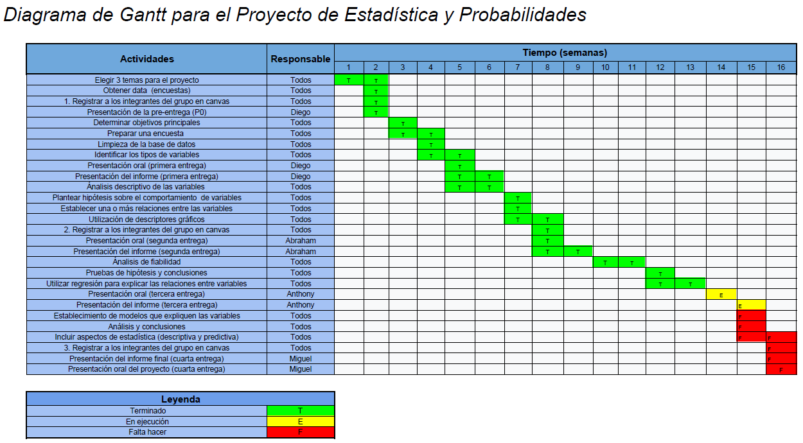

```{r include=FALSE}
library(tidyverse)
library(ggmosaic)
theme_update(plot.title = element_text(hjust = 0.5))
```

```{r include=FALSE}
DF0 <- read_csv("./data.csv")
variables <- read_csv("./variables.csv")
indicadores <- read_csv("./indicadores.csv")
```

```{r}
CV<-function(X){
        return(sd(X, na.rm = TRUE)/mean(X, na.rm = TRUE))
}
report<-function(X){
        return(
          list(
            Media=mean(X, na.rm = TRUE),
            Mediana=median(X, na.rm = TRUE),
            Desviacion=sd(X, na.rm = TRUE),
            Varianza=var(X, na.rm = TRUE),
            CV=CV(X)
            )
          )
}
```
# Correcciones
1. Se agregó la descripción a la tabla donde presentamos las variables
2. Se modificó los títulos y nombres de los ejes en las gráficas de forma más clara
3. Se revisó el lenguaje estadístico
4. Se agregó bibliografía


# Introducción
El uso de redes sociales abre muchas puertas a la comunicación humana y sobretodo en estos tiempos, en los que aún no todavía reunirnos con nuestros familiares y amigos, su rol ha sido fundamental. Sin embargo no todos son pros, el uso excesivo de redes sociales puede ser catalogado cómo adicción. De esta manera, el comportamiento de los usuarios puede cambiar, muchas veces, negativamente.


Los jóvenes universitarios somos de los que más usan las redes sociales. Ya sea por motivos de estudio o por socializar, usamos al menos una red social. En este sentido, este trabajo analizará la relación que existe entre el comportamiento de los estudiantes y su uso de las redes sociales.

## Justificación

El desarrollo de este proyecto es conveniente debido a que posibilitará conocer el estado actual del uso de las redes sociales de los estudiantes, como también su relación con el comportamiento de los estudiantes para que de alguna manera se tomen medidas de acuerdo al caso.

## Objetivos del proyecto
**Objetivo principal**

Determinar la relación que existe entre la adicción por las redes sociales y el comportamiento de los estudiantes

**Objetivos específicos**

- Evaluar si existe una relación entre las horas que dedica un estudiante a las redes sociales y la necesidad que siente de estar conectado.

- Evaluar si los alumnos becados pasan más horas en redes sociales que los no becados.

- Evaluar si el deporte influye en los problemas por adicción a redes sociales.

- Evaluar si los alumnos becados tienen más problemas por usar redes sociales que los no becados.
- Analizar qué redes sociales influyen más en la obsesión por estar informado.

## Marco Teórico
**Instrumento**: Encuesta diseñada en Google Forms.

**Población**: Comunidad de estudiantes de UTEC.

**Muestra**: 154 estudiantes que cursaron el período 2020-2 de la UTEC.

**Tipo de muestreo**: Muestreo por conveniencia (el que accede a participar es parte de la muestra).

**Interesados**: Comunidad universitaria de UTEC, Bienestar estudiantil, Alumnos en general.

Se utilizó el cuestionario desarrollado por *Cabero A. Julio et al. (2020)* en el trabajo de investigación "Escala para medir la adicción de estudiantes a las redes sociales", en donde se utilizan factoriales para construir una escala que mide la adicción a redes sociales en 4 indicadores

## Factibilidad
Este proyecto de investigación es factible, porque nosotros los estudiantes accedemos y participamos frecuentemente de las redes sociales. Por ello, a través de las distintas entregas se evidenciarán descubrimientos relacionados al uso de redes sociales, comportamiento del estudiante y como se encuentran relacionados (si es que existiera relación).

## Diagrama de Gantt



# Presentando las variables
```{r}
variables
variables %>% 
  group_by(Subtipo) %>% 
  summarise(Cantidad = n())
  
```
Número de observaciones:
```{r}
nrow(DF0)
```

# Funciones

## Aproximación

```{r}
aproxDerecha <- function(x, decimales) {
  plop <- round(x, decimales)
  
  if(plop >= x){
    x <- plop
  } else {
    x <- plop + 1/10**decimales
  }
  x
}

aproxIzquierda <- function(x, decimales) {
  plop <- round(x, decimales)
  
  if(plop <= x){
    x <- plop
  } else {
    x <- plop - 1/10**decimales
  }
  x
}

r2 <- function(x){
  round(x, digits = 2)
}
```

## Intervalos de confianza

### `meanCI(conf, muestra, sd, media, conozco_sd)`
```{r}
meanCI <- function(conf, muestra, sd, media, conozco_sd) {
  if(conozco_sd) {
    cuantil<- qnorm(p=conf/2+0.5)
    distribucion <- "normal"
  } else {
    cuantil<- qt(p=conf, df=muestra-1)
    distribucion <- "T-Student"
  }
  
  error <- cuantil * sd / sqrt(muestra)
  lim_inf <- media - error 
  lim_inf <- aproxIzquierda(lim_inf, 2)

  lim_sup <- media + error
  lim_sup <- aproxDerecha(lim_sup, 2)
  
  error <- r2(error)
  media <- r2(media)
  sprintf("Al utilizar una distribución %s en la muestra de tamaño %i con una confianza de %g se obtuvo que la media real es %g con un error de +/- %g, es decir, esta se encuentra en el intervalo [%g; %g]", distribucion, muestra, conf, media, error, lim_inf, lim_sup)
}
```
### `propCI(conf, muestra, buenos)`
```{r}
propCI <- function(conf, muestra, buenos) {
  cuantil<- qnorm(p=conf/2+0.5)
  
  prop <- buenos/muestra
  
  error <- cuantil * sqrt(prop*(1-prop)/muestra)
  lim_inf<- prop - error
  lim_inf <- aproxIzquierda(lim_inf, 2)
  
  lim_sup<- prop + error
  lim_sup <- aproxDerecha(lim_sup, 2)
  prop <- r2(prop)
  error <- r2(error)
  
  sprintf("Al analizar la muestra de tamaño %i con una confianza de %g se obtuvo que la proporción real es %g con un error de +/- %g, es decir, esta se encuentra en el intervalo [%g; %g]", muestra, conf, prop, error, lim_inf, lim_sup)
}
```


## Tamaño de muestra
### `tamMuestraProp(conf, prop=0.5, error, pob)`
```{r}
tamMuestraProp <- function(conf, prop=0.5, error, pob){
  #Calcular nivel de confianza(Z)
  cuantil<- qnorm(p=conf/2+0.5)
  
  #Calcular tamaño de la muestra según la fórmula (n=z^2*p*(1-p)/e^2)
  tamu <- cuantil**2 * prop*(1-prop) / error**2

  #Si se conoce la población, se corrige la muestra:
  if(!missing(pob)){
    tamu <- tamu/(1+tamu/pob)
  }
  
  tamu <- aproxDerecha(tamu, 0)
  #Imprimir en pantalla
  sprintf("El tamaño de la muestra debe ser mayor o igual a %g para tener una confianza de %g en la proporción %g", tamu, conf, prop)
}
```

### `tamMuestraMedia(conf, sd, error)`
```{r}
tamMuestraMedia <- function(conf, sd, error){
  cuantil<- qnorm(p=conf/2+0.5)
  tamu <- (cuantil*sd/error)**2
  tamu <- aproxDerecha(tamu, 0)
  
  #Imprimir en pantalla
  sprintf("El tamaño de la muestra debe ser mayor o igual a %g para tener una confianza de %g en la media", tamu, conf)
}

```

# Descriptores de una variable
## Variables Cualitativas
### Variables Ordinales
#### Escala de pensión UTEC
```{r}
DF0 %>% 
  ggplot(aes(Escala)) + 
  geom_bar(stat="count") +
  ggtitle('Gráfico de barras: Escala de pensión de los\nestudiantes encuestados') +
  xlab('Escala de pensión') + 
  ylab('Número de estudiantes encuestados')
```


Se puede observar que la mayoría de encuestados son de escala E.


#### Raking académico
```{r}
DF0 %>% 
  drop_na(Ranking) %>%
  mutate(
    Ranking = fct_relevel(Ranking,
                          "Otro",
                          "Tercio",
                          "Quinto",
                          "Decimo")
  ) %>% 
  ggplot(aes(Ranking)) +
  geom_bar(stat="count") +
  ggtitle('Gráfico de barras: Ranking académico de los\nestudiantes encuestados') +
  xlab('Ranking académico') + 
  ylab('Número de estudiantes encuestados')
```


Se puede observar que la mayoría de encuestados es de ranking Otro, es decir los que están debajo del Tercio superior.

### Variables Nominales
#### Sexo

```{r}
DF0 %>% 
  group_by(Sexo) %>% 
  summarise(Frecuencia = n()) %>% 
  arrange(desc(Frecuencia))
```
Se puede ver que la mayoría de encuestados son de sexo masculino.

#### Departamento de residencia de los estudiantes

```{r}
DF0 %>% 
  group_by(Departamento) %>% 
  summarise(Frecuencia = n()) %>% 
  arrange(desc(Frecuencia)) 
```
Se puede ver que la mayoría de encuestados son del departamento Lima.

#### Carrera de los estudiantes

```{r}
DF0 %>% 
  drop_na(Carrera) %>%
  group_by(Carrera) %>% 
  summarise(Frecuencia = n()) %>% 
  arrange(desc(Frecuencia))
```
Se puede ver que la mayoría de encuestados estudian Ingeniería Industrial.

#### Estudiantes becados

```{r}
DF0 %>% 
  drop_na(Becado) %>%
  group_by(Becado) %>% 
  summarise(Frecuencia = n()) %>% 
  arrange(desc(Frecuencia))
```
Se puede ver que la mayoría de encuestados no están becados.

#### Estudiantes que trabajan

```{r}
DF0 %>% 
  drop_na(Trabajador) %>%
  group_by(Trabajador) %>% 
  summarise(Frecuencia = n()) %>% 
  arrange(desc(Frecuencia))
```
Se puede ver que la mayoría de encuestados no trabajaron.

#### Estudiantes que practican deporte regularmente

```{r}
DF0 %>% 
  drop_na(Deporte) %>%
  group_by(Deporte) %>% 
  summarise(Frecuencia = n()) %>% 
  arrange(desc(Frecuencia))
```
Se puede ver que la mayoría de encuestados no hacían deporte regularmente

#### Estudiantes que juegan videojuegos regularmente

```{r}
DF0 %>% 
  drop_na(Videojuegos) %>%
  group_by(Videojuegos) %>% 
  summarise(Frecuencia = n()) %>% 
  arrange(desc(Frecuencia))
```
Se puede ver que la mayoría de encuestados no jugaban videojuegos regularmente

#### Primera red social favorita de los estudiantes

```{r}
DF0 %>% 
  drop_na(RF1) %>%
  group_by(RF1) %>% 
  summarise(Frecuencia = n()) %>% 
  arrange(desc(Frecuencia))
```
Se puede ver que la primera red social favorita de la mayoría de encuestados es Instagram

#### Segunda red social favorita de los estudiantes encuestados

```{r}
DF0 %>% 
  drop_na(RF2) %>%
  group_by(RF2) %>% 
  summarise(Frecuencia = n()) %>% 
  arrange(desc(Frecuencia))
```
Se puede ver que la segunda red social favorita de la mayoría de encuestados es Facebook

## Variables Cuantitativas
### Variables Discretas
#### Edad de los estudiantes encuestados
```{r}
DF0 %>% 
  drop_na(Edad) %>% 
  ggplot(aes(Edad)) +
  geom_bar(stat="count") +
  xlab('Edad') + 
  ylab('Número de estudiantes encuestados') + 
  ggtitle('Gráfico de barras: Edad de los\nestudiantes encuestados') +
  scale_x_continuous(n.breaks=10)
```


Se puede observar que la edad con mayor frecuencia es 18 años, es decir, esta es la moda.

```{r}
DF0 %>% 
  ggplot(aes(Edad))+
  geom_boxplot(
    outlier.color = "red",
    outlier.alpha = 0.2,
  ) +
  scale_x_continuous(n.breaks=10) +
  ggtitle('Diagrama de caja: Edad de los\nestudiantes encuestados') +
  geom_vline(
    aes(xintercept = mean(DF0$Edad, na.rm=TRUE)), 
    color="red")
  
```


Adicionalmente, elaboramos una gráfica de caja y bigotes, donde podemos observar que *al menos* la mitad de alumnos tiene entre 18 y 20 años (contanto 18 y 20).
```{r}
mapply(report, list(Edad = DF0$Edad))
```
A partir de la mediana y la media, podemos afirmar que hay un sesgo a la derecha, pues la media es mayor.


#### Edad de inicio en redes sociales de los estudiantes encuestados
```{r}
DF0 %>% 
  drop_na(Inicio) %>% 
  ggplot(aes(Inicio)) +
  geom_bar(stat="count") +
  xlab('Edad de inicio en redes sociales') + 
  ylab('Número de estudiantes encuestados') + 
  ggtitle('Diagrama de barras: Edad de inicio en redes sociales de los\nestudiantes encuestados') +
  scale_x_continuous(n.breaks=10)
```


Se puede observar que la edad de inicio en redes sociales con mayor frecuencia es 12 años, es decir, esta es la moda.

```{r}
DF0 %>% 
  drop_na(Inicio) %>% 
  ggplot(aes(Inicio))+
  geom_boxplot(
    outlier.color = "red",
    outlier.alpha = 0.2
  ) +
  scale_x_continuous(n.breaks=10) +
  ggtitle('Diagrama de caja: Edad de inicio en redes sociales de los\nestudiantes encuestados') +
  xlab('Edad de inicio en redes sociales') +
  geom_vline(
    aes(xintercept = mean(DF0$Inicio, na.rm=TRUE)), 
    color="red")
```


Adicionalmente, elaboramos una gráfica de caja y bigotes, donde podemos observar que *al menos la mitad* de encuestados está activo en redes sociales desde los  11, 12 o 13 años
```{r}
mapply(report, list(Inicio = DF0$Inicio))
```
A partir de la mediana y la media, se observa que hay un sesgo a la derecha pero muy pequeño, porque la diferencia entre la media y mediana es mínima.


### Variables Continuas
#### Promedio ponderado del semestre
```{r}
DF0 %>% 
  ggplot(aes(Promedio)) +
  geom_histogram(breaks=seq(0, 20, by=2.5), col='black', fill='green', alpha=0.4) +
  xlab('Promedio ponderado del semestre') + 
  ylab('Número de estudiantes encuestados') + 
  ggtitle('Histograma: Promedio ponderado del semestre de los\nestudiantes encuestados') 
```


La mayoría de encuestados obtuvo un promedio de 15 a 17.5 puntos.
Se puede observar que la mayoría aprobó, pues tienen un promedio mayor a 12.5.
```{r}
DF0 %>% 
  ggplot(aes(Promedio))+
  geom_boxplot(
    outlier.color = "red",
    outlier.alpha = 0.2
  ) +
  xlab('Promedio ponderado del semestre') + 
  scale_x_continuous(breaks=seq(9, 19, by=1)) +
  ggtitle('Diagrama de caja: Promedio ponderado del semestre de los\nestudiantes encuestados') +
  geom_vline(
    aes(xintercept = mean(DF0$Promedio, na.rm=TRUE)), 
    color="red")
```


Al menos el 50% de los encuestados tiene un promedio entre 14 y 16.37 puntos.
Hay un dato atípico, que es el menor, y es de 9.10 puntos.

```{r}
mapply(report, list(Promedio = DF0$Promedio))
```
Podemos concluir que el sesgo tiende a la izquierda porque hay un dato atípico a la izquierda.


#### Indicadores de adicción a redes sociales

Para medir la adicción a las redes sociales que tiene cada alumno, elaboramos un cuestionario con las preguntas que presentan Cabero, Pérez y Valencia (2020) en su artículo "Escala para medir la adicción de estudiantes a las redes sociales". En este trabajo los autores utilizan métodos de rotación factorial para encontrar lo que aporta cada item (pregunta) del cuestionario en los siguientes indicadores:

- `GeneranSatisfaccion`: Usar redes sociales le genera satisfacción
- `GeneranProblemas`: Usar redes sociales le genera problemas
- `ObsesionInformado`: Está obsesionado por estar informado
- `ObsesionConectado`: Está obsesionado por estar conectado

Las preguntas y lo que aportan a cada indicador se resumen en la siguiente tabla:

```{r}
indicadores
```

```{r}
DF0 %>% 
  drop_na(GeneranSatisfaccion) %>%
  ggplot(aes(GeneranSatisfaccion))+
  geom_boxplot(
    outlier.color = "red",
    outlier.alpha = 0.2
  )+
  geom_vline(
    aes(xintercept = mean(DF0$GeneranSatisfaccion, na.rm=TRUE)), color="red") +
  ggtitle('Diagrama de caja: Indicador "usar redes sociales le genera satisfacción"') +
  xlab('Indicador "usar redes sociales le genera satisfacción"')

DF0 %>% 
  drop_na(GeneranProblemas) %>%
  ggplot(aes(GeneranProblemas))+
  geom_boxplot(
    outlier.color = "red",
    outlier.alpha = 0.2
  )+
  geom_vline(
    aes(xintercept = mean(DF0$GeneranProblemas, na.rm=TRUE)), color="red") +
  ggtitle('Diagrama de caja: Indicador "usar redes sociales le genera problemas"') +
  xlab('Indicador "usar redes sociales le genera problemas"')

DF0 %>% 
  drop_na(ObsesionInformado) %>%
  ggplot(aes(ObsesionInformado))+
  geom_boxplot(
    outlier.color = "red",
    outlier.alpha = 0.2
  )+
  geom_vline(
    aes(xintercept = mean(DF0$ObsesionInformado, na.rm=TRUE)), color="red") +
  ggtitle('Diagrama de caja: Indicador "está obsesionado por estar informado"') +
  xlab('Indicador "está obsesionado por estar informado"')

DF0 %>% 
  drop_na(ObsesionConectado) %>%
  ggplot(aes(ObsesionConectado))+
  geom_boxplot(
    outlier.color = "red",
    outlier.alpha = 0.2
  )+
  geom_vline(
    aes(xintercept = mean(DF0$ObsesionConectado, na.rm=TRUE)), color="red") +
  ggtitle('Diagrama de caja: Indicador "está obsesionado por estar conectado"') +
  xlab('Indicador "está obsesionado por estar conectado"')

mapply(report, list(GeneranSatisfaccion = DF0$GeneranSatisfaccion, 
                    GeneranProblemas = DF0$GeneranProblemas,
                    ObsesionInformado = DF0$ObsesionInformado,
                    ObsesionConectado = DF0$ObsesionConectado))
```
Las gráficas sugieren que hay un mayor sesgo en las variables GeneranProblemas y ObsesionInformado ya que hay una separación significativa entre la mediana y la media.


Las gráficas sugieren que el indicador "está obsesionado por estar informado" (`ObsesionInformado`) es el más alto en los estudiantes encuestados.


# Descriptores de multiples variables
## Relación entre el indicador "está obsesionado por estar conectado" y las horas que invierte el estudiante en redes sociales

A continuación se muestra el diagrama de dispersión de estas variables:
```{r}
DF1 <- DF0 %>% 
  mutate(
    HorasRF = HorasRF1 + HorasRF2
  )
DF1 %>% 
  drop_na(HorasRF) %>%
  drop_na(ObsesionConectado) %>%
  ggplot(aes(HorasRF, ObsesionConectado)) +
  geom_point(aes(colour = "red", alpha = 0.2), show.legend = FALSE) +
  geom_smooth(method = "lm", se = FALSE, formula = 'y ~ x') +
  xlab("Horas que invierte en redes sociales") +
  ylab('Indicador "está obsesionado por\nestar conectado"') +
  ggtitle('Diagrama de dispersión: Indicador "está obsesionado\npor estar conectado" y horas que invierte el\nestudiante en redes sociales')
```

```{r}
mapply(report, list(ObsesionConectado = DF1$ObsesionConectado, HorasRF = DF1$HorasRF))
```

**Correlación**
```{r}
cor(DF1$ObsesionConectado, DF1$HorasRF, use = "complete.obs")
```


La gráfica y la correlación sugieren que mientras más horas invierta un estudiante en redes sociales, mayor será su indicador de "está obsesionado por estar conectado".


## Relación entre el indicador "usar redes sociales le genera satisfacción" y las horas que invierte el estudiante en redes sociales

```{r}
DF1 %>% 
  drop_na(HorasRF) %>%
  drop_na(GeneranSatisfaccion) %>%
  ggplot(aes(HorasRF, GeneranSatisfaccion)) +
  geom_point(aes(colour = "red", alpha = 0.2), show.legend = FALSE) +
  geom_smooth(method = "lm", se = FALSE, formula = 'y ~ x') +
  xlab("Horas que invierte en redes sociales") +
  ylab('Indicador "usar redes sociales le\ngenera satisfacción"') +
  ggtitle('Diagrama de dispersión: Indicador "usar redes sociales\nle genera satisfacción" y horas que invierte el \n estudiante en redes sociales')
```

**Correlación**
```{r}
cor(DF1$HorasRF, DF1$GeneranSatisfaccion, use = "complete.obs")
```


De esto se puede concluir que existe una correlación entre el promedio ponderado del alumno y la obsesión que tiene por estar informado.
El coeficiente de variación y la gráfica indican que mientras mayor sea el índice de obsesión, mayor será su promedio ponderado


## Escala de pensión y sexo de los estudiantes encuestados

```{r}
DF0 %>% 
  drop_na(Sexo) %>%
  drop_na(Escala) %>%
  ggplot() +
    geom_mosaic(aes(x = product(Sexo, Escala), fill=Escala)) +
  ggtitle('Diagrama de mosaico: Escala de pensión y sexo de los estudiantes encuestados') +
  xlab('Escala de pensión')
```
```{r}
DF0 %>% 
  group_by(Escala) %>% 
  summarise(Masculino = sum(Sexo == "Masculino"),
            Femenino = sum(Sexo == "Femenino"),
            Otro = sum(Sexo == "Otro"))
```


En todas las escalas hay mayor cantidad de alumnos con sexo masculino.


La mayoría de hombres y mujeres encuestados están en escala E.


## Horas por día que inverten en redes sociales los estudiantes encuestados becados y no becados

```{r}
DF1 %>% 
  drop_na(Becado) %>%
  drop_na(HorasRF) %>%
  ggplot(mapping = aes(x = HorasRF,
                     fill = Becado, color = Becado)) +
  geom_histogram(breaks=seq(0, 20, by=2.5), position = 'identity',
                 alpha = 0.2) +
    ggtitle('Histograma: Horas por día que inverten en redes sociales los estudiantes\nencuestados becados y no becados') +
  xlab('Horas por día que invierte en redes sociales') + 
  ylab('Número de estudiantes encuestados')
    
```


La gráfica sugiere que la mayoría de los estudiantes tanto becados como no becados invierte entre 2.5 y 5 horas al día
```{r}
DF1 %>% 
  drop_na(Becado) %>%
  drop_na(HorasRF) %>%
  ggplot(aes(x=HorasRF, y=Becado)) +
  geom_boxplot(
    outlier.color = "red",
    outlier.alpha = 0.2) +
  stat_summary(fun = mean, geom = "point", col = "Blue") +
  ggtitle('Diagrama de cajas: Horas por día que inverten en redes sociales los estudiantes\nencuestados becados y no becados') +
  xlab('Horas por día que invierte en redes sociales')

```


Los becados presentan más valores atípicos. Las gráficas sugieren que los estudiantes becados utilizan un poco menos las redes sociales, pues la media y mediana de los no becados son menores.

```{r}
DF1 %>% 
  group_by(Becado) %>% 
  summarise(mediana = median(HorasRF, na.rm = TRUE),
            media = mean(HorasRF, na.rm = TRUE))
```


Ambos tienen sesgo a la derecha, porque la media es mayor que la mediana. Pero el sesgo en no becados es mayor

## Indicador "usar redes sociales le genera problemas" en estudiantes encuestados que practican deporte regularmente y no
```{r}
DF0 %>% 
  drop_na(Deporte) %>%
  drop_na(GeneranProblemas) %>%
  ggplot(aes(x=GeneranProblemas, y=Deporte)) +
  geom_boxplot(
    outlier.color = "red",
    outlier.alpha = 0.2) +
  stat_summary(fun = mean, geom = "point", col = "Blue") +
  ggtitle('Diagrama de cajas: Indicador "usar redes sociales le genera problemas"\nen los estudiantes encuestados que practican\ndeporte regularmente y los que no') +
  xlab('Indicador "usar redes sociales le genera problemas"')

```

```{r}
DF0 %>% 
  group_by(Deporte) %>% 
  summarise(
    mediana = median(GeneranProblemas, na.rm = TRUE),
    media = mean(GeneranProblemas, na.rm = TRUE))
```

El diagrama de cajas sugiere que los alumnos que no practican deporte tienen un mayor indicador "usar redes sociales le genera problemas".


## Becado y ObsesionConectado
```{r}
DF0 %>% 
  drop_na(Becado) %>%
  drop_na(ObsesionConectado) %>%
  ggplot(aes(x=ObsesionConectado, y=Becado)) +
  geom_boxplot(
    outlier.color = "red",
    outlier.alpha = 0.2) +
  stat_summary(fun = mean, geom = "point", col = "Blue") +
  ggtitle('Diagrama de cajas: Indicador "está obsesionado por estar conectado"\nen los estudiantes encuestados becados y no becados') +
  xlab('Indicador "está obsesionado por estar conectado"')

```

```{r}
DF0 %>% 
  group_by(Becado) %>% 
  summarise(
    mediana = median(ObsesionConectado, na.rm = TRUE),
    media = mean(ObsesionConectado, na.rm = TRUE)
    )
```
La gráfica sugiere que los estudiantes becados tienen un mayor indicador "está obsesionado por estar conectado".


# Intervalos de confianza
## Media del indicador "está obsesionado por estar informado"

Comenzaremos analizando el tipo de distribución que tiene la variable `ObsesionInformado`
```{r}
hist(DF0$ObsesionInformado, 
     freq = FALSE,
     main='Histograma: Indicador "está obsesionado\n por estar informado"',
     xlab = 'Indicador "está obsesionado\ncon estar informado"',
    ylab = 'Densidad')
curve(
  dnorm(x,
        mean = mean(DF0$ObsesionInformado, na.rm = TRUE),
        sd = sd(DF0$ObsesionInformado, na.rm = TRUE)),
  from = 0, to = 1, add = TRUE)
```


La gráfica muestra algo parecido a una campana de Gauss, por lo que sugiere tener una distribución normal.

A continuación calcularemos el intervalo de confianza para esta muestra.
```{r}
meanCI(
  conf = .95, 
  muestra = sum(!is.na(DF0$ObsesionInformado)), 
  sd = sd(DF0$ObsesionInformado, na.rm=TRUE), 
  media = mean(DF0$ObsesionInformado, na.rm = TRUE), 
  conozco_sd = FALSE)
```
Los cálculos sugieren que los estudiantes de UTEC tienen un indicador "está obsesionado por estar informado" de 0.51 con +/- 0.03 de error y significancia de 5%. 

## Proporción de alumnos que se sienten regularmente satisfechos cuando usan redes sociales.

Para esto comenzaremos planteando que aquellos alumnos cuyas respuestas en el formulario generaron un indicador "usar redes sociales le genera satisfacción" mayor a 0.5 son aquellos que están regularmente satisfechos usando redes sociales.

Con esto en cuenta, calculamos la cantidad de alumnos satisfechos y no satisfechos:
```{r}
DFx <- DF0 %>% 
  drop_na(GeneranSatisfaccion) %>% 
  mutate(
    satisfecho = GeneranSatisfaccion >= 0.5
  ) %>% 
  group_by(satisfecho) %>% 
  summarise(
    cantidad = n()
  )
DFx
```
 
```{r}
propCI(conf = .95, muestra = sum(DFx$cantidad), buenos = DFx$cantidad[2])
```
Podemos concluir que la cantidad de alumnos regularmente satisfechos con las redes sociales está entre 6 y 19%  


# Variables aleatorias
## Indicador "está obsesionadon por estar conectado"

Comenzaremos graficando el histograma de la variable ObsesionConectado junto a su curva normal:
```{r}
hist(DF0$ObsesionConectado, 
     freq = FALSE,
     main='Histograma: Indicador "está obsesionado\n por estar conectado"',
     xlab = 'Indicador "está obsesionado\ncon estar conectado"',
    ylab = 'Densidad')
curve(
  dnorm(x,
        mean = mean(DF0$ObsesionConectado, na.rm = TRUE),
        sd = sd(DF0$ObsesionConectado, na.rm = TRUE)),
  from = 0, to = 1, add = TRUE)
```


De acuerdo a la curva de densidad que describe la densidad de probabilidades en la distribución de valores de las observaciones, se puede deducir que, es una distribución relativamente simétrica y los valores altos de probabilidad radican en 0.4 y 0.6.


# Prueba de hipótesis
## La media del indicador "está obsesionado por estar informado" es 0.5

Para probar esta hipótesis definiremos las hipótesis nula y alternativa como:


H0: La media de la variable es 0.5


H1: La media de la variable no es 0.5


```{r}
t.test(DF0$ObsesionConectado, mu = 0.5)
```
El p-valor obtenido en esta prueba es menor a el nivel de significancia (0.5), entonces rechazamos la hipótesis nula (H0).


 ## "Los alumnos becados usan las redes sociales con menor frecuencia que los no becados"

Creamos una nueva tabla con las variables de interés: Horas que invierte el estudiante en redes sociales y si es becado o no
```{r}
DF1 <- DF0 %>% 
  mutate(
    HorasRF = HorasRF1+HorasRF2
  ) %>% 
  select(
    Becado,
    HorasRF
  )

```

Como primer paso utilizamos un diagrama de cajas para ver si hay diferencia en las medias y medianas:
```{r}
DF1 %>% 
  drop_na(Becado) %>%
  drop_na(HorasRF) %>%
  ggplot(aes(x=HorasRF, y=Becado)) +
  geom_boxplot(
    outlier.color = "red",
    outlier.alpha = 0.2) +
  stat_summary(fun = mean, geom = "point", col = "Blue") +
  ggtitle('Diagrama de cajas: Horas por día que inverten en\nredes sociales los estudiantes encuestados\nbecados y no becados') +
  xlab('Horas por día que invierte en redes sociales')
```


Las medias y medianas son menores en el caso de los alumnos becados. La gráfica sugiere que nuestra hipótesis es correcta.


A continuación analizaremos si cantidad de horas por día que invierte un estudiante en las redes sociales tiene una distribución normal:

```{r}
DF1 %>% 
  drop_na(HorasRF) %>%
  ggplot(aes(HorasRF))+
  geom_density(alpha=0.2, color="blue", fill="blue")+
  xlab('Horas por día que invierte en redes sociales') +
  ylab('Densidad') +
  ggtitle('Gráfica de densidad: Horas por día que invierten\nen redes sociales los estudiantes encuestados')
```


La gráfica sugiere que la variables no tiene una distribución normal. Para asegurarnos, haremos una prueba de hipótesis: la prueba Shapiro para normalidad.


H0: La variable tiene una distribución normal


H1: La variables no tiene una distribución normal

```{r}
shapiro.test(DF1$HorasRF)
```

Haciendo el test de Shapiro-Wilk, el p-valor obtenido es menor que la significancia, por lo tanto rechazamos la hipótesis nula (H0). Entonces, con una confianza de 95%, la variable no tiene una distribución normal.

Como esta distribución no es normal, no podemos usar pruebas paramétricas. Para este caso usaremos la prueba U de Mann-Whitney. Pero antes debemos separar la data en dos grupos según si el estudiante es becado o no.

```{r}
becado <- DF1 %>% 
  filter(Becado == "Sí") %>% 
  select(HorasRF)

noBecado <- DF1 %>% 
  filter(Becado == "No") %>% 
  select(HorasRF)
```


H0: La diferencia entre las medias de los dos grupos es 0


H1: La diferencia entre las medias de los dos grupos no es 0
```{r}
wilcox.test(becado$HorasRF, noBecado$HorasRF)
```

Con el test de Mann-Whitney obtenemos un p-valor mayor a 0.05, por lo tanto, debemos aceptar la hipótesis nula (H0).

Por lo tanto, debemos rechazar la hipótesis de que los alumnos becados usan las redes sociales con menos frecuencia.


## Mientras mayor sea el indicador "está obsesionado por estar informado", mayor será su indicador "está obsesionado por estar conectado

```{r}
DF0 %>% 
  drop_na(ObsesionInformado) %>%
  drop_na(ObsesionConectado) %>%
  ggplot(aes(ObsesionInformado, ObsesionConectado)) +
  geom_point(aes(colour = "red", alpha = 0.2), show.legend = FALSE) +
  geom_smooth(method = "lm", se = FALSE, formula = 'y ~ x') +
  xlab('Indicador "está obsesionado por estar informado"') +
  ylab('Indicador "está obsesionado por\nestar conectado"') +
  ggtitle('Diagrama de dispersión: Indicadores "está obsesionado\npor estar conectado" y "está obsesionado\npor estar informado"')
```

```{r}
cor(DF0$ObsesionConectado, DF0$ObsesionInformado, use = "complete.obs")
```

La gráfica y la correlación sugieren que mientras mas obsesionado por estar informado esté el estudiante, mayor será su obsesión por estar conectado.


Para validar esta hipótesis, haremos un test de correlación.

Comenzaremos por analizar qué distribución tienen las variables:

1. Indicador "está obsesionado por estar informado" tiene una distribución normal. Se calculó con una confianza de 95% para el intervalo de confianza 1.
2. Indicador "está obsesionado por estar conectado" tiene una distribución normal. Se calculó con una confianza de 95% para la prueba de hipótesis 1.

Como ambas variables tienen distribución normal, podemos usar el test de correlación de pearson:


H0: No existe relación lineal entre las variables


H1: Existe relación lineal entre las variables

```{r}
cor.test(DF0$ObsesionConectado, DF0$ObsesionInformado, method = "pearson")
```
Como el p-valor es menor a 0.05, rechazamos la hipótesis nula (H9). Por lo tanto con una confianza de 95%, podemos afirmar que existe una relación lineal entre estos indicadores.


La correlación sugiere que hay una relación lineal débil, pues es menor a 0.6.


A continuación planteamos un modelo lineal:
```{r}
lm(DF0$ObsesionConectado ~ DF0$ObsesionInformado)
```
La ecuación quedaría de esta manera:


`ObsesionConectado` = 0.603 * `ObsesionInformado` + 0.1427

Plantearemos el hipotético caso de que el encuestado tiene un indicador "está obsesionado por estar informado" (`ObsesionInformado`) de 0.5. ¿Cuál sería su indicador "está obsesionado por estar conectado" (`ObsesionConectado`)?


Según la ecuación de correlación:


`ObsesionConectado` = 0.603 * 0.5 + 0.1427


`ObsesionConectado` = 0.4442


# Bibliografía
1. Cabero-Almenara, Julio, Pérez-Díez de los Ríos, José Luis, & Valencia-Ortiz, Rubicelia. (2020).* Escala para medir la adicción de estudiantes a las redes sociales.* Convergencia, 27, e11834. Epub 29 de mayo de 2020. https://doi.org/10.29101/crcs.v27i83.11834

# Autores

1. Campos Bivanco, Abraham Benjamin
2. **Cueva Paredes, Anthony Ivan (Presentador) **
3. Escajadillo Guerrero, Diego Antonio
4. Machaca Ramirez, Diego
5. Pinto Condori, Miguel Angel Jordan

 