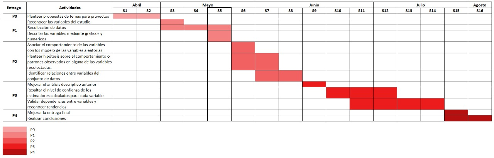

```{r eval=TRUE, echo=FALSE, message=FALSE, warning=FALSE}

redondeo<-function(x){
  result<-round(x,2)
  return(result)
}

```
```{r eval=TRUE, echo=FALSE, message=FALSE, warning=FALSE}
library(dplyr)
library(readr)
#install.packages("ftdh")
library(stringr)
library(modeest)
#library(ftdh)
DF<- read_csv("Kpop.csv")
DR<- read_csv("RestauranteKpop.csv")
```


## Índice

1. Introducción
2. Objetivos
3. Marco Teórico
4. Descriptores Numéricos y Gráficos
5. Estudio de población y mercado
6. Variables aleatorias
7. Representatividad de la muestra
8. PLanteamiento y pruebas de hipótesis
9. Regresión
10. Conclusión

## 1. Introducción

##### **Importancia**

Consideramos que el tema es relevante debido a que un **estudio de mercado** que refleje las preferencias de los productos de fanáticos del género **K-pop** aportará ideas para el entendimiento del mercado relacionado a este género musical. Nuestro estudio permitirá recomendar a los nuevos emprendimientos o tiendas sobre los productos y servicios que se podrían lanzar al mercado. Para ello, lo primero que se realizará será analizar a la población seguidorá del K-pop, para así reconocer sus características y preferencias. Finalmente, podemos decir que este proyecto es de interés para los nuevos emprendimientos y tiendas que deseen ofertar un producto o servicio relaciona al K-pop, puesto que al conocer a la población y sus demandas asegurarán clientes y, por ende, ingresos. 

##### **Justificación**

Es **interesante** porque desde la llegada del K-pop al Perú, los fanáticos de este género han ido aumentando a través de los años, la evidencia más clara de interés se puede observar en el Campo de Marte, donde una gran multitud se reúne a practicar coreografías, escuchar canciones de las distintas bandas y en sí compartir más de este género musical. El apogeo del K-pop conlleva a un nuevo mercado asociado a los productos de la cultura asiática, a pesar de esto, aún no se conoce las características de esta población, esta limitación genera que la inserción de un mercado en este entorno sea mucho más complicado, muestra de ello es que solo existe una tienda en todo el país que oferta sus productos, “Kasoo”. 

Es **factible** porque la comunidad del K-pop accede y participa frecuentemente en las redes sociales, medio por el cual difundiremos nuestra encuesta. Además, trabajamos con un dataframe que contiene las preferencias de los productos de la comunidad K-pop obtenidas por medio de una encuesta corta a través de google forms.

Es **específico** porque se centra en una sola población la cual es **seguidores del K-pop**, siendo un grupo de fácil alcance.

Es **desconocido** porque no encontramos un **estudio de población** que brinde las **caracteristicas** y **demandas** actuales de este sector, el cual permita realizar la inserción de un producto o servicio al mercado.

A continuación, presentamos un plan que permite llevar a cabo el trabajo en los plazos planteados.

```{r,echo=FALSE, out.width="120%", fig.align='center'}
  
```


## 2. Objetivos

##### **Objetivo General**

Conocer las características de la población seguidora del K-pop y encontrar las particularidades de su demanda para determinar la mejor opción de emprendimiento que pueda ser lanzado a este mercado. 

##### **Objetivo secundarios o preguntas**
- ¿Cuáles son las características de la población seguidora del K-pop en el Perú?

- ¿Cuál es la mejor opción de servicio o producto que un emprendedor puede sacar al mercado para la población seguidora del K-pop?

- ¿Qué características debe tener el producto o servicio para cumplir con la demanda de la población del K-pop?

## 3. Marco Teórico

##### **Población objetivo**
* Comunidad k-POP del Perú

##### **Tipo de muestreo**
* Muestreo por conveniencia 

##### **Sesgo**
* Sesgo de selección 

##### **Unidades muestrales**
* 192 encuestados
```{r}
sum(!complete.cases(DF))
sum(complete.cases(DF))
```


##### **Interesados**

* Nuevos emprendimientos
* Distribuidores de productos asiáticos

##### **Obtención de datos**

**Obtención de datos**

La obtención de datos  se realizó a través de una encuesta sobre las preferencias y gustos en los productos del mercado K-pop

```{r, echo=FALSE, out.width="80%", fig.align='center'}


```


**Limpieza de datos de encuesta**

La limpieza de datos para esta parte consistió en mantener solo a las personas que son seguidoras del K-pop, descartando, mediante la pregunta 1, las demás observaciones. 

```{r eval=TRUE, echo=FALSE, message=FALSE, warning=FALSE}

DF<-rename(DF,"Seguidor"="Marca temporal","Sigues"="1. ¿Sigues el género K-pop?", "Edad"="2. ¿Qué edad tienes?","Genero"="3.¿Cuál es su género?", "Tiempo"="4. ¿Hace cuántos años sigue el K-pop?","Fanclub"="5. ¿Pertenece a algún fan club?","Preferencia"= "6. ¿Qué es lo que más le gusta del género K-pop?","Grupo"="7. ¿Cuál es su grupo favorito?","Importancia"="8. ¿Cuán importante considera el K-pop en su vida? Siendo 1 poco importante y 5 muy importante","Influencia"="9.  ¿De qué forma le llegó a gustar el K-pop?","Sentimiento"="10. ¿Cómo se siente al escuchar K-pop?","Medios"="11. ¿Qué medios de comunicación sueles utilizar para mantenerte al tanto del K-pop?","DineroCompras"="12. ¿Cuánto dinero (S/) mensualmente invierte en compras de productos relacionados al K-pop?","DineroServicios"="13. ¿Cuánto dinero (S/) mensualmente invierte en servicios relacionados al K-Pop?","Producto"="14. ¿Qué productos compras o comprarías relacionados al K-pop? Elija 1 de acuerdo a su preferencia","Servicio"="15. ¿A qué servicios recurre o recurriría con temática K-pop? Elija 1 de acuerdo a su preferencia","Exclusion"="16. ¿Te has sentido juzgado o discriminado por ser K-poper?" )

DR<-rename(DR,"Seguidor"="Marca temporal","Peso"="¿Cuál es su peso? En kg", "Estatura"="¿Cuál es su estatura? En cm","Tipo_Comida"="¿Qué tipo de comida preferiría que contenga la carta?", "Frec_Consum"="¿Cuántas veces al mes consume en un restaurante? Incluya las veces que pide comida por delivery por la situación actual","Inversion"="¿Cuánto gasta mensualmente al recurrir a restaurantes?","b_Comida"= "¿El tipo de comida determina su preferencia en un restaurante? Por ejemplo comida vegetariana, dietética, etc.","Tipo_Dieta"="¿Qué tipo de dieta alimenticia sigue?", "Kilocalorias"="¿Cuántas kilocalorías procura consumir en un plato de comida?" )


```

```{r eval=TRUE, echo=FALSE, message=FALSE, warning=FALSE}
DF_Filtrado <- DF %>% filter(Sigues == "Si" ) %>% select(Edad:Exclusion)# recordar que Edad - Tiempo>=4 para cuando se trabaje con la variable Tiempo

```
```{r, echo=FALSE, out.width="80%", fig.align='center'}

knitr::include_graphics("Filtrado.png")

```

##### **Variables**

**Variables de DataFrames(KP)**

|Pregunta|Variable|Tipo de variable|Restricciones|
|:----------------:|:----------:|:----------:|:------------:|
|¿Sigues el género K-pop?|Seguidor |Categórica Nominal |Sí y No|
|¿Qué edad tienes?|Edad |Numérica Discreta |Número entero mayor a 0 |
|¿Cuál es su sexo?|Gen|Categórica Nominal |Ninguna |
|¿Desde hace cuántos años sigue el K-Pop? |Seguimiento |Numérica Discreta |Número entero mayor a 0 |
|¿Qué es lo que más le gusta del género K-Pop? |Gusto_Total |Categórica Nominal |Ninguna |
|¿Cuál es su grupo favorito? |Grupo|Categórica Nominal |Ninguna |
|¿Cuán importante considera el K-Pop en su vida? |Importancia |Categórica Ordinal |Número entero entre 1 al 5 |
|¿De qué forma le llegó a gustar el K-Pop? |Gusto_Inicio |Categórica Nominal |Ninguna |
|¿Qué sienten al escuchar K-Pop? |Sentimiento |Categórica Nominal |Ninguna |
|¿Qué medios de comunicación sueles utilizar para informarte del mundo de K-pop? |Medios |Categórica Nominal |Ninguna |
|¿Cuánto dinero  invierte en compras de productos relacionados al K-Pop? |Gasto_Productos |Numérica Continua |Número racional mayor o igual a 0|
|¿Cuánto dinero  invierte en servicios relacionados al K-Pop? |Gasto_Servicios |Numérica Continua |Número racional mayor o igual a 0 |
|¿Qué productos compras (comprarías) relacionados al K-Pop? |Tipo_Producto |Categórica Nominal |Ninguna |
|¿A qué servicios recurre (recurriría) con temática K-Pop? |Tipo_Servicios |Categórica Nominal |Ninguna |
|¿Te has sentido juzgado o discriminado por ser k-poper? |Discriminacion |Categórica Nominal |Sí y No |


**Variable adicionales a partir del estudio de población (DR)**

|Variable|Tipo de variable|Restricciones|
|:-----:|:----------:|:----------:|
|Recurrencia|Numérica Discreta|Mayor o igual a 0|
|IMC|Numérica continua|Decimal positivo|
|InverM|Numérica Continua|Mayor o igual a 0|
|Peso|Numérica Continua|Mayor o igual a 40|
|Estatura|Numérica Continua|Mayor o igual a 150|
|T_Comida|Categórica Nominal|Ninguna|
|B_comida|Categórica Nominal|Sí y No|
|Tipo_Dieta|Categórica Nominal|Ninguna|
|Kilocalorias|Numérica Continua|Mayor o igual a 0|
|OMS_ims|Categórica Nominal|Ninguna|


También se insertó el indice de masa corporal para posterior análisis y esta fue clasificado en grupos de acuerdo a la organización mundial de la salud 

```{r eval=TRUE, echo=FALSE, message=FALSE, warning=FALSE}
DR<-mutate(DR, IMC= round(Peso/(Estatura/100)^2, 2))
```


Estas variables se agregaron al DataFrame(CR) como parte de un apoyo a la investigación de mercado y la realización del proyecto(Restaurante)

## 4. Descriptores 
Primero se realizará el análisis de las variables de la encuesta realizada, esto con el objetivo de conocerlos más y resaltar características importantes


### 4.1 Descriptores númericos

#### 4.1.1. Descriptores númericos población

#### **Edad:** 

```{r eval=TRUE, echo=FALSE, message=FALSE, warning=FALSE}
Numericos<-function(X){
  return(list(Min=redondeo(min(X,na.rm=T)),
              Max=redondeo(max(X,na.rm=T)),
              Moda=redondeo(mfv(X,na_rm = T)),
              Media=redondeo(mean(X,na.rm = T )), 
              Mediana=redondeo(median(X, na.rm = T)), 
              Desviacion=redondeo(sd(X,na.rm=T)), 
              Varianza=redondeo(var(X,na.rm = T)),
              CV=redondeo((sd(X,na.rm=T)/mean(X,na.rm=T)))))
}
```


```{r eval=TRUE, echo=FALSE, message=FALSE, warning=FALSE}
mapply(Numericos, list(Edad= DF_Filtrado$Edad))
```
##### Observaciones

  *  Moda: Una cantidad considerable de nuestros encuestados son jóvenes (19 años) que, al estar en proceso de desarrollo, están empezando a sentir nuevos gustos, en este caso el género K-pop. 
  *  Mediana: La mitad de las personas que les gusta el K-pop tienen una edad menor o igual que  18.89 años. Por lo que se puede deducir que existe un gran porcentaje de población bastante joven
  *  Media: La edad promedio que tienen las personas a las que les gusta el K-pop de la muestra es 18.89 años.
  *  Desviación estándar: Este valor demuestra la dispersión de datos que se tienen con respecto a la media de los mismo, dando a entender que nuestra población está entre los 15 a 20 años aproximadamente.
  *  Varianza: Por otro lado, este valor representa la variabilidad de las edades de nuestros encuestados con respecto a la media aritmética obtenida (18.89 años), lo cual nos permite saber cuán diferente pueden ser las edades de cada uno con respecto a la edad promedio.

##### **Años que ya llevan siguiendo al grupo**
```{r eval=TRUE, echo=FALSE, message=FALSE, warning=FALSE}
mapply(Numericos, list(Años_fan=DF$Tiempo))
```

#### Observaciones

   * Moda: La mayoria sigue el género desde hace un año, podemos decir que por el confinamiento 2020 hizo que una gran cantidad de personas conozcan el género musical  k_pop

   * Mediana: Al menos la mitad de la población ya sigue a esta banda por lo menos 3 años
   * Media:En promedio, las  K-popers a las que se realizó la encuesta ya llevan 3.57 años siguiendo este genero
   * Varianza: Los datos están dispersos, hay fanaticos que siguen este genero desde hace 17 años y otros recién empezaron a hacerlo.

##### **Inversión disponible para productos y servicios **
```{r eval=TRUE, echo=FALSE, message=FALSE, warning=FALSE}
Prod<- DF_Filtrado %>% filter(DineroCompras<500)
Servicio<- DF_Filtrado %>% filter(DineroServicios<500)
mapply(Numericos, list(Producto = as.numeric(Prod$DineroCompras), Servicio=as.numeric(Servicio$DineroServicios)))

```
#### Observaciones

   * Moda:Por más que la mayoría de los encuestados demostró sentir una gran admiración por el género estudiado, la mayoría de estas no invierte dinero alguno con respecto al K-pop.
* Mediana: Al menos la mitad de la población gasta 30 soles en productos K-pop y 10 soles en servicios
* Media:Se filtró los datos debido a que el gasto de la mayoria es menor a 500 soles, pero hay una parte que invierte cantidades inmensas, que haría que la media, al no ser robusta, sea mayor a 200 soles.
* Desviación estándar: Esto refleja la dispersión existente entre los datos y la media de los mismo, al tener un valor demasiado grande, se concluye que los datos están muy dispersos, y esto se demuestra con la mayoría de gastos nulos y los gastos muy significativos que tienen los otros.

#### 4.1.1. Descriptores númericos relacionada a la inserción de un restaurante


```{r eval=TRUE, echo=FALSE, message=FALSE, warning=FALSE, out.width = '90%'}
boxplot(DR$Frec_Consum, horizontal = TRUE,main="Distribución de frecuencia mensual con la que recurren a un restaurante", xlab="Frecuencia mensual con la que recurren a un restaurante",col="cyan2")
abline(v=mean(DR$Frec_Consum,na.rm=TRUE),col="blue",lwd=2)
```

**Observaciones**

* Los valores de la frecuencia con la que recurren a un restaurante presentan un sesgo hacia la derecha.

* Se observa 6 datos atípicos.


```{r eval=TRUE, echo=FALSE, message=FALSE, warning=FALSE, out.width = '85%'}
boxplot(DR$IMC, horizontal = TRUE,main="Distribución de IMC", xlab="Indice de masa corporal",col="khaki1")
abline(v=mean(DR$IMC,na.rm=TRUE),col="red",lwd=2)
abline(v=18.5,col="lightblue",lty=2)
abline(v=25,col="lightblue",lty=2)
```

**Observaciones**

* Los valores del IMC presentan un sesgo hacia la derecha.

* Se observa 4 datos atípicos.

* La mayor parte de las personas tienen un IMC adecuada. Sin embargo, hay algunas personas con un IMC alto.

```{r eval=TRUE, echo=FALSE, message=FALSE, warning=FALSE, out.width = '85%'}
boxplot(DR$Inversion, horizontal = TRUE,main="Distribución de inversión mensual", xlab="Inversión mensual en Restaurante (soles)",col="yellow")
abline(v=mean(DR$Inversion,na.rm=TRUE),col="chocolate4",lwd=2)
```

**Observaciones**

* Los valores de inversión mensual en restaurantes están sesgadas hacia la derecha

* Se observa 5 datos atípicos.


```{r eval=TRUE, echo=FALSE, message=FALSE, warning=FALSE, out.width = '85%'}
boxplot(DR$Kilocalorias, horizontal = TRUE,main="Distribución de las kilocalorías que desean consumir", xlab="Kilocalorías",col="lightpink2")
abline(v=mean(DR$Kilocalorias,na.rm=TRUE),col="blue",lwd=2)
```

**Observaciones**

* Los valores de Kilocalorías que quieren consumir presentan un sesgo hacia la derecha.

* Se observa 13 datos atípicos.

* Los datos atípicos se encuentra en ambos extremos.

### 4.2 Descriptores categóricos

#### **Género:** 

```{r eval=TRUE, echo=FALSE, message=FALSE, warning=FALSE}

#op=par(mfrow=c(2,1)) 

redondeo(table(DF_Filtrado$Genero)/nrow(DF_Filtrado))-> Genero
xx<-barplot(Genero,las=1,ylim = c(0,1),main = "Genero de la población K-pop",xlab = "Género",ylab = "Frecuencia", col=c("pink","blue","orange")) 
text(xx, Genero+.06, labels = Genero)

```

**Observaciones**

  * Se puede observar que dentro de la muestra, el genero femenino se encuentra en mayor proporción.
  
#### **Influencia que le hizo gustar el Kpop:** 

```{r eval=TRUE, echo=FALSE, message=FALSE, warning=FALSE}
redondeo(table(DF_Filtrado$Influencia)/nrow(DF_Filtrado))-> influencia
fg<-barplot(influencia,las=1,cex.names = 0.4 ,ylim = c(0,1),main = "Influencia recibida que le hizo comenzar a seguir el género Kpop",xlab = "Tipo de influencia",ylab = "Frecuencia",col=c("red","tan1","lightgoldenrod","yellow")) 
text(fg, influencia+0.05, labels = influencia)
``` 

**Observaciones**

  * La mayoría empezó a escuchar k-pop por la letra de las canciones
  
  
##### **Años que ya llevan siguiendo al grupo**

Analisis de la **distribución de años de seguimiento al K-pop** mediante una caja de bigotes:

```{r eval=TRUE, echo=FALSE, message=FALSE, warning=FALSE, out.width = '80%'}
boxplot(DF_Filtrado$Tiempo,horizontal = TRUE,main="Años de seguimiento al K-pop",xlab="Años",col="khaki1")
abline(v=mean(DF_Filtrado$Tiempo,na.rm=TRUE),col="darkgoldenrod4",lwd=2)

```

**Observaciones**
 
 * Los valores de la variable Años de seguimiento presentan un sesgo a la derecha, por lo que se podría interpretar que el genero musical de k-pop es nuevo en el Perú, excluyendo a los años atípicos que se observan en el gráfico 
 
 * El rango de los años seguidos es de 0 a 6 años
 
 * Existen 6 valores atípicos
 
#### **Variable Fanclub**

```{r eval=TRUE, echo=FALSE, message=FALSE, warning=FALSE}

redondeo(table(DF_Filtrado$Fanclub)/nrow(DF_Filtrado))-> Fanclub
yy<-barplot(Fanclub,ylim = c(0,1),main = "Cantidad de personas que pertenecen a un fanclub",xlab = "Pertenece a un fanclub",ylab = "Frecuencia",col=c("slateblue2","springgreen3")) 
text(yy, Fanclub+.06, labels = Fanclub)
```

**Observaciones**
 
* La mayoría de los fanáticos pertenece a un club de fans, lo que nos da pie a poder decir que existe diferentes comunidades en el Perú.

* Aunque casi la cuarta parte de la población no pertenece a un fan club, sus gustos y favoritismo al K-pop hacen que no sea de gran importancia pertenecer a lo mencionado anteriormente.

#### **Variable Preferencia**


```{r eval=TRUE, echo=FALSE, message=FALSE, warning=FALSE}

#aa<-DF_Filtrado %>% select(Preferencia) 

#DF %>% filter(str_detect(Preferencia,"odo"))->yyt
#DF_Filtrado
aa<-table(DF_Filtrado$Preferencia)
aaa<-as.data.frame(aa)
data2  <- aaa[order(aaa[,2],decreasing=TRUE),]

barplot(data2[,2],names.arg=data2[,1],cex.names = 0.6, las=1,las=2,ylim = c(0,60),col=c("tomato3","tan1","lightgoldenrod","violet","slateblue2","springgreen3","firebrick","darkorange","gold1","darkgreen"))->zz
text(zz,data2$Freq +3, labels = data2$Freq)
```

**Observaciones**
 
* Las letras de las canciones y coreografías del genero k- pop son las preferidas por los fans. Así mismo existe una cantidad de fans que prefieren todas las opciones.

* Tanto el look de los Idols como su vestimenta es menos apreciable para nuestra población.
 


```{r eval=TRUE, echo=FALSE, message=FALSE, warning=FALSE}

#### Variable Grupo
#### 
#bbb <-as.data.frame(table(DF_Filtrado$Grupo))
#x<- bbb %>% filter(Freq>=7)
#y<-data.frame(Var1="Otros",
#              Freq=(nrow(DF_Filtrado)-sum(x$Freq)))
#              data2<-rbind(x,y)
#              data<- data[order(data[,2],decreasing=TRUE),]
#barplot(data[,2],names.arg=data[,1],cex.names = 0.55,las=1,ylim = c(0,38))->hh
#text(hh,data$Freq +1, labels = data$Freq)
```


#### **Variable importancia**

```{r eval=TRUE, echo=FALSE, message=FALSE, warning=FALSE}

barplot(table(DF_Filtrado$Importancia),cex.names = 1,las=1,ylim = c(0,65), col=c("mediumvioletred","blue","red","skyblue","green"))->hh
text(hh,table(DF_Filtrado$Importancia)+2.5, labels = table(DF_Filtrado$Importancia))
```


**Observaciones**
 
* La mayoria de los k-popers presentan una alta importancia del genero en sus vidas 
* En promedio, se puede decir que la importancia presente del género es de un 5, con escala del 1 (poco importante) al 5 (muy importante)


##### **Inversión disponible para productos y servicios** 

Analisis de la **distribución del dinero que se invierte (invertiría) mensualmente ** mediante una caja de bigotes:

```{r eval=TRUE, echo=FALSE, message=FALSE, warning=FALSE, out.width = '80%'}


boxplot(Prod$DineroCompras,horizontal = TRUE,main="Dinero gastado por los fanáticos en los productos",xlab="Soles",col="khaki1")
abline(v=mean(Prod$DineroCompras,na.rm=TRUE),col="darkgoldenrod4",lwd=2)

#legend("topright",100,legend=c("Productos","Servicios"), col= c(rgb(0,0,1,0.5),rgb(0,1,0,0.5)),lwd=2)
```

**Observaciones**
 
  * Existen 3 valores atípicos.
  * El dinero invertido en productos tiene un sesgo a la derecha.
  * Una cantidad considerable de fanáticos no gasta en productos.
  * Se filtraron 4 datos que cambian la media considerablemente, pero se tiene en cuenta que existen personas que invierten un dinero muy elevado en productos en comparación al resto. 
  
```{r eval=TRUE, echo=FALSE, message=FALSE, warning=FALSE, out.width = '80%'}


boxplot(as.numeric(Servicio$DineroServicios),horizontal = TRUE,main="Dinero gastado por los fanáticos en los servicios",xlab="Soles",col="skyblue")
abline(v=mean(Servicio$DineroServicios,na.rm=TRUE),col="red",lwd=2 )

#legend("topright",100,legend=c("Productos","Servicios"), col= c(rgb(0,0,1,0.5),rgb(0,1,0,0.5)),lwd=2)
```

**Observaciones**
 
* Existen 8 valores atípicos.
* Una cantidad considerable de fanáticos no gasta en servicios.
* Se filtraron 4 datos que cambian la media considerablemente, pero se tiene en cuenta que existen personas que invierten un dinero muy elavado en servicios en comparación al resto.


## 5. Estudio de población y mercado 

### 5.1. ¿Qué características tiene la población seguidora del k-pop?

**Correlación entre el género y banda de Kpop **

```{r eval=TRUE, echo=FALSE, message=FALSE,warning=FALSE}
Prod2<-Prod%>%filter(Grupo=="BIGBANG"|Grupo=="Black Pink"|Grupo=="BTS"|Grupo=="EXO"|Grupo=="TXT")
mosaicplot(table(Prod2$Genero,Prod2$Grupo),main="Relación de género con las bandas que prefieren",cex=0.6,las=1,col=c("orchid","darkolivegreen3","orange2","tomato","blue"))
```

**Observaciones**
 
* La banda BTS es la más querida para los hombres y mujeres, teniendo mas de un 25% de aceptación. Por parte de las mujeres, la segunda banda es la de TXT, seguida de EXO y Black Pink. Mientras que en los hombres, la banda Black Pink se encuentra en segunda posición, seguida de TXT y BIGBANG. 


**Importancia del K-pop dependiendo del género**

```{r eval=TRUE, echo=FALSE, message=FALSE,warning=FALSE}
mosaicplot(table(Prod$Genero,Prod$Importancia),main="Importancia del K-pop por género",cex=0.6,las=1,col=c("orchid","darkolivegreen3","orange2","tomato","blue"))
```

**Observaciones**
 
* En primera instancia, la cantidad de fans mujeres es mucho mayor al de los hombres, además, por parte de las mujeres, se tiene una importancia promedio de 3 a 5, siendo muy importante en lo general. Por otro lado, por parte de varones, la importancia es de 2 a 4, siendo importante pero no elemental para ellos.

### 5.2. ¿Qué características de compra tiene la población seguidora del k-pop?

**Relación entre la edad y los gastos**

```{r eval=TRUE, echo=FALSE, message=FALSE,warning=FALSE}
plot(Prod$Edad,(Prod$DineroServicios+Prod$DineroCompras),main="Relación entre edad y el gasto que realizan",xlab="Edad (años)",ylab=expression("gastos (S/.)"),col="blue",pch=19)
abline(lm(Prod$Tiempo~Prod$DineroServicios), col = "red",lwd=2)
```
 
 **Observaciones**
 
* Existen 2 valores atípicos
* En primera instancia, la edad promedio de nuestro público es de 15 a 20 años, además, son estos los que gastán más en bienes y servicios del género estudiado, pudiendo deducir que los jovenes y adolescentes son los más interesados en esta empresa.
 
### **Relación de los años que llevan siendo fans y el gasto en productos**

<span style="color:gray16">¿La personas que son fans por más años gastan más en la compra de los productos?<span>

```{r eval=TRUE, echo=FALSE, message=FALSE,warning=FALSE}
plot(Prod$Tiempo,(Prod$DineroServicios+Prod$DineroCompras),main="Relación entre años de fan y el gasto que realizan mensualmente",xlab="Tiempo (años)",ylab=expression("gastos (S/.)"),col="darkgreen",pch=19)
abline(lm(Prod$Tiempo~Prod$DineroServicios), col = "red",lwd=2)
```
  
  **Observaciones**
 
 
* El indice de correlación entre ambas variables es: 

```{r eval=TRUE, echo=FALSE, message=FALSE,warning=FALSE}

DF_Filtrado<- DF_Filtrado%>%mutate(GastoTotal=DineroCompras+DineroServicios)
round(cor(Prod$Tiempo,(Prod$DineroServicios+Prod$DineroCompras), use ="complete.obs"),2)
```
  Este valor indica una correlación baja y observando el gráfico también se aprecia lo mismo.
  
* No existe influencia de la cantidad de años que los seguidores llevan siendo fans sobre la cantidad de dinero que invierten mensualmente, lo que nos lleva a pensar que otra variable, como el ingreso mensual, podría influir en esta variable

* Se deduce que en lo primeros 7 años, los seguidores tienen más tendencia a gastar. Sin embargo, al pasar del tiempo, este gasto se hace cada vez menos.

  
  **Correlación entre el años de fan y el gasto que realizan**

```{r eval=TRUE, echo=FALSE, message=FALSE,warning=FALSE}
round(cor(Prod$Tiempo,(Prod$DineroServicios+Prod$DineroCompras), use ="complete.obs"),2)
```


### **Relación entre el producto y el dinero que gastan en estos**

Analizaremos que producto es en el que gastan mayor cantidad de dinero

```{r Gasto y productos,  eval=TRUE, echo=FALSE, message=FALSE,warning=FALSE}

  Prod$Producto <- factor(Prod$Producto, levels = c('Álbumes','Poster','Discos','Libros','Cuadernos','Agendas','Ropa','Calendar','Revistas','Fotos','Sourvenir','Llaveros','Jueg_Mesa','Otro'))
boxplot(Prod$DineroCompras~Prod$Producto,ylab="Gasto mensual (soles)",main="Gasto mensual en lo siguientes productos",xlab="",col=c("tomato3","tan1","lightgoldenrod","violet","slateblue2","springgreen3","tomato3","tan1","lightgoldenrod","violet","slateblue2","springgreen3"),las=3.5,cex.axis=0.8)
```

**Observaciones**
 
* Existen valores atípicos en los productos: Álbumes, Poster, Discos y Agendas.
* Como se puede observar, los seguidores realizaron más gastos en lo que son álbunes y ropa (cantidad); sin embargo, tanto cuadernos, juegos de mesa, revistas, fotos, agendas y calendarios, se gastó una vez o incluso ninguna.

### **Relación entre el servicio y el dinero que gastan en estos**

Analizaremos que servicio es en el que gastan mayor cantidad de dinero

```{r Gasto y servicios,  eval=TRUE, echo=FALSE, message=FALSE,warning=FALSE}
  Prod$Servicio <- factor(Prod$Servicio, levels = c('Academia de Baile','Lounge coffee','Restaurantes','Conciertos','Merchandising online','Kasoo','Otro'))
boxplot(Prod$DineroServicios~Prod$Servicio,ylab="Gasto mensual (soles)",main="Gasto mensual en lo siguientes Servicios",xlab="",col=c("tomato3","tan1","lightgoldenrod","violet","slateblue2","springgreen3"),las=3,cex.axis=0.8)
```

**Observaciones**
 
* Existen valores atípicos 
* Se puede observar que el servicio de restaurante es el más pedido entre los seguidores de K-pop. Por otro lado, Kasoo (la primera tienda 100% K-pop) es el servicio menos usado.


## **Gastos mensuales y su relación con la pertenencia a un fan club**

```{r Genero y fanclub,  eval=TRUE, echo=FALSE, message=FALSE,warning=FALSE}
boxplot(Servicio$Tiempo~Servicio$Fanclub,ylab="Gasto mensual (soles)",main="Gasto mensuales relacionado a la pertenencia a un fan club",xlab="Pertenencen a un fan Club",col=c("tomato3","tan1"),las=3,cex.axis=0.8)
```

**Observaciones**
 
* Existen 6 valores atípicos
* Se puede observar, que existe una relación entre la pertenencia a un fan club y al gasto que se tiene, al establecerte en un fan club, los gastos generados son mayores al contrario con no pertenecer a uno de estos.


### 5.3. Estudio de mercado sobre la propuesta de negocio: restaurante con temática k-pop

### **Dependencia a la comida china**
```{r eval=TRUE, echo=FALSE, message=FALSE, warning=FALSE, out.width = '80%'}
Tipo_Comida<- table(DR$Tipo_Comida)
barplot(Tipo_Comida,main="¿Prefiere que se distribuya comida de Asia o comida Peruana?",col=c("darkgoldenrod1","chocolate"))
```

**Observaciones**

 * De acuerdo al gráfico podemos deducir que más de los dos tercios de nuestra muestra prefieren que se cree un restaurante con ambiente K-pop donde se venda comida peruana.


### **Cantidad de kcal vs dieta que sigue**
```{r ,  eval=TRUE, echo=FALSE, message=FALSE,warning=FALSE}
boxplot(DR$Kilocalorias~DR$Tipo_Dieta,main="Distribución kilocalorias en un plato por tipo de dieta",xlab="Tipo de dieta",ylab="Cantidad de calorías por plato",col=c("gold2","lightgreen","tomato","lightblue","orange3"))
abline(h=mean(DR$Kilocalorias),col="red",lwd=2)
abline(h=median(DR$Kilocalorias),col="blue",lwd=2)
legend(x = "topright",c("media","mediana"),col=c("red","blue"),lwd=2)
```

**Observaciones**
 
* No hay tanta variación de la cantidad de calorías que desean consumir por plato respecto a las dietas hipocalórica, normal y vegetariana. Sin embargo, respecto a la dieta hipercalórica, la variación es grande.

* Las dietas hipocalórica, normal y vegetariana poseen datos atípicos en la distribución del consumo de calorías por plato.

### **Relación entre el consumo mensual y relación nivel IMC**
```{r,  eval=TRUE, echo=FALSE, message=FALSE,warning=FALSE}
plot(DR$Inversion,DR$IMC,main="Relación entre la inversión mensual y el IMC",xlab="Inversión mensual",ylab="IMC",col=c("Green"),pch=20)
legend(x = "topright",c("Distribución Inversión"),col=c("Green"),lwd=2)

abline(lm(DR$IMC~DR$Inversion), col = "red",lwd=2)
```

- Correlación entre el consumo mensual y el IMC de los consumidores.

```{r eval=TRUE, echo=FALSE, message=FALSE,warning=FALSE}
round(cor(DR$Inversion,DR$IMC, use ="complete.obs"),2)
```

- Covarianza entre el consumo mensual y el IMC de los consumidores.

```{r eval=TRUE, echo=FALSE, message=FALSE,warning=FALSE}
round(cov(DR$Inversion,DR$IMC, use ="complete.obs"),2)
```

**Observaciones**

* El IMC tiene una relación lineal decreciente con la inversión mensual.

* Se puede observar un agrupamiento de datos en la izquierda del gráfico.

### **Consumo mensual y clasificación IMC**
```{r,  eval=TRUE, echo=FALSE, message=FALSE,warning=FALSE}
#Categorizar IMC según clasificación de la OMS
DR$imc_OMS[DR$IMC<18.5]="Desnutrición"
DR$imc_OMS[DR$IMC>=18.5]="Normal"
DR$imc_OMS[DR$IMC>=25]="Sobrepeso"
DR$imc_OMS[DR$IMC>=30]="Obesidad"

boxplot(DR$Inversion~DR$imc_OMS,main="Distribución de la inversión en restaurantes por la clasificación del IMC",xlab="Clasificación IMC",ylab="Inversión",col=c("gold2","lightgreen","tomato","lightblue","orange3"))
abline(h=mean(DR$Inversion),col="red",lwd=2)
abline(h=median(DR$Inversion),col="blue",lwd=2)
legend(x = "topright",c("media","mediana"),col=c("red","blue"),lwd=2)

```

**Observaciones**
 
* Hay una pequeña relación entre la inversión en los restaurantes y la clasificación de IMC.

* Se puede observar datos atípicos en las clasificaciones de desnutrición, normal y sobrepeso.


### **Consumo mensual vs gasto mensual**
```{r,  eval=TRUE, echo=FALSE, message=FALSE,warning=FALSE}
plot(DR$Inversion,DR$Frec_Consum,main="Relación entre la inversión mensual y la frecuencia que va al restaurante",xlab="Inversión mensual",ylab="Frecuencia restaurante",col=c("Green"),pch=20)

abline(lm(DR$Frec_Consum~DR$Inversion), col = "red",lwd=2)
```

- Correlación entre el consumo mensual y la frecuencia a recurrir a un restaurante de los consumidores.

```{r eval=TRUE, echo=FALSE, message=FALSE,warning=FALSE}
round(cor(DR$Inversion,DR$Frec_Consum, use ="complete.obs"),2)
```

- Covarianza entre el consumo mensual y la frecuencia a recurrir a un restaurante de los consumidores.

```{r eval=TRUE, echo=FALSE, message=FALSE,warning=FALSE}
round(cov(DR$Inversion,DR$Frec_Consum, use ="complete.obs"),2)
```

**Observaciones**

* Hay una relación lineal creciente entre la inversión mensual y la frecuencia con el que acuden a un restaurante.

* Se tiene una covarianza positiva, por lo cual se considera que tienen relación estas dos variables.

### **Tipo de dieta vs clasificación del IMC**
```{r,  eval=TRUE, echo=FALSE, message=FALSE,warning=FALSE}
mosaicplot(table(DR$Tipo_Dieta,DR$imc_OMS),main="Tipo de dieta que sigue de acuerdo a la clasificación de IMC",cex=0.5,las=2,col=c("orchid","darkolivegreen3","orange2","tomato"))
```


**Observaciones**

* Hay relación entre el tipo de dieta y la clasificación IMC.

* La mayor parte de los encuestados tienen el IMC dentro de lo normal, con excepción de los que tiene una dieta hipercalórico.

## 6.	Variables aleatorias 

Para poder analizar la distribución de las principales variables numéricas del estudio, se graficaron sus histogramas.

```{r eval=TRUE, echo=FALSE, message=FALSE,warning=FALSE, out.width='102%'}

op=par(mfrow=c(3,2))

hist(DR$Inversion, breaks = 12, main="Inversión en restaurante",xlab="Inversión(soles)",ylab = "Frecuencia") #importante
hist(DR$IMC, breaks=15, main="Índice de masa corporal",xlab="IMC",ylab = "Frecuencia") #importante
hist(DR$Frec_Consum,breaks = 18, main="Consumo mensual en restaurante",xlab="Consumo mensual(veces)",ylab = "Frecuencia") #importante

DF_Filtrado<-DF_Filtrado %>% filter(DineroCompras<1500)
DF_Filtrado<-DF_Filtrado %>% filter(DineroServicios<1500)

hist(DF_Filtrado$DineroServicios, breaks = 15, main="Gasto en servicios",xlab="Inversión(soles)",ylab = "Frecuencia") 
hist(DF_Filtrado$DineroCompras, breaks = 12, main="Gasto en productos",xlab="Inversión(soles)",ylab = "Frecuencia") 

hist(DF_Filtrado$GastoTotal, breaks = 12, main="Gasto Total mensual",xlab="Inversión(soles)",ylab = "Frecuencia") #Importante


par(op)
```

### 6.1. Variables aleatorias continuas: Modelo binomial

##### **Variable: Influencia del tipo de dieta en la elección del restaurante**

##### Criterios de análisis

La influencia del tipo de comida de acuerdo a la dieta puede ser modelada como una variable aleatoria binomial dado que esta variable tiene 2 posibles resultados: Sí o No, donde además cada uno de estos resultados tiene la misma probabilidad de ser seleccionado.


* Éxito -> El tipo de dieta no influye en la elección de un restaurante
* Fracaso -> El tipo de dieta Sí influye en la elección de un restaurante


```{r eval=TRUE, echo=FALSE, message=FALSE, warning=FALSE}

op=par(mfrow=c(2,2))

#-------------------------------------------
b_dieta <- nrow(filter(DR, DR$b_Comida=="No"))/nrow(DR)
b_dieta
n <- 2500
x <- 1:2500
plot(x, dbinom(x, 2500, b_dieta), pch=20, xlab = "Número de personas", ylab = "Densidad binomial", col="darkgoldenrod4")

#------------------------------

plot(x, pbinom(x, 2500, b_dieta), pch=20, xlab = "Número de personas", ylab = "Probabilidad binomial", col="cyan4")

# -----------------------------------
y <- 1500:1900
plot(y, dbinom(y, 2500, b_dieta), pch=20, xlab = "Número de personas", ylab = "Densidad binomial", col="darkgoldenrod4")

#---------------------------------------
plot(y, pbinom(y, 2500, b_dieta), pch=20, xlab = "Número de personas", ylab = "Probabilidad binomial", col="cyan4")


par(op)
```

**Observaciones**

* Se espera que las personas a las que el tipo de plato en un restaurante no les importa recurran con mayor frecuencia a los restaurantes 
* La mayor cantidad de personas no descarta la elección de un restaurante por el tipo de dieta que ofrezcan en sus platos. Es decir, la mayoría puede consumir o probar cualquier plato sin importar la dieta alimenticia.

### 6.2. Variables aleatorias continuas: Modelo normal

Para poder determinar que una variable aleatoria puede ser modelada por un modelo normal se tuvo el criterio de observación de su gráfico y de la similitud o cercanía de sus valores de la media, la mediana y la moda. 

```{r eval=TRUE, echo=FALSE, message=FALSE,warning=FALSE}
Descrip<-function(X){
  return(list('Media    '=round(mean(X,na.rm = TRUE ),2), 'Mediana   '=round(median(X, na.rm = TRUE),2), 'Moda    '=as.numeric(names(which(table(X)==max(table(X)))))))}
```

```{r eval=TRUE, echo=FALSE, message=FALSE,warning=FALSE}
mapply(Descrip, list('Indice de masa corporal'=DR$IMC, 'Calorías en un plato (kcal)'= DR$Kilocalorias))
```

* Los valores que son más frecuentes o que tienen más probabilidad de aparecer están alrededor de la media.


```{r eval=TRUE, echo=FALSE, message=FALSE,warning=FALSE, out.width = '90%'}

op=par(mfrow=c(1,2))

#---------------------------

hist(DR$IMC, breaks=10, freq = FALSE, main="Histograma del IMC",xlab="IMC",ylab = "Densidad", col = "lightblue")
curve(dnorm(x, mean(DR$IMC,na.rm = TRUE), sd = sd(DR$IMC,na.rm = TRUE)), # Función dnorm a evaluar
      0, 35, 50, # Límites de x y nº de valores a evaluar
      col = "red", 
      las = 1, # Etiquetas alineadas horizontalmente
      ann = FALSE, # Sin títulos en los ejes
      xaxp = c(0, 300, 10),  # Marcas del eje x
      ylim = c(0,0.03), # Límites del eje
      yaxs = "i", add = TRUE) # Estilo del eje y, ajustado a los límites
points(DR$IMC, dnorm(DR$IMC, mean(DR$IMC,na.rm = TRUE), sd = sd(DR$IMC,na.rm = TRUE)), ylab = "f(x)", pch = 20,  lwd = 0.1, col = "navyblue")


#-------------------------------

hist(DR$Kilocalorias, breaks=20, freq = FALSE, main="Histograma Kcal en un plato",xlab="Kcal",ylab = "Densidad")
curve(dnorm(x, mean(DR$Kilocalorias), sd = sd(DR$Kilocalorias)), # Función dnorm a evaluar
      100, 900, 200, # Límites de x y nº de valores a evaluar
      col = "red", 
      las = 1, # Etiquetas alineadas horizontalmente
      ann = FALSE, # Sin títulos en los ejes
      xaxp = c(0, 80, 10),  # Marcas del eje x
      ylim = c(0,0.05), # Límites del eje
      yaxs = "i", add = TRUE) # Estilo del eje y, ajustado a los límites
points(DR$Kilocalorias, dnorm(DR$Kilocalorias, mean(DR$Kilocalorias), sd = sd(DR$Kilocalorias)), ylab = "f(x)", pch = 20,  lwd = 1, col = "darkmagenta")

par(op)


```

**Observaciones de la variable IMC**

- Apreciamos que la mayoría de los datos están concentrados entre 20 y 24.

- Los valores de la media, moda y mediana son parecidos, por lo cual la variable se distribuye de manera casi simétrica. 


**Observaciones de la variable Kcal**


- La mayoría de los datos están centrados entre el intervalo [550,650]

- Tomando en cuenta el parecido de sus medidas de tendencia central podemos decir que sí sigue la distribución normal, pero al ver su gráfica nos damos cuenta de que existe cierta variación.

### 6.3. Variables aleatorias continuas: Modelo exponencial 

Las variables que al parecer se aproximan a un modelo exponencial son la frecuencia de consumo en un restaurante (Frec_Consum) y la inversión mensual al recurrir a restaurantes (Inversión), para poder corroborar una modelación adecuada compararemos el parámetro lambda con el valor máximo de la función de densidad

```{r eval=TRUE, echo=FALSE, message=FALSE,warning=FALSE}
Descrip2<-function(X){
  return(list('Lambda'=round(1/mean(X,na.rm = TRUE ),4)))}
```

```{r eval=TRUE, echo=FALSE, message=FALSE,warning=FALSE}
mapply(Descrip2, list('Consumo mensual'=DR$Frec_Consum, 'Inversión'=DR$Inversion))
```


```{r eval=TRUE, echo=FALSE, message=FALSE, warning=FALSE,  out.width = '90%'}

op=par(mfrow=c(1,2))

#-----------------------------------

hist(DR$Frec_Consum, breaks=10, freq = FALSE, main="Consumo mensual restaurante",xlab="Consumo mensual",ylab = "Densidad", col="olivedrab1")
curve(dexp(x, 1/mean(DR$Frec_Consum,na.rm = TRUE)),
      0, 60, 170, 
      col = "red", 
      las = 1, 
      ann = FALSE, 
      xaxp = c(0, 100, 10),  
      ylim = c(0,0.1), 
      yaxs = "i", add = TRUE)
points(DR$Frec_Consum, dexp(DR$Frec_Consum, 1/mean(DR$Frec_Consum,na.rm = TRUE)), ylab = "f(x)", pch = 20,  lwd = 1, col = "green4")

#------------------------------------
lamda_inversion = 1/mean(DR$Inversion)
hist(DR$Inversion, breaks=20, freq = FALSE, main="Inversión mensual en restaurantes",xlab="Inversión",ylab = "Densidad", col="khaki")
curve(dexp(x, 1/mean(DR$Inversion)), 
      0, 600, 2000, 
      col = "red", 
      las = 1, 
      ann = FALSE, 
      xaxp = c(0, 50, 10), 
      ylim = c(0,0.1), 
      yaxs = "i", add = TRUE) 
points(DR$Inversion, dexp(DR$Inversion, lamda_inversion), ylab = "f(x)", pch = 20,  lwd = 1, col = "goldenrod4")

par(op)
```

**Observaciones de la variable consumo mensual en restaurante**

* Al hallar el lambda del histograma se obtuvo un alto nivel de parecido a una distribución exponencial con un lambda igual a 0.1507. 

* Una discordancia con el modelo exponencial es que una variable exponencial tiende al infinito, pero en este caso el consumo mensual es finito (nadie puede tener un consumo infinito)

* El comportamiento exponencial muestra que la ditribución de recurrencia al restaurante ya es escasa a 60 veces al mes, esto viene a raiz de que máximo una persona puede ir 90 veces al menos (3 veces por día) asumiendo que desayuna, almuerza y cena en ese espacio. 

**Observaciones de la variable inversión**

* El lambda hallado a partir del histograma fue de 0.0086. Este valor es pequeño y esto se corrobora al observar la gráfica y ver que hay puntos en los que nuestro histograma sobrepasa la distribución establecida.

* En base al modelo exponencial obtenido para la variable inversión se puede afirmar que mientras la inversión mensual por una persona aumenta, la frecuencia de personas dispuesta a pagar ese mismo monto es menor. 

## 7.	Representatividad de la muestra 
Para evaluar la representatividad de la muestra se tuvo en cuenta una tesis realizada por la Pontificia Universidad Católica del Perú, la cual hizo una estimación de las características poblacionales en base a encuestas, se trabajará con las variables edad y sexo ya que consideramos que estas son las que determinan las características de la población. 

#### Criterios de análisis
* Confianza: 95%
* Significancia: 5%

## *Cantidad y proporción de observaciones por edad en la muestra*
Para realizar este análisis distribuiremos la edad en 14 intervalos, la cantidad y proporción se muestran a continuación. 


```{r eval=TRUE, echo=FALSE, message=FALSE,warning=FALSE}
TablaFrecs = function(x,k,A,p){ 
  L = (min(x)-1)-p/2+A*(0:k)
  x_cut = cut(x, breaks = L, right=FALSE)
  Intervalos = levels(x_cut)
  Media = (L[1]+L[2])/2+A*(0:(k-1))
  Fr.absoluta= as.vector(table(x_cut)) 
  Fr.relativa = round(Fr.absoluta/length(x),4) 
  Fr.abs.acum = cumsum(Fr.absoluta) 
  Fr.rel.acum = cumsum(Fr.relativa)
  tabla = data.frame(Intervalos, Media, Fr.absoluta,  Fr.relativa)
  tabla
}
EdadesMuestra<-TablaFrecs(DF_Filtrado$Edad,k=14,A = 2,p=0)
hist(DF_Filtrado$Edad,breaks = 14,main="Histograma de Edades", col="skyblue", xlab = "Residuos", freq = FALSE)
curve(dnorm(x, mean(DF_Filtrado$Edad), sd = sd(DF_Filtrado$Edad)), # Función dnorm a evaluar
      0, 40,150, # Límites de x y nº de valores a evaluar
      col = "slateblue4", 
      lwd= 2,
      las = 1, # Etiquetas alineadas horizontalmente
      ann = FALSE, # Sin títulos en los ejes
      xaxp = c(-15, 15, 5),  # Marcas del eje x
      ylim = c(0,0.05), # Límites del eje
      yaxs = "i", add=TRUE)
#text(hh,EdadesMuestra$Fr.relativa+0.1, labels = EdadesMuestra$Fr.relativa)
# Estilo del eje y, ajustado a los límites

```

##### Frecuencias relativas
```{r eval=TRUE, echo=FALSE, message=FALSE,warning=FALSE}

EdadesMuestra$Fr.relativa
```

## *Cantidad y proporción de observaciones por edad en la población*

```{r eval=TRUE, echo=FALSE, message=FALSE,warning=FALSE}
TablaFrecabs = function(){ 
  Intervalos<-c("[8,10)","[10,12)","[12,14)","[14,16)","[16,18)","[18,20)","[20,22)","[22,24)","[24,26)", "[26,28)","[28,30)","[30,32)","[32,34)","[34,36)")
   Frec_relativa<-c(0.005,0.01,0.01,0.09,0.19,0.30,0.18,0.08,0.06,0.03,0.02,0.01,0.01,0.005)
  tabla = data.frame(Intervalos, Frec_relativa)
  tabla
}

EdadPoblacion<-TablaFrecabs()
EdadPoblacion

```

**Observaciones**

* Notamos que en la población, la proporción de seguidores se concentra más entre las edades de 14 a 24 años de edad, teniendo un máximo entre los 16 y 18 años. 

* En la muestra la población se concentra entre los 14 y 24 años, presentando un máximo también entre los 16 y 18 años de edad

* Tanto en la población como en la muestra la proporción sigue un comportamiento creciente hasta los 20 años, después comienza a disminuir

Mostraremos algunos intervalos de confianza por proporción para ciertas edades:

```{r eval=TRUE, echo=FALSE, message=FALSE,warning=FALSE}

op=par(mfrow=c(2,3))

#muestra
p<-0.0137
IC<-0.95
alfa<-1-IC
z<-qnorm(alfa/2,lower.tail = FALSE)
inf8<-p-(z*(sqrt((p*(1-p))/n)))
sup8<-p+(z*(sqrt((p*(1-p))/n)))
pb<-0.005


X <- seq(-1,1, by = 0.1)
plot(X, dnorm(X), type = "l",ylab="Densidad Normal",main="[8,10)")
abline(v=c(inf8,sup8),lty=2, col = "blue")
abline(h = 0, col = "gray")
abline(v = pb, col = "red")

#---------
p<-0.0137
IC<-0.95
alfa<-1-IC
z<-qnorm(alfa/2,lower.tail = FALSE)
inf8<-p-(z*(sqrt((p*(1-p))/n)))
sup8<-p+(z*(sqrt((p*(1-p))/n)))
pb<-0.01

X <- seq(-1,1, by = 0.1)
plot(X, dnorm(X), type = "l",ylab="Densidad Normal",main="[12,14)")
abline(v=c(inf8,sup8),lty=2, col = "blue")
abline(h = 0, col = "gray")
abline(v = pb, col = "red")
#---------

p<-0.0616
IC<-0.95
alfa<-1-IC
z<-qnorm(alfa/2,lower.tail = FALSE)
inf8<-p-(z*(sqrt((p*(1-p))/n)))
sup8<-p+(z*(sqrt((p*(1-p))/n)))
pb<-0.09

X <- seq(-1,1, by = 0.1)
plot(X, dnorm(X), type = "l",ylab="Densidad Normal",main="[14,16)")
abline(v=c(inf8,sup8),lty=2, col = "blue")
abline(h = 0, col = "gray")
abline(v = pb, col = "red")
#---------
p<-0.16
IC<-0.95
alfa<-1-IC
z<-qnorm(alfa/2,lower.tail = FALSE)
inf8<-p-(z*(sqrt((p*(1-p))/n)))
sup8<-p+(z*(sqrt((p*(1-p))/n)))
pb<-0.19

X <- seq(-1,1, by = 0.1)
plot(X, dnorm(X), type = "l",ylab="Densidad Normal",main="[16,18)")
abline(v=c(inf8,sup8),lty=2, col = "blue")
abline(h = 0, col = "gray")
abline(v = pb, col = "red")
#---------
p<-0.3082
IC<-0.95
alfa<-1-IC
z<-qnorm(alfa/2,lower.tail = FALSE)
inf8<-p-(z*(sqrt((p*(1-p))/n)))
sup8<-p+(z*(sqrt((p*(1-p))/n)))
pb<-0.30

X <- seq(-1,1, by = 0.1)
plot(X, dnorm(X), type = "l",ylab="Densidad Normal",main="[18,20)")
abline(v=c(inf8,sup8),lty=2, col = "blue")
abline(h = 0, col = "gray")
abline(v = pb, col = "red")
#---------
p<-0.2055
IC<-0.95
alfa<-1-IC
z<-qnorm(alfa/2,lower.tail = FALSE)
inf8<-p-(z*(sqrt((p*(1-p))/n)))
sup8<-p+(z*(sqrt((p*(1-p))/n)))
pb<-0.18

X <- seq(-1,1, by = 0.1)
plot(X, dnorm(X), type = "l",ylab="Densidad Normal",main="[20,22)")
abline(v=c(inf8,sup8),lty=2, col = "blue")
abline(h = 0, col = "gray")
abline(v = pb, col = "red")
par(op)
```

Así como para estas edades se realizó los calculos para cada intervalo de edad, lo cual se muestra a continuación. 

```{r eval=TRUE, echo=FALSE, message=FALSE,warning=FALSE}
p<-0.0137
IC<-0.95
alfa<-1-IC
z<-qnorm(alfa/2,lower.tail = FALSE)
inf8<-p-(z*(sqrt((p*(1-p))/n)))
sup8<-p+(z*(sqrt((p*(1-p))/n)))
p8<-0.005

p<-0.0
IC<-0.95
alfa<-1-IC
z<-qnorm(alfa/2,lower.tail = FALSE)
inf10<-p-(z*(sqrt((p*(1-p))/n)))
sup10<-p+(z*(sqrt((p*(1-p))/n)))
p10<-0.01

p<-0.0137
IC<-0.95
alfa<-1-IC
z<-qnorm(alfa/2,lower.tail = FALSE)
inf12<-p-(z*(sqrt((p*(1-p))/n)))
sup12<-p+(z*(sqrt((p*(1-p))/n)))
p12<-0.01

p<-0.0616
IC<-0.95
alfa<-1-IC
z<-qnorm(alfa/2,lower.tail = FALSE)
inf14<-p-(z*(sqrt((p*(1-p))/n)))
sup14<-p+(z*(sqrt((p*(1-p))/n)))
p14<-0.09

p<-0.2534
IC<-0.95
alfa<-1-IC
z<-qnorm(alfa/2,lower.tail = FALSE)
inf16<-p-(z*(sqrt((p*(1-p))/n)))
sup16<-p+(z*(sqrt((p*(1-p))/n)))
p16<-0.19

p<-0.3082
IC<-0.95
alfa<-1-IC
z<-qnorm(alfa/2,lower.tail = FALSE)
inf18<-p-(z*(sqrt((p*(1-p))/n)))
sup18<-p+(z*(sqrt((p*(1-p))/n)))
p18<-0.30

p<-0.2055
IC<-0.95
alfa<-1-IC
z<-qnorm(alfa/2,lower.tail = FALSE)
inf20<-p-(z*(sqrt((p*(1-p))/n)))
sup20<-p+(z*(sqrt((p*(1-p))/n)))
p20<-0.18

p<-0.0753
IC<-0.95
alfa<-1-IC
z<-qnorm(alfa/2,lower.tail = FALSE)
inf22<-p-(z*(sqrt((p*(1-p))/n)))
sup22<-p+(z*(sqrt((p*(1-p))/n)))
p22<-0.08

p<-0.0342
IC<-0.95
alfa<-1-IC
z<-qnorm(alfa/2,lower.tail = FALSE)
inf24<-p-(z*(sqrt((p*(1-p))/n)))
sup24<-p+(z*(sqrt((p*(1-p))/n)))
p24<-0.06

p<-0.0137
IC<-0.95
alfa<-1-IC
z<-qnorm(alfa/2,lower.tail = FALSE)
inf26<-p-(z*(sqrt((p*(1-p))/n)))
sup26<-p+(z*(sqrt((p*(1-p))/n)))
p26<-0.03

p<-0.0068
IC<-0.95
alfa<-1-IC
z<-qnorm(alfa/2,lower.tail = FALSE)
inf28<-p-(z*(sqrt((p*(1-p))/n)))
sup28<-p+(z*(sqrt((p*(1-p))/n)))
p28<-0.02

p<-0.0068
IC<-0.95
alfa<-1-IC
z<-qnorm(alfa/2,lower.tail = FALSE)
inf30<-p-(z*(sqrt((p*(1-p))/n)))
sup30<-p+(z*(sqrt((p*(1-p))/n)))
p30<-0.01

p<-0
IC<-0.95
alfa<-1-IC
z<-qnorm(alfa/2,lower.tail = FALSE)
inf32<-p-(z*(sqrt((p*(1-p))/n)))
sup32<-p+(z*(sqrt((p*(1-p))/n)))
p32<-0.01

p<-0.0068
IC<-0.95
alfa<-1-IC
z<-qnorm(alfa/2,lower.tail = FALSE)
inf34<-p-(z*(sqrt((p*(1-p))/n)))
sup34<-p+(z*(sqrt((p*(1-p))/n)))
p34<-0.005

```


|Edad|L. inferior|L. superior|Proporción poblacional|
|:-:|:--------:|:--------:|:-----:|
|[8,10)|`r inf8`|`r sup8`|`r p8`|
|[10,12)|`r inf10`|`r sup10`|`r p10`|
|[12,14)|`r inf12`|`r sup12`|`r p12`|
|[14,16)|`r inf14`|`r sup14`|`r p14`|
|[16,18)|`r inf16`|`r sup16`|`r p16`|
|[18,20)|`r inf18`|`r sup18`|`r p18`|
|[20,22)|`r inf20`|`r sup20`|`r p20`|
|[22,24)|`r inf22`|`r sup22`|`r p22`|
|[24,26)|`r inf24`|`r sup24`|`r p24`|
|[26,28)|`r inf26`|`r sup26`|`r p26`|
|[28,30)|`r inf28`|`r sup28`|`r p28`|
|[30,32)|`r inf30`|`r sup30`|`r p30`|
|[32,34)|`r inf32`|`r sup32`|`r p32`|
|[34,36)|`r inf34`|`r sup34`|`r p34`|


**Observaciones**

* Para un nivel de confianza del 95%, se obtuvo que las muestras de las edades entre [8,10), [12,14), [18,20), [22,24), [34,36) se encuentra dentro del intervalo de confianza, y representan de buena forma a la población

* El intervalo de confianza para las muestras de [10,12), [16,18), [20,22), [24,26), [28,30) y [32,34) no cubre el área donde se encuentra la proporción poblacional; sin embargo, no lo logra por muy poco. Cabe resaltar que los intervalos de las edades son pequeños, por lo que esto puede afectar a la representatividad.

* Pese a que hay algunos intervalos la encuesta sí fomentó la representatividad.

## 8. PLanteamiento y pruebas de hipótesis

Las hipótesis planteadas son las siguientes: 

* En la población de K-pop abunda la cantidad de personas jovenes.

* Las personas que tienen un IMC por encima del sobrepeso consumen más kilocalorias en un plato de almuerzo.

Y los parámetros para su análisis son los siguientes:

* Confianza: 95%
* Significancia: 5%
* Las hipotesis serán evaluadas con el modelo t-student porque no se tiene los datos poblacionales requeridos.

### Hipótesis 1: En la población de K-pop abunda la cantidad de personas jovenes

La variable a analizar es: "Edad"

```{r eval=TRUE, echo=FALSE, message=FALSE, warning=FALSE}
summary(DF_Filtrado$Edad)
```

**Observaciones**

* La edad máxima de una persona encuestada es de 35 años como máximo, la edad mínima es de 9 años
* La edad de la población es sesgada a la derecha.
* La mediana de la población es de 19 años, mientras que la media es de 18.9 años. Estos valores nos dan a entender que existe un sesgo hacia la derecha

```{r eval=TRUE, echo=FALSE, message=FALSE,warning=FALSE}
hist(DF_Filtrado$Edad, col = "orange", main= "Histograma de Edad de la población K-pop", xlab="Edad", ylab = "Frecuencia", freq = FALSE, breaks = 20)
curve(dnorm(x, mean(DF_Filtrado$Edad), sd = sd(DF_Filtrado$Edad)), # Función dnorm a evaluar
      0, 40,150, # Límites de x y nº de valores a evaluar
      col = "slateblue4", 
      lwd= 2,
      las = 1, # Etiquetas alineadas horizontalmente
      ann = FALSE, # Sin títulos en los ejes
      xaxp = c(-15, 15, 5),  # Marcas del eje x
      ylim = c(0,0.05), # Límites del eje
      yaxs = "i", add=TRUE)

```

**Observaciones**

* A partir del histograma observamos que se tiene una aproximación a una distribución normal
* La edad de las personas tiene una sesgo hacia la izquierda, lo que indica que la población presenta edades bajas en su mayoría 


### Parámetros de la hipótesis 1


- Variable: Edad
- Prueba de hipótesis: Unilateral
- Estimador puntual: 21 años
- Modelo: t-Student
- *Ho*= La edad de la población K-pop es en su mayoría mayor o igual a 21 años
- *Ha*= La edad de la población K-pop es en su mayoría menor a 21 años

H0:μ  ≥ 20 años

Ha:μ <  21 años


```{r eval=TRUE, echo=FALSE, message=FALSE,warning=FALSE}
n<-nrow(DF_Filtrado)
media<-21
media_p<-mean(DF_Filtrado$Edad)
s<-sd(DF_Filtrado$Edad)
IC<-0.95
alfa<-1-IC
zcrit<- qt(alfa,df=n-1,lower.tail = T)
#zcrit
zobservado <-(media_p-media)*sqrt(n)/(s)
#zobservado
pvalue<-pt(zobservado,df=n-1,lower.tail = T)
#pvalue
precision3<-zcrit*s/sqrt(n)
#precision3
```

### Resultados de la hipótesis 1

* Estadístico de prueba : -7.636516

* Valor crítico: -1.65543

* p-valor:  1.381e-12

* Prueba de hipótesis: Unilateral

* Precisión: 0.4543433

```{r eval=TRUE, echo=FALSE, message=FALSE,warning=FALSE, out.width="70%"}
X <- seq(-8,8, by = 0.1)
plot(X, dt(X,df=n-1), type = "l",ylab="Densidad de t-Student")
abline(v=c(zcrit,zobservado), lty = c(1,2), col = c("red", "blue"))
abline(h = 0, col = "gray")
legend(-5,0.38,c("zcritico","zobservado"),col=c("red","blue"), lty = c(1,2))
```


**Observaciones**

- El punto a partir del cual se determina si se tiene una población joven es la edad de 21 años.

- Aplicando la prueba de t de Student encontramos que el z crítico > z observado y **pvalue < significancia**. Lo que significa que el z observado cayó en la zona de rechazo. Por lo tanto, para un nivel de confianza del 95%, **se rechaza la hipótesis nula**.


### Hipótesis 2: La población de K-pop tiene un gasto mensual elevado en su recurrencia a restaurantes.

La variable a analizar es: "Inversión"

```{r eval=TRUE, echo=FALSE, message=FALSE, warning=FALSE}
summary(DR$Inversion)
```

**Observaciones**

* EL máximo invertido por la población en restaurante es 500 soles, en cambio lo mínimo es 1.1 soles. 


```{r eval=TRUE, echo=FALSE, message=FALSE,warning=FALSE}
hist(DR$Inversion, col = "orange", main= "Histograma de Inversion de los estudiantes", xlab="Cantidad en soles", ylab = "Frecuencia", freq = FALSE)
curve(dexp(x, 1/mean(DR$Inversion,na.rm = TRUE)), # Función dexp a evaluar
      0, 600, 200, # Límites de x y nº de valores a evaluar
      col = "red", 
      las = 1, # Etiquetas alineadas horizontalmente
      ann = FALSE, # Sin títulos en los ejes
      xaxp = c(0, 10, 600),  # Marcas del eje x
      ylim = c(0,0.1), # Límites del eje
      yaxs = "i", add = TRUE) # Estilo del eje y, ajustado a los límites
points(DR$Inversion, dexp(DR$Inversion, 1/mean(DR$Inversion,na.rm = TRUE)), ylab = "f(x)", pch = 20,  lwd = 1, col = "blue")

```

**Observaciones**

* A partir del histograma observamos que hay menos personas que gastan mensualmente una elevada cantidad de dinero en comparación con las personas que gastan poco, esto se aprecia gracias al sesgo hacia la derecha que presenta el histograma.
* El histograma de nuestra muestra tiene un alto nivel de parecido a una distribución exponencial con un lambda igual a  0.0086.  
* La tendencia de la variable inversión podría seguir un comportamiento exponencial. Eso se explicaría ya que el grupo de personas que gastan mucho dinero al ir a un restaurante en un mes es mínimo.


### Parámetros de la hipótesis 2


- Variable: Inversión
- Prueba de hipótesis: Unilateral
- Estimador puntual: media
- Modelo: t-Student
- **Ho**= El gasto mensual en restaurante es menor o igual a 66 soles.
- **Ha**= El gasto mensual en restaurante es mayor a 66 soles.

H0:μ ≤ 66 soles

Ha:μ > 66 soles

```{r eval=TRUE, echo=FALSE, message=FALSE,warning=FALSE}
n<-nrow(DR)
  
media<-mean(DR$Inversion)
media_p<-median(DR$Inversion)
s<-sd(DR$Inversion)

IC<-0.95
alfa<-1-IC
zcrit<- qt(alfa,df=n-1,lower.tail = FALSE)

zobservado <- (media-media_p)*sqrt(n)/(s)
#zobservado
pvalue<-pt(zobservado,df=n-1,lower.tail = FALSE)
#pvalue
precision3<-zcrit*s/sqrt(n)
```


### Resultados de la hipótesis 2

* Estadístico de prueba : 6.1497

* Valor crítico: 1.6527

* p-valor: 2.137455310^{-9}

* Prueba de hipótesis: Unilateral

* Precisión: 13.5105

```{r eval=TRUE, echo=FALSE, message=FALSE,warning=FALSE, out.width="70%"}
X <- seq(-7, 7, by = 0.1)
plot(X, dt(X,df=n-1), type = "l",ylab="Densidad de t-Student")
abline(v=c(zcrit,zobservado), lty = c(1,2), col = c("red", "blue"))
abline(h = 0, col = "gray")

legend(-7,0.38,c("zcritico","zobservado"),col=c("red","blue"), lty = c(1,2))
```


**Observaciones**

- El punto a partir del cual se determina si un gasto mensual es alto o bajo es determinado por el valor de la mediana, ya que la variable inversión presenta datos atípicos.

- Aplicando la prueba de t de Student encontramos que el z crítico < z observado y **pvalue < significancia**. Lo que significa que el z observado cayó en la zona de rechazo. Por lo tanto, para un nivel de confianza del 95%, **se rechaza la hipótesis nula**.


### Hipotesis 3: Las personas que tienen un IMC por encima del sobrepeso consumen más kilocalorias en un plato de almuerzo

La variable que analizaremos será las kilocalorías del dataframe DR, para tener una idea más clara mostaremos el resumen de las kilocalorias del plato demandadas por las personas que se encuentran por encima del IMC normal y su distribucion en un diagrama de cajas. 

```{r eval=TRUE, echo=FALSE, message=FALSE, warning=FALSE}
summary(DR$Kilocalorias[DR$IMC>=25])
```

**Observaciones**
 
* Podemos apreciar que el minimo de kcal en solicitadas para un plato es de 640 kcal mientras que el máximo es de 900 kcal


Realizamos gráficos de caja y bigotes de la cantidad de kcal que cada persona solicita consumir en un plato en base a la clasificación de su IMC.

```{r eval=TRUE, echo=FALSE, message=FALSE, warning=FALSE, out.width="90%"}
boxplot(DR$Kilocalorias ~ DR$imc_OMS,horizontal = T,las=1 ,main="Distribución de kcal en plato por IMC",xlab = "kcal",ylab=" ",col=c("yellow","lightgreen","purple","skyblue"), cex.axis=.65 )
```

**Observaciones**

*  La población con desnutrición es la que consume menos kcal en sus platos de comida, aquellos que se encuentran en sobrepeso u obesidad solicitan mayores kcal por plato. 
 
*  Existen 2 datos atípicos en la gráfica pertenecientes al grupo de obesidad ambos con kcal por plato muy elevadas. 

*  Los datos de kcal para los que se encuentran en sobrepeso es más disperso que para aquellos que se encuentran con obesidad


### Parámetros de la hipótesis 3

- Variable: kilocalorias

- Prueba de hipótesis: Unilateral

- Estimador puntual: Media

- Modelo: t-Student

- **Ho**= Los platos de comida poseen un valor menor o igual a 619.04 kcal

- **Ha**= Los platos de comida poseen un valor mayor a 619.04 kcal

H0:μ≤ 619.04 kcal

Ha:μ> 619.04 kcal


```{r eval=TRUE, echo=FALSE, message=FALSE, warning=FALSE}
IMC_elevado<-filter(DR,DR$IMC>=25)
n<-nrow(IMC_elevado)

  
media<-mean(IMC_elevado$Kilocalorias, na.rm = TRUE)
media_p<-median(IMC_elevado$Kilocalorias,na.rm = TRUE) #poblacion en general
s<-sd(IMC_elevado$Kilocalorias, na.rm = TRUE)

IC<-0.95
alfa<-1-IC
zcrit<-qt(alfa,df=n-1,lower.tail = FALSE)
zobservado <- (media-media_p)*sqrt(n)/(s) 
pvalue<-pt(zobservado,df=n-1,lower.tail = FALSE) #grado de libertad

precision1<-zcrit*s/sqrt(n)
```

### **Resultados de la hipótesis 3 ** 

* Estadístico de prueba : 1.7677

* Valor crítico: 1.673

* p-error: 0.0413

* Prueba de hipótesis: Unilateral

* Precisión: 16.5625


```{r eval=TRUE, echo=FALSE, message=FALSE, warning=FALSE, out.width="70%"}
X <- seq(-5, 5, by = 0.1)
plot(X, dt(X,df=n-1), type = "l",ylab="Densidad de t-Student")
abline(v=c(zcrit,zobservado), lty = c(1,2), col = c("red", "blue"))
abline(h = 0, col = "gray")
legend(2.5,0.4,c("zcritico","zobservado"),col=c("red","blue"), lty = c(1,2))
```


**Observaciones**

- Como fuente de referencia se utilizó la media (619.04 kcal) de los valores de kcal de toda la población muestrada el cual determina que el valor de kcal es considerado alto o bajo. 

- Aplicando la prueba de t de Student encontramos que el z crítico < z observado y **pvalue < significancia**. Lo que significa que el z observado cayó en la zona de rechazo. Por lo tanto, para un nivel de confianza del 95%, **se rechaza la hipótesis nula**.

- Por último, se confirma que la población con un IMC por encima de 25 (sobrepeso u obesidad) poseen un valor mayor a 619.04 kcal. Con respecto al estudio, esto significa que este grupo no tiene un tipo de cuidado en relación a lo que podría consumir en un restaurante, ya que lo recomendable es que el plato no aporte más de 600 Kcal. 


## 9.Regresión

### **9.1. Regresión entre consumo mensual y gastos**


¿Es posible predecir la cantidad de recurrencia mensual a restaurantes conociendo tan solo cuanto invierte la población del K-pop en esto?

Correlación entre la recurrencia mensual y gasto mensual en las galletas:

La correlación entre el consumo y gasto mensual es de 0.56, este valor no es elevado pero si muestra que pueda haber una relación entre ambas variables


```{r eval=TRUE, echo=FALSE, message=FALSE,warning=FALSE}

lm3<-lm(DR$Frec_Consum~DR$Inversion)

```

```{r}
plot(DR$Inversion,DR$Frec_Consum)
abline(lm3,col="red")
```

### Summary del ajuste 

```{r eval=TRUE, echo=FALSE, message=FALSE,warning=FALSE}
summary(lm3)
```


En primer lugar, debemos de verificar que los residuos siguen el modelo normal(0, sigma = constante):

 El histograma de los residuos es:


```{r eval=TRUE, echo=FALSE, message=FALSE,warning=FALSE}
hist(lm3$residuals, breaks= 30,main="Histograma residuales de regresión Consumo mensual vs. Gastos", freq = FALSE,col="tan1")
curve(dnorm(x, mean(lm3$residuals), sd = sd(lm3$residuals)), # Función dnorm a evaluar
      -30, 50,150, # Límites de x y nº de valores a evaluar
      col = "royalblue4", 
      lwd= 2,
      las = 1, # Etiquetas alineadas horizontalmente
      ann = FALSE, # Sin títulos en los ejes
      xaxp = c(-15, 15, 5),  # Marcas del eje x
      ylim = c(0,0.05), # Límites del eje
      yaxs = "i", add=TRUE) # Estilo del eje y, ajustado a los límites

```


**Observaciones:**

* Residuales

    + La media de los residuos es -7.091865510^{-17}, cuyo valor es cercano a 0.
    
    + La gráfica es asimétrica y con cierto sesgo a la derecha. 

* Coeficientes

    + Intercepto: Para una significancia de 0.05, se rechaza la H0 de que b=0. Por lo tanto, la recta de regresió lineal no pasa por el origen.

    + Pendiente: Para una significancia de 0.05, se rechaza la H0 de que m=0, es decir, que sí existe relación entre las variables. La pendiente es positiva.

* R^2

    + La variación de la variable Inversión se explica en un 31.1% a través de la variación de la variable Frec_Consum

    
* pvalue

    + Para una significancia de 0.05, se rechaza la H0 de que el modelo no explica nada, es decir, que el Consumo Mensual explica en cierto grado la variación de la Inversión.


Realizando el ajuste lineal, el modelo se aproxima a:

Consumo Mensual ≈ 2.1667494+ 0.0384244* Inversion

**Observaciones:**

* Obtener una correlación positiva y diferente de cero da la posibilidad de tener una relación lineal entre estas variables 

* Haber verificado la invalidez de las hipótesis nulas de la pendiente y p-valor del ajuste, y después de obtener un R^2 relativamente significativo, se infiere que existe una tendencia lineal.

* La media de los residuals se aproxima a 0, lo cual es indicio de la presencia de un modelo normal(0,σ=cte).

* Sí podemos predecir las veces que una persona seguidora recurre a un restaurante en un mes tan solo conociendo cuánto invierten en este gasto, no dejando de lado la posible variabilidad del 31.1%.


**9.2. Regresión entre IMC, el consumo mensual y la cantidad de kcal por porción de plato**

¿Se podría predecir el IMC en base a cuántas veces recurre a un restaurante un K-poper y cuántas kcal consume en su plato?
```{r}
plot((DR$Frec_Consum+DR$Kilocalorias),DR$IMC,pch=20,col=rgb(0,0,0,0.2))
```

### Summary del ajuste


```{r eval=TRUE, echo=FALSE, message=FALSE,warning=FALSE}
lm5<-lm(DR$IMC~ (DR$Frec_Consum+DR$Kilocalorias))
summary(lm5)

```


El histograma de residuos es:


```{r eval=TRUE, echo=FALSE, message=FALSE,warning=FALSE}
hist(lm5$residuals, breaks= 30,main="Histograma residuales de regresión Consumo mensual vs. Gastos", freq = FALSE,col="tan1")

curve(dnorm(x, mean(lm5$residuals), sd = sd(lm5$residuals)), # Función dnorm a evaluar
      -15, 15, 500, # Límites de x y nº de valores a evaluar
      col = "red", 
      lwd=2,
      las = 1, # Etiquetas alineadas horizontalmente
      ann = FALSE, # Sin títulos en los ejes
      xaxp = c(-15, 15, 5),  # Marcas del eje x
      ylim = c(0,0.05), # Límites del eje
      yaxs = "i",add=T) # Estilo del eje y, ajustado a los límites


```

**Observaciones**


Análisis del modelo:

* Residuales

  + La media de los residuos es cercana a 0 y su valor es -5.810525610^{-18}.

  + El histograma para los residuos se aproxima a una distribución normal con cierto sesgo a la derecha.
  

* Coeficientes

  + Intercepto: Para una significancia de 0.05, se rechaza la H0 de que b=0.

  + Pendientes: Para una significancia de 0.05, se rechaza la H0 de que m=0, es decir, que sí existe relación entre las variables. Ambas pendientes son negativas.


* R^2 ajustado

  + La variación de la variable IMC se explica en un 7.64% a través de la variación de las variables Consumo Mensual y Calorías.

* pvalue

  + Para una significancia de 0.05, se rechaza la H0 de que el modelo no explica nada, es decir, que el Consumo Mensual y la preocupación por las calorías explican en cierto grado la variación del IMC.


Realizando el ajuste lineal, el modelo se aproxima a: 

IMC ≈ 5.1540861+ -0.0328433* Consumo_Mensual +0.0298181* Calorías


**Observaciones**


El hecho de obtener una correlación negativa y diferente de cero, nos indica que podría existir una relación lineal entre estas variables. Al rechazar las hipótesis nulas del intercepto, las pendientes y el p-valor del ajuste, se infiere que en cierta medida existe una tendencia.También obtuvimos que la media de los residuales es cercana a cero, lo que nos da un indicio de distribución Normal(0,σ=cte). Sin embargo, al analizar la simetría de los residuales en el resumen del ajuste y al realizar las gráficas de diagnóstico comprobamos que no siguen esa tendencia. Por lo tanto, no se puede predecir el IMC a partir del consumo mensual y la cantidad de kilocalorías que consumirá una persona.


