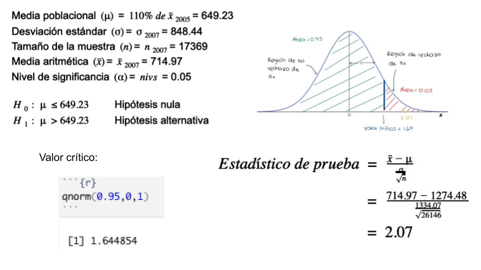
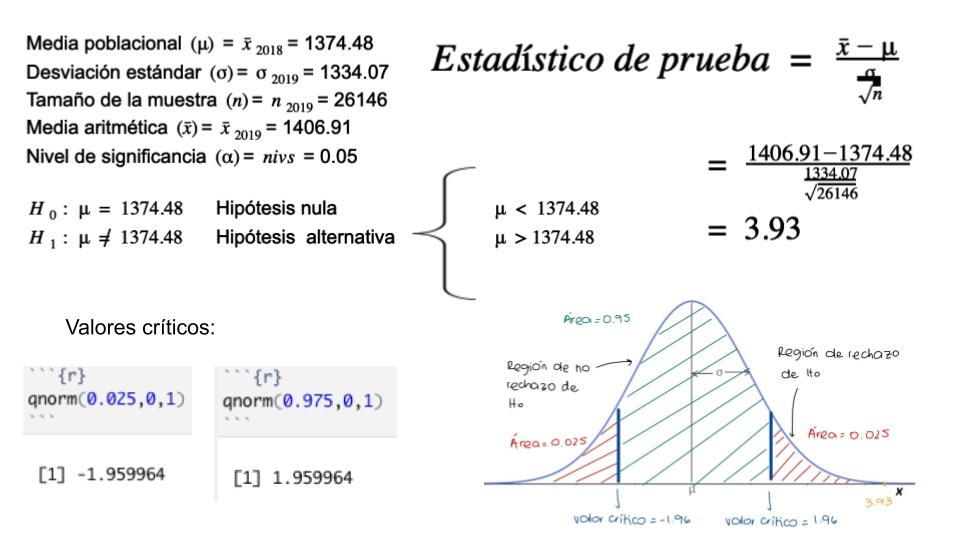
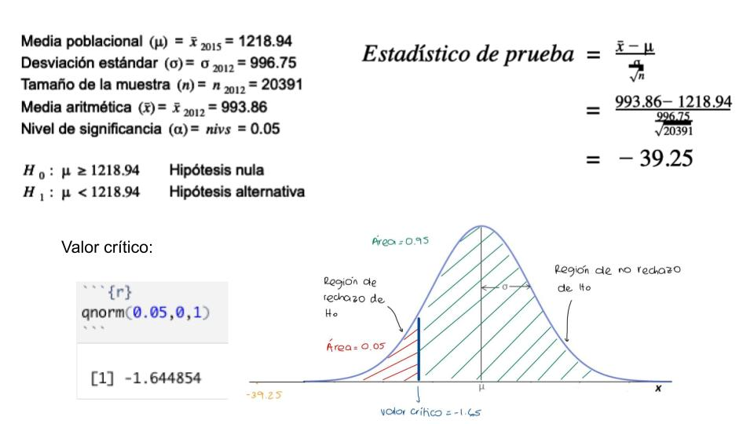

---
output:
  html_document: default
---

***Título:*** Brecha Salarial a través de los años(2004-2020) en las distintas regiones/departamentos del país
***Título corto:*** Brecha salarial en 
regiones/departamentos del Perú

***1. Introducción***
  
  ___a). Importancia___
“El Perú es el país con mayor brecha salarial entre los puestos ejecutivos y operativos en Sudamérica, según la Encuesta de Remuneración Total 2020, elaborada por la consultora empresarial Mercer” (Gestión, R., 2020)

Para realizar este estudio estadístico tomamos en cuenta la importancia del tema a tratar al igual que el interés que la brecha salarial y los estudios derivados que la analizan pueden generar en la población. La brecha salarial es comúnmente estudiada con enfoque a la brecha de género, tanto en nuestro país como en el mundo. Es por ello que nuestro estudio estadístico muestra la brecha salarial desde una perspectiva distinta, analizando las regiones de nuestro país en un contexto de extrema centralización y.

  ___b).Justificación del trabajo___

Los datos serán recolectados de las bases de datos disponibles en la página del Instituto Nacional de Estadística e Informática (INEI), en la encuesta ENAHO actualizada (Encuesta Nacional de Hogares). La encuesta cuenta con múltiples preguntas relacionadas al desempleo e ingresos en el Perú, por lo cual se requiere filtrar la información encontrada para obtener la data esperada para la propuesta del proyecto. En cuanto a la disponibilidad de los datos, la página oficial del INEI ofrece una base de datos anual (enero-diciembre) para distintos temas desde el 2004 hasta el 2020. Por lo cual, se considera un proyecto factible gracias a la accesibilidad de datos, disponibles en múltiples formatos sencillos de manipular y adecuar a los requerimientos establecidos para el desarrollo del proyecto.

***2. Objetivos*** 

  ___a). Preguntas a responder a lo largo de las entregas___
¿Cuál fue la brecha salarial entre el 2004 al 2020 en la capital del Perú?(Respondido en entrega #2 (Incluido en esta entrega))
¿Cuál fue la brecha salarial entre el 2004 al 2020 en las demás regiones del Perú?(Respondido en entrega #2 (Incluido en esta entrega))
¿Los empleos e ingresos han ascendido o descendido a lo largo de 17 años, desde 2004 hasta el 2020, en algunas regiones? (Incluido en esta entrega)
¿Cuál es el cambio en los ingresos generados por las regiones del Perú en los años del 2019 al 2020? (Incluido en esta entrega)
¿A qué factores se deben los cambios en los últimos 17 años? (Respondido en esta entrega)
¿A qué se deben los cambios en los últimos 3 años? (Respondido en esta entrega)

***3. Marco teórico*** 

  ___a).Población objetivo___
Según la ficha técnica de la encuesta, la población objetivo de este estudio es “el conjunto de viviendas y sus ocupante residentes en el área urbana y rural del país”.

 ___b).Unidades muestrales___
Según la ficha técnica de la encuesta, las muestras que se utilizaron para hacer el estudio fueron separadas en dos. Área urbana y área rural. Ambas de estas áreas luego son separadas en 3 unidades. Para el área urbana, se tomó como “la unidad primaria de muestreo (UPM) es el centro poblado urbano con 2 mil y más habitantes”. Para el área rural, esta unidad está separada en dos partes. La primera es “el centro poblado urbano con 500 a menos de 2 mil habitantes”. La segunda es “el área de empadronamiento rural (AER) el cual tiene en promedio 100 viviendas particulares”. Las unidades secundarias y terciarias de muestreo de ambas (USM y UTM respectivamente) son iguales para el área urbana y rural. La USM es “el conglomerado que tiene en promedio 120 viviendas particulares” y la UTM es la vivienda particular.Sin embargo, como grupo nos centraremos en los empleados de las regiones del Perú como unidad muestral.

  ___c).Variables clasificadas:___
Las variables que utilizaremos en el estudio son variables numéricas reflejando los ingresos por región de las personas empleadas, desde el 2004 hasta el 2020. Se asignará una variable por región por año de modo que refleje el cambio anual regional, así como para diferentes periodos de tiempo a lo largo de los 17 años.

Amazonas, Ancash, Apurímac, Arequipa, Ayacucho, Cajamarca, Callao, Cusco, Huancavelica, Huánuco, Ica, Junín, La Libertad, Lambayeque, Lima, Loreto, Madre de Dios, Moquegua, Pasco, Piura, Puno, San Martín, Tacna, Tumbes, Ucayali.

Asimismo, para esta segunda entrega se crearon data frames agrupando los ingresos por region por cada año y asignandolo a un solo objeto anual.

  ___d). ¿Cómo se obtuvieron los datos? ___
El INEI, es un instituto nacional encargado de los diferentes sistemas estadísticos y obtuvieron esta base de datos tras realizar encuestas. Este tipo de muestreo toma el nombre de muestreo por conglomerados, ya que se realiza y clasifican los datos por regiones encuestadas. La ruta para encontrar la data a utilizar fue: INEI -> Base de datos -> Microdatos -> consulta por encuesta -> ENAHO metodología actualizada -> condiciones de vida y pobreza ENAHO -> empleo e ingresos (encontramos base de datos desde el año 2004 hasta el 2020) con periodos anuales de obtención de datos.


Librerias utilizadas a lo largo del informe:
```{r, message=FALSE}
# install.packages("foreign")
library(foreign)
library(dplyr)
library(RColorBrewer)
library(knitr)
```


Se filtraron las bases de datos para conseguir los ingresos mensuales de los individuos por región para cada año (del 2004-2020).


```{r Filtrando Base 2004,message=FALSE, warning=FALSE, echo=FALSE}
data04 <- read.spss("2004.sav",use.value.labels = TRUE, to.data.frame=TRUE)
dataB04 <- data04[, c("UBIGEO","P523", "P524A1")]
data04K<- na.omit(dataB04)
data04Kdia <- data04K %>% filter(grepl('Diario', P523))
data04Kdia$P524A1<- (data04Kdia$P524A1)*30
data04Kmes1 <- data04Kdia
data04Ksem <- data04K %>% filter(grepl('Semanal', P523))
data04Ksem$P524A1 <- (data04Ksem$P524A1)*4
data04Kmes2 <- data04Ksem
data04Kquin <- data04K %>% filter(grepl('Quincenal', P523))
data04Kquin$P524A1 <- (data04Kquin$P524A1)*2
data04Kmes3 <- data04Kquin
data04Kmens <- data04K %>% filter(grepl('Mensual', P523))
data04Kmes4 <- data04Kmens

data04Kmes1ok<- data04Kmes1[,-2]
data04Kmes2ok<- data04Kmes2[,-2]
data04Kmes3ok<- data04Kmes3[,-2]
data04Kmes4ok<- data04Kmes4[,-2] 

dataC04 <- rbind.data.frame(data04Kmes1ok,data04Kmes2ok,data04Kmes3ok,data04Kmes4ok)

dataAm2004 <- dataC04 %>% filter(grepl('01....', UBIGEO))
dataAmaz2004 <-mean(dataAm2004[,2])
dataAmazonas2004 <-round(dataAmaz2004,2)
dataAn2004 <- dataC04 %>% filter(grepl('02....', UBIGEO))
dataAnca2004 <-mean(dataAn2004[,2])
dataAncash2004 <-round(dataAnca2004,2)
dataAp2004 <- dataC04 %>% filter(grepl('03....', UBIGEO))
dataApu2004 <-mean(dataAp2004[,2])
dataApurimac2004 <-round(dataApu2004,2)
dataAr2004 <- dataC04 %>% filter(grepl('04....', UBIGEO))
dataAreq2004 <-mean(dataAr2004[,2])
dataArequipa2004 <-round(dataAreq2004,2)
dataAy2004 <- dataC04 %>% filter(grepl('05....', UBIGEO))
dataAyac2004 <-mean(dataAy2004[,2])
dataAyacucho2004 <-round(dataAyac2004,2)
dataCa2004 <- dataC04 %>% filter(grepl('06....', UBIGEO))
dataCaja2004 <-mean(dataCa2004[,2])
dataCajamarca2004 <-round(dataCaja2004,2)
dataCall2004 <- dataC04 %>% filter(grepl('07....', UBIGEO))
dataCalla2004 <-mean(dataCall2004[,2])
dataCallao2004 <-round(dataCalla2004,2)
dataCus2004 <- dataC04 %>% filter(grepl('08....', UBIGEO))
dataCusc2004 <-mean(dataCus2004[,2])
dataCusco2004 <-round(dataCusc2004,2)
dataHua2004 <- dataC04 %>% filter(grepl('09....', UBIGEO))
dataHuanca2004 <-mean(dataHua2004[,2])
dataHuancavelica2004 <-round(dataHuanca2004,2)
dataHuan2004 <- dataC04 %>% filter(grepl('10....', UBIGEO))
dataHuanu2004 <-mean(dataHuan2004[,2])
dataHuanuco2004 <-round(dataHuanu2004,2)
dataI2004 <- dataC04 %>% filter(grepl('11....', UBIGEO))
dataIc2004 <-mean(dataI2004[,2])
dataIca2004 <-round(dataIc2004,2)
dataJu2004 <- dataC04 %>% filter(grepl('12....', UBIGEO))
dataJun2004 <-mean(dataJu2004[,2])
dataJunin2004 <-round(dataJun2004,2)
dataLa2004 <- dataC04 %>% filter(grepl('13....', UBIGEO))
dataLali2004 <-mean(dataLa2004[,2])
dataLalibertad2004 <-round(dataLali2004,2)
dataLam2004 <- dataC04 %>% filter(grepl('14....', UBIGEO))
dataLamba2004 <-mean(dataLam2004[,2])
dataLambayeque2004 <-round(dataLamba2004,2)
dataLi2004 <- dataC04 %>% filter(grepl('15....', UBIGEO))
dataLim2004 <-mean(dataLi2004[,2])
dataLima2004 <-round(dataLim2004,2)
dataLor2004 <- dataC04 %>% filter(grepl('16....', UBIGEO))
dataLore2004 <-mean(dataLor2004[,2])
dataLoreto2004 <-round(dataLore2004,2)
dataMad2004 <- dataC04 %>% filter(grepl('17....', UBIGEO))
dataMadre2004 <-mean(dataMad2004[,2])
dataMadredeDios2004 <-round(dataMadre2004,2)
dataMoq2004<- dataC04 %>% filter(grepl('18....', UBIGEO))
dataMoque2004 <-mean(dataMoq2004[,2])
dataMoquegua2004 <-round(dataMoque2004,2)
dataPa2004 <- dataC04 %>% filter(grepl('19....', UBIGEO))
dataPas2004 <-mean(dataPa2004[,2])
dataPasco2004 <-round(dataPas2004,2)
dataPiu2004 <- dataC04 %>% filter(grepl('20....', UBIGEO))
dataPiur2004 <-mean(dataPiu2004[,2])
dataPiura2004 <-round(dataPiur2004,2)
dataPu2004 <- dataC04 %>% filter(grepl('21....', UBIGEO))
dataPun2004 <-mean(dataPu2004[,2])
dataPuno2004 <-round(dataPun2004,2)
dataSan2004 <- dataC04 %>% filter(grepl('22....', UBIGEO))
dataSanm2004 <-mean(dataSan2004[,2])
dataSanMartin2004 <-round(dataSanm2004,2)
dataTac2004 <- dataC04 %>% filter(grepl('23....', UBIGEO))
dataTacn2004 <-mean(dataTac2004[,2])
dataTacna2004 <-round(dataTacn2004,2)
dataTu2004 <- dataC04 %>% filter(grepl('24....', UBIGEO))
dataTum2004 <-mean(dataTu2004[,2])
dataTumbes2004 <-round(dataTum2004,2)
dataUca2004 <- dataC04 %>% filter(grepl('25....', UBIGEO))
dataUcay2004 <-mean(dataUca2004[,2])
dataUcayali2004 <-round(dataUcay2004,2)
```

```{r Filtrando Base 2005, message=FALSE, warning=FALSE, echo=FALSE}
data05 <- read.spss("2005.sav",use.value.labels = TRUE, to.data.frame=TRUE)
dataB05 <- data05[, c("UBIGEO","P523", "P524A1")]
data05K<- na.omit(dataB05)
data05Kdia <- data05K %>% filter(grepl('Diario', P523))
data05Kdia$P524A1<- (data05Kdia$P524A1)*30
data05Kmes1 <- data05Kdia
data05Ksem <- data05K %>% filter(grepl('Semanal', P523))
data05Ksem$P524A1 <- (data05Ksem$P524A1)*4
data05Kmes2 <- data05Ksem
data05Kquin <- data05K %>% filter(grepl('Quincenal', P523))
data05Kquin$P524A1 <- (data05Kquin$P524A1)*2
data05Kmes3 <- data05Kquin
data05Kmens <- data05K %>% filter(grepl('Mensual', P523))
data05Kmes4 <- data05Kmens

data05Kmes1ok<- data05Kmes1[,-2]
data05Kmes2ok<- data05Kmes2[,-2]
data05Kmes3ok<- data05Kmes3[,-2]
data05Kmes4ok<- data05Kmes4[,-2] 

dataC05 <- rbind.data.frame(data05Kmes1ok,data05Kmes2ok,data05Kmes3ok,data05Kmes4ok)

dataAm2005 <- dataC05 %>% filter(grepl('01....', UBIGEO))
dataAmaz2005 <-mean(dataAm2005[,2])
dataAmazonas2005 <-round(dataAmaz2005,2)
dataAn2005 <- dataC05 %>% filter(grepl('02....', UBIGEO))
dataAnca2005 <-mean(dataAn2005[,2])
dataAncash2005 <-round(dataAnca2005,2)
dataAp2005 <- dataC05 %>% filter(grepl('03....', UBIGEO))
dataApu2005 <-mean(dataAp2005[,2])
dataApurimac2005 <-round(dataApu2005,2)
dataAr2005 <- dataC05 %>% filter(grepl('04....', UBIGEO))
dataAreq2005 <-mean(dataAr2005[,2])
dataArequipa2005 <-round(dataAreq2005,2)
dataAy2005 <- dataC05 %>% filter(grepl('05....', UBIGEO))
dataAyac2005 <-mean(dataAy2005[,2])
dataAyacucho2005 <-round(dataAyac2005,2)
dataCa2005 <- dataC05 %>% filter(grepl('06....', UBIGEO))
dataCaja2005 <-mean(dataCa2005[,2])
dataCajamarca2005 <-round(dataCaja2005,2)
dataCall2005 <- dataC05 %>% filter(grepl('07....', UBIGEO))
dataCalla2005 <-mean(dataCall2005[,2])
dataCallao2005 <-round(dataCalla2005,2)
dataCus2005 <- dataC05 %>% filter(grepl('08....', UBIGEO))
dataCusc2005 <-mean(dataCus2005[,2])
dataCusco2005 <-round(dataCusc2005,2)
dataHua2005 <- dataC05 %>% filter(grepl('09....', UBIGEO))
dataHuanca2005 <-mean(dataHua2005[,2])
dataHuancavelica2005 <-round(dataHuanca2005,2)
dataHuan2005 <- dataC05 %>% filter(grepl('10....', UBIGEO))
dataHuanu2005 <-mean(dataHuan2005[,2])
dataHuanuco2005 <-round(dataHuanu2005,2)
dataI2005 <- dataC05 %>% filter(grepl('11....', UBIGEO))
dataIc2005 <-mean(dataI2005[,2])
dataIca2005 <-round(dataIc2005,2)
dataJu2005 <- dataC05 %>% filter(grepl('12....', UBIGEO))
dataJun2005 <-mean(dataJu2005[,2])
dataJunin2005 <-round(dataJun2005,2)
dataLa2005 <- dataC05 %>% filter(grepl('13....', UBIGEO))
dataLali2005 <-mean(dataLa2005[,2])
dataLalibertad2005 <-round(dataLali2005,2)
dataLam2005 <- dataC05 %>% filter(grepl('14....', UBIGEO))
dataLamba2005 <-mean(dataLam2005[,2])
dataLambayeque2005<-round(dataLamba2005,2)
dataLi2005 <- dataC05 %>% filter(grepl('15....', UBIGEO))
dataLim2005 <-mean(dataLi2005[,2])
dataLima2005 <-round(dataLim2005,2)
dataLor2005 <- dataC05 %>% filter(grepl('16....', UBIGEO))
dataLore2005 <-mean(dataLor2005[,2])
dataLoreto2005 <-round(dataLore2005,2)
dataMad2005 <- dataC05 %>% filter(grepl('17....', UBIGEO))
dataMadre2005 <-mean(dataMad2005[,2])
dataMadredeDios2005 <-round(dataMadre2005,2)
dataMoq2005<- dataC05 %>% filter(grepl('18....', UBIGEO))
dataMoque2005 <-mean(dataMoq2005[,2])
dataMoquegua2005 <-round(dataMoque2005,2)
dataPa2005 <- dataC05 %>% filter(grepl('19....', UBIGEO))
dataPas2005 <-mean(dataPa2005[,2])
dataPasco2005 <-round(dataPas2005,2)
dataPiu2005 <- dataC05 %>% filter(grepl('20....', UBIGEO))
dataPiur2005 <-mean(dataPiu2005[,2])
dataPiura2005 <-round(dataPiur2005,2)
dataPu2005 <- dataC05 %>% filter(grepl('21....', UBIGEO))
dataPun2005 <-mean(dataPu2005[,2])
dataPuno2005 <-round(dataPun2005,2)
dataSan2005 <- dataC05 %>% filter(grepl('22....', UBIGEO))
dataSanm2005 <-mean(dataSan2005[,2])
dataSanMartin2005 <-round(dataSanm2005,2)
dataTac2005 <- dataC05 %>% filter(grepl('23....', UBIGEO))
dataTacn2005 <-mean(dataTac2005[,2])
dataTacna2005 <-round(dataTacn2005,2)
dataTu2005 <- dataC05 %>% filter(grepl('24....', UBIGEO))
dataTum2005 <-mean(dataTu2005[,2])
dataTumbes2005 <-round(dataTum2005,2)
dataUca2005 <- dataC05 %>% filter(grepl('25....', UBIGEO))
dataUcay2005 <-mean(dataUca2005[,2])
dataUcayali2005 <-round(dataUcay2005,2)
```

```{r Filtrando Base 2006,message=FALSE, warning=FALSE, echo=FALSE}
data06 <- read.spss("2006.sav",use.value.labels = TRUE, to.data.frame=TRUE)
dataB06 <- data06[, c("UBIGEO","P523", "P524A1")]
data06K<- na.omit(dataB06)
data06Kdia <- data06K %>% filter(grepl('Diario', P523))
data06Kdia$P524A1<- (data06Kdia$P524A1)*30
data06Kmes1 <- data06Kdia
data06Ksem <- data06K %>% filter(grepl('Semanal', P523))
data06Ksem$P524A1 <- (data06Ksem$P524A1)*4
data06Kmes2 <- data06Ksem
data06Kquin <- data06K %>% filter(grepl('Quincenal', P523))
data06Kquin$P524A1 <- (data06Kquin$P524A1)*2
data06Kmes3 <- data06Kquin
data06Kmens <- data06K %>% filter(grepl('Mensual', P523))
data06Kmes4 <- data06Kmens

data06Kmes1ok<- data06Kmes1[,-2]
data06Kmes2ok<- data06Kmes2[,-2]
data06Kmes3ok<- data06Kmes3[,-2]
data06Kmes4ok<- data06Kmes4[,-2] 

dataC06 <- rbind.data.frame(data06Kmes1ok,data06Kmes2ok,data06Kmes3ok,data06Kmes4ok)

dataAm2006 <- dataC06 %>% filter(grepl('01....', UBIGEO))
dataAmaz2006 <-mean(dataAm2006[,2])
dataAmazonas2006 <-round(dataAmaz2006,2)
dataAn2006 <- dataC06 %>% filter(grepl('02....', UBIGEO))
dataAnca2006 <-mean(dataAn2006[,2])
dataAncash2006 <-round(dataAnca2006,2)
dataAp2006 <- dataC06 %>% filter(grepl('03....', UBIGEO))
dataApu2006 <-mean(dataAp2006[,2])
dataApurimac2006 <-round(dataApu2006,2)
dataAr2006 <- dataC06 %>% filter(grepl('04....', UBIGEO))
dataAreq2006 <-mean(dataAr2006[,2])
dataArequipa2006 <-round(dataAreq2006,2)
dataAy2006 <- dataC06 %>% filter(grepl('05....', UBIGEO))
dataAyac2006 <-mean(dataAy2006[,2])
dataAyacucho2006 <-round(dataAyac2006,2)
dataCa2006 <- dataC06 %>% filter(grepl('06....', UBIGEO))
dataCaja2006 <-mean(dataCa2006[,2])
dataCajamarca2006 <-round(dataCaja2006,2)
dataCall2006 <- dataC06 %>% filter(grepl('07....', UBIGEO))
dataCalla2006 <-mean(dataCall2006[,2])
dataCallao2006 <-round(dataCalla2006,2)
dataCus2006 <- dataC06 %>% filter(grepl('08....', UBIGEO))
dataCusc2006 <-mean(dataCus2006[,2])
dataCusco2006 <-round(dataCusc2006,2)
dataHua2006 <- dataC06 %>% filter(grepl('09....', UBIGEO))
dataHuanca2006 <-mean(dataHua2006[,2])
dataHuancavelica2006 <-round(dataHuanca2006,2)
dataHuan2006 <- dataC06 %>% filter(grepl('10....', UBIGEO))
dataHuanu2006 <-mean(dataHuan2006[,2])
dataHuanuco2006 <-round(dataHuanu2006,2)
dataI2006 <- dataC06 %>% filter(grepl('11....', UBIGEO))
dataIc2006 <-mean(dataI2006[,2])
dataIca2006 <-round(dataIc2006,2)
dataJu2006 <- dataC06 %>% filter(grepl('12....', UBIGEO))
dataJun2006 <-mean(dataJu2006[,2])
dataJunin2006 <-round(dataJun2006,2)
dataLa2006 <- dataC06 %>% filter(grepl('13....', UBIGEO))
dataLali2006 <-mean(dataLa2006[,2])
dataLalibertad2006 <-round(dataLali2006,2)
dataLam2006 <- dataC06 %>% filter(grepl('14....', UBIGEO))
dataLamba2006 <-mean(dataLam2006[,2])
dataLambayeque2006<-round(dataLamba2006,2)
dataLi2006 <- dataC06 %>% filter(grepl('15....', UBIGEO))
dataLim2006 <-mean(dataLi2006[,2])
dataLima2006 <-round(dataLim2006,2)
dataLor2006 <- dataC06 %>% filter(grepl('16....', UBIGEO))
dataLore2006 <-mean(dataLor2006[,2])
dataLoreto2006 <-round(dataLore2006,2)
dataMad2006 <- dataC06 %>% filter(grepl('17....', UBIGEO))
dataMadre2006 <-mean(dataMad2006[,2])
dataMadredeDios2006 <-round(dataMadre2006,2)
dataMoq2006<- dataC06 %>% filter(grepl('18....', UBIGEO))
dataMoque2006 <-mean(dataMoq2006[,2])
dataMoquegua2006 <-round(dataMoque2006,2)
dataPa2006 <- dataC06 %>% filter(grepl('19....', UBIGEO))
dataPas2006 <-mean(dataPa2006[,2])
dataPasco2006 <-round(dataPas2006,2)
dataPiu2006 <- dataC06 %>% filter(grepl('20....', UBIGEO))
dataPiur2006 <-mean(dataPiu2006[,2])
dataPiura2006 <-round(dataPiur2006,2)
dataPu2006 <- dataC06 %>% filter(grepl('21....', UBIGEO))
dataPun2006 <-mean(dataPu2006[,2])
dataPuno2006 <-round(dataPun2006,2)
dataSan2006 <- dataC06 %>% filter(grepl('22....', UBIGEO))
dataSanm2006 <-mean(dataSan2006[,2])
dataSanMartin2006 <-round(dataSanm2006,2)
dataTac2006 <- dataC06 %>% filter(grepl('23....', UBIGEO))
dataTacn2006 <-mean(dataTac2006[,2])
dataTacna2006 <-round(dataTacn2006,2)
dataTu2006 <- dataC06 %>% filter(grepl('24....', UBIGEO))
dataTum2006 <-mean(dataTu2006[,2])
dataTumbes2006 <-round(dataTum2006,2)
dataUca2006 <- dataC06 %>% filter(grepl('25....', UBIGEO))
dataUcay2006 <-mean(dataUca2006[,2])
dataUcayali2006 <-round(dataUcay2006,2)
```

```{r Filtrando Base 2007,message=FALSE, warning=FALSE, echo=FALSE}
data07 <- read.spss("2007.sav",use.value.labels = TRUE, to.data.frame=TRUE)
dataB07 <- data07[, c("UBIGEO","P523", "P524A1")]
data07K<- na.omit(dataB07)
data07Kdia <- data07K %>% filter(grepl('Diario', P523))
data07Kdia$P524A1<- (data07Kdia$P524A1)*30
data07Kmes1 <- data07Kdia
data07Ksem <- data07K %>% filter(grepl('Semanal', P523))
data07Ksem$P524A1 <- (data07Ksem$P524A1)*4
data07Kmes2 <- data07Ksem
data07Kquin <- data07K %>% filter(grepl('Quincenal', P523))
data07Kquin$P524A1 <- (data07Kquin$P524A1)*2
data07Kmes3 <- data07Kquin
data07Kmens <- data07K %>% filter(grepl('Mensual', P523))
data07Kmes4 <- data07Kmens

data07Kmes1ok<- data07Kmes1[,-2]
data07Kmes2ok<- data07Kmes2[,-2]
data07Kmes3ok<- data07Kmes3[,-2]
data07Kmes4ok<- data07Kmes4[,-2] 

dataC07 <- rbind.data.frame(data07Kmes1ok,data07Kmes2ok,data07Kmes3ok,data07Kmes4ok)

dataAm2007 <- dataC07 %>% filter(grepl('01....', UBIGEO))
dataAmaz2007 <-mean(dataAm2007[,2])
dataAmazonas2007 <-round(dataAmaz2007,2)
dataAn2007 <- dataC07 %>% filter(grepl('02....', UBIGEO))
dataAnca2007 <-mean(dataAn2007[,2])
dataAncash2007 <-round(dataAnca2007,2)
dataAp2007 <- dataC07 %>% filter(grepl('03....', UBIGEO))
dataApu2007 <-mean(dataAp2007[,2])
dataApurimac2007 <-round(dataApu2007,2)
dataAr2007 <- dataC07 %>% filter(grepl('04....', UBIGEO))
dataAreq2007 <-mean(dataAr2007[,2])
dataArequipa2007 <-round(dataAreq2007,2)
dataAy2007 <- dataC07 %>% filter(grepl('05....', UBIGEO))
dataAyac2007 <-mean(dataAy2007[,2])
dataAyacucho2007 <-round(dataAyac2007,2)
dataCa2007 <- dataC07 %>% filter(grepl('06....', UBIGEO))
dataCaja2007 <-mean(dataCa2007[,2])
dataCajamarca2007 <-round(dataCaja2007,2)
dataCall2007 <- dataC07 %>% filter(grepl('07....', UBIGEO))
dataCalla2007 <-mean(dataCall2007[,2])
dataCallao2007 <-round(dataCalla2007,2)
dataCus2007 <- dataC07 %>% filter(grepl('08....', UBIGEO))
dataCusc2007 <-mean(dataCus2007[,2])
dataCusco2007 <-round(dataCusc2007,2)
dataHua2007 <- dataC07 %>% filter(grepl('09....', UBIGEO))
dataHuanca2007 <-mean(dataHua2007[,2])
dataHuancavelica2007 <-round(dataHuanca2007,2)
dataHuan2007 <- dataC07 %>% filter(grepl('10....', UBIGEO))
dataHuanu2007 <-mean(dataHuan2007[,2])
dataHuanuco2007 <-round(dataHuanu2007,2)
dataI2007 <- dataC07 %>% filter(grepl('11....', UBIGEO))
dataIc2007 <-mean(dataI2007[,2])
dataIca2007 <-round(dataIc2007,2)
dataJu2007 <- dataC07 %>% filter(grepl('12....', UBIGEO))
dataJun2007 <-mean(dataJu2007[,2])
dataJunin2007 <-round(dataJun2007,2)
dataLa2007 <- dataC07 %>% filter(grepl('13....', UBIGEO))
dataLali2007 <-mean(dataLa2007[,2])
dataLalibertad2007 <-round(dataLali2007,2)
dataLam2007 <- dataC07 %>% filter(grepl('14....', UBIGEO))
dataLamba2007 <-mean(dataLam2007[,2])
dataLambayeque2007 <-round(dataLamba2007,2)
dataLi2007 <- dataC07 %>% filter(grepl('15....', UBIGEO))
dataLim2007 <-mean(dataLi2007[,2])
dataLima2007 <-round(dataLim2007,2)
dataLor2007 <- dataC07 %>% filter(grepl('16....', UBIGEO))
dataLore2007 <-mean(dataLor2007[,2])
dataLoreto2007 <-round(dataLore2007,2)
dataMad2007 <- dataC07 %>% filter(grepl('17....', UBIGEO))
dataMadre2007 <-mean(dataMad2007[,2])
dataMadredeDios2007 <-round(dataMadre2007,2)
dataMoq2007<- dataC07 %>% filter(grepl('18....', UBIGEO))
dataMoque2007 <-mean(dataMoq2007[,2])
dataMoquegua2007 <-round(dataMoque2007,2)
dataPa2007 <- dataC07 %>% filter(grepl('19....', UBIGEO))
dataPas2007 <-mean(dataPa2007[,2])
dataPasco2007 <-round(dataPas2007,2)
dataPiu2007 <- dataC07 %>% filter(grepl('20....', UBIGEO))
dataPiur2007 <-mean(dataPiu2007[,2])
dataPiura2007 <-round(dataPiur2007,2)
dataPu2007 <- dataC07 %>% filter(grepl('21....', UBIGEO))
dataPun2007 <-mean(dataPu2007[,2])
dataPuno2007 <-round(dataPun2007,2)
dataSan2007 <- dataC07 %>% filter(grepl('22....', UBIGEO))
dataSanm2007 <-mean(dataSan2007[,2])
dataSanMartin2007 <-round(dataSanm2007,2)
dataTac2007 <- dataC07 %>% filter(grepl('23....', UBIGEO))
dataTacn2007 <-mean(dataTac2007[,2])
dataTacna2007 <-round(dataTacn2007,2)
dataTu2007 <- dataC07 %>% filter(grepl('24....', UBIGEO))
dataTum2007 <-mean(dataTu2007[,2])
dataTumbes2007 <-round(dataTum2007,2)
dataUca2007 <- dataC07 %>% filter(grepl('25....', UBIGEO))
dataUcay2007 <-mean(dataUca2007[,2])
dataUcayali2007 <-round(dataUcay2007,2)
```

```{r Filtrando Base 2008,message=FALSE, warning=FALSE, echo=FALSE}
data08 <- read.spss("2008.sav",use.value.labels = TRUE, to.data.frame=TRUE)
dataB08 <- data08[, c("UBIGEO","P523", "P524A1")]
data08K<- na.omit(dataB08)
data08Kdia <- data08K %>% filter(grepl('Diario', P523))
data08Kdia$P524A1<- (data08Kdia$P524A1)*30
data08Kmes1 <- data08Kdia
data08Ksem <- data08K %>% filter(grepl('Semanal', P523))
data08Ksem$P524A1 <- (data08Ksem$P524A1)*4
data08Kmes2 <- data08Ksem
data08Kquin <- data08K %>% filter(grepl('Quincenal', P523))
data08Kquin$P524A1 <- (data08Kquin$P524A1)*2
data08Kmes3 <- data08Kquin
data08Kmens <- data08K %>% filter(grepl('Mensual', P523))
data08Kmes4 <- data08Kmens

data08Kmes1ok<- data08Kmes1[,-2]
data08Kmes2ok<- data08Kmes2[,-2]
data08Kmes3ok<- data08Kmes3[,-2]
data08Kmes4ok<- data08Kmes4[,-2] 

dataC08 <- rbind.data.frame(data08Kmes1ok,data08Kmes2ok,data08Kmes3ok,data08Kmes4ok)

dataAm2008 <- dataC08 %>% filter(grepl('01....', UBIGEO))
dataAmaz2008 <-mean(dataAm2008[,2])
dataAmazonas2008 <-round(dataAmaz2008,2)
dataAn2008 <- dataC08 %>% filter(grepl('02....', UBIGEO))
dataAnca2008 <-mean(dataAn2008[,2])
dataAncash2008 <-round(dataAnca2008,2)
dataAp2008 <- dataC08 %>% filter(grepl('03....', UBIGEO))
dataApu2008 <-mean(dataAp2008[,2])
dataApurimac2008 <-round(dataApu2008,2)
dataAr2008 <- dataC08 %>% filter(grepl('04....', UBIGEO))
dataAreq2008 <-mean(dataAr2008[,2])
dataArequipa2008 <-round(dataAreq2008,2)
dataAy2008 <- dataC08 %>% filter(grepl('05....', UBIGEO))
dataAyac2008 <-mean(dataAy2008[,2])
dataAyacucho2008 <-round(dataAyac2008,2)
dataCa2008 <- dataC08 %>% filter(grepl('06....', UBIGEO))
dataCaja2008 <-mean(dataCa2008[,2])
dataCajamarca2008 <-round(dataCaja2008,2)
dataCall2008 <- dataC08 %>% filter(grepl('07....', UBIGEO))
dataCalla2008 <-mean(dataCall2008[,2])
dataCallao2008 <-round(dataCalla2008,2)
dataCus2008 <- dataC08 %>% filter(grepl('08....', UBIGEO))
dataCusc2008 <-mean(dataCus2008[,2])
dataCusco2008 <-round(dataCusc2008,2)
dataHua2008 <- dataC08 %>% filter(grepl('09....', UBIGEO))
dataHuanca2008 <-mean(dataHua2008[,2])
dataHuancavelica2008 <-round(dataHuanca2008,2)
dataHuan2008 <- dataC08 %>% filter(grepl('10....', UBIGEO))
dataHuanu2008 <-mean(dataHuan2008[,2])
dataHuanuco2008<-round(dataHuanu2008,2)
dataI2008 <- dataC08 %>% filter(grepl('11....', UBIGEO))
dataIc2008 <-mean(dataI2008[,2])
dataIca2008 <-round(dataIc2008,2)
dataJu2008<- dataC08 %>% filter(grepl('12....', UBIGEO))
dataJun2008<-mean(dataJu2008[,2])
dataJunin2008 <-round(dataJun2008,2)
dataLa2008 <- dataC08 %>% filter(grepl('13....', UBIGEO))
dataLali2008 <-mean(dataLa2007[,2])
dataLalibertad2008 <-round(dataLali2008,2)
dataLam2008 <- dataC08 %>% filter(grepl('14....', UBIGEO))
dataLamba2008 <-mean(dataLam2008[,2])
dataLambayeque2008 <-round(dataLamba2008,2)
dataLi2008 <- dataC08 %>% filter(grepl('15....', UBIGEO))
dataLim2008 <-mean(dataLi2008[,2])
dataLima2008 <-round(dataLim2008,2)
dataLor2008 <- dataC08 %>% filter(grepl('16....', UBIGEO))
dataLore2008 <-mean(dataLor2008[,2])
dataLoreto2008 <-round(dataLore2008,2)
dataMad2008 <- dataC08 %>% filter(grepl('17....', UBIGEO))
dataMadre2008 <-mean(dataMad2008[,2])
dataMadredeDios2008 <-round(dataMadre2008,2)
dataMoq2008<- dataC08 %>% filter(grepl('18....', UBIGEO))
dataMoque2008 <-mean(dataMoq2008[,2])
dataMoquegua2008 <-round(dataMoque2008,2)
dataPa2008 <- dataC08 %>% filter(grepl('19....', UBIGEO))
dataPas2008 <-mean(dataPa2008[,2])
dataPasco2008 <-round(dataPas2008,2)
dataPiu2008<- dataC08 %>% filter(grepl('20....', UBIGEO))
dataPiur2008 <-mean(dataPiu2008[,2])
dataPiura2008 <-round(dataPiur2008,2)
dataPu2008 <- dataC08 %>% filter(grepl('21....', UBIGEO))
dataPun2008 <-mean(dataPu2008[,2])
dataPuno2008<-round(dataPun2008,2)
dataSan2008 <- dataC08 %>% filter(grepl('22....', UBIGEO))
dataSanm2008 <-mean(dataSan2008[,2])
dataSanMartin2008 <-round(dataSanm2008,2)
dataTac2008<- dataC08 %>% filter(grepl('23....', UBIGEO))
dataTacn2008 <-mean(dataTac2008[,2])
dataTacna2008 <-round(dataTacn2008,2)
dataTu2008 <- dataC08 %>% filter(grepl('24....', UBIGEO))
dataTum2008<-mean(dataTu2008[,2])
dataTumbes2008 <-round(dataTum2008,2)
dataUca2008 <- dataC08 %>% filter(grepl('25....', UBIGEO))
dataUcay2008 <-mean(dataUca2008[,2])
dataUcayali2008 <-round(dataUcay2008,2)
```

```{r Filtrando Base 2009,message=FALSE, warning=FALSE, echo=FALSE}
data09 <- read.spss("2009.sav",use.value.labels = TRUE, to.data.frame=TRUE)
dataB09 <- data09[, c("UBIGEO","P523", "P524A1")]
data09K<- na.omit(dataB09)
data09Kdia <- data09K %>% filter(grepl('Diario', P523))
data09Kdia$P524A1<- (data09Kdia$P524A1)*30
data09Kmes1 <- data09Kdia
data09Ksem <- data09K %>% filter(grepl('Semanal', P523))
data09Ksem$P524A1 <- (data09Ksem$P524A1)*4
data09Kmes2 <- data09Ksem
data09Kquin <- data09K %>% filter(grepl('Quincenal', P523))
data09Kquin$P524A1 <- (data09Kquin$P524A1)*2
data09Kmes3 <- data09Kquin
data09Kmens <- data09K %>% filter(grepl('Mensual', P523))
data09Kmes4 <- data09Kmens

data09Kmes1ok<- data09Kmes1[,-2]
data09Kmes2ok<- data09Kmes2[,-2]
data09Kmes3ok<- data09Kmes3[,-2]
data09Kmes4ok<- data09Kmes4[,-2] 

dataC09 <- rbind.data.frame(data09Kmes1ok,data09Kmes2ok,data09Kmes3ok,data09Kmes4ok)

dataAm2009 <- dataC09 %>% filter(grepl('01....', UBIGEO))
dataAmaz2009 <-mean(dataAm2009[,2])
dataAmazonas2009 <-round(dataAmaz2009,2)
dataAn2009 <- dataC09 %>% filter(grepl('02....', UBIGEO))
dataAnca2009 <-mean(dataAn2009[,2])
dataAncash2009 <-round(dataAnca2009,2)
dataAp2009 <- dataC09 %>% filter(grepl('03....', UBIGEO))
dataApu2009 <-mean(dataAp2009[,2])
dataApurimac2009 <-round(dataApu2009,2)
dataAr2009 <- dataC09 %>% filter(grepl('04....', UBIGEO))
dataAreq2009 <-mean(dataAr2009[,2])
dataArequipa2009 <-round(dataAreq2009,2)
dataAy2009 <- dataC09 %>% filter(grepl('05....', UBIGEO))
dataAyac2009 <-mean(dataAy2009[,2])
dataAyacucho2009 <-round(dataAyac2009,2)
dataCa2009 <- dataC09 %>% filter(grepl('06....', UBIGEO))
dataCaja2009 <-mean(dataCa2009[,2])
dataCajamarca2009 <-round(dataCaja2009,2)
dataCall2009 <- dataC09 %>% filter(grepl('07....', UBIGEO))
dataCalla2009 <-mean(dataCall2009[,2])
dataCallao2009 <-round(dataCalla2009,2)
dataCus2009 <- dataC09 %>% filter(grepl('08....', UBIGEO))
dataCusc2009 <-mean(dataCus2009[,2])
dataCusco2009 <-round(dataCusc2009,2)
dataHua2009 <- dataC09 %>% filter(grepl('09....', UBIGEO))
dataHuanca2009 <-mean(dataHua2009[,2])
dataHuancavelica2009 <-round(dataHuanca2009,2)
dataHuan2009 <- dataC09 %>% filter(grepl('10....', UBIGEO))
dataHuanu2009 <-mean(dataHuan2009[,2])
dataHuanuco2009<-round(dataHuanu2009,2)
dataI2009 <- dataC09 %>% filter(grepl('11....', UBIGEO))
dataIc2009 <-mean(dataI2009[,2])
dataIca2009 <-round(dataIc2009,2)
dataJu2009<- dataC09 %>% filter(grepl('12....', UBIGEO))
dataJun2009<-mean(dataJu2009[,2])
dataJunin2009 <-round(dataJun2009,2)
dataLa2009 <- dataC09 %>% filter(grepl('13....', UBIGEO))
dataLali2009 <-mean(dataLa2009[,2])
dataLalibertad2009 <-round(dataLali2009,2)
dataLam2009 <- dataC09 %>% filter(grepl('14....', UBIGEO))
dataLamba2009 <-mean(dataLam2009[,2])
dataLambayeque2009 <-round(dataLamba2009,2)
dataLi2009 <- dataC09 %>% filter(grepl('15....', UBIGEO))
dataLim2009 <-mean(dataLi2009[,2])
dataLima2009<-round(dataLim2009,2)
dataLor2009 <- dataC09 %>% filter(grepl('16....', UBIGEO))
dataLore2009<-mean(dataLor2009[,2])
dataLoreto2009 <-round(dataLore2009,2)
dataMad2009 <- dataC09 %>% filter(grepl('17....', UBIGEO))
dataMadre2009 <-mean(dataMad2009[,2])
dataMadredeDios2009 <-round(dataMadre2009,2)
dataMoq2009<- dataC09 %>% filter(grepl('18....', UBIGEO))
dataMoque2009 <-mean(dataMoq2009[,2])
dataMoquegua2009 <-round(dataMoque2009,2)
dataPa2009 <- dataC09 %>% filter(grepl('19....', UBIGEO))
dataPas2009 <-mean(dataPa2009[,2])
dataPasco2009 <-round(dataPas2009,2)
dataPiu2009<- dataC09 %>% filter(grepl('20....', UBIGEO))
dataPiur2009 <-mean(dataPiu2009[,2])
dataPiura2009 <-round(dataPiur2009,2)
dataPu2009 <- dataC09 %>% filter(grepl('21....', UBIGEO))
dataPun2009 <-mean(dataPu2009[,2])
dataPuno2009<-round(dataPun2009,2)
dataSan2009 <- dataC09 %>% filter(grepl('22....', UBIGEO))
dataSanm2009 <-mean(dataSan2009[,2])
dataSanMartin2009 <-round(dataSanm2009,2)
dataTac2009<- dataC09 %>% filter(grepl('23....', UBIGEO))
dataTacn2009 <-mean(dataTac2009[,2])
dataTacna2009 <-round(dataTacn2009,2)
dataTu2009 <- dataC09 %>% filter(grepl('24....', UBIGEO))
dataTum2009<-mean(dataTu2009[,2])
dataTumbes2009 <-round(dataTum2009,2)
dataUca2009 <- dataC09 %>% filter(grepl('25....', UBIGEO))
dataUcay2009 <-mean(dataUca2009[,2])
dataUcayali2009 <-round(dataUcay2009,2)
```

```{r Filtrando Base 2010,message=FALSE, warning=FALSE, echo=FALSE}
data10 <- read.spss("2010.sav",use.value.labels = TRUE, to.data.frame=TRUE)
dataB10 <- data10[, c("UBIGEO","P523", "P524A1")]
data10K<- na.omit(dataB10)
data10Kdia <- data10K %>% filter(grepl('Diario', P523))
data10Kdia$P524A1<- (data10Kdia$P524A1)*30
data10Kmes1 <- data10Kdia
data10Ksem <- data10K %>% filter(grepl('Semanal', P523))
data10Ksem$P524A1 <- (data10Ksem$P524A1)*4
data10Kmes2 <- data10Ksem
data10Kquin <- data10K %>% filter(grepl('Quincenal', P523))
data10Kquin$P524A1 <- (data10Kquin$P524A1)*2
data10Kmes3 <- data10Kquin
data10Kmens <- data10K %>% filter(grepl('Mensual', P523))
data10Kmes4 <- data10Kmens

data10Kmes1ok<- data10Kmes1[,-2]
data10Kmes2ok<- data10Kmes2[,-2]
data10Kmes3ok<- data10Kmes3[,-2]
data10Kmes4ok<- data10Kmes4[,-2] 

dataC10 <- rbind.data.frame(data10Kmes1ok,data10Kmes2ok,data10Kmes3ok,data10Kmes4ok)

dataAm2010 <- dataC10 %>% filter(grepl('01....', UBIGEO))
dataAmaz2010 <-mean(dataAm2010$P524A1)
dataAmazonas2010 <-round(dataAmaz2010)
dataAn2010 <- dataC10 %>% filter(grepl('02....', UBIGEO))
dataAnca2010 <-mean(dataAn2010$P524A1)
dataAncash2010 <-round(dataAnca2010,2)
dataAp2010 <- dataC10 %>% filter(grepl('03....', UBIGEO))
dataApu2010 <-mean(dataAp2010$P524A1)
dataApurimac2010 <-round(dataApu2010,2)
dataAr2010 <- dataC10 %>% filter(grepl('04....', UBIGEO))
dataAreq2010 <-mean(dataAr2010$P524A1)
dataArequipa2010 <-round(dataAreq2010,2)
dataAy2010 <- dataC10 %>% filter(grepl('05....', UBIGEO))
dataAyac2010 <-mean(dataAy2010$P524A1)
dataAyacucho2010 <-round(dataAyac2010,2)
dataCa2010 <- dataC10 %>% filter(grepl('06....', UBIGEO))
dataCaja2010 <-mean(dataCa2010$P524A1)
dataCajamarca2010 <-round(dataCaja2010,2)
dataCall2010 <- dataC10 %>% filter(grepl('07....', UBIGEO))
dataCalla2010 <-mean(dataCall2010$P524A1)
dataCallao2010 <-round(dataCalla2010,2)
dataCus2010 <- dataC10 %>% filter(grepl('08....', UBIGEO))
dataCusc2010 <-mean(dataCus2010$P524A1)
dataCusco2010 <-round(dataCusc2010,2)
dataHua2010 <- dataC10 %>% filter(grepl('09....', UBIGEO))
dataHuanca2010 <-mean(dataHua2010$P524A1)
dataHuancavelica2010 <-round(dataHuanca2010,2)
dataHuan2010 <- dataC10 %>% filter(grepl('10....', UBIGEO))
dataHuanu2010 <-mean(dataHuan2010$P524A1)
dataHuanuco2010 <-round(dataHuanu2010,2)
dataI2010 <- dataC10 %>% filter(grepl('11....', UBIGEO))
dataIc2010 <-mean(dataI2010$P524A1)
dataIca2010 <-round(dataIc2010,2)
dataJu2010 <- dataC10 %>% filter(grepl('12....', UBIGEO))
dataJun2010 <-mean(dataJu2010$P524A1)
dataJunin2010 <-round(dataJun2010,2)
dataLa2010 <- dataC10 %>% filter(grepl('13....', UBIGEO))
dataLali2010 <-mean(dataLa2010$P524A1)
dataLalibertad2010 <-round(dataLali2010,2)
dataLam2010 <- dataC10 %>% filter(grepl('14....', UBIGEO))
dataLamba2010 <-mean(dataLam2010$P524A1)
dataLambayeque2010 <-round(dataLamba2010,2)
dataLi2010 <- dataC10 %>% filter(grepl('15....', UBIGEO))
dataLim2010 <-mean(dataLi2010$P524A1)
dataLima2010 <-round(dataLim2010,2)
dataLor2010 <- dataC10 %>% filter(grepl('16....', UBIGEO))
dataLore2010 <-mean(dataLor2010$P524A1)
dataLoreto2010 <-round(dataLore2010,2)
dataMad2010 <- dataC10 %>% filter(grepl('17....', UBIGEO))
dataMadre2010 <-mean(dataMad2010$P524A1)
dataMadredeDios2010 <-round(dataMadre2010,2)
dataMoq2010<- dataC10 %>% filter(grepl('18....', UBIGEO))
dataMoque2010 <-mean(dataMoq2010$P524A1)
dataMoquegua2010 <-round(dataMoque2010,2)
dataPa2010 <- dataC10 %>% filter(grepl('19....', UBIGEO))
dataPas2010 <-mean(dataPa2010$P524A1)
dataPasco2010 <-round(dataPas2010,2)
dataPiu2010 <- dataC10 %>% filter(grepl('20....', UBIGEO))
dataPiur2010 <-mean(dataPiu2010$P524A1)
dataPiura2010 <-round(dataPiur2010,2)
dataPu2010 <- dataC10 %>% filter(grepl('21....', UBIGEO))
dataPun2010 <-mean(dataPu2010$P524A1)
dataPuno2010 <-round(dataPun2010,2)
dataSan2010 <- dataC10 %>% filter(grepl('22....', UBIGEO))
dataSanm2010 <-mean(dataSan2010$P524A1)
dataSanMartin2010 <-round(dataSanm2010,2)
dataTac2010 <- dataC10 %>% filter(grepl('23....', UBIGEO))
dataTacn2010 <-mean(dataTac2010$P524A1)
dataTacna2010 <-round(dataTacn2010,2)
dataTu2010 <- dataC10 %>% filter(grepl('24....', UBIGEO))
dataTum2010 <-mean(dataTu2010$P524A1)
dataTumbes2010 <-round(dataTum2010,2)
dataUca2010 <- dataC10 %>% filter(grepl('25....', UBIGEO))
dataUcay2010 <-mean(dataUca2010$P524A1)
dataUcayali2010 <-round(dataUcay2010,2)
```

```{r Filtrando Base 2011, message=FALSE, warning=FALSE, echo=FALSE}
data11 <- read.spss("2011.sav",use.value.labels = TRUE, to.data.frame=TRUE)
dataB11 <- data11[, c("UBIGEO","P523", "P524A1")]
data11K<- na.omit(dataB11)
data11Kdia <- data11K %>% filter(grepl('Diario', P523))
data11Kdia$P524A1<- (data11Kdia$P524A1)*30
data11Kmes1 <- data11Kdia
data11Ksem <- data11K %>% filter(grepl('Semanal', P523))
data11Ksem$P524A1 <- (data11Ksem$P524A1)*4
data11Kmes2 <- data11Ksem
data11Kquin <- data11K %>% filter(grepl('Quincenal', P523))
data11Kquin$P524A1 <- (data11Kquin$P524A1)*2
data11Kmes3 <- data11Kquin
data11Kmens <- data11K %>% filter(grepl('Mensual', P523))
data11Kmes4 <- data11Kmens

data11Kmes1ok<- data11Kmes1[,-2]
data11Kmes2ok<- data11Kmes2[,-2]
data11Kmes3ok<- data11Kmes3[,-2]
data11Kmes4ok<- data11Kmes4[,-2] 

dataC11 <- rbind.data.frame(data11Kmes1ok,data11Kmes2ok,data11Kmes3ok,data11Kmes4ok)

dataAm2011 <- dataC11 %>% filter(grepl('01....', UBIGEO))
dataAmaz2011 <-mean(dataAm2011$P524A1)
dataAmazonas2011 <-round(dataAmaz2011,2)
dataAn2011 <- dataC11 %>% filter(grepl('02....', UBIGEO))
dataAnca2011 <-mean(dataAn2011$P524A1)
dataAncash2011 <-round(dataAnca2011,2)
dataAp2011 <- dataC11 %>% filter(grepl('03....', UBIGEO))
dataApu2011 <-mean(dataAp2011$P524A1)
dataApurimac2011 <-round(dataApu2011,2)
dataAr2011 <- dataC11 %>% filter(grepl('04....', UBIGEO))
dataAreq2011 <-mean(dataAr2011$P524A1)
dataArequipa2011 <-round(dataAreq2011,2)
dataAy2011 <- dataC11 %>% filter(grepl('05....', UBIGEO))
dataAyac2011 <-mean(dataAy2011$P524A1)
dataAyacucho2011 <-round(dataAyac2011,2)
dataCa2011 <- dataC11 %>% filter(grepl('06....', UBIGEO))
dataCaja2011 <-mean(dataCa2011$P524A1)
dataCajamarca2011 <-round(dataCaja2011,2)
dataCall2011 <- dataC11 %>% filter(grepl('07....', UBIGEO))
dataCalla2011 <-mean(dataCall2011$P524A1)
dataCallao2011 <-round(dataCalla2011,2)
dataCus2011 <- dataC11 %>% filter(grepl('08....', UBIGEO))
dataCusc2011 <-mean(dataCus2011$P524A1)
dataCusco2011 <-round(dataCusc2011,2)
dataHua2011 <- dataC11 %>% filter(grepl('09....', UBIGEO))
dataHuanca2011 <-mean(dataHua2011$P524A1)
dataHuancavelica2011 <-round(dataHuanca2011,2)
dataHuan2011 <- dataC11 %>% filter(grepl('10....', UBIGEO))
dataHuanu2011 <-mean(dataHuan2011$P524A1)
dataHuanuco2011 <-round(dataHuanu2011,2)
dataI2011 <- dataC11 %>% filter(grepl('11....', UBIGEO))
dataIc2011 <-mean(dataI2011$P524A1)
dataIca2011 <-round(dataIc2011,2)
dataJu2011 <- dataC11 %>% filter(grepl('12....', UBIGEO))
dataJun2011 <-mean(dataJu2011$P524A1)
dataJunin2011 <-round(dataJun2011,2)
dataLa2011 <- dataC11 %>% filter(grepl('13....', UBIGEO))
dataLali2011 <-mean(dataLa2011$P524A1)
dataLalibertad2011 <-round(dataLali2011,2)
dataLam2011 <- dataC11 %>% filter(grepl('14....', UBIGEO))
dataLamba2011 <-mean(dataLam2011$P524A1)
dataLambayeque2011 <-round(dataLamba2011,2)
dataLi2011 <- dataC11 %>% filter(grepl('15....', UBIGEO))
dataLim2011 <-mean(dataLi2011$P524A1)
dataLima2011 <-round(dataLim2011,2)
dataLor2011 <- dataC11 %>% filter(grepl('16....', UBIGEO))
dataLore2011 <-mean(dataLor2011$P524A1)
dataLoreto2011 <-round(dataLore2011,2)
dataMad2011 <- dataC11 %>% filter(grepl('17....', UBIGEO))
dataMadre2011 <-mean(dataMad2011$P524A1)
dataMadredeDios2011 <-round(dataMadre2011,2)
dataMoq2011<- dataC11 %>% filter(grepl('18....', UBIGEO))
dataMoque2011 <-mean(dataMoq2011$P524A1)
dataMoquegua2011 <-round(dataMoque2011,2)
dataPa2011 <- dataC11 %>% filter(grepl('19....', UBIGEO))
dataPas2011 <-mean(dataPa2011$P524A1)
dataPasco2011 <-round(dataPas2011,2)
dataPiu2011 <- dataC11 %>% filter(grepl('20....', UBIGEO))
dataPiur2011 <-mean(dataPiu2011$P524A1)
dataPiura2011 <-round(dataPiur2011,2)
dataPu2011 <- dataC11 %>% filter(grepl('21....', UBIGEO))
dataPun2011 <-mean(dataPu2011$P524A1)
dataPuno2011 <-round(dataPun2011,2)
dataSan2011 <- dataC11 %>% filter(grepl('22....', UBIGEO))
dataSanm2011 <-mean(dataSan2011$P524A1)
dataSanMartin2011 <-round(dataSanm2011,2)
dataTac2011 <- dataC11 %>% filter(grepl('23....', UBIGEO))
dataTacn2011 <-mean(dataTac2011$P524A1)
dataTacna2011 <-round(dataTacn2011,2)
dataTu2011 <- dataC11 %>% filter(grepl('24....', UBIGEO))
dataTum2011 <-mean(dataTu2011$P524A1)
dataTumbes2011 <-round(dataTum2011,2)
dataUca2011 <- dataC11 %>% filter(grepl('25....', UBIGEO))
dataUcay2011 <-mean(dataUca2011$P524A1)
dataUcayali2011 <-round(dataUcay2011,2)
```

```{r Filtrando Base 2012, message=FALSE, warning=FALSE, echo=FALSE}
data12 <- read.spss("2012.sav",use.value.labels = TRUE, to.data.frame=TRUE)
dataB12 <- data12[, c("UBIGEO","P523", "P524A1")]
data12K<- na.omit(dataB12)
data12Kdia <- data12K %>% filter(grepl('Diario', P523))
data12Kdia$P524A1<- (data12Kdia$P524A1)*30
data12Kmes1 <- data12Kdia
data12Ksem <- data12K %>% filter(grepl('Semanal', P523))
data12Ksem$P524A1 <- (data12Ksem$P524A1)*4
data12Kmes2 <- data12Ksem
data12Kquin <- data12K %>% filter(grepl('Quincenal', P523))
data12Kquin$P524A1 <- (data12Kquin$P524A1)*2
data12Kmes3 <- data12Kquin
data12Kmens <- data12K %>% filter(grepl('Mensual', P523))
data12Kmes4 <- data12Kmens

data12Kmes1ok<- data12Kmes1[,-2]
data12Kmes2ok<- data12Kmes2[,-2]
data12Kmes3ok<- data12Kmes3[,-2]
data12Kmes4ok<- data12Kmes4[,-2] 

dataC12 <- rbind.data.frame(data12Kmes1ok,data12Kmes2ok,data12Kmes3ok,data12Kmes4ok)

dataAm2012 <- dataC12 %>% filter(grepl('01....', UBIGEO))
dataAmaz2012 <-mean(dataAm2012$P524A1)
dataAmazonas2012 <-round(dataAmaz2012,2)
dataAn2012 <- dataC12 %>% filter(grepl('02....', UBIGEO))
dataAnca2012 <-mean(dataAn2012$P524A1)
dataAncash2012 <-round(dataAnca2012,2)
dataAp2012 <- dataC12 %>% filter(grepl('03....', UBIGEO))
dataApu2012 <-mean(dataAp2012$P524A1)
dataApurimac2012 <-round(dataApu2012,2)
dataAr2012 <- dataC12 %>% filter(grepl('04....', UBIGEO))
dataAreq2012 <-mean(dataAr2012$P524A1)
dataArequipa2012 <-round(dataAreq2012,2)
dataAy2012 <- dataC12 %>% filter(grepl('05....', UBIGEO))
dataAyac2012 <-mean(dataAy2012$P524A1)
dataAyacucho2012 <-round(dataAyac2012,2)
dataCa2012 <- dataC12 %>% filter(grepl('06....', UBIGEO))
dataCaja2012 <-mean(dataCa2012$P524A1)
dataCajamarca2012 <-round(dataCaja2012,2)
dataCall2012 <- dataC12 %>% filter(grepl('07....', UBIGEO))
dataCalla2012 <-mean(dataCall2012$P524A1)
dataCallao2012 <-round(dataCalla2012,2)
dataCus2012 <- dataC12 %>% filter(grepl('08....', UBIGEO))
dataCusc2012 <-mean(dataCus2012$P524A1)
dataCusco2012 <-round(dataCusc2012,2)
dataHua2012 <- dataC12 %>% filter(grepl('09....', UBIGEO))
dataHuanca2012 <-mean(dataHua2012$P524A1)
dataHuancavelica2012 <-round(dataHuanca2012,2)
dataHuan2012 <- dataC12 %>% filter(grepl('10....', UBIGEO))
dataHuanu2012 <-mean(dataHuan2012$P524A1)
dataHuanuco2012 <-round(dataHuanu2012,2)
dataI2012 <- dataC12 %>% filter(grepl('11....', UBIGEO))
dataIc2012 <-mean(dataI2012$P524A1)
dataIca2012 <-round(dataIc2012,2)
dataJu2012 <- dataC12 %>% filter(grepl('12....', UBIGEO))
dataJun2012 <-mean(dataJu2012$P524A1)
dataJunin2012 <-round(dataJun2012,2)
dataLa2012 <- dataC12 %>% filter(grepl('13....', UBIGEO))
dataLali2012 <-mean(dataLa2012$P524A1)
dataLalibertad2012 <-round(dataLali2012,2)
dataLam2012 <- dataC12 %>% filter(grepl('14....', UBIGEO))
dataLamba2012 <-mean(dataLam2012$P524A1)
dataLambayeque2012 <-round(dataLamba2012,2)
dataLi2012 <- dataC12 %>% filter(grepl('15....', UBIGEO))
dataLim2012 <-mean(dataLi2012$P524A1)
dataLima2012 <-round(dataLim2012,2)
dataLor2012 <- dataC12 %>% filter(grepl('16....', UBIGEO))
dataLore2012 <-mean(dataLor2012$P524A1)
dataLoreto2012 <-round(dataLore2012,2)
dataMad2012 <- dataC12 %>% filter(grepl('17....', UBIGEO))
dataMadre2012 <-mean(dataMad2012$P524A1)
dataMadredeDios2012 <-round(dataMadre2012,2)
dataMoq2012<- dataC12 %>% filter(grepl('18....', UBIGEO))
dataMoque2012 <-mean(dataMoq2012$P524A1)
dataMoquegua2012 <-round(dataMoque2012,2)
dataPa2012 <- dataC12 %>% filter(grepl('19....', UBIGEO))
dataPas2012 <-mean(dataPa2012$P524A1)
dataPasco2012 <-round(dataPas2012,2)
dataPiu2012 <- dataC12 %>% filter(grepl('20....', UBIGEO))
dataPiur2012 <-mean(dataPiu2012$P524A1)
dataPiura2012 <-round(dataPiur2012,2)
dataPu2012 <- dataC12 %>% filter(grepl('21....', UBIGEO))
dataPun2012 <-mean(dataPu2012$P524A1)
dataPuno2012 <-round(dataPun2012,2)
dataSan2012 <- dataC12 %>% filter(grepl('22....', UBIGEO))
dataSanm2012 <-mean(dataSan2012$P524A1)
dataSanMartin2012 <-round(dataSanm2012,2)
dataTac2012 <- dataC12 %>% filter(grepl('23....', UBIGEO))
dataTacn2012 <-mean(dataTac2012$P524A1)
dataTacna2012 <-round(dataTacn2012,2)
dataTu2012 <- dataC12 %>% filter(grepl('24....', UBIGEO))
dataTum2012 <-mean(dataTu2012$P524A1)
dataTumbes2012 <-round(dataTum2012,2)
dataUca2012 <- dataC12 %>% filter(grepl('25....', UBIGEO))
dataUcay2012 <-mean(dataUca2012$P524A1)
dataUcayali2012 <-round(dataUcay2012,2)
```

```{r FILTRANDO BASE 2013, message=FALSE, warning=FALSE, echo=FALSE}
data13 <- read.spss("2013.sav",use.value.labels = TRUE, to.data.frame=TRUE)
dataB13 <- data13[, c("UBIGEO","P523", "P524A1")]
data13K<- na.omit(dataB13)
data13Kdia <- data13K %>% filter(grepl('Diario', P523))
data13Kdia$P524A1<- (data13Kdia$P524A1)*30
data13Kmes1 <- data13Kdia
data13Ksem <- data13K %>% filter(grepl('Semanal', P523))
data13Ksem$P524A1 <- (data13Ksem$P524A1)*4
data13Kmes2 <- data13Ksem
data13Kquin <- data13K %>% filter(grepl('Quincenal', P523))
data13Kquin$P524A1 <- (data13Kquin$P524A1)*2
data13Kmes3 <- data13Kquin
data13Kmens <- data13K %>% filter(grepl('Mensual', P523))
data13Kmes4 <- data13Kmens

data13Kmes1ok<- data13Kmes1[,-2]
data13Kmes2ok<- data13Kmes2[,-2]
data13Kmes3ok<- data13Kmes3[,-2]
data13Kmes4ok<- data13Kmes4[,-2] 

dataC13 <- rbind.data.frame(data13Kmes1ok,data13Kmes2ok,data13Kmes3ok,data13Kmes4ok)

dataAm2013 <- dataC13 %>% filter(grepl('01....', UBIGEO))
dataAmaz2013 <-mean(dataAm2013[,2])
dataAmazonas2013 <-round(dataAmaz2013,2)
dataAn2013 <- dataC13 %>% filter(grepl('02....', UBIGEO))
dataAnca2013 <-mean(dataAn2013[,2])
dataAncash2013 <-round(dataAnca2013,2)
dataAp2013 <- dataC13 %>% filter(grepl('03....', UBIGEO))
dataApu2013 <-mean(dataAp2013[,2])
dataApurimac2013 <-round(dataApu2013,2)
dataAr2013 <- dataC13 %>% filter(grepl('04....', UBIGEO))
dataAreq2013 <-mean(dataAr2013[,2])
dataArequipa2013 <-round(dataAreq2013,2)
dataAy2013 <- dataC13 %>% filter(grepl('05....', UBIGEO))
dataAyac2013 <-mean(dataAy2013[,2])
dataAyacucho2013 <-round(dataAyac2013,2)
dataCa2013 <- dataC13 %>% filter(grepl('06....', UBIGEO))
dataCaja2013 <-mean(dataCa2013[,2])
dataCajamarca2013 <-round(dataCaja2013,2)
dataCall2013 <- dataC13 %>% filter(grepl('07....', UBIGEO))
dataCalla2013 <-mean(dataCall2013[,2])
dataCallao2013 <-round(dataCalla2013,2)
dataCus2013 <- dataC13 %>% filter(grepl('08....', UBIGEO))
dataCusc2013 <-mean(dataCus2013[,2])
dataCusco2013 <-round(dataCusc2013,2)
dataHua2013 <- dataC13 %>% filter(grepl('09....', UBIGEO))
dataHuanca2013 <-mean(dataHua2013[,2])
dataHuancavelica2013 <-round(dataHuanca2013,2)
dataHuan2013 <- dataC13 %>% filter(grepl('10....', UBIGEO))
dataHuanu2013 <-mean(dataHuan2013[,2])
dataHuanuco2013 <-round(dataHuanu2013,2)
dataI2013 <- dataC13 %>% filter(grepl('11....', UBIGEO))
dataIc2013 <-mean(dataI2013[,2])
dataIca2013 <-round(dataIc2013,2)
dataJu2013 <- dataC13 %>% filter(grepl('12....', UBIGEO))
dataJun2013 <-mean(dataJu2013[,2])
dataJunin2013 <-round(dataJun2013,2)
dataLa2013 <- dataC13 %>% filter(grepl('13....', UBIGEO))
dataLali2013 <-mean(dataLa2013[,2])
dataLalibertad2013 <-round(dataLali2013,2)
dataLam2013 <- dataC13 %>% filter(grepl('14....', UBIGEO))
dataLamba2013 <-mean(dataLam2013[,2])
dataLambayeque2013 <-round(dataLamba2013,2)
dataLi2013 <- dataC13 %>% filter(grepl('15....', UBIGEO))
dataLim2013 <-mean(dataLi2013[,2])
dataLima2013 <-round(dataLim2013,2)
dataLor2013 <- dataC13 %>% filter(grepl('16....', UBIGEO))
dataLore2013 <-mean(dataLor2013[,2])
dataLoreto2013 <-round(dataLore2013,2)
dataMad2013 <- dataC13 %>% filter(grepl('17....', UBIGEO))
dataMadre2013 <-mean(dataMad2013[,2])
dataMadredeDios2013 <-round(dataMadre2013,2)
dataMoq2013<- dataC13 %>% filter(grepl('18....', UBIGEO))
dataMoque2013 <-mean(dataMoq2013[,2])
dataMoquegua2013 <-round(dataMoque2013,2)
dataPa2013 <- dataC13 %>% filter(grepl('19....', UBIGEO))
dataPas2013 <-mean(dataPa2013[,2])
dataPasco2013 <-round(dataPas2013,2)
dataPiu2013 <- dataC13 %>% filter(grepl('20....', UBIGEO))
dataPiur2013 <-mean(dataPiu2013[,2])
dataPiura2013 <-round(dataPiur2013,2)
dataPu2013 <- dataC13 %>% filter(grepl('21....', UBIGEO))
dataPun2013 <-mean(dataPu2013[,2])
dataPuno2013 <-round(dataPun2013,2)
dataSan2013 <- dataC13 %>% filter(grepl('22....', UBIGEO))
dataSanm2013 <-mean(dataSan2013[,2])
dataSanMartin2013 <-round(dataSanm2013,2)
dataTac2013 <- dataC13 %>% filter(grepl('23....', UBIGEO))
dataTacn2013 <-mean(dataTac2013[,2])
dataTacna2013 <-round(dataTacn2013,2)
dataTu2013 <- dataC13 %>% filter(grepl('24....', UBIGEO))
dataTum2013 <-mean(dataTu2013[,2])
dataTumbes2013 <-round(dataTum2013,2)
dataUca2013 <- dataC13 %>% filter(grepl('25....', UBIGEO))
dataUcay2013 <-mean(dataUca2013[,2])
dataUcayali2013 <-round(dataUcay2013,2)
```

```{r Filtrando Base 2014, message=FALSE, warning=FALSE, echo=FALSE}
data14 <- read.spss("2014.sav",use.value.labels = TRUE, to.data.frame=TRUE)
dataB14 <- data14[, c("UBIGEO","P523", "P524A1")]
data14K<- na.omit(dataB14)
data14Kdia <- data14K %>% filter(grepl('Diario', P523))
data14Kdia$P524A1<- (data14Kdia$P524A1)*30
data14Kmes1 <- data14Kdia
data14Ksem <- data14K %>% filter(grepl('Semanal', P523))
data14Ksem$P524A1 <- (data14Ksem$P524A1)*4
data14Kmes2 <- data14Ksem
data14Kquin <- data14K %>% filter(grepl('Quincenal', P523))
data14Kquin$P524A1 <- (data14Kquin$P524A1)*2
data14Kmes3 <- data14Kquin
data14Kmens <- data14K %>% filter(grepl('Mensual', P523))
data14Kmes4 <- data14Kmens

data14Kmes1ok<- data14Kmes1[,-2]
data14Kmes2ok<- data14Kmes2[,-2]
data14Kmes3ok<- data14Kmes3[,-2]
data14Kmes4ok<- data14Kmes4[,-2] 

dataC14 <- rbind.data.frame(data14Kmes1ok,data14Kmes2ok,data14Kmes3ok,data14Kmes4ok)

dataAm2014 <- dataC14 %>% filter(grepl('01....', UBIGEO))
dataAmaz2014 <-mean(dataAm2014[,2])
dataAmazonas2014 <-round(dataAmaz2014,2)
dataAn2014 <- dataC14 %>% filter(grepl('02....', UBIGEO))
dataAnca2014 <-mean(dataAn2014[,2])
dataAncash2014 <-round(dataAnca2014,2)
dataAp2014 <- dataC14 %>% filter(grepl('03....', UBIGEO))
dataApu2014 <-mean(dataAp2014[,2])
dataApurimac2014 <-round(dataApu2014,2)
dataAr2014 <- dataC14 %>% filter(grepl('04....', UBIGEO))
dataAreq2014 <-mean(dataAr2014[,2])
dataArequipa2014 <-round(dataAreq2014,2)
dataAy2014 <- dataC14 %>% filter(grepl('05....', UBIGEO))
dataAyac2014 <-mean(dataAy2014[,2])
dataAyacucho2014 <-round(dataAyac2014,2)
dataCa2014 <- dataC14 %>% filter(grepl('06....', UBIGEO))
dataCaja2014 <-mean(dataCa2014[,2])
dataCajamarca2014 <-round(dataCaja2014,2)
dataCall2014 <- dataC14 %>% filter(grepl('07....', UBIGEO))
dataCalla2014 <-mean(dataCall2014[,2])
dataCallao2014 <-round(dataCalla2014,2)
dataCus2014 <- dataC14 %>% filter(grepl('08....', UBIGEO))
dataCusc2014 <-mean(dataCus2014[,2])
dataCusco2014 <-round(dataCusc2014,2)
dataHua2014 <- dataC14 %>% filter(grepl('09....', UBIGEO))
dataHuanca2014 <-mean(dataHua2014[,2])
dataHuancavelica2014 <-round(dataHuanca2014,2)
dataHuan2014 <- dataC14 %>% filter(grepl('10....', UBIGEO))
dataHuanu2014 <-mean(dataHuan2014[,2])
dataHuanuco2014 <-round(dataHuanu2014,2)
dataI2014 <- dataC14 %>% filter(grepl('11....', UBIGEO))
dataIc2014 <-mean(dataI2014[,2])
dataIca2014 <-round(dataIc2014,2)
dataJu2014 <- dataC14 %>% filter(grepl('12....', UBIGEO))
dataJun2014 <-mean(dataJu2014[,2])
dataJunin2014 <-round(dataJun2014,2)
dataLa2014 <- dataC14 %>% filter(grepl('13....', UBIGEO))
dataLali2014 <-mean(dataLa2014[,2])
dataLalibertad2014 <-round(dataLali2014,2)
dataLam2014 <- dataC14 %>% filter(grepl('14....', UBIGEO))
dataLamba2014 <-mean(dataLam2014[,2])
dataLambayeque2014 <-round(dataLamba2014,2)
dataLi2014 <- dataC14 %>% filter(grepl('15....', UBIGEO))
dataLim2014 <-mean(dataLi2014[,2])
dataLima2014 <-round(dataLim2014,2)
dataLor2014 <- dataC14 %>% filter(grepl('16....', UBIGEO))
dataLore2014 <-mean(dataLor2014[,2])
dataLoreto2014 <-round(dataLore2014,2)
dataMad2014 <- dataC14 %>% filter(grepl('17....', UBIGEO))
dataMadre2014 <-mean(dataMad2014[,2])
dataMadredeDios2014 <-round(dataMadre2014,2)
dataMoq2014<- dataC14 %>% filter(grepl('18....', UBIGEO))
dataMoque2014 <-mean(dataMoq2014[,2])
dataMoquegua2014 <-round(dataMoque2014,2)
dataPa2014 <- dataC14 %>% filter(grepl('19....', UBIGEO))
dataPas2014 <-mean(dataPa2014[,2])
dataPasco2014 <-round(dataPas2014,2)
dataPiu2014 <- dataC14 %>% filter(grepl('20....', UBIGEO))
dataPiur2014 <-mean(dataPiu2014[,2])
dataPiura2014 <-round(dataPiur2014,2)
dataPu2014 <- dataC14 %>% filter(grepl('21....', UBIGEO))
dataPun2014 <-mean(dataPu2014[,2])
dataPuno2014 <-round(dataPun2014,2)
dataSan2014 <- dataC14 %>% filter(grepl('22....', UBIGEO))
dataSanm2014 <-mean(dataSan2014[,2])
dataSanMartin2014 <-round(dataSanm2014,2)
dataTac2014 <- dataC14 %>% filter(grepl('23....', UBIGEO))
dataTacn2014 <-mean(dataTac2014[,2])
dataTacna2014 <-round(dataTacn2014,2)
dataTu2014 <- dataC14 %>% filter(grepl('24....', UBIGEO))
dataTum2014 <-mean(dataTu2014[,2])
dataTumbes2014 <-round(dataTum2014,2)
dataUca2014 <- dataC14 %>% filter(grepl('25....', UBIGEO))
dataUcay2014 <-mean(dataUca2014[,2])
dataUcayali2014 <-round(dataUcay2014,2)
```

```{r Filtrando Base 2015,message=FALSE, warning=FALSE, echo=FALSE}
data15 <- read.spss("2015.sav",use.value.labels = TRUE, to.data.frame=TRUE)
dataB15 <- data15[, c("UBIGEO","P523", "P524A1")]
data15K<- na.omit(dataB15)
data15Kdia <- data15K %>% filter(grepl('Diario', P523))
data15Kdia$P524A1<- (data15Kdia$P524A1)*30
data15Kmes1 <- data15Kdia
data15Ksem <- data15K %>% filter(grepl('Semanal', P523))
data15Ksem$P524A1 <- (data15Ksem$P524A1)*4
data15Kmes2 <- data15Ksem
data15Kquin <- data15K %>% filter(grepl('Quincenal', P523))
data15Kquin$P524A1 <- (data15Kquin$P524A1)*2
data15Kmes3 <- data15Kquin
data15Kmens <- data15K %>% filter(grepl('Mensual', P523))
data15Kmes4 <- data15Kmens

data15Kmes1ok<- data15Kmes1[,-2]
data15Kmes2ok<- data15Kmes2[,-2]
data15Kmes3ok<- data15Kmes3[,-2]
data15Kmes4ok<- data15Kmes4[,-2] 

dataC15 <- rbind.data.frame(data15Kmes1ok,data15Kmes2ok,data15Kmes3ok,data15Kmes4ok)

dataAm2015 <- dataC15 %>% filter(grepl('01....', UBIGEO))
dataAmaz2015 <-mean(dataAm2015[,2])
dataAmazonas2015 <-round(dataAmaz2015,2)
dataAn2015 <- dataC15 %>% filter(grepl('02....', UBIGEO))
dataAnca2015 <-mean(dataAn2015[,2])
dataAncash2015 <-round(dataAnca2015,2)
dataAp2015 <- dataC15 %>% filter(grepl('03....', UBIGEO))
dataApu2015 <-mean(dataAp2015[,2])
dataApurimac2015 <-round(dataApu2015,2)
dataAr2015 <- dataC15 %>% filter(grepl('04....', UBIGEO))
dataAreq2015 <-mean(dataAr2015[,2])
dataArequipa2015 <-round(dataAreq2015,2)
dataAy2015 <- dataC15 %>% filter(grepl('05....', UBIGEO))
dataAyac2015 <-mean(dataAy2015[,2])
dataAyacucho2015 <-round(dataAyac2015,2)
dataCa2015 <- dataC15 %>% filter(grepl('06....', UBIGEO))
dataCaja2015 <-mean(dataCa2015[,2])
dataCajamarca2015 <-round(dataCaja2015,2)
dataCall2015 <- dataC15 %>% filter(grepl('07....', UBIGEO))
dataCalla2015 <-mean(dataCall2015[,2])
dataCallao2015 <-round(dataCalla2015,2)
dataCus2015 <- dataC15 %>% filter(grepl('08....', UBIGEO))
dataCusc2015 <-mean(dataCus2015[,2])
dataCusco2015 <-round(dataCusc2015,2)
dataHua2015 <- dataC15 %>% filter(grepl('09....', UBIGEO))
dataHuanca2015 <-mean(dataHua2015[,2])
dataHuancavelica2015 <-round(dataHuanca2015,2)
dataHuan2015 <- dataC15 %>% filter(grepl('10....', UBIGEO))
dataHuanu2015 <-mean(dataHuan2015[,2])
dataHuanuco2015 <-round(dataHuanu2015,2)
dataI2015 <- dataC15 %>% filter(grepl('11....', UBIGEO))
dataIc2015 <-mean(dataI2015[,2])
dataIca2015 <-round(dataIc2015,2)
dataJu2015 <- dataC15 %>% filter(grepl('12....', UBIGEO))
dataJun2015 <-mean(dataJu2015[,2])
dataJunin2015 <-round(dataJun2015,2)
dataLa2015 <- dataC15 %>% filter(grepl('13....', UBIGEO))
dataLali2015 <-mean(dataLa2015[,2])
dataLalibertad2015 <-round(dataLali2015,2)
dataLam2015 <- dataC15 %>% filter(grepl('14....', UBIGEO))
dataLamba2015 <-mean(dataLam2015[,2])
dataLambayeque2015 <-round(dataLamba2015,2)
dataLi2015 <- dataC15 %>% filter(grepl('15....', UBIGEO))
dataLim2015 <-mean(dataLi2015[,2])
dataLima2015<-round(dataLim2015,2)
dataLor2015 <- dataC15 %>% filter(grepl('16....', UBIGEO))
dataLore2015 <-mean(dataLor2015[,2])
dataLoreto2015 <-round(dataLore2015,2)
dataMad2015 <- dataC15 %>% filter(grepl('17....', UBIGEO))
dataMadre2015 <-mean(dataMad2015[,2])
dataMadredeDios2015 <-round(dataMadre2015,2)
dataMoq2015<- dataC15 %>% filter(grepl('18....', UBIGEO))
dataMoque2015 <-mean(dataMoq2015[,2])
dataMoquegua2015 <-round(dataMoque2015,2)
dataPa2015 <- dataC15 %>% filter(grepl('19....', UBIGEO))
dataPas2015 <-mean(dataPa2015[,2])
dataPasco2015 <-round(dataPas2015,2)
dataPiu2015 <- dataC15 %>% filter(grepl('20....', UBIGEO))
dataPiur2015 <-mean(dataPiu2015[,2])
dataPiura2015 <-round(dataPiur2015,2)
dataPu2015 <- dataC15 %>% filter(grepl('21....', UBIGEO))
dataPun2015 <-mean(dataPu2015[,2])
dataPuno2015 <-round(dataPun2015,2)
dataSan2015 <- dataC15 %>% filter(grepl('22....', UBIGEO))
dataSanm2015 <-mean(dataSan2015[,2])
dataSanMartin2015 <-round(dataSanm2015,2)
dataTac2015 <- dataC15 %>% filter(grepl('23....', UBIGEO))
dataTacn2015 <-mean(dataTac2015[,2])
dataTacna2015 <-round(dataTacn2015,2)
dataTu2015 <- dataC15 %>% filter(grepl('24....', UBIGEO))
dataTum2015 <-mean(dataTu2015[,2])
dataTumbes2015 <-round(dataTum2015,2)
dataUca2015 <- dataC15 %>% filter(grepl('25....', UBIGEO))
dataUcay2015 <-mean(dataUca2015[,2])
dataUcayali2015 <-round(dataUcay2015,2)
```

```{r Filtrando Base 2016,message=FALSE, warning=FALSE, echo=FALSE}
data16 <- read.spss("2016.sav",use.value.labels = TRUE, to.data.frame=TRUE)
dataB16 <- data16[, c("UBIGEO","P523", "P524A1")]
data16K<- na.omit(dataB16)
data16Kdia <- data16K %>% filter(grepl('Diario', P523))
data16Kdia$P524A1<- (data16Kdia$P524A1)*30
data16Kmes1 <- data16Kdia
data16Ksem <- data16K %>% filter(grepl('Semanal', P523))
data16Ksem$P524A1 <- (data16Ksem$P524A1)*4
data16Kmes2 <- data16Ksem
data16Kquin <- data16K %>% filter(grepl('Quincenal', P523))
data16Kquin$P524A1 <- (data16Kquin$P524A1)*2
data16Kmes3 <- data16Kquin
data16Kmens <- data16K %>% filter(grepl('Mensual', P523))
data16Kmes4 <- data16Kmens

data16Kmes1ok<- data16Kmes1[,-2]
data16Kmes2ok<- data16Kmes2[,-2]
data16Kmes3ok<- data16Kmes3[,-2]
data16Kmes4ok<- data16Kmes4[,-2] 

dataC16 <- rbind.data.frame(data16Kmes1ok,data16Kmes2ok,data16Kmes3ok,data16Kmes4ok)

dataAm2016 <- dataC16 %>% filter(grepl('01....', UBIGEO))
dataAmaz2016 <- mean(dataAm2016$P524A1)
dataAmazonas2016 <-round(dataAmaz2016,2)
dataAn2016 <- dataC16 %>% filter(grepl('02....', UBIGEO))
dataAnca2016 <-mean(dataAn2016$P524A1)
dataAncash2016 <-round(dataAnca2016,2)
dataAp2016 <- dataC16 %>% filter(grepl('03....', UBIGEO))
dataApu2016 <-mean(dataAp2016$P524A1)
dataApurimac2016 <-round(dataApu2016,2)
dataAr2016 <- dataC16 %>% filter(grepl('04....', UBIGEO))
dataAreq2016 <-mean(dataAr2016$P524A1)
dataArequipa2016 <-round(dataAreq2016,2)
dataAy2016 <- dataC16 %>% filter(grepl('05....', UBIGEO))
dataAyac2016 <-mean(dataAy2016$P524A1)
dataAyacucho2016 <-round(dataAyac2016,2)
dataCa2016 <- dataC16 %>% filter(grepl('06....', UBIGEO))
dataCaja2016 <-mean(dataCa2016$P524A1)
dataCajamarca2016 <-round(dataCaja2016,2)
dataCall2016 <- dataC16 %>% filter(grepl('07....', UBIGEO))
dataCalla2016 <-mean(dataCall2016$P524A1)
dataCallao2016 <-round(dataCalla2016,2)
dataCus2016 <- dataC16 %>% filter(grepl('08....', UBIGEO))
dataCusc2016<-mean(dataCus2016$P524A1)
dataCusco2016 <-round(dataCusc2016,2)
dataHua2016 <- dataC16 %>% filter(grepl('09....', UBIGEO))
dataHuanca2016 <-mean(dataHua2016$P524A1)
dataHuancavelica2016 <-round(dataHuanca2016,2)
dataHuan2016 <- dataC16 %>% filter(grepl('10....', UBIGEO))
dataHuanu2016 <-mean(dataHuan2016$P524A1)
dataHuanuco2016 <-round(dataHuanu2016,2)
dataI2016 <- dataC16 %>% filter(grepl('11....', UBIGEO))
dataIc2016 <-mean(dataI2016$P524A1)
dataIca2016 <-round(dataIc2016,2)
dataJu2016 <- dataC16 %>% filter(grepl('12....', UBIGEO))
dataJun2016 <-mean(dataJu2016$P524A1)
dataJunin2016 <-round(dataJun2016,2)
dataLa2016 <- dataC16 %>% filter(grepl('13....', UBIGEO))
dataLali2016 <-mean(dataLa2016$P524A1)
dataLalibertad2016 <-round(dataLali2016,2)
dataLam2016 <- dataC16 %>% filter(grepl('14....', UBIGEO))
dataLamba2016 <-mean(dataLam2016$P524A1)
dataLambayeque2016 <-round(dataLamba2016,2)
dataLi2016 <- dataC16 %>% filter(grepl('15....', UBIGEO))
dataLim2016 <-mean(dataLi2016$P524A1)
dataLima2016 <-round(dataLim2016,2)
dataLor2016 <- dataC16 %>% filter(grepl('16....', UBIGEO))
dataLore2016 <-mean(dataLor2016$P524A1)
dataLoreto2016 <-round(dataLore2016,2)
dataMad2016 <- dataC16 %>% filter(grepl('17....', UBIGEO))
dataMadre2016 <-mean(dataMad2016$P524A1)
dataMadredeDios2016 <-round(dataMadre2016,2)
dataMoq2016 <- dataC16 %>% filter(grepl('18....', UBIGEO))
dataMoque2016 <-mean(dataMoq2016$P524A1)
dataMoquegua2016 <-round(dataMoque2016,2)
dataPa2016 <- dataC16 %>% filter(grepl('19....', UBIGEO))
dataPas2016 <-mean(dataPa2016$P524A1)
dataPasco2016 <-round(dataPas2016,2)
dataPiu2016 <- dataC16 %>% filter(grepl('20....', UBIGEO))
dataPiur2016 <-mean(dataPiu2016$P524A1)
dataPiura2016 <-round(dataPiur2016,2)
dataPu2016 <- dataC16 %>% filter(grepl('21....', UBIGEO))
dataPun2016 <-mean(dataPu2016$P524A1)
dataPuno2016 <-round(dataPun2016,2)
dataSan2016 <- dataC16 %>% filter(grepl('22....', UBIGEO))
dataSanm2016 <-mean(dataSan2016$P524A1)
dataSanMartin2016 <-round(dataSanm2016,2)
dataTac2016 <- dataC16 %>% filter(grepl('23....', UBIGEO))
dataTacn2016 <-mean(dataTac2016$P524A1)
dataTacna2016 <-round(dataTacn2016,2)
dataTu2016 <- dataC16 %>% filter(grepl('24....', UBIGEO))
dataTum2016 <-mean(dataTu2016$P524A1)
dataTumbes2016 <-round(dataTum2016,2)
dataUca2016 <- dataC16 %>% filter(grepl('25....', UBIGEO))
dataUcay2016 <-mean(dataUca2016$P524A1)
dataUcayali2016 <-round(dataUcay2016,2)
```

```{r Filtrando base 2017, warning=FALSE, message=FALSE, echo=FALSE}
data17 <- read.spss("2017.sav",use.value.labels = TRUE, to.data.frame=TRUE)
dataB17 <- data17[, c("UBIGEO","P523", "P524A1")]
data17K<- na.omit(dataB17)
data17Kdia <- data17K %>% filter(grepl('Diario', P523))
data17Kdia$P524A1<- (data17Kdia$P524A1)*30
data17Kmes1 <- data17Kdia
data17Ksem <- data17K %>% filter(grepl('Semanal', P523))
data17Ksem$P524A1 <- (data17Ksem$P524A1)*4
data17Kmes2 <- data17Ksem
data17Kquin <- data17K %>% filter(grepl('Quincenal', P523))
data17Kquin$P524A1 <- (data17Kquin$P524A1)*2
data17Kmes3 <- data17Kquin
data17Kmens <- data17K %>% filter(grepl('Mensual', P523))
data17Kmes4 <- data17Kmens

data17Kmes1ok<- data17Kmes1[,-2]
data17Kmes2ok<- data17Kmes2[,-2]
data17Kmes3ok<- data17Kmes3[,-2]
data17Kmes4ok<- data17Kmes4[,-2] 

dataC17 <- rbind.data.frame(data17Kmes1ok,data17Kmes2ok,data17Kmes3ok,data17Kmes4ok)

dataAm2017 <- dataC17 %>% filter(grepl('01....', UBIGEO))
dataAmaz2017 <- mean(dataAm2017$P524A1)
dataAmazonas2017 <-round(dataAmaz2017,2)
dataAn2017 <- dataC17 %>% filter(grepl('02....', UBIGEO))
dataAnca2017 <-mean(dataAn2017$P524A1)
dataAncash2017 <-round(dataAnca2017,2)
dataAp2017 <- dataC17 %>% filter(grepl('03....', UBIGEO))
dataApu2017 <-mean(dataAp2017$P524A1)
dataApurimac2017 <-round(dataApu2017,2)
dataAr2017 <- dataC17 %>% filter(grepl('04....', UBIGEO))
dataAreq2017 <-mean(dataAr2017$P524A1)
dataArequipa2017 <-round(dataAreq2017,2)
dataAy2017 <- dataC17 %>% filter(grepl('05....', UBIGEO))
dataAyac2017 <-mean(dataAy2017$P524A1)
dataAyacucho2017 <-round(dataAyac2017,2)
dataCa2017 <- dataC17 %>% filter(grepl('06....', UBIGEO))
dataCaja2017 <-mean(dataCa2017$P524A1)
dataCajamarca2017 <-round(dataCaja2017,2)
dataCall2017 <- dataC17 %>% filter(grepl('07....', UBIGEO))
dataCalla2017 <-mean(dataCall2017$P524A1)
dataCallao2017 <-round(dataCalla2017,2)
dataCus2017 <- dataC17 %>% filter(grepl('08....', UBIGEO))
dataCusc2017<-mean(dataCus2017$P524A1)
dataCusco2017 <-round(dataCusc2017,2)
dataHua2017 <- dataC17 %>% filter(grepl('09....', UBIGEO))
dataHuanca2017 <-mean(dataHua2017$P524A1)
dataHuancavelica2017 <-round(dataHuanca2017,2)
dataHuan2017 <- dataC17 %>% filter(grepl('10....', UBIGEO))
dataHuanu2017 <-mean(dataHuan2017$P524A1)
dataHuanuco2017 <-round(dataHuanu2017,2)
dataI2017 <- dataC17 %>% filter(grepl('11....', UBIGEO))
dataIc2017 <-mean(dataI2017$P524A1)
dataIca2017 <-round(dataIc2017,2)
dataJu2017 <- dataC17 %>% filter(grepl('12....', UBIGEO))
dataJun2017 <-mean(dataJu2017$P524A1)
dataJunin2017 <-round(dataJun2017,2)
dataLa2017 <- dataC17 %>% filter(grepl('13....', UBIGEO))
dataLali2017 <-mean(dataLa2017$P524A1)
dataLalibertad2017 <-round(dataLali2017,2)
dataLam2017 <- dataC17 %>% filter(grepl('14....', UBIGEO))
dataLamba2017 <-mean(dataLam2017$P524A1)
dataLambayeque2017 <-round(dataLamba2017,2)
dataLi2017 <- dataC17 %>% filter(grepl('15....', UBIGEO))
dataLim2017 <-mean(dataLi2017$P524A1)
dataLima2017 <-round(dataLim2017,2)
dataLor2017 <- dataC17 %>% filter(grepl('16....', UBIGEO))
dataLore2017 <-mean(dataLor2017$P524A1)
dataLoreto2017 <-round(dataLore2017,2)
dataMad2017 <- dataC17 %>% filter(grepl('17....', UBIGEO))
dataMadre2017 <-mean(dataMad2017$P524A1)
dataMadredeDios2017 <-round(dataMadre2017,2)
dataMoq2017 <- dataC17 %>% filter(grepl('18....', UBIGEO))
dataMoque2017 <-mean(dataMoq2017$P524A1)
dataMoquegua2017 <-round(dataMoque2017,2)
dataPa2017 <- dataC17 %>% filter(grepl('19....', UBIGEO))
dataPas2017 <-mean(dataPa2017$P524A1)
dataPasco2017 <-round(dataPas2017,2)
dataPiu2017 <- dataC17 %>% filter(grepl('20....', UBIGEO))
dataPiur2017 <-mean(dataPiu2017$P524A1)
dataPiura2017 <-round(dataPiur2017,2)
dataPu2017 <- dataC17 %>% filter(grepl('21....', UBIGEO))
dataPun2017 <-mean(dataPu2017$P524A1)
dataPuno2017 <-round(dataPun2017,2)
dataSan2017 <- dataC17 %>% filter(grepl('22....', UBIGEO))
dataSanm2017 <-mean(dataSan2017$P524A1)
dataSanMartin2017 <-round(dataSanm2017,2)
dataTac2017 <- dataC17 %>% filter(grepl('23....', UBIGEO))
dataTacn2017 <-mean(dataTac2017$P524A1)
dataTacna2017 <-round(dataTacn2017,2)
dataTu2017 <- dataC17 %>% filter(grepl('24....', UBIGEO))
dataTum2017 <-mean(dataTu2017$P524A1)
dataTumbes2017 <-round(dataTum2017,2)
dataUca2017 <- dataC17 %>% filter(grepl('25....', UBIGEO))
dataUcay2017 <-mean(dataUca2017$P524A1)
dataUcayali2017 <-round(dataUcay2017,2)
```

```{r Filtrando Base 2018, warning=FALSE,message=FALSE, echo=FALSE}
data18 <- read.spss("2018.sav",use.value.labels = TRUE, to.data.frame=TRUE)
dataB18 <- data18[, c("UBIGEO","P523", "P524A1")]
data18K<- na.omit(dataB18)
data18Kdia <- data18K %>% filter(grepl('Diario', P523))
data18Kdia$P524A1<- (data18Kdia$P524A1)*30
data18Kmes1 <- data18Kdia
data18Ksem <- data18K %>% filter(grepl('Semanal', P523))
data18Ksem$P524A1 <- (data18Ksem$P524A1)*4
data18Kmes2 <- data18Ksem
data18Kquin <- data18K %>% filter(grepl('Quincenal', P523))
data18Kquin$P524A1 <- (data18Kquin$P524A1)*2
data18Kmes3 <- data18Kquin
data18Kmens <- data18K %>% filter(grepl('Mensual', P523))
data18Kmes4 <- data18Kmens

data18Kmes1ok<- data18Kmes1[,-2]
data18Kmes2ok<- data18Kmes2[,-2]
data18Kmes3ok<- data18Kmes3[,-2]
data18Kmes4ok<- data18Kmes4[,-2] 

dataC18 <- rbind.data.frame(data18Kmes1ok,data18Kmes2ok,data18Kmes3ok,data18Kmes4ok)

dataAm2018 <- dataC18 %>% filter(grepl('01....', UBIGEO))
dataAmaz2018 <- mean(dataAm2018$P524A1)
dataAmazonas2018 <-round(dataAmaz2018,2)
dataAn2018 <- dataC18 %>% filter(grepl('02....', UBIGEO))
dataAnca2018 <-mean(dataAn2018$P524A1)
dataAncash2018 <-round(dataAnca2018,2)
dataAp2018 <- dataC18 %>% filter(grepl('03....', UBIGEO))
dataApu2018 <-mean(dataAp2018$P524A1)
dataApurimac2018 <-round(dataApu2018,2)
dataAr2018 <- dataC18 %>% filter(grepl('04....', UBIGEO))
dataAreq2018 <-mean(dataAr2018$P524A1)
dataArequipa2018 <-round(dataAreq2018,2)
dataAy2018 <- dataC18 %>% filter(grepl('05....', UBIGEO))
dataAyac2018 <-mean(dataAy2018$P524A1)
dataAyacucho2018 <-round(dataAyac2018,2)
dataCa2018 <- dataC18 %>% filter(grepl('06....', UBIGEO))
dataCaja2018 <-mean(dataCa2018$P524A1)
dataCajamarca2018 <-round(dataCaja2018,2)
dataCall2018<- dataC18 %>% filter(grepl('07....', UBIGEO))
dataCalla2018 <-mean(dataCall2018$P524A1)
dataCallao2018 <-round(dataCalla2018,2)
dataCus2018 <- dataC18 %>% filter(grepl('08....', UBIGEO))
dataCusc2018<-mean(dataCus2018$P524A1)
dataCusco2018 <-round(dataCusc2018,2)
dataHua2018 <- dataC18 %>% filter(grepl('09....', UBIGEO))
dataHuanca2018 <-mean(dataHua2018$P524A1)
dataHuancavelica2018 <-round(dataHuanca2018,2)
dataHuan2018 <- dataC18 %>% filter(grepl('10....', UBIGEO))
dataHuanu2018 <-mean(dataHuan2018$P524A1)
dataHuanuco2018 <-round(dataHuanu2018,2)
dataI2018 <- dataC18 %>% filter(grepl('11....', UBIGEO))
dataIc2018 <-mean(dataI2018$P524A1)
dataIca2018 <-round(dataIc2018,2)
dataJu2018 <- dataC18 %>% filter(grepl('12....', UBIGEO))
dataJun2018 <-mean(dataJu2018$P524A1)
dataJunin2018 <-round(dataJun2018,2)
dataLa2018 <- dataC18 %>% filter(grepl('13....', UBIGEO))
dataLali2018 <-mean(dataLa2018$P524A1)
dataLalibertad2018 <-round(dataLali2018,2)
dataLam2018 <- dataC18 %>% filter(grepl('14....', UBIGEO))
dataLamba2018 <-mean(dataLam2018$P524A1)
dataLambayeque2018 <-round(dataLamba2018,2)
dataLi2018 <- dataC18 %>% filter(grepl('15....', UBIGEO))
dataLim2018 <-mean(dataLi2018$P524A1)
dataLima2018 <-round(dataLim2018,2)
dataLor2018 <- dataC18 %>% filter(grepl('16....', UBIGEO))
dataLore2018 <-mean(dataLor2018$P524A1)
dataLoreto2018 <-round(dataLore2018,2)
dataMad2018 <- dataC18 %>% filter(grepl('17....', UBIGEO))
dataMadre2018 <-mean(dataMad2018$P524A1)
dataMadredeDios2018 <-round(dataMadre2018,2)
dataMoq2018 <- dataC18 %>% filter(grepl('18....', UBIGEO))
dataMoque2018 <-mean(dataMoq2018$P524A1)
dataMoquegua2018 <-round(dataMoque2018,2)
dataPa2018 <- dataC18 %>% filter(grepl('19....', UBIGEO))
dataPas2018 <-mean(dataPa2018$P524A1)
dataPasco2018 <-round(dataPas2018,2)
dataPiu2018 <- dataC18 %>% filter(grepl('20....', UBIGEO))
dataPiur2018 <-mean(dataPiu2018$P524A1)
dataPiura2018 <-round(dataPiur2018,2)
dataPu2018 <- dataC18 %>% filter(grepl('21....', UBIGEO))
dataPun2018 <-mean(dataPu2018$P524A1)
dataPuno2018 <-round(dataPun2018,2)
dataSan2018 <- dataC18 %>% filter(grepl('22....', UBIGEO))
dataSanm2018 <-mean(dataSan2018$P524A1)
dataSanMartin2018 <-round(dataSanm2018,2)
dataTac2018 <- dataC18 %>% filter(grepl('23....', UBIGEO))
dataTacn2018 <-mean(dataTac2018$P524A1)
dataTacna2018 <-round(dataTacn2018,2)
dataTu2018 <- dataC18 %>% filter(grepl('24....', UBIGEO))
dataTum2018 <-mean(dataTu2016$P524A1)
dataTumbes2018 <-round(dataTum2018,2)
dataUca2018 <- dataC18 %>% filter(grepl('25....', UBIGEO))
dataUcay2018 <-mean(dataUca2018$P524A1)
dataUcayali2018 <-round(dataUcay2018,2)
```

```{r Filtrando Base 2019, warning=FALSE, message=FALSE, echo=FALSE}
data19 <- read.spss("2019.sav",use.value.labels = TRUE, to.data.frame=TRUE)
dataB19 <- data19[, c("UBIGEO","P523", "P524A1")]
data19K<- na.omit(dataB19)
data19Kdia <- data19K %>% filter(grepl('Diario', P523))
data19Kdia$P524A1<- (data19Kdia$P524A1)*30
data19Kmes1 <- data19Kdia
data19Ksem <- data19K %>% filter(grepl('Semanal', P523))
data19Ksem$P524A1 <- (data19Ksem$P524A1)*4
data19Kmes2 <- data19Ksem
data19Kquin <- data19K %>% filter(grepl('Quincenal', P523))
data19Kquin$P524A1 <- (data19Kquin$P524A1)*2
data19Kmes3 <- data19Kquin
data19Kmens <- data19K %>% filter(grepl('Mensual', P523))
data19Kmes4 <- data19Kmens

data19Kmes1ok<- data19Kmes1[,-2]
data19Kmes2ok<- data19Kmes2[,-2]
data19Kmes3ok<- data19Kmes3[,-2]
data19Kmes4ok<- data19Kmes4[,-2] 

dataC19 <- rbind.data.frame(data19Kmes1ok,data19Kmes2ok,data19Kmes3ok,data19Kmes4ok)

dataAm2019 <- dataC19 %>% filter(grepl('01....', UBIGEO))
dataAmaz2019 <-mean(dataAm2019[,2])
dataAmazonas2019 <-round(dataAmaz2019,2)
dataAn2019 <- dataC19 %>% filter(grepl('02....', UBIGEO))
dataAnca2019 <-mean(dataAn2019[,2])
dataAncash2019 <-round(dataAnca2019,2)
dataAp2019 <- dataC19 %>% filter(grepl('03....', UBIGEO))
dataApu2019 <-mean(dataAp2019[,2])
dataApurimac2019 <-round(dataApu2019,2)
dataAr2019 <- dataC19 %>% filter(grepl('04....', UBIGEO))
dataAreq2019 <-mean(dataAr2019[,2])
dataArequipa2019<-round(dataAreq2019,2)
dataAy2019 <- dataC19 %>% filter(grepl('05....', UBIGEO))
dataAyac2019 <-mean(dataAy2019[,2])
dataAyacucho2019 <-round(dataAyac2019,2)
dataCa2019 <- dataC19 %>% filter(grepl('06....', UBIGEO))
dataCaja2019 <-mean(dataCa2019[,2])
dataCajamarca2019 <-round(dataCaja2019,2)
dataCall2019 <- dataC19 %>% filter(grepl('07....', UBIGEO))
dataCalla2019 <-mean(dataCall2019[,2])
dataCallao2019 <-round(dataCalla2019,2)
dataCus2019 <- dataC19 %>% filter(grepl('08....', UBIGEO))
dataCusc2019 <-mean(dataCus2019[,2])
dataCusco2019 <-round(dataCusc2019,2)
dataHua2019 <- dataC19 %>% filter(grepl('09....', UBIGEO))
dataHuanca2019 <-mean(dataHua2019[,2])
dataHuancavelica2019<-round(dataHuanca2019,2)
dataHuan2019 <- dataC19 %>% filter(grepl('10....', UBIGEO))
dataHuanu2019 <-mean(dataHuan2019[,2])
dataHuanuco2019<-round(dataHuanu2019,2)
dataI2019 <- dataC19 %>% filter(grepl('11....', UBIGEO))
dataIc2019 <-mean(dataI2019[,2])
dataIca2019 <-round(dataIc2019,2)
dataJu2019<- dataC19 %>% filter(grepl('12....', UBIGEO))
dataJun2019<-mean(dataJu2019[,2])
dataJunin2019 <-round(dataJun2019,2)
dataLa2019 <- dataC19 %>% filter(grepl('13....', UBIGEO))
dataLali2019 <-mean(dataLa2019[,2])
dataLalibertad2019 <-round(dataLali2019,2)
dataLam2019 <- dataC19 %>% filter(grepl('14....', UBIGEO))
dataLamba2019 <-mean(dataLam2019[,2])
dataLambayeque2019 <-round(dataLamba2019,2)
dataLi2019 <- dataC19 %>% filter(grepl('15....', UBIGEO))
dataLim2019 <-mean(dataLi2019[,2])
dataLima2019<-round(dataLim2019,2)
dataLor2019 <- dataC19 %>% filter(grepl('16....', UBIGEO))
dataLore2019<-mean(dataLor2019[,2])
dataLoreto2019 <-round(dataLore2019,2)
dataMad2019 <- dataC19 %>% filter(grepl('17....', UBIGEO))
dataMadre2019 <-mean(dataMad2019[,2])
dataMadredeDios2019 <-round(dataMadre2019,2)
dataMoq2019<- dataC19 %>% filter(grepl('18....', UBIGEO))
dataMoque2019 <-mean(dataMoq2019[,2])
dataMoquegua2019 <-round(dataMoque2019,2)
dataPa2019 <- dataC19 %>% filter(grepl('19....', UBIGEO))
dataPas2019 <-mean(dataPa2019[,2])
dataPasco2019 <-round(dataPas2019,2)
dataPiu2019<- dataC19 %>% filter(grepl('20....', UBIGEO))
dataPiur2019 <-mean(dataPiu2019[,2])
dataPiura2019 <-round(dataPiur2019,2)
dataPu2019 <- dataC19 %>% filter(grepl('21....', UBIGEO))
dataPun2019 <-mean(dataPu2019[,2])
dataPuno2019<-round(dataPun2019,2)
dataSan2019<- dataC19 %>% filter(grepl('22....', UBIGEO))
dataSanm2019 <-mean(dataSan2019[,2])
dataSanMartin2019 <-round(dataSanm2019,2)
dataTac2019<- dataC19 %>% filter(grepl('23....', UBIGEO))
dataTacn2019<-mean(dataTac2019[,2])
dataTacna2019 <-round(dataTacn2019,2)
dataTu2019 <- dataC19 %>% filter(grepl('24....', UBIGEO))
dataTum2019<-mean(dataTu2019[,2])
dataTumbes2019 <-round(dataTum2019,2)
dataUca2019 <- dataC19 %>% filter(grepl('25....', UBIGEO))
dataUcay2019 <-mean(dataUca2019[,2])
dataUcayali2019<-round(dataUcay2019,2)
```

```{r Filtrando Base 2020, message=FALSE, warning=FALSE, echo=FALSE}
data20 <- read.spss("2020.sav",use.value.labels = TRUE, to.data.frame=TRUE)
dataB20 <- data20[, c("UBIGEO","P523", "P524A1")]
data20K<- na.omit(dataB20)
data20Kdia <- data20K %>% filter(grepl('Diario', P523))
data20Kdia$P524A1<- (data20Kdia$P524A1)*30
data20Kmes1 <- data20Kdia
data20Ksem <- data20K %>% filter(grepl('Semanal', P523))
data20Ksem$P524A1 <- (data20Ksem$P524A1)*4
data20Kmes2 <- data20Ksem
data20Kquin <- data20K %>% filter(grepl('Quincenal', P523))
data20Kquin$P524A1 <- (data20Kquin$P524A1)*2
data20Kmes3 <- data20Kquin
data20Kmens <- data20K %>% filter(grepl('Mensual', P523))
data20Kmes4 <- data20Kmens

data20Kmes1ok<- data20Kmes1[,-2]
data20Kmes2ok<- data20Kmes2[,-2]
data20Kmes3ok<- data20Kmes3[,-2]
data20Kmes4ok<- data20Kmes4[,-2] 

dataC20 <- rbind.data.frame(data20Kmes1ok,data20Kmes2ok,data20Kmes3ok,data20Kmes4ok)

dataAm2020 <- dataC20 %>% filter(grepl('01....', UBIGEO))
dataAmaz2020 <-mean(dataAm2020[,2])
dataAmazonas2020 <-round(dataAmaz2020,2)
dataAn2020 <- dataC20 %>% filter(grepl('02....', UBIGEO))
dataAnca2020 <-mean(dataAn2020[,2])
dataAncash2020 <-round(dataAnca2020,2)
dataAp2020 <- dataC20 %>% filter(grepl('03....', UBIGEO))
dataApu2020 <-mean(dataAp2020[,2])
dataApurimac2020 <-round(dataApu2020,2)
dataAr2020 <- dataC20 %>% filter(grepl('04....', UBIGEO))
dataAreq2020 <-mean(dataAr2020[,2])
dataArequipa2020 <-round(dataAreq2020,2)
dataAy2020 <- dataC20 %>% filter(grepl('05....', UBIGEO))
dataAyac2020 <-mean(dataAy2020[,2])
dataAyacucho2020 <-round(dataAyac2020,2)
dataCa2020 <- dataC20 %>% filter(grepl('06....', UBIGEO))
dataCaja2020 <-mean(dataCa2020[,2])
dataCajamarca2020 <-round(dataCaja2020,2)
dataCall2020 <- dataC20 %>% filter(grepl('07....', UBIGEO))
dataCalla2020 <-mean(dataCall2020[,2])
dataCallao2020 <-round(dataCalla2020,2)
dataCus2020 <- dataC20 %>% filter(grepl('08....', UBIGEO))
dataCusc2020 <-mean(dataCus2020[,2])
dataCusco2020 <-round(dataCusc2020,2)
dataHua2020 <- dataC20 %>% filter(grepl('09....', UBIGEO))
dataHuanca2020 <-mean(dataHua2020[,2])
dataHuancavelica2020 <-round(dataHuanca2020,2)
dataHuan2020 <- dataC20 %>% filter(grepl('10....', UBIGEO))
dataHuanu2020 <-mean(dataHuan2020[,2])
dataHuanuco2020 <-round(dataHuanu2020,2)
dataI2020 <- dataC20 %>% filter(grepl('11....', UBIGEO))
dataIc2020 <-mean(dataI2020[,2])
dataIca2020 <-round(dataIc2020,2)
dataJu2020 <- dataC20 %>% filter(grepl('12....', UBIGEO))
dataJun2020 <-mean(dataJu2020[,2])
dataJunin2020 <-round(dataJun2020,2)
dataLa2020 <- dataC20 %>% filter(grepl('13....', UBIGEO))
dataLali2020 <-mean(dataLa2020[,2])
dataLalibertad2020 <-round(dataLali2020,2)
dataLam2020 <- dataC20 %>% filter(grepl('14....', UBIGEO))
dataLamba2020 <-mean(dataLam2020[,2])
dataLambayeque2020 <-round(dataLamba2020,2)
dataLi2020 <- dataC20 %>% filter(grepl('15....', UBIGEO))
dataLim2020 <-mean(dataLi2020[,2])
dataLima2020 <-round(dataLim2020,2)
dataLor2020 <- dataC20 %>% filter(grepl('16....', UBIGEO))
dataLore2020 <-mean(dataLor2020[,2])
dataLoreto2020 <-round(dataLore2020,2)
dataMad2020 <- dataC20 %>% filter(grepl('17....', UBIGEO))
dataMadre2020 <-mean(dataMad2020[,2])
dataMadredeDios2020 <-round(dataMadre2020,2)
dataMoq2020<- dataC20 %>% filter(grepl('18....', UBIGEO))
dataMoque2020 <-mean(dataMoq2020[,2])
dataMoquegua2020 <-round(dataMoque2020,2)
dataPa2020 <- dataC20 %>% filter(grepl('19....', UBIGEO))
dataPas2020 <-mean(dataPa2020[,2])
dataPasco2020 <-round(dataPas2020,2)
dataPiu2020 <- dataC20 %>% filter(grepl('20....', UBIGEO))
dataPiur2020 <-mean(dataPiu2020[,2])
dataPiura2020 <-round(dataPiur2020,2)
dataPu2020 <- dataC20 %>% filter(grepl('21....', UBIGEO))
dataPun2020 <-mean(dataPu2020[,2])
dataPuno2020 <-round(dataPun2020,2)
dataSan2020 <- dataC20 %>% filter(grepl('22....', UBIGEO))
dataSanm2020 <-mean(dataSan2020[,2])
dataSanMartin2020 <-round(dataSanm2020,2)
dataTac2020 <- dataC20 %>% filter(grepl('23....', UBIGEO))
dataTacn2020 <-mean(dataTac2020[,2])
dataTacna2020 <-round(dataTacn2020,2)
dataTu2020 <- dataC20 %>% filter(grepl('24....', UBIGEO))
dataTum2020 <-mean(dataTu2020[,2])
dataTumbes2020 <-round(dataTum2020,2)
dataUca2020 <- dataC20 %>% filter(grepl('25....', UBIGEO))
dataUcay2020 <-mean(dataUca2020[,2])
dataUcayali2020 <-round(dataUcay2020,2)
```

***VARIABLES NUMÉRICAS***
Algunas variables numéricas utilizadas durante el estudio son:
Existe una amplia cantidad de descriptores númericos

- c04 --> señalización de año
- dataTumbes2006 --> Departamento/año
- Ingresos2008 --> por año
- mm10 --> media muestral
- sd10 --> desviación estándar muestral

Más descriptores númericos (dataframes, table, variables)

***VARIABLES DESCRIPTIVAS (DATA FRAMES Y GRÁFICAS)***
Se crearon data frames y gráficas con los ingresos promedio por región registrados a partir de los datos anteriores.

Data frame con ingresos promedio registrados por región para el año 2004:
```{r Data frame 04, echo=FALSE}
Ingresos04 <- table(dataAmazonas2004,dataAncash2004,dataApurimac2004,dataArequipa2004,dataAyacucho2004,dataCajamarca2004,dataCallao2004,dataCusco2004,dataHuancavelica2004,dataHuanuco2004,dataIca2004,dataJunin2004,dataLalibertad2004,dataLambayeque2004,dataLima2004,dataLoreto2004,dataMadredeDios2004,dataMoquegua2004,dataPasco2004,dataPiura2004,dataPuno2004,dataSanMartin2004,dataTacna2004,dataTumbes2004,dataUcayali2004)
Ingresos204 <-data.frame(Ingresos04)
Ingresos2004<-as.data.frame(t(Ingresos204))
R04 <-c("Amazonas","Ancash","Apurimac","Arequipa","Ayacucho","Cajamarca","Callao","Cusco","Huancavelica","Huanuco","Ica","Junin","La Libertad","Lambayeque","Lima","Loreto","Madre de Dios","Moquegua","Pasco","Piura","Puno","San Martin","Tacna","Tumbes","Ucayali","Frecuencia")
df04 <-data.frame(R04,Ingresos2004$V1)
names(df04)[2] <-"Ingresos"
names(df04)[1] <-"Regiones"
df04$Ingresos <-as.numeric(df04$Ingresos)
df04


```

Gráfico a partir del año 2004:
```{r Plot de ingresos 04,warning=FALSE, echo=FALSE}
barplot(height=df04$Ingresos,names=df04$Regiones, col = brewer.pal(n = 3, name = "RdBu"),  las=2, ylab="Ingresos mensuales 2004 (s /.)",ylim=range(pretty(c(0, df04$Ingresos))))
```

Data frame con ingresos promedio registrados por región para el año 2005:
```{r DataFrame 05, echo=FALSE}
Ingresos05 <- table(dataAmazonas2005,dataAncash2005,dataApurimac2005,dataArequipa2005,dataAyacucho2005,dataCajamarca2005,dataCallao2005,dataCusco2005,dataHuancavelica2005,dataHuanuco2005,dataIca2005,dataJunin2005,dataLalibertad2005,dataLambayeque2005,dataLima2005,dataLoreto2005,dataMadredeDios2005,dataMoquegua2005,dataPasco2005,dataPiura2005,dataPuno2005,dataSanMartin2005,dataTacna2005,dataTumbes2005,dataUcayali2005)
Ingresos205 <-data.frame(Ingresos05)
Ingresos2005<-as.data.frame(t(Ingresos205))
R05 <-c("Amazonas","Ancash","Apurimac","Arequipa","Ayacucho","Cajamarca","Callao","Cusco","Huancavelica","Huanuco","Ica","Junin","La Libertad","Lambayeque","Lima","Loreto","Madre de Dios","Moquegua","Pasco","Piura","Puno","San Martin","Tacna","Tumbes","Ucayali","Frecuencia")
df05 <-data.frame(R05,Ingresos2005$V1)
names(df05)[2] <-"Ingresos"
names(df05)[1] <-"Regiones"
df05$Ingresos <-as.numeric(df05$Ingresos)
df05
```

Gráfico a partir del año 2005:
```{r Grafico 05,warning=FALSE, echo=FALSE}
barplot(height=df05$Ingresos,names=df05$Regiones, col = brewer.pal(n=1, name = "YlOrRd"), las=2,ylab="Ingresos mensuales 2005 (s /.)",ylim=range(pretty(c(0, df05$Ingresos))))
```

Data frame con ingresos promedio registrados por región para el año 2006:

```{r Data frame 06, echo=FALSE}
Ingresos06 <- table(dataAmazonas2006,dataAncash2006,dataApurimac2006,dataArequipa2006,dataAyacucho2006,dataCajamarca2006,dataCallao2006,dataCusco2006,dataHuancavelica2006,dataHuanuco2006,dataIca2006,dataJunin2006,dataLalibertad2006,dataLambayeque2006,dataLima2006,dataLoreto2006,dataMadredeDios2006,dataMoquegua2006,dataPasco2006,dataPiura2006,dataPuno2006,dataSanMartin2006,dataTacna2006,dataTumbes2006,dataUcayali2006)
Ingresos206 <-data.frame(Ingresos06)
Ingresos2006<-as.data.frame(t(Ingresos206))
R06 <-c("Amazonas","Ancash","Apurimac","Arequipa","Ayacucho","Cajamarca","Callao","Cusco","Huancavelica","Huanuco","Ica","Junin","La Libertad","Lambayeque","Lima","Loreto","Madre de Dios","Moquegua","Pasco","Piura","Puno","San Martin","Tacna","Tumbes","Ucayali","Frecuencia")
df06 <-data.frame(R06,Ingresos2006$V1)
names(df06)[2] <-"Ingresos"
names(df06)[1] <-"Regiones"
df06$Ingresos <-as.numeric(df06$Ingresos)
df06
```
Gráfico a partir del año 2006:
```{r Gráfico 06, echo=FALSE}
barplot(height=df06$Ingresos,names=df06$Regiones, col = brewer.pal(n=3, name = "YlGnBu"), las=2,ylab="Ingresos mensuales 2006 (s /.)",ylim=range(pretty(c(0, df06$Ingresos))))
```

Data frame con ingresos promedio registrados por región para el año 2007:

```{r Data Frame 07, echo=FALSE}
Ingresos07 <- table(dataAmazonas2007,dataAncash2007,dataApurimac2007,dataArequipa2007,dataAyacucho2007,dataCajamarca2007,dataCallao2007,dataCusco2007,dataHuancavelica2007,dataHuanuco2007,dataIca2007,dataJunin2007,dataLalibertad2007,dataLambayeque2007,dataLima2007,dataLoreto2007,dataMadredeDios2007,dataMoquegua2007,dataPasco2007,dataPiura2007,dataPuno2007,dataSanMartin2007,dataTacna2007,dataTumbes2007,dataUcayali2007)
Ingresos207 <-data.frame(Ingresos07)
Ingresos2007<-as.data.frame(t(Ingresos207))
R07 <-c("Amazonas","Ancash","Apurimac","Arequipa","Ayacucho","Cajamarca","Callao","Cusco","Huancavelica","Huanuco","Ica","Junin","La Libertad","Lambayeque","Lima","Loreto","Madre de Dios","Moquegua","Pasco","Piura","Puno","San Martin","Tacna","Tumbes","Ucayali","Frecuencia")
df07 <-data.frame(R07,Ingresos2007$V1)
names(df07)[2] <-"Ingresos"
names(df07)[1] <-"Regiones"
df07$Ingresos <-as.numeric(df07$Ingresos)
df07
```
Gráfico a partir del año 2007:
```{r grafico 07, echo=FALSE}
barplot(height=df07$Ingresos,names=df07$Regiones, col=brewer.pal(n=3,name="Reds"), las=2,ylab="Ingresos mensuales 2007 (s /.)",ylim=range(pretty(c(0, df07$Ingresos))))
```

Data frame con ingresos promedio registrados por región para el año 2008:

```{r Data Frame 08, echo=FALSE}
Ingresos08 <- table(dataAmazonas2008,dataAncash2008,dataApurimac2008,dataArequipa2008,dataAyacucho2008,dataCajamarca2008,dataCallao2008,dataCusco2008,dataHuancavelica2008,dataHuanuco2008,dataIca2008,dataJunin2008,dataLalibertad2008,dataLambayeque2008,dataLima2008,dataLoreto2008,dataMadredeDios2008,dataMoquegua2008,dataPasco2008,dataPiura2008,dataPuno2008,dataSanMartin2008,dataTacna2008,dataTumbes2008,dataUcayali2008)
Ingresos208 <-data.frame(Ingresos08)
Ingresos2008<-as.data.frame(t(Ingresos208))
R08 <-c("Amazonas","Ancash","Apurimac","Arequipa","Ayacucho","Cajamarca","Callao","Cusco","Huancavelica","Huanuco","Ica","Junin","La Libertad","Lambayeque","Lima","Loreto","Madre de Dios","Moquegua","Pasco","Piura","Puno","San Martin","Tacna","Tumbes","Ucayali","Frecuencia")
df08 <-data.frame(R08,Ingresos2008$V1)
names(df08)[2] <-"Ingresos"
names(df08)[1] <-"Regiones"
df08$Ingresos <-as.numeric(df08$Ingresos)
df08
```
Gráfico a partir del año 2008:
```{r Grafico 08, echo=FALSE}
barplot(height=df08$Ingresos,names=df08$Regiones, col=brewer.pal(n=3,name="Purples"), las=2,ylab="Ingresos mensuales 2008 (s /.)",ylim=range(pretty(c(0, df08$Ingresos))))
```

Data frame con ingresos promedio registrados por región para el año 2009:

```{r Data Frame 09, echo=FALSE}
Ingresos09 <- table(dataAmazonas2009,dataAncash2009,dataApurimac2009,dataArequipa2009,dataAyacucho2009,dataCajamarca2009,dataCallao2009,dataCusco2009,dataHuancavelica2009,dataHuanuco2009,dataIca2009,dataJunin2009,dataLalibertad2009,dataLambayeque2009,dataLima2009,dataLoreto2009,dataMadredeDios2009,dataMoquegua2009,dataPasco2009,dataPiura2009,dataPuno2009,dataSanMartin2009,dataTacna2009,dataTumbes2009,dataUcayali2009)
Ingresos209 <-data.frame(Ingresos09)
Ingresos2009<-as.data.frame(t(Ingresos209))
R09 <-c("Amazonas","Ancash","Apurimac","Arequipa","Ayacucho","Cajamarca","Callao","Cusco","Huancavelica","Huanuco","Ica","Junin","La Libertad","Lambayeque","Lima","Loreto","Madre de Dios","Moquegua","Pasco","Piura","Puno","San Martin","Tacna","Tumbes","Ucayali","Frecuencia")
df09 <-data.frame(R09,Ingresos2009$V1)
names(df09)[2] <-"Ingresos"
names(df09)[1] <-"Regiones"
df09$Ingresos <-as.numeric(df09$Ingresos)
df09
```
Gráfico a partir del año 2009:
```{r Grafico 09, echo=FALSE}
barplot(height=df09$Ingresos,names=df09$Regiones, col=brewer.pal(n=3,name="PuRd"), las=2,ylab="Ingresos mensuales 2009 (s /.)",ylim=range(pretty(c(0, df09$Ingresos))))
```
Data frame con ingresos promedio registrados por región para el año 2010:

```{r Data Frame 10, echo=FALSE}
Ingresos10 <- table(dataAmazonas2010,dataAncash2010,dataApurimac2010,dataArequipa2010,dataAyacucho2010,dataCajamarca2010,dataCallao2010,dataCusco2010,dataHuancavelica2010,dataHuanuco2010,dataIca2010,dataJunin2010,dataLalibertad2010,dataLambayeque2010,dataLima2010,dataLoreto2010,dataMadredeDios2010,dataMoquegua2010,dataPasco2010,dataPiura2010,dataPuno2010,dataSanMartin2010,dataTacna2010,dataTumbes2010,dataUcayali2010)
Ingresos210 <-data.frame(Ingresos10)
Ingresos2010<-as.data.frame(t(Ingresos210))
R10 <-c("Amazonas","Ancash","Apurimac","Arequipa","Ayacucho","Cajamarca","Callao","Cusco","Huancavelica","Huanuco","Ica","Junin","La Libertad","Lambayeque","Lima","Loreto","Madre de Dios","Moquegua","Pasco","Piura","Puno","San Martin","Tacna","Tumbes","Ucayali","Frecuencia")
df10 <-data.frame(R10,Ingresos2010$V1)
names(df10)[2] <-"Ingresos"
names(df10)[1] <-"Regiones"
df10$Ingresos <-as.numeric(df10$Ingresos)
df10

```
Gráfico a partir del año 2010:
```{r Gráfico 10, echo=FALSE}
barplot(height=df10$Ingresos,names=df10$Regiones, col=brewer.pal(n=3,name="PuBuGn"), las=2,ylab="Ingresos mensuales 2010 (s /.)",ylim=range(pretty(c(0, df10$Ingresos))))
```

Data frame con ingresos promedio registrados por región para el año 2011:


```{r Data Frame 11, echo=FALSE}
Ingresos11 <- table(dataAmazonas2011,dataAncash2011,dataApurimac2011,dataArequipa2011,dataAyacucho2011,dataCajamarca2011,dataCallao2011,dataCusco2011,dataHuancavelica2011,dataHuanuco2011,dataIca2011,dataJunin2011,dataLalibertad2011,dataLambayeque2011,dataLima2011,dataLoreto2011,dataMadredeDios2011,dataMoquegua2011,dataPasco2011,dataPiura2011,dataPuno2011,dataSanMartin2011,dataTacna2011,dataTumbes2011,dataUcayali2011)
Ingresos211 <-data.frame(Ingresos11)
Ingresos2011<-as.data.frame(t(Ingresos211))
R11 <-c("Amazonas","Ancash","Apurimac","Arequipa","Ayacucho","Cajamarca","Callao","Cusco","Huancavelica","Huanuco","Ica","Junin","La Libertad","Lambayeque","Lima","Loreto","Madre de Dios","Moquegua","Pasco","Piura","Puno","San Martin","Tacna","Tumbes","Ucayali","Frecuencia")
df11 <-data.frame(R11,Ingresos2011$V1)
names(df11)[2] <-"Ingresos"
names(df11)[1] <-"Regiones"
df11$Ingresos <-as.numeric(df11$Ingresos)
df11

```
Gráfico a partir del año 2011:
```{r Gráfico 11, echo=FALSE}
barplot(height=df11$Ingresos,names=df11$Regiones,col=brewer.pal(n=3,name="PuBu"), las=2,ylab="Ingresos mensuales 2011 (s /.)",ylim=range(pretty(c(0, df11$Ingresos))))
```

Data frame con ingresos promedio registrados por región para el año 2012:


```{r Data Frame 12, echo=FALSE}
Ingresos12 <- table(dataAmazonas2012,dataAncash2012,dataApurimac2012,dataArequipa2012,dataAyacucho2012,dataCajamarca2012,dataCallao2012,dataCusco2012,dataHuancavelica2012,dataHuanuco2012,dataIca2012,dataJunin2012,dataLalibertad2012,dataLambayeque2012,dataLima2012,dataLoreto2012,dataMadredeDios2012,dataMoquegua2012,dataPasco2012,dataPiura2012,dataPuno2012,dataSanMartin2012,dataTacna2012,dataTumbes2012,dataUcayali2012)
Ingresos212 <-data.frame(Ingresos12)
Ingresos2012<-as.data.frame(t(Ingresos212))
R12 <-c("Amazonas","Ancash","Apurimac","Arequipa","Ayacucho","Cajamarca","Callao","Cusco","Huancavelica","Huanuco","Ica","Junin","La Libertad","Lambayeque","Lima","Loreto","Madre de Dios","Moquegua","Pasco","Piura","Puno","San Martin","Tacna","Tumbes","Ucayali","Frecuencia")
df12 <-data.frame(R12,Ingresos2012$V1)
names(df12)[2] <-"Ingresos"
names(df12)[1] <-"Regiones"
df12$Ingresos <-as.numeric(df12$Ingresos)
df12
```
Gráfico a partir del año 2012:
```{r Gráfico 12, echo=FALSE}
barplot(height=df12$Ingresos,names=df12$Regiones, col=brewer.pal(n=3,name="OrRd"), las=2,ylab="Ingresos mensuales 2012 (s /.)",ylim=range(pretty(c(0, df12$Ingresos))))
```

Data frame con ingresos promedio registrados por región para el año 2013:

```{r Data Frame 13, echo=FALSE}
Ingresos13 <- table(dataAmazonas2013,dataAncash2013,dataApurimac2013,dataArequipa2013,dataAyacucho2013,dataCajamarca2013,dataCallao2013,dataCusco2013,dataHuancavelica2013,dataHuanuco2013,dataIca2013,dataJunin2013,dataLalibertad2013,dataLambayeque2013,dataLima2013,dataLoreto2013,dataMadredeDios2013,dataMoquegua2013,dataPasco2013,dataPiura2013,dataPuno2013,dataSanMartin2013,dataTacna2013,dataTumbes2013,dataUcayali2013)
Ingresos213 <-data.frame(Ingresos13)
Ingresos2013<-as.data.frame(t(Ingresos213))
R13 <-c("Amazonas","Ancash","Apurimac","Arequipa","Ayacucho","Cajamarca","Callao","Cusco","Huancavelica","Huanuco","Ica","Junin","La Libertad","Lambayeque","Lima","Loreto","Madre de Dios","Moquegua","Pasco","Piura","Puno","San Martin","Tacna","Tumbes","Ucayali","Frecuencia")
df13 <-data.frame(R13,Ingresos2013$V1)
names(df13)[2] <-"Ingresos"
names(df13)[1] <-"Regiones"
df13$Ingresos <-as.numeric(df13$Ingresos)
df13
```
Gráfico a partir del año 2013:
```{r Gráfico 13, echo=FALSE}
barplot(height=df13$Ingresos,names=df13$Regiones, col=brewer.pal(n=3,name="Greys"), las=2,ylab="Ingresos mensuales 2013 (s /.)",ylim=range(pretty(c(0, df13$Ingresos))))
```

Data frame con ingresos promedio registrados por región para el año 2014:


```{r Data Frame 14, echo=FALSE}
Ingresos14 <- table(dataAmazonas2014,dataAncash2014,dataApurimac2014,dataArequipa2014,dataAyacucho2014,dataCajamarca2014,dataCallao2014,dataCusco2014,dataHuancavelica2014,dataHuanuco2014,dataIca2014,dataJunin2014,dataLalibertad2014,dataLambayeque2014,dataLima2014,dataLoreto2014,dataMadredeDios2014,dataMoquegua2014,dataPasco2014,dataPiura2014,dataPuno2014,dataSanMartin2014,dataTacna2014,dataTumbes2014,dataUcayali2014)
Ingresos214 <-data.frame(Ingresos14)
Ingresos2014<-as.data.frame(t(Ingresos214))
R14 <-c("Amazonas","Ancash","Apurimac","Arequipa","Ayacucho","Cajamarca","Callao","Cusco","Huancavelica","Huanuco","Ica","Junin","La Libertad","Lambayeque","Lima","Loreto","Madre de Dios","Moquegua","Pasco","Piura","Puno","San Martin","Tacna","Tumbes","Ucayali","Frecuencia")
df14 <-data.frame(R14,Ingresos2014$V1)
names(df14)[2] <-"Ingresos"
names(df14)[1] <-"Regiones"
df14$Ingresos <-as.numeric(df14$Ingresos)
df14
```
Gráfico a partir del año 2014:
```{r Grafico 14, echo=FALSE}
barplot(height=df14$Ingresos,names=df14$Regiones,col=brewer.pal(n=3,name="Greens"), las=2,ylab="Ingresos mensuales 2014 (s /.)",ylim=range(pretty(c(0, df14$Ingresos))))
```
Data frame con ingresos promedio registrados por región para el año 2015:


```{r Data Frame 15, echo=FALSE}
Ingresos15 <- table(dataAmazonas2015,dataAncash2015,dataApurimac2015,dataArequipa2015,dataAyacucho2015,dataCajamarca2015,dataCallao2015,dataCusco2015,dataHuancavelica2015,dataHuanuco2015,dataIca2015,dataJunin2015,dataLalibertad2015,dataLambayeque2015,dataLima2015,dataLoreto2015,dataMadredeDios2015,dataMoquegua2015,dataPasco2015,dataPiura2015,dataPuno2015,dataSanMartin2015,dataTacna2015,dataTumbes2015,dataUcayali2015)
Ingresos215 <-data.frame(Ingresos15)
Ingresos2015<-as.data.frame(t(Ingresos215))
R15 <-c("Amazonas","Ancash","Apurimac","Arequipa","Ayacucho","Cajamarca","Callao","Cusco","Huancavelica","Huanuco","Ica","Junin","La Libertad","Lambayeque","Lima","Loreto","Madre de Dios","Moquegua","Pasco","Piura","Puno","San Martin","Tacna","Tumbes","Ucayali","Frecuencia")
df15 <-data.frame(R15,Ingresos2015$V1)
names(df15)[2] <-"Ingresos"
names(df15)[1] <-"Regiones"
df15$Ingresos <-as.numeric(df15$Ingresos)
df15
```
Gráfico a partir del año 2015:
```{r Grafico 15, echo=FALSE}
barplot(height=df15$Ingresos,names=df15$Regiones,col=brewer.pal(n=3,name="GnBu"), las=2,ylab="Ingresos mensuales 2015 (s /.)",ylim=range(pretty(c(0, df15$Ingresos))))
```
Data frame con ingresos promedio registrados por región para el año 2016:

```{r Data Frame 16, echo=FALSE}
Ingresos16 <- table(dataAmazonas2016,dataAncash2016,dataApurimac2016,dataArequipa2016,dataAyacucho2016,dataCajamarca2016,dataCallao2016,dataCusco2016,dataHuancavelica2016,dataHuanuco2016,dataIca2016,dataJunin2016,dataLalibertad2016,dataLambayeque2016,dataLima2016,dataLoreto2016,dataMadredeDios2016,dataMoquegua2016,dataPasco2016,dataPiura2016,dataPuno2016,dataSanMartin2016,dataTacna2016,dataTumbes2016,dataUcayali2016)
Ingresos216 <-data.frame(Ingresos16)
Ingresos2016<-as.data.frame(t(Ingresos216))
R16 <-c("Amazonas","Ancash","Apurimac","Arequipa","Ayacucho","Cajamarca","Callao","Cusco","Huancavelica","Huanuco","Ica","Junin","La Libertad","Lambayeque","Lima","Loreto","Madre de Dios","Moquegua","Pasco","Piura","Puno","San Martin","Tacna","Tumbes","Ucayali","Frecuencia")
df16 <-data.frame(R16,Ingresos2016$V1)
names(df16)[2] <-"Ingresos"
names(df16)[1] <-"Regiones"
df16$Ingresos <-as.numeric(df16$Ingresos)
df16
```
Gráfico a partir del año 2016:
```{r Grafico 16, echo=FALSE}
barplot(height=df16$Ingresos,names=df16$Regiones, col=brewer.pal(n=3,name="Pastel2"), las=2,ylab="Ingresos mensuales 2016 (s /.)",ylim=range(pretty(c(0, df16$Ingresos))))
```

Data frame con ingresos promedio registrados por región para el año 2017:

```{r Data Frame 17, echo=FALSE}
Ingresos17<- table(dataAmazonas2017,dataAncash2017,dataApurimac2017,dataArequipa2017,dataAyacucho2017,dataCajamarca2017,dataCallao2017,dataCusco2017,dataHuancavelica2017,dataHuanuco2017,dataIca2017,dataJunin2017,dataLalibertad2017,dataLambayeque2017,dataLima2017,dataLoreto2017,dataMadredeDios2017,dataMoquegua2017,dataPasco2017,dataPiura2017,dataPuno2017,dataSanMartin2017,dataTacna2017,dataTumbes2017,dataUcayali2017)
Ingresos217 <-data.frame(Ingresos17)
Ingresos2017<-as.data.frame(t(Ingresos217))
R17 <-c("Amazonas","Ancash","Apurimac","Arequipa","Ayacucho","Cajamarca","Callao","Cusco","Huancavelica","Huanuco","Ica","Junin","La Libertad","Lambayeque","Lima","Loreto","Madre de Dios","Moquegua","Pasco","Piura","Puno","San Martin","Tacna","Tumbes","Ucayali","Frecuencia")
df17 <-data.frame(R17,Ingresos2017$V1)
names(df17)[2] <-"Ingresos"
names(df17)[1] <-"Regiones"
df17$Ingresos <-as.numeric(df17$Ingresos)
df17
```
Gráfico a partir del año 2017:
```{r Grafico 17, echo=FALSE}
barplot(height=df17$Ingresos,names=df17$Regiones,col=brewer.pal(n=3,name="PuOr"), las=2,ylab="Ingresos mensuales 2017 (s /.)",ylim=range(pretty(c(0, df17$Ingresos))))
```

Data frame con ingresos promedio registrados por región para el año 2018:


```{r Data Frame 18, echo=FALSE}
Ingresos18<- table(dataAmazonas2018,dataAncash2018,dataApurimac2018,dataArequipa2018,dataAyacucho2018,dataCajamarca2018,dataCallao2018,dataCusco2018,dataHuancavelica2018,dataHuanuco2018,dataIca2018,dataJunin2018,dataLalibertad2018,dataLambayeque2018,dataLima2018,dataLoreto2018,dataMadredeDios2018,dataMoquegua2018,dataPasco2018,dataPiura2018,dataPuno2018,dataSanMartin2018,dataTacna2018,dataTumbes2018,dataUcayali2018)
Ingresos218 <-data.frame(Ingresos18)
Ingresos2018<-as.data.frame(t(Ingresos218))
R18 <-c("Amazonas","Ancash","Apurimac","Arequipa","Ayacucho","Cajamarca","Callao","Cusco","Huancavelica","Huanuco","Ica","Junin","La Libertad","Lambayeque","Lima","Loreto","Madre de Dios","Moquegua","Pasco","Piura","Puno","San Martin","Tacna","Tumbes","Ucayali","Frecuencia")
df18 <-data.frame(R18,Ingresos2018$V1)
names(df18)[2] <-"Ingresos"
names(df18)[1] <-"Regiones"
df18$Ingresos <-as.numeric(df18$Ingresos)
df18
```
Gráfico a partir del año 2018:
```{r Grafico 18, echo=FALSE}
barplot(height=df18$Ingresos,names=df18$Regiones, col=brewer.pal(n=3,name="PiYG"), las=2,ylab="Ingresos mensuales 2018 (s /.)",ylim=range(pretty(c(0, df18$Ingresos))))
```

Data frame con ingresos promedio registrados por región para el año 2019:

```{r Data Frame 19, echo=FALSE}
Ingresos19<- table(dataAmazonas2019,dataAncash2019,dataApurimac2019,dataArequipa2019,dataAyacucho2019,dataCajamarca2019,dataCallao2019,dataCusco2019,dataHuancavelica2019,dataHuanuco2019,dataIca2019,dataJunin2019,dataLalibertad2019,dataLambayeque2019,dataLima2019,dataLoreto2019,dataMadredeDios2019,dataMoquegua2019,dataPasco2019,dataPiura2019,dataPuno2019,dataSanMartin2019,dataTacna2019,dataTumbes2019,dataUcayali2019)
Ingresos219 <-data.frame(Ingresos19)
Ingresos2019<-as.data.frame(t(Ingresos219))
R19 <-c("Amazonas","Ancash","Apurimac","Arequipa","Ayacucho","Cajamarca","Callao","Cusco","Huancavelica","Huanuco","Ica","Junin","La Libertad","Lambayeque","Lima","Loreto","Madre de Dios","Moquegua","Pasco","Piura","Puno","San Martin","Tacna","Tumbes","Ucayali","Frecuencia")
df19 <-data.frame(R19,Ingresos2019$V1)
names(df19)[2] <-"Ingresos"
names(df19)[1] <-"Regiones"
df19$Ingresos <-as.numeric(df19$Ingresos)
df19
```
Gráfico a partir del año 2019:
```{r Grafico 19, echo=FALSE}
barplot(height=df19$Ingresos,names=df19$Regiones,  col=brewer.pal(n=3,name="BrBG"), las=2,ylab="Ingresos mensuales 2019 (s /.)",ylim=range(pretty(c(0, df19$Ingresos))))
```

Data frame con ingresos promedio registrados por región para el año 2020:


```{r Data Frame 20, echo=FALSE}
Ingresos20<- table(dataAmazonas2020,dataAncash2020,dataApurimac2020,dataArequipa2020,dataAyacucho2020,dataCajamarca2020,dataCallao2020,dataCusco2020,dataHuancavelica2020,dataHuanuco2020,dataIca2020,dataJunin2020,dataLalibertad2020,dataLambayeque2020,dataLima2020,dataLoreto2020,dataMadredeDios2020,dataMoquegua2020,dataPasco2020,dataPiura2020,dataPuno2020,dataSanMartin2020,dataTacna2020,dataTumbes2020,dataUcayali2020)
Ingresos220 <-data.frame(Ingresos20)
Ingresos2020<-as.data.frame(t(Ingresos220))
R20 <-c("Amazonas","Ancash","Apurimac","Arequipa","Ayacucho","Cajamarca","Callao","Cusco","Huancavelica","Huanuco","Ica","Junin","La Libertad","Lambayeque","Lima","Loreto","Madre de Dios","Moquegua","Pasco","Piura","Puno","San Martin","Tacna","Tumbes","Ucayali","Frecuencia")
df20 <-data.frame(R20,Ingresos2020$V1)
names(df20)[2] <-"Ingresos"
names(df20)[1] <-"Regiones"
df20$Ingresos <-as.numeric(df20$Ingresos)
df20
```
Gráfico a partir del año 2020:
```{r Grafico 20, echo=FALSE}
barplot(height=df20$Ingresos,names=df20$Regiones, col=brewer.pal(n=3,name="Paired"), las=2,ylab="Ingresos mensuales 2020 (s /.)",ylim=range(pretty(c(0, df20$Ingresos))))
```

***PATRONES***

___1er patrón encontrado___

En la serie de patrones encontrados tras el análisis de la data obtenida podemos observar los siguientes: La región o departamento con Mayor ingreso promedio en soles es Moquegua, que tiene este puesto desde el año 2007 hasta el 2020, que es el último año con data registrada para este proyecto. Esto ocurre ya que de la población encuestada(personas de 14 años a más) el 75% aproximadamente constituye la población económicamente activa, donde el 72% son personas con alguna ocupación mientras que el 3% es desocupada.
La reducción de la pobreza y el aumento de ingresos se da porque se presentan mayores oportunidades de empleo y acceso de mercado que genera un crecimiento económico sostenido.

Data frame de región con mayor ingreso por año
```{r, echo=FALSE}
año=c("2004","2005","2006","2007","2008","2009","2010","2011","2012","2013","2014","2015","2016","2017","2018","2019","2020")
regionconmayorpromedio=c("Callao","Lima","Lima","Moquegua","Moquegua","Moquegua","Moquegua","Moquegua","Moquegua","Moquegua","Moquegua","Moquegua","Moquegua","Moquegua","Moquegua","Moquegua","Moquegua")
ingresopromedio=c(dataCallao2004,dataLima2005,dataLima2006,dataMoquegua2007,dataMoquegua2008,dataMoquegua2009,dataMoquegua2010,dataMoquegua2011,dataMoquegua2012,dataMoquegua2013,dataMoquegua2014,dataMoquegua2015,dataMoquegua2016,dataMoquegua2017,dataMoquegua2018,dataMoquegua2019,dataMoquegua2020)

mayoringresoporaño<-data.frame(año,regionconmayorpromedio,ingresopromedio)
names(mayoringresoporaño)[1] <-"Año"
names(mayoringresoporaño)[2] <-"Región"
names(mayoringresoporaño)[3] <-"Ingreso"
mayoringresoporaño


```

___2do patron encontrado___

Las regiones o departamentos con menor ingreso promedio en soles son Huánuco, Apurímac, Huancavelica y Puno acompañados de San Martín en una ocasión.

Justificaciones para Huánuco y Apurímac regiones con mayor presencía a lo largo de los años como regiones con menor ingreso promedio:

- Solo dos provincias de la región de Huánuco, como son Leoncio Prado y Huánuco generan mayor economía para el departamento.
- Nivel de informalidad de Apurímac (88%) sobre el promedio nacional (72%).

Data frame de región con menor ingreso por año
```{r, echo=FALSE}
año=c("2004","2005","2006","2007","2008","2009","2010","2011","2012","2013","2014","2015","2016","2017","2018","2019","2020")
regionconmenorpromedio=c("Huánuco","Amazonas","San Martin","Huánuco","Huánuco","Huánuco","Huánuco","Huánuco","Apurímac","Apurímac","Huancavelica","Apurímac","Apurímac","Apurímac","Huancavelica","Puno","Huancavelica")
ingrespromedio=c(dataHuanuco2004,dataAmazonas2005,dataSanMartin2006,dataHuanuco2007,dataHuanuco2008,dataHuanuco2009,dataHuanuco2010,dataHuanuco2011,dataApurimac2012,dataApurimac2013,dataHuancavelica2014,dataApurimac2015,dataApurimac2016,dataApurimac2017,dataHuancavelica2018,dataPuno2019,dataHuancavelica2020)

menoringresoporaño<-data.frame(año,regionconmenorpromedio,ingrespromedio)
names(menoringresoporaño)[1] <-"Año"
names(menoringresoporaño)[2] <-"Región"
names(menoringresoporaño)[3] <-"Ingreso"
menoringresoporaño


```

___3er patron encontrado___

Los ingresos promedio de cada región son variables, ya que pueden aumentar o disminuir en un rango de 200 por año. Aunque si comparamos los ingresos del primer y último año, se ve un aumento robusto en todas la regiones.


___4to patron encontrado___

La variación de ingresos entre regiones de mayor y menor ingreso es notable y se intensifica más al paso de los años, ya que en 2004 la variación entre ambos era de 194.35 soles aproximadamente, mientras que para el 2020 llega a ser de 851.34 soles. La variación más alta se obtuvo en el año 2014, con 1073.76 soles.

Data frame y gráfica que refleja la diferencia entre la región con mayor y menor ingreso para cada año
```{r, echo=FALSE}
años=c("2004","2005","2006","2007","2008","2009","2010","2011","2012","2013","2014","2015","2016","2017","2018","2019","2020")

diferenciaporaño=c(dataPasco2004-dataLambayeque2004,dataPasco2005-dataAmazonas2005,dataLima2006-dataSanMartin2006,dataMoquegua2007-dataAmazonas2007,dataMoquegua2008-dataAmazonas2008,dataMoquegua2009-dataAmazonas2009,dataMoquegua2010-dataAmazonas2010,dataMoquegua2011-dataApurimac2011,dataMoquegua2012-dataIca2012,dataMoquegua2013-dataAmazonas2013,dataMoquegua2014-dataAmazonas2014,dataMoquegua2015-dataAyacucho2015,dataMoquegua2016-dataPiura2016,dataMoquegua2017-dataPuno2017,dataMoquegua2018-dataPuno2018,dataMoquegua2019-dataPuno2019,dataMoquegua2020-dataAmazonas2020)

brechaporaño<-data.frame(años,diferenciaporaño)
brechaporaño

barplot(height=brechaporaño$diferenciaporaño,names=brechaporaño$años, col="yellow", las=2,ylab="Soles (s /.)")
```

***VARIABLES ALEATORIAS***

Tabla de probabilidad de variable aleatoria:
2 variable aleatorias. Una es escoger a una persona de una region, la segunda es si esta persona gana mas que el sueldo mínimo o no.

***Variables Aleatorias 2004***
``` {r Table para poblacion 2004, echo=FALSE}
cantAmaz4 <- nrow(dataAm2004)
cantAncash4 <- nrow(dataAn2004)
cantApu4 <- nrow(dataAp2004)
cantAreq4 <- nrow(dataAr2004)
cantAyac4 <- nrow(dataAy2004)
cantCaja4 <- nrow(dataCa2004)
cantCallao4 <- nrow(dataCall2004)
cantCusco4 <- nrow(dataCus2004)
cantHuanca4 <- nrow(dataHua2004)
cantHuanuco4 <- nrow(dataHuan2004)
cantIca4 <- nrow(dataI2004)
cantJunin4 <- nrow(dataJu2004)
cantLali4 <- nrow(dataLa2004)
cantLamba4 <- nrow(dataLam2004)
cantLim4 <- nrow(dataLi2004)
cantLor4 <- nrow(dataLor2004)
cantMadre4 <- nrow(dataMad2004)
cantMoq4 <- nrow(dataMoq2004)
cantPasco4 <- nrow(dataPa2004)
cantPiura4 <- nrow(dataPiu2004)
cantPuno4 <- nrow(dataPu2004)
cantSanma4 <- nrow(dataSan2004)
cantTacna4 <- nrow(dataTac2004)
cantTumbes4 <- nrow(dataTu2004)
cantUca4 <- nrow(dataUca2004)
  
muestras4 <- c(cantAmaz4, cantAncash4, cantApu4, cantAreq4, cantAyac4, cantCaja4, cantCallao4, cantCusco4, cantHuanca4, cantHuanuco4, cantIca4, cantJunin4, cantLali4, cantLamba4, cantLim4, cantLor4, cantMadre4, cantMoq4, cantPasco4, cantPiura4, cantPuno4, cantSanma4, cantTacna4, cantTumbes4, cantUca4)
totalmuestras4 <- cantAmaz4 + cantAncash4 + cantApu4 + cantAreq4 + cantAyac4 + cantCaja4 + cantCallao4 + cantCusco4 + cantHuanca4 + cantHuanuco4 + cantIca4 + cantJunin4 + cantLali4 + cantLamba4 + cantLim4 + cantLor4 + cantMadre4 + cantMoq4 + cantPasco4 + cantPiura4 + cantPuno4 + cantSanma4 + cantTacna4 + cantTumbes4 +cantUca4

probregion4 <- round(muestras4/totalmuestras4 ,3)
R204 <-c("Amazonas","Ancash","Apurimac","Arequipa","Ayacucho","Cajamarca","Callao","Cusco","Huancavelica","Huanuco","Ica","Junin","La Libertad","Lambayeque","Lima","Loreto","Madre de Dios","Moquegua","Pasco","Piura","Puno","San Martin","Tacna","Tumbes","Ucayali")
probregiontable4 <- data.frame(R204, probregion4)

```

``` {r Probabilidad por rango 2004, echo=FALSE}
cantAmazFilter4 <- filter(dataAm2004, P524A1 >= 930) %>% nrow()
cantAncashFilter4 <- filter(dataAn2004, P524A1 >= 930) %>% nrow()
cantApuFilter4 <- filter(dataAp2004, P524A1 >= 930) %>% nrow()
cantAreqFilter4 <- filter(dataAr2004,  P524A1 >= 930) %>% nrow()
cantAyacFilter4 <- filter(dataAy2004,  P524A1 >= 930) %>% nrow()
cantCajaFilter4 <- filter(dataCa2004,  P524A1 >= 930) %>% nrow()
cantCallaoFilter4 <- filter(dataCall2004,  P524A1 >= 930) %>% nrow()
cantCuscoFilter4 <- filter(dataCus2004,  P524A1 >= 930) %>% nrow()
cantHuancaFilter4 <- filter(dataHua2004,  P524A1 >= 930) %>% nrow()
cantHuanucoFilter4 <- filter(dataHuan2004,  P524A1 >= 930) %>% nrow()
cantIcaFilter4 <- filter(dataI2004,  P524A1 >= 930) %>% nrow()
cantJuninFilter4 <- filter(dataJu2004,  P524A1 >= 930) %>% nrow()
cantLaliFilter4 <- filter(dataLa2004,  P524A1 >= 930) %>% nrow()
cantLambaFilter4 <- filter(dataLa2004,  P524A1 >= 930) %>% nrow()
cantLimFilter4 <- filter(dataLi2004,  P524A1 >= 930) %>% nrow()
cantLorFilter4 <- filter(dataLor2004, P524A1 >= 930) %>% nrow()
cantMadreFilter4 <- filter(dataMad2004,  P524A1 >= 930) %>% nrow()
cantMoqFilter4 <- filter(dataMoq2004,  P524A1 >= 930) %>% nrow()
cantPascoFilter4 <- filter(dataPa2004,  P524A1 >= 930) %>% nrow()
cantPiuraFilter4 <- filter(dataPiu2004,  P524A1 >= 930) %>% nrow()
cantPunoFilter4 <- filter(dataPu2004,  P524A1 >= 930) %>% nrow()
cantSanmaFilter4 <- filter(dataSan2004,  P524A1 >= 930) %>% nrow()
cantTacnaFilter4 <- filter(dataTac2004,  P524A1 >= 930) %>% nrow()
cantTumbesFilter4 <- filter(dataTu2004,  P524A1 >= 930) %>% nrow()
cantUcaFilter4 <- filter(dataUca2004,  P524A1 >= 930) %>% nrow()

filtrocantidad4 <- c(cantAmazFilter4, cantAncashFilter4, cantApuFilter4, cantAreqFilter4, cantAyacFilter4, cantCajaFilter4, cantCallaoFilter4, cantCuscoFilter4, cantHuancaFilter4, cantHuanucoFilter4, cantIcaFilter4, cantJuninFilter4, cantLaliFilter4, cantLambaFilter4, cantLimFilter4, cantLorFilter4, cantMadreFilter4, cantMoqFilter4, cantPascoFilter4, cantPiuraFilter4, cantPunoFilter4, cantSanmaFilter4, cantTacnaFilter4, cantTumbesFilter4, cantUcaFilter4)
probfiltro4 <- round(filtrocantidad4/muestras4, 3)


```


En la siguiente tabla, se muestra tres probabilidades distintas por region expresadas en las filas. 
  La primera fila llamada "escoger region" muestra la probabilidad de que al escoger una persona entrevistada , que esta se encuentre en una región específica. Ya que en ciertas regiones se ha entrevistado a mas gente, entonces la probabilidad varía segun la región. Su probabilidad se calcula dividiendo la cantidad de gente entrevistada en la región dividida entre la cantidad de entrevistados totales. 

  La segunda fila llamada "Mayor a sueldo mínimo" representa la probabilidad de que, teniendo como universo a la población entrevistada en una región específica, se escoga una persona que gane mas que el sueldo mínimo de 930 soles. Esta se calcula dividiendo la cantidad de gente dentro de una región que gana más de 930 soles entre la cantidad de gente que se encuentra en esta región.
  La última fila representa la probabilidad compuesta de haber escogido una región específica, y que luego esta persona gane más que el sueldo mínimo. Su cálculo es el producto de las dos filas anteriores.
  

``` {r Matriz 2004, echo=FALSE}
filtrocomplemento4 <-  1 - probfiltro4
matriz4 <- matrix(c(probregion4, probfiltro4, round(probregion4*probfiltro4, 3)), nrow = 3, ncol = 25, byrow = T)
dimnames(matriz4) <- list(c("Escoger Region", "Mayor a Sueldo Mínimo", "Mayor a sueldo Mínimo * Escoger Región"), R204)
kable(matriz4)
```

***Variables Aleatorias 2020***

Podemos ver lo mismo para el 2020

``` {r Table para poblacion 2020, echo=FALSE}
cantAmaz <- nrow(dataAm2020)
cantAncash <- nrow(dataAn2020)
cantApu <- nrow(dataAp2020)
cantAreq <- nrow(dataAr2020)
cantAyac <- nrow(dataAy2020)
cantCaja <- nrow(dataCa2020)
cantCallao <- nrow(dataCall2020)
cantCusco <- nrow(dataCus2020)
cantHuanca <- nrow(dataHua2020)
cantHuanuco <- nrow(dataHuan2020)
cantIca <- nrow(dataI2020)
cantJunin <- nrow(dataJu2020)
cantLali <- nrow(dataLa2020)
cantLamba <- nrow(dataLam2020)
cantLim <- nrow(dataLi2020)
cantLor <- nrow(dataLor2020)
cantMadre <- nrow(dataMad2020)
cantMoq <- nrow(dataMoq2020)
cantPasco <- nrow(dataPa2020)
cantPiura <- nrow(dataPiu2020)
cantPuno <- nrow(dataPu2020)
cantSanma <- nrow(dataSan2020)
cantTacna <- nrow(dataTac2020)
cantTumbes <- nrow(dataTu2020)
cantUca <- nrow(dataUca2020)
  
muestras <- c(cantAmaz, cantAncash, cantApu, cantAreq, cantAyac, cantCaja, cantCallao, cantCusco, cantHuanca, cantHuanuco, cantIca, cantJunin, cantLali, cantLamba, cantLim, cantLor, cantMadre, cantMoq, cantPasco, cantPiura, cantPuno, cantSanma, cantTacna, cantTumbes, cantUca)
totalmuestras <- cantAmaz + cantAncash + cantApu + cantAreq + cantAyac + cantCaja + cantCallao + cantCusco + cantHuanca + cantHuanuco + cantIca + cantJunin + cantLali + cantLamba + cantLim + cantLor + cantMadre + cantMoq + cantPasco + cantPiura + cantPuno + cantSanma + cantTacna + cantTumbes +cantUca
probregion <- round(muestras/totalmuestras ,3)
R202 <-c("Amazonas","Ancash","Apurimac","Arequipa","Ayacucho","Cajamarca","Callao","Cusco","Huancavelica","Huanuco","Ica","Junin","La Libertad","Lambayeque","Lima","Loreto","Madre de Dios","Moquegua","Pasco","Piura","Puno","San Martin","Tacna","Tumbes","Ucayali")
probregiontable <- data.frame(R202, probregion)

```

``` {r Probabilidad por rango 2020,echo=FALSE}
cantAmazFilter <- filter(dataAm2020, P524A1 >= 930) %>% nrow()
cantAncashFilter <- filter(dataAn2020, P524A1 >= 930) %>% nrow()
cantApuFilter <- filter(dataAp2020, P524A1 >= 930) %>% nrow()
cantAreqFilter <- filter(dataAr2020,  P524A1 >= 930) %>% nrow()
cantAyacFilter <- filter(dataAy2020,  P524A1 >= 930) %>% nrow()
cantCajaFilter <- filter(dataCa2020,  P524A1 >= 930) %>% nrow()
cantCallaoFilter <- filter(dataCall2020,  P524A1 >= 930) %>% nrow()
cantCuscoFilter <- filter(dataCus2020,  P524A1 >= 930) %>% nrow()
cantHuancaFilter <- filter(dataHua2020,  P524A1 >= 930) %>% nrow()
cantHuanucoFilter <- filter(dataHuan2020,  P524A1 >= 930) %>% nrow()
cantIcaFilter <- filter(dataI2020,  P524A1 >= 930) %>% nrow()
cantJuninFilter <- filter(dataJu2020,  P524A1 >= 930) %>% nrow()
cantLaliFilter <- filter(dataLa2020,  P524A1 >= 930) %>% nrow()
cantLambaFilter <- filter(dataLa2020,  P524A1 >= 930) %>% nrow()
cantLimFilter <- filter(dataLi2020,  P524A1 >= 930) %>% nrow()
cantLorFilter <- filter(dataLor2020, P524A1 >= 930) %>% nrow()
cantMadreFilter <- filter(dataMad2020,  P524A1 >= 930) %>% nrow()
cantMoqFilter <- filter(dataMoq2020,  P524A1 >= 930) %>% nrow()
cantPascoFilter <- filter(dataPa2020,  P524A1 >= 930) %>% nrow()
cantPiuraFilter <- filter(dataPiu2020,  P524A1 >= 930) %>% nrow()
cantPunoFilter <- filter(dataPu2020,  P524A1 >= 930) %>% nrow()
cantSanmaFilter <- filter(dataSan2020,  P524A1 >= 930) %>% nrow()
cantTacnaFilter <- filter(dataTac2020,  P524A1 >= 930) %>% nrow()
cantTumbesFilter <- filter(dataTu2020,  P524A1 >= 930) %>% nrow()
cantUcaFilter <- filter(dataUca2020,  P524A1 >= 930) %>% nrow()

filtrocantidad <- c(cantAmazFilter, cantAncashFilter, cantApuFilter, cantAreqFilter, cantAyacFilter, cantCajaFilter, cantCallaoFilter, cantCuscoFilter, cantHuancaFilter, cantHuanucoFilter, cantIcaFilter, cantJuninFilter, cantLaliFilter, cantLambaFilter, cantLimFilter, cantLorFilter, cantMadreFilter, cantMoqFilter, cantPascoFilter, cantPiuraFilter, cantPunoFilter, cantSanmaFilter, cantTacnaFilter, cantTumbesFilter, cantUcaFilter)
probfiltro <- round(filtrocantidad/muestras, 3)
```

``` {r Matriz 2020 ,echo=FALSE}
filtrocomplemento <-  1 - probfiltro
matriz <- matrix(c(probregion, probfiltro, round(probregion*probfiltro, 3)), nrow = 3, ncol = 25, byrow = T)
dimnames(matriz) <- list(c("Escoger Region", "Mayor a Sueldo Mínimo", "Mayor a sueldo Mínimo * Escoger Región"), R202)
kable(matriz)
```


***Boxplots***

Asímismo dentro de los descriptores gráficos del informe incluímos boxplots que reflejen los valores atípicos en cada año en cuanto al promedio de ingresos mensuales por región.


```{r, echo=FALSE}
#2004
box04 <- as.numeric(Ingresos2004$V1)
Ingresos2004$V1
box04 <-head(box04,-1)
boxplot(box04,col="slateblue",main="Boxplot ingresos 2004")
```


El boxplot del 2004 no presenta valores atípicos. Se puede concluir que se cuenta con valores no muy alejados de ingresos por región.


```{r, echo=FALSE}
#2005
box05 <- as.numeric(Ingresos2005$V1)
box05 <-head(box05,-1)
boxplot(box05,col="snow3",main="Boxplot ingresos 2005")
```


El boxplot del 2005 no presenta valores atípicos. Se puede concluir que se cuenta con valores no muy alejados de ingresos por región.

```{r, echo=FALSE}
#2006
box06 <- as.numeric(Ingresos2006$V1)
box06 <-head(box06,-1)
boxplot(box06,col="yellowgreen",main="Boxplot ingresos 2006")
```


El boxplot del 2006 no presenta valores atípicos. Se puede concluir que se cuenta con valores no muy alejados de ingresos por región.

```{r, echo=FALSE}
#2007
box07 <- as.numeric(Ingresos2007$V1)
box07 <-head(box07,-1)
boxplot(box07,col="sandybrown",main="Boxplot ingresos 2007")
```


El boxplot del 2007 no presenta valores atípicos. Se puede concluir que se cuenta con valores no muy alejados de ingresos por región.

```{r, echo=FALSE}
#2008
box08 <- as.numeric(Ingresos2008$V1)
box08 <-head(box08,-1)
boxplot(box08,col="palevioletred3", main="Boxplot ingresos 2008")
```


El boxplot del 2008 no presenta valores atípicos. Se puede concluir que se cuenta con valores no muy alejados de ingresos por región.

```{r, echo=FALSE}
#2009
box09 <- as.numeric(Ingresos2009$V1)
box09 <-head(box09,-1)
boxplot(box09,col="palevioletred1",main="Boxplot ingresos 2009")
```


El boxplot del 2009 no presenta valores atípicos. Se puede concluir que se cuenta con valores no muy alejados de ingresos por región.

```{r, echo=FALSE}
#2010
box10 <- as.numeric(Ingresos2010$V1)
box10 <-head(box10,-1)
boxplot(box10,col="seagreen",main="Boxplot ingresos 2010")
```


El boxplot del 2010 no presenta valores atípicos. Se puede concluir que se cuenta con valores no muy alejados de ingresos por región.

```{r, echo=FALSE}
#2011
box11 <- as.numeric(Ingresos2011$V1)
box11 <-head(box11,-1)
boxplot(box11,col="honeydew1", main="Boxplot ingresos 2011")
```


El boxplot del 2011 no presenta valores atípicos. Se puede concluir que se cuenta con valores no muy alejados de ingresos por región.

```{r, echo=FALSE}
#2012
box12 <- as.numeric(Ingresos2012$V1)
box12 <-head(box12,-1)
boxplot(box12,col="indianred3", main="Boxplot ingresos 2012")
```


El boxplot del 2012 presenta 2 valores atípicos. Estos valores corresponden a las siguientes regiones y promedios de ingresos mensuales.

1481.24 --> Moquegua

1235.59 --> Lima

```{r, echo=FALSE}
#2013
box13 <- as.numeric(Ingresos2013$V1)
box13 <-head(box13,-1)
boxplot(box13,col="dimgray", main="Boxplot ingresos 2013")
```


El boxplot del 2013 presenta 4 valores atípicos. Estos valores corresponden a las siguientes regiones y promedios de ingresos mensuales.

Valores atípicos mayores:
1630.16 --> Moquegua

1385.2 --> Lima

Valores atípicos menores:
1269.49 --> Tacna

720.13 --> Apurímac


```{r, echo=FALSE}
#2014
box14 <- as.numeric(Ingresos2014$V1)
box14 <-head(box14,-1)
boxplot(box14,col="gold3", main="Boxplot ingresos 2014")
```


El boxplot del 2014 presenta 2 valores atípicos. Estos valores corresponden a las siguientes regiones y promedios de ingresos mensuales.

1887.69 --> Moquegua

1492.38 --> Lima

```{r, echo=FALSE}
#2015
box15 <- as.numeric(Ingresos2015$V1)
box15 <-head(box15,-1)
boxplot(box15,col="darkorchid2",main="Boxplot ingresos 2015")
```


	El boxplot del 2015 presenta 1 valor atípico. Este valor corresponde a la siguiente región y promedio de ingresos mensuales.
	
	1793.87--> Moquegua
	


```{r, echo=FALSE}
#2016
box16 <- as.numeric(Ingresos2016$V1)
box16 <-head(box16,-1)
boxplot(box16,col="deepskyblue", main="Boxplot ingresos 2016")
```
	
	
	El boxplot del 2016 presenta 2 valores atípicos muy similares. Estos valores corresponden a las siguientes regiones y promedios de ingresos mensuales.
	
1748.74 --> Moquegua

1726.86 --> Lima

```{r, echo=FALSE}
#2017
box17 <- as.numeric(Ingresos2017$V1)
box17 <-head(box17,-1)
boxplot(box17,col="blueviolet", main="Boxplot ingresos 2017")
```


	El boxplot del 2017 presenta 1 valores atípico. Este valor corresponde a la siguiente región y promedio de ingresos mensuales.

1921.26--> Moquegua


```{r, echo=FALSE}
#2018
box18 <- as.numeric(Ingresos2018$V1)
box18 <-head(box18,-1)
boxplot(box18,col="blanchedalmond", main="Boxplot ingresos 2018")
```


	El boxplot del 2018 presenta 1 valores atípico. Este valor corresponde a la siguiente región y promedio de ingresos mensuales.
	
1867.9--> Moquegua


```{r, echo=FALSE}
#2019
box19 <- as.numeric(Ingresos2019$V1)
box19 <-head(box19,-1)
boxplot(box19,col="azure", main="Boxplot ingresos 2019")
```


El boxplot del 2019 no presenta valores atípicos. Se puede concluir que se cuenta con valores no muy alejados de ingresos por región.

```{r, echo=FALSE}
#2020
box20 <- as.numeric(Ingresos2020$V1)
box20 <-head(box20,-1)
boxplot(box20,col="aquamarine2", main="Boxplot ingresos 2020")

```


	El boxplot del 2020 presenta 1 valores atípico. Este valor corresponde a la siguiente región y promedio de ingresos mensuales.
	
1950.97 --> Moquegua


Podemos concluir en cuanto a las gráficas de barras que en casi todos los años se mantiene que Moquegua y Lima ocupan los espacios con mayores ingresos mensuales. Asimismo, las regiones o departamentos con menor ingreso promedio en soles son Huánuco, Apurímac, Huancavelica y Puno en la mayoría de casos.


En cuanto a los boxplots quisimos en esta entrega resaltar 2 boxplots más que cuentan con valores atípicos. Como podemos ver en ambos los valores atípicos pertenecen a Lima y Moquegua (departamentos con mayor ingreso por cada año). Esto se debe a la brecha de ingreso respecto a las otras regiones tanto para el 2012 y 2014.


***INTERVALOS DE CONFIANZA PARA LA MEDIA POBLACIONAL DE LOS INGRESOS POR AÑO***

Los intervalos de confianza seguirán una distribución Z, ya que la muestra para cada año es mayor a 30, por lo cual siguiendo la regla práctica utilizaremos esta distribución.

Los intervalos de confianza serán aplicados con un 95% de nivel de confianza y un 5% de nivel de significancia.

- Trabajar con un 95% de nivel de confianza se refiere a que dentro de las muestras tomadas en 95% de los casos el valor de la media poblacional se encontrará dentro de los intervalos de confianza.

- El 5% refiere a que dentro de las muestras tomadas en el 5% de los casos no se encontrará dentro de los intervalos de confianza creados.


Comenzamos calculando la media de todos los datos de ingresos para cada año.

mm = media muestral

***Medias muestrales por año***
```{r, echo=FALSE}
#2004
mm04 <- mean(dataC04$P524A1)
paste("mm04 -->")
mm04
#2005
mm05 <- mean(dataC05$P524A1)
paste("mm05 -->")
mm05
#2006
mm06 <- mean(dataC06$P524A1)
paste("mm06 -->")
mm06
#2007
mm07 <- mean(dataC07$P524A1)
paste("mm07 -->")
mm07
#2008
mm08 <- mean(dataC08$P524A1)
paste("mm08 -->")
mm08
#2009
mm09 <- mean(dataC09$P524A1)
paste("mm09 -->")
mm09
#2010
mm10 <- mean(dataC10$P524A1)
paste("mm10 -->")
mm10
#2011
mm11 <- mean(dataC11$P524A1)
paste("mm11 -->")
mm11
#2012
mm12 <- mean(dataC12$P524A1)
paste("mm12 -->")
mm12
#2013
mm13 <- mean(dataC13$P524A1)
paste("mm13 -->")
mm13
#2014
mm14 <- mean(dataC14$P524A1)
paste("mm14 -->")
mm14
#2015
mm15 <- mean(dataC15$P524A1)
paste("mm15 -->")
mm15
#2016
mm16 <- mean(dataC16$P524A1)
paste("mm16 -->")
mm16
#2017
mm17 <- mean(dataC17$P524A1)
paste("mm17 -->")
mm17
#2018
mm18 <- mean(dataC18$P524A1)
paste("mm18 -->")
mm18
#2019
mm19 <- mean(dataC19$P524A1)
paste("mm19 -->")
mm19
#2020
mm20 <- mean(dataC20$P524A1)
paste("mm20 -->")
mm20
```


Asimismo calculamos la desviación estándar de todos los datos de ingresos para cada año.

sd = desviación estándar muestral

***Desviaciones estándar muestrales por año***
```{r, echo=FALSE}
#2004
sd04 <- sd(dataC04$P524A1)
paste("sd04 -->")
sd04
#2005
sd05 <- sd(dataC05$P524A1)
paste("sd05 -->")
sd05
#2006
sd06 <- sd(dataC06$P524A1)
paste("sd06 -->")
sd06
#2007
sd07 <- sd(dataC07$P524A1)
paste("sd07 -->")
sd07
#2008
sd08 <- sd(dataC08$P524A1)
paste("sd08 -->")
sd08
#2009
sd09 <- sd(dataC09$P524A1)
paste("sd09 -->")
sd09
#2010
sd10 <- sd(dataC10$P524A1)
paste("sd10 -->")
sd10
#2011
sd11 <- sd(dataC11$P524A1)
paste("sd11 -->")
sd11
#2012
sd12 <- sd(dataC12$P524A1)
paste("sd12 -->")
sd12
#2013
sd13 <- sd(dataC13$P524A1)
paste("sd13 -->")
sd13
#2014
sd14 <- sd(dataC14$P524A1)
paste("sd14 -->")
sd14
#2015
sd15 <- sd(dataC15$P524A1)
paste("sd15 -->")
sd15
#2016
sd16 <- sd(dataC16$P524A1)
paste("sd16 -->")
sd16
#2017
sd17 <- sd(dataC17$P524A1)
paste("sd17 -->")
sd17
#2018
sd18 <- sd(dataC18$P524A1)
paste("sd18 -->")
sd18
#2019
sd19 <- sd(dataC19$P524A1)
paste("sd19 -->")
sd19
#2020
sd20 <- sd(dataC20$P524A1)
paste("sd20 -->")
sd20
```

Con los datos calculados previamente y encontrando la Z a/2 con la siguiente función "Z<-qnorm(0.025, lower.tail = FALSE)" podremos encontrar los intervalos de confianza para la media poblacional para cada año.


***Intervalos de confianza***
```{r, echo=FALSE}
nivc <-0.95
nivs <- 0.05
nivs.2 <- 0.025
Z<-qnorm(nivs.2, lower.tail = FALSE)

#2004
n04<-count(dataC04)	
lc04 = mm04 - Z*(sd04/sqrt(n04))
lf04 = mm04 + Z*(sd04/sqrt(n04))
as104<-round(as.numeric(lc04),2)
as204<-round(as.numeric(lf04),2)
paste("Intervalo de confianza para la media poblacional 2004: ",as104, ",", as204)

#2005
n05<-count(dataC05)
lc05 = mm05 - Z*(sd05/sqrt(n05))
lf05 = mm05 + Z*(sd05/sqrt(n05))
as105<-round(as.numeric(lc05),2)
as205<-round(as.numeric(lf05),2)
paste("Intervalo de confianza para la media poblacional 2005: ",as105, ",", as205)

#2006
n06<-count(dataC06)
lc06 = mm06 - Z*(sd06/sqrt(n06))
lf06 = mm06 + Z*(sd06/sqrt(n06))
as106<-round(as.numeric(lc06),2)
as206<-round(as.numeric(lf06),2)
paste("Intervalo de confianza para la media poblacional 2006: ",as106, ",", as206)

#2007
n07<-count(dataC07)
lc07 = mm07 - Z*(sd07/sqrt(n07))
lf07 = mm07 + Z*(sd07/sqrt(n07))
as107<-round(as.numeric(lc07),2)
as207<-round(as.numeric(lf07),2)
paste("Intervalo de confianza para la media poblacional 2007: ",as107, ",", as207)

#2008
n08<-count(dataC08)	
lc08 = mm08 - Z*(sd08/sqrt(n08))
lf08 = mm08 + Z*(sd08/sqrt(n08))
as108<-round(as.numeric(lc08),2)
as208<-round(as.numeric(lf08),2)
paste("Intervalo de confianza para la media poblacional 2008: ",as108, ",", as208)

#2009
n09<-count(dataC09)
lc09 = mm09 - Z*(sd09/sqrt(n09))
lf09 = mm09 + Z*(sd09/sqrt(n09))
as109<-round(as.numeric(lc09),2)
as209<-round(as.numeric(lf09),2)
paste("Intervalo de confianza para la media poblacional 2009: ",as109, ",", as209)

#2010
n10<-count(dataC10)
lc10 = mm10 - Z*(sd10/sqrt(n10))
lf10 = mm10 + Z*(sd10/sqrt(n10))
as110<-round(as.numeric(lc10),2)
as210<-round(as.numeric(lf10),2)
paste("Intervalo de confianza para la media poblacional 2010: ",as110, ",", as210)

#2011
n11<-count(dataC11)
lc11 = mm11 - Z*(sd11/sqrt(n11))
lf11 = mm11 + Z*(sd11/sqrt(n11))
as111<-round(as.numeric(lc11),2)
as211<-round(as.numeric(lf11),2)
paste("Intervalo de confianza para la media poblacional 2011: ",as111, ",", as211)

#2012
n12<-count(dataC12)
lc12 = mm12 - Z*(sd12/sqrt(n12))
lf12 = mm12 + Z*(sd12/sqrt(n12))
as112<-round(as.numeric(lc12),2)
as212<-round(as.numeric(lf12),2)
paste("Intervalo de confianza para la media poblacional 2012: ",as112, ",", as212)

#2013
n13<-count(dataC13)
lc13 = mm13 - Z*(sd13/sqrt(n13))
lf13 = mm13 + Z*(sd13/sqrt(n13))
as113<-round(as.numeric(lc13),2)
as213<-round(as.numeric(lf13),2)
paste("Intervalo de confianza para la media poblacional 2013: ",as113, ",", as213)

#2014
n14<-count(dataC14)
lc14 = mm14 - Z*(sd14/sqrt(n14))
lf14 = mm14 + Z*(sd14/sqrt(n14))
as114<-round(as.numeric(lc14),2)
as214<-round(as.numeric(lf14),2)
paste("Intervalo de confianza para la media poblacional 2014: ",as114, ",", as214)

#2015
n15<-count(dataC15)
lc15 = mm15 - Z*(sd15/sqrt(n15))
lf15 = mm15 + Z*(sd15/sqrt(n15))
as115<-round(as.numeric(lc15),2)
as215<-round(as.numeric(lf15),2)
paste("Intervalo de confianza para la media poblacional 2015: ",as115, ",", as215)

#2016
n16<-count(dataC16)
lc16 = mm16 - Z*(sd16/sqrt(n16))
lf16 = mm16 + Z*(sd16/sqrt(n16))
as116<-round(as.numeric(lc16),2)
as216<-round(as.numeric(lf16),2)
paste("Intervalo de confianza para la media poblacional 2016: ",as116, ",", as216)

#2017
n17<-count(dataC17)
lc17 = mm17 - Z*(sd17/sqrt(n17))
lf17 = mm17 + Z*(sd17/sqrt(n17))
as117<-round(as.numeric(lc17),2)
as217<-round(as.numeric(lf17),2)
paste("Intervalo de confianza para la media poblacional 2017: ",as117, ",", as217)


#2018
n18<-count(dataC18)
lc18 = mm18 - Z*(sd18/sqrt(n18))
lf18 = mm18 + Z*(sd18/sqrt(n18))
as118<-round(as.numeric(lc18),2)
as218<-round(as.numeric(lf18),2)
paste("Intervalo de confianza para la media poblacional 2018: ",as118, ",", as218)

#2019
n19<-count(dataC19)
lc19 = mm19 - Z*(sd19/sqrt(n19))
lf19 = mm19 + Z*(sd19/sqrt(n19))
as119<-round(as.numeric(lc19),2)
as219<-round(as.numeric(lf19),2)
paste("Intervalo de confianza para la media poblacional 2019: ",as119, ",", as219)

#2020
n20<-count(dataC20)
lc20 = mm20 - Z*(sd20/sqrt(n20))
lf20 = mm20 + Z*(sd20/sqrt(n20))
as120<-round(as.numeric(lc20),2)
as220<-round(as.numeric(lf20),2)
paste("Intervalo de confianza para la media poblacional 2020: ",as120, ",", as220)
```


***Pruebas de hipotesis***

Realizamos 3 pruebas de hipótesis:


***Prueba de hipótesis 1***


"La media del 2007 será mayor que el de la media correspondiente del año 2005"

Conforme pasa el tiempo, el porcentaje en que incrementa la media de un año para el otro es creciente. Del año 2004 al 2005 el porcentaje mencionado es de 0.3%, pero para la transición del año 2007 al 2008 se da un aumento del 10%. Debido a esto, se puede asumir que la media del 2007 será mayor que el 110% de la media del 2005.



Para esta prueba de hipótesis calculamos el 110% de la media muestral del 2005, lo cual nos dio = 649.23 soles
Agrupamos los datos para el 2007 como se puede apreciar en la imagen (desviación estándar muestral la cual estamos tomando como poblacional debido a que usaremos el modelo z (justificado previamente), tamaño de la muestra, media aritmética muestral, nivel de significancia).

Establecimos que se cumpliría la hipótesis nula en caso la media del 2007 sea menor a la del 2005 y en el caso contrario se afirma la hipótesis alternativa.

Calculamos el valor crítico con la función qnorm tomando como parámetro el área hasta llegar al valor Za/2 de la derecha, ya que como buscamos comprobar que la media correspondiente al 2007 es ***mayor*** a la del 2005, utilizaremos el lado derecho de la gráfica normal estándar.
Esto nos dio un valor crítico de 1.64

Luego de esto calculamos el estadístico de prueba reemplazando los datos agrupados y este dio como resultado = 2.07, el cual se encuentra a la derecha del valor crítico o en la región de rechazo de la hipótesis nula.

___A partir de esto se rechaza la hipótesis nula y se confirma la hipótesis alternativa.___


***Prueba de hipótesis 2***

La media del 2019 es diferente a la del 2018

La media a lo largo de los años es creciente para la mayoría de estos, ninguno de los resultados se mantiene igual dos años consecutivos. Por ello, se puede asumir que la media del 2019 será diferente a la del 2018.



Para esta prueba de hipótesis utilizamos media muestral del 2018, lo cual es = 1374.48 soles
Agrupamos los datos para el 2019 como se puede apreciar en la imagen (desviación estándar muestral la cual estamos tomando como poblacional debido a que usaremos el modelo z (justificado previamente), tamaño de la muestra, media aritmética muestral, nivel de significancia).

Establecimos que se cumpliría la hipótesis nula en caso la media del 2019 sea igual a la del 2018 y en el caso contrario se afirma la hipótesis alternativa (cuando sea mayor o menor al valor de la media del 2018).

Ya que estamos buscando comprobar que sea mayor o menor a la media del 2018, utilizaremos la cola negativa y la cola positiva de la gráfica normal estándar
Calculamos los valor críticos con la función qnorm tomando como parámetro el área hasta llegar al valor -Za/2 de la izquierda y Za/2 de la derecha.
Estos valores críticos nos dieron= -1.95 y 1.95

Luego de esto calculamos el estadístico de prueba reemplazando los datos agrupados y este dio como resultado = 3.93, el cual se encuentra a la derecha del valor crítico#2 o en la región de rechazo de la hipótesis nula.

___A partir de esto se rechaza la hipótesis nula y se confirma la hipótesis alternativa.___


***Prueba de hipótesis 3***

La media del 2012 será menor que la media del 2015

Como mencionado anteriormente, la media conforme pasan los años varía con una pendiente positiva. En ningún momento se ve una disminución sustancial de la media en el cambio de un año al otro.



Para esta prueba de hipótesis utilizamos media muestral del 2015, lo cual es = 1218.94 soles
Agrupamos los datos para el 2012 como se puede apreciar en la imagen (desviación estándar muestral la cual estamos tomando como poblacional debido a que usaremos el modelo z (justificado previamente), tamaño de la muestra, media aritmética muestral, nivel de significancia).

Establecimos que se cumpliría la hipótesis nula en caso la media del 2012 sea mayor o igual a la del 2015 y en el caso contrario se afirma la hipótesis alternativa.

Ya que estamos buscando comprobar que sea menor a la media del 2015, utilizaremos la cola negativa de la gráfica normal estándar
Calculamos el valor crítico con la función qnorm tomando como parámetro el área hasta llegar al valor -Za/2 de la izquierda.
Este valor crítico nos dio= -1.64 

Luego de esto calculamos el estadístico de prueba reemplazando los datos agrupados y este dio como resultado = -39.25, el cual se encuentra a la izquierda del valor crítico o en la región de rechazo de la hipótesis nula.

___A partir de esto se rechaza la hipótesis nula y se confirma la hipótesis alternativa.___


***REGRESIÓN***


```{r Filtrando Base 04,message=FALSE, warning=FALSE, echo=FALSE}
trabajo_data04 <- read.spss("2004.sav",use.value.labels = TRUE, to.data.frame=TRUE)
trabajo_dataB04 <- trabajo_data04[, c("UBIGEO", "P513T")]
trabajo_data04K<- na.omit(trabajo_dataB04)


# Calcular horas trabajadas semanales promedio en el 2004

trabajo_dataAm2004 <- trabajo_data04K %>% filter(grepl('01....', UBIGEO))
trabajo_dataAmaz2004 <-mean(trabajo_dataAm2004$P513T)
trabajo_dataAmazonas2004 <-round(trabajo_dataAmaz2004,2)

trabajo_dataAn2004 <- data04K %>% filter(grepl('02....', UBIGEO))
trabajo_dataAnca2004 <-mean(trabajo_dataAn2004$P513T)
trabajo_dataAncash2004 <-round(trabajo_dataAnca2004,2)

trabajo_dataAp2004 <- data04K %>% filter(grepl('03....', UBIGEO))
trabajo_dataApu2004 <-mean(trabajo_dataAp2004$P513T)
trabajo_dataApurimac2004 <-round(trabajo_dataApu2004,2)

trabajo_dataAr2004 <- data04K %>% filter(grepl('04....', UBIGEO))
trabajo_dataAreq2004 <-mean(trabajo_dataAr2004$P513T)
trabajo_dataArequipa2004 <-round(trabajo_dataAreq2004,2)

trabajo_dataAy2004 <- data04K %>% filter(grepl('05....', UBIGEO))
trabajo_dataAyac2004 <-mean(trabajo_dataAy2004$P513T)
trabajo_dataAyacucho2004 <-round(trabajo_dataAyac2004,2)

trabajo_dataCa2004 <- data04K %>% filter(grepl('06....', UBIGEO))
trabajo_dataCaja2004 <-mean(trabajo_dataCa2004$P513T)
trabajo_dataCajamarca2004 <-round(trabajo_dataCaja2004,2)

trabajo_dataCall2004 <- data04K %>% filter(grepl('07....', UBIGEO))
trabajo_dataCalla2004 <-mean(trabajo_dataCall2004$P513T)
trabajo_dataCallao2004 <-round(trabajo_dataCalla2004,2)

trabajo_dataCus2004 <- data04K %>% filter(grepl('08....', UBIGEO))
trabajo_dataCusc2004 <-mean(trabajo_dataCus2004$P513T)
trabajo_dataCusco2004 <-round(trabajo_dataCusc2004,2)

trabajo_dataHua2004 <- data04K %>% filter(grepl('09....', UBIGEO))
trabajo_dataHuanca2004 <-mean(trabajo_dataHua2004$P513T)
trabajo_dataHuancavelica2004 <-round(trabajo_dataHuanca2004,2)

trabajo_dataHuan2004 <- data04K %>% filter(grepl('10....', UBIGEO))
trabajo_dataHuanu2004 <-mean(trabajo_dataHuan2004$P513T)
trabajo_dataHuanuco2004 <-round(trabajo_dataHuanu2004,2)

trabajo_dataI2004 <- data04K %>% filter(grepl('11....', UBIGEO))
trabajo_dataIc2004 <-mean(trabajo_dataI2004$P513T)
trabajo_dataIca2004 <-round(trabajo_dataIc2004,2)

trabajo_dataJu2004 <- data04K %>% filter(grepl('12....', UBIGEO))
trabajo_dataJun2004 <-mean(trabajo_dataJu2004$P513T)
trabajo_dataJunin2004 <-round(trabajo_dataJun2004,2)

trabajo_dataLa2004 <- data04K %>% filter(grepl('13....', UBIGEO))
trabajo_dataLali2004 <-mean(trabajo_dataLa2004$P513T)
trabajo_dataLalibertad2004 <-round(trabajo_dataLali2004,2)

trabajo_dataLam2004 <- data04K %>% filter(grepl('14....', UBIGEO))
trabajo_dataLamba2004 <-mean(trabajo_dataLam2004$P513T)
trabajo_dataLambayeque2004 <-round(trabajo_dataLamba2004,2)

trabajo_dataLi2004 <- data04K %>% filter(grepl('15....', UBIGEO))
trabajo_dataLim2004 <-mean(trabajo_dataLi2004$P513T)
trabajo_dataLima2004 <-round(trabajo_dataLim2004,2)

trabajo_dataLor2004 <- data04K %>% filter(grepl('16....', UBIGEO))
trabajo_dataLore2004 <-mean(trabajo_dataLor2004$P513T)
trabajo_dataLoreto2004 <-round(trabajo_dataLore2004,2)

trabajo_dataMad2004 <- data04K %>% filter(grepl('17....', UBIGEO))
trabajo_dataMadre2004 <-mean(trabajo_dataMad2004$P513T)
trabajo_dataMadredeDios2004 <-round(trabajo_dataMadre2004,2)

trabajo_dataMoq2004<- data04K %>% filter(grepl('18....', UBIGEO))
trabajo_dataMoque2004 <-mean(trabajo_dataMoq2004$P513T)
trabajo_dataMoquegua2004 <-round(trabajo_dataMoque2004,2)

trabajo_dataPa2004 <- data04K %>% filter(grepl('19....', UBIGEO))
trabajo_dataPas2004 <-mean(trabajo_dataPa2004$P513T)
trabajo_dataPasco2004 <-round(trabajo_dataPas2004,2)

trabajo_dataPiu2004 <- data04K %>% filter(grepl('20....', UBIGEO))
trabajo_dataPiur2004 <-mean(trabajo_dataPiu2004$P513T)
trabajo_dataPiura2004 <-round(trabajo_dataPiur2004,2)

trabajo_dataPu2004 <- data04K %>% filter(grepl('21....', UBIGEO))
trabajo_dataPun2004 <-mean(trabajo_dataPu2004$P513T)
trabajo_dataPuno2004 <-round(trabajo_dataPun2004,2)

trabajo_dataSan2004 <- data04K %>% filter(grepl('22....', UBIGEO))
trabajo_dataSanm2004 <-mean(trabajo_dataSan2004$P513T)
trabajo_dataSanMartin2004 <-round(trabajo_dataSanm2004,2)

trabajo_dataTac2004 <- data04K %>% filter(grepl('23....', UBIGEO))
trabajo_dataTacn2004 <-mean(trabajo_dataTac2004$P513T)
trabajo_dataTacna2004 <-round(trabajo_dataTacn2004,2)

trabajo_dataTu2004 <- data04K %>% filter(grepl('24....', UBIGEO))
trabajo_dataTum2004 <-mean(trabajo_dataTu2004$P513T)
trabajo_dataTumbes2004 <-round(trabajo_dataTum2004,2)

trabajo_dataUca2004 <- data04K %>% filter(grepl('25....', UBIGEO))
trabajo_dataUcay2004 <-mean(trabajo_dataUca2004$P513T)
trabajo_dataUcayali2004 <-round(trabajo_dataUcay2004,2)
```

```{r Filtrando Base 05, message=FALSE, warning=FALSE, echo=FALSE}
data05 <- read.spss("2005.sav",use.value.labels = TRUE, to.data.frame=TRUE)
dataB05 <- data05[, c("UBIGEO", "P513T")]
data05K<- na.omit(dataB05)

dataAm2005_trabajo <- data05K %>% filter(grepl('01....', UBIGEO))
dataAmaz2005_trabajo <-mean(dataAm2005_trabajo$P513T)
dataAmazonas2005_trabajo <-round(dataAmaz2005_trabajo,2)
dataAn2005_trabajo <- data05K %>% filter(grepl('02....', UBIGEO))
dataAnca2005_trabajo <-mean(dataAn2005_trabajo$P513T)
dataAncash2005_trabajo <-round(dataAnca2005_trabajo,2)
dataAp2005_trabajo <- data05K %>% filter(grepl('03....', UBIGEO))
dataApu2005_trabajo <-mean(dataAp2005_trabajo$P513T)
dataApurimac2005_trabajo <-round(dataApu2005_trabajo,2)
dataAr2005_trabajo <- data05K %>% filter(grepl('04....', UBIGEO))
dataAreq2005_trabajo <-mean(dataAr2005_trabajo$P513T)
dataArequipa2005_trabajo <-round(dataAreq2005_trabajo,2)
dataAy2005_trabajo <- data05K %>% filter(grepl('05....', UBIGEO))
dataAyac2005_trabajo <-mean(dataAy2005_trabajo$P513T)
dataAyacucho2005_trabajo <-round(dataAyac2005_trabajo,2)
dataCa2005_trabajo <- data05K %>% filter(grepl('06....', UBIGEO))
dataCaja2005_trabajo <-mean(dataCa2005_trabajo$P513T)
dataCajamarca2005_trabajo <-round(dataCaja2005_trabajo,2)
dataCall2005_trabajo <- data05K %>% filter(grepl('07....', UBIGEO))
dataCalla2005_trabajo <-mean(dataCall2005_trabajo$P513T)
dataCallao2005_trabajo <-round(dataCalla2005_trabajo,2)
dataCus2005_trabajo <- data05K %>% filter(grepl('08....', UBIGEO))
dataCusc2005_trabajo <-mean(dataCus2005_trabajo$P513T)
dataCusco2005_trabajo <-round(dataCusc2005_trabajo,2)
dataHua2005_trabajo <- data05K %>% filter(grepl('09....', UBIGEO))
dataHuanca2005_trabajo <-mean(dataHua2005_trabajo$P513T)
dataHuancavelica2005_trabajo <-round(dataHuanca2005_trabajo,2)
dataHuan2005_trabajo <- data05K %>% filter(grepl('10....', UBIGEO))
dataHuanu2005_trabajo <-mean(dataHuan2005_trabajo$P513T)
dataHuanuco2005_trabajo <-round(dataHuanu2005_trabajo,2)
dataI2005_trabajo <- data05K %>% filter(grepl('11....', UBIGEO))
dataIc2005_trabajo <-mean(dataI2005_trabajo$P513T)
dataIca2005_trabajo <-round(dataIc2005_trabajo,2)
dataJu2005_trabajo <- data05K %>% filter(grepl('12....', UBIGEO))
dataJun2005_trabajo <-mean(dataJu2005_trabajo$P513T)
dataJunin2005_trabajo <-round(dataJun2005_trabajo,2)
dataLa2005_trabajo <- data05K %>% filter(grepl('13....', UBIGEO))
dataLali2005_trabajo <-mean(dataLa2005_trabajo$P513T)
dataLalibertad2005_trabajo <-round(dataLali2005_trabajo,2)
dataLam2005_trabajo <- data05K %>% filter(grepl('14....', UBIGEO))
dataLamba2005_trabajo <-mean(dataLam2005_trabajo$P513T)
dataLambayeque2005_trabajo<-round(dataLamba2005_trabajo,2)
dataLi2005_trabajo <- data05K %>% filter(grepl('15....', UBIGEO))
dataLim2005_trabajo <-mean(dataLi2005_trabajo$P513T)
dataLima2005_trabajo <-round(dataLim2005_trabajo,2)
dataLor2005_trabajo <- data05K %>% filter(grepl('16....', UBIGEO))
dataLore2005_trabajo <-mean(dataLor2005_trabajo$P513T)
dataLoreto2005_trabajo <-round(dataLore2005_trabajo,2)
dataMad2005_trabajo <- data05K %>% filter(grepl('17....', UBIGEO))
dataMadre2005_trabajo <-mean(dataMad2005_trabajo$P513T)
dataMadredeDios2005_trabajo <-round(dataMadre2005_trabajo,2)
dataMoq2005_trabajo<- data05K %>% filter(grepl('18....', UBIGEO))
dataMoque2005_trabajo <-mean(dataMoq2005_trabajo$P513T)
dataMoquegua2005_trabajo <-round(dataMoque2005_trabajo,2)
dataPa2005_trabajo <- data05K %>% filter(grepl('19....', UBIGEO))
dataPas2005_trabajo <-mean(dataPa2005_trabajo$P513T)
dataPasco2005_trabajo <-round(dataPas2005_trabajo,2)
dataPiu2005_trabajo <- data05K %>% filter(grepl('20....', UBIGEO))
dataPiur2005_trabajo <-mean(dataPiu2005_trabajo$P513T)
dataPiura2005_trabajo <-round(dataPiur2005_trabajo,2)
dataPu2005_trabajo <- data05K %>% filter(grepl('21....', UBIGEO))
dataPun2005_trabajo <-mean(dataPu2005_trabajo$P513T)
dataPuno2005_trabajo <-round(dataPun2005_trabajo,2)
dataSan2005_trabajo <- data05K %>% filter(grepl('22....', UBIGEO))
dataSanm2005_trabajo <-mean(dataSan2005_trabajo$P513T)
dataSanMartin2005_trabajo <-round(dataSanm2005_trabajo,2)
dataTac2005_trabajo <- data05K %>% filter(grepl('23....', UBIGEO))
dataTacn2005_trabajo <-mean(dataTac2005_trabajo$P513T)
dataTacna2005_trabajo <-round(dataTacn2005_trabajo,2)
dataTu2005_trabajo <- data05K %>% filter(grepl('24....', UBIGEO))
dataTum2005_trabajo <-mean(dataTu2005_trabajo$P513T)
dataTumbes2005_trabajo <-round(dataTum2005_trabajo,2)
dataUca2005_trabajo <- data05K %>% filter(grepl('25....', UBIGEO))
dataUcay2005_trabajo <-mean(dataUca2005_trabajo$P513T)
dataUcayali2005_trabajo <-round(dataUcay2005_trabajo,2)
```

```{r Filtrando Base 06,message=FALSE, warning=FALSE, echo=FALSE}
data06 <- read.spss("2006.sav",use.value.labels = TRUE, to.data.frame=TRUE)
dataB06 <- data06[, c("UBIGEO", "P513T")]
data06K<- na.omit(dataB06)

dataAm2006_trabajo <- data06K %>% filter(grepl('01....', UBIGEO))
dataAmaz2006_trabajo <-mean(dataAm2006_trabajo$P513T)
dataAmazonas2006_trabajo <-round(dataAmaz2006_trabajo,2)
dataAn2006_trabajo <- data06K %>% filter(grepl('02....', UBIGEO))
dataAnca2006_trabajo <-mean(dataAn2006_trabajo$P513T)
dataAncash2006_trabajo <-round(dataAnca2006_trabajo,2)
dataAp2006_trabajo <- data06K %>% filter(grepl('03....', UBIGEO))
dataApu2006_trabajo <-mean(dataAp2006_trabajo$P513T)
dataApurimac2006_trabajo <-round(dataApu2006_trabajo,2)
dataAr2006_trabajo <- data06K %>% filter(grepl('04....', UBIGEO))
dataAreq2006_trabajo <-mean(dataAr2006_trabajo$P513T)
dataArequipa2006_trabajo <-round(dataAreq2006_trabajo,2)
dataAy2006_trabajo <- data06K %>% filter(grepl('05....', UBIGEO))
dataAyac2006_trabajo <-mean(dataAy2006_trabajo$P513T)
dataAyacucho2006_trabajo <-round(dataAyac2006_trabajo,2)
dataCa2006_trabajo <- data06K %>% filter(grepl('06....', UBIGEO))
dataCaja2006_trabajo <-mean(dataCa2006_trabajo$P513T)
dataCajamarca2006_trabajo <-round(dataCaja2006_trabajo,2)
dataCall2006_trabajo <- data06K %>% filter(grepl('07....', UBIGEO))
dataCalla2006_trabajo <-mean(dataCall2006_trabajo$P513T)
dataCallao2006_trabajo <-round(dataCalla2006_trabajo,2)
dataCus2006_trabajo <- data06K %>% filter(grepl('08....', UBIGEO))
dataCusc2006_trabajo <-mean(dataCus2006_trabajo$P513T)
dataCusco2006_trabajo <-round(dataCusc2006_trabajo,2)
dataHua2006_trabajo <- data06K %>% filter(grepl('09....', UBIGEO))
dataHuanca2006_trabajo <-mean(dataHua2006_trabajo$P513T)
dataHuancavelica2006_trabajo <-round(dataHuanca2006_trabajo,2)
dataHuan2006_trabajo <- data06K %>% filter(grepl('10....', UBIGEO))
dataHuanu2006_trabajo <-mean(dataHuan2006_trabajo$P513T)
dataHuanuco2006_trabajo <-round(dataHuanu2006_trabajo,2)
dataI2006_trabajo <- data06K %>% filter(grepl('11....', UBIGEO))
dataIc2006_trabajo <-mean(dataI2006_trabajo$P513T)
dataIca2006_trabajo <-round(dataIc2006_trabajo,2)
dataJu2006_trabajo <- data06K %>% filter(grepl('12....', UBIGEO))
dataJun2006_trabajo <-mean(dataJu2006_trabajo$P513T)
dataJunin2006_trabajo <-round(dataJun2006_trabajo,2)
dataLa2006_trabajo <- data06K %>% filter(grepl('13....', UBIGEO))
dataLali2006_trabajo <-mean(dataLa2006_trabajo$P513T)
dataLalibertad2006_trabajo <-round(dataLali2006_trabajo,2)
dataLam2006_trabajo <- data06K %>% filter(grepl('14....', UBIGEO))
dataLamba2006_trabajo <-mean(dataLam2006_trabajo$P513T)
dataLambayeque2006_trabajo<-round(dataLamba2006_trabajo,2)
dataLi2006_trabajo <- data06K %>% filter(grepl('15....', UBIGEO))
dataLim2006_trabajo <-mean(dataLi2006_trabajo$P513T)
dataLima2006_trabajo <-round(dataLim2006_trabajo,2)
dataLor2006_trabajo <- data06K %>% filter(grepl('16....', UBIGEO))
dataLore2006_trabajo <-mean(dataLor2006_trabajo$P513T)
dataLoreto2006_trabajo <-round(dataLore2006_trabajo,2)
dataMad2006_trabajo <- data06K %>% filter(grepl('17....', UBIGEO))
dataMadre2006_trabajo <-mean(dataMad2006_trabajo$P513T)
dataMadredeDios2006_trabajo <-round(dataMadre2006_trabajo,2)
dataMoq2006_trabajo<- data06K %>% filter(grepl('18....', UBIGEO))
dataMoque2006_trabajo <-mean(dataMoq2006_trabajo$P513T)
dataMoquegua2006_trabajo <-round(dataMoque2006_trabajo,2)
dataPa2006_trabajo <- data06K %>% filter(grepl('19....', UBIGEO))
dataPas2006_trabajo <-mean(dataPa2006_trabajo$P513T)
dataPasco2006_trabajo <-round(dataPas2006_trabajo,2)
dataPiu2006_trabajo <- data06K %>% filter(grepl('20....', UBIGEO))
dataPiur2006_trabajo <-mean(dataPiu2006_trabajo$P513T)
dataPiura2006_trabajo <-round(dataPiur2006_trabajo,2)
dataPu2006_trabajo <- data06K %>% filter(grepl('21....', UBIGEO))
dataPun2006_trabajo <-mean(dataPu2006_trabajo$P513T)
dataPuno2006_trabajo <-round(dataPun2006_trabajo,2)
dataSan2006_trabajo <- data06K %>% filter(grepl('22....', UBIGEO))
dataSanm2006_trabajo <-mean(dataSan2006_trabajo$P513T)
dataSanMartin2006_trabajo <-round(dataSanm2006_trabajo,2)
dataTac2006_trabajo <- data06K %>% filter(grepl('23....', UBIGEO))
dataTacn2006_trabajo <-mean(dataTac2006_trabajo$P513T)
dataTacna2006_trabajo <-round(dataTacn2006_trabajo,2)
dataTu2006_trabajo <- data06K %>% filter(grepl('24....', UBIGEO))
dataTum2006_trabajo <-mean(dataTu2006_trabajo$P513T)
dataTumbes2006_trabajo <-round(dataTum2006_trabajo,2)
dataUca2006_trabajo <- data06K %>% filter(grepl('25....', UBIGEO))
dataUcay2006_trabajo <-mean(dataUca2006_trabajo$P513T)
dataUcayali2006_trabajo <-round(dataUcay2006_trabajo,2)
```
```{r Filtrando Base 07,message=FALSE, warning=FALSE, echo=FALSE}
data07 <- read.spss("2007.sav",use.value.labels = TRUE, to.data.frame=TRUE)
dataB07 <- data07[, c("UBIGEO", "P513T")]
data07K<- na.omit(dataB07)

dataAm2007_trabajo <- data07K %>% filter(grepl('01....', UBIGEO))
dataAmaz2007_trabajo <-mean(dataAm2007_trabajo$P513T)
dataAmazonas2007_trabajo <-round(dataAmaz2007_trabajo,2)
dataAn2007_trabajo <- data07K %>% filter(grepl('02....', UBIGEO))
dataAnca2007_trabajo <-mean(dataAn2007_trabajo$P513T)
dataAncash2007_trabajo <-round(dataAnca2007_trabajo,2)
dataAp2007_trabajo <- data07K %>% filter(grepl('03....', UBIGEO))
dataApu2007_trabajo <-mean(dataAp2007_trabajo$P513T)
dataApurimac2007_trabajo <-round(dataApu2007_trabajo,2)
dataAr2007_trabajo <- data07K %>% filter(grepl('04....', UBIGEO))
dataAreq2007_trabajo <-mean(dataAr2007_trabajo$P513T)
dataArequipa2007_trabajo <-round(dataAreq2007_trabajo,2)
dataAy2007_trabajo <- data07K %>% filter(grepl('05....', UBIGEO))
dataAyac2007_trabajo <-mean(dataAy2007_trabajo$P513T)
dataAyacucho2007_trabajo <-round(dataAyac2007_trabajo,2)
dataCa2007_trabajo <- data07K %>% filter(grepl('06....', UBIGEO))
dataCaja2007_trabajo <-mean(dataCa2007_trabajo$P513T)
dataCajamarca2007_trabajo <-round(dataCaja2007_trabajo,2)
dataCall2007_trabajo <- data07K %>% filter(grepl('07....', UBIGEO))
dataCalla2007_trabajo <-mean(dataCall2007_trabajo$P513T)
dataCallao2007_trabajo <-round(dataCalla2007_trabajo,2)
dataCus2007_trabajo <- data07K %>% filter(grepl('08....', UBIGEO))
dataCusc2007_trabajo <-mean(dataCus2007_trabajo$P513T)
dataCusco2007_trabajo <-round(dataCusc2007_trabajo,2)
dataHua2007_trabajo <- data07K %>% filter(grepl('09....', UBIGEO))
dataHuanca2007_trabajo <-mean(dataHua2007_trabajo$P513T)
dataHuancavelica2007_trabajo <-round(dataHuanca2007_trabajo,2)
dataHuan2007_trabajo <- data07K %>% filter(grepl('10....', UBIGEO))
dataHuanu2007_trabajo <-mean(dataHuan2007_trabajo$P513T)
dataHuanuco2007_trabajo <-round(dataHuanu2007_trabajo,2)
dataI2007_trabajo <- data07K %>% filter(grepl('11....', UBIGEO))
dataIc2007_trabajo <-mean(dataI2007_trabajo$P513T)
dataIca2007_trabajo <-round(dataIc2007_trabajo,2)
dataJu2007_trabajo <- data07K %>% filter(grepl('12....', UBIGEO))
dataJun2007_trabajo <-mean(dataJu2007_trabajo$P513T)
dataJunin2007_trabajo <-round(dataJun2007_trabajo,2)
dataLa2007_trabajo <- data07K %>% filter(grepl('13....', UBIGEO))
dataLali2007_trabajo <-mean(dataLa2007_trabajo$P513T)
dataLalibertad2007_trabajo <-round(dataLali2007_trabajo,2)
dataLam2007_trabajo <- data07K %>% filter(grepl('14....', UBIGEO))
dataLamba2007_trabajo <-mean(dataLam2007_trabajo$P513T)
dataLambayeque2007_trabajo <-round(dataLamba2007_trabajo,2)
dataLi2007_trabajo <- data07K %>% filter(grepl('15....', UBIGEO))
dataLim2007_trabajo <-mean(dataLi2007_trabajo$P513T)
dataLima2007_trabajo <-round(dataLim2007_trabajo,2)
dataLor2007_trabajo <- data07K %>% filter(grepl('16....', UBIGEO))
dataLore2007_trabajo <-mean(dataLor2007_trabajo$P513T)
dataLoreto2007_trabajo <-round(dataLore2007_trabajo,2)
dataMad2007_trabajo <- data07K %>% filter(grepl('17....', UBIGEO))
dataMadre2007_trabajo <-mean(dataMad2007_trabajo$P513T)
dataMadredeDios2007_trabajo <-round(dataMadre2007_trabajo,2)
dataMoq2007_trabajo<- data07K %>% filter(grepl('18....', UBIGEO))
dataMoque2007_trabajo <-mean(dataMoq2007_trabajo$P513T)
dataMoquegua2007_trabajo <-round(dataMoque2007_trabajo,2)
dataPa2007_trabajo <- data07K %>% filter(grepl('19....', UBIGEO))
dataPas2007_trabajo <-mean(dataPa2007_trabajo$P513T)
dataPasco2007_trabajo <-round(dataPas2007_trabajo,2)
dataPiu2007_trabajo <- data07K %>% filter(grepl('20....', UBIGEO))
dataPiur2007_trabajo <-mean(dataPiu2007_trabajo$P513T)
dataPiura2007_trabajo <-round(dataPiur2007_trabajo,2)
dataPu2007_trabajo <- data07K %>% filter(grepl('21....', UBIGEO))
dataPun2007_trabajo <-mean(dataPu2007_trabajo$P513T)
dataPuno2007_trabajo <-round(dataPun2007_trabajo,2)
dataSan2007_trabajo <- data07K %>% filter(grepl('22....', UBIGEO))
dataSanm2007_trabajo <-mean(dataSan2007_trabajo$P513T)
dataSanMartin2007_trabajo <-round(dataSanm2007_trabajo,2)
dataTac2007_trabajo <- data07K %>% filter(grepl('23....', UBIGEO))
dataTacn2007_trabajo <-mean(dataTac2007_trabajo$P513T)
dataTacna2007_trabajo <-round(dataTacn2007_trabajo,2)
dataTu2007_trabajo <- data07K %>% filter(grepl('24....', UBIGEO))
dataTum2007_trabajo <-mean(dataTu2007_trabajo$P513T)
dataTumbes2007_trabajo <-round(dataTum2007_trabajo,2)
dataUca2007_trabajo <- data07K %>% filter(grepl('25....', UBIGEO))
dataUcay2007_trabajo <-mean(dataUca2007_trabajo$P513T)
dataUcayali2007_trabajo <-round(dataUcay2007_trabajo,2)
```
```{r Filtrando Base 08,message=FALSE, warning=FALSE, echo=FALSE}
data08 <- read.spss("2008.sav",use.value.labels = TRUE, to.data.frame=TRUE)
dataB08 <- data08[, c("UBIGEO", "P513T")]
data08K<- na.omit(dataB08)

dataAm2008_trabajo <- data08K %>% filter(grepl('01....', UBIGEO))
dataAmaz2008_trabajo <-mean(dataAm2008_trabajo$P513T)
dataAmazonas2008_trabajo <-round(dataAmaz2008_trabajo,2)
dataAn2008_trabajo <- data08K %>% filter(grepl('02....', UBIGEO))
dataAnca2008_trabajo <-mean(dataAn2008_trabajo$P513T)
dataAncash2008_trabajo <-round(dataAnca2008_trabajo,2)
dataAp2008_trabajo <- data08K %>% filter(grepl('03....', UBIGEO))
dataApu2008_trabajo <-mean(dataAp2008_trabajo$P513T)
dataApurimac2008_trabajo <-round(dataApu2008_trabajo,2)
dataAr2008_trabajo <- data08K %>% filter(grepl('04....', UBIGEO))
dataAreq2008_trabajo <-mean(dataAr2008_trabajo$P513T)
dataArequipa2008_trabajo <-round(dataAreq2008_trabajo,2)
dataAy2008_trabajo <- data08K %>% filter(grepl('05....', UBIGEO))
dataAyac2008_trabajo <-mean(dataAy2008_trabajo$P513T)
dataAyacucho2008_trabajo <-round(dataAyac2008_trabajo,2)
dataCa2008_trabajo <- data08K %>% filter(grepl('06....', UBIGEO))
dataCaja2008_trabajo <-mean(dataCa2008_trabajo$P513T)
dataCajamarca2008_trabajo <-round(dataCaja2008_trabajo,2)
dataCall2008_trabajo <- data08K %>% filter(grepl('07....', UBIGEO))
dataCalla2008_trabajo <-mean(dataCall2008_trabajo$P513T)
dataCallao2008_trabajo <-round(dataCalla2008_trabajo,2)
dataCus2008_trabajo <- data08K %>% filter(grepl('08....', UBIGEO))
dataCusc2008_trabajo <-mean(dataCus2008_trabajo$P513T)
dataCusco2008_trabajo <-round(dataCusc2008_trabajo,2)
dataHua2008_trabajo <- data08K %>% filter(grepl('09....', UBIGEO))
dataHuanca2008_trabajo <-mean(dataHua2008_trabajo$P513T)
dataHuancavelica2008_trabajo <-round(dataHuanca2008_trabajo,2)
dataHuan2008_trabajo <- data08K %>% filter(grepl('10....', UBIGEO))
dataHuanu2008_trabajo <-mean(dataHuan2008_trabajo$P513T)
dataHuanuco2008_trabajo<-round(dataHuanu2008_trabajo,2)
dataI2008_trabajo <- data08K %>% filter(grepl('11....', UBIGEO))
dataIc2008_trabajo <-mean(dataI2008_trabajo$P513T)
dataIca2008_trabajo <-round(dataIc2008_trabajo,2)
dataJu2008_trabajo<- data08K %>% filter(grepl('12....', UBIGEO))
dataJun2008_trabajo<-mean(dataJu2008_trabajo$P513T)
dataJunin2008_trabajo <-round(dataJun2008_trabajo,2)
dataLa2008_trabajo <- data08K %>% filter(grepl('13....', UBIGEO))
dataLali2008_trabajo <-mean(dataLa2007$P513T)
dataLalibertad2008_trabajo <-round(dataLali2008_trabajo,2)
dataLam2008_trabajo <- data08K %>% filter(grepl('14....', UBIGEO))
dataLamba2008_trabajo <-mean(dataLam2008_trabajo$P513T)
dataLambayeque2008_trabajo <-round(dataLamba2008_trabajo,2)
dataLi2008_trabajo <- data08K %>% filter(grepl('15....', UBIGEO))
dataLim2008_trabajo <-mean(dataLi2008_trabajo$P513T)
dataLima2008_trabajo <-round(dataLim2008_trabajo,2)
dataLor2008_trabajo <- data08K %>% filter(grepl('16....', UBIGEO))
dataLore2008_trabajo <-mean(dataLor2008_trabajo$P513T)
dataLoreto2008_trabajo <-round(dataLore2008_trabajo,2)
dataMad2008_trabajo <- data08K %>% filter(grepl('17....', UBIGEO))
dataMadre2008_trabajo <-mean(dataMad2008_trabajo$P513T)
dataMadredeDios2008_trabajo <-round(dataMadre2008_trabajo,2)
dataMoq2008_trabajo<- data08K %>% filter(grepl('18....', UBIGEO))
dataMoque2008_trabajo <-mean(dataMoq2008_trabajo$P513T)
dataMoquegua2008_trabajo <-round(dataMoque2008_trabajo,2)
dataPa2008_trabajo <- data08K %>% filter(grepl('19....', UBIGEO))
dataPas2008_trabajo <-mean(dataPa2008_trabajo$P513T)
dataPasco2008_trabajo <-round(dataPas2008_trabajo,2)
dataPiu2008_trabajo<- data08K %>% filter(grepl('20....', UBIGEO))
dataPiur2008_trabajo <-mean(dataPiu2008_trabajo$P513T)
dataPiura2008_trabajo <-round(dataPiur2008_trabajo,2)
dataPu2008_trabajo <- data08K %>% filter(grepl('21....', UBIGEO))
dataPun2008_trabajo <-mean(dataPu2008_trabajo$P513T)
dataPuno2008_trabajo<-round(dataPun2008_trabajo,2)
dataSan2008_trabajo <- data08K %>% filter(grepl('22....', UBIGEO))
dataSanm2008_trabajo <-mean(dataSan2008_trabajo$P513T)
dataSanMartin2008_trabajo <-round(dataSanm2008_trabajo,2)
dataTac2008_trabajo<- data08K %>% filter(grepl('23....', UBIGEO))
dataTacn2008_trabajo <-mean(dataTac2008_trabajo$P513T)
dataTacna2008_trabajo <-round(dataTacn2008_trabajo,2)
dataTu2008_trabajo <- data08K %>% filter(grepl('24....', UBIGEO))
dataTum2008_trabajo<-mean(dataTu2008_trabajo$P513T)
dataTumbes2008_trabajo <-round(dataTum2008_trabajo,2)
dataUca2008_trabajo <- data08K %>% filter(grepl('25....', UBIGEO))
dataUcay2008_trabajo <-mean(dataUca2008_trabajo$P513T)
dataUcayali2008_trabajo <-round(dataUcay2008_trabajo,2)
```
```{r Filtrando Base 09,message=FALSE, warning=FALSE, echo=FALSE}
data09 <- read.spss("2009.sav",use.value.labels = TRUE, to.data.frame=TRUE)
dataB09 <- data09[, c("UBIGEO", "P513T")]
data09K<- na.omit(dataB09)

dataAm2009_trabajo <- data09K %>% filter(grepl('01....', UBIGEO))
dataAmaz2009_trabajo <-mean(dataAm2009_trabajo$P513T)
dataAmazonas2009_trabajo <-round(dataAmaz2009_trabajo,2)
dataAn2009_trabajo <- data09K %>% filter(grepl('02....', UBIGEO))
dataAnca2009_trabajo <-mean(dataAn2009_trabajo$P513T)
dataAncash2009_trabajo <-round(dataAnca2009_trabajo,2)
dataAp2009_trabajo <- data09K %>% filter(grepl('03....', UBIGEO))
dataApu2009_trabajo <-mean(dataAp2009_trabajo$P513T)
dataApurimac2009_trabajo <-round(dataApu2009_trabajo,2)
dataAr2009_trabajo <- data09K %>% filter(grepl('04....', UBIGEO))
dataAreq2009_trabajo <-mean(dataAr2009_trabajo$P513T)
dataArequipa2009_trabajo <-round(dataAreq2009_trabajo,2)
dataAy2009_trabajo <- data09K %>% filter(grepl('05....', UBIGEO))
dataAyac2009_trabajo <-mean(dataAy2009_trabajo$P513T)
dataAyacucho2009_trabajo <-round(dataAyac2009_trabajo,2)
dataCa2009_trabajo <- data09K %>% filter(grepl('06....', UBIGEO))
dataCaja2009_trabajo <-mean(dataCa2009_trabajo$P513T)
dataCajamarca2009_trabajo <-round(dataCaja2009_trabajo,2)
dataCall2009_trabajo <- data09K %>% filter(grepl('07....', UBIGEO))
dataCalla2009_trabajo <-mean(dataCall2009_trabajo$P513T)
dataCallao2009_trabajo <-round(dataCalla2009_trabajo,2)
dataCus2009_trabajo <- data09K %>% filter(grepl('08....', UBIGEO))
dataCusc2009_trabajo <-mean(dataCus2009_trabajo$P513T)
dataCusco2009_trabajo <-round(dataCusc2009_trabajo,2)
dataHua2009_trabajo <- data09K %>% filter(grepl('09....', UBIGEO))
dataHuanca2009_trabajo <-mean(dataHua2009_trabajo$P513T)
dataHuancavelica2009_trabajo <-round(dataHuanca2009_trabajo,2)
dataHuan2009_trabajo <- data09K %>% filter(grepl('10....', UBIGEO))
dataHuanu2009_trabajo <-mean(dataHuan2009_trabajo$P513T)
dataHuanuco2009_trabajo<-round(dataHuanu2009_trabajo,2)
dataI2009_trabajo <- data09K %>% filter(grepl('11....', UBIGEO))
dataIc2009_trabajo <-mean(dataI2009_trabajo$P513T)
dataIca2009_trabajo <-round(dataIc2009_trabajo,2)
dataJu2009_trabajo<- data09K %>% filter(grepl('12....', UBIGEO))
dataJun2009_trabajo<-mean(dataJu2009_trabajo$P513T)
dataJunin2009_trabajo <-round(dataJun2009_trabajo,2)
dataLa2009_trabajo <- data09K %>% filter(grepl('13....', UBIGEO))
dataLali2009_trabajo <-mean(dataLa2009_trabajo$P513T)
dataLalibertad2009_trabajo <-round(dataLali2009_trabajo,2)
dataLam2009_trabajo <- data09K %>% filter(grepl('14....', UBIGEO))
dataLamba2009_trabajo <-mean(dataLam2009_trabajo$P513T)
dataLambayeque2009_trabajo <-round(dataLamba2009_trabajo,2)
dataLi2009_trabajo <- data09K %>% filter(grepl('15....', UBIGEO))
dataLim2009_trabajo <-mean(dataLi2009_trabajo$P513T)
dataLima2009_trabajo<-round(dataLim2009_trabajo,2)
dataLor2009_trabajo <- data09K %>% filter(grepl('16....', UBIGEO))
dataLore2009_trabajo<-mean(dataLor2009_trabajo$P513T)
dataLoreto2009_trabajo <-round(dataLore2009_trabajo,2)
dataMad2009_trabajo <- data09K %>% filter(grepl('17....', UBIGEO))
dataMadre2009_trabajo <-mean(dataMad2009_trabajo$P513T)
dataMadredeDios2009_trabajo <-round(dataMadre2009_trabajo,2)
dataMoq2009_trabajo<- data09K %>% filter(grepl('18....', UBIGEO))
dataMoque2009_trabajo <-mean(dataMoq2009_trabajo$P513T)
dataMoquegua2009_trabajo <-round(dataMoque2009_trabajo,2)
dataPa2009_trabajo <- data09K %>% filter(grepl('19....', UBIGEO))
dataPas2009_trabajo <-mean(dataPa2009_trabajo$P513T)
dataPasco2009_trabajo <-round(dataPas2009_trabajo,2)
dataPiu2009_trabajo<- data09K %>% filter(grepl('20....', UBIGEO))
dataPiur2009_trabajo <-mean(dataPiu2009_trabajo$P513T)
dataPiura2009_trabajo <-round(dataPiur2009_trabajo,2)
dataPu2009_trabajo <- data09K %>% filter(grepl('21....', UBIGEO))
dataPun2009_trabajo <-mean(dataPu2009_trabajo$P513T)
dataPuno2009_trabajo<-round(dataPun2009_trabajo,2)
dataSan2009_trabajo <- data09K %>% filter(grepl('22....', UBIGEO))
dataSanm2009_trabajo <-mean(dataSan2009_trabajo$P513T)
dataSanMartin2009_trabajo <-round(dataSanm2009_trabajo,2)
dataTac2009_trabajo<- data09K %>% filter(grepl('23....', UBIGEO))
dataTacn2009_trabajo <-mean(dataTac2009_trabajo$P513T)
dataTacna2009_trabajo <-round(dataTacn2009_trabajo,2)
dataTu2009_trabajo <- data09K %>% filter(grepl('24....', UBIGEO))
dataTum2009_trabajo<-mean(dataTu2009_trabajo$P513T)
dataTumbes2009_trabajo <-round(dataTum2009_trabajo,2)
dataUca2009_trabajo <- data09K %>% filter(grepl('25....', UBIGEO))
dataUcay2009_trabajo <-mean(dataUca2009_trabajo$P513T)
dataUcayali2009_trabajo <-round(dataUcay2009_trabajo,2)
```
```{r Filtrando Base 10,message=FALSE, warning=FALSE, echo=FALSE}
data10 <- read.spss("2010.sav",use.value.labels = TRUE, to.data.frame=TRUE)
dataB10 <- data10[, c("UBIGEO", "P513T")]
data10K<- na.omit(dataB10)

dataAm2010_trabajo <- data10K %>% filter(grepl('01....', UBIGEO))
dataAmaz2010_trabajo <-mean(dataAm2010_trabajo$P513T)
dataAmazonas2010_trabajo <-round(dataAmaz2010_trabajo)
dataAn2010_trabajo <- data10K %>% filter(grepl('02....', UBIGEO))
dataAnca2010_trabajo <-mean(dataAn2010_trabajo$P513T)
dataAncash2010_trabajo <-round(dataAnca2010_trabajo,2)
dataAp2010_trabajo <- data10K %>% filter(grepl('03....', UBIGEO))
dataApu2010_trabajo <-mean(dataAp2010_trabajo$P513T)
dataApurimac2010_trabajo <-round(dataApu2010_trabajo,2)
dataAr2010_trabajo <- data10K %>% filter(grepl('04....', UBIGEO))
dataAreq2010_trabajo <-mean(dataAr2010_trabajo$P513T)
dataArequipa2010_trabajo <-round(dataAreq2010_trabajo,2)
dataAy2010_trabajo <- data10K %>% filter(grepl('05....', UBIGEO))
dataAyac2010_trabajo <-mean(dataAy2010_trabajo$P513T)
dataAyacucho2010_trabajo <-round(dataAyac2010_trabajo,2)
dataCa2010_trabajo <- data10K %>% filter(grepl('06....', UBIGEO))
dataCaja2010_trabajo <-mean(dataCa2010_trabajo$P513T)
dataCajamarca2010_trabajo <-round(dataCaja2010_trabajo,2)
dataCall2010_trabajo <- data10K %>% filter(grepl('07....', UBIGEO))
dataCalla2010_trabajo <-mean(dataCall2010_trabajo$P513T)
dataCallao2010_trabajo <-round(dataCalla2010_trabajo,2)
dataCus2010_trabajo <- data10K %>% filter(grepl('08....', UBIGEO))
dataCusc2010_trabajo <-mean(dataCus2010_trabajo$P513T)
dataCusco2010_trabajo <-round(dataCusc2010_trabajo,2)
dataHua2010_trabajo <- data10K %>% filter(grepl('09....', UBIGEO))
dataHuanca2010_trabajo <-mean(dataHua2010_trabajo$P513T)
dataHuancavelica2010_trabajo <-round(dataHuanca2010_trabajo,2)
dataHuan2010_trabajo <- data10K %>% filter(grepl('10....', UBIGEO))
dataHuanu2010_trabajo <-mean(dataHuan2010_trabajo$P513T)
dataHuanuco2010_trabajo <-round(dataHuanu2010_trabajo,2)
dataI2010_trabajo <- data10K %>% filter(grepl('11....', UBIGEO))
dataIc2010_trabajo <-mean(dataI2010_trabajo$P513T)
dataIca2010_trabajo <-round(dataIc2010_trabajo,2)
dataJu2010_trabajo <- data10K %>% filter(grepl('12....', UBIGEO))
dataJun2010_trabajo <-mean(dataJu2010_trabajo$P513T)
dataJunin2010_trabajo <-round(dataJun2010_trabajo,2)
dataLa2010_trabajo <- data10K %>% filter(grepl('13....', UBIGEO))
dataLali2010_trabajo <-mean(dataLa2010_trabajo$P513T)
dataLalibertad2010_trabajo <-round(dataLali2010_trabajo,2)
dataLam2010_trabajo <- data10K %>% filter(grepl('14....', UBIGEO))
dataLamba2010_trabajo <-mean(dataLam2010_trabajo$P513T)
dataLambayeque2010_trabajo <-round(dataLamba2010_trabajo,2)
dataLi2010_trabajo <- data10K %>% filter(grepl('15....', UBIGEO))
dataLim2010_trabajo <-mean(dataLi2010_trabajo$P513T)
dataLima2010_trabajo <-round(dataLim2010_trabajo,2)
dataLor2010_trabajo <- data10K %>% filter(grepl('16....', UBIGEO))
dataLore2010_trabajo <-mean(dataLor2010_trabajo$P513T)
dataLoreto2010_trabajo <-round(dataLore2010_trabajo,2)
dataMad2010_trabajo <- data10K %>% filter(grepl('17....', UBIGEO))
dataMadre2010_trabajo <-mean(dataMad2010_trabajo$P513T)
dataMadredeDios2010_trabajo <-round(dataMadre2010_trabajo,2)
dataMoq2010_trabajo<- data10K %>% filter(grepl('18....', UBIGEO))
dataMoque2010_trabajo <-mean(dataMoq2010_trabajo$P513T)
dataMoquegua2010_trabajo <-round(dataMoque2010_trabajo,2)
dataPa2010_trabajo <- data10K %>% filter(grepl('19....', UBIGEO))
dataPas2010_trabajo <-mean(dataPa2010_trabajo$P513T)
dataPasco2010_trabajo <-round(dataPas2010_trabajo,2)
dataPiu2010_trabajo <- data10K %>% filter(grepl('20....', UBIGEO))
dataPiur2010_trabajo <-mean(dataPiu2010_trabajo$P513T)
dataPiura2010_trabajo <-round(dataPiur2010_trabajo,2)
dataPu2010_trabajo <- data10K %>% filter(grepl('21....', UBIGEO))
dataPun2010_trabajo <-mean(dataPu2010_trabajo$P513T)
dataPuno2010_trabajo <-round(dataPun2010_trabajo,2)
dataSan2010_trabajo <- data10K %>% filter(grepl('22....', UBIGEO))
dataSanm2010_trabajo <-mean(dataSan2010_trabajo$P513T)
dataSanMartin2010_trabajo <-round(dataSanm2010_trabajo,2)
dataTac2010_trabajo <- data10K %>% filter(grepl('23....', UBIGEO))
dataTacn2010_trabajo <-mean(dataTac2010_trabajo$P513T)
dataTacna2010_trabajo <-round(dataTacn2010_trabajo,2)
dataTu2010_trabajo <- data10K %>% filter(grepl('24....', UBIGEO))
dataTum2010_trabajo <-mean(dataTu2010_trabajo$P513T)
dataTumbes2010_trabajo <-round(dataTum2010_trabajo,2)
dataUca2010_trabajo <- data10K %>% filter(grepl('25....', UBIGEO))
dataUcay2010_trabajo <-mean(dataUca2010_trabajo$P513T)
dataUcayali2010_trabajo <-round(dataUcay2010_trabajo,2)
```
```{r Filtrando Base 11, message=FALSE, warning=FALSE, echo=FALSE}
data11 <- read.spss("2011.sav",use.value.labels = TRUE, to.data.frame=TRUE)
dataB11 <- data11[, c("UBIGEO", "P513T")]
data11K<- na.omit(dataB11)

dataAm2011_trabajo <- data11K %>% filter(grepl('01....', UBIGEO))
dataAmaz2011_trabajo <-mean(dataAm2011_trabajo$P513T)
dataAmazonas2011_trabajo <-round(dataAmaz2011_trabajo,2)
dataAn2011_trabajo <- data11K %>% filter(grepl('02....', UBIGEO))
dataAnca2011_trabajo <-mean(dataAn2011_trabajo$P513T)
dataAncash2011_trabajo <-round(dataAnca2011_trabajo,2)
dataAp2011_trabajo <- data11K %>% filter(grepl('03....', UBIGEO))
dataApu2011_trabajo <-mean(dataAp2011_trabajo$P513T)
dataApurimac2011_trabajo <-round(dataApu2011_trabajo,2)
dataAr2011_trabajo <- data11K %>% filter(grepl('04....', UBIGEO))
dataAreq2011_trabajo <-mean(dataAr2011_trabajo$P513T)
dataArequipa2011_trabajo <-round(dataAreq2011_trabajo,2)
dataAy2011_trabajo <- data11K %>% filter(grepl('05....', UBIGEO))
dataAyac2011_trabajo <-mean(dataAy2011_trabajo$P513T)
dataAyacucho2011_trabajo <-round(dataAyac2011_trabajo,2)
dataCa2011_trabajo <- data11K %>% filter(grepl('06....', UBIGEO))
dataCaja2011_trabajo <-mean(dataCa2011_trabajo$P513T)
dataCajamarca2011_trabajo <-round(dataCaja2011_trabajo,2)
dataCall2011_trabajo <- data11K %>% filter(grepl('07....', UBIGEO))
dataCalla2011_trabajo <-mean(dataCall2011_trabajo$P513T)
dataCallao2011_trabajo <-round(dataCalla2011_trabajo,2)
dataCus2011_trabajo <- data11K %>% filter(grepl('08....', UBIGEO))
dataCusc2011_trabajo <-mean(dataCus2011_trabajo$P513T)
dataCusco2011_trabajo <-round(dataCusc2011_trabajo,2)
dataHua2011_trabajo <- data11K %>% filter(grepl('09....', UBIGEO))
dataHuanca2011_trabajo <-mean(dataHua2011_trabajo$P513T)
dataHuancavelica2011_trabajo <-round(dataHuanca2011_trabajo,2)
dataHuan2011_trabajo <- data11K %>% filter(grepl('10....', UBIGEO))
dataHuanu2011_trabajo <-mean(dataHuan2011_trabajo$P513T)
dataHuanuco2011_trabajo <-round(dataHuanu2011_trabajo,2)
dataI2011_trabajo <- data11K %>% filter(grepl('11....', UBIGEO))
dataIc2011_trabajo <-mean(dataI2011_trabajo$P513T)
dataIca2011_trabajo <-round(dataIc2011_trabajo,2)
dataJu2011_trabajo <- data11K %>% filter(grepl('12....', UBIGEO))
dataJun2011_trabajo <-mean(dataJu2011_trabajo$P513T)
dataJunin2011_trabajo <-round(dataJun2011_trabajo,2)
dataLa2011_trabajo <- data11K %>% filter(grepl('13....', UBIGEO))
dataLali2011_trabajo <-mean(dataLa2011_trabajo$P513T)
dataLalibertad2011_trabajo <-round(dataLali2011_trabajo,2)
dataLam2011_trabajo <- data11K %>% filter(grepl('14....', UBIGEO))
dataLamba2011_trabajo <-mean(dataLam2011_trabajo$P513T)
dataLambayeque2011_trabajo <-round(dataLamba2011_trabajo,2)
dataLi2011_trabajo <- data11K %>% filter(grepl('15....', UBIGEO))
dataLim2011_trabajo <-mean(dataLi2011_trabajo$P513T)
dataLima2011_trabajo <-round(dataLim2011_trabajo,2)
dataLor2011_trabajo <- data11K %>% filter(grepl('16....', UBIGEO))
dataLore2011_trabajo <-mean(dataLor2011_trabajo$P513T)
dataLoreto2011_trabajo <-round(dataLore2011_trabajo,2)
dataMad2011_trabajo <- data11K %>% filter(grepl('17....', UBIGEO))
dataMadre2011_trabajo <-mean(dataMad2011_trabajo$P513T)
dataMadredeDios2011_trabajo <-round(dataMadre2011_trabajo,2)
dataMoq2011_trabajo<- data11K %>% filter(grepl('18....', UBIGEO))
dataMoque2011_trabajo <-mean(dataMoq2011_trabajo$P513T)
dataMoquegua2011_trabajo <-round(dataMoque2011_trabajo,2)
dataPa2011_trabajo <- data11K %>% filter(grepl('19....', UBIGEO))
dataPas2011_trabajo <-mean(dataPa2011_trabajo$P513T)
dataPasco2011_trabajo <-round(dataPas2011_trabajo,2)
dataPiu2011_trabajo <- data11K %>% filter(grepl('20....', UBIGEO))
dataPiur2011_trabajo <-mean(dataPiu2011_trabajo$P513T)
dataPiura2011_trabajo <-round(dataPiur2011_trabajo,2)
dataPu2011_trabajo <- data11K %>% filter(grepl('21....', UBIGEO))
dataPun2011_trabajo <-mean(dataPu2011_trabajo$P513T)
dataPuno2011_trabajo <-round(dataPun2011_trabajo,2)
dataSan2011_trabajo <- data11K %>% filter(grepl('22....', UBIGEO))
dataSanm2011_trabajo <-mean(dataSan2011_trabajo$P513T)
dataSanMartin2011_trabajo <-round(dataSanm2011_trabajo,2)
dataTac2011_trabajo <- data11K %>% filter(grepl('23....', UBIGEO))
dataTacn2011_trabajo <-mean(dataTac2011_trabajo$P513T)
dataTacna2011_trabajo <-round(dataTacn2011_trabajo,2)
dataTu2011_trabajo <- data11K %>% filter(grepl('24....', UBIGEO))
dataTum2011_trabajo <-mean(dataTu2011_trabajo$P513T)
dataTumbes2011_trabajo <-round(dataTum2011_trabajo,2)
dataUca2011_trabajo <- data11K %>% filter(grepl('25....', UBIGEO))
dataUcay2011_trabajo <-mean(dataUca2011_trabajo$P513T)
dataUcayali2011_trabajo <-round(dataUcay2011_trabajo,2)
```
```{r Filtrando Base 12, message=FALSE, warning=FALSE, echo=FALSE}
data12 <- read.spss("2012.sav",use.value.labels = TRUE, to.data.frame=TRUE)
dataB12 <- data12[, c("UBIGEO", "P513T")]
data12K<- na.omit(dataB12)

dataAm2012_trabajo <- data12K %>% filter(grepl('01....', UBIGEO))
dataAmaz2012_trabajo <-mean(dataAm2012_trabajo$P513T)
dataAmazonas2012_trabajo <-round(dataAmaz2012_trabajo,2)
dataAn2012_trabajo <- data12K %>% filter(grepl('02....', UBIGEO))
dataAnca2012_trabajo <-mean(dataAn2012_trabajo$P513T)
dataAncash2012_trabajo <-round(dataAnca2012_trabajo,2)
dataAp2012_trabajo <- data12K %>% filter(grepl('03....', UBIGEO))
dataApu2012_trabajo <-mean(dataAp2012_trabajo$P513T)
dataApurimac2012_trabajo <-round(dataApu2012_trabajo,2)
dataAr2012_trabajo <- data12K %>% filter(grepl('04....', UBIGEO))
dataAreq2012_trabajo <-mean(dataAr2012_trabajo$P513T)
dataArequipa2012_trabajo <-round(dataAreq2012_trabajo,2)
dataAy2012_trabajo <- data12K %>% filter(grepl('05....', UBIGEO))
dataAyac2012_trabajo <-mean(dataAy2012_trabajo$P513T)
dataAyacucho2012_trabajo <-round(dataAyac2012_trabajo,2)
dataCa2012_trabajo <- data12K %>% filter(grepl('06....', UBIGEO))
dataCaja2012_trabajo <-mean(dataCa2012_trabajo$P513T)
dataCajamarca2012_trabajo <-round(dataCaja2012_trabajo,2)
dataCall2012_trabajo <- data12K %>% filter(grepl('07....', UBIGEO))
dataCalla2012_trabajo <-mean(dataCall2012_trabajo$P513T)
dataCallao2012_trabajo <-round(dataCalla2012_trabajo,2)
dataCus2012_trabajo <- data12K %>% filter(grepl('08....', UBIGEO))
dataCusc2012_trabajo <-mean(dataCus2012_trabajo$P513T)
dataCusco2012_trabajo <-round(dataCusc2012_trabajo,2)
dataHua2012_trabajo <- data12K %>% filter(grepl('09....', UBIGEO))
dataHuanca2012_trabajo <-mean(dataHua2012_trabajo$P513T)
dataHuancavelica2012_trabajo <-round(dataHuanca2012_trabajo,2)
dataHuan2012_trabajo <- data12K %>% filter(grepl('10....', UBIGEO))
dataHuanu2012_trabajo <-mean(dataHuan2012_trabajo$P513T)
dataHuanuco2012_trabajo <-round(dataHuanu2012_trabajo,2)
dataI2012_trabajo <- data12K %>% filter(grepl('11....', UBIGEO))
dataIc2012_trabajo <-mean(dataI2012_trabajo$P513T)
dataIca2012_trabajo <-round(dataIc2012_trabajo,2)
dataJu2012_trabajo <- data12K %>% filter(grepl('12....', UBIGEO))
dataJun2012_trabajo <-mean(dataJu2012_trabajo$P513T)
dataJunin2012_trabajo <-round(dataJun2012_trabajo,2)
dataLa2012_trabajo <- data12K %>% filter(grepl('13....', UBIGEO))
dataLali2012_trabajo <-mean(dataLa2012_trabajo$P513T)
dataLalibertad2012_trabajo <-round(dataLali2012_trabajo,2)
dataLam2012_trabajo <- data12K %>% filter(grepl('14....', UBIGEO))
dataLamba2012_trabajo <-mean(dataLam2012_trabajo$P513T)
dataLambayeque2012_trabajo <-round(dataLamba2012_trabajo,2)
dataLi2012_trabajo <- data12K %>% filter(grepl('15....', UBIGEO))
dataLim2012_trabajo <-mean(dataLi2012_trabajo$P513T)
dataLima2012_trabajo <-round(dataLim2012_trabajo,2)
dataLor2012_trabajo <- data12K %>% filter(grepl('16....', UBIGEO))
dataLore2012_trabajo <-mean(dataLor2012_trabajo$P513T)
dataLoreto2012_trabajo <-round(dataLore2012_trabajo,2)
dataMad2012_trabajo <- data12K %>% filter(grepl('17....', UBIGEO))
dataMadre2012_trabajo <-mean(dataMad2012_trabajo$P513T)
dataMadredeDios2012_trabajo <-round(dataMadre2012_trabajo,2)
dataMoq2012_trabajo<- data12K %>% filter(grepl('18....', UBIGEO))
dataMoque2012_trabajo <-mean(dataMoq2012_trabajo$P513T)
dataMoquegua2012_trabajo <-round(dataMoque2012_trabajo,2)
dataPa2012_trabajo <- data12K %>% filter(grepl('19....', UBIGEO))
dataPas2012_trabajo <-mean(dataPa2012_trabajo$P513T)
dataPasco2012_trabajo <-round(dataPas2012_trabajo,2)
dataPiu2012_trabajo <- data12K %>% filter(grepl('20....', UBIGEO))
dataPiur2012_trabajo <-mean(dataPiu2012_trabajo$P513T)
dataPiura2012_trabajo <-round(dataPiur2012_trabajo,2)
dataPu2012_trabajo <- data12K %>% filter(grepl('21....', UBIGEO))
dataPun2012_trabajo <-mean(dataPu2012_trabajo$P513T)
dataPuno2012_trabajo <-round(dataPun2012_trabajo,2)
dataSan2012_trabajo <- data12K %>% filter(grepl('22....', UBIGEO))
dataSanm2012_trabajo <-mean(dataSan2012_trabajo$P513T)
dataSanMartin2012_trabajo <-round(dataSanm2012_trabajo,2)
dataTac2012_trabajo <- data12K %>% filter(grepl('23....', UBIGEO))
dataTacn2012_trabajo <-mean(dataTac2012_trabajo$P513T)
dataTacna2012_trabajo <-round(dataTacn2012_trabajo,2)
dataTu2012_trabajo <- data12K %>% filter(grepl('24....', UBIGEO))
dataTum2012_trabajo <-mean(dataTu2012_trabajo$P513T)
dataTumbes2012_trabajo <-round(dataTum2012_trabajo,2)
dataUca2012_trabajo <- data12K %>% filter(grepl('25....', UBIGEO))
dataUcay2012_trabajo <-mean(dataUca2012_trabajo$P513T)
dataUcayali2012_trabajo <-round(dataUcay2012_trabajo,2)
```
```{r FILTRANDO BASE 13, message=FALSE, warning=FALSE, echo=FALSE}
data13 <- read.spss("2013.sav",use.value.labels = TRUE, to.data.frame=TRUE)
dataB13 <- data13[, c("UBIGEO", "P513T")]
data13K<- na.omit(dataB13)


dataAm2013_trabajo <- data13K %>% filter(grepl('01....', UBIGEO))
dataAmaz2013_trabajo <-mean(dataAm2013_trabajo$P513T)
dataAmazonas2013_trabajo <-round(dataAmaz2013_trabajo,2)
dataAn2013_trabajo <- data13K %>% filter(grepl('02....', UBIGEO))
dataAnca2013_trabajo <-mean(dataAn2013_trabajo$P513T)
dataAncash2013_trabajo <-round(dataAnca2013_trabajo,2)
dataAp2013_trabajo <- data13K %>% filter(grepl('03....', UBIGEO))
dataApu2013_trabajo <-mean(dataAp2013_trabajo$P513T)
dataApurimac2013_trabajo <-round(dataApu2013_trabajo,2)
dataAr2013_trabajo <- data13K %>% filter(grepl('04....', UBIGEO))
dataAreq2013_trabajo <-mean(dataAr2013_trabajo$P513T)
dataArequipa2013_trabajo <-round(dataAreq2013_trabajo,2)
dataAy2013_trabajo <- data13K %>% filter(grepl('05....', UBIGEO))
dataAyac2013_trabajo <-mean(dataAy2013_trabajo$P513T)
dataAyacucho2013_trabajo <-round(dataAyac2013_trabajo,2)
dataCa2013_trabajo <- data13K %>% filter(grepl('06....', UBIGEO))
dataCaja2013_trabajo <-mean(dataCa2013_trabajo$P513T)
dataCajamarca2013_trabajo <-round(dataCaja2013_trabajo,2)
dataCall2013_trabajo <- data13K %>% filter(grepl('07....', UBIGEO))
dataCalla2013_trabajo <-mean(dataCall2013_trabajo$P513T)
dataCallao2013_trabajo <-round(dataCalla2013_trabajo,2)
dataCus2013_trabajo <- data13K %>% filter(grepl('08....', UBIGEO))
dataCusc2013_trabajo <-mean(dataCus2013_trabajo$P513T)
dataCusco2013_trabajo <-round(dataCusc2013_trabajo,2)
dataHua2013_trabajo <- data13K %>% filter(grepl('09....', UBIGEO))
dataHuanca2013_trabajo <-mean(dataHua2013_trabajo$P513T)
dataHuancavelica2013_trabajo <-round(dataHuanca2013_trabajo,2)
dataHuan2013_trabajo <- data13K %>% filter(grepl('10....', UBIGEO))
dataHuanu2013_trabajo <-mean(dataHuan2013_trabajo$P513T)
dataHuanuco2013_trabajo <-round(dataHuanu2013_trabajo,2)
dataI2013_trabajo <- data13K %>% filter(grepl('11....', UBIGEO))
dataIc2013_trabajo <-mean(dataI2013_trabajo$P513T)
dataIca2013_trabajo <-round(dataIc2013_trabajo,2)
dataJu2013_trabajo <- data13K %>% filter(grepl('12....', UBIGEO))
dataJun2013_trabajo <-mean(dataJu2013_trabajo$P513T)
dataJunin2013_trabajo <-round(dataJun2013_trabajo,2)
dataLa2013_trabajo <- data13K %>% filter(grepl('13....', UBIGEO))
dataLali2013_trabajo <-mean(dataLa2013_trabajo$P513T)
dataLalibertad2013_trabajo <-round(dataLali2013_trabajo,2)
dataLam2013_trabajo <- data13K %>% filter(grepl('14....', UBIGEO))
dataLamba2013_trabajo <-mean(dataLam2013_trabajo$P513T)
dataLambayeque2013_trabajo <-round(dataLamba2013_trabajo,2)
dataLi2013_trabajo <- data13K %>% filter(grepl('15....', UBIGEO))
dataLim2013_trabajo <-mean(dataLi2013_trabajo$P513T)
dataLima2013_trabajo <-round(dataLim2013_trabajo,2)
dataLor2013_trabajo <- data13K %>% filter(grepl('16....', UBIGEO))
dataLore2013_trabajo <-mean(dataLor2013_trabajo$P513T)
dataLoreto2013_trabajo <-round(dataLore2013_trabajo,2)
dataMad2013_trabajo <- data13K %>% filter(grepl('17....', UBIGEO))
dataMadre2013_trabajo <-mean(dataMad2013_trabajo$P513T)
dataMadredeDios2013_trabajo <-round(dataMadre2013_trabajo,2)
dataMoq2013_trabajo<- data13K %>% filter(grepl('18....', UBIGEO))
dataMoque2013_trabajo <-mean(dataMoq2013_trabajo$P513T)
dataMoquegua2013_trabajo <-round(dataMoque2013_trabajo,2)
dataPa2013_trabajo <- data13K %>% filter(grepl('19....', UBIGEO))
dataPas2013_trabajo <-mean(dataPa2013_trabajo$P513T)
dataPasco2013_trabajo <-round(dataPas2013_trabajo,2)
dataPiu2013_trabajo <- data13K %>% filter(grepl('20....', UBIGEO))
dataPiur2013_trabajo <-mean(dataPiu2013_trabajo$P513T)
dataPiura2013_trabajo <-round(dataPiur2013_trabajo,2)
dataPu2013_trabajo <- data13K %>% filter(grepl('21....', UBIGEO))
dataPun2013_trabajo <-mean(dataPu2013_trabajo$P513T)
dataPuno2013_trabajo <-round(dataPun2013_trabajo,2)
dataSan2013_trabajo <- data13K %>% filter(grepl('22....', UBIGEO))
dataSanm2013_trabajo <-mean(dataSan2013_trabajo$P513T)
dataSanMartin2013_trabajo <-round(dataSanm2013_trabajo,2)
dataTac2013_trabajo <- data13K %>% filter(grepl('23....', UBIGEO))
dataTacn2013_trabajo <-mean(dataTac2013_trabajo$P513T)
dataTacna2013_trabajo <-round(dataTacn2013_trabajo,2)
dataTu2013_trabajo <- data13K %>% filter(grepl('24....', UBIGEO))
dataTum2013_trabajo <-mean(dataTu2013_trabajo$P513T)
dataTumbes2013_trabajo <-round(dataTum2013_trabajo,2)
dataUca2013_trabajo <- data13K %>% filter(grepl('25....', UBIGEO))
dataUcay2013_trabajo <-mean(dataUca2013_trabajo$P513T)
dataUcayali2013_trabajo <-round(dataUcay2013_trabajo,2)
```
```{r Filtrando Base 14, message=FALSE, warning=FALSE, echo=FALSE}
data14 <- read.spss("2014.sav",use.value.labels = TRUE, to.data.frame=TRUE)
dataB14 <- data14[, c("UBIGEO", "P513T")]
data14K<- na.omit(dataB14)


dataAm2014_trabajo <- data14K %>% filter(grepl('01....', UBIGEO))
dataAmaz2014_trabajo <-mean(dataAm2014_trabajo$P513T)
dataAmazonas2014_trabajo <-round(dataAmaz2014_trabajo,2)
dataAn2014_trabajo <- data14K %>% filter(grepl('02....', UBIGEO))
dataAnca2014_trabajo <-mean(dataAn2014_trabajo$P513T)
dataAncash2014_trabajo <-round(dataAnca2014_trabajo,2)
dataAp2014_trabajo <- data14K %>% filter(grepl('03....', UBIGEO))
dataApu2014_trabajo <-mean(dataAp2014_trabajo$P513T)
dataApurimac2014_trabajo <-round(dataApu2014_trabajo,2)
dataAr2014_trabajo <- data14K %>% filter(grepl('04....', UBIGEO))
dataAreq2014_trabajo <-mean(dataAr2014_trabajo$P513T)
dataArequipa2014_trabajo <-round(dataAreq2014_trabajo,2)
dataAy2014_trabajo <- data14K %>% filter(grepl('05....', UBIGEO))
dataAyac2014_trabajo <-mean(dataAy2014_trabajo$P513T)
dataAyacucho2014_trabajo <-round(dataAyac2014_trabajo,2)
dataCa2014_trabajo <- data14K %>% filter(grepl('06....', UBIGEO))
dataCaja2014_trabajo <-mean(dataCa2014_trabajo$P513T)
dataCajamarca2014_trabajo <-round(dataCaja2014_trabajo,2)
dataCall2014_trabajo <- data14K %>% filter(grepl('07....', UBIGEO))
dataCalla2014_trabajo <-mean(dataCall2014_trabajo$P513T)
dataCallao2014_trabajo <-round(dataCalla2014_trabajo,2)
dataCus2014_trabajo <- data14K %>% filter(grepl('08....', UBIGEO))
dataCusc2014_trabajo <-mean(dataCus2014_trabajo$P513T)
dataCusco2014_trabajo <-round(dataCusc2014_trabajo,2)
dataHua2014_trabajo <- data14K %>% filter(grepl('09....', UBIGEO))
dataHuanca2014_trabajo <-mean(dataHua2014_trabajo$P513T)
dataHuancavelica2014_trabajo <-round(dataHuanca2014_trabajo,2)
dataHuan2014_trabajo <- data14K %>% filter(grepl('10....', UBIGEO))
dataHuanu2014_trabajo <-mean(dataHuan2014_trabajo$P513T)
dataHuanuco2014_trabajo <-round(dataHuanu2014_trabajo,2)
dataI2014_trabajo <- data14K %>% filter(grepl('11....', UBIGEO))
dataIc2014_trabajo <-mean(dataI2014_trabajo$P513T)
dataIca2014_trabajo <-round(dataIc2014_trabajo,2)
dataJu2014_trabajo <- data14K %>% filter(grepl('12....', UBIGEO))
dataJun2014_trabajo <-mean(dataJu2014_trabajo$P513T)
dataJunin2014_trabajo <-round(dataJun2014_trabajo,2)
dataLa2014_trabajo <- data14K %>% filter(grepl('13....', UBIGEO))
dataLali2014_trabajo <-mean(dataLa2014_trabajo$P513T)
dataLalibertad2014_trabajo <-round(dataLali2014_trabajo,2)
dataLam2014_trabajo <- data14K %>% filter(grepl('14....', UBIGEO))
dataLamba2014_trabajo <-mean(dataLam2014_trabajo$P513T)
dataLambayeque2014_trabajo <-round(dataLamba2014_trabajo,2)
dataLi2014_trabajo <- data14K %>% filter(grepl('15....', UBIGEO))
dataLim2014_trabajo <-mean(dataLi2014_trabajo$P513T)
dataLima2014_trabajo <-round(dataLim2014_trabajo,2)
dataLor2014_trabajo <- data14K %>% filter(grepl('16....', UBIGEO))
dataLore2014_trabajo <-mean(dataLor2014_trabajo$P513T)
dataLoreto2014_trabajo <-round(dataLore2014_trabajo,2)
dataMad2014_trabajo <- data14K %>% filter(grepl('17....', UBIGEO))
dataMadre2014_trabajo <-mean(dataMad2014_trabajo$P513T)
dataMadredeDios2014_trabajo <-round(dataMadre2014_trabajo,2)
dataMoq2014_trabajo<- data14K %>% filter(grepl('18....', UBIGEO))
dataMoque2014_trabajo <-mean(dataMoq2014_trabajo$P513T)
dataMoquegua2014_trabajo <-round(dataMoque2014_trabajo,2)
dataPa2014_trabajo <- data14K %>% filter(grepl('19....', UBIGEO))
dataPas2014_trabajo <-mean(dataPa2014_trabajo$P513T)
dataPasco2014_trabajo <-round(dataPas2014_trabajo,2)
dataPiu2014_trabajo <- data14K %>% filter(grepl('20....', UBIGEO))
dataPiur2014_trabajo <-mean(dataPiu2014_trabajo$P513T)
dataPiura2014_trabajo <-round(dataPiur2014_trabajo,2)
dataPu2014_trabajo <- data14K %>% filter(grepl('21....', UBIGEO))
dataPun2014_trabajo <-mean(dataPu2014_trabajo$P513T)
dataPuno2014_trabajo <-round(dataPun2014_trabajo,2)
dataSan2014_trabajo <- data14K %>% filter(grepl('22....', UBIGEO))
dataSanm2014_trabajo <-mean(dataSan2014_trabajo$P513T)
dataSanMartin2014_trabajo <-round(dataSanm2014_trabajo,2)
dataTac2014_trabajo <- data14K %>% filter(grepl('23....', UBIGEO))
dataTacn2014_trabajo <-mean(dataTac2014_trabajo$P513T)
dataTacna2014_trabajo <-round(dataTacn2014_trabajo,2)
dataTu2014_trabajo <- data14K %>% filter(grepl('24....', UBIGEO))
dataTum2014_trabajo <-mean(dataTu2014_trabajo$P513T)
dataTumbes2014_trabajo <-round(dataTum2014_trabajo,2)
dataUca2014_trabajo <- data14K %>% filter(grepl('25....', UBIGEO))
dataUcay2014_trabajo <-mean(dataUca2014_trabajo$P513T)
dataUcayali2014_trabajo <-round(dataUcay2014_trabajo,2)
```
```{r Filtrando Base 15,message=FALSE, warning=FALSE, echo=FALSE}
data15 <- read.spss("2015.sav",use.value.labels = TRUE, to.data.frame=TRUE)
dataB15 <- data15[, c("UBIGEO", "P513T")]
data15K<- na.omit(dataB15)

dataAm2015_trabajo <- data15K %>% filter(grepl('01....', UBIGEO))
dataAmaz2015_trabajo <-mean(dataAm2015_trabajo$P513T)
dataAmazonas2015_trabajo <-round(dataAmaz2015_trabajo,2)
dataAn2015_trabajo <- data15K %>% filter(grepl('02....', UBIGEO))
dataAnca2015_trabajo <-mean(dataAn2015_trabajo$P513T)
dataAncash2015_trabajo <-round(dataAnca2015_trabajo,2)
dataAp2015_trabajo <- data15K %>% filter(grepl('03....', UBIGEO))
dataApu2015_trabajo <-mean(dataAp2015_trabajo$P513T)
dataApurimac2015_trabajo <-round(dataApu2015_trabajo,2)
dataAr2015_trabajo <- data15K %>% filter(grepl('04....', UBIGEO))
dataAreq2015_trabajo <-mean(dataAr2015_trabajo$P513T)
dataArequipa2015_trabajo <-round(dataAreq2015_trabajo,2)
dataAy2015_trabajo <- data15K %>% filter(grepl('05....', UBIGEO))
dataAyac2015_trabajo <-mean(dataAy2015_trabajo$P513T)
dataAyacucho2015_trabajo <-round(dataAyac2015_trabajo,2)
dataCa2015_trabajo <- data15K %>% filter(grepl('06....', UBIGEO))
dataCaja2015_trabajo <-mean(dataCa2015_trabajo$P513T)
dataCajamarca2015_trabajo <-round(dataCaja2015_trabajo,2)
dataCall2015_trabajo <- data15K %>% filter(grepl('07....', UBIGEO))
dataCalla2015_trabajo <-mean(dataCall2015_trabajo$P513T)
dataCallao2015_trabajo <-round(dataCalla2015_trabajo,2)
dataCus2015_trabajo <- data15K %>% filter(grepl('08....', UBIGEO))
dataCusc2015_trabajo <-mean(dataCus2015_trabajo$P513T)
dataCusco2015_trabajo <-round(dataCusc2015_trabajo,2)
dataHua2015_trabajo <- data15K %>% filter(grepl('09....', UBIGEO))
dataHuanca2015_trabajo <-mean(dataHua2015_trabajo$P513T)
dataHuancavelica2015_trabajo <-round(dataHuanca2015_trabajo,2)
dataHuan2015_trabajo <- data15K %>% filter(grepl('10....', UBIGEO))
dataHuanu2015_trabajo <-mean(dataHuan2015_trabajo$P513T)
dataHuanuco2015_trabajo <-round(dataHuanu2015_trabajo,2)
dataI2015_trabajo <- data15K %>% filter(grepl('11....', UBIGEO))
dataIc2015_trabajo <-mean(dataI2015_trabajo$P513T)
dataIca2015_trabajo <-round(dataIc2015_trabajo,2)
dataJu2015_trabajo <- data15K %>% filter(grepl('12....', UBIGEO))
dataJun2015_trabajo <-mean(dataJu2015_trabajo$P513T)
dataJunin2015_trabajo <-round(dataJun2015_trabajo,2)
dataLa2015_trabajo <- data15K %>% filter(grepl('13....', UBIGEO))
dataLali2015_trabajo <-mean(dataLa2015_trabajo$P513T)
dataLalibertad2015_trabajo <-round(dataLali2015_trabajo,2)
dataLam2015_trabajo <- data15K %>% filter(grepl('14....', UBIGEO))
dataLamba2015_trabajo <-mean(dataLam2015_trabajo$P513T)
dataLambayeque2015_trabajo <-round(dataLamba2015_trabajo,2)
dataLi2015_trabajo <- data15K %>% filter(grepl('15....', UBIGEO))
dataLim2015_trabajo <-mean(dataLi2015_trabajo$P513T)
dataLima2015_trabajo<-round(dataLim2015_trabajo,2)
dataLor2015_trabajo <- data15K %>% filter(grepl('16....', UBIGEO))
dataLore2015_trabajo <-mean(dataLor2015_trabajo$P513T)
dataLoreto2015_trabajo <-round(dataLore2015_trabajo,2)
dataMad2015_trabajo <- data15K %>% filter(grepl('17....', UBIGEO))
dataMadre2015_trabajo <-mean(dataMad2015_trabajo$P513T)
dataMadredeDios2015_trabajo <-round(dataMadre2015_trabajo,2)
dataMoq2015_trabajo<- data15K %>% filter(grepl('18....', UBIGEO))
dataMoque2015_trabajo <-mean(dataMoq2015_trabajo$P513T)
dataMoquegua2015_trabajo <-round(dataMoque2015_trabajo,2)
dataPa2015_trabajo <- data15K %>% filter(grepl('19....', UBIGEO))
dataPas2015_trabajo <-mean(dataPa2015_trabajo$P513T)
dataPasco2015_trabajo <-round(dataPas2015_trabajo,2)
dataPiu2015_trabajo <- data15K %>% filter(grepl('20....', UBIGEO))
dataPiur2015_trabajo <-mean(dataPiu2015_trabajo$P513T)
dataPiura2015_trabajo <-round(dataPiur2015_trabajo,2)
dataPu2015_trabajo <- data15K %>% filter(grepl('21....', UBIGEO))
dataPun2015_trabajo <-mean(dataPu2015_trabajo$P513T)
dataPuno2015_trabajo <-round(dataPun2015_trabajo,2)
dataSan2015_trabajo <- data15K %>% filter(grepl('22....', UBIGEO))
dataSanm2015_trabajo <-mean(dataSan2015_trabajo$P513T)
dataSanMartin2015_trabajo <-round(dataSanm2015_trabajo,2)
dataTac2015_trabajo <- data15K %>% filter(grepl('23....', UBIGEO))
dataTacn2015_trabajo <-mean(dataTac2015_trabajo$P513T)
dataTacna2015_trabajo <-round(dataTacn2015_trabajo,2)
dataTu2015_trabajo <- data15K %>% filter(grepl('24....', UBIGEO))
dataTum2015_trabajo <-mean(dataTu2015_trabajo$P513T)
dataTumbes2015_trabajo <-round(dataTum2015_trabajo,2)
dataUca2015_trabajo <- data15K %>% filter(grepl('25....', UBIGEO))
dataUcay2015_trabajo <-mean(dataUca2015_trabajo$P513T)
dataUcayali2015_trabajo <-round(dataUcay2015_trabajo,2)
```
```{r Filtrando Base 16,message=FALSE, warning=FALSE, echo=FALSE}
data16 <- read.spss("2016.sav",use.value.labels = TRUE, to.data.frame=TRUE)
dataB16 <- data16[, c("UBIGEO", "P513T")]
data16K<- na.omit(dataB16)

dataAm2016_trabajo <- data16K %>% filter(grepl('01....', UBIGEO))
dataAmaz2016_trabajo <- mean(dataAm2016_trabajo$P513T)
dataAmazonas2016_trabajo <-round(dataAmaz2016_trabajo,2)
dataAn2016_trabajo <- data16K %>% filter(grepl('02....', UBIGEO))
dataAnca2016_trabajo <-mean(dataAn2016_trabajo$P513T)
dataAncash2016_trabajo <-round(dataAnca2016_trabajo,2)
dataAp2016_trabajo <- data16K %>% filter(grepl('03....', UBIGEO))
dataApu2016_trabajo <-mean(dataAp2016_trabajo$P513T)
dataApurimac2016_trabajo <-round(dataApu2016_trabajo,2)
dataAr2016_trabajo <- data16K %>% filter(grepl('04....', UBIGEO))
dataAreq2016_trabajo <-mean(dataAr2016_trabajo$P513T)
dataArequipa2016_trabajo <-round(dataAreq2016_trabajo,2)
dataAy2016_trabajo <- data16K %>% filter(grepl('05....', UBIGEO))
dataAyac2016_trabajo <-mean(dataAy2016_trabajo$P513T)
dataAyacucho2016_trabajo <-round(dataAyac2016_trabajo,2)
dataCa2016_trabajo <- data16K %>% filter(grepl('06....', UBIGEO))
dataCaja2016_trabajo <-mean(dataCa2016_trabajo$P513T)
dataCajamarca2016_trabajo <-round(dataCaja2016_trabajo,2)
dataCall2016_trabajo <- data16K %>% filter(grepl('07....', UBIGEO))
dataCalla2016_trabajo <-mean(dataCall2016_trabajo$P513T)
dataCallao2016_trabajo <-round(dataCalla2016_trabajo,2)
dataCus2016_trabajo <- data16K %>% filter(grepl('08....', UBIGEO))
dataCusc2016_trabajo<-mean(dataCus2016_trabajo$P513T)
dataCusco2016_trabajo <-round(dataCusc2016_trabajo,2)
dataHua2016_trabajo <- data16K %>% filter(grepl('09....', UBIGEO))
dataHuanca2016_trabajo <-mean(dataHua2016_trabajo$P513T)
dataHuancavelica2016_trabajo <-round(dataHuanca2016_trabajo,2)
dataHuan2016_trabajo <- data16K %>% filter(grepl('10....', UBIGEO))
dataHuanu2016_trabajo <-mean(dataHuan2016_trabajo$P513T)
dataHuanuco2016_trabajo <-round(dataHuanu2016_trabajo,2)
dataI2016_trabajo <- data16K %>% filter(grepl('11....', UBIGEO))
dataIc2016_trabajo <-mean(dataI2016_trabajo$P513T)
dataIca2016_trabajo <-round(dataIc2016_trabajo,2)
dataJu2016_trabajo <- data16K %>% filter(grepl('12....', UBIGEO))
dataJun2016_trabajo <-mean(dataJu2016_trabajo$P513T)
dataJunin2016_trabajo <-round(dataJun2016_trabajo,2)
dataLa2016_trabajo <- data16K %>% filter(grepl('13....', UBIGEO))
dataLali2016_trabajo <-mean(dataLa2016_trabajo$P513T)
dataLalibertad2016_trabajo <-round(dataLali2016_trabajo,2)
dataLam2016_trabajo <- data16K %>% filter(grepl('14....', UBIGEO))
dataLamba2016_trabajo <-mean(dataLam2016_trabajo$P513T)
dataLambayeque2016_trabajo <-round(dataLamba2016_trabajo,2)
dataLi2016_trabajo <- data16K %>% filter(grepl('15....', UBIGEO))
dataLim2016_trabajo <-mean(dataLi2016_trabajo$P513T)
dataLima2016_trabajo <-round(dataLim2016_trabajo,2)
dataLor2016_trabajo <- data16K %>% filter(grepl('16....', UBIGEO))
dataLore2016_trabajo <-mean(dataLor2016_trabajo$P513T)
dataLoreto2016_trabajo <-round(dataLore2016_trabajo,2)
dataMad2016_trabajo <- data16K %>% filter(grepl('17....', UBIGEO))
dataMadre2016_trabajo <-mean(dataMad2016_trabajo$P513T)
dataMadredeDios2016_trabajo <-round(dataMadre2016_trabajo,2)
dataMoq2016_trabajo <- data16K %>% filter(grepl('18....', UBIGEO))
dataMoque2016_trabajo <-mean(dataMoq2016_trabajo$P513T)
dataMoquegua2016_trabajo <-round(dataMoque2016_trabajo,2)
dataPa2016_trabajo <- data16K %>% filter(grepl('19....', UBIGEO))
dataPas2016_trabajo <-mean(dataPa2016_trabajo$P513T)
dataPasco2016_trabajo <-round(dataPas2016_trabajo,2)
dataPiu2016_trabajo <- data16K %>% filter(grepl('20....', UBIGEO))
dataPiur2016_trabajo <-mean(dataPiu2016_trabajo$P513T)
dataPiura2016_trabajo <-round(dataPiur2016_trabajo,2)
dataPu2016_trabajo <- data16K %>% filter(grepl('21....', UBIGEO))
dataPun2016_trabajo <-mean(dataPu2016_trabajo$P513T)
dataPuno2016_trabajo <-round(dataPun2016_trabajo,2)
dataSan2016_trabajo <- data16K %>% filter(grepl('22....', UBIGEO))
dataSanm2016_trabajo <-mean(dataSan2016_trabajo$P513T)
dataSanMartin2016_trabajo <-round(dataSanm2016_trabajo,2)
dataTac2016_trabajo <- data16K %>% filter(grepl('23....', UBIGEO))
dataTacn2016_trabajo <-mean(dataTac2016_trabajo$P513T)
dataTacna2016_trabajo <-round(dataTacn2016_trabajo,2)
dataTu2016_trabajo <- data16K %>% filter(grepl('24....', UBIGEO))
dataTum2016_trabajo <-mean(dataTu2016_trabajo$P513T)
dataTumbes2016_trabajo <-round(dataTum2016_trabajo,2)
dataUca2016_trabajo <- data16K %>% filter(grepl('25....', UBIGEO))
dataUcay2016_trabajo <-mean(dataUca2016_trabajo$P513T)
dataUcayali2016_trabajo <-round(dataUcay2016_trabajo,2)
```
```{r Filtrando base 17, warning=FALSE, message=FALSE, echo=FALSE}
data17 <- read.spss("2017.sav",use.value.labels = TRUE, to.data.frame=TRUE)
dataB17 <- data17[, c("UBIGEO", "P513T")]
data17K<- na.omit(dataB17)

dataAm2017_trabajo <- data17K %>% filter(grepl('01....', UBIGEO))
dataAmaz2017_trabajo <- mean(dataAm2017_trabajo$P513T)
dataAmazonas2017_trabajo <-round(dataAmaz2017_trabajo,2)
dataAn2017_trabajo <- data17K %>% filter(grepl('02....', UBIGEO))
dataAnca2017_trabajo <-mean(dataAn2017_trabajo$P513T)
dataAncash2017_trabajo <-round(dataAnca2017_trabajo,2)
dataAp2017_trabajo <- data17K %>% filter(grepl('03....', UBIGEO))
dataApu2017_trabajo <-mean(dataAp2017_trabajo$P513T)
dataApurimac2017_trabajo <-round(dataApu2017_trabajo,2)
dataAr2017_trabajo <- data17K %>% filter(grepl('04....', UBIGEO))
dataAreq2017_trabajo <-mean(dataAr2017_trabajo$P513T)
dataArequipa2017_trabajo <-round(dataAreq2017_trabajo,2)
dataAy2017_trabajo <- data17K %>% filter(grepl('05....', UBIGEO))
dataAyac2017_trabajo <-mean(dataAy2017_trabajo$P513T)
dataAyacucho2017_trabajo <-round(dataAyac2017_trabajo,2)
dataCa2017_trabajo <- data17K %>% filter(grepl('06....', UBIGEO))
dataCaja2017_trabajo <-mean(dataCa2017_trabajo$P513T)
dataCajamarca2017_trabajo <-round(dataCaja2017_trabajo,2)
dataCall2017_trabajo <- data17K %>% filter(grepl('07....', UBIGEO))
dataCalla2017_trabajo <-mean(dataCall2017_trabajo$P513T)
dataCallao2017_trabajo <-round(dataCalla2017_trabajo,2)
dataCus2017_trabajo <- data17K %>% filter(grepl('08....', UBIGEO))
dataCusc2017_trabajo<-mean(dataCus2017_trabajo$P513T)
dataCusco2017_trabajo <-round(dataCusc2017_trabajo,2)
dataHua2017_trabajo <- data17K %>% filter(grepl('09....', UBIGEO))
dataHuanca2017_trabajo <-mean(dataHua2017_trabajo$P513T)
dataHuancavelica2017_trabajo <-round(dataHuanca2017_trabajo,2)
dataHuan2017_trabajo <- data17K %>% filter(grepl('10....', UBIGEO))
dataHuanu2017_trabajo <-mean(dataHuan2017_trabajo$P513T)
dataHuanuco2017_trabajo <-round(dataHuanu2017_trabajo,2)
dataI2017_trabajo <- data17K %>% filter(grepl('11....', UBIGEO))
dataIc2017_trabajo <-mean(dataI2017_trabajo$P513T)
dataIca2017_trabajo <-round(dataIc2017_trabajo,2)
dataJu2017_trabajo <- data17K %>% filter(grepl('12....', UBIGEO))
dataJun2017_trabajo <-mean(dataJu2017_trabajo$P513T)
dataJunin2017_trabajo <-round(dataJun2017_trabajo,2)
dataLa2017_trabajo <- data17K %>% filter(grepl('13....', UBIGEO))
dataLali2017_trabajo <-mean(dataLa2017_trabajo$P513T)
dataLalibertad2017_trabajo <-round(dataLali2017_trabajo,2)
dataLam2017_trabajo <- data17K %>% filter(grepl('14....', UBIGEO))
dataLamba2017_trabajo <-mean(dataLam2017_trabajo$P513T)
dataLambayeque2017_trabajo <-round(dataLamba2017_trabajo,2)
dataLi2017_trabajo <- data17K %>% filter(grepl('15....', UBIGEO))
dataLim2017_trabajo <-mean(dataLi2017_trabajo$P513T)
dataLima2017_trabajo <-round(dataLim2017_trabajo,2)
dataLor2017_trabajo <- data17K %>% filter(grepl('16....', UBIGEO))
dataLore2017_trabajo <-mean(dataLor2017_trabajo$P513T)
dataLoreto2017_trabajo <-round(dataLore2017_trabajo,2)
dataMad2017_trabajo <- data17K %>% filter(grepl('17....', UBIGEO))
dataMadre2017_trabajo <-mean(dataMad2017_trabajo$P513T)
dataMadredeDios2017_trabajo <-round(dataMadre2017_trabajo,2)
dataMoq2017_trabajo <- data17K %>% filter(grepl('18....', UBIGEO))
dataMoque2017_trabajo <-mean(dataMoq2017_trabajo$P513T)
dataMoquegua2017_trabajo <-round(dataMoque2017_trabajo,2)
dataPa2017_trabajo <- data17K %>% filter(grepl('19....', UBIGEO))
dataPas2017_trabajo <-mean(dataPa2017_trabajo$P513T)
dataPasco2017_trabajo <-round(dataPas2017_trabajo,2)
dataPiu2017_trabajo <- data17K %>% filter(grepl('20....', UBIGEO))
dataPiur2017_trabajo <-mean(dataPiu2017_trabajo$P513T)
dataPiura2017_trabajo <-round(dataPiur2017_trabajo,2)
dataPu2017_trabajo <- data17K %>% filter(grepl('21....', UBIGEO))
dataPun2017_trabajo <-mean(dataPu2017_trabajo$P513T)
dataPuno2017_trabajo <-round(dataPun2017_trabajo,2)
dataSan2017_trabajo <- data17K %>% filter(grepl('22....', UBIGEO))
dataSanm2017_trabajo <-mean(dataSan2017_trabajo$P513T)
dataSanMartin2017_trabajo <-round(dataSanm2017_trabajo,2)
dataTac2017_trabajo <- data17K %>% filter(grepl('23....', UBIGEO))
dataTacn2017_trabajo <-mean(dataTac2017_trabajo$P513T)
dataTacna2017_trabajo <-round(dataTacn2017_trabajo,2)
dataTu2017_trabajo <- data17K %>% filter(grepl('24....', UBIGEO))
dataTum2017_trabajo <-mean(dataTu2017_trabajo$P513T)
dataTumbes2017_trabajo <-round(dataTum2017_trabajo,2)
dataUca2017_trabajo <- data17K %>% filter(grepl('25....', UBIGEO))
dataUcay2017_trabajo <-mean(dataUca2017_trabajo$P513T)
dataUcayali2017_trabajo <-round(dataUcay2017_trabajo,2)
```
```{r Filtrando Base 18, warning=FALSE,message=FALSE, echo=FALSE}
data18 <- read.spss("2018.sav",use.value.labels = TRUE, to.data.frame=TRUE)
dataB18 <- data18[, c("UBIGEO", "P513T")]
data18K<- na.omit(dataB18)

dataAm2018_trabajo <- data18K %>% filter(grepl('01....', UBIGEO))
dataAmaz2018_trabajo <- mean(dataAm2018_trabajo$P513T)
dataAmazonas2018_trabajo <-round(dataAmaz2018_trabajo,2)
dataAn2018_trabajo <- data18K %>% filter(grepl('02....', UBIGEO))
dataAnca2018_trabajo <-mean(dataAn2018_trabajo$P513T)
dataAncash2018_trabajo <-round(dataAnca2018_trabajo,2)
dataAp2018_trabajo <- data18K %>% filter(grepl('03....', UBIGEO))
dataApu2018_trabajo <-mean(dataAp2018_trabajo$P513T)
dataApurimac2018_trabajo <-round(dataApu2018_trabajo,2)
dataAr2018_trabajo <- data18K %>% filter(grepl('04....', UBIGEO))
dataAreq2018_trabajo <-mean(dataAr2018_trabajo$P513T)
dataArequipa2018_trabajo <-round(dataAreq2018_trabajo,2)
dataAy2018_trabajo <- data18K %>% filter(grepl('05....', UBIGEO))
dataAyac2018_trabajo <-mean(dataAy2018_trabajo$P513T)
dataAyacucho2018_trabajo <-round(dataAyac2018_trabajo,2)
dataCa2018_trabajo <- data18K %>% filter(grepl('06....', UBIGEO))
dataCaja2018_trabajo <-mean(dataCa2018_trabajo$P513T)
dataCajamarca2018_trabajo <-round(dataCaja2018_trabajo,2)
dataCall2018_trabajo<- data18K %>% filter(grepl('07....', UBIGEO))
dataCalla2018_trabajo <-mean(dataCall2018_trabajo$P513T)
dataCallao2018_trabajo <-round(dataCalla2018_trabajo,2)
dataCus2018_trabajo <- data18K %>% filter(grepl('08....', UBIGEO))
dataCusc2018_trabajo<-mean(dataCus2018_trabajo$P513T)
dataCusco2018_trabajo <-round(dataCusc2018_trabajo,2)
dataHua2018_trabajo <- data18K %>% filter(grepl('09....', UBIGEO))
dataHuanca2018_trabajo <-mean(dataHua2018_trabajo$P513T)
dataHuancavelica2018_trabajo <-round(dataHuanca2018_trabajo,2)
dataHuan2018_trabajo <- data18K %>% filter(grepl('10....', UBIGEO))
dataHuanu2018_trabajo <-mean(dataHuan2018_trabajo$P513T)
dataHuanuco2018_trabajo <-round(dataHuanu2018_trabajo,2)
dataI2018_trabajo <- data18K %>% filter(grepl('11....', UBIGEO))
dataIc2018_trabajo <-mean(dataI2018_trabajo$P513T)
dataIca2018_trabajo <-round(dataIc2018_trabajo,2)
dataJu2018_trabajo <- data18K %>% filter(grepl('12....', UBIGEO))
dataJun2018_trabajo <-mean(dataJu2018_trabajo$P513T)
dataJunin2018_trabajo <-round(dataJun2018_trabajo,2)
dataLa2018_trabajo <- data18K %>% filter(grepl('13....', UBIGEO))
dataLali2018_trabajo <-mean(dataLa2018_trabajo$P513T)
dataLalibertad2018_trabajo <-round(dataLali2018_trabajo,2)
dataLam2018_trabajo <- data18K %>% filter(grepl('14....', UBIGEO))
dataLamba2018_trabajo <-mean(dataLam2018_trabajo$P513T)
dataLambayeque2018_trabajo <-round(dataLamba2018_trabajo,2)
dataLi2018_trabajo <- data18K %>% filter(grepl('15....', UBIGEO))
dataLim2018_trabajo <-mean(dataLi2018_trabajo$P513T)
dataLima2018_trabajo <-round(dataLim2018_trabajo,2)
dataLor2018_trabajo <- data18K %>% filter(grepl('16....', UBIGEO))
dataLore2018_trabajo <-mean(dataLor2018_trabajo$P513T)
dataLoreto2018_trabajo <-round(dataLore2018_trabajo,2)
dataMad2018_trabajo <- data18K %>% filter(grepl('17....', UBIGEO))
dataMadre2018_trabajo <-mean(dataMad2018_trabajo$P513T)
dataMadredeDios2018_trabajo <-round(dataMadre2018_trabajo,2)
dataMoq2018_trabajo <- data18K %>% filter(grepl('18....', UBIGEO))
dataMoque2018_trabajo <-mean(dataMoq2018_trabajo$P513T)
dataMoquegua2018_trabajo <-round(dataMoque2018_trabajo,2)
dataPa2018_trabajo <- data18K %>% filter(grepl('19....', UBIGEO))
dataPas2018_trabajo <-mean(dataPa2018_trabajo$P513T)
dataPasco2018_trabajo <-round(dataPas2018_trabajo,2)
dataPiu2018_trabajo <- data18K %>% filter(grepl('20....', UBIGEO))
dataPiur2018_trabajo <-mean(dataPiu2018_trabajo$P513T)
dataPiura2018_trabajo <-round(dataPiur2018_trabajo,2)
dataPu2018_trabajo <- data18K %>% filter(grepl('21....', UBIGEO))
dataPun2018_trabajo <-mean(dataPu2018_trabajo$P513T)
dataPuno2018_trabajo <-round(dataPun2018_trabajo,2)
dataSan2018_trabajo <- data18K %>% filter(grepl('22....', UBIGEO))
dataSanm2018_trabajo <-mean(dataSan2018_trabajo$P513T)
dataSanMartin2018_trabajo <-round(dataSanm2018_trabajo,2)
dataTac2018_trabajo <- data18K %>% filter(grepl('23....', UBIGEO))
dataTacn2018_trabajo <-mean(dataTac2018_trabajo$P513T)
dataTacna2018_trabajo <-round(dataTacn2018_trabajo,2)
dataTu2018_trabajo <- data18K %>% filter(grepl('24....', UBIGEO))
dataTum2018_trabajo <-mean(dataTu2016$P513T)
dataTumbes2018_trabajo <-round(dataTum2018_trabajo,2)
dataUca2018_trabajo <- data18K %>% filter(grepl('25....', UBIGEO))
dataUcay2018_trabajo <-mean(dataUca2018_trabajo$P513T)
dataUcayali2018_trabajo <-round(dataUcay2018_trabajo,2)
```
```{r Filtrando Base 19, warning=FALSE, message=FALSE, echo=FALSE}
data19 <- read.spss("2019.sav",use.value.labels = TRUE, to.data.frame=TRUE)
dataB19 <- data19[, c("UBIGEO", "P513T")]
data19K<- na.omit(dataB19)

dataAm2019_trabajo <- data19K %>% filter(grepl('01....', UBIGEO))
dataAmaz2019_trabajo <-mean(dataAm2019_trabajo$P513T)
dataAmazonas2019_trabajo <-round(dataAmaz2019_trabajo,2)
dataAn2019_trabajo <- data19K %>% filter(grepl('02....', UBIGEO))
dataAnca2019_trabajo <-mean(dataAn2019_trabajo$P513T)
dataAncash2019_trabajo <-round(dataAnca2019_trabajo,2)
dataAp2019_trabajo <- data19K %>% filter(grepl('03....', UBIGEO))
dataApu2019_trabajo <-mean(dataAp2019_trabajo$P513T)
dataApurimac2019_trabajo <-round(dataApu2019_trabajo,2)
dataAr2019_trabajo <- data19K %>% filter(grepl('04....', UBIGEO))
dataAreq2019_trabajo <-mean(dataAr2019_trabajo$P513T)
dataArequipa2019_trabajo<-round(dataAreq2019_trabajo,2)
dataAy2019_trabajo <- data19K %>% filter(grepl('05....', UBIGEO))
dataAyac2019_trabajo <-mean(dataAy2019_trabajo$P513T)
dataAyacucho2019_trabajo <-round(dataAyac2019_trabajo,2)
dataCa2019_trabajo <- data19K %>% filter(grepl('06....', UBIGEO))
dataCaja2019_trabajo <-mean(dataCa2019_trabajo$P513T)
dataCajamarca2019_trabajo <-round(dataCaja2019_trabajo,2)
dataCall2019_trabajo <- data19K %>% filter(grepl('07....', UBIGEO))
dataCalla2019_trabajo <-mean(dataCall2019_trabajo$P513T)
dataCallao2019_trabajo <-round(dataCalla2019_trabajo,2)
dataCus2019_trabajo <- data19K %>% filter(grepl('08....', UBIGEO))
dataCusc2019_trabajo <-mean(dataCus2019_trabajo$P513T)
dataCusco2019_trabajo <-round(dataCusc2019_trabajo,2)
dataHua2019_trabajo <- data19K %>% filter(grepl('09....', UBIGEO))
dataHuanca2019_trabajo <-mean(dataHua2019_trabajo$P513T)
dataHuancavelica2019_trabajo<-round(dataHuanca2019_trabajo,2)
dataHuan2019_trabajo <- data19K %>% filter(grepl('10....', UBIGEO))
dataHuanu2019_trabajo <-mean(dataHuan2019_trabajo$P513T)
dataHuanuco2019_trabajo<-round(dataHuanu2019_trabajo,2)
dataI2019_trabajo <- data19K %>% filter(grepl('11....', UBIGEO))
dataIc2019_trabajo <-mean(dataI2019_trabajo$P513T)
dataIca2019_trabajo <-round(dataIc2019_trabajo,2)
dataJu2019_trabajo<- data19K %>% filter(grepl('12....', UBIGEO))
dataJun2019_trabajo<-mean(dataJu2019_trabajo$P513T)
dataJunin2019_trabajo <-round(dataJun2019_trabajo,2)
dataLa2019_trabajo <- data19K %>% filter(grepl('13....', UBIGEO))
dataLali2019_trabajo <-mean(dataLa2019_trabajo$P513T)
dataLalibertad2019_trabajo <-round(dataLali2019_trabajo,2)
dataLam2019_trabajo <- data19K %>% filter(grepl('14....', UBIGEO))
dataLamba2019_trabajo <-mean(dataLam2019_trabajo$P513T)
dataLambayeque2019_trabajo <-round(dataLamba2019_trabajo,2)
dataLi2019_trabajo <- data19K %>% filter(grepl('15....', UBIGEO))
dataLim2019_trabajo <-mean(dataLi2019_trabajo$P513T)
dataLima2019_trabajo<-round(dataLim2019_trabajo,2)
dataLor2019_trabajo <- data19K %>% filter(grepl('16....', UBIGEO))
dataLore2019_trabajo<-mean(dataLor2019_trabajo$P513T)
dataLoreto2019_trabajo <-round(dataLore2019_trabajo,2)
dataMad2019_trabajo <- data19K %>% filter(grepl('17....', UBIGEO))
dataMadre2019_trabajo <-mean(dataMad2019_trabajo$P513T)
dataMadredeDios2019_trabajo <-round(dataMadre2019_trabajo,2)
dataMoq2019_trabajo<- data19K %>% filter(grepl('18....', UBIGEO))
dataMoque2019_trabajo <-mean(dataMoq2019_trabajo$P513T)
dataMoquegua2019_trabajo <-round(dataMoque2019_trabajo,2)
dataPa2019_trabajo <- data19K %>% filter(grepl('19....', UBIGEO))
dataPas2019_trabajo <-mean(dataPa2019_trabajo$P513T)
dataPasco2019_trabajo <-round(dataPas2019_trabajo,2)
dataPiu2019_trabajo<- data19K %>% filter(grepl('20....', UBIGEO))
dataPiur2019_trabajo <-mean(dataPiu2019_trabajo$P513T)
dataPiura2019_trabajo <-round(dataPiur2019_trabajo,2)
dataPu2019_trabajo <- data19K %>% filter(grepl('21....', UBIGEO))
dataPun2019_trabajo <-mean(dataPu2019_trabajo$P513T)
dataPuno2019_trabajo<-round(dataPun2019_trabajo,2)
dataSan2019_trabajo<- data19K %>% filter(grepl('22....', UBIGEO))
dataSanm2019_trabajo <-mean(dataSan2019_trabajo$P513T)
dataSanMartin2019_trabajo <-round(dataSanm2019_trabajo,2)
dataTac2019_trabajo<- data19K %>% filter(grepl('23....', UBIGEO))
dataTacn2019_trabajo<-mean(dataTac2019_trabajo$P513T)
dataTacna2019_trabajo <-round(dataTacn2019_trabajo,2)
dataTu2019_trabajo <- data19K %>% filter(grepl('24....', UBIGEO))
dataTum2019_trabajo<-mean(dataTu2019_trabajo$P513T)
dataTumbes2019_trabajo <-round(dataTum2019_trabajo,2)
dataUca2019_trabajo <- data19K %>% filter(grepl('25....', UBIGEO))
dataUcay2019_trabajo <-mean(dataUca2019_trabajo$P513T)
dataUcayali2019_trabajo<-round(dataUcay2019_trabajo,2)
```
```{r Filtrando Base 20, message=FALSE, warning=FALSE, echo=FALSE}
data20 <- read.spss("2020.sav",use.value.labels = TRUE, to.data.frame=TRUE)
dataB20 <- data20[, c("UBIGEO", "P513T")]
data20K<- na.omit(dataB20)

dataAm2020_trabajo <- data20K %>% filter(grepl('01....', UBIGEO))
dataAmaz2020_trabajo <-mean(dataAm2020_trabajo$P513T)
dataAmazonas2020_trabajo <-round(dataAmaz2020_trabajo,2)
dataAn2020_trabajo <- data20K %>% filter(grepl('02....', UBIGEO))
dataAnca2020_trabajo <-mean(dataAn2020_trabajo$P513T)
dataAncash2020_trabajo <-round(dataAnca2020_trabajo,2)
dataAp2020_trabajo <- data20K %>% filter(grepl('03....', UBIGEO))
dataApu2020_trabajo <-mean(dataAp2020_trabajo$P513T)
dataApurimac2020_trabajo <-round(dataApu2020_trabajo,2)
dataAr2020_trabajo <- data20K %>% filter(grepl('04....', UBIGEO))
dataAreq2020_trabajo <-mean(dataAr2020_trabajo$P513T)
dataArequipa2020_trabajo <-round(dataAreq2020_trabajo,2)
dataAy2020_trabajo <- data20K %>% filter(grepl('05....', UBIGEO))
dataAyac2020_trabajo <-mean(dataAy2020_trabajo$P513T)
dataAyacucho2020_trabajo <-round(dataAyac2020_trabajo,2)
dataCa2020_trabajo <- data20K %>% filter(grepl('06....', UBIGEO))
dataCaja2020_trabajo <-mean(dataCa2020_trabajo$P513T)
dataCajamarca2020_trabajo <-round(dataCaja2020_trabajo,2)
dataCall2020_trabajo <- data20K %>% filter(grepl('07....', UBIGEO))
dataCalla2020_trabajo <-mean(dataCall2020_trabajo$P513T)
dataCallao2020_trabajo <-round(dataCalla2020_trabajo,2)
dataCus2020_trabajo <- data20K %>% filter(grepl('08....', UBIGEO))
dataCusc2020_trabajo <-mean(dataCus2020_trabajo$P513T)
dataCusco2020_trabajo <-round(dataCusc2020_trabajo,2)
dataHua2020_trabajo <- data20K %>% filter(grepl('09....', UBIGEO))
dataHuanca2020_trabajo <-mean(dataHua2020_trabajo$P513T)
dataHuancavelica2020_trabajo <-round(dataHuanca2020_trabajo,2)
dataHuan2020_trabajo <- data20K %>% filter(grepl('10....', UBIGEO))
dataHuanu2020_trabajo <-mean(dataHuan2020_trabajo$P513T)
dataHuanuco2020_trabajo <-round(dataHuanu2020_trabajo,2)
dataI2020_trabajo <- data20K %>% filter(grepl('11....', UBIGEO))
dataIc2020_trabajo <-mean(dataI2020_trabajo$P513T)
dataIca2020_trabajo <-round(dataIc2020_trabajo,2)
dataJu2020_trabajo <- data20K %>% filter(grepl('12....', UBIGEO))
dataJun2020_trabajo <-mean(dataJu2020_trabajo$P513T)
dataJunin2020_trabajo <-round(dataJun2020_trabajo,2)
dataLa2020_trabajo <- data20K %>% filter(grepl('13....', UBIGEO))
dataLali2020_trabajo <-mean(dataLa2020_trabajo$P513T)
dataLalibertad2020_trabajo <-round(dataLali2020_trabajo,2)
dataLam2020_trabajo <- data20K %>% filter(grepl('14....', UBIGEO))
dataLamba2020_trabajo <-mean(dataLam2020_trabajo$P513T)
dataLambayeque2020_trabajo <-round(dataLamba2020_trabajo,2)
dataLi2020_trabajo <- data20K %>% filter(grepl('15....', UBIGEO))
dataLim2020_trabajo <-mean(dataLi2020_trabajo$P513T)
dataLima2020_trabajo <-round(dataLim2020_trabajo,2)
dataLor2020_trabajo <- data20K %>% filter(grepl('16....', UBIGEO))
dataLore2020_trabajo <-mean(dataLor2020_trabajo$P513T)
dataLoreto2020_trabajo <-round(dataLore2020_trabajo,2)
dataMad2020_trabajo <- data20K %>% filter(grepl('17....', UBIGEO))
dataMadre2020_trabajo <-mean(dataMad2020_trabajo$P513T)
dataMadredeDios2020_trabajo <-round(dataMadre2020_trabajo,2)
dataMoq2020_trabajo<- data20K %>% filter(grepl('18....', UBIGEO))
dataMoque2020_trabajo <-mean(dataMoq2020_trabajo$P513T)
dataMoquegua2020_trabajo <-round(dataMoque2020_trabajo,2)
dataPa2020_trabajo <- data20K %>% filter(grepl('19....', UBIGEO))
dataPas2020_trabajo <-mean(dataPa2020_trabajo$P513T)
dataPasco2020_trabajo <-round(dataPas2020_trabajo,2)
dataPiu2020_trabajo <- data20K %>% filter(grepl('20....', UBIGEO))
dataPiur2020_trabajo <-mean(dataPiu2020_trabajo$P513T)
dataPiura2020_trabajo <-round(dataPiur2020_trabajo,2)
dataPu2020_trabajo <- data20K %>% filter(grepl('21....', UBIGEO))
dataPun2020_trabajo <-mean(dataPu2020_trabajo$P513T)
dataPuno2020_trabajo <-round(dataPun2020_trabajo,2)
dataSan2020_trabajo <- data20K %>% filter(grepl('22....', UBIGEO))
dataSanm2020_trabajo <-mean(dataSan2020_trabajo$P513T)
dataSanMartin2020_trabajo <-round(dataSanm2020_trabajo,2)
dataTac2020_trabajo <- data20K %>% filter(grepl('23....', UBIGEO))
dataTacn2020_trabajo <-mean(dataTac2020_trabajo$P513T)
dataTacna2020_trabajo <-round(dataTacn2020_trabajo,2)
dataTu2020_trabajo <- data20K %>% filter(grepl('24....', UBIGEO))
dataTum2020_trabajo <-mean(dataTu2020_trabajo$P513T)
dataTumbes2020_trabajo <-round(dataTum2020_trabajo,2)
dataUca2020_trabajo <- data20K %>% filter(grepl('25....', UBIGEO))
dataUcay2020_trabajo <-mean(dataUca2020_trabajo$P513T)
dataUcayali2020_trabajo <-round(dataUcay2020_trabajo,2)
```


```{r,message=FALSE, warning=FALSE, echo=FALSE}
data04 <- read.spss("2004.sav",use.value.labels = TRUE, to.data.frame=TRUE)
dataB04 <- data04[, c("UBIGEO", "P517D2")]
data04K<- na.omit(dataB04)


# Calcular horas trabajadas semanales promedio en el 2004_gente

dataAm2004_gente <- data04K %>% filter(grepl('01....', UBIGEO))
dataAmaz2004_gente <-mean(dataAm2004_gente$P517D2)
dataAmazonas2004_gente <-round(dataAmaz2004_gente,2)

dataAn2004_gente <- data04K %>% filter(grepl('02....', UBIGEO))
dataAnca2004_gente <-mean(dataAn2004_gente$P517D2)
dataAncash2004_gente <-round(dataAnca2004_gente,2)

dataAp2004_gente <- data04K %>% filter(grepl('03....', UBIGEO))
dataApu2004_gente <-mean(dataAp2004_gente$P517D2)
dataApurimac2004_gente <-round(dataApu2004_gente,2)

dataAr2004_gente <- data04K %>% filter(grepl('04....', UBIGEO))
dataAreq2004_gente <-mean(dataAr2004_gente$P517D2)
dataArequipa2004_gente <-round(dataAreq2004_gente,2)

dataAy2004_gente <- data04K %>% filter(grepl('05....', UBIGEO))
dataAyac2004_gente <-mean(dataAy2004_gente$P517D2)
dataAyacucho2004_gente <-round(dataAyac2004_gente,2)

dataCa2004_gente <- data04K %>% filter(grepl('06....', UBIGEO))
dataCaja2004_gente <-mean(dataCa2004_gente$P517D2)
dataCajamarca2004_gente <-round(dataCaja2004_gente,2)

dataCall2004_gente <- data04K %>% filter(grepl('07....', UBIGEO))
dataCalla2004_gente <-mean(dataCall2004_gente$P517D2)
dataCallao2004_gente <-round(dataCalla2004_gente,2)

dataCus2004_gente <- data04K %>% filter(grepl('08....', UBIGEO))
dataCusc2004_gente <-mean(dataCus2004_gente$P517D2)
dataCusco2004_gente <-round(dataCusc2004_gente,2)

dataHua2004_gente <- data04K %>% filter(grepl('09....', UBIGEO))
dataHuanca2004_gente <-mean(dataHua2004_gente$P517D2)
dataHuancavelica2004_gente <-round(dataHuanca2004_gente,2)

dataHuan2004_gente <- data04K %>% filter(grepl('10....', UBIGEO))
dataHuanu2004_gente <-mean(dataHuan2004_gente$P517D2)
dataHuanuco2004_gente <-round(dataHuanu2004_gente,2)

dataI2004_gente <- data04K %>% filter(grepl('11....', UBIGEO))
dataIc2004_gente <-mean(dataI2004_gente$P517D2)
dataIca2004_gente <-round(dataIc2004_gente,2)

dataJu2004_gente <- data04K %>% filter(grepl('12....', UBIGEO))
dataJun2004_gente <-mean(dataJu2004_gente$P517D2)
dataJunin2004_gente <-round(dataJun2004_gente,2)

dataLa2004_gente <- data04K %>% filter(grepl('13....', UBIGEO))
dataLali2004_gente <-mean(dataLa2004_gente$P517D2)
dataLalibertad2004_gente <-round(dataLali2004_gente,2)

dataLam2004_gente <- data04K %>% filter(grepl('14....', UBIGEO))
dataLamba2004_gente <-mean(dataLam2004_gente$P517D2)
dataLambayeque2004_gente <-round(dataLamba2004_gente,2)

dataLi2004_gente <- data04K %>% filter(grepl('15....', UBIGEO))
dataLim2004_gente <-mean(dataLi2004_gente$P517D2)
dataLima2004_gente <-round(dataLim2004_gente,2)

dataLor2004_gente <- data04K %>% filter(grepl('16....', UBIGEO))
dataLore2004_gente <-mean(dataLor2004_gente$P517D2)
dataLoreto2004_gente <-round(dataLore2004_gente,2)

dataMad2004_gente <- data04K %>% filter(grepl('17....', UBIGEO))
dataMadre2004_gente <-mean(dataMad2004_gente$P517D2)
dataMadredeDios2004_gente <-round(dataMadre2004_gente,2)

dataMoq2004_gente<- data04K %>% filter(grepl('18....', UBIGEO))
dataMoque2004_gente <-mean(dataMoq2004_gente$P517D2)
dataMoquegua2004_gente <-round(dataMoque2004_gente,2)

dataPa2004_gente <- data04K %>% filter(grepl('19....', UBIGEO))
dataPas2004_gente <-mean(dataPa2004_gente$P517D2)
dataPasco2004_gente <-round(dataPas2004_gente,2)

dataPiu2004_gente <- data04K %>% filter(grepl('20....', UBIGEO))
dataPiur2004_gente <-mean(dataPiu2004_gente$P517D2)
dataPiura2004_gente <-round(dataPiur2004_gente,2)

dataPu2004_gente <- data04K %>% filter(grepl('21....', UBIGEO))
dataPun2004_gente <-mean(dataPu2004_gente$P517D2)
dataPuno2004_gente <-round(dataPun2004_gente,2)

dataSan2004_gente <- data04K %>% filter(grepl('22....', UBIGEO))
dataSanm2004_gente <-mean(dataSan2004_gente$P517D2)
dataSanMartin2004_gente <-round(dataSanm2004_gente,2)

dataTac2004_gente <- data04K %>% filter(grepl('23....', UBIGEO))
dataTacn2004_gente <-mean(dataTac2004_gente$P517D2)
dataTacna2004_gente <-round(dataTacn2004_gente,2)

dataTu2004_gente <- data04K %>% filter(grepl('24....', UBIGEO))
dataTum2004_gente <-mean(dataTu2004_gente$P517D2)
dataTumbes2004_gente <-round(dataTum2004_gente,2)

dataUca2004_gente <- data04K %>% filter(grepl('25....', UBIGEO))
dataUcay2004_gente <-mean(dataUca2004_gente$P517D2)
dataUcayali2004_gente <-round(dataUcay2004_gente,2)
```
```{r Filtrando Base 2005x, message=FALSE, warning=FALSE, echo=FALSE}
data05 <- read.spss("2005.sav",use.value.labels = TRUE, to.data.frame=TRUE)
dataB05 <- data05[, c("UBIGEO", "P517D2")]
data05K<- na.omit(dataB05)

dataAm2005_gente <- data05K %>% filter(grepl('01....', UBIGEO))
dataAmaz2005_gente <-mean(dataAm2005_gente$P517D2)
dataAmazonas2005_gente <-round(dataAmaz2005_gente,2)
dataAn2005_gente <- data05K %>% filter(grepl('02....', UBIGEO))
dataAnca2005_gente <-mean(dataAn2005_gente$P517D2)
dataAncash2005_gente <-round(dataAnca2005_gente,2)
dataAp2005_gente <- data05K %>% filter(grepl('03....', UBIGEO))
dataApu2005_gente <-mean(dataAp2005_gente$P517D2)
dataApurimac2005_gente <-round(dataApu2005_gente,2)
dataAr2005_gente <- data05K %>% filter(grepl('04....', UBIGEO))
dataAreq2005_gente <-mean(dataAr2005_gente$P517D2)
dataArequipa2005_gente <-round(dataAreq2005_gente,2)
dataAy2005_gente <- data05K %>% filter(grepl('05....', UBIGEO))
dataAyac2005_gente <-mean(dataAy2005_gente$P517D2)
dataAyacucho2005_gente <-round(dataAyac2005_gente,2)
dataCa2005_gente <- data05K %>% filter(grepl('06....', UBIGEO))
dataCaja2005_gente <-mean(dataCa2005_gente$P517D2)
dataCajamarca2005_gente <-round(dataCaja2005_gente,2)
dataCall2005_gente <- data05K %>% filter(grepl('07....', UBIGEO))
dataCalla2005_gente <-mean(dataCall2005_gente$P517D2)
dataCallao2005_gente <-round(dataCalla2005_gente,2)
dataCus2005_gente <- data05K %>% filter(grepl('08....', UBIGEO))
dataCusc2005_gente <-mean(dataCus2005_gente$P517D2)
dataCusco2005_gente <-round(dataCusc2005_gente,2)
dataHua2005_gente <- data05K %>% filter(grepl('09....', UBIGEO))
dataHuanca2005_gente <-mean(dataHua2005_gente$P517D2)
dataHuancavelica2005_gente <-round(dataHuanca2005_gente,2)
dataHuan2005_gente <- data05K %>% filter(grepl('10....', UBIGEO))
dataHuanu2005_gente <-mean(dataHuan2005_gente$P517D2)
dataHuanuco2005_gente <-round(dataHuanu2005_gente,2)
dataI2005_gente <- data05K %>% filter(grepl('11....', UBIGEO))
dataIc2005_gente <-mean(dataI2005_gente$P517D2)
dataIca2005_gente <-round(dataIc2005_gente,2)
dataJu2005_gente <- data05K %>% filter(grepl('12....', UBIGEO))
dataJun2005_gente <-mean(dataJu2005_gente$P517D2)
dataJunin2005_gente <-round(dataJun2005_gente,2)
dataLa2005_gente <- data05K %>% filter(grepl('13....', UBIGEO))
dataLali2005_gente <-mean(dataLa2005_gente$P517D2)
dataLalibertad2005_gente <-round(dataLali2005_gente,2)
dataLam2005_gente <- data05K %>% filter(grepl('14....', UBIGEO))
dataLamba2005_gente <-mean(dataLam2005_gente$P517D2)
dataLambayeque2005_gente<-round(dataLamba2005_gente,2)
dataLi2005_gente <- data05K %>% filter(grepl('15....', UBIGEO))
dataLim2005_gente <-mean(dataLi2005_gente$P517D2)
dataLima2005_gente <-round(dataLim2005_gente,2)
dataLor2005_gente <- data05K %>% filter(grepl('16....', UBIGEO))
dataLore2005_gente <-mean(dataLor2005_gente$P517D2)
dataLoreto2005_gente <-round(dataLore2005_gente,2)
dataMad2005_gente <- data05K %>% filter(grepl('17....', UBIGEO))
dataMadre2005_gente <-mean(dataMad2005_gente$P517D2)
dataMadredeDios2005_gente <-round(dataMadre2005_gente,2)
dataMoq2005_gente<- data05K %>% filter(grepl('18....', UBIGEO))
dataMoque2005_gente <-mean(dataMoq2005_gente$P517D2)
dataMoquegua2005_gente <-round(dataMoque2005_gente,2)
dataPa2005_gente <- data05K %>% filter(grepl('19....', UBIGEO))
dataPas2005_gente <-mean(dataPa2005_gente$P517D2)
dataPasco2005_gente <-round(dataPas2005_gente,2)
dataPiu2005_gente <- data05K %>% filter(grepl('20....', UBIGEO))
dataPiur2005_gente <-mean(dataPiu2005_gente$P517D2)
dataPiura2005_gente <-round(dataPiur2005_gente,2)
dataPu2005_gente <- data05K %>% filter(grepl('21....', UBIGEO))
dataPun2005_gente <-mean(dataPu2005_gente$P517D2)
dataPuno2005_gente <-round(dataPun2005_gente,2)
dataSan2005_gente <- data05K %>% filter(grepl('22....', UBIGEO))
dataSanm2005_gente <-mean(dataSan2005_gente$P517D2)
dataSanMartin2005_gente <-round(dataSanm2005_gente,2)
dataTac2005_gente <- data05K %>% filter(grepl('23....', UBIGEO))
dataTacn2005_gente <-mean(dataTac2005_gente$P517D2)
dataTacna2005_gente <-round(dataTacn2005_gente,2)
dataTu2005_gente <- data05K %>% filter(grepl('24....', UBIGEO))
dataTum2005_gente <-mean(dataTu2005_gente$P517D2)
dataTumbes2005_gente <-round(dataTum2005_gente,2)
dataUca2005_gente <- data05K %>% filter(grepl('25....', UBIGEO))
dataUcay2005_gente <-mean(dataUca2005_gente$P517D2)
dataUcayali2005_gente <-round(dataUcay2005_gente,2)
```
```{r Filtrando Base 2006x,message=FALSE, warning=FALSE, echo=FALSE}
data06 <- read.spss("2006.sav",use.value.labels = TRUE, to.data.frame=TRUE)
dataB06 <- data06[, c("UBIGEO", "P517D2")]
data06K<- na.omit(dataB06)

dataAm2006_gente <- data06K %>% filter(grepl('01....', UBIGEO))
dataAmaz2006_gente <-mean(dataAm2006_gente$P517D2)
dataAmazonas2006_gente <-round(dataAmaz2006_gente,2)
dataAn2006_gente <- data06K %>% filter(grepl('02....', UBIGEO))
dataAnca2006_gente <-mean(dataAn2006_gente$P517D2)
dataAncash2006_gente <-round(dataAnca2006_gente,2)
dataAp2006_gente <- data06K %>% filter(grepl('03....', UBIGEO))
dataApu2006_gente <-mean(dataAp2006_gente$P517D2)
dataApurimac2006_gente <-round(dataApu2006_gente,2)
dataAr2006_gente <- data06K %>% filter(grepl('04....', UBIGEO))
dataAreq2006_gente <-mean(dataAr2006_gente$P517D2)
dataArequipa2006_gente <-round(dataAreq2006_gente,2)
dataAy2006_gente <- data06K %>% filter(grepl('05....', UBIGEO))
dataAyac2006_gente <-mean(dataAy2006_gente$P517D2)
dataAyacucho2006_gente <-round(dataAyac2006_gente,2)
dataCa2006_gente <- data06K %>% filter(grepl('06....', UBIGEO))
dataCaja2006_gente <-mean(dataCa2006_gente$P517D2)
dataCajamarca2006_gente <-round(dataCaja2006_gente,2)
dataCall2006_gente <- data06K %>% filter(grepl('07....', UBIGEO))
dataCalla2006_gente <-mean(dataCall2006_gente$P517D2)
dataCallao2006_gente <-round(dataCalla2006_gente,2)
dataCus2006_gente <- data06K %>% filter(grepl('08....', UBIGEO))
dataCusc2006_gente <-mean(dataCus2006_gente$P517D2)
dataCusco2006_gente <-round(dataCusc2006_gente,2)
dataHua2006_gente <- data06K %>% filter(grepl('09....', UBIGEO))
dataHuanca2006_gente <-mean(dataHua2006_gente$P517D2)
dataHuancavelica2006_gente <-round(dataHuanca2006_gente,2)
dataHuan2006_gente <- data06K %>% filter(grepl('10....', UBIGEO))
dataHuanu2006_gente <-mean(dataHuan2006_gente$P517D2)
dataHuanuco2006_gente <-round(dataHuanu2006_gente,2)
dataI2006_gente <- data06K %>% filter(grepl('11....', UBIGEO))
dataIc2006_gente <-mean(dataI2006_gente$P517D2)
dataIca2006_gente <-round(dataIc2006_gente,2)
dataJu2006_gente <- data06K %>% filter(grepl('12....', UBIGEO))
dataJun2006_gente <-mean(dataJu2006_gente$P517D2)
dataJunin2006_gente <-round(dataJun2006_gente,2)
dataLa2006_gente <- data06K %>% filter(grepl('13....', UBIGEO))
dataLali2006_gente <-mean(dataLa2006_gente$P517D2)
dataLalibertad2006_gente <-round(dataLali2006_gente,2)
dataLam2006_gente <- data06K %>% filter(grepl('14....', UBIGEO))
dataLamba2006_gente <-mean(dataLam2006_gente$P517D2)
dataLambayeque2006_gente<-round(dataLamba2006_gente,2)
dataLi2006_gente <- data06K %>% filter(grepl('15....', UBIGEO))
dataLim2006_gente <-mean(dataLi2006_gente$P517D2)
dataLima2006_gente <-round(dataLim2006_gente,2)
dataLor2006_gente <- data06K %>% filter(grepl('16....', UBIGEO))
dataLore2006_gente <-mean(dataLor2006_gente$P517D2)
dataLoreto2006_gente <-round(dataLore2006_gente,2)
dataMad2006_gente <- data06K %>% filter(grepl('17....', UBIGEO))
dataMadre2006_gente <-mean(dataMad2006_gente$P517D2)
dataMadredeDios2006_gente <-round(dataMadre2006_gente,2)
dataMoq2006_gente<- data06K %>% filter(grepl('18....', UBIGEO))
dataMoque2006_gente <-mean(dataMoq2006_gente$P517D2)
dataMoquegua2006_gente <-round(dataMoque2006_gente,2)
dataPa2006_gente <- data06K %>% filter(grepl('19....', UBIGEO))
dataPas2006_gente <-mean(dataPa2006_gente$P517D2)
dataPasco2006_gente <-round(dataPas2006_gente,2)
dataPiu2006_gente <- data06K %>% filter(grepl('20....', UBIGEO))
dataPiur2006_gente <-mean(dataPiu2006_gente$P517D2)
dataPiura2006_gente <-round(dataPiur2006_gente,2)
dataPu2006_gente <- data06K %>% filter(grepl('21....', UBIGEO))
dataPun2006_gente <-mean(dataPu2006_gente$P517D2)
dataPuno2006_gente <-round(dataPun2006_gente,2)
dataSan2006_gente <- data06K %>% filter(grepl('22....', UBIGEO))
dataSanm2006_gente <-mean(dataSan2006_gente$P517D2)
dataSanMartin2006_gente <-round(dataSanm2006_gente,2)
dataTac2006_gente <- data06K %>% filter(grepl('23....', UBIGEO))
dataTacn2006_gente <-mean(dataTac2006_gente$P517D2)
dataTacna2006_gente <-round(dataTacn2006_gente,2)
dataTu2006_gente <- data06K %>% filter(grepl('24....', UBIGEO))
dataTum2006_gente <-mean(dataTu2006_gente$P517D2)
dataTumbes2006_gente <-round(dataTum2006_gente,2)
dataUca2006_gente <- data06K %>% filter(grepl('25....', UBIGEO))
dataUcay2006_gente <-mean(dataUca2006_gente$P517D2)
dataUcayali2006_gente <-round(dataUcay2006_gente,2)
```
```{r Filtrando Base 2007x,message=FALSE, warning=FALSE, echo=FALSE}
data07 <- read.spss("2007.sav",use.value.labels = TRUE, to.data.frame=TRUE)
dataB07 <- data07[, c("UBIGEO", "P517D2")]
data07K<- na.omit(dataB07)

dataAm2007_gente <- data07K %>% filter(grepl('01....', UBIGEO))
dataAmaz2007_gente <-mean(dataAm2007_gente$P517D2)
dataAmazonas2007_gente <-round(dataAmaz2007_gente,2)
dataAn2007_gente <- data07K %>% filter(grepl('02....', UBIGEO))
dataAnca2007_gente <-mean(dataAn2007_gente$P517D2)
dataAncash2007_gente <-round(dataAnca2007_gente,2)
dataAp2007_gente <- data07K %>% filter(grepl('03....', UBIGEO))
dataApu2007_gente <-mean(dataAp2007_gente$P517D2)
dataApurimac2007_gente <-round(dataApu2007_gente,2)
dataAr2007_gente <- data07K %>% filter(grepl('04....', UBIGEO))
dataAreq2007_gente <-mean(dataAr2007_gente$P517D2)
dataArequipa2007_gente <-round(dataAreq2007_gente,2)
dataAy2007_gente <- data07K %>% filter(grepl('05....', UBIGEO))
dataAyac2007_gente <-mean(dataAy2007_gente$P517D2)
dataAyacucho2007_gente <-round(dataAyac2007_gente,2)
dataCa2007_gente <- data07K %>% filter(grepl('06....', UBIGEO))
dataCaja2007_gente <-mean(dataCa2007_gente$P517D2)
dataCajamarca2007_gente <-round(dataCaja2007_gente,2)
dataCall2007_gente <- data07K %>% filter(grepl('07....', UBIGEO))
dataCalla2007_gente <-mean(dataCall2007_gente$P517D2)
dataCallao2007_gente <-round(dataCalla2007_gente,2)
dataCus2007_gente <- data07K %>% filter(grepl('08....', UBIGEO))
dataCusc2007_gente <-mean(dataCus2007_gente$P517D2)
dataCusco2007_gente <-round(dataCusc2007_gente,2)
dataHua2007_gente <- data07K %>% filter(grepl('09....', UBIGEO))
dataHuanca2007_gente <-mean(dataHua2007_gente$P517D2)
dataHuancavelica2007_gente <-round(dataHuanca2007_gente,2)
dataHuan2007_gente <- data07K %>% filter(grepl('10....', UBIGEO))
dataHuanu2007_gente <-mean(dataHuan2007_gente$P517D2)
dataHuanuco2007_gente <-round(dataHuanu2007_gente,2)
dataI2007_gente <- data07K %>% filter(grepl('11....', UBIGEO))
dataIc2007_gente <-mean(dataI2007_gente$P517D2)
dataIca2007_gente <-round(dataIc2007_gente,2)
dataJu2007_gente <- data07K %>% filter(grepl('12....', UBIGEO))
dataJun2007_gente <-mean(dataJu2007_gente$P517D2)
dataJunin2007_gente <-round(dataJun2007_gente,2)
dataLa2007_gente <- data07K %>% filter(grepl('13....', UBIGEO))
dataLali2007_gente <-mean(dataLa2007_gente$P517D2)
dataLalibertad2007_gente <-round(dataLali2007_gente,2)
dataLam2007_gente <- data07K %>% filter(grepl('14....', UBIGEO))
dataLamba2007_gente <-mean(dataLam2007_gente$P517D2)
dataLambayeque2007_gente <-round(dataLamba2007_gente,2)
dataLi2007_gente <- data07K %>% filter(grepl('15....', UBIGEO))
dataLim2007_gente <-mean(dataLi2007_gente$P517D2)
dataLima2007_gente <-round(dataLim2007_gente,2)
dataLor2007_gente <- data07K %>% filter(grepl('16....', UBIGEO))
dataLore2007_gente <-mean(dataLor2007_gente$P517D2)
dataLoreto2007_gente <-round(dataLore2007_gente,2)
dataMad2007_gente <- data07K %>% filter(grepl('17....', UBIGEO))
dataMadre2007_gente <-mean(dataMad2007_gente$P517D2)
dataMadredeDios2007_gente <-round(dataMadre2007_gente,2)
dataMoq2007_gente<- data07K %>% filter(grepl('18....', UBIGEO))
dataMoque2007_gente <-mean(dataMoq2007_gente$P517D2)
dataMoquegua2007_gente <-round(dataMoque2007_gente,2)
dataPa2007_gente <- data07K %>% filter(grepl('19....', UBIGEO))
dataPas2007_gente <-mean(dataPa2007_gente$P517D2)
dataPasco2007_gente <-round(dataPas2007_gente,2)
dataPiu2007_gente <- data07K %>% filter(grepl('20....', UBIGEO))
dataPiur2007_gente <-mean(dataPiu2007_gente$P517D2)
dataPiura2007_gente <-round(dataPiur2007_gente,2)
dataPu2007_gente <- data07K %>% filter(grepl('21....', UBIGEO))
dataPun2007_gente <-mean(dataPu2007_gente$P517D2)
dataPuno2007_gente <-round(dataPun2007_gente,2)
dataSan2007_gente <- data07K %>% filter(grepl('22....', UBIGEO))
dataSanm2007_gente <-mean(dataSan2007_gente$P517D2)
dataSanMartin2007_gente <-round(dataSanm2007_gente,2)
dataTac2007_gente <- data07K %>% filter(grepl('23....', UBIGEO))
dataTacn2007_gente <-mean(dataTac2007_gente$P517D2)
dataTacna2007_gente <-round(dataTacn2007_gente,2)
dataTu2007_gente <- data07K %>% filter(grepl('24....', UBIGEO))
dataTum2007_gente <-mean(dataTu2007_gente$P517D2)
dataTumbes2007_gente <-round(dataTum2007_gente,2)
dataUca2007_gente <- data07K %>% filter(grepl('25....', UBIGEO))
dataUcay2007_gente <-mean(dataUca2007_gente$P517D2)
dataUcayali2007_gente <-round(dataUcay2007_gente,2)
```
```{r Filtrando Base 2008x,message=FALSE, warning=FALSE, echo=FALSE}
data08 <- read.spss("2008.sav",use.value.labels = TRUE, to.data.frame=TRUE)
dataB08 <- data08[, c("UBIGEO", "P517D2")]
data08K<- na.omit(dataB08)

dataAm2008_gente <- data08K %>% filter(grepl('01....', UBIGEO))
dataAmaz2008_gente <-mean(dataAm2008_gente$P517D2)
dataAmazonas2008_gente <-round(dataAmaz2008_gente,2)
dataAn2008_gente <- data08K %>% filter(grepl('02....', UBIGEO))
dataAnca2008_gente <-mean(dataAn2008_gente$P517D2)
dataAncash2008_gente <-round(dataAnca2008_gente,2)
dataAp2008_gente <- data08K %>% filter(grepl('03....', UBIGEO))
dataApu2008_gente <-mean(dataAp2008_gente$P517D2)
dataApurimac2008_gente <-round(dataApu2008_gente,2)
dataAr2008_gente <- data08K %>% filter(grepl('04....', UBIGEO))
dataAreq2008_gente <-mean(dataAr2008_gente$P517D2)
dataArequipa2008_gente <-round(dataAreq2008_gente,2)
dataAy2008_gente <- data08K %>% filter(grepl('05....', UBIGEO))
dataAyac2008_gente <-mean(dataAy2008_gente$P517D2)
dataAyacucho2008_gente <-round(dataAyac2008_gente,2)
dataCa2008_gente <- data08K %>% filter(grepl('06....', UBIGEO))
dataCaja2008_gente <-mean(dataCa2008_gente$P517D2)
dataCajamarca2008_gente <-round(dataCaja2008_gente,2)
dataCall2008_gente <- data08K %>% filter(grepl('07....', UBIGEO))
dataCalla2008_gente <-mean(dataCall2008_gente$P517D2)
dataCallao2008_gente <-round(dataCalla2008_gente,2)
dataCus2008_gente <- data08K %>% filter(grepl('08....', UBIGEO))
dataCusc2008_gente <-mean(dataCus2008_gente$P517D2)
dataCusco2008_gente <-round(dataCusc2008_gente,2)
dataHua2008_gente <- data08K %>% filter(grepl('09....', UBIGEO))
dataHuanca2008_gente <-mean(dataHua2008_gente$P517D2)
dataHuancavelica2008_gente <-round(dataHuanca2008_gente,2)
dataHuan2008_gente <- data08K %>% filter(grepl('10....', UBIGEO))
dataHuanu2008_gente <-mean(dataHuan2008_gente$P517D2)
dataHuanuco2008_gente<-round(dataHuanu2008_gente,2)
dataI2008_gente <- data08K %>% filter(grepl('11....', UBIGEO))
dataIc2008_gente <-mean(dataI2008_gente$P517D2)
dataIca2008_gente <-round(dataIc2008_gente,2)
dataJu2008_gente<- data08K %>% filter(grepl('12....', UBIGEO))
dataJun2008_gente<-mean(dataJu2008_gente$P517D2)
dataJunin2008_gente <-round(dataJun2008_gente,2)
dataLa2008_gente <- data08K %>% filter(grepl('13....', UBIGEO))
dataLali2008_gente <-mean(dataLa2007$P517D2)
dataLalibertad2008_gente <-round(dataLali2008_gente,2)
dataLam2008_gente <- data08K %>% filter(grepl('14....', UBIGEO))
dataLamba2008_gente <-mean(dataLam2008_gente$P517D2)
dataLambayeque2008_gente <-round(dataLamba2008_gente,2)
dataLi2008_gente <- data08K %>% filter(grepl('15....', UBIGEO))
dataLim2008_gente <-mean(dataLi2008_gente$P517D2)
dataLima2008_gente <-round(dataLim2008_gente,2)
dataLor2008_gente <- data08K %>% filter(grepl('16....', UBIGEO))
dataLore2008_gente <-mean(dataLor2008_gente$P517D2)
dataLoreto2008_gente <-round(dataLore2008_gente,2)
dataMad2008_gente <- data08K %>% filter(grepl('17....', UBIGEO))
dataMadre2008_gente <-mean(dataMad2008_gente$P517D2)
dataMadredeDios2008_gente <-round(dataMadre2008_gente,2)
dataMoq2008_gente<- data08K %>% filter(grepl('18....', UBIGEO))
dataMoque2008_gente <-mean(dataMoq2008_gente$P517D2)
dataMoquegua2008_gente <-round(dataMoque2008_gente,2)
dataPa2008_gente <- data08K %>% filter(grepl('19....', UBIGEO))
dataPas2008_gente <-mean(dataPa2008_gente$P517D2)
dataPasco2008_gente <-round(dataPas2008_gente,2)
dataPiu2008_gente<- data08K %>% filter(grepl('20....', UBIGEO))
dataPiur2008_gente <-mean(dataPiu2008_gente$P517D2)
dataPiura2008_gente <-round(dataPiur2008_gente,2)
dataPu2008_gente <- data08K %>% filter(grepl('21....', UBIGEO))
dataPun2008_gente <-mean(dataPu2008_gente$P517D2)
dataPuno2008_gente<-round(dataPun2008_gente,2)
dataSan2008_gente <- data08K %>% filter(grepl('22....', UBIGEO))
dataSanm2008_gente <-mean(dataSan2008_gente$P517D2)
dataSanMartin2008_gente <-round(dataSanm2008_gente,2)
dataTac2008_gente<- data08K %>% filter(grepl('23....', UBIGEO))
dataTacn2008_gente <-mean(dataTac2008_gente$P517D2)
dataTacna2008_gente <-round(dataTacn2008_gente,2)
dataTu2008_gente <- data08K %>% filter(grepl('24....', UBIGEO))
dataTum2008_gente<-mean(dataTu2008_gente$P517D2)
dataTumbes2008_gente <-round(dataTum2008_gente,2)
dataUca2008_gente <- data08K %>% filter(grepl('25....', UBIGEO))
dataUcay2008_gente <-mean(dataUca2008_gente$P517D2)
dataUcayali2008_gente <-round(dataUcay2008_gente,2)
```
```{r Filtrando Base 2009x,message=FALSE, warning=FALSE, echo=FALSE}
data09 <- read.spss("2009.sav",use.value.labels = TRUE, to.data.frame=TRUE)
dataB09 <- data09[, c("UBIGEO", "P517D2")]
data09K<- na.omit(dataB09)

dataAm2009_gente <- data09K %>% filter(grepl('01....', UBIGEO))
dataAmaz2009_gente <-mean(dataAm2009_gente$P517D2)
dataAmazonas2009_gente <-round(dataAmaz2009_gente,2)
dataAn2009_gente <- data09K %>% filter(grepl('02....', UBIGEO))
dataAnca2009_gente <-mean(dataAn2009_gente$P517D2)
dataAncash2009_gente <-round(dataAnca2009_gente,2)
dataAp2009_gente <- data09K %>% filter(grepl('03....', UBIGEO))
dataApu2009_gente <-mean(dataAp2009_gente$P517D2)
dataApurimac2009_gente <-round(dataApu2009_gente,2)
dataAr2009_gente <- data09K %>% filter(grepl('04....', UBIGEO))
dataAreq2009_gente <-mean(dataAr2009_gente$P517D2)
dataArequipa2009_gente <-round(dataAreq2009_gente,2)
dataAy2009_gente <- data09K %>% filter(grepl('05....', UBIGEO))
dataAyac2009_gente <-mean(dataAy2009_gente$P517D2)
dataAyacucho2009_gente <-round(dataAyac2009_gente,2)
dataCa2009_gente <- data09K %>% filter(grepl('06....', UBIGEO))
dataCaja2009_gente <-mean(dataCa2009_gente$P517D2)
dataCajamarca2009_gente <-round(dataCaja2009_gente,2)
dataCall2009_gente <- data09K %>% filter(grepl('07....', UBIGEO))
dataCalla2009_gente <-mean(dataCall2009_gente$P517D2)
dataCallao2009_gente <-round(dataCalla2009_gente,2)
dataCus2009_gente <- data09K %>% filter(grepl('08....', UBIGEO))
dataCusc2009_gente <-mean(dataCus2009_gente$P517D2)
dataCusco2009_gente <-round(dataCusc2009_gente,2)
dataHua2009_gente <- data09K %>% filter(grepl('09....', UBIGEO))
dataHuanca2009_gente <-mean(dataHua2009_gente$P517D2)
dataHuancavelica2009_gente <-round(dataHuanca2009_gente,2)
dataHuan2009_gente <- data09K %>% filter(grepl('10....', UBIGEO))
dataHuanu2009_gente <-mean(dataHuan2009_gente$P517D2)
dataHuanuco2009_gente<-round(dataHuanu2009_gente,2)
dataI2009_gente <- data09K %>% filter(grepl('11....', UBIGEO))
dataIc2009_gente <-mean(dataI2009_gente$P517D2)
dataIca2009_gente <-round(dataIc2009_gente,2)
dataJu2009_gente<- data09K %>% filter(grepl('12....', UBIGEO))
dataJun2009_gente<-mean(dataJu2009_gente$P517D2)
dataJunin2009_gente <-round(dataJun2009_gente,2)
dataLa2009_gente <- data09K %>% filter(grepl('13....', UBIGEO))
dataLali2009_gente <-mean(dataLa2009_gente$P517D2)
dataLalibertad2009_gente <-round(dataLali2009_gente,2)
dataLam2009_gente <- data09K %>% filter(grepl('14....', UBIGEO))
dataLamba2009_gente <-mean(dataLam2009_gente$P517D2)
dataLambayeque2009_gente <-round(dataLamba2009_gente,2)
dataLi2009_gente <- data09K %>% filter(grepl('15....', UBIGEO))
dataLim2009_gente <-mean(dataLi2009_gente$P517D2)
dataLima2009_gente<-round(dataLim2009_gente,2)
dataLor2009_gente <- data09K %>% filter(grepl('16....', UBIGEO))
dataLore2009_gente<-mean(dataLor2009_gente$P517D2)
dataLoreto2009_gente <-round(dataLore2009_gente,2)
dataMad2009_gente <- data09K %>% filter(grepl('17....', UBIGEO))
dataMadre2009_gente <-mean(dataMad2009_gente$P517D2)
dataMadredeDios2009_gente <-round(dataMadre2009_gente,2)
dataMoq2009_gente<- data09K %>% filter(grepl('18....', UBIGEO))
dataMoque2009_gente <-mean(dataMoq2009_gente$P517D2)
dataMoquegua2009_gente <-round(dataMoque2009_gente,2)
dataPa2009_gente <- data09K %>% filter(grepl('19....', UBIGEO))
dataPas2009_gente <-mean(dataPa2009_gente$P517D2)
dataPasco2009_gente <-round(dataPas2009_gente,2)
dataPiu2009_gente<- data09K %>% filter(grepl('20....', UBIGEO))
dataPiur2009_gente <-mean(dataPiu2009_gente$P517D2)
dataPiura2009_gente <-round(dataPiur2009_gente,2)
dataPu2009_gente <- data09K %>% filter(grepl('21....', UBIGEO))
dataPun2009_gente <-mean(dataPu2009_gente$P517D2)
dataPuno2009_gente<-round(dataPun2009_gente,2)
dataSan2009_gente <- data09K %>% filter(grepl('22....', UBIGEO))
dataSanm2009_gente <-mean(dataSan2009_gente$P517D2)
dataSanMartin2009_gente <-round(dataSanm2009_gente,2)
dataTac2009_gente<- data09K %>% filter(grepl('23....', UBIGEO))
dataTacn2009_gente <-mean(dataTac2009_gente$P517D2)
dataTacna2009_gente <-round(dataTacn2009_gente,2)
dataTu2009_gente <- data09K %>% filter(grepl('24....', UBIGEO))
dataTum2009_gente<-mean(dataTu2009_gente$P517D2)
dataTumbes2009_gente <-round(dataTum2009_gente,2)
dataUca2009_gente <- data09K %>% filter(grepl('25....', UBIGEO))
dataUcay2009_gente <-mean(dataUca2009_gente$P517D2)
dataUcayali2009_gente <-round(dataUcay2009_gente,2)
```
```{r Filtrando Base 2010x,message=FALSE, warning=FALSE, echo=FALSE}
data10 <- read.spss("2010.sav",use.value.labels = TRUE, to.data.frame=TRUE)
dataB10 <- data10[, c("UBIGEO", "P517D2")]
data10K<- na.omit(dataB10)

dataAm2010_gente <- data10K %>% filter(grepl('01....', UBIGEO))
dataAmaz2010_gente <-mean(dataAm2010_gente$P517D2)
dataAmazonas2010_gente <-round(dataAmaz2010_gente)
dataAn2010_gente <- data10K %>% filter(grepl('02....', UBIGEO))
dataAnca2010_gente <-mean(dataAn2010_gente$P517D2)
dataAncash2010_gente <-round(dataAnca2010_gente,2)
dataAp2010_gente <- data10K %>% filter(grepl('03....', UBIGEO))
dataApu2010_gente <-mean(dataAp2010_gente$P517D2)
dataApurimac2010_gente <-round(dataApu2010_gente,2)
dataAr2010_gente <- data10K %>% filter(grepl('04....', UBIGEO))
dataAreq2010_gente <-mean(dataAr2010_gente$P517D2)
dataArequipa2010_gente <-round(dataAreq2010_gente,2)
dataAy2010_gente <- data10K %>% filter(grepl('05....', UBIGEO))
dataAyac2010_gente <-mean(dataAy2010_gente$P517D2)
dataAyacucho2010_gente <-round(dataAyac2010_gente,2)
dataCa2010_gente <- data10K %>% filter(grepl('06....', UBIGEO))
dataCaja2010_gente <-mean(dataCa2010_gente$P517D2)
dataCajamarca2010_gente <-round(dataCaja2010_gente,2)
dataCall2010_gente <- data10K %>% filter(grepl('07....', UBIGEO))
dataCalla2010_gente <-mean(dataCall2010_gente$P517D2)
dataCallao2010_gente <-round(dataCalla2010_gente,2)
dataCus2010_gente <- data10K %>% filter(grepl('08....', UBIGEO))
dataCusc2010_gente <-mean(dataCus2010_gente$P517D2)
dataCusco2010_gente <-round(dataCusc2010_gente,2)
dataHua2010_gente <- data10K %>% filter(grepl('09....', UBIGEO))
dataHuanca2010_gente <-mean(dataHua2010_gente$P517D2)
dataHuancavelica2010_gente <-round(dataHuanca2010_gente,2)
dataHuan2010_gente <- data10K %>% filter(grepl('10....', UBIGEO))
dataHuanu2010_gente <-mean(dataHuan2010_gente$P517D2)
dataHuanuco2010_gente <-round(dataHuanu2010_gente,2)
dataI2010_gente <- data10K %>% filter(grepl('11....', UBIGEO))
dataIc2010_gente <-mean(dataI2010_gente$P517D2)
dataIca2010_gente <-round(dataIc2010_gente,2)
dataJu2010_gente <- data10K %>% filter(grepl('12....', UBIGEO))
dataJun2010_gente <-mean(dataJu2010_gente$P517D2)
dataJunin2010_gente <-round(dataJun2010_gente,2)
dataLa2010_gente <- data10K %>% filter(grepl('13....', UBIGEO))
dataLali2010_gente <-mean(dataLa2010_gente$P517D2)
dataLalibertad2010_gente <-round(dataLali2010_gente,2)
dataLam2010_gente <- data10K %>% filter(grepl('14....', UBIGEO))
dataLamba2010_gente <-mean(dataLam2010_gente$P517D2)
dataLambayeque2010_gente <-round(dataLamba2010_gente,2)
dataLi2010_gente <- data10K %>% filter(grepl('15....', UBIGEO))
dataLim2010_gente <-mean(dataLi2010_gente$P517D2)
dataLima2010_gente <-round(dataLim2010_gente,2)
dataLor2010_gente <- data10K %>% filter(grepl('16....', UBIGEO))
dataLore2010_gente <-mean(dataLor2010_gente$P517D2)
dataLoreto2010_gente <-round(dataLore2010_gente,2)
dataMad2010_gente <- data10K %>% filter(grepl('17....', UBIGEO))
dataMadre2010_gente <-mean(dataMad2010_gente$P517D2)
dataMadredeDios2010_gente <-round(dataMadre2010_gente,2)
dataMoq2010_gente<- data10K %>% filter(grepl('18....', UBIGEO))
dataMoque2010_gente <-mean(dataMoq2010_gente$P517D2)
dataMoquegua2010_gente <-round(dataMoque2010_gente,2)
dataPa2010_gente <- data10K %>% filter(grepl('19....', UBIGEO))
dataPas2010_gente <-mean(dataPa2010_gente$P517D2)
dataPasco2010_gente <-round(dataPas2010_gente,2)
dataPiu2010_gente <- data10K %>% filter(grepl('20....', UBIGEO))
dataPiur2010_gente <-mean(dataPiu2010_gente$P517D2)
dataPiura2010_gente <-round(dataPiur2010_gente,2)
dataPu2010_gente <- data10K %>% filter(grepl('21....', UBIGEO))
dataPun2010_gente <-mean(dataPu2010_gente$P517D2)
dataPuno2010_gente <-round(dataPun2010_gente,2)
dataSan2010_gente <- data10K %>% filter(grepl('22....', UBIGEO))
dataSanm2010_gente <-mean(dataSan2010_gente$P517D2)
dataSanMartin2010_gente <-round(dataSanm2010_gente,2)
dataTac2010_gente <- data10K %>% filter(grepl('23....', UBIGEO))
dataTacn2010_gente <-mean(dataTac2010_gente$P517D2)
dataTacna2010_gente <-round(dataTacn2010_gente,2)
dataTu2010_gente <- data10K %>% filter(grepl('24....', UBIGEO))
dataTum2010_gente <-mean(dataTu2010_gente$P517D2)
dataTumbes2010_gente <-round(dataTum2010_gente,2)
dataUca2010_gente <- data10K %>% filter(grepl('25....', UBIGEO))
dataUcay2010_gente <-mean(dataUca2010_gente$P517D2)
dataUcayali2010_gente <-round(dataUcay2010_gente,2)
```
```{r Filtrando Base 2011x, message=FALSE, warning=FALSE, echo=FALSE}
data11 <- read.spss("2011.sav",use.value.labels = TRUE, to.data.frame=TRUE)
dataB11 <- data11[, c("UBIGEO", "P517D2")]
data11K<- na.omit(dataB11)

dataAm2011_gente <- data11K %>% filter(grepl('01....', UBIGEO))
dataAmaz2011_gente <-mean(dataAm2011_gente$P517D2)
dataAmazonas2011_gente <-round(dataAmaz2011_gente,2)
dataAn2011_gente <- data11K %>% filter(grepl('02....', UBIGEO))
dataAnca2011_gente <-mean(dataAn2011_gente$P517D2)
dataAncash2011_gente <-round(dataAnca2011_gente,2)
dataAp2011_gente <- data11K %>% filter(grepl('03....', UBIGEO))
dataApu2011_gente <-mean(dataAp2011_gente$P517D2)
dataApurimac2011_gente <-round(dataApu2011_gente,2)
dataAr2011_gente <- data11K %>% filter(grepl('04....', UBIGEO))
dataAreq2011_gente <-mean(dataAr2011_gente$P517D2)
dataArequipa2011_gente <-round(dataAreq2011_gente,2)
dataAy2011_gente <- data11K %>% filter(grepl('05....', UBIGEO))
dataAyac2011_gente <-mean(dataAy2011_gente$P517D2)
dataAyacucho2011_gente <-round(dataAyac2011_gente,2)
dataCa2011_gente <- data11K %>% filter(grepl('06....', UBIGEO))
dataCaja2011_gente <-mean(dataCa2011_gente$P517D2)
dataCajamarca2011_gente <-round(dataCaja2011_gente,2)
dataCall2011_gente <- data11K %>% filter(grepl('07....', UBIGEO))
dataCalla2011_gente <-mean(dataCall2011_gente$P517D2)
dataCallao2011_gente <-round(dataCalla2011_gente,2)
dataCus2011_gente <- data11K %>% filter(grepl('08....', UBIGEO))
dataCusc2011_gente <-mean(dataCus2011_gente$P517D2)
dataCusco2011_gente <-round(dataCusc2011_gente,2)
dataHua2011_gente <- data11K %>% filter(grepl('09....', UBIGEO))
dataHuanca2011_gente <-mean(dataHua2011_gente$P517D2)
dataHuancavelica2011_gente <-round(dataHuanca2011_gente,2)
dataHuan2011_gente <- data11K %>% filter(grepl('10....', UBIGEO))
dataHuanu2011_gente <-mean(dataHuan2011_gente$P517D2)
dataHuanuco2011_gente <-round(dataHuanu2011_gente,2)
dataI2011_gente <- data11K %>% filter(grepl('11....', UBIGEO))
dataIc2011_gente <-mean(dataI2011_gente$P517D2)
dataIca2011_gente <-round(dataIc2011_gente,2)
dataJu2011_gente <- data11K %>% filter(grepl('12....', UBIGEO))
dataJun2011_gente <-mean(dataJu2011_gente$P517D2)
dataJunin2011_gente <-round(dataJun2011_gente,2)
dataLa2011_gente <- data11K %>% filter(grepl('13....', UBIGEO))
dataLali2011_gente <-mean(dataLa2011_gente$P517D2)
dataLalibertad2011_gente <-round(dataLali2011_gente,2)
dataLam2011_gente <- data11K %>% filter(grepl('14....', UBIGEO))
dataLamba2011_gente <-mean(dataLam2011_gente$P517D2)
dataLambayeque2011_gente <-round(dataLamba2011_gente,2)
dataLi2011_gente <- data11K %>% filter(grepl('15....', UBIGEO))
dataLim2011_gente <-mean(dataLi2011_gente$P517D2)
dataLima2011_gente <-round(dataLim2011_gente,2)
dataLor2011_gente <- data11K %>% filter(grepl('16....', UBIGEO))
dataLore2011_gente <-mean(dataLor2011_gente$P517D2)
dataLoreto2011_gente <-round(dataLore2011_gente,2)
dataMad2011_gente <- data11K %>% filter(grepl('17....', UBIGEO))
dataMadre2011_gente <-mean(dataMad2011_gente$P517D2)
dataMadredeDios2011_gente <-round(dataMadre2011_gente,2)
dataMoq2011_gente<- data11K %>% filter(grepl('18....', UBIGEO))
dataMoque2011_gente <-mean(dataMoq2011_gente$P517D2)
dataMoquegua2011_gente <-round(dataMoque2011_gente,2)
dataPa2011_gente <- data11K %>% filter(grepl('19....', UBIGEO))
dataPas2011_gente <-mean(dataPa2011_gente$P517D2)
dataPasco2011_gente <-round(dataPas2011_gente,2)
dataPiu2011_gente <- data11K %>% filter(grepl('20....', UBIGEO))
dataPiur2011_gente <-mean(dataPiu2011_gente$P517D2)
dataPiura2011_gente <-round(dataPiur2011_gente,2)
dataPu2011_gente <- data11K %>% filter(grepl('21....', UBIGEO))
dataPun2011_gente <-mean(dataPu2011_gente$P517D2)
dataPuno2011_gente <-round(dataPun2011_gente,2)
dataSan2011_gente <- data11K %>% filter(grepl('22....', UBIGEO))
dataSanm2011_gente <-mean(dataSan2011_gente$P517D2)
dataSanMartin2011_gente <-round(dataSanm2011_gente,2)
dataTac2011_gente <- data11K %>% filter(grepl('23....', UBIGEO))
dataTacn2011_gente <-mean(dataTac2011_gente$P517D2)
dataTacna2011_gente <-round(dataTacn2011_gente,2)
dataTu2011_gente <- data11K %>% filter(grepl('24....', UBIGEO))
dataTum2011_gente <-mean(dataTu2011_gente$P517D2)
dataTumbes2011_gente <-round(dataTum2011_gente,2)
dataUca2011_gente <- data11K %>% filter(grepl('25....', UBIGEO))
dataUcay2011_gente <-mean(dataUca2011_gente$P517D2)
dataUcayali2011_gente <-round(dataUcay2011_gente,2)
```
```{r Filtrando Base 2012x, message=FALSE, warning=FALSE, echo=FALSE}
data12 <- read.spss("2012.sav",use.value.labels = TRUE, to.data.frame=TRUE)
dataB12 <- data12[, c("UBIGEO", "P517D2")]
data12K<- na.omit(dataB12)

dataAm2012_gente <- data12K %>% filter(grepl('01....', UBIGEO))
dataAmaz2012_gente <-mean(dataAm2012_gente$P517D2)
dataAmazonas2012_gente <-round(dataAmaz2012_gente,2)
dataAn2012_gente <- data12K %>% filter(grepl('02....', UBIGEO))
dataAnca2012_gente <-mean(dataAn2012_gente$P517D2)
dataAncash2012_gente <-round(dataAnca2012_gente,2)
dataAp2012_gente <- data12K %>% filter(grepl('03....', UBIGEO))
dataApu2012_gente <-mean(dataAp2012_gente$P517D2)
dataApurimac2012_gente <-round(dataApu2012_gente,2)
dataAr2012_gente <- data12K %>% filter(grepl('04....', UBIGEO))
dataAreq2012_gente <-mean(dataAr2012_gente$P517D2)
dataArequipa2012_gente <-round(dataAreq2012_gente,2)
dataAy2012_gente <- data12K %>% filter(grepl('05....', UBIGEO))
dataAyac2012_gente <-mean(dataAy2012_gente$P517D2)
dataAyacucho2012_gente <-round(dataAyac2012_gente,2)
dataCa2012_gente <- data12K %>% filter(grepl('06....', UBIGEO))
dataCaja2012_gente <-mean(dataCa2012_gente$P517D2)
dataCajamarca2012_gente <-round(dataCaja2012_gente,2)
dataCall2012_gente <- data12K %>% filter(grepl('07....', UBIGEO))
dataCalla2012_gente <-mean(dataCall2012_gente$P517D2)
dataCallao2012_gente <-round(dataCalla2012_gente,2)
dataCus2012_gente <- data12K %>% filter(grepl('08....', UBIGEO))
dataCusc2012_gente <-mean(dataCus2012_gente$P517D2)
dataCusco2012_gente <-round(dataCusc2012_gente,2)
dataHua2012_gente <- data12K %>% filter(grepl('09....', UBIGEO))
dataHuanca2012_gente <-mean(dataHua2012_gente$P517D2)
dataHuancavelica2012_gente <-round(dataHuanca2012_gente,2)
dataHuan2012_gente <- data12K %>% filter(grepl('10....', UBIGEO))
dataHuanu2012_gente <-mean(dataHuan2012_gente$P517D2)
dataHuanuco2012_gente <-round(dataHuanu2012_gente,2)
dataI2012_gente <- data12K %>% filter(grepl('11....', UBIGEO))
dataIc2012_gente <-mean(dataI2012_gente$P517D2)
dataIca2012_gente <-round(dataIc2012_gente,2)
dataJu2012_gente <- data12K %>% filter(grepl('12....', UBIGEO))
dataJun2012_gente <-mean(dataJu2012_gente$P517D2)
dataJunin2012_gente <-round(dataJun2012_gente,2)
dataLa2012_gente <- data12K %>% filter(grepl('13....', UBIGEO))
dataLali2012_gente <-mean(dataLa2012_gente$P517D2)
dataLalibertad2012_gente <-round(dataLali2012_gente,2)
dataLam2012_gente <- data12K %>% filter(grepl('14....', UBIGEO))
dataLamba2012_gente <-mean(dataLam2012_gente$P517D2)
dataLambayeque2012_gente <-round(dataLamba2012_gente,2)
dataLi2012_gente <- data12K %>% filter(grepl('15....', UBIGEO))
dataLim2012_gente <-mean(dataLi2012_gente$P517D2)
dataLima2012_gente <-round(dataLim2012_gente,2)
dataLor2012_gente <- data12K %>% filter(grepl('16....', UBIGEO))
dataLore2012_gente <-mean(dataLor2012_gente$P517D2)
dataLoreto2012_gente <-round(dataLore2012_gente,2)
dataMad2012_gente <- data12K %>% filter(grepl('17....', UBIGEO))
dataMadre2012_gente <-mean(dataMad2012_gente$P517D2)
dataMadredeDios2012_gente <-round(dataMadre2012_gente,2)
dataMoq2012_gente<- data12K %>% filter(grepl('18....', UBIGEO))
dataMoque2012_gente <-mean(dataMoq2012_gente$P517D2)
dataMoquegua2012_gente <-round(dataMoque2012_gente,2)
dataPa2012_gente <- data12K %>% filter(grepl('19....', UBIGEO))
dataPas2012_gente <-mean(dataPa2012_gente$P517D2)
dataPasco2012_gente <-round(dataPas2012_gente,2)
dataPiu2012_gente <- data12K %>% filter(grepl('20....', UBIGEO))
dataPiur2012_gente <-mean(dataPiu2012_gente$P517D2)
dataPiura2012_gente <-round(dataPiur2012_gente,2)
dataPu2012_gente <- data12K %>% filter(grepl('21....', UBIGEO))
dataPun2012_gente <-mean(dataPu2012_gente$P517D2)
dataPuno2012_gente <-round(dataPun2012_gente,2)
dataSan2012_gente <- data12K %>% filter(grepl('22....', UBIGEO))
dataSanm2012_gente <-mean(dataSan2012_gente$P517D2)
dataSanMartin2012_gente <-round(dataSanm2012_gente,2)
dataTac2012_gente <- data12K %>% filter(grepl('23....', UBIGEO))
dataTacn2012_gente <-mean(dataTac2012_gente$P517D2)
dataTacna2012_gente <-round(dataTacn2012_gente,2)
dataTu2012_gente <- data12K %>% filter(grepl('24....', UBIGEO))
dataTum2012_gente <-mean(dataTu2012_gente$P517D2)
dataTumbes2012_gente <-round(dataTum2012_gente,2)
dataUca2012_gente <- data12K %>% filter(grepl('25....', UBIGEO))
dataUcay2012_gente <-mean(dataUca2012_gente$P517D2)
dataUcayali2012_gente <-round(dataUcay2012_gente,2)
```
```{r FILTRANDO BASE 2013x, message=FALSE, warning=FALSE, echo=FALSE}
data13 <- read.spss("2013.sav",use.value.labels = TRUE, to.data.frame=TRUE)
dataB13 <- data13[, c("UBIGEO", "P517D2")]
data13K<- na.omit(dataB13)


dataAm2013_gente <- data13K %>% filter(grepl('01....', UBIGEO))
dataAmaz2013_gente <-mean(dataAm2013_gente$P517D2)
dataAmazonas2013_gente <-round(dataAmaz2013_gente,2)
dataAn2013_gente <- data13K %>% filter(grepl('02....', UBIGEO))
dataAnca2013_gente <-mean(dataAn2013_gente$P517D2)
dataAncash2013_gente <-round(dataAnca2013_gente,2)
dataAp2013_gente <- data13K %>% filter(grepl('03....', UBIGEO))
dataApu2013_gente <-mean(dataAp2013_gente$P517D2)
dataApurimac2013_gente <-round(dataApu2013_gente,2)
dataAr2013_gente <- data13K %>% filter(grepl('04....', UBIGEO))
dataAreq2013_gente <-mean(dataAr2013_gente$P517D2)
dataArequipa2013_gente <-round(dataAreq2013_gente,2)
dataAy2013_gente <- data13K %>% filter(grepl('05....', UBIGEO))
dataAyac2013_gente <-mean(dataAy2013_gente$P517D2)
dataAyacucho2013_gente <-round(dataAyac2013_gente,2)
dataCa2013_gente <- data13K %>% filter(grepl('06....', UBIGEO))
dataCaja2013_gente <-mean(dataCa2013_gente$P517D2)
dataCajamarca2013_gente <-round(dataCaja2013_gente,2)
dataCall2013_gente <- data13K %>% filter(grepl('07....', UBIGEO))
dataCalla2013_gente <-mean(dataCall2013_gente$P517D2)
dataCallao2013_gente <-round(dataCalla2013_gente,2)
dataCus2013_gente <- data13K %>% filter(grepl('08....', UBIGEO))
dataCusc2013_gente <-mean(dataCus2013_gente$P517D2)
dataCusco2013_gente <-round(dataCusc2013_gente,2)
dataHua2013_gente <- data13K %>% filter(grepl('09....', UBIGEO))
dataHuanca2013_gente <-mean(dataHua2013_gente$P517D2)
dataHuancavelica2013_gente <-round(dataHuanca2013_gente,2)
dataHuan2013_gente <- data13K %>% filter(grepl('10....', UBIGEO))
dataHuanu2013_gente <-mean(dataHuan2013_gente$P517D2)
dataHuanuco2013_gente <-round(dataHuanu2013_gente,2)
dataI2013_gente <- data13K %>% filter(grepl('11....', UBIGEO))
dataIc2013_gente <-mean(dataI2013_gente$P517D2)
dataIca2013_gente <-round(dataIc2013_gente,2)
dataJu2013_gente <- data13K %>% filter(grepl('12....', UBIGEO))
dataJun2013_gente <-mean(dataJu2013_gente$P517D2)
dataJunin2013_gente <-round(dataJun2013_gente,2)
dataLa2013_gente <- data13K %>% filter(grepl('13....', UBIGEO))
dataLali2013_gente <-mean(dataLa2013_gente$P517D2)
dataLalibertad2013_gente <-round(dataLali2013_gente,2)
dataLam2013_gente <- data13K %>% filter(grepl('14....', UBIGEO))
dataLamba2013_gente <-mean(dataLam2013_gente$P517D2)
dataLambayeque2013_gente <-round(dataLamba2013_gente,2)
dataLi2013_gente <- data13K %>% filter(grepl('15....', UBIGEO))
dataLim2013_gente <-mean(dataLi2013_gente$P517D2)
dataLima2013_gente <-round(dataLim2013_gente,2)
dataLor2013_gente <- data13K %>% filter(grepl('16....', UBIGEO))
dataLore2013_gente <-mean(dataLor2013_gente$P517D2)
dataLoreto2013_gente <-round(dataLore2013_gente,2)
dataMad2013_gente <- data13K %>% filter(grepl('17....', UBIGEO))
dataMadre2013_gente <-mean(dataMad2013_gente$P517D2)
dataMadredeDios2013_gente <-round(dataMadre2013_gente,2)
dataMoq2013_gente<- data13K %>% filter(grepl('18....', UBIGEO))
dataMoque2013_gente <-mean(dataMoq2013_gente$P517D2)
dataMoquegua2013_gente <-round(dataMoque2013_gente,2)
dataPa2013_gente <- data13K %>% filter(grepl('19....', UBIGEO))
dataPas2013_gente <-mean(dataPa2013_gente$P517D2)
dataPasco2013_gente <-round(dataPas2013_gente,2)
dataPiu2013_gente <- data13K %>% filter(grepl('20....', UBIGEO))
dataPiur2013_gente <-mean(dataPiu2013_gente$P517D2)
dataPiura2013_gente <-round(dataPiur2013_gente,2)
dataPu2013_gente <- data13K %>% filter(grepl('21....', UBIGEO))
dataPun2013_gente <-mean(dataPu2013_gente$P517D2)
dataPuno2013_gente <-round(dataPun2013_gente,2)
dataSan2013_gente <- data13K %>% filter(grepl('22....', UBIGEO))
dataSanm2013_gente <-mean(dataSan2013_gente$P517D2)
dataSanMartin2013_gente <-round(dataSanm2013_gente,2)
dataTac2013_gente <- data13K %>% filter(grepl('23....', UBIGEO))
dataTacn2013_gente <-mean(dataTac2013_gente$P517D2)
dataTacna2013_gente <-round(dataTacn2013_gente,2)
dataTu2013_gente <- data13K %>% filter(grepl('24....', UBIGEO))
dataTum2013_gente <-mean(dataTu2013_gente$P517D2)
dataTumbes2013_gente <-round(dataTum2013_gente,2)
dataUca2013_gente <- data13K %>% filter(grepl('25....', UBIGEO))
dataUcay2013_gente <-mean(dataUca2013_gente$P517D2)
dataUcayali2013_gente <-round(dataUcay2013_gente,2)
```
```{r Filtrando Base 2014x, message=FALSE, warning=FALSE, echo=FALSE}
data14 <- read.spss("2014.sav",use.value.labels = TRUE, to.data.frame=TRUE)
dataB14 <- data14[, c("UBIGEO", "P517D2")]
data14K<- na.omit(dataB14)


dataAm2014_gente <- data14K %>% filter(grepl('01....', UBIGEO))
dataAmaz2014_gente <-mean(dataAm2014_gente$P517D2)
dataAmazonas2014_gente <-round(dataAmaz2014_gente,2)
dataAn2014_gente <- data14K %>% filter(grepl('02....', UBIGEO))
dataAnca2014_gente <-mean(dataAn2014_gente$P517D2)
dataAncash2014_gente <-round(dataAnca2014_gente,2)
dataAp2014_gente <- data14K %>% filter(grepl('03....', UBIGEO))
dataApu2014_gente <-mean(dataAp2014_gente$P517D2)
dataApurimac2014_gente <-round(dataApu2014_gente,2)
dataAr2014_gente <- data14K %>% filter(grepl('04....', UBIGEO))
dataAreq2014_gente <-mean(dataAr2014_gente$P517D2)
dataArequipa2014_gente <-round(dataAreq2014_gente,2)
dataAy2014_gente <- data14K %>% filter(grepl('05....', UBIGEO))
dataAyac2014_gente <-mean(dataAy2014_gente$P517D2)
dataAyacucho2014_gente <-round(dataAyac2014_gente,2)
dataCa2014_gente <- data14K %>% filter(grepl('06....', UBIGEO))
dataCaja2014_gente <-mean(dataCa2014_gente$P517D2)
dataCajamarca2014_gente <-round(dataCaja2014_gente,2)
dataCall2014_gente <- data14K %>% filter(grepl('07....', UBIGEO))
dataCalla2014_gente <-mean(dataCall2014_gente$P517D2)
dataCallao2014_gente <-round(dataCalla2014_gente,2)
dataCus2014_gente <- data14K %>% filter(grepl('08....', UBIGEO))
dataCusc2014_gente <-mean(dataCus2014_gente$P517D2)
dataCusco2014_gente <-round(dataCusc2014_gente,2)
dataHua2014_gente <- data14K %>% filter(grepl('09....', UBIGEO))
dataHuanca2014_gente <-mean(dataHua2014_gente$P517D2)
dataHuancavelica2014_gente <-round(dataHuanca2014_gente,2)
dataHuan2014_gente <- data14K %>% filter(grepl('10....', UBIGEO))
dataHuanu2014_gente <-mean(dataHuan2014_gente$P517D2)
dataHuanuco2014_gente <-round(dataHuanu2014_gente,2)
dataI2014_gente <- data14K %>% filter(grepl('11....', UBIGEO))
dataIc2014_gente <-mean(dataI2014_gente$P517D2)
dataIca2014_gente <-round(dataIc2014_gente,2)
dataJu2014_gente <- data14K %>% filter(grepl('12....', UBIGEO))
dataJun2014_gente <-mean(dataJu2014_gente$P517D2)
dataJunin2014_gente <-round(dataJun2014_gente,2)
dataLa2014_gente <- data14K %>% filter(grepl('13....', UBIGEO))
dataLali2014_gente <-mean(dataLa2014_gente$P517D2)
dataLalibertad2014_gente <-round(dataLali2014_gente,2)
dataLam2014_gente <- data14K %>% filter(grepl('14....', UBIGEO))
dataLamba2014_gente <-mean(dataLam2014_gente$P517D2)
dataLambayeque2014_gente <-round(dataLamba2014_gente,2)
dataLi2014_gente <- data14K %>% filter(grepl('15....', UBIGEO))
dataLim2014_gente <-mean(dataLi2014_gente$P517D2)
dataLima2014_gente <-round(dataLim2014_gente,2)
dataLor2014_gente <- data14K %>% filter(grepl('16....', UBIGEO))
dataLore2014_gente <-mean(dataLor2014_gente$P517D2)
dataLoreto2014_gente <-round(dataLore2014_gente,2)
dataMad2014_gente <- data14K %>% filter(grepl('17....', UBIGEO))
dataMadre2014_gente <-mean(dataMad2014_gente$P517D2)
dataMadredeDios2014_gente <-round(dataMadre2014_gente,2)
dataMoq2014_gente<- data14K %>% filter(grepl('18....', UBIGEO))
dataMoque2014_gente <-mean(dataMoq2014_gente$P517D2)
dataMoquegua2014_gente <-round(dataMoque2014_gente,2)
dataPa2014_gente <- data14K %>% filter(grepl('19....', UBIGEO))
dataPas2014_gente <-mean(dataPa2014_gente$P517D2)
dataPasco2014_gente <-round(dataPas2014_gente,2)
dataPiu2014_gente <- data14K %>% filter(grepl('20....', UBIGEO))
dataPiur2014_gente <-mean(dataPiu2014_gente$P517D2)
dataPiura2014_gente <-round(dataPiur2014_gente,2)
dataPu2014_gente <- data14K %>% filter(grepl('21....', UBIGEO))
dataPun2014_gente <-mean(dataPu2014_gente$P517D2)
dataPuno2014_gente <-round(dataPun2014_gente,2)
dataSan2014_gente <- data14K %>% filter(grepl('22....', UBIGEO))
dataSanm2014_gente <-mean(dataSan2014_gente$P517D2)
dataSanMartin2014_gente <-round(dataSanm2014_gente,2)
dataTac2014_gente <- data14K %>% filter(grepl('23....', UBIGEO))
dataTacn2014_gente <-mean(dataTac2014_gente$P517D2)
dataTacna2014_gente <-round(dataTacn2014_gente,2)
dataTu2014_gente <- data14K %>% filter(grepl('24....', UBIGEO))
dataTum2014_gente <-mean(dataTu2014_gente$P517D2)
dataTumbes2014_gente <-round(dataTum2014_gente,2)
dataUca2014_gente <- data14K %>% filter(grepl('25....', UBIGEO))
dataUcay2014_gente <-mean(dataUca2014_gente$P517D2)
dataUcayali2014_gente <-round(dataUcay2014_gente,2)
```
```{r Filtrando Base 2015x,message=FALSE, warning=FALSE, echo=FALSE}
data15 <- read.spss("2015.sav",use.value.labels = TRUE, to.data.frame=TRUE)
dataB15 <- data15[, c("UBIGEO", "P517D2")]
data15K<- na.omit(dataB15)

dataAm2015_gente <- data15K %>% filter(grepl('01....', UBIGEO))
dataAmaz2015_gente <-mean(dataAm2015_gente$P517D2)
dataAmazonas2015_gente <-round(dataAmaz2015_gente,2)
dataAn2015_gente <- data15K %>% filter(grepl('02....', UBIGEO))
dataAnca2015_gente <-mean(dataAn2015_gente$P517D2)
dataAncash2015_gente <-round(dataAnca2015_gente,2)
dataAp2015_gente <- data15K %>% filter(grepl('03....', UBIGEO))
dataApu2015_gente <-mean(dataAp2015_gente$P517D2)
dataApurimac2015_gente <-round(dataApu2015_gente,2)
dataAr2015_gente <- data15K %>% filter(grepl('04....', UBIGEO))
dataAreq2015_gente <-mean(dataAr2015_gente$P517D2)
dataArequipa2015_gente <-round(dataAreq2015_gente,2)
dataAy2015_gente <- data15K %>% filter(grepl('05....', UBIGEO))
dataAyac2015_gente <-mean(dataAy2015_gente$P517D2)
dataAyacucho2015_gente <-round(dataAyac2015_gente,2)
dataCa2015_gente <- data15K %>% filter(grepl('06....', UBIGEO))
dataCaja2015_gente <-mean(dataCa2015_gente$P517D2)
dataCajamarca2015_gente <-round(dataCaja2015_gente,2)
dataCall2015_gente <- data15K %>% filter(grepl('07....', UBIGEO))
dataCalla2015_gente <-mean(dataCall2015_gente$P517D2)
dataCallao2015_gente <-round(dataCalla2015_gente,2)
dataCus2015_gente <- data15K %>% filter(grepl('08....', UBIGEO))
dataCusc2015_gente <-mean(dataCus2015_gente$P517D2)
dataCusco2015_gente <-round(dataCusc2015_gente,2)
dataHua2015_gente <- data15K %>% filter(grepl('09....', UBIGEO))
dataHuanca2015_gente <-mean(dataHua2015_gente$P517D2)
dataHuancavelica2015_gente <-round(dataHuanca2015_gente,2)
dataHuan2015_gente <- data15K %>% filter(grepl('10....', UBIGEO))
dataHuanu2015_gente <-mean(dataHuan2015_gente$P517D2)
dataHuanuco2015_gente <-round(dataHuanu2015_gente,2)
dataI2015_gente <- data15K %>% filter(grepl('11....', UBIGEO))
dataIc2015_gente <-mean(dataI2015_gente$P517D2)
dataIca2015_gente <-round(dataIc2015_gente,2)
dataJu2015_gente <- data15K %>% filter(grepl('12....', UBIGEO))
dataJun2015_gente <-mean(dataJu2015_gente$P517D2)
dataJunin2015_gente <-round(dataJun2015_gente,2)
dataLa2015_gente <- data15K %>% filter(grepl('13....', UBIGEO))
dataLali2015_gente <-mean(dataLa2015_gente$P517D2)
dataLalibertad2015_gente <-round(dataLali2015_gente,2)
dataLam2015_gente <- data15K %>% filter(grepl('14....', UBIGEO))
dataLamba2015_gente <-mean(dataLam2015_gente$P517D2)
dataLambayeque2015_gente <-round(dataLamba2015_gente,2)
dataLi2015_gente <- data15K %>% filter(grepl('15....', UBIGEO))
dataLim2015_gente <-mean(dataLi2015_gente$P517D2)
dataLima2015_gente<-round(dataLim2015_gente,2)
dataLor2015_gente <- data15K %>% filter(grepl('16....', UBIGEO))
dataLore2015_gente <-mean(dataLor2015_gente$P517D2)
dataLoreto2015_gente <-round(dataLore2015_gente,2)
dataMad2015_gente <- data15K %>% filter(grepl('17....', UBIGEO))
dataMadre2015_gente <-mean(dataMad2015_gente$P517D2)
dataMadredeDios2015_gente <-round(dataMadre2015_gente,2)
dataMoq2015_gente<- data15K %>% filter(grepl('18....', UBIGEO))
dataMoque2015_gente <-mean(dataMoq2015_gente$P517D2)
dataMoquegua2015_gente <-round(dataMoque2015_gente,2)
dataPa2015_gente <- data15K %>% filter(grepl('19....', UBIGEO))
dataPas2015_gente <-mean(dataPa2015_gente$P517D2)
dataPasco2015_gente <-round(dataPas2015_gente,2)
dataPiu2015_gente <- data15K %>% filter(grepl('20....', UBIGEO))
dataPiur2015_gente <-mean(dataPiu2015_gente$P517D2)
dataPiura2015_gente <-round(dataPiur2015_gente,2)
dataPu2015_gente <- data15K %>% filter(grepl('21....', UBIGEO))
dataPun2015_gente <-mean(dataPu2015_gente$P517D2)
dataPuno2015_gente <-round(dataPun2015_gente,2)
dataSan2015_gente <- data15K %>% filter(grepl('22....', UBIGEO))
dataSanm2015_gente <-mean(dataSan2015_gente$P517D2)
dataSanMartin2015_gente <-round(dataSanm2015_gente,2)
dataTac2015_gente <- data15K %>% filter(grepl('23....', UBIGEO))
dataTacn2015_gente <-mean(dataTac2015_gente$P517D2)
dataTacna2015_gente <-round(dataTacn2015_gente,2)
dataTu2015_gente <- data15K %>% filter(grepl('24....', UBIGEO))
dataTum2015_gente <-mean(dataTu2015_gente$P517D2)
dataTumbes2015_gente <-round(dataTum2015_gente,2)
dataUca2015_gente <- data15K %>% filter(grepl('25....', UBIGEO))
dataUcay2015_gente <-mean(dataUca2015_gente$P517D2)
dataUcayali2015_gente <-round(dataUcay2015_gente,2)
```
```{r Filtrando Base 2016x,message=FALSE, warning=FALSE, echo=FALSE}
data16 <- read.spss("2016.sav",use.value.labels = TRUE, to.data.frame=TRUE)
dataB16 <- data16[, c("UBIGEO", "P517D2")]
data16K<- na.omit(dataB16)

dataAm2016_gente <- data16K %>% filter(grepl('01....', UBIGEO))
dataAmaz2016_gente <- mean(dataAm2016_gente$P517D2)
dataAmazonas2016_gente <-round(dataAmaz2016_gente,2)
dataAn2016_gente <- data16K %>% filter(grepl('02....', UBIGEO))
dataAnca2016_gente <-mean(dataAn2016_gente$P517D2)
dataAncash2016_gente <-round(dataAnca2016_gente,2)
dataAp2016_gente <- data16K %>% filter(grepl('03....', UBIGEO))
dataApu2016_gente <-mean(dataAp2016_gente$P517D2)
dataApurimac2016_gente <-round(dataApu2016_gente,2)
dataAr2016_gente <- data16K %>% filter(grepl('04....', UBIGEO))
dataAreq2016_gente <-mean(dataAr2016_gente$P517D2)
dataArequipa2016_gente <-round(dataAreq2016_gente,2)
dataAy2016_gente <- data16K %>% filter(grepl('05....', UBIGEO))
dataAyac2016_gente <-mean(dataAy2016_gente$P517D2)
dataAyacucho2016_gente <-round(dataAyac2016_gente,2)
dataCa2016_gente <- data16K %>% filter(grepl('06....', UBIGEO))
dataCaja2016_gente <-mean(dataCa2016_gente$P517D2)
dataCajamarca2016_gente <-round(dataCaja2016_gente,2)
dataCall2016_gente <- data16K %>% filter(grepl('07....', UBIGEO))
dataCalla2016_gente <-mean(dataCall2016_gente$P517D2)
dataCallao2016_gente <-round(dataCalla2016_gente,2)
dataCus2016_gente <- data16K %>% filter(grepl('08....', UBIGEO))
dataCusc2016_gente<-mean(dataCus2016_gente$P517D2)
dataCusco2016_gente <-round(dataCusc2016_gente,2)
dataHua2016_gente <- data16K %>% filter(grepl('09....', UBIGEO))
dataHuanca2016_gente <-mean(dataHua2016_gente$P517D2)
dataHuancavelica2016_gente <-round(dataHuanca2016_gente,2)
dataHuan2016_gente <- data16K %>% filter(grepl('10....', UBIGEO))
dataHuanu2016_gente <-mean(dataHuan2016_gente$P517D2)
dataHuanuco2016_gente <-round(dataHuanu2016_gente,2)
dataI2016_gente <- data16K %>% filter(grepl('11....', UBIGEO))
dataIc2016_gente <-mean(dataI2016_gente$P517D2)
dataIca2016_gente <-round(dataIc2016_gente,2)
dataJu2016_gente <- data16K %>% filter(grepl('12....', UBIGEO))
dataJun2016_gente <-mean(dataJu2016_gente$P517D2)
dataJunin2016_gente <-round(dataJun2016_gente,2)
dataLa2016_gente <- data16K %>% filter(grepl('13....', UBIGEO))
dataLali2016_gente <-mean(dataLa2016_gente$P517D2)
dataLalibertad2016_gente <-round(dataLali2016_gente,2)
dataLam2016_gente <- data16K %>% filter(grepl('14....', UBIGEO))
dataLamba2016_gente <-mean(dataLam2016_gente$P517D2)
dataLambayeque2016_gente <-round(dataLamba2016_gente,2)
dataLi2016_gente <- data16K %>% filter(grepl('15....', UBIGEO))
dataLim2016_gente <-mean(dataLi2016_gente$P517D2)
dataLima2016_gente <-round(dataLim2016_gente,2)
dataLor2016_gente <- data16K %>% filter(grepl('16....', UBIGEO))
dataLore2016_gente <-mean(dataLor2016_gente$P517D2)
dataLoreto2016_gente <-round(dataLore2016_gente,2)
dataMad2016_gente <- data16K %>% filter(grepl('17....', UBIGEO))
dataMadre2016_gente <-mean(dataMad2016_gente$P517D2)
dataMadredeDios2016_gente <-round(dataMadre2016_gente,2)
dataMoq2016_gente <- data16K %>% filter(grepl('18....', UBIGEO))
dataMoque2016_gente <-mean(dataMoq2016_gente$P517D2)
dataMoquegua2016_gente <-round(dataMoque2016_gente,2)
dataPa2016_gente <- data16K %>% filter(grepl('19....', UBIGEO))
dataPas2016_gente <-mean(dataPa2016_gente$P517D2)
dataPasco2016_gente <-round(dataPas2016_gente,2)
dataPiu2016_gente <- data16K %>% filter(grepl('20....', UBIGEO))
dataPiur2016_gente <-mean(dataPiu2016_gente$P517D2)
dataPiura2016_gente <-round(dataPiur2016_gente,2)
dataPu2016_gente <- data16K %>% filter(grepl('21....', UBIGEO))
dataPun2016_gente <-mean(dataPu2016_gente$P517D2)
dataPuno2016_gente <-round(dataPun2016_gente,2)
dataSan2016_gente <- data16K %>% filter(grepl('22....', UBIGEO))
dataSanm2016_gente <-mean(dataSan2016_gente$P517D2)
dataSanMartin2016_gente <-round(dataSanm2016_gente,2)
dataTac2016_gente <- data16K %>% filter(grepl('23....', UBIGEO))
dataTacn2016_gente <-mean(dataTac2016_gente$P517D2)
dataTacna2016_gente <-round(dataTacn2016_gente,2)
dataTu2016_gente <- data16K %>% filter(grepl('24....', UBIGEO))
dataTum2016_gente <-mean(dataTu2016_gente$P517D2)
dataTumbes2016_gente <-round(dataTum2016_gente,2)
dataUca2016_gente <- data16K %>% filter(grepl('25....', UBIGEO))
dataUcay2016_gente <-mean(dataUca2016_gente$P517D2)
dataUcayali2016_gente <-round(dataUcay2016_gente,2)
```
```{r Filtrando base 2017x, warning=FALSE, message=FALSE, echo=FALSE}
data17 <- read.spss("2017.sav",use.value.labels = TRUE, to.data.frame=TRUE)
dataB17 <- data17[, c("UBIGEO", "P517D2")]
data17K<- na.omit(dataB17)

dataAm2017_gente <- data17K %>% filter(grepl('01....', UBIGEO))
dataAmaz2017_gente <- mean(dataAm2017_gente$P517D2)
dataAmazonas2017_gente <-round(dataAmaz2017_gente,2)
dataAn2017_gente <- data17K %>% filter(grepl('02....', UBIGEO))
dataAnca2017_gente <-mean(dataAn2017_gente$P517D2)
dataAncash2017_gente <-round(dataAnca2017_gente,2)
dataAp2017_gente <- data17K %>% filter(grepl('03....', UBIGEO))
dataApu2017_gente <-mean(dataAp2017_gente$P517D2)
dataApurimac2017_gente <-round(dataApu2017_gente,2)
dataAr2017_gente <- data17K %>% filter(grepl('04....', UBIGEO))
dataAreq2017_gente <-mean(dataAr2017_gente$P517D2)
dataArequipa2017_gente <-round(dataAreq2017_gente,2)
dataAy2017_gente <- data17K %>% filter(grepl('05....', UBIGEO))
dataAyac2017_gente <-mean(dataAy2017_gente$P517D2)
dataAyacucho2017_gente <-round(dataAyac2017_gente,2)
dataCa2017_gente <- data17K %>% filter(grepl('06....', UBIGEO))
dataCaja2017_gente <-mean(dataCa2017_gente$P517D2)
dataCajamarca2017_gente <-round(dataCaja2017_gente,2)
dataCall2017_gente <- data17K %>% filter(grepl('07....', UBIGEO))
dataCalla2017_gente <-mean(dataCall2017_gente$P517D2)
dataCallao2017_gente <-round(dataCalla2017_gente,2)
dataCus2017_gente <- data17K %>% filter(grepl('08....', UBIGEO))
dataCusc2017_gente<-mean(dataCus2017_gente$P517D2)
dataCusco2017_gente <-round(dataCusc2017_gente,2)
dataHua2017_gente <- data17K %>% filter(grepl('09....', UBIGEO))
dataHuanca2017_gente <-mean(dataHua2017_gente$P517D2)
dataHuancavelica2017_gente <-round(dataHuanca2017_gente,2)
dataHuan2017_gente <- data17K %>% filter(grepl('10....', UBIGEO))
dataHuanu2017_gente <-mean(dataHuan2017_gente$P517D2)
dataHuanuco2017_gente <-round(dataHuanu2017_gente,2)
dataI2017_gente <- data17K %>% filter(grepl('11....', UBIGEO))
dataIc2017_gente <-mean(dataI2017_gente$P517D2)
dataIca2017_gente <-round(dataIc2017_gente,2)
dataJu2017_gente <- data17K %>% filter(grepl('12....', UBIGEO))
dataJun2017_gente <-mean(dataJu2017_gente$P517D2)
dataJunin2017_gente <-round(dataJun2017_gente,2)
dataLa2017_gente <- data17K %>% filter(grepl('13....', UBIGEO))
dataLali2017_gente <-mean(dataLa2017_gente$P517D2)
dataLalibertad2017_gente <-round(dataLali2017_gente,2)
dataLam2017_gente <- data17K %>% filter(grepl('14....', UBIGEO))
dataLamba2017_gente <-mean(dataLam2017_gente$P517D2)
dataLambayeque2017_gente <-round(dataLamba2017_gente,2)
dataLi2017_gente <- data17K %>% filter(grepl('15....', UBIGEO))
dataLim2017_gente <-mean(dataLi2017_gente$P517D2)
dataLima2017_gente <-round(dataLim2017_gente,2)
dataLor2017_gente <- data17K %>% filter(grepl('16....', UBIGEO))
dataLore2017_gente <-mean(dataLor2017_gente$P517D2)
dataLoreto2017_gente <-round(dataLore2017_gente,2)
dataMad2017_gente <- data17K %>% filter(grepl('17....', UBIGEO))
dataMadre2017_gente <-mean(dataMad2017_gente$P517D2)
dataMadredeDios2017_gente <-round(dataMadre2017_gente,2)
dataMoq2017_gente <- data17K %>% filter(grepl('18....', UBIGEO))
dataMoque2017_gente <-mean(dataMoq2017_gente$P517D2)
dataMoquegua2017_gente <-round(dataMoque2017_gente,2)
dataPa2017_gente <- data17K %>% filter(grepl('19....', UBIGEO))
dataPas2017_gente <-mean(dataPa2017_gente$P517D2)
dataPasco2017_gente <-round(dataPas2017_gente,2)
dataPiu2017_gente <- data17K %>% filter(grepl('20....', UBIGEO))
dataPiur2017_gente <-mean(dataPiu2017_gente$P517D2)
dataPiura2017_gente <-round(dataPiur2017_gente,2)
dataPu2017_gente <- data17K %>% filter(grepl('21....', UBIGEO))
dataPun2017_gente <-mean(dataPu2017_gente$P517D2)
dataPuno2017_gente <-round(dataPun2017_gente,2)
dataSan2017_gente <- data17K %>% filter(grepl('22....', UBIGEO))
dataSanm2017_gente <-mean(dataSan2017_gente$P517D2)
dataSanMartin2017_gente <-round(dataSanm2017_gente,2)
dataTac2017_gente <- data17K %>% filter(grepl('23....', UBIGEO))
dataTacn2017_gente <-mean(dataTac2017_gente$P517D2)
dataTacna2017_gente <-round(dataTacn2017_gente,2)
dataTu2017_gente <- data17K %>% filter(grepl('24....', UBIGEO))
dataTum2017_gente <-mean(dataTu2017_gente$P517D2)
dataTumbes2017_gente <-round(dataTum2017_gente,2)
dataUca2017_gente <- data17K %>% filter(grepl('25....', UBIGEO))
dataUcay2017_gente <-mean(dataUca2017_gente$P517D2)
dataUcayali2017_gente <-round(dataUcay2017_gente,2)
```
```{r Filtrando Base 2018x, warning=FALSE,message=FALSE, echo=FALSE}
data18 <- read.spss("2018.sav",use.value.labels = TRUE, to.data.frame=TRUE)
dataB18 <- data18[, c("UBIGEO", "P517D2")]
data18K<- na.omit(dataB18)

dataAm2018_gente <- data18K %>% filter(grepl('01....', UBIGEO))
dataAmaz2018_gente <- mean(dataAm2018_gente$P517D2)
dataAmazonas2018_gente <-round(dataAmaz2018_gente,2)
dataAn2018_gente <- data18K %>% filter(grepl('02....', UBIGEO))
dataAnca2018_gente <-mean(dataAn2018_gente$P517D2)
dataAncash2018_gente <-round(dataAnca2018_gente,2)
dataAp2018_gente <- data18K %>% filter(grepl('03....', UBIGEO))
dataApu2018_gente <-mean(dataAp2018_gente$P517D2)
dataApurimac2018_gente <-round(dataApu2018_gente,2)
dataAr2018_gente <- data18K %>% filter(grepl('04....', UBIGEO))
dataAreq2018_gente <-mean(dataAr2018_gente$P517D2)
dataArequipa2018_gente <-round(dataAreq2018_gente,2)
dataAy2018_gente <- data18K %>% filter(grepl('05....', UBIGEO))
dataAyac2018_gente <-mean(dataAy2018_gente$P517D2)
dataAyacucho2018_gente <-round(dataAyac2018_gente,2)
dataCa2018_gente <- data18K %>% filter(grepl('06....', UBIGEO))
dataCaja2018_gente <-mean(dataCa2018_gente$P517D2)
dataCajamarca2018_gente <-round(dataCaja2018_gente,2)
dataCall2018_gente<- data18K %>% filter(grepl('07....', UBIGEO))
dataCalla2018_gente <-mean(dataCall2018_gente$P517D2)
dataCallao2018_gente <-round(dataCalla2018_gente,2)
dataCus2018_gente <- data18K %>% filter(grepl('08....', UBIGEO))
dataCusc2018_gente<-mean(dataCus2018_gente$P517D2)
dataCusco2018_gente <-round(dataCusc2018_gente,2)
dataHua2018_gente <- data18K %>% filter(grepl('09....', UBIGEO))
dataHuanca2018_gente <-mean(dataHua2018_gente$P517D2)
dataHuancavelica2018_gente <-round(dataHuanca2018_gente,2)
dataHuan2018_gente <- data18K %>% filter(grepl('10....', UBIGEO))
dataHuanu2018_gente <-mean(dataHuan2018_gente$P517D2)
dataHuanuco2018_gente <-round(dataHuanu2018_gente,2)
dataI2018_gente <- data18K %>% filter(grepl('11....', UBIGEO))
dataIc2018_gente <-mean(dataI2018_gente$P517D2)
dataIca2018_gente <-round(dataIc2018_gente,2)
dataJu2018_gente <- data18K %>% filter(grepl('12....', UBIGEO))
dataJun2018_gente <-mean(dataJu2018_gente$P517D2)
dataJunin2018_gente <-round(dataJun2018_gente,2)
dataLa2018_gente <- data18K %>% filter(grepl('13....', UBIGEO))
dataLali2018_gente <-mean(dataLa2018_gente$P517D2)
dataLalibertad2018_gente <-round(dataLali2018_gente,2)
dataLam2018_gente <- data18K %>% filter(grepl('14....', UBIGEO))
dataLamba2018_gente <-mean(dataLam2018_gente$P517D2)
dataLambayeque2018_gente <-round(dataLamba2018_gente,2)
dataLi2018_gente <- data18K %>% filter(grepl('15....', UBIGEO))
dataLim2018_gente <-mean(dataLi2018_gente$P517D2)
dataLima2018_gente <-round(dataLim2018_gente,2)
dataLor2018_gente <- data18K %>% filter(grepl('16....', UBIGEO))
dataLore2018_gente <-mean(dataLor2018_gente$P517D2)
dataLoreto2018_gente <-round(dataLore2018_gente,2)
dataMad2018_gente <- data18K %>% filter(grepl('17....', UBIGEO))
dataMadre2018_gente <-mean(dataMad2018_gente$P517D2)
dataMadredeDios2018_gente <-round(dataMadre2018_gente,2)
dataMoq2018_gente <- data18K %>% filter(grepl('18....', UBIGEO))
dataMoque2018_gente <-mean(dataMoq2018_gente$P517D2)
dataMoquegua2018_gente <-round(dataMoque2018_gente,2)
dataPa2018_gente <- data18K %>% filter(grepl('19....', UBIGEO))
dataPas2018_gente <-mean(dataPa2018_gente$P517D2)
dataPasco2018_gente <-round(dataPas2018_gente,2)
dataPiu2018_gente <- data18K %>% filter(grepl('20....', UBIGEO))
dataPiur2018_gente <-mean(dataPiu2018_gente$P517D2)
dataPiura2018_gente <-round(dataPiur2018_gente,2)
dataPu2018_gente <- data18K %>% filter(grepl('21....', UBIGEO))
dataPun2018_gente <-mean(dataPu2018_gente$P517D2)
dataPuno2018_gente <-round(dataPun2018_gente,2)
dataSan2018_gente <- data18K %>% filter(grepl('22....', UBIGEO))
dataSanm2018_gente <-mean(dataSan2018_gente$P517D2)
dataSanMartin2018_gente <-round(dataSanm2018_gente,2)
dataTac2018_gente <- data18K %>% filter(grepl('23....', UBIGEO))
dataTacn2018_gente <-mean(dataTac2018_gente$P517D2)
dataTacna2018_gente <-round(dataTacn2018_gente,2)
dataTu2018_gente <- data18K %>% filter(grepl('24....', UBIGEO))
dataTum2018_gente <-mean(dataTu2016$P517D2)
dataTumbes2018_gente <-round(dataTum2018_gente,2)
dataUca2018_gente <- data18K %>% filter(grepl('25....', UBIGEO))
dataUcay2018_gente <-mean(dataUca2018_gente$P517D2)
dataUcayali2018_gente <-round(dataUcay2018_gente,2)
```
```{r Filtrando Base 2019x, warning=FALSE, message=FALSE, echo=FALSE}
data19 <- read.spss("2019.sav",use.value.labels = TRUE, to.data.frame=TRUE)
dataB19 <- data19[, c("UBIGEO", "P517D2")]
data19K<- na.omit(dataB19)

dataAm2019_gente <- data19K %>% filter(grepl('01....', UBIGEO))
dataAmaz2019_gente <-mean(dataAm2019_gente$P517D2)
dataAmazonas2019_gente <-round(dataAmaz2019_gente,2)
dataAn2019_gente <- data19K %>% filter(grepl('02....', UBIGEO))
dataAnca2019_gente <-mean(dataAn2019_gente$P517D2)
dataAncash2019_gente <-round(dataAnca2019_gente,2)
dataAp2019_gente <- data19K %>% filter(grepl('03....', UBIGEO))
dataApu2019_gente <-mean(dataAp2019_gente$P517D2)
dataApurimac2019_gente <-round(dataApu2019_gente,2)
dataAr2019_gente <- data19K %>% filter(grepl('04....', UBIGEO))
dataAreq2019_gente <-mean(dataAr2019_gente$P517D2)
dataArequipa2019_gente<-round(dataAreq2019_gente,2)
dataAy2019_gente <- data19K %>% filter(grepl('05....', UBIGEO))
dataAyac2019_gente <-mean(dataAy2019_gente$P517D2)
dataAyacucho2019_gente <-round(dataAyac2019_gente,2)
dataCa2019_gente <- data19K %>% filter(grepl('06....', UBIGEO))
dataCaja2019_gente <-mean(dataCa2019_gente$P517D2)
dataCajamarca2019_gente <-round(dataCaja2019_gente,2)
dataCall2019_gente <- data19K %>% filter(grepl('07....', UBIGEO))
dataCalla2019_gente <-mean(dataCall2019_gente$P517D2)
dataCallao2019_gente <-round(dataCalla2019_gente,2)
dataCus2019_gente <- data19K %>% filter(grepl('08....', UBIGEO))
dataCusc2019_gente <-mean(dataCus2019_gente$P517D2)
dataCusco2019_gente <-round(dataCusc2019_gente,2)
dataHua2019_gente <- data19K %>% filter(grepl('09....', UBIGEO))
dataHuanca2019_gente <-mean(dataHua2019_gente$P517D2)
dataHuancavelica2019_gente<-round(dataHuanca2019_gente,2)
dataHuan2019_gente <- data19K %>% filter(grepl('10....', UBIGEO))
dataHuanu2019_gente <-mean(dataHuan2019_gente$P517D2)
dataHuanuco2019_gente<-round(dataHuanu2019_gente,2)
dataI2019_gente <- data19K %>% filter(grepl('11....', UBIGEO))
dataIc2019_gente <-mean(dataI2019_gente$P517D2)
dataIca2019_gente <-round(dataIc2019_gente,2)
dataJu2019_gente<- data19K %>% filter(grepl('12....', UBIGEO))
dataJun2019_gente<-mean(dataJu2019_gente$P517D2)
dataJunin2019_gente <-round(dataJun2019_gente,2)
dataLa2019_gente <- data19K %>% filter(grepl('13....', UBIGEO))
dataLali2019_gente <-mean(dataLa2019_gente$P517D2)
dataLalibertad2019_gente <-round(dataLali2019_gente,2)
dataLam2019_gente <- data19K %>% filter(grepl('14....', UBIGEO))
dataLamba2019_gente <-mean(dataLam2019_gente$P517D2)
dataLambayeque2019_gente <-round(dataLamba2019_gente,2)
dataLi2019_gente <- data19K %>% filter(grepl('15....', UBIGEO))
dataLim2019_gente <-mean(dataLi2019_gente$P517D2)
dataLima2019_gente<-round(dataLim2019_gente,2)
dataLor2019_gente <- data19K %>% filter(grepl('16....', UBIGEO))
dataLore2019_gente<-mean(dataLor2019_gente$P517D2)
dataLoreto2019_gente <-round(dataLore2019_gente,2)
dataMad2019_gente <- data19K %>% filter(grepl('17....', UBIGEO))
dataMadre2019_gente <-mean(dataMad2019_gente$P517D2)
dataMadredeDios2019_gente <-round(dataMadre2019_gente,2)
dataMoq2019_gente<- data19K %>% filter(grepl('18....', UBIGEO))
dataMoque2019_gente <-mean(dataMoq2019_gente$P517D2)
dataMoquegua2019_gente <-round(dataMoque2019_gente,2)
dataPa2019_gente <- data19K %>% filter(grepl('19....', UBIGEO))
dataPas2019_gente <-mean(dataPa2019_gente$P517D2)
dataPasco2019_gente <-round(dataPas2019_gente,2)
dataPiu2019_gente<- data19K %>% filter(grepl('20....', UBIGEO))
dataPiur2019_gente <-mean(dataPiu2019_gente$P517D2)
dataPiura2019_gente <-round(dataPiur2019_gente,2)
dataPu2019_gente <- data19K %>% filter(grepl('21....', UBIGEO))
dataPun2019_gente <-mean(dataPu2019_gente$P517D2)
dataPuno2019_gente<-round(dataPun2019_gente,2)
dataSan2019_gente<- data19K %>% filter(grepl('22....', UBIGEO))
dataSanm2019_gente <-mean(dataSan2019_gente$P517D2)
dataSanMartin2019_gente <-round(dataSanm2019_gente,2)
dataTac2019_gente<- data19K %>% filter(grepl('23....', UBIGEO))
dataTacn2019_gente<-mean(dataTac2019_gente$P517D2)
dataTacna2019_gente <-round(dataTacn2019_gente,2)
dataTu2019_gente <- data19K %>% filter(grepl('24....', UBIGEO))
dataTum2019_gente<-mean(dataTu2019_gente$P517D2)
dataTumbes2019_gente <-round(dataTum2019_gente,2)
dataUca2019_gente <- data19K %>% filter(grepl('25....', UBIGEO))
dataUcay2019_gente <-mean(dataUca2019_gente$P517D2)
dataUcayali2019_gente<-round(dataUcay2019_gente,2)
```
```{r Filtrando Base 2020x, message=FALSE, warning=FALSE, echo=FALSE}
data20 <- read.spss("2020.sav",use.value.labels = TRUE, to.data.frame=TRUE)
dataB20 <- data20[, c("UBIGEO", "P517D2")]
data20K<- na.omit(dataB20)

dataAm2020_gente <- data20K %>% filter(grepl('01....', UBIGEO))
dataAmaz2020_gente <-mean(dataAm2020_gente$P517D2)
dataAmazonas2020_gente <-round(dataAmaz2020_gente,2)
dataAn2020_gente <- data20K %>% filter(grepl('02....', UBIGEO))
dataAnca2020_gente <-mean(dataAn2020_gente$P517D2)
dataAncash2020_gente <-round(dataAnca2020_gente,2)
dataAp2020_gente <- data20K %>% filter(grepl('03....', UBIGEO))
dataApu2020_gente <-mean(dataAp2020_gente$P517D2)
dataApurimac2020_gente <-round(dataApu2020_gente,2)
dataAr2020_gente <- data20K %>% filter(grepl('04....', UBIGEO))
dataAreq2020_gente <-mean(dataAr2020_gente$P517D2)
dataArequipa2020_gente <-round(dataAreq2020_gente,2)
dataAy2020_gente <- data20K %>% filter(grepl('05....', UBIGEO))
dataAyac2020_gente <-mean(dataAy2020_gente$P517D2)
dataAyacucho2020_gente <-round(dataAyac2020_gente,2)
dataCa2020_gente <- data20K %>% filter(grepl('06....', UBIGEO))
dataCaja2020_gente <-mean(dataCa2020_gente$P517D2)
dataCajamarca2020_gente <-round(dataCaja2020_gente,2)
dataCall2020_gente <- data20K %>% filter(grepl('07....', UBIGEO))
dataCalla2020_gente <-mean(dataCall2020_gente$P517D2)
dataCallao2020_gente <-round(dataCalla2020_gente,2)
dataCus2020_gente <- data20K %>% filter(grepl('08....', UBIGEO))
dataCusc2020_gente <-mean(dataCus2020_gente$P517D2)
dataCusco2020_gente <-round(dataCusc2020_gente,2)
dataHua2020_gente <- data20K %>% filter(grepl('09....', UBIGEO))
dataHuanca2020_gente <-mean(dataHua2020_gente$P517D2)
dataHuancavelica2020_gente <-round(dataHuanca2020_gente,2)
dataHuan2020_gente <- data20K %>% filter(grepl('10....', UBIGEO))
dataHuanu2020_gente <-mean(dataHuan2020_gente$P517D2)
dataHuanuco2020_gente <-round(dataHuanu2020_gente,2)
dataI2020_gente <- data20K %>% filter(grepl('11....', UBIGEO))
dataIc2020_gente <-mean(dataI2020_gente$P517D2)
dataIca2020_gente <-round(dataIc2020_gente,2)
dataJu2020_gente <- data20K %>% filter(grepl('12....', UBIGEO))
dataJun2020_gente <-mean(dataJu2020_gente$P517D2)
dataJunin2020_gente <-round(dataJun2020_gente,2)
dataLa2020_gente <- data20K %>% filter(grepl('13....', UBIGEO))
dataLali2020_gente <-mean(dataLa2020_gente$P517D2)
dataLalibertad2020_gente <-round(dataLali2020_gente,2)
dataLam2020_gente <- data20K %>% filter(grepl('14....', UBIGEO))
dataLamba2020_gente <-mean(dataLam2020_gente$P517D2)
dataLambayeque2020_gente <-round(dataLamba2020_gente,2)
dataLi2020_gente <- data20K %>% filter(grepl('15....', UBIGEO))
dataLim2020_gente <-mean(dataLi2020_gente$P517D2)
dataLima2020_gente <-round(dataLim2020_gente,2)
dataLor2020_gente <- data20K %>% filter(grepl('16....', UBIGEO))
dataLore2020_gente <-mean(dataLor2020_gente$P517D2)
dataLoreto2020_gente <-round(dataLore2020_gente,2)
dataMad2020_gente <- data20K %>% filter(grepl('17....', UBIGEO))
dataMadre2020_gente <-mean(dataMad2020_gente$P517D2)
dataMadredeDios2020_gente <-round(dataMadre2020_gente,2)
dataMoq2020_gente<- data20K %>% filter(grepl('18....', UBIGEO))
dataMoque2020_gente <-mean(dataMoq2020_gente$P517D2)
dataMoquegua2020_gente <-round(dataMoque2020_gente,2)
dataPa2020_gente <- data20K %>% filter(grepl('19....', UBIGEO))
dataPas2020_gente <-mean(dataPa2020_gente$P517D2)
dataPasco2020_gente <-round(dataPas2020_gente,2)
dataPiu2020_gente <- data20K %>% filter(grepl('20....', UBIGEO))
dataPiur2020_gente <-mean(dataPiu2020_gente$P517D2)
dataPiura2020_gente <-round(dataPiur2020_gente,2)
dataPu2020_gente <- data20K %>% filter(grepl('21....', UBIGEO))
dataPun2020_gente <-mean(dataPu2020_gente$P517D2)
dataPuno2020_gente <-round(dataPun2020_gente,2)
dataSan2020_gente <- data20K %>% filter(grepl('22....', UBIGEO))
dataSanm2020_gente <-mean(dataSan2020_gente$P517D2)
dataSanMartin2020_gente <-round(dataSanm2020_gente,2)
dataTac2020_gente <- data20K %>% filter(grepl('23....', UBIGEO))
dataTacn2020_gente <-mean(dataTac2020_gente$P517D2)
dataTacna2020_gente <-round(dataTacn2020_gente,2)
dataTu2020_gente <- data20K %>% filter(grepl('24....', UBIGEO))
dataTum2020_gente <-mean(dataTu2020_gente$P517D2)
dataTumbes2020_gente <-round(dataTum2020_gente,2)
dataUca2020_gente <- data20K %>% filter(grepl('25....', UBIGEO))
dataUcay2020_gente <-mean(dataUca2020_gente$P517D2)
dataUcayali2020_gente <-round(dataUcay2020_gente,2)
```


___VARIABLES DEPENDIENTES___

Se han utilizado 3 pares de variables dependientes para esta presentación:
- Año de Encuesta e Ingreso Promedio Mensual
- Tiempo de Trabajo Semanal Promedio e Ingreso Promedio Mensual
- Año de encuesta y Trabajadores Promedio en una empresa por región

# Análisis de Regresión:

- Para todas las pruebas de hipótesis de regresión, se ha tomado un nivel de significancia de 5%.

1. Ingreso Mensual Promedio vs Año de Encuesta

Test de hipótesis (para todas las regiones):

$H_0: \beta = 0$
$H_A: \beta \neq 0$

Donde $\beta$ es el coeficiente de la variable independiente, "Año de Encuesta".

```{r,echo=FALSE}
anos = c(2004, 2005, 2006, 2007, 2008, 2009, 2010, 2011, 2012, 2013, 2014, 2015, 2016, 2017, 2018, 2019, 2020)
```

Como se puede observar para Amazonas, el valor-p es de $8.42e-14$, permitiendo concluir que se rechaza la $H_0$.  En base al valor de $r^2$, se puede concluir que alrededor del $97.7%$ de la variabilidad del ingreso promedio mensual se puede explicar con el año de la encuesta.
``` {r echo=FALSE}
am2004 = mean(dataAm2004$P524A1)
am2005 = mean(dataAm2005$P524A1)
am2006 = mean(dataAm2006$P524A1)
am2007 = mean(dataAm2007$P524A1)
am2008 = mean(dataAm2008$P524A1)
am2009 = mean(dataAm2009$P524A1)
am2010 = mean(dataAm2010$P524A1)
am2011 = mean(dataAm2011$P524A1)
am2012 = mean(dataAm2012$P524A1)
am2013 = mean(dataAm2013$P524A1)
am2014 = mean(dataAm2014$P524A1)
am2015 = mean(dataAm2015$P524A1)
am2016 = mean(dataAm2016$P524A1)
am2017 = mean(dataAm2017$P524A1)
am2018 = mean(dataAm2018$P524A1)
am2019 = mean(dataAm2019$P524A1)
am2020 = mean(dataAm2020$P524A1)

promedioAm = c(am2004, am2005, am2006, am2007, am2008, am2009, am2010, am2011, am2012, am2013, am2014, am2015, am2016, am2017, am2018, am2019, am2020)


Am.data = data.frame(anos, promedioAm)
plot(Am.data$anos, Am.data$pr)
regresionAm = lm(promedioAm~anos, data = Am.data)
summary(regresionAm)
abline(regresionAm, col="blue")
```
Como se puede observar para Ancash, el valor-p es de $1.39e-12$, permitiendo concluir que se rechaza la $H_0$.  En base al valor de $r^2$, se puede concluir que alrededor del $96.7$% de la variabilidad del ingreso promedio mensual se puede explicar con el año de la encuesta.
``` {r echo=FALSE}
An2004 = mean(dataAn2004$P524A1)
An2005 = mean(dataAn2005$P524A1)
An2006 = mean(dataAn2006$P524A1)
an2007 = mean(dataAn2007$P524A1)
an2008 = mean(dataAn2008$P524A1)
an2009 = mean(dataAn2009$P524A1)
an2010 = mean(dataAn2010$P524A1)
an2011 = mean(dataAn2011$P524A1)
an2012 = mean(dataAn2012$P524A1)
an2013 = mean(dataAn2013$P524A1)
an2014 = mean(dataAn2014$P524A1)
an2015 = mean(dataAn2015$P524A1)
an2016 = mean(dataAn2016$P524A1)
an2017 = mean(dataAn2017$P524A1)
an2018 = mean(dataAn2018$P524A1)
an2019 = mean(dataAn2019$P524A1)
an2020 = mean(dataAn2020$P524A1)

promedioAn = c(An2004, An2005, An2006, an2007, an2008, an2009, an2010, an2011, an2012, an2013, an2014, an2015, an2016, an2017, an2018, an2019, an2020)
An.data = data.frame(anos, promedioAn)

plot(An.data$anos, An.data$promedioAn)
regresionAn = lm(promedioAn~anos, data = An.data)
summary(regresionAn)
abline(regresionAn, col="blue")
```


Como se puede observar para Apurimac, el valor-p es de $8.47e-08$, permitiendo concluir que se rechaza la $H_0$.  En base al valor de $r^2$, se puede concluir que alrededor del $86$% de la variabilidad del ingreso promedio mensual se puede explicar con el año de la encuesta.
``` {r echo=FALSE}
Ap2004 = mean(dataAp2004$P524A1)
Ap2005 = mean(dataAp2005$P524A1)
Ap2006 = mean(dataAp2006$P524A1)
ap2007 = mean(dataAp2007$P524A1)
ap2008 = mean(dataAp2008$P524A1)
ap2009 = mean(dataAp2009$P524A1)
ap2010 = mean(dataAp2010$P524A1)
ap2011 = mean(dataAp2011$P524A1)
ap2012 = mean(dataAp2012$P524A1)
ap2013 = mean(dataAp2013$P524A1)
ap2014 = mean(dataAp2014$P524A1)
ap2015 = mean(dataAp2015$P524A1)
ap2016 = mean(dataAp2016$P524A1)
ap2017 = mean(dataAp2017$P524A1)
ap2018 = mean(dataAp2018$P524A1)
ap2019 = mean(dataAp2019$P524A1)
ap2020 = mean(dataAp2020$P524A1)

promedioAp = c(Ap2004, Ap2005, Ap2006, ap2007, ap2008, ap2009, ap2010, ap2011, ap2012, ap2013, ap2014, ap2015, ap2016, ap2017, ap2018, ap2019, ap2020)


Ap.data = data.frame(anos, promedioAp)

plot(Ap.data$anos, Ap.data$promedioAp)
regresionAp = lm(promedioAp~anos, data = Ap.data)
summary(regresionAp)
abline(regresionAm, col="blue")
```


Como se puede observar para Arequipa, el valor-p es de $2.74e-13$, permitiendo concluir que se rechaza la $H_0$.  En base al valor de $r^2$, se puede concluir que alrededor del $97.4$% de la variabilidad del ingreso promedio mensual se puede explicar con el año de la encuesta.
``` {r echo=FALSE}
Ar2004 = mean(dataAr2004$P524A1)
Ar2005 = mean(dataAr2005$P524A1)
Ar2006 = mean(dataAr2006$P524A1)
ar2007 = mean(dataAr2007$P524A1)
ar2008 = mean(dataAr2008$P524A1)
ar2009 = mean(dataAr2009$P524A1)
ar2010 = mean(dataAr2010$P524A1)
ar2011 = mean(dataAr2011$P524A1)
ar2012 = mean(dataAr2012$P524A1)
ar2013 = mean(dataAr2013$P524A1)
ar2014 = mean(dataAr2014$P524A1)
ar2015 = mean(dataAr2015$P524A1)
ar2016 = mean(dataAr2016$P524A1)
ar2017 = mean(dataAr2017$P524A1)
ar2018 = mean(dataAr2018$P524A1)
ar2019 = mean(dataAr2019$P524A1)
ar2020 = mean(dataAr2020$P524A1)

promedioAr = c(Ar2004, Ar2005, Ar2006, ar2007, ar2008, ar2009, ar2010, ar2011, ar2012, ar2013, ar2014, ar2015, ar2016, ar2017, ar2018, ar2019, ar2020)


Ar.data = data.frame(anos, promedioAr)
plot(Ar.data$anos, Ar.data$promedioAr)
regresionAr = lm(promedioAr~anos, data = Ar.data)
summary(regresionAr)
abline(regresionAr, col="blue")
```


Como se puede observar para Ayacucho, el valor-p es de $7.30e-12$, permitiendo concluir que se rechaza la $H_0$.  En base al valor de $r^2$, se puede concluir que alrededor del $96.0$% de la variabilidad del ingreso promedio mensual se puede explicar con el año de la encuesta.
``` {r echo=FALSE}
ay2004 = mean(dataAy2004$P524A1)
ay2005 = mean(dataAy2005$P524A1)
ay2006 = mean(dataAy2006$P524A1)
ay2007 = mean(dataAy2007$P524A1)
ay2008 = mean(dataAy2008$P524A1)
ay2009 = mean(dataAy2009$P524A1)
ay2010 = mean(dataAy2010$P524A1)
ay2011 = mean(dataAy2011$P524A1)
ay2012 = mean(dataAy2012$P524A1)
ay2013 = mean(dataAy2013$P524A1)
ay2014 = mean(dataAy2014$P524A1)
ay2015 = mean(dataAy2015$P524A1)
ay2016 = mean(dataAy2016$P524A1)
ay2017 = mean(dataAy2017$P524A1)
ay2018 = mean(dataAy2018$P524A1)
ay2019 = mean(dataAy2019$P524A1)
ay2020 = mean(dataAy2020$P524A1)

promedioAy = c(ay2004, ay2005, ay2006, ay2007, ay2008, ay2009, ay2010, ay2011, ay2012, ay2013, ay2014, ay2015, ay2016, ay2017, ay2018, ay2019, ay2020)


Ay.data = data.frame(anos, promedioAy)
plot(Ay.data$anos, Ay.data$promedioAy)
regresionAy = lm(promedioAy~anos, data = Ay.data)
summary(regresionAy)
abline(regresionAy, col="blue")
```


Como se puede observar para Cajamarca, el valor-p es de $2.15e-13$, permitiendo concluir que se rechaza la $H_0$.  En base al valor de $r^2$, se puede concluir que alrededor del $97.5$% de la variabilidad del ingreso promedio mensual se puede explicar con el año de la encuesta.
``` {r echo=FALSE}
Ca2004 = mean(dataCa2004$P524A1)
Ca2005 = mean(dataCa2005$P524A1)
Ca2006 = mean(dataCa2006$P524A1)
ca2007 = mean(dataCa2007$P524A1)
ca2008 = mean(dataCa2008$P524A1)
ca2009 = mean(dataCa2009$P524A1)
ca2010 = mean(dataCa2010$P524A1)
ca2011 = mean(dataCa2011$P524A1)
ca2012 = mean(dataCa2012$P524A1)
ca2013 = mean(dataCa2013$P524A1)
ca2014 = mean(dataCa2014$P524A1)
ca2015 = mean(dataCa2015$P524A1)
ca2016 = mean(dataCa2016$P524A1)
ca2017 = mean(dataCa2017$P524A1)
ca2018 = mean(dataCa2018$P524A1)
ca2019 = mean(dataCa2019$P524A1)
ca2020 = mean(dataCa2020$P524A1)

promedioCa = c(Ca2004, Ca2005, Ca2006, ca2007, ca2008, ca2009, ca2010, ca2011, ca2012, ca2013, ca2014, ca2015, ca2016, ca2017, ca2018, ca2019, ca2020)


Ca.data = data.frame(anos, promedioCa)
plot(Ca.data$anos, Ca.data$promedioCa)
regresionCa = lm(promedioCa~anos, data = Ca.data)
summary(regresionCa)
abline(regresionCa, col="blue")
```


Como se puede observar para Callao, el valor-p es de $1.59e-11$, permitiendo concluir que se rechaza la $H_0$.  En base al valor de $r^2$, se puede concluir que alrededor del $95.5$% de la variabilidad del ingreso promedio mensual se puede explicar con el año de la encuesta.

``` {r echo=FALSE}
Call2004 = mean(dataCall2004$P524A1)
Call2005 = mean(dataCall2005$P524A1)
Call2006 = mean(dataCall2006$P524A1)
call2007 = mean(dataCall2007$P524A1)
call2008 = mean(dataCall2008$P524A1)
call2009 = mean(dataCall2009$P524A1)
call2010 = mean(dataCall2010$P524A1)
call2011 = mean(dataCall2011$P524A1)
call2012 = mean(dataCall2012$P524A1)
call2013 = mean(dataCall2013$P524A1)
call2014 = mean(dataCall2014$P524A1)
call2015 = mean(dataCall2015$P524A1)
call2016 = mean(dataCall2016$P524A1)
call2017 = mean(dataCall2017$P524A1)
call2018 = mean(dataCall2018$P524A1)
call2019 = mean(dataCall2019$P524A1)
call2020 = mean(dataCall2020$P524A1)

promedioCall = c(Call2004, Call2005, Call2006, call2007, call2008, call2009, call2010, call2011, call2012, call2013, call2014, call2015, call2016, call2017, call2018, call2019, call2020)


Call.data = data.frame(anos, promedioCall)
plot(Call.data$anos, Call.data$promedioCall)
regresionCall = lm(promedioCall~anos, data = Call.data)
summary(regresionCall)
abline(regresionCall, col="blue")
```


Como se puede observar para Cusco, el valor-p es de $7.46e-15$, permitiendo concluir que se rechaza la $H_0$.  En base al valor de $r^2$, se puede concluir que alrededor del $98.4$% de la variabilidad del ingreso promedio mensual se puede explicar con el año de la encuesta.

``` {r echo=FALSE}
Cus2004 = mean(dataCus2004$P524A1)
Cus2005 = mean(dataCus2005$P524A1)
Cus2006 = mean(dataCus2006$P524A1)
cus2007 = mean(dataCus2007$P524A1)
cus2008 = mean(dataCus2008$P524A1)
cus2009 = mean(dataCus2009$P524A1)
cus2010 = mean(dataCus2010$P524A1)
cus2011 = mean(dataCus2011$P524A1)
cus2012 = mean(dataCus2012$P524A1)
cus2013 = mean(dataCus2013$P524A1)
cus2014 = mean(dataCus2014$P524A1)
cus2015 = mean(dataCus2015$P524A1)
cus2016 = mean(dataCus2016$P524A1)
cus2017 = mean(dataCus2017$P524A1)
cus2018 = mean(dataCus2018$P524A1)
cus2019 = mean(dataCus2019$P524A1)
cus2020 = mean(dataCus2020$P524A1)

promedioCusco = c(Cus2004, Cus2005, Cus2006, cus2007, cus2008, cus2009, cus2010, cus2011, cus2012, cus2013, cus2014, cus2015, cus2016, cus2017, cus2018, cus2019, cus2020)

Cusco.data = data.frame(anos, promedioCusco)
plot(Cusco.data$anos, Cusco.data$promedioCusco)
regresionCusco = lm(promedioCusco~anos, data = Cusco.data)
summary(regresionCusco)
abline(regresionCusco, col="blue")
```


Como se puede observar para Huancavelica, el valor-p es de $1.41e-07$, permitiendo concluir que se rechaza la $H_0$.  En base al valor de $r^2$, se puede concluir que alrededor del $85$% de la variabilidad del ingreso promedio mensual se puede explicar con el año de la encuesta.

``` {r echo=FALSE}
Hua2004 = mean(dataHua2004$P524A1)
Hua2005 = mean(dataHua2005$P524A1)
Hua2006 = mean(dataHua2006$P524A1)
huancavelica2007 = mean(dataHua2007$P524A1)
huancavelica2008 = mean(dataHua2008$P524A1)
huancavelica2009 = mean(dataHua2009$P524A1)
huancavelica2010 = mean(dataHua2010$P524A1)
huancavelica2011 = mean(dataHua2011$P524A1)
huancavelica2012 = mean(dataHua2012$P524A1)
huancavelica2013 = mean(dataHua2013$P524A1)
huancavelica2014 = mean(dataHua2014$P524A1)
huancavelica2015 = mean(dataHua2015$P524A1)
huancavelica2016 = mean(dataHua2016$P524A1)
huancavelica2017 = mean(dataHua2017$P524A1)
huancavelica2018 = mean(dataHua2018$P524A1)
huancavelica2019 = mean(dataHua2019$P524A1)
huancavelica2020 = mean(dataHua2020$P524A1)


promedioHua = c(Hua2004, Hua2005, Hua2006, huancavelica2007, huancavelica2008, huancavelica2009, huancavelica2010, huancavelica2011, huancavelica2012, huancavelica2013, huancavelica2014, huancavelica2015, huancavelica2016, huancavelica2017, huancavelica2018, huancavelica2019, huancavelica2020)

Hua.data = data.frame(anos, promedioHua)
plot(Hua.data$anos, Hua.data$promedioHua)
regresionHua = lm(promedioHua~anos, data = Hua.data)
summary(regresionHua)
abline(regresionHua, col="blue")
```


Como se puede observar para Huánuco, el valor-p es de $1.21e-11$, permitiendo concluir que se rechaza la $H_0$.  En base al valor de $r^2$, se puede concluir que alrededor del $95.7$% de la variabilidad del ingreso promedio mensual se puede explicar con el año de la encuesta.

``` {r echo=FALSE}
Huan2004 = mean(dataHuan2004$P524A1)
Huan2005 = mean(dataHuan2005$P524A1)
Huan2006 = mean(dataHuan2006$P524A1)
huanuco2007 = mean(dataHuan2007$P524A1)
huanuco2008 = mean(dataHuan2008$P524A1)
huanuco2009 = mean(dataHuan2009$P524A1)
huanuco2010 = mean(dataHuan2010$P524A1)
huanuco2011 = mean(dataHuan2011$P524A1)
huanuco2012 = mean(dataHuan2012$P524A1)
huanuco2013 = mean(dataHuan2013$P524A1)
huanuco2014 = mean(dataHuan2014$P524A1)
huanuco2015 = mean(dataHuan2015$P524A1)
huanuco2016 = mean(dataHuan2016$P524A1)
huanuco2017 = mean(dataHuan2017$P524A1)
huanuco2018 = mean(dataHuan2018$P524A1)
huanuco2019 = mean(dataHuan2019$P524A1)
huanuco2020 = mean(dataHuan2020$P524A1)

promedioHuan = c(Huan2004, Huan2005, Huan2006, huanuco2007, huanuco2008, huanuco2009, huanuco2010, huanuco2011, huanuco2012, huanuco2013, huanuco2014, huanuco2015, huanuco2016, huanuco2017, huanuco2018, huanuco2019, huanuco2020)


Huan.data = data.frame(anos, promedioHuan)
plot(Huan.data$anos, Huan.data$promedioHuan)
regresionHuan = lm(promedioHuan~anos, data = Huan.data)
summary(regresionHuan)
abline(regresionHuan, col="blue")
```


Como se puede observar para Ica, el valor-p es de $1.64e-15$, permitiendo concluir que se rechaza la $H_0$.  En base al valor de $r^2$, se puede concluir que alrededor del $98.7$% de la variabilidad del ingreso promedio mensual se puede explicar con el año de la encuesta.

``` {r echo=FALSE}
I2004 = mean(dataI2004$P524A1)
I2005 = mean(dataI2005$P524A1)
I2006 = mean(dataI2006$P524A1)
ica2007 = mean(dataI2007$P524A1)
ica2008 = mean(dataI2008$P524A1)
ica2009 = mean(dataI2009$P524A1)
ica2010 = mean(dataI2010$P524A1)
ica2011 = mean(dataI2011$P524A1)
ica2012 = mean(dataI2012$P524A1)
ica2013 = mean(dataI2013$P524A1)
ica2014 = mean(dataI2014$P524A1)
ica2015 = mean(dataI2015$P524A1)
ica2016 = mean(dataI2016$P524A1)
ica2017 = mean(dataI2017$P524A1)
ica2018 = mean(dataI2018$P524A1)
ica2019 = mean(dataI2019$P524A1)
ica2020 = mean(dataI2020$P524A1)

promedioI = c(I2004, I2005, I2006, ica2007, ica2008, ica2009, ica2010, ica2011, ica2012, ica2013, ica2014, ica2015, ica2016, ica2017, ica2018, ica2019, ica2020)

I.data = data.frame(anos, promedioI)
plot(I.data$anos, I.data$promedioI)
regresionI = lm(promedioI~anos, data = I.data)
summary(regresionI)
abline(regresionI, col="blue")
```


Como se puede observar para Junin, el valor-p es de $6.11e-12$, permitiendo concluir que se rechaza la $H_0$.  En base al valor de $r^2$, se puede concluir que alrededor del $96.1$% de la variabilidad del ingreso promedio mensual se puede explicar con el año de la encuesta.

``` {r echo=FALSE}
Ju2004 = mean(dataJu2004$P524A1)
Ju2005 = mean(dataJu2005$P524A1)
Ju2006 = mean(dataJu2006$P524A1)
ju2007 = mean(dataJu2007$P524A1)
ju2008 = mean(dataJu2008$P524A1)
ju2009 = mean(dataJu2009$P524A1)
ju2010 = mean(dataJu2010$P524A1)
ju2011 = mean(dataJu2011$P524A1)
ju2012 = mean(dataJu2012$P524A1)
ju2013 = mean(dataJu2013$P524A1)
ju2014 = mean(dataJu2014$P524A1)
ju2015 = mean(dataJu2015$P524A1)
ju2016 = mean(dataJu2016$P524A1)
ju2017 = mean(dataJu2017$P524A1)
ju2018 = mean(dataJu2018$P524A1)
ju2019 = mean(dataJu2019$P524A1)
ju2020 = mean(dataJu2020$P524A1)

promedioJu = c(Ju2004, Ju2005, Ju2006, ju2007, ju2008, ju2009, ju2010, ju2011, ju2012, ju2013, ju2014, ju2015, ju2016, ju2017, ju2018, ju2019, ju2020)


Ju.data = data.frame(anos, promedioJu)
plot(Ju.data$anos, Ju.data$promedioJu)
regresionJu = lm(promedioJu~anos, data = Ju.data)
summary(regresionJu)
abline(regresionJu, col="blue")
```


Como se puede observar para La Libertad, el valor-p es de $3.47e-15$, permitiendo concluir que se rechaza la $H_0$.  En base al valor de $r^2$, se puede concluir que alrededor del $95.5$% de la variabilidad del ingreso promedio mensual se puede explicar con el año de la encuesta.

``` {r echo=FALSE}
La2004 = mean(dataLa2004$P524A1)
La2005 = mean(dataLa2005$P524A1)
La2006 = mean(dataLa2006$P524A1)
lali2007 = mean(dataLa2007$P524A1)
lali2008 = mean(dataLa2008$P524A1)
lali2009 = mean(dataLa2009$P524A1)
lali2010 = mean(dataLa2010$P524A1)
lali2011 = mean(dataLa2011$P524A1)
lali2012 = mean(dataLa2012$P524A1)
lali2013 = mean(dataLa2013$P524A1)
lali2014 = mean(dataLa2014$P524A1)
lali2015 = mean(dataLa2015$P524A1)
lali2016 = mean(dataLa2016$P524A1)
lali2017 = mean(dataLa2017$P524A1)
lali2018 = mean(dataLa2018$P524A1)
lali2019 = mean(dataLa2019$P524A1)
lali2020 = mean(dataLa2020$P524A1)

promedioLa = c(La2004, La2005, La2006, lali2007, lali2008, lali2009, lali2010, lali2011, lali2012, lali2013, lali2014, lali2015, lali2016, lali2017, lali2018, lali2019, lali2020)


La.data = data.frame(anos, promedioLa)
plot(La.data$anos, La.data$promedioLa)
regresionLa = lm(promedioLa~anos, data = La.data)
summary(regresionLa)
abline(regresionLa, col="blue")
```


Como se puede observar para Lambayeque, el valor-p es de $1.1e-14$, permitiendo concluir que se rechaza la $H_0$.  En base al valor de $r^2$, se puede concluir que alrededor del $98.3$% de la variabilidad del ingreso promedio mensual se puede explicar con el año de la encuesta.

```{r echo=FALSE}
Lam2004 = mean(dataLam2004$P524A1)
Lam2005 = mean(dataLam2005$P524A1)
Lam2006 = mean(dataLam2006$P524A1)
lam2007 = mean(dataLam2007$P524A1)
lam2008 = mean(dataLam2008$P524A1)
lam2009 = mean(dataLam2009$P524A1)
lam2010 = mean(dataLam2010$P524A1)
lam2011 = mean(dataLam2011$P524A1)
lam2012 = mean(dataLam2012$P524A1)
lam2013 = mean(dataLam2013$P524A1)
lam2014 = mean(dataLam2014$P524A1)
lam2015 = mean(dataLam2015$P524A1)
lam2016 = mean(dataLam2016$P524A1)
lam2017 = mean(dataLam2017$P524A1)
lam2018 = mean(dataLam2018$P524A1)
lam2019 = mean(dataLam2019$P524A1)
lam2020 = mean(dataLam2020$P524A1)

promedioLambayeque = c(Lam2004, Lam2005, Lam2006, lam2007, lam2008, lam2009, lam2010, lam2011, lam2012, lam2013, lam2014, lam2015, lam2016, lam2017, lam2018, lam2019, lam2020)

Lambayeque.data = data.frame(anos, promedioLambayeque)
plot(anos, promedioLambayeque)
regresionLambayeque = lm(promedioLambayeque~anos, data=Lambayeque.data)
summary(regresionLambayeque)
abline(regresionLambayeque, col="blue")
```


Como se puede observar para Lima, el valor-p es de $2.2e-12$, permitiendo concluir que se rechaza la $H_0$.  En base al valor de $r^2$, se puede concluir que alrededor del $96.6$% de la variabilidad del ingreso promedio mensual se puede explicar con el año de la encuesta.

```{r echo=FALSE}
Li2004 = mean(dataLi2004$P524A1)
Li2005 = mean(dataLi2005$P524A1)
Li2006 = mean(dataLi2006$P524A1)
li2007 = mean(dataLi2007$P524A1)
li2008 = mean(dataLi2008$P524A1)
li2009 = mean(dataLi2009$P524A1)
li2010 = mean(dataLi2010$P524A1)
li2011 = mean(dataLi2011$P524A1)
li2012 = mean(dataLi2012$P524A1)
li2013 = mean(dataLi2013$P524A1)
li2014 = mean(dataLi2014$P524A1)
li2015 = mean(dataLi2015$P524A1)
li2016 = mean(dataLi2016$P524A1)
li2017 = mean(dataLi2017$P524A1)
li2018 = mean(dataLi2018$P524A1)
li2019 = mean(dataLi2019$P524A1)
li2020 = mean(dataLi2020$P524A1)

promedioLima = c(Li2004, Li2005, Li2006, li2007, li2008, li2009, li2010, li2011, li2012, li2013, li2014, li2015, li2016, li2017, li2018, li2019, li2020)


Lima.data = data.frame(anos, promedioLima)
plot(anos, promedioLima)
regresionLima= lm(promedioLima~anos, data=Lima.data)
summary(regresionLima)
abline(regresionLima, col="blue")
```


Como se puede observar para Loreto, el valor-p es de $1.65e-12$, permitiendo concluir que se rechaza la $H_0$.  En base al valor de $r^2$, se puede concluir que alrededor del $96.7$% de la variabilidad del ingreso promedio mensual se puede explicar con el año de la encuesta.
```{r echo=FALSE}
Lor2004 = mean(dataLor2004$P524A1)
Lor2005 = mean(dataLor2005$P524A1)
Lor2006 = mean(dataLor2006$P524A1)
lor2007 = mean(dataLor2007$P524A1)
lor2008 = mean(dataLor2008$P524A1)
lor2009 = mean(dataLor2009$P524A1)
lor2010 = mean(dataLor2010$P524A1)
lor2011 = mean(dataLor2011$P524A1)
lor2012 = mean(dataLor2012$P524A1)
lor2013 = mean(dataLor2013$P524A1)
lor2014 = mean(dataLor2014$P524A1)
lor2015 = mean(dataLor2015$P524A1)
lor2016 = mean(dataLor2016$P524A1)
lor2017 = mean(dataLor2017$P524A1)
lor2018 = mean(dataLor2018$P524A1)
lor2019 = mean(dataLor2019$P524A1)
lor2020 = mean(dataLor2020$P524A1)

promedioLoreto = c(Lor2004, Lor2005, Lor2006, lor2007, lor2008, lor2009, lor2010, lor2011, lor2012, lor2013, lor2014, lor2015, lor2016, lor2017, lor2018, lor2019, lor2020)


Loreto.data = data.frame(anos, promedioLambayeque)
plot(anos, promedioLoreto)
regresionLoreto = lm(promedioLoreto~anos, data=Loreto.data)
summary(regresionLoreto)
abline(regresionLoreto, col="blue")
```


Como se puede observar para Callao, el valor-p es de $1.91e-13$, permitiendo concluir que se rechaza la $H_0$.  En base al valor de $r^2$, se puede concluir que alrededor del $97.5$% de la variabilidad del ingreso promedio mensual se puede explicar con el año de la encuesta.

```{r echo=FALSE}
Mad2004 = mean(dataMad2004$P524A1)
Mad2005 = mean(dataMad2005$P524A1)
Mad2006 = mean(dataMad2006$P524A1)
mad2007 = mean(dataMad2007$P524A1)
mad2008 = mean(dataMad2008$P524A1)
mad2009 = mean(dataMad2009$P524A1)
mad2010 = mean(dataMad2010$P524A1)
mad2011 = mean(dataMad2011$P524A1)
mad2012 = mean(dataMad2012$P524A1)
mad2013 = mean(dataMad2013$P524A1)
mad2014 = mean(dataMad2014$P524A1)
mad2015 = mean(dataMad2015$P524A1)
mad2016 = mean(dataMad2016$P524A1)
mad2017 = mean(dataMad2017$P524A1)
mad2018 = mean(dataMad2018$P524A1)
mad2019 = mean(dataMad2019$P524A1)
mad2020 = mean(dataMad2020$P524A1)

promedioMadreDeDios = c(Mad2004, Mad2005, Mad2006, mad2007, mad2008, mad2009, mad2010, mad2011, mad2012, mad2013, mad2014, mad2015, mad2016, mad2017, mad2018, mad2019, mad2020)

MadreDeDios.data = data.frame(anos, promedioMadreDeDios)
plot(anos, promedioMadreDeDios)
regresionMadreDeDios = lm(promedioMadreDeDios~anos, data=MadreDeDios.data)
summary(regresionMadreDeDios)
abline(regresionMadreDeDios, col="blue")
```


Como se puede observar para Moquegua, el valor-p es de $5.62e-10$, permitiendo concluir que se rechaza la $H_0$.  En base al valor de $r^2$, se puede concluir que alrededor del $92.8$% de la variabilidad del ingreso promedio mensual se puede explicar con el año de la encuesta.

```{r echo=FALSE}
Moq2004 = mean(dataMoq2004$P524A1)
Moq2005 = mean(dataMoq2005$P524A1)
Moq2006 = mean(dataMoq2006$P524A1)
moq2007 = mean(dataMoq2007$P524A1)
moq2008 = mean(dataMoq2008$P524A1)
moq2009 = mean(dataMoq2009$P524A1)
moq2010 = mean(dataMoq2010$P524A1)
moq2011 = mean(dataMoq2011$P524A1)
moq2012 = mean(dataMoq2012$P524A1)
moq2013 = mean(dataMoq2013$P524A1)
moq2014 = mean(dataMoq2014$P524A1)
moq2015 = mean(dataMoq2015$P524A1)
moq2016 = mean(dataMoq2016$P524A1)
moq2017 = mean(dataMoq2017$P524A1)
moq2018 = mean(dataMoq2018$P524A1)
moq2019 = mean(dataMoq2019$P524A1)
moq2020 = mean(dataMoq2020$P524A1)

promedioMoquegua = c(Moq2004, Moq2005, Moq2006, moq2007, moq2008, moq2009, moq2010, moq2011, moq2012, moq2013, moq2014, moq2015, moq2016, moq2017, moq2018, moq2019, moq2020)

Moquegua.data = data.frame(anos, promedioMoquegua)
plot(anos, promedioMoquegua)
regresionMoquegua = lm(promedioMoquegua~anos, data=Moquegua.data)
summary(regresionMoquegua)
abline(regresionMoquegua, col="blue")
```


Como se puede observar para Pacso, el valor-p es de $1.13e-11$, permitiendo concluir que se rechaza la $H_0$.  En base al valor de $r^2$, se puede concluir que alrededor del $95.7$% de la variabilidad del ingreso promedio mensual se puede explicar con el año de la encuesta.
```{r echo=FALSE}
Pa2004 = mean(dataPa2004$P524A1)
Pa2005 = mean(dataPa2005$P524A1)
Pa2006 = mean(dataPa2006$P524A1)
pa2007 = mean(dataPa2007$P524A1)
pa2008 = mean(dataPa2008$P524A1)
pa2009 = mean(dataPa2009$P524A1)
pa2010 = mean(dataPa2010$P524A1)
pa2011 = mean(dataPa2011$P524A1)
pa2012 = mean(dataPa2012$P524A1)
pa2013 = mean(dataPa2013$P524A1)
pa2014 = mean(dataPa2014$P524A1)
pa2015 = mean(dataPa2015$P524A1)
pa2016 = mean(dataPa2016$P524A1)
pa2017 = mean(dataPa2017$P524A1)
pa2018 = mean(dataPa2018$P524A1)
pa2019 = mean(dataPa2019$P524A1)
pa2020 = mean(dataPa2020$P524A1)

promedioPasco = c(Pa2004, Pa2005, Pa2006, pa2007, pa2008, pa2009, pa2010, pa2011, pa2012, pa2013, pa2014, pa2015, pa2016, pa2017, pa2018, pa2019, pa2020)

Pasco.data = data.frame(anos, promedioPasco)
plot(anos, promedioPasco)
regresionPasco = lm(promedioPasco~anos, data=Pasco.data)
summary(regresionPasco)
abline(regresionPasco, col="blue")
```


Como se puede observar para Callao, el valor-p es de $1.04e-13$, permitiendo concluir que se rechaza la $H_0$.  En base al valor de $r^2$, se pXuede concluir que alrededor del $97.7$% de la variabilidad del ingreso promedio mensual se puede explicar con el año de la encuesta.

```{r echo=FALSE}
Piu2004 = mean(dataPiu2004$P524A1)
Piu2005 = mean(dataPiu2005$P524A1)
Piu2006 = mean(dataPiu2006$P524A1)
piu2007 = mean(dataPiu2007$P524A1)
piu2008 = mean(dataPiu2008$P524A1)
piu2009 = mean(dataPiu2009$P524A1)
piu2010 = mean(dataPiu2010$P524A1)
piu2011 = mean(dataPiu2011$P524A1)
piu2012 = mean(dataPiu2012$P524A1)
piu2013 = mean(dataPiu2013$P524A1)
piu2014 = mean(dataPiu2014$P524A1)
piu2015 = mean(dataPiu2015$P524A1)
piu2016 = mean(dataPiu2016$P524A1)
piu2017 = mean(dataPiu2017$P524A1)
piu2018 = mean(dataPiu2018$P524A1)
piu2019 = mean(dataPiu2019$P524A1)
piu2020 = mean(dataPiu2020$P524A1)

promedioPiura = c(Piu2004, Piu2005, Piu2006, piu2007, piu2008, piu2009, piu2010, piu2011, piu2012, piu2013, piu2014, piu2015, piu2016, piu2017, piu2018, piu2019, piu2020)

Piura.data = data.frame(anos, promedioPiura)
plot(anos, promedioPiura)
regresionPiura = lm(promedioPiura~anos, data=Piura.data)
summary(regresionPiura)
abline(regresionPiura, col="blue")
```


Como se puede observar para Puno, el valor-p es de $1.57e-10$, permitiendo concluir que se rechaza la $H_0$.  En base al valor de $r^2$, se puede concluir que alrededor del $93.9$% de la variabilidad del ingreso promedio mensual se puede explicar con el año de la encuesta.

```{r echo=FALSE}
Pu2004 = mean(dataPu2004$P524A1)
Pu2005 = mean(dataPu2005$P524A1)
Pu2006 = mean(dataPu2006$P524A1)
pu2007 = mean(dataPu2007$P524A1)
pu2008 = mean(dataPu2008$P524A1)
pu2009 = mean(dataPu2009$P524A1)
pu2010 = mean(dataPu2010$P524A1)
pu2011 = mean(dataPu2011$P524A1)
pu2012 = mean(dataPu2012$P524A1)
pu2013 = mean(dataPu2013$P524A1)
pu2014 = mean(dataPu2014$P524A1)
pu2015 = mean(dataPu2015$P524A1)
pu2016 = mean(dataPu2016$P524A1)
pu2017 = mean(dataPu2017$P524A1)
pu2018 = mean(dataPu2018$P524A1)
pu2019 = mean(dataPu2019$P524A1)
pu2020 = mean(dataPu2020$P524A1)

promedioPuno = c(Pu2004, Pu2005, Pu2006, pu2007, pu2008, pu2009, pu2010, pu2011, pu2012, pu2013, pu2014, pu2015, pu2016, pu2017, pu2018, pu2019, pu2020)

Puno.data = data.frame(anos, promedioPuno)
plot(anos, promedioPuno)
regresionPuno = lm(promedioPuno~anos, data=Puno.data)
summary(regresionPuno)
abline(regresionPuno, col="blue")
```


Como se puede observar para San Martin, el valor-p es de $8.93e-12$, permitiendo concluir que se rechaza la $H_0$.  En base al valor de $r^2$, se puede concluir que alrededor del $95.9$% de la variabilidad del ingreso promedio mensual se puede explicar con el año de la encuesta.

```{r echo=FALSE}
San2004 = mean(dataSan2004$P524A1)
San2005 = mean(dataSan2005$P524A1)
San2006 = mean(dataSan2006$P524A1)
san2007 = mean(dataSan2007$P524A1)
san2008 = mean(dataSan2008$P524A1)
san2009 = mean(dataSan2009$P524A1)
san2010 = mean(dataSan2010$P524A1)
san2011 = mean(dataSan2011$P524A1)
san2012 = mean(dataSan2012$P524A1)
san2013 = mean(dataSan2013$P524A1)
san2014 = mean(dataSan2014$P524A1)
san2015 = mean(dataSan2015$P524A1)
san2016 = mean(dataSan2016$P524A1)
san2017 = mean(dataSan2017$P524A1)
san2018 = mean(dataSan2018$P524A1)
san2019 = mean(dataSan2019$P524A1)
san2020 = mean(dataSan2020$P524A1)

promedioSanMartin = c(San2004, San2005, San2006, san2007, san2008, san2009, san2010, san2011, san2012, san2013, san2014, san2015, san2016, san2017, san2018, san2019, san2020)

SanMartin.data = data.frame(anos, promedioSanMartin)
plot(anos, promedioSanMartin)
regresionSanMartin = lm(promedioSanMartin~anos, data=SanMartin.data)
summary(regresionSanMartin)
abline(regresionSanMartin, col="blue")
```


Como se puede observar para Tacna, el valor-p es de $1.1e-12$, permitiendo concluir que se rechaza la $H_0$.  En base al valor de $r^2$, se puede concluir que alrededor del $96.9$% de la variabilidad del ingreso promedio mensual se puede explicar con el año de la encuesta.

```{r echo=FALSE}
Tac2004 = mean(dataTac2004$P524A1)
Tac2005 = mean(dataTac2005$P524A1)
Tac2006 = mean(dataTac2006$P524A1)
tac2007 = mean(dataTac2007$P524A1)
tac2008 = mean(dataTac2008$P524A1)
tac2009 = mean(dataTac2009$P524A1)
tac2010 = mean(dataTac2010$P524A1)
tac2011 = mean(dataTac2011$P524A1)
tac2012 = mean(dataTac2012$P524A1)
tac2013 = mean(dataTac2013$P524A1)
tac2014 = mean(dataTac2014$P524A1)
tac2015 = mean(dataTac2015$P524A1)
tac2016 = mean(dataTac2016$P524A1)
tac2017 = mean(dataTac2017$P524A1)
tac2018 = mean(dataTac2018$P524A1)
tac2019 = mean(dataTac2019$P524A1)
tac2020 = mean(dataTac2020$P524A1)

promedioTacna = c(Tac2004, Tac2005, Tac2006, tac2007, tac2008, tac2009, tac2010, tac2011, tac2012, tac2013, tac2014, tac2015, tac2016, tac2017, tac2018, tac2019, tac2020)

Tacna.data = data.frame(anos, promedioTacna)
plot(anos, promedioTacna)
regresionTacna = lm(promedioTacna~anos, data=Tacna.data)
summary(regresionTacna)
abline(regresionTacna, col="blue")
```


Como se puede observar para Tumbes, el valor-p es de $4.16e-13$, permitiendo concluir que se rechaza la $H_0$.  En base al valor de $r^2$, se puede concluir que alrededor del $97.2$% de la variabilidad del ingreso promedio mensual se puede explicar con el año de la encuesta.

```{r echo=FALSE}
Tu2004 = mean(dataTu2004$P524A1)
Tu2005 = mean(dataTu2005$P524A1)
Tu2006 = mean(dataTu2006$P524A1)
tu2007 = mean(dataTu2007$P524A1)
tu2008 = mean(dataTu2008$P524A1)
tu2009 = mean(dataTu2009$P524A1)
tu2010 = mean(dataTu2010$P524A1)
tu2011 = mean(dataTu2011$P524A1)
tu2012 = mean(dataTu2012$P524A1)
tu2013 = mean(dataTu2013$P524A1)
tu2014 = mean(dataTu2014$P524A1)
tu2015 = mean(dataTu2015$P524A1)
tu2016 = mean(dataTu2016$P524A1)
tu2017 = mean(dataTu2017$P524A1)
tu2018 = mean(dataTu2018$P524A1)
tu2019 = mean(dataTu2019$P524A1)
tu2020 = mean(dataTu2020$P524A1)

promedioTumbes = c(Tu2004, Tu2005, Tu2006, tu2007, tu2008, tu2009, tu2010, tu2011, tu2012, tu2013, tu2014, tu2015, tu2016, tu2017, tu2018, tu2019, tu2020)

Tumbes.data = data.frame(anos, promedioTumbes)
plot(anos, promedioTumbes)
regresionTumbes = lm(promedioTumbes~anos, data=Tumbes.data)
summary(regresionTumbes)
abline(regresionTumbes, col="blue")
```


Como se puede observar para Ucayali, el valor-p es de $8.98e-13$, permitiendo concluir que se rechaza la $H_0$.  En base al valor de $r^2$, se puede concluir que alrededor del $96.9$% de la variabilidad del ingreso promedio mensual se puede explicar con el año de la encuesta.

```{r echo=FALSE}
Uca2004 = mean(dataUca2004$P524A1)
Uca2005 = mean(dataUca2005$P524A1)
Uca2006 = mean(dataUca2006$P524A1)
uca2007 = mean(dataUca2007$P524A1)
uca2008 = mean(dataUca2008$P524A1)
uca2009 = mean(dataUca2009$P524A1)
uca2010 = mean(dataUca2010$P524A1)
uca2011 = mean(dataUca2011$P524A1)
uca2012 = mean(dataUca2012$P524A1)
uca2013 = mean(dataUca2013$P524A1)
uca2014 = mean(dataUca2014$P524A1)
uca2015 = mean(dataUca2015$P524A1)
uca2016 = mean(dataUca2016$P524A1)
uca2017 = mean(dataUca2017$P524A1)
uca2018 = mean(dataUca2018$P524A1)
uca2019 = mean(dataUca2019$P524A1)
uca2020 = mean(dataUca2020$P524A1)

promedioUcayali = c(Uca2004, Uca2005, Uca2006, uca2007, uca2008, uca2009, uca2010, uca2011, uca2012, uca2013, uca2014, uca2015, uca2016, uca2017, uca2018, uca2019, uca2020)


Ucayali.data = data.frame(anos, promedioUcayali)
plot(anos, promedioUcayali)
regresionUcayali = lm(promedioUcayali~anos, data=Ucayali.data)
summary(regresionUcayali)
abline(regresionUcayali,col="blue")
```


### Análisis de Regresión Año de Encuesta vs Ingreso Promedio Mensual
Con los valores de $r^2$ y p-valores obtenidos, podemos concluir que hay una relación extremadamente fuerte entre el año de la encuesta contra el ingreso promedio mensual del encuestado. Esto se debe a que todas las regiones han obtenido valores de $r^2$ mayores a 0.8 y valores p muy por debajo del nivel de significancia de 0.05.


2. Tiempo de Trabajo Semanal vs Ingreso Promedio Mensual

Test de hipótesis (para todas las regiones):

$H_0: \beta = 0$
$H_A: \beta \neq 0$

Donde $\beta$ es el coeficiente de la variable independiente, "Tiempo de Trabajo Semanal".


Como se puede observar para Amazonas, el valor-p es de $0.09$, permitiendo concluir que no se rechaza la $H_0$. En base al valor de $r^2$, se puede concluir que alrededor del $17.9$% de la variabilidad del ingreso promedio mensual se puede explicar con el año de la encuesta.
``` {r Regresion Trabajo vs Ingreso1, echo=FALSE}
promedio_trabajoAmazonas = c(trabajo_dataAmazonas2004, dataAmazonas2005_trabajo, dataAmazonas2006_trabajo, dataAmazonas2007_trabajo, dataAmazonas2008_trabajo, dataAmazonas2009_trabajo, dataAmazonas2010_trabajo, dataAmazonas2011_trabajo, dataAmazonas2012_trabajo, dataAmazonas2013_trabajo, dataAmazonas2014_trabajo, dataAmazonas2015_trabajo, dataAmazonas2016_trabajo, dataAmazonas2017_trabajo, dataAmazonas2018_trabajo, dataAmazonas2019_trabajo, dataAmazonas2020_trabajo)

am2004 = mean(dataAm2004$P524A1)
am2005 = mean(dataAm2005$P524A1)
am2006 = mean(dataAm2006$P524A1)
am2007 = mean(dataAm2007$P524A1)
am2008 = mean(dataAm2008$P524A1)
am2009 = mean(dataAm2009$P524A1)
am2010 = mean(dataAm2010$P524A1)
am2011 = mean(dataAm2011$P524A1)
am2012 = mean(dataAm2012$P524A1)
am2013 = mean(dataAm2013$P524A1)
am2014 = mean(dataAm2014$P524A1)
am2015 = mean(dataAm2015$P524A1)
am2016 = mean(dataAm2016$P524A1)
am2017 = mean(dataAm2017$P524A1)
am2018 = mean(dataAm2018$P524A1)
am2019 = mean(dataAm2019$P524A1)
am2020 = mean(dataAm2020$P524A1)

promedioAm = c(am2004, am2005, am2006, am2007, am2008, am2009, am2010, am2011, am2012, am2013, am2014, am2015, am2016, am2017, am2018, am2019, am2020)

AmazonasTI = data.frame(promedio_trabajoAmazonas, promedioAm)

plot(AmazonasTI$promedio_trabajoAmazonas, AmazonasTI$promedioAm)
regresionAmazonasTI = lm(promedioAm~promedio_trabajoAmazonas, data=AmazonasTI)
summary(regresionAmazonasTI)
abline(regresionAmazonasTI)
```
Como se puede observar para Ancash, el valor-p es de $0.001$, permitiendo concluir que se rechaza la $H_0$. En base al valor de $r^2$, se puede concluir que alrededor del $54.1$% de la variabilidad del ingreso promedio mensual se puede explicar con el año de la encuesta.

``` {r Regresion Trabajo vs Ingreso2, echo = FALSE}
promedio_trabajoAncash = c(trabajo_dataAncash2004, dataAncash2005_trabajo, dataAncash2006_trabajo, dataAncash2007_trabajo, dataAncash2008_trabajo, dataAncash2009_trabajo, dataAncash2010_trabajo, dataAncash2011_trabajo, dataAncash2012_trabajo, dataAncash2013_trabajo, dataAncash2014_trabajo, dataAncash2015_trabajo, dataAncash2016_trabajo, dataAncash2017_trabajo, dataAncash2018_trabajo, dataAncash2019_trabajo, dataAncash2020_trabajo)

An2004 = mean(dataAm2004$P524A1)
An2005 = mean(dataAm2005$P524A1)
An2006 = mean(dataAm2006$P524A1)
An2007 = mean(dataAm2007$P524A1)
An2008 = mean(dataAm2008$P524A1)
An2009 = mean(dataAm2009$P524A1)
An2010 = mean(dataAm2010$P524A1)
An2011 = mean(dataAm2011$P524A1)
An2012 = mean(dataAm2012$P524A1)
An2013 = mean(dataAm2013$P524A1)
An2014 = mean(dataAm2014$P524A1)
An2015 = mean(dataAm2015$P524A1)
An2016 = mean(dataAm2016$P524A1)
An2017 = mean(dataAm2017$P524A1)
An2018 = mean(dataAm2018$P524A1)
An2019 = mean(dataAm2019$P524A1)
An2020 = mean(dataAm2020$P524A1)

promedioAm = c(An2004, An2005, An2006, An2007, An2008, An2009, An2010, An2011, An2012, An2013, An2014, An2015, An2016, An2017, An2018, An2019, An2020)

AncashTI = data.frame(promedio_trabajoAncash, promedioAm)

plot(AncashTI$promedio_trabajoAncash, AncashTI$promedioAm)
regresionAncashTI = lm(promedioAm~promedio_trabajoAncash, data=AncashTI)
summary(regresionAncashTI)
abline(regresionAncashTI)
```


Como se puede observar para Apurimac, el valor-p es de $0.06$, permitiendo concluir que no se rechaza la $H_0$. En base al valor de $r^2$, se puede concluir que alrededor del $23.6$% de la variabilidad del ingreso promedio mensual se puede explicar con el año de la encuesta.
``` {r Regresion Trabajo vs Ingreso3, echo = FALSE}
promedio_trabajoApurimac = c(trabajo_dataApurimac2004, dataApurimac2005_trabajo, dataApurimac2006_trabajo, dataApurimac2007_trabajo, dataApurimac2008_trabajo, dataApurimac2009_trabajo, dataApurimac2010_trabajo, dataApurimac2011_trabajo, dataApurimac2012_trabajo, dataApurimac2013_trabajo, dataApurimac2014_trabajo, dataApurimac2015_trabajo, dataApurimac2016_trabajo, dataApurimac2017_trabajo, dataApurimac2018_trabajo, dataApurimac2019_trabajo, dataApurimac2020_trabajo)

ap2004 = mean(dataAp2004$P524A1)
ap2005 = mean(dataAp2005$P524A1)
ap2006 = mean(dataAp2006$P524A1)
ap2007 = mean(dataAp2007$P524A1)
ap2008 = mean(dataAp2008$P524A1)
ap2009 = mean(dataAp2009$P524A1)
ap2010 = mean(dataAp2010$P524A1)
ap2011 = mean(dataAp2011$P524A1)
ap2012 = mean(dataAp2012$P524A1)
ap2013 = mean(dataAp2013$P524A1)
ap2014 = mean(dataAp2014$P524A1)
ap2015 = mean(dataAp2015$P524A1)
ap2016 = mean(dataAp2016$P524A1)
ap2017 = mean(dataAp2017$P524A1)
ap2018 = mean(dataAp2018$P524A1)
ap2019 = mean(dataAp2019$P524A1)
ap2020 = mean(dataAp2020$P524A1)

promedioAp = c(ap2004, ap2005, ap2006, ap2007, ap2008, ap2009, ap2010, ap2011, ap2012, ap2013, ap2014, ap2015, ap2016, ap2017, ap2018, ap2019, ap2020)

ApurimacTI = data.frame(promedio_trabajoApurimac, promedioAp)

plot(ApurimacTI$promedio_trabajoApurimac, ApurimacTI$promedioAp)
regresionApurimacTI = lm(promedioAp~promedio_trabajoApurimac, data=ApurimacTI)
summary(regresionApurimacTI)
abline(regresionApurimacTI)
```


Como se puede observar para Arequipa, el valor-p es de $0.02$, permitiendo concluir que se rechaza la $H_0$. En base al valor de $r^2$, se puede concluir que alrededor del $33.3$% de la variabilidad del ingreso promedio mensual se puede explicar con el año de la encuesta.

``` {r Regresion Trabajo vs Ingreso4, echo = FALSE}
promedio_trabajoArequipa = c(trabajo_dataArequipa2004, dataArequipa2005_trabajo, dataArequipa2006_trabajo, dataArequipa2007_trabajo, dataArequipa2008_trabajo, dataArequipa2009_trabajo, dataArequipa2010_trabajo, dataArequipa2011_trabajo, dataArequipa2012_trabajo, dataArequipa2013_trabajo, dataArequipa2014_trabajo, dataArequipa2015_trabajo, dataArequipa2016_trabajo, dataArequipa2017_trabajo, dataArequipa2018_trabajo, dataArequipa2019_trabajo, dataArequipa2020_trabajo)

Ar2004 = mean(dataAr2004$P524A1)
Ar2005 = mean(dataAr2005$P524A1)
Ar2006 = mean(dataAr2006$P524A1)
Ar2007 = mean(dataAr2007$P524A1)
Ar2008 = mean(dataAr2008$P524A1)
Ar2009 = mean(dataAr2009$P524A1)
Ar2010 = mean(dataAr2010$P524A1)
Ar2011 = mean(dataAr2011$P524A1)
Ar2012 = mean(dataAr2012$P524A1)
Ar2013 = mean(dataAr2013$P524A1)
Ar2014 = mean(dataAr2014$P524A1)
Ar2015 = mean(dataAr2015$P524A1)
Ar2016 = mean(dataAr2016$P524A1)
Ar2017 = mean(dataAr2017$P524A1)
Ar2018 = mean(dataAr2018$P524A1)
Ar2019 = mean(dataAr2019$P524A1)
Ar2020 = mean(dataAr2020$P524A1)

promedioAr = c(Ar2004, Ar2005, Ar2006, Ar2007, Ar2008, Ar2009, Ar2010, Ar2011, Ar2012, Ar2013, Ar2014, Ar2015, Ar2016, Ar2017, Ar2018, Ar2019, Ar2020)

ArequipaTI = data.frame(promedio_trabajoArequipa, promedioAr)

plot(ArequipaTI$promedio_trabajoArequipa, ArequipaTI$promedioAr)
regresionArequipaTI = lm(promedioAr~promedio_trabajoArequipa, data=ArequipaTI)
summary(regresionArequipaTI)
abline(regresionArequipaTI)
```
Como se puede observar para Ayacucho, el valor-p es de $0.04$, permitiendo concluir que se rechaza la $H_0$. En base al valor de $r^2$, se puede concluir que alrededor del $27.0$% de la variabilidad del ingreso promedio mensual se puede explicar con el año de la encuesta.

``` {r Regresion Trabajo vs Ingreso5, echo = FALSE}
promedio_trabajoAyacucho = c(trabajo_dataAyacucho2004, dataAyacucho2005_trabajo, dataAyacucho2006_trabajo, dataAyacucho2007_trabajo, dataAyacucho2008_trabajo, dataAyacucho2009_trabajo, dataAyacucho2010_trabajo, dataAyacucho2011_trabajo, dataAyacucho2012_trabajo, dataAyacucho2013_trabajo, dataAyacucho2014_trabajo, dataAyacucho2015_trabajo, dataAyacucho2016_trabajo, dataAyacucho2017_trabajo, dataAyacucho2018_trabajo, dataAyacucho2019_trabajo, dataAyacucho2020_trabajo)

Ay2004 = mean(dataAy2004$P524A1)
Ay2005 = mean(dataAy2005$P524A1)
Ay2006 = mean(dataAy2006$P524A1)
Ay2007 = mean(dataAy2007$P524A1)
Ay2008 = mean(dataAy2008$P524A1)
Ay2009 = mean(dataAy2009$P524A1)
Ay2010 = mean(dataAy2010$P524A1)
Ay2011 = mean(dataAy2011$P524A1)
Ay2012 = mean(dataAy2012$P524A1)
Ay2013 = mean(dataAy2013$P524A1)
Ay2014 = mean(dataAy2014$P524A1)
Ay2015 = mean(dataAy2015$P524A1)
Ay2016 = mean(dataAy2016$P524A1)
Ay2017 = mean(dataAy2017$P524A1)
Ay2018 = mean(dataAy2018$P524A1)
Ay2019 = mean(dataAy2019$P524A1)
Ay2020 = mean(dataAy2020$P524A1)

promedioAy = c(Ay2004, Ay2005, Ay2006, Ay2007, Ay2008, Ay2009, Ay2010, Ay2011, Ay2012, Ay2013, Ay2014, Ay2015, Ay2016, Ay2017, Ay2018, Ay2019, Ay2020)

AyacuchoTI = data.frame(promedio_trabajoAyacucho, promedioAy)

plot(AyacuchoTI$promedio_trabajoAyacucho, AyacuchoTI$promedioAy)
regresionAyacuchoTI = lm(promedioAy~promedio_trabajoAyacucho, data=AyacuchoTI)
summary(regresionAyacuchoTI)
abline(regresionAyacuchoTI)
```


Como se puede observar para Cajamarca, el valor-p es de $0.005$, permitiendo concluir que se rechaza la $H_0$. En base al valor de $r^2$, se puede concluir que alrededor del $43.9$% de la variabilidad del ingreso promedio mensual se puede explicar con el año de la encuesta.

``` {r Regresion Trabajo vs Ingreso6, echo = FALSE}
promedio_trabajoCajamarca = c(trabajo_dataCajamarca2004, dataCajamarca2005_trabajo, dataCajamarca2006_trabajo, dataCajamarca2007_trabajo, dataCajamarca2008_trabajo, dataCajamarca2009_trabajo, dataCajamarca2010_trabajo, dataCajamarca2011_trabajo, dataCajamarca2012_trabajo, dataCajamarca2013_trabajo, dataCajamarca2014_trabajo, dataCajamarca2015_trabajo, dataCajamarca2016_trabajo, dataCajamarca2017_trabajo, dataCajamarca2018_trabajo, dataCajamarca2019_trabajo, dataCajamarca2020_trabajo)

Ca2004 = mean(dataCa2004$P524A1)
Ca2005 = mean(dataCa2005$P524A1)
Ca2006 = mean(dataCa2006$P524A1)
Ca2007 = mean(dataCa2007$P524A1)
Ca2008 = mean(dataCa2008$P524A1)
Ca2009 = mean(dataCa2009$P524A1)
Ca2010 = mean(dataCa2010$P524A1)
Ca2011 = mean(dataCa2011$P524A1)
Ca2012 = mean(dataCa2012$P524A1)
Ca2013 = mean(dataCa2013$P524A1)
Ca2014 = mean(dataCa2014$P524A1)
Ca2015 = mean(dataCa2015$P524A1)
Ca2016 = mean(dataCa2016$P524A1)
Ca2017 = mean(dataCa2017$P524A1)
Ca2018 = mean(dataCa2018$P524A1)
Ca2019 = mean(dataCa2019$P524A1)
Ca2020 = mean(dataCa2020$P524A1)

promedioCa = c(Ca2004, Ca2005, Ca2006, Ca2007, Ca2008, Ca2009, Ca2010, Ca2011, Ca2012, Ca2013, Ca2014, Ca2015, Ca2016, Ca2017, Ca2018, Ca2019, Ca2020)

CajamarcaTI = data.frame(promedio_trabajoCajamarca, promedioCa)

plot(CajamarcaTI$promedio_trabajoCajamarca, CajamarcaTI$promedioCa)
regresionCajamarcaTI = lm(promedioCa~promedio_trabajoCajamarca, data=CajamarcaTI)
summary(regresionCajamarcaTI)
abline(regresionCajamarcaTI)
```


Como se puede observar para Callao, el valor-p es de $0.003$, permitiendo concluir que se rechaza la $H_0$. En base al valor de $r^2$, se puede concluir que alrededor del $47.5$% de la variabilidad del ingreso promedio mensual se puede explicar con el año de la encuesta.
``` {r Regresion Trabajo vs Ingreso7, echo = FALSE}
promedio_trabajoCallao = c(trabajo_dataCallao2004, dataCallao2005_trabajo, dataCallao2006_trabajo, dataCallao2007_trabajo, dataCallao2008_trabajo, dataCallao2009_trabajo, dataCallao2010_trabajo, dataCallao2011_trabajo, dataCallao2012_trabajo, dataCallao2013_trabajo, dataCallao2014_trabajo, dataCallao2015_trabajo, dataCallao2016_trabajo, dataCallao2017_trabajo, dataCallao2018_trabajo, dataCallao2019_trabajo, dataCallao2020_trabajo)

Call2004 = mean(dataCall2004$P524A1)
Call2005 = mean(dataCall2005$P524A1)
Call2006 = mean(dataCall2006$P524A1)
Call2007 = mean(dataCall2007$P524A1)
Call2008 = mean(dataCall2008$P524A1)
Call2009 = mean(dataCall2009$P524A1)
Call2010 = mean(dataCall2010$P524A1)
Call2011 = mean(dataCall2011$P524A1)
Call2012 = mean(dataCall2012$P524A1)
Call2013 = mean(dataCall2013$P524A1)
Call2014 = mean(dataCall2014$P524A1)
Call2015 = mean(dataCall2015$P524A1)
Call2016 = mean(dataCall2016$P524A1)
Call2017 = mean(dataCall2017$P524A1)
Call2018 = mean(dataCall2018$P524A1)
Call2019 = mean(dataCall2019$P524A1)
Call2020 = mean(dataCall2020$P524A1)

promedioCall = c(Call2004, Call2005, Call2006, Call2007, Call2008, Call2009, Call2010, Call2011, Call2012, Call2013, Call2014, Call2015, Call2016, Call2017, Call2018, Call2019, Call2020)

CallaoTI = data.frame(promedio_trabajoCallao, promedioCall)

plot(CallaoTI$promedio_trabajoCallao, CallaoTI$promedioCall)
regresionCallaoTI = lm(promedioCall~promedio_trabajoCallao, data=CallaoTI)
summary(regresionCallaoTI)
abline(regresionCallaoTI)
```


Como se puede observar para Cusco, el valor-p es de $0.0003$, permitiendo concluir que se rechaza la $H_0$. En base al valor de $r^2$, se puede concluir que alrededor del $61.2$% de la variabilidad del ingreso promedio mensual se puede explicar con el año de la encuesta.
``` {r Regresion Trabajo vs Ingreso24, echo = FALSE}
promedio_trabajoCusco = c(trabajo_dataCusco2004, dataCusco2005_trabajo, dataCusco2006_trabajo, dataCusco2007_trabajo, dataCusco2008_trabajo, dataCusco2009_trabajo, dataCusco2010_trabajo, dataCusco2011_trabajo, dataCusco2012_trabajo, dataCusco2013_trabajo, dataCusco2014_trabajo, dataCusco2015_trabajo, dataCusco2016_trabajo, dataCusco2017_trabajo, dataCusco2018_trabajo, dataCusco2019_trabajo, dataCusco2020_trabajo)

Cus2004 = mean(dataCus2004$P524A1)
Cus2005 = mean(dataCus2005$P524A1)
Cus2006 = mean(dataCus2006$P524A1)
Cus2007 = mean(dataCus2007$P524A1)
Cus2008 = mean(dataCus2008$P524A1)
Cus2009 = mean(dataCus2009$P524A1)
Cus2010 = mean(dataCus2010$P524A1)
Cus2011 = mean(dataCus2011$P524A1)
Cus2012 = mean(dataCus2012$P524A1)
Cus2013 = mean(dataCus2013$P524A1)
Cus2014 = mean(dataCus2014$P524A1)
Cus2015 = mean(dataCus2015$P524A1)
Cus2016 = mean(dataCus2016$P524A1)
Cus2017 = mean(dataCus2017$P524A1)
Cus2018 = mean(dataCus2018$P524A1)
Cus2019 = mean(dataCus2019$P524A1)
Cus2020 = mean(dataCus2020$P524A1)

promedioCus = c(Cus2004, Cus2005, Cus2006, Cus2007, Cus2008, Cus2009, Cus2010, Cus2011, Cus2012, Cus2013, Cus2014, Cus2015, Cus2016, Cus2017, Cus2018, Cus2019, Cus2020)

CuscoTI = data.frame(promedio_trabajoCusco, promedioCus)

plot(CuscoTI$promedio_trabajoCusco, CuscoTI$promedioCus)
regresionCuscoTI = lm(promedioCus~promedio_trabajoCusco, data=CuscoTI)
summary(regresionCuscoTI)
abline(regresionCuscoTI)
```


Como se puede observar para Huancavelica, el valor-p es de $0.00002$, permitiendo concluir que se rechaza la $H_0$. En base al valor de $r^2$, se puede concluir que alrededor del $73.5$% de la variabilidad del ingreso promedio mensual se puede explicar con el año de la encuesta.
``` {r Regresion Trabajo vs Ingreso8, echo = FALSE}
promedio_trabajoHuancavelica = c(trabajo_dataHuancavelica2004, dataHuancavelica2005_trabajo, dataHuancavelica2006_trabajo, dataHuancavelica2007_trabajo, dataHuancavelica2008_trabajo, dataHuancavelica2009_trabajo, dataHuancavelica2010_trabajo, dataHuancavelica2011_trabajo, dataHuancavelica2012_trabajo, dataHuancavelica2013_trabajo, dataHuancavelica2014_trabajo, dataHuancavelica2015_trabajo, dataHuancavelica2016_trabajo, dataHuancavelica2017_trabajo, dataHuancavelica2018_trabajo, dataHuancavelica2019_trabajo, dataHuancavelica2020_trabajo)

Hua2004 = mean(dataHua2004$P524A1)
Hua2005 = mean(dataHua2005$P524A1)
Hua2006 = mean(dataHua2006$P524A1)
Hua2007 = mean(dataHua2007$P524A1)
Hua2008 = mean(dataHua2008$P524A1)
Hua2009 = mean(dataHua2009$P524A1)
Hua2010 = mean(dataHua2010$P524A1)
Hua2011 = mean(dataHua2011$P524A1)
Hua2012 = mean(dataHua2012$P524A1)
Hua2013 = mean(dataHua2013$P524A1)
Hua2014 = mean(dataHua2014$P524A1)
Hua2015 = mean(dataHua2015$P524A1)
Hua2016 = mean(dataHua2016$P524A1)
Hua2017 = mean(dataHua2017$P524A1)
Hua2018 = mean(dataHua2018$P524A1)
Hua2019 = mean(dataHua2019$P524A1)
Hua2020 = mean(dataHua2020$P524A1)

promedioHua = c(Hua2004, Hua2005, Hua2006, Hua2007, Hua2008, Hua2009, Hua2010, Hua2011, Hua2012, Hua2013, Hua2014, Hua2015, Hua2016, Hua2017, Hua2018, Hua2019, Hua2020)

HuancavelicaTI = data.frame(promedio_trabajoHuancavelica, promedioHua)

plot(HuancavelicaTI$promedio_trabajoHuancavelica, HuancavelicaTI$promedioHua)
regresionHuancavelicaTI = lm(promedioHua~promedio_trabajoHuancavelica, data=HuancavelicaTI)
summary(regresionHuancavelicaTI)
abline(regresionHuancavelicaTI)
```


Como se puede observar para Huánuco, el valor-p es de $0.92$, permitiendo concluir que no se rechaza la $H_0$. En base al valor de $r^2$, se puede concluir que alrededor del $0.08$% de la variabilidad del ingreso promedio mensual se puede explicar con el año de la encuesta.
``` {r Regresion Trabajo vs Ingreso25, echo = FALSE}
promedio_trabajoHuanuco = c(trabajo_dataHuanuco2004, dataHuanuco2005_trabajo, dataHuanuco2006_trabajo, dataHuanuco2007_trabajo, dataHuanuco2008_trabajo, dataHuanuco2009_trabajo, dataHuanuco2010_trabajo, dataHuanuco2011_trabajo, dataHuanuco2012_trabajo, dataHuanuco2013_trabajo, dataHuanuco2014_trabajo, dataHuanuco2015_trabajo, dataHuanuco2016_trabajo, dataHuanuco2017_trabajo, dataHuanuco2018_trabajo, dataHuanuco2019_trabajo, dataHuanuco2020_trabajo)

Hua2004 = mean(dataHua2004$P524A1)
Hua2005 = mean(dataHua2005$P524A1)
Hua2006 = mean(dataHua2006$P524A1)
Hua2007 = mean(dataHua2007$P524A1)
Hua2008 = mean(dataHua2008$P524A1)
Hua2009 = mean(dataHua2009$P524A1)
Hua2010 = mean(dataHua2010$P524A1)
Hua2011 = mean(dataHua2011$P524A1)
Hua2012 = mean(dataHua2012$P524A1)
Hua2013 = mean(dataHua2013$P524A1)
Hua2014 = mean(dataHua2014$P524A1)
Hua2015 = mean(dataHua2015$P524A1)
Hua2016 = mean(dataHua2016$P524A1)
Hua2017 = mean(dataHua2017$P524A1)
Hua2018 = mean(dataHua2018$P524A1)
Hua2019 = mean(dataHua2019$P524A1)
Hua2020 = mean(dataHua2020$P524A1)

promedioHua = c(Hua2004, Hua2005, Hua2006, Hua2007, Hua2008, Hua2009, Hua2010, Hua2011, Hua2012, Hua2013, Hua2014, Hua2015, Hua2016, Hua2017, Hua2018, Hua2019, Hua2020)

HuanucoTI = data.frame(promedio_trabajoHuanuco, promedioHua)

plot(HuanucoTI$promedio_trabajoHuanuco, HuanucoTI$promedioHua)
regresionHuanucoTI = lm(promedioHua~promedio_trabajoHuanuco, data=HuanucoTI)
summary(regresionHuanucoTI)
abline(regresionHuanucoTI)
```


Como se puede observar para Ica, el valor-p es de $0.123$, permitiendo concluir que no se rechaza la $H_0$. En base al valor de $r^2$, se puede concluir que alrededor del $16.2$% de la variabilidad del ingreso promedio mensual se puede explicar con el año de la encuesta.

``` {r Regresion Trabajo vs Ingreso9, echo = FALSE}
promedio_trabajoIca = c(trabajo_dataIca2004, dataIca2005_trabajo, dataIca2006_trabajo, dataIca2007_trabajo, dataIca2008_trabajo, dataIca2009_trabajo, dataIca2010_trabajo, dataIca2011_trabajo, dataIca2012_trabajo, dataIca2013_trabajo, dataIca2014_trabajo, dataIca2015_trabajo, dataIca2016_trabajo, dataIca2017_trabajo, dataIca2018_trabajo, dataIca2019_trabajo, dataIca2020_trabajo)

I2004 = mean(dataI2004$P524A1)
I2005 = mean(dataI2005$P524A1)
I2006 = mean(dataI2006$P524A1)
I2007 = mean(dataI2007$P524A1)
I2008 = mean(dataI2008$P524A1)
I2009 = mean(dataI2009$P524A1)
I2010 = mean(dataI2010$P524A1)
I2011 = mean(dataI2011$P524A1)
I2012 = mean(dataI2012$P524A1)
I2013 = mean(dataI2013$P524A1)
I2014 = mean(dataI2014$P524A1)
I2015 = mean(dataI2015$P524A1)
I2016 = mean(dataI2016$P524A1)
I2017 = mean(dataI2017$P524A1)
I2018 = mean(dataI2018$P524A1)
I2019 = mean(dataI2019$P524A1)
I2020 = mean(dataI2020$P524A1)

promedioI = c(I2004, I2005, I2006, I2007, I2008, I2009, I2010, I2011, I2012, I2013, I2014, I2015, I2016, I2017, I2018, I2019, I2020)

IcaTI = data.frame(promedio_trabajoIca, promedioI)

plot(IcaTI$promedio_trabajoIca, IcaTI$promedioI)
regresionIcaTI = lm(promedioI~promedio_trabajoIca, data=IcaTI)
summary(regresionIcaTI)
abline(regresionIcaTI)
```


Como se puede observar para Junin, el valor-p es de $0.00007$, permitiendo concluir que se rechaza la $H_0$. En base al valor de $r^2$, se puede concluir que alrededor del $68.5$% de la variabilidad del ingreso promedio mensual se puede explicar con el año de la encuesta.
``` {r Regresion Trabajo vs Ingreso10, echo = FALSE}
promedio_trabajoJunin = c(trabajo_dataJunin2004, dataJunin2005_trabajo, dataJunin2006_trabajo, dataJunin2007_trabajo, dataJunin2008_trabajo, dataJunin2009_trabajo, dataJunin2010_trabajo, dataJunin2011_trabajo, dataJunin2012_trabajo, dataJunin2013_trabajo, dataJunin2014_trabajo, dataJunin2015_trabajo, dataJunin2016_trabajo, dataJunin2017_trabajo, dataJunin2018_trabajo, dataJunin2019_trabajo, dataJunin2020_trabajo)

Ju2004 = mean(dataJu2004$P524A1)
Ju2005 = mean(dataJu2005$P524A1)
Ju2006 = mean(dataJu2006$P524A1)
Ju2007 = mean(dataJu2007$P524A1)
Ju2008 = mean(dataJu2008$P524A1)
Ju2009 = mean(dataJu2009$P524A1)
Ju2010 = mean(dataJu2010$P524A1)
Ju2011 = mean(dataJu2011$P524A1)
Ju2012 = mean(dataJu2012$P524A1)
Ju2013 = mean(dataJu2013$P524A1)
Ju2014 = mean(dataJu2014$P524A1)
Ju2015 = mean(dataJu2015$P524A1)
Ju2016 = mean(dataJu2016$P524A1)
Ju2017 = mean(dataJu2017$P524A1)
Ju2018 = mean(dataJu2018$P524A1)
Ju2019 = mean(dataJu2019$P524A1)
Ju2020 = mean(dataJu2020$P524A1)

promedioJu = c(Ju2004, Ju2005, Ju2006, Ju2007, Ju2008, Ju2009, Ju2010, Ju2011, Ju2012, Ju2013, Ju2014, Ju2015, Ju2016, Ju2017, Ju2018, Ju2019, Ju2020)

JuninTI = data.frame(promedio_trabajoJunin, promedioJu)

plot(JuninTI$promedio_trabajoJunin, JuninTI$promedioJu)
regresionJuninTI = lm(promedioJu~promedio_trabajoJunin, data=JuninTI)
summary(regresionJuninTI)
abline(regresionJuninTI)
```


Como se puede observar para La Libertad, el valor-p es de $0.000006$, permitiendo concluir que se rechaza la $H_0$. En base al valor de $r^2$, se puede concluir que alrededor del $81.4$% de la variabilidad del ingreso promedio mensual se puede explicar con el año de la encuesta.
``` {r Regresion Trabajo vs Ingreso11, echo = FALSE}
promedio_trabajoLalibertad = c(trabajo_dataLalibertad2004, dataLalibertad2005_trabajo, dataLalibertad2006_trabajo, dataLalibertad2007_trabajo, dataLalibertad2008_trabajo, dataLalibertad2009_trabajo, dataLalibertad2010_trabajo, dataLalibertad2011_trabajo, dataLalibertad2012_trabajo, dataLalibertad2013_trabajo, dataLalibertad2014_trabajo, dataLalibertad2015_trabajo, dataLalibertad2016_trabajo, dataLalibertad2017_trabajo, dataLalibertad2018_trabajo, dataLalibertad2019_trabajo, dataLalibertad2020_trabajo)

La2004 = mean(dataLa2004$P524A1)
La2005 = mean(dataLa2005$P524A1)
La2006 = mean(dataLa2006$P524A1)
La2007 = mean(dataLa2007$P524A1)
La2008 = mean(dataLa2008$P524A1)
La2009 = mean(dataLa2009$P524A1)
La2010 = mean(dataLa2010$P524A1)
La2011 = mean(dataLa2011$P524A1)
La2012 = mean(dataLa2012$P524A1)
La2013 = mean(dataLa2013$P524A1)
La2014 = mean(dataLa2014$P524A1)
La2015 = mean(dataLa2015$P524A1)
La2016 = mean(dataLa2016$P524A1)
La2017 = mean(dataLa2017$P524A1)
La2018 = mean(dataLa2018$P524A1)
La2019 = mean(dataLa2019$P524A1)
La2020 = mean(dataLa2020$P524A1)

promedioLa = c(La2004, La2005, La2006, La2007, La2008, La2009, La2010, La2011, La2012, La2013, La2014, La2015, La2016, La2017, La2018, La2019, La2020)

LalibertadTI = data.frame(promedio_trabajoLalibertad, promedioLa)

plot(LalibertadTI$promedio_trabajoLalibertad, LalibertadTI$promedioLa)
regresionLalibertadTI = lm(promedioLa~promedio_trabajoLalibertad, data=LalibertadTI)
summary(regresionLalibertadTI)
abline(regresionLalibertadTI)
```


Como se puede observar para Lambayeque, el valor-p es de $0.9$, permitiendo concluir que no se rechaza la $H_0$. En base al valor de $r^2$, se puede concluir que alrededor del $0.1$% de la variabilidad del ingreso promedio mensual se puede explicar con el año de la encuesta.

``` {r Regresion Trabajo vs Ingreso12, echo = FALSE}
promedio_trabajoLambayeque = c(trabajo_dataLambayeque2004, dataLambayeque2005_trabajo, dataLambayeque2006_trabajo, dataLambayeque2007_trabajo, dataLambayeque2008_trabajo, dataLambayeque2009_trabajo, dataLambayeque2010_trabajo, dataLambayeque2011_trabajo, dataLambayeque2012_trabajo, dataLambayeque2013_trabajo, dataLambayeque2014_trabajo, dataLambayeque2015_trabajo, dataLambayeque2016_trabajo, dataLambayeque2017_trabajo, dataLambayeque2018_trabajo, dataLambayeque2019_trabajo, dataLambayeque2020_trabajo)

Lam2004 = mean(dataLam2004$P524A1)
Lam2005 = mean(dataLam2005$P524A1)
Lam2006 = mean(dataLam2006$P524A1)
Lam2007 = mean(dataLam2007$P524A1)
Lam2008 = mean(dataLam2008$P524A1)
Lam2009 = mean(dataLam2009$P524A1)
Lam2010 = mean(dataLam2010$P524A1)
Lam2011 = mean(dataLam2011$P524A1)
Lam2012 = mean(dataLam2012$P524A1)
Lam2013 = mean(dataLam2013$P524A1)
Lam2014 = mean(dataLam2014$P524A1)
Lam2015 = mean(dataLam2015$P524A1)
Lam2016 = mean(dataLam2016$P524A1)
Lam2017 = mean(dataLam2017$P524A1)
Lam2018 = mean(dataLam2018$P524A1)
Lam2019 = mean(dataLam2019$P524A1)
Lam2020 = mean(dataLam2020$P524A1)

promedioLam = c(Lam2004, Lam2005, Lam2006, Lam2007, Lam2008, Lam2009, Lam2010, Lam2011, Lam2012, Lam2013, Lam2014, Lam2015, Lam2016, Lam2017, Lam2018, Lam2019, Lam2020)

LambayequeTI = data.frame(promedio_trabajoLambayeque, promedioLam)

plot(LambayequeTI$promedio_trabajoLambayeque, LambayequeTI$promedioLam)
regresionLambayequeTI = lm(promedioLam~promedio_trabajoLambayeque, data=LambayequeTI)
summary(regresionLambayequeTI)
abline(regresionLambayequeTI)
```


Como se puede observar para Lima, el valor-p es de $0.0001$, permitiendo concluir que se rechaza la $H_0$. En base al valor de $r^2$, se puede concluir que alrededor del $64.3$% de la variabilidad del ingreso promedio mensual se puede explicar con el año de la encuesta.
``` {r Regresion Trabajo vs Ingreso13, echo = FALSE}
promedio_trabajoLima = c(trabajo_dataLima2004, dataLima2005_trabajo, dataLima2006_trabajo, dataLima2007_trabajo, dataLima2008_trabajo, dataLima2009_trabajo, dataLima2010_trabajo, dataLima2011_trabajo, dataLima2012_trabajo, dataLima2013_trabajo, dataLima2014_trabajo, dataLima2015_trabajo, dataLima2016_trabajo, dataLima2017_trabajo, dataLima2018_trabajo, dataLima2019_trabajo, dataLima2020_trabajo)

Li2004 = mean(dataLi2004$P524A1)
Li2005 = mean(dataLi2005$P524A1)
Li2006 = mean(dataLi2006$P524A1)
Li2007 = mean(dataLi2007$P524A1)
Li2008 = mean(dataLi2008$P524A1)
Li2009 = mean(dataLi2009$P524A1)
Li2010 = mean(dataLi2010$P524A1)
Li2011 = mean(dataLi2011$P524A1)
Li2012 = mean(dataLi2012$P524A1)
Li2013 = mean(dataLi2013$P524A1)
Li2014 = mean(dataLi2014$P524A1)
Li2015 = mean(dataLi2015$P524A1)
Li2016 = mean(dataLi2016$P524A1)
Li2017 = mean(dataLi2017$P524A1)
Li2018 = mean(dataLi2018$P524A1)
Li2019 = mean(dataLi2019$P524A1)
Li2020 = mean(dataLi2020$P524A1)


promedioLi = c(Li2004, Li2005, Li2006, Li2007, Li2008, Li2009, Li2010, Li2011, Li2012, Li2013, Li2014, Li2015, Li2016, Li2017, Li2018, Li2019, Li2020)

length(promedioLi)

LiTI = data.frame(promedio_trabajoLima, promedioLi)

plot(LiTI$promedio_trabajoLi, LiTI$promedioLi)
regresionLiTI = lm(promedioLi~promedio_trabajoLima, data=LiTI)
summary(regresionLiTI)
abline(regresionLiTI)
```


Como se puede observar para Loreto, el valor-p es de $0.0001$, permitiendo concluir que se rechaza la $H_0$. En base al valor de $r^2$, se puede concluir que alrededor del $67.2$% de la variabilidad del ingreso promedio mensual se puede explicar con el año de la encuesta.
``` {r Regresion Trabajo vs Ingreso14, echo = FALSE}
promedio_trabajoLoreto = c(trabajo_dataLoreto2004, dataLoreto2005_trabajo, dataLoreto2006_trabajo, dataLoreto2007_trabajo, dataLoreto2008_trabajo, dataLoreto2009_trabajo, dataLoreto2010_trabajo, dataLoreto2011_trabajo, dataLoreto2012_trabajo, dataLoreto2013_trabajo, dataLoreto2014_trabajo, dataLoreto2015_trabajo, dataLoreto2016_trabajo, dataLoreto2017_trabajo, dataLoreto2018_trabajo, dataLoreto2019_trabajo, dataLoreto2020_trabajo)

Lor2004 = mean(dataLor2004$P524A1)
Lor2005 = mean(dataLor2005$P524A1)
Lor2006 = mean(dataLor2006$P524A1)
Lor2007 = mean(dataLor2007$P524A1)
Lor2008 = mean(dataLor2008$P524A1)
Lor2009 = mean(dataLor2009$P524A1)
Lor2010 = mean(dataLor2010$P524A1)
Lor2011 = mean(dataLor2011$P524A1)
Lor2012 = mean(dataLor2012$P524A1)
Lor2013 = mean(dataLor2013$P524A1)
Lor2014 = mean(dataLor2014$P524A1)
Lor2015 = mean(dataLor2015$P524A1)
Lor2016 = mean(dataLor2016$P524A1)
Lor2017 = mean(dataLor2017$P524A1)
Lor2018 = mean(dataLor2018$P524A1)
Lor2019 = mean(dataLor2019$P524A1)
Lor2020 = mean(dataLor2020$P524A1)

promedioLor = c(Lor2004, Lor2005, Lor2006, Lor2007, Lor2008, Lor2009, Lor2010, Lor2011, Lor2012, Lor2013, Lor2014, Lor2015, Lor2016, Lor2017, Lor2018, Lor2019, Lor2020)

LoretoTI = data.frame(promedio_trabajoLoreto, promedioLor)

plot(LoretoTI$promedio_trabajoLoreto, LoretoTI$promedioLor)
regresionLoretoTI = lm(promedioLor~promedio_trabajoLoreto, data=LoretoTI)
summary(regresionLoretoTI)
abline(regresionLoretoTI)
```


Como se puede observar para Madre de Dios, el valor-p es de $0.003$, permitiendo concluir que se rechaza la $H_0$. En base al valor de $r^2$, se puede concluir que alrededor del $47.5$% de la variabilidad del ingreso promedio mensual se puede explicar con el año de la encuesta.
``` {r Regresion Trabajo vs Ingreso15, echo = FALSE}
promedio_trabajoMadredeDios = c(trabajo_dataMadredeDios2004, dataMadredeDios2005_trabajo, dataMadredeDios2006_trabajo, dataMadredeDios2007_trabajo, dataMadredeDios2008_trabajo, dataMadredeDios2009_trabajo, dataMadredeDios2010_trabajo, dataMadredeDios2011_trabajo, dataMadredeDios2012_trabajo, dataMadredeDios2013_trabajo, dataMadredeDios2014_trabajo, dataMadredeDios2015_trabajo, dataMadredeDios2016_trabajo, dataMadredeDios2017_trabajo, dataMadredeDios2018_trabajo, dataMadredeDios2019_trabajo, dataMadredeDios2020_trabajo)

Mad2004 = mean(dataMad2004$P524A1)
Mad2005 = mean(dataMad2005$P524A1)
Mad2006 = mean(dataMad2006$P524A1)
Mad2007 = mean(dataMad2007$P524A1)
Mad2008 = mean(dataMad2008$P524A1)
Mad2009 = mean(dataMad2009$P524A1)
Mad2010 = mean(dataMad2010$P524A1)
Mad2011 = mean(dataMad2011$P524A1)
Mad2012 = mean(dataMad2012$P524A1)
Mad2013 = mean(dataMad2013$P524A1)
Mad2014 = mean(dataMad2014$P524A1)
Mad2015 = mean(dataMad2015$P524A1)
Mad2016 = mean(dataMad2016$P524A1)
Mad2017 = mean(dataMad2017$P524A1)
Mad2018 = mean(dataMad2018$P524A1)
Mad2019 = mean(dataMad2019$P524A1)
Mad2020 = mean(dataMad2020$P524A1)

promedioMad = c(Mad2004, Mad2005, Mad2006, Mad2007, Mad2008, Mad2009, Mad2010, Mad2011, Mad2012, Mad2013, Mad2014, Mad2015, Mad2016, Mad2017, Mad2018, Mad2019, Mad2020)

MadredeDiosTI = data.frame(promedio_trabajoMadredeDios, promedioMad)

plot(MadredeDiosTI$promedio_trabajoMadredeDios, MadredeDiosTI$promedioMad)
regresionMadredeDiosTI = lm(promedioMad~promedio_trabajoMadredeDios, data=MadredeDiosTI)
summary(regresionMadredeDiosTI)
abline(regresionMadredeDiosTI)
```


Como se puede observar para Moquegua, el valor-p es de $0.0005$, permitiendo concluir que se rechaza la $H_0$. En base al valor de $r^2$, se puede concluir que alrededor del $58.7$% de la variabilidad del ingreso promedio mensual se puede explicar con el año de la encuesta.
``` {r Regresion Trabajo vs Ingreso16, echo = FALSE}
promedio_trabajoMoquegua = c(trabajo_dataMoquegua2004, dataMoquegua2005_trabajo, dataMoquegua2006_trabajo, dataMoquegua2007_trabajo, dataMoquegua2008_trabajo, dataMoquegua2009_trabajo, dataMoquegua2010_trabajo, dataMoquegua2011_trabajo, dataMoquegua2012_trabajo, dataMoquegua2013_trabajo, dataMoquegua2014_trabajo, dataMoquegua2015_trabajo, dataMoquegua2016_trabajo, dataMoquegua2017_trabajo, dataMoquegua2018_trabajo, dataMoquegua2019_trabajo, dataMoquegua2020_trabajo)

Moq2004 = mean(dataMoq2004$P524A1)
Moq2005 = mean(dataMoq2005$P524A1)
Moq2006 = mean(dataMoq2006$P524A1)
Moq2007 = mean(dataMoq2007$P524A1)
Moq2008 = mean(dataMoq2008$P524A1)
Moq2009 = mean(dataMoq2009$P524A1)
Moq2010 = mean(dataMoq2010$P524A1)
Moq2011 = mean(dataMoq2011$P524A1)
Moq2012 = mean(dataMoq2012$P524A1)
Moq2013 = mean(dataMoq2013$P524A1)
Moq2014 = mean(dataMoq2014$P524A1)
Moq2015 = mean(dataMoq2015$P524A1)
Moq2016 = mean(dataMoq2016$P524A1)
Moq2017 = mean(dataMoq2017$P524A1)
Moq2018 = mean(dataMoq2018$P524A1)
Moq2019 = mean(dataMoq2019$P524A1)
Moq2020 = mean(dataMoq2020$P524A1)

promedioMoq = c(Moq2004, Moq2005, Moq2006, Moq2007, Moq2008, Moq2009, Moq2010, Moq2011, Moq2012, Moq2013, Moq2014, Moq2015, Moq2016, Moq2017, Moq2018, Moq2019, Moq2020)

MoqueguaTI = data.frame(promedio_trabajoMoquegua, promedioMoq)

plot(MoqueguaTI$promedio_trabajoMoquegua, MoqueguaTI$promedioMoq)
regresionMoqueguaTI = lm(promedioMoq~promedio_trabajoMoquegua, data=MoqueguaTI)
summary(regresionMoqueguaTI)
abline(regresionMoqueguaTI)
```


Como se puede observar para Pasco, el valor-p es de $0.00004$, permitiendo concluir que se rechaza la $H_0$. En base al valor de $r^2$, se puede concluir que alrededor del $72.3$% de la variabilidad del ingreso promedio mensual se puede explicar con el año de la encuesta.
``` {r Regresion Trabajo vs Ingreso17, echo = FALSE}
promedio_trabajoPasco = c(trabajo_dataPasco2004, dataPasco2005_trabajo, dataPasco2006_trabajo, dataPasco2007_trabajo, dataPasco2008_trabajo, dataPasco2009_trabajo, dataPasco2010_trabajo, dataPasco2011_trabajo, dataPasco2012_trabajo, dataPasco2013_trabajo, dataPasco2014_trabajo, dataPasco2015_trabajo, dataPasco2016_trabajo, dataPasco2017_trabajo, dataPasco2018_trabajo, dataPasco2019_trabajo, dataPasco2020_trabajo)

Pa2004 = mean(dataPa2004$P524A1)
Pa2005 = mean(dataPa2005$P524A1)
Pa2006 = mean(dataPa2006$P524A1)
Pa2007 = mean(dataPa2007$P524A1)
Pa2008 = mean(dataPa2008$P524A1)
Pa2009 = mean(dataPa2009$P524A1)
Pa2010 = mean(dataPa2010$P524A1)
Pa2011 = mean(dataPa2011$P524A1)
Pa2012 = mean(dataPa2012$P524A1)
Pa2013 = mean(dataPa2013$P524A1)
Pa2014 = mean(dataPa2014$P524A1)
Pa2015 = mean(dataPa2015$P524A1)
Pa2016 = mean(dataPa2016$P524A1)
Pa2017 = mean(dataPa2017$P524A1)
Pa2018 = mean(dataPa2018$P524A1)
Pa2019 = mean(dataPa2019$P524A1)
Pa2020 = mean(dataPa2020$P524A1)

promedioPa = c(Pa2004, Pa2005, Pa2006, Pa2007, Pa2008, Pa2009, Pa2010, Pa2011, Pa2012, Pa2013, Pa2014, Pa2015, Pa2016, Pa2017, Pa2018, Pa2019, Pa2020)

PascoTI = data.frame(promedio_trabajoPasco, promedioPa)

plot(PascoTI$promedio_trabajoPasco, PascoTI$promedioPa)
regresionPascoTI = lm(promedioPa~promedio_trabajoPasco, data=PascoTI)
summary(regresionPascoTI)
abline(regresionPascoTI)
```


Como se puede observar para Piura, el valor-p es de $0.08$, permitiendo concluir que no se rechaza la $H_0$. En base al valor de $r^2$, se puede concluir que alrededor del $19.8$% de la variabilidad del ingreso promedio mensual se puede explicar con el año de la encuesta.
``` {r Regresion Trabajo vs Ingreso18, echo = FALSE}
promedio_trabajoPiura = c(trabajo_dataPiura2004, dataPiura2005_trabajo, dataPiura2006_trabajo, dataPiura2007_trabajo, dataPiura2008_trabajo, dataPiura2009_trabajo, dataPiura2010_trabajo, dataPiura2011_trabajo, dataPiura2012_trabajo, dataPiura2013_trabajo, dataPiura2014_trabajo, dataPiura2015_trabajo, dataPiura2016_trabajo, dataPiura2017_trabajo, dataPiura2018_trabajo, dataPiura2019_trabajo, dataPiura2020_trabajo)

Piu2004 = mean(dataPiu2004$P524A1)
Piu2005 = mean(dataPiu2005$P524A1)
Piu2006 = mean(dataPiu2006$P524A1)
Piu2007 = mean(dataPiu2007$P524A1)
Piu2008 = mean(dataPiu2008$P524A1)
Piu2009 = mean(dataPiu2009$P524A1)
Piu2010 = mean(dataPiu2010$P524A1)
Piu2011 = mean(dataPiu2011$P524A1)
Piu2012 = mean(dataPiu2012$P524A1)
Piu2013 = mean(dataPiu2013$P524A1)
Piu2014 = mean(dataPiu2014$P524A1)
Piu2015 = mean(dataPiu2015$P524A1)
Piu2016 = mean(dataPiu2016$P524A1)
Piu2017 = mean(dataPiu2017$P524A1)
Piu2018 = mean(dataPiu2018$P524A1)
Piu2019 = mean(dataPiu2019$P524A1)
Piu2020 = mean(dataPiu2020$P524A1)

promedioPiu = c(Piu2004, Piu2005, Piu2006, Piu2007, Piu2008, Piu2009, Piu2010, Piu2011, Piu2012, Piu2013, Piu2014, Piu2015, Piu2016, Piu2017, Piu2018, Piu2019, Piu2020)

PiuraTI = data.frame(promedio_trabajoPiura, promedioPiu)

plot(PiuraTI$promedio_trabajoPiura, PiuraTI$promedioPiu)
regresionPiuraTI = lm(promedioPiu~promedio_trabajoPiura, data=PiuraTI)
summary(regresionPiuraTI)
abline(regresionPiuraTI)
```


Como se puede observar para Amazonas, el valor-p es de $0.77$, permitiendo concluir que no se rechaza la $H_0$. En base al valor de $r^2$, se puede concluir que alrededor del $0.59$% de la variabilidad del ingreso promedio mensual se puede explicar con el año de la encuesta.
``` {r Regresion Trabajo vs Ingreso19, echo = FALSE}
promedio_trabajoPuno = c(trabajo_dataPuno2004, dataPuno2005_trabajo, dataPuno2006_trabajo, dataPuno2007_trabajo, dataPuno2008_trabajo, dataPuno2009_trabajo, dataPuno2010_trabajo, dataPuno2011_trabajo, dataPuno2012_trabajo, dataPuno2013_trabajo, dataPuno2014_trabajo, dataPuno2015_trabajo, dataPuno2016_trabajo, dataPuno2017_trabajo, dataPuno2018_trabajo, dataPuno2019_trabajo, dataPuno2020_trabajo)

Pu2004 = mean(dataPu2004$P524A1)
Pu2005 = mean(dataPu2005$P524A1)
Pu2006 = mean(dataPu2006$P524A1)
Pu2007 = mean(dataPu2007$P524A1)
Pu2008 = mean(dataPu2008$P524A1)
Pu2009 = mean(dataPu2009$P524A1)
Pu2010 = mean(dataPu2010$P524A1)
Pu2011 = mean(dataPu2011$P524A1)
Pu2012 = mean(dataPu2012$P524A1)
Pu2013 = mean(dataPu2013$P524A1)
Pu2014 = mean(dataPu2014$P524A1)
Pu2015 = mean(dataPu2015$P524A1)
Pu2016 = mean(dataPu2016$P524A1)
Pu2017 = mean(dataPu2017$P524A1)
Pu2018 = mean(dataPu2018$P524A1)
Pu2019 = mean(dataPu2019$P524A1)
Pu2020 = mean(dataPu2020$P524A1)

promedioPu = c(Pu2004, Pu2005, Pu2006, Pu2007, Pu2008, Pu2009, Pu2010, Pu2011, Pu2012, Pu2013, Pu2014, Pu2015, Pu2016, Pu2017, Pu2018, Pu2019, Pu2020)

PunoTI = data.frame(promedio_trabajoPuno, promedioPu)

plot(PunoTI$promedio_trabajoPuno, PunoTI$promedioPu)
regresionPunoTI = lm(promedioPu~promedio_trabajoPuno, data=PunoTI)
summary(regresionPunoTI)
abline(regresionPunoTI)
```


Como se puede observar para Amazonas, el valor-p es de $0.004$, permitiendo concluir que se rechaza la $H_0$. En base al valor de $r^2$, se puede concluir que alrededor del $45.4$% de la variabilidad del ingreso promedio mensual se puede explicar con el año de la encuesta.
``` {r Regresion Trabajo vs Ingreso20, echo = FALSE}
promedio_trabajoSanMartin = c(trabajo_dataSanMartin2004, dataSanMartin2005_trabajo, dataSanMartin2006_trabajo, dataSanMartin2007_trabajo, dataSanMartin2008_trabajo, dataSanMartin2009_trabajo, dataSanMartin2010_trabajo, dataSanMartin2011_trabajo, dataSanMartin2012_trabajo, dataSanMartin2013_trabajo, dataSanMartin2014_trabajo, dataSanMartin2015_trabajo, dataSanMartin2016_trabajo, dataSanMartin2017_trabajo, dataSanMartin2018_trabajo, dataSanMartin2019_trabajo, dataSanMartin2020_trabajo)

San2004 = mean(dataSan2004$P524A1)
San2005 = mean(dataSan2005$P524A1)
San2006 = mean(dataSan2006$P524A1)
San2007 = mean(dataSan2007$P524A1)
San2008 = mean(dataSan2008$P524A1)
San2009 = mean(dataSan2009$P524A1)
San2010 = mean(dataSan2010$P524A1)
San2011 = mean(dataSan2011$P524A1)
San2012 = mean(dataSan2012$P524A1)
San2013 = mean(dataSan2013$P524A1)
San2014 = mean(dataSan2014$P524A1)
San2015 = mean(dataSan2015$P524A1)
San2016 = mean(dataSan2016$P524A1)
San2017 = mean(dataSan2017$P524A1)
San2018 = mean(dataSan2018$P524A1)
San2019 = mean(dataSan2019$P524A1)
San2020 = mean(dataSan2020$P524A1)

promedioSan = c(San2004, San2005, San2006, San2007, San2008, San2009, San2010, San2011, San2012, San2013, San2014, San2015, San2016, San2017, San2018, San2019, San2020)

SanMartinTI = data.frame(promedio_trabajoSanMartin, promedioSan)

plot(SanMartinTI$promedio_trabajoSanMartin, SanMartinTI$promedioSan)
regresionSanMartinTI = lm(promedioSan~promedio_trabajoSanMartin, data=SanMartinTI)
summary(regresionSanMartinTI)
abline(regresionSanMartinTI)
```


Como se puede observar para Tacna, el valor-p es de $0.000004$, permitiendo concluir que se rechaza la $H_0$. En base al valor de $r^2$, se puede concluir que alrededor del $78.9$% de la variabilidad del ingreso promedio mensual se puede explicar con el año de la encuesta.
``` {r Regresion Trabajo vs Ingreso21, echo = FALSE}
promedio_trabajoTacna = c(trabajo_dataTacna2004, dataTacna2005_trabajo, dataTacna2006_trabajo, dataTacna2007_trabajo, dataTacna2008_trabajo, dataTacna2009_trabajo, dataTacna2010_trabajo, dataTacna2011_trabajo, dataTacna2012_trabajo, dataTacna2013_trabajo, dataTacna2014_trabajo, dataTacna2015_trabajo, dataTacna2016_trabajo, dataTacna2017_trabajo, dataTacna2018_trabajo, dataTacna2019_trabajo, dataTacna2020_trabajo)

Tac2004 = mean(dataTac2004$P524A1)
Tac2005 = mean(dataTac2005$P524A1)
Tac2006 = mean(dataTac2006$P524A1)
Tac2007 = mean(dataTac2007$P524A1)
Tac2008 = mean(dataTac2008$P524A1)
Tac2009 = mean(dataTac2009$P524A1)
Tac2010 = mean(dataTac2010$P524A1)
Tac2011 = mean(dataTac2011$P524A1)
Tac2012 = mean(dataTac2012$P524A1)
Tac2013 = mean(dataTac2013$P524A1)
Tac2014 = mean(dataTac2014$P524A1)
Tac2015 = mean(dataTac2015$P524A1)
Tac2016 = mean(dataTac2016$P524A1)
Tac2017 = mean(dataTac2017$P524A1)
Tac2018 = mean(dataTac2018$P524A1)
Tac2019 = mean(dataTac2019$P524A1)
Tac2020 = mean(dataTac2020$P524A1)

promedioTa = c(Tac2004, Tac2005, Tac2006, Tac2007, Tac2008, Tac2009, Tac2010, Tac2011, Tac2012, Tac2013, Tac2014, Tac2015, Tac2016, Tac2017, Tac2018, Tac2019, Tac2020)

TacnaTI = data.frame(promedio_trabajoTacna, promedioTa)

plot(TacnaTI$promedio_trabajoTacna, TacnaTI$promedioTa)
regresionTacnaTI = lm(promedioTa~promedio_trabajoTacna, data=TacnaTI)
summary(regresionTacnaTI)
abline(regresionTacnaTI)
```


Como se puede observar para Tumbes, el valor-p es de $0.42$, permitiendo concluir que no se rechaza la $H_0$. En base al valor de $r^2$, se puede concluir que alrededor del $5$% de la variabilidad del ingreso promedio mensual se puede explicar con el año de la encuesta.
``` {r Regresion Trabajo vs Ingreso22, echo = FALSE}
promedio_trabajoTumbes = c(trabajo_dataTumbes2004, dataTumbes2005_trabajo, dataTumbes2006_trabajo, dataTumbes2007_trabajo, dataTumbes2008_trabajo, dataTumbes2009_trabajo, dataTumbes2010_trabajo, dataTumbes2011_trabajo, dataTumbes2012_trabajo, dataTumbes2013_trabajo, dataTumbes2014_trabajo, dataTumbes2015_trabajo, dataTumbes2016_trabajo, dataTumbes2017_trabajo, dataTumbes2018_trabajo, dataTumbes2019_trabajo, dataTumbes2020_trabajo)

Tu2004 = mean(dataTu2004$P524A1)
Tu2005 = mean(dataTu2005$P524A1)
Tu2006 = mean(dataTu2006$P524A1)
Tu2007 = mean(dataTu2007$P524A1)
Tu2008 = mean(dataTu2008$P524A1)
Tu2009 = mean(dataTu2009$P524A1)
Tu2010 = mean(dataTu2010$P524A1)
Tu2011 = mean(dataTu2011$P524A1)
Tu2012 = mean(dataTu2012$P524A1)
Tu2013 = mean(dataTu2013$P524A1)
Tu2014 = mean(dataTu2014$P524A1)
Tu2015 = mean(dataTu2015$P524A1)
Tu2016 = mean(dataTu2016$P524A1)
Tu2017 = mean(dataTu2017$P524A1)
Tu2018 = mean(dataTu2018$P524A1)
Tu2019 = mean(dataTu2019$P524A1)
Tu2020 = mean(dataTu2020$P524A1)

promedioTu = c(Tu2004, Tu2005, Tu2006, Tu2007, Tu2008, Tu2009, Tu2010, Tu2011, Tu2012, Tu2013, Tu2014, Tu2015, Tu2016, Tu2017, Tu2018, Tu2019, Tu2020)

TumbesTI = data.frame(promedio_trabajoTumbes, promedioTu)

plot(TumbesTI$promedio_trabajoTumbes, TumbesTI$promedioTu)
regresionTumbesTI = lm(promedioTu~promedio_trabajoTumbes, data=TumbesTI)
summary(regresionTumbesTI)
abline(regresionTumbesTI)
```


Como se puede observar para Ucayali, el valor-p es de $0.12$, permitiendo concluir que no se rechaza la $H_0$. En base al valor de $r^2$, se puede concluir que alrededor del $16.7$% de la variabilidad del ingreso promedio mensual se puede explicar con el año de la encuesta.
``` {r Regresion Trabajo vs Ingreso23, echo = FALSE}
promedio_trabajoUcayali = c(trabajo_dataUcayali2004, dataUcayali2005_trabajo, dataUcayali2006_trabajo, dataUcayali2007_trabajo, dataUcayali2008_trabajo, dataUcayali2009_trabajo, dataUcayali2010_trabajo, dataUcayali2011_trabajo, dataUcayali2012_trabajo, dataUcayali2013_trabajo, dataUcayali2014_trabajo, dataUcayali2015_trabajo, dataUcayali2016_trabajo, dataUcayali2017_trabajo, dataUcayali2018_trabajo, dataUcayali2019_trabajo, dataUcayali2020_trabajo)

Uca2004 = mean(dataUca2004$P524A1)
Uca2005 = mean(dataUca2005$P524A1)
Uca2006 = mean(dataUca2006$P524A1)
Uca2007 = mean(dataUca2007$P524A1)
Uca2008 = mean(dataUca2008$P524A1)
Uca2009 = mean(dataUca2009$P524A1)
Uca2010 = mean(dataUca2010$P524A1)
Uca2011 = mean(dataUca2011$P524A1)
Uca2012 = mean(dataUca2012$P524A1)
Uca2013 = mean(dataUca2013$P524A1)
Uca2014 = mean(dataUca2014$P524A1)
Uca2015 = mean(dataUca2015$P524A1)
Uca2016 = mean(dataUca2016$P524A1)
Uca2017 = mean(dataUca2017$P524A1)
Uca2018 = mean(dataUca2018$P524A1)
Uca2019 = mean(dataUca2019$P524A1)
Uca2020 = mean(dataUca2020$P524A1)

promedioUca = c(Uca2004, Uca2005, Uca2006, Uca2007, Uca2008, Uca2009, Uca2010, Uca2011, Uca2012, Uca2013, Uca2014, Uca2015, Uca2016, Uca2017, Uca2018, Uca2019, Uca2020)

UcayaliTI = data.frame(promedio_trabajoUcayali, promedioUca)

plot(UcayaliTI$promedio_trabajoUcayali, UcayaliTI$promedioUca)
regresionUcayaliTI = lm(promedioUca~promedio_trabajoUcayali, data=UcayaliTI)
summary(regresionUcayaliTI)
abline(regresionUcayaliTI)
```


### Análisis de Regresión Tiempo de Trabajo vs Ingreso

Sorpresivamente, se puede observar que en las 16 regiones que se rechaza la hipótesis nula, en la mayoría hay una relacion negativa fuerte entre el tiempo de trabajo promedio anual y el ingreso promedio por año, mientras que en las 9 restantes no se rechaza la hipótesis nula de a = 0 (donde a es el coeficiente de horas de trabajo).


3. Cantidad de empleados en una misma empresa vs Año de Encuesta

Test de hipótesis (para todas las regiones):

$H_0: \beta = 0$
$H_A: \beta \neq 0$

Donde $\beta$ es el coeficiente de la variable independiente, "Año de Encuesta".


Como se puede observar para Amazonas, el valor-p es de $0.12$, permitiendo concluir que no se rechaza la $H_0$. En base al valor de $r^2$, se puede concluir que alrededor del $15.4$% de la variabilidad del ingreso promedio mensual se puede explicar con el año de la encuesta.
``` {r Regresion Gente vs Anos1, echo = FALSE}
promedio_genteAmazonas = c(dataAmazonas2004_gente, dataAmazonas2005_gente, dataAmazonas2006_gente, dataAmazonas2007_gente, dataAmazonas2008_gente, dataAmazonas2009_gente, dataAmazonas2010_gente, dataAmazonas2011_gente, dataAmazonas2012_gente, dataAmazonas2013_gente, dataAmazonas2014_gente, dataAmazonas2015_gente, dataAmazonas2016_gente, dataAmazonas2017_gente, dataAmazonas2018_gente, dataAmazonas2019_gente, dataAmazonas2020_gente)


AmazonasGA = data.frame(promedio_genteAmazonas, anos)

plot(anos, AmazonasGA$promedio_genteAmazonas)
regresionAmazonasGA = lm(promedio_genteAmazonas~anos, data=AmazonasGA)
summary(regresionAmazonasGA)
abline(regresionAmazonasGA)
```


Como se puede observar para Ancash, el valor-p es de $0.0001$, permitiendo concluir que se rechaza la $H_0$. En base al valor de $r^2$, se puede concluir que alrededor del $59.6$% de la variabilidad del ingreso promedio mensual se puede explicar con el año de la encuesta.
``` {r Regresion Gente vs Anos2, echo = FALSE}
promedio_genteAncash = c(trabajo_dataAncash2004, dataAncash2005_gente, dataAncash2006_gente, dataAncash2007_gente, dataAncash2008_gente, dataAncash2009_gente, dataAncash2010_gente, dataAncash2011_gente, dataAncash2012_gente, dataAncash2013_gente, dataAncash2014_gente, dataAncash2015_gente, dataAncash2016_gente, dataAncash2017_gente, dataAncash2018_gente, dataAncash2019_gente, dataAncash2020_gente)


AncashGA = data.frame(promedio_genteAncash, anos)

plot(anos, AncashGA$promedio_genteAncash)
regresionAncashGA = lm(promedio_genteAncash~anos, data=AncashGA)
summary(regresionAncashGA)
abline(regresionAncashGA)
```


Como se puede observar para Apurimac, el valor-p es de $0.09$, permitiendo concluir que no se rechaza la $H_0$. En base al valor de $r^2$, se puede concluir que alrededor del $18.9$% de la variabilidad del ingreso promedio mensual se puede explicar con el año de la encuesta.
``` {r Regresion Gente vs Anos3, echo = FALSE}
promedio_genteApurimac = c(trabajo_dataApurimac2004, dataApurimac2005_gente, dataApurimac2006_gente, dataApurimac2007_gente, dataApurimac2008_gente, dataApurimac2009_gente, dataApurimac2010_gente, dataApurimac2011_gente, dataApurimac2012_gente, dataApurimac2013_gente, dataApurimac2014_gente, dataApurimac2015_gente, dataApurimac2016_gente, dataApurimac2017_gente, dataApurimac2018_gente, dataApurimac2019_gente, dataApurimac2020_gente)

ApurimacGA = data.frame(promedio_genteApurimac, anos)

plot(anos, ApurimacGA$promedio_genteApurimac)
regresionApurimacGA = lm(promedio_genteApurimac~anos, data=ApurimacGA)
summary(regresionApurimacGA)
abline(regresionApurimacGA)
```


Como se puede observar para Arequipa, el valor-p es de $0.50$, permitiendo concluir que no se rechaza la $H_0$. En base al valor de $r^2$, se puede concluir que alrededor del $3.3$% de la variabilidad del ingreso promedio mensual se puede explicar con el año de la encuesta.
``` {r Regresion Gente vs Anos4, echo = FALSE}
promedio_genteArequipa = c(trabajo_dataArequipa2004, dataArequipa2005_gente, dataArequipa2006_gente, dataArequipa2007_gente, dataArequipa2008_gente, dataArequipa2009_gente, dataArequipa2010_gente, dataArequipa2011_gente, dataArequipa2012_gente, dataArequipa2013_gente, dataArequipa2014_gente, dataArequipa2015_gente, dataArequipa2016_gente, dataArequipa2017_gente, dataArequipa2018_gente, dataArequipa2019_gente, dataArequipa2020_gente)


ArequipaGA = data.frame(promedio_genteArequipa, anos)

plot(anos, ArequipaGA$promedio_genteArequipa)
regresionArequipaGA = lm(promedio_genteArequipa~anos, data=ArequipaGA)
summary(regresionArequipaGA)
abline(regresionArequipaGA)
```


Como se puede observar para Ayacucho, el valor-p es de $0.1$, permitiendo concluir que no se rechaza la $H_0$. En base al valor de $r^2$, se puede concluir que alrededor del $14.4$% de la variabilidad del ingreso promedio mensual se puede explicar con el año de la encuesta.
``` {r Regresion Gente vs Anos5, echo = FALSE}
promedio_genteAyacucho = c(trabajo_dataAyacucho2004, dataAyacucho2005_gente, dataAyacucho2006_gente, dataAyacucho2007_gente, dataAyacucho2008_gente, dataAyacucho2009_gente, dataAyacucho2010_gente, dataAyacucho2011_gente, dataAyacucho2012_gente, dataAyacucho2013_gente, dataAyacucho2014_gente, dataAyacucho2015_gente, dataAyacucho2016_gente, dataAyacucho2017_gente, dataAyacucho2018_gente, dataAyacucho2019_gente, dataAyacucho2020_gente)

AyacuchoGA = data.frame(promedio_genteAyacucho, anos)

plot(anos, AyacuchoGA$promedio_genteAyacucho)
regresionAyacuchoGA = lm(promedio_genteAyacucho~anos, data=AyacuchoGA)
summary(regresionAyacuchoGA)
abline(regresionAyacuchoGA)
```


Como se puede observar para Cajamarca, el valor-p es de $0.85$, permitiendo concluir que no se rechaza la $H_0$. En base al valor de $r^2$, se puede concluir que alrededor del $0.2$% de la variabilidad del ingreso promedio mensual se puede explicar con el año de la encuesta.
``` {r Regresion Gente vs Anos6, echo = FALSE}
promedio_genteCajamarca = c(trabajo_dataCajamarca2004, dataCajamarca2005_gente, dataCajamarca2006_gente, dataCajamarca2007_gente, dataCajamarca2008_gente, dataCajamarca2009_gente, dataCajamarca2010_gente, dataCajamarca2011_gente, dataCajamarca2012_gente, dataCajamarca2013_gente, dataCajamarca2014_gente, dataCajamarca2015_gente, dataCajamarca2016_gente, dataCajamarca2017_gente, dataCajamarca2018_gente, dataCajamarca2019_gente, dataCajamarca2020_gente)

CajamarcaGA = data.frame(promedio_genteCajamarca, anos)

plot(anos, CajamarcaGA$promedio_genteCajamarca)
regresionCajamarcaGA = lm(promedio_genteCajamarca~anos, data=CajamarcaGA)
summary(regresionCajamarcaGA)
abline(regresionCajamarcaGA)
```


Como se puede observar para Callao, el valor-p es de $0.18$, permitiendo concluir que no se rechaza la $H_0$. En base al valor de $r^2$, se puede concluir que alrededor del $12.2$% de la variabilidad del ingreso promedio mensual se puede explicar con el año de la encuesta.
``` {r Regresion Gente vs Anos7, echo = FALSE}
promedio_genteCallao = c(trabajo_dataCallao2004, dataCallao2005_gente, dataCallao2006_gente, dataCallao2007_gente, dataCallao2008_gente, dataCallao2009_gente, dataCallao2010_gente, dataCallao2011_gente, dataCallao2012_gente, dataCallao2013_gente, dataCallao2014_gente, dataCallao2015_gente, dataCallao2016_gente, dataCallao2017_gente, dataCallao2018_gente, dataCallao2019_gente, dataCallao2020_gente)

CallaoGA = data.frame(promedio_genteCallao, anos)

plot(anos, CallaoGA$promedio_genteCallao)
regresionCallaoGA = lm(promedio_genteCallao~anos, data=CallaoGA)
summary(regresionCallaoGA)
abline(regresionCallaoGA)
```


Como se puede observar para Cusco, el valor-p es de $0.08$, permitiendo concluir que se rechaza la $H_0$. En base al valor de $r^2$, se puede concluir que alrededor del $40.5$% de la variabilidad del ingreso promedio mensual se puede explicar con el año de la encuesta.

``` {r Regresion Gente vs Anos8, echo = FALSE}
promedio_genteCusco = c(trabajo_dataCusco2004, dataCusco2005_gente, dataCusco2006_gente, dataCusco2007_gente, dataCusco2008_gente, dataCusco2009_gente, dataCusco2010_gente, dataCusco2011_gente, dataCusco2012_gente, dataCusco2013_gente, dataCusco2014_gente, dataCusco2015_gente, dataCusco2016_gente, dataCusco2017_gente, dataCusco2018_gente, dataCusco2019_gente, dataCusco2020_gente)

CuscoGA = data.frame(promedio_genteCusco, anos)

plot(anos, CuscoGA$promedio_genteCusco)
regresionCuscoGA = lm(promedio_genteCusco~anos, data=CuscoGA)
summary(regresionCuscoGA)
abline(regresionCuscoGA)
```


Como se puede observar para Huancavelica, el valor-p es de $0.56$, permitiendo concluir que no se rechaza la $H_0$. En base al valor de $r^2$, se puede concluir que alrededor del $2.5$% de la variabilidad del ingreso promedio mensual se puede explicar con el año de la encuesta.

``` {r Regresion Gente vs Anos9, echo = FALSE}
promedio_genteHuancavelica = c(trabajo_dataHuancavelica2004, dataHuancavelica2005_gente, dataHuancavelica2006_gente, dataHuancavelica2007_gente, dataHuancavelica2008_gente, dataHuancavelica2009_gente, dataHuancavelica2010_gente, dataHuancavelica2011_gente, dataHuancavelica2012_gente, dataHuancavelica2013_gente, dataHuancavelica2014_gente, dataHuancavelica2015_gente, dataHuancavelica2016_gente, dataHuancavelica2017_gente, dataHuancavelica2018_gente, dataHuancavelica2019_gente, dataHuancavelica2020_gente)

HuancavelicaGA = data.frame(promedio_genteHuancavelica, anos)

plot(anos, HuancavelicaGA$promedio_genteHuancavelica)
regresionHuancavelicaGA = lm(promedio_genteHuancavelica~anos, data=HuancavelicaGA)
summary(regresionHuancavelicaGA)
abline(regresionHuancavelicaGA)
```


Como se puede observar para Huánuco, el valor-p es de $0.13$, permitiendo concluir que no se rechaza la $H_0$. En base al valor de $r^2$, se puede concluir que alrededor del $15.5$% de la variabilidad del ingreso promedio mensual se puede explicar con el año de la encuesta.
``` {r Regresion Gente vs Anos10, echo = FALSE}
promedio_genteHuanuco = c(trabajo_dataHuanuco2004, dataHuanuco2005_gente, dataHuanuco2006_gente, dataHuanuco2007_gente, dataHuanuco2008_gente, dataHuanuco2009_gente, dataHuanuco2010_gente, dataHuanuco2011_gente, dataHuanuco2012_gente, dataHuanuco2013_gente, dataHuanuco2014_gente, dataHuanuco2015_gente, dataHuanuco2016_gente, dataHuanuco2017_gente, dataHuanuco2018_gente, dataHuanuco2019_gente, dataHuanuco2020_gente)

HuanucoGA = data.frame(promedio_genteHuanuco, anos)

plot(anos, HuanucoGA$promedio_genteHuanuco)
regresionHuanucoGA = lm(promedio_genteHuanuco~anos, data=HuanucoGA)
summary(regresionHuanucoGA)
abline(regresionHuanucoGA)
```


Como se puede observar para Ica, el valor-p es de $0.08$, permitiendo concluir que no se rechaza la $H_0$. En base al valor de $r^2$, se puede concluir que alrededor del $20.4$% de la variabilidad del ingreso promedio mensual se puede explicar con el año de la encuesta.
``` {r Regresion Gente vs Anos11, echo = FALSE}
promedio_genteIca = c(trabajo_dataIca2004, dataIca2005_gente, dataIca2006_gente, dataIca2007_gente, dataIca2008_gente, dataIca2009_gente, dataIca2010_gente, dataIca2011_gente, dataIca2012_gente, dataIca2013_gente, dataIca2014_gente, dataIca2015_gente, dataIca2016_gente, dataIca2017_gente, dataIca2018_gente, dataIca2019_gente, dataIca2020_gente)

IcaGA = data.frame(promedio_genteIca, anos)

plot(anos, IcaGA$promedio_genteIca)
regresionIcaGA = lm(promedio_genteIca~anos, data=IcaGA)
summary(regresionIcaGA)
abline(regresionIcaGA)
```


Como se puede observar para Junin, el valor-p es de $0.97$, permitiendo concluir que no se rechaza la $H_0$. En base al valor de $r^2$, se puede concluir que alrededor del $0.008$% de la variabilidad del ingreso promedio mensual se puede explicar con el año de la encuesta.
``` {r Regresion Gente vs Anos12, echo = FALSE}
promedio_genteJunin = c(trabajo_dataJunin2004, dataJunin2005_gente, dataJunin2006_gente, dataJunin2007_gente, dataJunin2008_gente, dataJunin2009_gente, dataJunin2010_gente, dataJunin2011_gente, dataJunin2012_gente, dataJunin2013_gente, dataJunin2014_gente, dataJunin2015_gente, dataJunin2016_gente, dataJunin2017_gente, dataJunin2018_gente, dataJunin2019_gente, dataJunin2020_gente)

JuninGA = data.frame(promedio_genteJunin, anos)

plot(anos, JuninGA$promedio_genteJunin)
regresionJuninGA = lm(promedio_genteJunin~anos, data=JuninGA)
summary(regresionJuninGA)
abline(regresionJuninGA)
```


Como se puede observar para La Libertad, el valor-p es de $0.75$, permitiendo concluir que no se rechaza la $H_0$. En base al valor de $r^2$, se puede concluir que alrededor del $0.8$% de la variabilidad del ingreso promedio mensual se puede explicar con el año de la encuesta.
``` {r Regresion Gente vs Anos13, echo = FALSE}
promedio_genteLalibertad = c(trabajo_dataLalibertad2004, dataLalibertad2005_gente, dataLalibertad2006_gente, dataLalibertad2007_gente, dataLalibertad2008_gente, dataLalibertad2009_gente, dataLalibertad2010_gente, dataLalibertad2011_gente, dataLalibertad2012_gente, dataLalibertad2013_gente, dataLalibertad2014_gente, dataLalibertad2015_gente, dataLalibertad2016_gente, dataLalibertad2017_gente, dataLalibertad2018_gente, dataLalibertad2019_gente, dataLalibertad2020_gente)

LalibertadGA = data.frame(promedio_genteLalibertad, anos)

plot(anos, LalibertadGA$promedio_genteLalibertad)
regresionLalibertadGA = lm(promedio_genteLalibertad~anos, data=LalibertadGA)
summary(regresionLalibertadGA)
abline(regresionLalibertadGA)
```


Como se puede observar para Lambayeque, el valor-p es de $0.06$, permitiendo concluir que no se rechaza la $H_0$. En base al valor de $r^2$, se puede concluir que alrededor del $23.6$% de la variabilidad del ingreso promedio mensual se puede explicar con el año de la encuesta.
``` {r Regresion Gente vs Anos14, echo = FALSE}
promedio_genteLambayeque = c(trabajo_dataLambayeque2004, dataLambayeque2005_gente, dataLambayeque2006_gente, dataLambayeque2007_gente, dataLambayeque2008_gente, dataLambayeque2009_gente, dataLambayeque2010_gente, dataLambayeque2011_gente, dataLambayeque2012_gente, dataLambayeque2013_gente, dataLambayeque2014_gente, dataLambayeque2015_gente, dataLambayeque2016_gente, dataLambayeque2017_gente, dataLambayeque2018_gente, dataLambayeque2019_gente, dataLambayeque2020_gente)

LambayequeGA = data.frame(promedio_genteLambayeque, anos)

plot(anos, LambayequeGA$promedio_genteLambayeque)
regresionLambayequeGA = lm(promedio_genteLambayeque~anos, data=LambayequeGA)
summary(regresionLambayequeGA)
abline(regresionLambayequeGA)
```


Como se puede observar para Lima, el valor-p es de $0.10$, permitiendo concluir que no se rechaza la $H_0$. En base al valor de $r^2$, se puede concluir que alrededor del $17.7$% de la variabilidad del ingreso promedio mensual se puede explicar con el año de la encuesta.
``` {r Regresion Gente vs Anos15, echo = FALSE}
promedio_genteLima = c(trabajo_dataLima2004, dataLima2005_gente, dataLima2006_gente, dataLima2007_gente, dataLima2008_gente, dataLima2009_gente, dataLima2010_gente, dataLima2011_gente, dataLima2012_gente, dataLima2013_gente, dataLima2014_gente, dataLima2015_gente, dataLima2016_gente, dataLima2017_gente, dataLima2018_gente, dataLima2019_gente, dataLima2020_gente)

length(promedioLi)

LiGA = data.frame(promedio_genteLima, anos)

plot(anos, LiGA$promedio_genteLima)
regresionLiGA = lm(promedio_genteLima~anos, data=LiGA)
summary(regresionLiGA)
abline(regresionLiGA)
```


Como se puede observar para Loreto, el valor-p es de $0.48$, permitiendo concluir que no se rechaza la $H_0$. En base al valor de $r^2$, se puede concluir que alrededor del $3.7$% de la variabilidad del ingreso promedio mensual se puede explicar con el año de la encuesta.
``` {r Regresion Gente vs Anos16, echo = FALSE}
promedio_genteLoreto = c(trabajo_dataLoreto2004, dataLoreto2005_gente, dataLoreto2006_gente, dataLoreto2007_gente, dataLoreto2008_gente, dataLoreto2009_gente, dataLoreto2010_gente, dataLoreto2011_gente, dataLoreto2012_gente, dataLoreto2013_gente, dataLoreto2014_gente, dataLoreto2015_gente, dataLoreto2016_gente, dataLoreto2017_gente, dataLoreto2018_gente, dataLoreto2019_gente, dataLoreto2020_gente)

LoretoGA = data.frame(promedio_genteLoreto, anos)

plot(anos, LoretoGA$promedio_genteLoreto)
regresionLoretoGA = lm(promedio_genteLoreto~anos, data=LoretoGA)
summary(regresionLoretoGA)
abline(regresionLoretoGA)
```


Como se puede observar para Madre de Dios, el valor-p es de $0.09$, permitiendo concluir que no se rechaza la $H_0$. En base al valor de $r^2$, se puede concluir que alrededor del $19.2$% de la variabilidad del ingreso promedio mensual se puede explicar con el año de la encuesta.
``` {r Regresion Gente vs Anos17, echo = FALSE}
promedio_genteMadredeDios = c(trabajo_dataMadredeDios2004, dataMadredeDios2005_gente, dataMadredeDios2006_gente, dataMadredeDios2007_gente, dataMadredeDios2008_gente, dataMadredeDios2009_gente, dataMadredeDios2010_gente, dataMadredeDios2011_gente, dataMadredeDios2012_gente, dataMadredeDios2013_gente, dataMadredeDios2014_gente, dataMadredeDios2015_gente, dataMadredeDios2016_gente, dataMadredeDios2017_gente, dataMadredeDios2018_gente, dataMadredeDios2019_gente, dataMadredeDios2020_gente)

MadredeDiosGA = data.frame(promedio_genteMadredeDios, anos)

plot(anos, MadredeDiosGA$promedio_genteMadredeDios)
regresionMadredeDiosGA = lm(promedio_genteMadredeDios~anos, data=MadredeDiosGA)
summary(regresionMadredeDiosGA)
abline(regresionMadredeDiosGA)
```


Como se puede observar para Moquegua, el valor-p es de $0.66$, permitiendo concluir que no se rechaza la $H_0$. En base al valor de $r^2$, se puede concluir que alrededor del $1.4$% de la variabilidad del ingreso promedio mensual se puede explicar con el año de la encuesta.
``` {r Regresion Gente vs Anos18, echo = FALSE}
promedio_genteMoquegua = c(trabajo_dataMoquegua2004, dataMoquegua2005_gente, dataMoquegua2006_gente, dataMoquegua2007_gente, dataMoquegua2008_gente, dataMoquegua2009_gente, dataMoquegua2010_gente, dataMoquegua2011_gente, dataMoquegua2012_gente, dataMoquegua2013_gente, dataMoquegua2014_gente, dataMoquegua2015_gente, dataMoquegua2016_gente, dataMoquegua2017_gente, dataMoquegua2018_gente, dataMoquegua2019_gente, dataMoquegua2020_gente)

MoqueguaGA = data.frame(promedio_genteMoquegua, anos)

plot(anos, MoqueguaGA$promedio_genteMoquegua)
regresionMoqueguaGA = lm(promedio_genteMoquegua~anos, data=MoqueguaGA)
summary(regresionMoqueguaGA)
abline(regresionMoqueguaGA)
```


Como se puede observar para Pasco, el valor-p es de $0.52$, permitiendo concluir que no se rechaza la $H_0$. En base al valor de $r^2$, se puede concluir que alrededor del $3$% de la variabilidad del ingreso promedio mensual se puede explicar con el año de la encuesta.
``` {r Regresion Gente vs Anos20, echo = FALSE}
promedio_gentePasco = c(trabajo_dataPasco2004, dataPasco2005_gente, dataPasco2006_gente, dataPasco2007_gente, dataPasco2008_gente, dataPasco2009_gente, dataPasco2010_gente, dataPasco2011_gente, dataPasco2012_gente, dataPasco2013_gente, dataPasco2014_gente, dataPasco2015_gente, dataPasco2016_gente, dataPasco2017_gente, dataPasco2018_gente, dataPasco2019_gente, dataPasco2020_gente)

PascoGA = data.frame(promedio_gentePasco, anos)

plot(anos, PascoGA$promedio_gentePasco)
regresionPascoGA = lm(promedio_gentePasco~anos, data=PascoGA)
summary(regresionPascoGA)
abline(regresionPascoGA)
```


Como se puede observar para Piura, el valor-p es de $0.01$, permitiendo concluir que se rechaza la $H_0$. En base al valor de $r^2$, se puede concluir que alrededor del $36.4$% de la variabilidad del ingreso promedio mensual se puede explicar con el año de la encuesta.
``` {r Regresion Gente vs Anos21, echo = FALSE}
promedio_gentePiura = c(trabajo_dataPiura2004, dataPiura2005_gente, dataPiura2006_gente, dataPiura2007_gente, dataPiura2008_gente, dataPiura2009_gente, dataPiura2010_gente, dataPiura2011_gente, dataPiura2012_gente, dataPiura2013_gente, dataPiura2014_gente, dataPiura2015_gente, dataPiura2016_gente, dataPiura2017_gente, dataPiura2018_gente, dataPiura2019_gente, dataPiura2020_gente)

PiuraGA = data.frame(promedio_gentePiura, anos)

plot(anos, PiuraGA$promedio_gentePiura)
regresionPiuraGA = lm(promedio_gentePiura~anos, data=PiuraGA)
summary(regresionPiuraGA)
abline(regresionPiuraGA)
```


Como se puede observar para Puno, el valor-p es de $0.86$, permitiendo concluir que no se rechaza la $H_0$. En base al valor de $r^2$, se puede concluir que alrededor del $0.2$% de la variabilidad del ingreso promedio mensual se puede explicar con el año de la encuesta.
``` {r Regresion Gente vs Anos22, echo = FALSE}
promedio_gentePuno = c(trabajo_dataPuno2004, dataPuno2005_gente, dataPuno2006_gente, dataPuno2007_gente, dataPuno2008_gente, dataPuno2009_gente, dataPuno2010_gente, dataPuno2011_gente, dataPuno2012_gente, dataPuno2013_gente, dataPuno2014_gente, dataPuno2015_gente, dataPuno2016_gente, dataPuno2017_gente, dataPuno2018_gente, dataPuno2019_gente, dataPuno2020_gente)

PunoGA = data.frame(promedio_gentePuno, anos)

plot(anos, PunoGA$promedio_gentePuno)
regresionPunoGA = lm(promedio_gentePuno~anos, data=PunoGA)
summary(regresionPunoGA)
abline(regresionPunoGA)
```


Como se puede observar para San Martin, el valor-p es de $0.69$, permitiendo concluir que no se rechaza la $H_0$. En base al valor de $r^2$, se puede concluir que alrededor del $1.1$% de la variabilidad del ingreso promedio mensual se puede explicar con el año de la encuesta.
``` {r Regresion Gente vs Anos23, echo = FALSE}
promedio_genteSanMartin = c(trabajo_dataSanMartin2004, dataSanMartin2005_gente, dataSanMartin2006_gente, dataSanMartin2007_gente, dataSanMartin2008_gente, dataSanMartin2009_gente, dataSanMartin2010_gente, dataSanMartin2011_gente, dataSanMartin2012_gente, dataSanMartin2013_gente, dataSanMartin2014_gente, dataSanMartin2015_gente, dataSanMartin2016_gente, dataSanMartin2017_gente, dataSanMartin2018_gente, dataSanMartin2019_gente, dataSanMartin2020_gente)

SanMartinGA = data.frame(promedio_genteSanMartin, anos)

plot(anos, SanMartinGA$promedio_genteSanMartin)
regresionSanMartinGA = lm(promedio_genteSanMartin~anos, data=SanMartinGA)
summary(regresionSanMartinGA)
abline(regresionSanMartinGA)
```


Como se puede observar para Tacna, el valor-p es de $0.29$, permitiendo concluir que no se rechaza la $H_0$. En base al valor de $r^2$, se puede concluir que alrededor del $8$% de la variabilidad del ingreso promedio mensual se puede explicar con el año de la encuesta.
``` {r Regresion Gente vs Anos24, echo = FALSE}
promedio_genteTacna = c(trabajo_dataTacna2004, dataTacna2005_gente, dataTacna2006_gente, dataTacna2007_gente, dataTacna2008_gente, dataTacna2009_gente, dataTacna2010_gente, dataTacna2011_gente, dataTacna2012_gente, dataTacna2013_gente, dataTacna2014_gente, dataTacna2015_gente, dataTacna2016_gente, dataTacna2017_gente, dataTacna2018_gente, dataTacna2019_gente, dataTacna2020_gente)

TacnaGA = data.frame(promedio_genteTacna, anos)

plot(anos, TacnaGA$promedio_genteTacna)
regresionTacnaGA = lm(promedio_genteTacna~anos, data=TacnaGA)
summary(regresionTacnaGA)
abline(regresionTacnaGA)
```


Como se puede observar para Ucayali, el valor-p es de $0.53$, permitiendo concluir que no se rechaza la $H_0$. En base al valor de $r^2$, se puede concluir que alrededor del $3.3$% de la variabilidad del ingreso promedio mensual se puede explicar con el año de la encuesta.
``` {r Regresion Gente vs Anos25, echo = FALSE}
promedio_genteTumbes = c(trabajo_dataTumbes2004, dataTumbes2005_gente, dataTumbes2006_gente, dataTumbes2007_gente, dataTumbes2008_gente, dataTumbes2009_gente, dataTumbes2010_gente, dataTumbes2011_gente, dataTumbes2012_gente, dataTumbes2013_gente, dataTumbes2014_gente, dataTumbes2015_gente, dataTumbes2016_gente, dataTumbes2017_gente, dataTumbes2018_gente, dataTumbes2019_gente, dataTumbes2020_gente)

TumbesGA = data.frame(promedio_genteTumbes, anos)

plot(anos, TumbesGA$promedio_genteTumbes)
regresionTumbesGA = lm(promedio_genteTumbes~anos, data=TumbesGA)
summary(regresionTumbesGA)
abline(regresionTumbesGA)
```


### Análisis de Regresión Gente en Misma Empresa vs Años

Para la regresión de gente trabajando en la misma empresa por región y años, no se puede concluir ninguna relación significante ya que la mayoría de regiones no rechazan la hipótesis nula de a = 0. Esto indica que conforme pasan los años, no se puede decir si el promedio de trabajadores en una misma empresa por región va aumentar o disminuir.


***TENDENCIAS Y PREDICCIONES***


___Tendencias a los largo de los años___

Tras el análisis de la gráficas de ingreso promedio anual por región, en las que se compara las variables de ingreso promedio de las regiones con el año en cuestión, notamos que tiene una tendencia a ser una funcion lineal por el ajuste de la curva.

___Predicciones de ingreso promedio anual para 2021 hasta 2025 por región___

Realizamos una función para cada región la cual predice el ingreso para esa región desde el año 2021 al 2025. Es importante recalcar que estos modelos los hemos realizado a partir de la consideración de que el crecimiento de ingresos por año se comporta de manera parecida a una recta, por lo cual utilizamos la ecuación de la recta que permite predecir los ingresos para el año 2021,2022,2023,2024,2025. Sin embargo, los valores para el modelado de la recta (a y b) se han calculado a partir de los cálculos de regresión, logrando tener a esta recta de predicción como la recta de mejor ajuste para cada región. Estos ingresos pueden variar debido a consideraciones y sucesos en el futuro que pueden impactar a la economía familiar. De igual manera, estos resultados presentan un resultado aproximado de los ingresos promedio que se podrían llegar a ver por región.


Aquí podemos ver las funciones a partir de las cuales se realizó el modelado.

Predicción para el ingreso en el 2021,2022,2023,2024 y 2025 en Amazonas
```{r predicción para Amazonas}
predi_Am= function(año){
  y = 44.73 * año + -89398.77
  return(y)
}
predi_Am(2021:2025)

```

Predicción para el ingreso en el 2021,2022,2023,2024 y 2025 en Ancash
```{r predicción para Ancash}
predi_An= function(año){
  y = 5.452e+01  * año + -1.090e+05 
  return(y)
}
predi_An(2021:2025)
```

Predicción para el ingreso en el 2021,2022,2023,2024 y 2025 en Apurímac
```{r predicción para Apurimac}
predi_Ap= function(año){
  y = 48.297 * año + -96498.334
  return(y)
}
predi_Ap(2021:2025)
```

Predicción para el ingreso en el 2021,2022,2023,2024 y 2025 en Arequipa
```{r predicción para Arequipa}
predi_Ar= function(año){
  y = 6.054e+01 * año + -1.209e+05 
  return(y)
}
predi_Ar(2021:2025)
```

Predicción para el ingreso en el 2021,2022,2023,2024 y 2025 en Ayacucho
```{r predicción para Ayacucho}
predi_Ay= function(año){
  y = 43.067 * año + -85945.050 
  return(y)
}
predi_Ay(2021:2025)
```

Predicción para el ingreso en el 2021,2022,2023,2024 y 2025 en Cajamarca
```{r predicción para Cajamarca}
predi_Ca= function(año){
  y = 47.259 * año + -94368.924
  return(y)
}
predi_Ca(2021:2025)
```

Predicción para el ingreso en el 2021,2022,2023,2024 y 2025 en Callao
```{r predicción para Callao}
predi_Call= function(año){
  y = 6.270e+01 * año + -1.252e+05
  return(y)
}
predi_Call(2021:2025)
```

Predicción para el ingreso en el 2021,2022,2023,2024 y 2025 en Cusco
```{r predicción para Cusco}
predi_Cus= function(año){
  y = 6.193e+01 * año + -1.237e+05 
  return(y)
}
predi_Cus(2021:2025)
```

Predicción para el ingreso en el 2021,2022,2023,2024 y 2025 en Huancavelica
```{r predicción para Huancavelica}
predi_Hua= function(año){
  y = 24.86 * año + -49225.06
  return(y)
}
predi_Hua(2021:2025)
```

Predicción para el ingreso en el 2021,2022,2023,2024 y 2025 en Huánuco
```{r predicción para Huánuco}
predi_Huan= function(año){
  y = 5.051e+01 * año + -1.009e+05
  return(y)
}
predi_Huan(2021:2025)
```

Predicción para el ingreso en el 2021,2022,2023,2024 y 2025 en Ica
```{r predicción para Ica}
predi_Ica= function(año){
  y = 46.152 * año + -92200.960 
  return(y)
}
predi_Ica(2021:2025)
```

Predicción para el ingreso en el 2021,2022,2023,2024 y 2025 en Junín
```{r predicción para Junin}
predi_Ju= function(año){
  y = 44.644 * año + -89064.395 
  return(y)
}
predi_Ju(2021:2025)
```

Predicción para el ingreso en el 2021,2022,2023,2024 y 2025 en La Libertad
```{r predicción para La Libertad}
predi_Lali= function(año){
  y = 44.990 * año + -89814.615
  return(y)
}
predi_Lali(2021:2025)
```

Predicción para el ingreso en el 2021,2022,2023,2024 y 2025 en Lambayeque
```{r predicción para Lambayeque}
predi_Lam= function(año){
  y = 46.283 * año + -92469.298
  return(y)
}
predi_Lam(2021:2025)
```

Predicción para el ingreso en el 2021,2022,2023,2024 y 2025 en Lima
```{r predicción para Lima}
predi_Li= function(año){
  y = 73.62 * año -147087.26
  return(y)
}
predi_Li(2021:2025)
```

Predicción para el ingreso en el 2021,2022,2023,2024 y 2025 en Loreto
```{r predicción para Loreto}
predi_Lor= function(año){
  y =  71.29  * año + -142574.05
  return(y)
}
predi_Lor(2021:2025)
```

Predicción para el ingreso en el 2021,2022,2023,2024 y 2025 en Madre de Dios
```{r predicción para Madre de Dios}
predi_MaD= function(año){
  y = 43.84 * año + -87244.17 
  return(y)
}
predi_MaD(2021:2025)
```

Predicción para el ingreso en el 2021,2022,2023,2024 y 2025 en Moquegua
```{r predicción para Moquegua}
predi_Moq= function(año){
  y = 78.08 * año + -155815.55 
  return(y)
}
predi_Moq(2021:2025)
```

Predicción para el ingreso en el 2021,2022,2023,2024 y 2025 en Pasco
```{r predicción para Pasco}
predi_Pas= function(año){
  y = 37.18 * año + -73912.19
  return(y)
}
predi_Pas(2021:2025)
```

Predicción para el ingreso en el 2021,2022,2023,2024 y 2025 en Piura
```{r predicción para Piura}
predi_Piu= function(año){
  y = 46.86 * año + -93627.39 
  return(y)
}
predi_Piu(2021:2025)
```

Predicción para el ingreso en el 2021,2022,2023,2024 y 2025 en Puno
```{r predicción para Puno}
predi_Pun= function(año){
  y = 35.99 * año + -71741.46
  return(y)
}
predi_Pun(2021:2025)
```

Predicción para el ingreso en el 2021,2022,2023,2024 y 2025 en San Martín
```{r predicción para San Martin}
predi_SaM= function(año){
  y = 45.19 * año + -90207.14 
  return(y)
}
predi_SaM(2021:2025)
```

Predicción para el ingreso en el 2021,2022,2023,2024 y 2025 en Tacna
```{r predicción para Tacna}
predi_Tac= function(año){
  y = 60.59 * año + -120892.26
  return(y)
}
predi_Tac(2021:2025)
```

Predicción para el ingreso en el 2021,2022,2023,2024 y 2025 en Tumbes
```{r predicción para Tumbes}
predi_Tum= function(año){
  y = 62.25 * año + -124443.14 
  return(y)
}
predi_Tum(2021:2025)
```

Predicción para el ingreso en el 2021,2022,2023,2024 y 2025 en Ucayali
```{r predicción para Ucayali}
predi_Uca= function(año){
  y = 43.51  * año + -86858.05 
  return(y)
}
predi_Uca(2021:2025)
```
MODELOS DE PREDICCIÓN


Modelo de predicción Amazonas
```{r,echo = FALSE}
Amazp <-c(1000.56,1045.29,1090.02,1134.75,1179.48)
Amazn <-c("2021", "2022", "2023", "2024", "2025")

datafAmaz <- data.frame(Amazp,Amazn)
plot(datafAmaz, type="o", col="chocolate4", main="Proyección Ingresos promedio mensuales Amazonas (2021-2025)", xlab="Ingresos predicción", ylab="Años")

```


Modelo de predicción Ancash
```{r,echo = FALSE}
Ancap <-c(1184.92, 1239.44, 1293.96, 1348.48, 1403.00)
Ancan <-c("2021", "2022", "2023", "2024", "2025")

datafAnca <- data.frame(Ancap,Ancan)
plot(datafAnca, type="o", col="darkorange1", main="Proyección Ingresos promedio mensuales Ancash (2021-2025)", xlab="Ingresos predicción", ylab="Años")
```

Modelo de predicción Apurímac
```{r,echo = FALSE}
Apup <-c(1109.903, 1158.200, 1206.497, 1254.794, 1303.091)
Apun <-c("2021", "2022", "2023", "2024", "2025")

datafApu <- data.frame(Apup,Apun)
plot(datafApu, type="o", col="darkorchid2", main="Proyección Ingresos promedio mensuales Apurimac (2021-2025)", xlab="Ingresos predicción", ylab="Años")
```

Modelo de predicción Arequipa
```{r,echo = FALSE}
Areqp <-c(1451.34, 1511.88, 1572.42, 1632.96, 1693.50)
Areqn <-c("2021", "2022", "2023", "2024", "2025")

datafAreq <- data.frame(Areqp,Areqn)
plot(datafAreq, type="o", col="darkseagreen1", main="Proyección Ingresos promedio mensuales Arequipa (2021-2025)", xlab="Ingresos predicción", ylab="Años")
```

Modelo de predicción Ayacucho
```{r,echo = FALSE}
Ayacp <-c(1093.357, 1136.424, 1179.491, 1222.558, 1265.625)
Ayacn <-c("2021", "2022", "2023", "2024", "2025")

datafAyac <- data.frame(Ayacp,Ayacn)
plot(datafAyac, type="o", col="darkviolet", main="Proyección Ingresos promedio mensuales Ayacucho (2021-2025)", xlab="Ingresos predicción", ylab="Años")
```

Modelo de predicción Cajamarca
```{r,echo = FALSE}
Cajp <-c(1141.515, 1188.774, 1236.033, 1283.292, 1330.551)
Cajn <-c("2021", "2022", "2023", "2024", "2025")

datafCaj <- data.frame(Cajp,Cajn)
plot(datafCaj, type="o", col="darksalmon", main="Proyección Ingresos promedio mensuales Cajamarca (2021-2025)", xlab="Ingresos predicción", ylab="Años")
```

Modelo de predicción Callao
```{r,echo = FALSE}
Callap <-c(1516.7, 1579.4, 1642.1, 1704.8, 1767.5)
Callan <-c("2021", "2022", "2023", "2024", "2025")

datafCalla <- data.frame(Callap,Callan)
plot(datafCalla, type="o", col="deeppink", main="Proyección Ingresos promedio mensuales Callao (2021-2025)", xlab="Ingresos predicción", ylab="Años")
```

Modelo de predicción Cuzco
```{r,echo = FALSE}
Cusp <-c(1460.53, 1522.46, 1584.39, 1646.32, 1708.25)
Cusn <-c("2021", "2022", "2023", "2024", "2025")

datafCus <- data.frame(Cusp,Cusn)
plot(datafCus, type="o", col="firebrick1", main="Proyección Ingresos promedio mensuales Cusco (2021-2025)", xlab="Ingresos predicción", ylab="Años")
```

Modelo de predicción Huancavelica
```{r,echo = FALSE}
Huancap <-c(1017.00, 1041.86, 1066.72, 1091.58, 1116.44)
Huancan <-c("2021", "2022", "2023", "2024", "2025")

datafHuanca <- data.frame(Huancap,Huancan)
plot(datafHuanca, type="o", col="goldenrod2", main="Proyección Ingresos promedio mensuales Huancavelica (2021-2025)", xlab="Ingresos predicción", ylab="Años")
```

Modelo de predicción Huánuco
```{r,echo = FALSE}
Huanup <-c(1180.71, 1231.22, 1281.73, 1332.24, 1382.75)
Huanun <-c("2021", "2022", "2023", "2024", "2025")

datafHuanu <- data.frame(Huanup,Huanun)
plot(datafHuanu, type="o", col="khaki", main="Proyección Ingresos promedio mensuales Huanuco(2021-2025)", xlab="Ingresos predicción", ylab="Años")
```

Modelo de predicción Ica
```{r,echo = FALSE}
Icap <-c(1072.232, 1118.384, 1164.536, 1210.688, 1256.840)
Ican <-c("2021", "2022", "2023", "2024", "2025")

datafIca <- data.frame(Icap,Ican)
plot(datafIca, type="o", col="darkolivegreen", main="Proyección Ingresos promedio mensuales Ica(2021-2025)", xlab="Ingresos predicción", ylab="Años")
```

Modelo de predicción Junín
```{r,echo = FALSE}
Junip <-c(1161.129, 1205.773, 1250.417, 1295.061, 1339.705)
Junin <-c("2021", "2022", "2023", "2024", "2025")

datafJuni <- data.frame(Junip,Junin)
plot(datafJuni, type="o", col="lemonchiffon4", main="Proyección Ingresos promedio mensuales Junin(2021-2025)", xlab="Ingresos predicción", ylab="Años")
```

Modelo de predicción La Libertad
```{r,echo = FALSE}
Lalip <-c(1110.175, 1155.165, 1200.155, 1245.145, 1290.135)
Lalin <-c("2021", "2022", "2023", "2024", "2025")

datafLali <- data.frame(Lalip,Lalin)
plot(datafLali, type="o", col="lightslateblue", main="Proyección Ingresos promedio mensuales La Libertad(2021-2025)", xlab="Ingresos predicción", ylab="Años")
```

Modelo de predicción Lambayeque
```{r,echo=FALSE}
Lambap <-c(1068.645, 1114.928, 1161.211, 1207.494, 1253.777)
Lamban <-c("2021", "2022", "2023", "2024", "2025")

datafLamba <- data.frame(Lambap,Lamban)
plot(datafLamba, type="o", col="ivory4", main="Proyección Ingresos promedio mensuales Lambayeque (2021-2025)", xlab="Ingresos predicción", ylab="Años")

```

Modelo de predicción Lima
```{r,echo=FALSE}
Limap <-c(1068.645, 1114.928, 1161.211, 1207.494, 1253.777)
Liman <-c("2021", "2022", "2023", "2024", "2025")

datafLima <- data.frame(Limap,Liman)
plot(datafLima, type="o", col="peru", main="Proyección Ingresos promedio mensuales Lima (2021-2025)", xlab="Ingresos predicción", ylab="Años")

```

Modelo de predicción Loreto
```{r,echo=FALSE}
Lorep <-c(1503.04, 1574.33, 1645.62, 1716.91, 1788.20)
Loren <-c("2021", "2022", "2023", "2024", "2025")

datafLore <- data.frame(Lorep,Loren)
plot(datafLore, type="o", col="springgreen1", main="Proyección Ingresos promedio mensuales Loreto (2021-2025)", xlab="Ingresos predicción", ylab="Años")

```

Modelo de predicción Madre de Dioa
```{r,echo=FALSE}
Madp <-c(1503.04, 1574.33, 1645.62, 1716.91, 1788.20)
Madn <-c("2021", "2022", "2023", "2024", "2025")

datafMad <- data.frame(Madp,Madn)
plot(datafMad, type="o", col="violetred2", main="Proyección Ingresos promedio mensuales Madre de Dios (2021-2025)", xlab="Ingresos predicción", ylab="Años")

```

Modelo de predicción Moquegua
```{r,echo=FALSE}
Moqp <-c(1984.13, 2062.21, 2140.29, 2218.37, 2296.45)
Moqn <-c("2021", "2022", "2023", "2024", "2025")

datafMoq <- data.frame(Moqp,Moqn)
plot(datafMoq, type="o", col="lightslateblue", main="Proyección Ingresos promedio mensuales Moquegua (2021-2025)", xlab="Ingresos predicción", ylab="Años")

```

Modelo de predicción Pasco
```{r,echo=FALSE}
Pasp <-c(1228.59, 1265.77, 1302.95, 1340.13, 1377.31)
Pasn <-c("2021", "2022", "2023", "2024", "2025")

datafPas <- data.frame(Pasp,Pasn)
plot(datafPas, type="o", col="magenta4", main="Proyección Ingresos promedio mensuales Pasco (2021-2025)", xlab="Ingresos predicción", ylab="Años")
```

Modelo de predicción Piura
```{r,echo=FALSE}
Piup <-c(1076.67, 1123.53, 1170.39, 1217.25, 1264.11)
Piun <-c("2021", "2022", "2023", "2024", "2025")

datafPiu <- data.frame(Piup,Piun)
plot(datafPiu, type="o", col="rosybrown3", main="Proyección Ingresos promedio mensuales Piura (2021-2025)", xlab="Ingresos predicción", ylab="Años")

```

Modelo de predicción Puno
```{r,echo=FALSE}
Punop <-c(994.33, 1030.32, 1066.31, 1102.30, 1138.29)
Punon <-c("2021", "2022", "2023", "2024", "2025")

datafPuno <- data.frame(Punop,Punon)
plot(datafPuno, type="o", col="olivedrab1", main="Proyección Ingresos promedio mensuales Puno (2021-2025)", xlab="Ingresos predicción", ylab="Años")

```

Modelo de predicción San Martín
```{r,echo=FALSE}
SMp <-c(1121.85, 1167.04, 1212.23, 1257.42, 1302.61)
SMn <-c("2021", "2022", "2023", "2024", "2025")

datafSM <- data.frame(SMp,SMn)
plot(datafSM, type="o", col="chartreuse3", main="Proyección Ingresos promedio mensuales San Martín (2021-2025)", xlab="Ingresos predicción", ylab="Años")

```

Modelo de predicción Tacna
```{r,echo=FALSE}
Tacp <-c(1560.13, 1620.72,1681.31, 1741.90, 1802.49)
Tacn <-c("2021", "2022", "2023", "2024", "2025")

datafTac <- data.frame(Tacp,Tacn)
plot(datafTac, type="o", col="tan1", main="Proyección Ingresos promedio mensuales Tacna (2021-2025)", xlab="Ingresos predicción", ylab="Años")

```

Modelo de predicción Tumbes
```{r,echo=FALSE}
Tump <-c(1364.11, 1426.36, 1488.61, 1550.86, 1613.11)
Tumn <-c("2021", "2022", "2023", "2024", "2025")

datafTum <- data.frame(Tump,Tumn)
plot(datafTum, type="o", col="royalblue4", main="Proyección Ingresos promedio mensuales Tumbes (2021-2025)", xlab="Ingresos predicción", ylab="Años")

```

Modelo de predicción Ucayali
```{r,echo=FALSE}
Ucap <-c(1075.66, 1119.17, 1162.68, 1206.19, 1249.70)
Ucan <-c("2021", "2022", "2023", "2024", "2025")

datafUca <- data.frame(Ucap,Ucan)
plot(datafUca, type="o", col="salmon2", main="Proyección Ingresos promedio mensuales Ucayali (2021-2025)", xlab="Ingresos predicción", ylab="Años")

```


***Variables dependientes:***

Para las variables dependientes a trabajar en este proyecto hemos encontrado las siguientes:

Desde el análisis de la data sin filtrar:
- P524A1: es el ingreso mensual registrado por cada entrevistado en un año especifico
- P513T: la cantidad de horas trabajada en su ocupación principal durante el mes
Desde el análisis de la data filtrada:la semana

- UBIGEO: se utiliza para encontrar la ubicación geográfica del entrevistado
- P524A1: el ingreso mensual registrado en por cada entrevistado en un año es especifico
- dataRegionAño: es el ingreso promedio anual de una región especifica en un año especifico
- año: es el año en el cual se realiza la entrevista y se registra cada ingreso promedio por región
Relación entre ellas:
1. Como primera relación entre variables encontrada tenemos la dependencia entre P524A1 Y P513T, que nos da el dinero que percibe una persona por haber trabajado 1 hora en su centro laboral o de forma independiente, para tener un mayor alcance a empleabilidad o valoración del trabajo en una región determinada
2. Como segunda relación entre variables encontrada tenemos la dependencia entre el UBIGEO y P524A1, que nos da un mejor panorama de la región en la que nos encontramos, y el sueldo percibido en la región por habitante encuestado.
3. Como tercera relación encontrada entre variables y además es la más desarrollada en este proyecto, la dependencia entre dataRegionAño y el año en que se analiza el promedio, esta relación encontrada es importante ya que nos da una mejor vista de la base de esta investigación, la cual es encontrar la brecha laboral entre las regiones del Perú en respectivos años desde el 2004 al 2020.


***Preguntas de investigación resueltas para entrega 3 (incluidas las resueltas para la entrega 2)***

-___¿Cuál fue la brecha salarial entre el 2004 al 2020 en la capital del Perú?___

El ingreso promedio anual registrado para el año 2004 en la capital peruana fue de S/. 555.35. Asimismo, el ingreso promedio anual registrado para el 2020 fue de S/. 1489.01. Por ende, la brecha salarial entre el año 2004 al 2020 en Lima fue de S/. 933.66.


- ___¿Cuál fue la brecha salarial entre el 2004 al 2020 en las demás regiones del Perú?___
Se obtuvieron resultados variados al calcular la brecha salarial entre el 2004 al 2020 para el resto de regiones que formaron parte de la investigación. En Amazonas se registró una diferencia de S/. 580.17, en Ancash de S/. 753.87, en Apurímac de S/. 769.50, en Arequipa de S/. 857.20 , en Ayacucho de S/. 594.97 , en Cajamarca de S/. 716.66 , en el Callao de S/. 782.54, en Cusco de S/. 748.08 , en Huancavelica de S/. 449.08, en Huánuco de S/. 683.61 , en Ica de S/. 667.90, en Junín de S/. 578.92, en La Libertad de S/. 710.94, en Lambayeque de S/. 696.91, en Loreto de S/. 834.41, en Madre de Dios de S/. 750.02, en Moquegua de S/. 1248.54, en Pasco de S/. 577.62, en Piura de S/. 655.98, en Puno de S/. 529.87, en San Martín de S/. 696.77, en Tacna de S/.791.42, en Tumbes de S/. 750, y, por último, en Ucayali de S/. 641.92.

- ___¿Los ingresos han ascendido o descendido a lo largo de 17 años, desde 2004 hasta el 2020, en algunas regiones?___
Han aumentado de manera casi lineal

- ___¿Cuál es el cambio en los ingresos generados por las regiones del Perú en los años del 2019 al 2020?___

Amazonas(55.86), Ancash(31.59), Apurímac(146.34), ***Arequipa(-53.59)***,Ayacucho(60.09), ***Cajamarca(-26.59)***, Callao(16.91), ***Cusco(-62.85)***,  Huancavelica(29.24), Huánuco(86.01), Ica(54.60), Junín(71.85), La Libertad(43.52), Lambayeque(117.16), ***Lima(-62.25)***,  Loreto(2.52), Madre de Dios(1.99), Moquegua(27.20), ***Pasco(-40.00)***, ***Piura (-19.06)***, Puno(32.18), San Martín(61.05), ***Tacna(-64.75)***, Tumbes(25.42), Ucayali(123.55). 


(Los negativos se comportan como excepciones al modelo ajustado lineal de crecimiento por año)

___¿A qué factores se deben los cambios en los últimos 17 años? ___

Entre los años 2004 a 2014, el Perú tuvo la segunda mayor tasa de crecimiento poblacional de América Latina, después de Panamá. Esta creció a un promedio anual de 6,4%, mientras la media en América Latina y el Caribe fue de 3,9%. En consecuencia, en el 2006 el PIB per cápita incrementó notoriamente. Del mismo modo, la inflación promedió 2,8%, una de las cifras más bajas de la región. Asimismo, los indicadores sociales son favorables: la población en situación de pobreza pasó de 54,7% en el 2001 a 25,8% en el 2012 y la tasa de desempleo nacional se ubicó en mínimos históricos: 3,7% (CEPAL, 2014). 


___¿A qué factores se deben los cambios en los últimos 3 años?___

En el 2018, la actividad económica peruana creció en un 4,0% por encima de lo esperado por el consenso de mercado (3,9%), según el Instituto Nacional de Estadística e Informática (INEI). Con el incremento del PBI este año, Perú logró posicionarse como una de las economías con la mayor tasa de expansión en la región al cierre del 2018. Sin embargo, a raíz de la pandemia, la economía del Perú cayó 11,1% durante el 2020, la tasa más baja en las últimas tres décadas, de acuerdo con el INEI. Los confinamientos obligatorios para disminuir la propagación del COVID19, tuvo un gran efecto negativo sobre el producto interno bruto (PIB) del país. 


###Conclusiones finales del estudio

Al inicio del proyecto, nos propusimos responder seis preguntas relacionadas a la investigación conforme íbamos desarrollandola. En primer lugar, logramos responder cuál fue la brecha salarial entre el 2004 al 2020 en la capital del Perú. Luego de restar el ingreso promedio anual registrado para el año 2020 del ingreso registrado para el 2004, obtuvimos que la brecha salarial fue de S/. 933.66. Asimismo, realizamos el mismo procedimiento para el rango de años mencionado previamente para las demás regiones. Obtuvimos diferentes resultados, pero podemos resaltar que la brecha salarial más grande fue la de Moquegua con un valor de S/. 1248.54,  y la más baja fue la de Huancavelica con un valor de S/. 449.08. En segundo lugar, logramos determinar que a lo largo de 17 años, desde el 2004 hasta el 2020, los ingresos promedio anuales aumentaron de manera casi lineal. Posteriormente, calculamos el cambio en los ingresos generados por las diferentes regiones del Perú entre los años 2019 al 2020 y rescatamos dos cifras importantes, el mayor cambio positivo y el mayor cambio negativo. El departamento con el mayor cambio positivo fue el de Apurímac, el cual incrementó el ingreso promedio anual del 2019 en S/.146.34 para el 2020. Por otro lado, el mayor cambio negativo fue el del departamento de Lima, el cual disminuyó el ingreso promedio anual en S/.62.25. Estas cifras llamaron nuestra atención y de ese modo obtuvimos nuestra siguiente respuesta. Entre los factores que generaron estos cambios durante el período de 17 años se encuentra la tasa de crecimiento poblacional del Perú entre los años 2004 al 2014, la cual fue el segundo mayor valor de América Latina, después de Panamá. Esta creció a un promedio anual de 6,4%, mientras la media en América Latina y el Caribe fue de 3,9% (CEPAL, 2014). Finalmente, nos enfocamos en el impacto que generó la Pandemia al analizar la razón de los cambios tanto en los ingresos promedio anuales y las brechas salariales en las regiones del Perú. Realizamos una investigación a nivel país y obtuvimos que en el 2018, la actividad económica peruana creció en un 4,0% por encima de lo esperado por el consenso de mercado (3,9%), según el Instituto Nacional de Estadística e Informática (INEI), posicionando al país como una de las economías con la mayor tasa de expansión en la región. Sin embargo, a raíz de la pandemia, la economía del Perú cayó 11,1% durante el 2020, la tasa más baja en las últimas trs décadas. Este acontecimiento mundial generó un cambio significativo en los datos obtenidos en la base de datos utilizada para el año 2020. Con toda esta recopilación de información, logramos llevar a cabo una investigación estadística detallada incluyendo tres pruebas de hipótesis diferentes, tres modelos de regresión, y pudimos definir de manera exitosa nuestras variables tanto descriptivas como numéricas.

Luego de haber terminado este estudio, podemos resaltar que si se presenta a lo largo de los años una extrema centralización y una brecha salarial frente a los demás departamentos y Lima (como podemos observar en los boxplots). Esto nos hace entender que hay una diferencia de explotación de recursos así como una diferencia de oportunidades de ingreso y crecimiento. Sin embargo, podemos observar que Moquegua es una región que cuenta con un buen ingreso económico, en repetidas veces mayor al de Lima. Este fue un resultado que no esperabamos en el estudio pero lo podemos justificar con el hecho de que en la población encuestada(personas de 14 años a más) el 75% aproximadamente constituye la población económicamente activa, donde el 72% son personas con alguna ocupación mientras que el 3% es desocupada.


***Bibliografía***


Gestión, R. (2020). Perú es el país con mayor brecha salarial entre puestos ejecutivos y operativos de la región. Retrieved 21 May 2021, from https://gestion.pe/economia/management-empleo/peru-es-el-pais-con-mayor-brecha-salarial-entre-puestos-ejecutivos-y-operativos-de-la-region-noticia/?ref=gesr
PERÚ Instituto Nacional de Estadística e Informática. (s. f.). INSTITUTO NACIONAL DE ESTADÍSTICA E INFORMÁTICA. Recuperado 19 de mayo de 2021, de http://iinei.inei.gob.pe/microdatos/
Barrantes, R., & Glaves, M. (2014, July 11). Amazonía peruana y desarrollo económico. GRADE. https://repositorio.iep.org.pe/bitstream/handle/IEP/601/estudiossobredesigualdad8.pdf?sequence=2&isAllowed=y
Informe Económico y Social Región Moquegua. (2014). Banco Central de Reserva Del Perú. https://www.bcrp.gob.pe/docs/Proyeccion-Institucional/Encuentros-Regionales/2014/moquegua/ies-moquegua-2014.pdf
La economía de Perú y los problemas del desarrollo. (2017, August 7). Centro Cultural de la Cooperación. https://www.centrocultural.coop/revista/22/la-economia-de-peru-y-los-problemas-del-desarrollo 
MEF: Economía peruana crece 4,0% en 2018, una de las tasas más altas de la región. (n.d.). Ministerio de Economía y Finanzas. https://www.mef.gob.pe/es/?option=com_content&language=es-ES&Itemid=102598&view=article&catid=100&id=5910&lang=es-ES 
Fowks, J. (2021, February 16). La economía en Perú cayó un 11% en 2020, el mayor retroceso en 30 años. EL PAIS. https://elpais.com/economia/2021-02-16/la-economia-en-peru-cayo-un-11-en-2020-el-mayor-retroceso-en-30-anos.html