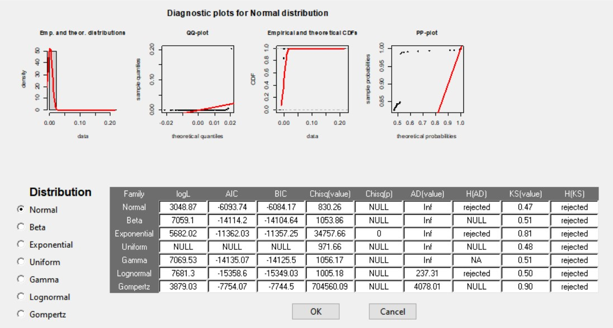
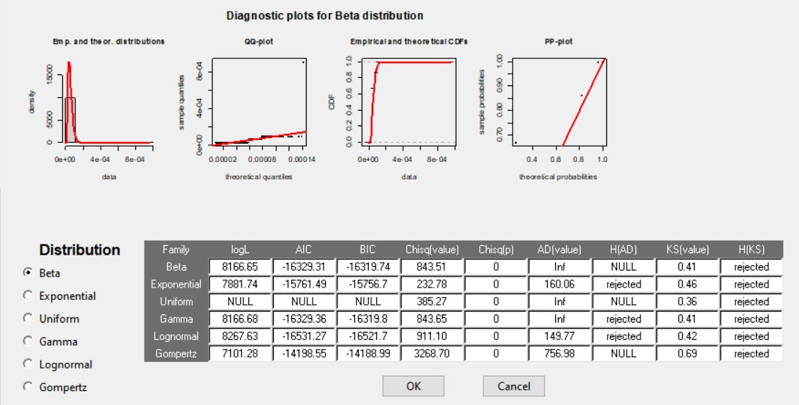
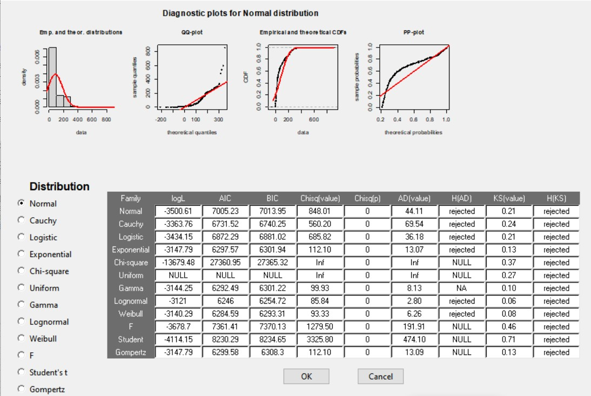

<br>

# Carátula

<br>

## Título: Análisis de datos de Evaluaciones Ambientales del Agua (EAT)

<br>

<br>

# Indice de contenido

<br>

1. Objetivos del proyecto
2. Importancia del proyecto
3. Preguntas de investigación
4. Dataframe y limpieza de datos
5. Variables de estudio
6. Parámetros muestrales y poblacionales
7. Análisis Descriptivo
8. Análisis inferencial y predictivo
9. Coclusiones
10. Reflexión

<br>

# 1. Objetivos del proyecto

<br>

Determinar las locaciones geográficas del Perú, en las cuales el agua cuenta con niveles anómalos de minerales y químicos,  los cuales infringen los parámetros establecido por el Ministerio del Ambiente. Además buscaremos determinar el tipo de contaminación que ocurrió en aquella locación en base a los residuos que se encuentran en la zona.

<br>

# 2. Importancia del proyecto

<br>

La presencia de niveles anómalos de materiales contaminantes en el agua puede ser causante de afecciones tanto a la salud humana, como animal y vegetal de la zona. Además,  podemos determinar las zonas que cuentan con mayores niveles de contaminación con la finalidad de atender esta problemática. Por lo que, consideramos relevante el estudio, identificación y análisis de los niveles de estos materiales. 

<br>

# 3. Preguntas de investigación

<br>


1. ¿En promedio las zonas acuíferas están contaminadas?

2. Considerando las variables de mayor importancia (Cadmio, Mercurio y sólidos disueltos) ¿Cuál es la zona de estudio que en promedio tiene más contaminantes?

3. ¿Existe alguna relación entre algunas de las variables?


<br>

# 4. Dataframe y limpieza de datos

<br>

Cargamos todas las librerías necesarias para poder ejecutar el trabajo.
```{r, include=FALSE}
require(rriskDistributions)
library("dplyr")
library("readr")
library("tidyr")
library("knitr")
```

Para este proyecto hemos recopilado el dataframe de la base de datos de la OEFA:  [http://datosabiertos.oefa.gob.pe/dataviews/257406/eat-componente-ambiental-agua/]

Se le asigna a la variable "DF" el dataframe recopilado de la página.
```{r, results='hide'}
DF = read_csv("ComponenteambientalAgua.csv")
DF[DF=="-"] <- NA
```

Como se observa en el dataframe DF, el estudio cuenta con más de 150 variables para analizar, siendo este un gran número para trabajar. Es por ello, que creamos un nuevo dataframe DF1 con las variables que consideramos más relevantes acorde a nuestro objetivo general.

La función parse_number() se utilizó para poder limpiar las observaciones debido a que los datos extraídos de la OEFA contaban con caracteres no numéricos (unidades de las variables) que impedían el desarrollo y análisis de las mismas. 
```{r}
DF1 = transmute(DF,nombre_de_evaluacion = DF$`Nombre de la evaluación`, 
                submatriz = DF$Submatriz,
                temperatura = parse_number(DF$Temperatura),
                altitud = parse_number(DF$Altitud),
                arsenico_disuelto = parse_number(DF$`Arsénico disuelto`),
                cadmio_disuelto = parse_number(DF$`Cadmio disuelto`),
                cobre_disuelto = parse_number(DF$`Cobre disuelto`),
                mercurio_disuelto = parse_number(DF$`Mercurio disuelto`),
                plata_disuelto = parse_number(DF$`Plata disuelto`),
                potencial_redox = parse_number(DF$`Potencial redox`),
                pH = parse_number(DF$`Potencial de hidrógeno`),
                oxigeno_disuelto = parse_number(DF$`Oxígeno Disuelto`),
                conductividad = parse_number(DF$Conductividad),
                solidos_disueltos = parse_number(DF$`Sólidos Totales Disueltos`)
                 )

# Se eliminaron los datos de Quellaveco debido a que utilizaba la coma como separador decimal
DF1 = DF1[-c(which(DF1$nombre_de_evaluacion == "Quellaveco")), ]

names(DF1)
```

# 5. Variables de estudio

```{r}

table(DF1$nombre_de_evaluacion)
ncol(DF1)
nrow(DF1)

```

El nuevo dataframe (DF1) toma en cuenta 10 zonas de estudio. Asimismo, cuenta con 14 variables y 888 observaciones

Las variables de estudio y su respectivo tipo se muestra en la siguiente tabla:

variables            | Tipo
---------------------|-----------------------------
nombre_de_evaluacion |categórica nominal
submatriz            |categórica nominal
temperatura          |numérica continua 
altitud              |numérica continua 
arsenico_disuelto    |numérica continua 
cadmio disuelto      |numérica continua 
cobre_disuelto       |numérica continua 
mercurio_disuelto    |numérica continua 
plata_disuelto       |numérica continua 
potencial_redox      |numérica continua 
pH                   |numérica continua 
oxigeno_disulto      |numérica continua 
conductividad        |numérica continua 
solidos_disueltos    |numérica continua 


# 6. Parámetros muestrales y poblacionales

Para sacar los intervalos de confianza y realizar las pruebas de hipótesis, en nuestro estudio nos hemos centrado en 3 variables: concentración de cadmio disuelto, concentración de mercurio disuelto y concentración de sólidos disueltos.

En primer lugar, escogimos estos dos metales por sus efectos adversos que tiene en la salud. Para el caso del cadmio, su ingesta puede causar problemas digestivos, tales como irritación e intoxicación estomacal. En el caso del mercurio, es uno de los contaminantes más usuales que se desechan en las mineras y se considera un metal muy tóxico. Este puede causar graves problemas en el sistema nervioso provocando alteraciones en la visión y cognición. Asimismo, se escogió la variable de concentraciones de sólidos disueltos, ya que de esta manera podemos saber qué zonas acuíferas son las que presentan mayor contaminación.

Hemos calculado la desviación estándar y media muestral para cada variable. A partir de ella, se realizó una estimación por intervalos para determinar la media poblacional. Para hallar adecuadamente los parámetros poblacionales lo que se hizo previamente fue identificar qué tipo de distribuciones siguen las muestras. Para ello empleamos la función fit.cont de la librería rriskDristributions. Esta función realiza distintas pruebas de bondad de ajuste (prueba de chi cuadrado, prueba de Anderson-Darling, prueba de Kolmogorov Smirnov) y muestra en orden el que mejor se ajusta. 


```{r}
# res1<-fit.cont(cadmio)
# res2<-fit.cont(mercurio)
# res3<-fit.cont(solidos)
```

Como se observa en la imagen adjuntada ninguna de las variables se ajusta a una distribución. 





Debido a que no se ajusta a ningún tipo de distribución, el cálculo del parámetro poblacional se realizó asumiendo que estas variables tomaban una distribución normal. 

## Estimación por intervalo de confianza de la media de la concentración de cadmio

Se realizaron los cálculos tomando como nivel de confianza al 90% y nivel de significancia al 10%.

α = 0.1

```{r Cadmio}

alpha = 0.1

temp <- DF1 %>% filter(is.na(cadmio_disuelto)==F)

cadmio <- temp$cadmio_disuelto

n_cadmio = length(cadmio)
sd_cadmio = sd(cadmio)
media_cadmio = mean(cadmio)
zizq_cadmio = qnorm(alpha/2)
zder_cadmio = -zizq_cadmio
lim_inferior_cadmio = media_cadmio + zizq_cadmio * sd_cadmio/sqrt(n_cadmio)
lim_superior_cadmio = media_cadmio - zizq_cadmio * sd_cadmio/sqrt(n_cadmio)
nivel_precison_cadmio = (media_cadmio - lim_inferior_cadmio)*100/media_cadmio


n_cadmio 
sd_cadmio
media_cadmio
lim_inferior_cadmio
lim_superior_cadmio

```
Con una muestra de 882 observaciones y al nivel de confianza del 90% se determina que la media poblacional para el caso de la concentración del cadmio se encuentra en un intervalo de [0.0001631856; 0.00100881].


```{r}

temp <- DF1 %>% filter(is.na(mercurio_disuelto)==F)

mercurio <- temp$mercurio_disuelto

n_mercurio = length(mercurio)
sd_mercurio = sd(mercurio)
media_mercurio = mean(mercurio)
zizq_mercurio = qnorm(alpha/2)
zder_mercurio = -zizq_mercurio
lim_inferior_mercurio = media_mercurio + zizq_mercurio * sd_mercurio/sqrt(n_mercurio)
lim_superior_mercurio = media_mercurio - zizq_mercurio * sd_mercurio/sqrt(n_mercurio)
nivel_precision_mercurio = (media_mercurio - lim_inferior_mercurio)*100/media_mercurio


n_mercurio
sd_mercurio
media_mercurio
lim_inferior_mercurio
lim_superior_mercurio

```
Con una muestra de 882 observaciones y al nivel de confianza del 90% se determina que la media poblacional para el caso de la concentración del mercurio se encuentra en un intervalo de [4.622524e-05; 5.05548e-05].

```{r}

temp <- DF1 %>% filter(is.na(solidos_disueltos)==F)

solidos <- temp$solidos_disueltos

n_solidos = length(solidos)
sd_solidos = sd(solidos)
media_solidos = mean(solidos)
zizq_solidos = qnorm(alpha/2)
zder_solidos = -zizq_solidos
lim_inferior_solidos = media_solidos + zizq_solidos * sd_solidos/sqrt(n_solidos)
lim_superior_solidos = media_solidos - zizq_solidos * sd_solidos/sqrt(n_solidos)
nivel_precision_solidos = (media_solidos - lim_inferior_solidos)*100/media_solidos


n_solidos
sd_solidos
media_solidos
lim_inferior_solidos
lim_superior_solidos

```
Con una muestra de 580 observaciones y al nivel de confianza del 90% se determina que la media poblacional para el caso de la concentración del mercurio se encuentra en un intervalo de [76.78392;  90.61264]. 

# 7. Análisis Descriptivo

## Concentración promedio de sustancias por zonas 

Para poder realizar una gráfica con las concentraciones promedio de cada sustancia por zona de estudio se creo un nuevo dataframe (DF3):

```{r}
#Zona:
Zona= c("Chancas", "Chontayacu", "Galeno", "Haquira", "La granja", "Laguna azul", "Lote 107","Lote 131", "Michiquillay", "San Gabriel" )

#Temperatura
PT = c(colSums(DF1[1:115,3], na.rm=1)/115, colSums(DF1[116:146,3], na.rm=1)/30,   colSums(DF1[147:315,3], na.rm=1)/168,  colSums(DF1[316:350,3], na.rm=1)/34,   colSums(DF1[351:441,3], na.rm=1)/90,   colSums(DF1[442:465,3], na.rm=1)/23,   colSums(DF1[466:511,3], na.rm=1)/45,   colSums(DF1[512:561,3], na.rm=1)/49,   colSums(DF1[562:878,3], na.rm=1)/316,  colSums(DF1[879:888,3], na.rm=1)/9)

#Altitud
PA = c(colSums(DF1[1:115,4], na.rm=1)/115, colSums(DF1[116:146,4], na.rm=1)/30,   colSums(DF1[147:315,4], na.rm=1)/168,  colSums(DF1[316:350,4], na.rm=1)/34,    colSums(DF1[351:441,4], na.rm=1)/90,   colSums(DF1[442:465,4], na.rm=1)/23,   colSums(DF1[466:511,4], na.rm=1)/45,   colSums(DF1[512:561,4], na.rm=1)/49,   colSums(DF1[562:878,4], na.rm=1)/316,  colSums(DF1[879:888,4], na.rm=1)/9)

#Arsénico
PArsenico = c(colSums(DF1[1:115,5], na.rm=1)/115, colSums(DF1[116:146,5], na.rm=1)/30,   colSums(DF1[147:315,5], na.rm=1)/168,  colSums(DF1[316:350,5], na.rm=1)/34,   colSums(DF1[351:441,5], na.rm=1)/90,    colSums(DF1[442:465,5], na.rm=1)/23,   colSums(DF1[466:511,5], na.rm=1)/45,   colSums(DF1[512:561,5], na.rm=1)/49,   colSums(DF1[562:878,5], na.rm=1)/316,  colSums(DF1[879:888,5], na.rm=1)/9)

#Cadmio
PCadmio = c(colSums(DF1[1:115,6], na.rm=1)/115, colSums(DF1[116:146,6], na.rm=1)/30,   colSums(DF1[147:315,6], na.rm=1)/168,  colSums(DF1[316:350,6], na.rm=1)/34,   colSums(DF1[351:441,6], na.rm=1)/90,   colSums(DF1[442:465,6], na.rm=1)/23,   colSums(DF1[466:511,6], na.rm=1)/45,   colSums(DF1[512:561,6], na.rm=1)/49,   colSums(DF1[562:878,6], na.rm=1)/316,  colSums(DF1[879:888,6], na.rm=1)/9)

#Cobre
PCobre = c(colSums(DF1[1:115,7], na.rm=1)/115, colSums(DF1[116:146,7], na.rm=1)/30,   colSums(DF1[147:315,7], na.rm=1)/168,   colSums(DF1[316:350,7], na.rm=1)/34,   colSums(DF1[351:441,7], na.rm=1)/90,   colSums(DF1[442:465,7], na.rm=1)/23,   colSums(DF1[466:511,7], na.rm=1)/45,   colSums(DF1[512:561,7], na.rm=1)/49,   colSums(DF1[562:878,7], na.rm=1)/316,  colSums(DF1[879:888,7], na.rm=1)/9)


#Mercurio
PMercurio = c(colSums(DF1[1:115,8], na.rm=1)/115,  colSums(DF1[116:146,8], na.rm=1)/30,   colSums(DF1[147:315,8], na.rm=1)/168,  colSums(DF1[316:350,8], na.rm=1)/34,   colSums(DF1[351:441,8], na.rm=1)/90,   colSums(DF1[442:465,8], na.rm=1)/23,   colSums(DF1[466:511,8], na.rm=1)/45,   colSums(DF1[512:561,8], na.rm=1)/49,   colSums(DF1[562:878,8], na.rm=1)/316,  colSums(DF1[879:888,8], na.rm=1)/9)


#Plata
PPlata = c(colSums(DF1[1:115,9], na.rm=1)/115, colSums(DF1[116:146,9], na.rm=1)/30,   colSums(DF1[147:315,9], na.rm=1)/168,  colSums(DF1[316:350,9], na.rm=1)/34,   colSums(DF1[351:441,9], na.rm=1)/90,   colSums(DF1[442:465,9], na.rm=1)/23,   colSums(DF1[466:511,9], na.rm=1)/45,   colSums(DF1[512:561,9], na.rm=1)/49,   colSums(DF1[562:878,9], na.rm=1)/316,  colSums(DF1[879:888,9], na.rm=1)/9)

#Potencial redox 
PRedox = c(colSums(DF1[1:115,10], na.rm=1)/115, colSums(DF1[116:146,10], na.rm=1)/30,  colSums(DF1[147:315,10], na.rm=1)/168,  colSums(DF1[316:350,10], na.rm=1)/34,  colSums(DF1[351:441,10], na.rm=1)/90,  colSums(DF1[442:465,10], na.rm=1)/23,  colSums(DF1[466:511,10], na.rm=1)/45,  colSums(DF1[512:561,10], na.rm=1)/49,  colSums(DF1[562:878,10], na.rm=1)/316,  colSums(DF1[879:888,10], na.rm=1)/9)

#pH
PpH = c(colSums(DF1[1:115,11], na.rm=1)/115, colSums(DF1[116:146,11], na.rm=1)/30,  colSums(DF1[147:315,11], na.rm=1)/168,  colSums(DF1[316:350,11], na.rm=1)/34,  colSums(DF1[351:441,11], na.rm=1)/90,  colSums(DF1[442:465,11], na.rm=1)/23,  colSums(DF1[466:511,11], na.rm=1)/45,  colSums(DF1[512:561,11], na.rm=1)/49,  colSums(DF1[562:878,11], na.rm=1)/316,  colSums(DF1[879:888,11], na.rm=1)/9)

#Oxígeno
POxigeno = c(colSums(DF1[1:115,12], na.rm=1)/115, colSums(DF1[116:146,12], na.rm=1)/30,  colSums(DF1[147:315,12], na.rm=1)/168,  colSums(DF1[316:350,12], na.rm=1)/34,  colSums(DF1[351:441,12], na.rm=1)/90,  colSums(DF1[442:465,12], na.rm=1)/23,  colSums(DF1[466:511,12], na.rm=1)/45,  colSums(DF1[512:561,12], na.rm=1)/49,  colSums(DF1[562:878,12], na.rm=1)/316,  colSums(DF1[879:888,12], na.rm=1)/9)

#Conductividad
PConductividad = c(colSums(DF1[1:115,13], na.rm=1)/115, colSums(DF1[116:146,13], na.rm=1)/30,  colSums(DF1[147:315,13], na.rm=1)/168,  colSums(DF1[316:350,13], na.rm=1)/34,  colSums(DF1[351:441,13], na.rm=1)/90,  colSums(DF1[442:465,13], na.rm=1)/23,  colSums(DF1[466:511,13], na.rm=1)/45,  colSums(DF1[512:561,13], na.rm=1)/49,  colSums(DF1[562:878,13], na.rm=1)/316,  colSums(DF1[879:888,13], na.rm=1)/9)

#Solidos disueltos 
PSD = c(colSums(DF1[1:115,14], na.rm=1)/115, colSums(DF1[116:146,14], na.rm=1)/30,  colSums(DF1[147:315,14], na.rm=1)/168,  colSums(DF1[316:350,14], na.rm=1)/34,  colSums(DF1[351:441,14], na.rm=1)/90,  colSums(DF1[442:465,14], na.rm=1)/23,  colSums(DF1[466:511,14], na.rm=1)/45,  colSums(DF1[512:561,14], na.rm=1)/49,  colSums(DF1[562:878,14], na.rm=1)/316,  colSums(DF1[879:888,14], na.rm=1)/9)


DF3 = data.frame(Zona, PT, PA, PArsenico, PCadmio, PCobre, PMercurio, PPlata, PRedox, PpH, POxigeno, PConductividad, PSD)
names(DF3) <- c("Nombre de evaluación", "Temperatura", "Altitud", "Arsénico", "Cadmio", "Cobre", "Mercurio", "Plata", "Potencial REDOX", "pH", "Oxígeno", "Conductividad", "Solidos disueltos")

DF3
```

Con este nuevo dataframe creado podemos realizar gráficas que nos permite observar a simple vista las concentraciones de las distintas sustancias por zona.

En el eje x, el número del 1 al 10 hace referencia a las zonas de estudio en el mismo orden respectivamente ("Chancas", "Chontayacu", "Galeno", "Haquira", "La granja", "Laguna azul", "Lote 107","Lote 131", "Michiquillay", "San Gabriel")

```{r}

plot(PPlata,type="o", col="red", ann = FALSE)
axis(1, at=1:10)
lines(PCadmio, type="o", col="green", ann = FALSE)
lines(PMercurio, type="o", col="blue", ann = FALSE)
title(xlab="Zonas", col.lab=rgb(0,0.5,0))
title(ylab="Concentración (mg/L)", col.lab=rgb(0,0.5,0))
title(main ="Concentración de plata y cadmio disuelto", col.lab=rgb(0,0.5,0))

legend(x = "topright",         
       legend = c("plata", "cadmio", "mercurio"), 
       lty = c(1, 1,1),          
       col = c(2, 3,4),          
       lwd = 2) 
 
```

La gráfica cumple una función descriptiva y se puede observar que la concentración de cadmio y plata tienen comportamientos similares, es decir, en zonas donde hay mayor cantidad de plata, también tiene altas concentraciones de cadmio. Por otro lado, en la segunda gráfica se observa que el mercurio es el metal con menor cantidad de concentración. En ninguna zona llega a 0.001 mg/L. 

## Boxplots

Los siguientes boxplots cumple un papel descriptivo porque nos muestra la distribución de los datos por zonas. También, nos permite observar los valores atípicos de los datos y la dispersión de estos con respecto a la mediana por cada zona.

Se puede observar a partir de la gráfica que la zona con mayor temperatura es Lote 131. Además, el Lote 107 tiene una temperatura mayor que forma parte de sus valores atípicos.


```{r}

boxplot(DF1$temperatura[1:115], DF1$temperatura[116:146], DF1$temperatura[147:315], DF1$temperatura[316:350], DF1$temperatura[351: 441], DF1$temperatura[442:465], DF1$temperatura[466:511], DF1$temperatura[512:561], DF1$temperatura[562:878], DF1$temperatura[879:888], col=c("red","yellow","blue", "green", "purple", "black", "brown", "orange", "skyblue", "pink"), main="boxplot: temperatura por zonas", xlab="zonas", ylab="temperatura")

legend(x = "topright", legend = c("Chancas", "Chontayacu",  "Galeno", "Haquira", "La granja", "Laguna azul", "Lote 107","Lote 131", "Michiquillay", "San Gabriel" ), fill = c("red","yellow","blue", "green", "purple", "black", "brown", "orange", "skyblue", "pink"), bty='n', cex=0.8)


Zona= c("Chancas", "Chontayacu", "Galeno", "Haquira", "La granja", "Laguna azul", "Lote 107","Lote 131", "Michiquillay", "San Gabriel" )


```

```{r}

boxplot(DF1$solidos_disueltos[1:115], DF1$solidos_disueltos[116:146], DF1$solidos_disueltos[147:315], DF1$solidos_disueltos[316:350], DF1$solidos_disueltos[351: 441], DF1$solidos_disueltos[442:465], DF1$solidos_disueltos[466:511], DF1$solidos_disueltos[512:561], DF1$solidos_disueltos[562:878], DF1$solidos_disueltos[879:888], col=c("red","yellow","blue", "green", "purple", "black", "brown", "orange", "skyblue", "pink"), main="boxplot: Cantidad de sólidos disueltos por zonas" , ylim = c(0,1500), xlab="zonas", ylab="concentración")

legend(x = "topright", legend = c("Chancas", "Chontayacu",  "Galeno", "Haquira", "La granja", "Laguna azul", "Lote 107","Lote 131", "Michiquillay", "San Gabriel" ), fill = c("red","yellow","blue", "green", "purple", "black", "brown", "orange", "skyblue", "pink"), bty='n', cex=0.8)


Zona= c("Chancas", "Chontayacu", "Galeno", "Haquira", "La granja", "Laguna azul", "Lote 107","Lote 131", "Michiquillay", "San Gabriel" )

```


Se observa que los datos de la cantidad de sólidos disueltos y la conductividad se comportan de manera similar, ya que sus gráficas tienen las mismas tendencias. En el caso de la gráfica de sólidos disueltos no se muestra la zona de Chotayacu y Lote 131 debido a que faltan datos. Así mismo, podemos observar que la zona de Chancas y Michiquillay presentan mayores cantidades de datos atípicos.


```{r}

boxplot(DF1$conductividad[1:115], DF1$conductividad[116:146], DF1$conductividad[147:315], DF1$conductividad[316:350], DF1$conductividad[351: 441], DF1$conductividad[442:465], DF1$conductividad[466:511], DF1$conductividad[512:561], DF1$conductividad[562:878], DF1$conductividad[879:888], col=c("red","yellow","blue", "green", "purple", "black", "brown", "orange", "skyblue", "pink"), main="boxplot: Conductividad por zonas" , ylim = c(0,1500),xlab="zonas", ylab="conductividad")

legend(x = "topright", legend = c("Chancas", "Chontayacu",  "Galeno", "Haquira", "La granja", "Laguna azul", "Lote 107","Lote 131", "Michiquillay", "San Gabriel" ), fill = c("red","yellow","blue", "green", "purple", "black", "brown", "orange", "skyblue", "pink"), bty='n', cex=0.8)


Zona= c("Chancas", "Chontayacu", "Galeno", "Haquira", "La granja", "Laguna azul", "Lote 107","Lote 131", "Michiquillay", "San Gabriel" )

```

```{r}

boxplot(DF1$mercurio_disuelto[1:115], DF1$mercurio_disuelto[116:146], DF1$mercurio_disuelto[147:315], DF1$mercurio_disuelto[316:350], DF1$mercurio_disuelto[351: 441], DF1$mercurio_disuelto[442:465], DF1$mercurio_disuelto[466:511], DF1$mercurio_disuelto[512:561], DF1$mercurio_disuelto[562:878], DF1$mercurio_disuelto[879:888], col=c("red","yellow","blue", "green", "purple", "black", "brown", "orange", "skyblue", "pink"), main="boxplot: Concentración de Mercurio disuelto por zonas" , ylim = c(0,0.0002), xlab="zonas", ylab="concentración")

legend(x = "topright", legend = c("Chancas", "Chontayacu",  "Galeno", "Haquira", "La granja", "Laguna azul", "Lote 107","Lote 131", "Michiquillay", "San Gabriel" ), fill = c("red","yellow","blue", "green", "purple", "black", "brown", "orange", "skyblue", "pink"), bty='n', cex=0.8)


Zona= c("Chancas", "Chontayacu", "Galeno", "Haquira", "La granja", "Laguna azul", "Lote 107","Lote 131", "Michiquillay", "San Gabriel" )

```
```{r}
boxplot(DF1$cadmio_disuelto[1:115], DF1$cadmio_disuelto[116:146], DF1$cadmio_disuelto[147:315], DF1$cadmio_disuelto[316:350], DF1$cadmio_disuelto[351: 441], DF1$cadmio_disuelto[442:465], DF1$cadmio_disuelto[466:511], DF1$cadmio_disuelto[512:561], DF1$cadmio_disuelto[562:878], DF1$cadmio_disuelto[879:888], col=c("red","yellow","blue", "green", "purple", "black", "brown", "orange", "skyblue", "pink"), main="boxplot: Concentración de Cadmio disuelto por zonas" , ylim = c(0,0.003), xlab="zonas", ylab="concentración")

legend(x = "topright", legend = c("Chancas", "Chontayacu",  "Galeno", "Haquira", "La granja", "Laguna azul", "Lote 107","Lote 131", "Michiquillay", "San Gabriel" ), fill = c("red","yellow","blue", "green", "purple", "black", "brown", "orange", "skyblue", "pink"), bty='n', cex=0.8)


Zona= c("Chancas", "Chontayacu", "Galeno", "Haquira", "La granja", "Laguna azul", "Lote 107","Lote 131", "Michiquillay", "San Gabriel" )

```
En estas dos últimas gráficas que representa la concentración de mercurio y cadmio podemos observar que tiene poca dispersión en sus datos, ya que la mayoría de datos está concentrado en la mediana. Lo que destaca es la zona de La granja cuyos datos son los más dispersos para ambos metales.

## Parámetros ambientales

En el 2015 el Ministerio del Ambiente (MINAM) promulgó un Decreto Supremo en el cual se mencionan los valores Estándares de Calidad del Agua. Recopilado de la pagina web [Estandares de Calidad Ambiental para Agua] (https://www.minam.gob.pe/notas-de-prensa/lima-30-de-diciembre-de-2015-mediante-decreto-supremo-no-015-2015-minam-publicado-el-19-de-diciembre-de-2015-en-el-diario-oficial-el-peruano-el-ministerio-del-ambiente-minam-en-coordinacion/)

Nuestro principal objetivo consiste en analizar las zonas de un estudio en las cuales se infringen estos valores estándares. Es por ello que se recopiló aquellos elementos más dañinos para la salud humana para el estudio y análisis de esto. Asimismo, nuestras pruebas de hipótesis cuentan como referencia los valores acordes a los decretos del MINAM siendo estos:

| Parámetro         | Unidad      | Valor         |
|-------------------|-------------|---------------|
| Cadmio            | mg / L      | < 0.00025     |
| Mercurio          | mg / L      | < 0.0001      |
| Solidos disueltos | mg / L      | < 100         |

```{r}

Parametros = read_csv("Parametrosambientales.csv")

Parametros[Parametros=="-"] <- NA

Parametros

```


## Cumplimiento de los parámetros ambientales para las zonas

Con el dataframe DF3 creado anteriormente se pueden graficar barplot para determinar si alguna zona de estudio pasa el límite establecido por el MINAM. 

```{r}

#Cadmio

barplot(DF3$Cadmio, ylim = c(0, 0.0012), col=c("red","yellow","blue", "green", "purple", "black", "brown", "orange", "skyblue", "pink"), main = "Concentración de cadmio por zonas", xlab = "Zonas", ylab = "Concentración  (mg/L)")

legend(x = "topright", legend = c("Chancas", "Chontayacu",  "Galeno", "Haquira", "La granja", "Laguna azul", "Lote 107","Lote 131", "Michiquillay", "San Gabriel" ), fill = c("red","yellow","blue", "green", "purple", "black", "brown", "orange", "skyblue", "pink"), bty='n', cex=0.7)
legend(x = "right", legend = "Límite", lty = c(1, 2), col = 2, bty='n', cex=0.7)

abline(h=Parametros[1,3], col = "red")

#Mercurio

barplot(DF3$Mercurio, ylim = c(0, 0.00015), col=c("red","yellow","blue", "green", "purple", "black", "brown", "orange", "skyblue", "pink"), main = "Concentración de mercurio por zonas", xlab = "Zonas", ylab = "Concentración  (mg/L)")

legend(x = "topright", legend = c("Chancas", "Chontayacu",  "Galeno", "Haquira", "La granja", "Laguna azul", "Lote 107","Lote 131", "Michiquillay", "San Gabriel" ), fill = c("red","yellow","blue", "green", "purple", "black", "brown", "orange", "skyblue", "pink"), bty='n', cex=0.7)
legend(x = "right", legend = "Límite", lty = c(1, 2), col = 2, bty='n', cex=0.7)

abline(h=Parametros[1,5], col = "red")


#Sólidos disueltos

barplot(DF3$`Solidos disueltos`, ylim = c(0, 300), col=c("red","yellow","blue", "green", "purple", "black", "brown", "orange", "skyblue", "pink"), main = "Concentración de sólidos disueltos por zonas", xlab = "Zonas", ylab = "Concentración  (mg/L)")

legend(x = "topright", legend = c("Chancas", "Chontayacu",  "Galeno", "Haquira", "La granja", "Laguna azul", "Lote 107","Lote 131", "Michiquillay", "San Gabriel" ), fill = c("red","yellow","blue", "green", "purple", "black", "brown", "orange", "skyblue", "pink"), bty='n', cex=0.7)
legend(x = "right", legend = "Límite", lty = c(1, 2), col = 2, bty='n', cex=0.7)

abline(h=Parametros[2,14], col = "red")

```


A partir de las gráficas podemos observar que varias zonas sobrepasan los límites establecidos por el MINAM. Por lo que, para una rápida interpretación, organizamos en una tabla la información obtenida de las gráficas, donde 0 significa que no sobrepasa el límite y 1 que sí lo supera de acuerdo a la sustancia. De esta manera, podemos contabilizar cuantas zonas están contaminadas.

Zonas        | Cadmio | Mercurio | Solidos disueltos | Total | 
-------------|--------|----------|-------------------|-------|
Chancas      | 0 | 0 | 0 | 0 | 
Chotayacu    | 1 | 1 | 0 | 2 |
Galeno       | 0 | 0 | 0 | 0 | 
Haquira      | 0 | 0 | 0 | 0 | 
La granja    | 1 | 0 | 0 | 1 |
Laguna Azul  | 0 | 0 | 1 | 1 | 
Lote 107     | 0 | 0 | 0 | 0 | 
Lote 131     | 1 | 1 | 0 | 2 | 
Michiquillay | 1 | 0 | 0 | 0 | 
San Gabriel  | 0 | 0 | 0 | 0 | 

Podemos resumir la tabla en un barplot:
```{r}

tabla <- data.frame(
"zonas" = c("Chontayacu", "Laguna Azul", "Lote 107", "Lote 131")
,
"excesos" = c(2,1,0,2)
)

barplot(tabla$excesos, xlab = "Zonas", ylab = "Contaminación", names.arg = tabla$zonas, col = c("blue", "green", "yellow", "red" ))
```

# 8. Análisis inferencial y predictivo

## Prueba de hipótesis


Durante el análisis descriptivo vimos que se observaron varios parámetros excedidos de sus límites permitidos, por lo que decidimos proponer pruebas de hipótesis en base a estas variables para resolver dudas a partir de esta muestra con respecto a la población. Además, debemos de aclarar que nuestros datos al no ajustarse a una distribución conocida fueron consideradas como una distribución normal.Por último, las zonas coloreadas (color rosa) en las gráficas de prueba de hipótesis corresponden a las zonas de NO RECHAZO y las zonas sin colorear (sin color) corresponden a las zonas de RECHAZO.

Por lo cual, como 1era prueba de hipótesis elegimos conocer si las zonas acuíferas contienen en promedio una concentración de cadmio disuelto menor a 0.00025 que es el parámetro límite para el cadmio disuelto según el MINAM.Por lo dicho anteriormente, establecemos como H0: μ >= 0.00025 y H1: μ < 0.00025.

$$H0:μ>=0.00025$$

$$H1:μ<0.00025$$

Esta prueba de hipótesis será de 1 cola (cola izquierda) y el nivel de significancia será del 10%.

α=0.1
Primero, hallaremos el valor crítico y el estadístico de prueba para esta prueba de hipótesis.


```{r Prueba de hipótesis 1}

valor_critico = qnorm(0.1)
estadistico_prueba = (media_cadmio - 0.00025)/(sd_cadmio/sqrt(n_cadmio))

valor_critico
estadistico_prueba


normal_area <- function(mean = 0, sd = 1, lb, ub, acolor = "lightgray", ...) {
    x <- seq(mean - 3 * sd, mean + 3 * sd, length = 100) 
    
    if (missing(lb)) {
       lb <- min(x)
    }
    if (missing(ub)) {
        ub <- max(x)
    }

    x2 <- seq(lb, ub, length = 100)    
    plot(x, dnorm(x, mean, sd), type = "n", ylab = "")
   
    y <- dnorm(x2, mean, sd)
    polygon(c(lb, x2, ub), c(0, y, 0), col = acolor)
    lines(x, dnorm(x, mean, sd), type = "l", ...)
}

normal_area(mean = 0, sd = 1, lb = valor_critico, lwd = 2, acolor = "pink")

abline(v= estadistico_prueba, lty=1, col = "blue")


#Se ubica en la zona de no rechazo

```
La línea azul representa el valor del estadístico de prueba para la 1era prueba de hipótesis y como se observa cae en la zona de NO RECHAZO. Por lo tanto, no podemos rechazar esta 1era hipótesis nula. Esto quiere decir que las zonas acuíferas contienen en promedio una concentración de cadmio disuelto mayor igual a 0.00025.


En nuestra 2da prueba de hipótesis propusimos conocer si las zonas acuíferas contienen en promedio una concentración de mercurio disuelto menor a 10^-4 que es el parámetro límite para el mercurio disuelto según el MINAM.Por lo dicho anteriormente, establecemos como H0: μ >= 10^-4 y H1: μ < 10^-4.

$$H0:μ>=10−4$$

$$H1:μ<10−4$$

Esta prueba de hipótesis será de 1 cola (cola izquierda) y el nivel de significancia será del 10%.

α=0.1
Primero, hallaremos el valor crítico y el estadístico de prueba para esta prueba de hipótesis.

```{r hipótesis 2}
valor_critico = qnorm(0.1)
estadistico_prueba = (media_mercurio - 10^(-4))/(sd_mercurio/sqrt(n_mercurio))

valor_critico
estadistico_prueba


normal_area <- function(mean = 0, sd = 1, lb, ub, acolor = "lightgray", ...) {
    x <- seq(mean - 3 * sd, mean + 3 * sd, length = 100) 
    
    if (missing(lb)) {
       lb <- min(x)
    }
    if (missing(ub)) {
        ub <- max(x)
    }

    x2 <- seq(lb, ub, length = 100)    
    plot(x, dnorm(x, mean, sd), type = "n", ylab = "")
   
    y <- dnorm(x2, mean, sd)
    polygon(c(lb, x2, ub), c(0, y, 0), col = acolor)
    lines(x, dnorm(x, mean, sd), type = "l", ...)
}

normal_area(mean = 0, sd = 1, lb = valor_critico, lwd = 2, acolor = "pink")

```
Observamos que la linea que indica el estadístico de prueba no se observa. Por lo tanto, extendemos los límites del eje horizontal de la gráfica hacia la izquierda para evidenciar que se encuentra en la zona de RECHAZO.

```{r}
normal_area <- function(mean = 0, sd = 1, lb, ub, acolor = "lightgray", ...) {
    x <- seq(mean - 40 * sd, mean + 3 * sd, length = 100) 
    
    if (missing(lb)) {
       lb <- min(x)
    }
    if (missing(ub)) {
        ub <- max(x)
    }

    x2 <- seq(lb, ub, length = 100)    
    plot(x, dnorm(x, mean, sd), type = "n", ylab = "")
   
    y <- dnorm(x2, mean, sd)
    polygon(c(lb, x2, ub), c(0, y, 0), col = acolor)
    lines(x, dnorm(x, mean, sd), type = "l", ...)
}

normal_area(mean = 0, sd = 1, lb = valor_critico, lwd = 2, acolor = "pink")

abline(v= estadistico_prueba, lty=1, col = "blue")

```

La línea azul representa el valor del estadístico de prueba para la 2da prueba de hipótesis y como se observa cae en la zona de RECHAZO. Por lo tanto, podemos rechazar esta 2da hipótesis nula.

En nuestra 3ra prueba de hipótesis propusimos conocer si las zonas acuíferas contienen en promedio una concentración de sólidos disueltos menor a 100 que es el parámetro límite para los sólidos disueltos según el MINAM.Por lo dicho anteriormente, establecemos como H0: μ >= 100 y H1: μ < 100.

$$H0:μ>=100$$

$$H1:μ<100$$

Esta prueba de hipótesis será de 1 cola (cola izquierda) y el nivel de significancia será del 10%.

α=0.1
Primero, hallaremos el valor crítico y el estadístico de prueba para esta prueba de hipótesis.

```{r hipótesis 3}

valor_critico = qnorm(0.1)
estadistico_prueba = (media_solidos - 100)/(sd_solidos/sqrt(n_solidos))

valor_critico
estadistico_prueba


normal_area <- function(mean = 0, sd = 1, lb, ub, acolor = "lightgray", ...) {
    x <- seq(mean - 5 * sd, mean + 5 * sd, length = 100) 
    
    if (missing(lb)) {
       lb <- min(x)
    }
    if (missing(ub)) {
        ub <- max(x)
    }

    x2 <- seq(lb, ub, length = 100)    
    plot(x, dnorm(x, mean, sd), type = "n", ylab = "")
   
    y <- dnorm(x2, mean, sd)
    polygon(c(lb, x2, ub), c(0, y, 0), col = acolor)
    lines(x, dnorm(x, mean, sd), type = "l", ...)
}

normal_area(mean = 0, sd = 1, lb = valor_critico, lwd = 2, acolor = "pink")

abline(v= estadistico_prueba, lty=1, col = "blue")

```
La línea azul representa el valor del estadístico de prueba para la 3era prueba de hipótesis y como se observa cae en la zona de RECHAZO. Por lo tanto, podemos rechazar esta 3era hipótesis nula. Se rechaza que la media poblacional de la concentración de sólidos disueltos sea mayor igual a 100.

## Regresión

En el estudio se considerará para la Regresión Lineal: - 0-0.5 correlación débil-positiva - 0.5 correlacion moderada-positiva - 0.5-1 correlación fuerte-positiva

### Altitud vs Temperatura

Empleando la función plot() buscabamos comparar y analizar la gráfica de altitud vs temperatura
```{r}
plot(DF1$temperatura ~DF1$altitud,xlab="Altitud", ylab="Temperatura", main="Altitud vs Temperatura", col=rgb(0,0.5,0,0.5), ylim=c(0,70), sub= paste(cor(DF1$temperatura, DF1$altitud, use="complete.obs")))

lm1_temp_alt<-lm(DF1$temperatura ~DF1$altitud+1)
abline(lm1_temp_alt,col="red")
```
Utilizamos la función “summary” que nos dará el sumario de del modelo planteado entre altitud y la temperatura:
```{r}
summary(lm1_temp_alt)

```
La variable dependiente es temperatura y la variable independiente es altitud, lo que representa que por cada cantidad de la variable altitud hay cierta cantidad de la variable temperatura. La correlación es de 0.763 (fuerte positiva). Luego, el R^2 es 0.5821 lo que significa que 58.21% de la variabilidad de la variable temperatura es predicha por la variable altitud.

Ahora, planteamos la siguiente hipótesis nula:

$$H0: β = 0$$

Donde β es la pendiente

De modo que, con un nivel de significancia de 5% (α = 0.05), se observa que el p value es menor que este:

 
$$p value = 2e-16 < α = 0.05$$
En este sentido, se rechaza la hipótesis nula anteriormente planteada.

Ahora estimaremos la ecuación de relación entre la temperatura y la altitud:

$$y=a+bx$$
Variable dependiente = temperatura
Variable independiente = altitud

```{r}

DF_Temporal_1 <- DF1 %>% filter(is.na(temperatura)==F, is.na(altitud)==F)

X=DF_Temporal_1$altitud
Y=DF_Temporal_1$temperatura
r=cor(X,Y)
r
b=r*sd(Y)/sd(X)
b #pendiente
a=mean(Y)-b*mean(X)
a #intercepto

```

La ecuación de relación viene representada por:
$$ y=24.96662-0.003142217x_1 $$


<br> 

### pH vs Redox

Empleando la función plot() buscamos comparar y analizar la gráfica de pH vs Potencial REDOX 
```{r}
plot(DF1$pH ~DF1$potencial_redox,xlab="Potencial REDOX", ylab="pH", main="pH vs Redox", col=rgb(0,0,0.5,0.5), sub= paste(cor(DF1$pH, DF1$potencial_redox, use="complete.obs")))
lm1_ph_potered<-lm(DF1$pH ~DF1$potencial_redox+1)
abline(lm1_ph_potered,col="red")
```
Utilizamos la función “summary” que nos dará el sumario de del modelo planteado entre pH y potencial de REDOX:
```{r}
summary(lm1_ph_potered)
```

La variable dependiente es el pH y la variable independiente es el potencial de REDOX, lo que representa que por cada cantidad de la variable potencial de REDOX hay cierta cantidad de la variable pH. La correlación es de 0.85(fuerte positiva). Luego, el R^2 es 0.7218 lo que significa que 72.18% de la variabilidad de la variable pH es predicha por la variable potencial de REDOX.

Ahora, planteamos la siguiente hipótesis nula:

$$H0: β = 0$$

Donde β es la pendiente

De modo que, con un nivel de significancia de 5% (α = 0.05), se observa que el p value es menor que este:

 
$$p value = 2e-16 < α = 0.05$$

En este sentido, se rechaza la hipótesis nula anteriormente planteada.

Ahora estimaremos la ecuación de relación entre el pH y el potencial de REDOX:

$$y=a+bx$$
Variable dependiente = pH
Variable independiente = potencial de REDOX


```{r}
DF_Temporal_2 <- DF1 %>% filter(is.na(potencial_redox)==F, is.na(pH)==F)

X=DF_Temporal_2$potencial_redox
Y=DF_Temporal_2$pH
r=cor(X,Y)
r
b=r*sd(Y)/sd(X)
b
a=mean(Y)-b*mean(X)
a

```
La ecuación de relación viene representada por:
$$ y=8.823846-0.01283822x_1 $$

<br> 

### Conductividad vs Sólidos disueltos

Empleando la función plot() buscamos comparar y analizar la gráfica de Conductividad vs Sólidos disueltos
```{r}
plot(DF1$conductividad ~DF1$solidos_disueltos,xlab="sólidos disueltos", ylab="Conductividad", main="Conductividad vs Sólidos disueltos", col=rgb(0,0.7,0,0.5), ylim=c(0,1500), xlim=c(0,1000), sub= paste(cor(DF1$conductividad, DF1$solidos_disueltos, use="complete.obs")) )

lm1_cond_solid<-lm(DF1$conductividad ~DF1$solidos_disueltos+1)
abline(lm1_cond_solid,col="red")

```
Utilizamos la función “summary” que nos dará el sumario de del modelo planteado entre altitud y la temperatura:
```{r}
summary(lm1_cond_solid)
```

La variable dependiente es la conductividad y la variable independiente son los solidos_disueltos, lo que representa que por cada cantidad de la variable solidos_disueltos hay cierta cantidad de la variable conductividad. La correlación es de 0.965(fuerte positiva). Luego, el R^2 es 0.9316 lo que significa que 93.16% de la variación de la variable solidos_disueltos es predicha por la variable conductividad.

Ahora, planteamos la siguiente hipótesis nula:

$$H0: β = 0$$

Donde β es la pendiente

De modo que, con un nivel de significancia de 5% (α = 0.05), se observa que el p value es menor que este:

 
$$p-value = 2e-16 < α = 0.05$$
En este sentido, se rechaza la hipótesis nula anteriormente planteada.

Ahora estimaremos la ecuación de relación entre la conductividad y solidos_disueltos:

$$y=a+bx$$
Variable dependiente = conductividad
Variable independiente = solidos_disueltos

```{r}
DF_Temporal_3 <- DF1 %>% filter(is.na(conductividad)==F, is.na(solidos_disueltos)==F)

X=DF_Temporal_3$solidos_disueltos
Y=DF_Temporal_3$conductividad
r=cor(X,Y)
r
b=r*sd(Y)/sd(X)
b
a=mean(Y)-b*mean(X)
a

```
La ecuación de relación viene representada por:
$$ y= 7.641811+1.374604x_1 $$


```{r}
plot(DF1$temperatura ~DF1$oxigeno_disuelto,xlab="oxígeno disuelto", ylab="Temperatura", main="temperatura vs oxígeno disuelto", col=rgb(0,0,1,0.5), ylim=c(0,70), xlim=c(0,15), sub= paste(cov(DF1$temperatura, DF1$oxigeno_disuelto, use="complete.obs")))
```


# 9. Conclusiones

Pregunta 1: ¿En promedio las zonas acuíferas están contaminadas?

Empleando los valores promedio de los respectivos elementos contaminantes se realizaron 3 pruebas de hipótesis diseñadas para determinar valores excedentes de aquellos establecidos por el MINAM. De las cuales, 2 pruebas se encontraban en la zona de rechazo, concluyendo que en promedio las zonas acuíferas cercanas a mineras sí se encuentran contaminadas, pues sus valores promedios exceden lo reglamentario. 


Pregunta 2: ¿Cuál es la zona de estudio que en promedio tiene más contaminantes?

Se realizó un análisis descriptivo empleando un gráfico de barras que nos permitiera visualizar las zonas acuíferas agrupadas versus la cantidad de parámetros que exceden los valores permitidos. Por lo que se concluye que tanto Chontayacu y Lote 131 son las zonas que en promedio cuentan con más contaminantes, ambos contando con 2 parámetros que infringen las normas del MINAM.


Pregunta 3: ¿Existe alguna relación entre algunas de las variables?

Partiendo del análisis de una función plot se encontraron tres posibles relaciones entre variables. En primer lugar, encontramos una relación entre altura y temperatura de las locaciones de las zonas acuíferas. En segundo lugar, se aprecia una relación entre el pH y el potencial redox, esta relación nace de la propiedad química de la alcalinidad del agua. Por último, en tercer lugar, contamos con la relación entre Conductividad y Sólidos Disueltos, lo cual es una señal de la gran presencia de metales pesados en zonas acuíferas, pues son estos tipos de materiales los que generan la conductividad eléctrica. Concluyendo de que si existen variables que se relacionan entre sí en el estudio.

# 10. Reflexión

Tras analizar los resultados y conclusiones basados en nuestras preguntas de investigación hemos podido determinar la veracidad o falsedad de estas. Para ello, empleamos los conocimientos de la estadística descriptiva la cual no permitió obtener conclusiones empleando gráficas, mientras que, los conocimientos de estadística inferencial nos permitieron diseñar pruebas para corroborar nuestras hipótesis sobre los promedios de contaminación en zonas acuíferas mineras. Como reflexión final, tenemos que este tipo de estudios son de vital importancia pues brindan las herramientas para analizar aquellas zonas mineras en el Perú en las cuales existen rezagos de contaminación ambiental, la cual es una práctica que debe ser regulada a fin de evitar daños ambientales. 


