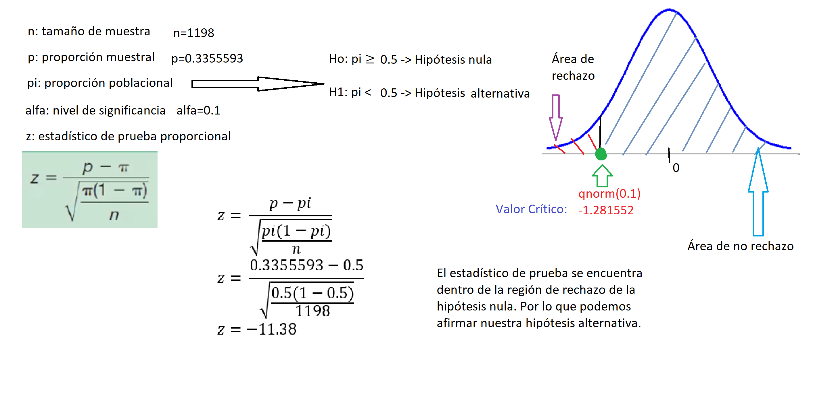
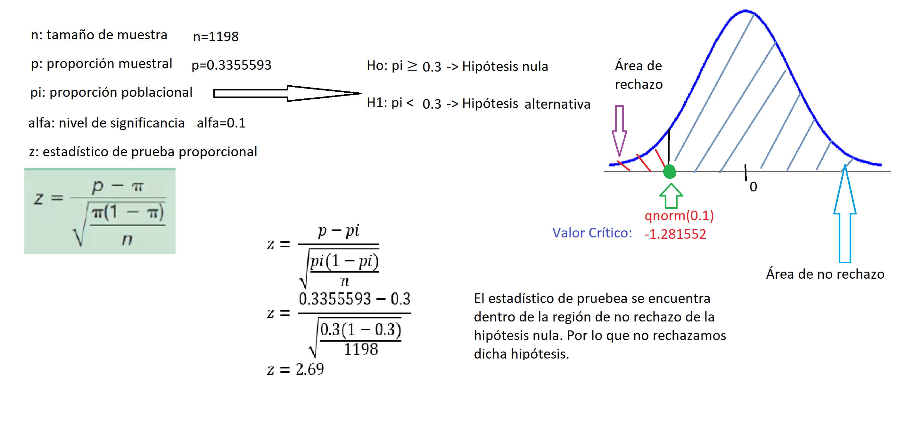
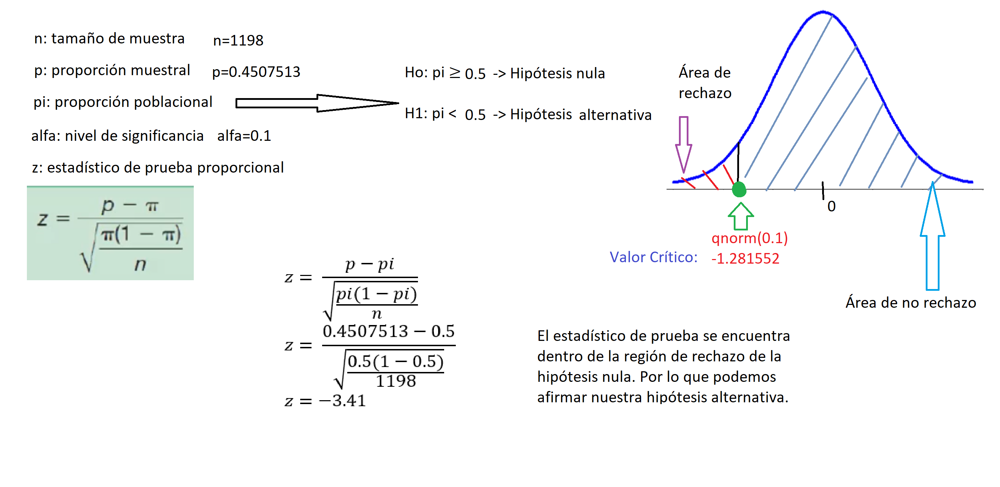
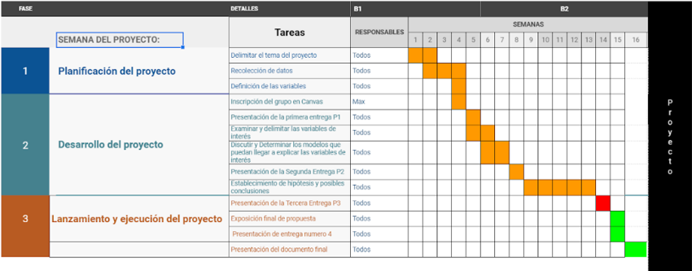

```{r setup, include=FALSE}
knitr::opts_chunk$set(echo = TRUE)
library(readr)
library(modeest)
library(dplyr)
library(ggplot2)
migracion_de_mexico <- read_csv("Base_de_datos/Encuesta_Nacional_de_Migracion.csv")
revisiones_migratorias <-read_csv("Base_de_datos/revisiones-migratorias.csv")
Percepcion_Seguridad_Publica_Datos <- read_delim("Base_de_datos/Percepcion Seguridad Publica - Datos.csv",
    ";", escape_double = FALSE, trim_ws = TRUE)
victimas_delito <- read.csv("Base_de_datos/personas-atendidas-victimas-delito.csv")
visitas_verificacion_migratoria <- read.csv("Base_de_datos/visitas-verificacion-migratoria.csv")
Indicadores <- read_delim("Base_de_datos/Indicadores.csv", 
    ";", escape_double = FALSE, trim_ws = TRUE)
incidencia_delictiva <- read_delim("Base_de_datos/Incidencia_Delictiva.csv", 
    ";", escape_double = FALSE, trim_ws = TRUE)
irregulares <- read_csv("Base_de_datos/Libro5.csv")
tasa_incidencia <- read_csv("Base_de_datos/Tasa-de-incidencia1.csv")
```

## **Introducción**

Este estudio trata un tema sensible el cual es sobre la inmigración y la violencia. En este caso, se esta dando el enfoque en México donde se conoce que tiene una alta tasa de violencia, sexismo y discriminación. Por lo que sería de interés saber si hay alguna relación entre estas dos variables.\
Con el paso de los años los países, en su mayoría países latinos, se han visto afectados por una gran cantidad de inmigrantes de diferentes partes del mundo por diversas razones. Este aumento progresivo de inmigraciones ha traído consigo beneficios y daños a la población donde se inmigra. Una de estos posibles daños es el aumento de crímenes/violencia tras la llegada de inmigrantes, sea por la misma población hacia los inmigrantes como los inmigrantes en sí. Por ello, es que nos enfocamos en México pues, tienen una cultura muy diversa y un alto flujo de inmigrantes. Por lo que se busca ver una relación entre estos dos factores, el incremento violencia y las inmigraciones.

## **Objetivo**

Evaluar el crecimiento de violencia según las inmigraciones realizadas en México por medio de datos extraídos del Instituto Nacional de Estadística y Geografía(INEGI).

-   **Objetivos Específicos**

    -   Determinar cómo las inmigraciones en México pueden alterar el orden público.
    -   Determinar que indicadores muestran una mayor relevancia.
    -   Hallar una correlación entre el aumento de violencia y las inmigraciones.\
    -   Conocer la percerpción de los mexicanos sobre los extranjeros en su país.
    -   Encontrar posibles relaciones que indiquen patrones de rechazo/intolerancia hacia los extranjeros en México.

-   **Preguntas Plateadas**

+----------------------------------------------------------------------------------------------------+------------------+
| Preguntas                                                                                          | Tipo de pregunta |
+====================================================================================================+==================+
| *¿Qué relación existe entre el índice de violencia y el de inmigraciones?*                         | **Plausible**    |
+----------------------------------------------------------------------------------------------------+------------------+
| *¿En qué región se presenta mayor índice de violencia en el caso de inmigración?*                  | **Específica**   |
+----------------------------------------------------------------------------------------------------+------------------+
| *¿Se percibe inseguridad/incomodidad en presencia de un inmigrante?*                               | **Factible**     |
+----------------------------------------------------------------------------------------------------+------------------+
| *¿Cuáles son las poblaciones de inmigrantes más propensas a recibir discriminación?*               | **Plausible**    |
+----------------------------------------------------------------------------------------------------+------------------+
| *¿Afecta la presencia de extranjeros las oportunidades de trabajo?*                                | **Interesante**  |
+----------------------------------------------------------------------------------------------------+------------------+
| *¿Cómo se percibe la presencia de un inmigrante?*                                                  | **Interesante**  |
+----------------------------------------------------------------------------------------------------+------------------+
| *¿Cuál es la proporción de la población mexicana que se siente insegura frente a los extranjeros?* | **Interesante**  |
+----------------------------------------------------------------------------------------------------+------------------+
| *¿Cuál es la proporción de los mexicanos que sienten que los extranjeros le quitan su trabajo?*    | **Interesante**  |
+----------------------------------------------------------------------------------------------------+------------------+

## **Marco Teórico**

-   **Población Objetivo**: Es el conjunto de individuos que conforman dos grupos, los inmigrantes y los ciudadanos mexicanos.

-   **Unidades Muestrales**: Inmigrantes y los ciudadanos mexicanos.

-   **Variables**: La variables encontradas se utilizarán para responder las preguntas planteadas.

+-------------------------------------------------------------------------------------------------------------------------------------------------------------------------------------+--------------------+
| Variables                                                                                                                                                                           | Tipos de variables |
+=====================================================================================================================================================================================+====================+
| Para usted, ¿Se justifica o no se justifica expulsar de una comunidad a alguien que no es de la religión que tiene la mayoría?                                                      | **Categórica**     |
+-------------------------------------------------------------------------------------------------------------------------------------------------------------------------------------+--------------------+
| Para usted, ¿Se justifica o no se justifica devolver a un extranjero a su país por no tener papeles?                                                                                | **Categórica**     |
+-------------------------------------------------------------------------------------------------------------------------------------------------------------------------------------+--------------------+
| Para usted, ¿Se justifica o no se justifica discriminar a inmigrantes por practicar costumbres diferentes?                                                                          | **Categórica**     |
+-------------------------------------------------------------------------------------------------------------------------------------------------------------------------------------+--------------------+
| ¿Estaría dispuesto o no estaría dispuesto a permitir que en su casa vivieran personas de otra religión?                                                                             | **Categórica**     |
+-------------------------------------------------------------------------------------------------------------------------------------------------------------------------------------+--------------------+
| ¿Podría decirme, por favor, una palabra que asocie con la expresión 'frontera norte de México'?                                                                                     | **Categórica**     |
+-------------------------------------------------------------------------------------------------------------------------------------------------------------------------------------+--------------------+
| ¿Podría decirme, por favor, una palabra que asocie con la expresión 'frontera sur de México'?                                                                                       | **Categórica**     |
+-------------------------------------------------------------------------------------------------------------------------------------------------------------------------------------+--------------------+
| Usted cree que los mexicanos que viven en el extranjero deben tener...                                                                                                              | **Categórica**     |
+-------------------------------------------------------------------------------------------------------------------------------------------------------------------------------------+--------------------+
| Usted considera que desde la crisis económica del 2008 han regresado...                                                                                                              | **Categórica**     |
+-------------------------------------------------------------------------------------------------------------------------------------------------------------------------------------+--------------------+
| ¿Cuál cree usted que es el principal problema de los mexicanos que regresan al país después de vivir en el extranjero?                                                              | **Categórica**     |
+-------------------------------------------------------------------------------------------------------------------------------------------------------------------------------------+--------------------+
| Actualmente, ¿cuál considera que es el principal problema para los extranjeros que viven en México?                                                                                 | **Categórica**     |
+-------------------------------------------------------------------------------------------------------------------------------------------------------------------------------------+--------------------+
| En general, ¿su opinión sobre los extranjeros que viven en México es muy buena, buena, mala o muy mala?                                                                             | **Categórica**     |
+-------------------------------------------------------------------------------------------------------------------------------------------------------------------------------------+--------------------+
| Dígame por favor ¿Qué tan de acuerdo o en desacuerdo está con las siguientes afirmaciones sobre los extranjeros que viven en México? Contribuyen a la economía de México            | **Categórica**     |
+-------------------------------------------------------------------------------------------------------------------------------------------------------------------------------------+--------------------+
| Dígame por favor ¿Qué tan de acuerdo o en desacuerdo está con las siguientes afirmaciones sobre los extranjeros que viven en México? Quitan empleos a los Mexicanos                 | **Categórica**     |
+-------------------------------------------------------------------------------------------------------------------------------------------------------------------------------------+--------------------+
| Dígame por favor ¿Qué tan de acuerdo o en desacuerdo está con las siguientes afirmaciones sobre los extranjeros que viven en México? Generan inseguridad                            | **Categórica**     |
+-------------------------------------------------------------------------------------------------------------------------------------------------------------------------------------+--------------------+
| Dígame por favor ¿Qué tan de acuerdo o en desacuerdo está con las siguientes afirmaciones sobre los extranjeros que viven en México? Traen ideas innovadoras                        | **Categórica**     |
+-------------------------------------------------------------------------------------------------------------------------------------------------------------------------------------+--------------------+
| Dígame por favor ¿Qué tan de acuerdo o en desacuerdo está con las siguientes afirmaciones sobre los extranjeros que viven en México? Debilitan nuestras costumbres y tradiciones    | **Categórica**     |
+-------------------------------------------------------------------------------------------------------------------------------------------------------------------------------------+--------------------+
| Dígame por favor ¿Qué tan de acuerdo o en desacuerdo está con las siguientes afirmaciones sobre los extranjeros que viven en México? Deberían pagar más impuestos que los mexicanos | **Categórica**     |
+-------------------------------------------------------------------------------------------------------------------------------------------------------------------------------------+--------------------+
| ¿En su día a día convive con extranjeros que viven México?                                                                                                                          | **Categórica**     |
+-------------------------------------------------------------------------------------------------------------------------------------------------------------------------------------+--------------------+
| Con respecto a la cantidad de extranjeros que viven en México, usted piensa que...                                                                                                  | **Categórica**     |
+-------------------------------------------------------------------------------------------------------------------------------------------------------------------------------------+--------------------+
| ¿Qué debería hacer el gobierno con los extranjeros que vienen a trabajar a México?                                                                                                  | **Categórica**     |
+-------------------------------------------------------------------------------------------------------------------------------------------------------------------------------------+--------------------+
| ¿Qué tanto se respetan los derechos de los extranjeros que viven en México?                                                                                                         | **Categórica**     |
+-------------------------------------------------------------------------------------------------------------------------------------------------------------------------------------+--------------------+
| Usted cree que los extranjeros que viven en México deben tener...                                                                                                                   | **Categórica**     |
+-------------------------------------------------------------------------------------------------------------------------------------------------------------------------------------+--------------------+
| ¿Qué tanto cree usted que se respetan en México los derechos de los extranjeros de Estados Unidos?                                                                                  | **Categórica**     |
+-------------------------------------------------------------------------------------------------------------------------------------------------------------------------------------+--------------------+
| ¿Qué tanto cree usted que se respetan en México los derechos de los extranjeros de Centroamérica?                                                                                   | **Categórica**     |
+-------------------------------------------------------------------------------------------------------------------------------------------------------------------------------------+--------------------+
| ¿Qué tanto cree usted que se respetan en México los derechos de los extranjeros de Europa?                                                                                          | **Categórica**     |
+-------------------------------------------------------------------------------------------------------------------------------------------------------------------------------------+--------------------+
| ¿Qué tanto cree usted que se respetan en México los derechos de los extranjeros de Asia?                                                                                            | **Categórica**     |
+-------------------------------------------------------------------------------------------------------------------------------------------------------------------------------------+--------------------+
| ¿Qué tanto cree usted que se respetan en México los derechos de los extranjeros de África?                                                                                          | **Categórica**     |
+-------------------------------------------------------------------------------------------------------------------------------------------------------------------------------------+--------------------+
| En comparación con los mexicanos, en general, para un extranjero que vive en México ¿es más fácil, igual o más difícil encontrar trabajo?                                           | **Categórica**     |
+-------------------------------------------------------------------------------------------------------------------------------------------------------------------------------------+--------------------+
| En general, ¿qué tanto considera que los mexicanos discriminan a los extranjeros que viven en el país?                                                                              | **Categórica**     |
+-------------------------------------------------------------------------------------------------------------------------------------------------------------------------------------+--------------------+
| ¿Usted cree que en México a los extranjeros se les trata igual a todos o depende del país donde provienen?                                                                          | **Categórica**     |
+-------------------------------------------------------------------------------------------------------------------------------------------------------------------------------------+--------------------+
| ¿Y a qué extranjeros vemos con buenos ojos?                                                                                                                                         | **Categórica**     |
+-------------------------------------------------------------------------------------------------------------------------------------------------------------------------------------+--------------------+
| ¿Con cuál de las siguientes frases está usted más de acuerdo?                                                                                                                       | **Categórica**     |
+-------------------------------------------------------------------------------------------------------------------------------------------------------------------------------------+--------------------+
| Dígame, ¿qué tan satisfecho o insatisfecho está con el desempeño del gobierno mexicano en materia de Política Exterior?                                                             | **Categórica**     |
+-------------------------------------------------------------------------------------------------------------------------------------------------------------------------------------+--------------------+
| Dígame, ¿qué tan satisfecho o insatisfecho está con el desempeño del gobierno mexicano en materia de Política Migratoria?                                                           | **Categórica**     |
+-------------------------------------------------------------------------------------------------------------------------------------------------------------------------------------+--------------------+
| Ante el clima de inseguridad y de violencia, usted considera que el gobierno federal tiene control sobre....                                                                        | **Categórica**     |
+-------------------------------------------------------------------------------------------------------------------------------------------------------------------------------------+--------------------+
| Y con respecto a los inmigrantes indocumentados que vienen a México ¿Usted considera que el gobierno mexicano debería o no debería permitir su entrada sin obstáculos?              | **Categórica**     |
+-------------------------------------------------------------------------------------------------------------------------------------------------------------------------------------+--------------------+
| Y con respecto a los inmigrantes indocumentados que vienen a México ¿Usted considera que el gobierno mexicano debería o no debería aumentar los controles fronterizos?              | **Categórica**     |
+-------------------------------------------------------------------------------------------------------------------------------------------------------------------------------------+--------------------+
| Y con respecto a los inmigrantes indocumentados que vienen a México ¿Usted considera que el gobierno mexicano debería o no debería deportarlos a su país de origen?                 | **Categórica**     |
+-------------------------------------------------------------------------------------------------------------------------------------------------------------------------------------+--------------------+
| Y con respecto a los inmigrantes indocumentados que vienen a México ¿Usted considera que el gobierno mexicano debería o no debería construir un muro en la frontera sur?            | **Categórica**     |
+-------------------------------------------------------------------------------------------------------------------------------------------------------------------------------------+--------------------+
| ¿Me podría decir en qué ESTADO y MUNICIPIO nació usted? ESTADO                                                                                                                      | **Categórica**     |
+-------------------------------------------------------------------------------------------------------------------------------------------------------------------------------------+--------------------+
| ¿Me podría decir en qué ESTADO y MUNICIPIO nació usted? MUNICIPIO                                                                                                                   | **Categórica**     |
+-------------------------------------------------------------------------------------------------------------------------------------------------------------------------------------+--------------------+
| ¿Tiene usted hijos? ¿Cuántos?                                                                                                                                                       | **Numérica**       |
+-------------------------------------------------------------------------------------------------------------------------------------------------------------------------------------+--------------------+
| ¿Habla usted algún otro idioma que no sea español?                                                                                                                                  | **Categórica**     |
+-------------------------------------------------------------------------------------------------------------------------------------------------------------------------------------+--------------------+
| Sexo                                                                                                                                                                                | **Categórica**     |
+-------------------------------------------------------------------------------------------------------------------------------------------------------------------------------------+--------------------+
| ¿Cuántos años cumplidos tiene usted?                                                                                                                                                | **Numérica**       |
+-------------------------------------------------------------------------------------------------------------------------------------------------------------------------------------+--------------------+
| ¿Cuál es el último nivel que estudió o cursó en la escuela?                                                                                                                         | **Categórica**     |
+-------------------------------------------------------------------------------------------------------------------------------------------------------------------------------------+--------------------+
| Edad                                                                                                                                                                                | **Numérica**       |
+-------------------------------------------------------------------------------------------------------------------------------------------------------------------------------------+--------------------+
| Condición de Actividad                                                                                                                                                              | **Categórica**     |
+-------------------------------------------------------------------------------------------------------------------------------------------------------------------------------------+--------------------+
| Estado Civil                                                                                                                                                                        | **Categórica**     |
+-------------------------------------------------------------------------------------------------------------------------------------------------------------------------------------+--------------------+
| Ingreso Individual                                                                                                                                                                  | **Categórica**     |
+-------------------------------------------------------------------------------------------------------------------------------------------------------------------------------------+--------------------+
| Ingreso Familiar                                                                                                                                                                    | **Categórica**     |
+-------------------------------------------------------------------------------------------------------------------------------------------------------------------------------------+--------------------+
| Región                                                                                                                                                                              | **Categórica**     |
+-------------------------------------------------------------------------------------------------------------------------------------------------------------------------------------+--------------------+
| Estrato                                                                                                                                                                             | **Categórica**     |
+-------------------------------------------------------------------------------------------------------------------------------------------------------------------------------------+--------------------+
| Tamaño de localidad                                                                                                                                                                 | **Categórica**     |
+-------------------------------------------------------------------------------------------------------------------------------------------------------------------------------------+--------------------+
| Revisión de migraciones                                                                                                                                                             | **Numérica**       |
+-------------------------------------------------------------------------------------------------------------------------------------------------------------------------------------+--------------------+
| Percepción de seguridad pública                                                                                                                                                     | **Numérica**       |
+-------------------------------------------------------------------------------------------------------------------------------------------------------------------------------------+--------------------+

### **Tabla de la encuesta nacional de migraciones en México**

La siguiente tabla contiene la mayoría de variables a utlizar en la investigación para determinar patrones.

```{r, echo=FALSE}
migracion_de_mexico_clean = migracion_de_mexico[,c(46:49,54:57,87:90,113,142,149:150,152:171,179:180:183,194:195,210:211,213:215,219:220,222:233,235,250,253:256,258:260)]
migracion_de_mexico_clean <- na.omit(migracion_de_mexico_clean)
migracion_de_mexico_clean
#http://www.losmexicanos.unam.mx/migracion/encuesta_nacional.html
```

### **Tabla de revisiones de migraciones**

```{r, echo=FALSE}
revisiones_migratorias_clean <- na.omit(revisiones_migratorias)
I_2015 <- data.frame(I_2015 = revisiones_migratorias_clean$`2015-01` + revisiones_migratorias_clean$`2015-02` + revisiones_migratorias_clean$`2015-03`)
II_2015 <- data.frame(II_2015 = revisiones_migratorias_clean$`2015-04` + revisiones_migratorias_clean$`2015-05` + revisiones_migratorias_clean$`2015-06`)
III_2015 <- data.frame(III_2015 = revisiones_migratorias_clean$`2015-07` + revisiones_migratorias_clean$`2015-08` + revisiones_migratorias_clean$`2015-09`)
IV_2015 <- data.frame(IV_2015 = revisiones_migratorias_clean$`2015-10` + revisiones_migratorias_clean$`2015-11` + revisiones_migratorias_clean$`2015-12`)


I_2016 <- data.frame(I_2016 = revisiones_migratorias_clean$`2016-01` + revisiones_migratorias_clean$`2016-02` + revisiones_migratorias_clean$`2016-03`)
II_2016 <- data.frame(II_2016 = revisiones_migratorias_clean$`2016-04` + revisiones_migratorias_clean$`2016-05` + revisiones_migratorias_clean$`2016-06`)
III_2016 <- data.frame(III_2016 = revisiones_migratorias_clean$`2016-07` + revisiones_migratorias_clean$`2016-8` + revisiones_migratorias_clean$`2016-09`)
IV_2016 <- data.frame(IV_2016 = revisiones_migratorias_clean$`2016-10` + revisiones_migratorias_clean$`2016-11` + revisiones_migratorias_clean$`2016-12`)


I_2017 <- data.frame(I_2017 = revisiones_migratorias_clean$`2017-01` + revisiones_migratorias_clean$`2017-02` + revisiones_migratorias_clean$`2017-03`)
II_2017 <- data.frame(II_2017 = revisiones_migratorias_clean$`2017-04` + revisiones_migratorias_clean$`2017-05` + revisiones_migratorias_clean$`2017-06`)
III_2017 <- data.frame(III_2017 = revisiones_migratorias_clean$`2017-07` + revisiones_migratorias_clean$`2017-08` + revisiones_migratorias_clean$`2017-9`)
IV_2017 <- data.frame(IV_2017 = revisiones_migratorias_clean$`2017-10` + revisiones_migratorias_clean$`2017-11` + revisiones_migratorias_clean$`2017-12`)

I_2018 <- data.frame(I_2018 = revisiones_migratorias_clean$`2018-01` + revisiones_migratorias_clean$`2018-02` + revisiones_migratorias_clean$`2018-03`)
II_2018 <- data.frame(II_2018 = revisiones_migratorias_clean$`2018-04` + revisiones_migratorias_clean$`2018-05` + revisiones_migratorias_clean$`2018-06`)
III_2018 <- data.frame(III_2018 = revisiones_migratorias_clean$`2018-07` + revisiones_migratorias_clean$`2018-08` + revisiones_migratorias_clean$`2018-09`)
IV_2018 <- data.frame(IV_2018 = revisiones_migratorias_clean$`2018-10` + revisiones_migratorias_clean$`2018-11` + revisiones_migratorias_clean$`2018-12`)

year_2015 <- data.frame(year_2015 = I_2015 + II_2015 + III_2015 + IV_2015)
year_2016 <- data.frame(year_2016 = I_2016 + II_2016 + III_2016 + IV_2016)
year_2017 <- data.frame(year_2017 = I_2017 + II_2017 + III_2017 + IV_2017)
year_2018 <- data.frame(year_2018 = I_2018 + II_2018 + III_2018 + IV_2018)

Nueva_tabla_2 <- data.frame(c(revisiones_migratorias[,2], year_2015, year_2016, year_2017, year_2018))

Nueva_tabla <- data.frame(c(revisiones_migratorias[,2], I_2015, II_2015, III_2015, IV_2015,  I_2016, II_2016, III_2016, IV_2016, I_2017, II_2017, III_2017, IV_2017, I_2018, II_2018, III_2018, IV_2018))
Nueva_tabla_2
```

### **Tabla de percepción de seguridad pública**

```{r, echo=FALSE}
Percepcion_Seguridad_publica_clean <- na.omit(Percepcion_Seguridad_Publica_Datos)
a <- Percepcion_Seguridad_publica_clean[2:33,c(1,7:10)]
a
```

## **Tabla de Deportados por Irregularidades**

```{r, echo=FALSE}
irregul <- irregulares[c(2:33),]
irregul
```

## **Tabla de Tasa Delictiva**

```{r, echo=FALSE}
tasa_incidencia
```

## **Respondiendo las preguntas descriptivas**

**¿Se percibe inseguridad/incomodidad en presencia de un inmigrante?**

Los encuestados al responder la pregunta "p43_3", que hace referencia a una afirmación que se les planteó "Los extranjeros en México genera inseguridad", ninguno de ellos indicó que se encontraba de acuerdo, pero 158 se encontraron "de acuerdo en parte" y 272 "ni de acuerdo ni en desacuerdo" y por último 521 no se encontraron de acuerdo con la afirmación. El resto de ellos, con una cantidad de 248 encuestados, se abstuvieron.

* **¿Qué tan de acuerdo o en desacuerdo está con las siguientes afirmaciones sobre los extranjeros que viven en México? Generan inseguridad**

<center>

```{r, echo=FALSE, fig.align='center'}
par(mfrow = c(2,2))
z_1 <- migracion_de_mexico_clean$p43_3[which(migracion_de_mexico_clean$Region=="1")]
z_2 <- migracion_de_mexico_clean$p43_3[which(migracion_de_mexico_clean$Region=="2")]
z_3 <- migracion_de_mexico_clean$p43_3[which(migracion_de_mexico_clean$Region=="3")]
z_4 <- migracion_de_mexico_clean$p43_3[which(migracion_de_mexico_clean$Region=="4")]
plot(table(z_1), xlim = c(1,5), ylim=c(20,120), main="Centro", xlab = "Etiquetas", ylab = "Frecuencia", lwd = 3, col = "blueviolet",yaxp=c(20,120,4), type="b", lty=3, cex=1, pch=20)
abline(h=c(20,45,70,95,120), v = 1:5, lty = "dotted", col = "gray53")

plot(table(z_2), xlim = c(1,5), ylim=c(20,120), main="D.F. y Estado de México", xlab = "Etiquetas", ylab = "Frecuencia", lwd = 3, col = "blueviolet",yaxp=c(20,120,4), type="b", lty=3, cex=1, pch=20)
abline(h=c(20,45,70,95,120), v = 1:5, lty = "dotted", col = "gray53")

plot(table(z_3), xlim = c(1,5), ylim=c(20,120), main="Norte", xlab = "Etiquetas", ylab = "Frecuencia", lwd = 3, col = "blueviolet",yaxp=c(20,120,4), type="b", lty=3, cex=1, pch=20)
abline(h=c(20,45,70,95,120), v = 1:5, lty = "dotted", col = "gray53")

plot(table(z_4), xlim = c(1,5), ylim=c(20,80), main="Sur", xlab = "Etiquetas", ylab = "Frecuencia", lwd = 3, col = "blueviolet",yaxp=c(20,80,4), type="b", lty=3, cex=1, pch=20)
abline(h=c(20,35,50,65,80), v = 1:5, lty = "dotted", col = "gray53")
```

$1$: Deacuerdo\
$2$: De acuerdo en parte\
$3$: Ni de acuerdo ni en desacuerdo\
$4$: En desacuerdo en parte\
$5$: En desacuerdo

</center>

**¿Afecta la presencia de extranjeros las oportunidades de trabajo?**

Utilizando la base de datos en la pregunta p43_2 que pregunta sobre qué tan de acuerdo se encuentran los encuestados con la afirmación de "los extranjeros que viven en México quitan empleo a los mexicanos". En las gráficas se aprecia que en la mayoría de regiones se está "de acuerdo en parte " con esta afirmación. Por lo que creemos que esto puede ser un factor que incremente la violencia por que se está quitando oportunidades de trabajo a los residentes.

* **¿Qué tan de acuerdo o en desacuerdo está con las siguientes afirmaciones sobre los extranjeros que viven en México? Quitan empleos a los Mexicanos**

<center>

```{r, echo=FALSE, fig.align='center'}
par(mfrow = c(2,2))
z_1 <- migracion_de_mexico_clean$p43_2[which(migracion_de_mexico_clean$Region=="1")]
z_2 <- migracion_de_mexico_clean$p43_2[which(migracion_de_mexico_clean$Region=="2")]
z_3 <- migracion_de_mexico_clean$p43_2[which(migracion_de_mexico_clean$Region=="3")]
z_4 <- migracion_de_mexico_clean$p43_2[which(migracion_de_mexico_clean$Region=="4")]

plot(table(z_1), xlim = c(1,5), ylim=c(0,100), main="Centro", xlab = "Etiquetas", ylab = "Frecuencia", lwd = 2, col = "blueviolet",yaxp=c(0,100,4), type="o", lty=1, cex=1.5, pch=20)
abline(h=c(0,25,50,75,100), v = 1:5, lty = "dotted", col = "gray53")
abline(h=mean(table(z_1)), col="darkblue", lwd = 2)

plot(table(z_2), xlim = c(1,5), ylim=c(0,100), main="D.F. y Estado de México", xlab = "Etiquetas", ylab = "Frecuencia", lwd = 2, col = "deepskyblue3",yaxp=c(0,100,4), type="o", lty=1, cex=1.5, pch=20)
abline(h=c(0,25,50,75,100), v = 1:5, lty = "dotted", col = "gray53")
abline(h=mean(table(z_2)), col="darkblue", lwd = 2)

plot(table(z_3), xlim = c(1,5), ylim=c(0,120), main="Norte", xlab = "Etiquetas", ylab = "Frecuencia", lwd = 2, col = "indianred4",yaxp=c(0,120,4), type="o", lty=1, cex=1.5, pch=20)
abline(h=c(0,30,60,90,120), v = 1:5, lty = "dotted", col = "gray53")
abline(h=mean(table(z_3)), col="darkblue", lwd = 2)

plot(table(z_4), xlim = c(1,5), ylim=c(0,90), main="Sur", xlab = "Etiquetas", ylab = "Frecuencia", lwd = 2, col = "seagreen4",yaxp=c(0,90,3), type="o", lty=1, cex=1.5, pch=20)
abline(h=c(0,30,60,90), v = 1:5, lty = "dotted", col = "gray53")
abline(h=mean(table(z_4)), col="darkblue", lwd = 2)
```
$1$: Deacuerdo\
$2$: De acuerdo en parte\
$3$: Ni de acuerdo ni en desacuerdo\
$4$: En desacuerdo en parte\
$5$: En desacuerdo

</center>

**¿Cómo se percibe la presencia de un inmigrante?**

Tomando en cuenta las preguntas respondidas anteriormente podemos decir que la presencia de inmigrantes no representa inseguridad en la población mexicana, pero sí puede resultar un poco preocupante cuando se relaciona al trabajo ya que sienten que los extranjeros pueden quitarles oportunidades laborales. Para ver un poco más sobre cómo se percibe la presencia de los inmigrantes usaremos las preguntas 43_5 y 43\_-1 Las cuales indican el impacto de los extranjeros a las costumbres de la ciudadanía mexicana y si estos contribuyen a la economía del país. Es así, que en el caso de la afectación de las costumbres mexicanas por parte de los extranjeros, la población percibe que no debilitan las tradiciones locales y por ello, podemos inferir que no lo perciben como una amenaza desde un punto de vista cultural. De igual manera, en el caso de la utilidad de la población extranjera para el desarrollo económico, la población cree que sí son útiles para impulsar dicho desarrollo.\
Por ende, si lo analizamos desde un punto de vista literal, la percepción de los inmigrantes por parte de los mexicanos es relativamente positiva en cuanto al aspecto cultural; mientras que en el aspecto económico y social, existe un contraste. Pues si bien la mayoría de ciudadanos no sienten necesariamente inseguridad y/o incomodidad ante un extranjero; sí creen que estos podrían afectarlos directamente en su economía debido a la ocupación de puestos de trabajo.

* **¿Su opinión sobre los extranjeros que viven en México es muy buena, buena, mala o muy mala?**

<center>

```{r, echo=FALSE, fig.align='center'}
par(mfrow = c(2,2))
z_1 <- migracion_de_mexico_clean$p42[which(migracion_de_mexico_clean$Region=="1")]
z_2 <- migracion_de_mexico_clean$p42[which(migracion_de_mexico_clean$Region=="2")]
z_3 <- migracion_de_mexico_clean$p42[which(migracion_de_mexico_clean$Region=="3")]
z_4 <- migracion_de_mexico_clean$p42[which(migracion_de_mexico_clean$Region=="4")]

plot(table(z_1), xlim = c(1,5), ylim=c(0,180), main="Centro", xlab = "Etiquetas", ylab = "Frecuencia", lwd = 3, col = "blueviolet",yaxp=c(0,180,3), type="b", lty=3, cex=1, pch=20)
abline(h=c(0,60,120,180), v = 1:5, lty = "dotted", col = "gray53")
abline(h=mean(table(z_1)), col="darkblue", lwd = 2)
abline(h=(max(table(z_1)-min(table(z_1))))/2, col="gold4", lwd = 2)


plot(table(z_2), xlim = c(1,5), ylim=c(0,180), main="D.F. y Estado de México", xlab = "Etiquetas", ylab = "Frecuencia", lwd = 3, col = "deepskyblue3",yaxp=c(0,180,3), type="b", lty=3, cex=1, pch=20)
abline(h=c(0,60,120,180), v = 1:5, lty = "dotted", col = "gray53")
abline(h=mean(table(z_2)), col="darkblue", lwd = 2)
abline(h=(max(table(z_2)-min(table(z_2))))/2, col="gold4", lwd = 2)

plot(table(z_3), xlim = c(1,5), ylim=c(0,180), main="$Norte", xlab = "Etiquetas", ylab = "Frecuencia", lwd = 3, col = "indianred4",yaxp=c(0,180,3), type="b", lty=3, cex=1, pch=20)
abline(h=c(0,60,120,180), v = 1:5, lty = "dotted", col = "gray53")
abline(h=mean(table(z_3)), col="darkblue", lwd = 2)
abline(h=(max(table(z_3)-min(table(z_3))))/2, col="gold4", lwd = 2)

plot(table(z_4), xlim = c(1,5), ylim=c(0,150), main="Sur", xlab = "Etiquetas", ylab = "Frecuencia", lwd = 3, col = "seagreen4",yaxp=c(0,150,3), type="b", lty=3, cex=1, pch=20)
abline(h=c(0,50,100,150), v = 1:5, lty = "dotted", col = "gray53")
abline(h=mean(table(z_4)), col="darkblue", lwd = 2)
abline(h=(max(table(z_4)-min(table(z_4))))/2, col="gold4", lwd = 2)
```

$1$: Muy buena\
$2$: Buena\
$3$: Ni buena ni mala\
$4$: Mala\
$5$: Muy mala

</center>

* **¿Qué tan de acuerdo o en desacuerdo está con las siguientes afirmaciones sobre los extranjeros que viven en México? Contribuyen a la economía de México**

<center>

```{r, echo=FALSE, fig.align='center'}
par(mfrow = c(2,2))
z_1 <- migracion_de_mexico_clean$p43_1[which(migracion_de_mexico_clean$Region=="1")]
z_2 <- migracion_de_mexico_clean$p43_1[which(migracion_de_mexico_clean$Region=="2")]
z_3 <- migracion_de_mexico_clean$p43_1[which(migracion_de_mexico_clean$Region=="3")]
z_4 <- migracion_de_mexico_clean$p43_1[which(migracion_de_mexico_clean$Region=="4")]

plot(table(z_1), xlim = c(1,5), ylim=c(0,180), main="Centro", xlab = "Etiquetas", ylab = "Frecuencia", lwd = 2, col = "blueviolet",yaxp=c(0,180,3), type="o", lty=1, cex=1.5, pch=20)
abline(h=c(0,60,120,180), v = 1:5, lty = "dotted", col = "gray53")
abline(h=mean(table(z_1)), col="darkblue", lwd = 2)

plot(table(z_2), xlim = c(1,5), ylim=c(0,180), main="D.F. y Estado de México", xlab = "Etiquetas", ylab = "Frecuencia", lwd = 2, col = "deepskyblue3",yaxp=c(0,180,3), type="o", lty=1, cex=1.5, pch=20)
abline(h=c(0,60,120,180), v = 1:5, lty = "dotted", col = "gray53")
abline(h=mean(table(z_2)), col="darkblue", lwd = 2)

plot(table(z_3), xlim = c(1,5), ylim=c(0,150), main="Norte", xlab = "Etiquetas", ylab = "Frecuencia", lwd = 2, col = "indianred4",yaxp=c(0,150,3), type="o", lty=1, cex=1.5, pch=20)
abline(h=c(0,50,100,150), v = 1:5, lty = "dotted", col = "gray53")
abline(h=mean(table(z_3)), col="darkblue", lwd = 2)

plot(table(z_4), xlim = c(1,5), ylim=c(0,150), main="Sur", xlab = "Etiquetas", ylab = "Frecuencia", lwd = 2, col = "seagreen4",yaxp=c(0,150,3), type="o", lty=1, cex=1.5, pch=20)
abline(h=c(0,50,100,150), v = 1:5, lty = "dotted", col = "gray53")
abline(h=mean(table(z_4)), col="darkblue", lwd = 2)
```

$1$: Deacuerdo\
$2$: De acuerdo en parte\
$3$: Ni de acuerdo ni en desacuerdo\
$4$: En desacuerdo en parte\
$5$: En desacuerdo

</center>

* **¿Qué tan de acuerdo o en desacuerdo está con las siguientes afirmaciones sobre los extranjeros que viven en México? Quitan empleos a los Mexicanos**

<center>

```{r, echo=FALSE, fig.align='center'}
par(mfrow = c(2,2))
z_1 <- migracion_de_mexico_clean$p43_2[which(migracion_de_mexico_clean$Region=="1")]
z_2 <- migracion_de_mexico_clean$p43_2[which(migracion_de_mexico_clean$Region=="2")]
z_3 <- migracion_de_mexico_clean$p43_2[which(migracion_de_mexico_clean$Region=="3")]
z_4 <- migracion_de_mexico_clean$p43_2[which(migracion_de_mexico_clean$Region=="4")]

plot(table(z_1), xlim = c(1,5), ylim=c(0,100), main="Centro", xlab = "Etiquetas", ylab = "Frecuencia", lwd = 2, col = "blueviolet",yaxp=c(0,100,4), type="o", lty=1, cex=1.5, pch=20)
abline(h=c(0,25,50,75,100), v = 1:5, lty = "dotted", col = "gray53")
abline(h=mean(table(z_1)), col="darkblue", lwd = 2)

plot(table(z_2), xlim = c(1,5), ylim=c(0,100), main="D.F. y Estado de México", xlab = "Etiquetas", ylab = "Frecuencia", lwd = 2, col = "deepskyblue3",yaxp=c(0,100,4), type="o", lty=1, cex=1.5, pch=20)
abline(h=c(0,25,50,75,100), v = 1:5, lty = "dotted", col = "gray53")
abline(h=mean(table(z_2)), col="darkblue", lwd = 2)

plot(table(z_3), xlim = c(1,5), ylim=c(0,120), main="Norte", xlab = "Etiquetas", ylab = "Frecuencia", lwd = 2, col = "indianred4",yaxp=c(0,120,4), type="o", lty=1, cex=1.5, pch=20)
abline(h=c(0,30,60,90,120), v = 1:5, lty = "dotted", col = "gray53")
abline(h=mean(table(z_3)), col="darkblue", lwd = 2)

plot(table(z_4), xlim = c(1,5), ylim=c(0,90), main="Sur", xlab = "Etiquetas", ylab = "Frecuencia", lwd = 2, col = "seagreen4",yaxp=c(0,90,3), type="o", lty=1, cex=1.5, pch=20)
abline(h=c(0,30,60,90), v = 1:5, lty = "dotted", col = "gray53")
abline(h=mean(table(z_4)), col="darkblue", lwd = 2)
```

$1$: Deacuerdo\
$2$: De acuerdo en parte\
$3$: Ni de acuerdo ni en desacuerdo\
$4$: En desacuerdo en parte\
$5$: En desacuerdo

</center>

* **¿Qué tan de acuerdo o en desacuerdo está con las siguientes afirmaciones sobre los extranjeros que viven en México? Generan inseguridad**

<center>

```{r, echo=FALSE, fig.align='center'}
par(mfrow = c(2,2))
z_1 <- migracion_de_mexico_clean$p43_3[which(migracion_de_mexico_clean$Region=="1")]
z_2 <- migracion_de_mexico_clean$p43_3[which(migracion_de_mexico_clean$Region=="2")]
z_3 <- migracion_de_mexico_clean$p43_3[which(migracion_de_mexico_clean$Region=="3")]
z_4 <- migracion_de_mexico_clean$p43_3[which(migracion_de_mexico_clean$Region=="4")]
plot(table(z_1), xlim = c(1,5), ylim=c(0,120), main="Centro", xlab = "Etiquetas", ylab = "Frecuencia", lwd = 3, col = "blueviolet",yaxp=c(0,120,3), type="b", lty=3, cex=1, pch=20)
abline(h=c(0,40,80,120), v = 1:5, lty = "dotted", col = "gray53")

plot(table(z_2), xlim = c(1,5), ylim=c(0,120), main="D.F. y Estado de México", xlab = "Etiquetas", ylab = "Frecuencia", lwd = 3, col = "blueviolet",yaxp=c(0,120,4), type="b", lty=3, cex=1, pch=20)
abline(h=c(0,30,60,90,120), v = 1:5, lty = "dotted", col = "gray53")

plot(table(z_3), xlim = c(1,5), ylim=c(0,120), main="Norte", xlab = "Etiquetas", ylab = "Frecuencia", lwd = 3, col = "blueviolet",yaxp=c(0,120,3), type="b", lty=3, cex=1, pch=20)
abline(h=c(0,40,80,120), v = 1:5, lty = "dotted", col = "gray53")

plot(table(z_4), xlim = c(1,5), ylim=c(0,80), main="Sur", xlab = "Etiquetas", ylab = "Frecuencia", lwd = 3, col = "blueviolet",yaxp=c(0,80,4), type="b", lty=3, cex=1, pch=20)
abline(h=c(0,20,40,60,80), v = 1:5, lty = "dotted", col = "gray53")
```

$1$: Deacuerdo\
$2$: De acuerdo en parte\
$3$: Ni de acuerdo ni en desacuerdo\
$4$: En desacuerdo en parte\
$5$: En desacuerdo

</center>

* **¿Qué tan de acuerdo o en desacuerdo está con las siguientes afirmaciones sobre los extranjeros que viven en México? Debilitan nuestras costumbres y tradiciones**

<center>

```{r, echo=FALSE, fig.align='center'}
par(mfrow = c(2,2))
z_1 <- migracion_de_mexico_clean$p43_5[which(migracion_de_mexico_clean$Region=="1")]
z_2 <- migracion_de_mexico_clean$p43_5[which(migracion_de_mexico_clean$Region=="2")]
z_3 <- migracion_de_mexico_clean$p43_5[which(migracion_de_mexico_clean$Region=="3")]
z_4 <- migracion_de_mexico_clean$p43_5[which(migracion_de_mexico_clean$Region=="4")]

plot(table(z_1), xlim = c(1,5), ylim=c(0,150), main="Centro", xlab = "Etiquetas", ylab = "Frecuencia", lwd = 2, col = "blueviolet",yaxp=c(0,150,3), type="o", lty=1, cex=1.5, pch=20)
abline(h=c(0,50,100,150), v = 1:5, lty = "dotted", col = "gray53")
abline(h=mean(table(z_1)), col="darkblue", lwd = 2)

plot(table(z_2), xlim = c(1,5), ylim=c(0,120), main="D.F. y Estado de México", xlab = "Etiquetas", ylab = "Frecuencia", lwd = 2, col = "deepskyblue3",yaxp=c(0,120,3), type="o", lty=1, cex=1.5, pch=20)
abline(h=c(0,40,80,120), v = 1:5, lty = "dotted", col = "gray53")
abline(h=mean(table(z_2)), col="darkblue", lwd = 2)

plot(table(z_3), xlim = c(1,5), ylim=c(0,100), main="Norte", xlab = "Etiquetas", ylab = "Frecuencia", lwd = 2, col = "indianred4",yaxp=c(0,100,4), type="o", lty=1, cex=1.5, pch=20)
abline(h=c(0,25,50,75,100), v = 1:5, lty = "dotted", col = "gray53")
abline(h=mean(table(z_3)), col="darkblue", lwd = 2)

plot(table(z_4), xlim = c(1,5), ylim=c(0,100), main="Sur", xlab = "Etiquetas", ylab = "Frecuencia", lwd = 2, col = "seagreen4",yaxp=c(0,100,4), type="o", lty=1, cex=1.5, pch=20)
abline(h=c(0,25,50,75,100), v = 1:5, lty = "dotted", col = "gray53")
abline(h=mean(table(z_4)), col="darkblue", lwd = 2)
```

$1$: Deacuerdo\
$2$: De acuerdo en parte\
$3$: Ni de acuerdo ni en desacuerdo\
$4$: En desacuerdo en parte\
$5$: En desacuerdo

</center>

**¿Las personas con menor nivel socioeconómico son las que más rechazan a los inmigrantes?**

-   Como se aprecia a través de las preguntas que indican el ingreso familiar y la opinión de la ciudadanía mexicana, respecto a los extranjeros y cómo estos afectan los puestos de trabajo en su país. Contamos con dos resultados distintos, pues por un lado realizando la comparativa de la opinión de la ciudadanía respecto a los extranjeros, basándonos en su nivel socio-económico. Por un lado, se puede distinguir que en términos generales, a pesar de estar comparando estratos, todos los intervalos presentan una tendencia similar pues su opinión no es buena ni mala (literalmente). Por otro lado, si comparamos los mismos estratos socioeconómicos respecto a la pregunta que indica la afectación negativa de los puestos de trabajo hacia los mexicanos a causa de los extranjeros, contamos con resultados significativamente distintos, ya que la clase alta y baja opinan mayoritariamente que sí existe un efecto negativo para la ciudadanía mexicana a causa de los extranjeros hacia los puestos de trabajo , mientras que los otros estratos piensan que no.

-   Es así que tomando en consideración la economía como uno de los pilares fundamentales para el desarrollo y subsistencia de la estructura base de la sociedad (la familia), es lógico determinar que si algo afecta negativamente los puestos de trabajo para cierto grupo de mexicanos, estos se sentirán por lo menos descontentos/incómodos/disconformes respecto a la causante de dicha situación. Por ello, es que deducimos que existe una contradicción en parte, respecto a lo que expresan los encuestados respecto a los extranjeros con aquello que realmente piensan/creen de ellos, al menos en los estratos mencionados.

-   Es así, que si bien no podemos concluir de manera tajante que las personas con menor nivel socioeconómico presentan el mayor rechazo hacia los extranjeros. Si podemos inferir que la primera pregunta al ser tan directa y hasta cierto punto delicada, pues es una opinión hacia una minoría, hizo que las personas encuestadas moderen sus respuestas y así no expresen su verdadera opinión respecto a los extranjeros. Finalmente, a causa de esto no podemos descartar una relación entre el nivel socioeconómico y el rechazo de la población hacia los extranjeros; lo cual podría traducirse en intolerancia y está a su vez en actitudes o expresiones que invitan a vulnerar la libertad de otros, siendo esto último catalogado como violencia.

* **¿Qué tan de acuerdo o en desacuerdo está con las siguientes afirmaciones sobre los extranjeros que viven en México? Quitan empleos a los Mexicanos**

<center>

```{r, echo=FALSE, fig.align='center'}
par(mfrow = c(2,2))
z_1 <- migracion_de_mexico_clean$p43_2[which(migracion_de_mexico_clean$ing_ind=="2")]
z_2 <- migracion_de_mexico_clean$p43_2[which(migracion_de_mexico_clean$ing_ind=="3")]
z_3 <- migracion_de_mexico_clean$p43_2[which(migracion_de_mexico_clean$ing_ind=="4")]
z_4 <- migracion_de_mexico_clean$p43_2[which(migracion_de_mexico_clean$ing_ind=="5")]

plot(table(z_1), xlim = c(1,5), ylim=c(40,60), main="Menos de $2,047.49", xlab = "Etiquetas", ylab = "Frecuencia", lwd = 2, col = "blueviolet",yaxp=c(40,60,4), type="o", lty=1, cex=1.5, pch=20)
abline(h=c(40,45,50,55,60), v = 1:5, lty = "dotted", col = "gray53")
abline(h=mean(table(z_1)), col="darkblue", lwd = 2)

plot(table(z_2), xlim = c(1,5), ylim=c(10,30), main="De $2,047.50 a $4,095.00", xlab = "Etiquetas", ylab = "Frecuencia", lwd = 2, col = "deepskyblue3",yaxp=c(10,30,4), type="o", lty=1, cex=1.5, pch=20)
abline(h=c(10,15,20,25,30), v = 1:5, lty = "dotted", col = "gray53")
abline(h=mean(table(z_2)), col="darkblue", lwd = 2)

plot(table(z_3), xlim = c(1,5), ylim=c(0,20), main="$4,095.01 a 6,142.50", xlab = "Etiquetas", ylab = "Frecuencia", lwd = 2, col = "indianred4",yaxp=c(0,20,4), type="o", lty=1, cex=1.5, pch=20)
abline(h=c(0,5,10,15,20), v = 1:5, lty = "dotted", col = "gray53")
abline(h=mean(table(z_3)), col="darkblue", lwd = 2)

plot(table(z_4), xlim = c(1,5), ylim=c(0,20), main="Más de $6,142.50", xlab = "Etiquetas", ylab = "Frecuencia", lwd = 2, col = "seagreen4",yaxp=c(0,20,4), type="o", lty=1, cex=1.5, pch=20)
abline(h=c(0,5,10,15,20), v = 1:5, lty = "dotted", col = "gray53")
abline(h=mean(table(z_4)), col="darkblue", lwd = 2)
```

$1$: Deacuerdo\
$2$: De acuerdo en parte\
$3$: Ni de acuerdo ni en desacuerdo\
$4$: En desacuerdo en parte\
$5$: En desacuerdo

</center>

* **¿Qué tan de acuerdo o en desacuerdo está con las siguientes afirmaciones sobre los extranjeros que viven en México? Generan inseguridad**

<center>

```{r, echo=FALSE, fig.align='center'}
par(mfrow = c(2,2))
z_1 <- migracion_de_mexico_clean$p43_3[which(migracion_de_mexico_clean$ing_ind=="2")]
z_2 <- migracion_de_mexico_clean$p43_3[which(migracion_de_mexico_clean$ing_ind=="3")]
z_3 <- migracion_de_mexico_clean$p43_3[which(migracion_de_mexico_clean$ing_ind=="4")]
z_4 <- migracion_de_mexico_clean$p43_3[which(migracion_de_mexico_clean$ing_ind=="5")]
plot(table(z_1), xlim = c(1,5), ylim=c(10,80), main="Menos de $2,047.49", xlab = "Etiquetas", ylab = "Frecuencia", lwd = 3, col = "blueviolet",yaxp=c(10,80,7), type="b", lty=3, cex=1, pch=20)
abline(h=c(10,20,30,40,50,60,70,80), v = 1:5, lty = "dotted", col = "gray53")

plot(table(z_2), xlim = c(1,5), ylim=c(0,30), main="De $2,047.50 a $4,095.00", xlab = "Etiquetas", ylab = "Frecuencia", lwd = 3, col = "blueviolet",yaxp=c(0,30,5), type="b", lty=3, cex=1, pch=20)
abline(h=c(0,6,12,18,24,30), v = 1:5, lty = "dotted", col = "gray53")

plot(table(z_3), xlim = c(1,5), ylim=c(0,17), main="$4,095.01 a 6,142.50", xlab = "Etiquetas", ylab = "Frecuencia", lwd = 3, col = "blueviolet",yaxp=c(0,15,3), type="b", lty=3, cex=1, pch=20)
abline(h=c(0,5,10,15,20), v = 1:5, lty = "dotted", col = "gray53")

plot(table(z_4), xlim = c(1,5), ylim=c(0,20), main="Más de $6,142.50", xlab = "Etiquetas", ylab = "Frecuencia", lwd = 3, col = "blueviolet",yaxp=c(0,20,4), type="b", lty=3, cex=1, pch=20)
abline(h=c(0,5,10,15,20), v = 1:5, lty = "dotted", col = "gray53")
```

$1$: Deacuerdo\
$2$: De acuerdo en parte\
$3$: Ni de acuerdo ni en desacuerdo\
$4$: En desacuerdo en parte\
$5$: En desacuerdo

</center>

**¿En qué región se presenta mayor índice de violencia en el caso de inmigración?**

Como se aprecia en la gráfica, el estado federativo “Ciudad de México”, presenta la mayor tasa de incidencias en comparación con el resto de estados mexicanos, a lo largo de los años 2017 al 2019. Si bien, no existe suficiente evidencia de que los sucesos que determinan la tasa de incidencias anual, tengan relación con los extranjeros que en dichos años arribaron al país. De acuerdo a lo que sabemos en base a la demografía, los inmigrantes priorizan como lugar de destino la ciudad:

“La ciudad es también el lugar de la movilidad social, del ascenso social. Respecto a esto los datos son igualmente concluyentes. Las posibilidades que ofrece la ciudad en ese sentido son siempre infinitamente mayores que las que se dan en el campo. Los testimonios sobre ello son abrumadores en ciudades de diferentes épocas históricas y de diferentes países.”(Capel, 1997)

Ahora, si tenemos en cuenta que, dentro de los estados federales mexicanos, Ciudad de México es una de las ciudades más grandes del mundo con una población aproximada de 20.5 millones de habitantes, es lógico inferir que la cantidad de oportunidades para las personas es mayor a comparación de otros estados federales. Por ende, se puede llegar a inferir que por lo menos cierto número de incidencias anual en ese estado federativo, tiene relación con los inmigrantes que se encuentran en el mismo. 

<center>
```{r, echo=FALSE}
par(mfrow=c(2,2))
plot(tasa_incidencia$`2019`, type="h", lwd=5, col="blue", xaxp=c(1,33,32), xlab = "Regiones", ylab = "Tasa de Incidencia Delictiva", main="Tasa Delictiva 2019")
plot(tasa_incidencia$`2018`, type="h", lwd=5, col="blue", xaxp=c(1,33,32), xlab = "Regiones", ylab = "Tasa de Incidencia Delictiva", main="Tasa Delictiva 2018")
plot(tasa_incidencia$`2017`, type="h", lwd=5, col="blue", xaxp=c(1,33,32), xlab = "Regiones", ylab = "Tasa de Incidencia Delictiva", main="Tasa Delictiva 2017")
plot(tasa_incidencia$`2016`, type="h", lwd=5, col="blue", xaxp=c(1,33,32), xlab = "Regiones", ylab = "Tasa de Incidencia Delictiva", main="Tasa Delictiva 2016")
par(mfrow = c(1,1))
```
</center>

**¿Cuáles son los motivos más frecuentes por lo que se presenta descriminación?**

De acuerdo a como se muestra la data, tenemos que a pesar de que no existen diferencias notables a primera vista respecto a las distintas variables (raza, nacionalidad, religión y culturas), la que cuenta con la mayor percepción negativa es acerca de una sociedad compuesta por personas de distintas religiones. Seguida por una sociedad de distintas nacionalidades, por lo que la ciudadanía mexicana percibe a grandes rasgos que la composición de una sociedad con ciudadanos de distintos países de origen, traería efectos negativos. Si bien, no podemos asumir que esto condiciona a la población mexicana de tener una perspectiva negativa respecto a los extranjeros, la cual sea lo suficientemente fuerte como para condicionar su trato con ellos. Sí es una condición relevante que hay que resaltar.

<center>

```{r, echo=FALSE}
par(mfrow=c(2,2))
barplot(table(migracion_de_mexico_clean$p5_1)[1:5], main="Razas")
barplot(table(migracion_de_mexico_clean$p5_2)[1:5], main="Nacionalidades")
barplot(table(migracion_de_mexico_clean$p5_3)[1:5], main="Religiones")
barplot(table(migracion_de_mexico_clean$p5_4)[1:5], main="Culturas")
```


</center>

## **Respondiendo a las preguntas inferenciales**

### **Análisis Descriptivo**

Realizamos el análisis descriptivo con una información relevante para el proyecto. De esa información podemos sacar la percepción que tienen los mexicanos con respecto a la inseguridad. Hicimos una estimación por intervalos de proporciones para tomar en cuenta el porcentaje de nuestra muestra y estimar la proporción de las personas que están de acuerdo en que los inmigrantes generan inseguridad a los habitantes mexicanos. En todos los análisis definimos nuestro nivel de significancia al 10%, debido a que como nuestra base de datos se enfoca en encuestas sociopolíticas, este valor es sumamente utilizado para este tipo de análisis. Para la proporción puntual requerida usamos la pregunta P43_3 que nos daba la cantidad de personas que se sentían inseguras frente a la presencia de extranjeros. 


Aquellas que marcaron las opciones uno "de acuerdo" y dos "de acuerdo en parte". Y dividimos la cantidad de personas que respondieron la encuesta. Obtuvimos un intervalo de 0.34 y 0.32, con un error de 0.022.\
Se realizaron las pruebas de hipótesis con respecto al intervalo de confianza que tenemos. 


### **Proporción de personas en México que piensan que generan inseguridad**

```{r, echo=FALSE}
a <- table(migracion_de_mexico_clean$p43_3)
b <- table(na.omit(migracion_de_mexico_clean$p43_3))
c <- b[1:2]
p = sum(c)/sum(a)
desviacion = sd(c)
n = sum(a)
alpha = 0.1
z = qnorm(1-alpha/2)
```

-   **Intervalo de confianza**

```{r, echo=FALSE}
a = p - qnorm(1-alpha/2)*sqrt((p*(1-p))/n);
b = p + qnorm(1-alpha/2)*sqrt((p*(1-p))/n);
b
a
```

-   **Error**

```{r, echo=FALSE}
E = z*sqrt((p*(1-p))/n)
E
```

## **Prueba de Hipótesis 1**

###**Hipótesis1: Al menos el 50% de mexicanos se sienten inseguros frente a la presencia de extranjeros.**

### **Cuando la Hipótesis nula es mayor o igual a 0.5**
<center>

</center>

###**Y si fuera el 30%?**

### **Cuando la Hipótesis nula es mayor o igual a 0.3**
<center>

</center>
#### Hipótesis con 50%

```{r, echo=FALSE}
z = (p-0.5)/sqrt((0.5*(1-0.5))/n)
z
```

#### Hipótesis con 30%

```{r,echo=FALSE}
z = (p-0.3)/sqrt((0.3*(1-0.3))/n)
z
```

### **La proporción de personas que creen que los extrajeros quitan trabajo**

```{r, echo=FALSE}
a <- table(migracion_de_mexico_clean$p43_2)
b <- table(na.omit(migracion_de_mexico_clean$p43_2))
c <- b[1:2]
p = sum(c)/sum(a)
desviacion = sd(c)
n = sum(a)
alpha = 0.1
```

-   **Intervalo de confianza**

```{r, echo=FALSE}
z = qnorm(1-alpha/2)
a = p - qnorm(1-alpha/2)*sqrt((p*(1-p))/n);
b = p + qnorm(1-alpha/2)*sqrt((p*(1-p))/n);
b
a
```

-   **Error**

```{r, echo=FALSE}
E = z*sqrt((p*(1-p))/n)
E
```

## **Prueba de Hipótesis 2**

###**Hipótesis2: Al menos el 50% de mexicanos sienten que los extranjeros le quitan trabajo.**

### **Cuando la Hipótesis nula es mayor o igual a 0.5**

<center>

</center>

####**Y si fuera 30%?**

### **Cuando la Hipótesis nula es mayor o igual a 0.3**

<center>

</center>

#### Hipótesis con 50%

```{r, echo=FALSE}
z = (p-0.5)/sqrt((0.5*(1-0.5))/n)
z
```

#### Hipótesis con 30%

```{r,echo=FALSE}
z = (p-0.3)/sqrt((0.3*(1-0.3))/n)
z
```


## **Respondiendo Preguntas Inferenciales**

**¿Cuál es la relación entre las inmigraciones y la violencia?**

Para responder estas preguntas utilizamos distintas variables numéricas, con la finalidad de poder cuantificar la violencia a través de ciertos parámetros que se acerquen a su definición. De este modo, la percepción de seguridad y la tasa de incidencia delictiva, son los parámetros más relevantes. Dado que son los únicos parámetros que las fuentes oficiales de México nos proporcionan y cuentan con una aproximación al concepto de violencia. Además, utilizamos la cantidad de deportados, inmigrantes irregulares y la tasa de migraciones. Por un lado, dado que las dos primeras variables se relacionan directamente con extranjeros que estuvieron o se encuentran en México en condiciones no del todo legales o de plano ilegalmente. Por otro lado, la última variable es necesaria, ya que se requiere contar con un registro oficial de la cantidad de migrantes que ingresan a México para poder establecer las variaciones de los conceptos que enmarcan la violencia en función de la misma.

### **Condiciones para la regresión lineal**

1. **Linealidad**: La relación entre el predictor y la variable respuesta ha de ser lineal.
¿Cómo comprobarlo? Diagrama de dispersión de los datos, **graficar los residuos**.

2. **Distribución normal de los residuos**: los residuos deben distribuirse de forma normal, en torno a 0. Esta condición podría no cumplirse en presencia de observaciones atípicas o outliers que no siguen el patrón del conjunto de datos.
¿Cómo comprobarlo? Histograma de los datos, distribución de quantiles (normal Q-Q plot), test de **hipótesis de normalidad**.

### **Análisis exploratorio - Migración vs Percepción de Seguridad**

Antes de generar el modelo, representaremos los datos para cuantificar la posible relación lineal entre variables y su magnitud. Si no detectáramos esta relación pasaríamos a plantearnos métodos de ajuste alternativos.

<center>
```{r, echo=FALSE, fig.align='center',out.width="55%"}
Percepcion_Seguridad_publica_clean <- na.omit(Percepcion_Seguridad_Publica_Datos)
a <- Percepcion_Seguridad_publica_clean[2:33,c(1,7:10)]
b<-lm(a$`2015`~Nueva_tabla_2$I_2015)
plot(Nueva_tabla_2$I_2015,a$`2015`, main="Migraciones en el 2015 vs Percepción de Seguridad 2015" , xlab ="Migraciones realizadas en el 2015", ylab="Percepción de seguridad del 2015", lwd=3,col="green" ,bg ="blue",pch=21,cex=2)
abline(b,col="red",lwd=2)
legend("topright", "mín. cuadrados", col="firebrick2" ,title="Leyenda",lwd = 2)
text(3880,34, labels= "correlación = 0.1405449",col="blue", cex=1.1)
```
</center>


```{r,echo=FALSE}
cor.test(Nueva_tabla_2$I_2015,a$`2015`, conf.level = 0.9)
```


De lo visto hasta ahora se pueden hacer las siguiente observaciones:

* Observando los gráficos de dispersión podemos observar que la variable Migraciones en el 2015 no está asociada con la variable de Percepción de seguridad Pública del 2015.

* Con respecto a las pruebas de hipótesis del parámetro $\rho$:

$$H_0: \rho=0$$ 

$$H_1:\rho\neq0$$

$$p_{value}\leq \alpha$$

* $\rho$ es la correlación poblacional.

* $\alpha$ es el nivel de significancia con un valor de $0.1$

* Si esta condición se cumple, se rechaza la hipótesis nula

* En caso contrario no se rechaza.


* El coeficiente de correlación de Pearson es bastante bajo (r = 0.1405449) y poco significativo (p-value = 0.4429), entonces no se rechaza la hipótesis nula. Esto nos indica una correlación entre ambas variables bastante baja.


* No tiene sentido generar el modelo de regresión lineal al no cumplirse los primeros requisitos.


<center>
```{r, echo=FALSE, fig.align='center',out.width="55%"}
b<-lm(a$`2016`~Nueva_tabla_2$I_2016)
plot(Nueva_tabla_2$I_2016,a$`2016`, main="Migraciones en el 2016 vs Percepción de Seguridad 2016" , xlab ="Migraciones realizadas en el 2016", ylab="Percepción de seguridad del 2016", lwd=3,col="green" ,bg ="blue",pch=21,cex=2)
abline(b,col="red",lwd=2)
legend("topright", "mín. cuadrados", col="firebrick2" ,title="Leyenda",lwd = 2)
text(3880,34, labels= "correlación = -0.08431051",col="blue", cex=1.1)
```
</center>


```{r,echo=FALSE}
cor.test(Nueva_tabla_2$I_2016,a$`2016`, conf.level = 0.9)
```


De lo visto hasta ahora se pueden hacer las siguiente observaciones:

* Observando los gráficos de dispersión podemos observar que la variable Migraciones en el 2016 no está asociada con la variable de Percepción de seguridad Pública del 2016.

* Con respecto a las pruebas de hipótesis del parámetro $\rho$:

$$H_0: \rho=0$$ 

$$H_1:\rho\neq0$$
$$p_{value}\leq \alpha$$

* $\rho$ es la correlación poblacional.

* $\alpha$ es el nivel de significancia con un valor de $0.1$
* Si esta condición se cumple, se rechaza la hipótesis nula.
* En caso contrario no se rechaza.


* El coeficiente de correlación de Pearson es bastante bajo (r = -0.08431051) y poco significativo (p-value = 0.6464), entonces no se rechaza la hipótesis nula. Esto nos indica una correlación entre ambas variables bastante baja.

* No tiene sentido generar el modelo de regresión lineal al no cumplirse los primeros requisitos.


<center>
```{r, echo=FALSE, fig.align='center',out.width="55%"}
b<-lm(a$`2017`~Nueva_tabla_2$I_2017)
plot(Nueva_tabla_2$I_2017,a$`2017`, main="Migraciones en el 2017 vs Percepción de Seguridad 2017" , xlab ="Migraciones realizadas en el 2017", ylab="Percepción de seguridad del 2017", lwd=3,col="green" ,bg ="blue",pch=21,cex=2)
abline(b,col="red",lwd=2)
legend("topright", "mín. cuadrados", col="firebrick2" ,title="Leyenda",lwd = 2)
text(3880,34, labels= "correlación = -0.1498043",col="blue", cex=1.1)
```
</center>


```{r,echo=FALSE}
cor.test(Nueva_tabla_2$I_2017,a$`2017`, conf.level = 0.9)
```


De lo visto hasta ahora se pueden hacer las siguiente observaciones:

* Analizando los gráficos de dispersión podemos observar que la variable Migraciones en el 2017 no está asociada con la variable de Percepción de seguridad Pública del 2017.

* Con respecto a las pruebas de hipótesis del parámetro $\rho$:

$$H_0: \rho=0$$ 

$$H_1:\rho\neq0$$
$$p_{value}\leq \alpha$$

* $\rho$ es la correlación poblacional.

* $\alpha$ es el nivel de significancia con un valor de $0.1$
* Si esta condición se cumple, se rechaza la hipótesis nula.
* En caso contrario no se rechaza.
    


* El coeficiente de correlación de Pearson es bastante bajo (r = -0.1498043) y poco significativo (p-value = 0.4132), entonces no se rechaza la hipótesis nula. Esto nos indica una correlación entre ambas variables bastante baja.

* No tiene sentido generar el modelo de regresión lineal al no cumplirse los primeros requisitos.


<center>
```{r, echo=FALSE, fig.align='center',out.width="55%"}
b<-lm(a$`2018`~Nueva_tabla_2$I_2018)
plot(Nueva_tabla_2$I_2018,a$`2018`, main="Migraciones en el 2018 vs Percepción de Seguridad del 2018" , xlab ="Migraciones realizadas en el 2018", ylab="Percepción de seguridad del 2018", lwd=3,col="green" ,bg ="blue",pch=21,cex=2)
abline(b,col="red",lwd=2)
legend("topright", "mín. cuadrados", col="firebrick2" ,title="Leyenda",lwd = 2)
text(3370,38, labels= "correlación = -0.2913841",col="blue", cex=1.1)
```
</center>


```{r,echo=FALSE}
cor.test(Nueva_tabla_2$I_2018,a$`2018`, conf.level = 0.9)
```


De lo visto hasta ahora se pueden hacer las siguiente observaciones:

* Analizando los gráficos de dispersión podemos observar que la variable Migraciones en el 2018 está ligeramente asociada con la variable de Percepción de seguridad Pública del 2018.

* Con respecto a las pruebas de hipótesis del parámetro $\rho$:

$$H_0: \rho=0$$ 

$$H_1:\rho\neq0$$
$$p_{value}\leq \alpha$$

* $\rho$ es la correlación poblacional.

* $\alpha$ es el nivel de significancia con un valor de $0.1$
* Si esta condición se cumple, se rechaza la hipótesis nula.
* En caso contrario no se rechaza.


* El coeficiente de correlación de Pearson es bastante bajo (r = -0.2913841) y poco significativo (p-value = 0.1056), entonces no se rechaza la hipótesis nula. Esto nos indica una correlación entre ambas variables bastante baja.

* No tiene sentido generar el modelo de regresión lineal al no cumplirse los primeros requisitos.

### **Análisis exploratorio - Inmigrantes Irregulares vs Tasa de Incidencia Delictiva**

<center>
```{r,echo=FALSE, fig.align='center',out.width="55%"}
b<-lm(tasa_incidencia$`2019`~irregul$Total)
plot(irregul$Total,tasa_incidencia$`2019`, main="Inmigrantes Irregulares en el 2019 vs Tasa de Incidencia Delictiva en el 2019" , xlab ="Inmigrantes Irregulares en el 2019", ylab="Tasa de Incidencia Delictiva en el 2019", lwd=3,col="green" ,bg ="blue",pch=21,cex=2)
abline(b,col="red",lwd=2)
legend("topright", "mín. cuadrados", col="firebrick2" ,title="Leyenda",lwd = 2)
text(3370,38, labels= "correlación = -0.2913841",col="blue", cex=1.1)
```
</center>


```{r, echo=FALSE}
b<-lm(tasa_incidencia$`2019`~irregul$Total)
cor.test(irregul$Total,tasa_incidencia$`2019`, conf.level = 0.9)
```


De lo visto hasta ahora se pueden hacer las siguiente observaciones:

* Analizando los gráficos de dispersión podemos observar que la variable Inmigrantes Irregulares en el 2019 está ligeramente asociada con la variable de Incidencia Delictiva en el 2019.

* Con respecto a las pruebas de hipótesis del parámetro $\rho$:

$$H_0: \rho=0$$ 

$$H_1:\rho\neq0$$
$$p_{value}\leq \alpha$$

* $\rho$ es la correlación poblacional.

* $\alpha$ es el nivel de significancia con un valor de $0.1$
* Si esta condición se cumple, se rechaza la hipótesis nula.
* En caso contrario no se rechaza.


* El coeficiente de correlación de Pearson es bastante bajo (r = -0.2996361) y poco significativo (p-value = 0.0957), se rechaza la hipótesis nula. Esto nos indica una correlación entre ambas variables bastante baja.

* Se analizará el modelo de regresión lineal en base a estos primeros requisitos.


De hacer una regresión lineal los resultados serían los siguientes.

```{r, echo=FALSE}
summary(b)
```


$$H_0: \beta=0$$ 

$$H_1:\beta\neq0$$
$$p_{value}\leq \alpha$$

* $\rho$ es la correlación poblacional.

* $\alpha$ es el nivel de significancia con un valor de $0.1$
* Si esta condición se cumple, se rechaza la hipótesis nula.

* En caso contrario no se rechaza.

* A partir de los resultados obtuvimos lo siguiente... 

  + La variable de Inmigrantes Irregulares en el 2019 es poco significativa porque el $p_{value}$ es cercano al nivel de significancia a pesar de que la hipótesis nula se rechace por lo que las estimaciones son muy poco fiables.
  
  + El coeficiente de determinación $0.05944$, expresa que el $5.944%$ de la variación de la Tasa de Insidencia Delictiva en el 2019 se explica por la variación de Inmigrantes Irregulares en el 2019.
  


* Antes de intentar hacer estimaciones se debe validar el modelo por lo que harémos un análisis de residuos.

<center>

```{r,echo=FALSE, fig.align='center',out.width="55%"}
f <- function(x,y){
  M <- matrix(c(sum(x^2) ,sum(x), sum(x) ,length(x)),2)
  b <- matrix(c(sum((x)*(y)),sum(y)),2)
  A <- solve(M,b)
  y = A[1,1]*x + A[2,1]
  return(y)
}
r <- tasa_incidencia$`2019` - f(irregul$Total,tasa_incidencia$`2019`)
d <- density(r)$y
h <- hist(r,plot = FALSE)
hist(r,main="Histograma de Residuales", xlab = "Residuales",col = 'lightblue2', ylim = c(0,max(max(d),max(h$density))),prob=T)
lines(density(r),col="red",lwd=3)
#qqnorm(r, pch=19,col=c("lightblue3","lightblue4"),main = "Normal Q-Q Plot de Residuales")
#qqline(r, col="red",lwd=2)
```
</center>


Claramente se puede observar que los residuos no siguen una distribución normal por lo que el modelo no es válido y no sería correcto hacer estimaciones.
  
### **Analisis exploratorio - Cantidad de Deportados vs Percepción de Seguridad Pública**
<center>
```{r,echo=FALSE,fig.align='center',out.width="55%"}
seguridad_2019 <- c(56.4,66.4,48.2,61.0,68.8,80.8,57.1,77.8,89.2,64.7,88.8,88.8,84.7,65.5,77.7,80.2,88.5,60.5,81.7,71.2,87.7,62.0,82.1,77.6,64.6,68.3,90.2,83.1,69.4,87.6,37.5,80.6)
b<-lm(seguridad_2019~irregul$`Cantidad de deportados 2019`)
plot(irregul$`Cantidad de deportados 2019`,seguridad_2019, main="Cantidad de Deportados en el 2019 vs Percepción de Seguridad en el 2019" , xlab ="Cantidad de Deportados en el 2019", ylab="Percepción de Seguridad en el 2019", lwd=3,col="green" ,bg ="blue",pch=21,cex=2)
abline(b,col="red",lwd=2)
legend("topright", "mín. cuadrados", col="firebrick2" ,title="Leyenda",lwd = 2)
```
</center>


```{r, echo=FALSE}
cor.test(irregul$`Cantidad de deportados 2019`,seguridad_2019, conf.level = 0.9)
```


De lo visto hasta ahora, se pueden hacer las siguiente observaciones:

* Observando los gráficos de dispersión podemos observar que la variable Cantidad de Deportados en el 2019 no está asociada con la variable de Percepción de seguridad Pública del 2019.

* Con respecto a las pruebas de hipótesis del parámetro $\rho$:

$$H_0: \rho=0$$ 

$$H_1:\rho\neq0$$
$$p_{value}\leq \alpha$$

* $\rho$ es la correlación poblacional.

* $\alpha$ es el nivel de significancia con un valor de $0.1$

* Si esta condición se cumple, se rechaza la hipótesis nula.

* En caso contrario no se rechaza.


* El coeficiente de correlación de Pearson es casi nulo (r = -0.02977595) y poco significativo (p-value = 0.8715), entonces no se rechaza la hipótesis nula. Esto nos indica una correlación casi nula entre ambas variables.

* No tiene sentido generar el modelo de regresión lineal al no cumplirse los primeros requisitos.


<center>
```{r, echo=FALSE,fig.align='center',out.width="55%"}
b<-lm(tasa_incidencia$`2019`~irregul$`Cantidad de deportados 2019`)
plot(irregul$`Cantidad de deportados 2019`,tasa_incidencia$`2019`, main="Cantidad de Deportados 2019 vs Tasa de incidencia 2019" , xlab ="Cantidad de Deportados en el 2019", ylab="Tasa de incidencia en el 2019", lwd=3,col="green" ,bg ="blue",pch=21,cex=2)
abline(b,col="red",lwd=2)
legend("topright", "mín. cuadrados", col="firebrick2" ,title="Leyenda",lwd = 2)
```
</center>


```{r, echo=FALSE}
cor.test(irregul$`Cantidad de deportados 2019`,tasa_incidencia$`2019`,conf.level = 0.9)
```


De lo visto hasta ahora se pueden hacer las siguiente observaciones:

* Analizando los gráficos de dispersión podemos observar que la variable Cantidad de Deportados en el 2019 está ligeramente asociada con la variable de Percepción de seguridad Pública del 2019.

* Con respecto a las pruebas de hipótesis del parámetro $\rho$:

$$H_0: \rho=0$$ 

$$H_1:\rho\neq0$$
$$p_{value}\leq \alpha$$

* $\rho$ es la correlación poblacional.

* $\alpha$ es el nivel de significancia con un valor de $0.1$

* Si esta condición se cumple, se rechaza la hipótesis nula.

* En caso contrario no se rechaza.


* El coeficiente de correlación de Pearson es bastante bajo (r = -0.2934271) y poco significativo (p-value = 0.1031), no se rechaza la hipótesis nula. Esto nos indica una correlación entre ambas variables bastante baja.

* No tiene sentido generar el modelo de regresión lineal al no cumplirse los primeros requisitos.

## **Conclusiones y Observaciones**


* Aparentemente no habría una relación entre las inmigraciones y la violencia según el análisis hecho anteriormente; sin embargo ,a partir de las preguntas descriptivas pudimos encontrar que sí hay cierto rechazo, incluso las estimaciones hechas a partir de pruebas de hipótesis e intervalos de confianza nos dieron un valor relativamente alto para este criterio.


## **Obtención de Muestra**

-   [La inseguridad pública: causas y consecuencias.](diagrama_de_gant_3.png "Title")

<!-- -->

-   [Víctimas, inculpados y sentenciados registrados.](diagrama_de_gant_3.png "Title")

<!-- -->

-   [Encuesta Nacional de Migración.](diagrama_de_gant_3.png "Title")

## **Metodología**

Recopilar las bases de datos(formato .csv) de la página del Instituto Nacional de Estadística y Geografía(INEGI), Universidad Nacional Autónoma de México(UNAM) , para obtener indicadores de aumento de violencia en México.

## **Diagrama de Gantt**

<center>



</center>

## **Referencias**

-   Tapia Pérez, José (2013). La inseguridad pública: causas y consecuencias. El Cotidiano, (180),103-112.[fecha de Consulta 20 de Mayo de 2021]. ISSN: 0186-1840. Disponible en: <https://www.redalyc.org/articulo.oa?id=32528338007>
-   Datos Abiertos de México - datos.gob.mx. (2021). Retrieved 10 May 2021, from [https://datos.gob.mx/busca/dataset?tags=víctimas](https://datos.gob.mx/busca/dataset?tags=víctimas){.uri}
-   Biblioteca Los mexicanos vistos por sí mismos. Los grandes temas nacionales / Encuesta Nacional de Migración. (2021). Retrieved 10 May 2021, from <http://www.losmexicanos.unam.mx/migracion/encuesta_nacional.html>
-   Morales Mena, A., & Caicedo, M. (2015, 25 agosto). Encuesta Nacional de Migración. Biblioteca Los Mexicanos vistos por sí mismos Los grandes temas nacionales. <http://www.losmexicanos.unam.mx/migracion/encuesta_nacional.html> <https://datos.gob.mx/busca/dataset/migracion-mundial> <https://www.kaggle.com/zikazika/analysis-of-world-crime?select=Enrolment_in_Grade_1_of_primary_education1.csv>
-   Muñoz Rincón, D. (2021). ¿Cómo se dice:. Retrieved 17 May 2021, from <https://www.upb.edu.co/es/central-blogs/ortografia/como-se-dice-migrante-emigrante-inmigrante>
-   Violencia. (2021). Retrieved 17 May 2021, from <https://www.who.int/topics/violence/es/>
-   INEGI Encuesta Nacional de Victimización y Percepción sobre Seguridad Pública 2019. (2019). Percepción sobre seguridad pública. INEGI. <https://www.inegi.org.mx/temas/percepcion/>
-  Capel, H. (1997). LOS INMIGRANTES EN LA CIUDAD. CRECIMIENTO ECONÓMICO, INNOVACIÓN Y CONFLICTO SOCIAL. Scripta Nova. Revista Electrónica De Geografía Y Ciencias Sociales., (3). Retrieved 7 August 2021, from <http://www.ub.edu/geocrit/sn-3.htm>
