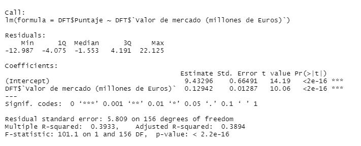
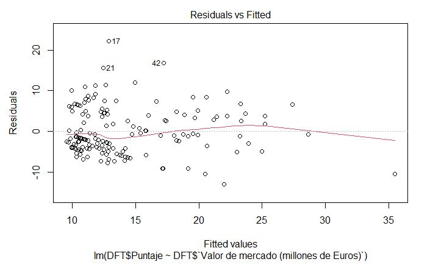
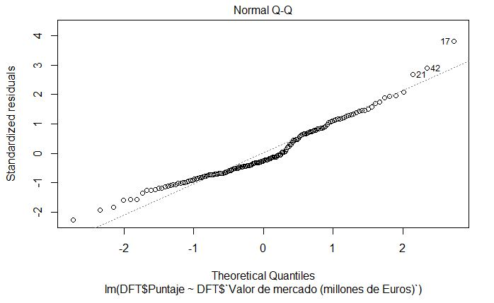

```{r, include=FALSE}
#Correr en caso no tenga los paquetes
#install.packages("utf8")
#install.packages("readr")
#install.packages("dplyr")
```

## Librerías y funciones utilizadas
```{r, echo=TRUE, message=FALSE}
library(readr)
library(dplyr)
library(utf8)
```

```{r,echo=TRUE}
redondeo<-function(x){
  return(round(x, digits = 2))
}
```

## Introducción
Título: Rendimiento de los clubes sudamericanos que participaron en la Copa CONMEBOL Libertadores en los últimos 5 años.</br>
Título corto: Copa Libertadores</br>

## ¿Cuál es la meta del proyecto?
El objetivo de nuestro proyecto es determinar si la actual distribución de cupos para la copa CONMEBOL Libertadores es justa, es decir refleja el actual nivel de las distintas ligas de Sudamérica en este torneo. Esto se logrará mediante un análisis del rendimiento de los clubes de los distintos países afiliados a CONMEBOL en las últimas 5 ediciones de la copa.</br> 


## Parámetros del estudio
```{r, message=FALSE}
DF<-read_csv("Base_de_datos_P2.csv")
DF1<-DF[complete.cases(DF),]
```
```{r,include=FALSE}
colores<-c('cadetblue1','chartreuse4','green','red','orange','yellow','brown1','indianred3','deepskyblue2','firebrick4')
DFT<-cbind(DF1,Puntaje=4+DF1$`Partidos Ganados`*2+DF1$`Partidos Empatados`*1+(DF1$`Fase Final`>1)*4+(DF1$`Fase Final`>2)*1+(DF1$`Fase Final`>3)*1+(DF1$`Fase Final`>4)*1+(DF1$`Fase Final`>5)*1)
summary(DFT)
```

Nuestra base de datos contiene `r nrow(DF)` observaciones y `r ncol(DF)` variables. De estas últimas, las más importantes son: País, Valor de plantilla, Edad promedio, Puntaje obtenido y Coeficiente de rendimiento.</br> 
Además, contiene `r redondeo(sum(is.na(DF))/(nrow(DF)*ncol(DF))*100)`% de datos faltantes y `r redondeo(sum(!complete.cases(DF))/nrow(DF)*100)`% de observaciones incompletas.</br> 
A pesar de ser un porcentaje relativamente pequeño de datos faltantes, estos están distribuidos en un porcentaje significativo de observaciones. Esto se debe a como fue armada la base de datos.</br>
Al considerar únicamente observaciones completas, tenemos `r nrow(DF1)` observaciones.</br> 
El nivel de confianza que vamos a utilizar para los intervalos de confianza y las pruebas de hipótesis será del 90%.</br> 

## Coeficiente de rendimiento
Como mencionamos en el objetivo del proyecto, buscamos una forma de medir el rendimiento de los clubes de los distintos países que participan en la CONMEBOL Libertadores en los últimos 5 años. Para cumplir esto, decidimos cambiar nuestro diseño de coeficiente de rendimiento para lograr comparar los resultados obtenidos por los clubes de los 10 países que integran la CONMEBOL(Confederación Sudamericana de Fútbol) en la Copa Libertadores de una manera que no influya la mayor cantidad de cupos para participar que reciben ciertas ligas sudamericanas.</br>

Fórmula del nuevo coeficiente de rendimiento:</br>

$$Coeficiente=(PG-PP)/PJ$$
Donde PG es la cantidad de partidos ganados por el club en una participación, PP es la cantidad de partidos perdidos por el club en una participación y PJ es la cantidad de partidos jugados por el club en una participación. Consideramos que este rediseño del coeficiente es muy útil ya que, al estar ligado a la cantidad de partidos jugados, reduce la ventaja que tendría un País por poseer mayor cantidad de cupos o número equipos que pasan de ronda.</br>

Si el coeficiente retorna un resultado negativo, esto indica que el rendimiento del equipo fue malo (PP>PG). Si retorna un resultado postivo, esto indica que el rendimiento del equipo fue bueno (PG>PP).</br>


```{r, include=FALSE}
DFT$CR <- (DFT$`Partidos Ganados` - DFT$`Partidos Perdidos`)/DFT$`Partidos Jugados`
DFT %>% group_by(País, Año) %>% summarise(cant = n(), crpa = mean(CR)) -> DFCR
DFCR
```
Este nuevo Coeficiente luego es agrupado por País en un dataframe separado llamado DFCR.</br>

Los resultados obtenidos para todas las ediciones que forman parte de nuestra muestra fueron los siguientes:</br>

```{r, echo=FALSE}
ArgT<-mean(DFCR$crpa[DFCR$País=="Argentina"])
BolT<-mean(DFCR$crpa[DFCR$País=="Bolivia"])
BraT<-mean(DFCR$crpa[DFCR$País=="Brasil"])
ChiT<-mean(DFCR$crpa[DFCR$País=="Chile"])
ColT<-mean(DFCR$crpa[DFCR$País=="Colombia"])
EcuT<-mean(DFCR$crpa[DFCR$País=="Ecuador"])
ParT<-mean(DFCR$crpa[DFCR$País=="Paraguay"])
PerT<-mean(DFCR$crpa[DFCR$País=="Perú"])
UruT<-mean(DFCR$crpa[DFCR$País=="Uruguay"])
VenT<-mean(DFCR$crpa[DFCR$País=="Venezuela"])
coefT<-c(ArgT,BolT,BraT,ChiT,ColT,EcuT,ParT,PerT,UruT,VenT)
barplot(coefT,col=colores,ylim=c(-0.6,0.6), main = "Coeficiente de Rendimiento Promedio 2016-2020")
legend("topright", inset = 0.05,c("Argentina","Bolivia","Brasil","Chile","Colombia","Ecuador","Paraguay","Perú","Uruguay","Venezuela"),fill=colores,cex=0.60, title = "Leyenda", text.font = 6)
```

```{r, echo=FALSE}
ratio1<-c(DFCR$crpa[DFCR$Año=="2016"])
colores<-c('cadetblue1','chartreuse4','green','red','orange','yellow','brown1','indianred3','deepskyblue2','firebrick4','goldenrod3','dimgray')
barplot(ratio1, col= colores,ylim = c(-0.6,0.6),main = "Coeficiente de Rendimiento Promedio 2016")
legend("topright", inset = 0.05,c("Argentina","Bolivia","Brasil","Chile","Colombia","Ecuador","Paraguay","Perú","Uruguay","Venezuela", "CAMPEÓN","SUBCAMPEÓN"),fill=colores,cex=0.60, title = "Leyenda", text.font = 6)
points(5.5,0.06, col='goldenrod3',pch=19)
points(6.7,-0.25, col='dimgray',pch=19)
```


```{r, echo=FALSE}
ratio2<-c(DFCR$crpa[DFCR$Año=="2017"])
colores<-c('cadetblue1','chartreuse4','green','red','orange','yellow','brown1','indianred3','deepskyblue2','firebrick4','goldenrod3','dimgray')
barplot(ratio2, col= colores,ylim = c(-0.6,0.6),main = "Coeficiente de Rendimiento Promedio 2017")
legend("topright", inset = 0.05,c("Argentina","Bolivia","Brasil","Chile","Colombia","Ecuador","Paraguay","Perú","Uruguay","Venezuela", "CAMPEÓN","SUBCAMPEÓN"),fill=colores,cex=0.60, title = "Leyenda", text.font = 6)
points(3.1,0.2, col='goldenrod3',pch=19)
points(0.7,0.08, col='dimgray',pch=19)
```


```{r, echo=FALSE}
ratio3<-c(DFCR$crpa[DFCR$Año=="2018"])
colores<-c('cadetblue1','chartreuse4','green','red','orange','yellow','brown1','indianred3','deepskyblue2','firebrick4','goldenrod3','dimgray')
barplot(ratio3, col= colores,ylim = c(-0.6,0.6), main = "Coeficiente de Rendimiento Promedio 2018")
legend("topright", inset = 0.05,c("Argentina","Bolivia","Brasil","Chile","Colombia","Ecuador","Paraguay","Perú","Uruguay","Venezuela", "CAMPEÓN","SUBCAMPEÓN"),fill=colores,cex=0.60, title = "Leyenda", text.font = 6)
points(0.5,0.13, col='goldenrod3',pch=19)
points(0.8,0.13, col='dimgray',pch=19)
```

```{r, echo=FALSE}
ratio4<-c(DFCR$crpa[DFCR$Año=="2019"])
colores<-c('cadetblue1','chartreuse4','green','red','orange','yellow','brown1','indianred3','deepskyblue2','firebrick4','goldenrod3','dimgray')
barplot(ratio4, col= colores,ylim = c(-0.6,0.6), main = "Coeficiente de Rendimiento Promedio 2019")
legend("topright", inset = 0.05,c("Argentina","Bolivia","Brasil","Chile","Colombia","Ecuador","Paraguay","Perú","Uruguay","Venezuela", "CAMPEÓN","SUBCAMPEÓN"),fill=colores,cex=0.5, title = "Leyenda", text.font = 6)
points(3.1,0.21, col='goldenrod3',pch=19)
points(0.7,-0.05, col='dimgray',pch=19)
```

```{r, echo=FALSE}
ratio5<-c(DFCR$crpa[DFCR$Año=="2020"])
colores<-c('cadetblue1','chartreuse4','green','red','orange','yellow','brown1','indianred3','deepskyblue2','firebrick4','goldenrod3','dimgray')
barplot(ratio5, col= colores,ylim = c(-0.6,0.6), main = "Coeficiente de Rendimiento Promedio 2020")
legend("topright", inset = 0.05,c("Argentina","Bolivia","Brasil","Chile","Colombia","Ecuador","Paraguay","Perú","Uruguay","Venezuela", "CAMPEÓN","SUBCAMPEÓN"),fill=colores,cex=0.5, title = "Leyenda", text.font = 6)
points(3.0,0.27, col='goldenrod3',pch=19)
points(3.2,0.27, col='dimgray',pch=19)
```
Valores de los coeficientes:</br>

País|Edición 2016 |Edición 2017 |Edición 2018 |Edición 2019 |Edición 2020|General|
 ---------------------|---------------------|---------------------|---------------------|---------------------|---------------------|---------------------|
Argentina | `r redondeo(ratio1[1])`| `r redondeo(ratio2[1])` |`r redondeo(ratio3[1])` |`r redondeo(ratio4[1])`|`r redondeo(ratio5[1])`|`r redondeo(coefT[1])`
Bolivia | `r redondeo(ratio1[2])`| `r redondeo(ratio2[2])` |`r redondeo(ratio3[2])` |`r redondeo(ratio4[2])`|`r redondeo(ratio5[2])`|`r redondeo(coefT[2])`
Brasil | `r redondeo(ratio1[3])`| `r redondeo(ratio2[3])` |`r redondeo(ratio3[3])` |`r redondeo(ratio4[3])`|`r redondeo(ratio5[3])`|`r redondeo(coefT[3])`
Chile | `r redondeo(ratio1[4])`| `r redondeo(ratio2[4])` |`r redondeo(ratio3[4])` |`r redondeo(ratio4[4])`|`r redondeo(ratio5[4])`|`r redondeo(coefT[4])`
Colombia | `r redondeo(ratio1[5])`| `r redondeo(ratio2[5])` |`r redondeo(ratio3[5])` |`r redondeo(ratio4[5])`|`r redondeo(ratio5[5])`|`r redondeo(coefT[5])`
Ecuador | `r redondeo(ratio1[6])`| `r redondeo(ratio2[6])` |`r redondeo(ratio3[6])` |`r redondeo(ratio4[6])`|`r redondeo(ratio5[6])`|`r redondeo(coefT[6])`
Paraguay | `r redondeo(ratio1[7])`| `r redondeo(ratio2[7])` |`r redondeo(ratio3[7])` |`r redondeo(ratio4[7])`|`r redondeo(ratio5[7])`|`r redondeo(coefT[7])`
Perú | `r redondeo(ratio1[8])`| `r redondeo(ratio2[8])` |`r redondeo(ratio3[8])` |`r redondeo(ratio4[8])`|`r redondeo(ratio5[8])`|`r redondeo(coefT[8])`
Uruguay | `r redondeo(ratio1[9])`| `r redondeo(ratio2[9])` |`r redondeo(ratio3[9])` |`r redondeo(ratio4[9])`|`r redondeo(ratio5[9])`|`r redondeo(coefT[9])`
Venezuela | `r redondeo(ratio1[10])`| `r redondeo(ratio2[10])` |`r redondeo(ratio3[10])` |`r redondeo(ratio4[10])`|`r redondeo(ratio5[10])`|`r redondeo(coefT[10])`

Los valores mostrados en las gráficas han sido resumidos en la tabla anterior. Como era de esperarse, tanto Argentina como brasil obtuvieron un rendimiento positivo en la general y casi siempre positivo en cada año (Argentina tiene dos años en los que su rendimiento no es bueno, pero el valor es relativamente pequeño). Esto se debe las constantes apariciones de sus equipos en las rondas finales (de octavos hacia adelante). Sin embargo, podemos observar que Paraguay y Uruguay presentan un rendimiento rescatable y con periodos de mejora continua (mínimo 3 años). Además, Ecuador presenta un coeficiente positivo en algunas ediciones, mientras que en otras es marcadamente negativo (llegando a -0.26 en 2016 a pesar de tener de subcampeón a un equipo).  El resto de países (Bolivia, Chile, Colombia, Perú y Venezuela) presentan un rendimiento bajo y constante.</br>


## Intervalos de confianza
A partir del lo observado en la sección anterior, realizamos 3 intervalos de confianza donde dividimos en 3 grupos de análisis:
- Brasil y Argentina: Alto rendimiento y constante</br>
- Ecuador, Paraguay y Uruguay: Rendimiento rescatable</br>
- Resto de países (Bolivia, Chile, Colombia, Perú y Venezuela): Rendimiento bajo y constante</br>

Para esto utilizaremos la variable Puntaje obtenido además del ya mencionado COeficiente de rendimiento, así como consideraremos apropiado un nivel de confianza del 90% </br>

La fórmula para calcular el puntaje obtenido por un equipo en una edición es:
$$Puntaje=4+2*PG+1*PE+2*(Pasar De Ronda)$$

</br>Nivel de significancia= 10%</br>

## Puntaje promedio por país

```{r,echo=F}
PuntT<-c(mean(DFT$Puntaje[DFT$País=="Argentina"]),mean(DFT$Puntaje[DFT$País=="Bolivia"]),mean(DFT$Puntaje[DFT$País=="Brasil"]),mean(DFT$Puntaje[DFT$País=="Chile"]),mean(DFT$Puntaje[DFT$País=="Colombia"]),mean(DFT$Puntaje[DFT$País=="Ecuador"]),mean(DFT$Puntaje[DFT$País=="Paraguay"]),mean(DFT$Puntaje[DFT$País=="Perú"]),mean(DFT$Puntaje[DFT$País=="Uruguay"]),mean(DFT$Puntaje[DFT$País=="Venezuela"]))
barplot(PuntT,col=colores,ylim=c(0,20), main = "Puntaje promedio en Copa Libertadores (2016-2020)")
legend("topright", inset = 0.05,c("Argentina","Bolivia","Brasil","Chile","Colombia","Ecuador","Paraguay","Perú","Uruguay","Venezuela"),fill=colores,cex=0.60, title = "Leyenda", text.font = 6)
```
En este gráfico de puntaje promedio por país, se puede apreciar que Brasil y Argentina tienen los dos primeros puestos (lo cual es de esperarse), mientras que Paraguay sorprendentemente es el tercer país con mayor promedio de puntaje, seguido por Ecuador, luego Uruguay y finalmente el resto de países.


## IC Puntaje
Intervalo de confianza para la media del Puntaje alcanzado por los equipos de Brasil y Argentina:</br>
```{r, echo=FALSE}
ArgBra <- c(DFT$Puntaje[DFT$País=="Argentina"|DFT$País=="Brasil"])
m1<-mean(ArgBra)
sigma1 <- sd(ArgBra)
n1 <- length(ArgBra) 

alpha.21 <- 0.1/2 #Nivel de confianza de 90%

z1 <- qnorm(alpha.21, lower.tail = FALSE)

izq1 <- m1 - z1*sigma1/sqrt(n1)
der1 <- m1 + z1*sigma1/sqrt(n1)

cat("(", redondeo(izq1),",",redondeo(der1),")")
```
Este intervalo es bastante alto, lo cual nos indica que el promedio de puntaje alcanzado por equipos de Brasil y Argentina en una edición de la copa será bueno. Por lo tanto, esto nos haría esperar un buen rendimiento constante. </br>


</br>Intervalo de confianza para la media del Puntaje alcanzado por los equipos de Ecuador, Paraguay y Uruguay:</br>
```{r, echo=FALSE}
EcuParUru <- c(DFT$Puntaje[DFT$País=="Ecuador"|DFT$País=="Paraguay"|DFT$País=="Uruguay"])
m2<-mean(EcuParUru)
sigma2 <- sd(EcuParUru)
n2 <- length(EcuParUru) 

alpha.22 <- 0.1/2 #Nivel de confianza de 90%

z2 <- qnorm(alpha.22, lower.tail = FALSE)

izq2 <- m2 - z2*sigma2/sqrt(n2)
der2 <- m2 + z2*sigma2/sqrt(n2)

cat("(", redondeo(izq2),",",redondeo(der2),")")
```
Este intervalo es menor que el de Brasil y Argentina, pero no por mucho. Por lo tanto se espera que estos tres equipos tengan un rendimiento rescatable. Sin embargo, hemos visto que Ecuador tiene un rendimiento altamente variable, por lo que lo eliminaremos de este intervalo para ver si mejora.</br>  


</br>Intervalo de confianza para la media del Puntaje alcanzado para equipos de Paraguay y Uruguay:</br>
```{r, echo=FALSE}
ParUru <- c(DFT$Puntaje[DFT$País=="Paraguay"|DFT$País=="Uruguay"])
m3<-mean(ParUru)
sigma3 <- sd(ParUru)
n3 <- length(ParUru) 

alpha.23 <- 0.1/2 #Nivel de confianza de 90%

z3 <- qnorm(alpha.23, lower.tail = FALSE)

izq3 <- m3 - z3*sigma3/sqrt(n3)
der3 <- m3 + z3*sigma3/sqrt(n3)

cat("(", redondeo(izq3),",",redondeo(der3),")")
```
El intervalo empeora cuando eliminamos a Ecuador, por lo que podríamos considerar a este país como un posible candidato a recibir más cupos junto con Paraguay y Uruguay.</br>


</br>Intervalo de confianza para la media del Puntaje alcanzado por los equipos del resto de países (Bolivia, Chile, Colombia, Perú y Venezuela):</br>
```{r, echo=FALSE}
restoSudamerica1 <- c(DFT$Puntaje[DFT$País=="Bolivia"|DFT$País=="Chile"|DFT$País=="Colombia"|DFT$País=="Perú"|DFT$País=="Venezuela"])
m4<-mean(restoSudamerica1)
sigma4 <- sd(restoSudamerica1)
n4 <- length(restoSudamerica1) 

alpha.24 <- 0.1/2 #Nivel de confianza de 90%

z4 <- qnorm(alpha.24, lower.tail = FALSE)

izq4 <- m4 - z4*sigma4/sqrt(n4)
der4 <- m4 + z4*sigma4/sqrt(n4)

cat("(", redondeo(izq4),",",redondeo(der4),")")
```
Este intervalo es la mitad del obtenido por Brasil y Argentina, lo cual nos indica un rendimiento comparativamente bajo. Agregaremos a Ecuador para ver si dicho país se merece estar en este grupo</br>

</br>Intervalo de confianza para la media del Puntaje alcanzado por los equipos del resto de países (Bolivia, Chile, Colombia, Perú y Venezuela) junto con Ecuador:</br>
```{r, echo=FALSE}
restoSudamericaE <- c(DFT$Puntaje[DFT$País=="Bolivia"|DFT$País=="Chile"|DFT$País=="Colombia"|DFT$País=="Perú"|DFT$País=="Venezuela"|DFT$País=="Ecuador"])
m5<-mean(restoSudamericaE)
sigma5 <- sd(restoSudamericaE)
n5 <- length(restoSudamericaE) 

alpha.25 <- 0.1/2 #Nivel de confianza de 90%

z5 <- qnorm(alpha.25, lower.tail = FALSE)

izq5 <- m5 - z5*sigma5/sqrt(n5)
der5 <- m5 + z5*sigma5/sqrt(n5)

cat("(", redondeo(izq5),",",redondeo(der5),")")
```
El intervalo no sube mucho, lo cual puede indicar que Ecuador no tiene un rendimiento tan bueno como nos sugiere el segundo intervalo.</br>

## IC Coeficiente
Intervalo de confianza para la media del Coeficiente de los equipos de Brasil y Argentina:</br>
```{r, echo=FALSE}
ArgBrac <- c(DFCR$crpa[DFCR$País=="Argentina"|DFCR$País=="Brasil"])
m1c<-mean(ArgBrac)
sigma1c <- sd(ArgBrac)
n1c <- length(ArgBrac) 

calpha.21 <- 0.1/2 #Nivel de confianza de 90%

z1c <- qnorm(calpha.21, lower.tail = FALSE)

izq1c <- m1c - z1*sigma1c/sqrt(n1c)
der1c <- m1c + z1c*sigma1c/sqrt(n1c)

cat("(", redondeo(izq1c),",",redondeo(der1c),")")
```
Este intervalo puede parecer relativamente bajo, pero considerando que el coeficiente tiene un rango de -1 a 1 y (en promedio) un equipo Brasileño y Argentino mantendrá un intervalo siempre positivo esto en realidad indica un rendimiento bastante bueno.</br>

</br>Intervalo de confianza para la media del Coeficiente de los equipos de Ecuador, Paraguay y Uruguay:</br>
```{r, echo=FALSE}
EcuParUruc <- c(DFCR$crpa[DFCR$País=="Ecuador"|DFCR$País=="Paraguay"|DFCR$País=="Uruguay"])
cm2<-mean(EcuParUruc)
csigma2 <- sd(EcuParUruc)
cn2 <- length(EcuParUruc) 

calpha.22 <- 0.1/2 #Nivel de confianza de 90%

cz2 <- qnorm(calpha.22, lower.tail = FALSE)

cizq2 <- cm2 - cz2*csigma2/sqrt(cn2)
cder2 <- cm2 + cz2*csigma2/sqrt(cn2)

cat("(", redondeo(cizq2),",",redondeo(cder2),")")
```
Este intervalo, a pesar de tener un valor izquierdo negativo, presenta un rendimiento rescatable de los tres países. Para asegurarnos si el rendimiento extremadamente variable de Ecuador influye negativamente, lo eliminamos.</br> 

</br>Intervalo de confianza para la media del Coeficiente de los equipos de Paraguay y Uruguay:</br>
```{r, echo=FALSE}
ParUruc <- c(DFCR$crpa[DFCR$País=="Paraguay"|DFCR$País=="Uruguay"])
cm3<-mean(ParUruc)
csigma3 <- sd(ParUruc)
cn3 <- length(ParUruc) 

calpha.23 <- 0.1/2 #Nivel de confianza de 90%

cz3 <- qnorm(calpha.23, lower.tail = FALSE)

cizq3 <- cm3 - cz3*csigma3/sqrt(cn3)
cder3 <- cm3 + cz3*csigma3/sqrt(cn3)

cat("(", redondeo(cizq3),",",redondeo(cder3),")")
```
Como se puede ver, el intervalo mejora hasta un 0.05 cuando quitamos Ecuador, lo cual es considerable para nuestro coeficiente. Esto nos indicaría que posiblemente podríamos descartar a Ecuador como potencial receptor de cupos.</br>

</br>Intervalo de confianza para la media del Coeficiente de los equipos del resto de países (Bolivia, Chile, Colombia, Perú y Venezuela) junto con Ecuador:</br>
```{r, echo=FALSE}
crestoSudamerica1 <- c(DFCR$crpa[DFCR$País=="Bolivia"|DFCR$País=="Chile"|DFCR$País=="Colombia"|DFCR$País=="Perú"|DFCR$País=="Venezuela"])
cm4<-mean(crestoSudamerica1)
csigma4 <- sd(crestoSudamerica1)
cn4 <- length(crestoSudamerica1) 

calpha.24 <- 0.1/2 #Nivel de confianza de 90%

cz4 <- qnorm(calpha.24, lower.tail = FALSE)

cizq4 <- cm4 - cz4*csigma4/sqrt(cn4)
cder4 <- cm4 + cz4*csigma4/sqrt(cn4)

cat("(", redondeo(cizq4),",",redondeo(cder4),")")
```
Podemos ver que el valor de este intervalo es abismal a comparación de los anteriores, lo cual nos indicaría un rendimiento pésimo. Agregamos a Ecuador para saber si este país se merece estar en este grupo.</br>

</br>Intervalo de confianza para la media del Coeficiente de los equipos del resto de países (Bolivia, Chile, Colombia, Perú y Venezuela):</br>
```{r, echo=FALSE}
crestoSudamericaE <- c(DFCR$crpa[DFCR$País=="Bolivia"|DFCR$País=="Chile"|DFCR$País=="Colombia"|DFCR$País=="Perú"|DFCR$País=="Venezuela"|DFCR$País=="Ecuador"])
cm5<-mean(crestoSudamericaE)
csigma5 <- sd(crestoSudamericaE)
cn5 <- length(crestoSudamericaE) 

calpha.25 <- 0.1/2 #Nivel de confianza de 90%

cz5 <- qnorm(calpha.25, lower.tail = FALSE)

cizq5 <- cm5 - cz5*csigma5/sqrt(cn5)
cder5 <- cm5 + cz5*csigma5/sqrt(cn5)

cat("(", redondeo(cizq5),",",redondeo(cder5),")")
```
El intervalo mejora hasta un 0.04. Sin embargo, este sigue siendo bastante bajo como para que fuese considerado como bueno o rescatable. Por lo tanto, después del análisis de estos intervalos de confianza y las gráficas de coeficiente de cada año, consideramos que se puede argumentar que Ecuador no se merece ser parte del grupo de países que reciban más cupos.  


## Prueba de hipótesis 1

Hipótesis Nula: El número  de partidos ganados en promedio por un equipo de Brasil y Argentina son al menos 6 partidos.</br>
Hipótesis Alternativa: El número de partidos ganados por un equipo de Brasil y Argentina es menor de 6 partidos</br>
Con un nivel de significancia de 10%</br>
Valor Crítico:</br>
```{r,echo=FALSE}
ArgBraH1 <- c(DFT$`Partidos Ganados`[DFT$País=="Argentina"|DFT$País=="Brasil"])
Zcrit <- qnorm(0.1, mean = 6, sd = sd(ArgBraH1)/sqrt(length(ArgBraH1)), lower.tail = TRUE)
redondeo(Zcrit)
```
Estadístico para esta prueba de hipótesis:</br>
```{r, echo=FALSE}
redondeo(mean(ArgBraH1))
```
Podemos observar que nuestro estadístico está dentro de la región de rechazo. </br>


Esto lo corroboramos con nuestro p-valor:</br>
```{r, echo=FALSE}
pnorm(mean(ArgBraH1), mean = 6, sd = sd(ArgBraH1)/sqrt(length(ArgBraH1)), lower.tail = TRUE)
```
Debido a que el resultado es muy cercano a 0, llegamos a la conclusión que nuestra hipótesis nula es rechazada.</br>


## Prueba de hipótesis 2
Hipótesis Nula: El número de partidos ganados en promedio por un equipo de Paraguay y Uruguay es igual a 3.</br>
Hipótesis Alternativa: El número de partidos ganados por un equipo de Paraguay y Uruguay no es igual a 3.</br>
Con un nivel de significancia de 10%</br>
Valor Crítico Izquierda:</br>
```{r, echo=FALSE}
ParEcuUruH2 <- c(DFT$`Partidos Ganados`[DFT$País=="Paraguay"|DFT$País=="Uruguay"])
Zcrit2 <- qnorm(0.1/2, mean = 3, sd = sd(ParEcuUruH2)/sqrt(length(ParEcuUruH2)), lower.tail = TRUE)
redondeo(Zcrit2)
```
Valor Crítico Derecha:</br>
```{r, echo=FALSE}
Zcrit21 <- qnorm(0.1/2, mean = 3, sd = sd(ParEcuUruH2)/sqrt(length(ParEcuUruH2)), lower.tail = FALSE)
redondeo(Zcrit21)
```
Estadístico para esta prueba de hipótesis:</br>
```{r, echo=FALSE}
redondeo(mean(ParEcuUruH2))
```

Podemos observar que nuestro estadístico está fuera de la región de rechazo.</br>
Esto lo corroboramos con nuestro p-valor:</br>
```{r, echo=FALSE}
pnorm(mean(ParEcuUruH2), mean =3, sd = sd(ParEcuUruH2)/sqrt(length(ParEcuUruH2)), lower.tail = TRUE)
```
Debido a que el resultado es muy diferente de 0, llegamos a la conclusión de que nuestra hipótesis nula no es rechazada.</br>

## Prueba de hipótesis 3
Hipótesis Nula: El número de partidos ganados en promedio por un equipo del resto de países (Bolivia, Chile, Colombia, Perú, Venezuela y Ecuador) no es mas de 2.</br>
Hipótesis Alternativa: El número de partidos ganados en promedio por un equipo del resto de países (Bolivia, Chile, Colombia, Perú, Venezuela y Ecuador) es mayor de 2.</br>
</br>Con un nivel de significancia de 10%</br>
Valor Crítico:</br>
```{r, echo=FALSE}
restoSudamericaH <- c(DFT$`Partidos Ganados`[DFT$País=="Bolivia"|DFT$País=="Chile"|DFT$País=="Colombia"|DFT$País=="Perú"|DFT$País=="Venezuela"|DFT$País=="Ecuador"])
Zcrit3 <- qnorm(0.1, mean = 2, sd = sd(restoSudamericaH)/sqrt(length(restoSudamericaH)), lower.tail = FALSE)
redondeo(Zcrit3)
```
Estadístico para esta prueba de hipótesis:</br>
```{r, echo=FALSE}
redondeo(mean(restoSudamericaH))
```


Podemos observar que nuestro estadístico está fuera de la región de rechazo.Por lo que podemos decir que nuestra hipótesis nula no es rechazada.</br>
Esto lo corroboramos con nuestro p-valor:</br>
```{r, echo=FALSE}
pnorm(mean(restoSudamericaH), mean =2, sd = sd(restoSudamericaH)/sqrt(length(restoSudamericaH)), lower.tail = TRUE)
```
Debido a que el resultado es muy diferente de 0, llegamos a la conclusión de que nuestra hipótesis nula no es rechazada.</br>


 

## Regresión 1
Analizamos las diferentes variables de nuestro data.frame y nos dimos cuenta que existe una correlación entre la variable Partidos jugados y Puntaje alcanzado. </br>

```{r,echo=FALSE}
b<-cor(DFT$`Partidos Jugados`, DFT$Puntaje)
colores<-c('cadetblue1','chartreuse4','green','red','orange','yellow','brown1','indianred3','deepskyblue2','firebrick4')
plot(DFT$Puntaje~DFT$`Partidos Jugados`, col=colores[factor(DFT$País)], pch= 16, xlab="Partidos Jugados", ylab="Puntaje alcanzado")
legend("topleft", inset = 0.05,c("Argentina","Bolivia","Brasil","Chile","Colombia","Ecuador","Paraguay","Perú","Uruguay","Venezuela"),fill=colores,cex=0.60, title = "Leyenda", text.font = 6)
abline(lm(DFT$Puntaje~DFT$'Partidos Jugados'))


```


```{r, include=FALSE}
lm0<-lm(DFT$Puntaje~DFT$`Partidos Jugados`)
summary(lm0)
plot(lm0)
```

Nuestra ecuación se forma con los siguientes coeficientes: </br>
```{r}
coef(lm0,1)
```
</br> Puntaje alcanzado = -9.429161 + 3.020846* Partidos jugados</br>

## Regresión 1: Summary

{width=800px}

La primera hipótesis nula es "los coeficientes son iguales a 0". Los primeros dos p-valores nos retornan 0, lo cual nos indica que la primera hipótesis nula es rechazada. La segunda hipótesis nula es "Este modelo no explica nada". Sin embargo, este p-valor también nos retorna 0, lo cual rechaza la segunda hipótesis nula. Por último, este modelo explica el 91% de los valores. </br> 

## Regresión 1: Gráfica de homocedasticidad
{width=800px}
</br>Esta gráfica no presenta homocedasticidad, es decir, los valores no tienen una distribución similar. </br>

## Regresión 1: Gráfica de distribución de los residuos
{width=800px}
</br>En esta gráfica se puede ver la existencia de una buena cantidad de valores atípicos que no se encuentran sobre la recta normal.</br>

## Regresión 2
Analizamos las diferentes variables de nuestro data.frame y nos dimos cuenta que existe una correlación entre la variable Valor de mercado y Puntaje alcanzado. </br>
```{r,echo=FALSE}
b<-cor(DFT$`Valor de mercado (millones de Euros)`, DFT$Puntaje)
colores<-c('cadetblue1','chartreuse4','green','red','orange','yellow','brown1','indianred3','deepskyblue2','firebrick4')
plot(DFT$Puntaje~DFT$`Valor de mercado (millones de Euros)`, col=colores[factor(DFT$País)], pch= 16, xlab="Valor de mercado (millones de Euros)", ylab="Puntaje alcanzado")
legend("topleft", inset = 0.05,c("Argentina","Bolivia","Brasil","Chile","Colombia","Ecuador","Paraguay","Perú","Uruguay","Venezuela"),fill=colores,cex=0.60, title = "Leyenda", text.font = 6)
abline(lm(DFT$Puntaje~DFT$`Valor de mercado (millones de Euros)`))

```


```{r, include=FALSE}
lm1<-lm(DFT$Puntaje~DFT$`Valor de mercado (millones de Euros)`)
summary(lm1)
plot(lm1)
```

Nuestra ecuación se forma con los siguientes coeficientes: </br>
```{r}
coef(lm1,1)
```
</br> Puntaje alcanzado =  9.4329626 + 0.1294206* Valor de mercado</br>

## Regresión 2: Summary

{width=800px}

La primera hipótesis nula es "los coeficientes son iguales a 0". Los primeros dos p-valores nos retornan 0, lo cual nos indica que la primera hipótesis nula es rechazada. La segunda hipótesis nula es "Este modelo no explica nada". Sin embargo, este p-valor también nos retorna 0, lo cual rechaza la segunda hipótesis nula. Por último, este modelo explica el 39% de los valores.</br>

## Regresión 2: Gráfica de homocedasticidad
{width=800px}

Esta gráfica puede no presentar homocedasticidad, pero está más cerca de lograrlo que la de la regresión anterior.</br>

## Regresión 2: Gráfica de distribución de los residuos
{width=800px}
</br>En esta gráfica se puede apreciar una gran cantidad de valores sobre la línea normal, excepto en el medio y los extremos.</br>


## Regresión 3
Analizamos las diferentes variables de nuestro data.frame y nos dimos cuenta que existe una posible correlación entre la variable Coeficiente de rendimiento y Puntaje alcanzado. </br>
```{r,echo=FALSE}
b<-cor(DFT$CR, DFT$Puntaje)
colores<-c('cadetblue1','chartreuse4','green','red','orange','yellow','brown1','indianred3','deepskyblue2','firebrick4')
plot(DFT$Puntaje~DFT$CR, col=colores[factor(DFT$País)], pch= 16, xlab="Coeficiente de Rendimiento", ylab="Puntaje alcanzado")
legend("topleft", inset = 0.05,c("Argentina","Bolivia","Brasil","Chile","Colombia","Ecuador","Paraguay","Perú","Uruguay","Venezuela"),fill=colores,cex=0.60, title = "Leyenda", text.font = 6)
abline(lm(DFT$Puntaje~DFT$CR))

```
```{r, include=FALSE}
lm2<-lm(DFT$Puntaje~DFT$CR)
summary(lm2)
plot(lm2)
```

Nuestra ecuación se forma con los siguientes coeficientes: </br>
```{r}
coef(lm2,1)
```
</br>Puntaje alcanzado =  15.64133 + 17.68438* Coeficiente de rendimiento</br>

## Regresión 3: Summary

{width=800px}

La primera hipótesis nula es "los coeficientes son iguales a 0". Los primeros dos p-valores nos retornan 0, lo cual nos indica que la primera hipótesis nula es rechazada. La segunda hipótesis nula es "Este modelo no explica nada". Sin embargo, este p-valor también nos retorna 0, lo cual rechaza la segunda hipótesis nula. Por último, este modelo explica el 74% de los valores.</br>

## Regresión 3: Gráfica de homocedasticidad
{width=800px}

Esta gráfica no presenta homocedasticidad, además de tener los picos más alejados de la línea central de las tres regresiones.</br>

## Regresión 3: Gráfica de distribución de los residuos
{width=800px}
</br>En esta gráfica se puede apreciar una gran cantidad de valores atípicos fuera de la línea normal.</br>


## Conclusiones


Debido al análisis de nuestras variables, podemos decir que:</br>

Brasil y Argentina son los países que han mantenido un rendimiento positivo y constante, por lo tanto, merecen ser los dos países con más cupos en la Libertadores. Sin embargo, nuestro análisis no rechaza la posibilidad de que este alto rendimiento se deba por ser los países con más cupos.</br> 
Por otro lado, tenemos a Paraguay y Uruguay, los cuales han tenido un rendimiento rescatable y con periodos de mejora constante, pese a tener pocos cupos.</br> 
Aunque inicialmente lo incluimos dentro del grupo de países con rendimiento rescatable, decidimos que el coeficiente de Ecuador varía mucho y tiene un promedio peor que Uruguay, por lo que lo descartamos como posible candidato a recibir más cupos </br>

Quitarles cupos al resto de países con coeficientes bajos, como Perú, no sería recomendable ya que de por si actualmente solo cuentan con 2. </br>

Es por ello que llegamos a la conclusión de que la nueva repartición de cupos directos tendría los siguientes cambios: quitarle un cupo a Brasil y Argentina, para dárselos a Paraguay y Uruguay.</br>

## Posible repartición


- Brasil (4 cupos)</br>
- Argentina (4 cupos)</br>
- Bolivia (2 cupos)</br>
- Chile (2 cupos)</br>
- Colombia (2 cupos)</br>
- Ecuador (2 cupos)</br>
- Paraguay (3 cupos)</br>
- Perú (2 cupos)</br>
- Uruguay (3 cupos)</br>
- Venezuela (2 cupos)</br>
