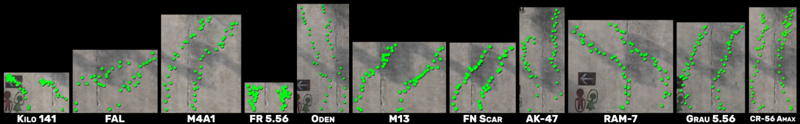
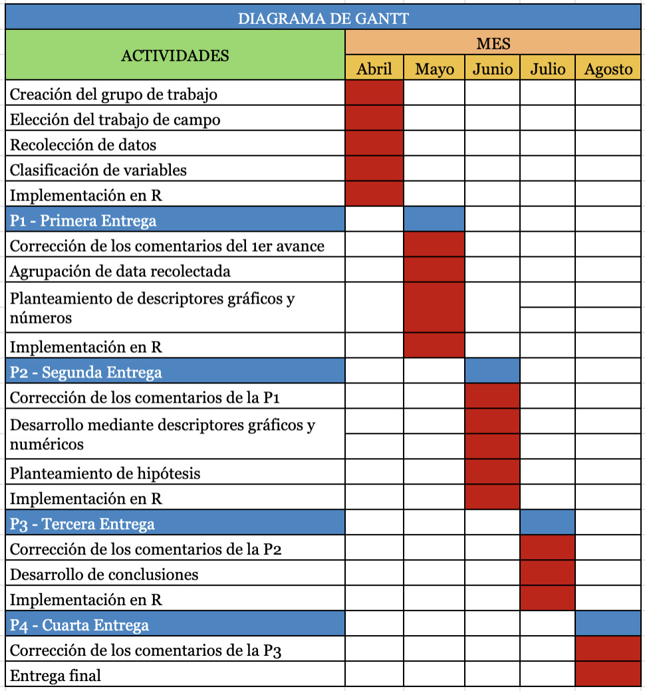

```{r include=FALSE}
# options(repos="https://cran.rstudio.com" )
# install.packages("timevis")
# install.packages("readr")
```

```{r include=FALSE}
library(readr)
library(timevis)
```


>### <span style="color:darkgreen"> **Tema**

<font size="3"> Las condiciones que determinan el daño por segundo de las armas en el juego Warzone </font>

>### <span style="color:darkgreen"> **Introducción**

<font size="3"> Warzone es una battle royale gratuito disponible para plataformas como PC, Play Station y Xbox, y te permite jugar con personas desde otras plataformas como las previamente mencionadas. Además, cuenta con una comunidad de aproximadamente 85 millones de jugadores. Lo interesante del juego es que tiene nuevas mecánicas que lo diferencian de sus rivales como Fornite o PUBG, las cuales generan un atractivo muy influyente en los jugadores. Una de ellas es Gulag, este término hace referencia a una segunda oportunidad dentro del juego una vez que hayas sido abatido por un enemigo. Este consiste en un enfrentamiento entre otros jugadores abatidos dentro de la partida con una temática muy simple y clara, quien gana dicho enfrentamiento revive, y el otro jugador sigue en modo 'espera' hasta que sus compeñeros vayan a una tienda y paguen para que regrese al juego.</font> 

>### <span style="color:darkgreen"> **Objetivos**

<font size="4">  **Objetivo General** </font>
  
<font size="3"> - El objetivo de esta investigación es analizar el método de juego dentro de Warzone. De esta manera, vamos a poder reconocer las cualidades de las armas que generan que un jugador pueda ganar un enfrentamiento.</font>

<font size="4">  **Objetivos Específicos** </font>

<font size="3"> - Encontrar la correlación entre los diversos factores que influyen en el daño por segundo de las armas.</font>

<font size="3"> - Identificar los principales factores que afectan y desbalancean el daño por segundo de las armas.</font>


>### <span style="color:darkgreen"> **Plan de muestreo**

<font size="4"> **Muestra:**</font> <font size="3"> Indicadores del desempeño de las armas dentro del juego Warzone</font>

<font size="4"> **Tipo y tamaño de la muestra:**</font> <font size="3"> Muestreo por juicio (150 observaciones)</font>

<font size="4"> **Unidad muestral:**</font> <font size="3"> Armas dentro del juego Warzone</font>

<font size="4"> **Metodología:**</font> <font size="3"> Extraer la información de la base de datos (en formato csv) pública del analista TrueGameData. Además, se realizará un experimento dentro del juego para hallar el retroceso de todas las armas en estudio.</font>

<font size="4"> **Público objetivo:**</font> <font size="3"> Fanáticos del juego Warzone</font>


>### <span style="color:darkgreen"> **Limpieza de Datos**

<font size="3"> Se agregó la columna 'Tipo' para identificar a qué categoría pertenece cada arma y se cambió el encabezado de la segunda columna a 'Arma' para todas las bases de datos que tenemos. Después, las colocamos todas dentro de una sola, llamada 'DF' ya que de esta manera podemos realizar las comparaciones de una mejor forma.</font>
```{r message=FALSE, warning=FALSE, echo=FALSE}
#Arreglo de la base de datos
RA <- read_csv("RA.csv")
SF <- read_csv("SF.csv")
AL <- read_csv("AL.csv")
RF <- read_csv("RF.csv")
RT <- read_csv("RT.csv")
MR <- read_csv("MR.csv")
P <- read_csv("P.csv")
CC <- read_csv("CC.csv") 
E <- read_csv("E.csv") 
LC <- read_csv("LC.csv") 

#Rifles de Asalto
set.seed(1)
Tipo<-sample(c("Rifle de Asalto"))
RA<-cbind(Tipo, RA)
colnames(RA)[colnames(RA) == 'Rifles de Asalto'] <- 'Arma'
#Subfusiles
set.seed(1)
Tipo<-sample(c("Subfusil"))
SF<-cbind(Tipo, SF)
colnames(SF)[colnames(SF) == 'Subfusiles'] <- 'Arma'
#Ametralladoras Ligeras
set.seed(1)
Tipo<-sample(c("Ametralladora Ligera"))
AL<-cbind(Tipo, AL)
colnames(AL)[colnames(AL) == 'Ametralladoras Ligeras'] <- 'Arma'
#Rifles de Francotirador
set.seed(1)
Tipo<-sample(c("Rifle de Francotirador"))
RF<-cbind(Tipo,RF)
colnames(RF)[colnames(RF) == 'Rifles de Francotirador'] <- 'Arma'
#Rifles Tácticos
set.seed(1)
Tipo<-sample(c("Rifle Táctico"))
RT<-cbind(Tipo,RT)
colnames(RT)[colnames(RT) == 'Rifles Tácticos'] <- 'Arma'
#Rifle de Tirador
set.seed(1)
Tipo<-sample(c("Rifle de Tirador"))
MR<-cbind(Tipo,MR)
colnames(MR)[colnames(MR) == 'Marksman Rifle'] <- 'Arma'
#Pistolas
set.seed(1)
Tipo<-sample(c("Pistola"))
P<-cbind(Tipo,P)
colnames(P)[colnames(P) == 'Pistolas'] <- 'Arma'
#Cuerpo a Cuerpo
set.seed(1)
Tipo<-sample(c("Cuerpo a Cuerpo"))
CC<-cbind(Tipo,CC)
colnames(CC)[colnames(CC) == 'Armas Cuerpo a Cuerpo'] <- 'Arma'
#Escopetas
set.seed(1)
Tipo<-sample(c("Escopeta"))
E<-cbind(Tipo,E)
colnames(E)[colnames(E) == 'Escopetas'] <- 'Arma'
#Lanzacohetes
set.seed(1)
Tipo<-sample(c("Lanzacohete"))
LC<-cbind(Tipo,LC)
colnames(LC)[colnames(LC) == 'Lanzacohetes'] <- 'Arma'

#Juntamos los df de las categorías de armas en una sola 'DF'
DF <- Reduce(function(...) merge (..., all=T), list(RA,SF,AL,RF,RT,MR,P,CC,E,LC))
```

>### <span style="color:darkgreen"> **Experimento Retroceso**

<font size="3"> El experimento se realizó mediante la consola PS4. Dentro del juego, se ubicó al jugador frente a una pared a una distancia menor a la de su rango de daño máximo, logrando que el experimento sea lo más justo posible para cada arma. Luego, se realizó 5 ráfagas de disparos por cada arma, de esta manera se pudo categorizar el retroceso de cada una de ellas, estableciendo una escala del 0 al 10, donde 0 significa que el arma prácticamente no tiene retroceso y el 10 significa que tiene un retroceso incontrolable. Los criterios que utilizamos para establecer la escala de todas las armas son la apreciación de un jugador experto (un integrante del grupo) y la tendencia que generan los disparos. Con respecto al último criterio mencionado, se tuvo en cuenta si es que los disparos originaron una curva hacia la izquierda o derecha, un movimiento "zigzag", o una línea relativamente recta. Es importante mencionar que todas las armas cuerpo a cuerpo tienen un valor de 0 en la escala de retroceso debido a que el jugador acompaña la trayectoria del ataque asegurando la precisión del arma. Esta información es de mucha ayuda para el jugador ya que podrá predecir el movimiento de sus disparos, aprovechando al máximo el arma utilizada.</font>




>### <span style="color:darkgreen"> **Clasificación de variables**

<font size="3"> Contamos con 10 variables en total, 7 numéricas y 3 categóricas.</font>

  **Variables Numéricas**

| Variable                  | Tipo de Variable            |Restricciones       |
|--------------------------|-------------------------|-------------|
|Rango de Daño Máximo (m)    | Continua  | Entero no negativo   |      
|Daño extremidades    | Discreta | Entero no negativo   |    
|Daño Torso inferior    | Discreta  | Entero no negativo   |     
|Daño torso superior    | Discreta    | Entero no negativo   |   
|Balas por minuto    | Discreta  | Entero no negativo   |     
|Daño por segundo      | Discreta  | Entero no negativo   |    
|Daño a la cabeza    | Discreta  | Entero no negativo   |       


  **Variables Categóricas**
  
| Variable                  | Tipo de Variable            |Restricciones       |
|--------------------------|-------------------------|-------------|
|Retroceso    | Ordinal   | Entre 0 y 10  |
|Arma    | Nominal   | - |
|Tipo   | Nominal   | - |


>### <span style="color:darkgreen"> **Análisis descriptivo**


>### <span style="color:skyblue"> **_Daño por segundo_**


```{r, echo=FALSE}
h <- hist(DF$`Daño por segundo`, breaks = 6, plot=FALSE)
h$counts=h$counts/sum(h$counts)
plot(h,  main="Cantidad de armas - Daño por segundo", ylab="Cantidad", xlab="Daño por segundo", xaxt = "n", ylim = c(0,0.4))
text(h$mids,h$counts,labels=paste(round(h$counts*100,2),"%"), adj=c(0.5, -0.5), cex = 0.8)
axis(1,seq(0,1600,200),cex.axis=1)
```

<font size="3"> En el histograma se puede observar que la mayor cantidad de armas, 89.33% del total, se concentran entre 0 y 600, lo cual nos indica que existen pocas armas con un alto valor de daño por segundo, siendo solo 2 armas (1.33%) las que tienen un valor mayor a 1400. </font>


>### <span style="color:skyblue"> **_Daño por segundo_ y _Tipo_**


```{r, echo=FALSE}
boxplot(DF$`Daño por segundo`~DF$Tipo, las=3, cex.axis = 0.5, xlab = "", ylab = "Daño por segundo", main = "Daño por segundo según el tipo de arma")
```

```{r echo=FALSE}
paste("Pistolas")
paste("Desviación estándar:", round(sd(P$`Daño por segundo`),2))
paste("Media:", round(mean(P$`Daño por segundo`),2))
paste("Mediana:", round(median(P$`Daño por segundo`),2))
paste("Rango Intercuartílico:", round(IQR(P$`Daño por segundo`),2))
quantile(P$`Daño por segundo`)
```

```{r}
cv1 <- sd(AL$`Daño por segundo`)
cv2 <- sd(CC$`Daño por segundo`)
cv3 <- sd(E$`Daño por segundo`)
cv4 <- sd(LC$`Daño por segundo`)
cv5 <- sd(MR$`Daño por segundo`)
cv6 <- sd(P$`Daño por segundo`)
cv7 <- sd(RA$`Daño por segundo`)
cv8 <- sd(RF$`Daño por segundo`)
cv9 <- sd(RT$`Daño por segundo`)
cv10 <- sd(SF$`Daño por segundo`)
tipos <- c("Ametralladoras Ligeras", "Armas Cuerpo a Cuerpo", "Escopetas", "Lanzacohetes", "Marksman Rifle", "Pistolas", "Rifles de Asalto", "Rifles de Francotirador", "Rifles Tácticos", "Subfusiles")
desv <- c(cv1,cv2,cv3,cv4,cv5,cv6,cv7,cv8,cv9,cv10)
desv <- round(desv,2)
tabla <- data.frame(Tipo=tipos,desviacion.estandar=desv)
tabla <- tabla[ order(tabla$desviacion.estandar), ]
tabla
```


<font size="3"> Mediante este boxplot se analiza la relación entre el daño por segundo y el tipo de arma. Se puede destacar que las pistolas son la armas que tienen un mayor rango intercuartílico; es decir, que el 50% de las observaciones varían entre 212 y 848.5. Además, se puede observar que el tamaño de las cajas varía de acuerdo con los tipos de armas, esto se evidencia mediante la desviación estándar calculada y ordenada en la tabla. Adicionalmente, al observar que la media es mayor a la mediana, podemos concluir que las observaciones presentan un sesgo hacia la derecha. La gráfica indica que no necesariamente el tipo de arma influye en la cantidad de daño por segundo.

Nota: Rifles de Francotirador y Rifles de Tirador son distintos ya que requieren que se active el cerrojo manualmente para disparar y se realiza a una larga distancia. Por otro lado, el segundo tipo de arma es semiautomático; es decir, por cada tirón del gatillo, se dispara una sola bala.</font>


>### <span style="color:skyblue"> **_Tipo_**


```{r, echo=FALSE}
a <- data.frame(table(DF$Tipo))
a <- a[order(a$Freq),]
b <- barplot((a$Freq), main = "Cantidad de armas según su tipo", ylab = "Cantidad", names.arg = a$Var1, las=3, cex.names = 0.5, ylim = c(0, 30))
text(b, a$Freq + 1, labels = a$Freq)
```

<font size="3"> En este barplot podemos verificar que las Pistolas y Rifles de Asalto tienen una mayor cantidad de armas dentro de nuestra base de datos. Esto lo podemos relacionar con el gráfico anterior porque las pistolas al tener una alta variabilidad y gran cantidad de armas, nos indica que la dispersión es bastante amplia. Además, se puede observar que el Lanzacohete y el Rifle de Francotirador son aquellos tipos de armas que tiene las menores cantidades. En líneas generales, podemos afirmar que no existe una proporcionalidad de acuerdo con el tipo de arma.</font>


>### <span style="color:skyblue"> **_Rango de Daño Máximo_**


```{r, echo=FALSE}
h <- hist(DF$`Rango de Daño Máximo (m)`, breaks = 12, plot=FALSE)
h$counts=h$counts/sum(h$counts)
plot(h,  main="Rango de Daño Máximo de las armas", ylab="Cantidad", xlab="Rango de Daño Máximo (m)", xaxt = "n", ylim = c(0,0.3))
text(h$mids,h$counts,labels=paste(round(h$counts*100,2),"%"), adj=c(0.5, -0.5), cex = 0.8)
axis(1,seq(0,120,10),cex.axis=1)
```

```{r}
DF[which.max(DF$`Rango de Daño Máximo (m)`),]
```

<font size="3"> El histograma muestra que el rango de daño máximo está entre 0 y 120 metros. Además, la mayor cantidad de armas se encuentran dentro de los primeros intervalos, es decir; entre 0 y 50 metros, lo que representa el 86.66% de los datos. Por otro lado, solo 5 armas son las que superan los 90 metros, y dentro de ellas solo 1 arma, específicamente un Rifle Táctico logra llegar a los 115 metros. Cabe mencionar que la variable en análisis representa la distancia a la cual el arma va a poder generar su mayor poder.</font>


>### <span style="color:skyblue"> **_Retroceso_**


```{r, echo=FALSE}
be <- barplot(table(DF$Retroceso), main = "Retroceso de las armas", ylab = "Cantidad", xlab = "Escala", ylim = c(0, 30))
text(be, table(DF$Retroceso) + 1, labels = table(DF$Retroceso))
```

```{r}
a <- DF[DF$Retroceso == 0, ]
table(a$Tipo)
```

<font size="3"> Después de realizar el experimento dentro del juego, se evidencia que las cantidades son un tanto proporcionales con ciertas tendencias descendentes que son los valores de la escala 1 y 9. Además, la mayor cantidad de armas tienen una escala de 2. Por otra parte, solo 3 tipos de armas cuentan con un retroceso de 0, lo que significa que el arma tiene buena precisión de ataque. Estas son las armas Cuerpo a Cuerpo, Lanzacohetes y Rifles de Asalto.</font>


>### <span style="color:skyblue"> **_Daño a la cabeza_ y _Daño extremidades_**


```{r, echo=FALSE}
plot(DF$`Daño a la cabeza`~DF$`Daño extremidades`, main="Daño a la cabeza vs Daño a las extremidades", ylab = "Daño a la cabeza", xlab="Daño a las extremidades")
regresion <- lm(DF$`Daño a la cabeza`~DF$`Daño extremidades`)
round(regresion$coefficients,2)
abline(regresion, col = "red")
text(220, 150, "y = 1.07x + 34.58", cex = 1.2, col = "dark blue")
summary(regresion)
```

```{r}
cor(DF$`Daño a la cabeza`,DF$`Daño extremidades`)
```

<font size="3">Intervalo de confianza con un nivel de confianza del 99 %.</font>
```{r}
Zcritica <- qnorm(0.01/2, lower.tail = FALSE)
izq <- 1.06716 - (Zcritica*0.06325)
der <- 1.06716 + (Zcritica*0.06325)
cat("(",izq,",",der,")")
```

<font size="3"> La gráfica muestra que posiblemente exista una correlación positiva entre las variables 'Daño a la cabeza' y 'Daño a las extremidades'. Al calcular el coeficiente de correlación entre las variables, este nos da un valor de 0.811 y justifica lo mencionado anteriormente. Además, se aprecia mediante la regresión lineal, el ajuste de las observaciones a este modelo.
En este caso, la línea roja modela cuál sería el valor del daño a la cabeza si es que solo conocemos el daño en las extremidades. Entonces, mientras más puntos estén cerca a la línea roja, significa que el modelo se ajusta de mejor manera a los datos recolectados.</font>


>### <span style="color:skyblue"> **_Daño torso superior_ y _Daño torso superior_**


```{r, echo=FALSE}
plot(DF$`Daño torso superior`~DF$`Daño Torso inferior`, main="Daño torso superior vs Daño torso inferior", ylab = "Daño torso superior", xlab="Daño torso inferior")
regresion <- lm(DF$`Daño torso superior`~DF$`Daño Torso inferior`)
round(regresion$coefficients,2)
abline(regresion, col = "red")
text(220, 150, "y = 1.00x + 4.72", cex = 1.2, col = "dark blue")
summary(regresion)
```

```{r}
cor(DF$`Daño torso superior`,DF$`Daño Torso inferior`)
```

<font size="3">Intervalo de confianza con un nivel de confianza del 99 %.</font>
```{r}
Zcritica <- qnorm(0.01/2, lower.tail = FALSE)
izq <- 1.00439 - (Zcritica*0.01273)
der <- 1.00439 + (Zcritica*0.01273)
cat("(",izq,",",der,")")
```

<font size="3"> En este gráfico, se evidencia una relación lineal positiva entre las variables 'Daño torso superior' y 'Daño torso inferior', con un coeficiente de correlación de 0.988. Por su parte, la pendiente de la ecuación lineal es 1.004 y el intercepto es de 4.72.</font>


>### <span style="color:skyblue"> **_Daño extremidades_ y _Daño torso superior_**


```{r, echo=FALSE}
plot(DF$`Daño extremidades`~DF$`Daño torso superior`, main="Daño extremidades vs Daño torso superior", ylab = "Daño extremidades", xlab="Daño torso superior")
regresion <- lm(DF$`Daño extremidades`~DF$`Daño torso superior`)
round(regresion$coefficients,2)
abline(regresion, col = "red")
text(220, 150, "y = 0.97x - 4.92", cex = 1.2, col = "dark blue")
summary(regresion)
```

```{r}
cor(DF$`Daño extremidades`,DF$`Daño torso superior`)
```

<font size="3"> Intervalo de confianza con un nivel de confianza del 99 %.</font>
```{r}
Zcritica <- qnorm(0.01/2, lower.tail = FALSE)
izq <- 0.9713 - (Zcritica*0.0136)
der <- 0.9713 + (Zcritica*0.0136)
cat("(",izq,",",der,")")
```

<font size="3"> En este gráfico se puede observar que se mantiene un comportamiento lineal. El coeficiente de correlación entre las variables 'Daño extremidades' y 'Daño torso superior' es de 0.968. La pendiente para este caso es de 0.97 y su intercepto tiene un valor de -4.92.</font>


>### <span style="color:skyblue"> **_Daño extremidades_ y _Daño torso inferior_**


```{r, echo=FALSE}
plot(DF$`Daño extremidades`~DF$`Daño Torso inferior`, main="Daño extremidades vs Daño torso inferior", ylab = "Daño extremidades", xlab="Daño torso inferior")
regresion <- lm(DF$`Daño extremidades`~DF$`Daño Torso inferior`)
round(regresion$coefficients,2)
abline(regresion, col = "red")
text(220, 150, "y = 1.0x - 2.20", cex = 1.2, col = "dark blue")
summary(regresion)
```

```{r}
cor(DF$`Daño extremidades`,DF$`Daño Torso inferior`)
```

<font size="3"> Intervalo de confianza con un nivel de confianza del 99 %.</font>
```{r}
Zcritica <- qnorm(0.01/2, lower.tail = FALSE)
izq <- 0.999126 - (Zcritica*0.005462)
der <- 0.999126 + (Zcritica*0.005462)
cat("(",izq,",",der,")")
```

<font size="3"> De manera muy similar que en los casos anteriores, se puede observar que existe una relación lineal positiva entre las variables 'Daño extremidades' y 'Daño torso inferior' con un coeficiente de correlación de 0.998. Por otro lado, la pendiente es de 1 y tiene un intercepto de -2.20.</font>


>### <span style="color:skyblue"> **_Daño a la cabeza_ y _Daño torso superior_**


```{r, echo=FALSE}
plot(DF$`Daño a la cabeza`~DF$`Daño torso superior`, main="Daño a la cabeza vs Daño torso superior", ylab = "Daño cabeza", xlab="Daño torso superior")
regresion <- lm(DF$`Daño a la cabeza`~DF$`Daño torso superior`)
round(regresion$coefficients,2)
abline(regresion, col = "red")
text(220, 150, "y = 1.12x + 22.04", cex = 1.2, col = "dark blue")
summary(regresion)
```

```{r}
cor(DF$`Daño a la cabeza`,DF$`Daño torso superior`)
```

<font size="3"> Intervalo de confianza con un nivel de confianza del 99 %.</font>
```{r}
Zcritica <- qnorm(0.01/2, lower.tail = FALSE)
izq <- 1.1232 - (Zcritica*0.0532)
der <- 1.1232 + (Zcritica*0.0532)
cat("(",izq,",",der,")")
```

<font size="3"> Se evidencia una correlación positiva con un coeficiente de correlación de 0.866 entre las variables 'Daño a la cabeza' y 'Daño torso superior'. La pendiente y el intercepto para este caso son 1.123 y 22.041 respectivamente. </font>


>### <span style="color:darkgreen"> **Patrón del juego**

<font size="3"> Tras realizar los intervalos de confianza para todas las pendientes a un 99 %, podemos tomar un valor de 1 para todas ellas ya que está dentro del intervalo de confianza y además, es consistente para ayudarnos a encontrar un patrón. Por lo tanto, que la pendiente sea igual a 1 en todas las regresiones, nos indica que lo que modifica el daño en las diferentes zonas del cuerpo para todas las armas, se ve afectada principalmente por el intercepto.</font>

                                                DC = Daño a la cabeza

                                                DE = Daño extremidades

                                                DTS = Daño torso superior

                                                DTI = Daño torso inferior

<font size="3"> Procedemos a colocar las ecuaciones.</font>

                                                DC = DE + 34.58

                                                DTS = DTI + 4.72

                                                DE = DTS - 4.92

                                                DE = DTI - 2.20

                                                DC = DTS + 22.04

<font size="3"> Por lo tanto podemos decir que:</font>

                                                DC > DE

                                                DTS > DTI

                                                DTS > DE

                                                DTI > DE

                                                DC > DTS

<font size="3"> Después de haber analizado las ecuaciones y ordenado las regresiones, identificamos que se cumple la siguiente relación:</font>

                                            DC > DTS > DTI > DE

<font size="3"> Esto nos indica que dentro del juego, siempre es preferible atacar siguiendo esta regla de priorización para realizar un mayor daño a tu oponente.</font>


<font size="3"> Nota: Dentro del estudio, ningún arma es explosiva, por lo que el daño realizado se dirige a una zona específica del cuerpo del oponente (cabeza, extremidades, torso superior, torso inferior).</font>
  

>### <span style="color:darkgreen"> **Variable aleatoria discreta**

<font size="3"> Caso: Si saco 10 armas al azar de nuestra base de datos, cuál es la probabilidad de que tengan un daño por segundo mayor a 500.</font>

```{r}
#cálculo de la probabilidad de que un arma tenga un daño por segundo mayor a 500
p <- sum(DF$`Daño por segundo` >= 500) / length(DF$`Daño por segundo`)
paste("Probabilidad:", p)
r <- pbinom(1,size = 10,prob = p, lower.tail = FALSE)
paste("Probabilidad:", r)# la probabilidad de que más de 1 arma en un grupo de 10 sacadas al azar, tengan un daño por segundo mayor o igual a 500
```

<font size="3"> Podemos concluir que la probabilidad para que de 10 armas escogidas al azar, obtenga más de una con un daño por segundo mayor o igual a 500 es de 0.443.</font>


>### <span style="color:darkgreen"> **Pruebas de Hipótesis**

>**1.- ¿La media del daño por segundo de las armas es 300? Se requiere determinar la hipótesis con un nivel de confianza del 95 %.**

<font size="3"> En función al gráfico de cantidad de armas vs daño por segundo, se ve que la mayor cantidad de armas, tienen un daño por segundo dentro del intervalo de 200 a 400, por lo que la hipótesis se relaciona con la aproximación inferida sobre un daño por segundo de 300.

H0: La media del daño por segundo es 300.

Ha: La media del daño por segundo no es 300.

Mi región de rechazo es $(-\infty, -Z_{critica}) \cup (Z_{critica}, \infty)$

```{r}
Zcritica <- qnorm(0.05/2, lower.tail = FALSE)
Zcritica
```

Planteamos nuestro intervalo de confianza:

```{r}
sigma <- sd(DF$`Daño por segundo`)
n <- length(DF$`Daño por segundo`)
x <- mean(DF$`Daño por segundo`)
izq <- x - Zcritica*(sigma/sqrt(n))
der <- x + Zcritica*(sigma/sqrt(n))

cat("(",izq,",",der,")")
```

```{r}
t.test(DF$`Daño por segundo`, mu = 300, alternative = "two.sided", conf.level = 0.95)
```

Se rechaza la hipótesis nula puesto que 300 no se encuentra dentro del intervalo de confianza. Además, caemos en la región de rechazo por lo que confirmamos que se rechaza la hipótesis nula. Finalmente, el valor de p-value es menor a la significancia (0.05), por lo que existe suficiente evidencia estadística para confirmar que la media del daño por segundo difiere de 300.</font>


>**2.- ¿La media del daño por segundo de las armas 'Rifles de Asalto' es igual de aquellas que son 'Rifles de Francotirador'? Se requiere determinar la hipótesis con un nivel de confianza del 95 %.**

<font size="3">Estos dos tipos de armas tienen las medias similares, por lo que es interesante analizar si la segmentación propia del juego, tiene alguna relevancia con su desempeño.

H0: Las medias del daño por segundo son iguales.

Ha: Las medias del daño por segundo no son iguales.

Mi región de rechazo es $(-\infty, -Z_{critica}) \cup (Z_{critica}, \infty)$
```{r}
Zcritica <- qnorm(0.05/2, lower.tail = FALSE)
Zcritica
```

```{r}
t.test(
  x           = RA$`Daño por segundo`,
  y           = RF$`Daño por segundo`,
  alternative = "two.sided",
  mu          = 0,
  conf.level  = 0.95
)
```

No se rechaza la hipótesis nula, puesto que no caemos en la región de rechazo. Por otro lado, al realizar la prueba observamos que el valor de p-value es mayor a 0.05, por lo que afirmamos que no se rechaza la hipótesis nula. Esto quiere decir que existe suficiente evidencia estadística para confirmar que las medias del daño por segundo de los tipos de armas en comparación no son diferentes.</font>


>**3.- ¿La media del daño en la cabeza para los 'Rifles de Tirador' es mayor igual que para las 'Escopetas'? Se requiere determinar la hipótesis con un nivel de confianza del 95 %.**

<font size="3">Al haber hallado que el daño a la cabeza es la prioridad de ataque en el cuerpo del oponente con la finalidad de generar más daño, se evaluarán dos tipos de arma que tienen el mayor daño a la cabeza.

H0: La media del daño a la cabeza en 'Rifles de Tirador' es igual que en 'Escopetas'.

Ha: La media del daño a la cabeza en 'Rifles de Tirador' no es igual que en 'Escopetas'.

Mi región de rechazo es $(-\infty, -Z_{critica}) \cup (Z_{critica}, \infty)$
```{r}
Zcritica <- qnorm(0.05/2, lower.tail = FALSE)
Zcritica
```

```{r}
t.test(
  x           = MR$`Daño a la cabeza`,
  y           = E$`Daño a la cabeza`,
  alternative = "two.sided",
  mu          = 0,
  conf.level  = 0.95
)
```

No se rechaza la hipótesis nula, ya que no caemos en la región de rechazo. Además, el nivel de significancia es de 0.05 y podemos observar que p-value tiene un valor mayor, con lo cual afirmamos que no se rechaza la hipótesis nula (H0).</font>


>### <span style="color:darkgreen"> **Regresión**

```{r}
DFN <- cbind(DF$`Rango de Daño Máximo (m)`,DF$`Daño extremidades`,DF$`Daño Torso inferior`,DF$`Daño torso superior`,DF$`Balas por minuto`, DF$`Daño a la cabeza`, DF$Retroceso)
round(cor(DFN, method = "pearson"), 2)
```

<font size="3">Mediante el coeficiente de Pearson, si el valor es cercano a 1 o -1, existe una fuerte correlación positiva o negativa respectivamente. En este caso, se observa que las variables 2,3 y 4 son altamente correlacionables; por ende, se utilizará solo una de ellas para que el modelo de regresión no requiera de un mayor número de variables.

Buscamos predecir el valor del daño por segundo de un arma que cumple con ciertas características; es decir, de aquellas que sepamos los valores de las variables en análisis.
```{r}
modelo <- lm(DF$`Daño por segundo`~ DF$`Rango de Daño Máximo (m)` + DF$`Daño torso superior` + DF$`Balas por minuto` + DF$`Daño a la cabeza` + DF$Retroceso, data = DF)
summary(modelo)
```

H0: La variable no afecta el daño por segundo

Ha: La variable afecta el daño por segundo

Podemos observar que el p-value es significativamente distinto de cero en las variables 'Daño torso superior', 'Balas por minuto' y 'Retroceso', por lo que se evaluará el modelo con estas tres variables.

```{r}
modelo <- lm(DF$`Daño por segundo`~ DF$`Daño torso superior` + DF$`Balas por minuto` + DF$Retroceso, data = DF)
summary(modelo)
modelo
plot(modelo)
```

H0: El modelo es por azar

Ha: El modelo no es por azar

Tras realizar las modificaciones, el p-value del modelo se sigue manteniendo pequeño y el R^2 no ha variado mucho, por lo que concluimos que nuestro modelo final para hallar el daño por segundo teniendo estás variables es: $(2.9356*Daño~torso~superior) + (0.7443*Balas~por~minutos) + (25.2508*Retroceso) - 312.1399$</font>


>**GRÁFICAS DE DIAGNÓSTICO:**

<font size="3">Podemos observar que no hay homocedasticidad porque no se tiene la misma cantidad de errores en las diferentes observaciones. Además, la gran mayoría de nuestras armas se comportan de manera normal. Sin embargo, existen 2 valores atípicos; es decir, que se alejan mucho de los datos normales. Finalmente, cabe mencionar que el modelo explica cerca del 62 % de la variabilidad del daño por segundo, por lo que existe una dependencia entre las variables.</font>


>**CASO DE PREDICCIÓN:**

> 1.- El juego nos habilita poder personalizar armas modificando ciertos parámetros (Daño torso superior, Balas por minuto y Retroceso). Si creamos un arma con un daño de torso superior de 200, balas por minuto de 600 y la media del retroceso de todas las armas de nuestra base de datos. ¿Cuál sería el valor de daño por segundo esperado para esta nueva arma?

```{r}
mean(DF$Retroceso)
```

```{r}
plot(DF$`Daño torso superior`~DF$`Balas por minuto`, main="Daño Torso Superior vs Balas por minuto", ylab = "Daño Torso Superior", xlab = "Balas por minuto")
```

<font size="3">Con este gráfico, se observa que la combinación planteada, no se ha probado en ningún arma actual.

```{r}
x <- 200
y <- 600
z <- modelo$coefficients[1] + modelo$coefficients[2] * x + modelo$coefficients[3] * y + modelo$coefficients[4] * 4
paste("Daño por segundo: ", round(z,2))
```

```{r}
a <- (DF$`Daño por segundo` > z)
b <- sum(a==TRUE)
b
```

Esta nueva arma creada, tendría un valor de daño por segundo de 822.58, el cual supera la media. Además, podemos decir que ocupa el noveno lugar del top 10 de las mejores armas del juego Warzone.</font>


> 2.- Para validar nuestro modelo en el que explica el daño por segundo, escogimos un arma al azar y comparamos el valor real vs la predicción.

```{r}
arma <- DF[99,]
arma
```

```{r}
x <- arma$`Daño torso superior`
y <- arma$`Balas por minuto`
z <- arma$Retroceso
w <- modelo$coefficients[1] + modelo$coefficients[2] * x + modelo$coefficients[3] * y + modelo$coefficients[4] * z
paste("Daño por segundo - predicción: ", round(w,2))
paste("Daño por segundo real: ", round(arma$`Daño por segundo`,2))
```

```{r}
w/arma$`Daño por segundo`-1
```

<font size="3">Tras esta prueba, podemos observar que el resultado de la predicción está en un 13% aproximadamente por encima del valor real, lo cual hace sentido con que el modelo exprese el 62% de la variabilidad de la variable 'Daño por segundo'.</font>


>### <span style="color:darkgreen"> **Tendencia**

<font size="3">Como ya se ha hallado que las variables que influyen en el 'Daño por segundo' son el 'Daño torso superior', 'Balas por minuto' y 'Retroceso', ahora buscamos hallar de alguna forma, cómo se comporta la relación entre ellas.

```{r}
DFN <- cbind(DF$`Daño torso superior`, DF$`Balas por minuto`, DF$Retroceso)
round(cor(DFN, method = "pearson"), 2)
```

Se elaboró una prueba de correlación de Pearson y evidenciamos que hay un coeficiente de Pearson de -0.71 entre las variables 'Daño torso superior' y 'Balas por minuto'. Esto quiere decir que existe una correlación negativa medianamente fuerte entre estas dos variables.


```{r}
plot(DF$`Daño torso superior`~ DF$`Balas por minuto`, main="Daño Torso Superior vs Balas por minuto", ylab = "Daño Torso Superior", xlab = "Balas por minuto")
modelo <- lm(DF$`Daño torso superior`~ DF$`Balas por minuto`, data = DF)
abline(modelo, col = "red")
summary(modelo)
modelo
```

Luego, se realizó un gráfico en el cual se ve la línea de regresión en color rojo. Vemos que el modelo presenta una tendencia a disminuir el 'Daño torso superior' conforme aumenta la cantidad de 'Balas por minuto'. Además, podemos decir de que cuando las balas logran pasar las mil unidades por minuto, el daño en el torso superior es prácticamente nulo y en algunos casos existen unos valores atípicos. Entonces, cuando tengamos oponentes que cuenten con armas con una gran velocidad de balas por minuto, es muy posible que tengan un bajo daño en el torso superior. Nuestro modelo para hallar el daño en el torso superior es; $(-0.1308*Balas~por~minuto) + 141.6912$</font>


>**PREDICCIÓN:**

<font size="3">Afirmaremos la predicción que mencionamos ya que debería ser correcta para muchos casos, excepto para los valores atípicos. En este caso, usaremos 1100 como valor para las balas por minuto.
```{r}
x <- 1100
y <- modelo$coefficients[1] + modelo$coefficients[2] * x
paste("Daño torso superior: ", round(y,2))
```

Finalmente, aquí mostramos un criterio de nuestra predicción en el que evidenciamos que al pasar las mil unidades en las balas por minuto, nuestro daño en el torso superior será cercano a cero o menor.</font>


>**Casos atípicos**

```{r}
DF[DF$`Balas por minuto`>1000, ]
```

<font size="3">Observamos que 4 armas son las únicas que sobrepasan las mil unidades en las balas por minuto. Por lo tanto, queremos mostrar que nuestro modelo para hallar el daño en el torso superior en estos 4 casos en específico, debería diferir de nuestra tendencia. En este caso, se hizo la prueba con el Subfusil Mac-10.

```{r}
x <- 1111
y <- modelo$coefficients[1] + modelo$coefficients[2] * x
paste("Daño torso superior: ", round(y,2))
```

Concluimos que para valores atípicos como los previamente mencionados, el daño en el torso superior no corresponde a la tendencia hallada ya que el valor es mayor a cero.</font>

>**Relación entre 'Retroceso' y 'Balas por minuto'**

<font size="3">Es interesante analizar estas dos variables ya que podría explicar la disminución del daño en el torso superior al aumentar las balas por minuto.

```{r}
plot(DF$Retroceso ~ DF$`Balas por minuto`, main="Retroceso vs Balas por minuto", ylab = "Retroceso", xlab = "Balas por minuto")
modelo <- lm(DF$Retroceso ~ DF$`Balas por minuto`, data = DF)
abline(modelo, col = "red")
```

```{r}
cor(DF$`Balas por minuto`, DF$Retroceso)
```

Podemos decir que existe una correlación positiva débil entre las variables 'Retroceso' y 'Balas por minuto', la cual quiere decir que es indistinto que el arma tenga un gran cantidad de balas por minuto ya que no influye fuertemente en el retroceso; es decir, en la dificultad que se tendrá para dominar el arma. Por lo tanto, que el daño en el torso superior disminuya conforme aumentan las balas por minuto, tal vez se deba a una convención del juego ya que no consideran "justo" que un arma tenga un alto daño y un alto valor de balas por minuto porque significaría que un jugador pueda matar a sus oponentes de manera muy rápida y el juego perdería su objetivo de crear batallas.</font>


>### <span style="color:darkgreen"> **Conclusiones**
  * Se identificó una relación entre los distintos daños que se generan a las diversas zonas del cuerpo, encontrando una prioridad en la zona objetivo para causar un daño efectivo al oponente.
  * Nuestro modelo final explica alrededor del 62 % de la variabilidad de la variable 'Daño por segundo'; es decir, encontramos una correlación relativamente alta con la cual podremos hallar valores predictivos razonables para nuestras armas en base al daño el torso superior, las balas por minuto y el retroceso.
  * En el experimento retroceso, una variable externa a la base de datos obtenida, se ha evidenciado una relación estadísticamente significativa con el daño por segundo.


>### <span style="color:darkgreen"> **Anexo**

<font size="4">   **Experimento Retroceso**</font>

<center>
{width="500px"}
</center>

<font size="3"> Encontramos una pared sin manchas de disparos para que podamos ver claramente la tendecia que forman los disparos.</font>

<center>
{width="500px"}
</center>

<font size="3"> Una vez hecho el experimento, evaluamos la escala del 0 al 10 según los criterios previamente mencionados.</font>

>### <span style="color:darkgreen"> **Factibilidad**
  **Diagrama de Gantt**

<center>
{width="500px"}
</center>

_Diagrama de gantt reducido en tiempo real de acuerdo con las entregas correspondientes_
```{r, echo=FALSE}
gantt <- data.frame(id=1:5, content = c("Enterga P0", "Entrega P1", "Entrega P2", "Entrega P3", "Entrega P4"), start = c("2021-04-23", "2021-05-01", "2021-05-24", "2021-06-14", "2021-07-26"), end = c("2021-04-30", "2021-05-23", "2021-06-13", "2021-07-25", "2021-08-02"))

timevis(gantt)
```