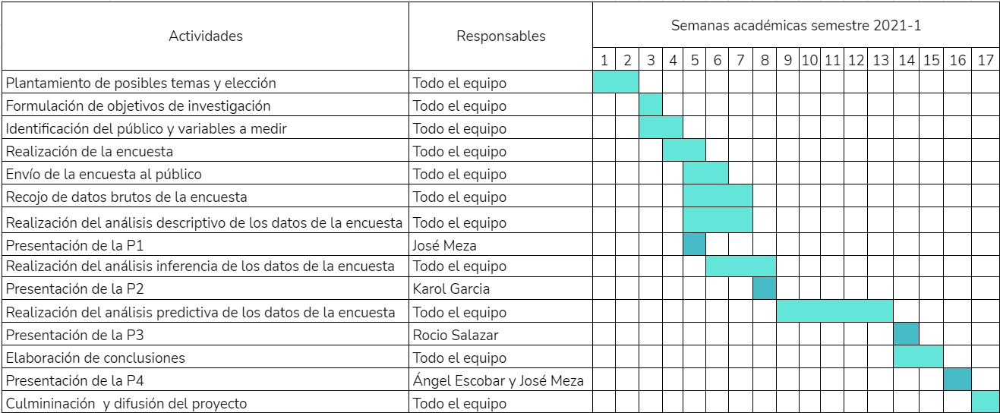

## Título corto: Servicios de Streaming


# Introducción 

<div style="text-align: justify">Las plataformas streaming, han ido ganando terreno en la producción de contenido audiovisual. Plataformas como Netflix, Amazon Prime Video, entre otras, han logrado un gran éxito monetario y popularidad debido al catálogo de contenido que ofrecen y su fácil acceso. Ante la efectividad de estas plataformas, otras empresas como Disney y HBO también han decidido crear su propio servicio de streaming. En vista de que actualmente existe una mayor de cantidad de servicios de streaming, las personas tienen varias opciones para elegir. 
El trabajo busca estudiar el uso de servicios de streaming antes y durante la pandemia, así como el aumento de adquisición de estos servicios por el tiempo en cuarentena. Esto es importante, ya que debido a la pandemia las personas pasan más tiempo en sus casas. Ante esto, como forma de entretenimiento utilizan los distintos servicios de streaming en el mercado como Netflix, Amazon Prime Video, Apple TV. Pero, con las nuevas plataformas (Disney+ y HBO Go) que están llegando al mercado y el alargamiento del confinamiento, las personas consideran adquirir más de estos servicios ya que ofrecen un distinto catálogo de entretenimiento.
El motivo por el cual se realiza este proyecto es identificar si ha habido un cambio en la suscripción a plataformas de streaming audiovisuales antes y durante la pandemia en estudiantes de la Universidad de Ingeniería y Tecnología. Si bien el crecimiento del mercado de dichas plataformas ha aumentado estos últimos años, se busca encontrar una relación entre la transición a pasar más tiempo en casa por la pandemia y el uso de servicios de streaming.
</div>

# Objetivos

<div style="text-align: justify">
* General:
  + Analizar el impacto de la pandemia en el uso y la contratación de servicios de streaming audiovisual en estudiantes de la Universidad de Ingeniería y Tecnología.
* Específicos: 
  + Determinar si el auge en los contagios en ciertos meses incentivó al mayor uso de los servicios de streaming entre los estudiantes
  + Identificar la relación entre la cantidad de horas de uso semanal de servicios de streaming antes y durante la pandemia
  + Determinar las plataformas más y menos usadas entre los estudiantes
</div>
  

# Marco Teórico 
## Público objetivo
<div style="text-align: justify">
Estudiantes de la Universidad de Ingeniería y Tecnología (UTEC) entre 16 y 28 años en todo el Perú donde cada unidad muestral será la respuesta de la encuesta anexada por cada estudiante.
</div>

## Método de recolección de data
<div style="text-align: justify">
El método utilizado para el presente estudio es una encuesta hecha en Google Forms, referido a los estudiantes a los que tenemos acceso mediante nuestras redes sociales (WhatsApp, Telegram, Facebook e Instagram), por lo que la selección de la muestra ha sido por conveniencia. 
</div>

## Variables

Pregunta de la encuesta|Variable|Tipo|Restricciones
--------------------|------------|------|-----------------------
Ingrese su edad|Edad|Categórica ordinal|Entero positivo desde 16 hasta 30
Ingrese su código de estudiante|Código de estudiante|Categórica ordinal|Entero positivo mayor o igual a 201000000 y menor o igual a 202200000
¿Cuál es su escala de pago? |Escala|Categórica ordinal|A,B,C,D,E
¿Cuál es su ciclo académico?|Ciclo académico|Categórica ordinal|1, 2, 3, 4, 5, 6, 7, 8, 9, 10
¿Tienes algún tipo de ayuda financiera?|Ayuda Financiera|Categórica nominal|Beca Completa, Beca Parcial, Crédito Educativo, Ninguna
¿En qué departamento reside?|Departamento|Categórica nominal|Amazonas, Áncash, Apurimac, Arequipa, Ayacucho, Cajamarca, Callao, Cuzco, Huancavelica, Huánuco, Ica, Junin, Lambayeque, La Libertad, Lima, Lima Provincia, Loreto, Madre de Dios, Moquegua, Pasco, Piura, Puno, San Martín, Tacna, Tumbes, Ucayali, Extranjero
¿Cuál es tu sexo?|Sexo|Categórica nominal|M, F
Antes de la pandemia, ¿habías usado algún servicio de streaming audiovisual?|Uso de servicio de streaming antes de pandemia|Categórica nominal|Sí, No
¿Cuántos servicios de streaming  tenía contratado?|Número de servicios de streaming contratado antes de pandemia|Numérica discreta|Entero positivo, incluido 0
¿Qué servicios de streaming audiovisual usaste o usas?|Servicio de streaming antes de pandemia|Categórica nominal|Netflix, Amazon Prime Video, HBO Go, DirecTV Go, Apple TV, ClaroVideo, Movistar Play, Hulu, YouTube Premium, Crunchyroll Premium
¿Cuántas horas aproximadamente usabas algún servicio de streaming semanalmente antes de la pandemia?|Horas de uso antes de la pandemia|Numérica discreta|Entero positivo 0-168
Durante la pandemia, ¿has usado o usas algún servicio de streaming audiovisual?|Uso de servicio de streaming durante la pandemia|Categórica nominal|Sí, No
¿Cuántas horas aproximadamente usas en servicios de streaming  actualmente?|Horas de uso durante pandemia|Numérica discreta|Entero positivo de 0 - 168
¿Cuántos servicios de streaming tenía o tiene durante la pandemia?|Número de servicios de streaming que usa durante la pandemia|Numérica discreta|Enteros mayores a 0
¿Qué servicios de streaming audiovisual usaste o usas?|Servicio de streaming durante de pandemia|Categórica nominal|Netflix, Disney +, Amazon Prime Video, HBO Go, DirecTV Go, Apple TV, ClaroVideo, Movistar Play, Hulu, YouTube Premium, Crunchyroll Premium
Si te suscribiste a un servicio de streaming durante la pandemia, ¿en qué mes lo hiciste?|Fecha de suscripción|Categórica nominal|Marzo 2020 - Mayo 2021

# Datos

_Nota: El dataframe recopilado es del 23/07/2021 a las 14:00 p.m_

<div style="text-align: justify">
Primero, ingresamos las librerías que emplearemos a lo largo del informe:
```{r}
library(readr)
library(dplyr)
```

Además, para una muestra de datos numéricos más cómoda, utilizaremos en los casos en que lo merite la siguiente función de redondeo hasta las centésimas. 
```{r}
r <- function(x){
  return(round(x,2))
}
```


Una vez que ya tenemos las librerías instaladas, creamos el dataframe "DF" que va albergar la hoja .csv descargada a partir del Google Sheets que nos da como resultado las respuestas del Google Forms [Enlace de la encuesta](https://forms.gle/u33MTAwgoqHUddTA7). En esta parte se utiliza la función "read_csv" que nos permite guardar los datos en formato UTF-8.

```{r include=FALSE}
DF <- read_csv("Data_streaming.csv")
```
De nuestro conjunto de datos, es importante mencionar que tenemos `r nrow(DF)` observaciones y las analizaremos en función a `r ncol(DF)` variables.

Antes de comenzar a analizar los datos del Dataframe, decidimos renombrar los nombres de las variables y elegir con las que vamos a trabajar para simplificar la manipulación de las columnas.

La única columna que no vamos a emplear es la primera que hace referencia a la marca temporal que es el tiempo en que fue recibido la respuesta por unidad muestral del forms y vamos a redefinir el *DF*


```{r}
DF <- DF[,2:56]
```

En el dataframe *DFR* guardaremos el dataframe *DF* pero con las variables renombradas para facilitar su uso. Sin embargo, al momento de realizar el código nos dimos cuenta que la función **rename** tiene un límite de caracteres o parámetros, por lo que tuvimos que volver a utilizarla creando el dataframe *DFF* que sería el dataframe final en el que trabajaremos.


```{r echo=FALSE}
DF %>% rename(Edad = 'Ingrese su edad', Codigo = 'Ingrese su código de estudiante', Ciclo = 'Ingrese su ciclo académico', Sexo = '¿Cuál es su sexo?',Escala = '¿Cuál es su escala de pago?', Financiamiento = '¿Tienes algún tipo de ayuda financiera?', Departamento = '¿En qué departamento reside?', Netflix_AP='¿Qué servicios de streaming audiovisual consumías ANTES de la pandemia?  [Netflix]', Disney_AP='¿Qué servicios de streaming audiovisual consumías ANTES de la pandemia?  [Disney +]', Amazon_AP='¿Qué servicios de streaming audiovisual consumías ANTES de la pandemia?  [Amazon Prime Video]', HBO_AP='¿Qué servicios de streaming audiovisual consumías ANTES de la pandemia?  [HBO Go]', DirecTV_AP = '¿Qué servicios de streaming audiovisual consumías ANTES de la pandemia?  [DirecTV Go]', Apple_AP='¿Qué servicios de streaming audiovisual consumías ANTES de la pandemia?  [Apple TV]', Movistar_AP='¿Qué servicios de streaming audiovisual consumías ANTES de la pandemia?  [Movistar Play]', Claro_AP='¿Qué servicios de streaming audiovisual consumías ANTES de la pandemia?  [Claro Video]', Horas_AP='¿Cuántas horas aproximadamente usabas algún servicio de streaming semanalmente antes de la pandemia?', Youtube_AP='¿Qué servicios de streaming audiovisual consumías ANTES de la pandemia?  [Youtube Premium]', Crunchyroll_AP='¿Qué servicios de streaming audiovisual consumías ANTES de la pandemia?  [Crunchyroll Premium]', Hulu_AP='¿Qué servicios de streaming audiovisual consumías ANTES de la pandemia?  [Hulu]', Cantidad_AP='Si tu respuesta fue sí, ¿con cuántos servicios de streaming contabas?', Uso_AP='¿Habías usado algún servicio de streaming audiovisual ANTES de la pandemia?', Uso_DP='¿Has usado algún servicio de streaming audiovisual DURANTE la pandemia?', Horas_DP='¿Cuántas horas semanales aproximadamente has empleado en servicios de streaming durante la pandemia?', Netflix_DP='¿Qué servicios de streaming audiovisual has consumido DURANTE la pandemia?  [Netflix]', Disney_DP='¿Qué servicios de streaming audiovisual has consumido DURANTE la pandemia?  [Disney +]', Amazon_DP='¿Qué servicios de streaming audiovisual has consumido DURANTE la pandemia?  [Amazon Prime Video]', HBO_DP='¿Qué servicios de streaming audiovisual has consumido DURANTE la pandemia?  [HBO Go]', DirecTV_DP='¿Qué servicios de streaming audiovisual has consumido DURANTE la pandemia?  [DirecTV Go]', Apple_DP='¿Qué servicios de streaming audiovisual has consumido DURANTE la pandemia?  [Apple TV]', Movistar_DP='¿Qué servicios de streaming audiovisual has consumido DURANTE la pandemia?  [Movistar Play]', Claro_DP='¿Qué servicios de streaming audiovisual has consumido DURANTE la pandemia?  [Claro Video]', Youtube_DP='¿Qué servicios de streaming audiovisual has consumido DURANTE la pandemia?  [Youtube Premium]', Crunchyroll_DP='¿Qué servicios de streaming audiovisual has consumido DURANTE la pandemia?  [Crunchyroll Premium]', Hulu_DP='¿Qué servicios de streaming audiovisual has consumido DURANTE la pandemia?  [Hulu]', Cantidad_DP='Si tu respuesta fue sí, ¿con cuántos servicios de streaming has contado durante la pandemia?', Marzo_2020='¿En qué meses de la pandemia has tenido contado por lo menos un servicio de streaming contratado?  [Marzo 2020]', Abril_2020='¿En qué meses de la pandemia has tenido contado por lo menos un servicio de streaming contratado?  [Abril 2020]', Mayo_2020='¿En qué meses de la pandemia has tenido contado por lo menos un servicio de streaming contratado?  [Mayo 2020]', Junio_2020='¿En qué meses de la pandemia has tenido contado por lo menos un servicio de streaming contratado?  [Junio 2020]', Julio_2020='¿En qué meses de la pandemia has tenido contado por lo menos un servicio de streaming contratado?  [Julio 2020]', Agosto_2020='¿En qué meses de la pandemia has tenido contado por lo menos un servicio de streaming contratado?  [Agosto 2020]', Setiembre_2020='¿En qué meses de la pandemia has tenido contado por lo menos un servicio de streaming contratado?  [Setiembre 2020]') -> DFR

DFR %>% rename(Octubre_2020='¿En qué meses de la pandemia has tenido contado por lo menos un servicio de streaming contratado?  [Octubre 2020]', Noviembre_2020='¿En qué meses de la pandemia has tenido contado por lo menos un servicio de streaming contratado?  [Noviembre 2020]', Diciembre_2020='¿En qué meses de la pandemia has tenido contado por lo menos un servicio de streaming contratado?  [Diciembre 2020]', Enero_2021='¿En qué meses de la pandemia has tenido contado por lo menos un servicio de streaming contratado?  [Enero 2021]', Febrero_2021='¿En qué meses de la pandemia has tenido contado por lo menos un servicio de streaming contratado?  [Febrero 2021]', Marzo_2021='¿En qué meses de la pandemia has tenido contado por lo menos un servicio de streaming contratado?  [Marzo 2021]', Abril_2021='¿En qué meses de la pandemia has tenido contado por lo menos un servicio de streaming contratado?  [Abril 2021]', Mayo_2021='¿En qué meses de la pandemia has tenido contado por lo menos un servicio de streaming contratado?  [Mayo 2021]', Razon_AP='Si tu respuesta fue no, ¿cuál de las siguientes premisas fue la razón? [Prepandemia]', Razon_DP='Si tu respuesta fue no, ¿cuál de las siguientes premisas fue la razón? [Pandemia]', Otro_DP='¿Qué servicios de streaming audiovisual has consumido DURANTE la pandemia?  [Algún otro]', Otro_AP='¿Qué servicios de streaming audiovisual consumías ANTES de la pandemia?  [Algún otro]') -> DFFC
```

Para analizar si tenemos datos faltantes, ejecutaremos la siguiente línea de código:

```{r}
sum(is.na(DFFC))
```
Entonces, como podemos ver al emplear la función **respuesta obligatorias** en el Google Forms, no tenemos respuestas faltantes o NA dentro de nuestro dataframe.Sin embargo, podemos utilizar otras formas de validación de las observaciones para realizar nuestra limpieza de datos.
</div>

### Limpieza de datos
Considerando las recomendaciones de la entrega pasada, decidimos crear un boxplot para analizar algunas contradicciones en los datos que pudieran estar ocurriendo a pesar de las restricciones en nuestra encuesta.
```{r}
boxplot(DFFC$Cantidad_AP~as.factor(DFFC$Uso_AP), main="Análisis de contradicciones en los datos", ylab="Horas de uso semanal antes", xlab="Uso de servicios de streaming antes", col=c("tomato","slateblue"))
```

*Análisis*: Efectivamente una vez creado el boxplot nos dimos cuenta de una muy importante contradicción, puesto que teníamos estudiantes que habían colocado que no habían usado servicios de streaming antes de la pandemia y al mismo tiempo si habían colocado horas de uso diferentes de 0, lo cual claramente es un error en el llenado del formulario. 

Entonces, decidimos establecer ciertos criterios para evaluar la coherencia de nuestro dataframe. 

#### Criterios para "LIMPIAR" observaciones
De todas las observaciones recolectadas hay algunas respuestas que se contradicen entre sí. Por eso se tomó la decisión de eliminar las observaciones del data frame, ya que las variables funcionan juntas para realizar la comparación del antes y el durante. 
Para lograrlo, se tomaron las siguientes consideraciones:

* Si marcaron "No" en: ¿Habías usado algún servicio streaming ANTES/DURANTE LA PANDEMIA? (Uso_AP/Uso_DP):
  + No deberían de haber marcado "Sí usé" en: Si tu respuesta fue no, ¿Cuál de las siguientes premisas fue la razón? (Razón_AP/Razón_DP).
  + Si marcaron algunas de las otras opciones en Razón_AP o Razón_DP, tuvieron que escribir únicamente 0 en: Si tu respuesta fue sí, ¿con cuántos servicios de streaming contabas?(Cantidad_AP/Cantidad_DP); asimismo, las hora de uso (Horas_AP/Horas_DP) debería de ser 0.

* Si marcaron "Sí" en: ¿Habías usado algún servicio streaming ANTES/DURANTE LA PANDEMIA? (Uso_AP/Uso_DP):
  + Debería haber seleccionado únicamente "Sí usé" en: Si tu respuesta fue no, ¿Cuál de las siguientes premisas fue la razón? (Razón_AP/Razón_DP). 

#### Respondieron "No" en ¿Habías usado algún servicio streaming ANTES/DURANTE LA PANDEMIA?:
Antes de la pandemia:
```{r, results='hide'}
DFFC %>% filter(Uso_AP == "No" & Razon_AP == "Sí usé") 
DFFC %>% filter(Uso_AP == "No" & Razon_AP != "Sí usé" & Cantidad_AP >= 0 & Horas_AP > 0) 
```

Durante de la pandemia:
```{r, results='hide'}
DFFC %>% filter(Uso_DP == "No" & Razon_DP == "Sí usé") 
DFFC %>% filter(Uso_DP == "No" & Razon_DP != "Sí usé" & Cantidad_DP >= 0 & Horas_DP > 0) #Los que aparecen en esta data frame también aparecen en Antes de la pandemia
```

#### Respondieron "Sí" en ¿Habías usado algún servicio streaming ANTES/DURANTE LA PANDEMIA?:
Antes de la pandemia:
```{r, results='hide'}
DFFC %>% filter(Uso_AP == "Sí" & Razon_AP != "Sí usé" & Horas_AP > 0 & Cantidad_AP > 0) -> DFFSAP
DFFSAP
```
Durante de la pandemia:
```{r, results='hide'}
DFFC %>% filter(Uso_DP == "Sí" & Razon_DP != "Sí usé" & Horas_DP > 0 & Cantidad_DP > 0) 
DFEO <- rbind(DFFC %>% filter(Uso_AP == "No" & Razon_AP == "Sí usé"),DFFC %>% filter(Uso_AP == "No" & Razon_AP != "Sí usé" & Cantidad_AP >= 0 & Horas_AP > 0),DFFC %>% filter(Uso_DP == "Sí" & Razon_DP != "Sí usé" & Horas_DP > 0 & Cantidad_DP > 0))
```

#### Data frame por eliminar
```{r, results='hide'}
DFEO <- data.frame()
DFEO <- rbind(DFFC %>% filter(Uso_AP == "No" & Razon_AP == "Sí usé"),DFFC %>% filter(Uso_AP == "No" & Razon_AP != "Sí usé" & Cantidad_AP >= 0 & Horas_AP > 0),DFFC %>% filter(Uso_DP == "Sí" & Razon_DP != "Sí usé" & Horas_DP > 0 & Cantidad_DP > 0), DFFSAP[2,])
DFEO
```

```{r, results='hide'}
DFFC[c(38,70,19,27,55,78,83,106,136,143,147,16,152,40,119,125,139,140,64,141,157),] <- NA
DFF <- DFFC[complete.cases(DFFC),]
```
Así tenemos como dataframe final *DFF* completamente limpio y listo para analizar. Para comprobar el cambio de los datos incoherentes, graficamos de nuevo el mismo boxplot.

```{r}
boxplot(DFFC$Horas_AP~as.factor(DFFC$Uso_AP), main="Análisis de contradicciones en los datos", ylab="Horas de uso semanal antes", xlab="Uso de servicios de streaming antes", col=c("tomato","slateblue"))
```

En este caso se puede observar que todos los estudiantes que marcaron que no habían usado servicios de streaming antes de la pandemia han colocado un uso de 0 horas semanales antes de la pandemia.

## Sesgo de la recolección de datos 

#### Percepción del encuestado

<div style="text-align: justify">

Resulta importante señalar que uno de los sesgos más grandes a los que está expuesto el presente proyecto recae en el trabajo de memoria que han realizado los estudiantes universitarios al momento de responder las preguntas planteadas. En ese sentido, debemos señalar que el estudio se basa primordialmente en la percepción que tiene el encuestado con respecto a sus hábitos de uso de los servicios de streaming, puesto que no existe una validación independiente que nos permita saber a ciencia cierta que aquello que responden es completamente verídico. En general, cabe la posibilidad de que algunas variables, sobretodo las numéricas como horas de uso antes y durante, evidencien una variación en respuesta que el propio encuestado tenga la idea de que está otorgando más horas de su semana a los servicios de streaming puesto que es algo que se menciona recurrentemente dada la nueva normalidad en la que nos encontramos por la pandemia del COVID-19. 
</div>

#### Características de los encuestados


<div style="text-align: justify">


Para identificar algún otro sesgo en el dataframe recopilado, podemos analizar la concentración de personas del mismo ciclo. Principalmente este sesgo estaría explicado porque los integrantes somos de ciclos cercanos entre tercero y quinto, y tenemos acceso principalmente a estudiantes de la universidad de nuestros mismos ciclos o menores por temas de mentorías.

Entonces, para identificar el sesgo, analizaremos la concentración a partir de un histograma:

```{r echo=FALSE}
hist(DFF$Ciclo, main="Cantidad de estudiantes por ciclo", xlab="Ciclo", ylab="Cantidad de estudiantes", breaks=(1:10)-0.5, col="Skyblue")
abline(v=median(DFF$Ciclo), col='red', lwd=2)
legend(x='topright',legend=c("Mediana"),lwd=2,col=c("red"))
```


El descriptor numérico (mediana) es `r median(DFF$Ciclo)`, por lo que aseguramos que por lo menos la mitad de los estudiantes están en los ciclos menores o iguales a `r median(DFF$Ciclo)`. En este caso, en una encuesta ideal la mediana sería 5 o 6 porque teóricamente el rango es del primer ciclo al décimo ciclo y los valores 5 o 6 se encontrarían perfectamente en la mitad. Sin embargo, como podemos observar el rango es `r range(DFF$Ciclo)`, el cual no abarca el máximo que debería ser 10 y además podemos concluir que la encuesta tiene una concentración o sesgo específicamente hacia los ciclos 1-3.

La siguiente información es con respecto a las edades del público objetivo.

```{r echo=FALSE}
cat("La media es: ",round(mean(DFF$Edad),2))
cat("La mediana es: ",median(DFF$Edad))
Frecuencias <- data.frame(table(DFF$Edad))
Moda <- Frecuencias[which.max(Frecuencias$Freq),1]
Nombres <- unique(DFF$Edad)
cat("La moda es:", Nombres[Moda],"\n")
cat("El rango es: ", range(DFF$Edad),"\n")
cat("La varianza es:", round(var(DFF$Edad), digits = 2),"\n")
cat("La desviación estándar es:", round(sd(DFF$Edad), digits=2),"\n")
```

Para este conjunto de datos, la moda y la mediana son iguales mientras que la media es mayor, pero cercana a ellas. Estos valores nos indican que del rango de edades, tenemos una mayor concentración de datos entre 16 y 18, del rango que es 16-28. Y estos datos complementan lo obtenido antes con los ciclos de los estudiantes, ya que en los 3 primeros ciclos, la edad de los estudiantes oscila entre los 16 y 18 años. Es importante resaltar que del rango establecido en la encuesta (de 16 a 28 años), solo hay un máximo que es 25, lo que también explica la menor cantidad de observaciones en los últimos ciclos comparada a los primeros. Con respecto a la varianza y a la desviación, al ser números relativamente bajos, nos indican que la dispersión de los datos también es baja. 

La siguiente tabla muestra las frecuencias de las edades comentadas anteriormente. 

```{r echo=FALSE}
barplot(table(DFF$Edad), col="lemonchiffon",main = "Edades de los estudiantes encuestados",ylab="Frecuencia",xlab="Edad")
```

</div>

# Preguntas 
## Preguntas Descriptivas

Dado que ya se ha realizado la limpieza de datos y **no existen datos faltantes**, las siguientes preguntas serán respondidas en base a un total de `r nrow(DFF)` observaciones completas.

1)¿Existen diferencias entre estudiantes que emplean algún servicio de streaming audiovisual de antes a durante la pandemia?


```{r}
Binarios<-function(X){
  return(list(Sí=sum(X=="Sí"), No=sum(X=="No")))
}

Categoricas<-mapply(Binarios, list(Antes=DFF$Uso_AP,Durante =DFF$Uso_DP))
barplot(Categoricas, col=c("slateblue","tomato"),xlab="Periodo según pandemia",ylab="Cantidad de estudiantes",main="Empleo de servicios de streaming audiovisual")
legend("topright" , legend = rownames(Categoricas), fill=c("slateblue","tomato"))
```

*Análisis:* Con el gráfico de barras apilado podemos llegar a una primera hipótesis del aumento del uso de servicios de streaming audiovisual en los estudiantes de la UTEC. 

2) Antes y durante la pandemia, ¿cuántas horas semanales usan los servicios de streaming los estudiantes? 

```{r}
HDPM0 <- DFF[DFF$Horas_DP>0,]
HAPM0 <- DFF[DFF$Horas_AP>0,]
boxplot(HDPM0$Horas_DP, HAPM0$Horas_AP, main= "Cantidad de horas de uso semanales referentes a la pandemia", horizontal = 1, xlab="Cantidad de horas", border = rgb(0,0,0,0.2), pch=15, names=c("Durante","Antes"), ylab="Tiempo referente a la pandemia",col = c("darkseagreen","lightpink"))
abline(v=mean(DFF$Horas_AP), col='red', lwd=1, lty=3)
abline(v=mean(DFF$Horas_DP), col='blue', lwd=1, lty=3)
legend(x='topright',legend=c("Media antes de la pandemia", "Media durante la pandemia"),lwd=1,col=c("red", "blue"), lty=3)
```

*Análisis:* En los gráficos anteriores decidimos utilizar la transparencia para poder visibilizar la concentración de datos atípicos en la recolección de las muestras, lo cual en este caso nos beneficia porque vemos como los datos atípicos afectan de gran manera a la media y generan un sesgo hacia la derecha en las gráficas. Por otro lado, como podemos observar, existe una diferencia en la mediana y el rango intercuartil de ambas gráficas. Al comparar las medianas podemos observar que antes de la pandemia por lo menos el 50% de encuestados veían servicios de streaming 4 o menos horas semanales, mientras que durante la pandemia por lo menos el 50% de encuestados ven 6 o menos horas. Este incremento de dos horas en la mediana es significativo y podría generar una relación directa entre el mayor tiempo en casa por las cuarentenas y el empleo de esta forma de entretenimiento. Asimismo, observamos que la gráfica de durante la pandemia tiene un IQR mucho más extenso que la gráfica de antes, y esto también puede significar que la cuarentena afectó en gran medida los hábitos de los estudiantes en cuanto al tiempo dedicado para los servicios de streaming, y por esta razón los datos son más dispersos a comparación del periodo anterior que está muy concentrado y estándar. 

_Nota: El dato atípico de 50 horas semanales no lo consideramos como un error de tipeo, puesto que sí creemos que hay personas que pueden emplear 50 horas semanales en las plataformas de entretenimiento de streaming_

3) ¿Cuál fue la variación de uso entre los distintos servicios de streaming audiovisual antes y durante la pandemia?

```{r echo=FALSE}
names_servicios <- c("Netflix", "Disney+", "Amazon Prime", "Apple TV", "Movistar Play", "Otros")
S_AP <- c(table(DFF$Netflix_AP), table(DFF$Disney_AP), table(DFF$Amazon_AP), table(DFF$Apple_AP), table(DFF$Movistar_AP),(table(DFF$Otro_AP)+table(DFF$HBO_AP)+table(DFF$DirecTV_AP)+table(DFF$Claro_AP)+table(DFF$Youtube_AP)+ table(DFF$Crunchyroll_AP)+ table(DFF$Hulu_AP))/7)
Servicios_AP <- matrix(S_AP, nrow = , ncol=2, byrow=TRUE)
rownames(Servicios_AP) <- names_servicios
colnames(Servicios_AP) <- c("No","Si")

S_DP <- c(table(DFF$Netflix_DP), table(DFF$Disney_DP), table(DFF$Amazon_DP), table(DFF$Apple_DP), table(DFF$Movistar_DP),(table(DFF$Otro_DP)+table(DFF$HBO_DP)+table(DFF$DirecTV_DP)+table(DFF$Claro_DP)+table(DFF$Youtube_DP)+ table(DFF$Crunchyroll_DP)+ table(DFF$Hulu_DP))/7)
Servicios_DP <- matrix(S_DP, nrow = , ncol=2, byrow=TRUE)
rownames(Servicios_DP) <- names_servicios
colnames(Servicios_DP) <- c("No","Si")

Servicios_AP
Servicios_DP
```
```{r}
names_servicios_short <- c("NF", "D+", "AP", "ATV", "MP", "OT")
dif_servicios <- rbind(Servicios_AP[,2],Servicios_DP[,2])
barplot(dif_servicios, col = c("lightpink","darkseagreen"), beside = T, names.arg = names_servicios_short, main="Uso de servicios", xlab = "Nombres de servicios", ylab="Cantidad de estudiantes")
legend(x="top", legend = c("Antes","Durante"), fill=c("lightpink","darkseagreen"))
legend(x="topright", legend=c("NF: Netflix", "D+; Disney+", "AP: Amazon Prime", "ATV: Apple TV", "MP: Movistar Play","OT: Otros"))
```
*Observación:* En la encuesta realizada, al preguntar por los servicios que utilizan se les dejó a libertad de marcar más de una opción, por ello la suma total de frecuencias de los servicios supera las `r nrow(DFF)` observaciones. Cabe resaltar que la cantidad de encuestados que decían usar servicios de streaming antes de la pandemia es de  `r nrow(DFF %>% filter(DFF$Uso_AP == "Sí"))` y durante, `r nrow(DFF %>% filter(DFF$Uso_DP == "Sí"))`. 


*Análisis:* Del gráfico propuesto podemos describir una variación de incremento en la mayoría de los servicios en las etapas de antes de la pandemia a durante la pandemia. No obstante, podemos observar que ciertas plataformas como Disney+ y Amazon Prime tuvieron su auge durante la pandemia, y algunos motivos adicionales que podrían explicarlo es la introducción son restricción de Disney+ a Latinoamérica durante la pandemia y la aparición de nuevas series con alta popularidad en Amazon Prime.

Asimismo, podemos evidenciar que *Netflix* es el sitio *más usado* por los estudiantes, y esto tiene sentido ya que es de los servicios de streaming más antiguos y más conocido mundialmente. Además, según opiniones de usuarios en el periódico chileno [La Tercera](https://www.latercera.com/culto/2020/04/29/cual-es-el-mejor-servicio-de-streaming-los-criticos-opinan/), este es una de las mejores plataformas por su facilidad de uso gracias al interfaz amable, su catálogo variado y los precios razonables. Por otro lado, *Hulu* es el servicio *menos usado*, lo cual es razonable ya que es una plataforma que inicialmente solo estaba limitada para Japón y Estados Unidos, y actualmente para acceder a esta es utilizando un red virtual privada o VPN. Es por ello que la complejidad de acceso comparado a otras plataformas, lo hace el servicio de streaming menos utilizado. 

## Preguntas Exploratorias
1) ¿Existe algún patrón entre el número de servicios de streaming que tiene un estudiante y su escala económica?

```{r,fig.height=6,fig.align="center",out.width = '100%'}
op <- par(mfrow=c(1,2))
boxplot( DFF$Cantidad_AP~DFF$Escala, horizontal = 1, names=c('A','B','C','D','E'), ylab="Escalas económicas", xlab="Cantidad de servicios contratados", main="Servicios antes de la pandemia",cex.main=0.8, varwidth = TRUE, border = rgb(0,0,0,0.5), col=c("lightpink"))
boxplot( DFF$Cantidad_DP~DFF$Escala, horizontal = 1, names=c('A','B','C','D','E'), ylab="Escalas económicas", xlab="Cantidad de servicios contratados", main="Servicios durante la pandemia", cex.main=0.8, varwidth = TRUE, border = rgb(0,0,0,0.5),  col=c("darkseagreen"))
par(op)
```

```{r,fig.height=6,fig.align="center",out.width = '100%'}
DFF %>% filter(Escala == "Escala A" | Escala == "Escala B" | Escala == "Escala C") %>% mutate(Escala="Escala ABC") -> DFFS
DFF %>% filter(Escala == "Escala D" | Escala == "Escala E") -> DFFDE
DFFSF <- rbind(DFFS,DFFDE)
op <- par(mfrow=c(1,2))
boxplot( DFFSF$Cantidad_AP~DFFSF$Escala, horizontal = 1, names=c('ABC','D','E'), ylab="Escalas económicas", xlab="Cantidad de servicios contratados", main="Servicios antes de la pandemia",cex.main=0.8, varwidth = TRUE, border = rgb(0,0,0,0.5), col=c("lightpink"))
boxplot( DFFSF$Cantidad_DP~DFFSF$Escala, horizontal = 1, names=c('ABC','D','E'), ylab="Escalas económicas", xlab="Cantidad de servicios contratados", main="Servicios durante la pandemia", cex.main=0.8, varwidth = TRUE, border = rgb(0,0,0,0.5),  col=c("darkseagreen"))
par(op)
```

Dado que tenemos pocos datos en escalas A, B y C, hemos juntado dichas las escalas en ABC para hacer un mejor análisis. 

*Análisis:* En primer lugar, podemos observar un incremento general de las medianas si comparamos cada escala con su gráfica antes y durante la pandemia, a excepción de la escala B que solamente cambia su distribución, mas no su punto medio. En segundo lugar y más relevante, existe un patrón que se divide en dos grupos. El grupo de escalas bajas que incluye a la D y la E, se mantienen en una mediana igual y por debajo de las medianas del grupo de escalas altas que considera a la C, la B y la A. Así, exploramos un posible patrón que afirma que los estudiantes del grupo de las escalas económicas altas cuentan con un mayor número de servicios de streaming contratados. 

## Preguntas Inferenciales

Para las pruebas de hipótesis a continuación, utilizaremos como nivel de confianza el *95%* debido a que hemos trabajado en base a una encuesta y estamos sujetos al sesgo apelando a la percepción y lo que pueden recordar los encuestados sobre sus hábitos antes de pandemia. Por esta razón, nosotros buscamos delimitar la confianza al obtener el 95% o uno mayor y no delimitar la precisión, puesto que no es de nuestro interés investigativo un número preciso, sino el tener patrones confiables en nuestra muestra. El 95% es un valor que nos garantiza la confianza suficiente para poder evaluar nuestras hipótesis. Así mismo, emplearemos las pruebas a una distribución normal, ya que la cantidad de muestras es lo suficientemente grande para aproximarlo por el teorema del límite central.  

1) ¿Cuál ha sido el incremento de horas de uso promedio por estudiante de antes de la pandemia a durante la pandemia?

```{r}
lm1 <- lm(DFF$Horas_DP ~ DFF$Horas_AP)
plot(lm1)
```
*Análisis:* En la primer gráfica de diagnostico se ve una homocedasticidad solamente en la primera mitad de esta, en la segunda gráfica a partir del segundo cuartil teórico se desordenan los residuos estandarizados, en la tercera gráfica al igual que en la primera solamente la primera mitad tiene una gráfica lineal y en la cuarta gráfica hay pocos puntos que se salen de las curvas de nivel. En general, podemos observar que las pruebas de diagnóstico son adecuadas para una gran parte de la muestra, pero existe otra parte llena de datos atípicos que altera los resultados de la regresión. Estos datos atípicos se deben principalmente a hábitos excesivos de empleo de servicios de streaming que conlleva a una gran cantidad de horas inusual de visualización.

```{r}
smoothScatter(jitter(DFF$Horas_AP), jitter(DFF$Horas_DP), main="Horas de uso antes y durante la pandemia", ylab = "Horas durante", xlab="Horas antes")
abline(lm1, col = "red")
```

En esta gráfica podemos observar la relación entre la cantidad de horas de uso antes y durante la pandemia a través de una regresión lineal. Dado que el intercepto de la función es aproximadamente en 3, podríamos inferir que este sería el valor promedio para el cambio de horas semanales. Así mismo, como la recta tiene una pendiente positiva, se espera que el cambio sea un aumento. 

Mediante una prueba de hipótesis verificaremos si hay una diferencia significativa entre ambas variables. Para ello estableceremos las siguientes hipótesis: 

* Hipótesis nula: No hay una variación significativa entre las horas de uso semanal
* Hipótesis alternativa: Hay una variación significativa entre las horas de uso semanal

En este caso, para no rechazar la hipótesis nula, esperaríamos que la media de las diferencias fuese 0. 

Calcularemos primero la media y desviación estándar muestrales.

```{r}
dif1 <- DFF$Horas_DP - DFF$Horas_AP
mediaH <- mean(dif1)
desvH <- sd(dif1)
```

Esta prueba de hipótesis es bilateral. Establecemos nuestro _intervalo de confianza_ en la media al 99% de confianza. 

```{r}
ZH <- qnorm(0.05/2, lower.tail = FALSE)
II <- mediaH - ZH*desvH/sqrt(length(dif1)) #Límite por la izquierda
ID <- mediaH + ZH*desvH/sqrt(length(dif1)) #Límite por la derecha
```

Por lo tanto, nuestra región de rechazo es $$(-\infty, 1.48) \cup (4.33, \infty)$$

De lo anterior podemos evidenciar que 0 se encuentra dentro de la región de rechazo de hipótesis nula, por lo que la rechazamos. En conclusión, no se encuentra evidencia suficiente para concluir que no hubo un cambio significativo en las horas semanales de uso antes y durante la pandemia, según la percepción de los encuestados. 

```{r}
t.test(dif1, alternative = "two.sided", mu = 0, conf.level = 0.95)
```

Realizamos la prueba T-student para complementar el valor de p-value, el cual es muy pequeño comparado a la significancia (0.01), por lo cual rechazamos la hipótesis nula.

La siguiente prueba de hipótesis está relacionada a la primera aproximación que se infirió sobre un aumento de 3 horas semanales. Para ello plantearemos las siguientes hipótesis: 

* Hipótesis nula: El aumento en horas es igual a 3 horas semanales.
* Hipótesis alternativa: El aumento en horas es diferente a 3 horas semanales.

Al igual que la prueba anterior, también es bilateral, y dado que son los mismos datos, utilizamos la región de rechazo calculada anteriormente. En la cual encontramos a 3 fuera de la zona de rechazo, por lo que no rechazamos nuestra hipótesis nula. Entonces, 3 horas semanales es un valor razonable para decir que representa el cambio de horas en uso de los servicios de streaming. 

```{r}
t.test(dif1, alternative = "two.sided", mu = 3, conf.level = 0.95)
```

El valor de p-value soporta nuestra conclusión, ya que al ser relativamente alto comparado con nuestra significancia, es más probable que nuestra hipótesis nula no fuese rechazada. 


2)¿Cuál ha sido el incremento de cantidad de servicios empleados promedio por estudiante de antes de la pandemia a durante la pandemia?

En primera instancia, nos importaría saber si hay una variación significativa en la cantidad de servicios empleados antes y durante la pandemia. Para ello plantearemos las siguientes hipótesis: 

* Hipótesis nula: No hay una variación significativa en la cantidad de servicios empleados.
* Hipótesis alternativa: Hay una variación significativa en la cantidad de servicios empleados.

El tipo de prueba que realizaremos es bilateral, ya que para no rechazar la hipótesis nula, esperaríamos una media de 0 y para rechazarla, que sea diferente de 0.

Para ello, tenemos que plantear una diferencia entre la cantidad de servicios de streaming durante y antes y calcular la media y desviación muestral.

```{r}
dif2 <- DFF$Cantidad_DP - DFF$Cantidad_AP
mediaC <- mean(dif2)
desvC <- sd(dif2)
```

Ahora establecemos el intervalo de confianza al 95%.

```{r}
ZH1 <- qnorm(0.05/2, lower.tail = FALSE)
II1 <- mediaC - ZH1*desvC/sqrt(length(dif2)) #Límite por la izquierda
ID1 <- mediaC + ZH1*desvC/sqrt(length(dif2)) #Límite por la derecha
```

La región de rechazo de la hipótesis nula en este caso es $$(-\infty, 0.50) \cup (0.97, \infty)$$.
 
De lo mostrado, se puede concluir que 0 se encuentra dentro de la zona de rechazo, por lo cual rechazamos la hipótesis nula y validamos que hay un cambio significativo en la cantidad de servicios. 

```{r}
t.test(dif2, alternative = "two.sided", mu = 0, conf.level = 0.95)
```

La prueba T-student nos ayuda a sustentar nuestra conclusión anterior, ya que el p-value es mucho menor que la significancia establecida, por lo que es más probable que nuestra hipótesis nula sea rechazada. 

Consideramos razonable que el aumento promedio haya sido al menos de un servicio, por lo que procedemos a hacer la prueba de hipótesis. Para lo cual planteamos las siguientes hipótesis:

* Hipótesis nula: Hay un aumento de al menos un servicio.
* Hipótesis alternativa: No hay un aumento de al menos un servicio

En este caso usaríamos una prueba unilateral. 

```{r}
ZH2 <- qnorm(0.05, lower.tail = F)
ID2 <- mediaC + ZH2*desvC/sqrt(length(dif2))
ID2
```
Establecemos nuestra región de rechazo, como $$(0.84, \infty)$$ de la cual no rechazamos la hipótesis nula, dado que el valor 1 que esperaríamos se encuentra fuera de la región de rechazo. 

```{r}
t.test(dif2, mu = 1, conf.level = 0.95, alternative = "less")
```

De lo anterior, podemos concluir que 1 se encuentra en la zona de rechazo y no podemos afirmar que hay un aumento de al menos un servicio. Además, el p-value es menor a la significancia. También es evidente que estamos en una situación donde en la prueba anterior explicaba que había diferencia significativa; sin embargo, no tenemos en promedio el aumento de un servicio de streaming. Al parecer aunque algunas personas han empleado nuevos servicios de streaming, algunas otras no lo han hecho o han eliminado su suscripción. Esto explica que las diferencias al ser positivas y negativas se hayan contrarrestado entre ellas.  

## Preguntas Causales

1) ¿El incremento de contagios por Covid-19 aumentó el uso de servicios de streaming por parte de los estudiantes?

Para el correcto manejo de nuestras variables desde *Marzo_2020* hasta *Marzo_2021*, consideramos crear el dataframe denominado *DFMF*. En este dataframe se tendrá como filas los meses desde marzo del 2020 hasta mayor del 2021 y como columnas la cantidad de estudiantes que respondieron que sí habían visto por lo menos un servicio de streaming en dicho mes y la cantidad de estudiante que afirmaron no haber visto. Para esto, diseñamos la función *cantidad_meses()*, la cual tiene como parámetro un dataframe llamado *DFM* el cual es un recorte del dataframe inicial *DFFC* de las variables de los meses mencionados, y nos devolverá el dataframe *DFMF* armado.

```{r}
cantidad_meses <- function(x){
  cantidad_si = 0
  cantidad_no = 0
  df <- matrix(0:14, ncol= 15, nrow=2)
  vec_si = c(0:14)
  vec_no = c(0:14)
  for (i in 1:ncol(x)){
    for (j in 1:nrow(x)){
      if (x[j,i] == "Si"){
        cantidad_si = cantidad_si + 1
      }
      else {
        cantidad_no = cantidad_no + 1
      }
    }
    vec_si[i] = cantidad_si
    vec_no[i] = cantidad_no
    cantidad_si = 0
    cantidad_no = 0
  }
  df[1, ] <- vec_si
  df[2, ] <- vec_no
  result = df
}
```

```{r}
DFF %>% select(Marzo_2020 : Mayo_2021) -> DFM
DFMF <- cantidad_meses(DFM)
rownames(DFMF) <- c("Si", "No")
colnames(DFMF) <- c("Marzo 2020", "Abril 2020", "Mayo 2020", "Junio 2020", "Julio 2020", "Agosto 2020", "Setiembre 2020", "Octubre 2020", "Noviembre 2020", "Diciembre 2020", "Enero 2021", "Febrero 2021", "Marzo 2021", "Abril 2021", "Mayo 2021")
```

Posteriormente, una vez armado el dataframe *DFMF* emplearemos la función `rowSums` para poder calcular el promedio de estudiantes que usaron y no usaron un servicio de streaming audiovisual por trimestres, porque consideramos que tomando estos intervalos se puede apreciar mejor los resultados y obtener un mejor análisis. Así, crearemos el dataframe *DFMFT*.

```{r}
Trimestre_1 <- rowSums(DFMF[,1:3])/3
Trimestre_2 <- rowSums(DFMF[,4:6])/3
Trimestre_3 <- rowSums(DFMF[,7:9])/3
Trimestre_4 <- rowSums(DFMF[,10:12])/3
Trimestre_5 <- rowSums(DFMF[,13:15])/3
DFMFT <- data.frame(Trimestre_1, Trimestre_2, Trimestre_3, Trimestre_4, Trimestre_5)
```

De esta manera, una vez creado el dataframe *DFMFT* procederemos a crear el barplot en el que podamos analizar los trimestres en hubo mayor uso de servicios de streaming audiovisual.

```{r}
barplot(data.matrix(DFMFT), names.arg = c("1°","2°","3°","4°","5°"), xlab="Número de trimestre", ylab="Cantidad de estudiantes", main="Relación entre estudiantes y uso de servicios de streaming", sub="Periodo entre marzo 2020 - mayo 2021", col=c("Slateblue", "Tomato"))
legend("bottomright", legend = c("No", "Si", "Media de uso"), fill=c("Tomato", "Slateblue", "Green"))
abline(h=(rowSums(DFMFT[1,]))/5, lty=2, col="Green")
```

*Análisis:* La gráfica de barras por trimestres nos ayuda bastante a identificar los patrones de uso de servicios de streaming de los estudiantes universitarios en el transcurso de la pandemia y podemos concluir tres ideas importantes. La primera, es que el acoplo a los servicios de streaming no fue automático cuando comenzó la pandemia en marzo del 2020, sino fue un proceso largo el cual tomó todo el primer trimestre en poder adaptarse a la virtualidad y como vemos los siguientes trimestres están bastante alineados a la media. La segunda, recae en el cuarto trimestre en el que el uso fue considerablemente superior a la media y esto se puede explicar gracias a las vacaciones de fin de año y el aumento del tiempo de ocio de los estudiantes. La tercera y última, no están explícita, pero es tal vez la más importante, puesto que a partir de la gráfica podemos inferir que los periodos de aumentos de casos diarios drásticos junto con las olas de contagios realmente no fueron un factor clave en el mayor tiempo de ocio de los estudiantes y por tanto el uso de servicios de streaming audiovisual.

Para evaluar nuestro juicio acerca de la relación de uso de servicios de streaming audiovisual y el aumento de contagios durante la pandemia decidimos crear una gráfica de barras del aumento de los contagios en el mismo periodo para compararlas.

```{r}
contagios <- c(1095, 35911, 127500, 120737, 129522, 237302, 162792, 87674, 61102, 51532, 123112, 191556, 219002, 250638, 158258)
contagios_promedio <- c(mean(contagios[1:3]),mean(contagios[4:6]), mean(contagios[7:9]), mean(contagios[10:12]),mean(contagios[13:15]))
barplot(contagios_promedio, names.arg = c("1°","2°","3°","4°","5°"), xlab="Número de trimestre", ylab="Cantidad de personas contagiadas", main="Contagios de Covid-19 promedio por trimestre", sub="Periodo entre marzo 2020 - mayo 2021", col=c("Gold"))
legend("bottomright", legend = c("Media de contagios"), fill=c("Green"))
abline(h=mean(contagios_promedio), lty=2, col="Green")
```


*Análisis:* Al comparar finalmente las dos gráficas mencionadas correctamente podemos concluir que no existe una relación entre el aumento de los contagios confirmados de Covid-19 y el incremento en el uso de servicios de streaming audiovisual por estudiantes universitarios, puesto que en los trimestres 2 y 5 con mayor promedio de contagios, el uso de plataformas de streaming es parte de la media. Así, determinamos que nuestra hipótesis 4 también es incorrecta en este caso y el aumento de contagios no está relacionado con el incremento en el uso de servicios de streaming audiovisual. Este último incremento estará más bien relacionado con la adaptación a la virtualidad al inicio de la pandemia en el primer trimestre y a las vacaciones de fin de año durante el cuarto trimestre.

Para un análisis más preciso de la muestra, aplicaremos regresión lineal a manera de comprobación de la existencia de una relación entre las variables:

```{r}
lm3 <- lm(DFMF[1,] ~ contagios)
plot(lm3)
```

*Análisis:* En la primera gráfica no se ve nada cercano a una homocedasticidad en ningún punto, en las segunda gráfica se ve una relativa secuencia cercana a la linea de los residuos estandarizados a excepción de algunos puntos atípicos, en la tercera gráfica no se aprecia un diagrama lineal de los residuos y en la cuarta gráfica los datos están bastante distribuidos, pero no llegan a las curvas de nivel. Entonces, vemos que las pruebas de diagnostico no terminan de dar un resultado completamente y por esta razón analizaremos el _summary_ de la regresión.

```{r}
plot(DFMF[1,] ~ contagios, main="Relación entre contagios por Covid-19 y el uso de streaming", xlab="Contagios por Covid-19", ylab = "Uso de streaming durante la pandemia")
abline(lm3, col = "red")
```

```{r}
summary(lm3)
```

*Análisis*: En base a la gráfica se puede observar que la recta de regresión a medida que aumenta los contagios, aumenta el uso de servicios streaming. En base a esta regresión, obtenemos un $R^2$ igual a `r round(0.1183,2)`, el cual significa que el modelo explica muy poco sobre la relación entre las variables, y un valor p-value de `r round(0.2093,2)` el cual no es significativo ya que trabajamos con un nivele de confianza de 95%. Esto puede justificar nuestra conclusión realizada sobre los contagios, los cuales no fueron un factor clave para el incremento del uso de streaming.   

2) ¿El tener un número mayor de servicios de streaming afecta a la cantidad de horas que las personas pasan usando estas plataformas?

Antes de la pandemia:

```{r}
lm2.1 <- lm(DFF$Horas_AP ~ DFF$Cantidad_AP)
plot(lm2.1)
```
*Análisis:* Podemos identificar que no hay homocedasticidad pues la nube de puntos no permanece agrupada de manera constante debido a los datos atípicos que se alejan de la recta roja. En la gráfica de normalidad, se puede apreciar que los datos centrales encajan medianamente con la recta, sin embargo, en los extremos se puede identificar que los residuos estandarizados son más grandes que los teóricos. en la gráfica de residuos estandarizados también se aprecian datos dispersos y la línea roja no tiene forma plana, lo que explica la varianza que hay entre los datos. Por último se pueden apreciar que hay datos atípicos que tienen mucha influencia en cómo se varía el modelo.

```{r}
plot(jitter(DFF$Horas_AP) ~ jitter(DFF$Cantidad_AP),main="Relación entre la cantidad de servicios y horas de uso de streaming antes de pandemia",cex.main=0.85, ylab = "Horas de uso antes de la pandemia", xlab="Cantidad de servicios de streaming antes de la pandemia")
abline(lm2.1, col = "red")
summary(lm2.1)
```
En base a esta regresión, obtenemos un $R^2$ igual a `r round(0.1214,2)` y un valor p-value de `r 1.169e-05`.

Durante de pandemia:

```{r}
lm2.2 <- lm(DFF$Horas_DP ~ DFF$Cantidad_DP)
plot(lm2.2)
```

*Análisis:* Se puede apreciar una mejor gráfica de homocedasticidad, aunque aún predominan los datos atípicos. Con respecto a la normalidad, al igual que la gráfica que "Antes de la pandemia", en los extremos se presentan residuos estandarizados mayores que los teóricos, asimismo en el centro hay una mayor variación por lo que los residuos teóricos son mayores que los estandarizados. La tercera gráfica de diagnóstico tiene mejor forma que la anterior, ya que la línea roja es más plana y los puntos son más uniformes. Por último, la gráfica final muestra que hay dependencia aún de datos atípicos que pueden afectar el modelo.

```{r}
plot(jitter(DFF$Horas_DP) ~ jitter(DFF$Cantidad_DP), main="Relación entre la cantidad de servicios y horas de uso de streaming durante de pandemia",cex.main=0.85 ,ylab = "Horas antes de la pandemia", xlab="Cantidad antes de la pandemia")
abline(lm2.2, col = "red")
```

```{r}
summary(lm2.2)
```

En base a esta regresión, obtenemos un $R^2$ igual a `r round(0.1246,2)` y un valor p-value de `r 8.786e-06`.

*Análisis*: En base a ambas gráficas se puede observar que la recta de regresión va en aumento. Pero, al observar el $R^2$ para el antes y durante la pandemia es muy bajo, esto significa que el modelo explica muy poco sobre las variables. Lo mismo pasa con el p-value el cual es muy chiquito y al trabajar con un nivel de confianza del 95% hace que sea significativo. Entonces, podemos decir que la cantidad de servicios de streaming no necesariamente está relacionado con la cantidad de horas que la persona utiliza para usar estos servicios.

# Conclusiones

- Nos decantamos por la hipótesis de que existe un incremento promedio de 3 horas de uso de los servicios de streaming audiovisual en los estudiantes de la UTEC de antes a durante la pandemia.

- Rechazamos la hipótesis que estipulaba que existe un incremento en el contrato de  al menos 1 servicio de streaming audiovisual por estudiante de la UTEC de antes a durante la pandemia.

- No encontramos evidencia suficiente para afirmar que existe una relación causal entre el aumento de contagios por la Covid-19 y un mayor uso de servicios de streaming.

- No hallamos pruebas suficientes para afirmar que existe una relación lineal significativa entre el número de servicios de streaming contratados y la cantidad de horas de uso semanal ya sea antes como durante la pandemia.


# Planificación 

Por último, se presenta un diagrama de Gantt donde se muestra la factibilidad del proyecto.


```{r pressure01, echo=FALSE, out.width = '100%'}

```
</div>
