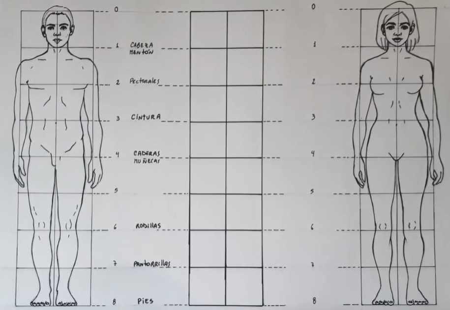

Título del proyecto:

# **LA SILLA IDEAL PARA UN ESTUDIANTE DE UTEC**

Título corto: **LaSillaIdealUTEC**

## Cargar Datos
```{r}
library(readr)

library(dplyr)

library(modeest)

library(tidyverse)

library(ggplot2)

library(stringr)

library(mixtools)
```

```{r}
DFN<-read_csv("Encuesta.csv")
```

```{r}
names(DFN)
```

```{r}
DFN-> DF
```

```{r}
#Cambiando nombres
DF %>% rename(Sexo= `Indica tu sexo`) -> DF
DF %>% rename(Email= `Dirección de correo electrónico`) -> DF
DF %>% rename(Codigo= `¿Cuál es tu código de estudiante?`) -> DF
DF %>% rename(Comodidad=`¿Del 1 al 5 qué tan cómodo te sientes con la silla que usas para tus clases virtuales?`) -> DF
DF %>% rename(Concentracion= `¿Del 1 al 5 qué tan concentrado estás durante tus clases virtuales?`) -> DF
DF %>% rename(Estatura= `¿Cuál es tu estatura? Por favor introduce tu estatura en centímetros (cm) Ejemplo: 163`) -> DF
DF %>% rename(Peso= `¿Cuál es tu peso? Por favor introduce tu peso en kilogramos (kg) Ejemplo: 62.5`) -> DF
DF %>% rename(Ruedas=`¿Te gusta que las sillas tengan ruedas?`) -> DF
DF %>% rename(Acolchonado=`¿Te gustan las sillas acolchadas?`) -> DF
DF %>% rename(SoporteLumbar= `¿Te gustaría un soporte lumbar en tu silla?`) -> DF
DF %>% rename(AsientoRegulable= `¿Te gustaría que tu silla tenga un asiento regulable?`) -> DF
DF %>% rename(Regulacion=`Si marcaste sí en la pregunta anterior, ¿Cuánto te gustaría que se pueda regular la altura de tu silla (cm)?`) -> DF
DF %>% rename(PosPies= `¿Cómo prefieres que estén tus pies al sentarte?`) -> DF
DF %>% rename(AsientoReclinable= `¿Te gustaría que tu silla se pueda reclinar?`) -> DF
DF %>% rename(Reclinacion= `Si marcaste sí en la pregunta anterior, ¿Cuánto te gustaría que tu silla se pueda reclinar?`) -> DF
DF %>% rename(HorasEstudio= `¿Cuántas horas diarias pasas sentado al estudiar?`) -> DF
DF %>% rename(Material= `¿Qué material para el tapizado de tu silla te gustaría que tuviera?`) -> DF
DF %>% rename(NewComodidad= `Con todas las características que has elegido para tu silla ideal, ¿Cuál sería tu nuevo nivel de comodidad usando la silla?`) -> DF
DF %>% rename(Presupuesto= `¿Cuánto estarías dispuesto a pagar por la silla?  El precio está considerado en soles`) -> DF
DF %>% rename(Reposabrazo=`¿Te gustaría una silla que tenga reposabrazos?`) -> DF
DF %>% rename(NewConcentracion=`Con todas las características que has elegido para tu silla ideal, ¿Cuál sería tu nuevo nivel de concentración usando la silla?`) -> DF
DF %>% rename(Marca=`Marca temporal`) ->DF
```

```{r}
#Verificando
summary(DF)
```

```{r}
#Datos irregulares a NA
table(DF$Peso)
table(DF$Estatura)
#Solo en estatura hay datos irregulares imposibles: 1.5, 1.52, 1.55 1.56, 1.58, 1.6, 1.65, 1.68, 1.75, 1.8
```

```{r}
table(DF$Reclinacion)
#todos los ángulos están forma de letras
```

```{r}
#Corrigiendo datos irregulares
DF$Material[DF$Material=="Cuero sintético"]<-"Cuero sint."
DF$Estatura[DF$Estatura==1.50]<- 150
DF$Estatura[DF$Estatura==1.52]<- 152
DF$Estatura[DF$Estatura==1.55]<- 155
DF$Estatura[DF$Estatura==1.56]<- 156
DF$Estatura[DF$Estatura==1.58]<- 158
DF$Estatura[DF$Estatura==1.60]<- 160
DF$Estatura[DF$Estatura==1.61]<- 161
DF$Estatura[DF$Estatura==1.65]<- 165
DF$Estatura[DF$Estatura==1.68]<- 168
DF$Estatura[DF$Estatura==1.69]<- 169
DF$Estatura[DF$Estatura==1.70]<- 170
DF$Estatura[DF$Estatura==1.75]<- 175
DF$Estatura[DF$Estatura==1.78]<- 178
DF$Estatura[DF$Estatura==1.79]<- 179
DF$Estatura[DF$Estatura==1.80]<- 180
#Cambiando datos que deberían ser numéricos a numéricos
DF$Reclinacion[DF$Reclinacion=="120°"]<- 120
DF$Reclinacion[DF$Reclinacion=="165°"]<- 165
DF$Reclinacion[DF$Reclinacion=="180°"]<- 180
DF$Reclinacion[DF$Reclinacion=="90°"]<- 90
DF$Reclinacion<-as.numeric(DF$Reclinacion)

a<-str_split_fixed(str_split_fixed(DF$Marca, "\\s", 2)[,1], "\\/",3)
DF$Marca<-as.numeric(str_c(a[,3],a[,2],ifelse(str_length(a[,1])==2,"","0"),a[,1]))
DF$Codigo<-str_sub(as.character(DF$Codigo), start = 1, end = 4)
```

```{r}
#Verificando
table(DF$Estatura)
table(DF$Reclinacion)
```
##### **¿Cómo se fomentó la representatividad de la muestra?**

La representatividad de la muestra radica en que la encuesta fué distribuida a estudiantes de diferentes ciclos en prácticamente la misma proporción, por ello podemos encontrar encuestados con códigos de alumno con 4 cifras iniciales entre 2017 hasta 2021, que representa el año en que ingresaron a la universidad.

Número de observaciones totales

```{r}
nrow(DF)
```
Observaciones incompletas:
```{r}
sum(is.na(DF))
```
El número observaciones incompletas se debe a que los encuestados no querían tener un ángulo de reclinación o tampoco querían una altura de regulación en sus asientos, lo cual repercute en las variables (Regulacion) y (Reclinacion), mismas que nos ayudan a saber la cantidad de estudiantes que prefiere o no estas características.

Nombres de las variables en el Data Frame:
```{r}
names(DF)
```

# **INTRODUCCIÓN**

La trascendencia del proyecto "La silla ideal para un estudiante de UTEC" se encuentra en nuestra intención de poner a prueba la hipótesis de que debido a la coyuntura actual, los estudiantes estarían más interesados en mejorar su nivel de comodidad desde sus hogares, pues permanecen horas sentados frente a un escritorio para llevar a cabo sus clases de manera virtual; por ende, es probable que le otorguen ahora mayor importancia a las características de sus sillas. A diferencia de las clases presenciales, en esta nueva normalidad podemos asistir a un mayor número de clases por día al alcance de un par de clics, es decir, nos mantenemos sentados por períodos más extensos de tiempo. Además, podemos afirmar que el tema de este proyecto es innovador porque analizaremos si es posible que un conjunto de características de una silla sea considerado como un factor que contribuiría de manera positiva o negativa en la concentración de los estudiantes de UTEC. Del mismo modo, con este estudio podremos proporcionar una base de datos y un análisis estadístico que puede ser de gran interés para aquellos negocios que pertenezcan al rubro de fabricación y venta de sillas porque podrán adquirir insights de su público objetivo.Finalmente, la ejecución de este proyecto será posible ya que contamos con tres herramientas esenciales para llevar a cabo este proyecto. En primer lugar, para recopilar datos y crear nuestra base de datos de forma remota utilizaremos las encuestas de Google Forms. En segundo lugar, contamos con un software con el que podremos limpiar y procesar la información, del mismo modo podremos crear una gran variedad de gráficos para presentar los datos. En último lugar, estamos empleando una página web llamada Sci-Hub que nos permite acceder a millones de papers de investigación, logrando que no se restrinja nuestra búsqueda de información y argumentos que puedan respaldar este proyecto.

# **OBJETIVOS**

-   **Objetivo principal:** Obtener parámetros para la elaboración de una silla ergonómica que puedan influir en la concentración de los estudiantes de UTEC.

-   **Objetivos específicos:**

    -   Determinar los criterios que influyen en el nivel de comodidad de una silla

    -   Evidenciar una relación entre el nivel de comodidad y concentración de los estudiantes dentro de la modalidad de enseñanza virtual

    -   Ejecutar un estudio estadístico que sea de interés a empresas proveedoras de sillas

**PREGUNTAS DE INTERÉS**

-   ¿Existe una relación entre la comodidad y la concentración de los estudiantes en las clases?

    -   ¿De qué modo repercute la comodidad de una silla respecto a la eficiencia del estudiante en sus clases?

-   ¿Qué aspectos se deben tener en cuenta para la elaboración de sillas?

    -   ¿Cómo se relaciona la estatura de una persona con el largo del espaldar de una silla para proporcionar comodidad?

    -   ¿De qué forma influye la inclinación, altura y largo del espaldar de una silla en la comodidad de un estudiante?

-   ¿El sexo del estudiante marcará una tendencia diferente sobre las preferencias por un tipo de silla?

# **MARCO TEÓRICO**

**POBLACIÓN OBJETIVO:** El grupo de personas sobre las que realizaremos el estudio estadístico son los estudiantes de UTEC.

**UNIDAD MUESTRAL:** En la encuesta realizada a los estudiantes de UTEC, la unidad muestral es por personas, que posteriormente serán clasificados por género.

**TIPO DE MUESTREO:** Por conveniencia.

**VARIABLES CON SU CLASIFICACIÓN:**

+--------------------------------------------------------------------------+----------------------+------------------------+
| **Variables**                                                            | **Tipo de variable** |   **Restricciones**    |
+==========================================================================+======================+========================+
| -   Horas diarias que pasa sentado frente a su ordenador/laptop al día   | Numérica discreta    |  Entero no negativo    | 
|                                                                          |                      |      (1-14 horas)      |
|                                                                          | \                    |                        |
+--------------------------------------------------------------------------+----------------------+------------------------+
| -   Estatura de la persona (cm)                                          | Numérica continua    | Entero positivo (cm)   |
+--------------------------------------------------------------------------+----------------------+------------------------+
| Largo del espaldar de la silla (cm)                                      | Numérica discreta    | Entero positivo (cm)   |
+--------------------------------------------------------------------------+----------------------+------------------------+
| -   Reclinación                                                          | Numérica discreta    |  Ángulos entre: 90°,   |    
|                                                                          |                      |   120°,165° y 180°     |
+--------------------------------------------------------------------------+----------------------+------------------------+
| -   Precio que están dispuestos a pagar (soles)                          | Numérica discreta    | Entero positivo(soles) |    
|                                                                          |                      | 50k; k $\in$[7,20]     |
+--------------------------------------------------------------------------+----------------------+------------------------+
| -   Material de la silla                                                 | Categórica nominal   | -Cuero natural         |
|                                                                          |                      | -Terciopelo            |
|                                                                          |                      | -Cuero sintético       |
|                                                                          |                      | -Algodón               |
|                                                                          |                      | -Plástico              |
|                                                                          |                      |                        |
+--------------------------------------------------------------------------+----------------------+------------------------+
| -   Preferencia por las sillas con o sin ruedas                          | Categórica nominal   | Booleano (Sí o No)     |
+--------------------------------------------------------------------------+----------------------+------------------------+
| -   Preferencia por las sillas acolchadas o no acolchadas                | Categórica nominal   | Booleano (Sí o No)     |
+--------------------------------------------------------------------------+----------------------+------------------------+
| -   Preferencia por silla con o sin reposabrazos                         | Categórica nominal   | Booleano (Sí o No)     |
+--------------------------------------------------------------------------+----------------------+------------------------+
| Rango de regulación de la altura del asiento de la silla                 | Numérica continua    | Entero positivo, rango:| 
|                                                                          |                      | (15,20,10,5)en cm      |
+--------------------------------------------------------------------------+----------------------+------------------------+
| -   Preferencia por asientos regulables                                  | Categórica nominal   | Booleano (Sí o No)     |
+--------------------------------------------------------------------------+----------------------+------------------------+
| Profundidad del asiento                                                  | Numérica discreta    | Entero positivo (cm)   |
+--------------------------------------------------------------------------+----------------------+------------------------+
| Ancho del asiento                                                        | Numérica discreta    | Entero positivo (cm)   |
+--------------------------------------------------------------------------+----------------------+------------------------+
| -   Peso                                                                 | Numérica continua    | Real positivo (kg)     |
+--------------------------------------------------------------------------+----------------------+------------------------+
| Índice de masa corporal (IMC)                                            | Numérica continua    | Real positivo (kg/m)   |
+--------------------------------------------------------------------------+----------------------+------------------------+
| -   Preferencia por la inclusión de un soporte lumbar en la silla        | Categórica nominal   | Booleano (Sí o No)     |
+--------------------------------------------------------------------------+----------------------+------------------------+
| -   Comodidad antes y después                                            | Categórica ordinal   | Escala de Likert,      |
|                                                                          |                      | Rango: entre 1 al 5    |
+--------------------------------------------------------------------------+----------------------+------------------------+
| -   Concentración antes y después                                        | Categórica ordinal   | Escala de Likert,      |
|                                                                          |                      | Rango: entre 1 al 5    |    
+--------------------------------------------------------------------------+----------------------+------------------------+
| -   Sexo                                                                 | Categórica nominal   | Femenino o Masculino   |
+--------------------------------------------------------------------------+----------------------+------------------------+
| -   Posición                                                             | Categórica nominal   | Pies tocando el suelo  |
|                                                                          |                      | o sin tocar el suelo   | 
+--------------------------------------------------------------------------+----------------------+------------------------+

\

### **Preguntas para las variables**
* ¿Cuál es tu sexo? $\Rightarrow$ Variable **sexo**
* ¿Del 1 al 5 qué tan cómodo te sientes con la silla que usas para tus clases virtuales? $\Rightarrow$ Variable **comodidad**
* ¿Del 1 al 5 qué tan concentrado estás durante tus clases virtuales? $\Rightarrow$ Variable **concentración**
* ¿Cuál es tu estatura en cm? $\Rightarrow$ Variable **estatura**
* ¿Cuál es tu peso en kg? $\Rightarrow$ Variable **peso**
* ¿Te gusta que las sillas tengan ruedas? $\Rightarrow$ Variable **preferencia por las sillas con o sin ruedas** 
* ¿Te gustan las sillas acolchadas? $\Rightarrow$ Variable **preferencia por las sillas acolchadas o no acolchadas**   
* ¿Te gustaría un soporte lumbar en tu silla? $\Rightarrow$ Variable **preferencia por la inclusión de un soporte lumbar en la silla**  
* ¿Te gustaría una silla que tenga reposabrazos? $\Rightarrow$ Variable **preferencia por silla con o sin reposabrazos**
* ¿Te gustaría que tu silla tenga un asiento regulable? $\Rightarrow$ Variable **preferencia por asientos regulables**    
* Si marcaste sí en la pregunta anterior, ¿Cuánto te gustaría que se pueda regular la altura de tu silla (cm)? $\Rightarrow$ Variable **rango de regulación de la altura del asiento de la silla**
* ¿Cómo prefieres que estén tus pies al sentarte? $\Rightarrow$ Variable **posición**
* ¿Te gustaría que tu silla se pueda reclinar? $\Rightarrow$ Variable **preferencia por asientos regulables** 
* Si marcaste sí en la pregunta anterior, ¿Cuánto te gustaría que tu silla se pueda reclinar? $\Rightarrow$ Variable **reclinación**
* ¿Cuántas horas diarias pasas sentado al estudiar? $\Rightarrow$ Variable **horas diarias que pasa sentado frente a su ordenador/laptop al día** 
* ¿Qué material para el tapizado de tu silla te gustaría que tuviera? $\Rightarrow$ Variable **material de la silla**
* Con todas las características que has elegido para tu silla ideal, ¿Cuál sería tu nuevo nivel de comodidad usando la silla? $\Rightarrow$ Variable **comodidad**
* Con todas las características que has elegido , ¿Cuál sería tu nuevo nivel de concentración? $\Rightarrow$ Variable **concentración**
* ¿Cuánto estarías dispuesto a pagar por la silla? $\Rightarrow$ Variable **precio** 


### **Descriptores Numéricos**
* Descriptores numéricos para la variable regulación: Máximo, mínimo y moda.
* Descriptores numéricos para la variable peso: Máximo, mínimo, mediana, rango, IQR, promedio, desviación estándar y coeficiente de variación.
* Descriptores numéricos para la variable estatura: Máximo, mínimo, mediana, rango, IQR, promedio, moda, desviación estándar y coeficiente de variación.
* Descriptores numéricos para la variable ángulo: Máximo, mínimo, y moda.
* Descriptores numéricos para la variable horas: Máximo, mínimo, mediana, promedio, rango, moda y desviación estándar.
* Descriptores numéricos para la variable precio: Máximo, mínimo, mediana, moda, rango, IQR, promedio, desviación estándar y coeficiente de variación.

### **Descriptores Gráficos**

* Descriptor gráfico para la variable sexo: Barplot.
* Descriptor gráfico para la variable estatura: Histograma y boxplot.
* Descriptor gráfico para la variable peso: Histograma y boxplot.
* Descriptor gráfico para la variable regulación: Histograma.
* Descriptor gráfico para la variable ángulo: Histograma.
* Descriptor gráfico para la variable horas: Boxplot, histograma y diagrama de puntos.
* **Descriptor gráfico para las variables categóricas (dos variables): Barplot y mosaic plot.**

### **Factibilidad**
```{r echo = FALSE, out.width='80%'}
knitr::include_graphics("gant.png")
```

```{r echo = FALSE}
Minimo<- function(lista){
  return(round(min(lista, na.rm = TRUE),2))
}

Maximo<- function(lista){
  return(round(max(lista, na.rm = TRUE),2))
}

Media<- function(lista){
  return(round(mean(lista, na.rm = TRUE),2))
}

Mediana<- function(lista){
  return(round(median(lista, na.rm = TRUE),2))
}

Moda<- function(lista){
  return(round(mfv(lista, na.rm = TRUE),2))
}

DesvEst<- function(lista){
  return(round(sd(lista, na.rm = TRUE),2))
}

RangInter<- function(lista){
  return(round(IQR(lista, na.rm = TRUE),2))
}
cuartiln<- function(lista,n){
  return(round(quantile(lista, na.rm = TRUE)[n+1],2))
}
olo<-function(valor){
  return(round(valor*100,2))
}
CoRel<-function(list1,list2){
  return(round((cov(list1,list2,use="complete.obs")/(sd(list1, na.rm = TRUE)*sd(list2, na.rm = TRUE))),2))
}
```

# **ANÁLISIS DESCRIPTIVO**

Se optó por solo usar el coeficiente de variación, el cual es una parametrización de la desviación estándar, por ello se puede comparar con los coeficientes de variación de otras variables. Misma razón por la cual se usará la correlación en lugar de la covarianza.

### **Encuestados**

$$\large Comodidad\hspace{2pt}actual\hspace{2pt}\hspace{90pt} Concentración\hspace{2pt} actual$$
```{r,echo=FALSE}
mi<-nrow(DF[which(DF$Comodidad<=2),])

md<-nrow(DF[which(DF$Comodidad==3),])
mdr<-olo(mi/nrow(DF[complete.cases(DF$Comodidad),]))
med<-nrow(DF[which(DF$Comodidad>=4),])

mi2<-nrow(DF[which(DF$Concentracion<=2),])

md2<-nrow(DF[which(DF$Concentracion==3),])
mdr2<-olo(mi2/nrow(DF[complete.cases(DF$Concentracion),]))
med2<-nrow(DF[which(DF$Concentracion>=4),])
```

```{r,echo=FALSE}
op=par(mfrow=c(1,2))
barplot(table(as.character(DF$Comodidad, na.rm=TRUE)),main="Comodidad actual de los alumnos\n de UTEC con sus sillas",xlab="Comodidad (1:5)",ylab="Frecuencia",col="tomato1")
barplot(table(as.character(DF$Concentracion, na.rm=TRUE)),main="Concentración actual de los alumnos\n de UTEC en sus clases virtuales",xlab="Concentración (1:5)",ylab="Frecuencia",col="springgreen3")
par(op)
```

$$              
\left|\begin{array}{lcr}
-\hspace{2pt} Cómodos   & Tranquilos & +\hspace{2pt}Cómodos \\\hline
`r mi` & `r md` & `r med` \\
\end{array}\right|\hspace{10pt}
\left|\begin{array}{lcr}
-\hspace{2pt}Concentrados   & Tranquilos & +\hspace{2pt}Concentrados \\\hline
`r mi2` & `r md2` & `r med2` \\
\end{array}\right|
$$
Si bien es cierto que hay muchos más cómodos, concentrados y tranquilos,  sigue existiendo un `r mdr`% de incómodos en sus sillas y un `r mdr2`% con dificultad para concentrase. Como se observa en la siguiente tabla la correlación entre concentración y comodidad para las personas del sexo masculino y femenino es baja. Sin embargo, se aprecia que las personas del sexo femenino tienen cierta inclinación a estar menos cómodas y concentradas, caso contrario de las personas del sexo masculino.


```{r,echo=FALSE}
#ggplot(DF, aes(x = Concentracion, y = Comodidad, colour = Sexo)) +  geom_point() + geom_smooth(method=ls)+ facet_grid(~Sexo)
op=par(mfrow=c(1,2))
a<-DF[which(DF$Sexo=="Femenino"),]$Concentracion
b<-DF[which(DF$Sexo=="Femenino"),]$Comodidad
smoothScatter(a, b ,xlab="Concentración",ylab="Comodidad",main="Población Femenina")
cr<-CoRel(a,b)
a<-DF[which(DF$Sexo=="Masculino"),]$Concentracion
b<-DF[which(DF$Sexo=="Masculino"),]$Comodidad
smoothScatter(a, b ,xlab="Concentración",ylab="Comodidad",main="Población Masculina")
cr2<-CoRel(a,b)
par(op)
```

$$ 
\left|\begin{array}{lcr}
Correlación \\\hline
`r cr` \\
\end{array}\right|\hspace{90pt}
\left|\begin{array}{lcr}
Correlación \\\hline
`r cr2` \\
\end{array}\right|
$$
Otra forma de visualizar relaciones es mediante el siguiente gráficos, en donde  a pesar de que no hay una relación lineal, como se ve con las correlaciones, sí existe una, ya que dependiendo de la comodidad existe una distinta concentración.

```{r}
op=par(mfrow=c(1,2))
mosaicplot(table(DF$Comodidad[DF$Sexo == "Femenino"], DF$Concentracion[DF$Sexo == "Femenino"]),ylab="Concentración",xlab="Comodidad",main="Población Femenina",col=c("dodgerblue1","blueviolet","firebrick1","gold1","chartreuse2"))
mosaicplot(table(DF$Comodidad[DF$Sexo == "Masculino"], DF$Concentracion[DF$Sexo == "Masculino"]),ylab="Concentración",xlab="Comodidad",main="Población Maculina",col=c("dodgerblue1","blueviolet","firebrick1","gold1","chartreuse2"))
par(op)
```

Nota: Estos gráficos proporcionan la misma información que el anterior. Son solo 2 maneras de visualizar lo mismo.

Cabe destacar que el porcentaje común de estudiantes que se encuentran incómodos y con problemas para concentrarse, es del `r olo(nrow(DF[complete.cases(DF$Comodidad)&complete.cases(DF$Concentracion),][which(DF$Comodidad<=2 & DF$Concentracion<=2),])/nrow(DF[complete.cases(DF$Comodidad)&complete.cases(DF$Concentracion),]))`%. Al final, son estos porcentaje (incomodidad, concentración y la unión de ellos) y comportamiento lo que le da razón al estudio y son unas de las razones por las que continúa siendo significativo para la comunidad tanto de UTEC como para ciertos tipos de empresas.

```{r,echo=FALSE}
#ggplot(DF, aes(x = Sexo, colour = Sexo)) +  geom_bar(fill=c("pink"," blue"))
barplot(table(DF$Sexo),main="Sexo de los encuestados", xlab="", ylab="Frecuencia", col=c("turquoise","indianred1"), legend.text=c(nrow(DF[which(DF$Sexo=="Femenino"),]),nrow(DF[which(DF$Sexo=="Masculino"),])))
```

Se observa que entre los encuestados respondieron más personas del sexo masculino que del femenino, de acuerdo a nuestra hipótesis es probable que la universidad cuente con una población estudiantil masculina mayor a la población femenina, esto puede ser a causa de que sea una universidad de ingeniería.

#### **Peso de los encuestados (kg)**
```{r echo = FALSE}
mi<-Minimo(DF$Peso)
ma<-Maximo(DF$Peso)
med<-Mediana(DF$Peso)
md<-Moda(DF$Peso)
ran<-round(ma-mi,2)
mea<-Media(DF$Peso)
des<-DesvEst((DF$Peso))
coefva<-round(des/mea,2)
raint<-RangInter(DF$Peso)
q1<-cuartiln(DF$Peso,1)
q3<-cuartiln(DF$Peso,3)
```

#### **Descriptores Gráficos**
##### **Histograma**
```{r,echo=FALSE}
hist(DF$Peso,main="Peso de los estudiantes",xlab="Peso (kg)",ylab="Frecuencia", prob=TRUE,col="lightcoral")
#,prob=TRUE ,col="darkgreen"
abline(v=mean(DF$Peso),col="red",lwd=2)
abline(v=median(DF$Peso),col="darkblue",lwd=2)
```

##### **Boxplot**
```{r,echo=FALSE}
boxplot(DF$Peso,ylab="Peso (kg)",main="Peso de los estudiantes",pch=20,col="tan1")
abline(h=mean(DF$Peso),col="red",lwd=2)
abline(h=median(DF$Peso),col="blue",lwd=2,lty=3)
legend(1.1,80,legend=c("Peso promedio"),col=c("red"),lwd=2)
```

$$               
\textbf{Descriptores}\hspace{2pt}\textbf{Númericos}\\
\left|\begin{array}{lcr}
Rango  & R.\hspace{2pt}Intercuartil & Moda & Mediana & Media & Coeficiente\hspace{2pt}Var.\\\hline
valores\in [`r mi`,`r ma`] &valores\in [`r q1`,`r q3`]& `r md` & `r med` & `r mea` &`r coefva`  \\
Rango= `r ran` & IQR = `r raint` &  \\
\end{array}\right|
$$

A partir de estos descriptores se puede observar, que generalmente los estudiantes de UTEC pesan `r q1` y `r q3` kilogramos, siendo el peso más común el de 60 kg. Por otro lado, el coeficiente de variación es relativamente bajo, esto significa que el peso de los estudiantes no varía mucho. Aún así, se aprecia que existe un sesgo a la derecha. Como se observa en el boxplot, hay presencia de valores atípicos, los cuales pertenecen a y son:

```{r}
head(DF[which(DF$Peso> q3+raint*1.5 | DF$Peso< q1-raint*1.5),which(names(DF)=="Peso" |names(DF)=="Codigo")])
```


#### **Estatura de los encuestados (cm)**
```{r echo = FALSE}
mi<-Minimo(DF$Estatura)
ma<-Maximo(DF$Estatura)
med<-Mediana(DF$Estatura)
md<-Moda(DF$Estatura)
ran<-round(ma-mi,2)
mea<-Media(DF$Estatura)
des<-DesvEst((DF$Estatura))
coefva<-round(des/mea,2)
raint<-RangInter(DF$Estatura)
q1<-cuartiln(DF$Estatura,1)
q3<-cuartiln(DF$Estatura,3)
```

#### **Descriptores Gráficos**
##### **Histograma**
```{r,echo=FALSE}
op=par(mfrow=c(1,2))
hist(DF$Estatura,main="Estatura de los estudiantes",xlab="Estatura (cm)",ylab="Frecuencia", prob=TRUE)
#,prob=TRUE ,col="darkgreen"
abline(v=mea,col="red",lwd=2)
abline(v=med,col="darkblue",lwd=2)
legend(170,0.05,legend=c("Media","Mediana"),col=c("red","darkblue"),lwd=2,cex=0.65)

hist(DF$Estatura,breaks = round(ma-mi,2),main="Estatura de los estudiantes",xlab="Estatura (cm)",ylab="Frecuencia", prob=TRUE)
#,prob=TRUE ,col="darkgreen"
abline(v=mea,col="red",lwd=2)
abline(v=med,col="darkblue",lwd=2)
legend(168,0.09,legend=c("Media","Mediana"),col=c("red","darkblue"),lwd=2,cex=0.65)
par(op)
```

##### **Boxplot**
```{r,echo=FALSE}
boxplot(DF$Estatura,ylab="Estatura (cm)",main="Estatura de los estudiantes",pch=20)
legend(1.1,80,legend=c("Estatura promedio"),col=c("red"),lwd=2)
abline(h=mea,col="red",pch=2)
```

$$               
\textbf{Descriptores}\hspace{2pt}\textbf{Númericos}\\
\left|\begin{array}{lcr}
Rango  & R.\hspace{2pt}Intercuartil & Moda & Mediana & Media & Coeficiente\hspace{2pt}Var.\\\hline
valores\in [`r mi`,`r ma`] &valores\in [`r q1`,`r q3`]& `r md` & `r med` & `r mea` &`r coefva`  \\
Rango= `r ran` & IQR = `r raint` &  \\
\end{array}\right|
$$

Según los datos, es común que la estatura del estudiante de UTEC sea 165 cm, aparentemente se observa en uno de los histogramas, que existen valores comunes entre personas con estaturas cercanas, los cuales son: 

```{r,echo=FALSE}
Modas<-function(lista,e){
  t<-table(lista)
  tam<-nrow(t)
  maxi<-max(table(lista))
  an=t[1]
  d=0
  v<-c()
  val<-c()
  k=0
  for(i in 1:tam){
    if (i==tam && 2){
      if (t[i]>t[i-1]){
        v<-cbind(v,t[i])
        val<-cbind(val,names(t)[i])
      }
    }
    else if(t[i]<=t[i+1] & k==0){
      an=t[i]
      k=1
    }
    else if (t[i]>=t[i+1] & k==1){
      v<-cbind(v,t[i])
      val<-cbind(val,names(t)[i])
      k=2
    }
    else if(t[i]<=t[i+1] & k==2){
      d=t[i]
      k=3
    } 
    if(k==3){
      if(v[length(v)]-an<maxi/4 | d-v[length(v)]<maxi/4){
        v[-length(v)]
        val[-length(val)]
        
      }
      k=1
      an=d
    }
  }
  
  val<-as.numeric(val)
  val<-val[which(v>=maxi/2)]
  v<-v[which(v>=maxi/2)]
  data<-(data.frame(val,v))
  names(data)<-c(e,"Cantidad")
return(data)
}
```

```{r}
Modas(DF$Estatura,"Estatura")
```
Nota: los criterios usados para decir cuál era un valor común fue: a) repetición mínima de su valor igual a la mitad del más usual, y b) diferencia mínima de su repetición con el del valor mínimo relativo más cercano, igual a la mitad del máximo relativo a cuestionar como moda.

Sin embargo, las personas por lo general no se acuerdan su verdadera altura, por lo que escogen un valor cercano y que por lo general termina en 0 o 5. Claramente parece estar sucediendo eso. Así que, no hay que tomarlos como valores comunes, sino es preferible guiarse del histograma con menos clases así como del boxplot y los respectivos 1er y 3er cuartil. En donde, hay muchos estudiantes que se encuentran entre los `r q1` y `r q3` cm. 

Por otro lado, con los valores de media, mediana y moda, el gráfico de las estaturas parecería ser simétrico en el intervalo de estaturas que presentan los estudiantes. Sin embargo, en lo observado del histograma, no parece tener estas características.


**Relación entre peso y estatura**


```{r echo = FALSE}
ggplot(DF[complete.cases(DF$Estatura) &complete.cases(DF$Peso),], aes(x = Peso, y = Estatura, colour = Sexo)) +  geom_point() + geom_smooth(method=lm, formula = y~x)
#ggplot(DF[complete.cases(DF$Estatura) &complete.cases(DF$Peso),], aes(x = Peso, y = Estatura, colour = Sexo)) +  geom_point() + geom_smooth(method=lm, formula = y~x)+ facet_grid(~Sexo)
cr<-CoRel(DF[which(DF$Sexo=="Femenino"),]$Peso,DF[which(DF$Sexo=="Femenino"),]$Estatura)
cr2<-CoRel(DF[which(DF$Sexo=="Masculino"),]$Peso,DF[which(DF$Sexo=="Masculino"),]$Estatura)
cr3<-CoRel(DF$Peso,DF$Estatura)
```

$$\left|\begin{array}{lcr}
Correlación\hspace{2pt} Femenina& Correlación\hspace{2pt}General & Correlación\hspace{2pt}Masculina \\\hline
`r cr` & `r cr3`&`r cr2`\\
\end{array}\right|$$

Podemos observar que a mayor estatura del estudiante, estos tendrán un mayor peso. Se puede confirmar al ver la correlación, la existencia de una relación, aunque débil, entre estatura y peso para ambos sexos. Asimismo, entre la población de UTEC persiste una relación fuerte entre estas dos variables. 

Estos datos nos servirán para estandarizar los tamaños de las sillas para cierta estatura y peso, de tal forma que las empresas que fabrican sillas, tengan mejores valores con los que trabajar.

##### **Variables con opciones reducidas**

Aunque las siguientes variables tuvieran opciones limitadas a la hora de la encuesta, en nuestra opinión, estas poseen una suficiente cantidad opciones (14) como para que descriptores tales como media, rango intercuartil, o coeficiente de variación sean considerados.

#### **Horas que pasan sentados estudiando los encuestados**

```{r echo = FALSE}
mi<-Minimo(DF$HorasEstudio)
ma<-Maximo(DF$HorasEstudio)
med<-Mediana(DF$HorasEstudio)
md<-Moda(DF$HorasEstudio)
ran<-round(ma-mi,2)
mea<-Media(DF$HorasEstudio)
des<-DesvEst((DF$HorasEstudio))
coefva<-round(des/mea,2)
raint<-RangInter(DF$HorasEstudio)
q1<-cuartiln(DF$HorasEstudio,1)
q3<-cuartiln(DF$HorasEstudio,3)
```

#### **Descriptores Gráficos**
##### **Histograma**

```{r,echo=FALSE}
hist(DF$HorasEstudio,breaks=seq(from=0,to=max(DF$HorasEstudio)+1,by=1),main="Cant. horas de estudio de los estudiantes",xlab=" Horas",ylab="Frecuencia",prob=TRUE,col="darkslateblue")
#,prob=TRUE ,col="darkgreen"
abline(v=mean(DF$HorasEstudio),col="red",lwd=2)
abline(v=median(DF$HorasEstudio),col="darkblue",lwd=2)
legend(1.1,max(table(DF$HorasEstudio)),legend=c("Horas promedio","Media"),col=c("red","darkblue"),lwd=2)
```

##### **Boxplot**
```{r,echo=FALSE}
boxplot(DF$HorasEstudio,ylab="Horas",main="Cantidad de horas de estudio",prob=TRUE,pch=20,col="gold1")
abline(h=mean(DF$HorasEstudio),col="red",lwd=2)
abline(h=median(DF$HorasEstudio),col="blue", lwd=2, lty=3)
legend(1.1,80,legend=c("Horas promedio"),col=c("red"),lwd=2)
```

$$\textbf{Descriptores}\hspace{2pt}\textbf{Númericos}\\
\left|\begin{array}{lcr}
Rango  & R.\hspace{2pt}Intercuartil & Moda & Mediana & Media & Coeficiente\hspace{2pt}Var.\\\hline
valores\in [`r mi`,`r ma`] &valores\in [`r q1`,`r q3`]& `r md` & `r med` & `r mea` &`r coefva`  \\
Rango= `r ran` & IQR = `r raint` &  \\
\end{array}\right|$$

En promedio de `r q1` a `r q3` son las horas que los estudiantes pasan sentados estudiando, siendo `r md` horas una cantidad común a escoger. Hay algunos que escogen estudiar hasta `r ma` horas y otros que estudian incluso solo `r mi` hora. En el caso de `r ma` horas puede parecer físicamente complicado, por ello invertir tanto tiempo sentado puede ocasionar problemas a la salud a largo plazo, por lo que no hay que hacer caso omiso.

#### **Presupuesto de los encuestados**
```{r echo = FALSE}
mi<-Minimo(DF$Presupuesto)
ma<-Maximo(DF$Presupuesto)
med<-Mediana(DF$Presupuesto)
md<-Moda(DF$Presupuesto)
ran<-round(ma-mi,2)
mea<-Media(DF$Presupuesto)
des<-DesvEst((DF$Presupuesto))
coefva<-round(des/mea,2)
raint<-RangInter(DF$Presupuesto)
q1<-cuartiln(DF$Presupuesto,1)
q3<-cuartiln(DF$Presupuesto,3)
```

#### **Descriptores Gráficos**
##### **Histograma**
```{r,echo=FALSE}
hist(DF$Presupuesto,breaks=seq(from=350,to=max(DF$Presupuesto)+1,by=50),main="Presupuesto de los estudiantes",xlab="Presupuesto (S./)",ylab="Frecuencia", prob=TRUE,col="cadetblue4")
#,prob=TRUE ,col="darkgreen"

legend(777,max(table(DF$Presupuesto)),legend=c("Presupuesto promedio","Media"),col=c("red","darkblue"),lwd=2,cex=0.75)

abline(v=mean(DF$Presupuesto),col="red",lwd=2)
abline(v=median(DF$Presupuesto),col="darkblue",lwd=2,lty=3)
```

$$               
\textbf{Descriptores}\hspace{2pt}\textbf{Númericos}\\
\left|\begin{array}{lcr}
Rango  & R.\hspace{2pt}Intercuartil & Moda & Mediana & Media & Coeficiente\hspace{2pt}Var.\\\hline
valores\in [`r mi`,`r ma`] &valores\in [`r q1`,`r q3`]& `r md` & `r med` & `r mea` &`r coefva`  \\
Rango= `r ran` & IQR = `r raint` &  \\
\end{array}\right|
$$
Parece ser que una gran cantidad de alumnos escoge 350 como su presupuesto máximo. Esto bien podría ser debido a que no había opción más baja, los estudiantes hayan escogido la que más se les acomodase. Por otra parte, al menos la mitad de ellos, como se ve en el boxplot y el rango intercuartil, no haya escogido este precio, dada la posibilidad de que la UTEC tenga alumnos con mayores recursos a su disposición o que los estudiantes busquen algo de calidad y están dispuestos a pagarlo con sus ahorros.

Asimismo, se observa que las mujeres poseen un mayor presupuesto, esto último va en contra de lo que suponíamos (que sin importar el género el presupuesto sería el mismo). Tal vez sea por la cantidad de encuestados, pero no se puede afirmar con toda seguridad.

##### **Boxplot**
```{r,echo=FALSE}
op=par(mfrow=c(1,2))
boxplot(DF$Presupuesto[DF$Sexo=="Femenino"],ylab="Presupuesto (S./)",main="Presupuesto\n de las estudiantes mujeres",pch=20,col="firebrick")
abline(h=mea,col="red",lwd=2)
abline(h=median(DF$Presupuesto), col="blue",lwd=2,lty=3)
legend(1.1,80,legend=c("Presupuesto promedio"),col=c("red"),lwd=2)
boxplot(DF$Presupuesto[DF$Sexo=="Masculino"],ylab="Presupuesto (S./)",main="Presupuesto\n de los estudiantes hombres",pch=20,col="lawngreen")
abline(h=mea,col="red",lwd=2)
abline(h=median(DF$Presupuesto), col="blue",lwd=2,lty=3)
legend(1.1,80,legend=c("Presupuesto promedio"),col=c("red"),lwd=2)
par(op)
```


### **Características para la silla**

Se incluyeron cuatro variables categóricas, cada una de ellas con sus respectivas opciones en la encuesta, para analizarlas usaremos barplot. Asimismo, debido a la reducida cantidad de opciones (4) que tuvieron las variables numéricas de regulación y reclinación, también se las gráfico como si fueran categóricas, mediante barplots. 

#### **Regulaciones**

$$\large Regulación\hspace{2pt}de\hspace{2pt} la\hspace{2pt}altura\hspace{2pt} (cm)\hspace{90pt} Reclinación\hspace{2pt} de\hspace{2pt} la\hspace{2pt} silla\hspace{2pt} (°)$$
```{r echo = FALSE}
mi<-Minimo(DF$Regulacion)
ma<-Maximo(DF$Regulacion)
med<-Mediana(DF$Regulacion)
md<-Moda(DF$Regulacion)
ran<-round(ma-mi,2)
mi2<-Minimo(DF$Reclinacion)
ma2<-Maximo(DF$Reclinacion)
med2<-Mediana(DF$Reclinacion)
md2<-Moda(DF$Reclinacion)
ran2<-round(ma2-mi2,2)
```

#### **Descriptores Gráficos**
##### **Barplot**

```{r,echo=FALSE}
op=par(mfrow=c(1,2))
barplot(table(as.character(DF$AsientoRegulable, na.rm=TRUE))/sum(table(DF$AsientoRegulable)),main="Regulable",xlab="",ylab="Frecuencia",ylim=c(0:1),col="lightgreen")
barplot(table(as.character(DF$AsientoReclinable, na.rm=TRUE))/sum(table(DF$AsientoReclinable)),main="Reclinable",xlab="",ylab="Frecuencia",ylim=c(0:1),col="lightpink")
par(op)
```

```{r,echo=FALSE}
op=par(mfrow=c(1,2))
barplot(table(as.character(DF$Reclinacion, na.rm=TRUE)),main="Reclinacion Preferida",xlab="Angulo (°)",ylab="Frecuencia",col="lightblue")
barplot(table(as.character(DF$Regulacion, na.rm=TRUE)),main="Regulación Preferida",xlab="Desplazamiento (cm)",ylab="Frecuencia",col="lightsalmon")
par(op)
```

$$               
\textbf{Descriptores}\hspace{2pt}\textbf{Númericos}\hspace{64pt}\textbf{Descriptores}\hspace{2pt}\textbf{Númericos}\\
\left|\begin{array}{lcr}
Rango   & Moda & Mediana \\\hline
valores\in [`r mi`,`r ma`] & `r md` & `r med` \\
Rango= `r ran` & &  \\
\end{array}\right|
\left|\begin{array}{lcr}
Rango   & Moda & Mediana \\\hline
valores\in [`r mi2`,`r ma2`] & `r md2` & `r med2` \\
Rango= `r ran2` & &  \\
\end{array}\right|
$$


Como se puede ver en los gráficos, muchos de los estudiantes escogen poder regular y reclinar sus asientos. Sin embargo, cabe mencionar que los que escogieron que sí querían poder reclinar sus asientos, algunos optaron por una reclinación de (90°). Esto puede ser porque hubo una mala interpretación, ya que no es posible "reclinar" el asiento (90°) pues sería una posición normal.

Comprobando esto último:
```{r}
head(DF[which(DF$Reclinacion==90),which(names(DF)== "Codigo" | names(DF)== "AsientoReclinable" | names(DF)=="Reclinacion")])
```

```{r}
head(DF[which(DF$AsientoReclinable=="No" & DF$Reclinacion%in%c(90,120,165,180)),which(names(DF)== "Codigo" | names(DF)== "AsientoReclinable" | names(DF)=="Reclinacion")])
```


De igual manera, es mejor sustraer este posible error y asignarle a los valores NA para que no haya problemas en el futuro, al menos para los que marcaron “No”.

```{r}
DF$Reclinacion[which(DF$AsientoReclinable=="No" & DF$Reclinacion%in%c(90,120,165,180))]<-NA
DF$Regulacion[which(DF$AsientoRegulable=="No" & DF$Regulacion%in%c(5,10,15,20))]<-NA
```

```{r,echo=FALSE}
AR<-table(DF$Sexo,DF$AsientoRegulable)
op=par(mfrow=c(1,2))
Preferencias<-{}
Preferencias["Sí"]<-colors()[464]
Preferencias["No"]<-"pink"

mosaicplot(table(DF$Sexo,DF$AsientoRegulable),col=Preferencias[dimnames(AR)[[2]]],main="Sexo vs. Preferencias\n por Asientos Regulables")
ARE<-table(DF$Sexo,DF$AsientoReclinable)

Preferencias<-{}
Preferencias["Sí"]<-colors()[114]
Preferencias["No"]<-colors()[34]

mosaicplot(table(DF$Sexo,DF$AsientoReclinable),col=Preferencias[dimnames(ARE)[[2]]],main="Sexo vs. Preferencias\n por Asientos reclinables")
par(op)
```

$$               
\left|\begin{array}{lcr}
   & No & Sí \\\hline
Femenino & `r AR[1,1]` & `r AR[1,2]` \\
Masculino&  `r AR[2,1]` & `r AR[2,2]`\\
\end{array}\right|\hspace{50pt}
\left|\begin{array}{lcr}
   & No & Sí \\\hline
Femenino & `r ARE[1,1]` & `r ARE[1,2]` \\
Masculino&`r ARE[2,1]` & `r ARE[2,2]`\\
\end{array}\right|
$$
Por último, se puede observar, que tanto las personas del sexo femenino como masculino prefieren asientos regulables. Es decir, la variable sexo no influye en la decisión para esta opción.


#### Accesorios para mayor comodidad
Son proporcionados para generar mayor comodidad:
$$\large Soporte\hspace{2pt}Lumbar\hspace{90pt} Repozabrazos$$
```{r echo = FALSE}
med<-nrow(DF[which(DF$SoporteLumbar=="Sí"),])
md<-nrow(DF[which(DF$SoporteLumbar=="No"),])
med2<-nrow(DF[which(DF$Reposabrazo=="Sí"),])
md2<-nrow(DF[which(DF$Reposabrazo=="No"),])
```

#### **Descriptores Gráficos**
##### **Barplot**
```{r,echo=FALSE}
op=par(mfrow=c(1,2))
barplot(table(as.character(DF$SoporteLumbar, na.rm=TRUE))/sum(table(DF$SoporteLumbar)), main="Soporte Lumbar",xlab="",ylab="Frecuencia",ylim=c(0:1),col="lightcoral")
barplot(table(as.character(DF$Reposabrazo, na.rm=TRUE))/sum(table(DF$Reposabrazo)), main="Repozabrazos",xlab="",ylab="Frecuencia",ylim=c(0:1),col="lightsalmon")
par(op)
```


```{r}
binarios<-function(X){
  return(list(Si=sum(X=="Sí"),No=sum(X=="No")))
}
categoricas<-mapply(binarios,list(
  Soporte=DF$SoporteLumbar,
  Apoyabrazos=DF$Reposabrazo,
  Ruedas=DF$Ruedas,
  Acolchada=DF$Acolchonado,
  Reclinable=DF$AsientoReclinable,
  Regulable=DF$AsientoRegulable))

barplot(categoricas,col=c("olivedrab1","lawngreen"),legend.text=TRUE,main="Características de una silla que influyen en la decisión de compra",xlab="Características", ylab="Frecuencia")
```


Estas son algunas de las características de una silla y preferencias. Para un modelo de silla todas deberían ser incluidas en su diseño, pues son determinantes en el proceso de decisión de compra del estudiante, puesto que podría proporcionar mayor comodidad.

$$               
\left|\begin{array}{lcr}
 Sí & No \\\hline
`r med` & `r md` \\
\end{array}\right|\hspace{110pt}
\left|\begin{array}{lcr}
Sí & No \\\hline
 `r med2` & `r md2` \\
\end{array}\right|
$$


```{r,echo=FALSE}
op=par(mfrow=c(1,2))
PREF<-table(DF$Sexo,DF$Reposabrazo)
Preferencias<-{}
Preferencias["Sí"]<-"blue"
Preferencias["No"]<-"green"
mosaicplot(table(DF$Sexo,DF$Reposabrazo),col=Preferencias[dimnames(PREF)[[2]]],main="Sexo vs. Preferencias\n por Reposabrazos")
SL<-table(DF$Sexo,DF$SoporteLumbar)
Preferencias<-{}
Preferencias["Sí"]<-"yellow"
Preferencias["No"]<-"orange"
mosaicplot(table(DF$Sexo,DF$SoporteLumbar),col=Preferencias[dimnames(SL)[[2]]],main="Sexo vs. Preferencias\n por soporte lumbar")
par(op)
```

$$               
\left|\begin{array}{lcr}
   & No & Sí \\\hline
Femenino & `r PREF[1,1]` & `r PREF[1,2]` \\
Masculino&  `r PREF[2,1]` & `r PREF[2,2]`\\
\end{array}\right|\hspace{50pt}
\left|\begin{array}{lcr}
   & No & Sí \\\hline
Femenino & `r SL[1,1]` & `r SL[1,2]` \\
Masculino&`r SL[2,1]` & `r SL[2,2]`\\
\end{array}\right|
$$
Con las preferencias por cada sexo, parece existir una pequeña tendencia porcentual en cuanto un grupo prefiere una opción, el otro no.

### **Algunas otras relaciones**

#### *Regulación y Posición de los pies*

```{r,echo=FALSE}
op=par(mfrow=c(1,2))
barplot(table(DF[which(DF$PosPies=="Tocando el suelo"),]$Regulacion)/sum(table(DF[which(DF$PosPies=="Tocando el suelo"),]$Regulacion)),main="Sentados con los pies reposando\n sobre el suelo",xlab="Regulación",col="maroon")
barplot(table(DF[which(DF$PosPies=="Flotando"),]$Regulacion)/sum(table(DF[which(DF$PosPies=="Flotando"),]$Regulacion)), main="Sentados sin que los pies\n reposen sobre el suelo",xlab="Regulación",col="darkgoldenrod")
par(op)
```

Hay una mayor cantidad de alumnos que prefieren tener una mayor regulación para sus sillas, una posible hipótesis sería que si los estudiantes prefieren regulación en sus sillas sea porque quieran estar sentados sin que sus pies reposen sobre el suelo y esto les proporcione mayor comodidad.

Por otro lado, originalmente se creía que si preferían que sus pies no reposen sobre el suelo hubiesen preferido una mayor regulación (desplazamiento vertical), lo cual no parece estar ocurriendo. Una nueva hipótesis, puede ser que haya menos estudiantes de alta estatura de los que escogieron que sus pies no estén reposando sobre el suelo, ya que estos son principalmente los que necesitan de un mayor desplazamiento para hacerlo.

```{r}
op=par(mfrow=c(1,2))
boxplot(DF[which(DF$PosPies=="Tocando el suelo"),]$Estatura~DF[which(DF$PosPies=="Tocando el suelo"),]$Regulacion, main="Tocando", ylab="Estatura",xlab="Regulación",col="darkslategray1")
boxplot(DF[which(DF$PosPies=="Flotando"),]$Estatura~DF[which(DF$PosPies=="Flotando"),]$Regulacion, main="Flotando", ylab="Estatura",xlab="Regulación",col="darkviolet")
par(op)
```

Como se puede apreciar en el boxplot a mayor estatura más tendrá que ser el desplazamiento necesario, si se quiere tener los pies sobre el suelo o no. Sin embargo, los que escogieron que la regulación sea de solo 5 cm fueron personas entre estaturas altas y medias. Al menos con esta población alta, podría ser que sus piernas sean más cortas en proporción a su cuerpo, por lo que no necesitan un mayor desplazamiento. Esto explicaría que las personas de estatura alta en este grupo escogen tener 5 cm en lugar de 20 cm de regulación. 

#### Material del asiento vs la Nueva comodidad y concentración
#### Preferencias por tipo de asiento

```{r,echo=FALSE}
barplot(table(DF$Material),main="Preferencias por el material",xlab="Material",col="darkorange2")
```

Según los datos rescatados, la población estudiantil de UTEC, en su mayoría prefiere los asientos de cuero tanto sintético como natural, siendo este último el de mayor preferencia. Asimismo, la atracción por los asientos de plástico es casi nula. 

```{r,echo=FALSE}
mosaicplot(table(DF$Material,DF$NewComodidad),xlab="Material",ylab="Comodidad",main="Nueva Comodidad vs. Material",col=c("dodgerblue1","blueviolet","firebrick1","gold1","chartreuse2"))
```

```{r,echo=FALSE}
mosaicplot(table(DF$Material,DF$NewConcentracion),xlab="Material",ylab="Concentracion",main="Nueva Concentracion vs. Material",col=c("dodgerblue1","blueviolet","firebrick1","gold1","chartreuse2"))
```


Como estaba previsto, con estos nuevos materiales, la comodidad y concentración de los estudiantes aumentaría con notoriedad. Por otro lado, como se ve en las siguientes tablas hubo un `r round(19/150*100,2)`% de los que permanecieron con la misma comodidad o concentración. Sin embargo, ninguno de estos disminuyó su nivel de comodidad o concentración. Nuestra hipótesis sería, que las sillas al tener todas estas características proporcionarán mayor comodidad y por ende, mejor concentración en los estudiantes.

```{r,echo=FALSE}
DF[which(DF$Comodidad==DF$NewComodidad),which(names(DF)=="Codigo" | names(DF)=="Comodidad" | names(DF)=="NewComodidad")]
DF[which(DF$Concentracion==DF$NewConcentracion),which(names(DF)=="Codigo" | names(DF)=="NewConcentracion" | names(DF)=="Concentracion")]
DF[which(DF$Concentracion==DF$NewConcentracion & DF$Comodidad==DF$NewComodidad),which(names(DF)=="Codigo" | names(DF)=="NewConcentracion" | names(DF)=="Concentracion" | names(DF)=="Comodidad" | names(DF)=="NewComodidad")]
```
# **RELACIONES ENTRE VARIABLES NUMÉRICAS E HIPÓTESIS**
###### Para formar relaciones entre nuestras variables, usaremos como referencia una imagen del canon de las proporciones del cuerpo humano:

- **Usamos el siguiente video:** https://youtu.be/0C563bph4-M

```{r echo = FALSE, out.width='55%'}

```

En la siguientes líneas de código estamos creando dos nuevas variables numéricas: profundidad del asiento y largo del espaldar de una silla, haciendo uso del canon de proporciones del cuerpo humano.

- Para el largo del espaldar dividimos la estatura de la persona entre 8 (por los cuadrantes señalados en la imagen) y lo multiplicamos por 2.7 de los cuadrantes, debido a que abarca aproximadamente la extensión de la cintura de una persona hasta sus omóplatos.

```{r}
#agregando la variable altura_espaldar
DF<-mutate(DF, Altura_E = round((Estatura/8)*2.7,6))
```

- Para la profundidad del asiento realizamos el mismo procedimiento, con la excepción de que lo multiplicamos por 2, ya que la extensión del húmero de una persona equivalía a esos 2 cuadrantes según el canon de proporciones humanas.

```{r}
#agregando la variable profundidad_asiento
DF<-mutate(DF, Profundidad_A = round((Estatura/8)*2,6))
```


```{r}
hist(DF$Altura_E,main="Histograma del largo del espaldar de una silla",xlab="Largo del espaldar (cm)",ylab="Frecuencia",col="chartreuse3")
hist(DF$Profundidad_A,main="Histograma de la profundidad del asiento de una silla",xlab="Profundidad del asiento (cm)",ylab="Frecuencia",col="chartreuse3",breaks = 10)
```

Podemos observar que si se tuviera que fabricar un único modelo de silla, en su diseño se debería optar por un largo de espaldar de aproximadamente 58 cm, ya que es la medida que presenta mayor frecuencia entre los estudiantes y se adaptaría a sus necesidades.

```{r}
#agregando la variable presión ejercida
DF<-mutate(DF, Presión = round((Peso*9.81/(Profundidad_A*Profundidad_A/10000))*0.001,4))
```

```{r}
#agregando la variable IMC
DF<-mutate(DF, IMC = round((Peso/(Estatura*Estatura/10000)),3))
```


```{r}
plot(DF$Peso,DF$Presión,pch=20,xlab="Peso (kg)",ylab="Presión sobre el asiento (kPa)",main="Correlación entre el peso y la presión sobre el asiento",col=ifelse(DF$Sexo=="Femenino","coral1","dodgerblue1"))
abline(lm(DF$Presión~DF$Peso), col="green")
legend("topleft",legend=c("Masculino","Femenino"),pch=20,col=c("dodgerblue1","coral1"),lwd=2,cex=0.65)
cov(DF$IMC,DF$Peso,use="complete.obs")
cor(DF$IMC,DF$Peso,use="complete.obs")
```


Con la ayuda del gráfico "Correlación entre el peso y la presión sobre el asiento" decidimos plantear la siguiente hipótesis a partir de la tendencia que se aprecia en el gráfico: conforme el peso del estudiante incrementa, la presión que debe soportar la silla es mayor. Por ende, un fabricante de sillas debería tener en consideración el material del que estará hecho la silla, ya que la fuerza que ejercerá el estudiante sobre la misma es considerable conforme su peso aumente.


```{r}
plot(DF$Peso,DF$Profundidad_A,pch=20,xlab="Peso (kg)",ylab="Profundidad del asiento de la silla (cm)",col=ifelse(DF$Sexo=="Femenino","coral1","dodgerblue1"),main="Correlación entre el peso y la profundidad del asiento")
legend("topleft",legend=c("Masculino","Femenino"),pch=20,col=c("dodgerblue1","coral1"),lwd=2,cex=0.65)
abline(lm(DF$Profundidad_A~DF$Peso), col="green")
cov(DF$Peso,DF$Profundidad_A,use="complete.obs")
cor(DF$Peso,DF$Profundidad_A,use="complete.obs")
```

Del gráfico "Correlación entre el peso y la profundidad del asiento" se planteó la siguiente hipótesis a partir de la tendencia que se observa en la misma: conforme aumenta el peso del estudiante, la profundidad del asiento incrementaría en paralelo. Esto podría deberse indirectamente a que mientras el peso incrementa, probablemente la masa corporal del estudiante será mayor; por ende, el estudiante necesitaría un asiento de mayor área para que le proporcione un mayor nivel de comodidad.

```{r}
plot(DF$Peso,DF$Altura_E,pch=20,xlab="Peso (kg)",ylab="Largo del espaldar de la silla (cm)",col=ifelse(DF$Sexo=="Femenino","coral1","dodgerblue1"),main="Correlación entre el peso y el largo del espaldar de la silla")
legend("topleft",legend=c("Masculino","Femenino"),pch=20,col=c("dodgerblue1","coral1"),lwd=2,cex=0.65)
abline(lm(DF$Altura_E~DF$Peso), col="green")
cov(DF$Peso,DF$Altura_E,use="complete.obs")
cor(DF$Peso,DF$Altura_E,use="complete.obs")
```

Del gráfico "Correlación entre el peso y el largo del asiento" se planteó la siguiente hipótesis a partir de la tendencia que se aprecia en el misma: conforme el peso del estudiante aumenta, también lo hará el largo del espaldar de la silla. La posible explicación de esta correlación sería similar a la de la hipótesis previa, el estudiante abarcaría una mayor superficie debido a que un mayor peso reflejaría que su masa corporal será mayor. Por ende, para que la silla le proporcione un mayor nivel de comodidad, en su diseño se debería considerar una extensión mayor del espaldar. 

```{r}
plot(DF$IMC,DF$Peso,col=ifelse(DF$Sexo=="Femenino","coral1","dodgerblue1"),pch=20,xlab="IMC",ylab="Peso (kg)", main="Correlación IMC y peso del estudiante")
abline(lm(DF$Peso~DF$IMC), col="green")
legend("topleft",legend=c("Masculino","Femenino"),pch=20,col=c(1,2),lwd=2,cex=0.65)
cov(DF$IMC,DF$Peso,use="complete.obs")
cor(DF$IMC,DF$Peso,use="complete.obs")
```

Del gráfico "Correlación IMC y peso del estudiante", podemos plantear la siguiente hipótesis a partir de la tendencia que se puede apreciar en la misma: conforme aumenta el IMC del estudiante, su peso aumenta de la misma forma. Esto se debería a que el IMC se calcula a partir de una fórmula donde se divide el peso sobre la altura del individuo.

```{r}
plot(DF$IMC,DF$Altura_E,pch=20,col=ifelse(DF$Sexo=="Femenino","coral1","dodgerblue1"),main="Correlación entre el IMC y el largo del espaldar",xlab="IMC",ylab="Largo del espaldar de la silla (cm)")
abline(lm(DF$Altura_E~DF$IMC), col="green")
legend("topleft",legend=c("Masculino","Femenino"),pch=20,col=c("dodgerblue1","coral1"),lwd=2,cex=0.65)
cov(DF$IMC,DF$Altura_E,use="complete.obs")
cor(DF$IMC,DF$Altura_E,use="complete.obs")
```

De la gráfica, podemos obtener la siguiente hipótesis: Los datos se encuentran altamente dispersos, esto podría ser a causa de que el IMC se usa para identificar el sobrepeso y obesidad. Por lo tanto no se puede formar una relación directa entre las variables (IMC) y (Largo del espaldar), pues no será posible hallar el largo del espaldar de la silla si los estudiantes no se encuentran en su peso ideal, como podemos deducirlo de la gráfica.  


```{r}
plot(DF$IMC,DF$Profundidad_A,pch=20,col=ifelse(DF$Sexo=="Femenino","coral1","dodgerblue1"),main="Correlación entre el IMC y la profundidad del asiento",xlab="IMC",ylab="Profundidad del asiento de la silla (cm)")
abline(lm(DF$Profundidad_A~DF$IMC), col="green")
legend("topleft",legend=c("Masculino","Femenino"),pch=20,col=c("dodgerblue1","coral1"),lwd=2,cex=0.65)
cov(DF$IMC,DF$Profundidad_A,use="complete.obs")
cor(DF$IMC,DF$Profundidad_A,use="complete.obs")

```


Acorde al gráfico "Correlación IMC y profundidad del asiento", ya que el índice de masa corporal sirve para identificar posibles problemas de peso en base a la estatura y peso, podemos plantear la siguiente hipótesis: Al estar los datos muy dispersos no existe relación entre las variables, pues pese a que el IMC esta relacionado con la estatura y esto nos permite hallar la profundidad del asiento como ya lo vimos anteriormente. La profundidad del asiento será independiente del IMC pues influye el peso de la persona y posiblemente los estudiantes no se encuentren en un peso adecuado para su estatura.   


```{r}
hist(DF$Presión,breaks=10, freq=FALSE, main="Histograma de presión", xlab="Presión (kPa)", col="palegreen")
lines(density(DF$Presión),col="red",lwd=3)
curve(dnorm(x, mean(DF$Presión), sd(DF$Presión)), lwd = 2, col = "blue", add = T)
legend("topleft", c("curva observada", "curva (normal) teórica"),
       lty = 1, lwd = 2, col = c("red", "blue"), bty = "n",
       cex = 0.8)

hist(DF$Peso,breaks=10, freq=FALSE, main="Histograma de peso", xlab="Peso (kg)", col="green")
lines(density(DF$Peso),col="red",lwd=3)
curve(dnorm(x, mean(DF$Peso), sd(DF$Peso)), lwd = 2, col = "blue", add = T)
legend("topleft", c("curva observada", "curva (normal) teórica"),
       lty = 1, lwd = 2, col = c("red", "blue"), bty = "n",
       cex = 0.8)

hist(DF$IMC,breaks=10, freq=FALSE, main="Histograma de IMC", xlab="IMC", col="palegreen")
lines(density(DF$IMC),col="red",lwd=3)
curve(dnorm(x, mean(DF$IMC), sd(DF$IMC)), lwd = 2, col = "blue", add = T)
legend("topleft", c("curva observada", "curva (normal) teórica"),
       lty = 1, lwd = 2, col = c("red", "blue"), bty = "n",
       cex = 0.8)


hist(DF$Estatura,breaks=15, freq=FALSE, main="Histograma de estatura", xlab="Estatura (cm)", col="green")
lines(density(DF$Estatura),col="red",lwd=3)
curve(dnorm(x, mean(DF$Estatura), sd(DF$Estatura)), lwd = 2, col = "blue", add = T)
legend("topleft", c("curva observada", "curva (normal) teórica"),
       lty = 1, lwd = 2, col = c("red", "blue"), bty = "n",
       cex = 0.8)

hist(DF$Altura_E,breaks=10, freq=FALSE, main="Histograma de largo del espaldar", xlab="Largo (cm)", col="palegreen")
lines(density(DF$Altura_E),col="red",lwd=3)
curve(dnorm(x, mean(DF$Altura_E), sd(DF$Altura_E)), lwd = 2, col = "blue", add = T)
legend("topleft", c("curva observada", "curva (normal) teórica"),
       lty = 1, lwd = 2, col = c("red", "blue"), bty = "n",
       cex = 0.8)

hist(DF$Profundidad_A,breaks=15, freq=FALSE, main="Histograma de profundidad del asiento", xlab="Profundidad (cm)", col="green")
lines(density(DF$Profundidad_A),col="red",lwd=3)
curve(dnorm(x, mean(DF$Profundidad_A), sd(DF$Profundidad_A)), lwd = 2, col = "blue", add = T)
legend("topleft", c("curva observada", "curva (normal) teórica"),
       lty = 1, lwd = 2, col = c("red", "blue"), bty = "n",
       cex = 0.8)
```

De todas las gráficas observadas, se puede observar que las 3 últimas de ellas "Histograma de estatura","Histograma de largo del espaldar" y "Histograma de profundidad del asiento" se aproximan a un modelo normal.


# **ANÁLISIS INFERENCIAL Y PREDICTIVO**


## **PRUEBAS DE HIPÓTESIS**

### *Importante*

Usamos un nivel de confianza de 96%, en primera instancia porque se fomentó la representatividad de la muestra, también porque la diferencia de error es mínima y nos ayuda a que los intervalos de confianza presenten valores que estén en un rango idóneo y sean los adecuados para realizar los análisis en nuestras hipótesis. 

### *Prueba de hipótesis 1*:


El largo del espaldar es una variable continua, para comprobar que sigue una distribución normal se realiza una gráfica:

Elegimos un nivel de significancia :0,04

```{r}
hist(DF$Altura_E,breaks=10, freq=FALSE, main="Histograma de largo del espaldar", xlab="Largo (cm)", col="palegreen")
lines(density(DF$Altura_E),col="red",lwd=3)
curve(dnorm(x, mean(DF$Altura_E), sd(DF$Altura_E)), lwd = 2, col = "blue", add = T)
legend("topleft", c("curva observada", "curva (normal) teórica"),
       lty = 1, lwd = 2, col = c("red", "blue"), bty = "n",
       cex = 0.8)
```

De acuerdo con lo apreciado en la gráfica superior se sospecha que el largo del espaldar es menor a los 57 cm. Esta hipótesis es de interés para este estudio debido a que los fabricantes de sillas necesitan conocer un largo promedio para crear un diseño estándar de silla. 


$$H_0 : \mu_1 \geq 57 $$
$$H_A : \mu_1 < 57$$


```{r}
n<-246
xbarra3<-mean(DF$Altura_E,na.rm=T)
sigma3<-sd(DF$Altura_E,na.rm = T)
mu=57
alfa3<-0.04

z3<-qnorm(alfa3,lower.tail = T)

izq3<-xbarra3+z3*sigma3/sqrt(n)
der3<-xbarra3-z3*sigma3/sqrt(n)

cat("(",izq3,",",der3,")\n")
z3

error3<-z3*-1*sigma3/sqrt(n)
error3
tamano_3<-(z3*sigma3/error3)^2
tamano_3

```

```{r}
zestadistico <- (xbarra3-57)/(sigma3/sqrt(n))
zcritico <- qnorm(0.04, lower.tail = TRUE)
zestadistico
zcritico
```


```{r}
Xs <- seq(-13, 13, by = 0.1)
plot(Xs, dnorm(Xs), type = "l")
abline(v=c(zcritico,zestadistico), lty = c(1,2), col = c("red", "blue"))

legend("topleft", c("z crítico", "z estadístico"),
       lty = 1, lwd = 2, col = c("red", "blue"), bty = "n",
       cex = 0.8)
```

##### Unilateral izquierda

```{r}
pvalor <- pnorm(zestadistico)
pvalor
```

$$z_{observado} \hspace{1em} \textit{está en la región de rechazo} \hspace{1em} RR = \{x\in\mathbb{R} : x < z_{critico}\}$$ 

* Por lo tanto hay evidencia suficiente para rechazar la hipótesis nula, además la probabilidad es menor que la significancia. Por lo tanto, al 4% de significancia parece que las sospechas que el largo del espaldar es menor a los 57 cm están justificadas.

### *Prueba de hipótesis 2*:

La profundidad del asiento es una variable continua, para comprobar que sigue una distribución normal se realiza una gráfica:

```{r}
hist(DF$Profundidad_A,breaks=17, freq=FALSE, main="Histograma de profundidad del asiento", xlab="Profundidad (cm)", col="green")
lines(density(DF$Profundidad_A),col="red",lwd=3)
curve(dnorm(x, mean(DF$Profundidad_A), sd(DF$Profundidad_A)), lwd = 2, col = "blue", add = T)
legend("topleft", c("curva observada", "curva (normal) teórica"),
       lty = 1, lwd = 2, col = c("red", "blue"), bty = "n",
       cex = 0.8)
```


De acuerdo con lo apreciado en la gráfica anterior se tienen indicios que la profundidad del asiento debe ser mayor a los 40 cm, puesto que de lo contrario se tendrá un menor área de superficie del asiento y ocasionando que la comodidad se reduzca o no se pueda usar por un mayor número de personas.

$$H_0 : \mu_2 \leq 40 \quad H_A : \mu_2 > 40$$
```{r}
n4<-246
xbarra4<-mean(DF$Profundidad_A,na.rm=T)
sigma4<-sd(DF$Profundidad_A,na.rm = T)
mu4=40
alfa4<-0.04

z4<-qnorm(alfa4,lower.tail = F)

izq4<-xbarra4-z4*sigma4/sqrt(n)
der4<-xbarra4+z4*sigma4/sqrt(n)

cat("(",izq4,",",der4,")\n")
z4

error4<-z4*sigma4/sqrt(n)
error4
tamano_4<-(z4*sigma4/error4)^2
tamano_4
```

```{r}
zestadistico2 <- (xbarra4-40)/(sigma4/sqrt(n4))
zcritico2 <- qnorm(0.04, lower.tail = FALSE)
zestadistico2
zcritico2
```

```{r}
Xn <- seq(-20, 20, by = 0.1)
plot(Xn, dnorm(Xn), type = "l")
abline(v=c(zcritico2,zestadistico2), lty = c(1,2), col = c("red", "blue"))

legend("topleft", c("z crítico", "z estadístico"),
       lty = 1, lwd = 2, col = c("red", "blue"), bty = "n",
       cex = 0.8)
```


Se tienen suficientes evidencias para rechazar la hipótesis nula, puesto que de acuerdo con el z crítico y el z estadístico, este último cae en la zona de rechazo; por ende, las sospechas de que la profundidad de los asientos sea mayor a 40 cm están justificadas.


### *Prueba de hipótesis 3*

Un fabricante de sillas planea promocionar sus sillas cerca de UTEC, por lo que requiere saber cuál es el presupuesto promedio de los estudiantes. Para esto, se ha realizado una encuesta, en donde se relevó que los hombres pagan más que las mujeres. Debido a esta razón, el fabricante quiere quiere verificar si a partir de los datos hay la suficiente evidencia para contradecir o no esta afirmación y ver si tendría que realizar su campaña de marketing enfocada más en un público masculino o no.


$$
\overline{X_{F}}: Presupuesto\hspace{3pt} promedio\hspace{3pt} muestral\hspace{3pt} de\hspace{3pt} la\hspace{3pt} población\hspace{3pt}femenina\\
\overline{X_{M}}: Presupuesto\hspace{3pt} promedio\hspace{3pt} muestral\hspace{3pt} de\hspace{3pt} la\hspace{3pt}población\hspace{3pt} masculina
$$

$$
H_{0}: El\hspace{3pt} presupuesto\hspace{3pt} promedio\hspace{3pt} de\hspace{3pt} los\hspace{3pt} hombres\hspace{3pt} y \hspace{3pt}mujeres \hspace{3pt}son\hspace{3pt} iguales.(\mu_{M}=\mu_{F}) \\
H_{1}: El\hspace{3pt} presupuesto\hspace{3pt} promedio\hspace{3pt} de\hspace{3pt} los\hspace{3pt} hombres\hspace{3pt} y \hspace{3pt}mujeres \hspace{3pt}son\hspace{3pt} diferentes. (\mu_{M}\neq\mu_{F})
$$

```{r, echo=FALSE}
#\neq
med<-mean(DF$Presupuesto)
medM<-mean(DF[which(DF$Sexo=="Masculino"),]$Presupuesto)
medF<-mean(DF[which(DF$Sexo=="Femenino"),]$Presupuesto)
```

##### Evidencias

Como se puede ver en el siguiente cuadro, el presupuesto promedio de los estudiantes hombres es mayor que el de las mujeres:

$$               
\left|\begin{array}{lcr}
  \overline{X_{M}} & \overline{X_{F}} & \overline{X_{T}} \\\hline
 `r round(medM,2)` & `r round(medF,2)` & `r round(med,2)` \\
\end{array}\right|\hspace{50pt}
$$

Sin embargo, dado que con una confianza del 96% sus intervalos de confianza interseccionan, existe cierta sospecha, a parte de lo que nos dice el sentido común, para creer que los promedios de ambos sexos son iguales. 

#### Mujeres

```{r, echo=FALSE}
z=qnorm(0.04/2,lower.tail = FALSE)
a=medF+z*sd(DF[which(DF$Sexo=="Femenino"),]$Presupuesto)/sqrt(nrow(DF[which(DF$Sexo=="Femenino"),]))
b=medF-z*sd(DF[which(DF$Sexo=="Femenino"),]$Presupuesto)/sqrt(nrow(DF[which(DF$Sexo=="Femenino"),]))
c=data.frame(b,a)
names(c)<-c("Cota Menor", "Cota mayor")
c
```

#### Hombres

```{r, echo=FALSE}
a=medM+z*sd(DF[which(DF$Sexo=="Masculino"),]$Presupuesto)/sqrt(nrow(DF[which(DF$Sexo=="Masculino"),]))
b=medM-z*sd(DF[which(DF$Sexo=="Masculino"),]$Presupuesto)/sqrt(nrow(DF[which(DF$Sexo=="Masculino"),]))
c=data.frame(b,a)
names(c)<-c("Cota Menor", "Cota mayor")
c
```

### Prueba de Hipotesis: para diferencia de medias

Si se tiene 2 muestras independientes, la distribución muestral de la diferencia entre medias, se puede aproximar a una normal (0, 1).

Entonces, ya que el presupuesto promedio de cada sexo no depende del otro, la prueba de hipótesis se puede modelar de la siguiente forma:


$$
Z=\frac{(\overline{X_{M}}-\overline{X_{F}})-(\mu_{M}-\mu_{F})}{\sqrt{\frac{\sigma_{M}^{2}}{n_{M}}+\frac{\sigma_{F}^{2}}{n_{F}}}} \sim Nor(0,1)
$$

Asimismo, si es que se desconoce las desviaciones poblacionales de las muestras, siempre y cuando la cantidad de individuos en cada una sea mayor o igual a 30 ($n\geq 30$), las desviaciones estándares de las muestras pueden asumir su lugar 

$$
Z=\frac{(\overline{X_{M}}-\overline{X_{F}})-(\mu_{M}-\mu_{F})}{\sqrt{\frac{\sigma_{M}^{2}}{n_{M}}+\frac{\sigma_{F}^{2}}{n_{F}}}} \sim \frac{(\overline{X_{M}}-\overline{X_{F}})-(\mu_{M}-\mu_{F})}{\sqrt{\frac{\overline{s_{M}^{2}}}{n_{M}}+\frac{\overline{s_{F}^{2}}}{n_{F}}}};\hspace{10pt} n_{M},n_{F} \geq 30
$$

#### Calculando el z estadístico y el z crítico

```{r}
#Desviaciones estandar
desvM = sd(DF[which(DF$Sexo=="Masculino"),]$Presupuesto)
desvF = sd(DF[which(DF$Sexo=="Femenino"),]$Presupuesto)

#Cantidad de estudiantes por cada sexo
nM = nrow(DF[which(DF$Sexo=="Masculino"),])
nF = nrow(DF[which(DF$Sexo=="Femenino"),])

# Z
SD=sqrt((desvM^2)/nM + (desvF^2)/nF)

Z=(medM-medF-0)/SD
Z#Z estadístico
zc=qnorm(0.04/2, lower.tail=F)
zc#z crítico
```


```{r, echo=FALSE}
zc=qnorm(0.04/2,lower.tail = F)
Xs<-seq(-3.5,3.5,by=0.001)
plot(Xs,dnorm(Xs),ylim=c(0,1),type="l",col="red",xlab="Z",ylab="Normal(0.1)")
points(Z,-0.03,pch=17,col="blue")
points(c(-zc,zc),c(-0.03,-0.03),pch=19,col="red")
legend("topright",legend="significancia = 4%",pch=20,col="dodgerblue1",lwd=2,cex=0.65)

legend("topleft", c("z crítico", "z estadístico"),
       lty = 1, lwd = 2, col = c("red", "blue"), bty = "n",
       cex = 0.8)
```


* Con lo que, a una confianza del 96%, no hay suficiente evidencia para rechazar la hipótesis nula. Sin embargo, dado que los valores de promedio parecen estar convergiendo, podríamos asumir un error en los promedios poblacionales.

#### **Nota: Las siguientes gráficas son adicionales a la entrega, las incluimos en el informe, puesto que nos ayuda a entender mejor el por qué de los valores del promedio parecieran estar convergiendo.**

##### Por tiempo:

```{r, echo=FALSE}
require(forecast)
Presupuesto<-c()
Tiempo<-c()
for(n in 1:16){
  Presupuesto<-rbind(Presupuesto,mean(DF[which(DF$Marca<=20210515+n),]$Presupuesto))
  
  Tiempo<-rbind(Tiempo,n)
}
for(n in 1:30){
  Presupuesto<-rbind(Presupuesto,mean(DF[which(DF$Marca<=20210600+n),]$Presupuesto))
  
  Tiempo<-rbind(Tiempo,n+16)
}
for(n in 1:6){
  Presupuesto<-rbind(Presupuesto,mean(DF[which(DF$Marca<=20210700+n),]$Presupuesto))
  
  Tiempo<-rbind(Tiempo,n+46)
}
Periodo<-c(replicate(length(Tiempo),"Actual"))

data<-(data.frame(Tiempo,Presupuesto,Periodo))

N_proyecciones=30
proyeccion<-forecast(nnetar(data$Presupuesto), h=N_proyecciones)
proyeccion_values=as.data.frame(proyeccion)
Tiempo_Actual=data[nrow(data),]$Tiempo

Tiempo<-c((1+Tiempo_Actual):(N_proyecciones+Tiempo_Actual))

proyeccion_values<-data.frame(Tiempo,proyeccion_values[,1],c(replicate(length(Tiempo),"Proyeccion")))
names(proyeccion_values)<-c("Tiempo","Presupuesto","Periodo")

data1<-rbind(data,proyeccion_values)
```


```{r, echo=FALSE}
ggplot(data, aes(x = Tiempo, y = Presupuesto)) +  geom_point(mapping = aes(color = Periodo))+ geom_smooth(method=loess, formula = y~x)+ geom_line() 
ggplot(data1, aes(x = Tiempo, y = Presupuesto)) +  geom_point(mapping = aes(color = Periodo))+ geom_smooth(method=loess, formula = y~x)+ geom_line() 
```

##### Por cantidad de observaciones:

```{r, echo=FALSE}
Presupuesto<-c()
for(n in 1:nrow(DF)){
  Presupuesto<-rbind(Presupuesto,mean(DF[1:n,]$Presupuesto))
}
Poblacion=c(1:nrow(DF))
Periodo<-c(replicate(length(Poblacion),"Actual"))

data<-data.frame(Poblacion,Presupuesto,Periodo)
#names(data)<-c("Poblacion","Presupuesto")
plot(data$Poblacion,data$Presupuesto,type = "l", xlab="Población", ylab="Promedio muestral")

N_proyecciones=120

proyeccion<-forecast(nnetar(data$Presupuesto), h=N_proyecciones) 
proyeccion_values<-as.data.frame(proyeccion)

valores=c()
valores=cbind(valores,proyeccion_values[nrow(proyeccion_values),])

for(i in 1:100){
  D<-DF[sample(1:nrow(DF),nrow(DF),replace=FALSE),]
  Presupuesto<-c()
  for(n in 1:nrow(D)){
    Presupuesto<-rbind(Presupuesto,mean(D[1:n,]$Presupuesto))
  }
  Poblacion=c(1:nrow(D))
  Periodo<-c(replicate(length(Poblacion),"Actual"))
  
  data<-data.frame(Poblacion,Presupuesto,Periodo)
  
  lines(data$Poblacion,data$Presupuesto)
  
  proyeccion<-forecast(nnetar(data$Presupuesto), h=N_proyecciones) 
  proyeccion_values<-as.data.frame(proyeccion)

  valores=cbind(valores,proyeccion_values[nrow(proyeccion_values),])
}

Poblacion_Actual=data[nrow(data),]$Poblacion

Tiempo<-c((1+Poblacion_Actual):(N_proyecciones+Poblacion_Actual))

proyeccion_values<-data.frame(Tiempo,proyeccion_values[,1],c(replicate(length(Tiempo),"Proyeccion")))
names(proyeccion_values)<-c("Poblacion","Presupuesto","Periodo")

data1<-rbind(data,proyeccion_values)
```


```{r, echo=FALSE}
ggplot(data, aes(x = Poblacion, y = Presupuesto)) +  geom_point(mapping = aes(color = Periodo))+ geom_smooth(method=loess, formula = y~x)+ geom_line() 
ggplot(data1, aes(x = Poblacion, y = Presupuesto)) +  geom_point(mapping = aes(color = Periodo))+ geom_smooth(method=loess, formula = y~x)+ geom_line()
```

#### Comparación:

```{r, echo=FALSE}
data.frame(min(valores),max(valores))
```

##### Intervalo de Confianza Promedio del Presupuesto General:

```{r, echo=FALSE}
z=qnorm(0.04/2,lower.tail = FALSE)
z
a<-mean(DF$Presupuesto)+z*sd(DF$Presupuesto)/sqrt(nrow(DF))
b<-mean(DF$Presupuesto)-z*sd(DF$Presupuesto)/sqrt(nrow(DF))
c=data.frame(b,a)
names(c)<-c("Cota Menor", "Cota mayor")
c
```

```{r, echo=FALSE}
Presupuesto<-c()
va=c()
for(n in 1:nrow(DF)){
    if(DF[n,]$Sexo=="Masculino"){
    va<-cbind(va,DF[n,]$Presupuesto)
    Presupuesto<-rbind(Presupuesto,mean(va))
  }

}
Poblacion=c(1:length(Presupuesto))
Periodo<-c(replicate(length(Poblacion),"Actual"))

data<-data.frame(Poblacion,Presupuesto,Periodo)

plot(data$Poblacion,data$Presupuesto,type = "l", xlab="Población", ylab="Promedio muestral")

N_proyecciones=120

proyeccion<-forecast(nnetar(data$Presupuesto), h=N_proyecciones) 
proyeccion_values<-as.data.frame(proyeccion)

valores=c()
valores=cbind(valores,proyeccion_values[nrow(proyeccion_values),])

for(i in 1:100){
  D<-DF[sample(1:nrow(DF),nrow(DF),replace=FALSE),]
  Presupuesto<-c()
  va=c()
  for(n in 1:nrow(D)){
      if(D[n,]$Sexo=="Masculino"){
    va<-cbind(va,D[n,]$Presupuesto)
    Presupuesto<-rbind(Presupuesto,mean(va))
  }

  }

  Poblacion=c(1:length(Presupuesto))
  Periodo<-c(replicate(length(Poblacion),"Actual"))
  
  data<-data.frame(Poblacion,Presupuesto,Periodo)
  
  lines(data$Poblacion,data$Presupuesto)
  
  proyeccion<-forecast(nnetar(data$Presupuesto), h=N_proyecciones) 
  proyeccion_values<-as.data.frame(proyeccion)

  valores=cbind(valores,proyeccion_values[nrow(proyeccion_values),])
}

Poblacion_Actual=data[nrow(data),]$Poblacion

Tiempo<-c((1+Poblacion_Actual):(N_proyecciones+Poblacion_Actual))

proyeccion_values<-data.frame(Tiempo,proyeccion_values[,1],c(replicate(length(Tiempo),"Proyeccion")))
names(proyeccion_values)<-c("Poblacion","Presupuesto","Periodo")

data1<-rbind(data,proyeccion_values)
```

```{r, echo=FALSE}
ggplot(data, aes(x = Poblacion, y = Presupuesto)) +  geom_point(mapping = aes(color = Periodo))+ geom_smooth(method=loess, formula = y~x)+ geom_line() 
ggplot(data1, aes(x = Poblacion, y = Presupuesto)) +  geom_point(mapping = aes(color = Periodo))+ geom_smooth(method=loess, formula = y~x)+ geom_line()
```

#### Comparación

```{r, echo=FALSE}
data.frame(min(valores),max(valores))
```

##### Intervalo de Confianza del Presupuesto Promedio Masculino:

```{r, echo=FALSE}
z=qnorm(0.04/2,lower.tail = FALSE)
z
a=medM+z*sd(DF[which(DF$Sexo=="Masculino"),]$Presupuesto)/sqrt(nrow(DF[which(DF$Sexo=="Masculino"),]))
b=medM-z*sd(DF[which(DF$Sexo=="Masculino"),]$Presupuesto)/sqrt(nrow(DF[which(DF$Sexo=="Masculino"),]))
c=data.frame(b,a)
names(c)<-c("Cota Menor", "Cota mayor")
c
```


```{r, echo=FALSE}
Presupuesto<-c()
va=c()
for(n in 1:nrow(DF)){
    if(DF[n,]$Sexo=="Femenino"){
    va<-cbind(va,DF[n,]$Presupuesto)
    Presupuesto<-rbind(Presupuesto,mean(va))
  }

}
Poblacion=c(1:length(Presupuesto))
Periodo<-c(replicate(length(Poblacion),"Actual"))

data<-data.frame(Poblacion,Presupuesto,Periodo)

plot(data$Poblacion,data$Presupuesto,type = "l", xlab="Población", ylab="Promedio muestral")

N_proyecciones=120

proyeccion<-forecast(nnetar(data$Presupuesto), h=N_proyecciones) 
proyeccion_values<-as.data.frame(proyeccion)

valores=c()
valores=cbind(valores,proyeccion_values[nrow(proyeccion_values),])

for(i in 1:100){
  D<-DF[sample(1:nrow(DF),nrow(DF),replace=FALSE),]
  Presupuesto<-c()
  va=c()
  for(n in 1:nrow(D)){
      if(D[n,]$Sexo=="Femenino"){
    va<-cbind(va,D[n,]$Presupuesto)
    Presupuesto<-rbind(Presupuesto,mean(va))
  }

  }

  Poblacion=c(1:length(Presupuesto))
  Periodo<-c(replicate(length(Poblacion),"Actual"))
  
  data<-data.frame(Poblacion,Presupuesto,Periodo)
  
  lines(data$Poblacion,data$Presupuesto)
  
  proyeccion<-forecast(nnetar(data$Presupuesto), h=N_proyecciones) 
  proyeccion_values<-as.data.frame(proyeccion)

  valores=cbind(valores,proyeccion_values[nrow(proyeccion_values),])
}

Poblacion_Actual=data[nrow(data),]$Poblacion

Tiempo<-c((1+Poblacion_Actual):(N_proyecciones+Poblacion_Actual))

proyeccion_values<-data.frame(Tiempo,proyeccion_values[,1],c(replicate(length(Tiempo),"Proyeccion")))
names(proyeccion_values)<-c("Poblacion","Presupuesto","Periodo")

data1<-rbind(data,proyeccion_values)
```

```{r, echo=FALSE}
ggplot(data, aes(x = Poblacion, y = Presupuesto)) +  geom_point(mapping = aes(color = Periodo))+ geom_smooth(method=loess, formula = y~x)+ geom_line() 
ggplot(data1, aes(x = Poblacion, y = Presupuesto)) +  geom_point(mapping = aes(color = Periodo))+ geom_smooth(method=loess, formula = y~x)+ geom_line()
```

#### Comparación:

```{r, echo=FALSE}
data.frame(min(valores),max(valores))
```

##### Intervalo de Confianza del Presupuesto Promedio Femenino:

```{r, echo=FALSE}
z=qnorm(0.04/2,lower.tail = FALSE)
z
a=medF+z*sd(DF[which(DF$Sexo=="Femenino"),]$Presupuesto)/sqrt(nrow(DF[which(DF$Sexo=="Femenino"),]))
b=medF-z*sd(DF[which(DF$Sexo=="Femenino"),]$Presupuesto)/sqrt(nrow(DF[which(DF$Sexo=="Femenino"),]))
c=data.frame(b,a)
names(c)<-c("Cota Menor", "Cota mayor")
c
```


Si en el primer gráfico, del presupuesto general promedio, hubiese pasado que al menos una de las curvas para el comportamiento de la media cambiara bruscamente luego de que ya pasase el mínimo de 30 observaciones, podríamos decir simplemente que existen algunos datos que le dan esta aparente convergencia, pero como eso no sucede se podría suponer que posiblemente vaya a converger a un valor cercano a 530 o a al menos uno más acotado que el intervalo de confianza obtenido. Sin embargo, también tenemos que contar con los promedios del presupuesto por sexo. Estos se encuentran más dispersos y con menos observaciones, por lo que no es del todo seguro que podamos asumir esto. De todas formas, como hay un buen indicio, como se mencionó líneas atrás, podemos probar con una menor confianza.

Con lo que, con una confianza del 90%, tampoco hay suficiente evidencia como para rechazar la hipótesis nula:

```{r, echo=FALSE}
zc=qnorm(0.1/2)
Xs<-seq(-3.5,3.5,by=0.001)
plot(Xs,dnorm(Xs),ylim=c(0,1),type="l",col="red",xlab="Z",ylab="Normal(0.1)")
points(Z,-0.03,pch=17,col="blue")
points(c(-zc,zc),c(-0.03,-0.03),pch=19,col="red")
legend("topright",legend="significancia = 10%",pch=20,col="dodgerblue1",lwd=2,cex=0.65)
legend("topleft", c("z crítico", "z estadístico"),
       lty = 1, lwd = 2, col = c("red", "blue"), bty = "n",
       cex = 0.8)
```

* Ya que el z estadístico no cae en la región de rechazo como se observa en la gráfica, no se tiene la suficiente evidencia para rechazar la hipótesis nula. 


### *Prueba de hipótesis 4*

Se desea saber si la comodidad de una silla se relaciona con la concentración que se consigue al usarla, esto es de interés para nuestro estudio, puesto que sería beneficioso para los estudiantes saber si necesitan sillas más cómodas para obtener un mayor nivel de concentración en clases. 

*¿Qué se aplicará?*

* Se aplicará la prueba Chi-cuadrado para llevar a cabo la prueba hipótesis referida a las distribuciones de frecuencias de las variables categóricas (Comodidad) y (Concentración), con el objetivo de determinar que estas dos variables guarden relación entre ellas y cumplir con lo planteado en el proyecto.

$$\tilde{\chi}^2=\frac{1}{d}\sum_{k=1}^{n} \frac{(O_k - E_k)^2}{E_k}$$

Donde: El subíndice $O_k$ se refiere a las frecuencias observadas y $E_k$ a las frecuencias esperadas.


En la siguiente tabla podemos observar el total de respuestas obtenidas según el nivel de comodidad actual y concentración actual según la escala Likert para nuestra muestra:

```{r}
Comodidad <- table(DF$Comodidad)
Concentracion <- table(DF$Concentracion)
Tabla <- cbind(Comodidad,Concentracion)
Tabla
```

* **Matriz de frecuencias observadas**

```{r}
with(DF,table(Comodidad,Concentracion))
```

Se podría realizar una prueba de independencia de las frecuencias observadas usando el método de Chi-cuadrado, debido a que uno de nuestros objetivos específicos es evidenciar una relación entre éstas variables, a partir de la hipótesis planteada:

Donde, las frecuencias observadas son los datos obtenidos de la muestra (matriz presentada anteriormente) y las frecuencias esperadas son obtenidas con el cálculo de las probabilidades de cada respuesta.

$$
fo: frecuencias\hspace{3pt} observadas\hspace{3pt}\\
fe: frecuencias\hspace{3pt} esperadas\hspace{3pt}\\ 
$$
Las frecuencias esperadas (fe) son calculadas bajo el supuesto que ambas variables son independientes, por lo que si salen iguales a las frecuencias observadas (fo), significa que son independientes.

$$
H_{0}: La\hspace{3pt} concentración\hspace{3pt} es\hspace{3pt} independiente\hspace{3pt} den\hspace{3pt} la\hspace{3pt}la \hspace{3pt}comodidad.(fo=fe) \\
H_{1}: La\hspace{3pt} concentración\hspace{3pt} no\hspace{3pt} es\hspace{3pt} independiente\hspace{3pt} de\hspace{3pt} la \hspace{3pt}comodidad. (fo\neq fe)
$$ 
```{r}
Mfo=table(DF$Comodidad,DF$Concentracion)
sum(Mfo)
```

* Calculando las probabilidades de cada medida de la escala Likert de comodidad actual (sumando todos los datos obtenidos para cada medida de la escala y dividiendo entre el total):

```{r}
P_Comodidad=rowSums(Mfo)/sum(Mfo)
P_Comodidad 
```

* Calculando las probabilidades de cada medida de la escala Likert de concentración actual (sumando todos los datos obtenidos para cada medida de la escala y dividiendo entre el total):

```{r}
P_Concentracion=colSums(Mfo)/sum(Mfo)
P_Concentracion
```
Creando la matriz de las frecuencias esperadas (a partir de las probabilidades calculadas), multiplicando la probabilidad de obtener cada medida de la escala de comodidad por la probabilidad de obtener cada medida de la escala de concentración y finalmente, multiplicando por el total de observaciones de la muestra:

* **Matriz de frecuencias esperadas**

```{r}
#Matriz de frecuencias esperadas
Mfe=round(P_Comodidad%*%t(P_Concentracion)*sum(Mfo),digits = 2)
Mfe

```

Al 96% de significancia, y con 16 grados de libertad (G.L.=(m-1)*(n-1)); calculando el Chi-calculado mediante su fórmula genérica:
((frecuencia observada - frecuencia esperada) ^ 2 / frecuencia esperada)

$$Chi-calculado: \frac{(Frecuencia \hspace{3pt}observada - Frecuencia \hspace{3pt}esperada)^2}{Frecuencia \hspace{3pt}esperada}$$

```{r}
ChiCalc=sum((Mfo-Mfe)^2/Mfe)
ChiCalc
```
* Seguimos calculando el Chi-crítico mediante la ayuda de este software (R) con la misma significancia (96%) y a 16 grados de libertad.

* El método de Chi-cuadrado nos dice que si el Chi-calculado es mayor al Chi-crítico, se tiene la suficiente evidencia para rechazar la hipótesis nula, que es lo que sucede en este caso:

```{r}
ChiCrit=qchisq(0.96,16)
ChiCrit
ChiCalc>ChiCrit 
#Si ChiCalc>ChiCrit, Se rechaza la Ho
#Si ChiCalc<ChiCrit, No se rechaza la Ho
```

**Ahora comparamos con el nuevo nivel de comodidad:**

En la siguiente tabla podemos observar el total de respuestas obtenidas según el nivel de la nueva comodidad y de la nueva concentración según la escala Likert para nuestra muestra:

```{r}
Nueva_Comodidad <- table(DF$NewComodidad)
Nueva_Concentracion <- table(DF$NewConcentracion)

length_max<-max(length(Nueva_Comodidad),length(Nueva_Concentracion))

length_min<-min(length(Nueva_Comodidad),length(Nueva_Concentracion))

d=data.frame(cbind(Nueva_Comodidad[1:length_min],Nueva_Concentracion[1:length_min])) 
colnames(d)<-c("Nueva_Comodidad","Nueva_Concentracion")

d_NA<-as.data.frame(matrix(rep(NA,(length_max-length_min)*3),nrow=(length_max-length_min))) 
d<-cbind(d) 
d
```

* **Matriz de frecuencias observadas**

```{r}
with(DF,table(NewComodidad,NewConcentracion))
```


Se agregó una fila de ceros debido a que no hubo ninguna observación es cero en el nuevo nivel de comodidad, por lo que se tuvo que añadir esta fila para conseguir la matriz con las misma dimensiones a la matriz de frecuencias esperadas:

```{r}
Mfo1=table(DF$NewComodidad,DF$NewConcentracion)
r1=c(0,0,0,0,0)
Mfo1=rbind(r1,Mfo1)
Mfo1
```

* Calculando las probabilidades de cada medida de la escala Likert de la nueva comodidad (sumando todos los datos obtenidos para cada medida de la escala y dividiendo entre el total):

```{r}
P_Comodidad1=rowSums(Mfo1)/sum(Mfo1)
P_Comodidad1
```
* Calculando las probabilidades de cada medida de la escala Likert de la nueva concentración (sumando todos los datos obtenidos para cada medida de la escala y dividiendo entre el total):

```{r}
P_Concentracion1=colSums(Mfo1)/sum(Mfo1)
P_Concentracion1
```

* **Matriz de frecuencias esperadas**

```{r}
Mfe1=round(P_Comodidad%*%t(P_Concentracion)*sum(Mfo),digits = 2)
Mfe1
```


Al seguir los mismos pasos, llegamos a la conclusión de que se tiene la suficiente evidencia para rechazar la hipótesis nula para sustentar que estas variables si evidencian alguna relación, dado que se puede demostrar por: 

```{r}
ChiCalc1=sum((Mfo1-Mfe1)^2/Mfe1)
ChiCalc1
ChiCalc1>ChiCrit
#Si ChiCalc>ChiCrit, Se tiene la suficiente evidencia para rechazar la Ho
#Si ChiCalc<ChiCrit, No se tiene la suficiente evidencia para rechazar la Ho
```

Ya que se demostró que el Chi-calculado es menor al Chi-crítico, se tiene la suficiente evidencia para rechazar la hipótesis nula y por lo tanto las sospechas de que las variables concentración y comodidad están relacionadas parecen estar justificadas. 

# **REGRESIÓN**

### *Pruebas de hipótesis para determinar la correlación entre las variables*: 

Prueba de hipótesis de la pendiente:
$$H_0: m = 0$$ 
$$H_1: m \neq 0$$
Si la pendiente es 0 se puede asumir que no hay relación entre las variables y si la pendiente es diferente de 0 se puede asumir que sí hay relación entre las variables.

Prueba de hipótesis del estadístico F:

$$H_0: \hspace{1em} \textit{El modelo no explica} $$
$$H_1: \hspace{1em} \textit{El modelo sí explica} $$
Si el p-value es menor al nivel de significancia (0.04) se tiene la suficiente evidencia para rechazar la hipótesis nula y el modelo puede ser usado para inferir estadísticamente. 

### ***Correlación peso y presión sobre el asiento***

```{r}
plot(DF$Peso,DF$Presión,pch=20,xlab="Peso (kg)",ylab="Presión sobre el asiento (kPa)",main="Correlación entre el peso y la presión sobre el asiento",col=ifelse(DF$Sexo=="Femenino","coral1","dodgerblue1"))
abline(lm(DF$Presión~DF$Peso), col="green")
legend("topleft",legend=c("Masculino","Femenino"),pch=20,col=c("dodgerblue1","coral1"),lwd=2,cex=0.65)
cov(DF$Presión,DF$Peso,use="complete.obs")
cor(DF$Presión,DF$Peso,use="complete.obs")
```

```{r}
lm1<-lm(DF$Presión~DF$Peso)
summary(lm1)
hist(lm1$residuals,freq = FALSE, xlab="Residuos",ylab="Densidad",main="Histograma de los residuos",col="lightslateblue")
lines(density(lm1$residuals),col="red",lwd=3)
curve(dnorm(x, mean(lm1$residuals), sd(lm1$residuals)), lwd = 2, col = "blue", add = T)
legend("topleft", c("curva observada", "curva (normal) teórica"),
       lty = 1, lwd = 2, col = c("red", "blue"), bty = "n",
       cex = 0.8)
lm1$coefficients
```


Recta de regresión: Presión_Asiento $\approx$ 1.450069 + 0.033094 $\times$ Peso

* Se puede afirmar que existe una correlación entre las variables, ya que la pendiente es diferente de 0 y el p-value es menor al nivel de significancia (0.04), por lo tanto el modelo se puede usar para deducir. Además se puede aplicar la ecuación de la recta de regresión para estimar valores, en donde el peso es la variable independiente.

Para el histograma de residuos:

```{r}
mean(lm1$residuals)
```

* Examinando el summary de "lm1", podemos observar que el mínimo es -0.63660 y el máximo es 0.82322. Esto nos indicaría que hay cierta simetría y sería congruente con lo que se podría apreciar en una Normal (0, sigma). Además, calculando la media de "lm1" podemos apreciar que se aproxima al 0, este cálculo nos proporciona los primeros indicios para afirmar que la distribución sigue el comportamiento de una Normal (0,sigma).


```{r}
mi.color <- rgb(0, 0, 1, 0.3)
plot(lm1,which = 1,pch = 20, col = mi.color)
```

+ OBSERVACIONES: La línea roja sobre la línea punteada negra, indica el estimado del promedio del peso sobre la presión en el asiento; se puede observar que los datos presentan heterocedasticidad ya que no llegan a ser constantes a lo largo de toda la muestra. De acuerdo con lo observado en la gráfica, se puede apreciar que el comportamiento de los residuos de la recta de regresión "lm1"
se asemeja al comportamiento de una Normal (0,sigma). 


```{r}
mi.color2 <- rgb(1, 0, 0, 0.3)
plot(lm1, which = 2, pch = 20, col = mi.color2)
```

+ OBSERVACIONES: De la gráfica, podemos observar los cuantiles teóricos y los residuos estandarizados, también se puede ver que hay una línea punteada que nos ayuda a evaluar la relación lineal entre el peso y la presión que se ejerce sobre el asiento. Analizando a más detalle la gráfica se percibe una aparente linealidad entre los puntos, lo cual sugiere que los datos se distribuyen normalmente. Sin embargo, en el comportamiento de la gráfica: las observaciones (52, 58 y 238) representan datos atípicos que estarían provocando que la gráfica no presente una simetría en su totalidad.

```{r}
mi.color3 <- rgb(1, 0.08, 0.58)
plot(lm1, which = 3, pch = 20, col = mi.color3)
```


+ OBSERVACIONES: De acuerdo a la gráfica “Scale-Location”, se puede apreciar que los puntos se encuentran altamente dispersos y alejados de la línea roja, ocasionando que esta no sea plana en su totalidad. Por lo tanto, se puede afirmar que la varianza no es constante.

```{r}
mi.color4 <- rgb(0, 0.8, 0)
plot(lm1, which = 5, pch = 20, col = mi.color4)
```


+ OBSERVACIONES: Del gráfico "Residuals vs. Leverage", se observa que la línea roja no es realmente plana y se aleja de la línea punteada hacia el eje y positivo. Por consiguiente, no se puede realizar inferencias estadísticas utilizando la correlación entre las variables peso y largo del espaldar.

### ***Correlación peso y profundidad del asiento***

```{r}
plot(DF$Peso,DF$Profundidad_A,pch=20,xlab="Peso (kg)",ylab="Profundidad del asiento de la silla (cm)",col=ifelse(DF$Sexo=="Femenino","coral1","dodgerblue1"),main="Correlación entre el peso y la profundidad del asiento")
legend("topleft",legend=c("Masculino","Femenino"),pch=20,col=c("dodgerblue1","coral1"),lwd=2,cex=0.65)
abline(lm(DF$Profundidad_A~DF$Peso), col="green")
cov(DF$Peso,DF$Profundidad_A,use="complete.obs")
cor(DF$Peso,DF$Profundidad_A,use="complete.obs")
```


```{r}
lm2<-lm(DF$Profundidad_A~DF$Peso)
summary(lm2)
hist(lm2$residuals,freq = FALSE,xlab="Residuos",ylab="Densidad",main="Histograma de los residuos",col="lightslateblue")
lines(density(lm2$residuals),col="red",lwd=3)
curve(dnorm(x, mean(lm2$residuals), sd(lm2$residuals)), lwd = 2, col = "blue", add = T)
legend("topleft", c("curva observada", "curva (normal) teórica"),
       lty = 1, lwd = 2, col = c("red", "blue"), bty = "n",
       cex = 0.8)
```

Recta de regresión: Profundidad_Asiento $\approx$ 33.815872 + 0.126121 $\times$ Peso

* En este caso, también se puede afirmar que existe una correlación entre las variables, ya que la pendiente es diferente de 0 y el p-value es menor al nivel de significancia (0.04), por lo tanto el modelo se puede usar para deducir. Además se puede aplicar la ecuación de la recta de regresión para estimar valores, en donde el peso es la variable independiente.

Para el histograma de residuos:

```{r}
mean(lm2$residuals)
```

* Examinando el summary de "lm2", se puede observar que el mínimo es de -4.135 y el máximo es de 4.374. Esto indicaría que el histograma de los residuos guarda cierta simetría, lo cual se asemejaría con una Normal (0, sigma). Además, calculando la media de "lm2" vemos que es -1.855938e-16, la cual se aproxima significativamente al 0 y nos daría mayores indicios de que los residuos siguen una Normal (0,sigma). Se realiza todo este análisis con el propósito de determinar si es que se puede hacer una inferencia estadística.


```{r}
mi.color <- rgb(0, 0, 1, 0.3)
plot(lm2,which = 1,pch = 20, col = mi.color)
```


+ OBSERVACIONES: La línea roja sobre la línea punteada negra, indica el estimado del promedio del peso sobre la profundidad en el asiento; se puede observar que los datos presentan heterocedasticidad, pues no llegan a ser constantes a lo largo de toda la muestra. De acuerdo con lo observado en la gráfica, se puede apreciar que el comportamiento de los residuos de la recta de regresión "lm2" no sigue una linealidad y esto puede estar causado por las observaciones (58, 80 y 208) que representan datos atípicos.

```{r}
mi.color2 <- rgb(1, 0, 0, 0.3)
plot(lm2, which = 2, pch = 20, col = mi.color2)
```


+ OBSERVACIONES: En la gráfica se observa los cuantiles teóricos y los residuos estandarizados, asimismo, se puede ver que hay una línea punteada que nos ayuda a evaluar la relación lineal entre el peso y la profundidad del asiento. En la gráfica se cumple una aparente linealidad entre los puntos, lo que sugiere que los datos se distribuyen normalmente. Aún así, en el comportamiento de la gráfica: las observaciones (80 y 208) representan datos atípicos que estarían generando que la gráfica no presente una simetría en su totalidad.


```{r}
mi.color3 <- rgb(1, 0.08, 0.58)
plot(lm2, which = 3, pch = 20, col = mi.color3)
```


+ OBSERVACIONES: En la gráfica “Scale-Location”, se puede apreciar que los puntos se encuentran altamente dispersos y alejados de la línea roja, ocasionando que esta no sea plana. En consecuencia, se puede afirmar que la varianza no es constante.


```{r}
mi.color4 <- rgb(0, 0.8, 0)
plot(lm2, which = 5, pch = 20, col = mi.color4)
```


+ OBSERVACIONES: En el presente gráfico "Residuals vs. Leverage", se observa que la línea roja no es realmente plana y se aleja de la línea punteada hacia el eje y negativo. Es decir, no se puede realizar inferencias estadísticas utilizando la correlación entre las variables peso y profundidad del asiento.

### ***Correlación peso y largo del espaldar de la silla***

```{r}
plot(DF$Peso,DF$Altura_E,pch=20,xlab="Peso (kg)",ylab="Largo del espaldar de la silla (cm)",col=ifelse(DF$Sexo=="Femenino","coral1","dodgerblue1"),main="Correlación entre el peso y el largo del asiento")
legend("topleft",legend=c("Masculino","Femenino"),pch=20,col=c("dodgerblue1","coral1"),lwd=2,cex=0.65)
abline(lm(DF$Altura_E~DF$Peso), col="green")
cov(DF$Peso,DF$Altura_E,use="complete.obs")
cor(DF$Peso,DF$Altura_E,use="complete.obs")
```


```{r}
lm3<-lm(DF$Altura_E~DF$Peso)
summary(lm3)
hist(lm3$residuals,freq = FALSE,xlab="Residuos",ylab="Densidad",main="Histograma de los residuos",col="lightslateblue")
lines(density(lm3$residuals),col="red",lwd=3)
curve(dnorm(x, mean(lm3$residuals), sd(lm3$residuals)), lwd = 2, col = "blue", add = T)
legend("topleft", c("curva observada", "curva (normal) teórica"),
       lty = 1, lwd = 2, col = c("red", "blue"), bty = "n",
       cex = 0.8)
```


Recta de regresión: Largo_Espaldar $\approx$  45.65143 + 0.17026 $\times$ Peso

* Para este caso, se observa que existe una correlación entre las variables peso y largo del espaldar, ya que la pendiente es diferente de 0 y el p-value es menor al nivel de significancia (0.04), por lo tanto el modelo se puede usar para deducir y también se puede aplicar la ecuación de la recta de regresión para estimar valores, en donde el peso es la variable independiente.

Para la gráfica del histograma de residuos:

```{r}
mean(lm3$residuals)
```

* Examinando el summary de "lm3", se puede observar que el mínimo es de -5.5828 y el máximo es de 5.9043. Esto indicaría que el histograma de los residuos guarda cierta simetría, lo cual se asemejaría con una Normal (0, sigma). Además, calculando la media de "lm3" vemos que es -6.928052e-17, la cual se aproxima significativamente al 0 y nos daría mayores indicios de que los residuos siguen una Normal (0,sigma). Se realiza todo este análisis con el propósito de determinar si es que se puede hacer una inferencia estadística. Sin embargo, se necesita examinar 4 gráficos que nos proporciona R al utilizar el comando "plot(lm3)".


```{r}
mi.color <- rgb(0, 0, 1, 0.3)
plot(lm3,which = 1,pch = 20, col = mi.color)
```

+ OBSERVACIONES: La línea roja sobre la línea punteada negra, indica el estimado del promedio del peso sobre la altura del espaldar; se percibe que los datos presentan heterocedasticidad, ya que no son constantes a lo largo de toda la muestra. Es por ello que en la gráfica se puede observar que el comportamiento de los residuos de la recta de regresión "lm3" no siguen una linealidad y esto puede estar causado por las obervaciones (58, 80 y 208) que representan datos atípicos.

```{r}
mi.color2 <- rgb(1, 0, 0, 0.3)
plot(lm3, which = 2, pch = 20, col = mi.color2)
```

+ OBSERVACIONES: Se observa de la gráfica los cuantiles teóricos y los residuos estandarizados, donde se puede ver que hay una línea punteada que nos ayuda a evaluar la relación lineal entre el peso y la altura del espaldar. De la gráfica se obtiene una aparente linealidad entre los puntos, lo que sugiere que los datos se distribuyen normalmente. Pero si se examina el comportamiento de la gráfica: las observaciones (80 y 208) representan datos atípicos que estarían provocando que la gráfica no presente una simetría en su totalidad.

```{r}
mi.color3 <- rgb(1, 0.08, 0.58)
plot(lm3, which = 3, pch = 20, col = mi.color3)
```


+ OBSERVACIONES: De la gráfica “Scale-Location”, se puede observar que los puntos se encuentran dispersos y alejados de la línea roja, ocasionando que esta no sea plana. Por lo tanto, se puede afirmar que la varianza no es constante.

```{r}
mi.color4 <- rgb(0, 0.8, 0)
plot(lm3, which = 5, pch = 20, col = mi.color4)
```


+ OBSERVACIONES: Del gráfico "Residuals vs. Leverage", se observa que la línea roja no es realmente plana y se aleja de la línea punteada hacia el eje y negativo. Dicho en otras palabras, no se puede realizar inferencias estadísticas utilizando la correlación entre las variables peso y largo del espaldar.


### ***Correlación IMC y peso del estudiante***

```{r}
plot(DF$IMC,DF$Peso,col=ifelse(DF$Sexo=="Femenino","coral1","dodgerblue1"),pch=20,xlab="IMC",ylab="Peso (kg)", main="Correlación IMC y peso del estudiante")
abline(lm(DF$Peso~DF$IMC), col="green")
legend("topleft",legend=c("Masculino","Femenino"),pch=20,col=c(1,2),lwd=2,cex=0.65)
cov(DF$IMC,DF$Peso,use="complete.obs")
cor(DF$IMC,DF$Peso,use="complete.obs")
```


```{r}
lm4<-lm(DF$Peso~DF$IMC)
summary(lm4)
hist(lm4$residuals,freq = FALSE,xlab="Residuos",ylab="Densidad",main="Histograma de los residuos",col="lightslateblue")
lines(density(lm4$residuals),col="red",lwd=3)
curve(dnorm(x, mean(lm4$residuals), sd(lm4$residuals)), lwd = 2, col = "blue", add = T)
legend("topleft", c("curva observada", "curva (normal) teórica"),
       lty = 1, lwd = 2, col = c("red", "blue"), bty = "n",
       cex = 0.8)
```

Recta de regresión: Peso $\approx$  -3.2057 + 2.9591 $\times$ IMC

* También se puede afirmar que existe una correlación entre las variables, ya que la pendiente es diferente de 0 y el p-value es menor al nivel de significancia (0.04), por lo tanto el modelo se puede usar para inferir. Además se puede aplicar la ecuación de la recta de regresión para estimar valores, en donde el IMC es la variable independiente.

Para la gráfica del histograma de residuos:

```{r}
mean(lm4$residuals)
```

+ OBSERVACIONES: Examinando el summary de "lm4", se puede observar que el mínimo es de -16.334 y el máximo es de 16.077. Esto indicaría que el histograma de los residuos guarda cierta simetría, lo cual se asemejaría con una Normal (0, sigma). Además, calculando la media de "lm4" vemos que es 8.938656e-16, la cual se aproxima significativamente al 0 y nos daría mayores indicios de que los residuos siguen una Normal (0,sigma). Se realiza todo este análisis con el propósito de determinar si es que se puede hacer una inferencia estadística. Sin embargo, se necesita examinar 4 gráficos que nos proporciona R al utilizar el comando "plot(lm4)".


```{r}
mi.color <- rgb(0, 0, 1, 0.3)
plot(lm4,which = 1,pch = 20, col = mi.color)
```


+ OBSERVACIONES: La línea roja sobre la línea punteada negra, indica el estimado del promedio del IMC sobre el peso; de la gráfica se observa que los datos presentan heterocedasticidad al no ser constantes a lo largo de toda la muestra. En consecuencia, se observa en la gráfica que el comportamiento de los residuos de la recta de regresión "lm4" no siguen una linealidad y esto puede estar causado por las observaciones (58, 95 y 208) que representan datos atípicos.


```{r}
mi.color2 <- rgb(1, 0, 0, 0.3)
plot(lm4, which = 2, pch = 20, col = mi.color2)
```

+ OBSERVACIONES: En la gráfica presentada anteriormente, se observan los cuantiles teóricos y los residuos estandarizados, la gráfica también presenta una línea punteada que nos ayuda a evaluar la relación lineal entre el peso y el IMC. Además, se distingue una aparente linealidad entre los puntos, lo que sugiere que los datos se distribuyen normalmente. Sin embargo, en el comportamiento de la gráfica: las observaciones (95 y 208) representan datos atípicos que estarían causando que la gráfica no presente una simetría en su totalidad.

```{r}
mi.color3 <- rgb(1, 0.08, 0.58)
plot(lm4, which = 3, pch = 20, col = mi.color3)
```


+ OBSERVACIONES: En la gráfica presentada “Scale-Location”, se puede observar que los puntos se encuentran dispersos y alejados de la línea roja, ocasionando que esta no sea plana. Por lo tanto, se puede afirmar que la varianza no es constante.

```{r}
mi.color4 <- rgb(0, 0.8, 0)
plot(lm4, which = 5, pch = 20, col = mi.color4)
```


+ OBSERVACIONES: En el gráfico "Residuals vs. Leverage", se observa que la línea roja no es realmente plana y no sigue la línea punteada. En otras palabras, no se puede realizar inferencias estadísticas utilizando la correlación entre las variables IMC y peso del estudiante.

### ***Correlación entre el IMC y largo del espaldar***

```{r}
plot(DF$IMC,DF$Altura_E,pch=20,col=ifelse(DF$Sexo=="Femenino","coral1","dodgerblue1"),main="Correlación entre el IMC y el largo del espaldar",xlab="IMC",ylab="Largo del espaldar de la silla (cm)")
abline(lm(DF$Altura_E~DF$IMC), col="green")
legend("topleft",legend=c("Masculino","Femenino"),pch=20,col=c("dodgerblue1","coral1"),lwd=2,cex=0.65)
cov(DF$IMC,DF$Altura_E,use="complete.obs")
cor(DF$IMC,DF$Altura_E,use="complete.obs")
```

```{r}
lm5<-lm(DF$Altura_E~DF$IMC)
summary(lm5)
hist(lm5$residuals,freq = FALSE, xlab="Residuos",ylab="Densidad",main="Histograma de los residuos",col="lightslateblue")
lines(density(lm5$residuals),col="red",lwd=3)
curve(dnorm(x, mean(lm5$residuals), sd(lm5$residuals)), lwd = 2, col = "blue", add = T)
legend("topleft", c("curva observada", "curva (normal) teórica"),
       lty = 1, lwd = 2, col = c("red", "blue"), bty = "n",
       cex = 0.8)
```

En este caso las variables IMC y largo del espaldar no presentan correlación, pues se observa que el p-value es mayor al nivel de significancia, entonces no se puede aplicar la ecuación de la recta de regresión para estimar valores. Además, en la gráfica se observa que los datos están altamente dispersos, por ello no se podría usar esta relación para hacer algún tipo de inferencia. Además, no se pudo rechazar la hipótesis nula de la hipótesis #2 (m=0), ergo las variables no guardan relación entre ellas. 


**Para la gráfica del histograma de residuos:**

```{r}
mean(lm5$residuals)
```

* A pesar de ya conocer que no se pueden realizar inferencias estadísticas con ambas variables, continuaremos analizando los otros parámetros que nos proporciona el summary(lm5). Examinando el summary de “lm5”, se puede observar que el mínimo es de -6.1401 y el máximo es de 7.2816. Esto indicaría que el histograma de los residuales guarda cierta simetría, lo cual se asemejaría con una Normal (0, sigma). Además, calculando la media de “lm5” vemos que es -1.718328e-16, la cual se aproxima significativamente al 0 y nos daría mayores indicios de que los residuos siguen una Normal (0,sigma).


```{r}
mi.color <- rgb(0, 0, 1, 0.3)
plot(lm5,which = 1,pch = 20, col = mi.color)
```


+ OBSEVACIONES: Como se aprecia en “Residuals vs Fitted” la línea roja en el centro de esta se encuentra aproximadamente sobre la línea punteada, pero no en otras zonas de la misma.

```{r}
mi.color2 <- rgb(1, 0, 0, 0.3)
plot(lm5, which = 2, pch = 20, col = mi.color2)
```


+ OBSERVACIONES: Como se aprecia en la gráfica “Normal Q-Q” una parte significativa de los puntos no se encuentra sobre la línea punteada. Por lo tanto, no se puede afirmar ni decir que estos se aproximan al comportamiento de una Normal (0,sigma).

```{r}
mi.color3 <- rgb(1, 0.08, 0.58)
plot(lm5, which = 3, pch = 20, col = mi.color3)
```


+ OBSERVACIONES: Según la gráfica “Scale-Location”, se puede apreciar que los puntos se encuentran dispersos y alejados de la línea roja, ocasionando que esta no sea plana. Por ende, se puede afirmar que la varianza no es constante.

```{r}
mi.color4 <- rgb(0, 0.8, 0)
plot(lm5, which = 5, pch = 20, col = mi.color4)
```


+ OBSERVACIONES: De acuerdo con la gráfica “Residuals vs Leverage”, podemos apreciar que efectivamente la línea roja no se encuentra plana y no sigue la línea punteada. Es decir, no se pueden realizar inferencias estadísticas con la correlación de las variables IMC y largo del espaldar.

### ***Correlación entre el IMC y profundidad del asiento***


```{r}
plot(DF$IMC,DF$Profundidad_A,pch=20,col=ifelse(DF$Sexo=="Femenino","coral1","dodgerblue1"),main="Correlación entre el IMC y la profundidad del asiento",xlab="IMC",ylab="Profundidad del asiento de la silla (cm)")
abline(lm(DF$Profundidad_A~DF$IMC), col="green")
legend("topleft",legend=c("Masculino","Femenino"),pch=20,col=c("dodgerblue1","coral1"),lwd=2,cex=0.65)
cov(DF$IMC,DF$Profundidad_A,use="complete.obs")
cor(DF$IMC,DF$Profundidad_A,use="complete.obs")
```

```{r}
lm6<-lm(DF$Profundidad_A~DF$IMC)
summary(lm6)
hist(lm6$residuals,freq = FALSE, xlab="Residuos",ylab="Densidad",main="Histograma de los residuos",col="lightslateblue")
lines(density(lm6$residuals),col="red",lwd=3)
curve(dnorm(x, mean(lm6$residuals), sd(lm6$residuals)), lwd = 2, col = "blue", add = T)
legend("topleft", c("curva observada", "curva (normal) teórica"),
       lty = 1, lwd = 2, col = c("red", "blue"), bty = "n",
       cex = 0.8)
```


* Como en el caso anterior, las variables IMC y profundidad del asiento no presentan correlación, pues se observa que el p-value es mayor al nivel de significancia, entonces no se puede aplicar la ecuación de la recta de regresión para estimar valores. Asimismo, en la gráfica también se observa que los datos están altamente dispersos, por ello no se podría usar esta relación para hacer algún tipo de inferencia. 

**Para la gráfica del histograma de residuos:**

```{r}
mean(lm6$residuals)
```

* Si bien la segunda y tercera hipótesis del summary de “lm6” nos indica que no podemos realizar inferencias estadísticas con la recta de regresión entre dichas variables. Podemos aún analizar el comportamiento de los residuos. Examinando el summary de “lm6”, se puede observar que el mínimo es de -4.5482 y el máximo es de 5.3938. Esto indicaría que el histograma de los residuos guarda cierta simetría, lo cual se asemejaría con una Normal (0, sigma). Además, calculando la media de “lm6” vemos que es 2.107636e-16, la cual se aproxima significativamente al 0 y nos daría mayores indicios de que los residuos siguen una Normal (0,sigma). Respecto a los siguientes gráficos podemos observar lo siguiente:

```{r}
mi.color <- rgb(0, 0, 1, 0.3)
plot(lm6,which = 1,pch = 20, col = mi.color)
```


+ OBSERVACIONES: Podemos observar en la gráfica “Residuals vs Fitted” que al inicio y casi al final los residuos son positivos y no siguen la línea punteada, resultando que la línea roja no sea plana. Esto nos indicaría que los datos presentan heterocedasticidad. La gráfica nos indica que la desviación estándar de los datos es mayor en la parte inicial central de la misma, al final es cuando observamos que la línea roja deja de estar sobre la línea punteada. En general, aproximadamente 4/6 de la línea roja se mantiene “plana”. Existen tres valores atípicos.

```{r}
mi.color2 <- rgb(1, 0, 0, 0.3)
plot(lm6, which = 2, pch = 20, col = mi.color2)
```


+ OBSERVACIONES: De acuerdo con la gráfica “Normal Q-Q” podemos apreciar dos zonas del conjunto de residuales de las observaciones representadas como puntos rojos, al inicio y casi por la mitad en adelante estas no se encuentran sobre la línea punteada. Solo en el rango de -1.5 a 0.8 los residuos estandarizados se comportan idealmente. Esto indicaría que los residuales no siguen en su totalidad una normal (0,sigma).

```{r}
mi.color3 <- rgb(1, 0.08, 0.58)
plot(lm6, which = 3, pch = 20, col = mi.color3)
```


+ OBSERVACIONES: Como se aprecia en la gráfica “Scale-Location” la gran mayoría de los puntos se encuentran dispersos y lejos de la línea roja y al mismo tiempo esta no es plana.

```{r}
mi.color4 <- rgb(0, 0.8, 0)
plot(lm6, which = 5, pch = 20, col = mi.color4)
```


+ OBSERVACIONES: Finalmente, de acuerdo con la gráfica “Residuals vs Leverage” podemos ver claramente que la línea roja no se encuentra sobre la línea punteada, es decir no se mantiene plana. En resumen, no se puede realizar una inferencia estadística con la correlación de las variables IMC y profundidad del asiento.

### ***Utilizando el modelo para realizar predicciones***

En esta ocasión emplearemos el modelo que relaciona el peso de un estudiante de UTEC y la presión que ejercería sobre la superficie de una silla (área) para realizar una inferencia estadística. Esta sigue la recta de regresión: 

$$
Presión\hspace{2pt}(Peso)=1.4500690+0.0330937\times\hspace{2pt}Peso
$$

+ Para poner a prueba nuestro modelo, se tomará como ejemplo el peso de dos estudiante de UTEC que estén llevando cursos este ciclo 2021-1 y que no pertenezca a nuestra muestra. Para obtener estos datos se enviarán múltiples correos a los estudiantes y se corroborará que aquellos estudiantes que nos proporcionaron su peso no pertenezcan a nuestra base de datos. Es así se obtuvo que el estudiante con código 201710143 tiene un peso de $100\hspace{2pt}kg$ y el estudiante con código 201710229 tiene un peso de $60\hspace{2pt}kg$. 

+ Debido a que no existe un valor universal para el promedio de la profundidad de una silla (ya que esta varía de acuerdo con el diseño y el fabricante/marca de una silla) y luego de una investigación exhaustiva, para este estudio se empleará el dato de 41 cm de profundidad para el asiento cuadrado de una silla. Por ende, el área del asiento será de $1681\hspace{2pt}cm^2$.

+ De acuerdo con la fórmula para calcular la presión: $Presión\hspace{2pt}[Pa]=\frac{Fuerza\hspace{2pt}[N]}{Área\hspace{2pt}[m^2]}$, la presión que ejercería el estudiante con el código 201710143 sería de $5835.812017\hspace{3pt}Pa$, es decir unos $5.835812017\hspace{2pt}KPa$. Mientras que el estudiante de código 201710229, la presión que ejercería es de $3501.48721\hspace{3pt}Pa$, es decir unos $3.50148721\hspace{2pt}KPa$.

+ **Ahora emplearemos la recta de nuestra recta de regresión y obtenemos lo siguiente:**

Para el estudiante con código 201710229 que pesa $60\hspace{2pt}kg$
$$
Presión\hspace{2pt}(Peso)=1.4500690+0.0330937\times\hspace{2pt}60
$$
$$
Presión\hspace{2pt}(Peso)=3.435691 \hspace{2pt}KPa
$$

* Para el estudiante con código 201710143 que pesa $100\hspace{2pt}kg$

$$
Presión\hspace{2pt}(Peso)=1.4500690+0.0330937\times\hspace{2pt}100
$$
$$
Presión\hspace{2pt}(Peso)=4.759439 \hspace{2pt}KPa
$$
+ Calculando el porcentaje de error empleando la ecuación de regresión de nuestro modelo, obtenemos que:

El porcentaje de error de la presión calculada para el estudiante con código 201710143 que pesa $100\hspace{2pt}kg$ es de 18.4443% y para el estudiante con código 201710229 que pesa $60\hspace{2pt}kg$ es de 1.8791%.

* **OBSERVACIONES:**

+ Como equipo hemos discutido y determinado que la variación del porcentaje de error entre los dos cálculos que se realizaron se debe a que el peso del estudiante con código 201710143 que pesa $100\hspace{2pt}kg$ sería considerado como un valor atípico para nuestro estudio. Debido a que el promedio del peso de un estudiante de UTEC de nuestra muestra es de $64.16179\hspace{2pt}kg$ y este valor se aproxima más al peso del estudiante con código 201710229. Por ende, nuestra ecuación de regresión de nuestro modelo presentaría mayor porcentaje de error para aquellos datos que se alejan demasiado del promedio muestral de este estudio.

+ Cabe resaltar que la presión que ejerce cualquier persona sobre el asiento de una silla o cualquier superficie no es la misma sobre todos los puntos de la misma. Por ende, la presión calculada para este estudio es una generalización, puesto que se necesitan de cálculos más complejos al igual que equipo especializado para medir la presión.


# *Conclusiones*
    
* En conclusión, es necesario evaluar los parámetros de diseño de las sillas, tales como: la profundidad del asiento, el largo del espaldar y la presión que se ejerce sobre la silla. Puesto que con los resultados se puede predecir qué medidas se deben considerar en la estructura de una silla y así evitar que el cliente; en este caso el estudiante sienta incomodidad.  

* De la gráfica "Características de una silla que influyen en la decisión de compra" en el apartado de descriptores gráficos, se obtuvo que los criterios que influyen en la comodidad de una silla se deben a que sea regulable, reclinable, acolchada y en su diseño incluyan: ruedas, apoyabrazos y soporte lumbar. 

* Respecto a la prueba de hipótesis para las distribuciones de frecuencias de las variables categóricas comodidad y concentración, se determinó que estas variables se encuentran relacionadas, al tener suficiente evidencia para rechazar la hipótesis nula. Es decir, a medida que aumenta la comodidad del estudiante al usar una silla con características que se acoplen a sus necesidades, también aumentará su concentración. 

* Este estudio estadístico es de interés para empresas proveedoras o fabricantes de sillas, puesto que las personas requieren de un asiento que esté acorde sus dimensiones, altura del lugar de trabajo y principalmente que las características que las sillas incluyan proporcionen comodidad. Por tal motivo, con las hipótesis realizadas y estimaciones posiblemente se consiga estandarizar el diseño de una silla, logrando así tener un mayor incremento en ventas. Es por eso que consideramos este proyecto como un posible estudio preliminar que empresas proveedoras o fabricantes de sillas estarían interesadas en replicar y mejorar.

* La representatividad de la muestra para este estudio puede mejorar si se lograra encuestar a los estudiantes desde la presencialidad. Por ejemplo, encuestar a los estudiantes en la puerta de ingreso de la universidad.
    
* Para este estudio se realizó una aproximación para calcular las medidas de profundidad del asiento y largo de una silla con la ayuda de un canon del cuerpo humano, el cual dice que el cuerpo se divide en ocho cuadrantes de misma proporción. Sin embargo, sabemos que no todos los cuerpos guardan esta proporcionalidad ideal. Por ende, es muy probable que la profundidad y largo ideales calculados para ciertas observaciones no puedan aplicarse en la vida real.


# *Perspectiva*

Desde nuestra experiencia pasar mucho tiempo sentado llega a ser doloroso o incómodo, por lo que es necesario implementar un nuevo tipo de silla. El grupo relaciona la variable comodidad y concentración para verificar si tienen relación alguna y cómo podría afectar en la eficiencia de un estudiante, con las respuestas obtenidas hasta este punto observamos que la comodidad tiene influencia en la variable concentración.

### ***BIBLIOGRAFÍA***

* Abookazemi Amiri, A. (2019). Generative design as the latest stage of design evolution A design framework to improve user comfort in chair design. Recuperado de https://www.politesi.polimi.it/handle/10589/149300

* Beretta, E. M. (2011). Tecnologia assistiva: personalização em massa através do design e fabricação de assentos customizados para cadeiras de rodas. Recuperado de https://www.lume.ufrgs.br/handle/10183/36349

* Coleman, N., Hull, B. P., & Ellitt, G. (1998). An empirical study of preferred settings for lumbar support on adjustable office chairs. Ergonomics, 41(4), 401–419.

* Naddeo, A., Califano, R., & Vink, P. (2018). The effect of posture, pressure and load distribution on (dis)comfort perceived by students seated on school chairs. International Journal on Interactive Design and Manufacturing (IJIDeM), 12(4), 1179–1188. 

