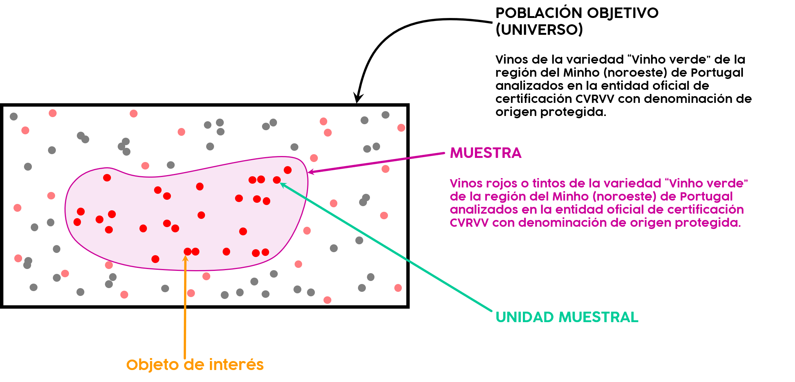
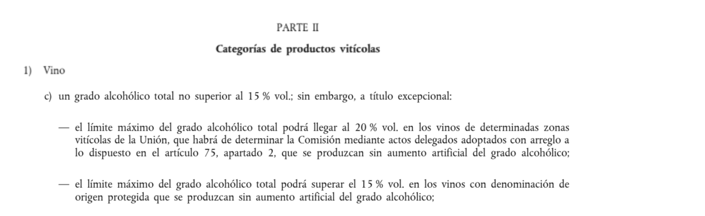

## **P4: Cuarta entrega**
_______________________________________   

## **Conservación de la calidad de los vinos rojos “Vinho Verde” de la región de Portugal “Minho” y su relación con los componentes fisicoquímicos**
_______________________________________   

‎      ‏

‎      ‏

____________________________________________________________________________________________________________________


```{r, message=FALSE, echo=FALSE, warning=FALSE}
# #Para el diagrama de Gantt, se usará esta librería.
# p <- require(timevis)
# if (p=="FALSE"){
#   install.packages("timevis")
# }
```

```{r, message=FALSE, echo=FALSE, warning=FALSE}
# s <- require(ggplot2)
# if (s=="FALSE"){
#   install.packages("ggplot2")
# }
```

```{r, message=FALSE, echo=FALSE, warning=FALSE}
# t <- require(ggeasy)
# if (t=="FALSE"){
#   install.packages("ggeasy")
# }
```

```{r, message=FALSE, echo=FALSE, warning=FALSE}
#Aquí instalamos las librerías que necesitemos
#library(xaringan) 
library(timevis)
#library(TeachingDemos)
#library(gginference)
#library(MASS)
#library(knitr) 
#library(tidyverse) 
#library(janitor) 
#library(flextable) 
```

‎      ‏

‎      ‏

## **CONTENIDO**{.tabset} 

‎      ‏

### **DESCRIPCIÓN**

‎      ‏

‎      ‏

#### **I. INTRODUCCIÓN**

‎      ‏

##### **IMPORTANCIA**

‎      ‏
‎      ‏

Nuestro proyecto se desarrollará con base en estudio de las preferencias de una población acerca del consumo de vino tomando en cuenta sus componentes. Es **relevante** hacer un estudio estadístico de los componentes fisicoquímicos de los vinos rojos "Vinho Verde" de la región de Portugal "Minho", tendencias e influencia en los niveles de pH y alcohol, porque en la dataset de la CVRVV, quienes monitorean la calidad de los vinos de aquella región, no se han estudiado los resultados obtenidos. El estudio se puede replicar con datasets más actuales y obtener un análisis más detallado. Asimismo, se pueden comparar estudios a través de los años para ver las tendencias entre los resultados de los mismos.

‎      ‏
‎      ‏
‎      ‏

##### **JUSTIFICACIÓN**

‎      ‏
‎      ‏

El estudio estadístico propuesto por el grupo es **interesante**, **factible**, **específico** y **desconocido**. Esta afirmación sera justificada en los siguientes párrafos.

Es **interesante** porque el vino es una bebida alcohólica con fama mundial que ha sido protagonista en muchas celebraciones a lo largo de la historia. En el caso del Perú se consumen 1.8 litros de vino per cápita al año y su relevancia en el sector gastronómico es incuestionable. La tradición vitivinícola en el Perú remonta a 1965 con la popular festividad de “La Vendimia” en Ica, la cual consiste en la recolección de uvas para la posterior producción de vino. 

Por otro lado, el consumo moderado de esta bebida resulta beneficioso para la salud dado que posee propiedades que lo convierten en un agente antioxidante bueno para el corazón y pulmones. Un dato importante es que según un estudio realizado por varias Universidades Españolas, las personas que beben vino moderadamente a lo largo de la semana son  menos propensos a ser diagnosticados de depresión. Sin embargo, algunos de los componentes del vino como el alcohol, los sulfatos y azúcares resultan ser perjudiciales para la salud. Si se consume en exceso puede llegar a  aumentar la presión arterial, engordar y elevar el riesgo de sufrir algunos tipos de cáncer (como cualquier otra bebida alcohólica). En conclusión, debe ser consumido de manera moderada.

Es **factible** porque los *datos son extraídos del repositorio de aprendizaje automático web UCI Machine Learning Repository*. Esta página contiene 585 datasets públicos para el uso o citados por estudiantes, educadores e investigadores. Cada conjunto de datos proporcionado por la página web señala el origen de los datos, el cual se basa en brindar información demográfica, geográfica, entre otros. También indica el método de recolección de datos y los autores respectivos del estudio.

El proyecto se puede llevar a cabo con este tema porque el grupo dispone de una *base de datos pública y confiable*. Esto debido a que los conjuntos de datos ofrecidos por el repositorio de aprendizaje automático web UCI Machine Learning Repository han sido usados para diferentes estudios científicos, ingenieriles, ciencias humanas y sociales, entre otros.

‎      ‏
‎      ‏

> **Link UCI Machine Learning:** [https://archive.ics.uci.edu/ml/index.php](https://archive.ics.uci.edu/ml/index.php) 

‎      ‏
‎      ‏

En este proyecto se analizará la *variedad de vino “Vinho Verde”, un producto único de la región de Minho (noroeste) de Portugal*. Esta variedad de vino representa el 15% del total de la producción portuguesa, y alrededor del 10% se exporta. Las variantes más comunes de esta región son el vino blanco y el tinto.

En ese sentido, para el estudio propuesto se dispone de dos datasets sobre los parámetros y la calidad de los vinos blanco y rojo de la variedad “Vinho Verde” de la región Minho (noroeste) de Portugal *obtenidos en el periodo de tiempo: mayo 2004 a febrero del 2007 utilizando únicamente muestras de la denominación de origen protegida que fueron analizadas en la entidad oficial de certificación (CVRVV)*. El CVRVV es una organización interprofesional cuyo objetivo es mejorar la calidad y la comercialización del “Vinho verde”. Estos cuentan con 4998 y 1599 observaciones respectivamente. Esta cantidad de observaciones supera el mínimo propuesto en el curso de 150 observaciones. Esto será validado más adelante con el manejo de la data.  

En ambos datasets, se encuentra información sobre la composición fisicoquímica y sensorial de los dos tipos de vinos de diferentes marcas, las cuales por políticas de confidencialidad han sido obviadas. 

‎      ‏
‎      ‏

> **Dataset Wine Quality:** [https://archive.ics.uci.edu/ml/datasets/Wine+Quality](https://archive.ics.uci.edu/ml/datasets/Wine+Quality)

‎      ‏
‎      ‏

Finalmente, el grupo ha organizado las etapas del proyecto de investigación en un **diagrama de Gantt.** En este se muestran las fechas y periodos de trabajo. Para un mejor entendimiento del diagrama, es necesario indicar que la línea roja en él indica la fecha actual.

‎      ‏

```{r, echo=FALSE, fig.width=10, fig.height=2}

data <- data.frame(
  id      = 1:15,
  content = c("P0", 
              "Topic decision",
              "Data management",
              "Group work P1",
              "P1-Oral",
              "P1-Report",
              "Group work P2",
              "P2-Oral",
              "P2-Report",
              "Group work P3",
              "P3-Oral",
              "P3-Report",
              "Group work P4",
              "P4-Report",
              "P4-Oral"
              ),
  
  start   = c("2021-04-30", 
              "2021-05-09", 
              "2021-05-13",
              "2021-05-12",
              "2021-05-21",
              "2021-05-22",
              "2021-05-22",
              "2021-05-24",
              "2021-05-24",
              "2021-06-12",
              "2021-06-14",
              "2021-06-14",
              "2021-07-24",
              "2021-07-26",
              "2021-07-27"
              ),
  
  end     = c(NA,
              "2021-05-12", 
              "2021-05-19",
              "2021-05-21",
              NA,
              NA,
              "2021-06-11",
              "2021-06-11",
              "2021-06-12",
              "2021-07-23",
              "2021-07-23",
              "2021-07-24",
              "2021-08-06",
              "2021-08-07",
              NA
              )
)
timevis(data)
```

‎      ‏

‎      ‏

‎      ‏

‎      ‏

Es **específico** porque se centra en el estudio de los vinos rojos o tintos de diferentes marcas de la variedad de vino “Vinho Verde”, el cual es una variedad de vino producida exclusivamente en la región de Entre Douro e Minho. Esta región se divide en Douro Litoral (Sur) Minho (Norte). Asimismo, nuestro estudio se enfoca en los vinos producidos en la región de Minho.
‎      ‏


‎      ‏

Además, los vinos con los que se trabaja se encuentran dentro del programa de Denominación de Origen Protegida de la Unión Europea.


‎      ‏
‎      ‏

En resumen, el estudio estadístico se enfoca en los vinos rojos o tintos de la región del Minho (noroeste) de Portugal analizados en la entidad oficial de certificación CVRVV con origen protegido, y no de otro tipo de bebida alcohólica, de otra región o de origen no determinado. 

Es **desconocido** porque el estudio original *“Modeling wine preferences by data mining from physicochemical properties” de Cortez, Cerdeira, Almeida, Matos y Reis* publicado el 22 de mayo del 2009 tiene como *objetivo principal apoyar las evaluaciones de cata de los enólogos y mejorar la producción de vino basado en los gustos de los consumidores*. Es un estudio técnico de las datasets.


‎      ‏
‎      ‏

> **“Modeling wine preferences by data mining from physicochemical properties” de Cortez, Cerdeira, Almeida, Matos y Reis:** [https://www.sciencedirect.com/science/article/abs/pii/S0167923609001377](https://www.sciencedirect.com/science/article/abs/pii/S0167923609001377)


‎      ‏
‎      ‏

El grupo, por otro lado, **propone** un estudio estadístico de los componentes del vino rojo de la variedad “Vinho Verde” de Portugal con el fin de garantizar la conservación de la calidad del producto en el tiempo, considerando valores y rangos para el pH y el contenido de alcohol recomendados por expertos.

‎      ‏

‎      ‏

‎      ‏

‎      ‏

‎      ‏


#### **II. OBJETIVOS**

‎      ‏

‎      ‏

##### **GENERAL**

‎      ‏
‎      ‏

Realizar un estudio estadístico de las variables fisicoquímicas del vino más importantes con el fin de garantizar la conservación de la calidad del vino en el tiempo.

‎      ‏


##### **ESPECÍFICOS**

‎      ‏
‎      ‏

1. **Reconocer** las características de las variables extraídas de los vinos rojos de la variante “Vinho Verde” con descriptores numéricos y gráficos adecuados.
‎      ‏

2. **Realizar** comparaciones entre variables de los vinos rojos de la variante “Vinho Verde” de Portugal con descriptores gráficos adecuados. 
‎      ‏

‎      ‏

3. **Revisar** el cumplimiento de la normativa europea en los vinos rojo de la variante “Vinho Verde” de Portugal respecto a las cantidades de alcohol.
‎      ‏

4. **Analizar** los niveles de acidez fija, acidez volátil, acidez cítrica, azúcar residual, cloruros, dióxido de azufre total, pH, densidad y alcohol de los vinos rojos de la variante “Vinho Verde” de Portugal y **clasificarlos** en un nuevo data frame.

‎      ‏

5. **Evaluar** e **identificar** qué variables de los vinos rojos de la variante “Vinho Verde” de Portugal tienen alguna relación con el pH y alcohol.
‎      ‏

6. **Observar** los patrones en las variables de interés relacionadas con los vinos rojos de la variante “Vinho Verde” de Portugal.

‎      ‏

‎      ‏

‎      ‏

‎      ‏


#### **III. MARCO TEÓRICO** 

‎      ‏
‎      ‏

##### **POBLACIÓN OBJETIVO**

‎      ‏
‎      ‏

Vinos de la variedad “Vinho verde” de la región del Minho (noroeste) de Portugal.

‎      ‏

##### **UNIDADES MUESTRALES**

‎      ‏
‎      ‏

Vinos rojos o tintos de la variedad “Vinho verde” de la región del Minho (noroeste) de Portugal analizados en la entidad oficial de certificación CVRVV con denominación de origen protegida.

‎      ‏

```{r, echo=FALSE, out.width = "1000px", out.height="450px",fig.align='center'}

```


‎      ‏

##### **JUSTIFICACIÓN DE MUESTRA**

‎      ‏
‎      ‏

Se eligió la muestra de vino rojo descartando a la de vino blanco debido a que este último tipo de vino, según diversas fuentes, es el menos riesgoso para la salud de los consumidores. El grupo desea analizar un vino que no sea considerado "saludable". 

‎      ‏


##### **CONSERVACIÓN DE LA CALIDAD EN EL VINO**

‎      ‏
‎      ‏

La acción inhibitoria del **alcohol**, junto con niveles de **pH** recomendados tienen una relación directa con la conservación de la calidad permitiendo que permanezca estable en el tiempo. (Jackson, 2008).

**pH.** Se ha reportado que el pH óptimo de un vino tinto debe ser de 3.3 a 3.6 (Jackson y Lombard, 1993; Jackson, 2008). 

**Contenido de alcohol.** El rango de contenido del alcohol idóneo es de (12 - 15%) (Jackson, 2008).

‎      ‏

```{r, echo=FALSE, out.width = "500px", out.height="80px",fig.align='center'}

```

‎      ‏

##### **VARIABLES**

‎      ‏
‎      ‏

Se realizaron todas las pruebas fisicoquímicas, pero en la muestra final solo se conservaron las más comunes. De esta manera, en la dataset con la que se trabajará se registraron 12 variables y 1599 observaciones. A continuación, se muestra la clasificación y terminología de las variables con las que el estudio estadístico se llevará a cabo.

‎      ‏

| **VARIABLE**            | **DESCRIPCIÓN**|**TIPO DE VARIABLE** | **RESTRICCIONES**              |
|:------------------------|:---------------|:--------------------|:-------------------------------|
| Acidez Fija             | ACFija         |Numérica continua    | Racional positivo              |
| Acidez Volátil          | ACVolatil      |Numérica continua    | Racional positivo              |
| Acidez Cítrica          | ACCitrico      |Numérica continua    | Racional positivo              |
| Azúcar residual         | Azucar         |Numérica continua    | Racional positivo              |
| Cloruros                | Cloruros       |Numérica continua    | Racional positivo              |
| Dióxido de Azufre Libre | DALibre        |Numérica discreta    | Entero positivo                |
| Dióxido de Azufre total | DATotal        |Numérica discreta    | Entero positivo                |
| Densidad                | Densidad       |Numérica continua    | Racional positivo              |
| pH                      | pH             |Numérica continua    | Racional positivo del 0 al 14  |
| Sulfatos                | Sulfatos       |Numérica continua    | Racional positivo              |
| Alcohol                 | Alcohol        |Numérica continua    | Racional positivo del 0 al 100 |
| Calidad                 | Calidad        |Categórica Ordinal   | Entero positivo de 1 al 10     |
|                         |                |                     |                                |


‎      ‏
‎      ‏

Por otro lado, para lograr los objetivos planteados se debe tener un conocimiento de los términos vitivinícolos fisicoquímicos. Es por ello, que es necesario mostrar las definiciones de las variables planteadas. 

‎      ‏

**1. ACIDEZ FIJA:** Es un tipo de ácido que es la acidez total del conjunto de ácidos no volátiles contenidos en el vino. Su cálculo es la diferencia entre la acidez total y volátil y se usa con el fin de detectar la adición de agua al vino. Sus unidades son:

$$\boxed{g_{ÁcidoTartárico}/dm^3}$$
‎      ‏

|                           |                                 |  
|:--------------------------|:--------------------------------|
| **LÍMITE DE ÁCIDEZ FIJA** | $4.5$ $g_{ÁcidoTartárico}/dm^3$ |
|                           |                                 |  

‎      ‏

**2. ACIDEZ VOLÁTIL:** Es un tipo de ácido que engloba a los ácidos arrastrables por vapor de agua en el vino tales como fórmico, acético, butírico, etc. No se incluye el dióxido de carbono ni el ácido sulfuroso. Su valor nos ayuda a evaluar el desarrollo de la misma durante el almacenamiento, como medida de la posible alteración y también para observar si se encuentra dentro de los límites legales. Sus unidades son: 

$$\boxed{g_{ÁcidoAcético}/dm^3}$$

‎      ‏

**3. ÁCIDO CÍTRICO:** Es una sustancia perfectamente soluble en vinos y muy importante debido a su polifuncionalidad. Una de sus principales funciones es formar complejos naturales con el Hierro (Fe) ayudando a secuestrar una cierta cantidad de Hierro contenido en el vino previniendo la turbidez. Otra función es que corrige la acidez en el mosto y vino. Sus unidades son:

$$\boxed{g_{ÁcidoCítrico}/dm^3}$$

‎      ‏

**4. AZÚCAR RESIDUAL:** Restos de azúcar que no fueron fermentados por la levadura al momento de la elaboración y se encuentra disuelta en la botella de vino. Sus unidades son:

$$\boxed{g_{Azúcar}/dm^3}$$

‎      ‏

La clasificación del mismo en los vinos es la siguiente:
‎      ‏

| **AZÚCAR RESIDUAL** | **TIPO**           |
|:--------------------|:-------------------|
| < 5g                | Seco               |
| 5g - 30g            | Semiseco           |
| 30g - 50g           | Semidulce          |
| > 50g               | Dulce              |
|                     |                    |

‎      ‏

**5. CLORUROS:** Restos de sal diluidos en la botella de vino. Sus unidades son:

$$\boxed{g_{CloruroDeSodio}/dm^3}$$

‎      ‏

|                        |                                 |  
|:-----------------------|:--------------------------------|
| **LÍMITE DE CLORUROS** | $0.6$ $g_{CloruroDeSodio}/dm^3$ |
|                        |                                 |  

‎      ‏

**6. DIÓXIDO DE AZUFRE:** Es el principal conservador de vinos y mostos, debido a sus propiedades antisépticas sobre levaduras y bacterias. Tiene actividad antioxidante y mejora las características organolépticas del vino.

‎      ‏

**7. DIÓXIDO DE AZUFRE LIBRE:** Procede de la práctica enológica llamada “sulfitado” y está en parte como gas $(SO_{2})$, bisulfito $(HSO_{3}^{-} )$ y sulfito $(SO_{3}^{2-} )$. Es una acción antiséptica.  Sus unidades son:

$$\boxed{mg/dm^3}$$
‎      ‏

**8. DIÓXIDO DE AZUFRE COMBINADO** Es la combinación de aldehído acético, azúcares, taninos, colorantes, etc. Estos constituyen la reserva necesaria para la fracción libre. Sus unidades son:

$$\boxed{mg/dm^3}$$
‎      ‏

**9. DIÓXIDO DE AZUFRE TOTAL:** Es la suma del dióxido de azufre libre y combinado. Sus unidades son:

$$\boxed{mg/dm^3}$$

‎      ‏

|                                       |                 | 
|:--------------------------------------|:----------------|
| **LÍMITE DE DIÓXIDO DE AZUFRE TOTAL** | $150$ $mg/dm^3$ |
|                                       |                 |

‎      ‏

**10. DENSIDAD:** Cantidad de la masa de vino en un determinado volumen. Sus unidades son:

$$\boxed{g/cm^3}$$
‎      ‏

**11. pH:** Es una medida complementaria de la acidez total porque nos permite medir las fuerzas de los ácidos que contienen. La estabilidad de un vino, la fermentación maloláctica, el sabor ácido, el color, el potencial redox y la relación de dióxido de azufre libre y total están estrechamente relacionados con el pH del vino. La clasificación de los niveles de pH es la siguiente: 
‎      ‏

| **pH**    | **CLASIFICACIÓN**    | **GRUPO** |
|:----------|:---------------------|:----------|
| < 4.5     | Extremadamente ácido | Ácido     |
| 4.5 - 5.5 | Fuertemente ácido    | Ácido     |
| 5.6 - 6   | Medianamente ácido   | Ácido     |
| 6.1 - 6.5 | Ligeramente ácido    | Ácido     |
| 6.6 -7.3  | Neutro               | Neutro    |
| 7.4 - 7.8 | Medianamente básico  | Básico    |
| 7.9 - 8.4 | Básico               | Básico    |
| 8.5 - 9   | Ligeramente alcalino | Alcalino  |
| 9.1 - 10  | Alcalino             | Alcalino  |
| > 10      | Fuertemente alcalino | Alcalino  |
|           |                      |           | 

‎      ‏

**12. SULFATOS:** Es la que forma los azúcares y constituyentes organolépticos, ambos parámetros determinan la calidad del vino. Otro es que es esencial para la biosíntesis y el transporte de azúcares de las hojas al fruto. También influye en los ácidos y el ph. Sus unidades son:

$$\boxed{g_{SulfatoDePotasio}/dm^3}$$
‎      ‏

|                        |                                   |
|:-----------------------|:----------------------------------|
| **LÍMITE DE SULFATOS** | $1.5$ $g_{SulfatoDePotasio}/dm^3$ |
|                        |                                   |

‎      ‏

**13. ALCOHOL:** Procede del proceso natural conocido como fermentación y se realiza a costa del azúcar en la uva. Su graduación varía de la siguiente manera: 
‎      ‏

| **GRADUACIÓN DE ALCOHOL** | **CLASE DE VINO**                           |
|:--------------------------|:--------------------------------------------|
| 8.5% - 15%                | Vinos en general                            |
| 8.5% - 14%                | Vinos "Vinho Verde"                         |
|                           |                                             |

‎      ‏

> Y los límites de alcohol según la PARTE II: Categoría de productos vitícola de la **Normativa Europea** estipulada en el "Diario Oficial de la Unión Europea" son:



‎      ‏

**14. CALIDAD:** Clasificación que el cliente le asigna en función de sus gustos. La degustación se realizó por mínimo tres personas expertas con ojos vendados. Las calificaciones oscilan desde 0 (muy malo) hasta 10 (excelente).

‎      ‏

‎      ‏

‎      ‏

‎      ‏

‎      ‏

‎      ‏

‎      ‏

‎      ‏


 

‎      ‏

‎      ‏

‎      ‏

‎      ‏


### **DATASET**

‎      ‏

‎      ‏

En esta sección se realizará la manipulación de la datasets de vino rojo disponible para el estudio estadístico propuesto por el grupo.

‎      ‏

```{r}
#Carga de librerías base y de ambos data frame.
library(readr)
library(dplyr)
library(ggplot2)
library(ggeasy)
library(ggmosaic)
```

‎      ‏

```{r}
RED <- read_csv("winequality-red.csv")
```

‎      ‏

‎      ‏

#### **LIMPIEZA DE DATA**

‎      ‏
‎      ‏

```{r}
#Cantidad de datos faltantes en la dataset Vino Rojo.
sum(is.na(RED))

#Cantidad de observaciones completas en la dataset Vino Rojo.
sum(complete.cases(RED))
```
‎      ‏

#### **ANÁLISIS:** Los resultados de ambas funciones confirman que en la dataset de vinos rojos de "Vinho Verde" de la región de "Minho" de Portugal no hay datos faltantes y que todas las 1599 observaciones están completas.

‎      ‏

```{r}
#Para observar los nombres de las variables o columnas de la data frame original.
str(RED)
```

```{r}
#Hacemos un rename de las variables en una nueva data frame para no manipular la original.
RED %>% rename(ACFija = `fixed acidity`,
               ACVolatil = `volatile acidity`,
               ACCitrico = `citric acid`, 
               Azucar = `residual sugar`,
               Cloruros = chlorides, 
               DALibre = `free sulfur dioxide`, 
               DATotal = `total sulfur dioxide`,
               Densidad = density,
               Sulfatos = sulphates,
               Alcohol = alcohol,
               Calidad = quality ) -> REDWINE
```

‎      ‏

‎      ‏

#### **CATEGORIZACIONES DE VARIABLES**

‎      ‏
‎      ‏

```{r}
#Clasificando por azúcar residual (Azucar)
TAzucar <- sample(c("Seco"),1599 ,replace = T)

REDWINE <- mutate(REDWINE,TAzucar)

REDWINE$TAzucar[REDWINE$Azucar>5]<-"Semiseco"
REDWINE$TAzucar[REDWINE$Azucar>30]<-"Semidulce"
REDWINE$TAzucar[REDWINE$Azucar>50]<-"Dulce"
```

‎      ‏

‎      ‏

```{r}
#Clasificando por pH
TpH <- sample(c("Extremadamente ácido"),1599 ,replace = T)

REDWINE <- mutate(REDWINE, TpH)

REDWINE$TpH[REDWINE$pH>4.5]<-"Fuertemente ácido" 
REDWINE$TpH[REDWINE$pH>5.5]<-"Medianamente ácido" 
REDWINE$TpH[REDWINE$pH>6]<-"Ligeramente ácido" 
REDWINE$TpH[REDWINE$pH>6.5]<-"Neutro" 
REDWINE$TpH[REDWINE$pH>7.3]<-"Medianamente básico" 
REDWINE$TpH[REDWINE$pH>7.8]<-"Básico" 
REDWINE$TpH[REDWINE$pH>8.4]<-"Ligeramente alcalino" 
REDWINE$TpH[REDWINE$pH>9]<-"Alcalino" 
REDWINE$TpH[REDWINE$pH>10]<-"Fuertemente alcalino"  
```

‎      ‏

‎      ‏

```{r}
#Revisión de si cumple la graduación de Alcohol (GradAlcohol)
GradAlcohol <- sample(c("Sí"),1599, replace = T)

REDWINE <- mutate(REDWINE, GradAlcohol)

REDWINE$GradAlcohol[REDWINE$Alcohol<8.5]<- "No"
REDWINE$GradAlcohol[REDWINE$Alcohol>14]<- "No"
```

‎      ‏

‎      ‏

```{r}
#Revisión de límite de Acidez Fija (LimACFija)
LimACFija <- sample(c("Sí"), 1599, replace = T)

REDWINE <- mutate(REDWINE, LimACFija)

REDWINE$LimACFija[REDWINE$ACFija < 4.5]<-"No"
```

‎      ‏

‎      ‏

```{r}
#Revisión de límites de Cloruros (LimCloruros).
LimCloruros <- sample(c("Sí"), 1599, replace = T)

REDWINE <- mutate(REDWINE, LimCloruros)

REDWINE$LimCloruros[REDWINE$Cloruros > 0.6]<-"No"
```

‎      ‏

‎      ‏

```{r}
#Revisión de límites de Dióxido de Azufre Total (LimDATotal).
LimDATotal <- sample(c("Sí"), 1599, replace = T)

REDWINE <- mutate(REDWINE, LimDATotal)

REDWINE$LimDATotal[REDWINE$DATotal > 150]<-"No"
```

‎      ‏

‎      ‏

```{r}
#Revisión de límites de Sulfatos (LimSulfatos).
LimSulfatos <- sample(c("Sí"), 1599, replace = T)

REDWINE <- mutate(REDWINE, LimSulfatos)

REDWINE$LimSulfatos[REDWINE$Sulfatos > 1.5]<-"No"
```

‎      ‏

‎      ‏

```{r} 
#Clasificando por Alcohol
TAlcohol <- sample(c("Insuficiente"),1599 ,replace = T)

REDWINE <- mutate(REDWINE, TAlcohol)

REDWINE$TAlcohol[REDWINE$Alcohol>=12]<-"Optimo" 

#Clasificando si es Óptimo o No
OptAlcohol <- sample(c(0),1599 ,replace = T)

REDWINE <- mutate(REDWINE, OptAlcohol)
REDWINE$OptAlcohol[REDWINE$Alcohol>=12]<- 1
  
```

‎      ‏

```{r, warning = FALSE, echo=FALSE}
barplot(table(REDWINE$TAlcohol), main = "Clasificación de Grado de Alcohol", col = c("#F8766D","#00C0C6"))
```

‎      ‏

#### **OBSERVACIÓN:** Existe una mayor cantidad de vinos con valores bajos de alcohol con respecto a los valores óptimos indicados en el marco teórico.La diferencia encontrada es significativa.

‎      ‏

‎      ‏

```{r} 
#Clasificando por pH
TpH2 <- sample(c("Insuficiente"),1599 ,replace = T)

REDWINE <- mutate(REDWINE, TpH2)

REDWINE$TpH2[REDWINE$pH>=3.3]<-"Optimo"
REDWINE$TpH2[REDWINE$pH>3.6]<-"Excesivo"

#Clasificando si es Óptimo o no
OptpH <- sample(c(0),1599 ,replace = T)

REDWINE <- mutate(REDWINE, OptpH)

REDWINE$OptpH[REDWINE$pH>=3.3]<-1
REDWINE$OptpH[REDWINE$pH>3.6]<-0

```

‎      ‏

```{r, warning = FALSE, echo=FALSE}
barplot(table(REDWINE$TpH2), main = "Clasificación de Nivel de pH", col = c("#3182BD","#FE5C6F","#00D748") )
```

‎      ‏

#### **OBSERVACIÓN:** La cantidad de vinos con valores óptimos de pH supera a los vinos con valores insuficientes y excesivos. La diferencia es significativa con los vinos de valores excesivos, pero no lo es tanto con los de valores insuficientes.

‎      ‏

‎      ‏

‎      ‏

‎      ‏

‎      ‏

‎      ‏


### **ANÁLISIS DE VARIABLES**

‎      ‏

‎      ‏

#### **DESCRIPTORES NUMÉRICOS Y GRÁFICOS**

‎      ‏

A continuación, se muestra una vista general de la distribución de cada variable mediante el uso de *Diagramas de Caja*.
‎      ‏
```{r, warning = FALSE, echo=FALSE}
#Número de gráficos a mostrar
Ngraph = par(mfrow = c(2,6))

#Selección de variables significativas
VSig <- c(1,2,3,4,5,6,7,8,9,10,11)

for (i in VSig) {
  main="Diagrama de cajas de cada una de las variables"
  boxplot(REDWINE[[i]], col = "lightblue")
  mtext(names(REDWINE)[i], cex = 0.8, side = 1, line= 2)}

par(Ngraph)
```

‎      ‏
‎      ‏

#### **1. ACIDEZ FIJA (ACFija)**

‎      ‏

**RESUMEN DE LA VARIABLE**

```{r, echo=FALSE}
summary(REDWINE$ACFija)
```

```{r, warning = FALSE, echo=FALSE}
boxplot(REDWINE$ACFija, horizontal = TRUE, main = 'Distribución de la Acidez Fija', xlab = 'Acidez Fija (g(ácido tartárico)/dm³)', col = "mistyrose1")
abline(v=mean(REDWINE$ACFija),col="red4", lw=2)
```

‎      ‏

- **RANGO**
```{r, echo=FALSE}
#Hallando rango
max(REDWINE$ACFija)-min(REDWINE$ACFija)
```

- **RANGO INTERCUARTIL**
```{r, echo=FALSE}
#Hallando rango intercuartil
IQRACFija <- 9.20-7.10
IQRACFija
```

- **DATOS ATÍPICOS**

Por debajo del límite:
```{r, echo=FALSE}
#Hallando datos atípicos 
sum(REDWINE$ACFija < 7.10-(1.5*IQRACFija)) #Por debajo del límite
```
Por encima del límite:
```{r, echo=FALSE}
#Hallando datos atípicos
sum(REDWINE$ACFija > 9.20+(1.5*IQRACFija)) #Por encima del límite
```

- **VARIANZA**
```{r, echo=FALSE}
#Varianza
var(REDWINE$ACFija)
```

- **DESVIACIÓN ESTÁNDAR**
```{r, echo=FALSE}
#Desviación estándar
sd(REDWINE$ACFija)
```

- **COEFICIENTE DE VARIABILIDAD**
```{r, echo=FALSE}
#Coef. variabilidad
sd(REDWINE$ACFija)*100/mean(REDWINE$ACFija)
```

‎      ‏

#### **ANÁLISIS:** 

#### - Siendo el límite inferior de $4,5$ g/L, el 50% de los productores de vinos rojos de la variante Vinho Verde tratan de mantener una *acidez fija* $g(ÁcidoTartárico)/dm^3$ superior a $7.9$ durante la elaboración del vino.
#### - Los datos se encuentran concentrados entre $7.10$ y $9.20$.
#### - Existen $49$ datos atípicos de *acidez fija* por encima del límite y ninguno por debajo.
#### - La *acidez fija* presenta una desviación de sus datos alrededor de la media de $1.74$.
#### - La relación entre su desviación estándar y media muestra una dispersión de $20.93$.
#### - Esta variable presenta sesgo a la derecha, dado que el valor de la mediana es menor al valor de la media.

‎      ‏

‎      ‏

#### **2. ACIDEZ VOLÁTIL (ACVolatil)**

‎      ‏

**RESUMEN DE LA VARIABLE**

```{r, echo=FALSE}
summary(REDWINE$ACVolatil)
```

```{r, warning = FALSE, echo=FALSE}
boxplot(REDWINE$ACVolatil, horizontal = TRUE, main = 'Distribución de la Acidez Volátil', xlab = 'Acidez Volátil (g(ácido acético)/dm³)', col = "mistyrose1")
abline(v=mean(REDWINE$ACVolatil),col="red4", lw=2)
```

‎      ‏

- **RANGO**
```{r, echo=FALSE}
#Hallando rango
max(REDWINE$ACVolatil)-min(REDWINE$ACVolatil)
```

- **RANGO INTERCUARTIL**
```{r, echo=FALSE}
#Hallando rango intercuartil
IQRACVolatil <- 0.64-0.39
IQRACVolatil
```

- **DATOS ATÍPICOS**

Por debajo del límite:
```{r, echo=FALSE}
#Hallando datos atípicos 
sum(REDWINE$ACVolatil < 0.39-(1.5*IQRACVolatil)) #Por debajo del límite
```

Por encima del límite:
```{r, echo=FALSE}
#Hallando datos atípicos
sum(REDWINE$ACVolatil > 0.64+(1.5*IQRACVolatil)) #Por encima del límite
```

- **VARIANZA**
```{r, echo=FALSE}
#Varianza
var(REDWINE$ACVolatil)
```

- **DESVIACIÓN ESTÁNDAR**
```{r, echo=FALSE}
#Desviación estándar
sd(REDWINE$ACVolatil)
```

- **COEFICIENTE DE VARIABILIDAD**
```{r, echo=FALSE}
#Coef. variabilidad
sd(REDWINE$ACVolatil)*100/mean(REDWINE$ACVolatil)
```
‎      ‏

#### **ANÁLISIS:** 

#### - Los valores de media y mediana se encuentran muy cercanos, $0.5200$ y $0.5278$ respectivamente. 
#### - Existe una distribución ligeramente asimétrica con sesgo hacia la derecha. 
#### - Los datos se encuentran concentrados en $0.39$ y $0.64$.
#### - Existen $19$ datos atípicos por encima del límite y ninguno por debajo.
#### - La acidez volátil presenta una ligera desviación de sus datos alrededor de la media de $0.18$.
#### - La relación entre su desviación estándar y media muestra una dispersión de $33.92$.

‎      ‏

‎      ‏

#### **3. AZÚCAR RESIDUAL (Azucar)**

‎      ‏

**RESUMEN DE LA VARIABLE**

```{r, echo=FALSE}
summary(REDWINE$Azucar)
```

```{r, warning = FALSE, echo=FALSE}
boxplot(REDWINE$Azucar, horizontal = TRUE, main = 'Distribución del Azúcar Residual', xlab = 'Azúcar Residual (g/dm³)', col = "mistyrose1")
abline(v=mean(REDWINE$Azucar),col="red4", lw=2)
```

‎      ‏

- **RANGO**
```{r, echo=FALSE}
#Hallando rango
max(REDWINE$Azucar)-min(REDWINE$Azucar)
```

- **RANGO INTERCUARTIL**

```{r, echo=FALSE}
#Hallando rango intercuartil
IQRAzucar <- 2.6-1.9
IQRAzucar
```

- **DATOS ATÍPICOS**

Por debajo del límite:
```{r, echo=FALSE}
#Hallando datos atípicos 
sum(REDWINE$Azucar < 1.9 -(1.5*IQRAzucar)) #Por debajo del límite
```
Por encima del límite:

```{r, echo=FALSE}
#Hallando datos atípicos 
sum(REDWINE$Azucar > 2.6 +(1.5*IQRAzucar)) #Por encima del límite
```

- **VARIANZA**

```{r, echo=FALSE}
#Varianza
var(REDWINE$Azucar)
```

- **DESVIACIÓN ESTÁNDAR**

```{r, echo=FALSE}
#Desviación estándar
sd(REDWINE$Azucar)
```

- **COEFICIENTE DE VARIABILIDAD**
```{r, echo=FALSE}
#Coef. variabilidad
sd(REDWINE$Azucar)*100/mean(REDWINE$Azucar)
```
‎      ‏

#### **ANÁLISIS:** 
#### - De los $4$ tipos de vinos de acuerdo con la clasificación por cantidad de azúcar (Seco, Semiseco, Semidulce y Dulce) sólo existen $2$ para la muestra de Vinho Verde: Seco y Semiseco. Se confirma que es un vino con bajos niveles de azúcar. 
#### - Se observa un alto grado de concentración en la mediana debido a que el rango intercuartil es más pequeño que el rango.
#### - Los datos se encuentran concentrados entre $1.9$ y $2.60$.
#### - Se evidencia $155$ datos atípicos por encima del límite los cuales provocan que la distribución se encuentre sesgada a la derecha, esto puede ser debido a las diversas variables que influyen en los procesos de fermentación.
#### - El azúcar residual presenta una desviación de sus datos alrededor de la media de $1.41$.
#### - La relación entre su desviación estándar y media muestra una dispersión de $55.54$.

‎      ‏

‎      ‏

#### **4. pH**

‎      ‏

**RESUMEN DE LA VARIABLE**

```{r, echo=FALSE}
summary(REDWINE$pH)
```

```{r, warning = FALSE, echo=FALSE}
boxplot(REDWINE$pH, horizontal = TRUE, main = 'Distribución del pH', xlab = 'pH', col = "mistyrose1")
abline(v=mean(REDWINE$pH),col="red4", lw=2)
```

‎      ‏

- **RANGO**
```{r, echo=FALSE}
#Hallando rango
max(REDWINE$pH)-min(REDWINE$pH)
```

- **RANGO INTERCUARTIL**
```{r, echo=FALSE}
#Hallando rango intercuartil
IQRpH <- 3.4-3.21
IQRpH
```

- **DATOS ATÍPICOS**

Por debajo del límite:
```{r, echo=FALSE}
#Hallando datos atípicos 
sum(REDWINE$pH < 3.21-(1.5*IQRpH)) #Por debajo del límite
```
Por encima del límite:
```{r, echo=FALSE}
#Hallando datos atípicos 
sum(REDWINE$pH > 3.4+(1.5*IQRpH)) #Por encima del límite
```

- **VARIANZA**
```{r, echo=FALSE}
#Varianza
var(REDWINE$pH)
```

- **DESVIACIÓN ESTÁNDAR**
```{r, echo=FALSE}
#Desviación estándar
sd(REDWINE$pH)
```

- **COEFICIENTE DE VARIABILIDAD**
```{r, echo=FALSE}
#Coef. variabilidad
sd(REDWINE$pH)*100/mean(REDWINE$pH)
```
‎      ‏

#### **ANÁLISIS:** 

#### - Las sustancias se clasifican por acidez mediante la tabla de pH; las que se encuentran en los mínimos valores (menores a $4,5$) se les denomina “extremadamente ácidas”. En el caso del Vinho Verde, todos los datos se encontraban por debajo de este límite. El máximo valor es el de $1.010$. 
#### - Los datos se encuentran concentrados entre $3.21$ y $3.40$.
#### - En este caso hay datos atípicos en ambos lados que hacen que exista un ligero sesgo a la derecha. Hay $14$ por debajo del límite y $21$ por encima del mismo.
#### - El pH presenta una ligera desviación de sus datos alrededor de la media de $0.15$. Este valor puede apreciarse mejor en la gráfica de bigotes, ya que se puede ver la simetría.
#### - La relación entre su desviación estándar y media muestra una dispersión de $4.66$. Este valor puede apreciarse mejor en la gráfica de bigotes, ya que el valor de la media es muy similar al de la mediana


‎      ‏

‎      ‏

#### **5. ALCOHOL**

‎      ‏

**RESUMEN DE LA VARIABLE**

```{r, echo=FALSE}
summary(REDWINE$Alcohol)
```

```{r, warning = FALSE, echo=FALSE}
boxplot(REDWINE$Alcohol, horizontal = TRUE, main = 'Distribución de la Cantidad de Alcohol', xlab = 'Cantidad de Alcohol (% vol.)', col = "mistyrose1")
abline(v=mean(REDWINE$Alcohol),col="red4", lw=2)
```

‎      ‏

- **RANGO**
```{r, echo=FALSE}
#Hallando rango
max(REDWINE$Alcohol)-min(REDWINE$Alcohol)
```

- **RANGO INTERCUARTIL**
```{r, echo=FALSE}
#Hallando rango intercuartil
IQRAlcohol <- 11.1-9.5
IQRAlcohol
```

- **DATOS ATÍPICOS**

Por debajo del límite:
```{r, echo=FALSE}

#Hallando datos atípicos 
sum(REDWINE$Alcohol < 9.5-(1.5*IQRAlcohol)) #Por debajo del límite
```

Por encima del límite:
```{r, echo=FALSE}
#Hallando datos atípicos 
sum(REDWINE$Alcohol > 11.1+(1.5*IQRAlcohol)) #Por encima del límite
```

- **VARIANZA**
```{r, echo=FALSE}
#Varianza
var(REDWINE$Alcohol)
```

- **DESVIACIÓN ESTÁNDAR**
```{r, echo=FALSE}
#Desviación estándar
sd(REDWINE$Alcohol)
```

- **COEFICIENTE DE VARIABILIDAD**
```{r, echo=FALSE}
#Coef. variabilidad
sd(REDWINE$Alcohol)*100/mean(REDWINE$Alcohol)
```
‎      ‏

#### **ANÁLISIS:**

#### - El máximo valor permitido para que un Vinho pueda ser denominado vinho verde es de 14% vol. Sólo $7$ de ellos alcanzan este número y sólo $1$ lo logra sobrepasar con 14.9% vol.
#### - Los datos se encuentran concentrados en $9.50$ y $11.10$. 
#### - La gráfica se encuentra sesgada a la derecha.
#### - Existen $13$ datos atípicos por encima del límite, pero ninguno por debajo.
#### - El alcohol presenta una desviación de sus datos alrededor de la media de $1.07$.
#### - La relación entre su desviación estándar y media muestra una dispersión de $10.22$.

‎      ‏

‎      ‏

#### **6. CALIDAD**

‎      ‏

**DISTRIBUCIÓN DE LA VARIABLE**

```{r, echo=FALSE}
table(REDWINE$Calidad)
```

```{r, warning = FALSE, echo=FALSE}
barplot(table(REDWINE$Calidad), 
        main = "Distribución de la Calidad", 
        xlab = "Calidad", 
        ylab = "Frecuencia",
        col = "mistyrose1")
```
‎      ‏
‎      ‏

**RESUMEN DE LA VARIABLE**

```{r, echo=FALSE}
summary(REDWINE$Calidad)
```

‎      ‏

**DATOS ATÍPICOS**

Por debajo del límite:
```{r, echo=FALSE}
#Hallando datos atípicos 
sum(REDWINE$Calidad < 5-(1.5*(6-5))) #Por debajo del límite
```

Por encima del límite:
```{r, echo=FALSE}
#Hallando datos atípicos
sum(REDWINE$Calidad > 6+(1.5*(6-5))) #Por encima del límite
```

```{r, warning = FALSE, echo=FALSE}
boxplot(REDWINE$Calidad, horizontal = TRUE, main = 'Distribución de la Calidad', col = "mistyrose1")
abline(v=mean(REDWINE$Calidad),col="red4", lw=2)
```

‎      ‏

#### **ANÁLISIS:** 
#### - Es una variable bimodal, ya que existe una predominancia significativa y similar de los valores de $5$ y $6$ para la calidad. Para pasar el test de calidad es necesario que el vino sea calificado con un mínimo de $5$, por lo que el 96.06% de los vinos es apto. 
#### - Los datos se encuentran concentrados entre $5$ y $6$.
#### - Se observa en la gráfica un sesgo a la izquierda, dado que la media es menor a la mediana.
#### - Existen $10$ vinos con una calificación inferior a $5$ y $18$ ejemplares de vinos con una calificación superior a $6$.

‎      ‏

‎      ‏

‎      ‏

‎      ‏

‎      ‏

‎      ‏


#### **¿LOS VINOS ROJOS "VINHO VERDE" CUMPLEN CON LA NORMATIVA EUROPEA?**

‎      ‏
‎      ‏

Previamente, se realizó la respectivas revisiones de los límites y clasificaciones correspondientes dispuestas en el marco teórico. En ese sentido, se tienen los siguientes resultados:

‎      ‏

**1. GRADO DE ALCOHOL**
```{r,echo=FALSE}
table(REDWINE$GradAlcohol)
```

**2. LÍMITE DE ACIDEZ FIJA**
```{r,echo=FALSE}
table(REDWINE$LimACFija)
```

**3. LÍMITE DE CLORUROS**
```{r,echo=FALSE}
table(REDWINE$LimCloruros)
```

**4. LÍMITE DE DIÓXIDO DE AZUFRE TOTAL**
```{r,echo=FALSE}
table(REDWINE$LimDATotal)
```

**5. LÍMITE DE SULFATOS**
```{r,echo=FALSE}
table(REDWINE$LimSulfatos)
```

‎      ‏

#### **ANÁLISIS:** De acuerdo con el análisis realizado a las variables se observa que existe una evidente conformidad de las muestras respecto a los límites establecidos. 

‎      ‏

‎      ‏

‎      ‏

‎      ‏

‎      ‏

‎      ‏

#### **¿CÓMO ESTÁN DISTRIBUIDAS ENTRE SÍ LAS 2 VARIABLES DE MAYOR INTERÉS?** 

‎      ‏

```{r, warning = FALSE, echo=FALSE}
ggplot(data = REDWINE) +
  geom_mosaic(aes(x = product(TpH2, TAlcohol), fill=TpH2), offset = 0.02) + 
  labs(y="Nivel de pH", x="Grado de Alcohol", title="Distribución de grado de Alcohol por nivel de pH") +
  scale_fill_manual(values = c("#3182BD","#FE5C6F","#00D748")) +
  ggeasy::easy_center_title()
```

‎      ‏

#### **ANÁLISIS:**
#### - Existe una menor cantidad de vinos con grado de alcohol *óptimo*. 
#### - Dentro de ese grupo, existe una fuerte presencia de vinos con *insuficiente* y *óptimos* niveles de pH.
#### - Los vinos con un *nivel de pH excesivo* tienen una presencia significativamente menor respecto a los valores *insuficiente* y *óptimos*.


‎      ‏

‎      ‏

‎      ‏

‎      ‏

‎      ‏

‎      ‏


#### **¿QUÉ VARIABLES TIENEN RELACIÓN CON EL pH?**

‎      ‏
‎      ‏

```{r, warning = FALSE, echo=FALSE, out.width="50%"}
plot(x = REDWINE$ACFija, 
     y = REDWINE$pH, 
     main = "Relación entre la Acidez Fija y el pH", 
     xlab = "Acidez Fija (g(ácido tartárico)/dm³)", 
     ylab = "pH", pch=20, col = rgb (0,0,0,0.3))

abline(lm(REDWINE$pH~REDWINE$ACFija), col = "red4", lw=2)


plot(x = REDWINE$ACVolatil, 
     y = REDWINE$pH, 
     main = "Relación entre el Acidez Volátil y el pH", 
     xlab = "Acidez Volátil (g(ácido acético)/dm³)", 
     ylab = "pH", pch=20, col = rgb (0,0,0,0.3))

abline(lm(REDWINE$pH~REDWINE$ACVolatil), col = "red4", lw=2)
```

‎      ‏

**COVARIANZA DE LA ACIDEZ FIJA CON EL pH**

```{r, echo=FALSE}
#Se halla la covarianza pH - Acidez Fija
cov(REDWINE$pH, REDWINE$ACFija)
```

**CORRELACIÓN DE LA ACIDEZ FIJA CON EL pH**

```{r, echo=FALSE}
#Se halla la correlación pH - Acidez Fija
cor(REDWINE$pH, REDWINE$ACFija)
```

#### **OBSERVACIÓN:** Su correlación es de -0.6829782, por lo que su correlación lineal es relativamente alta.

‎      ‏

‎      ‏

**COVARIANZA DE LA ACIDEZ VOLÁTIL CON EL pH**
```{r, echo=FALSE}
#Se halla la covarianza pH - Acidez Volátil
cov(REDWINE$pH, REDWINE$ACVolatil)
```

**CORRELACIÓN DE LA ACIDEZ VOLÁTIL CON EL pH**
```{r, echo=FALSE}
#Se halla la correlación pH - Acidez Volátil
cor(REDWINE$pH, REDWINE$ACVolatil)
```

#### **OBSERVACIÓN:** Su correlación es de 0.23. Su correlación lineal es baja.

‎      ‏

‎      ‏

‎      ‏

‎      ‏

```{r, warning = FALSE, echo=FALSE, out.width="50%"}
plot(x = REDWINE$ACCitrico, 
     y = REDWINE$pH, 
     main = "Relación entre la Acidez Cítrica y el pH", 
     xlab = "Acidez Cítrico (g(ácido cítrico)/dm³)", 
     ylab = "pH", pch=20, col = rgb (0,0,0,0.3))

abline(lm(REDWINE$pH~REDWINE$ACCitrico), col = "red4", lw=2)


plot(x = REDWINE$Azucar, 
     y = REDWINE$pH, 
     main = "Relación entre Azúcar y el pH", 
     xlab = "Azúcar (g/dm³)", 
     ylab = "pH", pch=20, col = rgb (0,0,0,0.3))

abline(lm(REDWINE$pH~REDWINE$Azucar), col = "red4", lw=2)
```

‎      ‏

**COVARIANZA DE LA ACIDEZ CÍTRICA CON EL pH**

```{r, echo=FALSE}
#Se halla la covarianza pH - Acidez Cítrico
cov(REDWINE$pH, REDWINE$ACCitrico)
```

**CORRELACIÓN DE LA ACIDEZ CÍTRICA CON EL pH**

```{r, echo=FALSE}
#Se halla la correlación pH - Acidez Cítrico
cor(REDWINE$pH, REDWINE$ACCitrico)
```

#### **OBSERVACIÓN:** Su correlación es de -0.5419041. Su correlación lineal es media.

‎      ‏

‎      ‏

**COVARIANZA DEL AZÚCAR RESIDUAL CON EL pH**
```{r, echo=FALSE}
#Se halla la covarianza pH - Azucar
cov(REDWINE$pH, REDWINE$Azucar)
```

**CORRELACIÓN DEL AZÚCAR RESIDUAL CON EL pH**

```{r, echo=FALSE}
#Se halla la correlación pH - Azucar
cor(REDWINE$pH, REDWINE$Azucar)
```

#### **OBSERVACIÓN:** Su correlación es de 0.08565242. La correlación lineal es demasiado baja.

‎      ‏

‎      ‏

‎      ‏

‎      ‏

```{r, warning = FALSE, echo=FALSE, out.width="50%"}
plot(x = REDWINE$Cloruros, 
     y = REDWINE$pH, 
     main = "Relación entre Cloruros y el pH", 
     xlab = "Cloruros (g(cloruro de sodio)/dm³)", 
     ylab = "pH", pch=20, col = rgb (0,0,0,0.3))

abline(lm(REDWINE$pH~REDWINE$Cloruros), col = "red4", lw=2)


plot(x = REDWINE$DALibre, 
     y = REDWINE$pH, 
     main = "Relación entre Dióxido de Azufre Libre y el pH", 
     xlab = "Dióxido de Azufre Libre (mg/dm³)", 
     ylab = "pH", pch=20, col = rgb (0,0,0,0.3))

abline(lm(REDWINE$pH~REDWINE$DALibre), col = "red4", lw=2)
```

‎      ‏

**COVARIANZA DE LOS CLORUROS CON EL pH**
```{r, echo=FALSE}
#Se halla la covarianza pH - Cloruros
cov(REDWINE$pH, REDWINE$Cloruros)
```

**CORRELACIÓN DE LOS CLORUROS CON EL pH**

```{r, echo=FALSE}
#Se halla la correlación pH - Cloruros
cor(REDWINE$pH, REDWINE$Cloruros)
```

#### **OBSERVACIÓN:** Su correlación es de -0.2650261. La correlación lineal es baja.

‎      ‏

‎      ‏

**COVARIANZA DEL DIÓXIDO DE AZUFRE LIBRE CON EL pH**
```{r, echo=FALSE}
#Se halla la covarianza pH - Dioxido de Azufre Libre
cov(REDWINE$pH, REDWINE$DALibre)
```

**CORRELACIÓN DEL DIÓXIDO DE AZUFRE LIBRE CON EL pH**

```{r, echo=FALSE}
#Se halla la correlación pH - Dioxido de Azufre Libre
cor(REDWINE$pH, REDWINE$DALibre)
```

#### **OBSERVACIÓN:** Su correlación es de 0.070377. La correlación lineal es demasiado baja.

‎      ‏

‎      ‏

‎      ‏

‎      ‏

```{r, warning = FALSE, echo=FALSE, out.width="50%"}
plot(x = REDWINE$DATotal, 
     y = REDWINE$pH, 
     main = "Relación entre el Dióxido de Azufre Total y el pH", 
     xlab = "Dióxido de Azufre Total (mg/dm³)", 
     ylab = "pH", pch=20, col = rgb (0,0,0,0.3))

abline(lm(REDWINE$pH~REDWINE$DATotal), col = "red4", lw=2)


plot(x = REDWINE$Densidad, 
     y = REDWINE$pH, 
     main = "Relación entre la Densidad y el pH", 
     xlab = "Densidad (g/cm³)", 
     ylab = "pH", pch=20, col = rgb (0,0,0,0.3))

abline(lm(REDWINE$pH~REDWINE$Densidad), col = "red4", lw=2)
```

‎      ‏

**COVARIANZA DEL DIÓXIDO DE AZUFRE TOTAL CON EL pH**
```{r, echo=FALSE}
#Se halla la covarianza pH - DATotal
cov(REDWINE$pH, REDWINE$DATotal)
```

**CORRELACIÓN DEL DIÓXIDO DE AZUFRE TOTAL CON EL pH**

```{r, echo=FALSE}
#Se halla la correlación pH - DATotal
cor(REDWINE$pH, REDWINE$DATotal)
```

#### **OBSERVACIÓN:** Su correlación es de -0.06649456. La correlación lineal es demasiado baja.

‎      ‏

‎      ‏

**COVARIANZA DE LA DENSIDAD CON EL pH**
```{r, echo=FALSE}
#Se halla la covarianza pH - Densidad
cov(REDWINE$pH, REDWINE$Densidad)
```

**CORRELACIÓN DE LA DENSIDAD CON EL pH**

```{r, echo=FALSE}
#Se halla la correlación pH - Densidad
cor(REDWINE$pH, REDWINE$Densidad)
```

#### **OBSERVACIÓN:** Su correlación es de -0.3416993. Su correlación lineal es baja.

‎      ‏

‎      ‏

‎      ‏

‎      ‏

```{r, warning = FALSE, echo=FALSE, out.width="50%"}
plot(x = REDWINE$Sulfatos, 
     y = REDWINE$pH, 
     main = "Relación entre los Sulfatos y el pH", 
     xlab = "Sulfatos (g(sulfato de potasio)/dm³)", 
     ylab = "pH", pch=20, col = rgb (0,0,0,0.3))

abline(lm(REDWINE$pH~REDWINE$Sulfatos), col = "red4", lw=2)


plot(x = REDWINE$Alcohol, 
     y = REDWINE$pH, 
     main = "Relación entre el Alcohol y el pH", 
     xlab = "Alcohol (% vol.)", 
     ylab = "pH", pch=20, col = rgb (0,0,0,0.3))

abline(lm(REDWINE$pH~REDWINE$Alcohol), col = "red4", lw=2)
```

‎      ‏

**COVARIANZA DE LOS SULFATOS CON EL pH**
```{r,echo=FALSE}
#Se halla la covarianza pH - Sulfatos
cov(REDWINE$pH, REDWINE$Sulfatos)
```

**CORRELACIÓN DE LOS SULFATOS CON EL pH**

```{r,echo=FALSE}
#Se halla la correlación pH - Sulfatos
cor(REDWINE$pH, REDWINE$Sulfatos)
```

#### **OBSERVACIÓN:** Su correlación es de -0.1966476. Su correlación lineal es baja.

‎      ‏

‎      ‏

**COVARIANZA DEL ALCOHOL CON EL pH**
```{r, echo=FALSE}
#Se halla la covarianza pH - Alcohol
cov(REDWINE$pH, REDWINE$Alcohol)
```

**CORRELACIÓN DEL ALCOHOL CON EL pH**

```{r, echo=FALSE}
#Se halla la correlación pH - Alcohol
cor(REDWINE$pH, REDWINE$Alcohol)
```

#### **OBSERVACIÓN:** Su correlación es de 0.2056325. Su correlación lineal es baja.

‎      ‏

‎      ‏

#### **ANÁLISIS:** 
‎      ‏

#### Después de analizar las correlaciones entre todas las variables con el *pH*, se obtuvieron los siguientes resultados:

#### -  Dos variables superaron el valor de $0.5$ de correlación en valor absoluto: la *Acidez Fija (ACFija)* y la *Acidez Cítrica (ACCitrica)*.
#### -  Cuatro variables obtuvieron valores menores a $0.5$ pero mayores a $0.1$ de correlación en valor absoluto: la *Acidez Volátil (ACVolatil)*, los *Cloruros*, la *Densidad*, los *Sulfatos* y el *Alcohol*. 
#### -  Las otras tres variables no superan el valor de $0.1$ de correlación en valor absoluto: el *Azúcar*, el *Dióxido de Azufre Libre (DALibre)* y el *Dióxido de Azufre Total (DATotal)*.

‎      ‏

<style type="text/css">
.tg  {border-collapse:collapse;border-spacing:0;}
.tg td{border-color:black;border-style:solid;border-width:1px;font-family:Arial, sans-serif;font-size:14px;
  overflow:hidden;padding:10px 5px;word-break:normal;}
.tg th{border-color:black;border-style:solid;border-width:1px;font-family:Arial, sans-serif;font-size:14px;
  font-weight:normal;overflow:hidden;padding:10px 5px;word-break:normal;}
.tg .tg-e62e{background-color:#EFEFEF;border-color:inherit;font-family:Arial, Helvetica, sans-serif !important;;font-size:10px;
  font-weight:bold;text-align:center;vertical-align:top}
.tg .tg-8xr4{background-color:#B6D7A8;border-color:inherit;font-family:Arial, Helvetica, sans-serif !important;;font-size:10px;
  text-align:center;vertical-align:top}
.tg .tg-h2xt{border-color:inherit;font-family:Arial, Helvetica, sans-serif !important;;font-size:10px;text-align:left;
  vertical-align:top}
.tg .tg-uoxa{background-color:#FFE599;border-color:inherit;font-family:Arial, Helvetica, sans-serif !important;;font-size:10px;
  text-align:center;vertical-align:top}
.tg .tg-0ca7{border-color:inherit;font-family:Arial, Helvetica, sans-serif !important;;font-size:10px;text-align:center;
  vertical-align:top}
</style>
<table class="tg">
<thead>
  <tr>
    <th class="tg-h2xt"></th>
    <th class="tg-e62e"><span style="font-weight:700;font-style:normal;text-decoration:none;color:#000;background-color:transparent">Acidez Fija</span></th>
    <th class="tg-e62e"><span style="font-weight:700;font-style:normal;text-decoration:none;color:#000;background-color:transparent">Acidez Volátil</span></th>
    <th class="tg-e62e"><span style="font-weight:700;font-style:normal;text-decoration:none;color:#000;background-color:transparent">Acidez Cítrica</span></th>
    <th class="tg-e62e"><span style="font-weight:700;font-style:normal;text-decoration:none;color:#000;background-color:transparent">Azúcar</span></th>
    <th class="tg-e62e"><span style="font-weight:700;font-style:normal;text-decoration:none;color:#000;background-color:transparent">Cloruros</span></th>
    <th class="tg-e62e"><span style="font-weight:700;font-style:normal;text-decoration:none;color:#000;background-color:transparent">Dióxido de Azufre Libre</span></th>
    <th class="tg-e62e"><span style="font-weight:700;font-style:normal;text-decoration:none;color:#000;background-color:transparent">Dióxido de Azufre Total</span></th>
    <th class="tg-e62e"><span style="font-weight:700;font-style:normal;text-decoration:none;color:#000;background-color:transparent">Densidad</span></th>
    <th class="tg-e62e"><span style="font-weight:700;font-style:normal;text-decoration:none;color:#000;background-color:transparent">Sulfatos</span></th>
    <th class="tg-e62e"><span style="font-weight:700;font-style:normal;text-decoration:none;color:#000;background-color:transparent">Alcohol</span></th>
  </tr>
</thead>
<tbody>
  <tr>
    <td class="tg-e62e"><span style="font-weight:700;font-style:normal;text-decoration:none;color:#000;background-color:transparent">Correlación con pH</span></td>
    <td class="tg-uoxa"><span style="font-weight:400;font-style:normal;text-decoration:none;color:#000;background-color:transparent">-0.6829782</span></td>
    <td class="tg-8xr4"><span style="font-weight:400;font-style:normal;text-decoration:none;color:#000;background-color:transparent">0.2349373</span></td>
    <td class="tg-uoxa"><span style="font-weight:400;font-style:normal;text-decoration:none;color:#000;background-color:transparent">-0.5419041</span></td>
    <td class="tg-0ca7"><span style="font-weight:400;font-style:normal;text-decoration:none;color:#000;background-color:transparent">0.08565242</span></td>
    <td class="tg-8xr4"><span style="font-weight:400;font-style:normal;text-decoration:none;color:#000;background-color:transparent">0.2650261</span></td>
    <td class="tg-0ca7"><span style="font-weight:400;font-style:normal;text-decoration:none;color:#000;background-color:transparent">0.070377</span></td>
    <td class="tg-0ca7"><span style="font-weight:400;font-style:normal;text-decoration:none;color:#000;background-color:transparent">0.06649456</span></td>
    <td class="tg-8xr4"><span style="font-weight:400;font-style:normal;text-decoration:none;color:#000;background-color:transparent">0.3416993</span></td>
    <td class="tg-8xr4"><span style="font-weight:400;font-style:normal;text-decoration:none;color:#000;background-color:transparent">0.1966476</span></td>
    <td class="tg-8xr4"><span style="font-weight:400;font-style:normal;text-decoration:none;color:#000;background-color:transparent">0.2056325</span></td>
  </tr>
</tbody>
</table>

‎      ‏

<style type="text/css">
.tg  {border-collapse:collapse;border-spacing:0;}
.tg td{border-color:black;border-style:solid;border-width:1px;font-family:Arial, sans-serif;font-size:14px;
  overflow:hidden;padding:10px 5px;word-break:normal;}
.tg th{border-color:black;border-style:solid;border-width:1px;font-family:Arial, sans-serif;font-size:14px;
  font-weight:normal;overflow:hidden;padding:10px 5px;word-break:normal;}
.tg .tg-jhrr{border-color:#ffffff;font-family:Arial, Helvetica, sans-serif !important;;font-size:10px;text-align:left;
  vertical-align:top}
.tg .tg-dcpn{background-color:#ffffff;border-color:#333333;text-align:center;vertical-align:top}
.tg .tg-5lue{background-color:#ffe599;border-color:#333333;font-family:Arial, Helvetica, sans-serif !important;;font-size:10px;
  text-align:center;vertical-align:top}
.tg .tg-1utz{background-color:#b6d7a8;border-color:#333333;font-family:Arial, Helvetica, sans-serif !important;;font-size:10px;
  font-weight:bold;text-align:center;vertical-align:top}
.tg-sort-header::-moz-selection{background:0 0}
.tg-sort-header::selection{background:0 0}.tg-sort-header{cursor:pointer}
.tg-sort-header:after{content:'';float:right;margin-top:7px;border-width:0 5px 5px;border-style:solid;
  border-color:#404040 transparent;visibility:hidden}
.tg-sort-header:hover:after{visibility:visible}
.tg-sort-asc:after,.tg-sort-asc:hover:after,.tg-sort-desc:after{visibility:visible;opacity:.4}
.tg-sort-desc:after{border-bottom:none;border-width:5px 5px 0}</style>
<table id="tg-qj6Up" class="tg">
<thead>
  <tr>
    <th class="tg-5lue"></th>
    <th class="tg-jhrr">0.5 &lt; |cor(x,y)| &lt; 1</th>
  </tr>
</thead>
<tbody>
  <tr>
    <td class="tg-1utz"></td>
    <td class="tg-jhrr">0.1 &lt; |cor(x,y)| &lt; 0.5</td>
  </tr>
  <tr>
    <td class="tg-dcpn"></td>
    <td class="tg-jhrr">|cor(x,y)| &lt; 0.1</td>
  </tr>
</tbody>
</table>
<script charset="utf-8">var TGSort=window.TGSort||function(n){"use strict";function r(n){return n?n.length:0}function t(n,t,e,o=0){for(e=r(n);o<e;++o)t(n[o],o)}function e(n){return n.split("").reverse().join("")}function o(n){var e=n[0];return t(n,function(n){for(;!n.startsWith(e);)e=e.substring(0,r(e)-1)}),r(e)}function u(n,r,e=[]){return t(n,function(n){r(n)&&e.push(n)}),e}var a=parseFloat;function i(n,r){return function(t){var e="";return t.replace(n,function(n,t,o){return e=t.replace(r,"")+"."+(o||"").substring(1)}),a(e)}}var s=i(/^(?:\s*)([+-]?(?:\d+)(?:,\d{3})*)(\.\d*)?$/g,/,/g),c=i(/^(?:\s*)([+-]?(?:\d+)(?:\.\d{3})*)(,\d*)?$/g,/\./g);function f(n){var t=a(n);return!isNaN(t)&&r(""+t)+1>=r(n)?t:NaN}function d(n){var e=[],o=n;return t([f,s,c],function(u){var a=[],i=[];t(n,function(n,r){r=u(n),a.push(r),r||i.push(n)}),r(i)<r(o)&&(o=i,e=a)}),r(u(o,function(n){return n==o[0]}))==r(o)?e:[]}function v(n){if("TABLE"==n.nodeName){for(var a=function(r){var e,o,u=[],a=[];return function n(r,e){e(r),t(r.childNodes,function(r){n(r,e)})}(n,function(n){"TR"==(o=n.nodeName)?(e=[],u.push(e),a.push(n)):"TD"!=o&&"TH"!=o||e.push(n)}),[u,a]}(),i=a[0],s=a[1],c=r(i),f=c>1&&r(i[0])<r(i[1])?1:0,v=f+1,p=i[f],h=r(p),l=[],g=[],N=[],m=v;m<c;++m){for(var T=0;T<h;++T){r(g)<h&&g.push([]);var C=i[m][T],L=C.textContent||C.innerText||"";g[T].push(L.trim())}N.push(m-v)}t(p,function(n,t){l[t]=0;var a=n.classList;a.add("tg-sort-header"),n.addEventListener("click",function(){var n=l[t];!function(){for(var n=0;n<h;++n){var r=p[n].classList;r.remove("tg-sort-asc"),r.remove("tg-sort-desc"),l[n]=0}}(),(n=1==n?-1:+!n)&&a.add(n>0?"tg-sort-asc":"tg-sort-desc"),l[t]=n;var i,f=g[t],m=function(r,t){return n*f[r].localeCompare(f[t])||n*(r-t)},T=function(n){var t=d(n);if(!r(t)){var u=o(n),a=o(n.map(e));t=d(n.map(function(n){return n.substring(u,r(n)-a)}))}return t}(f);(r(T)||r(T=r(u(i=f.map(Date.parse),isNaN))?[]:i))&&(m=function(r,t){var e=T[r],o=T[t],u=isNaN(e),a=isNaN(o);return u&&a?0:u?-n:a?n:e>o?n:e<o?-n:n*(r-t)});var C,L=N.slice();L.sort(m);for(var E=v;E<c;++E)(C=s[E].parentNode).removeChild(s[E]);for(E=v;E<c;++E)C.appendChild(s[v+L[E-v]])})})}}n.addEventListener("DOMContentLoaded",function(){for(var t=n.getElementsByClassName("tg"),e=0;e<r(t);++e)try{v(t[e])}catch(n){}})}(document)</script>

‎      ‏

#### Estos resultados nos ayudan a filtrar las variables con mayor relación con el *pH* presente en el vino. Las variables que se descartan son el *Azúcar*, el *Dióxido de Azufre Libre* y el *Dióxido de Azufre Total* por presentar valores de correlación demasiado bajos en valor absoluto. 

‎      ‏

‎      ‏

‎      ‏

‎      ‏

‎      ‏

‎      ‏

‎      ‏

‎      ‏


#### **¿QUÉ VARIABLES TIENEN RELACIÓN CON EL ALCOHOL?**

‎      ‏
‎      ‏

```{r, warning = FALSE, echo=FALSE, out.width="50%"}
plot(x = REDWINE$ACFija, 
     y = REDWINE$Alcohol, 
     main = "Relación entre Acidez Fija y el Alcohol", 
     xlab = "Acidez Fija (g(ácido tartárico)/dm3)", 
     ylab = "Alcohol (% vol.)", pch=20, col = rgb (0,0,0,0.3))

abline(lm(REDWINE$Alcohol~REDWINE$ACFija), col = "red4", lw=2)


plot(x = REDWINE$ACVolatil, 
     y = REDWINE$Alcohol, 
     main = "Relación la Acidez Volátil y el Alcohol", 
     xlab = "Acidez Volátil (g(ácido acético)/dm³)", 
     ylab = "Alcohol (% vol.)", pch=20, col = rgb (0,0,0,0.3))

abline(lm(REDWINE$Alcohol~REDWINE$ACVolatil), col = "red4", lw=2)
```

‎      ‏

**COVARIANZA DE LA ACIDEZ FIJA CON EL ALCOHOL**
```{r, echo=FALSE}
#Se halla la covarianza Alcohol - Acidez Fija
cov(REDWINE$Alcohol, REDWINE$ACFija)
```

**CORRELACIÓN DE LA ACIDEZ FIJA CON EL ALCOHOL**

```{r, echo=FALSE}
#Se halla la correlación Alcohol - Acidez Fija
cor(REDWINE$Alcohol, REDWINE$ACFija)
```

#### **OBSERVACIÓN:** Su correlación es de -0.06133827, por lo que su correlación lineal es demasiado baja.

‎      ‏

‎      ‏

**COVARIANZA DE LA ACIDEZ VOLÁTIL CON EL ALCOHOL**
```{r, echo=FALSE}
#Se halla la covarianza Alcohol - Acidez Volátil
cov(REDWINE$Alcohol, REDWINE$ACVolatil)
```

**CORRELACIÓN DE LA ACIDEZ VOLÁTIL CON EL ALCOHOL**

```{r, echo=FALSE}
#Se halla la correlación Alcohol - Acidez Volátil
cor(REDWINE$Alcohol, REDWINE$ACVolatil)
```

#### **OBSERVACIÓN:** Su correlación es de -0.202288 Su correlación lineal es baja.

‎      ‏

‎      ‏

‎      ‏

‎      ‏

```{r, warning = FALSE, echo=FALSE, out.width="50%"}
plot(x = REDWINE$ACCitrico, 
     y = REDWINE$Alcohol, 
     main = "Relación entre la Acidez Cítrica y el Alcohol", 
     xlab = "Acidez Cítrico (g(ácido cítrico)/dm³)", 
     ylab = "Alcohol (% vol.)", pch=20, col = rgb (0,0,0,0.3))

abline(lm(REDWINE$Alcohol~REDWINE$ACCitrico), col = "red4", lw=2)


plot(x = REDWINE$Azucar, 
     y = REDWINE$Alcohol, 
     main = "Relación entre el Azúcar y el Alcohol", 
     xlab = "Azúcar (g/dm³)", 
     ylab = "Alcohol (% vol.)", pch=20, col = rgb (0,0,0,0.3))

abline(lm(REDWINE$Alcohol~REDWINE$Azucar), col = "red4", lw=2)
```

‎      ‏

**COVARIANZA DE LA ACIDEZ CÍTRICA CON EL ALCOHOL**
```{r, echo=FALSE}
#Se halla la covarianza Alcohol - Acidez Cítrico
cov(REDWINE$Alcohol, REDWINE$ACCitrico)
```

**CORRELACIÓN DE LA ACIDEZ CÍTRICA CON EL ALCOHOL**

```{r, echo=FALSE}
#Se halla la correlación pH - Acidez Cítrico
cor(REDWINE$Alcohol, REDWINE$ACCitrico)
```

#### **OBSERVACIÓN:** Su correlación es de 0.1099032 Su correlación lineal es baja.

‎      ‏

‎      ‏

**COVARIANZA DEL AZÚCAR RESIDUAL CON EL ALCOHOL**
```{r, echo=FALSE}
#Se halla la covarianza Alcohol - Azucar
cov(REDWINE$Alcohol, REDWINE$Azucar)
```

**CORRELACIÓN DEL AZÚCAR RESIDUAL CON EL ALCOHOL**

```{r, echo=FALSE}
#Se halla la correlación Alcohol - Azucar
cor(REDWINE$Alcohol, REDWINE$Azucar)
```

#### **OBSERVACIÓN:** Su correlación es de 0.04207544 La correlación lineal es demasiado baja.

‎      ‏

‎      ‏

‎      ‏

‎      ‏


```{r, warning = FALSE, echo=FALSE,out.width="50%"}
plot(x = REDWINE$Cloruros, 
     y = REDWINE$Alcohol, 
     main = "Relación entre los Cloruros y el Alcohol", 
     xlab = "Cloruros (g(cloruro de sodio)/dm³)", 
     ylab = "Alcohol (% vol.)", pch=20, col = rgb (0,0,0,0.3))

abline(lm(REDWINE$Alcohol~REDWINE$Cloruros), col = "red4", lw=2)


plot(x = REDWINE$DALibre, 
     y = REDWINE$Alcohol, 
     main = "Relación entre el Dióxido de Azufre Libre y el Alcohol", 
     xlab = "Dióxido de Azufre Libre (mg/dm³)", 
     ylab = "Alcohol (% vol.)", pch=20, col = rgb (0,0,0,0.3))

abline(lm(REDWINE$Alcohol~REDWINE$DALibre), col = "red4", lw=2)
```

‎      ‏

**COVARIANZA DE LOS CLORUROS CON EL ALCOHOL**
```{r, echo=FALSE}
#Se halla la covarianza Alcohol- Cloruros
cov(REDWINE$Alcohol, REDWINE$Cloruros)
```

**CORRELACIÓN DE LOS CLORUROS CON EL ALCOHOL**

```{r, echo=FALSE}
#Se halla la correlación Alcohol - Cloruros
cor(REDWINE$Alcohol, REDWINE$Cloruros)
```

#### **OBSERVACIÓN:** Su correlación es de 0.2211405. La correlación lineal es baja.

‎      ‏

‎      ‏

**COVARIANZA DEL DIÓXIDO DE AZUFRE LIBRE CON EL ALCOHOL**
```{r, echo=FALSE}
#Se halla la covarianza Alcohol - Dioxido de Azufre Libre
cov(REDWINE$Alcohol, REDWINE$DALibre)
```

**CORRELACIÓN DEL DIÓXIDO DE AZUFRE LIBRE CON EL ALCOHOL**

```{r, echo=FALSE}
#Se halla la correlación Alcohol - Dioxido de Azufre Libre
cor(REDWINE$Alcohol, REDWINE$DALibre)
```

#### **OBSERVACIÓN:** Su correlación es de -0.06940835. La correlación lineal es demasiado baja.

‎      ‏

‎      ‏

‎      ‏

‎      ‏

```{r, warning = FALSE, echo=FALSE,out.width="50%"}
plot(x = REDWINE$DATotal, 
     y = REDWINE$Alcohol, 
     main = "Relación entre el Dióxido de Azufre Total y el Alcohol", 
     xlab = "Dióxido de Azufre Total (mg/dm³)", 
     ylab = "Alcohol (% vol.)", pch=20, col = rgb (0,0,0,0.3))

abline(lm(REDWINE$Alcohol~REDWINE$DATotal), col = "red4", lw=2)


plot(x = REDWINE$Densidad, 
     y = REDWINE$Alcohol, 
     main = "Relación entre la Densidad y el Alcohol", 
     xlab = "Densidad (g/cm³)", 
     ylab = "Alcohol (% vol.)", pch=20, col = rgb (0,0,0,0.3))

abline(lm(REDWINE$Alcohol~REDWINE$Densidad), col = "red4", lw=2)
```

‎      ‏

**COVARIANZA DEL DIÓXIDO DE AZUFRE TOTAL CON EL ALCOHOL**
```{r, echo=FALSE}
#Se halla la covarianza Alcohol - DATotal
cov(REDWINE$Alcohol, REDWINE$DATotal)
```

**CORRELACIÓN DEL DIÓXIDO DE AZUFRE TOTAL CON EL ALCOHOL**
```{r, echo=FALSE}
#Se halla la correlación Alcohol - DATotal
cor(REDWINE$Alcohol, REDWINE$DATotal)
```

#### **OBSERVACIÓN:** Su correlación es de -0.2056539. La correlación lineal es baja.

‎      ‏

‎      ‏

**COVARIANZA DE LA DENSIDAD CON EL ALCOHOL**
```{r, echo=FALSE}
#Se halla la covarianza Alcohol - Densidad
cov(REDWINE$Alcohol, REDWINE$Densidad)
```

**CORRELACIÓN DE LA DENSIDAD CON EL ALCOHOL**

```{r, echo=FALSE}
#Se halla la correlación Alcohol - Densidad
cor(REDWINE$Alcohol, REDWINE$Densidad)
```

#### **OBSERVACIÓN:** Su correlación es de -0.4961798. Su correlación lineal es media.

‎      ‏

‎      ‏

‎      ‏

‎      ‏

```{r, warning = FALSE, echo=FALSE,out.width="50%"}

plot(x = REDWINE$Sulfatos, 
     y = REDWINE$Alcohol, 
     main = "Relación entre Sulfatos y el Alcohol", 
     xlab = "Sulfatos (g(sulfato de potasio)/dm³)", 
     ylab = "Alcohol (% vol.)", pch=20, col = rgb (0,0,0,0.3))

abline(lm(REDWINE$Alcohol~REDWINE$Sulfatos), col = "red4", lw=2)


plot(x = REDWINE$pH, 
     y = REDWINE$Alcohol, 
     main = "Relación entre el pH y el Alcohol", 
     xlab = "pH", 
     ylab = "Alcohol (% vol.)", pch=20, col = rgb (0,0,0,0.3))

abline(lm(REDWINE$Alcohol~REDWINE$pH), col = "red4", lw=2)
```

‎      ‏

**COVARIANZA DE LOS SULFATOS CON EL ALCOHOL**
```{r, echo=FALSE}
#Se halla la covarianza Alcohol - Sulfatos
cov(REDWINE$Alcohol, REDWINE$Sulfatos)
```
**CORRELACIÓN DE LOS SULFATOS CON EL ALCOHOL**

```{r, echo=FALSE}
#Se halla la correlación Alcohol - Sulfatos
cor(REDWINE$Alcohol, REDWINE$Sulfatos)
```

#### **OBSERVACIÓN:** Su correlación es de  0.09359475. Su correlación lineal es demasiado baja.

‎      ‏

‎      ‏

**COVARIANZA DE LA pH CON EL ALCOHOL**
```{r, echo=FALSE}
#Se halla la covarianza Alcohol - pH
cov(REDWINE$Alcohol, REDWINE$pH)
```

**CORRELACIÓN DE LA pH CON EL ALCOHOL**

```{r, echo=FALSE}
#Se halla la correlación Alcohol - pH
cor(REDWINE$Alcohol, REDWINE$pH)
```

#### **OBSERVACIÓN:** Su correlación es de 0.2056325. Su correlación lineal es baja.

‎      ‏

‎      ‏

#### **ANÁLISIS:** 
‎      ‏

#### Después de analizar las correlaciones entre todas las variables con el *Alcohol*, se obtuvieron los siguientes resultados:

#### -  Seis variables obtuvieron valores mayores a $0.1$ y menores a $0.5$ de correlación en valor absoluto: la *Acidez Volátil (ACVolatil)*, la *Acidez Cítrica (ACCitrica)*, los *Cloruros*, el *Dióxido de Azufre Total (DATotal)*, la *Densidad* y el *pH*.
#### -  Las otras cuatro variables no superan el $0.1$ de correlación en valor absoluto: la *Acidez Fija (ACFija)*, el *Azúcar*, el *Dióxido de Azufre Libre (DALibre)* y los *Sulfatos*. 

‎      ‏

<table style="border-collapse:collapse;border-spacing:0;margin:0px auto" class="tg"><tbody><tr><td style="background-color:#ffffff;border-color:#c0c0c0;border-style:solid;border-width:1px;font-family:Arial, Helvetica, sans-serif !important;;font-size:10px;overflow:hidden;padding:10px 5px;text-align:left;vertical-align:top;word-break:normal"></td><td style="background-color:#EFEFEF;border-color:#c0c0c0;border-style:solid;border-width:1px;font-family:Arial, Helvetica, sans-serif !important;;font-size:10px;font-weight:bold;overflow:hidden;padding:10px 5px;text-align:center;vertical-align:top;word-break:normal"><span style="font-weight:700;font-style:normal;text-decoration:none;color:#000;background-color:transparent">Acidez Fija</span></td><td style="background-color:#EFEFEF;border-color:#c0c0c0;border-style:solid;border-width:1px;font-family:Arial, Helvetica, sans-serif !important;;font-size:10px;font-weight:bold;overflow:hidden;padding:10px 5px;text-align:center;vertical-align:top;word-break:normal"><span style="font-weight:700;font-style:normal;text-decoration:none;color:#000;background-color:transparent">Acidez Volátil</span></td><td style="background-color:#EFEFEF;border-color:#c0c0c0;border-style:solid;border-width:1px;font-family:Arial, Helvetica, sans-serif !important;;font-size:10px;font-weight:bold;overflow:hidden;padding:10px 5px;text-align:center;vertical-align:top;word-break:normal"><span style="font-weight:700;font-style:normal;text-decoration:none;color:#000;background-color:transparent">Acidez Cítrica</span></td><td style="background-color:#EFEFEF;border-color:#c0c0c0;border-style:solid;border-width:1px;font-family:Arial, Helvetica, sans-serif !important;;font-size:10px;font-weight:bold;overflow:hidden;padding:10px 5px;text-align:center;vertical-align:top;word-break:normal"><span style="font-weight:700;font-style:normal;text-decoration:none;color:#000;background-color:transparent">Azúcar</span></td><td style="background-color:#EFEFEF;border-color:#c0c0c0;border-style:solid;border-width:1px;font-family:Arial, Helvetica, sans-serif !important;;font-size:10px;font-weight:bold;overflow:hidden;padding:10px 5px;text-align:center;vertical-align:top;word-break:normal"><span style="font-weight:700;font-style:normal;text-decoration:none;color:#000;background-color:transparent">Cloruros</span></td><td style="background-color:#EFEFEF;border-color:#c0c0c0;border-style:solid;border-width:1px;font-family:Arial, Helvetica, sans-serif !important;;font-size:10px;font-weight:bold;overflow:hidden;padding:10px 5px;text-align:center;vertical-align:top;word-break:normal"><span style="font-weight:700;font-style:normal;text-decoration:none;color:#000;background-color:transparent">Dióxido de Azufre Libre</span></td><td style="background-color:#EFEFEF;border-color:#c0c0c0;border-style:solid;border-width:1px;font-family:Arial, Helvetica, sans-serif !important;;font-size:10px;font-weight:bold;overflow:hidden;padding:10px 5px;text-align:center;vertical-align:top;word-break:normal"><span style="font-weight:700;font-style:normal;text-decoration:none;color:#000;background-color:transparent">Dióxido de Azufre Total</span></td><td style="background-color:#EFEFEF;border-color:#c0c0c0;border-style:solid;border-width:1px;font-family:Arial, Helvetica, sans-serif !important;;font-size:10px;font-weight:bold;overflow:hidden;padding:10px 5px;text-align:center;vertical-align:top;word-break:normal"><span style="font-weight:700;font-style:normal;text-decoration:none;color:#000;background-color:transparent">Densidad</span></td><td style="background-color:#EFEFEF;border-color:#c0c0c0;border-style:solid;border-width:1px;font-family:Arial, Helvetica, sans-serif !important;;font-size:10px;font-weight:bold;overflow:hidden;padding:10px 5px;text-align:center;vertical-align:top;word-break:normal"><span style="font-weight:700;font-style:normal;text-decoration:none;color:#000;background-color:transparent">Sulfatos</span></td><td style="background-color:#EFEFEF;border-color:#c0c0c0;border-style:solid;border-width:1px;font-family:Arial, Helvetica, sans-serif !important;;font-size:10px;font-weight:bold;overflow:hidden;padding:10px 5px;text-align:center;vertical-align:top;word-break:normal"><span style="font-weight:700;font-style:normal;text-decoration:none;color:#000;background-color:transparent">pH</span></td></tr><tr><td style="background-color:#EFEFEF;border-color:#c0c0c0;border-style:solid;border-width:1px;font-family:Arial, Helvetica, sans-serif !important;;font-size:10px;overflow:hidden;padding:10px 5px;text-align:center;vertical-align:top;word-break:normal"><span style="font-weight:bold;font-style:normal;text-decoration:none;color:#000;background-color:transparent">Correlación con Alcohol</span></td><td style="background-color:#ffffff;border-color:#c0c0c0;border-style:solid;border-width:1px;font-family:Arial, Helvetica, sans-serif !important;;font-size:10px;overflow:hidden;padding:10px 5px;text-align:center;vertical-align:top;word-break:normal"><span style="font-weight:400;font-style:normal;text-decoration:none;color:#000">-0.06133827</span></td><td style="background-color:#B6D7A8;border-color:#c0c0c0;border-style:solid;border-width:1px;font-family:Arial, Helvetica, sans-serif !important;;font-size:10px;overflow:hidden;padding:10px 5px;text-align:center;vertical-align:top;word-break:normal"><span style="font-weight:400;font-style:normal;text-decoration:none;color:#000;background-color:transparent">-0.202288</span></td><td style="background-color:#B6D7A8;border-color:#c0c0c0;border-style:solid;border-width:1px;font-family:Arial, Helvetica, sans-serif !important;;font-size:10px;overflow:hidden;padding:10px 5px;text-align:center;vertical-align:top;word-break:normal"><span style="font-weight:400;font-style:normal;text-decoration:none;color:#000;background-color:transparent">0.1099032</span></td><td style="background-color:#ffffff;border-color:#c0c0c0;border-style:solid;border-width:1px;font-family:Arial, Helvetica, sans-serif !important;;font-size:10px;overflow:hidden;padding:10px 5px;text-align:center;vertical-align:top;word-break:normal"><span style="font-weight:400;font-style:normal;text-decoration:none;color:#000">0.04207544</span></td><td style="background-color:#B6D7A8;border-color:#c0c0c0;border-style:solid;border-width:1px;font-family:Arial, Helvetica, sans-serif !important;;font-size:10px;overflow:hidden;padding:10px 5px;text-align:center;vertical-align:top;word-break:normal"><span style="font-weight:400;font-style:normal;text-decoration:none;color:#000;background-color:transparent">-0.2211405</span></td><td style="background-color:#ffffff;border-color:#c0c0c0;border-style:solid;border-width:1px;font-family:Arial, Helvetica, sans-serif !important;;font-size:10px;overflow:hidden;padding:10px 5px;text-align:center;vertical-align:top;word-break:normal"><span style="font-weight:400;font-style:normal;text-decoration:none;color:#000">-0.06940835</span></td><td style="background-color:#B6D7A8;border-color:#c0c0c0;border-style:solid;border-width:1px;font-family:Arial, Helvetica, sans-serif !important;;font-size:10px;overflow:hidden;padding:10px 5px;text-align:center;vertical-align:top;word-break:normal"><span style="font-weight:400;font-style:normal;text-decoration:none;color:#000;background-color:transparent">-0.2056539</span></td><td style="background-color:#B6D7A8;border-color:#c0c0c0;border-style:solid;border-width:1px;font-family:Arial, Helvetica, sans-serif !important;;font-size:10px;overflow:hidden;padding:10px 5px;text-align:center;vertical-align:top;word-break:normal"><span style="font-weight:400;font-style:normal;text-decoration:none;color:#000;background-color:transparent">-0.4961798</span></td><td style="background-color:#ffffff;border-color:#c0c0c0;border-style:solid;border-width:1px;font-family:Arial, Helvetica, sans-serif !important;;font-size:10px;overflow:hidden;padding:10px 5px;text-align:center;vertical-align:top;word-break:normal"><span style="font-weight:400;font-style:normal;text-decoration:none;color:#000">0.09359475</span></td><td style="background-color:#B6D7A8;border-color:#c0c0c0;border-style:solid;border-width:1px;font-family:Arial, Helvetica, sans-serif !important;;font-size:10px;overflow:hidden;padding:10px 5px;text-align:center;vertical-align:top;word-break:normal"><span style="font-weight:400;font-style:normal;text-decoration:none;color:#000;background-color:transparent">0.2056325</span></td></tr></tbody></table>

‎      ‏

<style type="text/css">
.tg  {border-collapse:collapse;border-spacing:0;}
.tg td{border-color:black;border-style:solid;border-width:1px;font-family:Arial, sans-serif;font-size:14px;
  overflow:hidden;padding:10px 5px;word-break:normal;}
.tg th{border-color:black;border-style:solid;border-width:1px;font-family:Arial, sans-serif;font-size:14px;
  font-weight:normal;overflow:hidden;padding:10px 5px;word-break:normal;}
.tg .tg-jhrr{border-color:#ffffff;font-family:Arial, Helvetica, sans-serif !important;;font-size:10px;text-align:left;
  vertical-align:top}
.tg .tg-dcpn{background-color:#ffffff;border-color:#333333;text-align:center;vertical-align:top}
.tg .tg-1utz{background-color:#b6d7a8;border-color:#333333;font-family:Arial, Helvetica, sans-serif !important;;font-size:10px;
  font-weight:bold;text-align:center;vertical-align:top}
.tg-sort-header::-moz-selection{background:0 0}
.tg-sort-header::selection{background:0 0}.tg-sort-header{cursor:pointer}
.tg-sort-header:after{content:'';float:right;margin-top:7px;border-width:0 5px 5px;border-style:solid;
  border-color:#404040 transparent;visibility:hidden}
.tg-sort-header:hover:after{visibility:visible}
.tg-sort-asc:after,.tg-sort-asc:hover:after,.tg-sort-desc:after{visibility:visible;opacity:.4}
.tg-sort-desc:after{border-bottom:none;border-width:5px 5px 0}</style>
<table id="tg-wIG61" class="tg">
<thead>
  <tr>
    <th class="tg-1utz"></th>
    <th class="tg-jhrr">0.1 &lt; |cor(x,y)| &lt; 0.5</th>
  </tr>
</thead>
<tbody>
  <tr>
    <td class="tg-dcpn"></td>
    <td class="tg-jhrr">|cor(x,y)| &lt; 0.1</td>
  </tr>
</tbody>
</table>
<script charset="utf-8">var TGSort=window.TGSort||function(n){"use strict";function r(n){return n?n.length:0}function t(n,t,e,o=0){for(e=r(n);o<e;++o)t(n[o],o)}function e(n){return n.split("").reverse().join("")}function o(n){var e=n[0];return t(n,function(n){for(;!n.startsWith(e);)e=e.substring(0,r(e)-1)}),r(e)}function u(n,r,e=[]){return t(n,function(n){r(n)&&e.push(n)}),e}var a=parseFloat;function i(n,r){return function(t){var e="";return t.replace(n,function(n,t,o){return e=t.replace(r,"")+"."+(o||"").substring(1)}),a(e)}}var s=i(/^(?:\s*)([+-]?(?:\d+)(?:,\d{3})*)(\.\d*)?$/g,/,/g),c=i(/^(?:\s*)([+-]?(?:\d+)(?:\.\d{3})*)(,\d*)?$/g,/\./g);function f(n){var t=a(n);return!isNaN(t)&&r(""+t)+1>=r(n)?t:NaN}function d(n){var e=[],o=n;return t([f,s,c],function(u){var a=[],i=[];t(n,function(n,r){r=u(n),a.push(r),r||i.push(n)}),r(i)<r(o)&&(o=i,e=a)}),r(u(o,function(n){return n==o[0]}))==r(o)?e:[]}function v(n){if("TABLE"==n.nodeName){for(var a=function(r){var e,o,u=[],a=[];return function n(r,e){e(r),t(r.childNodes,function(r){n(r,e)})}(n,function(n){"TR"==(o=n.nodeName)?(e=[],u.push(e),a.push(n)):"TD"!=o&&"TH"!=o||e.push(n)}),[u,a]}(),i=a[0],s=a[1],c=r(i),f=c>1&&r(i[0])<r(i[1])?1:0,v=f+1,p=i[f],h=r(p),l=[],g=[],N=[],m=v;m<c;++m){for(var T=0;T<h;++T){r(g)<h&&g.push([]);var C=i[m][T],L=C.textContent||C.innerText||"";g[T].push(L.trim())}N.push(m-v)}t(p,function(n,t){l[t]=0;var a=n.classList;a.add("tg-sort-header"),n.addEventListener("click",function(){var n=l[t];!function(){for(var n=0;n<h;++n){var r=p[n].classList;r.remove("tg-sort-asc"),r.remove("tg-sort-desc"),l[n]=0}}(),(n=1==n?-1:+!n)&&a.add(n>0?"tg-sort-asc":"tg-sort-desc"),l[t]=n;var i,f=g[t],m=function(r,t){return n*f[r].localeCompare(f[t])||n*(r-t)},T=function(n){var t=d(n);if(!r(t)){var u=o(n),a=o(n.map(e));t=d(n.map(function(n){return n.substring(u,r(n)-a)}))}return t}(f);(r(T)||r(T=r(u(i=f.map(Date.parse),isNaN))?[]:i))&&(m=function(r,t){var e=T[r],o=T[t],u=isNaN(e),a=isNaN(o);return u&&a?0:u?-n:a?n:e>o?n:e<o?-n:n*(r-t)});var C,L=N.slice();L.sort(m);for(var E=v;E<c;++E)(C=s[E].parentNode).removeChild(s[E]);for(E=v;E<c;++E)C.appendChild(s[v+L[E-v]])})})}}n.addEventListener("DOMContentLoaded",function(){for(var t=n.getElementsByClassName("tg"),e=0;e<r(t);++e)try{v(t[e])}catch(n){}})}(document)</script>

‎      ‏

#### A diferencia de lo visto con el *pH*, ninguna de las correlaciones en valor absoluto entre todas las variables con el *Alcohol* supera al valor de $0.5$. A pesar de eso hay un variable cuya correlación en valor absoluto se acerca a $0.5$: la *Densidad*. Se descartan las variables de *Acidez Fija (ACFija)*, *Azúcar*, *Dióxido de Azufre Libre (DALibre)* y *Sulfatos* por poseer valores muy reducidos de correlación en valor absoluto.

‎      ‏

‎      ‏

‎      ‏

‎      ‏

‎      ‏

‎      ‏

### **TENDENCIAS**

‎      ‏

‎      ‏

#### **¿QUÉ TENDENCIAS EN EL pH TIENEN LOS VINOS SEGÚN LOS TIPOS DE ACIDEZ?**

‎      ‏
‎      ‏

Se analizará las tendencias de los componentes fisicoquímicos de los vinos rojos o tintos en el pH según los tipos de acidez.

‎      ‏

#### **1. ACIDEZ FIJA**

‎      ‏

```{r, warning = FALSE, echo=FALSE}
REDWINE %>%
ggplot(aes(y=TpH2, x=ACFija, fill=TpH2)) + 
  stat_boxplot(geom = "errorbar", # Bigotes
                    width = 0.2) + 
  geom_boxplot(aes(fill=TpH2), outlier.colour = "#000000AA") +
  labs(title="Distribución de la Acidez Fija según los niveles de pH",y ="Nivel de pH", x = "Acidez Fija")+ 
  coord_flip() + 
    scale_fill_manual(values = c("#3182BD","#FE5C6F","#00D748")) +
  ggeasy::easy_center_title()
```


#### **ANÁLISIS:** Se observa que a medida que los niveles de *pH* aumentan, los valores de la *Acidez Fija* disminuyen.

‎      ‏

‎      ‏

‎      ‏

#### **2. ACIDEZ VOLÁTIL**

‎      ‏

```{r, warning = FALSE, echo=FALSE}
REDWINE %>%
ggplot(aes(y=TpH2, x=ACVolatil, fill=TpH2)) +
  stat_boxplot(geom = "errorbar", # Bigotes
                    width = 0.2) +
  geom_boxplot(aes(fill=TpH2), outlier.colour = "#000000AA",values = c("#3182BD","#FE5C6F","#00D748")) + 
  labs(title="Distribución de la Acidez Volátil según los niveles de pH",y="Nivel de pH", x= "Acidez Volátil")+ 
  coord_flip() + 
    scale_fill_manual(values = c("#3182BD","#FE5C6F","#00D748")) +
  ggeasy::easy_center_title()
```

#### **ANÁLISIS:** Se observa que a medida que los niveles de *pH* aumentan, los valores de la *Acidez Volátil* también lo hacen. 

‎      ‏

‎      ‏

‎      ‏

#### **3. ACIDEZ CÍTRICA**

‎      ‏

```{r, warning = FALSE, echo=FALSE}
REDWINE %>%
ggplot(aes(y=TpH2, x=ACCitrico, fill=TpH2)) + 
  stat_boxplot(geom = "errorbar", # Bigotes
                    width = 0.2) +
  geom_boxplot(aes(fill=TpH2), outlier.colour = "#000000AA") + 
  labs(title="Distribución de pH según los grados de Acidez Cítrica",y="Nivel de pH", x= "Acidez Cítrica")+ 
  coord_flip() + 
    scale_fill_manual(values = c("#3182BD","#FE5C6F","#00D748")) +
  ggeasy::easy_center_title()
```

#### **ANÁLISIS:** Se observa que a medida que los niveles de *pH* aumentan, los valores de la *Acidez Cítrica* disminuyen.

‎      ‏

‎      ‏

‎      ‏

‎      ‏

‎      ‏

‎      ‏

#### **¿QUÉ TENDENCIAS EN EL ALCOHOL TIENEN LOS VINOS SEGÚN LOS CLORUROS, DIÓXIDO DE AZUFRE TOTAL Y DENSIDAD?**

‎      ‏
‎      ‏

‎      ‏

#### **1. CLORUROS**

‎      ‏

```{r, warning = FALSE, echo=FALSE}
REDWINE %>%
ggplot(aes(y=TAlcohol, x=Cloruros, fill=TAlcohol)) + 
  stat_boxplot(geom = "errorbar", # Bigotes
                    width = 0.2) +
    geom_boxplot(aes(fill=TAlcohol), outlier.colour = "#000000AA") +
  labs(title="Distribución de los Cloruros según los grados de Alcohol",y="Nivel de alcohol", x = "Cloruros (g(cloruro de sodio)/dm³)")+
  coord_flip() + 
  ggeasy::easy_center_title()
```

#### **ANÁLISIS:** Se observa que en los vinos con un grado de alcohol **Insuficiente** existe mayor presencia de *Cloruro de Sodio* que en los vinos con un grado de alcohol **Óptimo**.

‎      ‏

‎      ‏

‎      ‏

#### **2. DIÓXIDO DE AZUFRE TOTAL**

‎      ‏

```{r, warning = FALSE, echo=FALSE}
REDWINE %>%
ggplot(aes(y=TAlcohol, x=DATotal, fill=TAlcohol)) + 
  stat_boxplot(geom = "errorbar", # Bigotes
                    width = 0.2) +
  geom_boxplot(aes(fill=TAlcohol), outlier.colour = "#000000AA") +
  labs(title="Distribución del Dióxido de Azufre Total según los grados de Alcohol", y="Nivel de alcohol", x= "Dióxido de Azufre Total")+ 
  coord_flip() +
  ggeasy::easy_center_title()
```

#### **ANÁLISIS:** Se observa que en los vinos con un grado de alcohol **Insuficiente** existe mayor presencia de *Dióxido de Azufre Total* que en los vinos con un grado de alcohol **Óptimo**.

‎      ‏

‎      ‏

‎      ‏

#### **3. DENSIDAD**

‎      ‏

```{r, warning = FALSE, echo=FALSE}
REDWINE %>%
ggplot(aes(y=TAlcohol, x=Densidad, fill=TAlcohol)) +
  stat_boxplot(geom = "errorbar", # Bigotes
                    width = 0.2) +
  geom_boxplot(aes(fill=TAlcohol), outlier.colour = "#000000AA") + 
  labs(title="Distribución de la Densidad según los grados de Alcohol", y="Nivel de alcohol", x= "Densidad") + 
  coord_flip() + 
  ggeasy::easy_center_title()
```

#### **ANÁLISIS:** Se observa que en los vinos con un grado de alcohol **Insuficiente** existe mayor presencia de *Dióxido de Azufre Total* que en los vinos con un grado de alcohol **Óptimo**.

‎      ‏

‎      ‏

‎      ‏

‎      ‏

‎      ‏

‎      ‏

### **ANÁLISIS DE VARIABLES ALEATORIAS**

‎      ‏

‎      ‏

A continuación, se muestran histogramas de todas las variables numéricas.

‎      ‏

```{r, warning = FALSE, echo=FALSE, out.width="33%"}
hist(REDWINE$ACFija, main = "Distribución de Acidez Fija", xlab = "Acidez Fija (g(ácido tartárico)/dm³)", ylab = "Frecuencia", col = "lightblue")

hist(REDWINE$ACVolatil, main = "Distribución de Acidez Volátil", xlab = "Acidez Volátil (g(ácido acético)/dm³)" , ylab = "Frecuencia", col = "lightblue")

hist(REDWINE$ACCitrico, main = "Distribución de Acidez Cítrica", xlab = "Acidez Cítrica (g(ácido cítrico)/dm³)", ylab = "Frecuencia", col = "lightblue")
```

‎      ‏

```{r, warning = FALSE, echo=FALSE, out.width="33%"}
hist(REDWINE$Azucar, main = "Distribución de Azúcar Residual", xlab = "Azúcar residual (g(azúcar)/dm³)", ylab = "Frecuencia", col = "lightblue")

hist(REDWINE$Cloruros, main = "Distribución de Cloruros", xlab = "Cloruros (g(cloruro de sodio)/dm³)", ylab = "Frecuencia", col = "lightblue")

hist(REDWINE$DALibre, main = "Distribución de Dióxido de Azufre Libre", xlab = "Dióxido de Azufre Libre (mg/dm³)", ylab = "Frecuencia", col = "lightblue")
```

‎      ‏

```{r, warning = FALSE, echo=FALSE, out.width="33%"}
hist(REDWINE$DATotal, main = "Distribución de Dióxido de Azufre Total", xlab = "Dióxido de Azufre Total (mg/dm³)", ylab = "Frecuencia", col = "lightblue")

hist(REDWINE$Densidad, main = "Distribución de Densidad", xlab = "Densidad (g/cm³)", ylab = "Frecuencia", col = "lightblue")

hist(REDWINE$pH, main = "Distribución de pH", xlab = "pH", ylab = "Frecuencia", col = "lightblue")
```

‎      ‏

```{r, warning = FALSE, echo=FALSE, out.width="33%"}
hist(REDWINE$Sulfatos, main = "Distribución de Sulfatos", xlab = "Dióxido de Sulfatos (g(Sulfato de potasio)/dm³)", ylab = "Frecuencia", col = "lightblue")

hist(REDWINE$Alcohol, main = "Distribución de Alcohol", xlab = "Cantidad de Alcohol (% vol)", ylab = "Frecuencia", col = "lightblue")
```

‎      ‏

‎      ‏

‎      ‏

#### **VARIABLES ALEATORIAS CONTINUAS: MODELO NORMAL**

#### **VARIABLE:** Densidad

#### **CRITERIO DE ANÁLISIS:** El valor de la media, mediana y moda son similares.

```{r}
mean(REDWINE$Densidad)
median(REDWINE$Densidad)
as.numeric(names(which.max(table(REDWINE$Densidad))))
```

‎      ‏

```{r, warning = FALSE, echo=FALSE}
hist(REDWINE$Densidad, freq = F, col = "khaki1", main = "Distribución de la Densidad", xlab="Densidad (g/cm³)", ylab = "Densidad")
curve(dnorm(x,mean = 0.9967467, sd = 0.001887334),lwd=2 , col = "red3", add = TRUE)

quantile(REDWINE$Densidad)
```

‎      ‏

#### **OBSERVACIONES:**

#### - Esta gráfica de densidad sigue una forma de distribución normal.
#### - Se observa que el 50% de los datos están entre [0.996 , 0.998].
#### - Tiene una distribución simétrica, ya que los valores que toma la moda, normal y la mediana son similares.

‎      ‏

‎      ‏

#### **VARIABLES ALEATORIAS CONTINUAS: MODELO NORMAL**

#### **VARIABLE:**  pH

#### **CRITERIO DE ANÁLISIS:** El valor de la media, mediana y moda son similares.

```{r}
mean(REDWINE$pH)
median(REDWINE$pH)
as.numeric(names(which.max(table(REDWINE$pH))))
```

‎      ‏

```{r, warning = FALSE, echo=FALSE}
hist(REDWINE$pH, freq = F, col = "khaki1", main = "Distribución del pH", xlab="pH", ylab = "Densidad")
curve(dnorm(x,mean = 3.311113, sd = 0.1543865),lwd=2 , col = "red3", add = TRUE)

quantile(REDWINE$pH)
```

‎      ‏

#### **OBSERVACIONES:**

#### - Esta gráfica de densidad sigue una forma de distribución normal.
#### - Se observa que el 50% de los datos están entre [3.310 , 3.400].
#### - Tiene una distribución simétrica, ya que los valores que toma la normal y la mediana son similares.


‎      ‏

‎      ‏

‎      ‏

‎      ‏

#### **VARIABLES ALEATORIAS CONTINUAS: MODELO EXPONENCIAL**

#### **VARIABLE:** Ácido Cítrico 

#### **CRITERIO DE ANÁLISIS:** 

- Comparar el valor máximo de la función densidad con el parámetro lambda.
- El lambda a ser usado es $λ = 3.690369$

‎      ‏

```{r, warning = FALSE, echo=FALSE}
hist(REDWINE$ACCitrico, freq = F, ylim = c(0,4), xlab = "Ácido Cítrico (g(ácido cítrico)/dm³)", main = "Distribución del Ácido Cítrico", ylab = "Densidad", col = "lightpink")
curve(dexp(x, 3.690369),lwd=2 , col = "red3", add = TRUE)
```


‎      ‏

#### **OBSERVACIONES:**

#### - Se puede observar en el histograma que tiene un parecido a un modelo exponencial.
#### - El lambda de la distribución es $λ = 3.690369$.
#### - Nuestra variable *Acidez Cítrica* no tiende a un infinito.
#### - La variable *Acidez Cítrica* se distribuye de manera exponencial porque la cantidad que contiene un vino tinto disminuye conforme avanza el tiempo debido a que es soluble en él y se pierde casi en su totalidad. Se resalta que el máximo permitido legalmente es de $1\frac{g}{l}$. 

‎      ‏

‎      ‏

‎      ‏

‎      ‏

#### **VARIABLES ALEATORIAS CONTINUAS: MODELO EXPONENCIAL**

#### **VARIABLE:** Azúcar residual

#### **CRITERIO DE ANÁLISIS:** 

- Comparar el valor máximo de la función densidad con el parámetro lambda.
- El lambda a ser usado es $λ = 0.393886$

‎      ‏

```{r, warning = FALSE, echo=FALSE}
hist(REDWINE$Azucar, freq = F, ylim = c(0,0.5), xlab = "Azúcar (g(azúcar)/dm³)", main = "Distribución del Azúcar residual", ylab = "Densidad", col = "lightpink")
curve(dexp(x, 0.393886),lwd=2 , col = "red3", add = TRUE)
```


‎      ‏

#### **OBSERVACIONES:**

#### - Se observa que el histograma tiene un parecido a una exponencial.
#### - El lambda usado es $λ = 0.393886$.
#### - La variable Azúcar se distribuye de manera exponencial porque la cantidad de azúcar restante en el vino es lo sobrante después de que la fermentación haya terminado y en nuestro caso a tener la mayor cantidad en seco su valores suelen ser menores a 4 y en el caso de semisecos, suelen ser entre 5 y 30.


‎      ‏

‎      ‏

‎      ‏

‎      ‏

#### **VARIABLES ALEATORIAS CONTINUAS: MODELO EXPONENCIAL**

#### **VARIABLES:** Sulfatos y Alcohol

#### **CRITERIO DE ANÁLISIS:** 

- Comparar el valor máximo de la función densidad con el parámetro lambda.
- El lambda a ser usado para Sulfatos es $λ = 1.519413$
- El lambda a ser usado para Alcohol es $λ = 0.09594182$

‎      ‏

```{r, warning = FALSE, echo=FALSE, out.width="50%"}
hist(REDWINE$Sulfatos, freq = F, ylim = c(0,4), xlab = "Sulfatos (g(Sulfato de potasio)/dm³)", main = "Distribución de los Sulfatos", ylab = "Densidad", col = "lightpink")
curve(dexp(x, 1.519413),lwd=2 , col = "red3", add = TRUE)

hist(REDWINE$Alcohol, freq = F, ylim = c(0,0.6), xlab = "Alcohol (%vol.)", main = "Distribución del Alcohol", ylab = "Densidad", col = "lightpink")
curve(dexp(x, 0.09594182),lwd=2 , col = "red3", add = TRUE)
```


‎      ‏

#### **OBSERVACIONES:**

#### - El lambda de Sulfatos es $λ = 1.519413$
#### - Se ve claramente que la variable Sulfatos no sigue un modelo exponencial.
#### - El lambda  de Alcohol es $λ = 0.09594182$
#### - Se ve claramente que la variable Alcohol no sigue un modelo exponencial.


‎      ‏

‎      ‏

‎      ‏

‎      ‏

#### **VARIABLES ALEATORIAS DISCRETAS: MODELO BINOMIAL**

#### **VARIABLE:**  Optimalidad en Alcohol (OptAlcohol)

#### **CRITERIO DE ANÁLISIS:** Esta variable podría ser modelada como una variable aleatoria binomial porque tiene un evento con dos posibles resultados: Sí o No.

- Éxito: El vino cuenta con niveles óptimos de alcohol
- Fracaso: El vino no cuenta con niveles óptimos de alcohol

‎      ‏

```{r, warning = FALSE, echo=FALSE, out.width="50%"}

curve(dbinom(x,1599,54/533),xlim=c(0,1600),col= "purple",lwd=7,
      xlab="Número de vinos",ylab="Densidad Binomial",main="Densidad binomial de la Optimalidad del Alcohol")

curve(pbinom(x,1599,54/533),xlim=c(0,1600),col="aquamarine2",lwd=7,
      xlab="Número de vinos",ylab="Probabilidad binomial",main="Probabilidad binomial de la Optimalidad del Alcohol")


curve(dbinom(x,1599,54/533),xlim=c(100,200),col="purple",lwd=7,
      xlab="Número de vinos",ylab="Densidad Binomial",main="Densidad binomial de la Optimalidad del Alcohol")

curve(pbinom(x,1599,54/533),xlim=c(100,200),col="aquamarine2",lwd=7,
      xlab="Número de vinos",ylab="Probabilidad binomial",main="Probabilidad binomial de la Optimalidad del Alcohol")

```

‎      ‏

#### **OBSERVACIÓN:** Se puede apreciar que la variable de *Optimalidad en Alcohol* describe un modelo binomial.

‎      ‏

‎      ‏

‎      ‏


#### **VARIABLES ALEATORIAS DISCRETAS: MODELO BINOMIAL**

#### **VARIABLE:**  Optimalidad en pH (OptpH)

#### **CRITERIO DE ANÁLISIS:** Esta variable podría ser modelada como una variable aleatoria binomial porque tiene un evento con dos posibles resultados: Sí o No.

- Éxito: El vino cuenta con niveles óptimos de pH
- Fracaso: El vino no cuenta con niveles óptimos de pH

‎      ‏

```{r, warning = FALSE, echo=FALSE, out.width="50%" }

curve(dbinom(x,1599,258/533),xlim=c(0,1600),col= "purple",lwd=7,
      xlab="Número de vinos",ylab="Densidad Binomial",main="Densidad binomial de la Optimalidad del pH")

curve(pbinom(x,1599,258/533),xlim=c(0,1600),col="aquamarine2",lwd=7,
      xlab="Número de vinos",ylab="Probabilidad binomial",main="Probabilidad binomial de la Optimalidad del pH")

curve(dbinom(x,1599,258/533),xlim=c(700,900),col= "purple",lwd=7,
      xlab="Número de vinos",ylab="Densidad Binomial",main="Densidad binomial de la Optimalidad del pH")

curve(pbinom(x,1599,258/533),xlim=c(700,900),col="aquamarine2",lwd=7,
      xlab="Número de vinos",ylab="Probabilidad binomial",main="Probabilidad binomial de la Optimalidad del pH")
```

‎      ‏

#### **OBSERVACIÓN:** Se puede apreciar que la variable de *Optimalidad en pH* describe un modelo binomial.


‎      ‏

‎      ‏

‎      ‏

‎      ‏


### **HIPÓTESIS**

‎      ‏

‎      ‏

#### **INTERVALOS DE CONFIANZA**

Las variables utilizadas en esta sección son: *Acidez Fija*, *Acidez Volátil* y *Densidad*. 

**PARÁMETROS:** 

Para obtener el tamaño de la muestra, el estudio base estableció un nivel de confianza del 98% en su investigación al momento de usar la fórmula $\frac{Z²σ²N}{e²(N-1)+Z²σ²}$, donde "n" representa el tamaño de muestra necesario para llevar a cabo el estudio. Como resultado de esto obtuvieron un valor 1599 observaciones para "n". Por tal motivo, decidimos usar el mismo nivel de confianza para nuestra investigación, dado que se trata de la misma base de datos y el mismo tamaño de población total.

- Nivel de confianza: 98%
- Significancia: 0.02

```{r, warning=FALSE, echo=FALSE}
intervalo <- function(variable){
    z <- qnorm(0.98+(1-0.98)/2)
    s <- sd(variable)
    mu <- mean(variable)
    n <- length(variable)
    cat("(",mu-z*s/sqrt(n),",",mu+z*s/sqrt(n),")")
}
```

‎      ‏

#### 1. ACIDEZ FIJA
```{r, echo=FALSE}
intervalo(REDWINE$ACFija)
```

‎      ‏

#### 2. ACIDEZ VOLÁTIL
```{r, echo=FALSE}
intervalo(REDWINE$ACVolatil)
```

‎      ‏

#### 3. DENSIDAD
```{r, echo=FALSE}
intervalo(REDWINE$Densidad)
```


‎      ‏

‎      ‏

‎      ‏

#### **HIPÓTESIS 1:** Los vinos con un *Nivel de pH* Insuficiente presentan mayor *Acidez Fija*.

- **Variable a analizar:** *Acidez Fija* en los vinos
- **Resumen** para la *Acidez Fija* en los vinos: 

```{r, echo=FALSE}
summary(REDWINE$ACFija)
```

- **Observaciones:** Se puede distinguir que el mínimo valor para la *Acidez Fija* es de $4.60$ mientras que el máximo es de $15.90$ .

‎      ‏

Se construye el gráfico de cajas y bigotes de la *Acidez Fija* de los vinos, de acuerdo a cada *Nivel de pH*.

‎      ‏

```{r, warning = FALSE, echo=FALSE}
REDWINE %>%
ggplot(aes(y=TpH2, x=ACFija, fill=TpH2)) + 
  stat_boxplot(geom = "errorbar", # Bigotes
                    width = 0.2) + 
  geom_boxplot(aes(fill=TpH2), outlier.colour = "#000000AA") +
  labs(title="Distribución de la Acidez Fija según los niveles de pH",y ="Nivel de pH", x = "Acidez Fija")+ 
  coord_flip() + 
    scale_fill_manual(values = c("#3182BD","#FE5C6F","#00D748")) +
  ggeasy::easy_center_title()
```

#### **OBSERVACIONES**

- Los vinos con un *Nivel de pH* Excesivo y Óptimo tienden a presentar menor *Acidez Fija* que los vinos con un *Nivel de pH* Insuficiente.
- Las gráficas para los *Niveles de pH* Insuficiente y Óptimo presentan varios datos atípicos por encima del límite superior.
- Los valores de *Acidez Fija* para los vinos con un *Nivel de pH* Alto son más dispersos que en los otros dos casos.

‎      ‏

#### **PARÁMETROS DE LA HIPÓTESIS 1**

- **Variable:** Acidez Fija
- **Prueba de hipótesis:** Unilateral derecha
- **Estimador puntual:** Media
- **Modelo:** t-Student
- H0: Los vinos con un Nivel de pH Insuficiente poseen un valor menor o igual a $7.9$. 
- Ha: Los vinos con un Nivel de pH Insuficiente poseen un valor mayor a $7.9$.

‎      ‏

```{r,echo=FALSE}
ACFijaINS <- REDWINE[REDWINE$TpH2=="Insuficiente",]
```

#### **RESULTADOS DE HIPÓTESIS 1** 

- **Estadístico de prueba:**
```{r, echo=FALSE}
T1 <- (9.42-7.9)/(sd(ACFijaINS$ACFija)/sqrt(726))
print(23.758)
```
 
- **Valor crítico:** 
```{r, echo=FALSE}
Z1 <- qnorm(0.98)
Z1
```

- **Prueba de hipótesis:**
```{r, echo=FALSE}
t.test(ACFijaINS$ACFija, mu=7.9, conf.level = 0.98, alternative = "greater")
```

‎      ‏

#### **OBSERVACIONES:**

- Debido a la falta de una fuente referencial, se utilizó la mediana $(7.9 g(ácidotartárico)/dm^{3})$ de los valores de *acidez fija* de la población de vinos (insuficientes, óptimos y excesivos) para determinar un punto a partir del cual se considerase un valor alto de *acidez fija* $g(ácidotartárico)/dm^{3}$. Es así que, los valores mayores a la mediana serán considerados altos y caso contrario con los valores por debajo.

- Aplicando la prueba t-Student encontramos que el t-crítico < t-estadístico y **pvalue < significancia**. Lo que significa que el t-estadístico cayó en la zona de rechazo. Por lo tanto, para un nivel de confianza del 98%, **se rechaza la hipótesis nula**.

- Se confirma que los vinos con pH insuficiente poseen un valor mayor a $(7.9 g(ácidotartárico)/dm^{3})$. 

- Existe suficiente evidencia para afirmar que en el estudio, los vinos con pH insuficiente, dentro de las 3 clasificaciones, son las que más aportan *acidez fija* $g(ácidotartárico)/dm^{3})$. Asimismo, según varios blogs de catadores de vinos, tener acidez fija en exceso perjudica el sabor de los vinos. Esto no sería útil si buscamos la conservación de los vinos en el tiempo.

‎      ‏

‎      ‏

‎      ‏

‎      ‏


#### **HIPÓTESIS 2:** Los vinos con *Nivel de pH* Insuficiente presentan menor *Acidez Volátil*

- **Variable a analizar:** *Acidez Volátil* en los vinos
- **Resumen** para la *Acidez Volátil* en los vinos:
```{r,echo=FALSE}
summary(REDWINE$ACVolatil)
```

- **Observaciones:** Se puede distinguir que el mínimo valor para la *Acidez Volátil* es de $0.12$ mientras que el máximo es de $1.58$.

‎      ‏

Se construye el gráfico de cajas y bigotes de la *Acidez Volátil* de los vinos, de acuerdo a cada *Nivel de pH*.

‎      ‏

```{r, warning = FALSE, echo=FALSE}
REDWINE %>%
ggplot(aes(y=TpH2, x=ACVolatil, fill=TpH2)) +
  stat_boxplot(geom = "errorbar", # Bigotes
                    width = 0.2) +
  geom_boxplot(aes(fill=TpH2), outlier.colour = "#000000AA",values = c("#3182BD","#FE5C6F","#00D748")) + 
  labs(title="Distribución de la Acidez Volátil según los niveles de pH",y="Nivel de pH", x= "Acidez Volátil")+ 
  coord_flip() + 
    scale_fill_manual(values = c("#3182BD","#FE5C6F","#00D748")) +
  ggeasy::easy_center_title()
```


#### **OBSERVACIONES**

- Los vinos con un *Nivel de pH* Óptimo y Excesivo tienden a presentar mayor *Acidez Volátil* que los vinos con un *Nivel de pH* Insuficiente.
- Todas las gráficas para los *Niveles de pH* presentan datos atípicos por encima del límite superior.

‎      ‏

#### **PARÁMETROS DE LA HIPÓTESIS 2**

- **Variable:** Acidez Volátil
- **Prueba de hipótesis:** Unilateral izquierda
- **Estimador puntual:** Media
- **Modelo:** t-Student
- H0: Los vinos con un Nivel de pH Insuficiente poseen un valor mayor o igual a $0.5278205$. 
- Ha: Los vinos con un Nivel de pH Insuficiente poseen un valor menor a $0.5278205$.


```{r, echo=FALSE}
ACVolatil_ph2 <-REDWINE$ACVolatil[REDWINE$TpH2=="Insuficiente"] 
ACVolatil_Alto <- REDWINE$ACVolatil[REDWINE$TpH2=="Excesivo"]
```


‎      ‏

#### **RESULTADOS DE HIPÓTESIS 2** 

- **Estadístico de prueba:**
```{r, echo=FALSE}
m1 <- mean(ACVolatil_ph2)
m2 <- mean(REDWINE$ACVolatil)
(m1-m2)/sqrt(m1*(1-m1)/1599)
```
 
- **Valor crítico:** 
```{r, echo=FALSE}
qnorm(0.01, lower.tail=F) 
```

- **Prueba de hipótesis:**
```{r, echo=FALSE}
t.test(ACVolatil_ph2,conf.level = 0.98, mu=mean(REDWINE$ACVolatil), alternative = "less")
```

‎      ‏

#### **OBSERVACIONES:**

- Al  aplicar la prueba de t-student se obtiene que el **p < significancia** y el t-crítico < t-estadístico. Por lo tanto, para un nivel de confianza de 98% **se rechaza la hipótesis nula**.

- Existe suficiente evidencia para afirmar que los vinos con un *Nivel de pH* Insuficiente tienen un valor de *acidez volátil* inferior a $0.53$.


‎      ‏

‎      ‏

‎      ‏

‎      ‏


#### **HIPÓTESIS 3:** Los vinos con un *Nivel de Alcohol* insuficiente tienen mayor *Densidad*.


- **Variable a analizar:** *Densidad* en los vinos

- **Resumen** para la *Densidad* en los vinos:
```{r,echo=FALSE}
summary(REDWINE$Densidad)
```

- **Observaciones:** Se puede distinguir que el mínimo valor para la *Densidad* es de $0.9901$ mientras que el máximo es de $1.0037$.

‎      ‏

Se construye el gráfico de cajas y bigotes de la *Densidad* de los vinos, de acuerdo a cada *Nivel de Alcohol*.

‎      ‏

```{r, warning = FALSE, echo=FALSE}
REDWINE %>%
ggplot(aes(y=TAlcohol, x=Densidad, fill=TAlcohol)) +
  stat_boxplot(geom = "errorbar", # Bigotes
                    width = 0.2) +
  geom_boxplot(aes(fill=TAlcohol), outlier.colour = "#000000AA") + 
  labs(title="Distribución de la Densidad según los grados de Alcohol", y="Nivel de alcohol", x= "Densidad") + 
  coord_flip() + 
  ggeasy::easy_center_title()
```


#### **OBSERVACIONES**

- Los vinos con un *Nivel de Alcohol* Insuficiente tienden a presentar mayor *Densidad* que los vinos con un *Nivel de Alcohol* Óptimo.

- Ambas gráficas presentan datos atípicos. La gráfica de *Nivel de Alcohol* Insuficiente tiene datos atípicos por encima del límite superior y por debajo del límite inferior mientras que la de *Nivel de Alcohol* Óptimo sólo por encima del límite superior.


‎      ‏

#### **PARÁMETROS DE LA HIPÓTESIS 3**

- **Variable:** Densidad
- **Prueba de hipótesis:** Unilateral derecha
- **Estimador puntual:** Media
- **Modelo:** t-Student
- H0: Los vinos con un Nivel de pH Insuficiente poseen un valor menor o igual a $0.99675$. 
- Ha: Los vinos con un Nivel de pH Insuficiente poseen un valor mayor a $0.99675$.

‎      ‏

```{r,echo=FALSE}
alcohol_insuficiente <- REDWINE$Densidad[REDWINE$TAlcohol=="Insuficiente"]
```


#### **RESULTADOS DE HIPÓTESIS 3** 

- **Estadístico de prueba:**
```{r, echo=FALSE}
(mean(alcohol_insuficiente)-median(REDWINE$Densidad))/(sd(alcohol_insuficiente)/sqrt(length(alcohol_insuficiente)))
```
 
- **Valor crítico:** 
```{r, echo=FALSE}
qnorm(0.01, lower.tail = F)
```

- **Prueba de hipótesis:**
```{r, echo=FALSE}
t.test(alcohol_insuficiente, mu=median(REDWINE$Densidad), conf.level = 0.98, alternative = "greater")
```

‎      ‏

#### **OBSERVACIONES:**

- Debido a la falta de una fuente referencial, se utilizó la mediana ($0.99675 g/cm³$) de los valores de *Densidad* de la población (insuficiente y óptimo) para determinar un punto a partir del cual se considerase un valor alto de *densidad*. De esa forma, los valores mayores a la mediana serán considerados altos y los menores bajos.

- Se aplicó la prueba t-Student, en la cual el t-crítico < t-estadístico y el **pvalue < significancia**. Lo que significa que el z-estadístico está en la zona de rechazo. Para un nivel de confianza 98%, **se rechaza la hipótesis nula**.

- Existe suficiente evidencia para afirmar que los vinos con *niveles de alcohol* insuficientes tienen valores de *densidad* mayores a $0.99675 g/cm³$. 


‎      ‏

‎      ‏

‎      ‎

‎      ‏

‎      ‏

### **REGRESIONES LINEALES**

‎      ‏

‎      ‏

#### **1. pH - ACIDEZ FIJA**
‎      ‏
```{r, warning = FALSE, echo=FALSE, out.width="50%"}
plot(x = REDWINE$ACFija, 
     y = REDWINE$pH, 
     main = "Relación entre la Acidez Fija y el pH", 
     xlab = "Acidez Fija (g(ácido tartárico)/dm³)", 
     ylab = "pH", pch=20, col = rgb (0,0,0,0.3))

abline(lm(REDWINE$pH~REDWINE$ACFija), col = "red4", lw=2)
```

‎      ‏


#### **CORRELACIÓN DE LA ACIDEZ FIJA CON EL pH:**
```{r, echo=FALSE}
#Se halla la correlación pH - Acidez Fija
cor(REDWINE$pH, REDWINE$ACFija)
```
‎      ‏

**¿Se puede predecir el *pH* de un vino a partir de la *Acidez Fija*?**

- La correlación entre el *pH* y la *Acidez Fija* de los vinos es de $-0.68$. Esto nos da un indicio de que podría existir una relación entre las dos variables.
- Primero debemos determinar si los residuos siguen el modelo normal(0, sigma = constante).
- La media de los residuos es $8.436548^{-18}$.

‎      ‏

#### **RESUMEN DE LA REGRESIÓN:**


```{r, echo=FALSE}
lm1 <- lm(REDWINE$pH ~ REDWINE$ACFija)
summary(lm1)
```
Media: 
```{r, echo=FALSE}
mean(lm1$residuals)
```

```{r, echo=FALSE, out.width="50%"}
hist(lm1$residuals, xlab = "Residuos de Acidez Fija", main="Distribución de Residuos de Acidez Fija", col="darkolivegreen1")
abline(v=8.436548e-18,col="red4", lw=5)
abline(v=0.00164,col="white", lw=1)
```
‎      ‏

**OBSERVACIONES:** 

- Residuales

  * La media de los residuos es $8.436548^{-18}$, cuyo valor es cercano a $0$.
  * La gráfica se encuentra ligeramente sesgada hacia la izquierda.

- Coeficientes

  * Intercepto: Para una significancia de $0.02$ se rechaza la H0 (b=0)
  * Pendientes: Para una significancia de $0.02$ se rechaza la H0 (m=0), lo que quiere decir que hay evidencia de la existencia de una relación entre ambas variables.

- R² ajustado

  *  La variación de la variable *pH* se explica en un $46.61%$ a través de la variación de la variable *Acidez Fija*. 

- p-value

  * Para una significancia de $0.02$, se rechaza la H0 de que el modelo no explica nada, lo que quiere decir que la variable *pH* explica en cierto grado la variación de *Acidez Fija*.

‎      ‏


#### **GRÁFICAS DIAGNÓSTICO:**
```{r, echo=FALSE,out.width="50%"}
plot(lm(REDWINE$pH ~ REDWINE$ACFija), pch=20, col = rgb (0,0,0,0.3))
```
‎      ‏

**OBSERVACIONES:** 

- Residuals vs. Fitted

  * La mayor parte de los residuos tienden a ser $0$.
  * Hay $3$ valores atípicos.
  * Existen residuos positivos y negativos distribuidos alrededor de la línea roja.

- Normal Q-Q

  * Existen valores atípicos en ambos extremos.
  * En el rango de $-1.5$ a $1$, los residuos estandarizados se comportan idealmente.
  * En el extremo izquierdo se encuentran más problemas para seguir la recta esperada, que en el extremo derecho.
- Scale Location

  * Los residuos estandarizados están distribuidos casi uniformemente alrededor de la recta y se nota una concentración de los mismos. 

- Residuals vs Leverage
  * Existen $3$ valores atípicos.
  * Existe una distribución concentrada a la izquierda.
  
  ‏
  
  ‏
  
**CONCLUSIÓN:** Pese a los valores de correlación y R², tras el análisis de las gráficas diagnóstico, se puede decir que no es un modelo significativo para realizar predicciones.
‎      ‏

$$\boxed{pH = (-0.060561*ACFija) + 3.814959}$$

‎      ‏


‎      ‏

‎      ‏

‎      ‏


#### **2. pH - ACIDEZ CÍTRICA**
‎      ‏
```{r, warning = FALSE, echo=FALSE, out.width="50%"}
plot(x = REDWINE$ACCitrico, 
     y = REDWINE$pH, 
     main = "Relación entre la Acidez Cítrica y el pH", 
     xlab = "Acidez Cítrico (g(ácido cítrico)/dm³)", 
     ylab = "pH", pch=20, col = rgb (0,0,0,0.3))

abline(lm(REDWINE$pH~REDWINE$ACCitrico), col = "red4", lw=2)
```

‎      ‏

#### **CORRELACIÓN DE LA ACIDEZ CÍTRICA CON EL pH:**

```{r, echo=FALSE}
#Se halla la correlación pH - Acidez Cítrico
cor(REDWINE$pH, REDWINE$ACCitrico)
```

‎      ‏

**¿Se puede predecir el *pH* de un vino a partir de la *Acidez Cítrica*?**

- La correlación entre el *pH* y la *Acidez Cítrica* de los vinos es de $-0.54$. Esto nos da un indicio de que podría existir una relación entre las dos variables.
- Primero debemos determinar si los residuos siguen el modelo normal(0, sigma = constante).
- La media de los residuos es $-8.143992^{-18}$.

‎      ‏

#### **RESUMEN DE LA REGRESIÓN:**

```{r, echo=FALSE}
lm2 <- lm(REDWINE$pH ~ REDWINE$ACCitrico)
summary(lm2)
```
Media: 
```{r, echo=FALSE}
mean(lm2$residuals)
```

```{r, echo=FALSE, out.width="50%"}
hist(lm1$residuals, xlab = "Residuos de Acidez Cítrica", main="Distribución de Residuos de Acidez Cítrica", col="darkolivegreen1")
abline(v=-8.143992e-18,col="red4", lw=1.5)
abline(v=-0.00570,col="blue4", lw=1.5)
```
‎      ‏

**OBSERVACIONES:** 

- Residuales

  * La media de los residuos es $-8.143992^{-18}$, cuyo valor es cercano a $0$.
  * La gráfica se encuentra ligeramente sesgada a la derecha.

- Coeficientes

  * Intercepto: Para una significancia de $0.02$ se rechaza la H0 (b=0) 
  * Pendientes: Para una significancia de $0.02$ se rechaza la H0 (m=0), lo que quiere decir que hay evidencia de la existencia de una relación entre ambas variables.

- R² ajustado

  * La variación de la variable *pH* se explica en un $29.32%$ a través de la variación de la variable *Acidez Volátil*.

- p-value

  * Para una significancia de $0.02$, se rechaza la H0 de que el modelo no explica nada, lo que quiere decir que la variable *pH* explica en cierto grado la variación de *Acidez Cítrica*.

‎      ‏


#### **GRÁFICAS DIAGNÓSTICO:**
```{r, echo=FALSE,out.width="50%"}
plot(lm(REDWINE$pH ~ REDWINE$ACCitrico), pch=20, col = rgb (0,0,0,0.3))
```
‎      ‏

**OBSERVACIONES:** 


- Residuals vs. Fitted

  * La mayor parte de los residuos tienden a ser $0$.
  * Hay $2$ valores atípicos.
  * Existen residuos positivos y negativos distribuidos alrededor de la línea roja.

- Normal Q-Q

  * Existen valores $2$ atípicos en el extremo derecho.
  * En el rango de $-2$ a $1.9$, los residuos estandarizados se comportan idealmente.
  * En el extremo derecho se encuentran más problemas para seguir la recta esperada, que en el extremo izquierdo.
  
- Scale Location

  *  Los residuos estandarizados están casi distribuidos uniformemente alrededor de la recta y se nota una clara concentración de los mismos en el extremo derecho. 


- Residuals vs Leverage

  * Existen $3$ valores atípicos.
  * La línea roja tiende a $0$ hasta $0.005$, debido al valor atípico.
  * Existe una distribución concentrada a la izquierda.
  * Los residuos son heterocedásticos.

‎      ‏

‎      ‏


**CONCLUSIÓN:** Debido a los valores de correlación, R² y que las líneas rojas tienen similitud a las líneas punteadas grises se puede decir que se puede saber el pH a partir de la Acidez Cítrica.
‎      ‏

$$\boxed{pH = (-0.429477*ACCitrico) + 3.427491}$$

‎      ‏

‎      ‏

‎      ‏

‎      ‏

#### **3. ALCOHOL - DENSIDAD**
‎      ‏
```{r, warning = FALSE, echo=FALSE, out.width="50%"}
plot(x = REDWINE$Densidad, 
     y = REDWINE$Alcohol, 
     main = "Relación entre la Densidad y el Alcohol", 
     xlab = "Densidad (g/cm³)", 
     ylab = "Alcohol (% vol.)", pch=20, col = rgb (0,0,0,0.3))

abline(lm(REDWINE$Alcohol~REDWINE$Densidad), col = "red4", lw=2)
```

‎      ‏

#### **CORRELACIÓN DE LA DENSIDAD CON EL ALCOHOL:**

```{r, echo=FALSE}
#Se halla la correlación Alcohol - Densidad
cor(REDWINE$Alcohol, REDWINE$Densidad)
```

‎      ‏

**¿Se puede predecir el *Alcohol* de un vino a partir de la *Densidad*?**

- La correlación entre el *Alcohol* y la *Densidad* de los vinos es de $-0.50$. Esto nos da un indicio de que podría existir una relación entre las dos variables.
- Primero debemos determinar si los residuos siguen el modelo normal(0, sigma = constante).
- La media de los residuos es $-4.39329^{-17}$.

‎      ‏

#### **RESUMEN DE LA REGRESIÓN:**

```{r, echo=FALSE}
lm3 <- lm(REDWINE$Alcohol ~ REDWINE$Densidad)
summary(lm3)
```
Media: 
```{r, echo=FALSE}
mean(lm3$residuals)
```

```{r, echo=FALSE, out.width="50%"}
hist(lm3$residuals, xlab = "Residuos de Densidad", main="Distribución de Residuos de Densidad", col="darkolivegreen1")
abline(v=-4.39329e-17,col="red4", lw=1.5)
abline(v=-0.1048,col="blue4", lw=1.5)
```
‎      ‏

**OBSERVACIONES:** 

- Residuales
  * La media de los residuos es $-4.39329^{-17}$, cuyo valor es cercano a $0$.
  * La gráfica es asimétrica con sesgo a la derecha.

- Coeficientes
  * Intercepto: Para una significancia de $0.02$ se rechaza la H0 (b=0)
  * Pendientes: Para una significancia de $0.02$ se rechaza la H0 (m=0), lo que quiere decir que hay evidencia de la existencia de una relación entre ambas variables.

- R² ajustado

  * La variación de la variable *Alcohol* se explica en un $24.57%$ a través de la variación de la variable *Densidad*.

- p-value

  * Para una significancia de $0.02$, se rechaza la H0 de que el modelo no explica nada, lo que quiere decir que la variable *alcohol* explica en cierto grado la variación de *Densidad*.

‎      ‏


#### **GRÁFICAS DIAGNÓSTICO:**
```{r, echo=FALSE,out.width="50%"}
plot(lm(REDWINE$Alcohol ~ REDWINE$Densidad), pch=20, col = rgb (0,0,0,0.3))
```
‎      ‏

**OBSERVACIONES:** 


- Residuals vs. Fitted
  * La mayor parte de los residuos tienden a ser $0$.
  * Hay $3$ valores atípicos.
  * Existen residuos positivos y negativos distribuidos alrededor de la línea roja.
  * Los residuos son homocedásticos.

- Normal Q-Q

  * Existen valores $3$ atípicos en el extremo derecho.
  * En el rango de $-1$ a $1$, los residuos estandarizados se comportan idealmente.
  * En el extremo izquierdo y derecho existen problemas para seguir la recta esperada.
  
- Scale Location

  *  Existen $3$ valores atípicos.
  * Los residuos estandarizados están casi distribuidos uniformemente alrededor de la recta y se nota una clara concentración de los mismos.

- Residuals vs Leverage
  * Existen $2$ valores atípicos.
  * Existen residuos positivos y negativos distribuidos alrededor de la línea roja.
  * Los residuos son heterocedásticos.
  
  ‏
  
  ‏
  
**CONCLUSIÓN:** Pese a los valores de correlación y R², tras el análisis de las gráficas diagnóstico, se puede decir que no es un modelo significativo para realizar predicciones.
‎      ‏

$$\boxed{Alcohol = (-280.16*Densidad) + 289.68}$$

‎      ‏


‎      ‏


‎      ‏

‎      ‏

‎      ‎

‎      ‏

‎      ‏


### **CONCLUSIONES FINALES**

‎      ‏

‎      ‏

- Las variables *Densidad* y *pH* presentan una tendencia al modelo normal. Esto se da porque existe una distribución simétrica y los valores de su media, mediana y moda son similares. Además, la distribución de su densidad es similar a la curva normal.

‏      ‏

- Las variables *Ácido Cítrico* y *Azúcar Residual* presentan una tendencia al modelo exponencial. Debido a que su distribución de densidad es semejante a la curva exponencial. 

‎      ‏

- En el caso de las variables *Sulfatos* y *Alcohol*, se comprueba que no siguen un modelo exponencial. 

‎      ‏

- Se comprueba que las variables de *Optimalidad en Alcohol* y *Optimalidad en pH* siguen un modelo binomial dado que presentan dos posibles resultados de éxito y fracaso.

‎      ‏

- La mayoría de los vinos tienen un *pH* de $3.3$, esto los coloca dentro del rango óptimo pero se encuentran al límite de lo deseado que es de $3.3$ a $3.6$ según Jackson y Lombard  (1993).

‏      ‏

- La mayor parte de los vinos tienen un *grado de alcohol* del $10.32%$. Los productores de vinos rojos en la región de Minho verde deberían cuidar mejor este aspecto para lograr una mejor conservación del vino, la cual se da teniendo un grado de alcohol entre $12$ y $15%$ según Jackson (2008).

‎      ‏

- Se tiene suficiente evidencia para decir que en el estudio, los vinos con *pH* Insuficiente, dentro de las $3$ clasificaciones, son los que más aportan *acidez fija*. Asimismo, según catadores de vino expertos, tener *acidez fija* en exceso perjudica el sabor de los vinos; por lo tanto, los viticultores del Vinho Verde de Portugal están usando la correcta medida de *acidez fija* para tener un mejor vino que se conserve a través de los años.

‎      ‏

- Tener una *Acidez Volátil* con un nivel de *pH* en un vino tinto significa que no pierden su sabor. Según catadores expertos, el valor de la *acidez volátil* no debe pasar de $0.55 - 0.60$ gramos por litro, pero teniendo en cuenta que a menor *acidez volátil*, el sabor es mejor; por lo tanto en nuestro caso, sacrificamos el olor del vino para conservar el sabor. En la segunda hipótesis, se tiene suficiente evidencia para decir que los vinos con un Nivel de pH Insuficiente tienen un valor inferior a $0.53$. En ese sentido, de los tres tipos de vinos que existen según su clasificación por *Nivel de pH*, los que tienen menor *Acidez Volátil* en la muestra de estudio son los de *Nivel de pH* Insuficiente. 


‎      ‏

- Después de la evaluación de la prueba de hipótesis 3, se tiene suficiente evidencia para decir que los vinos con *niveles de alcohol* insuficientes tienen valores de *densidad* mayores a 0.99675g/cm³.

‎      ‏

- En la regresión lineal realizada entre el *ph* y la *Acidez Fija*, el valor de la correlación y los residuos parecían indicar una relación entre estas variables. Sin embargo, después del análisis de las gráficas diagnóstico, se puede decir que no es un modelo significativo para realizar predicciones.

‎      ‏

- En la regresión lineal realizada entre el *ph* y la *Acidez Cítrica*, el valor de la correlación y los residuos indicaban una relación entre estas variables. Después del análisis de las gráficas diagnóstico, se puede decir que es un modelo significativo para realizar predicciones.

‎      ‏

- En la regresión lineal realizada entre el *Alcohol* y la *Densidad*, el valor de la correlación y los residuos parecían indicar una relación entre estas variables. Después del análisis de las gráficas diagnóstico, se puede decir que no es un modelo significativo para realizar predicciones.

‎      ‏

‎      ‏

‎      ‏

‎      ‏


### **REFERENCIAS BIBLIOGRÁFICAS**

‎      ‏

‎      ‏

[1] Blog, U. V. (16 de Mayo de 2016). Urbina Vinos Blog. Obtenido de Urbina Vinos Blog: http://urbinavinos.blogspot.com/2016/05/interpretacion-de-los-resultados.html

‎      ‏

[2] Cata Vino(29-04-2016). ¿Cómo varía el grado de alcohol de los vinos?. CataDelVino. Recuperado de: https://www.catadelvino.com/blog-cata-vino/como-varia-el-grado-de-alcohol-de-los-vinos

‎      ‏

[3] DO Vinho Verde. (15 de Noviembre de 2013). DO Vinho Verde. Obtenido de DO Vinho Verde: https://ec.europa.eu/info/food-farming-fisheries/food-safety-and-quality/certification/quality-labels/geographical-indications-register/api/v1/attachments/16924

‎      ‏

[4] G. Salgado, J. Simal, M. A. Lage (1988). Contribución a la tipificación de vinos gallegos: Ribeiro, Valdeorras y Albariño (V) pH, acidez total, volátil y fija. Departamento de Química Analítica, Nutrición y Bromatología Facultad de Farmacia Universidad de Santiago, 1(V), 69-71. Recuperado de: https://www.researchgate.net/profile/Jesus-Simal-Lozano/publication/235525744_Contribucion_a_la_tipificacion_de_los_vinos_gallegos_Ribeiro_Valdeorras_y_Albarino-_V-_pH_acidez_total_volatil_y_fija/links/0deec5188d9c785d28000000/Contribucion-a-la-tipificacion-de-los-vinos-gallegos-Ribeiro-Valdeorras-y-Albarino-V-pH-acidez-total-volatil-y-fija.pdf

‎      ‏

[5] Horticultivos. (27 de Enero de 2010). Horticultivos. Obtenido de Horticultivos: https://www.horticultivos.com/revista/sulfato-potasico-en-uva/

‎      ‏

[6] Instituto da Vinha e do Vinho, IP. (22 de Septiembre de 2010). Instituto da Vinha e do Vinho, IP. Obtenido de Instituto da Vinha e do Vinho, IP: https://ec.europa.eu/info/food-farming-fisheries/food-safety-and-quality/certification/quality-labels/geographical-indications-register/api/v1/attachments/16925

‎      ‏

[7] nstituto Nacional de Tecnología Agropecuaria. (19 de Febrero de 2010). Instituto Nacional de Tecnología Agropecuaria. Obtenido del Instituto Nacional de Tecnología Agropecuaria. Recuperado de: https://core.ac.uk/download/pdf/335289779.pdf

‎      ‏

[8] Juan García Cazorla & María Xirau Vayreda (2000), EDICIO.  Barcelona: PANREAC QUIMICA, S.A.

‎      ‏

[9] Nuño, A. (17 de 12 de 2019). ACV. Obtenido de ACV.

‎      ‏

[10] P. Cortez, A. Cerdeira, F. Almeida, T. Matos and J. Reis. Modeling wine preferences by data mining from physicochemical properties. In Decision Support Systems, Elsevier, 47(4):547-553, 2009.

‎      ‏

[11] Salgado Vizcaino, Diego Eduardo(2020). Determinación voltamperométrica de ácido cítrico en vinos (Trabajo Fin de Máster). Universidad de Valladolid, Campus de la Yutera (Palencia).

‎      ‏

[12] Sulfato Potásico en uva(“Horticultivos”, Enero 27,2010). Recuperado de https://www.horticultivos.com/revista/sulfato-potasico-en-uva/

‎      ‏

[13] Vinetur. (2019). Vinetur. Obtenido de Vinetur: https://www.vinetur.com/2017012826943/vino-blanco-todo-lo-que-debes-saber.iahtml 

‎      ‏

[14] Vinetur. (7 de Julio de 2016). Vinetur. Obtenido de Vinetur: https://www.vinetur.com/2015011317901/cuantos-hidratos-de-carbono-tiene-el-vino.html

‎      ‏

[15] Jackson, D. I. and Lombard, P. B. 1993. Environmental and management practices affecting grape composition and wine quality. A review. Am. J. Enol. Viticul. 44:409-430. 

‎      ‏

[16] Jackson, R. S. 2008. Wine Science. Principles and applications. Elsevier. 3th. St. Catharine's, Ontario, Canada. 776 p. 

‎      ‏

[17] CataDelVino. (2015, 16 agosto). ¿Sabes que es la acidez volátil de un vino?. CataDelVino.com. https://www.catadelvino.com/blog-cata-vino/sabes-que-es-la-acidez-volatil-de-un-vino#:%7E:text=Mientras%20la%20Acidez%20Vol%C3%A1til%20no,a%20%22picado%22%2C%20que%20es

‎      ‏

‎      ‏

‎      ‏

‎      ‏


