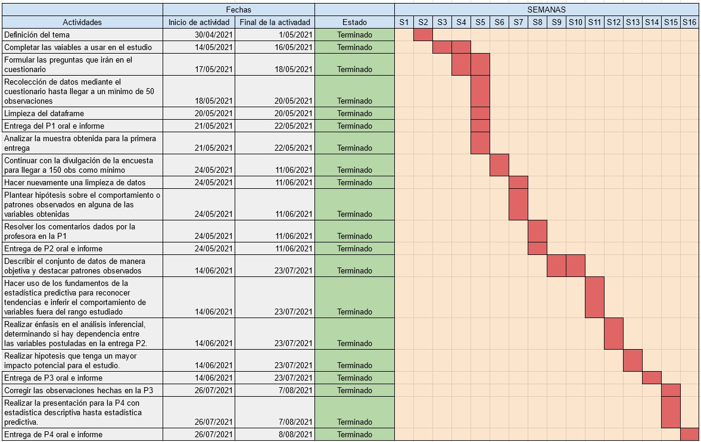

## CONTENIDO {.tabset}

### Introducción

<u>**IMPORTANCIA**</u>

En abril de este año se viralizó por redes sociales el cortometraje llamado “Save Ralph”, realizado por Humane Society. En este mostraban a varios conejos como sujetos de testeo para productos cosméticos y de higiene personal, siendo Ralph el conejo y personaje principal que relataba el daño en su cuerpo, además del antes, durante y después de los testeos.

Este corto generó un sentimiento de indignación en las jóvenes generaciones y público en general, ya que se demuestra que las industrias siguen testando en animales, a pesar de estar prohibido en varios países. Este sentimiento tuvo impacto en el pensar de las personas y en la adquisición de sus productos, esto se infiere por la difusión de listas sobre marcas no-Cruelty Free y Cruelty Free, más campañas en contra del testeo de animales, noticias, entre otros. Podría decirse que “Save Ralph” es la gota que rebalsó el vaso.

<u>**JUSTIFICACIÓN**</u>

Los animales no tienen voz ni opción. Tan solo 100 millones de animales mueren al año en el mundo a consecuencia de las prácticas en laboratorios de cosmética y 500 mil son comprados y usados con este mismo propósito, según la ONG Te Protejo; por lo que es necesario crear conciencia para luchar en contra de estas prácticas, con el fin de erradicarlas y prohibirlas en más países.

### Objetivos

<u>**PREGUNTA DE INVESTIGACIÓN**</u>

¿Hasta qué punto las **campañas contra el uso de animales para testeo en la industria cosmética y de cuidado personal** impactó en la **cultura de consumo de las personas**?

- Variable dependiente: Cultura de consumo de las personas en relación a los productos cosméticos y de cuidado personal.
- Variable independiente: Campañas contra el uso de animales para testeo en la industria cosmética y de cuidado personal.

<u>**OBJETIVOS**</u>

- Analizar el impacto económico de las empresas involucradas con la crueldad animal.
- Verificar el conocimiento de nuestro publico objetivo acerca de su consumo de productos de cuidado personal y cosmética, así como su relación con la crueldad animal.
- Identificar las causas del por qué aun se siguen utilizando productos que no son libres de crueldad animal.

### Planificación

Para poder cumplir todos los objetivos de nuestro estudio, es necesaria tener la organización más eficiente posible, por eso es que hemos realizado este diagrama de Gantt con las actividades a realizar por cada semana del ciclo 2021-1.

<u>**DIAGRAMA DE GANTT**</u>
 


### Marco Teórico

<u>**POBLACIÓN**</u>

- La población objetivo de esta investigación son las personas nacidas entre el año 1990 y 2006 que residan en las provincias de Lima, Huancayo, Chiclayo, Oxapampa, Camaná y Callao en Perú\n.

<u>**MUESTRA**</u>

- Se emplea el muestreo **no probabilístico**.
- La técnica de muestreo a utilizar en el trabajo es por **conveniencia**.
- Para esta entrega se están utilizando **157 unidades muestrales**.

<u>**PROCESO DE RECOLECCIÓN DE DATOS**</u>

1. Debido a la coyuntura actual los datos han sido recolectados de manera online por lo que se realizó la creación de un formulario mediante el uso de *Google Forms*. (https://forms.gle/3ZkS753JjgAZ1auL6) con preguntas definidas de acuerdo al objetivo del estudio.\n
2. Difusión del cuestionario por la redes social *Whatsapp*, *Twitter*, *Facebook*, *Instagram* y *Telegram*. 
3. Difusión a la comunidad de alumnos de UTEC mediante el correo electrónico.

<u>**VARIABLES**</u>

- En este estudio se han planteado 24 variables, de las cuáles 8 son numéricas y 16 categóricas.

<font size="2">**VARIABLES CATEGÓRICAS**</font> \n

| VARIABLE  | DESCRIPCIÓN | CLASIFICACIÓN |
|:--------:|:----------------:|:--------:|:----------:|
| Género | Género de la persona encuestada | Categórica nominal |
| PCP | Producto de preferencia de cuidado personal | Categórica nominal |
| PC | Producto de preferencia de cosmética | Categórica nominal |
| Provincia | Provincia de residencia de la persona encuestada | Categórica nominal |
| Distrito | Distrito de la provincia de residencia de la persona encuestada | Categórica nominal |
| NS_letra | Escala del nivel socioeconómico definida por el MEF | Categórica ordinal |
| NS_monto | Cantidad de salario promedio asignado por el MEF | Categórica ordinal | 
| Calidad | Cualidad dependiente que indica que el nivel de satisfacción del cliente al usar un producto influye en la decisión de compra de la persona encuestada | Categórica nominal |
| Popularidad | Cualidad dependiente que indica que la distinción de ciertas marcas de productos influye en la decisión de compra de la persona encuestada | Categórica nominal |
| Recomendación | Cualidad dependiente que indica que las sugerencias de personas cercana al encuestado influyen en la decisión de compra de la persona encuestada  | Categórica nominal |
| Cantidad | Cualidad dependiente que indica que el volumen del producto influye en la decisión de compra de la persona encuestada  | Categórica nominal |
| Precio | Cualidad dependiente que indica que el valor monetario del producto influye en la decisión de compra de la persona encuestada  | Categórica nominal |
| cf | Cualidad dependiente que indica que un producto sea libre de testeo en animales influye en la decisión de compra de la persona encuestada  | Categórica nominal |
| Cuidado | Indicador a escala de cuánto se cuida la persona encuestada del 1 al 10 | Categórica ordinal |
| Cambio | Indica si el encuestado dejó de comprar productos con crueldad animal después de ver diferentes publicidades | Categórica nominal |

<font size="2">**VARIABLES NUMÉRICAS**</font> \n

| VARIABLE  | DESCRIPCIÓN | CLASIFICACIÓN | LIMITACIÓN |
|:--------:|:----------------:|:--------:|:----------:|
| Edad | Cantidad de años de la persona encuestada | Numérica discreta | [15,60] |
| ProductoMesC | Cantidad de productos de cosmética comprados por mes | Numérica discreta | [0,15] |
| ProductoMesCP | Cantidad de productos de cuidado personal comprados por mes | Numérica discreta | [0,20] |
| GMCP | Gasto promedio mensual en productos de cuidado personal | Numérica continua | [0,1000] |
| GMC | Gasto promedio mensual en productos de cosmética | Numérica continua | [0,1010] |
| Pubmaltrato | Cantidad de publicidad vista sobre el maltrato animal en el último mes | Numérica discreta | [0,10] |
| CantidadCambio | Cantidad de productos que no son cruelty free que el encuestado dejó de comprar después de ver publicidad sobre el maltrato animal | Numérica discreta | [1,13] |
| Conocimientocf | Cantidad de marcas cruelty free que conoce el encuestado | Numérica discreta | [0,18] |
| Conocimientosincf | Cantidad de marcas no cruelty free que conoce el encuestado | Numérica discreta | [0,13] |


### Limpieza de datos
Para un correcto análisis se debe limpiar la data proporcionada por la base de datos.

1. Especificación de las librerías a usar para el proceso de la limpieza.
```{r}
library(readr)
library(dplyr)
```

2. Lectura del data frame.
```{r}
DF <- read_csv("P3_dataframe.csv")
```

3. Asignación del nombre a las variables, DFN guardará los cambios hechos al data frame original.
```{r}
library(dplyr)
DF %>% rename(Genero = Género, Edad = `¿Cuántos años tienes?`, NS = `¿Cuál es tu nivel socioeconómico?`, ProductoMesC = `¿Cuántos productos en cosméticos compras al mes?`,ProductoMesCP = `¿Cuántos productos de cuidado personal compras al mes?`, GMCP = `Gasto promedio mensual en productos de cuidado personal`, GMC = `Gasto promedio mensual en productos cosméticos`, PCP = `Entre las marcas de cuidado personal mencionadas a continuación, ¿cuál usas más?`, PC = `Entre las marcas de cosmética mencionadas a continuación, ¿cuál usas más?`, Provincia = `¿En qué provincia te encuentras?`, Distrito = `¿En que distrito resides?...11`, Calidad = `¿La calidad influye en tu elección de compra de productos de higiene personal y cosméticos?`, Popularidad = `¿La popularidad influye en tu elección de compra de productos de higiene personal y cosméticos?`, Recomendacion = `¿La recomendación influye en tu elección de compra de productos de higiene personal y cosméticos?`, Cantidad = `¿La cantidad del producto influye en tu elección de compra de productos de higiene personal y cosméticos?`, Precio = `¿El precio influye en tu elección de compra de productos de higiene personal y cosméticos?`, cf = `¿ Qué sea cruelty free  influye en tu elección de compra de productos de higiene personal y cosméticos?`, Cuidado = `¿Cuanto te cuidas del 1 al 10? ( siendo 1 nada y 10 bastante)`, Pubmaltrato = `Al mes, ¿cuántas veces has visto alguna publicidad sobre el maltrato animal que implique a una marca de  productos de cuidado personal o cosméticos?`, Cambio = `En base a la pregunta anterior, a partir de la publicidad contra el maltrato animal, ¿dejaste de comprar productos que testean en animales o continuaste usándolos?`, CantidadCambio = `Si en la pregunta anterior mascaste que Sí,  ¿cuántos productos, aproximadamente, que aún testean en animales dejaste de comprar (mensualmente)?`, Conocimientocf = `¿ Cuantas marcas cruelty free que aparecen en la imagen conoces?`, Conocimientosincf = `¿ Cuantas marcas que aún hacen pruebas con animales que aparecen en la imagen conoces?`) -> DFN 
```

4. Separación de la columna NS(Nivel socieconómico), para poder obtener las variables NS_letra(Nivel socioeconómico clasificado por una letra) y NS_monto(Nivel socioeconómico clasificado por un monto promedio establecido por IPSOS).
```{r}
DFN1 <- DFN$NS 
library(stringr)
DFN1 %>% str_split("-", n = 2, simplify = TRUE) -> NS_matriz

NS_letra <- NS_matriz[,1]
NS_monto <- NS_matriz[,2]
```

```{r}
DFN <- cbind(DFN,NS_letra,NS_monto) #solo correr una vez, caso contrario se crearán múltiple columnas de NS_letra y NS_monto de acuerdo a la cantidad de corridas del chunk
```
 
5. El contenido de la variable NS_monto sigue siendo una cadena de texto, por lo que la asignamos al número correspondiente a la escala socioeconómica.
```{r}
DFN$NS_monto[DFN$NS_monto == " Ingreso mensual promedio de S/.13 000"] <- as.numeric(13000)
DFN$NS_monto[DFN$NS_monto == " Ingreso mensual promedio de S/. 7 230"] <- as.numeric(7230)
DFN$NS_monto[DFN$NS_monto == " Ingreso mensual promedio de S/. 4 160"] <- as.numeric(4160)
DFN$NS_monto[DFN$NS_monto == " Ingreso mensual promedio se S/. 4 160"] <- as.numeric(4160)
DFN$NS_monto[DFN$NS_monto == " Ingreso mensual promedio se S/. 2 760"] <- as.numeric(2760)
DFN$NS_monto[DFN$NS_monto == " Ingreso mensual promedio de S/. 2 760"] <- as.numeric(2760)
DFN$NS_monto[DFN$NS_monto == " Ingreso mensual promedio de S/. 1 977"] <- as.numeric(1977)
DFN$NS_monto[DFN$NS_monto == " Ingreso mensual promedio se S/. 1 977"] <- as.numeric(1977)
```

4. Colocamos todas las variables excepto "NS" a otro data frame, ya que el proceso de división de "NS" fue completado.
```{r}
library(dplyr)
DFNN <- select(DFN, Genero, Edad, ProductoMesC, ProductoMesCP, GMCP, GMC, PCP, PC, Provincia, Distrito, Calidad, Popularidad, Recomendacion, Cantidad, Precio, cf, Cuidado, Pubmaltrato, Cambio, CantidadCambio, Conocimientocf, Conocimientosincf, NS_letra, NS_monto)
```

5. Para un mejor manejo de datos reducimos la expresión "Ninguna (No uso cosméticos)" y "Ninguna (No uso estas marcas de cuidado personal)" a "Ninguna"; así como "Sí, deje de comprar productos que aún testean en animales" a "Si", y "No, continué usándolos" a "No".
```{r}
DFNN$PC[DFNN$PC == "Ninguna (No uso cosméticos)"] <- "Ninguna"
DFNN$PCP[DFNN$PCP == "Ninguna (No uso estas marcas de cuidado personal)"] <- "Otras marcas"
DFNN$Cambio[DFNN$Cambio == "Sí, deje de comprar productos que aún testean en animales"] <- "Si"
DFNN$Cambio[DFNN$Cambio == "No, continué usándolos"] <- "No"
```

6. Conversión de datos tipo char que debieron ser tomados como num a numéricos.
```{r}
supuesta_numerica <- select(DFNN, GMC, GMCP, ProductoMesC, ProductoMesCP, CantidadCambio, NS_monto)
data_num <- as.data.frame(apply(supuesta_numerica, 2, as.numeric)) 
```

7. Asignación de todo lo corregido a un data frame final para el análisis estadístico.
```{r}
DFL <- select(DFNN, Genero, Edad, PCP, PC, Provincia, Distrito, Calidad, Popularidad, Recomendacion, Cantidad, Precio, cf, Cuidado, Pubmaltrato, Cambio, Conocimientocf, Conocimientosincf, NS_letra)
```

```{r}
DFL <- cbind(DFL,data_num$GMC, data_num$GMCP, data_num$ProductoMesC,data_num$ProductoMesCP,data_num$CantidadCambio,data_num$NS_monto) #solo correr una vez, para evitar la creación de múltiples columnas
```

```{r}
DFL %>% rename(GMC = `data_num$GMC` , GMCP = `data_num$GMCP`, ProductoMesC = `data_num$ProductoMesC`, ProductoMesCP = `data_num$ProductoMesCP`,CantidadCambio = `data_num$CantidadCambio`, NS_monto = `data_num$NS_monto` ) -> DFL
```

8. Comprobación del tipo de cada dato de DFL, como se puede observar, cada valor ya tiene su tipo adecuado.
```{r}
str(DFL)
```

```{r}
summary(DFL$Edad)
summary(DFL$Pubmaltrato)
summary(DFL$Conocimientocf)
summary(DFL$Conocimientosincf)
summary(DFL$GMCP)
summary(DFL$GMC)
summary(DFL$ProductoMesC)
summary(DFL$ProductoMesCP)
summary(DFL$CantidadCambio)
```


### Análisis Descriptivo

```{r, echo=FALSE}
r <- function(x){
  return(round(x,2))
}
```

```{r, echo = FALSE}
replace_outliers <- function(x, removeNA = TRUE){
  qrts <- quantile(x, probs = c(0.25, 0.75), na.rm = removeNA)
  caps <- quantile(x, probs = c(.05, .95), na.rm = removeNA)
  iqr <- qrts[2]-qrts[1]
  h <- 1.5 * iqr
  x[x<qrts[1]-h] <- caps[1]
  x[x>qrts[2]+h] <- caps[2]
  x
}
```

<u>**0. DATOS FALTANTES Y OBSERVACIONES INCOMPLETAS**</u>

- Observaciones incompletas 
```{r}
sum(!complete.cases(DFL))
```
El data frame tiene 70 observaciones incompletas, esto quiere decir que a 70 de ellas o pueden estar vacías en todas las variables o le faltan rellenar algunas variables.

- Datos Faltantes
```{r}
sum(is.na(DFL))
```
El data frame tiene 78 datos faltantes, distribuido en una o varias observaciones.

<u>**1. PARTICIPACIÓN**</u>

- En este sector se opta generalmente por los gráficos de barras, ya que estos nos mostrarán la participación de una manera visual bastante comprensible.\n

<font size="2">**PARTICIPACIÓN POR EDAD**</font> \n

```{r}
cl1 <- c("aquamarine2","darkcyan","darkolivegreen4","lightpink","mistyrose1","saddlebrown")
barplot(table(DFL$Edad),main = "Participación por edad ",las = 3,col = cl1)
```

- Como se puede observar en el gráfico, la mayor participación por edad en la encuesta es la de las personas de 19 años, por lo que el tema es de mayor relevancia para los jóvenes.\n


<font size="2">**PARTICIPACIÓN POR NIVEL SOCIOECONÓMICO**</font> \n

```{r}
cl2 <- c(colors(),n=38)
barplot(table(DFL$NS_letra),main = "Participación nivel socioeconómico ",las = 3,col = cl2)
```

- Se puede observar que la mayor participación por nivel socioeconómico fue por parte de la clase E, aunque el resto de clases no está muy lejos de esta.\n
- La moda en cuanto a participación por nivel socioeconómico es la clase E.

<font size="2">**PARTICIPACIÓN POR PROVINCIA**</font> \n

```{r}
cl1 <- c("blue","green","yellow","pink","skyblue","brown")
barplot(table(DFL$Provincia),main = "Participación",las = 3,col = cl1)
```

```{r}
table(DFL$Provincia)
```

- El gráfico y tabla nos muestra que la moda de la variable provincia , lo que nos indicaría que el distrito con mayor participación en el estudio es Lima, con 113 participantes de 157 encuestados.\n

<u>**2. GASTO Y PREFERENCIA DE MARCAS**</u>

<font size="2">**GASTOS GENERALES POR PRODUCTOS**</font> \n

```{r  eval=TRUE, echo=FALSE, message=FALSE,warning=FALSE}
op=par(mfrow=c(1,2))

DFL %>% mutate(DFL, GTP = GMC + GMCP) -> DFL
DFL %>% mutate(DFL,ProductoMes = ProductoMesC+ProductoMesCP)->DFL
```

```{r}
plot(DFL$ProductoMes,DFL$GTP,main="Con valores atípicos",xlab="# de productos por mes",ylab="Gasto promedio mensual (soles)",col = rgb(0.3, 0, 0.8, 0.3),pch=19)
abline(lm(DFL$GTP~DFL$ProductoMes), col = "red", lwd=2)

GTP_SA <- replace_outliers(DFL$ProductoMes)
plot(GTP_SA, DFL$GTP,main="Sin valores atípicos",xlab="# de productos por mes",ylab="Gasto promedio mensual (soles)",col = rgb(0.8, 0.4, 0, 0.3),pch=19)
abline(lm(DFL$GTP~GTP_SA), col = "red", lwd=2)
```


- El gasto promedio se encuentra en el rango de 0 a 100 soles.
- La pendiente de la posible función es mayor con valores atípicos.

<font size="2">**MARCAS DE CUIDADO PERSONAL MÁS USADAS**</font> \n

```{r}
cl <- colors()
barplot(table(DFL$PCP),main = "Frecuencia del uso de marcas de cuidado personal",las = 3,col = cl)
```

- Entre las marcas más conocidas delimitadas en la encuestas en el sector de cuidado personal en Perú, Dove tiene la mayor frecuencia, esta marca es cruelty free.

<font size="2">**GASTOS EN CUIDADO PERSONAL**</font> \n

```{r}
#Función CV
cv <- function(x){
  return(round(sd(x, na.rm=TRUE)/mean(x, na.rm=TRUE),2))
}
```

```{r}
cat("Media:" , r(mean(DFL$GMCP,na.rm=TRUE)))
cat("\nMediana:" , median(DFL$GMCP,na.rm=TRUE))
cat("\nCoeficiente de variación:" , cv(DFL$GMCP))
```

```{r,fig.cap = "línea azul = media, línea rojo = mediana"}
boxplot(DFL$GMCP,horizontal = TRUE,col = "skyblue", main="Gasto mensual en productos de cuidado personal",xlab="Gasto (S/.)")
abline(v=mean(DFL$GMCP),col="blue")
abline(v=median(DFL$GMCP),col="red")
```

- La media está por encima de la mediana y se oberva claramente valores atípicos, por lo que podemos resaltar que los datos de gasto mensual en productos de cuidado personal presentan un sesgo a la derecha.\n 
- Respeto a los valores atípicos, estos pueden deberse a que generalmente las personas no tienden a gastar excesivamente en productos de cuidado personal, pero esto excluye el hecho de que haya personas que sí lo hacen, ya se por un tratamiento médico u otros causales.\n

<font size="2">**MARCAS COSMÉTICAS MÁS USADAS**</font> \n

```{r}
cl <- colors()
barplot(table(DFL$PC),main = "Frecuencia del uso de marcas cosméticas",las = 3,col = cl)
```

- En este punto se opta por una gráfica de barras, ya que la distribución en más clara con respecto al uso de otros descriptores gráficos.\n
- Entre las marcas más conocidas delimitadas en la encuestas en el sector de cosméticos en Perú, Natura tiene la mayor frecuencia, esta marca es cruelty free.\n

<font size="2">**GASTOS EN COSMÉTICA**</font> \n

```{r}
cat("Media:" ,r(mean(DFL$GMC,na.rm=TRUE)))
cat("\nMediana:" , median(DFL$GMC,na.rm=TRUE))
cat("\nCoeficiente de variación:" , cv(DFL$GMC))
```

- Se puede observar que la media y la mediana están bastante alejadas, esto es debido a los valores atípicos presentados, además de que la mediana es un descriptor más robusto que la media.

```{r,fig.cap = "línea azul = media, línea rojo = mediana"}
hist(DFL$GMC,col = rgb(0.9, 0.5, 0.4, 0.2),main="Gasto mensual en productos de cosmética",xlab="Gasto (S/.)",ylab="Cantidad de personas", breaks = 40)
abline(v=mean(DFL$GMC),col="blue")
abline(v=median(DFL$GMC),col="red")
```

- Como resultó en el descriptor numérico y se confirma con este descriptor gráfico, la media está por encima de la mediana, por lo que los datos de gasto mensual en productos de cosmética presentar un sesgo a la derecha.

<font size="2">**CANTIDAD DE PRODUCTOS Y CATEGORÍA GENERACIONAL**</font> \n

- Jóvenes: [15-17]años
- Jóvenes Adultos: [18-30]años
- Adultos : [31-60]años

```{r}
generacion<-sample(c("Jóvenes"),nrow(DFL),replace=T)
DFL<-cbind(DFL,generacion)
```

```{r}
DFL$generacion[DFL$Edad>17]<-"Adultos Jóvenes"
DFL$generacion[DFL$Edad>30]<-"Adultos"
boxplot(DFL$ProductoMes~DFL$generacion, col = "skyblue", main = "Cantidad de productos comprados por cada generación", xlab="Generacion", ylab="Productos comprados en promedio al mes")

```

- En este punto se optó por una gráfica de cajas por categoría generacional para poder visualizar con mayor detalle la información y tener una mejor compresión de esta.\n

- Podemos obervar que tenemos la presencia de datos atípicos en adultos y adultos jóvenes, además en la caja nos damos cuenta de que los datos se encuentran bastante concentrados lo que reduce las posibilidades de un sesgo.\n

<u>**3. CRUELTY FREE**</u>

<font size="2">**CUIDADO PERSONAL POR GÉNERO**</font> \n

```{r}
mosaicplot(table(DFL$Genero,DFL$Cuidado),main = "Cuidado personal por género",color = TRUE,las=1,xlab = "Género",ylab = "Cuidado personal")
```

- Para relacionar dos variables categóricas, se optó por usar un mosaico.

- Nos damos cuenta que el género femenino se cuida más en un grado 7 respecto al género masculino.

<font size="2">**GÉNERO Y FACTOR CRUELTY FREE**</font> \n

```{r, echo=FALSE}
mosaicplot(table(DFL$Genero,DFL$cf),main = "Influencia del factor cruelty free según el género",color = TRUE,las=1,xlab = "Género",ylab = "Influencia factor cruelty free")
```

- Para relacionar dos variables categóricas, se optó por usar un mosaico.

- El gráfico nos muestra de manera clara que el género femenino es el que más tiene en cuenta el factor cruelty free a la hora de realizar una compra.

<font size="2">**PUBLICIDAD RESPECTO AL MALTRATO ANIMAL**</font> \n

```{r}
boxplot(DFL$Pubmaltrato,horizontal = TRUE,col = "lightgoldenrodyellow", main="Cantidad de publicidad contra el maltrato animal vista")
abline(v=mean(DFL$Pubmaltrato),col="blue")
abline(v=median(DFL$Pubmaltrato),col="red")
```

- Se opta por un gráfico de cajas, ya que queremos ver que tan alejadas están las respuesta de vista de publicidad relacionado a cruelty free.

- Se observa un sesgo derecho o asimetría positiva, la media está por encima de la mediana, la caja nos muestra unos datos no concentrados.

- Las vistas de los encuestados sobre publicidad cruelty free son algo reducidas.


<font size="2">**PUBLICIDAD Y ELECCIÓN DE COMPRA DE PRODUCTOS NO CRUELTY FREE**</font> \n

```{r}
tabla <- table(DFL$Cambio, DFL$Genero)
barplot(tabla, beside = TRUE, las=1, 
        xlab='Género', ylab='Frecuencia de respuesta',
        col = c("lightblue", "mistyrose"),
        ylim = c(0, 60))
legend('topleft', legend=rownames(tabla), bty='n',
       fill=c("lightblue", "mistyrose"))

```

```{r}
tabla
```

- Esta gráfica y tabla nos muestra la frecuencia en que los encuestados dejaron o no de comprar productos cruelty free, se opta por el gráfico de barras ya que visualmente es entendible y didáctico, pero como apoyo colocamos la tabla de frecuencias que confirma los valores de la gráfica.

### Relaciones resaltantes

<u>**GASTOS GENERALES POR PRODUCTOS**</u>

CORRELACIÓN : 

```{r}
r(cor(DFL$ProductoMes, DFL$GTP, use = "complete.obs"))
```

COVARIANZA : 

```{r}
r(cov(DFL$ProductoMes, DFL$GTP, use = "complete.obs"))
```

GRÁFICAS DE DISPERSIÓN:

```{r}
plot(DFL$ProductoMes, DFL$GTP,xlab = "Cantidad de productos por mes", ylab= "Gasto total",col = rgb(0.2, 0.1, 0.3, 0.3),pch=19)
abline(lm(DFL$GTP~DFL$ProductoMes), col="green", lwd=2)
```

- La correlación se acerca a 1 y la covarianza se considera grande por lo que sugiere un alto grado de relación lineal.

- El patrón encontrado en esta relación es que podemos observar aue la variable gasto total y la variable cantidad de productos por mes, ambas numéricas, crecen de manera directamente proporcional.

- La cantidad de productos comprados al mes posee una relación directamente proporcional con el gasto total realizado por dicha compra; es decir, a mayor cantidad de productos comprados, el gasto total se incrementa.


<font size="2">**EDAD Y PRODUCTOS COMPRADOS AL MES**</font> \n

CORRELACIÓN : 

```{r}
r(cor(DFL$Edad, DFL$ProductoMes, use = "complete.obs"))
```

COVARIANZA : 

```{r}
r(cov(DFL$Edad, DFL$ProductoMes, use = "complete.obs"))
```

GRÁFICA DE DISPERSIÓN:

```{r}
plot(DFL$Edad, DFL$ProductoMes,xlab = "Edad", ylab= "Productos por mes",col = rgb(0.2, 0.1, 0.3, 0.3),pch=19)
abline(lm(DFL$ProductoMes~DFL$Edad), col="green", lwd=2)
```

- La correlación  se acerca a 0 y la covarianza se considera pequeña por lo que sugiere poca relación lineal, pero esto no excluye que puedan estar relacionadas.

- El patrón encontrado en esta relación es que a menor edad, se compran más productos al mes. Es una relación indirectamete proporcional, pues mientras una variable aumenta, la otra decrece; lo mismo sucede en viceversa.

- Se puede observar que la curva podría tener la forma de una función racional.

<u>**CANTIDAD DE PRODUCTOS COMPRADOS AL MES Y CANTIDAD DEJADA DE COMPRAR**</u>

CORRELACIÓN : 

```{r}
r(cor(DFL$ProductoMes, DFL$CantidadCambio, use = "complete.obs"))
```

COVARIANZA : 

```{r}
r(cov(DFL$ProductoMes, DFL$CantidadCambio, use = "complete.obs"))
```

GRÁFICA DE DISPERSIÓN:

```{r}
plot(DFL$ProductoMes, DFL$CantidadCambio,xlab = "Cantidad de productos por mes", ylab= "Cantidad que se dejó de comprar",col = rgb(0.2, 0.1, 0.3, 0.3),pch=19)
abline(lm(DFL$CantidadCambio~DFL$ProductoMes), col="green", lwd=2)
```

- La correlación  se acerca a 0 y la covarianza se considera pequeña por lo que sugiere poca relación lineal, pero esto no excluye que puedan estar relacionadas.

- La cantidad de productos comprados al menos es una pregunta inicial en la que el encuestado nos indica los productos consumidos sin tener en cuenta la procedencia, mientras que en la cantidad dejada de comprar el encuestado nos indica cuántos productos que no son cruelty free dejó de comprar a partir de la visualización de una publicidad relacionada al maltrato animal.

- Se puede observar el patrón de que ambas van creciendo de forma directamente proporcional; es decir a una menor cantidad de productos comprados, una menor cantidad de productos no cruelty free que se dejan de comprar.

<u>**MARCAS CRUELTY FREE Y MARCAS NO CRUELTYFREE**</u>

CORRELACIÓN : 

```{r}
r(cor(DFL$Conocimientocf, DFL$Conocimientosincf, use = "complete.obs"))
```

COVARIANZA : 

```{r}
r(cov(DFL$Conocimientocf, DFL$Conocimientosincf, use = "complete.obs"))
```

GRÁFICA DE DISPERSIÓN:

```{r}
plot(DFL$Conocimientocf, DFL$Conocimientosincf,xlab = "Conocimiento de marcas cruelty free", ylab= "Conocimiento de marcas que no son cruelty free",col = rgb(0.2, 0.1, 0.3, 0.3),pch=19)
abline(lm(DFL$Conocimientosincf~DFL$Conocimientocf), col="green", lwd=2)
```

- La correlación se acerca a 1 , lo que nos sugiere que las variables podrían estar relacionadas.

- La covarianza es considerada grande.

- Podemos observar el patrón de que los datos van creciente de manera directamente proporcionales. En otras palabras, si tienes un mayor conocimiento de marcas cruelty free, por ende posees altos conocimientos de marcas que no lo son.

<u>**PUBLICIDAD RELACIONADA A CRUELTY FREE Y CANTIDAD DE PRODUCTOS QUE SE DEJARON DE COMPRAR**</u>

CORRELACIÓN :

```{r}
r(cor(DFL$Pubmaltrato, DFL$CantidadCambio, use = "complete.obs"))
```

COVARIANZA :

```{r}
r(cov(DFL$Pubmaltrato, DFL$CantidadCambio, use = "complete.obs"))
```

GRÁFICA DE DISPERSIÓN:

```{r}
plot(DFL$Pubmaltrato, DFL$CantidadCambio,xlab = "Publicidad vista respecto a cruelty free", ylab= "Cantidad que se dejó de comprar",col = rgb(0.2, 0.1, 0.3, 0.3),pch=19)
abline(lm(DFL$CantidadCambio~DFL$Pubmaltrato), col="green", lwd=2)
```

- La correlación se acerca a 0 y la covarianza se considera pequeña por lo que sugiere poca relación lineal, pero esto no excluye que puedan estar relacionada, además de que son pocos encuestados.

- Se les preguntó a los encuestados cuántos productos cruelty free dejaron de comprar a partir de ver publicidad relacionada al tema.

- La relación que se puede apreciar es directamente proporcional, dicho de otra manera, si un encuestado ha visto una mayor cantidad de publicidad respecto a cruelty free, dejará de comprar una mayor cantidad de productos que no lo son.


### Análisis Probabilístico

Para este análisis, recurriremos a las propiedad de aproximar una distribución Binomial en una normal. Los requisitos necesarios para esta aproximación son:

- $n\geq30$
- $p*n\geq5$
- $(1-p)*n\geq5$

Analizando nuestra muestra, el tamaño de esta es de 187. Pensando en cumplir el 2 requisito mencionado, pretendemos hallar el $p_min$ aceptado. Es así que tenemos el siguiente cálculo:

$$187*p\geq5$$
Si resolvemos la desigualdad obtenemos que:
$$p\geq0.02673...$$
Este $p_{min}$ es cercano a 0; por lo que para nuestros cálculos, no debemos preocuparnos mucho por si $p$ cumple el 2do requisito. Sin embargo, los valores que tomemos de p, no pueden ser cercanos ni a 1 ni a 0, por lo que determinaremos un intervalo:

$$0.25\leq p\leq 0.75$$

1. Según nuestros datos, comprar más de 4 productos de cosmética o cuidado personal, es tan probable como comprar cuatro o menos de cuatro productos; por lo que establecemos que la probabilidad de que una persona compre más de 4 productos al mes es de un 50%. Necesitamos establecer un intervalo de confianza donde encontremos la proporción de la cantidad de personas quienes compren más de 4 productos al mes. Determinamos una confianza del 97%.
```{r}
p_1 <- (sum(DFL$ProductoMes>4))/nrow(DFL)
r(p_1)
```

Podemos observar que el suceso de comprar más de 4 productos de cosmética o cuidado personal, parte de una Binomial con parámetros n = 187, y p = 0.5
```{r, echo=FALSE}
n <- 187
p1.m <- 0.5
conf1 <- 0.97

mu1 <- n*p1.m
sd1 <- sqrt(p1.m*(1-p1.m)/n)

z1 <- qnorm((1-conf1)/2,lower.tail = F)

me1 <- z1*sd1
inf1 <- p1.m - me1
sup1 <- p1.m + me1

cat("Intervalo de confianza")
cat("\n")
cat("(",inf1,",",sup1,")")
cat("\n")
cat("Error encontrado")
cat("\n")
cat("(",round(me1,4),")")

x1 <- seq(p1.m - 0.25, p1.m + 0.25, by=0.001)
y1 <- dnorm(x1, p1.m, sd1)
plot(x1,y1,col="blue", pch="*")

abline(v = inf1, col='red')
abline(v = sup1, col='red')
```

2. Además, con respecto al gasto promedio mensual de nuestros encuestados, queremos conocer si gastan más de 100 soles en promedio por mes, y aproximamos que la probabilidad (tomando en cuenta nuestros datos) de que este hecho suceda es de un 40%. Necesitamos establecer un intervalo de confianza donde encontremos la proporción de la cantidad de personas quienes gasten más de 100 soles mensuales. Determinamos una confianza del 97.5%.
```{r}
p_2 <- (sum(DFL$GTP>100))/nrow(DFL)
r(p_2)
```

Podemos observar que el suceso de gastar más de 100 soles en promedio por mes, parte de una Binomial con parámetros n = 187, y p = 0.4
```{r, echo=FALSE}
n <- 187
p2.m <- 0.4
conf2 <- 0.975

mu2 <- n*p2.m
sd2 <- sqrt(p2.m*(1-p2.m)/n)

z2 <- qnorm((1-conf2)/2,lower.tail = F)

me2 <- z2*sd2
inf2 <- p2.m - me2
sup2 <- p2.m + me2

cat("Intervalo de confianza")
cat("\n")
cat("(",inf2,",",sup2,")")
cat("\n")
cat("Error encontrado")
cat("\n")
cat("(",round(me2,4),")")

x2 <- seq(p2.m - 0.25, p2.m + 0.25, by=0.001)
y2 <- dnorm(x2, p2.m, sd2)
plot(x2,y2,col="blue", pch="*")

abline(v = inf2, col='red')
abline(v = sup2, col='red')
```

3. Por último, deseamos saber si una persona a visto más de 3 publicidades de productos crueltry free durante un mes. Notamos que este suceso no es muy recurrente, y le otorgamos una probabilidad, tomando en cuenta nuestros datos, del 30%. Necesitamos establecer un intervalo de confianza donde encontremos la proporción de la cantidad de personas quienes vean más de 3 publicidades de productos crueltry free en un mes. Determinamos una confianza del 98%.
```{r}
p_3 <- (sum(DFL$Pubmaltrato>3))/nrow(DFL)
r(p_3)
```

Podemos observar que el suceso de que una persona haya visto más de 3 publicidades de productos cruelty free, parte de una Binomial con parámetros n = 187, y p = 0.3
```{r, echo=FALSE}
n <- 187
p3.m <- 0.3
conf3 <- 0.98

mu3 <- n*p3.m
sd3 <- sqrt(p3.m*(1-p3.m)/n)

z3 <- qnorm((1-conf3)/2,lower.tail = F)

me3 <- z3*sd3
inf3 <- p3.m - me3
sup3 <- p3.m + me3

cat("Intervalo de confianza")
cat("\n")
cat("(",inf3,",",sup3,")")
cat("\n")
cat("Error encontrado")
cat("\n")
cat("(",round(me3,4),")")

x3 <- seq(p3.m - 0.25, p3.m + 0.25, by=0.001)
y3 <- dnorm(x3, p3.m, sd3)
plot(x3,y3,col="blue", pch="*")

abline(v = inf3, col='red')
abline(v = sup3, col='red')
```

### Pruebas de hipótesis

1. Hipótesis 1. ¿Es posible que la proporción de personas que compren más de 4 productos de limpieza al mes, sea menor a 0.5? La significancia la establecemos en 5%.

$${H_0} : p=0.5$$
$${H_1} : p<0.5$$

```{r, echo=FALSE}
a1 <- 0.05
T1 <- (0.4-p1.m)/(sd1/sqrt(n))
tc1 <- qt(0.1, df = n-1)

T1
tc1
```

Se observa que el T estadístico es mucho menor al t crítico, por lo que hay suficiente evidencia para rechazar la hipótesis planteada.

2. Hipótesis 2: ¿Existe una dependencia entre las variables categóricas Genero y Cambio?

Observemos la variable Genero con ayuda de la función table:
```{r, echo=FALSE}
table(DFL$Genero)
```
Para este estudio, lo más relevante son los géneros "Masculino" y "Femenino"; pues como podemos observar en la tabla, representan una mayoría en la muestra.

Establecemos nuestras hipótesis:

- H_0 : independencia entre las variables Genero y Cambio
- H_1 : dependencia entre las variables Genero y Cambio

Establecemos una significancia al 5%. Realizaremos la prueba de Chi cuadrado de Pearson.
```{r, echo=FALSE}
DFGC <- DFL[(DFL$Genero == "Masculino" | DFL$Genero == "Femenino"),]
genero_cambio  <- table(DFGC$Genero,DFGC$Cambio)
genero_cambio
chisq.test(genero_cambio)
```
p < alpha, y X-squared es relativamente alto; es decir, existe haslta el momento alguna relación o influencia entre el género de una persona y la tendencia al cambio de un producto cosmético o de higiene personal tras ver al menos un comercial cruelty free.

Para poder comprobar si existe una fuerte relación, lo haremos a través de la medición de la intensidad de la asociación. Utilizaremos los estadísticos V de Cramér y el Coeficiente de Contingencia.
```{r}
library(vcd)
genero_cambio
assocstats(genero_cambio)
```
Ahora observamos

La intensidad de la asociación o relación entre las variables es baja (considerando el Coeficiente de Contingencia) o Alta (V de Cramér), por lo que la independencia disminuye.

3. Hipótesis 3:


### Regresión lineal

1. Edad vs GTP

Variables a estudiar: Edad y GTP. La significancia fijada es de 0.05.
```{r, echo=FALSE}
lm1 <- lm(DFL$GTP~DFL$Edad)
plot(DFL$Edad, DFL$GTP, pch=20, xlab = 'Edad', ylab = 'Gasto promedio mensual', main = "Edad vs Gasto promedio al mes")
abline(lm1, col = 'red')
```

```{r, echo=FALSE}
cor(DFL$GTP, DFL$Edad, use = "complete.obs")
```
La correlación es cercana a 0. Esto podría deberse a que existe un cúmulo de datos agrupados, tal como se puede observar en la esquina inferior izquierda del cuadro.

```{r, echo=FALSE}
summary(lm1)
```

Se observa que Ho: m=0, no se rechaza pues 0.734 es mucho mayor a la significancia tomada; además el R^2 es muy cercano a 0 por lo que pudiera no haber una relación significativa entre la edad y el gasto total mensual de los encuestados.
```{r, echo=FALSE}
hist(lm1$residuals, breaks = 'FD', prob = T , xlim = c(-1000,1000))
curve(dnorm(x, mean = mean(lm1$residuals, na.rm = T), sd = sd(lm1$residuals, na.rm = T)), add = T, col = "red")
abline(v = mean(lm1$residuals), col='blue')
abline(v = sd(lm1$residuals), col='green')
```

Observamos que la distribución de la gráfica no es simétrica, por lo que no se acerca a una distribución normal; además de que presenta un valor atípico. Sin embargo, notamos que la media de los valores de los residuales es muy cercano a 0.

Por lo tanto, hasta el momento no hay suficiente evidencia que explique que halla una relación entre las variables de Edad y GTP.
```{r, echo=FALSE}
plot(lm1)
```

- Residuals vs Fitted: La recta roja es relativamente cercana a la recta 0. La recta presenta un mayor alejamiento en la zona donde se encuentran la mayor cantidad de datos. La desviación estándar es mayor en la parte derecha de la recta roja. Debido a esto podría considerarse que los datos no son homocedásticos.

- Normal Q-Q: Para esta gráfica, se observa que el conjunto de puntos no es tan cercano a la recta y=x. Se acentúa sobremanera en los extremos.

- Scale - Location: Observamos que la línea roja no es estrictamente plana. Sugiere que los datos no son homocedásticos.

- Residuals vs Leverage: La recta se acerca al 0.

```{r}
plot(DFL$Edad, DFL$GTP, pch=20, xlab = 'Edad', ylab = 'Gasto promedio mensual', main = "Edad vs Gasto promedio al mes")
abline(lm1, col='red')
points(DFL$Edad[c(23,121,165)], DFL$GTP[c(23,121,165)], col=c("red","green","blue"), pch = 19)
```

En base al análisis realizado, no podemos establecer una ecuación que relacione ambas variables.

2. Pubmaltrato vs CantidadCambio

Variables a estudiar: Pubmaltrato y CantidadCambio. La significancia fijada es de 0.05.

Notamos que la variable CantidadCambio posee 84 valores vacíos. Crearemos un nuevo data frame el cual contenga las observaciones completas.
```{r, echo=FALSE}
summary(DFL$CantidadCambio)
DFL_ <- na.omit(DFL)
```

```{r, echo=FALSE}
lm2 <- lm(DFL_$CantidadCambio~DFL_$Pubmaltrato)
plot(DFL_$Pubmaltrato, DFL_$CantidadCambio, pch=20, xlab = 'Cantidad de publicidad de maltrato animal', ylab = 'Cantidad de productos dejados de comprar', main = "Pubmaltrato vs CantidadCambio")
abline(lm2, col = 'red')
```

```{r, echo=FALSE}
cor(DFL_$CantidadCambio,DFL_$Pubmaltrato)
```

La correlación es positiva y baja.

```{r, echo=FALSE}
summary(lm2)
```

Ni la hipótesis del intercepto ni la de la pendiente se rechazan; y el pvalor es menor a la significancia, por lo que hay suficiente evidencia para rechazar la hipótesis de nulidad de relación entre las variables. Sin embargo, el R^2 es cercano a 0 por lo que pudiera no haber una relación significativa entre la cantidad de publicidad vista sobre el maltrato animal en el último mes y la cantidad de productos que no son cruelty free que el encuestado dejó de comprar después de ver publicidad.
```{r, echo=FALSE}
hist(lm2$residuals, breaks = 'FD', prob=T, xlim = c(-5,5))
curve(dnorm(x, mean = mean(lm2$residuals, na.rm = T), sd = sd(lm2$residuals, na.rm = T)), add = T, col = "red")
abline(v = mean(lm2$residuals), col='blue')
abline(v = sd(lm2$residuals), col='green')
```

Observamos que la distribución de la gráfica no es simétrica, aunque se acerca medianamente a una distribución normal. Por último, notamos que la media de los valores de los residuales es muy cercana a 0.

Por lo tanto, hasta el momento hay suficiente evidencia que explique que halla una relación entre las variables CantidadCambio y Pubmaltrato.
```{r, echo=FALSE}
plot(lm2)
```

- Residuals vs Fitted: La recta roja es relativamente cercana a la recta 0, en ambos extremos de la recta es donde se aleja de la recta y=0.

- Normal Q-Q: Para esta gráfica, se observa que el conjunto de puntos no es tan cercano a la recta y=x. Se acentúa sobremanera en el extremo superior.

- Scale - Location: Observamos que la línea roja no es estrictamente plana. Sugiere que los datos no son homocedásticos.

- Residuals vs Leverage: La recta es casi paralela a la recta y=0.

Tras lo analizado, podemos formular una ecuación que relacione ambas variables. Los coeficientes son:
```{r, echo=FALSE}
lm2$coefficients
```

Predicción: ¿Qué cantidad de productos que no son cruelty free dejó de comprar una persona que haya visto 8 publicidades sobre el maltrato animal en el último mes?
```{r, echo=FALSE}
r(sum(lm2$coefficients*c(1,8)))
```
Concluimos que la persona dejó de comprar aproximadamente 3 productos.

3. Conocimientosincf vs ProductoMes

Variables a estudiar: Conocimientosincf y ProductoMes. La significancia fijada es de 0.05.
```{r, echo=FALSE}
lm3 <- lm(DFL$ProductoMes~DFL$Conocimientosincf)
plot(DFL$Conocimientosincf, DFL$ProductoMes, pch=20, xlab = 'Cantidad de marcas que no son cruelty free que conoce el encuestado', ylab = 'Cantidad de productos comprados al mes', main = "Conocimientosincf vs ProductoMes")
abline(lm3, col = 'red')
```

```{r, echo=FALSE}
cor(DFL$Conocimientosincf, DFL$ProductoMes)
```

La correlación es cercana a 0. Esto podría deberse a que los datos están medianamente distribuidos como se puede notar en la parte inferior de la gráfica.

```{r, echo=FALSE}
summary(lm3)
```

Ni la hipótesis del intercepto ni la de la pendiente se rechazan; y el pvalor es mayor a la significancia, por lo que no podemos rechazar la hipótesis de nulidad de relación entre las variables. Sin embargo, el R^2 es muy cercano a 0 por lo que pudiera no haber una relación significativa entre la cantidad de marcas que no son cruelty free que conoce el encuestado y los productos comprados al mes.
```{r, echo=FALSE}
hist(lm3$residuals, breaks = 'FD', prob=T, xlim = c(-50,50))
curve(dnorm(x, mean = mean(lm3$residuals, na.rm = T), sd = sd(lm3$residuals, na.rm = T)), add = T, col = "red")
abline(v = mean(lm3$residuals), col='blue')
abline(v = sd(lm3$residuals), col='green')
```

Observamos que la distribución de la gráfica no es simétrica, por lo que no se acerca a una distribución normal; además de que presenta un valor atípico. Sin embargo, notamos que la media de los valores de los residuales es muy cercano a 0.

Por lo tanto, hasta el momento no hay suficiente evidencia que explique que halla una relación entre las variables ProductoMes y  Conocimientosincf.

```{r, echo=FALSE}
plot(lm3)
```
- Residuals vs Fitted: La recta roja es relativamente paralela a la recta 0.

- Normal Q-Q: Para esta gráfica, se observa que el conjunto de puntos no es tan cercano a la recta y=x. Se acentúa sobremanera en el extremo superior.

- Scale - Location: Observamos que la línea roja no es estrictamente plana. Sugiere que los datos no son homocedásticos.

- Residuals vs Leverage: La recta se acerca al 0, aunque no demasiado.

En base al análisis realizado, no podemos establecer una ecuación que relacione ambas variables.

### Bibliografía

- APEIM. (2020, octubre). Niveles Socioeconómicos 2020. http://apeim.com.pe/wp-content/uploads/2020/10/APEIM-NSE-2020.pdf

- Busca empresas latinas libres de crueldad. (2021, 13 mayo). PETA Latino. https://www.petalatino.com/campanas/busca-empresas-libres-de-crueldad/

- Características de los niveles socioeconómicos en el Perú. (2020, 13 febrero). Ipsos. https://www.ipsos.com/es-pe/caracteristicas-de-los-niveles-socioeconomicos-en-el-peru

- El Planeta Urbano. (2018, October). NATURA CRUELTY FREE. El Planeta Urbano. https://elplanetaurbano.com/2018/10/natura-cruelty-free/

- Heffner, E. (2021, 13 abril). Taika Waititi, Ricky Gervais, Zac Efron, Olivia Munn and more star in ’s animated short film Save Ralph in aid of global campaign to ban cosmetic testing on animals. Humane Society International. https://www.hsi.org/news-media/taika-waititi-ricky-gervais-zac-efron-olivia-munn-and-more-star-in-hsi-short-film-save-ralph-in-aid-of-global-campaign-to-ban-animal-cosmetic-testing-global/

- INEI. (2013, julio). Población y territorio. https://www.inei.gob.pe/media/MenuRecursivo/publicaciones_digitales/Est/Lib1095/libro.pdf

- Listado de marcas libres de testeo en Perú. (2019, 15 abril). ONG Te Protejo.
https://ongteprotejo.org/pe/datos/listado-de-marcas-libres-de-testeo-en-peru/

- Ralph. (2021, 9 mayo). Humane Society International. https://www.hsi.org/saveralphmovie/

- No testado en animales. (2018, December 3). No testado en animales. Dove UK. https://www.dove.com/pe/stories/about-dove/no-animal-testing.html#:~:text=Dove%20no%20testea%20en%20animales,de%20nuestros%20productos%20e%20ingredientes.

