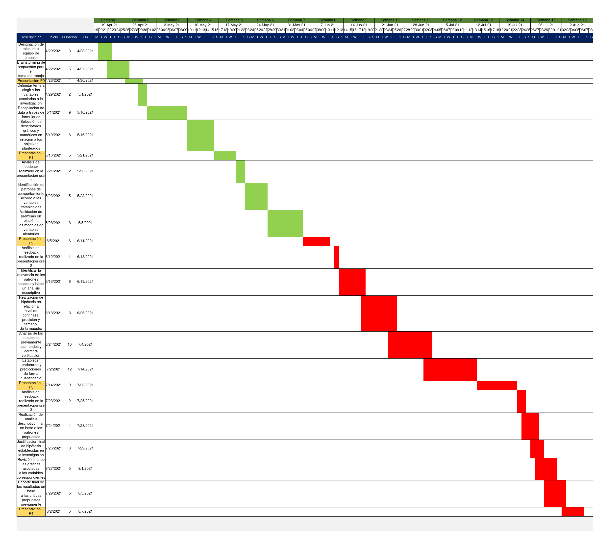

# P4 INFORME - DuraciónUniversitaria
 
## Título: <br/> La importancia que otorga el alumno al periodo de duración de su carrera universitaria en UTEC.

### Introducción:

Los estudiantes universitarios a menudo se hacen preguntas como: ¿Cuánto tiempo falta para terminar la carrera? ¿En qué ciclo me encuentro? Estas preguntas son difíciles de responder para aquellos que no han podido cumplir a cabalidad las asignaturas que determina la malla curricular de su carrera. Aquellos alumnos que alguna vez reprobaron, desistieron o postergaron algún curso por diferentes motivos. Asimismo, en un contexto tecnológico con tanta evolución y necesidad de mantenerse fresco con las nuevas tendencias, es lógico pensar que estaría bien difundida y aceptada la idea de culminar la carrera universitaria en los cinco años propuestos, sino es lo más antes posible. 
Esta investigación busca compilar la opinión de la comunidad de alumnos UTEC sobre el siguiente concepto: “La carrera universitaria se culmina en cinco años”. Respaldamos la importancia de este estudio apelando a que sean los estudiantes quienes, con sus opiniones, determinen la veracidad de la premisa antes mencionada.
Con lo ya mencionado, podríamos plantearnos preguntas fidedignas tales como: ¿La opinión de un becado será la misma que la de un alumno regular? ¿La edad será una variable influyente? ¿Qué tan consecuente es la opinión con la realidad?
Todas estas preguntas y más, son las que responderemos a lo largo de nuestro proyecto.

### Objetivos:


* Conocer el como los alumnos sobrellevan sus cursos durante su carrera en el periodo 2021-1.
* Evaluar la situación actual del alumno para encontrar posibles causas por las que algunos de ellos extienden la duración su carrera.
* Conocer el grado de conocimientos que tiene el alumno respecto a su carrera.


1. ¿Se puede hallar una relación numérica entre las presentes variables que nos indiquen si una influye sobre la otra?

2. ¿Qué relación guarda el promedio general de notas con la cantidad de horas de estudio diarias de los alumnos en UTEC?
 
3. ¿Entre los alumnos becados y no becados, cuál entre ellos está mejor encaminado en terminar la carrera universitaria en 5 años?
 
4. ¿La mayoría de alumnos podrá terminar la carrera en cinco años o menos? ¿Cuál es la impresión que se tiene al respecto?

 

### Marco teórico:

En este estudio nos enfocamos principalmente en alumnos de UTEC de segundo ciclo en adelante que estén matriculados en la malla curricular 2018-1, estos son nuestra **Población Objetivo** y como **Unidad Muestral** cada alumno que corresponda a esta malla. Los alumnos que cursen su primer ciclo en este periodo se rigen bajo la malla curricular 2021-1, la cual no cuenta con los mismos cursos y créditos necesarios para graduarse que la malla anterior. Por lo tanto, no sería posible estandarizar a todos los estudiantes.


Para la recolección de datos se utilizó Google Forms para realizar una encuesta que posteriormente fue repartida por diversos grupos estudiantiles. Para fomentar la representatividad evitamos limitarnos a ofrecer dicha encuesta a nuestros grupos de amigos. Eso quiere decir, que nuestros datos fueron recogidos por el muestreo por conveniencia, esta es una técnica de muestreo no probabilístico y no aleatorio utilizada para crear muestras de acuerdo a la facilidad de acceso conveniencia.

```{r include=FALSE}
library(readr)
library(modeest)
library(dplyr)
library(RColorBrewer)
library(ggplot2)
library(ggridges)
library(forcats)
library(tidyr)
library(cowplot)
library(viridis)
```

```{r include=FALSE}
AL <- read_csv("RespuestaAlumnost.csv")
ALr <- read_csv("RespuestaAlumnos1.csv")
```


### Variables Halladas: 

Hemos logrado extraer las siguientes variables sobre las preguntas anteriormente propuestas.

**Pregunta**  |  **Variable**                    |  **Tipo de variable** | **Restricciones** |
---------|-------------------------|-----------|--|
*¿En qué año ingresaste?*|               año_de_ingreso              | Discreta| Entero no negativo comprendido entre  <=x<=2020 
*¿En qué carrera estás?*|       carrera                      | Nominal |Carreras disponibles en la malla 2018
*¿Qué edad tienes?*|edad                             | Discreta|Entero no negativo
*A partir de tu primer semestre en UTEC hasta la actualidad, ¿Cuántas veces te has retirado de alguna asignatura?*|             veces_retirado                |Discreta|Entero no negativo
*A partir de tu primer semestre en UTEC hasta la actualidad, ¿Cuántas veces has desaprobado alguna asignatura?* |   veces_desaprobado | Discreta|Entero no negativo
*A partir de tu primer semestre en UTEC hasta la actualidad, ¿Cuántas asignaturas has "postergado"?* |   c_pateados      | Discreta|Entero no negativo
*¿Alguna vez estuviste en riesgo académico?* |  riesgo_acd   | Nominal|booleano
*¿En cuántos cursos estás matriculado en este ciclo?* |     num_cursos  | Discreta|Entero no negativo
*¿Cuántos créditos estás llevando este ciclo?*|               n_creditos_actual  | Discreta|Entero no negativo
*De acuerdo a tu malla curricular, ¿Cuántos cursos deberías llevar este ciclo?*|    c_llevarciclo |Discreta|Entero no negativo
*Cantidad de cursos que se deben llevar por ciclo*|               cursos_decision            | Nominal|3 opciones
*Desde tu segundo ciclo en UTEC, ¿Cuánto ha sido el mayor número de cursos en los que te has matriculado en un ciclo regular?*|               max_cursos    | Discreta|Entero no negativo
*Desde tu segundo ciclo en UTEC, ¿Cuánto ha sido el menor número de cursos en los que te has matriculado en un ciclo regular?*|               min_cursos              | Discreta | Entero no negativo menor que 9
*Generalmente utiliza el ciclo verano para:*|               verano              | Nominal | Adelantar, nivelar, aprobar un jalado, nunca he lleva cursos en verano
*¿Sabes cuántos créditos se necesitan para graduarse?*|               sabes_credito_graduarte              | Nominal | Booleano
*¿Cuenta con alguna Beca o Crédito Educativo?*|              beca  | Nominal|beca, credito educativo
*¿Hiciste algún traslado interno?*|               tras_int              | Nominal| Booleano
*¿Hiciste algún traslado externo?*|               tras_ext              | Nominal| Booleano
*¿Cuánto tiempo estudias?*|               tiempo              | Numerico| Continua
*¿Cuánto es tu promedio de notas?*|               notas             | Numerico| Continua
### Factibilidad:

A continuación, se presenta el diagrama de Gantt correspondiente a las acciones a tomar para completar, satisfactoriamente, los objetivos del informe.




### 1 DESCRIPTORES GRÁFICOS.

### 1.1 CANTIDAD DE CURSOS QUE SE DEBEN LLEVAR POR CICLO.


                                                                                                     

```{r,echo=FALSE}
AL$num_cursos_ciclo[AL$num_cursos_ciclo=="Adelantar todos los que se puedan, terminar la carrera lo antes posible"] <- "Adelantar"
AL$num_cursos_ciclo[AL$num_cursos_ciclo=="Llevar sí o sí todos los cursos que sugiere la malla curricular, terminar la carrera en los 5 años esperados"] <- "Malla"
AL$num_cursos_ciclo[AL$num_cursos_ciclo=="Llevar solo los cursos que se puedan afrontar, no tiene que ser necesariamente todos los que sugiere la malla"] <- "Relativo"

```

```{r,echo=FALSE}
barplot(round(table(AL$num_cursos_ciclo), digits = 2), las = 3, main ="Frecuencias absolutas de los cursos de este ciclo", col = "blue")


```

Acorde al gráfico de barras de las **frecuencias absolutas** y la función **table**, es posible determinar y comparar la cantidad de alumnos y su respectiva opinión acerca de cómo deben afrontar su carrera universitaria al elegir entre las opciones propuestas: terminar la carrera con anticipación, al culminar en un periodo menor a 5 años; acabar acorde al tiempo establecido por la universidad, por lo que tienen como objetivo aprobar todos los cursos en relación a la malla curricular; o afrontar los que estén dentro de sus posibilidades, al haber distintas índoles que impidan al alumno el no sobrecargarse de cursos y así aprobar los que crean necesarios. De esta manera, se puede concluir que, la gran mayoría de alumnos prefiere llevar sus cursos como crea que es más conveniente. Esto podría ser una de las causas por las que los alumnos demorarían más tiempo que el establecido para culminar la carrera.


### 1.2 CANTIDAD DE CURSOS QUE SE LLEVAN ACTUALMENTE.

```{r eval=FALSE, include=FALSE}
p2<-round(mean(AL$num_cursos), digits=2)
m2<-round(median(AL$num_cursos), digits=2)
mfv(AL$num_cursos)

```


```{r,echo=FALSE}
hist((AL$num_cursos), breaks =2, main = "Histograma del número de cursos por ciclo", xlab = "Cursos", ylab = "Cantidad de alumnos", col = "lightgreen")
abline(v=median(AL$num_cursos),col="red",lwd=2)
abline(v=mean(AL$num_cursos),col="blue",lwd=2)
legend(6.1,24,legend=c("Mediana: 5","Media 5.11"),lwd=2,col=c("red","blue"))
```
```{r,echo=FALSE}
hist((AL$año_de_ingreso), breaks =2, main = "Histograma del número de cursos por ciclo", xlab = "Cursos", ylab = "Cantidad de alumnos", col = "lightgreen")
abline(v=median(AL$num_cursos),col="red",lwd=2)
abline(v=mean(AL$num_cursos),col="blue",lwd=2)
legend(6.1,24,legend=c("Mediana: 5","Media 5.11"),lwd=2,col=c("red","blue"))
```


El gráfico anterior es un histograma del número de cursos que se llevan este ciclo. Se puede apreciar que, por lo general, los alumnos están llevando entre 5 y 6 cursos, sin embargo una cantidad considerable de personas llevan entre 3 y 4 cursos. Todo esto puede indicarnos que los alumnos llevan a buen ritmo sus cursos y que probablemente, si siguen así, terminarán en el tiempo establecido sin retraso a excepción de los que llevan entre 3 y 4 cursos. 


### 1.3 CANTIDAD DE CRÉDITOS POR CICLO.

```{r eval=FALSE, include=FALSE}
round(mean(AL$num_creditos_matriculados), digits=2)
round(median(AL$num_creditos_matriculados), digits=2)
mfv(AL$num_creditos_matriculados)
```

```{r,echo=FALSE}

hist((AL$num_creditos_matriculados), breaks =10, main = "Histograma del número de créditos en este ciclo", xlab = "Créditos",ylab = "Cantidad de alumnos", col = "lightgreen")
abline(v=median(AL$num_creditos_matriculados),col="red",lwd=2)
abline(v=mean(AL$num_creditos_matriculados),col="blue",lwd=2)
legend(20.5,37,legend=c("Mediana: 19","Media: 18.2"),lwd=2,col=c("red","blue"))

```

```{r eval=FALSE, include=FALSE}
mean(AL$num_creditos_matriculados)
median(AL$num_creditos_matriculados)
sd(AL$num_creditos_matriculados)
max(AL$num_creditos_matriculados)-min(AL$num_creditos_matriculados)
```
|Descriptores numéricos|Valor|
|:---------------------:|:----:|
|Media|18.19868|
|Mediana|19|
|Desviación estándar|3.7292|
|Rango|21|


En este histograma se puede visualizar los créditos a los que el alumno se matriculó este ciclo. Este gráfico guarda una estrecha relación con el anterior, ya que nos indica que, por lo general, los estudiantes llevan 5 cursos con 18 o 20 créditos.


### 1.4 CANTIDAD DE CURSOS DE ACUERDO A LA MALLA CURRICULAR.


```{r,echo=FALSE}
boxplot(AL$num_cursos_deacuerdo_malla,ylab="Número de cursos de acuerdo a su malla",prob=TRUE,col="lightgreen",pch=20)
abline(h=mean(AL$num_cursos_deacuerdo_malla),col="red",lwd=2)
legend(1.15,2.5,legend=c("media poblacional"),col=c("red"),lwd=2)
```
```{r eval=FALSE, include=FALSE}
mean(ALr$num_cursos_deacuerdo_malla)
median(ALr$num_cursos_deacuerdo_malla)
sd(ALr$num_cursos_deacuerdo_malla)
IQR(ALr$num_cursos_deacuerdo_malla)
max(ALr$num_cursos_deacuerdo_malla)-min(ALr$num_cursos_deacuerdo_malla)
```
|Descriptores numéricos|Valor|
|:---------------------:|:----:|
|Media|6.284768|
|Mediana|6|
|Desviación estándar|1.185341|
|Rango|9|


[Malla curricular Ingeniería Mecánica 2018](https://app.utec.edu.pe/sites/default/files/pdf/malla_2018_-_mecanica_-_impresa.pdf)


Estos gráficos nos sirven para analizar la cantidad de cursos en los que deberían estar matriculados según su malla. En este caso se puede apreciar claramente que existen datos atípicos, ya que se encuentra fuera de los bigotes en el boxplot, sin embargo dichos datos son valores atípicos reales. Efectivamente los datos son anormales, pero son posibles, debido a que los más probable es que sea un estudiante de ciclos avanzados en el caso del de los 2 cursos y alguien que se encuentra en un ciclo que pide 10 cursos. Ubicando en el DataFrame ese dato en específico pudimos observar que es un alumno que pertenece a la carrera de Ingeniería Mecánica. Analizando la malla curricular de esta carrera observamos que no existe ningún ciclo en el que la malla solicite al alumno llevar 10 cursos. Por lo tanto, podemos concluir que ese valor es un dato erróneo.


### 1.5 COMPARACIÓN DE DOS VARIABLES NUMÉRICAS DISCRETAS: CURSOS DE ACUERDO A LA MALLA Y AÑO DE INGRESO.

```{r,echo=FALSE}
plot(AL$año_de_ingreso, AL$num_cursos_deacuerdo_malla, xlab= "Año de ingreso", ylab= "Cursos de a cuerdo a la malla")
```


### 1.6 ALUMNOS BECADOS Y NO BECADOS

```{r,echo=FALSE}
boxplot(AL$num_creditos_matriculados~AL$beca, col=c("red","blue"), xlab= "Becados", ylab = "Número de créditos")
```
```{r eval=FALSE, include=FALSE}
mean(ALr$num_creditos_matriculados[ALr$beca=="NO"])
median(ALr$num_creditos_matriculados[ALr$beca=="NO"])
sd(ALr$num_creditos_matriculados[ALr$beca=="NO"])
max(ALr$num_creditos_matriculados[ALr$beca=="NO"])-min(ALr$num_creditos_matriculados[ALr$beca=="NO"])
```
|Descriptores numéricos(NO BECADOS)|Valor|
|:---------------------:|:----:|
|Media|18.02727|
|Mediana|19|
|Desviación estándar|3.725585|
|Rango|18|

```{r eval=FALSE, include=FALSE}
mean(ALr$num_creditos_matriculados[ALr$beca=="SÍ"])
median(ALr$num_creditos_matriculados[ALr$beca=="SÍ"])
sd(ALr$num_creditos_matriculados[ALr$beca=="SÍ"])
max(ALr$num_creditos_matriculados[ALr$beca=="SÍ"])-min(ALr$num_creditos_matriculados[ALr$beca=="SÍ"])
```
|Descriptores numéricos(BECADOS)|Valor|
|:---------------------:|:----:|
|Media|18.65854|
|Mediana|20|
|Desviación estándar|3.745729|
|Rango|19|


Comparamos 2 variables, una categórica (Becados) y una numérica (Número de créditos). El boxplot nos permite ver que tan dispersos se encuentran los datos, en este caso la dispersión en el grupo azul de los becados para su número de créditos es bastante baja a comparación del grupo rojo de los no becados.

### 1.7 COMPARACIÓN DE VARIABLES CATEGÓRICAS NOMINALES: BECA Y RIESGO ACADÉMICO.

```{r,echo=FALSE}
mosaicplot(table(AL$beca,AL$riesgo_acd),main="",xlab="Riesgo Académico", ylab="Beca")
```

Aplicamos un gráfico de mosaico a la variable Becados y la comparamos con Riesgo Académico. Siendo Becados las alternativas verticales y Riesgo Académico las horizontales, vemos que un mayor número de personas no becadas ha estado alguna vez en riesgo académico a comparación de los que sí son becados. La diferencia entre las personas con beca que han estado en riesgo académico y las no becadas que han estado en riesgo académico es significativa. Esto podría indicarnos que los alumnos son mas conscientes de que deben aprobar sus cursos ya que se encuentran bajo distintas condiciones. 


### 1.8 TIEMPO DE ESTUDIO DE LOS ALUMNOS UTEC.

Según los datos recolectados se verifica la cantidad de alumnos y la cantidad de tiempo que estos le dedican al estudio. En mayor cantidad los alumnos UTEC estudian 4 horas y el mínimo solo 1 hora. A continuación se muestra sus descriptores numéricos de la variable continua tiempo, como la media, mediana, desviación estándar y rango.

```{r, echo=FALSE}
ggplot(ALr,aes(x=tiempo))+geom_bar(width = 0.6,  fill=rgb(0.1,1,0.5,0.7))
```

|Descriptores numéricos|Valor|
|:---------------------:|:----:|
|Media|4.556291|
|Mediana|4|
|Desviación estándar|1.615078|
|Rango|7|

## 2. PATRONES ENCONTRADOS EN EL ESTUDIO.
### 2.1 Análisis de la existencia de una relación entre los cursos jalados y el numero de créditos matriculados actualmente, verificando si son becados o no becados.


```{r,echo=FALSE}
op <- par(mfrow=c(1,2))
plot(AL$c_jalados[AL$beca=="SÍ"],AL$num_creditos_matriculados[AL$beca=="SÍ"],pch=20, col=rgb(1,0,0,0.2),
 xlab="Cursos jalados",xlim = c(0,6),ylab="Créditos Matriculados",ylim = c(0,30), main="Becados")
abline(lm(AL$num_creditos_matriculados[AL$beca=="SÍ"]~AL$c_jalados[AL$beca=="SÍ"]),col="red")
plot(AL$c_jalados[AL$beca=="NO"],AL$num_creditos_matriculados[AL$beca=="NO"],pch=20, col=rgb(0,0,1,0.2), xlab="Cursos jalados",xlim = c(0,6),ylab="Créditos Matriculados",ylim = c(0,30), main="No Becados")
abline(lm(AL$num_creditos_matriculados[AL$beca=="NO"]~AL$c_jalados[AL$beca=="NO"]),col="red")
```


COR y COV becados.
```{r,echo=FALSE}
cor(AL$c_jalados[AL$beca=="SÍ"],AL$num_creditos_matriculados[AL$beca=="SÍ"])
cov(AL$c_jalados[AL$beca=="SÍ"],AL$num_creditos_matriculados[AL$beca=="SÍ"])
```
COR y COV no becados.
```{r,echo=FALSE}
cor(AL$c_jalados[AL$beca=="NO"],AL$num_creditos_matriculados[AL$beca=="NO"])
cov(AL$c_jalados[AL$beca=="NO"],AL$num_creditos_matriculados[AL$beca=="NO"])
```


Para estos gráficos hicimos una comparación entre las variables: créditos matriculados, cursos jalados y si es becado o no. Se puede apreciar una clara tendencia a matricularse en menos créditos a medida que se desaprueban más cursos tanto para los becados y los no becados con correlaciones bastante similares(-0.25 y -0.24 respectivamente). Sin embargo, se puede ver que los becados tienen menos cursos desaprobados en comparación con los no becados.


### 2.2 Análisis de becados en relación a la percepción de como deben llevar su carrera universitaria.


```{r,echo=FALSE}
op <- (mfrow=c(1,2,3))
plot(AL$num_cursos[AL$num_cursos_ciclo=="Adelantar"],AL$num_cursos_deacuerdo_malla[AL$num_cursos_ciclo=="Adelantar"],pch=20, col=rgb(0,0,0,0.2), xlab="Número de Cursos Matriculados",xlim = c(0,10),ylab="Cursos que pide la malla",ylim = c(0,10), main="Percepción - Adelantar")
abline(lm(AL$num_cursos_deacuerdo_malla[AL$num_cursos_ciclo=="Adelantar"]~AL$num_cursos[AL$num_cursos_ciclo=="Adelantar"]),col="blue")


plot(AL$num_cursos[AL$num_cursos_ciclo=="Malla"],AL$num_cursos_deacuerdo_malla[AL$num_cursos_ciclo=="Malla"], pch=20, col=rgb(0,0,0,0.2), xlab="Número de Cursos Matriculados",xlim = c(0,10),ylab="Cursos que pide la malla",ylim = c(0,10), main="Percepción - Malla")
abline(lm(AL$num_cursos_deacuerdo_malla[AL$num_cursos_ciclo=="Malla"]~AL$num_cursos[AL$num_cursos_ciclo=="Malla"]),col="blue")
plot(AL$num_cursos[AL$num_cursos_ciclo=="Relativo"],AL$num_cursos_deacuerdo_malla[AL$num_cursos_ciclo=="Relativo"],pch=20, col=rgb(0,0,0,0.2), xlab="Número de Cursos Matriculados",xlim = c(0,10),ylab="Cursos que pide la malla",ylim = c(0,10), main="Percepción - Relativo")
abline(lm(AL$num_cursos_deacuerdo_malla[AL$num_cursos_ciclo=="Relativo"]~AL$num_cursos[AL$num_cursos_ciclo=="Relativo"]),col="blue")


```


Percepción - Adelantar

```{r,echo=FALSE}
cor(AL$num_cursos[AL$num_cursos_ciclo=="Adelantar"],AL$num_cursos_deacuerdo_malla[AL$num_cursos_ciclo=="Adelantar"])
cov(AL$num_cursos[AL$num_cursos_ciclo=="Adelantar"],AL$num_cursos_deacuerdo_malla[AL$num_cursos_ciclo=="Adelantar"])
```

Percepción - Malla

```{r,echo=FALSE}
cor(AL$num_cursos[AL$num_cursos_ciclo=="Malla"],AL$num_cursos_deacuerdo_malla[AL$num_cursos_ciclo=="Malla"])
cov(AL$num_cursos[AL$num_cursos_ciclo=="Malla"],AL$num_cursos_deacuerdo_malla[AL$num_cursos_ciclo=="Malla"])
```

Percepción - Relativo

```{r,echo=FALSE}
cor(AL$num_cursos[AL$num_cursos_ciclo=="Relativo"],AL$num_cursos_deacuerdo_malla[AL$num_cursos_ciclo=="Relativo"])
cov(AL$num_cursos[AL$num_cursos_ciclo=="Relativo"],AL$num_cursos_deacuerdo_malla[AL$num_cursos_ciclo=="Relativo"])
```
En estos gráficos hicimos una comparación entre 3 variables: número de cursos matriculados, número de cursos de acuerdo a la malla y percepción de los cursos. Dividimos los datos en 3 partes para poder visualizar de mejor manera los mismos. Además hallamos la correlación entre las variables para observar como esta cambia cuando repartimos los datos de acuerdo a la percepción que tienen sobre los cursos. La correlación de los que prefieren llevar los cursos de acuerdo a la malla (0.45) es mayor que las otras dos correlaciones (0.23 y 0.30). Esto nos ayuda a visualizar una tendencia de que aquellos alumnos que se adecuan más a su malla llevan un ritmo más acelerado respecto a los que no.


### 2.3 Análisis del tiempo de los alumnos se encuentran en la universidad y la relación que tiene con los cursos que desaprobaron o se retiraron en el transcurso de su carrera.

```{r,echo=FALSE}
ALL<-mutate(AL, Hcursos = AL$c_retirados+AL$c_jalados+AL$c_pateados, TiempoIng = 2021-AL$año_de_ingreso)

```
```{r,echo=FALSE}

plot(ALL$TiempoIng,ALL$Hcursos, pch=20, col=rgb(1,0,0.2,0.2),xlab="Tiempo en la Universidad",xlim = c(1,6),ylab="Cantidad de cursos que influyeron",ylim=c(0,15))
abline(lm(ALL$Hcursos~ALL$TiempoIng),col="blue")

```

```{r,echo=FALSE}
ALL$verano[ALL$verano=="Adelantar cursos"] <- "Adelantar"
ALL$verano[ALL$verano=="Recuperar cursos desaprobados"] <- "Nivelar"

```


```{r,echo=FALSE}
op <- par(mfrow=c(1,2))
plot(ALL$TiempoIng[ALL$sabes_creditos_graduarte=="SÍ"],ALL$Hcursos[ALL$sabes_creditos_graduarte=="SÍ"], pch=20, col=rgb(1,0,0.2,0.2),xlab="Tiempo en la Universidad",xlim = c(1,6),ylab="Total de cursos que influyeron",ylim=c(0,15),main="Sí conocen créditos a graduarse")
abline(lm(ALL$Hcursos[ALL$sabes_creditos_graduarte=="SÍ"]~ALL$TiempoIng[ALL$sabes_creditos_graduarte=="SÍ"]),col="blue")
plot(ALL$TiempoIng[ALL$sabes_creditos_graduarte=="NO"],ALL$Hcursos[ALL$sabes_creditos_graduarte=="NO"],pch=20, col=rgb(0.2,0,1,0.2),xlab="Tiempo en la Universidad",xlim = c(1,6),ylab="Total de cursos que influyeron",ylim=c(0,15),main="No conocen créditos a graduarse")
abline(lm(ALL$Hcursos[ALL$sabes_creditos_graduarte=="NO"]~ALL$TiempoIng[ALL$sabes_creditos_graduarte=="NO"]),col="red")
```


COR y COV, sí saben créditos.
```{r,echo=FALSE}
cor(ALL$TiempoIng[ALL$sabes_creditos_graduarte=="SÍ"],ALL$Hcursos[ALL$sabes_creditos_graduarte=="SÍ"])
cov(ALL$TiempoIng[ALL$sabes_creditos_graduarte=="SÍ"],ALL$Hcursos[ALL$sabes_creditos_graduarte=="SÍ"])
```
COR y COV, no saben créditos.
```{r,echo=FALSE}
cor(ALL$TiempoIng[ALL$sabes_creditos_graduarte=="NO"],ALL$Hcursos[ALL$sabes_creditos_graduarte=="NO"])
cov(ALL$TiempoIng[ALL$sabes_creditos_graduarte=="NO"],ALL$Hcursos[ALL$sabes_creditos_graduarte=="NO"])
```

Cuando tienen más tiempo en la universidad, hay una tendencia a que sea mayor la cantidad de cursos (postergados, desaprobados y retirados) que influye en la culminación de la carrera.

## 3. PRUEBAS DE HIPÓTESIS Y CÁLCULO DE INTEVALOS DE CONFIANZA..

### **3.1 PRUEBA DE HIPÓTESIS DEL TIEMPO DE ESTUDIO DIARIO POR PARTE DE LOS ALUMNOS BECADOS.**

Se estableció como hipótesis nula que la media del tiempo de estudio diario por alumnos becados es de al menos 6.8 horas con una significancia de 0.05 y un número de datos de 41. Por consiguiente, es una hipótesis unilateral izquierda  (H0: u>=6.8, H1: u<6.8) y se puede decir que se ajusta a una distribución normal debido al número datos.

```{r,echo=FALSE}
nmuestras <- length(ALr$beca[ALr$beca== "SÍ"])

Confianza <- 0.95
alpha <- 0.05
mu0 <- 6.8
med <- mean(ALr$tiempo[ALr$beca== "SÍ"])
med
desvm <- sd(ALr$tiempo[ALr$beca== "SÍ"]) 
Zcalc <- (med-mu0)*sqrt(nmuestras)/desvm
print('Estadístico_de_prueba:')
Zcalc
Pcalc <- pnorm(Zcalc)
print('P-valor:')
Pcalc
Zcrit <- qnorm(alpha)
print('Z Crítico:')
Zcrit
```
|Nivel de confianza | Hipótesis nula| Hipótesis alternativa|Estadístico de prueba | Z Crítico |P-valor|
|:-----------------:|:-------------:|:--------------------:|:--------------------:|:---------:|:-----:|
|0.95|media >= 6.8|media < 6.8| 0,25 |-1.64|0.01|


Como se puede apreciar en los resultados se tiene suficiente evidencia para  rechazar la hipótesis nula, debido a que el Z crítico resultó estar por encima del estadístico de prueba , además que el p-valor es menor a la significancia lo cual confirma la decisión de rechazar la hipótesis nula.


### **3.2 PRUEBA DE HIPÓTESIS DEL TIEMPO DE ESTUDIO DIARIO POR PARTE DE ALUMNOS DE LA CARRERA INGENIERÍA INDUSTRIAL.**

Para esta prueba de hipótesis se fijó como hipótesis nula que el el tiempo de estudio diario de alumnos de la carrera de industrial es de al menos 4.8 horas. Esto quiere decir que es una hipótesis unilateral izquierda (H0: u>=4.8,H1: u<4.8). Son 41 datos los que se procesan, por lo que se utiliza la distribución normal.

```{r,echo=FALSE}
nmuestras <- length(ALr$carrera[ALr$carrera=="Industrial"])

Confianza <- 0.95
alpha <- 0.05
mu0 <- 4.8
med <- mean(ALr$tiempo[ALr$carrera=="Industrial"])

desvm <- sd(ALr$tiempo[ALr$carrera=="Industrial"]) 
Zcalc <- (med-mu0)*sqrt(nmuestras)/desvm
print('Estadístico_de_prueba:')
Zcalc
Pcalc <- pnorm(Zcalc)
print('P-valor:')
Pcalc
Zcrit <- qnorm(alpha)
print('Z Crítico:')
Zcrit
```

|Nivel de confianza | Hipótesis nula| Hipótesis alternativa|Estadístico de prueba | Z Crítico |P-valor|
|:-----------------:|:-------------:|:--------------------:|:--------------------:|:---------:|:-----:|
|0.95|media >= 4.8|media < 4.8| -2.33 |-1.64|0.01|

Los resultados nos confirman que el valor de Z crítico se encuentra por encima del estadístico de prueba y que el p-valor es menor a la significancia dada. Por lo tanto, se concluye que la hipótesis nula  se rechaza. 

```{r,echo=FALSE}
xmed <- mean(ALr$tiempo[ALr$carrera== "Industrial"])

nmuestras <-length(ALr$carrera[ALr$carrera== "Industrial"])
desvp <- sd(ALr$tiempo[ALr$carrera== "Industrial"])

IC <- 0.95
alpha <- 1 - IC
Z1 <- qnorm(alpha)
izq<-xmed+Z1*desvp/sqrt(nmuestras)
der<-xmed-Z1*desvp/sqrt(nmuestras)
cat("(", izq, ",", der, ")")
```

### **3.3 PRUEBA DE HIPÓTESIS DEL TIEMPO DE ESTUDIO DIARIO POR PARTE DE ALUMNOS DE LA CARRERRA CIENCIAS DE LA COMPUTACIÓN.**

De la misma forma que en el hipótesis anterior se establece que el tiempo de estudio diario de los alumnos de la carrera de ciencias de la computación es de al menos 4.8 horas. Esto quiere decir que es una hipótesis unilateral izquierda (H1: u>=4.8, H1: u<4.8) En este caso se utilizó una distribución T-student ya que no se cuenta con un número de datos mayor o igual a 30 (14 datos).

```{r,echo=FALSE}
nmuestras <- length(ALr$carrera[ALr$carrera=="CS"])

Confianza <- 0.95
alpha <- 0.05
mu0 <- 4.8
med <- mean(ALr$tiempo[ALr$carrera=="CS"])
desvm <- sd(ALr$tiempo[ALr$carrera=="CS"]) 
Tcalc <- (med-mu0)*sqrt(nmuestras)/desvm
print('Estadístico_de_prueba:')
Tcalc
Pcalc <- pt(Tcalc,nmuestras-1)
print('P-valor:')
Pcalc
Tcrit <- qt(alpha,nmuestras-1)
print('T Crítico:')
Tcrit
```

|Nivel de confianza | Hipótesis nula| Hipótesis alternativa|Estadístico de prueba | T Crítico |P-valor|
|:-----------------:|:-------------:|:--------------------:|:--------------------:|:---------:|:-----:|
|0.95|media >= 4.8|media < 4.8| -1.29 |-1.77|0.02|

En conclusión, los resultados indican que el valor del estadístico de prueba es mayor al del T crítico y que el p-valor es mayor a la significancia. Por lo tanto, no se rechaza la hipótesis nula ya que no hay suficiente evidencia para poder rechazarla.

```{r,echo=FALSE}
xmed <- mean(ALr$tiempo[ALr$carrera== "CS"])

nmuestras <-length(ALr$carrera[ALr$carrera== "CS"])
desvp <- sd(ALr$tiempo[ALr$carrera== "CS"])
IC <- 0.95
alpha <- 1 - IC
Z1 <- qnorm(alpha)
izq<-xmed+Z1*desvp/sqrt(nmuestras)
der<-xmed-Z1*desvp/sqrt(nmuestras)
cat("(", izq, ",", der, ")")
```

### **3.4 PRUEBA DE HIPOTESIS DEL PROMEDIO GENEREAL DE NOTAS DEL ALUMNO DE UTEC.**

Se estableció como hipótesis nula que la media del promedio de notas al finalizar el ciclo de los alumnos encuestados es de como máximo 13.3 con una significancia de 0.05 y un número de muestras de 151. Por consiguiente, es una hipótesis unilateral derecha (H0: u<=13.3, H1: u>13.3).
  
```{r,echo=FALSE}
nmuestras <- nrow(ALr)
Confianza <- 0.95
alpha <- 0.05
mu0 <- 13.3
med <- mean(ALr$notas)
desvm <- sd(ALr$notas) 
Zcalc <- (med-mu0)*sqrt(nmuestras)/desvm
print('Estadístico_de_prueba:')
Zcalc
Pcalc <- pnorm(Zcalc,lower.tail = F)
print('P-valor:')
Pcalc
Zcrit <- qnorm(alpha,lower.tail = F)
print('Z Crítico:')
Zcrit
```
|Nivel de confianza | Hipótesis nula| Hipótesis alternativa|Estadístico de prueba | Z Crítico | P-valor |
|:-----------------:|:-------------:|:--------------------:|:--------------------:|:---------:|---------|
|0.95|media <= 13.3|media > 13.3| 2.46 |1.64|0.01|

Como se puede apreciar en los resultados, el estadístico de prueba entra en la zona de rechazo ya que que el Z crítico es menor al estadístico de prueba, además el p-valor es menor a la significancia dada. Por lo tanto, la hipótesis nula se rechaza.

### **3.5 CÁLCULO DEL INTERVALO DE CONFIANZA DEL TIEMPO DE ESTUDIO DIARIO DE ALUMNOS LOS BECADOS.**

Para el cálculo del intervalo de confianza se utilizó la variable tiempo de estudio filtrada por los alumnos becados y se utilizó un nivel de confianza del 95%. Se aplicó el comando "qnorm" para el cálculo del intervalo de confianza ya que es un número elevado de individuos (mayor a 30).

```{r,echo=FALSE}
xmed <- mean(ALr$tiempo[ALr$beca== "SÍ"])

nmuestras <-length(ALr$beca[ALr$beca== "SÍ"])
desvp <- sd(ALr$tiempo[ALr$beca== "SÍ"])

IC <- 0.95
alpha <- 1 - IC
Z1 <- qnorm(alpha)
izq<-xmed+Z1*desvp/sqrt(nmuestras)
der<-xmed-Z1*desvp/sqrt(nmuestras)
cat("(", izq, ",", der, ")")
```

|Variable|Límite inferior | Límite superior| Precisión |
|:------:|:--------------:|:--------------:|:---------:|
|Tiempo de estudio diario (becados)|6.18|6.70|0.51|


### **3.6 CÁLCULO DEL INTERVALO DE CONFIANZA DEL TIEMPO DE ESTUDIO DIARIO DE LOS ALUMNOS NO BECADOS**

Para el cálculo del intervalo de confianza se utilizó la misma variable y el mismo nivel de confianza que en el primer cálculo. De la misma manera se utilizó el comando "qnorm" debido al alto número de datos (mayor a 30).  

```{r,echo=FALSE}
xmed <- mean(ALr$tiempo[ALr$beca== "NO"])

nmuestras <-length(ALr$beca[ALr$beca== "NO"])
desvp <- sd(ALr$tiempo[ALr$beca== "NO"])

IC <- 0.95
alpha <- 1 - IC
Z1 <- qnorm(alpha)
izq<-xmed+Z1*desvp/sqrt(nmuestras)
der<-xmed-Z1*desvp/sqrt(nmuestras)
cat("(", izq, ",", der, ")")
```

|Variable|Límite inferior | Límite superior| Precisión |
|:------:|:--------------:|:--------------:|:---------:|
|Tiempo de estudio diario (becados)|3.66|4.04|0.37|


Donde podemos concluir que los alumnos que son becados tienden a estudiar mas horas que los alumnos no becados, esto puede suceder en base a diferentes factores que hagan que los alumnos becados estudien mas; ya sea para poder mantener la beca, entre otros.


### **3.7 CÁLCULO DEL INTERVALO DE CONFIANZA DEL PROMEDIO DE NOTAS GENERAL DEL ALUMNO DE UTEC.**

En este tercer cálculo utilizamos la variable promedio de notas al finalizar el ciclo pasado con un nivel de confianza del 95%. Como en los 2 anteriores intervalos no se usó la distribución t-student debido al alto número de datos.

```{r,echo=FALSE}
xmed <- mean(ALr$notas)

nmuestras <-nrow(ALr)
desvp <- sd(ALr$notas)


IC <- 0.95
alpha <- 1 - IC
Z1 <- qnorm(alpha/2)
izq<-xmed+Z1*desvp/sqrt(nmuestras)
der<-xmed-Z1*desvp/sqrt(nmuestras)
cat("(", izq, ",", der, ")")
```
|Variable|Límite inferior | Límite superior| Precisión |
|:------:|:--------------:|:--------------:|:---------:|
|Promedio general de notas|13.35|13.83|0.47|


Se realizó esta operación para estimar cual es el intervalo en el cual se encuentra el promedio de notas del alumno en UTEC. Lo cual nos muestra que no presenta un gran promedio final, ya que se encuentra entre 13.35 y 13.83.

## 4. VARIABLES, DISTRIBUCIÓN DENSIDAD Y SUS RESPECTIVOS MODELOS.

#### **1. VARIABLE TIEMPO DE ESTUDIO DIARIO, DISTRIBUCIÓN DENSIDAD.**

Para identificar el modelo que sigue el tiempo de estudio diario, se va a realizar un gráfico de densidades. En el siguiente gráfico de separará a los becados de los no becados para poder marcar un distinción.

```{r,echo=FALSE}
ALr%>%
  
  group_by(tiempo) %>%

  ggplot(aes(x=tiempo,group=beca,fill=beca))+
    geom_density(alpha = 0.7)+
    labs(y="Densidad", x = "Tiempo de estudio diario (h)")+
    ggtitle("Distribución de Densidad de Probabilidad del tiempo de estudio diario")+theme (plot.title = element_text(
                                  size=rel(1.2), 
                                  vjust=2, 
                                  face="bold",
                                  color="black",
                                  lineheight=1.5))
```
</center>

|Variable|Media| desviación estándar|
|:------:|:---:|:------------------:|
|Tiempo de estudio diario (becados)|6.439024|1.001219|
|Tiempo de estudio diario (no becados)|3.854545|1.179616|

Como se puede apreciar el la gráfica de densidades del tiempo de estudios de los alumnos no becados aparenta seguir un modelo normal, sin embargo no es del todo simétrico como para afirmar al 100% que es un **modelo normal**. Por otra parte, la gráfica de los alumnos con beca no parece acomodarse a ningún modelo.


#### **2. VARIABLE PROMEDIO DE NOTAS DE LOS ALUMNOS UTEC, SUGIERE UNA DISTRIBUCIÓN NORMAL.**
Para realizar esta gráfica de densidad se agrupa a los alumnos por la categoría de becados o no becados. Luego, se analiza respecto al promedio de notas que obtuvieron los alumnos UTEC.
```{r,echo=FALSE}
ALr%>%
  
  group_by(notas) %>%

  ggplot(aes(x=notas,group=beca,fill=beca))+
    geom_density(alpha = 0.4)+
    labs(y="Densidad", x = "Promedio de notas")+
    ggtitle("Distribución de Densidad de Probabilidad del promedio de notas")+theme (plot.title = element_text(,
                                  size=rel(1.2), 
                                  vjust=2, 
                                  face="bold",
                                  color="black",
                                  lineheight=1.5))
```
Aquí se presenta el calculo del intervalo de confianza para dicha variable: 
```{r,echo=FALSE}
xmed <- mean(ALr$notas[ALr$beca== "SÍ"])

nmuestras <-length(ALr$beca[ALr$beca== "SÍ"])
desvp <- sd(ALr$notas[ALr$beca== "SÍ"])

IC <- 0.95
alpha <- 1 - IC
Z1 <- qnorm(alpha/2)
izq<-xmed+Z1*desvp/sqrt(nmuestras)
der<-xmed-Z1*desvp/sqrt(nmuestras)
cat("(", izq, ",", der, ")")
```

|Variable|Media| desviación estándar|
|:------:|:---:|:------------------:|
|Notas (becados)|14.51805|1.150461|
|Notas (no becados)|13.248|1.418335|

En esta gráfica de densidades de la variable del promedio de notas de los alumnos UTEC al finalizar su ciclo. Se verifica que esta variable aparenta seguir una **distribución normal** tanto para los becados y no becados, porque tienen una forma acampanada.Aunque para los alumnos que son becados no se aprecia tan simétrica al respecto DE los que no son becados.


#### **3. VARIABLE LA CANTIDAD DE CURSOS POSTERGADOS, DISTRIBUCIÓN DENSIDAD.** 
Para obtener la gráfica de densidad se clasifica a los alumnos UTEC por la categoría de si son becados o no. Luego, se analiza de acuerdo a los cursos postergados que realizaron en el transcurso de su carrera universitaria.
```{r,echo=FALSE}
ALr%>%
  
  group_by(c_pateados) %>%

  ggplot(aes(x=c_pateados,group=beca,fill=beca))+
    geom_density(alpha = 0.7)+
    labs(y="Densidad", x = "Cursos postergados")+
    ggtitle("Distribución de Densidad de Probabilidad de la cantidad de cursos postergados")+theme (plot.title = element_text(
                                  size=rel(1.2), 
                                  vjust=2, 
                                  face="bold",
                                  color="black",
                                  lineheight=1.5))

```


|Variable|Media| desviación estándar|
|:------:|:---:|:------------------:|
|Notas (becados)|2.682927|2.402489|
|Notas (no becados)|2.636364|1.733254|

En esta gráfica de densidad de la **variable discreta** de los cursos postergados en el transcurso de su carrera universitaria de los alumnos UTEC. Se verifica que los alumnos no becados sugiere una distribución de **Binomial**. Sin embargo, en los que son becados no se aprecia una distribución definida.

#### **4. VARIABLE LA CANTIDAD DE CURSOS POSTERGADOS, DISTRIBUCIÓN DENSIDAD.** 

La siguiente gráfica de densidad muestra que los datos registrados del promedio general de notas de los alumnos que utilizan el ciclo de verano para nivelar cursos postergados o "pateados" se podrían acomodar a un **modelo normal**, el cual es casi simétrico respecto a la media. 

```{r,echo=FALSE}
ALr%>%
  
  group_by(notas) %>%

  ggplot(aes(x=notas,group=verano,fill=verano))+
    geom_density(alpha = 0.3)+
    labs(y="Densidad", x = "Notas")+
    ggtitle("Distribución de Densidad de Probabilidad de promedio general de notas (percepción del ciclo de verano")+theme (plot.title = element_text(
                                  size=rel(1.2), 
                                  vjust=2, 
                                  face="bold",
                                  color="black",
                                  lineheight=1.5))

```

|Variable|Media| desviación estándar|
|:------:|:---:|:------------------:|
|Promedio general de notas (Nivelar cursos "pateados")|13.45|1.04|

## **REGRESIÓN LINEAL DE LA VARIABLE INDEPENDIENTE TIEMPO DIARIO DE ESTUDIO Y EL PROMEDIO GENERAL DE NOTAS COMO VARIABLE DEPENDIENTE.**

Para ver si existe una relación entre dos variables es necesario hacer una análisis de correlación. Sin embargo, primero analizamos la gráfica de dispersión entre estas dos variables.A prueba de vista se observa que ciertos datos están dispersos o un tanto alejados de la recta. Pero a continuación, haremos un análisis con la función **lm**.

```{r,echo=FALSE}

plot(ALr$tiempo,ALr$notas,pch=20, col=rgb(0,0,0,0.2), xlab="Tiempo diario de estudio (h)",xlim = c(1,8),ylab="Promedio general de notas",ylim = c(9,18), main="Relación Tiempo - Notas")
abline(lm(ALr$notas~ALr$tiempo),col="red")

```


La correlación entre estas dos variables no es tan fuerte, pero tampoco muy baja o muy cercana a 0. Por lo que ahora, se podría decir que existe cierta correlación al 30% que no es despreciable entre la variable tiempo de estudio y notas de los alumnos UTEC.

```{r}
cor(ALr$tiempo,ALr$notas)
```
De todos lo datos que no muestra R nos enfocaremos en las pruebas de hipótesis que se plantean (1. H0: intercepto = 0, 2. H0: pendiente = 0, 3. H0: el modelo no explica nada )

Haremos uso de la función **lm** para hacer el análisis correspondiente y encontrar el intercepto estimado y la pendiente de la recta mostrada en la gráfica. Además, para realizar inferencias los residuos deberán ser distribuidos con una media igual a 0 y una desviación estándar constante. Por tal motivo, usaremos las gráficas diagnóstico de la función **lm** que nos brinda.
```{r}
lm1 <- lm(ALr$notas~ALr$tiempo)
summary(lm1)
```
Observando los resultados del p-valor concluimos que se pueden rechazar las tres pruebas de hipótesis planteadas. Sin embargo, hay que seguir buscando información y esta vez veremos el comportamiento y la media de los residuos y las 4 Gráficas de diagnostico.

```{r}
mean(lm1$residuals)
```
En este apartado visualizamos con un histograma que los residuos se asemejan a un modelo normal y que además su media se aproxima a 0. Se puede ver un sesgo, pero parece ser bastante simétrica. 

```{r}
hist(lm1$residuals, breaks = 20)
```
```{r}
plot(lm1)
```

|Gráfica|Análisis|
|:---:|:------:|
|Residuals vs Fitted|En la primera gráfica comparamos los valores ajustados (eje x) con los residuos (eje y) donde se muestra una línea roja que muestra el promedio estimado a lo largo del tiempo contra las notas de los alumno. Dicha línea es prácticamente plana en todo momento, pero no esta montada sobre la línea punteada lo que quiere decir que no es un modelo perfecto. La desviación estándar es casi siempre constante, por muy poco no podemos decir que los datos son homocedásticos. También, podemos ver los datos con residuos mas altos (50, 68, 149) que podrían ser los causantes de la asimetría.|
|Normal Q-Q|En la segunda gráfica comparamos los cuantiles teóricos de una Normal(0,1)(eje x) con los residuos estandarizados (eje z), analizando la gráfica si todo estuviera bien estaría por encima de la recta punteada, pero como vemos no toda la recta está cubierta por dichos puntos y tanto al inicio como al final se ve que que se van alejando de dicha recta, a esos puntos los consideramos problemas potenciales ya que no están cubriendo lo que esperamos.Ademas, podemos ver que los mismos datos atípicos que identificamos en la anterior gráfica (50, 68, 149) están resaltando en esta también, lo que nos afirmaría que son los causantes de los problemas de asimetría.|
|Scale-Location|En la tercera gráfica comparamos los valores ajustados (eje x) con la raíz cuadrada de los residuos estandarizados(eje y), teóricamente la linea roja de esta gráfica debería ser en su totalidad recta donde la varianza sería constante, sin embargo, en nuestra gráfica no se puede evidenciar que dicha linea roja sea recta en su totalidad y a su vez se evidencia que siguen resaltando los mismos datos atípicos que se vieron en las anteriores gráficas (50, 68, 149).|
|Residual vs Leverage|En la cuarta gráfica comparamos las notas(eje x) con los residuos estandarizados(eje y), donde si no los datos no tiene un influencia grande deberían estar al rededor de la linea punteada, donde podemos ver datos que destacan(125,16,46) que tienen una nota relativamente alta y un residuo relativamente alta.|

Finalmente inferimos para un alumno que estudia 7.5 horas diarias cuanto sería su nota.
```{r, echo=FALSE}
sum(lm1$coefficients*c(1,7.5)) 
```

## **REGRESIÓN LINEAL DE LA VARIABLE INDEPENDIENTE TIEMPO EN LA UNIVERSIDAD Y LA CANTIDAD DE CURSOS POSTERGADOS, REPROBADOS EN EL TRANSCURSO DE LA CARRERA COMO VARIABLE DEPENDIENTE.**

Para ver si existe una relación entre dos variables es necesario hacer una análisis de correlación. Sin embargo, primero analizamos la gráfica de dispersión entre estas dos variables.A prueba de vista se observa que ciertos datos están dispersos o un tanto alejados de la recta. Pero a continuación, haremos un análisis con la función **lm**.

```{r,echo=FALSE}

plot(ALL$TiempoIng,ALL$Hcursos,pch=20, col=rgb(0,0,0,0.2), xlab="Tiempo en la universidad",xlim = c(0,8),ylab="Cursos postergados, reprobados",ylim = c(0,20), main="Cantidad de cursos influyentes en el tiempo de retraso  de la carrera")
abline(lm(ALL$Hcursos~ALL$TiempoIng),col="red")
```

La correlación entre estas dos variables no es tan fuerte, pero tampoco muy baja o muy cercana a 0. Por lo que ahora, se podría decir que existe cierta correlación al 39%, tampoco es despreciable por considerar en la relación de estas dos variables en el estudio.
```{r}
cor(ALL$TiempoIng,ALL$Hcursos)
```

De todos lo datos que no muestra R nos enfocaremos en las pruebas de hipótesis que se plantean (1. H0: intercepto = 0, 2. H0: pendiente = 0, 3. H0: el modelo no explica nada )

Haremos uso de la función **lm** para hacer el análisis correspondiente y encontrar el intercepto estimado y la pendiente de la recta mostrada en la gráfica. Además, para realizar inferencias los residuos deberán ser distribuidos con una media igual a 0 y una desviación estándar constante. Por tal motivo, usaremos las gráficas diagnóstico de la función **lm** que nos brinda.

```{r}
lm2<-lm(ALL$TiempoIng~ALL$Hcursos)
summary(lm2)
```
Observando los resultados del p-valor concluimos que se pueden rechazar las tres pruebas de hipótesis planteadas. Sin embargo, hay que seguir buscando información y esta vez veremos el comportamiento y la media de los residuos y las 4 Gráficas de diagnostico.

```{r}
mean(lm2$residuals)
```

En este apartado visualizamos con un histograma que los residuos se asemejan a un modelo normal y que además su media se aproxima a 0. Se puede ver un sesgo, pero parece ser bastante simétrica. 

```{r}
hist(lm2$residuals, breaks = 10)
```

```{r}
plot(lm2)
```


|Gráfica|Análisis|
|:---:|:------:|
|Residuals vs Fitted|En la primera gráfica comparamos los valores ajustados (eje x) con los residuos (eje y) donde se muestra una línea roja que muestra la cantidad de cursos influyentes en el tiempo de retraso  de la carrera. Dicha línea presenta curvaturas por partes.Además, no está montada sobre la línea punteada lo que quiere decir que no es un modelo perfecto.En adición,la desviación estándar no es constante, por ende,no podemos decir que los datos son homocedásticos. También, podemos ver los datos con residuos mas altos (32,122,146) que podrían ser los causantes de la asimetría.|
|Normal Q-Q|En la segunda gráfica comparamos los cuantiles teóricos de una Normal(0,1)(eje x) con los residuos estandarizados (eje y), analizando la gráfica si todo estuviera bien estaría por encima de la recta punteada, pero como vemos no toda la recta está cubierta por dichos círculos y se ve que por zonas se van alejando dichos círculos de la linea punteada, a esos círculos los consideramos problemas potenciales ya que no están cubriendo lo que esperamos dentro de nuestra gráfica. Además, podemos ver que los mismos datos atípicos que identificamos en la anterior gráfica (32, 122, 146) están resaltando en esta también, lo que nos afirmaría que son los causantes de los problemas de asimetría.|
|Scale-Location|En la tercera gráfica comparamos los valores ajustados (eje x) con la raíz cuadrada de los residuos estandarizados(eje y), teóricamente la linea roja de esta gráfica debería ser en su totalidad recta donde la varianza sería constante, sin embargo, en nuestra gráfica no se puede evidenciar que dicha linea roja sea recta,ya que presenta curvaturas por ciertas partes, y a su vez se evidencia que siguen resaltando los mismos datos atípicos que se vieron en las anteriores gráficas (32,122,146).|
|Residual vs Leverage|En la cuarta gráfica comparamos las notas(eje x) con los residuos estandarizados(eje y), donde si los datos no tienen un influencia grande deberían estar alrededor de la linea punteada.Además, podemos ver que el dato atípico(146) se repite,agregándole dos datos atípicos diferentes a los anteriores que son(46,88) donde podemos notar que el dato atípico (46) tiene un tiempo de ingreso relativamente alto y un residuo relativamente alto, por otra parte, los otros dos datos atípicos restantes(88,146) presentan un tiempo de ingreso alto y un residuo alto.|


Finalmente inferimos para un alumno que está 2 años en la universidad cuántos cursos habría jalado, postergado.
```{r, echo=FALSE}
sum(lm2$coefficients*c(1,2)) 
```

## **CONCLUSIONES**


Teniendo en cuenta todo lo desarrollado durante el ciclo podemos responder las preguntas que desde un inicio nos planteamos.

¿Se puede hallar una relación numérica entre las presentes variables que nos indiquen si una influye sobre la otra?

Aparentemente, las variables que analizamos para la regresión en nuestro caso las notas y el tiempo de estudio de los alumnos guarda cierta relación numérica . Sin embargo no es tan fuerte como se esperaba después de haber analizado las 4 gráficas de diagnostico. Donde se observan que hay datos atípicos que alteran la relación que puedan tener y no permite que la desviación estándar se mantenga constante.

¿Qué relación guarda el promedio general de notas con la cantidad de horas de estudio diarias de los alumnos en UTEC?

Se podría decir que guardan una relación que no es tan fuerte pero tan poco es tan débil, debido a que posee una correlación de aproximadamente del 30% entre ambas variables que no se puede despreciar y se debe tener en cuenta. Como se mencionó anteriormente, los datos atípicos alteran esta relación que hace que pierda una mejor relación.

¿Entre los alumnos becados y no becados, cuál entre ellos está mejor encaminado en terminar la carrera universitaria en 5 años?

En función a lo obtenido podríamos considerar que los alumnos becados tienden a terminar su carrera universitaria dentro de los 5 años debido a su percepción de como llevar la carrera y cuantos cursos llevar por ciclo es mayor a la de los no becados. Además, se puede apreciar en nuestra muestra que los alumnos becados tienen menos cursos desaprobados en comparación a los no becados.

¿La mayoría de alumnos podrá terminar la carrera en cinco años o menos? ¿Cuál es la impresión que se tiene al respecto?

Al hacer la comparación respectiva entre alumnos becados y no becados los que están en la categoría becados al dedicar mas horas de estudio y llevar mas cursos que los no becados, hace que puedan terminar la carrera en menos tiempo que los no becados. Sin embargo, no podemos afirmar que sea menor o mayor a 5 años. Pero tampoco se puede negar que un alumno no becado pueda terminar en un rango menor o mayor a 5 años.

Todas estas conclusiones podrían verse alterada por la razón que nuestra muestra no sea muy representativa, por lo que aumentar nuestra cantidad de datos nos ayudaría a tener una mejor percepción de la realidad de los alumnos de UTEC.
