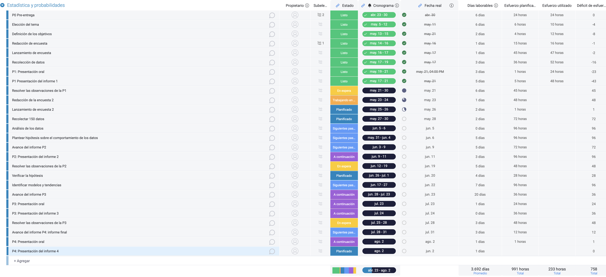
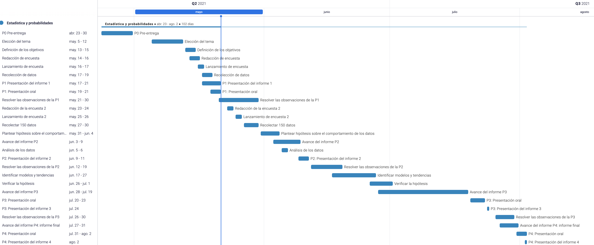

```{r message=FALSE, echo=FALSE}
library(readr)
library(dplyr)
library(ggplot2)
library(ggpubr)
```


```{r message=FALSE, echo=FALSE}
rm(list = ls())
DL<-read_csv("Consumo_Delivery.csv")
```

```{r message=FALSE, echo=FALSE}
colnames(DL) <- c("fecha y hora","correo","Genero","Edad","Peso", "Estatura","Carrera","Num_cursos", "Horas_clase", "Vive_solo", "Trabajo","Horas_trabajo","UsaDelivery_Prepandemia","Delivery_Prepandemia","ComidaRap_Prepandemia","Oriental_Prepandemia","Carta_Prepandemia","Postre_Prepandemia","NumDias_Prepandemia","Maxveces_Prepandemia", "Contacto_Prepandemia","Gasto_Prepandemia","UsaDelivery_Pandemia","Delivery_Pandemia","ComidaRap_Pandemia","Oriental_Pandemia","Carta_Pandemia","Postre_Pandemia","NumDias_Pandemia","Maxveces_Pandemia","Contacto_Pandemia","Gasto_Pandemia","Rapidez","Protocolos","General","Recomienda")

# Generando columna del IMC
DL$Estatura = DL$Estatura/100
mutate(DL,IMC=Peso/Estatura^2)->DL    # DL$IMC
mutate(DL, imc_OMS="")->DL

# Categorizando IMC según OMS
DL$imc_OMS[DL$IMC<18.5] = "Desnutrición"
DL$imc_OMS[DL$IMC>=18.5] = "Normal"
DL$imc_OMS[DL$IMC>=25] = "Sobrepeso"
DL$imc_OMS[DL$IMC>=30] = "Obesidad"
DL$imc_OMS[DL$IMC>=35] = "Obesidad II"
DL$imc_OMS[DL$IMC>=40] = "Obesidad III"

# Renombrar respuestas de observaciones
DL$Contacto_Prepandemia[DL$Contacto_Prepandemia=="Teléfono del restaurante/repartidor"] = "Tel. Rest."
DL$Contacto_Prepandemia[DL$Contacto_Prepandemia=="App del delivery (Rappi, Glovo, etc)"] = "AppDeliv"
DL$Contacto_Prepandemia[DL$Contacto_Prepandemia=="Página web del restaurante"] = "Website"
DL$Contacto_Prepandemia[DL$Contacto_Prepandemia=="App del propio restaurante"] = "AppRest"
DL$Contacto_Prepandemia[DL$Contacto_Prepandemia=="Red social del restaurante (Messenger, WhatsApp, Instagram)"] = "Redes"


DL$Contacto_Pandemia[DL$Contacto_Pandemia=="Teléfono del restaurante/repartidor"] = "Tel. Rest."
DL$Contacto_Pandemia[DL$Contacto_Pandemia=="App del delivery (Rappi, Glovo, etc)"] = "AppDeliv"
DL$Contacto_Pandemia[DL$Contacto_Pandemia=="Página web del restaurante"] = "Website"
DL$Contacto_Pandemia[DL$Contacto_Pandemia=="App del propio restaurante"] = "AppRest"
DL$Contacto_Pandemia[DL$Contacto_Pandemia=="Red social del restaurante (Messenger, WhatsApp, Instagram)"] = "Redes"


DL$Delivery_Prepandemia[DL$Delivery_Prepandemia=="Delivery Propio (Restaurante)"] = "Dir. Rest."

DL$Delivery_Pandemia[DL$Delivery_Pandemia=="Delivery Propio (Restaurante)"] = "Dir. Rest."


# Limpieza de carreras
DL$Carrera[DL$Carrera=="Administración y negocios digitales"] = "Administración"
DL$Carrera[DL$Carrera=="Bioingeniería"] = "Bio"
DL$Carrera[DL$Carrera=="Ciencia de Datos"] = "Data Science"
DL$Carrera[DL$Carrera=="Ciencias de la Computación"] = "CS"
DL$Carrera[DL$Carrera=="Ingeniería Ambiental"] = "Ambiental"
DL$Carrera[DL$Carrera=="Ingeniería Civil"] = "Civil"
DL$Carrera[DL$Carrera=="Ingeniería de la Energía"] = "Energía"
DL$Carrera[DL$Carrera=="Ingeniería Industrial"] = "Industrial"
DL$Carrera[DL$Carrera=="Ingeniería Electrónica"] = "Electrónica"
DL$Carrera[DL$Carrera=="Ingeniería Mecánica"] = "Mecánica"
DL$Carrera[DL$Carrera=="Ingeniería Mecatrónica"] = "Mecatrónica"
DL$Carrera[DL$Carrera=="Ingeniería Química"] = "Química"

DL$Genero[DL$Genero == "Masculino"] <- 'M'
DL$Genero[DL$Genero == "Femenino"] <- 'F'
```


# I. Título del proyecto

### <span style="color:darkblue">Comparación y análisis del consumo del servicio de delivery de los estudiantes de UTEC antes y después de la pandemia.</span>

<div align="center">
  
</div>

# II. Introducción
 
## 2.1 <span style="color:darkblue">Importancia</span>

La pandemia de Covid-19 afectó directamente la economía de muchos sectores productivos. Muchos negocios de gastronomía como restaurantes y cadenas de comida rápida se vieron afectados al no poder operar en sus locales debido a las restricciones establecidas por el Gobierno. Sin embargo, el servicio de delivery pudo adaptarse e imponerse a la crisis sanitaria para poder sostener sus negocios gastronómicos durante este tiempo de confinamiento.


<div align="center">
  
</div>


## 2.2 <span style="color:darkblue">Factibilidad</span>

El estudio resulta viable dado a la situación de pandemia actual. Asimismo, la muestra se obtuvo de los estudiantes de UTEC al ser más accesible y a partir de la cual se podrá inferir para desarrollar propuestas de solución a este servicio que día con día se consolida más en la sociedad.

<div align="center">
  
</div>

## 2.3 <span style="color:darkblue">Justificación</span>

El gobierno peruano decretó medidas sanitarias para detener el aumento de contagios, estas limitaciones motivaron a que más empresas implementen y consoliden un servicio de delivery. La implementación o reforzamiento de este servicio, se dio a conocer a través de medios de comunicación debido a que resultó muy beneficioso por proteger a los clientes al fomentar los envíos a domicilio sin la necesidad de salir del hogar, lo cual resulta fundamental para disminuir los contactos sociales y por ende los contagios.
<div align="center">
  
</div>


# III. Objetivos del estudio

### 3.1 <span style="color:darkblue">Objetivo general:</span>

* Analizar el comportamiento de los estudiantes de UTEC
  respecto al consumo de delivery antes y durante pandemia.

### 3.2 <span style="color:darkblue">Objetivos específicos:</span>

* Determinar si el gasto promedio antes de pandemia y durante pandemia tuvo una variación.

* Evaluar el impacto de la pandemia en el consumo de delivery de los estudiantes de UTEC.

* Describir las diferencias en el comportamiento de los estudiantes de UTEC.

* Predecir futuros comportamientos relacionados al consumo de delivery de los estudiantes de UTEC.

* Reunir información útil para los interesados en el servicio de delivery.


<div align="center">
  
</div>

# IV. Planificación

Para planificar las actividades correspondientes al proyecto del curso de Estadística y Probabilidades se elaboró un diagrama Gantt, el cual es una herramienta gráfica que muestra las actividades planedas respecto al tiempo de dedicación y esfuerzo. Se utilizó la aplicación Monday.com para elaborar el diagrama. 

<div align="center">
  
</div>

<span style="color:blue">Planificación de actividades y correciones respecto al proyecto</span>

<div align="center">
  
</div>
<span style="color:blue">Diagrama de Gantt de las actividades por hacer </span>

# V. Marco Teórico
El proyecto se basa en un contexto afectado por una pandemia global que paralizó la gran mayoría de actividades económicas. Ante ese escenario, el uso del servicio de delivery resultó ser la única alternativa para continuar con los negocios de venta de comida. El auge del servicio de delivery fue inmediato por ser un servicio urbano y eficiente que representa una oportunidad potencial para mejorar la economía del rubro de alimentos.

## 5.1 <span style="color:darkblue"><u>Población objetivo </u></span>

La población objetivo de la investigación son los estudiantes de UTEC que se encuentra en el rango de edad entre los 15 años y 25 años.

## 5.2 <span style="color:darkblue"><u>Muestra </u></span>

La muestra en la primera etapa de investigación estuvo conformada por 87 estudiantes de UTEC de cualquier carrera que presentan la edad definida en la población de objeto de estudio. Para la segunda entrega, se logró obtener una muestra de 179 estudiantes de los cuales:

```{r message=FALSE, echo=FALSE}
DL$Genero[DL$Genero == "Masculino"] <- "M"
DL$Genero[DL$Genero == "Femenino"] <- "F"
```


```{r message=FALSE, echo=FALSE}
table(DL$Genero)

per_fem <- round((sum(DL$Genero=='F')/nrow(DL))*100,2)
per_mas <- round((sum(DL$Genero=='M')/nrow(DL))*100,2)
```

### <span style="color:darkblue">**Proporción de los encuestados según su género**</span>

```{r eval=TRUE, echo=FALSE, message=FALSE,fig.align="center"}
mosaicplot(table(DL$Genero), col=c("plum","royalblue3"), 
           main="Género de Encuestados")
text( .17, .45, paste(c(per_fem," %"), collapse=" "),
      col = "white", cex = 1, font=2) 
text( .7, .45, paste(c(per_mas," %"), collapse=" "),
      col = "white", cex = 1, font=2)
```

El gráfico es un **Mosaico**, el cual representa el género femenino y masculino de la población encuestada. La cuadrícula muestra dos rectángulos,cada rectángulo representa el número de casos que corresponden según el género de los encuestados. Se observa que un gran número de los encuestados  pertenecen al género masculino debido a que es el rectángulo de mayor proporción. Se puede concluir que los encuestados con género masculino son el $68.16 \%$ de la muestra y que el $31.84 \%$ de la muestra de encuestados son de género femenino.

### <span style="color:darkblue">**¿A qué carrera pertenecen los encuestados?**</span>

```{r eval=TRUE, echo=FALSE, message=FALSE,fig.align="center"} 
barplot(table(DL$Carrera),
        horiz=TRUE, las=2, 
        legend.text = TRUE,
        args.legend = list(x="topright", 
                           inset = c(0, 0)),
        col=c("khaki2","lightcyan2","olivedrab2","rosybrown2"),
        main="Carreras de Encuestados")
```

En el **gráfico de barras** se encuentran las 12 carreras de UTEC. Se puede observar que una gran cantidad de los estudiantes encuestados pertenecen a la carrera de ingeniería civil, bioingeniería y mecatrónica.

## 5.3 <span style="color:darkblue"><u>Tipo de muestreo </u></span>

Se consideró que el tipo de muestreo es no probabilístico debido a que la representatividad de la muestra depende de múltiples factores que encuentran fuera del control de los investigadores. La recolección de datos se dio por medio de un cuestionario el cual fue enviado por el grupo de Telegram de Estadística y Probabilidades 2021-1. Por tal razón, es un muestreo por conveniencia, puesto que es una encuesta voluntaria, la cual fue compartida por medios que solo ellos utilizan. Asimismo, se puede garantizar la representatividad de la muestra debido a que los estudiantes de UTEC llevan un estilo de vida parecido, ya que comparten actividades similares como los cursos, cantidad de créditos, entre otras.

## 5.4 <span style="color:darkblue"><u>Técnica e instrumentos de recolección de datos </u></span>

La investigación optó por utilizar la técnica de la encuesta debido a que presenta un enfoque cuantitativo que recoge información de manera espontánea sobre las dimensiones de las variables en cuestión _(Bernal, 2010)_. 
El instrumento es un cuestionario que consta de una serie de preguntas relevantes para la obtención de variables que permitan desarrollar la investigación.

## 5.5 <span style="color:darkblue"><u>Clasificación de variables</u></span>

Se dividió las variables en tres grupos: datos generales, consumo de delivery antes de pandemia, consumo de delivery durante pandemia y autopercepción sobre el servicio de delivery.

### 5.5.1 <u>Variables sobre <span style="color:darkred">**datos generales**</span></u>

#### <span style="color:darkblue">A) Variables numéricas sobre datos generales</span>
| Pregunta  |   Variable     | Unidad  | Tipo | Restricción |
|:----------:|:--------------:|:----------:|:--------:|:--------:|
|  ¿Cuál es tu edad? | Edad|Años cumplidos|Numérica Discreta	|Desplegable de 15 a 25|
|   ¿Cuál es tu peso? (kg)|	Peso	|Kilogramos|Numérica Continua	|Número decimal entre 40 y 110 |
|   ¿Cuál es tu estatura? (cm)|	Estatura	|Centrímetros|Numérica Continua	|Número entero entre 100 y 200|
|   Número de cursos que llevas|	Num_cursos	|Cursos/Ciclo|Numérica Discreta	|Número entero entre 3 y 9 |
|   Número de horas de clases por semana |	Horas_clase|Horas/Semana	|Numérica Discreta	|Número entero entre 12 y 45 |
|   En caso trabajes, ¿cuántas HORAS a la semana trabajas? |	Horas_trabajo|Horas/Semana	|Numérica Continua	|Número entero entre 0 y 30 |

#### <span style="color:darkblue">B) Variables categóricas sobre datos generales</span>


|           Pregunta                         |        Variable        | Tipo de Variable | Opciones |
|:---------------------------------------------|:------------------:|:------------------:|:------------------:|
|   ¿Cuál es tu género?|	Genero	| Nominal	|Femenino y Masculino |
|   ¿Cuál es tu carrera?|	Carrera	| Nominal	| 12 carreras de UTEC |
|Actualmente, ¿vives solo?|	Vive_solo	|Nominal (Dicotómica)|	Sí, No|
|¿Trabajas parcialmente?|	Trabajo	| Nominal (Dicotómica)|	Sí, No|

### 5.5.2 <u>Variables sobre el consumo de delivery <span style="color:darkred">**antes de pandemia**</span></u>

#### <span style="color:darkblue">A) Variables numéricas sobre el consumo de delivery antes de pandemia</span>


| Pregunta  |   Variable     | Unidad  | Tipo | Restricción |
|:----------:|:--------------:|:----------:|:--------:|:--------:|
|¿Cuántos días al mes USABAS el servicio de delivery?| NumDias_Prepandemia|Días/Mes|Discreta| Número entero positivo del 1 al 31|
|¿Cuántas veces, como máximo, has usado el servicio de delivery en un día, antes de la pandemia?| Maxveces_Prepandemia| Veces/Día |Discreta|Número entero positivo del 1 al 5|
|¿Cuánto GASTABAS en promedio en 1  sólo pedido? (soles)| Gasto_Prepandemia| Soles| Continua|Número entero positivo del 5 al 500|

#### <span style="color:darkblue">B) Variables categóricas sobre el consumo de delivery antes de pandemia</span>


|           Pregunta                         |        Variable        | Tipo de Variable | Opciones |
|:---------------------------------------------|:------------------:|:------------------:|:------------------:|
|Antes de la pandemia, ¿usabas el servicio de delivery para pedir comida?|	UsaDelivery_Prepandemia|	Nominal (Dicotómica)	|Sí, No|
|¿Qué delivery USABAS más? | Delivery_Prepandemia|Nominal|Rappi, Glovo, UberEats y Delivery Propio (Restaurante)|
|¿Qué tipo de comida adquirías con el servicio de delivery? (Comida Rápida)|ComidaRap_Prepandemia |	Nominal (Dicotómica)	|Sí, No|
|¿Qué tipo de comida adquirías con el servicio de delivery? (Comida oriental(Chifa/Sushi))|Oriental_Prepandemia |	Nominal (Dicotómica)	|Sí, No|
|¿Qué tipo de comida adquirías con el servicio de delivery? (Platos a la carta)|Carta_Prepandemia  |	Nominal (Dicotómica)	|Sí, No|
|¿Qué tipo de comida adquirías con el servicio de delivery? (Postres)|Postre_Prepandemia  |	Nominal (Dicotómica)	|Sí, No|
|¿Qué medio usabas con más frecuencia  para contactar el delivery?| Contacto_Prepandemia| Nominal|App del delivery, App del propio restaurante, Red social del restaurante, Página web del restaurante, Teléfono del restaurante/repartidor|

### 5.5.3 <u>Variables sobre el consumo de delivery <span style="color:darkred">**durante pandemia**</span></u>

#### <span style="color:darkblue">A) Variables numéricas sobre el consumo de delivery durante pandemia</span>

| Pregunta  |   Variable     | Unidad  | Tipo | Restricción |
|:----------:|:--------------:|:----------:|:--------:|:--------:|
|¿Cuántos días al mes usas el servicio de delivery?|NumDias_Pandemia|Días/Mes|Discreta| Número entero positivo del 1 al 31|
|¿Cuánto es lo máximo que usas el servicio de delivery por día?|Maxveces_Pandemia| Veces/Día |Discreta|Número entero positivo del 1 al 5|
|¿Cuánto gastas en promedio en 1  sólo pedido? (soles)| Gasto_Pandemia| Soles| Continua|Número entero positivo del 5 al 500|

#### <span style="color:darkblue">B) Variables categóricas sobre el consumo de delivery durante pandemia</span>

|           Pregunta                         |        Variable        | Tipo de Variable | Opciones |
|:---------------------------------------------|:------------------:|:------------------:|:------------------:|
|Durante la pandemia, ¿has usado el servicio de delivery para pedir comida?|	UsaDelivery_Pandemia|	Nominal (Dicotómica)	|Sí, No|
|¿Qué delivery usas con más frecuencia? | Delivery_Prepandemia|Nominal|Rappi, Glovo, UberEats y Delivery Propio (Restaurante)|
|¿Qué tipo de comida adquieres con el servicio de delivery? (Comida Rápida)|ComidaRap_Pandemia |	Nominal (Dicotómica)	|Sí, No|
|¿Qué tipo de comida adquieres con el servicio de delivery? (Comida oriental(Chifa/Sushi))|Oriental_Pandemia |	Nominal (Dicotómica)	|Sí, No|
|¿Qué tipo de comida adquieres con el servicio de delivery? (Platos a la carta)|Carta_Pandemia  |	Nominal (Dicotómica)	|Sí, No|
|¿Qué tipo de comida adquieres con el servicio de delivery? (Postres)|Postre_Pandemia  |	Nominal (Dicotómica)	|Sí, No|
|¿Qué medio usas con más frecuencia  para contactar el delivery?| Contacto_Pandemia| Nominal|App del delivery, App del propio restaurante, Red social del restaurante, Página web del restaurante, Teléfono del restaurante/repartidor|


### 5.5.4 <u>Variables sobre la <span style="color:darkred">**autopercepción de los estudiantes repecto al servicio de delivery**</span></u>

#### <span style="color:darkblue">A) Variables categóricas sobre la autopecepción repecto al servicio de delivery</span>

| Pregunta  |   Variable     |  Tipo | Opciones|
|:----------:|:--------------:|:----------:|:--------:|
|¿Te encuentras satisfecho con la rapidez del servicio?	|	Rapidez | Ordinal|	Entre 1 (poco satisfecho) a 5 (muy satisfecho) |
| ¿Cómo calificarías el cumplimiento de los protocolos de bioseguridad? |	Protocolos	|Ordinal	|Entre 1 (pésimo) a 5 (excelente) |
| ¿Cómo calificarías el servicio de delivery EN GENERAL?|	General	|Ordinal	|Entre 1 (pésimo) a 5 (excelente)|
|¿Recomendarías el servicio?|	Recomienda	| Nominal (Dicotómica)|	Sí, No|


# VI. Data Frame

En Rstudio se realizaron los análisis y reportes. En la primera entrega del proyecto, se realizó un estudio descriptivo de los datos captados basado en la clasificación de la información, representación gráfica y resumen de la información a través de medidas estadísticas.

Para el análisis del dataframe y toda su manipulación se importaron librerías de soporte.

```{r message=FALSE }
library(readr)
library(dplyr)
library(ggplot2)
library(ggpubr)
```

## 6.1 <span style="color:darkblue"><u>Información general de Dataframe: </u></span>

Antes de iniciar con la evaluación de los datos, es necesario reconocer el tamaño de la muestra. En la primera recolección, los datos del estudio eran 87 observaciones  y 17 variables.En la segunda recolección, la meta era llegar a 150 observaciones, sin embargo; el número total de observaciones obtenidas es 179.

```{r}
dim(DL) #Dimensión de los datos
nrow(DL) #Número de filas
ncol(DL) #Número de columnas
```

## 6.1 <span style="color:darkblue"><u>Limpieza de datos: </u></span>

En la estadística descriptiva se debe considerar el conjunto de datos como un todo respecto al tamaño efectivo de la muestra, el número de variables, el tipo de cada variable, datos faltantes y las observaciones completas.

```{r}
sum(is.na(DL)) #Número de datos faltantes
sum(!is.na(DL)) #Número de datos completos
sum(is.na(DL)) + sum(!is.na(DL)) #Datos totales
sum(complete.cases(DL)) #Filas completas
```


```{r}
round(sum(is.na(DL))*(100/6300),2)#Porcentaje de datos faltantes
round(sum(!is.na(DL))*(100/6300),2)#Porcentaje de datos completos
```

En todo encuesta, es probable encontrar datos NA, por tal razón, resulta conveniente realizar de manera preventiva una limpieza de datos para poder procesar la información. En esta investigación, se evitará descartar las observaciones que presentes datos NA, debido al riesgo de reducir el tamaño de la muestra.

Una forma de eliminar los NA sería modificar el Dataframe(DL) con la condición de incluir solo las observaciones que se encuentren completas. Como se observa en el siguiente chunk, el tamaño de la muestra se reduciría a 107 filas. En una investigación a gran escala, sería un gasto y una pérdida de información.


```{r}
DL_Limpios<-DL[complete.cases(DL),] #Datos con observaciones completas
nrow(DL_Limpios) #Número de filas
ncol(DL_Limpios) #Número de columnas
```
La encuesta estaba diseñada por secciones, la primera sección tiene preguntas sobre datos generales, la segunda sección sobre el consumo de delivery antes de pandemia y la tercera sección sobre el consumo de delivery durante pandemia. Si el encuestado marcaba que no utilizaba el servicio de delivery <u>antes de pandemia</u>, inmediatamente se trasladaba a la sección sobre el consumo de delivery <u>durante pandemia</u> obviando las preguntas contenidas en la sección anterior puesto que las preguntas están relacionados con el servicio delivery <u>antes de pandemia</u>, el cual no ha utilizado.

Por otro lado, se realizo una limpieza general de la data. Se cambió el nombre de las categorías por variables específicas, ya que anteriormente figuraban las preguntas realizadas en el cuestionario.

Asimismo, se renombró algunas respuestas de las observaciones de las variables sobre el Contacto_Prepandemia y Contacto_Pandemia, con el objetivo de simplificar el texto para la representación en gráficos.


|Observación original|Observación modificada|
|:-------------------:|:-------------------:|
|Teléfono del restaurante/repartidor|Tel. Rest.|
|App del delivery (Rappi, Glovo, etc)|AppDeliv|
|Página web del restaurante|Website|
|App del propio restaurante|AppRest|
|Red social del restaurante (Messenger, WhatsApp, Instagram)|Redes|

<span style="color:blue">Tabla de resumen de las modificaciones de las observaciones que corresponden a las variables _Contacto_Pandemia_ y _Contacto_Prepandemia_ </span>

También se modificó una observación de la variable Delivery_Prepandemia y Delivery_Pandemia:

|Observación original   |Observación modificada|
|:-------------------:|:-------------------:|
|  Delivery Propio (Restaurante) | Dir. Rest.|

<span style="color:blue">Tabla de resumen de la modificación de las observación que corresponde a las variables _Delivery_Pandemia_ y _Delivery_Prepandemia_ </span>


Con el mismo sentido y estructura de código, se realizan las abreviaturas para el de apartado de _Carreras_.


|Observación original|Observación modificada|
|:-------------------:|:-------------------:|
|Administración y negocios digitales| Administración|
|Bioingeniería|Bio|
|Ciencia de Datos|Data Science|
|Ciencias de la Computación| CS|
|Ingeniería Ambiental| Ambiental|
|Ingeniería Civil| Civil|
|Ingeniería de la Energía|Energía|
| Ingeniería Industrial| Industrial|
|Ingeniería Electrónica| Electrónica|
|Ingeniería Mecánica| Mecánica|
|Ingeniería Mecatrónica| Mecatrónica|
|Ingeniería Química| Química|

<span style="color:blue">Tabla resumen de las modificaciones de las observaciones de la variable _Carrera_ </span>


Las dos opciones de observaciones respecto a la variable género se representaron de la siguiente forma:

|Observación original  |Observación modificada|
|:-------------------:|:-------------------:|
|Masculino| M   |
|Femenino  |  F   |

<span style="color:blue">Tabla resumen de las modificaciones de las observaciones de la variable _Género_ </span>


Aprovechando datos como el peso y la talla que se obtienen de la encuesta, se puede generar la variable IMC que servirá como indicador del estado físico y de salud de los estudiantes.

|IMC  |Categoría|
|:-------------------:|:-------------------:|
|IMC<18.5| Desnutrición   |
|IMC>=18.5  |  Normal   |
| IMC>=25 | Sobrepeso |
|IMC>=30| Obesidad|
|IMC>=35 | Obesidad II|
|IMC>=40 | Obesidad III |

<span style="color:blue">Categorización según el IMC calculado </span>

Finalmente, se procede a eliminar la columna de la fecha y hora de respuesta al cuestionario dado que es una variable que no aportará significativamente al estudio.


# VII. Presentación de datos de cada variable

El proceso de análisis de los datos obtenidos será desarrollado en el ambiente de Rstudio.
En esta sección se analizará de manera descriptiva las variables obtenidas del cuestionario y su relevancia para el estudio del proyecto.

Se agregan al ambiente de trabajo un conjunto de funciones que encapsularán ciertos fragmentos de código que pueden resultar repetitivos.

```{r message=TRUE, echo=TRUE}
resumen.numerico=function(numerico){
  resumen=data.frame(
    "Rango"=apply(numerico, 2, function(x)paste("[", min(x), ",", max(x),"]")),
    "Media"=apply(numerico, 2, function(x)paste(round(mean(x),2))),
    "Mediana"=apply(numerico, 2, function(x)paste(median(x))),
    "N.Datos atípicos"=apply(numerico, 2, function(x)paste(sum(x>(quantile(x,0.75)+IQR(x)*1.5))+sum(x<(quantile(x,0.25)-IQR(x)*1.5)))),
    "Sesgo"=apply(numerico, 2, function(x)if(mean(x)<median(x))"Izquierdo" else if(mean(x)>median(x))"Derecho" else "Ninguno")
      
  )
  resumen
}

```
<span style="color:blue">Función para obtener el rango, media, mediana, número de NA y el sesgo de datos numéricos</span>

La función **resumen.numérico** muestra mediante una tabla valores numéricos importantes de la variable como el número de datos atípos, el sesgo, etc.

```{r}
descriptores_de_dispersion<-function(X){
  return(list(Rango_directo=round(max(X,na.rm = TRUE),2)-
                round(min(X,na.rm = TRUE),2), #Rando directo: Máximo-Mínimo
              Desviacion=round(sd(X,na.rm=TRUE),2), #Desviación estándar
              CV=round((sd(X,na.rm=TRUE)/mean(X,na.rm=TRUE)),2)))# Coeficiente de variación
}
```
<span style="color:blue">Función para obtener el rango, desviación y coeficiente de variación </span>

La función **descriptores_de_dispersion** permite obtener el rango, el cual nos indica la dispersión de la data. De igual forma, la desviación estándar es la medida de dispersión que indica que tan alejados están los datos respecto a la media, de este modo, establece un valor de referencia para estimar la variación general de datos. El coeficiente de variación se utiliza para comparar la dispersión de una variable respecto a la media arimética.Esta función se aplicará en otros datos numéricos.

```{r}
r <- function(x){
  return(round(x, digits = 2))
}
```
<span style="color:blue">Función para redondear a dos decimales </span>

La función **r** abstrae el proceso de redondeo a 2 decimales que por su sintáxis hace al código poco atractivo visualmente.


## 7.1 <span style="color:darkblue"><u>Variables numéricas sobre</u></span><span style="color:darkred"><u> **datos generales**: </u></span>

### 7.1.1 <span style="color:darkblue">_Edad:_</span>

Esta variables numérica discreta se obtuvo con la pregunta ¿Cuál es tu edad?. Es un dato general que ayuda a caracterizar a la muestra de la población obtenida ya que nos indica que las personas que han participado en el estudio son estudiantes y es una variable común a la hora de realizar encuestas.


```{r message=TRUE, echo=TRUE}
resumen.numerico(select(DL, Edad))
```
<span style="color:blue">Tabla del análisis descriptivo de la variable Edad</span>

```{r message=TRUE, echo=TRUE}
Descriptores_de_dispersion<-function(X){
  return(list(Rango_directo=round(max(X,na.rm = TRUE),2)-
                round(min(X,na.rm = TRUE),2), #Rando directo: Máximo-Mínimo
              Desviacion=round(sd(X,na.rm=TRUE),2), #Desviación estándar
              CV=round((sd(X,na.rm=TRUE)/mean(X,na.rm=TRUE)),2)))# Coeficiente de variación
}
Descriptores_de_dispersion(DL$Edad) #Ejecutar función
```
<span style="color:blue">Ejecución de la función de descriptores de dispersión repecto a la variable Edad</span>

La función **Descriptores_de_dispersión** permite obtener el rango, el cual nos indica la dispersión de la data. De igual forma, la desviación estándar es la medida de dispersión que indica que tan alejados están los datos respecto a la media, de este modo, establece un valor de referencia para estimar la variación general de datos. El coeficiente de variación se utiliza para comparar la dispersión de una variable respecto a la media arimética.Esta función se aplicará en otros datos numéricos.

```{r}
table(DL$Edad) #Tabla de frecuencias
```
<span style="color:blue">Tabla de frecuencia de la variable Edad</span>

Una <u>**tabla de frecuencia**</u> permite ordenar los datos en función de la distribución en la muestra. A partir de la tabla se puede apreciar la moda, es decir, el dato que aparece con mayor frecuencia en el conjunto de datos. En este caso, la edad de 18 años presenta una mayor frecuencia absoluta.

A continuación un <u>**histograma**</u>, que nos permite observar la distribución de la variable edad. Cada barra representa el número de veces (frecuencia) que se observaron datos en un rango determinado.

```{r message=FALSE, echo=FALSE, message=FALSE}
hist(DL$Edad, main="edad general",freq = FALSE, col="darkviolet", xlab="edad", ylab="")
abline(v=mean(DL$Edad), col="cornflowerblue", lwd=2, lty=2)
abline(v=median(DL$Edad), col="darkblue", lwd=4, lty=1)
legend("topright", c("media","mediana"), col=c("cornflowerblue","darkblue"), lwd = 2, lty = c(2,1))
curve(dnorm(x, mean(DL$Edad,na.rm = TRUE), sd = sd(DL$Edad,na.rm = TRUE)),
      col = "mediumspringgreen", lwd=2,
      add = TRUE)

```

<span style="color:blue">Histograma de la distribución de la variable **Edad**</span>

Se oberva que la mediana es 18 años y que el promedio es 18.69 años, como la media es mayor a la mediana, se tiene una distribución asimétrica sesgada a la derecha.


$media>mediana \rightarrow Sesgada \ a \  la \ derecha$ 


De manera gráfica, se puede constatar que la cola está hacia el lado derecho.

Las curvas del histograma son curvas de distribución normal que se generan utilizando la media del proceso y diferentes estimaciones de la variación del proceso. 

### 7.1.2 <span style="color:darkblue">_Peso:_</span>

Esta variables numérica continua se obtuvo con la pregunta ¿Cuál es tu peso?. Es un dato general que ayuda a caracterizar a la muestra de la población obtenida, es decir, esta variable se puede utilizar para conocer las condiciones físicas de nuestros encuestados y para poder establecer patrones. 

```{r}
resumen.numerico(select(DL, Peso))
```
<span style="color:blue">Tabla del análisis descriptivo de la variable Peso</span>

```{r message=TRUE, echo=TRUE}
Descriptores_de_dispersion<-function(X){
  return(list(Rango_directo=round(max(X,na.rm = TRUE),2)-
                round(min(X,na.rm = TRUE),2), #Rando directo: Máximo-Mínimo
              Desviacion=round(sd(X,na.rm=TRUE),2), #Desviación estándar
              CV=round((sd(X,na.rm=TRUE)/mean(X,na.rm=TRUE)),2)))# Coeficiente de variación
}
Descriptores_de_dispersion(DL$Peso) #Ejecutar función
```
<span style="color:blue">Ejecución de la función de descriptores de dispersión repecto a la variable Peso</span>

```{r}
 table(DL$Peso) #Tabla de frecuencias
```
 <span style="color:blue">Tabla de frecuencia de la variable Edad</span>
 
A medida que aumenta el número de observaciones por variable, se complica poder obtener la moda a simple vista utilizando una tabla de frecuencias.
 
 
 
```{r message=FALSE, echo=FALSE, message=FALSE}
hist(DL$Peso, main="Peso general", col="lightcoral", xlab="Peso", ylab="")
abline(v=mean(DL$Peso), col="ivory", lwd=2, lty=2)
abline(v=median(DL$Peso), col="darkblue", lwd=4, lty=1)
legend(23, 50, c("media","mediana"), col=c("cornflowerblue","darkblue"), lwd = 2, lty = c(2,1))
```

<span style="color:blue">Histograma de la distribución de la variable **Peso**</span>

La mediana es 67 kg y que el promedio es 66.5 kg, como la media es menor a la mediana, se tiene una distribución asimétrica sesgada a la izquierda. Gráficamente, no se puede determinar el sesgo.


$media<mediana \rightarrow Sesgada \ a \  la \ izquierda$ 


### 7.1.3 <span style="color:darkblue">_Estatura :_</span>

Esta variables numérica continua se obtuvo con la pregunta ¿Cuál es tu estatura?. Es un dato general que ayuda a caracterizar a la muestra de la población obtenida. Este dato proporcionado por cada encuestado, nos ayudará a encontrar su IMC.
```{r}
resumen.numerico(select(DL,Estatura))
```
<span style="color:blue">Tabla del análisis descriptivo de la variable Estatura</span>
```{r message=TRUE, echo=TRUE, , message=FALSE}
Descriptores_de_dispersion<-function(X){
  return(list(Rango_directo=round(max(X,na.rm = TRUE),2)-
                round(min(X,na.rm = TRUE),2), #Rando directo: Máximo-Mínimo
              Desviacion=round(sd(X,na.rm=TRUE),2), #Desviación estándar
              CV=round((sd(X,na.rm=TRUE)/mean(X,na.rm=TRUE)),2)))# Coeficiente de variación
}
Descriptores_de_dispersion(DL$Estatura) #Ejecutar función
```
<span style="color:blue">Ejecución de la función de descriptores de dispersión repecto a la variable Estatura</span>

```{r message=FALSE, echo=FALSE, message=FALSE}
library(ggplot2)
ggplot(DL, aes(x=Estatura))+geom_histogram(bins = 20, color="white",fill="steelblue")+geom_vline(aes(xintercept=mean(Estatura)),color="red")+geom_vline(aes(xintercept=median(Estatura)), color="green") +labs(title = "Distribución de la Estatura", x="Estatura (m)", y="Encuestados")


```

<span style="color:blue">Histograma de la distribución de la variable **Estatura**</span>

Gráficamente, tampoco se puede observar el sesgo de la distribución de la variable pero utilizando la línea rojo que representa la media y la línea verde que representa la mediana, se puede deducir que la muestra presenta un distribución asimétrica sesgada a la izquierda.


$media<mediana \rightarrow Sesgada \ a \  la \ izquierda$ 


### 7.1.4 <span style="color:darkblue">_IMC:_</span>

El índice de masa corporal es una nueva variable obtenida del peso y estatura proporcionado por los encuestados. La fórmula que se aplicó es la siguiente:


$IMC= \frac{Peso}{Altura^2}$


Cabe resaltar que la altura fue divida entre $100$ para poder convertir de $cm$ a $m$ debido a que originalmente el dato se pidió en $cm$.

Este nuevo dato se agregó al Data Frame original con una nueva columna.

```{r}
resumen.numerico(select(DL, IMC))
```
<span style="color:blue">Tabla del análisis descriptivo de la variable IMC</span>

```{r message=FALSE, echo=FALSE, message=FALSE}
Descriptores_de_dispersion<-function(X){
  return(list(Rango_directo=round(max(X,na.rm = TRUE),2)-
                round(min(X,na.rm = TRUE),2), #Rando directo: Máximo-Mínimo
              Desviacion=round(sd(X,na.rm=TRUE),2), #Desviación estándar
              CV=round((sd(X,na.rm=TRUE)/mean(X,na.rm=TRUE)),2)))# Coeficiente de variación
}
Descriptores_de_dispersion(DL$IMC) #Ejecutar función
```
<span style="color:blue">Ejecución de la función de descriptores de dispersión repecto a la variable **IMC**</span>


```{r message=FALSE, echo=FALSE, message=FALSE}
ggplot(DL, aes(x=IMC))+geom_histogram(bins = 30, color="white",fill="thistle3")+geom_vline(aes(xintercept=mean(IMC)),color="red")+geom_vline(aes(xintercept=median(IMC)), color="green") +labs(title = "Distribución del IMC", x="IMC", y="Encuestados")
```
<span style="color:blue">Histograma de la distribución de la variable **IMC**</span>

Gráficamente, tampoco se puede observar el sesgo de la distribución de la variable pero utilizando la línea rojo que representa la media y la línea verde que representa la mediana, se puede deducir que la muestra presenta un distribución asimétrica sesgada a la derecha.


$media>mediana \rightarrow Sesgada \ a \  la \ derecha$ 


### 7.1.4 <span style="color:darkblue">_Número de cursos :_</span>

Esta variables numérica discreta se obtuvo con la pregunta sobre el _Número de cursos que llevas_. Almacenamos la información sobre cuán exigente es el estudiante y a su vez, nos permite relacionar con las horas de clase y las horas de trabajo

```{r}
resumen.numerico(select(DL,Num_cursos))
```
<span style="color:blue">Tabla del análisis descriptivo de la variable **Número de cursos**</span>
```{r message=FALSE, echo=FALSE, message=FALSE}
Descriptores_de_dispersion<-function(X){
  return(list(Rango_directo=round(max(X,na.rm = TRUE),2)-
                round(min(X,na.rm = TRUE),2), #Rando directo: Máximo-Mínimo
              Desviacion=round(sd(X,na.rm=TRUE),2), #Desviación estándar
              CV=round((sd(X,na.rm=TRUE)/mean(X,na.rm=TRUE)),2)))# Coeficiente de variación
}
Descriptores_de_dispersion(DL$Num_cursos) #Ejecutar función
```
<span style="color:blue">Ejecución de la función de descriptores de dispersión repecto a la variable **Número de cursos**</span>

```{r message=FALSE, echo=FALSE, message=FALSE}
ggplot(DL, aes(Num_cursos, fill=Num_cursos))+geom_bar(color="white",fill="yellow3")+labs(title = "Diagrama de barras", x="Número de cursos", y="Número de encuestados")+ geom_text(stat = 'count',aes(label=..count..), vjust=-0.5,size=3)
```
<span style="color:blue">Diagrama de barras de la variable **Número de cursos**</span>

Un **gráfico de barras** que resalta el número de cursos que llevan los estudiantes encuestados. Se puede observar que 58 de 179 estudiantes encuestados está llevando 6 cursos en el presente ciclo académico. 


# VIII. Análisis exploratorio

## <span style="color:darkblue">Uso de Delivery </span>

#### ¿El servicio de delivery aumentó producto de la pandemia? 

En el **gráfico de barras** se observa la frecuencia de los encuestados respecto al _Uso del servicio de delivery antes de pandemia y durante pandemia_. La primera barra representa el uso de delivery **Antes de pandemia** y la segunda barra representa el uso de delivery **Durante pandemia**.
El color **rojo** representa a las personas que no utilizan el servicio de delivery y el color **azul** representa  a las que si utilizan el servicio de delivery.  


```{r echo=FALSE , message=FALSE,fig.align="center"} 
Binarios <- function(X){
  return( list(Sí=sum(X=='Sí') , No=sum(X=='No')) )
}

ls <- list(prePandemia=DL$UsaDelivery_Prepandemia, 
           Pandemia = DL$UsaDelivery_Pandemia)
si_pre <- round(sum(ls$prePandemia == 'Sí')*100/length(ls$prePandemia),2)
no_pre <- round(sum(ls$prePandemia == 'No')*100/length(ls$prePandemia),2)

si_pan <- round(sum(ls$Pandemia == 'Sí')*100/length(ls$prePandemia),2)
no_pan <- round(sum(ls$Pandemia == 'No')*100/length(ls$prePandemia),2)

Categoricas <- mapply(Binarios, 
                      list(prePandemia = DL$UsaDelivery_Prepandemia, 
                           Pandemia = DL$UsaDelivery_Pandemia))
```

```{r echo=FALSE, message=FALSE,fig.align="center"} 
barplot(Categoricas, 
        col=c("slateblue","tomato"), width = 2, 
        xlab = "Temporada", ylab="Frecuencia",main="Uso de delivery", 
        legend.text = TRUE, args.legend = list(x="topright", 
                                               inset = c(-0.06, 0)))

text( 1.45, 55, paste(c(si_pre," %"), collapse=" "), col = "white", font=2)
text( 1.45, 140, paste(c(no_pre," %"), collapse=" "), col = "white", font=2)

text( 3.85, 75, paste(c(si_pan," %"), collapse=" "), col = "white", font=2)
text( 3.85, 165, paste(c(no_pan," %"), collapse=" "), col = "white", font=2)
```

```{r message=FALSE, echo=FALSE}
ls <- list(prePandemia = DL$UsaDelivery_Prepandemia , Pandemia = DL$UsaDelivery_Pandemia)
round(sum(ls$prePandemia == 'Sí')*100/length(ls$prePandemia),2)
round(sum(ls$prePandemia == 'No')*100/length(ls$prePandemia),2)

round(sum(ls$Pandemia == 'Sí')*100/length(ls$Pandemia),2)
round(sum(ls$Pandemia == 'No')*100/length(ls$Pandemia),2)
```
Se aprecia un claro aumento de número personas que producto de la pandemia, empezaron a utilizar este servicio de delivery. Las personas que no utilizan el servicio disminuyó, obteniendo un porcentaje de $10.06\%$ de personas que todavía no utilizan el servicio de delivery durante la pandemia. Por otro lado, el $89.94\%$ de la muestra si utiliza en servicio de delivery durante la pandemia. 


## <span style="color:darkblue">Gasto promedio respecto al género</span>

#### ¿El gasto promedio de los hombres aumentó durante la pandemia?

En esta sección, se puede observar dos pares de **Cajas de bigotes (boxplots)**, también se aprecia la dispersión de los datos de cada género respecto a la variable numérica: **Gasto promedio**. La primera gráfica es sobre el <u>Gasto promedio por pedido antes de Pandemia</u> y el segundo gráfico es sobre el <u>Gasto promedio por pedido durante la Pandemia</u>. De este modo, podemos comparar, la relación entre las variable **Género** y **Gasto promedio** <u>antes</u> y <u>después</u> de Pandemia.


```{r warning=FALSE, echo=FALSE, message=FALSE}
ahora <- ggplot(DL, aes(x=Genero, y=Gasto_Pandemia, fill=Genero))+geom_boxplot(alpha=0.3, outlier.colour = "blue")+labs(x="Género",y="Gasto promedio por pedido durante pandemia")+scale_x_discrete(labels=c("Mujer","Hombre"))+guides(fill=FALSE)+coord_flip()+geom_point(stat = "summary", shape=16, size=4, color="red")+geom_point(position = position_jitter(width = 0.1),alpha=0.2)


antes <- ggplot(DL, aes(x=Genero, y=Gasto_Prepandemia, fill=Genero))+geom_boxplot(alpha=0.3, outlier.colour = "blue")+labs(x="Género",y="Gasto promedio por pedido antes de Pandemia")+scale_x_discrete(labels=c("Mujer","Hombre"))+guides(fill=FALSE)+coord_flip()+geom_point(stat = "summary", shape=16, size=4, color="red")+geom_point(position = position_jitter(width = 0.1),alpha=0.2)

ggarrange(antes, ahora, ncol=1, nrow=2)
```

En el caso de los <u>**Hombres**</u>, en el gráfico sobre **Antes de Pandemia**, se puede observar una mayor concentración de datos en el primer cuartil como la presencia de ciertos datos atípicos. Comparando con el gráfico **Durante Pandemia** se aprecia un cambio, ya que los datos se dispersaron notoriamente del primer cuartil, la media aumentó y la media representada por un punto rojo también aumentó.

En el caso de las <u>**Mujeres**</u>, en el gráfico sobre **Antes de Pandemia**, se puede observar una concentración de datos normal respecto a la media, no hay presencia de datos atípicos. Sin embargo, si comparamos con el gráfico **Durante Pandemia** se aprecia cambios ligeros en la concentración de datos en el primer cuartil, la mediana prácticamente se mantuvo, la media aumentó ligeramente pero se nota una mayor cantidad de datos atípicos que superan los 130 soles por pedido aproximadamente.

En general, hubo un aumento en el gasto promedio promedio por parte de ambos géneros en consumo de delivery debido a la pandemia.

## <span style="color:darkblue">Medios de contacto</span>

#### ¿De qué manera los estudiantes de UTEC solicitan el servicio de delivery?

En estos dos **gráficos de barra**, se puede comparar los medios por el que los encuestados solicitan el servicio de delivery **antes de Pandemia** y **durante Pandemia**.

```{r message=FALSE, echo=FALSE}
par(mfrow=c(1,2))
barplot(table(DL$Contacto_Prepandemia),
        col=c("gold2"), 
        las=2, cex.names=0.85, main="Prepandemia")
barplot(table(DL$Contacto_Pandemia), 
        col=c("indianred1"),
        las=2, cex.names=0.85, main="Pandemia")
```

En el primer gráfico, se observa que un grán número de los encuestados utilizaban más la App del Delivery para solicitar el servicio de delivery **antes de Pandemia**, seguido del teléfono del resturante.

Sin embargo, en el segundo gráfico se puede observar que el uso del App de Delivery aumentó poco, pero el medio de contacto por teléfono si aumentó considerablemente. Además del uso de redes sociales, App del propio resturante y Website. Esto se debe a que un gran cantidad de negocios se crearon páginas web o redes sociales para promocionar sus productos.De este modo, las empresas de comida potenciaron e impulsaron el servicio de delivery.


```{r echo=FALSE, message=FALSE}
df <- DL %>% select(Gasto_Pandemia,Genero)
df[complete.cases(df),]->df

```


```{r echo=FALSE, message=FALSE}
dj <- DL %>% select(Gasto_Prepandemia,Genero)
dj[complete.cases(dj),]->dj

```

# IX. Análisis descriptivo

## <span style="color:darkblue">9.1 Relación entre el género y el gasto promedio mensual **antes de la pandemia**:</span>

#### 1.  <span style="color:darkred">**¿Cuál es el gasto promedio mensual de los hombres antes de pandemia ?**</span>

$Variables$ $a$ $utilizar$: Género, Gasto_Prepandemia

```{r echo=TRUE}
promhom<-mean(dj$Gasto_Prepandemia[dj$Genero=="M"])
cat("El promedio de gasto mensual de los estudiantes hombres 
    antes de pandemia es", promhom, ".")
```

#### 2. <span style="color:darkred">**¿Cuál es el gasto promedio mensual de las mujeres antes de pandemia?**</span>

$Variables$ $a$ $utilizar$: Género, Gasto_Prepandemia

```{r echo=TRUE}
promfem<-mean(dj$Gasto_Prepandemia[dj$Genero=="F"])
cat("El promedio de gasto mensual de las estudiantes mujeres 
    antes de pandemia es", promfem, ".")
```
#### <span style="color:darkred">**¿Hay diferencia?**</span>


```{r echo=FALSE, message=FALSE,warning=FALSE,fig.align="center"}
Promgen <- c(promfem,promhom)
barplot(Promgen, col=c(5,2), main="Gráfica del gasto promedio de estudiantes hombres vs mujeres ", ylab = "Promedio de gasto (mensual)", ylim=c(0,60), legend.text=c("Mujeres","Hombres"))
```
<div class="text-center">

Gráfica 1. Gráfico sobre la diferencia entre el gasto promedio de las estudiantes mujeres vs. hombres antes de pandemia.

</div>

Como se observa en el gráfico de barras, las mujeres presentaron un gasto promedio de `r promfem`, el cual es mayor al gasto promedio de los hombres **antes de pandemia**.


## <span style="color:darkblue">9.2. Relación entre el género y gasto promedio mensual **durante pandemia**:</span>

#### 1.  <span style="color:darkred">**¿Cuál es el gasto promedio mensual de los hombres durante pandemia ?**</span>

$Variables$ $a$ $utilizar$: Género, Gasto_Pandemia

```{r echo=TRUE}
promhom<-mean(df$Gasto_Pandemia[df$Genero=="M"])
cat("El promedio de gasto mensual de los estudiantes hombres es ",
    promhom, ".")
```

#### 2.  <span style="color:darkred">**¿Cuál es el gasto promedio mensual de las mujeres durante pandemia?**</span>

$Variables$ $a$ $utilizar$: Género, Gasto_Pandemia

```{r echo=TRUE}
promfem<-mean(df$Gasto_Pandemia[df$Genero=="F"])
cat("El promedio de gasto mensual de las estudiantes mujeres ", 
    promfem, ".")
```

####   <span style="color:darkred">**¿Diferencia de promedios?**</span>


```{r echo=FALSE, message=FALSE,warning=FALSE,fig.align="center"}
Promgen <- c(promfem,promhom)
barplot(Promgen, col=c(5,2), main="Gráfica del gasto promedio de estudiantes hombres vs mujeres ", ylab = "Promedio de gasto mensual", ylim=c(0,60), legend.text=c("Mujeres","Hombres"))
```
<div class="text-center">

Gráfica 2. Gráfico sobre la diferencia entre el gasto promedio de las estudiantes mujeres vs. hombres durante pandemia.

</div>

Como se observa en el gráfico de barras, las mujeres presentaron un gasto promedio de 57.37037, el cual también es mayor al gasto promedio de los hombres **durante de pandemia**.

Por lo tanto, se comprobó que el gasto promedio mensual de las mujeres es mayor en el periodo antes de pandemia y durante pandemia, en comparación al promedio de los hombres en cada temporada.

```{r echo=FALSE, message=FALSE,warning=FALSE,fig.align="center"}
di <- DL %>% select(IMC, Genero)
di[complete.cases(di),]->di

```


## <span style="color:darkblue">9.3. Relación entre IMC y el género:</span>


#### 1.  <span style="color:darkred">**¿Cuál es el promedio IMC de los hombres?**</span>


$Variables$ $a$ $utilizar$: Género, IMC

```{r echo=TRUE}
promhom<-mean(di$IMC[di$Genero=="M"])
cat("El promedio del IMC de los estudiantes hombres es ",
    promhom, ".")
```
#### 2.  <span style="color:darkred">**¿Cuál es el promedio del IMC de las mujeres?**</span>
 
$Variables$ $a$ $utilizar$: Género, IMC

```{r echo=TRUE}
promfem<-mean(di$IMC[di$Genero=="F"])
cat("El promedio del IMC de las estudiantes mujeres ", 
    promfem, ".")
```
####   <span style="color:darkred">**¿Diferencia de promedios del IMC?**</span>


```{r echo=FALSE, message=FALSE,warning=FALSE,fig.align="center"}
Promgen <- c(promfem,promhom)
barplot(Promgen, col=c(1,2), main="Gráfica del IMC promedio de estudiantes hombres vs mujeres ", ylab = "Promedio de gasto mensual", ylim=c(0,30), legend.text=c("Mujeres","Hombres"))

```
<div class="text-center">

Gráfica 3. Gráfico sobre la diferencia entre el IMC promedio de los estudiantes hombres vs. mujeres durante pandemia.

</div>

En el **gráfico de barras** se observa que el IMC promedio de los hombres es mayor al de las mujeres. Dicho parámetro se obtuvo a través de una relación entre el peso y estatura de los encuestados. 


# X. Relaciones entre variables

 En el estudio se desarrollará diferentes tipos de gráficos como el histograma, diagrama de caja,  boxplot y diagramas de dispersión. Cada gráfico representará la relación entre ciertas variables y nos permitirá presentar información de una forma más sencilla.
 
## <span style="color:darkblue">Relación entre el nº de cursos y el nº de días al mes que los estudiantes usan el servicio de delivery durante pandemia</span>

```{r echo=FALSE, message=FALSE,fig.align="center"}
DL %>% filter(DL$UsaDelivery_Pandemia== "Sí") -> DS
```


```{r echo=FALSE, message=FALSE,fig.align="center"}
boxplot(DL$NumDias_Pandemia~DL$Num_cursos,las = 3, cex.axis = 0.8, main = "Número de cursos vs. Número de días que usa delivery", xlab = "Número de días al mes que usa el servicio de delivery", ylab = "Número de Cursos", horizontal = TRUE, col = "lightblue" )
```

En el **gráfico de cajas**, se puede observar que la mayoría estudiantes lleva 7 cursos en el ciclo 2021-1, por lo tanto se podría relacionar con un mayor consumo de delivery, debido a que tienen una mayor carga académica.

## <span style="color:darkblue">Diagnóstico de la OMS según el IMC</span>


El **gráfico de barras**, nos muestra la frecuencia con la que se han observado los datos de una variable discreta, con una barra para cada categoría de esta variable. En este caso, las categorías son el diagnóstico de la OMS según el dato el IMS, a partir del cual se clasificó a toda la muestra.


```{r message=FALSE, echo=FALSE}
usuarios <- DL %>%  filter(DL$UsaDelivery_Pandemia=="Sí" & DL$UsaDelivery_Prepandemia=="Sí")
sobrepeso <- usuarios$imc_OMS[usuarios$IMC>=25]
table(usuarios$imc_OMS)
```

```{r message=FALSE, echo=FALSE}
barplot(table(usuarios$imc_OMS), col = c("burlywood1", "lightsalmon","coral","coral1"))
```

Se puede observar que la mayor parte de la muestra se encuestra clasificada en _Normal_, eso quiere decir que su IMC se encuentra en un rango entre 18.5 y 25, adecuado para la estatura y peso que posee. Sin embargo, también se aprecia parte de los encuestados se encuentran en un diagnóstico de sobrepeso según su IMC, los criterios de la OMS lo clasfican así cuando el IMC supera los 25.

Está información, se agregó a un columna del Data Frame para poder clasificar a la muestra según esta variable.

 
## <span style="color:darkblue">El peso e IMC </span> 

El **gráfico dispersión** se utiliza para mostrar la relación entre variables numéricas, usando puntos. En este caso, se está relacionandos tres variables: dos variables numéricas como el <u>IMC</u> y el <u>Peso</u> (kg) del encuestado con una variable categórica nominal como el <u>Género</u>. El género se representa mediante la forma de los puntos, los puntos rojos representan al género **femenino** y el los triángulos azules representan el género **masculino**, como se observa en la leyenda. El argumento **x** se tiene como variable numérica al peso y en el argumento **y** se tiene otra variable numérica, es decir, el IMC. Está gráfica nos permite tener información acerca de como están distribuidos los datos en función a la relación de las variables especificadas,ya que utilizando el IMC se pudo obtener un índice para clasificar si las personas encuestadas se encuentran en sobrepeso o normal.


```{r echo=FALSE, message=FALSE}
p <- ggplot(DL, aes(Peso,
               IMC)) + geom_point(aes(color=DL$Genero, 
                                      shape=DL$Genero), size = 3) 
p + geom_hline(yintercept=25) + geom_hline(yintercept = 18.49)+ ggtitle("Peso vs. IMC")
```

La OMS define el sobrepeso como un IMC igual o superior a 25, y la obesidad como un IMC igual o superior a 30. La línea superior marca la categoría de sobre peso, se puede observar que sí hay una cantidad considerable de encuestados que sobrepasan ese límite. Por otro lado, la línea inferior marca el inicio del índice clasificado como normal y como se observa en la gráfica hay una mayor concentración de datos en dicha zona, por lo que podemos afirmar que una gran parte de los encuestados presenta un diagnóstico normal respecto a su IMC. 

Asimismo, respecto a la variable peso, se puede observar que hay más hombres que tienen un peso mayor los 80 kg y están clasfificados con obesidad según su IMC.


# IX. Modelos de variables aletorias
La variable aletoria es una función que asigna un valor numérico al resultado de un experimento aleatorio.

## <span style="color:darkblue">Modelo Bernoulli </span> 

**¿Usa el servicio de delivery durante pandemia?**

Considerado un experimento aleatorio en el cual solo hay dos posibles resultados incompatibles a los que se les puede denominar éxito o fracaso, entonces se dice que X es una variable aleatoria discreta que se distribuye como parámetro “p” donde “p” es la probabilidad de obtener éxito.


El 10.06% de los encuestados no ha utilizado el servicio de delivery durante pandemia, ¿Cuál es la probabilidad de seleccionar un individuo al azar y que este no haya utilizado nigún servicio de delivery durante pandemia?

*El dato 10.06% fue extraído del gráfico de barras donde se compara el servicio de delivery

Dado el evento $\overline{X}:$  uso del servicio de delivery durante pandemia


$\overline{X} = 1 \rightarrow$ No utiliza servicio de delivery durante pandemia p=0.1006

$\overline{X} = 0 \rightarrow$ Utiliza el servicio de delivery durante pandemia 

$\begin{align*} q = 1 - p = 1 - 0.1006 &= 0.8994 \\  P(x=1) &= 0.1006 \end{align*}$

## <span style="color:darkblue">Distribución Binomial</span> 

La variable aleatoria discreta binomial $n,p$, si $\mathbb X$, cuenta el número de éxitos al realizar un número $n$ de experimentos Bernoulli independientes, con una probabilidad fija de $p$.

$$P_{\mathbb X}(x)={n\choose p}p^{x}(1-p)^{n-x}$$
Donde la esperanza del mismo es $E{\mathbb X}=np$ y su varianza es $np(1-p)$

En el siguiente proyecto tomaremos la variable de Edad para determinar un modelo binomial. Supongamos que se toma una muestra de 30 personas que no hayan dejado ni un espacio vacío al completar la encuesta(Usando el DL_Limpios). Y queremos hallar la probabilidad de que alguno de ellos sea menor a 20 años

$P(X<20)$
Sería de la siguiente manera:

```{r}
pbinom(19,30,0.79)
```
Donde la probabilidad que sea menor a 20 es de 0.79, hallado creando una tabla de frecuencias de DL_Limpios
Ahora bien esto se puede diversificar de muchas formas, que con la misma muestra y postulado, que sean mayor a 20
```{r}
pbinom(19,30,0.79,lower.tail = F)
```

## <span style="color:darkblue">Distribución Geométrica</span> 

Una variable aleatoria discreta de distribución geométrica cuenta el número de experimentos Bernoulli que debemos realizar hasta obtener el $\textbf{primer}$
éxito.
$$P_{\mathbb X}(x)=(1-p)^{x-1}p$$
Donde la esperanza $E\mathbb X$ es:
$$\frac{1}{p}$$
Y su varianza es $$\frac{1-p}{p^2}$$
Ahora, utilizaremos la variable Peso, que se puede modelar de igual manera como una variable aleatoria geométrica discreta.
```{r echo=FALSE, message=FALSE,warning=FALSE,fig.align="center"}
table(DL_Limpios$Peso)/100
```
Si se quiere hallar la probabilidad de que sea necesario escoger hasta 50 personas para poder hallar la primera persona que pese 72 kilos
```{r}
dgeom(49,0.04)
```

## <span style="color:darkblue">Distribución Binomial Negativa</span> 

Una variable aleatoria discreta de distribución binomial negativa cuenta el número de experimentos Bernoulli que debemos realizar hasta obtener el $\textbf{número fijado}$ de éxitos.
Esto es una geométrica. Sin embargo, la diferencia principal radica en que la binomial negativa se centra en un número de éxitos fijados por el usuario. Ahora bien, se puede modelar la variable geométrica como una variable binomial negativa con éxito $n=1$

$$P_{\mathbb X}(x)={x-1\choose n-1}p^{n}(1-p)^{x-n}$$
Donde su esperanza es $$E\mathbb X=\frac{n}{p}$$
Y su varianza es $$Var(x)=\frac{n(1-p)}{p^2}$$
Ejemplo de esto sería si es que se tomase la variable de IMC:
```{r echo=FALSE, message=FALSE,warning=FALSE,fig.align="center"}
table(DL_Limpios$IMC)/100
```

Y con esto podemos hallar la probabilidad antes de obtener 7 personas con un IMC menor a 24, en una muestra de 70 personas
```{r}
pnbinom(7-1,100,0.57)
```


# XI.Intervalos de confianza

Se procedió a realizar el análisis de los intervalos para poder encontrar la media del estudio, donde en algunos casos se utilizaba la distribución *t(Student)* o la distribución *normal*. Dependiendo de como se mostrase la situación o como se plantease, se veía la manera conveniente de utilizar una distribución o la otra.

Para el siguiente infomre, se decidió trabajar con las siguientes variables: _IMC_, _la proporción de hombres y mujeres que usan delivery_ y la _edad_.

La razón por la cual se utiliza la distribución t(Student) o normal es para poder hallar la media dentro de un *intervalo de confianza*

## <span style="color:darkred">IC 1:</span>

```{r echo=FALSE, message=FALSE}
DL_Limpios <- DL[complete.cases(DL),] 
```
Intervalos de confianza para la variables IMC, de los estudiantes que consumen delivery con un nivel de confianza de 0.95

```{r echo=TRUE, message=FALSE}
n <- nrow(DL_Limpios)
media <- mean(DL_Limpios$IMC)
s <- sd(DL_Limpios$IMC)

IC <- 0.95
alfa <- 1-IC

z <- qt(alfa/2,df=n-1,lower.tail = FALSE)
inf <- media-(z*(s/sqrt(n)))
sup <- media+(z*(s/sqrt(n)))
cat("(",inf,",",sup,")\n")
```

## <span style="color:darkred">IC 2:</span>

Intervalos de confianza para la proporción de mujeres y hombres con un nivel de confianza de 0.95
```{r echo=TRUE, message=FALSE}
n <- nrow(DL)
b <- sum(DL$UsaDelivery_Pandemia=="Sí")
p <- b/nrow(DL)

IC <- 0.95
alfa <- 1-IC

z <- qnorm(alfa/2,lower.tail = FALSE)

inf <- p-(z*(sqrt((p*(1-p))/n)))
sup <- p+(z*(sqrt((p*(1-p))/n)))
cat("(",inf,",",sup,")\n")
```

## <span style="color:darkred">IC 3:</span>

Intervalos de confianza para la proporción de  hombres que usan delivery con un nivel de confianza de 0.95
```{r echo=TRUE, message=FALSE}

n<-nrow(DL_Limpios)
M_p<-sum(DL_Limpios$Genero=="M")/nrow(DL_Limpios)

IC<-0.95
alfa<-1-IC
z<-qnorm(alfa/2,lower.tail = FALSE)
M_inf<-M_p-(z*(sqrt((M_p*(1-M_p))/n)))
M_sup<-M_p+(z*(sqrt((M_p*(1-M_p))/n)))
cat("(",M_inf,",",M_sup,")\n")

```

## <span style="color:darkred">IC 4:</span>

Intervalos de confianza para la proporción de mujeres  que usan delivery con un nivel de confianza de 0.95

```{r echo=TRUE, message=FALSE}

F_b <- sum(DL_Limpios$Genero=="F")
F_p <- F_b/nrow(DL_Limpios)

z <- qnorm(alfa/2,lower.tail = FALSE)
F_inf <- F_p-(z*(sqrt((F_p*(1-F_p))/n)))
F_sup <- F_p+(z*(sqrt((F_p*(1-F_p))/n)))
cat("(",F_inf,",",F_sup,")\n")
```

# XII.Estimaciones

## <span style="color:darkblue">Estimación del gasto promedio en deliverys durante pandemia:</span>

Estimación del gasto promedio en deliverys durante pandemia con un 90% de confianza.
```{r echo=TRUE}
n <- nrow(DL)
media <- round(mean(DL$Gasto_Pandemia, na.rm = TRUE), 2)

desv <- sd(DL$Gasto_Pandemia, na.rm = TRUE)
z <- qnorm(0.95, 0, 1)
inf <- round(media-(z*(desv/sqrt(n))), 2)
sup <- round(media+(z*(desv/sqrt(n))), 2)
cat("(",inf,",",sup,")\n")
```
Con un 90% de confianza, se estima que los estudiantes gastan en promedio entre 51.87 a 60.39 soles en pedidos delivery

## <span style="color:darkblue">Estimación de la valoración del servicio:</span>

Estimación de la valoración general del servicio delivery al 90% de confianza.
```{r echo=TRUE}
n <- nrow(DL)
media <- round(mean(DL$General, na.rm = TRUE), 0)

desv <- sd(DL$General, na.rm = TRUE)
z <- qnorm(0.95, 0, 1)
inf <- round(media-(z*(desv/sqrt(n))), 0)
sup <- round(media+(z*(desv/sqrt(n))), 0)
cat("(",inf,",",sup,")\n")
```
Con un 90% de confianza, se estima que los estudian brindan una puntuacion promedio de 4 de 5 al servicio delivery en general


## <span style="color:darkblue">Estimación de la población masculina:</span>

Estimación de la población masculina total con un 90% de IC.
```{r}
M<-sum(DL$Genero=="M")
n<-nrow(DL)
p<-M/nrow(DL)
p
IC<-0.90
alfa<-1-IC
z<-qnorm(alfa/2,lower.tail = FALSE)
inf<-p-(z*(sqrt((p*(1-p))/n)))
sup<-p+(z*(sqrt((p*(1-p))/n)))
cat("(",inf,",",sup,")\n")
```

## <span style="color:darkblue">Estimación de la edad promedio de los estudiantes:</span>

Estimación de la edad promedio de los estudiantes con un 90% de IC.
```{r}
n<-nrow(DL)
media<-round(mean(DL$Edad), 0)
media
desv<-sd(DL$Edad)
z<-qnorm(0.95, 0, 1)
inf<-round(media-(z*(desv/sqrt(n))), 0)
sup<-round(media+(z*(desv/sqrt(n))), 0)
cat("(",inf,",",sup,")\n")
```
Se estima que la edad promedio con un 90% de confianza se encuentra en 19

## <span style="color:darkblue">Estimación del peso promedio de los estudiantes:</span> 

Estimación del peso promedio de los estudiantes con un 90% de IC.
```{r}
n<-nrow(DL)
media<-round(mean(DL$Peso), 2)
media
desv<-sd(DL$Peso)
z<-qnorm(0.95, 0, 1)
inf<-round(media-(z*(desv/sqrt(n))), 2)
sup<-round(media+(z*(desv/sqrt(n))), 2)
cat("(",inf,",",sup,")\n")
```
Se estima que el peso promedio con un 90% de confianza se encuentra entre 65.13 y 67.87 kg

## <span style="color:darkblue">Estimación de la estatura promedio de los estudiantes: </span> 

Estimación de la estatura promedio de los estudiantes con un 90% de confianza.

```{r}
n<-nrow(DL)
media<-round(mean(DL$Estatura), 2)
media
desv<-sd(DL$Estatura)
z<-qnorm(0.95, 0, 1)
inf<-round(media-(z*(desv/sqrt(n))), 2)
sup<-round(media+(z*(desv/sqrt(n))), 2)
cat("(",inf,",",sup,")\n")
```
Se estima que la estatura promedio con una confianza de 90% se encuentra entre 1.68 y 1.70 m


## <span style="color:darkblue">Estimación de la valoración general del servicio delivery:</span>

Estimación de la valoración general del servicio delivery al 90% de confianza.

```{r}
n<-nrow(DL)
media<-round(mean(DL$General, na.rm = TRUE), 0)
media
desv<-sd(DL$General, na.rm = TRUE)
z<-qnorm(0.95, 0, 1)
inf<-round(media-(z*(desv/sqrt(n))), 0)
sup<-round(media+(z*(desv/sqrt(n))), 0)
cat("(",inf,",",sup,")\n")
```
Con un 90% de confianza, se estima que los estudian brindan una puntuacion promedio de 4 de 5 al servicio delivery en general

# XIII. Análisis inferencial

Una inferencia estadística puede comprender la estimación de un parámetro poblacional o tomar decisiones acerca del valor del parámetro.

## <span style="color:darkblue">**Prueba de hipótesis**</span>

Procedimiento estadístico desarrollado para analizar la validez de los supuestos que se plantean sobre los parámetros de una población.


###  <span style="color:darkred">Prueba de hipótesis 1:</span>
 
Partiendo de la hipótesis nula: Las hombres gastan menos o igual que las  durante pandemia. ¿Qué podemos decir sobre la hipótesis? 

$Variables$ $a$ $utilizar$: Sexo, Gasto_Pandemia.

**Teniendo como hipótesis:**

$Ho:$ $Gasto$ $promedio$ $mensual$ $masculino$ **menor o igual** $al$ $gasto$ $promedio$ $mensual$ $femenino$ $durante$ $pandemia$

$Ha:$ $Gasto$ $promedio$ $mensual$ $masculino$ **mayor** $al$ $gasto$ $promedio$ $mensual$ $femenino$ $durante$ $pandemia$


```{r}
dx <- DL %>% select(Genero, Gasto_Pandemia)
dx[complete.cases(dx),]->dx

```

```{r}
HOMBRES<-dx[dx$Genero=="M","Gasto_Pandemia"]
FEMENINO<-dx[dx$Genero=="F","Gasto_Pandemia"]


boxplot(dx$Gasto_Pandemia~dx$Genero, col = c("skyblue","orange"),names=c("HOMBRES","MUJERES"),main="GASTO PROMEDIO MENSUAL", xlab="Sexo",ylab="Gasto promedio mensual (S/.)",line=3, cex.lab=1.3)

medias<-c(mean(HOMBRES$Gasto_Pandemia,na.rm=TRUE),mean(FEMENINO$Gasto_Pandemia,na.rm = TRUE))
points(medias,pch=18,col="red")

```
<div class="text-center">

Gráfica 7. Diagramas de cajas donde se muestran los gasto promedio mensuales de los hombres y mujeres.

</div>

```{r}
t.test(x =HOMBRES, y = FEMENINO, alternative = "greater", mu = 0, var.equal = TRUE, conf.level = 0.95)
```

La hipótesis alternativa es la siguiente: los hombres  tienen un mayor gasto promedio mensual en servicios y consumo de delivery que las hombres. Los diagramas de caja (boxplots) presentados inicialmente, muestran los resultados de las medianas muestrales y muestra los valores extremos. Estos resultados, los cuales visualmente se ven casi iguales y cercanos aunque el promedio de gasto de los hombres esta ligeramente por debajo del promedio de gasto de las mujeres, nos conducen a pensar que la hipótesis nula planteada no se rechaza. Esto se reafirma haciendo un análisis más profundo a las pruebas t-test, se concluye que la hipótesis nula no se rechaza.

###  <span style="color:darkred">Prueba de hipótesis 2:</span>

 2. Partiendo de la hipótesis nula: Los hombres utilizan el servicio de delivery más o igual días al mes que las mujeres durante pandemia. ¿Qué podemos decir sobre la hipótesis?

$Variables$ $a$ $utilizar$: Genero, NumDias_Pandemia

**Teniendo como hipótesis:**

$Ho:$ $El$ $uso$ $del$ $servicio$ $de$ $delivery$ $masculino$ $por$ $días$ $al$ $mes$ $es$ **mayor o igual** $al$ $uso$ $del$ $servicio$ $de$ $delivery$ $femenino$ $por$ $días$ $al$ $mes$ $durante$ $pandemia$

$Ha:$ $El$ $uso$ $del$ $servicio$ $de$ $delivery$ $masculino$ $por$ $días$ $al$ $mes$ $es$ **menor** $al$ $uso$ $del$ $servicio$ $de$ $delivery$ $femenino$ $por$ $días$ $al$ $mes$ $durante$ $pandemia$

```{r}
dy <- DL %>% select(Genero, NumDias_Pandemia)
dy[complete.cases(dy),]->dy

```

```{r}
HOMBRES<-dy[dy$Genero=="M","NumDias_Pandemia"]
FEMENINO<-dy[dy$Genero=="F","NumDias_Pandemia"]


boxplot(dy$NumDias_Pandemia~dy$Genero, col = c("skyblue","orange"),names=c("HOMBRES","MUJERES"),main="NÚMERO DE DÍAS AL MES QUE HACE USO DEL SERVICIO DELIVERY", xlab="Sexo",ylab="Días de uso del servicio de delivery",line=3, cex.lab=1.3)

medias<-c(mean(HOMBRES$NumDias_Pandemia,na.rm=TRUE),mean(FEMENINO$NumDias_Pandemia,na.rm = TRUE))
points(medias,pch=18,col="red")

```

<div class="text-center">

Gráfica 8. Diagramas de cajas donde se muestran el número de días al mes en los que los hombres y mujeres usan el servicio de delivery durante la pandemia.

</div>

```{r}
t.test(x =HOMBRES, y = FEMENINO, alternative = "less", mu = 0, var.equal = TRUE, conf.level = 0.95)
```

La hipótesis alternativa es la siguiente: los hombres realizan un menor uso del servicio del delivery por día al mes durante pandemia en comparación a las mujeres. Los diagramas de caja (boxplots) presentados inicialmente, muestran los resultados de las medianas muestrales y muestra los valores extremos. Haciendo un análisis profundo a las pruebas t-test, se concluye que la hipótesis nula no se rechaza porque el pvalor es mayor a la significancia (0.05).

###  <span style="color:darkred">Prueba de hipótesis 3:</span>

#### **¿Existe alguna relación entre sí usar el servicio de delivery en pandemia y el nivel de protocolos de seguridad que se implementan para el transporte?**

##### Análisis exploratorio

```{r}
barplot(table(DL$Protocolos), col = c("blanchedalmond","burlywood1", "lightsalmon","coral","coral1"), main = "Uso del servicio de delivery en cuanto al nivel de protocolos", xlab = "Nivel de protocolos (1 al 5)", ylab = "Frecuencia")
```
<div style="text-align: justify">

Sí, debido a que todas las empresas de servicio de delivery se enfocan y tienen como obligación mejorar el nivel de bioseguridad para garantizar un transporte de alimento seguro, lo cual implica ser un factor muy importante para los usarios, es más, muchos restaurante para poder subsistir implementaron este servicio con las medidas de seguridad que exige el gobierno. Todo lo propuesto se valida a partir del gráfico de barras propuesto anteriormente anteriormente. En ese sentido, los encuestados en su mayoría dan aceptación al nivel de bioseguridad para poder consumir delivery según los protocolos de transporte que brindan los restaurantes privados y las empresas de servicio de delivery. 

</div>

##### **Análisis inferencial**

<div style="text-align: justify">
Para la elección del porcentaje adecuado en el planteamiento de nuestra hipótesis nula y la alterna, tomaremos en cuenta que alrededor del 96% de la muestra (Los alumnos que sí usan el servicio de delivery durante pandemia) calificaron que el nivel de protcolor de bioseguridad de transporte que es mayor o igual a 3 (considerando la escala del 1 al 5). Cabe resaltar que se consideró mayor o igual a 3, ya que el 3 es una calificación prudente como para evaluar si hubo influencia positiva respecto al nivel de protocolos para el uso del servicio del delivery. 

```{r}
dc <- DL %>% select(Protocolos)
dc[complete.cases(dc),]->dc

ls <- list(nive=dc$Protocolos)
nive_3 <- round(sum(ls$nive == '3')*100/length(ls$nive),2)
nive_4 <- round(sum(ls$nive == '4')*100/length(ls$nive),2)
nive_5 <- round(sum(ls$nive == '5')*100/length(ls$nive),2)
nive_3+nive_4+nive_5
```


$H_0$: $Más$ $e$ $igual$ $del$ $97\%$ $de$ $los$ $estudiantes$ $que$ $asistieron$ $al$ $programa$ $calificó$ $un$ $nivel$ $organizativo$ $mayor$ $o$ $igual$ $a$ $3$.

$H_a$: $Menos$ $del$ $97\%$ $de$ $los$ $estudiantes$ $que$ $asistieron$ $al$ $programa$ $calificó$ $un$ $nivel$ $organizativo$ $mayor$ $o$ $igual$ $a$ $3.$

**Nivel de confianza:** $95\%$
</div>
```{r}
#Las personas encuestadas son:
n <- nrow(DL)

#Las personas que asistieron al programa Peer Mentoring son:
n_si <- length(DL$UsaDelivery_Pandemia[DL$UsaDelivery_Pandemia=="Sí" & DL$Protocolos>=3])
```

```{r}
pbarra<-n_si/n
conf<-0.97
```

```{r}
zcritico <- qnorm((1 - conf), lower.tail = TRUE)
cat("Zcrítico:",zcritico,"\n")
```
```{r}
z <- (pbarra - 0.97)/(sqrt((0.97*(1-0.97))/n))
cat("Zobservado:",z,"\n")
```
<div style="text-align: justify">
Como z-critico dio más grande que el valor de z, rechazo $H_0$ en favor de $H_a$ que menos del $97\%$ de los estudiantes que asistieron al programa calificó un nivel organizativo mayor o igual a $3$. Para comprobar lo dicho, obtenemos el $p-value$.
</div>
```{r}
pvalor <- pnorm(z, lower.tail = TRUE)
cat("P-value:",pvalor,"\n")
```
<div style="text-align: justify">
Como el $p-value$ es menor a la significancia (0.05), entonces sí se rechaza $H_0$. Ello indica que más de un cuarto de los encuestados consideran que el nivel de protocolos de seguridad tuvo un bajo impacto en su decisión de utilizar el servicio de delivery en pandemia. 
</div>

###  <span style="color:darkred">Prueba de hipótesis 4:</span>

Partiendo de la hipótesis nula: El IMC promedio de los estudiantes de UTEC es menor o igual que 18 con una nivel de significancia del $5\%$.


```{r}
##Datos iniciales
n<-nrow(DL)
media<-mean(DL$IMC) #media muestral
valor<-18
sigma<-sd(DL$IMC) #desv estandar muestral

##Zcrítico
IC<-0.95
alfa<-1-IC
z<-qt(alfa/2,df=n-1,lower.tail = FALSE) #no conozco a la población

##Límites
inf<-media-(z*(sigma/sqrt(n)))
sup<-media+(z*(sigma/sqrt(n)))
round(inf,4)
round(sup,4)

##Prueba de hipotesis
zobservado <- (media-valor)/(sigma/sqrt(n))
round(zobservado,4)
pvalue<-pt(zobservado,df=n-1,lower.tail = FALSE)
round(pvalue,4)

##Gráfica
X <- seq(-30, 30, by = 0.1)
plot(X, dt(X,df=100-1), type = "l",ylab="Densidad de Normal")
abline(v=c(z,zobservado), lty = c(1,2), col = c("red", "blue"))
abline(h = 0, col = "gray")
legend(2.5,0.4,c("zcrit","zobservado"),col=c("red","blue"), lty = c(1,2))

pvalue
```
$$pvalor \leq \alpha$$
Se rechaza la $Ho$ debido a que el p valor es menor que la significancia (0.05). Por lo tanto, el IMC promedio de los estudiantes de UTEC es menor o igual que 18 con una nivel de significancia del $5\%$

# XIV.Análisis predictivo

## <span style="color:darkred">**Regresión Lineal**</span>

## <span style="color:darkblue">Supuestos para regresión lineal simple y múltiple:</span>

1.<u>**Linealidad**</u>: Implica que la relación entre las variables independientes y la variable dependiente sea lineal.

2.<u>**Normalidad de residuos**</u>: Los residuos del modelo deberían seguir una distribución lineal.

3.<u>**Homocedasticidad**</u>:Cuando la varianza de los residuos es constante.

4.<u>**Ausencia de multicolinealidad**</u>:La multicolinealidad se produce por una gran correlación entre variables.

5.<u>**Ausencia de valores influyentes**</u>:Hay observaciones que se diferencian del conjunto de datos influyendo en el resultado.

## 14.1 <span style="color:darkblue"><u>Regresión Lineal Simple:</u></span>

### Modelo 1:<span style="color:darkred">**Gasto pandemia vs. Gasto prepandemia:**</span>


_Analizando el apartado de inversión por parte de los estudiantes de UTEC:_

Se plantea generar un modelo de regresión lineal simple para predecir cuanto lo estudiantes tenderán a gastar en temporada de pandemia en función del gasto promedio que realizaban antes de pandemia.

```{r}
DLM <- DL %>% filter(DL$UsaDelivery_Prepandemia=="Sí" & DL$UsaDelivery_Pandemia=="Sí")
```

$Variable$ $dependiente$: Gasto promedio antes de pandemia

$Variable$ $independiente$: Gasto promedio durante pandemia

##### <span style="color:darkblue">**Se analiza el coeficiente de correlación entre ambas variables:**</span>

```{r}
cor.test(DLM$Gasto_Prepandemia , DLM$Gasto_Pandemia)
```
El Coeficiente de Pearson es 0.829948 por lo que se puede esperar una asociación positiva (pero no causalidad) entre ambas variables que se mostrarán en el gráfico, a continuación:

#### <span style="color:darkblue">**Gráfico de dispersión**</span>

Observamos la mejor recta de ajuste:

```{r}
plot(DLM$Gasto_Prepandemia , DLM$Gasto_Pandemia, xlab="GastoPrepandemia", ylab="GastoPandemia", col="maroon4" ,pch=20)
abline(lm(DLM$Gasto_Pandemia~DLM$Gasto_Prepandemia), col="forestgreen")
```

##### <span style="color:darkblue"><u>**¿Qué podemos interpretar?**</u></span>

Significancia:0.05

```{r}
summary(lm(DLM$Gasto_Pandemia~DLM$Gasto_Prepandemia))
```

### <span style="color:darkblue">**Interpretación:**</span>

#### <span style="color:darkred">**Intercepto:**</span>

$Ho$: El intercepto es igual a 0

$Ha$: El intercepto es diferente de 0

$p-value<\alpha \to$ Rechazamos $Ho$

Por lo tanto, el intercepto es diferente de 0.

#### <span style="color:darkred">**Pendiente:**</span> (Gasto_Prepandemia)

$Ho$: La pendiente es igual a 0

$Ha$: La pendiente es diferente de 0

$p-value<\alpha \to$ Rechazamos $Ho$

Por lo tanto, la pendiente es diferente de 0.

#### <span style="color:darkred">**Respecto al Modelo:**</span>

$Ho$: El modelo no explica nada

$Ha$: El modelo sí es significativo

$p-value<\alpha \to$ Rechazamos $Ho$

Por lo tanto, el modelo sí es significativo.

#### <span style="color:darkred">**Coeficiente de determinación**:</span>

$r^2:$ $0.6888$

El 68.88% de la variación del gasto promedio del consumo del delivery durante la pandemia se explica por la variación del gasto promedio en consumo de delivery antes de pandemia.

### <span style="color:darkblue">**Predicción:**</span>

#### <span style="color:darkred">**Ecuación de la recta**:</span>


$$\hat{y}=a+bx $$
$a$: Intercepto 
$b$: Pendiente


$$\hat{y}=8.82+0.97x $$

$\hat{y}$: Gasto promedio mensual durante pandemia (soles)

$x$: Gasto promedio mensual antes de pandemia (soles)

Si una persona tuvo un gasto promedio de $50$ $soles$ antes de pandemia, se estima que durante pandemia su gusto es $57.32$ $soles$.

### <span style="color:darkblue">**Gráficas Diagnóstico (Supuestos):**</span>

##### 1.<span style="color:darkred">**Linealidad:**</span>

La **linealidad** se produce cuando existe relación lineal entre las variables independientes y la variable dependiente.

```{r}
lml<-lm(DLM$Gasto_Pandemia~DLM$Gasto_Prepandemia)
plot(lml,1)
```

Para verificar la linealidad gráficamente se esperaría que la línea roja sea horizontal y que pase sobre 0  siguiendo la recta punteada. En este caso, se observa que la línea está más abajo que lo esperado y presenta una zona con mayor concentración de datos que presenta una pequeña distorsión.

##### 2.<span style="color:darkred">**Normalidad de residuos:**</span>

La **normalidad de residuos**  es cuando los residuos de un modelo se encuentran normalmente distribuidos, se puede verificar cuando las observaciones están presente a lo largo de la recta punteada. 

```{r}
plot(lml,2)
```

En este caso, se observa que la distribución de los residuos estandarizados no es completamente normal debido a que muchos valores se encuentra fuera de la recta.  


##### 3.<span style="color:darkred">**Homocedasticidad:**</span>

La **homocedasticidad** es cuando la varianza de los residuos es constante, es decir, cuando los residuos no presentan algún patrón que afecte la dispersión equitativa.

```{r}
plot(lml,3)
```

En el gráfico, se observa que los residuos están concentrados, por esta razón, el modelo resulta ser heterocedástico. Por otro lado, la línea roja no es recta ni pasa idealmente por el 1. 

##### 4.<span style="color:darkred">**Valores influyentes:**</span>

Una observación influyente se diferencia marcadamente en el conjunto de valor generando un apalacamiento o influencia en el modelo notoria.

```{r}
plot(lml,5)
```

El gráfico nos muestra que hay ciertos valores con pesos desproporcionados que influyen en el modelo.


### Modelo 2:<span style="color:darkred">**Número de días al mes que un estudiante de UTEC consume delivery en función del peso **</span>

Se plantea generar un modelo de regresión lineal simple para predecir cuanto días estudiantes utilizarán el servicio de delivery en pandemia en función de su peso.

$Variable$ $dependiente$: Número de días al mes que utiliza el servicio de delivery 

$Variable$ $independiente$: Peso del estudiante

##### <span style="color:darkblue">**Se analiza el coeficiente de correlación entre ambas variables:**</span>

```{r}
cor.test(DLM$NumDias_Pandemia , DLM$Peso)
```
El Coeficiente de Pearson es 0.197629 por lo que se puede esperar una asociación positiva baja (pero no causalidad) entre ambas variables que se mostrarán en el gráfico, a continuación:

#### <span style="color:darkblue">**Gráfico de dispersión**</span>

Observamos la mejor recta de ajuste:

```{r}
plot( DLM$Peso,DLM$NumDias_Pandemia, ylab="Nº de días que usa delivery", xlab="Peso (kg)", col="maroon4" ,pch=20)
abline(lm(DLM$NumDias_Pandemia~DLM$Peso), col="forestgreen")
```

##### <span style="color:darkblue"><u>**¿Qué podemos interpretar?**</u></span>

Significancia:0.05

```{r}
lm2<-lm(DLM$NumDias_Pandemia~DLM$Peso)
summary(lm(DLM$NumDias_Pandemia~DLM$Peso))
```
### <span style="color:darkblue">**Interpretación:**</span>

#### <span style="color:darkred">**Intercepto:**</span>

$Ho$: El intercepto es igual a 0

$Ha$: El intercepto es diferente de 0

$p-value<\alpha \to$ No rechazamos $Ho$

Por lo tanto, el intercepto es igual a 0.

#### <span style="color:darkred">**Pendiente:**</span> (General)

$Ho$: La pendiente es igual a 0

$Ha$: La pendiente es diferente de 0

$p-value<\alpha \to$ Rechazamos $Ho$

Por lo tanto,la pendiente es diferente de 0.

#### <span style="color:darkred">**Respecto al Modelo:**</span>

$Ho$: El modelo no explica nada

$Ha$: El modelo sí es significativo

$p-value<\alpha \to$ Rechazamos $Ho$

Por lo tanto, el modelo sí es significativo.

#### <span style="color:darkred">**Coeficiente de determinación**:</span>

$r^2:$ $0.03906$

El 3.91% de la variación del número de días de consumo del delivery durante pandemia se explica por el peso del estudiante.


## 14.1 <span style="color:darkblue"><u>Regresión Lineal Múltiple:</u></span>

### Modelo 3:<span style="color:darkred">**Explicar el IMC en función del peso y estatura de los estudiantes que sí consumen el servicio de delivery durante pandemia**</span>

_Analizando el apartado de datos generales por parte de los estudiantes de UTEC:_

Se plantea generar un modelo de regresión lineal múltiple para predecir el IMC de lo estudiantes en función de sus peso.

```{r}
DLM2 <- DL %>% filter(DL$UsaDelivery_Pandemia=="Sí")
```

$Variable$ $dependiente$: IMC del estudiante durante pandemia

$Variable$ $independiente$: Pesos del estudiante

$Variable$ $independiente$: Estatura del estudiante

##### <span style="color:darkblue">**Se analiza el coeficiente de correlación de las variables independietes entre la independiente:**</span>

```{r}
cor(DLM2$IMC,DLM2$Peso)
```
La correlación entre la variable $Peso$ e $IMC$ es positiva fuerte.

```{r}
cor(DLM2$IMC,DLM2$Estatura)
```
La correlación entre la variable $Estatura$ e $IMC$ es positiva débil.

##### <span style="color:darkblue"><u>**¿Qué podemos interpretar?**</u></span>

**Significancia:**0.05 

```{r}
lmm<-lm(DLM2$IMC~DLM2$Peso+DLM2$Estatura)
summary(lm(DLM2$IMC~DLM2$Peso+DLM2$Estatura))
```

### <span style="color:darkblue">**Interpretación:**</span>

#### <span style="color:darkred">**Intercepto:**</span>

$Ho$: El intercepto es igual a 0

$Ha$: El intercepto es diferente de 0

$p-value<\alpha \to$ Rechazamos $Ho$

Por lo tanto, el intercepto es diferente de 0.


#### <span style="color:darkred">**Pendiente:**</span> (Peso):

$Ho$: La pendiente es igual a 0

$Ha$: La pendiente es diferente de 0

$p-value<\alpha \to$ Rechazamos $Ho$

Por lo tanto, la pendiente es diferente de 0.

#### <span style="color:darkred">**Pendiente:**</span> (Estatura):

$Ho$: La pendiente es igual a 0

$Ha$: La pendiente es diferente de 0

$p-value<\alpha \to$ Rechazamos $Ho$

Por lo tanto, la pendiente es diferente de 0.

#### <span style="color:darkred">**Respecto al Modelo:**</span>

$Ho$: El modelo no explica nada

$Ha$: El modelo si es significativo

$p-value<\alpha \to$ Rechazamos $Ho$

Por lo tanto, el modelo si es significativo.

#### <span style="color:darkred">**Coeficiente de determinación**:</span>

$r^2:$ $0.9899$

El 98.99% de la variación del IMC que sí usa el servicio de delivery **durante pandemia** se explica en función del peso y estatura del estudiante.


#### <span style="color:darkred">**Coeficientes de la ecuación:**</span>

Coeficientes para la predicción del IMC de un estudiante que sí usa el servicio de delivery durante la pandemia, según su peso y estatura: 

```{r}
lm(DLM2$IMC~DLM2$Peso+DLM2$Estatura)$coefficients
```

### <span style="color:darkblue">**Predicción:**</span>

A partir de ello se podría predecir que un estudiante que mide 1.70, peso 70 kg y que sí utiliza el servicio de delivery durante la pandemia, presentaría un IMC:

```{r}
round(46.39 + 0.35*70 -27.48*1.70,0)
```
Según la OMS estaría en condición normal.

### <span style="color:darkblue">**Gráficas Diagnóstico (Supuestos):**</span>

##### 1.<span style="color:darkred">**Linealidad:**</span>
```{r}

plot(lmm,1)
```

Idealmente la línea roja deberia ser plana y pasar por 0 siguiendo las líneas punteadas. Asimismo, no debería haber una forma particular en la nube de puntos, pero en este caso, los residuos no estan igualmente esparcidos. Se observan zonas con mayores dispersiones.

##### 2.<span style="color:darkred">**Normalidad de residuos:**</span>

```{r}
plot(lmm,2)
```

Gráfica que determina si la distribución de los valores es normal, al parecer algunos de los resiudos estadnarizados parecen seguir una distribución normal. Idealmente, las observaciones deberían caer sobre la recta punteada.

##### 3.<span style="color:darkred">**Homocedasticidad:**</span>

```{r}
plot(lmm,3)
```

Se espera que la línea roja sea recta y que pase por 1, pero en este caso, la nube de puntos presenta una gran distorsión que influye en la línea roja.

##### 4.<span style="color:darkred">**Valores influyentes:**</span>

```{r}
plot(lmm,5)
```

El gráfico nos muestra que valores tiene un peso desproporcionado en comparación de los otros valores, lo cual genera apalancamientos que distorsionan a la recta.

### Modelo 4:<span style="color:darkred">**Explicar la edad de un estudiante en función de su peso y altura**</span>

Se realizará el análisis de la edad en función del peso y de la altura

Se plantea un modelo de regresión lineal múltiple que busque explicar si existe algún tipo de relación entre la edad con el peso y la altura.

```{r}
DFEPA<-DL_Limpios%>%select(Edad,Peso,Estatura)
```

##### <span style="color:darkblue">**Se analiza la correlación presentada en el Data Frame**</span>

```{r}
round(cor(DFEPA),2)
```
Como se puede ver, la variable Estatura y Peso tienen una fuerte relación entre ellas, mientras que Edad con lo previamente mencionado, no poseen una muy fuerte relación (que no tiene que ver con causalidad)


##### <span style="color:darkblue">**Matriz de dispersión:**</span>
Se procederá a crear una matriz de dispersión, que nos permitirá analizar patrones y relaciones

```{r}
plot(DFEPA)
```

##### <span style="color:darkblue">**Modelo:**</span>

Una vez hecho esto, se procederá a crear nuestro modelo de regresión lineal múltiple
```{r}
modelo1<-lm(DFEPA$Edad~DFEPA$Peso+DFEPA$Estatura)
summary(modelo1)
```

##### <span style="color:darkblue">**Resultado interpretado:**</span>

Como se puede ver en nuestro modelo planteado, la regresión múltiple *si posee* relevancia a la hora de realizar nuestro análisis debido a que está posee un $p_{valor}$ de 0.04634, que comparado a la significancia de nuestro proyecto $(0.05)$, es menor. Sin embargo, las pendientes de las variables Peso y Estatura no tendrían significancia debido a que sus $p_{valor}$ son mayores que nuestra significancia.

### Modelo 5:<span style="color:darkred">**Explicar el número de cursos de un estudiante de UTEC en función de su edad y peso**</span>

Se procederá a realizar el análisis del número de cursos llevados en función de la edad y el Peso


$Variable$ $dependiente$: Número de cursos de un estudiante de UTEC

$Variable$ $independiente$: Edad del estudiante

$Variable$ $independiente$: Peso del estudiante

Primero, se necesitan los datos correspondientes:
```{r}
DFCEP<- DL%>%select(Edad,Peso,Num_cursos)
```

##### <span style="color:darkblue">**Se analiza la correlación:**</span>

Como se hizo en el modelo anterior, se procederá a realizar el análisis de las correlaciones:

```{r}
cor(DFCEP)
```
Como se puede ver, existen correlaciones leves y en ciertos casos existen correlaciones negativas en algunas de las variables. Ahora se procederá a crear la matriz de dispersión

##### <span style="color:darkblue">**Matriz de dispersión:**</span>

```{r}
plot(DFCEP)
```
Una vez visto el modelo, se procederá a realizar el modelo previamente mencionado

##### <span style="color:darkblue">**Modelo:**</span>

```{r}
modelo2<-lm(DFCEP$Edad~DFCEP$Peso+DFCEP$Num_cursos)
summary(modelo2)
```
##### <span style="color:darkblue">**Resultado interpretado:**</span>

Como se puede apreciar, el modelo si es válido debido a que nuestra significancia es mayor al $p_{valor}$ presentado en el _summary_ del modelo. A su vez, podemos ver que tanto el intercepto como la pendiente de la variable Peso son significativas para nuestro modelo debido a que poseen un $p_{valor}$ menor a la significancia. Sin embargo, nos encontramos con 2 problemas. El primero es que la pendiente de la variable Num_Cursos no es significativa para nuestro modelo al tener un $p_{valor}$ mayor a la significancia $(0.050<0.054)$ y que el $R^2$ es un valor muy pequeño, por lo que la relación entre estas variables no es muy fuerte.

### Modelo 6:<span style="color:darkred">**Explicar el número de días al mes que consume el servicio de delivery durante pandemia un estudiante de UTEC en función al número de días al mes que consumía delivery antes de pandemia y la valoración de protocolos **</span>


$Variable$ $dependiente$: Número de días al mes que consume delivery durante pandemia

$Variable$ $independiente$:  Número de días al mes que consumía delivery antes de la pandemia

$Variable$ $independiente$: Valoración de protocolos

##### <span style="color:darkblue">**Analizamos con un significancia de 0.1**</span>

```{r}
summary(lm(DLM$NumDias_Pandemia~DLM$NumDias_Prepandemia+DLM$Protocolos))
```

### <span style="color:darkblue">**Interpretación:**</span>

#### <span style="color:darkred">**Intercepto:**</span>

$Ho$: El intercepto es igual a 0

$Ha$: El intercepto es diferente de 0

$p-value<\alpha \to$ Rechazamos $Ho$

Por lo tanto, el intercepto es diferente de 0.

#### <span style="color:darkred">**Pendiente:**</span> (NumDias_Prepandemia):

$Ho$: La pendiente es igual a 0

$Ha$: La pendiente es diferente de 0

$p-value<\alpha \to$ Rechazamos $Ho$

Por lo tanto, la pendiente es diferente de 0

#### <span style="color:darkred">**Pendiente:**</span> (Protocolos):

$Ho$: La pendiente es igual a 0

$Ha$: La pendiente es diferente de 0

$p-value<\alpha \to$ Rechazamos $Ho$

Por lo tanto, la pendiente es diferente de 0.

#### <span style="color:darkred">**Respecto del Modelo:**</span>

$Ho$: El modelo no explica nada

$Ha$: El modelo si explica algo considerable

$p-value<\alpha \to$ Rechazamos $Ho$

Por lo tanto, el modelo si explica algo considerable.

#### <span style="color:darkred">**Coeficiente de determinación**:</span>

$r^2:$ $0.2703$

El 27.03% de la variación del uso durante pandemia se explica por la variación del uso antes de la pandemia y la variación de la calificación de protocolos de seguridad.


#### <span style="color:darkred">**Coeficientes de la ecuación:**</span>

Coeficientes para la predicción del número de veces que un estudiante usa el servicio de delivery al mes durante la pandemia, según su uso mensual antes de Pandemia y la valoración de protocolos de seguridad: 

```{r}
lmm4<-lm(DLM$NumDias_Pandemia~DLM$NumDias_Prepandemia+DLM$Protocolos)
lm(DLM$NumDias_Pandemia~DLM$NumDias_Prepandemia+DLM$Protocolos)$coefficients
```

### <span style="color:darkblue">**Predicción:**</span>

A partir de ello se podría predecir que un estudiante que utilizaba el servicio 30 veces al mes antes de pandemia y con una valoración de servicio de 3/5; durante la pandemia presentaría un uso mensual de:

```{r}
round(6.814 + 0.599*30 -0.915*3,0)
```

### <span style="color:darkblue">**Gráficas Diagnóstico (Supuestos):**</span>

##### 1.<span style="color:darkred">**Linealidad:**</span>
```{r}

plot(lmm4,1)
```

Idealmente la línea roja debere ser plana y pasar por 0 siguiendo las líneas punteadas. Asimismo, no debe tener una forma particular en la nube de puntos, pero en este caso, los residuos están concentrados en el inicio de la recta. Por otro lado, la línea roja presenta una inclinación que la aleja de la línea punteada.

##### 2.<span style="color:darkred">**Normalidad de residuos:**</span>

```{r}
plot(lmm4,2)
```

Gráfica que determina si la distribución de los valores es normal, se observa una cantidad considerable de residuos estandarizados que poseen una distribución normal, ya que tienden a caer sobre la recta punteada, lo cual es lo que se espera idealmente. 

##### 3.<span style="color:darkred">**Homocedasticidad:**</span>

```{r}
plot(lmm4,3)
```

La línea roja presenta una gran inclinación positiva y hay una gran concentración de residuos en el inicio de la recta. Por lo tanto, el modelo es heterocedástico.

##### 4.<span style="color:darkred">**Valores influyentes:**</span>

```{r}
plot(lmm4,5)
```

El gráfico nos muestra que hay muchos valores que poseen pesos desproporcionados, lo cual genera apalancamientos que distorsionan a la recta y que posteriormente influyen en el modelo.


# XV. Conclusiones

1. Durante la pandemia, los estudiantes de UTEC consumen más delivery que en tiempos prepandemia.

2. El gasto promedio de las estudiantes mujeres de UTEC es mayor al de los hombres, tanto antes como durante pandemia.

3. El IMC promedio de hombres y mujeres se encuentra dentro del rango salubre según la OMS.

4. Con una confianza de 95%, los intervalos de confianza obtenidos guardan correlación con los datos del estudio.

5. Las estimaciones propuestas fueron acertadas puesto que no se alejan de la información recogida en los datos.

6. De las hipótesis nulas planteadas se obtuvieron resultados esperados.

# XVI. Reflexión

Con el presente proyecto se pudo evidenciar que efectivamente el uso del servicio delivery aumentó considerablemente producto de la pandemia, ya que muchos restaurantes aperturaron dicho servicio para  mantener su negocios y obtener ganacias ante la crisis de la pandemia que ocasionó una cuarentena obligatorio que restringió la salida de los consumidores.   

Por otro lado, el proyecto nos permitió conocer más a fondo la situación en la que se encuentra el servicio de delivery respecto a un porcentaje de sus clientes, en este caso, los estudiantes de UTEC. Esto se comprobó en la muestra obtenida, ya que los estudiantes encuestados incrementaron su gasto promedio mensual en consumos de delivery y el número de veces que utilizan el servicio también aumentó, lo cual demuestra la tendencia y el cambio que tuvo el servicio de delivery. Asimismo, las preguntas planteadas al inicio del proyecto, nos permitieron ahondar en el tema de estudio y tener un panorama más amplio del mismo. Finalmente, los modelos descriptivos y predictivos desarrollados permitieron encontrar insights con información útil tanto para los consumidores de deliverys como para los trabajadores del sector.


# XVII.Bibliografía

* Bernal, C. (2010). _Metodología de la investigación. 3° Edici_ón. Colombia: Pearson Educación. <https://abacoenred.com/wp-content/uploads/2019/02/El-proyecto-de-investigación-F.G.-Arias-2012-pdf.pdf>
