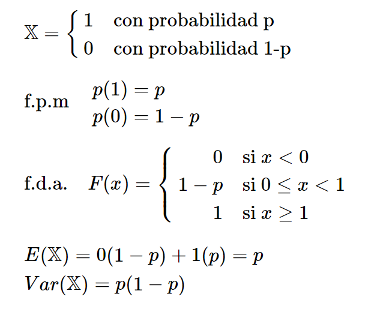

> Contexto:

  + Pandemia 
  + Uso de herramientas virtuales que limiten el contacto entre personas.
  + Evitar contacto con dinero del exterior para evitar contagios.

> Tema seleccionado

Estudio en el uso de dinero electrónico a través de plataformas digitales o aplicaciones móviles.

 


> Objetivos

+ Analizar la demanda de aplicaciones o plataformas que se usan para realizar compras, diferenciándolas en etapas diferentes : pre - pandémico y pandemia. 

+ Conocer al público que alcanzó la encuesta.

+ Hallar la relación entre variables como la edad, monto que gastan y frecuencia que usan sus aplicaciones.


> Detalles de la muestra obtenida
 
  + Muestreo *por conveniencia*
  + 173 Observaciones obtenidas en el forms 
  + 3287 Datos 
  
  Cantidad   |  Completos    | Faltantes 
-------------|-------------  | ------------- 
Observaciones|     168       |      5   
Datos        |    3282       |      5


 Porcentaje  |  Completos    | Faltantes 
-------------|-------------  | ------------- 
Observaciones|    97.11%     |    2.89%
Datos        |    99.85%     |    0.15%


> Variables 

  + 20 variables

 Categ. Nominal|Categ. Ordinal|Num. Discreta|Num. Continua 
---------------|--------------|--------------|------------- 
     15        |      2       |       2      |      1
     

> Variable y Categoria

 Variable           |  Tipo de categoría 
--------------------|-----------------------
Nombre              |   Categórica Nominal           
Apellido            |   Categórica Nominal
Sexo                |   Categórica Nominal
Edad                |   Numérica Discreta
Estado_Bancarizacion|   Categórica Nominal
Monto_gasto         |   Numérica Continua
Categoria           |   Categórica Nominal
Tipo_fondos         |   Categórica Nominal
App1                |   Categórica Nominal
App2                |   Categórica Nominal
Num_App             |   Numérica Discreta
Satisfaccion        |   Categórica Ordinal
Inicio              |   Categórica Nominal
Frecuencia_semanal  |   Categórica Ordinal
Frecuencia_diaria   |   Categórica Nominal
Funcion             |   Categórica Nominal
Moneda              |   Categórica Nominal
Tipo_tienda         |   Categórica Nominal
Uso_futuro          |   Categórica Nominal
Categoria_pasado    |   categórica Nominal


> Leer la muestra

```{r}
library (readr)
library(dplyr)

```

```{r}
#Archivo CSV
DF<-read_csv("Uso de dinero electrónico.csv")
DF
```

> Limpieza de datos

1. Eliminar la columna "Marca Temporal" y "Puntuaciones" 
```{r}
DF %>% select(-1,-2) -> DF
```

  2.Renombrar a las variabes
  
```{r,echo=F}
DF %>%rename("Estado_Bancarizacion"="¿Tienes cuenta bancaria?","App1"="Que app usas con mayor frecuencia?","App2"="Que app usas con segunda mayor frecuencia?","Monto_gasto"="¿Cuánto gastas mensualmente en compras online?","Categoria"=	
"¿En qué categoría gastas más tu dinero?","Tipo_fondos"="¿Qué método de pago prefieres, crédito o débito?","Satisfaccion"="¿Qué tan satisfecho(a) estás con estas plataformas?","Inicio"="¿Cuándo empezaste a usar aplicaciones de banca movil o billetera electrónica?","Frecuencia_semanal"="¿Cuántas veces por semana usas la aplicación?","Frecuencia_diaria"="¿La usas diariamente?","Funcion"="¿Cuál considera es la función más destacable de una aplicación?",  "Moneda"="¿Cómo pagas con más frecuencia, dólares o soles?","Tipo_tienda"="¿Compras más en tiendas nacionales o internacionales?",  "Uso_Futuro"="Luego de la pandemia, ¿seguirás usando estas aplicaciones?","Categoria_Pasado"="¿En que categoría gastabas más tu dinero antes?" ,"Num_App" = "¿Cuántas apps de banca móvil tienes en este momento en tu celular?")->DF
```
 
 
> Análisis descriptivo : 
 
1. ¿Cuál es la moda en edad y sexo de los encuestados?


  Sexo     |  Cantidad    |  Porcentaje  
-----------|------------- | ------------- 
Femenino   |     84       |      48.55%  
Masculino  |     89       |      51.45%

 + Moda en Sexo : Masculino

```{r}
table(DF$Edad)
```

 + Moda en edad : 19 años

 + Boxplot : Densidad de la edad
 
```{r}
boxplot(DF$Edad, horizontal=TRUE, col="green",main="Distribución de la edad",ylab="densidad",xlab="edad",prob=TRUE)
abline(v=median(DF$Edad),col="red",lwd=2)
abline(v=mean(DF$Edad),col="blue",lwd=2)
legend("topright",inset=.05,legend=c("Mediana","Media"),lwd=2,col=c("red","blue"),bg='lightyellow',box.col = 'green')
```

  *Análisis* 
  
  - Se pueden observar valores atípicos que van de 24 a más años de edad ya que no obtuvimos demasiadas respuestas por parte de personas en aquel rango de edad.
  
  - La distribución es sesgada a la izquierda ya que la mediana es menor que la media.


 + Mosaico : Sexo Vs Edad
 
```{r}
#Filtramos datos de forma que se muestre un rango de 23-30 años
DF1 <- DF %>% mutate(Edad = ifelse(Edad == 23|Edad == 24|Edad == 25|Edad == 26|Edad == 27|Edad == 28|Edad == 29|Edad == 30, "23-30", Edad))
Colores<-{}
Colores["Femenino"]<-"pink"
Colores["Masculino"]<-"blue"


tab1<-table(DF1$Edad,DF1$Sexo)
mosaicplot(tab1,col=Colores[dimnames(tab1)[[2]]],main="Sexo vs. Edad")
```


```{r}
table(DF %>% select(Sexo,Edad)%>% filter(DF$Edad==18))
```

```{r}
table(DF %>% select(Sexo,Edad)%>% filter(DF$Edad==19))
```

```{r}
table(DF %>% select(Sexo,Edad)%>% filter(DF$Edad==20))
```

  *Análisis*

  - En el gráfico 2, podemos ver que a pesar de que existe una moda de sexo masculino de forma general, si observamos las edades de 18 y 19 años veremos que la moda de sexo en estas edades es femenino.


> Análisis descriptivo : 
 
 2. ¿Cuál es la relación entre el monto que gastan y la edad que tienen los encuestados?


Si buscamos la moda por cada variable, obtenemos la siguiente información:


  Variable          |        Moda
--------------------|-----------------------
     Sexo           |      Masculino
     Edad           |       19 años
  Monto Gasto       |      100 soles


+ Filtramos los datos de monto gasto menores o iguales a 1000 y mayores o iguales a 10. Lo hicimos debido a que habían algunas cantidades más grandes que interferían de forma visual en los gráficos.

```{r}

DF %>% select(Edad,Monto_gasto)%>% filter(DF$Monto_gasto<=1000 & 10<=DF$Monto_gasto)-> DF_Monto
#table(DF_Monto$Monto_gasto)
```


+ Boxplot : Densidad de monto gasto 

```{r}
boxplot(DF_Monto$Monto_gasto, horizontal=TRUE, col="green",main="Distribución del monto que gastan",ylab="densidad",xlab="monto",prob=TRUE)
abline(v=median(DF_Monto$Monto_gasto),col="red",lwd=2)
abline(v=mean(DF_Monto$Monto_gasto),col="blue",lwd=2)
legend("topright",inset=.05,legend=c("Mediana","Media"),lwd=2,col=c("red","blue"),bg='lightyellow',box.col = 'green')
```

  *Análisis*
  
  - Nuestros valores atipicos se muestran como cantidades muy alejadas a lo que gran parte de los  encuestado respondieron. Ademas, tenemos algunos 0, los cuales no entran en nuestro analisis y tomamos como N.A


+ Plot: Monto Gasto Vs Edad

```{r}
plot(DF_Monto$Edad,DF_Monto$Monto_gasto, col="orange",main="Monto Gasto Vs Edad",ylab="Monto Gasto",xlab="Edad")
abline(v=median(DF$Edad),col="violet",lwd=2)
abline(v=mean(DF$Edad),col="yellow",lwd=2)
legend("topright",inset=.01,legend=c("Mediana","Media"),lwd=2,col=c("violet","yellow"),bg='skyblue',box.col = 'green')
```


  *Analicemos la frecuencia con que usan las aplicaciones*

```{r}

#Filtramos datos de forma que se muestre un rango de 23-30 años
DF1 <- DF %>% mutate(Edad = ifelse(Edad == 23|Edad == 24|Edad == 25|Edad == 26|Edad == 27|Edad == 28|Edad == 29|Edad == 30, "23-30", Edad))
DF2 <- DF1 %>% mutate(Frecuencia_semanal = ifelse(Frecuencia_semanal == 9|Frecuencia_semanal == 10|Frecuencia_semanal == 11|Frecuencia_semanal == 12|Frecuencia_semanal == 13|Frecuencia_semanal == 14|Frecuencia_semanal == 15, "9-15", Frecuencia_semanal))

Colores<-{}
Colores["0"]<-"yellow"
Colores["1"]<-"blue"
Colores["2"]<-"red"
Colores["3"]<-"green"
Colores["4"]<-"black"
Colores["5"]<-"pink"
Colores["6"]<-"skyblue"
Colores["7"]<-"violet"
Colores["8"]<-"orange"
Colores["9-15"]<-"lightyellow"


tab1<-table(DF2$Edad,DF2$Frecuencia_semanal)
mosaicplot(tab1,col=Colores[colnames(tab1)[[1]]],main="Frecuencia semanal vs. Edad")

```


  *Análisis*:
 

  -  Vemos una tendencia entre edad y cantidad gastada, los chicos de 18, lo usan con menor frecuencia y gastan cantidades pequeñas mensualmente. Mientras que en el rango de 23 a 30 años, empiezan a usar con mayor frecuencia y los gastos son más grandes por mes.


> Análisis inferencial y predictivo 

1. Variable edad


+ Variable Aleatoria Distribución Binomial :

Buscamos saber la probabilidad de que al menos una persona tenga 19 años al encuestar al 30% de la población:

  + Éxito = 19 años (moda)
  
  + Evento X = Al menos una persona tiene 19 años (X>=1)

  + En primer lugar, debemos hallar la probabilidad de que al menos una persona tenga 19 años en el grupo de encuestados al 100%.

```{r}
DF %>% select(Edad) %>% filter(DF$Edad==19)-> DF_edad

#PE_19 = PERSONAS ENCUESTADAS CON 19 AÑOS
PE_19<-nrow(DF_edad) 
#PE= PERSONAS ENCUESTADAS
PE<-nrow(DF)
#PPC_19=PROBABILIDAD PERSONA CON 19 AÑOS
PPC_19<-PE_19/PE
round(PPC_19,2)     

```

  + A un 100%, observamos que la probabilidad de que una persona tenga 19 años es 0.28 o 28%.


  + En segundo lugar, podemos hallar la probabilidad de que una persona tenga 19 años al 30% de encuestados, de la siguiente forma:
  

```{r,echo=FALSE}
#PE30=PERSONAS ENCUESTADAS AL 30%
PE30<-round(0.3*nrow(DF))
PE30
```


```{r,echo=FALSE}
DF %>% select(Edad) %>% filter(DF$Edad==19)-> DF_edad

#PE_19 = PERSONAS ENCUESTADAS CON 19 AÑOS
PE_19<-nrow(DF_edad) 
#PPC_19_2=PROBABILIDAD PERSONA CON 19 AÑOS en el 30% de encuestados
PPC_19_2<-PE_19/PE30
round(PPC_19_2,2) 

```
  + La probabilidad de que al 30% de encuestados, una persona tenga 19 años es 0.92 o 92%.
  
  + Este resultado nos indica de que si evaluamos esta probabilidad en un grupo de 30% del total, podemos hallar que es muy alta cuando nos planteemos el evento que consistiría en al menos una persona con 19 años.

```{r}
round(1-dbinom(0,52,PPC_19),2)
```


  + Aplicación intervalos de confianza:

En nuestro caso, con los datos buscamos un intervalo de confianza para la media muestral con un nivel de confianza del  90 %.

Estimación puntual de la media muestral:

```{r}
xbarra<-mean(DF$Edad)
xbarra
```

Estimación puntual de la desviación estándar muestral:

```{r}
stecho<-sd(DF$Edad)
stecho
```


```{r}
n<-173
xbarra<-mean(DF$Edad)
stecho<-sd(DF$Edad)
conf=0.9
alpha.2<-(1-conf)/2
z<- qt(alpha.2,df=n-1,lower.tail = F)

izq <- xbarra - z*stecho/sqrt(n)
der <- xbarra + z*stecho/sqrt(n)
cat("(",izq,",",der,")\n")
```

Observamos en el resultado que el intervalo de confianza para nuestra data esta entre  ( 19.93062 , 20.54337 )


```{r}
t.test(DF$Edad,mu=19,alternative="two.sided",conf.level = conf)
```


Se observa que el promedio de x no cae en la región de rechazo, por lo que la hipótesis nula no se rechazaría. Sin embargo, la probabilidad de que esto suceda es demasiado baja, por lo que debido a esta magnitud se rechaza la hipótesis nula.


2. Variable Monto gasto 

+ *Aplicación intervalo de confianza:*

 En nuestro caso, con los datos buscamos un intervalo de confianza para la media muestral con un nivel de confianza del  80 %.

 Estimación puntual de la media muestral:

```{r}
xbarra<-mean(DF$Monto_gasto,na.rm=TRUE)
xbarra
```


 Estimación puntual de la desviación estándar muestral:

```{r}
sigma<-sd(DF$Monto_gasto,na.rm=TRUE)
sigma
```


```{r}

n<-length(DF$Monto_gasto)
#table(is.na(DF$Monto_gasto))
n<-n-1
```

```{r}
xbarra<-mean(DF$Monto_gasto,na.rm=TRUE)
sigma<-sd(DF$Monto_gasto,na.rm=TRUE)
conf<-0.8
alpha.2<-(1-conf)/2
z<-qt(alpha.2,df=n-1,lower.tail = F)

izq <- xbarra - z*sigma/sqrt(n)
der <- xbarra + z*sigma/sqrt(n)

cat("(",izq,",",der,")\n")
```

 Observamos en el resultado que el intervalo de confianza para nuestra data esta entre  ( 165.0151 , 1072.415 )


 PRUEBA DE HIPÓTESIS:
+ H0:Monto gastado igual o mayor a 600.38  
 *Monto gasto >= 600.38* 
       
+ H1:Monto gastado menor a 600.38     
 *Monto gasto < 600.38*        

Nota: 600.38 soles es un dato que obtuvimos a partir de una fuente donde se indicaba que este era lo que comúnmente gastaban en promedio las personas por medio de pagos electrónicos.

```{r}
t.test(DF$Monto_gasto,mu=600.38,alternative="greater",conf.level = conf)
```


*Analisis*

El promedio de x no cae en la región de rechazo, por lo tanto, la hipótesis nula no se rechaza. Además, p valor es mayor a 0.47, por lo que la probabilidad de que ocurra, dada la hipótesis nula, es alta.


```{r}
DF$Monto_gasto[DF$Monto_gasto>1000] <- NA
plot(DF$Edad, DF$Monto_gasto, pch = 19, col = rgb(0,0,0,0.2), main = "Gráfico de regresión lineal", xlab="Edad", ylab="Monto gastado")
LM1 <- lm(DF$Monto_gasto ~ DF$Edad)
abline(LM1, col = "red")

```


3. Variable Estado de Bancarización

+ *Análisis de probabilidad:*
 
 Probabilidad de que los encuestados tengan una cuenta bancaria:

 + Para este caso, decidimos usar el modelo de Bernoulli con parámetro p


  
 

```{r}
DF %>% select(Estado_Bancarizacion)%>% filter(DF$Estado_Bancarizacion=="Sí")-> DF_bancarizacion
```

```{r}
table(DF$Estado_Bancarizacion)
```

+ Como observamos hay 156 personas que tienen cuenta bancaria. 

```{r}
DF %>% select(Estado_Bancarizacion)%>% filter(DF$Estado_Bancarizacion=="Sí")-> DF_bancarizacion
#PCCB = PERSONAS CON CUENTA BANCARIA
PCCB<-nrow(DF_bancarizacion)

```

+ Hemos encuestado a 173 personas 
 
```{r}
#PE = PERSONAS ENCUESTADAS
PE<-nrow(DF)
```

+ Probabilidad de que una persona encuestada tenga cuenta bancaria:

```{r}

#PPCCB=PROBABILIDAD PERSONA CON CUENTA BANCARIA

PPCCB<-PCCB/PE

round(PPCCB,2)
```


+ Ahora, conoceremos la probabilidad de que una persona encuestada no tenga cuenta bancaria:

```{r}
#PPSCB=PROBABILIDAD PERSONA SIN CUENTA BANCARIA
#PPCCB=PROBABILIDAD PERSONA CON CUENTA BANCARIA
PPSCB<-1-PPCCB
round(PPSCB,2)
```

+ Como observamos hay mayor probabilidad de que la persona encuestada tenga cuenta bancaria.


+ *Aplicación intervalos de confianza:*

En nuestro caso, con los datos buscamos un intervalo de confianza para la media muestral con un nivel de confianza del  90 %.

Estimación puntual de la proporción muestral:

```{r}
pbarra<-PPCCB
pbarra
```


```{r}
n<-173
pbarra<-PPCCB  #0.90
conf=0.90
alpha<-1-conf
alpha.2<-(1-alpha)/2
z<- qt(alpha.2,df=n-1,lower.tail = F)

izq <- pbarra - z*sqrt(((1-pbarra)*pbarra)/n)
der <- pbarra + z*sqrt(((1-pbarra)*pbarra)/n)
cat("(",izq,",",der,")\n")
```
Observamos en el resultado que el intervalo de confianza para nuestra data esta entre  ( 0.898886 , 0.9045822 ).


PRUEBA DE HIPÓTESIS:

+ H0:Proporción igual (o menor) a 0.5      
 *P(cuenta bancaria) <= 0.5* 
       
+ H1: Proporción mayor a 0.5     
 *P(cuenta bancaria) > 0.5*        


```{r}
zobservado<-(pbarra-0.5)/sqrt(((1-0.5)*0.5)/n)
zcritico<-qnorm(1-conf,mean=0.5,sd=sqrt((1-pbarra)*pbarra/n),lower.tail = F)
"zobservado"
zobservado
"zcritico"
zcritico
"zobservado > zcritico"
zobservado>zcritico
```


+ Hallar p-valor

```{r}
pnorm(pbarra,mean=0.5,sd=sqrt(((1-0.5)*0.5)/n),lower.tail=F)
```

  *Análisis*
  
  Como "zobservado" es mayor a "zcritico" se rechaza la hipótesis nula. En el cálculo de p valor se observa de que la probabilidad de que sea posible un valor dentro de la hipótesis nula es demasiado bajo, validando la conclusión de la prueba de hipótesis. Esta diferencia se puede justificar al tipo de muestre, que es muestreo por conveniencia.


> Regresión Simple

1. Regresión : Edad Vs Monto_gasto

Queremos ver si la edad influye en el monto que gastan los encuestados.

```{r}

DF$Monto_gasto [DF$Monto_gasto > 1000] <- NA


plot(DF$Monto_gasto ~ DF$Edad)
M1<- lm(DF$Monto_gasto ~ DF$Edad)
abline(M1, col="blue")

cor(DF$Edad, DF$Monto_gasto, use="pairwise.complete")
summary ( M1)


# nos muestra que la edad no tiene nada que ver con el monto gastado, y el % de participacion o en lo que afecta es de 0.07

```


  *Análisis*

  + A partir de la gráfica podemos observar que la distribución de los datos no nos dará una buena gráfica de regresión. Sin embargo, es lo mejor que tenemos.
  
  + Vemos que la variable edad tiene cierto grado de significancia, con un p-valor de 0.000282.
  
  + Podemos observar que el factor de correlación es 0.28 o 28% aproximadamente lo cual indicaría que no existe demasiada influencia por parte de la edad en el monto gastado.
  
  + Podemos concluir que, a pesar que la edad tiene cierto grado de significancia, el hecho que tengamos muchos datos entre 18-20 años y pocos valores de mas de 21, nos arroja una correlación bastante baja, lo que nos da a entender que necesitaríamos mas datos de personas mayores para subir ese porcentaje.
  


2. Regresión: Frecuencia semanal Vs Num_App

Queremos hallar si hay una influencia del número de aplicaciones que tiene un usuario en su celular para poder ver la frecuencia semanal.

```{r}

plot(DF$Frecuencia_semanal~ DF$Num_App)
M5<- lm(DF$Frecuencia_semanal ~ DF$Num_App)

abline(M5, col="green")

plot(M5)
summary(M5)

```

```{r}
cor(DF$Frecuencia_semanal, DF$Num_App, use="pairwise.complete")
```


  *Análisis*
  

  + Podemos observar que la pendiente es negativa: -0.33
  
  + Observamos que el número de aplicaciones tiene poca significancia, con un p-valor de 0.0215, lo cual quiere decir que la frecuencia en la que usan estas apps no depende de cuantas apps tengas.
  
  + Además podemos ver que el factor de correlación es negativo, lo cual se debe a que es una inversa. A pesar de eso, el valor de -0.26 podemos usarlo de forma absoluta. Lo cual significaría que hay 26% de correlación, el cual es muy bajo para poder tomarlo como referencia.

  + Entonces concluimos que el numero de apps no tiene nada que ver con su frecuencia semanal.


> Regresión múltiple : 

1. Monto Gasto VS Edad/Frecuencia

```{r}


plot(DF$Monto_gasto ~ DF$Edad + DF$Frecuencia_semanal)
M2<- lm(DF$Monto_gasto ~ DF$Edad+ DF$Frecuencia_semanal)
abline(M2, col="green")

plot(M2)
summary(M2)
```
 
  *Análisis*
  
  + Vemos que el p-valor de la frecuencia semanal ( 2.91e-07) es mucho menor al de la edad ( 0.0535 ), lo cual significa que la frecuencia semanal es mas significativa que la edad cuando nos referimos al monto gastado.
  
  + Vemos en el summary que el Multiple R-squared es de 0.2137, o 21.37%, lo cual significa que a pesar que existe una relación entre las variables, el numero de datos esta muy mal distribuido, y hacen falta mas para tener una función que se acomode mejor.
  
  + Concluimos entonces que la frecuencia semanal es lo que dicta el monto gastado al final del mes.


2. MONTO GASTO VS EDAD/FRECUENCIA SEMANAL/ Número de apps

```{r}
plot(DF$Monto_gasto ~ DF$Edad + DF$Frecuencia_semanal + DF$Num_App )
M3<- lm(DF$Monto_gasto ~ DF$Edad+ DF$Frecuencia_semanal+ DF$Num_App)
abline(M3, col="blue")

plot(M3)
summary(M3)

```

  *Análisis*

  + Al analizar el summary, vemos que ninguna de los p-valor son suficientemente pequeñas para concluir que existe alguna relación o significancia.
  
  + Apreciamos que el p-valor del numero de aplicaciones es menor, lo cual quiere decir que podría existir alguna relación con el monto gastado, pero el hecho que tengamos tan pocos datos interfiere con el resultado.
  
  + Concluimos entonces que por la falta de información, el numero de aplicaciones por el momento no tiene mucha significancia con el monto gastado. 


> Conclusiones y Reflexiones  
  
+ Antes de la pandemia, las personas usaban con frecuencia las aplicaciones. Con la pandemia esto aumentó. Como nos hemos dado cuenta con la encuesta, la mayoría de personas continuaría usando.


+ Debemos saber que al ser un muestreo por conveniencia no es del todo verídico ya que no hemos podido acceder a personas que no cuenten con un celular.  

+ Hay algunas preguntas que no hicimos para la encuesta que tal vez hubieran variado con el proyecto.

+ A partir de un análisis descriptivo, logramos identificar la relación entre el monto gastado y la edad. Sin embargo, a partir de los datos obtenidos, al observar los gráficos de regresión, se ve que la relación no es muy fuerte.
  
  
> Bibliografía

+ Instituto Nacional de Estadística e Informática. (18 de Junio de 2021). EL 50% DE LA POBLACIÓN DE 18 Y MÁS AÑOS DE EDAD. (091). Obtenido de https://www.inei.gob.pe/media/MenuRecursivo/noticias/nota-de-prensa-no-091-2021-inei.pdf

+ Redacción Perú21. (9 de Enero de 2020). Los peruanos gastan en promedio US$167 en compras por internet. Perú21. Obtenido de https://peru21.pe/economia/los-peruanos-gastan-en-promedio-us167-en-compras-por-internet-noticia/?ref=p21r
