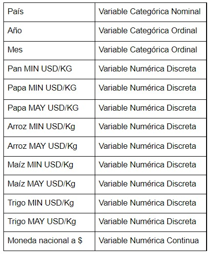
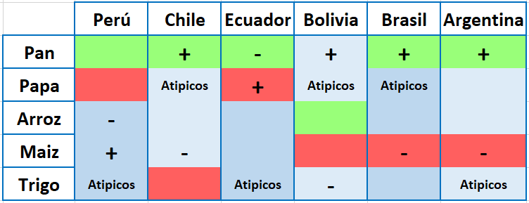
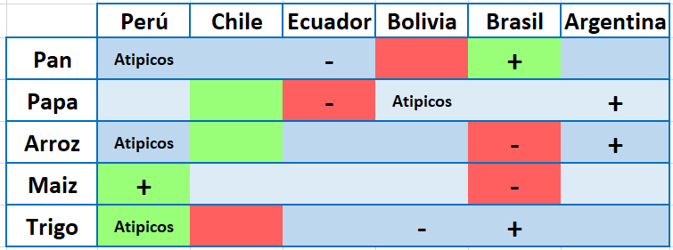
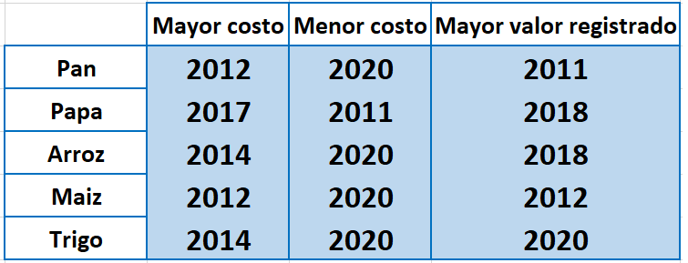

```{r setup, include=FALSE}
knitr::opts_chunk$set(echo = FALSE)
```

```{r}
# install.packages("rriskDistributions")
# install.packages("stringr")
# install.packages("dplyr")
```

```{r Base de datos y librerías importadas, include=FALSE}
library(readr)
library(stringr)
library(dplyr)
library(rriskDistributions)
P2_Alimentos_basicos_latinoamerica2 <- read_delim("P2 Aliemntos basicos latinoamerica2.csv", 
    ";", escape_double = FALSE, trim_ws = TRUE) 
```

```{r}
DF <- P2_Alimentos_basicos_latinoamerica2
```

#

<h3>**Titulo principal: **</h3> 
<b><center>Análisis de la evolución de los precios de los alimentos de primera necesidad en Latinoamérica (2000 - 2021) </center></b>
 
<h3>**Introducción: **</h3> 

En los últimos 20 años, los países de la región han experimentado diferentes tipos de gobiernos y políticas económicas, así como también pasado por crisis internas y globales. De este modo, es interesante analizar cómo el precio de los alimentos más esenciales ha sufrido variaciones considerables a través del tiempo. 

<h3>**Objetivo: **</h3> 

De este modo, nuestro grupo se planteó la siguiente interrogante a resolver en este trabajo:

<p>&nbsp;</p>
<p style="text-align:left;">**► Identificar la evolución de productos de la canasta básica familiar durante los últimos años recolectados **</p>
<p>&nbsp;</p>
<p style="text-align:left;">**► Contrastar la información en 6 países de Latinoamérica**</p>
<p>&nbsp;</p>
<p style="text-align:left;">**► Determinar los años de mayor y menor costo de cada producto en la última década**</p> 
<p>&nbsp;</p>
<p style="text-align:left;">**► Existe correlación entre el precio del pan y el trigo**</p>  
<p>&nbsp;</p>


<b> ¿Es nuestro tema interesante? </b>

Sí. El análisis de la información escogida muestra al lector la variación de los precios de algunos productos de la canasta básica familiar en dólares por kilogramo para seis países de Latinoamérica, Esto nos servirá para contrastar cómo evolucionan los precios entre los diferentes países del estudio, también se podrá relacionar la variación de estos con el tipo de gobierno o situación económica que atravesaban dichos países.  

<b> ¿Es nuestro tema plausible?</b>

Nuestro tema nos permitirá describir el comportamiento de los precios de 5 productos, pan, papa, maíz, trigo y arroz, en el intervalo de tiempo de Ene-2000 a Mar 2021 para los países de Argentina, Bolivia, Brasil, Chile, Ecuador y Perú.

<b> ¿Es nuestro tema específico? </b>

 Sí. La base de datos maneja diferentes variables numéricas como categóricas dentro de un intervalo de tiempo y zona específicos.

<b> ¿Es nuestro tema desconocido? </b>

Si. Las personas podrían identificar la variación de los precios en sus respectivos países a lo largo de la historia, sin embargo, al ser nuestro estudio desde el ene-2000 a mar-2021 y para seis países hace que la relación de estos sea algo nuevo.

<h3>**Planificación: **</h3> 

Debido a que nuestro tiempo es limitado, se necesita una organización clara para poder cumplir con las fechas de entrega establecidas:

Objetivos internos:

- Reunirnos 1-2 veces por semana para avanzar con el proyecto.

- No tener tardanzas en las entregas de los avances.

- Realizar preguntas al profesor en caso ocurriese un atasco.

Además, esquematizamos nuestra gestión de actividades utilizando un Diagrama de Gantt.

```{r, echo=FALSE, fig.align='center', out.width="50%"}
#knitr::include_graphics('Gang.jpeg')
```

<h3>**Marco Teórico: **</h3> 

<b>Población objetivo: </b> Los precios de todos los productos de primera necesidad en Latinoamérica entre los años 2000-2021.

<b>La base de datos: </b> Se utiliza una base de datos creada por la FAO (La Organización de las Naciones Unidas para la Alimentación y la Agricultura). Es así, que tenemos los datos de 6 países distintos (Perú, Bolivia, Chile, Ecuador, Brasil y Argentina) con productos en común.

```{r}
DFPE<- na.omit (filter(DF,País=='Perú'))
DFBO<- na.omit (filter(DF,País=='Bolivia'))
DFBR<- na.omit (filter(DF,País=='Brasil'))
DFCH<- na.omit (filter(DF,País=='Chile'))
DFAR<- na.omit (filter(DF,País=='Argentina'))
DFEC<- na.omit (filter(DF,País=='Ecuador') )
```


<h4> **Variables** </h4>
Se presenta la tabla de descripción de las variables:

```{r, echo=FALSE, fig.align='center', out.width="40%"}

```

<center> <h3> ▲▼▲▼▲▼▲▼▲▼▲▼▲▼ Variables Numérica ▲▼▲▼▲▼▲▼▲▼▲▼ </h3> </center> 
 
<h4><u>**Descriptores Numéricos: **</u></h4>

Precios minoristas USD/Kg

Precios mayoristas USD/Kg

[MODA] 
[Varianza, Desviación estándar y Rango Inter cuartil] 


<center><h4> ** Precios minoristas USD/Kg ** </h4></center>

Si bien el precio del arroz al principio del nuevo milenio fue el más alto, fue quien
menos alteración sufrió con el pasar del tiempo. Teniendo como media el 1$/kg. Por
otro lado, el precio del pan por kilogramo es quien tuvo el incremento mayor durante el
presente intervalo de tiempo.

**Precio del Pan USD/Kg**
```{r echo=TRUE, include=TRUE}
summary(DF$`Pan MIN USD/KG`)

```

**Precio de la Papa USD/Kg** 
```{r, comment=""} 
summary(DF$`Papa MIN USD/KG`)  
```
**Precio del Arroz USD/Kg** 
```{r, comment=""} 
summary(DF$`Arroz MIN USD/Kg`) 
```
**Precio del Maíz USD/Kg** 
```{r, comment=""} 
summary(DF$`Maiz MIN USD/Kg`) 
```
**Precio del Trigo USD/Kg**
```{r, comment=""}
summary(DF$`Trigo MIN USD/Kg`) 
```

<center><h4> **Precios mayoristas USD/Kg** </h4></center>

Al adquirir los alimentos al por mayor, el precio sufre una devaluación bastante clara. Lo
cual se puede identificar al realizar una comparación entre los precios del maíz y arroz
con su precio al por menor. Se observa que los mencionados se reducen en un poco
más del 50% o inclusive más como el caso del trigo, quién se reduce a la cuarta parte
de su precio minorista.
Se tienen excepciones, como la papa quien no marca un cambio considerable en su
precio.

**Precio de la Papa USD/Kg** 
```{r, comment=""} 
summary(DF$`Papa MAY USD/KG`)  
```
**Precio del Arroz USD/Kg** 
```{r, comment=""} 
summary(DF$`Arroz MAY USD/Kg`) 
```
**Precio del Maíz USD/Kg** 
```{r, comment=""} 
summary(DF$`Maiz MAY USD/Kg`) 
```
**Precio del Trigo USD/Kg**
```{r, comment=""}
summary(DF$`Trigo MAY USD/Kg`) 
```

<center> <h3>▲▼▲▼▲▼▲▼▲▼▲▼▲▼▲▼▲▼ Moda ▲▼▲▼▲▼▲▼▲▼▲▼▲▼▲▼▲</h3> </center>
 

Entre el año 2000 hasta la actualidad, por lo general, los alimentos de estudio
no superaron la media en su precio final tanto para la venta por menor cómo por
mayor. Lo que nos indica que el actual incremento que se percibe es producto de
diversos factores externos que priman en contra la economía. Como la inflación, crisis
económicas, entre otros.

<center><h4> **Precios minoristas USD/Kg ** </h4></center>
** Moda en el precio del Pan USD/Kg ** 

```{r echo=TRUE, include=TRUE}
library("modeest")
mfv(DF$`Pan MIN USD/KG`, na_rm = T)

```

**Moda en el precio de la Papa USD/Kg** 
```{r, comment=""} 
mfv(DF$`Papa MIN USD/KG`, na_rm = T)  
```

**Moda en el precio del Arroz USD/Kg** 
```{r, comment=""} 
mfv(DF$`Arroz MIN USD/Kg`, na_rm = T) 
```

**Moda en el precio del Maíz USD/Kg** 
```{r, comment=""} 
mfv(DF$`Maiz MIN USD/Kg`, na_rm = T) 
```

**Moda en el precio del Trigo USD/Kg**
```{r, comment=""}
mfv(DF$`Trigo MIN USD/Kg`, na_rm = T) 
```

<center><h4> **Precios mayoristas USD/Kg** </h4></center>

 
**Moda en el precio de la Papa USD/Kg** 
```{r, comment=""} 
mfv(DF$`Papa MAY USD/KG`, na_rm = T)  
```
 
**Moda en el precio del Arroz USD/Kg** 
```{r, comment=""} 
mfv(DF$`Arroz MAY USD/Kg`, na_rm = T) 
```

**Moda en el precio del Maíz USD/KG** 
```{r, comment=""} 
mfv(DF$`Maiz MAY USD/Kg`, na_rm = T) 
```

**Moda en el precio del Trigo USD/KG**
```{r, comment=""}
mfv(DF$`Trigo MAY USD/Kg`, na_rm = T) 
```


<h3><u>**Valores de dispersión: **</u></h3>

Con estos parámetros, se
puede determinar que el precio del trigo, papa y maíz fueron quienes en promedio
sufrieron la menor tasa de alteraciones. Mientras que, en caso de la papa sin bien su
precio inicial no distancia en una gran proporción del final como el del pan, es quien
sufrió alteraciones más radicales en precio. Todos los alimentos no presentaron un
cambio de tendencia radical hasta después del 75% del rango Inter cuartil, lo que hace
referencia que dentro de los últimos 5 años los precios aumentaron considerablemente
en base al estándar.


<center> <h3>▲▼▲▼▲▼▲▼▲▼▲▼▲▼▲ Varianza ▼▲▼▲▼▲▼▲▼▲▼▲▼▲▼▲▼</h3> </center> 
 

<center><h4> **Precios minoristas USD/Kg** </h4></center>
**Varianza del Precio del Pan USD/K** 

```{r echo=TRUE, include=TRUE}
var(DF$`Pan MIN USD/KG`, na.rm = T)

```

**Varianza del Precio de la Papa USD/Kg** 
```{r, comment=""} 
var(DF$`Papa MIN USD/KG`, na.rm = T)  
```
 
**Varianza del Precio del Arroz USD/Kg** 
```{r, comment=""} 
var(DF$`Arroz MIN USD/Kg`, na.rm = T) 
```

**Varianza del Precio del Maíz USD/Kg** 
```{r, comment=""} 
var(DF$`Maiz MIN USD/Kg`, na.rm = T) 
```

**Varianza del Precio del Trigo USD/Kg**
```{r, comment=""}
var(DF$`Trigo MIN USD/Kg`, na.rm = T) 
```

<center><h4> **Precios mayoristas USD/Kg** </h4></center>
 
**Varianza del Precio de la Papa USD/Kg** 
```{r, comment=""} 
var(DF$`Papa MAY USD/KG`, na.rm = T)  
```
 
**Varianza del Precio del Arroz USD/Kg** 
```{r, comment=""} 
var(DF$`Arroz MAY USD/Kg`, na.rm = T) 
```

**Varianza del Precio del Maíz USD/Kg** 
```{r, comment=""} 
var(DF$`Maiz MAY USD/Kg`, na.rm = T) 
```

**Varianza del Precio del Trigo USD/Kg**
```{r, comment=""}
var(DF$`Trigo MAY USD/Kg`, na.rm = T) 
```
 
<center> <h3>▲▼▲▼▲▼▲▼▲▼▲▼▲ Rango Inter cuartil ▼▲▼▲▼▲▼▲▼▲▼▲▼</h3> </center> 
 

<center><h4> **Precios minoristas USD/Kg** </h4></center>
**Rango Inter cuartil del Precio del Pan USD/Kg**

```{r echo=TRUE, include=TRUE}
x1 = quantile(DF$`Pan MIN USD/KG`,na.rm = T, 0.75)
x2= quantile(DF$`Pan MIN USD/KG`,na.rm = T, 0.25)
x1-x2

```


**Rango intercuartil del Precio de la Papa USD/Kg** 
```{r, comment=""} 
x1 = quantile(DF$`Papa MIN USD/KG`,na.rm = T, 0.75)
x2= quantile(DF$`Papa MIN USD/KG`,na.rm = T, 0.25)
x1-x2 
```
 
**Rango intercuartil del Precio del Arroz USD/Kg** 
```{r, comment=""} 
x1 = quantile(DF$`Arroz MIN USD/Kg`,na.rm = T, 0.75)
x2= quantile(DF$`Arroz MIN USD/Kg`,na.rm = T, 0.25)
x1-x2 
```

**Rango intercuartil del Precio del Maíz USD/Kg** 
```{r, comment=""} 
x1 = quantile(DF$`Maiz MIN USD/Kg`,na.rm = T, 0.75)
x2= quantile(DF$`Maiz MIN USD/Kg`,na.rm = T, 0.25)
x1-x2
```

**Rango intercuartil del Precio del Trigo USD/Kg**
```{r, comment=""}
x1 = quantile(DF$`Trigo MIN USD/Kg`,na.rm = T, 0.75)
x2= quantile(DF$`Trigo MIN USD/Kg`,na.rm = T, 0.25)
x1-x2 
```

<center><h4> **Precios mayoristas USD/Kg** </h4></center>

**Rango intercuartil del Precio de la Papa USD/Kg** 
```{r, comment=""} 
x1 = quantile(DF$`Papa MAY USD/KG`,na.rm = T, 0.75)
x2= quantile(DF$`Papa MAY USD/KG`,na.rm = T, 0.25)
x1-x2   
```
 
**Rango intercuartil del Precio del Arroz USD/Kg** 
```{r, comment=""} 
x1 = quantile(DF$`Arroz MAY USD/Kg`,na.rm = T, 0.75)
x2= quantile(DF$`Arroz MAY USD/Kg`,na.rm = T, 0.25)
x1-x2 
```

**Rango intercuartil del Precio del Maíz USD/Kg**
```{r, comment=""} 
x1 = quantile(DF$`Maiz MAY USD/Kg`,na.rm = T, 0.75)
x2= quantile(DF$`Maiz MAY USD/Kg`,na.rm = T, 0.25)
x1-x2 
```

**Rango intercuartil del Precio del Trigo USD/Kg**
```{r, comment=""}
x1 = quantile(DF$`Trigo MAY USD/Kg`,na.rm = T, 0.75)
x2= quantile(DF$`Trigo MAY USD/Kg`,na.rm = T, 0.25)
x1-x2 
```
 
<center> <h3>▲▼▲▼▲▼▲▼▲▼▲▼▲ Desviación estándar ▼▲▼▲▼▲▼▲▼▲▼▲▼</h3> </center> 
 

<center><h4> **Precios minoristas USD/Kg** </h4></center>
**Desviación estándar del Precio del Pan USD/Kg** 

```{r echo=TRUE, include=TRUE}
sd(DF$`Pan MIN USD/KG`, na.rm = T)

```

 
**Desviación estándar del Precio de la Papa USD/Kg** 
```{r, comment=""} 
sd(DF$`Papa MIN USD/KG`, na.rm = T)  
```
 
**Desviación estándar del Precio del Arroz USD/Kg** 
```{r, comment=""} 
sd(DF$`Arroz MIN USD/Kg`, na.rm = T) 
```

**Desviación estándar del Precio del Maíz USD/Kg** 
```{r, comment=""} 
sd(DF$`Maiz MIN USD/Kg`, na.rm = T) 
```

**Desviación estándar del Precio del Trigo USD/Kg**
```{r, comment=""}
sd(DF$`Trigo MIN USD/Kg`, na.rm = T) 
```

<center><h4> **Precios mayoristas USD/Kg** </h4></center>
 
**Desviación estándar del Precio de la Papa USD/Kg** 
```{r, comment=""} 
sd(DF$`Papa MAY USD/KG`, na.rm = T)  
```

**Desviación estándar del Precio del Arroz USD/Kg** 
```{r, comment=""} 
sd(DF$`Arroz MAY USD/Kg`, na.rm = T) 
```

**Desviación estándar del Precio del Maíz USD/Kg** 
```{r, comment=""} 
sd(DF$`Maiz MAY USD/Kg`, na.rm = T) 
```

**Desviación estándar del Precio del Trigo USD/Kg**
```{r, comment=""}
sd(DF$`Trigo MAY USD/Kg`, na.rm = T) 
```


<center> <h3>▲▼▲▼▲▼▲▼▲▼▲ Coeficiente de Variación ▼▲▼▲▼▲▼▲▼▲▼</h3> </center> 
 

<center><h4> **Precios minoristas USD/Kg** </h4></center>
**Coeficiente de variación del Precio del Pan USD/Kg** 

```{r echo=TRUE, include=TRUE}
sd(DF$`Pan MIN USD/KG`,na.rm = T) / mean(DF$`Pan MIN USD/KG`,na.rm = T)

```

 
**Coeficiente de variación del Precio de la Papa USD/Kg** 
```{r, comment=""} 
sd(DF$`Papa MIN USD/KG`,na.rm = T) / mean(DF$`Papa MIN USD/KG`,na.rm = T)
```

**Coeficiente de variación del Precio del Arroz USD/Kg** 
```{r, comment=""} 
sd(DF$`Arroz MIN USD/Kg`,na.rm = T) / mean(DF$`Arroz MIN USD/Kg`,na.rm = T)
```

**Coeficiente de variación del Precio del Maíz USD/Kg** 
```{r, comment=""} 
sd(DF$`Maiz MIN USD/Kg`,na.rm = T) / mean(DF$`Maiz MIN USD/Kg`,na.rm = T)
```

**Coeficiente de variación del Precio del Trigo USD/Kg**
```{r, comment=""}
sd(DF$`Trigo MIN USD/Kg`,na.rm = T) / mean(DF$`Trigo MIN USD/Kg`,na.rm = T)
```

<center><h4> **Precios mayoristas USD/Kg** </h4></center>

**Coeficiente de variación del Precio de la Papa USD/Kg**
```{r, comment=""} 
sd(DF$`Papa MAY USD/KG`,na.rm = T) / mean(DF$`Papa MAY USD/KG`,na.rm = T)
```

**Coeficiente de variación del Precio del Arroz USD/Kg** 
```{r, comment=""} 
sd(DF$`Arroz MAY USD/Kg`,na.rm = T) / mean(DF$`Arroz MAY USD/Kg`,na.rm = T)
```

**Coeficiente de variación del Precio del Maíz USD/Kg** 
```{r, comment=""} 
sd(DF$`Maiz MAY USD/Kg`,na.rm = T) / mean(DF$`Maiz MAY USD/Kg`,na.rm = T)
```

**Coeficiente de variación del Precio del Trigo USD/Kg**
```{r, comment=""}
sd(DF$`Trigo MAY USD/Kg`,na.rm = T) / mean(DF$`Trigo MAY USD/Kg`,na.rm = T)
```


<center> <h3>▲▼▲▼▲▼▲▼▲▼▲▼▲▼ Lista de cotejo ▲▼▲▼▲▼▲▼▲▼▲▼</h3> </center> 

<h3>**Lista de cotejo de precios mayoristas y minoristas**</h3>
Colocamos todos las datos obtenidos en una lista de cotejo para facilitar su visualización

```{r, echo=FALSE, fig.align='center', out.width="100%"}
knitr::include_graphics('ListaCotejo.jpg')
```

<center> <h3>▲▼▲▼▲▼▲▼▲▼▲ Gráfico descriptivo ▼▲▼▲▼▲▼▲▼▲▼▲</h3> </center> 
<h4> **Gráfica descriptiva **</h4> 

Utilizaremos un histograma para representar gráficamente, la distribución de nuestros vectores de datos. Con la finalidad de obtener una vista previa de cómo se distribuyen cada uno de los diferentes vectores de datos.

```{r echo=TRUE, include=TRUE}
hist(DF$`Pan MIN USD/KG`,breaks = 20,col = "ivory",main="Pan en Latinoamérica",xlab=("Pan USD / Kg
Presenta la mayor simetría de todos los productos"))
abline(v=c(median(DF$`Pan MIN USD/KG`,na.rm=T),mean(DF$`Pan MIN USD/KG`,na.rm=T)), col=c("red","blue") )
legend("topright",
       legend = c("Mediana", "Promedio"),
       lty = c(1, 1), col = c("red","blue"), lwd = 3)
```

<h4> **Gráfica descriptiva **</h4>

```{r}
hist(DF$`Papa MIN USD/KG`,breaks = 20,col = "ivory",main="Papa en Latinoamérica",xlab=("Papa USD / Kg
Presenta una distribución sesgada a la derecha"))
abline(v=c(median(DF$`Papa MIN USD/KG`,na.rm=T),mean(DF$`Papa MIN USD/KG`,na.rm=T)), col=c("red","blue") )
legend("topright",
       legend = c("Mediana", "Promedio"),
       lty = c(1, 1), col = c("red","blue"), lwd = 3)
```

 
<h4> **Gráfica descriptiva **</h4>

```{r}
hist(DF$`Arroz MIN USD/Kg`,breaks = 20,col = "ivory",main="Arroz en Latinoamérica",xlab=("Arroz USD / Kg
 Presenta una distribución sesgada a la derecha"))
abline(v=c(median(DF$`Arroz MIN USD/Kg`,na.rm=T),mean(DF$`Arroz MIN USD/Kg`,na.rm=T)), col=c("red","blue") )
legend("topright",
       legend = c("Mediana", "Promedio"),
       lty = c(1, 1), col = c("red","blue"), lwd = 3)
```

<h4> **Gráfica descriptiva **</h4>

```{r}
hist(DF$`Maiz MIN USD/Kg`,breaks = 20,col = "ivory",main="Maíz en Latinoamérica",xlab=("Maíz USD / Kg
 Presenta una distribución sesgada a la derecha"))
abline(v=c(median(DF$`Maiz MIN USD/Kg`,na.rm=T),mean(DF$`Maiz MIN USD/Kg`,na.rm=T)), col=c("red","blue") )
legend("topright",
       legend = c("Mediana", "Promedio"),
       lty = c(1, 1), col = c("red","blue"), lwd = 3)
```

<h4> **Gráfica descriptiva **</h4>

```{r}
hist(DF$`Trigo MIN USD/Kg`,breaks = 20,col = "ivory",main="Trigo en Latinoamérica",xlab=("Trigo USD / Kg
Presenta una distribución asimétrica"))
abline(v=c(median(DF$`Trigo MIN USD/Kg`,na.rm=T),mean(DF$`Trigo MIN USD/Kg`,na.rm=T)), col=c("red","blue") )
legend("topright",
       legend = c("Mediana", "Promedio"),
       lty = c(1, 1), col = c("red","blue"), lwd = 3)
```
```{r}

```

<center> <h3>▲▼▲▼▲▼▲▼▲▼▲ Gráfico descriptivo ▼▲▼▲▼▲▼▲▼▲▼▲</h3> </center> 

<h4> **Gráfico descriptivo: Alcance de datos **</h4> 

```{r echo=TRUE, include=TRUE}
plot(DFCH$`Pan MIN USD/KG`,ylim=c(0,5),xlim=c(0,180), main="Pan en Latinoamérica", col = "blue",xlab = "2021    -    2000",ylab ="USD / Kg",type = "l")
lines(DFEC$`Pan MIN USD/KG`, col = "red",xlab = "2021 - 2000",type = "l")
lines(DFBO$`Pan MIN USD/KG`, col = "magenta3",xlab = "2021 - 2000",type = "l")
lines(DFBR$`Pan MIN USD/KG`, col = "gold2",xlab = "2021 - 2000",type = "l")
lines(DFPE$`Pan MIN USD/KG`, col = "green3",xlab = "2021 - 2000",type = "l")
lines(DFAR$`Pan MIN USD/KG`, col = "cyan",xlab = "2021 - 2000",type = "l")
legend("topright",
       legend = c("Perú", "Argentina", "Chile" ,"Ecuador" ,"Brasil" ,"Bolivia"),
       lty = c(1, 1), col = c("green3","cyan","blue","red","gold2","magenta3"), lwd = 3)

```

Se observa que el Perú tiene un registro de datos de la variable pan mayor al resto de los países.

<h4> **Gráfico descriptivo: Alcance de datos **</h4> 

Utilizando la función plot, podremos crear un gráfico lineal con varios vectores de datos, con la finalidad de observar su forma de distribución, su alcance, el contraste entre las mismas. Esto nos ayudará a delimitar el rango de estudio para obtener resultados más equiparables.

```{r}
plot(DFCH$`Papa MIN USD/KG`,ylim=c(0,5),xlim=c(0,180), main="Papa en Latinoamérica", col = "blue",xlab = "2021    -    2000",ylab ="USD / Kg",type = "l")
lines(DFEC$`Papa MIN USD/KG`, col = "red",xlab = "2021 - 2000",type = "l")
lines(DFBO$`Papa MIN USD/KG`, col = "magenta3",xlab = "2021 - 2000",type = "l")
lines(DFBR$`Papa MIN USD/KG`, col = "gold2",xlab = "2021 - 2000",type = "l")
lines(DFPE$`Papa MIN USD/KG`, col = "green3",xlab = "2021 - 2000",type = "l")
lines(DFAR$`Papa MIN USD/KG`, col = "cyan",xlab = "2021 - 2000",type = "l")
legend("topright",
       legend = c("Perú", "Argentina", "Chile", "Ecuador", "Brasil", "Bolivia"),
       lty = c(1, 1), col = c("green3","cyan","blue","red","gold2","magenta3"), lwd = 3)

```

Se observa que el Perú contiene un registro de datos de la papa más amplio que los demás países.


<h4> **Gráfico descriptivo: Alcance de datos **</h4>

```{r}
plot(DFCH$`Arroz MIN USD/Kg`,ylim=c(0,5),xlim=c(0,180), main="Arroz en Latinoamérica", col = "blue",xlab = "2021    -    2000",ylab ="USD / Kg",type = "l")
lines(DFEC$`Arroz MIN USD/Kg`, col = "red",xlab = "2021 - 2000",type = "l")
lines(DFBO$`Arroz MIN USD/Kg`, col = "magenta3",xlab = "2021 - 2000",type = "l")
lines(DFBR$`Arroz MIN USD/Kg`, col = "gold2",xlab = "2021 - 2000",type = "l")
lines(DFPE$`Arroz MIN USD/Kg`, col = "green3",xlab = "2021 - 2000",type = "l")
lines(DFAR$`Arroz MIN USD/Kg`, col = "cyan",xlab = "2021 - 2000",type = "l")
legend("topright",
       legend = c("Perú", "Argentina", "Chile", "Ecuador", "Brasil", "Bolivia"),
       lty = c(1, 1), col = c("green3","cyan","blue","red","gold2","magenta3"), lwd = 3)
```

Se observa que el Perú contiene un registro de datos de arroz más amplio que los demás países.

<h4> **Gráfico descriptivo: Alcance de datos **</h4> 

```{r}
plot(DFCH$`Maiz MIN USD/Kg`,ylim=c(0,5),xlim=c(0,180), main="Maíz en Latinoamérica", col = "blue",xlab = "2021    -    2000",ylab ="USD / Kg",type = "l")
lines(DFEC$`Maiz MIN USD/Kg`, col = "red",xlab = "2021 - 2000",type = "l")
lines(DFBO$`Maiz MIN USD/Kg`, col = "magenta3",xlab = "2021 - 2000",type = "l")
lines(DFBR$`Maiz MIN USD/Kg`, col = "gold2",xlab = "2021 - 2000",type = "l")
lines(DFPE$`Maiz MIN USD/Kg`, col = "green3",xlab = "2021 - 2000",type = "l")
lines(DFAR$`Maiz MIN USD/Kg`, col = "cyan",xlab = "2021 - 2000",type = "l")
legend("topright",
       legend = c("Perú", "Argentina" ,"Chile" ,"Ecuador" ,"Brasil" ,"Bolivia"),
       lty = c(1, 1), col = c("green3","cyan","blue","red","gold2","magenta3"), lwd = 3)

```

Se observa que el Perú contiene un registro de datos del maíz más amplio que los demás países.

<h4> **Gráfico descriptivo: Alcance de datos **</h4>


```{r}
plot(DFCH$`Trigo MIN USD/Kg`,ylim=c(0,5),xlim=c(0,180), main="Trigo en Latinoamérica", col = "blue",xlab = "2021    -    2000",ylab ="USD / Kg",type = "l")
lines(DFEC$`Trigo MIN USD/Kg`, col = "red",xlab = "2021 - 2000",type = "l")
lines(DFBO$`Trigo MIN USD/Kg`, col = "magenta3",xlab = "2021 - 2000",type = "l")
lines(DFBR$`Trigo MIN USD/Kg`, col = "gold2",xlab = "2021 - 2000",type = "l")
lines(DFPE$`Trigo MIN USD/Kg`, col = "green3",xlab = "2021 - 2000",type = "l")
lines(DFAR$`Trigo MIN USD/Kg`, col = "cyan",xlab = "2021 - 2000",type = "l")
legend("topright",
       legend = c("Perú", "Argentina", "Chile", "Ecuador", "Brasil", "Bolivia"),
       lty = c(1, 1), col = c("green3","cyan","blue","red","gold2","magenta3"), lwd = 3)

```

Se observa que el Perú contiene un registro de datos del trigo más amplio que los demás países.

Conclusión: Para análisis individual podremos trabajar con el vector completo y para un análisis grupal y comparativo podremos trabajar con un rango de datos equidistante. 


 <center> <h3>▲▼▲▼▲▼▲▼▲▼▲ Gráfico descriptivo ▼▲▼▲▼▲▼▲▼▲▼▲ </h3> </center> 

Utilizando el diagrama de caja y bigotes podremos representar gráficamente nuestros vectores de datos por medio de cuartales, medianas, valores atípicos, máximos y mínimos, con la finalidad de contrastar los vectores de datos de los productos y los países de este estudio.
 
 
<h4> **Gráfica descriptica de los vectores de datos **</h4>

```{r echo=TRUE, include=TRUE}
boxplot(DFBO$`Pan MIN USD/KG`,DFBO$`Papa MIN USD/KG`,DFBO$`Arroz MIN USD/Kg`,DFBO$`Maiz MIN USD/Kg`,DFBO$`Trigo MIN USD/Kg`,horizontal = T,col=c("red2","yellow2","magenta","cyan","chartreuse") ,main="Productos bolivianos",xlab=("USD/Kg"))
legend("topright",
       legend = c("Pan", "Papa","Arroz","Maiz","Trigo"),
       lty = c(1, 1), col = c("red","yellow2","magenta","cyan","chartreuse"), lwd = 3)
```

La variable que presenta mayor dispersión es el pan; mientras que la menor, el trigo.
La variable con mayor número de valores atípicos es el trigo.

<h4> **Patrón de productos por país: Gráfico descriptivo **</h4>


```{r}
boxplot(DFPE$`Pan MIN USD/KG`,DFPE$`Papa MIN USD/KG`,DFEC$`Arroz MIN USD/Kg`,DFPE$`Maiz MIN USD/Kg`,DFPE$`Trigo MIN USD/Kg`,horizontal = T,col=c("red2","yellow2","magenta","cyan","chartreuse") ,main="Productos peruanos",xlab=("USD/Kg"))
legend("topright",
       legend = c("Pan", "Papa","Arroz","Maiz","Trigo"),
       lty = c(1, 1), col = c("red","yellow2","magenta","cyan","chartreuse"), lwd = 3)
```

La variable que presenta mayor dispersión es el maíz; mientras que la menor dispersión, el arroz
La variable con mayor número de valores atípicos son el trigo y el pan.

##
<h4> **Patrón de productos por país: Gráfico descriptivo **</h4>
```{r}
boxplot(DFBR$`Pan MIN USD/KG`,DFBR$`Papa MIN USD/KG`,DFBR$`Arroz MIN USD/Kg`,DFBR$`Maiz MIN USD/Kg`,DFBR$`Trigo MIN USD/Kg`,horizontal = T,col=c("red2","yellow2","magenta","cyan","chartreuse") ,main="Productos brasileños",xlab=("USD/Kg"))
legend("topright",
       legend = c("Pan", "Papa","Arroz","Maiz","Trigo"),
       lty = c(1, 1), col = c("red","yellow2","magenta","cyan","chartreuse"), lwd = 3)
```

La variable que presenta mayor dispersión es el pan; mientras que la menor dispersión, el maíz
La variable con mayor número de valores atípicos es la papa

 
<h4> **Patrón de productos por país: Gráfico descriptivo **</h4>

```{r}
boxplot(DFCH$`Pan MIN USD/KG`,DFCH$`Papa MIN USD/KG`,DFCH$`Arroz MIN USD/Kg`,DFCH$`Maiz MIN USD/Kg`,DFCH$`Trigo MIN USD/Kg`,horizontal = T,col=c("red2","yellow2","magenta","cyan","chartreuse") ,main="Productos chilenos",xlab=("USD/Kg"))
legend("topright",
       legend = c("Pan", "Papa","Arroz","Maiz","Trigo"),
       lty = c(1, 1), col = c("red","yellow2","magenta","cyan","chartreuse"), lwd = 3)
```

La variable que presenta mayor dispersión es la papa; mientras que la menor dispersión, el arroz.
La variable con mayor número de valores atípicos son el trigo y maíz.

 
<h4> **Patrón de productos por país: Gráfico descriptivo **</h4>

```{r}
boxplot(DFEC$`Pan MIN USD/KG`,DFEC$`Papa MIN USD/KG`,DFEC$`Arroz MIN USD/Kg`,DFEC$`Maiz MIN USD/Kg`,DFEC$`Trigo MIN USD/Kg`,horizontal = T,col=c("red2","yellow2","magenta","cyan","chartreuse") ,main="Productos ecuatorianos",xlab=("USD/Kg"))
legend("topright",
       legend = c("Pan", "Papa","Arroz","Maiz","Trigo"),
       lty = c(1, 1), col = c("red","yellow2","magenta","cyan","chartreuse"), lwd = 3)
```

La variable que presenta mayor dispersión es la papa; mientras que la menor dispersión, el maíz.
La variable con mayor número de valores atípicos es el trigo.

 
<h4> **Patrón de productos por país: Gráfico descriptivo **</h4>

```{r}
boxplot(DFAR$`Pan MIN USD/KG`,DFAR$`Papa MIN USD/KG`,DFAR$`Arroz MIN USD/Kg`,DFAR$`Maiz MIN USD/Kg`,DFAR$`Trigo MIN USD/Kg`,horizontal = T,col=c("red2","yellow2","magenta","cyan","chartreuse") ,main="Productos argentinos",xlab=("USD/Kg"))
legend("topright",
       legend = c("Pan", "Papa","Arroz","Maíz","Trigo"),
       lty = c(1, 1), col = c("red","yellow2","magenta","cyan","chartreuse"), lwd = 3)
```

La variable que presenta mayor dispersión es el pan; mientras que la menor dispersión, el maíz.
La variable con mayor número de valores atípicos es el trigo.


<center> <h3>▲▼▲▼▲▼▲▼▲▼▲ Gráfico descriptivo ▼▲▼▲▼▲▼▲▼▲▼▲</h3> </center> 

<h4> **Patrón de un producto por países: Gráfico descriptivo**</h4> 

```{r echo=TRUE, include=TRUE}
boxplot(DFPE$`Pan MIN USD/KG`,DFCH$`Pan MIN USD/KG`,DFEC$`Pan MIN USD/KG`,DFBO$`Pan MIN USD/KG`,DFBR$`Pan MIN USD/KG`,DFAR$`Pan MIN USD/KG`,horizontal = T,col=c("red","blue","yellow","green","darkgreen","skyblue") ,main="Pan en Latinoamérica" ,xlab=("USD/Kg")) 
legend("bottomright",
       legend = c("Perú", "Chile", "Ecuador", "Bolivia", "Brasil", "Argentina"),
       lty = c(1, 1), col = c("red","blue","yellow","green","darkgreen","skyblue"), lwd = 3)


```

El país que ha presentado una mayor dispersión en sus precios son Brasil y Ecuador.
El país con más valores atípicos es Perú.

##
<h4> **Patrón de un producto por países: Gráfico descriptivo**</h4>

```{r}
boxplot(DFPE$`Papa MIN USD/KG`,DFCH$`Papa MIN USD/KG`,DFEC$`Papa MIN USD/KG`,DFBO$`Papa MIN USD/KG`,DFBR$`Papa MIN USD/KG`,DFAR$`Papa MIN USD/KG`,horizontal = T,col=c("red","blue","yellow","green","darkgreen","skyblue") ,main="Papa en Latinoamérica",xlab=("USD/Kg") )
legend("topright",
       legend = c("Perú", "Chile", "Ecuador", "Bolivia", "Brasil", "Argentina"),
       lty = c(1, 1), col = c("red","blue","yellow","green","darkgreen","skyblue"), lwd = 3)
```

El país que ha presentado una mayor dispersión en sus precios es Brasil, al contrario de Ecuador. 
El país con más valores atípicos es Bolivia.

##
<h4> **Patrón de un producto por países: Gráfico descriptivo**</h4>

```{r}
boxplot(DFPE$`Arroz MIN USD/Kg`,DFCH$`Arroz MIN USD/Kg`,DFEC$`Arroz MIN USD/Kg`,DFBO$`Arroz MIN USD/Kg`,DFBR$`Arroz MIN USD/Kg`,DFAR$`Arroz MIN USD/Kg`,horizontal = T,col=c("red","blue","yellow","green","darkgreen","skyblue"),main="Arroz en Latinoamérica",xlab=("USD/Kg")) 
legend("topright",
       legend = c("Perú", "Chile", "Ecuador", "Bolivia", "Brasil", "Argentina"),
       lty = c(1, 1), col = c("red","blue","yellow","green","darkgreen","skyblue"), lwd = 3)
```

El país que ha presentado una mayor dispersión en sus precios es Argentina, al contrario de Bolivia. 
El país con más valores atípicos es Perú.

##
<h4> **Patrón de un producto por países: Gráfico descriptivo**</h4>

```{r}
boxplot(DFPE$`Maiz MIN USD/Kg`,DFCH$`Maiz MIN USD/Kg`,DFEC$`Maiz MIN USD/Kg`,DFBO$`Maiz MIN USD/Kg`,DFBR$`Maiz MIN USD/Kg`,DFAR$`Maiz MIN USD/Kg`,horizontal = T,col=c("red","blue","yellow","green","darkgreen","skyblue"),main="Maíz en Latinoamérica",xlab=("USD/Kg"))
legend("topright",
       legend = c("Perú", "Chile", "Ecuador", "Bolivia", "Brasil", "Argentina"),
       lty = c(1, 1), col = c("red","blue","yellow","green","darkgreen","skyblue"), lwd = 3)
```

El país que ha presentado una mayor dispersión en sus precios es Perú, al contrario de Bolivia. 
Los países con más valores atípicos son Brasil y Ecuador.

##
<h4> **Patrón de un producto por países: Gráfico descriptivo**</h4>

```{r}
boxplot(DFPE$`Trigo MIN USD/Kg`,DFCH$`Trigo MIN USD/Kg`,DFEC$`Trigo MIN USD/Kg`,DFBO$`Trigo MIN USD/Kg`,DFBR$`Trigo MIN USD/Kg`,DFAR$`Trigo MIN USD/Kg`,horizontal = T,col=c("red","blue","yellow","green","darkgreen","skyblue") ,main="Trigo en Latinoamérica" ,xlab=("USD/Kg"))
legend("topright",
       legend = c("Perú", "Chile", "Ecuador", "Bolivia", "Brasil", "Argentina"),
       lty = c(1, 1), col = c("red","blue","yellow","green","darkgreen","skyblue"), lwd = 3)
```

El país que ha presentado una mayor dispersión en sus precios es Brasil, al contrario de Bolivia. 
El país con más valores atípicos es Bolivia.

##
<h4> **Patrón de un producto por países: Gráfico descriptivo**</h4>

```{r}
boxplot(DFPE$`Moneda nacional a $`,DFCH$`Moneda nacional a $`,DFEC$`Moneda nacional a $`,DFBO$`Moneda nacional a $`,DFBR$`Moneda nacional a $`,DFAR$`Moneda nacional a $`,horizontal = T,col=c("red","blue","yellow","green","darkgreen","skyblue")  ,main="Tipo de cambio en Latinoamérica",xlab=("Moneda local"))
legend("topright",
       legend = c("Perú", "Chile", "Ecuador", "Bolivia", "Brasil", "Argentina"),
       lty = c(1, 1), col = c("red","blue","yellow","green","darkgreen","skyblue"), lwd = 3)
```

El país en el que más ha variado su unidad de cambio es Chile y en el que menos ha variado es Ecuador.
El país con más valores atípicos es Chile.


<center> <h3>▲▼▲▼▲▼▲▼▲▼▲ Gráfico descriptivo ▼▲▼▲▼▲▼▲▼▲▼▲ </h3> </center> 


<h4>**Patrón producto vs Año: Gráfico descriptivo** </h4>

```{r echo=TRUE, include=TRUE}
boxplot(DF$`Pan MIN USD/KG`~ DF$Año, main="Patrón Pan vs Año", xlab="Año", ylab="Precio", col="light blue")
```

El año que ha presentado mayor variación en el precio del pan fue el 2012; mientras que, el que menos varió fue el 2002.

El valor más alto registrado fue en el 2011.

##
<h4>**Patrón producto vs Año: Gráfico descriptivo** </h4>
```{r }
boxplot(DF$`Papa MIN USD/KG`~ DF$Año, main="Patrón Papa vs Año", xlab="Año", ylab="Precio", col="light green")
```

El año que ha presentado mayor variación en el precio del pan fue el 2017; mientras que, el que menos varió fue el 2003.
El valor más alto registrado fue en el 2018.

##
<h4>**Patrón producto vs Año: Gráfico descriptivo** </h4> 
```{r}
boxplot(DF$`Trigo MIN USD/Kg`~ DF$Año, main="Patrón Trigo vs Año", xlab="Año", ylab="Precio", col="light yellow")
```

El año que ha presentado mayor variación en el precio del pan fue el 2008; mientras que, el que menos varió fue el 2004.
El valor más alto registrado fue en el 2020.

##
<h4>**Patrón producto vs Año: Gráfico descriptivo** </h4>
```{r}
boxplot(DF$`Arroz MIN USD/Kg`~ DF$Año, main="Patrón Arroz vs Año", xlab="Año", ylab="Precio", col="cyan")
```

El año que ha presentado mayor variación en el precio del pan fue el 2012; mientras que, el que menos varió fue el 2006.
El valor más alto registrado fue en el 2018.

##
<h4>**Patrón producto vs Año: Gráfico descriptivo** </h4>
```{r}
boxplot(DF$`Maiz MIN USD/Kg`~ DF$Año, main="Patrón Maíz vs Año", xlab="Año", ylab="Precio", col="purple")
```

El año que ha presentado mayor variación en el precio del pan fue el 2012; mientras que, el que menos varió fue el 2002.
El valor más alto registrado fue en el 2012.

##
<h4>**Variables Categóricas: Gráfico descriptivo**</h4>
```{r echo=TRUE, include=TRUE}
barplot(table(DF$Año), col="light green", main="Año")
```

Se observa que nuestra base de datos contiene los datos completos desde el 2008 hasta la actualidad.

##
<h4>**Variables Categóricas: Gráfico descriptivo**</h4>
```{r echo=TRUE, include=TRUE}
barplot(table(DF$País), col="light blue", main="Países")
```
 
Se observa que Brasil y Perú tiene la mayor cantidad de datos completos 

<center> <h3>▲▼▲▼▲▼▲▼▲▼▲▼▲ Prueba de normalidad ▼▲▼▲▼▲▼▲▼▲▼</h3> </center> 

¿ Nuestros vectores de datos tienen una distribución normal ? 
Aplicaremos diferentes maneras para determinar esta cuestión


```{r echo=TRUE, include=TRUE}
require(rriskDistributions) 
# fit.cont(DFAR$`Trigo MIN USD/Kg`) # NO RECHAZADO NORMAL
```
 
<h4> **Tipo de distribución de datos **</h4>

Desarrollando el siguiente procedimiento, tenemos que poner a prueba nuestros vectores de datos, necesitamos conocer si siguen una distribución normal o una distribución con otras características. Utilizando la siguiente función, podemos visualizar el análisis de cada vector evaluado.


```{r, echo=FALSE, fig.align='center', out.width="100%"}

knitr::include_graphics('Captura fitting.jpg')
```

<h4> **Tipo de distribución de datos **</h4> 

Luego de evaluar todos nuestros vectores de datos, podemos conocer los que presentan una distribución normal, esta información nos permitirá proseguir con las siguientes evaluaciones para fines del estudio.


```{r, echo=FALSE, fig.align='center', out.width="100%"}

knitr::include_graphics('Test tipo de distribucion.jpg')
```

 <center><h3>▲▼▲▼▲▼▲▼▲ Histograma con curva de densidad ▼▲▼▲▼▲▼▲</h3></center>  
 
Gratificando la curva de densidad de los vectores de datos, podemos visualizar que presentan una forma muy parecida a la curva de normalidad. Revisamos un vector por cada país de estudio.

 
<h4> **Trigo Argentina : Gráfico inferencial **</h4>

```{r echo=TRUE, include=TRUE}
hist(DFAR$`Trigo MIN USD/Kg`,probability=T, main="Trigo Argentina",xlab="Datos con distribución aproximadamente normal")
lines(density(DFAR$`Trigo MIN USD/Kg`),col=2)
```

 
<h4> **Maíz Bolivia: Gráfico inferencial **</h4>

```{r}
hist(DFBO$`Maiz MIN USD/Kg`,probability=T, main="Maíz Bolivia",xlab="Datos con distribución aproximadamente normal")
lines(density(DFBO$`Maiz MIN USD/Kg`),col=2)
```

 
<h4> **Arroz Brasil: Gráfico inferencial **</h4> 

```{r}
hist(DFBR$`Arroz MIN USD/Kg`,probability=T, main="Arroz Brasil",xlab="Datos con distribución aproximadamente normal")
lines(density(DFBR$`Arroz MIN USD/Kg`),col=2)
```

 
<h4> **Trigo Chile: Gráfico inferencial **</h4>

```{r}
hist(DFCH$`Trigo MIN USD/Kg`,probability=T, main="Trigo Chile",xlab="Datos con distribución aproximadamente normal")
lines(density(DFCH$`Trigo MIN USD/Kg`),col=2)
```

 
<h4> **Papa Ecuador: Gráfico inferencial **</h4>

```{r}
hist(DFEC$`Papa MIN USD/KG`,probability=T, main="Papa Ecuador",xlab="Datos con distribución aproximadamente normal")
lines(density(DFEC$`Papa MIN USD/KG`),col=2)
```

 
<h4> **Papa Perú: Gráfico inferencial **</h4>

```{r}
hist(DFPE$`Papa MIN USD/KG`,probability=T, main="Papa Perú",xlab="Datos con distribución aproximadamente normal")
lines(density(DFPE$`Papa MIN USD/KG`),col=2) 
```

 <center> <h3>▲▼▲▼▲▼▲▼▲▼▲▼▲▼ Shapiro Test ▲▼▲▼▲▼▲▼▲▼▲▼▲▼▲▼</h3> </center> 
 
 
<h4> **Test de normalidad de Shapiro **</h4>

Esta prueba de normalidad es de las más usadas para comprobar la normalidad de una variable en particular.
<h4> Para aplicar esta prueba es necesario tener más de 30 muestras y menor de 5000 muestras. 

```{r echo=TRUE, include=TRUE}
shapiro.test(DFAR$`Pan MIN USD/KG`)
shapiro.test(DFAR$`Papa MIN USD/KG`)
shapiro.test(DFAR$`Arroz MIN USD/Kg`)
```

 

```{r echo=TRUE, include=TRUE}
shapiro.test(DFAR$`Maiz MIN USD/Kg`)
shapiro.test(DFAR$`Trigo MIN USD/Kg`)
shapiro.test(DFAR$`Moneda nacional a $`)
```

<h5> Para analizar los resultados de esta prueba, tenemos que tener en cuenta las siguientes condiciones
<h5> ► P-value > α : Tenemos una distribución normal
<h5> ► P-value < α : No tenemos una distribución normal
<h5>De esta forma evaluamos nuestros vectores de datos, de los cuales seleccionaremos los adecuados para desarrollar el estudio. 


<center> <h3>▲▼▲▼▲▼▲▼▲▼▲▼ Nivel de confianza ▲▼▲▼▲▼▲▼▲▼▲▼▲</h3> </center> 

Esta información representa el porcentaje de intervalos, en una aplicación de cien muestras, que están incluidos en el parámetro de la población. 
 
<h4> **Nivel de confianza trigo en Argentina al 95% de confianza**</h4> 
 
Tamaño de la muestra:
```{r}
x = DFAR$`Trigo MIN USD/Kg` 
alfa = 0.05
z = qnorm(1 - (alfa/2))
xbarra =  mean(x)
sigma = sd (x,na.rm = T)
n = length (x) 
n
```

► Intervalo a :
<p> 
```{r echo=TRUE, include=TRUE}
a = xbarra - z * sigma / (n^0.5)
a
```

► Intervalo b :
<p> 
```{r echo=TRUE, include=TRUE} 
b = xbarra + z * sigma / (n^0.5)
b
```

Comentario: El 95% de los intervalos de confianza de los precios del trigo en Argentina podrían estar contenidos entre los 0.65 USD/Kg y los 0.69 USD/Kg.

<h4> **Nivel de confianza maíz de Bolivia es 98% de confianza **</h4> 

Tamaño de la muestra:
```{r}
x = DFBO$`Maiz MIN USD/Kg`

alfa = 0.02
z = qnorm(1 - (alfa/2))
xbarra =  mean(x)
sigma = sd (x,na.rm = T)
n = length (x) 
n
```

► Intervalo a :
<p> 
```{r}
a = xbarra - z * sigma / (n^0.5)
a
```

► Intervalo b :
<p> 
```{r}
b = xbarra + z * sigma / (n^0.5)
b
```

Comentario: El 98% de los intervalos de confianza de los precios del trigo en Argentina podrían estar contenidos en el intervalo de los 0.3313029 USD/Kg y los 0.3630304 USD/Kg.

 
<h4> **Nivel de confianza arroz en Brasil al 95% de confianza**</h4>

Tamaño de la muestra:
```{r}
x = DFBR$`Arroz MIN USD/Kg`

alfa = 0.05
z = qnorm(1 - (alfa/2))
xbarra =  mean(x)
sigma = sd (x,na.rm = T)
n = length (x) 
n
```

► Intervalor a :
<p> 
```{r}
a = xbarra - z * sigma / (n^0.5)
a
```

► Intervalor b :
<p> 
```{r}
b = xbarra + z * sigma / (n^0.5)
b
```

Comentario: El 95% de los intervalos de confianza de los precios del arroz en Brasil podrían estar contenidos en el intervalo de los 0.8558146 USD/Kg y los 0.9135604 USD/Kg.

 
<h4> **Nivel de confianza trigo en Chile al 95% de confianza**</h4>

Tamaño de la muestra:
```{r}
x = DFCH$`Trigo MIN USD/Kg`

alfa = 0.05
z = qnorm(1 - (alfa/2))
xbarra =  mean(x)
sigma = sd (x,na.rm = T)
n = length (x) 
n
```

► Intervalo a :
<p> 
```{r}
a = xbarra - z * sigma / (n^0.5)
a
```

► Intervalo b :
<p> 
```{r}
b = xbarra + z * sigma / (n^0.5)
b
```

Comentario: El 95% de los intervalos de confianza de los precios del trigo en Chile podrían estar contenidos en el intervalo de los 0.3753289 USD/Kg y los 0.3970762 USD/Kg.

 
<h4> **Nivel de confianza para Ecuador al 95 % de confianza**</h4>

Tamaño de la muestra:
```{r}
x = DFEC$`Papa MIN USD/KG`

alfa = 0.05
z = qnorm(1 - (alfa/2))
xbarra =  mean(x)
sigma = sd (x,na.rm = T)
n = length (x) 
n
```

► Intervalo a :
<p> 
```{r}
a = xbarra - z * sigma / (n^0.5)
a
```

► Intervalo b :
<p> 
```{r}
b = xbarra + z * sigma / (n^0.5)
b
```

Comentario: El 95% de los intervalos de confianza de los precios de la papa en Ecuador podrían estar contenidos en el intervalo de los 0.4051872 USD/Kg y los 0.4426816 USD/Kg.

<h4> **Nivel de confianza de la papa en Perú al 98% de confianza**</h4> 

Tamaño de la muestra:
```{r}
x = DFPE$`Papa MIN USD/KG`

alfa = 0.02
z = qnorm(1 - (alfa/2) )
xbarra =  mean(x)
sigma = sd (x,na.rm = T)
n = length (x) 
n
```

► Intervalo a :
<p> 
```{r}
a = xbarra - z * sigma / (n^0.5)
a
```

► Intervalo b :
<p> 
```{r}
b = xbarra + z * sigma / (n^0.5)
b
```

Comentario: El 98% de los intervalos de confianza de los precios de la papa en Perú podrían estar contenidos en el intervalo de los 0.4701218 USD/Kg y los 0.5044034 USD/Kg.

 

<center> <h3>▲▼▲▼▲▼▲▼▲▼▲▼ PRUEBA DE HIPÓTESIS ▲▼▲▼▲▼▲▼▲▼▲▼</h3> </center> 


Contando con la información de Perú, Argentina, Chile, Ecuador, Bolivia y su registro estadístico, en USD/Kg, del pan, papa, arroz, maíz y trigo.

<center><h3>**Hipótesis 1 **</h3></center> 

Determinar si hubo algún cambio en el precio promedio de la papa en Perú en los últimos 6 años AL 99%
 <h4> ►  Ho:  µ  =  0.5293333 (USD/Kg)
 <h4> ►  H1:  µ !=  0.5293333 (USD/Kg)
 
```{r}
vector = DFPE$`Papa MIN USD/KG`  
xbarra = mean(vector [1:72] ,na.rm = T) 
alfa = 0.01
z = qnorm(1 - (alfa/2))
mu =  mean(vector,na.rm = T)
S = sd (vector [1:72],na.rm = T ) 
n = length (vector [1:72]) 
VC =  qnorm(0.99) 
Eprueba = (mu - xbarra) / ( S / sqrt(n) ) 
```

Area de la región de rechazo (α/2)
```{r}
alfa/2
```

Área de la región de no rechazo 

```{r}
1 - (alfa)
```

## 
Valores críticos   

```{r echo=TRUE, include=TRUE}
VC =  qnorm(0.99) 
+ VC
- VC
```
Estadístico de prueba 

```{r echo=TRUE, include=TRUE}
Eprueba = (mu - xbarra) / ( S / sqrt(n) ) 
Eprueba
```

## Resultado del estadístico de prueba: Gráfico inferencial

```{r echo=TRUE, include=TRUE}
cordx = c(-VC, seq(-VC,VC,0.01),VC )
cordy = c(0,dnorm(seq(-VC,VC,0.01)),0)
curve (dnorm(x,0,1),xlim = c(-5.5,5.5), main = "¿Cambio precio de la papa en Perú en los últimos 6 años?", ylab = "",xlab= "
El estadístico de prueba se ubica en la región de rechazo y se rechaza la hipótesis nula
El precio de la papa SI ha llegado a variar en los últimos 6 años" )
polygon(cordx,cordy, col = "green3") 
par(new = TRUE)
abline(v=c( Eprueba,-VC,VC ), col=c("red","blue","blue") )
legend("topright",
       legend = c("Area de no rechazo","Estadístico de prueba", ("Valores criticos")),
       lty = c(1, 1), col = c("green3","red","blue"), lwd = 3)
```
 


<center><h4>**Hipótesis 2 **</h4></center>  

Determinar si el precio del arroz en Brasil subió los últimos 4 años 95 %
 <h4> ►  Ho:  µ <=  0.8846875 (USD/Kg)
 <h4> ►  H1:  µ >  0.8846875 (USD/Kg)

```{r}
vector = DFBR$`Arroz MIN USD/Kg`  
xbarra = mean(vector [1:48] ,na.rm = T) 
alfa = 0.05 
mu =  mean(vector,na.rm = T) 
S = sd (vector [1:48],na.rm = T ) 
n = length (vector [1:48]) 
VC =  qnorm(1 - (alfa))  
Eprueba = (mu - xbarra) / ( S / sqrt(n) ) 
```
 
Área de la región de rechazo (α/2)
```{r}
alfa
```

Área de la región de no rechazo ( % )

```{r}
100*(1 - (alfa))
```

## 
Valor crítico  

```{r echo=TRUE, include=TRUE}
VC =  qnorm(1 - (alfa)) 
 VC
```
Estadístico de prueba 

```{r echo=TRUE, include=TRUE}
Eprueba = (mu - xbarra) / ( S / sqrt(n) )
Eprueba
```

## Resultado del estadístico de prueba: Gráfico inferencial

```{r}
cordx = c(-5, seq(-5,VC,0.01),VC )
cordy = c(0,dnorm(seq(-5,VC,0.01)),0)
curve (dnorm(x,0,1),xlim = c(-5,5), main = "¿Subió el precio del arroz en Brasil los últimos 4 años?", ylab = "",xlab= "
El estadístico de prueba se ubica en la región de no rechazo y no se rechaza la hipótesis nula
El precio de la arroz no ha llegado a subir los últimos 4 años" )
polygon(cordx,cordy, col = "green3") 
par(new = TRUE)
abline(v=c( Eprueba,VC ), col=c("red","blue","blue") )
legend("topright",
       legend = c("Área de no rechazo”, “Estadístico de prueba", ("Valor crítico")),
       lty = c(1, 1), col = c("green3","red","blue"), lwd = 3)
```
 
 <center><h4>**Hipótesis 3 **</h4></center> 
 
Determinar si el precio del trigo en Chile, bajo los últimos 3 años al 97 %
 <h4> ►  Ho:  µ >= 0.3862025 (USD/Kg)
 <h4> ►  H1:  µ <  0.3862025 (USD/Kg)

```{r}
vector = DFCH$`Trigo MIN USD/Kg`  
xbarra = mean(vector [1:36] ,na.rm = T) 
alfa = 0.03 
mu =  mean(vector,na.rm = T) 
mu
S = sd (vector [1:36],na.rm = T ) 
n = length (vector [1:36]) 
VC =  qnorm(1 - (alfa))  
Eprueba = (mu - xbarra) / ( S / sqrt(n) )
```
 
Área de la región de rechazo (α)
```{r}
alfa
```

Área de la región de no rechazo ( % )

```{r}
100*(1 - (alfa))
```

##
Valor crítico  

```{r echo=TRUE, include=TRUE}
VC =  qnorm(1 - (alfa)) 
- VC
```
Estadístico de prueba 

```{r echo=TRUE, include=TRUE}
Eprueba = (mu - xbarra) / ( S / sqrt(n) )
Eprueba
```

## Resultado del estadístico de prueba: Gráfico inferencial

```{r}
cordx = c(-VC, seq(-VC,5,0.01),5 )
cordy = c(0,dnorm(seq(-VC,5,0.01)),0)
curve (dnorm(x,0,1),xlim = c(-5,5), main = "¿Bajó el precio del trigo en Chile los últimos tres años?", ylab = "",xlab= "
El estadístico de prueba se ubica en la región de no rechazo y no se rechaza la hipótesis nula
El precio de la trigo no ha llegado a bajar los últimos tres años" )
polygon(cordx,cordy, col = "green3") 
par(new = TRUE)
abline(v=c( Eprueba,-VC ), col=c("red","blue","blue") )
legend("topright",
       legend = c("Área de no rechazo”, “Estadístico de prueba", ("Valor crítico")),
       lty = c(1, 1), col = c("green3","red","blue"), lwd = 3)
```

 

<center> <h3>▲▼▲▼▲▼▲▼▲▼▲▼▲▼ REGRESION ▲▼▲▼▲▼▲▼▲▼▲▼▲▼▲▼</h3> </center> 


<h4>**Trigo y pan de Brasil: Gráfico inferencial **</h4> 
 
```{r echo=TRUE, include=TRUE}
plot(DFBR$`Trigo MIN USD/Kg`~ DFBR$`Pan MIN USD/KG` ,col="blue",main=("Trigo vs Pan en Brasil"), xlab="Precio del Trigo  min (USD/Kg)
     Ecuación de regresión: Y = -0.6725814 +  4.371288 X", ylab = "Precio del Pan min (USD/Kg)") 
abline(lm(DFBR$`Trigo MIN USD/Kg`~ DFBR$`Pan MIN USD/KG`), col = "red")

```
 
 ► Correlación muy buena positiva
 
```{r echo=TRUE, include=TRUE}
cor(DFBR$`Trigo MIN USD/Kg`, DFBR$`Pan MIN USD/KG`)
```

Se observa una fuerza de relación muy cercano al valor de la unidad, esto nos indica una fuerte tendencia en las variables lo cual nos va permitir medir una tendencia lineal entre las variables.

► Coeficiente de determinación porcentual 

Observamos la tendencia lineal de las variables representada por el coeficiente de determinación. El valor al ser muy cercano a la unidad, mayor será el ajuste al modelo de la variable que se intenta explicar en este ejemplo.
 
```{r echo=TRUE, include=TRUE}
((cor(DFBR$`Trigo MIN USD/Kg`, DFBR$`Pan MIN USD/KG`) )^2)*100
```
 
Resultado: El 81.57 % de la variación de los precios del pan es explicado por la variación del precio del trigo en Brasil.

► Ecuación de la línea de regresión 

```{r echo=TRUE, include=TRUE}
lm(DFBR$`Pan MIN USD/KG`~ DFBR$`Trigo MIN USD/Kg`)
```

 

```{r echo=TRUE, include=TRUE}

x = DFBR$`Trigo MIN USD/Kg`
y = DFBR$`Pan MIN USD/KG`

r = cor(x,y)

b = r * sd(y) / sd(x)
b 
a = mean(y) - b*mean(x) 
a
```

Y = -0.6725814 +  4.371288 X


<h4>**Trigo mayorista y minorista en Brasil: Gráfico inferencial **</h4> 
 
```{r echo=TRUE, include=TRUE}
plot(DFBR$`Trigo MAY USD/Kg` ~ DFBR$`Trigo MIN USD/Kg` ,col="blue",main=("Precio del trigo mayorista y minorista en Brasil"), xlab="Precio del trigo mayorista (USD/Kg)
     Ecuación de regresión: Y = 0.008792  + 1.559784 X", ylab = "Precio del trigo minorista (USD/Kg)") 
abline(lm(DFBR$`Trigo MAY USD/Kg` ~ DFBR$`Trigo MIN USD/Kg`), col = "red")

```
 
 ► Correlación buena positiva
 
```{r echo=TRUE, include=TRUE}
cor(DFBR$`Trigo MAY USD/Kg` , DFBR$`Trigo MIN USD/Kg`)
```


► Coeficiente de determinación porcentual 
 
```{r echo=TRUE, include=TRUE}
((cor(DFBR$`Trigo MAY USD/Kg` , DFBR$`Trigo MIN USD/Kg`) )^2)*100
```
  
Resultado: El 70.04 % de la variación de los precios del trigo minorista es explicado por la variación del precio del trigo mayorista en Brasil

► Ecuación de la línea de regresión 

```{r echo=TRUE, include=TRUE}
lm(  DFBR$`Trigo MIN USD/Kg`~  DFBR$`Trigo MAY USD/Kg`)
```

```{r echo=TRUE, include=TRUE}

x = DFBR$`Trigo MAY USD/Kg`
y = DFBR$`Trigo MIN USD/Kg`

r = cor(x,y)

b = r * sd(y) / sd(x)
b 
a = mean(y) - b*mean(x) 
a
```

Y = 0.008792  + 1.559784 X

  
  
<h4>**Papa mayorista y minorista en Ecuador: Gráfico inferencial **</h4>  

```{r}

plot(DFEC$`Papa MAY USD/KG` ~ DFEC$`Papa MIN USD/KG`,col="blue",main=("Papa mayorista vs Papa minorista en Ecuador"), xlab="Precio del Papa may  (USD/Kg)  
     Y = 0.1821747 + 0.7903184 X  ",ylab = "Precio del Papa min " )
abline(lm(DFEC$`Papa MAY USD/KG` ~ DFEC$`Papa MIN USD/KG`), col = "red")

```

► Correlación muy buena positiva

```{r}
cor(DFEC$`Papa MAY USD/KG` , DFEC$`Papa MIN USD/KG`) 
```
 


► Coeficiente de determinación porcentual 
 
```{r echo=TRUE, include=TRUE}
((cor(DFEC$`Papa MAY USD/KG` , DFEC$`Papa MIN USD/KG`) )^2)*100
```
Resultado: El 79.69 % de la variación de los precios de la papa minorista, es explicado por la variación de la papa mayorista en Ecuador

► Ecuación de la línea de regresión 

```{r echo=TRUE, include=TRUE}
lm(DFEC$`Papa MIN USD/KG`~ DFEC$`Papa MAY USD/KG`   ) 
```

```{r echo=TRUE, include=TRUE}

x = DFEC$`Papa MAY USD/KG`
y = DFEC$`Papa MIN USD/KG`

r = cor(x,y)

b = r * sd(y) / sd(x)
b 
a = mean(y) - b*mean(x) 
a
```

Y = 0.1821747 + 0.7903184 X 

   
<h4>**Maíz y pan de Chile: Gráfico inferencial **</h4> 
 

```{r echo=TRUE, include=TRUE}
plot( DFCH$`Maiz MIN USD/Kg`~ DFCH$`Pan MIN USD/KG` ,col="blue",main=("Maíz y pan en Chile"), xlab="Precio del maíz   (USD/Kg)
     No correlación", ylab = "Precio del pan (USD/Kg)")  

```

 ► Correlación mínima negativa
 
```{r echo=TRUE, include=TRUE}
cor(DFCH$`Maiz MIN USD/Kg`, DFCH$`Pan MIN USD/KG`)
```

► Coeficiente de determinación porcentual 
 
```{r echo=TRUE, include=TRUE}
((cor(DFCH$`Maiz MIN USD/Kg`, DFCH$`Pan MIN USD/KG`) )^2)*100
```
  
Resultado: Solo el 6.13 % de la variación de los precios del pan es explicado por la variación del precio del trigo  en Chile


   
   
<center> <h3>▲▼▲▼▲▼▲▼▲▼▲▼▲▼▲ Predicciones ▼▲▼▲▼▲▼▲▼▲▼▲▼▲▼</h3> </center>


Utilizando la ecuación de la recta de regresión, calculado anteriormente, podemos predecir los siguientes escenarios:

► Predicción 1:  El precio del pan en Brasil, si el trigo tiene un precio de 1 USD/Kg

Ecuación de la línea de regresión 

```{r echo=TRUE, include=TRUE}
X = 1
Y = -0.6725814 +  4.371288 * X
Y
```
Resultado : EL precio del pan en Brasil estaría en 3.698707 USD/Kg
 
##
► Predicción 2: El precio del trigo minorista en Brasil, si el trigo mayorista tiene un precio de 3 USD/Kg

Ecuación de la línea de regresión 

```{r echo=TRUE, include=TRUE}
X = 3
Y = 0.008792  + 1.559784 * X
Y
```
Resultado: EL precio del trigo minorista, estaría en 4.688144 USD/Kg

##
► Predicción 3: El precio de la papa minorista en Ecuador, si la papa mayorista tiene un precio de 1.5 USD/Kg

► Ecuación de la línea de regresión 

```{r echo=TRUE, include=TRUE}
X = 1.5
Y = 0.1821747 + 0.7903184 * X 
Y
```
Resultado: EL precio de la papa minorista  tendría un valor de 1.367652  USD/Kg

 
 


 
<center> <h3>▲▼▲▼▲▼▲▼▲▼▲▼▲▼▲ Conclusiones ▼▲▼▲▼▲▼▲▼▲▼▲▼▲▼ </h3> </center>

<h3>**Identificar la evolución de productos de la canasta básica familiar durante los últimos 5 años**</h3>
De los histogramas analizado pudimos determinar que:

pan: Brasil ha mantenido el costo más alto y bolivia el más bajo con respecto a los otros países 
papa: Chile ha mantenido el costo más alto y ecuador el más bajo con respecto a los otros países
arroz: Chile ha mantenido el costo más alto y brasil el más bajo con respecto a los otros países
maiz: Perú ha mantenido el costo más alto y brasil el más bajo con respecto a los otros países
trigo: Perú ha mantenido el costo más alto y chile el más bajo con respecto a los otros países


<h3>**Contrastar la información en 6 países de Latinoamérica**</h3>
Usamos el patrón producto - Latinoamérica para contrastar como a afectado cada producto un determinado producto en cada uno de los países

El área de verde representa al producto más caro, la de rojo el mas barato , Atípico representa que su boxplot presentó mayor cantidad de valores atípicos, el + representa la mayor dispersión en su precio y el - representa la menor dispersión

```{r, echo=FALSE, fig.align='center', out.width="100%"}

```


De la tabla descubrimos que el producto de la canasta básica más caro es el pan, salvo en Bolivia, pensamos que esto se debe a subsidios del gobierno boliviano que a hecho que su precio en dólares se mantenga casi constante.


```{r, echo=FALSE, fig.align='center', out.width="100%"}

```

De la tabla descubrimos que el pan presenta mayor relevancia en brasil, la papa presenta poca relevancia en ecuador, el arroz presenta poca relevancia en brasil, el maíz y el trigo presenta mayor relevancia en Perú . Además que el maíz es el que presenta menos valores atípicos de todos los productos.

<h3>**Determinar los años de mayor y menor costo de cada producto en la última década**</h3>

Empleamos el patrón producto - año para poder averiguarlo 
```{r, echo=FALSE, fig.align='center', out.width="100%"}

```

Mayor valor registrado es un valor atípico generado por el reporte de un país. EL 2020 pese a la creencia popular fue el año en el que menos costo los productos analizados.

Hipótesis

<h3>**Existe correlación entre el precio del pan y el trigo**</h3>

Si pero solo para los países de Perú y brasil donde presentan una correlación fuerte positiva. Esto se debe porque el pan de estos países depende fuertemente del trigo. Ademas que en el caso de Bolivia esta se ve afectada por los subsidios hacia el pan.


<h3>**Conclusiones adicionales**</h3> 

#1
► Al adquirir los alimentos al  mayor, el precio sufre una devaluación bastante clara. Lo cual se puede identificar al realizar una comparación entre los precios del maíz y arroz con su precio al por menor. Se observa que los mencionados se reducen en un poco más del 50% o inclusive más como el caso del trigo, quién se reduce a la cuarta parte de su precio minorista. Se tienen excepciones, como la papa quien no marca un cambio considerable en su precio.

#2
► Entre el año 2000 hasta la actualidad, por lo general, los alimentos de estudio no superaron la media en su precio final tanto para la venta por menor cómo por mayor. Lo que nos indica que el actual incremento que se percibe es producto de diversos factores externos que priman en contra la economía. Como la inflación, crisis económicas, entre otros.

#3
► Valores de dispersión:
Con estos parámetros, se puede determinar que el precio del trigo, papa y maíz fueron quienes en promedio sufrieron la menor tasa de alteraciones. Mientras que, en caso de la papa sin bien su precio inicial no distancia en una gran proporción del final como el del pan, es quien sufrió alteraciones más radicales en precio. Todos los alimentos no presentaron un cambio de tendencia radical hasta después del 75% del rango Inter cuartil, lo que hace referencia que dentro de los últimos 5 años los precios aumentaron considerablemente en base al estándar.


