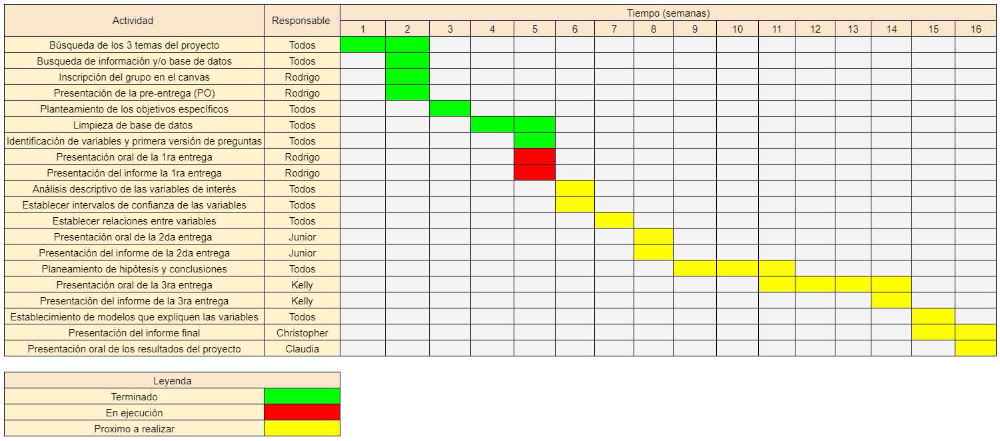

### Población Venezolana

### 1.Introducción:

Debido a que en los últimos años el Perú ha recibido a muchos inmigrantes provenientes de Venezuela, consideramos de interés realizar un estudio de la población venezolana que habita en nuestro país. Esto debido a que la mayoría de nosotros ha tenido o tiene algún tipo de contacto y/o experiencia con algún extranjero proveniente de este país.

En vista a nuestras experiencias propias hemos podido notar ciertas dificultades por las que han tenido que pasar los extranjeros provenientes de Venezuela; tanto a nivel social y/o económico, al momento de conseguir un empleo, por razones como el nivel de su grado de estudios, experiencia laboral en el rubro o simplemente por la falta de confianza que en ocasiones se tiene hacia ellos. 

Por esta razón, en el presente estudio estadístico se realizará un estudio sobre las condiciones socioeconómicas de la población adulta venezolana que reside en el Perú respecto al grado de estudios obtenido. Esto con la finalidad de conocer si el nivel de estudios alcanzado afecta en los niveles de empleabilidad, o  que tanto puede influir su nacionalidad extranjera al momento de querer conseguir un trabajo estable y bien remunerado. 
 
 

### 2.Objetivos:

- Obtener información sobre la influencia que tiene el grado de estudios de los habitantes venezolanos al momento de conseguir un empleo formal en el Perú.
- Identificar cuánto influye ser de Venezuela para tener un salario bien remunerado respecto a su grado de estudios.
- Analizar la relación que existe entre el grado de estudios e ingresos económicos de la población venezolana en el Perú. 

### Preguntas planteadas

- ¿Existe relación entre el nivel de estudios alcanzado y si tiene empleo?
- ¿Cuánto influye la discriminación en el salario de un inmigrante venezolano?
- ¿Existe relación entre los ingresos económicos de un inmigrante venezolano y su nivel de estudios alcanzado?  
- ¿Influye el género en la cantidad de horas trabajadas? 
- ¿Influye el género en el sueldo económico que reciben?
- ¿Influye la edad de los habitantes venezolanos en la cantidad de horas trabajadas? 
- ¿Influye la edad de los habitantes venezolano en el sueldo económico que reciben?

### 3. Marco teórico

La población objetivo de nuestro análisis estadístico está con base en la migración venezolana en el Perú en los últimos años. Por ello, se tomó como fuente de información una base de datos recopilada por medio de una encuesta hecha por el INEI en el 2018 llamada “Encuesta dirigida a la población venezolana que reside en el país, 2018”.

### 3.1 Aspectos metodológicos de la encuesta

- Población objetivo:
Constituida por las viviendas, hogares y personas que llegaron de Venezuela, residentes en el área urbana de las ciudades capitales de las regiones de Tumbres, Arequipa, La libertad, Cusco, provincia de Lima y provincia constitucional del Callao.

- Marco muestral:
Se construyó con información de los Censos Nacionales de Población y Vivienda de 2018, e información de personas que solicitaron el Permiso de Permanencia (PTP), inscritas en el registro de venezolanos de la Superintendencia Nacional de Migraciones del Interior.

-Tipo de muestra de la encuesta:
La muestra es probabilística, estratificada e independiente en cada ciudad y zonas de Lima consideradas en la población en estudio.

-Tiempo en el que se tomó la encuesta:
Del 26 de noviembre al 31 de diciembre del 2018.

- Tamaño de la encuesta:
9852 personas fueron encuestadas.
3611 viviendas.

- Tamaño de la muestra:
Para hacer una representación de la población adulta venezolana que reside en el Perú, se seleccionó una muestra de la encuesta: “Encuesta dirigida a la población venezolana que reside en el país, 2018”. Para nuestro estudio decidimos que el tamaño de la muestra sea de 7676 personas. 

-Unidades muestrales:
Habitantes adultos (edad >= 18 años) provenientes de Venezuela que residen en el Perú.

**PLANIFICACIÓN**

***Diagrama Gantt ***  

 


### 4.Variables

Nombre de variables                                      |    Tipo de variable        |  
----------------------                             |-------------------------------------|
*Código*                                                   |       Categórica           |        
*Sexo *                                                    |       Categórica           |    
*Edad*                                                     |       Numérica             |    
*Ubicación *     	                                         |       Categórica           |   
*Fecha de nacimiento*                                      |       Categórica	          |   
*País de nacimiento*                                       |       Categórica 	        |   
*Tiene empleo*                                             |       Categórica 	        | 
*Tiene contrato*                                           |       Categórica	          |   
*Horas de trabajo a la semana*                             |       Numérica             |   
*Busca trabajo *                                           |       Categórica	          |   
*Busca otro trabajo*                                       |       Categórica 	        |   
*Fecha de pensión*                                         |       Categórica 	        |   
*Ingreso total*                                            |       Numérica 	          | 
*Distrito de trabajo*                                      |       Categórica 	        |   
*Víctima de estafa laboral*                                |       Categórica 	        |  
*Tenía trabajo en Venezuela*                               |       Categórica 	        |
*Ocupación en Venezuela*                                   |       Categórica 	        | 
*Tipo de vivienda*                                         |       Categórica 	        |   
*Material de la pared*                                     |       Categórica	          |   
*Material del techo*                                       |       Categórica	          |   
*Material del piso*                                        |       Categórica 	        |   
*Número de cuartos en la vivienda*                         |       Numérica 	          |   
*Número de dormitorios*                                    |       Numérica 	          |   
*Condición de vivienda*                                    |       Categórica	          |   
*Tipo de alumbrado*                                        |       Categórica	          |   
*Mes y año de ingreso al Perú*                             |       Categórica 	        |   
*Registró su entrada*                                      |       Categórica	          |   
*Puesto de control de ingreso*                             |       Categórica	          |  
*Situación migratoria*                                     |       Categórica 	        |   
*Tipo de seguro de salud*                                  |       Categórica 	        |  
*Padece enfermedad o malestar crónico*                     |       Categórica 	        |   
*Tipo de enfermedad*                                       |       Categórica 	        |   
*Recibe tratamiento*                                       |       Categórica 	        |   
*Molestias desde su llegada a Perú*                        |       Categórica 	        |
*Nivel de estudios*                                        |       Categórica           |
*Tipo de seguro de salud  *                                |      Categórico	          |  
*Padece enfermedad o malestar crónico*                     |      Categórico	          |   
*Tipo de enfermedad *                                      |      Categórico	          |   
*Recibe tratamiento *                                      |      Categórico	          |   
*Molestias desde su llegada a Perú *                       |      Categórico	          |  

*Lugar donde consultó su enfermedad o malestar crónico*    |      Categórico	          |
*Razones por las que no acudió a un centro de salud *      |      Categórico	          |  


*Alguno de los menores fue castigado por su mal comportamiento*      |      Categórico 	          |
*Situaciones de mal comportamiento de sus hijos*                     |      Categórico 	          | 
*En en último mes, mostró cambios en su comportamiento o actitudes*  |      Categórico            | 
*¿Se encuentra embarazada?*                                          |      Categórico	          |
*¿Se ha hecho control del embarazo?*                                 |      Categórico	          |
*¿Tiene niños menores que se encuentren lactando?*                   |      Categórico	          |
*¿Ha vivido situaciones de acoso de algún tipo?*                     |      Categórico	          |
*En el 2017, ¿estuvo matriculado en algún centro o programa de educación básica o superior?*     |      Categórico 	          |
*En el 2018, ¿está matriculado en algún centro o programa de educación básica o superior?*       |      Categórico 	          | 
*¿Asiste a algún centro o programa de educación básica o superior?*                              |      Categórico 	          | 
*¿cuál es el año o grado de estudios en el que está inscrito/matriculado o asistiendo?*          |      Categórico	          |
*La institución educativa, instituto superior o universidad a la que asiste ¿donde está ubicada?*|      Categórico	          |
*¿Obtuvo el título que acredita sus estudios?*                       |      Categórico	          |
*¿Ha homologado su título en Perú? *                                 |      Categórico	          |
*¿Por qué no ha homologado su título? *                              |      Categórico	          |
*Por sus costumbres y sus antepasados, ¿Se siente o se considera?*   |      Categórico	          |
*De acuerdo a su orientación sexual ¿usted actualmente se considera?*|      Categórico	          |
*Resultado final del Hogar *                                         |      Categórico	          |


#### 4.1 Restricciones de respuestas a las variables categóricas

Nombre de variables categóricas                          |          Rango             |  
-------------------------                                |----------------------------------|
***Género***                                                   |        1 H  / 2 M           |  
***Tiene empleo ***                                            |       1 Si / 2 No	        | 
***Tiene contrato***                                           |       1 Si / 2 No	        |   
***Busca otro trabajo ***                                      |       1 Si / 2 No	        |  
***Víctima de estafa laboral***                                |       1 Si / 2 No	        |   
***Tenía trabajo en Venezuela***                               |       1 Si / 2 No	        |  
***Registró su entrada***                                      |       1 Si / 2 No	        |  
***Padece enfermedad o malestar crónico***                     |       1 Si / 2 No	        |
***Piensa quedarse en Perú***                                  |       1 Si / 2 No          | 

***Ocupación en Venezuela: ***                                 |   1 Empleador o patrono
                                                         |   2 Trabajador independiente
                                                         |   3 Empleado
                                                         |   4 Obrero
                                                         |   5 Trabajador familiar no remunerado
                                                         |   6 Trabajador del hogar
                                                         |   7 Otro 


***Tipo de vivienda:***                                        |   1 Casa independiente 
                                                         |   2 Departamento en edificio
                                                         |   3 Vivienda en quinta
                                                         |   4 Vivienda en casa de vecindad
                                                         |   5 Choza o cabaña
                                                         |   6 Vivienda improvisada
                                                         |   7 Local no destinado para habitación humana
                                                         |   8 Otro 


***Material de la pared:***                             | 1 Ladrillo o bloque de cemento  |2 Piedra, sillar con cal o cemento  |3 Adobe | 4 Tapia |5 Quincha (caña con barro)  |6 Piedra con barro   |7 Madera   |8 Estera/triplay/calamina |9 Otro material


***Material del techo:***                                 |1 Concreto armado   |2 Madera   |3 Tejas  |4 Planchas de calamina, fibra de cemento o similares  |5 Caña o estera con torta de barro o cemento  |6 Triplay/estera/carrizo   |7 Paja, hojas de palmera  |8 Otro material


***Material del piso:***                                  |1 Parquet o madera pulida  |2 Láminas asfálticas, vinílicos o similares  |3 Losetas, terrazos o similares  |4 Madera (pona, tornillo)  |5 Cemento   |6 Tierra  |7 Otro material


***Cóndición de vivienda:***  |1 Alquilada  |2 Hogar temporal  |3 Cedida por otro hogar  |4 Vivienda propia  |5 Albergue  |6 Otro    


***Tipo de alumbrado:***                              |1 Electricidad   |2 Petróleo/gas (lámpara)  |3 Vela  |4 Generador  |5 Otro   |6 NO UTILIZA

  
***Puesto de control de ingreso:***   |1 Tumbes  |2 Tacna  |3 Lima (aeropuerto) | 4 Otro 


***Situación migratoria:***   | 1 Visa de turista  |2 Visa de trabajo   |3 Visa de estudiante   |4 Solicitante de PTP  |5 Con Permiso Temporal de Trabajo – PTP   |6 Solicitante de refugio  |7 Refugiado  |8 Carnet de Extranjería   |9 DNI    |10 Otra situación 


***Tipo de seguro de salud:***  | 1 ESSALUD  | 2 Seguro Privado de Salud | 3 Seguro Integral de Salud – SIS  | 4 Otro  | 5 NO ESTÁ AFILIADO 

  
***Tipo de enfermedad:***   | 1 Artritis  | 2 Hipertensión | 3 Asma  | 4 Reumatismo  | 5 Diabetes  | 6 Tuberculosis   | 7 Colesterol  | 8 Enfermedad pulmon  | 9 Cáncer  |10 Alteraciones de salud mental  | 11 Enfermedad del corazón  | 12 VIH/SIDA  | 13 Otras infecciones de transmisión sexual  | 14 Otro


***Recibe tratamiento:*** | 1 Sí, con la frecuencia necesaria   |2 Sí, pero no con la frecuencia necesaria  |3 No recibe tratamiento 


***Molestias desde su llegada a Perú:***  | 1 Síntoma o malestar  | 2 Enfermedad (gripe, colitis, etc.)  | 3 Recaída de enfermedad crónica |4 Accidente  |5 Molestia o problema como: depresión, miedo, enojo,ansiedad, estrés, etc  |6 Embarazo  |7 NO TUVO ENFERMEDAD, SÍNTOMA, RECAÍDA, ACCIDENTE


***Nivel de estudios:***  |1 Sin nivel  |2 Preescolar  |3 Educación Básica Incompleta   |4 Educación Básica Completa   |5 Educación Media Diversificada Incompleta   |6 Educación Media Diversificada Completa  |7 Técnico Superior Incompleta  |8 Técnico Superior Completa  |9 Superior Universitaria Incompleta   | 10 Superior Universitaria Completa  | 11 Maestría/ Doctorado


### 5.Carga de información


#### 5.1 Carga de librerías

```{r}
## Descargar las librerías si es que no las tiene previamente descargadas
# install.packages("pyramid")
# install.packages("statsr")
# install.packages("plotrix")
# install.packages("gginference")

##Invocar las librerías
library(readr)
library(dplyr)
library(stringr)
library(modeest)
library(ggplot2)
library(pyramid)
library(statsr)
library(tidyverse)
library(plotrix)
library(MASS)
library(gginference)

```

#### 5.2 Carga de base de datos

```{r}
library(readxl)
Modelo1 <- read_excel("Modelo1.xlsx")
sum(complete.cases(Modelo1))

#Filtro para obtener las observaciones de personas mayores de edad.
ad=filter(Modelo1,Modelo1$`P205_¿Qué edad tienen en años cumplidos?`>=18)
#Filtro para obtener las observaciones completas de las personas mayores de edad.
m18= ad %>% filter(complete.cases(.))
#Cantidad de observaciones completas.
sum(complete.cases(ad))
#Cantidad de observaciones incompletas.
sum(!complete.cases(ad))
```
Como nuestro estudio se centra en personas adultas (edad >= 18 años) con nacionalidad venezolana que residen en el Perú, la base de datos de la encuesta mencionada en el marco teórico pasó por un filtrado. Luego se utilizó la librería dplyr con el objetivo de obtener un data.frame llamado "ad" a partir de las observaciones reportadas como mayores de edad. Finalmente, se aplicó la función complete.cases() a fin de obtener un data.frame llamado "m18" unicamente con las observaciones completas con el objetivo de obtener nuestra muestra de estudio. 
La cantidad de observaciones completas reportadas fue de 7676. Esto nos asegura que la muestra tomada es representativa, ya que su tamaño es grande y la fuente de la base de datos escogida es confiable.


####  6.Análisis estadístico

####  6.1 Variable: Sexo

```{r}

round(table(m18$P204_Sexo),digits=2)

P204=m18$P204_Sexo

tablesexo=data.frame(P204)

sexoP204 = tablesexo %>% filter(P204 > 0)
sexoP204_grafica = sexoP204


sexoP204_grafica$P204[sexoP204_grafica$P204=="1"] <- "Hombre"
sexoP204_grafica$P204[sexoP204_grafica$P204=="2"] <- "Mujer"


barplot(round(table(sexoP204_grafica$P204),digits=2), main="Cantidad de personas según su sexo", ylab="Cantidad de personas", xlab="Sexo",col=c("lightblue","lightpink"),ylim=c(0,5000), las=1,legend.text = row.names(table(sexoP204_grafica$P204)),args.legend = list(x = "topright",inset=c(0.1,0.015),grid(nx = NA, ny = NULL, lwd = 1, lty = 1, col = "gray")) ) 

```
A partir de este gráfico realizado con el uso de la función barplot se pretende conocer la distribución por género de la cantidad total de los habitantes venezolanos encuestados en Perú. Esto por medio de sus respuestas a través de las variables cualitativas dicotómicas. En el presente diagrama se puede apreciar que los habitantes venezolanos del sexo masculino son 4069 con un porcentaje de 53.01% y del sexo femenino son 3607 con un porcentaje de 46.99%. Asimismo,de acuerdo con los valores y a la gráfica se observa que hay más habitantes venezolanos del sexo masculino que mujeres encuestadas. Esto con una mínima diferencia de 462 encuestados y un porcentaje de 6.02%.
En conclusión  para los diagramas de barras mostrados podemos observar que para la población venezolana mayor de edad la cantidad de hombres es mayor a la de mujeres. Sin embargo, esta diferencia no es muy significativa (alrededor del 6%).
---
*** Intervalo de confianza para la proporción de hombres venezolanos en el Perú***
Con la finalidad de  comparar y obtener la proporción de hombres venezolanos en el Perú, se realizó el siguiente intervalo de confianza para la distribución normal: 

```{r}
nH=nrow(m18) 
valorH=4069
pH=valorH/nH
zH=qnorm(0.995)

error.estandar.H<- sqrt((pH*(1-pH)/nH))
error.H<- zH*error.estandar.H
lim_inf_H <- round((pH - error.H)*100,digits =2)
lim_sup_H <- round((pH + error.H)*100,digits =2)

interval_mediahombres <- data.frame(nH, pH , error.estandar.H, error.H,lim_inf_H,lim_sup_H)
interval_mediahombres

```

Se obtuvo que el intervalo se encuentra en un rango de [51.54%, 54.48%], el cual nos indica que al ser nuestro tamaño de muestra muy grande y al trabajar con 0.95 del nivel de confianza el 95% de estos intervalos contendrá a la proporción. Esto al compararlo con la gráfica, nos muestra que la proporción de hombres son más de la mitad.


*** Intervalo de confianza para la proporción de mujeres venezolanos en el Perú***

Con la finalidad de  comparar y obtener la proporción de mujeres venezolanas en el Perú, se realizó el siguiente intervalo de confianza para la distribución normal:

```{r}
nM=nrow(m18) 
valorM=3607
pM=valorM/nM
zM=qnorm(0.995)

Error.Estandar.M<- sqrt((pM*(1-pM)/nM))
Error.M<- zM*Error.Estandar.M
Límite.Inferior.M <- round((pM - Error.M)*100,digits =2)
Límite.Superior.M <- round((pM + Error.M)*100,digits =2)

interval_mediamujeres <- data.frame(nM , pM , Error.Estandar.M, Error.M,Límite.Inferior.M,Límite.Superior.M)
interval_mediamujeres


```

Se obtuvo que el intervalo se encuentra en un rango de [45.52 % , 48.46 %], el cual nos indica que al ser nuestro tamaño de muestra muy grande y al trabajar con 0.95 del nivel de confianza el 95% de estos intervalos contendrá a la proporción. Esto al compararlo con la gráfica, nos indica que la proporción de mujeres son menos de la mitad.
 

#### 6.2 Variable: Edad

```{r}
round(mean(m18$`P205_¿Qué edad tienen en años cumplidos?`),2)
round(median(m18$`P205_¿Qué edad tienen en años cumplidos?`),2)
mfv(m18$`P205_¿Qué edad tienen en años cumplidos?`)
 
max(m18$`P205_¿Qué edad tienen en años cumplidos?`)
min(m18$`P205_¿Qué edad tienen en años cumplidos?`)
round(var(m18$`P205_¿Qué edad tienen en años cumplidos?`),2)
round(sd(m18$`P205_¿Qué edad tienen en años cumplidos?`),2)
round(IQR(m18$`P205_¿Qué edad tienen en años cumplidos?`),2)
round(sd(m18$`P205_¿Qué edad tienen en años cumplidos?`)/mean(m18$`P205_¿Qué edad tienen en años cumplidos?`),2)
```


Descriptores Numéricos            |    Valores             |  
----------------------|-------------------------------------|
Media                       |       31.07             |      
Mediana                     |       29                |      
Moda                        |       25                |      
Varianza                    |       104.18            |   
Desv. Estándar              |       10.21             |    
Rang. Intercuartil       	  |      	13                |    
Coef. de Variación          |       0.32              |
Máximo valor                |        93               |
Mínimo valor                |        18               |


Para la variable numérica "edad" de los habitantes venezolanos adultos en Perú (indepedientemente del sexo) se obtuvieron estos descriptores numéricos; siendo la edad promedio aproximadamente 31, el valor central o mediana 29 y la edad más común 25 años. Para analizar la dispersión se obtuvo la varianza y la desviación estándar, hallando que esta última tiene un valor de 10.21 lo cual nos hace pensar que no hay mucha dispersión entre los datos de esta variable. El valor de edad máximo es de 93 años y el mínimo es 18, lo cual es lógico ya que anteriormente se filtró la data para centrarnos solo en personas adultas (edad >= 18).  


```{r}

P205 = m18$`P205_¿Qué edad tienen en años cumplidos?`
tableP205 = data.frame(P205)

hist(m18$`P205_¿Qué edad tienen en años cumplidos?`,breaks=15,main="Cantidad personas según edad",ylab="Cantidad de personas",xlab="Rango de edad",col="lightgreen", ylim=c(0,2000), las=1)
  
```

A partir del histograma realizado con el uso de la función hist se pretende conocer cantidad de inmigrantes venezolanos según su edad. Esto por medio de sus respuestas a través de las variables numéricas. En el presente histograma se puede apreciar que de los habitantes venezolanos encuestados en el Perú la máxima cantidad de inmigrantes equivalen a 1900 personas, los cuales se encuentran en un rango de edad de 25 a 30 años. Asimismo, se visualiza que los que inmigraron menos son los habitantes venezolanos con un rango de edad de 80 a 85 años. No obstante, respecto a la máxima edad, solo se registró que una persona de 93 años inmigró al Perú.Por último, como el valor de la media es mayor que la mediana es lógico que el histograma este sesgado a la derecha. 


***Intervalo de confianza para la variable edad*** 

Con la finalidad de obtener el rango promedio de la edad de los habitantes venezolanos en el Perú se realizó el siguiente intervalo de confianza:
 
```{r}
n=nrow(m18) 
xbarra=31.07
sigma=10.21
alpha=1-0.95
z=qnorm(1-alpha/2)

a=xbarra-z*sigma/(n^0.5)
b=xbarra+z*sigma/(n^0.5)
round(a,2)
round(b,2)
 
```

De acuerdo con el intervalo de confianza para medias se obtuvo un rango de [30.84,31.3]. Al tener un tamaño de muestra muy grande y trabajar con 0.95 del nivel de confianza el 95% de estos intervalos contendrá al promedio de los habitantes venezolanos.
 
 

```{r}
tableedad_genero = data.frame(tableP205,sexoP204_grafica)
tableedad_generoF = tableedad_genero %>% filter(P204 == "Mujer")

mujer <- c(length((tableedad_generoF%>% filter(17<P205,P205<25))[,1]),length((tableedad_generoF%>% filter(24<P205,P205<32))[,1]),length((tableedad_generoF%>% filter(31<P205,P205<39))[,1]),length((tableedad_generoF%>% filter(38<P205,P205<46))[,1]),length((tableedad_generoF%>% filter(45<P205,P205<53))[,1]),length((tableedad_generoF%>% filter(52<P205,P205<60))[,1]),length((tableedad_generoF%>% filter(59<P205,P205<67))[,1]),length((tableedad_generoF%>% filter(66<P205,P205<74))[,1]),length((tableedad_generoF%>% filter(73<P205,P205<81))[,1]),length((tableedad_generoF%>% filter(80<P205,P205<88))[,1]),length((tableedad_generoF%>% filter(87<P205,P205<95))[,1]))
tableedad_generoM = tableedad_genero %>% filter(P204 == "Hombre")

hombre <- c(length((tableedad_generoM%>% filter(17<P205,P205<25))[,1]),length((tableedad_generoM%>% filter(24<P205,P205<32))[,1]),length((tableedad_generoM%>% filter(31<P205,P205<39))[,1]),length((tableedad_generoM%>% filter(38<P205,P205<46))[,1]),length((tableedad_generoM%>% filter(45<P205,P205<53))[,1]),length((tableedad_generoM%>% filter(52<P205,P205<60))[,1]),length((tableedad_generoM%>% filter(59<P205,P205<67))[,1]),length((tableedad_generoM%>% filter(66<P205,P205<74))[,1]),length((tableedad_generoM%>% filter(73<P205,P205<81))[,1]),length((tableedad_generoM%>% filter(80<P205,P205<88))[,1]),length((tableedad_generoM%>% filter(87<P205,P205<95))[,1]))

edad <- c("18-24", "25-31", "32-38", "39-45", "46-52", "53-59", "60-66", "67-73","74-80", "81-87", "88-94")

# creación del dataframe con los tres vectores anteriores
graficageneroedad <- data.frame(hombre, mujer, edad)

# creación del gráfico con el comando adecuado que permite configurar varios parámetros:
pyramid(graficageneroedad, Llab="Hombres", Rlab="Mujeres", Clab="Edad", Lcol="lightblue", Rcol="lightpink", Laxis=c(0,300,600,900,1200,1500), main="Distribución de edad según el sexo",AxisFM="d", AxisBM=",",Cgap = 0.3,Cstep=1,Csize=1)

```

Los gráficos de pirámide en esta ocasión son utilizados para hacer una comparación de la cantidad de personas según su sexo, podemos observar que tanto para hombres y mujeres el rango de edad de 25-31 años es el que indica una mayor cantidad de personas en comparación con los otros rangos. El rango de 18-24 años es el siguiente que indica que para esta edad existe una cantidad de personas considerable. 


```{r}
# Distribución de la edad
par(mfrow=c(1,1)) # con par(mfrow=c()) podemos indicar el número de figuras que se muestran
# en este caso una imagen
# Comparación de la edad en ambos sexos (variable edad en función sexo)
# Otra forma sería separar el grupo en dos subgrupos en función de una variable determinada
# utilizando el comando split: boxplot(split(pacientes$Edad, pacientes$Genero))
# Incluimos colores e información diversa
boxplot(m18$`P205_¿Qué edad tienen en años cumplidos?` ~ m18$P204_Sexo, 
        main="Distribución de la edad según el sexo", # incluimos el título
        xlab="Edad", ylab="Sexo", # etiquetas de x e y
        names=c("Hombre", "Mujer"), # indica cada grupo de género
        horizontal=TRUE, # dispone en horizontal los boxplots
        col=c("lightblue","lightpink")) # colorea los boxplots

```

Este boxplot se utiliza para ver si existen valores atípicos de la variable edad de los habitantes venezolanos en función de su género. Como se puede visualizar el género femenino presenta más valores atípicos que el género masculino donde el máximo valor atípico de las mujeres es de 93 años. Además, se observa que el valor central o mediana entre mujeres y varones es la misma, los cuales se concentran en 29 años de edad.

 
### Descriptores numéricos para la variable edad en hombres
```{r}
h=filter(m18,P204_Sexo==1)
round(mean(h$`P205_¿Qué edad tienen en años cumplidos?`),2)
round(median(h$`P205_¿Qué edad tienen en años cumplidos?`),2)
mfv(h$`P205_¿Qué edad tienen en años cumplidos?`)
 
max(h$`P205_¿Qué edad tienen en años cumplidos?`)
min(h$`P205_¿Qué edad tienen en años cumplidos?`)
round(var(h$`P205_¿Qué edad tienen en años cumplidos?`),2)
round(sd(h$`P205_¿Qué edad tienen en años cumplidos?`),2)
round(IQR(h$`P205_¿Qué edad tienen en años cumplidos?`),2)
round(sd(h$`P205_¿Qué edad tienen en años cumplidos?`)/mean(h$`P205_¿Qué edad tienen en años cumplidos?`),2)

```


Para hombres:

Descriptores Numéricos          |    Valores             |  
----------------------|-------------------------------------|
Media                       |       31.2              |      
Mediana                     |       29                |      
Moda                        |       24                |      
Varianza                    |       84.57             |   
Desv. Estándar              |       9.2               |    
Rang. Intercuartil       	  |      	12                |    
Coef. de Variación          |       0.29              |
máximo valor                |        80               |
mínimo valor                |        18               |


Para la variable númerica "edad" de los habitantes venezolanos hombres en Perú se obtuvieron estos descriptores númericos; siendo la edad promedio aproximadamente 31, el valor central o mediana 29 y la edad que más común 24. Para analizar la dispersión se obtuvo la varianza y la desviación estándar, hallando que esta última tiene un valor de 9.2 lo cual nos hace pensar que no hay mucha dispersión entre los datos para esta variable. El valor de edad máximo es de 80 años y el mínimo es 18, lo cuál es lógico ya que anteriormente se filtró la data para centrarnos solo en personas adultas (edad >= 18).  

---

***Intervalo de confianza para la media de la edad de los habitantes venezolanos***

Con la finalidad de obtener el rango promedio de la edad de la población venezolana del género masculino se realizó el siguiente intervalo de confianza:

```{r}
n=nrow(h) 
xbarra=mean(h$`P205_¿Qué edad tienen en años cumplidos?`)
sigma=sd(h$`P205_¿Qué edad tienen en años cumplidos?`)
alpha=1-0.95
z=qnorm(1-alpha/2)
  
a=xbarra-z*sigma/(n^0.5)
b=xbarra+z*sigma/(n^0.5)
round(a,2)
round(b,2)
```

De acuerdo con el intervalo de confianza para medias se obtuvo un rango de [30.91,31.48]. Al tener un tamaño de muestra muy grande y trabajar con 0.95 del nivel de confianza el 95% de estos intervalos contendrá al promedio de los habitantes venezolanos que son del género masculino.
 
### Descriptores numéricos para la variable edad en mujeres 
```{r}
m=filter(m18,P204_Sexo==2)
round(mean(m$`P205_¿Qué edad tienen en años cumplidos?`),2)
round(median(m$`P205_¿Qué edad tienen en años cumplidos?`),2)
mfv(m$`P205_¿Qué edad tienen en años cumplidos?`)
 
max(m$`P205_¿Qué edad tienen en años cumplidos?`)
min(m$`P205_¿Qué edad tienen en años cumplidos?`)
round(var(m$`P205_¿Qué edad tienen en años cumplidos?`),2)
round(sd(m$`P205_¿Qué edad tienen en años cumplidos?`),2)
round(IQR(m$`P205_¿Qué edad tienen en años cumplidos?`),2)
round(sd(m$`P205_¿Qué edad tienen en años cumplidos?`)/mean(m$`P205_¿Qué edad tienen en años cumplidos?`),2)

```

Para mujeres:

Descriptores Numéricos            |    Valores             |  
----------------------|-------------------------------------|
Media                       |       32.27            |      
Mediana                     |       29               |      
Moda                        |       26               |      
Varianza                    |       125.72            |   
Desv. Estándar              |       11.21             |    
Rang. Intercuartil       	  |      	14               |    
Coef. de Variación          |       0.35             |
máximo valor                |        93               |
mínimo valor                |        18               |


Para la variable númerica "edad" respecto a las mujeres adultas venezolanas en Perú  se obtuvieron estos descriptores númericos; la edad promedio aproximadamente 32, el valor central o mediana 29 y la edad que más común 26. Para analizar la dispersión se obtuvo la varianza y la desviación estándar, hallando que esta última tiene un valor de 11.21 lo cual nos hace pensar que no hay mucha dispersión entre los datos de esta variable, pero que estos datos están más dispersos si comparamos esta variable con la que es solo relacionado a hombres. El valor de edad máximo es de 93 años y el mínimo es 18, lo cual es lógico ya que se anteriormente se filtro para centrarnos solo en personas adultas (edad >= 18).  


***Intervalo de confianza para la media de la edad de mujeres venezolanas*** 
Con la finalidad de obtener el rango promedio de la edad de los habitantes venezolanos del género femenino se realizó el siguiente intervalo de confianza:

```{r}
n=nrow(m) 
xbarra=31.2
sigma=9.2
alpha=1-0.95
z=qnorm(1-alpha/2)
  
a=xbarra-z*sigma/(n^0.5)
b=xbarra+z*sigma/(n^0.5)
round(a,2)
round(b,2)
```
De acuerdo con el intervalo de confianza para medias se obtuvo un rango de [30.9,31.5]. Al tener un tamaño de muestra muy grande y trabajar con 0.95 del nivel de confianza el 95% de estos intervalos contendrá al promedio de los habitantes venezolanos que son del género femenino.


#### 6.4 Variable: Cantidad de horas que trabaja a la semana

```{r}

emple=filter(m18,m18$`P610_Horas trabajadas totales x semana`!=0)

homemple=filter(emple, emple$P204_Sexo==1)


mujemple=filter(emple, emple$P204_Sexo==2)


tableedad_horastotales = data.frame(data.frame(m18$`P610_Horas trabajadas totales x semana`),sexoP204_grafica)
tableedad_horastotales1 = filter (tableedad_horastotales,tableedad_horastotales$m18..P610_Horas.trabajadas.totales.x.semana. != 0)
tableedad_horastotales1F = tableedad_horastotales1 %>% filter(data.frame(tableedad_horastotales1$P204) == "Mujer")

table_horastotalesF = tableedad_horastotales1F$m18..P610_Horas.trabajadas.totales.x.semana. 

mujer_horas <- c(length((tableedad_horastotales1F%>% filter(0<table_horastotalesF,table_horastotalesF<16))[,1]),length((tableedad_horastotales1F%>% filter(15<table_horastotalesF,table_horastotalesF<31))[,1]), length((tableedad_horastotales1F%>% filter(30<table_horastotalesF,table_horastotalesF<46))[,1]),length((tableedad_horastotales1F%>% filter(45<table_horastotalesF,table_horastotalesF<61))[,1]),length((tableedad_horastotales1F%>% filter(60<table_horastotalesF,table_horastotalesF<76))[,1]),length((tableedad_horastotales1F%>% filter(75<table_horastotalesF,table_horastotalesF<91))[,1]),length((tableedad_horastotales1F%>% filter(90<table_horastotalesF,table_horastotalesF<106))[,1]),length((tableedad_horastotales1F%>% filter(105<table_horastotalesF,table_horastotalesF<121))[,1]),length((tableedad_horastotales1F%>% filter(120<table_horastotalesF,table_horastotalesF<136))[,1]))


tableedad_horastotales1M = tableedad_horastotales1 %>% filter(data.frame(tableedad_horastotales1$P204) == "Hombre")
table_horastotalesM = tableedad_horastotales1M$m18..P610_Horas.trabajadas.totales.x.semana. 


hombre_horas <- c(length((tableedad_horastotales1M%>% filter(0<table_horastotalesM,table_horastotalesM<16))[,1]),length((tableedad_horastotales1M%>% filter(15<table_horastotalesM,table_horastotalesM<31))[,1]), length((tableedad_horastotales1M%>% filter(30<table_horastotalesM,table_horastotalesM<46))[,1]),length((tableedad_horastotales1M%>% filter(45<table_horastotalesM,table_horastotalesM<61))[,1]),length((tableedad_horastotales1M%>% filter(60<table_horastotalesM,table_horastotalesM<76))[,1]),length((tableedad_horastotales1M%>% filter(75<table_horastotalesM,table_horastotalesM<91))[,1]),length((tableedad_horastotales1M%>% filter(90<table_horastotalesM,table_horastotalesM<106))[,1]),length((tableedad_horastotales1M%>% filter(105<table_horastotalesM,table_horastotalesM<121))[,1]),length((tableedad_horastotales1M%>% filter(120<table_horastotalesM,table_horastotalesM<136))[,1]))

horas<- c("0-15", "16-30", "31-45", "46-60", "61-75", "76-90", "91-105", "106-120","121-135")

graficagenerohoras <- data.frame(hombre_horas, mujer_horas, horas)

```

```{r}


round(mean(emple$`P611_Normalmente.¿Cuántas horas trabaja durante toda una semana en todas sus ocupaciones?`),2)
round(median(emple$`P611_Normalmente.¿Cuántas horas trabaja durante toda una semana en todas sus ocupaciones?`),2)
mfv(emple$`P611_Normalmente.¿Cuántas horas trabaja durante toda una semana en todas sus ocupaciones?`)
 
max(emple$`P611_Normalmente.¿Cuántas horas trabaja durante toda una semana en todas sus ocupaciones?`)
min(emple$`P611_Normalmente.¿Cuántas horas trabaja durante toda una semana en todas sus ocupaciones?`)
round(var(emple$`P611_Normalmente.¿Cuántas horas trabaja durante toda una semana en todas sus ocupaciones?`),2)
round(sd(emple$`P611_Normalmente.¿Cuántas horas trabaja durante toda una semana en todas sus ocupaciones?`),2)
round(IQR(emple$`P611_Normalmente.¿Cuántas horas trabaja durante toda una semana en todas sus ocupaciones?`),2)
round(sd(emple$`P611_Normalmente.¿Cuántas horas trabaja durante toda una semana en todas sus ocupaciones?`)/mean(emple$`P611_Normalmente.¿Cuántas horas trabaja durante toda una semana en todas sus ocupaciones?`),2)

```
Descriptores Numéricos            |    Valores             |  
----------------------|-------------------------------------|
Media                       |       59.57            |      
Mediana                     |       60               |      
Moda                        |       60               |      
Varianza                    |       333.43            |   
Desv. Estándar              |       18.26             |    
Rang. Intercuartil       	  |      	24               |    
Coef. de Variación          |       0.31             |
máximo valor                |        141               |
mínimo valor                |        2               |


Se muestran los valores de los descriptores numéricos que pertenecen a la variable númerica normalmente cuantas horas trabaja. Se obtuvo que la media es de 59.57 horas, la mediana 60, el valor de horas que más se repite es 60. Respecto a la dispersión se obtuvo el valor de la varianza y la desviación estándar, tomando este último un valor de 18.26 horas por lo que podemos decir que la dispersión de datos existe.Se registró como valor máximo 141 horas lo cual es inusual y como valor mínimo 2 horas que tampoco es usual para un trabajador regular.

***Intervalo de confianza para el promedio de horas que trabaja a la semana*** 
 
```{r}

## La media muestral 
## z a un 95% de confianza  -> z = 1.96
## Error estándar 

confianza.m1 = 0.95
alfa.m1= 1-confianza.m1
z.m1 <- qnorm(1-alfa.m1/2)

Media.Muestral.1 = mean(emple$`P611_Normalmente.¿Cuántas horas trabaja durante toda una semana en todas sus ocupaciones?`)


Tamaño.Muestra.1 <- length(emple$`P611_Normalmente.¿Cuántas horas trabaja durante toda una semana en todas sus ocupaciones?`)
Desviación.Poblacional.1 <- sd(emple$`P611_Normalmente.¿Cuántas horas trabaja durante toda una semana en todas sus ocupaciones?`)

Error.Estandar.1 <- Desviación.Poblacional.1/sqrt(Tamaño.Muestra.1)

Límite_inferior.1 <- round(Media.Muestral.1 - z*Error.Estandar.1,digits =2)

Límite_superior.1 <- round(Media.Muestral.1 + z*Error.Estandar.1,digits =2)

interval_m1 <- data.frame(Tamaño.Muestra.1,Media.Muestral.1, Desviación.Poblacional.1,z.m1,Error.Estandar.1,Límite_inferior.1,Límite_superior.1)
interval_m1


```

A un nivel de confianza del 95% podemos decir que el promedio poblacional de horas que normalmente trabaja una persona venezolana adulta se encuentra en un intervalo de confianza de [59.13, 60.01]. 
   
***Intervalo de confianza para la propoción de habitantes venezolanos que trabajan más de 48 horas*** 
 
```{r}

tableedad_horastotalesnormalmente = data.frame(data.frame(m18$`P611_Normalmente.¿Cuántas horas trabaja durante toda una semana en todas sus ocupaciones?`),sexoP204_grafica)

tableedad_horastotalesnormalmente1 = filter (tableedad_horastotalesnormalmente,tableedad_horastotalesnormalmente$m18..P611_Normalmente..Cuántas.horas.trabaja.durante.toda.una.semana.en.todas.sus.ocupaciones.. != 0)

mayor.sueldomin = filter(tableedad_horastotalesnormalmente1,tableedad_horastotalesnormalmente1$m18..P611_Normalmente..Cuántas.horas.trabaja.durante.toda.una.semana.en.todas.sus.ocupaciones.. >= 48)

confianza.p2 = 0.95
alfa.p2= 1-confianza.p2
z.p2 <- qnorm(1-alfa.p2/2)

Proporción.2 <- length(mayor.sueldomin$m18..P611_Normalmente..Cuántas.horas.trabaja.durante.toda.una.semana.en.todas.sus.ocupaciones..)/(length(tableedad_horastotalesnormalmente1$m18..P611_Normalmente..Cuántas.horas.trabaja.durante.toda.una.semana.en.todas.sus.ocupaciones..))


Tamaño.Muestra.2 <- length(tableedad_horastotalesnormalmente1$m18..P611_Normalmente..Cuántas.horas.trabaja.durante.toda.una.semana.en.todas.sus.ocupaciones..)
Error.Estandar.2 <- sqrt((Proporción.2*(1-Proporción.2)/Tamaño.Muestra.2))
Error.2 <- z.p2*Error.Estandar.2

Límite_Inferior.2 <- round((Proporción.2 - Error.2)*100,digits = 2)
Límite_Superior.2 <- round((Proporción.2 + Error.2)*100,digits =2)

interval_p2 <- data.frame(Tamaño.Muestra.2, Proporción.2 , Error.Estandar.2, Error.2,Límite_Inferior.2,Límite_Superior.2)
interval_p2


``` 

A un nivel de confianza del 95% podemos decir que la proporción poblacional de personas venezolanas que trabajan más de 48 horas a la semana se encuentra en un intervalo de confianza de [81.16%, 82.99%]   


```{r}

tableedad_horastotalesnormalmente = data.frame(data.frame(m18$`P611_Normalmente.¿Cuántas horas trabaja durante toda una semana en todas sus ocupaciones?`),sexoP204_grafica)

tableedad_horastotalesnormalmente1 = filter (tableedad_horastotalesnormalmente,tableedad_horastotalesnormalmente$m18..P611_Normalmente..Cuántas.horas.trabaja.durante.toda.una.semana.en.todas.sus.ocupaciones.. != 0)

tableedad_horastotalesnormalmente1F = tableedad_horastotalesnormalmente1 %>% filter(data.frame(tableedad_horastotalesnormalmente1$P204) == "Mujer")

table_horastotalesnormalmenteF = tableedad_horastotalesnormalmente1F$m18..P611_Normalmente..Cuántas.horas.trabaja.durante.toda.una.semana.en.todas.sus.ocupaciones..

mujer_horasnormalmente <- c(length((tableedad_horastotalesnormalmente1F%>% filter(0<table_horastotalesnormalmenteF,table_horastotalesnormalmenteF<16))[,1]),length((tableedad_horastotalesnormalmente1F%>% filter(15<table_horastotalesnormalmenteF,table_horastotalesnormalmenteF<31))[,1]), length((tableedad_horastotalesnormalmente1F%>% filter(30<table_horastotalesnormalmenteF,table_horastotalesnormalmenteF<46))[,1]),length((tableedad_horastotalesnormalmente1F%>% filter(45<table_horastotalesnormalmenteF,table_horastotalesnormalmenteF<61))[,1]),length((tableedad_horastotalesnormalmente1F%>% filter(60<table_horastotalesnormalmenteF,table_horastotalesnormalmenteF<76))[,1]),length((tableedad_horastotalesnormalmente1F%>% filter(75<table_horastotalesnormalmenteF,table_horastotalesnormalmenteF<91))[,1]),length((tableedad_horastotalesnormalmente1F%>% filter(90<table_horastotalesnormalmenteF,table_horastotalesnormalmenteF<106))[,1]),length((tableedad_horastotalesnormalmente1F%>% filter(105<table_horastotalesnormalmenteF,table_horastotalesnormalmenteF<121))[,1]),length((tableedad_horastotalesnormalmente1F%>% filter(120<table_horastotalesnormalmenteF,table_horastotalesnormalmenteF<136))[,1]))


tableedad_horastotalesnormalmente1M = tableedad_horastotalesnormalmente1 %>% filter(data.frame(tableedad_horastotalesnormalmente1$P204) == "Hombre")

table_horastotalesnormalmenteM = tableedad_horastotalesnormalmente1M$P204

hombre_horasnormalmente <- c(length((tableedad_horastotalesnormalmente1M%>% filter(0<table_horastotalesnormalmenteM,table_horastotalesnormalmenteM<16))[,1]),length((tableedad_horastotalesnormalmente1M%>% filter(15<table_horastotalesnormalmenteM,table_horastotalesnormalmenteM<31))[,1]), length((tableedad_horastotalesnormalmente1M%>% filter(30<table_horastotalesnormalmenteM,table_horastotalesnormalmenteM<46))[,1]),length((tableedad_horastotalesnormalmente1M%>% filter(45<table_horastotalesnormalmenteM,table_horastotalesnormalmenteM<61))[,1]),length((tableedad_horastotalesnormalmente1M%>% filter(60<table_horastotalesnormalmenteM,table_horastotalesnormalmenteM<76))[,1]),length((tableedad_horastotalesnormalmente1M%>% filter(75<table_horastotalesnormalmenteM,table_horastotalesnormalmenteM<91))[,1]),length((tableedad_horastotalesnormalmente1M%>% filter(90<table_horastotalesnormalmenteM,table_horastotalesnormalmenteM<106))[,1]),length((tableedad_horastotalesnormalmente1M%>% filter(105<table_horastotalesnormalmenteM,table_horastotalesnormalmenteM<121))[,1]),length((tableedad_horastotalesnormalmente1M%>% filter(120<table_horastotalesnormalmenteM,table_horastotalesnormalmenteM<136))[,1]))

horas<- c("0-15", "16-30", "31-45", "46-60", "61-75", "76-90", "91-105", "106-120","121-135")

graficasexohoras <- data.frame(hombre_horas, mujer_horas, horas)

# creación del gráfico con el comando adecuado que permite configurar varios parámetros:
pyramid(graficasexohoras, Llab="Hombres", Rlab="Mujeres", Clab="Rango de horas", Lcol="lightblue", Rcol="lightpink", Laxis=c(0,300,600,900,1200,1500), main="Distribución de horas de trabajadas la semana según el sexo",AxisFM="d", AxisBM=",",Cgap = 0.3,Cstep=1,Csize=1)

```

A través de la pirámide podemos ver los rangos de horas trabajadas con mayor frecuencia de hombres y mujeres. Siendo tanto para hombres como mujeres el rango de 46-60 horas la de mayor frecuencia. Asimismo, podemos observar que existen personas que han reportado trabajar más de 90 horas, lo cual podemos inferir que se desempeñan en más de un trabajo u oficio. También tenemos información de personas que están en el rango de 0-15 horas,lo cual se infiere que son personas que trabajan a medio tiempo o que trabajan esporádicamente , ya que no tienen un empleo fijo. 


#### 6.5 Variable: Tenía trabajo antes de migrar 
 
```{r}
 

m18$`P627_En Venezuela. ¿Tenía usted trabajo antes de iniciar su viaje?`[m18$`P627_En Venezuela. ¿Tenía usted trabajo antes de iniciar su viaje?` == "1"]<- "Si"
m18$`P627_En Venezuela. ¿Tenía usted trabajo antes de iniciar su viaje?`[m18$`P627_En Venezuela. ¿Tenía usted trabajo antes de iniciar su viaje?` == "2"]<- "No"

m18$`P601_La semana pasada ¿Tuvo algún trabajo?`[m18$`P601_La semana pasada ¿Tuvo algún trabajo?` == "1"]<- "Si"
m18$`P601_La semana pasada ¿Tuvo algún trabajo?`[m18$`P601_La semana pasada ¿Tuvo algún trabajo?` == "2"]<- "No"

table_trabajoantes_trabajoahora = table(m18$`P601_La semana pasada ¿Tuvo algún trabajo?`,m18$`P627_En Venezuela. ¿Tenía usted trabajo antes de iniciar su viaje?`)

mosaicplot(table_trabajoantes_trabajoahora,  col=c("skyblue","pink"), main = "Trabajo antes de viajar vs la semana pasada", xlab="¿Tenía usted trabajo antes de iniciar su viaje?",ylab="La semana pasada ¿Tuvo algún trabajo?`")


```
Por el gráfico de mosaico podemos ver que de las personas que tenían trabajo antes de iniciar su viaje la gran mayoría siguen teniendo trabajo en Perú, y que de las personas que reportaron no tener trabajo antes de iniciar su viaje, la mayoría ahora sí reporta tener trabajo.

***Intervalo de confianza de proporción para los habitantes venezolanos que tienen trabajo actualmente***

```{r}

tienentrabajoahora = filter(m18,m18$`P601_La semana pasada ¿Tuvo algún trabajo?` == "Si")

confianza.p3 = 0.95
alfa.p3= 1-confianza.p3
z.p3 <- qnorm(1-alfa.p3/2)

Proporción.3 <- length(tienentrabajoahora$`P601_La semana pasada ¿Tuvo algún trabajo?`)/length(m18$`P601_La semana pasada ¿Tuvo algún trabajo?`)


Tamaño.Muestral.3 <- length(m18$`P601_La semana pasada ¿Tuvo algún trabajo?`)

Error.Estandar.3 <- sqrt((Proporción.3*(1-Proporción.3)/Tamaño.Muestral.3))
Error.3 <- z.p3*Error.Estandar.3

Límite.Inferior.3 <- round((Proporción.3 - Error.3)*100,digits=2) 
Límite.Superior.3 <- round((Proporción.3 + Error.3)*100,digits=2)

interval_p3 <- data.frame(Tamaño.Muestral.3, Proporción.3 , Error.Estandar.3, Error.3,Límite.Inferior.3,Límite.Superior.3)
interval_p3

```
A un nivel de confianza del 95% podemos decir que la proporción poblacional de personas venezolanas que tienen trabajo se encuentra en un intervalo de confianza de [83.81%, 85.42%]

***Intervalo de confianza de proporción para los habitantes venezolanos que antes de migrar no tenían trabajo y actualmente si tienen***


```{r}
 
noteniantrabajoenv = filter(m18,m18$`P601_La semana pasada ¿Tuvo algún trabajo?` == "Si", m18$`P627_En Venezuela. ¿Tenía usted trabajo antes de iniciar su viaje?` == "No")


confianza.p4 = 0.95
alfa.p4= 1-confianza.p4
z.p4 <- qnorm(1-alfa.p4/2)

Proporción.4 <- length(noteniantrabajoenv$`P601_La semana pasada ¿Tuvo algún trabajo?`)/length(tienentrabajoahora$`P601_La semana pasada ¿Tuvo algún trabajo?`)


Tamaño.Muestral.4 <- length(m18$`P601_La semana pasada ¿Tuvo algún trabajo?`)

Error.Estandar.4 <- sqrt((Proporción.4*(1-Proporción.4)/Tamaño.Muestral.4))
Error.4 <- z.p4*Error.Estandar.4

Límite.Inferior.4 <- round((Proporción.4 - Error.4)*100,digits=2) 
Límite.Superior.4 <- round((Proporción.4 + Error.4)*100,digits=2)

interval_p4 <- data.frame(Tamaño.Muestral.4, Proporción.4 , Error.Estandar.4, Error.4,Límite.Inferior.4,Límite.Superior.4)
interval_p4
```
A un nivel de confianza del 95% podemos decir que la proporción poblacional de personas venezolanas que tienen trabajo y antes no tenían trabajo se encuentra en un intervalo de confianza de [17.55%, 19.28%]


#### 6.6 Variable: Último grado de instrucción

```{r}
NE=table(m18$`P501_¿Cuál es el último nivel de estudios que aprobó?`)

grafica_gradodeestudio <-data.frame (m18$'P501_¿Cuál es el último nivel de estudios que aprobó?',m18$'P204_Sexo')

grafica_gradodeestudio$m18..P501_.Cuál.es.el.último.nivel.de.estudios.que.aprobó..[grafica_gradodeestudio$m18..P501_.Cuál.es.el.último.nivel.de.estudios.que.aprobó..=="1"]<- "1 -> Sin nivel"

grafica_gradodeestudio$m18..P501_.Cuál.es.el.último.nivel.de.estudios.que.aprobó..[grafica_gradodeestudio$m18..P501_.Cuál.es.el.último.nivel.de.estudios.que.aprobó..=="2"]<- "2 -> Preescolar"

grafica_gradodeestudio$m18..P501_.Cuál.es.el.último.nivel.de.estudios.que.aprobó..[grafica_gradodeestudio$m18..P501_.Cuál.es.el.último.nivel.de.estudios.que.aprobó..=="3"]<- "3 -> Educación Básica Incompleta"

grafica_gradodeestudio$m18..P501_.Cuál.es.el.último.nivel.de.estudios.que.aprobó..[grafica_gradodeestudio$m18..P501_.Cuál.es.el.último.nivel.de.estudios.que.aprobó..=="4"]<- "4 -> Educación Básica Completa"

grafica_gradodeestudio$m18..P501_.Cuál.es.el.último.nivel.de.estudios.que.aprobó..[grafica_gradodeestudio$m18..P501_.Cuál.es.el.último.nivel.de.estudios.que.aprobó..=="5"]<- "5 -> Educación Media Diversificada Incompleta"

grafica_gradodeestudio$m18..P501_.Cuál.es.el.último.nivel.de.estudios.que.aprobó..[grafica_gradodeestudio$m18..P501_.Cuál.es.el.último.nivel.de.estudios.que.aprobó..=="6"]<- "6 -> Educación Media Diversificada Completa"

grafica_gradodeestudio$m18..P501_.Cuál.es.el.último.nivel.de.estudios.que.aprobó..[grafica_gradodeestudio$m18..P501_.Cuál.es.el.último.nivel.de.estudios.que.aprobó..=="7"]<- "7 -> Técnico Superior Incompleta"

grafica_gradodeestudio$m18..P501_.Cuál.es.el.último.nivel.de.estudios.que.aprobó..[grafica_gradodeestudio$m18..P501_.Cuál.es.el.último.nivel.de.estudios.que.aprobó..=="8"]<- "8 -> Técnico Superior Completa"

grafica_gradodeestudio$m18..P501_.Cuál.es.el.último.nivel.de.estudios.que.aprobó..[grafica_gradodeestudio$m18..P501_.Cuál.es.el.último.nivel.de.estudios.que.aprobó..=="9"]<- "9 -> Superior Universitaria Incompleta"

grafica_gradodeestudio$m18..P501_.Cuál.es.el.último.nivel.de.estudios.que.aprobó..[grafica_gradodeestudio$m18..P501_.Cuál.es.el.último.nivel.de.estudios.que.aprobó..=="10"]<- "10 -> Superior Universitaria Completa"

grafica_gradodeestudio$m18..P501_.Cuál.es.el.último.nivel.de.estudios.que.aprobó..[grafica_gradodeestudio$m18..P501_.Cuál.es.el.último.nivel.de.estudios.que.aprobó..=="11"]<- "11 -> Maestría/ Doctorado"


barplot(table(m18$`P501_¿Cuál es el último nivel de estudios que aprobó?`)[order(table(m18$`P501_¿Cuál es el último nivel de estudios que aprobó?`), decreasing = FALSE)], horiz=TRUE,xlim=c(0,2000),col=c("seagreen","khaki","wheat4","steelblue4","lemonchiffon4","tan3","khaki","brown","salmon2","sandybrown","palegreen4"),xlab="Cantidad de personas que obtuvieron título",main ="Cantidad de personas que obtuvieron un título que acredita sus estudios",las=2)

par(mar = c(0, 0, 0, 0))


legend(x="topright", rownames(table(grafica_gradodeestudio$m18..P501_.Cuál.es.el.último.nivel.de.estudios.que.aprobó..)[order(table(grafica_gradodeestudio$m18..P501_.Cuál.es.el.último.nivel.de.estudios.que.aprobó..), decreasing = FALSE)]), lty = 1,
       col = c("seagreen","khaki","wheat4","steelblue4","lemonchiffon4","tan3","khaki","brown","salmon2","sandybrown","palegreen4"), lwd = c(3, 1),inset=c(0,0.4),cex=1.09)

```

El presente barplot tiene como finalidad conocer cuantas personas obtuvieron un título que acredite sus estudios. Si se analiza esta gráfica se puede apreciar que una gran cantidad de habitante venezolanos no tienen título superior universitario. Además se puede observar que un total de 1871 personas si presentan un título que acredite sus estudios. A diferencia de los que no tienen ningún título que lo acredite el cual equivale, en su minoría, a un total de 153 inmigrantes venezolanos.


***Intervalo de confianza de proporción para los habitantes venezolanos que tienen el último grado de estudios técnico, universitario, maestría o doctorado completo***

```{r}

 muu=filter(m18,m18$`P501_¿Cuál es el último nivel de estudios que aprobó?`==11 | m18$`P501_¿Cuál es el último nivel de estudios que aprobó?`==10 | m18$`P501_¿Cuál es el último nivel de estudios que aprobó?`==8,m18$`P_615 Para empleador o trabajador independiente. En su ocupación principal ¿Cuál fue el ingreso en dinero?`>0)
 
tuu=filter(m18,m18$`P501_¿Cuál es el último nivel de estudios que aprobó?`==9 | m18$`P501_¿Cuál es el último nivel de estudios que aprobó?`==7 | m18$`P501_¿Cuál es el último nivel de estudios que aprobó?`==6 | m18$`P501_¿Cuál es el último nivel de estudios que aprobó?`==5 | m18$`P501_¿Cuál es el último nivel de estudios que aprobó?`==4| m18$`P501_¿Cuál es el último nivel de estudios que aprobó?`==3| m18$`P501_¿Cuál es el último nivel de estudios que aprobó?`==2| m18$`P501_¿Cuál es el último nivel de estudios que aprobó?`==1,m18$`P_615 Para empleador o trabajador independiente. En su ocupación principal ¿Cuál fue el ingreso en dinero?`>0)
 
confianza.p5 = 0.95
alfa.p5= 1-confianza.p5
z.p5 <- qnorm(1-alfa.p5/2)

Proporción.5 <- length(muu$`P501_¿Cuál es el último nivel de estudios que aprobó?`)/(length(tuu$`P501_¿Cuál es el último nivel de estudios que aprobó?`)+length(muu$`P501_¿Cuál es el último nivel de estudios que aprobó?`))

Tamaño.Muestral.5 <- length(tuu$`P501_¿Cuál es el último nivel de estudios que aprobó?`)+length(muu$`P501_¿Cuál es el último nivel de estudios que aprobó?`)

Error.Estandar.5 <- sqrt((Proporción.5*(1-Proporción.5)/Tamaño.Muestral.5))
Error.5 <- z.p5*Error.Estandar.5 


Límite.Inferior.5 <- round((Proporción.5 - Error.5)*100,digits=2) 
Límite.Superior.5 <- round((Proporción.5 + Error.5)*100,digits=2)

interval_p5 <- data.frame(Tamaño.Muestral.5, Proporción.5 , Error.Estandar.5, Error.5,Límite.Inferior.5,Límite.Superior.5)
interval_p5

```  

A un nivel de confianza del 95% podemos decir que la proporción poblacional de personas venezolanas que tienen un grado de estudios superior completo se encuentra en un intervalo de confianza de [37.3%, 42.46%]


***Intervalo de confianza de medias para el ingreso mensual de los habitantes venezolanos***

```{r}

Ingresomuu = muu$`P_615 Para empleador o trabajador independiente. En su ocupación principal ¿Cuál fue el ingreso en dinero?`+ muu$`P_615 Para empleador o trabajador independiente. En su ocupación principal ¿Cuál fue el ingreso en especie?`+ muu$`P_615 Para empleador o trabajador independiente. En su ocupación secundara ¿Cuál fue el ingreso en dinero?` + muu$`P_615 Para empleador o trabajador independiente. En su ocupación secundaria ¿Cuál fue el ingreso en especie?`
Ingresotuu = tuu$`P_615 Para empleador o trabajador independiente. En su ocupación principal ¿Cuál fue el ingreso en dinero?`+ tuu$`P_615 Para empleador o trabajador independiente. En su ocupación principal ¿Cuál fue el ingreso en especie?`+ tuu$`P_615 Para empleador o trabajador independiente. En su ocupación secundara ¿Cuál fue el ingreso en dinero?` + tuu$`P_615 Para empleador o trabajador independiente. En su ocupación secundaria ¿Cuál fue el ingreso en especie?`

ingresototal <- c(Ingresomuu,Ingresotuu)

Media.Muestral.6 = mean(ingresototal)

z6 <- 1.96

Tamaño.Muestra.6 <- length(ingresototal)
Desviacion.6 <- sd(ingresototal)
Error.Estandar.6 <- Desviacion.6/sqrt(Tamaño.Muestra.6)

Límite.Inferior.6 <- round(Media.Muestral.6 - z*Error.Estandar.6,digits = 2)

Límite.Superior.6 <- round(Media.Muestral.6 + z*Error.Estandar.6,digits=2)

interval_6 <- data.frame(Tamaño.Muestra.6,Media.Muestral.6, Desviacion.6,z,Error.Estandar.6,Límite.Inferior.6,Límite.Superior.6)
interval_6 


```

A un nivel de confianza del 95% podemos decir que el promedio de ingreso mensual de la población venezolana adulta se encuentra en un intervalo de confianza de [891.45, 949.41].


***Intervalo de confianza de medias para el ingreso mensual de los habitantes venezolanos que tienen el último grado de estudios técnico, universitario, maestría o doctorado completo***

```{r}

Media.Muestral.7 = mean(Ingresomuu)
z7 <- 1.96

Tamaño.Muestra.7 <- length(Ingresomuu)
Desviacion.7 <- sd(Ingresomuu)


Error.Estandar.7 <- Desviacion.7/sqrt(Tamaño.Muestra.7)

Límite.Inferior.7 <- round(Media.Muestral.7 - z*Error.Estandar.7,digits = 2)

Límite.Superior.7 <- round(Media.Muestral.7 + z*Error.Estandar.7,digits=2)

interval_7 <- data.frame(Tamaño.Muestra.7,Media.Muestral.7, Desviacion.7,z,Error.Estandar.7,Límite.Inferior.7,Límite.Superior.7)
interval_7 


```

A un nivel de confianza del 95% podemos decir que el promedio de ingreso mensual de la población venezolana adulta que cuenta con un grado de instrucción completo se encuentra en un intervalo de confianza de [896.03, 1003.6]


***Intervalo de confianza de medias para el ingreso mensual de los habitantes venezolanos que no tienen el último grado de estudios técnico, universitario, maestría o doctorado completo***

```{r}

Media.Muestral.8 = mean(Ingresotuu)
z8 <- 1.96

Tamaño.Muestra.8 <- length(Ingresotuu)
Desviacion.8 <- sd(Ingresotuu)

Error.Estandar.8 <- Desviacion.8/sqrt(Tamaño.Muestra.8)

Límite.Inferior.8 <- round(Media.Muestral.8 - z8*Error.Estandar.8,digits =2)

Límite.Superior.8 <- round(Media.Muestral.8 + z8*Error.Estandar.8,digits=2)

interval_8 <- data.frame(Tamaño.Muestra.8,Media.Muestral.8, Desviacion.8,z8,Error.Estandar.8,Límite.Inferior.8,Límite.Superior.8)
interval_8 
```

A un nivel de confianza del 95% podemos decir que el promedio de ingreso mensual de la población venezolana adulta que no cuenta con un grado de instrucción completo se encuentra en un intervalo de confianza de [868.55, 933.31]


***Intervalo de confianza de proporción de habitantes venezolanos que tienen un último grado de estudios técnico, universitario, maestría o doctorado completo que ganan más que 930 soles***

```{r}
ingresocongrado = muu$`P_615 Para empleador o trabajador independiente. En su ocupación principal ¿Cuál fue el ingreso en dinero?`+muu$`P_615 Para empleador o trabajador independiente. En su ocupación principal ¿Cuál fue el ingreso en especie?`+ muu$`P_615 Para empleador o trabajador independiente. En su ocupación secundara ¿Cuál fue el ingreso en dinero?`+muu$`P_615 Para empleador o trabajador independiente. En su ocupación secundaria ¿Cuál fue el ingreso en especie?`
ingresocongrado1 = data.frame(ingresocongrado)

mayor.sueldomincongrado = filter(ingresocongrado1,ingresocongrado1$ingresocongrado >= 930)

Proporción.9 <- length(mayor.sueldomincongrado$ingresocongrado)/(length(ingresocongrado))
Tamaño.Muestra.9 <- length(ingresocongrado)

Error.Estandar.9 <- sqrt((Proporción.9 *(1-Proporción.9)/Tamaño.Muestra.9))
Error.9 <- 1.96*Error.Estandar.9

Límite_Inferior.9 <- round((Proporción.9 - Error.9)*100,digits=2)
Límite_Superior.9 <- round((Proporción.9 + Error.9)*100,digits =2)

interval_9 <- data.frame(Tamaño.Muestra.9, Proporción.9 , Error.Estandar.9, Error.9,Límite_Inferior.9,Límite_Superior.9)
interval_9

``` 
A un nivel de confianza del 95% podemos decir que la proporción poblacional de personas venezolanas con un último grado de instrucción que ganan más del sueldo mínimo establecido en Perú se encuentra en un intervalo de confianza de [36.31%, 44.49%]   


**Prueba de hipótesis n°1**

Tras obtener la data de la encuesta realizada por el INEI en el año 2018 sobre migración venezolana en el Perú se decide realizar un estudio en base a la cantidad de horas trabajadas de los habitantes venezolanos donde se desea saber si a la semana trabajan más de 48 horas.

Para ello se trabajó con un nivel de significancia del 0.05 y de acuerdo a la base de datos se obtuvo lo siguiente:

```{r}
length(tableedad_horastotalesnormalmente1$m18..P611_Normalmente..Cuántas.horas.trabaja.durante.toda.una.semana.en.todas.sus.ocupaciones..)
mean(tableedad_horastotalesnormalmente1$m18..P611_Normalmente..Cuántas.horas.trabaja.durante.toda.una.semana.en.todas.sus.ocupaciones..)
sd(tableedad_horastotalesnormalmente1$m18..P611_Normalmente..Cuántas.horas.trabaja.durante.toda.una.semana.en.todas.sus.ocupaciones..)


```


$$
\left\{
\begin{array}{ll}
n=6746\\
\sigma= 18.30\\
\mu=48\\
\alpha=0.05\\
\overline{X}= 59.49
\end{array}
\right.
$$ 
Nota: Al ser el tamaño de muestra muy grande por el TLC (teorema de límite central) sigue una distribución normal y la desviación estándar muestral se puede estimar al poblacional.

Por lo que partiendo de la hipótesis de que los habitantes venezolanos trabajan a la semana más de 48 horas, el cual es la cantidad de horas normada que trabaja un profesional en el Perú. Tenemos que:

$H0$: Horas normalmente trabajadas es menor o igual a 48 horas laborales
$H1$: Horas normalmente trabajadas es mayor a 48 horas laborales


$$
\left\{
\begin{array}{ll}
H_{0}: &  \mu\leq 48\ horas\ semanales\\
H_{1}: & \mu>48\ horas\ semanales
\end{array}
\right.
$$

```{r}
n1=length(tableedad_horastotalesnormalmente1$m18..P611_Normalmente..Cuántas.horas.trabaja.durante.toda.una.semana.en.todas.sus.ocupaciones..)
#S~sigma
sigma1=sd(tableedad_horastotalesnormalmente1$m18..P611_Normalmente..Cuántas.horas.trabaja.durante.toda.una.semana.en.todas.sus.ocupaciones..)
mhu1=48
alpha1=0.05
qnorm(0.95)
xraya1=mean(tableedad_horastotalesnormalmente1$m18..P611_Normalmente..Cuántas.horas.trabaja.durante.toda.una.semana.en.todas.sus.ocupaciones..)
z1=(xraya1-mhu1)/(sigma1/sqrt(n1))
z1

```


```{r}
x1=emple$`P611_Normalmente.¿Cuántas horas trabaja durante toda una semana en todas sus ocupaciones?`
 
t.test(x1,mu=48,alternative = "greater",var.equal = TRUE, conf.level = 0.95)

```


Por el valor obtenido de p-value que es menor al nivel de significancia, la hipótesis nula se rechaza.
De esta manera, se concluye que los habitantes venezolanos trabajan más de las horas consideradas como laborables (8 horas laborables por 6 días a la semana), lo cual puede deberse a que tengan más de 2 ocupaciones.


```{r}
ggttest(t.test(x1,mu=48,alternative = "greater",var.equal = TRUE, conf.level = 0.95), colaccept="lightsteelblue1", colreject="grey84", colstat="navyblue")


```

De la presente distribución normal se puede observar que el estadístico de prueba equivale a 51.8174 y que el valor de la distribución mediante la prueba t-test es de 1.645. Asimismo, la gráfica de la distribución normal dada su hipótesis alternativa presenta una prueba de 1 cola a la derecha.


**Prueba de hipótesis n°2**

Tras obtener la data de la encuesta realizada por el INEI en el año 2018 sobre migración venezolana en el Perú se decide realizar un estudio en base a la cantidad de horas trabajadas por género donde se desea saber si las mujeres provenientes de Venezuela trabajan menos o igual que los hombres del mismo país.

Para ello se trabajó con un nivel de significancia del 0.05 y de acuerdo a la base de datos se obtuvo lo siguiente:

```{r}
mean(tableedad_horastotalesnormalmente1M$m18..P611_Normalmente..Cuántas.horas.trabaja.durante.toda.una.semana.en.todas.sus.ocupaciones..[1:2862])
sd(tableedad_horastotalesnormalmente1F$m18..P611_Normalmente..Cuántas.horas.trabaja.durante.toda.una.semana.en.todas.sus.ocupaciones..)
mean(tableedad_horastotalesnormalmente1F$m18..P611_Normalmente..Cuántas.horas.trabaja.durante.toda.una.semana.en.todas.sus.ocupaciones..)
length(tableedad_horastotalesnormalmente1F$m18..P611_Normalmente..Cuántas.horas.trabaja.durante.toda.una.semana.en.todas.sus.ocupaciones..)


```


$$
\left\{
\begin{array}{ll}
n=2862\\
\sigma= 18.73\\
\mu=62.27\\
\alpha=0.05\\
\overline{X}= 55.18
\end{array}
\right.
$$ 

Nota: Al ser el tamaño de muestra muy grande por el TLC (teorema de límite central) sigue una distribución normal y la desviación estándar muestral se puede estimar al poblacional.

Por lo que partiendo de la hipótesis que de acuerdo con su condición de género las mujeres provenientes de Venezuela trabajan menos o igual que los hombres del mismo país. Tenemos que:
 
$Ho:$ La cantidad de horas que trabajan las mujeres es menor o igual a la cantidad de horas que trabajan los hombres. 

$Ha:$ La cantidad de horas que trabajan las mujeres es mayor a la cantidad de horas que trabajan los hombres.


$$
\left\{
\begin{array}{ll}
H_{0}: &  \mu\leq  62.27\ horas\ a\ la\ semana\\
H_{1}: & \mu> 62.27\ horas\ a\ la\ semana
\end{array}
\right.
$$


```{r}
n2=2862
#S~sigma
sigma2=18.7261
mhu2=62.27358
alpha2=0.05
qnorm(1-alpha)
xraya2= 55.1775 
z2=(xraya2-mhu2)/(sigma2/sqrt(n2))
z2
```

```{r}
HOMBRESHORAS = tableedad_horastotalesnormalmente1M$m18..P611_Normalmente..Cuántas.horas.trabaja.durante.toda.una.semana.en.todas.sus.ocupaciones..[1:2862]

MUJERHORAS = tableedad_horastotalesnormalmente1F$m18..P611_Normalmente..Cuántas.horas.trabaja.durante.toda.una.semana.en.todas.sus.ocupaciones..
 
t.test( y = HOMBRESHORAS  ,x = MUJERHORAS,  alternative = "greater", mu = 0, var.equal = TRUE, conf.level = 0.95)

```


Por el valor obtenido de p-value que es mayor al nivel de significancia, la hipótesis nula no se rechaza.
De esta manera, se concluye que las mujeres venezolanas trabajan menos horas que los hombres.

```{r}
ggttest(t.test(x = MUJERHORAS, y = HOMBRESHORAS, alternative = "greater", mu = 0, var.equal = TRUE, conf.level = 0.95) , colaccept="lightsteelblue1", colreject="grey84", colstat="navyblue")
```


De la presente distribución normal se puede observar que el estadístico de prueba equivale a -16.9563 y que el valor de la distribución mediante la prueba t-test es de 1.645. Asimismo, la gráfica de la distribución normal dada su hipótesis alternativa presenta una prueba de 1 cola a la derecha.


**Prueba de hipótesis n°3**

Tras obtener la data de la encuesta realizada por el INEI en el año 2018 sobre migración venezolana en el Perú se decide realizar un estudio en base al ingreso mensual de los habitantes venezolanos donde se desea saber si ganan menos o igual que 930 soles (sueldo mínimo en Perú).

Para ello se trabajó con un nivel de significancia del 0.05 y de acuerdo a la base de datos se obtuvo lo siguiente:

```{r}
ingresosprin=filter(m18,m18$`P_615 Para empleador o trabajador independiente. En su ocupación principal ¿Cuál fue el ingreso en dinero?`>0)
length(ingresosprin$`P_615 Para empleador o trabajador independiente. En su ocupación principal ¿Cuál fue el ingreso en dinero?`)
mean(ingresosprin$`P_615 Para empleador o trabajador independiente. En su ocupación principal ¿Cuál fue el ingreso en dinero?`)
sd(ingresosprin$`P_615 Para empleador o trabajador independiente. En su ocupación principal ¿Cuál fue el ingreso en dinero?`)

```


$$
\left\{
\begin{array}{ll}
n=1384\\
\sigma= 534.09\\
\mu=930\\
\alpha=0.05\\
\overline{X}= 897.27 
\end{array}
\right.
$$ 
Nota: Al ser el tamaño de muestra muy grande por el TLC (teorema de límite central) sigue una distribución normal y la desviación estándar muestral se puede estimar al poblacional.

Por lo que partiendo de la hipótesis de que el sueldo de los habitantes venezolanos es menor o igual al sueldo mínimo en el Perú. Tenemos que:

$H0$: Ingreso mensual de los habitantes venezolanos es menor o igual a 930 soles
$H1$: Ingreso mensual de los habitantes venezolanos es mayor a 930 soles

$$
\left\{
\begin{array}{ll}
H_{0}: &  \mu\leq 930\ soles\ mensuales\\
H_{a}: & \mu>930\ soles\ mensuales\\
\end{array}
\right.
$$

```{r}
n3=1384
#S~sigma
sigma3=534.0896
mhu3=930
alpha3=0.05
qnorm(0.95)
xraya3=897.27
z3=(xraya3-mhu3)/(sigma3/sqrt(n3))
z3

```

```{r}
t.test(ingresosprin$`P_615 Para empleador o trabajador independiente. En su ocupación principal ¿Cuál fue el ingreso en dinero?`,mu=930,alternative = "greater",var.equal = TRUE, conf.level = 0.95)
```


Por el valor obtenido de p-value que es mayor al nivel de significancia, la hipótesis nula no se rechaza.
De esta manera, se concluye que los habitantes Venezolanos ganan menos o igual que el sueldo mínimo, el cual, puede deberse a que no consiguen trabajo o su remuneración es baja.

```{r}
ggttest(t.test(ingresosprin$`P_615 Para empleador o trabajador independiente. En su ocupación principal ¿Cuál fue el ingreso en dinero?`,mu=930,alternative = "greater",var.equal = TRUE, conf.level = 0.95), colaccept="lightsteelblue1", colreject="grey84", colstat="navyblue")

```

De la presente distribución normal se puede observar que el estadístico de prueba equivale a -2.2796 y que el valor de la distribución mediante la prueba t-test es de 1.645. Asimismo, la gráfica de la distribución normal dada su hipótesis alternativa presenta una prueba de 1 cola a la derecha.


---  

 
**Prueba de hipótesis n°4**

Tras obtener la data de la encuesta realizada por el INEI en el año 2018 sobre migración venezolana en el Perú se decide realizar un estudio en base al ingreso mensual de los habitantes venezolanos donde se desea saber si los hombres venezolanos ganan más o igual que los mujeres venezonalas. 

Para ello se trabajó con un nivel de significancia de 0.05 y de acuerdo a la base de datos se obtuvo lo siguiente:

```{r}
hs=filter(m18,m18$P204_Sexo==1,m18$`P_615 Para empleador o trabajador independiente. En su ocupación principal ¿Cuál fue el ingreso en dinero?`>0)
ms=filter(m18,m18$P204_Sexo==2,m18$`P_615 Para empleador o trabajador independiente. En su ocupación principal ¿Cuál fue el ingreso en dinero?`>0)
sueldohombre=hs$`P_615 Para empleador o trabajador independiente. En su ocupación principal ¿Cuál fue el ingreso en dinero?`[1:640]
sueldomujer=ms$`P_615 Para empleador o trabajador independiente. En su ocupación principal ¿Cuál fue el ingreso en dinero?`

length(sueldohombre)
mean(sueldohombre)
sd(sueldohombre)

mean(sueldomujer)
```


$$
\left\{
\begin{array}{ll}
n=640\\
\sigma=586.69\\
\mu=792.54\\
\alpha=0.05\\
\overline{X}=989.41
\end{array}
\right.
$$ 
Nota: Al ser el tamaño de muestra muy grande por el TLC (teorema de límite central) sigue una distribución normal y la desviación estándar muestral se puede estimar al poblacional.

Partiendo de la hipótesis que de acuerdo con su condición de género los hombres venezolanos ganan más o igual que las mujeres venezolanas. ¿Qué podemos decir sobre la hipótesis?

Tenemos: 
 
$Ho:$ El ingreso mensual de los hombres venezolanos es *mayor o igual* al ingreso mensual de las mujeres venezolanas.    Hipótesis nula

$H1:$ El ingreso mensual de los hombres venezolanos es *menor* al ingreso mensual de las mujeres venezolanas.            Hipótesis alternativa


$$
\left\{
\begin{array}{ll}
H_{0}: &  \mu\geq \ 792.54\ soles\ mensuales\\
H_{1}: & \mu<\ 792.54\ soles\ mensuales\\
\end{array}
\right.
$$

```{r}
n4=length(sueldohombre)
#S~sigma
sigma4=sd(sueldohombre)
mhu4=mean(sueldomujer)
alpha=0.05
qnorm(0.95)
xraya4=mean(sueldohombre)
z4=(xraya4-mhu4)/(sigma4/sqrt(n4))
z4

```

```{r}
hs=filter(m18,m18$P204_Sexo==1,m18$`P_615 Para empleador o trabajador independiente. En su ocupación principal ¿Cuál fue el ingreso en dinero?`>0)
ms=filter(m18,m18$P204_Sexo==2,m18$`P_615 Para empleador o trabajador independiente. En su ocupación principal ¿Cuál fue el ingreso en dinero?`>0)
sueldohombre=hs$`P_615 Para empleador o trabajador independiente. En su ocupación principal ¿Cuál fue el ingreso en dinero?`
sueldomujer=ms$`P_615 Para empleador o trabajador independiente. En su ocupación principal ¿Cuál fue el ingreso en dinero?`

t.test(  y =sueldomujer, x = sueldohombre  ,alternative = "less", mu = 0, var.equal = TRUE, conf.level = 0.95)
 
```

Por el valor obtenido de p-value que es mayor al nivel de significancia, la hipótesis nula no se rechaza.
De esta manera, se concluye que el ingreso mensual de los hombres venezolanos es mayor o igual al salario de las mujeres.


```{r}
ggttest(t.test( x=sueldohombre, y=sueldomujer, mu=0,alternative="less",var.equal = TRUE, conf.level = 0.95) , colaccept="lightsteelblue1", colreject="grey84", colstat="navyblue")


```


De la presente distribución normal se puede observar que el estadístico de prueba equivale a 6.8783 y que el valor de la distribución mediante la prueba t-test es de -1.646. Asimismo, la gráfica de la distribución normal dada su hipótesis alternativa presenta una prueba de 1 cola a la izquierda.

**Prueba de hipótesis n°5**

Tras obtener la data de la encuesta realizada por el INEI en el año 2018 sobre migración venezolana en el Perú se decide realizar un estudio en base al último grado de instrucción de los habitantes venezolanos donde se desea saber si la media de habitantes venezolanos con estudios superiores completos (técnico, universitario, maestría, doctorado) es mayor que la media de habitantes venezolanos sin estudios superiores completos.

Para ello se trabajó con un nivel de significancia del 0.05 y de acuerdo a la base de datos se obtuvo lo siguiente:

```{r}
ec=muu$`P_615 Para empleador o trabajador independiente. En su ocupación principal ¿Cuál fue el ingreso en dinero?`
ei=tuu$`P_615 Para empleador o trabajador independiente. En su ocupación principal ¿Cuál fue el ingreso en dinero?` 

mean(ei)
sd(ec)
length(ec)
mean(ec)

```


$$
\left\{
\begin{array}{ll}
n=522\\
\sigma=628.87\\
\mu=879.43\\
\alpha=0.05\\
\overline{X}=924.17
\end{array}
\right.
$$ 
Nota: Al ser el tamaño de muestra muy grande por el TLC (teorema de límite central) sigue una distribución normal y la desviación estándar muestral se puede estimar al poblacional.

Por lo que partiendo de la hipótesis de que el ingreso mensual de la media de habitantes venezolanos con estudios superiores completos (técnico , universitario, maestría, doctorado) es mayor al ingreso de la media de habitantes venezolanos sin estudios superiores completos.
Tenemos que:
 
$Ho:$ El ingreso mensual de los habitantes venezolanos  con estudios superiores es *mayor o igual* al ingreso mensual de los habitantes venezolanos sin estudios superiores.    Hipótesis nula

$H1:$ El ingreso mensual de los habitantes venezolanos  con estudios superiores es *menor* al ingreso mensual de los habitantes venezolanos sin estudios superiores.                  Hipótesis alternativa


$$
\left\{
\begin{array}{ll}
H_{0}: &  \mu\geq \ 879.434\ soles\ mensuales\\
H_{1}: & \mu<\ 879.434\ soles\ mensuales\\
\end{array}
\right.
$$

```{r}
n=length(ec)
#S~sigma
sigma=sd(ec)
mhu=mean(ei)
alpha=0.05
qnorm(0.95)
xraya=mean(ec)
z=(xraya-mhu)/(sigma/sqrt(n))
z
```


```{r}
hs=filter(m18,m18$P204_Sexo==1,m18$`P_615 Para empleador o trabajador independiente. En su ocupación principal ¿Cuál fue el ingreso en dinero?`>0)
ms=filter(m18,m18$P204_Sexo==2,m18$`P_615 Para empleador o trabajador independiente. En su ocupación principal ¿Cuál fue el ingreso en dinero?`>0)
sueldohombre=hs$`P_615 Para empleador o trabajador independiente. En su ocupación principal ¿Cuál fue el ingreso en dinero?`
sueldomujer=ms$`P_615 Para empleador o trabajador independiente. En su ocupación principal ¿Cuál fue el ingreso en dinero?`

t.test(  y =ei, x = ec  ,alternative = "less", mu = 0, var.equal = TRUE, conf.level = 0.95)
```
 

Por el valor obtenido de p-value que es mayor al nivel de significancia, la hipótesis nula no se rechaza.
De esta manera, se concluye que el ingreso mensual de los habitantes venezolanos con estudios superiores es mayor o igual al salario de los habitantes venezolanos sin estudios superiores.

```{r}
ggttest(t.test( x=ec, y=ei, mu=0,alternative="less",var.equal = TRUE, conf.level = 0.95) , colaccept="lightsteelblue1", colreject="grey84", colstat="navyblue")
```


De la presente distribución normal se puede observar que el estadístico de prueba equivale a 1.5268 y que el valor de la distribución mediante la prueba t-test es de -1.646. Asimismo, la gráfica de la distribución normal dada su hipótesis alternativa presenta una prueba de 1 cola a la izquierda.


###Regresión

#### Relación entre la cantidad de horas trabajadas y la edad  

```{r}
edadesrepetidas = sort(unique(emple$`P205_¿Qué edad tienen en años cumplidos?`))

e18 = filter(emple,emple$`P205_¿Qué edad tienen en años cumplidos?`== edadesrepetidas[1])
e23= filter(emple,emple$`P205_¿Qué edad tienen en años cumplidos?`== edadesrepetidas[6])
e28= filter(emple,emple$`P205_¿Qué edad tienen en años cumplidos?`== edadesrepetidas[11])
e33= filter(emple,emple$`P205_¿Qué edad tienen en años cumplidos?`== edadesrepetidas[16])
e38= filter(emple,emple$`P205_¿Qué edad tienen en años cumplidos?`== edadesrepetidas[21])
e43 = filter(emple,emple$`P205_¿Qué edad tienen en años cumplidos?`== edadesrepetidas[26])
e48= filter(emple,emple$`P205_¿Qué edad tienen en años cumplidos?`== edadesrepetidas[31])
e53= filter(emple,emple$`P205_¿Qué edad tienen en años cumplidos?`== edadesrepetidas[36])
e58= filter(emple,emple$`P205_¿Qué edad tienen en años cumplidos?`== edadesrepetidas[41])
e63= filter(emple,emple$`P205_¿Qué edad tienen en años cumplidos?`== edadesrepetidas[46])

horas1  = c(mean(e18$`P610_Horas trabajadas totales x semana`),mean(e23$`P610_Horas trabajadas totales x semana`),mean(e28$`P610_Horas trabajadas totales x semana`),mean(e33$`P610_Horas trabajadas totales x semana`),mean(e38$`P610_Horas trabajadas totales x semana`),mean(e43$`P610_Horas trabajadas totales x semana`),mean(e48$`P610_Horas trabajadas totales x semana`),mean(e53$`P610_Horas trabajadas totales x semana`),mean(e58$`P610_Horas trabajadas totales x semana`),mean(e63$`P610_Horas trabajadas totales x semana`))

edades1 = c(edadesrepetidas[1],edadesrepetidas[6],edadesrepetidas[11],edadesrepetidas[16],edadesrepetidas[21],edadesrepetidas[26],edadesrepetidas[31],edadesrepetidas[36],edadesrepetidas[41],edadesrepetidas[46])

horasedad1 <- data.frame(horas1,edades1)
modelo1<-lm(horas1 ~ edades1, data = horasedad1)
```

Para poder analizar si hay correlación o no entre las variables primero se observará la gráfica para ver si existe una relación o no en base a la distribución de los puntos. 

```{r}
#Ver la relación entre la cantidad de horas trabajadas y la edad 
plot(edades1,horas1,col=c("red","blue"),main="Edad vs horas trabajadas")
```
Como se puede observar se aprecia que existe una relación entre la variable "edad" y "horas". Por lo que, se procederá a realizar el análisis de su correlación, esto a través de la función cor.test.
Cabe resaltar que se trabajará con un nivel de significancia de 0.05.

```{r}
#Análisis de la correlación
cor.test(edades1,horas1)
```

Al tener un p-value igual a 0.03 menor al nivel de significancia se rechaza la hipótesis nula por lo que existiría una correlación lineal entre las 2 variables. Puesto que, se tiene como coeficiente de correlación un valor de -0.68 lo cual indica que se tiene una correlación alta y con sentido inverso al tener un valor negativo.

```{r}
#Modelo de regresión
horasedad1 <- data.frame(horas1,edades1)
modelo1<-lm(horas1 ~ edades1, data = horasedad1)
modeloa=summary(modelo1)
modeloa
```
Al tener p-value menor al nivel de significancia se rechaza la hipótesis nula, el cual indica que el modelo no es válido. De esta forma, se toma como significativo al modelo.

Para predecir el modelo se analizará el coeficiente de determinación. Para ello, se tomará en cuenta el R^2 ajustado ya que es más riguroso al momento de interpretar el ajuste del modelo.

Dado que se tiene un 39.19% como coeficiente de determinación el modelo tendría un porcentaje bajo de variabilidad respecto a las horas. 

```{r}

coeff=coefficients(modeloa)
coeff
```
Al tener un p-value menor al nivel de significancia y al tener como hipótesis nula que la variable "x" no aporta al modelo propuesto se rechaza la hipótesis nula y se concluye que el intercepto y la variable "edades"estimada si ayudan al modelo de regresión.

Para predecir cuanto será las horas trabajadas en base una determinada edad se obtiene lo siguiente:
```{r}
par(mgp=c(2,1,0), mar=c(3,3,1,1))
# Ajuste de la línea de regresión
require(stats)
modelo1<-lm(horas1 ~ edades1, data = horasedad1)
modelo1
modeloa=summary(modelo1)
coeff=coefficients(modeloa)
# ecuación de la recta: 
eq = paste0("y = ", round(coeff[2],2), "*x ", round(coeff[1],2))
eq

```
De acuerdo a los coeficientes analizados se obtiene la presente ecuación a predecir.

```{r}
# plot
plot(edades1,horas1, main=eq)
abline(modelo1, col="blue")
```
Respecto a la gráfica se puede observar que cumple con lo analizado con una tendencia negativa respecto a la asociación entre las variables del cual se concluye que mientras mayor sea la edad de los inmigrantes venezolanos menos son las horas que trabajan. 

#### Relación entre la cantidad de horas que trabaja y la edad (Solo de hombres) 

```{r}
edadesrepetidas1 = sort(unique(homemple$`P205_¿Qué edad tienen en años cumplidos?`))

eH18 = filter(homemple,homemple$`P205_¿Qué edad tienen en años cumplidos?`== edadesrepetidas1[1])
eH23= filter(homemple,homemple$`P205_¿Qué edad tienen en años cumplidos?`== edadesrepetidas1[6])
eH28= filter(homemple,homemple$`P205_¿Qué edad tienen en años cumplidos?`== edadesrepetidas1[11])
eH33= filter(homemple,homemple$`P205_¿Qué edad tienen en años cumplidos?`== edadesrepetidas1[16])
eH38= filter(homemple,homemple$`P205_¿Qué edad tienen en años cumplidos?`== edadesrepetidas1[21])
eH43 = filter(homemple,homemple$`P205_¿Qué edad tienen en años cumplidos?`== edadesrepetidas1[26])
eH48= filter(homemple,homemple$`P205_¿Qué edad tienen en años cumplidos?`== edadesrepetidas1[31])
eH53= filter(homemple,homemple$`P205_¿Qué edad tienen en años cumplidos?`== edadesrepetidas1[36])
eH58= filter(homemple,homemple$`P205_¿Qué edad tienen en años cumplidos?`== edadesrepetidas1[41])
eH63= filter(homemple,homemple$`P205_¿Qué edad tienen en años cumplidos?`== edadesrepetidas1[46])
eH68 = filter(homemple,homemple$`P205_¿Qué edad tienen en años cumplidos?`== edadesrepetidas1[51])
eH73= filter(homemple,homemple$`P205_¿Qué edad tienen en años cumplidos?`== edadesrepetidas1[56])

horas1H  = c(mean(eH18$`P610_Horas trabajadas totales x semana`),mean(eH23$`P610_Horas trabajadas totales x semana`),mean(eH28$`P610_Horas trabajadas totales x semana`),mean(eH33$`P610_Horas trabajadas totales x semana`),mean(eH38$`P610_Horas trabajadas totales x semana`),mean(eH43$`P610_Horas trabajadas totales x semana`),mean(eH48$`P610_Horas trabajadas totales x semana`),mean(eH53$`P610_Horas trabajadas totales x semana`),mean(eH58$`P610_Horas trabajadas totales x semana`),mean(eH63$`P610_Horas trabajadas totales x semana`),mean(eH68$`P610_Horas trabajadas totales x semana`),mean(eH73$`P610_Horas trabajadas totales x semana`))

edades1H = c(edadesrepetidas1[1],edadesrepetidas1[6],edadesrepetidas1[11],edadesrepetidas1[16],edadesrepetidas1[21],edadesrepetidas1[26],edadesrepetidas1[31],edadesrepetidas1[36],edadesrepetidas1[41],edadesrepetidas1[46],edadesrepetidas1[51],edadesrepetidas1[56])

horasedad1H <- data.frame( horas1H, edades1H)
modelo2<-lm(horas1H ~ edades1H, data = horasedad1H)
```

Para poder analizar si hay correlación o no entre las variables primero se observará la gráfica para ver si existe una relación o no en base a la distribución de los puntos. 

```{r}
#Ver la relación entre la cantidad de horas trabajadas y la edad 
plot(edades1H,horas1H,col=c("red","blue"),main="Edad de los hombres vs horas trabajadas")
```
Como se puede observar se aprecia que existe una relación entre la variable "edad de solo hombres" y "horas trabajadas". Por lo que, se procederá a realizar el análisis de su correlación, esto a través de la función cor.test.
Cabe resaltar que se trabajará con un nivel de significancia de 0.05.

```{r}

#Análisis de la correlación
cor.test(edades1H,horas1H)
```
Al tener un p-value mayor al nivel de significancia se rechaza la hipótesis nula por lo que no existiría una correlación lineal entre las 2 variables. Puesto que, se tiene como coeficiente de correlación un valor de -0.27 lo cual indica que se tiene una correlación negativa débil y con sentido inverso al tener un valor negativo.

```{r}
#modelo de regresión
horasedad1H <- data.frame(horas1H,edades1H)
modelo2<-lm(horas1H ~ edades1H, data = horasedad1H)
modelob=summary(modelo2)
modelob
```
Al tener p-value mayor al nivel de significancia no se rechaza la hipótesis nula. De esta forma, se toma como no válido al modelo y no es significativo.

Dado que se tiene un 3.26% como coeficiente de determinación el modelo tendría un porcentaje muy bajo de variabilidad respecto a las horas trabajadas. 

Esto se puede observar mejor en la siguiente gráfica:
```{r}
# plot
plot(edades1H,horas1H, main="Edad de las mujeres vs horas trabajadas")
abline(modelo2, col="blue")
```
Respecto a la gráfica se puede observar que tiende a una tendencia negativa respecto a la asociación entre las variables, no obstante, de acuerdo al p-evalue no se puede concluir que mientras mayor sea la edad de los inmigrantes hombres de Venezuela menor serán las horas que trabajan. 

#### Relación entre la cantidad de horas trabajadas y la edad (Solo de mujeres)

```{r}
edadesrepetidas2 = sort(unique(mujemple$`P205_¿Qué edad tienen en años cumplidos?`))

eM18 = filter(mujemple,mujemple$`P205_¿Qué edad tienen en años cumplidos?`== edadesrepetidas2[1])
eM23= filter(mujemple,mujemple$`P205_¿Qué edad tienen en años cumplidos?`== edadesrepetidas2[6])
eM28= filter(mujemple,mujemple$`P205_¿Qué edad tienen en años cumplidos?`== edadesrepetidas2[11])
eM33= filter(mujemple,mujemple$`P205_¿Qué edad tienen en años cumplidos?`== edadesrepetidas2[16])
eM38= filter(mujemple,mujemple$`P205_¿Qué edad tienen en años cumplidos?`== edadesrepetidas2[21])
eM43 = filter(mujemple,mujemple$`P205_¿Qué edad tienen en años cumplidos?`== edadesrepetidas2[26])
eM48= filter(mujemple,mujemple$`P205_¿Qué edad tienen en años cumplidos?`== edadesrepetidas2[31])
eM53= filter(mujemple,mujemple$`P205_¿Qué edad tienen en años cumplidos?`== edadesrepetidas2[36])
eM58= filter(mujemple,mujemple$`P205_¿Qué edad tienen en años cumplidos?`== edadesrepetidas2[41])
eM63= filter(mujemple,mujemple$`P205_¿Qué edad tienen en años cumplidos?`== edadesrepetidas2[46])
eM68 = filter(mujemple,mujemple$`P205_¿Qué edad tienen en años cumplidos?`== edadesrepetidas2[51])
eM73= filter(mujemple,mujemple$`P205_¿Qué edad tienen en años cumplidos?`== edadesrepetidas2[56])
eM78= filter(mujemple,mujemple$`P205_¿Qué edad tienen en años cumplidos?`== edadesrepetidas2[61])

horas1M  = c(mean(eM18$`P610_Horas trabajadas totales x semana`),mean(eM23$`P610_Horas trabajadas totales x semana`),mean(eM28$`P610_Horas trabajadas totales x semana`),mean(eM33$`P610_Horas trabajadas totales x semana`),mean(eM38$`P610_Horas trabajadas totales x semana`),mean(eM43$`P610_Horas trabajadas totales x semana`),mean(eM48$`P610_Horas trabajadas totales x semana`),mean(eM53$`P610_Horas trabajadas totales x semana`),mean(eM58$`P610_Horas trabajadas totales x semana`),mean(eM63$`P610_Horas trabajadas totales x semana`),mean(eM68$`P610_Horas trabajadas totales x semana`),mean(eM73$`P610_Horas trabajadas totales x semana`),mean(eM78$`P610_Horas trabajadas totales x semana`))

edades1M = c(edadesrepetidas2[1],edadesrepetidas2[6],edadesrepetidas2[11],edadesrepetidas2[16],edadesrepetidas2[21],edadesrepetidas2[26],edadesrepetidas2[31],edadesrepetidas2[36],edadesrepetidas2[41],edadesrepetidas2[46],edadesrepetidas2[51],edadesrepetidas2[56],edadesrepetidas2[61])

horasedad1M <- data.frame( horas1M, edades1M)
modelo3<-lm(horas1M ~ edades1M, data = horasedad1M)
```

Para poder analizar si hay correlación o no entre las variables primero se observará el diagrama de dispersión para ver si existe una relación o no en base a la distribución de los puntos. 
```{r}
#Ver la relación entre la cantidad de horas trabajadas y la edad 
plot(edades1M,horas1M,col=c("red","blue"),main="Edad de las mujeres vs horas trabajadas")
```
Como se puede observar se aprecia que puede existir una relación entre la variable "edad de solo mujeres y "horas trabajadas". Por lo que, se procederá a realizar el análisis de su correlación, esto a través de la función cor.test.
Cabe resaltar que se trabajará con un nivel de significancia de 0.05.

```{r}
#Análisis de la correlación
cor.test(edades1M,horas1M)
```
Al tener un p-value igual a 0.83 mayor al nivel de significancia se rechaza la hipótesis nula por lo que no existiría una correlación lineal entre las 2 variables. Puesto que, se tiene como coeficiente de correlación un valor de 0.07 el cual al ser practicamente cero indica que no hay correlación.

```{r}
#modelo de regresión
horasedad1M <- data.frame(horas1M,edades1M)
modelo3<-lm(horas1M ~ edades1M, data = horasedad1M)
modeloc=summary(modelo3)
modeloc
```
Al tener p-value mayor al nivel de significancia no se rechaza la hipótesis nula. De esta forma, se toma como no válido al modelo y no es significativo.
Dado que se tiene un 1.06% como coeficiente de determinación el modelo tendría un porcentaje muy bajo de variabilidad respecto a las horas trabajadas, lo cual indicaría que el modelo se ajustaría nulamente a los datos proporcionados.

Esto se puede observar mejor en la siguiente gráfica:
```{r}
# plot
plot(edades1M,horas1M,main="Edad de las mujeres vs horas trabajadas")
abline(modelo3, col="blue")

```
Como se puede apreciar no existe una tendencia clara respecto a la asociación entre las variables del cual se concluye que la edad de las inmigrantes mujeres de Venezuela no podrían tener una predicción respecto a las horas que trabajan. 


#### Relación entre el ingreso en soles y la edad

```{r}
edadesrepetidas = sort(unique(emple$`P205_¿Qué edad tienen en años cumplidos?`))

s18 = filter(emple,emple$`P205_¿Qué edad tienen en años cumplidos?`== edadesrepetidas[1])
s20 = filter(emple,emple$`P205_¿Qué edad tienen en años cumplidos?`== edadesrepetidas[3])
s23= filter(emple,emple$`P205_¿Qué edad tienen en años cumplidos?`== edadesrepetidas[6])
s25= filter(emple,emple$`P205_¿Qué edad tienen en años cumplidos?`== edadesrepetidas[8])
s28= filter(emple,emple$`P205_¿Qué edad tienen en años cumplidos?`== edadesrepetidas[11])
s30= filter(emple,emple$`P205_¿Qué edad tienen en años cumplidos?`== edadesrepetidas[13])
s33= filter(emple,emple$`P205_¿Qué edad tienen en años cumplidos?`== edadesrepetidas[16])
s35= filter(emple,emple$`P205_¿Qué edad tienen en años cumplidos?`== edadesrepetidas[18])
s38= filter(emple,emple$`P205_¿Qué edad tienen en años cumplidos?`== edadesrepetidas[21])
s40 = filter(emple,emple$`P205_¿Qué edad tienen en años cumplidos?`== edadesrepetidas[23])
s43 = filter(emple,emple$`P205_¿Qué edad tienen en años cumplidos?`== edadesrepetidas[26])

s45 = filter(emple,emple$`P205_¿Qué edad tienen en años cumplidos?`== edadesrepetidas[28])
s48= filter(emple,emple$`P205_¿Qué edad tienen en años cumplidos?`== edadesrepetidas[31])
s50 = filter(emple,emple$`P205_¿Qué edad tienen en años cumplidos?`== edadesrepetidas[33])
s53= filter(emple,emple$`P205_¿Qué edad tienen en años cumplidos?`== edadesrepetidas[36])
s55 = filter(emple,emple$`P205_¿Qué edad tienen en años cumplidos?`== edadesrepetidas[38])
s58= filter(emple,emple$`P205_¿Qué edad tienen en años cumplidos?`== edadesrepetidas[41])
s60 = filter(emple,emple$`P205_¿Qué edad tienen en años cumplidos?`== edadesrepetidas[43])
s63= filter(emple,emple$`P205_¿Qué edad tienen en años cumplidos?`== edadesrepetidas[46])
s65 = filter(emple,emple$`P205_¿Qué edad tienen en años cumplidos?`== edadesrepetidas[48])
s68= filter(emple,emple$`P205_¿Qué edad tienen en años cumplidos?`== edadesrepetidas[51])
s70 = filter(emple,emple$`P205_¿Qué edad tienen en años cumplidos?`== edadesrepetidas[53])
s73= filter(emple,emple$`P205_¿Qué edad tienen en años cumplidos?`== edadesrepetidas[56])
s75 = filter(emple,emple$`P205_¿Qué edad tienen en años cumplidos?`== edadesrepetidas[58])
s78= filter(emple,emple$`P205_¿Qué edad tienen en años cumplidos?`== edadesrepetidas[61])

sueldo= c(mean(s18$`P_615 Para empleador o trabajador independiente. En su ocupación principal ¿Cuál fue el ingreso en dinero?`),mean(s20$`P_615 Para empleador o trabajador independiente. En su ocupación principal ¿Cuál fue el ingreso en dinero?`),mean(s23$`P_615 Para empleador o trabajador independiente. En su ocupación principal ¿Cuál fue el ingreso en dinero?`),mean(s25$`P_615 Para empleador o trabajador independiente. En su ocupación principal ¿Cuál fue el ingreso en dinero?`),mean(s28$`P_615 Para empleador o trabajador independiente. En su ocupación principal ¿Cuál fue el ingreso en dinero?`),mean(s30$`P_615 Para empleador o trabajador independiente. En su ocupación principal ¿Cuál fue el ingreso en dinero?`),mean(s33$`P_615 Para empleador o trabajador independiente. En su ocupación principal ¿Cuál fue el ingreso en dinero?`),mean(s35$`P_615 Para empleador o trabajador independiente. En su ocupación principal ¿Cuál fue el ingreso en dinero?`),mean(s38$`P_615 Para empleador o trabajador independiente. En su ocupación principal ¿Cuál fue el ingreso en dinero?`),mean(s40$`P_615 Para empleador o trabajador independiente. En su ocupación principal ¿Cuál fue el ingreso en dinero?`),mean(s43$`P_615 Para empleador o trabajador independiente. En su ocupación principal ¿Cuál fue el ingreso en dinero?`),mean(s45$`P_615 Para empleador o trabajador independiente. En su ocupación principal ¿Cuál fue el ingreso en dinero?`),mean(s48$`P_615 Para empleador o trabajador independiente. En su ocupación principal ¿Cuál fue el ingreso en dinero?`),mean(s50$`P_615 Para empleador o trabajador independiente. En su ocupación principal ¿Cuál fue el ingreso en dinero?`),mean(s53$`P_615 Para empleador o trabajador independiente. En su ocupación principal ¿Cuál fue el ingreso en dinero?`),mean(s55$`P_615 Para empleador o trabajador independiente. En su ocupación principal ¿Cuál fue el ingreso en dinero?`),mean(s58$`P_615 Para empleador o trabajador independiente. En su ocupación principal ¿Cuál fue el ingreso en dinero?`),mean(s60$`P_615 Para empleador o trabajador independiente. En su ocupación principal ¿Cuál fue el ingreso en dinero?`),mean(s63$`P_615 Para empleador o trabajador independiente. En su ocupación principal ¿Cuál fue el ingreso en dinero?`),mean(s65$`P_615 Para empleador o trabajador independiente. En su ocupación principal ¿Cuál fue el ingreso en dinero?`),mean(s68$`P_615 Para empleador o trabajador independiente. En su ocupación principal ¿Cuál fue el ingreso en dinero?`),mean(s70$`P_615 Para empleador o trabajador independiente. En su ocupación principal ¿Cuál fue el ingreso en dinero?`),mean(s73$`P_615 Para empleador o trabajador independiente. En su ocupación principal ¿Cuál fue el ingreso en dinero?`),mean(s75$`P_615 Para empleador o trabajador independiente. En su ocupación principal ¿Cuál fue el ingreso en dinero?`),mean(s78$`P_615 Para empleador o trabajador independiente. En su ocupación principal ¿Cuál fue el ingreso en dinero?`))

edades= c(edadesrepetidas[1],edadesrepetidas[3],edadesrepetidas[6],edadesrepetidas[8],edadesrepetidas[11],edadesrepetidas[13],edadesrepetidas[16],edadesrepetidas[18],edadesrepetidas[21],edadesrepetidas[23],edadesrepetidas[26],edadesrepetidas[28],edadesrepetidas[31],edadesrepetidas[33],edadesrepetidas[36],edadesrepetidas[38],edadesrepetidas[41],edadesrepetidas[43],edadesrepetidas[46],edadesrepetidas[48],edadesrepetidas[51],edadesrepetidas[53],edadesrepetidas[56],edadesrepetidas[58],edadesrepetidas[61])

sueldoedad <- data.frame(sueldo,edades)
modelo4<-lm(sueldo ~ edades, data = sueldoedad)
```

Para poder analizar si hay correlación o no entre las variables primero se observará el diagrama de dispersión para ver si existe una relación o no en base a la distribución de los puntos.
```{r}
plot(edades,sueldo,col=c("red","blue"))
```
Como se puede observar se aprecia que existe una relación entre la variable "edad de solo hombres" y "horas trabajadas". Por lo que, se procederá a realizar el análisis de su correlación, esto a través de la función cor.test.
Cabe resaltar que se trabajará con un nivel de significancia de 0.05.

```{r}
cor.test(edades,sueldo)
```
Al tener un p-value igual a 0.71 mayor al nivel de significancia no se rechaza la hipótesis nula por lo que no existiría una correlación lineal entre las 2 variables. Puesto que, se tiene como coeficiente de correlación un valor de 0.08 el cual al ser practicamente cero indica que no hay correlación.

```{r}
#modelo de regresión
sueldoedad <- data.frame(sueldo,edades)
modelo4<-lm(sueldo ~ edades, data = sueldoedad)
modelod=summary(modelo4)
modelod
```
Al tener p-value mayor al nivel de significancia no se rechaza la hipótesis nula. De esta forma, se toma como no válido al modelo y no es significativo.
Dado que se tiene un 4.05% como coeficiente de determinación el modelo tendría un porcentaje muy bajo de variabilidad respecto a las horas trabajadas, lo cual indicaría que el modelo se ajustaría nulamente a los datos proporcionados.

Esto se puede observar mejor en la siguiente gráfica:
```{r}
plot(edades,sueldo,main="Edad vs Sueldo")
abline(modelo4, col="blue")
```
Como se puede apreciar no existe una tendencia clara respecto a la asociación entre las variables del cual se concluye que la edad de los habitantes de Venezuela no podrían tener una predicción respecto a su sueldo. 


#### Relación entre el ingreso en soles y las horas trabajadas a la semana

```{r}
horas = sort(unique(emple$`P610_Horas trabajadas totales x semana`))

s18 = filter(emple,emple$`P610_Horas trabajadas totales x semana`== horas[18])
s23= filter(emple,emple$`P610_Horas trabajadas totales x semana`== horas[23])
s28= filter(emple,emple$`P610_Horas trabajadas totales x semana`== horas[28])
s33= filter(emple,emple$`P610_Horas trabajadas totales x semana`== horas[33])
s38= filter(emple,emple$`P610_Horas trabajadas totales x semana`== horas[38])
s43 = filter(emple,emple$`P610_Horas trabajadas totales x semana`== horas[43])
s48= filter(emple,emple$`P610_Horas trabajadas totales x semana`== horas[48])
s53= filter(emple,emple$`P610_Horas trabajadas totales x semana`== horas[53])
s58= filter(emple,emple$`P610_Horas trabajadas totales x semana`== horas[58])
s63= filter(emple,emple$`P610_Horas trabajadas totales x semana`== horas[63])
s68= filter(emple,emple$`P610_Horas trabajadas totales x semana`== horas[68])
s73= filter(emple,emple$`P610_Horas trabajadas totales x semana`== horas[73])
s78= filter(emple,emple$`P610_Horas trabajadas totales x semana`== horas[78])

s83= filter(emple,emple$`P610_Horas trabajadas totales x semana`== horas[83])
s88= filter(emple,emple$`P610_Horas trabajadas totales x semana`== horas[88])
s93= filter(emple,emple$`P610_Horas trabajadas totales x semana`== horas[93])
s98= filter(emple,emple$`P610_Horas trabajadas totales x semana`== horas[98])


sueldot= c(mean(s18$`P_615 Para empleador o trabajador independiente. En su ocupación principal ¿Cuál fue el ingreso en dinero?`),mean(s23$`P_615 Para empleador o trabajador independiente. En su ocupación principal ¿Cuál fue el ingreso en dinero?`),mean(s28$`P_615 Para empleador o trabajador independiente. En su ocupación principal ¿Cuál fue el ingreso en dinero?`),mean(s33$`P_615 Para empleador o trabajador independiente. En su ocupación principal ¿Cuál fue el ingreso en dinero?`),mean(s38$`P_615 Para empleador o trabajador independiente. En su ocupación principal ¿Cuál fue el ingreso en dinero?`),mean(s43$`P_615 Para empleador o trabajador independiente. En su ocupación principal ¿Cuál fue el ingreso en dinero?`),mean(s48$`P_615 Para empleador o trabajador independiente. En su ocupación principal ¿Cuál fue el ingreso en dinero?`),mean(s53$`P_615 Para empleador o trabajador independiente. En su ocupación principal ¿Cuál fue el ingreso en dinero?`),mean(s58$`P_615 Para empleador o trabajador independiente. En su ocupación principal ¿Cuál fue el ingreso en dinero?`),mean(s63$`P_615 Para empleador o trabajador independiente. En su ocupación principal ¿Cuál fue el ingreso en dinero?`),mean(s68$`P_615 Para empleador o trabajador independiente. En su ocupación principal ¿Cuál fue el ingreso en dinero?`),mean(s73$`P_615 Para empleador o trabajador independiente. En su ocupación principal ¿Cuál fue el ingreso en dinero?`),mean(s78$`P_615 Para empleador o trabajador independiente. En su ocupación principal ¿Cuál fue el ingreso en dinero?`),mean(s83$`P_615 Para empleador o trabajador independiente. En su ocupación principal ¿Cuál fue el ingreso en dinero?`),mean(s88$`P_615 Para empleador o trabajador independiente. En su ocupación principal ¿Cuál fue el ingreso en dinero?`),mean(s93$`P_615 Para empleador o trabajador independiente. En su ocupación principal ¿Cuál fue el ingreso en dinero?`),mean(s98$`P_615 Para empleador o trabajador independiente. En su ocupación principal ¿Cuál fue el ingreso en dinero?`))

horast= c(horas[18],horas[23],horas[28],horas[33],horas[38],horas[43],horas[48],horas[53],horas[58],horas[63],horas[68],horas[73],horas[78],horas[83],horas[88],horas[93],horas[98])

```

Para poder analizar si hay correlación o no entre las variables primero se observará el diagrama de dispersión para ver si existe una relación o no en base a la distribución de los puntos.

```{r}
plot(horast,sueldot,col=c("red","blue"))

```
Como se puede observar se aprecia que puede existir una relación entre la variable "horas trabajadas" y "el sueldo". Por lo que, se procederá a realizar el análisis de su correlación, esto a través de la función cor.test.
Cabe resaltar que se trabajará con un nivel de significancia de 0.05.
```{r}
#Análisis de la correlación
cor.test(sueldot,horast)
```

Al tener un p-value igual a 0.03 menor al nivel de significancia se rechaza la hipótesis nula por lo que existiría una correlación lineal entre las 2 variables. Puesto que, se tiene como coeficiente de correlación un valor de -0.53 lo cual indica que se tiene una correlación negativa moderada y con sentido inverso al tener un valor negativo.

```{r}
#modelo de regresión
sueldohorast <- data.frame(sueldot,horast)
modelo5<-lm(sueldot ~ horast, data = sueldohorast)
modeloe=summary(modelo5)
modeloe
```

Al tener un p-value de 0.03 menor al nivel de significancia se rechaza la hipótesis nula. De esta forma, se toma como válido al modelo.
Dado que se tiene un 23.47% como coeficiente de determinación el modelo tendría un porcentaje bajo de variabilidad respecto a las horas trabajadas. 

```{r}
coeff=coefficients(modeloe)
coeff
```

Al tener un p-value menor al nivel de significancia y al tener como hipótesis nula que la variable "x" no aporta al modelo propuesto se rechaza la hipótesis nula y se concluye que el intercepto y la variable "horas trabajadas" estimada si ayudan al modelo de regresión.


Para predecir cuanto será el sueldo en base una determinada hora trabajada se obtiene lo siguiente:
```{r}
par(mgp=c(2,1,0), mar=c(3,3,1,1))
# Ajuste de la línea de regresión
require(stats)
modelo5<-lm(sueldot ~ horast, data = sueldohorast)
modelo5
modeloe=summary(modelo5)
coeff=coefficients(modeloe)
# ecuación de la recta: 
eq = paste0("y = ", round(coeff[2],2), "*x ", round(coeff[1],2))
eq
```
De acuerdo a los coeficientes analizados se obtiene la presente ecuación a predecir.


```{r}
plot(horast,sueldot,main=eq)
abline(modelo5, col="blue")
```
Respecto a la gráfica se puede observar que cumple con lo analizado con una tendencia negativa respecto a la asociación entre las variables del cual se concluye que mientras mayor sea la horas que trabajan los habitantes venezolanos menor sera el sueldo que reciban. 

#### Conclusiones 

Conclusiones:
-	Del análisis estadístico realizado podemos concluir que respecto a la población adulta venezolana si existe una relación entre los ingresos económicos y el nivel de estudios alcanzado. Ya que, la proporción de habitantes adultos venezolanos que residen en Perú y poseen un mayor nivel de estudios perciben un mayor sueldo económico. Aunque, a partir de los intervalos de confianza calculados a un nivel de confianza del 95%, observamos que el valor poblacional del sueldo promedio para los que alcanzaron a completar estudios superiores es ligeramente mayor a los que no completaron dichos estudios. 

-	El intervalo de confianza hallado del sueldo promedio que perciben los habitantes venezolanos que completaron estudios superiores, nos indica que estos no ganan lo que se estima que debe ganar un profesional con estudios. Por lo que, nos hace suponer que es posible que una gran cantidad de habitantes venezolanos no se desempeñen laboralmente en la profesión que estudiaron.  

-	Podemos decir que en promedio los habitantes adultos venezolanos que residen en el Perú perciben un sueldo menor o igual al sueldo mínimo establecido en Perú. 

-	En función al análisis estadístico realizado no podemos afirmar si el ser venezolano influye en el salario que perciben, pero si pudimos observar que hay sueldos muy disparejos y también como se mencionó anteriormente hay una gran cantidad de habitantes que no perciben el sueldo mínimo establecido en Perú.

-	Se concluye que en promedio la población adulta venezolana trabaja más de 48 horas a la semana, esto nos hace suponer que es posible que sea debido a que trabajan horas extra o que tienen más de un trabajo, incluso se han llegado a reportar valores atípicos de habitantes que reportaban trabajar normalmente más de 100 horas a la semana.

- Por el estudio de regresión realizado inferimos que cuanto más mayor es un habitante venezolano que reside en Perú menos es la cantidad de horas que normalmente trabaja. Pero, solo para las mujeres no se puede afirmar que exista esta tendencia.

