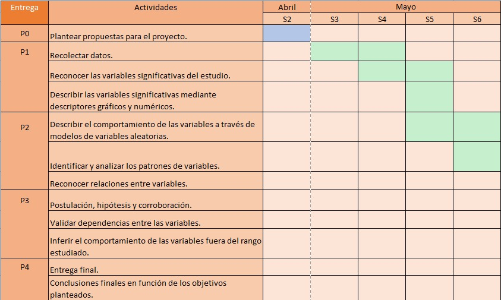
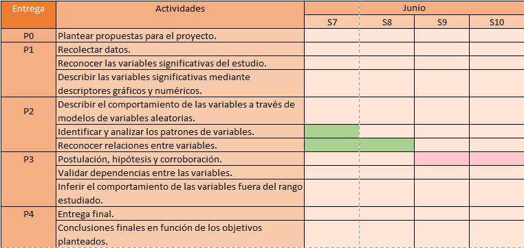
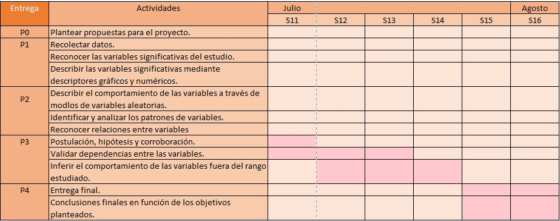

## TÍTULO

**ANÁLISIS ESTADÍSTICO DE LA FELICIDAD EN EL MUNDO**

## 1.- INTRODUCCIÓN

##### **Importancia**
La importancia de este estudio radica en **su capacidad de poder comparar los niveles de felicidad en el tiempo antes de la pandemia y durante la misma de alrededor 150 países del mundo incluido el Perú**. El proyecto nos permitirá realizar **algunas aproximaciones a cómo ha ido cambiando los niveles de felicidad en el mundo** y también conocer si el contexto actual ha conllevado a cambios en estos niveles de la felicidad de las personas.

##### **Justificación**
Es **interesante** porque muestra el cambio en la autopercepción de la felicidad de antes y durante la pandemia y conforme el pasar de los años, mostrando su variabilidad y tendencia. Además, porque durante la pandemia, los temas que han sido a tratar son en su mayoría sobre salud, avances tecnológicos con respecto a la investigación del virus, desarrollo de vacunas, etc. Siendo el tema de felicidad, un aspecto social, que pasa a segundo plano, más aún,cuando el principal foco de atención mediática es el coronavirus.

Es **específico** porque se intenta analizar la felicidad de cada país **no solo desde lo económico** sino también teniendo en consideración los factores sociales e información demográfica de cada país (153 unidades muestrales desde 2015 al 2020).

##### **¿Por qué es factible?**

- Para sustentar la factibilidad de este estudio hemos elaborado un diagrama de Gantt que muestra las acciones que se llevarán a cabo durante el ciclo en cada entrega para cumplir con cada entrega y para cumplir con los objetivos del estudio.

<br/> <br/> 
<div align="center"></div>
<br/> 
<div align="center"></div>
<br/> 

<div align="center"></div>
<br/> 


## 2.- OBJETIVOS

##### **Objetivo general**

Brindar información útil a las autoridades gubernamentales para que guíen sus acciones en pro de la felicidad del país que tienen a cargo.


#### **Objetivos específicos**

- Determinar la tendencia del score de felicidad a nivel mundial desde el 2015 al 2020.

- Determinar una relación entre la economía (logaritmo del PBI per cápita) y la esperanza de vida saludable.

- Analizar las diferencias entre la percepción de la corrupción de Perú y la del país más feliz Finlandia. 

- Identificar patrones y cambios notorios en la percepción de la libertad en alguna de las regiones del mundo.


##### **Pregunta general del proyecto**

¿Qué relación tiene la situación económica, algunos factores sociales O la esperanza de vida de un país en la autopercepción de felicidad de los individuos de una población?


##### **Preguntas específicas del proyecto**

1.- En el año 2020, ¿hubo un cambio notorio en la distribución del score de felicidad desde el 2015 a nivel mundial?

2.- ¿Existe alguna tendencia en la esperanza de vida saludable y en el logaritmo neperiano del PBI per cápita desde el 2015 al 2020?

3.-¿Cuán diferente es la percepción de la corrupción en el Perú a comparación del país más feliz del mundo desde el 2016 hasta el 2020 que es Finlandia?

4.- Entre el 2015 y 2020, ¿la libertad para hacer elecciones en la vida ha variado en alguna región del mundo?

PREGUNTA A ANALIZAR CON PRUEBAS DE HIPÓTESIS:

1.- ¿El Perú en el 2020 fue un país feliz?

2.- ¿La esperanza de vida saludable en el Perú en el 2020 fue mayor a 60 años?

3.- ¿En el 2020 mas del 90% de la población peruana creía que la corrupción está presente en el gobierno?


## 3.- MARCO TEÓRICO

##### **Información de la base de datos y aclaraciones**

1.- La base de datos con la cual trabajaremos fue publicada por Gallup World Poll and Lloyd’s Register Foundation quien lleva años contribuyendo a la realización de este reporte mundial de la felicidad desde el 2007. Fue descargada del sitio web Kaggle. 

2.- En este caso, trabajaremos desde el año 2015 hasta el 2020 para realizar aproximaciones de la tendencia de la felicidad en los países, el año 2021 lo omitiremos porque aún no acaba el año y sus datos están incompletos.

3.- Las variables categóricas nominales (soporte social, libertad de hacer elecciones en la vida y percepción de la corrupción) en la base de datos que descargamos ya habían sido convertidas a variables numéricas continuas. Esto debido a que la fundación que realiza este reporte ha realizado la siguiente equivalencia con base en las respuestas de los ciudadanos:

  1="sí" y 0="No"
  
Y luego han determinado la media aritmética con las equivalencias. Es por ello que en los datos en esas variables se encontrarán números decimales como por ejemplo 0.7689 en "libertad de hacer elecciones en la vida", lo cual nos quiere decir que dicha parte de la población encuestada han respondido que sí a la pregunta correspondiente de la variable (¿Estás satisfecho con la libertad que tienes para elegir qué hacer con tu vida?). Si lo convertimos a porcentaje el 76.89% de la población muestreada en el país respondió que sí a esa pregunta.

4.- No fue necesaria la limpieza de datos debido a que no hubieron datos faltantes.

5.- Otro cambio que hizo la organización, encargada de la base de datos, para la variable del PBI per cápita por cada país fue aplicarle el logaritmo neperiano del mismo para que los datos no sean muy extensos al momento de expresarlos y que se puedan leer más fácilmente.

6.- Algunas veces usaremos "log PBI per cápita" para hacer referencia al logaritmo neperiano (o solo logaritmo) del PBI per cápita. Para esta ocasión cuando menciones logaritmo del PBI per cápita será lo mismo a que mencionemos logaritmo neperiano del PBI per cápita, debido a que en algunos gráficos no alcanza el nombre completo.


##### **Población objetivo**
153 países de diferentes regiones del mundo.

##### **Tipo de muestreo**
Por conglomerados (Ciudades de un país) 

##### **Sesgo**
De selección

##### **Unidades muestrales**
Se usó como muestra, para la elaboración de la base de datos que tenemos,  a la población de distintas ciudades de un mismo país (3000 - 5000 personas por país). Pero en este caso como tenemos la base de datos las unidades muestrales son los países:
- 153 observaciones desde 2015 al 2020.


##### **Interesados**
- Personas de distintas nacionalidades que deseen conocer cuán feliz es el mundo.
- Las autoridades gubernamentales que deseen aplicar acciones que vayan a favor o que contribuyan a la felicidad de cada país, porque así tendrá mayor aceptación o afinidad con las necesidades de la población.

##### **Variables**

*Variables del data frame de World Happiness report 2015-2020*
  
|Pregunta|Definición de la variable|Variable|Tipo de variable|Restricciones|
|:----------------|:-------|:-----:|:----------:|----------:|
|---|País|Country name|Categórica nominal|La primera letra con mayúscula|
|---|Región a la que pertenece el país|Regional indicator|Categórica nominal|La primera letra con mayúscula|
|Piensa que el número 10 es la mejor vida posible y la número 0 es la peor que podrías tener.¿En cuál consideras que estás tú?|Puntaje de felicidad|Ladder score|Numérica discreta|Entero entre 0 y 10|
|---|Logaritmo neperiano del PBI per cápita|Logged GDP per cápita|Numérica continua|Positivo decimal|
|¿Si estuvieras en problemas, tienes amigos o familiares en los que puedas confiar para que te ayuden con este en cualquier momento?|Soporte social o familiar|Social Support|Categórica nominal|Sí o no|
|---|Esperanza de vida saludable del país|Healthy life expectancy|Numérica continua|Decimal entre 0 y 100|
|¿Crees que la corrupción está fuertemente esparcida por todo el gobierno?|Percepción de la corrupción|Perceptions of corruption|Categórica nominal|Sí o no|
|¿Estás satisfecho con la libertad que tienes para elegir qué hacer con tu vida?|Libertad para hacer elecciones en la vida|Freedom to make life choices|Categórica nominal|Sí o no|


##### **Obtención de datos**

- **Obtención de datos del reporte de felicidad en el mundo**

La obtención de los datos se realizó a mediante la descarga la base de datos oficial del World Happiness Report. Se obtuvo del **sitio web Kaggle** en donde comparten data sets de diversos tópicos alrededor del mundo.

<br/> <br/> 
<div align="center"></div>
<br/> 
<br/> 

## 4.- DESCRIPTORES NUMÉRICOS Y GRÁFICOS

```{r eval=TRUE, echo=TRUE, message=FALSE, warning=FALSE}
# Acondicionamiento - Llamado de librerías
#install.packages("readr")
library(readr)
#install.packages("dplyr")
library(dplyr)
```

```{r eval=TRUE, echo=TRUE, message=FALSE, warning=FALSE}
#Lectura de Datos
#F2020=Asignación del data frame del reporte de felicidad del 2020

F2015<-read_csv("2015.csv")
F2016<-read_csv("2016.csv")
F2017<-read_csv("2017.csv")
F2018<-read_csv("2018.csv")
F2019<-read_csv("2019.csv")
F2020<-read_csv("2020.csv")


```


### *Análisis de las variables numéricas*


#### **Descriptores numéricos de las variables numéricas  en el 2020**

En primer lugar, se analizarán las principales **variables numéricas** de los datos obtenidos sobre la felicidad.

```{r eval=TRUE, echo=FALSE, message=FALSE, warning=FALSE}
DescriptoresFelicidad<-function(X){
  return(list(Min=round(min(X),2),
              "1erQuartil"=round(quantile(X,0.25),2),
              Mediana=round(median(X),2),
              "3erQuartil"=round(quantile(X,0.75),2),
              Max=round(max(X),2),
              Media=round(mean(X),2), 
              Rango=round(max(X)-min(X),2),
              Rango_Inter=round(quantile(X,0.75)-quantile(X,0.25),2),
              Desv.Est.=round(sd(X),2), 
              CV=round((sd(X)/mean(X)),2)))
} #Función para determinar descriptores numéricos
  
mapply(DescriptoresFelicidad, list(Felicidad = F2020$`Ladder score`,Logged_PBI_per_cápita = F2020$`Logged GDP per capita`, Esperanza_Vida= F2020$`Healthy life expectancy`)) #Aplicar la función de forma distribuida a diferentes vectores de datos formados para cada variable.

```


*Observaciones y patrones*

- La mitad de la cantidad total de países en el ranking tiene un puntaje de felicidad mayor a 5.52 en el año 2020. Asimismo, podemos evidenciar que la mitad de los países tiene una esperanza de vida por lo menos de 66.4 años.

- Los valores de la esperanza de vida y del logaritmo neperiano del PBI per cápita son regularmente homogéneos,es decir que los datos son en cierta medida cercanos a la media aritmética.

- Los valores de la felicidad son regularmente heterogéneos lo cual nos quiere decir que los datos en cierta medida están alejados de la media aritmética.

- Los datos del score de felicidad en el 2020 no están sesgados debido a que la media aritmética es igual a la mediana, sin embargo los datos del logaritmo del PBI per cápita y la esperanza de vida saludable están sesgados a la izquierda puesto que sus medias son menores a sus medianas correspondientes. El sesgo lo podremos evidenciar de mejor manera en los descriptores gráficos que luego usaremos.


#### **Descriptores gráficos de los países desde el 2015 hasta el 2020**

Es así que para visualizar la existencia de un sesgo lo evidenciaremos mejor con las cajas de bigotes que realizaremos para la distribución de cada variable para el año 2020 a nivel mundial.

### *1.- En el año 2020, ¿hubo un cambio notorio en la distribución de la felicidad desde el 2015 a nivel mundial?*
Analizaremos en primer lugar la distribución del score de felicidad desde el año 2015 hasta el 2020:

```{r eval=TRUE, echo=FALSE, message=FALSE, warning=FALSE}
#Graficar las cajas de bigotes de todos los años en un solo gráfico
boxplot(F2015$`Ladder score`, F2016$`Ladder score`, F2017$`Ladder score`,  F2018$`Ladder score`,  F2019$`Ladder score`,  F2020$`Ladder score`,
main = "Distribución del score de felicidad desde el 2015 al 2020",
names = c("2015", "2016","2017","2018","2019","2020"),
col =  c("orange","cyan","red","yellow","light green", "blue"),
border = "black",
ylab="Años",
xlab="Score de felicidad",
horizontal=T
) 

#Dibujar una línea vertical que representa la media aritmética para cada año
abline(v=mean(F2015$`Ladder score`), col="orange",lwd=2.5) 
abline(v=mean(F2017$`Ladder score`), col="red",lwd=2.5)
abline(v=mean(F2018$`Ladder score`), col="yellow",lwd=2.5)
abline(v=mean(F2020$`Ladder score`), col="blue",lwd=2.5)


```


*Acotaciones del gráfico*

- Las líneas representan la media aritmética de los datos según el año que corresponde a su color. Por ejemplo la primera linea de la izquierda es anaranjada y por tanto representa la media de los score de felicidad en el mundo del año 2015.


*Observaciones y patrones*

- La distribución de los puntajes de felicidad empieza a hacerse simétrica desde el año 2018, pues desde el año 2015 al 2017 los datos estaban sesgados a la derecha puesto que la media era mayor a la mediana, pero con el pasar de los años esta se ha tornado simétrica como lo evidenciamos en el año 2020 que es simétrica (no hay sesgo).
 
- Hay solo un valor atípico en el año 2019.

- Patrón: Con el pasar de los años la mediana del score de felicidad en el mundo a ido aumentando entonces podemos decir que a nivel mundial estamos mejorando o estamos tendiendo a ser más felices. Sin embargo, es un requerimiento analizar la proveniencia del dato atípico del 2019. Es por eso que de aquí nace la siguiente pregunta: ¿existe algún patrón en la distribución del score de felicidad anteriormente mostrada a nivel mundial con el pasar de los años (2015-2020)?

Por ese motivo es que necesitamos encontrar a qué país corresponde dicho valor atípico del score de felicidad para el 2019, pero para evidenciar si hay algún patrón buscaremos el país con menor score de felicidad desde el 2015 hasta el 2020. Esto lo mostramos a continuación:


- En el año 2015 el país con menor score de felicidad fue:

```{r eval=TRUE, echo=TRUE, message=FALSE, warning=FALSE}
#Separa toda la fila del país que coincide con el mínimo de score de felicidad en el 2015
F2015[which(F2015$`Ladder score`==min(F2015$`Ladder score`)),]
```


- En el año 2016 el país con menor score de felicidad fue:

```{r eval=TRUE, echo=TRUE, message=FALSE, warning=FALSE}
#Separa toda la fila del país que coincide con el mínimo de score de felicidad en el 2016
F2016[which(F2016$`Ladder score`==min(F2016$`Ladder score`)),]
```


- En el año 2017 el país con menor score de felicidad fue:

```{r eval=TRUE, echo=TRUE, message=FALSE, warning=FALSE}
#Separa toda la fila del país que coincide con el mínimo de score de felicidad en el 2017
F2017[which(F2017$`Ladder score`==min(F2017$`Ladder score`)),]
```


- En el año 2018 el país con menor score de felicidad fue:

```{r eval=TRUE, echo=TRUE, message=FALSE, warning=FALSE}
#Separa toda la fila del país que coincide con el mínimo de score de felicidad en el 2018
F2018[which(F2018$`Ladder score`==min(F2018$`Ladder score`)),]
```


- En el año 2019 el país con menor score de felicidad fue:

```{r eval=TRUE, echo=TRUE, message=FALSE, warning=FALSE}
#Separa toda la fila del país que coincide con el mínimo de score de felicidad en el 2019
F2019[which(F2019$`Ladder score`==min(F2019$`Ladder score`)),]
```


- En el año 2020 el país con menor score de felicidad fue:

```{r eval=TRUE, echo=TRUE, message=FALSE, warning=FALSE}
#Separa toda la fila del país que coincide con el mínimo de score de felicidad en el 2020
F2020[which(F2020$`Ladder score`==min(F2020$`Ladder score`)),]
```


*Observaciones y patrones*

- Afganistán desde el año 2017 se ha convertido en el país menos feliz del mundo. Al parecer los sucesos de violencia y ataques acontecidos en ese año en dicho país ha repercutido en este indicador, pues según Dawoos Azami, editor del servicio Afganos de la BBC news, "el número de ataques aéreos realizados por Estados Unidos en Afganistán en 2017, comparado con los últimos 10 años, no tiene precedentes."(BBC New Mundo, 2017, párr. 1). 

<br/> <br/> 
<div align="center"></div>
<br/> 

- Afganistán es la causa del dato atípico del año 2019 (y también este país supone el mínimo en la distribución de los score de felicidad desde 2017 hasta el 2020). Además, este país no parece seguir la tendencia de los demás países porque no mejora su score de felicidad. A pesar de que vimos antes que la mediana de scores de felicidad desde el año 2015 al 2020 ha ido aumentando parece ser que en Afganistán esta tendencia no cumple pues hemos descubierto que su score de felicidad en vez de aumentar ha disminuido.


### *2.- ¿Existe alguna tendencia en la esperanza de vida saludable y en el logaritmo neperiano del PBI per cápita desde el 2015 al 2020?*


*Análisis de la tendencia de la esperanza de vida desde 2015 hasta el 2020*

Ahora se procederá a analizar la **tendencia de la esperanza de vida** por cada región del mundo mediante un gráfico de barras desde 2015 hasta el 2020:

```{r eval=TRUE, echo=TRUE, message=FALSE, warning=FALSE}
#Crea un vector concatenando los nombres de las regiones
Region=c(F2015$`Regional indicator`, F2016$`Regional indicator`,F2017$`Regional indicator`, F2018$`Regional indicator`, F2019$`Regional indicator`,F2020$`Regional indicator`)

#Crea un vector concatenando los valores de esperanza de vida presentes en cada región
EsperanzaVida1=c(F2015$`Healthy life expectancy`,F2016$`Healthy life expectancy`,F2017$`Healthy life expectancy`,F2018$`Healthy life expectancy`,F2019$`Healthy life expectancy`,F2020$`Healthy life expectancy`)

#Crea un data frame con solo dos variables esperanza de vida de los países de una región determinada, en este caso solo se guardan los nombres de las regiones a las cuales pertenecen sus respectivos países
w <- data.frame(Region=Region,EsperanzaVida1=EsperanzaVida1)
```


```{r eval=TRUE, echo=TRUE, message=FALSE, warning=FALSE}
ano=2020
cont=0
vidaRegion=c() #esperanza de vida de toda una región en y años
vprom=c() #vector promedio y año

vano<-c() #año
vregion<-c() #región

pos=1
for (x in w$Region){
  if ( x== "Western Europe" && cont<21){
    vidaRegion<-c(vidaRegion,w$EsperanzaVida1[pos])
    cont<-cont+1
  }
  if (cont==21){
    promAnio=sum(vidaRegion)/21 #promedio de y año
    vprom<-c(promAnio,vprom)
    vregion<-c(vregion,"Western Europe")
    vano<-c(vano,ano)
    ano<-ano-1
    cont=0
    vidaRegion=c()
  }
  pos=pos+1
}

DFWE=data.frame(vprom,vregion,vano)
```

```{r eval=TRUE, echo=TRUE, message=FALSE, warning=FALSE}
#para la región South Asia

ano=2020
cont=0

vidaRegion=c() #esperanza de vida de toda una región en y años
vprom=c() #vector promedio y año

vano<-c() #año
vregion<-c() #región


pos=0
a=1

for (x in w$Region){
  if ( x== "South Asia" && cont<8){
    vidaRegion<-c(vidaRegion,w$EsperanzaVida1[pos])
    cont<-cont+1
  }
  if (cont==8){
    promAnio=sum(vidaRegion)/8 #promedio de y año
    vprom<-c(promAnio,vprom)
    vregion<-c(vregion,"South Asia")
    vano<-c(vano,ano)
    ano<-ano-1
    cont=0
    vidaRegion=c()
  }
  pos=pos+1
}
promAnio = sum(vidaRegion)/7
vprom<-c(promAnio,vprom)
vregion<-c(vregion,"South Asia")
vano<-c(vano,ano)
ano<-ano-1
vidaRegion=c()

DFSA=data.frame(vprom,vregion,vano)
```


```{r eval=TRUE, echo=TRUE, message=FALSE, warning=FALSE}
#para la región Central and Eastern Europe

ano=2020
cont=0

vidaRegion=c() #esperanza de vida de toda una región en y años
vprom=c() #vector promedio y año

vano<-c() #año
vregion<-c() #región

pos=1


for (x in w$Region){
  if ( x== "Central and Eastern Europe" && cont<17){
    vidaRegion<-c(vidaRegion,w$EsperanzaVida1[pos])
    cont<-cont+1
  }
  if (cont==17){
    promAnio=sum(vidaRegion)/17 #promedio de y año
    vprom<-c(promAnio,vprom)
    vregion<-c(vregion,"Central and Eastern Europe")
    vano<-c(vano,ano)
    ano<-ano-1
    cont=0
    vidaRegion=c()
  }
  pos=pos+1
}

DFCEE=data.frame(vprom,vregion,vano)
```

```{r eval=TRUE, echo=TRUE, message=FALSE, warning=FALSE}
#para la región Middle East and North Africa

ano=2020
cont=0

vidaRegion=c() #esperanza de vida de toda una región en y años
vprom=c() #vector promedio y año

vano<-c() #año
vregion<-c() #región

pos=1
for (x in w$Region){
  if ( x== "Middle East and North Africa" && cont<17){
    vidaRegion<-c(vidaRegion,w$EsperanzaVida1[pos])
    cont<-cont+1
  }
  if (cont==17){
    promAnio=sum(vidaRegion)/17 #promedio de y año
    vprom<-c(promAnio,vprom)
    vregion<-c(vregion,"Middle East and North Africa")
    vano<-c(vano,ano)
    ano<-ano-1
    cont=0
    vidaRegion=c()
  }
  pos=pos+1
}

DFMENA=data.frame(vprom,vregion,vano)
```


```{r eval=TRUE, echo=TRUE, message=FALSE, warning=FALSE}
#para la región Latin America and Caribbean

ano=2020
cont=0

vidaRegion=c() #esperanza de vida de toda una región en y años
vprom=c() #vector promedio y año

vano<-c() #año
vregion<-c() #región

pos=1

for (x in w$Region){
  
  if ( x== "Latin America and Caribbean" && cont<21){
    vidaRegion<-c(vidaRegion,w$EsperanzaVida1[pos])
    cont<-cont+1
  }
  if (cont==21){
    promAnio=sum(vidaRegion)/21 #promedio de y año
    vprom<-c(promAnio,vprom)
    vregion<-c(vregion,"Latin America and Caribbean")
    vano<-c(vano,ano)
    ano<-ano-1
    cont=0
    vidaRegion=c()
  }
  pos=pos+1
}

DFLAC=data.frame(vprom,vregion,vano)
```

```{r eval=TRUE, echo=TRUE, message=FALSE, warning=FALSE}
#para la región Commonwealth of Independent States

ano=2020
cont=0

vidaRegion=c() #esperanza de vida de toda una región en y años
vprom=c() #vector promedio y año

vano<-c() #año
vregion<-c() #región

pos=1
for (x in w$Region){
  if ( x== "Commonwealth of Independent States" && cont<12){
    vidaRegion<-c(vidaRegion,w$EsperanzaVida1[pos])
    cont<-cont+1
  }
  if (cont==12){
    promAnio=sum(vidaRegion)/12 #promedio de y año
    vprom<-c(promAnio,vprom)
    vregion<-c(vregion,"Commonwealth of Independent States")
    vano<-c(vano,ano)
    ano<-ano-1
    cont=0
    vidaRegion=c()
  }
  pos=pos+1
}

DFCIS=data.frame(vprom,vregion,vano)
```

```{r eval=TRUE, echo=TRUE, message=FALSE, warning=FALSE}
#para la región North America and ANZ

ano=2020
cont=0

vidaRegion=c() #esperanza de vida de toda una región en y años
vprom=c() #vector promedio y año

vano<-c() #año
vregion<-c() #región

pos=1
for (x in w$Region){
  if ( x== "North America and ANZ" && cont<3){
    vidaRegion<-c(vidaRegion,w$EsperanzaVida1[pos])
    cont<-cont+1
  }
  if (cont==3){
    promAnio=sum(vidaRegion)/3 #promedio de y año
    vprom<-c(promAnio,vprom)
    vregion<-c(vregion,"North America and ANZ")
    vano<-c(vano,ano)
    ano<-ano-1
    cont=0
    vidaRegion=c()
  }
  pos=pos+1
}

DFNAA=data.frame(vprom,vregion,vano)
```

```{r eval=TRUE, echo=TRUE, message=FALSE, warning=FALSE}
#para la región Sub-Saharan Africa

ano=2020
cont=0

vidaRegion=c() #esperanza de vida de toda una región en y años
vprom=c() #vector promedio y año

vano<-c() #año
vregion<-c() #región

pos=1
for (x in w$Region){
  if ( x== "Sub-Saharan Africa" && cont<39){
    vidaRegion<-c(vidaRegion,w$EsperanzaVida1[pos])
    cont<-cont+1
  }
  if (cont==39){
    promAnio=sum(vidaRegion)/39 #promedio de y año
    vprom<-c(promAnio,vprom)
    vregion<-c(vregion,"Sub-Saharan Africa")
    vano<-c(vano,ano)
    ano<-ano-1
    cont=0
    vidaRegion=c()
  }
  pos=pos+1
}

DFSSA=data.frame(vprom,vregion,vano)
```

```{r eval=TRUE, echo=TRUE, message=FALSE, warning=FALSE}
#para la región Southeast Asia

ano=2020
cont=0

vidaRegion=c() #esperanza de vida de toda una región en y años
vprom=c() #vector promedio y año

vano<-c() #año
vregion<-c() #región

pos=1
for (x in w$Region){
  if ( x== "Southeast Asia" && cont<9){
    vidaRegion<-c(vidaRegion,w$EsperanzaVida1[pos])
    cont<-cont+1
  }
  if (cont==9){
    promAnio=sum(vidaRegion)/9 #promedio de y año
    vprom<-c(promAnio,vprom)
    vregion<-c(vregion,"Southeast Asia")
    vano<-c(vano,ano)
    ano<-ano-1
    cont=0
    vidaRegion=c()
  }
  pos=pos+1
}

DFSEA=data.frame(vprom,vregion,vano)
```

```{r eval=TRUE, echo=TRUE, message=FALSE, warning=FALSE}
#para la región East Asia 

ano=2020
cont=0

vidaRegion=c() #esperanza de vida de toda una región en y años
vprom=c() #vector promedio y año

vano<-c() #año
vregion<-c() #región

pos=1
for (x in w$Region){
  if ( x== "East Asia" && cont<6){
    vidaRegion<-c(vidaRegion,w$EsperanzaVida1[pos])
    cont<-cont+1
  }
  if (cont==6){
    promAnio=sum(vidaRegion)/6 #promedio de y año
    vprom<-c(promAnio,vprom)
    vregion<-c(vregion,"East Asia")
    vano<-c(vano,ano)
    ano<-ano-1
    cont=0
    vidaRegion=c()
  }
  pos=pos+1
}

DFEA=data.frame(vprom,vregion,vano)
```

```{r eval=TRUE, echo=TRUE, message=FALSE, warning=FALSE}
#Asignación de colores
col_caract<-{}
col_caract["2020"]<-"cyan4"
col_caract["2019"]<-"cyan3"
col_caract["2018"]<-"cyan2"
col_caract["2017"]<-"cyan1"
col_caract["2016"]<-"lightblue"
col_caract["2015"]<-"lightblue1"
```


```{r eval=TRUE, echo=TRUE, message=FALSE, warning=FALSE}
NWE=c(DFWE[1,1],DFWE[2,1],DFWE[3,1], DFWE[4,1], DFWE[5,1], DFWE[6,1])
NSA=c(DFSA[1,1], DFSA[2,1], DFSA[3,1], DFSA[4,1], DFSA[5,1], DFSA[6,1])
NCEE=c(DFCEE[1,1], DFCEE[2,1],DFCEE[3,1],DFCEE[4,1],DFCEE[5,1],DFCEE[6,1])
NMENA=c(DFMENA[1,1], DFMENA[2,1],DFMENA[3,1],DFMENA[4,1],DFMENA[5,1],DFMENA[6,1])
NLAC=c(DFLAC[1,1],  DFLAC[2,1],DFLAC[3,1],DFLAC[4,1], DFLAC[5,1],DFLAC[6,1])
NCIS=c(DFCIS[1,1],  DFCIS[2,1],DFCIS[3,1],DFCIS[4,1],DFCIS[5,1],DFCIS[6,1])
NNAA=c(DFNAA[1,1], DFNAA[2,1],DFNAA[3,1],DFNAA[4,1],DFNAA[5,1],DFNAA[6,1])
NSSA=c(DFSSA[1,1],  DFSSA[2,1],DFSSA[3,1],DFSSA[4,1],DFSSA[5,1],DFSSA[6,1])
NSEA=c(DFSEA[1,1],DFSEA[2,1],DFSEA[3,1],DFSEA[4,1],DFSEA[5,1],DFSEA[6,1])
NEA=c(DFEA[1,1], DFEA[2,1],DFEA[3,1],DFEA[4,1],DFEA[5,1],DFEA[6,1])


data2=data.frame(NWE,NSA,NCEE,NMENA,NLAC,NCIS,NNAA,NSSA,NSEA,NEA)

#Siglas de las regiones
names(data2)=c("WE","NSA","CEE","MENA","LAC","CIS","NAA","SSA","SEA","EA")

#Haciendo un gráfico de barras de las esperanzas de vida promedio de cada región desde el 2015 al 2020
barplot( height=as.matrix(data2), beside=TRUE, main="Gráfica promedio de esperanza de vida por regiones", ylab="Promedio de esperanza de vida", col=col_caract, legend=TRUE, legend.text = c("2020","2019","2018","2017","2016","2015"), fill=col_caract, ylim = c(0,95), args.legend = list( bty="n",x="top", ncol=3))

```

*Acotaciones del gráfico*

WE  : Western Europe                     -> Europa de Oeste

NSA : North America and ANZ              -> Norte América, Australia y Nueva Zelanda

CEE : Central and Eastern Europe         -> Europa Central y del Este

MENA: Middle East and North Africa       -> Medio Oriente y Norte de África

LAC : Latin America and Caribbean        -> Latinoamérica y el Caribe

CIS : East Asia                          -> Asia del Este

NAA : Southeast Asia                     -> Sudeste Asiático

SSA : South Asia                         -> Sur de Asia

SEA : Commonwealth of Independent States -> Mancocomunidad Británica de Naciones

EA  : Sub-Saharan Africa                 -> África SubSahariana


*Observaciones y patrones*

- La región con menos esperanza de vida es África Subsahariana en el cual el promedio de cada año está entre los 53 a los 56 años, asimismo, se observa que existió un crecimiento desde el 2015 al 2019. 

- Las regiones con más esperanza de vida y que se han mantenido estables hasta el 2020 han sido Europa occidental y, Norteamérica y ANZ (Australia y Nueva Zelanda), quienes durante este periodo han tenido un promedio entre los 72 hasta los 74 años aproximadamente. 

- La esperanza de vida en la región de Latinoamérica y el Caribe es entre los 65 a 67 años, asimismo, en el año 2020 existió un descenso, pero esta diferencia fue mínima, ya que es de menos de un año. 

- Entre el año 2015 al 2016, el incremento más notorio fue el de la región de Asia del Sur con un ascenso de esperanza de vida promedio de más de 5 años. 

- PATRON: En todas las regiones se observa un descenso en el año 2020, donde la región con la mayor diferencia fue en la región de Asia del Sur con una disminución de más de 10 años, asimismo, este decaimiento podría deberse al comienzo de la pandemia por el COVID-19.

- TENDENCIA: En general se puede decir que la esperanza de vida con el pasar de los años se ha mantenido relativamente constante o a aumentado pero no tan abruptamente.

Además analizaremos la distribución de logaritmo neperiano del PBI per cápita desde e l2015 hasta 2020 para evidenciar algún tipo de patrón o tendencia en el conjunto de datos:


*Análisis de la tendencia del logaritmo neperiano del PBI per cápita desde 2015 hasta el 2020*

Análogamente, analizaremos la **tendencia del logaritmo neperiano del PBI per cápita** mediante sus distribuciones a través del tiempo:

```{r eval=TRUE, echo=TRUE, message=FALSE, warning=FALSE}

#Graficando las cajas de bigotes que muestra las distribuciones de la variable logaritmo del PBI per cápita para cada año
boxplot(F2015$`Logged GDP per capita`, F2016$`Logged GDP per capita`, F2017$`Logged GDP per capita`,  F2018$`Logged GDP per capita`,  F2019$`Logged GDP per capita`,  F2020$`Logged GDP per capita`,
main = "Distribución del log del PBI per cápita desde el 2015 al 2020",
names = c("2015", "2016","2017","2018","2019","2020"),
col =  c("orange","cyan","red","yellow","light green", "blue"),
border = "black",
ylab="Años",
xlab="Logaritmo del PBI per cápita desde el 2015 al 2020",
horizontal=T
)


#Graficando encima líneas verticales ubicadas en el valor de la media aritmética para cada año

abline(v=mean(F2015$`Logged GDP per capita`), col="orange",lwd=2) #Linea de la media aritmética

abline(v=mean(F2017$`Logged GDP per capita`), col="red",lwd=2) #Linea de la media aritmética

abline(v=mean(F2018$`Logged GDP per capita`), col="yellow",lwd=2) #Linea de la media aritmética

abline(v=mean(F2020$`Logged GDP per capita`), col="blue",lwd=2) #Linea de la media aritmética
 

```


*Observaciones y patrones*

- La distribución del logaritmo neperiano del PBI per cápita está sesgada a la izquierda puesto que la media aritmética es menor a la mediana en todos los años.

- No existe ningún valor atípico.

- TENDENCIA: Con el pasar de los años se evidencia que la mediana de ha ido aumentando pero el sesgo se ha mantenido. En general parece que la economía a nivel mundial ha aumentado porque mediante la gráfica podemos ver su tendencia hacia la derecha.

*Gráfica de dispersión del logaritmo neperiano del PBI respecto a la esperanza de vida saludable*

Ahora como sabemos que en general ambas variables tienden a aumentar desde el 2015 al 2020 podemos decir que su tendencia es crecer. Es por ese motivo que vamos a evidenciar si es que en realidad hay algún tipo de relación entre dichas variables (pues ambas son crecientes) es que realizaremos una gráfica de dispersión. De esa forma podremos ver según la correlación si es que un país con una mejor economía necesariamente tendrá una esperanza de vida alta.
 
```{r eval=TRUE, echo=TRUE, message=FALSE, warning=FALSE}


PBI2015=F2015$`Logged GDP per capita`

PBI2016=F2016$`Logged GDP per capita`
PBI2017=F2017$`Logged GDP per capita`
PBI2018=F2018$`Logged GDP per capita`
PBI2019=F2019$`Logged GDP per capita`
PBI2020=F2020$`Logged GDP per capita`

#Concatena todos los valores del logaritmo del PBI per cápita recogidos por años en un solo vector
PBI= c(PBI2015,PBI2016,PBI2017,PBI2018,PBI2019,PBI2020)


ESP2015=F2015$`Healthy life expectancy`
ESP2016=F2016$`Healthy life expectancy`
ESP2017=F2017$`Healthy life expectancy`
ESP2018=F2018$`Healthy life expectancy`
ESP2019=F2019$`Healthy life expectancy`
ESP2020=F2020$`Healthy life expectancy`

#Concatena todos los valores de esperanza de vida saludable recogidos por años en un solo vector
ESP= c(ESP2015,ESP2016,ESP2017,ESP2018,ESP2019,ESP2020)


plot(PBI2015,ESP2015,col="blue",pch=20,xlab="Log PBI per cápita", ylab="Esperanza de vida",main="Log PBI per cápita vs Esperanza de vida por años",cex=0.7) 
abline(lm(ESP~PBI), col = "red",lwd=1)


legend(x="bottomright",legend=c("2015","2016","2017","2018","2019","2020"),col=c("firebrick","darkorange","gold1","darkgreen","deepskyblue"),lwd=1)


#Graficando todos los puntos encima de la gráfica anterior 

points(PBI2016,ESP2016,col="firebrick",pch=20,cex=0.7)
points(PBI2017,ESP2017,col="darkorange",pch=20 ,cex=0.7)
points(PBI2018,ESP2018,col="gold1",pch=20,cex=0.7)
points(PBI2019,ESP2019,col="darkgreen",pch=20,cex=0.7)
points(PBI2020,ESP2020,col="deepskyblue",pch=20,cex=0.7)


```


```{r}
#Correlación
cor(PBI,ESP ,use ="complete.obs")

#Correlación
cov(PBI,ESP, use ="complete.obs")

#EN LA PARTE DE REGRESIÓN SE ANALIZA A MAYOR PROFUNDIDAD ESTE GRÁFICO
```


*Observaciones y patrones*

- Podemos decir que cuando el logaritmo del PBI se encuentra entre 7 y 9 aproximadamente,los puntos están bastante dispersos y no se ve una relación muy clara, pero a partir de un logaritmo del PBI de 9, se empieza a ver una clara similitud y cercanía a la linea de mejor ajuste de los datos. Por ende podemos decir que el patrón de aumento se cumple de mejor manera a partir de un logaritmo neperiano del PBI de 9 hacia adelante.

- La correlación entre ambas variables es de 0.82 por lo que podemos decir que es positiva y en cierta medida fuerte, entonces eso nos da a entender que mientra una variable aumenta también la otra lo hace, por lo que podremos suponer que si un país tiene una economía alta se puede esperar que también su esperanza de vida sea alta.  


### *Análisis de las variables categóricas nominales*


#### **Descriptores numéricos en el 2020**

A continuación, analizaremos los descriptores numéricos de las **variables categóricas nominales** obtenidas así en el muestreo pero en el data set que tenemos ahora son **variables numéricas continuas** por la equivalencia que se realizó (ver en la sección 3 Marco Teórico - información de la base de datos y consideraciones)

```{r eval=TRUE, echo=TRUE, message=FALSE, warning=FALSE}

#Aplica la función DescriptoresFelicidad para cada vector de datos que contiene la lista
mapply(DescriptoresFelicidad, list(Social = F2020$`Social support`*100, Libertad= F2020$`Freedom to make life choices`*100, Corrupcion=(F2020$`Perceptions of corruption` * 100)))
```

*Observaciones y  patrones o tendencias*

- La mitad de los países analizados por lo menos posee un 82.9% de la población que piensa que tiene a personas que la ayudaran y le brindaran apoyo emocional en cualquier momento.

- La mitad de los países analizados por lo menos posee una población de un 80% que se siente satisfecha con la libertad que tiene para tomar decisiones en su vida.

- En la mitad de los países que forman parte de la muestra, por lo menos el 78.3% de la población piensa que la corrupción está fuertemente esparcida por el gobierno.

- Los porcentajes de la población de los países que creen que la corrupción esta esparcida en el gobierno son heterogéneos, lo que nos quiere decir que están alejados de la media aritmética, porque la desviación estándar representa la cuarta parte o un 24% de la media aritmética.

- En cambio, los porcentaje de la población que cree que tiene un buen soporte social y tiene libertad de elección son relativamente homogéneos, puesto que son en cierta medida cercanos a la media aritmética pues la desviación estándar representan un 15% de la media aritmética.

#### **Descriptores gráficos desde el 2015 hasta el 2020**

### *3.-¿Cuán diferente es la percepción de la corrupción en el Perú a comparación del país más feliz del mundo desde el 2016 hasta el 2020 que es Finlandia?*

A continuación mostraremos los países con el mayor puntaje de felicidad según el año:

```{r eval=TRUE, echo=TRUE, message=FALSE, warning=FALSE}

#Encontrando los países con el máximo puntaje de score de felicidad para cada año
MF15=F2015[which(F2015$`Ladder score`==max(F2015$`Ladder score`)),1:3]
MF16=F2016[which(F2016$`Ladder score`==max(F2016$`Ladder score`)),1:3]
MF17=F2017[which(F2017$`Ladder score`==max(F2017$`Ladder score`)),1:3]
MF18=F2018[which(F2018$`Ladder score`==max(F2018$`Ladder score`)),1:3]
MF19=F2019[which(F2019$`Ladder score`==max(F2019$`Ladder score`)),1:3]
MF20=F2020[which(F2020$`Ladder score`==max(F2020$`Ladder score`)),1:3]
MASFELIZ<-rbind(MF15,MF16,MF17,MF18,MF19,MF20)
Year=c("2015","2016","2017","2018","2019","2020")
mutate(MASFELIZ,Year)
```

Realizaremos un gráfico de mosaico para evidenciar mejor las diferencias entre Perú y Finlandia respecto a la percepción de la corrupción:

```{r eval=TRUE, echo=TRUE, message=FALSE, warning=FALSE}

#Creando un vector con los valores de percepción de la corrupción
totalperceptions <- c(F2015$`Perceptions of corruption`,F2016$`Perceptions of corruption`,F2017$`Perceptions of corruption`,F2018$`Perceptions of corruption`,F2019$`Perceptions of corruption`,F2020$`Perceptions of corruption`)

#Creando un vector con los nombre de los países
countries <- c(F2015$`Country name`,F2016$`Country name`,F2017$`Country name`,F2018$`Country name`,F2019$`Country name`,F2020$`Country name`)

Atotal <- data.frame(countries,totalperceptions)

Per_NO <- c() #no_perceptions_p
Per_SI <- c() #perceptions_p
Fin_NO <- c() #no_perceptions_f
Fin_SI <- c() #perceptions_f
country <- c()
anio <- 2015
anios <- c()
cont <- 1


for (x in Atotal$countries) {
  if(x == "Peru"){
  #Encontrando los valores de percepción de la corrupción para Perú en cada año
  Per_SI <- c(Per_SI,Atotal$totalperceptions[cont])
  Per_NO <- c(Per_NO,1-Atotal$totalperceptions[cont])
  anio <- anio + 1
}
  
  if(x == "Finland"){
  #Encontrando los valores de percepción de la corrupción para Finlandia en cada año  
  Fin_SI<- c(Fin_SI,Atotal$totalperceptions[cont])
  Fin_NO <- c(Fin_NO,1-Atotal$totalperceptions[cont])
  anios <- c(anios, anio)
  }
  cont <- cont + 1
}

percibeFinlandia <- cbind(Fin_SI,Fin_NO)
rownames(percibeFinlandia) = anios

percibePeru<- cbind(Per_SI,Per_NO)
rownames(percibePeru) = anios
f <- cbind(percibeFinlandia,percibePeru)


#Gráfica de mosaico
mosaicplot(f, col=c("green", "red"), main="Percepciones de corrupción entre Perú y Finlandia", xlab="Años", ylab="Porcentaje de la población" )

```


*Anotaciones del gráfico*

- Per_SI: Porcentaje de personas que respondieron que sí en Perú
- Per_NO: Porcentaje de personas que respondieron que no en Perú
- Fin_SI: Porcentaje de personas que respondieron que sí en Finlandia
- Fin_NO: Porcentaje de personas que respondieron que no en Finlandia


*Observaciones y patrones  o tendencias*

- La percepción de la corrupción es mucho mayor en Perú que en Finlandia, pues ello se evidencia por las áreas el alto de los rectángulos verdes pues es mayor en Per_No que en Fin_NO lo cual nos quiere decir que la gente percibe mayor corrupción en Perú que en Finlandia y eso se cumple en el tiempo definido desde el 2015 hasta el 2020.

- Asimismo, se nota un ligero aumento en la percepción de la corrupción del Perú en cambio en Finlandia se evidencia un ligero descenso. Entonces tal vez la corrupción sea un problema que ocasiona que las personas sean menos felices en Perú.

- Además, con respecto a Perú, esta percepción de corrupción tiende a mantenerse relativamente constante (2015 al 2020) excluyendo al periodo del 2016, donde la percepción se redujo, posiblemente debido al cambio de gobierno de Humala a PPK y las personas no tenían una clara idea de cómo se iba a desenvolver el gobierno entrante.

- Por otro lado, también en el 2016, el porcentaje de percepción de la corrupción en Finlandia se elevó a comparación de los otros periodos de estudio. Consideramos que esto es debido a que en el 2016 se llevó a cabo el referéndum acerca de un tema controversial para su población: la unión o no unión de Finlandia a la OTAN.


### *4.- Entre el 2015 y 2020, ¿la libertad para hacer elecciones en la vida ha variado en alguna región del mundo?*

*Análisis de la libertad para hacer elecciones en la vida desde el 2015 y 2020 en las regiones del mundo*

En general no varía la media aritmética de la libertad de hacer elecciones en la vida en las regiones excepto en Europa Central y del Este y Europa Oeste las cuales graficaremos a continuación para analizar sus cambios:


```{r eval=TRUE, echo=TRUE, message=FALSE, warning=FALSE}

regiones<-c(unique(F2015$`Regional indicator`))
promedios15=c()
promedios16=c()
promedios17=c()
promedios18=c()
promedios19=c()
promedios20=c()
for(i in 1:10){
    promedios15[i]=mean(F2015$`Freedom to make life choices`[F2015$`Regional indicator`==regiones[i]])
}
for(i in 1:10){
    promedios16[i]=mean(F2016$`Freedom to make life choices`[F2016$`Regional indicator`==regiones[i]])
}
for(i in 1:10){
    promedios17[i]=mean(F2017$`Freedom to make life choices`[F2017$`Regional indicator`==regiones[i]])
}
for(i in 1:10){
    promedios18[i]=mean(F2018$`Freedom to make life choices`[F2018$`Regional indicator`==regiones[i]])
}
for(i in 1:10){
    promedios19[i]=mean(F2019$`Freedom to make life choices`[F2019$`Regional indicator`==regiones[i]])
}
for(i in 1:10){
    promedios20[i]=mean(F2020$`Freedom to make life choices`[F2020$`Regional indicator`==regiones[i]])
}
      
```

```{r eval=TRUE, echo=TRUE, message=FALSE, warning=FALSE}

SI=c(promedios15*100,promedios16*100,promedios17*100,promedios18*100,promedios19*100,promedios20*100)
NO=c(100-promedios15*100,100-promedios16*100,100-promedios17*100,100-promedios18*100,100-promedios19*100,100-promedios20*100)
SA_si=c()
SA_no=c()
CEE_si=c()
CEE_no=c()
MENA_si=c()
MENA_no=c()
LAC_si=c()
LAC_no=c()
CMMWIS_si=c()
CMMWIS_no=c()
NANZ_si=c()
NANZ_no=c()
WE_si=c()
WE_no=c()
SSA_si=c()
SSA_no=c()
SEA_si=c()
SEA_no=c()
EA_si=c()
EA_no=c()
for(i in 1:10){
  for(j in 0:5){
    if(i==1){
      SA_si[j+1]=SI[i+10*j]
      SA_no[j+1]=NO[i+10*j]
    }
    if (i==2){
      CEE_si[j+1]=SI[i+10*j]
      CEE_no[j+1]=NO[i+10*j]
    }
    if (i==3){
      MENA_si[j+1]=SI[i+10*j]
      MENA_no[j+1]=NO[i+10*j]
    }
    if (i==4){
      LAC_si[j+1]=SI[i+10*j]
      LAC_no[j+1]=NO[i+10*j]
    }
    if (i==5)
    {
      CMMWIS_si[j+1]=SI[i+10*j]
      CMMWIS_no[j+1]=NO[i+10*j]
    }
    if (i==6)
    {
      NANZ_si[j+1]=SI[i+10*j]
      NANZ_no[j+1]=NO[i+10*j]
    }
    if (i==7)
    {
      WE_si[j+1]=SI[i+10*j]
      WE_no[j+1]=NO[i+10*j]
    }
    if (i==8)
    {
      SSA_si[j+1]=SI[i+10*j]
      SSA_no[j+1]=NO[i+10*j]
    }
    if (i==9)
    {
      SEA_si[j+1]=SI[i+10*j]
      SEA_no[j+1]=NO[i+10*j]
    }
    if (i==10)
    {
      EA_si[j+1]=SI[i+10*j]
      EA_no[j+1]=NO[i+10*j]
    }
  }
  
}

Percepcion_de_la_Libertad_eu1=matrix(c(CEE_si,CEE_no),ncol=2,byrow=T)
rownames(Percepcion_de_la_Libertad_eu1)=c(2015,2016,2017,2018,2019,2020)
colnames(Percepcion_de_la_Libertad_eu1)=c("Sí","No")
pleu1=as.table(Percepcion_de_la_Libertad_eu1)
mosaicplot(pleu1,main="Percepción de la libertad Europa central y del este",xlab="Porcentaje de la población que percibe que sí y no",ylab="Años",las=1,dir=c("h","v"),color=c("blue","red"))

Percepcion_de_la_Libertad_eu2=matrix(c(WE_si,WE_no),ncol=2)
rownames(Percepcion_de_la_Libertad_eu2)=c(2015,2016,2017,2018,2019,2020)
colnames(Percepcion_de_la_Libertad_eu2)=c("Sí","No")
pleu2=as.table(Percepcion_de_la_Libertad_eu2)
mosaicplot(pleu2,las=1,xlab="Porcentaje de la población que percibe que sí y no",ylab="Años",main="Percepción de libertad Europa del oeste",dir=c("h","v"),color=c("orange","darkgreen"))

```

*Observaciones*

- En la percepción de libertad que tiene Europa Central y del Este, se puede apreciar que se ve una disminución de este a partir de 2018, esto podría ser, debido a las leyes con respecto a las redes sociales y al internet que promulgaban algunas limitaciones de su uso la cual posiblemente haya impactado en la sociedad europea puesto que creía que su libertad de realizar búsquedas en internet se iba a ver atacada.

- No consideramos las demás regiones debido a que no tienen un cambio notorio en su percepción de la libertad pues los únicos que variaban era en Europa Central y del Este y Europa del Oeste.

- En Europa del oeste la percepción de la libertad aumentó hasta el 2019 luego en el 2020 se redujo ligeramente posiblemente sea debido al confinamiento por el Covid-19 y puede que eso halla afectado en la percepción de la libertad en la población de los países de Europa de Oeste. 

## 5.- ANÁLISIS DE VARIABLES ALEATORIAS

##### **Parámetros del estudio**

- Nivel de confianza: 90%
- Nivel de significancia: 10%


### **Distribuciones de nuestras variables relevantes: Distribución continua normal**


Las variables numéricas de Score de felicidad, Esperanza de Vida saludable muestran un comportamiento aproximado a una distribución normal porque se puede notar en cierta medida una simetría en sus gráficas y una frecuencia (o densidad para que la gráfica de función se pueda superponer y así poder comparar) mayor se encuentran en la media, donde se demuestra en la siguiente tabla.

```{r eval=TRUE, echo=TRUE, message=FALSE, warning=FALSE}
DescriptoresFelicidad<-function(X){
  return(list(
              Mediana=round(median(X),2),
              
              Media=round(mean(X),2)))
}
  
#Aplicando la función anterior de forma distribuida para cada set de valores (Felicidad y Esperanza_Vida)
mapply(DescriptoresFelicidad, list(Felicidad = F2020$`Ladder score`, Esperanza_Vida= F2020$`Healthy life expectancy`))

```


#### *Variable: Score de Felicidad*

```{r eval=TRUE, echo=TRUE, message=FALSE, warning=FALSE}
ScoreFelicidad=c(F2015$`Ladder score`,F2016$`Ladder score`,F2017$`Ladder score`,F2018$`Ladder score`,F2019$`Ladder score`,F2020$`Ladder score`)
#ScoreFelicidad=(ScoreFelicidad-mean(ScoreFelicidad))/sd(ScoreFelicidad) #Estandarizando la distribución
hist(ScoreFelicidad,freq=F)

#Verificando si la variable Score de felicidad se aproxima a un comportamiento normal
curve(dnorm(x, mean(ScoreFelicidad,na.rm = TRUE), sd = sd(ScoreFelicidad,na.rm = TRUE)), # Función dnorm a evaluar
      0, 8, 100, # Límites de x y nº de valores a evaluar
      col = "red", 
      las = 1, # Etiquetas alineadas horizontalmente
      ann = FALSE, # Sin títulos en los ejes
      xaxp = c(0, 300, 10),  # Marcas del eje x
      ylim = c(0,0.5), # Límites del eje
      yaxs = "i", add = TRUE) # Estilo del eje y, ajustado a los límites
```


*Observaciones*

- Se observa que la mayor cantidad de datos se encuentra entre 4 a 7.

- Se muestra que en la mayoría de datos, excepto existe un pequeño aumento entre 7 a 7.5, no obstante, como es una pequeña desviación tomaremos que esta variable sigue una distribución normal.


#### *Variable: Esperanza de vida*

```{r eval=TRUE, echo=TRUE, message=FALSE, warning=FALSE}
EspVida=c(F2015$`Healthy life expectancy`,F2016$`Healthy life expectancy`,F2017$`Healthy life expectancy`,F2018$`Healthy life expectancy`,F2019$`Healthy life expectancy`,F2020$`Healthy life expectancy`)
hist(EspVida,freq=F)

#Verificando si la variable Esperanza de vida se aproxima a un comportamiento normal
curve(dnorm(x, mean(EspVida,na.rm = TRUE), sd = sd(EspVida,na.rm = TRUE)), # Función dnorm a evaluar
      0, 90, 100, # Límites de x y nº de valores a evaluar
      col = "red", 
      las = 1, # Etiquetas alineadas horizontalmente
      ann = FALSE, # Sin títulos en los ejes
      xaxp = c(0, 300, 10),  # Marcas del eje x
      ylim = c(0,0.5), # Límites del eje
      yaxs = "i", add = TRUE) # Estilo del eje y, ajustado a los límites

```

*Observación*

- Se observa que la mayor cantidad de datos se encuentra entre 56 y 76 años aproximadamente y efectivamente la media esta dentro de ese intervalo como lo vimos anteriormente.

- Se puede aproximar a una distribución normal.


### 5.1. Estimando un intervalo de confianza al 90% para saber cuál podría ser el promedio de score de felicidad en Latinoamérica

#### **Score de felicidad**

```{r eval=TRUE, echo=TRUE, message=FALSE, warning=FALSE}

#Filtrando los datos de score de felicidad solo de los paíes latinoamericanos
ScoreFelicidadLatinoamerica=c(F2015$`Ladder score`[F2015$`Regional indicator`=='Latin America and Caribbean'],F2016$`Ladder score`[F2016$`Regional indicator`=='Latin America and Caribbean'],F2017$`Ladder score`[F2017$`Regional indicator`=='Latin America and Caribbean'],F2018$`Ladder score`[F2018$`Regional indicator`=='Latin America and Caribbean'],F2019$`Ladder score`[F2019$`Regional indicator`=='Latin America and Caribbean'],F2020$`Ladder score`[F2020$`Regional indicator`=='Latin America and Caribbean'])


xbarra=mean(ScoreFelicidadLatinoamerica) #media muestral
sigma=sd(ScoreFelicidadLatinoamerica) #desviación estándar muestral que por regla práctica se hace una aproximación puntual a la desviación estándar poblacional
n=126
alpha=0.1 #Nivel de significancia al 10% por ser una encuesta a personas
z=qnorm(1-alpha/2) #Valor crítico superior

a=xbarra-(z*sigma/sqrt(n)) #Extremo inferior del intervalo
b=xbarra+(z*sigma/sqrt(n)) #Extremo superior del intervalo
a
b

```

INTERVALO DE CONFIANZA: [5.84936, 6.057608]

En un muestreo repetido, se producen intervalos que incluyen la media de score de felicidad de Latinoamérica cerca del 90% de las muestras. Por lo que la media de score de felicidad de Latinoamérica podría ubicarse en el intervalo de confianza anteriormente calculado.

### 5.2. Estimando un intervalo de confianza al 90% para saber cuál podría ser el promedio de esperanza de vida saludable en Latinoamérica

#### **Esperanza de vida**

```{r eval=TRUE, echo=TRUE, message=FALSE, warning=FALSE}

#Filtrando los datos de esperanza de vida solo de los países latinoamericanos
EspVidaLatinoamerica=c(F2015$`Healthy life expectancy`[F2015$`Regional indicator`=='Latin America and Caribbean'],F2016$`Healthy life expectancy`[F2016$`Regional indicator`=='Latin America and Caribbean'],F2017$`Healthy life expectancy`[F2017$`Regional indicator`=='Latin America and Caribbean'],F2018$`Healthy life expectancy`[F2018$`Regional indicator`=='Latin America and Caribbean'],F2019$`Healthy life expectancy`[F2019$`Regional indicator`=='Latin America and Caribbean'],F2020$`Healthy life expectancy`[F2020$`Regional indicator`=='Latin America and Caribbean'])


xbarra=mean(EspVidaLatinoamerica) #media muestral
sigma=sd(EspVidaLatinoamerica) #desviación estándar muestral que por regla práctica se hace una aproximación puntual a la desviación estándar poblacional
n=126
alpha=0.1 #Nivel de significancia al 10% por ser una encuesta a personas
z=qnorm(1-alpha/2) #Valor crítico superior

a=xbarra-(z*sigma/sqrt(n))  #Extremo inferior del intervalo
b=xbarra+(z*sigma/sqrt(n))  #Extremo superior del intervalo
a
b

```
INTERVALO DE CONFIANZA: [65.98125 , 66.96437]

En un muestreo repetido, se producen intervalos que incluyen la media de esperanza de vida de Latinoamérica cerca del 90% de las muestras. Por lo que la media de esperanza de vida saludable de Latinoamérica podría ubicarse en el intervalo de confianza anteriormente calculado.


### 5.3. Estimando un intervalo de confianza al 90% para saber cuál podría ser la media del porcentaje de la población latinoamericana que respondió que sí a que en el gobierno de su país esta presenta la corrupción

#### **Percepción de la corrupción**


```{r eval=TRUE, echo=TRUE, message=FALSE, warning=FALSE}

#Filtrando los datos de percepción de la corrupción solo de países latinoamericanos
PercCorrLatinoamerica=c(F2015$`Perceptions of corruption`[F2015$`Regional indicator`=='Latin America and Caribbean'],F2016$`Perceptions of corruption`[F2016$`Regional indicator`=='Latin America and Caribbean'],F2017$`Perceptions of corruption`[F2017$`Regional indicator`=='Latin America and Caribbean'],F2018$`Perceptions of corruption`[F2018$`Regional indicator`=='Latin America and Caribbean'],F2019$`Perceptions of corruption`[F2019$`Regional indicator`=='Latin America and Caribbean'],F2020$`Perceptions of corruption`[F2020$`Regional indicator`=='Latin America and Caribbean'])

proporcion=mean(PercCorrLatinoamerica) 
```

```{r eval=TRUE, echo=TRUE, message=FALSE, warning=FALSE}
p=proporcion 
n=length(PercCorrLatinoamerica)
alpha=0.1 #Nivel de significancia al 10% por ser una encuesta a personas
z=qnorm(1-alpha/2) #Valor crítico superior

a=p-(z*sqrt(p*(1-p)/n)) #Extremo inferior del intervalo
b=p+(z*sqrt(p*(1-p)/n)) #Extremo inferior del intervalo
a
b

```

INTERVALO DE CONFIANZA: [0.7471546, 0.8632263]

Entonces a un nivel de confianza del 90% podemos concluir que:

En un muestreo repetido, se producen intervalos que incluyen la media del porcentaje de la población latinoamericana, que respondió "Sí" a que en el gobierno de su país esta presenta la corrupción, cerca del 90% de las muestras. Por lo que la media podría ubicarse en el intervalo de confianza anteriormente calculado.


## 6.- PRUEBAS DE HIPÓTESIS

### 6.1. Prueba de hipótesis 1: Los peruanos en el 2020 son felices

Para realizar las prueba de hipótesis es necesario plantear una escala de felicidad la cual para casos de nuestro proyecto la consideraremos como:

Score de felicidad entre 0 y 3, sin tomar al 3: No es feliz.

Score de felicidad entre 3 y 5, sin tomar al 5: Medianamente feliz.

Score de felicidad entre 5 y 10: Feliz.

Parámetros de la hipótesis 1:

- Variable a analizar: Ladder score - Score de felicidad

- Nivel de confianza como se especificó en el apartado 5 será de un 90%.

- Estimador puntual: media

- Modelo: Distribución normal (Aplicamos la regla práctica porque el tamaño de la muestra es 4992)


- **Ho**= El score de felicidad promedio de los peruanos es mayor o igual a 5, lo que denota que son felices.

- **H1**= El score de felicidad promedio de los peruanos es menor a 5, lo que denota que pueden ser medianamente felices o puede que no sean felices.

Entonces:

  $H_0 :\mu \geq$ 5

  $H_1 :\mu <$ 5
  
- Tipo de prueba: Unilateral izquierda.

Resultados de la prueba de hipótesis 1:

- Estadístico de prueba: $\frac{(\overline{x}-\mu)\sqrt{n}}{s}$

$\overline{x}=5.7968$

$\mu=5$

$n=4992$

$s=4.33$

Entonces resultado que el estadístico de prueba es:

```{r eval=TRUE, echo=TRUE, message=FALSE, warning=FALSE}
EstadisticoPrueba1=(5.7968-5)*sqrt(4992)/4.33
EstadisticoPrueba1
```

- Valor crítico:
```{r eval=TRUE, echo=TRUE, message=FALSE, warning=FALSE}
ValorCritico1=qnorm(0.1)
ValorCritico1
```
```{r eval=TRUE, echo=TRUE, message=FALSE, warning=FALSE}
#Gráficando la curva de la función de densidad de probabilidad
Z <- seq(-14, 14, by = 0.1)
plot(Z, dnorm(Z), type = "l",ylab="Densidad")

#Graficando la línea vertical para ubicar al estadístico de prueba y valor crítico
abline(v=c(ValorCritico1,EstadisticoPrueba1), lty = c(1,2), col = c("red", "blue"))
abline(h = 0, col = "gray")

#Leyenda para identificar el valor crítico y estadístico de prueba
legend(3.5,0.38,c("Valor Crítico","Estadístico de prueba"),col=c("red","blue"), lty = c(1,2))
```

**CONCLUSIÓN PRUEBA DE HIPÓTESIS 1:** Como el estadístico de prueba es mayor al valor crítico entonces cae en la zona de NO rechazo de la hipótesis nula $H_0$. Por lo tanto se puede concluir que con base en la evidencia muestral en el año 2020 el promedio de score de felicidad en el Perú era mayor o igual 5.


### 6.2. Prueba de hipótesis 2: En el 2020 los peruanos en promedio tuvieron una esperanza de vida mayor a 60 años.

Parámetros de la hipótesis 2:

- Variable a analizar: Healthy life expectancy - Esperanza de vida saludable

- Nivel de confianza como se especificó anteriormente en el apartado 5 será de un 90%.

- Estimador puntual: media.

- Modelo: distribución normal (Aplicamos la regla práctica porque el tamaño de la muestra es 4992)

- **Ho**= La esperanza de vida de los peruanos es menor o igual a 60 años.

- **H1**= La esperanza de vida de los peruanos es mayor a 60 años.

Entonces:

  $H_0 :\mu \leq$ 60 años

  $H_1 :\mu >$ 60 años
  
- Tipo de prueba: Unilateral derecha.

Resultados de la prueba de hipótesis 3:

- Estadístico de prueba: $\frac{(\overline{x}-\mu)\sqrt{n}}{s}$

$\overline{x}=68.1$

$\mu=60$

$n=4992$

$s=8.23$

Entonces resultado que el estadístico de prueba es:

```{r eval=TRUE, echo=TRUE, message=FALSE, warning=FALSE}
EstadisticoPrueba2=(68.1-60)*sqrt(4992)/8.23
EstadisticoPrueba2
```

- Valor crítico:
```{r eval=TRUE, echo=TRUE, message=FALSE, warning=FALSE}
ValorCritico2=qnorm(0.9)
ValorCritico2
```


```{r eval=TRUE, echo=TRUE, message=FALSE, warning=FALSE}

#Gráficando la curva de la función de densidad de probabilidad
Z <- seq(-70, 70, by = 0.1)
plot(Z, dnorm(Z), type = "l",ylab="Densidad")

#Graficando la línea vertical para ubicar al estadístico de prueba y valor crítico
abline(v=c(ValorCritico2,EstadisticoPrueba2), lty = c(1,2), col = c("red", "blue"))
abline(h = 0, col = "gray")

#Leyenda para identificar el valor crítico y estadístico de prueba
legend(3.5,0.38,c("Valor Crítico","Estadístico de prueba"),col=c("red","blue"), lty = c(1,2))
```


**CONCLUSIÓN PRUEBA DE HIPÓTESIS 2:** Como el estadístico de prueba es mayor al valor crítico entonces cae en la zona de rechazo de la hipótesis nula $H_0$. Por lo tanto se puede concluir que con base en la evidencia muestral en el año 2020 el promedio de la esperanza de vida saludable era mayor a 60 años.


### 6.3. Prueba de Hipótesis 3: En el 2020, más del 90% de la población peruana pensó que en el gobierno había corrupción.

- Suponiendo de que la variable de percepción de la corrupción se comportara similar a una distribución normal.

Parámetros de la hipótesis 3:

- Variable a analizar: Perceptions of corruption - Percepción de la corrupción

- Nivel de confianza como se especificó anteriormente en el apartado 5 será de un 90%.

- Estimador puntual: proporción.

- Modelo: distribución normal (Aplicamos la regla práctica porque el tamaño de la muestra es 4992)

- **Ho**= Un porcentaje menor o igual al 90% de la población peruana piensa que en el gobierno hay corrupción.

- **H1**= Más del 90% de la población peruana piensa que en el gobierno hay corrupción.

Entonces:

  $H_0 :\pi \leq$ 0.9

  $H_1 :\pi >$ 0.9
  
- Tipo de prueba: Unilateral derecha.

Resultados de la prueba de hipótesis 3:

- Estadístico de prueba: $\frac{p-\pi}{\sqrt{\frac{\pi(1-\pi)}{n}}}$

$p=0.893$

$\pi=0.9$

$n=4992$

Entonces resultado que el estadístico de prueba es:

```{r eval=TRUE, echo=TRUE, message=FALSE, warning=FALSE}
EstadisticoPrueba3=(0.893-0.9)/sqrt((0.9*0.1)/4992)
EstadisticoPrueba3
```

- Valor crítico:
```{r eval=TRUE, echo=TRUE, message=FALSE, warning=FALSE}
ValorCritico3=qnorm(0.9)
ValorCritico3
```
```{r eval=TRUE, echo=TRUE, message=FALSE, warning=FALSE}

#Gráficando la curva de la función de densidad de probabilidad
Z <- seq(-3, 3, by = 0.1)
plot(Z, dnorm(Z), type = "l",ylab="Densidad")

#Graficando la línea vertical para ubicar al estadístico de prueba y valor crítico
abline(v=c(ValorCritico3,EstadisticoPrueba3), lty = c(1,2), col = c("red", "blue"))
abline(h = 0, col = "gray")

#Leyenda para identificar el valor crítico y estadístico de prueba
legend(-1.5,0.4,c("Valor Crítico","Estadístico de prueba"),col=c("red","blue"), lty = c(1,2))
```

**CONCLUSIÓN PRUEBA DE HIPÓTESIS 3:** Como el estadístico de prueba es menor al valor crítico entonces cae en la zona de NO rechazo de la hipótesis nula $H_0$. Por lo tanto se puede concluir que con base en la evidencia muestral en el año 2020 un porcentaje menor o igual al 90% de la población peruana cree que la corrupción esta presente en el gobierno.


## 7.- REGRESIÓN

PLANTEAMIENTOS DE REGRESIONES ENTRE VARIABLES:

En primera instancia, tenemos este modelo que nos pareció interesante porque en realidad debería existir una relación entre la economía de un país y su esperanza de vida. Teniendo esa primera motivación nosotros decidimos comprobarlo estudiando a mayor profundidad la regresión entre estas variables pero enfocándolo solo en la región de Latinoamérica. Entonces, ¿existirá una relación entre el logaritmo de PBI per cápita y la esperanza de vida de un país latinoamericano?

-  Esperanza de vida saludable vs Logaritmo del PBI per cápita:


```{r eval=TRUE, echo=TRUE, message=FALSE, warning=FALSE}


#Filtrando los valores del logaritmo del PBI per cápita solo de los países de Latinoamérica para cada año 
PBI2015=F2015$`Logged GDP per capita`[F2015$`Regional indicator`=='Latin America and Caribbean']
PBI2016=F2016$`Logged GDP per capita`[F2016$`Regional indicator`=='Latin America and Caribbean']
PBI2017=F2017$`Logged GDP per capita`[F2017$`Regional indicator`=='Latin America and Caribbean']
PBI2018=F2018$`Logged GDP per capita`[F2018$`Regional indicator`=='Latin America and Caribbean']
PBI2019=F2019$`Logged GDP per capita`[F2019$`Regional indicator`=='Latin America and Caribbean']
PBI2020=F2020$`Logged GDP per capita`[F2020$`Regional indicator`=='Latin America and Caribbean']

#Concatenando los datos anteriores
PBI= c(PBI2015,PBI2016,PBI2017,PBI2018,PBI2019,PBI2020)
max(PBI) #valor máximo de logaritmo del PBI en Latinoamérica
min(PBI) #valor mínimo de logaritmo del PBI en Latinoamérica

#Filtrando los valores de esperanza de vida solo de los países de Latinoamérica para cada año 
ESP2015=F2015$`Healthy life expectancy`[F2015$`Regional indicator`=='Latin America and Caribbean']
ESP2016=F2016$`Healthy life expectancy`[F2016$`Regional indicator`=='Latin America and Caribbean']
ESP2017=F2017$`Healthy life expectancy`[F2017$`Regional indicator`=='Latin America and Caribbean']
ESP2018=F2018$`Healthy life expectancy`[F2018$`Regional indicator`=='Latin America and Caribbean']
ESP2019=F2019$`Healthy life expectancy`[F2019$`Regional indicator`=='Latin America and Caribbean']
ESP2020=F2020$`Healthy life expectancy`[F2020$`Regional indicator`=='Latin America and Caribbean']

#Concatenando los valores anteriores
ESP= c(ESP2015,ESP2016,ESP2017,ESP2018,ESP2019,ESP2020)


#Llamando a la función lm() para analizar la regresión entre estas dos variables
lm1 <- lm( ESP ~ PBI)
summary(lm1)


cor(PBI,ESP)

```


*Análisis de regresión lineal y predicción*

* $r$ coeficiente de correlación : 0.6392. 

  + Podemos decir que la correlación es positiva y relativamente fuerte entonces cuando la variable del logaritmo del PBI per cápita aumente se esperaría que también lo haga la variable esperanza de vida.

* $r^2$ coeficiente de determinación ajustado:

  + El 40.38% de la variación de la variable esperanza de vida saludable de un país latinoamericano se explica por la variación de la variable de logaritmo del PBI per cápita.
  
* Coeficiente $\beta_{1}$:

  +  Para un nivel de significancia de 10%, enfocándonos en el coeficiente que multiplica a la variable logaritmo del PBI per cápita, podemos decir que se rechaza la hipótesis nula ($H_{0}$ : $\beta_{1}$=0). Esto debido a que el p-value es menor al nivel de significancia. -> $\beta_{1}$=3.0416
  
* Predicción:

  + Modelo obtenido para la región de Latinoamérica: 
  Esperanza de vida $\thickapprox$ $\beta_{0}$ + $\beta_{1}$ $\times$ Log PBI per cápita
  
  Datos:
  - $\beta_{0}$ = 37.9181
  
  - $\beta_{1}$ = 3.0416
  
  
  + Como los valores de logaritmo del PBI per cápita van desde 7.475 hasta 10.46 en la muestra entonces lo que haremos es predecir la esperanza de vida de un país de Latinoamérica en caso tuviese un logaritmo del PBI per cápita de 10.7.
  
  Reemplazamos los datos en el modelo obtenido:
  Esperanza de vida $\thickapprox$ 37.9181 + 3.0416 $\times$ 10.7 $\thickapprox$ 70.46
  
  Entonces si un país de Latinoamérica tuviera un logaritmo del PBI per cápita de 10.7 tendría una esperanza de vida de 70.46 (aproximadamente 70 años si lo tomamos años como enteros para este caso).


Luego de analizar la primera regresión procederemos a estudiar otra regresión entre variables e igualmente enfocándonos solo en Latinoamérica solo que esta vez será una regresión múltiple.

- Score de felicidad vs Logaritmo del PBI per cápita y Esperanza de Vida:


```{r eval=TRUE, echo=TRUE, message=FALSE, warning=FALSE}

min(ESP) #valor mínimo de esperanza de vida saludable en países de Latinoamérica
max(ESP) #valor máximo de esperanza de vida saludable en países de Latinoamérica

#Filtrando los scores de felicidad solo de los países de Latinoamérica por cada año
ScoreFelicidaF2015=F2015$`Ladder score`[F2015$`Regional indicator`=='Latin America and Caribbean']
ScoreFelicidaF2016=F2016$`Ladder score`[F2015$`Regional indicator`=='Latin America and Caribbean']
ScoreFelicidaF2017=F2017$`Ladder score`[F2015$`Regional indicator`=='Latin America and Caribbean']
ScoreFelicidaF2018=F2018$`Ladder score`[F2015$`Regional indicator`=='Latin America and Caribbean']
ScoreFelicidaF2019=F2019$`Ladder score`[F2015$`Regional indicator`=='Latin America and Caribbean']
ScoreFelicidaF2020=F2020$`Ladder score`[F2015$`Regional indicator`=='Latin America and Caribbean']

#Concatenando los valores anteriores
ScoreFelicidad= c(ScoreFelicidaF2015,ScoreFelicidaF2016,ScoreFelicidaF2017,ScoreFelicidaF2018,ScoreFelicidaF2019,ScoreFelicidaF2020)

#Llamando a la función lm() para analizar la regresión múltiple
lm2 <- lm(ScoreFelicidad~ PBI + ESP)
summary(lm2)

```


*Análisis de regresión múltiple y predicción*

* $r$ coeficiente de correlación : 0.7246. 

  + Podemos decir que la correlación es positiva y fuerte entonces cuando la variable del logaritmo del PBI per cápita y la variable esperanza de vida aumenten el score de felicidad del país también aumentará.  

* $r^2$ coeficiente de determinación ajustado:

  + El 51.74% de la variación de la variable Score de felicidad de un país latinoamericano se explica por la variación de las variables logaritmo del PBI per cápita y esperanza de vida saludable.
  
* Coeficientes $\beta_{1}$ y $\beta_{2}$ :

  +  Para un nivel de significancia de 10%, enfocándonos en el coeficiente que multiplica a la variable logaritmo del PBI per cápita, podemos decir que se rechaza la hipótesis nula ($H_{0}$ : $\beta_{1}$=0). Esto debido a que el p-value es menor al nivel de significancia. -> $\beta_{1}$=0.23157
  
  +  Para un nivel de significancia de 10%, enfocándonos en el coeficiente que multiplica a la variable esperanza de vida saludable, podemos decir que se rechaza la hipótesis nula ($H_{0}$ : $\beta_{2}$=0). Esto debido a que el p-value es menor al nivel de significancia -> $\beta_{2}$=0.14732
  
* Predicción:

  + Modelo obtenido para la región de Latinoamérica: 
  Score de felicidad $\thickapprox$ $\beta_{0}$ + $\beta_{1}$ $\times$ Log PBI per cápita + $\beta_{2}$ $\thickapprox$ Esperanza de vida
  
  Datos:
  - $\beta_{0}$ = -6.04013
  
  - $\beta_{1}$ = 0.23157
  
  - $\beta_{2}$ = 0.14732
  
  + Como los valores de logaritmo del PBI per cápita van desde 7.475 hasta 10.46 en la muestra y como la esperanza de vida saludable va desde 50.54 años hasta 71.5 años (en enteros sería aproximadamente va desde 51 años hasta 72 años) en la muestra entonces lo que haremos es predecir el score de felicidad de un país con un logaritmo del PBI per cápita de 10.7 y una esperanza de vida de 73 años. 
  
  Reemplazamos los datos en el modelo obtenido:
  Score de felicidad $\thickapprox$ -6.04013 + 0.23157 $\times$ 10.7 + 0.14732 $\times$ 73 $\thickapprox$ 7.19
  
  Entonces si un país de Latinoamérica tuviera un logaritmo del PBI per cápita de 10.7 y una esperanza de vida de 73 años se podría decir que su score de felicidad sería de aproximadamente 7.19.
  
  
VARIABLE DEPENDIENTES:

Entonces en realidad se han planteado y estudiado 3 pares de variables numéricas.Uno de los pares se estudió en la primera regresión lineal en donde identificamos un modelo entre:

-Esperanza de vida vs logaritmo del PBI per cápita.

Dos de esos pares están inmersos en la regresión múltiple estudiada, es así que los pares de variables quedarían como:
-Score de Felicidad vs Esperanza de vida
-Score de Felicidad vs Logaritmo del PBI per cápita

Los cuales se unieron para formar un modelo que parte de una regresión múltiple.

Finalmente, procederemos a plantear las conclusiones de este estudio en base primero a las preguntas específicas del presente proyecto y al final plantearemos la respuesta a la pregunta general.


## 8.- CONCLUSIONES 

+ En primer lugar, respondiendo la primera pregunta específica (En el año 2020, ¿hubo un cambio notorio en la distribución del score de felicidad desde el 2015 a nivel mundial?) podemos decir de que no hubo un cambio notorio en la distribución del score de felicidad en el mundo desde el 2015 al 2020. En realidad, el score de felicidad a nivel mundial ha aumentado, pues, tras el análisis de los descriptores numéricos y gráficos, la media aritmética y mediana del score de felicidad a nivel mundial han ido incrementando con el pasar de los años. No obstante estos cambios no han sido considerables es decir la mediana y media solo han aumentado en décimas por eso decimos que ha habido un cambio (pues ha aumentado), pero este cambio no ha sido notorio.


+ En segundo lugar, respondiendo a la segunda pregunta específica (¿Existe alguna tendencia en la esperanza de vida saludable y en el logaritmo del PBI per cápita desde el 2015 al 2020?) en realidad sí existe una tendencia tanto en el logaritmo neperiano del PBI per cápita como en la esperanza de vida a nivel mundial. Con el pasar de los años ambas han ido aumentando, pero no de manera significativa.  Es por ese motivo que en base al análisis del descriptor gráfico de la distribución del logaritmo del PBI per cápita (caja de bigotes) podemos decir que su media y su mediana no han cambiado de forma notoria y aunque han aumentado lo han hecho con un incremento pequeño. Análogamente se puede decir esto también para la esperanza de vida saludable por continentes. Tras el análisis del gráfico de barras de la esperanza de vida saludable por regiones podemos decir que si bien ha aumentado la media conforme han pasado los años este incremento no ha superado el año.

+ Sin embargo, aunque no se ha evidenciado un cambio notorio en estas variables conforme han pasado los años, al analizarlas en conjunto obtuvimos un modelo que muestra una posible relación entre ambas variables. En la primera regresión estudiada entre estas dos variables pudimos obtener que sí existe una tendencia de la esperanza de vida saludable en Latinoamérica específicamente, respecto al logaritmo del PBI per cápita. Esto debido a que tras el análisis de la regresión lineal nos dimos cuenta de que si el logaritmo del PBI per cápita aumenta la esperanza de vida también aumentará.


+ En tercer lugar, como respuesta de la tercera pregunta específica podemos decir que la diferencia de la percepción de la corrupción en el Perú a comparación de Finlandia, el país más feliz del mundo. Esto se evidencia en el descriptor gráfico que se realizó (gráfico de mosaico) en donde pudimos notar que hay una diferencia notoria entre el porcentaje de la población de Perú que piensa que hay corrupción en el gobierno en contraste con el porcentaje de finlandeses que piensa lo mismo. Por ejemplo mientras que en el año 2020 un 19.5% de la población de Finlandia pensaba que había corrupción en el gobierno, un 89.4% de la población de Perú pensaba lo mismo. Además, podemos decir en base a esta comparación que la corrupción provoca que un país sea menos feliz. Esto debido a que Finlandia es el país más feliz del mundo y su percepción de la corrupción es pequeña, en cambio Perú tiene una percepción alta de corrupción y tiene un score de felicidad menor que Finlandia. Por lo tanto, creemos que las autoridades gubernamentales deberían poner más enfoque en la erradicación de la corrupción para que el país pueda ser más feliz. Esto además tiene sentido porque mientras se distribuya mejor la economía en el país y no se vea afectado por la corrupción, habrán mayores oportunidades laborales para que las personas tengan un sustento económico y una mejor condición de vida para que así sean más felices.

+ En cuarto lugar, podemos decir que la libertad de hacer elecciones en la vida desde el año 2015 hasta el 2020 ha cambiado notoriamente en Europa central y del este y Europa del oeste. En cambio, en las demás regiones del mundo no se ha evidenciado una variación notoria pues se mantienen. En base al gráfico de mosaico realizado para mostrar la variable "libertar para hacer elecciones en la vida" pudimos notar que en Europa del Oeste iba aumentando el porcentaje de la población que creía que sí tenían libertad para tomar decisiones, no obstante en el año 2020 hubo una disminución, la cual posiblemente sea causada por el confinamiento debido a la pandemia.


+ Conclusiones de las pruebas de hipótesis (correspondientes a las preguntas a analizar con las pruebas de hipótesis)

1.- ¿El Perú en el 2020 fue un país feliz?

Con base en la evidencia muestral en el año 2020 el promedio de score de felicidad en el Perú era mayor o igual 5. Por lo tanto si era feliz.

2.- ¿La esperanza de vida saludable en el Perú en el 2020 fue mayor a 60 años?

Con base en la evidencia muestral en el año 2020 el promedio de la esperanza de vida saludable era mayor a 60 años.

3.- ¿En el 2020 mas del 90% de la población peruana creía que la corrupción está presente en el gobierno?

Con base en la evidencia muestral, en el año 2020 un porcentaje menor o igual al 90% de la población peruana cree que la corrupción esta presente en el gobierno.


+ Una vez ya respondidas las preguntas específicas pasamos a responder la pregunta general. En respuesta de la pregunta general, podemos decir que la economía de un país y su esperanza de vida tienen relación con la felicidad de su población. Tras analizar la regresión múltiple entre el score de felicidad vs el logaritmo del PBI per cápita y la esperanza de vida saludable pudimos obtener un modelo válido para los países de Latinoamérica lo cual nos permitió establecer la relación entre estas variables. Cabe destacar que este modelo es válido en el rango de un logaritmo del PBI per cápita de 7.475 a 10.46 y también para el rango de una esperanza de vida saludable de 50.54 a 71.5 años. Asimismo, se pudo predecir que para un país que llegase a tener 10.7 de logaritmo de PBI per cápita y una esperanza de vida saludable de 73 años su score de felicidad sería de aproximadamente 7.19. 

+ En suma, en el transcurso del proyecto nos pudimos dar cuenta que la estadística ayuda a entender un comportamiento de datos del cuál se puede obtener información muy relevante acerca del comportamiento de una población o de un fenómeno. En este proyecto por ejemplo pudimos obtener información valiosa que podría ser usada por las autoridades para guiar las acciones de su gobierno en miras de un Perú mejor y más feliz. 


## 9.- REFERENCIAS


- Aché, M. (Marzo de 2021). World Happiness Report 2015–2021. Kaggle. https://www.kaggle.com/mathurinache/world-happiness-report-20152021?select=2021.csv

- BBC News. (24 de julio de 2017). Por qué en 2017 ha habido más ataques aéreos de Estados Unidos en que en los últimos diez años. BBC News | Mundo. Recuperado el 11 de junio de 2021 de https://www.bbc.com/mundo/noticias-internacional-40707104

- BBC News. (19 de septiembre de 2018). Por qué Afganistán es hoy más peligroso que nunca. BBC News | Mundo. Recuperado el 11 de junio de 2021 de https://www.bbc.com/mundo/noticias-internacional-45533726

- Doctorow, C. (18 de octubre de 2018). La censura de internet de la UE censurará todo el internet mundial. EL SALTO. Recuperado el 11 de junio de 2021 de https://www.elsaltodiario.com/union-europea/cory-doctorow-censura-internet-union-europea-censurara-internet-mundial

- Helliwell, J., Huang, H., Wang, S. & Norton, M. (Febrero de 2020). Statistical appendix for chapter 2 of World Happiness Report 2020 (No. 2). https://happiness-report.s3.amazonaws.com/2020/WHR20_Ch2_Statistical_Appendix.pdf

- Helliwell, J., Layard, R., Sachs, J. & De Neve, J.(eds). (2021). World Happiness Report 2021. New York: Sustainable Development Solutions Network. https://happiness-report.s3.amazonaws.com/2021/WHR+21.pdf

