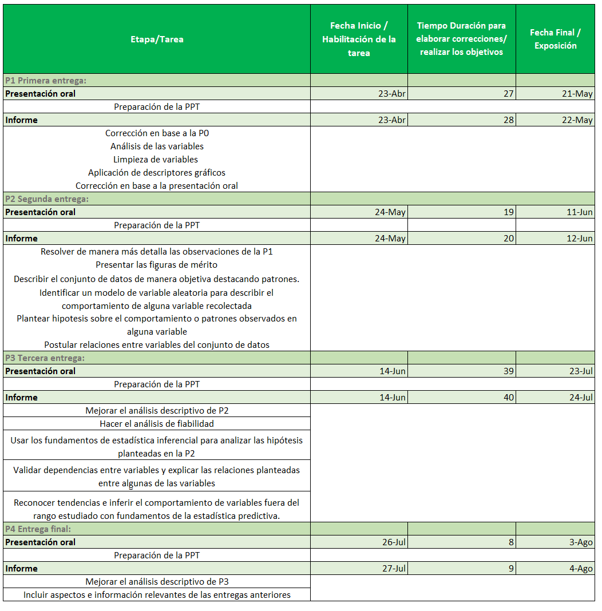
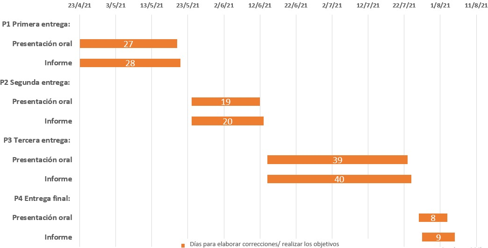
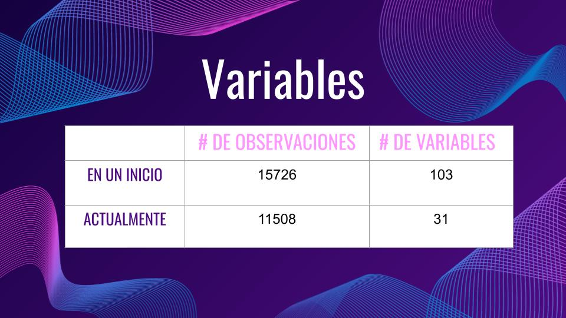

<center>
{width=150px}
```{r eval=TRUE, echo=FALSE, message=FALSE,warning=FALSE}
 # is.installed <- function(mypkg){
 #    is.element(mypkg, installed.packages()[,1])
 # } 
```

```{r eval=TRUE, echo=FALSE, message=FALSE,warning=FALSE}
# if (!is.installed("readr")){install.packages("readr")}
# if (!is.installed("fastGraph")){install.packages("fastGraph")}
# if (!is.installed("BSDA")){install.packages("BSDA")}
# if (!is.installed("TeachingDemos")){install.packages("TeachingDemos")}
# if (!is.installed("tidyverse")){install.packages("tidyverse")}
library(readr)
library(fastGraph)
library(BSDA)
library(TeachingDemos)
library(tidyverse)
```

```{r message=FALSE, include=FALSE}
DF=read.csv("DataLimpia.csv")
```

</center>

### <span style="color:dodgerblue"> Introducción<span>

##### <span style="color: dodgerblue"> Importancia y Justicación<span>

La situación que se está viviendo en nuestro país a causa del COVID 19 está ocasionando efectos negativos sin precedentes en muchos sectores del Perú, ya sea en el sector sanitario, social y en la misma economía. Además, es en este último es donde existe un gran número de personas que se han visto afectadas en sus ingresos, calidad y horas de trabajo, incluso en el desempleo. Por ello, en este estudio se analizará los indicadores sobre el mercado laboral, empleo e ingresos de las personas mayores de 14 años en el área Metropolitana de Lima en el trimestre de enero, febrero y marzo del 2021.

### <span style="color:dodgerblue"> Objetivos<span>  

1.**Objetivo Principal** 
 
<div style="text-align: justify">
 
Determinar la situación de empleabilidad de las personas de Lima Metropolitana en el trimestre de enero, febrero y marzo del 2021.

<div/>  

1.1 **Objetivos Específicos**
<div style="text-align: justify">
  - Analizar los indicadores de empleabilidad mediante el uso gráficos estadísticos
  - Determinar el factor más relevante de la causa de desempleo
  - Estimar la tasa de desempleo para los siguientes trimestre móviles
  - Plantear opciones para disminuir la tasa de desempleo en Lima Metropolitana
  - Conocer la situación económica y laboral de las personas en base a los indicadores de su ocupación durante el periodo trimestral enero, febrero y marzo del 2021.
  - Relacionar el contexto de empleabilidad durante la pandemia de los ciudadanos en relación con los indicadores de empleabilidad de la encuesta y posteriormente servir como fuente de investigación, comparación y análisis para los futuros escenarios de empleabilidad durante los próximos trimestres.
<div/>   

### <span style="color:dodgerblue"> Factibilidad<span>  
La siguiente es una tabla que detalla las características y objetivos de cada entrega para cumplir con los requisitos de estas. Se detalla la fecha de publicación de la tarea, el tiempo hábil para completarla, y la fecha de entrega de cada una.  
```{r echo=FALSE,  fig.align='center', out.width='90%'}

```


Asimismo, se ha elaborado un diagrama de Gantt, donde se muestra de manera gráfica las fechas y días de inicio y fin donde se realizará correciones o diferentes actividades para lograr los objetivos de la entrega correspondinete del proyecto. Además, al observar este diagrama se puede ver que las entregas inician un día después de la entrega del informe de la entrega anterior y terminan en la fecha de entrega correspondiente.
```{r echo=FALSE,  fig.align='center', out.width='90%'}

```


### <span style="color:dodgerblue"> Marco Teórico<span>

Nuestro estudio se realizará con una base pública. Por ello, utilizaremos los datos proporcionados por la entidad estatal oficial del gobierno del Perú, el INEI. Estos datos fueron recogidos en los meses de enero, febrero y marzo del 2021. La organización estatal ha puesto estos datos de forma pública para poner en conocimiento la situación de empleabilidad de los ciudadanos y ayudar a otras organizaciones con fines investigativos al proporcionar datos de posible comparación o análisis. El muestreo del estudio fue hecho por conglomerados, como menciona la ficha técnica del estudio del INEI. De cada conglomerado se encuestó a un número determinado de viviendas y a las personas de 14 años o mayores encontradas en la vivienda.
<div/>

1. #### <span style="color:dodgeblue"> Población Objetivo<span>
<div style="text-align: justify">
La población bajo estudio está constituida por los habitantes mayores de 14 años en el Área Metropolitana de Lima. Según la encuesta realizada por el INEI,  excluye del estudio a los miembros de las fuerzas armadas que viven en cuarteles, campamentos, barcos etc. Además, se excluye a las viviendas colectivas (hoteles, hospitales, asilos, claustros religiosos, cárceles etc.). Se recalca esto ya que la encuesta se hizo por viviendas, sin embargo nuestro enfoque es hacia las personas individuales.
<div/>

2. #### <span style="color:dodgeblue"> Unidad muestral<span>
<div style="text-align: justify">
Persona de 14 años o mayor habitante de Lima Metropolitana.

<div/>

3. #### <span style="color:dodgeblue"> Variables y su definición<span>


### **<span style="color:darkblue"> Numéricas (16) <span>** 

**<span style="color:dodgerblue"> Variable<span>** |**<span style="color:dodgerblue"> Definición<span>**
:---|:---
p108|Edad
p208b3|Años trabajando en ocupación principal
p209a| Horas trabajadas el domingo la semana pasada
p209b| Horas trabajadas el lunes la semana pasada
p209c| Horas trabajadas el martes la semana pasada
p209d| Horas trabajadas el miércoles la semana pasada
p209e| Horas trabajadas el jueves la semana pasada
p209f| Horas trabajadas el viernes la semana pasada
p209g| Horas trabajadas el sábado la semana pasada
p209t| Horas totales trabajadas la semana pasada
p209cc| Horas semanales usuales
fa_efm21| Factor de expansión
IMTdep| Ingreso total mensual de trabajo dependiente
IMTindep| Ingreso total mensual de trabajo independiente
IMTOSec | Ingreso total mensual de trabajo secundario
ITotal | Ingreso total mensual
 
### **<span style="color:darkblue"> Categóricas (15)<span>**   
#### **<span style="color:#a349a3"> Ordinales (2)<span>**
**<span style="color:dodgerblue"> Variable<span>** |**<span style="color:dodgerblue"> Definición<span>**
:---|:---
pmes | Mes de la encuesta
p109a| Nivel educativo alcanzado

#### **<span style="color:#a349a3"> Nominales (13)<span>**
**<span style="color:dodgerblue"> Variable<span>** |**<span style="color:dodgerblue"> Definición<span>**
:---|:---
p107| Sexo del entrevistado
p206| Trabajo principal
p209bb| Validación de horas semanales usuales y de la semana pasada 
p209h| Voluntad de trabajar
p209ee| Si actualmente busca trabajo
p223a1| Discapacidad: Dificultad para moverse
p223a2| Discapacidad: Ciego
p223a3| Discapacidad: Mudo
p223a4| Discapacidad: Sordo
p223a5| Discapacidad: Déficit de Atención
p223a6| Discapacidad: Dificultades sociales
p223a7| Tiene o no tiene alguna discapacidad
p204| Clasificación de empleo fijo, sin empleo pero realizando actividades, y sin empleo ni actividades

### <span style="color:dodgerblue"> Limpieza del Data Frame<span>

#### <span style="color:darkblue">Consideraciones para la eliminación de las variables<span>
Las consideraciones establecidas fueron:  

- Información sin sentido  
- Información irrelevante para el estudio  
- Información por número de NA's  
- Falta de claridad de la información 

#### <span style="color:darkblue">Variables de estudio<span>
En un inicio la data del INEI contenía 103 variables, pero luego de aplicar la selección de variables se rescataron 31 variables.

```{r echo=FALSE,  fig.align='center', out.width='80%'}

```


Se utilizó el R Notebook llamado ***limpieza.Rmd*** para limpiar el Data Frame y producir el nuevo "Data Limpia". Este archivo se encuentra en el zip, ya que de esta manera es más ordenada la presentación del resto de la información en este documento y así logramos ser transparentes con el proceso de limpieza del DataFrame original producido mediante la encuesta del INEI.  


**Preguntas e Hipótesis**
</center>
**<span style="color:dodgerblue"> Número<span>** |**<span style="color:dodgerblue"> Pregunta<span>**|**<span style="color:dodgerblue"> Hipótesis<span>**
:---|:---|:---
1|¿Cuál es el porcentaje de personas que padecen de alguna discapacidad y a la vez son económicamente activas?|Se sabe que existen alrededor de 349 personas con alguna discapacidad, lo cual es el 3% aproximadamente del total de la muestra. Entonces, se puede inferir que el porcentaje de personas económicamente activas y a la vez son discapacitadas es menor al 3%.
2|¿Qué día trabajan más horas los encuestados?|El día en el que más horas trabajan las personas puede estar estimado entre lunes y viernes, ya que los fines de semana (sábados y domingos) son días no laborales.
3|¿Cuál es el cargo que más abunda entre los encuestados, ya sea empleador, patrono, trabajador Independiente, empleado, obrero, trabajador familiar o trabajador del hogar?|Se podría afirmar que el cargo que más abunda es independiente, porque en el Perú abunda la informalidad laboral (75.2% según el INEI).
4|¿La mayoría de personas desempleadas son hombres o mujeres? ¿Cuál es el porcentaje?|Se conoce que el porcentaje de mujeres encuestadas es el 53% aproximadamente, por lo que hay una mayor probabilidad de que las mujeres sean las personas desempleadas. Basándonos en Diana Plasencia, vocera y gerente de Consultoría de la organización Aequales, quien afirma que el 54% de las mujeres que contaban con trabajo antes de la crisis han pasado a estar desempleadas, se puede estimar que aproximadamente 28.58% representa el porcentaje de mujeres desempleadas de la muestra.
5|¿Cuál es la edad que tiene una mayor cantidad de desempleados?|La muestra contempla personas desde 14 hasta 98 años. Partiendo del supuesto de que los menores de edad no trabajan (según la ley 28190, que prohibe el trabajo infantil) y considerando que la edad de jubilación es de 65 años en el Perú, se podría afirmar que la edad donde hay más desempleo es entre 14 y 18 años, como también a partir de los 66 y 98 años.
6|¿A partir de qué edad las personas empiezan a tener ingresos mayores o iguales al sueldo mínimo?|Considerando que son trabajadores dependientes y que las personas pueden comenzar a trabajar a partir de los 18 años, entonces, por ley, a los mayores de edad les deberían pagar un monto mayor al sueldo mínimo.
7|¿Qué porcentaje de los empleados son trabajadores independientes?|Según el INEI, en el 2020, los trabajadores independientes representaban el 37.9% de la población limeña. Debido a la pandemia, un gran número de personas comenzaron a emprender, entonces se puede estimar que el porcentaje de trabajadores independientes ha aumentado.
8|¿Cuál es el ingreso promedio en Lima Metropolitana?|Considerando que el promedio de ingresos debe ser mayor al sueldo mínimo (930 soles) y que, según el INEI, en el 2020, el ingreso promedio mensual en Lima Metropolitana fue de S/1,607.4. Por lo tanto, se puede estimar que debido al impacto de la pandemia, el ingreso mensual promedio será menor al promedio del año pasado, pero debe ser mayor al sueldo mínimo. 
9|¿Más del 50% de los encuestados tiene empleo fijo?|Probablemente no más del 50% de encuestados tenga empleo fijo, ya que la encuesta fue realizada 1 año después del inicio de la pandemia en Perú, por ende un gran número de personas pueden estar desempleadas. 
10|¿Hasta qué edad las personas se encuentran laborando?|Considerando que la edad de jubilación es 65 años, podemos inducir que las personas dejan de generar ingresos a partir de dicha edad.
11|¿Cuál es el porcentaje de trabajadores menores de edad y cual es el ingreso promedio de ellos?|El porcentaje de las personas menores de edad que generan ingresos debería ser muy bajo, entonces en el caso que sea lo contrario su sueldo podría estar debajo del sueldo mínimo.
12|¿Cuál es el ingreso promedio de las personas de la tercera edad?|Considerando que una persona se puede jubilar a partir de los 65 años, se asume que ellos empiezan a gozar de una pensión inferior a la que percibían en su centro de labor.  
13|¿Las personas que tienen un grado de estudio superior completo se encuentran posicionados económicamente mejor que el resto de encuestados?|Las personas que tienen un grado superior completo probablemente tienen una mejor situación económica.
14|¿Cuál es la relación del grado de instrucción y empleabilidad en los encuestados?|La relación del grado de instrucción y empleabilidad en los encuestados probablemente tengan una relación directa, es decir, tener un grado de instrucción superior, puede influir en la empleabilidad del encuestado.
15|¿La media de horas trabajadas semanalmente va acorde con lo estipulado por la ley?|La media de horas trabajadas semanalmente deberían ser menores a 48 horas a la semana. De ser así, estaría de acorde a lo estipulado por ley.

---  

#### <span style="color:darkblue">Variables Cuantitativas<span>
</center>

```{r echo=FALSE, fig.align='center'}

#nuevoedad=DF$p108[DF$p108>23.98 & DF$p108<61.88]
histg<-hist(DF$p108, breaks = 15, main="Distribución de la edad de los encuestados",xlab="Edad",ylab = "Frecuencia",col="lightblue")

abline(v=mean(DF$p108, na.rm=1),col="red", lwd=3)
abline(v=mean(DF$p108, na.rm=1)+1*sd(DF$p108),col="black",lwd=2)
abline(v=mean(DF$p108, na.rm=1)+2*sd(DF$p108),col="yellow",lwd=2)  
abline(v=mean(DF$p108, na.rm=1)+3*sd(DF$p108),col="green",lwd=2)

abline(v=mean(DF$p108, na.rm=1)-1*sd(DF$p108),col="black",lwd=2)
abline(v=mean(DF$p108, na.rm=1)-1.73*sd(DF$p108),col="purple",lwd=2)

abline(v=median(DF$p108, na.rm=1),col="blue",lwd=2,lty=2)
legend(65,1150,legend=c("media muestral","1 desviación de la media","2 desviaciones de la media","3 desviaciones de la media","1.73 desviaciones de la media"),col=c("red","black","yellow","green","purple"),lwd=2,cex=0.8)
```


En la gráfica se muestra la distribución de las personas encuestadas según su edad. Se encuestaron personas de 14 a 98 años. De manera visual, podemos observar que la gráfica tiene un sesgo hacia la derecha por la cola larga en el lado derecho, y esto se afirma pues la mediana (`r round(median(DF$p108,na.rm=TRUE),2)`) es menor que la media (`r round(mean(DF$p108,na.rm=TRUE),2)`), por ende, la distribución de esta variable no es simétrica, sino que se concentra hacia la izquierda. Interpretando, existe un número mayor de personas que tienen menos de 43 años a diferencia de las personas de mayor a esta edad. Asimismo, mediante la desviación estándar con respecto a la media, analizamos que tan dispersa se encuentra la muestra según su edad. Obtenemos que con una desviación tenemos una concentración de 61.94% de los datos; con dos tenemos el 97.05% y mientras que con tres desviaciones alcanzamos el 100%. Además, considerando que la edad es una variable cuantitativa discreta que va de 0 hasta aproximadamente 100 años y que la muestra abarca 84 de estos 100 años, concluimos que los datos están dispersos.

```{r eval=TRUE, echo=FALSE, message=FALSE, warning=FALSE, out.width= '80%', fig.align='center'}
boxplot(DF$p208b3,horizontal = 1, main="Años trabajando en una ocupación", xlab = "Número de años", col=c("lightblue"))
abline(v=mean(DF$p208b3,na.rm = TRUE), col="red",lwd=3,lty=4)
abline(v=mean(DF$p208b3, na.rm=1)+1*sd(DF$p208b3,na.rm = TRUE),col="black",lwd=3,lty=4)
abline(v=mean(DF$p208b3, na.rm=1)+2*sd(DF$p208b3,na.rm = TRUE),col="yellow",lwd=3,lty=4)  
abline(v=mean(DF$p208b3, na.rm=1)+3*sd(DF$p208b3,na.rm = TRUE),col="green",lwd=3,lty=4)  
abline(v=mean(DF$p208b3, na.rm=1)+4*sd(DF$p208b3,na.rm = TRUE),col="blue",lwd=3,lty=4) 
abline(v=mean(DF$p208b3, na.rm=1)+5*sd(DF$p208b3,na.rm = TRUE),col="gray",lwd=3,lty=4) 

legend(x = "topright",legend=c("media de años","1 desviación de la media","2 desviaciones de la media","3 desviaciones de la media","4 desviaciones de la media","5 desviaciones de la media"),col=c("red","black","yellow","green","blue","gray"),lwd=2,cex=0.8)

```


La mayoría de los trabajadores llevan trabajando tan solo 1 año en su ocupación. Utilizando el gráfico superior, se calcula que a partir de los 19 años los datos serán atípicos, por lo que inferimos que no es común que una persona trabaje más años que este límite. Además, el rango intercuartil es de 7 años, lo que significa que la mayoría de personas se encuentra laborando hace 1 a 8 años. Como este rango está cerca a la mediana, podemos inferir que los datos se hallan relativamente concentrados. Asimismo, podemos observar que una persona tiende a encontrarse laborando hace aproximadamente 6 años. No obstante, los datos están localizados dentro de aproximadamente 5 desviaciones estándar respecto a la media.Por ende, se puede decir que los datos se encuentran dispersos.

```{r echo=FALSE, fig.align='center'}
par(mfrow=c(3, 3))
hist(DF$p209a, col = 4,xlab = "Horas trabajadas el Domingo", ylab="Número de personas", main="Domingo")
hist(DF$p209b, col = 5,xlab = "Horas trabajadas el Lunes", ylab="Número de personas", main="Lunes")
hist(DF$p209c, col = 2,xlab = "Horas trabajadas el Martes", ylab="Número de personas", main="Martes")
hist(DF$p209d, col = 3,xlab = "Horas trabajadas el Miércoles", ylab="Número de personas", main="Miércoles")
hist(DF$p209e, col = 6,xlab = "Horas trabajadas el Jueves", ylab="Número de personas", main="Jueves")
hist(DF$p209f, col = 7,xlab = "Horas trabajadas el Viernes", ylab="Número de personas", main="Viernes")
hist(DF$p209g, col = 9,xlab = "Horas trabajadas el Sábado", ylab="Número de personas", main="Sábado")
hist(DF$p209t, col = 8,xlab = "Horas trabajadas Semanales", ylab="Número de personas", main="Semanales")
```


p209a, p209b, p209c, p209d, p209e, p209f, p209g, p209t: La mayor cantidad de encuestados no trabaja los domingos y muchos no trabajan los sábados. Tenemos un rango alto de horas trabajadas en cada día de la semana y en las horas semanales trabajadas, pues las personas de la muestra tienen trabajos muy variados. Asimismo, el mínimo de 0 horas trabajadas la semana pasada se interpreta como dato ingresado por las personas que la semana pasada estuvieron de descanso. A partir de los gráficos, se refuerza la idea de la tendencia a trabajar menor horas durante el fin de semana.

```{r echo=FALSE, fig.align='center'}
boxplot(DF$p209cc,col=2, main="Horas de trabajo por lo general a la semana", xlab="Horas estimadas de trabajo", ylab="Número de personas", horizontal=1)
```


p209cc: Según la moda, más personas trabajan 48 horas semanales usualmente, esto coincide con la mediana (`r round(median(DF$p209cc,na.rm=TRUE),2)`), mas no con la media (`r round(mean(DF$p209cc,na.rm=TRUE),2)`). La media es menor así que esta distribución estaría sesgada hacia la izquierda. Esto significa que hay más datos sobre la media que bajo la misma.

```{r echo=FALSE, fig.align='center'}
hist(DF$IMTdep, col="yellow", main="Ingreso Mensual Total del trabajador Dependiente", xlab="Ingresos (soles)")
abline(v=median(DF$IMTdep, na.rm=1),col="blue",lwd=4,lty=2)
legend(x = "topright",legend=c("Mediana"),col=c("blue"),lwd=4,lty=2,cex=0.8)
```


IMTdep: El ingreso dependiente que más se repitió entre los encuestados fue que no tienen ingreso mensual y la mediana indica que la mitad tampoco reciben un ingreso mensual. Tendremos un rango de 17 000 soles. Este es grande, por lo que la media se vería afectada. El rango intercuartílico es de 672 soles. Por ende, podemos inferir que los datos están concentrados. La razón por la que tantas personas no tienen un ingreso mensual de trabajador dependiente se puede deber a que están desempleados o no son empleados fijos.

```{r echo=FALSE, fig.align='center'}
boxplot(DF$IMTindep,col=5, horizontal=1,main=" Ingreso Mensual Total del trabajador Independiente", xlab="Ingresos (soles)")
```


IMTindep: El IQR es 0, por lo tanto, la mayoría de los encuestados no tienen un ingreso mensual independiente. Al ser el mínimo, la moda, el IQR y la mediana cero, es evidente que el valor de la media está afectado, ya que el máximo es un valor muy alto.

```{r echo=FALSE, fig.align='center'}
boxplot(DF$IMTOSec,col=7, horizontal=1, main=" Ingreso Mensual Secundario Total del trabajador", xlab="Ingresos (soles)")
```


IMTOSec: Se presenta una tendencia parecida a la variable IMTindep, pero en este caso la media se verá menos afectada, ya que el máximo es considerablemente menor que en la variable anterior. A partir del gráfico se evidencia que el 50% de los entrevistados tiene alrededor de cero soles de ingreso mensual por una actividad secundaria. Debido a esta gran tendencia a no ganar ingresos en este ámbito laboral, los datos al extremo superior se interpretan como datos atípicos según el boxplot.

```{r echo=FALSE, fig.align='center'}
boxplot(DF$ITotal,col=3,  horizontal=1, main="Ingreso Mensual Total del trabajador", xlab="Ingresos (soles)")
```


ITotal: El ingreso total es la suma de los tres ingresos: dependiente, independiente y secundario. El ingreso total que más se repitió entre los encuestados fue que no tienen ingreso mensual. El ingreso mensual total se presenta de mejor manera que las variables de ingreso dependiente, independiente y secundario por separado, debido a que la caja de este boxplot incluye más de un valor, no solo cero como las anteriores. El rango de los datos es grande, por lo que la presentación horizontal del boxplot sirve para mostrar de manera ordenada el rango completo de la data.  


#### <span style="color:darkblue">Variables Cualitativas<span>
</center>
```{r echo=FALSE, fig.align='center'}
Tabla2<-table(DF$p107, DF$pmes)
barplot(Tabla2, main="Personas Encuestadas por Meses", col = c("royalblue", "bisque"), names=c("Enero","Febrero","Marzo"), ylab="Número de personas")
legend(x = "topright", legend = c("Masculino", "Femenino"), fill = c("royalblue", "bisque"), 
       title = "Sexo")
```  


pmes: Esta variable nos permite conocer el mes en que se le realizó la encuesta a cada una de las personas. Esta se divide en tres meses: enero, febrero y marzo, pues es el trimestre que analizamos. Podemos ver que se encuestó a un número similar de personas en cada mes.  

p107: Podemos identificar la cantidad de hombres y mujeres encuestados. La proporción entre hombres y mujeres en la muestra es similar a la población de Lima Metropolitana, siendo casi 50% cada uno pero un poco más de mujeres que hombres. La gráfica comprueba el análisis hecho anteriormente sobre la variable sexo.


```{r echo=FALSE, fig.align='center'}
nombres1=c("Sin Nivel", "Inicial", "Primaria Incompleta", "Primaria Incompleta", "Secundaria Incompleta", "Secundaria Completa", "Superior No Universitaria Incompleta", "Superior No Universitaria Completa", "Superior Universitaria Incompleta", "Superior Universitaria Completa")
barplot(table(DF$p109a),main="Nivel Educativo de los Trabajadores", xlab='Nivel Educativo',ylab='Frecuencia', col=c("khaki2","lightcyan2","olivedrab2","rosybrown2"))
legend("topright", legend = paste(sort(unique(DF$p109a)),nombres1), cex = 0.71)
```

Se ve de manera evidente que la gran mayoría de los encuestados presentan el nivel educativo alcanzado de secundaria completa. Visualmente, se calcula que la mitad del resto de encuestados se encuentra en algún nivel superior, mientras que la otra mitad de los que no tienen hasta secundaria completa, presentan un nivel menor de estudios. Verificando numéricamente las inferencias mencionadas, el número de personas que alcanzaron algún nivel después de la secundaria completa es de 35.74%, mientras que las personas con un nivel anterior al de secundaria completa es de 26.10%. De manera que se puede decir que existe un mayor número de personas que alcanzó un nivel superior, a diferencia de las personas que alcanzaron un nivel inferior. 


```{r echo=FALSE, fig.align='center'}
#table(DF$p209bb)
nombres1=c("Empleador o patrono", "Trabajador independiente", "Empleado", "Obrero", "Trabajador familiar no remunerado", "Trabajador del hogar", "Otro")
barplot(table(DF$p206), horiz=TRUE, main="Desempeño en su trabajo principal", xlab='Frecuencia',ylab='Opciones de desempeño laboral', col=c("khaki2","lightcyan2","olivedrab2","rosybrown2"))
legend("topright", legend = paste(sort(unique(DF$p206)),nombres1), cex = 0.71)
proporciones <- c(3.267,34.913,33.6811,19.2268,5.918576,2.7711256,0.22) # creamos un vector con proporciones
pct <- round(proporciones/sum(proporciones)*100)
nombres1 <- paste(nombres1, pct) # Añadimos porcentajes a etiquetas
nombres1 <- paste(nombres1,"%",sep="") # Añadimos el símbolo de %

```

Esta gráfica nos muestra cuál es el desempeño del trabajador en su ocupación principal o negocio. Para ello, se presenta un conjunto de opciones como indica la leyenda. De las personas encuestadas, solo el 50.80% se encuentran laborando. Como se aprecia en la gráfica, la mayoría de las personas tienden a desempeñarse como trabajador independiente, seguido de empleado. Al calcular, el 34.91% se desempeña como trabajador independiente, mientras que el 33.68% trabaja como empleado (trabajador dependiente). 


p209bb: Esta variable valida si el número de horas trabajadas en la semana pasada coincide con las horas que el encuestado trabaja en una semana usualmente. A partir de la inspección de la tabla de frecuencias se concluye que solo el 43.2% de los encuestados, es decir, menos de la mitad, trabajaron igual de horas la semana anterior a ser encuestadas a lo usual.

```{r echo=FALSE, fig.align='center'}
barplot(table(DF$p209h), main="Voluntad de Trabajar", names=c("Tiene Voluntad", "No tiene voluntad"), ylab="Número de Personas", xlab="Voluntad", col="yellow")
```

p209h: Se pregunta al encuestado si cumpliendo con sus obligaciones actuales de trabajo tiene la voluntad de trabajar más horas y además si estuvo disponible para poder hacerlo. De los encuestados, el 35.64% sí tuvieron la voluntad de trabajar más horas, mientras que el 15.15% no. Se ve de manera simple y clara que la mayoría tiene voluntad para trabajar más horas de lo común.


p209ee: Esta variable indica si la persona con trabajo, una semana antes de la fecha de la encuesta, estaba buscando otro trabajo. Mediante el gráfico podemos observar la estimación visual de las 1247 personas que estaban buscando un trabajo y las 4599 que no buscaron trabajo.

p223a1, p223a2, p223a3, p223a4, p223a5, p223a6, p223a7: Se les pregunta a los encuestados si presentan alguna limitación o dificultad física, mental, intelectual o de los sentidos (vista, oído, tacto, olfato, gusto) de forma permanente, que le impida desarrollarse normalmente en sus actividades diarias. Cada variable representa una pregunta de distintas limitaciones, que serán respondidas mediante un si o no. De los encuestados, el 96.97% no presenta ninguna discapacidad. No obstante, el resto respondió que sí como mínimo a alguna pregunta (variable) sobre la discapacidad.

### <span style="color:dodgerblue"> Patrones<span>  

```{r echo=FALSE, fig.align='center'}
edad1=DF$ITotal[DF$p108<24]
edad2=DF$ITotal[DF$p108>23 & DF$p108<33]
edad3=DF$ITotal[DF$p108>32 & DF$p108<42]
edad4=DF$ITotal[DF$p108>41 & DF$p108<51]
edad5=DF$ITotal[DF$p108>50 & DF$p108<60]
edad6=DF$ITotal[DF$p108>59 & DF$p108<69]
edad7=DF$ITotal[DF$p108>68 & DF$p108<78]
edad8=DF$ITotal[DF$p108>77 & DF$p108<87]

m1=mean(edad1)
m2=mean(edad2)
m3=mean(edad3)
m4=mean(edad4)
m5=mean(edad5)
m6=mean(edad6)
m7=mean(edad7)
m8=mean(edad8)
edadesm=c(m1,m2,m3,m4,m5,m6,m7,m8)
eds=c((14+23)/2, (24+32)/2, (33+41)/2, (42+50)/2, (51+59)/2,(60+68)/2, (69+77)/2,(78+86)/2)
plot(eds,edadesm, main = "Edad e Ingreso total mensual", xlab="Edad", ylab="Ingreso total mensual (soles)",pch = 8, col = "green")
y=600*sin((3.14/40)*eds-8.3)+610
lines(eds, y, pch=18, col="blue", type="c", lty=2)
legend("topright", c("Promedios","Función aproximada"), cex = 0.8,fill = c("green","blue"))
```

La siguiente función aproxima el comportamiento de la relación entre las variables:  

$f(x)=600sen(\frac{\pi}{40}x-8.3)+610$     $\\\\ ;\ x\in [14;86]$

En la gráfica superior se muestra la relación entre la variable ingreso total mensual (ITotal) que representará la variable dependiente "y" y la variable Edad (p108) que será la variable independiente "x". Asimismo, la gráfica muestra que la edad donde se suele ganar un mayor sueldo es aproximadamente a los 45 años, mientras que al comienzo y al final de la vida laboral se suele ganar menos a diferencia de su otras etapas laborales. Esta tendencia se da, ya que al principio de la vida laboral los jóvenes no tienen experiencia, por lo que ocupan cargos de bajo alcance. Asimismo, al final de la vida laboral, el rendimiento de las personas mayores se ve afectado por su edad, por lo que muchos se jubilan y reciben un sueldo menor al previo.

La variable que representa el ingreso total tiene datos mucho más dispersos a comparación de la edad, ya que la primera tiene un coeficiente de variación de `r round(sd(DF$ITotal)/ mean(DF$ITotal),2)`, mientras que la segunda, que aún representa una muestra muy heterogénea, tiene un coeficiente de variación de `r round(sd(DF$p108)/ mean(DF$p108),2)`.  

Se optó por usar el coeficiente de variación en lugar de otro descriptor de dispersión, ya que las variables comparadas difieren en sus unidades y este analiza más que solo los datos a los extremos. Sin embargo, podemos utilizar el rango para complementar el análisis del coeficiente de variación, ya que los datos de la edad solo varían en `r max(DF$p108)-min(DF$p108)` años mientras que los del ingreso total en  `r max(DF$ITotal)-min(DF$ITotal)` soles.

Esta función trigonométrica es válida en el intervalo de 14 a 86 años de edad, debido a que el resto de edades no se ajustan a la función sinusoidal mostrada.  


```{r echo=FALSE, fig.align='center'}

reg <- function(x, y, ...) {
  points(x,y, ...)
  abline(lm(y~x), lwd=2) 
  }
panel.cor <- function(x, y, digits = 2, prefix = "", cex.cor, ...){
  usr <- par("usr"); on.exit(par(usr))
  par(usr = c(0, 1, 0, 1))
  r <- abs(cor(x, y))
  txt <- format(c(r, 0.123456789), digits = digits)[1]
  txt <- paste0(prefix, txt)
  text(0.5, 0.5, txt, cex = 1.1, font = 4)
}
pairs(~DF$IMTdep + DF$IMTindep + DF$ITotal, col=2, labels=c("Ingreso Dependiente", "Ingreso Independiente", "Ingreso Total"), main="Ingresos mensuales (soles)", lower.panel = panel.cor, upper.panel = reg)

f1<-lm( DF$IMTdep~DF$ITotal )
f2<-lm(DF$ITotal ~ DF$IMTindep)
f3<-lm(DF$IMTdep~DF$IMTindep)
```


Función Ingreso Dependiente e Ingreso Independiente:  

$f(x)=-0.14x+549.32$         $\\\\ ;\ x\in [0;40000]$

Función Ingreso Total e Ingreso Dependiente:  

$g(x)=0.64x+38.63$         $\\\\ ;\ x\in [0;40000]$  

Función Ingreso Total e Ingreso Independiente:  

$h(x)=0.86x+555.70$         $\\\\ ;\ x\in [0;40000]$

Los ingresos totales que pueden tener las personas pueden ser de manera general, mediante un trabajo dependiente, un trabajo independiente o de ambos. Por ello, planteamos obtener una relación para obtener el ingreso total en función del ingreso dependiente e independiente. 

Se puede ver que el ingreso mensual en soles obtenido del trabajo dependiente y el ingreso mensual total tienen una correlación positiva de `r round(cor(DF$IMTdep, DF$ITotal, use = "everything"),2)`. El ingreso mensual independiente y el ingreso total también tienen una correlación positiva pero menor, de `r round(cor(DF$IMTindep, DF$ITotal, use = "everything"),2)`. Esto se debe a que la suma de ambos constituyen el ingreso total mensual, pero más personas tienen trabajo dependiente que independiente. Por eso, el trabajo dependiente influye en mayor manera al ingreso total mensual.

Igualmente, se puede observar en la gráfica que los ingresos dependientes e independientes no tienen una relación directa. Esto se debe a que en la muestra, no hay personas que tengan ambos trabajos. Esto también se ve reflejado en la correlación entre ambas variables, la cual es `r round(cor(DF$IMTdep, DF$IMTindep, use = "everything"),2)`. Es negativa, aunque en el gráfica se muestre positiva (muestra valor absoluto), ya que cuando uno crece el otro decrece. También, la correlación es muy cercana a cero, ya que casi no se relacionan debido a que cuando uno tiene un valor, el otro tiene 0 y viceversa.


```{r  echo=FALSE, fig.align='center'}
ingre=vector()
edad=DF$ITotal[DF$p208b3<6]
ingre=append(ingre,mean(edad,na.rm=TRUE))
for (i in 1:29){
  if(i%%5==0){
    i=i+1
edad=DF$ITotal[DF$p208b3>=i & DF$p208b3<i+5]
ingre=append(ingre,mean(edad,na.rm=TRUE))
  }
}

eds=vector()
eds=c(2.5)
for (i in 1:29){
  if(i%%5==0){
    i=i+1
ed=((i +i+4)/2)
eds=append(eds,ed)
  }
}

plot(eds,ingre, xlab="Años laborando en ocupación principal", ylab="Ingreso total mensual promedio (soles)",pch = 15, col = "blue", main="Años en ocupación principal vs Ingreso Total")

abline(lm(ingre~eds), col = "green",lwd=3, lty=4)

coef<-lm(ingre ~ eds)

```


La siguiente función aproxima el comportamiento de la relación entre las variables:  

$f(x)=45.48 x + 1215.27$ $;  X\in [0;35]$

En la siguiente gráfica superior se muestra la relación entre la variable Ingreso total mensual promedio en soles (ITotal) que representará la variable dependiente "y" y la variable Años laborando en ocupación principal (p208b) que será la variable independiente "x". Asimismo, establecemos la relación para verificar como una persona percibe su ingresos totales de forma mensual en función a la cantidad de años que una persona labora en su ocupación principal. La correlación entre los años que una persona ha trabajado en su ocupación principal y su ingreso total mensual es de `r round(cor(eds, ingre, use = "everything"),2)`. Esta alta correlación, se debe a que se han dividido los años en múltiples rangos y se ha promediado su ingreso total mensual para obtener una relación lineal evidente. También se han omitido las observaciones cuyos años laborando en su ocupación principal es de 36 a 46, ya que son pocas y difieren de la relación establecida.

La gráfica demuestra la tendencia de obtener un mayor ingreso total a medida que se ha trabajado más tiempo en la ocupación principal. Esto se debe a que a más años trabajando se tiene una mayor experiencia laboral ya que se ha podido subir en la escala de puestos dentro de una empresa, y ese amplio conocimiento sobre la misma empresa vale más.

Esta función lineal es válida en el intervalo de 0 a 35 años laborando en la ocupación principal, debido a que, como se mencionó anteriormente, no se está considerando datos superiores a 35 años laborando en su ocupación principal ya que no se ajustan a la función lineal encontrada. 


### <span style="color:dodgerblue"> Modelos de Variables Aleatorias<span>  

|<span style="color:darkblue"> Variable<span>|<span style="color:darkblue"> Justificación<span>
:--|:---
p107| Esta variable representa el sexo. Es una variable aleatoria discreta y puede ser descrita por un modelo binomial, donde n que es el número de veces que repite el experimento y p es la probabilidad de éxito en cada repetición del experimento. Siendo el éxito que un entrevistado sea hombre. X ~ Bin(`r nrow(DF)`,`r round(length(DF$p107[DF$p107==1])/(nrow(DF)),2)`)
p108| La variable edad es una variable aleatoria discreta porque en este caso están como números enteros en un conjunto finito que va desde los 14 hasta los 98 años de edad (cercano a la esperanza de vida). Asimismo, su distribución le correspondería a una Binomial. Se considera que el éxito es que un entrevistado tenga 18 años a más. X ~ Geom(`r round(1/mean(DF$p108),2)`)
p208b3 | Representa los años trabajando en la ocupación principal y se considera una variable aleatoria discreta, ya que los años trabajando son expresados como números enteros y deben ser menores a su edad. El éxito siendo los entrevistados que han trabajado por menos de un año en su ocupación principal. X ~ Bin(`r nrow(DF)`,`r round(length(DF$p208b3[DF$p208b3==0])/(nrow(DF)),2)`)
pmes| Esta variable es aleatoria discreta porque el espacio muestral está dado por solo tres meses (enero-febrero-marzo), representando un conjunto finito. El número de entrevistas hasta encontrar a la primera persona entrevistada en febrero. X ~ Geom(`r round(length(DF$pmes[DF$pmes=='02'])/(nrow(DF)),2)`)		
p109a, p206 | El nivel educativo alcanzado y el trabajo principal del encuestado son variables aleatorias discretas, ya que el encuestado marcó su respuesta respecto a un número finito de opciones dadas en la encuesta. La cantidad esperada de entrevistados hasta encontrar el entrevistado número 100 con grado de estudios hasta el nivel de secundaria completa. X ~ BinNeg(100, `r round(length(DF$p109a[DF$p109a<7])/(nrow(DF)),2)`).  
$$E(X)= \frac{100}{`r round(length(DF$p109a[DF$p109a<7])/(nrow(DF)),4)`}=`r round(100/(length(DF$p109a[DF$p109a<7])/(nrow(DF))),2)`$$  


```{r echo=FALSE}
# Función implementada para colorear el area bajo la curva de una función
colorArea <- function(from, to, density, ..., col="blue", dens=NULL){
y_seq <- seq(from, to, length.out=500)
d <- c(0, density(y_seq, ...), 0)
polygon(c(from, y_seq, to), d, col=col, density=dens)
}
```

### <span style="color:dodgerblue"> Descripción de variables <span>    
  
  
#### <span style="color:darkblue"> Variable <span>
  
  
##### <span style="color:darkblue">Ingreso total mensual<span>


```{r echo=FALSE, fig.align='center'}
data1<-c(DF$ITotal[DF$p108>=18 & DF$ITotal>0])
Q3=quantile(data1,0.75,na.rm=1)
limsup=Q3+1.5*IQR(data1,na.rm=1)
Q1=quantile(data1,0.25,na.rm=1) 
liminf=Q1 - 1.5*IQR(data1,na.rm=1)
pos1=which(data1>limsup | data1<liminf)
data1=data1[-pos1]
boxplot(data1, horizontal = TRUE,ylim=c(min(data1),max(data1)), col=3, xlab="Ingreso en soles", main="Ingreso total mensual")
abline(v=mean(data1,na.rm=TRUE),col="darkblue",lwd=3,lty=4)
```


La variable ITotal representa los ingresos totales mensuales de los encuestados, el rango de esta variable es amplio, el cual es (`r range(data1)`), por lo que consideramos que la data es variable a comparación de otras variables. Asimismo, el boxplot se muestra de manera horizontal para poder apreciar el rango de la variable de mejor manera. Finalmente, se utilizó estimación puntual para determinar la media muestral la cual es `r round(mean(data1, na.rm=TRUE),2)` soles.


### <span style="color:dodgerblue"> Pruebas de Hipótesis<span>  


#### <span style="color:dodgerblue"> HIPÓTESIS I <span>


$H_0:$ El ingreso mensual promedio de las personas mayores de edad económicamente activas es **mayor o igual** al sueldo mínimo.  

$H_{0}:µ >= 930$  

$H_1:$ El ingreso mensual promedio de las personas mayores de edad económicamente activas es **menor**  al sueldo mínimo.  

$H_{1}:µ < 930$  


```{r echo=FALSE}
n=length(data1)
med=mean(data1,na.rm=TRUE)
sd=sd(data1,na.rm=TRUE)

conf=0.95
z1=qnorm(1-conf)# z inferior porque es unilateral hacia la izquierda
error=abs(z1*sd/sqrt(n))
mu = 930
z <- ((med-mu)*sqrt(n))/(sd)
```

Nivel de confianza= `r conf*100`%  
Los datos están muy dispersos. Esto se puede ver en el rango de la variable, que va de  `r min(data1)` a `r max(data1)`, por lo que se prioriza una mayor confianza sobre una mayor precisión.  
Error=`r round(error,2)`  
Tamaño de la muestra= `r n`  

```{r echo=FALSE,fig.align = 'center'}
curve(dnorm(x), from=-5, to=30, xlim=c(-5,30), col=3, lwd=4, main="Distribución de Probabilidad f(x) Normal Estándar", ylab="f(x)")
legend("top",legend=c("Z alfa = -1.64","Z crítico supuesto = 25.89", "Región de rechazo"), cex = 0.8, fill = c("red",6,3))
colorArea(from=-5, to=z1, dnorm, col=3)
abline(v=z1, col="red", lwd=3)
abline(v=z, col=6, lwd=2)
```

#### <span style="color:dodgerblue"> Intervalo de confianza para la hipótesis 1 <span>

Intervalo de confianza: [1175.51, $\infty$>

```{r echo=FALSE,fig.align = 'center'}
hist(data1, prob=T, ylab="Probabilidad", xlab="Ingreso total mensual (soles)", main="Función de probabilidad del Ingreso total mensual", col=3, xlim=c(0,3500))
abline(v=930, col=6, lwd=2) #930
xIC=med+(z1*(sd/sqrt(n)))
abline(v=xIC, col="red", lwd=2)
abline(v=mean(data1, na.rm=TRUE), col="yellow", lwd=2)
curve(dnorm(x,mean(data1, na.rm=TRUE),sd(data1, na.rm=TRUE)), from=0, to=3500, xlim=c(0, 3500), col=4, lwd=4, add=T)
legend("topright",legend=c( "Sueldo mínimo (S/ 930)","Límite inferior de confianza (S/ 1175.51)", "Media muestral (S/ 1192.17)","Función de probabilidad normal"), cex = 0.8, fill = c(6,"red", "yellow",4))
```

#### <span style="color:dodgerblue"> Conclusión hipótesis 1 <span>

Según el análisis de la distribución de probabilidad de la variable ingresos totales, el valor de z crítico que delimita la zona de rechazo es `r round(z1,2)`. Asimismo, el valor de z supuesto es `r round(z,2)` y se ubica en la zona de no rechazo. En la gráfica anterior, la cual es unilateral y tiene cola al lado izquierdo, se aprecia que la media muestral, está muy cercana al límite inferior del intervalo de confianza. Es por esto que la hipótesis nula será rechazada, debido a que la diferencia entre la media muestral y el límite es `r round(med-xIC,2)`, esta diferencia es muy pequeña en comparación con el rango de la data. En ese sentido, se demuestra que el nivel de confianza puede influir en el rechazo o no rechazo de la hipótesis nula. Se puede afirmar que es susceptible a los cambios, pues realizamos pruebas utilizando diferentes niveles de confianza y a partir de cierto nivel, luego de reducirlo, la media muestral se hallaba fuera del intervalo.

### <span style="color:darkblue">Horas trabajadas semanales<span>


```{r echo=FALSE, fig.align='center'}
# Hipotesis 1
data2<-c(DF$p209t[DF$ITotal>0 & DF$p209t<85]) #atípico: más de 12 horas diarias
boxplot(data2, horizontal = TRUE,ylim=c(min(data2),max(data2)), col=4, xlab="Horas", main="Horas trabajadas la semana pasada")
abline(v=mean(data2,na.rm=TRUE),col="darkblue",lwd=3,lty=4)
```


La variable p209t representa las horas totales trabajadas de los encuestados, el rango de esta variable no es amplio, este es (`r range(data2)`), por lo que consideramos que la data no es variable a comparación de las demás. Asimismo, el boxplot mostrado de manera horizontal nos sirve para poder visualizar el rango completo de la data de manera ordenada. Finalmente, se utilizó estimación puntual para hallar la media muestral. Esta es `r round(mean(data2, na.rm=TRUE),2)` horas.
 


### <span style="color:dodgerblue"> HIPÓTESIS 2 <span>

Ho = Las horas promedio de trabajo semanales de las personas son **menor o igual** a 48 horas.

$H_{0}:µ <= 48$

H1 = Las horas promedio de trabajo semanales de las personas son **mayor** a 48 horas.

$H_{1}:µ > 48$


```{r echo=FALSE}
n=length(data2)
med=mean(data2,na.rm=TRUE)
sd=sd(data2,na.rm=TRUE)
conf=0.80
t2<-qt(conf,n-1)# t superior porque es bilateral hacia la derecha

error=abs(t2*sd/sqrt(n))
mu = 48
t <- ((med-mu)*sqrt(n))/(sd)
```

Nivel de confianza= `r conf*100`%  
Debido a que los datos no están muy dispersos, lo cual se justifica analizando el rango de la variable, que va de `r min(data2)` a `r max(data2)` horas, se prioriza una mayor precisión sobre una mayor confianza.  
Error=`r round(error,2)`  
Tamaño de la muestra= `r n` 

```{r echo=FALSE,fig.align = 'center'}
plot( function(x) dt(x, df = n-1 ), -25, 5, ylim = c( 0, 0.4 ),
      col = "red", type = "l", lwd = 2,
      main = "Función densidad t de Student" , ylab="f(x)")
abline(v=t2, col="blue",lwd=2)
abline(v=t, col="purple",lwd=2)
legend(x="topleft", legend = c("t-crítico = 0.84","t-supuesto = -23.29"), lty=c(1,1), col=c("blue","purple"), lwd=4)
colorArea(from=t2, to=5, dnorm)
```

#### <span style="color:dodgerblue"> Intervalo de confianza para la hipótesis 2 <span>

```{r echo=FALSE, include=FALSE}
t.test(data2,mu=48,alternative = "greater",conf.level = conf)
```
<font size="3.5"> 
Intervalo de confianza para la media: [0,42] horas
</font> 


```{r echo=FALSE,fig.align = 'center'}
hist(data2, prob=T, ylab="Probabilidad", xlab="Horas", main="Función de probabilidad de las horas trabajadas la semana pasada", col=3, xlim=c(0,84))
abline(v=med, col="yellow", lwd=3)
abline(v=mu, col=6, lwd=2) #930
xIC=med+(qnorm(1-conf)*(sd/sqrt(n)))
abline(v=xIC, col="red", lwd=2)
curve(dnorm(x,mean(data2, na.rm=TRUE),sd(data2, na.rm=TRUE)), from=0, to=84, xlim=c(0, 84), col=4, lwd=4, add=T)
legend("topright",legend=c("Media muestral (42.41 horas)", "Máximo de horas (48 horas)","Límite superior de confianza (42 horas)","Función de probabilidad normal"), cex = 0.8, fill = c("yellow",6,"red",4))
```


#### <span style="color:dodgerblue"> Conclusión hipótesis 2 <span>

Gracias al análisis de distribución de probabilidad de la variable horas promedio de trabajo semanales (p209t) el valor de t-crítico es `r round(t2,2)`. Asimismo, el valor  t-supuesto es `r round(t,2)` y se ubica en la zona de no rechazo. Sin embargo, al graficar el intervalo de confianza, nos percatamos que la media muestral sobrepasa el límite superior del intervalo de confianza, por lo que se rechaza la hipótesis nula.

#### <span style="color:darkblue">Variable: Ingreso Total <span>
<font size="3.5">
De población económicamente activa, por sexos.
</font>
</center>

```{r echo=FALSE, fig.align='center'}
# Hipotesis 4
H<-c(DF$ITotal[DF$ITotal>0 & DF$p107== 1])
M<-c(DF$ITotal[DF$ITotal>0 & DF$p107== 2])
boxplot(H,M, col = c("skyblue","orange"),names=c("HOMBRES","MUJERES"),main="INGRESO MENSUAL POR SEXO", ylim=c(0,4000), horizontal=TRUE)
title(xlab="Ingreso mensual (S/.)",ylab="Sexo", line=3, cex.lab=1.3)
abline(v=mean(H),col="darkblue",lwd=2)
abline(v=mean(M),col="red",lwd=2)
legend(x = "topright",legend=c("Media de ingreso mensual mujeres (S/ 998.77)","Media de ingreso mensual hombres (S/ 1325.59)"),col=c("red", "darkblue"),lwd=2,cex=0.8)

H<-c(DF$ITotal[DF$ITotal>0 & DF$p107== 1])
M<-c(DF$ITotal[DF$ITotal>0 & DF$p107== 2])
Q3=quantile(H,0.75,na.rm=1)
limsup=Q3+1.5*IQR(H,na.rm=1)
H=H[H<limsup]

Q3=quantile(M,0.75,na.rm=1)
limsup=Q3+1.5*IQR(M,na.rm=1)
M=M[M<limsup]

med2=mean(M)
med1=mean(H)
var1=var(H)
var2=var(M)
sd1=sd(H)
sd2=sd(M)
n1=length(H)
n2=length(M)

conf=0.95
z2=qnorm(1-(1-conf))
x2<-(med1-med2)+z2*sqrt(var1/n1+var2/n2)

error=z2*sqrt((var1)/n1+var2/n2)
z=(med1-med2)/sqrt(var1/n1+var2/n2)
xsupuesto=(med1-med2)+z*sqrt(var1/n1+var2/n2)
```

A continuación, se analizará la variable de ingreso mensual total de hombres y mujeres. Podemos ver que la estimación puntual de la media del ingreso de los hombres es mayor a la de las mujeres. De igual manera, se puede apreciar mediante el boxplot que la caja de bigotes de los hombres se encuentra hacia la derecha en relación a la caja de bigotes de las mujeres. Esto nos da a entender que los ingresos totales del género masculino en general son mayores que los ingresos mensuales de las féminas.


### <span style="color:dodgerblue"> HIPÓTESIS 3<span>

Ho = El ingreso mensual promedio de los hombres en Lima Metropolitana es **menor o igual**  al ingreso mensual promedio de las mujeres.  
$H_{0}:µ_{1} <= µ_{2}$  

H1 = El ingreso mensual promedio de los hombres en Lima Metropolitana es **mayor** al ingreso mensual promedio de las mujeres.  
$H_{0}:µ_{1} > µ_{2}$  


Nivel de confianza= `r conf*100`%   

Debido a que los datos están muy dispersos (rango hombres: `r range(H)` y rango mujeres:`r range(M)`), por lo que se prioriza una mayor confianza sobre una mayor precisión. 

Error=`r round(error,2)`.

Tamaño de la muestra= hombres:`r n1`  y mujeres:`r n2`.

Límite superior de confianza en x: `r round(x2,3)`.


```{r eval=TRUE, echo=FALSE, message=FALSE,warning=FALSE, fig.align='center', fig.width=7, fig.height=3.5}
plot( function(x) dnorm(x), -5, 17, ylim = c( 0, 0.4 ),
      col = "red", type = "l", lwd = 2,
      main = "Función densidad Distribucion normal Estándar", ylab="f(x)" )
abline(v=z2, col="blue",lwd=2)
abline(v=z, col="green",lwd=2)
legend(x="topright", legend = c("z-crítico = 1.64","z-supuesto = 16.48"), lty=c(1,1), col=c("blue","green"), lwd=4)
colorArea(from=z2, to=17, dnorm)
```


```{r echo=FALSE}
# Hipotesis 3
H<-c(DF$ITotal[DF$ITotal>0 & DF$p107== 1])
M<-c(DF$ITotal[DF$ITotal>0 & DF$p107== 2])
Q3=quantile(H,0.75,na.rm=1)
limsup=Q3+1.5*IQR(H,na.rm=1)
H=H[H<limsup]

Q3=quantile(M,0.75,na.rm=1)
limsup=Q3+1.5*IQR(M,na.rm=1)
M=M[M<limsup]

med2=mean(M)
med1=mean(H)
var1=var(H)
var2=var(M)
sd1=sd(H)
sd2=sd(M)
n1=length(H)
n2=length(M)

conf=0.95
z2=qnorm(1-(1-conf))
x2<-(med1-med2)+z2*sqrt(var1/n1+var2/n2)

error=z2*sqrt((var1)/n1+var2/n2)
z=(med1-med2)/sqrt(var1/n1+var2/n2)
xsupuesto=(med1-med2)+z*sqrt(var1/n1+var2/n2)
```

#### <span style="color:dodgerblue"> Conclusión hipótesis 3 <span>

Según el análisis de la variable ingreso mensual promedio en Lima Metropolitana, el valor de z-crítico es `r round(z2,2)`. Asimismo, el valor z supuesto es `r round(z,2)` y se ubica en la zona de rechazo. Finalmente, la hipótesis nula se rechaza, razón por la cual no se procede a graficar el intervalo de confianza como en las 2 hipótesis anteriores. 


### <span style="color:dodgerblue"> Análisis predictivo <span>  

### <span style="color:dodgerblue"> Regresión 1<span>

En la siguiente regresión se muestra la relación entre la variable ingreso total mensual (ITotal) que representará la variable dependiente "y" y la variable Años laborando en ocupación principal (p208b3) que será la variable independiente "x". 

```{r eval=TRUE, echo=FALSE, message=FALSE,warning=FALSE}
# y = Ingreso total mensual promedio (ITotal) - Dependiente
# x = Años laborando en ocupación principal (p208b3) - Independiente
y=vector()
ingresos=DF$ITotal[DF$p208b3<6]
y=append(y,mean(ingresos,na.rm=TRUE))
x=vector()
x=c(3)
for (i in 4:28){
  if(i%%4==0){
    i=i+1
    ingresos=DF$ITotal[DF$p208b3>=(i) & DF$p208b3<i+5]
    y=append(y,mean(ingresos,na.rm=TRUE))
    in_g=((i +i+4)/2)
    x=append(x,in_g)
  }
}
data = data.frame(cbind(y,x))

regresion <- lm(y ~ x, data = data)
```

#### <span style="color:dodgerblue"> Correlación entre las variables<span>

La correlación entre las variables es `r round(cor(x,y),2)`, la cual es positiva y cercana a 1. Esto indica que presentan una proporcionalidad directa o positiva. Se considera que la correlación entre estas variables es fuerte ya que es mayor a 0.7.  
  
#### <span style="color:dodgerblue"> Coeficientes de regresión<span>  

Se aplica la función lm, que ajusta una nube de puntos a un modelo lineal.  

```{r echo=FALSE, include=FALSE}
regresion <- lm(y ~ x, data = data)
summary(regresion)
```

Se aplica la función **summary** a la variable de regresión y se extraen los coeficientes **estimados** para el intercepto (ßo) y para la variable x (ß1).  
ßo = 1348.69   
ß1 = 39.56  
$y(x)=ß_0+ß_1x$  

$y(x)=1348.29+39.56x$       $\\\\ ;\ x\in [3;31]$


#### <span style="color:dodgerblue"> R cuadrado<span> 
El R-cuadrado es 0.71, el cual es mayor a 0.7, es decir, cercano a 1, indica un buen ajuste del modelo lineal a los datos. Pues, se logra explicar gran parte de la variación total del ingreso total. 

  
#### <span style="color:dodgerblue"> Prueba de hipótesis para el Intercepto (ßo)<span> 
Ho: ßo = 0          
H1: ßo ≠ 0

Con un α = 0.05 mayor que el p-valor = 0.000494 podemos rechazar la Ho, por lo tanto, ßo es diferente de cero.


#### <span style="color:dodgerblue">Prueba de hipótesis para el coeficiente de edad (ß1) <span> 
Ho: ß1 = 0    
H1: ß1 ≠ 0

Con un α = 0.05 mayor que el p-valor = 0.008414 podemos rechazar la Ho, por lo tanto, ß1 es diferente de cero.

#### <span style="color:dodgerblue"> Gráfica de Regresión <span>

La variable independiente "x" son los años laborando en ocupación principal (p208b3) y la variable dependiente "y" es el ingreso total mensual promedio (ITotal). 

```{r echo=FALSE, fig.align = 'center'}
plot(x,y, xlab="Años laborando en ocupación principal", ylab="Ingreso total mensual (soles)", main="Años en ocupación principal vs Ingreso total mensual (soles)", pch = 15, col = "blue")
legend(x = "topright",legend=("y(x) = 1348.29+39.56x,     x E [3;31]"), col=c("red"),lwd=2,cex=0.8)
abline(regresion, col = "red", lwd=1)
```

Se utilizó este modelo de regresión lineal, puesto que se consideró que a medida que un trabajador incrementa sus años laborando su ingreso total mensual tiende a aumentar. Esto se puede deber a que al mantenerse tantos años en un trabajo, esa persona genera valor para su empresa al no solo tener mayor experiencia laboral, si no un mayor conocimiento sobre la empresa. Asimismo, se estableció a "x" como la variable independiente que representa los años de un trabajador en su ocupación principal, ya que los trabajadores pueden decidir sobre esta. Por ejemplo, pueden decidir no trabajar durante un periodo de tiempo o no. En cambio, a diferencia de la otra variable (ingreso total), el trabajador no puede manipularla, puesto que normalmente es la administración quien define su salario y dependiendo de este podrá tener un mayor ingreso total mensual o no. Finalmente, analizamos el p-valor del modelo (0.008414) que al ser menor a la significancia (0.05), podemos concluir que el modelo es significativo.


#### <span style="color:dodgerblue"> Gráfica de error de regresión <span>

$e=y_i-(1348.29+39.56x_i)$     $\\\\ ;\ x_{i}\in [3;31]$  

```{r echo=FALSE, fig.align = 'center'}
regres = function(x){1348.69 + 39.56*x}


data$predicted = sapply(data$x, regres)

ggplot(data, aes(x, y)) +
  ggtitle ("                                              Error de regresión")+
  geom_point() + 
  geom_segment(aes(xend = x, yend = predicted)) +
  geom_point(aes(y = predicted), shape = 11, col="red" ) +
  theme_minimal() +
  geom_smooth(method='lm', formula = y~x) + 
  labs(x = "Años laborando en ocupación principal",y = "Ingreso total mensual (soles)")

```


#### <span style="color:dodgerblue"> Calculando el error de regresión tomando valores de la muestra <span>
```{r echo=FALSE, include=FALSE}
regres = function(x){1348.29+39.56*x}
# Error = Valor real - Valor del ajuste
# Error = Yi-b0-b1Xi
AOP=vector()

b <- which(is.na(DF$p208b3))
DFaux <- DF[-b,]
b <- which(DFaux$ITotal>=regres(3) & DFaux$ITotal<=regres(31) & DFaux$ITotal!=0)
DFaux <- DFaux[b,]
b <- which(DFaux$p208b3>=3 & DFaux$p208b3<=31)
DFaux <- DFaux[b,]
num<-1:nrow(DFaux)

a=sample(num,10)
AOP=DFaux[a,6]
ingr=DFaux[a,30]

#regres(AOP)-ingr
Error=abs(regres(AOP)-ingr)

```   

Para hallar un error promedio de regresión se tomaron diez observaciones de la muestra aleatoriamente. De dichas muestras se tomaron los años laborando en la ocupación principal de cada encuestado y este dato se evaluó en la función de regresión calculada. Luego, se comparó el valor obtenido con el ingreso total real de dicho encuestado. Finalmente, el error promedio de regresión es: `r round(mean(Error),2)`.   

### <span style="color:dodgerblue"> Regresión 2<span>

La variable 'años trabajando en la ocupación principal' (p208b3) representará la variable dependiente "y" y la variable 'edad' (p108) será la variable independiente "x".

```{r echo=FALSE, include=FALSE}
# y = Años trabajando en la ocupación principal (p208b3) - Dependiente
# x = Edad (p108) - Independiente
y=vector()
x=vector()

for (i in 18:66){
  if(i%%6==0){
    anios=DF$p208b3[DF$p108>=(i) & DF$p108<i+6]
    y=append(y,mean(anios,na.rm=TRUE))
    an=(i+i+6)/2
    x=append(x,an)
  }
}

data = data.frame(cbind(y,x))
```

#### <span style="color:dodgerblue"> Correlación entre las variables<span>     

La correlación entre las variables es `r round(cor(x,y),2)`, la cual es positiva y cercana a 1. Esto indica que presentan una proporcionalidad directa o positiva.
      

#### <span style="color:dodgerblue"> Coeficientes de regresión<span>
```{r echo=FALSE, include=FALSE}
regresion <- lm(y ~ x, data = data)
summary(regresion)
```

Se extraen los coeficientes **estimados** para el intercepto (ßo) y para la variable x (ß1).  
ßo = -5.79    
ß1 = 0.29     
$y(x)=ß_0+ß_1x$  

$y(x)=-5.79 +0.29x$       $\\\\ ;\ x\in [18;72]$
     
#### <span style="color:dodgerblue"> Prueba de hipótesis para el Intercepto (ßo)<span> 
Ho: ßo = 0          
H1: ßo ≠ 0

Con un α = 0.05 mayor que el p-valor = 7.30e-05 podemos rechazar la Ho, por lo tanto, ßo es diferente de cero.


#### <span style="color:dodgerblue">Prueba de hipótesis para el coeficiente de edad (ß1) <span> 
Ho: ß1 = 0    
H1: ß1 ≠ 0

Con un α = 0.05 mayor que el p-valor = 2.27e-07 podemos rechazar la Ho, por lo tanto, ß1 es diferente de cero.


#### <span style="color:dodgerblue"> R cuadrado<span> 
El R-cuadrado es 0.98 y como es cercano a 1 indica un buen ajuste del modelo lineal a los datos.  
     
#### <span style="color:dodgerblue"> Gráfica de Regresión <span>

```{r echo=FALSE, fig.align = 'center'}
plot(x,y, xlab="Edad (p108)", ylab="Años trabajando en la ocupación principal (p208b3)", main="Años en ocupación principal vs Edad", pch = 15, col = "blue")
abline(lm(y~x), col = "green",lwd=2, lty=4)
legend(x = "top",legend=("y(x)=0.29x-5.79,       x E [18;72]"), col=c("green"),lwd=2,cex=0.8)
```
Se utilizó este modelo de regresión lineal, puesto que se consideró que a medida que un trabajador incrementa sus años de trabajo en su ocupación principal también su edad aumenta. Esto puede suceder, ya que es razonable que una persona pueda permanecer en una empresa debido a los beneficios que esta le pueda ofrecer. Asimismo, los trabajadores suelen buscar estabilidad laboral en un trabajo, por ende estos suelen permanecer una mayor cantidad de años en el. Finalmente, es evidente que la edad de una persona es independiente de los años que lleva trabajando en su ocupación principal.  Además, analizamos el p-valor del modelo (2.271e-07) que al ser menor a la significancia (0.05), podemos concluir que el modelo es significativo.
 


#### <span style="color:dodgerblue"> Gráfica de error de regresión <span>

```{r echo=FALSE, fig.align = 'center', fig.width=7, fig.height=4}
regres = function(x){-5.79+0.29*x}
           

data$predicted = sapply(data$x, regres)

ggplot(data, aes(x, y)) +
  ggtitle ("                                              Error de regresión")+
  geom_point() + 
  geom_segment(aes(xend = x, yend = predicted)) +
  geom_point(aes(y = predicted), shape = 11, col="red" ) +
  theme_minimal() +
  geom_smooth(method='lm', formula = y~x) + 
  labs(x = "Edad (p108)",y = "Años laborando en ocupación principal (p208b3)") 

```


#### <span style="color:dodgerblue"> Calculando el error de regresión tomando valores de la muestra <span>
```{r echo=FALSE, include=FALSE}
edd=vector()

b <- which(DF$p208b3>=regres(18) & DF$p208b3<=regres(72))
DFaux <- DF[b,]
b <- which(DFaux$p108>=18 & DFaux$p108<=72)
DFaux <- DFaux[b,]
num<-1:nrow(DFaux)

a=sample(num,1000)
edd=DFaux[a,3]
AOP=DFaux[a,6]

# regres(AOP)-ingr
Error=abs(regres(edd)-AOP)
```   


Para hallar un error promedio de regresión se tomaron mil observaciones de la muestra aleatoriamente. De dichas muestras se tomó la edad de cada encuestado y este dato se evaluó en la función de regresión calculada. Luego, se comparó el valor obtenido con los años laborando en su ocupación principal reales de dicho encuestado. Finalmente, el error promedio de regresión es: `r round(mean(Error),2)`.


### <span style="color:dodgerblue"> Regresión 3<span>

La variable 'Ingreso total mensual promedio' (ITotal) representará la variable dependiente "y" y la variable 'Horas semanales' (p209t) será la variable independiente "x".   

```{r echo=FALSE, include=FALSE}
a<-which(DF$ITotal>0)
DF3<-DF[a,]

Q3=quantile(DF3$ITotal,0.75,na.rm=1)
limsup=Q3+3*IQR(DF3$ITotal,na.rm=1)

a<-which(DF3$ITotal>limsup)
DF3<-DF3[-a,]

#a<-which(df3$p209t==0 | df3$p209t>48)
#df3<-df3[-a,]
a<-which(DF3$p209t==0)
DF3<-DF3[-a,]
# x = Horas semanales - Independiente
# y = Ingreso total mensual promedio (ITotal) - Dependiente

y=vector()
x=vector()
x=c(2.5)
horas=DF3$ITotal[DF3$p209t<5]
y=append(y,mean(horas,na.rm=TRUE))
for (i in 5:35){
  if(i%%5==0){
    horas=DF3$ITotal[DF3$p209t>=i & DF3$p209t<i+5]
    y=append(y,mean(horas,na.rm=TRUE))
    ed=((i +i+5)/2)
    x=append(x,ed)
  }
}
data = data.frame(cbind(y,x))
```

#### <span style="color:dodgerblue"> Correlación entre las variables<span>     

La correlación entre las variables es `r round(cor(x,y),2)`, la cual es positiva y cercana a 1. Esto indica que presentan una proporcionalidad directa o positiva.    

#### <span style="color:dodgerblue"> Coeficientes de regresión<span>
```{r echo=FALSE, include=FALSE, message=FALSE, warning=FALSE}
regresion<-lm(y ~ x, data = data)
summary(regresion)
```

Se aplica la función **summary** a la variable de regresión y se extraen los coeficientes **estimados** para el intercepto (ßo) y para la variable x (ß1).  

ßo = 105.367  
ß1 = 29.568  

$y(x)=ß0+ß1x$  
$y(x)=105.367+29.568x$

#### <span style="color:dodgerblue"> Prueba de hipótesis para el Intercepto (ßo)<span> 
Ho: ßo = 0          
H1: ßo ≠ 0

Con un α = 0.15 mayor que el p-valor = 0.128 podemos rechazar la Ho, por lo tanto, ßo es diferente de cero. Tomamos este valor de alfa ya que el modelo de regresión debe tener este intercepto para reflejar el comportamiento de las variables en la muestra y poder realizar las pruebas que se mostrarán posteriormente. 


#### <span style="color:dodgerblue">Prueba de hipótesis para el coeficiente de edad (ß1) <span> 
Ho: ß1 = 0    
H1: ß1 ≠ 0

Con un α = 0.15 mayor que el p-valor = 2.7e-05 podemos rechazar la Ho, por lo tanto, ß1 es diferente de cero.


#### <span style="color:dodgerblue"> R cuadrado<span> 
Se tiene un R-cuadrado de 0.96, el cual indica un buen ajuste del modelo lineal a los datos ya que es mayor a 0.7, cercano a 1.

#### <span style="color:dodgerblue"> Gráfica de regresión<span>    
```{r echo=FALSE, fig.align = 'center', message=FALSE, warning=FALSE}
plot(x,y, xlab="Horas Semanales", ylab="Ingreso total mensual promedio (soles)",pch = 15, col = "blue", main="Ingreso Total vs horas semanales")
legend(x = "top",legend=("y(x)=29.57x+105.37,        x E [1; 39]"), col=c("green"),lwd=2,cex=0.8)
abline(lm(y~x), col = "green",lwd=3, lty=4)

```

Se utilizó este modelo de regresión lineal, puesto que se consideró que el Ingreso total mensual promedio en soles incrementa en medida que realice un trabajo por una mayor cantidad de horas semanales. Esto puede suceder, ya que la persona puede decidir cuantas horas desea trabajar durante una semana y esto se verá reflejado en el pago que la empresa o trabajo, donde labora, podría realizarle en base a ese periodo de tiempo. Finalmente, los trabajadores también pueden tomar decisiones sobre la variable independiente "x", ya que pueden decidir si trabajar menos o más horas durante la semana. Además, analizamos el p-valor del modelo (2.698e-05) que al ser menor a la significancia (0.15), podemos concluir que el modelo es significativo.
    


#### <span style="color:dodgerblue"> Gráfica de error regresión<span>     
$e=y_i-(29.57x_i+105.37)$     $\\\\ ;\ x_{i}\in [1; 39]$

```{r eval=TRUE, echo=FALSE, message=FALSE,warning=FALSE, fig.align='center'}


regres = function(x){29.568*x+105.367}
           

data$predicted = sapply(data$x, regres)

ggplot(data, aes(x, y)) +
  ggtitle ("                                              Error de regresión")+
  geom_point() + 
  geom_segment(aes(xend = x, yend = predicted)) +
  geom_point(aes(y = predicted), shape = 11, col="red" ) +
  theme_minimal() +
  geom_smooth(method='lm', formula = y~x) + 
  labs(x = "Años laborando en ocupación principal",y = "Ingreso total mensual (soles)") 
```


#### <span style="color:dodgerblue"> Calculando el error de regresión tomando valores de la muestra<span>   
```{r echo=FALSE}
hss=vector()

b <- which(DF$ITotal>=regres(0) & DF$ITotal<=regres(48))
DFaux <- DF[b,]
b <- which(DFaux$p209t>=0 & DFaux$p209t<=48)
DFaux <- DFaux[b,]
num<-1:nrow(DFaux)

a=sample(num,1000)
hss=DFaux[a,14]
Ingre=DFaux[a,30]

# regres(AOP)-ingr
Error=abs(regres(hss)-Ingre)
```

Para hallar un error promedio de regresión se tomaron diez observaciones de la muestra aleatoriamente. De dichas muestras se tomaron los años laborando en la ocupación principal de cada encuestado y este dato se evaluó en la función de regresión calculada. Luego, se comparó el valor obtenido con el ingreso total real de dicho encuestado. Finalmente, el error promedio de regresión es: `r round(mean(Error),2)`.  

#### <span style="color:dodgerblue"> Conclusiones<span>   


- A partir del estudio realizado se han podido responder la mayor parte de las preguntas planteadas en un inicio, esto fue gracias a los análisis explorativo y descriptivo. En ese sentido, los diagramas estadísticos permitieron un correcto análisis y buenas observaciones acerca de las variables.    
- En cuanto al análisis inferencial, se han podido identificar dependencia entre variables numéricas. Sin embargo, la mayor parte de estas cumplen en un intervalo determinado, por lo que muestran el comportamiento de una parte de la muestra. En ese sentido, las predicciones que se pueden realizar están sujetas al intervalo en donde cumplen dichas dependencias.    
- En cuanto a los patrones identificados, hemos podido determinar que la edad donde se suele ganar un mayor sueldo aproximadamente a los 45 años, mientras que al comienzo y al final de la vida laboral se suele ganar debido a la experiencia laboral.
- En cuanto a los indicadores de empleabilidad, se identificó al ingreso total mensual de los encuestados como el más representativo. Además se especula la influencia de variables como años laborando y edad.
- Por último, a partir del análisis inferencial se puede afirmar que la experiencia laboral implica un aumento del ingreso mensual, por lo que las recomendaciones para la población para esta situación es tratar de buscar un empleo estable, que les permita ganar experiencia. Además, es  recomendable que, como mínimo, se complete la educación secundaria, ya que a través de los gráficos se aprecia que es un factor relevante para poder laborar en una ocupación.      


### <span style="color:dodgerblue"> Bibliografía<span>  

**<span style="color:dodgerblue"> Tema <span>** |**<span style="color:dodgerblue"> Link <span>**
:---|:---
Base de datos| [Encuesta Permanente de Empleo (EPE) 2021 Trimestre Móvil (enero-febrero-marzo) - [Instituto Nacional de Estadística e Informática - INEI]](http://iinei.inei.gob.pe/microdatos/)  
Ficha técnica|[Encuesta Permanente de Empleo Lima Metropolitana - Ficha Técnica 2021](http://iinei.inei.gob.pe/iinei/srienaho/descarga/SPSS/735-Modulo76.zip)
Diccionario de datos|[Encuesta Permanente de Empleo  - Diccionario de Datos (Marzo 2001 - Marzo 2021)](http://iinei.inei.gob.pe/iinei/srienaho/descarga/SPSS/735-Modulo76.zip)
Cuestionario | [Encuesta Permanente de Empleo en Lima Metropolitana -2021 - Cuestionario Confidencial](http://iinei.inei.gob.pe/iinei/srienaho/descarga/SPSS/735-Modulo76.zip)


