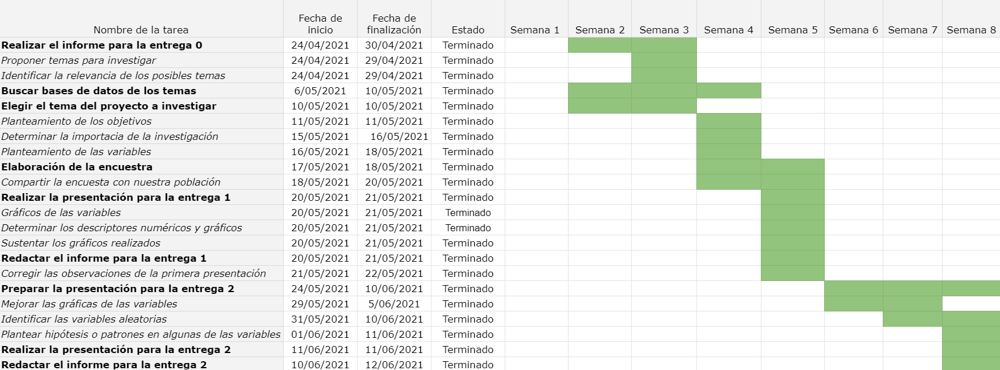

```{r setup, include=FALSE}
knitr::opts_chunk$set(echo = TRUE)
```


Si no tiene alguno de estos paquetes, por favor instalarlos con el siguiente código:
```{r}
#install.packages('readr')
#install.packages('dplyr')
#install.packages('modeest')
```


```{r include=FALSE}
# Librerías
library(readr)
library(dplyr)
library(modeest)
```

```{r include=FALSE}
Int_Sin_Sd_Gran <- function(muestra, NConfi){
  tamanio = length(muestra)
  desVes = sd(muestra) 
  media = mean(muestra)
  alpha = 1 - NConfi
  Zc = qnorm(1-alpha/2)
  inferior = media - Zc*desVes/sqrt(tamanio)
  superior = media + Zc*desVes/sqrt(tamanio)
  return(c(inferior, superior))
}

hipotesis = function(muestra, Nconfi, valorHIPOTESIS, titulo, lim_inf, lim_sup){
  alpha = 1 - Nconfi
  xbarra = mean(muestra)
  s = sd(muestra)
  n = length(muestra)
  
  Z = qnorm(1 - alpha/2)
  
  infe = xbarra - Z*(s/sqrt(n))
  supe = xbarra + Z*(s/sqrt(n))
  
  zobservado = (xbarra - valorHIPOTESIS)/(s/sqrt(n))
  
  ##Gráfica
  X <- seq(lim_inf, lim_sup, by = 0.1)
  plot(X, dt(X,df=100-1), type = "l",ylab="Densidad de Normal", main= titulo,xlab="Z")
  abline(v=c(Z,zobservado), lty = c(1,2), col = c("red", "blue"))
  abline(h = 0, col = "gray")
  legend(2.5,0.4,c("zcrit","zobservado"),col=c("red","blue"), lty = c(1,2))
}
```


### 1. **Introducción** 
Las compras en línea, son una forma en la que no es necesario hacer contacto físico para poder adquirir un producto o servicio. Debido al inicio de la pandemia de la COVID-19, restricciones como el distanciamiento social obligatorio, cuarentena obligatoria y toque de queda, hicieron que las personas eviten hacer contacto física con la finalidad de evitar contraer el virus. Es por ello que este proyecto busca determinar cómo la pandemia afectó a las compras online en la comunidad UTEC.

### 2. **Importancia**  
Mediante esta investigación podremos determinar cómo ha cambiado el modo adquirir distintos productos debido a la pandemia en la que estamos viviendo. Muchas empresas se han visto forzadas a buscar nuevas formas de vender sus productos, mientras que otras, convenientemente, ya venían ofreciendo un servicio que se acomoda perfectamente a la situación promoviendo su crecimiento acelerado.

### 3. **Objetivos**  
* Encontrar si han aumentado o disminuido las compras en línea antes y durante la pandemia.
*	Encontrar cuales son los negocios más afectados y beneficiados por la pandemia con respecto a las compras en línea.
*	Reconocer si es que hay variaciones respecto al gasto relacionado a las compras en línea antes y durante la pandemia.
*	Encontrar si el método de pago más popular ha cambiado debido a la pandemia.
*	Analizar el cambio de la perspectiva general de las personas acerca de las compras en línea debido a la pandemia.
* Estimar parámetros de la población a través de la muestra.  

### 4. **Factibilidad** 
Las actvidades para el desarrollo de la investigación se realizó de acuerdo a las metas planteadas por el grupo por periodos de tiempo. Se hizo uso de un diagrama de Gantt para asignar los límites para completar una determinada tarea.  

#### **Diagrama de Gantt diseñado por el grupo 5:**
 
  
### 5. **Marco Teórico**   
* **Población:**  Comunidad UTEC  

* **Muestra:**  174 individuos de la comunidad UTEC  
* **Unidad muestral:**  Un individuo parte de UTEC  
* **Método de muestreo:**  Muestreo  aleatorio simple  

#### i) **Método de recolección de datos:**  
Nuestra base de datos se obtuvo a partir una encuesta, en donde llegamos a tener 174 observaciones teniendo como población objetivo a la comunidad UTEC. Sin embargo, el grupo consideró que la comunidad UTEC estará conformada no sólo estudiantes, sino también profesores. Esta encuesta se realizó de manera virtual, con el apoyo de algunas herramientas de Google como: Google Forms y Google Sheets.  
El Data Frame obtenido es el la variable de nombre "DF", obtenida del archivo "CEL.csv".  

```{r include=FALSE}
DF <- read_csv("DATOS.csv")
names(DF)
```
Resumen de la base de datos proporcionado por R.
```{r echo=FALSE}
summary(DF)
```
En donde se puede abstraer:  
    
*  **Número de variables: ** 21    
*  **Mínima y máxima edad: ** 16 y 49    


#### ii) **Variables**:    
Se tienen en total 21 variables, donde 7 de ellas son numéricas y el resto, categóricas.      
Para asegurar que nuestra muestra es representativa, a la hora de crear la encuesta restringimos las personas que podían llenar la encuesta solo a aquellos con el correo de la universidad, de esta forma sabemos que solo personas parte de la comunidad UTEC llenaron la encuesta. Además, para difundir nuestra encuesta mandamos un correo con la encuesta a todos los estudiantes de la universidad y también compartimos la encuesta en grupos de whatsapp, telegram y demás. Para asegurar que las proporciones de la población sean representativas nos aseguramos de enviarle correos personalmente a profesores con la intención de que puedan difundir la encuesta entre los docentes para poder tener una muestra mucho más completa y representativa.  

+-------------------------------------------------------------------------------------+-------------------------------------+------------------+--------------------------------------------------------------------------------+
| Pregunta                                                                            | Variable                            | Tipo de variable | Restricciones                                                                  |
+:===================================================================================:+:===================================:+:================:+:==============================================================================:+
| Género                                                                                | Género                              | Nominal          | Femenino, masculino, otro                                                      |
+-------------------------------------------------------------------------------------+-------------------------------------+------------------+--------------------------------------------------------------------------------+
| Edad                                                                                | Edad                                | Discreta         | Valor entero máximo 40                                                         |
+-------------------------------------------------------------------------------------+-------------------------------------+------------------+--------------------------------------------------------------------------------+
| Según su opinión, ¿Cuál es la mayor ventaja por la cual optaría a comprar online?   | Mayor ventaja                       | Nominal          | Rapidez, Seguridad, Mejores precios, Comodidad, Ofertas, Otros                 |
+-------------------------------------------------------------------------------------+-------------------------------------+------------------+--------------------------------------------------------------------------------+
| ¿Con cuánta frecuencia SOLÍA comprar en línea ANTES DE LA PANDEMIA?                 | Frecuencia de compra AP             | Ordinal          | Nunca, Poco frecuente, Regularmente, Muy frecuente, Siempre                    |
+-------------------------------------------------------------------------------------+-------------------------------------+------------------+--------------------------------------------------------------------------------+
| ¿Qué tipo de producto SOLÍA comprar con mayor frecuencia en línea?                  | Producto mas comprado AP            | Nominal          | Comida, Electrónicos, Ropa, Otros, Ninguno                                     |
+-------------------------------------------------------------------------------------+-------------------------------------+------------------+--------------------------------------------------------------------------------+
| ¿Qué dispositivo UTILIZABA con más frecuencia para comprar en línea?                | Dispositivo utilizado AP            | Nominal          | Computadora/laptop, Smartphone/tablet, Otros, No compro online                 |
+-------------------------------------------------------------------------------------+-------------------------------------+------------------+--------------------------------------------------------------------------------+
| ¿Cuál es la cantidad de productos que ADQUIRÍA en UNA sola compra en línea?(Ej: 2)  | Cantidad de productos por pedido AP | Discreta         | Valores enteros no negativos                                                   |
+-------------------------------------------------------------------------------------+-------------------------------------+------------------+--------------------------------------------------------------------------------+
| ¿Cuántos productos COMPRABA en línea aproximadamente al mes? (Ej: 20)               | Cantidad de productos al mes AP     | Discreta         | Valores enteros no negativos                                                   |
+-------------------------------------------------------------------------------------+-------------------------------------+------------------+--------------------------------------------------------------------------------+
| ¿Aproximadamente cuánto SOLÍA gastar por mes en línea en soles? (Ej: 20)            | Gasto por mes AP                    | Continua         | Valores no negativos                                                           |
+-------------------------------------------------------------------------------------+--------------------------------------+------------------+--------------------------------------------------------------------------------+
| ¿Qué método de pago SOLÍA usar más para realizar compras línea?                     | Metodo de pago más popular AP       | Nominal          | Efectivo, Tarjeta, Aplicación bancaria (Ejemplo: Yape), Otro, No compro online |
+-------------------------------------------------------------------------------------+-------------------------------------+------------------+--------------------------------------------------------------------------------+
| ¿En qué momento del día SOLÍA comprar habitualmente?                                | Tiempo de compra AP                 | Ordinal          | Mañana, Tarde, Noche, No compro online                                         |
+-------------------------------------------------------------------------------------+-------------------------------------+------------------+--------------------------------------------------------------------------------+
| En la escala del 1 al 10, ¿Cuán dispuesto ESTABA a comprar en línea?                | Dispuesto a comprar en linea AP     | Ordinal          | Del 1 al 10                                                                    |
+-------------------------------------------------------------------------------------+-------------------------------------+------------------+--------------------------------------------------------------------------------+
| ¿Con cuánta frecuencia SUELE comprar en línea?                                      | Frecuencia de compras en linea AC   | Ordinal          | Nunca, Poco frecuente, Regularmente, Muy frecuente, Siempre                    |
+-------------------------------------------------------------------------------------+-------------------------------------+------------------+--------------------------------------------------------------------------------+
| ¿Qué tipo de producto SUELE comprar con mayor frecuencia en línea?                  | Producto mas comprado AC            | Nominal          | Comida, Electrónicos, Ropa, Otros, Ninguno                                     |
+-------------------------------------------------------------------------------------+-------------------------------------+------------------+--------------------------------------------------------------------------------+
| ¿Qué dispositivo UTILIZA más para comprar en línea?                                 | Dispositivo utilizado AC            | Nominal          | Computadora/laptop, Smartphone/tablet, Otros, No compro online                 |
+-------------------------------------------------------------------------------------+-------------------------------------+------------------+--------------------------------------------------------------------------------+
| ¿Cuál es la cantidad de productos que ADQUIERE en UNA sola compra en línea? (Ej: 2) | Cantidad de productos por pedido AC | Discreta         | Valores enteros no negativos                                                   |
+-------------------------------------------------------------------------------------+-------------------------------------+------------------+--------------------------------------------------------------------------------+
| ¿Cuántos productos compra online aproximadamente al mes? (Ej: 20)                   | Cantidad de productos al mes AC     | Discreta         | Valores enteros no negativos                                                   |
+-------------------------------------------------------------------------------------+-------------------------------------+------------------+--------------------------------------------------------------------------------+
| ¿Aproximadamente cuánto SUELE gastar por mes en línea en soles?                     | Gasto por mes AC                    | Continua         | Valores no negativos                                                           |
+-------------------------------------------------------------------------------------+-------------------------------------+------------------+--------------------------------------------------------------------------------+
| ¿Qué método de pago SUELE usar para realizar compras en línea?                      | Metodo de pago más popular AC       | Nominal          | Efectivo, Tarjeta, Aplicación bancaria (Ejemplo: Yape), Otro, No compro online |
+-------------------------------------------------------------------------------------+-------------------------------------+------------------+--------------------------------------------------------------------------------+
| ¿En qué momento del día SUELE comprar habitualmente?                                | Tiempo de compra AC                 | Ordinal          | Mañana, Tarde, Noche, No compro online                                         |
+-------------------------------------------------------------------------------------+-------------------------------------+------------------+--------------------------------------------------------------------------------+
| En la escala del 1 al 10, ¿Cuán dispuesto está a comprar en línea?                  | Dispuesto a comprar en linea AC     | Ordinal          | Del 1 al 10                                                                    |
+-------------------------------------------------------------------------------------+-------------------------------------+------------------+---------------------------------------------------------------------------------------------------------------------------------------------------------------------+-------------------------------------+------------------+--------------------------------------------------------------------------------+-+-------------------------------------------------------------------------------------+-------------------------------------+------------------+--------------------------------------------------------------------------------+     

#### iii) **Gráficos:**   
##### **1. Gráfica de edades**   

Para la variable Edad hemos considerado los descriptores numéricos media, mediana, moda y rango porque son los más relevantes para estudiar la variable edad. La media nos indica el valor promedio de la variable, la mediana el valor que se encuentra justo en la mitad, la moda es el valor que más se repite y el rango nos brinda el mínimo y máximo valor de la variable Edad.  

Para esta variable, que es cuantitativa, se usó un histograma para poder separar los rangos de edades respecto a su frecuencia.  

```{r echo=FALSE}
hist(DF$Edad, main = "Edad", ylab = "Frecuencia", xlab = "Intervalos de edades",col = "green",xlim=c(15,70))

# Descriptores numéricos
media = mean(DF$Edad)
mediana = median(DF$Edad)
moda = mfv(DF$Edad)
rango = range(DF$Edad)
```
 
 **Descriptores numéricos de Edad** 
```{r echo = FALSE}
print(paste('La media es', media))
print(paste('La mediana es', mediana))
print(paste('La moda es', moda))
print(paste('El rango es', rango[1], ' y ', rango[2]))
``` 

##### **2. Gráfica de género**

Para la variable Género observamos que nuestra muestra contiene más hombres que mujeres. En esta variable se usó un gráfico de barras (barplot) para diferenciar las proporciones entre hombre y mujeres, y se consideró a la moda como el único descriptor numérico relevante para el análisis de esta variable ya que, nos ayuda a comprobar que el género predominante en nuestra muestra es el masculino.

**Hipótesis:** Por lo observado en la Universidad creemos que la mayor parte de la muestra pertenecerá al género masculino.  

**Patrón:** Como podemos ver, gracias a nuestro gráfico de barras y el resultado de la moda, concluimos que nuestra hipótesis es correcta diciéndonos que la mayor parte de nuestra muestra es masculino.

```{r echo = FALSE}
barplot(table(DF$Sexo), main = "Proporción de género", xlab = "Género", ylab = "Cantidad", col = c("lightpink", "lightblue", "orange"), ylim = c(0,120))
```

**Descriptores numéricos de Género** 
```{r echo=FALSE}
modaGen = mfv(DF$Sexo)
print(paste('La moda es', modaGen))
```


```{r include=FALSE}
tabla1 <- table(DF$`FrecuenciaAP`)
porcentajes <- as.numeric(round(((prop.table(tabla1))*100),2))
etiquetas <- c("Muy frecuente", "Nunca", "Poco frecuente", "Regularmente", "Siempre")
etiquetas <- paste(etiquetas,porcentajes)
etiquetas <- paste(etiquetas, "%", sep = "")

```
##### **3. Frecuencia de compras AP y AC**  

Para la frecuencia de compra decidimos usar un gráfico de barras ya que, al ser una variable cualitativa, nos muestra claramente la popularidad de cada una de las opciones. Decidimos usar la moda ya que nos muestra la actitud más popular antes y después de la pandemia.   

**Hipótesis:** Durante la pandemia, más personas van a empezar a usar la modalidad virtual debido a las restricciones para salir.   

**Patrón:** Como podemos ver, la moda ha pasado de ser poco frecuente a regularmente lo cual demuestra que nuestra hipótesis era correcta. Además, las personas que nunca habían comprado se han reducido y las que compran más frecuentemente han incrementado, mostrando cómo la pandemia efectivamente ha aumentado la popularidad de las compras en línea.   


```{r echo = FALSE}
barplot(table(DF$`FrecuenciaAP`), main = "Frecuencia de compras AP", ylab = "Número de personas", col = c(1,2,3,4,5), cex.names = 0.8)
modaAP = mfv(DF$`FrecuenciaAP`) 
```
```{r echo = FALSE}
barplot(table(DF$`FrecuenciaAC`), main = "Frecuencia de compras AC", ylab = "Número de personas", col = c("purple","orchid3","salmon1","palevioletred","peru"), cex.names = 0.8)
modaAC = mfv(DF$`FrecuenciaAC`)
print(paste('La moda de la frecuencia de compras antes de la pandemia es ', modaAP))
print(paste('La moda de la frecuencia de compras actualmente es ', modaAC))
```

##### **4. Cantidad de productos por pedido AP y AC**  

Ya que se trata de una variable numérica optamos por encontrar la media para saber la cantidad promedio de productos que se compraban antes de la pandemia y actualmente. La desviación estándar nos indica que tan dispersos se encuentran los valores respecto a la media de nuestra variable.  

Decidimos usar un boxplot para estas variables para poder visualizar mejor la diferencia entre los rangos antes y después de pandemia y la cantidad de valores atípicos en ambos casos. Además de los descriptores numéricos que se pueden visualizar gracias a esta gráfica.   

**Hipótesis:** Nosotros creemos que, debido a las ofertas y restricciones, las personas van a comprar más productos por compra.  

**Patrón:** Como podemos ver, la mediana no ha cambiado antes de pandemia y actualmente, sin embargo, se puede observar en la segunda gráfica que las algunas personas han comenzado a adquirir una mayor cantidad de productos (datos atípicos) logrando alterar los valores de la media y la desviación estándar incrementándolos, lo cual nos muestra que el rango de productos que se compra ha incrementado y creemos que puede ser debido a las compras en línea de supermercados que tienen una alta cantidad de productos por pedido.   


```{r echo=FALSE}
boxplot(DF$`CantidadAP`, horizontal = 1,main='Cantidad de productos por pedido AP', xlab="Productos por pedido",col="orange")
abline(v=mean(DF$`CantidadAP`),col="blue",lwd=3,lty=4)


```

**Descriptores numéricos de Cantidad de productos por pedido AP** 
```{r echo = FALSE}
media = mean(DF$`CantidadAP`)
mediana = median(DF$`CantidadAP`)
moda = mfv(DF$`CantidadAP`)
DesvEstandar = sqrt(sd(DF$`CantidadAP`))

print(paste('La media es', media))
print(paste('La mediana es', mediana))
print(paste('La moda es', moda))
print(paste('La desviación estándar es ', DesvEstandar))
```


```{r echo = FALSE}
boxplot(DF$`CantidadAC`, horizontal = 1,main='Cantidad de productos por pedido AC', xlab="Productos por pedido",col="orange", ylim=c(0,20))
abline(v=mean(DF$`CantidadAC`),col="blue",lwd=3,lty=4)
```

**Descriptores numéricos de Cantidad de productos por pedido AC**
```{r echo = FALSE}
media = mean(DF$`CantidadAC`)
mediana = median(DF$`CantidadAC`)
moda = mfv(DF$`CantidadAC`)
DesvEstandar = sqrt(sd(DF$`CantidadAC`))

print(paste('La media es', media))
print(paste('La mediana es', mediana))
print(paste('La moda es', moda))
print(paste('La desviación estándar es ', DesvEstandar))
```


##### **5. Cantidad de productos por mes AP y AC**  
En este caso decidimos usar un gráfico de barras para representar la cantidad de productos por mes en ambos casos debido a que es una variable numérica discreta y podemos visualizar mediante este tipo de gráfico claramente la popularidad de cada una de las cantidades. Esto nos ayuda a comparar de manera fácil lo que se observa antes de la pandemia y actualmente.  
Se consideró la media y la mediana porque si el valor de la media es mayor al de la mediana se dice que la gráfica es sesgada a la derecha, lo cual se puede comprobar mediante los gráficos de barras. La moda nos indicará la cantidad de productos comprados que más se repite. La varianza nos indicará cómo es la variación de los datos.  
**Hipótesis:** Debido a la pandemia, la cantidad de productos por mes incrementará debido a las restricciones para salir y las ofertas que se ofrecen.  
**Patrón:** Como podemos observar, la cantidad de personas que no compraban antes ha disminuido bastante y la varianza es casi el doble, lo que sugiere que las personas compran más productos que antes y creemos que es debido a los supermercados, ya que ahora ofrecen servicios de compra en línea y, además, debido a que las personas piden más comida que antes.  


```{r echo = FALSE}
barplot(table(DF$`CantidadMesAP`),main='Cantidad de productos adquiridos al mes AP',ylab="Personas",xlab="Productos por mes", ylim = c(0,40),col="lightblue")
```

**Descriptores numéricos de Cantidad de productos adquiridos al mes AP**
```{r echo = FALSE}
media = mean(DF$`CantidadMesAP`)
mediana = median(DF$`CantidadMesAP`)
moda = mfv(DF$`CantidadMesAP`)
varianza = sd(DF$`CantidadMesAP`)

print(paste('La media es ', media))
print(paste('La mediana es ', mediana))
print(paste('La moda es ', moda))
print(paste('La varianza es ', varianza))
```


```{r echo = FALSE}
barplot(table(DF$`CantidadMesAC`),main='Cantidad de productos adquiridos al mes AC',ylab="Personas",xlab="Productos por mes", ylim = c(0,40),col="darkblue")
```

**Descriptores numéricos de Cantidad de productos adquiridos al mes AC**
```{r echo = FALSE}
media = mean(DF$`CantidadMesAC`)
mediana = median(DF$`CantidadMesAC`)
moda = mfv(DF$`CantidadMesAC`)
varianza = sd(DF$`CantidadMesAC`)
print(paste('La media es ', media))
print(paste('La mediana es ', mediana))
print(paste('La moda es ', moda))
print(paste('La varianza es ', varianza))
```


##### **6. Gastos por mes AP y AC**  
El coeficiente de variabilidad nos indica al ver la variación que hay en los datos, que en este caso son de la variable Gasto aproximado antes de la pandemia y actualmente. Con ayuda del gráfico podemos verificar que la mayoría de los datos no se encuentran dispersos, es decir, el valor del coeficiente de variabilidad no debe ser muy grande. La mediana nos permite encontrar el valor del dato que se encuentra a la mitad. La media nos indica el gasto promedio antes de la pandemia y actualmente.
**Hipótesis:** Antes de la pandemia la mayoría de personas gastaban muy poco en compras en línea por diversos motivos. En la actualidad, pensamos que habrá más personas que gasten una mayor cantidad de dinero en compras en línea comparado con la situación antes de la pandemia.
**Patrón:** Pudimos concluir a partir de las gráficas que en la actualidad nuestra muestra presenta una menor cantidad de personas que su gasto aproximado es mínimo, concluyendo que las personas han comenzado a gastar un mayor monto en compras en línea.

```{r echo = FALSE}
hist(DF$`GastoMesAP`,ylab="Observaciones",xlab="Gasto aproximado AP",col="3", xlim = c(0,800), main = "Gasto por mes antes de la pandemia AP")

```

**Descriptores numéricos de Gastos por mes antes de la pandemia AP**
```{r echo = FALSE}
media = mean(DF$`GastoMesAP`)
mediana = median(DF$`GastoMesAP`)
moda = mfv(DF$`GastoMesAP`)
coefvar = sqrt(sd(DF$`GastoMesAP`)) / mean(DF$`GastoMesAP`)

print(paste('La media es ', media))
print(paste('La mediana es ', mediana))
print(paste('La moda es ', moda))
print(paste('El coeficiente de variacion es ', coefvar))
```


```{r echo = FALSE}
hist(DF$`GastoMesAC`,ylab="Observaciones",xlab="Gasto aproximado AC", main = "Gasto por mes actualmente AC", col="2",ylim = c(0,140))
```

**Descriptores numéricos de Gastos por mes actualmente AC**
```{r echo = FALSE}
media = mean(DF$`GastoMesAC`)
mediana = median(DF$`GastoMesAC`)
moda = mfv(DF$`GastoMesAC`)
coefvar = sqrt(sd(DF$`GastoMesAC`)) / mean(DF$`GastoMesAC`)

print(paste('La media es ', media))
print(paste('La mediana es ', mediana))
print(paste('La moda es ', moda))
print(paste('El coeficiente de variacion es ', coefvar))
```


##### **7. Producto más comprado AP y AC**   

Decidimos usar un gráfico de barras ya que tenemos una variable cuantitativa con 5 opciones y esta gráfica representa claramente la popularidad de cada una de las opciones.  

**Hipótesis:** Nosotros creemos que la comida va a ser uno de los productos que incrementará su popularidad y la cantidad de personas que no compran va a reducirse considerablemente.  

**Patrones:** Como podemos ver, la cantidad de personas que compran comida ha incrementado y se mantiene como el producto más popular. Asimismo, la cantidad de personas que no compran se ha reducido mientras que la cantidad de personas que compran otros productos en línea ha incrementado. Esto posiblemente se debe a que muchos negocios que antes no funcionaban en línea, ahora han implementado este método de compra lo cual justificaría porque hay más productos calificados como “Otros” en nuestra data actualmente.   


```{r echo = FALSE}
barplot(table(DF$`ProductoAP`), main = "Producto más comprado AP", xlab = "Productos", ylab = "Frecuencia", col = c("darkorchid","darkblue","blue","cornflowerblue","cyan"),ylim = c(0,120))
```

```{r echo = FALSE}
barplot(table(DF$`ProductoAC`), main = "Producto más comprado AC",xlab = "Productos", ylab = "Frecuencia", col = c("green2","olivedrab2","olivedrab3","springgreen2","yellow2"), ylim = c(0,120))
```

  
##### **8. Disposición a comprar en línea AP y AC**  
Se decidió realizar un gráfico de barras para poder apreciar cuáles eran las disposiciones que fueron más escogidas por los encuestados. Además, observar si existe algún cambio en la disposición a comprar en línea de antes a después de la pandemia.  

**Hipótesis:** En general sentimos que la disposición a comprar va a aumentar debido a las restricciones que trae la pandemia y también debido a la mejora de los servicios online de las empresas debido a la alta demanda que surgirá.  

**Patrones:** Como podemos ver en las gráficas de barras, la moda es la misma pero la cantidad de personas por encima de 5 en la escala es mucho mayor que en el gráfico de antes de la pandemia lo cual sugiere que efectivamente ha incrementado la disposición a comprar. En resumen, la disposición a comprar en línea ha aumentado comparado con antes de la pandemia.

```{r echo = FALSE}
barplot(table(DF$`EscalaAP`),col=c(1,2,3,4,5,6,7,8,9,10),main="Dispuesto a comprar en linea AP",ylab="Personas", xlab="Escala del 1 - 10",ylim = c(0,60))
```

```{r echo = FALSE}
barplot(table(DF$`EscalaAc`),col=c(1,2,3,4,5,6,7,8,9,10),main="Dispuesto a comprar en linea AC",ylab="Personas",xlab="Escala del 1 - 10", ylim = c(0,60))
```

##### **9. Género - Edades**  

Se optó por utilizar esta gráfica de barras porque se puede apreciar a primera vista la moda de las edades y, también, se indica la proporción de géneros que hay en cada edad, siendo la de color verde, masculino; azul, femenino y morado, otro.  

**Hipótesis:** Nosotros esperamos que la mayoría de los encuestados sean hombres entre 17-20 años de edad debido a la naturaleza de la universidad y las personas que nos rodean.  
**Patrón:**  Como podemos ver, efectivamente la mayoría de encuestados son hombres entre 17-20 años de de edad lo cual coincide con nuestra hipótesis.   

```{r echo = FALSE,fig.width=12,fig.height=8}
DF$Sexo= factor(DF$Sexo, levels=c("Femenino","Masculino"))
y <- table(DF$Sexo,DF$Edad)
barplot(y,col=c(4,3), ylim = c(0,80),xlab = "Edades",ylab = "Personas",main="Género-Edades", cex.names = 1)
legend("topright", legend = c("F","M"), fill=c(4,3))
```

##### **10. Método de pago más popular - Producto más comprado (AP y AC)**  


La gráfica nos muestra que los métodos de pago más frecuentes, efectivo y tarjeta, son usados mayormente para compras en línea relacionadas a la comida y electrónicos.  

**Hipótesis:** Debido a la pandemia, el uso de tarjeta como método de pago se incrementa para evitar posibles contagios, y para evitar el contacto con otras personas los pedidos de comida se incrementarían.  

**Patrones:** Como podemos ver, los pedidos de comida se han incrementado considerablemente en contraste a antes de la pandemia. El uso de la tarjeta ha incrementado como esperábamos y las personas que no compran en línea han disminuido considerablemente. Sorprendentemente, el uso de efectivo ha aumentado lo cual es inesperado pero creemos que este patrón se justifica por la popularidad de los emprendimientos personales en redes sociales que normalmente usan efectivo como medio de pago.   


```{r echo = FALSE}
DF1 <- DF
DF1$`MetodoPagaAP` = factor(DF1$`MetodoPagaAP`, levels=c("Efectivo","Tarjeta","Otro","Aplicación bancaria (Ejemplo: Yape)","No compro online"))
m<- table(DF1$`MetodoPagaAP`,DF1$`ProductoAP`)
barplot(m,beside=TRUE,col=c(6,7,8,9,10),ylim = c(0,80),main="Metodo de pago más popular AP - Producto más comprado AP",ylab = "Personas")
legend("topright", legend = c("Efectivo","Tarjeta","Otro","Aplicación bancaria","No compro online"), fill=c(6,7,8,9,10))

DF1$`MetodoPagaAC` = factor(DF1$`MetodoPagaAC`, levels=c("Efectivo","Tarjeta","Otro","Aplicación bancaria (Ejemplo: Yape)","No compro online"))
m1<- table(DF1$`MetodoPagaAC`,DF1$`ProductoAC`)
barplot(m1,beside=TRUE,col=c(6,7,8,9,10),ylim = c(0,80),main="Metodo de pago más popular AC - Producto más comprado AC",ylab = "Personas")
legend("topright", legend = c("Efectivo","Tarjeta","Otro","Aplicación bancaria","No compro online"), fill=c(6,7,8,9,10))
```

##### **11.Frecuencia de compra - Producto más comprado (AP y AC)**  

Este tipo de gráfico lo hemos utilizado para poder representar mejor la distribución de los productos dependiendo de la frecuencia con la que compran las personas vía en línea.  

**Hipótesis:** Nosotros creemos que gracias a la pandemia las frecuencias de compras incrementa, y a su vez las compras de necesidades básicas como comida tendrían el mismo comportamiento.  

**Patrones:** Como podemos observar, los pedidos de comida siguen predominando ante los demás productos que las personas consumen. Además, las compras de comidas antes de la pandemia se consideraban dentro de las compras poco frecuentes. Sin embargo, en la actualidad las compras de comidas pasaron a ser muy frecuentes o de manera regular.  

```{r echo = FALSE,fig.width=9,fig.height=5}
DF$`ProductoAC` = factor(DF$`ProductoAC`, levels=c("Comida","Electrónicos","Ninguno","Ropa","Otro"))
DF$`FrecuenciaAC` = factor(DF$`FrecuenciaAC`, levels=c("Muy frecuente","Nunca","Poco frecuente","Regularmente","Siempre")) 
DF$`FrecuenciaAP` = factor(DF$`FrecuenciaAP`, levels=c("Muy frecuente","Nunca","Regularmente","Poco frecuente","Siempre")) 

DF$`ProductoAP` = factor(DF$`ProductoAP`, levels=c("Comida","Electrónicos","Ninguno","Ropa","Otros"))
n<- table(DF$`FrecuenciaAP`,DF$`ProductoAP`)
n2<- table(DF$`FrecuenciaAC`,DF$`ProductoAC`)

mosaicplot(n,col=c(4,5,6,7,8),las=1,main="Frecuencia de compra AP - Producto más comprado AP")
mosaicplot(n2,col=c(4,5,6,7,8),las=1,main="Frecuencia de compra AC - Producto más comprado AC")


``` 


### **Variables aleatorias**  
* **Variable aleatoria discreta:**     
  + Cantidad de productos AC o AP  
Esta es continua porque tiene un rango es un conjunto finito y los valores que puede tomar son números enteros.  
  + Edad  
Se puede realizar un experimento en donde se pregunta al encuestado si es menor de edad o no. Las únicas respuestas para esta pregunta son: Si o no y el experimento se realiza una sola vez. Para este caso es conveniente utilizar el modelo de Bernoulli.  
  + Frecuencia  
Con esta variable, se puede plantear un experimento en donde se desee conocer si los encuestados siempre compran en línea. Como este experimento se realizará para cada encuestado, este se repetirá una determinada cantidad de veces y la probabilidad de tener éxito, es decir, obtener un encuestado que siempre compre en línea, es constante. Se puede utilizar el modelo Binomial por las características que este experimento posee.  


*  **Variable aleatoria continua: ** 
  + Monto gastado AC o AP    
Es una variable cuyo rango puede tomar valores infinitos, el monto se puede dividir en décimas, centésimas, milésimas lo que hace sea una variable aleatoria continua.  


| Variable             | Tipo   | Distribución |
|-------------------|-------------|---------------|
| Cantidad de productos adquiridos AP y AC   | V.A Discreta    | Binomial             | 
| Edad         | V.A Discreta       | Binomial             | 
| Frecuencia de compra | V.A Discreta | Binomial             | 
| Gastos por mes AP y AC    | V.A Continua  | Normal             |


### **Nivel de Confianza** 
Las variables a analizar son:

* Producto más comprado AP y AC
* Edad  
* Gasto por mes AP y AC 
* Cantidad de productos al mes AP y AC 


##### **1. Producto más comprado AP y AC:**  
Estas variables nos permitirán conocer, a través de proporciones, cuál el producto que más se compra en la comunidad UTEC. Para determinar el nivel de confianza de esta variable se consideró que la precisión sea alta debido a que, los datos no varían demasiado lo cual nos permite reducir el nivel de confianza para aumentar la precisión. El valor elegido para el nivel de confianza es 80%.

##### **2. Edad:**  
Se eligió la variable Edad porque se desea conocer el promedio de edades de la comunidad UTEC. A causa de que el rango de esta variable va de 16 a 62 y se observa una gran dispersión en las edades, no podemos esperar una gran precisión, por ende, decidimos aumentar el nivel de confianza. El valor elegido para el nivel de confianza es 95% porque, si usamos valores más altos de confianza la zona de aceptación no varia mucho y tendríamos menor precisión, por esto, un valor central entre el nivel de confianza y precisión necesarios es el mencionado anteriormente.

##### **3. Gasto por mes AP y AC:**  

Se desea analizar esta variable para conocer, aproximadamente, cuánto es el gasto que la comunidad UTEC realiza por mes en sus compras en línea. Los rangos de estas variables son [0,1000] y [0,800] antes y durante la pandemia respectivamente. Esto nos demuestra que los datos recolectados en la muestra son dispersos y la precisión esperada debe ser pequeña por lo que, al igual que en la anterior variable, usaremos un nivel de confianza alto pero tendrá cierto nivel de precisión. El valor del nivel de confianza elegido para esta variable será 90% debido a que con valores mayores a este el intervalo de aceptación no varia mucho y estaríamos perdiendo precisión.

### **Intervalos de Confianza**  
Se utilizó el teorema del límite central para determinar los intervalos de confianza para la variables descritas anteriormente. Estos intervalos de confianza nos darán de resultado un rango, dependiendo del nivel de confianza usado, en el cual se espera que se encuentre el parámetro poblacional (media y proporciones de la población) de las variables edad, gasto por mes AC y AP, y producto más comprado AC y AP. 

#### **a) Producto más comprado AP y AC**
```{r echo = FALSE}
com <- filter(DF,DF$ProductoAP=='Comida')
a = (1 - 0.8)
p <- 87/199
P <- sqrt((p*(1-p))/199)
q <-qnorm(1-a/2)
ICI = p - q*P
ICS = p + q*P

```
```{r echo = FALSE}
com1 <- filter(DF,DF$ProductoAC=='Comida')
#Nivel de confianza = 0.8
# a = 1-0.8 = 0.2
a = 0.2
p <- 113/199
P <- sqrt((p*(1-p))/199)
q=qnorm(1-a/2)
ICI1 = p - q*P
ICS1 = p + q*P


```
El producto más comprado antes de la pandemia (AP) y actualmente (AC) es la variable comida. Se calculó la proporción de personas que comprarban comida para ambos casos, antes de la pandemia y actualmente. La propoción AP es 0.44 y AC es 0.58. Se determinaron los intevalos de confianza para la proporción con las fórmulas mostradas en clase.  

#### Intervalo de confianza para el producto más comprado AP   
El límite inferior es: 0.39   
El límite superior es: 0.49  

#### Intervalo de confianza para el producto más comprado AC   
El límite inferior es: 0.52   
El límite superior es: 0.62


#### **b) Edad** 

#### Intervalo de confianza para la edad  
```{r echo = FALSE}
#La media de edad es mayor o igual a 22
u0=22
#H0: u = 22
#H1: u ≠ 22

muestra<-DF$Edad
NConfi=0.95
n = length(muestra)
des_es = sd(muestra)
media = mean(muestra)
alpha = 1 - NConfi
Zc = qnorm(1-alpha/2)
#intervalos de confianza
inferior = media - Zc*des_es/sqrt(n)
superior = media + Zc*des_es/sqrt(n)
```
El límite inferior es: 20.22   
El límite superior es: 22.46 


#### **c) Gasto por mes AP**  

#### Intervalo de confianza  
```{r echo = FALSE}
y<-c(DF$GastoMesAP)
#Int_Sin_Sd_Gran(y,0.90)
``` 
El límite inferior es: 104.72  
El límite superior es: 142.50 


#### **d) Gasto por mes AC**      
```{r echo = FALSE}
y1<-c(DF$GastoMesAC)
#Int_Sin_Sd_Gran(y1,0.90)
```
#### Intervalo de confianza   

El límite inferior es: 179.48   
El límite superior es: 222.29  


### **Pruebas de Hipótesis**  
#### **a) Producto más comprado AC**

El valor de la proporción para evaluar la hipótesis de 0.5 se determinó a partir de la proporción encontrada en la encuesta realizada, la cual es de 0.56. Además, en base a las gráficas descriptivas mostradas anteriormente acerca del producto mas comprado, se puedo inferir que la proporción de compra de productos actualmente, especialmente comida, aumenta.

* La hipótesis nula (H0) será que al menos el 50% de las personas consumían mayormente comida mediante compras en línea. 
* La hipótesis alterna (H1) será que el porcentaje de las personas que consumían mayormente comida mediante compras en línea es menor al 50%.

$$H0: p >= 0.50$$
$$H1: p < 0.50$$  
```{r echo = FALSE}
#Hipótesis => El porcentaje de personas que escogieron como producto comida es 50% o más.
alpha = 1 - 0.8
p1 = 0.50
n1 = 199
x1 = 113
z1 <- (x1/n1-p1) / sqrt(p*(1-p1)/n1)

valorp <- pnorm(q=z1, mean=0, sd=1, lower.tail=T)  # Para obtener el valor-P
Zc = qt(1 - alpha/2, n1 - 1)


# Zc -> ICI
# Z > Zc
# a = 0.05
# valorp > a

#No hay evidencias suficientes para rechazar la hipótesis nula H0.

X <- seq(-5, 5, by = 0.1)
  plot(X, dt(X,df=100-1), type = "l",ylab="Densidad de Normal",main="Producto más comprado AC",xlab="Z")
  abline(v=c(-Zc,z1), lty = c(1,2), col = c("red", "blue"))
  abline(h = 0, col = "gray")
  legend(2.5,0.4,c("zcrit","zobservado"),col=c("red","blue"), lty = c(1,2))
```

Como el Zobservado cae en la zona de aceptación, la hipótesis nula planteada anteriormente no se rechaza. Por lo tanto, al menos el 50% de las personas consumían mayormente comida mediante compras en línea.   

#### **b) Producto más comprado AP**
El valor de la proporción para evaluar la hipótesis de 0.4, este se determinó a partir de una aproximación de la proporción encontrada en la encuesta realizada, la cual es de 0.42.

* La hipótesis (H0) nula será que al menos el 40% de las personas consumían mayormente comida mediante compras en línea. 
* La hipótesis alterna (H1) será que el porcentaje de las personas que consumían mayormente comida mediante compras en línea es menor al 40%.
$$H0 : p >= 0.40$$ 
$$H1 : p < 0.40$$  

```{r echo = FALSE}
alpha = 1 - 0.8
p = 0.40
n = 199
x = 87
z <- (x/n-p) / sqrt(p*(1-p)/n)

valorp <- pnorm(q=z, mean=0, sd=1, lower.tail=T)  # Para obtener el valor-P
Zc = qt(1 - alpha/2, n - 1)
# Zc -> ICI
# Z > Zc
# a = 0.05
# valorp > a

#No hay evidencias suficientes para rechazar la hipótesis nula H0.

 X <- seq(-5, 5, by = 0.1)
  plot(X, dt(X,df=100-1), type = "l",ylab="Densidad de Normal",main="Producto más comprado AP",xlab="Z")
  abline(v=c(-Zc,z), lty = c(1,2), col = c("red", "blue"))
  abline(h = 0, col = "gray")
  legend(2.5,0.4,c("zcrit","zobservado"),col=c("red","blue"), lty = c(1,2))


```

Como el Zobservado cae en la zona de aceptación, la hipótesis nula planteada anteriormente no se rechaza. Por esto, al menos el 40% de las personas consumían mayormente comida mediante compras en línea.   

#### **c) Edad**
Elegimos esta hipótesis porque en el gráfico de barras que presentamos anteriormente se pudo observar que la proporción de personas que más respondieron nuestra encuesta tienen 18 años, por lo que suponemos que la media de la población podría ser igual al valor mencionado.

* La hipótesis nula (H0) será que la media de la edad es igual a 18 en la población estudiada. 
* La hipótesis alterna (H1) será que la media de la edad es diferente de 18 en la población estudiada.
$$H0: \mu = 18$$  
$$H1: \mu ≠ 18$$  

```{r  echo = FALSE}
muestra<-DF$Edad
NConfi=0.95
n = length(muestra)
des_es = sd(muestra)
media = mean(muestra)
alpha = 1 - NConfi
u0 = 18
Zc = qnorm(1-alpha/2)
#intervalos de confianza
inferior = media - Zc*des_es/sqrt(n)
superior = media + Zc*des_es/sqrt(n)
#hipótesis 
z=(media-u0)*sqrt(n)/des_es
pvalor = 2 * pt(z, n - 1, lower.tail = T)

##Gráfica
X <- seq(-6,6, by = 0.1)
plot(X, dt(X,df=100-1), type = "l",ylab="Densidad de Normal",main="Edad",xlab="Z")
abline(v=c(Zc,z), lty = c(1,2), col = c("red", "blue"))
abline(v=c(-Zc,z), lty = c(1,2), col = c("red", "blue"))
abline(h = 0, col = "gray")
legend(2.5,0.4,c("zc","t"),col=c("red","blue"), lty = c(1,2))
```

La hipótesis nula presentada se rechaza, porque el valor de t calculado no se encuentra en la zona de aceptación. Esto quiere decir que la media de la edad de nuestra población es diferente a 18 años.   

#### **d) Gasto por mes AP** 

Decidimos utilizar el valor de 130 soles porque es ligeramente mayor al de la muestra. Por las gráficas y descriptores numéricos vistos anteriormente la media de la muestra es aproximadamente 123.61, por esto, decidimos probar con un valor cerca, pero un poco más grande que el obtenido en la muestra.

* La hipótesis nula (H0) será que la media de los gastos por mes antes de la pandemia es menor o igual a 130 nuevos soles.
* La hipótesis alterna (H1) será que la media de los gastos por mes antes de la pandemia es mayor a 130 nuevos soles.
$$H0: \mu <= 130$$ 
$$H1: \mu > 130$$  

```{r echo = FALSE}
gastoMes = rename(select(DF, GastoMesAP, GastoMesAC), AP = GastoMesAP, AC = GastoMesAC)
hipotesis(gastoMes$AP, 0.90, 130, "Gasto por mes antes de la pandemia", -5, 5)
```

El valor de la hipótesis nula presentada anteriormente que es 130 cae en la zona de aceptación, por lo tanto no se rechaza. Esto quiere decir que la media de los gastos por mes antes de la pandemia es menor o igual a 130 nuevos soles.    


#### **e) Gasto por mes AC**

Decidimos utilizar el valor de 210 soles porque es ligeramente mayor al de la muestra. Además, por las gráficas descriptivas anteriores vemos que las compras en línea aumentaron, por lo tanto, la media poblacional de la variable superará el valor de la media muestral.

* La hipótesis nula (H0) será que la media de los gastos por mes antes de la pandemia es menor o igual a 210 nuevos soles.
* La hipótesis alterna (H1) será que la media de los gastos por mes antes de la pandemia es mayor a 210 nuevos soles.
$$H0: \mu <= 210$$  
$$H1: \mu > 210$$  

```{r echo = FALSE}
hipotesis(gastoMes$AC, 0.90, 210, "Gasto por mes durante de la pandemia", -5, 5)
```

El valor de la hipótesis nula presentada anteriormente, que es 210, cae en la zona de aceptación, por lo tanto no se rechaza. Esto explica que los gastos en línea sí aumentaron. 

### **Regresión**  

Utilizamos regresión lineal simple para relacionar cantidad de productos comprados por mes antes de la pandemia y actualmente con gasto aproximado por mes. Al realizar nuestra encuesta no especificamos el tipo de producto y por ello las variables utilizadas contienen datos que aplican a un rango amplio de productos lo cual lleva a una alta dispersión de los datos al realizar las gráficas. Sin embargo, se observa cierta relación lineal positiva y por ello decidimos usar regresión lineal. Las ecuaciones de regresión obtenidas para antes y durante la pandemia son: y=12.07x+62.44 y 7.88x+137.82 con un valor de r2 de 0.1973 y 0.1874 respectivamente. Los valores de r2 son muy bajos, debido a la alta dispersión de datos y la naturaleza de las variables previamente mencionado, lo cual nos indica que estas no son buenas funciones para aproximar los datos. A pesar de esto, se observa una relación entre ambas variables que tiene sentido, pero es afectada por fallas a la hora de diseñar la encuesta.  

```{r include  = FALSE}
mod1 <- lm(DF$GastoMesAP ~ DF$CantidadMesAP)
mod2 <- lm(DF$GastoMesAC ~ DF$CantidadMesAC)
mod3 <- lm(DF$GastoMesAP ~ DF$GastoMesAC)

```

```{r echo = FALSE}

plot(DF$CantidadMesAP,DF$GastoMesAP,main="Cantidad de productos al mes en relación al gasto por mes AP",xlab="Cantidad de productos al mes AP",ylab="Gasto por mes AP (soles)",ylim=c(0,800))
abline(mod1,col=2, lwd=2)
mod1$coefficients

```
El dominio para el cual consideramos que aplica esta regresión es de 0 a 30.


```{r echo =  FALSE}
plot(DF$CantidadMesAC,DF$GastoMesAC,main="Cantidad de productos al mes en relación al gasto por mes AC",xlab="Cantidad de productos al mes AC",ylab="Gasto por mes AC (soles)",ylim=c(0,800))
abline(mod2,col=2, lwd=2)
mod2$coefficients
```
El dominio para el cual consideramos que aplica esta regresión es de 0 a 40.

Nos pareció interesante utilizar regresión para estimar cuanto gastaba una persona antes de la pandemia usando el gasto por mes actual. Nuevamente la alta dispersión de los datos se debe a una falla en nuestra encuesta ya que no especificamos el tipo de producto para el gasto por mes y estos valores de gasto varían debido al amplio rango de productos que se pudieron haber comprado. En la gráfica vemos una relación positiva débil con la siguiente ecuación: 0.52x+20.06 y un coeficiente de determinación de 0.34. Concluimos que este modelo no es realmente bueno para estimar el gasto por mes antes de la pandemia debido al bajo coeficiente de determinación y la naturaleza impredecible de ambas variables. Sin embargo, la relación mostrada resulta interesante para comparar los gastos antes y durante la pandemia.

```{r echo = FALSE}
plot(DF$GastoMesAC,DF$GastoMesAP,ylim=c(0,900),main="Gasto por mes AP en relación al gasto por mes AC",xlab="Gasto por mes AC",ylab="Gasto por mes AP")
abline(mod3,col=2, lwd=2)
mod3$coefficients
```
El dominio para el cual consideramos que aplica esta regresión es de 0 a 800.

### 6. **Conclusiones**

* La cantidad de personas que compra en línea ha aumentado durante la pandemia.
* Las empresas que brindan servicio de comida a domicilio han sido los más beneficiados.
* El gasto aproximado en compras en línea ha incrementado durante la pandemia.
* Los métodos de pago que evitan el contacto entre personas se han vuelto más populares.
* En la actualidad las personas están más dispuestas a realizar compras el línea.

### 7. **Recomendaciones**

* Contar con más variables numéricas con la finalidad de poder encontrar más modelos de regresión lineal simple que explicarían el comportamiento de estas, teniendo en cuenta el coeficiente de determinación de cada una de ellas.
* Al momento de obtener la base de datos, especificar de manera adecuada las preguntas dentro de la encuesta.
* Es preferible contar con más observaciones para que la estimación de la media y proporción poblacional sean más cercanos al verdadero.
