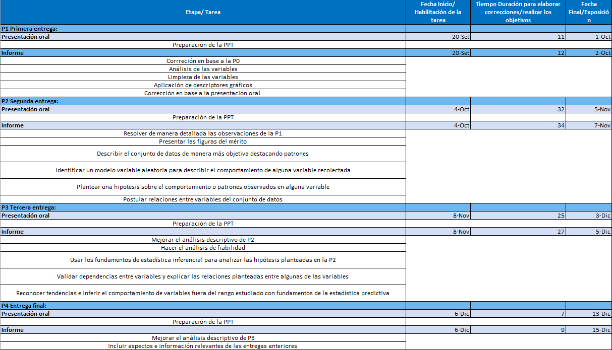
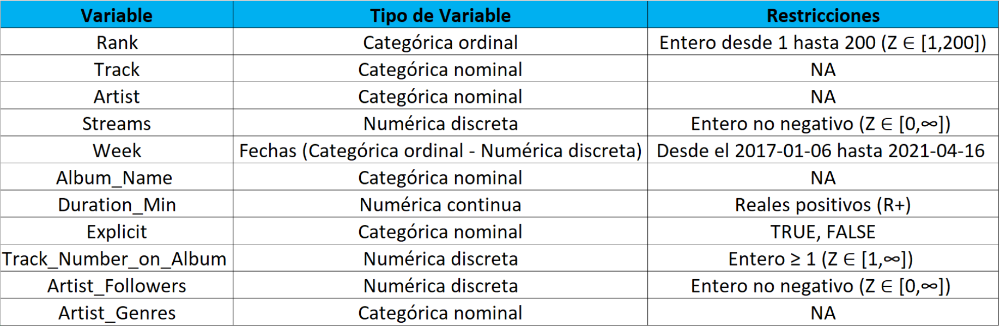

<div style="text-align: justify">


</center>

## <span style="color:dodgerblue"> Relevancia del estudio<span>

La música es gran parte de las tendencias culturales a nivel mundial, nuestro objetivo con este proyecto es entender y analizar estas tendencias de popularidad y descubrir qué características comparten las canciones más populares en los Top 200 Weekly (Global) de Spotify (2017 - 2021), comprender qué géneros musicales son los más escuchados, definir un modelo de aprendizaje automático. Se buscará conseguir información que será de interés para la audiencia y obtener diversas conclusiones al finalizar este estudio estadístico, como, por ejemplo:

- Establecer relaciones entre el ranking de una determinada canción y los streams de esta

- Responder a la pregunta: ¿A mayor duración de la canción, esta esta será más exitosa?

- La canción más escuchada, el artista que la compuso, género al que pertenece, etc.

- Ver la evolución de determinados artistas conforme han escalado en el ranking

**Todo este estudio se realizará en base a la data y en el periodo de tiempo propuesto (2017 -2021)**


## <span style="color:dodgerblue"> Proveniencia de los datos<span>

Para realizar el estudio, utilizaremos las siguientes bases de datos y extensiones:

- Spotify Top 200 Charts Global (2017-2021) + Datos de API, esta data incluye las 200 mejores canciones de Global semanalmente de Spotify (https://www.kaggle.com/bartomiejczyewski/spotify-top-200-weekly-global-20172021)

- Listas top 200 de Spotify (2020-2021), esta data incluye todas las canciones que han estado en las listas Top 200 Weekly (Global) de Spotify en 2020 y 2021 (https://www.kaggle.com/sashankpillai/spotify-top-200-charts-20202021)

- Spotify Charts (https://spotifycharts.com/regional/global/weekly/latest)

- API de Spotify (https://api.spotify.com/)

- Spotipy Python Library (https://spotipy.readthedocs.io/en/2.19.0/)


## <span style="color:dodgerblue"> Disponibilidad de los datos<span>   

Spotify, al ser una empresa con estadísticas libres, mediante la API de Spotify y Spotify Charts pudimos tener acceso a suficiente data para hacer factible nuestro estudio y, además, mediante diversas páginas y extensiones como Kaggle, Spotipy Python Library, etc. complementamos la data proporcionada por Spotify.

```{r eval=TRUE, echo=FALSE, message=FALSE,warning=FALSE}
 is.installed <- function(mypkg){
    is.element(mypkg, installed.packages()[,1])
 } 
```

```{r}
# Carga de data

if (!is.installed("fastGraph")){install.packages("fastGraph")}
if (!is.installed("BSDA")){install.packages("BSDA")}
if (!is.installed("TeachingDemos")){install.packages("TeachingDemos")}
if (!is.installed("tidyverse")){install.packages("tidyverse")}
library(fastGraph)
library(BSDA)
library(TeachingDemos)
library(tidyverse)
library (readr)
library (dplyr)
library (stringr)
library(vctrs)
library(fastGraph)
library(BSDA)
library(TeachingDemos)
library(tidyverse)
R <- read_csv ("spotify.csv")

# Limpieza de data

R$Link <- NULL
R %>% rename (Duration_Minutos = Duration_MS) -> R
R$Duration_Minutos <- R$Duration_Minutos / (1000 * 60)
R$Artist_Genres [R$Artist_Genres == "[]"] <- NA

# Declarado de funciones
r <- function (x){
    return (round(x, digits = 2))
    }
Describir <- function(X, ...){
  cat("Promedio:", mean(X, ...), "\n\n")
  cat("Mediana:", median(X, ...), "\n\n")
  cat ("Nº de modas:", length (table(X)[table(X) == max(table(X))]), "\n\n")
  cat("Desviación estándar:", sd(X, ...), "\n\n")
  cat("Rango:"
    , max(X, ...) - min(X, ...)
    , "\n\n")
  cat("Rango intercuartil:"
    , quantile(X, ..., 0.75)
        - quantile(X, ..., 0.25)
    , "\n")
  cat ("\nCuartiles\n\n",
       "1.º Cuartil:", quantile(X, ..., 0.25), "\n",
       "2.º Cuartil:", quantile(X, ..., 0.5), "\n",
       "3.º Cuartil:", quantile(X, ..., 0.75), "\n",
       "4.º Cuartil:", quantile(X, ..., 1), "\n\n")
  cat("Mínimo:", min(X, ...), "\n\n")
  cat("Máximo:", max(X, ...), "\n\nModa:\n")
  table(X)[table(X) == max(table(X))]
}
Describir_VContinua <- function(X, ...){
  cat("Promedio:", mean(X, ...), "\n\n")
  cat("Mediana:", median(X, ...), "\n\n")
  cat("Desviación estándar:", sd(X, ...), "\n\n")
  cat("Rango:"
    , max(X, ...) - min(X, ...)
    , "\n\n")
  cat("Rango intercuartil:"
    , quantile(X, ..., 0.75)
        - quantile(X, ..., 0.25)
    , "\n")
  cat ("\nCuartiles\n\n",
       "1.º Cuartil:", quantile(X, ..., 0.25), "\n",
       "2.º Cuartil:", quantile(X, ..., 0.5), "\n",
       "3.º Cuartil:", quantile(X, ..., 0.75), "\n",
       "4.º Cuartil:", quantile(X, ..., 1), "\n\n")
  cat("Mínimo:", min(X, ...), "\n\n")
  cat("Máximo:", max(X, ...))
}
```

```{r}
summary (R)
```


# <span style="color:dodgerblue"> Factibilidad<span> 

La siguiente tabla detalla las características y objetivos de cada entrega para cumplir con los requisitos de estas. Se detalla la fecha de publicación de la tarea, el tiempo hábil para completarla, y la fecha de entrega de cada una.

{width='1000px'}


# <span style="color:dodgerblue"> Consideraciones para la realización del estudio<span> 

Procesamos, limpiamos y reparamos correctamente errores en la **data inicial** proporcionada por Spotify, definimos y clasificamos **11** variables relevantes para el estudio:

- La variable Duration_MS, que mide la duración de la canción en mili segundos, fue re definida correctamente de la data inicial al ser transformada a minutos (divida por (1000 * 60)) y su nombre cambiado a Duration_Minutos. Se realizó este cambio,dado que, la mayoría de canciones tienen tiempo de duración medido en minutos y es mucho más usual en los usuarios.

- La variable Link fue eliminada de la data inicial, dado que, son datos que no proporcionan información relevante para el análisis realizado en el estudio.

- La variable Artist_Genres, que muestra una lista de strings con los géneros del artista, posee datos de la forma "[]", indicándonos una lista vacía y que dicho artista no tiene géneros asociados a sus canciones. Es por ello que como grupo, tomamos la decisión de asignar a dicha lista vacía el valor de NA.

**No se realizó en ningún momento manipulación de la data proporcionada por Spotify, asegurando así, la ética académica y profesional en la realización del presente estudio**

# <span style="color:dodgerblue"> Análisis de data<span>  

```{r}
cat("Nº de observaciones o tamaño de la muestra:", nrow (R), "\n\nNº de observaciones completas o tamaño efectivo de la muestra:", nrow (R) - sum (is.na (R$Track)) - sum (is.na (R$Artist_Genres) & !is.na(R$Track)), "\n\nNº de datos faltantes:", sum (is.na (R$Track)) + sum (is.na (R$Artist)) + sum (is.na (R$Album_Name)) + sum (is.na (R$Artist_Genres)), "(5 datos en Track, 5 datos en Artist, 5 datos en Album_Name y 156 en Artist_Genres)", "\n\nNº de variables:", ncol (R))
```


En las siguientes tablas podemos observar las **observaciones incompletas** y los **datos faltantes**:

```{r}
R %>% filter (is.na (Track))
R %>% filter (is.na (Artist_Genres) & !is.na (Track))
```


# <span style="color:dodgerblue"> Variables<span>   

{width='1000px'}

## <span style="color:dodgerblue"> Representatividad de las variables<span>   

- **Rank:** Ranking (posición) de una canción en las 200 mejores canciones de Global semanal de Spotify (Spotify Top 200 Charts Weekly Global (2017-2021))

- **Track:** Nombre de la canción (pista)

- **Artist:** Nombre del artista

- **Streams:** Transmisiones o vistas de una canción en una semana determinada

- **Week:** Último día de una semana del top semanal

- **Album_Name :** Nombre del álbum

- **Duration_Minutos:** Duración en minutos

- **Explicit:** ¿Es la canción Explicit?

- **Track_Number_on_Album :** Número de pista en el álbum

- **Artist_Followers:** Número de seguidores del artista

- **Artist_Genres:** Géneros del artista


# <span style="color:dodgerblue"> Análisis descriptivo<span>  

En la realización de nuestro estudio se definió un **nivel de confianza del 99%**, siendo la **significancia de 1%**, esto con la finalidad de asegurar que la media de la población (verdadero parámetro) se encuentre en el **intervalo de confianza**. Con la finalidad de que el estudio sea relevante y significativo, se utilizó como estimador puntual la media de la data proporcionada por Spotify (muestra) y verificamos si esta se encuentra en el intervalo de confianza.

- **Nivel de confianza:** 1 - α = 99%

- **Significancia:** α = 0.01

- **Tamaño de la muestra:** 44200

Hallamos **Zcrit**

```{r}
Zcrit <- r (qnorm (0.005, lower.tail = FALSE))
```

### <span style="color:dodgerblue"> Variable duración<span>  

Hallamos el **error** asociado al estudio:

```{r}
r ((qnorm (0.005, lower.tail = FALSE) * sd (R$Duration_Minutos)) / sqrt (nrow (R)))
```

```{r}
izq_Duration_Minutos <- mean(R$Duration_Minutos) - (Zcrit * sd (R$Duration_Minutos)) / sqrt(nrow (R))
der_Duration_Minutos <- mean(R$Duration_Minutos) + (Zcrit * sd (R$Duration_Minutos)) / sqrt(nrow (R))
```

El **intervalo de confianza del 99%** para el estudio es:

```{r}
cat("(", izq_Duration_Minutos ,";", der_Duration_Minutos, ")")
```

### <span style="color:dodgerblue"> Variable streams<span>

Hallamos el **error** asociado al estudio:

```{r}
r ((qnorm (0.005, lower.tail = FALSE) * sd ((R$Streams / 1000000))) / sqrt (nrow (R)))
```

```{r}
izq_Streams <- (mean (R$Streams) - (Zcrit * sd (R$Streams)) / sqrt (nrow (R)))/1000000
der_Streams <- (mean (R$Streams) + (Zcrit * sd (R$Streams)) / sqrt (nrow (R)))/1000000
```

El **intervalo de confianza del 99%** para el estudio es:

```{r}
cat("(", izq_Streams ,";", der_Streams, ")")
```

### <span style="color:dodgerblue"> Variable seguidores<span>

Hallamos el **error** asociado al estudio:

```{r}
r ((qnorm (0.005, lower.tail = FALSE) * sd ((R$Artist_Followers / 1000000))) / sqrt (nrow (R)))
```

```{r}
izq_Artist_Followers <-( mean (R$Artist_Followers,) - (Zcrit * sd (R$Artist_Followers)) / sqrt (nrow (R)))/1000000
der_Artist_Followers <- (mean (R$Artist_Followers) + (Zcrit * sd (R$Artist_Followers)) / sqrt (nrow (R)))/1000000
```

El **intervalo de confianza del 99%** para el estudio es:

```{r}
cat("(", izq_Artist_Followers ,";", der_Artist_Followers, ")")
```

Se observa que en todos los **intervalos de confianza** de las variables analizadas en el presente estudio, para un nivel de confianza del **99%** y una significancia del **1%**. El estimador puntual para la media muestral se encuentra dentro del intervalo de confianza, esto asegura que el proyecto sea viable, relevante y de confianza.


# <span style="color:dodgerblue"> Descriptores de Interacción<span>

```{r}
smoothScatter(R$Rank,
              (R$Streams /1000000),
              pch = 20,
              col = rgb(0, 0, 0, 0.2),
              main = "Diagrama de dispersión",
              xlab = "Ranking del 1 al 200",
              ylab = "Streams (millones)",
              sub = paste(sum (!is.na (R$Rank)), "observaciones de una muestra de", nrow (R))
)
abline (h = mean((R$Streams /1000000), na.rm = TRUE),
        lty = 2,
        col = "green"
)
legend("topright",
       legend = c ("Promedio"),
       col = c ("green"),
       lty = c (2),
       bty = "n"
)
cat ("Promedio de streams en la data (millones):",
     mean ((R$Streams /1000000))
)
```

La gráfica **"Streams vs Rank"** nos muestra una relación o tendencia inversa (inversamente proporcional), con aproximación logarítmica. Vemos que conforme el ranking de una canción "aumenta" (disminuye en los Spotify Top 200 Charts Weekly Global (2017-2021)), el Nº de streams de una canción disminuye.


```{r}
smoothScatter(R$Rank,
              R$Duration_Minutos,
              pch = 20,
              col = rgb(0, 0, 0, 0.2),
              main = "Diagrama de dispersión",
              xlab = "Ranking del 1 al 200",
              ylab = "Duración de canciones (minutos)",
              sub = paste(sum (!is.na (R$Rank)), "observaciones de una muestra de", nrow (R))
)
abline(h = mean(R$Duration_Minutos, na.rm = TRUE),
       lty = 2,
       col = "green"
)
legend("topright",
       legend = c ("Promedio"),
       col = c ("green"),
       lty = c (2),
       bty = "n"
)
cat ("Promedio de duración de canciones en la data (minutos):", mean (R$Duration_Minutos ))
```

La gráfica **"Duración vs Rank"** nos muestra una aglomeración de data (canciones) con intensidad oscura entre los minutos 2 y 4, esto quiere decir, que la mayoría de canciones que han ocupado un puesto en los Spotify Top 200 Charts Weekly Global (2017-2021) han tenido una duración de entre 2 y 4 minutos, siendo el promedio de la duración de canciones en la data (minutos): 3.449862.


```{r}
plot((R$Streams / 1000000),
     R$Duration_Minutos,
     pch = 20,
     col = rgb(0, 0, 0, 0.2),
     main = "Diagrama de dispersión",
     xlab = "Streams (millones)",
     ylab = "Duración de canciones (minutos)",
     sub = paste(sum (!is.na (R$Streams)), "observaciones de una muestra de", nrow (R))
)
points(mean((R$Streams / 1000000), na.rm = TRUE),
       mean(R$Duration_Minutos, na.rm = TRUE),
       pch = 20,
       col = "green"
)
abline(h = mean(R$Duration_Minutos, na.rm = TRUE),
       lty = 2,
       col = "green"
)
abline(v = mean((R$Streams / 1000000), na.rm = TRUE),
       lty = 2,
       col = "green"
)
legend("topright",
       legend = c ("Promedio"),
       col = c ("green"),
       lty = c (2),
       bty = "n"
)
cat ("Promedio de duración de canciones en la data (minutos):", mean (R$Duration_Minutos), "\n\nPromedio de streams en la data (millones):", mean ((R$Streams / 1000000), na.rm = TRUE))
```

La gráfica **"Duración vs Streams"** nos muestra una aglomeración de data (canciones) con intensidad oscura que comienza entre los minutos 2 y 6, y va convergiendo conforme el tiempo de duración de una canción se acerca al promedio y el Nº de streams de una canción va aumentando. Esto quiere decir, que las canciones con mayor Nº de streams (han ocupado un puesto alto en los Spotify Top 200 Charts Weekly Global (2017-2021)) tienden a tener una duración muy cercana al promedio de la duración de canciones en la data: 3.449862 (minutos).


# <span style="color:dodgerblue"> Canciones en los rankings 1, 100 y 200<span> 

```{r}
op <- par(mfrow = c(1, 3))
boxplot (R$Duration_Minutos[R$Rank==1],
         varwidth = TRUE,
         border = rgb (0, 0, 0, 0.2),
         pch = 20,
         main = "Rank 1",
         ylab="Duración de canciones en minutos"
)
abline (h=mean(R$Duration_Minutos[R$Rank==1]),
        col = c ("blue"),
        lty = c (1)
)
legend("bottomleft",
       legend = c ("Promedio"),
       col = c ("blue"),
       lty = c (1),
       bty = "n"
)

boxplot (R$Duration_Minutos[R$Rank==100],
         varwidth = TRUE,
         border = rgb (0, 0, 0, 0.2),
         pch = 20,
         main = "Rank 100",
         ylab="Duración de canciones en minutos"
)
abline (h=mean(R$Duration_Minutos[R$Rank==100]),
        col = c ("blue"),
        lty = c (1)
)
legend("bottomleft",
       legend = c ("Promedio"),
       col = c ("blue"),
       lty = c (1),
       bty = "n"
)

boxplot (R$Duration_Minutos[R$Rank==200],
         varwidth = TRUE,
         border = rgb (0, 0, 0, 0.2),
         pch = 20,
         main = "Rank 200",
         ylab="Duración de canciones en minutos"
)
abline (h=mean(R$Duration_Minutos[R$Rank==200]),
        col = c ("blue"),
        lty = c (1)
)
legend("bottomleft",
       legend = c ("Promedio"),
       col = c ("blue"),
       lty = c (1),
       bty = "n"
)
par(op)
```

En los gráficos presentes, podemos observar que la mayoría de canciones con **ranking 1, 100 y 200** en los Top 200 Charts Weekly Global (2017-2021), poseen una duración de entre 3 y 4 minutos.


```{r}
plot(R$Week [R$Rank == 1],
     (R$Streams [R$Rank == 1] / 1000000),
     pch = 20,
     col = rgb(0, 0, 0, 0.2),
     main = "Canciones con ranking 1 en la data",
     xlab = "Tiempo (años)",
     ylab = "Streams (millones)",
     sub = paste(sum (!is.na (R$Week [R$Rank == 1])), "observaciones de una muestra de", nrow (R))
)
abline(h = mean((R$Streams [R$Rank == 1] / 1000000), na.rm = TRUE),
       lty = 2,
       col = "blue"
)
legend("topright",
       legend = c ("Promedio"),
       col = c ("blue"),
       lty = c (2),
       bty = "n"
)

plot(R$Week [R$Rank == 100],
     (R$Streams [R$Rank == 100] / 1000000),
     pch = 20,
     col = rgb(0, 0, 0, 0.2),
     main = "Canciones con ranking 100 en la data",
     xlab = "Tiempo (años)",
     ylab = "Streams (millones)",
     sub = paste(sum (!is.na (R$Week [R$Rank== 100])), "observaciones de una muestra de", nrow (R))
)
points(mean(R$Week [R$Rank == 100], na.rm = TRUE),
       mean((R$Streams [R$Rank == 100] / 1000000), na.rm = TRUE),
       pch = 20,
       col = "green"
)
abline(h = mean((R$Streams [R$Rank == 100] / 1000000), na.rm = TRUE),
       lty = 2,
       col = "blue"
)
abline(lm( (R$Streams [R$Rank == 100] / 1000000) ~ R$Week [R$Rank == 100]),
       col = "green"
)
legend("topright",
       legend = c ("Línea de regresión", "Promedio"),
       col = c ("green", "blue"),
       lty = c (1, 2),
       bty = "n"
)

plot(R$Week [R$Rank == 200],
     (R$Streams [R$Rank == 200] / 1000000),
     pch = 20,
     col = rgb(0, 0, 0, 0.2),
     main = "Canciones con ranking 200 en la data",
     xlab = "Tiempo (años)",
     ylab = "Streams (millones)",
     sub = paste(sum (!is.na (R$Week [R$Rank == 200])), "observaciones de una muestra de", nrow (R))
)
points(mean(R$Week [R$Rank == 200], na.rm = TRUE),
       mean((R$Streams [R$Rank == 200] / 1000000), na.rm = TRUE),
       pch = 20,
       col = "green"
)
abline(h = mean((R$Streams [R$Rank == 200] / 1000000), na.rm = TRUE),
       lty = 2,
       col = "blue"
)
abline(lm( (R$Streams [R$Rank == 200] / 1000000) ~ R$Week [R$Rank == 200]),
       col = "green"
)
legend("topright",
       legend = c ("Línea de regresión", "Promedio"),
       col = c ("green", "blue"),
       lty = c (1, 2),
       bty = "n"
)
```

En el gráfico **"Canciones con ranking 1 en la data"**, no se observa una tendencia o comportamiento claro entre las canciones con ranking 1 en la data y el Nº de streams que obtuvieron, sin embargo, en las gráficas **Canciones con ranking 100 y 200 en la data** se observa una tendencia clara, que conforme pasan los años, aquellas canciones con **ranking 100 y 200** tienden a aumentar su Nº de streams. Se podría decir, que conforme pasa el tiempo, la competencia por estas posiciones en los rankings 100 y 200 se vuelve más difícil, dado que, una canción debe tener un mayor Nº de streams para ocupar dichos rankings.


```{r}
plot(R$Rank [R$Rank == 1 | R$Rank == 100 | R$Rank == 200],
     (R$Streams [R$Rank == 1 | R$Rank == 100 | R$Rank == 200] / 1000000),
     pch = 20,
     col = rgb(0, 0, 0, 0.2),
     main = "Canciones con ranking 1, 100 Y 200 en la data",
     xlab = "Ranking del 1 al 200",
     ylab = "Streams (millones)",
     sub = paste(sum (!is.na (R$Rank [R$Rank == 1 | R$Rank == 100 | R$Rank == 200])), "observaciones de una muestra de", nrow (R))
)
abline(h = mean((R$Streams [R$Rank == 1 | R$Rank == 100 | R$Rank == 200] / 1000000), na.rm = TRUE),
       lty = 2,
       col = "blue"
)
legend("topright",
       legend = c ("Promedio"),
       col = c ("blue"),
       lty = c (2),
       bty = "n"
)
```

En el gráfico **"Canciones con ranking 1, 100 Y 200 en la data"** se observa el Nº de streams de aquellas canciones con rankings 1, 100 y 200 en los Top 200 Charts Weekly Global. Notamos que aquellas canciones que ocuparon el **ranking 1** tienen un Nº de streams mucho mayor que aquellas canciones que ocuparon el **ranking 100 y 200**. Como se mencionó en el gráfico anterior, para ocupar **rankings superiores** se necesita un mucho mayor Nº de streams.

```{r}
plot(R$Week [R$Rank == 1],
     R$Track_Number_on_Album [R$Rank == 1],
     pch = 20,
     col = rgb(0, 0, 0, 0.2),
     main = "Canciones con ranking 1 en la data",
     xlab = "Tiempo (años)",
     ylab = "Nº de pista en el álbum",
     sub = paste(sum (!is.na (R$Week [R$Rank == 1])), "observaciones de una muestra de", nrow (R))
)
abline (h = min (R$Track_Number_on_Album),
        lty = 2,
        col = "green")
abline(h = mean(R$Track_Number_on_Album [R$Rank == 1], na.rm = TRUE),
       lty = 2,
       col = "blue"
)
legend("topright",
       legend = c ("Promedio", "Nº 1"),
       col = c ("blue", "green"),
       lty = c (2, 2),
       bty = "n"
)

plot(R$Week [R$Rank == 100],
     R$Track_Number_on_Album [R$Rank == 100],
     pch = 20,
     col = rgb(0, 0, 0, 0.2),
     main = "Canciones con ranking 100 en la data",
     xlab = "Tiempo (años)",
     ylab = "Nº de pista en el álbum",
     sub = paste(sum (!is.na (R$Week [R$Rank == 100])), "observaciones de una muestra de", nrow (R))
)
abline (h = min (R$Track_Number_on_Album),
        lty = 2,
        col = "green")
abline(h = mean(R$Track_Number_on_Album [R$Rank == 100], na.rm = TRUE),
       lty = 2,
       col = "blue"
)
legend("topright",
       legend = c ("Promedio", "Nº 1"),
       col = c ("blue", "green"),
       lty = c (2, 2),
       bty = "n"
)

plot(R$Week [R$Rank == 200],
     R$Track_Number_on_Album [R$Rank == 200],
     pch = 20,
     col = rgb(0, 0, 0, 0.2),
     main = "Canciones con ranking 200 en la data",
     xlab = "Tiempo (años)",
     ylab = "Nº de pista en el álbum",
     sub = paste(sum (!is.na (R$Week [R$Rank == 200])), "observaciones de una muestra de", nrow (R))
)
abline (h = min (R$Track_Number_on_Album),
        lty = 2,
        col = "green")
abline(h = mean(R$Track_Number_on_Album [R$Rank == 200], na.rm = TRUE),
       lty = 2,
       col = "blue"
)
legend("topright",
       legend = c ("Promedio", "Nº 1"),
       col = c ("blue", "green"),
       lty = c (2, 2),
       bty = "n"
)
```

En los gráficos **"Canciones con ranking 1, 100 y 200 en la data"**, podemos observar que aquellas canciones que han obtenido el **ranking 1, 100 o 200** en los Top 200 Charts Weekly Global (2017-2021), tienden a ser aquellas canciones con número de pista **"1"** en sus álbumes correspondientes. Se podría decir que los artistas al lanzar sus álbumes, tienden a poner como 1° canción, aquella que consideren que será un éxito en los Top.

**Esta conclusión, debe estar sujeta a muchos más análisis** en la gráfica **Canciones con ranking 1**, dado que, la gráfica es potencialmente engañosa. Un álbum tiene un Nº canciones relativamente pequeño y todos los álbumes tienen pista Nº 1; puede que en la gráfica lo que estamos viendo sean pocas canciones que se mantienen por un tiempo en la posición Nº 1, por eso podemos observar escalones relativamente anchos en la gráfica. Este fenómeno no se observa en las gráficas de los **rankings 100 y 200** debido a que las canciones intercambian posiciones en su fase de subida y bajada de popularidad.


```{r}
op <- par (mfrow = c (1, 2))
barplot(table(R$Explicit),
        pch = 20,
        col = "lightblue",
        main="Canciones Explicit en la data",
        ylab="Frecuencia relativa",
        sub = paste(sum (!is.na (R$Explicit)), "observaciones de una muestra de", nrow (R))
)
barplot(table(R$Explicit [R$Rank==1]),
        pch = 20,
        col = "lightblue",
        main="Explicit ranking 1 en la data",
        ylab="Frecuencia relativa",
        sub = paste(sum (!is.na (R$Explicit [R$Rank==1])), "observaciones de una muestra de", nrow (R))
)
par (op)

op <- par (mfrow = c (1, 2))
barplot(table(R$Explicit [R$Rank==100]),
        pch = 20,
        col = "lightblue",
        main="Explicit ranking 100 en la data",
        ylab="Frecuencia relativa",
        sub = paste(sum (!is.na (R$Explicit [R$Rank==100])), "observaciones de una muestra de", nrow (R))
)
barplot(table(R$Explicit [R$Rank==200]),
        pch = 20,
        col = "lightblue",
        main="Explicit ranking 200 en la data",
        ylab="Frecuencia relativa",
        sub = paste(sum (!is.na (R$Explicit [R$Rank==200])), "observaciones de una muestra de", nrow (R))
)
par (op)
```

- En el 1.º gráfico **Canciones Explicit en la data**, se observa que la mayoría de canciones en los Spotify Top 200 Charts Weekly Global (2017-2021) **no** posee clasificación Explicit.

- En el 2.º gráfico **Canciones Explicit con ranking 1 en la data**, se observa que la mayoría de canciones en los Spotify Top 200 Charts Weekly Global (2017-2021) **sí** posee clasificación Explicit.

- En el 3.º gráfico **Canciones Explicit con ranking 100 en la data**, se observa que la mayoría de canciones en los Spotify Top 200 Charts Weekly Global (2017-2021) **no** posee clasificación Explicit.

- En el 4.º gráfico **Canciones Explicit con ranking 200 en la data**, se observa que la mayoría de canciones en los Spotify Top 200 Charts Weekly Global (2017-2021) **no** posee clasificación Explicit.


# <span style="color:dodgerblue"> Descriptores Gráficos y Numéricos<span>  


```{r}
hist (R$Duration_Minutos,
      prob = TRUE, 
      main = "Duración de canciones en la data", 
      xlab = "Duración (minutos)", 
      ylab = "Densidad",
      sub = paste(sum (!is.na (R$Duration_Minutos)), "observaciones de una muestra de", nrow (R))
      )
abline (v = c (mean (R$Duration_Minutos, na.rm = TRUE),
               median (R$Duration_Minutos, na.rm = TRUE),
               izq_Duration_Minutos, 
               der_Duration_Minutos), 
        col = c ("green", "black", "blue", "red"), 
        lty = c (1, 1, 1, 1)
        )
curve (dnorm(x, 
             mean = mean (R$Duration_Minutos), 
             sd = sd (R$Duration_Minutos)),
       add=TRUE,
       col="black"
       )
legend("topright", 
       legend = c ("Promedio", "Mediana", "Límite inferior", "Límite superior"), 
       col = c ("green", "black", "blue", "red"), 
       lty = c (1, 1, 1, 1), 
       bty = "n"
       )

boxplot (R$Duration_Minutos,
         varwidth = TRUE,
         border = rgb (0, 0, 0, 0.2),
         pch = 20,
         horizontal=TRUE,
         main = "Duración de canciones en la data",
         xlab = "Duración (minutos)",
         sub = paste(sum (!is.na (R$Rank)), "observaciones de una muestra de", nrow (R))
         )
abline (v = c (mean (R$Duration_Minutos, na.rm = TRUE),
               izq_Duration_Minutos, 
               der_Duration_Minutos), 
        col = c ("green", "blue", "red"), 
        lty = c (1, 1, 1)
        )
legend("topright", 
       legend = c ("Promedio", "Límite inferior", "Límite superior"), 
       col = c ("green", "blue", "red"), 
       lty = c (1, 1, 1), 
       bty = "n"
       )
cat ("Promedio de duración de canciones en la data (minutos):", mean (R$Duration_Minutos, na.rm = TRUE), "\n\nMediana de duración canciones en la data (minutos):", median (R$Duration_Minutos, na.rm = TRUE), "\n\nIntervalo de confianza para la Media (estimador puntual) de duración canciones en la data (minutos):", "\n\n(", izq_Duration_Minutos ,";", der_Duration_Minutos , ")")
```

En el histograma **"Duración de canciones en la data"** vemos que los datos son **aproximadamente simétricos**, dado que, el promedio y la mediana son **aproximadamente iguales**.


### <span style="color:dodgerblue"> Descriptores numéricos asociados a la variable **Duration_Minutos**<span>   

```{r}
Describir (R$Duration_Minutos)
```

* La **mayor duración de una canción en la data** es: 9.619983 (minutos).

* La **menor duración de una canción en la data** es: 0.5022167 (minutos).

* La **variable Duration_Minutos** posee 1 moda (unimodal).

* Al menos **25% de las canciones en la data** tiene una duración menor o igual a 3.031883 (minutos) o al menos **75% de las canciones en la data** una tiene duración mayor o igual a 3.031883 (minutos).

* Al menos **50% de las canciones en la data** una tiene duración menor o igual a 3.405767 (minutos) o al menos **50% de las canciones en la data** una tiene duración mayor o igual a 3.405767 (minutos).

* Al menos **75% de las canciones en la data** tiene una duración menor o igual a 3.791267 (minutos) o al menos **25% de las canciones en la data** tiene una duración mayor o igual a 3.791267 (minutos).


```{r}
hist ((R$Streams / 1000000),
      prob = TRUE, 
      main = "Streams de canciones en la data", 
      xlab = "Streams (millones)", 
      ylab = "Densidad",
      sub = paste(sum (!is.na (R$Streams)), "observaciones de una muestra de", nrow (R))
      )
abline (v = c (mean ((R$Streams / 1000000), na.rm = TRUE),
               median ((R$Streams / 1000000), na.rm = TRUE),
               (izq_Streams / 1000000), 
               (der_Streams / 1000000)), 
        col = c ("green", "black", "blue", "red"), 
        lty = c (1, 1, 1, 1)
        )
lines (density(na.omit ((R$Streams / 1000000))), 
       lty="dotted", 
       lwd=2, 
       col= "black"
       )
legend("topright", 
       legend = c ("Promedio", "Mediana", "Límite inferior", "Límite superior"), 
       col = c ("green", "black", "blue", "red"), 
       lty = c (1, 1, 1, 1), 
       bty = "n"
       )

boxplot ((R$Streams / 1000000),
         varwidth = TRUE,
         border = rgb (0, 0, 0, 0.2),
         pch = 20,
         horizontal=TRUE,
         main = "Streams de canciones en la data",
         xlab = "Streams (millones)",
         sub = paste(sum (!is.na (R$Streams)), "observaciones de una muestra de", nrow (R))
         )
abline (v = c (mean((R$Streams / 1000000), na.rm = TRUE),
               (izq_Streams / 1000000),
               (der_Streams / 1000000)
               ),
        col = c ("green", "blue", "red"), 
        lty = c (1, 1, 1)
        )
legend("topright", 
       legend = c ("Promedio", "Límite inferior", "Límite superior"), 
       col = c ("green", "blue", "red"), 
       lty = c (1, 1, 1), 
       bty = "n"
       )
cat ("Promedio de streams en la data (millones):", mean ((R$Streams / 1000000), na.rm = TRUE), "\n\nMediana de streams en la data (millones):", median ((R$Streams / 1000000), na.rm = TRUE), "\n\nIntervalo de confianza para la Media (estimador puntual) de streams en la data (millones):", "\n\n(", (izq_Streams / 1000000) ,";", (der_Streams / 1000000), ")")
```

En el histograma **"Streams de canciones en la data"** vemos que los datos son **sesgados a la derecha**, dado que, el promedio está a la derecha de la mediana.


### <span style="color:dodgerblue"> Descriptores numéricos asociados a la variable **Streams**<span> 

```{r}
Describir_VContinua (R$Streams)
```

La variable **Streams** es del tipo numérica discreta, pero dada la situación planteada, se comportará como variable numérica continua. Su rango es tan grande que resulta improbable que los valores se repitan fácilmente, la moda deja de ser relevante en este caso. Al ser muchas las modas, dejan de ser **interesantes**.
En el estudio de los **Ranking 200 Charts Weekly Global (2017-2021)**, se está estudiando una zona donde ocurren cosas atípicas por construcción.

* El **mayor Nº de streams de una canción en la data** es: 80764045.

* El **menor Nº de streams de una canción en la data** es: 2525159.

* La **variable Streams** "posee" 96 modas. Este dato no es interesante, dado que, las modas **no son pocas**.

* Al menos **25% de las canciones en la data** tiene un Nº de streams menor o igual a 4921201 o al menos **75% de las canciones en la data** tiene un Nº de streams mayor o igual a 4921201.

* Al menos **50% de las canciones en la data** tiene un Nº de streams menor o igual a 6290181 o al menos **50% de las canciones en la data** tiene un Nº de streams mayor o igual a 6290181.

* Al menos **75% de las canciones en la data** tiene un Nº de streams menor o igual a 9612882 o al menos **25% de las canciones en la data** tiene un Nº de streams mayor o igual a 9612882.


```{r}
hist ((R$Artist_Followers / 1000000), 
      main = "Nº de seguidores de artistas en la data", 
      xlab = "Seguidores (millones)", 
      ylab = "Frecuencia relativa",
      sub = paste(sum (!is.na (R$Artist_Followers)), "observaciones de una muestra de", nrow (R))
      )
abline (v = c (mean ((R$Artist_Followers / 1000000), na.rm = TRUE),
               median ((R$Artist_Followers / 1000000), na.rm = TRUE),
               (izq_Artist_Followers / 1000000),
               (der_Artist_Followers / 1000000)
               ), 
        col = c ("green", "black", "blue", "red"), 
        lty = c (1, 1, 1, 1)
        )
lines (density(na.omit ((R$Artist_Followers / 1000000))), 
       lty="dotted", 
       lwd=2, 
       col= "black"
       )
legend("topright", 
       legend = c ("Promedio", "Mediana", "Límite inferior", "Límite superior"), 
       col = c ("green", "black", "blue", "red"), 
       lty = c (1, 1, 1, 1), 
       bty = "n"
       )

boxplot (((R$Artist_Followers / 1000000)),
         varwidth = TRUE,
         border = rgb (0, 0, 0, 0.2),
         pch = 20,
         horizontal=TRUE,
         main = "Nº de seguidores de artistas en la data",
         xlab = "Seguidores (millones)",
         sub = paste(sum (!is.na (R$Artist_Followers)), "observaciones de una muestra de", nrow (R))
         )
abline (v = c (mean ((R$Artist_Followers / 1000000), na.rm = TRUE),
               (izq_Artist_Followers / 1000000), 
               (der_Artist_Followers / 1000000)
               ), 
        col = c ("green", "blue", "red"), 
        lty = c (1, 1, 1)
        )
legend("topright", 
       legend = c ("Promedio", "Límite inferior", "Límite superior"), 
       col = c ("green", "blue", "red"), 
       lty = c (1, 1, 1), 
       bty = "n"
       )
cat ("Promedio de seguidores de artistas en la data (millones):", mean ((R$Artist_Followers / 1000000), na.rm = TRUE), "\n\nMediana de seguidores de artistas en la data (millones):", median ((R$Artist_Followers / 1000000), na.rm = TRUE), "\n\nIntervalo de confianza para la Media (estimador puntual) de seguidores de artistas en la data (millones):", "\n\n(", (izq_Artist_Followers / 1000000) ,";", (der_Artist_Followers / 1000000), ")")
```

En el histograma **"Nº de seguidores de artistas en la data"** vemos que los datos son **sesgados a la derecha**, dado que, el promedio está a la derecha de la mediana.


### <span style="color:dodgerblue"> Descriptores numéricos asociados a la variable **Artist_Followers**<span>   

```{r}
Describir (R$Artist_Followers)
```

* El **mayor Nº de seguidores de un artista en la data** es: 78967872.

* El **menor Nº de seguidores de un artista en la data** es: 9.

* La **variable Artist_Followers** posee 1 moda (unimodal).

* Al menos **25% de los artistas en la data** tiene un Nº de seguidores menor o igual a 3963838 o al menos **75% de los artistas en la data** tiene un Nº de seguidores mayor o igual a 3963838.

* Al menos **50% de los artistas en la data** tiene un Nº de seguidores menor o igual a 10653835 o al menos **50% de los artistas en la data** tiene un Nº de seguidores mayor o igual a 10653835

* Al menos **75% de los artistas en la data** tiene un Nº de seguidores menor o igual a 26792113 o al menos **25% de los artistas en la data** tiene un Nº de seguidores mayor o igual a 26792113.


# <span style="color:dodgerblue"> Datos de interés<span>   

* La **canción con mayor duración en los Top 200 Charts Weekly Global (2017-2021)**:
```{r}
R$Track [R$Duration_Minutos == max (R$Duration_Minutos)]
```
* La **canción con menor duración en los Top 200 Charts Weekly Global (2017-2021)**:
```{r}
R$Track [R$Duration_Minutos == min (R$Duration_Minutos)]
```
* La **canción con mayor Nº de streams en los Top 200 Charts Weekly Global (2017-2021)**:
```{r}
R$Track [R$Streams == max (R$Streams)]
```
* Los **géneros con mayor Nº de apariciones en los Top 200 Charts Weekly Global (2017-2021)**:
```{r}
sort(decreasing =TRUE,table(R$Artist_Genres))[1]
```
* Los **géneros con menor Nº de apariciones en los Top 200 Charts Weekly Global (2017-2021)**:
```{r}
sort(decreasing =FALSE,table(R$Artist_Genres)) [1]
```
* **El artista con menor Nº de seguidores en los Top 200 Charts Weekly Global (2017-2021)**:
```{r}
unique (R$Artist [R$Artist_Followers == min (R$Artist_Followers)])
```
* La **canción con mayor Nº de apariciones en los Top 200 Charts Weekly Global (2017-2021)**:
```{r}
sort(decreasing =TRUE,table(R$Track))[1]
```


# <span style="color:dodgerblue"> Análisis del artista Ed Sheeran<span>  

Ed Sheeran es el artista más destacado en los Top 200 Charts Weekly Global (2017-2021), dado que, posee:

* el **mayor Nº de apariciones en los Top 200 Charts Weekly Global (2017-2021)**:
```{r}
sort(decreasing =TRUE,table(R$Artist)) [1]
```
* el **mayor Nº de seguidores en los Top 200 Charts Weekly Global (2017-2021)**:
```{r}
unique (R$Artist [R$Artist_Followers == max (R$Artist_Followers)])
max (R$Artist_Followers)
```
* el **álbum con mayor Nº de apariciones en los Top 200 Charts Weekly Global (2017-2021)**:
```{r}
sort(decreasing =TRUE,table(R$Album_Name))[1]
```
* La canción con mayor **Nº de streams de Ed Sheeran en los Top 200 Charts Weekly Global (2017-2021)**:
```{r}
R$Track [R$Streams == max (R$Streams [R$Artist == "Ed Sheeran"], na.rm = TRUE)]
```
* La canción de Ed Sheeran con **mayor Nº de apariciones en los Top 200 Charts Weekly Global (2017-2021)** :
```{r}
sort (decreasing = TRUE, table (R$Track [R$Artist == "Ed Sheeran"])) [1]
```

```{r}
plot(R$Week [R$Artist == "Ed Sheeran"],
     (R$Streams [R$Artist == "Ed Sheeran"] / 1000000),
     pch = 20,
     col = rgb(0, 0, 0, 0.2),
     main = "Apariciones del artista Ed Sheeran en los Top 200",
     xlab = "Tiempo (años)",
     ylab = "Streams (millones)",
     sub = paste(sum (!is.na (R$Week [R$Artist == "Ed Sheeran"])), "observaciones de una muestra de", nrow (R))
)
abline(h = mean((R$Streams [R$Artist == "Ed Sheeran"] / 1000000), na.rm = TRUE),
       lty = 2,
       col = "black"
)
points (R$Week [R$Track == "Shape of You"],
        (R$Streams [R$Track == "Shape of You"] / 1000000),
        pch = 20,
        col = "lightblue"
)
points (R$Week [R$Track == "Perfect"],
        (R$Streams [R$Track == "Perfect"] / 1000000),
        pch = 20,
        col = "blue"
)
points (R$Week [R$Track == "Photograph"],
        (R$Streams [R$Track == "Photograph"] / 1000000),
        pch = 20,
        col = "green"
)
legend("topright",
       legend = c ("Promedio", "Perfect", "Shape of You", "Photograph"),
       col = c ("black", "blue", "lightblue", "green"),
       lty = c (2, 1, 1, 1),
       bty = "n"
)
```

En el gráfico **"Apariciones del artista Ed Sheeran en los Top 200"** vemos las apariciones del artista **Ed Sheeran** con una música y su álbum correspondiente en los Top 200 Charts Weekly Global (2017-2021). Notamos que el artista **Ed Sheeran** fue más popular y escuchado entre los años 2017 - 2018, así como, entre los años 2019 - 2020. Se observa picos en la gráfica, que coinciden con la fecha cuando el artista **Ed Sheeran** lanzó nuevos álbumes o canciones.

En el gráfico también podemos ver la **evolución** de algunas canciones del artista **Ed Sheeran**, como: **"Perfect", "Shape of You", "Photograph"**.


# <span style="color:dodgerblue"> Variables aleatorias<span> 

{width='1000px'}

## <span style="color:dodgerblue"> **Streams1** como variable aleatoria discreta con distribución de Bernoulli<span>  

Se define la variable **Streams1** como una **variable aleatoria discreta**, a partir de la variable **Streams**, donde un **Éxito (1 o TRUE)** se define cuando la variable Streams es mayor que el menor Nº de streams que obtuvo una canción que alcanzó el ranking 1 y un **Fracaso (0 o FALSE)** se define cuando la variable Streams es menor que el menor Nº de streams que obtuvo una canción que alcanzó el ranking 1.

Para esto, se necesita el dato del menor Nº de streams que obtuvo una canción que llegó a estar en el ranking 1:
```{r}
min (R$Streams [R$Rank == 1])
```

Con ello se puede realizar el siguiente gráfico de barras:

```{r}
barplot ( table (R$Streams > min (R$Streams [R$Rank==1])),
          col=c("red","blue"),
          main="Distribución de streams",
          legend.text = c ("No supera el mín. histórico del rank 1",
                           "Supera el mín. histórico del rank 1")
)
```

El Nº total de **Fracasos** y **Éxitos** son respectivamente:

```{r}
table (R$Streams > min (R$Streams [R$Rank==1]))
```

Se puede modelar como una **distribución de Bernoulli**, siendo la probabilidad:

```{r}
length (R$Streams [R$Streams > min (R$Streams [R$Rank == 1])]) / length (R$Streams)
```
Por lo tanto, podemos modelar la variable como una **distribución de Bernoulli. X ~ Ber(0.02158371)**


## <span style="color:dodgerblue"> **Artist_Followers1** como variable aleatoria discreta con distribución de Bernoulli<span>    

Se define la variable **Artist_Followers1** como una **variable aleatoria discreta**, a partir de la variable **Artist_Followers**, donde un **Éxito (1 o TRUE)** se define cuando la variable Artist_Followers supera el menor Nº de seguidores que obtuvo un artista que alcanzó el ranking 1 y un **Fracaso (0 o FALSE)** se define cuando la variable Artist_Followers **no** supera el menor Nº de seguidores que obtuvo un artista que alcanzó el ranking 1.

Para esto, se necesita el dato del menor Nº de seguidores que obtuvo el artista que llegó a estar en el ranking 1:

```{r}
min (R$Artist_Followers [R$Rank == 1])
```

Con ello se puede realizar el siguiente gráfico de barras:

```{r}
barplot ( table (R$Artist_Followers > min (R$Artist_Followers [R$Rank==1])),
          col=c("red","blue"),
          main="Distribución de seguidores"
)
legend("topleft",
       legend = c ("No superan el mín. histórico rank 1","Superan el mín. histórico rank 1"),
       col = c ("red", "blue"),
       lty = c (1, 1),
       bty = "n"
)

```

El Nº total de **Fracasos** y **Éxitos** son respectivamente:
```{r}
table (R$Artist_Followers > min (R$Artist_Followers [R$Rank==1]))
```

Se puede modelar como una **distribución de Bernoulli**, siendo la probabilidad:

```{r}
length (R$Artist_Followers [R$Artist_Followers > min (R$Artist_Followers [R$Rank==1])]) / length (R$Artist_Followers)
```

Por lo tanto, podemos modelar la variable como una **distribución de Bernoulli. X ~ Ber(0.9884389)**


## <span style="color:dodgerblue"> **Duration_Minutos** como variable aleatoria continua con distribución normal<span>   

Al buscar una forma de expresar su distribución, la distribución que hemos encontrado más parecida es la **distribución normal "X ~ N()"**, esto al ver que al superponer la **gráfica de duración** y la **función de distribución normal** (con sus límites, media y desviación estándar), es notable una similitud que consideramos suficiente para aproximar la variable duración a una distribución normal.

```{r}
hist (R$Duration_Minutos,
      prob = TRUE,
      main = "Duración de canciones en la data",
      xlab = "Duración (minutos)",
      ylab = "Frecuencia relativa",
      sub = paste(sum (!is.na (R$Duration_Minutos)), "observaciones de una muestra de", nrow (R))
)
x <- seq(0.5022167, 9.619983, 0.1)

lines(x,
      dnorm(x, mean = 3.449862, sd = 0.680),
      col = "blue",
      lty = 1,
      lwd = 2)
```


# <span style="color:dodgerblue"> Análisis predictivos<span> 

## <span style="color:dodgerblue"> Pruebas de hipótesis<span>             

### <span style="color:dodgerblue"> Primera hipótesis<span> 

**1. Hipótesis nula:**

$H_{0}:$La media de followers de las canciones en el rank 1 es menor o igual que la media de followers de las canciones en el rank 100.

$H_{0}=\mu_{0}\leq\mu$

**2. Hipótesis alternativa:**


$H_{a}:$La media de followers de las canciones en el rank 1 es mayor que la media de followers de las canciones en el rank 100 .

$H_{a}=\mu_{0}>\mu$

> Es fundamental recordar que la negación de una hipótesis no implica la aceptación de la hipótesis alterna.

- La significancia de la prueba de hipótesis es 1%
  
#### <span style="color:dodgerblue"> Cálculo de la primera prueba de hipótesis<span> 

Para el cálculo del estadístico se utiliza:
$zcalc=\frac{\overline{X}-\mu}{\frac{\sigma}{\sqrt(n)}}$

```{r}
alpha <- 0.01
N <- length(R$Artist_Followers[R$Rank==1])
mean_followers_rank1 <- mean(R$Artist_Followers[R$Rank==1]) / 1000000
mean_followers_rank100 <- mean(R$Artist_Followers[R$Rank ==100 ]) / 1000000
sd_mean_followers_rank1 <- sd(R$Artist_Followers[R$Rank==1]) / 1000000
zcrit1 <- qnorm(alpha, lower.tail = FALSE)
zcalc1 <- (mean_followers_rank1 - mean_followers_rank100) / (sd_mean_followers_rank1 / sqrt(N))
cat("Zobservada es", zcalc1, "y la Zcrítica es", zcrit1)
```
Teniendo:
- n = `r N` 
- media de followers rank1 = `r mean_followers_rank1` 
- media de followers rank100 = `r mean_followers_rank100` 
- desviación estándar de followers rank1 = `r sd_mean_followers_rank1` 

obtenemos: 
- z crítico = `r zcrit1` 
- z calculado = `r zcalc1` 

```{r}

interv <- seq(-10, 10, by = 0.1)
plot(interv, dnorm(interv), type = "l")
abline(v = c(zcrit1, zcalc1), lty = c(1, 2), col = c("blue", "red"))
abline(h = 1, col = "gray")
legend("topright",
        legend = c("Zcrítico", "Zcalculada"),
        col = c("blue", "red"),
        lty = c(1, 2),
        bty = "n"
)
```

Por lo visto en la gráfica, el Zcalculado cae en la zona de rechazo, por lo que se puede rechazar la $H_{0}$

Se realiza el cálculo del $p-value$:
```{r}
pnorm(zcalc1, lower.tail = FALSE)
```
El valor de p es menor que el nivel de significancia(0.01), por lo que sí hay pruebas suficientes para rechazar la $H_{0}$.

### <span style="color:dodgerblue"> Segunda hipótesis<span> 

**1. Hipótesis nula:**

$H_{0}:$La media de la duración de las canciones en el top 1 es mayor o igual que la media de las canciones en el top 200.

$H_{0}=\mu_{0}\geq\mu$

**2. Hipótesis alternativa:**

$H_{a}:$La media de la duración de las canciones en el top 1 es menor que la media de las canciones en el top 200.

$H_{a}=\mu_{0}<\mu$

> Es fundamental recordar que la negación de una hipótesis no implica la aceptación de la hipótesis alterna.

- La significancia de la prueba de hipótesis es 1%

#### <span style="color:dodgerblue"> Cálculo de la segunda prueba de hipótesis<span>   

```{r}
n2 <- length(R$Duration_Minutos[R$Rank == 1])
mtop1 <- mean(R$Duration_Minutos[R$Rank == 1])
mtop200 <- mean(R$Duration_Minutos[R$Rank == 200])
desv2 <- sd(R$Duration_Minutos[R$Rank == 1])
zobs2 <- (mtop1 - mtop200) / (desv2 / sqrt(n2))
zcrit2 <- qnorm(alpha)
cat("Zobservada es", zobs2, "y la Zcrítica es", zcrit2)
```

Teniendo:
- n = `r n2` 
- media de followers explicit = `r mtop1` 
- media de followers no explicit = `r mtop200` 
- desviación estándar de followers explicit = `r desv2` 

obtenemos: 
- z crítico = `r zcrit2` 
- z calculado = `r zobs2` 

```{r}
interv <- seq(-7, 7, by = 0.1)
plot(interv, dnorm(interv), type = "l")
abline(v = c(zcrit2, zobs2), lty = c(1, 2), col = c("blue", "red"))
abline(h = 1, col = "gray")
legend("topright",
        legend = c("Zcrítico", "Zcalculada"),
        col = c("blue", "red"),
        lty = c(1, 2),
        bty = "n"
)
```

Se puede apreciar en la gráfica que la Zcalculado cae en la zona de rechazo. Aun así se debe de conocer el pvalor para saber si efectivamente se puede rechazar la $H_{0}$.

Se realiza el cálculo del $p-value$:
```{r}
pnorm(zobs2)
```
Como se puede observar, el pvalor posee una significancia que es menor al nivel establecido(0.01), esto quiere decir que se rechaza el $H_{0}$. 

### <span style="color:dodgerblue"> Tercera hipótesis<span> 

Se sabe que la media de la duración de las canciones que tienen contenido **explicit** es 3.45. Entonces, en base a esta premisa planteamos la siguiente hipótesis.

**1. Hipótesis nula:**

$H_{0}:$La media de la duración de las canciones **no explicit** es menor o igual que la media de la duración de las canciones **explicit**.

$H_{0}=\mu_{0}\leq\mu$

**2. Hipótesis alternativa:**

$H_{a}:$La media de la duración de las canciones **no explicit** es mayor que la media de la duración de las canciones **explicit**

$H_{a}=\mu_{0}>\mu$

> Es fundamental recordar que la negación de una hipótesis no implica la aceptación de la hipótesis alterna.

- La significancia de la prueba de hipótesis es 1%

#### <span style="color:dodgerblue"> Cálculo de la tercera prueba de hipótesis<span>

```{r}

total_explicit <- R %>%
        select(Duration_Minutos, Streams) %>%
        filter(R$Explicit == "TRUE")
total_no_explicit <- R %>%
        select(Duration_Minutos, Streams) %>%
        filter(R$Explicit == "FALSE")
N <- nrow(total_explicit)
```

```{r}
mean_no_explicit <- mean(total_no_explicit$Duration_Minutos)
mean_explicit <- mean(total_explicit$Duration_Minutos)
sd_explicit <- sd(total_explicit$Duration_Minutos)
```

```{r}
zcalc <- (mean_no_explicit - mean_explicit) / (sd_explicit / sqrt(N))
```
```{r}
zcrit <- qnorm(alpha, lower.tail = FALSE)
```
Teniendo:
- n = `r N` 
- media de duración explicit = `r mean_no_explicit` 
- media de duración no explicit = `r mean_explicit` 
- desviación estándar de duración explicit = `r sd_explicit` 

Obtenemos: 
- z crítico = `r zcrit` 
- z calculado = `r zcalc` 

```{r}
interv <- seq(-3, 3, by = 0.1)
plot(interv, dnorm(interv), type = "l")
abline(v = c(zcrit, zcalc), lty = c(1, 2), col = c("blue", "red"))
abline(h = 1, col = "gray")
legend("topleft",
        legend = c("Zcrítico", "Zcalculada"),
        col = c("blue", "red"),
        lty = c(1, 2),
        bty = "n"
)
cat("Zobservada es", zcalc, "y la Zcrítica es", zcrit)
```

De la gráfica podemos ver que el Zcalculado se encuentra fuera de la zona rechazo, por lo que no podemos descartar la $H_{0}$.

Se realiza el cálculo del $p-value$:

```{r}
round(pnorm(zcalc, lower.tail = FALSE), 2)
```

El valor de p es mayor que el nivel de significancia(0.01), por lo que no se rechaza la $H_{0}$.


# <span style="color:dodgerblue"> Regresiones<span> 

## <span style="color:dodgerblue"> Regresión 1<span>

La gráfica **"Canciones con ranking 100 en la data"** muestra el comportamiento entre la variable **Streams (millones)** y la variable **Tiempo (semanas)**.

**Variable Independiente:** Streams en millones.

**Variable Dependiente:** Tiempo en semanas. 

```{r}
plot(R$Week [R$Rank == 100],
     (R$Streams [R$Rank == 100] / 1000000),
     pch = 20,
     col = rgb(0, 0, 0, 0.2),
     main = "Canciones con ranking 100 en la data", xlab = "Tiempo (semanas)",
     ylab = "Streams (millones)",
     sub = paste(sum (!is.na (R$Week [R$Rank== 100])), "observaciones de una muestra de", nrow (R))
)
points(mean(R$Week [R$Rank == 100], na.rm = TRUE),
       mean((R$Streams [R$Rank == 100] / 1000000), na.rm = TRUE),
       pch = 20,
       col = "green"
)
abline(h = mean((R$Streams [R$Rank == 100] / 1000000), na.rm = TRUE),
       lty = 2,
       col = "blue"
)
abline(lm( (R$Streams [R$Rank == 100] / 1000000) ~ R$Week [R$Rank == 100]),
       col = "green"
)
legend("topright",
       legend = c ("Línea de regresión", "Promedio"),
       col = c ("green", "blue"),
       lty = c (1, 2),
       bty = "n"
)
modelo1 <- lm( (R$Streams [R$Rank == 100] / 1000000) ~ R$Week [R$Rank == 100])
```

Se puede observar una relación o tendencia directa (directamente proporcional) que se modela mediante una recta con pendiente positiva. Vemos que conforme pasan los años, aquellas canciones con **ranking 100** tienden a aumentar su Nº de streams. Se podría plantear la siguiente hipótesis, que conforme pasa el tiempo, la competencia por el ranking 100 se vuelve más **difícil**, dado que, una canción debe tener un mayor Nº de streams para ocupar dichos rankings. Para la validación de esta hipótesis se analizará el **resumen de la regresión**.


**Análisis de residuos**

```{r}
hist (modelo1$residuals,
      prob = TRUE, 
      main = "Histograma de residuos", 
      xlab = "Residuos", 
      ylab = "Densidad",
      col = "lightgreen",
      )
curve(dnorm(x, 
            mean=mean(modelo1$residuals), 
            sd=sd(modelo1$residuals)), 
      add=TRUE, col="red"
      )
cat("Promedio de los residuos:", mean (modelo1$residuals),"\n\n")
```

Se observa que los **residuos** tienen una distribución **cercana a la normal**. Además, su mediana es aproximadamente 0, esto asegura la linealidad del modelo. Con ello concluimos que la lineal  de ajuste hallada cumple con las características de una buena regresión.

**Gráficas de diagnóstico**

```{r}
op=par(mfrow=c(2,2))
plot (modelo1)
```

De acuerdo con las gráficas de diagnóstico de la línea de ajuste, se tienen las siguientes observaciones:

**Con respecto a la gráfica de Residuos vs. Valores ajustados:**
  - Se pueden observar residuos positivos y negativos distribuidos alrededor de la línea roja.
  - Los residuos no son homocedásticos ya que no se aprecia una distribución uniforme.
  
**Con respecto a la gráfica de la Normal Q-Q:**
  - Se puede visualizar en la gráfica que algunos puntos que se encuentran en la parte superior no siguen la línea de la normal.
  
**Con respecto a la gráfica Scale Location:**
  - En la gráfica se aprecia que no hay uniformidad a lo largo de la línea, por lo tanto los residuos son heterocedásticos.
  
**Con respecto a la gráfica Residual vs. Leverage:**
  - Podemos notar que no hay puntos que estén cerca de las líneas de la distancia de Cook. Entonces se puede decir que no hay puntos influyentes en el modelo de regresión
  
**Resumen de la regresión**
  
```{r}
summary(modelo1)
```
  **Función de regresión1**
```{r}
regression1_function = function(x)
{
  y = 0.001404*x -18.96
  return(x)
}
```
  

## <span style="color:dodgerblue"> Regresión 2<span>

La gráfica **"Canciones con ranking 200 en la data"** muestra el comportamiento entre la variable **Streams (millones)** y la variable **Tiempo (semanas)**.

**Variable Independiente:** Streams en millones.

**Variable Dependiente:** Tiempo en semanas. 

```{r}

plot(R$Week [R$Rank == 200],
     (R$Streams [R$Rank == 200] / 1000000),
     pch = 20,
     col = rgb(0, 0, 0, 0.2),
     main = "Canciones con ranking 200 en la data",
     xlab = "Tiempo (semanas)",
     ylab = "Streams (millones)",
     sub = paste(sum (!is.na (R$Week [R$Rank == 200])), "observaciones de una muestra de", nrow (R))
)
points(mean(R$Week [R$Rank == 200], na.rm = TRUE),
       mean((R$Streams [R$Rank == 200] / 1000000), na.rm = TRUE),
       pch = 20,
       col = "green"
)
abline(h = mean((R$Streams [R$Rank == 200] / 1000000), na.rm = TRUE),
       lty = 2,
       col = "blue"
)
abline(lm( (R$Streams [R$Rank == 200] / 1000000) ~ R$Week [R$Rank == 200]),
       col = "green"
)
legend("topright",
       legend = c ("Línea de regresión", "Promedio"),
       col = c ("green", "blue"),
       lty = c (1, 2),
       bty = "n"
)
modelo2 <- lm( (R$Streams [R$Rank == 200] / 1000000) ~ R$Week [R$Rank == 200])
```

Se puede observar una relación o tendencia directa (directamente proporcional) que se modela mediante una recta con pendiente positiva. Vemos que conforme pasan los años, aquellas canciones con **ranking 100** tienden a aumentar su Nº de streams. Se podría plantear la siguiente hipótesis, que conforme pasa el tiempo, la competencia por el ranking 100 se vuelve más **difícil**, dado que, una canción debe tener un mayor Nº de streams para ocupar dichos rankings. Para la validación de esta hipótesis se analizará el **resumen de la regresión**.


**Análisis de residuos**

```{r}
hist (modelo2$residuals,
      prob = TRUE, 
      main = "Histograma de residuos", 
      xlab = "Residuos", 
      ylab = "Densidad",
      col = "lightgreen",
      )
curve(dnorm(x, 
            mean=mean(modelo2$residuals), 
            sd=sd(modelo2$residuals)), 
      add=TRUE, col="red"
      )
cat("Promedio de los residuos:", mean (modelo2$residuals),"\n\n")
```

Se observa que los **residuos** tienen una distribución **cercana a la normal**. Además, su mediana es aproximadamente 0, esto asegura la linealidad del modelo. Con ello concluimos que la lineal  de ajuste hallada cumple con las características de una buena regresión.

**Gráficas de diagnóstico**

```{r}
op=par(mfrow=c(2,2))
plot (modelo2)
```

De acuerdo con las gráficas de diagnóstico de la línea de ajuste, se tienen las siguientes observaciones:

**Con respecto a la gráfica de Residuos vs. Valores ajustados:**

  - En la gráfica de residuos y valores ajustados se observa claramente que los residuos no son uniformes, por lo tanto no se presenta homocedasticidad.

**Con respecto a la gráfica de la Normal Q-Q:**

  - En la gráfica se puede visualizar que existen algunos puntos en la parte superior que no están en la línea de la normal.  
  
**Con respecto a la gráfica Scale Location:**

  - Los valores no están distribuidos uniformemente a lo largo de la  línea. Se dice en este caso que no es homocedástico
  
**Con respecto a la gráfica Residual vs. Leverage:**

  - En la gráfica no se aprecia ningún punto que se acerca a la distancia de Cook. Entonces no hay puntos influyentes en el modelo de regresión.
  
**Resumen de la regresión**

```{r}
summary (modelo2)
```
**Función de regresión para el modelo 2**
 $f(x) = 0.001342x + 3.0627, x \in [1, 221]$
```{r}
regression2_function = function(x)
{
  y = 0.001342*x -19.99
  return(y)
}
```

# <span style="color:dodgerblue">Variables Dependientes<span>
Para este caso, hemos elegido las siguientes variables:

**Seguidores y Reproducciones:** Siendo **seguidores** la variable independiente y **reproducciones** la variable dependiente .

**Semana del año y Reproducciones:** Siendo **semana del año** la variable independiente y **reproducciones** la variable dependiente.

**Duración y Reproducciones:** Siendo **duración** la variable independiente y **reproducciones** la variable dependiente.

**Duración y Followers:** Siendo **duración** la variable independiente y **followers** la variable independiente.

# <span style="color:dodgerblue"> Tendencias<span>

Luego de haber calculado los modelos respectivos para sus respectivas variables dependientes e independientes, procedemos a probar nuestro modelo con nuevos datos de entrada.

**La pregunta en cuestión: ¿Se puede predecir la cantidad de streams que se tendrá en un año respectivo?**

Para ello utilizamos nuestra primera función de regresión, calcularemos la cantidad de streams que se tendrá durante la primera semana del año 2025.

> Recordar que la primera semana del año 2021 es considerada como semana 107.

```{r}
ano_calculado = function(x)
{
  ano = 107 + 52*(x-2021)
  return(ano)
}
ano = ano_calculado(2025)
regression1_function(ano)
```
En el año 2025 se tendrá aproximadamente 8.25 millones de streams en el TOP 100

Ahora, para la segunda regresión calcularemos de la misma manera el valor predecido para el año 2025.

```{r}
regression2_function(ano)
```
En el caso de la regresión del TOP 200, se obtendrá un valor de 6.0237 millones de reproducciones.
<div/>

# <span style="color:dodgerblue"> Reflexiones y conclusiones<span>

A partir del análisis descriptivo, inferencial y predictivo realizado en el presente estudio, se ha podido obtener las siguientes conclusiones:

** Los diagramas estadísticos permitieron un correcto análisis y buenas observaciones acerca de las variables**


En primer lugar, se pudo ver que la suposición **"A mayor duración de la canción, mayor será la cantidad de reproducciones (Streams)"** no necesariamente es correcta.

En segundo lugar, la canción más escuchada (con más streams) fue: **`r R$Track [R$Streams == max (R$Streams)]`**, la cual fue compuesta por **`r R$Artist [R$Streams == max (R$Streams)]`** con el género **`r R$Artist_Genres [R$Streams == max (R$Streams)]`**.

En tercer lugar, pudimos ver en el análisis del artista Ed Sheeran que ha tenido picos de streams cada cierto tiempo. Esto podemos relacionarlo las veces que ha publicado un nuevo álbum, momento en en el cual su popularidad sube, y se ve que cada pico es dado por la canción principal del álbum.

A través del estudio se han obtenido dos modelos: los streams en función de las semanas en el top 100 y en el top 200. Con éstas se podrán estimar cuáles serían los streams que pueden poseer las canciones que no estén dentro del rango temporal del estudio.


