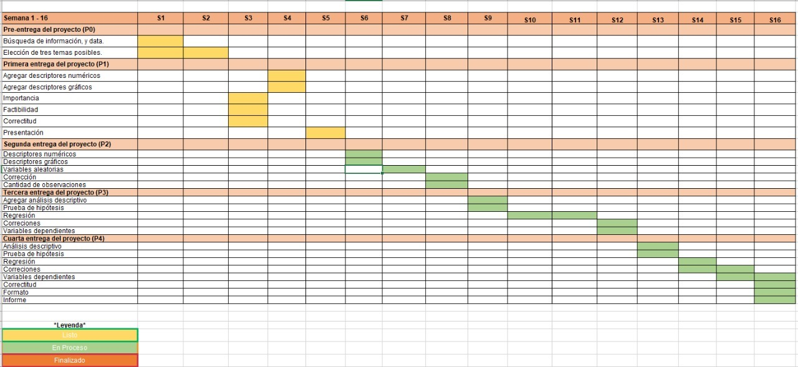

```{r eval=TRUE, include = FALSE}
library(readr)
library(dplyr)
library(vctrs)
library(ggplot2)
```


```{r setup, include = FALSE}
knitr::opts_chunk$set(echo = TRUE)
```


```{r eval=TRUE, echo=FALSE, out.width = "25%" ,fig.align = "center"}

```


## **Introducción**
### **Importancia**
Entender la relación de las actividades físicas con el rendimiento académico resulta ser un tema de mucha importancia debido a que muchos estudiantes  lo consideran innecesario pero según estudios las actividades físicas reducen el nivel de estrés, aumentan la energía , mejora la calidad del sueño, reduce el riesgo de depresión y muchos beneficios más, lo cual nos lleva a indicar que sí tendría que haber efectos positivos; es por eso que se crea este proyecto para observar qué tan beneficioso puede ser el hacer actividad física durante una etapa académica.


### **Justificación**

El presente estudio esta justificado por los siguientes puntos:

* Es **factible** porque utilizaremos datos recopilados de un `Google Forms`, en el cual encontraremos parámetros como: peso, talla, Ponderado, horas de ejercicio y otros igual de relevantes que nos ayudaran a hallar la relación entre la actividad física y el rendimiento académico.
 
* Es **específico** porque el estudio se enfoca únicamente en los alumnos UTEC; además,se encuentran variables que se pueden relacionar.
 
* Es **desconocido**  las variables de estudio abordan un tema de interés para los estudiantes  y las base de dato que aún se están  recopilando  aún siguen actualizándose.


### **Objetivo General**

Analizar la relación entre actividad física y rendimiento académico. Entendiendo a la actividad física como ejercicio físico y deporte, excluyendo educación física porque este va más enfocado a la pedagogía. Para el rendimiento académico se usará el Ponderado ponderado del ciclo anterior (2021-2).


#### **Objetivos específicos**

1. Analizar la relación entre horas semanales de actividad física y Ponderado ponderado.
2. Calcular el Índice de Masa Corporal(IMC) con las variables talla y peso para luego relacionarlos con la variable ciclo.
3. Analizar la relación entre ciclo y horas semanales de actividad física.

## **Marco Teórico**
* **Población objetivo**: Estudiantes de UTEC que cursan entre el 2° ciclo y 10° ciclo.

* **Tipo de muestreo**: Encuesta.

* **Sesgo**: Podemos encontrar sesgos en la recolección de datos, ya que pueden ser mal ingresados. También, al momento de ser publicados el estudio puede ser malinterpretado.

* **Unidades muestrales**: 104 observaciones.

* **Interesados**

    + Profesores.
    + Estudiantes de UTEC que no toman importancia a las actividades físicas o lo creen innecesario en la preparación académica.
    
Para realizar este estudio fijamos como nuestra población objetivo a los estudiantes de la UTEC y como nuestra unidad muestral un alumno de la UTEC. Además, para la recolección de datos utilizamos las siguientes variables:

+------------------------------------------------+--------------------------+
| **VARIABLES**                                  | **TIPO**                 |
+================================================+==========================+
| Promedio Ponderado                             | Numérica continua        |
+------------------------------------------------+--------------------------+
| Talla(metros)                                  | Numérica continua        |
+------------------------------------------------+--------------------------+
| Peso(kilogramos)                               | Numérica continua        |
+------------------------------------------------+--------------------------+
| Horas de práctica semanal                      | Numérica continua        |
+------------------------------------------------+--------------------------+
| Horas sentado                                  | Numérica continua        |
+------------------------------------------------+--------------------------+
| Ciclo Académico                                | Categórica ordinal       |
+------------------------------------------------+--------------------------+
| Edad                                           | Categórica ordinal       |
+------------------------------------------------+--------------------------+
| Desde cuándo practica deporte                  | Categórica ordinal       |
+------------------------------------------------+--------------------------+
| Sexo                                           | Categórica nominal       |
+------------------------------------------------+--------------------------+
| Carrera                                        | Categórica nominal       |
+------------------------------------------------+--------------------------+
| Deporte o Actividad Física                     | Categórica nominal       |
+------------------------------------------------+--------------------------+
| Realiza deporte                                | Categórica nominal       |
+------------------------------------------------+--------------------------+
| Área que destacó más                           | Categórica nominal       |
+------------------------------------------------+--------------------------+
| Área que destacó menos                         | Categórica nominal       |
+------------------------------------------------+--------------------------+
| Porqué practica                                | Categórica nominal       |
+------------------------------------------------+--------------------------+
| Porqué no practica                             | Categórica nominal       |
+------------------------------------------------+--------------------------+


Para el muestreo se propuso realizar una encuesta de manera virtual y que sea difundida solo dentro de la población que se desea estudiar. Para alcanzar este grupo se utilizarán las redes sociales, tales como Instagram y Whatsapp, para otorgar acceso a la encuesta virtual. Lógicamente, la encuesta tendrá filtros para evitar respuestas múltiples o fuera del enfoque de la investigación.

## **Base de datos**

```{r eval=TRUE, message=FALSE,warning=FALSE}
DF<-read_csv("Base_datos.csv")
```
Tenemos: 
```{r eval=TRUE, echo=FALSE}
data.frame(Variables=ncol(DF)-2, Registros=nrow(DF), TotalDatos=nrow(DF)*ncol(DF),DatosFalt=sum(is.na(DF)), ObsImc=sum(!complete.cases(DF)))
```
Nuestras variables: 
```{r eval=TRUE, echo=FALSE}
spec(DF)
```

Consideramos que solo tenemos **16 variables**, ya que las  variables: `Marca temporal` y `Dirección de correo electrónico`, solo indica hora en la que se respondió la encuesta e información del usuario, la cual no necesitamos.

## **Funciones **

 + **Para hallar la moda**
```{r}
mode <- function(x) {
   return(names(which.max(table(x))))
}
```

 + **Para hallar quantiles, rangos y desviación estándar**
```{r}
  Extras <- function(X){
  cat("Desviación estándar:", sd(X), "\n")
  cat("Rango:",max(X) - min(X), "\n")
  cat("Rango intercuartil:", quantile(X, 0.75) - quantile(X, 0.25), "\n")
  cat("Quantil 0:",min(X), "\n")
  cat("Quantil 1:",quantile(X, 0.25), "\n")
  cat("Quantil 2:",quantile(X, 0.50), "\n")
  cat("Quantil 3:",quantile(X, 0.75), "\n")
  cat("Quantil 4:",max(X), "\n")
  return(sum(is.na(X)))
  }
```

 + **Para graficar el BOXPLOT**
```{r}
Boxplot <- function(x,y,z){
  boxplot(x
        , col = "#84DDFF"
        , horizontal = TRUE
        , main = y
        , xlab = z)
abline(v=mean(x),col="red")
abline(v=quantile(x, 0.25),col="blue")
abline(v=quantile(x, 0.75),col="brown")
legend("topright", legend=c("Media","Cuantil 1","Cualtil 3","Mediana"), col=c("red","blue","brown","black"),lty=c(1), bty="n")
}
``` 

 + **Graficar HISTOGRAMA_1**
```{r}

Histograma1 <- function(x,y,z){
  hist(x
     , prob = TRUE
     , main = y
     , xlab = z
     , ylab = "frecuencia relativa"
     , col = "lightcyan"
     , sub = paste(sum(!is.na(x)), "observaciones de una muestra de",nrow(DF))
     )
abline(v = c(mean(x),median(sort(x))),col = c("red","blue"))
legend("topright", legend=c("media","mediana"), col=c("red","blue"),lty=c(1,1))
}
```
 
 + **Graficar HISTOGRAMA_2**
```{r}
Histograma2 <- function(x,y,z){
  hist(x
     , prob = TRUE
     , main = y
     , xlab = z
     , ylab = "frecuencia relativa"
     , col = "lightcyan"
     , sub = paste(sum(!is.na(x)), "observaciones de una muestra de",nrow(DF))
     )
abline(v=c(mean(x)
           ,mean(x) - sd(x)
           ,mean(x) + sd(x)
           )
       , col = c("red","blue","blue")
       , lty = c(11,11,11)
)
legend("topright", legend=c("media","desviación estándar"), col=c("red","blue"),lty=c(11,11))
}

```

 + **Graficar HISTOGRAMA_3**
```{r }
Histograma3 <- function(var,y,z,izq,der){
  hist(var
     , prob = TRUE
     , main = y
     , xlab = z
     , ylab = "frecuencia relativa"
     , col = "lightcyan"
     , sub = paste(sum(!is.na(var)), "observaciones de una muestra de",nrow(DF))
     )
abline(v=c(mean(var)
           ,mean(var) - sd(var)
           ,mean(var) + sd(var)
           ,izq
           ,der
           )
       , col = c("red","blue","blue","#32A48A","#32A48A")
       , lty = c(11,11,11,1,1)
       , lwd = c(2,2,2,4,4)
)
legend("topright", legend=c("media","desviación estándar","Límites de confianza"), col=c("red","blue","#32A48A"),lty=c(11,11,1), lwd = c(2,2,4))
curve(dnorm(x,mean=mean(var),sd=sd(var)), from=min(var)-5,to=max(var)+5, 
      add=TRUE, col="black", lwd=2)
}
```


## **FACTIBILIDAD**

```{r pressure, echo=FALSE, out.width = "100%" }

```

## **VARIABLES** {.tabset .tabset-pills}

### **1. Variable `Promedio Ponderado`**

Esta variable es de tipo **numérica continua** cuya data nos indica los promedios ponderados que obtuvieron los encuestados en el semestre pasado.

> Limpieza de datos:

```{r}
DF$Ponderado[DF$Ponderado == 158.00] <- 15.80
```


#### ***1.1. Descriptores*** {.tabset}


##### **Mediana**

Para hallar la mediana, tenemos que ordenar nuestra lista de valores con la función `sort` y luego hallar la mediana con la función `median`.

**La _mediana_ es: .**

```{r}
median(DF$Ponderado)
```


##### **Promedio o media**

**La media es: **
```{r}
round(mean(DF$Ponderado),2)
```

##### **Cuantiles y extras**

```{r}
Extras(DF$Ponderado)
```
 
 
```{r}
Boxplot(DF$Ponderado, "Ponderados en tabla", "Promedios Ponderados")
```


> * Al menos 25% de los datos son menor o igual al cuantil 1 y el 75% son mayor o igual a este.
 * Al menos 25% de los datos son mayor o igual al cuantil 3 y el 75% son menor o igual a este.
 * Al menos 50% de los datos son mayor o igual a la mediana y el otro 50% son mayor igual a este.


##### **Histograma**

```{r eval=TRUE}
Histograma1(DF$Ponderado,"Histograma de los Promedios Ponderados", "Promedios Ponderados")
```

> De esta histograma, la media y mediana son aproximadamente idénticos, por ello, podemos decir que son **aproximadamente _simétricos_**. 
 
```{r eval=TRUE}
Histograma2(DF$Ponderado,"Histograma de los Promedios Ponderados", "Promedios Ponderados")
```

> En este histograma se muestra la distribución de datos alrededor de la media o promedio.

---------------------------------------------------------------------------------------------------------------------


### **2. Variable `Talla`**

Esta variables es de tipo **numérica continua** cuya data nos indica las tallas en metros que obtuvimos de los encuestados. 


> Limpieza de datos:

Usamos el código del siguiente `chunk` para corregir datos que están en `cm`.

```{r}
DF$Talla[DF$Talla > 99] <- DF$Talla[DF$Talla > 2]/100
```


#### ***2.1. Descriptores*** {.tabset}

##### **Mediana**

Para hallar la mediana, tenemos que ordenar nuestra lista de valores con la función `sort` y luego hallar la mediana con la función `median`.

**La _mediana_ es:**

```{r}
median(DF$Talla)
```

##### **Promedio o media**

**El _promedio_ de la variable talla de los alumnos de UTEC es: **

```{r}
mean(DF$Talla)
```
 


##### **Cuantiles y extras**

```{r}
Extras(DF$Talla)
```
 
 
```{r eval=TRUE}
Boxplot(DF$Talla, "Tallas en la tabla", "Tallas(cm)")
```

> * Al menos 25% de los datos son menor o igual al cuantil 1 y el 75% son mayor o igual a este.
 * Al menos 25% de los datos son mayor o igual al cuantil 3 y el 75% son menor o igual a este.
 * Al menos 50% de los datos son mayor o igual a la mediana y el otro 50% son mayor igual a este.


##### **Histograma**
```{r eval=TRUE}
Histograma1(DF$Talla, "Histograma de las Tallas", "Tallas(m)")
```
 
> De esta histograma, la media es menor que la mediana, por ello, podemos decir que los datos están **_sesgados a la izquierda_** y existirá una **"cola de bajada" en la dirección izquierda.**

 
```{r eval=TRUE}
Histograma2(DF$Talla, "Histograma de las Tallas","Tallas(m)")
```

> En este histograma se muestra la distribución de datos alrededor de la media o promedio.


--------------------------------------------------------------------------------------------------------------------------------------------------------------------


### **3. Variable `Peso`**

Esta variables es de tipo **numérica continua** cuya data nos indica las pesos en kilogramos que obtuvimos de los encuestados.

Para esta variable, hasta el momento, no hemos detectado errores.

#### ***3.1. Descriptores*** {.tabset}

##### **Mediana**

Para hallar la mediana, tenemos que ordenar nuestra lista de valores con la función `sort` y luego hallar la mediana con la función `median`.

**La _mediana_ es: **
```{r}
median(DF$Peso)
```


##### **Promedio o media**

**El _promedio_ del peso es: **
```{r}
mean(DF$Peso)
```
 


##### **Cuantiles y extras**

```{r}
Extras(DF$Peso)
```
 
 
```{r eval=TRUE}
Boxplot(DF$Peso,"Pesos en la tabla","Pesos(Kg)")
```

> * Al menos 25% de los datos son menor o igual al cuantil 1 y el 75% son mayor o igual a este.
 * Al menos 25% de los datos son mayor o igual al cuantil 3 y el 75% son menor o igual a este.
 * Al menos 50% de los datos son mayor o igual a la mediana y el otro 50% son mayor igual a este.


##### **Histograma**
```{r eval=TRUE}
Histograma1(DF$Peso,"Histograma de los Promedios Pesos","Pesos(Kg)")
```
 
> De esta histograma, la media es mayor que la mediana, por ello, podemos decir que los datos están **_sesgados a la derecha_** y existirá una **"cola de bajada" en la dirección derecha.**
 
```{r eval=TRUE}
Histograma2(DF$Peso,"Histograma de los Promedios Pesos","Pesos(Kg)")
```

> En este histograma se muestra la distribución de datos alrededor de la media o promedio.

--------------------------------------------------------------------------------------------------------------------------------------------------------------------

### **4. Variable `HoraDeporte`**

Esta variables es de tipo **numérica continua** cuya data nos indica el tiempo a la semana que los encuestados dedican a realizar actividades físicas.


#### ***4.1. Descriptores*** {.tabset}

##### **Mediana**

Para hallar la mediana, tenemos que ordenar nuestra lista de valores con la función `sort` y luego hallar la mediana con la función `median`.

**La _mediana_ es:**

```{r}
median(DF$HoraDeporte)
```

##### **Promedio o media**

**El _promedio_ de la variable `HoraDeporte` de los alumnos de UTEC es: **

```{r}
mean(DF$HoraDeporte)
```


##### **Cuantiles y extras**

```{r}
Extras(DF$HoraDeporte)
```
 
 
```{r eval=TRUE}
Boxplot(DF$HoraDeporte,"Horas de Actividad Física en la tabla","Tiempo(horas)")
```

> * Al menos 25% de los datos son menor o igual al cuantil 1 y el 75% son mayor o igual a este.
 * Al menos 25% de los datos son mayor o igual al cuantil 3 y el 75% son menor o igual a este.
 * Al menos 50% de los datos son mayor o igual a la mediana y el otro 50% son mayor igual a este.


##### **Histograma**
```{r eval=TRUE}
Histograma1(DF$HoraDeporte,"Histograma de los Horas de Actvidad Física","Tiempo(horas)")
```
 
> De esta histograma, la media es mayor que la mediana, por ello, podemos decir que los datos están **_sesgados a la derecha_** y existirá una **"cola de bajada" en la dirección derecha.**
 
```{r eval=TRUE}
Histograma2(DF$HoraDeporte,"Histograma de los Horas de Actvidad Física","Tiempo(horas)")
```

> En este histograma se muestra la distribución de datos alrededor de la media o promedio.


-----------------------------------------------------------------------------------------------------------------------------------------------

### **5. Variable `HoraSentado`**

Esta variable es de tipo **numérica continua** cuya data nos indica la cantidad aproximada de horas a la semana que el encuestado pasa sentado.

#### ***5.1. Descriptores*** {.tabset}

##### **Mediana**

**La mediana de esta variable es: **
```{r}
median(DF$HoraSentado)
```

##### **Promedio o media**

**El promedio de esta variable es: **
```{r}
mean(as.numeric(DF$HoraSentado))
```

##### **Cuantiles y extras**

```{r}
Extras(DF$HoraSentado)
```
 
 
```{r eval=TRUE}
Boxplot(DF$HoraSentado,"HoraSentado en la tabla","Tiempo(horas)")

```

> * Al menos 25% de los datos son menor o igual al cuantil 1 y el 75% son mayor o igual a este.
 * Al menos 25% de los datos son mayor o igual al cuantil 3 y el 75% son menor o igual a este.
 * Al menos 50% de los datos son mayor o igual a la mediana y el otro 50% son mayor igual a este.


##### **Histograma**

```{r eval=TRUE}
Histograma1(DF$HoraSentado,"Histograma de HoraSentado","Tiempo(horas)")
```
> De esta histograma, la media con mediana tienen un apoximado relativo, entonces podemos decir que los datos son **aproximadamente _simétricos_**.

```{r eval=TRUE}
Histograma2(DF$HoraSentado,"Histograma de HoraSentado","Tiempo(horas)")
```

> En este histograma se muestra la distribución de datos alrededor de la media o promedio.

--------------------------------------------------------------------------------------------------------------------------------------------------------------------

### **6. Variable `Ciclo`**

Esta variable es de tipo **categórica ordinal** cuya data nos indica el ciclo académico en el que se encuentran los encuestados al momento de realizar nuestra encuesta.


#### ***6.1. Descriptores*** {.tabset}

##### **Moda**

Para esta variable gracias a la pregunta del formulario bien establecida se evitó en su mayoría el mal ingreso de datos. Algunos datos podrían ser falseados en caso el encuestado tenga deseo en mentir acerca del ciclo académico en que se encuentra.

```{r}
table(DF$Ciclo, useNA="ifany")
```

```{r eval=TRUE}
df = data.frame(table(DF$Ciclo, useNA="ifany"))
ggplot(data=df, aes(x=Var1, y=Freq)) +  geom_bar(stat="identity", position="stack",fill="#9E0D0D")+
ggtitle("Histograma de los ciclos")+
theme(plot.title = element_text(vjust=2,hjust=0.5, face="bold", size = rel(1.5), lineheight = 1.5))+
labs(x="Ciclo",y="")+
theme (axis.title = element_text( size=rel(1.5)))+
theme(axis.text.x = element_text(size=rel(1.4), colour = "black"),axis.text.y = element_text(size=rel(1.3), colour = "black"))
```


**La _moda_ de esta variable es: **

```{r}
mode(DF$Ciclo)
```


------------------------------------------------------------------------------------------------------------------------------------------------------------------

### **7. Variable `Edad`**

Esta variable es de tipo **categórica ordinal** cuya data nos indica la edad que tienen los encuestados al momento de realizar nuestra encuesta.

#### ***7.1. Descriptores*** {.tabset}

##### **Moda**

Para esta variable gracias a la pregunta del formulario bien establecida se evitó en su mayoría el mal ingreso de datos. Algunos datos podrían ser falseados en caso el encuestado tenga deseo en mentir sobre su edad.

```{r}
table(DF$Edad, useNA="ifany")
```

```{r eval=TRUE}
df = data.frame(table(DF$Edad, useNA="ifany"))
ggplot(data=df, aes(x=Var1, y=Freq)) +  geom_bar(stat="identity", position="stack",fill="#9E0D0D")+
ggtitle("Diagrama de barras de las edades")+
theme(plot.title = element_text(vjust=2,hjust=0.5, face="bold", size = rel(1.5), lineheight = 1.4))+
labs(x="Edad",y="")+
theme (axis.title = element_text(size=rel(1.5)))+
theme(axis.text.x = element_text(size=rel(1.4), colour = "black"),axis.text.y = element_text(size=rel(1.3), colour = "black"))
```


**La _moda_ de esta variable es: **

```{r}
mode(DF$Edad)
```


------------------------------------------------------------------------------------------------------------------------------------------------------------------

### **8. Variable `Tiempo`**

Esta variable es de tipo **categórica ordinal** cuya data nos indica un aproximado del tiempo que vienen haciendo actividad física los encuestados.

#### ***8.1. Descriptores*** {.tabset}

##### **Moda**

Para esta variable gracias a la pregunta del formulario bien establecida se evitó en su mayoría el mal ingreso de datos. Algunos datos podrían ser falseados en caso el encuestado tenga deseo en mentir sobre su edad.

```{r}
table(DF$Tiempo, useNA="ifany")
```

```{r eval=TRUE, include = FALSE}
DF$Tiempo[DF$Tiempo == "Hace meses"] <- "Hace 0 años"
```

```{r eval=TRUE}
df = data.frame(table(DF$Tiempo, useNA="ifany"))
ggplot(data=df, aes(x=Var1, y=Freq)) +  geom_bar(stat="identity", position="stack",fill="#9E0D0D")+
ggtitle("Diagrama de barras de la variable `Tiempo`")+
theme(plot.title = element_text(vjust=2,hjust=0.5, face="bold", size = rel(1.5), lineheight = 1.4))+
labs(x="",y="")+
theme (axis.title = element_text(size=rel(1.5)))+
theme(axis.text.x = element_text(size=rel(1.4), colour = "black",angle=90),axis.text.y = element_text(size=rel(1.3), colour = "black"))+
scale_x_discrete(labels = c('Hace meses','Hace 1 año','Hace 2 años','Hace 3 años','Hace 4 años o más','NA'))
```
```{r eval=TRUE, include = FALSE}
DF$Tiempo[DF$Tiempo == "Hace 0 años"] <- "Hace meses"
```

**La _moda_ de esta variable es: **

```{r}
mode(DF$Tiempo)
```


------------------------------------------------------------------------------------------------------------------------------------------------------------------

### **9. Variable `Sexo`**

Esta variable es de tipo **categórica nominal** cuya data nos indica el sexo de los encuestados.

#### ***9.1. Descriptores*** {.tabset}

##### **Moda**

```{r}
table(DF$Sexo, useNA="ifany")
```

```{r eval=TRUE}
df = data.frame(table(DF$Sexo, useNA="ifany"))
ggplot(data=df, aes(x=reorder(Var1,-Freq), y=Freq)) +  geom_bar(stat="identity", position="stack",fill="#9E0D0D")+
ggtitle("Diagrama de barras`")+
theme(plot.title = element_text(vjust=2,hjust=0.5, face="bold", size = rel(1.5), lineheight = 1.4))+
labs(x="Sexo",y="")+
theme (axis.title = element_text(size=rel(1.5)))+
theme(axis.text.x = element_text(size=rel(1.4), colour = "black"),axis.text.y = element_text(size=rel(1.3), colour = "black"))
```


**La _moda_ de esta variable es: **

```{r}
mode(DF$Sexo)
```

--------------------------------------------------------------------------------------------------------------------------------------------------------------------

### **10. Variable `Carrera`**

Esta variables es de tipo **categórica nominal** nos indica la carrera al que pertenecen los encuestados.

#### ***10.1. Descriptores*** {.tabset}

##### **Moda**

En esta variable no puede existir los NA, ya que es una pregunta obligatoria en nuestro formulario sin esa respuesta no hubieran podido enviar su encuesta.

```{r}
table(DF$Carrera, useNA="ifany")
```

```{r eval=TRUE}
df = data.frame(table(DF$Carrera, useNA="ifany"))
ggplot(data=df, aes(x=reorder(Var1,-Freq), y=Freq)) +  geom_bar(stat="identity", position="stack",fill="#9E0D0D")+
ggtitle("Diagrama de barras")+
theme(plot.title = element_text(vjust=2,hjust=0.5, face="bold", size = rel(1.5), lineheight = 1.4))+
labs(x="Carrera",y="")+
theme (axis.title = element_text(size=rel(1.5)))+
theme(axis.text.x = element_text(size=rel(1.4), colour = "black", angle=90),axis.text.y = element_text(size=rel(1.3), colour = "black"))
```

**La _moda_ de esta variable es la carrera: **

```{r}
mode(DF$Carrera)
```


------------------------------------------------------------------------------------------------------------------------------------------------------------------


### **11. Variable `Deporte`**

Esta variable es de tipo **categórica nominal** cuya data nos indica el tipo de deporte o actividad física que practican los encuestados.

> Control de errores:

Para el control de errores en el caso de la variable Deporte, lo haremos manualmente. 
```{r}
DF$Deporte[DF$Deporte == "Futbol"] <- "Fútbol"
DF$Deporte[DF$Deporte == "futbol"] <- "Fútbol"
DF$Deporte[DF$Deporte== "-"] <- NA
DF$Deporte[DF$Deporte == "tenis"] <- "Tenis"
DF$Deporte[DF$Deporte == "Tennis"] <- "Tenis"
DF$Deporte[DF$Deporte == "Ninguno"] <- NA
DF$Deporte[DF$Deporte == "niuno :("] <- NA
DF$Deporte[DF$Deporte == "salir a correr pero hace tiempo que no lo practico."] <- NA
DF$Deporte[DF$Deporte == "No"] <- NA 
DF$Deporte[DF$Deporte == "Caminar en casa"] <- "Caminar"
DF$Deporte[DF$Deporte == "No"] <- NA 
DF$Deporte[DF$Deporte == "en su tiempo praticaba mucho parkour"] <- NA
DF$Deporte[DF$Deporte == "Rutinas en casa"] <- "Ejercicio en casa"
DF$Deporte[DF$Deporte == "Algunas rutinas en casa, raras veces. "] <- "Ejercicio en casa"
DF$Deporte[DF$Deporte == "hago sesiones de ejercicio en mi cuarto, pero no con mucha frecuencia"] <- "Ejercicio en casa"
DF$Deporte[DF$Deporte == "casa"] <- "Ejercicios en casa"
DF$Deporte[DF$Deporte == "Algunas rutinas en casa, raras veces."] <- "Ejercicio en casa"
DF$Deporte[DF$Deporte == "caminar"] <- "Caminar"
DF$Deporte[DF$Deporte == "Ejercicios en casa"] <- "Ejercicio en casa"
DF$Deporte[DF$Deporte == "Casa"] <- "Ejercicio en casa"
DF$Deporte[DF$Deporte == "Caminar y ejercico en casa"] <- "Ejercicio en casa"
DF$Deporte[DF$Deporte == "Pesas, Bicicleta estacionaria"] <- "Ejercicio en casa"
DF$Deporte[DF$Deporte == "Ciclismo, pero como actividad recreativa."] <- "Ciclismo"
```


#### ***11.1. Descriptores*** {.tabset}

##### **Moda**

Para esta variable debido a su carácter de ser tipo categórica nominal, solo presenta moda. Al recaudar los datos de esta variable se peligra que los encuestados probablemente coloquen actividades fuera de los estándares de lo que sería el deporte o actividad física.

```{r}
table(DF$Deporte, useNA="ifany")
```
```{r eval=TRUE}
df = data.frame(table(DF$Deporte, useNA="ifany"))
ggplot(data=df, aes(x=reorder(Var1,-Freq), y=Freq)) +  geom_bar(stat="identity", position="stack",fill="#9E0D0D")+
ggtitle("Diagrama de barras")+
theme(plot.title = element_text(vjust=2,hjust=0.5, face="bold", size = rel(1.5), lineheight = 1.4))+
labs(x="Deporte",y="")+
theme (axis.title = element_text(size=rel(1.5)))+
theme(axis.text.x = element_text(size=rel(1.4), colour = "black", angle=90),axis.text.y = element_text(size=rel(1.3), colour = "black"))
```
**La _moda_ de esta variable es: **
```{r}
mode(DF$Deporte)
```

### **12. Variable `Realiza deporte`**

Variable de tipo **categórica nominal** cuya información nos indica si los encuestados actualmente están realizando deporte o actividad física. Los datos son muy improbables que sean errados ya que la pregunta formulada se basa en una selección única de sí o no, además que fue de carácter obligatorio.

#### ***12.1. Descriptores*** {.tabset}

##### **Moda**

```{r}
table(DF$Realiza, useNA="ifany")
```

```{r eval=TRUE}
df = data.frame(table(DF$Realiza, useNA="ifany"))
ggplot(data=df, aes(x=reorder(Var1,-Freq), y=Freq)) +  geom_bar(stat="identity", position="stack",fill="#9E0D0D")+
ggtitle("Diagrama de barras")+
theme(plot.title = element_text(vjust=2,hjust=0.5, face="bold", size = rel(1.5), lineheight = 1.4))+
labs(x="Opciones",y="")+
theme (axis.title = element_text(size=rel(1.5)))+
theme(axis.text.x = element_text(size=rel(1.4), colour = "black"),axis.text.y = element_text(size=rel(1.3), colour = "black"))
```


**La _moda_ de esta variable es el valor: **
```{r}
mode(DF$Realiza)
```


### **13. Variable `NoDestaca`**

Esta variable es de tipo **categórica nominal** cuya data nos indica el área que menos destacó el encuestado el ciclo anterior.

#### ***13.1. Descriptores*** {.tabset}

##### **Moda**

```{r}
table(DF$NoDestaca, useNA="ifany")
```

```{r eval=TRUE}
df = data.frame(table(DF$NoDestaca, useNA="ifany"))
ggplot(data=df, aes(x=reorder(Var1,-Freq), y=Freq)) +  geom_bar(stat="identity", position="stack",fill="#9E0D0D")+
ggtitle("Diagrama de barras")+
theme(plot.title = element_text(vjust=2,hjust=0.5, face="bold", size = rel(1.5), lineheight = 1.4))+
labs(x="",y="")+
theme (axis.title = element_text(size=rel(1.5)))+
theme(axis.text.x = element_text(size=rel(1.4), colour = "black"),axis.text.y = element_text(size=rel(1.3), colour = "black"))+
scale_x_discrete(labels = c('Ciencias y carrera','HACS','Managements','Electivo','NA'))
```

**La moda de esta variables es: **
```{r}
mode(DF$NoDestaca)
```

### **14. Variable `SiDestaca`**
Esta variable es de tipo **categórica nominal** cuya data nos el área que más destacó el encuestado el ciclo anterior.

#### ***14.1. Descriptores*** {.tabset}

##### **Moda**

```{r}
table(DF$SiDestaca, useNA="ifany")
```

```{r eval=TRUE}
df = data.frame(table(DF$SiDestaca, useNA="ifany"))
ggplot(data=df, aes(x=reorder(Var1,-Freq), y=Freq)) +  geom_bar(stat="identity", position="stack",fill="#9E0D0D")+
ggtitle("Diagrama de barras")+
theme(plot.title = element_text(vjust=2,hjust=0.5, face="bold", size = rel(1.5), lineheight = 1.4))+
labs(x="",y="")+
theme (axis.title = element_text(size=rel(1.5)))+
theme(axis.text.x = element_text(size=rel(1.4), colour = "black"),axis.text.y = element_text(size=rel(1.3), colour = "black"))+
  scale_x_discrete(labels = c('Ciencias y carrera','HACS','Managements','Electivo','NA'))
```

**La moda de esta variables es: **
```{r}
mode(DF$SiDestaca)
```


### **15. Variable `SPorque`**

Esta variable es de tipo **categórica nominal** cuya data nos indica la principal razón por la que el encuestado realiza actividad física o deporte. Cabe recalcar que los encuestados que marcaron que "NO realizan deporte o actividad física", en esta variable serán considerados como `NA`.

```{r eval=TRUE, echo=FALSE}
DF$SPorque[DF$SPorque == "Na"] <- NA
DF$SPorque[DF$SPorque == "no"] <- NA
DF$SPorque[DF$SPorque == "No"] <- NA
DF$SPorque[DF$SPorque == "NO"] <- NA

```

#### ***15.1. Descriptores*** {.tabset}

##### **Moda**

```{r}
table(DF$SPorque, useNA="ifany")
```

```{r eval=TRUE}
df = data.frame(table(DF$SPorque, useNA="ifany"))
ggplot(data=df, aes(x=reorder(Var1,-Freq), y=Freq)) +  geom_bar(stat="identity", position="stack",fill="#9E0D0D")+
ggtitle("Diagrama de barras")+
theme(plot.title = element_text(vjust=2,hjust=0.5, face="bold", size = rel(1.5), lineheight = 1.4))+
labs(x="",y="")+
theme (axis.title = element_text(size=rel(1.5)))+
theme(axis.text.x = element_text(size=rel(1.4), colour = "black", angle = 90),axis.text.y = element_text(size=rel(1.3), colour = "black"))
```

**La moda de esta variables es: **
```{r}
mode(DF$SPorque)
```


### **16. Variable `NPorque`**
Esta variable es de tipo **categórica nominal** cuya data nos indica la principal razón por la que el encuestado no realiza actividad física o deporte. Cabe recalcar que los encuestados que marcaron que "sí realizan deporte o actividad física", en esta variable serán considerados como `NA`.

>Control de errores:

```{r}
DF$NPorque[DF$NPorque == "No"] <- NA
DF$NPorque[DF$NPorque == "no"] <- NA
DF$NPorque[DF$NPorque == "si practico"] <- NA
DF$NPorque[DF$NPorque == "Sí practico"] <- NA
DF$NPorque[DF$NPorque=="Se dificulta el tener que seguir haciéndolo con constancia"]<-"Se cansa rápido"
DF$NPorque[DF$NPorque == "."] <- NA
```

#### ***16.1. Descriptores*** {.tabset}

##### **Moda**

```{r}
table(DF$NPorque, useNA="ifany")
```

```{r eval=TRUE}
df = data.frame(table(DF$NPorque, useNA="ifany"))
ggplot(data=df, aes(x=reorder(Var1,-Freq), y=Freq)) +  geom_bar(stat="identity", position="stack",fill="#9E0D0D")+
ggtitle("Diagrama de barras")+
theme(plot.title = element_text(vjust=2,hjust=0.5, face="bold", size = rel(1.5), lineheight = 1.4))+
labs(x="",y="")+
theme (axis.title = element_text(size=rel(1.5)))+
theme(axis.text.x = element_text(size=rel(1.4), colour = "black", angle = 90),axis.text.y = element_text(size=rel(1.3), colour = "black"))
```

**La moda de esta variables es: **
```{r}
mode(DF$NPorque)
```

-----------------------------------------------------------------------------------------------------------------------------------

## **RELACIONES DE ESTUDIO**{.tabset}

### **Ciclo - IMC(Talla y Peso)**

> Siguiendo los objetivos de este estudio, con esta relación pretendemos calcular el `índice de masa corporal` (IMC) con las variables _talla y peso_, dado a que este es un indicador del estado físico de una persona. Al relacionarlo con la variable _ciclo_ y haciendo uso de `boxplot` podremos identificar cómo es la concentración de IMC para cada ciclo.

```{r eval=TRUE}
boxplot((DF$Peso)/((DF$Talla)^2) ~ DF$Ciclo, DF=DF, frame=FALSE, col="#DA721F", xlab="Ciclo", ylab="IMC")
```

**Tabla de IMC**

| IMC          | Situación        |
|--------------|------------------|
| < 18.5       | Bajo peso        |
| 18.5 - 24.99 | Peso normal      |
| 25 - 29.99   | Sobrepeso        |
| 30 - 34.99   | Obesidad Leve    |
| >40          | Obesidad Mórbida |


### **HoraDeporte - Ciclo**

> Con esta relación queremos ver como fluctúa la cantidad de horas que el estudiante dedica a realizar actividades físicas conforme avanza el ciclo, cabe aclarar que el `universo` de estudiantes que se consideran para esta parte del estudio, son los que `sí` realizan algún deporte o actividad física.


```{r eval=TRUE, echo=FALSE}
DF$HoraDeporte[DF$HoraDeporte=="0"]<-NA
```

```{r eval=TRUE}
boxplot(DF$HoraDeporte ~ DF$Ciclo,DF=DF, frame=FALSE, col="#DA721F", xlab="Ciclo", ylab="Horas de Deporte")
```

Actualmente, con esta gráfica no podemos obtener una conclusión óptima, ya que hace falta mucha más data, en especial de los ciclos más avanzados.

### **Hora Deporte - Promedio ponderado**

> Con esta relación queremos evaluar si la cantidad de horas semanales que dedica el estudiante a la actividad física afecta proporcionalmente en su rendimiento académico.

```{r eval=TRUE, echo=FALSE, message=FALSE}
DF$HoraDeporte[is.na(DF$HoraDeporte)] <- 0      
```

```{r eval=TRUE}
smoothScatter(DF$Ponderado, DF$HoraDeporte,pch=19,col=rgb(0, 0, 0, 0.5), ylab="Horas semanales de actividad física", xlab="Promedio Ponderado",colramp = colorRampPalette(c("#f7f7f7", "aquamarine")))
```


### **Horas sentado- promedio ponderado**

> Con esta relación queremos evaluar si la cantidad de horas que el estudiante pasa sentado afecta proporcionalmente en su rendimiento académico.


```{r eval=TRUE}
smoothScatter(DF$Ponderado,DF$HoraSentado,pch=19,col=rgb(0, 0, 0, 0.5), ylab="Horas Sentado", xlab="Promedio Ponderado",colramp = colorRampPalette(c("#f7f7f7", "aquamarine")))
```

### **Sexo - IMC**

> Con esta relación se quiere visualizar la condición física de cada sexo perteneciente a los encuestados de UTEC.

```{r eval=TRUE}
boxplot((DF$Peso)/((DF$Talla)^2) ~ DF$Sexo,DF=DF, frame=FALSE, col="#DA721F", xlab="Sexo", ylab="IMC")
```

### **IMC - PROMEDIO PONDERADO**

> Con esta relación, queremos evaluar si ha mejor índice de masa corporal, existe mejor Promedio Ponderado.

```{r eval=TRUE}
smoothScatter(DF$Ponderado,(DF$Peso)/((DF$Talla)^2),pch=19,col=rgb(0, 0, 0, 0.5), ylab="IMC", xlab="Promedio Ponderado",colramp = colorRampPalette(c("#f7f7f7", "aquamarine")))
```

## **Análisis Descriptivo e Hipótesis** {.tabset .tabset-pills}

### **Hipótesis 1** {.tabset}

#### **Variable: `Horas sentado`**

Esta variable es de tipo **numérica continua** cuya data nos indica la cantidad aproximada de horas a la semana que el encuestado pasa sentado.


```{r eval=TRUE, echo=FALSE}
cat("Mediana: ", median(DF$HoraSentado),"\n")
cat("Media: ", mean(DF$HoraSentado),"\n")
Extras(DF$HoraSentado)
```

 
```{r}
Boxplot(DF$HoraSentado,"HoraSentado en la tabla","Tiempo(horas)")
```


##### **INTERVALO DE CONFIANZA**

```{r eval=TRUE, echo=FALSE}
tamanio_muestra<-nrow(DF)
cat("Tamaño de muestra: ",tamanio_muestra,"\n")
xbarra <- mean(DF$HoraSentado)
nivel_confianza<-0.90
nivel_significancia<-0.10
cat("Nivel de confianza", nivel_confianza,"\n")
cat("Nivel de significancia", nivel_significancia,"\n")
```


```{r}
z <- qnorm( (1-nivel_confianza)/2 , lower.tail =FALSE)
```

```{r eval=TRUE, echo=FALSE}
cat("Z crítico: ",z,"\n")
```
```{r}
margen_error<-z*(sd(DF$HoraSentado)/sqrt(tamanio_muestra))
```

```{r eval=TRUE, echo=FALSE}
cat("Margen de error: ",margen_error,"\n")
```
```{r}
izq <- xbarra - z*sd(DF$HoraSentado)/sqrt(tamanio_muestra)
der <- xbarra + z*sd(DF$HoraSentado)/sqrt(tamanio_muestra)
```

**El intervalo de confianza del 90 % para la media de la muestra tomada es:**

```{r eval=TRUE, echo=FALSE}
cat("(",izq,",",der,")\n")
```

```{r eval=TRUE}
Histograma3(DF$HoraSentado,"Histograma de HoraSentado","Tiempo(horas semanales)",izq,der)
```


#### **Prueba de Hipótesis**
Promedio de la horas de estudio de todos los encuestados es 53.91

```{r}
mean(DF$HoraSentado)
```
Evaluamos de los alumnos de segundo ciclo:

```{r}
DF8<-filter(DF,Ciclo== 2)
```

$H_{0}:$  El promedio de los horas de estudio de los alumnos de segundo ciclo es mayor o igual 53.91 

$H_{0}: \mu \geq 53.91$
  
$H_{1}:$  El promedio de los horas de estudio de los alumnos de segundo ciclo es menor 53.91 

$H_{1}: \mu < 53.91$


+ **Nivel de significancia:** 0.10
+ **Nivel de confianza:** 0.90

Para verificar la hipótesis, se realizará una prueba de hipótesis de distribución `t.test-student`

Siendo esta una prueba de hipótesis de cola derecha, sacamos el valor critico que divide la región de rechazo y la región de no rechazo de la hipótesis nula.
```{r}
t.test(x=DF8$HoraSentado,mu= 53.91, paired = FALSE,
 alternative = "greater",conf.level = 0.90)
```


```{r eval=TRUE, echo=FALSE}
zona_rechazo<-qt(0.1,length(DF8$HoraSentado)-1)
cat("Zona de rechazo: ", zona_rechazo)
```

```{r eval=TRUE, echo=FALSE}
gl2<-length(DF8$HoraSentado)-1
x<-length(DF8$HoraSentado)
curve(dt(x,gl2),-8,8,xlab="t")
abline(v=qt(0.1,gl2),col="red")
abline(v=-0.73325,col="blue")


ab <- seq(-8,8,length=1500)*1+0
lb=-4
ub=qnorm(0.10)
hx=dnorm(ab)
i <- ab >= lb & ab <= ub
lines(ab,hx)
polygon(c(lb,ab[i],ub), c(-2,hx[i],0), col="lightpink")
area <- pnorm(ub)


text(4, 0.2, "Zona de\n no Rechazo", col="blue")
text(-2.5, 0.01, "5%", col="black")
text(0, 0.1, " 95%", col="black")
text(-5, 0.2, "Zona de Rechazo", col="red")


legend(x="topright", legend=c("Valor Crítico = -1.298714","Estadístico de prueba = -0.73325"),
       col=c("red","blue"),lty=2:3, cex=0.8,
       title="Leyenda")
```


##### **Conclusión**

Con evidencia en la gráfica y en el pvalue podemos decir que la hipotiposis nula con un nivel de significancia del 0.1, no se puede rechazar.


### **Hipótesis 2** {.tabset}

#### **Variable: `Promedio ponderado`**

Esta variable es de tipo **numérica continua** cuya data nos indica los promedios ponderados que obtuvieron los encuestados en el semestre pasado.

```{r eval=TRUE, echo=FALSE}
cat("Mediana: ", median(DF$Ponderado),"\n")
cat("Media: ", mean(DF$Ponderado),"\n")
Extras(DF$Ponderado)
```
 
 
```{r}
Boxplot(DF$Ponderado, "Ponderados en tabla", "Promedios Ponderados")
```

##### **INTERVALO DE CONFIANZA**

```{r eval=TRUE, echo=FALSE}
tamanio_muestra<-nrow(DF)
cat("Tamaño de muestra: ",tamanio_muestra,"\n")
xbarra <- mean(DF$Ponderado)
nivel_confianza<-0.90
nivel_significancia<-0.10
cat("Nivel de confianza", nivel_confianza,"\n")
cat("Nivel de significancia", nivel_significancia,"\n")
```

```{r}
z <- qnorm( (1-nivel_confianza)/2 , lower.tail =FALSE)
```

```{r eval=TRUE, echo=FALSE}
cat("Z crítico: ",z,"\n")
```

```{r}
margen_error<-z*(sd(DF$Ponderado)/sqrt(tamanio_muestra))
```

```{r eval=TRUE, echo=FALSE}
cat("Margen de error: ",margen_error,"\n")
```

```{r}
izq <- xbarra - z*sd(DF$Ponderado)/sqrt(tamanio_muestra)
der <- xbarra + z*sd(DF$Ponderado)/sqrt(tamanio_muestra)
```


El intervalo de confianza del 90 % para la media de la muestra tomada es:

```{r eval=TRUE, echo=FALSE}
cat("(",izq,",",der,")\n")
```


```{r eval=TRUE}
Histograma3(DF$Ponderado,"Histograma de promedios ponderados","Promedios ponderados",izq,der)
```

#### **Prueba de Hipótesis**

El promedio de nuestra muestra es 14.97, para los que realizan algún deporte, este promedio es mayor.
```{r}
mean(DF$Ponderado)
```

Nuestra muestra serán los encuestados que sí realizan algún deporte o mantienen una constante actividad física.

```{r}
DF6<-filter(DF,Realiza == "Sí")
nrow(DF6)
```

$H_{0}:$  El promedio ponderado de los que realizan algún deporte es mayor o igual 14.97 

$H_{0}: \mu \leq 14.97$
  
$H_{1}:$  El promedio ponderado de los que realizan algún deporte es menor 14.97

$H_{1}: \mu > 14.97$

+ **Nivel de significancia:** 0.10
+ **Nivel de confianza:** 0.90

Para verificar la hipótesis, se realizará una prueba de hipótesis de distribución `t.test-student`

Siendo esta una prueba de hipótesis de cola derecha, sacamos el valor critico que divide la región de rechazo y la región de no rechazo de la hipótesis nula.

```{r}
t.test(x=DF6$Ponderado,mu= 14.97, paired = FALSE,
 alternative = "greater",conf.level = 0.90)
```

```{r eval=TRUE, echo=FALSE}
zona_rechazo<-qt(0.1,length(DF6$Ponderado)-1)
cat("Zona de rechazo: ", zona_rechazo)
```

```{r eval=TRUE, echo=FALSE}
gl2<-length(DF6$Ponderado)-1
x<-length(DF6$Ponderado)
curve(dt(x,gl2),-8,8,xlab="t")
abline(v=qt(0.1,gl2),col="red")
abline(v=0.38238,col="blue")


ab <- seq(-8,8,length=1500)*1+0
lb=-4
ub=qnorm(0.10)
hx=dnorm(ab)
i <- ab >= lb & ab <= ub
lines(ab,hx)
polygon(c(lb,ab[i],ub), c(-2,hx[i],0), col="lightpink")
area <- pnorm(ub)


text(5, 0.2, "Zona de\n no Rechazo", col="blue")
text(-2.5, 0.01, "5%", col="black")
text(0, 0.1, " 95%", col="black")
text(-5, 0.2, "Zona de Rechazo", col="red")


legend(x="topright", legend=c("Valor Crítico = -1.296066","Estadístico de prueba = 0.38238"),
       col=c("red","blue"),lty=2:3, cex=0.8,
       title="Leyenda")
```


##### **Conclusión:**
Con evidencia en la gráfica y en el pvalue podemos decir que la hipótesis nula con un nivel de signifcancia del 0.1, **no se puede rechazar**.


### **Hipótesis 3** {.tabset}

#### **Variable: `IMC(Peso y altura)`**

Esta variable es de tipo **numérica continua** cuya data el valor de IMC de los encuestados, dicha variable es dependiente de las variables `Peso` y `Altura`.

**Tabla de IMC**

| IMC          | Situación        |
|--------------|------------------|
| < 18.5       | Bajo peso        |
| 18.5 - 24.99 | Peso normal      |
| 25 - 29.99   | Sobrepeso        |
| 30 - 34.99   | Obesidad Leve    |
| >40          | Obesidad Mórbida |

Calculamos el IMC de todos los encuestados pues: $$IMC = \frac{peso(kg)}{talla(m)^2}$$

```{r}
df<-data.frame(IMC = DF$Peso/DF$Talla^2)
```

```{r eval=TRUE, echo=FALSE}
cat("Mediana: ", median(df$IMC),"\n")
cat("Media: ", mean(df$IMC),"\n")
Extras(df$IMC)
```
 
 
```{r}
Boxplot(df$IMC, "IMC en la tabla", "IMC")
```

##### **INTERVALO DE CONFIANZA**

```{r eval=TRUE, echo=FALSE}
tamanio_muestra<-nrow(DF)
cat("Tamaño de muestra: ",tamanio_muestra,"\n")
xbarra <- mean(df$IMC)
nivel_confianza<-0.90
nivel_significancia<-0.10
cat("Nivel de confianza", nivel_confianza,"\n")
cat("Nivel de significancia", nivel_significancia,"\n")
```

```{r}
z <- qnorm( (1-nivel_confianza)/2 , lower.tail =FALSE)
```

```{r eval=TRUE, echo=FALSE}
cat("Z crítico: ",z,"\n")
```
```{r}
margen_error<-z*(sd(df$IMC)/sqrt(tamanio_muestra))
```

```{r eval=TRUE, echo=FALSE}
cat("Margen de error: ",margen_error,"\n")
```
```{r}
izq <- xbarra - z*sd(df$IMC)/sqrt(tamanio_muestra)
der <- xbarra + z*sd(df$IMC)/sqrt(tamanio_muestra)
```

**El intervalo de confianza del 90 % para la media de la muestra tomada es:**

```{r eval=TRUE, echo=FALSE}
cat("(",izq,",",der,")\n")
```


```{r eval=TRUE}
Histograma3(df$IMC,"Histograma de IMC","IMC",izq,der)
```


#### **Prueba de Hipótesis**

Hallaremos la hipótesis solo con el IMC de los alumnos de UTEC que tienen mas de 18 años. 

```{r}
DF5<-filter(DF,Edad>17)
```
Añadimos el IMC a la nueva `data frame`, utilizando los valores de talla y el peso.

```{r}
DF4<-mutate(DF5,idw=Peso/Talla^2)
```

>Nota importante: Segun la organizacion mundial de la salud los peruanos mayores de 18 años tienen como promedio un IMC de 21,1, que aunque no llega a ser sobrepeso es un valor muy cercano.

$H_{0}:$  El promedio de los alumnos mayores a 18 años tienen un IMC menor o igual  al IMC promedio de Perú

$H_{0}: \mu \leq 21,1$
  
$H_{1}:$ El promedio de los alumnos mayores a 18 años  tienen un IMC mayor  al IMC promedio de Perú. 

$H_{1}: \mu > 21,1$

+ **Nivel de significancia:** 0.10
+ **Nivel de confianza:** 0.90


Para verificar la hipótesis, se realizará una prueba de hipótesis de distribución `t.test-student`

Siendo esta una prueba de hipótesis de cola derecha, sacamos el valor critico que divide la región de rechazo y la región de no rechazo de la hipótesis nula.
```{r}
t.test(x=DF4$idw,mu= 21.1, paired = FALSE,
 alternative = "greater",conf.level = 0.90)

```

```{r eval=TRUE, echo=FALSE}
zona_rechazo<-qt(0.9,length(DF4$idw)-1)
cat("Zona de rechazo: ", zona_rechazo)
```


```{r eval=TRUE, echo=FALSE}
gl2<-length(DF4$idw)-1
x<-length(DF4$idw)
curve(dt(x,gl2),-8,8,xlab="t")
abline(v=qt(0.9,gl2),col="red")
abline(v=7.4651,col="blue")


ab <- seq(-8,8,length=1500)*1+0
lb=-4
ub=qnorm(0.90)
hx=dnorm(ab)
i <- ab >= lb & ab <= ub
lines(ab,hx)
polygon(c(lb,ab[i],ub), c(-2,hx[i],0), col="lightpink")
area <- pnorm(ub)


text(4, 0.2, "Zona de Rechazo", col="red")
text(2.5, 0.01, "5%", col="black")
text(0, 0.1, " 95%", col="black")
text(-1, 0.2, "Zona de\n no Rechazo", col="blue")


legend(x="topright", legend=c("Valor Crítico = 1.2925 ","Estadístico de prueba = 7.4651"),
       col=c("red","blue"),lty=2:3, cex=0.8,
       title="Leyenda")
```


##### **Conclusión**
Con evidencia en la gráfica y en el `pvalue` podemos decir que la hipótesis nula con un nivel de signifcancia del 0.1, **se rechaza**.


## **ANÁLISIS PREDICTIVO** {.tabset .tabset-pills}

### **REGRESIÓN 1**

La variable ‘TALLA’ representará la variable dependiente “x” y la variable ‘HORAS DE DEPORTE’ será la variable independiente “y”.


```{r}
lm1<-lm(DF$HoraDeporte ~ DF$Talla)
mean(lm1$residuals)
```

```{r}
cor(DF$HoraDeporte, DF$Talla)
```


```{r}
plot(DF$Talla, DF$HoraDeporte, pch=20, main = "Horas de Deporte vs Talla (m)", xlab="Talla (en m)", ylab = "Horas de deporte",col=rgb(0,0,0,0.2))
abline(lm1,col="red")
```

Existe una tendencia que se modela mediante una pendiente POSITIVA en la talla de los alumnos de UTEC con respecto a las horas de deporte. Esto supondría que los alumnos que realizan más deporte tienen una mayor probabilidad de ser más altos. Asimismo, ello confirmaría la ventaja que supone realizar deporte, pues a una mayor talla hay menos probabilidades de padecer patologías cardíacas.


#### **Resumen de la graduación:**

```{r}
summary(lm1)
```

`ßo` = -5.385 
`ß1` = 4.813

y(x) = -5.385 + 4.813x

Prueba de hipótesis para el Intercepto (`ßo`)

Ho: `ßo` = 0
H1:` ßo` ≠ 0

>> En este caso, como el intercepto no es igual a 0, se rechaza la hipótesis nula. Asimismo, como el Pr(>|t|) es mayor que la significancia, no se estaría explicando.

Debemos de verificar que los residuos siguen el modelo normal:

La media de los residuos es:

```{r}
mean(lm1$residuals)
```

#### **El histograma de los residuos es:**

```{r}
hist(lm1$residuals, breaks= 25,main="Histograma de residuos", col="darkseagreen1", xlab = "Residuos", freq = FALSE)
curve(dnorm(x, mean(lm1$residuals), sd = sd(lm1$residuals)), # Función dnorm a evaluar
#      -60, 20,150, # Límites de x y nº de valores a evaluar
      col = "red", 
      lwd= 2,
      las = 1, # Etiquetas alineadas horizontalmente
      ann = FALSE, # Sin títulos en los ejes
      xaxp = c(-15, 15, 5),  # Marcas del eje x
      ylim = c(0,0.00020), # Límites del eje
      yaxs = "i", add=TRUE) # Estilo del eje y, ajustado a los límites
```


#### **CONCLUSIÓN**
Al ser el `p-valor`mayor que $\alpha$ no podemos rechazar la `Ho`, por lo tanto, se consideraría que el modelo no explica nada y que tampoco es representativo.

```{r}
op=par(mfrow=c(2,2))
plot(lm1, pch=20,col=rgb(0,0,0,0.25))
```

```{r}
par(mfrow = c(1,2))
qqnorm(lm1$residuals)
qqline(lm1$residuals)
plot(x = jitter(lm1$fitted.values), y = lm1$residuals,
     xlab = "fitted", ylab = "residuos")
abline(h = 0)
```

**La representación gráfica muestra cierta discontinuidad, mientras que la distribución no se aproxima a la normal.**


### **REGRESIÓN 2**

La variable ‘PONDERADO’ representará la variable dependiente “y” y la variable ‘HORAS DE ESTUDIO’ será la variable independiente “x”.

**CORRELACIÓN ENTRES VARIABLES**

```{r}
lm2<-lm(DF$Ponderado~ DF$HoraSentado)
plot(DF$HoraSentado ,DF$Ponderado, pch=20, main = "Ponderado(0-20) vs Horas de estudio sentado", xlab="horas de estudio", ylab = "Ponderado ",col=rgb(0,0,0,0.2))
abline(lm(DF$Ponderado ~ DF$HoraSentado),col="chocolate1")

lm2
```


#### **Coeficientes de regresión**
Se aplica la función `summary` a la variable de regresión y se extraen los 
coeficientes estimados para el intercepto (`ßo`) y para la variable x (`ß1`).

```{r}
summary(lm2)
```
`ßo` = 26.601 
`ß1` =  1.399

y(x)=ß0+ß1x
y(x)=26.601+1.399x

Prueba de hipótesis para el Intercepto (`ßo`)

Ho: `ßo` = 0
H1:` ßo` ≠ 0


Debemos de verificar que los residuos siguen el modelo normal:

La media de los residuos es:

```{r}
mean(lm2$residuals)
```

#### **Histograma de los residuos:**

```{r}
hist(lm2$residuals, breaks= 25,main="Histograma de residuos", col="darkseagreen1", xlab = "Residuos", freq = FALSE)
curve(dnorm(x, mean(lm2$residuals), sd = sd(lm2$residuals)), # Función dnorm a evaluar
#      -60, 20,150, # Límites de x y nº de valores a evaluar
      col = "red", 
      lwd= 2,
      las = 1, # Etiquetas alineadas horizontalmente
      ann = FALSE, # Sin títulos en los ejes
      xaxp = c(-15, 15, 5),  # Marcas del eje x
      ylim = c(0,0.00020), # Límites del eje
      yaxs = "i", add=TRUE) # Estilo del eje y, ajustado a los límites
```

#### **CONCLUSIÓN**
Al ser el `p-valor`mayor que $\alpha$ no podemos rechazar la `Ho`, por lo tanto, `ßo` es IGUAL de cero. Tomamos este valor de alfa ya que el modelo de regresión debe tener este intercepto para reflejar el comportamiento de las variables en la muestra y poder realizar las pruebas .

```{r}
op=par(mfrow=c(2,2))
plot(lm2, pch=20,col=rgb(0,0,0,0.25))
```

```{r}
par(mfrow = c(1,2))
qqnorm(lm2$residuals)
qqline(lm2$residuals)
plot(x = jitter(lm2$fitted.values), y = lm1$residuals,
     xlab = "fitted", ylab = "residuos")
abline(h = 0)
```

**La representación gráfica muestra cierta discontinuidad, la distribución  no se aproxima a la normal.**


## **CONCLUSIONES DEL PROYECTO**

Pese a tener la creencia inicial, desde la P0, que el ejercicio físico/deporte estaba fuertemente vinculado, y que incluso se consideraba como una causa de alguna mejora en el rendimiento académico de los estudiantes de UTEC, las pruebas de hipótesis y las regresiones han mostrado en su mayoría que no es así.

Frente a la mayoría de muestras no representativas o que reflejan un resultado no esperado, se puede concluir que se tendría que obtener una mayor muestra de estudiantes, y que igualmente se recomienda conseguir más variables respecto al rendimiento académico para realizar pruebas más pertinentes.

Finalmente, si bien existen algunos casos puntuales que sí reflejan las hipótesis planteadas en la P0, se infiere que otros factores (tiempo, dedicación, organización, etc.) serían los que influenciarían más en el rendimiento académico de los universitarios, de lo que sería el deporte en su vida cotidiana.