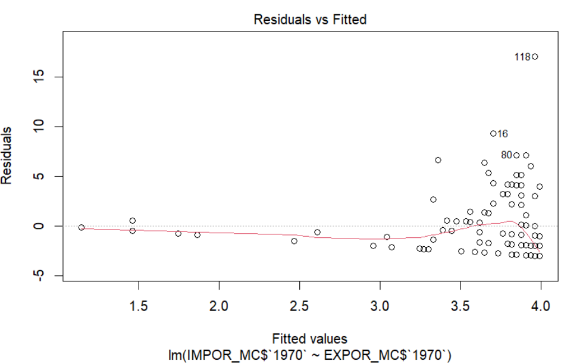

# Tema

¿Cómo influye la importación y exportación en el PBI anual de los
países?

# Información

Se obtendrán los datos de la siguiente página [Portal de datos
mundial](https://datos.bancomundial.org/) 

# Preguntas a responder

●¿Es el estudio de interés para la audiencia? ## nos enfocaremos en los
años 2019-2020 ( R no me permite trabajar con tanta data para comparar)

La audiencia va a tener interés en el estudio debido a que la situación
económica de cada país es un asunto de mucha relevancia, por lo que es
esencial conocer el impacto de las importaciones y exportaciones en la
economía, sobre todo las de minerales y metales en países exportadores
como el nuestro. Asimismo, hemos considerado pertinente investigar
también sobre las importaciones y exportaciones de los alimentos,
combustibles y productos manufacturados, recolectados todos desde 1960.
Con este estudio va a ser posible tener una mejor observación sobre la
influencia de estas actividades comerciales en el PBI anual de un país,
especialmente en los años 2019 y 2020, donde estas fueron alteradas por
la emergencia sanitaria mundial.

●¿Qué información se desea aportar al final del estudio?

Buscamos partir con un estudio descriptivo de las importaciones y
exportaciones de las materias primas o productos mencionados, para luego
poder inferir relaciones entre las variables presentes en nuestro
estudio. También, conseguiremos cifras de estos parámetros económicos
para poder medirlos. Finalmente, nuestra intención es determinar si
existe una correlación entre las importaciones y exportaciones con
respecto al incremento o disminución del PBI anual, y después, también
contrastaremos estas cifras obtenidas, a partir del uso de la data de
importaciones y exportaciones, entre diferentes países, para poder
determinar en cuales países tiene mayor influencia sobre sus economías
respectivas.

Se trabajará con 219 países en los csv de importación, exportación y
PBI, y cuenta con las mismas variables anualmente.

-   observaciones=263

-   variables=14

-   Regiones = Categórica - Nominal

-   Países = Categórica - Nominal

-   PBI del año 1960 al 2020 = Numérica - continua

-   Inflación del año 1960 al 2020 = Numérica - continua

-   Importación de alimentos del año 1960 al 2020 = Numérica - continua

-   Importación de combustible del año 1960 al 2020 = Numérica -
    continua

-   Importación de productos manufacturados del año 1960 al 2020 =
    Numérica - continua

-   Importación de minerales y metales del año 1960 al 2020 = Numérica -
    continua

-   Exportación de alimentos del año 1960 al 2020 = Numérica - continua

-   Exportación de combustible del año 1960 al 2020 = Numérica -
    continua

-   Exportación de productos manufacturados del año 1960 al 2020 =
    Numérica - continua

-   Exportación de minerales y metales del año 1960 al 2020 = Numérica -
    continua

-   PBI positivo y negativo del año 2010 al 2020 = Discreta

-   Inflación positiva y negativa del año 2010 al 2020 = Discreta

●¿Es posible llegar a la información que se propone de manera específica
y concreta?

Es posible llegar a las conclusiones que hemos detallado porque tenemos
mucha información y bases de datos de diferentes entidades,
organizaciones y hasta empresas que nos aportan data fidedigna,
segmentada y constante de cada año a partir de 1960.

-   ¿Por qué se justifica nuestro estudio?

Es factible porque haremos uso de data recolectada por organismos
internacionales de mucho prestigio, como el Banco Mundial, que cuentan
con información de las importaciones y exportaciones de alimentos,
combustibles y productos facturados de muchos países desde el año 1960,
registrados anualmente, lo cual nos brinda un soporte fuerte para el
desarrollo del proyecto.

Es específico porque el estudio está enfocado en obtener el impacto de
estas actividades comerciales dentro de la economía de cada país y
estudiar las variables y variaciones en el rango de tiempo mencionado.

Es auténtico porque no hay estudios exactamente sobre nuestro tema
delimitado, no han sido segmentados específicamente para las
importaciones y exportaciones mencionadas.

# Objetivos

General: Analizar el impacto de la importación y exportación de los
alimentos, combustibles y productos manufacturados sobre la economía de
cada país, precisamente en el crecimiento o disminución del PBI.
Contrastar esta influencia entre diferentes países.

Específicos: - Corroborar si las variables afectan en el aumento del PBI
o, hallar porque no afectan en algunos países, de ser el caso. -
Relacionar las variables presentes en nuestro estudio.

# Marco teórico

Definiciones importantes: PBI: El Producto Bruto Interno es el valor
total de los bienes y servicios finales producidos durante un período de
tiempo en un territorio. Importaciones: Productos y mercancías
ingresados desde el exterior con fines comerciales. Exportaciones:
Productos y mercancías enviados a otros países externos con fines
comerciales. Inflación: Aumento sostenido de consumo, bienes y servicios
en una economía dentro de un período de tiempo.

Población objetivo: Se conforman por países que tienen estas actividades
comerciales y las registren, por sus ministerios e instituciones, y
también por organizaciones, entidades y empresas que estén involucradas
en estas actividades o aporten información de las mismas.

```{r,echo=FALSE}
library(readr)
library(dplyr)
library(vctrs)
```

La base de datos INFLACIÓN e IMPORTACION:

# Base de datos:

```{r,echo=FALSE}
#EXPOR_AC <- read_csv("Exportacion de alimentos_C.csv")
#EXPOR_CC <- read_csv("Exportacion de combustible_C.csv")
EXPOR_PC <- read_csv("Exportacion de productos manufacturados_C.csv")
EXPOR_MC <- read_csv("Exportacion de minerales y metales_C.csv")
#IMPOR_AC <- read_csv("Importacion de alimentos_C.csv")
#IMPOR_CC <- read_csv("Importacion de combustible_C.csv")
IMPOR_PC <- read_csv("Importacion de productos manufacturados_C.csv")
IMPOR_MC <- read_csv("Importacion de minerales y metales_C.csv")
#INFLA_CC <- read_csv("Inflacion_C.csv")
#PYN_INF <- read.csv("PYN INF.csv")
#PYN_PBI <- read.csv("PYN PBI.csv")
#RYP <- read_csv("Regiones y paises.csv")
PBI <- read_csv("PBI_C.csv")
```

# Limpieza de datos

# Base de datos de PBI:

El data frame PBI sería:

```{r,echo=FALSE}
head(PBI)
```

Cantidad de datos faltantes en la base de datos.

```{r,echo=FALSE}
PBII <-sum(is.na(PBI))
PBII
```

Cantidad de observaciones incompletas en la base de datos

```{r,echo=FALSE}
sum(!complete.cases(PBI))
```

Calculamos el porcentaje que representan los datos faltantes en nuestra
base de datos.

```{r,echo=FALSE}
round((PBII/(nrow(PBI)*ncol(PBI)))*100,2)
```

Calculamos los datos faltantes por cada variable para ver cómo los NA
afectan a cada una de ellas.

```{r,echo=FALSE}
colSums(is.na(PBI))
```

El data frame Exportación de minerales y metales sería:

```{r,echo=FALSE}
head(EXPOR_MC)
```

Cantidad de datos faltantes en la base de datos.

```{r,echo=FALSE}
EXP_MC <-sum(is.na(EXPOR_MC))
EXP_MC
```

Cantidad de observaciones incompletas en la base de datos

```{r,echo=FALSE}
sum(!complete.cases(EXPOR_MC))
```

Calculamos el porcentaje que representan los datos faltantes en nuestra
base de datos.

```{r,echo=FALSE}
round((EXP_MC/(nrow(EXPOR_MC)*ncol(EXPOR_MC)))*100,2)
```

Calculamos los datos faltantes por cada variable para ver cómo los NA
afectan a cada una de ellas.

```{r,echo=FALSE}
colSums(is.na(EXPOR_MC))
```

El data frame Importación de minerales y metales sería:

```{r,echo=FALSE}
head(IMPOR_MC)
```

Cantidad de datos faltantes en la base de datos.

```{r,echo=FALSE}
IMP_MC <-sum(is.na(IMPOR_MC))
IMP_MC
```

Cantidad de observaciones incompletas en la base de datos

```{r,echo=FALSE}
sum(!complete.cases(IMPOR_MC))
```

Calculamos el porcentaje que representan los datos faltantes en nuestra
base de datos.

```{r,echo=FALSE}
round((IMP_MC/(nrow(IMPOR_MC)*ncol(IMPOR_MC)))*100,2)
```

Calculamos los datos faltantes por cada variable para ver cómo los NA
afectan a cada una de ellas.

```{r,echo=FALSE}
colSums(is.na(IMPOR_MC))
```

## Exportación de minerales y metales en los años 1960-2020

```{r,echo=FALSE}

op=par(mfrow=c(2,4))
boxplot(rlnorm(EXPOR_MC$`1960`), xlab="1960")
boxplot(EXPOR_MC$`1970`, xlab="1970")
boxplot(EXPOR_MC$`1980`, xlab="1980")
boxplot(EXPOR_MC$`1990`, xlab="1990")
boxplot(EXPOR_MC$`2000`, xlab="2000")
boxplot(EXPOR_MC$`2010`, xlab="2010")
boxplot(EXPOR_MC$`2020`, xlab="2020")
par(op)
```

#### Descripción de las gráficas :

-   En el año 1960, el diagrama caja y bigotes esta comprimido y hay
    diversos datos atípicos.

-   En el año 1970, hay diversos datos atípicos en el diagrama y su
    rango intercuartil es más ancho que lo que sucedió en 1960.

-   En el año 1980,entre el primer cuartil y la mediana, los datos están
    más dispersos, lo que la proporción en el caja y bigotes se vea más
    ancho.

-   En el año 1990,los datos atípicos disminuyeron con respecto al
    año 1980.

-   En el año 2000, hay demasiados datos atípicos que llegan a un 60% de
    crecimiento de exportaciones de minerales y metales y el caja y
    bigotes esta comprimido.

-   En el año 2010, hay un país que tiene la mayor cantidad de
    exportaciones y minerales y el que tiene el mayor crecimiento con
    respeco al año anterior, los datos atípicos se siguen manteniendo .

-   En el año 2020, los datos atípicos han disminuido a diferencia del
    año 2010.

## Importación de minerales y metales en los años 1960-2020

```{r,echo=FALSE}
op=par(mfrow=c(2,4))
boxplot(rlnorm(PBI$`1960`), xlab="1960")
boxplot(IMPOR_MC$`1970`, xlab="1970")
boxplot(IMPOR_MC$`1980`, xlab="1980")
boxplot(IMPOR_MC$`1990`, xlab="1990")
boxplot(IMPOR_MC$`2000`, xlab="2000")
boxplot(IMPOR_MC$`2010`, xlab="2010")
boxplot(IMPOR_MC$`2020`, xlab="2020")
par(op)
```

#### Descripción de las gráficas :

-   En el año 1960, los mayores crecimientos de las importaciones lo
    tenían algunos países que en el diagrama caja y bigotes son
    considerados como datos atípicos, además el rango intercuartil es
    aparentemente pequeño y los datos están comprimidos.

-   En el año 1970, los datos ya no están comprimidos, los datos
    atípicos han disminuido y solo hay 2 países con grandes cantidades
    de importación de minerales.

-   En el año 1980, a comparación del crecimiento del año de 1970, el
    crecimiento de las importaciones ha disminuido. También, el 50% de
    los países tienen un crecimiento de 1% a 4% con respecto al
    año 1979.

-   En el año 1990, existen 2 datos atípicos y el 50% de los países
    están aproximadamente entre 2% a 4%.

-   En el año 2000, el rango intercuartil es pequeño, el 50% de los
    países tienen un crecimiento entre 1% a 3% de importaciones y un
    solo país que tiene 7% de crecimiento del PBI con respecto al año
    1999 que es considerado como dato atípico.

-   En el año 2010, , existen 7 datos atípicos, el 75% de los países
    tiene un crecimiento de las exportaciones entre 1% a 20%
    aproximadamente.

-   En el año 2020, tiene 3 datos atípicos, el rango intercuartil del
    crecimiento del PBI aproximadamente está entre 1% a 4%, muy parecido
    al año 2010.

## INTERVALO DE CONFIANZA

De acuerdo a lo observado en los boxplots anteriores, podemos observar
sus diferentes tendencias que tienen cada 10 años. Esto se debe a la
globalización al rededor de los años, pero nos ha llamado la atención el
año 2020, que en comparación con el año 2010, hay un gran cambio,
mientras en los los años anteriores hay un continuo crecimiento en el
PBI, en las exportaciones e importaciones de minerales y metales, tal y
como se muestra en los boxplots, en el año 2020 no continuó así.

Consideraremos apropiado un nivel de confianza del 90%

IC PBI de los países en el 2010

```{r,echo=FALSE}
meanPBI0 <- mean(PBI$`2010`,na.rm=T)
zcrit0 <- qnorm(0.1, mean = meanPBI0, sd = sd(PBI$`2010`,na.rm =T)/sqrt(length(PBI$`2010`)), lower.tail = T)
izq0 <- meanPBI0 - zcrit0*0.5/sqrt(length(PBI$`2010`))
der0 <- meanPBI0 + zcrit0*0.5/sqrt(length(PBI$`2010`))
cat("(", izq0,",",der0,")")
```

En el año 2010, el intervalo era positivo, lo que nos mostraba que el
promedio de los países estaba creciendo.

IC PBI de los países en el 2020

```{r,echo=FALSE}
meanPBI <- mean(PBI$`2020`,na.rm=T)
zcrit <- qnorm(0.1, mean = meanPBI, sd = sd(PBI$`2020`,na.rm =T)/sqrt(length(PBI$`2020`)), lower.tail = T)
izq1 <- meanPBI - zcrit*0.5/sqrt(length(PBI$`2020`))
der1 <- meanPBI + zcrit*0.5/sqrt(length(PBI$`2020`))
cat("(", izq1,",",der1,")")
```

Comparando con el año 2010, el intervalo muestra un decrecimiento.

IC Exportación de minerales y metales 2010

```{r,echo=FALSE}
meanPBI4 <- mean(EXPOR_MC$`2010`,na.rm=T)
zcrit4 <- qnorm(0.1, mean = meanPBI4, sd = sd(EXPOR_MC$`2010`,na.rm =T)/sqrt(length(EXPOR_MC$`2010`)), lower.tail = T)
izq4 <- meanPBI4 - zcrit4*0.5/sqrt(length(EXPOR_MC$`2010`))
der4 <- meanPBI4 + zcrit4*0.5/sqrt(length(EXPOR_MC$`2010`))
cat("(", izq4,",",der4,")")
```

El intervalo es alto, demuestra que la media alcanzada por la
exportación de minerales y metales en el 2010 tuvieron un gran
crecimiento en sus exportaciones con respecto al año anterior .

IC Exportación de minerales y metales 2020

```{r,echo=FALSE}
meanPBI2 <- mean(EXPOR_MC$`2020`,na.rm=T)
zcrit2 <- qnorm(0.1, mean = meanPBI2, sd = sd(EXPOR_MC$`2020`,na.rm =T)/sqrt(length(EXPOR_MC$`2020`)), lower.tail = T)
izq2 <- meanPBI2 - zcrit2*0.5/sqrt(length(EXPOR_MC$`2020`))
der2 <- meanPBI2 + zcrit2*0.5/sqrt(length(EXPOR_MC$`2020`))
cat("(", izq2,",",der2,")")
```

Si lo comparamos con el 2010, las exportaciones de minerales y metales
ha estado creciendo y eso lo demuestra el rango alto que sigue
manteniendo

IC Importación de minerales y metales 2010

```{r,echo=FALSE}
meanPBI5 <- mean(IMPOR_MC$`2010`,na.rm=T)
zcrit5 <- qnorm(0.1, mean = meanPBI5, sd = sd(IMPOR_MC$`2010`,na.rm =T)/sqrt(length(IMPOR_MC$`2020`)), lower.tail = T)
izq5 <- meanPBI5 - zcrit5*0.5/sqrt(length(IMPOR_MC$`2010`))
der5 <- meanPBI5 + zcrit5*0.5/sqrt(length(IMPOR_MC$`2010`))
cat("(", izq5,",",der5,")")
```

En el 2010, el rango de las importaciones de minerales y metales
demuestra un crecimiento en las importaciones con respecto al año
anterior.

IC Importación de minerales y metales 2020

```{r,echo=FALSE}
meanPBI3 <- mean(IMPOR_MC$`2020`,na.rm=T)
zcrit3 <- qnorm(0.1, mean = meanPBI3, sd = sd(IMPOR_MC$`2020`,na.rm =T)/sqrt(length(IMPOR_MC$`2020`)), lower.tail = T)
izq3 <- meanPBI3 - zcrit3*0.5/sqrt(length(IMPOR_MC$`2020`))
der3 <- meanPBI3 + zcrit3*0.5/sqrt(length(IMPOR_MC$`2020`))
cat("(", izq3,",",der3,")")
```

Si lo comparamos con el 2010, las importaciones de minerales y metales
ha estado creciendo y eso lo demuestra el rango alto que sigue
manteniendo.

### Conclusiones

1.  Como hemos comparado el PBI de los años 2010 y 2020, en este último
    su promedio es decreciente, una de las razones es que si bien
    algunas variables como importación y exportación de minerales y
    metales creció en el 2020, se puede deducir que otras no.

2.  Las exportaciones e importaciones de minerales y metales mantuvo un
    crecimiento en el 2020, la pandemia del covid_19\_ no le afectó,
    esto es porque si bien ciertos productos se dejaron de adquirir,
    pero el libre comercio continuo, se siguió produciendo y las
    personas siguieron adquiriendo productos como laptops, computadoras,
    entre otros.

## [HIPÓTESIS I]{.ul}

H0 = En promedio el PBI de los países es igual y mayor 4% con respecto
al año 2000

H0 = µ \>= 4

H1 = En promedio el PBI de los países es menor a 4% con respecto al año
2000

H1 = µ \< 4

Nivel de significancia : 10%

Valor Crítico:

```{r,echo=FALSE}

zcrit5<- qnorm(0.1, mean = 4, sd = sd(PBI$`2000`,na.rm =T)/sqrt(sum(!is.na(PBI$`2000`))), lower.tail = T)

zcrit5

```

Estadístico para esta prueba de hipótesis:

```{r, echo=FALSE}
mean (PBI$`2000`, na.rm = T)

```

Podemos observar que nuestro estadístico está en la región de rechazo.

Esto lo corroboramos con nuestro p-valor:

```{r, echo=FALSE}
pnorm(mean(mean (PBI$`2000`, na.rm = T)), mean = 4, sd = sd(PBI$`2000`,na.rm =T)/sqrt(sum(!is.na(PBI$`2000`))), lower.tail = T)

```

##### Conclusión Hipótesis I

Según el análisis de la distribución de probabilidad de la variable PBI
en el año 2000, el valor de z crítico que delimita la zona de rechazo es
3.68. Asimismo, el valor estadístico es 2.85 y se ubica en la zona de
rechazo. *Es por esto que la [hipótesis
nula será rechazada]{.ul}*.

## [HIPÓTESIS II]{.ul}

H0 = El promedio del crecimiento de las exportaciones de minerales y
metales es igual a 10 en el año 2020

H0 = µ \>= 10

H1 = El promedio del crecimiento de las exportaciones de minerales y
metales no es igual a 10 en el año 2020.

H1 = µ \< 10

Nivel de significancia : 10%

Valor Crítico :</br>

```{r, echo=FALSE}

Zcrit3 <- qnorm(0.1, mean = 10, sd = sd(EXPOR_MC$`2020` ,na.rm =T)/sqrt(sum(!is.na(EXPOR_MC$`2000`))), lower.tail = T)
Zcrit3
```

Estadístico para esta prueba de hipótesis:

```{r, echo=FALSE}
mean (EXPOR_MC$`2020`, na.rm = T)

```

Esto lo corroboramos con nuestro p-valor:

```{r, echo=FALSE}
pnorm(mean (EXPOR_MC$`2020`, na.rm = T), mean = 10, sd = sd(EXPOR_MC$`2020`,na.rm =T)/sqrt(sum(!is.na(EXPOR_MC$`2000`))), lower.tail = T)

```

##### Conclusión Hipótesis II

Según el análisis de la distribución de probabilidad de la variable
exportaciones de minerales y metales en el año 2020, el valor de z
crítico que delimita la zona de rechazo es 8.59 . Asimismo, el valor
estadístico es 8.56 y se ubica en la zona de rechazo. *Es por esto que
la [hipótesis nula será rechazada]{.ul}*.

## [HIPÓTESIS III]{.ul}

H0 = El promedio del crecimiento de las exportaciones de productos
manufacturados es mayor igual a 60 en el año 2020.\

H0 = µ \>= 60

H1 = El promedio del crecimiento de las exportaciones de productos
manufacturados es menor a 60 en el año 2020.

H1 = µ \< 60

Nivel de significancia : 10%

Valor Crítico:

```{r,echo=FALSE}
Zcrit<- qnorm(0.1, mean = 60, sd = sd(EXPOR_PC$`2020`,na.rm =T)/sqrt(sum(!is.na(EXPOR_PC$`2000`))), lower.tail = T)
Zcrit
```

Estadístico para esta prueba de hipótesis:

```{r, echo=FALSE}
mean (EXPOR_PC$`2020`, na.rm = T)

```

Esto lo corroboramos con nuestro p-valor:

```{r, echo=FALSE}
pnorm(mean (EXPOR_PC$`2020`, na.rm = T), mean = 60, sd = sd(EXPOR_PC$`2020`,na.rm =T)/sqrt(sum(!is.na(EXPOR_PC$`2000`))), lower.tail = T)
```

##### Conclusión Hipótesis III

Según el análisis de la distribución de probabilidad de la variable
exportaciones de minerales y metales en el año 2020, el valor de z
crítico que delimita la zona de rechazo es 57.501 . Asimismo, el valor
estadístico es 55.72 y se ubica en la zona de rechazo . *Es por esto que la [hipótesis nula será rechazada]{.ul}*.

\# Regresión 1

##\# Exportación e Importación de productos manufacturados

Analizamos las diferentes variables de nuestro data.frame y nos dimos
cuenta que existe una correlación en el año de 1970 de la relación de
las exportaciones y las importaciones de productos manufacturados.

```{r}
smoothScatter(IMPOR_PC$`1970`~EXPOR_PC$`1970`,pch=20)
abline(lm(IMPOR_PC$`1970`~EXPOR_PC$`1970`))
```

## Regresión 1: Summary

```{r}
lm0<-lm(IMPOR_PC$`1970`~EXPOR_PC$`1970`)
summary(lm0)

```

```{r}
#plot(lm0)
```

#### Prueba de hipótesis del intercepto

El coeficiente del intercepto es "\< 2e-16"

Nivel de significancia : 10%

H0 : El coeficiente es 0

H1: El coeficiente es diferente de 0

Al ser estos numero más pequeño que 10%, [*se rechaza H0*]{.ul} para
cada coeficiente.

#### Hipótesis p-valor

Nivel de significancia : 10%

p-valor = 0.0001781

H0: el modelo no explica nada

H1: el modelo explica algo

[*Se rechaza H0*]{.ul}, puesto que p-valor \<0.1

El modelo es significativo

#### Coeficientes de regresión

Nuestra ecuación se forma con los siguientes coeficientes: \</br>

```{r}
coef(lm0,1)
```

$$
B0= 71.085
$$ $$
B1= -0.161
$$

$$
y(x) = -0.161x +71.085
$$

#### Coeficiente de determinación

Adjusted R-squared: 0.1027

Multiple R-squared: 0.11

Estos dos números van a ser muy parecidos, nos dice que grado de
variación de Y explicamos . En este caso 89% no se logró explicar, pero
esta variación ha variado en -0.16.

## Regresión 1: Gráfica de homocedasticidad


Los residuos son heterocedásticos ya que no se distribuyen uniformemente
alrededor de la línea roja.

## Regresión 1:Gráfica de distribución de los residuos


Se puede ver que existe algunas desviaciones con respecto a la
normalidad de los residuos. En las esquinas observamos, que los datos
observados son menores que los esperados, por eso aparece por debajo de
nuestra línea normal.

# Regresión 2

Analizamos las diferentes variables de nuestro data.frame y nos dimos
cuenta que existe una correlación entre la variable Importación y
exportación de minerales y metales en el año 1970.

```{r,echo=FALSE}
smoothScatter(IMPOR_MC$`1970`~EXPOR_MC$`1970`,pch=20)
abline(lm(IMPOR_MC$`1970`~EXPOR_MC$`1970`))
```

```{r,echo=FALSE}
lm1<-lm(IMPOR_MC$`1970`~EXPOR_MC$`1970`)
```

## Regresión 2: Summary

```{r}
summary(lm1)
```

#### Prueba de hipótesis del intercepto

El coeficiente del intercepto es "\< 2e-16"

Nivel de significancia : 10%

H0 : El coeficiente es 0

H1: El coeficiente es diferente de 0

Al ser estos numero más pequeño que 10%, [*se rechaza H0*]{.ul} para
cada coeficiente.

#### Hipótesis p-valor

Nivel de significancia : 10%

p-valor = 0.0645

H0: el modelo no explica nada

H1: el modelo explica algo

[*Se rechaza H0*]{.ul}, puesto que p-valor \<0.1

El modelo es significativo

#### Coeficientes de regresión

Nuestra ecuación se forma con los siguientes coeficientes: </br>

```{r}
coef(lm1,1)
```

$$
B0= 3.993
$$ $$
B1= -0.029
$$

$$
y(x)=3.993-0.029x
$$

```{r,echo=FALSE}
#plot(lm1)
```

#### Coeficiente de determinación

Adjusted R-squared: 0.02026

Multiple R-squared: 0.02843

Estos dos números van a ser muy parecidos, nos dice que grado de
variación de Y explicamos . En este caso 97.2% no se logró explicar,
pero esta variación ha variado en -0.029.

## Regresión 2: Gráfica de homocedasticidad



Los residuos son heterocedásticos ya que no se distribuyen uniformemente
alrededor de la línea roja.

## Regresión 2:Gráfica de distribución de los residuos


Se puede ver que existe algunas desviaciones con respecto a la
normalidad de los residuos.

# Conclusiones Generales

1.  Se pudo ver la tendencia que ciertos países dependen más de una sola
    variable que de otra; esto se debe a que cada país es diferente. Hay
    ciertas variables que influyen más en el incremento de su PBI. Por
    ejemplo, algunos países en proceso de desarrollo exportan minerales
    a países industrializados.

2.  Cuando comparamos las variables con el PBI, observamos que algunos
    no tienen una correlación positiva, se puede afirmar que para el
    crecimiento del PBI, influyen diferentes variables y no solo basta
    compararla con 1.

3.  Se pudo observar, en el año 2020, mientras las demás variables no
    tenían un crecimiento las importaciones de metales y minerales si lo
    hizo. Esto demuestra, que no hay una correlación positiva de esta
    con la variable del PBI.

# Diagrama de Gantt

Para ver la factibilidad de nuestro trabajo, hemos realizado un diagrama
de Gantt de nuestro trabajo de las reuniones que hemos tenido como grupo
y delos plazos que hemos tenido para terminarlos.


# Bibliografia

<https://datosmacro.expansion.com/comercio/exportaciones/guyana#>:\~:text=En%202020%20las%20exportaciones%20en%20Guyana%20crecieron%20un,Con%20una%20cifra%20de%202.158%2C1%20millones%20de%20euros

<https://datosmacro.expansion.com/comercio/exportaciones/gambia#>:\~:text=En%202020%20las%20exportaciones%20en%20Gambia%20cayeron%20un,Con%20una%20cifra%20de%2087%2C8%20millones%20de%20euros

<https://iimp.org.pe/eventos/efecto-del-covid-19:-las-exportaciones-mineras-cayeron-17.4-en-marzo#>:\~:text=El%20zinc%20sum%C3%B3%20ventas%20externas,millones%20de%20marzo%20del%202019.

<https://www.exploradores.org.pe/mineria/principales-paises-productores-de-minerales.html>

<https://www.mineria-pa.com/noticias/cepal-top-20-de-exportadores-de-metales-a-nivel-mundial/>

<https://datos.bancomundial.org/>

<https://www.rumbominero.com/peru/noticias/mineria/crecimiento-de-china-impactara-positivamente-en-la-economia-peruana-por-mayor-demanda-de-metales/>