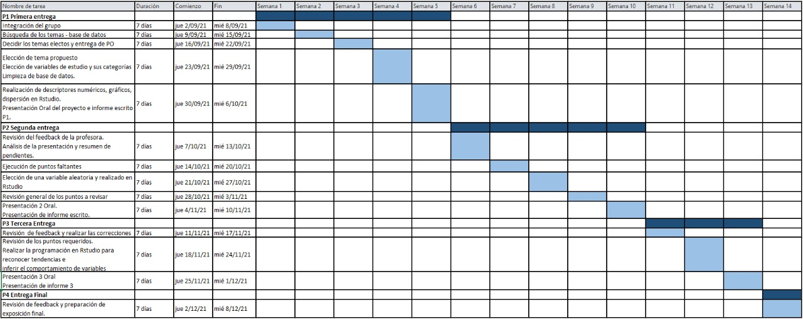

```{r echo=FALSE, warning=FALSE, ,message=FALSE, results=FALSE}
library("readr")
library("utf8")
library("modeest")
library("dplyr")
library("ggplot2")
library("statip")
library("colourpicker")
```

```{r echo=FALSE, warning=FALSE, ,message=FALSE, results=FALSE}
rm(list = ls(all = TRUE))
Equipos <- read_csv("bases_de_datos/highest_earnings/highest_earning_teams.csv") #2*
Jugadores <- read_csv("bases_de_datos/highest_earnings/highest_earning_players.csv") #1
Paises <- read_csv("bases_de_datos/highest_earnings/country.csv") #1
Juegos <- read_csv("bases_de_datos/historical/GeneralEsportData.csv") #3
Historico <- read_csv("bases_de_datos/historical/HistoricalEsportData.csv") #3*
Competitive <- read_csv("bases_de_datos/historical/competitive_game.csv") #
PaisesIngresos <- read_csv("bases_de_datos/players_teams/country_earnings.csv")
JugadoresIngresosT<- read_csv("bases_de_datos/players_teams/total_player_earnings.csv") #1*
EquiposIngresosT <- read_csv("bases_de_datos/players_teams/total_team_earnings.csv") #2
```

```{r echo=FALSE, warning=FALSE, ,message=FALSE, results=FALSE}
# Renombrado de atributos 
Equipos %>% rename(EquipoID = TeamId, Equipo = TeamName, IngresosJuego = TotalUSDPrize, Juego = Game, GeneroJuego = Genre, TorneosGanados = TotalTournaments) -> EquiposN

Jugadores %>% rename(JugadorID = PlayerId, Nombre = NameFirst, Apellido = NameLast, Usuario = CurrentHandle, CodigoPais = CountryCode, IngresosJuego = TotalUSDPrize, Juego = Game) -> JugadoresN

Paises %>% rename (Continente = Continent_Name, Continente_codigo = Continent_Code, Pais = Country_Name, CodigoPais = Two_Letter_Country_Code, Pais_codigo_tres = Three_Letter_Country_Code, Numero_pais = Country_Number) -> PaisesN

Juegos %>% rename(Juego = Game, AñoLanzamiento = ReleaseDate, Premios = TotalEarnings, PremiosOnline = OnlineEarnings, Ganadores = TotalPlayers, Torneos = TotalTournaments) -> JuegosN

Historico %>% rename(Fecha = Date, Juego = Game, Premios = Earnings, Ganadores = Players, Torneos = Tournaments) -> HistoricoN

Competitive %>% rename(Juego = Game, MontoGanado = `Total Money Earned`, PorcentajeMontoTotalGanado = `Total Money Earned Percentage`, Equipo = Team) -> CompetitiveN

PaisesIngresos %>% rename (Pais = Country, Ingresos_totales = `Total Earning by Player`, Porcentaje_ingresos = `Percentage of Country Total Earning`, Equipo = Team) -> PaisesIngresosN

JugadoresIngresosT %>% rename (Usuario = `Player ID`, Nombres = Name, IngresosTotales = `Total Earning`, Equipo = Team) -> JugadoresIngresosTN

EquiposIngresosT %>% rename (Equipo = `Team Name`, IngresosTotales = `Total Prize Won`) -> EquiposIngresosTN
```

```{r echo=FALSE, warning=FALSE, ,message=FALSE, results=FALSE}
# Limpieza de datos

## Teams
EquiposIngresosTN$IngresosTotales = as.numeric(gsub("[\\$,]", "",  EquiposIngresosTN$IngresosTotales))
Teams <- merge(x=EquiposN, y=EquiposIngresosTN, by = "Equipo", all.x = TRUE)

rm(EquiposN,EquiposIngresosTN)
#summary(Teams)
#length(unique(Teams$Equipo))

## Players
JugadoresIngresosTN$IngresosTotales = as.numeric(gsub("[\\$,]", "",  JugadoresIngresosTN$IngresosTotales))
PaisesN <-PaisesN[!duplicated(PaisesN$CodigoPais), ]
JugadoresN$CodigoPais = toupper(JugadoresN$CodigoPais)
JugadoresN <- merge(x=JugadoresN, y=PaisesN, by = "CodigoPais", all.x = TRUE)
Players <- merge(x=JugadoresIngresosTN, y=JugadoresN, by = "Usuario", all.x = TRUE)
Players <- Players[mapply(grepl, (Players$Nombre), Players$Nombres) | is.na(Players$Nombre) | is.na(Players$Apellido),]
Players <- Players %>% distinct(Nombres, IngresosTotales, Equipo, .keep_all = TRUE)
Players$Nombre <- NULL
Players$Apellido <- NULL
Players[10:11] <- list(NULL)
Players %>% rename(Genero = Genre, CodigoPaisT = Pais_codigo_tres, NroPais = Numero_pais, ) -> Players
Players <- Players %>% relocate(CodigoPais, .before = CodigoPaisT)
Players <- Players %>% relocate(JugadorID, .before = IngresosTotales)

rm(JugadoresN,JugadoresIngresosTN, PaisesN)

## Games
select(JuegosN, -Genre) -> JuegosN
JuegosN$Premios[JuegosN$Premios <= 100] <- NA
JuegosN$PremiosOnline[JuegosN$PremiosOnline <= 100] <- NA
JuegosN$Ganadores[JuegosN$Ganadores == 0 & JuegosN$Torneos != 0] <- NA
JuegosN$Torneos[JuegosN$Torneos == 0] <- NA
Games <- JuegosN
# Games$Ganadores[Games$Ganadores == 0 & Games$Torneos != 0] <- NA
Games$JugadoresGanadores <- NULL
rm(JuegosN)
#summary(Games)

## Tournaments
HistoricoN$Premios[HistoricoN$Premios <= 100] <- NA
HistoricoN$NumeroJugadoresGanadores[HistoricoN$Ganadores == 0] <- NA
Tournaments <- HistoricoN
Tournaments$NumeroJugadoresGanadores <- NULL
rm(HistoricoN)
#summary(Tournaments)

## Teams_Games
CompetitiveN$MontoGanado = as.numeric(gsub("[\\$,]", "",  CompetitiveN$MontoGanado))
CompetitiveN$MontoGanado[CompetitiveN$MontoGanado == 0] <- NA
CompetitiveN$PorcentajeMontoTotalGanado = as.numeric(gsub("%", "", CompetitiveN$PorcentajeMontoTotalGanado))
Teams_Games <- CompetitiveN
Teams_Games %>% rename(IngresosJuego = MontoGanado, Porcentaje = PorcentajeMontoTotalGanado) -> Teams_Games
rm(CompetitiveN)

#summary(Teams_Games)

## Teams_Country
PaisesIngresosN$Ingresos_totales = as.numeric(gsub("[\\$,]", "",  PaisesIngresosN$Ingresos_totales))
PaisesIngresosN$Porcentaje_ingresos = as.numeric(gsub("%", "", PaisesIngresosN$Porcentaje_ingresos))
Teams_Country <- PaisesIngresosN
Teams_Country %>% rename(IngresosPais = Ingresos_totales, Porcentaje = Porcentaje_ingresos) -> Teams_Country
Teams_Country <- Teams_Country[complete.cases(Teams_Country), ]
rm(PaisesIngresosN)
#summary(Teams_Country)

#Borrar tablas originales
rm(Competitive,Equipos, EquiposIngresosT, Historico, Juegos, Jugadores, JugadoresIngresosT, Paises, PaisesIngresos)

```

# **1. Introducción**

El tema que trata nuestra investigación es el impacto de los torneos de E-sports en los últimos 20 años a nivel mundial, en el cual nos basamos en la cantidad de jugadores y equipos a lo largo del tiempo.

## **1.1 Importancia**

La investigación es de importancia para los equipos de E-sport peruanos en proceso de crecimiento, por ejemplo: las casas de juegos o "Gaming Houses'", torneos locales, torneos entre universidades. Estos torneos son de consumo recurrente en jóvenes adolescentes y muy competitivos. Es así que la alta demanda de equipos muestra tendencias favorables de inversión que podrían ser de valor para pequeños empresarios que están interesados en el mercado de videojuegos de E-sport.

## **1.2 Objetivos del estudio**

Nuestros objetivos son tres: 

- Encontrar relaciones económicas entre juego y grupo de jugadores profesionales de E-sport.

- Mostrar tendencias sobre el crecimiento económico de cada videojuego, sus torneos realizados y número total de ganadores.

- Realizar una predicción sobre los ingresos que generan los equipos de E-sport.

## **1.3 Factibilidad**

El proyecto es factible debido a los nueve datasets obtenidos de la página web Kaggle sobre torneos de E-sport. Los datos conseguido ofrecen información sobre la cantidad de torneos realizados de manera cronológica, los premios monetarios ofrecidos por cada videojuego en torneos presenciales y en línea, y la cantidad de torneos ganador por equipo de E-sport.

#### 1.3.1 Limpieza de bases de datos

Para los fines de este estudio, en cada dataset se han eliminado resultados cuya información sea corrupta o no necesaria para el estudio. Por ejemplo: Equipos de E-sport que no han participado en ningún torneo.

**Consideraciones en limpieza de datos**

- **country.csv**:
  - Renombrado a *Paises*.
  - Se traduce el nombre de los atributos al español.
  - Se eliminan muestras con nombres de país repetidos.

  
- **highest_earning_players.csv**:
  - Renombrado a *Jugadores*.
  - Se traduce el nombre de los atributos al español.
  - El código de país del jugador se convierte a mayúscula.

- **highest_earning_teams.csv**:
  - Renombrado a *Equipos*.
  - Se traduce el nombre de los atributos al español.
  
- **competitive_game.csv**:
  - Renombrado a *Competitive*.
  - Se traduce el nombre de los atributos al español.
  - En el atributo *IngresosJuego* se elimina el prefijo $\$$ y se actualiza el atributo como numérico.
  - En el atributo *Porcentaje* se elimina el prefijo $\%$ y se actualiza el atributo como numérico.
  - Se modifica como *NA* al atributo *IngresosJuego* a aquellos equipos que no tienen ingresos ganados en un juego.
  
- **GeneralEsportData.csv**: 
  - Renombrado a *Juegos*.
  - Se traduce el nombre de los atributos al español.
  - Se modifica como *NA* al atributo *Premios* a aquellos juegos que hayan premiado 0 dólares en torneos.
  - Se modifica como *NA* al atributo *Torneos* a aquellos juegos que no han realizado torneos de E-sport.
  - Se modifica como *NA* al atributo *Torneos* a aquellos juegos que no tienen jugadores ganadores en torneos pero sí torneos realizados.

- **HistoricalEsportData.csv**
  - Renombrado a *Historico*.
  - Se traduce el nombre de los atributos al español.
  - Se modifica como *NA* al atributo *Premios* y *Ganadores* a aquellos juegos que hayan premiado 0 dólares en torneos o no hayan tenido ganadores.
  
- **country_earnings.csv**
  - Renombrado a *PaisesIngreso*.
  - Se traduce el nombre de los atributos al español.
  - En el atributo *IngresosPais* se elimina el prefijo $\$$ y se actualiza el atributo como numéric.o
  - En el atributo *Porcentaje* se elimina el prefijo $\%$ y se actualiza el atributo como numérico.
  - Se modifica como *NA* al atributo *IngresosPais* a aquellos equipos que no tienen ingresos ganados en torneos realizados en un país.
  
- **total_player_earnings.csv** 
  - Renombrado a *JugadoresIngresosT*.
  - Se traduce el nombre de los atributos al español.
  - En el atributo *IngresosTotales* se elimina el prefijo $\$$ y se actualiza el atributo como numérico.
  
- **total_team_earnings.csv**
  - Renombrado a *EquiposIngresosT*.
  - Se traduce el nombre de los atributos al español.
  - En el atributo *IngresosTotales* se elimina el prefijo $\$$ y se actualiza el atributo como numérico.

**Unión de tablas**

- Se unieron las tablas Jugadores y JugadoresIngresosTotales por atributo **Usuario**. Se conservaron todos los datos de la tabla JugadoresIngresosTotales. La nueva tabla se llama **Players**.

  - En **Players** existen valores duplicados erróneos. Se analiza cada muestra y se eliminan las erróneas.

- Se unieron las tablas Paises y Players por atributo **CodigoPais**. La nueva tabla mantiene el nombre de **Players**.

- Se unieron las tablas Equipos y EquiposIngresosT por atributo **Equipo**. La nueva tabla se llama **Teams**.

- Se renombra la tabla **Historico** por **Tournaments**.

- Se renombra la tabla **Competitive** por **Teams_Games**.

- Se renombra la tabla **PaisesIngreso** por **Teams_Country**.

- Se renombra la tabla **Juegos** por **Games**.

## **1.4 Preguntas de investigación**

-   ¿La categoría de un videojuego puede influir en los ingresos que un jugador profesional puede conseguir al ganar un torneo?

-   ¿La categoría del juego influye en los ingresos que puede ganar un equipo al ganar un torneo?

-   ¿La nacionalidad del jugador esta relacionado con los ingresos que genera?

-   ¿Ha aumentado el número de torneos de E-sport en los últimos 20 años?

-   ¿Ha aumentado el número de ganadores de torneos de E-sport?

-   ¿Ha aumentado la media de los premios ofrecidos en torneos de E-sport en los últimos 20 años?

## **1.5 Diagrama de Gantt**



# **2.Presentación de datasets, variables y parámetros de estudio \| Datasets**

### **2.1.1. Torneos (Tournaments)**

| Variable  | Tipo               | Restricciones     | Descripción                                                              |
|:----------|:-------------------|:------------------|:-------------------------------------------------------------------------|
| Fecha     | Categórica ordinal | Desde 1998        | Año y mes en que se realizó un torneo                                    |
| Juego     | Categórica nominal | Ninguna           | El nombre del videojuego para el cual se realizaron torneos en esa fecha |
| Premios   | Numérica continua  | Mayor o igual a 0 | El monto total de premios ofrecidos en esa fecha                         |
| Ganadores | Numérica discreta  | Mayor o igual a 0 | Número de ganadores que hubo en el torneo                                |
| Torneos   | Numérica discreta  | Mayor o igual a 0 | Número de torneos en esa fecha                                           |

**Observaciones** - En la variable ganadores se debe tomar en cuenta que un jugador puede ganar varios torneos y por lo tanto puede haber más ganadores que torneos en una unidad muestral.

### **2.1.2. Jugadores (Players)**

| Variable        | Tipo               | Restricciones     | Descripción                                       |
|:----------------|:-------------------|:------------------|:--------------------------------------------------|
| Usuario         | Categórica nominal | Ninguna           | Nombre del usuario del jugador                    |
| Nombres         | Categórica nominal | Ninguna           | Nombre y apellido del jugador                     |
| JugadorID       | Categórica nominal | Mayor o igual a 0 | Número identificador del jugador                  |
| IngresosTotales | Numérica continua  | Mayor o igual a 0 | Ingresos totales obtenidos en torneos             |
| Equipo          | Categórica nominal | Ninguna           | Nombre del equipo en el que juega                 |
| IngresosJuego   | Numérica continua  | Mayor o igual a 0 | Ingresos totales obtenidos en torneos de un juego |
| Juego           | Categórica nominal | Ninguna           | Nombre del juego                                  |
| Genero          | Categórica nominal | Ninguna           | Género del juego                                  |
| Pais            | Categórica nominal | Ninguna           | País de procedencia                               |
| CodigoPais      | Categórica nominal | Ninguna           | Código de país                                    |
| CodigoPaisT     | Categórica nominal | Ninguna           | Código de país de tres caracteres                 |
| NroPais         | Categórica nominal | Mayor o igual a 0 | Número identificador de país                      |

### **2.1.3. Equipos (Teams)**

| Variable        | Tipo               | Restricciones     | Descripción                                                |
|:----------------|:-------------------|:------------------|:-----------------------------------------------------------|
| Equipo          | Categórica nominal | Ninguna           | Nombre del equipo                                          |
| EquipoID        | Categórica nominal | Mayor o igual a 0 | Número identificador del equipo                            |
| IngresosJuego   | Numérica continua  | Mayor o igual a 0 | El total de ingresos obtenidos en torneos de un videojuego |
| TorneosGanados  | Numérica discreta  | Mayor o igual a 0 | Numero de torneos ganados en un juego                      |
| Juego           | Categórica nominal | Ninguna           | Nombre del juego de los torneos en el que se participa     |
| GeneroJuego     | Categórica nominal | Ninguna           | Género del juego                                           |
| IngresosTotales | Numérica continua  | Mayor o igual a 0 | Ingresos totales obtenidos por el equipo                   |

### **2.1.4. Equipos-Pais (Teams_Country)**

| Variable     | Tipo               | Restricciones     | Descripción                                                 |
|:-------------|:-------------------|:------------------|:------------------------------------------------------------|
| Pais         | Categórica nominal | Ninguna           | Nombre del país                                             |
| IngresosPais | Numérica continua  | Mayor o igual a 0 | Ingresos obtenidos en torneos en un país                    |
| Porcentaje   | Numérica continua  | Mayor o igual a 0 | El porcentaje de todos los ingresos obtenidos por un equipo |
| Equipo       | Numérica discreta  | Mayor o igual a 0 | Nombre del equipo                                           |

### **2.1.5. Equipos-Juego (Teams_Games)**

| Variable       | Tipo               | Restricciones     | Descripción                                                 |
|:---------------|:-------------------|:------------------|:------------------------------------------------------------|
| Juego          | Categórica nominal | Ninguna           | Nombre del juego                                            |
| IngresosJuegos | Numérica continua  | Mayor o igual a 0 | Ingresos obtenidos en torneos de un juego                   |
| Porcentaje     | Numérica continua  | Mayor o igual a 0 | El porcentaje de todos los ingresos obtenidos por un equipo |
| Equipo         | Numérica discreta  | Mayor o igual a 0 | Nombre del equipo                                           |

## **2.2 Descriptores numéricos y gráficos**

## Cantidad de torneos por juego

```{r}
par(mar=c(4,8,2,3))
barplot(table(Players$Juego), main="Cantidad de Torneos por juego", xlab="Cantidad",xlim=c(0,250), cex.names=0.8, col=c("darkgoldenrod1","plum3","seagreen2","paleturquoise","black","orange","pink","blue","green","purple"),las = 1, horiz =  1 )
```

### Análisis

El presente gráfico muestra a los diez juegos más populares en comparación con el número de jugadores profesionales de ese juego. En la actualidad estos son los 10 primeros juegos más seguidos y populares, es por eso, que fueron seleccionados.

Se observa que el juego que tiene la mayor cantidad de torneos realizados es "Dota 2". Esto concuerda con la aceptación de que es uno de los juego con mayor alcance. Por lo que la organización de torneos de Dota 2 en el Perú se puede interpretar como una buena opción. Seguidamente, se observa el videojuego Counter Strike. Siendo esto coherente, ya que es uno de los juegos más antiguos y con una trayectoria impecable en el mundo de los E-sports. 

```{r}
mfv(Players$Juego,na = 1)
```

**Observaciones**: Para corroborar que la gráfica esta bien realizada, se usó el comando *most frecuency value(mfv)* que nos muestra cuál videojuego fue más jugado.

## Cantidad de jugadores por cada país

```{r}
barplot(table(Players$CodigoPais), main="Cantidad de Jugadores por cada país", ylab="Cantidad",ylim=c(0,200), cex.names=0.53, col=c("darkgoldenrod1","plum3","seagreen2","paleturquoise","black","orange","pink","purple","blue","red","yellow","green","brown","Orange","azure4","aliceblue","aquamarine4","beige","bisque","bisque1","cyan","gray","magenta"),las = 3, xlim =c (1,70) )

```

En la presente gráfica se puede apreciar el número de jugadores en torneos de E-sports por países. Se observa que la mayoría de los jugadores son de la República de Corea del Sur. Lo que se puede afirmar debido a que el presente país es uno de los mayores productores de jugadores en los E-sports. También se observa que China es el segundo país con más jugadores de E-sport. Esto concuerda con la idea de que es un país con mercado emergente en E-sports.

```{r}
mfv(Players$CodigoPais, na_rm = 1)
```

Se uso el comando *most frecuency value(mfv)*, para verificar que la República de Corea del Sur es el país con mayor cantidad de jugadores que participan en torneos de E-sports.

## Porcentaje del premio

```{r}
hist(Teams_Games$Porcentaje, prob= TRUE, main = "Que porcentaje del premio se lleva el equipo", xlim = c(0,3), ylim = c(0,0.3), xlab = "Porcentaje (%)",col = c("indianred"))
#x <- seq(min(Teams_Games$Porcentaje), max(Teams_Games$Porcentaje), length = 100)
#f <- dnorm(x, mean = mean(Teams_Games$Porcentaje), sd = sd(Teams_Games$Porcentaje))
#lines(x, f, col = "dodgerblue4", lwd = 3)
lines(density(Teams_Games$Porcentaje), lwd = 2, col = 'dodgerblue4')

```

### Descriptores numéricos del gráfico

La gráfica nos muestra la distribución del porcentaje de la ganancia que percibe en equipo. El histograma parte del 0% hasta más del 1%, la barra roja nos muestra que todos los equipo seleccionados ganaron los torneos y ninguno perdió. Adicionalmente, se le agrego una curva de densidad para poder el comportamiento de la distribución. Es casi simétrica pero con un sesgo a la izquierda.

*Media, mediana y desviación estándar*

```{r}
round(mean(Teams_Games$Porcentaje),2)
round(median(Teams_Games$Porcentaje),2)
round(sd(Teams_Games$Porcentaje),2)
```

Mean: Indica el promedio de cuánto se gana cada equipo por torneo ganado en cada juego. Nuestros datos indican que el promedio es 8.06%.

Median: Indica el valor que separa la mitad inferior de la mitad superior de los datos ordenados en orden creciente del porcentaje de ganancia que tiene cada equipo por torneo que es de 0.99% del ingreso por juego.

SD (Desviación Estándar): Cuantifica la variación o dispersión individual de cada observación respecto a la media de una distribución del porcentaje que ganaría cada equipo por torneo ganado. Nuestros datos presentan un grado de dispersión de 18.78. 

## **Tipos de juego**

```{r}
par(mar=c(4,10.5,3,3))
barplot(table(Teams$GeneroJuego), main="Tipo de juego", cex.names=0.8 , las=1, col=c("gold1", "darkseagreen1", "darkslateblue","rosybrown2","cadetblue2","darkorange1"), xlab="Cantidad de juegos", xlim=c(0,400), horiz = 1)
```

El presente gráfico representa a la moda de una variable categórica nominal que nos brinda la información que el Tipo de juego más realizado es el de "Multiplayer Online Battle Arena". Es resaltante que el juego Dota 2, el cual es el más jugado, utiliza este tipo de juego. Se puede afirmar que un juego de esta modalidad tendrá una gran aceptación en el mercado y será apto para la realización de los torneos. 
 

```{r}
mfv(Teams$GeneroJuego)
```

Para corroborar que la gráfica esta bien realizada, se usó el comando most frecuency value(mfv), que nos dice cual Juego es el que se repite más. Lo que nos permite saber cuál es la moda y nos entrega como resultado que "Multiplayer Online Battle Arena" es el tipo o modalidad de juego que mas se utilizan los juegos.

## **Fecha de lanzamiento del torneo**

Se busca la relación entre la fecha de lanzamiento de un juego y el monto total de premios ofrecidos en sus torneos. Los premios en sus torneos en su mayoría son de la última década.

```{r}
plot(Games$AñoLanzamiento, Games$Premios, main = "Fecha de Lanzamiento ~ Premios" ,col = "purple", xlab = "Fecha de lanzamiento", ylab = "Premio (Dólares) ", xlim = c(1990, 2021), ylim = c(1, 10000000))
```

Se puede apreciar de la siguiente gráfica que desde el primer lanzamiento de un juego. El primer torneo se apreció con una baja tasa de ganancia. Sin embargo, conforme iba transcurriendo el tiempo se han creado más juegos; por ende, los premios han aumentado. Entonces, meintras las fechas de lanzamiento van aumentando los premios se van aumentando. Por lo cual, los torneos son un buen mercado que trae ganancias y buena oportunidad laboral el mundo de los E-sports.  


## **Fecha de Lanzamiento \~ Torneos**

En esta gráfica se busca encontrar una relación entre la fecha de lanzamiento de un juego (1990-2021) y la cantidad de torneos.

```{r echo=FALSE}
plot(Games$AñoLanzamiento, Games$Torneos, pch = 19, col = "darkred", xlab="Fecha de Lanzamiento", ylab="Cantidad de Torneos", main="Fecha de Lanzamiento ~ Torneos")
```

De la presente gráfíca se puede observar que a medida que pasan los años los torneos han aumentado, esto se confirma porque la cantidad de juegos han aumentado. También se puede ver que a partir del 2010 y 2012 se tiene la mayor cantidad de torneos. Además se puede ver que en el 2019 se tiene una baja cantidad de torneos, puesto que en ese año se inicio la pandemia del COVID-19. 


## **Cantidad de Ganadores**

```{r}

boxplot(Tournaments$Ganadores, col = "darkgreen",
        main = "Ganadores", horizontal=TRUE, xlab="Cantidad de Ganadores", notch=TRUE)

points(round(mean(Tournaments$Ganadores, na.rm = 1)), 1, pch = 19, col = "red", cex = 1.1)

legend("topright", pch = c(21, 19), col = c("red"),
       bg = "white", legend = c("Media"), cex = 1.1)
```

La gráfica boxplot que representa la cantidad de ganadores en promedio por torneos realizados y la media del números de ganadores. Esto se puedo vincular con el tiempo de lanzamiento de los juegos porque a mayores juegos o lanzamiento de estos, habrán más ganadores, pero puede existir algunos inconvenientes en los torneos que pueden anular a los ganadores, es por faltas antideportivas. 


```{r}
round(mean(Tournaments$Ganadores, na.rm = 1))
```

## **Cantidad de Torneos**

```{r}

boxplot(Tournaments$Torneos, col = "steelblue",
        main = "Torneos", horizontal=TRUE, xlab="Cantidad de torneos", notch=TRUE)

points(mean(Tournaments$Torneos, na.rm = 1), 1, pch = 19, col = "red", cex = 1.1)

legend("topright", pch = c(21, 19), col = c("red"),
       bg = "white", legend = c("Media"), cex = 1.1)
```

Esta es la gráfica boxplot que representa la cantidad de torneos que se han realizado. Esta nos permite ver el promedio de torneos que se han realizado en total por el tiempo realizado y la mediana, la cual  es el valor medio de los torneos realizados a lo largo del tiempo de estudio.


```{r}
round(mean(Tournaments$Torneos, na.rm = 1))
```

## **Premios monetarios**

```{r}

boxplot(Tournaments$Premios, col = "lightgreen", main = "Premios Monetarios por Torneo (dólares)", horizontal=TRUE, xlab="Dólares", notch=TRUE)

points(mean(Tournaments$Premios, na.rm = 1), 1, pch = 19, col = "red", cex = 1.1)

legend("topright", pch = c(21, 19), col = c("red"),
       bg = "white", legend = c("Media"), cex = 1.1)
```

La presente gráfica boxplot representa el monto de los premios en dólares, indica la media, que permite saber cuanto gana un jugador o equipo. También se puede ver que la media esta sesgada a la derecha ya que existen un número alto de premios bajos por torneo.

```{r}
round(mean(Tournaments$Premios, na.rm = 1),1)
```
La media nos indica en promedio cuanto de dinero se llevaría cada equipo o jugador dependiendo de la modalidad de juego. 

## **2.3 Variables Numéricas de Dispersión**

## **Fecha de Lanzamiento \~ Torneos**

En la presente gráfica se observa la relación entre la cantidad de torneos realizados respecto a la la fecha de lanzamiento de los juegos. Por un lado, el aumento en la cantidad de torneos realizados es notable desde el 2010; mientras que, por otro lado, se evidencia leve descenso a partir del 2020. Una hipótesis para este descenso en la cantidad de torneos es la llegada de la pandemia de Covid-19 que azotó a todo el mundo en esa fecha.

```{r}
plot(Tournaments$Fecha, Tournaments$Torneos, pch = 19, col = "violet", xlab="Fecha de Lanzamiento", ylab="Cantidad de Torneos", main="Fecha de Lanzamiento ~ Torneos")
```

## **Fecha de Lanzamiento \~ Premios**

En la presente gráfica se observa la relación entre el Monto de Premios de los torneos, en dólares, respecto a la la fecha de lanzamiento de los juegos. A A partir del 2011 se evidencia un aumento en los montos de los premios de los torneos. Esto podría deberse a un aumento de jugadores y por ende una mayor competitividad.

```{r}
plot(Tournaments$Fecha, Tournaments$Premios, pch = 19, col = "red", xlab="Fecha de Lanzamiento", ylab="Premios (dólares)", main="Fecha de Lanzamiento ~ Premios")
```

## **2.4 Gráfica de correlación**

## **Correlación de Torneos \~ Ganadores**

En la gráfica podemos observar como las variables numéricas de cantidad de torneos y cantidad de ganadores están correlacionadas, dado que un aumento en la cantidad de torneos que se realicen, significa que de igual manera la cantidad de ganadores tendrá una tendencia a aumentar. Además, al calcular la Correlación de Pearson, podemos denotarla como una **correlación alta**. Sin embargo, algunos datos atípicos pueden influenciar en el cálculo de la correlación.

```{r}
plot(Tournaments$Torneos, Tournaments$Ganadores, pch = 19, col = "skyblue", xlab="Cantidad de Torneos", ylab="Cantidad de Ganadores", main="Torneos ~ Ganadores")
# Línea de regresión
abline(lm(Tournaments$Ganadores ~ Tournaments$Torneos), col = "gray0", lwd = 3)

# Correlación de Pearson
text(paste("Correlación:", round(cor(Tournaments$Torneos, Tournaments$Ganadores), 2)), x = 90, y = 150)
```

## **Correlación de Ganadores \~ Premios**

En la gráfica podemos observar como las variables numéricas de cantidad de ganadores y el monto de los premios están correlacionadas, dado que un aumento en la cantidad de ganadores en los torneos que se realicen, implica que también los montos de los premios tendrán una tendencia a aumentar. Además, al calcular la Correlación de Pearson, podemos denotarla como una **correlación alta**. Sin embargo, algunos datos atípicos pueden influenciar en el cálculo de la correlación.

```{r}
plot(Games$Ganadores, Games$Premios , pch = 19, col = "lightgreen", xlab="Cantidad de Ganadores", ylab="Monto de Premios (Dólares)", main="Ganadores ~ Premios")
# Línea de regresión
abline(lm(Games$Premios ~ Games$Ganadores), col = "gray0", lwd = 3)

# Correlación de Pearson
text(paste("Correlación:", round(cor(Games$Ganadores, Games$Premios , use = "complete.obs"), 2)), x = 12000, y = 180000000)
```

## **Correlación de Premios \~ Premios Online**

En la gráfica podemos observar como las variables numéricas del monto de los premios y monto de los premios online correlacionadas, dado que un aumento en el monto de los premios en los torneos que se realicen, implica que también los montos de los premios online tendrán una tendencia a aumentar. Además, al calcular la Correlación de Pearson, podemos denotarla como una **correlación muy alta**. Sin embargo, algunos datos atípicos pueden influenciar en el cálculo de la correlación.

```{r}
plot(Games$Premios, Games$PremiosOnline , pch = 19, col = "lightpink", xlab="Monto de Premios (Dólares)", ylab="Monto de Premios Online (Dólares)", main="Premios ~ Premios Online")
# Línea de regresión
abline(lm(Games$PremiosOnline ~ Games$Premios), col = "gray0", lwd = 3)

# Correlación de Pearson
text(paste("Correlación:", round(cor(Games$Premios, Games$PremiosOnline, use = "complete.obs"), 2)),  x = 190000000, y = 200000000)
```

## **Correlación de Torneos \~ Premios**

```{r}
plot(Games$Torneos, Games$Premios , pch = 19, col = "violet", xlab="Cantidad de Torneos", ylab="Monto de Premios (Dólares)", main="Torneos ~ Premios")
# Línea de regresión
abline(lm(Games$Premios ~ Games$Torneos), col = "gray0", lwd = 3)

# Correlación de Pearson
text(paste("Correlación:", round(cor(Games$Torneos, Games$Premios , use = "complete.obs"), 2)), x = 5500, y = 150000000)
```

En la gráfica podemos observar como las variables numéricas de cantidad de torneos y el monto de los premios están correlacionadas, dado que un aumento en la cantidad de torneos que se realicen, implica que también el monto de los premios de los torneos tendrá una tendencia a aumentar. Además, al calcular la Correlación de Pearson, podemos denotarla como una **correlación moderada**. Sin embargo, algunos datos atípicos pueden influenciar en el cálculo de la correlación.

## **Correlación de Torneos \~ Premios Online**

```{r}
plot(Games$Torneos, Games$PremiosOnline , pch = 19, col = "red", xlab="Cantidad de Torneos", ylab="Monto de Premios Online (Dólares)", main="Torneos ~ Premios Online")
# Línea de regresión
abline(lm(Games$PremiosOnline ~ Games$Torneos), col = "gray0", lwd = 3)

# Correlación de Pearson
text(paste("Correlación:", round(cor(Games$Torneos, Games$PremiosOnline , use = "complete.obs"), 2)), x = 3000, y = 20000000)
```

En la gráfica podemos observar como las variables numéricas de cantidad de torneos y el monto de los premios online están correlacionadas, dado que un aumento en la cantidad de torneos que se realicen, implica que también el monto de los premios online de los torneos tendrá una tendencia a aumentar. Además, al calcular la Correlación de Pearson, podemos denotarla como una **correlación moderada**. Sin embargo, algunos datos atípicos pueden influenciar en el cálculo de la correlación.


## **2.5 Variables Aleatorias**

## **Función de Bernoulli**

La función Bernoulli muestra una probabilidad para dos casos: éxito o fracaso. Se decide utilizar tal función para las variables fecha-cantidad de torneos.

Pregunta realizada: ¿Entre los años 2000-2010 y 2010-2020, de escogerse un mes aleatorio en ambos intervalos, cual presenta más probabilidad de haberse realizado al menos 5 torneos?

### *2000-2010*

Parámetros:

-   *x* = {1,0}\
    1: éxito -\> el mes escogido tiene por lo menos 5 torneos organizados 0: fracaso -\> el mes escogido tiene menos de 5 torneos organizados

-   *p:* probabilidad

```{r}
B <- Tournaments[Tournaments$Fecha < as.Date('2010-01-01') & Tournaments$Fecha > as.Date('2000-01-01'), ]
B <- B[!is.na(B$Torneos),] 
pb <- sum(B$Torneos>=5)/nrow(B)
```

```{r}
f1 <- dbern(0,pb)
e1 <- dbern(1,pb)
print(paste("El éxito es:", round((e1),4)))
print(paste("El fracaso es:", round((f1),4)))
```
Entonces se tiene una probabilidad de éxito de 0.1934, de que al menos se haya realizado 5 torneos entre los años 2000-2010.

Entonces se tiene una probabilidad de fracaso de 0.8066, de que al menos se haya realizado 5 torneos entre los años 2000-2010.

### *2010-2020*

Parámetros:

-   *x* = {1,0}\
    1: éxito -\> el mes escogido tiene por lo menos 5 torneos organizados 0: fracaso -\> el mes escogido tiene menos de 5 torneos organizados

-   *p:* probabilidad

```{r}
B2 <- Tournaments[Tournaments$Fecha < as.Date('2020-01-01') & Tournaments$Fecha > as.Date('2010-01-01'), ]
B2 <- B2[!is.na(B2$Torneos),] 
pb2 <- sum(B2$Torneos>=5)/nrow(B2)
```

```{r}
f2 <- dbern(0,pb2)
e2 <- dbern(1,pb2)
print(paste("El éxito es:", round((e2),4)))
print(paste("El fracaso es:", round((f2),4)))
```
Entonces se tiene una probabilidad de éxito de 0.3461, de que al menos se haya realizado 5 torneos entre los años 2010-2020.

Entonces se tiene una probabilidad de fracaso de 0.6539, de que al menos se haya realizado 5 torneos entre los años 2010-2020.

## **Funcion binomial**

Calcula la probabilidad de **k** éxitos en **n** ensayos de Bernoulli con probabilidad **p**. Se decide aplicar esta función a las variables fecha de lanzamiento-torneos.

### ¿Cuál es la probabilidad de que para un juego de E-sports seleccionado de forma aleatoria y con fecha de lanzamiento de hace dos años, se haya organizado al menos 5 torneos? 

Parámetros:  

**x:** {>=5}
**p:** probabilidad de que se hayan realizado al menos 5 torneos para un juego de Esport

```{r include=FALSE}
A <- Games[Games$AñoLanzamiento >= 2019, ]
A <- A[!is.na(A$Torneos),]
p <- sum(A$Torneos>=5)/nrow(A)
```

```{r echo=FALSE}
print(paste("F(x):", round(p, 7)))
```

### ¿Cuál es la probabilidad que de 10 juegos elegidos al azar, 5 juegos hayan tenido al menos 5 torneos organizados de E-sports?

Para el uso de ambas funciones se necesita:  

+ **x:** {>=5} número de torneos realizados para el juego
+ **n:** 5 juegos  
+ **p:** probabilidad de que se hayan realizado al menos 5 torneos para un juego de Esport

```{r}
#pbinom(3,10,p, lower.tail = FALSE)
sum(dbinom(4:10,10,p))
```

```{r}
plot(dbinom(0:9, size = 10, prob = p), type = "h", lwd = 2,
     main = "Función de probabilidad binomial",
     ylab = "P(X = x)", xlab = "Número de éxitos")
legend("topright", legend = c("10        0.4025974"),
       title = "n        probabilidad", title.adj = 0.85,
       lty = 1, col = 1:3, lwd = 2, box.lty = 0)
```

La gráfica binomial nos presenta los resultados de las probabilidades del 0-10 cuando de 10 juegos, 5 tengan al menos 5 torneos al mes. Entonces, según la distribución de la gráfica, la media corresponde a 4, lo que indica que 4 de 10 juegos, tendrán mayor probabilidades de tener al menos 5 torneos al mes. 
El comportamiento de la gráfica demuestra una distribución simétrica. 

### Media 
```{r}
media <- round((p*10))
media
```

### Desviación estándar 
```{r}
desviacion_estandar <- round((sqrt(p*(1-p)*10)),4)
desviacion_estandar
```


## **Distribución Normal**

**Ganadores ~ Torneos**

Queremos calcular la probabilidad de valores menores de 100 ganadores por torneos de en una distribución normal de torneos, con una media muestral de 52  ganadores por torneos y una desviación estándar muestral de 119.1093.

```{r}
round(mean(Tournaments$Ganadores, na.rm =1))
```

```{r}
sd(Tournaments$Ganadores, na.rm = 1)
```


```{r}
pnorm(100, mean = 52, sd = 119.1093, lower.tail = TRUE)
```

**Ganadores ~ Torneos**

Ahora, queremos calcular la probabilidad de valores mayores de 100 ganadores por torneos en una distribución normal de torneos, con una media muestral de 52 ganadores por torneos y una desviación estándar muestral de 119.1093.

```{r}
pnorm(100, mean = 52, sd = 119.1093, lower.tail = FALSE)
```

# **3. Pruebas de hipótesis**

## **Premios ~ Juegos**

```{r}
#complete.cases(Games)

boxplot(Games$Premios, xaxt='n', main = "Premios totales", horizontal=TRUE, xlab="Ingreso en dólares", log = "x")
atx <- axTicks(1)
labels <- sapply(atx,function(i)
        as.expression(bquote(10^.(log10(i)) ))
      )
axis(1,at=atx,labels=labels)

points(round(mean(Games$Premios, na.rm = 1)), 1, pch = 19, col = "red", cex = 1.1)
#round(mean(Games$Premios, na.rm = 1))
legend("topright", pch = c(21, 19), col = c("red"),
       bg = "white", legend = c("Media = 2139059 dólares"), cex = 1.1)
```

La variable Premios representa los premios totales que un videojuego ha ofrecido en todos sus torneos de eSport, el rango de esta variable es extremadamente amplio, el cual es (117.52, 235045551), por lo que consideramos que la data es variable a comparación de otras variables. Finalmente, se utilizó estimación puntual para determinar la media de la muestra la cual es 2139059 dólares.

### **3.1 HIPÓTESIS I**

$H_0$ : El monto promedio en premios totales ofrecidos por videojuegos de Esport es **menor o igual** a 100000 dólares

$H_0$ : $\mu$ $\leq$ 100000

$H_1$ : El monto promedio en premios totales ofrecidos por videojuegos de Esport es **mayor** a 100000 dólares

$H_1$ : $\mu$ $>$ 100000

Nivel de confianza = 99%

Nivel de significancia = 0.01

Los datos son extremadamente dispersos. Esto se puede ver en el rango de la variable, que va de 117.52 a 235045551, por lo que se prioriza una mayor confianza sobre una mayor precisión.

```{r}
muestra <- nrow(Games[!is.na(Games$Premios),])
media_muestral <- mean(Games$Premios, na.rm = 1)
sigma_muestral <- sd(Games$Premios, na.rm = TRUE)
h_0 <- 100000
e <- qt(0.005,muestra-1, lower.tail = 0)*sigma_muestral/sqrt(muestra)
e
#(qt(0.005,muestra-1, lower.tail = 0)*sigma_muestral/e)^2

tobservado <- (media_muestral-h_0)/(sigma_muestral/sqrt(muestra))
tcritico <- qt(0.01/2, muestra-1)
pvalor <- pt(tobservado,muestra-1)
```

Error = 1667135

Se procede a calcular el error que es de 1667135, este valor permitirá indicar si el nivel de confianza y significancia escogidos son adecuados para el tamaño de la muestra mediante el siguiente calculo matemático:

$$
n \geq (\frac{(sd_{muestral} * t_{critico})}{e})^2
$$

```{r}
tamano<-((tcritico*sigma_muestral)/e)^2
ceiling(tamano)
```
Tamaño necesario de la muestra = 472

El número de observaciones de la muestra es $≥$ 472, por lo tanto es adecuada para el nivel de confianza y nivel de significancia escogidos.


```{r}
a <- -5
b <- 5
s <-seq(a, tcritico, by = 0.01)
Xs <- seq(a, b, by = 0.1)
plot(Xs, dnorm(Xs), type = "l", xlab = "x", ylab = "f(x)", main = "Distribución de probabilidad f(x) Normal Estándar")
abline(v = tcritico, lty = 2, col = "red",lwd =2)
abline(v = tobservado,lty = 1 , col = "blue")
abline(h = 0, col = "gray")

cord.x <- c(a, s, tcritico)
cord.y <- c(0, dnorm(s), 0)

polygon(cord.x, cord.y, col="red")

legend("topright", pch = c(21, 19), col = c("red","blue"), legend = c("t crítico = - 2.33", "t estadístico = 3.16"))
```

Como se puede observar de la gráfica, el t estadístico es fuera de nuestro intervalo o zona de rechazo del t crítico, por lo tanto, nuestra hipótesis no es rechazada. 


### **Intervalo de confianza para la hipótesis I**

Intervalo de confianza : [471924.3 ,3806194]

```{r}
#datos
xtecho=mean(Games$Premios, na.rm = TRUE)
stecho=sd(Games$Premios, na.rm = TRUE)
n=472
alfa=0.01
#HALLANDO LOS INTERVALOS DE CONFIANZA 
zc<-qt((alfa/2),n-1,lower.tail = FALSE)
izq <- xtecho - zc*stecho/sqrt(n)
der <- xtecho + zc*stecho/sqrt(n)
cat("(",izq,", ",der,")\n")
```

Para la variable **premios** se tiene un intervalo de confianza de ( 471924.3 , 3806194 ) con una media poblacional de 2139059 de dólares ganados con una confianza de 99%. Siendo la media mínima de la población de 471924.3 dólares y la máxima de 3806194 dólares.

```{r}
hist(Games$Premios, breaks = 50, freq = FALSE,xlim = c(0,40000000), main="Función de Densidad de Premios Ganados por Equipos Profesionales",xlab=" Cantidad de premios ($)",ylab = "Densidad",col="green")
abline(v=mean(Games$Premios,  na.rm=1),col="red", lwd=3)
legend(x = "topright",legend=c("Media (2139059)","Funcion Densidad"),col=c("red","blue"),lwd=2,cex=0.8)
dx <- density(Games$Premios, na.rm = TRUE)
lines(dx, lwd = 2, col = "blue")
```

### Conclusión hipótesis I

Según el análisis de la distribución de probabilidad de la variable premios, el valor de t crítico que delimita la zona de rechazo es -2.33. Asimismo, el valor de t estadístico es 3.16 y se ubica en la zona de no rechazo. Entonces obtenemos así que la hipótesis $H_0$ no es rechazada

En la gráfica se puede observar que se tiene un sesgo a la derecha, esto es porque la mayoría de los torneos de E-sports tiene premios por debajo de los 500 000 dólares. Sin embargo, existen también premios de hasta 35 millones de dolares para torneos específicos. Por ejemplo: el torneo **international** de "Dota 2". Por lo que tales datos no se toman como atípico.

## **N°Torneos ~ Torneos**

```{r}
#sum(complete.cases(Tournaments))
tournaments_month <- aggregate(Tournaments$Torneos, by=list(Fecha=Tournaments$Fecha), FUN=sum)

boxplot(tournaments_month$x, main = "N° Torneos", horizontal=TRUE, xlab="Número de torneos")

m <- round(mean(tournaments_month$x, na.rm = 1))
points(round(mean(tournaments_month$x, na.rm = 1)), 1, pch = 19, col = "red", cex = 1.1)
#round(mean(Tournaments$Torneos, na.rm = 1))
legend("topright", pch = c(21, 19), col = c("red"),
       bg = "white", legend = c("Media = 168"), cex = 1.1)
```

La variable Torneos representa los torneos realizados cada mes desde 1998, el rango de esta variable es extremadamente amplio, el cual es (1, 172), por lo que consideramos que la data es variable a comparación de otras variables.  Asimismo, el boxplot mostrado de manera horizontal nos sirve para poder visualizar el rango completo de la data de manera ordenada. Finalmente, se utilizó estimación puntual para determinar la media de la muestra la cual es 168 torneos al mes.

### **3.2 HIPÓTESIS II**

$H_0$ : El número promedio de torneos por mes Esport organizados desde 1998 es **menor o igual** a 200

$H_0$ : $\mu$ $\leq$ 200

$H_1$ : El número promedio de torneos por mes Esport organizados desde 1998 es **mayor** a 200

$H_0$ : $\mu$ $>$ 200

Nivel de confianza= 99%

Nivel de significancia = 0.01

Los datos son extremadamente dispersos. Esto se puede ver en el rango de la variable, que va de 1 a 172, por lo que se prioriza una mayor confianza sobre una mayor precisión.

```{r}
muestra <- nrow(tournaments_month)
media_muestral <- mean(tournaments_month$x, na.rm = 1)
sigma_muestral <- sd(tournaments_month$x, na.rm = TRUE)
h_0 <- 200

#error
e <- qt(0.005,muestra-1, lower.tail = 0)*sigma_muestral/sqrt(muestra)
round(e,digits = 1)

tobservado <- (media_muestral-h_0)/(sigma_muestral/sqrt(muestra))
tcritico <- qt(0.005, muestra - 1)
pvalor <- pt(tobservado,muestra-1)
```

Error = 27.2

Se procede a calcular el error que es de 27.2, este valor permitirá indicar si el nivel de confianza y significancia escogidos son adecuados para el tamaño de la muestra mediante el siguiente calculo matemático:


$$
n \geq (\frac{(sd_{muestral} * t_{critico})}{e})^2
$$


```{r}
tamano<-((tcritico*sigma_muestral)/27.2)^2
ceiling(tamano)
```

Tamaño necesario de la muestra = 271

El número de observaciones de la muestra es $≥$ 271, por lo tanto es adecuada para el nivel de confianza y nivel de significancia escogidos.

```{r}
a <- -5
b <- 5
s <-seq(a, tcritico, by = 0.01)
Xs <- seq(a, b, by = 0.1)
plot(Xs, dnorm(Xs), type = "l", xlab = "x", ylab = "f(x)", main = "Distribución de probabilidad f(x) Normal Estándar")
abline(v = tcritico, lty = 2, col = "red",lwd =2)
abline(v = tobservado,lty = 1 , col = "blue")
abline(h = 0, col = "gray")

cord.x <- c(a, s, tcritico)
cord.y <- c(0, dnorm(s), 0)

polygon(cord.x, cord.y, col="red")

legend("topright", pch = c(21, 19), col = c("red","blue"), legend = c("t crítico = - 2.59", "t estadístico = -3.05"))
```

Como se puede observar de la gráfica, el t estadístico esta dentro de nuestro intervalo o zona de rechazo del t crítico, por lo tanto, nuestra hipótesis es rechazada.


### **Intervalo de confianza para la hipótesis II**

Intervalo de confianza : [140.858, 195.2453]

```{r}
#datos
xtecho=media_muestral
stecho=sigma_muestral
n=muestra
alfa=0.01
#HALLANDO LOS INTERVALOS DE CONFIANZA 
zc<-qt((alfa/2),n-1,lower.tail = FALSE)
izq <- xtecho - zc*stecho/sqrt(n)
der <- xtecho + zc*stecho/sqrt(n)
cat("(",izq,", ",der,")\n")
```

Para la variable **torneos**, se tiene un intervalo de confianza de ( 140.858 , 195.2453 ), que indica que la media poblacional es de 168.0517 torneos aproximando a 168.

```{r}
hist(tournaments_month$x, breaks = 100, freq = FALSE, main="Función de Densidad de Torneos organizados de E-sports Profesional",xlab="N°de torneos realizados",ylab = "Densidad",col="green")
abline(v=mean(tournaments_month$x, na.rm=1), col="red", lwd=3)
legend(x = "topright",legend=c("Media (168.05)","Funcion Densidad"),col=c("red","blue"),lwd=2,cex=0.8) 
dx <- density(tournaments_month$x)
lines(dx, lwd = 2, col = "blue")

```

### Conclusión hipótesis II
Según el análisis de la distribución de probabilidad de la variable premios, el valor de t crítico que delimita la zona de rechazo es -2.59. Asimismo, el valor de t estadístico es -3.05 y se ubica en la zona de rechazo. Entonces obtenemos así que la hipótesis $H_0$ es rechazada.

De la presente gráfica se puede observar que se tiene un sesgo a la derecha, esto porque conforme ha pasado el tiempo el número de torneos ha aumentado, por lo que se muestra una tendencia de que en promedio los torneos de E-sports aumentarán.  

## **TorneosGanados ~ Equipos**

```{r}
#sum(complete.cases(Teams))
teams_tournaments <- aggregate(Teams$TorneosGanados, by=list(Fecha=Teams$Equipo), FUN=sum)
boxplot(teams_tournaments$x, main = "Torneos ganados", horizontal=TRUE, xlab="Número de torneos ganados")
#round(mean(teams_tournaments$x, na.rm = 1))
points(round(mean(teams_tournaments$x, na.rm = 1)), 1, pch = 19, col = "red", cex = 1.1)
#round(mean(Teams$Torneos, na.rm = 1))
legend("topright", pch = c(21, 19), col = c("red"),
       bg = "white", legend = c("Media = 58"), cex = 1.1)
```

La variable TorneosGanados representa los torneos ganados por un equipo, el rango de esta variable es extremadamente amplio, el cual es (1, 808), por lo que consideramos que la data es variable a comparación de otras variables.
Asimismo, el boxplot mostrado de manera horizontal nos sirve para poder visualizar el rango completo de la data de manera ordenada. Finalmente, se utilizó estimación puntual para determinar la media de la muestra la cual es 58 torneos ganados por equipo.

### **3.3 HIPÓTESIS III**

$H_0$ : El número promedio de torneos ganados por un equipo de eSport es **menor o igual** a 60

$H_0$ : $\mu$ $\leq$ 60

$H_1$ : El número promedio de torneos ganados por un equipo de eSport es **mayor** a 60

$H_0$ : $\mu$ $>$ 60

Nivel de confianza= 99%

Los datos son extremadamente dispersos. Esto se puede ver en el rango de la variable, que va de 1 a 808, por lo que se prioriza una mayor confianza sobre una mayor precisión.

Error = 12.8

Tamaño de la muestra = 505

```{r}
#sum(complete.cases(Teams))
#media_muestral - izq
muestra <- nrow(teams_tournaments)
media_muestral <- mean(teams_tournaments$x, na.rm = 1)
sigma_muestral <- sd(teams_tournaments$x, na.rm = TRUE)
h_0 <- 60
e <- qt(0.005,muestra-1, lower.tail = 0)*sigma_muestral/sqrt(muestra)
e
#(qt(0.005,muestra-1, lower.tail = 0)*sigma_muestral/e)^2

tobservado <- (media_muestral-h_0)/(sigma_muestral/sqrt(muestra))
tcritico <- qt(0.005, muestra-1)
pvalor <- pt(tobservado,muestra-1)
```

Error = 12.8

Se procede a calcular el error que es de 12.8, este valor permitirá indicar si el nivel de confianza y significancia escogidos son adecuados para el tamaño de la muestra mediante el siguiente calculo matemático:


$$
n \geq (\frac{(sd_{muestral} * t_{critico})}{e})^2
$$

```{r}
tamano<-((tcritico*sigma_muestral)/e)^2
ceiling(tamano)
```

Tamaño necesario de la muestra = 505

El número de observaciones de la muestra es $≥$ 505, por lo tanto es adecuada para el nivel de confianza y nivel de significancia escogidos.


```{r}
a <- -5
b <- 5
s <-seq(a, tcritico, by = 0.01)
Xs <- seq(a, b, by = 0.1)
plot(Xs, dnorm(Xs), type = "l", xlab = "x", ylab = "f(x)", main = "Distribución de probabilidad f(x) Normal Estándar")
abline(v = tcritico, lty = 2, col = "red",lwd =2)
abline(v = tobservado,lty = 1 , col = "blue")
abline(h = 0, col = "gray")

cord.x <- c(a, s, tcritico)
cord.y <- c(0, dnorm(s), 0)

polygon(cord.x, cord.y, col="red")

legend("topright", pch = c(21, 19), col = c("red","blue"), legend = c("t crítico = - 2.33", "t estadístico = -0.35"))
```


### **Intervalo de confianza para la hipótesis III**

Intervalo de confianza : [45.44295, 71.04814]

```{r}
#datos
xtecho=mean(teams_tournaments$x)
stecho=sd(teams_tournaments$x)
n=nrow(teams_tournaments)
alfa=0.01
#HALLANDO LOS INTERVALOS DE CONFIANZA 
zc<-qt((alfa/2),n-1,lower.tail = FALSE)
izq <- xtecho - zc*stecho/sqrt(n)
der <- xtecho + zc*stecho/sqrt(n)
cat("(",izq,", ",der,")\n")
```


```{r}
hist(teams_tournaments$x, breaks = 100, freq = FALSE,xlim = c(0, 150), main="Función de Densidad de Torneos Ganados por Equipos Profesionales",xlab="Torneos Ganados",ylab = "Densidad",col="green")
abline(v=mean(teams_tournaments$x, na.rm=1),col="red", lwd=3)
legend(x = "topright",legend=c("Media (58.25)","Funcion Densidad"),col=c("red","blue"),lwd=2,cex=0.8)
dx <- density(teams_tournaments$x)
lines(dx, lwd = 2, col = "blue")
```

Para la variable **TorneosGanados** se tiene un intervalo de confianza de ( 45.44295, 71.04814 ), mostrando que media poblacional es de 58.24554 torneos ganados por equipo aproximando a 58 torneos ganados.

### Conclusión hipótesis III
Según el análisis de la distribución de probabilidad de la variable premios, el valor de t crítico que delimita la zona de rechazo es -2.33. Asimismo, el valor de t estadístico es -0.35 y se ubica en la zona de no rechazo. Obteniendo así que la hipótesis $H_0$ no es rechazada.

De la presente gráfica se puede observar que se tiene un sesgo a la derecha, esto porque la mayoría de los equipos han ganado al menos 10 torneos y conforme ha pasado el tiempo el número de torneos ha aumentado y muchos de los equipos han vuelto a ganar. También nos indica que en promedio un equipo ha ganado 58.24554 torneos aproximado a 58 torneos ganados por equipo.


# **4. Análisis predictivo**

## **4.1 Regresión 1**

En la siguiente regresión se muestra la relación principal entre la variable **Torneos** y **PremiosOnline** en la que Torneos será la variable independiente "x" y PremiosOnline será la variable dependiente "y", se escoge estas variables debido a que debería haber una mayor cantidad de premios ofrecidos si aumenta el número de torneo organizados para un juego.

### Coeficientes de regresión

```{r}
regresion1<-lm(PremiosOnline ~ Torneos, data=Games, na.action = na.exclude)
summary(regresion1)
```

Se utiliza la función `lm`, que ajusta una nube de puntos a una regresión lineal. Para luego utilizar la función `summary` a la variable de regresión y poder calcular los coeficientes para el intercepto ($\beta o$) y para la variable x ($\beta1$)

$\beta o = 554173$ 

$\beta1 = 12293$

Los valores de coeficiente de regresión lineal permiten crear la función lineal:

$y(x) = \beta0 +  \beta1 x$
$y(x) = \ 554173 +  \ 12293 x$

### Análisis de Hipótesis planteados por R

Analizando los resultados ofrecidos por el comando `summary`, se pueden observar 3 hipótesis planteadas:

#### Hipótesis I

La primera hipótesis verifica si el valor del intercepto calculado es adecuado:

$H_0$ : $\beta0$ = 0

$H_1$ : $\beta0$ $\neq$ 0

Sí en nuestra ecuación lineal $\beta0$ = 0 se tendría la siguiente ecuación 

$y(x) = 0 +  \beta1 x$

$y(x) = 0 +  12293 x$

Indicando que la recta pasa por el origen de coordenadas

Al calcularse que el intercepto es igual a 554173. Se rechaza la hipótesis $H_0$, pero debido a que el $p_{value}$ es mayor al nivel de significancia, no podemos decir que el valor es adecuado para el modelo. 

#### Hipótesis II

La segunda hipótesis verifica si el valor de la pendiente calculada es adecuada:

$H_0$ : $\beta1$ = 0

$H_1$ : $\beta1$ $\neq$ 0


Sí en nuestra ecuación lineal $\beta1$ = 0 se tendría la siguiente ecuación 

$y(x) = 554173 +  \ 0x$

Indicando que la recta es constante y la gráfica es paralela al eje X, tomando  y(x) así el valor del intercepto.

$y(x) = 554173$

Al calcularse que la pendiente es igual a 12293. Se rechaza la hipótesis $H_0$ y se entiende que se acepta el valor estimado. Asimismo, para conseguir una mayor validez a la hipótesis se observa el $p_{value}$. En el presente caso, debido a que el pvalue es $2e-16^{***}$ y la significancia es de $0.01$. Ya que el $p_{value}$ es menor a la significancia, viendo que este valor es adecuado para el modelo.  

#### Hipótesis III

La tercera hipótesis indican que tan fiable es el modelo planteado para ser ajustado a un modelo lineal:

$H_0$ : $\beta1$ y $\beta0$ = 0

$H_1$ : $\beta1$ y $\beta0$ $\neq$ 0

Sí en nuestra ecuación lineal $\beta0$ y $\beta1$ = 0 se tendría la siguiente ecuación 

$y(x) = 0 +  \ 0x$

Indicando que el resultado siempre para y(x) va a ser cero siendo así un punto en el origen, no teniendo sentido para el análisis. 

$y(x) = 0$

Al calcularse previamente que la pendiente y el intercepto son iguales a 12293 y 554173 respectivamente. Por lo que se rechazan la hipótesis $H_0$ y se entienden que se acepta este valor adecuado. Asimismo, para tratar de conseguir una mayor validez en la hipótesis se observa el $p_{value}$ del $r^2$. Siendo el $p_{value}$ igual a $2.2e-16$ y la significancia de $0.01$. Por lo que debido a que el $p_{value}$ es menor a la significancia, en conjunto los valores son adecuados para el modelo con un coeficiente de determinación de $0.2365$ y teniendo los datos bajo un ajuste lineal al modelo planteado del $28.84%$.

Teniendo como resultado la siguiente ecuación lineal:

$y(x) =   12293x + 554173 $

### Análisis de residuos

A continuación, se realiza una análisis de los gráficos de diagnóstico.

```{r}
op=par(mfrow=c(2,2))
modelo1<-lm(Games$PremiosOnline ~ Games$Torneos)
plot(modelo1)
```   

Análisis de la gráfica de *Residuos vs. Valores ajustados*:
 
 * Se observa que existen 3 valores atípicos, que hacen que los residuos se encuentren mal formados y que de alguna manera hacen se rompan las suposiciones del modelo.
 
 * Se puede observar que los datos positivos y negativos se concentran en el rango $[0;1e+07]$ en el eje $x$.
 
 * Los residuos son heterocedásticos ya que no se distribuyen uniformemente alrededor de la línea roja.

Análisis de la gráfica de *Normal Q-Q*:

 * En los lados extremos superiores existen un número mayor de datos atípicos. Lo que afecta a la distribución normal de los residuos.   
 
Análisis de la gráfica *Scale Location*:

 * Se observa una concentración de datos en el rango de $[0;1e+07]$, además se aprecia que la recta no es plana. Concluyendo así que se tiene un modelo de heterocedasticidad.

Análisis de la gráfica *Residual vs. Leverage*:

 * Existen datos atípicos que están fuera de las curvas de nivel, además de poseer una palanca y residuo grandes los cuales determinan la tendencia de los datos. Por lo que estos valores extremos ocasionan que no se pueda explicar adecuadamente la variabilidad.


### Gráfica de regresión
```{r}
plot(Games$Torneos, Games$PremiosOnline , pch = 19, col = "red", xlab="Cantidad de Torneos", ylab="Monto de Premios Online (Dólares)", main="Torneos ~ Premios Online")
abline(regresion1)
# Correlación de Pearson
text(paste("Correlación:", round(cor(Games$Torneos, Games$PremiosOnline , use = "complete.obs"), 2)), x = 3000, y = 20000000)
```

### Correlación entre las variables

La correlación entre las variables es 0.4883872 lo que indica una correlación positiva moderada, ya que es mayor a 0.4, pero menor a 0.7.

```{r}
cor(Games$Torneos,  Games$PremiosOnline, use = "complete.obs")
```

## **4.2 Regresión 2**

En la siguiente regresión se muestra la relación entre la variable **Torneos** que será la variable independiente "x" y la variable **Premios** que será la variable dependiente "y". Se escoge estas variables debido a que debería haber una mayor cantidad de premios ofrecidos si aumenta el número de torneo organizados para un juego.

### Coeficientes de regresión

```{r}
regresion2<-lm(Premios ~ Torneos, data=Games, na.action = na.exclude)
summary(regresion2)
```

Se utiliza la función `lm`, que ajusta una nube de puntos a una regresión lineal. Para luego utilizar la función `summary` a la variable de regresión y poder calcular los coeficientes para el intercepto ($\beta o$) y para la variable x ($\beta1$).

$\beta o = 552508$ 

$\beta1 = 16447$

$y(x) = \beta o +  \beta1 x$


### Anáslisis de Hipotesis planteados por R

Analizando los resultados ofrecidos por el comando `summary`, se pueden observar 3 hipótesis planteadas:

#### Hipótesis I

La primera hipótesis verifica si el valor del intercepto calculado es adecuado:

$H_0$ : $\beta0$ = 0

$H_1$ : $\beta0$ $\neq$ 0

Sí en nuestra ecuación lineal $\beta0$ = 0 se tendría la siguiente ecuación 

$y(x) = 0 +  \beta1 x$

$y(x) = 0 + 16447 x$

Indicando que la recta pasa por el origen de coordenadas

Al calcularse que el intercepto es igual a 552508. Se rechaza la hipótesis $H_0$, pero debido a que el $p_{value}$ es mayor al nivel de significancia, no podemos decir que el valor es adecuado para el modelo. 

#### Hipótesis II

La segunda hipótesis verifica si el valor de la pendiente calculada es adecuada:

$H_0$ : $\beta1$ = 0

$H_1$ : $\beta1$ $\neq$ 0


Sí en nuestra ecuación lineal $\beta1$ = 0 se tendría la siguiente ecuación 

$y(x) = 552508 +  \ 0x$

Indicando que la recta es constante y la gráfica es paralela al eje X, tomando  y(x) así el valor del intercepto.

$y(x) = 552508$

Al calcularse que la pendiente es igual a 16447. Por lo que se rechaza la hipótesis $H_0$ y y se entiende que se acepta este valor es adecuado. Asimismo, para conseguir una mayor validez a la hipótesis se observa el $p_{value}$. En el presente caso, debido a que el pvalue es $2e-16^{***}$ y la significancia es de $0.01$. Ya que el $p_{value}$ es menor a la significancia, este valor es adecuado para el modelo.   

#### Hipótesis III

La tercera hipótesis indican que tan fiable es el modelo planteado para ser ajustado a un modelo lineal:

$H_0$ : $\beta1$ y $\beta0$ = 0

$H_1$ : $\beta1$ y $\beta0$ $\neq$ 0

Sí en nuestra ecuación lineal $\beta0$ y $\beta1$ = 0 se tendría la siguiente ecuación 

$y(x) = 0 +  \ 0x$

Indicando que el resultado siempre para y(x) va a ser cero siendo así un punto en el origen, no teniendo sentido para el análisis. 

$y(x) = 0$

Al calcularse previamente que la pendiente y el intercepto son iguales a 16447 y 552508. respectivamente. Por lo que se rechaza la hipótesis $H_0$ y se entiende que los valores son adecuados para el modelo. Asimismo, para tratar de conseguir una mayor validez en la hipótesis se observa el $p_{value}$ del $r^2$. Siendo el $p_{value}$ igual a $2.2e-16$ y la significancia de $0.01$. Por lo que debido a que el $p_{value}$ es menor a la significancia, en conjunto los valores son adecuados para el modelo, con un coeficiente de determinación de $0.2884$ y teniendo los datos bajo un ajuste lineal al modelo planteado del $28.84%$.

Teniendo como resultado la siguiente ecuación lineal:

$y(x) =   16447x + 552508 $

### Análisis de residuos

A continuación, se puede apreciar los gráficos de diagnostico.

```{r}
op=par(mfrow=c(2,2))
modelo1<-lm(Premios ~ Torneos, data=Games)
plot(modelo1)
```

Análisis de la gráfica de *Residuos vs. Valores ajustados*:
 
 * Se puede observar que existen 4 valores atípicos.
 
 * Se puede observar que los datos positivos y negativos se concentran en el rango $[0;1e+07]$.
 
 * Los residuos son heterocedásticos ya que no se distribuyen uniformemente alrededor de la línea roja.

Análisis de la gráfica de *Normal Q-Q*:

 * En los lados extremos se puede visualizar que los errores se alejan de la tendencia normal tanto desde el lado negativo como positivo. Haciendo que la gráfica no sea lineal. Concluyendo que, el modelo no es tan bueno.

 * Se tiene valores atípicos que afectan a la distribución normal de residuos.
 
Análisis de la gráfica *Scale Location*:

 * Se observa una concentración de datos en el rango de $[0;1e+07]$, además se aprecia que la  recta no es plana. Concluyendo así que existe heterocedasticidad y que la varianza de los errores no es constante.

Análisis de la gráfica *Residual vs. Leverage*:

 * Existen datos atípicos que están fuera de las curvas de nivel, además de poseer una palanca y residuo grandes los cuales determinan la tendencia de los datos. Por lo que estos valores extremos ocasionan que no se pueda explicar adecuadamente la variabilidad.
 
### Grafica de regresión

```{r}
plot(Games$Torneos, Games$Premios , pch = 19, col = "red", xlab="Cantidad de Torneos", ylab="Monto de Premios (Dólares)", main="Torneos ~ Premios ")
abline(regresion2)
# Correlación de Pearson
text(paste("Correlación:", round(cor(Games$Torneos, Games$Premios , use = "complete.obs"), 2)), x = 5500, y = 150000000)
```

### Correlación entre variables

```{r}
cor(Games$Torneos,Games$Premios, use = "complete.obs")
```

La correlación entre las variables es 0.5384303 lo que indica una proporcionalidad directa o positiva moderada debido a que es mayor que 0.4 pero menor a 0.7.


## **4.3 Regresión 3**

En la siguiente regresión se muestra la relación entre la variable **TorneosGanados** que será la variable independiente "x" y la variable **IngresosJuego** que será la variable dependiente "y". Se escogió estas variables debido a que si aumentase la cantidad de torneos que un equipo ha ganado debería aumentar la cantidad de ingresos que ha conseguido.

### Coeficientes de regresión

```{r}
tournaments_income <- aggregate(cbind(IngresosJuego, TorneosGanados) ~ Equipo, data = Teams, FUN=sum)
regresion3<-lm(IngresosJuego ~ TorneosGanados, data=tournaments_income, na.action = na.exclude)
summary(regresion3)
```

Se utiliza la función `lm`, que ajusta una nube de puntos a una regresión lineal. Para luego utilizar la función `summary` a la variable de regresión y poder calcular los coeficientes para el intercepto ($\beta o$) y para la variable x ($\beta1$).

$\beta o = 83662.6$ 

$\beta1 = 15597.8$

$y(x) = \beta o +  \beta1 x$


### Anáslisis de Hipotesis planteados por R

Analizando los resultados ofrecidos por el comando `summary`, se pueden observar 3 hipótesis planteadas:

#### Hipótesis I

La primera hipótesis verifica si el valor del intercepto calculado es adecuado:

$H_0$ : $\beta0$ = 0

$H_1$ : $\beta0$ $\neq$ 0

Sí en nuestra ecuación lineal $\beta0$ = 0 se tendría la siguiente ecuación 

$y(x) = 0 +  \beta1 x$

$y(x) = 0 + 15597.8x$

Indicando que la recta pasa por el origen de coordenadas
Al calcularse que el intercepto es igual a 83662.6 Se rechaza la hipótesis $H_0$, pero debido a que el $p_{value}$ es mayor al nivel de significancia, no podemos decir que es adecuado para nuestro para el modelo.

#### Hipótesis II

La segunda hipótesis verifica si el valor de la pendiente calculada es significativa:

$H_0$ : $\beta1$ = 0

$H_1$ : $\beta1$ $\neq$ 0


Sí en nuestra ecuación lineal $\beta1$ = 0 se tendría la siguiente ecuación 

$y(x) = 83662.6 +  \ 0x$

Indicando que la recta es constante y la gráfica es paralela al eje X, tomando  y(x) así el valor del intercepto.

$y(x) = 83662.6$

Al calcularse que la pendiente es igual a 15597.8. Por lo que se rechaza la hipótesis $H_0$ y y se entiende que se aceptan los valores adcuados. Asimismo, para conseguir una mayor validez a la hipótesis se observa el $p_{value}$. En el presente caso, debido a que el pvalue es $2e-16^{***}$ y la significancia es de $0.01$. Ya que el $p_{value}$ es menor a la significancia, este valor es adecuado para el modelo.  

#### Hipótesis III

La tercera hipótesis indican que tan fiable es el modelo planteado para ser ajustado a un modelo lineal:

$H_0$ : $\beta1$ y $\beta0$ = 0

$H_1$ : $\beta1$ y $\beta0$ $\neq$ 0

Sí en nuestra ecuación lineal $\beta0$ y $\beta1$ = 0 se tendría la siguiente ecuación 

$y(x) = 0 +  \ 0x$

Indicando que el resultado siempre para y(x) va a ser cero siendo así un punto en el origen, no teniendo sentido para el análisis. 

$y(x) = 0$

Al calcularse previamente que la pendiente y el intercepto son iguales a 15597.8. y 83662.6 respectivamente. Por lo que se rechaza la hipótesis $H_0$ y se entiende que lso valores son adecuados. Asimismo, para tratar de conseguir una mayor validez en la hipótesis se observa el $p_{value}$ del $r^2$. Siendo el $p_{value}$ igual a $2.2e-16$ y la significancia de $0.01$. Por lo que debido a que el $p_{value}$ es menor a la significancia, en conjunto los valores son significativos. Con un coeficiente de determinación de $0.3378$ y teniendo los datos bajo un ajuste lineal al modelo planteado del $33.78\%$.

Teniendo como resultado la siguiente ecuación lineal:

$y(x) =   15597.8x + 83662.6$

### Análisis de residuos

A continuación, se puede apreciar los gráficos de diagnostico.

```{r}
op=par(mfrow=c(2,2))
modelo1<-lm(IngresosJuego ~ TorneosGanados, data=tournaments_income)
plot(modelo1)
```

Análisis de la gráfica de *Residuos vs. Valores ajustados*:
 
 * Se puede observar que existen más de 5 valores atípicos.
 
 * Se puede observar que los datos positivos y negativos se concentran en el rango $[0;5.0e+06]$.
 
 * Los residuos son heterocedásticos ya que no se distribuyen uniformemente alrededor de la línea roja.

Análisis de la gráfica de *Normal Q-Q*:

 * En los lados extremos se puede visualizar que los errores se alejan de la tendencia normal tanto desde el lado negativo como positivo. Haciendo que la gráfica no sea lineal. Concluyendo que, el modelo no es tan bueno.

 * Se tiene valores atípicos que afectan a la distribución normal de residuos.
 
Análisis de la gráfica *Scale Location*:

 * Se observa una concentración de datos en el rango de $[0;5.0e+06]$, además se aprecia que la  recta no es plana. Concluyendo así que existe heterocedasticidad y que la varianza de los errores no es constante.

Análisis de la gráfica *Residual vs. Leverage*:

 * Existen datos atípicos que están fuera de las curvas de nivel, además de poseer una palanca y residuo grandes los cuales determinan la tendencia de los datos. Por lo que estos valores extremos ocasionan que no se pueda explicar adecuadamente la variabilidad.
 
### Grafica de regresión

```{r}
plot(tournaments_income$TorneosGanados, tournaments_income$IngresosJuego , pch = 19, col = "red", xlab="Cantidad de Torneos", ylab="Ingresos (Dólares)", main="TorneosGanados ~ IngresosJuego ")
abline(regresion3)
# Correlación de Pearson
text(paste("Correlación:", round(cor(tournaments_income$TorneosGanados, tournaments_income$IngresosJuego , use = "complete.obs"), 2)), x = 5500, y = 150000000)
```

### Correlación entre variables

```{r}
cor(tournaments_income$TorneosGanados,tournaments_income$IngresosJuego, use = "complete.obs")
```

La correlación entre las variables es 0.5812346 lo que indica una proporcionalidad directa o positiva moderada debido a que es mayor que 0.4 pero menor a 0.7.

# **Conclusiones**

El estudio sobre el éxito de los ESports es amplio y requiere de grandes cantidades de datos para poder llegar conclusiones relevantes. Por lo que el uso de diferentes datasets se vuelve una necesidad para cualquier proyecto de investigación.

Con respecto a las preguntas de investigación planteadas al comienzo del proyecto, se consiguió responder las siguientes interrogantes:

- **¿Ha aumentado el número de torneos de E-sport en los últimos 20 años?**
  
  -   Un indicador de que el número de torneos se ha incrementado se realizó en nuestra prueba de hipótesis. En esta se indicó que el promedio de número de torneos realizados por mes es superior a 200 con un nivel de confianza del 99%.
  
  - De igual manera, en la gráfica **N°ro de torneos** se observó que existe un gran sesgo a la derecha. Esto es un indicador de que el número de torneos aumentó en los últimos 20 años de manera explosiva ocasionando que la mediana aún no se normalice con la media de los torneos por mes.
  
- **¿Ha aumentado el número de ganadores de torneos de E-sport?**

  - En nuestra prueba de hipótesis de la variable **TorneosGanados**, no se pudo rechazar la hipótesis con un nivel de confianza del 99% de que la media de torneos ganadoes es **menor o igual** a 60 por equipo/empresa profesional de ESports.
  
  - Sin embargo, en la gráfica **TorneosGanados** correspondiente a esa hipótesis, se observó que existe un gran sesgo a la derecha. Esto se debe a que exiten equipos como Cloud9 del juego de League of Legends que influyen de manera significativa en la media de torneos ganados. Por lo que se concluye que la inversión en equipos particulares de ESports sigue siendo una buena idea.
  

- **¿Ha aumentado la media de los premios ofrecidos en torneos de E-sport en los últimos 20 años?**

  - En nuestra prueba de hipótesis de la variable **Premios**, no se pudo rechazar la hipótesis con un nivel de confianza del 99% de que la media de premios ofrecidos en torneos es **menor o igual** a 100000 dólares.
  
  - Sin embargo, en la gráfica **Premios totales** correspondiente a esa hipótesis, se observó que existe un gran sesgo a la derecha. Esto se debe a que los torneos de videojuegos como Dota2 o CounterStrike influyen de manera significativa en el monto de premios ofrecidos y su media. Por lo que se concluyen que la inversión en tales juegos particulares y por ende en torneos de ESports sigue siendo una buena idea.