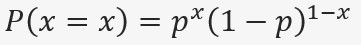

<center>


</center>

<center>

# **SALUD FÍSICA DURANTE EL PRIMER CUATRIMESTRE DE LOS ESTUDIANTES DE LA UTEC DEL 2021**

</center>

------------------------------------------------------------------------

##### **INTEGRANTES**

-   Andrea Flores Leyva - **202010254**\ /líder/ 

-   Pablo Mesia Perez - **202010148** \

-   Joaquín Olórtegui Sánchez - **202010334**\ 

-   William Montalvo Canales - **202110697**\ 

-   Heather Pinto Urrutia - **202010349** 

------------------------------------------------------------------------

### **I. INTRODUCCIÓN**

<div style="text-align: justify">
Estamos atravesando un largo periodo de pandemia. Durante esta, hemos podido observar como la mayoría de estudiantes han sido afectados no solo por las clases virtuales, sino bien por lo que el contexto pandémico involucra, en ciertos casos, un cambio total de la rutina diaria de cada estudiante, de esta forma no sólo se ve perjudicada la salud emocional, sino también la salud física. En el presente estudio se busca proporcionar un mapeo específico sobre la rutina física y alimentaria que experimentaron los universitarios Utecsinos durante el primer cuatrimestre del año 2021. La delimitación del tiempo ha sido plasmada de esa manera, ya que consideramos que se ha dado una transición de un estilo de vida activo a uno mayormente sedentario, durante los aproximadamente 10 meses de aislamiento social obligatorio. Siendo lo anterior un caso hipotético que a lo largo del desarrollo y al final del proyecto, con los resultados obtenidos, podremos descubrir. Además de saber cuál es en realidad el impacto de la coyuntura actual en sus hábitos alimenticios y de actividad física. Es más, los datos obtenidos y las conclusiones basadas en nuestro análisis podrán ser útiles para la UTEC. Ya que es importante que la institución vele no solo por el nivel académico del alumnado sino también por su salud y bienestar general. La combinación de un buen desempeño académico y un buen estado de salud es esencial para formar futuros profesionales.

### **II. OBJETIVOS**

<div style="text-align: justify">
Conocer y analizar la salud física durante el primer cuatrimestre del 2021 de los alumnos de la UTEC.\
Para esto se plantearon las siguientes preguntas de investigación:

-   ¿Cuáles fueron las actividades físicas y hábitos alimenticios en los alumnos de Utec durante el primer cuatrimestre y qué impacto ha generado en ellos?\
-   ¿Cómo han sobrellevado su salud física los alumnos de UTEC durante el primer cuatrimestre del 2021?\
-   ¿Los alumnos de UTEC han tenido una conducta alimenticia saludable o no saludable?\
-   ¿La actividad física es un aspecto presente en las rutinas de los alumnos?\
-   ¿Qué tipos de actividades deportivas empezaron a incluir en su vida cotidiana durante el primer cuatrimestre?\
-   ¿Cómo han influido las bebidas alcohólicas y la cafeína en los alumnos de UTEC durante el primer cuatrimestre?\
-   ¿Qué tan alineados están las rutinas de los estudiantes con los estándares de salud recomendados?\

### **III. MARCO TEÓRICO**

<div style="text-align: justify">
Para realizar este estudio fijamos como nuestra población objetivo a los estudiantes de la UTEC y como nuestra unidad muestral un alumno de la UTEC. Además, para la recolección de datos utilizamos las siguientes variables:

+------------------------------------------------+--------------------------+
| **VARIABLE**                                   | **TIPO**                 |
+================================================+==========================+
| Peso                                           | Numérica continua        |
+------------------------------------------------+--------------------------+
| Altura                                         | Numérica continua        |
+------------------------------------------------+--------------------------+
| Sexo                                           | Categórica nominal       |
+------------------------------------------------+--------------------------+
| Edad                                           | Numérica continua        |
+------------------------------------------------+--------------------------+
| Ciclo Académico                                | Categórica ordinal       |
+------------------------------------------------+--------------------------+
| Frecuencia semanal de consumo de comida rápida | Numérica discreta        |
+------------------------------------------------+--------------------------+
| Frecuencia semanal de consumo de cafeína       | Numérica discreta        |
+------------------------------------------------+--------------------------+
| Cantidad de comidas al día                     | Numérica discreta        |
+------------------------------------------------+--------------------------+
| Consumo de bebidas alcohólicas al mes          | Numérica discreta        |
+------------------------------------------------+--------------------------+
| Dieta                                          | Categórica nominal       |
+------------------------------------------------+--------------------------+
| Tipo de actividad física                       | Categórica nominal       |
+------------------------------------------------+--------------------------+
| Frecuencia de práctica semanal                 | Numérica discreta        |
+------------------------------------------------+--------------------------+
| Modalidad de prática                           | Categórica nominal       |
+------------------------------------------------+--------------------------+
| Minutos de entrenamiento                       | Numérica continua        |
+------------------------------------------------+--------------------------+
| Carrera                                        | Categórica nominal       |
+------------------------------------------------+--------------------------+

###### **OBSERVACIONES**

<div style="text-align: justify">
- En nuestra encuesta, se realizó una pregunta acerca del tipo de actividad física que realizaba el estudiante. Así que, se colocó como una de las alternativas “Otros”. Para esto se tomó en cuenta que las elecciones propuestas anteriormente serían generales y podrían ayudar a englobar cada tipo de deporte que existe. Sin embargo,  pudimos notar que una gran cantidad de las respuestas marcaban esa alternativa. Entonces, consideramos que hay dos opciones para mejorar la precisión de las respuestas. Estas podrían ser, encontrar términos más generales para los tipos de deportes de manera que cada persona pueda encontrarlo dentro de esas alternativas u optar por agregar más tipos de actividades físicas y no solo las más comunes.     
- La variable “modalidad”, al colocar todas las preguntas como obligatorias causamos que algunos usuarios al responder que no realizaban ninguna actividad marcarán esta al azar. Aunque, hubieron personas que respondieron incoherentemente, por ejemplo en tipo de actividad: niguno, duración: 45. Entonces, llegamos a la conclusión de que insertamos opciones limitadas por lo que, se podría ampliar las respuestas para no tener este tipo de problemas.  

#### **Muestreo**

<div style="text-align: justify">
El tipo de muestreo para este estudio es ***muestreo aleatorio simple***, se determinó esto porque cada alumno de UTEC que pertenece a nuestra muestra tiene la misma probabilidad de ser seleccionado. Debemos recalcar que consideramos que nuestra muestra **no es representativa**. A continuación presentaremos en porcentajes cuál debería ser la cantidad de alumnos por carrera que deberiamos tener para que nuestra muestra sea representativa.

1. Ingeniería Industrial (17.419%)  
2. Ingeniería Mecatrónica (14.319%)  
3. Ciencias de la Computación (12.985%)  
4. Ingeniería Mecánica (12.122%)  
5. Bioingeniería (9.925%)  
6. Ingeniería Electrónica (7.846%)  
7. Ingeniería Civil (7.572%)  
8. Ingeniería Química - Energía (5.532%)  
9. Ingeniería Ambiental (5.257%)  
10. Administración y Negocios digitales (1.491%)  

**Total:** 2549 (100%)  
*Estos datos fueron obtenidos de intranet y son del ciclo 2020-2.

Además, para el muestreo se propuso realizar una encuesta de manera virtual y que sea difundida solo dentro de la población que se desea estudiar. Para alcanzar este grupo se utilizarán las redes sociales, tales como Instagram y Whatsapp, para otorgar acceso a la encuesta virtual. Lógicamente, la encuesta tendrá filtros para evitar respuestas múltiples o fuera del enfoque de la investigación. 


#### **Limpieza de datos**

<div style="text-align: justify">
Al momento de obtener las múltiples respuestas a la encuesta, nos percatamos de la existencia de datos que no expresaban lo que requerimos. Por ello, decidimos empezar con la filtración y eliminación de respuestas que eran duplicadas. También respuestas con números que no pertenecían al código de un alumno de UTEC. Además, se encontró observaciones con respuestas incoherentes, por ejemplo, un estudiante para la variable “peso” introdujo “1.53” o un estudiante que mostraba contradicción en sus respuestas. Por otro lado, para completar la validación de datos. Empezamos por la variable “altura” que presentó inconvenientes, a pesar de que se especificó cómo se debían ingresar los datos, hubieron respuestas que no se encontraban en las unidades pedidas. Es por eso que se tomó la decisión de corregirlas, dado que no las consideramos incorrectas porque no son datos incoherentes y se puede deducir cuál sería la respuesta, considerando que solo fue respondida en las unidades incorrectas. Por último, en las respuestas a nuestra variable “tipo de actividad física” observamos una cantidad considerable de personas que seleccionaron “Otros”. Para esto se decidió contactar a las personas con dicha respuesta y poder conocer cuál es el deporte que practican y así poder ampliar el conocimiento sobre los datos obtenidos para esta variable.


```{r include=FALSE}
library("modeest")
library("readr")
library("vioplot")
library("dplyr")
```


```{r, include=FALSE}
DF <- read_csv("Rutinas4.csv")
```

```{r, include=FALSE}
DF1 <- DF[!duplicated(DF$codigo), ]
DF1$`X1`= NULL
DF1$`Email Address`= NULL
DF1$...17= NULL
```

```{r, include=FALSE}
DF1[which(DF1$`actividad fisica`=="Ninguno"),16] <- "Ninguno"
```

```{r include=FALSE}
DF1[3,5] <- 171

```

### **IV. DESCRIPTORES NUMÉRICOS Y GRÁFICOS**

#### **Peso**
```{r, echo=FALSE}

boxplot(DF1$peso, horizontal = TRUE, col = "aquamarine", main = "Peso(kg)")
stripchart(DF1$peso, method = "jitter", pch = 19, add = TRUE, col = "brown1")
abline(v=mean(DF$peso), col = "dodgerblue4")
```
En este caso como primer descriptor numérico utilizaremos la media del peso de nuestros encuestados, ya que como sabemos esta variable guarda una relación directa con la altura. A partir de esta relación, se comparará con los valores del índice de masa corporal (IMC), para determinar si la tendencia a base del promedio se encuentra en "bajo peso", "peso ideal", "sobrepeso" u "obesidad". De igual manera como segundo descriptor numérico, recurriremos a la mediana. 

_media_
```{r echo=FALSE}
round(mean(DF$peso),2)
```

_mediana_
```{r echo=FALSE}
round(median(DF$peso),2)
```

Esta nos mostrará el valor central de los datos, así también podremos darnos una idea sobre la tendencia que nos mostrará la media. Justamente el uso del boxplot en esta variable es debido a que la gráfica nos permite visualizar con facilidad la mediana y media de los datos.

Finalmente recurriremos a la desviación estandar para denotar la dispersión de los datos y así ver de manera más específica sobre que criterio de evaluación del IMC se encuentran nuestros encuestados.La aplicación del stripchart sobre el boxplot muestra justamente sin requerir gran interpretación la dispersión de los datos, por eso decidimos aplicarla.


_desviación estándar_  
Al ser un valor alto, significa que hay mucha dispersión en los datos.
```{r echo=FALSE}
round(sd(DF$peso),2)
```

### **Ciclo Académico**

```{r echo=FALSE}
barplot(table(DF1$ciclo), main="Cantidad de alumnos por ciclo académico",  xlab="Ciclo", ylab="Cantidad",ylim=c(0,70), cex.names=1.1, col=c("darkgoldenrod1","plum3","seagreen2","paleturquoise"))

```

En este caso se utiliza un gráfico de barras para mostrar cómo están distribuidos por ciclo los alumnos que han respondido la encuesta. El tercer y el primer ciclo acumulan la mayor cantidad de participantes debido al alcance especialmente alto que se tiene con este grupo. El resto de los ciclos muestran una participación de menos de diez personas cada uno, mientras que los mencionados con anterioridad se encuentran proximos a 70 partipantes.

### **Sexo** y **Carreras**

```{r echo=FALSE}
sex <- table(DF1$sexo)
barplot(sex, main = "Gráfica de la variable Sexo", xlab = "Sexo", ylab = "Encuestados", col=c("burlywood1","darkolivegreen3"))
```
```{r echo=FALSE}
par(mar=c(5,13,5,2))
barplot(table(DF1$carrera), main="Carreras de la UTEC", xlab="Encuestados" ,cex.names=0.8 , las=1, col=c("khaki2", "lightcyan2", "olivedrab2","rosybrown2"), horiz=1)
```
Para estas variables categóricas nominales, por temas de visualización de los datos obtenidos a la variable se usó barplot para poder hacerlos más visibles. Podemos notar que en nuestra muestra la mayoría de estudiantes de UTEC, que ha respondido a nuestras preguntas, pertenecen al sexo masculino.Esto podría ser comprobado con la moda.

```{r echo=FALSE}
mfv(DF1$sexo)
```

Esto puede ser debido a que nuestra encuesta como fue mandada a muchos grupos de la comunidad de UTEC, las mujeres podrían no estar al tanto de estos grupos o simplemente no haya una gran cantidad de mujeres estudiando en UTEC. Entonces, esto podría generar que el alcance de la encuesta tenga más tendencia a que un hombre haya respondido.

Por otro lado, en la variable carreras podemos obtener cuál es la carrera que ha destacado dentro de nuestra encuesta, procedemos a comprobar con la moda. 

```{r echo=FALSE}
mfv(DF1$carrera)
```
Observamos que los estudiantes de UTEC que estudian "Ingeniería Mecatrónica" fueron los que más respondieron a nuestras preguntas. Esto podría ser debido a la disposición de los estudiantes de los grupos a donde fue mandado la encuesta o que hay una cantidad considerable de alumnos que pertenecen a esta carrera. 


### **Altura**
```{r echo=FALSE}
hist(DF1$altura, prob= TRUE, main = "Altura de los alumnos", xlim = c(140,200), ylim = c(0,0.05), xlab = "Altura (cm)",col = c("indianred"))
#x <- seq(min(DF1$altura), max(DF1$altura), length = 100)
#f <- dnorm(x, mean = mean(DF1$altura), sd = sd(DF1$altura))
#lines(x, f, col = "dodgerblue4", lwd = 3)
lines(density(DF1$altura), lwd = 2, col = 'dodgerblue4')

```

Esta gráfica muestra de que manera está distribuida la altura de los alumnos encuestados. El histograma parte de un valor de 145 cm y culmina en 200 cm, cada barra representa la cantidad de personas que se encuentran dentro del intervalo de 5 cm correspondientes. Sobre esto, se agregó una curva de densidad para observar la simetría de la distribución. Se puede concluir que no es simétrica, sino que que tiene un sesgo hacia la izquierda.

Los descriptores numéricos utilizados fueron: la media, que resultó en 168.21 cm, la mediana, equivalente a 170 cm y la desviación estandar con un valor de 11.85 cm. Los dos primeros son utiles para sustentar el argumento previo de que existe un sesgo a la izquierda ya que la media y la mediana son menores a la moda. Por otro lado, la desviación estándar indica que tan concentrados están los datos alrededor de la media. En este caso se encuentran relativamente dispersos.

_media_
```{r echo=FALSE}
round(mean(DF$altura),2)
```

_mediana_
```{r echo=FALSE}
round(median(DF$altura),2)
```

_desviación estándar_
```{r echo=FALSE}
round(sd(DF$altura),2)
```


### **Edad**

```{r echo=FALSE}
barplot(table(DF1$edad), main = "Edad de los alumnos", xlab = "Edad (años)",col = c("goldenrod1"))

```

En el gráfico de barras se muestra la distribución de la edad de los encuestados. El valor que más se repite es 18 años, lo que viene a ser la moda, seguido por 17 y 19. La explicación a estos resultados puede ser que de la misma manera que para el ciclo académico, nuestro alcance se centra principalmente en las personas más jovenes de la universidad por el hecho de que nosotros formamos parte de este grupo.

### **Dieta**
```{r, echo=FALSE}

diet <- table(DF1$dieta)
barplot(diet, col=c("darkolivegreen2","darkcyan"), legend.text=TRUE,main="",xlab="¿Seguiste una dieta?", ylab="Encuestados", ylim=c(0,140)
 )

```
Actualmente creemos innecesario recurrir a la aplicación de mediana, media, rango intercuartil o desviación para esta variable, inicialmente porque es una de clasificación categórica y realmente estos números no nos darían algún resultado con sentido. De igual manera, recurrimos a un histograma para mostrar los valores de esta variable, ya que se interpretan de manera sencilla.

### **Cantidad de comidas al día**

```{r, echo=FALSE}
barplot(table(DF1$comidas), main = "Ingestas", xlab = "Num de Ingestas", ylab = "Encuestados" , col=c("goldenrod1"), ylim=c(0,100) )

```

En este caso aplicaremos la media, ya que en base a esta rescataremos el promedio de ingestas de nuestros encuestados, lo cual nos servirá como otro indicador para determinar si cuentan con buenos o malos hábitos alimenticios y físicos. En este caso no aplicaremos la mediana, ya que el valor centro no denota algún significado importante para la investigación, al igual que tampoco lo hacen el rango intercuartil o la desviación estándar.  


#### **Tipo de Actividad física** 


```{r, echo=FALSE}
par(mar=c(4,9,3,3))
barplot(table(DF1$`actividad fisica`), main="Tipo de actividad física", cex.names=0.8 , las=1, col=c("gold1", "darkseagreen1", "darkslateblue","rosybrown2","cadetblue2","darkorange1"), xlab="Cantidad de alumnos de UTEC", xlim=c(0,100), horiz = 1)
```

Esta variable al ser una categórica nominal, solo se podría aplicar moda para poder saber cuál es el tipo de actividad física que destaca entre los alumnos de UTEC pertenecientes al muestreo.

```{r, echo=FALSE}
mfv(DF1$`actividad fisica`)
```
Entonces, como podemos observar en la gráfica y al hallar la moda, el tipo de actividad más realizada entre la comunidad de alumnos en UTEC es "Rutina de ejercicios".


**Información adicional**: Anteriormente se mencionó que para poder ampliar nuestro conocimiento acerca de esta variable, fue preguntar a la mayoría de personas que seleccionaron "otros". Se determinó el "ciclismo" como una de las actividades destacadas dentro de esta opción.


#### **Frecuencia de práctica (semanal)**

```{r, echo=FALSE}
vioplot(DF1$Factividad, col="darkorchid1", main="Frecuencia de práctica (semanal)", xlab="cantidad de veces", horizontal=1)

points(weighted.mean(DF1$Factividad), 1, pch = 19, col = "burlywood1", cex = 1.1)
points(mean(DF1$Factividad), 1, pch = 19, col = "antiquewhite4", cex = 1.1)
legend("topright", pch = c(21, 19), col = c("black", "deepskyblue4","antiquewhite4"),bg = "white", legend = c("Mediana","Media ponderada","Media"), cex = 1.1)
```
Decidimos realizar un violin plot con los gráficos porque esta nos da la información necesaria para percatarnos de:  
- La dispersión de nuestros datos en este caso es **amplia**.  
- La existencia de un dato atípico.  
- Encontramos un dato curioso: la media y la media ponderada es la misma.Aún así existan valores extremos que podrían afectar la media. Esta gráfica nos permite demostrarlo de manera visual.
- Del gráfico observamos que la media es mayor a la mediana. Por lo tanto, la distribucion esta sesgada a la derecha 


+ Aplicamos la media ponderada considerando que las observaciones tienen diferencia de importancia dentro de nuestra muestra. Es por eso que se le asigna un peso diferente a cada valor. A diferencia de la media que toma todos los números por igual y en este caso como existen valores extremos usarla no sería recomendable.

```{r, echo=FALSE}
# Por grupo
DF1 %>% group_by(DF1$Factividad) %>% summarise(media =  mean(DF1$Factividad), media_ponderada =weighted.mean(DF1$Factividad)) 

```

Entonces, **3.37** será el número promedio de frecuencia de práctica de los alumnos de UTEC semanalmente.

Aplicaremos la moda para poder percatarnos de la cantidad semanal es lo que la mayoría de alumnos de UTEC que pertenecen a nuestra muestra suelen practicar un deporte 


_moda_
```{r echo=FALSE}
mfv(DF1$Factividad) #moda
```

_mediana_
```{r echo=FALSE}
median(DF1$Factividad) #mediana
```

Podemos deducir que la cantidad de frecuencia de actividad fisica más realizada es 3 veces a la semana. Es más, si observamos la mediana podemos ver que el más repetido es este porque podemos encontrarlo en la posición central.

_desviación estándar_
```{r echo=FALSE}
sd(DF1$Factividad)
```
Podemos comprobar con la gráfica y el valor de la desviación estándar que existe una alta dispersión lo que significa que hay mayor dispersión en nuestra población.

#### **Duración de actividad física (minutos)**


```{r echo=FALSE}

boxplot(DF1$Dactividad, col = "cadetblue",
        main = "Duración de entrenamiento (minutos)", horizontal=TRUE, xlab="Minutos", notch=TRUE)

points(mean(DF1$Dactividad), 1, pch = 19, col = "burlywood1", cex = 1.1)

legend("topright", pch = c(21, 19), col = c("burlywood1"),
       bg = "white", legend = c("Media"), cex = 1.1)

```
En la gráfica que escogimos para esta variable se puede ver que es un boxplot, porque aparte de que es otra de las opciones que nos presenta R studio para graficar cajas. Podemos notar que este nos brinda un intervalo de confianza de la mediana es por eso que en la línea negra(mediana) se ve como si esta adelgazara, esto ayuda que podamos hacer notar donde queda la mediana.Por otro lado, si observamos la posición podremos percatarnos que es sesgada a la izquierda, esto quiere decir que los datos están centrados hacia la izquierda de la distribución.

Además, podemos notar la existencia de dos datos atipicos,esto significaría que estos valores son tan grandes que se alejan de la mayoría de datos. De la misma forma, podemos notar que hay dos puntos en la gráfica, estas son la media y la mediana. Si la media > mediana significa que hay una asimetría positiva.


Aplicaremos la moda para determinar cuál es la cantidad más constante de minutos que un estudiante de UTEC se demora en realizar una actividad física

_moda_
```{r echo=FALSE}
mfv(DF1$Dactividad)
```

_mediana_
```{r echo=FALSE}
median(DF1$Dactividad)
```
Podemos notar como la moda y la mediana son iguales en esta variable, esto probablemente sea porque si la mediana nos da el valor de la posición central, la moda, que es lo que mayormente se repite, halla varias repeticiones de alumnos que realizan actividad física en 60 minutos en el primer cuatrimestre del 2021.  


#### **Modalidad**
Teniendo en cuenta que esta variable es categorica nominal, consideramos que aplicar la moda nos brindaría la modalidad más usada para realizar actividad física y en caso la mayoría sea "Niguno" aportaría al conocimiento de que la mayoría de estudiantes de UTEC pertenecientes a nuestra muestra no realiza ningún tipo de acividad física. Por lo tanto, no tiene ninguna modalidad.


```{r echo=FALSE}
barplot(table(DF1$modalidad), xlab = "",main = "Modalidad de práctica", col = c("cornflowerblue","chartreuse","antiquewhite1"), beside = TRUE,legend.text =rownames(table(DF1$modalidad)), las=1)
```

En esta gráfica, podemos observar que aún así en el primer cuatrimestre del 2021 seguíamos en pandemia. Los deportes que ejercían los estudiantes de UTEC la mayoría fueron realizados de manera presencial.


#### **Consumo de cafeína** , **Consumo de alcohol** y **Consumo de comida rápida**

```{r echo=FALSE}
stripchart(DF1$comidaR, pch = 19, method = "stack",
           col ="brown", main = "Consumo de comida rápida (semanal)", xlab="Cantidad de veces", ylim=(c(0,80)))

```

_moda_
```{r echo=FALSE}
mfv(DF1$comidaR)
```


---


```{r echo=FALSE}
stripchart(DF1$cafeina, pch = 19, method = "stack",
           col ="chartreuse", main = "Consumo de comida cafeína (semanal)", xlab="Cantidad de veces a la semana", ylim=c(0,80))

```

_moda_
```{r echo=FALSE}
mfv(DF1$cafeina)
```


---

```{r echo=FALSE}

stripchart(DF1$alcohol, pch = 19, method = "stack",
           col ="aquamarine2", main = "Consumo de bebidas alcoholicas (mensual)", xlab="Cantidad de veces al mes", ylim=c(0,80))

```

_moda_
```{r echo=FALSE}
mfv(DF1$alcohol)
```
----

Para el análisis de estas tres variables decidimos utilizar la función stripchart para el gráfico, porque nos permite visualizar esta gráfica de dispersión de manera unidimensional.

Sin embargo, se nos hizo interesante analizar estos datos por la cantidad de veces que se repitieron, técnicamente hablando, la moda. Para esto decidimos utilizar un stripchart pero con el método stack. Este método nos permite visualizar la distribución de todos los datos apilándolos, así podremos ver también cuál es el dato más repetido. Además, al ser un gráfico de dispersión, podemos notar también cuanta varían los datos y en que rangos se pueden encontrar estos.

**Nota:** Consideramos que la información que nos podría brindar la media para estas variables no se relaciona con las expectativas que se tiene respecto a los datos que podríamos obtener de estas.


### **V. INTERACCIÓN ENTRE VARIABLES**

#### **SEXO - CARRERA**
```{r echo=FALSE}
par(mar=c(4,12,1,1))
barplot(table(DF1$sexo, DF1$carrera), x="center",
        main = "Sexo ~ Carrera",
        xlab = "Encuestados", ylab = "",
        col = c("darkgrey", "darkblue"),
        legend.text = rownames(table(DF1$sexo,DF1$carrera)),
        beside = TRUE, las=1, horiz=1, xlim=c(0,50)) # Barras agrupadas
```


#### **PESO ~ ALTURA**

```{r echo=FALSE}
plot(DF1$peso, DF1$altura, pch = 19, col = "lightblue", xlab="Peso", ylab="Altura", main="Peso ~ Altura (1)")

# Línea de regresión
abline(lm(DF1$altura ~ DF1$peso), col = "coral", lwd = 3)

# Correlación de Pearson
text(paste("Correlación:", round(cor(DF1$peso, DF1$altura), 2)), x = 90, y = 150)

```
En la gráfica podemos observar como peso y altura dos variables numericas que están correlacionados, dado que mientras la altura aumenta en un estudiante de UTEC su peso también tendrá tendencia a crecer. Además, si calculamos la correlación de Pearson, podremos denotarlo como una **correlación moderada**. Sin embargo al momento de observar el gráfico pudimos notar que hay un dato que se encuentra muy disperso debido a una observación. Por lo que, para un mayor análisis hemos realizado dos gráficas.


```{r echo=FALSE}
DF2 <- DF1[-75,]
plot(DF2$peso, DF2$altura, pch = 19, col = "darkmagenta", xlab="Peso", ylab="Altura", main="Peso ~ Altura (2)")

# Línea de regresión
abline(lm(DF2$altura ~ DF2$peso), col = "gray0", lwd = 3)

# Correlación de Pearson
text(paste("Correlación:", round(cor(DF2$peso, DF2$altura), 2)), x = 90, y = 150)

```
Entonces, deducimos de esto que los datos que son muy dispersos o son valores extremos pueden afectar de una manera muy significativa la correlación entre dos variables. 

### **Peso - Altura - Sexo**

```{r echo=FALSE}

plot(DF1$peso, DF1$altura, col=ifelse(DF1$sexo == "F", "red","green"),pch=20, xlab = "Peso(kg)", ylab = "Altura(cm)", main = "Correlación entre el peso y altura + sexo")
legend("topright", pch = c(21, 19), col = c("Red", "green"),bg = "white", legend = c("Femenino","Masculino"), cex = 1.1)
 
```


#### **ACT. FÍSICA - PROM. EDADES**

```{r echo=FALSE}
EFA <- aggregate(DF1$Factividad, list(DF1$edad), mean)
```

```{r echo=FALSE}
plot(x=EFA$Group.1, y=EFA$x, ylim=c(0,5), col = c("mediumpurple2"), pch=19, xlab="Edad", ylab="Actividad Física semanal", main="Actividad Física promedio por Edades")
abline(lm(EFA$x ~ EFA$Group.1), col = "red", lwd = 3, )
text(paste("Correlation:", round(cor(EFA$Group.1, EFA$x), 2)), x = 20, y = 1)
```

Para generar este descriptor gráfico fue necesario encontrar el promedio de frecuencia de actividad física semanal para cada una de las edades que ingresaron los encuestados. El coeficiente de pearson para estos valores es de -0.31, lo que se puede interpretar como que existe una correlación inversa relativamente baja entre ambas variables.


---


```{r echo=FALSE}
EFA2 <- EFA[-9,]
plot(x=EFA2$Group.1, y=EFA2$x, ylim=c(0,5), col = c("mediumpurple2"), pch=19, xlab="Edad", ylab="Actividad Física semanal", main="Actividad Física promedio por Edades" )
abline(lm(EFA2$x ~ EFA2$Group.1), col = "red", lwd = 3)
text(paste("Correlation:", round(cor(EFA2$Group.1, EFA2$x), 2)), x = 20, y = 1)
```

Esta gráfica muestra las mismas variables que la anterior solo que en este caso no se incluye el promedio para 25 años. Se tomó la decisión de excluir este dato debido a que solo hubo una persona de 25 años que contestó la encuesta y, al ser un valor aislado, puede no representar a todo este grupo. El coeficiente de pearson para este caso es de -0.7, representando una correlación inversa relativamente alta. Entonces, se demuestra que excluyendo el valor aislado la relación entre las variables se fortalece. Esta expone que mientras mayor sea la edad, menor será la actividad física promedio.


### **VI. VARIABLES ALEATORIAS**

```{r include=FALSE}
library("statip")
```

+ **Función de Bernoulli**  

Sabiendo que la función Bernoulli nos puede mostrar sólo dos resultados posibles, para el éxito o el fracaso, decidimos aplicarla en la relación de sexo-dieta.

<center>

</center>

Esto para poder responder la siguiente pregunta:   
¿Cuál es el sexo que presenta más probabilidades de hacer dieta?

**Femenino**  
Parámetros: 

+ **x** = {1,0}  
    1: éxito -> realicen dieta  
    0: fracaso -> no realicen dieta  
    
+ **p:** probabilidad   
```{r include=FALSE}
DFF <- DF1[which(DF1$sexo=="F"),12]

```

```{r include=FALSE}
pF <- sum(DFF=="Sí")/nrow(DFF)
```

Aplicación de la función escogida:

```{r echo=FALSE}
f1 <- dbern(0,pF)
e1 <- dbern(1,pF)
print(paste("El éxito es:", round((e1),4)))
print(paste("El fracaso es:", round((f1),4)))
```
Concluimos el análisis al comparar ambas probabilidades y darnos cuenta que es más probable que alguien perteneciente al sexo masculino realice una dieta a alguien perteneciente al sexo femenino.

**Masculino**  
Parámetros:  

+ **x** = {1,0}  
    1: éxito -> realicen dieta  
    0: fracaso -> no realicen dieta  
    
+ **p:** probabilidad  

```{r echo=FALSE}
DFM <- DF1[which(DF1$sexo=="M"),12]
```

```{r include=FALSE}
pM <- sum(DFM$dieta=="Sí")/nrow(DFM)
```

Aplicación de la función escogida:

```{r echo=FALSE}
f2 <- dbern(0,pM)
e2 <- dbern(1,pM)
print(paste("El éxito es:", round((e2),4)))
print(paste("El fracaso es:", round((f2),4)))
```

+ **Función binomial**

Nos proporciona la probabilidad del número de éxitos en una secuencia n ensayos de Bernoulli con una probabilidad p fija entre sí. Decidimos aplicar esta función para las variables edad - frecuencia de consumo de cafeína.

<center>

</center>

**Ejemplos:**

¿Cuál es la probabilidad de que un estudiante de 18 años consuma cafeína hasta 5 veces al mes?

Parámetros:  

+ **x:** {0,1,2,3,4,5}  
+ **p:** probabilidad de que un estudiante de 18 años consuma cafeína 5 veces al mes

```{r include=FALSE}
DFC <- DF1[which(DF1$edad==18),10]

#Se calcula las probabilidades de x = {0,1,2,3,4,5}
#p0 <- sum(DFC$cafeina==0)/nrow(DFC)
#p1 <- sum(DFC$cafeina==1)/nrow(DFC)
#p2 <- sum(DFC$cafeina==2)/nrow(DFC)
#p3 <- sum(DFC$cafeina==3)/nrow(DFC)
#p4 <- sum(DFC$cafeina==4)/nrow(DFC)
#p5 <- sum(DFC$cafeina==5)/nrow(DFC)
#sum(p0,p11,p2,p3,p4,p5)

p <- sum(DFC$cafeina<=5)/nrow(DFC)

```

```{r echo=FALSE}
print(paste("F(x):", round(p, 7)))
```
Sabiendo esto:

¿Cuál es la probabilidad de que de 10 estudiantes de 18 años, 4 hayan tomado café hasta cinco veces al mes?

Para el uso de ambas funciones se necesita:  

+ **x:** {0,1,2,3,4,5} cantidad de veces al mes  
+ **n:** 4 estudiantes  
+ **p:** probabilidad de 4 estudiantes de 10 tengan 18 años y hayan tomado café hasta cinco veces al mes

```{r}
dbinom(4,10,p)
```

¿Cuál es la probabilidad de que, de 10 estudiantes de 18 años, 4 o menos hayan tomado café hasta cinco veces al mes?

```{r}
pbinom(4,10,p)
```
El segundo resultado es mayor debido a que pbinom está incluyendo las probabilidades de que 0, 1, 2, 3 y 4 estudiantes hayan tomado la cantidad de café. En cambio, en dbinom solo está la probabilidad de que 4 estudiantes exactos lo hayan tomado.

<div/>

