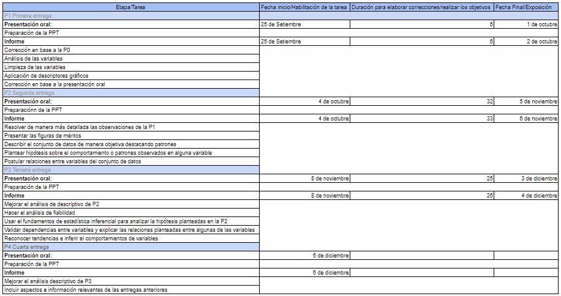
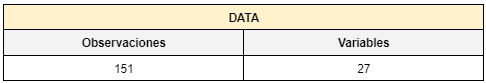

<center>
{width=150px}

```{r message = FALSE, warning = FALSE, include = FALSE}
library(readr)
library(dplyr)
library(modeest)
library(tidyverse)
library(BSDA)
```

</center>

## <span style="color:dodgerblue">Análisis de la teleorientación sobre los usuarios de "Óyeme".<span>

### <span style="color:dodgerblue"> Introducción<span>

##### <span style="color: dodgerblue"> Importancia y Justicación</span>

<div style="text-align: justify">
Durante la pandemia del Covid-19 han ido ocurriendo múltiples problemas que han afectado al bienestar de la población en general. Uno de los más comunes en estas situaciones son los que afectan a la salud mental. Esto ha ocasionado que los casos de estrés, depresión y ansiedad hayan aumentado los últimos meses. El distanciamiento social junto a la ausencia de comunicación interpersonal son uno de los factores que más han vulnerado estas condiciones mentales. Además, la crisis sanitaria tampoco ha permitido que las personas continúen con las sesiones psicológicas presenciales, lo que llevó a buscar alternativas que garanticen la seguridad de las personas. Por ello, nace la tele-orientación psicológica para contrarrestar los efectos colaterales del Covid-19. Este método es una de las nuevas alternativas propuestas en el mercado adaptadas a la crisis actual, ya que la presencialidad aún no es una realidad al 100%, la teleorientación surge como la respuesta ante este problema. De esta forma, decenas de personas salen beneficiadas porque podrán encontrar un espacio donde poder hablar y desahogarse con un o una profesional en el tema. Además, buscamos en esta investigación promover un estilo de vida más saludable mentalmente. Es por ello que, con los datos obtenidos podríamos conocer más a los usuarios de “Óyeme” y ofrecerles un mejor servicio concientizándolos sobre la salud mental y cuán importante es en nuestro día a día.
</div>

### <span style="color:dodgerblue"> Objetivos</span>  

1. **Objetivo Principal**

<div style="text-align: justify">
Conocer a los usuarios de “Óyeme” a través de encuestas para conocer cuáles son sus principales problemas en temas de salud mental. Además, brindar un mejor servicio a los usuarios de “Óyeme” para que la empresa pueda desempeñarse de una mejor manera. Determinaremos el perfil del usuario y los factores que influyen para que complete el proceso de apoyo y asesoría en salud mental en la organización “Oyeme”.
</div>

1.1 **Objetivos Específicos**

<div style="text-align: justify">

* Analizar los datos recopilados mediante el uso de gráficos estadísticos.
* Plantear opciones para mejorar la eficiencia de la empresa Óyeme.
* Conocer la situación actual de cada uno de los pacientes de Óyeme en base a la recopilación de datos.
* Determinar el factor más relevante por el cual las personas acuden a la empresa Óyeme.
</div>

1.2 **Preguntas**
<div style="text-align: justify">

* ¿Cuál es el ingreso promedio mensual de los pacientes de “Óyeme”?
* ¿Con cuántas personas conviven los usuarios de “Óyeme''?
* ¿Dependiendo de la ocupación influye el tiempo de horas que los usuarios descansan, trabajan y estudian?
* ¿Tienes cerca de tu hogar un centro de salud?
* ¿Cuánto es la cantidad de personas que hay en “Óyeme''?
* ¿Cuál es el estado de salud física que tiene cada persona?
* ¿La mayoría de los usuarios son hombres o mujeres? ¿Cuál es el porcentaje?
* ¿Las ocupaciones que presentan los usuarios influyen en el nivel de estrés?
* ¿Cuánto tiempo libre tienen los usuarios a la semana?
* ¿Cual es el rango de edad que poseen los usuarios de Óyeme?
* ¿Por cuál medio se enteró de la organización “Óyeme”?
* ¿La salud mental afecta los horarios de comida en los usuarios?
* ¿Cuál es el estado civil de cada usuario?
* ¿Cuál es el medio por donde conocen más a la organización?
* ¿Cuánto tiempo el usuario dedica las citas en la organización?
* ¿Cuánto tiempo dedica el usuario en los webinars?
* ¿Qué perfil tiene el usuario de la organización “Óyeme"?
* ¿La salud mental de los usuarios influye en su salud física ?
* ¿Qué puntaje le pones al servicio de "Óyeme"?
* ¿Por qué medio conociste a "Óyeme"?
* ¿Cuántas veces a la semana tienes estrés/ ansiedad/ depresión/ dolores de cabeza?
* ¿Los animales ayudan a que las usuarios tengan una mejor estabilidad en salud mental? 
* ¿Cuántos animales tienes? Si no tienes coloca 0
* ¿La organización y calidad de Óyeme está siendo progresiva con el paso de tiempo?

</div>


### <span style="color:dodgerblue"> Factibilidad </span>

<div style="text-align: justify">
La siguiente es una tabla que detalla las características y objetivos de cada entrega para cumplir con los requisitos de estas. Se detalla la fecha de publicación de la tarea, el tiempo hábil para completarla, la fecha de entrega de cada una y la responsabilidad asignada en cada una de ellas. Todo esto con el fin de organizar y optimizar la realización del proyecto.
</div>

```{r echo=FALSE,  fig.align='center', out.width='90%'}

```
<div style="text-align: justify">
Además, se elaboró un diagrama de Gantt, en el cual se muestra de manera gráfica las fechas de inicio a fin y las duraciones de las entregas de la tabla anterior.
</div>

```{r echo=FALSE,  fig.align='center', out.width='100%'}
knitr::include_graphics("diagramagantt.png")
```

### <span style="color:dodgerblue"> Marco Teórico </span>

<div style="text-align: justify">
Nuestro estudio se realizará con la ayuda de una encuesta para los usuarios “Óyeme””, es una red profesional que brinda servicios gratuitos de bienestar emocional de manera virtual y personalizada a personas mayores de 18 años. Impulsado por la organización juvenil SUC Social Impact respaldada por la SENAJU (Secretaría Nacional de Juventud).
</div>

1. 
#### <span style="color:dodgerblue"> Población Objetivo</span>
<div style="text-align: justify">
La población bajo estudio está constituida por adultos mayores de 18 años que acuden a consulta en la organización “Oyeme”. 
</div>

2. 
#### <span style="color:dodgerblue"> Unidad muestral<span>
<div style="text-align: justify">
Paciente de “Óyeme” mayor de 18 años 
</div>

### <span style="color:dodgerblue"> Variables y su definición<span>

#### **<span style="color:dodgerblue"> Numéricas (16) <span>**

##### **<span style="color:#a349a3"> Continuas (4)<span>**

**<span style="color:dodgerblue"> Variable<span>** |**<span style="color:dodgerblue"> Definición<span>**|**<span style="color:dodgerblue"> Restricciones<span>**
:---|:---|:---
Peso|Peso de los usuarios de "Óyeme"|Mayor igual a  20 kg menor o igual a 197 kg
Talla|Talla de los usuarios de “Óyeme”|Mayor igual a 0 cm y menor igual a 2.5 m
Tcitas|Tiempo total de citas  que tuvieron los usuarios en “Óyeme”|Mayor igual a 0 minutos y menor igual a 24 horas
Twebinars|Tiempo total en que los usuarios de “Óyeme” asistieron a los Webinar|Mayor igual a 0 minutos y menor igual a 24 horas

##### **<span style="color:#a349a3"> Discretas (12)<span>**

**<span style="color:dodgerblue"> Variable<span>** |**<span style="color:dodgerblue"> Definición<span>**|**<span style="color:dodgerblue"> Restricciones<span>**
:---|:---|:---
Edad| Edad de los usuarios de "Óyeme"|Entero mayor a 18 años
Htrabajo| Horas de trabajo a la semana|Opciones desde: 20,30,40,50 a 50+ horas de trabajo  
Hestudio| Horas que dedican al estudio a la semana|Opciones desde: 20,30,40,50 a 50+ horas de estudios 
Hdescanso| Horas que duermen los usuarios a la semana| Opciones desde: 20,30,40,50 a 50+ horas de  descanso
Hlibre| Horas de tiempo libre a la semana|Opciones desde: 20, 30, 40, 50, 50+ horas de tiempo libre 
Ingreso| Nivel de ingresos totales de los usuarios al mes| Opciones: Menos de 930, 930-1500, 1500-3500, 3500-más, No tiene ingresos
Pconvives| Cantidad de las personas con quienes conviven los usuarios| Opciones: 1, 2, 3, 4, 5+
Citas| Número de citas en "Óyeme"| Opciones: 0, 1, 2, 3, 4+
Webinars| Cantidad de Webinars que asistieron los usuarios de "Óyeme"| Opciones: ¿A cuántos Webinars asististe?:  0, 1, 2, 3+
Dcomida| Cantidad de veces que comen al día los usuarios de Óyeme | Opciones:  0, 1, 2, 3, 4+
Animales| Cantidad de animales que tienen los usuarios de Óyeme | Opciones:  0, 1, 2, 3, 4+
Situaciones | Cantidad de veces que los Usuarios tienen estres/ansiedad/depresión/dolores de cabeza | Opciones:  0, 1, 2, 3, 4+

#### **<span style="color:dodgerblue"> Categóricas (10) <span>**

##### **<span style="color:#a349a3"> Ordinales(3)<span>**

**<span style="color:dodgerblue"> Variable<span>** |**<span style="color:dodgerblue"> Definición<span>**|**<span style="color:dodgerblue"> Restricciones<span>**
:---|:---|:---
Pservicio| Puntaje al servicio que los usuarios le ponen a “Óyeme”|(Menor a Mayor valoración) Opciones: 1, 2, 3, 4 y 5
Pwebinars| Puntaje que le pusieron los usuarios a los webinars de “Óyeme”| (Menor a Mayor valoración) Opciones: 1, 2, 3, 4 y 5
Saludf | Calificación de la salud fisica de los usuarios de Óyeme | (Menor a Mayor valoración) Opciones: 1, 2, 3, 4 y 5

##### **<span style="color:#a349a3"> Nominales(7)<span>**

**<span style="color:dodgerblue"> Variable<span>** |**<span style="color:dodgerblue"> Definición<span>**|**<span style="color:dodgerblue"> Restricciones<span>**
:---|:---|:---
Sexo| Sexo de los usuarios de “Óyeme”|Masculino, Femenino, Prefiero no decirlo
Ecivil | Estado civil de los usuarios de "Óyeme" | Soltero, Casado, Divorciado
Ocupacion | Ocupación de los usuarios de "Óyeme" | Estudiante, Trabajador, Ambos, Ninguno
Canales| Medio por donde conoció "Óyeme"|Opciones: Redes sociales, Por algún conocido(boca a boca), Otro medio
Hijos| Si el usuario posee hijos o no| Opciones: Sí, No
CentroSalud|Si el usuario vive cerca al centro de salud|Opciones: Sí, No
SNAnimales|Si el usuario tiene animales en su hogar|Opciones: Sí, No


### <span style="color:dodgerblue"> Limpieza de Data Frame<span>

#### <span style="color:dodgerblue">Consideraciones para selección de las variables<span>

Las consideraciones establecidas fueron:  

* Información sin sentido  
* Claridad de la información 

#### Cargando las librerías
```{r}
library(readr)
library(dplyr)
library(modeest)
library(ggplot2)
library(tidyr)
library(Rlab)
```

#### Cargando el DF
```{r}

DF <- read_csv("DatosOyeme.csv")
```
```{r}
names(DF)
```

#### Eliminamos la primera columna y configuramos los nombres de nuestras variables

```{r}
DFF <- DF[,-1]
DFF %>% rename(Ingreso = `Nivel de Ingresos`, Talla = `Talla en metros  (Ejm: 1.61 )`, Peso = `Peso en Kilogramos (Ejm: 49.6)`, Canales = `¿Cómo conociste a \"Óyeme\"?`, Citas = `¿A cuántas citas asististe en  \"Óyeme\"?`, Pservicio = `¿Qué puntaje le pones al servicio de \"Óyeme\"?`, Tcitas = `¿Cuánto tiempo total de citas has tenido? Si es 1 cita son 45 min, si son 2 citas son 90 min, etc`, Webinars = `¿A cuántos webinars asististe?`, Twebinars = `¿Cuánto tiempo total asististe a webinars? Si es 1 webinar son 45 min, si son 2 webinars son 90 min, etc`, Pwebinars = `¿Qué puntaje le pones a los webinars de \"Óyeme\"?`, Hestudio = `¿Cuántas horas le dedicas a tu estudio a la semana? (aproximadamente) Si no estudias coloca 0`, Hdescanso = `¿Cuántas horas duermes a la semana? (aproximadamente)`, Hlibre = `¿Cuántas horas tienes de tiempo libre a la semana?`, Pconvives = `¿Con cuántas personas convives?`, Situaciones = `¿Cuántas veces a la semana tienes estrés/ ansiedad/ depresión/ dolores de cabeza ?`, Saludf = `¿Cómo calificarías tu salud física?`, Ocupacion = `Ocupación`, Ecivil = `Estado civil`, Hijos = `Condición familiar (hijos o no)`, Edad = `Edad (Número entero mayor a 18 años)`, Htrabajo = `¿Cuántas horas le dedicas a tu trabajo a lo largo de la semana? (aproximadamente) Si no trabajas coloca 0`, Edad = `Edad (Número entero mayor a 18 años)`, CentroSalud = `¿Tienes cerca de tu hogar un centro de salud?`,SNAnimales=`¿Tienes animales en casa?` ,Animales = `¿Cuántos animales tienes? Si no tienes coloca 0`, Dcomida = `¿Cuántas veces comes al día?`) -> DFN
```

```{r}
DFN$Tcitas[DFN$Tcitas == "45 min"] <- 45
DFN$Tcitas[DFN$Tcitas == "90 min"] <- 90
DFN$Tcitas[DFN$Tcitas == "135 min"] <- 135
DFN$Tcitas<- as.numeric(DFN$Tcitas)
```

```{r}
DFN$Twebinars[DFN$Twebinars == "45 min"] <- 45
DFN$Twebinars[DFN$Twebinars == "90 min"] <- 90
DFN$Twebinars[DFN$Twebinars == "135 min"] <- 135
DFN$Twebinars<- as.numeric(DFN$Twebinars)
```

Resumen del DataFrame nuevo
```{r}
summary(DFN)
```
No existen datos faltantes y solo algunas variables poseen datos atipicos los cuales verificaremos en el posterior procedimiento


```{r echo=TRUE}
DFN
```


### <span style="color:dodgerblue">Variables de estudio<span>
Mostraremos cuáles son los números de observaciones y de variables

```{r echo=FALSE,  fig.align='center', out.width='80%'}

```


#### <span style="color:dodgerblue">Tabla de descriptores numéricos<span>

**<span style="color:darkblue"> Variable<span>** |**<span style="color:darkblue"> Moda <span>**|**<span style="color:darkblue"> Media<span>**|**<span style="color:darkblue"> Mediana<span>**|**<span style="color:darkblue"> IQR<span>**|**<span style="color:darkblue"> Mínimo <span>**|**<span style="color:darkblue"> Máximo<span>**|**<span style="color:darkblue"> Rango<span>**|**<span style="color:darkblue"> Coeficiente Variación<span>**|**<span style="color:darkblue"> Varianza<span>**|**<span style="color:darkblue"> Desviación Estándar<span>**
:--:|:---|:--:|:--:|:--:|:--:|:--:|:--:|:--:|:--:|:--:|:--:|:--:|:--:|:--:|
Edad|`r  mfv(DFN$Edad, na_rm=1)`|`r round(mean(DFN$Edad),2)`|`r  round(median(DFN$Edad),2)`|`r IQR(DFN$Edad, na.rm=1) `|`r round(min(DFN$Edad),2) `|`r round(max(DFN$Edad),2) `|`r round(max(DFN$Edad, na.rm=1)-min(DFN$Edad, na.rm=1),2)`|`r  round(sd(DFN$Edad,na.rm=TRUE)/mean(DFN$Edad,na.rm=TRUE),2)`|`r round(var(DFN$Edad,na.rm=TRUE),2)`|`r round(sd(DFN$Edad,na.rm=TRUE),2)`|
Talla|`r  mfv(DFN$Talla, na_rm=1)`|`r round(mean(DFN$Talla),2)`|`r  round(median(DFN$Talla),2)`|`r IQR(DFN$Talla, na.rm=1) `|`r round(min(DFN$Talla),2) `|`r round(max(DFN$Talla),2) `|`r round(max(DFN$Talla, na.rm=1)-min(DFN$Talla, na.rm=1),2)`|`r  round(sd(DFN$Talla,na.rm=TRUE)/mean(DFN$Talla,na.rm=TRUE),2)`|`r round(var(DFN$Talla,na.rm=TRUE),2)`|`r round(sd(DFN$Talla,na.rm=TRUE),2)`|
Peso|`r  mfv(DFN$Peso, na_rm=1)`|`r round(mean(DFN$Peso),2)`|`r  round(median(DFN$Peso),2)`|`r IQR(DFN$Peso, na.rm=1) `|`r round(min(DFN$Peso),2) `|`r round(max(DFN$Peso),2) `|`r round(max(DFN$Peso, na.rm=1)-min(DFN$Peso, na.rm=1),2)`|`r  round(sd(DFN$Peso,na.rm=TRUE)/mean(DFN$Peso,na.rm=TRUE),2)`|`r round(var(DFN$Peso,na.rm=TRUE),2)`|`r round(sd(DFN$Peso,na.rm=TRUE),2)`|
Pconvives|`r  mfv(DFN$Pconvives, na_rm=1)`|`r round(mean(DFN$Pconvives),2)`|`r  round(median(DFN$Pconvives),2)`|`r IQR(DFN$Pconvives, na.rm=1) `|`r round(min(DFN$Pconvives),2) `|`r round(max(DFN$Pconvives),2) `|`r round(max(DFN$Pconvives, na.rm=1)-min(DFN$Pconvives, na.rm=1),2)`|`r  round(sd(DFN$Pconvives,na.rm=TRUE)/mean(DFN$Pconvives,na.rm=TRUE),2)`|`r round(var(DFN$Pconvives,na.rm=TRUE),2)`|`r round(sd(DFN$Pconvives,na.rm=TRUE),2)`|
Hdescanso|`r  mfv(DFN$Hdescanso, na_rm=1)`|`r round(mean(DFN$Hdescanso),2)`|`r  round(median(DFN$Hdescanso),2)`|`r IQR(DFN$Hdescanso, na.rm=1) `|`r round(min(DFN$Hdescanso),2) `|`r round(max(DFN$Hdescanso),2) `|`r round(max(DFN$Hdescanso, na.rm=1)-min(DFN$Hdescanso, na.rm=1),2)`|`r  round(sd(DFN$Hdescanso,na.rm=TRUE)/mean(DFN$Hdescanso,na.rm=TRUE),2)`|`r round(var(DFN$Hdescanso,na.rm=TRUE),2)`|`r round(sd(DFN$Hdescanso,na.rm=TRUE),2)`|
Hlibre|`r  mfv(DFN$Hlibre, na_rm=1)`|`r round(mean(DFN$Hlibre),2)`|`r  round(median(DFN$Hlibre),2)`|`r IQR(DFN$Hlibre, na.rm=1) `|`r round(min(DFN$Hlibre),2) `|`r round(max(DFN$Hlibre),2) `|`r round(max(DFN$Hlibre, na.rm=1)-min(DFN$Hlibre, na.rm=1),2)`|`r  round(sd(DFN$Hlibre,na.rm=TRUE)/mean(DFN$Hlibre,na.rm=TRUE),2)`|`r round(var(DFN$Hlibre,na.rm=TRUE),2)`|`r round(sd(DFN$Hlibre,na.rm=TRUE),2)`|
Hestudio|`r  mfv(DFN$Hestudio, na_rm=1)`|`r round(mean(DFN$Hestudio, na.rm = TRUE),2)`|`r  round(median(DFN$Hestudio, na.rm = TRUE),2)`|`r IQR(DFN$Hestudio, na.rm=1) `|`r round(min(DFN$Hestudio, na.rm = TRUE),2) `|`r round(max(DFN$Hestudio, na.rm = TRUE),2) `|`r round(max(DFN$Hestudio, na.rm=1)-min(DFN$Hestudio, na.rm=1),2)`|`r  round(sd(DFN$Hestudio,na.rm=TRUE)/mean(DFN$Hestudio,na.rm=TRUE),2)`|`r round(var(DFN$Hestudio,na.rm=TRUE),2)`|`r round(sd(DFN$Hestudio,na.rm=TRUE),2)`|
Htrabajo|`r  mfv(DFN$Htrabajo, na_rm=1)`|`r round(mean(DFN$Htrabajo, na.rm = TRUE),2)`|`r  round(median(DFN$Htrabajo, na.rm = TRUE),2)`|`r IQR(DFN$Htrabajo, na.rm=1) `|`r round(min(DFN$Htrabajo, na.rm = TRUE),2) `|`r round(max(DFN$Htrabajo, na.rm = TRUE),2) `|`r round(max(DFN$Htrabajo, na.rm=1)-min(DFN$Htrabajo, na.rm=1),2)`|`r  round(sd(DFN$Htrabajo,na.rm=TRUE)/mean(DFN$Htrabajo,na.rm=TRUE),2)`|`r round(var(DFN$Htrabajo,na.rm=TRUE),2)`|`r round(sd(DFN$Htrabajo,na.rm=TRUE),2)`|
Citas|`r  mfv(DFN$Citas, na_rm=1)`|`r round(mean(DFN$Citas, na.rm = TRUE),2)`|`r  round(median(DFN$Citas, na.rm = TRUE),2)`|`r IQR(DFN$Citas, na.rm=1) `|`r round(min(DFN$Citas, na.rm = TRUE),2) `|`r round(max(DFN$Citas, na.rm = TRUE),2) `|`r round(max(DFN$Citas, na.rm=1)-min(DFN$Citas, na.rm=1),2)`|`r  round(sd(DFN$Citas,na.rm=TRUE)/mean(DFN$Citas,na.rm=TRUE),2)`|`r round(var(DFN$Citas,na.rm=TRUE),2)`|`r round(sd(DFN$Citas,na.rm=TRUE),2)`|
Webinars|`r  mfv(DFN$Webinars, na_rm=1)`|`r round(mean(DFN$Webinars, na.rm = TRUE),2)`|`r  round(median(DFN$Webinars, na.rm = TRUE),2)`|`r IQR(DFN$Webinars, na.rm=1) `|`r round(min(DFN$Webinars, na.rm = TRUE),2) `|`r round(max(DFN$Webinars, na.rm = TRUE),2) `|`r round(max(DFN$Webinars, na.rm=1)-min(DFN$Webinars, na.rm=1),2)`|`r  round(sd(DFN$Webinars,na.rm=TRUE)/mean(DFN$Webinars,na.rm=TRUE),2)`|`r round(var(DFN$Webinars,na.rm=TRUE),2)`|`r round(sd(DFN$Webinars,na.rm=TRUE),2)`|
Animales|`r  mfv(DFN$Animales, na_rm=1)`|`r round(mean(DFN$Animales, na.rm = TRUE),2)`|`r  round(median(DFN$Animales, na.rm = TRUE),2)`|`r IQR(DFN$Animales, na.rm=1) `|`r round(min(DFN$Animales, na.rm = TRUE),2) `|`r round(max(DFN$Animales, na.rm = TRUE),2) `|`r round(max(DFN$Animales, na.rm=1)-min(DFN$Animales, na.rm=1),2)`|`r  round(sd(DFN$Animales,na.rm=TRUE)/mean(DFN$Animales,na.rm=TRUE),2)`|`r round(var(DFN$Animales,na.rm=TRUE),2)`|`r round(sd(DFN$Animales,na.rm=TRUE),2)`|
Situaciones|`r  mfv(DFN$Situaciones, na_rm=1)`|`r round(mean(DFN$Situaciones, na.rm = TRUE),2)`|`r  round(median(DFN$Situaciones, na.rm = TRUE),2)`|`r IQR(DFN$Situaciones, na.rm=1) `|`r round(min(DFN$Situaciones, na.rm = TRUE),2) `|`r round(max(DFN$Situaciones, na.rm = TRUE),2) `|`r round(max(DFN$Situaciones, na.rm=1)-min(DFN$Situaciones, na.rm=1),2)`|`r  round(sd(DFN$Situaciones,na.rm=TRUE)/mean(DFN$Situaciones,na.rm=TRUE),2)`|`r round(var(DFN$Situaciones,na.rm=TRUE),2)`|`r round(sd(DFN$Situaciones,na.rm=TRUE),2)`|


### <span style="color:dodgerblue">Análisis de las variables<span>
</center>
Variable| Análisis
:---|:---
Edad | La edad más común entre los usuarios de la ONG “Óyeme” es de 20 años. Además, la edad media es de 22.65 años. No obstante, la mediana resultó ser de 22 años entre las personas encuestadas. Ahora, en el análisis se observó que la edad mínima encontrada fue de 18 años mientras que la máxima llegó a ser 44 años. También, han presentado una varianza de 10.74 y una desviación estándar de 3.28. El rango intercuartil de edad es 4 y  expresa la diferencia o la distancia entre el primer y el tercer cuartil, esta medida nos indica que hay una dispersión moderada.
Talla | La talla más común es de 160 cm entre las personas encuestadas. También, el promedio medio de la variable “talla” es de 162 cm.  La mediana coincide con la moda, la cual es de 160 cm. La talla máxima de las personas encuestadas es de 172 cm mientras que el valor mínimo es de 149 cm.  El rango intercuartil de talla es 0.075 y  expresa la diferencia o la distancia entre el primer y el tercer cuartil, esta medida nos indica que hay una dispersión pequeña.
Peso | El peso más usual entre las personas encuestadas es de 50.5 kg. Por otro lado, el peso medio de estas nos da como resultado 58.59 kg. Ahora, la mediana es de 58.5 kg. En cuanto a los valores mínimos y máximos, el peso máximo es de 70.5 kg mientras que, el mínimo es de 40.6 kg. Además, posee una varianza de 37.79 unidades y una desviación estándar de 6.15 kg. El rango intercuartil de peso es 8 y  expresa la diferencia o la distancia entre el primer y el tercer cuartil, esta medida nos indica que hay una dispersión moderada.
Pconvives | La cantidad de personas con la que conviven que es el más común es de 2 personas, no obstante la media de todo el espacio muestral es aproximadamente de 3 ya que el rango es de 7 donde el mínimo fue de 0 personas y el máximo de 7 personas. El rango intercuartil de la cantidad de personas con la que se convive es de 1 y  expresa la diferencia o la distancia entre el primer y el tercer cuartil, esta medida nos indica que hay una dispersión pequeña.
Hdescanso | La hora de descanso más común es de 50 horas a la semana, no obstante la media de todo el espacio muestral es de 44.87 horas ya que el rango es de 30 donde el mínimo fue 30 horas a la semana y el máximo de 60 horas a la semana. El rango intercuartil de Pdescanso es 10 y  expresa la diferencia o la distancia entre el primer y el tercer cuartil, esta medida nos indica que hay una dispersión moderada.
Hlibre | El tiempo libre más común es de 40 minutos entres los individuos encuestados. Ahora, la mediana es de 40 minutos mientras que la media es de 36.42 minutos. El rango intercuartil de Tlibre es 10 y  expresa la diferencia o la distancia entre el primer y el tercer cuartil, esta medida nos indica que hay una dispersión moderada.
Hestudio | Las horas de estudio más común es de 50 horas a la semana, no obstante la media de todo el espacio muestral es de 41.13 y la mediana es de 50 horas de estudio. El máximo de horas dedicadas al estudio es de 60 y el mínimo es de 0.
Htrabajo | Las horas de trabajo más común es de 19.27 horas a la semana, no obstante la media de todo el espacio muestral es de 0 al igual que la mediana ya que posiblemente no trabajan. El máximo de horas trabajadas es de 60 y el mínimo es de 0. El rango intercuartil, como resultado da 50 y expresa la diferencia o la distancia entre el primer y el tercer cuartil, esta medida nos indica que hay una dispersión alta.
Citas | La cantidad de citas tomadas más común es de 1 cita entres los individuos encuestados, no obstante la media de todo el espacio muestral es de 2 citas aproximadamente ya que el rango es de 3 donde el mínimo fue de 1 cita tomada y el máximo de 4 citas tomadas. El rango intercuartil de Citas es 1 y  expresa la diferencia o la distancia entre el primer y el tercer cuartil, esta medida nos indica que hay una dispersión pequeña.
Webinars | La cantidad de webinars a los que asistieron más personas es de 1, no obstante la media de todo el espacio muestral es de aproximadamente 2 ya que el rango es de 2 donde el mínimo fue 1 asistencia y el máximo de 2 asistencias a webinars. El rango intercuartil de Webinars es 1 y  expresa la diferencia o la distancia entre el primer y el tercer cuartil, esta medida nos indica que hay una dispersión pequeña.
Animales | La cantidad de animales en casa más común es de 1 entre los individuos encuestados, no obstante la media de todo el espacio muestral es de 1 animal en casa aproximadamente ya que el rango es de 27 donde el mínimo fue de 0 animales en casa y el máximo de 27 animales en casa. 

### <span style="color:dodgerblue"> Preguntas con Hipótesis<span>

</center>
| # | Preguntas| Hipótesis
:---|:---|:---|
1 | ¿Cuál es la mayor cantidad dependiendo de su  edad, que han asistido a más citas? | Con la muestra se reflejan personas desde los 18 años hasta los 44 años. Podemos deducir que los jóvenes desde los 18 hasta los 26 son los presentan una mayor tendencia a asistir a más de 3 citas.
2 | ¿Qué porcentaje de las personas asisten a sus citas? | Se contempla que los usuarios han asistido, en su mayoría, a 1 cita. Por otro lado, se refleja un bajo porcentaje en las personas que asistieron a 4 citas.
3 | ¿Qué ocupación tienen los usuarios menores de 26 años? | Se podría afirmar que la ocupación para los usuarios menores de 26 años sería estudiantes para poder tener una carrera profesional y también trabajadores, ya que una vez terminando sus estudios puedan ejercer su carrera.
4 | ¿Cuál es la edad con mayor puntuación que tenga estrés/ ansiedad/ depresión/ dolores de cabeza? | En la muestra se reflejan personas desde los 18 años hasta los 44 años. Por lo que, podemos deducir que los jóvenes de 22 años  son los presentan mayores problemas emocionales, ya que estudian y a la vez trabajan. 
5 | ¿Cuánto tiempo en total  las personas asisten a los webinars?  | Se podría deducir que las edades de los usuarios que asisten a los webinars fluctúan entre los 19 y 23 años debido a que podrían mostrar mayor interés en estas actividades, por ello el tiempo total que asisten sería de 135 minutos. 
6 | ¿Cuál es la situación física de los usuarios de Óyeme? | Se podría afirmar que la mayoría de los usuarios de Óyeme consideran que su salud física no es ni tan buena ni tan mala. Por otro lado, se aprecia que hay un bajo porcentaje para quienes estiman que tienen una baja salud física. 
7 | ¿Los usuarios de Óyeme se encuentran satisfechos con los webinars brindados? | Los usuarios de Óyeme probablemente se pueden sentir satisfechos con los webinars por sentirse en un ambiente amigable y acogedor.
8 | ¿Cuanto nivel de estrés tienen los usuarios de Óyeme dependiendo de su ocupación?  | Observando la muestra podemos intuir que el nivel de estrés es mayor cuando el usuario está estudiando y a la vez trabajando. Esto se puede deber a que la mayoría tiene dos ocupaciones porque existen problemas financieros en casa lo que le agrega estrés personal.
9 | ¿Cuál es la mayor edad de los usuarios que disponen de tiempo para sus horas de estudio?  | Según la muestra, observamos que hay mayor horas de estudios cuando los usuarios tienen entre 18 a 25 años. Esto se debe a que la gran mayoría se encuentra estudiando  para poder obtener una carrera profesional. 

### <span style="color:dodgerblue">Descriptores gráficos de variables cuantitativas<span>

```{r echo=FALSE, warning=FALSE}
histg<-hist(DFN$Edad, breaks = 12, main="Distribución de edad de usuarios Óyeme",xlab="Edad",ylab = "Frecuencia",col="lightblue")

abline(v=mean(DFN$Edad, na.rm=1),col="red", lwd=3)
abline(v=mean(DFN$Edad, na.rm=1)+1*sd(DFN$Edad),col="black",lwd=2)
abline(v=mean(DFN$Edad, na.rm=1)+2*sd(DFN$Edad),col="yellow",lwd=2)  
abline(v=mean(DFN$Edad, na.rm=1)+3*sd(DFN$Edad),col="green",lwd=2)
abline(v=mean(DFN$Edad, na.rm=1)-1*sd(DFN$Edad),col="black",lwd=2)
abline(v=median(DFN$Edad, na.rm=1),col="blue",lwd=2,lty=2)

legend(x = "topright",legend=c("media poblacional","1 desviación de la media","2 desviaciones de la media","3 desviaciones de la media"),col=c("red","black","yellow","green"),lwd=2,cex=0.8)
```

<div style="text-align: justify">
En la siguiente gráfica se representarán los datos obtenidos de la edad de las personas encuestadas de la organización “Óyeme”. En esta, se observó que hay personas desde los 18 años hasta los 44 años. El análisis del histograma de la distribución de edad de usuarios Óyeme es asimétrica positiva con sesgo a la derecha. Esta idea se sostiene debido a que la media es mayor que la mediana causando una cola larga a la derecha. Por lo tanto, la distribución de la variable edad no es simétrica porque como se observa, se concentra más a la derecha. Además, el mayor número de personas atendidas en Óyeme tiene 20 años seguida de las personas que tienen 21, 22, 23, 24 y 25 años.
</div>

<center>
```{r echo=FALSE, warning=FALSE}
boxplot(DFN$Citas,horizontal = 1, main="Citas asistidas por usuario", xlab = "Número de citas", col=c("lightblue"))
abline(v=mean(DFN$Citas,na.rm = TRUE), col="red",lwd=3,lty=4)
abline(v=mean(DFN$Citas, na.rm=1)+1*sd(DFN$Citas,na.rm = TRUE),col="black",lwd=3,lty=4)
abline(v=mean(DFN$Citas, na.rm=1)+2*sd(DFN$Citas,na.rm = TRUE),col="yellow",lwd=3,lty=4)  

legend(x = "topright",legend=c("media de citas","1 desviación de la media","2 desviaciones de la media"),col=c("red","black","yellow"),lwd=2,cex=0.8)
```
<div style="text-align: justify">
Según la moda, los usuarios de “Oyeme” han asistido solamente a 1 cita desde que se atendieron en la plataforma. Esto es muy importante a tomar en cuenta debido a que, las primeras citas siempre son gratis mientras que las demás ya tienen un precio  mínimo a pagar. Por ello, se podría concluir que muchas de las personas encuestadas han preferido o han tenido los recursos necesarios para seguir tomando más citas de teleorientación psicológica. Se observa en el primer cuartil. También, se observó que el rango intercuartil va desde 1 a 2, lo cual representa el número de citas en el que los usuarios han podido asistir. Observamos que desde 3 citas asistidas, los datos serán atípicos y vemos como el número máximo de asistencias llega a 4.
</div>

<center>
```{r echo=FALSE, warning=FALSE}
boxplot(DFN$Webinars,horizontal = 1, main="Webinars asistidas por usuario", xlab = "Número de Webinars", col=c("lightblue"))
abline(v=mean(DFN$Webinars,na.rm = TRUE), col="red",lwd=3,lty=4)
abline(v=mean(DFN$Webinars, na.rm=1)+1*sd(DFN$Webinars,na.rm = TRUE),col="black",lwd=3,lty=4)
abline(v=mean(DFN$Webinars, na.rm=1)+2*sd(DFN$Webinars,na.rm = TRUE),col="yellow",lwd=3,lty=4)  

legend(x = "topright",legend=c("media de webinars","1 desviación de la media","2 desviaciones de la media"),col=c("red","black","yellow"),lwd=2,cex=0.8)
```


****** FALTA***


```{r echo=FALSE}
par(mfrow=c(2, 2))
hist(DFN$Hdescanso,  col = 4 , xlab = "Cantidad de Horas", ylab="Número de personas", main="Horas de Sueño Semanales")
hist(DFN$Hlibre, col = 6 , xlab = "Cantidad de Horas", ylab="Número de personas", main="Horas Libres Semanales")
hist(DFN$Htrabajo, col = 2 , xlab = "Cantidad de Horas", ylab="Número de personas", main="Horas de Trabajo Semanales")
hist(DFN$Hestudio, col = 3 , xlab = "Cantidad de Horas", ylab="Número de personas", main="Horas de Estudio Semanales")
```

<div style="text-align: justify">
La mayor cantidad de encuestados le dedica más tiempo a las horas de sueño y/o estudio mientras que le dedican menos horas al trabajo a la semana. Esto se debe principalmente a que muchas de las personas encuestadas posiblemente no trabajan, ya que colocaron 0 horas de trabajo a la semana. Por otro lado, se observa cómo los usuarios de “Óyeme” suelen dedicarle más horas a la semana de estudio y a las horas libres.
</div>


```{r}
op <- par(mfrow = c(1,2))
plot(DFN$Hestudio~DFN$Edad,main = "Horas de estudio a la semana" ,xlab = "Edad", ylab = "Tiempo")
plot(DFN$Htrabajo~DFN$Edad,main = "Horas de trabajo a la semana" ,xlab = "Edad", ylab = "Tiempo")

```

***FALTA**


```{r}
op <- par(mfrow = c(1,2))
plot(DFN$Hdescanso~DFN$Edad,main = "Horas de descanso a la semana" ,xlab = "Edad", ylab = "Tiempo")
plot(DFN$Hlibre~DFN$Edad,main = "Horas libres a la semana" ,xlab = "Edad", ylab = "Tiempo")

```

***FALTA***

<center>
```{r echo=FALSE}
par(mfrow=c(2, 2))

boxplot(DFN$Situaciones, horizontal=1, main="Situaciones de estres en la semana", col=7)
abline(v=mean(DFN$Situaciones,na.rm=TRUE),col="darkblue",lwd=3,lty=4)
```

<div style="text-align: justify">
En la gráfica de los datos de “Situaciones de estrés en la semana” la moda son 3. Podemos observar que el mínimo es 2 y el máximo es 7.La moda es una cantidad moderada de veces que un usuario de Óyeme tiene estrés, esto se puede deber a diversos factores que se le presentan en su vida diaria.
</div>

### <span style="color:dodgerblue">Descriptores gráficos de Variables Cualitativas<span>


```{r echo=FALSE}
barplot(table(DFN$Canales), main="Cómo conocen Óyeme los usuarios", col = "royalblue", ylab="Número de personas")

``` 
<div style="text-align: justify">
Podemos observar en la gráfica que la mayoría de los usuarios conocen a “Óyeme”  por medio de las redes sociales. Esto puede ser debido a que más del 60% son jóvenes de entre 18 a 26 años y son los que mayormente utilizan distintas aplicaciones para investigar sobre algún tema, organización, empresa entre otros. Por otro lado, menos de 40 personas conocen a “Óyeme” por medio de algún conocido cabe mencionar que puede ser debido a que estamos en pandemia lo que nos lleva a no poder estar en constante contacto con nuestros familiares, amigos y conocidos.
</div>


```{r echo=FALSE}
barplot(table(DFN$Ocupacion), main="Ocupación de los usuarios de “Óyeme”", col = "brown", ylab="Número de personas")

``` 

<div style="text-align: justify">
En esta gráfica de barras podemos observar que el mayor número de los usuarios de “Óyeme” que fueron encuestados son estudiantes un aproximado del 50%  y el menor porcentaje de ellos se encuentran estudiando y trabajando. Podemos deducir que las personas jóvenes en su mayoría son las que presentan más problemas en su salud física y mental.
</div>


```{r echo=FALSE}
mosaicplot(table(DFN$Sexo, DFN$Hijos), main="Personas con o sin hijos de “Óyeme”", col = c("#9999cc", "lightblue"), ylab="Hijos")

``` 
<div style="text-align: justify">
En la gráfica podemos observar una representación unida entre el género de los usuarios y si tienen hijos. Más del 50% de los usuarios no tiene hijos y podemos concluir que la razón es porque la mayoría de los usuarios son gente joven ya sea estudiantes o universitarios. Además, nos damos cuenta que las mujeres son las que sí tienen hijos en un bajo porcentaje a comparación de los hombres que es casi nula y que las personas que no quisieron decir su género no tienen hijos.
</div>

```{r echo=FALSE}
barplot(table(DFN$Pservicio), main="Puntaje del servicio de “Óyeme”", col = c("yellow"), ylab="Número de personas")

``` 
<div style="text-align: justify">
Podemos observar en la gráfica que la gran mayoría de los usuarios de “Óyeme” se sienten satisfechos con el servicio que brinda, más del 50% lo califica entre 4 y 5 estrellas. Además, no existe puntaje bajo simplemente intermedio lo que nos da a conocer que la organización, la atención y calidad en su gran mayoría es muy buena.
</div>


```{r echo=FALSE}
barplot(table(DFN$Pwebinars), main="Puntaje de los webinars de “Óyeme”", col = c("yellow"), ylab="Número de personas")

```
<div style="text-align: justify">
En esta gráfica podemos observar que un alto número de los usuarios de “Óyeme” se sienten satisfechos con los webinars que se organizan, más del 50% lo califica 3 y 4 estrellas. Se observa también que hay un bajo número de personas que lo calificaron con 2, lo cual nos da a entender que no se sintieron lo suficientemente satisfechos con los webinars.
</div>


### <span style="color:dodgerblue">Patrones<span>####

</center>
Variables relacionadas

* Relación entre la variable Sexo y Edad 
* Relación entre variable Sexo e Hijos 
* Relación entre variables Edad y Ocupación 
* Relación entre variables Edad e Ingresos 
* Relación entre variables Ocupación y Horas libres

```{r}
barplot(table(DFN$Edad<26,DFN$Ocupacion),main = "Relación entre los usuarios menores que 26 años y su ocupación" ,xlab = "Ocupación", ylab = "Edad", col = c("pink"))
```
<div style="text-align: justify">
Análisis: En esta gráfica podemos observar que hay una tendencia en los usuarios de Óyeme, esta es que la mayoría 
Creemos que hay una tendencia en los usuarios de Óyeme porque la mayoría que acuden a este servicio son jóvenes que se encuentran estudiando.
</div>


```{r}
barplot(table(DFN$Hlibre,DFN$Ocupacion),main = "Relación entre la ocupación y horas libres de los usuarios" ,xlab = "Ocupación", ylab = "Horas libres", col = c("#9999cc"))
```
<div style="text-align: justify">
Análisis: En esta gráfica podemos observar que hay una tendencia en los usuarios de Óyeme, esta es que mayormente los que estudian y trabajan tienen menos horas libres, esto puede ser debido a que tienen que estudiar y hacer sus trabajos pendientes.
</div>


```{r}
mosaicplot(table(DFN$Sexo,DFN$Hijos),main = "Relación de Sexo e Hijos" ,xlab = "Sexo", ylab = "Hijos", col = c("skyblue", "lightgreen") )

```
<div style="text-align: justify">
Análisis: En esta gráfica podemos observar una tendencia que tienen los usuarios de Óyeme, esta es que mayormente los usuarios no tienen hijos. Por otro lado, también se observa que quienes tienen hijos en su mayoría son las mujeres comparado con los varones. </div>


### <span style="color:dodgerblue">Variables aleatorias<span>#### 


#### <span style="color:dodgerblue">Binomial<span>#### 

##### Edad

```{r}
table(DFN$Edad)

plot(17:43,dbinom(18:44, size = 44, prob =112/151 ))

```

```{r}
x <- DFN$Edad

op <- par(mfrow = c(1,2))
# Creamos un histograma
hist(x, freq = FALSE,main="Frecuencia de la edad de los usuarios de Óyeme",cex.main=0.8, col=c("yellow","skyblue"), xlab="Edad de personas ",ylab="Frecuencia")
grid(nx = NA, ny = NULL, lwd = 1, lty = 1, col = "gray")


# Calculamos la densidad
dx <- density(x)

# Añadimos la línea de densidad
lines(dx, lwd = 2, col = "red")

# Curva de densidad sin histograma
plot(dx, lwd = 2, col = "red",
     main = "Densidad")

# Añadimos los datos con riudo en el eje X
rug(jitter(x))
```

#### <span style="color:dodgerblue">Bernoulli<span>#### 


##### Hijos
```{r}
# Centro de salud cercano
table(DFN$Hijos)
```
```{r}
set.seed(151)                                  # Set seed for reproducibility
N <- 151
y_rbern <- rbern(N, prob = 9/151)                  # Draw N random values
    
hist(y_rbern,                                    # Plot of randomly drawn density
     breaks = 2,
     main = "Hijos" , ylim = c(0,100), col = c("#9999cc"))

```

##### Centro de Salud
```{r}
# Centro de salud cercano
table(DFN$CentroSalud)
```

```{r}
set.seed(151)                                  # Set seed for reproducibility
N <- 151
y_rbern <- rbern(N, prob = 93/151)                  # Draw N random values
    
hist(y_rbern,                                    # Plot of randomly drawn density
     breaks = 2,
     main = "Centro de salud cercano" , ylim = c(0,100), col = c("skyblue"))

```


</center>
Variables de interés| Justificación
:---|:---
* Hijos | Esta variable representa si el usuario tiene hijos o no.Los parámetros que usaremos estarán dados por X e Y.Siendo X los usuarios que no han tenido hijos mientras que Y son los usuarios que si han tenido hijos. X("No hijos")=0 e Y("Si hijos")=1. Es una variable aleatoria discreta y se describe con el modelo Bernoulli-p, siendo el éxito si tiene hijos. X ~ Ber(½).
* CentroSalud | Esta variable representa si los usuarios se encuentran cerca de un centro de salud. Siendo C los usuarios que si viven cerca mientras que L son los usuarios que viven lejos. c("Si cerca")=1 y L("No cerca")=0.  Es una variable aleatoria discreta y se describe con el modelo Bernoulli-p, siendo el éxito si tiene hijos. X ~ Ber(½).
* Edad| Esta variable representa la edad de nuestra población. Es una variable aleatoria discreta y se describe con el modelo binomial. Considerando como nuestro éxito la edad entre 20 y 25 años, X~Bin(151,6/16). Utilizando esto podemos observar la probabilidad que la edad de nuestra población sea entre 20 y 25 años. Además, en la gráfica se muestra un pico de la muestra entre las edad de 20 a 25 años, ya que gracias a la gráfica de densidad nos puede ver donde los valores se concentran en los intervalos.


### <span style="color:dodgerblue"> Variables depedientes<span>  

```{r echo=FALSE}

reg <- function(x, y, ...) {
  points(x,y, ...)
  abline(lm(y~x), lwd=2) 
  }
panel.cor <- function(x, y, digits = 2, prefix = "", cex.cor, ...){
  usr <- par("usr"); on.exit(par(usr))
  par(usr = c(0, 1, 0, 1))
  r <- abs(cor(x, y))
  txt <- format(c(r, 0.123456789), digits = digits)[1]
  txt <- paste0(prefix, txt)
  text(0.5, 0.5, txt, cex = 1.1, font = 4)
}
pairs(~DFN$Citas + DFN$Situaciones + DFN$Hdescanso, col=2, labels=c( "Citas", "Situaciones de estrés", "Horas de descanso"), main="Situaciones de estrés+Citas+ Horas de descanso", lower.panel = panel.cor, upper.panel = reg)

f1<-lm( DFN$Hdescanso~DFN$Situaciones )
f1
f2<-lm(DFN$Hdescanso ~ DFN$Citas)
f2
f3<-lm(DFN$Situaciones~DFN$Citas)
f3
```

Función horas de descanso y situaciones de estrés:  

$f(x)=-1.524x+50.135$         $\\\\ ;\ x\in [30;60]$

Función Citas y horas de descanso:  

$g(x)=-1.113x+46.850$         $\\\\ ;\ x\in [30;60]$  

Función Situaciones y Citas:  

$h(x)=0.1075x+3.2655$         $\\\\ ;\ x\in [2;7]$

<div style="text-align: justify">
Se puede observa  que la cantidad de personas que descansan y asisten a sus citas tienen una correlación positiva de 0.14. De igual manera, la cantidad de personas que presentan situaciones de estrés y tienen horas de descanso también tienen una correlación positiva pero mayor, ya que esta correlación es de 0.17. Esto se debe a que más personas que tienen horas de descansan poseen más situaciones de estrés que las cantidad de citas.

Igualmente, se observa en la gráfica que las situaciones de estrés y la cantidad de citas tienen una relación directa. Esto se debe a que mientras mayor situaciones de estrés presente una persona mayor será la cantidad de citas que asista. Esto también se ve reflejado en la correlación entre ambas variables, la cual es 0.12. Siendo positiva cuando uno crece el otro crece. 
</div>


```{r}

edad1=DFN$Situaciones[DFN$Edad<=18]
edad2=DFN$Situaciones[DFN$Edad>18 & DFN$Edad<=22]
edad3=DFN$Situaciones[DFN$Edad>22 & DFN$Edad<=25]
edad4=DFN$Situaciones[DFN$Edad>25 & DFN$Edad<=28]
edad5=DFN$Situaciones[DFN$Edad>28 & DFN$Edad<=32]
edad6=DFN$Situaciones[DFN$Edad>32 & DFN$Edad<=35]
edad7=DFN$Situaciones[DFN$Edad>36 & DFN$Edad<=44]


m1=mean(edad1)
m2=mean(edad2)
m3=mean(edad3)
m4=mean(edad4)
m5=mean(edad5)
m6=mean(edad6)
m7=mean(edad7)
edadesm=c(m1,m2,m3,m4,m5,m6,m7)
eds=c((18)/2, (19+22)/2, (23+25)/2, (26+28)/2, (29+32)/2,(33+35)/2, (36+44)/2)

op <- par(mfrow = c(1,2))
plot(eds,edadesm, main = "Edad y Situaciones", xlab="Edad", ylab="Situaciones",pch = 8, col = "green")
plot(eds, edadesm, type = "o",  main = "Edad y Situaciones", xlab="Edad", ylab="Situaciones")
```
La siguiente función aproxima el comportamiento de la relación entre las variables:  

$f(x)= -5 E^{-5} x^4 + 0.005 x^3 + 0.174 x^2 + 2.4065 x +  6.897$ $;  X\in [10;40]$


<div style="text-align: justify">
La gráfica muestra que la media de las edades donde se suelen tener mayores situaciones de estrés es aproximadamente a los 18 y 34 años. Asimismo, quienes muestran un nivel intermedio de estrés son personas que tienen de 20 a 26 años. Esta tendencia se da debido a que en esta edad, los jóvenes se encuentran experimentando situaciones de estrés/ansiedad/depresión a causa de sus trabajos y/o estudios. Por otro lado, quienes presentan un nivel que se encuentra bajo de la media de las situaciones de estrés son quienes tienen aproximadamente 40 años de edad, debido a que las personas mayores requieren de situaciones que no afecten en su totalidad con su salud emocional, por lo que muchos se jubilan y mantienen mayores horas de descanso.

La variable que representa las situaciones de estrés son menos dispersos a comparación de la edad, ya que la primera tiene un coeficiente de variación de `r round(sd(DFN$Situaciones)/ mean(DFN$Situaciones),2)`, mientras que la segunda tiene un coeficiente de variación de `r round(sd(DFN$Edad)/ mean(DFN$Edad),2)`.  

</div>


```{r}
w1=DFN$Webinars[DFN$Edad<=18]
w2=DFN$Webinars[DFN$Edad>18 & DFN$Edad<=22]
w3=DFN$Webinars[DFN$Edad>22 & DFN$Edad<=25]
w4=DFN$Webinars[DFN$Edad>25 & DFN$Edad<=28]
w5=DFN$Webinars[DFN$Edad>28 & DFN$Edad<=32]
w6=DFN$Webinars[DFN$Edad>32 & DFN$Edad<=35]
w7=DFN$Webinars[DFN$Edad>36 & DFN$Edad<=44]


we1=mean(w1)
we2=mean(w2)
we3=mean(w3)
we4=mean(w4)
we5=mean(w5)
we6=mean(w6)
we7=mean(w7)
wem=c(we1,we2,we3,we4,we5,we6,we7)
op <- par(mfrow = c(1,2))
plot(eds,wem, main = "Edad y webinars", xlab="Edad", ylab="webinars",pch = 5, col = "blue")
plot(eds, wem, type = "o",  main = "Edad y webinars", xlab="Edad", ylab="webinars")
```
La siguiente función aproxima el comportamiento de la relación entre las variables:  

$f(x)= -4 E^{-5} x^4 + 0.0039 x^3 + 0.1384 x^2 + 2.0059 x -8.446$ $;  X\in [10;40]$


<div style="text-align: justify">
La gráfica muestra que las personas que tienen aproximadamente entre 35 y 40 años son quienes asisten más a los webinars debido a que al tener mayores horas libres, disponen de tiempo para asistir a estas actividades. Asimismo, quienes asisten menos veces a los webinars son quienes tienen aproximadamente 16 y 22 años, esto es porque no disponen de tiempo. Esta tendencia se da debido a que en esta edad, los jóvenes se encuentran estudiando o trabajando por lo cual no les alcanza suficiente tiempo para asistir a estas actividades. Por otro lado, quienes presentan un nivel bajo de asistencias a los webinars son quienes tienen aproximadamente 27 años de edad, debido a que estas personas se encuentran estudiando y trabajando, por lo cual no tienen tantas horas libres para que puedan asistir a los webinars.
</div>


### <span style="color:dodgerblue"> Pruebas de Hipótesis<span>  
```{r}
colorArea <- function(from, to, density, ..., col="blue", dens=NULL){
y_seq <- seq(from, to, length.out=500)
d <- c(0, density(y_seq, ...), 0)
polygon(c(from, y_seq, to), d, col=col, density=dens)
}
```

#### <span style="color:dodgerblue"> Cantidad de situaciones de estrés<span>


```{r echo=FALSE}
data1<-c(DFN$Situaciones[DFN$Edad>=18 & DFN$Situaciones>0])
Q3=quantile(data1,0.75,na.rm=1)
limsup=Q3+1.5*IQR(data1,na.rm=1)
Q1=quantile(data1,0.25,na.rm=1) 
liminf=Q1 - 1.5*IQR(data1,na.rm=1)
pos1=which(data1>limsup | data1<liminf)
data1=data1[-pos1]
boxplot(data1, horizontal = TRUE,ylim =c(min(data1),max(data1)), col=3, xlab="Puntaje", main="Puntaje de estrés")
abline(v=mean(data1,na.rm=TRUE),col="darkblue",lwd=3,lty=4)
```


La variable **Situaciones** representa un puntaje entre 1 a 5 de situaciones de estrés durante la semana de los encuestados, el rango de esta variable no es amplio, el cual es de 2 a 5, por lo que consideramos que la data es no es tan variable a comparación de los demás. Asimismo, el gráfico de boxplot que se muestra nos sirve para poder visualizar el rango completo de la data de manera ordenada. Finalmente, la media muestral es `r round(mean(data1, na.rm=TRUE),2)` de estrés. 


##### <span style="color:dodgerblue"> HIPÓTESIS I <span>
Ho =  La mayor cantidad de situaciones de estrés presentadas por nuestros usuarios son en promedio  **mayores o iguales** a 3 

$H_{0}:µ >= 3$  

H1 =La mayor cantidad de situaciones de estrés presentadas por nuestros usuarios son en promedio **menores** a 3 

$H_{1}:µ < 3$  


```{r echo=FALSE}
n=151
med=mean(data1,na.rm=TRUE)
sd=sd(data1,na.rm=TRUE)
conf=0.80
z1=qnorm(1-conf)# z inferior porque es bilateral hacia la izquierda
error=abs(z1*sd/sqrt(n))
mu = 3
z <- ((med-mu)*sqrt(n))/(sd)
```

<div style="text-align: justify">

Se eligió un nivel de confianza de `r conf*100`% debido a que los datos no están muy dispersos (rango: `r range(data1)`), por lo que se prioriza una mayor confianza sobre una mayor precisión. Al usar dicho nivel de confianza el error será ±`r round(error,2)` y el tamaño de muestra empleada es `r n`.

</div>

```{r echo=FALSE, fig.align = 'center'}
curve(dnorm(x), from=-5, to=10, xlim=c(-10,10), col=3, lwd=4, main="Función densidad Distribucion normal Estándar", ylab="f(x)")
legend("top",legend=c("Z alfa","Z crítico supuesto", "Región de rechazo"), cex = 0.8, fill = c("red",6,3))
colorArea(from=-5, to=z1, dnorm, col=3)
abline(v=z1, col="red", lwd=3)
abline(v=z, col=6, lwd=2)
```

##### <span style="color:dodgerblue"> Intervalo de confianza para la hipótesis 1 <span>

<font size="3.5"> 
Intervalo de confianza: [3.36, 5]
</font>

```{r}
hist(data1, prob=T, ylab="Probabilidad", xlab="Puntaje del nivel de estrés (1 al 5)", main="Función de probabilidad del puntaje de nivel de estrés", col=3, xlim=c(0,5))
abline(v=10, col=6, lwd=2) #930
abline(v=med, col="yellow", lwd=2)
xIC=med+(z1*(sd/sqrt(n)))
abline(v=xIC, col="red", lwd=2)
curve(dnorm(x,mean(data1, na.rm=TRUE),sd(data1, na.rm=TRUE)), from=1, to=5, xlim=c(1, 5), col=4, lwd=4, add=T)
legend("topright",legend=c("Límite inferior de confianza","Media muestral"), cex = 0.5, fill = c("red","yellow"))
```

##### <span style="color:dodgerblue"> Conclusión hipótesis I <span>
<div style="text-align: justify">
Según el análisis de la distribución de probabilidad de la variable **situaciones de estrés**, el valor de z que delimita la zona de rechazo es `r round(z1,2)`. Asimismo, el valor de z supuesto es `r round(z,2)` y se ubica en la zona de no rechazo. Sin embargo, en la gráfica anterior, la cual es unilateral y tiene cola al lado izquierdo, establecimos un nivel de confianza del 80%, ya que los datos no están dispersos. Por último, consideramos que en este caso, ya que existe gran variabilidad, no habrá gran precisión, mas sí confiabilidad. Se aprecia que la media muestral está muy cercana al límite inferior del intervalo de confianza, es por esto que la hipótesis nula será rechazada debido a que la diferencia entre la media muestral y el límite es `r round(med-xIC,2)`, esta diferencia es muy pequeña en comparación con el rango de la data. Al rechazar esta hipótesis, se estaría concluyendo que la situaciones de estrés presentadas en los usuarios de Óyeme son menores a tres lo cual puede deberse a que poseen control de sus emociones o que se manifiestan de diferente manera.
</div>


#### <span style="color:dodgerblue"> Cantidad de citas asistidas<span>

```{r echo=FALSE}
data2<-c(DFN$Citas[DFN$Edad>17 & DFN$Citas>=1])
Q3=quantile(data2,0.75,na.rm=1)
limsup=Q3+1.5*IQR(data2,na.rm=1)
Q1=quantile(data2,0.25,na.rm=1) 
liminf=Q1 - 1.5*IQR(data2,na.rm=1)
pos1=which(data2>limsup | data2<liminf)
data2=data2[-pos1]
boxplot(data2, horizontal = TRUE,ylim =c(min(data2),max(data2)), col=3, xlab="Citas", main="Cantidad de citas asistidas")
abline(v=mean(data2,na.rm=TRUE),col="darkblue",lwd=3,lty=4)

```

<div style="text-align: justify">
La variable **Citas** representa la cantidad de citas asistidas de los encuestados, el rango de esta variable no es amplio debido a que es de 1 a 3. Por lo tanto, consideramos que la data no es variable en comparación a las demás. Asimismo, hemos hecho uso del gráfico boxplot para poder visualizar el rango completo de la data de manera ordenada. Finalmente, la media muestral es de `r round(mean(data2, na.rm=TRUE),2)` citas.
</div>

##### <span style="color:dodgerblue"> HIPÓTESIS II <span>
Ho =  La mayor cantidad de citas asistidas por nuestros usuarios son en promedio  **mayores o iguales** a 2 citas 

$H_{0}:µ >= 2$  

H1 = La mayor cantidad de citas asistidas por nuestros usuarios son en promedio  **menor** a 2 citas 

$H_{1}:µ < 2$ 


```{r echo=FALSE}
n=151
med=mean(data2,na.rm=TRUE)
sd=sd(data2,na.rm=TRUE)
conf=0.80
t2<-qt(conf,n-1)# t superior porque es bilateral hacia la derecha

error=abs(t2*sd/sqrt(n))
mu = 2
t <- ((med-mu)*sqrt(n))/(sd)
```

<div style="text-align: justify">

Se eligió un nivel de confianza de `r conf*100`% debido a que los datos no están muy dispersos (rango: `r range(data2)`), por lo que se prioriza una mayor precisión sobre una mayor confianza. Al usar dicho nivel de confianza el error será ±`r round(error,2)` y el tamaño de muestra empleada es `r n`.

</div>

```{r echo=FALSE}
plot( function(x) dt(x, df = n-1 ), -5,10 , ylim = c( 0, 0.4 ),
      col = "red", type = "l", lwd = 2,
      main = "Función densidad Distribucion normal Estándar" , ylab="f(x)")
abline(v=t2, col="blue",lwd=2)
abline(v=t, col="purple",lwd=2)
legend(x="topright", legend = c("t-crìtico","t-supuesto"), lty=c(1,1), col=c("blue","purple"), lwd=4)
colorArea(from=t2, to=5, dnorm)
```


```{r echo=FALSE}
t.test(data2,mu=2,alternative = "greater",conf.level = conf)
```
##### <span style="color:dodgerblue"> Intervalo de confianza para la hipótesis 2 <span>

<font size="3.5"> 
Intervalo de confianza: [1.6, 5>
</font>

```{r echo=FALSE}
hist(data2, prob=T, ylab="Probabilidad", xlab="Citas", main="Función de probabilidad de la cantidad de citas", col=3, xlim=c(0,5))
abline(v=med, col="yellow", lwd=2)
abline(v=mu, col=6, lwd=2) #930
xIC=med+(qt(1-conf,n-1)*(sd/sqrt(n)))
abline(v=xIC, col="red", lwd=2)
curve(dnorm(x,mean(data2, na.rm=TRUE),sd(data2, na.rm=TRUE)), from=0, to=5, xlim=c(0, 5), col=4, lwd=4, add=T)
legend("topright",legend=c("Media muestral", "Máxima cantidad","Límite superior de confianza"), cex = 0.8, fill = c("yellow",6,"red"))

```

##### <span style="color:dodgerblue"> Conclusión hipótesis II <span>
<div style="text-align: justify">
Respecto al análisis de la distribución de probabilidad de la variable **citas**, el valor de t-crítico es de `r round(t2,2)`. Asimismo, el valor  t-supuesto es de `r round(t,2)` y se centra en la zona de no rechazo que está ubicado al lado izquierdo tal y como se visualiza en el diagrama. Sin embargo, al graficar el intervalo de confianza, nos percatamos que la media muestral está muy cercana al límite inferior del intervalo de confianza. La diferencia entre la media muestral y el límite es `r round(med-xIC,2)`. Por esta razón, se rechaza la hipótesis nula, concluyendo en la hipótesis alternativa debido a que el promedio de citas asistidas es mayor o igual a dos. Esto puede ser porque muchos usuarios pueden programar sus citas por tener tiempo suficiente o sienten la necesidad de reservar más citas debido al buen servicio de Óyeme.
</div>

#### <span style="color:dodgerblue"> Edad <span>


```{r echo=FALSE}
data3<-c(DFN$Edad[DFN$Hestudio>0 & DFN$Edad>17])
Q3=quantile(data3,0.75,na.rm=1)
limsup=Q3+1.5*IQR(data3,na.rm=1)
Q1=quantile(data3,0.25,na.rm=1) 
liminf=Q1 - 1.5*IQR(data3,na.rm=1)
pos1=which(data3>limsup | data3<liminf)
data3=data3[-pos1]
boxplot(data3, horizontal = TRUE,ylim =c(min(data3),max(data3)), col=3, xlab="Edad", main="Edad de los usuarios")
abline(v=mean(data3,na.rm=TRUE),col="darkblue",lwd=3,lty=4)
```

<div style="text-align: justify">

La variable **Edad** representa la edad que tienen nuestros encuestados, el rango de esta variable no es tan amplio, el cual es de 18 a 26, por lo que consideramos que la data es no es tan variable en comparación de los demás. Asimismo, hemos hecho uso del gráfico boxplot para poder visualizar el rango completo de la data de manera ordenada Finalmente, la media muestral es `r round(mean(data3, na.rm=TRUE),2)` edad. 
</div>


##### <span style="color:dodgerblue"> HIPÓTESIS III <span>

Ho =  La edad que tiene mayor cantidad de horas de estudio son en promedio  **mayores o iguales** a 26 años 

$H_{0}:µ >= 26$  

H1 = La edad que tiene mayor cantidad de horas de estudio son en promedio  **menores** a 26 años

$H_{1}:µ < 26$ 


```{r echo=FALSE}
n=151
med=mean(data3,na.rm=TRUE)
sd=sd(data3,na.rm=TRUE)
conf=0.80
t2<-qt(conf,n-1)# t superior porque es bilateral hacia la derecha

error=abs(t2*sd/sqrt(n))
mu = 26
t <- ((med-mu)*sqrt(n))/(sd)
```


<div style="text-align: justify">

Se eligió un nivel de confianza de `r conf*100`% debido a que los datos no están muy dispersos (rango: `r range(data3)`), por lo que se prioriza una mayor precisión sobre una mayor confianza. Al usar dicho nivel de confianza el error será ±`r round(error,2)` y el tamaño de muestra empleada es `r n`.

</div>

```{r echo=FALSE, fig.align = 'center'}
curve(dnorm(x), from=-5, to=10, xlim=c(-10,10), col=3, lwd=4, main="Función densidad Distribucion normal Estándar", ylab="f(x)")
legend("topleft",legend=c("Z alfa","Z crítico supuesto", "Región de rechazo"), cex = 0.8, fill = c("red",6,3))
colorArea(from=-5, to=z1, dnorm, col=3)
abline(v=z1, col="red", lwd=3)
abline(v=z, col=6, lwd=2)
```

##### <span style="color:dodgerblue"> Intervalo de confianza para la hipótesis 3 <span>

<font size="3.5"> 
Intervalo de confianza: [21.5, 30>
</font>

```{r echo=FALSE}
hist(data3, prob=T, ylab="Probabilidad", xlab="Edad", main="Función de probabilidad de la edad de los usuarios", col=3, xlim=c(15,30))
abline(v=med, col="yellow", lwd=2)
abline(v=mu, col=6, lwd=2) #930
xIC=med+(qt(1-conf,n-1)*(sd/sqrt(n)))
abline(v=xIC, col="red", lwd=2)
curve(dnorm(x,mean(data3, na.rm=TRUE),sd(data3, na.rm=TRUE)), from=0, to=30, xlim=c(0, 30), col=4, lwd=4, add=T)
legend("topright",legend=c("Media muestral", "Mínima edad","Límite superior de confianza"), cex = 0.8, fill = c("yellow",6,"red"))

```

##### <span style="color:dodgerblue"> Conclusión hipótesis III <span>

<div style="text-align: justify">
Respecto al análisis de la distribución de probabilidad de la variable **edad**, el valor de z-crítico es -0.92. Asimismo, el valor z supuesto es 8.3 y se ubica en la zona de rechazo, ubicado al lado derecho del diagrama. En conclusión, la hipótesis nula se rechaza lo que significa que la mayor cantidad de horas de estudio lo tienen los usuarios menores a 26 años. Esto se debe a que los usuarios de Óyeme entre los 18 a 26 años se encuentran en periodo de estudio, ya sea de colegio o universidad lo que los lleva a tener mayores horas de estudio. 
</div>

### <span style="color:dodgerblue"> Regresión <span>   

### <span style="color:dodgerblue"> Regresión 1 <span>

<div style="text-align: justify">
 
La variable Citas (Citas asistidas) representará la variable dependiente "y" y la variable Edad (Edad de los encuestados) será la variable independiente "x".  

Se calculará el promedio de la data debido a que esta presenta cierto grado de variabilidad.
</div>

```{r}
# y = Citas - Dependiente 
# x = Edad - Independiente 
y=vector()
C=DFN$Citas[DFN$Edad>17]
y=append(y,mean(C,na.rm=TRUE))
x=vector()
x=c(17)
for (i in 17:44){
  if(i%%4==0){
    i=i+1
    C=DFN$Citas[DFN$Edad>=(i) & DFN$Edad<i+5]
    y=append(y,mean(C,na.rm=TRUE))
    in_g=((i +i+4)/2)
    x=append(x,in_g)
  }
}
data1 = data.frame(cbind(y,x))
data1 <- data1[data1$y != "NaN",]
data1

```

<div style="text-align: justify">

La variable data contiene a los puntos en "x" (edad de los encuestados) y en "y" (citas asistidas de los encuestados). Estos vectores serán usados en todo el proceso de regresión simple.

Se procede a graficar la regresión y los puntos "x" e "y". 
</div>

```{r}
# Graficar la función lineal
reg <- function(x, y, ...) {
  points(x,y, ...)
  abline(lm(y~x), lwd=1) 
}

  pairs(data1, labels = c("Citas", "Edad"),main="Edad vs Citas", col=2, upper.panel = reg, lower.panel = reg)
```

<div style="text-align: justify">

Se puede observar en la recta graficada que ambas variables parecen tener una buena relación y esto se comprobará  calculando la correlación de ambas variables. Encontramos una correlación positiva entre las variables, esto significa que a medida que una persona va aumentando de edad, mayor será la cantidad de citas a las que acuda. Esto se puede deber a  que mientras va pasando el tiempo, las responsabilidades va en aumento. Por lo cual, los usuarios requieren tener más citas. 
</div>


#### <span style="color:dodgerblue"> Correlación entre las variables <span>  
```{r}
cor(data1)
```

<div style="text-align: justify">

La correlación entre las variables es 0.84, la cual es positiva y cercana a 1. Esto indica que presentan una proporcionalidad directa o positiva. Se considera que la correlación entre estas variables es fuerte ya que es mayor a 0.7.
</div>

#### <span style="color:dodgerblue"> Aplicando la función lm<span> 

La función lm ajusta una nube de puntos a un modelo lineal.

```{r echo=TRUE}
regresion1 <- lm(y~x, data = data1)
summary(regresion1)
```

Se extraen los coeficientes *estimados* para el intercepto (ßo) y para la variable x (ß1).  

ßo = -0.34816 

ß1 = 0.090235

$y(x)=ß0+ß1x$  

$y(x)=-0.34816+0.090235x$


#### <span style="color:dodgerblue"> Prueba de hipótesis para el Intercepto (ßo)<span> 

Ho: ßo = 0

H1: ßo ≠ 0

Con un α = 0.2 mayor que el p-valor = 0.03643, podemos rechazar la Ho, por lo tanto ßo es diferente de -0.34816.


#### <span style="color:dodgerblue">Prueba de hipótesis para el coeficiente de edad (ß1) <span> 

Ho: ß1 = 0

H1: ß1 ≠ 0

Con un α = 0.2 mayor que el p-valor = 0.03643, podemos rechazar la Ho, por lo tanto ß1 es diferente de 0.09023.


#### <span style="color:dodgerblue"> R cuadrado<span> 

Un R-cuadrado cercano a 1, indica un buen ajuste del modelo lineal a los datos. Asimismo, es mayor a 0.7 y se considera un buen ajuste.

#### <span style="color:dodgerblue"> Gráfica de Regresión<span> 

```{r echo=FALSE, fig.align = 'center'}
plot(x,y, xlab="Edad", ylab="Citas", main="Edad vs Citas", pch = 15, col = "blue")
legend(x = "topleft",legend=("y(x)=-0.34816+0.090235x"), col=c("red"),lwd=2,cex=0.8)
abline(regresion1, col = "red", lwd=1)

```

<div style="text-align: justify">

Se utilizó este modelo de regresión lineal, puesto que se consideró que a medida que una persona va aumentando de edad, mayor será la cantidad de citas a las que acuda. Esto se puede deber a  que mientras va pasando el tiempo, las responsabilidades va en aumento. Por lo que requiere asistir a más citas. Independientemente de la edad, los usuarios eligen la cantidad de citas que quieren tener. Las citas son dependientes debido a que los usuarios son quienes deciden a cuántas citas asistir, en cambio la edad es una independiente porque no hay decisión de por medio. Finalmente, analizamos el p-valor del modelo (0.03643) que al ser menor a la significancia (0.2), podemos concluir que el modelo es significativo.
</div>

#### <span style="color:dodgerblue"> Error de regresión <span> 

El error absoluto se define como la diferencia en valor absoluto entre el valor exacto y el valor estimado.  

$e=y_i-0.34816+0.090235x$              $\\\\ ;\ x_i\in [18;44]$


#### <span style="color:dodgerblue"> Gráfica del error de regresión<span>

```{r eval=TRUE, echo=FALSE, message=FALSE,warning=FALSE}
regres1 = function(x){-0.34816+0.090235*x}

data1$predicted = sapply(data1$x, regres1)

ggplot(data1, aes(x, y)) +
  ggtitle ("                                              Error de regresión")+
  geom_point() + 
  geom_segment(aes(xend = x, yend = predicted)) +
  geom_point(aes(y = predicted), shape = 11, col="red" ) +
  theme_minimal() +
  geom_smooth(method='lm', formula = y~x) + 
  labs(x = "Edad",y = "Citas") 
```


#### <span style="color:dodgerblue"> Calculando el error de regresión<span> 

```{r}
# Error = Valor real - Valor del ajuste
# Error = Yi-b0-b1Xi
e=vector()
for (i in 1:length(x)){
  e[i]=abs(y[i]-regres1(x[i]))
}
data.frame(e)


```


#### <span style="color:dodgerblue">Nivel de confianza de los coeficientes <span> 
```{r}
confint(regresion1, level = 0.8)
```

- Con una significancia de 0.2 podemos afirmar que ßo (Intercepto) se encuentra entre: [-1.71; 1.02].  

- Con una significancia de 0.2 podemos afirmar que ß1 (Coeficiente de la edad) se encuentra entre: [0.04 ; 0.14].

### <span style="color:dodgerblue"> Regresión 2 <span>

<div style="text-align: justify">
 
La variable Horas de estudio representará la variable dependiente "y" y la variable Edad (Edad de los encuestados) será la variable independiente "x".  

Se calculará el promedio de la data debido a que esta presenta cierto grado de variabilidad.
</div>


```{r}
# y = Hestudio - Dependiente 
# x = Edad - Independiente 
y=vector()
E=DFN$Hestudio[DFN$Edad>17]
y=append(y,mean(E,na.rm=TRUE))
x=vector()
x=c(17)
for (i in 17:44){
  if(i%%4==0){
    i=i+1
    E=DFN$Hestudio[DFN$Edad>=(i) & DFN$Edad<i+5]
    y=append(y,mean(E,na.rm=TRUE))
    in_g=((i +i+4)/2)
    x=append(x,in_g)
  }
}
data2 = data.frame(cbind(y,x))
data2 <- data2[data2$y != "NaN",]
data2
```

<div style="text-align: justify">

La variable data contiene a los puntos en "x" (edad de los encuestados) y en "y" (horas de estudio de los encuestados). Estos vectores serán usados en todo el proceso de regresión simple.

Se procede a graficar la regresión y los puntos "x" e "y". 
</div>

```{r}
# Graficar la funcion lineal
reg <- function(x, y, ...) {
  points(x,y, ...)
  abline(lm(y~x), lwd=1) 
}

  pairs(data2, labels = c("Horas de estudio", "Edad"),main="Edad vs Horas de estudio", col=2, upper.panel = reg, lower.panel = reg)
```

<div style="text-align: justify">

Se puede observar en la recta graficada que ambas variables parecen tener una buena relación y esto se comprobará  calculando la correlación de ambas variables. Encontramos una correlación negativa entre las variables, lo cual significa que a medida que una persona va aumentando de edad, menor será las horas de estudio. Esto es debido a que mientras va pasando el tiempo, disminuye su hora de estudio.  
</div>

#### <span style="color:dodgerblue"> Correlación entre las variables <span>  
```{r}
cor(data2)
```

La correlación entre las variables es -0.77, la cual es positiva y cercana a -1. Esto indica que las variables van a crecer en sentidos opuestos. Además, se considera que la correlación entre estas variables es fuerte porque tienen un grado alto de relación lineal.

#### <span style="color:dodgerblue"> Aplicando la función lm<span> 

La función lm ajusta una nube de puntos a un modelo lineal.

```{r echo=TRUE}
regresion2 <- lm(y~x, data = data2)
summary(regresion2)
```

Se extraen los coeficientes estimados para el intercepto (ßo) y para la variable x (ß1).  

ßo = 68.9063

ß1 = -1.3708

$y(x)=ß0+ß1x$

$y(x)=68.9063 -1.3708 x$


#### <span style="color:dodgerblue"> Prueba de hipótesis para el Intercepto (ßo)<span> 

Ho: ßo = 0  

H1: ßo ≠ 0

Con un α = 0.2 mayor que el p-valor = 0.07224, podemos rechazar la Ho, por lo tanto ßo es diferente de 68.9063.

#### <span style="color:dodgerblue">Prueba de hipótesis para el coeficiente de edad (ß1) <span> 

Ho: ß1 = 0 

H1: ß1 ≠ 0 

Con un α = 0.2 mayor que el p-valor = 0.07224, podemos rechazar la Ho, por lo tanto ß1  es diferente de -1.3708 .

#### <span style="color:dodgerblue"> R cuadrado<span> 

Un R-cuadrado cercano a -1, indica un buen ajuste del modelo lineal a los datos. Asimismo, es mayor a 0.6 y se considera un buen ajuste.

#### <span style="color:dodgerblue"> Gráfica de Regresión<span> 

```{r echo=FALSE, fig.align = 'center'}
plot(x,y, xlab="Edad", ylab="Horas de estudio", main="Edad vs Horas de estudio", pch = 15, col = "blue")
legend(x = "topright",legend=("y(x)=68.9063 -1.3708 x"), col=c("red"),lwd=2,cex=0.8)
abline(regresion2, col = "red", lwd=1)


```

<div style="text-align: justify">

Se utilizó este modelo de regresión lineal, puesto que se consideró que a medida que una persona va aumentando de edad, menor será las horas de estudio. Esto es debido a que mientras va pasando el tiempo, disminuye su hora de estudio. Independientemente de la edad, los usuarios eligen las horas que quieren estudiar. Las horas de estudio son dependientes debido a que los usuarios son quienes deciden a cuántas horas quieren estudiar, en cambio la edad es una independiente porque no hay decisión de por medio. Finalmente, analizamos el p-valor del modelo (0.07224) que al ser menor a la significancia (0.2), podemos concluir que el modelo es significativo.
</div>

#### <span style="color:dodgerblue">Error de regresión <span> 

El error absoluto se define como la diferencia en valor absoluto entre el valor exacto y el valor estimado.  

$e=y_i+68.9063 -1.3708 x$              $\\\\ ;\ x_i\in [18;44]$


#### <span style="color:dodgerblue"> Gráfica del error de regresión<span>

```{r eval=TRUE, echo=FALSE, message=FALSE,warning=FALSE}
regres2 = function(x){68.9063 -1.3708*x}

data2$predicted = sapply(data2$x, regres2)

ggplot(data2, aes(x, y)) +
  ggtitle ("                                              Error de regresión")+
  geom_point() + 
  geom_segment(aes(xend = x, yend = predicted)) +
  geom_point(aes(y = predicted), shape =1, col="red" ) +
  theme_minimal() +
  geom_smooth(method='lm', formula = y~x) + 
    labs(x = "Edad",y = "Horas de estudio")  
```


#### <span style="color:dodgerblue"> Calculando el error de regresión<span> 

```{r}
# Error = Valor real - Valor del ajuste
# Error = Yi-b0-b1Xi
e=vector()
for (i in 1:length(x)){
  e[i]=abs(y[i]-regres2(x[i]))
}
data.frame(e)

```


#### <span style="color:dodgerblue">Nivel de confianza de los coeficientes <span> 
```{r}
confint(regresion2, level = 0.8)
```

- Con una significancia de 0.2 podemos afirmar que ßo (Intercepto) se encuentra entre: [42.48; 95.33].  

- Con una significancia de 0.2 podemos afirmar que ß1 (Coeficiente de la edad) se encuentra entre: [-2.23 ; -0.51].

### <span style="color:dodgerblue"> Regresión 3 <span>

<div style="text-align: justify">
 
La variable Situaciones (Situaciones de estrés) representará la variable dependiente "y" y la variable Edad (Edad de los encuestados) será la variable independiente "x".  

Se calculará el promedio de la data debido a que esta presenta cierto grado de variabilidad.
</div>

```{r}
# y = Situaciones - Dependiente 
# x = Edad - Independiente 
y=vector()
S=DFN$Situaciones[DFN$Edad>17]
y=append(y,mean(S,na.rm=TRUE))
x=vector()
x=c(17)
for (i in 17:44){
  if(i%%4==0){
    i=i+1
    S=DFN$Situaciones[DFN$Edad>=(i) & DFN$Edad<i+5]
    y=append(y,mean(S,na.rm=TRUE))
    in_g=((i +i+4)/2)
    x=append(x,in_g)
  }
}
data3 = data.frame(cbind(y,x))
data3 <- data3[data3$y != "NaN",]
data3
```

<div style="text-align: justify">

La variable data contiene a los puntos en "x" (edad de los encuestados) y en "y" (situaciones de estrés de los encuestados). Estos vectores serán usados en todo el proceso de regresión simple.

Se procede a graficar la regresión y los puntos "x" e "y". 
</div>

```{r}
# Graficar la funcion lineal
reg <- function(x, y, ...) {
  points(x,y, ...)
  abline(lm(y~x), lwd=1) 
}

  pairs(data3, labels = c("Situaciones", "Edad"),main="Edad vs Situaciones", col=2, upper.panel = reg, lower.panel = reg)
```

<div style="text-align: justify">

Se puede observar en la recta graficada que ambas variables parecen tener una buena relación y esto se comprobará  calculando la correlación de ambas variables. Se encontró una correlación negativa entre las variables, esto significa que a medida que las persona tengan una menor edad, entonces mayor será las situaciones de estrés. 
</div>


#### <span style="color:dodgerblue"> Correlación entre las variables <span>  
```{r}
cor(data3)
```

<div style="text-align: justify">

La correlación entre las variables es -0.22, la cual es negativo y cercana a 0. Esto indica que hay poco grado de asociación lineal. Se considera que la correlación entre estas variables es fuerte, ya que es mayor a 0.05.
</div>

#### <span style="color:dodgerblue"> Aplicando la función lm<span> 

La función lm ajusta una nube de puntos a un modelo lineal.

```{r echo=TRUE}
regresion3 <- lm(y~x, data = data3)
summary(regresion3)
```

Se extraen los coeficientes *estimados* para el intercepto (ßo) y para la variable x (ß1).  
ßo = 3.67108  

ß1 = -0.01090

$y(x)=ß0+ß1x$  

$y(x)=3.67108 -0.01090x$


#### <span style="color:dodgerblue"> Prueba de hipótesis para el Intercepto (ßo)<span> 
Ho: ßo = 0

H1: ßo ≠ 0

Con un α = 0.2 menor que el p-valor = 0.6811, no podemos rechazar la Ho, por lo tanto ßo no es diferente de 3.67108.


#### <span style="color:dodgerblue">Prueba de hipótesis para el coeficiente de edad (ß1) <span> 
Ho: ß1 = 0

H1: ß1 ≠ 0 

Con un α = 0.2 menor que el p-valor =0.6811, no podemos rechazar la Ho, por lo tanto ß1 no es diferente de -0.01090.


#### <span style="color:dodgerblue"> R cuadrado<span> 

Un R-cuadrado cercano a 0, indica un buen ajuste del modelo lineal a los datos. Asimismo, es mayor a 0.05 y se considera un buen ajuste.

#### <span style="color:dodgerblue"> Gráfica de Regresión<span> 

```{r echo=FALSE, fig.align = 'center'}
plot(x,y, xlab="Edad", ylab="Horas de estudio", main="Edad vs Horas de estudio", pch = 15, col = "blue")
legend(x = "topleft",legend=("y(x)=3.67108 -0.01090x"), col=c("red"),lwd=2,cex=0.8)
abline(regresion3, col = "red", lwd=1)
```


<div style="text-align: justify">

Se utilizó este modelo de regresión lineal, puesto que se consideró que a medida que las persona tengan una menor edad, entonces mayor será las situaciones de estrés. Independientemente de la edad, ocurren situaciones de estrés en los usuarios. Es decir, en nuestra muestra, los usuarios ya sean menores de 20 o mayores de 30, tienen distintos niveles de situaciones de estrés, sin importar la edad que estos tengan, los casos de estrés estarán presentes. Finalmente, analizamos el p-valor del modelo (0.6811) que al ser mayor a la significancia (0.2), podemos concluir que el modelo no es significativo.
</div>

#### <span style="color:dodgerblue">Error de regresión <span> 

El error absoluto se define como la diferencia en valor absoluto entre el valor exacto y el valor estimado.  

$e=y_i+3.67108 -0.01090x$              $\\\\ ;\ x_i\in [18;44]$


#### <span style="color:dodgerblue"> Gráfica del error de regresión<span>

```{r eval=TRUE, echo=FALSE, message=FALSE,warning=FALSE}
regres3 = function(x){3.67108 -0.01090*x}

data3$predicted = sapply(data3$x, regres3)

ggplot(data3,aes(x, y)) +
  ggtitle ("                                              Error de regresión")+
  geom_point() + 
  geom_segment(aes(xend = x, yend = predicted)) +
  geom_point(aes(y = predicted), shape =1, col="red" ) +
  theme_minimal() +
  geom_smooth(method='lm', formula = y~x) + 
    labs(x = "Edad",y = "Situaciones")
```


#### <span style="color:dodgerblue"> Calculando el error de regresión<span> 

```{r}
# Error = Valor real - Valor del ajuste
# Error = Yi-b0-b1Xi
e=vector()
for (i in 1:length(x)){
  e[i]=abs(y[i]-regres3(x[i]))
}
data.frame(e)

```


#### <span style="color:dodgerblue">Nivel de confianza de los coeficientes <span> 
```{r}
confint(regresion3, level = 0.8)
```

- Con una significancia de 0.2 podemos afirmar que ßo (Intercepto) se encuentra entre: [2.51; 4.83].  

- Con una significancia de 0.2 podemos afirmar que ß1 (Coeficiente de la edad) se encuentra entre: [-0.04 ; 0.03].

### <span style="color:dodgerblue"> Conclusiones <span>  

<div style="text-align: justify">

* A partir del estudio realizado se han podido responder la mayor parte de las preguntas planteadas al inicio del proyecto, esto fue gracias a los análisis explorativos y descriptivos realizados a lo largo del estudio. En ese sentido, los diagramas estadísticos permitieron un correcto análisis y buenas observaciones acerca de las variables presentadas
* En cuanto a los análisis inferenciales, se ha identificado dependencias entre las variables numéricas relevantes para el estudio. También, se puede observar dos de  los modelos fueron significativos. 
* En cuanto a las variables dependientes  identificadas, se observa que las situaciones de estrés y la cantidad de citas tienen una relación directa. Esto se debe a que mientras mayor situaciones de estrés presente una persona mayor será la cantidad de citas que asista. 
* En cuanto a los indicadores de situaciones de estrés, se identificó que se encuentran presentes en los usuarios de Óyeme menores a 30 años. Además, se especula la influencia de la  variable edad.
* Por último, a partir del análisis inferencial se puede afirmar que las situaciones de estrés se encuentran presentes en mayor cantidad en los usuarios de Óyeme menores a 30 años, por lo que se recomienda a los usuarios tomarle la debida importancia a su salud tanto fìsica como mental, eso significa programar sus citas correspondientes y asistir continuamente para que puedan mejorar, ya que a través de los gráficos se aprecia que es un factor relevante. 

</div>

### <span style="color:dodgerblue"> Bibliografía<span>  

**<span style="color:dodgerblue"> Tema <span>** |**<span style="color:dodgerblue"> Link <span>**
:---|:---
Base de datos| [Encuesta a los usuarios de "Óyeme"](https://docs.google.com/spreadsheets/d/1z6qyQUB-9sj7RBwOWKMpUXam7GRlWnR6iH-9vkShTi8/edit?usp=sharing)  
Sitio web de "Óyeme"|[Página Web "Óyeme"](http://iinei.inei.gob.pe/iinei/srienaho/descarga/SPSS/735-Modulo76.zip)
