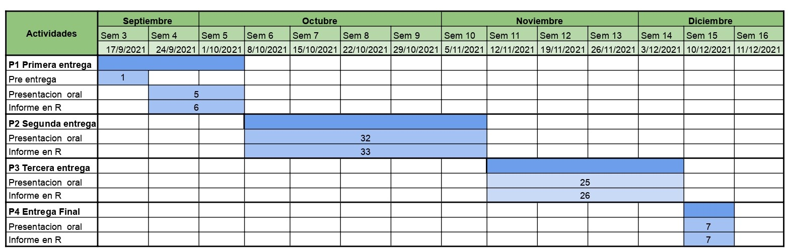
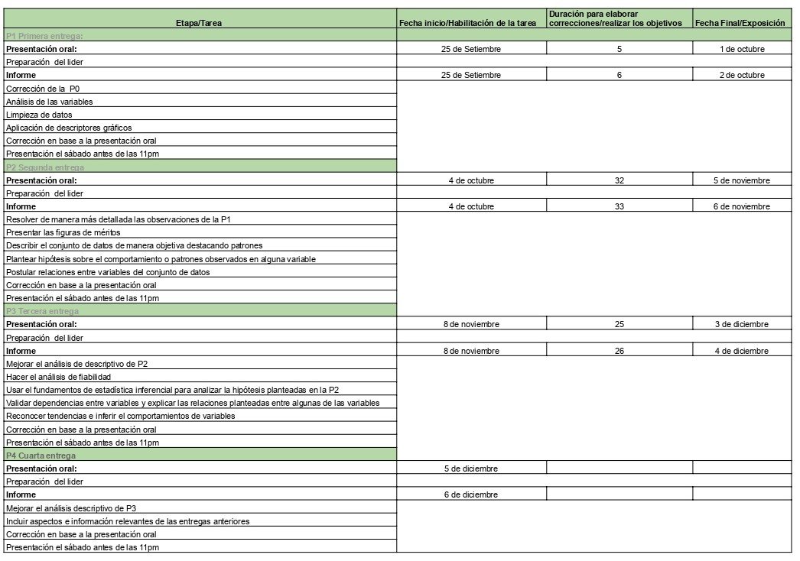

## **CONTENIDO** {.tabset}

### **DESCRIPCIÓN**

#### **1. Introducción**

<div style="text-align: justify">

Con la coyuntura actual, los servicios de Streaming nos han permitido pasar el tiempo de manera más conforme; por lo que buscamos encuestar a universitarios para cuantificar el tiempo en el que pasan en estas plataformas; además de buscar el motivo por el cual se han suscrito en estas plataformas ya que una serie o película puede generar más usuarios en estas.

Por último, se realizará una comparación del incremento de usuarios en las plataformas de Streaming en el 2019, cuando solo habían usuarios de Netflix, Amazon Prime Video, etc.; vs en el 2020, año en el que se han incrementado el número de plataformas, como de usuarios, en gran medida debido al confinamiento.

<div/>

<center>


</center>

#### **2. Objetivos**

##### **2.1. Objetivo principal**

<div style="text-align: justify">

Brindar información relevante acerca del impacto que tuvo la cuarentena en el uso y la contratación de servicios de streaming audiovisual en estudiantes de Lima Metropolitana.

<div/>

##### **2.2. Objetivos secundarios**

<div style="text-align: justify">

-   Analizar la preferencia de pago de los usuarios en cuanto las plataformas de Streaming

-   Determinar la variación de tiempo en cuanto al uso de plataformas de Streaming de los usuarios entre el 2019 y el 2020

-   Determinar la variación en cuanto al número de usuarios en las plataformas de Streaming del 2019 al 2020.

-   Estudiar el dispositivo de preferencia para el uso de plataformas de Streaming de los usuarios en el 2020

<!-- -->

    <div/>

###### **2.2.1. Preguntas**

<div style="text-align: justify">

-¿Cuál es la edad que usa más las plataformas de Streaming?

-¿Cuánto tiempo promedio al día las personas utilizaban las plataformas de Streaming?

-¿Cuál es la plataforma de preferencia para las personas?

-¿Cuánto están disponibles las personas a pagar por las plataformas de Streaming?

-¿Cuántas personas incrementaron en el uso de plataformas de Streaming?

-¿Qué plataformas aumentaron entre el 2019 y el 2020?

-¿Qué plataformas disminuyeron entre el 2019 y 2020?

-¿Cuánto influyó el cierre de cines para que las personas utilizarán las plataformas de Streaming?

-¿Cuál es el contenido que se observa más en las plataformas de Streaming?

-¿Qué tipo de pago fue el más utilizado?

-¿Qué plataforma tiene mayor tiempo de uso?

-¿Cuánto fue la influencia de contenido para que las personas se trasladen a otras plataformas de Streaming?

<div/>

#### **3. Factibilidad**

<div style="text-align: justify">

En la siguiente tabla se detalla las características y los logros de las 4 entregas que se van a cumplir.
Así mismo se detalla las fechas de entrega y los días que tendremos que realizar cada actividad y un diagrama de Gantt que nos ayudará a organizarnos mejor desde el inicio hasta el final del proyecto.

<div/>

<center>



</center>

<center>



</center>

#### **4. Marco teórico**

<div style="text-align: justify">

Las plataformas de Streaming, han tenido un impacto en la sociedad.
Pues, al ser un medio de entretenimiento tanto para jóvenes, niños y adultos que permite acceder a múltiples contenidos (TV, películas, música, podcast), desde cualquier ambiente (Hogar, escuela, trabajo) solo contando con conexión a internet, ha encontrado su momento de auge en el confinamiento nacional sucedido en el 2020.

El crecimiento constante de las plataformas de Streaming, y, las múltiples investigaciones y análisis acerca de ello, como el realizado por el analista Brad Barrett, quien confirma las cifras y afirma "Aproximadamente un tercio de todo el consumo de contenido se hace actualmente a través de plataformas de Streaming, pero en 2030 creo que va a aumentar a más del 80%", esto generó un gran interés por el tema en nuestro equipo.
Es por ello, que se planteó el siguiente tema de investigación: Incremento de los estudiantes de las universidades de Lima en las plataformas de Streaming del 2019 al 2020.

<div/>

<center>


</center>

#### **5. Población objetivo**

<div style="text-align: justify">

Jóvenes estudiantes universitarios del Lima Metropolitana que tengan y usen alguna plataforma de Streaming.

<div/>

##### **5.1. Unidad muestral**

<div style="text-align: justify">

Estudiantes universitarios de Lima que utilizaron plataformas de Streaming en el periodo del 2019 al 2020.

<div/>

##### **5.2. Justificación de muestra**

<div style="text-align: justify">

Se optó por la elección de estudiantes universitarios de Lima Metropolitana, ya que por la limitaciones que tenemos no podremos acceder a los estudiantes de las demás regiones del país.

<div/>

#### **6. Variables de estudio**

##### **6.1. Clasificación de las variables**

##### **Variables categóricas ordinal**

| <span style="color:dodgerblue"> Variables<span> | <span style="color:dodgerblue"> Descripción<span>    | <span style="color:dodgerblue"> Restricción<span> |     |
|:------------------------------------------------|:-----------------------------------------------------|:--------------------------------------------------|:----|
| Cine_a\_stream                                  | Puntuación el efecto e ausencia de los cines         | Entero positivo                                   |     |
| Traslado_plat                                   | Puntuación del contenido añadido por las plataformas | Entero positivo                                   |     |

##### **Variables categóricas nominales**

| <span style="color:dodgerblue"> Variables<span> | <span style="color:dodgerblue"> Descripción<span> | <span style="color:dodgerblue"> Restricción<span> |     |
|:------------------------------------------------|:--------------------------------------------------|:--------------------------------------------------|:----|
| Sexo                                            | Sexo                                              | F o M                                             |     |
| Universidad                                     | Entidad educativa                                 | Universidades de Lima                             |     |
| P_19                                            | Plataforma más usada 2019                         | \-                                                |     |
| Plataforma19                                    | Tipos de formas de pagar el consumo 2019          | \-                                                |     |
| Pagregadas20                                    | Plataformas agregadas 2020                        | \-                                                |     |
| Plataforma20                                    | Tipos de formas de pagar el consumo 2020          | \-                                                |     |
| Device                                          | Dispositivo en el usa                             | \-                                                |     |
| Contenido                                       | El tipo de contenido que consume                  | \-                                                |     |
| P_20                                            | Plataforma más usada 2020                         | \-                                                |     |

##### **Variables numéricas continuas**

| <span style="color:dodgerblue"> Variables<span> | <span style="color:dodgerblue"> Descripción<span> | <span style="color:dodgerblue"> Restricción<span> |     |
|:------------------------------------------------|:--------------------------------------------------|:--------------------------------------------------|:----|
| Precio_19                                       | Costo promedio de pago 2019                       | Racional positivo                                 |     |
| Precio_20                                       | Costo promedio de pago 2020                       | Racional positivo                                 |     |

##### **Variables numéricas discretas**

| <span style="color:dodgerblue"> Variables<span> | <span style="color:dodgerblue"> Descripción<span> | <span style="color:dodgerblue"> Restricción<span> |
|:------------------------------------------------|:--------------------------------------------------|:--------------------------------------------------|
| Pueblo                                          | Personas entrevistadas                            | Mayor de 50 pero menor de 1000                    |
| Time_service20                                  | Minutos de consumo promedio diario 2020           | Entero positivo                                   |
| Time_service19                                  | Minutos de consumo promedio diario 2019           | Entero positivo                                   |
| Edad                                            | Edad                                              | Mayores de 16                                     |

##### **6.2. Descripción de cada variable**

**1. Sexo:** Esta variable identifica a cada observación de acuerdo a su característica biológica.

**2. Universidad:** Esta variable, puntualiza la casa de estudio de cada una de las observaciones.

**3. P_19t :** Esta variable, alude a las plataformas que fue la más usadas por los encuestados durante el 2019.

**5. Plataforma19 :** Esta variable, indica la manera de pago de las observaciones por los servicios de Streaming durante el año 2019.

**6. Pagregadas20 :** Esta variable, indica las nuevas plataformas que fueron agregadas por los encuestados en el año 2020, a su lista de plataformas de Streaming.

**7. Plataforma20:** Esta variable, indica la manera de pago de las observaciones por los servicios de Streaming durante el año 2020.

**8. Device:** Esta variable, indica el dispositivo mediante el que se consumía el contenido de las plataformas de Streaming.

**9. Contenido** Esta variable, alude al tipo de contenido que consumía nuestros encuestados.

**10. P_20t :** Esta variable, alude a las plataformas que fue la más usadas por los encuestados durante el 2020.

**11. Time_service20:** Esta variable, indica el número de minutos que consumía de los servicios de Streaming en el año 2020.

**12. Time_service19:** Esta variable, indica el número de minutos que consumía de los servicios de Streaming en el año 2019

**13.Precio_19:** Esta variable, indica la cantidad de dinero que gastó cada persona en pago de Suscripciones a plataformas de Streaming en promedio en el año 2019.

**14. Edad:** Esta variable, indica la cantidad de años que tiene la persona que responde la encuesta.

**15. Precio_20:** Esta variable, indica la cantidad de dinero que gastó cada persona en pago de Suscripciones a plataformas de Streaming en promedio en el año 2020

**16. Cine_a\_stream:** Esta variable, indica una puntuación del 1 al 10 la influencia que tuvo la ausencia de los cines para que se utilicen plataformas de Streaming.

**17. Traslado_plat:** Esta variable, indica indica una puntuación del 1 al 10 la influencia que tuvo el nuevo contenido agregado para el traslado de una plataforma a otra.

### **DATASET**

#### **7. Base de datos**

#### **Librerías**

```{r}
library(readr)
library(ggplot2)
library(tidyr)
library(dplyr)
library(modeest)
library(Rlab)
```

```{r}
DF <- read_csv("ENCUESTA_FINAL_P2.csv")
```

```{r}
names(DF)
```

#### **Limpieza de datos**

```{r}
DF %>% rename(Identidad = `Nombres y Apellidos`, Universidad = `¿En qué Universidad estudias?`, Plataformas_2019 = `¿Qué plataformas usabas en el 2019? (Si no usabas alguna plataforma colocar NU)`, Netflix_2019 = `¿Cuánto tiempo al día utilizabas estas plataformas en el 2019? (considerando que NU es que no usabas la plataforma) *desde 20min hasta más de 9horas* [Netflix]`, Youtube_2019 = `¿Cuánto tiempo al día utilizabas estas plataformas en el 2019? (considerando que NU es que no usabas la plataforma) *desde 20min hasta más de 9horas* [Youtube]`, Youtube_p_2019 = `¿Cuánto tiempo al día utilizabas estas plataformas en el 2019? (considerando que NU es que no usabas la plataforma) *desde 20min hasta más de 9horas* [Youtube premium]`, Movistar_play_2019 = `¿Cuánto tiempo al día utilizabas estas plataformas en el 2019? (considerando que NU es que no usabas la plataforma) *desde 20min hasta más de 9horas* [Movistar Play]`, Zoom_2019 = `¿Cuánto tiempo al día utilizabas estas plataformas en el 2019? (considerando que NU es que no usabas la plataforma) *desde 20min hasta más de 9horas* [Zoom]`, HBO_2019 = `¿Cuánto tiempo al día utilizabas estas plataformas en el 2019? (considerando que NU es que no usabas la plataforma) *desde 20min hasta más de 9horas* [HBO]`, Amazon_p_2019 = `¿Cuánto tiempo al día utilizabas estas plataformas en el 2019? (considerando que NU es que no usabas la plataforma) *desde 20min hasta más de 9horas* [Amazon Prime Video]`, Twitch_2019 = `¿Cuánto tiempo al día utilizabas estas plataformas en el 2019? (considerando que NU es que no usabas la plataforma) *desde 20min hasta más de 9horas* [Twitch]`, Disney_plus_2019 = `¿Cuánto tiempo al día utilizabas estas plataformas en el 2019? (considerando que NU es que no usabas la plataforma) *desde 20min hasta más de 9horas* [Disney plus]`, Fb_gaming_2019 = `¿Cuánto tiempo al día utilizabas estas plataformas en el 2019? (considerando que NU es que no usabas la plataforma) *desde 20min hasta más de 9horas* [Facebook Gaming]`, Claro_video_2019 = `¿Cuánto tiempo al día utilizabas estas plataformas en el 2019? (considerando que NU es que no usabas la plataforma) *desde 20min hasta más de 9horas* [Claro Video]`, Starplus_2019 = `¿Cuánto tiempo al día utilizabas estas plataformas en el 2019? (considerando que NU es que no usabas la plataforma) *desde 20min hasta más de 9horas* [Star Plus]`, Discord_2019 = `¿Cuánto tiempo al día utilizabas estas plataformas en el 2019? (considerando que NU es que no usabas la plataforma) *desde 20min hasta más de 9horas* [Discord]`, Crunchyroll_2019 = `¿Cuánto tiempo al día utilizabas estas plataformas en el 2019? (considerando que NU es que no usabas la plataforma) *desde 20min hasta más de 9horas* [Crunchyroll]`, Spotify_2019 = `¿Cuánto tiempo al día utilizabas estas plataformas en el 2019? (considerando que NU es que no usabas la plataforma) *desde 20min hasta más de 9horas* [Spotify]`, Foxsport_2019 = `¿Cuánto tiempo al día utilizabas estas plataformas en el 2019? (considerando que NU es que no usabas la plataforma) *desde 20min hasta más de 9horas* [Fox Sport]`, Hulu_2019 = `¿Cuánto tiempo al día utilizabas estas plataformas en el 2019? (considerando que NU es que no usabas la plataforma) *desde 20min hasta más de 9horas* [Hulu]`, DirecTVgo_2019 = `¿Cuánto tiempo al día utilizabas estas plataformas en el 2019? (considerando que NU es que no usabas la plataforma) *desde 20min hasta más de 9horas* [Direct tv go]`, AmericaTVgo_2019 = `¿Cuánto tiempo al día utilizabas estas plataformas en el 2019? (considerando que NU es que no usabas la plataforma) *desde 20min hasta más de 9horas* [America TV go]`, SyP_fav = `¿Cuáles eran tus series y/o películas de preferencia en estas plataformas? (máximo 2)`, Contenido = `¿Qué tipo de contenido te interesaba más?`, Plataforma19 =  `¿Usas una plataforma personal o grupal?`, Precio_2019 = `Al mes ¿Cuánto pagabas aproximadamente por las plataformas 2019? *solo colocar número*`, Nueva_plat_2020 = `¿Qué plataforma nueva has agregado durante el 2020? (Si no agregaste alguna colocar NU)`) -> Aux
```

```{r}
Aux %>% rename(Device = `¿De qué manera te gustaba consumir el contenido?`, Netflix_2020 = `¿Cuánto tiempo al día utilizabas estas plataformas en el 2020? (considerando que NU es que no usabas la plataforma) *desde 20min hasta más de 9horas* [Netflix]`, Youtube_2020 = `¿Cuánto tiempo al día utilizabas estas plataformas en el 2020? (considerando que NU es que no usabas la plataforma) *desde 20min hasta más de 9horas* [Youtube]`, Youtube_p_2020 = `¿Cuánto tiempo al día utilizabas estas plataformas en el 2020? (considerando que NU es que no usabas la plataforma) *desde 20min hasta más de 9horas* [Youtube premium]`, Movistar_play_2020 = `¿Cuánto tiempo al día utilizabas estas plataformas en el 2020? (considerando que NU es que no usabas la plataforma) *desde 20min hasta más de 9horas* [Movistar Play]`, Zoom_2020 = `¿Cuánto tiempo al día utilizabas estas plataformas en el 2020? (considerando que NU es que no usabas la plataforma) *desde 20min hasta más de 9horas* [Zoom]`, HBO_2020 = `¿Cuánto tiempo al día utilizabas estas plataformas en el 2020? (considerando que NU es que no usabas la plataforma) *desde 20min hasta más de 9horas* [HBO]`, Amazon_p_2020 = `¿Cuánto tiempo al día utilizabas estas plataformas en el 2020? (considerando que NU es que no usabas la plataforma) *desde 20min hasta más de 9horas* [Amazon Prime Video]`, Twitch_2020 = `¿Cuánto tiempo al día utilizabas estas plataformas en el 2020? (considerando que NU es que no usabas la plataforma) *desde 20min hasta más de 9horas* [Twitch]`, Disney_plus_2020 = `¿Cuánto tiempo al día utilizabas estas plataformas en el 2020? (considerando que NU es que no usabas la plataforma) *desde 20min hasta más de 9horas* [Disney plus]`, Fb_gaming_2020 = `¿Cuánto tiempo al día utilizabas estas plataformas en el 2020? (considerando que NU es que no usabas la plataforma) *desde 20min hasta más de 9horas* [Facebook Gaming]`, Claro_video_2020 = `¿Cuánto tiempo al día utilizabas estas plataformas en el 2020? (considerando que NU es que no usabas la plataforma) *desde 20min hasta más de 9horas* [Claro Video]`, Starplus_2020 = `¿Cuánto tiempo al día utilizabas estas plataformas en el 2020? (considerando que NU es que no usabas la plataforma) *desde 20min hasta más de 9horas* [Star Plus]`, Discord_2020 = `¿Cuánto tiempo al día utilizabas estas plataformas en el 2020? (considerando que NU es que no usabas la plataforma) *desde 20min hasta más de 9horas* [Discord]`, Crunchyroll_2020 = `¿Cuánto tiempo al día utilizabas estas plataformas en el 2020? (considerando que NU es que no usabas la plataforma) *desde 20min hasta más de 9horas* [Crunchyroll]`, Spotify_2020 = `¿Cuánto tiempo al día utilizabas estas plataformas en el 2020? (considerando que NU es que no usabas la plataforma) *desde 20min hasta más de 9horas* [Spotify]`, Foxsport_2020 = `¿Cuánto tiempo al día utilizabas estas plataformas en el 2020? (considerando que NU es que no usabas la plataforma) *desde 20min hasta más de 9horas* [Fox Sport]`, Hulu_2020 = `¿Cuánto tiempo al día utilizabas estas plataformas en el 2020? (considerando que NU es que no usabas la plataforma) *desde 20min hasta más de 9horas* [Hulu]`, DirecTVgo_2020 = `¿Cuánto tiempo al día utilizabas estas plataformas en el 2020? (considerando que NU es que no usabas la plataforma) *desde 20min hasta más de 9horas* [Direct tv go]`, AmericaTVgo_2020 = `¿Cuánto tiempo al día utilizabas estas plataformas en el 2020? (considerando que NU es que no usabas la plataforma) *desde 20min hasta más de 9horas* [America TV go]`, Plataforma2020 = `¿Pagabas la plataforma de manera personal o grupal?`) -> Aux2
```

```{r}
Aux2 %>% rename(Time_service20 = `¿Cuánto tiempo al día utilizabas los servicios de streaming durante en el 2020?  *en horas*`, Cine_a_stream = `¿En qué porcentaje, el no poder ir a los cines hizo que optes por ver películas en algún servicio de streaming?  (siendo 1 un 10% y 10 un 100%)`, Traslado_plat = `En términos de porcentaje ¿Cuánto influyó la actualización del contenido de las plataformas de Streaming para trasladarte de una a otra? (siendo 1 un 10% y 10 un 100%)`, Precio_2020 = `Al mes ¿Cuánto pagabas aproximadamente por las plataformas 2020? *solo colocar número*`,Time_service19 = `¿Cuánto tiempo al día utilizabas los servicios de streaming durante en el 2019? *en horas*`) -> DFN
```

```{r}
DFN$Identidad[DFN$Identidad == "ADRIANA JESUS VARGAS ALVAREZ"] <- "Adriana Jesus Vargas Alvarez"
DFN$Identidad[DFN$Identidad == "Cajilima Pozo Víctor Luciano Carlos"] <- "Víctor Luciano Carlos Cajilima Pozo"
DFN$Identidad[DFN$Identidad == "Cielo guerra"] <- "Cielo Guerra"
DFN$Identidad[DFN$Identidad == "Jeanpier matencio"] <- "Jeanpier Matencio"
DFN$Identidad[DFN$Identidad == "Jhoan danith flores cieza"] <- "Jhoan Danith Flores Cieza"
DFN$Identidad[DFN$Identidad == "luis adrian gonzales urcuhuaranga"] <- "Luis Adrian Gonzales Urcuhuaranga"
DFN$Identidad[DFN$Identidad == "Nicolas cayo"] <- "Nicolas Cayo"
DFN$Identidad[DFN$Identidad == "sebastian jair gomez albino"] <- "Sebastian Jair Gomez Albino"
DFN$Identidad[DFN$Identidad == "SONYA VASQUEZ"] <- "Sonya Vasquez"
DFN$Identidad[DFN$Identidad == "Rabanal Yalico Luz Mahilen"] <- "Luz Mahilen Rabanal Yalico"
DFN$Identidad[DFN$Identidad == "Chaupis Salgado Alvaro"] <- "Alvaro Chaupis Salgado"
DFN$Identidad[DFN$Identidad == "Nicolas cayo"] <- "Nicolas Cayo"
DFN$Identidad[DFN$Identidad == "Nicolas cayo"] <- "Nicolas Cayo"
DFN$Identidad[DFN$Identidad == "Nicolas cayo"] <- "Nicolas Cayo"
DFN$Universidad[DFN$Universidad == "Universidad Cesar Vallejo"] <- "UCV"
DFN$Universidad[DFN$Universidad == "Ninguna"] <- NA
DFN$Universidad[DFN$Universidad == "Na"] <- NA
DFN$Universidad[DFN$Universidad == "Universidad del Pacífico"] <- "UP"
DFN$Universidad[DFN$Universidad == "Universidad Peruana de Ciencias Aplicadas - UPC"] <- "UPC"
DFN$Universidad[DFN$Universidad == "Pacífico"] <- "UP"
DFN$Universidad[DFN$Universidad == "Universidad Ricardo Palma"] <- "URP"
DFN$Universidad[DFN$Universidad == "Sigo en colegio 🙆🏻‍♀️"] <- NA
DFN$Universidad[DFN$Universidad == "Upc"] <- "UPC"
DFN$Universidad[DFN$Universidad == "Universidad Privada del Norte"] <- "UPN"
DFN$Universidad[DFN$Universidad == "Universidad Tecnológica del Perú"] <- "UTP"
DFN$Universidad[DFN$Universidad == "Pucp"] <- "PUCP"
DFN$Universidad[DFN$Universidad == "Universidad Nacional de Ucayali"] <- "UNU"
DFN$Universidad[DFN$Universidad == "Pucp"] <- "PUCP"
DFN$Universidad[DFN$Universidad == "Utec"] <- "UTEC"
DFN$Universidad[DFN$Universidad == "Universidad de Piura"] <- "UDEP"
DFN$Universidad[DFN$Universidad == "Universidad de Lima"] <- "UL"
DFN$Universidad[DFN$Universidad == "UNIVERSIDAD César Vallejo"] <- "UCV"
DFN$Universidad[DFN$Universidad == "Universidad Nacional de Ingeniería"] <- "UNI"
DFN$Universidad[DFN$Universidad == "Universidad San Martín de Porres"] <- "USMP"
DFN$Universidad[DFN$Universidad == "Universidad nacional de ucayali"] <- "UNU"
DFN$Universidad[DFN$Universidad == "unac"] <- "UNAC"
DFN$Universidad[DFN$Universidad == "La gran UTEC"] <- "UTEC"
DFN$Universidad[DFN$Universidad == "Universidad del Pacifico"] <- "UP"
DFN$Universidad[DFN$Universidad == "U.Pacífico"] <- "UP"
DFN$Universidad[DFN$Universidad == "San Martín"] <- "USMP"
DFN$Universidad[DFN$Universidad == "Universidad de lima"] <- "UL"
DFN$Universidad[DFN$Universidad == "Federico Villarreal"] <- "UNFV"
DFN$Universidad[DFN$Universidad == "Usil"] <- "USIL"
DFN$Universidad[DFN$Universidad == "Unfv"] <- "UNFV"
DFN$Universidad[DFN$Universidad == "Universidad de Ingeniería y Tecnología"] <- "UTEC"
DFN$Universidad[DFN$Universidad == "UNIVERSIDAD NACIONAL DE TRUJILLO"] <- "UNT"
DFN$Universidad[DFN$Universidad == "Isil"] <- "ISIL"
DFN$Universidad[DFN$Universidad == "Universidad Nacional de Música"] <- "CNM"
DFN$Universidad[DFN$Universidad == "Cientifica del Sur"] <- "UCSUR"
DFN$Universidad[DFN$Universidad == "San Carlos de Guatemala"] <- "USAC"
DFN$Universidad[DFN$Universidad == "La vida"] <- NA
DFN$Universidad[DFN$Universidad == "UNIVERSIDAD PRIVADA DEL NORTE"] <- "UPN"
DFN$Universidad[DFN$Universidad == "Privada del Norte"] <- "UPN"
DFN$Universidad[DFN$Universidad == "Universidad de Ingeniería y Tecnología (UTEC)"] <- "UTEC"
DFN$Universidad[DFN$Universidad == "Universidad tecnológica del Perú"] <- "UTP"
DFN$Universidad[DFN$Universidad == "Universidad privada del norte"] <- "UPN"
DFN$Universidad[DFN$Universidad == "Pontificia Universidad Católica del Perú"] <- "PUCP"
DFN$Universidad[DFN$Universidad == "Universidad de San Martín de Porres"] <- "USMP"
```

```{r}
DFN$Netflix_2019[DFN$Netflix_2019 == "NU"] <- NA
DFN$Netflix_2019[DFN$Netflix_2019 == 1] <- 60
DFN$Netflix_2019[DFN$Netflix_2019 == 2] <- 120
DFN$Netflix_2019[DFN$Netflix_2019 == 3] <- 180
DFN$Netflix_2019[DFN$Netflix_2019 == 4] <- 240
DFN$Netflix_2019[DFN$Netflix_2019 == 5] <- 300
DFN$Netflix_2019[DFN$Netflix_2019 == 6] <- 360
DFN$Netflix_2019[DFN$Netflix_2019 == 7] <- 420
DFN$Netflix_2019[DFN$Netflix_2019 == 8] <- 480
DFN$Netflix_2019[DFN$Netflix_2019 == "9+"] <- 540
DFN$Netflix_2019 <- as.numeric(DFN$Netflix_2019) 
```

```{r}
DFN$Youtube_2019[DFN$Youtube_2019 == "NU"] <- NA
DFN$Youtube_2019[DFN$Youtube_2019== 1] <- 60
DFN$Youtube_2019[DFN$Youtube_2019 == 2] <- 120
DFN$Youtube_2019[DFN$Youtube_2019 == 3] <- 180
DFN$Youtube_2019[DFN$Youtube_2019 == 4] <- 240
DFN$Youtube_2019[DFN$Youtube_2019 == 5] <- 300
DFN$Youtube_2019[DFN$Youtube_2019 == 6] <- 360
DFN$Youtube_2019[DFN$Youtube_2019 == 7] <- 420
DFN$Youtube_2019[DFN$Youtube_2019 == 8] <- 480
DFN$Youtube_2019[DFN$Youtube_2019 == "9+"] <- 540
DFN$Youtube_2019 <- as.numeric(DFN$Youtube_2019) 
```

```{r}
DFN$Youtube_p_2019[DFN$Youtube_p_2019 == "NU"] <- NA
DFN$Youtube_p_2019[DFN$Youtube_p_2019 == 1] <- 60
DFN$Youtube_p_2019[DFN$Youtube_p_2019 == 2] <- 120
DFN$Youtube_p_2019[DFN$Youtube_p_2019 == 3] <- 180
DFN$Youtube_p_2019[DFN$Youtube_p_2019 == 4] <- 240
DFN$Youtube_p_2019[DFN$Youtube_p_2019 == 5] <- 300
DFN$Youtube_p_2019[DFN$Youtube_p_2019 == 6] <- 360
DFN$Youtube_p_2019[DFN$Youtube_p_2019 == 7] <- 420
DFN$Youtube_p_2019[DFN$Youtube_p_2019 == 8] <- 480
DFN$Youtube_p_2019[DFN$Youtube_p_2019 == "9+"] <- 540
DFN$Youtube_p_2019 <- as.numeric(DFN$Youtube_p_2019) 
```

```{r}
DFN$Movistar_play_2019[DFN$Movistar_play_2019 == "NU"] <- NA
DFN$Movistar_play_2019[DFN$Movistar_play_2019 == 1] <- 60
DFN$Movistar_play_2019[DFN$Movistar_play_2019 == 2] <- 120
DFN$Movistar_play_2019[DFN$Movistar_play_2019 == 3] <- 180
DFN$Movistar_play_2019[DFN$Movistar_play_2019 == 4] <- 240
DFN$Movistar_play_2019[DFN$Movistar_play_2019 == 5] <- 300
DFN$Movistar_play_2019[DFN$Movistar_play_2019 == 6] <- 360
DFN$Movistar_play_2019[DFN$Movistar_play_2019 == 7] <- 420
DFN$Movistar_play_2019[DFN$Movistar_play_2019 == 8] <- 480
DFN$Movistar_play_2019[DFN$Movistar_play_2019 == "9+"] <- 540
DFN$Movistar_play_2019<- as.numeric(DFN$Movistar_play_2019) 
```

```{r}
DFN$Zoom_2019[DFN$Zoom_2019 == "NU"] <- NA
DFN$Zoom_2019[DFN$Zoom_2019 == 1] <- 60
DFN$Zoom_2019[DFN$Zoom_2019 == 2] <- 120
DFN$Zoom_2019[DFN$Zoom_2019 == 3] <- 180
DFN$Zoom_2019[DFN$Zoom_2019 == 4] <- 240
DFN$Zoom_2019[DFN$Zoom_2019 == 5] <- 300
DFN$Zoom_2019[DFN$Zoom_2019 == 6]<- 360
DFN$Zoom_2019[DFN$Zoom_2019 == 7]<- 420
DFN$Zoom_2019[DFN$Zoom_2019 == 8] <- 480
DFN$Zoom_2019[DFN$Zoom_2019 == "9+"] <- 540
DFN$Zoom_2019<- as.numeric(DFN$Zoom_2019)
```

```{r}
DFN$HBO_2019[DFN$HBO_2019 == "NU"] <- NA
DFN$HBO_2019[DFN$HBO_2019 == 1] <- 60
DFN$HBO_2019[DFN$HBO_2019 == 2] <- 120
DFN$HBO_2019[DFN$HBO_2019 == 3] <- 180
DFN$HBO_2019[DFN$HBO_2019 == 4] <- 240
DFN$HBO_2019[DFN$HBO_2019 == 5] <- 300
DFN$HBO_2019[DFN$HBO_2019 == 6] <- 360
DFN$HBO_2019[DFN$HBO_2019 == 7] <- 420
DFN$HBO_2019[DFN$HBO_2019 == 8] <- 480
DFN$HBO_2019[DFN$HBO_2019 == "9+"] <- 540
DFN$HBO_2019<- as.numeric(DFN$HBO_2019)

```

```{r}
DFN$Amazon_p_2019[DFN$Amazon_p_2019 == "NU"] <- NA
DFN$Amazon_p_2019[DFN$Amazon_p_2019 == 1] <- 60
DFN$Amazon_p_2019[DFN$Amazon_p_2019 == 2] <- 120
DFN$Amazon_p_2019[DFN$Amazon_p_2019 == 3] <- 180
DFN$Amazon_p_2019[DFN$Amazon_p_2019 == 4] <- 240
DFN$Amazon_p_2019[DFN$Amazon_p_2019 == 5] <- 300
DFN$Amazon_p_2019[DFN$Amazon_p_2019 == 6] <- 360
DFN$Amazon_p_2019[DFN$Amazon_p_2019 == 7] <- 420
DFN$Amazon_p_2019[DFN$Amazon_p_2019 == 8] <- 480
DFN$Amazon_p_2019[DFN$Amazon_p_2019 == "9+"] <- 540
DFN$Amazon_p_2019<- as.numeric(DFN$Amazon_p_2019)

```

```{r}
DFN$Twitch_2019[DFN$Twitch_2019 == "NU"] <- NA
DFN$Twitch_2019[DFN$Twitch_2019 == 1] <- 60
DFN$Twitch_2019[DFN$Twitch_2019 == 2] <- 120
DFN$Twitch_2019[DFN$Twitch_2019 == 3] <- 180
DFN$Twitch_2019[DFN$Twitch_2019 == 4] <- 240
DFN$Twitch_2019[DFN$Twitch_2019 == 5] <- 300
DFN$Twitch_2019[DFN$Twitch_2019 == 6] <- 360
DFN$Twitch_2019[DFN$Twitch_2019 == 7] <- 420
DFN$Twitch_2019[DFN$Twitch_2019 == 8] <- 480
DFN$Twitch_2019[DFN$Twitch_2019 == "9+"] <- 540
DFN$Twitch_2019<- as.numeric(DFN$Twitch_2019)

```

```{r}
DFN$Disney_plus_2019[DFN$Disney_plus_2019 == "NU"] <- NA
DFN$Disney_plus_2019[DFN$Disney_plus_2019 == 1] <- 60
DFN$Disney_plus_2019[DFN$Disney_plus_2019 == 2] <- 120
DFN$Disney_plus_2019[DFN$Disney_plus_2019 == 3] <- 180
DFN$Disney_plus_2019[DFN$Disney_plus_2019 == 4] <- 240
DFN$Disney_plus_2019[DFN$Disney_plus_2019 == 5] <- 300
DFN$Disney_plus_2019[DFN$Disney_plus_2019 == 6] <- 360
DFN$Disney_plus_2019[DFN$Disney_plus_2019 == 7] <- 420
DFN$Disney_plus_2019[DFN$Disney_plus_2019 == 8] <- 480
DFN$Disney_plus_2019[DFN$Disney_plus_2019 == "9+"] <- 540
DFN$Disney_plus_2019<- as.numeric(DFN$Disney_plus_2019)

```

```{r}
DFN$Fb_gaming_2019[DFN$Fb_gaming_2019 == "NU"] <- NA
DFN$Fb_gaming_2019[DFN$Fb_gaming_2019 == "NU"] <- 60
DFN$Fb_gaming_2019[DFN$Fb_gaming_2019 == "NU"] <- 120
DFN$Fb_gaming_2019[DFN$Fb_gaming_2019 == "NU"] <- 180
DFN$Fb_gaming_2019[DFN$Fb_gaming_2019 == "NU"] <- 240
DFN$Fb_gaming_2019[DFN$Fb_gaming_2019 == "NU"] <- 300
DFN$Fb_gaming_2019[DFN$Fb_gaming_2019 == "NU"] <- 360
DFN$Fb_gaming_2019[DFN$Fb_gaming_2019 == "NU"] <- 420
DFN$Fb_gaming_2019[DFN$Fb_gaming_2019 == "NU"] <- 480
DFN$Fb_gaming_2019[DFN$Fb_gaming_2019 == "9+"] <- 540
DFN$Fb_gaming_2019<- as.numeric(DFN$Fb_gaming_2019)

```

```{r}
DFN$Claro_video_2019[DFN$Claro_video_2019 == "NU"] <- NA
DFN$Claro_video_2019[DFN$Claro_video_2019 == 1] <- 60
DFN$Claro_video_2019[DFN$Claro_video_2019 == 2] <- 120
DFN$Claro_video_2019[DFN$Claro_video_2019 == 3] <- 180
DFN$Claro_video_2019[DFN$Claro_video_2019 == 4] <- 240
DFN$Claro_video_2019[DFN$Claro_video_2019 == 5] <- 300
DFN$Claro_video_2019[DFN$Claro_video_2019 == 6] <- 360
DFN$Claro_video_2019[DFN$Claro_video_2019 == 7] <- 420
DFN$Claro_video_2019[DFN$Claro_video_2019 == 8] <- 480
DFN$Claro_video_2019[DFN$Claro_video_2019 == "9+"] <- 540
DFN$Claro_video_2019<- as.numeric(DFN$Claro_video_2019)

```

```{r}
DFN$Starplus_2019[DFN$Starplus_2019 == "NU"] <- NA
DFN$Starplus_2019[DFN$Starplus_2019 == 1] <- 60
DFN$Starplus_2019[DFN$Starplus_2019 == 2] <- 120
DFN$Starplus_2019[DFN$Starplus_2019 == 3] <- 180
DFN$Starplus_2019[DFN$Starplus_2019 == 4] <- 240
DFN$Starplus_2019[DFN$Starplus_2019 == 5] <- 300
DFN$Starplus_2019[DFN$Starplus_2019 == 6] <- 360
DFN$Starplus_2019[DFN$Starplus_2019 == 7] <- 420
DFN$Starplus_2019[DFN$Starplus_2019 == 8] <- 480
DFN$Starplus_2019[DFN$Starplus_2019 == "9+"] <- 540
DFN$Starplus_2019<- as.numeric(DFN$Starplus_2019)

```

```{r}
DFN$Discord_2019[DFN$Discord_2019 == "NU"] <- NA
DFN$Discord_2019[DFN$Discord_2019 == 1] <- 60
DFN$Discord_2019[DFN$Discord_2019 == 2] <- 120
DFN$Discord_2019[DFN$Discord_2019 == 3] <- 180
DFN$Discord_2019[DFN$Discord_2019 == 4] <- 240
DFN$Discord_2019[DFN$Discord_2019 == 5] <- 300
DFN$Discord_2019[DFN$Discord_2019 == 6] <- 360
DFN$Discord_2019[DFN$Discord_2019 == 7] <- 420
DFN$Discord_2019[DFN$Discord_2019 == 8] <- 480
DFN$Discord_2019[DFN$Discord_2019 == "9+"] <- 540
DFN$Discord_2019<- as.numeric(DFN$Discord_2019)

```

```{r}
DFN$Crunchyroll_2019[DFN$Crunchyroll_2019 == "NU"] <- NA
DFN$Crunchyroll_2019[DFN$Crunchyroll_2019 == 1] <- 60
DFN$Crunchyroll_2019[DFN$Crunchyroll_2019 == 2] <- 120
DFN$Crunchyroll_2019[DFN$Crunchyroll_2019 == 3] <- 180
DFN$Crunchyroll_2019[DFN$Crunchyroll_2019 == 4] <- 240
DFN$Crunchyroll_2019[DFN$Crunchyroll_2019 == 5] <- 300
DFN$Crunchyroll_2019[DFN$Crunchyroll_2019 == 6] <- 360
DFN$Crunchyroll_2019[DFN$Crunchyroll_2019 == 7] <- 420
DFN$Crunchyroll_2019[DFN$Crunchyroll_2019 == 8] <- 480
DFN$Crunchyroll_2019[DFN$Crunchyroll_2019 == "9+"] <- 540
DFN$Crunchyroll_2019<- as.numeric(DFN$Crunchyroll_2019)

```

```{r}
DFN$Spotify_2019[DFN$Spotify_2019 == "NU"] <- NA
DFN$Spotify_2019[DFN$Spotify_2019 == 1] <- 60
DFN$Spotify_2019[DFN$Spotify_2019 == 2] <- 120
DFN$Spotify_2019[DFN$Spotify_2019 == 3] <- 180
DFN$Spotify_2019[DFN$Spotify_2019 == 4] <- 240
DFN$Spotify_2019[DFN$Spotify_2019 == 5] <- 300
DFN$Spotify_2019[DFN$Spotify_2019 == 6] <- 360
DFN$Spotify_2019[DFN$Spotify_2019 == 7] <- 420
DFN$Spotify_2019[DFN$Spotify_2019 == 8] <- 480
DFN$Spotify_2019[DFN$Spotify_2019 == "9+"] <- 540
DFN$Spotify_2019<- as.numeric(DFN$Spotify_2019)

```

```{r}
DFN$Foxsport_2019[DFN$Foxsport_2019 == "NU"] <- NA
DFN$Foxsport_2019[DFN$Foxsport_2019 == 1] <- 60
DFN$Foxsport_2019[DFN$Foxsport_2019 == 2] <- 120
DFN$Foxsport_2019[DFN$Foxsport_2019 == 3] <- 180
DFN$Foxsport_2019[DFN$Foxsport_2019 == 4] <- 240
DFN$Foxsport_2019[DFN$Foxsport_2019 == 5] <- 300
DFN$Foxsport_2019[DFN$Foxsport_2019 == 6] <- 360
DFN$Foxsport_2019[DFN$Foxsport_2019 == 7] <- 420
DFN$Foxsport_2019[DFN$Foxsport_2019 == 8] <- 480
DFN$Foxsport_2019[DFN$Foxsport_2019 == "9+"] <- 540
DFN$Foxsport_2019<- as.numeric(DFN$Foxsport_2019)


```

```{r}
DFN$Hulu_2019[DFN$Hulu_2019 == "NU"] <- NA
DFN$Hulu_2019[DFN$Hulu_2019 == 1] <- 60
DFN$Hulu_2019[DFN$Hulu_2019 == 2] <- 120
DFN$Hulu_2019[DFN$Hulu_2019 == 3] <- 180
DFN$Hulu_2019[DFN$Hulu_2019 == 4] <- 240
DFN$Hulu_2019[DFN$Hulu_2019 == 5] <- 300
DFN$Hulu_2019[DFN$Hulu_2019 == 6] <- 360
DFN$Hulu_2019[DFN$Hulu_2019 == 7] <- 420
DFN$Hulu_2019[DFN$Hulu_2019 == 8] <- 480
DFN$Hulu_2019[DFN$Hulu_2019 == "9+"] <- 540
DFN$Hulu_2019<- as.numeric(DFN$Hulu_2019)

```

```{r}
DFN$DirecTVgo_2019[DFN$DirecTVgo_2019 == "NU"] <- NA
DFN$DirecTVgo_2019[DFN$DirecTVgo_2019 == 1] <- 60
DFN$DirecTVgo_2019[DFN$DirecTVgo_2019 == 2] <- 120
DFN$DirecTVgo_2019[DFN$DirecTVgo_2019 == 3] <- 180
DFN$DirecTVgo_2019[DFN$DirecTVgo_2019 == 4] <- 240
DFN$DirecTVgo_2019[DFN$DirecTVgo_2019 == 5] <- 300
DFN$DirecTVgo_2019[DFN$DirecTVgo_2019 == 6] <- 360
DFN$DirecTVgo_2019[DFN$DirecTVgo_2019 == 7] <- 420
DFN$DirecTVgo_2019[DFN$DirecTVgo_2019 == 8] <- 480
DFN$DirecTVgo_2019[DFN$DirecTVgo_2019 == "9+"] <- 540
DFN$DirecTVgo_2019<- as.numeric(DFN$DirecTVgo_2019)

```

```{r}
DFN$AmericaTVgo_2019[DFN$AmericaTVgo_2019 == "NU"] <- NA
DFN$AmericaTVgo_2019[DFN$AmericaTVgo_2019 == 1] <- 60
DFN$AmericaTVgo_2019[DFN$AmericaTVgo_2019 == 2] <- 120
DFN$AmericaTVgo_2019[DFN$AmericaTVgo_2019 == 3] <- 180
DFN$AmericaTVgo_2019[DFN$AmericaTVgo_2019 == 4] <- 240
DFN$AmericaTVgo_2019[DFN$AmericaTVgo_2019 == 5] <- 300
DFN$AmericaTVgo_2019[DFN$AmericaTVgo_2019 == 6] <- 360
DFN$AmericaTVgo_2019[DFN$AmericaTVgo_2019 == 7] <- 420
DFN$AmericaTVgo_2019[DFN$AmericaTVgo_2019 == 8] <- 480
DFN$AmericaTVgo_2019[DFN$AmericaTVgo_2019 == "9+"] <- 540
DFN$AmericaTVgo_2019<- as.numeric(DFN$AmericaTVgo_2019)

```

```{r}
DFN$Precio_2019[DFN$Precio_2019 == "34so"] <- 34
DFN$Precio_2019[DFN$Precio_2019 == "45 creo"] <- 45
DFN$Precio_2019[DFN$Precio_2019 == "0"] <- NA
DFN$Precio_2019[DFN$Precio_2019 == "24.90"] <- 25
DFN$Precio_2019[DFN$Precio_2019 == "10 dólares"] <- 40
DFN$Precio_2019[DFN$Precio_2019 == "14 al mes. (Nos dividimos el pago entre los usuarios)"] <- 14
DFN$Precio_2019[DFN$Precio_2019 == "39.90"] <- 40
DFN$Precio_2019[DFN$Precio_2019 == "50 soles aprox"] <- 50
DFN$Precio_2019[DFN$Precio_2019 == "28 $"] <- 110
DFN$Precio_2019[DFN$Precio_2019 == "12 c/u"] <- 12
DFN$Precio_2019[DFN$Precio_2019 == "100 soles"] <- 100
DFN$Precio_2019[DFN$Precio_2019 == "Youtube es gratis :D"] <- NA
DFN$Precio_2019[DFN$Precio_2019 == "10so solo por Netflix"] <- 10
DFN$Precio_2019[DFN$Precio_2019 == "12 c/u"] <- 12
DFN$Precio_2019[DFN$Precio_2019 == "40.00"] <- 40
DFN$Precio_2019[DFN$Precio_2019 == "35 soles por el servicio de cable (Fox Sports)"] <- 35
DFN$Precio_2019[DFN$Precio_2019 == "29.9"] <- 30
DFN$Precio_2019[DFN$Precio_2019 == "30 soles"] <- 30
DFN$Precio_2019 <- as.numeric(DFN$Precio_2019)

```

```{r}
DFN$Netflix_2020[DFN$Netflix_2020 == "NU"] <- NA
DFN$Netflix_2020[DFN$Netflix_2020 == "NU"] <- NA
DFN$Netflix_2020[DFN$Netflix_2020 == 1] <- 60
DFN$Netflix_2020[DFN$Netflix_2020 == 2] <- 120
DFN$Netflix_2020[DFN$Netflix_2020 == 3] <- 180
DFN$Netflix_2020[DFN$Netflix_2020 == 4] <- 240
DFN$Netflix_2020[DFN$Netflix_2020 == 5] <- 300
DFN$Netflix_2020[DFN$Netflix_2020 == 6] <- 360
DFN$Netflix_2020[DFN$Netflix_2020 == 7] <- 420
DFN$Netflix_2020[DFN$Netflix_2020 == 8] <- 480
DFN$Netflix_2020[DFN$Netflix_2020 == "9+"] <- 540
DFN$Netflix_2020<- as.numeric(DFN$Netflix_2020)

```

```{r}
DFN$Youtube_2020[DFN$Youtube_2020 == "NU"] <- NA
DFN$Youtube_2020[DFN$Youtube_2020== 1] <- 60
DFN$Youtube_2020[DFN$Youtube_2020 == 2] <- 120
DFN$Youtube_2020[DFN$Youtube_2020 == 3] <- 180
DFN$Youtube_2020[DFN$Youtube_2020 == 4] <- 240
DFN$Youtube_2020[DFN$Youtube_2020 == 5] <- 300
DFN$Youtube_2020[DFN$Youtube_2020 == 6] <- 360
DFN$Youtube_2020[DFN$Youtube_2020 == 7] <- 420
DFN$Youtube_2020[DFN$Youtube_2020 == 8] <- 480
DFN$Youtube_2020[DFN$Youtube_2020 == "9+"] <- 540
DFN$Youtube_2020<- as.numeric(DFN$Youtube_2020)

```

```{r}
DFN$Youtube_p_2020[DFN$Youtube_p_2020 == "NU"] <- NA
DFN$Youtube_p_2020[DFN$Youtube_p_2020 == 1] <- 60
DFN$Youtube_p_2020[DFN$Youtube_p_2020 == 2] <- 120
DFN$Youtube_p_2020[DFN$Youtube_p_2020 == 3] <- 180
DFN$Youtube_p_2020[DFN$Youtube_p_2020 == 4] <- 240
DFN$Youtube_p_2020[DFN$Youtube_p_2020 == 5] <- 300
DFN$Youtube_p_2020[DFN$Youtube_p_2020 == 6] <- 360
DFN$Youtube_p_2020[DFN$Youtube_p_2020 == 7] <- 420
DFN$Youtube_p_2020[DFN$Youtube_p_2020 == 8] <- 480
DFN$Youtube_p_2020[DFN$Youtube_p_2020 == "9+"] <- 540
DFN$Youtube_p_2020<- as.numeric(DFN$Youtube_p_2020)

```

```{r}
DFN$Movistar_play_2020[DFN$Movistar_play_2020 == "NU"] <- NA
DFN$Movistar_play_2020[DFN$Movistar_play_2020 == 1] <- 60
DFN$Movistar_play_2020[DFN$Movistar_play_2020 == 2] <- 120
DFN$Movistar_play_2020[DFN$Movistar_play_2020 == 3] <- 180
DFN$Movistar_play_2020[DFN$Movistar_play_2020 == 4] <- 240
DFN$Movistar_play_2020[DFN$Movistar_play_2020 == 5] <- 300
DFN$Movistar_play_2020[DFN$Movistar_play_2020 == 6] <- 360
DFN$Movistar_play_2020[DFN$Movistar_play_2020 == 7] <- 420
DFN$Movistar_play_2020[DFN$Movistar_play_2020 == 8] <- 480
DFN$Movistar_play_2020[DFN$Movistar_play_2020 == "9+"] <- 540
DFN$Movistar_play_2020<- as.numeric(DFN$Movistar_play_2020)

```

```{r}
DFN$Zoom_2020[DFN$Zoom_2020 == "NU"] <- NA
DFN$Zoom_2020[DFN$Zoom_2020 == "NU"] <- NA
DFN$Zoom_2020[DFN$Zoom_2020 == 1] <- 60
DFN$Zoom_2020[DFN$Zoom_2020 == 2] <- 120
DFN$Zoom_2020[DFN$Zoom_2020 == 3] <- 180
DFN$Zoom_2020[DFN$Zoom_2020 == 4] <- 240
DFN$Zoom_2020[DFN$Zoom_2020 == 5] <- 300
DFN$Zoom_2020[DFN$Zoom_2020 == 6]<- 360
DFN$Zoom_2020[DFN$Zoom_2020 == 7]<- 420
DFN$Zoom_2020[DFN$Zoom_2020 == 8] <- 480
DFN$Zoom_2020[DFN$Zoom_2020 == "9+"] <- 540
DFN$Zoom_2020<- as.numeric(DFN$Zoom_2020)

```

```{r}
DFN$HBO_2020[DFN$HBO_2020 == "NU"] <- NA
DFN$HBO_2020[DFN$HBO_2020 == 1] <- 60
DFN$HBO_2020[DFN$HBO_2020 == 2] <- 120
DFN$HBO_2020[DFN$HBO_2020 == 3] <- 180
DFN$HBO_2020[DFN$HBO_2020 == 4] <- 240
DFN$HBO_2020[DFN$HBO_2020 == 5] <- 300
DFN$HBO_2020[DFN$HBO_2020 == 6] <- 360
DFN$HBO_2020[DFN$HBO_2020 == 7] <- 420
DFN$HBO_2020[DFN$HBO_2020 == 8] <- 480
DFN$HBO_2020[DFN$HBO_2020 == "9+"] <- 540
DFN$HBO_2020<- as.numeric(DFN$HBO_2020)

```

```{r}
DFN$Amazon_p_2020[DFN$Amazon_p_2020 == "NU"] <- NA
DFN$Amazon_p_2020[DFN$Amazon_p_2020 == 1] <- 60
DFN$Amazon_p_2020[DFN$Amazon_p_2020 == 2] <- 120
DFN$Amazon_p_2020[DFN$Amazon_p_2020 == 3] <- 180
DFN$Amazon_p_2020[DFN$Amazon_p_2020 == 4] <- 240
DFN$Amazon_p_2020[DFN$Amazon_p_2020 == 5] <- 300
DFN$Amazon_p_2020[DFN$Amazon_p_2020 == 6] <- 360
DFN$Amazon_p_2020[DFN$Amazon_p_2020 == 7] <- 420
DFN$Amazon_p_2020[DFN$Amazon_p_2020 == 8] <- 480
DFN$Amazon_p_2020[DFN$Amazon_p_2020 == "9+"] <- 540
DFN$Amazon_p_2020<- as.numeric(DFN$Amazon_p_2020)

```

```{r}
DFN$Twitch_2020[DFN$Twitch_2020 == "NU"] <- NA
DFN$Twitch_2020[DFN$Twitch_2020 == 1] <- 60
DFN$Twitch_2020[DFN$Twitch_2020 == 2] <- 120
DFN$Twitch_2020[DFN$Twitch_2020 == 3] <- 180
DFN$Twitch_2020[DFN$Twitch_2020 == 4] <- 240
DFN$Twitch_2020[DFN$Twitch_2020 == 5] <- 300
DFN$Twitch_2020[DFN$Twitch_2020 == 6] <- 360
DFN$Twitch_2020[DFN$Twitch_2020 == 7] <- 420
DFN$Twitch_2020[DFN$Twitch_2020 == 8] <- 480
DFN$Twitch_2020[DFN$Twitch_2020 == "9+"] <- 540
DFN$Twitch_2020<- as.numeric(DFN$Twitch_2020)

```

```{r}
DFN$Disney_plus_2020[DFN$Disney_plus_2020 == "NU"] <- NA
DFN$Disney_plus_2020[DFN$Disney_plus_2020 == 1] <- 60
DFN$Disney_plus_2020[DFN$Disney_plus_2020 == 2] <- 120
DFN$Disney_plus_2020[DFN$Disney_plus_2020 == 3] <- 180
DFN$Disney_plus_2020[DFN$Disney_plus_2020 == 4] <- 240
DFN$Disney_plus_2020[DFN$Disney_plus_2020 == 5] <- 300
DFN$Disney_plus_2020[DFN$Disney_plus_2020 == 6] <- 360
DFN$Disney_plus_2020[DFN$Disney_plus_2020 == 7] <- 420
DFN$Disney_plus_2020[DFN$Disney_plus_2020 == 8] <- 480
DFN$Disney_plus_2020[DFN$Disney_plus_2020 == "9+"] <- 540
DFN$Disney_plus_2020<- as.numeric(DFN$Disney_plus_2020)

```

```{r}
DFN$Fb_gaming_2020[DFN$Fb_gaming_2020 == "NU"] <- NA
DFN$Fb_gaming_2020[DFN$Fb_gaming_2020 == "NU"] <- 60
DFN$Fb_gaming_2020[DFN$Fb_gaming_2020 == "NU"] <- 120
DFN$Fb_gaming_2020[DFN$Fb_gaming_2020 == "NU"] <- 180
DFN$Fb_gaming_2020[DFN$Fb_gaming_2020 == "NU"] <- 240
DFN$Fb_gaming_2020[DFN$Fb_gaming_2020 == "NU"] <- 300
DFN$Fb_gaming_2020[DFN$Fb_gaming_2020 == "NU"] <- 360
DFN$Fb_gaming_2020[DFN$Fb_gaming_2020 == "NU"] <- 420
DFN$Fb_gaming_2020[DFN$Fb_gaming_2020 == "NU"] <- 480
DFN$Fb_gaming_2020[DFN$Fb_gaming_2020 == "9+"] <- 540
DFN$Fb_gaming_2020<- as.numeric(DFN$Fb_gaming_2020)

```

```{r}
DFN$Claro_video_2020[DFN$Claro_video_2020 == "NU"] <- NA
DFN$Claro_video_2020[DFN$Claro_video_2020 == 1] <- 60
DFN$Claro_video_2020[DFN$Claro_video_2020 == 2] <- 120
DFN$Claro_video_2020[DFN$Claro_video_2020 == 3] <- 180
DFN$Claro_video_2020[DFN$Claro_video_2020 == 4] <- 240
DFN$Claro_video_2020[DFN$Claro_video_2020 == 5] <- 300
DFN$Claro_video_2020[DFN$Claro_video_2020 == 6] <- 360
DFN$Claro_video_2020[DFN$Claro_video_2020 == 7] <- 420
DFN$Claro_video_2020[DFN$Claro_video_2020 == 8] <- 480
DFN$Claro_video_2020[DFN$Claro_video_2020 == "9+"] <- 540
DFN$Claro_video_2020<- as.numeric(DFN$Claro_video_2020)

```

```{r}
DFN$Starplus_2020[DFN$Starplus_2020 == "NU"] <- NA
DFN$Starplus_2020[DFN$Starplus_2020 == 1] <- 60
DFN$Starplus_2020[DFN$Starplus_2020 == 2] <- 120
DFN$Starplus_2020[DFN$Starplus_2020 == 3] <- 180
DFN$Starplus_2020[DFN$Starplus_2020 == 4] <- 240
DFN$Starplus_2020[DFN$Starplus_2020 == 5] <- 300
DFN$Starplus_2020[DFN$Starplus_2020 == 6] <- 360
DFN$Starplus_2020[DFN$Starplus_2020 == 7] <- 420
DFN$Starplus_2020[DFN$Starplus_2020 == 8] <- 480
DFN$Starplus_2020[DFN$Starplus_2020 == "9+"] <- 540
DFN$Starplus_2020<- as.numeric(DFN$Starplus_2020)

```

```{r}
DFN$Discord_2020[DFN$Discord_2020 == "NU"] <- NA
DFN$Discord_2020[DFN$Discord_2020 == 1] <- 60
DFN$Discord_2020[DFN$Discord_2020 == 2] <- 120
DFN$Discord_2020[DFN$Discord_2020 == 3] <- 180
DFN$Discord_2020[DFN$Discord_2020 == 4] <- 240
DFN$Discord_2020[DFN$Discord_2020 == 5] <- 300
DFN$Discord_2020[DFN$Discord_2020 == 6] <- 360
DFN$Discord_2020[DFN$Discord_2020 == 7] <- 420
DFN$Discord_2020[DFN$Discord_2020 == 8] <- 480
DFN$Discord_2020[DFN$Discord_2020 == "9+"] <- 540
DFN$Discord_2020<- as.numeric(DFN$Discord_2020)

```

```{r}
DFN$Crunchyroll_2020[DFN$Crunchyroll_2020 == "NU"] <- NA
DFN$Crunchyroll_2020[DFN$Crunchyroll_2020 == 1] <- 60
DFN$Crunchyroll_2020[DFN$Crunchyroll_2020 == 2] <- 120
DFN$Crunchyroll_2020[DFN$Crunchyroll_2020 == 3] <- 180
DFN$Crunchyroll_2020[DFN$Crunchyroll_2020 == 4] <- 240
DFN$Crunchyroll_2020[DFN$Crunchyroll_2020 == 5] <- 300
DFN$Crunchyroll_2020[DFN$Crunchyroll_2020 == 6] <- 360
DFN$Crunchyroll_2020[DFN$Crunchyroll_2020 == 7] <- 420
DFN$Crunchyroll_2020[DFN$Crunchyroll_2020 == 8] <- 480
DFN$Crunchyroll_2020[DFN$Crunchyroll_2020 == "9+"] <- 540
DFN$Crunchyroll_2020<- as.numeric(DFN$Crunchyroll_2020)

```

```{r}
DFN$Spotify_2020[DFN$Spotify_2020 == "NU"] <- NA
DFN$Spotify_2020[DFN$Spotify_2020 == 1] <- 60
DFN$Spotify_2020[DFN$Spotify_2020 == 2] <- 120
DFN$Spotify_2020[DFN$Spotify_2020 == 3] <- 180
DFN$Spotify_2020[DFN$Spotify_2020 == 4] <- 240
DFN$Spotify_2020[DFN$Spotify_2020 == 5] <- 300
DFN$Spotify_2020[DFN$Spotify_2020 == 6] <- 360
DFN$Spotify_2020[DFN$Spotify_2020 == 7] <- 420
DFN$Spotify_2020[DFN$Spotify_2020 == 8] <- 480
DFN$Spotify_2020[DFN$Spotify_2020 == "9+"] <- 540
DFN$Spotify_2020<- as.numeric(DFN$Spotify_2020)

```

```{r}
DFN$Foxsport_2020[DFN$Foxsport_2020 == "NU"] <- NA
DFN$Foxsport_2020[DFN$Foxsport_2020 == 1] <- 60
DFN$Foxsport_2020[DFN$Foxsport_2020 == 2] <- 120
DFN$Foxsport_2020[DFN$Foxsport_2020 == 3] <- 180
DFN$Foxsport_2020[DFN$Foxsport_2020 == 4] <- 240
DFN$Foxsport_2020[DFN$Foxsport_2020 == 5] <- 300
DFN$Foxsport_2020[DFN$Foxsport_2020 == 6] <- 360
DFN$Foxsport_2020[DFN$Foxsport_2020 == 7] <- 420
DFN$Foxsport_2020[DFN$Foxsport_2020 == 8] <- 480
DFN$Foxsport_2020[DFN$Foxsport_2020 == "9+"] <- 540
DFN$Foxsport_2020<- as.numeric(DFN$Foxsport_2020)

```

```{r}
DFN$Hulu_2020[DFN$Hulu_2020 == "NU"] <- NA
DFN$Hulu_2020[DFN$Hulu_2020 == 1] <- 60
DFN$Hulu_2020[DFN$Hulu_2020 == 2] <- 120
DFN$Hulu_2020[DFN$Hulu_2020 == 3] <- 180
DFN$Hulu_2020[DFN$Hulu_2020 == 4] <- 240
DFN$Hulu_2020[DFN$Hulu_2020 == 5] <- 300
DFN$Hulu_2020[DFN$Hulu_2020 == 6] <- 360
DFN$Hulu_2020[DFN$Hulu_2020 == 7] <- 420
DFN$Hulu_2020[DFN$Hulu_2020 == 8] <- 480
DFN$Hulu_2020[DFN$Hulu_2020 == "9+"] <- 540
DFN$Hulu_2020<- as.numeric(DFN$Hulu_2020)

```

```{r}
DFN$DirecTVgo_2020[DFN$DirecTVgo_2020 == "NU"] <- NA
DFN$DirecTVgo_2020[DFN$DirecTVgo_2020 == 1] <- 60
DFN$DirecTVgo_2020[DFN$DirecTVgo_2020 == 2] <- 120
DFN$DirecTVgo_2020[DFN$DirecTVgo_2020 == 3] <- 180
DFN$DirecTVgo_2020[DFN$DirecTVgo_2020 == 4] <- 240
DFN$DirecTVgo_2020[DFN$DirecTVgo_2020 == 5] <- 300
DFN$DirecTVgo_2020[DFN$DirecTVgo_2020 == 6] <- 360
DFN$DirecTVgo_2020[DFN$DirecTVgo_2020 == 7] <- 420
DFN$DirecTVgo_2020[DFN$DirecTVgo_2020 == 8] <- 480
DFN$DirecTVgo_2020[DFN$DirecTVgo_2020 == "9+"] <- 540
DFN$DirecTVgo_2020<- as.numeric(DFN$DirecTVgo_2020)

```

```{r}
DFN$AmericaTVgo_2020[DFN$AmericaTVgo_2020 == "NU"] <- NA
DFN$AmericaTVgo_2020[DFN$AmericaTVgo_2020 == 1] <- 60
DFN$AmericaTVgo_2020[DFN$AmericaTVgo_2020 == 2] <- 120
DFN$AmericaTVgo_2020[DFN$AmericaTVgo_2020 == 3] <- 180
DFN$AmericaTVgo_2020[DFN$AmericaTVgo_2020 == 4] <- 240
DFN$AmericaTVgo_2020[DFN$AmericaTVgo_2020 == 5] <- 300
DFN$AmericaTVgo_2020[DFN$AmericaTVgo_2020 == 6] <- 360
DFN$AmericaTVgo_2020[DFN$AmericaTVgo_2020 == 7] <- 420
DFN$AmericaTVgo_2020[DFN$AmericaTVgo_2020 == 8] <- 480
DFN$AmericaTVgo_2020[DFN$AmericaTVgo_2020 == "9+"] <- 540
DFN$AmericaTVgo_2020<- as.numeric(DFN$AmericaTVgo_2020)

```

```{r}
DFN$Precio_2020[DFN$Precio_2020 == "39.90"] <- 40
DFN$Precio_2020[DFN$Precio_2020 == "0"] <- NA
DFN$Precio_2020[DFN$Precio_2020 == "10 dólares"] <- 40
DFN$Precio_2020[DFN$Precio_2020 == "114 al mes"] <- 114
DFN$Precio_2020[DFN$Precio_2020 == "95 aprox"] <- 95
DFN$Precio_2020[DFN$Precio_2020 == "70soles"] <- 70
DFN$Precio_2020[DFN$Precio_2020 == "Q200"] <- 200
DFN$Precio_2020[DFN$Precio_2020 == "12 c/u"] <- 12
DFN$Precio_2020[DFN$Precio_2020 == "Netflix es la que tengo grupal, pero Disney plus y Movistar play es individual 300"] <- 300
DFN$Precio_2020[DFN$Precio_2020 == "10 so"] <- 10
DFN$Precio_2020[DFN$Precio_2020 == "40 soles"] <- 40
DFN$Precio_2020[DFN$Precio_2020 == "Entre Netflix y Spotify, 17 soles"] <- 17
DFN$Precio_2020[DFN$Precio_2020 == "No se paga por esos servicios"] <- NA
DFN$Precio_2020[DFN$Precio_2020 == "59.9"] <- 60
DFN$Precio_2020[DFN$Precio_2020 == "30soles"] <- 30
DFN$Precio_2020<- as.numeric(DFN$Precio_2020)

```

```{r}
DFN$Time_service19[DFN$Time_service19 == "NU"] <- NA
DFN$Time_service19[DFN$Time_service19 == 1] <- 60
DFN$Time_service19[DFN$Time_service19 == 2] <- 120
DFN$Time_service19[DFN$Time_service19 == 3] <- 180
DFN$Time_service19[DFN$Time_service19 == 4] <- 240
DFN$Time_service19[DFN$Time_service19 == 5] <- 300
DFN$Time_service19[DFN$Time_service19 == 6] <- 360
DFN$Time_service19[DFN$Time_service19 == 7] <- 420
DFN$Time_service19[DFN$Time_service19 == 8] <- 480
DFN$Time_service19[DFN$Time_service19 == "9+"] <- 540
DFN$Time_service19<- as.numeric(DFN$Time_service19)
table(DFN$Time_service19)
```

```{r}
DFN$Time_service20[DFN$Time_service20 == "NU"] <- NA
DFN$Time_service20[DFN$Time_service20 == 1] <- 60
DFN$Time_service20[DFN$Time_service20 == 2] <- 120
DFN$Time_service20[DFN$Time_service20 == 3] <- 180
DFN$Time_service20[DFN$Time_service20 == 4] <- 240
DFN$Time_service20[DFN$Time_service20 == 5] <- 300
DFN$Time_service20[DFN$Time_service20 == 6] <- 360
DFN$Time_service20[DFN$Time_service20 == 7] <- 420
DFN$Time_service20[DFN$Time_service20 == 8] <- 480
DFN$Time_service20[DFN$Time_service20 == "9+"] <- 540
DFN$Time_service20<- as.numeric(DFN$Time_service20)

```

```{r}
DFN$Contenido[DFN$Contenido == "MÚSICA SALSA"] <- "Música"
DFN$Contenido[DFN$Contenido == "Animes, series, documentales,peliculas, transmisiones y podscas"] <- NA
DFN$Contenido[DFN$Contenido == "cualquier cosa"] <- NA
DFN$Contenido[DFN$Contenido == "Dibujitos o entretenimiento de juegos"] <- NA
DFN$Contenido[DFN$Contenido == "Series y películas"] <- NA
DFN$Contenido[DFN$Contenido == "Series y Películas"] <- NA
DFN$Contenido[DFN$Contenido == "Streams"] <- "Stream"
DFN$Contenido[DFN$Contenido == "Streams de Twich"] <- "Stream"
DFN$Contenido[DFN$Contenido == "Terror"] <- NA
DFN$Contenido[DFN$Contenido == "todos los anteriores"] <- NA
DFN$Contenido[DFN$Contenido == "Videojuegos"] <- "Stream"
DFN$Contenido[DFN$Contenido == "videos de entretenimiento"] <- NA
DFN$Contenido[DFN$Contenido == "Videos random"] <- NA
```

```{r}
DFN$`Marca temporal` <- NULL
DFN$Identidad <- NULL
DFN$SyP_fav <- NULL
```

```{r}
DF1 <- read_csv("Plataforma - Hoja 1.csv")
```

#### **Funciones**

Función del rango intercuartil

```{r}
RIC <- function(x){
  return(as.numeric(quantile(x,0.75,na.rm=TRUE)-quantile(x,0.25,na.rm=TRUE)))
}
```

Función de coeficiente de variación

```{r}
cv <- function(x){
  return(sd(x,na.rm=TRUE)/mean(x,na.rm=TRUE)*100)
}
```

Función de redondear a 2 decimales

```{r}
r<- function(x){
  resul <- round(x,2)
  return(resul)
}
```

### **ANÁLISIS DE VARIABLES**

#### **8. Descriptores numéricos**

```{r}
table(is.na(DFN))
```

En la encuesta contamos con 4281 datos incompletos.
Este numero alto es causado por el número de estudiantes que no usan todas las plataformas.

```{r}
names(DFN)
```

Las variables que manejamos son 53.
En el futuro nos ayudará a comparar el uso de las plataformas por los estudiantes.

#### **Variable Sexo**

```{r}
table(DFN$Sexo)
```

La Mayoría de estudiantes que respondieron la encuesta se identificaron como sexo masculino, mientras 68 se identificaron como mujeres.
Un 56.69% de estudiantes son varones y 43.31 son mujeres.

```{r}
r(prop.table(table(DFN$Sexo))*100)
```

#### **Variable edad**

| <span style="color:darkblue"> Variable<span> | <span style="color:darkblue"> Moda <span> | <span style="color:darkblue"> Media<span> | <span style="color:darkblue"> Mediana<span> | <span style="color:darkblue"> IQR<span> | <span style="color:darkblue"> Mínimo <span> | <span style="color:darkblue"> Máximo<span> |      <span style="color:darkblue"> Rango<span>       | <span style="color:darkblue"> Coeficiente de Variación<span> | <span style="color:darkblue"> Varianza<span> | <span style="color:darkblue"> Desviación Estándar<span> |     |     |     |     |
|:--------------------------------------------:|:------------------------------------------|:-----------------------------------------:|:-------------------------------------------:|:---------------------------------------:|:-------------------------------------------:|:------------------------------------------:|:----------------------------------------------------:|:------------------------------------------------------------:|:--------------------------------------------:|:-------------------------------------------------------:|:---:|:---:|:---:|:---:|
|                     Edad                     | `r  mfv(DFN$Edad, na_rm=T)`               |           `r r(mean(DFN$Edad))`           |          `r  r(median(DFN$Edad))`           |       `r IQR(DFN$Edad, na.rm=T)`        |             `r (min(DFN$Edad))`             |            `r r(max(DFN$Edad))`            | `r r(max(DFN$Edad, na.rm=T)-min(DFN$Edad, na.rm=T))` |     `r  r(sd(DFN$Edad,na.rm=T)/mean(DFN$Edad,na.rm=T))`      |         `r r(var(DFN$Edad,na.rm=T))`         |               `r r(sd(DFN$Edad,na.rm=T))`               |     |     |     |     |

#### **Device**

El medio por el cual los estudiantes consumen los contenidos de las plataformas de streaming se muestra en la siguiente tabla.

```{r}
table(DFN$Device)
```

Podemos decir que los estudiantes prefieren su Celular(73 encuestados) como medio para consumir el contenido de las plataformas de streaming.

```{r}
r(prop.table(table(DFN$Device))*100)
```

El 36% de estudiantes refieren a la computadora como el segundo dispositivo mas usado para consumir contenidos de streaming.
La televisión viene en tercer lugar con un 17% aproximadamente.
###\# **Forma de pago**

Algo que sorprende es la forma que los estudiantes pagan sus subscriciónes.
90 de los encuestados usan algún modo de pago grupal y junta su dinero con familiares y amigos para ahorrar costos.

```{r}
table(DFN$Plataforma19)
```

El 57.32 % de los estudiantes hacen juntas para poder acceder a las plataformas de streaming.
Esto tiene sentido debido a que la mayoria está en mas de 2 plataformas y los precios pueden ser altos.

```{r}
r(prop.table(table(DFN$Plataforma19))*100)
```

En el 2020 está forma de pago grupal creció.
Los estudiantes respondieron que prefieren juntarse entre familia y amigos para poder estar en mas plataformas pero pagando grupalmente.

```{r}
table(DFN$Plataforma2020)
```

El 63% respondio que durante el 2020 pagó por suscripciones grupales.
Este porcentaje aumentó en un 5.74% respecto al año anterior.

```{r}
r(prop.table(table(DFN$Plataforma2020))*100)
```

#### **Time_service19**

| <span style="color:darkblue"> Variable<span> | <span style="color:darkblue"> Moda <span> | <span style="color:darkblue"> Media<span> | <span style="color:darkblue"> Mediana<span>  | <span style="color:darkblue"> IQR<span> | <span style="color:darkblue"> Mínimo <span> | <span style="color:darkblue"> Máximo<span> |                <span style="color:darkblue"> Rango<span>                 |      <span style="color:darkblue"> Coeficiente de Variación<span>       | <span style="color:darkblue"> Varianza<span> | <span style="color:darkblue"> Desviación Estándar<span> |     |     |     |     |
|:--------------------------------------------:|:------------------------------------------|:-----------------------------------------:|:--------------------------------------------:|:---------------------------------------:|:-------------------------------------------:|:------------------------------------------:|:------------------------------------------------------------------------:|:-----------------------------------------------------------------------:|:--------------------------------------------:|:-------------------------------------------------------:|:---:|:---:|:---:|:---:|
|                Time_service19                | `r  mfv(DFN$Time_service19, na_rm=T)`     |      `r r(mean(DFN$Time_service19))`      | `r  r(median(DFN$Time_service19, na.rm= T))` |  `r IQR(DFN$Time_service19, na.rm=T)`   |        `r (min(DFN$Time_service19))`        |       `r r(max(DFN$Time_service19))`       | `r r(max(DFN$Time_service19, na.rm=T)-min(DFN$Time_service19, na.rm=T))` | `r  r(sd(DFN$Time_service19,na.rm=T)/mean(DFN$Time_service19,na.rm=T))` |    `r r(var(DFN$Time_service19,na.rm=T))`    |          `r r(sd(DFN$Time_service19,na.rm=T))`          |     |     |     |     |

#### **Time_service20**

| <span style="color:darkblue"> Variable<span> | <span style="color:darkblue"> Moda <span> | <span style="color:darkblue"> Media<span> | <span style="color:darkblue"> Mediana<span>  | <span style="color:darkblue"> IQR<span> | <span style="color:darkblue"> Mínimo <span> | <span style="color:darkblue"> Máximo<span> |                <span style="color:darkblue"> Rango<span>                 |      <span style="color:darkblue"> Coeficiente de Variación<span>       | <span style="color:darkblue"> Varianza<span> | <span style="color:darkblue"> Desviación Estándar<span> |     |     |     |     |
|:--------------------------------------------:|:------------------------------------------|:-----------------------------------------:|:--------------------------------------------:|:---------------------------------------:|:-------------------------------------------:|:------------------------------------------:|:------------------------------------------------------------------------:|:-----------------------------------------------------------------------:|:--------------------------------------------:|:-------------------------------------------------------:|:---:|:---:|:---:|:---:|
|                Time_service20                | `r  mfv(DFN$Time_service20, na_rm=T)`     |      `r r(mean(DFN$Time_service20))`      | `r  r(median(DFN$Time_service20, na.rm= T))` |  `r IQR(DFN$Time_service20, na.rm=T)`   |        `r (min(DFN$Time_service20))`        |       `r r(max(DFN$Time_service20))`       | `r r(max(DFN$Time_service20, na.rm=T)-min(DFN$Time_service20, na.rm=T))` | `r  r(sd(DFN$Time_service20,na.rm=T)/mean(DFN$Time_service20,na.rm=T))` |    `r r(var(DFN$Time_service20,na.rm=T))`    |          `r r(sd(DFN$Time_service20,na.rm=T))`          |     |     |     |     |

#### **Influencia de cines cerrados**

| <span style="color:darkblue"> Variable<span> | <span style="color:darkblue"> Moda <span> | <span style="color:darkblue"> Media<span> | <span style="color:darkblue"> Mediana<span> | <span style="color:darkblue"> IQR<span> | <span style="color:darkblue"> Mínimo <span> | <span style="color:darkblue"> Máximo<span> |               <span style="color:darkblue"> Rango<span>                |     <span style="color:darkblue"> Coeficiente de Variación<span>      | <span style="color:darkblue"> Varianza<span> | <span style="color:darkblue"> Desviación Estándar<span> |     |     |     |     |
|:--------------------------------------------:|:------------------------------------------|:-----------------------------------------:|:-------------------------------------------:|:---------------------------------------:|:-------------------------------------------:|:------------------------------------------:|:----------------------------------------------------------------------:|:---------------------------------------------------------------------:|:--------------------------------------------:|:-------------------------------------------------------:|:---:|:---:|:---:|:---:|
|                Cine_a\_stream                | `r  mfv(DFN$Cine_a_stream, na_rm=T)`      |      `r r(mean(DFN$Cine_a_stream))`       |      `r  r(median(DFN$Cine_a_stream))`      |   `r IQR(DFN$Cine_a_stream, na.rm=T)`   |        `r (min(DFN$Cine_a_stream))`         |       `r r(max(DFN$Cine_a_stream))`        | `r r(max(DFN$Cine_a_stream, na.rm=T)-min(DFN$Cine_a_stream, na.rm=T))` | `r  r(sd(DFN$Cine_a_stream,na.rm=T)/mean(DFN$Cine_a_stream,na.rm=T))` |    `r r(var(DFN$Cine_a_stream,na.rm=T))`     |          `r r(sd(DFN$Cine_a_stream,na.rm=T))`           |     |     |     |     |

#### **Influencia del contenido**

| <span style="color:darkblue"> Variable<span> | <span style="color:darkblue"> Moda <span> | <span style="color:darkblue"> Media<span> | <span style="color:darkblue"> Mediana<span> | <span style="color:darkblue"> IQR<span> | <span style="color:darkblue"> Mínimo <span> | <span style="color:darkblue"> Máximo<span> |               <span style="color:darkblue"> Rango<span>                |     <span style="color:darkblue"> Coeficiente de Variación<span>      | <span style="color:darkblue"> Varianza<span> | <span style="color:darkblue"> Desviación Estándar<span> |     |     |     |     |
|:--------------------------------------------:|:------------------------------------------|:-----------------------------------------:|:-------------------------------------------:|:---------------------------------------:|:-------------------------------------------:|:------------------------------------------:|:----------------------------------------------------------------------:|:---------------------------------------------------------------------:|:--------------------------------------------:|:-------------------------------------------------------:|:---:|:---:|:---:|:---:|
|                Traslado_plat                 | `r  mfv(DFN$Traslado_plat, na_rm=T)`      |      `r r(mean(DFN$Traslado_plat))`       |      `r  r(median(DFN$Traslado_plat))`      |   `r IQR(DFN$Traslado_plat, na.rm=T)`   |        `r (min(DFN$Traslado_plat))`         |       `r r(max(DFN$Traslado_plat))`        | `r r(max(DFN$Traslado_plat, na.rm=T)-min(DFN$Traslado_plat, na.rm=T))` | `r  r(sd(DFN$Traslado_plat,na.rm=T)/mean(DFN$Traslado_plat,na.rm=T))` |    `r r(var(DFN$Traslado_plat,na.rm=T))`     |          `r r(sd(DFN$Traslado_plat,na.rm=T))`           |     |     |     |     |

#### **Plataformas del 2019**

```{r}
colSums(is.na(DFN[6:24]))
```

Para que el estudio sea mas representativo trabajaremos con las 5 variables que tengan menor cantidad de datos incompletos.

```{r}
#De menos a más datos incompletos
colSums(is.na(DFN[7]))
colSums(is.na(DFN[6]))
colSums(is.na(DFN[20]))
colSums(is.na(DFN[10]))
colSums(is.na(DFN[18]))
```

#### **Youtube 2019**

| <span style="color:darkblue"> Variable<span> | <span style="color:darkblue"> Moda <span> | <span style="color:darkblue"> Media<span> | <span style="color:darkblue"> Mediana<span> | <span style="color:darkblue"> IQR<span> | <span style="color:darkblue"> Mínimo <span> | <span style="color:darkblue"> Máximo<span> |              <span style="color:darkblue"> Rango<span>               |    <span style="color:darkblue"> Coeficiente de Variación<span>     | <span style="color:darkblue"> Varianza<span> | <span style="color:darkblue"> Desviación Estándar<span> |     |     |     |     |
|:--------------------------------------------:|:------------------------------------------|:-----------------------------------------:|:-------------------------------------------:|:---------------------------------------:|:-------------------------------------------:|:------------------------------------------:|:--------------------------------------------------------------------:|:-------------------------------------------------------------------:|:--------------------------------------------:|:-------------------------------------------------------:|:---:|:---:|:---:|:---:|
|                 Youtube_2019                 | `r  mfv(DFN$Youtube_2019, na_rm=T)`       | `r  r(mean(DFN$Youtube_2019,na.rm = T))`  |  `r  r(median(DFN$Youtube_2019, na.rm=T))`  |   `r IQR(DFN$Youtube_2019, na.rm=T)`    |     `r (min(DFN$Youtube_2019,na.rm=T))`     |   `r r(max(DFN$Youtube_2019, na.rm=T))`    | `r r(max(DFN$Youtube_2019, na.rm=T)-min(DFN$Youtube_2019, na.rm=T))` | `r  r(sd(DFN$Youtube_2019,na.rm=T)/mean(DFN$Youtube_2019,na.rm=T))` |     `r r(var(DFN$Youtube_2019,na.rm=T))`     |           `r r(sd(DFN$Youtube_2019,na.rm=T))`           |     |     |     |     |

#### **Netflix 2019**

| <span style="color:darkblue"> Variable<span> | <span style="color:darkblue"> Moda <span> | <span style="color:darkblue"> Media<span> | <span style="color:darkblue"> Mediana<span> | <span style="color:darkblue"> IQR<span> | <span style="color:darkblue"> Mínimo <span> | <span style="color:darkblue"> Máximo<span> |              <span style="color:darkblue"> Rango<span>               |    <span style="color:darkblue"> Coeficiente de Variación<span>     | <span style="color:darkblue"> Varianza<span> | <span style="color:darkblue"> Desviación Estándar<span> |     |     |     |     |
|:--------------------------------------------:|:------------------------------------------|:-----------------------------------------:|:-------------------------------------------:|:---------------------------------------:|:-------------------------------------------:|:------------------------------------------:|:--------------------------------------------------------------------:|:-------------------------------------------------------------------:|:--------------------------------------------:|:-------------------------------------------------------:|:---:|:---:|:---:|:---:|
|                 Netflix_2019                 | `r  mfv(DFN$Netflix_2019, na_rm=T)`       | `r  r(mean(DFN$Netflix_2019,na.rm = T))`  |  `r  r(median(DFN$Netflix_2019, na.rm=T))`  |   `r IQR(DFN$Netflix_2019, na.rm=T)`    |     `r (min(DFN$Netflix_2019,na.rm=T))`     |   `r r(max(DFN$Netflix_2019, na.rm=T))`    | `r r(max(DFN$Netflix_2019, na.rm=T)-min(DFN$Netflix_2019, na.rm=T))` | `r  r(sd(DFN$Netflix_2019,na.rm=T)/mean(DFN$Netflix_2019,na.rm=T))` |    `r r(var(DFN$Netflix_2019 ,na.rm=T))`     |          `r r(sd(DFN$Netflix_2019 ,na.rm=T))`           |     |     |     |     |

#### **Spotify 2019**

| <span style="color:darkblue"> Variable<span> | <span style="color:darkblue"> Moda <span> | <span style="color:darkblue"> Media<span> | <span style="color:darkblue"> Mediana<span> | <span style="color:darkblue"> IQR<span> | <span style="color:darkblue"> Mínimo <span> | <span style="color:darkblue"> Máximo<span> |              <span style="color:darkblue"> Rango<span>               |    <span style="color:darkblue"> Coeficiente de Variación<span>     | <span style="color:darkblue"> Varianza<span> | <span style="color:darkblue"> Desviación Estándar<span> |     |     |     |     |
|:--------------------------------------------:|:------------------------------------------|:-----------------------------------------:|:-------------------------------------------:|:---------------------------------------:|:-------------------------------------------:|:------------------------------------------:|:--------------------------------------------------------------------:|:-------------------------------------------------------------------:|:--------------------------------------------:|:-------------------------------------------------------:|:---:|:---:|:---:|:---:|
|                 Spotify_2019                 | `r  mfv(DFN$Spotify_2019, na_rm=T)`       | `r  r(mean(DFN$Spotify_2019,na.rm = T))`  |  `r  r(median(DFN$Spotify_2019, na.rm=T))`  |   `r IQR(DFN$Spotify_2019, na.rm=T)`    |     `r (min(DFN$Spotify_2019,na.rm=T))`     |   `r r(max(DFN$Spotify_2019, na.rm=T))`    | `r r(max(DFN$Spotify_2019, na.rm=T)-min(DFN$Spotify_2019, na.rm=T))` | `r  r(sd(DFN$Spotify_2019,na.rm=T)/mean(DFN$Spotify_2019,na.rm=T))` |    `r r(var(DFN$Spotify_2019 ,na.rm=T))`     |          `r r(sd(DFN$Spotify_2019 ,na.rm=T))`           |     |     |     |     |

#### **Zoom 2019**

| <span style="color:darkblue"> Variable<span> | <span style="color:darkblue"> Moda <span> | <span style="color:darkblue"> Media<span> | <span style="color:darkblue"> Mediana<span> | <span style="color:darkblue"> IQR<span> | <span style="color:darkblue"> Mínimo <span> | <span style="color:darkblue"> Máximo<span> |            <span style="color:darkblue"> Rango<span>             |  <span style="color:darkblue"> Coeficiente de Variación<span>   | <span style="color:darkblue"> Varianza<span> | <span style="color:darkblue"> Desviación Estándar<span> |     |     |     |     |
|:--------------------------------------------:|:------------------------------------------|:-----------------------------------------:|:-------------------------------------------:|:---------------------------------------:|:-------------------------------------------:|:------------------------------------------:|:----------------------------------------------------------------:|:---------------------------------------------------------------:|:--------------------------------------------:|:-------------------------------------------------------:|:---:|:---:|:---:|:---:|
|                  Zoom_2019                   | `r  mfv(DFN$Zoom_2019 , na_rm=T)`         |  `r  r(mean(DFN$Zoom_2019 ,na.rm = T))`   |   `r  r(median(DFN$Zoom_2019 , na.rm=T))`   |    `r IQR(DFN$Zoom_2019 , na.rm=T)`     |      `r (min(DFN$Zoom_2019 ,na.rm=T))`      |    `r r(max(DFN$Zoom_2019 , na.rm=T))`     | `r r(max(DFN$Zoom_2019 , na.rm=T)-min(DFN$Zoom_2019 , na.rm=T))` | `r  r(sd(DFN$Zoom_2019 ,na.rm=T)/mean(DFN$Zoom_2019 ,na.rm=T))` |     `r r(var(DFN$Zoom_2019  ,na.rm=T))`      |           `r r(sd(DFN$Zoom_2019  ,na.rm=T))`            |     |     |     |     |

#### **Discord 2019**

| <span style="color:darkblue"> Variable<span> | <span style="color:darkblue"> Moda <span> | <span style="color:darkblue"> Media<span> | <span style="color:darkblue"> Mediana<span> | <span style="color:darkblue"> IQR<span> | <span style="color:darkblue"> Mínimo <span> | <span style="color:darkblue"> Máximo<span> |               <span style="color:darkblue"> Rango<span>                |     <span style="color:darkblue"> Coeficiente de Variación<span>      | <span style="color:darkblue"> Varianza<span> | <span style="color:darkblue"> Desviación Estándar<span> |     |     |     |     |
|:--------------------------------------------:|:------------------------------------------|:-----------------------------------------:|:-------------------------------------------:|:---------------------------------------:|:-------------------------------------------:|:------------------------------------------:|:----------------------------------------------------------------------:|:---------------------------------------------------------------------:|:--------------------------------------------:|:-------------------------------------------------------:|:---:|:---:|:---:|:---:|
|                 Discord_2019                 | `r  mfv(DFN$Discord_2019 , na_rm=T)`      | `r  r(mean(DFN$Discord_2019 ,na.rm = T))` | `r  r(median(DFN$Discord_2019 , na.rm=T))`  |   `r IQR(DFN$Discord_2019 , na.rm=T)`   |    `r (min(DFN$Discord_2019 ,na.rm=T))`     |   `r r(max(DFN$Discord_2019 , na.rm=T))`   | `r r(max(DFN$Discord_2019 , na.rm=T)-min(DFN$Discord_2019 , na.rm=T))` | `r  r(sd(DFN$Discord_2019 ,na.rm=T)/mean(DFN$Discord_2019 ,na.rm=T))` |    `r r(var(DFN$Discord_2019 ,na.rm=T))`     |          `r r(sd(DFN$Discord_2019  ,na.rm=T))`          |     |     |     |     |

\` ##\# Plataformas del 2020

Las plataformas mas usadas en el 2020 es starplus y youtube.
Starplus es una nueva plataforma de streaming.

```{r}
colSums(is.na(DFN[31:49]))
```

Trabajaremos con las 5 variables que tengan menor cantidad de datos incompletos

```{r}
#De menos a más datos incompletos
colSums(is.na(DFN[32]))
colSums(is.na(DFN[31]))
colSums(is.na(DFN[35]))
colSums(is.na(DFN[45]))
colSums(is.na(DFN[43]))
```

#### **Youtube 2020**

| <span style="color:darkblue"> Variable<span> | <span style="color:darkblue"> Moda <span> | <span style="color:darkblue"> Media<span> | <span style="color:darkblue"> Mediana<span> | <span style="color:darkblue"> IQR<span> | <span style="color:darkblue"> Mínimo <span> | <span style="color:darkblue"> Máximo<span> |              <span style="color:darkblue"> Rango<span>               |    <span style="color:darkblue"> Coeficiente de Variación<span>     | <span style="color:darkblue"> Varianza<span> | <span style="color:darkblue"> Desviación Estándar<span> |     |     |     |     |
|:--------------------------------------------:|:------------------------------------------|:-----------------------------------------:|:-------------------------------------------:|:---------------------------------------:|:-------------------------------------------:|:------------------------------------------:|:--------------------------------------------------------------------:|:-------------------------------------------------------------------:|:--------------------------------------------:|:-------------------------------------------------------:|:---:|:---:|:---:|:---:|
|                 Youtube_2020                 | `r  mfv(DFN$Youtube_2020, na_rm=T)`       | `r  r(mean(DFN$Youtube_2020,na.rm = T))`  |  `r  r(median(DFN$Youtube_2020, na.rm=T))`  |   `r IQR(DFN$Youtube_2020, na.rm=T)`    |     `r (min(DFN$Youtube_2020,na.rm=T))`     |   `r r(max(DFN$Youtube_2020, na.rm=T))`    | `r r(max(DFN$Youtube_2020, na.rm=T)-min(DFN$Youtube_2020, na.rm=T))` | `r  r(sd(DFN$Youtube_2020,na.rm=T)/mean(DFN$Youtube_2020,na.rm=T))` |     `r r(var(DFN$Youtube_2020,na.rm=T))`     |           `r r(sd(DFN$Youtube_2020,na.rm=T))`           |     |     |     |     |

#### **Netflix 2020**

| <span style="color:darkblue"> Variable<span> | <span style="color:darkblue"> Moda <span> | <span style="color:darkblue"> Media<span> | <span style="color:darkblue"> Mediana<span> | <span style="color:darkblue"> IQR<span> | <span style="color:darkblue"> Mínimo <span> | <span style="color:darkblue"> Máximo<span> |              <span style="color:darkblue"> Rango<span>               |    <span style="color:darkblue"> Coeficiente de Variación<span>     | <span style="color:darkblue"> Varianza<span> | <span style="color:darkblue"> Desviación Estándar<span> |     |     |     |     |
|:--------------------------------------------:|:------------------------------------------|:-----------------------------------------:|:-------------------------------------------:|:---------------------------------------:|:-------------------------------------------:|:------------------------------------------:|:--------------------------------------------------------------------:|:-------------------------------------------------------------------:|:--------------------------------------------:|:-------------------------------------------------------:|:---:|:---:|:---:|:---:|
|                 Netflix_2020                 | `r  mfv(DFN$Netflix_2020, na_rm=T)`       | `r  r(mean(DFN$Netflix_2020,na.rm = T))`  |  `r  r(median(DFN$Netflix_2020, na.rm=T))`  |   `r IQR(DFN$Netflix_2020, na.rm=T)`    |     `r (min(DFN$Netflix_2020,na.rm=T))`     |   `r r(max(DFN$Netflix_2020, na.rm=T))`    | `r r(max(DFN$Netflix_2020, na.rm=T)-min(DFN$Netflix_2020, na.rm=T))` | `r  r(sd(DFN$Netflix_2020,na.rm=T)/mean(DFN$Netflix_2020,na.rm=T))` |    `r r(var(DFN$Netflix_2020 ,na.rm=T))`     |          `r r(sd(DFN$Netflix_2020 ,na.rm=T))`           |     |     |     |     |

#### **Zoom 2020**

| <span style="color:darkblue"> Variable<span> | <span style="color:darkblue"> Moda <span> | <span style="color:darkblue"> Media<span> | <span style="color:darkblue"> Mediana<span> | <span style="color:darkblue"> IQR<span> | <span style="color:darkblue"> Mínimo <span> | <span style="color:darkblue"> Máximo<span> |            <span style="color:darkblue"> Rango<span>             |  <span style="color:darkblue"> Coeficiente de Variación<span>   | <span style="color:darkblue"> Varianza<span> | <span style="color:darkblue"> Desviación Estándar<span> |     |     |     |     |
|:--------------------------------------------:|:------------------------------------------|:-----------------------------------------:|:-------------------------------------------:|:---------------------------------------:|:-------------------------------------------:|:------------------------------------------:|:----------------------------------------------------------------:|:---------------------------------------------------------------:|:--------------------------------------------:|:-------------------------------------------------------:|:---:|:---:|:---:|:---:|
|                  Zoom_2020                   | `r  mfv(DFN$Zoom_2020 , na_rm=T)`         |  `r  r(mean(DFN$Zoom_2020 ,na.rm = T))`   |   `r  r(median(DFN$Zoom_2020 , na.rm=T))`   |    `r IQR(DFN$Zoom_2020 , na.rm=T)`     |      `r (min(DFN$Zoom_2020 ,na.rm=T))`      |    `r r(max(DFN$Zoom_2020 , na.rm=T))`     | `r r(max(DFN$Zoom_2020 , na.rm=T)-min(DFN$Zoom_2020 , na.rm=T))` | `r  r(sd(DFN$Zoom_2020 ,na.rm=T)/mean(DFN$Zoom_2020 ,na.rm=T))` |     `r r(var(DFN$Zoom_2020  ,na.rm=T))`      |           `r r(sd(DFN$Zoom_2020  ,na.rm=T))`            |     |     |     |     |

#### **Spotify 2020**

| <span style="color:darkblue"> Variable<span> | <span style="color:darkblue"> Moda <span> | <span style="color:darkblue"> Media<span> | <span style="color:darkblue"> Mediana<span> | <span style="color:darkblue"> IQR<span> | <span style="color:darkblue"> Mínimo <span> | <span style="color:darkblue"> Máximo<span> |              <span style="color:darkblue"> Rango<span>               |    <span style="color:darkblue"> Coeficiente de Variación<span>     | <span style="color:darkblue"> Varianza<span> | <span style="color:darkblue"> Desviación Estándar<span> |     |     |     |     |
|:--------------------------------------------:|:------------------------------------------|:-----------------------------------------:|:-------------------------------------------:|:---------------------------------------:|:-------------------------------------------:|:------------------------------------------:|:--------------------------------------------------------------------:|:-------------------------------------------------------------------:|:--------------------------------------------:|:-------------------------------------------------------:|:---:|:---:|:---:|:---:|
|                 Spotify_2020                 | `r  mfv(DFN$Spotify_2020, na_rm=T)`       | `r  r(mean(DFN$Spotify_2020,na.rm = T))`  |  `r  r(median(DFN$Spotify_2020, na.rm=T))`  |   `r IQR(DFN$Spotify_2020, na.rm=T)`    |     `r (min(DFN$Spotify_2020,na.rm=T))`     |   `r r(max(DFN$Spotify_2020, na.rm=T))`    | `r r(max(DFN$Spotify_2020, na.rm=T)-min(DFN$Spotify_2020, na.rm=T))` | `r  r(sd(DFN$Spotify_2020,na.rm=T)/mean(DFN$Spotify_2020,na.rm=T))` |    `r r(var(DFN$Spotify_2020 ,na.rm=T))`     |          `r r(sd(DFN$Spotify_2020 ,na.rm=T))`           |     |     |     |     |

#### **Discord 2020**

| <span style="color:darkblue"> Variable<span> | <span style="color:darkblue"> Moda <span> | <span style="color:darkblue"> Media<span> | <span style="color:darkblue"> Mediana<span> | <span style="color:darkblue"> IQR<span> | <span style="color:darkblue"> Mínimo <span> | <span style="color:darkblue"> Máximo<span> |               <span style="color:darkblue"> Rango<span>                |     <span style="color:darkblue"> Coeficiente de Variación<span>      | <span style="color:darkblue"> Varianza<span> | <span style="color:darkblue"> Desviación Estándar<span> |     |     |     |     |
|:--------------------------------------------:|:------------------------------------------|:-----------------------------------------:|:-------------------------------------------:|:---------------------------------------:|:-------------------------------------------:|:------------------------------------------:|:----------------------------------------------------------------------:|:---------------------------------------------------------------------:|:--------------------------------------------:|:-------------------------------------------------------:|:---:|:---:|:---:|:---:|
|                 Discord_2020                 | `r  mfv(DFN$Discord_2020 , na_rm=T)`      | `r  r(mean(DFN$Discord_2020,na.rm = T))`  | `r  r(median(DFN$Discord_2020 , na.rm=T))`  |   `r IQR(DFN$Discord_2020 , na.rm=T)`   |    `r (min(DFN$Discord_2020 ,na.rm=T))`     |   `r r(max(DFN$Discord_2020 , na.rm=T))`   | `r r(max(DFN$Discord_2020 , na.rm=T)-min(DFN$Discord_2020 , na.rm=T))` | `r  r(sd(DFN$Discord_2020 ,na.rm=T)/mean(DFN$Discord_2020 ,na.rm=T))` |    `r r(var(DFN$Discord_2020 ,na.rm=T))`     |          `r r(sd(DFN$Discord_2020 ,na.rm=T))`           |     |     |     |     |

####**Precio 2019**

| <span style="color:darkblue"> Variable<span> | <span style="color:darkblue"> Moda <span> | <span style="color:darkblue"> Media<span> | <span style="color:darkblue"> Mediana<span> | <span style="color:darkblue"> IQR<span> | <span style="color:darkblue"> Mínimo <span> | <span style="color:darkblue"> Máximo<span> |               <span style="color:darkblue"> Rango<span>                |     <span style="color:darkblue"> Coeficiente de Variación<span>      | <span style="color:darkblue"> Varianza<span> | <span style="color:darkblue"> Desviación Estándar<span> |     |     |     |     |
|:--------------------------------------------:|:------------------------------------------|:-----------------------------------------:|:-------------------------------------------:|:---------------------------------------:|:-------------------------------------------:|:------------------------------------------:|:----------------------------------------------------------------------:|:---------------------------------------------------------------------:|:--------------------------------------------:|:-------------------------------------------------------:|:---:|:---:|:---:|:---:|
|                 Precio_2019                  | `r  mfv(DFN$Precio_2019 , na_rm=T)`       | `r  r(mean(DFN$Precio_2019 ,na.rm = T))`  |  `r  r(median(DFN$Precio_2019 , na.rm=T))`  |   `r IQR(DFN$Precio_2019 , na.rm=T)`    |     `r (min(DFN$Precio_2019 ,na.rm=T))`     |   `r r(max(DFN$Precio_2019 , na.rm=T))`    | `r r(max(DFN$Precio_2019  , na.rm=T)-min(DFN$Precio_2019  , na.rm=T))` | `r  r(sd(DFN$Precio_2019  ,na.rm=T)/mean(DFN$Precio_2019  ,na.rm=T))` |    `r r(var(DFN$Precio_2019  ,na.rm=T))`     |          `r r(sd(DFN$Precio_2019  ,na.rm=T))`           |     |     |     |     |

#### **Precio 2020**

| <span style="color:darkblue"> Variable<span> | <span style="color:darkblue"> Moda <span> | <span style="color:darkblue"> Media<span> | <span style="color:darkblue"> Mediana<span> | <span style="color:darkblue"> IQR<span> | <span style="color:darkblue"> Mínimo <span> | <span style="color:darkblue"> Máximo<span> |               <span style="color:darkblue"> Rango<span>                |     <span style="color:darkblue"> Coeficiente de Variación<span>     | <span style="color:darkblue"> Varianza<span> | <span style="color:darkblue"> Desviación Estándar<span> |     |     |     |     |
|:--------------------------------------------:|:------------------------------------------|:-----------------------------------------:|:-------------------------------------------:|:---------------------------------------:|:-------------------------------------------:|:------------------------------------------:|:----------------------------------------------------------------------:|:--------------------------------------------------------------------:|:--------------------------------------------:|:-------------------------------------------------------:|:---:|:---:|:---:|:---:|
|                 Precio_2020                  | `r  mfv(DFN$Precio_2020 , na_rm=T)`       | `r  r(mean(DFN$Precio_2020 ,na.rm = T))`  |  `r  r(median(DFN$Precio_2020 , na.rm=T))`  |   `r IQR(DFN$Precio_2020 , na.rm=T)`    |     `r (min(DFN$Precio_2020 ,na.rm=T))`     |   `r r(max(DFN$Precio_2020 , na.rm=T))`    | `r r(max(DFN$Precio_2020  , na.rm=T)-min(DFN$Precio_2020  , na.rm=T))` | `r  r(sd(DFN$Precio_2020  ,na.rm=T)/mean(DFN$Precio_2020 ,na.rm=T))` |    `r r(var(DFN$Precio_2020  ,na.rm=T))`     |          `r r(sd(DFN$Precio_2020  ,na.rm=T))`           |     |     |     |     |

#### **Análisis de la variables**

| Variable                          | Análisis                                                                                                                                                                                                                                                                                                                              |
|-----------------------------------|---------------------------------------------------------------------------------------------------------------------------------------------------------------------------------------------------------------------------------------------------------------------------------------------------------------------------------------|
| Sexo                              | Al realizar la encuesta obtenemos que los hombres participaron más teniendo así un 56.41% , en cambio en el caso de la mujeres fue un 43.59%.                                                                                                                                                                                         |
| Edad                              | La mayor cantidad de encuestados fue de 19 años, no obstante la media de todo el espacio muestral fue de 20.24 años ya que el rango de edad fue de 34 años, donde el mínimo fue de 16 años y el máximo de 50 años.                                                                                                                    |
| Device                            | La mayor cantidad de encuestados prefiere ver el contenido de estas plataformas streaming mediante un celular , obteniendo así un 46.79% , mientras que un 35.90% prefiere por computadora y un 17.31% prefiere por televisión.                                                                                                       |
| Forma de pago                     | La forma de pago que prefieren la mayor cantidad de encuestados es grupal ya que así se pueden dividir los pagos, obteniendo un 62.82%, mientras que un 37.18% prefiere tener una cuenta personal                                                                                                                                     |
| Time service 19 y Time service 20 | Según la moda, la mayoría de los encuestados ha pasado más tiempo en las plataformas en el 2020 , eso lo podemos observar con ayuda de la media ya que en el 2019 los encuestados pasan 265.77 minutos, mientras que en el 2020 los encuestados pasaron 281.15 minutos.                                                               |
| Porcentaje de películas           | A los encuestados el no ir al cine durante el confinamiento social les afectó entre un 60% - 70% para que empiecen a usar las plataformas de streaming.                                                                                                                                                                               |
| Translado plat                    | Según la moda, influyó mucho la actualización de contenido en las plataformas para que los encuestados puedan trasladarse a otras plataformas de streaming.                                                                                                                                                                           |
| Plataformas del 2019              | Según los resultados de la encuesta, la plataforma de youtube es la más conocida ya que tuvo menos no utilizo por parte de nuestros encuestados, mientras que la plataforma de zoom es la plataforma que más tiempo ha sido usado ya que su promedio del tiempo de uso es el más alto entre las 5 plataformas más conocidas del 2019. |
| Plataformas del 2020              | Mismo caso que en el 2019, siendo Youtube siendo la plataforma de streaming más conocida pero Zoom siendo la más usada.                                                                                                                                                                                                               |
| Precio 2019 y 2020                | Según la moda, podemos observar que las personas encuestadas no gastaban por las plataformas de streaming en el 2019, en cambio en el 2020 si hubo un mayoría crecimiento al momento de pagar por estas plataformas                                                                                                                   |

#### **Descriptores numéricos de interacción entre variables.**

```{r}
# Precio 2019 y Edad
cor(DFN$Precio_2019,DFN$Edad, use = "complete.obs")
cov(DFN$Precio_2019,DFN$Edad, use = "complete.obs")
```

```{r}
# Precio 2020 y Edad

cor(DFN$Precio_2020,DFN$Edad, use = "complete.obs")
cov(DFN$Precio_2020,DFN$Edad, use = "complete.obs")

```

```{r}
# Time service 2019 y Edad

cor(DFN$Time_service19,DFN$Edad, use = "complete.obs")
cov(DFN$Time_service19,DFN$Edad, use = "complete.obs")
```

```{r}
# Time service 2020 y Edad

cor(DFN$Time_service20,DFN$Edad, use = "complete.obs")
cov(DFN$Time_service20,DFN$Edad, use = "complete.obs")

```

```{r}
# Cine a stream y Edad


cor(DFN$Cine_a_stream, DFN$Edad, use = "complete.obs")

```

#### **Análisis de las variables**

| Variable             | Análisis                                                                                                                                                                                              |
|----------------------|-------------------------------------------------------------------------------------------------------------------------------------------------------------------------------------------------------|
| Precio - Edad        | Vemos como que a medida que una persona que tenga más años esta dispuesto a pagar más ya sea por los recursos o por la cantidad de plataformas que tiene.                                             |
| Time Service - Edad  | El mayor tiempo se va a observar en el rango de menor edad en los 2 años. Por lo que, se puede decir que podríamos decir que los de menor edad tienen mayor tiempo para usar plataformas de steaming. |
| Cine a stream - Edad | Vemos que donde se generó mayor puntuación, sobre el efecto de los cines cerrados en el incremento de las plataformas, ha sido en los jóvenes que los estudiantes adultos.                            |

#### **9. Descriptores gráficos**

#### **Edad**

```{r}
boxplot(DFN$Edad, horizontal = T,main="Diagrama de caja de la edad de nuestra población",col = c("orange"))  # con horizontal = T coloca el boxplot de manera horizontal. El defecto es vertical
```

*Análisis*

En este gráfico se puede observar que el 50% de los encuestados tiene aproximadamente entre 19 y casi 20 años.
Además, se muestran 12 casos atípicos

#### **Device**

```{r}
barplot(table(DFN$Device), main="Preferencia de dispositivos", col=c("red","green","yellow"),ylim = c(0,80),xlab = "Dispositivo", ylab = "Número de personas")

grid(nx = NA, ny = NULL, lwd = 1, lty = 1, col = "gray")

```

*Análisis*

En este gráfico se puede observar que hay un mayor número de personas que prefieren hacer uso de las plataformas de streaming mediante un celular.
Por otro lado, hay un menor número de personas que prefieren usar las plataformas de streaming a través de la televisión.

#### **Plataformas**

```{r}
DFN %>% select(Sexo,"Netflix_2019":"Amazon_p_2019") %>%
  pivot_longer("Netflix_2019":"Amazon_p_2019",
               names_to="Tipo de Plataforma 2019",
               values_to="Tiempo") %>%
  ggplot(.,aes(x=`Tipo de Plataforma 2019`,y=`Tiempo`)) + geom_bar(stat = "identity")+facet_wrap(~Sexo,nrow=2)

DFN %>% select(Sexo,"Netflix_2019":"Amazon_p_2019") %>%
  pivot_longer("Netflix_2019":"Amazon_p_2019",
               names_to="Tipo de Plataforma 2019",
               values_to="Tiempo") %>%
  ggplot(.,aes(x=`Tipo de Plataforma 2019`,y=`Tiempo`)) + geom_boxplot()+facet_wrap(~Sexo,nrow=2)
```

Al parecer los hombres son los que usan mas tiempo en Netlix y Youtube .
En las mujeres parece que se repite esta tendencia.

```{r}
DFN %>% select(Sexo,"Twitch_2019":"Discord_2019") %>%
  pivot_longer("Twitch_2019":"Discord_2019",
               names_to="Tipo de Plataforma 2019",
               values_to="Tiempo") %>%
  ggplot(.,aes(x=`Tipo de Plataforma 2019`,y=`Tiempo` )) + geom_bar(stat = "identity")+facet_wrap(~Sexo,nrow=2)
DFN %>% select(Sexo,"Twitch_2019":"Discord_2019") %>%
  pivot_longer("Twitch_2019":"Discord_2019",
               names_to="Tipo de Plataforma 2019",
               values_to="Tiempo") %>%
  ggplot(.,aes(x=`Tipo de Plataforma 2019`,y=`Tiempo` )) + geom_boxplot()+facet_wrap(~Sexo,nrow=2)


```

Discord es preferido por los hombres, en cambio Starplus es preferido por las mujeres.

```{r}
DFN %>% select(Sexo,"Crunchyroll_2019":"AmericaTVgo_2019") %>%
  pivot_longer("Crunchyroll_2019":"AmericaTVgo_2019",
               names_to="Tipo de Plataforma 2019",
               values_to="Tiempo") %>%
  ggplot(.,aes(x=`Tipo de Plataforma 2019`,y=`Tiempo`)) + geom_bar(stat = "identity")+facet_wrap(~Sexo,nrow=2)
DFN %>% select(Sexo,"Crunchyroll_2019":"AmericaTVgo_2019") %>%
  pivot_longer("Crunchyroll_2019":"AmericaTVgo_2019",
               names_to="Tipo de Plataforma 2019",
               values_to="Tiempo") %>%
  ggplot(.,aes(x=`Tipo de Plataforma 2019`,y=`Tiempo`)) + geom_boxplot()+facet_wrap(~Sexo,nrow=2)
```

```{r}
DFN %>% select(Sexo,"Netflix_2020":"Amazon_p_2020") %>%
  pivot_longer("Netflix_2020":"Amazon_p_2020",
               names_to="Tipo de Plataforma 2020",
               values_to="Tiempo") %>%
  ggplot(.,aes(x=`Tipo de Plataforma 2020`,y=`Tiempo`)) + geom_bar(stat = "identity")+facet_wrap(~Sexo,nrow=2)

DFN %>% select(Sexo,"Netflix_2020":"Amazon_p_2020") %>%
  pivot_longer("Netflix_2020":"Amazon_p_2020",
               names_to="Tipo de Plataforma 2020",
               values_to="Tiempo") %>%
  ggplot(.,aes(x=`Tipo de Plataforma 2020`,y=`Tiempo`)) + geom_boxplot()+facet_wrap(~Sexo,nrow=2)
```

```{r}
DFN %>% select(Sexo,"Twitch_2020":"Discord_2020") %>%
  pivot_longer("Twitch_2020":"Discord_2020",
               names_to="Tipo de Plataforma 2020",
               values_to="Tiempo") %>%
  ggplot(.,aes(x=`Tipo de Plataforma 2020`,y=`Tiempo` )) + geom_bar(stat = "identity")+facet_wrap(~Sexo,nrow=2)

DFN %>% select(Sexo,"Twitch_2020":"Discord_2020") %>%
  pivot_longer("Twitch_2020":"Discord_2020",
               names_to="Tipo de Plataforma 2020",
               values_to="Tiempo") %>%
  ggplot(.,aes(x=`Tipo de Plataforma 2020`,y=`Tiempo` )) + geom_boxplot()+facet_wrap(~Sexo,nrow=2)
```

```{r}
DFN %>% select(Sexo,"Crunchyroll_2020":"AmericaTVgo_2020") %>%
  pivot_longer("Crunchyroll_2020":"AmericaTVgo_2020",
               names_to="Tipo de Plataforma 2020",
               values_to="Tiempo") %>%
  ggplot(.,aes(x=`Tipo de Plataforma 2020`,y=`Tiempo`)) + geom_bar(stat = "identity")+facet_wrap(~Sexo,nrow=2)
DFN %>% select(Sexo,"Crunchyroll_2020":"AmericaTVgo_2020") %>%
  pivot_longer("Crunchyroll_2020":"AmericaTVgo_2020",
               names_to="Tipo de Plataforma 2020",
               values_to="Tiempo") %>%
  ggplot(.,aes(x=`Tipo de Plataforma 2020`,y=`Tiempo`)) + geom_boxplot()+facet_wrap(~Sexo,nrow=2)
```

*Análisis*

Se puede concluir observando las gráficas que el sexo femenino utilizó más tiempo la plataforma de Netflix en el año 2019, mientras que el sexo masculino utilizó más tiempo la plataforma de YouTube durante el 2019.
Hasta ahora podemos concluir que las mujeres pasan mas tiempo en plataformas de streaming de series y pelculas en cambio los hombres pasan mas tiempo en plataformas de videos y juegos.
Por otro lado, se puede observar que ambos sexos utilizaron la plataforma de Zoom por más tiempo en el año 2020.
Este incremento en la plataforma zoom puede ser por el inicio de las clases presenciales y la virtualidad.

#### **Tiempo de las plataformas más conocidas en el 2019**

```{r}
op <- par(mfrow = c(2,3))
net<-table(DFN$Youtube_2019)
hist<-barplot(net,main="Usuarios de Youtube en el 2019",xlab="Tiempo empleado",ylab="Número de personas",col=c("lightgreen"),ylim = c(0, 30),las=2)
grid(nx = NA, ny = NULL, lwd = 1, lty = 1, col = "gray")

net1<-table(DFN$Netflix_2019)
hist1<-barplot(net1,main="Usuarios de Netflix en el 2019",xlab="Tiempo empleado",ylab="Número de personas",col=c("lightgreen"),ylim = c(0, 50),las=2)
grid(nx = NA, ny = NULL, lwd = 1, lty = 1, col = "gray")

net2<-table(DFN$Spotify_2019)
hist2<-barplot(net2,main="Usuarios de Spotify en el 2019",xlab="Tiempo empleado",ylab="Número de personas",col=c("lightgreen"),ylim = c(0, 25),las=2)
grid(nx = NA, ny = NULL, lwd = 1, lty = 1, col = "gray")

net3<-table(DFN$Zoom_2019)
hist3<-barplot(net3,main="Usuarios de Zoom en el 2019",xlab="Tiempo empleado",ylab="Número de personas",col=c("lightgreen"),ylim = c(0, 17),las=2)
grid(nx = NA, ny = NULL, lwd = 1, lty = 1, col = "gray")


net4<-table(DFN$Discord_2019 )
hist4<-barplot(net4,main="Usuarios de Discord en el 2019",xlab="Tiempo empleado",ylab="Número de personas",col=c("lightgreen"),ylim = c(0, 30))
grid(nx = NA, ny = NULL, lwd = 1, lty = 1, col = "gray")


```

```{r}
mean(DFN$Youtube_2019, na.rm = T)
```

```{r}
mean(DFN$Netflix_2019, na.rm = T)
```

Los usuarios de Youtube pasaron 131 minutos en promedio diario usando la plataforma.
En cambio, los usuarios de Netflix pasaron 119 minutos diarios viendo series y películas.
Esto puede explicarse por la naturaleza de las aplicaciónes.
Youtube maneja algoritmos que promueven videos cortos sin embargo la cantidad de videos que una persona puede pasarse viendo seguidos es preocupante.
En cambio en Netflix la mayoria de personas sabe cuantos capítulos va a ver en una determinada sesión.
*Análisis*

Observamos que aproximadamente 28 personas utilizaban la plataforma de YouTube en el 2019 por 60 minutos al día.
Observamos que aproximadamente 47 personas utilizaban la plataforma de Netflix en el 2019 por 60 minutos al día.
Observamos que aproximadamente 24 personas utilizaban la plataforma de Spotify en el 2019 por 60 minutos al día.
Observamos que 15 personas utilizaban la plataforma de Zoom en el 2019 por 45 minutos al día.
Observamos que aproximadamente 17 personas utilizaban la plataforma de Discord en el 2019 entre 20 a 60 minutos al día.

#### **Tiempo de las plataformas más conocidas en el 2020**

```{r}
op <- par(mfrow = c(2,3))
net5<-table(DFN$Youtube_2020)
hist5<-barplot(net5,main="Usuarios de Youtube en el 2020",xlab="Tiempo empleado",ylab="Número de personas",col=c("blue"),ylim = c(0, 35),las=2)
grid(nx = NA, ny = NULL, lwd = 1, lty = 1, col = "gray")

net6<-table(DFN$Netflix_2020)
hist6<-barplot(net6,main="Usuarios de Netflix en el 2020",xlab="Tiempo empleado",ylab="Número de personas",col=c("blue"),ylim = c(0, 35),las=2)
grid(nx = NA, ny = NULL, lwd = 1, lty = 1, col = "gray")

net7<-table(DFN$Zoom_2020)
hist7<-barplot(net7,main="Usuarios de Zoom en el 2020",xlab="Tiempo empleado",ylab="Número de personas",col=c("blue"),ylim = c(0, 25),las=2)
grid(nx = NA, ny = NULL, lwd = 1, lty = 1, col = "gray")

net8<-table(DFN$Spotify_2020)
hist8<-barplot(net8,main="Usuarios de Spotify en el 2020",xlab="Tiempo empleado",ylab="Número de personas",col=c("blue"),ylim = c(0, 25),las=2)
grid(nx = NA, ny = NULL, lwd = 1, lty = 1, col = "gray")

net9<-table(DFN$Discord_2020)
hist9<-barplot(net9,main="Usuarios de Discord en el 2020",xlab="Tiempo empleado",ylab="Número de personas",col=c("blue"),ylim = c(0, 25),las=2)
grid(nx = NA, ny = NULL, lwd = 1, lty = 1, col = "gray")

```

Minutos usado por los usuarios de Youtube diariamente en el 2020

```{r}
mean(DFN$Youtube_2020, na.rm = T)
```

Minutos usado por los usuarios de Netflix diariamente en el 2020

```{r}
mean(DFN$Netflix_2020, na.rm = T)
```

Si comparamos el tiempo usado por los estudiantes usuarios de Youtube durante el 2019 vs el 2020 podemos ver un incremento del 10% entre estos dos años.
En la otra mano, los usuarios de Netflix gastaron, en promedio, 128 minutos diarios.
Esto significó un incremento del 7%, 128 minutos vs 119 minutos (2020 vs 2019).

*Análisis*

Observamos que aproximadamente 33 personas utilizaban la plataforma de YouTube en el 2020 por 60 minutos al día.
Observamos que aproximadamente 33 personas utilizaban la plataforma de Netflix en el 2020 por 60 minutos al día.
Observamos que aproximadamente 22 personas utilizaban la plataforma de Zoom en el 2020 por 360 minutos al día.
Observamos que aproximadamente 24 personas utilizaban la plataforma de Spotify en el 2020 por 45 minutos al día Observamos que aproximadamente 21 personas utilizaban la plataforma de Discord en el 2020 por 45 minutos al día

#### **Plataforma más usada 2019**

```{r}
p19u <- table(DFN$Zoom_2019)
P_19U <- DFN$Zoom_2019
hist(P_19U, freq = T,main="Zoom 2019",  col=c("yellow"), xlab="Minutos",ylab="Número de personas",ylim=c(0,40))

```

Tiempo de uso Zoom, en promedio, durante el 2019

```{r}
mean(DFN$Zoom_2019, na.rm = T)
```

Tiempo de uso Zoom, en promedio, durante el 2019

```{r}
mean(DFN$Zoom_2020, na.rm = T)
```

*Análisis* El incremento del uso de zoom ha sido expectacular.
El uso de la plataforma aumentó en un 37% , de 151 minutos, durante el 2019 a 241 minutos en el 2020 Podemos observar gráficamente que la plataforma de zoom ha sido utilizado por aproximadamente 33 personas entre los 0 a 100 minutos al día.

#### **Plataforma más usada 2020**

El 2020 zoom se lleva el trono como la plataforma mas usada por los estudiantes encuestados.

```{r}
p20u <- table(DFN$Zoom_2020)
P_20U <- DFN$Zoom_2020
hist(P_20U, freq = T,main="Zoom 2020",  col=c("yellow"), xlab="Minutos",ylab="Número de personas",ylim=c(0,30))

```

```{r}
op <- par(mfrow = c(1,2))
plot(DFN$Zoom_2019~DFN$Edad,main = "Zoom 2019" ,xlab = "Edad", ylab = "Tiempo")
plot(DFN$Zoom_2020~DFN$Edad,main = "Zoom 2020" ,xlab = "Edad", ylab = "Tiempo")

```

*Análisis*

Se observa gráficamente que la plataforma de zoom ha sido utilizado por aproximadamente 23 personas entre 350 a 400 minutos al día.

#### **Precio**

```{r}
precio19 <- table(DFN$Precio_2019)
hist(DFN$Precio_2019, main = "Histograma de Precio 2019", ylab = "Número de personas", col = "lightblue", xlim= c(0,120), xlab = "Precio 2019")
```

```{r}
precio20 <- table(DFN$Precio_2020)
hist(DFN$Precio_2020, main = "Histograma de Precio 2020", ylab = "Número de personas", col = "lightgreen", xlim= c(0,100), xlab = "Precio 2020")
```

```{r}
op <- par(mfrow = c(1,2))
plot(DFN$Precio_2019~DFN$Edad, xlab = "Edad", ylab = "Soles",main="Precio 2019")
plot(DFN$Precio_2020~DFN$Edad,xlab = "Edad", ylab = "Soles",main="Precio 2020")

```

*Análisis* Para 2019: Se observa en la gráfica que entre 110 a 120 personas encuestadas gastaban como máximo alrededor de 50 soles al mes por las plataformas de streaming el 2019, siendo muy poca persona que pagaba entre 550 a 600 soles.

Para 2020: Se observa en la gráfica que aproximadamente 98 personas encuestadas gastaban como máximo alrededor de 50 soles al mes por las plataformas de streaming el 2020, vemos que muy pocas personas pagaban entre 400 a 500.

Vemos que tenemos más datos atípicos en el 2019 que en el 2020, se observa que en el 2019 existía un grupo de jóvenes entre 15 a 25 años que pagaban entre 0 a 100 soles además que en este rango se puede ver que una persona llego a pagar alrededor de 600 soles, pero en el 2020 vemos en este mismo grupo vemos que se disipó, haciendo que más jóvenes pagaran ente 150 a 200; además que el pago máximo se redujo de 600 soles a 450.

#### **Forma de pago**

```{r}
op <- par(mfrow = c(1,2))
pag19<-table(DFN$Plataforma19)
barplot(pag19, main="Formas de pago en el 2019", col=c("skyblue","yellow"),ylim = c(0, 110))
grid(nx = NA, ny = NULL, lwd = 1, lty = 1, col = "gray")
pag20<-table(DFN$Plataforma2020)
barplot(pag20, main="Formas de pago en el 2020", col=c("skyblue","yellow"),ylim = c(0, 110))
grid(nx = NA, ny = NULL, lwd = 1, lty = 1, col = "gray")

```

```{r}
op <- par(mfrow = c(1,2))
boxplot(DFN$Precio_2019~ DFN$Plataforma19,col = c("green","red"),cex.main = 0.8,
        main = "Precio - Forma de pago 2019", horizontal = F,ylab="Precio", xlab="Forma de pago")
boxplot(DFN$Precio_2020~ DFN$Plataforma2020, col = c("green","red"),cex.main = 0.8,
        main = "Precio - Forma de pago 2020", horizontal = F,ylab="Precio", xlab="Forma de pago")

```

*Análisis*

Podemos observar de manera evidente que la gran mayoría de los encuestados prefieren pagar las plataformas de streaming de manera grupal.
Esto puede ser debido a que no quieren gastar mucho dinero y les sale más económico pagarlo de forma grupal.
Además, esto se confirma en el diagrama de caja donde las personas que hacen pago individual gastan menos que las personas hacen pago de manera individual.

#### **Time Service 2019**

```{r}
time19<-table(DFN$Time_service19)
barplot(time19 , main="Tiempo en promedio por día en el 2019", col=c("skyblue"),ylim = c(0, 30))
grid(nx = NA, ny = NULL, lwd = 1, lty = 1, col = "gray")

```

*Análisis*

Se puede observar que aproximadamente de 24 personas pasan alrededor de 100 a 150 minutos al día en las plataformas de streaming.

```{r}
x <- DFN$Time_service19
hist(x, freq = T,main="Tiempo en promedio por día en el 2019",  col=c("yellow"), xlab="Minutos",ylab="Número de personas",ylim=c(0,30))

grid(nx = NA, ny = NULL, lwd = 1, lty = 1, col = "gray")

```

#### **Time Service 2020**

```{r}
time20<-table(DFN$Time_service20)
barplot(time20 , main="Tiempo en promedio por día en el 2020", col=c("skyblue"),ylim = c(0, 30), xlab="Minutos")
grid(nx = NA, ny = NULL, lwd = 1, lty = 1, col = "gray")

```

*Análisis*

Se puede observar que aproximadamente de 26 personas pasan alrededor de 200 a 250 minutos al día en las plataformas de streaming.

```{r}
x <- DFN$Time_service20
hist(x, freq = T,main="Tiempo en promedio por día en el 2020",  col=c("yellow"), xlab="Minutos ",ylab="Número de personas",ylim=c(0,30))

grid(nx = NA, ny = NULL, lwd = 1, lty = 1, col = "gray")

```

```{r}
op <- par(mfrow = c(1,2))
boxplot(DFN$Time_service19, main="Minutos en una plataforma en 2019",cex.main=0.9,col=c("blue"),ylab="Minutos")
grid(nx = NA, ny = NULL, lwd = 1, lty = 1, col = "gray")
boxplot(DFN$Time_service20,main="Minutos en una plataforma en 2020",cex.main=0.9,col=c("red"), ylab="Minutos")
grid(nx = NA, ny = NULL, lwd = 1, lty = 1, col = "gray")

```

*Análisis*

Se puede observar que en promedio a todos los encuestados, pasan 240 minutos al día en las plataformas de streaming.
Eso quiere decir, que durante la cuarentena los encuestados han pasado más tiempo en estas plataformas.

#### **Contenido**

```{r}
ggplot(DFN, aes(Contenido, fill=Contenido)) +
  geom_bar() +
  labs(title="Diagrama de barras",
       x= "Contendio",
       y=NULL) +
  
  geom_text(stat='count',aes(label=..count..), vjust=-0.5, size=3) 

```

::: {style="text-align: justify"}
*Análisis*

Como se puede observar de manera evidente, la gran mayoría de los encuestados prefieren el contenido de series en estas plataformas de streaming.
:::

#### **Incremento**

```{r}
barplot(DF1$`2019`[1:5]~DF1$PLATAFORMAS[1:5], main = "Cantidad de personas 2019",
        col = rainbow(6),xlab = "Plataforma", ylab = "Número de personas",border = "black",
        legend.text = c("Movistar Play","Netflix","Youtube","Youtube Premium","Zoom"),
        args.legend = list(title = "Plataforma",horiz = T, x = "top",  cex = 0.55),ylim = c(0, 160))
grid(nx = NA, ny = NULL, lwd = 1, lty = 1, col = "gray")
        
barplot(DF1$`2020`[1:5]~DF1$PLATAFORMAS[1:5],main = "Cantidad de personas 2020",
        col = rainbow(6),xlab = "Plataforma", ylab = "Número de personas",border = "black",
        legend.text = c("Movistar Play","Netflix","Youtube","Youtube Premium","Zoom"),
        args.legend = list(title = "Plataforma",horiz = T, x = "top",  cex = 0.55),ylim = c(0, 100))
grid(nx = NA, ny = NULL, lwd = 1, lty = 1, col = "gray")

barplot(DF1$AOD[1:5]~DF1$PLATAFORMAS[1:5],main = "Crecimiento de personas entre 2019-2020",
        col = rainbow(6),xlab = "Plataforma", ylab = "Número de personas",border = "black",
        legend.text = c("Movistar Play","Netflix","Youtube","Youtube Premium","Zoom"),
        args.legend = list(title = "Plataforma",horiz = T, x = "top",  cex = 0.55),ylim = c(-100, 55))
grid(nx = NA, ny = NULL, lwd = 1, lty = 1, col = "gray")

```

Análisis: La gráfica refleja un incremento de aproximadamente 30 personas para la plataforma de Zoom entre el año 2019 y 2020 a comparación de las otras plataformas.

```{r}

barplot(DF1$`2019`[6:9]~DF1$PLATAFORMAS[6:9], main = "Cantidad de personas 2019",
        col = rainbow(6),xlab = "Plataforma", ylab = "Número de personas",border = "black",
        legend.text = c("Amazon Prime Video","Disney Plus","HBO","Twitch"),
        args.legend = list(title = "Plataforma",horiz = T, x = "top",  cex = 0.55),ylim = c(0, 50))
grid(nx = NA, ny = NULL, lwd = 1, lty = 1, col = "gray")
        
barplot(DF1$`2020`[6:9]~DF1$PLATAFORMAS[6:9],main = "Cantidad de personas 2020",
        col = rainbow(6),xlab = "Plataforma", ylab = "Número de personas",border = "black",
        legend.text = c("Amazon Prime Video","Disney Plus","HBO","Twitch"),
        args.legend = list(title = "Plataforma",horiz = T, x = "top",  cex = 0.55),ylim = c(0, 70))
grid(nx = NA, ny = NULL, lwd = 1, lty = 1, col = "gray")

barplot(DF1$AOD[6:9]~DF1$PLATAFORMAS[6:9],main = "Crecimiento de personas entre 2019-2020",
        col = rainbow(6),xlab = "Plataforma", ylab = "Número de personas",border = "black",
        legend.text = c("Amazon Prime Video","Disney Plus","HBO","Twitch"),
        args.legend = list(title = "Plataforma",horiz = T, x = "top",  cex = 0.55),ylim = c(0, 50))
grid(nx = NA, ny = NULL, lwd = 1, lty = 1, col = "gray")

```

Análisis: La gráfica refleja un incremento de aproximadamente 31 personas para la plataforma de Disney plus desde el año 2019 al 2020, además la plataforma de Amazon Primer Video tuvo un incremento de 19 personas entre 2019 y 2020.

```{r}
barplot(DF1$`2019`[10:13]~DF1$PLATAFORMAS[10:13], main = "Cantidad de personas 2019",
        col = rainbow(6),xlab = "Plataforma", ylab = "Número de personas",border = "black",
        legend.text = c("Claro Video","Discord","Facebook Gaming","Star Plus"),
        args.legend = list(title = "Plataforma",horiz = T, x = "top",  cex = 0.55),ylim = c(0, 70))
grid(nx = NA, ny = NULL, lwd = 1, lty = 1, col = "gray")
        
barplot(DF1$`2020`[10:13]~DF1$PLATAFORMAS[10:13],main = "Cantidad de personas 2020",
        col = rainbow(6),xlab = "Plataforma", ylab = "Número de personas",border = "black",
        legend.text = c("Claro Video","Discord","Facebook Gaming","Star Plus"),
        args.legend = list(title = "Plataforma",horiz = T, x = "top",  cex = 0.55),ylim = c(0, 70))
grid(nx = NA, ny = NULL, lwd = 1, lty = 1, col = "gray")

```

*Análisis*

La gráfica refleja un incremento pequeño de aproximadamente 2 personas para la plataforma de Discord entre el 2019 y 2020 a comparación de las otras plataformas.

```{r}
barplot(DF1$`2019`[14:17]~DF1$PLATAFORMAS[14:17], main = "Cantidad de personas 2019",
        col = rainbow(6),xlab = "Plataforma", ylab = "Número de personas",border = "black",
        legend.text = c("Crunchyroll","Fox Sport","Hulu","Spotify"),
        args.legend = list(title = "Plataforma",horiz = T, x = "top",  cex = 0.55),ylim = c(0, 120))
grid(nx = NA, ny = NULL, lwd = 1, lty = 1, col = "gray")
        
barplot(DF1$`2020`[14:17]~DF1$PLATAFORMAS[14:17],main = "Cantidad de personas 2020",
        col = rainbow(6),xlab = "Plataforma", ylab = "Número de personas",border = "black",
        legend.text = c("Crunchyroll","Fox Sport","Hulu","Spotify"),
        args.legend = list(title = "Plataforma",horiz = T, x = "top",  cex = 0.55),ylim = c(0, 50))
grid(nx = NA, ny = NULL, lwd = 1, lty = 1, col = "gray")

barplot(DF1$AOD[14:17]~DF1$PLATAFORMAS[14:17],main = "Crecimiento de personas entre 2019-2020",
        col = rainbow(6),xlab = "Plataforma", ylab = "Número de personas",border = "black",
        legend.text = c("Crunchyroll","Fox Sport","Hulu","Spotify"),
        args.legend = list(title = "Plataforma",horiz = T, x = "top",  cex = 0.55),ylim = c(-80, 30))
grid(nx = NA, ny = NULL, lwd = 1, lty = 1, col = "gray")

```

*Análisis*

La gráfica refleja un pequeño incremento de aproximadamente 2 personas para la plataforma de Crunchyroll entre el 2019 y 2020 a comparación de las otras plataformas.

```{r}
barplot(DF1$`2019`[18:19]~DF1$PLATAFORMAS[18:19], main = "Cantidad de personas 2019",
        col = rainbow(6),xlab = "Plataforma", ylab = "Número de personas",border = "black",
        legend.text = c("America TV Go","Direct TV Go"),
        args.legend = list(title = "Plataforma",horiz = T, x = "top",  cex = 0.55),ylim = c(0, 25))
grid(nx = NA, ny = NULL, lwd = 1, lty = 1, col = "gray")
        
barplot(DF1$`2020`[18:19]~DF1$PLATAFORMAS[18:19],main = "Cantidad de personas 2020",
        col = rainbow(6),xlab = "Plataforma", ylab = "Número de personas",border = "black",
        legend.text = c("America TV Go","Direct TV Go"),
        args.legend = list(title = "Plataforma",horiz = T, x = "top",  cex = 0.55),ylim = c(0, 15))
grid(nx = NA, ny = NULL, lwd = 1, lty = 1, col = "gray")

barplot(DF1$AOD[18:19]~DF1$PLATAFORMAS[18:19],main = "Crecimiento de personas entre 2019-2020",
        col = rainbow(6),xlab = "Plataforma", ylab = "Número de personas",border = "black",
        legend.text = c("America TV Go","Direct TV Go"),
        args.legend = list(title = "Plataforma",horiz = T, x = "top",  cex = 0.55),ylim = c(-20, 10))
grid(nx = NA, ny = NULL, lwd = 1, lty = 1, col = "gray")
```

*Análisis*

La gráfica refleja que ninguna de estas plataformas tuvo un incremento entre el 2019 y 2020.

#### **Influencia**

```{r}
barplot(table(DFN$Cine_a_stream),main = "Influencia del cines cerrados",
        col = "blue",xlab = "Puntuación", ylab = "Número de personas",border = "black",ylim = c(0, 50))
```

*Análisis*

Se puede observar que aproximadamente entre 70 a 80 personas les afectó, entre un 8 a 10, el no poder ir a los cines, debido al confinamiento en el 2020, ocasionando que muchos empezar a utilizar las plataformas de streaming.

```{r}
barplot(table(DFN$Traslado_plat),main = "Influencia la actualización del contenido",
        col = "red",xlab = "Puntuación", ylab = "Número de personas",border = "black")

```

*Análisis*

La gráfica nos muestra que aproximadamente 27 personas consideraban que el contenido que tenían las plataformas influenciaba para que así puedas empezar a usar otras.

#### 10. Patrones

#### **Plataforma más usada**

```{r}
op <- par(mfrow = c(1,2))

hist(P_19U, freq = T,main="Zoom 2019",  col=c("yellow","skyblue"), xlab="Minutos",ylab="Número de personas",ylim=c(0,40))
hist(P_20U, freq = T,main="Zoom 2020",  col=c("yellow","skyblue"), xlab="Minutos",ylab="Número de personas",ylim=c(0,30))
```

*Patrón*

2019: En la gráfica se muestra la relación entre la variable número de personas que representará la variable dependiente "y" y la variable tiempo de uso en minutos que será la variable independiente "x".
La gráfica muestra que a medida que hay más tiempo usando está la plataforma al día la cantidad de personas disminución; hay más personas permaneciendo menos minutos.

2020: La gráfica superior se muestra la relación entre la variable número de personas que representará la variable dependiente "y" y la variable tiempo de uso en minutos que será la variable independiente "x".
Asimismo, la gráfica muestra que el tiempo donde más personas usan la plataforma de streaming es aproximadamente entre 350 y 400 minutos al día, mientras que entre 400 y 450, 500 y 550 se suele usar menos tiempo las plataformas de streaming.

#### **Precio**

```{r}
op <- par(mfrow = c(1,2))
plot(DFN$Precio_2019~DFN$Edad, xlab = "Edad", ylab = "Soles",main="Precio 2019")
plot(DFN$Precio_2020~DFN$Edad,xlab = "Edad", ylab = "Soles",main="Precio 2020")

```

*Patrón*

En la gráfica superior se muestra la relación entre la variable número de personas que representará la variable dependiente "y" y la variable tiempo de uso en minutos que será la variable independiente "x".
La gráfica muestra que a medida que hay más tiempo usando está la plataforma al día la cantidad de personas disminución; hay más personas permaneciendo menos minutos.

#### **Tiempo**

```{r}
op <- par(mfrow = c(1,2))
boxplot(DFN$Time_service19, main="Minutos en una plataforma en 2019",cex.main=0.9,col=c("blue"))
grid(nx = NA, ny = NULL, lwd = 1, lty = 1, col = "gray")
boxplot(DFN$Time_service20,main="Minutos en una plataforma en 2020",cex.main=0.9,col=c("red"))
grid(nx = NA, ny = NULL, lwd = 1, lty = 1, col = "gray")
```

```{r}
op <- par(mfrow = c(1,2))
plot(DFN$Time_service19~DFN$Edad, xlab = "Edad", ylab = "Min",main="Time 2019")
plot(DFN$Time_service20~DFN$Edad,xlab = "Edad", ylab = "Min",main="Time 2020")

```

*Patrón*

En las gráficas de tipo boxplot se muestran cómo es el tiempo diario que las personas utilizaron una plataforma, en minutos, en el 2019 y 2020.
Podemos ver que durante todo el 2020 se incrementó el tiempo aproximadamente 60 minutos, 1 hora.
Además, vemos cómo entre la edad de 15 a 25 años se presenta una mayor densidad de uso de plataformas de streaming.
Así mismo, se incrementa más el tiempo, siendo en el 2019 donde más personas utilizaban una plataforma aproximadamente 100 minutos y en el 2020 subió a 300 minutos.

#### **Mejor vista de tiempo, precio, edad**

```{r}

pairs(~DFN$Time_service19 + DFN$Precio_2019 + DF$Edad , col=4)
pairs(~DFN$Time_service20 + DFN$Precio_2020 + DF$Edad , col=2)

```

#### **Forma de pago**

```{r}
op <- par(mfrow = c(1,2))
pag19<-table(DFN$Plataforma19)
barplot(pag19, main="Formas de pago en el 2019", col=c("skyblue","yellow"),ylim = c(0, 110))
grid(nx = NA, ny = NULL, lwd = 1, lty = 1, col = "gray")
pag20<-table(DFN$Plataforma2020)
barplot(pag20, main="Formas de pago en el 2020", col=c("skyblue","yellow"),ylim = c(0, 110))
grid(nx = NA, ny = NULL, lwd = 1, lty = 1, col = "gray")

```

*Patrón*

En la siguiente gráfica superior se muestra la relación entre número de personas que representará la independiente "y" y la variable formas de pago que será la variable independiente "x".
Como se puede observar, en la gráfica que medida que los precios de las plataformas se incrementa las personas preferían pagar de manera grupal ya que así podrían reducir sus gastos a comparación si pagarían una plataforma de manera individual.

#### **Influencia**

```{r}
barplot(table(DFN$Cine_a_stream),main = "Influencia del cines cerrados",
        col = "blue",xlab = "Puntuación", ylab = "Número de personas",border = "black",ylim = c(0, 50))
```

*Patrón*

En la gráfica superior se muestra la relación de número de personas que representará la variable dependiente "y" y la variable influencia que representará la variable independiente "x".
La gráfica nos muestra que a raíz de que los cines cerraron por el confinamiento hubo un incremento de personas que utilizaron más plataformas de streaming.

### **TENDENCIAS**

#### 11. Tendencias

#### **A)** En el 2019 y el 2020, ¿Cuántos minutos diarios usan los servicios de streaming los estudiantes?

```{r}
op <- par(mfrow = c(1,2))
boxplot(DFN$Time_service19, main="Minutos en una plataforma en 2019",cex.main=0.9,col=c("blue"))
grid(nx = NA, ny = NULL, lwd = 1, lty = 1, col = "gray")
boxplot(DFN$Time_service20,main="Minutos en una plataforma en 2020",cex.main=0.9,col=c("red"))
grid(nx = NA, ny = NULL, lwd = 1, lty = 1, col = "gray")
```

*Patrón*

En las gráficas de tipo boxplot se muestran cómo es el tiempo diario que las personas utilizaron una plataforma, en minutos, en el 2019 y 2020.
Podemos ver que durante todo el 2020 se incrementó el tiempo aproximadamente 60 minutos, 1 hora.
Además, vemos cómo entre la edad de 15 a 25 años se presenta una mayor densidad de uso de plataformas de streaming.
Así mismo, se incrementa más el tiempo, siendo en el 2019 donde más personas utilizaban una plataforma aproximadamente 100 minutos y en el 2020 subió a 300 minutos.

*Análisis*

El máximo de minutos diarios en el que los usuarios usan las plataformas de streaming son más de 500 en el 2019 mientras que en el 2020 fue igual.
Sin embargo, la mediana es distinta en los boxplots mostrados.
Además, se denota que hay una mayor proporción de personas en el 2020 que dedican más minutos diarios a los servicios de streaming que en el 2019 como se muestra en los rangos intercuartiles.

Asimismo, la media para el uso de servicio de streaming del 2019 es de 251.8, el cual es menor a comparación a la del 2020 la cual es 301.9.

#### B) ¿Existe una relación entre el TIEMPO DE USO EN EL 2019 y LAS EDADES?

```{r}
DF <- read_csv("base_limpia.csv")
```

```{r}
escala <- sample(c("Adolescentes"),157 ,replace = T)
              
DF <- mutate(DF,escala)
```

```{r}
summary(DF)
```

```{r}
DF$escala[DF$Edad>12 & DF$Edad<=18]<-"Adolescentes"
DF$escala[DF$Edad>18 & DF$Edad<=25]<-"Jovenes"
DF$escala[DF$Edad>25 & DF$Edad<=40]<-"Adultos jóvenes"
DF$escala[DF$Edad>40 & DF$Edad<=55]<-"Adultos"
```

```{r}
boxplot(DF$Time_service19~DF$escala)
```

• En este gráfico se ha segmentado a las edades de los encuestados mediante 4 formas, estas formas van de forma ascendente tomando en cuenta las edades de estos, que van desde adolescentes, jóvenes, adultos jóvenes y finalmente adultos jóvenes.

• Se puede observar que los adolescentes, jóvenes, adultos jóvenes y adultos jóvenes.
invierten 300min,255min,250min y 400min podemos inferir que son los adultos jóvenes quienes pasan mayor tiempo usando servicios de streaming.
Lo cual es comprensible dado que poseen mayor tiempo de ocio.

#### **C) ¿Cuál fue la variación de uso entre el servicio de streaming "Disney Plus" en el 2019 y el 2020?**

```{r}

barplot(DF1$`2019`[6:9]~DF1$PLATAFORMAS[6:9], main = "Cantidad de personas 2019",
        col = rainbow(6),xlab = "Plataforma", ylab = "Número de personas",border = "black",
        legend.text = c("Amazon Prime Video","Disney Plus","HBO","Twitch"),
        args.legend = list(title = "Plataforma",horiz = T, x = "top",  cex = 0.55),ylim = c(0, 50))
grid(nx = NA, ny = NULL, lwd = 1, lty = 1, col = "gray")
        
```

*Análisis Disney Plus*

Se han analizado 19 plataformas de Streaming, de 2019 a 2021.
Una de las que más se ha incrementado es Disney Plus.
Pues, sólo en el primer día de lanzamiento Disney reportó un total de 10 millones de suscriptores al servicio.
Posteriormente, ha incrementado progresivamente, el primer trimestre, tuvo un total de 26,5 millones de usuarios.
El segundo trimestre, Disney Plus registró 33,5 millones de usuarios.
En el tercer trimestre, se registraron 57,5 millones de usuarios y finalmente, se registraron 73,7 millones de usuarios, en el cuarto trimestre.
Este incremento, también se ve reflejado con los usuarios entrevistados, pues, Disney Plus es una de las plataformas que más incremento ha tenido entre el año 2019 y 2020.

### **VARIABLES ALEATORIAS**

#### **12. Variables aleatorias**

```{r}
x <- DFN$Cine_a_stream
op <- par(mfrow = c(1,2))

# Creamos un histograma
hist(x, freq = FALSE,main="Influencia la actualización del contenido",cex.main=0.8, col=c("red"), xlab="Puntuación",ylab="Frecuencia")
grid(nx = NA, ny = NULL, lwd = 1, lty = 1, col = "gray")


# Calculamos la densidad
dx <- density(x)

# Añadimos la línea de densidad
lines(dx, lwd = 2, col = "red")

# Curva de densidad sin histograma
plot(dx, lwd = 2, col = "red",
     main = "Densidad")

# Añadimos los datos con riudo en el eje X
rug(jitter(x))
```

```{r}
x <- DFN$Traslado_plat
op <- par(mfrow = c(1,2))
# Creamos un histograma
hist(x, freq = FALSE,main="Influencia la actualización del contenido",cex.main=0.8, col=c("yellow"), xlab="Minutos ",ylab="Frecuencia")
grid(nx = NA, ny = NULL, lwd = 1, lty = 1, col = "gray")


# Calculamos la densidad
dx <- density(x)

# Añadimos la línea de densidad
lines(dx, lwd = 2, col = "red")

# Curva de densidad sin histograma
plot(dx, lwd = 2, col = "red",
     main = "Densidad")

# Añadimos los datos con riudo en el eje X
rug(jitter(x))
```

#### **Bernoulli**

```{r}
# Plataforma 19
table(DFN$Plataforma19)
```

```{r}

set.seed(156)                                  # Set seed for reproducibility
N <- 156
y_rbern <- rbern(N, prob = 90/156)                  # Draw N random values
    
hist(y_rbern,                                    # Plot of randomly drawn density
     breaks = 2,
     main = "Plataforma19 que salga grupal  " , ylim = c(0,100))
```

```{r}
# Plataforma 20
table(DFN$Plataforma2020)
```

```{r}
set.seed(156)                                  # Set seed for reproducibility
N <- 156
y_rbern <- rbern(N, prob = 99/156)                  # Draw N random values
    
hist(y_rbern,                                    # Plot of randomly drawn density
     breaks = 2,
     main = "Plataforma2020 que salga grupal " , ylim = c(0,100))
```

```{r}
# Device
table(DFN$Device)
```

```{r}
set.seed(156)                                  # Set seed for reproducibility
N <- 156
y_rbern <- rbern(N, prob = 77/156)                  # Draw N random values
    
hist(y_rbern,                                    # Plot of randomly drawn density
     breaks = 2,
     main = "Device: Probabilidad que salga celular" , ylim = c(0,100))
```

#### **Binomial**

```{r}
table(DFN$Cine_a_stream)

plot(0:9,dbinom(1:10, size = 10, prob =82/156 ))

```

```{r}
table(DFN$Traslado_plat)

plot(0:9,dbinom(1:10, size = 10, prob =61/156 ))

```

| *Variables aleatoria* | *Justificación*                                                                                                                                                                                                                                                                                                                                                                                               |
|:----------------------|:--------------------------------------------------------------------------------------------------------------------------------------------------------------------------------------------------------------------------------------------------------------------------------------------------------------------------------------------------------------------------------------------------------------|
| Plataforma19          | Esta variable representa la preferencia de pago en el 2019. Es una variable aleatoria discreta y puede ser descrita por un modelo Bernoulli-p, siendo nuestro éxito si la forma de pago es grupal, X \~ Ber(1/2). Esto nos es indispensable para saber si la forma de pago fue grupal o no (Personal).                                                                                                        |
| Plataforma2020        | Esta variable representa la preferencia de pago en el 2020.Es una variable aleatoria discreta y puede ser descrita por un modelo Bernoulli-p, siendo nuestro éxito si la forma de pago es grupal, X \~ Ber(1/2). Esto nos es indispensable para saber si la forma de pago fue grupal o no (Personal).                                                                                                         |
| Device                | Esta variable representa la preferencia de dispositivo a usar. Es una variable aleatoria discreta y puede ser descrita por un modelo Bernoulli-p, viendo así la probabilidad de cual es dispositivo con mayor uso, X \~ Ber(1/3). Esto nos es indispensable para saber si la preferencia va por ver en un celular, televisión o computadora, siendo nuestro éxito el celular.                                 |
| Cine_a\_stream        | Esta variable representa la Influencia del cines cerrados para que pasen a utilizar plataformas de streaming. Es una variable aleatoria discreta y puede ser descrita por un modelo Binomial, considerando como nuestro éxito que la puntuación sea de 8 a 10, X\~Bin(156,3/10). Utilizando esto para observar la influencia de los cines cerrados en las personas para pasarse a una plataforma de streaming |
| Traslado_plat         | Esta variable representa la Influencia de la actualización del contenido de las plataformas de streaming. Es una variable aleatoria discreta y puede ser descrita por un modelo Binomial, considerando como nuestro éxito que la puntuación sea de 8 a 10, X\~Bin(156,3/10). Utilizando esto para observar la influencia de la actualización del contenido de las plataformas de streaming                    |

### **HIPÓTESIS**

#### **13. Hipótesis**

#### **INTERVALOS DE CONFIANZA**

Las variables utilizadas en esta sección son: *Tiempo de Servicio 2019 y Tiempo de Servicio 2020, Edad y Disney_plus*

Usaremos un nivel de confianza del 95% porque estamos trabajando en una encuesta y estaremos sesgados al recurrir a la cognición y al recuerdo del entrevistado de sus hábitos antes de la pandemia.
El 95% es un valor que garantiza que tenemos la confianza suficiente para evaluar nuestra hipótesis.

**PARÁMETROS:**

-   Nivel de confianza: 95%

-   Significancia: 0.05

```{r, warning=FALSE, echo=FALSE}
intervalo <- function(variable){
    z <- qnorm(0.95+(1-0.95)/2)
    s <- sd(variable)
    mu <- mean(variable)
    n <- length(variable)
    cat("(",mu-z*s/sqrt(n),",",mu+z*s/sqrt(n),")")
}
```

##### 1. TIEMPO DE SERVICIO 2019 Y 2020

```{r}
intervalo(DFN$Time_service19)
```

```{r}
intervalo(DFN$Time_service20)
```

##### 2. EDAD

```{r}
intervalo(DFN$Edad)
```

#### **HIPÓTESIS 1:** ¿Hay un incremento de minutos diarios de uso promedio por estudiante de antes de la pandemia a durante la pandemia?

-   **Variable a analizar:** Tiempo de servicio en el 2019 y Tiempo de servicio en el 2020
-   **Resumen** para time_service19 y time_service20:

```{r, echo=FALSE}
summary(DFN$Time_service19)
```

```{r, echo=FALSE}
summary(DFN$Time_service20)
```

-   **Observaciones:** Se puede distinguir que la media para el *Tiempo de servicio del 2019* es de ***251.8 minutos*** mientras que la media para el *Tiempo de servicio del 2020* es de ***301.9 minutos***.

Se construye el gráfico de cajas para el *Tiempo de servicio del 2019 y* el *Tiempo de servicio del 2020 para ver las diferencias de minutos de uso.*

```{r}
op <- par(mfrow = c(1,2))
boxplot(DFN$Time_service19, main="Minutos en una plataforma ANTES",cex.main=0.9,col=c("blue"))
grid(nx = NA, ny = NULL, lwd = 1, lty = 1, col = "gray")
boxplot(DFN$Time_service20,main="Minutos en una plataforma DURANTE",cex.main=0.9,col=c("red"))
grid(nx = NA, ny = NULL, lwd = 1, lty = 1, col = "gray")

```

*Mediante una prueba de hipótesis verificaremos si hay una diferencia significativa entre ambas variables. Para ello estableceremos las siguientes hipótesis:*

-   **H0**: No hay una variación significativa entre los minutos de uso diario
-   **Ha:** Hay una variación significativa entre los minutos de uso diario

H0:μ≤H0:μ≤ 171.9 minutos

Ha:μ>Ha:μ> 171.9 minutos

*En este caso, para no rechazar la hipótesis nula, esperaríamos que la media de las diferencias fuese 0.*

*Calcularemos primero la media y desviación estándar muestrales.*

```{r}
dif1 <- DFN$Time_service20 - DFN$Time_service19
mediaH <- mean(dif1)
desvH <- sd(dif1)
```

```{r}
t.test(dif1, alternative = "two.sided", mu = 0, conf.level = 0.95)
```

Observación Ho:

Mediante la prueba realizada por el p-valor donde este es menor que la significancia, podemos observar que nuestra hipótesis nula es rechazada.
Esto significa que, según lo observado, es posible que el aumento de tiempo de uso de los usuarios a través de la pandemia ha ido en aument0.

#### **HIPÓTESIS 2:** ¿El incremento de tiempo en el uso de plataformas de streaming es de mas de 50 minutos diarios?

```{r}
diferenciaDF <- select(DFN, Time_service19, Time_service20)
```

```{r}
boxplot(diferenciaDF,main="Tiempo usado por los estudiantes  en las plataformas en el 2020-19", xlab="Tiempo en plataformas ")
```

Observaciones:

Para ello plantearemos las siguientes hipótesis:

-   Hipótesis nula: La diferencia de tiempo en minutos minutos gastados en plataformas diarios con respecto al 2019 es igual a 50.

-   Hipótesis alternativa: La diferencia de tiempo en minutos minutos gastados en plataformas diarios con respecto al 2019 no es igual a 50.

Ha:μ>Ha:μ = 171.9 minutos

Ha:μ>Ha:μ =!
171.9 minutos

En la cual encontramos a 50 fuera de la zona de rechazo, por lo que no rechazamos nuestra hipótesis nula.

Entonces, 50 minutos diarios es un valor razonable para decir que representa el cambio de minutos en uso de los servicios de streaming.

```{r}
t.test(dif1, mu = 50, conf.level = 0.95)

```

Mediante la prueba realizada por el p-valor donde este es mayor que la significancia, podemos observar que nuestra hipótesis nula es no rechazada.
Esto significa que, según lo observado, es posible que el aumento de tiempo de uso de los usuarios a través de la pandemia ha ido en aumentando en 50 minutos diarios.

#### **HIPÓTESIS 3:** ¿Existe una relación entre el TIEMPO DE USO EN EL 2019 y LAS EDADES?

```{r}
DF <- read_csv("base_limpia.csv")
```

```{r}
escala <- sample(c("Adolescentes"),157 ,replace = T)
              
DF <- mutate(DF,escala)
```

```{r}
summary(DF)
```

```{r}
DF$escala[DF$Edad>12 & DF$Edad<=18]<-"Adolescentes"
DF$escala[DF$Edad>18 & DF$Edad<=25]<-"Jovenes"
DF$escala[DF$Edad>25 & DF$Edad<=40]<-"Adultos jóvenes"
DF$escala[DF$Edad>40 & DF$Edad<=55]<-"Adultos"
```

```{r}
boxplot(DF$Time_service19~DF$escala, xlab = "Rangos de edad", ylab = "Tiempo en la plataforma", main = "Boxplot de rango de edades vs tiempo usado en la plataforma de streaming")
```

Observación: Los jóvenes tienen mayor time service a comparación de las demás escalas.

```{r eval=TRUE, echo=FALSE, message=FALSE,warning=FALSE}
hist(DF$Time_service19, col = "lightgreen", main= "Histograma de Inversion de los estudiantes", xlab="Cantidad en soles", ylab = "Frecuencia", freq = FALSE)
curve(dexp(x, 1/mean(DF$Time_service19,na.rm = TRUE)), # Función dexp a evaluar
      0, 60, 163, # Límites de x y nº de valores a evaluar
      col = "red", 
      las = 1, # Etiquetas alineadas horizontalmente
      ann = FALSE, # Sin títulos en los ejes
      xaxp = c(0, 60, 10),  # Marcas del eje x
      ylim = c(0,0.1), # Límites del eje
      yaxs = "i", add = TRUE) # Estilo del eje y, ajustado a los límites
points(DF$Time_service19, dexp(DF$Time_service19, 1/mean(DF$Time_service19,na.rm = TRUE)), ylab = "f(x)", pch = 20,  lwd = 1, col = "green4")

```

```{r}
DF$Time_service19[DF$escala=="Jovenes"]

```

```{r}
mean(DF$Time_service19[DF$escala=="Jovenes"])

```

En esta prueba tratamos de buscar si los encuestados que están en el rango de edad definido como "Jovenes" (Entre 18 y 25) pasan mas tiempo en las plataformas de streaming.

*Mediante una prueba de hipótesis verificaremos si hay una diferencia significativa entre ambas variables. Para ello estableceremos las siguientes hipótesis:*

-   **H0**: Las personas que son jóvenes tienen un tiempo promedio de uso menor igual a 248.9764 min
-   **Ha:** Las personas que son jóvenes tienen un tiempo promedio de uso mayor igual a 248.9764 min

Ha:μ>Ha:μ\< 248.98 minutos

Ha:μ>Ha:μ≥ 248.98 minutos

*En este caso, para no rechazar la hipótesis nula, esperaríamos que la media de las diferencias fuese 0.*

*Calcularemos primero la media y desviación estándar muestrales.*

```{r}
mean(DF$Time_service19)

```

-   

-   **crítico:**

```{r, echo=FALSE}
qnorm(0.05, lower.tail=F) 
```

```{r}
dif2 <- DF$Time_service19[DF$escala=="Jovenes"] 
mediaH1 <- mean(dif2)
desvH1 <- sd(dif2)
```

Según Moreno-Villares(2019) el tiempo en pantalla recomendado por oftalmólogos es de 180 minutos como máximo frente a pantallas.
por ese motivo colocamos 180 la referencia numerica para hacer la prueba de hipótesis.

```{r}
t.test(dif2, alternative = "two.sided", mu = 180, conf.level = 0.95)
```

Observación: Mediante la prueba realizada por el p-valor donde este es mayor que la significancia, podemos observar que nuestra hipótesis nula no se rechaza.

------------------------------------------------------------------------

### **REGRESIONES LINEALES**

```{r include=FALSE}
DFNum <- select(DF, Edad, Time_service19, Time_service19, Youtube_2019, Youtube_p_2019, Movistar_play_2020,Movistar_play_2019, Zoom_2019, HBO_2019)
 

d<- cor(DFNum, use="pairwise.complete.obs")

library(corrplot)
```

```{r echo=FALSE}
plot(DFNum)
```

Se realizó esta gráfica con el propósito de observar las posibles relaciones entre nuestras variables numéricas.
De esta manera, se obtendrá las regresiones para nuestro estudio.
Asimismo, como se puede observar gráficos son un poco confusos pero rescataremos algunos puntos y resaltaremos sus correlaciones.

```{r}
corrplot(d, method = "number")
```

Para entender las posibles correlaciones ponemos esta matriz con los datos numéricos de toda la encuesta.

Como podemos ver existen correlaciones importantes como la interesante correlación entre las personas que usaron zoom durante el 2019 y vieron NETFLIX.

***RELACIÓN ENTRE EL TIEMPO DE USO DE ZOOM Y DE NETFLIX DURANTE EL 2019***

Esta relación responde la pregunta siguiente ¿Los encuestados que pasan tiempo en clases frente a la pantalla siguen viendo series durante el día?

Primero exploraremos el grafíco de puntos para ver si existe algúna relación.

```{r}
plot(DF$Zoom_2020,DF$Netflix_2020, xlab = "Tiempo en zoom 2020", ylab = "Tiempo en Netflix 2020", main = "Diagrama de puntos de Tiempo en Zoom vs Tiempo en Netflix")
```

A simple vista no se puede ver un patron líneal conocido.
El siguiente paso es ver la correlación entre estas dos variables.

```{r echo=FALSE}
cor(DF$Netflix_2020,DF$Zoom_2020, use="pairwise.complete.obs")
```

Con una correlación de 0.34 no podemos decir que no existe una correlación fuerte pero tampoco que existe una debíl.
De todas formas haremos el modelo de regresión para entender esta correlación medianamente fuerte.

```{r}
modelo1 <- lm(DF$Netflix_2020~DF$Zoom_2020)
summary(modelo1)
```

El modelo lineal ajustado mostrado aquí muestra los minutos de visita diaria a la plataforma de streaming Netflix en función a los minutos de visita a la plataforma de videoconferencias Zoom.
Lo primero a analizar es el indicador de bondad de ajusto R2, este modelo indica el valor de 0.11.
Este valor significa que no hay un buen ajuste del modelo lineal de datos.
Ademas el R ajustado es menor que el Múltiple R2, es decir que el modelo lineal no se ajusta al modelo lineal de una forma aceptable.

Como ya tenemos que la correlación no es fuerte y la bondad de ajuste es solo de 11% entonces podemos decir que la variable predictora usada, Tiempo en el servicio zoom, variable independiente, no puede predecir de manera confiable a la variable dependiente Tiempo de vista en Netflix.

Dibujaremos la linea de tendencia para ver que efectivamente la mayoría de puntos no se ajustan bien a la linea de tendencia.

```{r}
plot(DF$Zoom_2020,DF$Netflix_2020,xlab= "Tiempo en Zoom",ylab= "Tiempo en Netflix")
modelo1 <- lm(DF$Netflix_2020~DF$Youtube_2020)
abline(coef=coef(modelo1), col="red")
```

Y confirmando los indicadores anteriores podemos ver que los puntos no estan siguiendo el patrón de la recta de regresión.

**CORRELACIÓN DEL TIEMPO DE SERVICIO DEL 2019 CON EL 2020:**

```{r}

#Se halla la correlación time_service19 - time_service20

cor(DFN$Time_service19, DFN$Time_service20)

```

\- La correlación entre el \*Tiempo de servicio 2019\* y la \*Tiempo de servicio 2020\* es de \$-0.07574748\$.
Esto nos da un indicio de que no podría existir una relación entre las dos variables.

#### **Regresión entre el precio del 2019 a los precios del 2020 pagado por los encuestados**

En esta regresión se busca analizar la relación entre el aumento de disposición al pago en el 2019 y 2020.
De esta forma, se relacionará con la ley de oferta y demanda en términos económicos, para observar si hubo un aumento de ingresos en las plataformas de Streaming.

```{r}

#Se halla la correlación Precio_2019 - Precio_2020

plot(DFN$Precio_2019, DFN$Precio_2020)
```

Lo primero es identificar en la gráfica de puntos para ver si a simple vista existe una relación entre los puntos.
Como se puede ver, parece que existe una relación entre las dos variables.
ahora haremos la correlación.

```{r}
cor.test(DFN$Precio_2020,DFN$Precio_2019)
```

Como podemos ver, existe una correlación fuerte entre el dinero gastado por los estudiantes en plataforma de streaming durante el 2019 y el 2020.
Ahora veremos los modelos de regresión.

```{r eval=TRUE, echo=FALSE, message=FALSE,warning=FALSE}
#lm2<-lm(DFN$Precio_2020~DFN$Precio_2019)

lm2 <- lm(DFN$Precio_2020 ~ DFN$Precio_2019)

summary(lm2)
```

Como podemos ver, existe un R2 de 0.83, o 83%.
Esto quiere decir que el ajuste lineal y que la tendencia representa el 83% de los valores predecidos.
Considerando que el R2 y la correlación son altas podemos decir que la variable predictora puede usarse para predecir la cantidad de dinero que los estudiantes pueden gastar en plataformas de streaming en el año siguiente.
Ahora dibujaremos la linea de tendencia.

```{r}
plot(DFN$Precio_2019, DFN$Precio_2020) + abline(lm2, col="red")
```

*CORRELACIÓN ENTRE EL TIEMPO DE USO DE SERVICIO DURANTE EL 2020 Y LA EDAD DE LOS USUARIOS*

#Se halla la correlación Edad - Tiempo de Uso

¿Podemos predecir la edad de los encuestados en base a al tiempo que usaron el servicio durante el 2020?

Usaremos a la variable edad como predictora y la variable Tiempo de visión como la variable a predecir o dependiente .

Primero visualizaremos el gráfico y trataremos de encontrar patrones lineales.

```{r}
df2 <- DFN[which(DFN$Edad < 25),]
plot( df2$Edad,df2$Time_service20, xlab = "Edad de los entrevistados", ylab = "tiempo de vista")
```

En el gráfico podemos ver que no existe una tendencia lineal en los valores.
Sin embargo, haremos una verificación mas con el test de correlación.

```{r}
cor.test(df2$Time_service20,df2$Edad)
```

Con una correlación negativa y débil de 0.04 podemos decir que existe una correlación debíl entre las variables.
Continuaremos viendo como será el modelo líneal.

```{r}
modelo2 <- lm(df2$Time_service20~df2$Edad)
summary(modelo2)
```

Por la cantidad de asteriscos de significancia podemos decir que las variables no son significantes.
Siguiendo con la interpretación de los resultados.
Veremos el valor R2.
En esta regresión el valor de R2 es extremadamente bajo, 0.002.
El valor R2 explica la cantidad de varianza explicada por el modelo.
El valor dado en esta oportunidad es de practicamente 0, haciendo este modelo demasiado malo explicando la relación entre estas dos variables.

Esta vez iremos mas afondo explicando los residuales.
Los residuales son los errores entre la diferencia de los valores actuales y los predecidos.

Veremos si el promedio de los errores es 0 y los residuales se comportan de manera normal.

```{r}

layout(matrix(c(1,1,2,3),2,2,byrow=T))
plot(modelo2$resid~df2$Edad[order(df2$Edad)],
 main="Residuales del modelo 2",
 xlab="Edad", ylab="Residuales")
abline(h=0,lty=2)
#Histogram of Residuals
hist(modelo2$resid, main="Histogram of Residuals",
 ylab="Residuals")
#Q-Q Plot
qqnorm(modelo2$resid)
qqline(modelo2$resid)
```

Análisis residuales:

-   De acuerdo a la gráfica de errores residuales del modelo 2, se observa que los datos están dispersos y no se acercan a 0. Esto quiere decir que no hay un comportamiento que refleje una relación al denotar que la diferencia entre los valores actuales y predecibles es diferente de 0.
-   El histograma de residuales muestra el comportamiento normal de nuestro modelo, esto quiere decir que debería formarse una campana de Gauss. Sin embargo, se registra en nuestra gráfica que los valores residuales tienen una tendencia más negativa.

```{r}
plot( df2$Edad,df2$Time_service20, xlab = "Edad de los entrevistados", ylab = "tiempo de vista")
abline(coef=coef(modelo2), col="red")
```

| Regresión   |      Variable dependiente      |           Variable independiente           | Correlación |                   R2 |
|-------------|:------------------------------:|:------------------------------------------:|:-----------:|---------------------:|
| Regresión 1 |         Tiempo en Zoom         |             Tiempo en Netflix              |    0.34     |                  11% |
| Regresión 2 | Tiempo en el servicio año 2020 |  Tiempo de visita a plataformas año 2019   |    -0.07    | Correlación muy baja |
| Regresión 3 |        Edad del usuario        | Tiempo usado en los servicios de streaming |   -0.045    |                  30% |

De acuerdo a la tabla mostrada, se denotan las variables dependientes planteadas en nuestros análisis de regresión.

------------------------------------------------------------------------

### **CONCLUSIONES**

-   Podemos concluir, que a pesar de que haya habido un confinamiento largo durante este último año, no hay relaciones claras entre el aumento de tiempo de servicio del 2019 y del 2020.

-   Podemos observar, que a medida que aumeta el precio en el 2020, lo mismo ocurrió en el 2019.
    Esto quiere decir, que posiblemente la oferta de servicios de Streaming, aumentó considerablemente.
    Esto lo podemos confirmar con la ley de oferta y demanda.

------------------------------------------------------------------------

### **REFERENCIAS BIBLIOGRÁFICAS**

| *Tema*     | *Link*                                                                                                                                                                                                                                      |
|:-----------|:--------------------------------------------------------------------------------------------------------------------------------------------------------------------------------------------------------------------------------------------|
| Contexto 1 | Roa, M. (2020). Netflix sigue creciendo en medio de la pandemia. 2020, de Statista Sitio web: <https://es.statista.com/21457/nuevos-suscriptores-netos-de-netflix-portrimestres/>                                                           |
| Contexto 2 | Antolín, R., Rayes, A. & Ruiz-Lacaci, N. (30 julio de 2021). Explorando los factores que afectan al comportamiento de los consumidores en plataformas de live streaming. Espacios. Vol. 42 (14), 29-44. DOI: 10.48082/espacios-a21v42n14p03 |
| Encuestas  | <https://forms.gle/KMJ1GH9hP5qBbj4M9>                                                                                                                                                                                                       |
