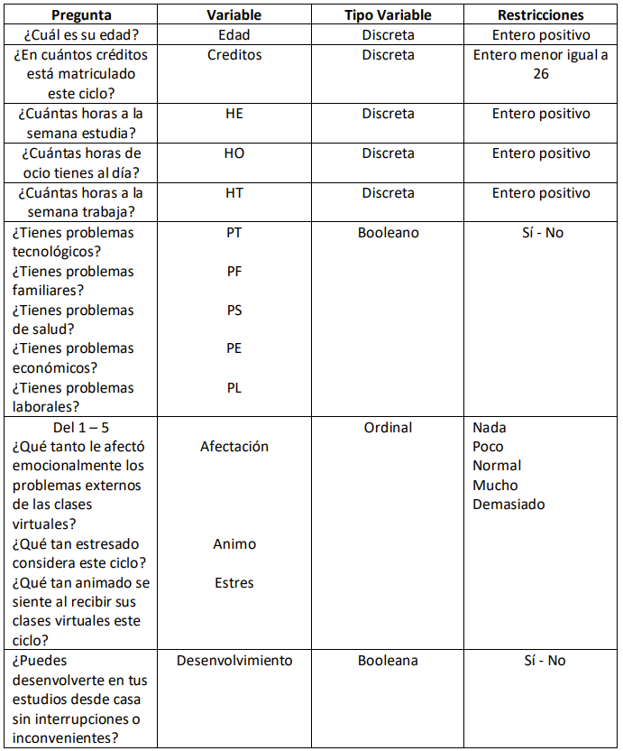
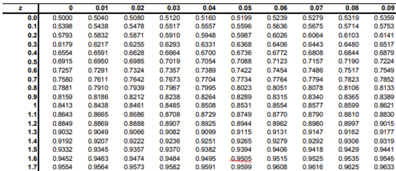
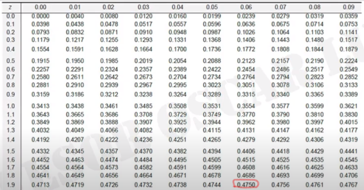

```{r, include=FALSE}
library(readr)
library(dplyr)
library(Rlab)
library(BSDA)
```

```{r, include=FALSE}
DF <- read_csv("DatosAnimo.csv")
```


### *Objetivo*

La calidad de vida y rendimiento académico están relacionados directamente con el estado de ánimo de los estudiantes. Este varía por múltiples factores entre los cuales se encuentra el estrés que podrían causar las clases online. El presente estudio tiene como finalidad encontrar indicios de que los alumnos de UTEC están atravesando un estrés agudo.

### *Población*

Estudiantes de UTEC en el ciclo 2021-II

### *Unidad muestral*

Cualquier estudiante de UTEC cursando el presente ciclo

### *Tipo de muestreo*

Por conveniencia (encuesta)

## Marco teorico

### *Tamaño de muestra*

```{r}
nrow(DF)
sum(!complete.cases(DF))
```

Tenemos 150 observaciones, de las cuales ninguna está incompleta. Por ende, no tenemos datos faltantes.

### Variables ###

{width='400px'}

### *Nivel de Confianza*

Trabajamos con un 95 % de confianza.

## *Índice de reactividad al estrés (IRE)*

El IRE es una forma de cuantificar el estrés en estudiantes en base a un formulario sobre su reacción ante ciertos estímulos relacionados a actividades propias de un alumno universitario. Puede tomar cualquier valor en el rango de 0 a 3.

```{r}
summary(DF$IRE)
```

```{r}
hist(DF$IRE, breaks = 7, las = 1, xlab = "", ylab="Frecuencia", main = "IRE", cex.main = 0.8,  cex.axis = 0.7)
```

### Intervalo de Confianza para μ de IRE

```{r}
n <- nrow(DF)
x.m <- mean(DF$IRE)
sigma <- sd(DF$IRE)
alpha.2 <- (1-0.95)/2

z <- qnorm(alpha.2, lower.tail = F)

l.izq <- x.m - z * sigma / sqrt(n)
l.der <- x.m + z * sigma / sqrt(n)

cat("IC: (",l.izq,",",l.der,")\n")
```

## *Horas de estudio semanal fuera de clases*

```{r}
barplot(table(DF$HE), ylab="Frecuencia", main = "Horas de estudio semanal",cex.main = 0.8,  cex.axis = 0.75, las=1, cex.names = 0.75)
```

```{r}
summary(DF$HE)
```

### Intervalo de Confianza para μ de Horas de Estudio

```{r}
n <- nrow(DF)
x.m <- mean(DF$HE)
sigma <- sd(DF$HE)
alpha.2 <- (1-0.95)/2

z <- qnorm(alpha.2, lower.tail = F)

l.izq <- x.m - z * sigma / sqrt(n)
l.der <- x.m + z * sigma / sqrt(n)

cat("IC: (",l.izq,",",l.der,")\n")
```

## *Autopercepción de estrés*

Le pedimos a los alumnos que expresaran cuán estresados están en una escala de Likert de 1 a 5, donde 1 significa muy bajo y 5 significa muy alto.

```{r}
barplot(table(DF$Estres)/150, main="Autopercepción de estrés", las=1, ylab="Frecuencia", cex.main=0.7, cex.axis = 0.7, cex.names=0.7, names=c("2 (Bajo)","3 (Normal)","4 (Alto)","5 (Muy alto)"), ylim= c(0,0.5))
```

### Intervalo de Confianza para p de Autopercepción de Estrés 5

```{r}
n <- nrow(DF)
p.m <- sum(DF$Estres == 5) / n
alpha.2 <- 0.05/2
z <- qnorm(alpha.2, lower.tail = F)

l.izq <- p.m - z*sqrt(p.m*(1-p.m)/n)
l.der <- p.m + z*sqrt(p.m*(1-p.m)/n)

cat("IC: (",l.izq,",",l.der,")")
```

## Pruebas de Hipótesis

### *1° Prueba de Hipótesis*

Según un estudio realizado por El Comercio a 7000 estudiantes universitarios, 39% de ellos indicaron estar sufriendo estrés muy alto referente a sus clases online durante la pandemia.

p: proporción de alumnos de UTEC que sienten estrés MUY ALTO

H0: p ≥ 0.39

H1: p < 0.39 

```{r}
p.m <- sum( DF$Estres == 5) / n
p.m
```
```{r}
Zp <- ( p.m - 0.39 ) / sqrt( 0.39 * ( 1 - 0.39 ) / n )
Zp
```

Área de de la región de no rechazo: 1-0.05 = 0.95

{width='620px'}

Zc = -1.65

#### Conclusión

Ya que el Zp cae dentro de la región de rechazo, existen suficientes argumentos estadísticos para rechazar la H0 y sospechar la validez de la H1.

## *2° Prueba de Hipótesis*

Según el reglamento de la ley universitaria, cada crédito equivale a 16 horas lectivas. Basándonos en la regla de estudiar una hora por cada dos horas de clase, obtenemos que se debe estudiar 1/2 hora semanal por cada crédito.

```{r}
mean(DF$Creditos)/2
```

H0: El promedio de las horas de estudio de los alumnos de UTEC es 9.26 horas.
H1: El promedio de las horas de estudio de los alumnos de UTEC es distinto a 9.26 horas.

```{r}
x.m <- mean(DF$HE)
x.m
```
```{r}
Zp <- ( x.m - 9.26 ) / (sd(DF$HE) / sqrt(n))
Zp
```

Área de un lado de la región de no rechazo: (1-0.05)/2 = 0.475

{width='620px'}

Zc = -1.96

#### Conclusión

Ya que el Zp cae dentro de la región de no rechazo, existen suficientes argumentos estadísticos para no rechazar la H0.

## *3° Prueba de Hipótesis*

En general, el promedio del IRE es 0.959 dado situaciones de examen.

μ: Promedio del IRE de los alumnos de UTEC

H0: μ ≥ 0.959.
H1: μ < 0.959.

```{r}
x.m <- mean(DF$IRE)
x.m
```
```{r}
Zp <- ( x.m - 0.959 ) / (sd(DF$IRE) / sqrt(n))
Zp
```

Área de de la región de no rechazo: 1-0.05 = 0.95

{width='620px'}

#### Conclusión

Ya que el Zp cae dentro de la región de no rechazo, existen suficientes argumentos estadísticos para no rechazar la H0.

## Conlusiones

Encontramos que el índice de reactividad al estrés de los estudiantes de UTEC esta concentrado en un rango mayor a 1, lo cual es un indicador de riesgo debido a que lo recomendable es que el IRE en una persona sea menor a 1. Asimismo una gran proporción de los estudiantes indicaron que no pudieron desenvolverse en sus estudios sin interrupciones lo cual está relacionado con el IRE y explica su alto grado.

De las hipótesis planteadas:

  - H1: ¿Al menos el 39% de los estudiantes de UTEC sienten un estrés muy alto? (tomando en cuenta nuestro nivel de confianza del 95% y el p valor) La hipótesis nula no se rechaza lo cual nos indica que más del 39% de estudiantes sienten estrés muy alto.

  - H2: ¿Los alumnos de UTEC estudian en promedio 1/2 hora semanal por cada crédito? No rechazamos la hipótesis nula, las horas de estudio de estudiantes de UTEC en promedio es de 8.84 horas.

  - H3: ¿El promedio de IRE de los estudiantes de UTEC es 0.959 dado situaciones de exámenes? Dado que el p-valor es menor a α


## Bibliografía

- http://lcolladotor.github.io/courses/Courses/MEyAdDG/day2/Pruebas%20de%20Hip%C3%B3tesis.pdf
- https://luisderivera.com/wp-content/uploads/2012/02/1991-EL-INDICE-DE-REACTIVIDAD-AL-ESTRES-IRE-RASGO-O-ESTADO1.pdf
- https://elcomercio.pe/lima/sucesos/la-otra-batalla-de-los-universitarios-la-salud-mental-agravada-por-el-encierro-universidades-pandemia-covid-19-clases-a-distancia-estudiantes-ansiedad-depresion-estres-noticia/
- http://www.minedu.gob.pe/reforma-universitaria/pdf/ley_universitaria.pdf
