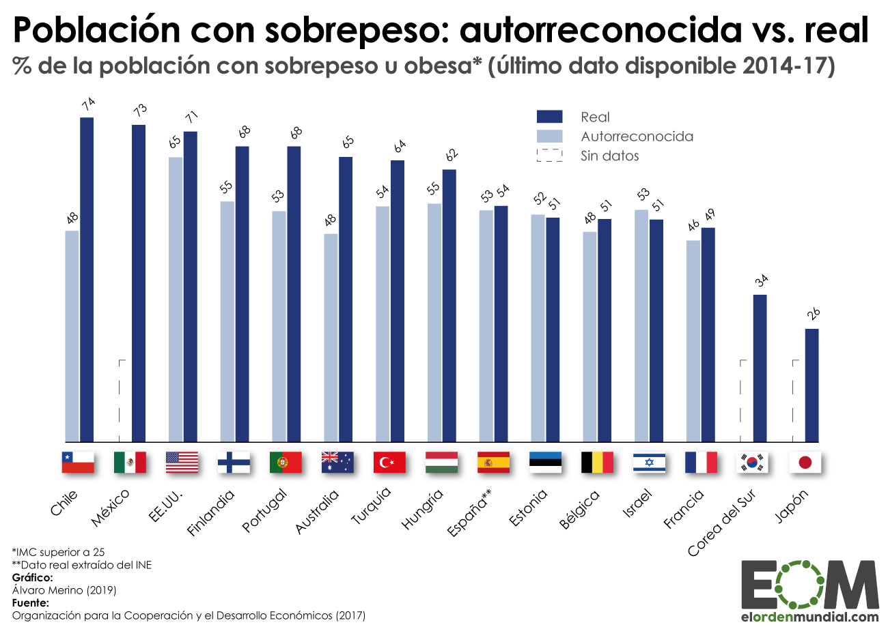
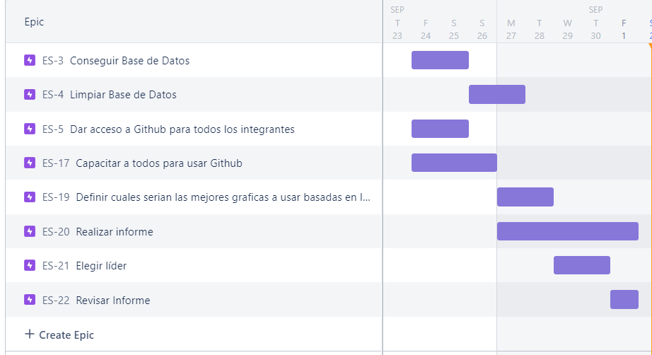
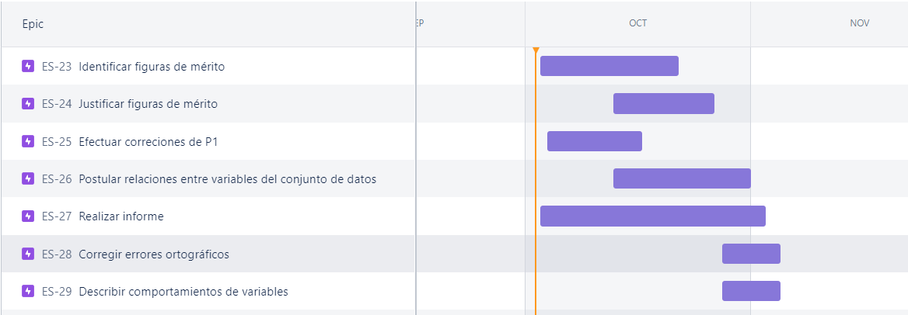
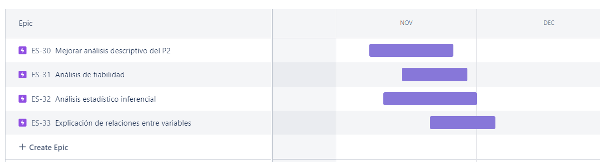
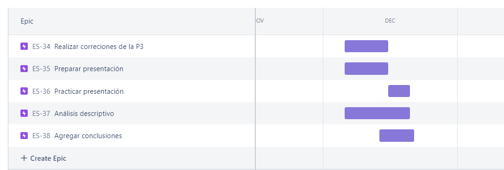

```{r,echo=FALSE,results='hide', message=FALSE}
library(readr)
library(dplyr)
library(ggplot2)
library(modeest)
```

# **Título: La obesidad, el gran problema del momento**

## **Título Corto: La obesidad**

### **Introducción**

#### Exploratorias:

¿Qué patrones podemos observar en los datos?\
Planteamos las siguientes hipótesis para intentar responderlas con la base de datos encontrada:\
- Las personas que tienen algún familiar cercano con sobrepeso, tienden a tener una conducta menos saludable debido a que heredan los hábitos de sus familiares. \
- La cantidad de veces que comes al día no es un indicador directo de tener hábitos alimenticios poco saludables, ya que si se ingieren alimentos balanceados en dosis correctas no es contraproducente.\
- Existe una edad promedio donde la gente tiende a tener sobrepeso debido a descuidos en su vida cotidiana.\
- Si una persona realiza actividad física a menudo, esta podría gozar de buen estado físico y por ende no tener sobrepeso.\

#### Inferenciales:

¿Qué podemos afirmar sobre la población en función de la muestra?\
Sus respuestas pretenden refutar o corroborar las hipótesis planteadas como resultado de la exploración de los datos.\
La población cumple con todos los requisitos impuestos para poder ser parte de la muestra en este estudio estadístico.\
Las personas que tienen un familiar con sobrepeso, en su mayoría poseen un IMC alto.\
Las personas mayores son las que a menudo presentan sobrepeso.\
Las personas que fuman no tienen un mal hábito alimenticio usualmente.\

#### Predictivas:

¿Qué cambia si se cambian estos valores?\
Sus respuestas son modelos que pretenden explicar distintas relaciones entre variables, observadas en la exploración de datos.\

Dentro de nuestros objetivos se encuentra la interrogante ¿Qué repercusiones tienen los hábitos de los encuestados sobre su índice de masa corporal?. Para poder responder esta interrogante, haremos uso de las variables "Peso", "SMOKE"(si es fumador), "NCP"(No. de veces que se alimenta al día), "FCVC"(si consume vegetales), "FAF"(Horas de actividad física al día) y "MTRANS" (medio de transporte que utiliza). Si alguna de estas variables es modificada, la inferencia sobre qué tanto afectan los hábitos o no con su estado de obesidad podría ser distinto. Además, en caso de eliminar alguna de estas variables de la encuesta haría que la inferencia o conclusión sea más inexacta y podría crear el "Post Hoc" que estudiamos en el libro "¿Cómo mentir con estadística?.\

#### Causales:

¿Qué datos son responsables de los cambios en otros datos? A raíz de las variables obtenidas en la base de datos original, pudimos incluir la columna de Índice de masa corporal (IMC). Esta columna nos da un valor numérico con el cuál podemos confirmar si una persona tiene sobrepeso y en qué nivel se encuentra de ser así (moderado, alto, crítico). Asimismo, con este valor como referencia, creamos otra variable llamada "NObeyesdad"(Nivel de obesidad). Si el valor del IMC cambia, el nivel de obesidad también y tendríamos información distinta. Por último, como nos basamos en las variables "Peso" y "Estatura" para determinar el IMC, al cambiar alguna de estas 2 variables cambia entonces el IMC también.

#### **Relevancia del Trabajo**

En los últimos años el índice de obesidad alrededor del mundo ha ido en aumento, por lo que se ha convertido en un gran problema a nivel mundial, al cuál no debemos darle la espalda. En vez de eso, debemos tomarlo con mucha más seriedad y madurez, ya que es un tema muy delicado del cuál puede depender nuestra vida si es que no se toma en cuenta.\
Tal y como informa la OMS "Desde 1975, la obesidad se ha casi triplicado en todo el mundo", lo cuál es un dato alarmante, y más aún cuando en 2016 había más de 340 millones de niños y adolescentes (de 5 a 19 años) con sobrepeso u obesidad. Esto nos da una clara muestra acerca de como es que no se toma con la debida importancia este tema, generando que los casos aumenten cada vez más. 

 (Imagen 1)\
(Fuente: <https://elordenmundial.com/mapas-y-graficos/tasa-poblacion-sobrepeso/>)

#### **Justificación**

La obesidad es un problema que puede ser estimado por distintos factores, tales como pueden ser los hábitos alimenticios o la condición física que uno tiene. Es por esto que mediante los datos que buscamos en Internet, obtuvimos los resultados de una base de datos, la cuál estima los niveles de obesidad de países como México, Perú y Colombia. Como indican los autores, la base de datos puede ser utilizada para poder estimar la obesidad para personas entre 14 y 61 años de edad. Cabe resaltar que estos datos fueron obtenidos de una encuesta en línea que mantiene el anonimato de los participantes.\

### **Objetivos**

1.  ¿Qué repercusión tienen los hábitos en la vida cotidiana de uno de los encuestados en su índice de masa corporal?\
    Posibles Variables: MTRANS, IMC, NCP, FAF, FCVC, SMOKE\

2.  ¿Es el historial familiar un factor determinante para saber si se va a tener sobrepeso?\
    Posibles Variables: familiar_con_sobrepeso, IMC, NObeyesdad\

3.  ¿Qué relación se genera entra la edad de una persona y su altura con el tener sobrepeso?\
    Posibles Variables: Edad, Altura, IMC\

4.  ¿Cuál es la relación entre la actividad física y la cantidad de comidas principales en un día, para mantener un margen en el sobrepeso?\
    Posibles Variables: FAF, NCP, IMC\

### **Marco Teórico**

#### *Población*

La población son personas entre 14 y 61 años de edad de los países de México, 
Perú y Colombia. Se tiene en cuenta que los encuestados fueron elegidos por los encargados de esta investigación.


Luego de este período, los resultados obtenidos fueron de 484 repuestas, entonces se procedió a hacer un etiquetado de los resultados de acuerdo a la Normativa Mexicana acerca del Índice de Masa Corporal(IMC). Luego la base de datos fue completada por distintos software hasta llegar a 2111 datos. Sin embargo, no tomamos en cuenta estos datos porque se generaban variables atípicas a las posibles repuestas, es por eso que decidimos trabajar con los primeros 484 datos, que fueron respondidos por personas a través de las encuestas en línea.\

#### *Muestra*

La muestra está compuesta por personas elegidas al azar provenientes de países como Perú, México y Colombia de 14 a 61 años de edad. Estas personas llenaron un formulario web que estuvo disponible durante 30 días, en el cuál se mantuvo el anonimato de los encuestados.\

- *Unidad muestral* : Persona entre 14 y 61 años de edad (Perú, México, Colombia)\
- *Tamaño de la muestra* : 484\
- *Tipo de muestreo* : Muestreo probabilístico simple\ 
- *Muestreo* : El tipo de muestreo es este, ya que las personas fueron elegidas por un sorteo en línea, es decir le dió a cada individuo de la población objetiva (personas de 14 a 61 años) la misma probabilidad de ser elegido.

#### **Revisión de la base de datos**

1.  Leer la data\
    Para realizar el análisis, leeremos la data original obtenida de internet.\

```{r}
OBB <- read_csv("datasets/ObesityRaw.csv", col_types = "cnnnccnnccncnnccc")
```

2.  Revisar la data\
    Para revisar la data, nos aseguraremos que todos los datos se encuentren mediante un conteo del número de filas y columnas, el cuál nos mostrará que la data se cargó correctamente.\
    Por otra parte, recogeremos una vista de los tipos de variables que tenemos en la data, para luego poder determinar si el análisis lo estamos realizando correctamente.

```{r}
ncol(OBB) # leer el número de columnas / variables
nrow(OBB) # leer la cantidad de filas / observaciones
str(OBB)
```

Obtuvimos las siguientes variables:\
- Gender (Género)\
- Age (Edad)\
- Height (Estatura)\
- Weight (Peso)\
- family_history_with_overweight (Familiar con antecedente de obesidad)\
- FAVC (Consumo de alimentos altos en calorías)\
- FCVC (Come verduras en sus comidas)\
- NCP (Comidas principales al día)\
- CAEC (Come algo entre comidas)\
- SMOKE (Si fuma)\
- CH20 (Cantidad de agua que bebe al día)\
- SCC (Controla las calorías que consume a diario)\
- FAF (Frecuencia de actividad física)\
- TUE (Tiempo en dispositivos tecnológicos)\
- CALC (Frecuencia de consumo de alcohol)\
- MTRANS (Medio de transporte)\
- NObeyesdad (Tipo de Obesidad)\
- IMC (Índice de Masa Corporal)\

3.  Revisar el principio y final de la data\
    En este paso, podremos determinar que los datos del inicio y el final concuerdan y son correctos en los primeros valores de las variables.Sin embargo, los valores finales de las variables "Age", "Height","FCVC","NCP","CH2O" y "FAF" son valores que no concuerdan con los explicado en el apartado de variables.

```{r,echo=FALSE}
head(OBB) #lee las primeras filas de la base de datos
tail(OBB) #lee las últimas filas de la base de datos
```

4.  Limpieza de la Base de datos\
    Buscaremos si existen datos incompletos en la data:

```{r}
sum(is.na(OBB)) #is.na() -> este comando detecta los datos incompletos; sum -> sumar
#Sumar la cantidad de datos incompletos
sum(!is.na(OBB)) #!is.na() -> es la negación de is.na, es decir, indica los datos completos. 
```

Como podemos observar en los resultados, no se encuentran valores NA, por lo que se puede asumir que todo está correctamente respondido. En ese sentido, determinamos que el total de valores sin NA es de 35887, valor que coincide con la cantidad total de valores de la base de datos 2111(filas)\*17(columnas)=35887.

```{r}
sum(complete.cases(OBB)) 
```

Como último paso de nuestra verificación, tenemos 2111 casos completados, que coincide con el número de filas y que por lo tanto, la base de datos está completa.

5.  Datos erróneos o atípicos\
    Para nuestro proyecto, mediante una vista exploratoria en Excel de todos los datos de la data original, determinamos que algunos de los valores que fueron creados por el software no tenían correlación con los recogidos de las encuestas.

(Imagen 2)\


Estos valores eran principalmente los que tenían valores numéricos enteros, tal como se observa en la imagen. Lo enmarcado en rojo son valores decimales donde deberían encontrarse valores enteros, ya que estamos hablando de valores relacionados a la edad. Debido a esa inconsistencia de datos, decidimos eliminar las filas 464 hasta 21111 por la no concordancia de tipos de datos.

Asimismo, decidimos añadir una variable numérica más, la cuál era el IMC como valor numérico, y no dejarlo solo representado por su nombre a través de la siguiente fórmula: IMC=Weight/(height\*height) resultando al final la siguiente base de datos:

```{r}
OB <- read_csv("datasets/Obesidad.csv")
OB
```

6.  Renombrar Variables\
    Re nombraremos algunas de las variables de inglés a español, para una mejor comprensión de la data.\

```{r}
OB1<- rename(OB, Genero = Gender, Edad = Age, Altura = Height, Peso = Weight, familiar_con_sobrepeso = family_history_with_overweight )
```

De ese modo, tenemos la siguiente base de datos\

```{r}
OB1
```

**Viabilidad y Factibilidad:**\
El proyecto realizado es factible debido a que realizamos una debida limpieza a la base de datos, la cuál contenía algunos datos atípicos los cuales eliminamos para poder obtener una data más limpia y poder trabajar mejor con esta. También se dice que es viable, porque en cuanto al tiempo demandado, ya contamos con una base de datos bastante limpia y realizada, teniendo esto en cuenta no requiere un gran esfuerzo su limpieza. Por otro lado la planificación redactada apoya un adecuado desarrollo del proyecto pues contamos con una división de funcionalidades para culminar con éxito el proyecto.\

### **Planificación**

Para poder realizar el proyecto, lo primero que hicimos como grupo fue fijarnos metas y objetivos en determinados tiempos para obtener un proceso más ordenado y eficiente. Para ello nos ayudamos en una herramienta de planificación que en este caso vendría a ser el "Diagrama de Gantt", el cual se ira aumentando de acuerdo a las fechas de entrega.\

#### Planificación P1

(Imagen 3) 

### Planificación P2

(Imagen 4) 

### Planificación P3

(Imagen 5) 

### Planificación P4

(Imagen 6) 

Luego de realizar nuestro diagrama con todas las pautas y deadlines necesarios, nos pusimos de acuerdo en quienes serían los líderes y expositores de cada entregable del proyecto, siendo este el orden acordado:

-   P1: Brayan Oved Bustamante
-   P2: Esteban Alejandro Príncipe Ventosilla
-   P3: Camila Marcela Vela Lazo
-   P4: Gabriel Omar Ramírez Maldonado y Arellys Escobar Chung

Asimismo, se estableció fechas para cada entrega y cómo se trabajará. Para ello, se propuso el uso de la herramienta github en dónde se logrará trabajar de una manera más fluida y ordenada. Con ellos se toco los siguientes puntos:\
- Cada miembro del grupo adquiere una parte de la entrega que irá variando de acuerdo con la fecha de presentación.\
- Cada miembro del grupo debe realizar un comentario al momento de subir lo que halla actualizado, para mantenernos informados de las modificaciones.\
- Cada miembro tiene el plazo de 3 días, una vez el profesor deje la asignación, para presentar un avance de su parte del informe, y 2 días mas para llegar a culminar el trabajo.\
- Cada miembro debe avisar antes de subir su parte para evitar algún tipo de sobre escritura\
- El grupo debe culminar el trabajo unos dos días antes y realizar una revisión a la presentación, posteriormente realizar correcciones al informe después de la fecha de entrega oral\

Teniendo esta parte estructurada, se espera realizar un adecuado control de las entregas, para llegar a culminar de manera exitosa el proyecto. Al tener esta secuencia, nos adaptamos más a los problemas que pueden llegar a ocurrir, pues si bien no están definidas las fechas, si hay plazos de entrega.\

#### **Variables**

Las variables de la base de datos trabajada son productos de una encuesta realizada en inglés, y por motivo de facilitar la visualización de las respuestas, hemos traducido las preguntas. Sin embargo, por la base de datos algunos casos deben quedar en inglés.

**Encuesta**

1.  ¿Cuál es su género?\
    (Variable: Genero)

-   Mujer\
-   Hombre\
    Tipo de Variable: Cualitativa Nominal\
    Restricciones: Mujer, Hombre

2.  ¿Cuál es su edad?\
    (Variable: Edad)\

-   Valor numérico\
    Tipo de Variable: Cuantitativa Discreta\
    Restricciones: Números enteros positivos de 14 a 61

3.  ¿Cuál es su altura?\
    (Variable: Altura)\

-   Valor numérico en metros\
    Tipo de variable: Cuantitativa Continua\
    Restricciones: Valor expresado en metros

4.  ¿Cuál es su peso?\
    (Variable: Peso)\

-   Valor numérico en kilogramos\
    Tipo de Variable: Cuantitativa Continua\
    Restricciones: Valor expresado en kilogramos\

5.  ¿Algún miembro de la familia ha sufrido o padece sobrepeso? (Variable: familiar_con_sobrepeso)\

-   Sí\
-   No\
    Tipo de Variable: Cualitativa Nominal\
    Restricciones: Sí, No

6.  ¿Consumes alimentos ricos en calorías con frecuencia?\
    (Variable: FAVC)\

-   Sí\
-   No\
    Tipo de Variable: Cualitativa Nominal\
    Restricciones: Sí, No

7.  ¿Suele consumir verduras en sus comidas?\
    (Variable: FCVC)--\>Se expresa en números (1,2,3)

-   Nunca --\>1 
-   A veces --\>2
-   Siempre --\>3\
    Tipo de Variable: Cualitativa Nominal\
    Restricciones: Nunca, A veces, Siempre\

8.  ¿Cuántas comidas principales tiene al día?\
    (Variables: NCP)\

-   Valor numérico\
    Tipo de Variable: Cuantitativa Continua\
    Restricciones: Valores enteros mayores a 1

9.  ¿Come algo entre comidas?\
    (Variable: CAEC)

-   No
-   A veces
-   Frecuentemente
-   Siempre\
    Tipo de Variable: Cualitativa Nominal\
    Restricciones: No, A veces, Frecuentemente, Siempre\

10. ¿Fuma?\
    (Variable: SMOKE)

-   Sí
-   No\
    Tipo de Variable: Cualitativa Nominal\
    Restricciones: Sí, No

11. ¿Cuánta agua bebe al día?\
    (Variable: CH2O)--\>Se expresa en números (1,2,3)

-   Menos de 1 litro --\>1
-   Entre 1 y 2 litros --\>2
-   Más de 2 litros --\>3\
    Tipo de Variable: Cualitativa Nominal\
    Restricciones: Números mayores a 0

12. ¿Controla las calorías que consume a diario?\
    (Variable: SCC)

-   Sí
-   No\
    Tipo de Variable: Cualitativa Nominal\
    Restricciones: Sí, No

13. ¿Con qué frecuencia realiza actividad física?\
    (Variable: FAF)--\>Se expresa en números (0,1,2,3)

-   No realizo --\>0
-   1 o 2 días --\>1
-   2 o 4 días --\>2
-   4 o 5 días --\>3\
    Tipo de Variable: Cualitativa Nominal\
    Restricciones: Valores numéricos mayores a 0

14. ¿Cuánto tiempo usas dispositivos tecnológicos como celular, videojuegos, televisión, computadora y otros?\
    (Variable: TUE)--\>Se expresa en números (0,1,2)

-   0--2 horas --\>0
-   3--5 horas --\>1
-   Más de 5 horas --\>2\
    Tipo de Variable: Cualitativa Nominal\
    Restricciones: Valores numéricos mayores a 0

15. ¿Con qué frecuencia bebe alcohol?\
    (Variable: CALC)

-   No tomo alcohol
-   A veces
-   Frecuentemente
-   Siempre\
    Tipo de Variable: Cualitativa Nominal\
    Restricciones: No tomo, A veces, Frecuentemente, Siempre\

16. ¿Qué transporte utiliza habitualmente?\
    (Variable: MTRANS)

-   Automóvil
-   Moto
-   Bicicleta
-   Transporte público
-   Caminando\
    Tipo de Variable: Cualitativa Nominal\
    Restricciones: Automóvil, Moto, Bicicleta, Transporte público, Caminando

17. Variable: NObeyesdad\

-   Underweight
-   Normal
-   Overweight I
-   Overweight II 
-   Obesity I
-   Obesity II
-   Obesity III\
    Tipo de Variable: Cualitativa Nominal\
    Restricciones: Underweight, Normal, Overweight I, OverweightII, Obesity I, Obesity II, Obesity III

18. Índice de Masa Corporal\
    (Variable: IMC)\
    Calculado por la fórmula: Peso/(Altura\*Altura)\

-   Valor numérico\
    Tipo de Variable: Cuantitativa Continua\
    Restricciones: Valores numéricos mayores a 0

#### **Datos**

##### **Resumen de la base de datos**

```{r,echo=FALSE}
summary(OB1) #resumen de la base de datos
```

Mediante este primer resumen de la base de datos,  queremos observar que los valores dentro de nuestras variables se encuentren dentro de las restricciones que pusimos al momento de identificar las variables. Para este análisis podemos utilizar tanto el valor del máximo y mínimo para las variables numéricas que tienen restricciones, obteniendo como resultado lo siguiente:\
1. Variable FCVC:\
- Restricciones: Valores enteros del 1 al 4\
- Mínimo: 1, Máximo: 4\
- Resumen: Sus valores se encuentran dentro del rango esperado\
2. Variable NCP:\
- Restricciones: Valores enteros del 1 al 4\
- Mínimo: 1, Máximo: 4\
- Resumen: Sus valores se encuentran dentro del rango esperado\
3. Variable CH2O:\
- Restricciones: Valores enteros del 1 al 3\
- Mínimo: 1, Máximo: 3\
- Resumen: Sus valores se encuentran dentro del rango esperado\
4. Variable FAF:\
- Restricciones: Valores enteros del 0 al 3\
- Mínimo: 0, Máximo: 3\
- Resumen: Sus valores se encuentran dentro del rango esperado\
5. Variable TUE:\
- Restricciones: Valores enteros del 0 al 2\
- Mínimo: 0, Máximo: 2\
- Resumen: Sus valores se encuentran dentro del rango esperado

#### **Descriptores gráficos y numéricos**

##### **Histograma IMC**

```{r,echo=FALSE}
hist(OB1$IMC, main="Gráfica 1: Histograma IMC", col="#05758E", xlab="Valores IMC", ylab="Frecuencia")

```

Utilizamos el histograma para la variable IMC que es variable continua y que nos interesa pues estamos evaluando obesidad. Nos permite conocer su distribución (en que valores de IMC se encuentran el mayor número de encuestados) . Podemos ver que está sesgado a la derecha. Nos muestra que la mayoría de encuestados tiene un IMC menor a 30 y en menor cantidad aquellos con obesidad.\

```{r}
mean(OB1$IMC)
```

```{r}
median(OB1$IMC)
min(OB1$IMC)
max(OB1$IMC)
```

La mediana a su vez nos da una idea acerca como es que se encuentran distribuidos los valores del IMC, ya que al estar la mediana dentro del rango normal, nos da la idea de que los valores están distribuidos de igual manera hacia arriba y hacia abajo, siendo la mayoría de casos normales.\
El máximo nos indica que pueden haber casos que lleguen casi al extremo de tener obesidad tipo III u obesidad mórbida. De igual manera, el mínimo nos indica que pueden haber casos de personas bajas de peso, lo cual podremos comprobar con el siguiente gráfico de barras que presentaremos.

#### **Gráfico de Barras - Clasificación del peso según Índice de Masa Corporal(IMC)**

```{r,echo=FALSE}
tabla <- table(OB1$NObeyesdad)

names(tabla) <- c("Bajo Peso", "Normal", "Sobrepeso I ", "Sobrepeso II", "Obesidad I", "Obesidad II", "Obesidad III")
x <- barplot(tabla, main="Gráfico 2: Clasificación del peso según IMC",
        col=c("#09187F","#5F73FF","#1331FF","#303A7F","#0F27CC","blue","lightblue"), xaxt = "n", xlab = "Peso", ylab = "N° de personas")

legend(x = "topright", legend = c("Bajo Peso", "Normal", "Sobrepeso I ", "Sobrepeso II", "Obesidad I", "Obesidad II", "Obesidad III"),fill = c("#09187F","#5F73FF","#1331FF","#303A7F","#0F27CC","blue","lightblue"),title = "Leyenda", cex = 0.7)
text(cex=0.7, x=x, y=-5, names(tabla), xpd=TRUE, srt=45, pos = 2)
tabla
``` 
Podemos aprovechar el gráfico de barras para de un solo vistazo en que IMC se encuentra la mayoría de personas y cuántas personas sufren de sobrepeso y obesidad.\
Según, la Normativa Mexicana acerca del Índice de Masa Corporal(IMC), nos indica que la mayoría de las personas que respondieron la encuesta tienen un peso "normal", de acuerdo a la siguiente clasificación\
- Bajo peso - menos que 18.5\
- Normal - 18.5 a 24.9\
- Sobrepeso I - 25.0 a 27.5\
- Sobrepeso II - 27.5 a 29.9\
- Obesidad I - 30.0 a 34.9\
- Obesidad II - 35.0 a 39.9\
- Obesidad III - Más de 40\

##### **Gráfico de barras - Según tipo de medio de transporte**

```{r,echo=FALSE}
tabla4=table(OB1$MTRANS)
names(tabla4) = c("Auto","Bicicleta","Moto","Público", "Caminando")
barplot(tabla4, col=c("#05758E","#05537A", "#05496A","#05374F","blue"), main="Gráfica 3: Gráfico de barras según tipo de transporte", names.arg=c("Auto","Bicicleta","Moto","Público", "Caminando"), xlab = "Tipo de transporte", ylab = "N° de personas")

legend(x = "topright", legend = c("Auto","Bicicleta","Moto","Público", "Caminando"),fill = c("#05758E","#05537A", "#05496A","#05374F","blue"),title = "Leyenda", cex = 0.7)
tabla4
```

Este gráfico de barras acerca del medio de transporte más utilizado por los encuestados nos permitirá hacernos una idea si tiene alguna relación esta variable con el IMC, como parte a la respuesta a nuestra primera pregunta. El gráfico de barras es el más adecuado para esta situación debido a que muestra claramente las tendencias de la variable.\

Mediante el gráfico de barras presentado nos podemos dar cuenta que el medio de transporte mayormente utilizado es el "Público", por lo que puede ser un indicador de obesidad, ya que que los medios más sanos como caminar o montar bicicleta no son tan comunes.\

##### **Barplot Historial de familiar con obesidad**

Mediante este gráfico de barras, quisimos dar respuestas a nuestra segunda pregunta planteada en los objetivos, la cual trata acerca del historial de las personas con obesidad dentro de una familia, y si es que esto tiene relación con que uno sea obeso o no.\
El gráfico de barras era la mejor opción debido a que mostrara claramente cual es la tendencia de esta variable.\

```{r,echo=FALSE}
tabla3=table(OB1$familiar_con_sobrepeso)
tabla3

barplot(tabla3, col=c("#05758E","#05537A"), xlab="Respuestas", ylab = "N° de personas", main="Gráfico 4: Historial de familiar con obesidad", names.arg=c("No","Sí")) 
legend(x = "topright", legend = c("No","Sí"),fill = c("#05758E","#05537A"),title = "Leyenda", xpd = T)
```

##### **Boxplot de Edad**

Con este Boxplot y descriptores numéricos acerca de la variable Edad, quisimos ir buscando una posible respuesta a nuestra tercera pregunta de los objetivos, acerca de cual es el rango de edades donde suele haber mayor número de personas con obesidad. Decidimos que sería la mejor opción porque nos da una vista más general acerca de las dispersiones y la media de las edades.\

```{r,echo=FALSE}
boxplot(OB1$Edad, main="Boxplot de Edad",col="#05379F", xlab="Gráfico 5: Valores de edades", ylab = "Edad")
```

Es por esto que presentamos el Boxplot, el cual nos indica cómo se distribuyen las edades de los encuestados y que edad es la más frecuente. En este caso se encuentra entre 20 y 25 años.\
Se observan datos atípicos que están por encima de los 30 años.\

Asimismo con ayuda de los descriptores numéricos de media, edades mínima y máxima, nos pueden ayudar a entender mejor este gráfico.  

```{r}
mean(OB1$Edad)
```

La media es de 23.14 años, lo cual estaría representado en el Boxplot como la línea gruesa de colo negro.\

```{r}
min(OB1$Edad)
max(OB1$Edad)
```

El valor mínimo y máximo de las edades, los utilizamos para comprender el motivo de la dispersión que se observa en el Boxplot, dándonos cuenta así que al tener un valor máximo de 61 años, la dispersión en la parte superior será mayor como se observa, esto también sirve para identificar que la mayoría de personas que respondieron la encuesta son menores de 30 años.\

##### **Plot de frecuencia de actividad física (FAF)**

Para poder responder nuestra cuarta pregunta y poder encontrar una relación entre la frecuencia de actividad física y en número de comidas diarias, decidimos realizar un plot acerca de la frecuencia con la que los encuestados realizan actividad física (FAF). Este gráfico mostrara las repuestas y la cantidad de cada una de estas, para un mejor análisis.\

```{r,echo=FALSE}
tabla2=table(OB1$FAF)
barplot(tabla2, main="Gráfico 6: Frecuencia de actividad física  (FAF)", names=c("No realizó", "1 o 2 días", "2 o 4 días", "4 o 5 días"), xlab="Respuestas",ylab="Frecuencia", col=c("#05758E","#05537A", "#05496A","#05374F"))
legend(x = "topright", legend = c( "No realizó", "1 o 2 días", "2 o 4 días", "4 o 5 días"), fill = c("#05758E","#05537A", "#05496A","#05374F"),title = "Leyenda")
```

Los resultados obtenidos fueron como se observa en el gráfico de barras, mayores en 0 y 1, esto significa de acuerdo a la encuesta presentada en la parte de "Variables", que la mayoría de personas no realizan algún tipo de actividad física (0), o realizan muy poca (1).

##### **Gráfico de barras Comidas Principales (NCP)**

Mediante el diagrama de barras presentado acerca del número de comidas principales, quisimos determinar si es que el número de comidas principales en el día influía en la obesidad de las personas, sin embargo al observar el gráfico observamos que el mayor número se encentra entre lo normal que sería 3, así mismo investigamos, y hay gente que come más veces al día para ganar mas muscular, por lo cual no podría ser este un buen indicativo por si solo.\

```{r,echo=FALSE}
tabla3=table(OB1$NCP)
tabla3
barplot(tabla3, main="Gráfico 7: Comidas Principales",col=c("#05758E","#05537A", "#05496A"), xlab="N° de comidas al día", ylab = "Frecuencia")
legend(x = "topright", legend = c( "1","3", "4"), fill = c("#05758E","#05537A", "#05496A"),title = "Leyenda")
```

```{r}
mean(OB1$NCP)
median(OB1$NCP)
```

Por otro lado el promedio de comidas principales al día, nos indica que en general la gente considera entre 2 a 3 el número de comidas principales para un día, esto se puede corroborar a su vez con el valor de la mediana el cuál es 3, esto nos indica que el punto medio es de 3 comidas.

### **Descripción de Variables**

#### **Variable IMC**
La variable IMC es la variable numérica con más relevancia en nuestro trabajo, debido a que es con la que se realizan la mayoría de comparaciones en nuestro trabajo.\


```{r,echo=FALSE}
hist(OB1$IMC, main="Gráfica 7:Histograma IMC", col='blue', xlab="Valores IMC", ylab="Densidad", prob=TRUE)
lines(density(OB1$IMC), lwd=2, col="#05758E")
```


Con este histograma y la línea de densidad presente en el gráfico, podemos determinar que en nuestra base de datos la mayoría de encuestados se encuentra en los rangos de 20 a 25 de IMC, lo que es denominado como un IMC normal.\

```{r}
mean(OB1$IMC)
median(OB1$IMC)
mfv(OB1$IMC)
```


Con ayuda de la curva de densidad y de los descriptores como la media, mediana y moda, obtenemos que los valores se encuentran unos muy cercanos a otros, lo que podría significar que la gráfica no se encuentra sesgada hacia ninguno de los lados, a pesar de que la gráfica de una impresión diferente, pero esto debido a que los casos con un IMC elevado son muy pocos lo que hace que no se genere un sesgo propiamente dicho.\
La tendencia del IMC normal se puede deber a que no necesariamente tener un IMC normal significa estar en forma, si no tan solo cuidar un poco su estilo de vida.

#### **Variable TUE (Tiempo de uso promedio de aparatos electrónicos)**

Mediante la encuesta presentada es que se generan las repuestas a esta variable, con las cuales se generó la base de datos, la pregunta es la siguiente:\

¿Cuánto tiempo usas dispositivos tecnológicos como celular, videojuegos, televisión, computadora y otros?\
    (Variable: TUE)--\>Se expresa en números\

-   0--2 horas --\>0\
-   3--5 horas --\>1\
-   Más de 5 horas --\>2\


```{r,echo=FALSE}
tablaTUE=table(OB1$TUE)
tablaTUE
barplot(tablaTUE, horiz=FALSE, col=c("#05758E","#05537A", "#05496A"), main="Gráfica 8: Gráfico de barras TUE",xlab="Tiempo de uso de aparatos electrónicos", ylab="N° de personas")
legend(x = "topright", legend = c( "0--2 horas ->0", "3--5 horas ->1", "Más de 5 horas ->2"), fill = c("#05758E","#05537A", "#05496A"),title = "Leyenda", cex = 0.7)
```


Debido a la tabla mostrada y con ayuda del gráfico para una mejor compresión, podemos determinar que la mayoría de encuestados no utilizan con mucha continuidad aparatos electrónicos siendo un total de *236* individuos, por otro lado, *177* encuestados utilizan un aparato electrónico entre 3 y 5 horas, y por último tan solo *71* de los encuestados usan aparatos electrónicos más de 5 horas diariamente.\
Esta tendencia se pude deber a que la mayoría de los entrevistados pueden estar realizando otras actividades durante el día, como estudiando o trabajando, por lo que tan solo en sus tiempos libres utilizan aparatos electrónicos.\

#### **Variable MTRANS(Medio de transporte)**

Consideramos que la variable MTRANS es importante para nuestra investigación por lo determinante que puede significar el medio de transporte para determinar si una persona puede sufrir de obesidad o no.\

```{r,echo=FALSE}
tabla4=table(OB1$MTRANS)
tabla4
barplot(tabla4, col=c("#05758E","#05537A", "#05496A","#05374F","blue"), main="Gráfico 9: Gráfico de barras Tipo de Transporte usado", names.arg=c("Auto","Bicicleta","Moto","Público", "Caminando"), xlab = "Tipo de transporte", ylab = "N° de personas")
legend(x = "topright", legend = c("Auto", "Bicicleta", "Moto", "Público", "Caminando"), fill = c("#05758E","#05537A", "#05496A","#05374F","blue"),title = "Leyenda", cex = 0.7)

```


La tendencia que encontramos en esta variable es que el transporte público es el más común entre los encuestados con un total de *318* respuestas, seguido de automóvil con un total de *97* respuestas, indicando que la tendencia está en usar más medios de transporte motorizados que otros como la bicicleta o caminar.\
Esta tendencia de datos se puede deber a que el medio de transporte más común es el público, así mismo, otro factor que puede determinar este patrón de respuestas es que ambos medios de transporte son los más rápidos comparados con los demás. 

#### **Variable historial de un familiar con sobrepeso**

Esta variable se genera mediante una respuesta de "Sí" o "No", ante la pregunta de si el entrevistado tiene algún familiar con historial de sobrepeso.\

```{r,echo=FALSE}
tabla3=table(OB1$familiar_con_sobrepeso)
tabla3
barplot(tabla3, col=c("#05758E","#05537A"), main="Gráfico 10: Historial de familiar con obesidad", names.arg=c("No","Sí"), xlab = "Respuestas", ylab = "N° de personas") 
legend(x = "topright", legend = c("No", "Sí"), fill = c("#05758E","#05537A"),title = "Leyenda", cex = 0.7)
```


Como se observa en el gráfico la mayoría de encuestados *Sí* tienen un historial de un familiar con sobrepeso con un total de *294*.\
Esto se puede deber a que es quizá muy común que algún miembro de la familia sufra de obesidad, ya que como presentamos al inicio, las estadísticas muestran que hubo un gran incremento en el número de personas con obesidad.\

#### **Variable Edad**
La variable Edad es un valor entero ingresado por el usuario cuando respondió la encuesta.

```{r,echo=FALSE}
hist(OB1$Edad, main="Gráfico 11: Histograma de Edad",col="#05474F", xlab =" Valores de edades",ylab="N° de personas")
axis(1) # Añade el eje horizontal
par(new = TRUE)
```


Los outliers del Boxplot en este caso no serían datos atípicos, sino que representarían los valores de las edades que son mayores al 150% de la media, aproximadamente se encuentra en 32 años.\

```{r}
boxplot.stats(OB1$Edad)
```

Con este pequeño resumen del boxplot podemos entender de una mejor manera lo que serían en este caso los outliers, que efectivamente van desde los 32 años, sin embargo la encuesta estaba hecha para personas desde 14 a 61 años, por lo que están dentro de los rangos esperados.\

```{r}
mean(OB1$Edad)
median(OB1$Edad)
```

La media es de 23.13 años aproximadamente, lo cual estaría representado en el Boxplot como la línea gruesa de colo negro. Al estar tan cerca el valor de la media como la mediana, podemos determinar que no existe sesgo alguno en esta variable, aunque pareciese que en el histograma si se encuentra sesgada.\

La posible causa de estos resultados se puede deber a que la mayoría de personas que navegan en Internet suelen ser jóvenes, y al ser una encuesta online, esto se ve claramente reflejado en los resultados obtenidos.\

#### **Variable Altura**
Esta variable es un valor numérico ingresado por el usuario representando como dice el nombre de esta su altura en metros.

```{r,echo=FALSE}
hist(OB1$Altura,col=c('blue'), xlab="Índice", main="Gráfico 12: Histograma de altura",ylab="Alturas")
```


En la gráfica se puede observar que la tendencia de alturas de los encuestados va entre 1.6 metros y 1.7 metros de altura.\
Esto se puede deber a que el promedio de altura en latino américa es de 1.66 metros, y como la encuesta se realizo en México, Perú y Colombia, se observa que el promedio de altura es la tendencia de la gráfica.\

#### **Variable FAF(Frecuencia de actividad física)**
Los resultados de esta variable se generan a través de la siguiente pregunta y con opciones de respuesta:\
¿Con qué frecuencia realiza actividad física?\
(Variable: FAF)\

-   No realizo --\> 0\
-   1 o 2 días --\> 1\
-   2 o 4 días --\> 2\
-   4 o 5 días --\> 3\

```{r,echo=FALSE}
tabla2=table(OB1$FAF)
tabla2
barplot(tabla2, main = "Gráfico 13: Frecuencia de actividad física  (FAF)", xlab="Respuestas", ylab="Frecuencia",  names = c( "No realizó", "1 o 2 días", "2 o 4 días", "4 o 5 días") , col=c("#05758E","#05537A", "#05496A","#05374F") )
legend(x = "topright", legend = c( "No realizó", "1 o 2 días", "2 o 4 días", "4 o 5 días"), fill = c("#05758E","#05537A", "#05496A","#05374F"),title = "Leyenda", cex = 0.7)
```


La tendencia presentada en esta gráfica y con los valores de la tabla, determinamos que las repuestas más comunes es que no realizan ejercicio *156* o que realizan ejercicio solo 1 o 2 días a la semana *154*.\

Una causa de esta tendencia se puede deber a que conseguir tiempo para hacer deporte de manera constante puede ser en algunos casos complicado para algunas personas.\

#### **Variable NCP(Número de comidas principales)**
Esta variable es un valor numérico acerca de la cantidad de comidas al día que consideran principales los encuestados.\

```{r,echo=FALSE}
tabla3=table(OB1$NCP)
tabla3
barplot(tabla3, main="Gráfico 14: Comidas Principales",col=c("#05758E","#05537A", "#05496A"), xlab="N° de comidas principales", ylab = "N° de personas")
legend(x = "topright", legend = c( "1","3","4"), fill = c("#05758E","#05537A", "#05496A"),title = "Leyenda", cex = 0.7)
```


Predomina que la cantidad de comidas principales sean 3 con un total de *332* respuestas, con una gran diferencia con respecto a las demás respuestas.\
```{r,echo=FALSE}
mean(OB1$NCP)
median(OB1$NCP)
```
Estos valores al estar uno tan próximo a otro determinan que no existe un sesgo en la variable, sino que se encuentra centrada.\

Esta tendencia puede ser causa de que la mayoría de personas considera 3 comidas como principales, siendo el desayuno, almuerzo y la cena.

### **Planteamiento de hipótesis**

Como lo mencionamos anteriormente, en la  gráfica 7 de la variable de IMC (Índice de Masa Corporal) pudimos observar que la mayoría de nuestros encuestados se encontraban en el rango normal (20 - 25) lo cuál era un resultado que como grupo estábamos esperando, debido a que según los estudios realizados por el Instituto Nacional de Estadística y Geografía - INEGI, el 58% de los encuestados, en un estudio sobre la obesidad y el sobrepeso en México realizado en el 2020, se encontraban en un rango normal de IMC. \

Lo que realizaremos a continuación como grupo, son 3 hipótesis acerca de posibles motivos por los cuales las personas suelen llegar a un estado de sobrepeso u obesidad. Para ello nos apoyaremos en nuestros datos recolectados y sus gráficos que logramos extraer. Como ejemplo: (Variable: MTRANS) que muestra las preferencias de nuestros encuestados para movilizarse, (Variables TUE) que muestra la frecuencia con las que nuestros encuestados utilizan dispositivos electrónicos, etc.\


#### **1° Hipótesis**

Hoy en día la tecnología se ha vuelto parte de nuestra vida cotidiana, pensar en vivir sin la conectividad que nos otorga los dispositivos electrónicos es casi imposible. No obstante, nos planteamos la pregunta: ¿Es perjudicial para nuestra salud pasar tantas horas utilizando dispositivos electrónicos?. \

Para poder responder esta pregunta, decidimos hacer un gráfico que relacione el IMC con el tiempo de uso en horas de dispositivos electrónicos (Variable TUE). Y obtuvimos el siguiente resultado: \


```{r,echo=FALSE}
boxplot(OB1$IMC~OB1$TUE, xlab="Tiempo uso de aparatos electrónicos", ylab="IMC", col="#044958", main="Gráfica 15: IMC vs Tiempo de uso de aparatos electrónicos")
legend(x = "topright", legend = c( "0--2 horas ->0", "3--5 horas ->1", "Más de 5 horas ->2"), fill ="#044958",title = "Leyenda", cex = 0.6)
```

```{r}
tablaTUE
```

Según la encuesta las repuestas presentadas en el eje Y son las siguientes: \
- 0--2 horas --\>0\
- 3--5 horas --\>1\
- Más de 5 horas --\>2\

**Conclusión de la hipótesis** \

Con la gráfica 15 y los datos presentados, podemos identificar que no existe una relación directa entre el peso de una persona con el tiempo que utiliza aparatos electrónicos a diario.\
Podemos observar que un mayor número de personas se encuentran en el rango de 0 a 2 horas diarias. Sin embargo, es en donde la caja es de mayor tamaño, esto nos quiere decir que a pesar de no usar aparatos electrónicos mucho tiempo al día, igual la gente sufre de sobrepeso.\


En conclusión, como se puede observar en esta muestra que no existe una relación directa entre las variables IMC y TUE debido a que los resultados indican que los 3 rangos de frecuencias de uso de los dispositivos electrónicos tiene casi en común el mismo grupo de encuestados de IMC, por lo que se podría decir que el TUE no es un motivo directo por el que las personas tienden al sobrepeso y la obesidad. Lo que se esperaba como grupo para que exista una relación entre ellos, es que el grupo con mayor IMC se encuentre, en su mayoría, en la frecuencia de 5 a más horas y en su minoría de 3 a 5 horas, lo cual evidentemente no sucedió. \


#### **2° Hipótesis**

Sabemos que el sobrepeso y la obesidad, son condiciones que podrían afectar a cualquier persona, indiferente de su sexo, raza, edad u altura. Por esta razón, nos planteamos la siguiente pregunta: ¿Existe una relación entre la edad de una persona y el sobrepeso u obesidad?.\

Para poder responder a esta hipótesis buscamos hallar la relación entre la edad de los encuestados y su IMC (índice de masa corporal), para así llegar a alguna conclusión acerca de si existe la relación entre ambas variables.\
Para podernos ayudar en este caso utilizaremos un plot con ambas variables para poder observar la tendencia de estas variables juntas.\

```{r,echo=FALSE}
plot(x=OB1$IMC, y=OB1$Edad, ylab="Edad", xlab="IMC", col="#044958", main="Gráfico 16 : IMC vs Edad")
legend(x = "topright", legend = "correlación = 0.32", bty = "n")
```

```{r}
cor(x=OB1$IMC, y=OB1$Edad)
```

Aunque la correlación sea positiva, esta es 0.32 por lo que está más cercana a 0 y nos indica que las variables no están asociadas directamente.

Por otra parte, quisimos también determinar si es que existe relación entre la altura de una persona con su peso, ya que basado en nuestra experiencia, consideramos que las personas con mayor tamaño o más altas suelen tener sobrepeso.\

```{r,echo=FALSE}
plot(x=OB1$IMC,y=OB1$Altura, xlab="IMC", ylab="Altura", col="#044958", main="Gráfico 17 : IMC vs Altura")
legend(x = "topright", legend = "correlación = 0.12", bty = "n")
```
```{r}
cor(x=OB1$IMC,y=OB1$Altura)
```
La correlación es positiva, pero está mucho más cercana a 0 y esto nos indica que las variables no están asociadas directamente.

**Conclusión de la hipótesis** \

Como se observa en el gráfico la mayoría de puntos se concentra cerca a la edad de 20 años y un valor de IMC dentro de lo normal según la Normativa Mexicana; sin embargo, también observamos que es en ese mismo rango de edad en donde mayor cantidad de casos de obesidad hay, ya que si nos fijamos en la parte de abajo de la gráfica a partir de 25 en el eje x, ya sería considerado obesidad tipo I, y hay una mayor concentración de puntos en ese rango de edades que en otros.\

Con el gráfico de dispersión de puntos sobre "Altura" e "IMC", podemos observar que la hipótesis que teníamos acerca de que las personas más altas suelen tener sobrepeso es muy poca la correlación entre ambas, ya que los puntos están bien distribuidos entre todas las alturas, contando desde 25 de IMC que es cuando se considera obesidad tipo I.\

#### **3° Hipótesis**

Para poder mantener una vida saludable, es necesario tener en cuenta 2 factores principales: por una parte está el tener y sostener una dieta balanceada y recomendada por un profesional que modifique esta al propio metabolismo de cada individuo; por otro lado, está el tener una actividad física regular, ya sea participando de algún deporte o de entrenamiento básico con rutinas (caminar, trotar, correr, etc.). Anteriormente hablamos que la edad era una variable que sí se podría relacionar con el IMC, no obstante también observamos que algunas personas de edad avanzada se encuentran en el rango de IMC normal, por lo que surgieron las siguientes preguntas: ¿Es el hábito alimenticio de una persona una variable que está relacionada de manera más directa con el IMC(Variables:NCP, FAVC)? ¿La frecuencia de actividad física de una persona está directamente relacionada con su IMC(Variable:FAF)?\

Para poder responder la primera parte de esta hipótesis realizaremos tres gráficos en los que relacionaremos cada una de las variables con el IMC.\

```{r,echo=FALSE}
boxplot(OB1$IMC~OB1$NCP,ylab="IMC", xlab="Número de comidas principales", col="#044958", main="Gráfico 18: IMC vs N° de comidas principales (NCP)")
```
```{r}
tablaNCP<-table(OB1$NCP)
tablaNCP
```
```{r}
boxplot(OB1$IMC~OB1$FAVC, ylab="IMC", xlab="Consumo frecuente de alimentos ricos en calorías", col="#044958", main="Gráfico 19: IMC vs consumo de alimentos ricos en cal", names.arg=c("No","Sí"))
```
```{r}
tablaFAVC<-table(OB1$FAVC)
tablaFAVC
```

Luego compararemos de igual manera las variables "Frecuencia de actividad física" (FAF) e IMC.\

```{r,echo=FALSE}
boxplot(OB1$IMC~OB1$FAF, names=c("No realizó","1 o 2 días","2 o 4 días","4 o 5 días"), 
        ylab="IMC", xlab="Frecuencia de actividad física", col="#044958", main="Gráfico 20: IMC vs frecuencia de actividad física")
legend(x = "topright", legend = c( "No realizó", "1 o 2 días", "2 o 4 días", "4 o 5 días"), fill = "#044958",title = "Leyenda", cex = 0.6)
```
```{r}
tablaFAF<-table(OB1$FAF)
tablaFAF
```

Para poder comprender mejor la gráfica, los valores del eje Y representan el IMC de las personas encuestadas y en el eje x, la frecuencia de actividad física según lo siguiente:\
- No realizo --\>0\
- 1 o 2 días --\>1\
- 2 o 4 días --\>2\
- 4 o 5 días --\>3\


**Conclusión de la hipótesis**


El gráfico 18 de relación entre la cantidad de comidas principales de los encuestados y su IMC nos muestra que la hipótesis que planteamos no se cumple. Es más, se observa que las personas que consumen 4 comidas principales al día, tienen un IMC normal, y aquellos que consumen solo 1 comida principal al día presentan un IMC alto.\
En el gráfico 19, observamos que el IMC de los encuestados que consumen alimentos ricos en calorías es similar a los que no consumen alimentos ricos en calorías. Llama la atención los datos atípicos con IMC alto en el grupo de encuestados que sí consumen alimentos ricos en calorías. Solo hay 2 registros atípicos con IMC alto en aquellos que no consumen alimentos ricos en calorías.
*Por lo que, al análisis de la primera pregunta, según estudios médicos lo normal es que una persona cuente con 3 comidas principales al día, no obstante si estas no vienen acompañadas de una dieta balanceada serán contraproducentes.\

En el caso del gráfico 20, es sutil la relación que existe entre el IMC y la frecuencia de actividad física. Por ejemplo a menor actividad l mediana del IMC aumenta, considerando que a partir de 25 el IMC es sobrepeso/obesidad.\
Por otro lado, también observamos que hay encuestados que realizan ejercicio regularmente (entre 2 o 4 días) y aún así tienen sobrepeso, esto se puede deber a otros factores como ganancia de peso por aumento de la masa muscular.\

### **Modelo de variable aleatoria**

**Modelo de distribución binomial**

Para poder responder y dar sustento a la segunda hipótesis planteada, acerca de si existe alguna relación entre el sobrepeso del encuestado y el sobrepeso de un familiar cercano, planteamos un modelo de distribución binomial, presentando los siguientes resultados:\

```{r}
tabla5=table(OB1$familiar_con_sobrepeso)
tabla5
```

Con la tabla sacaremos la probabilidad de que la respuesta sea "Sí" o "No"\

```{r}
294/484
190/484
```

Asimismo, buscamos obtener respuesta acerca de si la gente con un familiar con algún tipo de obesidad sufre también de esto, mediante una tabla donde obtendremos la cantidad de personas con obesidad.\

```{r}
tabla
```

La cantidad de personas con algún tipo de obesidad según la data es de 173, y el número de personas con historial de un familiar con sobrepeso es de 294, por lo que podemos predecir que si existe algún tipo de relación entre ambas variables.\

Con este análisis de las variables y los resultados obtenidos de la probabilidad de cada respuesta planteamos las siguientes opciones:\

**Experimento aleatorio** -\> Encuestar a 484 personas y que 70 tengan algún familiar con historial de sobrepeso\
**Espacio Muestral** -\> E = {Sí,No}\
**Evento** -\> Evento 1 = {Sí}\ Evento 2 = {No}\
**Éxito** -\> Si la persona cuenta con un familiar con sobrepeso (0.61)\
**Fracaso** -\> Si la persona no cuenta con un familiar con sobrepeso (0.39)\

Ante esto planteamos un enunciado para determinar la probabilidad de que 70 personas encuestadas tengan familiares con historial de sobrepeso, lo que podría significar que algunos de ellos lo padezcan. Elegimos un número de 70 personas debido a qué esta es la cantidad promedio de personas que podríamos encuestar de manera rápida en un centro comercial realizando compras.\

$P(X=70)$

```{r}
dbinom(70,484,0.61)
```

Como observamos, el resultado es un número muy pequeño, lo que podría significar que de 70 encuestados muy pocos tendrían algún familiar con sobrepeso, lo que podría significar que lo que planteamos antes no sea cierto, y que este no sea un factor determinante para poder saber si una persona sufre de obesidad.\

**Modelo de distribución de Poisson**

La cantidad de litros de agua que un encuestado bebe al día es de μ = 2 litros al día. Calcular la probabilidad de que una persona beba 2 y 3 litros de agua en 1 día.

```{r}
tablaPois <- table(OB1$CH2O)
tablaPois
```
```{r}
μ <- ((129*1)+(2*260)+(95*3))/484
round(μ,0)
```
Calcular la probabilidad de que una persona encuestada beba 2 y 3 litros de agua en 1 día.\

**Variable aleatoria** -\> Cantidad en litros de agua que una persona encuestada bebe en un día.\
**Valor μ** -\> 2\

```{r}
dpois(2,2) # Probabilidad de que beba 2 litro de agua
dpois(3,2) # Probabilidad de que beba 3 litros de agua
```
Cómo podemos observar hay una mayor probabilidad (0.27 - 27%) de que una persona encuestada beba 2 litros de agua al día a que una persona encuestada beba 3 litros(0.18 - 18%) de agua al día.

Siempre nos han dicho que bebamos 2 litros de agua al día para mantener una buena salud, y esto no es del todo cierto, ya que la cantidad de litros de agua que una persona beba al día dependerá de muchos factores. Serán factores cómo la edad, el peso, la actividad física, etc. Los expertos recomiendan no preocuparnos por tratar de beber una cantidad arbitraria de agua al día, porque nuestros cuerpos son muy inteligentes y nos avisan cuando tenemos sed. 

**Modelo de distribución geométrica**

A los encuestados se les hizo la pregunta ¿Consumes alimentos ricos en calorías con frecuencia? y las únicas dos posibles respuestas eran "Sí"(éxito) y "No"(fracaso). Con el modelo de distribución geométrica hallaremos la probabilidad de que la 10ma persona encuestada sea la 1era en responder que sí consume alimentos ricos en calorías con frecuencia.

```{r}
tablaGeom <- table(OB1$FAVC)
tablaGeom
```
```{r}
Fracaso <- (148)/(148+336) #Probabilidad de que el encuestado responda No
round(Fracaso,2)
Exito <- (336)/(148+336) #Probabilidad de que el encuestado responda Sí
round(Exito,2)
```
Calcular la probabilidad de que la 10ma persona encuestada sea la 1era en responder que sí consume alimentos ricos en calorías con frecuencia.\

**Variable aleatoria** -\> Cantidad de personas encuestadas hasta encontrar la 1era que resonda que sí consume alimentos ricos en calorías con frecuencia\
**Fracaso** -\> Que el encuestado no consuma alimentos ricos en calorías con frecuencia (0.31 - 31%)\
**Exito** -\> Que el encuestado consuma alimentos ricos en calorías con frecuencia (0.69 - 69%)\

```{r}
dgeom(9,0.69)*100
```
Como podemos observar es muy poco probable (0.002%) que después de encuestar a 9 personas, la décima sea la 1era en responder que consume alimentos altos en calorías con frecuencia. Consumir alimentos ricos en calorías no es malo, ya que nuestro cuerpo necesita cierta cantidad de estas para tener energía para todo el día. Lo más importante es saber que consumir más calorías de las que vayas a quemar hará que aumentes de peso.


### **Estadística Inferencial**
Para nuestras pruebas de hipótesis, tendremos en cuenta que los cálculos serán en base a una nivel de confianza del 95% y una significancia del 5%

#### **Prueba de hipótesis 1**
Se parte de la hipótesis de que las personas con sobrepeso podrían tener un mayor tiempo de uso de dispositivos electrónicos y que esto impide que realicen actividades más saludables, y, por ende, presenten sobrepeso.

Nivel de confianza: 95%
Significancia (\alpha): 5%

##### **Hipótesis Nula **
Tiempo de uso promedio de dispositos electrónicos de las personas con sobrepeso no es mayor al tiempo de uso promedio de dispositivos electronicos de personas sin sobrepeso.\


##### **Hipótesis Alternativa** 
Tiempo de uso promedio de dispositos electrónicos de las personas con sobrepeso es mayor al tiempo de uso promedio de dispositivos electronicos de personas sin sobrepeso.

```{r}
OB1$Sobrepeso = OB1$IMC>=25
obesos = filter(OB1,Sobrepeso==1)
no_obesos = filter(OB1,Sobrepeso==0)
var(obesos$TUE)
var(no_obesos$TUE)
```
Se asumen varianzas distintas para realizar el test t.

Se utiliza un test t que utiliza la distribución t-student y que permite estimar la varianza poblacional por la varianza muestral. En este caso se usa el test para inferir la diferencia de medias de dos poblaciones independientes. Se asume una distribución no necesariamente normal, pero ya que la cantidad de muestras es mayor a 50, es posible realizar el test. Los parámetros requeridos son las medias muestrales, desviaciones estándar muestrales y tamaños de muestra. 
```{r}
t.test(obesos$TUE, no_obesos$TUE, alternative='g', var.equal=TRUE)

qt(0.05, df = 482, lower.tail = FALSE)

```
Como se puede apreciar del output, el p-value del test es mayor a 0.05 por lo cual no se puede concluir que las personas con sobrepeso tengan un tiempo de uso promedio de dispositivos mayor al de personas sin sobrepeso. Asimismo, el estadístico t es -1.32, mientras que el área de rechazo es para un t mayor a 1.65. Esto es coherente con el p-value obtenido y se confirma el resultado de la prueba de hipótesis.

##### **Prueba de hipótests 2**
Nivel de confianza: 95%
Significancia: 5%

Utilizamos el 95% porque queremos asegurar que nuestro parámetro caiga dentro del intervalo de confianza y haya menos errorres

##### **Hipótesis Nula**
La estatura promedio de de las personas con sobrepeso no es más que 168 centímetros.

##### **Hipótesis Alternativa**
La estatura promedio de las personas con sobrepeso es más que 168 centímetros.

```{r}
hist(obesos$Altura,xlab = 'Altura',ylab='Frecuencia',main='Histograma de Altura de personas con Sobrepeso')

```


```{r}
mu <- mean(OB1$Altura)
sigma <- sd(OB1$Altura)
z <- (100 - mu)/sigma
x <- seq(-3, 3, length = 100) * sigma + mu
f <- dnorm(x, mu, sigma)
plot(x, f, type = "l", lwd = 2, col = "blue", ylab = "", xlab = "Altura")
title(main = "Distribución Normal no estándar de altura")

nc = 0.95
alfa = 0.05
zc = qnorm(1-alfa/2, mu, sigma)
zcN = qnorm(alfa/2, mu, sigma)

abline(v = zc, col = "Red")
abline(v = zcN, col = "Red")
abline(v = mu)


```


Al inspeccionar visualmente el histograma de 
la Altura de personas con sobrepeso, se asume que la distribución es aproximadamente normal. Se podría realizar algún test de bondad de ajuste para asegurar esta hipótesis.

Se utiliza un test t que utiliza la distribución t-student y que permite realizar hipótesis sobre la media poblacional de una variable normal, pero cuya varianza poblacional es desconocida. Se estimará la varianza poblacional por la varianza muestral. Se busca comprobar que la altura de personas con sobrepeso es mayor a 168 centímetros. Los parámetros requeridos son las medias muestrales, desviaciones estándar muestrales y tamaños de muestra. 

```{r}
t.test(obesos$Altura,mu=1.68, alternative='g')

qt(0.05, df = 482, lower.tail = FALSE)

```
Como se puede apreciar del output, el p-value del test es menor a 0.05 por lo cual se puede concluir que la media de altura de las personas con sobrepeso es mayor a 1.68 metros. Asimismo, el estadístico t es 2.52, mientras que el área de rechazo es para un t mayor a 1.70. Esto es coherente con el p-value obtenido y se confirma el resultado de la prueba de hipótesis.


#### **Prueba de hipótests 3**
Se parte de la hipótesis de que las personas con sobrepeso podrían tener una menor frecuencia de actividad física y esto pueda estar contribuyendo a su obesidad. Por eso se decide contrastar la hipótesis con una prueba estadística.

Nivel de confianza: 95%
Significancia: 5%

##### **Hipótesis Nula**
Las personas con sobrepeso no tienen un promedio de frecuencia de actividad física menor a las personas sin sobrepeso.

##### **Hipótesis Alternativa**
Las personas con sobrepeso tienen un promedio de frecuencia de actividad física menor a las personas sin sobrepeso.

```{r}
var(obesos$FAF)
var(no_obesos$FAF)
```
Se asumen varianzas distintas para realizar el test t.

Se utiliza un test t que utiliza la distribución t-student y que permite estimar la varianza poblacional por la varianza muestral. En este caso se usa el test para inferir la diferencia de medias de dos poblaciones independientes. Se asume una distribución no necesariamente normal, pero ya que la cantidad de muestras es mayor a 50, es posible realizar el test. Los parámetros requeridos son las medias muestrales, desviaciones estándar muestrales y tamaños de muestra. 

```{r}

t.test(obesos$FAF, no_obesos$FAF, alternative='l', var.equal=FALSE)

qt(0.05, df = 482, lower.tail = TRUE)
```
Como se puede apreciar del output, el p-value del test es menor a 0.05 por lo cual se puede concluir que las personas con sobrepeso tienen una frecuencia promedio de actividad física menor que las personas sin sobrepeso. Asimismo, el estadístico t es -2.90, mientras que el área de rechazo es para un t menor a -1.65. Esto es coherente con el p-value obtenido y se confirma el resultado de la prueba de hipótesis.

#### **¿Cuales son las variables más relacionadas al IMC y como podríamos predecir el IMC desde estas variables?**
Para responder a este pregunta primeros tuvimos que cambiar a valores numéricos el dataset para que se puedan calcular variables que están expresadas en palabras. En ese sentido, las variables como género, medio de transporte y varias otras variables estás, para esta sección, son números. 

```{r}
reg_data <- read_csv("datasets/ObesidadRegression.csv", show_col_types = FALSE)
reg_data$Sobrepeso = reg_data$IMC>=25

cor(y=reg_data$IMC,x=reg_data)
```
Después de hacer los cambios a valores numéricos, para identificar las variables más relacionadas al IMC, calculamos la correlación de todas las variables con el IMC y nos quedamos con las más relevantes.\

Posteriormente, ejecutamos un modelo lineal entre el IMC y cada uno de estas variables más relacionadas al IMC.

```{r}
plot(reg_data$Weight,reg_data$IMC,main='Gráfico 21: Weight vs IMC',xlab='Weight',ylab='IMC')
abline(lm(IMC~Weight,data=reg_data))
```
```{r}
summary(lm(IMC~Weight,data=reg_data))
```

El modelo lineal entre el IMC y el peso nos indica que tenemos un comportamiento lineal del 76.95% y obtenemos como ecuación lineal 0.22487*Weight + 19.12824 = IMC, siendo Weight la variable independiente e IMC la variable dependiente.

```{r}
plot(reg_data$Age,reg_data$IMC,main='Gráfico 22: Age vs IMC',xlab='Age',ylab='IMC')
abline(lm(IMC~Age,data=reg_data))
```

```{r}
summary(lm(IMC~Age,data=reg_data))

```
El modelo lineal entre el IMC y la edad nos indica que tenemos un comportamiento lineal del 9,900% y obtenemos como ecuación lineal 0.22487*Age + 19.12824 = IMC, siendo Age la variable independiente e IMC la variable dependiente.

```{r}

boxplot(reg_data$IMC~reg_data$family_history_with_overweight, ylab="IMC", xlab="Family History with Overweight", col="#044958", main="Gráfico 23: IMC vs Family History with Overweight")
abline(lm(IMC~family_history_with_overweight,data=reg_data))
```

```{r}
summary(lm(IMC~family_history_with_overweight,data=reg_data))
```
El modelo lineal entre el IMC y la variable de historial familiar con sobrepeso nos indica que tenemos un comportamiento lineal del 6,239% y obtenemos como ecuación lineal 2.4458*family_history_with_overweight + 22.8452 = IMC, siendo family_history_with_overweight la variable independiente e IMC la variable dependiente.

 
Se utilizó regresión lineal para hallar la dependencia entre IMC y las 3 variables con mayor correlación lineal del dataset: Weight, Age y family_history_with_overweight. En las 3 regresiones, el p-value de los coeficientes de cada variable es menor a 0.05, lo cual indica que estas variables son significativas. Sin embargo, las regresiones para las variables Age y family_history_with_overweight presentaron valores de R^2 muy bajos, lo cual puede indicar que el ajuste lineal de estas variables no es tan bueno para explicar la variación de IMC.\

Probando la regresion con Weight usando 85kg como ejemplo
```{r, show_col_types = FALSE}
model = lm(IMC~Weight,data=reg_data)
test=as.data.frame(85)
colnames(test)="Weight"
predict(model,newdata=test)

```
Probando la regresión con Weight usando 55kg como ejemplo
```{r, show_col_types = FALSE}
model = lm(IMC~Weight,data=reg_data)
test=as.data.frame(55)
colnames(test)="Weight"
predict(model,newdata=test)

```

s

##### **Bibliografía**

-   Brown, J. (2019). ¿Cuánta agua realmente es recomendable beber cada día? Obtenido de BBC News: <https://www.bbc.com/mundo/vert-fut-48097740>
-   Fabio MendozaPalechor. (2019). Dataset for estimation of obesity levels based on eating habits and physical condition in individuals from Colombia, Peru and Mexico. 10/09/21, de Science Direct Sitio web: <https://www.sciencedirect.com/science/article/pii/S2352340919306985?via%3Dihub>
-   OMS. (2021). Obesidad y sobrepeso. 27/09/21, de OMS Sitio web: <https://www.who.int/es/news-room/fact-sheets/detail/obesity-and-overweight>
-   PAUL RICHARDSON. (2020). ObesityDataSet: EDA, Data Prep, ML & HyperTuning. 10/09/21, de Kaggle Sitio web: <https://www.kaggle.com/pmrich/obesitydataset-eda-data-prep-ml-hypertuning/notebook#About-the-Data>

