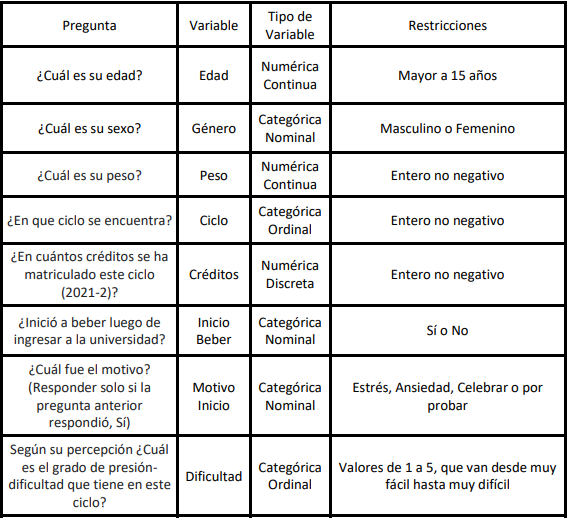
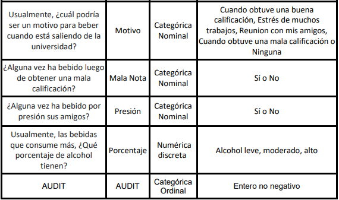
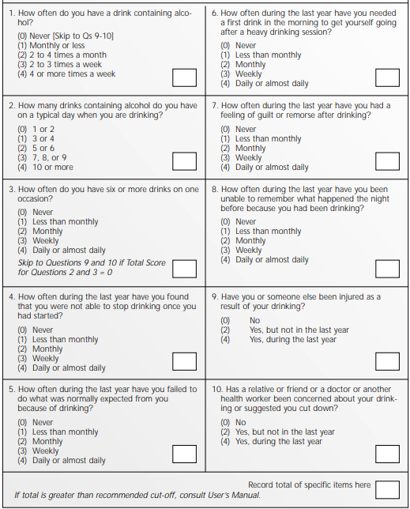

# Introducción

El binge drinking, o consumo excesivo episódico de alcohol, es un
problema que se presenta cuando se consume suficiente alcohol para
elevar su concentración en la sangre a por lo menos 0.08 g/dl. Según el
SERVICIO PAD de España, la traducción más literal del término anglosajón
sería consumo "por atracón", es decir, el consumo o ingesta de la mayor
cantidad de alcohol en el menor tiempo posible. El objetivo es conseguir
los efectos deseados de la sustancia, es decir, la embriaguez, de la
forma más rápida. El Plan Nacional Sobre Drogas (de España) ha
establecido que el binge drinking es el consumo de cinco o más bebidas
en el caso de los hombres y al menos cuatro por parte de las mujeres, en
el plazo de dos horas. La razón de esta diferencia, como explica Ana
Ordóñez Franco, médico especializada en Adicciones y responsable del
Departamento de Prevención del Instituto de Adicciones de Madrid Salud,
es que las mujeres genéticamente tienen una cantidad menor de la enzima
que se encarga de metabolizar el alcohol (alcohol-deshidrogenasa), lo
que hace que los efectos de este en su organismo sean más intensos y
duren más tiempo. Sin embargo, estos efectos también van ligados al peso
de la persona y a su porcentaje de grasa corporal. Existen varios
factores asociados al padecimiento de binge drinking, pero en este
proyecto se buscará estudiar la posible relación que haya con la carga
académica en estudiantes universitarios. El alcohol suele ser visto como
una forma de relajación o de afrontar el estrés, y en el caso de muchos
jóvenes, la carga académica es la principal fuente de estrés. ¿El estrés
académico es, entonces, un factor asociado al binge drinking?

## Importancia

Debido a la escasa difusión del problema, el binge drinking no suele ser
tomado en cuenta y las personas que lo padecen podrían minimizar las
posibles consecuencias. De hecho, no suelen ser diagnosticados por un
trastorno grave de consumo de alcohol. Es importante que esto deje de
ser así. Los riesgos por tomar alcohol en grandes cantidades, tanto a
corto como a largo plazo, son sumamente graves o hasta mortales. Desde
lesiones, accidentes y caídas hasta enfermedades hepáticas, distintos
tipos de cáncer, depresión, demencia y demás. Asimismo, Isabel María
Martín Monzón, en su investigación "Estrés académico en estudiantes
universitarios", establece que el estrés académico también tiene graves
consecuencias a corto y a largo plazo, ya que suele afectar a los
estudiantes en tres planos. En el plano conductual, los jóvenes tienden
a tener hábitos insalubres durante los períodos de exámenes, como
consumo excesivo de cafeína, tabaco y otros estimulantes que, al ser
consumidos en cantidad, pueden afectar gravemente la salud. En el plano
cognitivo, los patrones emocionales y de valoración de la realidad de
los estudiantes se veía afectada en las semanas previas a rendir
exámenes importantes. Finalmente, en el plano psicofisiológico, puede
darse una disminución de células T y de la actividad de las células
"Natural Killers", cambios que indican una depresión del sistema
inmunitario. Como jóvenes universitarios, consideramos importante
realizar una pequeña investigación que podría hallar una correlación
entre estos dos problemas que, probablemente, estén presentes y activos
en entornos cercanos a nosotros.

## Justificación

Existen numerosos estudios sobre las consecuencias del estrés académico
en universitarios, pero, en América Latina, la data sobre el binge
drinking y sus posibles factores asociados es escasa. Por lo que no hay
estudios que evalúen si existe una correlación entre universitarios de
Lima y padecimiento de binge drinking. Desde el ingreso a la
universidad, los estudiantes enfrentan exigencias que, probablemente, no
habían experimentado hasta entonces. De acuerdo al estudio "Executive
functioning and alcohol binge drinking in university students" de María
Prada et al., existe una significativa prevalencia de binge drinking en
estudiantes universitarios alrededor del mundo, y se concluyó que este
patrón de consumo de alcohol estaba asociado con un peor desempeño de
los estudiantes. Nuestro objetivo es hallar una correlación similar a la
antes mencionada en estudiantes de universidades de Lima.

# Objetivos

El objetivo de este proyecto es investigar si existe una posible
relación entre el estrés académico y el Binge Drinking.

# Marco Teórico

De acuerdo a una investigación de Karina Conde et al., la incidencia de
binge drinking en América Latina es de 22% de la población, superior al
promedio mundial de 16%. Asimismo, según datos epidemiológicos de la
Organización Mundial de la Salud (OMS), existen considerables casos de
binge drinking en jóvenes de 20 a 24 años de edad. Del mismo modo, la
Center for Disease Control and Prevention (CDC), hay una gran incidencia
de binge drinking en los jóvenes de 18 a 34 años. Así, se puede concluir
que un rango de edad bastante afectado por este patrón de consumo de
alcohol son jóvenes de 18 años a más. Este patrón de consumo etílico
"por atracón" se ve favorecido por el fenómeno del botellón, práctica
que ha sido incorporada y normalizada ya desde hace décadas por nuestros
adolescentes y jóvenes como una forma más de ocio. Tanto que, a nivel
nacional, esta práctica se ha triplicado desde 2003.

## Población

La población de estudio en cuestión son los jóvenes universitarios que
consumen alcohol y que podrían padecer este problema.

## Muestra

La muestra es de 194 observaciones.

## Unidad muestral

La unidad muestral son las personas (universitarios).

## Muestreo

En cuanto al proceso de muestreo, se realizó una encuesta que ha sido
difundida apelando a la aleatoriedad.

## Variables

 

```{r}
library(reshape2)
library(ggplot2)

tasks <- c("Elección de tema", "P0", "Recolección de datos P1", "Limpieza y Análisis de los datos obtenidos P1", "P1", 
           "Correcciones P1", "Recolección de datos faltantes P2", "Análisis estadístico descriptivo P2", "P2", "Correcciones P2", 
           "Análisis de fiabilidad / Estadística inferencial y predictiva P3", "P3", "Correcciones P3", "Presentación final (P4)")
dfr <- data.frame(
  name        = factor(tasks, levels = tasks),
  start.date  = as.Date(c("2021-09-13", "2021-09-17", "2021-09-23", "2021-09-28", "2021-10-01", "2021-10-02", "2021-10-04",
                          "2021-10-21", "2021-11-05", "2021-11-06", "2021-11-08", "2021-12-03", "2021-12-04", "2021-12-13")),
  end.date    = as.Date(c("2021-09-17", "2021-09-18", "2021-09-30", "2021-10-01", "2021-10-02", "2021-10-20", "2021-10-25",
                          "2021-11-05", "2021-11-06", "2021-11-20", "2021-12-03", "2021-12-04", "2021-12-13", "2021-12-14"))
)
mdfr <- melt(dfr, measure.vars = c("start.date", "end.date"))
ggplot(mdfr, aes(value, name)) + 
  geom_line(size = 6) +
  xlab(NULL) + 
  ylab(NULL)

```

```{r}
library(readr)
library(dplyr)
```

# LEEMOS EL ARCHIVO .CSV

```{r}
DF <- read_csv("Binge drinking.csv")
```

# DEFINIMOS VARIABLES

```{r}
DF %>% rename(
 Datetime = `Marca temporal`
  , Edad = `¿Qué edad tienes?`
  , Sexo = Sexo
  , Peso = `¿Cuál es su peso? (en Kg)`
  , Ciclo = `¿En qué ciclo se encuentra?`
  , Creditos = `¿En cuántos créditos se ha matriculado este ciclo (2021-2)?`
  , Examenesjalados = `¿Cuántas evaluaciones desaprobó durante el presente ciclo (2021-2)?` 
  , Dificultad = `Según su percepción ¿Cuál es el grado de presión-dificultad que tiene en este ciclo?`
  , InicioBeber = `¿Inició a beber luego de ingresar a la universidad?`
  , MotivoInicio = `¿Cuál fue el motivo? (Responder solo si la pregunta anterior respondió, Sí)`
  , Motivo = `Usualmente, ¿cuál podría ser un motivo para beber cuando está saliendo de la universidad?`
  , MalaNota =`¿Alguna vez ha bebido luego de obtener una mala calificación?`
  , Presion = `¿Alguna vez ha bebido por presión de sus amigos?`
  , Porcentaje = `Usualmente, las bebidas que consume más, ¿Qué porcentaje de alcohol tienen?`
  , AUDIT1 = `Completa con sinceridad el siguiente test: [¿Qué tan seguido consume bebidas alcohólicas?]`
  , AUDIT2 = `Completa con sinceridad el siguiente test: [¿Cada cuánto consume 6 o más bebidas en una sola ocasión?]`
  , AUDIT3 = `Completa con sinceridad el siguiente test: [En el último año, ¿cada cuánto sintió que no pudo parar de tomar luego de haber empezado?]`
  , AUDIT4 = `Completa con sinceridad el siguiente test: [En el último año, ¿cada cuánto dejó de hacer lo que debía por tomar bebidas alcohólicas?]`
  , AUDIT5 = `Completa con sinceridad el siguiente test: [¿Con qué frecuencia durante el último año ha necesitado un primer trago por la mañana para empezar después de una sesión de bebida en exceso?]`
  , AUDIT6 = `Completa con sinceridad el siguiente test: [En el último año, ¿cada cuánto sintió culpa o remordimiento luego de tomar bebidas alcohólicas?]`
  , AUDIT7 = `Completa con sinceridad el siguiente test: [¿Con qué frecuencia durante el último año ha estado incapaz de recordar lo que pasó la noche antes porque habías estado bebiendo?]`
  , AUDIT8 = `En un día típico cuando bebe, ¿Cuántas bebidas que contienen alcohol toma?`
  , AUDIT9 = `¿Usted o alguien más ha sido lesionado como resultado de su bebida?`
  , AUDIT10 = `¿Tiene algún familiar, amigo, médico u otro que haya estado preocupado por su consumo de alcohol o le ha sugerido que deje de beber?`
  ) -> DFN 

rm(DF)

DF <- DFN

rm(DFN)
```

Esta función convierte las preguntas del AUDIT que se encuentran en el
DF actual a un puntaje, basándose en el cuestionario original:


Luego se eliminan las columnas de las 10 preguntas y se agrega una nueva
columna con los resultados de cada observación.

```{r}
audit <- function (DF) {
  puntajes <- c()
  for (i in 1:nrow(DF)) {
    suma <- 0
    for (j in 14:ncol(DF)) {
      if (DF[i, j] == "Nunca" | DF[i, j] == "1 o 2" | DF[i, j] == "no suelo beber" | DF[i, j] == "No") {
      suma <- suma + 0
      } else if (DF[i, j] == "1 vez al mes o menos" | DF[i, j] == "3 o 4") {
        suma <- suma + 1
      } else if (DF[i, j] == "2 a 4 veces al mes" | DF[i, j] == "5 o 6" | DF[i, j] == "Sí, pero no en el último año") {
        suma <- suma + 2
      } else if (DF[i, j] == "2 a 3 veces por semana" | DF[i, j] == "7, 8 o 9") {
        suma <- suma + 3
      } else if (DF[i, j] == "4 o más veces por semana" | DF[i, j] == "10 o más" | DF[i, j] == "Sí, durante el último año") {
        suma <- suma + 4
      } 
    }
    puntajes <- append(puntajes, suma)
  }
  return(puntajes)
}

AUDIT <- audit(DF)

DF$AUDIT1 <- NULL
DF$AUDIT2 <- NULL
DF$AUDIT3 <- NULL
DF$AUDIT4 <- NULL
DF$AUDIT5 <- NULL
DF$AUDIT6 <- NULL
DF$AUDIT7 <- NULL
DF$AUDIT9 <- NULL
DF$AUDIT10 <- NULL

DF$AUDIT <- AUDIT
```

El puntaje obtenido por el AUDIT se mide de la siguiente manera:  \#\# Arreglamos una variable


```{r}
DF %>% mutate(Cantbebidas_regresion = AUDIT8) ->DF
n <- sum(DF$Cantbebidas_regresion == "no suelo beber")
DF$Cantbebidas_regresion[DF$Cantbebidas_regresion == "no suelo beber"] <- runif(n,0,1)
n <- sum(DF$Cantbebidas_regresion == "1 o 2")
DF$Cantbebidas_regresion[DF$Cantbebidas_regresion == "1 o 2"] <- runif(n, 1, 2.5)
n <- sum(DF$Cantbebidas_regresion == "3 o 4")
DF$Cantbebidas_regresion[DF$Cantbebidas_regresion == "3 o 4"] <- runif(n, 2.5, 4.5)
n <- sum(DF$Cantbebidas_regresion == "5 o 6")
DF$Cantbebidas_regresion[DF$Cantbebidas_regresion == "5 o 6"] <- runif(n, 4.5, 6.5)
n <- sum(DF$Cantbebidas_regresion == "7, 8 o 9")
DF$Cantbebidas_regresion[DF$Cantbebidas_regresion == "7, 8 o 9"] <- runif(n, 6.5, 9.5)
n <- sum(DF$Cantbebidas_regresion == "10 o más")
DF$Cantbebidas_regresion[DF$Cantbebidas_regresion == "10 o más"] <-runif(n, 9.5, 12)
DF$Cantbebidas_regresion <- as.numeric(DF$Cantbebidas_regresion)
```

```{r}
DF %>% mutate(Cantbebidas = AUDIT8) ->DF
DF$Cantbebidas[DF$Cantbebidas == "no suelo beber"] <-(0+1)/2
DF$Cantbebidas[DF$Cantbebidas == "1 o 2"] <- (1 + 2.5)/2
DF$Cantbebidas[DF$Cantbebidas == "3 o 4"] <- (2.5 + 4.5)/2
DF$Cantbebidas[DF$Cantbebidas == "5 o 6"] <- (4.5 + 6.5)/2
DF$Cantbebidas[DF$Cantbebidas == "7, 8 o 9"] <- (6.5 + 9.5)/2
DF$Cantbebidas[DF$Cantbebidas == "10 o más"] <-(9.5 + 12)/2
DF$Cantbebidas<- as.numeric(DF$Cantbebidas)
DF$AUDIT8 <- NULL
```

La variable cantidad de bebidas la sacamos de una de las preguntas del AUDIT. Tomamos los valores más altos de cada respuesta para poder tener una variable numérica. La respuesta "no suelo beber" la consideramos como 1 bebida de vez en cuando. Las personas que marcaron que no suelen beber que aún se mantiene, son las que beben pero con poca frecuencia. Como podrán ver ya eliminamos a los encuestados que marcaron que no consumían alcohol.

```{r}
 DF$Ciclo[(DF$Ciclo == "primer ciclo")] <- 1
 DF$Ciclo[(DF$Ciclo == "segundo ciclo")] <- 2
 DF$Ciclo[(DF$Ciclo == "tercer ciclo")] <- 3
 DF$Ciclo[(DF$Ciclo == "cuarto ciclo")] <- 4
 DF$Ciclo[(DF$Ciclo == "quinto ciclo")] <- 5
 DF$Ciclo[(DF$Ciclo == "sexto ciclo")] <- 6
 DF$Ciclo[(DF$Ciclo == "séptimo ciclo")] <- 7
 DF$Ciclo[(DF$Ciclo == "octavo ciclo")] <- 8
 DF$Ciclo[(DF$Ciclo == "noveno ciclo")] <- 9
 DF$Ciclo[(DF$Ciclo == "décimo ciclo o más")] <- 10
 DF$Ciclo <- as.numeric(DF$Ciclo)
 
```

Modificamos la variable ciclo, ya que por un error nuestro lo pusimos
como string, cuando tenía que ser número.

```{r}
DF$Porcentaje[DF$Porcentaje == "8° - 12° (Bajo)"] <- 10
DF$Porcentaje[DF$Porcentaje == "17° - 25° (Moderado)"] <- 21
DF$Porcentaje[DF$Porcentaje == "40° - 45° (Alto)"] <- 42.5
DF$Porcentaje[DF$Porcentaje == "No consumo bebidas alcoholicas"] <- 0
DF$Porcentaje <- as.numeric(DF$Porcentaje)

DF$Porcentaje_categorica <- DF$Porcentaje

DF %>% mutate(Porcentaje_categorica = (cut(DF$Porcentaje, breaks = c(-Inf,15,25,45), labels = c("Bajo", "Medio", "Alto"), ordered_result = TRUE))) -> DF

```

### Observación

Creamos la variable "Porcentaje_categorica" con la intención de, valga
la redundancia, categorizar los porcentajes de consumo de alcohol en 3
grupos, en lugar de solo contar con los valores 10, 21 y 42.5. Los
grupos se formaron de la siguiente manera:

-   10 -\> "Bajo"

-   21 -\> "Medio"

-   42.5 -\> "Alto"

```{r}
DF$Creditos[DF$Creditos == "No me acuerdo :c"] <- NA
DF$Creditos[DF$Creditos == 20.5] <- NA
DF$Creditos[DF$Creditos > 29] <- NA
DF$Creditos[DF$Creditos == 0] <- NA
DF$Creditos <- as.numeric(DF$Creditos)
```

La limpieza en la variable créditos solo la hicimos porque había un
string y un valor con decimal (el valor de los créditos siempre es un
número entero).

```{r}
DF$Examenesjalados <- as.numeric(DF$Examenesjalados)
```

Transformamos la variable exámenes jalados a numérica, ya que un
encuestado respondió con palabras.

```{r}
DF$Peso[(DF$Peso == "50kg")] <- 50
DF$Peso[(DF$Peso == "60 kg")] <- 60
DF$Peso[(DF$Peso == "70 kilogramos")] <- 70
DF$Peso <- as.numeric(DF$Peso)
DF$Peso[(DF$Peso <= 35)] <- NA 
```

Limpiamos y arreglamos la variable peso, ya que encontramos valores
anómalos como 20 (kg) y algunos encuestados pusieron "kg" o
"kilogramos".

```{r}
DF<- DF[DF$Porcentaje!=0, ]
```

```{r}
DF$Datetime <- NULL
DF$MotivoInicio <- NULL
DF$Motivo <- NULL
DF$Presion <- NULL
```

Eliminamos las siguientes variables debido a que los estudios causales
son difíciles de demostrar.

```{r}
DF %>% mutate(Riesgo = (cut(DF$AUDIT, breaks = c(-Inf,0,7,14,Inf), labels = c("Nulo", "Bajo", "Medio", "Alto"), ordered_result = TRUE))) -> DF
```

### Observación

Creamos la variable riesgo con el fin de categorizar los puntajes del
AUDIT. Los valores que toma cada nivel son: 
- 0 -> Nulo 
- 1 a 7 -> Bajo 
- 8 a 14 -> Medio
- 15 a más -> Alto

# Descriptores Numéricos

## 1) Edad

Con esta variable nos aseguraremos que nuestro público objetivo sean
estudiantes universitarios, por lo cual estudiaremos descriptores
numéricos como: la moda, mediana y la media, de la edad de los
encuestados. Mediante un histograma.

```{r}
hist(DF$Edad, breaks = (min(DF$Edad):(max(DF$Edad) + 1)) - 0.5, main = "Histograma", xlab = "Edad", ylab = "", prob=TRUE)

abline(v = c(mean(DF$Edad, na.rm = TRUE), median(DF$Edad, na.rm = TRUE)), col = c("red", "blue"))
legend("topright"
       , legend = c("Media", "Mediana")
       , lty = 1
       , col = c("red", "blue")
       , bty = "n"
       )
```

### Análisis:

El análisis correspondiente a esta variable "Edad" tendrá como objetivo
principal corroborar que nuestra encuesta fue realizada a personas
pertenecientes a nuestro público objetivo como los son los estudiantes
universitarios.

### Moda:

Observamos que la moda es de 18 años, que corresponde al dato más
solicitado por nuestros encuestados.

### Mediana:

En la variable "Edad" nuestra mediana es de 20, la cual corresponde a la
edad que se ubica al medio de los datos ordenados.

### Promedio:

Apreciamos que la media o promedio de esta variable es de 20.5 años, la
cual es una edad sensata para ubicarse en el proceso de formación
universitaria.

Aparte de ello podemos ver que la media está a la derecha por lo que
inferimos que los datos están sesgados a la derecha.

## 2) Peso

Con el peso se busca analizar las posibles consecuencias de un consumo
inadecuado del alcohol en un estudiante universitario, pues mientras
mayor sea el peso de la persona, peores serían las consecuencias
físicas.

```{r}
boxplot(DF$Peso, horizontal = TRUE)

cat("Promedio:", mean(DF$Peso, na.rm = TRUE), "\n")
cat("mediana:", median(DF$Peso, na.rm = TRUE), "\n")
cat("Desviación estándar:", sd(DF$Peso, na.rm = TRUE), "\n")
cat("Rango:"
    , max(DF$Peso, na.rm = TRUE) - min(DF$Peso, na.rm = TRUE)
    , "\n"
    )
cat("Rango intercuartil:"
    , quantile(DF$Peso, 0.75, na.rm = TRUE) 
    - quantile(DF$Peso, 0.25, na.rm = TRUE)
    , "\n"
    )
cat("mínimo:", min(DF$Peso, na.rm = TRUE), "\n")
cat("máximo:", max(DF$Peso, na.rm = TRUE), "\n")
```

### Análisis:

En este caso graficamos un boxplot debido a los datos diversos con los
que contamos, las cuales serán explicados a continuación:

### Promedio

El promedio correspondiente a esta variable es de 68.945 Kg, la cual
subjetivamente es un peso que puede considerarse como la media del peso
entre estudiantes universitarios, teniendo en cuenta que encuestamos a
hombres (suelen tener un peso mayor que las mujeres) y mujeres (suelen
tener un peso menor que los hombres).

### Mediana

La mediana es de 65 Kg y considerando al promedio que es mayor se puede
deducir que nuestros datos correspondientes a esta variable están
sesgados a la derecha de una línea numérica.

### Desviación estándar

La desviación estándar es de 15.06 Kg, esto nos quiere decir que
nuestros datos se encuentran relativamente dispersos.

### Rango

Existe una diferencia de 75Kg entre nuestro máximo y mínimo dato de peso
(115 y 40 Kg respectivamente).

### Rango intercuartil

Existe una diferencia de 22 Kg entre el primer y tercer cuartil.

## 3) Ciclo

Hacemos un histograma para la variable categórica ciclo, debido a que
averiguaremos el estrés académico mientras el estudiante vive la etapa
universitaria.

```{r}
hist(DF$Ciclo, breaks=0:10, main = "Histograma", xlab = "Ciclo", ylab = "")
abline(v = c(median(DF$Ciclo, na.rm = TRUE)), col = c("blue"))
legend("topleft"
       , legend = c("Mediana")
       , lty = 1
       , col = c("blue")
       , bty = "n"
       )
```

### Análisis:

Este histograma nos servirá notablemente para ver los descriptores
numéricos que se le puede atribuir a una variable categórica ordinal
(moda y mediana), como el ciclo que los estudiantes universitarios
encuestados se encuentran cursando.

### Moda

Claramente en nuestra encuesta participaron más estudiantes del tercer
ciclo, con más de 50 participaciones.

### Mediana

La mediana correspondiente a esta variable es el cuarto ciclo, la cual
básicamente habla de una diversidad de nuestros datos, ya que se
encuentra muy cerca al quinto ciclo (mitad de la vida universitaria).

### 4) Exámenes Jalados

```{r}
boxplot(DF$Examenesjalados, horizontal = TRUE)

cat("Promedio:", mean(DF$Examenesjalados, na.rm = TRUE), "\n")
cat("mediana:", median(DF$Examenesjalados, na.rm = TRUE), "\n")
cat("Desviación estándar:", sd(DF$Examenesjalados, na.rm = TRUE), "\n")
cat("Rango:"
    , max(DF$Examenesjalados, na.rm = TRUE) - min(DF$Examenesjalados, na.rm = TRUE)
    , "\n"
    )
cat("Rango intercuartil:"
    , quantile(DF$Examenesjalados, 0.75, na.rm = TRUE) 
    - quantile(DF$Examenesjalados, 0.25, na.rm = TRUE)
    , "\n"
    )
cat("mínimo:", min(DF$Examenesjalados, na.rm = TRUE), "\n")
cat("máximo:", max(DF$Examenesjalados, na.rm = TRUE), "\n")
```

## Análisis:

Analizando el gráfico mostrado nos damos cuenta que nos existen datos atípicos, cabe resaltar que esta variable solo cuenta con 57 observaciones, por lo que la presencia de estos casos atípicos es menos probable.
# Promedio

El promedio en esta variable es 6.105263 evaluaciones desaprobadas

# Mediana

La mediana es de 6 lo cual nos indica que al menos la mitad de los estudiantes encuestados han desaprobado 6 o mas exámenes y comparándolo con el promedio que es mayor se puede
deducir que nuestros datos correspondientes a esta variable están
sesgados a la derecha de una línea numérica.

# Desviación estándar

La desviación estándar es de 3.871527, esto nos quiere decir que
nuestros datos se encuentran relativamente dispersos.


# Descriptores Gráficos

## 1) Créditos - dificultad

Buscaremos una relación entre la dificultad del ciclo y la cantidad de
créditos que cursa un estudiante universitario, para así relacionarlo
con las causas de ingerir bebidas alcohólicas.

```{r}
boxplot(DF$Creditos ~ DF$Dificultad, varwidth = TRUE, na.rm=TRUE)
```

### Análisis:

Podemos verificar una tendencia evidente que planteamos con respecto a
variables de tipo estrés académico, ya que se nota que mientras la
cantidad de créditos académicos aumenta, la dificultad del ciclo
también.

## 2) Créditos - Nivel de Riesgo

```{r}
boxplot(DF$Creditos ~ DF$Riesgo, varwidth = TRUE)
```

### Análisis:

Realizamos un boxplot indexado para la comparativa de una variable
categórica y una numérica. Vemos que los de riesgo nulo llevan de 17 a
22 créditos, bajo tiene un rango de 11 a 26 créditos y que el riesgo
medio esta concentrado en el rango de 10 a 26 créditos, riesgo alto de
10 a 24.

## 3) Porcentaje de alcohol - Edad

Analizaremos, mediante la gráfica, cuál es la relación entre la edad de
la persona y el porcentaje de alcohol que consume.

```{r}
boxplot(DF$Edad ~ DF$Porcentaje_categorica, varwidth=TRUE)
```

### Análisis:

Es interesante y es un resultado que esperábamos. Las personas de más
edad suelen tomar bebidas con mayor porcentaje de alcohol, y las
personas con menor edad consumen bebidas con menos porcentajes de
alcohol exceptuando los datos atípicos.

## 4) Grado de Dificultad del ciclo - Puntaje del AUDIT

El AUDIT se usa para medir el nivel de riesgo que presenta el consumo de
alcohol de una persona. En esta gráfica se busca ver la relación entre
la dificultad y los resultados del mencionado test.

```{r}
boxplot(DF$Dificultad ~ DF$AUDIT, varwidth =TRUE)
```

### Análisis:

Al momento de plantear el gráfico, creímos que habría una cierta
correlación entre el puntaje obtenido en el AUDIT y el nivel de
percepción de dificultad del ciclo académico, pero inspeccionando
visualmente el gráfico no encontramos ningún patrón o relación, y
obteniendo la covarianza de ambas variables notamos que no existe una
relación notable entre estas, ya que es un valor cercano a 0.

## 5) Porcentaje de alcohol - Puntaje del AUDIT

```{r}
mosaicplot(DF$Porcentaje_categorica ~ DF$Riesgo, main = "Mosaico 1")
```

### Análisis:

Es posible notar que solo los que tienen un nivel de porcentaje bajo
pueden tener riesgo nulo. También se puede apreciar que los que consumen
un porcentaje alto de alcohol tiene mayor riesgo de padecer Binge
Drinking.

## 6) Sexo - ¿Inició a beber luego de ingresar a la Universidad?

En la siguiente gráfica, buscamos averiguar si el sexo de la persona
influye en la decisión de iniciar a beber en la universidad.

```{r}
mosaicplot(DF$Sexo~DF$InicioBeber, main="Mosaico 2", xlab = "Sexo", ylab = "Inició a  beber luego de ingresar a la Universidad")
```

### Análisis:

En este gráfico se aprecia notablemente que, en nuestra muestra, no hay
diferencia de géneros entre personas que han iniciado a beber luego de
haber ingresado a la universidad.

## 7) Sexo - Nivel de riesgo

```{r}
mosaicplot(table(DF$Sexo, DF$Riesgo), main="Mosaico 3")
```

Sumando este gráfico al anterior, es notorio que hay más mujeres con
riesgo bajo de padecer de Binge Drinking, mientras que los hombres, en
comparación a las mujeres, se encontrarían con un mayor riesgo de
padecer de Binge Drinking.

## 8) Porcentaje de estudiantes que iniciaron a beber después de haber ingresado a la Universidad

En este *pie chart*, se observa el porcentaje de personas que tienden a
consumir alcohol luego de ingresar a la universidad, lo cual luego nos
llevará a ver si eso se debe a malas calificaciones o no.

```{r}
m<- c(round((sum((DF$InicioBeber=="Sí"))/sum(table(DF$InicioBeber)))*100,2),round((sum((DF$InicioBeber=="No"))/sum(table(DF$InicioBeber)))*100,2)) 
label <- paste(m, "%", sep=" ")
color <- c("lightgreen", "cadetblue")
pie(m, labels = label, clockwise = TRUE, col = color, main = "¿Inició a beber luego de ingresar a la Universidad?")
legend("topleft",legend = c("Sí", "No"), cex=0.8, fill = color)
legend("topright",legend =c("Cantidad de datos:", nrow(DF)) )
```

### Análisis:
Es importante señalar que la mayoría respondió sí, ya que usualmente los alumnos universitarios ya cumplen con la mayoría de edad y al participar en reuniones o fiestas pueden haber iniciado a consumir por influencia de sus amistades o por estrés.

## 9) ¿Inició a beber luego de obtener malas calificaciones?

```{r}
m<- c(round((sum((DF$MalaNota=="Sí"))/sum(table(DF$MalaNota)))*100,2),round((sum((DF$MalaNota=="No"))/sum(table(DF$MalaNota)))*100,2)) 
label <- paste(m, "%", sep=" ")
color <- c("lightgreen", "cadetblue")
pie(m, labels = label, clockwise = TRUE, col = color, main = "¿Inició a beber luego de obtener malas calificaiones?")
legend("topleft",legend = c("Sí", "No"), cex=0.8, fill = color)
legend("topright",legend =c("Cantidad de datos:", nrow(DF)) )

```

### Análisis:

Aunque "sí" es la respuesta más usada, tomamos que existe una ligera
diferencia con el "no", lo cual indicaría que uno de los motivos más
importantes por el cual alguien puede llegar a beber es, efectivamente,
obtener malas calificaciones en un examen.

# Patrones

## Cantidad de bebidas vs Exámenes jalados

```{r}
smoothScatter(DF$Cantbebidas ~ DF$Examenesjalados, main="Cantidad de bebidas vs Exámenes jalados")
cor(DF$Cantbebidas, DF$Examenesjalados, use = "complete.obs")
```

En primer lugar, buscamos relacionar variables correspondientes al
consumo excesivo de alcohol (Binge drinking) y el estrés académico
mediante la siguiente lógica:

Estrés académico --------\> Evaluaciones jaladas

Binge drinking --------\> Cantidad de bebidas ingeridas con normalidad

En segundo lugar, realizamos el análisis correspondiente al plot y la
correlación entre estas dos variables numéricas para poder responder a
nuestro objetivo: saber si el estrés académico es un factor asociado al
Binge drinking. En NUESTRA MUESTRA podemos objetar que no existe una
relación directa entre estás dos variables debido a que nos arroja una
correlación muy cercana a 0 y una gráfica muy dispersa.

## Porcentaje de alcohol vs créditos

```{r}
smoothScatter(DF$Porcentaje ~ DF$Creditos)
cor(DF$Porcentaje, DF$Creditos, use = "complete.obs")
```

::: {style="text-align: justify"}
**Análisis**
:::

<o style="text-align: justify;">En línea con nuestra hipótesis inicial,
la cual era que existía cierta relación entre el estrés académico y el
padecimiento de Binge Drinking, decidimos comparar la variable
"Créditos" como un indicador de estrés académico a la que están
sometidos los estudiantes y la variable "Porcentaje". En principio, el
resultado que esperábamos era una correlación de por lo menos 0.3, lo
cual nos mostraría que hay una relación. En cambio, el resultado
obtenido fue una correlación de -0.04826445 indicándonos que en nuestra
muestra no existe una relación estrecha entre estas.

</p>

## Cantidad de bebidas vs Peso:

```{r}
boxplot(DF$Cantbebidas ~ DF$Peso, col= "lightblue")
cor(DF$Cantbebidas, DF$Peso, use = "complete.obs")
```

Podemos ver que la relación entre "cantidad de bebidas" y "peso", es
moderada, con una correlación de 0.475. A medida que aumenta el peso, la
cantidad que bebe la persona aumenta. Esto es gracias a que el peso es
uno de los factores que permite consumir más cantidad alcohol, a mayor
peso también hay mayor cantidad de agua en el organismo que permite
diluir más rápido el alcohol. Es por esto que en dos personas de
diferente peso que consuman la misma cantidad de bebidas, la que tiene
mayor peso tendrá menor concentración de alcohol. Para más información
sobre como actúa el alcohol con el metabolismo de una persona, aparte
del peso, entrar a [Acerca del Alcohol y como se metaboliza en el
cuerpo](https://antidopingmexico.com/acerca-del-alcohol-y-como-se-metaboliza-en-el-cuerpo/).

# Descripción de variables aleatorias

+--------------+-------------------------------------------------------+
| Variable     | Modelo                                                |
+==============+=======================================================+
| InicioBeber  | Esta variable nos entrega información sobre si el     |
|              | estudiante inició a beber luego de ingresar a la      |
|              | universidad y se ajusta al modelo binomial. Tomaremos |
|              | como una nueva muestra a los estudiantes de UTEC      |
|              | teniendo como número de intentos n = 2263.            |
|              |                                                       |
|              | Definimos como nuestro éxito a las personas que SÍ    |
|              | iniciaron a beber luego de ingresar a la universidad. |
|              | Habiendo calculado en nuestra muestra que la          |
|              | probabilidad de ello es de 0,5825.                    |
|              |                                                       |
|              | x\~Bin(2263, 0.5825).                                 |
+--------------+-------------------------------------------------------+
| MalaNota     | Esta variable nos entrega información sobre si el     |
|              | estudiante ha bebido luego de sacar una mala nota y   |
|              | se ajusta al modelo binomial. Tomaremos como una      |
|              | nueva muestra a los estudiantes de UTEC teniendo como |
|              | número de intentos n = 2263.                          |
|              |                                                       |
|              | Definimos como nuestro éxito a las personas que SÍ    |
|              | beben luego de sacar una mala nota. Habiendo          |
|              | calculado en nuestra muestra que la probabilidad de   |
|              | ello es de 0,5773.                                    |
|              |                                                       |
|              | x\~Bin(2263, 0.5773).                                 |
+--------------+-------------------------------------------------------+

Fuente de la cual se recopiló el número de estudiantes de UTEC: [INEI 2018](https://www.inei.gob.pe/estadisticas/indice-tematico/university-tuition/).

## Probabilidades usadas en la tabla anterior

## Porcentaje mayor a 40

```{r}
round(table(DF$Porcentaje)/nrow(DF),2)
```

## Cantidad de bebidas mayor a 6

```{r}
round(table(DF$Cantbebidas)/nrow(DF),2)
```

# Adicional: Probabilidad condicional.

## Sexo, Cantidad de bebidas:

```{r}
round(table(DF$Sexo)/nrow(DF),2)
```

```{r}
round(table(DF$Cantbebidas)/nrow(DF),2)
```

```{r}
round(table(DF$Sexo,DF$Cantbebidas)/nrow(DF),2)
```

$$P(Cantbebidas >= 6 | Sexo Masculino) = (\frac{P(Cantbebidas >=6
∩ Sexo Masculino)}{P(Sexo Masculino)})=\frac{0.23}{0.54}=0.43$$

$$P(Cantbebidas >= 6 | Sexo Femenino) = (\frac{P(Cantbebidas >=6
∩ Sexo Femenino)}{P(Sexo Femenino)})=\frac{0.13}{0.46}=0.28$$

### Análisis

Los resultados de 0.43 y 0.28, son las probabilidades de encontrar una
persona de cada género (Masculino y Femenino respectivamente) que beba 6
o más vasos de licor.

## Sexo, Dificultad:

```{r}
round(table(DF$Dificultad,DF$Sexo)/nrow(DF),2)
```

$$P( Dificultad = 5 | Sexo Masculino) = \left(\frac{P(Dificultad = 5 ∩
Sexo Masculino)}{P(Sexo Masculino)}\right)=\frac{0.12}{0.54}=0.22$$

$$P( Dificultad = 5 | Sexo Femenino) = \left(\frac{P(Dificultad = 5 ∩
Sexo Femenino)}{P(Sexo Femenino)}\right)=\frac{0.07}{0.46}=0.15$$

### Análisis

Los resultados de 0.22 y 0.15, son las probabilidades de encontrar una
persona de cada género (Masculino y Femenino respectivamente) que
considere que este ciclo tiene una dificultad alta (5).
```{r}
library(dplyr)
library(ggplot2)
```


# Intervalo de confianza

### Para la variable Edad

Parámetros del estudio para la variable Edad

Tamaño de la muestra -> 194 observaciones

Nivel de confianza -> 95% 

```{r}
significancia <- 0.05
cat("Valor de la significancia", " " , significancia)
```

Hallamos nuestro valor de z crítico.

```{r}
zcritico <- qnorm((significancia/2), lower.tail = FALSE)
cat("Valor del Zcritico", " " ,zcritico)
```
```{r}
n3 <- sum(!is.na(DF$Edad))
```

Con el intervalo de confianza que tomamos para nuestro promedio de edad hallamos los siguientes rangos:
```{r}
izq <- mean(DF$Edad)-zcritico*sd(DF$Edad)/sqrt(n3)

der <- mean(DF$Edad)+zcritico*sd(DF$Edad)/sqrt(n3)

cat("Valor por izquierda ->", izq ,",", "Valor por derecha ->", der, "")
```

Calculamos el error
```{r}
error_edad <- ((zcritico)* sd(DF$Edad))/sqrt(n3)
cat("El error obtenido es de :", error_edad )
```


### Para la variable Peso

Parámetros del estudio para la variable Peso

Tamaño de la muestra -> 191 observaciones

Nivel de confianza -> 95% 

```{r}
cat("Valor de la significancia", " " , significancia)
```

Hallamos nuestro valor de z crítico.

```{r}
zcriticod <- qnorm((significancia/2), lower.tail = FALSE)
cat("Valor del Zcritico", " " ,zcriticod)
```

```{r}
n2 <- sum(!is.na(DF$Peso))
```

Con el intervalo de confianza que tomamos para nuestro promedio de edad hallamos los siguientes rangos:
```{r}
izq <- mean(DF$Peso, na.rm=TRUE)-zcriticod*sd(DF$Peso, na.rm=TRUE)/sqrt(n2)

der <- mean(DF$Peso, na.rm=TRUE)+zcriticod*sd(DF$Peso, na.rm=TRUE)/sqrt(n2)

cat("Valor por izquierda ->", izq ,",", "Valor por derecha ->", der, "")
sd(DF$Peso, na.rm=TRUE)
```

Calculamos el error
```{r}
error_peso <- ((zcriticod)* sd(DF$Peso, na.rm=TRUE))/sqrt(n2)
cat("El error obtenido es de :", error_peso )
```
### Para exámenes jalados

Tamaño de la muestra -> 57 observaciones

Nivel de confianza -> 95%
```{r}
cat("Valor de la significancia", " " , significancia)
```

```{r}
zcrit_cantc <- qnorm((significancia/2), lower.tail = FALSE)
zcrit_cantc
```

```{r}
n <- sum(!is.na(DF$Examenesjalados))
```

Con el intervalo de confianza que tomamos para nuestro promedio de edad hallamos los siguientes rangos:
```{r}
izq <- mean(DF$Examenesjalados, na.rm=TRUE)-zcrit_cantc*sd(DF$Examenesjalados, na.rm=TRUE)/sqrt(n)

der <- mean(DF$Examenesjalados, na.rm=TRUE)+zcrit_cantc*sd(DF$Examenesjalados, na.rm=TRUE)/sqrt(n)

cat("Valor por izquierda ->", izq ,",", "Valor por derecha ->", der, "")
```

Calculamos el error
```{r}
error_examjalados <- ((zcrit_cantc)* sd(DF$Examenesjalados, na.rm=TRUE))/sqrt(n)
cat("El error obtenido es de :", error_examjalados )
```
# Prueba de Hipótesis


### Para los exámenes jalados


Parámetros del estudio para la variable "Examenesjalados"

Tamaño de la muestra -> 57 observaciones

Nivel de confianza -> 95%


+ Prueba de hipótesis 

Sabemos que cuando los alumnos entran en exámenes tienden a estresarse mucho. Aparte de eso, el desaprobar un examen acumula más estrés ya que va a estar obligado a aprobar el siguiente. Consideraremos que una cantidad de 4 a menos exámenes desaprobados no acumula una carga de estrés académico elevado. Deseamos saber cuántos estudiantes han reprobado en promedio 5 o más exámenes.

Planteamos nuestra prueba de hipótesis de forma unilateral a la derecha, pues solo nos interesará conocer si la media de exámenes desaprobados es mayor a 4, pues es el caso en el que significaría un problema. 


Hipótesis nula H0 -> M <= 4

Hipótesis alternativa Ha -> M > 4


Teniendo en cuenta que nuestra significancia es de 0.05.
```{r}
zcrit_cantt <- qnorm(significancia/2, lower.tail = FALSE)
cat("Sabemos que nuestro z-crítico para esta variable es", zcrit_cantt )
```

El promedio que tomamos es de 5 exámenes jalados.
```{r}
mu<-5
zcritsupuesto57 <-(mean(DF$Examenesjalados, na.rm=TRUE)-mu)/(sd(DF$Examenesjalados, na.rm=TRUE)/sqrt(n))
cat("Obtenemos que nuestro z-crítico supuesto es de", zcritsupuesto57)
```
```{r}
t_supuesto <-  zcritsupuesto57
t_critico <- zcrit_cantt 
x <- seq(-2,5,0.05)
y <- dt(x,100)
yee <- function(x)
{
  y <- dt(x,100)
  y[x<t_critico] <- NA
  return (y)
}
```

```{r}
data.frame(x,y) %>% ggplot(aes(x = x, y = y)) + geom_line() + geom_vline(xintercept = t_supuesto, colour = "blue") + geom_vline(xintercept = t_critico, colour = "green") + stat_function(fun = yee, geom = "area", fill = "green", alpha = 0.5) + geom_text(aes(x=t_supuesto+0.3, label="t supuesto", y=max(y)), colour="blue") + geom_text(aes(x=t_critico + 1, label="t crítico", y=max(y)), colour="green") + scale_x_continuous(limits = c(-2,5))

```

Rechazamos H0, pues como se puede ver nuestro z-crítico supuesto cae dentro de la zona de rechazo.

### Para la variable de Cantidad de bebidas

Parámetros del estudio para la variable cantidad de bebidas

Tamaño de la muestra -> 194 observaciones

Nivel de confianza -> 95% 

Consideraremos que después del cuarto vaso, el alumno puede iniciar a sentir los efectos del alcohol. Tomamos una muestra de 194 alumnos y deseamos saber cuántos alumnos universitarios consumen en promedio 5 vasos o más de alcohol, con lo cual aparte de sentir los efectos del alcohol, aumenta el riesgo de padecer binge drinking.

Fuente donde se recopiló a partir de que número de vasos se considera peligroso: [NIH](https://www.niaaa.nih.gov/es/publications/el-consumo-de-alcohol-enla-universidad)

Plantearemos una prueba de hipótesis unilateral a la izquierda, pues en nuestro estudio solo importará conocer los alumnos que entran en binge drinking, lo que consistiría más de 4 vasos de alcohol. 

Hipótesis nula H0 -> M <= 4

Hipótesis alternativa Ha -> M > 4


Teniendo en cuenta que nuestra significancia es de 0.05.
```{r}
zcrit_cant <- qnorm((significancia/2), lower.tail = FALSE)
cat("Sabemos que nuestro z crítico para esta variable es", zcrit_cant )
```

```{r}
n1 <- sum(!is.na(DF$Cantbebidas))
```

El promedio que tomamos es de 4.
```{r}
zcritsupuesto4 <-(mean(DF$Cantbebidas)-4)/(sd(DF$Cantbebidas)/sqrt(n1))
cat("Obtenemos que nuestro z-crítico supuesto es de", zcritsupuesto4)
```

```{r}
t_supuesto <-  zcritsupuesto4
t_critico <- zcrit_cant 
x <- seq(-1,3,0.1)
y <- dt(x,100)
yee <- function(x)
{
  y <- dt(x,100)
  y[x<t_critico] <- NA
  return (y)
}
```

```{r}
data.frame(x,y) %>% ggplot(aes(x = x, y = y)) + geom_line() + geom_vline(xintercept = t_supuesto, colour = "blue") + geom_vline(xintercept = t_critico, colour = "green") + stat_function(fun = yee, geom = "area", fill = "green", alpha = 0.6) + geom_text(aes(x=t_supuesto+0.3, label="t supuesto", y=max(y)), colour="blue") + geom_text(aes(x=t_critico + 1, label="t crítico", y=max(y)), colour="green") + scale_x_continuous(limits = c(-1,3))

```

No rechazamos H0, pues como se puede ver nuestro z-crítico supuesto cae dentro de la zona no rechazo.

### Para la variable edad


Parámetros del estudio para la variable "Edad"

Tamaño de la muestra -> 194 observaciones

Nivel de confianza -> 95%

Teniendo en cuenta que los datos tienen una distribución que consideramos no es tan alejado a la distribución real, tampoco podemos darle un nivel de confianza mayor, ya que al tener relativamente pocas observaciones la muestra puede no ser tan representativa como esperamos, además asumimos la responsabilidad de que 1 de cada 10 estemos equivocados en los resultados. 

+ Prueba de hipótesis 

El II Censo Nacional Universitario 2010 señala que, en el país, la edad promedio de ingreso a la universidad es de 19 años, por lo tanto, la edad promedio en la que culminan los estudios es a los 24 aproximadamente. Consideraremos que a los 21 años los alumnos que tienen al menos 2 años de haber ingresado a la universidad. Deseamos saber cuántos alumnos tienen una edad promedio distinta a 21 (alumnos que máximo tiene 1 o 2 año en la universidad).

Hipótesis nula H0 -> M == 21.5

Hipótesis alternativa Ha -> M != 21.5


Teniendo en cuenta que nuestra significancia es de 0.05.
```{r}
zcrit_cant <- qnorm(significancia/2)
cat("Sabemos que nuestro z-crítico para esta variable es", zcrit_cant )
```

El promedio que tomamos es de 21.5
```{r}
mu<-21.5
zcritsupuesto19 <-(mean(DF$Edad)-mu)/(sd(DF$Edad)/sqrt(n3))
cat("Obtenemos que nuestro z-crítico supuesto es de", zcritsupuesto19)
```

```{r}
t_supuesto <- zcritsupuesto19 
t_critico <- zcrit_cant 
x <- seq(-10,2,0.1)
y <- dt(x,100)
yee <- function(x)
{
  y <- dt(x,100)
  y[x<=t_critico] <- NA
  return (y)
}

yee2 <- function(x)
{
  y <- dt(x,100)
  y[x>=t_critico] <- NA
  return(y)
  
}

data.frame(x,y) %>% ggplot(aes(x = x, y = y)) + geom_line() + geom_vline(xintercept = t_supuesto, colour = "blue") + geom_vline(xintercept = t_critico, colour = "red")+  stat_function(fun=yee2, geom="area", fill="red", alpha = 0.6) + scale_x_continuous(limits = c(-10,2)) + geom_text(aes(x=t_supuesto + 2, label="t supuesto", y=max(y)), colour="blue" ) +
geom_text(aes(x=t_critico + 2, label="t crítico", y=max(y)), colour="red")
```

Rechazamos H0, pues como se puede ver nuestro z-crítico supuesto cae dentro de la zona de rechazo.

### Para la variable peso

Decidimos separar la variable peso por el género, ya que el peso es una variable que fluctúa mucho. Para disminuirlo, y considerando que, en promedio, el género masculino tiene mayor peso que el género femenino, lo dividimos para hacer el análisis correspondiente.
Datos sobre el peso de hombres y mujeres en el mundo:
[Altura y peso medio por país](https://www.datosmundial.com/estatura-promedio.php)

Para el caso de los hombres, tenemos 102 observaciones.

```{r}
DF %>%  filter(DF$Sexo == "Masculino") -> Hombre
pesohombre <- sum(!is.na(Hombre$Peso))
```

Para el caso de los mujeres, se tienen 89.
```{r}
DF %>%  filter(DF$Sexo == "Femenino") -> Mujer
pesomujer <-sum(!is.na(Mujer$Peso))
```

Consideraremos que para medir el grado de alcoholemia en el cuerpo se tendrá que tomar en cuenta el peso, ya que influirá para percibir los efectos del alcohol. Tomamos una muestra de 194 alumnos, los dividimos en hombres y mujeres. Los hombres tienen un peso promedio de 75Kg, mientras que las mujeres un peso de 58Kg. Deseamos saber cuántos alumnos universitarios hombres con un peso promedio mayor de 75kg pueden consumir más de 5 vasos sin que les afecte el alcohol y cuántas alumnas universitarias (mujeres) con un peso promedio mayor de 58kg pueden consumir más de 4 vasos sin que les afecte el alcohol.

En ambos casos se utilizará una prueba de hipótesis unilateral a la derecha, pues quisiéramos saber si, tanto los hombres como las mujeres, tienen un peso mayor a 75kg y 58kg respectivamente, pues serían ellos los que tendrían mayor resistencia al alcohol. 

#### Hombres 

Hipótesis nula H0 -> M =< 75

Hipótesis alternativa Ha -> M > 75


#### Mujeres 

Hipótesis nula H0 -> M =< 58

Hipótesis alternativa Ha -> M > 58


Teniendo en cuenta que nuestra significancia es de 0.05.
```{r}
zcrit_cant <- qnorm((significancia/2), lower.tail = FALSE)
cat("Sabemos que nuestro zcrítico para esta variable es", zcrit_cant )
```

El promedio que tomamos para hombres es 75 Kg y para mujeres es 58 Kg.


```{r}
zcritsupuesto50 <-(mean(Hombre$Peso, na.rm =  T)-75)/(sd(Hombre$Peso,na.rm =  T )/sqrt(pesohombre))
cat("Obtenemos que nuestro z-crítico supuesto es de", zcritsupuesto50)
```

```{r}
zcritsupuesto500 <-(mean(Mujer$Peso, na.rm =  T)-58)/(sd(Mujer$Peso,na.rm =  T )/sqrt(pesomujer))
cat("Obtenemos que nuestro z-crítico supuesto es de", zcritsupuesto500)
```

#### Para hombres
```{r}
t_supuesto <-  zcritsupuesto50
t_critico <- zcrit_cant 
x <- seq(-2,5,0.05)
y <- dt(x,100)
yee <- function(x)
{
  y <- dt(x,100)
  y[x<t_critico] <- NA
  return (y)
}
```

```{r}
data.frame(x,y) %>% ggplot(aes(x = x, y = y)) + geom_line() + geom_vline(xintercept = t_supuesto, colour = "blue") + geom_vline(xintercept = t_critico, colour = "green") + stat_function(fun = yee, geom = "area", fill = "green", alpha = 0.5) + geom_text(aes(x=t_supuesto+0.3, label="t supuesto", y=max(y)), colour="blue") + geom_text(aes(x=t_critico + 1, label="t crítico", y=max(y)), colour="green") + scale_x_continuous(limits = c(-2,5))

```

No rechazamos H0, pues como se puede ver nuestro z-crítico supuesto cae dentro de la zona de no rechazo.

#### Para Mujeres
```{r}
t_supuesto <-  zcritsupuesto500
t_critico <- zcrit_cant 
x <- seq(-2,5,0.05)
y <- dt(x,100)
yee <- function(x)
{
  y <- dt(x,100)
  y[x<t_critico] <- NA
  return (y)
}
```

```{r}
data.frame(x,y) %>% ggplot(aes(x = x, y = y)) + geom_line() + geom_vline(xintercept = t_supuesto, colour = "blue") + geom_vline(xintercept = t_critico, colour = "green") + stat_function(fun = yee, geom = "area", fill = "green", alpha = 0.5) + geom_text(aes(x=t_supuesto+0.3, label="t supuesto", y=max(y)), colour="blue") + geom_text(aes(x=t_critico + 1, label="t crítico", y=max(y)), colour="green") + scale_x_continuous(limits = c(-2,5))

```

Rechazamos H0, pues como se puede ver nuestro z-crítico supuesto cae dentro de la zona de rechazo.


# Regresión

```{r}
plot(DF$Cantbebidas_regresion ~ DF$Peso + DF$AUDIT , col= "red")
lm1 <- lm(DF$Cantbebidas_regresion ~ DF$Peso+DF$AUDIT)

```
### Observación:
En la limpieza de datos aleatorizamos la variable "cantidad  de bebidas" debido a problemas con la discretización de la variable, la cual originalmente presentamos a los encuestados como un rango de valores según lo que consumía. La consecuencia de ello la observaremos en la gráfica de residuos. 


```{r}
plot(lm1)
summary(lm1)
```
## Análisis de la gráfica de residuos

Podemos observar en la gráfica de residuos de la relación planteada que hay un problema de __heterocedasticidad__, la cual implica una varianza de errores que no es constante. Es por eso que en la gráfica de residuos, la parte de la izquierda parece haber una poca variación de los errores o residuos, mientras que en la parte del centro hay una mayor variación.
Esto es un problema ya que se pierde eficiencia en las tendencias y predicciones (análisis inferencial).

## Análisis descriptivo

Viendo el summary de la regresión lineal planteada para la relación entre las variables cantidad de bebidas y la suma entre el peso y el puntaje del AUDIT podemos inferir la siguiente ecuación:

$$Cant. deBebidas= Coef.Peso * (Peso) + Coef.AUDIT* (AUDIT) - 3.76859$$
## Análisis del modelo planteado
Con la cual podemos calcular la cantidad de bebidas que un estudiante universitario consume frecuentemente, teniendo los parámetros del peso y el puntaje de AUDIT del mismo con un coeficiente de determinación cerca al 40%, la cual representa la variación de las variables independientes de nuestro modelo. 
De todas maneras, como lo ya mencionado en el análisis de la gráfica de residuos, la ecuación no es del todo confiable para realizar inferencias. 


# Conclusiones

## ¿Hay una relación entre el estrés académico y el binge drinking en jóvenes universitarios?

En base al estudio estadístico que realizamos en jóvenes estudiantes entre los 17 y 26 aproximadamente, pudimos notar los siguiente:

+ Como era de esperarse, la dificultad del ciclo aumenta de acuerdo a la cantidad de créditos que el estudiante lleve. Sin embargo, no encontramos relación entre el riesgo de padecer Binge Drinking y la percepción de dificultad del ciclo o la cantidad de créditos del alumno. 

+ Por otro lado, hallamos algo interesante respecto al género. Los hombres son más propensos a padecer Binge Drinking que las mujeres. Esto se debe a que suelen consumir más vasos cuando beben y bebidas con un mayor porcentaje de alcohol. 

+ Se intentó encontrar una relación entre el número de bebidas que consume en una ocasión el alumno y el número de exámenes que ha jalado durante el ciclo, interpretando esta relación como una forma de medir el estrés académico del alumno y su riesgo a padecer Binge Drinking, pero las variables no estaban relacionadas. 

+ Ocurrió lo mismo con la prueba del porcentaje de las bebidas que el alumno suele consumir, con la cantidad de créditos que se llevan en el ciclo. Inicialmente se pensaba que habría una relación, y el alumno tomaría más si está llevando una mayor cantidad de créditos, pero nuevamente las variables no estaban relacionadas. 


Nuestra hipótesis inicial era que había una relación positiva entre el estrés académico de un estudiante y el padecimiento de Binge Drinking. Sin embargo, no se ha podido a reunir evidencias suficientes. En nuestro estudio, se ha concluido que el estrés académico no se relaciona, ni positiva ni negativamente, con el padecimiento de Binge Drinking. Esto podría deberse a que existen variables que no hemos incluido en nuestra encuesta y no hemos podido cuantificarlas, o que al ser una investigación de menor escala, con menos de 200 observaciones, contamos con poca información para hacer conclusiones mayores, pero es a lo que se ha podido llegar con este informe. 


# Bibliografía

<https://idus.us.es/bitstream/handle/11441/12812/file_1.pdf>
<https://www.who.int/publications/i/item/9789241565639>
<https://www.madridsalud.es/serviciopad/binge-drinking-los-riesgos-del-peligroso-consumo-por-atracon-en-adolescentes-y-jovenes/>
<https://www.sciencedirect.com/science/article/abs/pii/S0306460311003169>
<https://www.drugabuse.gov/sites/default/files/audit.pdf>
<https://auditscreen.org/about/audit-decision-tree/>
<https://www.cdc.gov/alcohol/fact-sheets/binge-drinking.htm#>:\~:text=Binge%20drinking%20is%20a%20serious%20but%20preventable%20public%20health%20problem,use%20in%20the%20United%20States.&text=Binge%20drinking%20is%20defined%20as,0.08%20g%2Fdl%20or%20above.
<https://d1wqtxts1xzle7.cloudfront.net/53585384/0000_M_ALCOHOL_Y_SALUD_EPUB-with-cover-page-v2.pdf?Expires=1633227403&Signature=MtU5VWdexXCOjvrKLDIECANTNCGkkt9iejsSYn-02E9AOTDPFxRC1ZMRxPjBnVHJszjgUIRx4HTGds-nTQymAhReikkI9nkngyKWnjKjmhEHfUhKDQtbGYkzlMcnvwaVhcAlenOwoW54hFNiQ0wE1OliZubt-HejcYNxSDFRfoDPPNcZWO557mCnJHfqjRoEwALtYiFnpETEZ1fq~jV3HB0fTo0bFILqni8-1zeANZGy0oFbAdpRD9hApoMSM08YqVSlM6MmPs95buu7jgl5Ape4mAZHoSHzfnOIhTlWaQYvs6flMdEI5RDbf1ZigX9rMdBNzSzTwFPM5BxOq2YxHQ__&Key-Pair-Id=APKAJLOHF5GGSLRBV4ZA>
