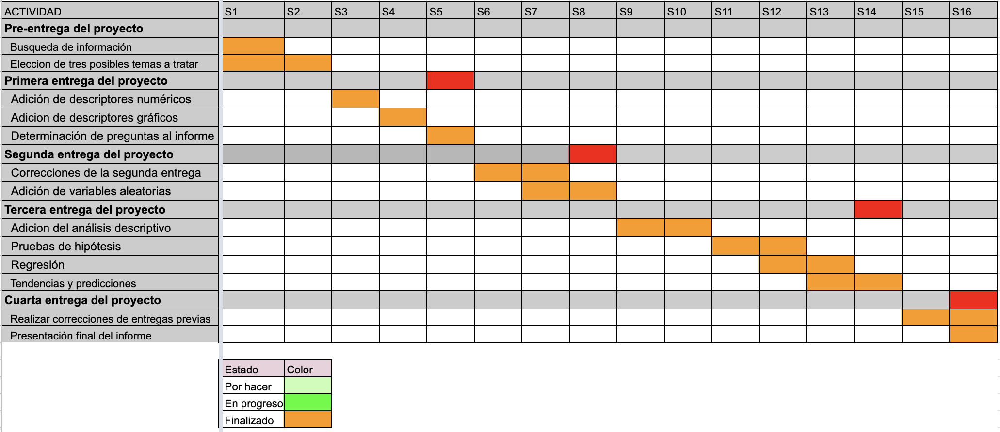

**Estudio sobre factores detrás de la incidencia de anemia en niños de Apurímac en 2020**

1.  IMPORTANCIA

**Audiencia:** Personas en interés de los niveles de anemia en la región de Apurímac y el país.

**- ¿Es el estudio de interés para la audiencia?**

Sí, la problemática de la anemia actualmente es de mucha importancia en el sector salud en el Perú, más aun en las zonas andinas del país, ya que esta condición perdura como uno de los principales problemas en múltiples regiones, afectando principalmente a los más jóvenes. Debido a esto, queremos obtener la relación que la prevalencia de esta condición pueda tener con el nivel de alimentación y nutrición, y cómo esta influye en cuestiones de salud. Así, se podrá dar una mayor consideración a la salud de los niños a nivel de la región, para garantizarles un mejor desarrollo y del mismo modo asegurar un buen futuro para los futuras generaciones del país.

**- ¿Qué información se desea aportar al final del estudio?**

La información que se desea aportar es una vista general de las tendencias que se pueden observar entre los niños de diferentes partes de Apurímac y las tasas de anemia que se puedan observar. De este modo, se podrán delimitar las regiones que más padecen de esta problemática, y determinar hasta qué punto múltiples variables influencian esta problemática.

**- ¿Por qué se justifica nuestro estudio?**

El presente estudio está justificado por los siguientes puntos:

-   Es **factible** porque existe una base de datos con un tamaño de muestra numeroso (19499 muestras) y con varias variables tanto cuantitativas como cualitativas.

-   Es **específico** porque aborda una problemática recurrente en el Perú, enfocándose principalmente en el departamento de Apurímac.

-   Es **poco estudiado**, ya que las personas de esta región son a menudo excluidos y reciben menor atención en temas de salud y bienestar, hasta el punto que la anemia constituye una problemática particular.

-   Empleará el **tiempo requerido**, ya que contamos con la información necesaria para poder investigar la relación entre la anemia y otros factores en la base de datos, al solo faltar darle un correcto análisis.

2.  OBJETIVOS

**General:**

Analizar los diversos factores que pueden afectar en la salud de los niños de Apurímac y así poder relacionarlos con las estadísticas que indiquen el estado de la anemia de los niños de Apurímac en 2020.

**Específicos:**

-   Establecer variables vinculantes relacionadas al aspecto físico que pueden afectar la salud de los niños de Apurimac.

-   Analizar la concentración de hemoglobina en la sangre, entre otros indicadores de anemia, en los niños menores de 5 años en la región de Apurímac.

-   Relacionar las variables cuantitativas de la base de datos.

3.  MARCO TEÓRICO

##### **3.1. Definiciones importantes:**

-   **MINSA:** Se conoce como MINSA al Ministerio de Salud del Perú.

-   **Anemia:** Se trata de una condición en la que la cantidad de glóbulos rojos o hemoglobina en la sangre se ven disminuidos a largo plazo.

##### **3.2. Población objetivo:**

Los niños que viven en Apurímac y que se encuentren dentro del rango de edad establecido como objeto de estudio.

##### **3.3. Tipo de muestreo:**

Las muestras serán obtenidas de una base de datos del MINSA de acceso público.

##### **3.4. Sesgo:**

Nuestros datos provienen de una base de datos, por lo que tenemos que considerar algunos sesgos presentes en nuestro estudio hasta el momento:

\- **Sesgo de extraer registros:** Nosotros no recolectamos los datos, por lo que no podemos evidenciar ni garantizar que todos hayan sido registrados de manera correcta.

\- **Sesgo de publicación:** La base de datos esta constituida de las observaciones de quienes participaron del proceso de recopilación de muestras, por lo que no tenemos datos de aquellas personas que no se registraron al momento de la recolección de datos.

##### **3.5. Unidades muestrales:**

Los niños menores de 5 años en el departamento de Apurímac.

##### **3.6. Las bases de datos:**

La base de datos es un documento que contiene 19499 muestras de las unidades muestrales previamente mencionadas. Esta será el pilar de nuestro proyecto, ya que cuenta con la información esencial para llevar a cabo todo nuestro análisis.

Se cargan las librerías necesarias para importar la base de datos:

```{r}
library(readr)
library(dplyr)
```

Ahora, se puede importar la base de datos dentro de la variable 'datos1'.

```{r}
datos1 <- read_csv("Ninos_APURIMAC.csv")

```

```{r eval=TRUE,echo=FALSE, message=FALSE,warning=FALSE}
datos1%>%select(Diresa,Red,Microred,EESS,Dpto_EESS,Prov_EESS,Renipress,FechaAtencion,Sexo,FechaNacimiento,EdadMeses,UbigeoPN,CentroPobladoPN,Juntos,SIS,Qaliwarma,Peso,Talla,PTZ,ZTE,ZPE,Hemoglobina,Cred,UbigeoREN,DistritoREN,AlturaREN)->ANEMIA1

cols(
  .default = col_double(),
  Diresa = col_character(),
  Red = col_character(),
  Microred = col_character(),
  EESS = col_character(),
  Dpto_EESS = col_character(),
  Prov_EESS = col_character(),
  Dist_EESS = col_character(),
  Renipress = col_double(),
  FechaAtencion = col_character(),
  Sexo = col_character(),
  FechaNacimiento = col_character(),
  EdadMeses = col_double(),
  UbigeoPN = col_double(),
  DepartamentoPN = col_character(),
  ProvinciaPN = col_character(),
  DistritoPN = col_character(),
  CentroPobladoPN = col_character(),
  Juntos = col_double(),
  SIS = col_double(),
  Pin = col_double(),
  Qaliwarma = col_double(),
  Peso = col_double(),
  Talla = col_double(),
  PTZ = col_double(),
  ZTE = col_double(),
  ZPE = col_double(),
  Alerta = col_logical(),
  Dx_PT = col_character(),
  Dx_TE = col_character(),
  Dx_PE = col_character(),
  Hemoglobina = col_double(),
  FechaHemoglobina = col_character(),
  Cred = col_double(),
  Suplementacion = col_double(),
  Consejeria = col_double(),
  Sesion = col_double(),
  UbigeoREN = col_character(),
  DepartamentoREN = col_character(),
  ProvinciaREN = col_character(),
  DistritoREN = col_character(),
  AlturaREN = col_double()
)

```

4.  LIMPIEZA DE DATOS

Después de esto, se hace la respectiva limpieza de datos para excluir los que no tienen variables que requerimos para el estudio. Nos quedamos con las observaciones que tienen lecturas completas para todas las variables que seleccionamos previamente, y las demás son retiradas. Estos nuevos datos se insertan en la variable 'datos'.

También se crea una nueva columna del IMC (Índice de masa corporal) a base de la talla y el peso con los que ya se cuentan. Se emplea la siguiente ecuación:

$$IMC=\frac{masa}{talla^2}$$

Del mismo modo, se emplea el ajuste de la concentración de hemoglobina respecto a la altura sobre el nivel del mar. Esto se consigue con la siguiente formula del CDC:

$$Ajuste={-0.032*(altura*0.0032808)+0.022*(altura*0.0032808)^2}$$

Se emplea esta formula debido a que la altura sobre el nivel del mar hace que aumente la concentración de hemoglobina en la sangre, por lo que es pertinente utilizar este ajuste para encontrar la concentración equivalente al de un individuo que viva al nivel del mar. Aunque esta formula solo es aplicable para alturas por encima de los 1000 msnm, no hay ningún individuo de la muestra que viva bajo esta altura, por lo cual no consideramos este detalle al realizar el ajuste.

```{r}
ANEMIA_A<-ANEMIA1[!(is.na(ANEMIA1$Hemoglobina)==TRUE),]
ANEMIA_A$Hemoglobina[ANEMIA_A$Hemoglobina<=0]<-NA


ANEMIA_A$Qaliwarma[ANEMIA_A$Qaliwarma==1]<-"Accede"
ANEMIA_A$Qaliwarma[ANEMIA_A$Qaliwarma==0]<-"No Accede"
ANEMIA_A$Juntos[ANEMIA_A$Juntos==1]<-"Accede"
ANEMIA_A$Juntos[ANEMIA_A$Juntos==0]<-"No Accede"
ANEMIA<-ANEMIA_A[complete.cases(ANEMIA_A),]

ANEMIA$IMC<-ANEMIA$Peso/((ANEMIA$Talla/100)^2)
ANEMIA$Hemoglobina_Ajustada <- with(ANEMIA, ANEMIA$Hemoglobina -(-0.032*(ANEMIA$AlturaREN*0.0032808)+0.022*(ANEMIA$AlturaREN*0.0032808)*(ANEMIA$AlturaREN*0.0032808)))


```

Seguidamente, podemos ver cuantos datos tenemos después de la limpieza.

```{r eval=TRUE,echo=FALSE, message=FALSE,warning=FALSE}
print(paste("Número de observaciones completas: ", (nrow(ANEMIA))))

print(paste("Número de observaciones incompletas después de limpieza: ", (sum(!complete.cases(ANEMIA)))))

```

**Boxplot de edad por sexo**

Se puede ver que las distribuciones son casi iguales en los niños y las niñas. Por ende, los resultados ligados a la edad representan tanto a los niños como a las niñas.

```{r eval=TRUE,echo=FALSE, message=FALSE,warning=FALSE}
boxplot(ANEMIA$EdadMeses ~ ANEMIA$Sexo, varwidth = TRUE,horizontal = TRUE, na.action = NULL,
     xlab="Edad (meses)",
     ylab="Sexo",
     )
abline(v=mean(ANEMIA$EdadMeses[ANEMIA$Sexo=="F"]),col="green")
abline(v=mean(ANEMIA$EdadMeses[ANEMIA$Sexo=="M"]),col="red")

legend(x="bottomright", inset = c(0.030, 0.35),legend = c("promedio F","promedio M"),col=c("green","red"),lty = 1:1,title ="leyenda",text.font = 4,cex = 0.7)
```

**Boxplot de peso por sexo**

Como se puede ver, las distribuciones de peso son similares para ambos sexos. Por ende, se puede considerar que los datos dependientes del peso son representativos para tanto niños como niñas en el estudio.

```{r eval=TRUE,echo=FALSE, message=FALSE,warning=FALSE}

boxplot(ANEMIA$Peso ~ ANEMIA$Sexo, varwidth = TRUE,horizontal = TRUE, na.action = NULL,
     xlab="Peso (kg)",
     ylab="Sexo",
     )
abline(v=mean(ANEMIA$Peso[ANEMIA$Sexo=="F"]),col="green")
abline(v=mean(ANEMIA$Peso[ANEMIA$Sexo=="M"]),col="red")

legend(x="bottomright", inset = c(0.030, 0.35),legend = c("promedio F","promedio M"),col=c("green","red"),lty = 1:1,title ="leyenda",text.font = 4,cex = 0.7)

   
```

**Boxplot de hemoglobina por sexo**

En el caso de la hemoglobina, su concentración en la sangre es otra variable que está distribuida de manera similar en ambos sexos. No obstante, la mediana parece estar un poco por encima de la media en el caso de las mujeres.

```{r eval=TRUE,echo=FALSE, message=FALSE,warning=FALSE}
boxplot(ANEMIA$Hemoglobina ~ ANEMIA$Sexo, varwidth = TRUE,horizontal = TRUE, na.action = NULL,
     xlab="Concentración de hemoglobina (g/dL)",
     ylab="Sexo",
     )
abline(v=mean(ANEMIA$Hemoglobina[ANEMIA$Sexo=="F"]),col="green")
abline(v=mean(ANEMIA$Hemoglobina[ANEMIA$Sexo=="M"]),col="red")

legend(x="bottomright", inset = c(0.030, 0.35),legend = c("promedio F","promedio M"),col=c("green","red"),lty = 1:1,title ="leyenda",text.font = 4,cex = 0.7)
```

**Boxplot de hemoglobina ajustada por sexo**

Por el lado de la hemoglobina ajustada, sus concentraciones también están similarmente distribuidas en ambos sexos.

```{r eval=TRUE,echo=FALSE, message=FALSE,warning=FALSE}
boxplot(ANEMIA$Hemoglobina_Ajustada ~ ANEMIA$Sexo, varwidth = TRUE,horizontal = TRUE, na.action = NULL,
     xlab="Concentración de hemoglobina (g/dL)",
     ylab="Sexo",
     )
abline(v=mean(ANEMIA$Hemoglobina_Ajustada[ANEMIA$Sexo=="F"]),col="green")
abline(v=mean(ANEMIA$Hemoglobina_Ajustada[ANEMIA$Sexo=="M"]),col="red")

legend(x="bottomright", inset = c(0.030, 0.35),legend = c("promedio F","promedio M"),col=c("green","red"),lty = 1:1,title ="leyenda",text.font = 4,cex = 0.7)
```

**Boxplot de talla por sexo**

En el caso de la talla, se puede ver que la distribución es muy similar para ambos sexos. En general los hombres tienen una mayor altura, y tanto la media, la mediana, y los rangos son un poco más altos en el caso de los varones.

```{r eval=TRUE,echo=FALSE, message=FALSE,warning=FALSE}
boxplot(ANEMIA$Talla ~ ANEMIA$Sexo, varwidth = TRUE,horizontal = TRUE, na.action = NULL,
     xlab="Talla (cm)",
     ylab="Sexo",
     )
abline(v=mean(ANEMIA$Talla[ANEMIA$Sexo=="F"]),col="green")
abline(v=mean(ANEMIA$Talla[ANEMIA$Sexo=="M"]),col="red")

legend(x="bottomright", inset = c(0.030, 0.35),legend = c("promedio F","promedio M"),col=c("green","red"),lty = 1:1,title ="leyenda",text.font = 4,cex = 0.7)
```

5.  VARIABLES DE ESTUDIO

    |                              |                                                                                                                                                                                                               |
    |------------------------------|---------------------------------------------------------------------------------------------------------------------------------------------------------------------------------------------------------------|
    | Variable                     | Descripción                                                                                                                                                                                                   |
    | Peso                         | Variable que se mide en kilogramos.                                                                                                                                                                           |
    | Talla                        | Variable que se mide en centímetros.                                                                                                                                                                          |
    | Sexo                         | Variable que describe el género de los niños.                                                                                                                                                                 |
    | Edad                         | Variable que describe la edad en meses de los niños, todos menores de 60 meses.                                                                                                                               |
    | Concentración de hemoglobina | Variable que mide el porcentaje de concentración de la hemoglobina en la sangre, se mide en gramos por decilitro (g/dL) y es la variable que nos ayuda a determinar si se trata de un caso de anemia.         |
    | Altura                       | Variable que describe a qué nivel de altura geográfica se encuentran el muestreo, se mide en metros sobre el nivel del mar (msnm).                                                                            |
    | Juntos                       | Variable cualitativa.                                                                                                                                                                                         |
    | Qaliwarma                    | Variable cualitativa.                                                                                                                                                                                         |
    | Peso-Edad                    | Variable que indica cuán lejos se encuentra el peso un niño de la media para su respectiva edad (kg). Esta se encuentra en valores de Z respecto a la distribución normal a nivel mundial de la variable.     |
    | Talla-Edad                   | Variable que indica cuán lejos se encuentra la talla de un niño de la media para su respectiva edad (cm). Esta se encuentra en valores de Z respecto a la distribución normal a nivel mundial de la variable. |
    | IMC                          | Variable que describe la proporción entre la masa y talla de un individuo (kg/m\^2).                                                                                                                          |
    | Provincia                    | Variable cualitativa nominal. Describe la provincia donde vive del individuo.                                                                                                                                 |

6.  DESCRIPCIONES DE LAS VARIABLES DE ESTUDIO

**Peso**

Este gráfico muestra que la mayoría de los niños y niñas están entre los 8 y 16 kg.

```{r eval=TRUE,echo=FALSE, message=FALSE,warning=FALSE}

summary(ANEMIA$Peso)

hist(ANEMIA$Peso,main="Histograma de Peso",ylab = "Density",xlab="Peso (kg)",probability = TRUE)
abline(v = mean(ANEMIA$Peso),col = "blue")
abline(v = median(ANEMIA$Peso),col = "red")
legend(cex = 0.8,x="bottomright", inset = c(0.030, 0.70),legend = c("promedio","mediana"),col=c("blue","red"),lty = 1:1,title ="leyenda",text.font = 4)

```

**Talla**

El siguiente histograma muestra la relación entre las cantidades de niños y sus respectivas tallas.

```{r eval=TRUE,echo=FALSE, message=FALSE,warning=FALSE}

summary(ANEMIA$Talla)

hist(ANEMIA$Talla,
     main="Histograma de talla",
     xlab="Talla (cm)",
     border="blue",
     col="green", probability = TRUE)
abline(v = mean(ANEMIA$Talla),col = "blue")
abline(v = median(ANEMIA$Talla),col = "red")
legend(cex = 0.8,x="bottomright", inset = c(0.030, 0.70),legend = c("promedio","mediana"),col=c("blue","red"),lty = 1:1,title ="leyenda",text.font = 4)
```

Cabe resaltar que la desnutrición está relacionada tanto al peso corporal como a la talla. Debido a esto, es factible emplear los valores Z del peso y la talla para la respectiva edad de cada individuo estudiado. Podremos comparar sus concentraciones de hemoglobina en la sangre con su estas variables y determinar la posible existencia de una relación. También se puede acudir al IMC para hacer una categorización sensata del nivel de nutrición de cada individuo.

Esto se puede afirmar debido a que la talla y el peso están relacionados, como se puede ver en la gráfica. Asimismo, se presenta la correlación de pearson.

```{r  eval=TRUE,echo=FALSE, message=FALSE,warning=FALSE}
print("Correlación entre la talla y el peso:")
cor(ANEMIA$Peso,ANEMIA$Talla)
plot(ANEMIA$Peso,ANEMIA$Talla,main="Talla vs. Peso",ylab="Talla (cm)",xlab="Peso (kg)")
abline(lm(ANEMIA$Talla~ANEMIA$Peso),col="blue")

```

La misma tendencia se puede apreciar, aunque a menor grado, en el caso de los valores Z de la talla-edad y el peso-edad.

```{r eval=TRUE,echo=FALSE, message=FALSE,warning=FALSE}
print("Correlación entre la talla-edad y el peso-edad:")
cor(ANEMIA$ZTE,ANEMIA$ZPE)
plot(ANEMIA$ZPE,ANEMIA$ZTE,main="Peso-edad vs. talla-edad",ylab = "Talla-edad",xlab = "Peso-edad")
abline(lm(ANEMIA$ZTE~ANEMIA$ZPE),col="blue")

```

**Altura**

La siguiente gráfica de cajas muestra la distribución de las alturas (msnm) en las que vive cada individuo del estudio. Se puede observar que el promedio es ligeramente más alto que la mediana, y que esta es más alta que la moda, lo que indica que la variable está sesgada hacia la derecha

```{r  eval=TRUE,echo=FALSE, message=FALSE,warning=FALSE}
hist(ANEMIA$AlturaREN,horizontal = TRUE,main="Histograma de distribución de altura",xlab="Altura (msnm)")
abline(v=mean(ANEMIA$AlturaREN),col="green")
abline(v=median(ANEMIA$AlturaREN),col="red")
legend(x="bottomright", inset = c(0.030, 0.70),legend = c("promedio","mediana"),col=c("green","red"),lty = 1:1,title ="leyenda",text.font = 4)
```

**Índice de masa corporal (IMC)**

Respecto al IMC, esta variable es de suma importancia para nuestro estudio debido a que nos permite categorizar cada individuo como desnutrido, normal, o con sobrepeso. Un rango normal para un infante se da entre los 16.5 y 22.5 kg/m\^2. Según la gráfica de cajas, se puede ver que más de la mitad de la población del estudio está desnutrida y que hay muy pocos casos de sobrepeso (a la derecha de la línea amarilla).

```{r eval=TRUE,echo=FALSE, message=FALSE,warning=FALSE}
boxplot(ANEMIA$IMC,horizontal = TRUE,xlab="Indice de masa corporal (kg/m^2)")
abline(v=mean(ANEMIA$IMC),col="blue")
abline(v=16.5,col="red")
abline(v=22.5,col="yellow")

legend(x="bottomright", inset = c(0.030, 0.60),legend = c("promedio","desnutricion","normal"),col=c("blue","red","yellow"),lty = 1:1,title ="leyenda",text.font = 2.5,cex = 0.5)

##colors()

```

En efecto, aqui se muestra el porcentaje de desnutridos, constituído por quienes tienen un IMC menor a 16.5 kg/m\^2.

```{r eval=TRUE,echo=FALSE, message=FALSE,warning=FALSE}
paste("Porcentaje de desnutridos:",sum(ANEMIA$IMC<16.5)/nrow(ANEMIA)*100,"%")

```

La siguiente tabla tabula la cantidad de individuos respecto a su categoría de nutrición según el IMC.

```{r eval=TRUE,echo=FALSE, message=FALSE,warning=FALSE}

Frecuencias<-table(cut(ANEMIA$IMC,breaks=seq(from=0,to=16.5,by=16.5)))
##sum(Frecuencias)
Frecuencias2<-table(cut(ANEMIA$IMC,breaks=seq(from=16.5,to=22.9,by=0.5)))
##sum(Frecuencias2)
Frecuencias3<-table(cut(ANEMIA$IMC,breaks=seq(from=22.9,to=26.9,by=0.5)))
##sum(Frecuencias3)
IMC_ANEMIA <- data.frame(categorias=rep(c("Desnutridos", 'Normal', 'Sobrepeso')),Cantidad=c(sum(Frecuencias),sum(Frecuencias2),sum(Frecuencias3)))

colnames(IMC_ANEMIA)<-c("Estado","Cantidad")
knitr::kable(head(IMC_ANEMIA))
```

**Variables estandarizadas**

El siguiente histograma muestra la distribución de los valores Z de la talla-edad para los niños de Apurímac. Se puede ver que sigue una tendencia de distribución normal, pero con un promedio mucho menor que el promedio mundial.

```{r eval=TRUE,echo=FALSE, message=FALSE,warning=FALSE}
hist(ANEMIA$ZTE, prob = TRUE, ylab = "Frecuencia de datos", col = "grey",
      main = "Histograma de talla-edad", xlab = "Valor de Z", breaks = 20)

abline(v=mean(ANEMIA$ZTE),col="red")
abline(v=median(ANEMIA$ZTE),col="blue")
legend(x="bottomright", inset = c(0.030, 0.60),legend = c("promedio","mediana"),col=c("red","blue"),lty = 1:1,title ="leyenda",text.font = 4)

```

En el caso de los valores Z del peso-edad se puede ver que estos también siguen una tendencia de distribución normal, con un promedio ligeramente menor que el promedio mundial.

```{r eval=TRUE,echo=FALSE, message=FALSE,warning=FALSE}
hist(ANEMIA$ZPE, prob = TRUE, ylab = "Frecuencia de datos", col = "grey",
      main = "Histograma de peso-edad", xlab = "Valor de Z", breaks = 20)

abline(v=mean(ANEMIA$ZPE),col="red")
abline(v=median(ANEMIA$ZPE),col="blue")
legend(x="bottomright", inset = c(0.030, 0.60),legend = c("promedio","mediana"),col=c("red","blue"),lty = 1:1,title ="leyenda",text.font = 4)
```

**Qaliwarma y Juntos**

Qaliwarma y Juntos son dos programas sociales existentes a nivel nacional. Qaliwarma se enfoca en la alimentación de los niños, mientras que Juntos está dirigido a las personas con una pobreza mayor al 40%. La siguiente gráfica de barras muestra las proporciones de acceso a cada programa por los niños de Apurímac.

```{r eval=TRUE,echo=FALSE, message=FALSE,warning=FALSE}
par(mfrow = c(1, 2))
barplot(table(ANEMIA$Qaliwarma),main = "   Acceso a Qaliwarma",yaxp = c(0, 4500, 9))
barplot(table(ANEMIA$Juntos),main = "    Acceso a Juntos",yaxp = c(0, 3500, 7))

```

La siguiente tabla muestra las tres provincias con más niños y niñas que acceden a ambos programas a la vez. Es interesante que Abancay es una de las dos ciudades más grandes de Apurímac, lo cual sugiere que el acceso a estos programas es mayor en entornos urbanos.

```{r eval=TRUE,echo=FALSE, message=FALSE,warning=FALSE}
lista2<-ANEMIA[ANEMIA$Qaliwarma=="Accede" & ANEMIA$Juntos=="Accede",]
frecuencia2<-lista2%>%group_by(Prov_EESS)%>%count()%>%arrange(-n)%>%head(3)
colnames(frecuencia2)<-c("PROVINCIA", "CANTIDAD")
Anemia_P<-lista2%>%group_by(Prov_EESS)%>%summarise(Cantidad=n())%>%head(3)
knitr::kable(head(frecuencia2))

```

**Hemoglobina**

La concentración de la hemoglobina es una de las variables más importantes del estudio debido a que esta es la única que permite identificar la prevalencia de anemia en un individuo. Debido a esto, es importante intentar que esta sea lo más representativa posible. Es por este motivo que se emplea el ajuste por la altura mencionado anteriormente.

Aquí se observan algunos indicadores de las concentraciones de hemoglobina en la muestra. Es evidente que al ajustarse los datos, estos disminuyen de manera generalizada. Esto es de esperarse, ya que la altura infla el valor de la concentración de la hemoglobina en la sangre a causa de la menor presión atmosférica.

```{r eval=TRUE,echo=FALSE, message=FALSE,warning=FALSE}

print("Resumen de concentración de hemoglobina (g/dL): ")
summary(ANEMIA$Hemoglobina)
print("Resumen de concentración de hemoglobina ajustada al nivel del mar (g/dL): ")
summary(ANEMIA$Hemoglobina_Ajustada)
boxplot(ANEMIA$Hemoglobina,horizontal=TRUE ,varwidth = TRUE, las = 1, cex.axis = 0.6,main="Ajuste de concentración de hemoglobina",xlab = "Concentracion de hemoglobina (g/dL)",ylab = "", col = rgb(1, 0, 0, 0.3), border = rgb(1, 0, 0, 0.3))
boxplot(ANEMIA$Hemoglobina_Ajustada, horizontal=TRUE,varwidth = TRUE, las = 1, cex.axis = 0.6,main="Ajuste de concentración de hemoglobina",xlab = "Concentracion de hemoglobina (g/dL)",ylab = "", col = rgb(0, 0, 1, 0.3), border = rgb(0, 0, 1, 0.3), add = TRUE)

legend(x="bottomright", inset = c(0.030, 0.60),legend = c("Antes del ajuste","Después del ajuste"),col=c("red","blue"),title ="leyenda",text.font = 3,fill=c(rgb(1, 0, 0, 0.3),rgb(0, 0, 1, 0.3)))
legend(x="bottomright", inset = c(0.030, 0.10),legend = c("Anemia severa","Anemia moderada","Límite saludable"),col=c("red","orange","green"),lty = 1:1,title ="leyenda",text.font = 2.5, cex = 0.7)
abline(v=7,col="red")
abline(v=9.9,col="orange")
abline(v=10.9,col="green")

```

Por otro lado, esta gráfica muestra tan solo la distribución de los datos después de llevar a cabo el ajuste. Se puede ver que la anemia prevalece en alrededor del 25% de los niños y niñas en la muestra.

```{r eval=TRUE,echo=FALSE, message=FALSE,warning=FALSE}

boxplot(cex.main = 1,ANEMIA$Hemoglobina_Ajustada, horizontal = TRUE,xlab="Concentración de hemoglobina (g/dL)",main="Boxplot de concentracion de hemoglobina ajustada")
abline(v=mean(ANEMIA$Hemoglobina_Ajustada),col="black")
abline(v=7,col="red")
abline(v=9.9,col="orange")
abline(v=10.9,col="green")

legend(x="bottomright", inset = c(0.030, 0.60),legend = c("promedio","Anemia severa","Anemia moderada","Límite saludable"),col=c("black","red","orange","green"),lty = 1:1,title ="leyenda",text.font = 2.5, cex = 0.7)
```

Este histograma de frecuencia de las concentraciones de hemoglobina demuestra que se puede ver una distribución cercana a una distribución normal y que incluso pocos casos atípicos llegan a ser extremos.

```{r eval=TRUE,echo=FALSE, message=FALSE,warning=FALSE}
hist(ANEMIA$Hemoglobina_Ajustada, prob = TRUE, ylab = "Frecuencia de datos", col = "grey",
      main = "Histograma de hemoglobina ajustada", xlab = "Concentración de hemoglobina (g/dL)", breaks = 20)

abline(v=mean(ANEMIA$Hemoglobina_Ajustada),col="red")
abline(v=median(ANEMIA$Hemoglobina_Ajustada),col="blue")
legend(x="bottomright", inset = c(0.030, 0.60),legend = c("promedio","mediana"),col=c("red","blue"),lty = 1:1,title ="leyenda",text.font = 4)
```

Las siguientes gráficas de cajas muestran las distribuciones de la concentración de hemoglobina en la sangre por provincia. Se puede ver que en algunas provincias los valores están más dispersos, pero en general todas las provincias siguen un patrón similar.

```{r eval=TRUE,echo=FALSE, message=FALSE,warning=FALSE}
boxplot(ANEMIA$Hemoglobina_Ajustada~ANEMIA$Prov_EESS,las=1,cex.axis=0.5
,ylab="",xlab="Concentración de hemoglobina (g/dL)", varwidth = TRUE,
main="Distribución de hemoglobina por provincia", horizontal = TRUE)
abline(v=7,col="red")
abline(v=9.9,col="orange")
abline(v=10.9,col="green")
legend(x="bottomright", inset = c(0.030, 0.320),legend = c("promedio","Anemia severa","Anemia moderada","Límite saludable"),col=c("black","red","orange","green"),lty = 1:1,title ="leyenda",text.font = 2, cex = 0.6)
```

La siguiente tabla presenta las tres provincias de Apurímac con más niños y niñas con casos moderados y graves de anemia. Cabe resaltar que Cotabambas encabece la lista aunque solo tenga al 22% de la población del departamento y no tenga centros urbanos relevantes. Se sabe que esta es la provincia con la mayor tasa de pobreza en el departamento (Ministerio de Economía y Finanzas, 2011).

```{r eval=TRUE,echo=FALSE, message=FALSE,warning=FALSE}

lista1<-ANEMIA[ANEMIA$Hemoglobina_Ajustada<11,]
frecuencia1<-lista1%>%group_by(Prov_EESS)%>%count()%>%arrange(-n)%>%head(3)
colnames(frecuencia1)<-c("DISTRITO", "CANTIDAD")
##Anem_Acumulada<-lista1%>%group_by(Dist_EESS)%>%summarise(Cantidad=n())%>%arrange(-Cantidad)
knitr::kable((frecuencia1))
```

Estas gráficas de cajas muestran las distribuciones de las concentraciones de hemoglobina en la sangre respecto a la altura sobre el nivel del mar. Se puede observar que casi todas están distribuidas igualmente, y que los datos por encima de los 3750 msnm no tienen datos anómalos. Esto puede deberse a que hayan pocos datos para este rango. Es alarmante que en las mayores alturas se observan altas tasas de anemia; estas incluso superan el 50% en el rango mas alto.

```{r eval=TRUE,echo=FALSE, message=FALSE,warning=FALSE}

boxplot(ANEMIA$Hemoglobina_Ajustada~cut(ANEMIA$AlturaREN/1000, breaks = (9:16)*0.25), varwidth = TRUE, las = 1,horizontal= TRUE, cex.axis = 0.6,main="Concentración de hemoglobina segun la altura",xlab = "Concentracion de hemoglobina ajustada (g/dL)",ylab = "Rango de altura (msnm) /1000")
abline(v=7,col="red")
abline(v=9.9,col="orange")
abline(v=10.9,col="green")
legend(x="bottomright", inset = c(0.030, 0.7),legend = c("promedio","Anemia severa","Anemia moderada","Límite saludable"),col=c("black","red","orange","green"),lty = 1:1,title ="leyenda",text.font = 2, cex = 0.6)

```

Ahora procedemos a observar la relación entre la concentración de hemoglobina en la sangre y otras variables numéricas:

En cuanto al IMC, aunque se planteaba que este y la concentración de la hemoglobina podrían estar relacionados, un análisis estadístico concluye que no guardan ninguna correlación lineal.

```{r eval=TRUE,echo=FALSE, message=FALSE,warning=FALSE}
print("Correlación entre el IMC y la concentración de hemoglobina:")
cor(ANEMIA$IMC,ANEMIA$Hemoglobina_Ajustada)
plot(ANEMIA$IMC,ANEMIA$Hemoglobina_Ajustada,main="Relación hemoglobina ajustada  e IMC",ylab = "Hemoglobina ajustada  (g/dL)",xlab = "IMC (kg/m^2)")
abline(lm(ANEMIA$Hemoglobina_Ajustada~ANEMIA$IMC),col="red")


```

Se ha planteado también que debido al rol de la nutrición en el crecimiento y el desarrollo, la talla y la concentración de hemoglobina podrían estar relacionadas entre sí. No obstante, no tienen una correlación lineal significante.

```{r eval=TRUE,echo=FALSE, message=FALSE,warning=FALSE}
print("Correlación entre la talla y la concentración de hemoglobina:")
cor(ANEMIA$Talla,ANEMIA$Hemoglobina_Ajustada)
plot(ANEMIA$Talla,ANEMIA$Hemoglobina_Ajustada,main="Relación Hemoglobina ajustada y talla",ylab = "Hemoglobina ajustada (g/dL)",xlab = "Talla (cm)")
abline(lm(ANEMIA$Hemoglobina_Ajustada~ANEMIA$Talla),col="red")


```

\
Tampoco hay ninguna correlación lineal significante cuando se compara la concentración de hemoglobina ajustada con la altura.

```{r eval=TRUE,echo=FALSE, message=FALSE,warning=FALSE}
print("Correlación entre la altura y la concentración de hemoglobina ajustada:")
cor(ANEMIA$AlturaREN,ANEMIA$Hemoglobina_Ajustada)
plot(ANEMIA$AlturaREN,ANEMIA$Hemoglobina_Ajustada,main="Relación hemoglobina ajustada y altura",ylab = "Hemoglobina Ajustada (g/dL)",xlab = "Altura (msnm)")
abline(lm(ANEMIA$Hemoglobina_Ajustada~ANEMIA$AlturaREN),col="red")


```

**Variables aleatorias discretas**

A continuación, procederemos a ver algunos ejemplos de probabilidad condicional con nuestras variables aleatorias discretas. Estos permitirán conocer las implicancias de las relaciones entre nuestras variables más a fondo.

Analizando el caso de los individuos en el quinto percentil inferior de la talla para su edad (Z \< -1.64), se puede ver que la incidencia de esta baja estatura es mucho mayor en entre quienes presentan anemia grave (concentración de hemoglobina en la sangre menor a 7 g/dL).

```{r eval=TRUE,echo=FALSE, message=FALSE,warning=FALSE}

print(paste("Con anemia grave:",(sum(ANEMIA$ZTE< qnorm(p=0.05,mean=0,sd=1,lower.tail=TRUE) & ANEMIA$Hemoglobina_Ajustada<7))/(sum(ANEMIA$Hemoglobina_Ajustada<7))))

print(paste("Sin anemia:",(sum(ANEMIA$ZTE< qnorm(p=0.05,mean=0,sd=1,lower.tail=TRUE) & ANEMIA$Hemoglobina_Ajustada>=11))/(sum(ANEMIA$Hemoglobina_Ajustada>=11))))

```

El siguiente histograma ilustra la situación. Se puede ver que una proporción considerable de los niños y niñas con anemia grave se encuentra en el quinto percentil inferior de la altura para su edad respectiva.

```{r eval=TRUE,echo=FALSE, message=FALSE,warning=FALSE}
anemicos <- ANEMIA[ANEMIA$Hemoglobina_Ajustada<7,]
  
hist((anemicos$ZTE), prob = TRUE, ylab = "Frecuencia de datos", col = "grey",
      main = "Histograma de talla-edad en casos graves de anemia", xlab = "Valor de Z", breaks = 20)

abline(v=round(qnorm(p=0.05,mean=0,sd=1,lower.tail=TRUE),2),col="red")
legend(x="bottomright", inset = c(0.030, 0.60),legend = c(paste("Z = ",round(qnorm(p=0.05,mean=0,sd=1,lower.tail=TRUE),2))),col=c("red"),lty = 1:1,title ="leyenda",text.font = 4)
```

Se puede ver que en el caso de quienes no presentan anemia, esta situación es menos marcada.

```{r eval=TRUE,echo=FALSE, message=FALSE,warning=FALSE}
noanemicos <- ANEMIA[ANEMIA$Hemoglobina_Ajustada>=11,]
  
hist((noanemicos$ZTE), prob = TRUE, ylab = "Frecuencia de datos", col = "grey",
      main = "Histograma de talla-edad en individuos sin anemia", xlab = "Valor de Z", breaks = 20)

abline(v=qnorm(p=0.05,mean=0,sd=1,lower.tail=TRUE),col="red")

legend(x="bottomright", inset = c(0.030, 0.60),legend = c(paste("Z = ",round(qnorm(p=0.05,mean=0,sd=1,lower.tail=TRUE),2))),col=c("red","blue"),lty = 1:1,title ="leyenda",text.font = 4)
```

Las siguientes cifras muestran las incidencias de anemia moderada y grave en tres distintos rangos de altura. Es importante considerar que tanto Andahuaylas como Abancay se encuentran por debajo de los 2930 msnm, por lo que se pueden apreciar las diferencias entre el entorno urbano y rural. Los 3700 msnm fueron elegidos arbitrariamente ya que esta es la primera altura en la que se ven más casos de anemia que casos sanos.

```{r eval=TRUE,echo=FALSE, message=FALSE,warning=FALSE}
print(paste("Probablidad de tener anemia si vives por debajo de los 2930 msnm:",sum(ANEMIA$AlturaREN<2930 & ANEMIA$Hemoglobina_Ajustada<11)/sum(ANEMIA$AlturaREN<2930)))

print(paste("Probablidad de tener anemia si vives por encima de los 2930 msnm:",sum(ANEMIA$AlturaREN>=2930 & ANEMIA$Hemoglobina_Ajustada<11)/sum(ANEMIA$AlturaREN>=2930)))

print(paste("Probablidad de tener anemia si vives por encima de los 3700 msnm:",sum(ANEMIA$AlturaREN>=3700 & ANEMIA$Hemoglobina_Ajustada<11)/sum(ANEMIA$AlturaREN>=3700)))
```

¿Cual es la probabilidad de tener anemia si vives por debajo de de los 2930 msnm? $$X_1\sim\mathsf{Ber}(p)$$ con $$p=0.1907$$ ¿Cual es la probabilidad de tener anemia si vives por encima de de los 2930 msnm? El modelo para esta pregunta se puede manifestar por Bernoulli. $$X_2\sim\mathsf{Ber}(p)$$ con $$p=0.4015$$

¿Cual es la probabilidad de tener anemia si vives por encima de de los 3700 msnm? $$X_3\sim\mathsf{Ber}(p)$$ con $$p=0.5923$$

Claramente se puede ver que los niños y niñas que viven a una altura mayor tienden a padecer anemia. Este comportamiento se puede explicar a través de factores externos como la incidencia climática y geográfica, la falta de acceso a alimentos balanceado, y otros más.

Estas proporciones se ilustran con el siguiente histograma. Se puede ver que por debajo de los 2930 msnm hay muchos menos casos de anemia.

```{r eval=TRUE,echo=FALSE, message=FALSE,warning=FALSE}
anemicos <- ANEMIA[ANEMIA$Hemoglobina_Ajustada<11,]

hist((anemicos$AlturaREN), prob = FALSE, ylab = "Frecuencia de datos", col = "grey",
      main = "Histograma de individuos anémicos por altura", xlab = "Altura (msnm)", breaks = 20)

abline(v=2930,col="red")
abline(v=3700,col="blue")
legend(x="bottomright",cex = 0.63, inset = c(0.030, 0.60),legend = c("2930 msnm","3700 msnm"),col=c("red","blue"),lty = 1:1,title ="leyenda",text.font = 4)

```

Esta situación se ilustra en los siguientes mosaicos:

```{r eval=TRUE,echo=FALSE, message=FALSE,warning=FALSE}
mosaicplot(table(ANEMIA$AlturaREN<2930,ANEMIA$Hemoglobina_Ajustada<11),xlab="Vive por debajo de los 2930 msnm",ylab = "Es anémico(a)",main="Incidencia de anemia de acuerdo a rango de altura",border=rgb(0,0,0,0.1), col=c("#cc9999","#99cc99","#9999cc", "#9c9c9c"))
```

```{r eval=TRUE,echo=FALSE, message=FALSE,warning=FALSE}
mosaicplot(table(ANEMIA$AlturaREN<3700,ANEMIA$Hemoglobina_Ajustada<11),xlab="Vive por debajo de los 3700 msnm",ylab = "Es anémico(a)",main="Incidencia de anemia de acuerdo a rango de altura",border=rgb(0,0,0,0.1), col=c("#cc9999","#99cc99","#9999cc", "#9c9c9c"))
```

Finalmente, hay que considerar el rol de los programas de ayuda social. En el caso de Qaliwarma, se puede ver que este ayuda a reducir la incidencia de anemia de manera considerable.

```{r eval=TRUE,echo=FALSE, message=FALSE,warning=FALSE}

print(paste("Probabilidad de que una persona del estudio no sea anémica dado que esta NO accede a Qaliwarma:",(sum(ANEMIA$Qaliwarma == "No Accede"  & ANEMIA$Hemoglobina_Ajustada>=11, na.rm = TRUE))/nrow(ANEMIA)/(sum(ANEMIA$Qaliwarma == "No Accede" ,na.rm = TRUE)/nrow(ANEMIA))))

print(paste("Probabilidad de que una persona del estudio no sea anémica dado que esta accede a Qaliwarma:",(sum(ANEMIA$Qaliwarma == "Accede"  & ANEMIA$Hemoglobina_Ajustada>=11, na.rm = TRUE))/nrow(ANEMIA)/(sum(ANEMIA$Qaliwarma == "Accede" ,na.rm = TRUE)/nrow(ANEMIA))))


```

No obstante, en el caso de Juntos se ve un patrón inverso. Esto puede deberse a la naturaleza del programa: Juntos es para personas con altos índices de pobreza, por lo que de por sí es más probable que los niños que acceden a estos programas no cuenten con una nutrición adecuada.

```{r eval=TRUE,echo=FALSE, message=FALSE,warning=FALSE}

print(paste("La probabilidad de que una persona del estudio no sea anémica dado que esta NO accede a Juntos:",(sum(ANEMIA$Juntos == "No Accede" & ANEMIA$Hemoglobina_Ajustada>=11, na.rm = TRUE))/nrow(ANEMIA)/(sum(ANEMIA$Juntos == "No Accede" ,na.rm = TRUE)/nrow(ANEMIA))))

print(paste("La probabilidad de que una persona del estudio no sea anémica dado que esta accede a Juntos:",(sum(ANEMIA$Juntos == "Accede"  & ANEMIA$Hemoglobina_Ajustada>=11, na.rm = TRUE))/nrow(ANEMIA)/(sum(ANEMIA$Juntos == "Accede" ,na.rm = TRUE)/nrow(ANEMIA))))


```

Esta situación se ilustra en los siguientes mosaicos:

```{r eval=TRUE,echo=FALSE, message=FALSE,warning=FALSE}
mosaicplot(table(ANEMIA$Qaliwarma,ANEMIA$Hemoglobina_Ajustada<11),main = "Incidencia de anemia con acceso a Qaliwarma",xlab="Qaliwarma",ylab ="Es anémico(a)",border=rgb(0,0,0,0.1), col=c("#cc9999","#99cc99","#9999cc", "#9c9c9c"))

```

```{r eval=TRUE,echo=FALSE, message=FALSE,warning=FALSE}
mosaicplot(table(ANEMIA$Juntos,ANEMIA$Hemoglobina_Ajustada<11),main = "Incidencia de anemia con acceso a Juntos",xlab="Juntos",ylab ="Es anémico(a)",border=rgb(0,0,0,0.1), col=c("#cc9999","#99cc99","#9999cc", "#9c9c9c"))
```

¿Cual es la probabilidad de que un niño acceda a Qaliwarma?

```{r eval=TRUE,echo=FALSE, message=FALSE,warning=FALSE}
sum(ANEMIA$Qaliwarma=="Accede")/nrow(ANEMIA)
```

$$X_1\sim\mathsf{Ber}(p)$$ con $$p= 0.01622222$$La probabilidad de que un niño(a) acceda a este programa social es mínima, por lo que podemos inferir que sus beneficios no son gozados por la mayoría de los niños a quienes está dirigido.

**Variables aleatorias continuas**

```{r eval=TRUE,echo=FALSE, message=FALSE,warning=FALSE}
z_95 <- qnorm(0.025,mean = 0,sd=1,lower.tail=FALSE)
```

Hemoglobina ajustada

```{r eval=TRUE,echo=FALSE, message=FALSE,warning=FALSE}


hist(ANEMIA$Hemoglobina_Ajustada,probability = 1,main = "Hemoglobina Ajustada",xlab = "Concentracion de Hemoglobina (g/dL)",breaks = 50)
xs<-seq(min(ANEMIA$Hemoglobina_Ajustada),max(ANEMIA$Hemoglobina_Ajustada),length=50)
f<-dnorm(xs,mean = mean(ANEMIA$Hemoglobina_Ajustada),sd=sd(ANEMIA$Hemoglobina_Ajustada))
lines(xs,f,col="red")

sd_hemo <- sd(ANEMIA$Hemoglobina_Ajustada)
error_hemo <- z_95*sd_hemo/(sqrt(length(ANEMIA$Hemoglobina_Ajustada)))
upper_hemo <- mean(ANEMIA$Hemoglobina_Ajustada) + error_hemo
lower_hemo <- mean(ANEMIA$Hemoglobina_Ajustada) - error_hemo
mean_hemo <- mean(ANEMIA$Hemoglobina_Ajustada)
abline(v=upper_hemo,col="green")
abline(v=lower_hemo,col="green")

legend(x="bottomright", inset = c(0.00002, 0.60),legend = c("Líneas de intervalo de confianza de 95%"),col=c("green"),lty = 1:1,title ="leyenda",text.font = 4,cex=0.7)
```

Peso

```{r eval=TRUE,echo=FALSE, message=FALSE,warning=FALSE}

hist(ANEMIA$Peso,probability = 1,main = "Peso ",xlab = "Peso (kg)", breaks = 50)
xs1<-seq(min(ANEMIA$Peso),max(ANEMIA$Peso),length=50)
f1<-dnorm(xs1,mean = mean(ANEMIA$Peso),sd=sd(ANEMIA$Peso))
lines(xs1,f1,col="red")

sd_peso <- sd(ANEMIA$Peso)
error_peso <- z_95*sd_peso/(sqrt(length(ANEMIA$Peso)))
upper_peso <- mean(ANEMIA$Peso) + error_peso
lower_peso <- mean(ANEMIA$Peso) - error_peso
mean_peso <- mean(ANEMIA$Peso)

abline(v=upper_peso,col="green")
abline(v=lower_peso,col="green")
legend(x="bottomright", inset = c(0.00002, 0.60),legend = c("Líneas de intervalo de confianza de 95%"),col=c("green"),lty = 1:1,title ="leyenda",text.font = 4,cex=0.7)
```

Talla

```{r eval=TRUE,echo=FALSE, message=FALSE,warning=FALSE}
hist(ANEMIA$Talla,probability = 1,main = "Talla ",xlab = " Talla (cm) ", breaks = 50)
xs2<-seq(min(ANEMIA$Talla),max(ANEMIA$Talla),length=50)
f2<-dnorm(xs2,mean = mean(ANEMIA$Talla),sd=sd(ANEMIA$Talla))
lines(xs2,f2,col="red")

sd_talla <- sd(ANEMIA$Talla)
error_talla <- z_95*sd_talla/(sqrt(length(ANEMIA$Talla)))
upper_talla <- mean(ANEMIA$Talla) + error_talla
lower_talla <- mean(ANEMIA$Talla) - error_talla
mean_talla <- mean(ANEMIA$Talla)

abline(v=upper_talla,col="green")
abline(v=lower_talla,col="green")
legend(x="bottomright", inset = c(0.00002, 0.60),legend = c("Líneas de intervalo de confianza de 95%"),col=c("green"),lty = 1:1,title ="leyenda",text.font = 4,cex=0.7)

```

Normalizada de peso-edad (ZPE)

```{r eval=TRUE,echo=FALSE, message=FALSE,warning=FALSE}
hist(ANEMIA$ZPE,probability = 1,main = "ZPE ",xlab = " ZPE ", breaks = 50)
xs5<-seq(min(ANEMIA$ZPE),max(ANEMIA$ZPE),length=50)
f5<-dnorm(xs5,mean = mean(ANEMIA$ZPE),sd=sd(ANEMIA$ZPE))
lines(xs5,f5,col="red")

sd_ZPE <- sd(ANEMIA$ZPE)
error_ZPE<- z_95*sd_ZPE/(sqrt(length(ANEMIA$ZPE)))
upper_ZPE <- mean(ANEMIA$ZPE) + error_ZPE
lower_ZPE <- mean(ANEMIA$ZPE) - error_ZPE
mean_ZPE <- mean(ANEMIA$ZPE)

abline(v=upper_ZPE,col="green")
abline(v=lower_ZPE,col="green")
legend(x="bottomright", inset = c(0.00002, 0.60),legend = c("Líneas de intervalo de confianza de 95%"),col=c("green"),lty = 1:1,title ="leyenda",text.font = 4,cex=0.7)
```

Normalizada de talla-edad (ZTE)

```{r eval=TRUE,echo=FALSE, message=FALSE,warning=FALSE}
hist(ANEMIA$ZTE,probability = 1,main = "ZTE ",xlab = " ZTE ", breaks = 50)
xs6<-seq(min(ANEMIA$ZTE),max(ANEMIA$ZTE),length=50)
f6<-dnorm(xs6,mean = mean(ANEMIA$ZTE),sd=sd(ANEMIA$ZTE))
lines(xs6,f6,col="red")

sd_ZTE <- sd(ANEMIA$ZTE)
error_ZTE<- z_95*sd_ZTE/(sqrt(length(ANEMIA$ZTE)))
upper_ZTE <- mean(ANEMIA$ZTE) + error_ZTE
lower_ZTE <- mean(ANEMIA$ZTE) - error_ZTE
mean_ZTE <- mean(ANEMIA$ZTE)

abline(v=upper_ZTE,col="green")
abline(v=lower_ZTE,col="green")
legend(x="bottomright", inset = c(0.00002, 0.60),legend = c("Líneas de intervalo de confianza de 95%"),col=c("green"),lty = 1:1,title ="leyenda",text.font = 4,cex=0.7)
```

Índice de masa corporal (IMC)

```{r eval=TRUE,echo=FALSE, message=FALSE,warning=FALSE}
hist(ANEMIA$IMC,probability = 1,main = "IMC ",xlab = " IMC (kg/m^2) ", breaks = 50)
xs8<-seq(min(ANEMIA$IMC),max(ANEMIA$IMC),length=50)
f8<-dnorm(xs8,mean = mean(ANEMIA$IMC),sd=sd(ANEMIA$IMC))
lines(xs8,f8,col="red")

sd_IMC <- sd(ANEMIA$IMC)
error_IMC<- z_95*sd_IMC/(sqrt(length(ANEMIA$IMC)))
upper_IMC <- mean(ANEMIA$IMC) + error_IMC
lower_IMC <- mean(ANEMIA$IMC) - error_IMC
mean_IMC <- mean(ANEMIA$IMC)

abline(v=upper_IMC,col="green")
abline(v=lower_IMC,col="green")
legend(x="bottomright", inset = c(0.00002, 0.60),legend = c("Líneas de intervalo de confianza de 95%"),col=c("green"),lty = 1:1,title ="leyenda",text.font = 4,cex=0.7)
```

**Intervalos de confianza**

Las variables presentadas evidentemente se asemejan a una variable aleatoria continua con distribución normal. A continuación se mostrarán algunos parámetros.

\- Nivel de confianza: 95%

\- α=0.05

\- Tamaño de la muestra: 4500

Se emplea este nivel de confianza por convención y para dar credibilidad a nuestros resultados.

**Desviación estándar y media de las variables:**

Abajo se ven las desviaciones estándar y medias de nuestras variables.

|              Variable               | Desviación estándar (σ) |        Media (μ)         |
|:-----------------------------------:|:-----------------------:|:------------------------:|
| Concentración de hemoglobina (g/dL) |  `r round(sd_hemo, 4)`  | `r round(mean_hemo, 4)`  |
|              Peso (kg)              |  `r round(sd_peso, 4)`  | `r round(mean_peso, 4)`  |
|             Talla (cm)              | `r round(sd_talla, 4)`  | `r round(mean_talla, 4)` |
|                 ZPE                 |  `r round(sd_ZPE, 4)`   |  `r round(mean_ZPE, 4)`  |
|                 ZTE                 |  `r round(sd_ZTE, 4)`   |  `r round(mean_ZTE, 4)`  |
|            IMC (kg/m\^2)            |  `r round(sd_IMC, 4)`   |  `r round(mean_IMC, 4)`  |

**Intervalos de confianza de las medias:**

Abajo se ven los intervalos de confianza de la media con un nivel de confianza de 95%. También se ven las medias dentro de nuestra muestra.

|              Variable               |     Límite inferior      |     Límite superior      |            μ             |
|:-----------------------------------:|:------------------------:|:------------------------:|:------------------------:|
| Concentración de hemoglobina (g/dL) | `r round(lower_hemo,4)`  | `r round(upper_hemo,4)`  | `r round(mean_hemo, 4)`  |
|              Peso (kg)              | `r round(lower_peso,4)`  | `r round(upper_peso,4)`  | `r round(mean_peso, 4)`  |
|             Talla (cm)              | `r round(lower_talla,4)` | `r round(upper_talla,4)` | `r round(mean_talla, 4)` |
|                 ZPE                 |  `r round(lower_ZPE,4)`  |  `r round(upper_ZPE,4)`  |  `r round(mean_ZPE, 4)`  |
|                 ZTE                 |  `r round(lower_ZTE,4)`  |  `r round(upper_ZTE,4)`  |  `r round(mean_ZTE, 4)`  |
|            IMC (kg/m\^2)            |  `r round(lower_IMC,4)`  |  `r round(upper_IMC,4)`  |  `r round(mean_IMC, 4)`  |

**Pruebas de hipótesis:**

Para las pruebas de hipótesis, antes planteamos tres preguntas relevantes que podrían ser respondidas por estas pruebas:

-   Pregunta 1: ¿Hay una mayor concentración de hemoglobina ajustada en la sangre de los niños y niñas que forman parte de algún programa de ayuda social?

-   Pregunta 2: ¿Los indicadores de crecimiento (como la nutrición y la talla) están relacionados a la concentración de hemoglobina ajustada en la sangre?

-   Pregunta 3: ¿La ubicación geográfica influye en la concentración de hemoglobina ajustada en la sangre?

**Pregunta 1**

¿Hay menor incidencia de anemia en los niños y niñas que forman parte de algún programa de ayuda social?

Debido a que hay dos programas sociales relevantes, se plantearon dos sub hipótesis:

-   Hipótesis 1: Se observa una menor concentración de hemoglobina ajustada en los niños afiliados a Qaliwarma.

-   Hipótesis 2: Se observa una mayor concentración de hemoglobina ajustada en los niños afiliados a Juntos.

**Hipótesis 1**

Variable analizada: Hemoglobina_Ajustada (Se comparan los datos de los niños afiliados y no afiliados a Qaliwarma).

```{r eval=TRUE,echo=FALSE, message=FALSE,warning=FALSE}
No_accedeQ <- c()
accedeQ<- c()

for (i in 1:length(which(ANEMIA$Qaliwarma=="Accede"))){
  nuevo_valor <- ANEMIA$Hemoglobina_Ajustada[which(ANEMIA$Qaliwarma=="Accede")[i]]
  accedeQ <- c(accedeQ, nuevo_valor)
}
accedeQ <- na.exclude(accedeQ)

for (i in 1:length(which(ANEMIA$Qaliwarma=="No Accede"))){
  nuevo_valor <- ANEMIA$Hemoglobina_Ajustada[which(ANEMIA$Qaliwarma=="No Accede")[i]]
  No_accedeQ <- c(No_accedeQ, nuevo_valor)
}
No_accedeQ <- na.exclude(No_accedeQ)
```

Aquí se puede ver un breve resumen estadístico de la muestra que accede a Qaliwarma.

```{r eval=TRUE,echo=FALSE, message=FALSE,warning=FALSE}
summary(accedeQ)
```

Acá se ve un resumen estadístico de la muestra que no accede a Qaliwarma.

```{r eval=TRUE,echo=FALSE, message=FALSE,warning=FALSE}
summary(No_accedeQ)
```

Realizamos también gráficos de caja y bigotes de la concentración ajustada de hemoglobina en los afiliados y no afiliados a Qaliwarma:

```{r eval=TRUE,echo=FALSE, message=FALSE,warning=FALSE}

boxplot(ANEMIA$Hemoglobina_Ajustada~(ANEMIA$Qaliwarma=="Accede"),horizontal = TRUE,xlab="Concentración de hemoglobina ajustada (g/dL)",main="Acceso a Qaliwarma",names=c("No accede","Accede"),ylab="")
legend(x="bottomright", inset = c(0.08, 0.60),legend = c("Límite saludable"),col=c("red"),lty = 1:1,title ="leyenda",text.font = 4,cex=0.7)
abline(v=11,col="red")


```

Parámetros de la hipótesis 1:

-   H0: La diferencia de las medias de la concentración de hemoglobina en la sangre entre los niños afiliados y no afiliados a Qaliwarma es 0.

-   H1: La media de la concentración de hemoglobina en la sangre de los niños afiliados a Qaliwarma es mayor que la media de la concentración de hemoglobina en la sangre de los niños no afiliados a este programa.

\- Variable: Hemoglobina_Ajustada

\- Prueba de hipótesis: Unilateral derecha

\- Estimador puntual: Media

\- Modelo: Prueba Z

```{r eval=TRUE,echo=FALSE, message=FALSE,warning=FALSE}
zp1 <- round((mean(accedeQ)-mean(No_accedeQ))/sqrt((sd(accedeQ)*sd(accedeQ)/length(accedeQ))+(sd(No_accedeQ)*sd(No_accedeQ)/length(No_accedeQ))),digits=3)

x <- seq(-4, 4, length=100)
y <- dnorm(x)
q1<-plot(x,y, type = "l", lwd = 2, axes = TRUE, xlab = "Normalizada de Z", ylab = "Probabilidad",prob=TRUE,main="Prueba Z")
axis(1, at = -3:3, labels = c("-3", "-2", "-1", "0", "1", "2", "3"))
abline(v=qnorm(0.05,mean = 0,sd=1,lower.tail=FALSE),col="red")
abline(v=zp1,col="green")
polygon(c(x[x >= qnorm(0.05,mean = 0,sd=1,lower.tail=FALSE)], qnorm(0.05,mean = 0,sd=1,lower.tail=FALSE)), c(dnorm(x[x >= qnorm(0.05,mean = 0,sd=1,lower.tail=FALSE)]), 0), col="lightblue")
legend(x="topleft", inset = c(0.030, 0.10),legend = c("Z = 1.64",paste("Z = ",zp1)),col=c("red","green"),lty = 1:1,title ="leyenda",text.font = 4,cex = 0.8)

legend(x="bottomleft", inset = c(0.030, 0.450),legend = c("Región de rechazo"),col=c("lightblue"),title ="leyenda",text.font = 3,fill=c(col="lightblue"),cex=0.8)


pnorm(q= zp1,mean=0,sd=1,lower.tail = FALSE)
```

-   Estadístico de prueba: 3.306

-   Valor crítico: 1.64

-   p-valor: 0.000473

-   Prueba de hipótesis: Unilateral derecha

Observaciones:

-   La zona de rechazo para la hipótesis nula sería z~p~ ≥ 1.64

-   z~p~ = 3.306, cae en la zona de rechazo.

-   p-valor = 0.000473, el cual es menor que la significancia (α=0.05)

-   Se rechaza la hipótesis nula tras haber encontrado evidencia suficiente.

**Hipótesis 2**

Variable analizada: Hemoglobina_Ajustada

```{r eval=TRUE,echo=FALSE, message=FALSE,warning=FALSE}
No_accedeJ <- c()
accedeJ<- c()

for (i in 1:length(which(ANEMIA$Juntos=="Accede"))){
  nuevo_valor <- ANEMIA$Hemoglobina_Ajustada[which(ANEMIA$Juntos=="Accede")[i]]
  accedeJ <- c(accedeJ, nuevo_valor)
}


for (i in 1:length(which(ANEMIA$Juntos=="No Accede"))){
  nuevo_valor <- ANEMIA$Hemoglobina_Ajustada[which(ANEMIA$Juntos=="No Accede")[i]]
  No_accedeJ <- c(No_accedeJ, nuevo_valor)
}
No_accedeJ <- na.exclude(No_accedeJ)
accedeJ <- na.exclude(accedeJ)
```

Aquí se puede ver un resumen estadístico de la muestra que accede a Juntos.

```{r eval=TRUE,echo=FALSE, message=FALSE,warning=FALSE}
summary(accedeJ)
```

Acá se ve un resumen estadístico de la muestra que no accede a Juntos.

```{r eval=TRUE,echo=FALSE, message=FALSE,warning=FALSE}
summary(No_accedeJ)
```

Realizamos gráficos de caja y bigotes de la concentración ajustada de hemoglobina en los afiliados y no afiliados a Juntos.

```{r eval=TRUE,echo=FALSE, message=FALSE,warning=FALSE}
boxplot(ANEMIA$Hemoglobina_Ajustada~(ANEMIA$Juntos=="Accede"),horizontal = TRUE,xlab="Concentración de hemoglobina ajustada (g/dL)",main="Acceso a Juntos",names=c("No accede","Accede"),ylab="")
legend(x="bottomright", inset = c(0.08, 0.60),legend = c("Límite saludable"),col=c("red"),lty = 1:1,title ="leyenda",text.font = 4,cex=0.7)
abline(v=11,col="red")
```

Parámetros de la hipótesis 2:

-   H0: La diferencia de las medias de la concentración de hemoglobina en la sangre entre los niños afiliados y no afiliados a Juntos es 0.

-   H1: La media de la concentración de hemoglobina en la sangre de los niños afiliados a Juntos es menor que la de los niños no afiliados a este programa.

\- Variable: Hemoglobina_Ajustada

\- Prueba de hipótesis: Unilateral izquierda

\- Estimador puntual: Media

\- Modelo: Prueba Z

```{r eval=TRUE,echo=FALSE, message=FALSE,warning=FALSE}
zp2 <- round((mean(accedeJ)-mean(No_accedeJ))/sqrt((sd(accedeJ)*sd(accedeJ)/length(accedeJ))+(sd(No_accedeJ)*sd(No_accedeJ)/length(No_accedeJ))),digits=3)

x <- seq(-4, 4, length=100)
y <- dnorm(x)
q1<-plot(x,y, type = "l", lwd = 2, axes = TRUE, xlab = "Normalizada de Z", ylab = "Probabilidad",prob=TRUE,main="Prueba Z")
axis(1, at = -3:3, labels = c("-3", "-2", "-1", "0", "1", "2", "3"))
abline(v=qnorm(0.05,mean = 0,sd=1,lower.tail=TRUE),col="red")
abline(v=zp2,col="green")
polygon(c(x[x <= qnorm(0.05,mean = 0,sd=1,lower.tail=TRUE)], qnorm(0.05,mean = 0,sd=1,lower.tail=TRUE)), c(dnorm(x[x <= qnorm(0.05,mean = 0,sd=1,lower.tail=TRUE)]), 0), col="lightblue")

legend(x="topleft", inset = c(0.030, 0.10),legend = c("Z = -1.64",paste("Z = ",zp2)),col=c("red","green"),lty = 1:1,title ="leyenda",text.font = 4,cex = 0.8)
legend(x="bottomleft", inset = c(0.030, 0.450),legend = c("Región de rechazo"),col=c("lightblue"),title ="leyenda",text.font = 3,fill=c(col="lightblue"),cex=0.8)
pnorm(q= zp2,mean=0,sd=1,lower.tail = TRUE)
```

-   Estadístico de prueba: -0.846

-   Valor crítico: -1.64

-   p-valor: 0.1987764

-   Prueba de hipótesis: Unilateral izquierda

Observaciones:

-   La zona de rechazo para la hipótesis nula sería z~p~ ≤ -1.64

-   z~p~ = -0.846, no cae en la zona de rechazo.

-   p-valor = 0.1987764, el cual es mayor que la significancia (α=0.05)

-   No hay suficiente evidencia para rechazar la hipótesis nula.

**Pregunta 2**

¿Los indicadores de crecimiento (I.M.C y normalizada de talla-edad) están relacionados a la concentración de hemoglobina ajustada?

-   Hipótesis 1: Hay diferencias entre el IMC de los niños anémicos y no anémicos.

-   Hipótesis 2: Los niños anémicos en promedio presentan menores estaturas para su edad que los niños no anémicos.

**Hipótesis 1**

Variable analizada: IMC

```{r eval=TRUE,echo=FALSE, message=FALSE,warning=FALSE}
anemico0 <- c()
no_anemico0<- c()

for (i in 1:length(which(ANEMIA$Hemoglobina_Ajustada<11))){
  nuevo_valor <- ANEMIA$IMC[which(ANEMIA$Hemoglobina_Ajustada<11)[i]]
  anemico0 <- c(anemico0, nuevo_valor)
}


for (i in 1:length(which(ANEMIA$Hemoglobina_Ajustada>=11))){
  nuevo_valor <- ANEMIA$IMC[which(ANEMIA$Hemoglobina_Ajustada>=11)[i]]
  no_anemico0 <- c(no_anemico0, nuevo_valor)
}
anemico0 <- na.exclude(anemico0)
no_anemico0 <- na.exclude(no_anemico0)
```

Resumen del IMC en niños anémicos:

```{r eval=TRUE,echo=FALSE, message=FALSE,warning=FALSE}
summary(anemico0)
```

Resumen del IMC en niños no anémicos:

```{r eval=TRUE,echo=FALSE, message=FALSE,warning=FALSE}
summary(no_anemico0)
```

Realizamos gráficos de caja y bigotes del IMC en niños anémicos y no anémicos:

```{r eval=TRUE,echo=FALSE, message=FALSE,warning=FALSE}
boxplot(ANEMIA$IMC~(ANEMIA$Hemoglobina_Ajustada<11),horizontal = TRUE,xlab="IMC (kg/m^2)",main="IMC y anemia",names=c("No anémico/a","Anémico/a"),ylab="")
legend(x="bottomright", inset = c(0.08, 0.45),legend = c("Límite saludable"),col=c("red"),lty = 1:1,title ="leyenda",text.font = 4,cex=0.7)
abline(v=16.5,col="red")
```

Parámetros de la hipótesis 1:

-   H0: La diferencia de las medias del IMC entre los niños anémicos y no anémicos es 0.

-   H1: La diferencia de las medias del IMC entre los niños anémicos y no anémicos no es 0.

\- Variable: IMC

\- Prueba de hipótesis: Bilateral

\- Estimador puntual: Media

\- Modelo: Prueba Z

```{r eval=TRUE,echo=FALSE, message=FALSE,warning=FALSE}
zp3 <- round((mean(anemico0)-mean(no_anemico0))/sqrt((sd(anemico0)*sd(anemico0)/length(anemico0))+(sd(no_anemico0)*sd(no_anemico0)/length(no_anemico0))),digits=3)

x <- seq(-4, 4, length=100)
y <- dnorm(x)
q1<-plot(x,y, type = "l", lwd = 2, axes = TRUE, xlab = "Normalizada de Z", ylab = "Probabilidad",prob=TRUE,main="Prueba Z")
axis(1, at = -3:3, labels = c("-3", "-2", "-1", "0", "1", "2", "3"))
abline(v=qnorm(0.025,mean = 0,sd=1,lower.tail=TRUE),col="red")
abline(v=zp3,col="green")
abline(v=qnorm(0.025,mean = 0,sd=1,lower.tail=FALSE),col="red")
abline(v=-zp3,col="green")
polygon(c(x[x <= qnorm(0.025,mean = 0,sd=1,lower.tail=TRUE)], qnorm(0.025,mean = 0,sd=1,lower.tail=TRUE)), c(dnorm(x[x <= qnorm(0.025,mean = 0,sd=1,lower.tail=TRUE)]), 0), col="lightblue")
polygon(c(x[x >= qnorm(0.025,mean = 0,sd=1,lower.tail=FALSE)], qnorm(0.025,mean = 0,sd=1,lower.tail=FALSE)), c(dnorm(x[x >= qnorm(0.025,mean = 0,sd=1,lower.tail=FALSE)]), 0), col="lightblue")


legend(x="topleft", inset = c(0.030, 0.10),legend = c("Z = -1.96","Z = 1.96",paste("Z = ",zp3),paste("Z = ",-zp3)),col=c("red","red","green","green"),lty = 1:1,title ="leyenda",text.font = 4,cex = 0.8)
legend(x="bottomleft", inset = c(0.030, 0.450),legend = c("Región de rechazo"),col=c("lightblue"),title ="leyenda",text.font = 3,fill=c(col="lightblue"),cex=0.8)
1-(pnorm(q= zp3,mean=0,sd=1,lower.tail = TRUE) - pnorm(q= -zp3,mean=0,sd=1,lower.tail = TRUE))
```

-   Estadístico de prueba: ±1.574

-   Valor crítico: ±1.96

-   p-valor: 0.1154874

-   Prueba de hipótesis: Bilateral

Observaciones:

-   La zona de rechazo para la hipótesis nula sería z~p~ ≥ 1.96 (ó z~p~ ≤ -1.96)

-   z~p~ = ±1.574, no cae en la zona de rechazo.

-   p-valor = 0.1154874, el cual es mayor que la significancia (α=0.05)

-   No hay suficiente evidencia para rechazar la hipótesis nula.

**Hipótesis 2**

Variable analizada: ZTE

```{r eval=TRUE,echo=FALSE, message=FALSE,warning=FALSE}
anemico <- c()
no_anemico <- c()

for (i in 1:length(which(ANEMIA$Hemoglobina_Ajustada < 11))){
  nuevo_valor <- ANEMIA$ZTE[which(ANEMIA$Hemoglobina_Ajustada < 11)[i]]
  anemico <- c(anemico, nuevo_valor)
}
anemico <- na.exclude(anemico)

for (i in 1:length(which(ANEMIA$Hemoglobina_Ajustada >= 11))){
  nuevo_valor <- ANEMIA$ZTE[which(ANEMIA$Hemoglobina_Ajustada >= 11)[i]]
  no_anemico <- c(no_anemico, nuevo_valor)
}
no_anemico <- na.exclude(no_anemico)
```

Resumen de talla-edad en niños anémicos:

```{r eval=TRUE,echo=FALSE, message=FALSE,warning=FALSE}
summary(anemico)
```

Resumen de talla-edad en niños no anémicos:

```{r eval=TRUE,echo=FALSE, message=FALSE,warning=FALSE}
summary(no_anemico)
```

Realizamos gráficos de caja y bigotes de la normalizada de la talla-edad en los niños anémicos y no anémicos.

```{r eval=TRUE,echo=FALSE, message=FALSE,warning=FALSE}

boxplot(ANEMIA$ZTE~(ANEMIA$Hemoglobina_Ajustada<11),las=1,horizontal = TRUE,xlab="Normalizada de la talla-edad",main="Presenta anemia:",names=c("No","Sí"),ylab="")
legend(x="bottomright", inset = c(0.08, 0.45),legend = c("Mediana del estudio"),col=c("red"),lty = 1:1,title ="leyenda",text.font = 4,cex=0.7)
abline(v=median(ANEMIA$ZTE),col="red")

```

Parámetros de la hipótesis 2:

-   H0: La diferencia de las medias de la normalizada de la talla-edad entre los niños anémicos y no anémicos es 0.

-   H1: La media de la normalizada de la talla-edad es menor en los niños anémicos que en los no anémicos.

\- Variable: ZTE

\- Prueba de hipótesis: Unilateral izquierda

\- Estimador puntual: Media

\- Modelo: Prueba Z

```{r eval=TRUE,echo=FALSE, message=FALSE,warning=FALSE}
zp4 <- round((mean(anemico)-mean(no_anemico))/sqrt((sd(anemico)*sd(anemico)/length(anemico))+(sd(no_anemico)*sd(no_anemico)/length(no_anemico))),digits=3)

x <- seq(-4, 4, length=100)
y <- dnorm(x)
q1<-plot(x,y, type = "l", lwd = 2, axes = TRUE, xlab = "Normalizada de Z", ylab = "Probabilidad",prob=TRUE,main="Prueba Z")
axis(1, at = -3:3, labels = c("-3", "-2", "-1", "0", "1", "2", "3"))
abline(v=qnorm(0.05,mean = 0,sd=1,lower.tail=TRUE),col="red")
abline(v=zp4,col="green")
polygon(c(x[x <= qnorm(0.05,mean = 0,sd=1,lower.tail=TRUE)], qnorm(0.05,mean = 0,sd=1,lower.tail=TRUE)), c(dnorm(x[x <= qnorm(0.05,mean = 0,sd=1,lower.tail=TRUE)]), 0), col="lightblue")

legend(x="topleft", inset = c(0.030, 0.10),legend = c("Z = -1.64",paste("Z = ",zp4)),col=c("red","green"),lty = 1:1,title ="leyenda",text.font = 4,cex = 0.8)
legend(x="bottomleft", inset = c(0.030, 0.450),legend = c("Región de rechazo"),col=c("lightblue"),title ="leyenda",text.font = 3,fill=c(col="lightblue"),cex=0.8)
pnorm(q= zp4,mean=0,sd=1,lower.tail = TRUE)
```

-   Estadístico de prueba: -3.88

-   Valor crítico: -1.64

-   p-valor: 5.222823e-05

-   Prueba de hipótesis: Unilateral izquierda

Observaciones:

-   La zona de rechazo para la hipótesis nula sería z~p~ ≤ -1.645452

-   z~p~ = -3.88, cae en la zona de rechazo

-   p-valor = 5.222823e-05, el cual es menor que la significancia (α=0.05)

-   Hay suficiente evidencia para rechazar la hipótesis nula.

**Pregunta 3**

¿La ubicación geográfica influye en la incidencia de anemia?

-   Hipótesis 1: Se ve menor concentración de anemia sobre los 2930 msnm (Andahuaylas).

-   Hipótesis 2: En promedio la provincia de Cotabambas tiene una mayor incidencia de anemia que el resto de Apurímac.

**Hipótesis 1**

Variable analizada: Hemoglobina_Ajustada

```{r eval=TRUE,echo=FALSE, message=FALSE,warning=FALSE}
encima <- c()
abajo <- c()

for (i in 1:length(which(ANEMIA$AlturaREN > 2930))){
  nuevo_valor <- ANEMIA$Hemoglobina_Ajustada[which(ANEMIA$AlturaREN > 2930)[i]]
  encima <- c(encima, nuevo_valor)
}
encima <- na.exclude(encima)

for (i in 1:length(which(ANEMIA$AlturaREN <= 2930))){
  nuevo_valor <- ANEMIA$Hemoglobina_Ajustada[which(ANEMIA$AlturaREN <= 2930)[i]]
  abajo <- c(abajo, nuevo_valor)
}
abajo <- na.exclude(abajo)
```

Resumen de concentración de hemoglobina ajustada en niños sobre los 2930 msnm:

```{r eval=TRUE,echo=FALSE, message=FALSE,warning=FALSE}
summary(encima)
```

Resumen de concentración de hemoglobina ajustada en niños bajo los 2930 msnm:

```{r eval=TRUE,echo=FALSE, message=FALSE,warning=FALSE}
summary(abajo)
```

Realizamos gráficos de caja y bigotes de la concentración ajustada de hemoglobina en niños por encima y por debajo de los 2930 msnm.

```{r eval=TRUE,echo=FALSE, message=FALSE,warning=FALSE}
boxplot(ANEMIA$Hemoglobina_Ajustada~(ANEMIA$AlturaREN > 2930),horizontal = TRUE,xlab="Concentración de hemoglobina ajustada (g/dL)",main="Vive por encima de los 2930 msnm:",names=c("No","Sí"),ylab="")
legend(x="bottomright", inset = c(0.01, 0.60),legend = c("Límite saludable"),col=c("red"),lty = 1:1,title ="leyenda",text.font = 4,cex=0.37)
abline(v=11,col="red")
```

Parámetros de la hipótesis 1:

-   H0: La diferencia de las medias de la concentración de hemoglobina ajustada entre los niños que viven por encima y por debajo de los 2930 msnm es 0.

-   H1: La media de la concentración de hemoglobina ajustada es menor en los niños que viven por encima de los 2930 msnm que en quienes viven bajo esta altura.

\- Variable: Hemoglobina_Ajustada

\- Prueba de hipótesis: Unilateral izquierda

\- Estimador puntual: Media

\- Modelo: Prueba Z

```{r eval=TRUE,echo=FALSE, message=FALSE,warning=FALSE}
zp5 <- round((mean(encima)-mean(abajo))/sqrt((sd(encima)*sd(encima)/length(anemico))+(sd(abajo)*sd(abajo)/length(abajo))),digits=3)

x <- seq(-13, 13, length=100)
y <- dnorm(x)


q1<-plot(x,y, type = "l", lwd = 2, axes = TRUE, xlab = "Normalizada de Z", ylab = "Probabilidad",prob=TRUE,main="Prueba Z")
axis(1, at = -13:13, line=27,labels = c("-13", "-12", "-11", "-10", "-9", "-8", "-7", "-6", "-5", "-4", "-3", "-2", "-1", "0", "1", "2", "3", "4", "5", "6", "7", "8", "9", "10", "11", "12", "13"))


abline(v=qnorm(0.05,mean = 0,sd=1,lower.tail=TRUE),col="red")
abline(v=zp5,col="green")
polygon(c(x[x <= qnorm(0.05,mean = 0,sd=1,lower.tail=TRUE)], qnorm(0.05,mean = 0,sd=1,lower.tail=TRUE)), c(dnorm(x[x <= qnorm(0.05,mean = 0,sd=1,lower.tail=TRUE)]), 0), col="lightblue")

legend(x="topleft", inset = c(0.030, 0.10),legend = c("Z = -1.64",paste("Z = ",zp5)),col=c("red","green"),lty = 1:1,title ="leyenda",text.font = 4,cex = 0.8)
legend(x="bottomleft", inset = c(0.030, 0.450),legend = c("Región de rechazo"),col=c("lightblue"),title ="leyenda",text.font = 3,fill=c(col="lightblue"),cex=0.8)
pnorm(q= zp5,mean=0,sd=1,lower.tail = TRUE)
```

-   Estadístico de prueba: -12.358

-   Valor crítico: -1.64

-   p-valor: 2.204962e-35

-   Prueba de hipótesis: Unilateral izquierda

Observaciones:

-   La zona de rechazo para la hipótesis nula sería z~p~ ≤ -1.64

-   z~p~ = -12.358, cae en la zona de rechazo.

-   p-valor = 2.204962e-35, el cual es menor que la significancia (α=0.05)

-   Hay suficiente evidencia para rechazar la hipótesis nula.

**Hipótesis 2**

Variable analizada: Hemoglobina_Ajustada

```{r eval=TRUE,echo=FALSE, message=FALSE,warning=FALSE}
cotabambas <- c()
no_cotabambas <- c()

for (i in 1:length(which(ANEMIA$Prov_EESS == "COTABAMBAS"))){
  nuevo_valor <- ANEMIA$Hemoglobina_Ajustada[which(ANEMIA$Prov_EESS == "COTABAMBAS")[i]]
  cotabambas <- c(cotabambas, nuevo_valor)
}
cotabambas <- na.exclude(cotabambas)

for (i in 1:length(which(ANEMIA$Prov_EESS != "COTABAMBAS"))){
  nuevo_valor <- ANEMIA$Hemoglobina_Ajustada[which(ANEMIA$Prov_EESS != "COTABAMBAS")[i]]
  no_cotabambas <- c(no_cotabambas, nuevo_valor)
}
no_cotabambas <- na.exclude(no_cotabambas)
```

Resumen de la concentración de hemoglobina ajustada de los niños que viven en Cotabambas:

```{r eval=TRUE,echo=FALSE, message=FALSE,warning=FALSE}
summary(cotabambas)
```

Resumen de la concentración de hemoglobina ajustada de los niños que viven en otras partes de Apurímac:

```{r eval=TRUE,echo=FALSE, message=FALSE,warning=FALSE}
summary(no_cotabambas)
```

Realizamos gráficos de caja y bigotes de la concentración ajustada de hemoglobina en niños que viven y no viven en Cotabambas.

```{r eval=TRUE,echo=FALSE, message=FALSE,warning=FALSE}
boxplot(ANEMIA$Hemoglobina_Ajustada~(ANEMIA$Prov_EESS == "COTABAMBAS"),horizontal = TRUE,xlab="Concentración de hemoglobina ajustada (g/dL)",main="Vive en Cotabambas:",names=c("No","Sí"),ylab="")
legend(x="bottomright", inset = c(0.01, 0.50),legend = c("Límite saludable"),col=c("red"),lty = 1:1,title ="leyenda",text.font = 4,cex=0.5)
abline(v=11,col="red")
```

Parámetros de la hipótesis 2:

-   H0: La diferencia de las medias de la concentración de hemoglobina ajustada entre los niños que viven y no viven en Cotabambas es 0.

-   H1: La media de la concentración de hemoglobina ajustada es menor en los niños que viven en Cotabambas que en quienes viven en otras provincias de Apurímac.

\- Variable: Hemoglobina_Ajustada

\- Prueba de hipótesis: Unilateral izquierda

\- Estimador puntual: Media

\- Modelo: Prueba Z

```{r eval=TRUE,echo=FALSE, message=FALSE,warning=FALSE}
zp6 <- round((mean(cotabambas)-mean(no_cotabambas))/sqrt((sd(cotabambas)*sd(cotabambas)/length(cotabambas))+(sd(no_cotabambas)*sd(no_cotabambas)/length(no_cotabambas))),digits=3)

x <- seq(-10, 10, length=100)
y <- dnorm(x)
q1<-plot(x,y, type = "l", lwd = 2, axes = TRUE, xlab = "Normalizada de Z", ylab = "Probabilidad",prob=TRUE,main="Prueba Z")
axis(1, at = -3:3, labels = c("-3", "-2", "-1", "0", "1", "2", "3"))
abline(v=qnorm(0.05,mean = 0,sd=1,lower.tail=TRUE),col="red")
abline(v=zp6,col="green")
polygon(c(x[x <= qnorm(0.05,mean = 0,sd=1,lower.tail=TRUE)], qnorm(0.05,mean = 0,sd=1,lower.tail=TRUE)), c(dnorm(x[x <= qnorm(0.05,mean = 0,sd=1,lower.tail=TRUE)]), 0), col="lightblue")

legend(x="topleft", inset = c(0.030, 0.10),legend = c("Z = -1.64",paste("Z = ",zp6)),col=c("red","green"),lty = 1:1,title ="leyenda",text.font = 4,cex = 0.8)
legend(x="bottomleft", inset = c(0.030, 0.450),legend = c("Región de rechazo"),col=c("lightblue"),title ="leyenda",text.font = 3,fill=c(col="lightblue"),cex=0.8)
pnorm(q= zp6,mean=0,sd=1,lower.tail = TRUE)
```

-   Estadístico de prueba: -9.7391

-   Valor crítico: -1.64

-   p-valor: 1.027836e-22

-   Prueba de hipótesis: Unilateral izquierda

Observaciones:

-   La zona de rechazo para la hipótesis nula sería z~p~ ≤ -1.64

-   z~p~ = -9.7391, cae en la zona de rechazo.

-   p-valor = 1.027836e-22, el cual es menor que la significancia (α=0.05).

-   Hay suficiente evidencia para rechazar la hipótesis nula.

**Regresiones y predicciones**

[**Regresión 1:**]{.ul}

Para nuestro primer modelo empleamos el método de mínimos cuadrados para hallar una regresión entre la concentración de la hemoglobina ajustada y la normalizada de la talla-edad.

```{r eval=TRUE,echo=FALSE, message=FALSE,warning=FALSE}

a1<-lm(ANEMIA$Hemoglobina_Ajustada ~ ANEMIA$ZTE)

plot(ANEMIA$ZTE, ANEMIA$Hemoglobina_Ajustada,xlab="Normalizada de talla-edad",ylab="Concentración de hemoglobina ajustada (g/dL)")
abline(lm(ANEMIA$Hemoglobina_Ajustada ~ ANEMIA$ZTE),col="red")


```

Abajo se ve un breve resumen de los parámetros relacionados al modelo de regresión.

```{r eval=TRUE,echo=FALSE, message=FALSE,warning=FALSE}
summary(a1)

```

La distribución de los residuales sugiere que es apropiado emplear un modelo lineal.

```{r eval=TRUE,echo=FALSE, message=FALSE,warning=FALSE}
hist(a1$residuals,breaks=50,probability = TRUE, main = "Histograma de residuales",xlab = "Residuales")
xa<-seq(min(a1$residuals),max(a1$residuals),length=50)
fa<-dnorm(xa,mean = mean(a1$residuals),sd=sd(a1$residuals))
lines(xa,fa,col="red")

print(paste("Media de los residuos:",mean(a1$residuals)))

```

**Observaciones**

-   Con respecto a residuales:

    -   Distribución cercana a una normal y con media aproximadamente igual a 0.

    -   Hay valores fuera de la curva de la normal.

-   Respecto a los coeficientes:

    -   Intercepto: para una significancia de 0.05, p = 2e-16, por lo que la hipótesis nula (H0) se rechaza y el valor de b≠0.

    -   Pendiente: para una significancia de 0.05, p = 3.77e-07, por lo que la hipótesis nula (H0) se rechaza y el valor de a≠0.

-   Con respecto a r^2^ ajustado:

    -   La variación de la variable de concentración de la hemoglobina ajustada se explica solamente en un 0.5501% a través de la variación de la variable normalizada de talla-edad.

    -   A partir de esto, se sugiere que la normalizada de talla-edad no es muy útil para explicar la variación de la concentración de la hemoglobina ajustada.

    -   Es probable que existan otras variables que influyan en la variación de la concentración de la hemoglobina ajustada.

-   Con respecto al p−value:

    -   p−value (3.773e-07) es menor que la significancia (α=0.05).

    -   Se rechaza la hipótesis nula H0.

    -   Se sugiere que el modelo explica la relación entre las variables.

**Función de correlación**

Dado que se rechace la hipótesis nula y la relación entre las variables sea significativa, la fórmula para determinar la concentración de hemoglobina ajustada en función de la normalizada de talla-edad sería:

$$
Hemoglobina_{(concentración)} = 0.09629(ZTE) + 11.50388
$$

El intercepto muestra la concentración de hemoglobina esperada en un niño con una normalizada de talla-edad de 0. La pendiente muestra el aumento equivalente de la concentración de hemoglobina en la sangre cuando se aumenta la normalizada de talla-edad por una unidad en este modelo.

**Gráficas de diagnóstico**

A partir de estas gráficas se pueden hacer algunas observaciones respecto a la relevancia del modelo linea.

```{r eval=TRUE,echo=FALSE, message=FALSE,warning=FALSE}

op=par(mfrow=c(2,2))
plot(a1, pch=20,col=rgb(0,0,0,0.25))

```

De acuerdo a las gráficas de diagnóstico de la línea de ajuste, se tienen las siguientes observaciones:

-   Con respecto a la gráfica de "Residuos vs. Valores ajustados":

    -   Existen 3 valores atípicos.

    -   Se pueden observar residuos positivos y negativos distribuidos alrededor de la línea roja

    -   Los residuos son heterocedásticos, se puede ver que su varianza es variada y es mayor en los valores ajustados centrales.

-   Con respecto a la gráfica de la "Normal Q-Q":

    -   Tenemos valores atípicos que afectan en cierta medida la forma de distribución normal de los residuos.

    -   Parece ser que nuestros datos tienen más valores extremos de los que se esperaría en una verdadera distribución normal.

-   Con respecto a la gráfica "Scale-Location":

    -   Los residuos estandarizados NO están distribuidos uniformemente alrededor de la recta roja pero esta parece ser plana. A partir de la gráfica se refuerza la condición de heterocedasticidad del modelo, ya que se ve que la varianza es mayor en los valores ajustados centrales.

-   Con respecto a la gráfica "Residual vs. Leverage":

    -   Se puede observar que no existen puntos que produzcan efecto palanca alguno, por lo que no hay valores que afecten la tendencia.

**Uso del modelo para hacer predicciones**

Usamos ZTE = 4.68 porque no tenemos ninguna muestra con ese valor.

$$
Hemoglobina_{(concentración)} = 0.09629(ZTE) + 11.50388
$$

$$
Hemoglobina_{(concentración)} = 0.09629(4.68) + 11.50388
$$

$$
Hemoglobina_{(concentración)} = 11.95444 g/dL
$$

Esto podemos compararlo con un individuo de otra base de datos de Apurímac en el 2019. Este tiene una concentración de hemoglobina de 13.6 g/dL y vive a una altura de 3165 msnm, por lo que su hemoglobina ajustada sería de 11.5602 g/dL. Esto representa un error de 3.41%

Aunque todas las pruebas de hipótesis sugieren que el modelo de regresión es valido, al analizar el r^2^ se evidencia que la normalizada de talla-edad influencia la variación de la concentración de hemoglobina a un grado poco significativo. Por este motivo, se puede concluir que nuestro modelo posiblemente describe a grandes rasgos el comportamiento de estas dos variables, pero no es muy útil para más que esto.

[**Regresión 2:**]{.ul}

Otro modelo que consideramos también emplea el método de mínimos cuadrados, pero en este caso buscamos hallar una regresión entre la concentración de la hemoglobina ajustada y la normalizada de peso-edad.

```{r eval=TRUE,echo=FALSE, message=FALSE,warning=FALSE}

a3<-lm(ANEMIA$Hemoglobina_Ajustada ~ ANEMIA$ZPE)

plot(ANEMIA$ZPE, ANEMIA$Hemoglobina_Ajustada,xlab="Normalizada de peso-edad",ylab="Concentración de hemoglobina ajustada (g/dL)",main="Relación hemoglobina ajustada y ZPE")
abline(lm(ANEMIA$Hemoglobina_Ajustada ~ ANEMIA$ZPE),col="red")


```

Abajo se ve un breve resumen de los parámetros relacionados al modelo de regresión.

```{r eval=TRUE,echo=FALSE, message=FALSE,warning=FALSE}
summary(a3)

```

La distribución de los residuales sugiere que es apropiado emplear un modelo lineal.

```{r eval=TRUE,echo=FALSE, message=FALSE,warning=FALSE}
hist(a3$residuals,breaks=50,probability = TRUE, main = "Histograma de residuales",xlab = "Residuales")
xa<-seq(min(a3$residuals),max(a3$residuals),length=50)
fa<-dnorm(xa,mean = mean(a3$residuals),sd=sd(a3$residuals))
lines(xa,fa,col="red")

print(paste("Media de los residuos:",mean(a3$residuals)))

```

**Observaciones**

-   Con respecto a residuales:

    -   Distribución cercana a una normal y con media aproximadamente igual a 0.

    -   Hay valores fuera de la curva de la normal.

-   Respecto a los coeficientes:

    -   Intercepto: para una significancia de 0.05, p = 2e-16, por lo que la hipótesis nula (H0) se rechaza y el valor de b≠0.

    -   Pendiente: para una significancia de 0.05, p = 1.54e-05, por lo que la hipótesis nula (H0) se rechaza y el valor de a≠0.

-   Con respecto a r^2^ ajustado:

    -   La variación de la variable de concentración de la hemoglobina ajustada se explica solamente en un 0.3926 % a través de la variación de la normalizada de peso-edad.

    -   A partir de esto, se sugiere que la normalizada de peso-edad no es muy útil para explicar la variación de la concentración de la hemoglobina ajustada.

    -   Se sugiere que existen otras variables que influyen en la variación de la concentración de la hemoglobina ajustada.

-   Con respecto al p−value:

    -   p−value (1.535e-05) es menor que la significancia (α=0.05).

    -   Se rechaza la hipótesis nula H0.

    -   Se sugiere que el modelo explica la relación entre las variables.

**Función de correlación**

Dado que se rechace la hipótesis nula y la relación entre las variables sea significativa, la fórmula para determinar la concentración de hemoglobina ajustada en función de la altura sobre el nivel del mar sería:

$$
Hemoglobina_{(concentración)} = 11.43221(ZPE) + 0.09225
$$

El intercepto muestra la concentración de hemoglobina esperada en un niño que vive al nivel del mar. La pendiente muestra el aumento equivalente de la concentración de hemoglobina en la sangre cuando se aumenta la altura sobre el nivel del mar por un metro.

**Gráficas de diagnóstico**

A partir de estas gráficas se pueden hacer algunas observaciones respecto a la relevancia del modelo linea.

```{r eval=TRUE,echo=FALSE, message=FALSE,warning=FALSE}

op=par(mfrow=c(2,2))
plot(a3, pch=20,col=rgb(0,0,0,0.25))

```

De acuerdo a las gráficas de diagnóstico de la línea de ajuste, se tienen las siguientes observaciones:

-   Con respecto a la gráfica de "Residuos vs. Valores ajustados":

    -   Existen 3 valores atípicos.

    -   Se pueden observar residuos positivos y negativos distribuidos alrededor de la línea roja

    -   Los residuos son heterocedásticos, pero esto parece ser debido a la ausencia de observaciones para una mayor variedad de alturas.

-   Con respecto a la gráfica de la "Normal Q-Q":

    -   Tenemos valores atípicos que afectan en cierta medida la forma de distribución normal de los residuos.

    -   Parece ser que nuestros datos tienen más valores extremos de los que se esperaría en una verdadera distribución normal.

-   Con respecto a la gráfica "Scale-Location":

    -   Los residuos estandarizados no están distribuidos uniformemente alrededor de la recta roja pero esta parece ser plana. A partir de la gráfica se refuerza la condición de heterocedasticidad del modelo, que no obstante parece ser circunstancial y causada por el método de recopilación de datos.

-   Con respecto a la gráfica "Residual vs. Leverage":

    -   Se puede observar que no existen puntos que produzcan efecto palanca alguno, por lo que no hay valores que afecten la tendencia.

**Uso del modelo para hacer predicciones**

Usamos ZPE = 3.29 porque no tenemos ninguna muestra con ese valor.

$$
Hemoglobina_{(concentración)} = 0.09225(ZPE) + 11.43221
$$

$$
Hemoglobina_{(concentración)} = 0.09225(3.29) + 11.43221
$$

$$
Hemoglobina_{(concentración)} = 11.73571 g/dL
$$

Esto podemos compararlo con un individuo de otra base de datos de Apurímac en el 2019. Este sí tiene un ZPE de ese valor. También tiene una concentración de hemoglobina de 13.3 g/dL y vive a 2378 msnm, por lo que su hemoglobina ajustada sería de 12.21058 g/dL.. Esto representa un error de 4.0464%.

Aunque todas las pruebas de hipótesis sugieren que el modelo de regresión es valido, al analizar el r^2^ se evidencia que la normalizada de peso-edad influencia la variación de la concentración de hemoglobina a un grado poco significativo. Por este motivo, se puede concluir que nuestro modelo posiblemente describe a grandes rasgos el comportamiento de estas dos variables, pero no es muy útil para más que esto.

[**Regresión 3:**]{.ul}

Otro modelo que consideramos también emplea el método de mínimos cuadrados, pero en este caso buscamos hallar una regresión entre la concentración de la hemoglobina ajustada y la altura sobre el nivel del mar.

```{r eval=TRUE,echo=FALSE, message=FALSE,warning=FALSE}

a2<-lm(ANEMIA$Hemoglobina_Ajustada ~ ANEMIA$AlturaREN)

plot(ANEMIA$AlturaREN, ANEMIA$Hemoglobina_Ajustada,xlab="Altura (msnm)",ylab="Concentración de hemoglobina ajustada (g/dL)",main="Relación hemoglobina ajustada y altura")
abline(lm(ANEMIA$Hemoglobina_Ajustada ~ ANEMIA$AlturaREN),col="red")


```

Abajo se ve un breve resumen de los parámetros relacionados al modelo de regresión.

```{r eval=TRUE,echo=FALSE, message=FALSE,warning=FALSE}
summary(a2)

```

La distribución de los residuales sugiere que es apropiado emplear un modelo lineal.

```{r eval=TRUE,echo=FALSE, message=FALSE,warning=FALSE}
hist(a2$residuals,breaks=50,probability = TRUE, main = "Histograma de residuales",xlab = "Residuales")
xa<-seq(min(a2$residuals),max(a2$residuals),length=50)
fa<-dnorm(xa,mean = mean(a2$residuals),sd=sd(a2$residuals))
lines(xa,fa,col="red")

print(paste("Media de los residuos:",mean(a2$residuals)))

```

**Observaciones**

-   Con respecto a residuales:

    -   Distribución cercana a una normal y con media aproximadamente igual a 0.

    -   Hay valores fuera de la curva de la normal.

-   Respecto a los coeficientes:

    -   Intercepto: para una significancia de 0.05, p = 2e-16, por lo que la hipótesis nula (H0) se rechaza y el valor de b≠0.

    -   Pendiente: para una significancia de 0.05, p = 2e-16, por lo que la hipótesis nula (H0) se rechaza y el valor de a≠0.

-   Con respecto a r^2^ ajustado:

    -   La variación de la variable de concentración de la hemoglobina ajustada se explica solamente en un 5.026 % a través de la variación de la altura sobre el nivel del mar.

    -   A partir de esto, se sugiere que la altura sobre el nivel del mar no es muy útil para explicar la variación de la concentración de la hemoglobina ajustada.

    -   Se sugiere que existen otras variables que influyen en la variación de la concentración de la hemoglobina ajustada.

-   Con respecto al p−value:

    -   p−value (2.2e-16) es menor que la significancia (α=0.05).

    -   Se rechaza la hipótesis nula H0.

    -   Se sugiere que el modelo explica la relación entre las variables.

**Función de correlación**

Dado que se rechace la hipótesis nula y la relación entre las variables sea significativa, la fórmula para determinar la concentración de hemoglobina ajustada en función de la altura sobre el nivel del mar sería:

$$
Hemoglobina_{(concentración)} = -0.000695(Altura) + 13.47
$$

El intercepto muestra la concentración de hemoglobina esperada en un niño que vive al nivel del mar. La pendiente muestra el aumento equivalente de la concentración de hemoglobina en la sangre cuando se aumenta la altura sobre el nivel del mar por un metro.

**Gráficas de diagnóstico**

A partir de estas gráficas se pueden hacer algunas observaciones respecto a la relevancia del modelo linea.

```{r eval=TRUE,echo=FALSE, message=FALSE,warning=FALSE}

op=par(mfrow=c(2,2))
plot(a2, pch=20,col=rgb(0,0,0,0.25))

```

De acuerdo a las gráficas de diagnóstico de la línea de ajuste, se tienen las siguientes observaciones:

-   Con respecto a la gráfica de "Residuos vs. Valores ajustados":

    -   Existen 3 valores atípicos.

    -   Se pueden observar residuos positivos y negativos distribuidos alrededor de la línea roja

    -   Los residuos son heterocedásticos, pero esto parece ser debido a la ausencia de observaciones para una mayor variedad de alturas.

-   Con respecto a la gráfica de la "Normal Q-Q":

    -   Tenemos valores atípicos que afectan en cierta medida la forma de distribución normal de los residuos.

    -   Parece ser que nuestros datos tienen más valores extremos de los que se esperaría en una verdadera distribución normal.

-   Con respecto a la gráfica "Scale-Location":

    -   Los residuos estandarizados no están distribuidos uniformemente alrededor de la recta roja pero esta parece ser plana. A partir de la gráfica se refuerza la condición de heterocedasticidad del modelo, que no obstante parece ser circunstancial y causada por el método de recopilación de datos.

-   Con respecto a la gráfica "Residual vs. Leverage":

    -   Se puede observar que no existen puntos que produzcan efecto palanca alguno, por lo que no hay valores que afecten la tendencia.

**Uso del modelo para hacer predicciones**

Usamos Altura = 4100 msnm porque no tenemos ninguna muestra con ese valor.

$$
Hemoglobina_{(concentración)} = -0.000695(Altura) + 13.47
$$

$$
Hemoglobina_{(concentración)} = -0.000695(4100) + 13.47
$$

$$
Hemoglobina_{(concentración)} = 10.6205 g/dL
$$

Esto podemos compararlo con un individuo de otra base de datos de Apurímac en el 2019. Este tiene una concentración de hemoglobina de 13.9 g/dL y vive a una altura de 4100 msnm, por lo que su hemoglobina ajustada sería de 10.34983 g/dL.. Esto representa un error de 2.615%.

Aunque todas las pruebas de hipótesis sugieren que el modelo de regresión es valido, al analizar el r^2^ se evidencia que la altura sobre el nivel del mar influencia la variación de la concentración de hemoglobina a un grado poco significativo. Por este motivo, se puede concluir que nuestro modelo posiblemente describe a grandes rasgos el comportamiento de estas dos variables, pero no es muy útil para más que esto. Es posible que si hubiéramos obtenido muestras a alturas más variadas o se hubiera empleado otro método de recopilación de datos podríamos haber observado una mejor relación entre estas dos variables.

7.   CONCLUSIONES

-   Los niños con acceso a Qaliwarma tienen en general una mayor concentración de hemoglobina en la sangre, lo que sugiere que son menos propensos a sufrir de anemia. Por otro lado, no parece haber ninguna diferencia en el caso de quienes acceden a Juntos. Esto sugiere que Qaliwarma es más eficaz en la lucha contra la anemia, y que sería ideal que se garantice su acceso a todos los niños de Apurímac.

-   Los niños anémicos presentan en promedio menores puntuaciones de la normalizada de talla-edad a nivel mundial. Esto sugiere que la anemia podría de alguna manera estar relacionada a la talla o el crecimiento de los niños.

-   Los niños de Cotabambas tienen en general una menor concentración de hemoglobina en la sangre que los niños de otras provincias de Apurímac. Esto sugiere que hay una mayor propensidad a sufrir de anemia, y podría estar relacionado con el hecho de que Cotabambas es la provincia con la mayor tasa de pobreza en el departamento (Ministerio de Economía y Finanzas, 2011).

-   Parece haber una tendencia aproximadamente lineal entre la normalizada de talla-edad y la concentración de hemoglobina. No obstante, la normalizada de talla-edad no explica significativamente la variación de la concentración de la hemoglobina en la sangre, por lo que una predicción entre estas variables no puede ser de mucha utilidad.

-   Parece haber una tendencia aproximadamente lineal entre la normalizada de peso-edad y la concentración de hemoglobina. No obstante, la normalizada de peso-edad no explica significativamente la variación de la concentración de la hemoglobina en la sangre, por lo que una predicción entre estas variables no puede ser de mucha utilidad.

-   Parece haber una tendencia aproximadamente lineal entre la altura sobre el nivel del mar y la concentración de hemoglobina. No obstante, la altura no explica significativamente la variación de la concentración de la hemoglobina en la sangre, por lo que una predicción entre estas variables no puede ser de mucha utilidad. Del mismo modo, es posible que el patrón observado esté más relacionado a las diferencias de la vida urbana y rural que a la altura de por sí.

7.  FACTIBILIDAD

Este proyecto es viable debido a que se cuenta con una base de datos reales de los niños de Apurímac, del cual se quiere realizar un análisis estadístico sobre la anemia y la forma en la que factores de salud como la talla, el peso y la edad se relacionan con esta gran problemática a nivel nacional.



Los detalles de esta organización se encuentran en este link: <https://docs.google.com/spreadsheets/d/1RXhSDMx1nmBzVHUCL0tfNYMDOmJ0J0envJsofJFc3n4/edit?usp=sharing>

8.  BIBLIOGRAFÍA

INEI. Nutrición de los niños. Recuperado de [https://proyectos.inei.gob.pe/endes/endes2007/11.%20Lactancia%20y%20Nutrición%20de%20Niños/11.6%20Nutrición%20de%20los%20Niños.html](https://proyectos.inei.gob.pe/endes/endes2007/11.%20Lactancia%20y%20Nutrición%20de%20Niños/11.6%20Nutrición%20de%20los%20Niños.html){.uri}

Instituto Nacional de Salud. Sistema de información del Estado Nutricional de niños y gestantes Perú - INS/CENAN (Instituto Nacional de Salud - Centro Nacional de Alimentación y Nutrición). Recuperado de <https://www.datosabiertos.gob.pe/dataset/sistema-de-informaci%C3%B3n-del-estado-nutricional-de-ni%C3%B1os-y-gestantes-per%C3%BA-inscenan-instituto>

Ministerio de Salud. La anemia en niños, adolescentes y mujeres gestantes. Recuperado de [\<http://bvs.minsa.gob.pe/local/MINSA/4190.pdf\>](http://bvs.minsa.gob.pe/local/MINSA/4190.pdf){.uri}

Ministerio de Economía y Finanzas. Análisis Territorial: Apurímac. Recuperado de <https://www.mef.gob.pe/contenidos/inv_publica/docs/boletines/boletines_pi/boletin5/BIP05_Analisis_Territorial.pdf>

Scielo. Propuesta de factor de corrección a las mediciones de hemoglobina por pisos altitudinales en menores de 6 a 59 meses de edad, en el Perú. Recuperado de <http://www.scielo.org.pe/scielo.php?script=sci_arttext&pid=S1025-55832017000300005>
