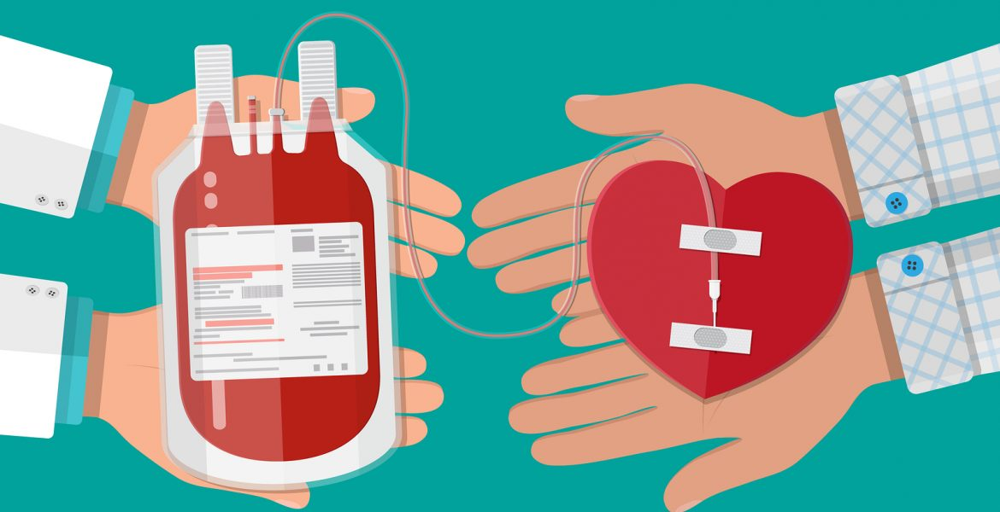
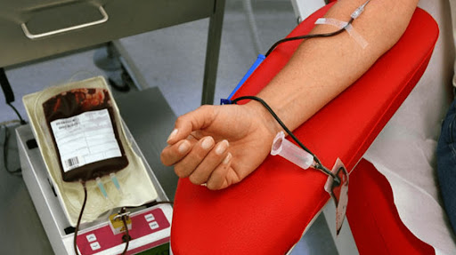
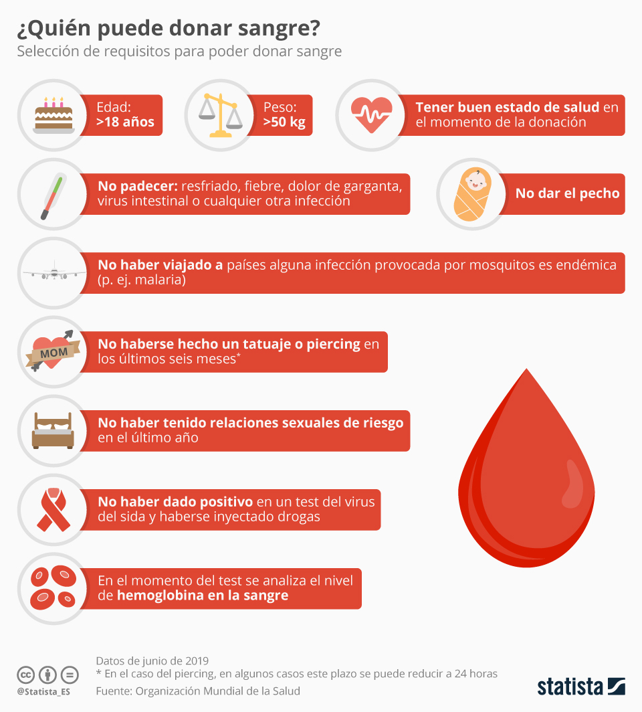
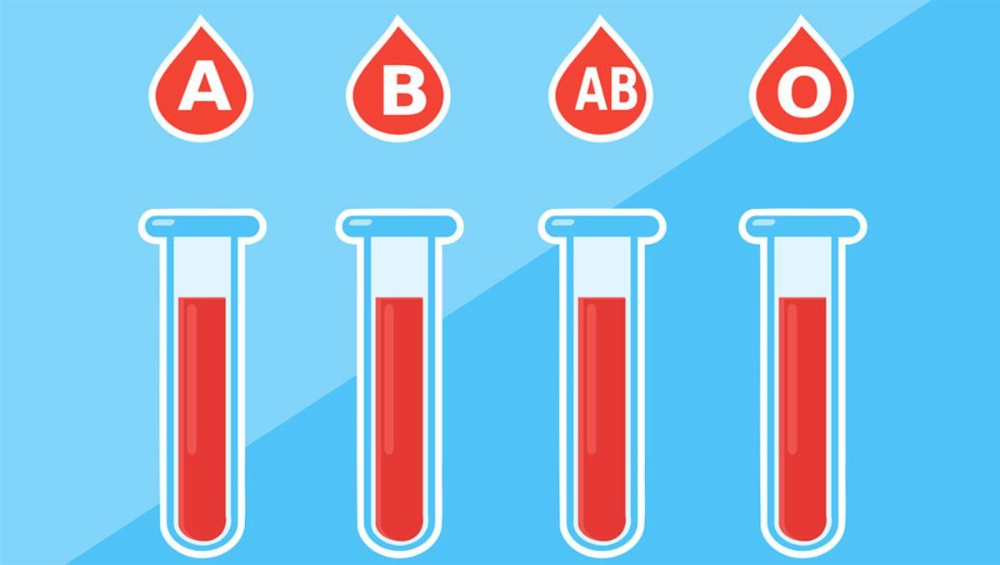

# Introducción

<div>



</div>

------------------------------------------------------------------------

En el Perú, según el MINSA (2016), solo el 0.66% de la población dona
sangre. De este número, solo el 5% son donantes voluntarios, mientras
que el otro 95% lo hace por reposición. Esto evidencia un gran problema
en el país, puesto que, según la OMS para un sistema de provisión
sanguínea eficiente, la tasa mínima de donantes voluntarios debe ser
equivalente a 2% de la población. Asimismo, el Perú necesita unas
600,000 unidades de sangre anuales para cubrir la demanda interna.

## Importancia

Este tema destaca porque en esta época de pandemia las donaciones que de
por sí eran mínimas, ahora han disminuido en gran medida. Sin embargo,
los accidentes, enfermedades y demás circunstancias donde se necesita de
unidades de sangre, no. De hecho, el Dr. Arturo Sagástegui, jefe del
Banco de Sangre del Hospital Rebagliati, comentó para una entrevista en
Andina:

"Desde que inició la pandemia la cantidad de donantes se redujo de forma
considerable, por ello nos vimos en la necesidad de no solo esperar a
que el donante se acerque al hospital, sino que decidimos acercándonos a
los centros comerciales e instituciones del estado para que la población
continúe donando"

Esto evidencia que ya existen centros médicos que han elaborado
estrategias para que la donación de sangre no sea nula. En este sentido,
estudiar el comportamiento de los jóvenes universitarios podría resultar
útil para la planificación de estrategias que el personal de salud pueda
armar con el fin de aumentar el número de donaciones voluntarias.

# Objetivo

{width="391"}

------------------------------------------------------------------------

Por lo anteriormente mencionado, en el presente proyecto, buscamos
principalmente, encontrar la relación entre la pertenencia a alguna
organización o voluntariado con la disposición a donar sangre en los
estudiantes de distintas universidades del Perú. Esto surge con la
suposición de que tal vez, al pertenecer a una organización estudiantil
o centro de voluntariado, abrazamos nuestro lado más humanitario y nos
encontramos más dispuestos a donar sangre, en comparación con los que no
pertenecen a ninguna organización.

Asimismo, creemos que al terminar el estudio seríamos capaces de
responder algunas preguntas como las siguientes:

-   ¿Qué cantidad de universitarios ha donado sangre?
-   ¿La carrera influye en la decisión de donar sangre?
-   ¿Qué cantidad de universitarios estaría dispuesta a donar sangre?
-   ¿El sexo influye en la decisión de donar sangre?

# Marco teórico

## Población

Estudiantes de universidades o institutos del Perú mayores de 15 años y
menores de 29 años.

## Muestra

Estudiantes de universidades o institutos de Lima Metropolitana mayores
de 15 años y menores de 29 años.

## Variables

+-------------------------------+----------+------+------------------+
| Preguntas                     | V        | Tipo | Restricciones    |
|                               | ariables | de V |                  |
|                               |          | aria |                  |
|                               |          | bles |                  |
+===============================+==========+======+==================+
| ¿Cuál es tu edad?             | Edad     | Numé | Números enteros  |
|                               |          | rica | mayores que 15 y |
|                               |          | Disc | menores que 29   |
|                               |          | reta |                  |
+-------------------------------+----------+------+------------------+
| ¿Cuál es tu género?           | Sexo     | Ca   | Masculino,       |
|                               |          | tegó | Femenino y       |
|                               |          | rica | Prefiero no      |
|                               |          | Nom  | decirlo          |
|                               |          | inal |                  |
+-------------------------------+----------+------+------------------+
| ¿Cuánto pesas?                | Peso     | Numé | No negativo      |
|                               |          | rica |                  |
|                               |          | Cont |                  |
|                               |          | inua |                  |
+-------------------------------+----------+------+------------------+
| ¿Cuál es tu tipo de sangre?   | Grupo S  | Ca   | A, B, AB, O y No |
|                               | anguíneo | tegó | sé               |
|                               |          | rica |                  |
|                               |          | Nom  |                  |
|                               |          | inal |                  |
+-------------------------------+----------+------+------------------+
| ¿En qué universidad o         | Uni      | Ca   | No números       |
| Instituto te encuentras?      | versidad | tegó |                  |
|                               |          | rica |                  |
|                               |          | Nom  |                  |
|                               |          | inal |                  |
+-------------------------------+----------+------+------------------+
| ¿Cuál es tu carrera?          | Carrera  | Ca   | No números       |
|                               |          | tegó |                  |
|                               |          | rica |                  |
|                               |          | Nom  |                  |
|                               |          | inal |                  |
+-------------------------------+----------+------+------------------+
| ¿Pertenece a alguna           | Per      | Ca   | Sí o No          |
| organización estudiantil o    | tenencia | tegó |                  |
| voluntariado externo a tu     | a una    | rica |                  |
| universidad o instituto?      | Orga     | Nom  |                  |
|                               | nización | inal |                  |
+-------------------------------+----------+------+------------------+
| ¿Ha donado sangre alguna vez? | Donación | Ca   | Sí o No          |
|                               |          | tegó |                  |
|                               |          | rica |                  |
|                               |          | Nom  |                  |
|                               |          | inal |                  |
+-------------------------------+----------+------+------------------+
| ¿Con qué frecuencia donas     | Fr       | Ca   | Muy frecuente,   |
| sangre?                       | ecuencia | tegó | Poco frecuente,  |
|                               | de do    | rica | No tan frecuente |
|                               | naciones | Ord  | y Nunca          |
|                               |          | inal |                  |
+-------------------------------+----------+------+------------------+
| ¿Cuántas veces ha donado?     | Número   | Numé | Entero positivo  |
|                               | de do    | rica |                  |
|                               | naciones | Disc |                  |
|                               |          | reta |                  |
+-------------------------------+----------+------+------------------+
| ¿Por cuál de las siguientes   | Forma de | Ca   | Voluntario,      |
| maneras ha donado sangre?     | donación | tegó | Remuneración y   |
|                               |          | rica | Reposición       |
|                               |          | Nom  |                  |
|                               |          | inal |                  |
+-------------------------------+----------+------+------------------+
| ¿Cómo te sentiste al donar    | Exp      | Ca   | Muy bien, Bien,  |
| sangre?                       | eriencia | tegó | Regular y Mal    |
|                               | Donando  | rica |                  |
|                               |          | Ord  |                  |
|                               |          | inal |                  |
+-------------------------------+----------+------+------------------+
| ¿Por qué nunca ha donado      | Razón de | Ca   | No números       |
| sangre?                       | no donar | tegó |                  |
|                               |          | rica |                  |
|                               |          | Nom  |                  |
|                               |          | inal |                  |
+-------------------------------+----------+------+------------------+
| ¿Estaría dispuesto a donar    | Dis      | Ca   | Muy probable,    |
| sangre en una futura          | posición | tegó | Probable, Poco   |
| oportunidad?                  |          | rica | probable y Nunca |
|                               |          | Ord  |                  |
|                               |          | inal |                  |
+-------------------------------+----------+------+------------------+

# Limpieza de datos

```{r}
library(readr)
library(plyr)
library(dplyr)
```

```{r}
DF <- read_csv("DF.csv")
```

```{r}
DF %>% rename(
  Peso = `Peso en kg (Ej. 60.5 o 70.0)  **Con decimal**`
  , Universidad = `Universidad (Ej. UTEC) o Instituto (Ej. TECSUP)`
  , Carrera = `Carrera (Ej. Ing. Ambiental)`
  , `Pertenencia a una Organizacion` = `¿Pertenece a alguna organización estudiantil o voluntariado externo a tu universidad o instituto?`
  , Donacion = `¿Ha donado sangre alguna vez?`
  , `Frecuencia de Donaciones` = `¿Con que frecuencia donas sangre?`
  , `Numero de Donaciones` = `¿Cuántas veces ha donado?`
  , `Forma de Donacion` = `¿Por cuál de las siguientes maneras ha donado sangre?`
  , `Experiencia Donando` = `¿Cómo te sentiste al donar sangre?`
  , `Razon de no Donar` = `¿Por qué nunca ha donado sangre?`
  , Disposicion = `¿Estaría dispuesto a donar sangre en una futura oportunidad?`
  , `Prom_ejercicio` = `Promedio de veces que hace ejercicio a la semana (Ej. 4)`
  , `Prom_agua` = `Promedio de agua que toma al dia en ml (Ej. 750ml)`
  , `Prom_uso_redes sociales`= `Uso diario de redes sociales (Minutos)`
) -> DF
```

```{r}
#Limpieza Variable Edad
DF <-filter(DF,DF$Edad<29)
DF <-filter(DF,DF$Edad>17)
```

```{r}
#Limpieza variable Peso
DF$Peso <- gsub(",", ".", DF$Peso)
DF$Peso <- gsub(" ", "", DF$Peso)
DF$Peso <- as.double(DF$Peso)
```

```{r}
#Limpieza variable Universidad
DF$Universidad[DF$Universidad == "César Vallejo"] <- "UCV"
DF$Universidad[DF$Universidad == "Pucp"] <- "PUCP"
DF$Universidad[DF$Universidad == "Utec"] <- "UTEC"
DF$Universidad[DF$Universidad == "Universidad Peruana del Norte"] <- "UPN"
DF$Universidad[DF$Universidad == "Universidad tecnológica del Perú"] <- "UTP"
DF$Universidad[DF$Universidad == "Toulouse lustrec"] <- "TLS"
DF$Universidad[DF$Universidad == "Tls"] <- "TLS"
DF$Universidad[DF$Universidad == "Universidad de Lima"] <- "UL"
DF$Universidad[DF$Universidad == "Cibertec"] <- "CIBERTEC"
DF$Universidad[DF$Universidad == "San Martin de Porres"] <- "USMP"
DF$Universidad[DF$Universidad == "U de Lima"] <- "ULIMA"
DF$Universidad[DF$Universidad == "Universidad de  Lima"] <- "UL"
DF$Universidad[DF$Universidad == "Cayetano Heredia"] <- "UPCH"
DF$Universidad[DF$Universidad == "Universidad del Pacifico"] <- "UP"
DF$Universidad[DF$Universidad == "Universidad del Pacífico"] <- "UP"
DF$Universidad[DF$Universidad == "Universidad Privada del Norte"] <- "UPN"
DF$Universidad[DF$Universidad == "ULIMA"] <- "UL"
```

```{r}
#Limpieza variable Carrera
DF$Carrera[DF$Carrera == "Ciencias de la computación"] <- "CS"
DF$Carrera[DF$Carrera == "Ciencia de la Computacion"] <- "CS"
DF$Carrera[DF$Carrera == "Ciencia de la Computación"] <- "CS"
DF$Carrera[DF$Carrera == "Ing civil"] <- "Ing. Civil"
DF$Carrera[DF$Carrera == "Civil"] <- "Ing. Civil"
DF$Carrera[DF$Carrera == "bioingeniería"] <- "Bioingeniería"
DF$Carrera[DF$Carrera == "Ing industrial"] <- "Ing. Industrial"
DF$Carrera[DF$Carrera == "Industrial"] <- "Ing. Industrial"
DF$Carrera[DF$Carrera == "Ingeniería industrial"] <- "Ing. Industrial"
DF$Carrera[DF$Carrera == "Ing.Industrial"] <- "Ing. Industrial"
DF$Carrera[DF$Carrera == "Ing. de la Energía"] <- "Ing. de la Energía"
DF$Carrera[DF$Carrera == "ING. DE LA ENERGÍA"] <- "Ing. de la Energía"
DF$Carrera[DF$Carrera == "Ing. De la energía"] <- "Ing. de la Energía"
DF$Carrera[DF$Carrera == "Ing.Mecatrónica"] <- "Ing. Mecatrónica"
DF$Carrera[DF$Carrera == "ING. Mecatronica"] <- "Ing. Mecatrónica"
DF$Carrera[DF$Carrera == "Ingeniería Mecatrónica"] <- "Ing. Mecatrónica"
DF$Carrera[DF$Carrera == "ING mecatrónica"] <- "Ing. Mecatrónica"
DF$Carrera[DF$Carrera == "Ing. Mecatronica"] <- "Ing. Mecatrónica"
DF$Carrera[DF$Carrera == "Ing Ambiental"] <- "Ing. Ambiental"
DF$Carrera[DF$Carrera == "psicología"] <- "Psicología"
DF$Carrera[DF$Carrera == "Ing. De sistemas"] <- "Ing. de Sistemas"
DF$Carrera[DF$Carrera == "Ing. Sistemas"] <- "Ing. de Sistemas"
DF$Carrera[DF$Carrera == "Publicidad y marketing"] <- "Publicidad y Marketing"
DF$Carrera[DF$Carrera == "Publicidad y marketing digital"] <- "Publicidad y Marketing"
DF$Carrera[DF$Carrera == "Gestion empresarial"] <- "Gestión"
DF$Carrera[DF$Carrera == "Gestión Empresarial"] <- "Gestión"
DF$Carrera[DF$Carrera == "Gestión empresarial"] <- "Gestión"
DF$Carrera[DF$Carrera == "Gestión y Alta dirección"] <- "Gestión"
DF$Carrera[DF$Carrera == "Gestión y Alta Dirección"] <- "Gestión"
DF$Carrera[DF$Carrera == "Admin y negocios digitales"] <- "Administración"
DF$Carrera[DF$Carrera == "Administracion y Gestion Comercial"] <- "Administración"
DF$Carrera[DF$Carrera == "Biologia"] <- "Biología"
DF$Carrera[DF$Carrera == "Biomédica"] <- "Ing. Biomédica"
DF$Carrera[DF$Carrera == "Ingeniería Biomédica"] <- "Ing. Biomédica"
DF$Carrera[DF$Carrera == "Medicina"] <- "Medicina Humana"
DF$Carrera[DF$Carrera == "Ingeniería Geológica"] <- "Ing. Geológica"
DF$Carrera[DF$Carrera == "Ing. Civíl"] <- "Ing. Civil"
DF$Carrera[DF$Carrera == "Ciencias de la Comunicación"] <- "Comunicaciones"
DF$Carrera[DF$Carrera == "Enfermeria"] <- "Enfermería"
DF$Carrera[DF$Carrera == "Farmacia y bioquímica"] <- "Farmacia y Bioquímica"
DF$Carrera[DF$Carrera == "-"] <- NA
```

```{r}
DFT<-DF[!is.na(DF$`Numero de Donaciones`),]
```

# Descriptores numéricos y gráficos

## Edad

```{r, echo=FALSE}
summary(DF$Edad)
```

```{r, echo=FALSE}

boxplot(DF$Edad
        , horizontal = TRUE
        , xlab = "Años"
        , main = "Edades"
        )
abline(v = mean(DF$Edad, na.rm = TRUE), col = "red")
legend("topright", legend = c("Promedio"), col = c("red"), lty = c(1))

```

En nuestra muestra para la variable Edad tenemos un mínimo de 18 años
que es la edad mínima para donar y un máximo de 28 (Rango de 10 años).
La mediana es de 21 años y la media es de 21.43 años, por lo cual para
la edad la muestra está ligeramente sesgada hacia la derecha.

## Peso

```{r, echo=FALSE}
hist(DF$`Peso`, main="Histograma del peso", xlab = "Peso", prob=TRUE )
```

Para el peso como se muestra en el histograma tenemos un mayor número de
personas entre 60 y 80 kg, los cuales representan casi el 30% del total.
También observamos algunos datos atípicos de 112. y 180kg. Decidimos no
quitarlos ya que es un valor que se puede dar y queríamos evitar
manipular los datos. Por otro lado, observamos que tenemos 4 personas
con pesos menores a los 50 kg por lo cual no pueden donar, según lo
establecido por el MINSA.

{width="445"}

## Sexo

```{r, echo=FALSE}
barplot(table(DF$Sexo), main="Gráfico de barras según el sexo", col = c("pink", "lightskyblue"))
```

Este gráfico nos muestra que por el momento hay 109 varones y 70
mujeres, es decir, una diferencia de 39 personas. El color elegido para
las barras se colocó para diferenciar mejor un gráfico que se presentará
luego.

## Grupo de sangre

{width="401"}

```{r, echo=FALSE}
DF$`Grupo de sangre` <- factor(DF$`Grupo de sangre`, levels = c("A", "AB", "B", "O", "No sabe"))
```

```{r, echo=FALSE}
barplot(table(DF$`Grupo de sangre`), main="Gráfico de barras según el grupo de sangre",
xlim = c(0, 6))

```

Para el grupo sanguíneo observamos que hay un mayor número de personas
con tipo O, le siguen los que tienen tipo A (47), luego B (30) y al
final AB (17). Este orden corresponde con el mostrado para la población
peruana, aunque las proporciones son diferentes siendo solo O
aproximadamente el 80%, siguiéndole el A con 10 a 15%, luego el B con el
5% y finalmente AB con 1 a 2%.

#### Tipo de sangre según el MINSA

{width="564"}

La gráfica realizada con los datos obtenidos con las encuestas
realizadas nos permite observar que la sangre común entre los donantes
es la tipo O, también se puede observar que el tipo de sangre A es el
segundo más común, contando con unas 45 personas, además nos muestra que
el tipo de sangre menos común entre los donantes es la de tipo AB, el
cual se puede confirmar con los datos del MINSA, donde el grupo AB es el
menor, e igualmente podemos observar que un aproximado de 20 personas no
sabe a qué tipo de sangre pertenece.

## Disposición para donar sangre

```{r, echo=FALSE}
barplot(sort(table(DF$Disposicion), decreasing = TRUE), main = "Gráfico de barras según la disposición a donar sangre", col = c("firebrick4", "indianred3", "rosybrown2", "mistyrose1"))
```

En este gráfico se puede observar que aproximadamente el 80% de las
personas que no han donado sangre estarían dispuestas a donar sangre
aunque sea alguna vez. También, nos muestra que existe aún una pequeña
parte de la población que no está dispuesta a donar y esto puede
relacionarse con otra variable.

## Frecuencia de donaciones

**Mediana**

```{r, echo=FALSE}
quantile(DF$`Frecuencia de Donaciones`, 0.5, na.rm = TRUE, type = 1)
```

```{r, echo=FALSE}
DF$`Frecuencia de Donaciones`<- factor(DF$`Frecuencia de Donaciones`, levels = c("Muy frecuente","Poco frecuente","No tan frecuente","Nunca"),ordered = TRUE)
#col = ("red3","firebrick2","indianred3","indianred1"),
barplot(table(DF$`Frecuencia de Donaciones`), main = "Frecuencia de Donaciones",  col = c("firebrick4", "indianred3", "rosybrown2", "mistyrose1"), xlim = c(0, 4.2))
```

Observamos que cerca de la mitad de las personas no ha donado nunca y de
los que sí la mayoría lo hace de forma poco frecuente. Además es
interesante que poco más de 20 personas donen de forma muy frecuente.
Esto nos hace preguntar quienes son ellos, qué carreras estudian y su
edad. Esto lo analizaremos luego en búsqueda de patrones. Los colores
van desde un rojo intenso, porque es la frecuencia óptima que buscamos
para abastecer las unidades de sangre y varía a un rosado menos intenso
en la frecuencia "nunca" donde se ve una mayor cantidad de personas.

## Cantidad de donaciones

```{r, echo=FALSE}
barplot(table(DF$`Numero de Donaciones`), main = "Número de Donaciones", col = c("mistyrose1","rosybrown2", "lightcoral", "indianred3","firebrick4"),
ylim = c(0, 25))
```

Respecto a la variable donaciones vemos que de aquellos que han donado
poco solo lo han hecho una vez. Además, para los que lo hicieron más de
una vez la frecuencia es similar. Probablemente esto sucedió por el alto
número de personas que pertenecen a carreras de salud y vida que tienden
a donar más que el resto de carreras donde la mayoría nunca ha donado.

#### Donación MINSA

{width="751"}

Del gráfico del Minsa podemos ver que en el año 2020 aumentó de manera
considerable la cantidad de donaciones de sangre en el Perú, y de eso se
puede estimar que en el 2021 aumentaron más, debido a la pandemia
mundial. Se puede relacionar con el gráfico de cantidad de donaciones,
ya que con los datos recolectados vemos que al menos más de 20 personas
han realizado 2, 3, 4 o 5 donaciones de sangre.

# Patrones - Interacción entre variables

En este punto se analizará la relación entre algunas variables numéricas
y categóricas de la base de datos DF, donde está la información de
nuestra encuesta.

## Pertenecer a una organización vs donar sangre

-   **Variables** Pertenencia a una Organización y Donación

Se analizará si el hecho de pertenecer a una organización estudiantil o
voluntariado influye en la decisión de donar sangre. Este patrón es
particular, porque esta ligado de forma directa a uno de nuestros
objetivos principales. Así, debemos darle mayor relevancia a este
resultado y relacionarlo con otras variables que complementen la
información obtenida.

```{r, echo=FALSE}
quantile(DF$`Frecuencia de Donaciones`, 0.5, na.rm = TRUE, type = 1)
```

```{r, echo=FALSE}
mosaicplot(table(DF$Donacion, DF$`Pertenencia a una Organizacion`), xlab =  "Donación", ylab ="Pertenece a una organización", main = "Relación entre pertenencia a una organización y donación de sangre")
```

En la interacción de estas variables podemos observar que el número de
personas que han donado y los que no son similares. De aquellos que no
han donado una pequeña parte pertenece a una organización. Por otro
lado, de aquellos que sí han donado la gran mayoría si pertenece a una
organización. Por esta razón, podríamos decir que aquellas personas que
pertenecen a una organización tienden a haber donado sangre.

## Carrera vs número de donaciones

-   **Variables** Carrera y Numero de Donaciones

### Carreras relacionadas a salud/vida-número de donaciones

```{r, echo=FALSE}
DF1 <- filter(DF, DF$Carrera == "Medicina Humana" | DF$Carrera == "Enfermería" | DF$Carrera == "Biología" | DF$Carrera == "Psicología")
DF1$Carrera <- factor(DF1$Carrera, labels = c("Biología", "Enfermería",  "Medicina Humana", "Psicología"))
```

```{r, echo=FALSE}
barplot(table(DF1$`Numero de Donaciones`, DF1$Carrera), beside = TRUE,
        main = "Gráfica de Carrera y Número de Donaciones",
        xlab = "Carrera", ylab = "Número de Donaciones",
        col = c("rosybrown2", "lightcoral", "indianred3","firebrick4"),
        xlim = c(0, 18.3),
        legend.text = rownames(table(DF1$`Numero de Donaciones`, DF1$Carrera)))
```

### Carreras No relacionadas a salud/vida-número de donaciones

```{r, echo=FALSE}
DF2 <- filter(DF, DF$Carrera == "Ing. Industrial" | DF$Carrera == "Ing. Mecatrónica" | DF$Carrera == "Ing. Civil" | DF$Carrera == "CS")
DF2$Carrera <- factor(DF2$Carrera, labels = c("CS", "Ing. Civil",  "Ing. Industrial", "Ing. Mecatrónica"))
```

```{r, echo=FALSE}
barplot(table(DF2$`Numero de Donaciones`, DF2$Carrera), beside = TRUE,
        main = "Gráfica de Carrera y Número de Donaciones",
        xlab = "Carrera", ylab = "Número de Donaciones",
        col = c("mistyrose1","rosybrown2", "firebrick4"),
        ylim = c(0, 10),
        legend.text = rownames(table(DF2$`Numero de Donaciones`, DF2$Carrera))
        )
```

En la interacción entre las variables carrera y número de donaciones
encontramos que los estudiantes de carreras de salud y vida como
Medicina, Enfermería, Psicología y Biología tienden a donar más a
comparación de aquellos que no pertenecen a carreras de esta naturaleza.
Tal es el caso de carreras como la de Ing. Civil, Ambiental, Industrial
y Mecatrónica, que tienen pocos estudiantes que han donado.

## Número de donaciones vs edad del encuestado

```{r, echo=FALSE}
boxplot(DF$Edad~DF$`Numero de Donaciones`, main = "Número de donaciones por Edad", xlab = "Número de donaciones", ylab = "Edad", col = c("mistyrose1","rosybrown2", "firebrick4"))
```

En este diagrama de cajas vemos cómo interactúan las variables edad y
números de donaciones, se puede observar que las personas entre 19 y 25
años son las que realizan más donaciones de sangre, mientras que las
personas de entre 18 y 22 años son las que menos donan. Según el
diagrama, los donantes con 21 y 22 años han donado entre una y cinco
veces. Igualmente existe un grupo donde solo se realizó un número de
donaciones específico, como el caso del grupo de 26 años, donde solo una
persona donó 4 veces. Para finalizar, se puede ver que en la gran
mayoría de los casos la mediana se encuentra en los 22 años, por lo que
podemos decir que las personas con 22 años de edad están más dispuesta a
donar sangre.

## Sexo vs número de veces que ha donado sangre

```{r, echo=FALSE}
mosaicplot(table(DF$`Numero de Donaciones`, DF$Sexo), col=c("pink","lightskyblue"), xlab = "Cantidad de veces que ha donado", main = "Número de donaciones según el sexo")
```

En este gráfico de interacción entre las variables sexo y número de
donaciones, observamos que la mayoría de personas que donan sangre son
varones, para cada instancia del número de donaciones. Por esta razón,
podríamos decir que los varones tienden a donar más que las mujeres. Sin
embargo, no podemos afirmar ello debido a que en nuestra hay 39 hombres
más que mujeres, lo cual haría posible este resultado debido a la
diferente proporción.

# Modelos de Variables Aleatorias

+-------------+-------------------------------------------------------------------+
| Variable    | Modelo                                                            |
+:============+:==================================================================+
| Sexo        | Consideremos el evento de elegir a un estudiante universitario al |
|             | azar 100 veces. Luego, planteemos como éxito el hecho de que el   |
|             | estudiante sea del sexo masculino ya que, según nuestra muestra,  |
|             | son quienes tal vez donen más. En este sentido, si queremos       |
|             | conocer, por ejemplo, la probabilidad de que 50 de ellos sea del  |
|             | sexo masculino, podemos plantear el modelo Binomial. La           |
|             | probabilidad de ser del sexo masculino para nuestro caso es de    |
|             | 109/179, que es equivalente a 0.6089385. Entonces, el modelo      |
|             | Binomial quedaría de la siguiente forma:                          |
|             |                                                                   |
|             | $X\sim\mathsf{Bin}(100,0.6089385)$                                |
+-------------+-------------------------------------------------------------------+
| Edad        | Consideremos el evento de elegir a un estudiante universitario al |
|             | azar 20 veces. Luego, planteemos como éxito el hecho de que el    |
|             | estudiante tenga 22 años ya que, según nuestra muestra, es la     |
|             | edad en la que se concentra la mayor cantidad de donantes. En     |
|             | este sentido, si queremos conocer, por ejemplo, la probabilidad   |
|             | de que 5 de ellos tenga dicha edad, podemos plantear el modelo    |
|             | Binomial. La probabilidad de tener 22 años para nuestro caso es   |
|             | de 23/179, que es equivalente a 0.1284916. Entonces, el modelo    |
|             | Binomial quedaría de la siguiente forma:                          |
|             |                                                                   |
|             | $X\sim\mathsf{Bin}(100, 0.1284916)$                               |
+-------------+-------------------------------------------------------------------+
| Carrera     | Consideremos el evento de elegir a un estudiante universitario al |
|             | azar 50 veces. Luego, planteemos como éxito el hecho de que el    |
|             | estudiante estudie la carrera de Medicina Humana ya que un patrón |
|             | hallado es que los estudiantes de las carreras de salud tienden a |
|             | donar más veces. En este sentido, si queremos conocer, por        |
|             | ejemplo, la probabilidad de que 20 de ellos pertenezcan a esa     |
|             | carrera, podemos plantear el modelo Binomial. La probabilidad de  |
|             | estudiar Medicina Humana para nuestro caso es de 31/179, que es   |
|             | equivalente a 0.1731844. Entonces, el modelo Binomial quedaría de |
|             | la siguiente forma:                                               |
|             |                                                                   |
|             | $X\sim\mathsf{Bin}(50, 0.1731844)$                                |
+-------------+-------------------------------------------------------------------+
| Número de   | Planteamos como éxito el hecho de que el estudiante haya donado   |
| donaciones  | una cantidad determinada de veces. En este sentido, si queremos   |
|             | conocer, por ejemplo, la cantidad de estudiantes que han donado   |
|             | una vez de un total de 100, podemos plantear el modelo Binomial.  |
|             | La probabilidad de haber donado sangre una vez es de 1/6, tomamos |
|             | en cuenta a la probabilidad para cada número como constante .     |
|             | Entonces, el modelo Binomial quedaría de la siguiente forma:      |
|             |                                                                   |
|             | $X\sim\mathsf{Bin}(100,0.167)$                                    |
+-------------+-------------------------------------------------------------------+
| Pertenencia | Para este caso se puede plantear un modelo de Bernoulli si        |
| a una       | consideramos como éxito a que un estudiante universitario sí      |
| o           | pertenece a una organización estudiantil o voluntariado por la    |
| rganización | razón de que encontramos un patrón entre esta variable con la de  |
|             | si habían donado sangre alguna vez. La probabilidad de que un     |
|             | estudiante pertenezca a una organización o voluntariado, según    |
|             | nuestra muestra, es 98/179, lo cual es equivalente a 0.547486. En |
|             | este sentido, el modelo Bernoulli quedaría de la siguiente forma: |
|             |                                                                   |
|             | $X\sim\mathsf{Ber}(0.547486)$                                     |
+-------------+-------------------------------------------------------------------+
|             |                                                                   |
+-------------+-------------------------------------------------------------------+

# Intervalos de confianza

En esta parte se hallarán los intervalos de confianza para las medias de
las variables numéricas obtenidas y para las proporciones de las
variables Grupo de sangre y Donación. Nuestra base de datos que en un
inicio fue de 201 después de la limpieza ha quedado con 179
observaciones. Así, es necesario establecer intervalos de confianza para
las medias como para las proporciones de las variables más relevantes
que describen y dan información importante acerca de la donación
altruista de sangre en el país. Para establecer estos intervalos de
confianza se considerarán los siguientes parámetros:

-   <b style = 'color : #CD5555;'> Nivel de confianza: $$95\%$$ </b> Se
    eligió este valor, porque debe haber un equilibrio entre confianza y
    precisión. De esta forma , no habrá un error muy pequeño que origine
    una muestra exageradamente grande con la que no contamos.

-   <b style = 'color : #CD5555;'> Significancia: $$\alpha=0.05$$ </b>
    Al tener una confianza de 95%, la significancia sería el
    complemento, es decir, 5% para tener el 100%.

-   <b style = 'color : #CD5555;'> Tamaño de la muestra: $$179$$ </b>
    Contamos con 179 observaciones limpias que se pueden usar para
    distintos análisis.

## Variable Donación

Para hallar el intervalo de confianza de esta variable, consideramos los
intervalos por proporción de los estudiantes universitarios que sí donan
sangre y los que no. Asimismo, consideramos los intervalos sobre la
media con distribución normal debido a que, a pesar de no conocer la
desviación estándar poblacional, el tamaño de la muestra es mayor a 30.

```{r}
n <- nrow(DF)
n_confianza <- 0.95
alfa <- 1 - n_confianza
Donante <- DF[DF$Donacion=='Sí',]
No_Donante <- DF[DF$Donacion=='No',]
p_si <- nrow(Donante)/n
p_no <- nrow(No_Donante)/n
z <- qnorm(alfa/2, lower.tail = FALSE)
izq_si <- p_si - (z*sqrt(p_si*(1-p_si)/n))
der_si <- p_si + (z*sqrt(p_si*(1-p_si)/n))
izq_no <- p_no - (z*sqrt(p_no*(1-p_no)/n))
der_no <- p_no + (z*sqrt(p_no*(1-p_no)/n))
```

### Donante

```{r}
cat("(",izq_si,",",der_si,")")
```

Con 95% de confianza, se estima que el porcentaje de donantes de sangre
se encuentra entre <b style = 'color : #CD5555;'> 46.89% </b> y
<b style = 'color : #CD5555;'> 61.49%</b>.

### No Donante

```{r}
cat("(",izq_no,",",der_no,")")
```

Con 95% de confianza, se estima que el porcentaje de no donantes de
sangre se encuentra entre <b style = 'color : #CD5555;'> 38.51% </b> y
<b style = 'color : #CD5555;'> 53.11%</b>.

## Variable Edad

Para esta variable, calculamos el intervalo de confianza para la edad de
los estudiantes universitarios que donan sangre y consideramos los
intervalos sobre la media con distribución normal debido a que, a pesar
de no conocer la desviación estándar poblacional, el tamaño de la
muestra es mayor a 30.

```{r}
Edades_donantes <- DF[DF$Donacion=='Sí',]$Edad
x <- mean(Edades_donantes)
s <- sd(Edades_donantes)
z <- qnorm(alfa/2, lower.tail = FALSE)
izq <- x - z*s/sqrt(length(Edades_donantes)) 
der <- x + z*s/sqrt(length(Edades_donantes))
cat("(",izq,",",der,")")
```

Con 95% de confianza, la media poblacional de las edades de las personas
que sí donan sangre se encuentra entre <b style = 'color : #CD5555;'>
21.73 </b> y <b style = 'color : #CD5555;'> 22.58</b>.

## Variable Número de Donaciones

Para esta variable, hallamos los intervalos de confianza según el sexo
de los estudiantes. Asimismo, consideramos los intervalos de la media y
la distribución normal por las mismas razones que el apartado anterior.

```{r}
DFT2 <- DF[!is.na(DF$`Numero de Donaciones`),]
soloMujeres<-DFT2[DFT2$Sexo=="Femenino",]$`Numero de Donaciones`
x_mujeres <- mean(soloMujeres, na.rm = TRUE)
s_mujeres <- sd(soloMujeres, na.rm = TRUE)
z_mujeres <- qnorm(alfa/2, lower.tail = FALSE)
izq_mujeres <- x_mujeres - z_mujeres*s_mujeres/sqrt(length(soloMujeres))
der_mujeres <- x_mujeres + z_mujeres*s_mujeres/sqrt(length(soloMujeres))
#---------------------------
soloHombres<-DFT2[DFT2$Sexo=="Masculino",]$`Numero de Donaciones`
x_hombres <- mean(soloHombres, na.rm = TRUE)
s_hombres <- sd(soloHombres, na.rm = TRUE)
z_hombres <- qnorm(alfa/2, lower.tail = FALSE)
izq_hombres <- x_hombres - z_hombres*s_hombres/sqrt(length(soloHombres))
der_hombres <- x_hombres + z_hombres*s_hombres/sqrt(length(soloHombres))
```

### Femenino

```{r}
cat("(",izq_mujeres,",",der_mujeres,")")
```

Con 95% de confianza, la media poblacional del número de donaciones de
las personas del sexo femenino se encuentra entre
<b style = 'color : #CD5555;'> 2.89 </b> y
<b style = 'color : #CD5555;'> 3.69</b>.

### Masculino

```{r}
cat("(",izq_hombres,",",der_hombres,")")
```

Con 95% de confianza, la media poblacional del número de donaciones de
las personas del sexo masculino se encuentra
<b style = 'color : #CD5555;'> 3.00 </b> y
<b style = 'color : #CD5555;'> 3.68</b>.

# Evaluación y pruebas de hipótesis

Para evaluar la hipótesis seguiremos considerando una significancia de
<b style = 'color : #CD5555;'> $$\alpha = 0.05$$</b>

## Primera prueba

Se espera que una estudiante universitaria done sangre, en promedio, 3
veces. No obstante, creemos que en realidad el nivel es más bajo y para
verificar dicha hipótesis, se tomará a cada mujer de nuestra muestra
total con un 5% de significancia.

### Parámetros:

Se utilizará una prueba unilateral, por lo que nuestras hipótesis serían
las siguientes: <b style = 'color : #CD5555;'> $$H_{0}: \mu\le 3$$
$$H_{1}: \mu>3$$ </b>

```{r}
soloMujeres<-DFT[DFT$Sexo=="Femenino",]

numDonaciones<-soloMujeres$`Numero de Donaciones`
#numDonaciones<- strtoi(numDonaciones)

x2 <- mean(numDonaciones)
s2 <- sd(numDonaciones)
n2 <- length(numDonaciones)
alpha <- 0.05
```

```{r}
z <- (x2-3)/(s2/sqrt(n2))
v_critico <- qnorm(1-alpha)
```

Al realizar los cálculos para esta prueba de hipótesis, obtuvimos los
siguientes resultados:

<b style = 'color : #CD5555;'> $$V_{crítico}= 1.64$$
$$Estadístico= 1.43$$ $$\overline{x}=3.29$$ </b> Con esta información,
elaboramos un gráfico para poder observar de mejor forma si el
estadístico calculado cae o no en la zona de rechazo.

```{r, fig.align='center'}
Xs<-seq(-7,7,by=0.1)
plot(Xs,dnorm(Xs),type="l", main = "Prueba de hipótesis", xlab = "", ylab = "")

abline(v=c(v_critico,z),lty=c(1,2),col=c("red","blue"))
legend(x = "topleft", legend = c("Valor Crítico", "Estadístico"), fill = c("red", "blue"))
```

### Conclusión

Como observamos en el gráfico, el estadístico se encuentra dentro del
área de no rechazo de H0, por lo que no rechazamos $H_0$ de que una
mujer estudiante universitaria done menos de 3 veces. Asimismo, dado que
la media muestral es de 3.29, que es diferente de 3 por muy poco, no
podemos decir con seguridad que nuestra muestra sea representativa en
este aspecto y que tal vez el promedio muestral se deba a la
aletoriedad.

## Segunda Prueba

De las personas que llegaron a donar sangre, se estima que el peso
promedio de estas es de 73 kg. Para esto, se toman todos los estudiantes
de nuetra muestra que hayan donado sangre. Se usa una significancia de
5%.

### Parámetros:

Se utilizará una prueba bilateral, por lo que nuestras hipótesis serían
las siguientes:

<b style = 'color : #CD5555;'> $$H_{0}: \mu = 73$$
$$H_{1}: \mu \not= 73$$ </b>

```{r}
DF3 <- DFT[!is.na(DFT$Peso),]
peso <- DF3$Peso

x3 <- mean(peso)
s3 <- sd(peso)
n3 <- length(peso)
alpha <- 0.05
```

```{r}
z2 <- (x3-73)/(s3/sqrt(n))
v_critico2 <- qnorm(alpha/2)
```

Al realizar los cálculos para esta prueba de hipótesis, obtuvimos los
siguientes resultados:

<b style = 'color : #CD5555;'> $$V_{crítico}= -1.96$$
$$Estadístico= 2.17$$

$$\overline{x}=74.83$$ </b> Con esta información, elaboramos un gráfico
para poder observar de mejor manera si el estadístico calculado cae o no
en la zona de rechazo.

```{r, fig.align='center'}
Xs<-seq(-7,7,by=0.1)
plot(Xs,dnorm(Xs),type="l", main = "Prueba de hipótesis", xlab = "", ylab = "")

abline(v=c(v_critico2,-v_critico2,z2),lty=c(1,1,2),col=c("red","red","blue"))
legend(x = "topleft", legend = c("Valor Crítico", "Estadístico"), fill = c("red", "blue"))

```

### Conclusión

Como observamos en el gráfico, el estadístico cae en la zona de rechazo,
por lo que, efectivamente, se rechaza $H_0$, la cual planteaba que el
peso promedio de un estudiante universitario que dona sangre es de 73
kg. De igual forma, dado que la media muestral es de 74.83, podemos
decir que nuestra muestra es representativa en este aspecto.

## Tercera Prueba

### Parámetros:

Unos estudiantes quieren saber cuántas veces los estudiantes
relacionados con la salud (sin contar medicina humana), han donado
sangre. Nosotros afirmamos que han donado, a lo mucho, 4 veces. Para
esto se toma una muestra de todos los estudiantes de dichas carreras con
una significancia del 5%.

Se utilizará una prueba unilateral derecha, por lo que nuestras
hipótesis serían las siguientes:

<b style = 'color : #CD5555;'> $$H_{0}: \mu \le 4$$ $$H_{1}: \mu > 4$$
</b>

```{r}
DF1<-DFT[DFT$Carrera=="Biología", ]
DF2<-DFT[DFT$Carrera=="Enfermería", ]
DF3<-DFT[DFT$Carrera=="Psicología", ]
vecsalud<-c(DF1$`Numero de Donaciones`,DF2$`Numero de Donaciones`,DF3$`Numero de Donaciones`)
```

```{r}
x4 <- mean(vecsalud)
s4 <- sd(vecsalud)
n4 <- length(vecsalud)
```

```{r}
z3 <- (x4-3)/(s4/sqrt(n4))
v_critico3 <- qt(1-0.05,n4-1)
```

Al realizar los cálculos para esta prueba de hipótesis, obtuvimos los
siguientes resultados:

<b style = 'color : #CD5555;'> $$V_{crítico}= 1.74$$

$$Estadístico= 0.49$$

$$\overline{x}=3.11$$ </b> Con esta información, elaboramos un gráfico
para poder observar de mejor manera si el estadístico calculado cae o no
en la zona de rechazo.

```{r,fig.align='center'}
Xs<-seq(-7,7,by=0.1)
plot(Xs,dnorm(Xs),type="l", main = "Prueba de hipótesis", xlab = "", ylab = "")

abline(v=c(v_critico3,z3),lty=c(1,2),col=c("red","blue"))
legend(x = "topleft", legend = c("Valor Crítico", "Estadístico"), fill = c("red", "blue"))
```

### Conclusión

Como observamos en el gráfico, no se rechaza $H_0$, el cual plantea que
el número de donaciones que hicieron los estudiantes de carreras
relacionadas a la salud, exceptuando a los estudiantes de medicina
humana, es a lo mucho 3 veces.La media muestral para esta variable es de
3.11, por lo que la consideramos representativa en este aspecto.

# Análisis Predictivo

## Primera Regresión

La variable Número de donaciones representará la variable dependiente
"y" y la variable Uso de redes sociales (Prom_uso_redes sociales) la
variable independiente "x".

```{r}
redsocial<-DFT$`Prom_uso_redes sociales`
numdonaciones<-DFT$`Numero de Donaciones`
x1<-redsocial
y1<-numdonaciones
```

### Correlación entre variables

```{r}
correlacion=cov(x1,y1)/sd(x1)*sd(y1)
correlacion
```

La correlación entre las variables es 0.88. Esta es positiva y cercana a
1. Nos indica una proporcionalidad directa o positiva.

```{r}
datosreg<-data.frame("X1"=x1,"Y1"=y1)
resultados<-lm(datosreg$Y1~datosreg$X1,data=datosreg)
```

### Correlación

```{r}
cor(x1,y1)
```

Se observa que r tiene un valor menor a 0.75. Desde un punto de vista
matemático, no es un buen modelo.

### Gráfica de regresión

```{r, fig.align="center"}

smoothScatter(datosreg$X1,datosreg$Y1, pch=20, col=rgb(0,0,0,0.2), xlab="Uso de redes sociales al día", ylab="Número de donaciones")
abline(resultados)
```

En la gráfica anterior, podemos observar una tendencia positiva en el sentido de la línea elaborada por la regresión, lo cual tiene coherencia con la correlación que calculamos anteriormente.

### Homocedasticidad

```{r,fig.align="center"}
residuos<-rstandard(resultados)
valores.ajustados<-fitted(resultados)
plot(valores.ajustados,residuos)
abline(h=0)
```
Existe una especie de patrón hacia el lado derecho, pero el lado izquierdo no cuenta con este comportamiento. Tiene un comportamiento aparentemente homocedástico.

## Normalidad

```{r,fig.align="center"}
qqnorm(residuos)
qqline(residuos)
```

Se puede concluir la normalidad es buena en este modelo.

### Reporte de Regresión

```{r}
summary(resultados)
```

### Coeficientes de regresión

$$\beta_{0}= 0.23$$ $$\beta_{1}=0.02$$ $$y(x)=\beta_{0}+\beta_{1}x$$
<b style = 'color : #CD5555;'> $$y(x)=0.23+0.02x$$ </b>

### R cuadrado

El R cuadrado es apróximadamente 0.1789. Esto significa que 17.89%, de
la variación del número de donaciones por el uso de redes sociales al
día son explicadas, por el modelo.

### Prueba de Hipótesis para el intercepto

<b style = 'color : #CD5555;'> $$H_{0}:\beta_{0}=0$$
$$H_{1}:\beta_{0}\neq 0$$ </b>

El p-value es de 0.737, y con un nivel de significancia de 0.05, no
rechazamos la hipótesis nula, el cual dice que el intercepto es
diferente de 0. No es significativo dicho coeficiente.

### Prueba de Hipótesis para el coeficiente de la variable independiente

<b style = 'color : #CD5555;'> $$H_{0}:\beta_{1}=0$$
$$H_{1}:\beta_{1}\neq0$$ </b> Con un p-value de 1.59e-05 y un nivel de
significancia de 0.05, Rechazamos H0, ya que es menor a 0.05. Sí es
significativo dicho coeficiente.

### Prueba de significancia para todo el modelo

$$p-value=1.59e-05$$ <b style = 'color : #CD5555;'> $$p-value<0.05$$
</b>

Ya que p-value es menor a 0.05, se considera que es un modelo
significativo.

### Conclusión

Si bien solo se están representando el 17.89% de las variaciones de la
variable dependiente con este modelo planteado, consideramos que sí es
un buen modelo para nuestro proyecto. Esto debe a que explica la
tendencia real. Las personas que usan más las redes sociales son las más
propensas a enterarse de qué sucesos que suceden en su país o el mundo.
Es así, que podrían enterarse de amigos que necesitan transfusiones de
sangre o de algún accidente en donde se requieren varias unidades de
sangre para los accidentados involucrados.

## Segunda Regresión

Cantidad diaria de agua consumida (ml) como la variable independiente
"x" y el número de donaciones como la variable dependiente "y"

```{r}
cantagua<-DFT$Prom_agua
numdonaciones<-DFT$`Numero de Donaciones`
```

```{r}
x5<-cantagua
y5<-numdonaciones

y5<-strtoi(y5)

datosreg2<-data.frame("X5"=x5,"Y5"=y5)
resultados2<-lm(datosreg2$Y5~datosreg2$X5,data=datosreg2)
```

### Gráfica de regresión

```{r,echo=FALSE, fig.align="center"}
smoothScatter(datosreg2$X5,datosreg2$Y5, pch=20, col=rgb(0,0,0,0.2), xlab = "Promedio diario de agua consumida", ylab="Número de donaciones")
abline(resultados2)
```

### Coeficiente de correlación

```{r}
cor(x5,y5)
```

El valor de "r" es mayor de -0.75. Desde un punto de vista matemático,
no es un buen modelo.

### Homocedasticidad

```{r, fig.align="center"}
residuos2<-rstandard(resultados2)
valores.ajustados2<-fitted(resultados2)
plot(valores.ajustados2,residuos2)
abline(h=0)
```

Aparentemente no hay una tendencia en los errores, por lo que se puede
considerar que hay homocedasticidad.

### Normalidad

```{r, fig.align="center"}
qqnorm(residuos2)
qqline(residuos2)
```

Con el gráfico, se puede apreciar que la normalidad no es buena.

### Reporte de Regresión

```{r}
summary(resultados2)
```

### Coeficientes de regresión

$$\beta_{0}=3.69$$ $$\beta_{1}=-0.002$$ $$y(x)=\beta_{0}+\beta_{1}x$$
<b style = 'color : #CD5555;'> $$y(x)=3.69-0.002x$$ </b>

### R cuadrado

El R cuadrado es 0.005542. Esto significa que el 0.5542%, de las
variaciones de "y", son explicadas por el modelo.

### Prueba de Hipótesis para el intercepto

<b style = 'color : #CD5555;'> $$H_{0}:\beta_{0}=0$$
$$H_{1}:\beta_{0}\neq 0$$</b> Con un p-value de 2.23e-10 y con una
significancia de 0.05, se rechaza H0. Esto se debe a que p-value es
menor a 0.05. Se concidera que el intercepto es significativo.

### Prueba de Hipótesis para el coeficiente de la variable independiente

<b style = 'color : #CD5555;'> $$H_{0}:\beta_{1}=0$$
$$H_{1}:\beta_{1}\neq 0$$ </b> Con un p-value de 0.469 y con una
significancia de 0.05, no se puede rechazar H0. Esto se debe a que
p-value es mayor a 0.05. Se concidera que la variable independiente no
es significativa.

### Prueba de significancia para todo el modelo

$$p-value=0.4686$$ <b style = 'color : #CD5555;'> $$p-value>0.05$$ </b>
Ya que p-value es mayor a 0.05, no se puede considerar que nuestro
modelo sea significativo.

### Conclusión

Si bien nuestro modelo solo representa el 0.5542% de las variaciones de
la variable dependiente, consideramos que es un modelo útil. Las
personas que toman más cantidad de agua en el día tienden a ser las que
hacen más actividad física. Al considerar que dichas personas que
consumen mucha agua son deportistas, un deportista debe cuidar su cuerpo
para no debilitarlo. Cuando uno dona sangre, debe estar en reposo. Es
por esta razón que tiene sentido que, a mayor consumo de agua, el número
de donaciones de sangre va a reducir.

## Tercera Regresión

La variable Promedio de ejercicio representará la variable dependiente
"y" y la variable Edad como la variable independiente "x".

```{r}
x6 <-DFT$Edad
y6 <-DFT$Prom_ejercicio

datosreg3<-data.frame("X6"=x6 , "Y6"=y6)
resultados3<-lm(datosreg3$Y6~datosreg3$X6,data = datosreg3)
```

### Gráfica de regresión

```{r,fig.align="center"}
smoothScatter(datosreg3$X6,datosreg3$Y6,xlab="Edad",ylab="Ejercicio semanal (horas)")
abline(resultados3)
```

### Correlación entre variables

```{r}
cor(x6, y6)
```

El valor de "r" es menor de 0.75. Desde un punto de vista matemático, no
es un buen modelo.

### Coeficientes de regresión

$y(x) = \beta_0 + \beta_1x$

$\beta_0 = 2.25116$

$\beta_1 = 0.05521$

<b style = 'color : #CD5555;'> $y(x) = 2.25116 + 0.05521x$ </b>

### Homocedasticidad

```{r, fig.align="center"}
plot(resultados3, 1)
```

La nube de puntos está desviada hacia arriba y hacia abajo, por lo que
se rompe la suposición del modelo para los residuos y concluimos que no
hay homocedasticidad.

### Normalidad

```{r, fig.align="center"}
plot(resultados3, 2)
```

Hasta cierto punto los residuos están dentro de la línea punteada, pero
a partir del 1 aprox comienzan a alejarse mucho. Los residuos no siguen
una distribución Nor(0,1).

```{r}
summary(resultados3)
```

### R cuadrado

El R-cuadrado es de 0.004422, por lo que el modelo de regresión no logra
explicar en gran mayoría la variación del número de veces a la semana
que los estudiantes universitarios hacen ejercicio.

### Prueba de Hipótesis para el intercepto

<b style = 'color : #CD5555;'> $$H_0: \beta_0 = 0$$

$$H_1: \beta_0 \not= 0$$ </b> Dado que el p-value es de 0.237 y con un
nivel de significancia de 0.05, no podemos rechazar H0. Esto se debe a
que p-value es mayor a 0.05. Se considera que el intercepto no es
significativo.

### Prueba de Hipótesis para el coeficiente de la variable independiente

<b style = 'color : #CD5555;'> $$H_0: \beta_1 = 0$$
$$H_1: \beta_1 \not= 0$$ </b> Dado que el p-value es de 0.518 y con una
significancia de 0.05, no se puede rechazar H0. Esto se debe a que
p-value es mayor a 0.05. Se considera que el coeficiente no es
significativo.

### Prueba de significancia para todo el modelo

$$p-value=0.5175$$ <b style = 'color : #CD5555;'> $$p-value>0.05$$ </b>
Ya que p-value es mayor a 0.05, se considera que es un modelo no
significativo.

### Conclusión

El modelo no es significativo y solo representa una pequeña parte de las
variaciones de nuestra variable dependiente. No obstante, sí
consideramos que nuestra predicción es relevante para nuestro proyecto.
Para que una persona done con frecuencia, esta debe ser saludable.
Preguntarle a una persona que clase de alimentación tiene hubiese sido
tedioso y probablemente muchos no hubieran llenado esa parte. Medir la
salud de una persona con la cantidad de horas de ejercicio que hace a la
semana era la manera más sencilla y segura de adquirir dicha
información. De esta manera, tiene sentido que, a mayor cantidad de
ejercicio, haya un mayor número de donaciones. Sin embargo, en la
regresión 2, las personas que tomaban más agua donaban menos sangre y
nosotros hicimos el supuesto que las personas que toman más agua hacen
más ejercicio. Esto nos deja con la duda de cuál de variables es
significativa. Es decir, o las personas mintieron con la cantidad de
ejercicio que hacían a la semana o mintieron con la cantidad de agua que
tomaban al día. Por motivo prácticos, solo nos queda asumir que las
personas encuestadas mintieron con la cantidad de agua que tomaban al
día, ya que no todos controlan la cantidad de agua consumida al día.

# Conclusiones

## <b style = 'color : #CD5555;'> Preguntas de los objetivos </b> 

### ¿La pertenencia a una organización influye en la decisión de donar sangre?

Según nuestra información, existe una gran relación entre los
estudiantes universitarios que pertenecen a una organización con donar
sangre. Pudimos obtener una gráfica de mosaico donde se observa que
existen mayor cantidad de donantes de sangre si pertenecen a una
organización estudiantil o voluntariado.

### ¿La carrera influye en la decisión de donar sangre?

Por los patrones presentados, se ve una tendencia a donar cuando la
carrera de estudio está ligada a la salud y la vida. Dicho patrón se
vuelve aún más fuerte cuando hablamos de la carrera de Medicina Humana.
Esto se puede apreciar con la media, en donde la mediana es de 4
donaciones. Siendo la mediana el percentil 50%, significa que el 50% de
las donaciones por persona son iguales a 4 veces o mayores.

### ¿Qué cantidad de universitarios estaría dispuesta a donar sangre?

De los estudiantes universitarios encuestados que no han donado sangre,
cerca del 80% respondió que estaría dispuesto a donar sangre dado que la
principal razón por la que no ha donado es que no ha tenido la
oportunidad.

### ¿El sexo influye en la decisión de donar sangre?

Si bien en un inicio se creía que las mujeres donaban más. Esto no pudo
ser confirmado, pues de acuerdo con nuestros datos, no podemos afirmar
que el sexo determine si un estudiante universitario dona o no sangre.
Los intervalos de confianza de la media poblacional del número de
donaciones para ambos sexos son muy similares.

## <b style = 'color : #CD5555;'> Respecto a pruebas de hipótesis </b>

-   En el caso de las pruebas de hipótesis planteadas en el proyecto
    concluimos que para el peso nuestra muestra es representativa, ya
    rechazamos la hipótesis nula que plantea que el peso promedio de un
    estudiante universitario que dona sangre es de 73 kg, y nuestra
    media muestral es 74.83. Por otro lado, para nuestra primera y
    tercera prueba no podemos afirmar nada ya que no se encontró pruebas
    suficientes que nos permitan rechazar las hipótesis nulas que
    planteaban, respectivamente, que las estudiantes universitarias
    donaban menos de tres veces y que el número de donaciones que
    hicieron los estudiantes de carreras relacionadas a la salud, sin
    contar alumnos de medicina humana, es a lo mucho 3 veces.

## <b style = 'color : #CD5555;'> Respecto a la regresión </b>

-   En el caso de la regresión planteada en el proyecto, llegamos a la
    conclusión que el modelo de número de donaciones y uso de redes
    sociales, pese a que solo presenta un 17,89% de variación en la
    variable dependiente, es un modelo que explica buen modelo para
    nuestro proyecto, ya que explica la tendencia real. De igual forma,
    para nuestra segunda regresión, pese a que el modelo solo presenta
    0.5542% de variación en la variable dependiente, lo podemos
    considerar un modelo útil, ya que al realizar actividad física el
    cuerpo se cansa y debe tomar agua, pero para donar sangre se
    necesita estar en reposo, por eso es que se llega a la conclusión
    que mientras el consumo de agua sea mayor, el número de donaciones
    de sangre será menor. Para terminar, en la tercera regresión
    consideramos que el modelo no es significativo, pero sí relevante,
    ya que para que una persona pueda donar sangre necesita estar
    saludable, debido a esto podemos decir que a mayor cantidad de
    ejercicio, mayor cantidad de donaciones, sin embargo en nuestra
    segunda regresión, asumimos que si toman más agua hacen más
    ejercicio, esto quieres decir que una de la variables no es
    significativa, debido a esto por motivos prácticos asumimos de que
    las personas mintieron sobre tomar agua, ya que es más difícil
    controlar cuánta agua consumes al día.

# Bibliografía

-   *Apoya la campaña de donación de sangre del INSN SB*. (2016, 7
    diciembre). Gobierno del Perú.
    <https://www.gob.pe/institucion/minsa/noticias/14496-apoya-la-campana-de-donacion-de-sangre-del-insn-sb>

-   *Blood products: Blood donation. (2020, 10 junio). World Health
    Organization.*
    <https://www.who.int/news-room/q-a-detail/blood-products-why-should-i-donate-blood>

-   *Perú es uno de los países con más baja donación voluntaria de
    sangre de América Latina. (2010, 21 junio). Gobierno del Perú.*
    <https://www.gob.pe/institucion/minsa/noticias/37117-peru-es-uno-de-los-paises-con-mas-baja-donacion-voluntaria-de-sangre-de-america-latina>

-   *San Martín es la región con mayor porcentaje de donantes
    voluntarios de sangre. (2019, 8 octubre). Gobierno del Perú.
    Recuperado 2 de noviembre de 2021, de*
    <https://www.gob.pe/institucion/minsa/noticias/52267-san-martin-es-la-region-con-mayor-porcentaje->

-   Empresa Peruana de Servicios Editoriales S. A. EDITORA PERÚ. (2021,
    17 mayo). *Hospital Rebagliati recibió 12,000 donaciones de sangre
    durante la pandemia de la covid-19*. Noticias \| Agencia Peruana de
    Noticias Andina.
    <https://andina.pe/agencia/noticia-hospital-rebagliati-recibio-12000-donaciones-sangre-durante-pandemia-de-covid19-845481.aspx>
