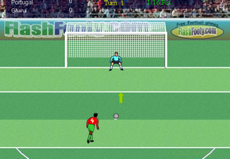
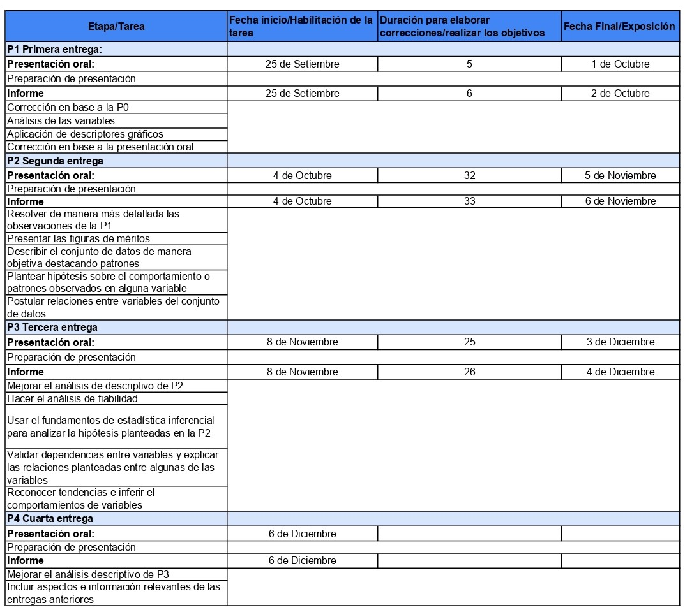
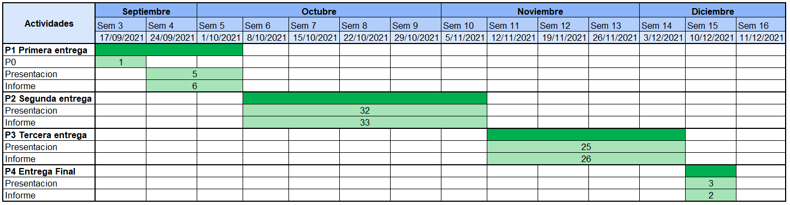

```{r message=FALSE, warning=FALSE, include=FALSE}
library(timevis)
library(readr)
library(dplyr)
library (knitr)
library(ggplot2)
library(corrplot)
library(RColorBrewer)
library(BSDA)
library(Rlab)
```

# Introducción


## Importancia y Justificación

El deporte rey, el fútbol, es caracterizado por el trabajo en equipo y la habilidad de los jugadores. Entre tantos momentos emocionantes, el que más destaca es uno que parece casi sacado de un casino o un juego de azar: los penales. En estos se enfrentan uno a uno los pateadores y guardametas más hábiles de su país. Sin embargo, incluso para ellos, los penales aún parecen ser cuestión de sentir el momento y adivinar. Sería sencillo continuar con este pensamiento y asumir la mística de los penales como una obra del azar; pero la estadística y la probabilidad pueden esclarecer esta situación para los involucrados.

```{r echo=FALSE,  fig.align='center', out.width='50%'}

```

# Objetivos 

## Objetivo Principal
 
1. Precisar mediante un análisis estadístico si existe o no matemáticamente uno o mas factores externos que influyan en tener mayor probabilidad de acertar un penal.

## Objetivos Específicos
1. Analizar rondas de penales de copas importantes y encontrar factores y/o situaciones favorables semejantes en cada una de ellas.
2. Evaluar las condiciones físicas tanto de arqueros y jugadores para evidenciar el rendimiento que estos o sus compañeros podrían llegar a tener en una futura ronda de penales.

# Factibilidad  
La siguiente tabla detalla las características y objetivos de cada entrega para cumplir con sus requerimientos. La fecha de lanzamiento de la tarea, el tiempo de trabajo para completar la tarea y la fecha de entrega de cada artículo se especifican en detalle.


```{r echo=FALSE,  fig.align='center', out.width='100%'}

```

Del mismo modo, también se dibuja un diagrama de Gantt para mostrar gráficamente las fechas de inicio y finalización de la cosecha anterior y la duración de la entrega. Mirando este gráfico, puede ver que la entrega comenzó un día después de la entrega del informe de entrega anterior y finalizó en la fecha de entrega correspondiente.


```{r echo=FALSE,  fig.align='center', out.width='100%'}

```

# Marco Teórico

El tiro de penal se creó en 1981 para evitar las situaciones en las que los jugadores impedían un gol más que probable de sus rivales y no recibir más sanción que una falta. Para definir un ganador cada equipo escoge a sus 5 mejores pateadores para un enfrentamiento individual con el guardameta contrario. 
Este enfrentamiento de los penaltis es acreditado al guardameta y empresario Willian McCrum en Irlanda del Norte. La Irish Football Association (asociación de Irlanda) presentó esta idea a la International Football Association Board que, tras mucho debate, fue aprobado el 2 de junio de 1981 con la finalidad de obtener un ganador tanto como un perdedor.

Por años, tanto espectadores como los propios futbolistas han puesto en duda si es que los penales se rigen por mera cuestión del destino o si existen algunos parámetros que se deben seguir. Es por ello que , hasta la fecha, existen muchos "estudios" que afirman múltiples factores que determinan el acierto o no de cada penal.


## Población Objetivo
Todos las tandas de penales pateados en las copas mundiales, Eurocopas y Copas América desde el 2014 al 2021


## Unidad muestral
Haremos un muestreo aleatorio simple del total de tanda de penales diputadas en cada copa dentro del rango de años seleccionados

# Variables y su definición


## Numéricas (10)
### Continuas (8)
**Pregunta** |**Variable** |**Restricciones**
:---|:---|:---
¿Cuál es el ángulo con el que patea el penal el jugador con respecto al ras de piso?|Angulo| Entre 0° a 90° (P2)
¿En qué punto horizontal respecto al palo izquierdo pasó la pelota?|Coordenada_X| Entre 0 a 7.32 m.(P2)
¿En qué punto vertical respecto al ras del piso pasó la pelota?|Coordenada_Y|Entre 0 a 2.44 m. (P2)
¿Cuál es la estatura del jugador?|Estatura_J|Entre 1.6 a 2.1 m.
¿Cuál es la estatura del arquero?|Estatura_A|Entre 1.6 a 2.1 m.
¿Cuál es el peso del arquero?|Peso_A|Entre 75 a 100 kg
¿Cuánto tiempo jugó el jugador antes de patear el penal?|Tiempo_J|Entre 0 a 135 min.(P2)
¿Cuánto tiempo se demoró el jugador en patear luego del pitido?|Tiempo_prev| Entre 0.5 a 15 seg.(P2)


* (P2) Consideramos que estas variables serán mejor planteadas en la segunda entrega.   


### Discretas (2)
**Pregunta** |**Variable** |**Restricciones**
:---|:---|:---
¿Cuál es la edad del jugador?|Edad_J|Entre 17 a 40 años
¿Cuál es la edad del arquero?|Edad_P|Entre 17 a 40 años

## Categóricas (15)  
### Ordinales (2)
**Pregunta** |**Variable** |**Restricciones**
:---|:---|:---
¿Cuál es el número de orden en el que le tocó patear el penal al jugador?|N_Lanzamiento|1 a 48
¿En qué año se jugo la copa?|año_c| años de la copa


### Nominales (13)
**Pregunta** |**Variable** |**Restricciones**
:---|:---|:---
¿Cuál es nombre del jugador?|Nombre_J|Nombre del Jugador
¿Cuál es apellido del jugador?|Apellido_J|Apellido del Jugador
¿Cuál es nombre del arquero?|Nombre_A|Nombre del Arquero
¿Cuál es apellido del arquero?|Apellido_A|Apellido del Arquero
¿Qué país están en ronda de penales?|Partido|El nombre de ambos paises que están en penales
¿Cuál equipo va a patear?|Equipo_P|País del Jugador/Arquero
¿Cuál equipo va a tapar?|Equipo_T|País del Jugador/Arquero
¿Cuál es la copa que se juega?|copa|Eurocopa, Copa América o Mundial
¿Con qué pierna tiró el penal el jugador?|Pierna|Izquierda o Derecha
¿El arquero provocó al jugador? |Provocacion|Sí o no (P2)
¿Cuál fue el resultado del penal?|Resultado_P| Gol, Tapado, Palo o Fuera
¿Hubo mayor proporción de hinchas del jugador en la grada posterior al arco?|hinchas_J|Sí o no (P2)
¿Cual es la posición del jugador que pateo el penal?| Posición | Delantero, Mediocampista o defensa

Nota: (P2) Consideramos que estas variables serán mejor planteadas en la segunda entrega.   

# Base de datos

Para leer un archivo de datos de extensión .csv
```{r}
DF_A <- read_csv("BasedeDatos_Arquero.csv")
DF_J <- read_csv("BasedeDatos_Jugador.csv")
```
```{r}
names(DF_A)
names(DF_J)
```

# Descriptores Numéricos

## Variables cuantitativas
Se presenta una tabla con todas las variables numéricas y sus respectivos resultados a diferentes medidas.

**Variable** | **Media** | **Moda** | **Mediana** | **IQR** | **Mínimo** | **Máximo **| **Rango** | **Coeficiente de Variación** | **Varianza** | **Desviación Estándar**
:---|:---|:---|:---|:---|:---|:---|:---|:---|:---|:---
Estatura_J|179.78|178|180|10|163|194|31|3.59|41.56|6.45
Tiempo_J|91.16|130|99|74|1|133|132|45.47|1718.5|41.45
Tiempo_Prev|4.38|4|4|2|2|12|10|39.33|2.97|1.72
Edad_J|27.87|27 29|28|5|20|39|19|12.84|12.8|3.58
Estatura_A|188.68|185|190|7|183|195|12|1.8|11.5|3.39
Peso_A|83.17|79|82|9|74|93|19|6.83|32.27|5.68
Edad_A|30.13|27|30|5|24|38|14|11.91|12.88|3.59
Coordenada_X|3.39|1.18|2.96|4.23|-1.23|7.74|8.97|68.68|5.43|2.33
Coordenada_Y|1.05|0.1|0.98|1.19|0.03|3.88|3.85|80.19|0.7|0.84


### Análisis de las variables

**Variable**| **Análisis**
:---|:---
Estatura_J| Se puede observar que los jugadores tienen un promedio de 179.78 mayor al de los hombres mundialmente (1.70 m). Esto se podría apoyar con el dato que la moda (el dato más repetido) es 178. Además, el jugador más bajo mide 1.63, que después podemos comprobar si podría ser un dato atípico.
Tiempo_J| Se puede observar que existe una gran diferencia entre el tiempo jugado mínimo, 1 minuto, al máximo, 133 minutos. Esto significa que hubo jugadores que entraron para directamente patear los penales. Esto podría ser una estrategia recurrente, pero tenemos que analizar si no se trata de un dato atípico. Esto último debido a que observamos a la media con valor 91.16 minutos y la mediana con 99 y a la moda con 130, todos mayores al tiempo reglamentario: 90 minutos.   
Tiempo_Prev| Se puede observar que el tiempo previo a la patada es casi parejo, ya que su IQR es uno mínimo y la desviación estandar igual. 
Edad_J| Se observa que se tiene 2 modas: 27 y 29. Además, siendo la mediana y moda casi iguales, 27.87 y 28 respectivamente, se puede deducir que los entrenadores tienden a eligir a jugadores jóvenes. Esto es entendible ya que se suele ser más ágil y resistente en ese periodo.
Estatura_A| Se puede observar que el promedio es mayor al de los jugadores. Esto también se entiende debido a que los arqueros deben llegar a abarcar más territorio al momento de cubrir su arco. También se puede observar que todos los equipos analizados tienen esta mentalidad, ya que el arquero más bajo mide 1.83 y la desviación no es muy alta.
Peso_A| Podemos observar que la media es de 83.17, que tiene relación con la estatura y forma física de cada jugador (al jugar una competencia de este calibre, todos deben tener un buen físico). Esto se evidencia con que el mínimo peso es 74, que sigue siendo considerable.
Edad_A| Se puede observar que este promedio supera al de jugador. Se puede entender porque el arquero no tiene tanto desgaste físico como un jugador. Además, la experiencia en esta área suele ser muy importante. De ahí que el mínimo no baje de 24 años. 
Coordenada_X| Se puede observar que, en promedio, se ha tirado más veces del centro al lado izquierdo que al derecho. Sin embargo, tendríamos que descartar a las medidas negativas o a las mayores a 7.32 metros (que no fueron gol) para afirmar que todos los goles fueron en esta área también. 
Coordenada_Y| Se puede observar que la mayoría de disparos fueron de la mitad del arco para abajo. Además, gracias a su baja desviación estándar y en comparación con la de la Coordenada X, se puede concluir que los disparos, en sentido vertical (Y), han sido más acertados que respecto a su sentido horizontal (X).  


### Descriptores gráficos


```{r}
boxplot(DF_J$Estatura_J, horizontal = F, col = "green", main = "Diagrama de Cajas: Estatura de Jugadores")# Diagrama vertical respecto a las Estaturas de los jugadores
```

***Comentario:*** Se puede observar que el rango intercuartil oscila entre 1.75 y 1.84 m y que su media aproximadamente está en un 1.80 m y no existen datos atípicos.

```{r}
hist(DF_J$Estatura_J, col = "lightgreen", main = "Frecuencia de Estatura de los Jugadores",xlab = "Estatura de los jugadores en cm")
```

***Comentario:*** Se puede apreciar que este gráfico de las estaturas es multimodal, siendo el rango entre 1.75 a 1.80 m el rango con mayor frecuencia.

```{r}
boxplot(DF_J$Edad_J, horizontal = F, col = "green", main = "Diagrama de Cajas: Edades de los Jugadores")
```

***Comentario:*** Se puede apreciar que este gráfico que existe un dato atípico, donde un jugador sobrepasa los 35 años. Además, vemos que existe mayor concentración entre el segundo y tercer cuartil que entre el primero y segundo.

```{r}
hist(DF_J$Edad_J, col = "chartreuse1", main = "Frecuencia de Edades de los Jugadores",xlab = "Edad de los jugadores")
```

***Comentario:*** Se puede apreciar que este gráfico de las edades es multimodal, siendo el rango entre 26 a 28 años el rango con mayor frecuencia.

```{r}
hist(DF_J$Edad_J,main="Histograma de Edades de los Jugadores", col="thistle3", xlab = "Edades", freq = FALSE)
curve(dnorm(x, mean(DF_J$Edad_J), sd = sd(DF_J$Edad_J)), 
      col = "slateblue4", 
      lwd= 2,
      las = 1, # Etiquetas alineadas horizontalmente
      ann = FALSE, # Sin títulos en los ejes
      xaxp = c(-15, 15, 5),  # Marcas del eje x
      ylim = c(0,0.00020), # Límites del eje
      yaxs = "i", add=TRUE) # Estilo del eje y, ajustado a los límites
```


```{r}
boxplot(DF_A$Estatura_A, horizontal = F, col = "yellow2", main = "Boxplot: Diagrama de Cajas de Estatura de Arqueros")
```

***Comentario:*** Podemos observar que desde el primer cuartil hasta el segundo cuartil (la mediana) existe una mayor dispersión de observaciones.

```{r}
hist(DF_A$Estatura_A, col = "lightyellow", main = "Frecuencia de Estatura de los Arqueros",xlab = "Estatura de Arqueros en cm")
```

***Comentario:*** Con este gráfico complementamos la idea presentada en el anterior diagrama de que existe una gran dispersión entre el primer cuartil y segundo cuartil. Además, existe una gran cantidad de arqueros que miden entre 1.84 y 1.85 metros.
```{r}
hist(DF_A$Edad_A, col = "khaki1", main = "Frecuencia de Edades de los Arqueros",xlab = "Edad de los arqueros")
```

***Comentario:*** Se puede apreciar un histograma multimodal en el cual la mayor concentración está entre 26 y 28 años.

```{r}
hist(DF_A$Edad_A,main="Histograma de Edades de los Arqueros", col="lightgreen", xlab = "Edad de los arqueros", freq = FALSE)
curve(dnorm(x, mean(DF_A$Edad_A), sd = sd(DF_A$Edad_A)),
      col = "slateblue4", 
      lwd= 2,
      las = 1, # Etiquetas alineadas horizontalmente
      ann = FALSE, # Sin títulos en los ejes
      xaxp = c(-15, 15, 5),  # Marcas del eje x
      ylim = c(0,0.00020), # Límites del eje
      yaxs = "i", add=TRUE) # Estilo del eje y, ajustado a los límites
```


```{r}
hist(DF_A$Peso_A, col = "yellow", main = "Frecuencia de Peso de los Arqueros",xlab = "Peso de los arqueros")
```

***Comentario:*** Al igual que el gráfico anterior, se evidencia un histograma unimodal en el cual la mayor concentración de peso se encuentra entre 78 a 80 kg.


```{r}
boxplot(DF_A$Estatura_A ~ DF_A$Peso_A, las = 3, cex.ais =0.6, col = "yellow3", main="Boxplot: Peso vs Estatura de Arqueros",xlab = "Peso de los arqueros", ylab = "Estatura de los Arqueros") # categorización de la variable Peso
```

***Comentario:*** Se puede observar que los arqueros que pesan 79 y 93 kg tienen una gran dispersión entre su primer y segundo cuartil. Además, entre su segundo y tercer cuartil no existe dispersión alguno, ya que es solo un valor. Por otro lado, las demás gráficas no muestran dispersión alguna, ya que su primer, segundo y tercer cuartil se encuentran en un único valor.


## Variables cualitativas
### Análisis de las variables cualitativas

| Variable Cualitativa |          Análisis          |
|:-------------------- |:-----------------------|
| N_Lanzamiento        |    Nos indica el orden del lanzamiento, esto nos permitirá hallar alguna relación entre los distintos momentos de las tandas de penales y el desarrollo del penal  |
| año_c                |  Nos indica el año en el que se jugo ese partido  |
| Nombre_J        | Nombre de quien ejecuto el penal |
| Apellido_J      | Apellido de quien ejecuta el penal  |
| Apellido_A      | Apellido del portero en el penal |
| Partido         | Nos indican a los países participantes de las tandas de penales, esta variable también nos indicaría a los países con mayor incidencia de gol |
| Equipo_P | Nos indica el país del portero |
| Equipo_J | Nos indica el país del ejecutor del penal |
| copa | Nos indica el campeonato al que pertenece dicho penalti, esta variable nos permite comparar la incidencia de gol entre los diferentes eventos deportivos del mundo |
| Pierna | Indica aquella pierna con la que pateo el jugador, también nos permitiría relacionar la incidencia de gol con la pierna de ejecución del penalti |
| Resultado_P | Nos indica si el penalti acabo en gol o no |


### Descriptores Gráficos

```{r}
#Pierna con la patea
mosaicplot(table(DF_J$Pierna,DF_J$Resultado_P),col = "lightblue", main="Mosaico:  Pierna vs Resultado")
```

***Comentario:*** Podemos concluir que la mayoría de los jugadores patea con la pierna derecha. Sin embargo, por mínima diferencia, la efectiva mayor radica en aquellos que patean con la izquierda.


```{r}
#Copas
mosaicplot(table(DF_A$Copa,DF_A$Resultado_P),col = "gold1", main="Mosaico: Copa vs Resultado")
```

***Comentario:*** El mayor porcentaje de tiros fuera del arco se encuentra en las Copas Américas. Además, los arqueros que más tapan se encuentran en los mundiales.

```{r}
mosaicplot(table(DF_A$Año_C, DF_A$Resultado_P), main="Mosaico: Resultado vs Año")
```

***Comentario:*** Se puede concluir que en el año 2015 hubo mayor incidencia en tiros fuera del arco. Esto se asocia con la gráfica anterior, ya que en este año solo se celebró la Copa América y, como habíamos visto, en esta copa se suele tener mayor incidencia de tiros fuera del arco.


# Patrones


```{r}
cor(DF_A$Estatura_A,DF_A$Peso_A, use="complete.obs")
round(cor(DF_A$Estatura_A,DF_A$Peso_A, use="complete.obs"), digits = 2)

```

```{r}
plot(DF_A$Peso_A,DF_A$Estatura_A, pch=20, col="green", main="Diagrama de Dispersión: Altura vs Peso de los Arqueros",xlab = "Peso de los Arqueros", ylab = "Estatura de los Arqueros")
abline(lm(DF_A$Estatura_A ~ DF_A$Peso_A),col="red")


```

***Comentario:*** La gráfica nos muestra una relación de linealidad leve, donde la esturara crece junto al peso del arquero. Esto se ve reflejado en su correlación de 0.64.Observamos una relación lineal débil, sin embargo, sigue existiendo una relación directamente proporcional.


```{r}
leyen=c("Verde=Gol", "Rojo = No gol")
hist(DF_J$Tiempo_Prev, col = ifelse(DF_J$Resultado_P == "Gol","green", "red"), main = "Histograma de tiempo previo e incidencia de Gol", nclass = 20,xlab = "Tiempo previo en s")

legend("topright", legend = paste(leyen), cex = 0.71)


```

***Comentario:*** De la gráfica se concluye que la mayoría de tiros fallidos se da en aquellos jugadores que parean entre los 2,25 y 4 segundos, sin embargo, los que se demoran más de 4 s acertaron más el penal


```{r}
leyen=c("Verde=Gol", "Naranja = No gol")
plot(main="Grafica de Dispersión: Tiempo Jugado vs Edad de los Jugadores",DF_J$Edad_J,DF_J$Tiempo_J, pch = 20, col = ifelse(DF_J$Resultado_P == "Gol","green", "lightsalmon3"),xlab = "Edad de Jugador",ylab =  "Tiempo jugado")
abline(v = 30, col = "red")
abline(v = 25, col = "red")
abline(v = 28, col = "blue")
abline(h = 120, col = "red")
abline(h = 10, col = "red")
legend("topright", legend = paste(leyen), cex = 0.71)
```

***Comentario*** Se puede concluir que los jugadores entre las edades de 25 y 30 años jugaron los 120 minutos del partido en mayor proporción a las demás edades. Entre ellos, los que tienen entre 25 y 28 años tuvieron mayor efectividad en sus tiros que el resto.


```{r}
leyen=c("Verde=Gol", "Naranja = No gol")
plot(DF_J$Coordenada_X, DF_J$Coordenada_Y, pch = 20, col = ifelse(DF_J$Resultado_P == "Gol","green", "lightsalmon3"), main = "Grafica de Dispersión de cordenadas e incidencia de Gol",xlab = "Coordenada X del arco", ylab = "Coordenada Y del arco")
abline(h=2.44, col = "red")
abline(v=7.32, col = "blue")
legend("topright", legend = paste(leyen), cex = 0.71)
abline(h=1.22, col ="grey")
abline(v=7.32/2, col ="grey")
abline(v=0, col ="blue")


```


```{r}
table(DF_A$Resultado_P)

```


***Comentario:*** Se puede concluir que la mayoría de penales lanzados fueron de la mitad del arco para abajo. Sin embargo, la mayor efectividad de aciertos se realiza en la mitad superior.

# Variables Aleatorias
**Variable**| **Justificación**
:---|:---
Resultado_P| Esta variable representa si fue gol o no el tiro de penal. Es una variable aleatoria discreta y puede ser descrita como por un modelo Bernoulli-p, siendo el éxito si el tiro fue gol. X ~ Ber(111/156). La utilizamos debido a que es indispensable saber si el tiro fue gol o no lo fue.
Resultado_P| Reutilizamos la variable como discreta como un modelo Binomial. La variable describe como éxito el gol al haber pateado 10 veces (utilizamos este número ya que es la media de tiros de todas las rondas). El modelo sería el siguiente: Bin(10,111/156). Esto nos ayudará a visualizar la probabilidad de que un numero n de penaltis hayan acertado, donde $1<= n <= 10$
Pierna | Esta variable es aleatoria discreta, ya que puede representarse como 0,1 con las piernas izquierda y derecha respectivamente. Además, se representaría como una Bernoulli-p, describiendo como el éxito si se pateó con la pierna derecha. El modelo sería el siguiente: X ~ Ber(119/156). Esto nos ayudará a saber cual pierna tiene mayor acertividad al patear un penal.
Resultado_Atajada | La variable es aleatoria discreta, ya que toma 156 valores. Su distribución sería geométrica, y describe la cantidad de intentos hasta que se obtiene el éxito (penal tapado), con un límite de 10 tiros. X ~ Geo(10, 29/156). Esto ayudaría en saber la probabilidad de que se haya tapado el primer penal en un rango de 1 a 10 penaltis ejecutados.
Resultado_Gol | La variable es aleatoria discreta, ya que toma 156 valores. Su distribución sería geométrica, y describe la cantidad de intentos hasta que un penal sea gol. X ~ Geo(10, 111/156). Esto ayudaría en saber la probabilidad de que se haya metido el primer penal en 10 tiros totales.
Posición | La variable es aleatoria discreta. Su distribución es geométrica, y describe el número de intentos hasta que un penal sea tirado por un delantero. X ~ Geo(10, 58/156). Esto nos ayudará a saber si se prefiere colocar a un delantero como el primer tirador de un penal, debido a que su rol principal es de marcar goles.


```{r}
set.seed(156)                                  # Set seed for reproducibility
N <- 156
y_rbern <- rbern(N, prob = 111/156)                  # Draw N random values
y_rbern  
hist(y_rbern,                                   # Plot of randomly drawn density
     breaks = 2
     ,main= "Análisis del modelo Bernoulli de la variable Resultado_P", xlab = "Probabilidad")

```
```{r}
table(DF_A$Resultado_P)
```

Comentario: Como podemos ver nuestra V.A.D de tipo Bernoulli-p coincide con el éxito de nuestro experimento "Gol", ya que nuestra variable muestra que "Gol" es la más numerosa de las cuatro variables. 


```{r}
plot(0:11,dbinom(0:11, size=10, prob=111/156),main= "Análisis del modelo Binomial de la variable Resultado_P",type = 'h', xlab = "Numero de Penales")

```

Comentario: El promedio de penales pateados de todas las rondas es 10.4, entonces hemos considerado simular las probabilidades de gol de todos los resultados posibles en una tanda promedio de penales. Podemos observar que son entre 6 y 7 penales los que tienen mayor probabilidad de ser anotados.


```{r}
set.seed(156)                                  # Set seed for reproducibility
N <- 156
y_rbern <- rbern(N, prob = 119/156)                  # Draw N random values
y_rbern     
hist(y_rbern,                                    # Plot of randomly drawn density
     breaks = 2,
     main = "Análisis del modelo Bernoulli de la variable Pierna",
     xlab = "Probabilidad",
     )


```

```{r}
table(DF_J$Pierna)
```

Comentario: Se evidencia que de todos los penales pateados en nuestro experimento, la mayoría patean con la derecha, esto se relaciona que en general hay más personas derechas que zurdas.


```{r}
plot(0:10,dgeom(0:10, prob=29/156),main= "Modelo geométrico de los penales tapados por primera vez",type = 'h',xlab = "Nro del penal", ylab = "Porcentaje")

```

Comentario: Como se puede observar en la gráfica, la tendencia de que cada tiro sea el primer penal tapado va decreciendo conforme avanza el número de penaltis. Sin embargo, dicha tendencia no sufre cambios abruptos respecto a sus anteriores.


```{r}
plot(0:10,dgeom(0:10, prob=111/156),main= "Modelo geométrico de los penales metidos por primera vez",type = 'h',xlab = "Nro del penal", ylab = "Porcentaje")

```

Comentario: Como se puede observar en la gráfica, la probabilidad de que el primer penal haya sido anotado es alta. Además, se observa una variación abrupta de este respecto al segundo penal (casi 0.5 menos). A partir de aquí, la probabilidad de éxito es muy pequeña conforme pasan los penales, pero la diferencia entre ellos es mínima.


```{r}
plot(0:10,dgeom(0:10,58/156),type = 'h',main = "Penales tirados por primera vez por un delantero",xlab = "Nro del penal", ylab = "Porcentaje")
```

Comentario: Como se puede observar en la gráfica, el primer penal no suele ser tirado en su mayoría por un delantero. Con esto podemos concluir que existen otros jugadores en otras posiciones que pueden ser más efectivos al tirar el primer penalti (sea por práctica o por experiencia).


# Intervalos de Confianza


Proponemos intervalos de confianza de nuestras variables para usar los que más nos convenga analizar en regresiones.

## Intervalos del tiempo previo para el Gol

```{r}
Gols <- DF_J %>% filter(Resultado_P == "Gol")
n <- ((qnorm(0.95)^2*(sd(Gols$Tiempo_Prev)^2))/(5^2))
ceiling(n)
```
Usamos un nivel de confianza del 95%, ya que la muestra mínima con dicho nivel es de 1
$$ n \geq 1$$


```{r,echo=FALSE}

Tmean=mean(Gols$Tiempo_Prev)
GTPsd=sd(Gols$Tiempo_Prev)
zsum.test(mean.x=Tmean,sigma.x=GTPsd, n.x=156, conf.level=0.95)

```

$$[4.184400  , 4.770555]$$

## Intervalos del tiempo de juego para el gol


```{r}
n <- ((qnorm(0.94)^2*(sd(Gols$Tiempo_J)^2))/(6^2))
ceiling(n)
```

```{r}
n <- ((qnorm(0.95)^2*(sd(Gols$Tiempo_J)^2))/(5^2))
ceiling(n)
```
Usamos un nivel de confianza del 94%, ya que la muestra mínima con dicho nivel es de 123; a diferencia de que, si usamos un nivel de 95%, esta saldría 198, que es mayor a la que nosotros usamos en el experimento.


$$ n \geq 123$$

```{r,echo=FALSE}
Gols <- DF_J %>% filter(Resultado_P == "Gol")
Tmean=mean(Gols$Tiempo_J)
GTsd=sd(Gols$Tiempo_J)
zsum.test(mean.x=Tmean,sigma.x=GTsd, n.x=156, conf.level=0.94)
```
$$[84.30234 , 97.17514]$$

## Intervalo de la coordenada horizontal para el gol

```{r}
n <- ((qnorm(0.95)^2*(sd(Gols$Coordenada_X)^2))/(5^2))
ceiling(n)
```
Usamos un nivel de confianza del 95%, ya que la muestra mínima con dicho nivel es de 1
$$ n \geq 1$$


```{r,echo=FALSE}
Gols <- DF_J %>% filter(Resultado_P == "Gol")

Tmean=mean(Gols$Coordenada_X)
AHsd=sd(Gols$Coordenada_X)
zsum.test(mean.x=Tmean,sigma.x=AHsd, n.x=156, conf.level=0.95)
```
$$[2.946934  , 3.653679]$$


## Intervalo de la estatura del jugador para el gol


```{r}
n <- ((qnorm(0.95)^2*(sd(Gols$Estatura_J)^2))/(5^2))
ceiling(n)
```
Usamos un nivel de confianza del 95%, ya que la muestra mínima con dicho nivel es de 1
$$ n \geq 5$$

```{r}
Gols <- DF_J %>% filter(Resultado_P == "Gol")


Tmean=mean(Gols$Estatura_J)
AHsd=sd(Gols$Estatura_J)
zsum.test(mean.x=Tmean,sigma.x=AHsd, n.x=156, conf.level=0.95)
```

$$[178.5851  , 180.6401]$$


# Pruebas de Hipótesis

Función para colorear el área rechazada:


```{r}
colorArea <- function(from, to, density, ..., col="red", dens=NULL){
y_seq <- seq(from, to, length.out=500)
d <- c(0, density(y_seq, ...), 0)
polygon(c(from, y_seq, to), d, col=col, density=dens)
}
```

## Hipótesis 1

La media de los minutos jugados por un jugador que marcó un penal es mayor o igual a 95.

$H_o : µ >= 95$

$H_1 : µ < 95$


Se eligió un nivel de confianza del 94% y una significancia del 6%.


$\tilde{x} \approx t(155)$
```{r}
tc <- qt(0.06, df = 155)
mu <- 94
n<- nrow(Gols)
s <- sd(Gols$Tiempo_J)
x <- mean(Gols$Tiempo_J)
T <- (x-mu)/(s/sqrt(n))
Xs <- seq(-4, 4, by = 0.1)
plot(Xs, dnorm(Xs), type = "l", col="green", xlab = "", ylab = "")
abline(v = tc, lty = 2, col = "red",lwd =2)
abline(h = 0, lty = 2, col = "gray")
abline(v = T,lty = 1 , col = "blue")
colorArea(from=tc, to=-4, dnorm)

```

 Comentario: Podemos observar que el estadístico de prueba se encuentra por encima del punto t crítico (zona de no-rechazo). Por lo tanto, la hipótesis nula no se rechaza.

## Hipótesis 2

El tiempo previo a patear un penal de jugadores que metieron gol es de, máximo, 5 segundos.

$H_o : µ <= 5$

$H_1 : µ  >5$

Se eligió un nivel de confianza del 95% y una significancia del 5%.


$\tilde{x} \approx t(155)$

```{r}
pc <- qt(0.05, df =155, lower.tail = F)
mu <- 5
n<- nrow(Gols)
s <- sd(Gols$Tiempo_Prev)
x <- mean(Gols$Tiempo_Prev)
T <- (x-mu)/(s/sqrt(n))
Xs <- seq(-4, 4, by = 0.1)
plot(Xs, dnorm(Xs), type = "l", col="green", xlab = "", ylab = "")
abline(v = pc, lty = 2, col = "red",lwd =2)
abline(h = 0, lty = 2, col = "gray")
abline(v = T,lty = 1 , col = "blue")
colorArea(from=pc, to=4, dnorm)
```


 Comentario: Se puede observar que el estadístico de prueba se encuentra en la zona de no-rechazo. Por lo tanto, la hipótesis nula no se rechaza.


## Hipotesis 3

Los jugadores que han metido gol miden más de 1.79.

$H_o : µ >= 1.79$

$H_1 : µ<1.79$


Se eligió un nivel de confianza del 95% y una significancia del 5%.


$\tilde{x} \approx t(155)$

```{r}
tc <- qt(0.05,df = 155)
mu <- 179
n<- nrow(Gols)
s <- sd(Gols$Estatura_J)
x <- mean(Gols$Estatura_J)
T <- (x-mu)/(s/sqrt(n))
Xs <- seq(-4, 4, by = 0.1)
plot(Xs, dnorm(Xs), type = "l", col="green", xlab = "", ylab = "")
abline(v = tc, lty = 2, col = "red",lwd =2)
abline(h = 0, lty = 2, col = "gray")
abline(v = T,lty = 1 , col = "blue")
colorArea(from=-4, to=tc, dnorm)
```

 Comentario: Se puede observar que el estadístico de prueba se encuentra en la zona de no-rechazo. Por lo tanto, la hipótesis nula no se rechaza.


## Hipotesis 4

Los jugadores que han metido gol han pateado en una coordenada X mayor o igual a 4.


$H_o : µ >= 4$

$H_1 : µ<4$


Se eligió un nivel de confianza del 95% y una significancia del 5%.


$\tilde{x} \approx t(155)$

```{r}
tc <- qt(0.05,df = 155)
mu <- 4
n<- nrow(Gols)
s <- sd(Gols$Coordenada_X)
x <- mean(Gols$Coordenada_X)
T <- (x-mu)/(s/sqrt(n))
Xs <- seq(-4, 4, by = 0.1)
plot(Xs, dnorm(Xs), type = "l", col="green", xlab = "", ylab = "")
abline(v = tc, lty = 2, col = "red",lwd =2)
abline(h = 0, lty = 2, col = "gray")
abline(v = T,lty = 1 , col = "blue")
colorArea(from=-4, to=tc, dnorm)
```

Comentario: Podemos observar que el estadístico de prueba se encuentra en el área rechazable. Por lo tanto, la hipótesis nula es rechazada.


# Regresión


## Primer Modelo
```{r}
modelo1 <- lm(Gols$Tiempo_J~Gols$Edad_J)
plot(Gols$Edad_J, Gols$Tiempo_J, xlab = "Edad",ylab = "Tiempo jugado",main = "Edad vs Tiempo jugado")

abline(modelo1,col= "blue")
```

Comentario:

En esta gráfica se expresa la variable independiente edad junto a su ordenada, tiempo de juego. Esta segunda variable es la que trataremos de predecir con esta regresión lineal. 


```{r}
plot(modelo1)
```


```{r}
summary(modelo1)
```


Observación al modelo:

En  este primer  modelo  planteamos  la relación  entre la variable independiente  edad junto a su  
ordenada,  tiempo  de  juego.  Para  poder  predecir  cuánto  tiempo  estará  un jugador  en la 
cancha basándonos en su edad.

Antes   de  saltar  a  las  conclusiones  es  vital  realizar  un  análisis  de  residuos,  para  
ello usaremos las gráficas de diagnóstico.

En  la  primera  gráfica  esperamos  observar  la  homocedasticidad de  los  datos.  Que  podria 
simplificarse  en  qué  tan  grande  es  el  error  de los datos.  Se esperaría  que esta gráfica 
se vea como una especie  de nube con una gran densidad alrededor del valor constante cero y que 
mientras  más se aleje del mismo menos densa sea la nube. En este caso vemos cierta tendencia   
hacia   el   cero.   Los   resultados   de   esta   primera   gráfica   no   son   realmente 
prometedores.

Para  la  segunda  gráfica  esperamos  comprobar  la  distribución  de  residuos  normal.  Esta 
deberia  verse  como  una serie de puntos  sobre la línea punteada.  Es evidente  que en este 
primer  modelo  no  ocurre  esto,  por  lo  que  sabemos  que  la  distribución  de  residuos  no  
es normal.

La   tercera    gráfica    nos   muestra   la   raíz   cuadrada   del   valor   absoluto   del   
residuo estandarizado,  se  espera  que  esta  se  centre  cerca  de  la  recta  constante  uno.  
Hasta  el momento  esta es la gráfica diagnóstica  más prometedora. Es importante mencionar que los 
valores atípicos se vuelven a evidenciar en esta gráfica.

La última  gráfica  pretende  mostrarnos  el apalancamiento. Lo que buscamos aquí es que no haya 
datos con un residuo grande junto a una palanca grande. No es ninguna sorpresa para este  punto  
que  existan  datos  que  encajen  en  esta  descripción.  Los  datos  más  Ilamativos son: 90, 99 
y 69.

Una vez realizado  el análisis de residuos podemos pasar al resumen de la regresión. Yendo de  
arriba  hacia  abajo  el primer  problema  que encontramos  en esta regresión  se encuentra en  los 
 residuos.  Aquí  la  media  deberia  ser  cercana  a  cero  pero  en  su  Iugar  tenemos  un
11.13  a su vez los módulos  de min y max deberian  ser similares  al igual que los del primer 
cuartil y el tercero.

Ahora  nos  centraremos  en  el  modelo  de  regresión  identificado  (Y  =  63.3708  +  0.9799  X) 
para  ver  si  es  de  utilidad  para  nosotros  veremos  las  pruebas  de  hipótesis.  Tanto  para 
 el intercepto  como  para  la  pendiente  trataremos  de  rechazar  la  hipótesis  de  que  el  
valor es cero.  En  el  caso  del  intercepto  trabajando  con  una  significancia  mayor  al  4%  
podemos rechazar  la  hipótesis  mientras  que  para  la  pendiente  no  podemos  rechazarla.  
Hecho esto podemos  observar  los  coeficientes  de  determinación  los  que  nos  muestran  en  
grado  de variación  de Y que logramos  explicar  con el modelo y la variación de X. En nuestro 
caso es muy  pequeño  por  lo  que  el  modelo  sólo  explica  menos  del  1%  de  la  variación  
de  Y.  Por último  para  ver  la  utilidad  de  toda  la  regresión  observamos  el  p-value y nos 
encontramos con  que  necesitaríamos trabajar  con  una  significancia  de  casi  el 36% para que 
el modelo sea útil. Como este no es nuestro  caso solo podemos  concluir  que este modelo no explica nada.


## Segundo Modelo

```{r}
modelo2 <- lm(Gols$Tiempo_Prev~Gols$Edad_J)
plot(Gols$Edad_J, Gols$Tiempo_Prev, xlab = "Edad",ylab = "Tiempo previo",main = "Edad vs Tiempo previo a patear el penal")

abline(modelo2,col= "blue")
```

Comentario: En esta segunda gráfica se pueden apreciar la variables independiente "Edad" junto a la dependiente "Tiempo previo". 


```{r}
plot(modelo2)
```


```{r}
summary(modelo2)
```


Observación al modelo:
En este segundo  modelo  planteamos  la relación entre la variable  independiente  edad junto a su 
ordenada,  tiempo previo a patear un penal, con la esperanza de predecir el tiempo que le tomará a 
un jugador prepararse para la ejecución de un penal según su edad.

Antes   de  saltar  a  las  conclusiones  es  vital  realizar  un  análisis  de  residuos,  para  
ello usaremos las gráficas de diagnóstico.

En la gráfica de la homocedasticidad podemos  observar  una nube de datos que de alguna forma  
tienden  al cero como  se esperaría  de esta gráfica. El problema  que  que la línea roja no está 
realmente sobre la recta constante en cero.

Para  la gráfica  de Distribución  de residuos es evidente que no siguen un modelo normal, se 
empiezan a observar cientos datos atípicos.

En la gráfica de la raíz cuadrada del valor absoluto del residuo estandarizado  no se ve nada de lo 
esperado.  En Iugar de que la línea roja sea una recta sobre la recta horizontal en 1 se encuentra 
por debajo del mismo.

En la gráfica de apalancamiento no vemos demasiados datos atípicos salvo del 58  o el 76.

Ahora  pasamos  al  resumen  de  regresión,  dentro  del  acápite de los residuos  encontramos que  
la  media  se  aproxima  a  cero  sin  embargo  no  hay  simetría  evidente  en  los  valores 
absolutos de los cuartiles.

En el acápite del modelo  propuesto (Y=5.39347 -0.03280 X)  nos disponemos  a analizar las pruebas  
de hipótesis.  Encontramos  que en el caso de la intersección se rechaza de manera holgada  la 
hipótesis que sostiene que el coeficiente es cero por lo que el valor propuesto  se puede utilizar 
con la significancia  que  venimos usando. En la otra cara de la moneda, no se pudo rechazar  la 
hipótesis de que la pendiente sea igual a cero sugiriendo que el valor de la pendiente  no  es  
realmente  fidedigno.  Pasamos  a revisar los coeficientes  de determinación los  que  nos  dicen  
qué  grado  de  variación  de  Y  podemos    explicar  con  el  modelo  y  la variación  de X. En 
este caso solo podemos  explicar el 0.4% del modelo con esta regresión. Esto  sumado  a  que  no  
pudimos  rechazar  la  prueba  de  hipótesis  “p-value”  nos  termina dictando que esta regresión 
no es útil.


## Tercer Modelo
```{r}
GOlsA <- DF_A %>% filter(Resultado_P == "Gol") # Estatura del arquero a quien le han metido gol
```


```{r}
modelo3 <- lm(Gols$Coordenada_Y~GOlsA$Estatura_A)
plot(GOlsA$Estatura_A,Gols$Coordenada_Y, xlab = "Estatura del Arquero",ylab = "Coordenada Y",main = "Estatura del arquero vs Coordenada Y de la pelota")

abline(modelo3,col= "blue")
```

Comentario: Se observa en la gráfica la variable independiente "Estatura del Arquero" junto a la dependiente "Coordenada Y".


```{r}
plot(modelo3)
```


```{r}
summary(modelo3)
```


Observación al modelo: 

En  este  tercer  modelo  planteamos  la  relación  entre  la  variable  independiente  estatura  
del arquero  junto a la ordenada,  altura  del disparo.  Para  poder predecir  la altura de un 
disparo en relación a la altura del portero.

Ahora realizaremos  el análisis  de las gráficas diagnóstico. En cuanto a la homocedasticidad 
podemos  observar  una  nube  de  datos  que  de  alguna  forma  tienden  al  cero  como  se 
esperaría  de  esta  gráfica.  Además  la línea roja se encuentra  en la mayor parte del tiempo 
sobre la recta horizontal del cero, esta es una gráfica prometedora.

Para  la  gráfica  de  Distribución  de  residuos  por  momentos  parece  comportarse  como  una 
variable aleatoria normal pero no es el escenario ideal.

En la gráfica de la raíz cuadrada  del valor absoluto  del residuo  estandarizado  vemos como la  
línea  roja  no  sigue  a  la  recta  horizontal  en  uno,  La  recta si bien nace del uno continúa 
bajando  y  no  sube  en  ningún  momento.  A  su  vez  los  datos  no  son  tan  densos  como  se 
esperaría.

En la gráfica de apalancamiento no vemos demasiados  datos atípicos salvo tres. Par suerte nuestra, 
ninguno de los datos atípicos  es tiene  residuo grandes junto a una palanca grande solo una de las 
dos cualidades.

Con  respecto  al  resumen  de  regresión  empezaremos  el  análisis  por  el  acápite  de  los 
residuos.  Encontramos  que la media se aproxima  bastante  a cero, sin embargo  la simetría no es 
tan evidente como se esperaría en los valores absolutos de los cuartiles.

En el acápite del modelo  propuesto  (Y=4.18704 - 0.01708 X)  nos disponemos  a analizar las 
pruebas   de  hipótesis.   Encontramos   que  en  el  caso  de  la  intersección  necesitaríamos 
trabajar  con una significancia  de casi el 26% para rechazar  la hipótesis,  algo similar ocurre 
con   la   pendiente   pues   para   rechazar   la   hipótesis   tendríamos   que   trabajar   con  
una significancia  de poco  más del 38% lo que no es para nada alentador. Pasamos a revisar los 
coeficientes  de  determinación  los  que  nos  dicen  qué  grado  de  variación  de  Y  podemos 
explicar  con el modelo  y la variación  de X. En este caso solo podemos explicar el 0.7% del 
modelo  con esta regresión. Lo que nos deja con un claro mensaje: una variable no depende realmente 
 de  la  otra.  Esto  sumado  a  que  no  pudimos  rechazar  la  prueba  de  hipótesis “p-value" 
nos termina dictando que esta regresión no es útil.


## Cuarto Modelo
```{r}
modelo4 <- lm(Gols$Coordenada_Y~ Gols$`Angulo V`)
plot(modelo4)

```

```{r}
summary(modelo4)
```

Observación al modelo: 

En  este  tercer  modelo  planteamos  la  relación  entre  la  variable  independiente Coodernada Y del disparo  junto a la ordenada, ángulo V  del disparo. Ya que, matemáticamente, la orientación de de la pelota dependerá del ángulo en el que patees.

Ahora realizaremos  el análisis  de las gráficas diagnóstico. En cuanto a la homocedasticidad 
podemos  observar  una  nube  de  datos  que  de  alguna  forma  tienden  al  cero  como  se 
esperaría  de  esta  gráfica.  Además  la línea roja se encuentra  en la mayor parte del tiempo 
sobre la recta horizontal del cero, esta es una gráfica prometedora.

Para  la  gráfica  de  Distribución  de  residuos  para antes de la mitad parece comportarse satisfactoriamente.
Sin embargo, después los puntos se pierden por debajo de la línea.

En la gráfica de la raíz cuadrada  del valor absoluto  del residuo  estandarizado  vemos como la  
línea  roja, comforme avanza la ordenada, va aproximándose a 1.

En la gráfica de apalancamiento observamos 3 valores atípicos, de los cuales 56 es el más distante y, por ende, con mayor tendencia de cambiar la recta.

Con  respecto  al  resumen  de  regresión  empezaremos  el  análisis  por  el  acápite  de  los 
residuos.  Encontramos  que la media se aproxima  bastante  a cero por el lado negativo (ya que exiten jugadores que patearon afuera del área del arco), sin embargo  la simetría no es 
tan evidente como se esperaría en los valores absolutos de los cuartiles.

En el acápite del modelo  propuesto  (Y=0.0027862 - 0.1967400 X)  nos disponemos  a analizar las 
pruebas   de  hipótesis.   Encontramos   que  en  el  caso  de  la  intersección  necesitaríamos 
trabajar  con una significancia  de casi el 26% para rechazar  la hipótesis. Sin embargo, para la pendiente observamos que su p valor es menor que el $$\alpha$$ propuesto. 
Por último, observamos que el p-valor del modelo en sí también es menor que la significancia ($$\alpha$$).
Con esto, podemos concluir que el valor del intercepto, al ser mayor a la significancia, no asegura una buena recta en la regresión. Sin embargo, la pendiente sí lo hace. Además, se explica el 99% del modelo. Por lo que el modelo presentado sí es significativo.


# Tendencias y Predicciones

## Primer modelo

Podemos concluir que no es relevante para el entrenador la edad del jugador a la hora de decidir los minutos que jugará en el campo. Esto abre la opción a que el rendimiento físico de estos jugadores no está ligado a su edad en este tipo de competiciones.


## Segundo modelo

Podemos desmentir que, a la hora de patear un penal, los jugadores jóvenes tienden a apresurarse a tirarlo. 


## Tercer modelo

Existe una creencia de que a los arqueros altos se les debe patear abajo. Con este modelo, lejos de comprobar si esto es verdadero o falso, hemos notado que, los jugadores en este tipo de competiciones, no le dan una real importancia.

## Cuarto modelo

Como se menciona en el enunciado, la altura de la pelota siempre estará relacionada con la coordenada vertical con la que se pateó el penal. El modelo planteado afirma esta sentencia satisfactoriamente.

# Variables Dependientes

Presentamos las variables dependientes analizadas en la parte de regresión.

En las siguientes gráficas observaremos en la esquina inferior izquierda la correlación de las variables, y en la esquina superior derecha, la regresión ya mostrada en su apartado.

```{r echo=FALSE}

reg <- function(x, y, ...) {
  points(x,y, ...)
  abline(lm(y~x), lwd=2) 
  }
panel.cor <- function(x, y, digits = 2, prefix = "", cex.cor, ...){
  usr <- par("usr"); on.exit(par(usr))
  par(usr = c(0, 1, 0, 1))
  r <- abs(cor(x, y))
  txt <- format(c(r, 0.123456789), digits = digits)[1]
  txt <- paste0(prefix, txt)
  text(0.5, 0.5, txt, cex = 1.1, font = 4)
}
```


```{r}
pairs(~DF_J$Tiempo_J + DF_J$Edad_J, col=2, labels=c("Edad del jugador", "Tiempo jugado"), main="Dependencia de variables", lower.panel = panel.cor, upper.panel = reg)
```


```{r}
pairs(~DF_J$Tiempo_Prev + DF_J$Edad_J, col=2, labels=c("Edad del jugador", "Tiempo previo"), main="Dependencia de variables", lower.panel = panel.cor, upper.panel = reg)
```


```{r}
pairs(~ Gols$Coordenada_Y +GOlsA$Estatura_A,col=2,labels=c("Estatura del arquero", "Coordenada Y"),main="Dependencia de variables",lower.panel = panel.cor, upper.panel = reg )
```

```{r}
pairs(~ Gols$Coordenada_Y +Gols$`Angulo V`,col=2,labels=c("Angulo V", "Coordenada Y"),main="Dependencia de variables",lower.panel = panel.cor, upper.panel = reg )
```

```{r}
pairs(~ Gols$Coordenada_Y +GOlsA$Estatura_A,col=2,labels=c("Estatura del arquero", "Coordenada Y"),main="Dependencia de variables",lower.panel = panel.cor, upper.panel = reg )
```

A continuación, planteamos las ecuaciones lineales con respecto a los datos obtenidos y que se relacionan con la gráfica de correlación de las variables. Recodemos que se señaló su significancia en la parte de regresión.

```{r}
f1<-lm( Gols$Tiempo_Prev ~ Gols$Edad_J )
f1
f2<-lm(Gols$Tiempo_J ~ Gols$Edad_J)
f2
f3<-lm(Gols$Coordenada_Y~ Gols$`Angulo V`)
f3
```


Función Edad y el tiempo de juego del partido:  

$g(x)=27.04x+0.009$         $\\\\ ;\ x\in [20;40]$  

Función Edad y el tiempo previo antes de patear el penal:  

$f(x)= 28.27x-0.093$         $\\\\ ;\ x\in [20;40]$


Función la estatura del arquero con respecto a la coordenada Y de tiro:  

$h(x)=4.18704x-0.01708$         $\\\\ ;\ x\in [183;195]$

Función la Coordenada Y de disparo con respecto al ángulo de tiro:  

$h(x)=0.0027862x  -0.1967400$         $\\\\ ;\ x\in [-0.030512, 0.177214]$

# Conclusiones

Si bien en las gráficas obtuvimos patrones y se pudo observar estadísticas de nuestra muestra, salvo el cuarto modelo, cuyo origen viene netamente de la matemática, no se pudo obtener 
un modelo de regresión lineal en el cual se evidencie una tendencia de alguna de las variables en relación a otra.

Esta ausencia de relación lineal se debe a que el penal es un evento en el que hay muchos factores que son partícipes en el resultado del mismo. Es por esto que un modelo tan simple como el lineal, en el que solo se involucran dos variables, no puede pretender predecir la naturaleza del evento.

Pese a esta realidad, obtuvimos ciertos datos relevantes a mencionar:

Los jugadores tienden a patear más para el lado izquierdo del arco. (Hipótesis 4)

Los delanteros no tienen el mayor porcentaje de tiro en el primer penal. (Variable Aleatoria)

La estatura del arquero no sesga el tiro de un jugador ni hacia arriba ni abajo. (Regresión)


# Bibliografía
**Tema** |**Link**
:---|:---
Base de datos de jugadores| [Perfiles de jugadores profesionales](https://www.transfermarkt.es/)  
Base de datos del partido|[Resultados de los partidos en los Mundiales](https://www.losmundialesdefutbol.com/)
Marco Teórico|[García Martí, C. (2016). "El paso de la defensa individual a la defensa de zona". Universidad Politécnica de Madrid. ](https://oa.upm.es/44626/1/CARLOS_GARCIA_MARTI.pdf)
Goles de La Copa América 2019 | [Diario El Comercio (2019). "Copa América 2019: todos los goles anotados en el torneo al detalle, según Mister Chip"](https://elcomercio.pe/deporte-total/copa-america-2019-goles-anotados-torneo-detalle-mister-chip-noticia-nndc-653535-noticia/)


