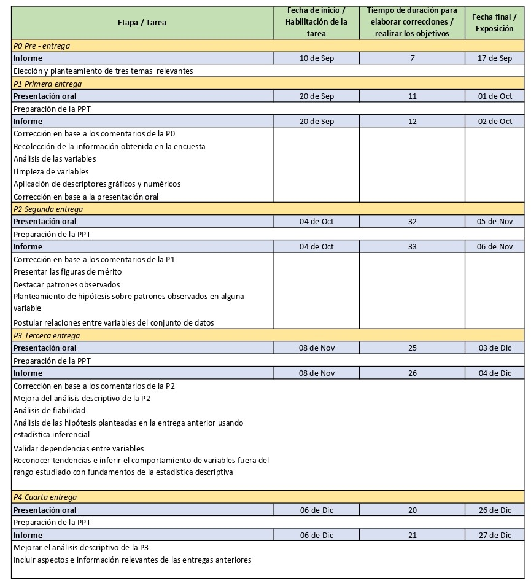
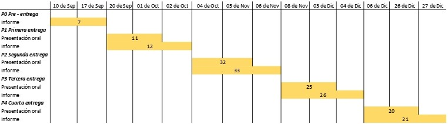

**Para correr este HTML**

¡ADVERTENCIA!

Es necesario instalar los paquetes "ggplot2", "gcookbook", "car", "carData" Y "prettyR"

## **Análisis estadístico del acceso a una educación virtual de calidad aplicado al uso de técnicas didácticas en las universidades de Lima Metropolitana - Perú**


**Objetivo de estudio:** 

El presente trabajo de investigación tiene como objetivo general realizar el análisis del nivel de eficacia de los métodos y técnicas didácticas implementadas en la enseñanza de las universidades en Lima Metropolitana - Perú.

**Importancia:** 

El tema propuesto es de gran relevancia para los estudiantes y docentes puesto que, debido a la pandemia, los métodos y técnicas de enseñanza han tenido que adaptarse a la virtualidad.  De esta manera, al ser una situación extraordinaria existen métodos y técnicas que no son del todo efectivos, por lo que es necesario cuantificar la calidad de estos. Esta información es indispensable para la mejora académica puesto que las universidades pueden recibir este análisis y ver que ocurre a lo largo de la pandemia y que actividades o acciones frente a la misma tuvieron un impacto positivo y cuales tuvieron un impacto negativo en los estudiantes y su aprendizaje.

**Población objetivo:** 

Nuestro estudio tiene como público objetivo a profesores y estudiantes universitarios de Lima, debido a que es muy importante conocer cómo se está llevando la preparación de los estudiantes de pregrado en la virtualidad. En este caso, al analizar Lima Metropolitana podremos obtener datos de diferentes métodos de enseñanza de universidades públicas y privadas.

**Resultados esperados:**

Se espera determinar el nivel de la Educación que tienen los estudiantes universitarios en Lima desde que empezó la virtualidad, y dentro del proceso, identificar los factores determinantes y hallar los puntos más débiles.

**Proveniencia y disponibilidad de datos:**

Según lo expuesto, la forma en cómo se obtendrán los datos será por medio de encuestas online. De esta manera, al poder acceder a esta información se determina la disponibilidad de los datos estadísticos para este análisis. Además, es muy posible llegar a grandes cantidades de información mediante encuestas de donde, luego, podremos sacar analizar los datos obtenidos del forms y obtener conclusiones. 
Tal como se menciona en el plan de trabajo, se recolectó la información estudiantes en la ciudad de Lima por medio de encuestas virtuales. Asimismo, se utilizó un Spreadsheets para almacenar los datos obtenidos de las encuestas y estos fueron ordenados con su respectivo Variable. Para poder extraerlos, se creará un data frame del archivo con el encoding colocado en UTF-8.

**Factibilidad:** 

En este estudio, la factibilidad abarca todos los datos e información necesaria para el análisis. Por el momento, se plantea realizar encuestas a los estudiantes y docentes en las universidades del espacio geográfico mencionado. Por consiguiente, se determina que este tema de estudio es viable.

**Plan de trabajo:**

A continuación se muestra una tabla que detalla las características y objetivos de cada entrega. Se detalla la fecha de publicación de la tarea, el tiempo hábil para completarla, y la fecha de entrega de cada una.

<center>


</center>
Asimismo, se elaboró un diagrama de Gantt, donde se muestra de manera gráfica las fechas y días de inicio y fin donde se realizará correcciones o diferentes actividades para lograr los objetivos de la entrega correspondiente del proyecto. 

<center>


</center>

## Primera parte

#### **1. Planteamiento de variables**

En este contexto, las variables son las siguientes:

**1.1. Variables cualitativas**

*Ordinal*	

- Progreso_académico 
- Dinamismo_clases

*Nominal*

- Sexo_estudiante
- Universidad
- Herramientas_docentes
- Receso_concentracion
- Universidad_enseñanza
- Cursos_competencias_digitales
- Tecnicas_optimas_docentes
- Herramientas_Didacticas_Mallas
- Mejor_tecnica_didactica

**1.2. Variables cuantitativas**

*Discreta*

- Receso
- Edad_estudiante
- Receso_ideal
- Tiempo_enseñanza
- Cantidad_cursos_didacticos
- Horas_curso_docentes
- Horas_competencias_digitales 
- Dispositivos_tecnologicos
- Cantidad_tecnicas
- Cantidad_ herramientas

*Continua*

- Promedio_academico

#### **2. Tabla de variables**

**2.1. Universitario**

|Pregunta| Variable| Tipo de variable | Restricciones |
|:------------------|:-------:|:-------:|-----:|
|¿Cuál es tu sexo? | Sexo_estudiante| Categórica nominal | Masculino - Femenino |
|Aproximadamente, ¿cuánto es tu promedio académico actualmente? | Promedio_academico| Numérica continua | 0 - 20 |
|¿Cuál es tu edad? | Edad_estudiante| Numérica discreta | 0 - 100 |
|¿Cómo calificarías tu progreso académico durante la virtualidad? | Progreso_académico| Categórica ordinal | 1 - 5 |
|¿Qué tan dinámicas crees que son tus clases virtuales? | Dinamismo_clases| Categórica ordinal | 1 - 5 |
|¿En qué universidad estudias? | Universidad | Categórica nominal  | Universidades de Lima Metropolitana |
|¿Cuánto tiempo de receso te brinda el docente en una clase? (considerando 2 horas por clase) | Receso| Numérica discreta | 0 - 60 min|
|¿Cuánto tiempo de receso consideras que se debería dar en cada clase? (considerando 2 horas por clase) | Receso_ideal| Numérica discreta | 0 - 60 min |
|¿Consideras que el tiempo que te dan de receso influye en tu concentración? | Receso_concentracion| Categórica nominal | Sí - No |
|¿Cuántos dispositivos tecnológicos usas?| Dispositivos_tecnologicos| Cuantitativa discreta | 1,2,3,4,...10 |
¿Cuál de estas técnicas didácticas que utilizan tus docentes complementan mejor tu aprendizaje?| Tecnicas_entendibles| Categórica nominal | Kahoots, Quizzes, Casos Grupales, Talleres, Páginas web didácticas, Discusiones en grupo, Casos Individuales, Exposición |
|¿Cuál de las herramientas de comunicación que usan tus docentes consideras que es la mejor? | Herramientas_docentes| Categórica nominal | Correo electrónico, Canvas foro, Telegram, Whatsapp, Videoconferencias, Teams, Llamadas telefónicas, Discord |
|¿Cuántas herramientas de comunicación usan tus docentes para tu aprendizaje? | Cantidad_herramientas| Cuantitativa discreta | 0,1,2,3,4,5,6,7,8,9,10 |
|¿Cuántas técnicas didácticas usan tus docentes para complementar mejor tu aprendizaje? | Cantidad_tecnicas| Cuantitativa discreta | 0,1,2,3,4,5,6,7,8,9,10 |

**2.2. Docente**

|Pregunta| Variable| Tipo de variable | Restricciones |
|:------------------|:-------:|:-------:|-----:|
|¿En qué universidad enseñas? | Universidad_enseñanza| Categórica nominal | UP, UL, UPC, UTEC, UPCH, UTP, UNI, UNMSM, PUCP, USIL |
|¿Cuánto tiempo tienes enseñando a nivel universitario? | Tiempo_enseñanza| Numérica discreta | 0 - 19 años |
|¿Cuántos cursos llevaste relacionado con técnicas didácticas de aprendizaje? | Cantidad_cursos_didacticos| Numérica discreta |0 - 100 |
|¿Cuántas horas académicas llevaste o estás llevando en cursos relacionados a los métodos o técnicas didácticas de aprendizaje ? | Horas_curso_docente| Numérica discreta | 0 - 2000 horas |
|¿Cuál de las técnicas didácticas que empleas en clase consideras que refuerza mejor la enseñanza del estudiante universitario? | Tecnicas_optimas_docentes| Categórica nominal | Kahoots, Quizzes, Casos Grupales, Talleres, Páginas web didácticas, Discusiones en grupo, Casos Individuales, Exposición |
|¿Consideras que las mallas curriculares de los cursos fomentan el uso de herramientas didácticas? | Herramientas_Didacticas_Mallas| Categórica nominal | Sí - No |
|¿Has llevado algún curso de competencias digitales? | Cursos_competencias_digitales| Categórica nominal | Sí - No |
|¿Cuántas horas llevaste en este tipo de cursos de competencias digitales? | Horas_competencias_digitales| Numérica discreta | 0 - 2000 horas |

#### **3. Descripción de la base de datos**

#### Conexión con el archivo de datos
Se utilizó Excel para almacenar los datos obtenidos de las encuestas. Para leer un archivo de datos de extensión .csv, se creará un DataFrame "DFE" 

```{r}
library(readr)
DFE <- read_csv("Educacion_virtual.csv")
```
Los datos fueron guardados en un **DataFrame** llamado DFE

A continuación, se muestra las variables del DataFrame DFE:
```{r}
names(DFE)
```
Procedemos a cambiar el nombre de las variables para acceder a los datos de una manera más práctica:
```{r}
library(dplyr)
DFE %>% rename(Sexo_estudiante = `¿Cuál es tu sexo?`, Promedio_academico = `Aproximadamente, ¿Cuánto es tu promedio académico actualmente?.`, Edad_estudiante = `¿Cuál es tu edad?`, Progreso_academico = `¿Cómo calificarías a tu progreso académico durante la virtualidad?`, Dinamismo_clases = `¿Qué tan dinámicas crees que son tus clases virtuales?`, Universidad = `¿En qué universidad estudias?`, Receso = `¿Cuánto tiempo de receso te brinda el docente en una clase? (considerando 2 horas por clase)`,  Receso_ideal = `¿Cuánto tiempo de receso consideras que se debería dar en cada clase? (considerando 2 horas por clase)`, Receso_concentracion = `¿Consideras que el tiempo que te dan de receso influye positivamente en tu concentración?`, Dispositivos_tecnologicos = `¿Cuántos dispositivos tecnológicos usas?`, Tiempo_enseñanza = `¿Cuánto tiempo tienes enseñando a nivel universitario?`, Cantidad_cursos_didacticos = `¿Cuántos cursos llevaste relacionado con técnicas didácticas de aprendizaje?`, Universidad_enseñanza = `¿En qué universidad enseñas?`, Herramientas_docentes = `¿Cuál de las herramientas de comunicación que usan tus docentes consideras que es la mejor?`, Horas_competencias_digitales = `¿Cuántas horas llevaste en este tipo de cursos de competencias digitales?  ( "0" si en la respuesta anterior marcaste No)`, Herramientas_didacticas_malla= `¿Consideras que las mallas curriculares de los cursos fomentan el uso de herramientas didácticas?`, Horas_curso_docente = `¿Cuántas horas académicas en total llevaste o estás llevando en cursos relacionados a técnicas didácticas de aprendizaje ?`, Tecnicas_optimas_docentes = `¿Cuál de las técnicas didácticas que empleas en clase consideras que refuerza mejor la enseñanza del estudiante universitario?`, Cursos_competencias_digitales = `¿Has llevado algún curso de competencias digitales?`, Cantidad_herramientas= `¿Cuántas herramientas de comunicación usan tus docentes para tu aprendizaje?` , Cantidad_tecnicas= `¿Cuántas técnicas didácticas usan tus docentes para complementar mejor tu aprendizaje?`, Mejor_tecnica_didactica= `¿Cuál de estas técnicas didácticas que utilizan tus docentes complementan mejor tu aprendizaje?` ) -> DFV
```

De esta manera, las variables serían:
```{r}
names(DFV)
```

Para que R nos de un resumen estadístico de las variables del DataFrame usamos la función **summary**. Nos muestra para cada variable el valor mínimo, el primer y tercer cuartil, la mediana, la media y el máximo valor.
```{r}
summary(DFV)
```
Tabla de frecuencia de datos faltantes (NA's) y datos no faltantes.
```{r}
table(is.na(DFV))
```
Hay 2291 datos no faltantes y 1366 datos faltantes. 

#### **4. Limpieza de datos**
#### Procedemos con la limpieza de datos de nuestra base de datos

4.1. Realizamos una limpieza a la variable "Universidad":
```{r}
table(DFV$Universidad)
```
```{r}
DFV$Universidad[DFV$Universidad == "otros"] <- "Otros"
DFV$Universidad[DFV$Universidad == "Universidad de Lima"] <- "UL"
DFV$Universidad[DFV$Universidad == "Universidad del Pacífico"] <- "UP"
DFV$Universidad[DFV$Universidad == "Universidad Peruana Cayetano Heredia"] <- "UPCH"
```
Verificamos que se haya realizado la modificación:
```{r}
table(DFV$Universidad)
```
Efectivamente, se realizó correctamente la modificación.

4.2. Cambiamos el nombre de las herramientas de comunicación
```{r}
DFV$Herramientas_docentes[DFV$Herramientas_docentes == "Correo electrónico"] <- "Correo"
DFV$Herramientas_docentes[DFV$Herramientas_docentes == "Llamadas telefónicas"] <- "Call"
DFV$Herramientas_docentes[DFV$Herramientas_docentes == "Teams"] <- "Teams"
DFV$Herramientas_docentes[DFV$Herramientas_docentes == "Telegram"] <- "Teleg"
DFV$Herramientas_docentes[DFV$Herramientas_docentes == "Canvas foro"] <- "Canvas"
DFV$Herramientas_docentes[DFV$Herramientas_docentes == "Discord"] <- "Discord"
DFV$Herramientas_docentes[DFV$Herramientas_docentes == "Videoconferencias"] <- "Video"
DFV$Herramientas_docentes[DFV$Herramientas_docentes == "Whatsapp"] <- "Wsp"
```

```{r}
table(DFV$Herramientas_docentes)
```

4.3. Cambiamos el nombre de las técnicas didácticas
```{r}
DFV$Mejor_tecnica_didactica[DFV$Mejor_tecnica_didactica == "Casos Grupales"] <- "Casos"
DFV$Mejor_tecnica_didactica[DFV$Mejor_tecnica_didactica == "Casos Individuales"] <- "Individual"
DFV$Mejor_tecnica_didactica[DFV$Mejor_tecnica_didactica == "Discusiones en grupo"] <- "Grupo"
DFV$Mejor_tecnica_didactica[DFV$Mejor_tecnica_didactica == "Exposición"] <- "Exposición"
DFV$Mejor_tecnica_didactica[DFV$Mejor_tecnica_didactica == "Kahoots"] <- "Kahoots"
DFV$Mejor_tecnica_didactica[DFV$Mejor_tecnica_didactica == "Páginas web didácticas"] <- "Web"
```

```{r}
table(DFV$Mejor_tecnica_didactica)
```
4.4. Cambiamos la variable Universidad_enseñanza

```{r}
DFV$Universidad_enseñanza[DFV$Universidad_enseñanza == "Universidad de Lima"] <- "UL"
DFV$Universidad_enseñanza[DFV$Universidad_enseñanza == "Universidad del Pacífico"] <- "UP"
```

```{r}
table(DFV$Universidad_enseñanza)
```

#### **5. Desarrollo de preguntas**

**Dato:** Para los intervalos de confianza hallados en solo las variables de interés, hemos utilizado un *nivel de confianza del 95%* y un *nivel de significancia del 5%*.

**5.1. Sexo_estudiante y Sexo_docente**

```{r}
mosaicplot(table(DFV$Sexo_estudiante, DFV$Soy), main="Sexo de estudiante y docente", col=c("#99cc99","#9999cc"))
```

**5.1. Análisis del gráfico:**

En el mosaico "Sexo de estudiante y docente". De los universitarios (incluye hombres y mujeres), se puede apreciar que existe mas observaciones masculinas que femeninas. Lo mismo sucede con los docentes (incluye hombres y mujeres), la proporción de hombres es un poco mayor que la de mujeres. Diciendo así que tenemos una muestra concentrada en el sexo masculino.

**_Bloque para Universitarios_**

**5.2. ¿En qué universidad estudias?**

*5.2.1. Descriptor numérico:*

```{r}
library(prettyR)
Mode(DFV$Universidad)  ## utilizamos la función "Mode" del paquete "prettyR", para calcular la moda de la variable (unimodal)
```
*5.2.2. Descriptor gráfico:*

```{r}
barplot(table(DFV$Universidad), main="Estudiantes universitarios", horiz=FALSE, col="orange", xlab= "Universidad", ylab= "Universitario", cex.axis=0.9, cex.names=0.9)
```

*5.2.3. Análisis de la gráfica:*

El total de estudiantes universitarios encuestados es de **140**. A partir de la gráfica "Estudiantes universitarios" se puede observar que la universidad con mayor cantidad de encuestados es **UTEC**  y la universidad con menor cantidad de encuestados fue la UNI con un 1%. Esto nos quieres decir, que la muestra analizada se concentra en los estudiantes de la universidad **UTEC** con una mayor frecuencia de observaciones.

*5.2.4. Intervalo de confianza:*

```{r, echo=FALSE}
v <- c(unique(na.omit(DFV$Universidad)))
for (i in v) {
  cat("Universidad: ",i,"\n")
  tbl <- DFV[DFV$Universidad == i,]
  n <- length(DFV$Universidad)
  x <- length(tbl$Universidad)
  IC <-prop.test(x,n,conf.level = 0.95)
  tb <-cbind(c("lim_inf","lim_sup"),c(round(IC$conf.int[1],2),round(IC$conf.int[2],2)))
  print(tb)
}
```

*5.2.5. Análisis del intervalo de confianza:*

Se puede afirmar con un 95% de confianza que la media de la participación de los estudiantes encuestados, respecto a su centro de estudio. La participación de estudiantes de UTEC se encuentra entre los valores 0.59 y 0.74 con un margen de error de 0.15. En cambio la participación de estudiantes de UTP se encuentra entre los valores 0.12 y 0.24 con un margen de error de 0.12. Seguido de ello la participación de estudiantes de la UPCH se encuentra entre los valores 0.09 y 0.2 con un margen de error de 0.11.Por ello a partir de los resultados dados en los intervalos de confianza se determina que la variable otras universidades presenta un mayor margen de error en cuanto al análisis de este indicador. Seguido de ello, encontramos a la UNI con un 0.19 margen de error y a la UTEC con un 0.15 en margen de error.


**5.3. ¿Cuál es el promedio de las notas de los estudiantes?**

*5.3.1. Descriptor numérico:*

```{r}
round(mean(DFV$Promedio_academico, na.rm = T), digits=2) # Promedio
```
```{r}
library(prettyR)
Mode(DFV$Promedio_academico)    ## utilizamos la función "Mode" del paquete "prettyR", para calcular la moda de la variable (unimodal)
```
```{r}
median(DFV$Promedio_academico, na.rm = T)  # Mediana
```
```{r}
round(var(DFV$Promedio_academico, na.rm=T), digits = 2) # Varianza
```
```{r}
round(sd(DFV$Promedio_academico, na.rm=T), 2) # Desviación estándar
```
```{r}
round(sd(DFV$Promedio_academico, na.rm=T), 2) -> d1
round(mean(DFV$Promedio_academico, na.rm=T), 2) -> p1 
round(d1/p1, 2)  # Coeficiente de variación
```

*5.3.2. Descriptor gráfico:*

```{r}
hist(DFV$Promedio_academico, main="Promedio académico de universitarios", col="gold", border="black", xlab="Promedio Académico",ylab="Densidad", prob=T)
abline(v=mean(DFV$Promedio_academico, na.rm=T),col="red",lwd=2)
abline(v=median(DFV$Promedio_academico, na.rm=T),col="blue",lwd=2)
legend(x = "topright", legend = c("Media","Mediana"), lty= c(1,1), col=c(2,"blue"), lwd=2) # topright es la ubicación de la leyenda
```

*5.3.3. Análisis de la gráfica:*

El histograma “Promedio académico de universitarios presenta una distribución no simétrica hacia la izquierda, siendo la media ligeramente menor que la mediana con valores 14, 32 y 15 respectivamente. Asi como también que la moda y la mediana tiene el mismo valor en el estudio de esta variable.
 
```{r}
boxplot(DFV$Promedio_academico, main="Promedio de notas", ylab="Promedio académico", col="green")
```

*5.3.4. Análisis de la gráfica:*

En el diagrama de cajas “ Promedio de notas “ se denota la existencia de 2 valores atípicos a simple vista, pero para este estudio estadístico descriptivo se está considerando la presencia de dichos valores, siendo así, el 9, el valor promedio mínimo y el 19 el valor promedio máximo.Posteriormente se observa que la mediana y el tercer cuartil se encuentran en la misma ubicación. Respectivamente, nos indica que la mitad de las observaciones tienen un promedio que está por encima de 15 pero no más que 19 y que la otra mitad está por debajo del mismo sin sobrepasar el valor mínimo que es 9.Del mismo modo, nos señala que el 25% de universitarios encuestados tienen un promedio académico menor o igual a 13 y el 75% de universitarios es mayor a 13. 
Por otro lado, el promedio académico tiene una desviación estándar de **1.85**, cuyo valor hace referencia que tanto están dispersos los datos con respecto a la mediana. Todo esto nos indica que la mayor cantidad de estudiantes universitarios tienen notas satisfactorias.

*5.3.5. Intervalo de confianza:*

```{r, echo=FALSE}
IC <- t.test(DFV$Promedio_academico, conf.level = 0.95)
tb <-cbind(c("lim_inf","lim_sup"),c(round(IC$conf.int[1],2),round(IC$conf.int[2],2)))
tb
```

*5.3.6. Análisis del intervalo de confianza:*

En cuanto el promedio académico, tenemos que sus intervalos de confianza para la media cuyos extremos, inferior y superior, son 14.01 y 14.63 con un nivel de confianza del 95% y un nivel significativo del 5%. El margen de error es de 0.62, lo cual se obtuvo restando los limites obtenidos. Finalmente calculamos los valores críticos tomando la mitad del nivel de significativo y el grado de libertad como parámetros.


**5.4. ¿Qué tan dinámicas crees que son tus clases?**

*5.4.1. Descriptor numérico:*

```{r}
library(prettyR)
Mode(DFV$Dinamismo_clases)    ## utilizamos la función "Mode" del paquete "prettyR", para calcular la moda de la variable (unimodal)
```
*5.4.2. Descriptor gráfico:*

```{r}
barplot(table(DFV$Dinamismo_clases), main= "Dinamismo de las clases", col=c(5), xlab="Escala de puntuación", ylab="Cantidad")
abline(v=mean(DFV$Dinamismo_clases, na.rm=T),col="red",lwd=2)
abline(v=median(DFV$Dinamismo_clases, na.rm=T),col="blue",lwd=2)
abline(v=Mode(DFV$Dinamismo_clases, na.rm=T),col="black",lwd=2)
legend(x = "topright", legend = c("Media","Mediana", "Moda"), lty= c(1,1,1), col=c(2,"blue", "black"), lwd=2) # topright es la ubicación de la leyenda

```

*5.4.3. Análisis de la gráfica:*

Podemos observar que no existe mucha dispersión en los datos. Puesto que, tanto la moda, la media y la mediana tienen aproximadamente el mismo valor. Siendo "3" el valor con mayor frecuencia que alude al dinamismo de las clases de los estudiantes universitarios encuestados


```{r}
boxplot(DFV$Dinamismo_clases, main= "Dinamismo", col="pink", ylab="Escala de puntuación")
```

*5.4.4. Análisis de la gráfica:*

De igual manera, en el diagrama de cajas un 50% de las observaciones en la muestra estadística es mayor o igual a 3. Del mismo modo, se puede observar que como la mediana esta cerca del centro de la caja, la distribución es mas o menos simétrica, dando así intervalos de igual tamaño para contener los dos cuartos centrales de los datos. 
A su vez el 50% de los datos se encuentra entre **2** y **4**, lo cual nos permite consolidar nuestra afirmación acerca de que para la mayoría de los estudiantes encuestados de las distintas universidades de Lima Metropolitana - Perú consideran que las clases brindadas por los docentes no son tan dinámicas, trayendo consigo la poca concentración y ausencia de entusiasmo durante las clases brindadas. 

*5.4.5. Intervalo de confianza:*
```{r, echo=FALSE}
IC <- t.test(DFV$Dinamismo_clases, conf.level = 0.95)
tb <-cbind(c("lim_inf","lim_sup"),c(round(IC$conf.int[1],2),round(IC$conf.int[2],2)))
tb
```

*5.4.6. Análisis del intervalo de confianza:*

Se puede afirmar con un 95% de confianza que la media de los estudiantes encuestados, respecto al dinamismo de sus clases, se encuentra entre los valores 2.89 y 3.02, en una escala del 1 al 5.Acompañado de un margen de error de 0.3.


**5.5. ¿Cuál de las herramientas de comunicación que usan tus docentes consideras que es la mejor?**

*5.5.1. Descriptor numérico*

```{r}
library(prettyR)
Mode(DFV$Herramientas_docentes)    ## utilizamos la función "Mode" del paquete "prettyR", para calcular la moda de la variable (unimodal)
```
```{r}
table(DFV$Herramientas_docentes)
```

*5.5.2. Descriptor gráfico*
```{r}
barplot(table(DFV$Herramientas_docentes), main="Herramientas de comunicación", horiz=FALSE, col="lightblue", xlab= "Herramientas", ylab= "Docentes", las=1)
```

*5.5.3. Análisis de la gráfica:*

En el gráfico de barras, se puede observar que la herramienta de comunicación con una mayor frecuencia de 33 observaciones es el correo electrónico. No obstante, consideran a las llamadas telefónicas como la herramienta menos factible para comunicarse con sus docentes dado que tiene solo una valoración. Estas cifras nos señalan que las herramientas de gestión más usadas para la mejora del aprendizaje así como también el papel significativo que tienen en los estudiantes, ya que, facilitan el intercambio de información, colaboración y comunicación entre los estudiantes y docentes, más aún en una época donde las clases se están llevando en virtualidad para lo cuál es de suma importancia el buen uso de las herramientas de comunicación.


**5.6. ¿Cuáles de estas técnicas didácticas que utilizan tus docentes complementan mejor tu aprendizaje?**

*5.6.1. Descriptor numérico*

```{r}
library(prettyR)
Mode(DFV$Mejor_tecnica_didactica)  ## utilizamos la función "Mode" del paquete "prettyR", para calcular la moda de la variable (unimodal)
```
```{r}
table(DFV$Mejor_tecnica_didactica)
```


*5.6.2. Descriptor gráfico*
```{r}
barplot(table(DFV$Mejor_tecnica_didactica), col=c(3), main="Técnicas de aprendizaje", xlab="Técnicas", ylab="Cantidad", cex.axis = 0.9, cex.names = 0.9)
```

*5.6.3. Análisis de la gráfica:*

Evaluando el gráfico de barras "Técnicas de aprendizaje" se puede afirmar que tanto los **casos grupales**, **las discusiones en grupo**, **Kahoots** y **Quizzes** con **37**, **21**, **20** y **18** observaciones respectivamente se consolidan como las mejores técnicas empleadas por los docentes para facilitar el procesamiento profundo de las lecciones académicas. Por el contrario, la técnica de aprendizaje que alude a una valoración mínima de 7 son los **talleres**. Este resultado es muy importante para nuestro análisis, pues, nos permite conocer la interacción didáctica que utiliza el docente de forma intencional como instrumento para lograr que sus estudiantes reciban una enseñanza de calidad donde el aprendizaje sea significativo en este nuevo entorno digital. 

**5.7. ¿Consideras que el tiempo que te dan de receso influye positivamente en tu concentración?**

*5.7.1. Descriptor numérico*
```{r}
Mode(DFV$Receso_concentracion)
```

*5.7.2. Descriptor gráfico*

```{r}
table(DFV$Receso_concentracion)
```

```{r}
barplot(table(DFV$Receso_concentracion), main="Opinión de la influencia del receso en la concentración", horiz=TRUE, col="orange", xlab="Universitario", ylab="Criterio")
```

*5.7.3. Análisis de la gráfica:*

Observando la gráfica, podemos decir que la mayoría de estudiantes universitarios con una cantidad de 100 observaciones opinan que el tiempo de receso dado por sus docentes en una clase de 2 horas repercute en el nivel de concentración que se tenga durante la clase en línea. el mismo modo, cabe resaltar que una minoría de 40 estudiantes consideran que el tiempo no influye directamente en la concentración que se ha de tener durante las clases. Estas cifras nos permite a nosotros tener un estudio completo donde se relaciona el tiempo de receso con la concentración aludiendo al procesamiento de la información brindada en la clase.


*A continuación, se mostrará los resultados acerca de los tiempos de receso para los estudiantes universitarios:*

**5.8. ¿Cuánto tiempo de receso te brinda el docente en una clase? (considerando 2 horas por clase)** 

*5.8.1. Descriptor numérico*
```{r}
round(mean(DFV$Receso, na.rm=T), digits = 2)  # Promedio
```
```{r}
Mode(DFV$Receso)
```
```{r}
median(DFV$Receso, na.rm = T)  # Mediana
```

```{r}
round(var(DFV$Receso, na.rm=T), digits = 2) # Varianza
```

```{r}
round(sd(DFV$Receso, na.rm=T), 2) # Desviación estándar
```

```{r}
round(sd(DFV$Receso, na.rm=T), 2) -> d1
round(mean(DFV$Receso, na.rm=T), 2) -> p1 
round(d1/p1, 2)  # Coeficiente de variación
```


*5.8.2. Descriptor gráfico*
```{r}
hist(DFV$Receso, main= "Receso", xlab="Tiempo de receso (min)", ylab="Frecuencia", col=c(2))
abline(v=mean(DFV$Receso, na.rm=T),col="red",lwd=2)
abline(v=Mode(DFV$Receso, na.rm=T),col="9",lwd=2)
abline(v=median(DFV$Receso, na.rm=T),col="blue",lwd=2)
legend(x = "topright", legend = c("Media","Moda", "Mediana"), lty= c(1,1,1), col=c(2,9,"blue"), lwd=2) # topright es la ubicación de la leyenda
```

*5.8.3. Análisis de la gráfica*

Analizando el gráfico de histograma “Receso”, se observa que tanto la mediana y la moda tienen el mismo valor de 10. Por consiguiente, todo esto nos indica que la mayoría de los estudiantes universitarios tienen 10 minutos de receso en una clase de 2 horas. El resultado mostrado nos brinda información relevante para compararlo con la gráfica siguiente Tiempo de receso ideal.

*5.8.4. Intervalo de confianza*

```{r, echo=FALSE}
IC <- t.test(DFV$Receso, conf.level = 0.95)
tb <-cbind(c("lim_inf","lim_sup"),c(round(IC$conf.int[1],2),round(IC$conf.int[2],2)))
tb
```

*5.8.5. Análisis del intervalo de confianza*

En cuanto al receso, tenemos que sus intervalos de confianza para la media cuyos extremos, inferior y superior, son 8.89 y 10.18 con un nivel de confianza del 95% y un nivel significativo del 5%. El margen de error es de 1.28 , lo cual se obtuvo restando los limites obtenidos. Finalmente calculamos los valores críticos tomando la mitad del nivel significativo y el grado de libertad como parámetros.

**5.9. ¿Cuánto tiempo de receso consideras que se debería dar en cada clase? (considerando 2 horas por clase)**

*5.9.1. Descriptor numérico*
La mediana de la variable "Receso_ideal:
```{r}
round(median(DFV$Receso_ideal, na.rm = T), 2)
```
La varianza de la variable "Receso_ideal" es:
```{r}
round(var(DFV$Receso_ideal, na.rm = TRUE), digits = 2)
```
La desviación estándar de la variable "Receso_ideal" es:
```{r}
round(sd(DFV$Receso_ideal, na.rm = TRUE), digits = 2)
```
```{r}
round(sd(DFV$Receso_ideal, na.rm=T), 2) -> d1
round(mean(DFV$Receso_ideal, na.rm=T), 2) -> p1 
round(d1/p1, 2)  # Coeficiente de variación
```

*5.9.2. Descriptor gráfico*

```{r}
table(DFV$Receso_ideal)
```


```{r}
hist(DFV$Receso_ideal, main="Tiempo de receso ideal", col="green", xlab="Receso Ideal (min)", ylab="Frecuencia")
abline(v=mean(DFV$Receso_ideal, na.rm=T),col="red",lwd=2)
abline(v=median(DFV$Receso_ideal, na.rm=T),col="blue",lwd=2)
legend(x = "topright", legend = c("Media", "Mediana"), lty= c(1,1,1), col=c(2,"blue"), lwd=2) # topright es la ubicación de la leyenda
```

*5.9.3. Análisis de la gráfica:*

Según el histograma "Tiempo de receso ideal" que es de tipo bimodal se indica que para la mayoría de estudiantes universitarios el tiempo de receso ideal varía de 9 a 10 minutos y de 14 a 15 minutos.

```{r}
boxplot(DFV$Receso_ideal, main="Receso ideal", col="blue", ylab= "Tiempo (min)")
```

*5.9.4. Análisis de la gráfica:*

Analizando el diagrama de cajas "Receso ideal" se observa que el rango intercuartil (IQR) expresa que el tiempo de receso ideal para los estudiantes se encuentra entre 10 a 15 minutos, del mismo modo, la mitad de las observaciones señalan que el tiempo de receso ideal es menor o igual a 15 y la mitad restante considera que es mayor a 15 minutos. A partir de estas afirmaciones podemos decir que el tiempo ideal de receso que se les debería de dar a los estudiantes en una clase de 2 horas es de 15 minutos, ya que, es el valor que consolida la medida de tendencia central.La importancia de estos resultados radica en la influencia que tiene este tiempo brindado en la enseñanza de excelencia académica,puesto que, según estudios de salud y bienestar es recomendable que para un mejor aprendizaje y rendimiento académico se cuente con descansos de 15 minutos suficiente para que los estudiantes universitarios puedan descomprimirse mentalmente y tener una adecuada concentración durante sus clases virtuales.

*Fuente: https://thegeniusofplay.org/espanol/consejos/articulos/10-razones-por-las-que-los-chicos-deber%C3%ADan-tener-recreo-todos-los-d%C3%ADas.aspx#.YVkafZrMLIU*

*5.9.5. Intervalo de confianza*

```{r, echo=FALSE}
IC <- t.test(DFV$Receso_ideal, conf.level = 0.95)
tb <-cbind(c("lim_inf","lim_sup"),c(round(IC$conf.int[1],2),round(IC$conf.int[2],2)))
tb
```

*5.9.6. Análisis del intervalo de confianza*

En cuanto al receso ideal, tenemos que sus intervalos de confianza para la media cuyos extremos, inferior y superior,son 12.82 y 14.19 con un nivel de confianza del 95% y un nivel significativo del 5%. El margen de error es de 1.37, lo cual se obtuvo restando los limites obtenidos. Finalmente calculamos los valores críticos tomando la mitad del nivel significativo y el grado de libertad como parámetros.

**5.10. ¿Cuántos dispositivos tecnológicos usas?**

*5.10.1. Descriptor numérico*
La moda de la variable Dispositivos_tecnologicos es: 
```{r}
library(prettyR)
Mode(DFV$Dispositivos_tecnologicos)
```
La varianza de la variable Dispositivos_tecnologicos es: 
```{r}
round(var(DFV$Dispositivos_tecnologicos, na.rm = TRUE), digits = 2)
```
La desviación estándar de la variable Dispositivos_tecnologicos es: 
```{r}
round(sd(DFV$Dispositivos_tecnologicos, na.rm = TRUE), digits = 2)
```
Coeficiente de variación
```{r}
round(sd(DFV$Dispositivos_tecnologicos, na.rm=T), 2) -> d1
round(mean(DFV$Dispositivos_tecnologicos, na.rm=T), 2) -> p1 
round(d1/p1, 2)  # Coeficiente de variación
```

*5.10.2. Descriptor gráfico*
```{r}
hist(DFV$Dispositivos_tecnologicos, breaks= 10, col=c(6), main="Dispositivos tecnológicos", xlab="Dispositivos tecnológicos", ylab="Universitario")
```

*5.10.3. Análisis de la gráfica*

Examinando el gráfico de barras “Dispositivos tecnológicos” el cuál es de tipo unimodal donde la mayor frecuencia de las observaciones se encuentra en 2, indicándonos que la mayoría de estudiantes de nuestra muestra estadística cuenta con 2 dispositivos tecnológicos para el desarrollo de sus clases en línea. No obstante, un grupo reducido de estudiantes posee 5 dispositivos tecnológicos. Los resultados obtenidos son sustanciales porque nos permitirá evaluar la posibilidad de relación entre cantidad de dispositivos con promedio académico.

*5.10.4. Intervalo de confianza*

```{r, echo=FALSE}
IC <- t.test(DFV$Dispositivos_tecnologicos, conf.level = 0.95)
tb <-cbind(c("lim_inf","lim_sup"),c(round(IC$conf.int[1],2),round(IC$conf.int[2],2)))
tb
```

*5.10.5. Análisis del intervalo de confianza*

Analizando la variable Dispositivos_tecnologicos, en cuanto a la cantidad de dispositivos tecnológicos, tenemos que sus intervalos de confianza para la media cuyos extremos, inferior y superior,son 2.05 y 2.32 con un nivel de confianza del 95% y un nivel significativo del 5%. El margen de error es de 0.26, lo cual se obtuvo restando los limites obtenidos. Finalmente calculamos los valores críticos tomando la mitad del nivel significativo y el grado de libertad como parámetros.


**_Bloque de docentes_**

**5.11. ¿En qué universidad enseñas?**


*5.11.1. Descriptor gráfico*

```{r}
barplot(table(DFV$Universidad_enseñanza), ylab= "Docentes", xlab="Universidad", main="Docentes universitarios", cex.axis=0.9, cex.names=0.9)
```

*5.11.2. Análisis del gráfico:*

El total de docentes encuestados ha incrementado en esta segunda entrega a un total de **19** . Además, como se puede observar en la gráfica "Docentes universitarios", la universidad con mayor cantidad de encuestados es **UTEC** y las universidades con menor cantidad de encuestados son la **PUCP**, **UNI**, **UNMSM**, **UPCH** y la **USIL**.

```{r}
sum(table(DFV$Universidad_enseñanza))
```
**5.12. ¿Cuántos cursos llevaste relacionado con técnicas didácticas de aprendizaje?**

```{r}
sum(table(DFV$Cantidad_cursos_didacticos))
```
*5.12.1. Descriptor numérico:*
La desviación estándar de la variable "Horas_curso_docente" es:
```{r}
round(sd(DFV$Cantidad_cursos_didacticos, na.rm=T), 2)
```
El promedio de la variable "Cantidad_cursos_didacticos" es:
```{r}
round(mean(DFV$Cantidad_cursos_didacticos, na.rm=T), 2)
```
La moda de la variable "Cantidad_cursos_didacticos" es:
```{r}
library(prettyR)
round(mean(DFV$Cantidad_cursos_didacticos, na.rm=T), 2)
```
La mediana de la variable "Cantidad_cursos_didacticos"es:

```{r}
library(prettyR)
round(median(DFV$Cantidad_cursos_didacticos, na.rm=T), 2)
```
Coeficiente de variación de la variable "Cantidad_cursos_didacticos":
```{r}
round(sd(DFV$Cantidad_cursos_didacticos, na.rm=T), 2) -> d1
round(mean(DFV$Cantidad_cursos_didacticos, na.rm=T), 2) -> p1 
round(d1/p1, 2)  # Coeficiente de variación
```

*5.12.2. Descriptor gráfico:*

```{r}
barplot(table(DFV$Cantidad_cursos_didacticos), main="Cursos didácticos", xlab="Cantidad de cursos", ylab="Docentes", col=c(7))
```

*5.12.3. Análisis:*

El gráfico de "Cursos didácticos" es trimodal, caracterizado por la presencia de tres modas que indican que la mayoría de docentes universitarios ha llevado entre 4, 6 y 7 cursos didácticos. La significación de estos resultados consisten en la relación que guarda a que los docentes hallan llevado cursos didácticos y el uso de las herramientas digitales usadas como ayuda para mejorar el procesamiento de la enseñanza dada en el entorno virtual dónde es fundamental que el docente dominen las TICs, ya que, esto les permitirá facilitarle a los estudiantes el acceso a la información y a su vez garantizar el aprendizaje didáctico. 

**5.13. ¿Cuántas horas académicas en total llevaste o estás llevando en cursos relacionados a técnicas didácticas de aprendizaje?**

*5.13.1. Descriptor numérico:*
La desviación estándar de la variable "Horas_curso_docente" es:
```{r}
round(sd(DFV$Horas_curso_docente, na.rm=T), 2)
```
El promedio de la variable "Horas_curso_docente" es:
```{r}
round(mean(DFV$Horas_curso_docente, na.rm=T), 2)
```
La moda de la variable Horas_curso_docente es:
```{r}
library(prettyR)
round(mean(DFV$Horas_curso_docente, na.rm=T), 2)
```
La mediana de la variable Horas_curso_docente es:

```{r}
library(prettyR)
round(median(DFV$Horas_curso_docente, na.rm=T), 2)
```
```{r}
round(sd(DFV$Horas_curso_docente, na.rm=T), 2) -> d1
round(mean(DFV$Horas_curso_docente, na.rm=T), 2) -> p1 
round(d1/p1, 2)  # Coeficiente de variación
```

*5.13.2. Descriptor gráfico:*

```{r}
barplot(table(DFV$Horas_curso_docente), main="Horas académicas de cursos didácticos", xlab="Cursos didácticos (horas)", col=c(12), ylab= "Docentes")
```

*5.13.3. Análisis del gráfico:*

De acuerdo con la gráfica "Horas académicas de cursos didácticos" se denota su característica trimodal al contar con tres modas que indican que la mayoría de docentes lleva o está llevando entre 0, 20, 25 horas académicas de cursos didácticos. No obstante, la minoría de horas que esta entre 15 y 80 horas.

*5.13.4. Intervalo de confianza:*
```{r, echo=FALSE}
IC <- t.test(DFV$Horas_curso_docente, conf.level = 0.95)
tb <-cbind(c("lim_inf","lim_sup"),c(round(IC$conf.int[1],2),round(IC$conf.int[2],2)))
tb
```

*5.13.5. Análisis del intervalo de confianza:*

Analizando la variable Horas_curso_docente, en cuanto a la cantidad de horas de cursos didácticos, tenemos que sus intervalos de confianza para la media cuyos extremos, inferior y superior,son 33.95 a 73.94 con un nivel de confianza del 95% y un nivel significativo del 5%. El margen de error es de 39.99, lo cual se obtuvo restando los limites obtenidos. Finalmente calculamos los valores críticos tomando la mitad del nivel significativo y el grado de libertad como parámetros.


**5.14. ¿Cuántas horas llevaste en este tipo de cursos de competencias digitales?**

*5.14.1. Descriptor numérico:*

La desviación estándar de la variable es:
```{r}
round(sd(DFV$Horas_competencias_digitales, na.rm=T), 2)
```
El promedio de la variable  es:
```{r}
round(mean(DFV$Horas_competencias_digitales, na.rm=T), 2)
```
```{r}
round(sd(DFV$Horas_competencias_digitales, na.rm=T), 2) -> d1
round(mean(DFV$Horas_competencias_digitales, na.rm=T), 2) -> p1 
round(d1/p1, 2)  # Coeficiente de variación
```

*5.14.2. Descriptor gráfico*

```{r}
barplot(table(DFV$Horas_competencias_digitales), main="Competencias digitales", xlab="Horas de clase", col=c(6), ylab= "Docentes")
```

*5.14.3. Análisis del gráfico:*

En el gráfico de "Competencias digitales" nos indica que la gran mayoría de los encuestados pertenecientes al grupo de los docentes llevó entre 120 a 180 horas, siendo estos los valores máximos. Asimismo se puede decir que las horas mínimas que han llevado los docentes en cursos de competencias digitales están entre 100, 110, 200 y 360.

*5.14.4. Intervalo de confianza:*
```{r, echo=FALSE}
IC <- t.test(DFV$Horas_curso_docente, conf.level = 0.95)
tb <-cbind(c("lim_inf","lim_sup"),c(round(IC$conf.int[1],2),round(IC$conf.int[2],2)))
tb
```

*5.14.5. Análisis del intervalo de confianza:*

Analizando la variable Horas_competencias_digitales, en cuanto a la cantidad de profesores llevando cursos de competencias digitales y estas estudiadas en horas, tenemos que sus intervalos de confianza para la media cuyos extremos, inferior y superior,son 33.95 a 73.94 con un nivel de confianza del 95% y un nivel significativo del 5%. El margen de error es de 39.99, lo cual se obtuvo restando los limites obtenidos. Finalmente calculamos los valores críticos tomando la mitad del nivel significativo y el grado de libertad como parámetros.


**5.15. ¿Cuánto tiempo tienes enseñando a nivel universitario?**

*5.15.1. Descriptor numérico:*

La desviación estándar de la variable Tiempo_enseñanza es:
```{r}
round(sd(DFV$Tiempo_enseñanza, na.rm=T), 2)
```
El promedio de la variable "Tiempo_enseñanza es:
```{r}
round(mean(DFV$Tiempo_enseñanza, na.rm=T), 2)
```
```{r}
round(sd(DFV$Tiempo_enseñanza, na.rm=T), 2) -> d1
round(mean(DFV$Tiempo_enseñanza, na.rm=T), 2) -> p1 
round(d1/p1, 2)  # Coeficiente de variación
```

*5.15.2. Descriptor gráfico:*

```{r}
hist(DFV$Tiempo_enseñanza, type="p", col="yellow", xlab= "Tiempo de enseñanza (años)", ylab="Docentes", main= "Tiempo de enseñanza")
```

*5.15.3. Análisis del gráfico:*

En el gráfico "tiempo de enseñanza" se observa que la gran mayoría de docentes en la muestra tiene de 10 a 15 años de experiencia brindando enseñanza a estudiantes universitarios. Esto nos ayuda a saber la relación e importancia que tiene el tiempo de enseñanza con la capacidad de utilizar las mejores estrategias de enseñanza para lograr el óptimo aprendizaje de los estudiantes.

*5.15.4. Intervalo de confianza:*
```{r, echo=FALSE}
IC <- t.test(DFV$Tiempo_enseñanza, conf.level = 0.95)
tb <-cbind(c("lim_inf","lim_sup"),c(round(IC$conf.int[1],2),round(IC$conf.int[2],2)))
tb
```

*5.15.5. Análisis del intervalo de confianza:*

Analizando la variable Horas_competencias_digitales, en cuanto a la cantidad de profesores llevando cursos de competencias digitales y estas estudiadas en horas, tenemos que sus intervalos de confianza para la media cuyos extremos, inferior y superior,son 10.39 a 15.61 con un nivel de confianza del 95% y un nivel significativo del 5%. El margen de error es de 5.21, lo cual se obtuvo restando los limites obtenidos. Finalmente calculamos los valores críticos tomando la mitad del nivel significativo y el grado de libertad como parámetros.


**5.16. Receso y Receso ideal**

*5.16.1. Descriptor numérico*

La desviación estándar de la variable "Receso y Receso ideal" es:
```{r}
round(sd(DFV$Receso, na.rm=T), 2)
```
El promedio de la variable "Receso" es:
```{r}
round(mean(DFV$Receso, na.rm=T), 2)
```
*5.16.2. Descriptor gráfico*

```{r}
plot(DFV$Receso, DFV$Receso_ideal, xlab="Receso (min)", ylab="Receso ideal (min)")
abline(v=mean(DFV$Receso, na.rm=T),col="red",lwd=2)
legend(x = "topright", legend = c("Media"), lty= c(1), col=c(2), lwd=2) # topright es la ubicación de la leyenda
```

*5.16.3. Análisis del gráfico*

La media de estas mediciones es **9.54**, como se indica en la gráfica de puntos. Las distancias entre cada punto (medición) y la media ayudarán a medir la variabilidad. Si las distancias son grandes, los datos son más dispersos o variables que si las distancias son pequeñas. 
Las mediciones a la derecha producen desviaciones positivas y a la izquierda producen desviaciones negativas. En este caso podemos observar que existe más mediciones a la  derecha del promedio, es decir que hay más desviaciones positivas. Asimismo, se puede observar  que al ser la desviación estándar relativamente grande los datos son muy variables.

## Segunda parte 

#### **6. Modelos de las variables aleatorias**

Ahora presentaremos el planteamiento e identificación de los parámetros de nuestras variables de interés.

|Variable| Justificación teórica|
|:------------------|:-------:|:-------:|-----:|
|Promedio_académico | Esta variable es de tipo cuantitativo continuo. Debido a la simetría puede ajustarse a la Distribución Normal. La especificación sería según las medidas descriptivas como X~Normal(14,1.8)|
|Cantidad_cursos_didácticos| Esta variable es discreta por ser el resultado de  conteos, por lo que la distribución que se ajustaría es el modelo Poisson. Puesto que el valor central es de 5 cursos como se muestra en el gráfico de linea, la distribución asociada es X ~ Poisson(5)|
|Horas_competencias_digitales | Esta variable es de tipo cuantitativo continuo. Se observa una distribución asimétrica positiva por lo que la distribución asociada es la exponencial o la Gamma. La especificación sería X~Gamma($\alpha=7.53452596,\beta= 0.04351246$).|

*6.1. Justificación con gráficas*

 a) Promedio_académico
 
```{r, echo=FALSE}
hist(DFV$Promedio_academico, freq = FALSE, main = "Promedio de notas", ylab = "Densidad", xlab= "Promedio académico")
lines(density(DFV$Promedio_academico, na.rm=T), lwd = 2, col = 'red')
shapiro.test(DFV$Promedio_academico)
mean(DFV$Promedio_academico,na.rm = TRUE)
sd(DFV$Promedio_academico,na.rm = TRUE)
ks.test(DFV$Promedio_academico,"pnorm",mean=14,sd=0.9)
```

La prueba de Hipótesis es:

H0: Los datos de promedio académico se ajustan a la distribución Normal

H1: Los datos de horas  promedio académico NO se ajustan a la distribución Normal

La prueba de K-S resulta  significativa, es decir, Los datos de  promedio académico NO se ajustan a la distribución Normal
 
 
 b) Cantidad_cursos_didacticos:
 
```{r, echo=FALSE}
hist(DFV$Cantidad_cursos_didacticos, freq = FALSE, main = "Cursos didácticos", ylab = "Densidad", xlab= "Cantida de cursos didácticos")
lines(density(DFV$Cantidad_cursos_didacticos, na.rm=T), lwd = 2, col = 'red')
shapiro.test(DFV$Cantidad_cursos_didacticos)
mean(DFV$Cantidad_cursos_didacticos,na.rm = TRUE)
sd(DFV$Cantidad_cursos_didacticos,na.rm = TRUE)
ks.test(DFV$Cantidad_cursos_didacticos,"pnorm",mean=14,sd=0.9)
```

 
 c) Horas_competencias_digitales:
 
```{r, echo=FALSE}
hist(DFV$Horas_competencias_digitales, freq = FALSE, main = "Competencias digitales (horas)", ylab = "Densidad", xlab= "Cantidad de competencias (horas)") 
lines(density(DFV$Horas_competencias_digitales, na.rm=T), lwd = 2, col = 'red')
mean(DFV$Horas_competencias_digitales,na.rm = TRUE)
sd(DFV$Horas_competencias_digitales,na.rm = TRUE)
ks.test(DFV$Horas_competencias_digitales,"pgamma",7.53452596, 0.04351246)
```

La prueba de Hipótesis es:

H0: Los datos de horas de competencias digitales se ajustan a la distribución Gamma

H1: Los datos de horas de competencias digitales NO se ajustan a la distribución Gamma

La prueba de K-S resulta no significativa, es decir, Los datos de horas de competencias digitales se ajustan a la distribución Gamma.


#### **7. Preguntas e hipótesis de nuestro estudio estadístico**

A partir de las preguntas planteadas, cuyo objeto de estudio es la relación de dos variables, se pueden establecer las posibles hipótesis para cada caso estudiado. Para posteriormente pode determinar la existencia de posibles patrones dentro de nuestra investigación que alude al acceso a una educación virtual de calidad aplicado al uso de técnicas didácticas en las universidades de Lima Metropolitana - Perú.

En primer lugar, analizaremos las observaciones de los universitarios.

```{r}
library(ggplot2)
library(gcookbook)
```

**7.1. Primera pregunta**
**¿La media del tiempo de receso que recibe el estudiante se aproxima a la media de receso ideal que solicitan los alumnos?**

*7.1.1. Descriptor numérico:*
```{r}
temp1 <- DFV[!is.na(DFV$`Receso`), ]
temp2 <- DFV[!is.na(DFV$`Receso_ideal`), ]
rec_real <- temp1$`Receso`
rec_ideal <- temp2$`Receso_ideal`
```

Este es el promedio de el tiempo de receso que los docentes le brindan a sus alumnos:
```{r}
a <- round(mean(rec_real), digit = 2)
a
```
Este es el promedio del tiempo de receso que los alumnos esperan tener: 
```{r}
b <- round(mean(rec_ideal), digit = 2)
b
```
Observando los promedios obtenidos, podemos darnos cuenta que la diferencia no es muy grande y es solo de:
```{r}
abs(a-b)
```
En el siguiente gráfico comparamos el tiempo real con el esperado en donde se puede observar que aproximadamente 85 de los encuestados reciben 10 minutos de receso, de los cuales aproximadamente unos 55 de ellos coincide en que el receso ideal sería 10 minutos. Esto se observa en la intersección mostrada en el minuto 10.

```{r}
plot(0,0,type="n",xlim=c(0, 30),ylim=c(0, 90),xlab = "Tiempo (minutos)",ylab="Frecuencia absoluta",main = "Frecuencia vs Tiempo")
plot(hist(rec_real, plot = FALSE),col="red",density = 65,add=TRUE)
plot(hist(rec_ideal, plot = FALSE),col="green",density = 60,add=TRUE)
legend("topright",c("Receso real","Receso ideal"), fill = c("red","green"), cex = 0.77)
```

*7.1.2. Análisis del gráfico:*

En el gráfico Frecuencia vs Tiempo, es valido decir que el tiempo de receso ideal se encuentra dentro del receso real, y que a la vez no son muy simétricos, viendo que existe poco encuentro entre ambos casos, cuya diferencia no es mínima, hablando así de una proporción un poco menor a la mediana de esta frecuencia.


*7.1.3. Descriptor gráfico:*
```{r}
plot(DFV$Receso,DFV$Receso_ideal, main = "Receso vs Receso Ideal",xlab = "Receso (min)",ylab = "Receso ideal (min)", xlim=c(1,50), ylim=c(1,50))
abline(lm(DFV$Receso_ideal~DFV$Receso), col=3)  # regresion line
table(DFV[DFV$Soy == "Universitario",]$Receso,DFV[DFV$Soy == "Universitario",]$Receso_ideal)
```

*7.1.4. Análisis del gráfico:*

En el diagrama de dispersión "Receso ideal vs Receso" se puede denotar la existencia de una relación lineal positiva entre la variable "receso" y "receso ideal". En cuanto a la fuerza de la relación podemos afirmar que es débil puesto que se observa el poco ajuste entre los datos con respecto al modelo lineal de regresión. 

```{r}
ggplot(DFV, aes(x=Receso, y=Receso_ideal)) + geom_point()+ stat_smooth(method=lm)+ ggtitle("Receso y Receso ideal")+theme(plot.title = element_text(hjust = 0.5)) + xlab("Receso (min)") + ylab("Receso ideal (min)")
```

```{r}
boxplot(DFV$Receso,DFV$Receso_ideal, col=(c("gold", "green")), ylab="Tiempo (min)", main="Receso y Receso ideal")
abline(h=mean(DFV$Receso, na.rm=T), col="red",lwd=2)
abline(h=mean(DFV$Receso_ideal, na.rm=T), col="blue",lwd=2)
legend(1.1,80,legend=c("media de 1", "media de 2"),col=c("red", "blue"),lwd=2)
```


*7.1.5. Análisis de los dos gráficos:*

 Considerando la duración normal de una hora de clases académica (50 minutos) no se encuentra mucha diferencia entre la media del tiempo de receso que se tiene actualmente considerado en las universidades, con la media del tiempo de receso que los alumnos consideran necesario para   tener una buena concentración en clase, este tiempo varía entre los 5 a 15 minutos dependiendo de la clase, el profesor, la universidad, etc. Sin embargo, existen algunos estudiantes que no están de acuerdo con estos tiempos, a pesar de que aproximadamente el 37.14% de los estudiantes  están conformes con sus tiempos de receso, las gráficas de dispersión nos indican que del otro lado de la balanza hay un 61.43% de los alumnos  no conformes que quieren más receso del que tienen y un 1.43% de ellos desearía un receso más corto del que tienen actualmente.

*7.1.6. Primera hipótesis:*

 Por lo general, el tiempo de receso dado por los docentes a sus alumnos, no suele coincidir con el receso ideal que ellos consideran necesario  para tener una buena concentración en una clase de 2 horas.

**7.2. Segunda pregunta**
**¿Cuál es la universidad que presenta mayor frecuencia de observaciones en el estudio estadístico realizado?**

*7.2.1. Descriptor numérico:*
```{r}
temp1 <- DFV[!is.na(DFV$`Universidad`), ]
temp2 <- DFV[!is.na(DFV$`Universidad_enseñanza`), ]
uni_estudia <- temp1$`Universidad`
uni_ensena <- temp2$`Universidad_enseñanza`
table(uni_estudia)
table(uni_ensena)
cat("Moda de los estudiantes encuestados: ", mode(uni_estudia), "\n")
cat("Moda de los docentes encuestados: ", mode(uni_ensena), "\n")
```

Luego de tener los valores, y la moda para cada tipo de encuestados tenemos que en ambos UTEC es la moda. Por lo que sumamos los encuestados teniendo una cantidad de 93 encuestados de UTEC.


*7.2.2. Descriptor gráfico:*

```{r}
A <-barplot(table(DFV$Universidad), col=rainbow(15), main = "Universidad", ylab = "Cantidad", ylim=c(0,90), las=2)
text(A, table(DFV$Universidad) + 0.5, labels = table(DFV$Universidad))
```

*7.2.3. Análisis del gráfico:*

En el gráfico de barras "Universidad" se clasifica como unimodal, siendo la universidad UTEC, la cual presenta una mayor frecuencia de observaciones. No obstante, las universidades con menor participación son UNMSM, UNI, PUCP, UPCH.

*7.2.4. Segunda hipótesis:*

La universidad que presenta mayor frecuencia de observaciones en el estudio es la Universidad de Ingeniería y Tecnología (UTEC) con un 64.14% de los estudiantes encuestados. La segunda universidad con más observaciones es la Universidad de Lima (UL) con un 6.43% de estudiantes encuestados. Estos resultados nos indican que la universidad UTEC está a más de un 57% de números de observaciones por encima de otras universidades, esto evidencia que nuestra muestra en no probabilística por conveniencia.

**7.3.  Tercera pregunta**

¿Cual es la universidad que presenta mayor rendimiento académico sobre el resto de las universidades perteneciente a la población de estudio?

*7.3.1. Descriptor gráfico:*
```{r}
univ=ifelse(DFV$Universidad=="UTEC","UTEC","OTROS")
boxplot(DFV$Promedio_academico~univ, xlab="Universidad", ylab="Promedio_academico")
```

*7.3.2. Análisis de la gráfica:*

En el diagrama de cajas "Universidad" se puede visualizar que la distribución de la variable "Universidad" y "Promedio_academico" es simétrica y no se aleja de la distribución normal. Así como también que tanto en UTEC como en las otras universidades el segundo quartil es el mismo en ambos casos.

*7.3.3. Tercera hipótesis:*

Los estudiantes de UTEC presentan un mayor rendimiento académico que el resto de las universidades.

**7.4.Cuarta pregunta:**
**¿Dependerá el desempeño académico del sexo del estudiante?**

*7.4.1. Descriptor gráfico*
```{r}
boxplot(DFV$Promedio_academico[DFV$Universidad=="UTEC"]~
          DFV$Sexo_estudiante[DFV$Universidad=="UTEC"], xlab="Sexo_estudiante", ylab="Promedio_academico", col=rainbow(ncol(trees)))
```

*7.4.2. Análisis del gráfico:*

En el diagrama de cajas "Sexo_estudiante" se puede observar la presencia de 5 supuestos valores atípicos, 3 y 2 por parte de estudiantes encuestados con sexo femenino y masculino respectivamente, los cuales se consideraran en nuestro estudio estadifico descriptivo, ya que son valores que nos brindan y formación. Lo que en efecto modifica la consideración de valores máximos y mínimos que surgen a partir de la visualización de dicho diagrama de cajas. Posteriormente, se puede observar que existe una ligera simetría en ambos gráficos de estudio. Otro punto notable es la ubicación del valor de la mediana en ambos gráficos, teniendo una misma ubicación.

*7.4.3.Cuarta hipótesis:*

El desempeño académico de los varones es similar al de las mujeres. Mediante esta hipótesis se demostrará la igualdad de habilidades intelectuales según género.

```{r}
t.test(DFV$Promedio_academico[DFV$Universidad=="UTEC"]~
          DFV$Sexo_estudiante[DFV$Universidad=="UTEC"])
```
**7.5. Quinta pregunta**
**A partir del promedio de las notas obtenidas ¿Cuál es la nota promedio de los estudiantes?**

*7.5.1. Descriptor gráfico:*
```{r}
hist(DFV$Promedio_academico,col="yellow", main="Distribución de notas promedio de estudiantes universitarios",xlab="Notas promedio", ylab="Frecuencia")
```

*7.5.2. Análisis del gráfico:*

En el histograma "Distribución de notas promedio de estudiantes universitarios" se puede visualizar la distribución asimétrica en cuanto a la frecuencia de las notas promedio de los estudiantes encuestados, siendo ligeramente asimétrica hacia la izquierda. Además de ello, es válido decir el valor de la moda en el estudio de esta variable, el cual oscila entre 14 y 15 de nota como promedio.


*7.5.3. Quinta hipótesis:*

La nota promedio de los estudiantes equivalente a 13. Esto es un valor referencial puesto que en mucha instituciones de calidad se exige a los alumnos que la nota mínima para aprobar es 13.


**7.6. Sexta pregunta**
**¿La cantidad de dispositivos tecnológicos influye en el promedio académico de los estudiantes?**

*7.6.1. Descriptor gráfico:*

```{r}
plot(DFV$Dispositivos_tecnologicos,DFV$Promedio_academico, main = "Diagrama de dispersión de
Dispositivos Tecnológicos vs Promedio Académico",xlab = "Dispositivos tecnológicos",ylab = "Promedio académico", xlim=c(1,10), ylim=c(1,20))
abline(lm(DFV$Promedio_academico~DFV$Dispositivos_tecnologicos), col=2)  # regresion line

table(DFV[DFV$Soy == "Universitario",]$Dispositivos_tecnologicos,DFV[DFV$Soy == "Universitario",]$Promedio_academico)
```
```{r}
ggplot(DFV, aes(x=Dispositivos_tecnologicos, y=Promedio_academico)) + geom_point()+ stat_smooth(method=lm) +ggtitle("Dispositivos y promedio académico")+theme(plot.title = element_text(hjust = 0.5)) + xlab("Dispositivo tecnológico") + ylab("Promedio académico")
```


*7.6.2. Análisis del gráfico:*

 Analizando nuestros diagramas de dispersión podemos observar que la cantidad de dispositivos tecnológicos que tiene un estudiante no influye mucho en el promedio académico que este posee. De los encuestados, el 64.29% tiene solamente 2 dispositivos y sus notas varían entre 9 y 19 de  promedio, lo cual es un indicador de que en realidad la cantidad de dispositivos, si bien es una ventaja tener más de uno, no te ayudan a sacar  un mejor promedio. Además, así como tenemos casos en donde con 2 dispositivos hay altas calificaciones, tenemos observaciones que indican que hasta con 4 dispositivos el promedio puede ser 11, y que con un solo dispositivo tu promedio puede ser 17. Otro indicador es que en el diagrama  podemos ver que la pendiente de la regresión lineal es casi horizontal, lo que significa que no hay una relación fuerte entre las 2 variables.

*7.6.3. Sexta hipótesis:*

 Probablemente más del 50 % de los estudiantes encuestados, haga uso de 2 dispositivos tecnológicos y sus notas varíen entre 9 y 11 de promedio. Así como también, hayan casos, en donde, haciendo uso de la misma cantidad de dispositivos, el rendimiento de los estudiantes sea destacado. Siendo esto, un indicador que alude a que la cantidad de dispositivos tecnológicos no influye ni positiva ni negativamente en el promedio.


**7.7. Séptima pregunta:**
**¿El uso de técnicas de aprendizaje influye en el promedio académico del estudiante?**

*7.7.1. Descriptor gráfico*
```{r}
plot(DFV$Cantidad_tecnicas,DFV$Promedio_academico, main = "Diagrama de dispersión ",xlab = "Técnicas",ylab = "Promedio académico", xlim=c(1,10), ylim=c(1,20))
abline(lm(DFV$Promedio_academico~DFV$Cantidad_tecnicas), col=2)  # regresión line

table(DFV[DFV$Soy == "Universitario",]$Cantidad_tecnicas,DFV[DFV$Soy == "Universitario",]$Promedio_academico)
```
*7.7.2. Análisis del gráfico:*

 En el diagrama de dispersión podemos observar una fuerte relación entre variables   al ver la  pendiente de la regresión lineal entre el uso de las técnicas de aprendizaje y el promedio académico de los estudiantes.

*7.7.3. Séptima hipótesis:*

 La cantidad de técnicas de dinamismo en clase influye de manera directa y fuerte en los promedios académicos de los estudiantes. 
 
 
 
**7.8. Octava pregunta:**
**¿El uso de herramientas de comunicación influye en el promedio académico de los estudiantes?**

*7.8.1. Descriptor gráfico:*
```{r}
plot(DFV$Cantidad_herramientas,DFV$Promedio_academico, main = "Diagrama de dispersión",xlab = "Herramientas de comunicación",ylab = "Promedio académico", xlim=c(1,10), ylim=c(1,20))
abline(lm(DFV$Promedio_academico~DFV$Cantidad_herramientas), col=2)  # regresion line

table(DFV[DFV$Soy == "Universitario",]$Cantidad_herramientas,DFV[DFV$Soy == "Universitario",]$Promedio_academico)
```

*7.8.2. Análisis del gráfico:*

En el diagrama de dispersión podemos observar una fuerte relación entre variables al ver la  pendiente de la regresión lineal entre las variables "Herramientas de comunicación" y " Promedio académico" En la misma linea es válido decir que existe una baja correlación positiva. El valor de la variable dependiente "Herramientas de comunicación" aumenta ligeramente a medida que aumenta el valor de la variable "Promedio académico."

*7.8.3. Octava hipótesis:*
Los indicadores nos demuestran que a medida que los estudiantes tienen más maneras de comunicarse con sus maestros, su promedio  académico es  mayor.
 

**7.9. Novena pregunta:**
**¿Cuál es el promedio con mayor frecuencia en los estudiantes encuestados?**

*7.9.1. Descriptor numérico:*
```{r}
temp1 <- DFV[!is.na(DFV$`Promedio_academico`), ]
cat("El promedio con mayor frecuencia es: ", mode(temp1$Promedio_academico))
```

*7.9.2. Descriptor gráfico:*

```{r,echo=FALSE}
hist(DFV$Promedio_academico,col="pink",prob=TRUE,main="Promedio de estudiantes encuestados", xlab="Promedio Académico")
abline(v=mean(DFV$Promedio_academico, na.rm=T),col="red",lwd=2)
abline(v=Mode(DFV$Promedio_academico, na.rm=T),col="5",lwd=2)
abline(v=mean(DFV$Promedio_academico, na.rm=T)+3*sd(DFV$Promedio_academico, na.rm=T),col="darkblue",lwd=2)
abline(v=mean(DFV$Promedio_academico, na.rm=T)-3*sd(DFV$Promedio_academico, na.rm=T),col="darkblue",lwd=2)
abline(v=mean(DFV$Promedio_academico, na.rm=T)+2*sd(DFV$Promedio_academico, na.rm=T),col="blue",lwd=2)
abline(v=mean(DFV$Promedio_academico, na.rm=T)-2*sd(DFV$Promedio_academico, na.rm=T),col="blue",lwd=2)
abline(v=mean(DFV$Promedio_academico, na.rm=T)+1*sd(DFV$Promedio_academico, na.rm=T),col="lightblue",lwd=2)
abline(v=mean(DFV$Promedio_academico, na.rm=T)-1*sd(DFV$Promedio_academico, na.rm=T),col="lightblue",lwd=2)
legend(x= "topright",legend=c("media poblacional","moda","tres desviaciones de la media","dos desviaciones de la media","una desviaciones de la media"),col=c("red","5","darkblue","blue","lightblue"),lwd=2,cex=0.75)

mean(DFV$Promedio_academico, na.rm=T)
Mode(DFV$Promedio_academico, na.rm=T)
median(DFV$Promedio_academico, na.rm=T)
```

*7.9.3. Análisis del histograma:*

En el siguiente gráfico “Promedio de estudiantes encuestados”, se observa que la media del conjunto de datos de la variable es 14.32. Asimismo, de acuerdo con la gráfica podemos observar que gran parte de universitarios tienen notas entre 14 y 15. 


*7.9.4. Novena hipótesis:*

El promedio con mayor frecuencia entre las observaciones de la muestra es de 14 y 15, la media de los promedios entre los encuestados es de 14.33, mientras que la mediana y la moda es de 15 para ambos casos. Entre las notas más altas podemos encontrar un 19 y en las más bajas un 9.

 
**7.10. Décima pregunta:**
**¿Cual es la mínima cantidad de dispositivos tecnológicos que hace uso un estudiante universitario para llevar a cabo sus clases en línea?**

*7.10.1. Descriptor numérico*
```{r}
temp1 <- DFV[!is.na(DFV$`Dispositivos_tecnologicos`), ]
cat("Mínima cantidad de dispositivos: ", min(temp1$Dispositivos_tecnologicos))
```

*7.10.2. Descriptor gráfico*
```{r}
hist(DFV$Dispositivos_tecnologicos,col="yellow",main="Dispositivos tecnológicos",xlab="Cantidad de dispositivos",ylab="densidad",prob=TRUE)
abline(v=mean(DFV$Dispositivos_tecnologicos, na.rm=T),col="red",lwd=2)
abline(v=min(DFV$Dispositivos_tecnologicos, na.rm=T),col="9",lwd=2)
abline(v=median(DFV$Dispositivos_tecnologicos, na.rm=T),col="blue",lwd=2)
legend(x = "topright", legend = c("Media","Mínimo", "Mediana"), lty= c(1,1,1), col=c(2,9,"blue"), lwd=2) # topright es la ubicación de la leyenda
```

*7.10.3. Análisis del histograma:*

Según el histograma “Dispositivos tecnológicos”, se puede observar que la mínima cantidad de dispositivos que tienen los estudiantes universitarios es de una unidad. Asimismo, se observa que la media se aproxima a la mediana, lo que quiere decir que en promedio la mayoría de estudiantes universitarios tienen 2 dispositivos tecnológicos.

*7.10.4. Décima hipótesis:*

Según las observaciones, la mínima cantidad de dispositivos tecnológicos de las que hace uso un estudiante universitario para llevar a cabo sus clases en línea es de 1 dispositivo. Sin embargo, el 64.29% de los estudiantes cuenta con 2 dispositivos para llevar sus clases virtuales. La media de la cantidad de dispositivos que poseen los alumnos es de  y la mediana es de 2 dispositivos.


**_Bloque docente_**
 
**7.11. Pregunta 11:**
**¿Cuál es la media del tiempo de enseñanza que tienen los docentes encuestados y como esta tiene relación con la cantidad promedio de horas académicas llevadas en cursos relacionados a las técnicas didácticas de aprendizaje?**

*7.11.1. Descriptor numérico*
```{r}
temp1 <- DFV[!is.na(DFV$`Tiempo_enseñanza`), ]
temp2 <- DFV[!is.na(DFV$`Horas_curso_docente`), ]
tiempo_ensenado <- temp1$`Tiempo_enseñanza`
tiempo_tecnicas <- temp2$`Horas_curso_docente`
cat("Media para el tiempo enseñado:", round(mean(tiempo_ensenado), digits = 2), "\n")
cat("Media para el tiempo tomado en técnicas didácticas:", round(mean(tiempo_tecnicas), digits = 2), "\n")
cat("Correlación: ", round(cor(tiempo_ensenado, tiempo_tecnicas), digits = 2))
```

A partir de la media, podemos observar que en promedio los docentes han enseñado aproximadamente 13 años y han tomado aproximadamente 45 horas de cursos de técnicas didácticas. Sin embargo, es necesario recalcar que la muestra de docentes no es lo suficientemente significativa para sacar conclusiones.

En cuanto a la correlación, observamos una correlación positiva débil, en donde si una variable aumenta, la otra tiende a aumentar de manera débil.

*7.11.2. Descriptor gráfico*
```{r}
plot(DFV$Dinamismo_clases,DFV$Promedio_academico, main = "Diagrama de Dinamismo vs Promedio",xlab = "Dinamismo de Clases",ylab = "Promedio Académico", xlim=c(1,6), ylim=c(1,20))
abline(lm(DFV$Promedio_academico~DFV$Dinamismo_clases), col=8)  # regresion line

table(DFV[DFV$Soy == "Universitario",]$Dinamismo_clases,DFV[DFV$Soy == "Universitario",]$Promedio_academico)
```

```{r}
ggplot(DFV, aes(x=Tiempo_enseñanza, y=Horas_curso_docente)) + geom_point()+ stat_smooth(method=lm) + ggtitle("Enseñanza y curso didáctico")+theme(plot.title = element_text(hjust = 0.5)) + xlab(" Tiempo de enseñanza") + ylab("Curso (horas)")
```

*7.11.3. Análisis del gráfico:*

La pendiente de la regresión lineal en la gráfica es casi horizontal, lo que significa que hay observaciones que indican que no siempre debemos suponer que el que el docente haya llevado más horas de cursos está relacionado directamente con la cantidad de años que lleva enseñando. Puede un docente con pocos años de docencia haber llevado muchas más horas de cursos didácticos que un profesor que lleva más de una década enseñando.

```{r}
boxplot(DFV$Horas_curso_docente,DFV$Tiempo_enseñanza, col=(c("gold", "green")), ylab="Cantidad", main="Curso didáctico y enseñanza")
abline(h=mean(DFV$Horas_curso_docente, na.rm=T), col="red",lwd=2)
abline(h=mean(DFV$Tiempo_enseñanza, na.rm=T), col="blue",lwd=2)
legend(x = "topright",legend=c("media de 1", "media de 2"),col=c("red", "blue"),lwd=2)
```

*7.11.4. Hipótesis 11:*

Puede un docente con pocos años de docencia haber llevado muchas más horas de cursos didácticos que un profesor que lleva más de una década enseñando.


**7.12. Pregunta 12:**
**¿Qué relación guarda la cantidad de horas de competencias digitales que tiene mayor frecuencia  con la media de horas de cursos relacionados con las técnicas didácticas de aprendizaje, ambas tomadas por los docentes?**

*7.12.1. Descriptor numérico*
```{r}
mode <- function(v) {
   uniqv <- unique(v)
   uniqv[which.max(tabulate(match(v, uniqv)))]
}
temp1 <- DFV[!is.na(DFV$`Horas_curso_docente`), ]
temp2 <- DFV[!is.na(DFV$`Horas_competencias_digitales`), ]
tiempo_tecnicas <- temp1$`Horas_curso_docente`
tiempo_competencias <- temp2$`Horas_competencias_digitales`
moda_competencia <- mode(tiempo_competencias)
media_tecnicas <- mean(tiempo_tecnicas)
cat("Moda de las horas de competencias digitales: ", round(moda_competencia,2), "\n")
cat("Media de las horas de tecnicas didácticas: ", round(media_tecnicas,2), "\n")
cat("Correlación entre las variables: ", round(cor(tiempo_tecnicas, tiempo_competencias),2), "\n")
```

*7.12.2. Análisis del gráfico:*

Al observar la correlación entre las 2 variables, tenemos que tienen una correlación negativa débil.

*7.12.3. Descriptor gráfico*
```{r}
plot(DFV$Horas_competencias_digitales,DFV$Horas_curso_docente, main = "Horas de Cursos de Competencias digitales 
vs Horas de Cursos de Técnicas Didácticas de Aprendizaje",xlab = "Técnicas Didácticas de Aprendizaje (horas)",ylab = "Competencias digitales (horas)", xlim=c(1,500), ylim=c(1,150))
abline(lm(DFV$Horas_curso_docente~DFV$Horas_competencias_digitales), col=7)  # regresion line
```

```{r}
ggplot(DFV, aes(x=Horas_competencias_digitales, y=Horas_curso_docente)) + geom_point()+ stat_smooth(method=lm) +ggtitle("Competencia digital y curso didáctico")+theme(plot.title = element_text(hjust = 0.5)) 
```

*7.12.4. Análisis:*

Esta relación es únicamente entre variables de maestros, en estas gráficas comparamos las Horas de Cursos de Competencias digitales con las Horas de Cursos de Técnicas Didácticas de Aprendizaje. Según lo reflejado en los gráficos de dispersión podemos observar que no existe mucha relación entre estas 2 variables,ya que la pendiente de la regresión lineal es negativa y de hecho es casi horizontal, y que si en raros casos se relacionan, la tendencia de estas variables, alude a que el valor de la variable "Técnicas didácticas de aprendizaje" disminuye ligeramente a medida que aumenta el valor de la variable "Competencias digitales".

*7.12.5. Hipótesis 12:*

Las horas de competencias digitales llevadas por los docentes no guarda una relación con la cantidad de cursos llevados de herramientas digitales. 


**_Bloque estudiantes y los docentes_**

**7.13.Pregunta 13:**
**¿Qué porcentaje del total de las observaciones recolectadas ocupa la cantidad de estudiantes y docentes encuestados?**

*7.13.1. Descriptor numérico*
```{r}
temp1 <- DFV[!is.na(DFV$`Soy`), ]
table(temp1$`Soy`)
totDocentes <- length(subset(temp1, temp1$`Soy` == "Docente")$`Soy`)
totUniversitario <- length(subset(temp1, temp1$`Soy` == "Universitario")$`Soy`)
total <- totDocentes+totUniversitario
p_docentes <- totDocentes*100/total
p_universitarios <- totUniversitario*100/total
cat("El porcentaje de docentes es: ", round(p_docentes,2), "%\n")
cat("El porcentaje de Universitarios es: ", round(p_universitarios,2), "%")
```

*7.13.2. Descriptor gráfico*
```{r}
barplot(table(DFV$Soy), col=rainbow(9), main = "Estudiante / universitario", ylab = "Cantidad")
grid(nx = NA, ny = NULL, lwd = 1, lty = 1, col = "gray")
barplot(table(DFV$Soy), col = rainbow(2), ylim = c(0, 15), add = TRUE)
```

*7.13.3. Análisis del gráfico:*

En la gráfica de barras “Estudiante / Universitario” se puede observar que la gran mayoría de encuestados para nuestra muestra estadística son los estudiantes universitarios.

*7.13.4. Hipótesis 13: *

Nuestra muestra es de un total de 154 personas, de las cuales 140 son estudiantes y 14 son docentes. Según estos datos, podemos decir que el 90.91% de las observaciones pertenecen a los estudiantes y el 9.09% pertenece a los docentes. Esto quiere decir que el número de observaciones de los estudiantes supera a las observaciones por aproximadamente 9 veces más en número.

## Tercera parte

#### **8.Pruebas de hipótesis**
Daremos inicio a la realización de las pruebas de hipótesis, priorizando aquellas pruebas de hipótesis con mayor impacto potencial en el estudio.

**8.1. Primera prueba:**

**8.1.1. Descriptor numérico**
```{r}
temp1 <- DFV[!is.na(DFV$`Universidad`), ]
temp2 <- DFV[!is.na(DFV$`Universidad_enseñanza`), ]
uni_estudia <- temp1$`Universidad`
uni_ensena <- temp2$`Universidad_enseñanza`
table(uni_estudia)
table(uni_ensena)
cat("Moda de los estudiantes encuestados: ", mode(uni_estudia), "\n")
cat("Moda de los docentes encuestados: ", mode(uni_ensena), "\n")
```

Luego de tener los valores, y la moda para cada tipo de encuestados tenemos que en ambos UTEC es la moda. Por lo que sumamos los encuestados teniendo una cantidad de 93 encuestados de UTEC.


**8.1.2. Descriptor gráfico**

```{r}
A <-barplot(table(DFV$Universidad), col=rainbow(15), main = "Universidad", ylab = "Cantidad", ylim=c(0,90), las=2)
text(A, table(DFV$Universidad) + 0.5, labels = table(DFV$Universidad))
```

**8.1.3. Hipótesis planteada:**
La universidad que presenta mayor frecuencia de observaciones en el estudio es la Universidad de Ingeniería y Tecnología (UTEC) con un 64.14% de los estudiantes encuestados. La segunda universidad con más observaciones es la Universidad de Lima (UL) con un 6.43% de estudiantes encuestados. Estos resultados nos indican que la universidad UTEC está a más de un 57% de números de observaciones por encima de otras universidades, esto evidencia que nuestra muestra en no probabilista por conveniencia.


La hipótesis a contrastar es:

Ho: La cantidad de estudiantes encuestados que se concentran en UTEC no son más del 50%.

$$\pi\leq0.5$$
H1: La cantidad de estudiantes encuestados que se concentran en UTEC es mayor que 50%.

$$\pi>0.5$$
El estadístico de prueba a calcular es:

$$Z= \frac{\overline{p} - p}{\sqrt{\frac{p(1-p)}{n}}}$$

El cálculo se realiza como:
```{r}
x=88
n=140
p <- 0.5  #J) Ver valor numérico en las hipótesis
pbarra <- x/n 
ES <- sqrt(p*(1-p)/n)  #K) Error estándar (= desviación estándar del estadístico)
Z <- (pbarra - p)/ES    #L) Valor de prueba
Z

```

El Valor crítico de la prueba es:
```{r}
alfa <- 0.05
Critico <- qnorm(1-alfa)      #M) Valor crítico
Critico
```

El cálculo del valor se da mediante:

$$P\mbox{-valor} \; = \; P(Z \;\geq \; 3.667558) \; = \; 0.0001$$

```{r}
1-pnorm(Z)
```

Como la prueba resulta significativa, porque el p-valor es menor al nivel de significancia, se rechaza la hipótesis nula (Ho). De esta manera, la proporción de estudiantes encuestados son de UTEC, es decir, la muestra está desbalanceada a favor de dicha universidad.


**8.2. Segunda prueba de hipótesis:**

*8.2.1. Descriptor gráfico*
```{r}
hist(DFV$Promedio_academico,col="yellow", main="Distribución de notas promedio de estudiantes universitarios",xlab="Notas", ylab="Frecuencia")
```

El gráfico muestra que las notas promedio presentan una  distribución casi simétrica.

**8.2.2. Hipótesis planteada:**

La nota promedio de los estudiantes es mayor a 13. Esto es un valor referencial, puesto que en muchas instituciones de calidad se exige a los alumnos que aprueban con 13.


```{r}
t.test(DFV$Promedio_academico,mu=13,alternative="greater")
```
La prueba de hipótesis estadística es:
Ho: El promedio de los estudiantes sea menor o igual a 13

$$\mu_{UTEC} \leq 13$$

H1: El promedio de los estudiantes sea mayor a 13
$$\mu_{UTEC} > 13$$

La prueba resulta significativa, pues, el p-valor es menor al nivel de significancia (0.05). Por lo tanto, se rechaza la hipótesis nula, es decir, los estudiantes universitarios presentan en promedio una nota superior a 13.

**8.3. Tercera prueba de hipótesis:**

*8.3.1. Descriptor gráfico*
```{r}
boxplot(DFV$Promedio_academico[DFV$Universidad=="UTEC"]~
          DFV$Sexo_estudiante[DFV$Universidad=="UTEC"], xlab="Sexo_estudiante", ylab="Promedio_academico", col=rainbow(ncol(trees)))
```

El gráfico de cajas muestra un valor similar en las notas promedio entre varones y mujeres.

**8.3.2. Hipótesis planteada:**

El desempeño académico de los varones es similar al de las mujeres. Mediante esta hipótesis se demostrará la igualdad de habilidades intelectuales según género.

```{r}
t.test(DFV$Promedio_academico[DFV$Universidad=="UTEC"]~
          DFV$Sexo_estudiante[DFV$Universidad=="UTEC"])
```
La prueba de hipótesis correspondiente es:

Ho: La diferencia en el promedio de los estudiantes entre varón o mujer es igual a cero
$$\mu_{hombres} = \mu_{mujeres}$$

H1: La diferencia en el promedio de los estudiantes entre varón o mujer no es igual a cero
$$\mu_{hombres} \neq \mu_{mujeres}$$

La prueba resulta no significativa, pues, el p-valor = 0.975 es mayor al nivel de significancia (alfa = 0.05). Por lo tanto, no se rechaza la hipótesis nula, es decir, no existe evidencia estadística para afirmar que las notas en promedio según género son distintas.


**8.4. Cuarta prueba de hipótesis:**

*8.4.1. Descriptor gráfico*
```{r}
univ=ifelse(DFV$Universidad=="UTEC","UTEC","OTROS")
boxplot(DFV$Promedio_academico~univ, xlab="Universidad", ylab="Promedio_academico")
```

El gráfico de cajas muestra un valor mediano similar en ambos grupos al considerar el 50% de las notas promedio centrales de los estudiantes.

**8.4.2. La hipótesis planteada es:**
Los estudiantes de UTEC presentan un mayor rendimiento académico que el resto de las universidades.

La prueba de hipótesis correspondiente es:

Ho: El promedio acádemico de los estudiantes de UTEC es menor o igual al de otras universidades
$$\mu_{UTEC} \leq \mu_{OTROS}$$
H1: El promedio acádemico de los estudiantes de UTEC es mayor al de otras universidades
$$\mu_{UTEC} > \mu_{OTROS}$$
Los alumnos de UTEC presentan mayor nota promedio que el resto de las universidades

```{r}
t.test(DFV$Promedio_academico~univ)
```

La prueba resulta no significativa, pues, el p-valor de 0.6 es mayor al nivel de significancia. De esta manera, no se rechaza la hipótesis nula, es decir, la nota promedio de los estudiantes de UTEC no es superior al resto de universidades.

#### **9.Patrones**
Ahora bien, en este apartado estudiaremos desde el punto de vista de regresión al menos tres pares de variables numéricas relevantes de nuestro estudio con alguna relación aparente. Los que a su vez serán acompañados por gráficas relevantes y el análisis pertinente de residuos y coeficientes.

**Patrón 9.1**
```{r}
plot(DFV$Tiempo_enseñanza,DFV$Cantidad_cursos_didacticos, main = "Tiempo de enseñanza vs Cantidad de cursos didacticos",xlab = "Tiempo de enseñanza",ylab = "Cantidad de cursos didacticos", xlim=c(1,30), ylim=c(1,15))
abline(lm(DFV$Cantidad_cursos_didacticos~DFV$Tiempo_enseñanza), col=3)  # regresión line)
```

El gráfico de dispersión muestra un patrón de tendencia negativo, es decir, a medida que un docente lleva más años como docente la cantidad de cursos didácticos que lleva disminuye.

```{r}
m1=lm(Tiempo_enseñanza~Cantidad_cursos_didacticos,data=DFV)
summary(m1)
```

*9.1.1. Patrón planteado :*

Los docentes universitarios presentan dificultades en capacitación pedagógica. Esta hipótesis surge por la necesidad de cuantificar de alguna forma si los estudiantes reciben una buena educación. Parte de ello, implica conocer la formación pedagógica de los docentes conociendo su tiempo enseñando las diferentes materias

La prueba de hipótesis a contrastar es:

$$H_{0}:\beta_1=0$$

$$H_{1}:\beta_1 \neq 0$$

El valor de la pendiente es $\beta_{1}=-0.5789$ resulta no significativa porque el **Pr(>|t|)** de la misma es mayor al nivel de significancia  por lo que la hipótesis nula (Ho) no se rechaza teniendo que $\beta_{1}=0$, es decir, el tiempo docente no influye en la cantidad de cursos didácticos. 


*9.1.2. Verificación de supuestos*
```{r}
par(mfrow=c(2,2))
plot(m1)
```

El gráfico de residuales VS valores predichos y el gráfico de raíz de residuales estandarizados VS valores predichos se emplean para identificar problemas de heterocedasticidad. En ambos gráficos, se observa patrones de inconsistencia del modelo. Esto sugiere pensar que no se cumple el supuesto de homocedasticidad. 

El gráfico QQ se observa que existe una gran cantidad de observaciones que  se ajustan a la linea diagonal, es decir, los residuales se ajustarían a la distribución Normal.

Por último el gráfico de residuales VS Leverage señala las observaciones 6, 95 y 1571.

Las pruebas de hipótesis

*9.1.3. Normalidad de residuales*

H0: Los residuales se ajustan a la distribución Normal

H1: Los residuales NO se ajustan a la distribución Normal

```{r}
r=rstandard(m1)
shapiro.test(r)
```
La prueba resulta significativa, (p-valor > 0.05), es decir, los residuales  se ajustan a la distribución Normal.


*9.1.4. Varianza contante de los residuales*

H0: Los residuales presentan varianza constante

H1: Los residuales NO presentan varianza constante
```{r}
library(car)
ncvTest(m1)
```
La prueba resulta NO significativa, (p-valor > 0.05), es decir, los residuales presentan varianza constante

*9.1.5. Independencia de los residuales*

H0: Los residuales son independientes

H1: Los residuales NO son independientes


```{r}
durbinWatsonTest(m1)
```
La prueba resulta NO significativa, (p-valor > 0.05), es decir, los residuales son independientes.


**Patrón 9.2**

```{r}
plot(DFV$Cantidad_tecnicas,DFV$Promedio_academico, main = "Promedio académico y cantidad de técnicas ",xlab = "Técnicas",ylab = "Promedio académico", xlim=c(1,10), ylim=c(1,20))
abline(lm(DFV$Promedio_academico~DFV$Cantidad_tecnicas), col=2)  # regresión line
table(DFV[DFV$Soy == "Universitario",]$Cantidad_tecnicas,DFV[DFV$Soy == "Universitario",]$Promedio_academico)
```

*9.2.1. Patrón planteada :*

La cantidad de técnicas de dinamismo empleadas en clase influyen en el promedio académico de los estudiantes universitarios". A través de esta hipótesis, se espera demostrar que la cantidad de técnicas de dinamismo en clase influye de manera directa y fuerte en los promedios académicos de los estudiantes. Por el momento, la gráfica confirma la hipótesis puesto que en el diagrama de dispersión podemos observar una fuerte relación entre variables al ver la pendiente de la regresión lineal.

```{r}
m2=lm(Promedio_academico~Cantidad_tecnicas,data=DFV)
summary(m2)
```
La prueba de hipótesis a contrastar es:

$$H_{0}:\beta_1=0$$

$$H_{1}:\beta_1 \neq 0$$

El valor de la pendiente $\beta_{1}=0.9375$ resulta significativa, porque el **Pr(>|t|)** de la misma es menor al nivel de significancia por lo que la hipótesis se rechaza teniendo que $\beta_1 \neq 0$, es decir, la cantidad de técnicas empleadas influye en el promedio de los estudiantes.
El modelo de regresión lineal simple presenta un $R^{2}=0.1594$, es decir, la variable la cantidad de técnicas empleadas explica, el 15.94% de la variabilidad del promedio de las calificaciones de los estudiantes. Este valor bajo no indica que las variables no se relacionen, sino que existe otras variables que explican a la variable respuesta.


*9.2.2. Verificación de supuestos*
```{r}
par(mfrow=c(2,2))
plot(m2)
```

El gráfico de residuales VS valores predichos y el gráfico de raíz de residuales estandarizados VS valores predichos se emplean para identificar problemas de heterocedasticidad. En ambos, gráficos se observa que a medida que a medida que la las puntuaciones promedio son mas altas existe mayor variabilidad. Esto sugiere pensar que no se cumple el supuesto de homocedasticidad. 

El gráfico QQ se observa que existe una gran cantidad de observaciones que no se ajustan a la linea diagonal, es decir, los residuales no se ajustarían a la distribución Normal.

Por último, el gráfico de residuales VS Leverage señala las observaciones 73, 110 y 111.

Las pruebas de hipótesis

*9.2.3. Normalidad de residuales*

H0: Los residuales se ajustan a la distribución Normal

H1: Los residuales NO se ajustan a la distribución Normal

```{r}
r=rstandard(m2)
shapiro.test(r)
```
La prueba resulta significativa, (p-valor < 0.05), es decir, los residuales NO se ajustan a la distribución Normal.


*8.2.4. Varianza contante de los residuales*

H0: Los residuales presentan varianza constante

H1: Los residuales NO presentan varianza constante
```{r}
library(car)
ncvTest(m2)
```
La prueba resulta NO significativa, (p-valor > 0.05), es decir, los residuales presentan varianza constante

*9.2.5. Independencia de los residuales*

H0: Los residuales son independientes

H1: Los residuales NO son independientes


```{r}
durbinWatsonTest(m2)
```
La prueba resulta NO significativa, (p-valor > 0.05), es decir, los residuales son independientes.

**Patrón 9.3**

```{r}
plot(DFV$Cantidad_herramientas,DFV$Promedio_academico, main = "Promedio académico y cantidad de herramientas",xlab = "Herramientas de comunicación",ylab = "Promedio académico", xlim=c(1,10), ylim=c(1,20))
abline(lm(DFV$Promedio_academico~DFV$Cantidad_herramientas), col=2)  # regresión line
table(DFV[DFV$Soy == "Universitario",]$Cantidad_herramientas,DFV[DFV$Soy == "Universitario",]$Promedio_academico)
```

*9.3.1. Patrón planteado:*

"La cantidad de herramientas empleadas en clase influyen en el promedio académico de los estudiantes universitarios". En nuestra tercera hipótesis, se relaciona el promedio académico con la cantidad de herramientas de comunicación que tienen los estudiantes para mantenerse en contacto con sus profesores. Según la gráfica de dispersión, la pendiente de la regresión lineal es alta y es directa, lo que indica que por el momento, la relación entre ambas variables es fuerte y directamente proporcional. Los indicadores nos demuestran que a medida que los estudiantes tienen más maneras de comunicarse con sus maestros, su promedio académico es mayor.


```{r}
m3=lm(Promedio_academico~Cantidad_herramientas,data=DFV)
summary(m3)
```

La prueba de hipótesis a contrastar es:

$$H_{0}:\beta_1=0$$

$$H_{1}:\beta_1 \neq0$$

El valor de la pendiente $\beta_{1}=1.77$ resulta significativa, porque el **Pr(>|t|)** de la misma es menor al nivel de significancia por lo que la hipótesis nula se rechaza teniendo que $\beta_1 \neq0$, es decir, la cantidad de herramientas empleadas en clase influye en el promedio de los estudiantes.

El modelo de regresión lineal simple presenta un $R^{2}=0.7195$, es decir, la variable la cantidad de herramientas empleadas en clase, el 71.954% de la variabilidad del promedio de las calificaciones de los estudiantes. Este valor es regularmente alto, lo cual indica un efecto importante en el estudio.

*9.3.2. Verificación de supuestos*

```{r}
par(mfrow=c(2,2))
plot(m3)
```

El gráfico de residuales VS valores predichos y el gráfico de raíz de residuales estandarizados VS valores predichos se emplean para identificar problemas de heterocedasticidad. En ambos, gráficos no se observa ninguno patrón de heterocedasticidad. 

El gráfico QQ se observa que existe una gran cantidad de observaciones que no se ajustan a la linea diagonal, es decir, los residuales no se ajustarían a la distribución Normal.

Por último el gráfico de residuales VS Leverage señala las observaciones 73 y 110.

Las pruebas de hipótesis

*9.3.3. Normalidad de residuales*

H0: Los residuales se ajustan a la distribución Normal

H1: Los residuales NO se ajustan a la distribución Normal

```{r}
r=rstandard(m3)
shapiro.test(r)
```
La prueba resulta significativa, (p-valor < 0.05), es decir, los residuales NO se ajustan a la distribución Normal.


*9.3.4. Varianza contante de los residuales*

H0: Los residuales presentan varianza constante

H1: Los residuales NO presentan varianza constante
```{r}
ncvTest(m3)
```
La prueba resulta significativa, (p-valor < 0.05), es decir, los residuales NO presentan varianza constante

*9.3.5. Independencia de los residuales*

H0: Los residuales son independientes
H1: Los residuales NO son independientes


```{r}
durbinWatsonTest(m3)
```
La prueba resulta significativa, (p-valor < 0.05), es decir, los residuales NO son independientes.

**Patrón 9.4**

La cantidad de dispositivos tecnológicos que tiene un estudiante no influye en el promedio académico que este posee.

```{r}
plot(DFV$Dispositivos_tecnologicos,DFV$Promedio_academico, main = "Diagrama de dispersión de
Dispositivos Tecnológicos vs Promedio Académico",xlab = "Dispositivos tecnológicos",ylab = "Promedio académico", xlim=c(1,10), ylim=c(1,20))
abline(lm(DFV$Promedio_academico~DFV$Dispositivos_tecnologicos), col=2)  # regresión line
table(DFV[DFV$Soy == "Universitario",]$Dispositivos_tecnologicos,DFV[DFV$Soy == "Universitario",]$Promedio_academico)
```


```{r}
m4=lm(Promedio_academico~Dispositivos_tecnologicos,data=DFV)
summary(m4)
```

La prueba de hipótesis a contrastar es:

$$H_{0}:\beta_1=0$$

$$H_{1}:\beta_1 \neq0$$

El valor de la pendiente $\beta_{1}=0.1484$ resulta NO significativa, porque el **Pr(>|t|)** de la misma es mayor al nivel de significancia por lo que la hipótesis nula no se rechaza teniendo que $\beta_{1}=0$, es decir, la cantidad de dispositivos tecnológicos NO influye en el promedio de los estudiantes.

El modelo de regresión lineal simple presenta un $R^{2}=0.0039$, es decir, la variable explica, el 0.039% de la variabilidad del promedio de las calificaciones de los estudiantes.


*9.4.1. Verificación de supuestos*

```{r}
par(mfrow=c(2,2))
plot(m4)
```

El gráfico de residuales VS valores predichos y el gráfico de raíz de residuales estandarizados VS valores predichos se emplean para identificar problemas de heterocedasticidad. En ambos, gráficos no se observa patrones de heterocedasticidad. 

El gráfico QQ se observa que existe una gran cantidad de observaciones que no se ajustan a la linea diagonal, es decir, los residuales no se ajustarían a la distribución Normal.

Por último el gráfico de residuales VS Leverage señala las observaciones 9, 85 y 10. 

Las pruebas de hipótesis

*9.4.2. Normalidad de residuales*

H0: Los residuales se ajustan a la distribución Normal

H1: Los residuales NO se ajustan a la distribución Normal

```{r}
r=rstandard(m4)
shapiro.test(r)
```
La prueba resulta significativa, (p-valor < 0.05), es decir, los residuales NO se ajustan a la distribución Normal.


*9.4.3. Varianza contante de los residuales*

H0: Los residuales presentan varianza constante

H1: Los residuales NO presentan varianza constante
```{r}
library(car)
ncvTest(m4)
```

La prueba resulta NO significativa, (p-valor > 0.05), es decir, los residuales presentan varianza constante

*9.4.4. Independencia de los residuales*

H0: Los residuales son independientes

H1: Los residuales NO son independientes


```{r}
durbinWatsonTest(m4)
```
La prueba resulta NO significativa, (p-valor > 0.05), es decir, los residuales son independientes.


