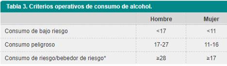

## **Tema: Consumo de bebidas alcohólicas**

### **Justificación:**

* El consumo de alcohol es uno de los factores de riesgos para la salud; sin embargo, en la adolescencia esta goza de una gran popularidad de consumo, siendo en nuestro país la droga mas consumida. Por ello, se busca evaluar que factores inciden en dicho consumo, diversas situaciones o el estado que les causa su consumo.

### **Objetivo:**

* Determinar si existe relación aparente entre la edad del encuestado y su tendencia al consumo de alcohol que tienen incidencia en dicho consumo. Asimismo, para estudios posteriores se recopila la data de la cantidad de tragos consumidos, cada qué cierto tiempo consumen bebidas alcohólicas, y de ese modo conocer si existe una diferencia de consumo entre el sexo masculino y femenino antes de la pandemia y durante.

###  **Marco Teórico:**

-   **Público objetivo:** Estudiantes UTEC

-   **Recolección de datos:**

    -   Se pretende realizar una encuesta dirigida a los alumnos de UTEC, la cual será difundida por los diversos canales de comunicación como telegram y whatsapp.

#### **Preguntas para la encuesta:**

-   **Consumo de alcohol pre pandemia:**

    -   Frecuencia en la que se consume (por semana)

    -   Contexto (fiestas con amigos, reuniones familiares, un día de estrés, fin de ciclo, solo en casa, zoom con amigos, otro)

    -   Límite de vasos antes de llegar a estado de ebriedad (1,2,3...) 

    -   Efecto que te causa el consumo de alcohol (sociable, agresivo, sentimental...)

-   **Consumo de alcohol durante pandemia:**

    -   Frecuencia en la que se consume (por semana)

    -   Contexto (fiestas con amigos, reuniones familiares, un día de estrés, fin de ciclo, solo en casa, zoom con amigos, otro)

    -   Límite de vasos antes de llegar a estado de ebriedad (1,2,3...)

    -   Efecto que te da el consumo de alcohol (sociable, agresivo, sentimental...)


### **Variables:**

<center>

+-------------------------------------------------------------------------------------+-----------------------+------------+----------+-----------------------------------------+
| Preguntas                                                                           | Variable              | Clase      | Tipo     | Restricciones                           |
+=====================================================================================+=======================+============+==========+=========================================+
| Ingrese su edad                                                                     | Edad                  | Numérica   | discreta | Entero no negativo mayor o igual que 18 |
+-------------------------------------------------------------------------------------+-----------------------+------------+----------+-----------------------------------------+
| ¿Con qué frecuencia consumías/consumes bebidas alcohólicas?                         | Frecuencia de consumo | Numérica   | discreta | \-                                      |
+-------------------------------------------------------------------------------------+-----------------------+------------+----------+-----------------------------------------+
| ¿Cuál era el límite de vasos que consumías antes de llegar a un estado de ebriedad? | Límite                | Numérica   | discreta | Entero no negativo                      |
+-------------------------------------------------------------------------------------+-----------------------+------------+----------+-----------------------------------------+
| ¿En qué situaciones la consumes?                                                    | Contexto de consumo   | Categórica | Nominal  | \-                                      |
+-------------------------------------------------------------------------------------+-----------------------+------------+----------+-----------------------------------------+
| Departamento al que pertenece                                                       | Departamento          | Categórica | Nominal  | \-                                      |
+-------------------------------------------------------------------------------------+-----------------------+------------+----------+-----------------------------------------+
| Región a la que perteneces                                                          | Región                | Categórica | Nominal  | Costa, Sierra, Selva                    |
+-------------------------------------------------------------------------------------+-----------------------+------------+----------+-----------------------------------------+
| ¿Qué efecto(s) te causa el consumo?                                                 | Estado de ánimo       | Categórica | Nominal  | \-                                      |
+-------------------------------------------------------------------------------------+-----------------------+------------+----------+-----------------------------------------+
| Sexo                                                                                | Sexo                  | Categórica | Nominal  | \-                                      |
+-------------------------------------------------------------------------------------+-----------------------+------------+----------+-----------------------------------------+

</center>

```{r include=FALSE, echo= FALSE}
paquetes <- c("ggplot2", "scales", "tidyr")
nuevos.paquetes <- paquetes[!(paquetes %in% installed.packages()[,"Package"])] 
if(length(nuevos.paquetes)) install.packages(nuevos.paquetes)
rm(paquetes)
rm(nuevos.paquetes)
```

```{r include=FALSE, echo= FALSE}
library(readr)
library(tidyr)
library(dplyr)
library(ggplot2)
library(scales)
library(car)
library(lmtest)
```

```{r echo=FALSE}
r <- function(x){
  return(round(x,2))
}
```


```{r include=FALSE, echo= FALSE}
Datos <- read_csv("CConsumo.csv")
colnames(Datos) <- c("None0", "None1","Sexo", "Edad", "Region", "Departamento", "FrecuenciaA",
                    "ContextoA", "LimiteA", "EstadoA","FrecuenciaD",
                    "ContextoD", "LimiteD", "EstadoD", "None2")
Datos <- select(Datos, -c("None0", "None1", "None2"))
```

```{r include=FALSE, echo= FALSE}
Datos$LimiteD[Datos$LimiteD %in% c("Nunca llego a un estado de ebriedad ya que me controlo y tengo una alta resistencia", "Depende de la situacion en donde estaba", "Solo he tomado una vez y no me acuerdo", "no llegue al estado de ebriedad.")] <- NA

```

```{r include=FALSE, echo= FALSE}
x <- Datos[grep("onsum",Datos$FrecuenciaA),]$FrecuenciaA

Datos$FrecuenciaA[Datos$FrecuenciaA %in% c(x, "0", "	
No consumo bebidas alcohólicas", "-", "_")] <- "No consumo"
Datos$FrecuenciaD[Datos$FrecuenciaD %in% c( "0", x, "-", "_")] <- "No consumo"

Datos$FrecuenciaA[Datos$FrecuenciaA %in% c("5 a más veces al mes")] <- "5 a más"
Datos$FrecuenciaD[Datos$FrecuenciaD %in% c("5 a más veces al mes")] <- "5 a más"
rm(x)
```

```{r include=FALSE, echo= FALSE}
x <- Datos[grep("onsum",Datos$ContextoA),]$ContextoA
Datos$ContextoA[Datos$ContextoA %in% c("Ninguna","Ninguno", "0", "_", "No tomo", "NO CONSUMIA ALCOHOL", "Nada", "-", x)] <- "No consumo"
rm(x)
```

```{r include=FALSE, echo= FALSE}
x <- Datos[grep("onsum",Datos$ContextoD),]$ContextoD
Datos$ContextoD[Datos$ContextoD %in% c("Ninguna","Ninguno", "0", "_", "No tomo", "NO CONSUMIA ALCOHOL", "Nada", "-", x)] <- "No consumo"
rm(x)
```

```{r include=FALSE, echo= FALSE}
x <- Datos[grep("onsum",Datos$EstadoA),]$EstadoA
Datos$EstadoA[Datos$EstadoA %in% c("Ninguna","Ninguno", "0", "_", "No tomo", "NO CONSUMIA ALCOHOL", "Nada", "-", x)] <- "No consumo"
rm(x)

x <- Datos[grep("onsum",Datos$EstadoD),]$EstadoD
Datos$EstadoD[Datos$EstadoD %in% c("Ninguna","Ninguno", "0", "_", "No tomo", "NO CONSUMIA ALCOHOL", "Nada", "-", x)] <- "No consumo"
rm(x)
```

### **Descriptores numéricos**

Total de Observaciones:

-   Casos completos

```{r echo= FALSE}
sum(complete.cases(Datos))
```

-   Casos incompletos

```{r echo= FALSE}
sum(!complete.cases(Datos))
```

-   Se selecciona todas las observaciones con casos completos y se convierte la variable "LimiteA" y "LimiteD" a numéricas, para poder realizar los diagramas pertinentes.

```{r include=FALSE, echo= FALSE}
Datos <- na.omit(Datos)
Datos$LimiteA <- as.numeric(Datos$LimiteA)
Datos$LimiteD <- as.numeric(Datos$LimiteD)
```

* *Indicador de consumo*

  * Para crear dicha variable, se hará uso de la cantidad de tragos consumidos por cada persona en la muestra:
    * Con ello calcularemos la *cantidad de ingesta de alcohol* o *indicador de consumo* mediante la siguiente fórmula: 
    $$\frac{nVasos \cdot g° \cdot \rho \cdot V(ml)}{100}$$

<center>

{height="100%"}

</center>

```{r include=FALSE, echo= FALSE}
Datos <- cbind(Datos, IndicadorCA=c(Datos$LimiteA * 35 * 4 * 0.8/100))
Datos <- cbind(Datos, IndicadorCD=c(Datos$LimiteD * 35 * 4 * 0.8/100))
```

-   Total de Variables

```{r echo= FALSE}
ncol(Datos)
```

### **Descriptores gráficos**

-   Separamos dos grupos teniendo en cuenta el sexo

```{r include=FALSE, echo= FALSE}
GrupoA <- Datos[Datos$Sexo == "Femenino",]
GrupoB <- Datos[Datos$Sexo == "Masculino",]
```


-   Se realiza un diagrama de cajas y bigotes o boxplot, para visualizar cuan dispersos están los datos de la variable, Limite, la cual indica la cantidad de vasos en promedio antes de caer embriagados. Asimismo, el diagrama nos muestra los valores atípicos presentes en la muestra.


```{r echo= FALSE}
# Antes de pandemia

boxplot(Datos$LimiteA ~ Datos$Sexo, horizontal = TRUE, xlab="Número de tragos", ylab="Sexo", main = "Consumo por sexo (Pre pandemia)") 
abline(v = mean(GrupoA$LimiteA, na.rm = TRUE), col = "red", lwd = 2)
abline(v = mean(GrupoB$LimiteA, na.rm = TRUE), col = "blue", lwd = 2)
abline(v = mean(Datos$LimiteA, na.rm = TRUE), col = "green", lwd = 2)
legend(x = "topright",
       bg = rgb(1, 0, 0, alpha = 0.1),
       box.col = "white",
       cex = 0.7,
       legend = c("Media de tragos mujeres", "Media de tragos hombres","Media de la muestra"),
       lty = c(1, 1),          
       col = c("red","blue","green"),         
       lwd = 2)      
```


```{r echo= FALSE}
# Durante de pandemia

boxplot(Datos$LimiteD ~ Datos$Sexo, horizontal = TRUE, xlab="Número de tragos", ylab="Sexo", main = "Consumo por sexo (Durante pandemia)")
abline(v = mean(GrupoA$LimiteD, na.rm = TRUE), col = "red", lwd = 2)
abline(v = mean(GrupoB$LimiteD, na.rm = TRUE), col = "blue", lwd = 2)
abline(v = mean(Datos$LimiteD, na.rm = TRUE), col = "green", lwd = 2)
legend(x = "topright",
       bg = rgb(1, 0, 0, alpha = 0.1),
       box.col = "white",
       cex = 0.7,
       legend = c("Media de tragos mujeres", "Media de tragos hombres","Media de la muestra"),
       lty = c(1, 1),          
       col = c("red","blue","green"),         
       lwd = 2)      

```


### **Modelos aleatorios de variables discretas**

-   Para la creación de dichas variables, partimos de la suposición que la muestra obtenida fue totalmente aleatoria, obviando así los posibles factores que podrían haber influenciado.

+-----------+----------------------------------------------------------------------------------------------------------------------------------+
| Variables | Justificación                                                                                                                    |
+===========+==================================================================================================================================+
| Sexo      | Es una variable discreta que puede modelarse con una distribución binomial, donde:                                               |
|           |                                                                                                                                  |
|           | -   X: Número de veces que el encuestado era mujer.                                                                            |
|           |                                                                                                                                  |
|           | -   p: Probabilidad de éxito que el encuestado sea mujer.                                                                        |
|           |                                                                                                                                  |
|           | -   n: Número de veces que se realizo el experimento.                                                                            |
|           |                                                                                                                                  |
|           |     X \~ Bin(152, 0.41)                                                                                                          |
+-----------+----------------------------------------------------------------------------------------------------------------------------------+
| Edad      | Es una variable discreta ya que esta dentro de un rango finito comprendido entre 16 a 26 años además son valores enteros, donde: |
|           |                                                                                                                                  |
|           | -   X: Número de veces que el encuestado tenía 18 años                                                                           |
|           |                                                                                                                                  |
|           | -   p: Probabilidad de éxito que el encuestado haya tenido 18 años                                                               |
|           |                                                                                                                                  |
|           |     X \~ Bin(152, 0.12)                                                                                                          |
+-----------+----------------------------------------------------------------------------------------------------------------------------------+

- *Ejemplificando:*

  * De las 152 personas encuestadas , ¿cuál es la probabilidad de que a lo más la mitad de estos tengan 18 años?
  *
```{r echo=FALSE}
plot(y = dbinom(0:76, size = 152, prob = 0.12), x = c(0:76), type = "h", lwd = 2,
     main = "Función de probabilidad binomial",
     ylab = "P(X = x)", xlab = "x")

lines(dbinom(76, size = 152, prob = 0.12), type = "h",
      lwd = 2, col = rgb(0, 0, 0))

legend("topright", legend = c("152  0.12"),
       title = "n     p", title.adj = 0.75,
       lty = 1, col = 1:3, lwd = 2, box.lty = 1)
pbinom(76, size = 152, prob = 0.12, lower.tail = T)
```


### **Patrones identificados**

> **Boxplot \~ Sexo femenino**

```{r echo= FALSE}

boxplot( GrupoA$LimiteA ~ GrupoA$LimiteD, xlab = "Número de tragos", ylab = "Cantidad de mujeres", main = "Pre y durante Pandemia", breaks = 5)
abline(v = mean(GrupoA$LimiteA, na.rm = TRUE), col = "red", lwd = 2)
abline(v = mean(Datos$LimiteA, na.rm = TRUE), col = "green", lwd = 2)
legend(x = "topleft",
       bg = rgb(1, 0, 0, alpha = 0.1),
       box.col = "white",
       cex = 0.8,
       legend = c("Media de tragos mujeres", "media de la muestra"),
       lty = c(1,1),          
       col = c("red","green"),         
       lwd = 2)
```

* Análisis:
  * Se observa 6 casos atípicos, la media de tragos que consumen las mujeres es menor a la media de la muestra total (sesgo hacia la izquierda), es decir, los datos están mayor concentrados a la izquierda de la media de tragos de la muestra.


> **Boxplot \~ Sexo masculino**

```{r echo= FALSE}
boxplot( GrupoB$LimiteA ~ GrupoB$LimiteD, xlab = "Número de tragos", ylab = "Cantidad de hombres", main = "Pre y durante Pandemia", breaks = 5)
abline(v = mean(GrupoB$LimiteA, na.rm = TRUE), col = "red", lwd = 2)
abline(v = mean(Datos$LimiteA, na.rm = TRUE), col = "green", lwd = 2)
legend(x = "topleft",
       bg = rgb(1, 0, 0, alpha = 0.1),
       box.col = "white",
       cex = 0.8,
       legend = c("Media de tragos hombres", "media de la muestra"),
       lty = c(1,1),          
       col = c("red","green"),         
       lwd = 2)
```

* Análisis
  * Se puede observar 4 valores atípicos dentro de la muestra, asimismo notamos que la muestra presenta un sesgo hacia la derecha pues la media considerando ambos periodos de la muestra es menor a la media de tragos en los hombres, lo que nos indica que hubo una mayor consumo de tragos con respecto a la media de tragos de la muestra.


> **Histograma\~ Frecuencias de consumo**

```{r echo= FALSE}
# Antes de pandemia
ggplot(Datos, aes(FrecuenciaA, fill=Sexo)) +
  labs(title = "Frecuencia de consumo por sexo (Antes de pandemia)") + 
  ylab("Cantidad de personas") + 
  xlab("Frecuencias") +
  theme(plot.title = element_text(size = rel(1.2), colour = "black")) + 
  geom_bar(position="dodge") +
  theme_bw() +
  scale_fill_manual(values = alpha(c("lightgreen", "lightblue"), 5)) +
  theme(axis.title.x = element_text(face="bold", size=10),
         panel.grid = element_blank(),
         panel.border = element_rect(fill = "transparent",color = 0))
```


* *Antes de pandemia:*

  * Antes de pandemia predominaba de 3-4 veces al mes el consumo de alcohol tanto de hombre como de mujeres

  * Hay más hombres que *no consumen* alcohol que mujeres


```{r echo= FALSE}
# Durante pandemia

ggplot(Datos, aes(FrecuenciaD, fill=Sexo) ) +
  labs(title = "Frecuencia de consumo por sexo (Durante pandemia)") + 
  ylab("Cantidad de personas") + 
  xlab("Frecuencias") +
  theme(plot.title = element_text(size = rel(1.2), colour = "black")) + 
  geom_bar(position="dodge") + 
  theme_bw() +
  scale_fill_manual(values= alpha(c("lightgreen", "lightblue"), 5)) +
   theme(axis.title.x = element_text(face="bold", size=10),
         panel.grid = element_blank(),
         panel.border = element_rect(fill = "transparent",color = 0))  
```

* *Durante pandemia*
  * El gráfico de barras muestra una mayor tendencia (moda) al consumo de alcohol entre una o dos veces al mes, asimismo hubo una disminución en el consumo de alcohol de 3-4 veces al mes y una disminución  al no consumo. Esto es interesante, ya que en el contexto de la pandemia están las medidas restrictivas en la cual se prohíbe las reuniones. Sin embargo, los encuestados hacen alución a una nueva forma reunión: *la virtual*, es decir, reuniones por zoom.

### **Prueba de hipótesis**

El estadístico de prueba fue hallado mediante la distribución t-student, pues desconocemos la desviación estándar(poblacional). Después, se logró hallar los intervalos de confianza.

$$Estadístico\;de\;prueba= (\mu - \hat{x_{n}})\cdot\frac{\sqrt{n}}{S}$$
$$Error\;estandarizado=\frac{S}{\sqrt{n}}$$

$$Límite\;inferior = \mu\;-t_{\alpha} \cdot\frac{\sigma}{\sqrt{n}}$$ 
$$Límite\;superior = \mu\;+t_{\alpha}\cdot\frac{S}{\sqrt{n}}$$


#### **Hipótesis 1:**

Sabemos que un consumo de alcohol de bajo riesgo para los hombres en promedio por día es menor a 14 UBE de alcohol, entonces ¿El consumo de alcohol para el período pre pandemia fue de bajo riesgo en los hombres?,con un nivel de confianza del 95% 

$$H0\;: \mu\geq\ 14$$ 
$$H1\;: \mu<\ 14$$

* Se obtiene la media de la muestra para el grupo de hombres el cual contiene 72 observaciones, de igual manera se calcula la desviación estándar muestral. Con dichos datos se puede construir el estadístico de prueba, el cual nos servirá para evaluar nuestras hipótesis en relación al Z crítico considerando una significancia del 5%.

```{r echo=FALSE}
muestra_hombres <- GrupoB%>%filter(IndicadorCA > 0)
media_muestral <- mean(muestra_hombres$IndicadorCA)
Sd_muestral <- sd(muestra_hombres$IndicadorCA)
n_muestra <- sum(complete.cases(muestra_hombres))

t2 <- qt(0.05, n_muestra-1, lower.tail = T)

# Estadístico de prueba:
est_t2 <- (media_muestral - 14) * (sqrt(n_muestra)/Sd_muestral)
pt(est_t2, n_muestra - 1, lower.tail = 1)
```


```{r echo=FALSE}
curve( dt(x, n_muestra-1), 
       xlim = c(-1*min(muestra_hombres$IndicadorCA), min(muestra_hombres$IndicadorCA)),
       xlab = "x",
       ylab = "F(x)", 
       lwd = 3)
title(main = "Funcion F(x) de distribucion t student")
abline(v = t2, 
       col = "red",
       lwd = 3)
abline(v = est_t2, 
       col = "blue",
       lwd = 3)
pintadox2 <- c(t2, seq(t2, -6, -0.01), -6)
pintadoy2 <- c(0, dt(seq(t2, -6, -0.01), df = n_muestra - 1), 0)
polygon(pintadox2, pintadoy2, col = "green", lwd = 1)
legend(x = "topright",
       bg = rgb(1, 0, 0, alpha = 0.1),
       box.col = "white",
       cex = 0.7,
       legend = c("Z crítico", "Estadístico de prueba", "Región de rechazo"),
       lty = c(1, 1, 1),          
       col = c("red","blue", "green"),         
       lwd = 3)
```


* Como el p-valor es mucho menor al nivel de significancia (0.05) además el estadístico de prueba cae en la región de rechazo, entonces se rechaza la hipótesis nula y por lo tanto hubo un consumo moderado de alcohol en el período pre pandemia por parte de los hombres, es decir,la hipótesis alternativa.


- Intervalo de confianza

```{r echo=FALSE}
# Intervalo de confianza
errorst1 <- c(Sd_muestral/sqrt(n_muestra))
lim_inf1 <- round(c(( media_muestral) - (abs(t2) * errorst1)), 2)
lim_sup1 <- round(c(( media_muestral) + (abs(t2) * errorst1)), 2)
media_muestral <- round(media_muestral,2)
tip <- c("UBE")
intervalo1 <- data.frame(Pre_pandemia= tip, 
                         Z_critico = r(t2), 
                         Estadistico_de_prueba = r(est_t2), 
                         Limite_inferior = lim_inf1, 
                         Media_muestral = media_muestral,
                         Limite_superior = lim_sup1)
intervalo1
```


```{r echo=FALSE, include=FALSE}
rm(errorst1)
rm(lim_sup1)
rm(lim_inf1)
rm(intervalo1)
rm(media_muestral)
rm(n_muestra)
rm(Sd_muestral)
rm(t2)
rm(est_t2)
rm(tip)
```


#### **Hipótesis 2:**


* Se sabe que la edad de ingesta de alcohol ronda en promedio en una edad menor o igual a los 17 años, ¿La edad promedio de las encuestadas mujeres respecto al consumo de alcohol es mayor a los 17 años?

$$H0\;: \mu\leq\ 17$$ $$H1\;: \mu>\ 17$$


* Se obtiene la media de la muestra para el grupo de mujeres el cual contiene 63 observaciones, de igual manera se calcula la desviación estándar muestral. Con dichos datos se puede construir el estadístico de prueba, el cual nos servirá para evaluar nuestras hipótesis en relación al Z crítico considerando una significancia del 5%.


```{r echo=FALSE}
media_muestral2 <- mean(GrupoA$Edad)
Sd_muestral2 <- sd(GrupoA$Edad)
n_muestra2 <- sum(complete.cases(GrupoA$Edad))

t2_2 <- qt(0.05, n_muestra2-1, lower.tail = F)
# Estadístico de prueba:
est_t2_2 <- (media_muestral2 - 17) * (sqrt(n_muestra2)/Sd_muestral2)
pt(est_t2_2, n_muestra2 - 1, lower.tail = F)
```


```{r echo=FALSE}
curve( dt(x, n_muestra2-1), 
       xlim = c(-1*min(GrupoA$Edad), min(GrupoA$Edad)),
       xlab = "x",
       ylab = "F(x)", 
       lwd = 2)
title(main = "Funcion F(x) de distribucion t student")
abline(v = t2_2, 
       col = "red",
       lwd = 3)
abline(v = est_t2_2, 
       col = "blue",
       lwd = 3)
pintadox2 <- c(t2_2, seq(t2_2, 17, 0.01), 20)
pintadoy2 <- c(0, dt(seq(t2_2, 17, 0.01), df = n_muestra2 - 1), 0)
polygon(pintadox2, pintadoy2, col = "green", lwd = 1)
legend(x = "topright",
       bg = rgb(1, 0, 0, alpha = 0.1),
       box.col = "white",
       cex = 0.7,
       legend = c("Z crítico", "Estadístico de prueba", "Región de rechazo"),
       lty = c(1, 1, 1),          
       col = c("red","blue", "green"),         
       lwd = 3)
```


* Dado que el estadístico de prueba cae en la región de rechazo, así Como el p-valor es mucho menor al nivel de significancia (0.05), entonces se rechaza la hipótesis nula y por lo tanto la edad promedio de consumo de alcohol en la muestra es mayor a 17 años, es decir, la hipótesis nula.


- Intervalo de confianza:


```{r echo=FALSE}
# Intervalo de confianza
errorst2 <- c(Sd_muestral2/sqrt(n_muestra2))
lim_inf2 <- round(c((media_muestral2) - (t2_2 * errorst2)),2)
lim_sup2 <- round(c((media_muestral2) + (t2_2 * errorst2)),2)
media_muestral2 <- round(media_muestral2,2)
tip <- c("Edad")
intervalo2 <- data.frame(Mujeres = tip,
                         Z_critico = r(t2_2),
                         Estadistico_de_prueba = r(est_t2_2),
                         Limite_inferior = lim_inf2,
                         Media_de_la_muestra = media_muestral2,
                         Limite_superior = lim_sup2)

intervalo2
```


```{r echo=FALSE, include=FALSE}
rm(errorst2)
rm(lim_inf2)
rm(lim_sup2)
rm(intervalo2)
rm(media_muestral2)
rm(n_muestra2)
rm(Sd_muestral2)
rm(t2_2)
rm(est_t2_2)
rm(tip)
```


#### **Hipótesis 3**


* El consumo de alcohol moderado según estudios es a lo mas de 7 tragos en hombres por día.
¿En el período pre pandemia ocurrió un consumo moderado por parte de los hombres?

$$H0\;: \mu\leq\ 7$$ $$H1\;: \mu>\ 7$$

* Se obtiene la media de la muestra para el grupo de mujeres el cual contiene 72 observaciones, de igual manera se calcula la desviación estándar muestral. Con dichos datos se puede construir el estadístico de prueba, el cual nos servirá para evaluar nuestras hipótesis en relación al Z crítico considerando una significancia del 5%.


```{r echo=FALSE}
media_muestral3 <- mean(muestra_hombres$LimiteA)
Sd_muestral3 <- sd(muestra_hombres$LimiteA)
n_muestra3 <- sum(complete.cases(muestra_hombres$LimiteA))

t2_3 <- qt(0.05, n_muestra3-1, lower.tail = F)

# Estadístico de prueba:

est_t2_3 <- (media_muestral3 - 7) * (sqrt(n_muestra3)/Sd_muestral3)
pt(est_t2_3, n_muestra3 - 1, lower.tail = F)
```


```{r echo=FALSE}
curve( dt(x, n_muestra3-1), 
       xlim = c(-1*max(muestra_hombres$LimiteA), max(muestra_hombres$LimiteA)),
       xlab = "x",
       ylab = "F(x)", 
       lwd = 2)

title(main = "Funcion F(x) de distribucion t student")

abline(v = t2_3, 
       col = "red",
       lwd = 3)

abline(v = est_t2_3, 
       col = "blue",
       lwd = 3)

pintadox2 <- c(t2_3, seq(t2_3, 
                         max(muestra_hombres$LimiteA), 0.01),
               max(muestra_hombres$LimiteA))
pintadoy2 <- c(0, dt(seq(t2_3, max(muestra_hombres$LimiteA), 0.01), df = n_muestra3 - 1), 0)

polygon(pintadox2, 
        pintadoy2, 
        col = "green", 
        lwd = 1)

legend(x = "topright",
       bg = rgb(1, 0, 0, alpha = 0.1),
       box.col = "white",
       cex = 0.7,
       legend = c("Z crítico", "Estadístico de prueba", "Región de rechazo"),
       lty = c(1, 1, 1),          
       col = c("red","blue", "green"),         
       lwd = 3)
```

* Dado que el estadístico de prueba cae en la región de rechazo, así Como el p-valor es mucho menor al nivel de significancia (0.05), entonces se rechaza la hipótesis nula y por lo tanto si hubo un consumo moderado por parte de los hombres a la ingesta de alcohol.


- Intervalo de confianza:


```{r echo=FALSE}
errorst3 <- c(Sd_muestral3/sqrt(n_muestra3))
lim_inf3 <- round(c((media_muestral3) - (t2_3 * errorst3)),2)
lim_sup3 <-  round(c((media_muestral3) + (t2_3 * errorst3)),2)
media_muestral3 <- round(media_muestral3,2)
tip <- c("N° de tragos")
intervalo3 <- data.frame(Pre_pandemia= tip,
                         Z_critico = r(t2_3),
                         Estadistico_de_prueba = r(est_t2_3),
                         Limite_inferior = lim_inf3,
                         Media_de_la_muestra = media_muestral3,
                         Limite_superior = lim_sup3)
intervalo3
```


```{r echo=FALSE, include=FALSE}
rm(errorst3)
rm(lim_inf3)
rm(lim_sup3)
rm(intervalo3)
rm(media_muestral3)
rm(n_muestra3)
rm(Sd_muestral3)
rm(t2_3)
rm(est_t2_3)
rm(t_test)
rm(tip)
```


### **Regresión y tendencias**


> Indicador vs Edad


```{r echo=FALSE, include=FALSE}
cor <- function(x, y){
   cov(x,y)/( sd(x, na.rm = T)*sd(y, na.rm = T) )
}
```


Calculamos la correlación entre las variables


```{r echo=FALSE}
r(cor(Datos$Edad, Datos$IndicadorCD))
```

  * Notamos que hay una correlación neutra, por ende no se puede decir que una variable crece o decrece en relación a la otra y viceversa.

Ajustamos una recta dentro de la nube de puntos


```{r echo= FALSE}
plot(Datos$Edad, Datos$IndicadorCD, xlab = "Edad", ylab = "Indicador de consumo", main = "Durante Pandemia")
regresion <- lm(IndicadorCD ~ Edad, data=Datos)
abline(regresion, col = "blue")
```


  * Se inspecciona la calidad del ajuste con el término, $r^2$


```{r echo=FALSE}
pt <- summary(regresion)
r(pt$r.squared)
```


  * Se analiza la recta ajustada y que tanto distan de los valores reales, es decir, los residuos


```{r echo=FALSE}
Predicciones <- predict(regresion)
ggplot(Datos, aes(x=Edad, y=IndicadorCD)) + ylab("UBE") +
  geom_smooth(formula=y~x,method="lm", se=0, color="lightgrey") +
  geom_segment(aes(xend=Edad, yend=Predicciones), col='red', lty='dashed') +
  geom_point() +
  geom_point(aes(y=Predicciones), col='red') +
  theme_light()
```


#### **Evaluación de los supuestos**

Se inspecciona los valores que ocasionan que el término $r^2$ sea pequeño, es decir, analizamos los outliers y su influencia dentro del modelo.

  * Se verifica la normalidad de los residuos del ajuste respecto a la nube de puntos para ello se aplica el test de Shapiro-Wild considerando un nivel de significancia del 5%.

```{r echo=FALSE}
rm(Predicciones)
test_shapiro <- shapiro.test(regresion$residuals)
test_shapiro$p.value
rm(test_shapiro)
```

  * Se excluyen los valores fuera de la extensión de los bigotes del boxplot, pues se sabe que en una distribución normal no hay valores atípicos, con ello se vuelve a aplicar el test de Shapiro-Wild

```{r echo=FALSE}
Error <- data.frame(regresion$residuals, regresion$fitted.values)
colnames(Error) <- c("Residuos","Estimadores")
q1 <- quantile(Error$Residuos,0.25)
q3 <- quantile(Error$Residuos,0.75)
rang_inte <- q3-q1

errores_sin_out = dplyr::filter(Error, Error$Residuos >= q1-1.5*rang_inte & Error$Residuos <= q3-1.5*rang_inte)


# Aplicamos el test
test_shapiro <- shapiro.test(errores_sin_out$Residuos)
test_shapiro$p.value
```

Se evaluará la homocedasticidad, es decir, si la varianza es constante en relación a los residuos pues este supuesto nos asegura estimadores fiables de los coeficientes  del ajuste, asegurando un ajuste por mínimos cuadrados de varianza mínima.

```{r echo=FALSE}
rm(q1)
rm(q3)
rm(rang_inte)
rm(errores_sin_out)
rm(test_shapiro)
bptest(regresion)
```

Se evaluará la no autocorrelación entre los residuos, pues para este ajuste lineal se supone que los residuos son independientes lo que genera confiabilidad en las predicciones que se puedan llegar a realizar

```{r echo=FALSE}
ggplot(data = Error, aes(x = seq_along(Residuos), y = Residuos)) +
  geom_point(aes(color = Residuos)) +
  scale_color_gradient2(low = "blue3", mid = "grey", high = "red") +
  geom_line(size = 0.3) +
  labs(title = "Distribución de los residuos", x = "index", y = "residuo") +
  geom_hline(yintercept = 0) +
  theme_bw() +
  theme(plot.title = element_text(hjust = 0.5), legend.position = "none")
```

  * Se observa que no hay una autocorrelación aparente entre los residuos, pues no se visualiza una tendencia en la gráfica, para comparar esta aseveración se hará uso del test de Durbin-Watson, cuya hipótesis nula es la no autocorrelación.

```{r echo=FALSE}
test_dw <- dwtest(regresion)
test_dw$p.value
print("Como el p.value es mayor al nivel de significancia (5%) no se rechaza la hipótesis nula y se dice que los residuos no están autocorrelacionados")
rm(test_dw)
```

  * Esto es muy importante, pues nos indica que no hay incidencia temporal en la obtención de los datos, es decir, fueron obtenidos aleatoriamente y se cumple con el principio de independencia.

Se realiza una gráfica de influencia para ver que puntos tienen incidencia en que los residuos no se distribuyan normalmente

```{r echo=FALSE}
pt_influencia <- influencePlot(model = regresion)
```

  * Se determina que las observaciones: 9, 13, 59, 63. Es decir, 4 puntos tienen incidencia en el modelo de regresión creado, por ello, se procede a excluirlos en la construcción del modelo.

```{r echo=FALSE}
ind_influencia <- c()
for (i in rownames(pt_influencia)){
  ind_influencia = append(ind_influencia,i)
}
ind_influencia = as.numeric(ind_influencia)

plot(Datos[-ind_influencia,]$Edad, Datos[-ind_influencia,]$IndicadorCD, xlab = "Edad", ylab = "Indicador de consumo", main = "Durante Pandemia")
regresion2 <- lm(IndicadorCD ~ Edad, data=Datos[-ind_influencia,])
abline(regresion2, col = "blue")
```

Se verificará si hay una mejora en la correlación de las variables implicadas

```{r echo=FALSE}
r(cor(Datos[-ind_influencia,]$Edad,Datos[-ind_influencia,]$IndicadorCD))
```


Se verifica si la calidad del ajuste ha mejorado, es decir, si el $r^2$ es mayor al obtenido al inicio del modelo.

  * $r^2$ del modelo inicial:
  
```{r echo=FALSE}
pt <- summary(regresion)
pt$r.squared
```
  
  * $r^2$ del modelo sin outliers

```{r echo=FALSE}
pt <- summary(regresion2)
r(pt$r.squared)
```


Adicionalmente, si suprimimos los ceros visualizados en el nuevo modelo y verificamos que tanto mejoraría el ajuste lineal, analizando la correlación y el $r^2$.


```{r echo=FALSE}
Data <- Datos[-ind_influencia,]
Data <- Data[Data$IndicadorCD > 0,]

plot(Data$Edad, Data$IndicadorCD, xlab = "Edad", ylab = "Indicador de consumo", main = "Durante Pandemia")
regresion3 <- lm(IndicadorCD ~ Edad, data=Data)
abline(regresion3, col = "blue")
```

  * Correlación entre las variables de interés:

```{r echo=FALSE}
r(cor(Data$Edad,Data$IndicadorCD))
```

  * $r^2$ del modelo sin los 4 outliers:
  
```{r echo=FALSE}
pt <- summary(regresion2)
r(pt$r.squared)
```

  * $r^2$ del modelo sin los ceros
  
```{r echo=FALSE}
pt <- summary(regresion3)
r(pt$r.squared)
```

Se determina que tanto la correlación como el término $r^2$ han mejorado

### **Predicciones**

* *Ecuación del modelo ajustado*

```{r echo=FALSE, include=FALSE}
summary(regresion3)
```
  $$\hat{Indicador} = -19.7994+1.5995~(\hat{Edad})$$ 
  * El término independiente no tiene interpretación real, pues no hay edades negativas.
  * La pendiente es positiva e indica que el indicador crece en 1.5995 por cada año que tengan los alumnos.

* *Estimando el indicador de consumo para un alumno que tenga 27 años*

$$\hat{Indicador} = -19.7994+1.5995~({27})$$


```{r echo=FALSE}
round(-19.7994 + 1.5995*27, 2)
```

* *Observación respecto al modelo*
  * Como se determinó, nuestro modelo no cumple con una de las suposiciones en las que se base el ajuste de regresión lo que implica que los estimadores de mínimos cuadrados del ajuste no serán de varianza mínima  llevando así a pérdidas en la eficiencia del modelo.
  * Además visualmente hay un umbral respecto al indicador de consumo en donde este tiende a estabilizarse, por lo que nuestro modelo no es muy fiable respecto a predicciones.

### **Conclusiones:**

* Encontramos que antes de la  pandemia, se predominaba de 3-4 veces al mes el consumo de alcohol tanto de hombre como de mujeres. sin embargo, durante pandemia se nota que hay más hombres que no consumen alcohol
Tanto pre como durante pandemia los hombres beben mayor cantidad de alcohol que las mujeres, sin embargo, ambos aumentaron su consumo durante pandemia
* Respecto a las hipótesis planteadas: 
  * H1: ¿el consumo de alcohol para el periodo pre pandemia fue de bajo riesgo en los hombres? (considerando nuestro nivel de confianza del 95%) la hipótesis nula es rechazada y optamos por la alternativa que nos indica que el consumo no fue de bajo riesgo.
  * H2: ¿La edad promedio de las encuestadas mujeres respecto al consumo de alcohol es mayor a los 17 años? rechazamos la hipótesis nula y se opta por la alternativa, que la ingesta de alcohol de las mujeres en la muestra fue a una edad mayor a 17
  * H3: ¿En el periodo pre pandemia ocurrió un consumo moderado por parte de los hombres? se rechaza la hipótesis nula y esto quiere decir que no hubo un consumo moderado por parte de los hombres


### **Reflexión**

* Al inicio uno de nuestros objetivos era determinar cuál era la reacción del consumidor después de ingerir cierta cantidad de tragos, pero solo consideramos la ingesta tope de tragos del sexo femenino y masculino, ya que el las variables que consideramos eran limitadas y al poner en la encuesta otra opción las respuestas eran diferentes en cada encuestado.
No se pudo obtener un nivel de confianza en las variables categóricas de tipo nominal como  el de contexto de consumo, departamento, región y estado de ánimo.
* Consideramos las regiones y departamentos para obtener información y comprobar hipótesis si existe una diferencia del consumo de alcohol en diferentes regiones del país, sin embargo los encuestados en su mayoría fueron limeños
Sería importante para un análisis más profundo recopilar variables adicionales, como por ejemplo, el tipo de bebida que más consumen para poder construir un indicador de consumo más fiable.


### **Bibliografía**

-   Campañas 2007- Alcohol y menores. El alcohol te destroza por partida doble. (s/f). Gob.es. Recuperado el 4 de noviembre de 2021, de <https://www.mscbs.gob.es/campannas/campanas07/alcoholmenores9.htm>
- Consumo y nivel seguro del alcohol. (n.d.). Medlineplus.Gov. Retrieved December 3, 2021, from <https://medlineplus.gov/spanish/ency/article/001944.htm>
-   Cuantificación del consumo de alcohol. (s/f). Fisterra.com. Recuperado el 4 de noviembre de 2021, de <https://www.fisterra.com/ayuda-en-consulta/calculos/cuantificacion-consumo-alcohol/>
-  El consumo de alcohol durante la pandemia de COVID-19 en América Latina y el Caribe, 8 de septiembre del 2020. OPS. <https://iris.paho.org/handle/10665.2/53113>
- El consumo de alcohol y su salud. (11 de mayo del 2021). CDC. <http://www.cij.gob.mx/ebco2018-2024/9381/9381CD.html>
-   National Institute on Drug Abuse. (2021, junio 24). El consumo de alcohol y marihuana entre adolescentes se mantiene estable durante la pandemia de COVID-19. Drugabuse.gov. <https://www.drugabuse.gov/es/news-events/news-releases/2021/06/el-consumo-de-alcohol-y-marihuana-entre-adolescentes-se-mantiene-estable-durante-la-pandemia-de-covid-19>