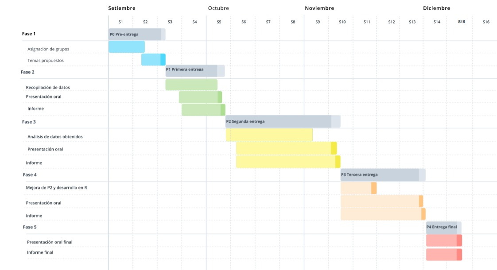

**Título:** Estado nutricional de los niños de la región de Lima, Tacna, Cajamarca Y Huancavelica durante el año 2019

**Título corto:** Estado nutricional

# Introducción

## Importancia

Según ENDES 2000, los departamentos con mayor porcentaje de desnutrición crónica son Cajamarca, Huánuco, Cusco y Huancavelica, lugares en donde más del 40% de niños padecen de desnutrición crónica, siendo cuatro veces mayor que Lima Metropolitana, Tacna y Moquegua.

Es importante realizar un análisis de datos en este tema, porque **ayuda a conocer las posibles causas del estado nutricional de los niños** en algunas de las regiones mencionadas. A partir de ello se pueden plantear **soluciones gubernamentales que permitan mejorar la calidad de vida de los niños.**

## Justificación

Es **específico**, porque nos centramos en los niños de Lima, Tacna, Cajamarca y Huancavelica. Usaremos una base de datos delimitada espacial y temporalmente realizada en base a datos del año 2019

Es **factible**, porque hay bases de datos de acceso público con la información que necesitamos. Esta data es bastante completa y brinda información médica certificada que podemos usar como indicadores del estado nutricional de los niños.

Es **interesante**, porque así notaremos las posibles deficiencias de la atención médica, acceso a alimentos o las distintas causas de la desnutrición infantil. Además, mediante este estudio, apoyaremos con el cumplimiento del derecho a disfrutar del más alto nivel posible de salud de los niños.


# Objetivos

## Objetivo general

-  Identificar las posibles relaciones entre las variables que intervienen en estado nutricional de los niños (de 0 a 5 años) en el año 2019 y a partir de ello plantear sugerencias que aporten a la solución de este problema.


## Objetivos específicos

-   Identificar a través de la comparación por gráficos en qué regiones es más grave el estado nutricional de los niños.
- Determinar qué programa relacionado al estado nutricional de los niños es el que tiene mayor presencia en las regiones estudiadas.
-   Identificar los principales factores que afectan al problema de la desnutrición a través del análisis de un modelo de relación entre variables.
-   Transmitir efectivamente la información relevante obtenida.
-   Realizar satisfactoriamente una recopilación y análisis de datos.

# Planteamiento de preguntas 

1.¿Cuáles son las causas de las desnutrición?

2.¿En qué regiones el problema de desnutrición es más grave?

3.¿Existen relaciones entre las variables que determinan el estado nutricional de los niños?

4.¿Podemos llegar a encontrar relaciones que nos ayuden a deducir las causas de la desnutrición ?

# Factibilidad (Diagrama de Gantt)

A continuación presentamos un diagrama de Gantt, donde se especifica la organización que estamos llevando para cumplir con las entregas del proyecto.




# Marco teórico

Nuestro estudio se esta realizando sustentado en una base de datos pública, formulada por los registros de Historias clínicas provenientes del ministerio de Salud en el año 2019.Esta información fue publicada con el objetivo de dar a conocer el estado nutrición de las personas que acuden a los centros de salud. Además de ello se buscaba tomar decisiones en los distintos niveles como local, regional y nacional,de acuerdo a la situación a la que se encuentre cada región, para así lograr mejorar la calidad de vida.

## Población objetivo

La población objetivo que hemos elegido es la de los niños , de 0 a 5 años, que asistieron a un centro medico del ministerio de la Salud en el año 2019.La misma que es proporcionada por la base de datos, es decir que no hemos tenido la necesidad de eliminar registros.

## Muestreo

Muestreo por **conglomerados**, pues estamos trabajando en función de los departamentos.

## Unidades muestrales

-   107166 observaciones

## Partes interesadas

-   Ministerio de Salud
-   Padres y niños de las regiones involucradas

## Obtención de datos

Los datos han sido extraídos de la Plataforma Nacional de Datos Abiertos.

**Citado:** Plataforma Nacional de Datos Abiertos (2021). *Sistema de información del Estado Nutricional de niños y gestantes Perú - INS/CENAN (Instituto Nacional de Salud - Centro Nacional de Alimentación y Nutrición) 2019 - 2020*. Recuperado de Plataforma Nacional de Datos Abiertos.

**Link:** <https://www.datosabiertos.gob.pe/dataset/sistema-de-informaci%C3%B3n-del-estado-nutricional-de-ni%C3%B1os-y-gestantes-per%C3%BA-inscenan-instituto>

## Variables

| Variable       | Tipo de variable   | Restricciones                     |
|----------------|--------------------|-----------------------------------|
| DIRESA         | Categórica nominal | Cajamarca,Huancavelica,Lima,Tacna |
| Sexo           | Categórica nominal | Femenino o masculino              |
| Edad           | Numérica discreta  | valor positivo, menor a 100       |
| Peso           | Numérica continua  | valor positivo                    |
| Talla          | Numérica continua  | Valor positivo                    |
| Hemoglobina    | Numérica continua  | Valor positivo                    |
| Altitud        | Numérica continua  | Valor positivo                    |
| Qaliwarma      | Categórica nominal | 0(NO) o 1(SI)                     |
| Dx_Anemia      | Categórica ordinal | Normal, anemia leve, moderada o severa  |
| CRED           | Categórica nominal | 0(NO) o 1(SI)                     |
| Juntos         | Categórica nominal | 0(NO) o 1(SI)                     |
| SIS            | Categórica nominal | 0(NO) o 1(SI)                     |
| Suplementacion | Categórica nominal | 0(NO) o 1(SI)                     |
| Consejeria     | Categórica nominal | 0(NO) o 1(SI)                     |


```{r eval=TRUE, echo=FALSE, message=FALSE, warning=FALSE}
library(readr)
library(tidyverse)
library(modeest)

DT <- read_csv("Niños CAJAMARCA.csv")
DL <- read_csv("Niños HUANCAVELICA.csv")
DM <- read_csv("Niños TACNA.csv")
DE <- read_csv("Niños LIMA DIRIS CENTRO.csv")
DA <- read_csv("Niños LIMA DIRIS ESTE.csv")
DO <- read_csv("Niños LIMA DIRIS NORTE.csv")
DR <- read_csv("Niños LIMA DIRIS SUR.csv")


#Añadiendo las filas
m= rbind(DT,DL)
n= rbind(DM,DE)
p= rbind(DA,DO)

L= rbind(m,n)

h= rbind(L,p)
w= rbind(h,DR)

View(w)
#comprobando que la suma de las filas este completa en la data 
N=nrow(DT)+nrow(DL)+nrow(DE)+nrow(DM)+nrow(DA)+nrow(DO)+nrow(DR)
N
names(w)
head(w)
```

```{r eval=TRUE, echo=FALSE, message=FALSE, warning=FALSE}
unique(w)
bd1 <- w %>% 
  filter(w$Peso < 20 & w$Talla < 120)
bd <- na.omit(bd1)
```


# Descriptores de variables
## Variables categóricas
### Descriptores <span style="color:darkred"> (variables categóricas)<span>
```{r eval=TRUE, echo=FALSE, message=FALSE, warning=FALSE}
Medidas<-function(X){
  return(list(Moda=mfv(X)))
}
```

```{r eval=TRUE, echo=FALSE, message=FALSE, warning=FALSE}
mapply(Medidas, list(Diresa = bd$Diresa,
                     Sexo = bd$Sexo, 
                     Qaliwarma = bd$Qaliwarma, 
                     Dx_Anemia = bd$Dx_Anemia, 
                     CRED = bd$Cred,
                     Juntos = bd$Juntos,
                     SIS = bd$SIS,
                     Suplementación = bd$Suplementacion,
                     Consejería = bd$Consejeria))
```
### Descriptores gráficos <span style="color:darkred"> (variables categóricas)<span>


#### DIRESA

Es una variable que cumple un papel descriptivo.
Clasifica a los niños de acuerdo a la diresa en la cual se tomo registro de sus datos.

```{r eval=TRUE, echo=FALSE, message=FALSE, warning=FALSE}
  barp <- barplot(table(bd$Diresa),main="Cantidad de niños según Diresa",xlab="Diresa",ylab="Cantidad",col = rainbow(4),names.arg = c("Cajamarca", "Huanc.", "Tacna","Lima DC","Lima DE","Lima DN","Lima DS"))
grid(nx = NA, ny = NULL, lwd = 1, lty = 1, col = "gray")
barplot(table(bd$Diresa),main="Cantidad de niños según Diresa",xlab="Diresa",ylab="Cantidad",col=rainbow(4), names.arg = c("Cajamarca", "Huanc.", "Tacna","Lima DC","Lima DE","Lima DN","Lima DS"),add=TRUE)
```

**Observaciones:**

- La población de nuestro estudio es en su mayoría de la región Cajamarca.


#### Sexo

Es una variable que cumple un papel descriptivo.
Esta variable determina el sexo de nuestra muestra de estudio. 

```{r eval=TRUE, echo=FALSE, message=FALSE, warning=FALSE}
barp <- barplot(table(bd$Sexo),main="Cantidad de niños según sexo",xlab="Sexo",ylab="Cantidad",col=c("pink","darkblue"))
grid(nx = NA, ny = NULL, lwd = 1, lty = 1, col = "gray")
barplot(table(bd$Sexo),main="Cantidad de pacientes según se sexo",xlab="Sexo",ylab="Cantidad",col=c("pink", "darkblue"), add = TRUE)
```

**Observaciones:**

- En general la población de estudio esta conformado por cantidades muy cercanas de hombres y mujeres.


#### Dx_Anemia

Es una variable que cumple un papel descriptivo.
Determina el tipo de anemia que presenta cada niño.

```{r eval=TRUE, echo=FALSE, message=FALSE, warning=FALSE}
barp <- barplot(table(bd$Dx_Anemia),main="Cantidad de niños según clasificación de anemia",xlab="Clasificación de anemia",ylab="Cantidad",col=c("yellow","pink", "red","darkgreen"))
grid(nx = NA, ny = NULL, lwd = 1, lty = 1, col = "gray")
barplot(table(bd$Dx_Anemia),main="Cantidad de niños según clasificación de anemia",xlab="Clasificación de anemia",ylab="Cantidad",col=c("yellow","pink", "red","darkgreen"), add=TRUE)
```

**Observaciones:**

- Esta variable clasifica el tipo de anemia o estado nutricional del infante presente entre las 4 regiones en la que podemos apreciar que seguida del estado nutricional normal, la que predomina es la anemia leve.


#### Programas que supervisan y/o garantizan el correcto estado nutricional de los niños

Es una variable que cumple un papel descriptivo.
Manifiesta el acceso o no a diferentes programas que tienen objetivos relacionados con la busqueda del bienestar nutricional de los niños.

```{r eval=TRUE, echo=FALSE, message=FALSE,warning=FALSE}
Binarios<-function(X){
  return(list(Sí=sum(X==1), No=sum(X==0)))
}

Categoricas_1<-mapply(Binarios, list(Qaliwarma=bd$Qaliwarma, CRED=bd$Cred,  Juntos=bd$Juntos, SIS=bd$SIS, Suplement.=bd$Suplementacion, Consejería=bd$Consejeria))

barplot(Categoricas_1,col=c("steelblue","gray"),legend.text=TRUE,main="Acceso a los programas",xlab="Programas",ylab="Frecuencia")
```


**Observaciones:**

- En general entre las 4 regiones la gran mayoría no accede a los programas de Qali Warma, más adelante veremos si la distribución por región será proporcional a su población estudiada por Diresa.


- Expresa el acceso al programa CRED, que busca el correcto desarrollo de los niños, donde más de la mitad de infantes acceden.


- Es una variable  que nos muestra si los niños tienen acceso al programa JUNTOS, cuyo objetivo es que estos accedan a servicios de salud y educación de calidad. Podemos ver en la gráfica que entre las 4 regiones, menos de la cuarta parte de la población de estudio accede al programa.


- Variable categórica qué evidencia qué la mayoría de la población de estudio tiene acceso al SIS (Seguro Integral de Salud).


- Variable categórica qué expresada en la gráfico refleja que la mayoría no accede a suplementación.


- Variable categórica que expresada en el gráfico refleja que la mayoría no accede a consejería.


## Variables numéricas
### Descriptores numéricos <span style="color:darkblue"> (variables numéricas)<span>

```{r eval=TRUE, echo=FALSE, message=FALSE, warning=FALSE}
Medidas<-function(X){
  return(list(Media=round(mean(X),2), 
              Mediana=round(median(X),2),
              Moda=round(mfv(X),2),
              Varianza=round(var(X),2),
              Desviacion=round(sd(X),2),
              Minimo=round(min(X),2), 
              Maximo=round(max(X),2)))
}
```


```{r eval=TRUE, echo=FALSE, message=FALSE, warning=FALSE}
mapply(Medidas, list(EdadMeses = bd$EdadMeses,
                     Peso = bd$Peso, Talla = bd$Talla, 
                     Hemoglobina = bd$Hemoglobina, 
                     Altitud = bd$ALTITUD))
```

**Observaciones:**

- Los valores de talla se encuentran muy dispersos a diferencia de los valores del peso.
- La población que estamos analizando es de niños y la edad de la mayoría de ellos es de 6 meses
- Los valores de talla se encuentran muy dispersos a diferencia de los valores del peso. 
- La hemoglobina en los promedios está en el limite del valor para considerar un caso de anemia o no.
- En el caso de la variable altitud encontramos que los datos están muy dispersos.

### Descriptores gráficos <span style="color:darkblue"> (variables numéricas)<span>

#### Edad (meses)

Es una variable que cumple un papel descriptivo.
Expresa la edad en meses de los niños parte del estudio.
```{r eval=TRUE, echo=FALSE, message=FALSE, warning=FALSE}
hist(bd$EdadMeses, prob = TRUE,
     main = "Histograma Edad", xlab = "Edad (meses)", ylab = "Densidad", col="lightblue")
x <- seq(min(bd$EdadMeses), max(bd$EdadMeses), length = 40)
f <- dnorm(x, mean = mean(bd$EdadMeses), sd = sd(bd$EdadMeses))
lines(x, f, col = "blue", lwd = 2)
abline(v=mfv(bd$EdadMeses),col="gray",lwd=2)
abline(v=median(bd$EdadMeses),col="steelblue",lwd=2)
abline(v=mean(bd$EdadMeses),col="black",lwd=2)
legend(50,0.035,legend=c("Moda","Mediana","Media"),lwd=2,col=c("gray","steelblue","black")) 
```


```{r eval=TRUE, echo=FALSE, message=FALSE, warning=FALSE}
boxplot(bd$EdadMeses, horizontal = TRUE,main="Diagrama de caja y bigotes Edad", xlab="Edad (meses)",col="orange")
LI <- round(min(bd$EdadMeses),2)
LS <- round(max(bd$EdadMeses),2)
abline(v=LI,col="blue",lty=2)
abline(v=LS,col="blue",lty=2)
abline(v=mean(bd$EdadMeses),col="black",lwd=2)
```


**Observaciones:**

- En este gráfico mostramos la edad en meses de nuestra población , donde vemos un sesgo hacia la derecha con una media de 22.67 meses y una mediana de 19, lo qué nos indica qué la mitad de nuestra población no pasa los dos años.


#### Peso (kg)
```{r eval=TRUE, echo=FALSE, message=FALSE, warning=FALSE}
hist(bd$Peso, prob = TRUE,
     main = "Histograma Peso", xlab = "Peso (kg)", ylab = "Densidad", col="lightblue")
x <- seq(min(bd$Peso), max(bd$Peso), length = 40)
f <- dnorm(x, mean = mean(bd$Peso), sd = sd(bd$Peso))
lines(x, f, col = "blue", lwd = 2)
abline(v=mfv(bd$Peso),col="gray",lwd=2)
abline(v=median(bd$Peso),col="steelblue",lwd=2)
abline(v=mean(bd$Peso),col="black",lwd=2)
legend(16,0.13,legend=c("Moda","Mediana","Media"),lwd=2,col=c("gray","steelblue","black")) 
```


```{r eval=TRUE, echo=FALSE, message=FALSE, warning=FALSE}
boxplot(bd$Peso, horizontal = TRUE,main="Diagrama de caja y bigotes Peso", xlab="Peso (kg)",col="orange")
LI <- round(min(bd$Peso),2)
LS <- round(max(bd$Peso),2)
abline(v=LI,col="blue",lty=2)
abline(v=LS,col="blue",lty=2)
abline(v=mean(bd$Peso),col="black",lwd=2)
```

**Observaciones:**

- Esta variable tiende a ser simétrica , sin embargo podemos apreciar un pequeño sesgo hacia la derecha, donde la mediana es 10, lo cual tiene sentido debido que la gráfica anterior nos muestra que la mitad de la población no pasa los 2 años.

- En el diagrama de caja podemos apreciar lo mismo que en el histograma de densidad, a diferencia que en este podemos observar de manera explícita los datos atípicos a ambos extremos.


#### Talla (cm)

Expresa la talla en s¿centimetros de los niños.

```{r eval=TRUE, echo=FALSE, message=FALSE, warning=FALSE}
hist(bd$Talla, prob = TRUE,
     main = "Histograma Talla", xlab = "Talla (cm)", ylab = "Densidad", col="lightblue")
x <- seq(min(bd$Talla), max(bd$Talla), length = 40)
f <- dnorm(x, mean = mean(bd$Talla), sd = sd(bd$Talla))
lines(x, f, col = "blue", lwd = 2)
abline(v=mfv(bd$Talla),col="gray",lwd=2)
abline(v=median(bd$Talla),col="steelblue",lwd=2)
abline(v=mean(bd$Talla),col="black",lwd=2)
legend(98,0.03,legend=c("Moda","Mediana","Media"),lwd=2,col=c("gray","steelblue","black")) 
```


```{r eval=TRUE, echo=FALSE, message=FALSE, warning=FALSE}
boxplot(bd$Talla, horizontal = TRUE,main="Diagrama de caja y bigotes Talla", xlab="Talla (cm)",col="orange")
LI <- round(min(bd$Talla),2)
LS <- round(max(bd$Talla),2)
abline(v=LI,col="blue",lty=2)
abline(v=LS,col="blue",lty=2)
abline(v=mean(bd$Talla),col="black",lwd=2)
```

**Observaciones:**

- Presenta un leve sesgo hacia la derecha. Además, podemos apreciar que es resaltante la presencia de datos dispersos en su mayoría presentes en tallas pequeñas.


#### Hemoglobina
Variable que se encarga de recopilar la hemoglobina de los niños medida en gramos por decilitro de sangre (g/dl).

```{r eval=TRUE, echo=FALSE, message=FALSE, warning=FALSE}
hist(bd$Hemoglobina, prob = TRUE,
     main = "Histograma Hemoglobina", xlab = "Hemoglobina", ylab = "Densidad", col="lightblue")
x <- seq(min(bd$Hemoglobina), max(bd$Hemoglobina), length = 40)
f <- dnorm(x, mean = mean(bd$Hemoglobina), sd = sd(bd$Hemoglobina))
lines(x, f, col = "blue", lwd = 2)
abline(v=mfv(bd$Hemoglobina),col="gray",lwd=2)
abline(v=median(bd$Hemoglobina),col="steelblue",lwd=2)
abline(v=mean(bd$Hemoglobina),col="black",lwd=2)
legend(15,0.25,legend=c("Moda","Mediana","Media"),lwd=2,col=c("gray","steelblue","black")) 
```


```{r eval=TRUE, echo=FALSE, message=FALSE, warning=FALSE}
boxplot(bd$Hemoglobina, horizontal = TRUE,main="Diagrama de caja y bigotes Hemoglobina", xlab="Hemoglobina",col="orange")
LI <- round(min(bd$Hemoglobina),2)
LS <- round(max(bd$Hemoglobina),2)
abline(v=LI,col="blue",lty=2)
abline(v=LS,col="blue",lty=2)
abline(v=mean(bd$Hemoglobina),col="black",lwd=2)
```

**Observaciones:**

- Los datos de hemoglobina se expresan en una gráfica simétrica  con una mediana de 11.84.

- Esta gráfica a simple vista es la que más datos dispersos nos presenta en ambos extremos.


#### Altitud (m.s.n.m)

Variable encargada de dar la altura sobre el nivel del mar sobre la que viva cada niño.
```{r eval=TRUE, echo=FALSE, message=FALSE, warning=FALSE}
hist(bd$ALTITUD, prob = TRUE,
     main = "Histograma Altitud", xlab = "Altitud (m.s.n.m)", ylab = "Densidad", col="lightblue")
x <- seq(min(bd$ALTITUD), max(bd$ALTITUD), length = 40)
f <- dnorm(x, mean = mean(bd$ALTITUD), sd = sd(bd$ALTITUD))
lines(x, f, col = "blue", lwd = 2)
abline(v=mfv(bd$ALTITUD),col="gray",lwd=2)
abline(v=median(bd$ALTITUD),col="steelblue",lwd=2)
abline(v=mean(bd$ALTITUD),col="black",lwd=2)
legend(3500,0.0015,legend=c("Moda","Mediana","Media"),lwd=2,col=c("gray","steelblue","black")) 
```


```{r eval=TRUE, echo=FALSE, message=FALSE, warning=FALSE}
boxplot(bd$ALTITUD, horizontal = TRUE,main="Diagrama de caja y bigotes Altitud", xlab="Altitud (m.s.n.m)",col="orange")
LI <- round(min(bd$ALTITUD),2)
LS <- round(max(bd$ALTITUD),2)
abline(v=LI,col="blue",lty=2)
abline(v=LS,col="blue",lty=2)
abline(v=mean(bd$ALTITUD),col="black",lwd=2)
```

**Observaciones:**

- Nos presenta la altitud a la que se encuentran los niños parte de la población, se puede apreciar gran diferencia la cual es justificable porque parte de nuestra población esta conformada tanto por niños de Huancavelica como de Lima.


# Patrones

* **RELACIÓN EDAD - HEMOGLOBINA**

```{r eval=TRUE, echo=FALSE, message=FALSE,warning=FALSE}
plot(x = bd$EdadMeses, y = bd$Hemoglobina,
     main = "Edad - Hemoglobina", xlab = "Edad", ylab = "Hemoglobina")
smoothScatter(bd$EdadMeses,bd$Hemoglobina)
```

**Observaciones:**

- Podemos ver que en  los datos en general, mientras los niños tienen más edad, su hemoglobina  aumenta, sin embargo existen datos dispersos qué nos indican que algunos niños presentan una hemoglobina fuera de lo normal, siendo demasiado baja o muy alta para su edad.

Nota:La OMS indica qué entre los 6 a 4 años el niño debería presentar 11 g/dL , en adelante debería tener a partir de 11.5 g/dL.


* **RELACIÓN ALTITUD - HEMOGLOBINA**
```{r eval=TRUE, echo=FALSE, message=FALSE,warning=FALSE}
plot(x = bd$ALTITUD, y = bd$Hemoglobina,
     main = "Altitud - Hemoglobina", xlab = "Altitud", ylab = "Hemoglobina")
smoothScatter(bd$ALTITUD,bd$Hemoglobina)
```

**Observaciones:**

- Aunque no es tan notorio, se puede apreciar que a más altitud la hemoglobina sube, lo cual tiene sentido, pues las personas que residen en lugares de mayor altitud, incrementan su hemoglobina para compensar la reducción de la saturación de oxígeno en sangre.


* **RELACIÓN PESO - HEMOGLOBINA**
```{r eval=TRUE, echo=FALSE, message=FALSE,warning=FALSE}
plot(x = bd$Peso, y = bd$Hemoglobina,
     main = "Peso - Hemoglobina", xlab = "Peso", ylab = "Hemoglobina")
smoothScatter(bd$Peso,bd$Hemoglobina)
```

**Observaciones:**

- Mientras tengan mejor peso, un factor de ausencia de desnutrición, la hemoglobina se encontrará dentro de un rango saludable.Sin embargo, los datos dispersos nos pueden indicar la existencia de obesidad y desnutrición.


* **RELACIÓN EDAD - PESO**

```{r eval=TRUE, echo=FALSE, message=FALSE,warning=FALSE}
plot(x = bd$EdadMeses, y = bd$Peso,
     main = "Peso Edad", xlab = "Edad (meses)", ylab = "Peso")

smoothScatter(bd$EdadMeses,bd$Peso)
```

**Observaciones:**

- Aunque esta relación es un poco obvia y la tendencia de que el peso aumente cuando aumenta la edad está más que clara, se puede observar en la gráfica ciertos datos que no siguen esa tendencia. Esto nos indica que un grupo considerable de niños se encuentra con desnutrición o sobrepeso.


* **RELACIÓN ESTADO NUTRICIONAL - DIRESA**


```{r eval=TRUE, echo=FALSE, message=FALSE,warning=FALSE}
cajamarca <- bd %>% 
  filter(bd$Diresa == 'CAJAMARCA')

Anemia <- table(cajamarca$Dx_Anemia)

barp1 <- barplot(Anemia,col=c("yellow","darkblue","darkred","darkgreen"),legend.text=F,main="Clasificación de Anemia en Cajamarca",xlab="Nivel de anemia",ylab="Cant. de niños", ylim=c(0,35000))
text(barp1, Anemia + 1500, labels = Anemia)
legend(1.5,30000, legend=c("Anemia Leve","Anemia Moderada","Anemia Severa", "Normal"),lwd=5, col=c("yellow","darkblue","darkred","darkgreen"))
```


```{r eval=TRUE, echo=FALSE, message=FALSE,warning=FALSE}
huancavelica <- bd %>% 
  filter(bd$Diresa == 'HUANCAVELICA')

Anemia <- table(huancavelica$Dx_Anemia)

barp2 <- barplot(Anemia,col=c("yellow","darkblue","darkred","darkgreen"),legend.text=F,main="Clasificación de Anemia en Huancavelica",xlab="Nivel de anemia",ylab="Cant. de niños",ylim=c(0,3500))
text(barp2, Anemia + 150, labels = Anemia)
legend(1.5,3000, legend=c("Anemia Leve","Anemia Moderada","Anemia Severa", "Normal"),lwd=5, col=c("yellow","darkblue","darkred","darkgreen"))
```


```{r eval=TRUE, echo=FALSE, message=FALSE,warning=FALSE}
tacna <- bd %>% 
  filter(bd$Diresa == 'TACNA')

Anemia <- table(tacna$Dx_Anemia)

barp3 <- barplot(Anemia,col=c("yellow","darkblue","darkred","darkgreen"),legend.text=F,main="Clasificación de Anemia en Tacna",xlab="Nivel de anemia",ylab="Cant. de niños",ylim=c(0,3500))
text(barp3, Anemia + 150, labels = Anemia)
legend(1.5,3000, legend=c("Anemia Leve","Anemia Moderada","Anemia Severa", "Normal"),lwd=5, col=c("yellow","darkblue","darkred","darkgreen"))
```


```{r eval=TRUE, echo=FALSE, message=FALSE,warning=FALSE}
limacentro <- bd %>% 
  filter(bd$Diresa == 'LIMA DIRIS CENTRO')

Anemia <- table(limacentro$Dx_Anemia)

barp41 <- barplot(Anemia,col=c("yellow","darkblue","darkred","darkgreen"),legend.text=F,main="Clasificación de Anemia en Lima Diris Centro",xlab="Nivel de anemia",ylab="Cant. de niños",ylim=c(0,6500))
text(barp41, Anemia + 250, labels = Anemia)
legend(1.5,5000, legend=c("Anemia Leve","Anemia Moderada","Anemia Severa", "Normal"),lwd=5, col=c("yellow","darkblue","darkred","darkgreen"))
```


```{r eval=TRUE, echo=FALSE, message=FALSE,warning=FALSE}
limaeste <- bd %>% 
  filter(bd$Diresa == 'LIMA DIRIS ESTE')

Anemia <- table(limaeste$Dx_Anemia)

barp42 <- barplot(Anemia,col=c("yellow","darkblue","darkred","darkgreen"),legend.text=F,main="Clasificación de Anemia en Lima Diris Este",xlab="Nivel de anemia",ylab="Cant. de niños",ylim=c(0,7500))
text(barp42, Anemia + 250, labels = Anemia)
legend(1.5,5500, legend=c("Anemia Leve","Anemia Moderada","Anemia Severa", "Normal"),lwd=5, col=c("yellow","darkblue","darkred","darkgreen"))
```


```{r eval=TRUE, echo=FALSE, message=FALSE,warning=FALSE}
limanorte <- bd %>% 
  filter(bd$Diresa == 'LIMA DIRIS NORTE')

Anemia <- table(limanorte$Dx_Anemia)

barp43 <- barplot(Anemia,col=c("yellow","darkblue","darkred","darkgreen"),legend.text=F,main="Clasificación de Anemia en Lima Diris Norte",xlab="Nivel de anemia",ylab="Cant. de niños",ylim=c(0,15000))
text(barp43, Anemia + 550, labels = Anemia)
legend(1.5,10500, legend=c("Anemia Leve","Anemia Moderada","Anemia Severa", "Normal"),lwd=5, col=c("yellow","darkblue","darkred","darkgreen"))
```


```{r eval=TRUE, echo=FALSE, message=FALSE,warning=FALSE}
limasur <- bd %>% 
  filter(bd$Diresa == 'LIMA DIRIS SUR')

Anemia <- table(limasur$Dx_Anemia)

barplot(Anemia,col=c("yellow","darkblue","darkred","darkgreen"),legend.text=F,main="Clasificación de Anemia en Lima Diris Sur",xlab="Nivel de anemia",ylab="Cant. de niños",ylim=c(0,20000))
text(barp42, Anemia + 800, labels = Anemia)
legend(1.5,17000, legend=c("Anemia Leve","Anemia Moderada","Anemia Severa", "Normal"),lwd=5, col=c("yellow","darkblue","darkred","darkgreen"))
```


REGIÓN LIMA (GENERAL)

```{r eval=TRUE, echo=FALSE, message=FALSE,warning=FALSE}
bd$Diresa_N=bd$Diresa
bd$Diresa_N[grep("LIMA",bd$Diresa)]="LIMA"

lima <- bd %>% 
  filter(bd$Diresa_N == 'LIMA')

Anemia <- table(lima$Dx_Anemia)

barp4 <- barplot(Anemia,col=c("yellow","darkblue","darkred","darkgreen"),legend.text=F,main="Clasificación de Anemia en Lima",xlab="Nivel de anemia",ylab="Cant. de niños",ylim=c(0,48000))
text(barp4, Anemia + 1500, labels = Anemia)
legend(1.5,35000, legend=c("Anemia Leve","Anemia Moderada","Anemia Severa", "Normal"),lwd=5, col=c("yellow","darkblue","darkred","darkgreen"))
```


```{r eval=TRUE, echo=FALSE, message=FALSE,warning=FALSE}
mosaicplot(bd$Diresa_N~bd$Dx_Anemia, main = "Clasificación de anemia por Diresa",xlab = "Diresa", ylab = "Clasificación de estado nutrcional", col = c("steelblue", "skyblue","gray","#99cc99"),cex.axis=.5, las = 2)
```


* **RELACIÓN HEMOGLOBINA PROMEDIO - EDAD**

```{r eval=TRUE, echo=FALSE, message=FALSE,warning=FALSE}

#Hemoglobina promedio por edad
#Para 1 año
edad1 <- bd %>% 
  filter(bd$EdadMeses <= 12)
media1 = round(mean(edad1$Hemoglobina),2)

#Para 2 años
edad2 <- bd %>% 
  filter(bd$EdadMeses >= 12 & bd$EdadMeses <= 24)
media2 = round(mean(edad2$Hemoglobina),2)


#Para 3 años
edad3 <- bd %>% 
  filter(bd$EdadMeses >= 24 & bd$EdadMeses <= 36)
media3 = round(mean(edad3$Hemoglobina),2)

#Para 4 años
edad4 <- bd %>% 
  filter(bd$EdadMeses >= 36 & bd$EdadMeses <= 48)
media4 = round(mean(edad4$Hemoglobina),2)

#Para 5 años
edad5 <- bd %>% 
  filter(bd$EdadMeses >= 48 & bd$EdadMeses <= 60)
media5 = round(mean(edad5$Hemoglobina),2)

hemoglobina <- c(media1, media2, media3, media4, media5)
#edad <- as.data.frame(table(Edad = factor(cut(bd$EdadMeses, breaks = 5))))
```

```{r eval=TRUE, echo=FALSE, message=FALSE,warning=FALSE}

hemprom <- barplot(hemoglobina,col=c("yellow","darkblue","darkred","darkgreen", "darkorange"),legend.text=TRUE,main="Hemoglobina promedio por edad (años)",xlab="Edad (años)",ylab="Hemoglobina", names.arg = c(1:5), ylim=c(0,15))
text(hemprom, hemoglobina + 0.5, labels = hemoglobina)

```


# Variables aleatorias

<span style="color:blue"> Probabilidad de que si seleccionamos a 5 niños de la muestra 1 se encuentre saludable según rango de edad: <span>

-   Probabilidad de que si seleccionamos a 5 niños de la muestra de la Diresa de CAJAMARCA 1 se encuentre saludable:

```{r eval=TRUE, echo=FALSE, message=FALSE,warning=FALSE}
h1 <- bd %>% 
  filter(bd$Diresa == "CAJAMARCA")
m1<-round((sum(h1$Hemoglobina>=11)/nrow(h1)),2)
dbinom(1,5,m1)
```

-   <span style="color:darkred"> PROBABILIDAD DE LA PRESENCIA DEL PROGRAMA QALIWARMA EN CAJAMARCA <span>

```{r eval=TRUE, echo=FALSE, message=FALSE,warning=FALSE}
sum(bd$Diresa=="CAJAMARCA"& bd$Qaliwarma==1)/sum(bd$Diresa=="CAJAMARCA")
```

-   Probabilidad de que si seleccionamos a 5 niños de la muestra de la Diresa de HUANCAVELICA 1 se encuentre saludable:

```{r eval=TRUE, echo=FALSE, message=FALSE,warning=FALSE}
h2 <- bd %>% 
  filter(bd$Diresa == "HUANCAVELICA")
m2<-round((sum(h2$Hemoglobina>=11)/nrow(h2)),2)
dbinom(1,5,m2)
```

-   <span style="color:darkred"> PROBABILIDAD DE LA PRESENCIA DEL PROGRAMA QALIWARMA EN HUANCAVELICA <span>

```{r eval=TRUE, echo=FALSE, message=FALSE,warning=FALSE}
sum(bd$Diresa=="HUANCAVELICA"& bd$Qaliwarma==1)/sum(bd$Diresa=="HUANCAVELICA")
```

-   Probabilidad de que si seleccionamos a 5 niños de la muestra de la Diresa de TACNA 1 se encuentre saludable:

```{r eval=TRUE, echo=FALSE, message=FALSE,warning=FALSE}
h3 <- bd %>% 
  filter(bd$Diresa == "TACNA")
m3<-round((sum(h3$Hemoglobina>=11)/nrow(h3)),2)
dbinom(1,5,m3)
```

-   <span style="color:darkred"> PROBABILIDAD DE LA PRESENCIA DEL PROGRAMA QALIWARMA EN TACNA <span>

```{r eval=TRUE, echo=FALSE, message=FALSE,warning=FALSE}
sum(bd$Diresa=="TACNA"& bd$Qaliwarma==1)/sum(bd$Diresa=="TACNA")
```

-   Probabilidad de que si seleccionamos a 5 de la muestra de la Diresa de LIMA 1 se encuentre saludable

*- Probabilidad de que si seleccionamos a 5 de la muestra de la Diresa de LIMA CENTRO 1 se encuentre saludable:*

```{r eval=TRUE, echo=FALSE, message=FALSE,warning=FALSE}
h4 <- bd %>% 
  filter(bd$Diresa == "LIMA DIRIS CENTRO")
m4<-round((sum(h4$Hemoglobina>=11)/nrow(h4)),2)
dbinom(1,5,m4)
```

-   <span style="color:darkred"> PROBABILIDAD DE LA PRESENCIA DEL PROGRAMA QALIWARMA EN LIMA CENTRO <span>

```{r eval=TRUE, echo=FALSE, message=FALSE,warning=FALSE}
sum(bd$Diresa=="LIMA DIRIS CENTRO"& bd$Qaliwarma==1)/sum(bd$Diresa=="LIMA DIRIS CENTRO")
```

*- Probabilidad de que si seleccionamos a 5 niños de la muestra de la Diresa de LIMA ESTE 1 se encuentre saludable:*

```{r eval=TRUE, echo=FALSE, message=FALSE,warning=FALSE}
h5 <- bd %>% 
  filter(bd$Diresa == "LIMA DIRIS ESTE")
m5<-round((sum(h5$Hemoglobina>=11)/nrow(h5)),2)
dbinom(1,5,m5)
```

-   <span style="color:darkred"> PROBABILIDAD DE LA PRESENCIA DEL PROGRAMA QALIWARMA EN LIMA ESTE <span>

```{r eval=TRUE, echo=FALSE, message=FALSE,warning=FALSE}
sum(bd$Diresa=="LIMA DIRIS ESTE"& bd$Qaliwarma==1)/sum(bd$Diresa=="LIMA DIRIS ESTE")
```

*- Probabilidad de que si seleccionamos a 5 niños de la muestra de la Diresa de LIMA NORTE 1 se encuentre saludable:*

```{r eval=TRUE, echo=FALSE, message=FALSE,warning=FALSE}
h6 <- bd %>% 
  filter(bd$Diresa == "LIMA DIRIS NORTE")
m6<-round((sum(h6$Hemoglobina>=11)/nrow(h6)),2)
dbinom(1,5,m6)
```

-   <span style="color:darkred"> PROBABILIDAD DE LA PRESENCIA DEL PROGRAMA QALIWARMA EN LIMA NORTE <span>

```{r eval=TRUE, echo=FALSE, message=FALSE,warning=FALSE}
sum(bd$Diresa=="LIMA DIRIS NORTE"& bd$Qaliwarma==1)/sum(bd$Diresa=="LIMA DIRIS NORTE")
```

*- Probabilidad de que si seleccionamos a 5 niños de la muestra de la Diresa de LIMA SUR 1 se encuentre saludable:*

```{r eval=TRUE, echo=FALSE, message=FALSE,warning=FALSE}
h7 <- bd %>% 
  filter(bd$Diresa == "LIMA DIRIS SUR")
m7<-round((sum(h7$Hemoglobina>=11)/nrow(h7)),2)
dbinom(1,5,m7)
```

-   <span style="color:darkred"> PROBABILIDAD DE LA PRESENCIA DEL PROGRAMA QALIWARMA EN LIMA SUR <span>

```{r eval=TRUE, echo=FALSE, message=FALSE,warning=FALSE}
sum(bd$Diresa=="LIMA DIRIS SUR"& bd$Qaliwarma==1)/sum(bd$Diresa=="LIMA DIRIS SUR")
```

**Observaciones:**

-   En Cajamarca y Huancavelica es menos probable encontrar 1 niño saludable de cada 5 en comparación con los departamentos de Lima y Tacna.

-   Tanto Cajamarca como Huancavelica son los departamentos con más probabilidad de encontrar el programa Qaliwarma.


# Intervalos de confianza

En esta sección se hallarán los intervalos de confianza para las medias de la variable numéricas continua `Hemoglobina`. Por otro lado, se identificarán los intervalos de confianza para las proporciones de las variables `Diresa` y `Dx_Anemia`. En nuestra base de datos, tenemos información basada en un proceso continuo y sistemático que registra, procesa, reporta y analiza información del estado nutricional de niños menores de cinco años que acuden a establecimientos de salud del primer nivel de atención del Ministerio de Salud. Sin embargo, es posible que algunos centros de salud que no se hayan registrado en este reporte y de los cuales no tengamos información, pero que sí son parte de la población. Por ende, es necesario establecer intervalos de confianza tanto para las proporciones como para las medias de algunas variables relevantes. Para establecer estos intervalos de confianza se considerarán los siguientes parámetros:

```{r eval=TRUE, echo=FALSE, message=FALSE,warning=FALSE}
N<-107166
o<-sd(bd$Hemoglobina)
z<-qnorm(0.995) 
e<-0.01
n<-(N*(o^2)*(z^2))/((e^2)*(N-1)+(o^2)*(z^2))
n
```


* **Tamaño de la muestra:** 1173
* **Nivel de confianza:** 99%  
(Se utiliza dicho nivel de confianza ya que el tamaño de nuestra muestra es grande y bastante cercano a la población total).

* **Significancia:** α = 0.01

______________________________________________________________________________________________


**Intervalos de confianza para las medias:**

Seleccionamos una muestra de manera aleatoria:
```{r}
muestra <- bd[sample(nrow(bd), 56197), ]
```


**- Variable Hemoglobina**

Hallamos las media poblacional de la variable hemoglobina con el fin de usar este dato más adelante a modo de comparación. Además hallamos el z y la desviación estándar poblacional, ya que son datos que se usarán para hallar todos los intervalos de confianza para medias.

```{r}
media_poblacional <- mean(bd$Hemoglobina)
media_poblacional
z <- qnorm(0.995) #Nivel de confianza del 99%
desviacion <- sd(bd$Hemoglobina)
```

**Hemoglobina para la muestra aleatoria**
```{r}
media_muestra <- mean(muestra$Hemoglobina)
n_muestra <- length(muestra$Hemoglobina)
es_muestra <- desviacion/sqrt(n_muestra)
lim_inf_muestra <- media_muestra - (z*es_muestra)
lim_sup_muestra <- media_muestra + (z*es_muestra)
cat("(",lim_inf_muestra,";",lim_sup_muestra,")")
```

**Observaciones:**

- Se puede apreciar que el intervalo de confianza para la variable "Hemoglobina" cambia en relación a la muestra que se extrae, aún así, este intervalo siempre contiene a la media poblacional.


**Intervalos de confianza para las proporciones:**


**- Variable Diresa**

* Para Cajamarca:
```{r}
a<-0.01
p_cajamarca<-(table(bd$Diresa)/length(bd$Diresa))["CAJAMARCA"]
z_cajamarca<-qnorm(a/2,lower.tail = 0)
izq_cajamarca<-p_cajamarca-z_cajamarca*sqrt((p_cajamarca*(1-p_cajamarca))/length(bd$Diresa))
der_cajamarca<-p_cajamarca+z_cajamarca*sqrt((p_cajamarca*(1-p_cajamarca))/length(bd$Diresa))
cat("(",izq_cajamarca,";",der_cajamarca,")")
```
```{r}
pres_cajamarca<-z_cajamarca*sqrt((p_cajamarca*(1-p_cajamarca))/length(bd$Diresa))
pres_cajamarca
```

**Observaciones:**

Como se puede apreciar, la proporción de las Diresas de Cajamarca puede ser un valor entre 0.3305 y 0.3379. Entonces, su intervalo de confianza sería (0.3305 ; 0.3379) con una precisión de 0.00371.


______________________________________________________________________________________________


* Para Huancavelica:
```{r}
p_huancavelica<-(table(bd$Diresa)/length(bd$Diresa))["HUANCAVELICA"]
z_huancavelica<-qnorm(a/2,lower.tail = 0)
izq_huancavelica<-p_huancavelica-z_huancavelica*sqrt((p_huancavelica*(1-p_huancavelica))/length(bd$Diresa))
der_huancavelica<-p_huancavelica+z_huancavelica*sqrt((p_huancavelica*(1-p_huancavelica))/length(bd$Diresa))
cat("(",izq_huancavelica,";",der_huancavelica,")")
```


```{r}
pres_huancavelica<-z_huancavelica*sqrt((p_huancavelica*(1-p_huancavelica))/length(bd$Diresa))
pres_huancavelica
```

**Observaciones:**

Como se puede apreciar, la proporción de las Diresas de Huancavelica puede ser un valor entre 0.0483 y 0.0517. Entonces, su intervalo de confianza sería (0.04827318 ; 0.05170256) con una precisión de 0.0017.


______________________________________________________________________________________________


* Para Tacna:
```{r}
p_tacna<-(table(bd$Diresa)/length(bd$Diresa))["TACNA"]
z_tacna<-qnorm(a/2,lower.tail = 0)
izq_tacna<-p_tacna-z_tacna*sqrt((p_tacna*(1-p_tacna))/length(bd$Diresa))
der_tacna<-p_tacna+z_tacna*sqrt((p_tacna*(1-p_tacna))/length(bd$Diresa))
cat("(",izq_tacna,";",der_tacna,")")
```


```{r}
pres_tacna<-z_tacna*sqrt((p_tacna*(1-p_tacna))/length(bd$Diresa))
pres_tacna
```

**Observaciones:**

Como se puede apreciar, la proporción de las Diresas de Tacna puede ser un valor entre 0.0177 y 0.0198. Entonces, su intervalo de confianza sería (0.0176885 ; 0.0198234) con una precisión de 0.00107.


______________________________________________________________________________________________


* Para Lima Diris Centro:
```{r}
p_limacentro<-(table(bd$Diresa)/length(bd$Diresa))["LIMA DIRIS CENTRO"]
z_limacentro<-qnorm(a/2,lower.tail = 0)
izq_limacentro<-p_limacentro-z_limacentro*sqrt((p_limacentro*(1-p_limacentro))/length(bd$Diresa))
der_limacentro<-p_limacentro+z_limacentro*sqrt((p_limacentro*(1-p_limacentro))/length(bd$Diresa))
cat("(",izq_limacentro,";",der_limacentro,")")
```


```{r}
pres_limacentro<-z_limacentro*sqrt((p_limacentro*(1-p_limacentro))/length(bd$Diresa))
pres_limacentro
```

**Observaciones:**

Como se puede apreciar, la proporción de las Diresas de Lima Diris Centro puede ser un valor entre 0.0769 y 0.0812. Entonces, su intervalo de confianza sería (0.07693183 ; 0.08117802) con una precisión de 0.0021.


______________________________________________________________________________________________


* Para Lima Diris Este:
```{r}
p_limaeste<-(table(bd$Diresa)/length(bd$Diresa))["LIMA DIRIS ESTE"]
z_limaeste<-qnorm(a/2,lower.tail = 0)
izq_limaeste<-p_limaeste-z_limaeste*sqrt((p_limaeste*(1-p_limaeste))/length(bd$Diresa))
der_limaeste<-p_limaeste+z_limaeste*sqrt((p_limaeste*(1-p_limaeste))/length(bd$Diresa))
cat("(",izq_limaeste,";",der_limaeste,")")
```


```{r}
pres_limaeste<-z_limaeste*sqrt((p_limaeste*(1-p_limaeste))/length(bd$Diresa))
pres_limaeste
```

**Observaciones:**

Como se puede apreciar, la proporción de las Diresas de Lima Diris Este puede ser un valor entre 0.1003 y 0.1051. Entonces, su intervalo de confianza sería (0.1002842 ; 0.1050608) con una precisión de 0.00107.


______________________________________________________________________________________________


* Para Lima Diris Norte:
```{r}
p_limanorte<-(table(bd$Diresa)/length(bd$Diresa))["LIMA DIRIS NORTE"]
z_limanorte<-qnorm(a/2,lower.tail = 0)
izq_limanorte<-p_limanorte-z_limanorte*sqrt((p_limanorte*(1-p_limanorte))/length(bd$Diresa))
der_limanorte<-p_limanorte+z_limanorte*sqrt((p_limanorte*(1-p_limanorte))/length(bd$Diresa))
cat("(",izq_limanorte,";",der_limanorte,")")
```


```{r}
pres_limanorte<-z_limanorte*sqrt((p_limanorte*(1-p_limanorte))/length(bd$Diresa))
pres_limanorte
```

**Observaciones:**

Como se puede apreciar, la proporción de las Diresas de Lima Diris Norte puede ser un valor entre 0.1865 y 0.1926. Entonces, su intervalo de confianza sería (0.1864631 ; 0.192631) con una precisión de 0.0031.


______________________________________________________________________________________________


* Para Lima Diris Sur:
```{r}
p_limasur<-(table(bd$Diresa)/length(bd$Diresa))["LIMA DIRIS SUR"]
z_limasur<-qnorm(a/2,lower.tail = 0)
izq_limasur<-p_limasur-z_limasur*sqrt((p_limasur*(1-p_limasur))/length(bd$Diresa))
der_limasur<-p_limasur+z_limasur*sqrt((p_limasur*(1-p_limasur))/length(bd$Diresa))
cat("(",izq_limasur,";",der_limasur,")")
```


```{r}
pres_limasur<-z_limasur*sqrt((p_limasur*(1-p_limasur))/length(bd$Diresa))
pres_limasur
```

**Observaciones:**

Como se puede apreciar, la proporción de las Diresas de Lima Diris Sur puede ser un valor entre 0.2225 y 0.2291. Entonces, su intervalo de confianza sería (0.2224722 ; 0.2290516) con una precisión de 0.0033.


**- Variable Dx_Anemia**

* Para Estado nutricional "Normal":
```{r}
a<-0.01
p_normal<-(table(bd$Dx_Anemia)/length(bd$Dx_Anemia))["Normal"]
z_normal<-qnorm(a/2,lower.tail = 0)
izq_normal<-p_normal-z_normal*sqrt((p_normal*(1-p_normal))/length(bd$Dx_Anemia))
der_normal<-p_normal+z_normal*sqrt((p_normal*(1-p_normal))/length(bd$Dx_Anemia))
cat("(",izq_normal,";",der_normal,")")
```

```{r}
pres_normal<-z_normal*sqrt((p_normal*(1-p_normal))/length(bd$Dx_Anemia))
pres_normal
```

**Observaciones:**

Como se puede apreciar, la proporción de la clasificación de estado nutricional normal puede ser un valor entre 0.6598 y 0.6672. Entonces, su intervalo de confianza sería (0.6597948 ; 0.6672306) con una precisión de 0.00372.


* Para Estado nutricional "Anemia Leve":
```{r}
a<-0.01
p_anemialeve<-(table(bd$Dx_Anemia)/length(bd$Dx_Anemia))["Anemia Leve"]
z_anemialeve<-qnorm(a/2,lower.tail = 0)
izq_anemialeve<-p_anemialeve-z_anemialeve*sqrt((p_anemialeve*(1-p_anemialeve))/length(bd$Dx_Anemia))
der_anemialeve<-p_anemialeve+z_anemialeve*sqrt((p_anemialeve*(1-p_anemialeve))/length(bd$Dx_Anemia))
cat("(",izq_anemialeve,";",der_anemialeve,")")
```

```{r}
pres_anemialeve<-z_anemialeve*sqrt((p_anemialeve*(1-p_anemialeve))/length(bd$Dx_Anemia))
pres_anemialeve
```

**Observaciones:**

Como se puede apreciar, la proporción de la clasificación de estado nutricional con anemia leve puede ser un valor entre 0.224 y 0.231. Entonces, su intervalo de confianza sería (0.2239761 ; 0.230571) con una precisión de 0.003297.


* Para Estado nutricional "Anemia Moderada":
```{r}
a<-0.01
p_anemiamod<-(table(bd$Dx_Anemia)/length(bd$Dx_Anemia))["Anemia Moderada"]
z_anemiamod<-qnorm(a/2,lower.tail = 0)
izq_anemiamod<-p_anemiamod-z_anemiamod*sqrt((p_anemiamod*(1-p_anemiamod))/length(bd$Dx_Anemia))
der_anemiamod<-p_anemiamod+z_anemiamod*sqrt((p_anemiamod*(1-p_anemiamod))/length(bd$Dx_Anemia))
cat("(",izq_anemiamod,";",der_anemiamod,")")
```

```{r}
pres_anemiamod<-z_anemiamod*sqrt((p_anemiamod*(1-p_anemiamod))/length(bd$Dx_Anemia))
pres_anemiamod
```

**Observaciones:**

Como se puede apreciar, la proporción de la clasificación de estado nutricional con anemia moderada puede ser un valor entre 0.1044 y 0.1093. Entonces, su intervalo de confianza sería (0.1044314 ; 0.1092931) con una precisión de 0.00243.


* Para Estado nutricional "Anemia Severa":
```{r}
a<-0.01
p_anemiasev<-(table(bd$Dx_Anemia)/length(bd$Dx_Anemia))["Anemia Severa"]
z_anemiasev<-qnorm(a/2,lower.tail = 0)
izq_anemiasev<-p_anemiasev-z_anemiasev*sqrt((p_anemiasev*(1-p_anemiasev))/length(bd$Dx_Anemia))
der_anemiasev<-p_anemiasev+z_anemiasev*sqrt((p_anemiasev*(1-p_anemiasev))/length(bd$Dx_Anemia))
cat("(",izq_anemiasev,";",der_anemiasev,")")
```

```{r}
pres_anemiasev<-z_anemiasev*sqrt((p_anemiasev*(1-p_anemiasev))/length(bd$Dx_Anemia))
pres_anemiasev
```

**Observaciones:**

Como se puede apreciar, la proporción de la clasificación de estado nutricional con anemia severa puede ser un valor entre 0.00197 y 0.00273. Entonces, su intervalo de confianza sería (0.001970383 ; 0.002732601) con una precisión de 0.00038.


# Evaluación y pruebas de hipótesis

Para la evaluación de hipótesis se considerará una significancia $α=0.01.$

```{r}
alfa=0.01
cajamarca_bd <- bd %>% filter(bd$Diresa=="CAJAMARCA")
huancavelica_bd <- bd %>% filter(bd$Diresa=="HUANCAVELICA")
tacna_bd <- bd %>% filter(bd$Diresa=="TACNA")
lima_bd <- bd %>% filter(bd$Diresa=="LIMA DIRIS CENTRO" | 
                           bd$Diresa=="LIMA DIRIS ESTE" |
                           bd$Diresa=="LIMA DIRIS NORTE" |
                           bd$Diresa=="LIMA DIRIS SUR")
```

## Hipótesis 1

En esta hipótesis se evaluará la diferencia entre las medias de hemoglobina en las regiones de Lima y Cajamarca
```{r }
summary(lima_bd$Hemoglobina)
summary(cajamarca_bd$Hemoglobina)
```
De acuerdo con los datos obtenidos por la función **summary**, podemos ver que la media de hemoglobina en Lima es menor que a la media en Cajamarca. Sin embargo, no podemos estar seguros de esta tendencia debido a la aleatoriedad en las muestras.

Por ello, usaremos la prueba de t-student, bilateral con significancia $α=0.01$ para analizar si la diferencia entre las medias es significativa.

$H_o:$ La diferencia de las medias de hemoglobina en Lima y Cajamarca es 0.
$µ_{Lima}=µ_{Cajamarca}$

$H_a:$ La media de hemoglobina en Cajamarca es diferente que en la de Lima.
$µ_{Lima}≠µ_{Cajamarca} \ \ =>\ \ µ_{Lima}<µ_{Cajamarca} \ \ \ o\ \ \ µ_{Lima}>µ_{Cajamarca}$

A continuación se realizará la prueba de hipótesis. En este caso, no se puede configurar el parámetro **paired** del comando t.test en TRUE, ya que el tamaño de nuestra muestra no es el mismo en ambas Diresas
```{r}
t.test(x=cajamarca_bd$Hemoglobina,y=lima_bd$Hemoglobina, alternative = "two.sided",conf.level = 1-alfa)
```

Ahora, hallamos el valor crítico $t_c:$
```{r}
qt(alfa/2,length(cajamarca_bd$Hemoglobina)+length(lima_bd$Hemoglobina)-2, lower.tail = 0)
```
Una vez hallado el $t_c$, la zona de rechazo para la hipótesis nula sería cuando el $t_p ≥ 2.575879\ \ o\ \ t_p≤-2.575879\ ;\ \ t_p:$ Estadístico de prueba

```{r eval=TRUE, echo=FALSE, message=FALSE, warning=FALSE}
x<-(-600:600)/100
y<-dt(x, df = length(cajamarca_bd$Hemoglobina)+length(lima_bd$Hemoglobina)-2) 
plot(y~x, type="l", main="Distribución t", xlab="t", ylab="Densidad")
abline(v=qt(alfa/2,df=length(cajamarca_bd$Hemoglobina)+length(lima_bd$Hemoglobina)-2,lower.tail=TRUE), col="red")
abline(v=qt(alfa/2,df=length(cajamarca_bd$Hemoglobina)+length(lima_bd$Hemoglobina)-2,lower.tail=FALSE), col="red")
text(x=0,y=0.05,label="99%")

text(x=4.5,y=0.05,label="0.5%", col="red")
text(x=4.6,y=0.3,label="Área de rechazo", col="red",cex=0.8)
text(x=qt(alfa/2,df=length(cajamarca_bd$Hemoglobina)+length(lima_bd$Hemoglobina)-2,lower.tail=TRUE)-0.3,y=0.15,label="tc= -2.575879", col="blue",cex=0.8,srt=90)

text(x=-4.5,y=0.05,label="0.5%", col="red")
text(x=-4.5,y=0.3,label="Área de rechazo", col="red",cex=0.8)
text(x=qt(alfa/2,df=length(cajamarca_bd$Hemoglobina)+length(lima_bd$Hemoglobina)-2,lower.tail=FALSE)-0.3,y=0.15,label="tc= 2.575879", col="blue",cex=0.8,srt=90)
```

Se rechaza la hipótesis nula, dado que $t_p=183.64$ cae en la zona de rechazo y el $p_{value}=2.2e-16$ es menor que la significancia $α=0.01.$ En ese sentido, se rechaza que la diferencia de las medias de las hemoglobinas de Lima y Cajamarca es no significativa, dando lugar a que la media de hemoglobina en Cajamarca sea distinta a la de Lima.


## Hipótesis 2

En esta hipótesis se evaluará la diferencia entre las medias de hemoglobina en las regiones de Lima y Tacna
```{r }
summary(lima_bd$Hemoglobina)
summary(tacna_bd$Hemoglobina)
```
De acuerdo con los datos obtenidos por la función **summary**, podemos ver que la media de hemoglobina en Lima es menor que a la media en Tacna. Sin embargo, no podemos estar seguros de esta tendencia debido a la aleatoriedad en las muestras.

Por ello, usaremos la prueba de t-student, bilateral con significancia $α=0.01,$ para analizar si la diferencia entre las medias es significativa.

$H_o:$ La diferencia de las medias de hemoglobina en Lima y Tacna es 0.
$µ_{Lima}=µ_{Tacna}$

$H_a:$ La media de hemoglobina en Tacna es diferente que en la de Lima.
$µ_{Lima}≠µ_{Tacna} \ \ =>\ \ µ_{Lima}<µ_{Tacna} \ \ \ o\ \ \ µ_{Lima}>µ_{Tacna}$

A continuación se realizará la prueba de hipótesis. En este caso, no se puede configurar el parámetro **paired** del comando t.test en TRUE, ya que el tamaño de nuestra muestra no es el mismo en ambas Diresas
```{r}
t.test(x=tacna_bd$Hemoglobina,y=lima_bd$Hemoglobina, alternative = "two.sided",conf.level = 1-alfa)
```

Ahora, hallamos el valor crítico $t_c:$
```{r}
qt(alfa/2,length(tacna_bd$Hemoglobina)+length(lima_bd$Hemoglobina)-2, lower.tail = 0)
```
Una vez hallado el $t_c$, la zona de rechazo para la hipótesis nula sería cuando el $t_p ≥ 2.575904\ \ o\ \ t_p≤-2.575904\ ;\ \ t_p:$ Estadístico de prueba

```{r eval=TRUE, echo=FALSE, message=FALSE, warning=FALSE}
x<-(-600:600)/100
y<-dt(x, df = length(tacna_bd$Hemoglobina)+length(lima_bd$Hemoglobina)-2) 
plot(y~x, type="l", main="Distribución t", xlab="t", ylab="Densidad")
abline(v=qt(alfa/2,df=length(tacna_bd$Hemoglobina)+length(lima_bd$Hemoglobina)-2,lower.tail=TRUE), col="red")
abline(v=qt(alfa/2,df=length(tacna_bd$Hemoglobina)+length(lima_bd$Hemoglobina)-2,lower.tail=FALSE), col="red")
text(x=0,y=0.05,label="99%")

text(x=4.5,y=0.05,label="0.5%", col="red")
text(x=4.6,y=0.3,label="Área de rechazo", col="red",cex=0.8)
text(x=qt(alfa/2,df=length(tacna_bd$Hemoglobina)+length(lima_bd$Hemoglobina)-2,lower.tail=TRUE)-0.3,y=0.15,label="tc= -2.575904", col="blue",cex=0.8,srt=90)

text(x=-4.5,y=0.05,label="0.5%", col="red")
text(x=-4.5,y=0.3,label="Área de rechazo", col="red",cex=0.8)
text(x=qt(alfa/2,df=length(tacna_bd$Hemoglobina)+length(lima_bd$Hemoglobina)-2,lower.tail=FALSE)-0.3,y=0.15,label="tc= 2.575904", col="blue",cex=0.8,srt=90)
```

Se rechaza la hipótesis nula, dado que $t_p=18.689$ cae en la zona de rechazo y el $p_{value}=2.2e-16$ es menor que la significancia $α=0.01.$ En ese sentido, se rechaza que la diferencia de las medias de las hemoglobinas de Lima y Tacna es cero, dando lugar a que la media de hemoglobina en Tacna sea distinta a la de Lima.


## Hipótesis 3

En esta hipótesis se evaluará la diferencia entre las medias de hemoglobina en las regiones de Lima y Huancavelica
```{r }
summary(lima_bd$Hemoglobina)
summary(huancavelica_bd$Hemoglobina)
```
De acuerdo con los datos obtenidos por la función **summary**, podemos ver que la media de hemoglobina en Lima es menor que a la media en Huancavelica. Sin embargo, no podemos estar seguros de esta tendencia debido a la aleatoriedad en las muestras.

Por ello, usaremos la prueba de t-student, bilateral con significancia $α=0.01,$ para analizar si la diferencia entre las medias es significativa.

$H_o:$ La diferencia de las medias de hemoglobina en Lima y Huancavelica es 0.
$µ_{Lima}=µ_{Huancavelica.}$

$H_a:$ La media de hemoglobina en Huancavelica es diferente que en la de Lima.
$µ_{Lima}≠µ_{Huancavelica.} \ \ =>\ \ µ_{Lima}<µ_{Huancavelica.} \ \ \ o\ \ \ µ_{Lima}>µ_{Huancavelica.}$

A continuación se realizará la prueba de hipótesis. En este caso, no se puede configurar el parámetro **paired** del comando t.test en TRUE, ya que el tamaño de nuestra muestra no es el mismo en ambas Diresas
```{r}
t.test(x=huancavelica_bd$Hemoglobina,y=lima_bd$Hemoglobina, alternative = "two.sided",conf.level = 1-alfa)
```

Ahora, hallamos el valor crítico $t_c:$
```{r}
qt(alfa/2,length(huancavelica_bd$Hemoglobina)+length(lima_bd$Hemoglobina)-2, lower.tail = 0)
```
Una vez hallado el $t_c$, la zona de rechazo para la hipótesis nula sería cuando el $t_p ≥ 2.5759\ \ o\ \ t_p≤-2.5759\ ;\ \ t_p:$ Estadístico de prueba

```{r eval=TRUE, echo=FALSE, message=FALSE, warning=FALSE}
x<-(-600:600)/100
y<-dt(x, df = length(huancavelica_bd$Hemoglobina)+length(lima_bd$Hemoglobina)-2) 
plot(y~x, type="l", main="Distribución t", xlab="t", ylab="Densidad")
abline(v=qt(alfa/2,df=length(huancavelica_bd$Hemoglobina)+length(lima_bd$Hemoglobina)-2,lower.tail=TRUE), col="red")
abline(v=qt(alfa/2,df=length(huancavelica_bd$Hemoglobina)+length(lima_bd$Hemoglobina)-2,lower.tail=FALSE), col="red")
text(x=0,y=0.05,label="99%")

text(x=4.5,y=0.05,label="0.5%", col="red")
text(x=4.6,y=0.3,label="Área de rechazo", col="red",cex=0.8)
text(x=qt(alfa/2,df=length(huancavelica_bd$Hemoglobina)+length(lima_bd$Hemoglobina)-2,lower.tail=TRUE)-0.3,y=0.15,label="tc= -2.5759", col="blue",cex=0.8,srt=90)

text(x=-4.5,y=0.05,label="0.5%", col="red")
text(x=-4.5,y=0.3,label="Área de rechazo", col="red",cex=0.8)
text(x=qt(alfa/2,df=length(huancavelica_bd$Hemoglobina)+length(lima_bd$Hemoglobina)-2,lower.tail=FALSE)-0.3,y=0.15,label="tc= 2.5759", col="blue",cex=0.8,srt=90)
```

Debido a que $t_p=84.733$ cae en la zona de rechazo y el $p_{value}=2.2e-16$ es menor que la significancia $α=0.01.$, se rechaza la hipótesis nula. En ese sentido, se rechaza que la diferencia de las medias de las hemoglobinas de Lima y Huancavelica no es significativa, dando lugar a que la media de hemoglobina en Huancavelica sea distinta a la de Lima.


# Regresiones y predicciones

En esta sección vamos a usar regresión con el fin de describir el comportamiento de las variables en función de otras.

## Regresión 1
Comportamiento de la variable `Hemoglobina` en relación con la `Altitud`:
```{r}
modelo1<-lm(bd$Hemoglobina ~ bd$ALTITUD)
plot(bd$ALTITUD,bd$Hemoglobina, pch=20, main = "Altitud de la región vs hemoglobina", xlab="Altitud (m.s.n.m)", ylab = "Hemoglobina (g/dL)",col=rgb(0,0,0,0.2))
abline(modelo1,col="red", lwd=2)
```

**Observaciones:**

- Existe una tendencia que se modela mediante una pendiente positiva en el comportamiento de la variable `Hemoglobina` (g/dL) respecto a la `Altitud` de cada región. Esto nos indica que podríamos plantear la siguiente hipótesis: A medida que la altitud de la región aumenta, la hemoglobina de los niños aumenta también.


Verificaremos que los residuos siguen el modelo normal:

Media de los residuos
```{r}
mean(modelo1$residuals)
```

**Histograma de residuos**

```{r eval=TRUE, echo=FALSE, message=FALSE, warning=FALSE}
hist(modelo1$residual, freq = F, main = "Histograma de densidad de residuos", xlab = "Residuos", ylab = "Densidad", col="lightblue")
#Graficamos la línea de densidad
x <- seq(min(modelo1$residual), max(modelo1$residual), length = 40)
f <- dnorm(x, mean = mean(modelo1$residual), sd = sd(modelo1$residual))
lines(x, f, col = "blue", lwd = 2)
#Graficamos la media
abline(v=mean(modelo1$residual),col="orange",lwd=2)
legend(2.5,0.2,legend=c("Densidad","Media"),lwd=2,col=c("blue","orange"))
```

**Observaciones:**

- Los residuos aparentemente siguen una distribución normal. Sin embargo, debido a la desviación estándar que presenta no se puede afirmar ello, aun cuando la media está centrada en aproximadamente 0. Estas son las observaciones a partir del resumen:

Test de correlación: 
```{r}
cor.test(bd$ALTITUD,bd$Hemoglobina)
```
**Observaciones:**

- Se puede apreciar que existe una correlación moderada de 0.5138 entre las variables y al ser positivo la pendiente también lo es.


```{r}
summary(modelo1)
```


¿El modelo funciona en su conjunto?

$H_0$ : El modelo no es válido.

* p- value:
Debido a que el p−value (<2e-16) es menor que la significancia (α=0.01) se rechaza la hipótesis nula H0, por lo que se sugiere que el modelo sí explica la relación entre las variables `Hemoglobina` y `Altitud`.


¿Qué tanto explica el modelo?

* r^2 ajustado:

La variabilidad de la variable `Hemoglobina` se explica en un 26.4% a través de la variación de la variable `Altitud` de cada región.


¿Cuáles son los parámetros?

$H_0$ : La variable `Altitud` no aporta al modelo propuesto.

* Coeficientes:


**Intercepto:** Para una significancia de 0.01 la hipótesis nula ($H_0$) se rechaza por lo que el p - value del intercepto es menor que la significancia.
**Pendiente:** Para una significancia de 0.01 la hipótesis nula ($H_0$) se rechaza por lo que el p - value de la pendiente es menor que la significancia.

```{r}
modelo1$coefficients
```
Intercepto = 1.122830e+01
Pendiente = 5.741371e-04 

Por lo tanto, el modelo sería el siguiente:

```{r}

y1 = 1.122830e+01 + 5.741371e-04*x

```


**Gráficas de diagnóstico:**
```{r}
op=par(mfrow=c(2,2))
plot(modelo1, pch=20,col=rgb(0,0,0,0.25))
```

De acuerdo con las gráficas de diagnóstico de la línea de ajuste, se tienen las siguientes observaciones:

* **Con respecto a la gráfica de Residuos vs. Valores predichos:**
Podemos decir que debido a la dispersión de los residuos existe linealidad. Se pueden observar residuos positivos y negativos a lo largo de toda la gráfica.
 
* **Con respecto a la gráfica de la Normal Q-Q:**

El que los residuos no sigan la recta diagonal y tengan ciertas desviaciones mínimas en los extremos nos indica que hay colas un poco largas en la distribución de los residuales.

* **Con respecto a la gráfica Scale Location:**
Los residuos están distribuidos uniformemente alrededor de la recta roja, pero esta se ve afectada por la presencia de datos atípicos que modifican el gráfico de residuos.

* **Con respecto a la gráfica Residuals vs. Leverage:**

En nuestro modelo, aunque se identifican ciertas observaciones alejadas, pero ninguna cruza la curva de distancia (cook's distance), pues no aparecen líneas punteadas en nuestro gráfico. Por lo tanto, no tenemos problema de valores influyentes.


**<span style="color:steelblue"> Usando la regresión 1 para predecir:<span>**

De acuerdo a los resultados, nuestro modelo resulta significativo y se ajusta a la siguiente expresión:
$$Hemoglobina = 1.122830e+01 + 5.741371e-04*Altitud$$

Para corroborar el ajuste, haremos una predicción de la hemoglobina de un niño que se encuentra a una altura de 2720 m.s.n.m.

Evaluamos:

$Hemoglobina = 1.122830e+01 + 5.741371e-04*2720$

```{r}
y1 = 1.122830e+01 + 5.741371e-04*2720
y1
```
$Hemoglobina = 12.79 g/dL$

Ahora, para verificar si nuestro modelo resultó útil, calcularemos el valor real la hemoglobina respecto a los cilindros totales a partir de la base datos de la Superintendencia de Salud para la fecha en cuestión:

```{r}
ValorTeorico<-bd$Hemoglobina[bd$ALTITUD==2720]
mean(ValorTeorico)
```
Como se observa nuestro valor estimado y teórico no coinciden. Así que calcularemos el porcentaje de error:


$$error (porcentaje) = \frac{Valor_{teórico} - Valor_{estimado}}{Valor_{teórico}}*100$$
$$error (porcentaje) = \frac{12.91804 - 12.78995}{12.91804}*100$$
```{r}
e <- 100*(12.91804 - 12.78995)/(12.91804)
e
```
$$error (porcentaje) = 0.992$$

Se observa que el porcentaje de error es cercano al 0.99 %. Por lo tanto, se puede decir que nuestra regresión es significativa y ofrece una conclusión efectiva frente a las predicciones.


## Regresión 2
Comportamiento de la variable `Hemoglobina` en relación con la `Peso`:
```{r}
modelo2<-lm(bd$Hemoglobina ~ bd$Peso)
plot(bd$Peso,bd$Hemoglobina, pch=20, main = "Peso vs hemoglobina", xlab="Peso (kg)", ylab = "Hemoglobina (g/dL)",col=rgb(0,0,0,0.2))
abline(modelo2,col="red", lwd=2)
```

**Observaciones:**

- Existe una tendencia que se modela mediante una pendiente positiva en el comportamiento de la variable `Hemoglobina` (g/dL) respecto al `Peso` de cada niño. Esto nos indica que podríamos plantear la siguiente hipótesis: A medida que el peso aumenta, la hemoglobina de los niños aumenta también.

Verificaremos que los residuos siguen el modelo normal:

Media de los residuos
```{r}
mean(modelo2$residuals)
```

**Histograma de residuos**

```{r eval=TRUE, echo=FALSE, message=FALSE, warning=FALSE}
hist(modelo2$residual, freq = F, main = "Histograma de densidad de residuos", xlab = "Residuos", ylab = "Densidad", col="lightblue")
#Graficamos la línea de densidad
x <- seq(min(modelo2$residual), max(modelo2$residual), length = 40)
f <- dnorm(x, mean = mean(modelo2$residual), sd = sd(modelo2$residual))
lines(x, f, col = "blue", lwd = 2)
#Graficamos la media
abline(v=mean(modelo2$residual),col="orange",lwd=2)
legend(2.5,0.2,legend=c("Densidad","Media"),lwd=2,col=c("blue","orange"))
```

**Observaciones:**

- Los residuos aparentemente siguen una distribución normal. Estas son las observaciones a partir del resumen:


Test de correlación: 
```{r}
cor.test(bd$Peso,bd$Hemoglobina)
```
**Observaciones:**

- Según el coeficiente de relación de Pearson, existe en correlación lineal entre las variables Peso y Hemoglobina, que es directa y débil de 0.1954. El comportamiento de las variables se ve reflejado por la pendiente positiva.


```{r}
summary(modelo2)
```


¿El modelo funciona en su conjunto?

$H_0$ : El modelo no es válido. 

* p- value:
Debido a que el p−value (<2e-16) es menor que la significancia (α=0.01) se rechaza la hipótesis nula H0, por lo que se sugiere que el modelo sí explica la relación entre las variables `Hemoglobina` y `Peso`.


¿Qué tanto explica el modelo?

* r^2 ajustado:

La variabilidad de la variable `Hemoglobina` se explica en un 3.82% % a través de la variación de la variable `Peso` de cada niño.


¿Cuáles son los parámetros?

$H_0$ : La variable `Peso` no aporta al modelo propuesto.

* Coeficientes:


**Intercepto:** Para una significancia de 0.01 la hipótesis nula ($H_0$) se rechaza por lo que el p - value del intercepto es menor que la significancia.
**Pendiente:** Para una significancia de 0.01 la hipótesis nula ($H_0$) se rechaza por lo que el p - value de la pendiente es menor que la significancia.

```{r}
modelo2$coefficients
```
Intercepto = 10.79546115
Pendiente = 0.09247564 

Por lo tanto, el modelo sería el siguiente:

```{r}

y2 = 10.79546115 + 0.09247564 *x

```


**Gráficas de diagnóstico:**
```{r}
op=par(mfrow=c(2,2))
plot(modelo2, pch=20,col=rgb(0,0,0,0.25))
```

De acuerdo con las gráficas de diagnóstico de la línea de ajuste, se tienen las siguientes observaciones:


* **Con respecto a la gráfica de Residuos vs. Valores predichos:**
Existe una dispersión no aleatoria entre de los residuos, los cuales parecieran presentar un patrón. Se pueden observar residuos positivos y negativos a lo largo de toda la gráfica.

* **Con respecto a la gráfica de la Normal Q-Q:**

Se observa que en general, los puntos siguen la línea sin embargo, al empezar y al acercarse a la derecha, los puntos abandonan la línea recta, lo que implica un problema con la distribución normal de los residuos.

* **Con respecto a la gráfica Scale Location:**
En este segundo modelo, se observa que los residuales se concentran a la derecha de la gráfica, lo que indica que la varianza no es constante. Por lo tanto, nuestro modelo presenta heterocedasticidad, lo cual contradice unos de los supuestos básicos para poder utilizar un modelo de regresión

* **Con respecto a la gráfica Residuals vs. Leverage:**

En nuestro modelo, aunque se identifican ciertas observaciones alejadas, pero ninguna cruza la curva de distancia (cook's distance), pues no aparecen líneas punteadas en nuestro gráfico. Por lo tanto, no tenemos problema de valores influyentes.


**Usando la regresión 2 para predecir:**

Tras analizar las gráficas de diagnóstico podemos concluir que  el modelo no es suficientemente significativo para predecir. Además, existe una correlación baja y solo una variabilidad del 3.82% de la variable `Hemoglobina` en relación a la variable predictora `Peso`. Por lo tanto, no es correcto realizar predicciones con el modelo 2 propuesto.


## Regresión 3
Comportamiento de la variable `Peso` en relación con la `Talla`:
```{r}
modelo3<-lm(bd$Peso ~ bd$Talla)
plot(bd$Talla,bd$Peso, pch=20, main = "Talla de los niños vs Peso", xlab="Talla (cm)", ylab = "Peso (kg)",col=rgb(0,0,0,0.2))
abline(modelo3,col="red", lwd=2)
```

**Observaciones:**

- Existe una tendencia que se modela mediante una pendiente positiva en el comportamiento de la variable `Peso` (kg) respecto a la `Talla` de cada niño Esto nos indica que podríamos plantear la siguiente hipótesis: A medida que la talla de los niños aumenta, el peso aumenta también.


Verificaremos que los residuos siguen el modelo normal:

Media de los residuos
```{r}
mean(modelo3$residuals)
```

**Histograma de residuos**

```{r eval=TRUE, echo=FALSE, message=FALSE, warning=FALSE}
hist(modelo3$residual, freq = F, main = "Histograma de densidad de residuos", xlab = "Residuos", ylab = "Densidad", col="lightblue")
#Graficamos la línea de densidad
x <- seq(min(modelo3$residual), max(modelo3$residual), length = 40)
f <- dnorm(x, mean = mean(modelo3$residual), sd = sd(modelo3$residual))
lines(x, f, col = "blue", lwd = 2)
#Graficamos la media
abline(v=mean(modelo3$residual),col="orange",lwd=2)
legend(2.5,0.2,legend=c("Densidad","Media"),lwd=2,col=c("blue","orange"))
```

**Observaciones:**

- Los residuos aparentemente siguen una distribución normal, pues la desviación estándar que presenta parece estar cerca de uno y la media está centrada en aproximadamente 0. Estas son las observaciones a partir del resumen:

Test de correlación: 
```{r}
cor.test(bd$Talla,bd$Peso)
```
**Observaciones:**

- Se puede apreciar que existe una correlación fuerte de 0.7294 entre las variables y al ser positivo la pendiente también lo es.


```{r}
summary(modelo3)
```


¿El modelo funciona en su conjunto?

$H_0$ : El modelo no es válido.

* p- value:
Debido a que el p−value (<2e-16) es menor que la significancia (α=0.01) se rechaza la hipótesis nula H0, por lo que se sugiere que el modelo sí explica la relación entre las variables `Peso` y `Talla`.


¿Qué tanto explica el modelo?

* r^2 ajustado:

La variabilidad de la variable `Peso` se explica en un 56.69% a través de la variación de la variable `Talla` de cada región.


¿Cuáles son los parámetros?

$H_0$ : La variable `Talla` no aporta al modelo propuesto.

* Coeficientes:


**Intercepto:** Para una significancia de 0.01 la hipótesis nula ($H_0$) se rechaza por lo que el p - value del intercepto es menor que la significancia.
**Pendiente:** Para una significancia de 0.01 la hipótesis nula ($H_0$) se rechaza por lo que el p - value de la pendiente es menor que la significancia.

```{r}
modelo3$coefficients
```
Intercepto = -2.4036356
Pendiente = 0.1710158

Por lo tanto, el modelo sería el siguiente:

```{r}

y3 = -2.4036356 + 0.1710158*x

```


**Gráficas de diagnóstico:**
```{r}
op=par(mfrow=c(2,2))
plot(modelo3, pch=20,col=rgb(0,0,0,0.25))
```

De acuerdo con las gráficas de diagnóstico de la línea de ajuste, se tienen las siguientes observaciones:

* **Con respecto a la gráfica de Residuos vs. Valores predichos:**
Podemos decir que debido a la dispersión irregular de los residuos el modelo presenta heterocedasticidad. La presencia de algunos valores atípicos hacen que existan más valores positivos que negativos. Debido a que la línea roja que observamos es una curva podríamos necesitar términos de mayor orden (cuadrática o cúbica) o nuevas variables explicativas.

 
* **Con respecto a la gráfica de la Normal Q-Q:**

El que los residuos no sigan la recta diagonal y tengan ciertas desviaciones en los extremos nos indica que hay colas largas en la distribución de los residuales. Es decir, los residuos no siguen una distribución normal.

* **Con respecto a la gráfica Scale Location:**
Los residuos no están distribuidos uniformemente y la dispersión de estos es diferente en todos los valores ajustados. Además, esta se ve afectada por la presencia de datos atípicos que modifican el gráfico de residuos.

* **Con respecto a la gráfica Residuals vs. Leverage:**

En nuestro modelo, muchos datos cruzan la curva de distancia (cook's distance), la línea punteada. Por lo tanto, tenemos valores influyentes.


**Usando la regresión 3 para predecir:**

Tras analizar las gráficas de diagnóstico podemos concluir que  el modelo no es suficientemente significativo para predecir, aun cuando existe una correlación positiva fuerte y haya variabilidad de la variable `Peso` en relación a la variable predictora `Talla`. Por lo tanto, no es correcto realizar predicciones con el modelo 3 propuesto. Podemos apreciar que básicamente existen dos razones por las cuales es inapropiado modelar la relación talla - peso a través de una regresión lineal simple. La primera es que la relación entre esas dos variables es a menudo no-lineal.Esta no linealidad se debe a que la mayoría de personas agregan una cantidad lineal de longitud con el paso del tiempo, mientras que la masa o volumen es tridimensional. Las dos características antes mencionadas, desafortunadamente, violan los supuestos de linealidad y homocedasticidad de la regresión, por ello podemos inferir que la relación talla-peso seguirá una relación de tipo no-lineal.


# Preguntas

* **Descriptivas**

¿Cuál es la edad más recurrente de los niños que participaron en el estudio?

Esta pregunta fue respondida en la sección de `Descriptores numéricos` en el apartado dedicado a la variable `Edad`. La edad más recurrente es de 6 meses.


¿Cuál fue el grupo de edad de niños que tuvo el promedio de hemoglobina más alto?

Esta pregunta fue respondida en la sección de `Patrones` en el apartado dedicado a las variables `Hemoglobina promedio` y `Edad`. El grupo de edad con mayor promedio de hemoglobina fueron los niños mayores a 4 años.


¿Cuáles fueron las 2 regiones con más cantidad de niños con anemia severa?

Esta pregunta fue respondida en la sección de `Patrones` en el apartado dedicado a las variables `Dx_Anemia` y `Diresa`. Estas fueron Lima y Huancavelica con 118 y 94 niños respectivamente.


* **Exploratorias**

¿Existe un mayor nivel de hemoglobina promedio en la región con mayor altura promedio en comparación con la región que posee la menor altura promedio?

```{r}
#Altura promedio de cada región
mean(cajamarca$ALTITUD)
mean(huancavelica$ALTITUD) #<- mayor altura promedio
mean(tacna$ALTITUD)
mean(lima$ALTITUD) #<- menor altura promedio

#Hemoglobina promedio 
mean(huancavelica$Hemoglobina)
mean(lima$Hemoglobina)
```
Como podemos observar, sí existe un nivel de hemoglobina mayor en la región con mayor altura promedio (Huancavelica) en comparación con la región con menor altura promedio (Lima), siendo 13.14 g/dL y 11.28 g/dL respectivamente.


* **Predictiva**

¿Es posible predecir que a mayor altitud la hemoglobina aumente?


Esta pregunta fue respondida en la sección de `Regresiones y predicciones` en el apartado dedicado a la `Regresión 1`, cuyo modelo resultó significativo y ofrece una conclusión efectiva frente a la predicción de la variable `Hemoglobina` respecto a la `Altitud`.


# Conclusiones


**1. ¿En qué regiones el problema de desnutrición es más grave de acuerdo al análisis y comparación de los gráficos?**
 
A partir del estudio realizado, mediante la comparación de gráficos, se han podido identificar las regiones con mayor cantidad de casos de anemia severa: Tacna y Huancavelica, esto influye directamente al estado nutricional de los niños; por lo tanto, son las dos regiones que requieren mayor atención por parte del estado para disminuir la cifras. Sin embargo, el análisis también nos muestra  que la región Lima contiene cifras altas respecto a la clasificación de anemia severa , esto se debe a la mayor  proporción de la muestra.

Asimismo la clasificación de anemia leve sobresale en las 4 regiones a mayor proporción que otros niveles (moderada y severa ), según los gráficos podemos afirmar la tercera parte de los niños que gozan de buen estado nutricional.


**2. ¿Qué programa relacionado al estado nutricional de los niños tiene mayor presencia en las regiones estudiadas?**

Los programas que tienen mayor influencia en las 4 regiones que supervisan o garantizan el correcto estado nutricional de los niños, son CRED (Control de Crecimiento y Desarrollo ) y SIS (Seguro Integral de Salud). Sin embargo, pudimos identificar que el programa Qaliwarma es el que tiene menos presencia en las regiones analizadas, lo cual es contradictorio pues es un programa orientado a brindar servicio alimentario con complemento educativo a niños y niñas matriculados en instituciones educativas.


**3. ¿Se logró identificar relaciones entre las variables que nos ayuden a identificar los factores que afectan al problema de la desnutrición?**

Tras realizar análisis a las relaciones de las variables por medio de las regresiones y predicciones, nos apoyamos en las gráficas y coeficientes para determinar dos relaciones que demuestran ser factor que contribuya a la desnutrición. Primero, altitud-hemoglobina. Este modelo resultó significativo. Segundo, peso-hemoglobina. Este modelo no fue lo suficientemente significativo. Por lo tanto, no se pudo validar el modelo de regresión. Finalmente, el tercer modelo mostraba una correlación positiva y fuerte, un coeficiente de determinación bastante significativo. Sin embargo, las gráficas de diagnóstico mostraban que los residuos no seguían una distribución normal.


