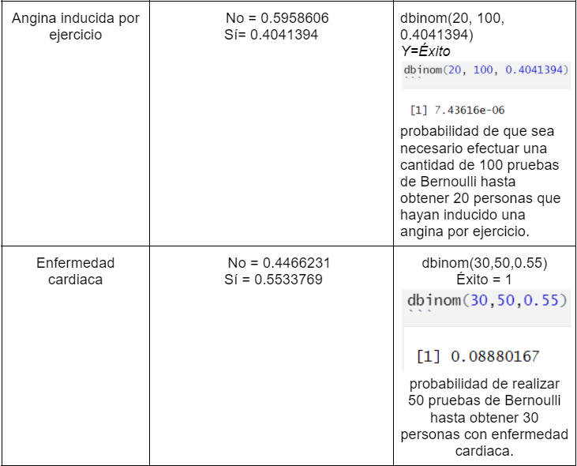
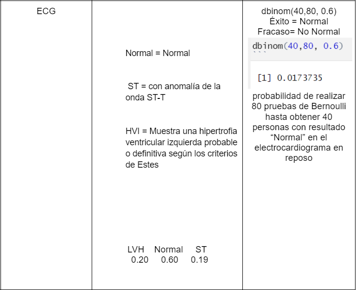

## <span style="color: #1e90ff;">**Marco Teórico**</span>


### <span style="color: red;">***Objetivo***</span>

Hallar una relación entre la incidencia de enfermedades cardíacas con diversos factores como la edad, sexo y otros factores médicos, teniendo como finalidad la predicción de enfermedades cardiovasculares en pacientes y así poder preverlas.

### <span style="color: red;">***Población***</span>

El conjunto de datos que utilizaremos se creó combinando diferentes conjuntos de datos que ya estaban disponibles de forma independiente, pero que no se habían combinado antes. En este conjunto de datos, se combinan 5 conjuntos de datos cardíacos sobre 11 características comunes, lo que lo convierte en el conjunto de datos de enfermedades cardíacas más grande disponible hasta ahora para fines de investigación. Los cinco conjuntos de datos utilizados para su curación son:

Cleveland: 303 observaciones  
Húngaro: 294 observaciones  
Suiza: 123 observaciones  
Long Beach VA: 200 observaciones  
Conjunto de datos de Stalog (corazón): 270 observaciones  

### <span style="color: red;">***Unidades muestrales***</span>

Individuos de diferentes ciudades.

### <span style="color: red;">***Variables***</span>
  - Edad  
  - Sexo  
  - Tipo de dolor torácico  
  - Presión arterial en reposo  
  - Colesterol sérico  
  - Azúcar en la sangre en ayunas  
  - Resultados del electrocardiograma en reposo  
  - frecuencia cardíaca máxima alcanzada  
  - Angina inducida por el ejercicio  

### <span style="color: red;">***Tipos de variables***</span>

Se usaron variables numéricas y categóricas.

### <span style="color: red;">***Introducción***</span>

Las enfermedades cardiovasculares (ECV) son la causa número 1 de muertes en el mundo. Estas provocan alrededor de 18.6 millones de muertes al año. Según la Federación Mundial del Corazón , el 80% de fallecimientos por ECV pudieron haber sido prevenidos. 

Estas enfermedades normalmente son altamente prevenibles debido a que son ocasionadas principalmente por el estilo de vida. Por esto, es importante detectar cualquier problema cardiaco desde una etapa temprana para evitar consecuencia fatales. En este estudio estadístico se utilizan diversos factores que pueden ser usados para predecir con antelación una enfermedad cardíaca.^[https://www.sanofi.com.pe/es/media/80-por-ciento-de-los-fallecimientos-por-enfermedades-cardiovasculares-son-prevenibles]

## <span style="color: #1e90ff;">**Preguntas introductorias**</span>

#### **¿La mayoría de personas con enfermedades cardíacas son hombres o mujeres? ¿Cuál es su porcentaje?**

Se sabe que el porcentaje de personas del sexo masculino es de 78.97603 % , por lo que es mas posible que quienes mas padezcan de enfermedades cardíacas sean hombres. Apoyándonos es un estudio realizado por Investigadores de Mayo Clinic (Estados Unidos).
En el cual, los expertos comprobaron que las mujeres tienen menos ataques cardíacos que los hombres en todos los grupos de edad clasificados en este estudio. En nuestra muestra el 49.891068 % representa el porcentaje de hombres que padecen alguna enfermedad cardíaca. 

#### **¿Cuál es la edad en la que se presenta la mayor cantidad de personas con  enfermedades cardíacas?** 

La muestra contiene personas desde los 28 hasta los 77 años. Según el instituto National Institute on Aging que afirma que los cambios que ocurren con la edad pueden aumentar el riesgo de una persona de desarrollar una enfermedad cardíaca puesto que el envejecimiento puede causar cambios en el corazón y en los vasos sanguíneos. Basándonos en esa información y en que la etapa de envejecimiento empieza desde los 60 años según el instituto nacional de Geriatría se espera que la mayor cantidad de personas con enfermedades cardíacas se ubiquen en el intervalo de 60 a 77 años de edad. 


#### **¿La mayor cantidad de personas que no presentan colesterol sérico son hombres o mujeres? ¿Cuál es su porcentaje?** 

Se sabe que el porcentaje de personas del sexo masculino es de 78.97603 % , por lo que es mas posible que sean quienes no padecen de colesterol sérico sean hombres. Así mismo, según la Asociación Americana del Corazón (AHA) señalan que el riesgo de colesterol elevado suele aumentar con la edad, y el trastorno es más común en las mujeres que en los hombres.En nuestra muestra se observa que aproximadamente el  17.5381264% de hombres no padecen de colesterol sérico. 


#### **¿Existe una relación entre presión arterial en reposo y colesterol sérico?¿De existir, como es esta relación?**

Según Mayo Clinic, el colesterol alto ocasiona la acumulación de colesterol en las paredes arteriales, lo que a su vez es un factor para la hipertensión arterial (presión alta). Por lo que se esperaría ver una relación directamente proporcional entre el colesterol sérico y la presión arterial en reposo.

#### **¿Qué relación guarda el colesterol sérico con los resultados de electrocardiograma en reposo en las personas evaluadas?**

El colesterol sérico en cantidades altas puede tener efectos nocivos en la salud. Según Mayo Clinic, es un factor para los ataques cardíacos. Por esto es posible que veamos una relación en la que en una alza de colesterol sérico (predominando el colesterol malo) corresponda con algún resultado de electrocardiograma ST o HVI, indicando que hay complicaciones cardíacas.

#### **¿Qué tipo de dolor de pecho es predominante?¿Qué porcentaje tiene?¿Hay alguna variable que se relacione con algún tipo de dolor de pecho?**

Hay tipos de dolor de pecho, entre los cuales están los causados por anginas, los no causados por anginas, asintomáticos, etc. Los dolores de pecho pueden ser ocasionados por muchas cosas, y no necesariamente por una angina, por lo que se espera que predomine el dolor de pecho asintomático. Según Mayo Clinic, el colesterol alto afecta a las arterias y el suministro de sangre al corazón, lo que puede ocasionar angina de pecho. Es por eso que esta variable podría aumentar la incidencia de los dolores de pecho ocasionados por anginas.

#### **¿Cuál es el promedio de colesterol sérico de mujeres y varones? ¿Hay gran diferencia entre los promedios? ¿Qué podría indicar?**

En promedio, el colesterol sérico en mujeres es de 187.5131 mm / dl y el de varones  241.1969 mm / dl
En promedio,el colesterol sérico es más alto en mujeres y por encima del colesterol sérico adecuado (entre 125 a 200, según MedlinePlus). Si hay una diferencia considerable entre el colesterol promedio de mujeres y varones teniendo estos últimos un promedio de colesterol adecuado.^[https://medlineplus.gov/spanish/cholesterollevelswhatyouneedtoknow.html]

#### **¿Cuál es la cantidad de personas que padece de enfermedad cardíaca y que tiene azúcar en la sangre en ayunas mayor a 120 mg/dl ?**
Se puede afirmar que son 170 personas, que vendrían a representar el 18.52% del total de la muestra escogida. Si bien no pasa el 50%, se puede apreciar que si hay una población considerable que posee azúcar en la sangre en ayunas mayor a 120 mg/dl y que padece de enfermedad cardíaca, por lo que se podría evidenciar una relación entre ambas variables.

#### **¿Cuál es el porcentaje  de personas que tienen presión arterial en reposo mayor a 80 y que a su vez, padecen de enfermedad cardíaca?** 
Según el Ministerio de Salud, la presión arterial en reposo no debe superar los 80 mm Hg ya que pasar esa presión sería un indicador de hipertensión.
Aproximadamente el 55.22% de personas que tiene presión arterial en reposo mayor a 80 mm Hg  padece de enfermedad cardíaca. Esto podría indicar la relación directa que tienen ambas variables ya que ocurre en más de la mitad de la población.^[https://www.gob.pe/institucion/minsa/campa%C3%B1as/361-mide-tu-presion-y-ayuda-a-tu-corazon]


## <span style="color: #1e90ff;">**Datos y librerías**</span>

Aquí tenemos las librerías que utilizaremos para el procesamiento de datos. Además está la lectura de la base de datos en un dataframe.

```{r, include=TRUE}

#knitr::opts_chunk$set(echo = FALSE)
#install.packages("modeest")
#install.packages("readr")
#install.packages("tidyverse")
library(readr)
library("modeest")
library("readr")
library("tidyverse")
DF = read.csv("heart.csv")
```


## <span style="color: #1e90ff;">**Descriptores numéricos y gráficos de las variables**</span>


### <span style="color: green;">**Edad**</span>
```{r EDAD, include=TRUE}

maximo=max(DF$Edad)
minimo=min(DF$Edad)
media = mean(unlist(DF$Edad))
mediana = median(DF$Edad)
moda = mfv(DF$Edad)
rango= maximo-minimo
varianza = var(unlist(DF$Edad))
variación_estándar = sd(unlist(DF$Edad))
rango_intercuartil = quantile(unlist(DF$Edad), 0.75)-quantile(unlist(DF$Edad), 0.25)
```

```{r edad, echo=FALSE}
#knitr::opts_chunk$set(echo = TRUE)
paste("La edad máxima es:",maximo)
paste("La edad mínima es:",minimo)
paste("La media es:", media)
paste("La mediana es:", mediana)
paste("El rango es:", rango)
paste("La varianza es:", varianza)
paste("La variación estándar  es:", variación_estándar )
paste("La rango intercuartil  es:", rango_intercuartil )
paste("La moda es:", moda)


```

```{r}
#Frecuencia de la edad
tabla_edad = as.data.frame(table(Edad = DF$Edad ))
tablae = transform(tabla_edad,
          FreqAc = cumsum(Freq),
          Rel = round(prop.table(Freq), 3),
          RelAc= round(cumsum(prop.table(Freq)),3))
tablae
```


```{r}
hist(DF$Edad, xlab = "Años", ylab = "Frecuencia"  , col = "red",main = "Edades")
abline(v = median(DF$Edad), col="yellow", lwd=3, lty=2)
abline(v = median(DF$Edad), col="blue")
legend(x="bottomright", inset = c(0.3, 0.35), legend=c("Mediana  ", "Media    "),col=c("blue", "red"),lty=1:2, cex=0.6,
       title="Line types", text.font=4)
```

En el histograma se muestra la frecuencia de las personas examinadas según su edad.Se encuentra personas desde los 28 a 77 años, de manera visual podemos notar que la gráficas presenta mas personas con edades de 50 a 55. La media es de 53.51 años y la mediana es de 54 años. Al ser la mediana mayor que la media, el conjunto de datos está sesgado a la derecha.

#### **Diagrama de caja**
```{r}
boxplot(DF$Edad, horizontal=T, col="yellow", main="EDADES")
```

En este diagrama de cajas podemos ver que la mediana está centrada por lo que los datos están distribuidos casi uniformemente. Además, vemos que no hay datos atípicos, lo que es de esperarse ya que el la recolección de datos se hizo con un rango de edad definido.


### <span style="color: green;">**Sexo**</span>
```{r SEXO}
Nombre_datos = unique(DF$Sexo)
tabla = table(DF$Sexo)
porcentajes_sexo = prop.table(tabla)*100
sexo=table(DF$Sexo)
```


```{r , echo=FALSE}

paste("Porcentaje de individuos de sexo femenino:",porcentajes_sexo[1])
paste("Porcentaje de individuos de sexo masculino:",porcentajes_sexo[2])

```


```{r , echo=FALSE}

paste("Cantidad de individuos de sexo femenino:",sexo[1])
paste("Cantidad de individuos de sexo masculino:",sexo[2])
```


```{r}
barplot(sexo,col=c("yellow","blue") )

```

En este caso se utilizó una gráfica de barras porque eran variable categóricas. Podemos apreciar que la proporción de los individuos del estudio por sexo es de aproximadamente 21% para las mujeres y 79% para los hombres. Por lo que nuestro estudio será más representativo para los hombres.


### <span style="color: green;">**Dolor de Pecho**</span>
```{r Tipo de dolor de pecho}
Nombre_datos = unique(DF$TipoDeDolorDePecho)
tabla = table (DF$TipoDeDolorDePecho)
porcentajes_pecho = prop.table(tabla)*100
```


```{r echo=FALSE}

paste("Porcentaje de ASY:", porcentajes_pecho[1])
paste("Porcentaje de ATA:",porcentajes_pecho[2])
paste("Porcentaje de NAP:",porcentajes_pecho[3])
paste("Porcentaje de TA:",porcentajes_pecho[4])

```

```{r}
#Frecuencia del dolor de pecho
tabla_dolor = as.data.frame(table(TipoDeDolorDePecho= DF$TipoDeDolorDePecho ))
tabla_do = transform(tabla_dolor,
          FreqAc = cumsum(Freq),
          Rel = round(prop.table(Freq), 3),
          RelAc= round(cumsum(prop.table(Freq)),3))
tabla_do

```


#### **Donde -->TA: angina típica, ATA: angina atípica, NAP: dolor no anginal, ASY: asintomático**
```{r include=FALSE}
str(DF$TipoDeDolorDePecho)
str(DF$ResultadosDelElectrocardiogramaEnReposo)
str(DF$AnginaInducidaPorEjercicio)
```


```{r}
barplot(prop.table(table(DF$TipoDeDolorDePecho)),col=c("orange", "blue","green", "brown"),ylim=c(0,0.8),main="Tipos de dolor de pecho", ylab ="Porcentaje")
```

En la gráfica se muestra los porcentajes de los tipos de dolor de pecho, se muestra cuatro dolores de pecho "ASY"(asintomático), "ATA", "NAP"(dolor no angina) y "TA"(angina típica).El dolor de pecho que tiene mas frecuencia es el "ASY" , seguido por "NAP"(), "ATA" y por ultimo "TA" a través de esto podemos afirmar que el tipo de dolor de pecho "ASY" es el más común.

### <span style="color: green;">**Presión arterial en reposo**</span>
```{r Presión arterial en reposo en mm Hg}
maximo=max(DF$PresionArterialEnReposo)
minimo=min(DF$PresionArterialEnReposo)
media = mean(unlist(DF$PresionArterialEnReposo))
mediana = median(DF$PresionArterialEnReposo)
moda = mfv(DF$PresionArterialEnReposo)
rango= maximo-minimo
varianza = var(unlist(DF$PresionArterialEnReposo))
variación_estándar = sd(unlist(DF$PresionArterialEnReposo))
rango_intercuartil = quantile(unlist(DF$PresionArterialEnReposo), 0.75)-quantile(unlist(DF$PresionArterialEnReposo), 0.25)
```


```{r echo=FALSE}
paste("El máximo es:",maximo)
paste("El mínimo es:",minimo)
paste("La media es:", media)
paste("La mediana es:", mediana)
paste("El rango es:", rango)
paste("La varianza es:", varianza)
paste("La variación estándar  es:", variación_estándar )
paste("La rango intercuartil  es:", rango_intercuartil )
paste("La moda es:", moda)

```

```{r }
#TABLA DE PRESION ARTERIAL

tabla_edad = as.data.frame(table(Edad = DF$PresionArterialEnReposo ))
tablae = transform(tabla_edad,
          FreqAc = cumsum(Freq),
          Rel = round(prop.table(Freq), 3),
          RelAc= round(cumsum(prop.table(Freq)),3))
tablae
```

```{r}
#GRAFICA DE PRESIÓN ARTERIAL EN REPOSO

hist(DF$PresionArterialEnReposo,ylab="Frecuencia",col=c("lightgreen"),xlab="Presion arterial en reposo",main="GRÁFICA DE PRESIÓN ARTERIAL EN REPOSO")
abline(v = mean(DF$PresionArterialEnReposo), col="blue", lwd=3, lty=2)
abline(v = median(DF$PresionArterialEnReposo), col="red")
legend(x="bottomright", inset = c(0.009, 0.35), legend=c("Mediana  ", "Media    "),col=c("red", "blue"),lty=1:2, cex=0.6,
       title="Line types", text.font=4)

```

Al ser una variable numérica se escogió un gráfico de barras, la mayoría se encuentra en un rango de 100 y 150, se puede ver que existe poca dispersión ya que la media y mediana están juntas.

### <span style="color: green;">**Colesterol Sérico**</span>
```{r : colesterol sérico [mm / dl]}
maximo=max(DF$ColesterolSerico)
minimo=min(DF$ColesterolSerico)
media = mean(unlist(DF$ColesterolSerico))
mediana = median(DF$ColesterolSerico)
moda = mfv(DF$ColesterolSerico)
rango= maximo-minimo
varianza = var(unlist(DF$ColesterolSerico))
variación_estándar = sd(unlist(DF$ColesterolSerico))
rango_intercuartil = quantile(unlist(DF$ColesterolSerico), 0.75)-quantile(unlist(DF$ColesterolSerico), 0.25)
```


```{r echo=FALSE}
paste("El máximo es:",maximo)
paste("El mínimo es:",minimo)
paste("La media es:", media)
paste("La mediana es:", mediana)
paste("El rango es:", rango)
paste("La varianza es:", varianza)
paste("La variación estándar  es:", variación_estándar )
paste("La rango intercuartil  es:", rango_intercuartil )
paste("La moda es:", moda)

```

```{r eval=FALSE, include=FALSE}
#Frecuencia del Colesterol serico
tabla_colesterol = as.data.frame(table(ColesterolSerico= DF$ColesterolSerico ))
tabla_co = transform(tabla_colesterol,
          FreqAc = cumsum(Freq),
          Rel = round(prop.table(Freq), 3),
          RelAc= round(cumsum(prop.table(Freq)),3))
tabla_co
```

```{r}
hist(DF$ColesterolSerico, xlab = "miligramos", ylab = "Frecuencia"  , col = "orange",main = "Colesterol Serico")
abline(v = median(DF$ColesterolSerico), col="yellow", lwd=3, lty=2)
abline(v = median(DF$ColesterolSerico), col="blue")
legend(x="bottomright", inset = c(0.3, 0.35), legend=c("Mediana  ", "Media    "),col=c("blue", "red"),lty=1:2, cex=0.6,
       title="Line types", text.font=4)
```

En el histograma se muestra la frecuencia del colesterol sérico en las personas examinadas,El colesterol va de 0 a 358 miligramos por dl, de manera visual podemos notar que la mayoría de las personas tienen de 200 a 250 miligramos/dl de colesterol. También la mediana y la media son iguales(223)por lo que la distribución de esta variables es simétrica.

#### **Diagrama de caja**

```{r}

boxplot(DF$ColesterolSerico, horizontal=T, col="yellow", main="COLESTEROL SERICO")
```

En este diagrama de caja podemos observar que los datos de colésterol sérico se encuentran distribuidos alrededor de la mediana, cerca a 200 miligramos/dl. Además, vemos varios datos atípicos, especialmente hacia la derecha, lo que nos indica que hay individuos que tienen el colesterol sérico muy alto, esto podría ser un factor para una enfermedad cardíaca.

### <span style="color: green;">**Glucemia en Ayunas**</span>
```{r Glucemia en ayunas}
#Porcentaje de cada dato 
porcentajes_glucemia=prop.table(table(DF$GlucemiaEnAyunas))*100
moda_glucemia=mfv(DF$GlucemiaEnAyunas)
```

```{r echo=FALSE}

paste("Porcentaje de individuos con azúcar en la sangre en ayunas menor o igual a 120 mg / dl:",porcentajes_glucemia[1] )
paste("Porcentaje de individuos con azúcar en la sangre en ayunas mayor a 120 mg / dl:",porcentajes_glucemia[2] )
paste("La moda es: ", moda_glucemia,", es decir que hay más personas con BS menor o igual a 120 mg/dl.")
```


```{r}
barplot(table(DF$GlucemiaEnAyunas),main = "Gráfica de personas glucemia en ayunas",ylab="Frecuencia",col = c("royalblue", "seagreen"))
```

En este caso se utilizó una gráfica de barras porque eran variable categóricas. Podemos ver que la mayoría de los individuos de nuestros datos tienen una concentración de azúcar de 120 mg/dl (1) que los que tienen una concentración menor o igual a 120 (0).

### <span style="color: green;">**Resultados de Electrocardiograma en reposo**</span>
```{r ResultadosDelElectrocardiogramaEnReposo}

ELEC=DF$ResultadosDelElectrocardiogramaEnReposo
unique(ELEC)
porcentajes_ELEC=prop.table(table(ELEC))*100

```

```{r echo=FALSE}
paste("La moda es:", mfv(ELEC))
paste("El porcentaje de resultado LVH en electrocardiograma en reposo es:", porcentajes_ELEC[1])
paste("El porcentaje de resultado normal en electrocardiograma en reposo es:", porcentajes_ELEC[2])
paste("El porcentaje de resultado ST en electrocardiograma en reposo es:", porcentajes_ELEC[3])
```

```{r}
#Frecuencia de resultados del electrocardiograma en reposo
tabla_electrocardiogama = as.data.frame(table(ResultadosDelElectrocardiogramaEnReposo= DF$ResultadosDelElectrocardiogramaEnReposo ))
tabla_e = transform(tabla_electrocardiogama,
          FreqAc = cumsum(Freq),
          Rel = round(prop.table(Freq), 3),
          RelAc= round(cumsum(prop.table(Freq)),3))
tabla_e
```

```{r}
barplot(prop.table(table(DF$ResultadosDelElectrocardiogramaEnReposo)),col=c("pink", "red","purple"),ylim=c(0,0.8),main="Resultados de electrocardiogamas", ylab ="Porcentaje")
```

En la gráfica se muestra los porcentajes de los resultados de los electrocardiogramas, se muestran tres el "LVH", EL "NORMAL" y el "ST"(con anomalía de la onda), después del electrocardiograma podemos ver que el la mayoría de las personas examinadas tienen un ritmo cardíaco "NORMAL", seguido por "LVH"y por ultimo "ST" con poca diferencia.


### <span style="color: green;">**Frecuencia Cardíaca Máxima Alcanzada**</span>
```{r FrecuenciaCardiacaMaximaAlcanzada}

FCM= DF$FrecuenciaCardiacaMaximaAlcanzada
maximo=max(FCM)
minimo=min(FCM)
#quantile(FCM, 0.5)
rango= maximo-minimo
#rango intercuartil
#quantile(FCM, 0.75)-quantile(FCM, 0.25)
rango_intercuartil=IQR(FCM)
media=mean(FCM)
varianza=var(FCM)
variación_estándar=sd(FCM)
mediana=median(FCM)
moda=mfv(FCM)

```

```{r echo=FALSE}
paste("El máximo es:",maximo)
paste("El mínimo es:",minimo)
paste("La media es:", media)
paste("La mediana es:", mediana)
paste("El rango es:", rango)
paste("La varianza es:", varianza)
paste("La variación estándar  es:", variación_estándar )
paste("La rango intercuartil  es:", rango_intercuartil )
paste("La moda es:", moda)
```

```{r}
#TABLA DE PRECUENCIA CARDIACA MÁXIMA

tabla_edad = as.data.frame(table(Edad = DF$FrecuenciaCardiacaMaximaAlcanzada ))
tablae = transform(tabla_edad,
          FreqAc = cumsum(Freq),
          Rel = round(prop.table(Freq), 3),
          RelAc= round(cumsum(prop.table(Freq)),3))
tablae
```

```{r}
#GRÁFICA DE FRECUENCIA CARDÍACA MÁXIMA ALCANZADA

hist(DF$FrecuenciaCardiacaMaximaAlcanzada,ylab="Frecuencia",col=c("lightblue"),xlab="Frecuencia Cardiaca máxima",main="GRÁFICA DE FRECUENCIA CARDÍACA MÁXIMA ALCANZADA")
abline(v = mean(DF$FrecuenciaCardiacaMaximaAlcanzada), col="blue", lwd=3, lty=2)
abline(v = median(DF$FrecuenciaCardiacaMaximaAlcanzada), col="red")
legend(x="bottomright", inset = c(0.009, 0.35), legend=c("Mediana  ", "Media    "),col=c( "red","blue"),lty=1:2, cex=0.6,
       title="Line types", text.font=4)

```

Al ser una variable numérica se debe representar mediante histogramas ya que de esta manera podemos observar su comportamiento, en este caso podemos ver que existe poca dispersión de los datos, ya que la media y mediana se encuentran cerca.

### <span style="color: green;">**Angina inducida por ejercicio**</span>
```{r AnginaInducidaPorEjercicio}
ANG=DF$AnginaInducidaPorEjercicio
unique(ANG)
porcentaje_angina=prop.table(table(ANG))*100

```

```{r echo=FALSE}

paste("Porcentaje de No (N):", porcentaje_angina[1])
paste("Porcentaje de Sí (Y):", porcentaje_angina[2])
paste("La moda es", mfv(ANG))
```

```{r}
#Frecuencia de angina inducida por ejercicio
tabla_angina = as.data.frame(table(AnginaInducidaPorEjercicio= DF$AnginaInducidaPorEjercicio ))
tabla_a = transform(tabla_angina,
          FreqAc = cumsum(Freq),
          Rel = round(prop.table(Freq), 3),
          RelAc= round(cumsum(prop.table(Freq)),3))
tabla_a
```

```{r}
barplot(prop.table(table(DF$AnginaInducidaPorEjercicio)),col=c("pink", "red","purple"),ylim=c(0,0.8),main="Angina inducida por el ejercicio", ylab ="Porcentaje")
```

En la gráfica se muestra los porcentajes de la angina inducida por el ejercicio, se muestran dos el "N" (no)y el "Y"(yes),la mayoría de las personas examinadas no tienen un angina.

### <span style="color: green;">**Enfermedad Cardíaca**</span>
```{r EnfermedadCardiaca}
ENF=DF$EnfermedadCardiaca
porcentaje_heart_disease=prop.table(table(ENF))*100
enfermedad=table(DF$EnfermedadCardiaca)
```

```{r echo=FALSE}
paste("Porcentaje de No Enfermedad Cardiaca (0):", porcentaje_heart_disease[1])
paste("Porcentaje de Enfermedad Cardiaca (1):", porcentaje_heart_disease[2])
paste("Individuos sin enfermedad Cardiaca (0):", enfermedad[1])
paste("Individuos con Enfermedad Cardiaca (1):", enfermedad[2])
paste("La moda es", mfv(ENF))
```

```{r}
barplot(table(DF$EnfermedadCardiaca), main="GRÁFICA DE ENFERMEDAD CARDIACA",ylab="Frecuencia",xlab="Enfermedad Cardíaca",col=c("orange","purple"))
```

En este caso se utilizó una gráfica de barras porque eran variable categóricas. En los individuos de nuestro estudio tenemos que 508 presentan un enfermedad cardíaca y 410 no tienen un enfermedad cardíaca. 


## <span style="color: #1e90ff;">**Relaciones**</span>

La siguiente gráfica compara dos variables categóricas, el sexo y  la enfermedad cardíaca,en la variable de enfermedad cardíaca el valor de 0 es "No" y el de 1 es "Sí". En este gráfico nos revela que en nuestra muestra hay más hombres que mujeres,además  que las mujeres tiene pocas probabilidades a sufrir de alguna enfermedad cardíaca, a diferencia de los hombre, donde la mayoría padece de alguna enfermedad cardíaca.
```{r}
#Mosaico Relación sexo-enfermedadcar

mosaicplot(table(DF$Sexo,DF$EnfermedadCardiaca),main ="GRÁFICO DE SEXO VS ENFERMEDADES CARDIACAS",xlab="Sexo",ylab="Enfermedad Cardiaca",color=c("pink", "blue"))
```

#### -----------------------------------------------------------------------------------------------------

El gráfico de mosaico nos muestra la relación de las variables de sexo y angina inducida.La variable de angina inducida se divide en "Y"(Si) "N"(No), las cuales hacen referencia a si la persona a sufrido de dolores en el pecho por el ejercicio, en donde nos damos cuenta que los hombres son más propenso a padecer estos síndromes.
```{r}
#Mosaico sexo vs angina inducida

mosaicplot(table(DF$Sexo,DF$AnginaInducidaPorEjercicio),main ="GRÁFICO DE SEXO VS ANGINA INDUCIDA",xlab="Sexo",ylab="Angina Inducida",color=c("green","red"))
```

#### -----------------------------------------------------------------------------------------------------

En este caso al ser 2 variables categóricas,es preferible utilizar mosaicos para compararlos, tenemos a las variables de  Glucemia en ayunas donde el "0" significa que es menos de 120 mg / dl, y 1 mayor a 120 mg / dl. Lo cual nos da a entender que mientras la glucemia sea mayor a 120 mg / dl, existirá una mayor posibilidad de sufrir de una enfermedad cardíaca. Esto podría deberse a que la glucemia es un factor importante para la diabetes, ya que los niveles altos de azúcar genera daños  en las vasos sanguíneos del corazón
```{r}
#Mosaico Relacion glucemia-enfermedadcard
mosaicplot(table(DF$GlucemiaEnAyunas,DF$EnfermedadCardiaca),main="GRÁFICO DE GLUCEMIA  VS  ENFERMEDAD CARDIACA",color=c("blue", "red"),xlab="Glucemia en ayunas",ylab="Enfermedad Cardiaca")
```

#### -----------------------------------------------------------------------------------------------------

En este gráfico nos damos cuenta que la mayor parte de la frecuencia cardíaca se encuentra concentrada en el dominio de 120 y 140, con un rango de 125 a 150.Además que hay pocas personas con frecuencia cardíaca menor a 100, sin embargo estás poseen  un  presión arterial alta.Asimismo, los que poseen una frecuencia cardíaca alta tiene una presión arterial baja.
```{r}
#Gráfico de dispersión   frecuencia cardíaca - presionarterial
plot(DF$FrecuenciaCardiacaMaximaAlcanzada, DF$PresionArterialEnReposo,ylab="Presión arterial de reposo",xlab="Frecuencia cardiaca máxima",main="GRÁFICO DE DISPERSIÓN DE LA PRESIÓN ARTERIAL  VS  FRECUENCIA CARDIACA")
```

#### -----------------------------------------------------------------------------------------------------

La gráfica nos permite saber las relaciones que existe entre las variables del sexo y la glucemia en ayunas, las mujeres poseen una menor cantidad de glucemia mayor a 120 mg / dl, a diferencia de los hombres. Lo cual hace que en nuestra muestra los hombres sean más propensos a sufrir de diabetes.
```{r}
#GRAFICO DE SEXO VS GLUCEMIA EN AYUNAS

mosaicplot(table(DF$Sexo,DF$GlucemiaEnAyunas),color=c("lightblue","orange"),xlab="Sexo",ylab="Glucemia en ayunas",main="GRÁFICO DE SEXO  VS GLUCEMIA EN AYUNAS")
```

#### -----------------------------------------------------------------------------------------------------

Se utiliza un gráfico de barras porque de esta manera podemos comparar una variable numérica con una variable categórica, de esta manera nos damos cuenta que las personas que tienen una mayor frecuencia cardíaca máxima son menos propensos a sufrir de alguna enfermedad cardíaca, si la frecuencia cardíaca disminuye aumentar la probabilidades de sufrir una enfermedad cardíaca.Sin embargo, es preciso recordar de que hay pocas muestras que se encuentren en los máximos y mínimos valores de frecuencia cardíaca,existe una mayor densidad en la mediana.
```{r}
#GRAFICO Enfermedadcardiaca - FrecuenciaCardiacaMaximaAlcanzada
barplot(table(DF$EnfermedadCardiaca,DF$FrecuenciaCardiacaMaximaAlcanzada),col=c("yellow","brown"),legend.text = rownames(table(DF$EnfermedadCardiaca,DF$FrecuenciaCardiacaMaximaAlcanzada)),xlab="Frecencia cardíaca máxima",ylab="Frecuencia",main="GRÁFICO DE ENFERMEDAD CARDIACA VS FRECUENCIA CARDIACA MÁXIMA")
```

#### -----------------------------------------------------------------------------------------------------

En este caso se utiliza un gráfico de mosaico debido a que son 2 tipo de variables categóricas,lo cual nos permite ver que los hombres poseen una mayor frecuencia cardíaca máxima, sin embargo nos damos cuenta de que mientras más aumenta la cantidad de frecuencia cardíaca máxima también aumenta la cantidad de mujeres.Sin embargo, sigue habiendo más hombres con una mayor cantidad de frecuencia cardíaca alta.
```{r}
#GRAFICO SEXO - FRECUENCIA CARDIACA
barplot(table(DF$Sexo,DF$FrecuenciaCardiacaMaximaAlcanzada),col=c("yellow","lightblue"),legend.text = rownames(table(DF$Sexo,DF$FrecuenciaCardiacaMaximaAlcanzada)),xlab="Frecuencia cardiaca máxima alcanzada",ylab="Frecuencia",main="GRÁFICO DE SEXO VS  FRECUENCIA CARDIACA")

```


```{r eval=FALSE, include=FALSE}
#### **GRAFICOS DE FRECUENCIAS RELACIONANDO LAS VARIABLES CUALITATIVAS**
str(DF$TipoDeDolorDePecho)
str(DF$ResultadosDelElectrocardiogramaEnReposo)
str(DF$AnginaInducidaPorEjercicio)

mosaicplot(table(DF$TipoDeDolorDePecho,DF$ResultadosDelElectrocardiogramaEnReposo), col=c("red","yellow"),main="",xlab="Resultados Del Electrocardiograma", ylab="TipoDeDolorDePecho")
mosaicplot(table(DF$TipoDeDolorDePecho,DF$AnginaInducidaPorEjercicio), col=c("green","blue"),main="",xlab="tipos de dolor de pecho", ylab="Angina Inducida por el ejercicio")
mosaicplot(table(DF$ResultadosDelElectrocardiogramaEnReposo,DF$AnginaInducidaPorEjercicio), col=c("purple","orange"),main="",xlab="Resultados Del Electrocardiograma", ylab="Angina Inducida por el ejercicio")


```

#### **GRAFICO DE PUNTOS RELACIONANDO LA EDAD CON LOS TIPOS DE DOLOR DE PECHO, COLESTEROL SERICO,PRESIÓN ARTERIAL EN REPOSO,FRECUENCIA CARDIACA MAXIMA ALCANZADA Y ENFERMEDAD CARDIACA  **
#### **GRAFICO DE DISPERSIÓN TIPO DE DOLOR VERSUS LA EDAD.**

```{r}
plot(DF$ColesterolSerico, DF$Edad,main = "COLESTEROL SERICO POR EDAD", xlab="Colesterol serico", ylab="Edad")
```

Elegimos el gráfico de puntos para comparar las variables porque ambas son numéricas,de manera visual podemos observar mayor frecuencia de colesterol serico entre las edades de 50 a 60 años por la mayor cantidad de puntos que se observan.

#### -----------------------------------------------------------------------------------------------------

```{r}
barplot(table(DF$TipoDeDolorDePecho,DF$Edad),col=c("pink","blue","purple","orange"),legend.text = rownames(table(DF$TipoDeDolorDePecho,DF$Edad)),main="TIPO DE DOLOR DE PECHO VS LA EDAD", ylab="tipos de dolor de pecho", xlab="Edad")
```

Elegimos el gráfico de barras por que tenemos una variable numérica y otra variable cualitativa, de manera visual podemos observar que las personas de 55 a 58 años sufren mayor dolor de pecho y que el dolor de pecho que mas se presenta es el "ASY"(asintomático).

#### -----------------------------------------------------------------------------------------------------

```{r}
plot(DF$PresionArterialEnReposo, DF$Edad,main = "PRESIÓN ARTERIAL EN REPOSO POR EDAD", xlab="Presión arterioal en reposo", ylab="Edad")
```

Elegimos el gráfico de puntos para comparar las variables porque ambas son numéricas,de manera visual podemos observar mayor frecuencia de presión arterial en reposo entre las edades de 50 a 60 años y de 100 a 140 en presión arterial por la mayor cantidad de puntos que se observan.

#### -----------------------------------------------------------------------------------------------------

```{r}
plot(DF$FrecuenciaCardiacaMaximaAlcanzada, DF$Edad,main = "FRECUENCIA CARDIACA MAXIMA ALCANZADA POR EDAD", xlab="Frecuencia Maxima alcanzada", ylab="Edad")
```

Elegimos el gráfico de puntos para comparar las variables porque ambas son numéricas,de manera visual podemos observar mayor frecuencia cardíaca alcanzada entre las edades de 45 a 65 años y de 125 a 150 en la frecuencia cardíaca alcanzada más o menos por la mayor cantidad de puntos que se observan.

#### -----------------------------------------------------------------------------------------------------

```{r}
barplot(table(DF$EnfermedadCardiaca,DF$Edad),col=c("pink","purple"),legend.text = rownames(table(DF$EnfermedadCardiaca,DF$Edad)),main="ENFERMEDAD CARDIACA VS EDAD", ylab="Enfermedad Cardiaca", xlab="Edad")

```
Elegimos el gráfico de barras por que tenemos una variable numérica y otra variable cualitativa, de manera visual podemos observar que las personas de 55 a 56 años sufren mayor enfermedad cardíaca y que a mayor edad es donde se presentan enfermedades cardíacas.


### **Diagramas de caja**

Se escoge esta gráfica porque es una variable numérica, porque resume la media y nos permite saber los casos atípicos. La gráfica nos muestra que en promedio la mujeres tienen una mayor media en colesterol sérico, y que  los hombres poseen mayores rangos entre valores máximos y mínimos.
```{r}
boxplot(DF$ColesterolSerico~DF$Sexo, col=c("red","blue"), main="COLESTEROL SÉRICO VS SEXO", ylab="COLESTEROL SÉRICO", xlab="SEXO")
```

#### -----------------------------------------------------------------------------------------------------

En este caso la gráfica nos muestra que tanto las mujeres como los hombres tienen una media cercana, y fluctuan entre máximos y mínimos cercanos.
```{r}
boxplot(DF$PresionArterialEnReposo~DF$Sexo, col=c("red","blue"), main="PRESIÓN ARTERIAL VS SEXO", ylab="PRESIÓN ARTERIAL", xlab="SEXO")
```

#### -----------------------------------------------------------------------------------------------------
Se escoge este gráfico para poder examinar una variable numérica con una categórica, la cual nos muestra que las mujeres poseen en promedio una mayor frecuencia cardíaca máxima esto puede deberse a que usualmente las mujeres posee 10 pulsaciones más que los hombres. Sin embargo los hombres tiene mayores rangos de máximo y mínimo, lo cual puede deberse a  cuestiones externas como hábitos deportivos y alimenticios.
```{r}
boxplot(DF$FrecuenciaCardiacaMaximaAlcanzada~DF$Sexo, col=c("red","blue"), main="FRECUENCIA CARDIACA MÁXIMA VS SEXO", ylab="FRECUENCIA CARDIACA MÁXIMA", xlab="SEXO")

```


## <span style="color: #1e90ff;">**Modelos de variable aleatoria**</span>





## <span style="color: #1e90ff;">**Patrones**</span>

### ***Patrón 1***

```{r Edad y presion arterial PATRON 1}

  prom_P1 = mean(unlist(DF[(DF$Edad>27 & DF$Edad<=29),4]))
  prom_P2 = mean(unlist(DF[(DF$Edad>29 & DF$Edad<=31),4]))
  prom_P3 = mean(unlist(DF[(DF$Edad>31 & DF$Edad<=33),4]))
  prom_P4= mean(unlist(DF[(DF$Edad>33 & DF$Edad<=35),4]))
  prom_P5 = mean(unlist(DF[(DF$Edad>35 & DF$Edad<=37),4]))
  prom_P6 = mean(unlist(DF[(DF$Edad>37 & DF$Edad<=39),4]))
  prom_P7 = mean(unlist(DF[(DF$Edad>39 & DF$Edad<=41),4]))
  prom_P8 = mean(unlist(DF[(DF$Edad>41 & DF$Edad<=43),4]))
  prom_P9 = mean(unlist(DF[(DF$Edad>43 & DF$Edad<=45),4]))
  prom_P10 = mean(unlist(DF[(DF$Edad>45 & DF$Edad<=47),4]))
  prom_P11 = mean(unlist(DF[(DF$Edad>47 & DF$Edad<=49),4]))
  prom_P12 = mean(unlist(DF[(DF$Edad>49 & DF$Edad<=51),4]))
  prom_P13 = mean(unlist(DF[(DF$Edad>51 & DF$Edad<=53),4]))
  prom_P14= mean(unlist(DF[(DF$Edad>53 & DF$Edad<=55),4]))
  prom_P15 = mean(unlist(DF[(DF$Edad>55 & DF$Edad<=57),4])) 
  prom_P16 = mean(unlist(DF[(DF$Edad>57 & DF$Edad<=59),4]))
  prom_P16 = mean(unlist(DF[(DF$Edad>59 & DF$Edad<=61),4]))
  prom_P17 = mean(unlist(DF[(DF$Edad>61 & DF$Edad<=63),4]))
  prom_P18= mean(unlist(DF[(DF$Edad>63 & DF$Edad<=65),4]))
  prom_P19 = mean(unlist(DF[(DF$Edad>65 & DF$Edad<=67),4])) 
  prom_P20 = mean(unlist(DF[(DF$Edad>67 & DF$Edad<=69),4]))
  prom_P21 = mean(unlist(DF[(DF$Edad>69 & DF$Edad<=71),4]))
  prom_P22 = mean(unlist(DF[(DF$Edad>71 & DF$Edad<=73),4]))
  prom_P23= mean(unlist(DF[(DF$Edad>73 & DF$Edad<=75),4]))
  prom_P24 = mean(unlist(DF[(DF$Edad>75 & DF$Edad<=78),4]))

 
 
 

  prom_edad1 = mean(unlist(DF[(DF$Edad>27 & DF$Edad<=29),1]))
  prom_edad2= mean(unlist(DF[(DF$Edad>29 & DF$Edad<=31),1]))
  prom_edad3 = mean(unlist(DF[(DF$Edad>31 & DF$Edad<=33),1]))
  prom_edad4= mean(unlist(DF[(DF$Edad>33 & DF$Edad<=35),1]))
  prom_edad5 = mean(unlist(DF[(DF$Edad>35 & DF$Edad<=37),1]))
  prom_edad6 = mean(unlist(DF[(DF$Edad>37 & DF$Edad<=39),1]))
  prom_edad7 = mean(unlist(DF[(DF$Edad>39 & DF$Edad<=41),1]))
  prom_edad8 = mean(unlist(DF[(DF$Edad>41 & DF$Edad<=43),1]))
  prom_edad9 = mean(unlist(DF[(DF$Edad>43 & DF$Edad<=45),1]))
  prom_edad10 = mean(unlist(DF[(DF$Edad>45 & DF$Edad<=47),1]))
  prom_edad11 = mean(unlist(DF[(DF$Edad>47 & DF$Edad<=49),1]))
  prom_edad12 = mean(unlist(DF[(DF$Edad>49 & DF$Edad<=51),1]))
  prom_edad13 = mean(unlist(DF[(DF$Edad>51 & DF$Edad<=53),1]))
  prom_edad14= mean(unlist(DF[(DF$Edad>53 & DF$Edad<=55),1]))
  prom_edad15 = mean(unlist(DF[(DF$Edad>55 & DF$Edad<=57),1])) 
  prom_edad16 = mean(unlist(DF[(DF$Edad>57 & DF$Edad<=59),1]))
  prom_edad16 = mean(unlist(DF[(DF$Edad>59 & DF$Edad<=61),1]))
  prom_edad17 = mean(unlist(DF[(DF$Edad>61 & DF$Edad<=63),1]))
  prom_edad18= mean(unlist(DF[(DF$Edad>63 & DF$Edad<=65),1]))
  prom_edad19 = mean(unlist(DF[(DF$Edad>65 & DF$Edad<=67),1])) 
  prom_edad20 = mean(unlist(DF[(DF$Edad>67 & DF$Edad<=69),1]))
  prom_edad21 = mean(unlist(DF[(DF$Edad>69 & DF$Edad<=71),1]))
  prom_edad22 = mean(unlist(DF[(DF$Edad>71 & DF$Edad<=73),1]))
  prom_edad23= mean(unlist(DF[(DF$Edad>73 & DF$Edad<=75),1]))
  prom_edad24 = mean(unlist(DF[(DF$Edad>75 & DF$Edad<=78),1]))


promedios_P = data.frame(prom= c(prom_P1,prom_P2,prom_P3,prom_P4,prom_P5,prom_P6,prom_P7,prom_P8,prom_P9,prom_P10,prom_P11,prom_P12,prom_P13,prom_P14,prom_P15,prom_P16,prom_P17,prom_P18,prom_P19,prom_P20,prom_P21,prom_P22,prom_P22,prom_P23,prom_P24))

edades = data.frame(edades = c(prom_edad1,prom_edad2,prom_edad3,prom_edad4,prom_edad5,prom_edad6,prom_edad7,prom_edad8,prom_edad9,prom_edad10,prom_edad11,prom_edad12,prom_edad13,prom_edad14,prom_edad15,prom_edad16,prom_edad17,prom_edad18,prom_edad19,prom_edad20,prom_edad21,prom_edad22,prom_edad22,prom_edad23,prom_edad24))
datos<-data.frame(edades,promedios_P)


barplot(unlist(datos$prom),unlist(datos$edades),col = rainbow(26), xlab = "Edades", ylab = "Presión arterial en reposo", main = "Edades vs presión arterial en reposo")
```

En este gráfico de barras podemos observar la relación que tienen las dos variables numéricas, las edades en una rango de 28 a 78 medida en años y la presión arterial medida en mmHg. Se muestran los rangos máximos que alcanzan las presiones arteriales  de acuerdo a la edad y en algunas edades se llega a 140 mmhg de presión arterial, algo más que podemos concluir visualmente, es que en nuestra muestra no hay personas que pasen de 140 mmhg de presión arterial, es decir no presentan hipertensión de etapa dos.

```{r }
plot(unlist(datos$edades),unlist(datos$prom),type = "b",main = "Edad y Presión arterial en reposo ", xlab = "Edad", ylab = "Presión arterial en reposo",pch = 8, bg = "red",  col = "red", cex = 1)


```

  
Estos gráficos representan la relación entre la variable edades y la variable que indica la presión arterial en reposo. Se muestra aproximadamente una relación lineal, por lo que podría indicar que a mayor edad hay una mayor presión arterial en reposo.  
Se indica que según el Ministerio de salud se considera normal en adultos una presión menor de 120 mm Hg cuando el corazón late (presión sistólica) y menor de 80 mm Hg cuando el corazón se relaja (presión diastólica). Según los datos de la muestra, se ve que hay varios casos de hipertensión y estos se hacen más graves mientras más edad se tiene.

#### -----------------------------------------------------------------------------------------------------

### ***Patrón 2***

```{r Edad y Colesterol Sérico PATRON}
  prom_C1 = mean(unlist(DF[(DF$Edad>27 & DF$Edad<=29),5]))
  prom_C2= mean(unlist(DF[(DF$Edad>29 & DF$Edad<=31),5]))
  prom_C3 = mean(unlist(DF[(DF$Edad>31 & DF$Edad<=33),5]))
  prom_C4= mean(unlist(DF[(DF$Edad>33 & DF$Edad<=35),5]))
  prom_C5 = mean(unlist(DF[(DF$Edad>35 & DF$Edad<=37),5]))
  prom_C6 = mean(unlist(DF[(DF$Edad>37 & DF$Edad<=39),5]))
  prom_C7 = mean(unlist(DF[(DF$Edad>39 & DF$Edad<=41),5]))
  prom_C8 = mean(unlist(DF[(DF$Edad>41 & DF$Edad<=43),5]))
  prom_C9 = mean(unlist(DF[(DF$Edad>43 & DF$Edad<=45),5]))
  prom_C10 = mean(unlist(DF[(DF$Edad>45 & DF$Edad<=47),5]))
  prom_C11 = mean(unlist(DF[(DF$Edad>47 & DF$Edad<=49),5]))
  prom_C12 = mean(unlist(DF[(DF$Edad>49 & DF$Edad<=51),5]))
  prom_C13 = mean(unlist(DF[(DF$Edad>51 & DF$Edad<=53),5]))
  prom_C14= mean(unlist(DF[(DF$Edad>53 & DF$Edad<=55),5]))
  prom_C15 = mean(unlist(DF[(DF$Edad>55 & DF$Edad<=57),5])) 
  prom_C16 = mean(unlist(DF[(DF$Edad>57 & DF$Edad<=59),5]))
  prom_C16 = mean(unlist(DF[(DF$Edad>59 & DF$Edad<=61),5]))
  prom_C17 = mean(unlist(DF[(DF$Edad>61 & DF$Edad<=63),5]))
  prom_C18= mean(unlist(DF[(DF$Edad>63 & DF$Edad<=65),5]))
  prom_C19 = mean(unlist(DF[(DF$Edad>65 & DF$Edad<=67),5])) 
  prom_C20 = mean(unlist(DF[(DF$Edad>67 & DF$Edad<=69),5]))
  prom_C21 = mean(unlist(DF[(DF$Edad>69 & DF$Edad<=71),5]))
  prom_C22 = mean(unlist(DF[(DF$Edad>71 & DF$Edad<=73),5]))
  prom_C23= mean(unlist(DF[(DF$Edad>73 & DF$Edad<=75),5]))
  prom_C24 = mean(unlist(DF[(DF$Edad>75 & DF$Edad<=78),5]))

   
   
promedios_COL = data.frame(prom= c(prom_C1,prom_C2,prom_C3,prom_C4,prom_C5,prom_C6,prom_C7,prom_C8,prom_C9,prom_C10,prom_C11,prom_C12,prom_C13,prom_C14,prom_C15,prom_C16,prom_C17,prom_C18,prom_C19,prom_C20,prom_C21,prom_C22,prom_C22,prom_C23,prom_C24))
  
Datos_Colesterol <- data.frame(edades,promedios_COL)

barplot(Datos_Colesterol$prom,Datos_Colesterol$edades,col = rainbow(26), main = "Edad vs Colesterol Serico", xlab = "Edades", ylab = "Colesterol Serico")
```


```{r }
plot(Datos_Colesterol$edades,Datos_Colesterol$prom,col = rainbow(26), main = "Edad vs Colesterol Serico", xlab = "Edades", ylab = "Colesterol Serico",
abline(lm(Datos_Colesterol$edades ~ Datos_Colesterol$prom),col="red"))
```


Este grafico se muestra la relación entre las variables Edad y colesterol sérico. Se puede observar que aproximadamente en las personas de 28 a  55 años de edad el nivel de colesterol sérico supera los 200  mm / dl. Esto se considera peligroso puesto que según la fundación española del corazón, los niveles de colesterol sérico superiores 200  mm / dl significa que presenta hipercolesterolemia.

#### -----------------------------------------------------------------------------------------------------

### ***Patrón 3***

```{r Edad y Frecuencia Cardiaca Máxima Alcanzada  PATRON 3}
  prom_F1 = mean(unlist(DF[(DF$Edad>27 & DF$Edad<=29),8]))
  prom_F2= mean(unlist(DF[(DF$Edad>29 & DF$Edad<=31),8]))
  prom_F3 = mean(unlist(DF[(DF$Edad>31 & DF$Edad<=33),8]))
  prom_F4= mean(unlist(DF[(DF$Edad>33 & DF$Edad<=35),8]))
  prom_F5 = mean(unlist(DF[(DF$Edad>35 & DF$Edad<=37),8]))
  prom_F6 = mean(unlist(DF[(DF$Edad>37 & DF$Edad<=39),8]))
  prom_F7 = mean(unlist(DF[(DF$Edad>39 & DF$Edad<=41),8]))
  prom_F8 = mean(unlist(DF[(DF$Edad>41 & DF$Edad<=43),8]))
  prom_F9 = mean(unlist(DF[(DF$Edad>43 & DF$Edad<=45),8]))
  prom_F10 = mean(unlist(DF[(DF$Edad>45 & DF$Edad<=47),8]))
  prom_F11 = mean(unlist(DF[(DF$Edad>47 & DF$Edad<=49),8]))
  prom_F12 = mean(unlist(DF[(DF$Edad>49 & DF$Edad<=51),8]))
  prom_F13 = mean(unlist(DF[(DF$Edad>51 & DF$Edad<=53),8]))
  prom_F14= mean(unlist(DF[(DF$Edad>53 & DF$Edad<=55),8]))
  prom_F15 = mean(unlist(DF[(DF$Edad>55 & DF$Edad<=57),8])) 
  prom_F16 = mean(unlist(DF[(DF$Edad>57 & DF$Edad<=59),8]))
  prom_F16 = mean(unlist(DF[(DF$Edad>59 & DF$Edad<=61),8]))
  prom_F17 = mean(unlist(DF[(DF$Edad>61 & DF$Edad<=63),8]))
  prom_F18= mean(unlist(DF[(DF$Edad>63 & DF$Edad<=65),8]))
  prom_F19 = mean(unlist(DF[(DF$Edad>65 & DF$Edad<=67),8])) 
  prom_F20 = mean(unlist(DF[(DF$Edad>67 & DF$Edad<=69),8]))
  prom_F21 = mean(unlist(DF[(DF$Edad>69 & DF$Edad<=71),8]))
  prom_F22 = mean(unlist(DF[(DF$Edad>71 & DF$Edad<=73),8]))
  prom_F23= mean(unlist(DF[(DF$Edad>73 & DF$Edad<=75),8]))
  prom_F24 = mean(unlist(DF[(DF$Edad>75 & DF$Edad<=78),8]))

promedios_F = data.frame(prom= c(prom_F1,prom_F2,prom_F3,prom_F4,prom_F5,prom_F6,prom_F7,prom_F8,prom_F9,prom_F10,prom_F11,prom_F12,prom_F13,prom_F14,prom_F15,prom_F16,prom_F17,prom_F18,prom_F19,prom_F20,prom_F21,prom_F22,prom_F22,prom_F23,prom_F24))

Datos_FrecuenciaMaxima <- data.frame(edades,promedios_F)

plot(unlist(Datos_FrecuenciaMaxima$edades),unlist(Datos_FrecuenciaMaxima$prom),main = "Edad y Frecuencia Cardiaca Máxima Alcanzada ", xlab = "edad", ylab = "Frecuencia Cardiaca máxima alcanzada" ,pch = 8,bg = "purple",  col = "purple", cex = 1 ,abline(lm(Datos_FrecuenciaMaxima$edades ~ Datos_FrecuenciaMaxima$prom),col="red"))

```

F(x)= -1.03x + 194.68, x e [28,78]  

Esta función representa la relación entre la frecuencia cardiaca máxima alcanzada y la edad. El dominio de esta función es de 28 a 78 años que es el rango de edades de la muestra.    
Se tiene como término independiente a la edad que tiene como unidad los años y el término dependiente P qué es la frecuencia cardiaca máxima que tiene como unidad lpm.    
Según la función, hay una pendiente negativa por lo que se puede observar que la edad y la frecuencia cardiaca máxima tienen una relación inversa, lo que indicaría que mientras la edad aumenta, la frecuencia cardiaca máxima alcanzada disminuye.  
Según American heart association la relación entre la edad y la frecuencia cardiaca máxima alcanzada es inversamente proporcional. por lo que da más seguridad a la hipótesis planteada.   
https://www.goredforwomen.org/es/healthy-living/fitness/fitness-basics/target-heart-rates  

```{r}

Datos_x <- data.frame(promedios_F,promedios_COL)
Datos_Y <- data.frame(promedios_P,promedios_F)

table(promedios_F,promedios_COL)

barplot(Datos_x$prom,Datos_x$prom.1,col = rainbow(26), main = " Colesterol Serico vs Frecuencia cardíaca máxima alcanzada ", ylab = "Frecuencia cardíaca máxima alcanzada", xlab = "Colesterol Serico")
```

En este gráfico de barras podemos observar la relación que tienen las dos variables numéricas, el colesterol sérico medido en mg por decilitro de sangre y la frecuencia cardíaca máxima alcanzada medida en latidos por minuto Se muestran los rangos máximos que alcanzan las frecuencias cardiácas versus las personas que tienen colesterol sérico, hicimos la gráfica con las medias de colesterol sérico entre pequeños rangos, lo que podemos concluir visualmente, es que en las personas con menor colesterol sérico son las que tienen frecuencias cardíacas más altas y que esta supera los 150.

```{r}
plot(Datos_Y$prom,Datos_Y$prom.1,col = rainbow(26), main = " presion arterial e reposo vs Frecuencia cardíaca máxima alcanzada ", ylab = "Frecuencia cardíaca máxima alcanzada", xlab = "presion arterial e reposo",
abline(lm(Datos_Y$prom ~ Datos_x$prom.1),col="red"))


```

Esta función representa la relación entre la frecuencia cardiaca máxima alcanzada y la presión arterial en reposo.
Se tiene como término independiente a la presión arterial en reposo medido en mmhg y el término dependiente P qué es la frecuencia cardiaca máxima que tiene como unidad lpm.
Según la función,la frecuencia cardiaca máxima y la presión arterial tienen una relación casi lineal y que tienen mayor incidencia entre 130 mmhg y 125 a 165 lpm.

```{r}
barplot(Datos_Y$prom.1,Datos_Y$prom,col = rainbow(26), main = " Frecuencia cardíaca máxima alcanzada vs Presión  arterial en resposo ", xlab = "Frecuencia cardíaca máxima alcanzada", ylab = "Presión arterial en resposo ") 

```

Esta gráfica representa la relación entre la frecuencia cardiaca máxima alcanzada y la presión arterial en reposo. Se puede observar la variedad que tienen estas relaciones y que la presión arterial en algunas personas con frecuencias cardiacas máximas alcanzadas superan los 150 mmhg.

## <span style="color: #1e90ff;">**Intervalos de Confianza**</span>

En esta parte del proyecto se encontraran los intervalos de confianza para una proporción poblacional, y el intervalo de confianza para la media poblacional, de esta manera poder conocer sobre el estado de nuestra población, y saber si son propensos a sufrir de alguna enfermedad cardiaca.

### <span style="color: #1e90ff;">**INTERVALO DE CONFIANZA PROPORCIONAL**</span>

### ***ENFERMEDAD CARDIACA***
En este caso teniendo en cuenta que en nuestra muestra 508 de 918 personas sufren de una enfermedad cardiaca, se ha decidico saber cual es la proporción poblacional. Teniendo en cuenta un nivel 99% de confianza.


```{r}
#508 poseen alguna enfermedad
#Intervalos con la variables
#Nivel de confianza 99%
#1-0.99=0.01
#Significancia alfa=0.01
table(DF$EnfermedadCardiaca)
total=918
cenfer=508
alfa=0.01
p=cenfer/total
z1=qnorm(1-alfa/2)
a1=p+z1*sqrt(p*(1-p)/total)
b1=p-z1*sqrt(p*(1-p)/total)
a1
b1
```

Lo cual nos dice que aproximandamente el intervalo de confianza es [0.51,0.60], osea que entre el 51% y el 60%  de nuestra población sufren de alguna enfermedad cardiaca.

### ***GLUCEMIA EN AYUNAS***

Teniendo en cuenta quienes poseen una glucemia mayor a 120 mg/dl, tiene  un mayor riesgo a padecer enfermedades cardiacas, se busca obtener el intervalo de proporción de la población que posee esta característica.

Nivel de confianza 99%

```{r}

table(DF$GlucemiaEnAyunas)
#214 glucemia alta en ayunas
cglucemia=214
alfa=0.01
p2=cglucemia/total
z2=qnorm(1-alfa/2)
a2=p2-z2*sqrt(p2*(1-p2)/total)
b2=p2+z2*sqrt(p2*(1-p2)/total)
a2 
b2
```

Según los resultados se encuentra un intervalo de confianza proporcional de [0.19,0.27], lo que significa que nuestra población posee  una glucemia entre el 19% y 27%, lo cual nos da entender  pocas personas de la población posee un glucemia alta en ayunas.
.

### ***COLESTEROL SÉRICO***


Teniendo en cuenta que el colesterol serico afecta a la circulación de la sangre, lo cual ocasionaria un ataque cardiaco al haber una obstrucción en alguna arteria. Se decide  saber mediante nuestra muestra el porcentaje de la población que posee un colesterol serico alto (mayor a 200).
Nivel de confianza 99%


```{r}
colesterol=DF$ColesterolSerico
nmayor200=nrow(filter(DF,ColesterolSerico>200))
#355 personas sufren de colesterol alto mayor a 200
ccolest=nmayor200
alfa=0.01
p3=ccolest/total
z3=qnorm(1-alfa/2)
a3=p3-z3*sqrt(p3*(1-p3)/total)
b3=p3+z3*sqrt(p3*(1-p3)/total)
a3 
b3 

```

Obtenemos que el intervalo de confianza es de [0.60,0.69], osea que entre el 60% y el 69% de la población posee  un coletero sérico alto. Analizando esto con el intervalo de proporción de personas que sufren enfermedades cardíacas,podemos  encontrar una fuerte relación entre ambas variables. Confirmando así que el alto porcentaje de personas que sufren de enfermedades cardíacas  se debe a que también sufren de un alto colesterol sérico.


### ***PRESIÓN ARTERIAL***
Se desea saber respecto a nuestra muestra,  el porcentaje de nuestra población que posee una presión arterial  mayor a 80 [mm Hg], ya que ante un ataque cardíaco existe una previa presión arterial cardiaca alta.


```{r}
#Presion arterial alta mayor a 80
npresionarterial80=nrow(filter(DF,PresionArterialEnReposo>80))
d=npresionarterial80
d
alfa=0.01
p5=d/total
z5=qnorm(1-alfa/2)
a5=p5-z5*sqrt(p5*(1-p5)/total)
b5=p5+z5*sqrt(p5*(1-p5)/total)
a5
b5
```


Se obtuvo un intervalo de confianza de la proporción poblacional de  [0.99,1.01], lo cual significa que entre el 99% y 100% posee una presión arterial en reposo mayor a 80.A través de esto, podemos mencionar que la mayoría de las personas muestreadas podría sufrir de algún ataque cradíaco..


### <span style="color: #1e90ff;">**Intervalos de media poblacional frecuencia cardiaca máxima.**</span>

Como se sabe el analisis de la frecuencia cardiaca es importante ya que niveles altos de frecuencia cardiaca máxima puede ocasionar ataques al corazón, por ello es que se busca encontrar cual es la propoción poblacional que de niveles altos de frecuencia cardiaca.

```{r}
nf100=nrow(filter(DF,FrecuenciaCardiacaMaximaAlcanzada>130))
g=nf100
alfa=0.01
p6=g/total
z6=qnorm(1-alfa/2)
a6=p6-z6*sqrt(p6*(1-p6)/total)
b6=p6+z6*sqrt(p6*(1-p6)/total)
a6
b6
```


Se obtiene un intervalo de confianza de la proporción poblacional de[ 0.52,0.62], lo cual significa que entre un 52% y 62%  de la población posee una frecuencia cardíaca alta, esto coincide con el intervalo de proporción poblacional de personas que tienen enfermedades cardíacas. Podemos concluir que estas proporciones tienen mucha relación, siendo una consecuencia de la otra.

## <span style="color: #1e90ff;">**Pruebas de Hipótesis**</span>


### <span style="color: #1e90ff;">**PRUEBA DE HIPOTESIS 1:**</span>

Una presion arterial en reposo mayor a 80 mm Hg podría indicar hipertensión.Teniendo en cuenta esto, se plantea la siguiente hipotesis: 
 
H0=Hipótesis nula 

H1=Hipótesis complementaria

H0: El promedio de la presion arterial en reposo de mujeres es mayor o igual a  80mmHg X>=80

H0: µ >= 80

H1: El promedio de la presion arterial en reposo de mujeres menor a 80 mmHg x<80

H1: µ < 80

Se tendrá una región de rechazo de H0 con un area de 0.05 (Prueba de hipótesis de una cola)
t= estadístico de prueba.
```{r}
n=193
alpha_2= 0.01
n_confianza=0.99
qt(alpha_2,n-1)#valor crítico=-2.345926 


x_r=mean(unlist(DF[DF$Sexo=="F",4]))#media de las mujeres con presion art
u=80
s=sd(unlist(DF[DF$Sexo=="F",4]))
t=(x_r-u)/(s*n^0.5)
t#0.1938021 
```

Se puede apreciar que el estadístico de prueba cae en la region de no rechazo de H0,
Por lo tanto, no rechazamos H0 y no se rechaza decir que el promedio de la presion arterial en reposo de mujeres es mayor a 80mmHg.

```{r}
presion_arterial_mujeres <- DF[DF$Sexo=="F",4]
x <- presion_arterial_mujeres
curve(dnorm(x),-4,4, col = "blue", lwd= 2, xlab = "X", ylab = "F(X)")
abline(v = qnorm(alpha_2),col = "Red")
abline(v = t, col = "green", lwd=3, lty=2)
text(-3,0.2,"Rechazo", col = "Black")
text(0.1,0.1,"valor encontrado", col = "black")


```


Se puede apreciar que el estadístico de prueba cae en la region de no rechazo de H0, por lo tanto, no rechazamos H0. Por lo que se podría decir que el promedio de la presion arterial en reposo de mujeres es mayor a 80mmHg


### <span style="color: #1e90ff;">**PRUEBA DE HIPOTESIS 2:**</span>

H0=Hipótesis nula 


H1=Hipótesis complementaria
H0 = El promedio de la frecuencia cardiaca máxima alcanzada de mujeres es igual a 226

mu=226

H1 = El promedio de la frecuencia cardiaca máxima alcanzada de mujeres es diferente de 226 mu<226 o mu>226

Se tendrán 2 regiones de rechazo de H0 con un area de 0.025 cada uno (Prueba de hipótesis de 2 colas)

t= estadístico de prueba 

```{r}
n=193
alpha_2=0.025
n_confianza=0.95
qnorm(alpha_2)#-1.959964
x_r=mean(unlist(DF[DF$Sexo=="F",8]))#146.1399
u=226
s=sd(unlist(DF[DF$Sexo=="F",8]))#22.1549
t=(x_r-u)/(s*n^0.5)
t#-0.2594665
```


```{r}
f <- DF[DF$Sexo=="F",8]
x <- f
curve(dnorm(x),-4,4, col = "blue", lwd= 2, xlab = "X", ylab = "F(X)")
abline(v = qnorm(alpha_2),col = "Red")
abline(v = -qnorm(alpha_2),col = "Red")
abline(v = t, col = "green", lwd=3, lty=2)
text(-3,0.2,"Rechazo", col = "Black")
text(3,0.2,"Rechazo", col = "Black")
text(0.1,0.1,"valor encontrado", col = "black")


```


Se puede apreciar que el estadístico de prueba cae en la region de no rechazo de H0.

por lo tanto, no rechazamos H0 y no se puede rechazar que el promedio de la frecuencia cardiaca máxima alcanzada de mujeres es igual a 226.


### <span style="color: #1e90ff;">**PRUEBA DE HIPOTESIS 3:**</span>

H0=Hipótesis nula 

H1=Hipótesis complementaria

H0 =El promedio de los hombres no presentan colesterolemia, teniendo en cuenta que una persona no presenta colesterolemia si su colesterol sérico es menor o igual a 200 mm/dl x<=200
mu<=200


H1 = El promedio de los hombres presentan colesterolemia x>200

Se tendrá una región de rechazo de H0 con un area de 0.01  (Prueba de hipótesis de una cola)

```{r}

n = 725
alpha_2 = 0.01
n_confianza = 0.99
valor_critico = qnorm(alpha_2) # valor crítico=  -2.326348

x_r = mean(unlist(DF[DF$Sexo=="M",5])) #media de los hombres con colesterol 
s = sd(unlist(DF[DF$Sexo=="M",5])) # 112.3514
u = 200
t = (x_r-u)/(s*n^0.5)
t #-0.004127688
```


```{r}
f <- DF[DF$Sexo=="M",5]
x <- f
curve(dnorm(x),-4,4, col = "blue", lwd= 2, xlab = "X", ylab = "F(X)")
abline(v = -qnorm(alpha_2),col = "Red")
abline(v = t, col = "green", lwd=3, lty=2)
text(3,0.2,"Rechazo", col = "Black")

text(0.1,0.1,"valor encontrado", col = "black")


```


Se puede apreciar que el estadístico de prueba cae en la zona de no rechazo de H0. Por lo tanto, no se puede rechazar H0 y no se puede descartar que en promedio, los hombres no presentan colesterolemia 


#### -----------------------------------------------------------------------------------------------------

## <span style="color: #1e90ff;">**Regresiones y predicciones**</span>


### <span style="color: #1e90ff;">**REGRESIÓN 1**</span>

A continuación se realizará la regresión para explicar el comportamiento de la variable Frecuencia cardíaca máxima alcanzada en función de la edad.


```{r}

lma<-lm(DF$FrecuenciaCardiacaMaximaAlcanzada ~ DF$Edad)

plot(DF$Edad,DF$FrecuenciaCardiacaMaximaAlcanzada, pch=20, main = "Edad vs Frecuencia cardíaca máxima alcanzada", xlab="Edad", ylab = "Frecuencia cardíaca máxima alcanzada",col=rgb(0,0,0,0.2))
abline(lma,col="red")
```


### ***Ahora analizamos si efectivamente existe una correlacion lineal***

```{r}
cor.test(DF$FrecuenciaCardiacaMaximaAlcanzada,DF$Edad)
```


Al analizar el coeficiente de correlación de Pearson nos damos cuenta que sí existe una correlación lineal entre estas dos varibles y que la fuerza de esta correlación inversa es media.

Tras observar podemos darnos cuenta que existe una tendencia que se modela mediante una pendiente negativa en el comportamiento de la variable Frecuencia cardíaca máxima alcanzada respecto a la edad. Luego de ese analisis podemos plantear la siguiente hipótesis: A medida que la edad aumenta, la Frecuencia cardíaca máxima alcanzada disminuye. Sin embargo, para validar lo planteado se analizará el resumen de regresión. 


### ***Resumen de regresión***

```{r}
summary(lma)
```

Como primer punto en este análisis, debemos verificar que los residuos siguen el modelo normal:

La media de los residuos es:
```{r}
mean(lma$residuals)
```

El histograma de los residuos es:

```{r}

hist(lma$residuals, breaks= 20,main="Histograma de residuos", col="yellow", xlab = "Residuos", freq = FALSE)
curve(dnorm(x, mean(lma$residuals), sd = sd(lma$residuals)), 
      col = "Red", 
      lwd= 2,
      las = 1, 
      ann = FALSE, 
      xaxp = c(-15, 15, 5), 
      ylim = c(0,0.00020), 
      yaxs = "i", add=TRUE) 

```

Despues de observar este grafico se puede diferir que los residuos siguen una distribución cercana a la normal. Así mismo, su media es aproximadamente 0, esto aseguraria que el modelo presenta una linealidad.

A partir del resumen se obtienen las siguientes observaciones:

Con respecto al p−value del los coeficientes:

Intercepto: Para una significancia de 0.01 la hipótesis nula (H0) puesto que el p-values es menor a la significancia. Por lo tanto, (H0) se rechaza por lo que el valor de b≠0

Pendiente: Para una significancia de 0.01 la hipótesis nula (H0) puesto que el p-values es menor a la significancia. Por lo tanto, (H0) se rechaza por lo que el valor de a≠0


Con respecto la r cuadrado ajustado:

La variabilidad de la variable Frecuencia Cardiaca máxima alcanzada se explica solamente en un 14.5 % a través de la variación de la variable Edad. Este bajo porcentaje sugiere que ademas de esta variable existen otras que influyen en la variación de la Frecuencia cardíaca máxima alcanzada.

Con respecto al p−value del modelo:

Dado que el p−value (2.2e-16) es menor que la significancia (α=0.01) se rechaza la hipótesis nula H0 por lo que se sugiere que el modelo es valido.


### ***Gráficas de Diagnóstico***

```{r}

op=par(mfrow=c(2,2))
plot(lma, pch=20,col=rgb(0,0,0,0.25))

```

Luego de observar gráficas de diagnóstico de la línea de ajuste, se tienen las siguientes observaciones:

En la gráfica de Residuos vs. Valores ajustados:

-> Tenemos 3 valores atípicos.

-> Puede observarse que existen residuos positivos y negativos alrededor de la línea roja.

-> Los residuos son homocedásticos ya que no se distribuyen uniformemente alrededor de la línea roja.

En la gráfica de la Normal Q-Q:

-> Puede observarse que que la forma de la gráfica tiene una tendencia a la linealidad y se ajusta a la línea normal. llendo de esto podemos decir que el modelo puede ser adecuado.

En la gráfica Scale Location:

-> Los residuos están distribuidos alrededor de la recta roja y la misma es aproximadamente plana. Por lo que a partir de esta información se refuerza la condición de homocedasticidad del modelo.

Con respecto a la gráfica Residual vs. Leverage:

-> Puede observarse en la grafica que existen algunos puntos que producen el efecto palanca, Aquellos podrían ser determinantes de la tendencia.


#### **Ahora se usara el modelo para hacer predicciones**


De acuerdo a los resultados analizados, nuestro modelo resulta significativo y se ajusta a la siguiente expresión:

```{r}
lma$coefficients
```

Intercepto = 191.99
pendiente = -1.03

y = 191.99 + (-1.03x)

Frecuencia cardíaca máxima alcanzada =  -1.03(Edad) + 191.99

Para corroborar el ajuste, haremos una predicción para de la frecuencia cardíaca maxima alcanzada en las personas con 60 años de edad y corroboraremos el modelo comparandolo con el promedio de la frecuencia cardíaca máxima alcanzada de las personas con 60 años de edad de la data utilizada.

Evaluando:

Frecuencia cardíaca máxima alcanzada = -1.03 * (60)  + 191.99 
Frecuencia cardíaca máxima alcanzada = 130.19

Ahora, para verificar si nuestro modelo resulto ser útil o no, se calculará el promedio de la frecuencia cardíaca máxima alcanzada de las personas con 60 años de edad real a partir de la base datos. 

```{r}
promedio_F = DF %>% filter(grepl("60",Edad)) %>% pull(FrecuenciaCardiacaMaximaAlcanzada) %>% mean()
promedio_F
```


Luego de estas observaciones podemos darnos cuenta que nuestros valores difieren:

Valorestimado ≠ Valorreal
130.19 ≠ 135.25

ahora, teniendo los valores teóricos y valores estimados se calculará el porcentaje de error.

% error = |((Valorteórico−Valorestimado) / Valorteórico) x 100% |
% error=|((135.25 - 130.19)/ 135.25 )  * 100 % |
% error= 3.74 %

Se observa que el porcentanje de error es cercano al 3.74 %. Por lo que, se puede decir que nuestra regresión es significativa y pero, no al  ofrece una conclusión efectiva al 100% frente a las predicciones, ya que para determinar la frecuencia cardíaca máxima alcanzada depende de otros factores. 


### <span style="color: #1e90ff;">**REGRESIÓN 2**</span>

A continuación se realizará la regresión para explicar el comportamiento de la variable presión arterial en reposo en función de la edad.


```{r}

lmb<-lm(DF$PresionArterialEnReposo ~ DF$Edad)
    
    
plot(DF$Edad,DF$PresionArterialEnReposo, pch=20, main = "Edad vs PresionArterialEnReposoa", xlab="Edad", ylab = "PresionArterialEnReposo",col=rgb(0,0,0,0.2))
  abline(lmb,col="red")
```

### ***Ahora analizamos si efectivamente existe una correlacion lineal***

```{r}
cor.test(DF$PresionArterialEnReposo,DF$Edad)
```


Al analizar el coeficiente de correlación de Pearson nos damos cuenta que sí existe una correlación lineal entre estas dos varibles. Sin embargo, la fuerza de esta correlación directa es baja.

Tras observar podemos darnos cuenta que existe una tendencia que se modela mediante una pendiente postiva en el comportamiento de la variable Presión arterial en reposo respecto a la edad. Luego de ese análisis podemos plantear la siguiente hipótesis: A medida que la edad aumenta, la Presión arterial en reposo tambien aumenta. Sin embargo, para validar lo planteado se analizará el resumen de regresión. 


### ***Resumen de regresión***


```{r}
summary(lmb)
```


Como primer punto en este análisis, debemos verificar que los residuos siguen el modelo normal:

La media de los residuos es:
```{r}
mean(lmb$residuals)
```

El histograma de los residuos es:

```{r}

hist(lmb$residuals, breaks= 20,main="Histograma de residuos", col="Yellow", xlab = "Residuos", freq = FALSE)
curve(dnorm(x, mean(lmb$residuals), sd = sd(lmb$residuals)), 
      col = "Red", 
      lwd= 2,
      las = 1, 
      ann = FALSE, 
      xaxp = c(-15, 15, 5), 
      ylim = c(0,0.00020), 
      yaxs = "i", add=TRUE) 

```

Despues de observar este grafico se puede diferir que los residuos siguen una distribución cercana a la normal. Así mismo, su media es aproximadamente 0, esto aseguraria que el modelo presenta una linealidad.

A partir del resumen se obtienen las siguientes observaciones:

Con respecto al p−value del los coeficientes:

Intercepto: Para una significancia de 0.01 la hipótesis nula (H0) puesto que el p-values es menor a la significancia. Por lo tanto, (H0) se rechaza por lo que el valor de b≠0

Pendiente: Para una significancia de 0.01 la hipótesis nula (H0) puesto que el p-values es menor a la significancia. Por lo tanto, (H0) se rechaza por lo que el valor de a≠0

Con respecto la r cuadrado ajustado:

La variabilidad de la variable Presión arterial en reposo se explica solamente en un 6.37 % a través de la variación de la variable Edad. Este bajo porcentaje sugiere que ademas de esta variable existen otras que influyen en la variación de la Presión arterial en reposo .

Con respecto al p−value del modelo:

Dado que el p−value (5.015e-15) es menor que la significancia (α=0.01) se rechaza la hipótesis nula H0 por lo que se sugiere que el modelo es valido.


### ***Gráficas de Diagnóstico***
```{r}

op=par(mfrow=c(2,2))
plot(lmb, pch=20,col=rgb(0,0,0,0.25))

```

Luego de observar gráficas de diagnóstico de la línea de ajuste, se tienen las siguientes observaciones:

En la gráfica de Residuos vs. Valores ajustados:

-> Tenemos 3 valores atípicos.

-> Puede observarse que existen residuos positivos y negativos alrededor de la línea roja.

-> Los residuos son homocedásticos ya que no se distribuyen uniformemente alrededor de la línea roja.

En la gráfica de la Normal Q-Q:

-> Puede observarse que algunos valores no se ajustan a la linea normal 

-> Puede observarse que que la forma de la gráfica tiene una tendencia a la linealidad y se ajusta en su mayoria a la línea normal. llendo de esto podemos decir que el modelo puede ser adecuado.

En la gráfica Scale Location:

-> Los residuos están distribuidos alrededor de la recta roja y la misma es aproximadamente plana. Por lo que a partir de esta información se refuerza la condición de homocedasticidad del modelo.


### **Ahora se usara el modelo para hacer predicciones**

De acuerdo a los resultados analizados, nuestro modelo resulta significativo y se ajusta a la siguiente expresión:

```{r}
lmb$coefficients
```
Intercepto = 105.677
pendiente = 0.499

y = 105.677 + (0.499x)

Presión Arterial en reposo  = 0.499(Edad) + 105.677

Para corroborar el ajuste, haremos una predicción para de la Presión Arterial en reposo en las personas con 50 años de edad y corroboraremos el modelo comparandolo con el promedio de la Presión Arterial en reposo de las personas con 50 años de edad de la data utilizada.

Evaluando:

Presión Arterial en reposo  = 0.499*(50) + 105.677

Presión Arterial en reposo  = 130.627

Ahora, para verificar si nuestro modelo resulto ser útil o no, se calculará el promedio de la Presión Arterial en reposo de las personas con 50 años de edad real a partir de la base datos.

```{r}
promedio_P = DF %>% filter(grepl("50",Edad)) %>% pull(PresionArterialEnReposo) %>% mean()
promedio_P
```


Luego de estas observaciones podemos darnos cuenta que nuestros valores difieren:

Valorestimado ≠ Valorreal 130.627 ≠ 135

ahora, teniendo los valores teóricos y valores estimados se calculará el porcentaje de error.

% error = |((Valorteórico−Valorestimado) / Valorteórico) x 100% | 
% error=|((135 - 130.627)/ 135 ) * 100 % |
% error= 3.74 %

Se observa que el porcentanje de error es cercano al 3.24 %. Por lo que, se puede decir que nuestra regresión es significativa y pero, no ofrece una conclusión efectiva al 100% frente a las predicciones, ya que para determinar la Presión arterial en resposo depende de otros factores.


### <span style="color: #1e90ff;">**REGRESIÓN 3**</span>

A continuación se realizará la regresión para explicar el comportamiento de la variable Colesterol Sérico en función de la edad.


```{r}

lmc<-lm(DF$ColesterolSerico ~ DF$Edad)

plot(DF$Edad,DF$ColesterolSerico, pch=20, main = "Edad vs  Colesterol Sérico", xlab="Edad", ylab = " Colesterol Sérico",col=rgb(0,0,0,0.2))
abline(lmc,col="red")
```


### ***Ahora analizamos si efectivamente existe una correlacion lineal***

```{r}
cor.test(DF$ColesterolSerico,DF$Edad)
```


Al analizar el coeficiente de correlación de Pearson nos damos cuenta que sí existe una correlación lineal entre estas dos varibles y que la fuerza de esta correlación inversa es baja.

Tras observar podemos darnos cuenta que existe una tendencia que se modela mediante una pendiente negativa en el comportamiento de la variable Colesterol Sérico respecto a la edad. Luego de ese analisis podemos plantear la siguiente hipótesis: A medida que la edad aumenta, el Colesterol Sérico disminuye. Sin embargo, para validar lo planteado se analizará el resumen de regresión. 


### ***Resumen de regresión***

```{r}
summary(lmc)
```

Como primer punto en este análisis, debemos verificar que los residuos siguen el modelo normal:

La media de los residuos es:
```{r}
mean(lmc$residuals)
```

El histograma de los residuos es:

```{r}

hist(lmc$residuals, breaks= 20,main="Histograma de residuos", col="yellow", xlab = "Residuos", freq = FALSE)
curve(dnorm(x, mean(lmc$residuals), sd = sd(lmc$residuals)), 
      col = "Red", 
      lwd= 2,
      las = 1, 
      ann = FALSE, 
      xaxp = c(-15, 15, 5), 
      ylim = c(0,0.00020), 
      yaxs = "i", add=TRUE) 

```

Despues de observar este grafico se puede diferir que los residuos siguen una distribución cercana a la normal. Así mismo, su media es aproximadamente 0, esto aseguraria que el modelo presenta una linealidad.

A partir del resumen se obtienen las siguientes observaciones:

Con respecto al p−value del los coeficientes:

Intercepto: Para una significancia de 0.01 la hipótesis nula (H0) puesto que el p-values es menor a la significancia. Por lo tanto, (H0) se rechaza por lo que el valor de b≠0

Pendiente: Para una significancia de 0.01 la hipótesis nula (H0) puesto que el p-values es menor a la significancia. Por lo tanto, (H0) se rechaza por lo que el valor de a≠0


Con respecto la r cuadrado ajustado:

La variabilidad de la variable Colesterol Sérico se explica solamente en un 0.80 % a través de la variación de la variable Edad. Este bajo porcentaje sugiere que ademas de esta variable existen otras que influyen en la variación de la Colesterol Sérico.

Con respecto al p−value del modelo:

Dado que el p−value ( 0.003858) es menor que la significancia (α=0.01) se rechaza la hipótesis nula H0 por lo que se sugiere que el modelo es valido.


### ***Gráficas de Diagnóstico***

```{r}

op=par(mfrow=c(2,2))
plot(lmc, pch=20,col=rgb(0,0,0,0.25))

```

Luego de observar gráficas de diagnóstico de la línea de ajuste, se tienen las siguientes observaciones:

En la gráfica de Residuos vs. Valores ajustados:

-> Tenemos 3 valores atípicos.

-> Puede observarse que existen residuos positivos y negativos alrededor de la línea roja.

-> Los residuos son homocedásticos ya que no se distribuyen uniformemente alrededor de la línea roja a excepción de algunos valores.

En la gráfica de la Normal Q-Q:

-> Puede observarse que la mayoria de los valores se ajustan a la línea normal. llendo de esto podemos decir que el modelo puede ser adecuado.

En la gráfica Scale Location:

-> Los residuos están distribuidos alrededor de la recta roja y la misma es aproximadamente plana. Por lo que a partir de esta información se refuerza la condición de homocedasticidad del modelo.

Con respecto a la gráfica Residual vs. Leverage:

-> Puede observarse en la grafica que existen algunos puntos que producen el efecto palanca, Aquellos podrían ser determinantes de la tendencia.


#### **Ahora se usara el modelo para hacer predicciones**


De acuerdo a los resultados analizados, nuestro modelo resulta significativo y se ajusta a la siguiente expresión:

```{r}
lmc$coefficients
```

Intercepto = 257.92
pendiente = -1.10

y = 257.92 + (-1.10x)

Colesterol Sérico =  -1.10(Edad) + 257.92

Para corroborar el ajuste, haremos una predicción para del Colesterol Sérico en las personas con 40 años de edad y corroboraremos el modelo comparandolo con el promedio de la Colesterol Sérico de las personas con 40 años de edad de la data utilizada.

Evaluando:

Colesterol Sérico = -1.10 * (40)  + 257.92
Colesterol Sérico = 213.92

Ahora, para verificar si nuestro modelo resulto ser útil o no, se calculará el promedio de la Colesterol Sérico de las personas con 40 años de edad real a partir de la base datos. 

```{r}
promedio_C= DF %>% filter(grepl("40",Edad)) %>% pull(ColesterolSerico) %>% mean()
promedio_C
```


Luego de estas observaciones podemos darnos cuenta que nuestros valores difieren:

Valorestimado ≠ Valorreal
213.92 ≠  229.38

ahora, teniendo los valores teóricos y valores estimados se calculará el porcentaje de error.

% error = |((Valorteórico−Valorestimado) / Valorteórico) x 100% |
% error=|((229.38 - 213.92)/ 229.38 )  * 100 % |
% error= 6.74 %

Se observa que el porcentanje de error es cercano al 6.74 %. Por lo que, se puede decir que nuestra regresión es significativa, pero, no ofrece una conclusión efectiva al 100% frente a las predicciones, ya que el determinar el colesterol sérico de las personas depende de otros factores.

## <span style="color: #1e90ff;">**Conclusiones**</span>

  - Las mayoria de las personas del sexo femenino presentan al menos una enfermedad cardiaca en comparacion a las personas del sexo femenino. Sin embargo, no podria decirse que el sexo define si se tiene o no una enfermedad cardiaca puesto que para eso se necesita evaluar otras variables que no estamos considerando. Entre las variables más resaltantes, tenemos que los hombres padecen de más enfermedades cardíacas que las mujeres. Además, la variable de glucemia en ayunas con dato mayor a 120mg/dl, sucede más en la población masculina que en la femenina. También, la variable de angina (dolor de pecho) inducida por el ejercicio tiene mayor incidencia en los individuos varones que en individuos mujeres. Por lo que evidenciamos que, el sexo más afectado por las enfermedades cardiacas y/o factores que conducen a ellas, es el masculino. 
  - No es posible predecir la frecuencia cardiaca máxima alcanzada a través de la edad porque para determinar el comportamiento de esta variable es necesario evaluar otras variables que no estamos considerando en este estudio. 
  - Se encontró un intervalo alto de colesterol sérico, es decir mayor a 200 ml/dl entre las personas de nuestra muestra, podemos decir que las personas con alto colesterol están muy propensas a sufrir un ataque cardíaco y morir.
       
  - La relación de la frecuencia cardiaca con la incidencia de sufrir alguna enfermedad al corazón según los descriptores gráficos realizados  podemos ver las personas que poseen entre que de 60 a 127  existe una gran cantidad de personas que sufren de alguna enfermedad cardiaca, esto podría tener mucha relación ya que las bajas frecuencias cardiacas ocasionan enfermedades como la bradicardia, sin embargo también existen personas con alguna enfermedad que posee una frecuencia cardiaca esto podría tener relación con taquicardias.  
       


## <span style="color: #1e90ff;">**Fuentes**</span>
Base de datos:
[Kaggle - Heart disease Database](https://www.kaggle.com/fedesoriano/heart-failure-prediction)
