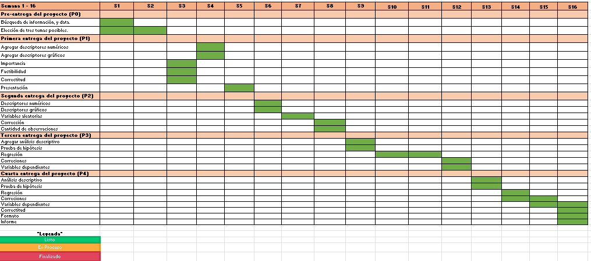

```{r eval=TRUE, echo=FALSE, message=FALSE,warning=FALSE}
library(readr)
library(dplyr)
library(stringr)

v=read_csv("Air_Traffic_Passenger_Statistics.csv")

v = v%>%filter(`Activity Period`>=201901)
v = mutate(v, Año = case_when(
  `Activity Period`<202001 ~ 2019,
  `Activity Period`<202101 ~ 2020,
  `Activity Period`>=202101 ~ 2021
))

v = mutate(v, Mes = case_when(
  `Activity Period`==201901 |`Activity Period`==202001 |`Activity Period`==202101 ~ 1,
  `Activity Period`==201902 |`Activity Period`==202002 |`Activity Period`==202102 ~ 2,
  `Activity Period`==201903 |`Activity Period`==202003 |`Activity Period`==202103 ~ 3,
  `Activity Period`==201904 |`Activity Period`==202004 |`Activity Period`==202104 ~ 4,
  `Activity Period`==201905 |`Activity Period`==202005 |`Activity Period`==202105 ~ 5,
  `Activity Period`==201906 |`Activity Period`==202006 |`Activity Period`==202106 ~ 6,
  `Activity Period`==201907 |`Activity Period`==202007 ~ 7,
  `Activity Period`==201908 |`Activity Period`==202008 ~ 8,
  `Activity Period`==201909 |`Activity Period`==202009 ~ 9,
  `Activity Period`==201910 |`Activity Period`==202010 ~ 10,
  `Activity Period`==201911 |`Activity Period`==202011 ~ 11,
  `Activity Period`==201912 |`Activity Period`==202012 ~ 12,
))

```

### **TEMA:**

### **Estudio sobre el patrón del transporte aéreo internacional durante los años 2019 al 2021**

### **OBJETIVOS**

#### **General**

-   Estudio sobre el patrón del transporte aéreo internacional durante los años 2019 al 2021

#### **Específicos**

-   Obtener un ranking de los continentes con mayor cantidad de pasajeros.
-   Describir el comportamiento de frecuencia con la que las personas tienden a viajar a diferentes continente en diferentes periodos de tiempo. 
-   Analizar los meses con mayor demanda de viajes por continente mediante el uso gráficos estadísticos 
-   Determinar el factor más relevante de la causa del alto flujo de viajes
-   Estimar el flujo de viajes para los siguientes años

### **VARIABLES**

**Tabla resumen de variables:**

| Nombre de la variable | Tipo de variable   |
|-----------------------|--------------------|
| Región                | Categórica nominal |
| Año                   | Numérica discreta  |
| Mes                   | Categórica ordinal |
| Número de pasajeros   | Numérica discreta  |
| Aerolínea             | Categórica nominal |
| Continente            | Categórica nominal |

\
\

#### **1. CONTINENTE (Variable Agregada)**

Teniendo las regiones

```{r}
unique(v$`GEO Region`)
```

Para efectos de la investigación se agrupan por continente tal que:

```{r}
v = v %>% mutate("Continente" = `GEO Region`)
v = v %>% mutate_at("Continente",~str_replace_all(., "Central America" , "America Central")) %>%
      mutate_at("Continente",~str_replace_all(., "South America" , "America del Sur")) %>%
      mutate_at("Continente",~str_replace_all(., "US|Canada|Mexico" , "America del Norte")) %>%
      mutate_at("Continente",~str_replace_all(., "Middle East|Asia" , "Asia")) %>%
      mutate_at("Continente",~str_replace_all(., "Australia / Oceania" , "Oceania"))
```

Resulta en la siguiente agrupación y se tienen las nuevas frecuencias:

```{r}
unique(v$Continente)
```

**Pasajeros por continente: Año 2019**

```{r}
viajes2019 = v[which(v$Año==2019),]

region_pas5 =  viajes2019 %>%
  group_by(Continente) %>%
  summarise(sum(`Passenger Count`))
  
names(region_pas5) = c("Continente", "Pasajeros")
pie(table(viajes2019$Continente), main="Cantidad de pasajeros por continente, 2019", col=c("skyblue","red", "green", "yellow", "purple"))
```

```{r}
summary(region_pas5$Pasajeros)
```

En el gráfico torta se observa que el continente Norteamericano cuenta con mayor cantidad de pasajeros en el año 2019. Asimismo, a simple vista la cantidad de pasajeros en el continente Asiático y Europa son relativamente iguales. Además, mediante la tabla se puede observar que la máxima cantidad de pasajeros supera los 90 millones en el año 2019.

**Pasajeros por continente año 2020**

```{r}

viajes_2020 = v[which(v$Año==2020),]
pie(table(viajes_2020$Continente), main="Cantidad de pasajeros por continente, 2020", col=c("skyblue","red", "green", "yellow", "purple"))


```

En el gráfico torta se observa que el continente Norteamericano sigue siendo el continente con la mayor cantidad de pasajeros y que es aproximadamente el 50% de la población de ese año. En el segundo lugar, encontramos al continente Asiático con una gran diferencia respecto al primer lugar, América.\
\

#### **2. AÑO**

**Pasajeros por región en el año 2019**

```{r}
viajes_2019 = v[which(v$Año==2019),]

region_pas =  viajes_2019 %>%
  group_by(`GEO Region`) %>%
  summarise(sum(`Passenger Count`))
  
names(region_pas) = c("Region", "Pasajeros")


barplot(region_pas$Pasajeros~region_pas$Region,
        col=c("red","darkgray","blue","darkgray","pink",
              "green","yellow","blue"),
        main="Número de pasajeros por región, 2019",
        xlab = "Región", ylab = "Pasajeros")
```

```{r}
summary(region_pas$Pasajeros)
```

Se puede apreciar que la cantidad de pasajeros en el año 2019 en Estados Unidos es mayor respecto a otras regiones con una diferencia significativa. Por último, se puede apreciar que la cantidad de pasajeros por región en el año 2019 presenta un sesgo hacia la derecha.

**Cantidad de pasajeros por región en el año 2020**

```{r}
viajes_2020 = v[which(v$Año==2020),]

region_pas =  viajes_2020 %>%
  group_by(`GEO Region`) %>%
  summarise(sum(`Passenger Count`))
  
names(region_pas) = c("Region", "Pasajeros")


barplot(region_pas$Pasajeros~region_pas$Region,
        col=c("red","darkgray","blue","darkgray","pink",
              "green","yellow","blue"),
        main="Número de pasajeros por región, 2020",
        xlab = "Región", ylab = "Pasajeros")
```

```{r}
summary(region_pas$Pasajeros)
```

Se puede apreciar mediante la gráfica de barras y la tabla mediante el comando summary que la región con mayor cantidad de pasajeros respecto a otras regiones con una gran diferencia es Estados Unidos, con una cantidad de pasajeros mayor a 20 millones. Por último, el gráfico presenta un sesgo hacia la derecha.

**Cantidad de pasajeros por región en el año 2021**

```{r}
viajes_2021 = v[which(v$Año==2021),]
region_pas =  viajes_2021 %>%
  group_by(`GEO Region`) %>%
  summarise(sum(`Passenger Count`))
  
names(region_pas) = c("Region", "Pasajeros")


barplot(region_pas$Pasajeros~region_pas$Region,
        col=c("red","darkgray","blue","darkgray","pink",
              "green","yellow","blue"),
        main="Número de pasajeros por región, 2021",
        xlab = "Región", ylab = "Pasajeros")
```

Se puede observar mediante la gráfica de barras que, la mayor cantidad de pasajeros respecto a otras regiones por tercer año consecutivo es nuevamente Estados Unidos, con una gran diferencia y superando los 8 millones de pasajeros en el año 2021. Además, presenta un sesgo hacia la derecha.

**Cantidad de pasajeros en el año 2019 en Estados Unidos**

```{r}
viajes_2019 = v[which(v$Año==2019),]
region_pas= viajes_2019[which(viajes_2019$`GEO Region`=="US"),]

boxplot(region_pas$`Passenger Count`, col="skyblue", horizontal = TRUE,main = "Boxplot: Cantidad de pasajeros en el año 2019 en Estados Unidos",xlab="Cantidad de pasajeros",pch=20,border=rgb(0,0,0,0.5))


hist(sort(region_pas$`Passenger Count`), main = "Histograma: Cantidad de pasajeros en el año 2019 en Estados Unidos",xlab="Cantidad de pasajeros", col="skyblue")


```

```{r}
summary(region_pas$`Passenger Count`)
```

La tabla y el histograma muestran que los datos están concentrados en el rango intercuartil y que están sesgados a la derecha. Por lo que, no sería conveniente trabajar con la media, más bien, se trabajaría con la mediana como descriptor de posición. Asimismo, con la ayuda del gráfico boxplot observamos que no hay datos atípicos que se alejen demasiado de la nube de puntos. Por lo que, en este caso, no será necesario hacer una limpieza de ellos.\
\

#### **3. AEROLÍNEAS**

```{r}
viajes_aer = v %>%
  group_by(`Operating Airline`) %>%
  summarise(sum(`Passenger Count`))

names(viajes_aer) = c("Aerolínea", "Pasajeros")
arrange(viajes_aer, desc(Pasajeros))
```

```{r}
viajes_aer = head(arrange(viajes_aer, desc(`Pasajeros`)), 4)
barplot(viajes_aer$`Pasajeros`~viajes_aer$Aerolínea,
        main="Número de pasajeros por aerolínea", 
        xlab = "Pasajeros", ylab = "Aerolíneas",
        names.arg = viajes_aer$Aerolínea[4:0],
        col = rainbow(4))

```

```{r}

mean(viajes_aer$Pasajeros)
median(viajes_aer$Pasajeros)
```

Se puede observar mediante la gráfica de barras que la aerolínea United Airlines durante el periodo de tiempo escogido [2019-2021] cuenta con una mayor cantidad de pasajeros con una gran diferencia respecto a las otras aerolíneas, superando los 6 millones de pasajeros. Asimismo, se observa que la media es mayor que la mediana.

**Aerolíneas de Estados Unidos con mayor cantidad de pasajeros**

```{r}
viajes_us = v[which(v$`GEO Region`=="US"),]

aer_us =  viajes_us %>%
  group_by(`Operating Airline`) %>%
  summarise(sum(`Passenger Count`))

names(aer_us) = c("Aerolínea", "Pasajeros")
arrange(aer_us, desc(`Pasajeros`))

```

```{r}
aer_us = head(arrange(aer_us, desc(`Pasajeros`)), 4)
barplot(aer_us$`Pasajeros`~aer_us$Aerolínea,
        main="Número de pasajeros por Aerolineas de EE.UU.", 
        xlab = "Aerolínea de EE.UU", ylab = "Pasajeros",
        names.arg = aer_us$Aerolínea[4:0],
        col = rainbow(4))
```

Se puede observar que la cantidad de pasajeros en la Aerolínea United Airlines posee mayor cantidad de pasajeros respecto a las otras aerolíneas de Estados Unidos, superando los 4 millones de pasajeros.

**Cantidad de pasajeros en la Aerolínea United Airlines en el año 2020**

```{r}

viajes_2020 = v[which(v$Año=="2020"),]
united_airlines = viajes_2019[which(viajes_2019$`Operating Airline`== "United Airlines"),]

boxplot(united_airlines$`Passenger Count`, horizontal = TRUE, col="lightgreen",main = "Cantidad de pasajeros en la aerolínea United Airlines, 2020",xlab="Cantidad de pasajeros",pch=20,border=rgb(0,0,0,0.3))

```

```{r}
summary(united_airlines$`Passenger Count`)
```

La tabla y el gráfico diagrama de caja muestran que los datos están concentrados en el rango intercuartil y que están sesgados a la derecha,por ende, no sería conveniente trabajar con la media, más bien, se trabajaría con la mediana como descriptor de posición.\
\

#### **4. MES**

Comparando la cantidad total de pasajeros en el 2019 con el 2020, se obtuvo la siguiente gráfica.

```{r eval=TRUE, echo=FALSE, message=FALSE,warning=FALSE}
pas9 =  viajes_2019 %>%
  group_by(Mes) %>%
  summarise(sum(`Passenger Count`))
names(pas9) = c("Mes", "Pasajeros")

pas20 =  viajes_2020 %>%
  group_by(Mes) %>%
  summarise(sum(`Passenger Count`))
names(pas20) = c("Mes", "Pasajeros")
max = max(pas9$Pasajeros)
min = min(pas20$Pasajeros)

```

```{r}
Meses = pas9$Mes
plot(Meses, pas9$Pasajeros, pch = "",
     xlab = "Mes", ylab = "Número de Pasajeros",ylim=c(min,max),)
lines(Meses, pas9$Pasajeros, type = "b", col = 2 , lwd = 3, pch = 2)
lines(Meses, pas20$Pasajeros, type = "b", col = 4 , lwd = 3, pch = 1)

legend("topleft", legend = c("Año 2019", "Año 2020"),
       lwd = 3, lty = c(1, 1), col = c("red", "blue"))
```

Se puede observar que la cantidad de pasajeros totales por mes se vio afectada a partir de marzo. Además, a pesar de las circunstancias se puede apreciar que de abril a agosto, en ambos años la cantidad de pasajeros tiende a incrementar.

\
\

#### **5.Cantidad de abordajes y peso de carga llevada por los aviones**

```{r}
v2=read_csv("Air_Traffic_Passenger_Statistics (3).csv")
bdair=read_csv("air-traffic-landings-statistics-1.csv")


plot(bdair$`Total Landed Weight`, bdair$`Landing Count`,main="Cantidad de abordajes vs peso de carga llevada por los aviones",xlab="Peso de carga llevada", ylab="Cantidad de bordaje")

abline(lm(bdair$`Landing Count` ~ bdair$`Total Landed Weight`), col="red")
```

De la gráfica se puede entender que para el peso de carga llevada totales deberían ser mayores o iguales a la cantidad de bordaje. Esta relación, se verificará a mayor detalle en el estudio de regresiones.

```{r}
plot( v2$`Passenger Count`,v2$`Adjusted Passenger Count`, main="Cantidad de pasajeros vs cantidad de pasajeros ajustado", xlab="Cantidad de pasajeros", ylab="Cantidad de pasajeros ajustado")

abline(lm(v2$`Passenger Count` ~ v2$`Adjusted Passenger Count`), col="red")
```

En la gráfica, se puede apreciar que a medida que la cantidad de pasajeros aumenta, la cantidad de pasajeros ajustados también, guardando una relación entre ambas variables. Sin embargo, esta relación se verificará y corroborará en el estudio de regresiones.

\
\

### **INTERVALOS DE CONFIANZA**

A continuación se hallarán los intervalos de confianza para la variable numérica **Número de pasajeros** y para las proporciones de la variable **Continente**. Si bien la base de datos usada cuenta con información confiable de los vuelos registrados a nivel internacional, es posible que existan algunos vuelos que hayan sido pasados por alto, pero que sí son parte de la población. Por ello, se decidió establecer intervalos de confianza para dichas variables.\
Para establecer los intervalos de confianza se consideraran los siguientes parámetros:

-   *Nivel de significancia:* $\alpha :0.05$
-   *Nivel de confianza:* 0.95

Este nivel de confianza es ampliamente usado para las investigaciones de carácter comercial.

\

#### **Intervalos de confianza de para medias:**

\
**Aterrizajes en el año 2020**\

```{r}
viajes_2020 = v[which(v$Año=="2020"& v$`Activity Type Code`=="Deplaned"),] # Aterrizajes en el 2020
```

-   Hallaremos el intervalo de confianza para los pasajeros que han aterrizado en algún país de **Norteamérica** en el año 2020.

```{r}
muestra = viajes_2020[which(viajes_2020$Continente=="America del Norte"),]
n = sum(muestra$`Passenger Count`)
xbarra = mean(muestra$`Passenger Count`)  # media muestral
sd = sd(muestra$`Passenger Count`)

alpha = 0.05
t = qt(alpha/2+(1-alpha),n-1)

a = xbarra-t*sd/sqrt(n)
b = xbarra+t*sd/sqrt(n)
cat("[",a,";",b,"]")
```

La media de pasajeros que aterrizaron en Norteamérica en el año 2020 puede ser un valor entre 24335.67 y 24385.32 pasajeros. Por lo tanto, el intervalo de confianza será: [ 24335.67 ; 24385.32 ]. Este tiene una precisión de 24.82

\

-   Hallaremos el intervalo de confianza para los pasajeros que han aterrizado en algún país de **Asia** en el año 2020.

```{r}
muestra = viajes_2020[which(viajes_2020$Continente=="Asia"),]
n = sum(muestra$`Passenger Count`)
xbarra = mean(muestra$`Passenger Count`)  # media muestral
sd = sd(muestra$`Passenger Count`)

alpha = 0.05
t = qt(alpha/2+(1-alpha),n-1)

a = xbarra-t*sd/sqrt(n)
b = xbarra+t*sd/sqrt(n)
cat("[",a,";",b,"]")
```

La media de pasajeros que aterrizaron en Asia en el año 2020 puede ser un valor entre 5026.13 y 5061.94 pasajeros. Por lo tanto, el intervalo de confianza será: [ 5026.13 ; 5061.94 ]. Este tiene una precisión de 17.90

\

-   Hallaremos el intervalo de confianza para los pasajeros que han aterrizado en algún país de **Europa** en el año 2020.

```{r}
muestra = viajes_2020[which(viajes_2020$Continente=="Europe"),]
n = sum(muestra$`Passenger Count`)
xbarra = mean(muestra$`Passenger Count`)  # media muestral
sd = sd(muestra$`Passenger Count`)

alpha = 0.05
t = qt(alpha/2+(1-alpha),n-1)

a = xbarra-t*sd/sqrt(n)
b = xbarra+t*sd/sqrt(n)
cat("[",a,";",b,"]")
```

La media de pasajeros que aterrizaron en Europa en el año 2020 puede ser un valor entre 3864.774 y 3889.906 pasajeros. Por lo tanto, el intervalo de confianza será: [ 3864.77 ; 3889.91 ]. Este tiene una precisión de 12.57

\

#### **Intervalos de confianza de proporciones:**

**Variable Continente**\

De las proporciones que se tienen para cada continente mostradas a continuación, se escogerán para analizar las 2 mayores: América del Norte y Europa. El tamaño de la muestra para este estudio es de 3740.

```{r}
viajes_2019 = v[which(v$Año==2019),]
tabla = table(viajes_2019$Continente)/nrow(viajes_2019)
round(tabla, 4)
```

-   **Norteamérica**

```{r}
n = nrow(viajes_2019)
p = 0.4144385

alpha = 0.05
z = qnorm(1-alpha/2)

a = p - z*(( p*(1-p)/n )^0.5)
b = p + z*(( p*(1-p)/n )^0.5)
cat("[",round(a, 4),";",round(b, 4),"]")
```

La proporción de los viajes del 2019 de América del Norte puede ser un valor entre 0.3987 y 0.4302 Entonces, el intervalo de confianza de la proporción poblacional será: [ 0.39 ; 0.43 ]. Este tiene una precisión de 0.02

-   **Europa**

```{r}
n = nrow(viajes_2019)
p = 0.2395722

alpha = 0.05
z = qnorm(1-alpha/2)

a = p - z*(( p*(1-p)/n )^0.5)
b = p + z*(( p*(1-p)/n )^0.5)
cat("[",round(a, 4),";",round(b, 4),"]")
```

La proporción de los viajes del 2019 de Europa puede ser un valor entre 0.2259 y 0.2533 Entonces, el intervalo de confianza de la proporción poblacional será: [ 0.22 ; 0.25 ]. Este tiene una precisión de 0.01

\

### **PRUEBAS DE HIPÓTESIS**

Para todas las pruebas de hipótesis presentadas a continuación se considerará un nivel de significancia $\alpha = 0.05$

#### **Hipótesis 1**

*¿Los países del América del norte fueron considerados países más visitados en el año 2020?*\
Hemos definido a un país como más visitado si la cantidad de pasajeros iguala o supera los 9 millones de pasajeros al año.

Para formular esta hipótesis, evaluaremos a los siguientes países: US, Canadá y México. Compararemos la cantidad de pasajeros que aterrizan en estos países en el año 2020 con la cantidad mínima de pasajeros para que sea considerada como la más visitada.

Por ello se plantean las hipótesis:\

-   Hipótesis nula $(\mathbf{H_{0}})$: La cantidad de pasajeros en los países de América del Norte son mayores o iguales al valor mínimo (9 millones) para poder ser considerados como países más visitados.

$\mathbf{H_{0}}: \mu \geq 9\ 000\ 000$

-   Hipótesis alternativa $(\mathbf{H_{1}})$: La cantidad de pasajeros en los países de América del Norte es menor al valor mínimo necesario para poder ser considerados como países más visitados.

$\mathbf{H_{1}}: \mu < 9\ 000\ 000$\

Fijándonos en la hipótesis alternativa, podemos decir que es una prueba de cola izquierda. Para la evaluación de la hipótesis se considerará:

-   Nivel de confianza: 95%
-   Significancia: α =0.05

Hallaremos la cantidad de pasajeros que aterrizaron en cada país de América del Norte en el año 2020.

```{r}

viajes_2020 = v[which(v$Año=="2020"&v$`Activity Type Code`=="Deplaned"),]

us = viajes_2020[which(viajes_2020$`GEO Region` == "US"),]

n = sum(us$`Passenger Count`)

cat("En el año 2020, la cantidad de pasajeros que aterrizaron en Estados Unidos fue de",n)
```

```{r}

viajes_2020 = v[which(v$Año=="2020"&v$`Activity Type Code`=="Deplaned"),]

canada = viajes_2020[which(viajes_2020$`GEO Region` == "Canada"),]

n = sum(canada$`Passenger Count`)

cat("En el año 2020, la cantidad de pasajeros que aterrizaron en Canadá fue de",n)
```

```{r}

viajes_2020 = v[which(v$Año=="2020"&v$`Activity Type Code`=="Deplaned"),]

mexico = viajes_2020[which(viajes_2020$`GEO Region` == "Mexico"),]

n = sum(mexico$`Passenger Count`)

cat("En el año 2020, la cantidad de pasajeros que aterrizaron en México fue de",n)
```

Después de obtener la cantidad de pasajeros por los países de América del Norte se crea un vector con dichos valores para poder establecer si se acepta la hipótesis nula. y esto se realizará con una prueba t.test con un nivel de confianza de 0.95 y un nivel de significancia de 0.05

```{r}

cantidad_pasajeros=c(13092254,320798,423710)
media <- 9000000

t.test(cantidad_pasajeros, conf.level = 0.95, alternative = "less", mu = media)

```

Hallamos el valor crítico:

```{r}
qt(0.05, length(cantidad_pasajeros)-1)
```

Una vez hallado el valor crítico, la zona de rechazo para la hipótesis nula sería \<= -2.919986

```{r}
gl2<-length(cantidad_pasajeros)-1
x<-cantidad_pasajeros

curve(dt(x,gl2),-6,10,xlab="t",main = "Distribución t-Student")


ab <- seq(-4,4,length=1000)*1+0
lb=-6.5
ub=qt(0.05,gl2)
hx=dt(ab,gl2)
i <- ab >= lb & ab <= ub
lines(ab,hx)
polygon(c(lb,ab[i],ub), c(0,hx[i],0), col="indianred1")

abline(v = c(v=qt(0.05,gl2), -1.0348),
       col = c("red", "blue"),
       lwd = 2,
       lty = c(3,2))

text(-4.8, 0.2, "Zona de rechazo", col="red")
text(0, 0.1, "Zona de\n no Rechazo", col="black")

legend(x="topright", legend=c("Valor Crítico = -2.92","Estadístico de prueba = -1.04"),
       col=c("red", "blue"),lty=3:2, cex=0.8,
       title="Leyenda")
```

En base a la evidencia muestral, no rechazamos la hipótesis nula. Esto se puede corroborar debido a que, el estadístico de prueba (t = -1.04) cae en la zona de no rechazo y el pvalue = 0.2047 es mayor a el nivel de significancia (α=0.05). Es decir, que proporciona más información a favor de la hipótesis nula.\
\
\

#### **Hipótesis 2**

En esta hipótesis se busca verificar si en México, la media de la cantidad de pasajeros en el mes julio es mayor que la media de la cantidad de pasajeros en el mes enero del año 2019 .

*Crearemos una variable para la cantidad de pasajeros en el mes de enero del año 2019 en México*

```{r}
viajes_2019 = v[which(v$Año=="2019"),]

mexico= viajes_2019[which(viajes_2019$`GEO Region` == "Mexico"),]

enero_1=mexico[which(mexico$Mes == "1"),]

cantidad_pasajeros_enero <- enero_1$`Passenger Count`
```

-cantidad_pasajeros_enero -\> esta variable representa la cantidad de pasajeros en el mes de enero del año 2019 en México.

Hallamos la media del mes de enero en México del año 2019.

```{r}
media<-mean(cantidad_pasajeros_enero)
media
```

Media de la cantidad de pasajeros de México en enero de 2019 = 8545.538

Por ello se plantean las siguientes hipótesis:\

$(\mathbf{H_{0}})$: La media de la cantidad de pasajeros en el mes julio es menor o igual que la media de la cantidad de pasajeros en el mes de enero.

-   $\mathbf{H_{0}}: \mu \leq \ 8545.538$

$(\mathbf{H_{1}})$: La media de la cantidad de pasajeros en el mes de julio es mayor que la media de pasajeros en el mes inicio de enero.

-   $\mathbf{H_{1}}: \mu > \ 8545.538$

Fijándonos en la hipótesis alternativa, podemos decir que es una prueba de cola derecha. Para la evaluación de la hipótesis se considerará:

-   Nivel de confianza: 95%
-   Significancia: α =0.05\

*Crear variable para la cantidad de pasajeros en el mes de julio del año 2019 en México*

```{r}
viajes_2019 = v[which(v$Año=="2019"),]

mexico1= viajes_2019[which(viajes_2019$`GEO Region` == "Mexico"),]

julio_7=mexico1[which(mexico1$Mes == "7"),]

cantidad_pasajeros_julio_7<- julio_7$`Passenger Count`

```

-cantidad_pasajeros_julio_7 -\> esta variable representa la cantidad de pasajeros en el mes de julio del año 2019 en México.

-Para ello, se aplicará la prueba de t-student porque no contamos con la desviación estándar poblacional.

```{r}
t.test(cantidad_pasajeros_julio_7,conf.level = 0.95, mu=media, alternative = "greater")
```

Hallamos el valor crítico:

```{r}
alfa = 0.05

qt(1-alfa,length(cantidad_pasajeros_julio_7)-1)

```

Una vez hallado el valor crítico, la zona de rechazo para la hipótesis nula sería \>= 1.729133

```{r}
gl2<-length(cantidad_pasajeros_julio_7)-1
x<-cantidad_pasajeros_julio_7

curve(dt(x,gl2),-6,10,xlab="t",main = "Distribución t-student")


ab <- seq(-4,4,length=1000)*1+0
lb=qt(1-alfa,gl2)
ub=8
hx=dt(ab,gl2)
i <- ab >= lb & ab <= ub
lines(ab,hx)
polygon(c(lb,ab[i],ub), c(0,hx[i],0), col="indianred1")

abline(v = c(v=qt(1-alfa,gl2), 2.31),
       col = c("red", "blue"),
       lwd = 2,
       lty = c(3,2))

text(4.5, 0.2,"Zona de rechazo", col="red")
text(0, 0.1, "Zona de\n no Rechazo", col="black")

legend(x="topright", legend=c("Valor Crítico = 1.73","Estadístico de prueba = 2.31"),
       col=c("red", "blue"),lty=3:2, cex=0.8,
       title="Leyenda")

```

\
Analizando el valor del estadístico de prueba = 2.31 y su ubicación en la gráfica, cae dentro de la zona de rechazo, de modo que rechazamos la hipótesis nula.

En ese sentido, se puede concluir que en base a la evidencia muestral se rechaza la hipótesis de que la media de la cantidad de pasajeros en el mes julio es menor o igual que la media de la cantidad de pasajeros en el mes de enero.

\
\

#### **Hipótesis 3**

¿La tendencia de vuelos en verano será menor en 2020 con el confinamiento estricto por covid-19?\

Se estimó que los meses correspondientes a verano en los diferentes continentes analizados en el trafico aéreo eran los que contenían altas cantidades de vuelos. Por lo que para 2020 se establece la hipótesis de una media menor a la de 2019 en cada región.\
Para verificar si la media de pasajeros ha bajado, se realizará una prueba de hipótesis de distribución Z con nivel de significancia 0.05.

-   Nivel de confianza: 95%
-   Significancia: α =0.05

Por ello se plantean las siguientes hipótesis:

-   $\mathbf{H_{0}}: \mu_{2020} \geq \mu_{2019}$

-   $\mathbf{H_{1}}: \mu_{2020} < \mu_{2019}$

Fijándonos en la hipótesis alternativa, podemos decir que es una prueba de cola izquierda.\

**América del Norte (Verano: junio - julio)**

```{r}
amernort_19=v%>%filter(Mes=="6" | Mes=="7")%>%filter(`GEO Region`=="US" | `GEO Region`=="Canada" | `GEO Region`=="Mexico")%>%filter(`Activity Type Code`=="Deplaned")%>%filter(Año==2019)
amernort_19=amernort_19%>%distinct(.keep_all = T)

n_amernot_19=length(amernort_19$`Passenger Count`)   
x_amernot_19=mean(amernort_19$`Passenger Count`)    #media poblacional (μ)
sd_amernort_19=sd(amernort_19$`Passenger Count`)    #desviacion estandar poblacional (σ)


x = sort(amernort_19$`Passenger Count`)
mu = x_amernot_19
sd=sd_amernort_19
plot(x, dnorm(x, mean=mu, sd=sd), type = "l", ylab = "f(x)", col = "red", main = "America del Norte - verano 2019")
```

Ordenando los datos se nota su proximidad a una gráfica de densidad de distribución normal

```{r}
amernort_20=v%>%filter(Mes=="7")%>%filter(`GEO Region`=="US" | `GEO Region`=="Canada" | `GEO Region`=="Mexico")%>%filter(`Activity Type Code`=="Deplaned")%>%filter(Año==2020)
amernort_20=amernort_20%>%distinct(.keep_all = T)
n_amernot_20=length(amernort_20$`Passenger Count`)  #muestra (n)
x_amernot_20=mean(amernort_20$`Passenger Count`)    #media muestral(x)


# Hallando el valor crítico
vc = qnorm(0.05)
vc

# Hallando Z
z=(x_amernot_20-x_amernot_19)/(sd_amernort_19/sqrt(n_amernot_20))
z

```

```{r}
x = (x-mu)/sd
curve(dnorm(x,0,1),xlim=c(-8,6),col="blue", lwd=1, 
      xlab="z", ylab="f(z)", main = "Distribución Normal Estandar")

par(new = TRUE)

ab <- seq(-8,8,length=1500)*1+0
lb=-4
ub=qnorm(0.05)
hx=dnorm(ab)
i <- ab >= lb & ab <= ub
lines(ab,hx)
polygon(c(lb,ab[i],ub), c(0,hx[i],0), col="indianred1")
abline(v = c(qnorm(0.05), z),
       col = c("red", "blue"),
       lwd = 2,
       lty = c(3,2))
text(-4.2, 0.2, "Zona de Rechazo", col="red")
text(0, 0.2, "Zona de\n no Rechazo", col="black")
area <- pnorm(ub)

legend(x="topright", legend=c("Valor Crítico = -1.64","Estadístico de prueba = -2.02"),
       col=c("red","blue"),lty=3:2, cex=0.8,
       title="Leyenda")

```

Analizando el estadístico de prueba (-2.02), podemos observar que se encuentra dentro de la zona de rechazo. En base a la evidencia muestral se puede demostrar que rechazamos la hipótesis nula. En conclusión, se rechaza la hipótesis de que la cantidad promedio de pasajeros en el año 2020 se mantenga o aumente respecto al año 2019.\
**América Central (Verano: setiembre-diciembre)**

```{r}
amercentr_19=v%>%filter(Mes=="9" | Mes=="10" | Mes=="11" | Mes=="12")%>%filter(`GEO Region`=="Central America")%>%filter(`Activity Type Code`=="Deplaned")%>%filter(Año==2019)
amercentr_19=amercentr_19%>%distinct(.keep_all = T)

n_amercentr_19=length(amercentr_19$`Passenger Count`)
x_amercentr_19=mean(amercentr_19$`Passenger Count`)  #media poblacional (μ)
sd_amercentr_19=sd(amercentr_19$`Passenger Count`)   #desviacion estandar poblacional (σ)


x1 = sort(amercentr_19$`Passenger Count`)
mu1 = x_amercentr_19
sd1=sd_amercentr_19
plot(x1, dnorm(x1, mean=mu1, sd=sd1), type = "l", ylab = "f(x)", col = "green", main = "America Central - verano 2019")
```

Ordenando los datos se nota su proximidad a una gráfica de densidad de distribución normal

```{r}
amercentr_20=v%>%filter(Mes=="11" | Mes=="12")%>%filter(`GEO Region`=="Central America")%>%filter(`Activity Type Code`=="Deplaned")%>%filter(Año==2020)
amercentr_20=amercentr_20%>%distinct(.keep_all = T)
n_amercentr_20=length(amercentr_20$`Passenger Count`) #muestra (n)
x_amercentr_20=mean(amercentr_20$`Passenger Count`)   #media muestral(x)


# Hallando el valor crítico
vc = qnorm(0.05)
vc

#Hallando Z
z1=(x_amercentr_20-x_amercentr_19)/(sd_amercentr_19/sqrt(n_amercentr_20))
z1
```

```{r}
x1 = (x1-mu1)/sd1
curve(dnorm(x,0,1),xlim=c(-17,6),col="blue", lwd=1, 
      xlab="z", ylab="f(z)", main = "Distribución Normal Estandar")

par(new = TRUE)

ab <- seq(-16,8,length=1500)*1+0
lb=-4
ub=qnorm(0.05)
hx=dnorm(ab)
i <- ab >= lb & ab <= ub
lines(ab,hx)
polygon(c(lb,ab[i],ub), c(0,hx[i],0), col="indianred1")
abline(v = c(qnorm(0.05), z1),
       col = c("red", "blue"),
       lwd = 2,
       lty = c(3,2))

text(-8, 0.2, "Zona de Rechazo", col="red")
text(0, 0.2, "Zona\n de\n no \n Rechazo", col="black")
area <- pnorm(ub)

legend(x="topright", legend=c("Valor Crítico = -1.64","Estadístico de prueba = -16.76"),
       col=c("red","blue"),lty=3:2, cex=0.8,
       title="Leyenda")
```

Analizando el estadístico de prueba (-16.76), podemos observar que se encuentra dentro de la zona de rechazo. En base a la evidencia muestral se puede demostrar que rechazamos la hipótesis nula. En conclusión, se rechaza la hipótesis de que la cantidad promedio de pasajeros en el año 2020 se mantenga o aumente respecto al año 2019.

\
**Asia**

```{r}
asia_19=v%>%filter(Mes=="5" | Mes=="6" | Mes=="7" | Mes=="8")%>%filter(`GEO Region`=="Asia")%>%filter(`Activity Type Code`=="Deplaned")%>%filter(Año==2019)
asia_19=asia_19%>%distinct(.keep_all = T)

n_asia_19=length(asia_19$`Passenger Count`)
x_asia_19=mean(asia_19$`Passenger Count`)  #media poblacional (μ)
sd_asia_19=sd(asia_19$`Passenger Count`)   #desviacion estandar poblacional (σ)


x2 = sort(asia_19$`Passenger Count`)
mu2 = x_asia_19
sd2=sd_asia_19
plot(x2, dnorm(x2, mean=mu2, sd=sd2), type = "l", ylab = "f(x)", col = "blue", main = "Asia - verano 2019")
```

Ordenando los datos se nota su proximidad a una gráfica de densidad de distribución normal

```{r}
asia_20=v%>%filter(Mes=="7" | Mes=="8")%>%filter(`GEO Region`=="Asia")%>%filter(`Activity Type Code`=="Deplaned")%>%filter(Año==2020)
asia_20=asia_20%>%distinct(.keep_all = T)
n_asia_20=length(asia_20$`Passenger Count`)  #muestra (n)
x_asia_20=mean(asia_20$`Passenger Count`)    #media muestral(x)

# Hallando el valor crítico
vc = qnorm(0.05)
vc

#Hallando Z
z2=(x_asia_20-x_asia_19)/(sd_asia_19/sqrt(n_asia_20))
z2
```

```{r}
x2 = (x2-mu2)/sd2
curve(dnorm(x,0,1),xlim=c(-8,6),col="blue", lwd=1, 
      xlab="z", ylab="f(z)", main = "Distribución Normal Estandar")

par(new = TRUE)
text(-4.2, 0.2, "Zona de Rechazo", col="red")
text(0, 0.2, "Zona de\n no Rechazo", col="black")

ab <- seq(-8,8,length=1500)*1+0
lb=-4
ub=qnorm(0.05)
hx=dnorm(ab)
i <- ab >= lb & ab <= ub
lines(ab,hx)
polygon(c(lb,ab[i],ub), c(0,hx[i],0), col="indianred1")
abline(v = c(qnorm(0.05), z2),
       col = c("red", "blue"),
       lwd = 2,
       lty = c(3,2))
area <- pnorm(ub)

legend(x="topright", legend=c("Valor Crítico = -1.64","Estadístico de prueba = -3.68"),
       col=c("red","blue"),lty=3:2, cex=0.8,
       title="Leyenda")
```

Analizando el estadístico de prueba (-3.68), podemos observar que se encuentra dentro de la zona de rechazo. En base a la evidencia muestral se puede demostrar que rechazamos la hipótesis nula. En conclusión, se rechaza la hipótesis de que la cantidad promedio de pasajeros en el año 2020 se mantenga o aumente respecto al año 2019.

\
**Oceanía**

```{r}
#Oceania

ocean_19=v%>%filter(Mes=="1" | Mes=="2" | Mes=="11" | Mes=="12")%>%filter(`GEO Region`=="Australia / Oceania")%>%filter(`Activity Type Code`=="Deplaned")%>%filter(Año==2019)
ocean_19=ocean_19%>%distinct(.keep_all = T)
n_ocean_19=length(ocean_19$`Passenger Count`)
x_ocean_19=mean(ocean_19$`Passenger Count`)    #media poblacional (μ)
sd_ocean_19=sd(ocean_19$`Passenger Count`)     #desviacion estandar poblacional (σ)


x3 = sort(ocean_19$`Passenger Count`)
mu3 = x_ocean_19
sd3=sd_ocean_19
plot(x3, dnorm(x3, mean=mu3, sd=sd3), type = "l", ylab = "f(x)", col = "brown", main = "Oceania - verano 2019")

```

Ordenando los datos se nota su proximidad a una grafica de densidad de distribución normal

```{r}
ocean_20=v%>%filter(Mes=="11" | Mes=="12")%>%filter(`GEO Region`=="Australia / Oceania")%>%filter(`Activity Type Code`=="Deplaned")%>%filter(Año==2020)
ocean_20=ocean_20%>%distinct(.keep_all = T)
n_ocean_20=length(ocean_20$`Passenger Count`)  #muestra (n)
x_ocean_20=mean(ocean_20$`Passenger Count`)    #media muestral(x)

#Hallando el valor crítico
vc = qnorm(0.05)
vc

#Hallando Z
z3=(x_ocean_20-x_ocean_19)/(sd_ocean_19/sqrt(n_ocean_20))
z3
```

```{r}
x3 = (x3-mu3)/sd3
curve(dnorm(x,0,1),xlim=c(-8,6),col="blue", lwd=1, 
      xlab="z", ylab="f(z)", main = "Distribución Normal Estandar")

par(new = TRUE)
text(-3, 0.2, "Zona de Rechazo", col="red")
text(0, 0.2, "Zona de\n no Rechazo", col="black")

ab <- seq(-8,8,length=1500)*1+0
lb=-4
ub=qnorm(0.05)
hx=dnorm(ab)
i <- ab >= lb & ab <= ub
lines(ab,hx)
polygon(c(lb,ab[i],ub), c(0,hx[i],0), col="indianred1")
abline(v = c(qnorm(0.05), z3),
       col = c("red", "blue"),
       lwd = 2,
       lty = c(3,2))
area <- pnorm(ub)

legend(x="topright", legend=c("Valor Crítico = -1.64","Estadístico de prueba = -0.88"),
       col=c("red","blue"),lty=3:2, cex=0.8,
       title="Leyenda")
```

Analizando el estadístico de prueba (-0.89), podemos observar que se encuentra fuera de la zona de rechazo. En base a la evidencia muestral se puede demostrar que no podemos rechazar la hipótesis nula. En conclusión, no se puede afirmar si la cantidad promedio de pasajeros disminuyó, se mantuvo o aumentó en el año 2020 respecto al año 2019.

\
**Europa**

```{r}
#Europa

eur_19=v%>%filter(Mes=="6" | Mes=="7" | Mes=="8")%>%filter(`GEO Region`=="Europe")%>%filter(`Activity Type Code`=="Deplaned")%>%filter(Año==2019)
eur_19=eur_19%>%distinct(.keep_all = T)
n_eur_19=length(eur_19$`Passenger Count`)
x_eur_19=mean(eur_19$`Passenger Count`)    #media poblacional (μ)
sd_eur_19=sd(eur_19$`Passenger Count`)     #desviacion estandar poblacional (σ)
```

```{r}
x4 = sort(eur_19$`Passenger Count`)
mu4 = x_eur_19
sd4=sd_eur_19
plot(x4, dnorm(x4, mean=mu4, sd=sd4), type = "l", ylab = "f(x)", col = "brown", main = "Europa - verano 2019")
```

Ordenando los datos se nota su proximidad a una gráfica de densidad de distribución normal

```{r}
eur_20=v%>%filter(Mes=="7")%>%filter(`GEO Region`=="Europe")%>%filter(`Activity Type Code`=="Deplaned")%>%filter(Año==2020)
eur_20=eur_20%>%distinct(.keep_all = T)
n_eur_20=length(eur_20$`Passenger Count`) #muestra (n)
x_eur_20=mean(eur_20$`Passenger Count`)   #media muestral(x)

#Hallando el valor crítico
vc = qnorm(0.05)
vc

#Hallando Z
z4=(x_eur_20-x_eur_19)/(sd_eur_19/sqrt(n_eur_20))
z4
```

```{r}
x4 = (x4-mu4)/sd4
curve(dnorm(x,0,1),xlim=c(-8,6),col="blue", lwd=1, 
      xlab="z", ylab="f(z)", main = "Distribución Normal Estandar")

par(new = TRUE)
text(-4.2, 0.2, "Zona de Rechazo", col="red")
text(0, 0.2, "Zona de\n no Rechazo", col="black")

ab <- seq(-8,8,length=1500)*1+0
lb=-4
ub=qnorm(0.05)
hx=dnorm(ab)
i <- ab >= lb & ab <= ub
lines(ab,hx)
polygon(c(lb,ab[i],ub), c(0,hx[i],0), col="indianred1")
abline(v = c(qnorm(0.05), z4),
       col = c("red", "blue"),
       lwd = 2,
       lty = c(3,2))
area <- pnorm(ub)

legend(x="topright", legend=c("Valor Crítico = -1.64","Estadístico de prueba = -2.27"),
       col=c("red","blue"),lty=3:2, cex=0.8,
       title="Leyenda")
```

Analizando el estadístico de prueba (-2.27), podemos observar que se encuentra dentro de la zona de rechazo. En base a la evidencia muestral se puede demostrar que rechazamos la hipótesis nula. En conclusión, se rechaza la hipótesis de que la cantidad promedio de pasajeros en el año 2020 se mantenga o aumente respecto al año 2019.

\
\

#### **Hipótesis 4**

La cantidad de pasajeros en México en el 2019, se aproxima a una distribución normal que forma la función de densidad:

```{r}
viajes_2019 = v[which(v$Año==2019),]
vmex = viajes_2019[which(viajes_2019$`GEO Region`=="Mexico"),]

x = sort(vmex$`Passenger Count`)
mu = mean(vmex$`Passenger Count`) 
sd=sd(vmex$`Passenger Count`)
plot(x, dnorm(x, mean=mu, sd=sd), type = "l", ylab = "f(x)", col = "red", main = "Cantidad de Pasajeros Mexico 2019")
```

En base a ello, mediante una prueba de hipótesis de distribución Z con nivel de significancia 0.05 se verificará si la media de pasajeros de México del 2019 ha disminuido en el año presente (2021).

Por ello se plantean las hipótesis:\

-   $\mathbf{H_{0}}: \mu \geq 10251$
-   $\mathbf{H_{1}}: \mu < 10251$

Fijándonos en la hipótesis alternativa, podemos decir que es una prueba de cola izquierda.

\
Para ello, se tiene como muestra la cantidad de pasajeros en México desde el inicio del 2021 hasta junio.

```{r}
viajes_2021 = v[which(v$Año==2021),]
vmex21 = viajes_2021[which(viajes_2021$`GEO Region`=="Mexico"),]
n = nrow(vmex21)                        #Tamaño de la muestra
xbarra = mean(vmex21$`Passenger Count`) #Media Muestral

mu = mean(vmex$`Passenger Count`) #Media Poblacional
sd=sd(vmex$`Passenger Count`)     #Desviacion estandar
```

Luego, hallamos el valor critico que divide la región de rechazo y la región de no rechazo de la hipótesis nula.

```{r}
qnorm(0.05)
```

Calculamos el estadístico de prueba Z y generamos la gráfica:

```{r}
Z = (xbarra-mu)/(sd/n^0.5)
Z
```

```{r}
x = (x-mu)/sd

curve(dnorm(x,0,1),xlim=c(-8,8),col="blue", lwd=1, 
      xlab="z", ylab="f(z)", main = "Distribución Normal Estándar")
par(new = TRUE)
abline(v = c(qnorm(0.05), Z),
       col = c("red", "blue"),
       lwd = 2,
       lty = c(3,2))
text(-5, 0.2, "Zona de rechazo", col="red")
text(0, 0.2, "Zona de\n no Rechazo", col="black")
ab <- seq(-8,8,length=1500)*1+0
lb=-4
ub=qnorm(0.05)
hx=dnorm(ab)
i <- ab >= lb & ab <= ub
lines(ab,hx)
polygon(c(lb,ab[i],ub), c(0,hx[i],0), col="indianred1")
area <- pnorm(ub)
legend(x=2,y=0.4, legend=c("Valor Crítico = -1.64","Estadístico de prueba = -7.98"),
       col=c("red", "blue"),lty=3:2, cex=0.8,
       title="Leyenda")
```

Analizando el estadístico de prueba (-7.98), podemos observar que se encuentra dentro de la zona de rechazo. En base a la evidencia muestral se puede demostrar que rechazamos la hipótesis nula. En conclusión, se rechaza la hipótesis de que la cantidad promedio anual de pasajeros se haya mantenido o aumentado en el año 2021 respecto al año 2019.

\
\


### **REGRESIONES**
```{r}
library(readr)
library(dplyr)

v=read_csv("Air_Traffic_Passenger_Statistics (3).csv")
v

f=select(v,"Year","Passenger Count","Adjusted Passenger Count")
cor(f)
cov(f)
```
Siendo demostrada la relación entre variables. Se busca determinar la relación de la cantidad de pasajeros, el cambio que se produjo con lo que los abordan y el cambio de los pasajeros durante e paso de los años.

```{r}
library(ggplot2)
ggplot(f, aes(x=Year, y=`Adjusted Passenger Count`)) + 
  geom_point() + theme_light()

ggplot(f, aes(x=`Passenger Count`, y=`Adjusted Passenger Count`)) + 
  geom_point() + theme_light()

mod <- lm(`Adjusted Passenger Count` ~`Year`, data=f)
mod

mod2 <- lm(`Passenger Count`~`Year`, data=f)
mod2


```

```{r}
x=v$`Year`
y=v$`Passenger Count`
r=cor(x,y)
b=r*sd(y)/sd(x)
a=mean(y)-b*mean(x)
a
b
```

```{r}
x1=v$Year
y1=v$`Adjusted Passenger Count`
r1=cor(x1,y1)
b1=r1*sd(y1)/sd(x1)
a1=mean(y1)-b1*mean(x1)
a1
b1
```

```{r}
x2=v$`Activity Period`
y2=v$`Passenger Count`
r2=cor(x2,y2)
b2=r2*sd(y2)/sd(x2)
a2=mean(y2)-b2*mean(x2)
a2
b2

```
\

#### Modelo Matemático establecidos por 
Conteo de pasajeros y años
$$f(x)=1116.525x-2215405$$

Conteo ajustado de pasajeros y años 
$$g(x)=1097.778x -2177624$$

Periodo de actividad y conteo de pasajeros
$$z(x)=11.22528x -2227547$$


Como se observa la relación entre la cantidad de pasajeros  y el ajuste de los pasajeros con respecoto al año muestran que los valores aproximados se pueden adecuan a las funciones f(x)y g(x). Aunque como se observa en la gráfica de cantidad de pasajeros y años los puntos son irregulares y constantes por lo cual la relación no llega a ser significativa o util. Por otro lado, la cantidad de pasajeros y los que realmente abordan el avión(ajuste del conteo de pasajeros) tiene una alta relación debido a que son cifras muy similares y no llegan a ser concluyentes. Por otro lado, el periodo en el que viajan los pasajeros y la cantidad de estos pueden tener una mejor relación que solo los años en el que viajan .

Por otro lado se tiene datos de la cantidad de abordajes y peso de carga llevada por los aviones durante el periodo de 2018 en el mes de Agosto que nos permite ver las relaciones entre la cantidad de paradas y el peso que lleva cada avión lo cual puede relacionarse con la cantidad de pasajeros que abordan los aviones por mes. 

```{r}
library(readr)
library(dplyr)
library(ggplot2)
bdair=read_csv("air-traffic-landings-statistics-1.csv")
cov(bdair$`Total Landed Weight`,bdair$`Landing Count`)
cor(bdair$`Total Landed Weight`,bdair$`Landing Count`)
```

Se busca verificar que las relaciones tengan una alta covarianza y un valor cercano a 1 con respecto a la correlación. Para que pueda ser relevante el estudio de las variables.
```{r}


fillbd =select(bdair,"Landing Count","Total Landed Weight")
fillbd
pairs(fillbd)
```


```{r}
Landing=bdair$`Landing Count`
weight=bdair$`Total Landed Weight`
plot(bdair$`Total Landed Weight`~ bdair$`Landing Count`)
lm.weight.Landed <- lm(bdair$`Total Landed Weight`~ bdair$`Landing Count`)
abline(lm.weight.Landed, col = "red")
```

Se observa puntos fuera que siguen diferentes tipos de tendencias. Lo cual, aplicando la regresión y tratar de demostrar la relación de las variables. Por lo cual, los valores que se obtienen son aproximaciones  de tener los valores de la correlación y covarianza adecuados. 

Estableciendo el modelo matemático:

```{r}
mod1 <- lm(`Total Landed Weight` ~`Landing Count`, data=fillbd)
mod1
```

              h(x)=95456x+8166673


Debido a las regresiones se pudo construir modelo matemáticos para predecir valores y así establecer relaciones entre variables, y permite identificar que la covarianza y correlación no son los criterios mas adecuados para establecer directamente la relación entre variables. Se establecieron relaciones entre la cantidad de pasajeros y que abordan un avión y los años que pasan lo cual nos establece una relación lineal. Al analizarse la carga transportada y los aterrizajes que hace cada avión da alguna idea de la cantidad de pasajeros que pueden llevar por periodos y se establece un tipo de relación lineal. Aunque, los datos los datos son dispersos y no dan una idea clara de la tendencia de los puntos.

\
\

### **CONCLUSIONES**

Al analizar la cantidad de pasajeros, se observa que en gran medida los viajes que se realizan en su mayoría es a Norte América. Por otro lado, Asia y Europa en su mayoría son recorridos por una gran proporción de pasajeros, y siendo América central la región donde hay menos pasajeros.\
\
Entre Abril y Setiembre la cantidad de pasajeros entre los años 2019 y 2020, es creciente y luego hay un descenso. Cabe resaltar que entre el mes de Agosto y Setiembre se da la cantidad maxima de pasajeros.\
\
Debido a variables no tomadas, es probable que la cantidad de pasajeros se debe a que en la mayoría de países el verano se encuentra entre los meses donde los pasajeros van aumentado. Además, que se debe tomar en cuenta otras variables como la situación económica de cada país o continente y la situación política, entre otros.\
\
Entre los años del 2019 a 2020, hubo una gran de reducción de pasajeros que se debe a una situación no prevista.\
\
\

### **Síntesis de Entregas**

#### **ENTREGA 2**

Para la segunda parte se reorganizó las variables de acuerdo a los comentarios realizados en la presentación anterior. A continuación se realizó un análisis mediante nuevos descriptores gráficos que complementaron a los anteriores para poder encontrar tendencias respecto a la cantidad de vuelos que aterrizaban en distintos países. Para un mejor análisis se necesitó organizar nuestra base de dato en diferentes grupos y categorías como regiones, aeropuertos y continentes, que se convirtió en una nueva variable.\
Se usaron tanto funciones conocidas como funciones que encontramos en r-documentation para facilitar algunos pasos. Con ellas, mediante el análisis descriptivo se pudieron notar tendencias respecto a como afectaban las estaciones en el flujo de vuelo. Así como una región que agrupaba a la mayor cantidad de pasajeros respecto a los demás países. Del análisis descriptivo se tiene para las variables más importantes:\

**Gráficas de países por año**\
Para una mejor comprensión de la distribución de los datos, se organizó la cantidad de pasajeros según la variable Región para los últimos años de nuestra base de datos. Se usó la función "filter" y "group_by" para poder organizar de mejor manera los datos y usamos gráficos de barras como descriptores gráficos.\

**Gráficas Continentes**\
Continuamos ahora con la variable agregada continente, la cual se creó organizando y agrupando los diferentes países según su ubicación geográfica. Previamente agregamos la variable continente mediante la función "mutate_at". Se procedió entonces a realizar el estudio de los pasajeros para los últimos dos años de nuestra base de datos respecto a los continentes. Se usó gráfica pastel y se notó la tendencia en el continente de Norteamérica. El cual se analizó posteriormente con un histograma y boxplot.\

**Gráfica por aerolínea**\
Con la información recolectada de los puntos anteriores decidimos analizar también la variable Aerolínea pues podríamos conseguir mas información sobre la tendencia que logramos notar. Se realizó el estudio de 4 aerolíneas, las que contenían la mayor cantidad de pasajeros. Se pudo notar ,mediante un gráfico de barras, que una aerolínea sobresalía de las otras 3 por agrupar la mayor cantidad de pasajeros, United Airlines, la cual incluyó a Estados Unidos como uno de sus destinos de vuelo. Así que se continuó organizando un gráfico que indique la cantidad de pasajeros que viajaron en las aerolíneas anteriores pero con destino a USA. Se analizó posteriormente la aerolínea United Airlines con un histograma y boxplot.\
\

**VARIABLE ALEATORIA**\
Se necesitaba encontrar una variable que se acomodara al comportamiento de una variable aleatoria, esta fue la cantidad de pasajeros por aerolínea principal en cada región y la variable aleatoria fue distribución de poisson. Se definió un intervalo de tiempo dado por los meses, para lo cual la cantidad de pasajeros esperada fue el promedio para un mes anterior al solicitado. Teniendo la cantidad esperada y la cantidad de prueba se pudo calcular la probabilidad de una mayor o menor cantidad de pasajeros para el mes siguiente.\
\

**PATRONES**\
**Gráfica por meses**\
Se realizó el estudio de la cantidad de pasajeros pero tomando en cuenta los meses para encontrar alguna tendencia respecto a las estaciones del año. Esto se hizo también tomando los datos de los últimos 2 años con datos hasta diciembre de nuestra base de datos. Se pudo observar una tendencia de crecimiento en la cantidad de pasajeros para los diferentes meses correspondientes a la estación de verano en los distintos países de interés.\
\

**Por continente**\
Se continuó con el estudio de patrones, esta vez para cada continente mediante gráfico de barras y se pudo encontrar nuevamente al América del norte como región sobresaliente.\
\

**RELACIÓN ENTRE VARIABLES**\
Para el análisis de la relación entre variables se usó el calculo de la correlación además de un grafico con ambas varibles como ejesde coordenadas. Se buscó relación entre la cantidad de pasajeros que abordaban el avion y la cantidad de pasajeros que compraban los boletos. Se pudo encontrar un relación cercana a la lineal.\
\
\

#### **ENTREGA 3**

Para esta entrega se buscó intervalos de confianza y comprobación de hipótesis. Por consiguiente se necesitaba plantear dichas hipótesis en base a lo encontrado en la entrega anterior.

**Intervalos de confianza**\
Se buscaron los intervalos en los que pudiera estar la media de cantidad de pasajeros para el año 2020 en base a la información del año 2019. Esto para los continentes que registraban mayor cantidad de vuelos: Norteamérica, Asia y Europa.\
Además se decidió buscar los intervalos de confianza de proporciones, esta vez con los dos continente más resaltantes respecto a la cantidad de pasajeros que aterrizaban: Norteamérica y Europa.\
\

**Hipotesis**\
La primera hipótesis se concentró en encontrar el comportamiento de la media de pasajeros en américa del norte para saber si se podía considerar dentro del estándar de región más visitada. La hipótesis alternativa fue considerar una media menor al estándar necesario, 9 millones de pasajeros en un año, y la hipótesis nula fue una media igual o mayor. Se usó la función t.test para analizar si se rechazaba o no la hipótesis nula. Se concluyó que no se rechazaba, por lo que la media pudo mantenerse, ser menor o mayor a la media esperada. Adicionalmente se agregó la gráfica de distribución para una mejor apreciación del valor crítico y el estadístico de prueba.

\
  La segunda hipótesis se centró en las estaciones y su relación con la media de pasajeros que aterrizaban. Se tomó como muestra al país de México para el mes de julio del 2019 correspondientes a la temporada de verano. La hipótesis nula fue una media menor o igual a la correspondiente del mes de enero, que pertenece a una temporada fría, mientras que la hipótesis alternativa consideraba una media mayor. Nuevamente mediante la función t.test se analizó y se concluyó que si se podía descartar la hipótesis nula por lo que se dejaba de lado una media menor o igual a la de un mes de invierno u otoño.\
\
\
La tercera hipótesis contemplaba el comportamiento de la media de pasajeros en el contexto de la pandemia. Nuestra hipótesis alternativa fue una media menor a la de 2019, mientras que la hipótesis nula fue una media de pajeros igual o mayor. Para este caso se analizó mediante el uso del estadístico de prueba y el valor crítico. Se realizó un análisis de tipo z y se concluyó que se descartaba la hipótesis nula para 4 de las 5 regiones analizadas. Fue Oceanía la región donde no se descartó la hipótesis nula, por lo que no puede descartar la idea de un incremento o permanencia de la media en comparación al año anterior.\
\
\
La cuarta hipótesis tuvo como eje central ejemplificar el comportamiento de la media de pasajeros del 2019 respecto al 2021 en un país. Se tomó como muestra al país de México y sus pasajeros de enero a julio del 2021. La hipótesis nula fue una media mayor o igual a la encontrada en el año 2019, mientras que la hipótesis alternativa fue una media menor. Se realizó un análisis tipo z y se concluyó que si se descartaba la una media mayor o igual al años anterior.\
\
\
\

**Regresiones**\
En primer lugar se buscó demostrar la relación entre las variables usadas para esta parte de la entrega por lo que se analizó la varianza entre las variables año, cantidad de pasajeros y ajuste de pasajeros. A continuación se realizaron los gráficos para apreciar de mejor manera alguna tendencia de ajuste a una función lineal, además de obtener mediante la función "lm" los coeficientes de las funciones lineales aproximadas para cada relación de variables. En segundo lugar se usaron los datos obtenidos junto con los modelos matemáticos encontrados para encontrar una nueva relación con una variable agregada, cantidas de peso transportado. Se usaron el analisis de la covarianza y las funciones de ajuste para determinar un nuevo modelo matemático.\
\

**Predicciones**\
Se puede concluir que gracias a los modelos matemáticos aproximados del análisis de nuestra base de datos se puede conseguir los valores de cantidad de pasajeros, y cantidad de carga transportada para años posteriores a los estudiados, mas estos valores son solo aproximaciones. Mediante el análisis realizado en las regresiones pudimos notar que la covarianza y correlación son poco fiables para relacionar directamente nuestras variables. Sin embargo, se pudo encontrar una relación lineal para la primera relación entre pasajeros que aterrizan y el año, así como una posible relación lineal entre la carga transportada y la cantidad de pasajeros, aunque esta ultima tenía aun una gran cantidas de puntos dispersos.\
\

### **Factibilidad**

```{r echo=FALSE, out.width = '100%'}

```

\

### **Bibliografía**

-   Air Traffic Passenger Data. Recuperado de: <https://data.world/data-society/air-traffic-passenger-data>
