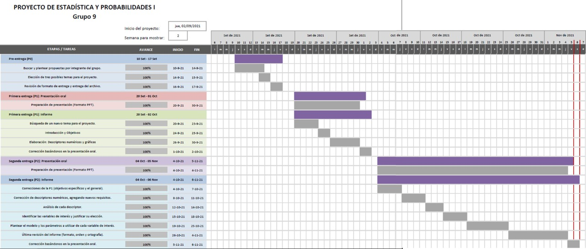

------------------------------------------------------------------------

```{r  echo=FALSE, include=TRUE, message=FALSE}
color <- function(from, to, density, ..., col="blue", dens=NULL){
y_seq <- seq(from, to, length.out=500)
d <- c(0, density(y_seq, ...), 0)
polygon(c(from, y_seq, to), d, col=col, density=dens)
}
```

------------------------------------------------------------------------

# [Correcciones]{style="color:ForestGreen"}

-   En base a las entregas anteriores, los cambios que hemos venido
    realizando son: la selección de variables suficientes para el
    estudio, aplicaciones de regresión entre variables numéricas
    continuas, así como también, mejoramos la interpretación de las
    gráficas.

------------------------------------------------------------------------

# [Tema]{style="color:ForestGreen"}

-   Estudio sobre situación de anemia de los niños menores de 5 años del
    departamento de Cusco.

------------------------------------------------------------------------

# [Relevancia]{style="color:ForestGreen"}

## [Importancia y justificación]{style="color:SteelBlue"}

-   En el Perú es importante determinar la situación de anemia en Cusco
    como la concentración de pacientes afectados por la anemia para
    centrar la atención en zonas focalizadas y proponer alternativas de
    solución que gestionen la repartición de recursos o medicamentos que
    posiblemente carezcan las redes de Salud con el objetivo de combatir
    la anemia.

-   La base de datos se registró de acuerdo a las Historias Clínicas de
    los Establecimientos de Salud del Ministerio de Perú, por lo que se
    hace legítima la información.

------------------------------------------------------------------------

# [Objetivos]{style="color:ForestGreen"}

## [Objetivo general]{style="color:SteelBlue"}

-   Evaluar el perfil de las personas que están más propensas a sufrir
    anemia en las distintas provincias de Cusco.

## [Objetivos específicos]{style="color:SteelBlue"}

-   Describir el comportamiento de las variables recolectadas (peso,
    talla, edad, hemoglobina, entre otros) respecto a la anemia.

-   Determinar a lo largo del tiempo en qué regiones y en qué distritos
    ha habido una mayor prevalencia de personas con anemia en los
    trimestres de 2019 y 2020.

------------------------------------------------------------------------

# [Factibilidad]{style="color:ForestGreen"}

-   La organización para abordar cada entrega en los tiempos requeridos
    se hizo por medio de un diagrama de Gantt.

<center>

{width="1000px"}

</center>

------------------------------------------------------------------------

# [Marco teórico]{style="color:ForestGreen"}

## [Audiencia]{style="color:SteelBlue"}

-   Beneficiaría como aporte al plan multi-sectorial de Lucha Contra la
    Anemia del Ministerio de Desarrollo e Inclusión Social (MIDIS). Uno
    de los componentes estratégicos del plan es la gestión territorial
    que se encuentra a cargo de cada gobierno local. Este se encarga de
    analizar la situación de los servicios que reciben los niños y niñas
    en su distrito con el objetivo de mejorar la cobertura y de expandir
    estos servicios(seguridad alimentaria, salud, educación, otros) a
    más niños y niñas. El conocimiento del alcalde sobre la situación de
    sus habitantes contribuye a una gestión de calidad, por ende la
    información que generemos sobre la concentración de pacientes de
    anemia menores de 5 años, permitirá una mejor visualización del
    problema y promoverá el enfoque en las zonas focalizadas para mayor
    atención.

## [Objeto de estudio]{style="color:SteelBlue"}

-   Niños y niñas menores de 5 años a menos.

<center>

{width="800px"}

</center>

## [Sesgo]{style="color:SteelBlue"}

La base de datos fue recolectada por cada red de salud del MINSA y algunos datos eran registros de niños de otro origen departamental que se hicieron revisar en las redes de Cusco, por lo que se filtró esa data.

## [Limpieza del data frame ]{style="color:SteelBlue"}

La condición establecida para la selección de variables de la base de
datos es la relevancia de las variables para el estudio en base a los
objetivos.

En un inicio la data contenía 40,738 observaciones y 34 variables, ahora
la data limpia cuenta con 19 332 observaciones y 10 variables.

Se utilizó el R Notebook llamado **Limpieza.Rmd** para limpiar el Data
Frame y producir el nuevo data limpia "cusco".

## [Base de datos Limpia]{style="color:SteelBlue;font-size:100%"}

```{r echo=FALSE, include=TRUE, message=FALSE, warning=FALSE}

library(readr)
library(dplyr)
library(readr)
library(fastGraph)
library(BSDA)
library(TeachingDemos)
library(tidyverse)
cusco = read.csv(file="cusco.csv")
cusco = na.omit(cusco)
cusco

casos_con_anemia = cusco[cusco$estado_de_anemia!= 'Normal', ]
casos_sin_anemia = cusco[cusco$estado_de_anemia== 'Normal', ]
```

------------------------------------------------------------------------

# [Variables de estudio]{style="color:ForestGreen"}

+--------------+----------------+-------------------------------------+
| Variables    | Tipo de        | Restricción                         |
|              | Variable       |                                     |
+==============+:==============:+:===================================:+
| Redes de     | Cualitativa    | Redes de salud del departamento de  |
| salud        | nominal        | Cuzco                               |
+--------------+----------------+-------------------------------------+
| Sexo         | Cualitativa    | Femenino (F), Masculino (M)         |
|              | nominal        |                                     |
+--------------+----------------+-------------------------------------+
| Edad (meses) | Cuantitativa   | Valores enteros entre 0 y 60        |
|              | Discreta       | (meses)                             |
+--------------+----------------+-------------------------------------+
| Hemoglobina  | Cuantitativa   | Valores enteros y decimales entre 4 |
| (g/dL)       | Continua       | y 19 (g/dL)                         |
+--------------+----------------+-------------------------------------+
| Estado de    | Cualitativa    | Norma: Anemia leve, anemia          |
| anemia       | Ordinal        | moderada, anemia normal             |
+--------------+----------------+-------------------------------------+
| Provincia    | Cualitativa    | Provincias del departamento de      |
| REN          | nominal        | Cuzco                               |
+--------------+----------------+-------------------------------------+
| IMC          | Cuantitativa   | Índice de Masa Corporal             |
|              | continua       |                                     |
+--------------+----------------+-------------------------------------+
| mes          | Cualitativa    | 12 meses del año                    |
|              | nominal        |                                     |
+--------------+----------------+-------------------------------------+
| año          | Cuantitativa   | Año en el que fue atendido          |
|              | discreta       |                                     |
+--------------+----------------+-------------------------------------+
| Departamento | Cualitativa    | Departamento de origen del paciente |
|              | discreta       |                                     |
+--------------+----------------+-------------------------------------+

------------------------------------------------------------------------

# [Descriptores Gráficos]{style="color:ForestGreen"}

## [Variable Provincia de Origen]{style="color:SteelBlue"}

El siguiente histograma nos muestra la cantidad total de niños cusqueños
atendidos organizados por su provincia de origen.

Como podemos observar, la provincia con mayor cantidad de registros de
atención de niños menores de 5 años es Cusco con un total de 5003
registros.

```{r echo=FALSE, include=TRUE, message=FALSE}
tabla_prov <- table(cusco$provincia)
barplot(tabla_prov[order(tabla_prov)], horiz = 1, main = "Registro de provincia de origen", col = c("purple"), cex.names = 0.45, las  = 1)

```

```{r echo=FALSE, include=TRUE, message=FALSE}

table(cusco$provincia)
```

## [Casos atendidos CON anemia por provincia]{style="color:SteelBlue"}

El siguiente histograma presenta la cantidad de niños con anemia
agrupados por su provincia de origen.

A partir del descriptor gráfico anterior podemos decir que se observa
una mayor cantidad de casos de anemia en la provincia de Cusco con un
total de 2386 casos registrados.

```{r echo=FALSE, include=TRUE, message=FALSE}

tabla_provanemia <- table(casos_con_anemia$provincia)
barplot(tabla_provanemia[order(tabla_provanemia)], horiz = 1, main = "Casos CON anemia por provincia", col = c("green"), cex.names = 0.45, las  = 1, xlim=c(0,2500))


```

```{r echo=FALSE, include=TRUE, message=FALSE}
table(casos_con_anemia$provincia)
```

## [Casos atendidos por Red de Salud ]{style="color:SteelBlue"}

En el presente histograma se muestra la cantidad de niños y niñas que
fueron atendidos por cada red de salud de Cusco.

```{r echo=FALSE, include=TRUE, message=FALSE}
tabla_redes <- table(cusco$red)

barplot(tabla_redes[order(tabla_redes)], horiz = 1, main = "Niños atendidos en las distintas redes de salud de Cusco", col = c("red"), cex.names = 0.45, las  = 1)

```

```{r echo=FALSE, include=TRUE, message=FALSE}
round(table(cusco$red)*100/nrow(cusco), 2)
```

Se puede observar que:

-   El 24.98% de niños y niñas se atendieron en CUSCO NORTE.
-   El 31.17% de niños y niñas se atendieron en CUSCO SUR.
-   El 8.71% de niños y niñas se atendieron en CHUMBIVILCAS.
-   El 23.73% de niños y niñas se atendieron en CANAS CANCHIS ESPINAR.
-   El 7.19% de niños y niñas se atendieron en KIMBIRI PICHARI.
-   El 4.22% de niños y niñas se atendieron en LA CONVENCIÓN.

La red de salud de CUSCO SUR ha recibido mayor cantidad de pacientes
menores de 5 años, y KIMBIRI PICHARI la menor cantidad.

## [Relación entre las variales ESTADO DE ANEMIA y SEXO(meses)]{style="color:SteelBlue"}

-   Se registraron 9738 pacientes femeninas y 10194 pacientes
    masculinos.

```{r echo=FALSE, include=TRUE, message=FALSE}
# Mosaico 
mosaicplot(table(cusco$sexo,cusco$estado_de_anemia), main = "Sexo y estado de anemia",xlab="sexo",ylab ="estado de anemia",off = 10,las = 1, border=rgb(0,0,0,0.2), col=c("yellow", "purple","red", "blue"))

# Cantidad de Niñas y niños en total 

cant_ninos = table(cusco$sexo, cusco$estado_de_anemia)
cant_ninos

```

Respecto al total de niños y niñas:

-   Existe una mayoría de casos de niños con anemia LEVE que de niñas.

-   Existe una mayoría de casos de niños con anemia MODERADA que de
    niñas.

-   Existe una mayoría de casos de niños con anemia SEVERA que de niñas.

-   El total de casos que presentan anemia severa son 260, de las cuales
    108 son niñas y 152 son niños.

## [Hemoglobina(g/dL) vs. Edades (meses)]{style="color:SteelBlue"}

-   Se nota una ligera tendencia de la hemoglobina a medida que el niño
    crece, haciendo parecer que tienen una relación lineal constante.

```{r echo=FALSE, include=TRUE, message=FALSE}
plot( cusco$edad, cusco$hemoglobina, xlab="Edad (meses)", ylab = "Hemoglobina (g/dL)", main = "Hemoglobina (g/dL)  vs Edad (meses) ", ylim = c(0, 25))

abline(lm(cusco$hemoglobina ~ cusco$edad), col="red")
```

------------------------------------------------------------------------

# [Análisis descriptivo de las variables continuas ]{style="color:ForestGreen;font-size:100%"}

Las variables aleatorias continuas que elegiremos para realizar los
intervalos de confianza y las pruebas de hipótesis son IMC y
HEMOGLOBINA. Por ello identificamos el modelo que mejor se asemeje al
comportamiento de las variables aleatorias continuas a partir del
histograma de cada variable.

```{r echo=FALSE, include=TRUE, message=FALSE}
datos1 <- cusco$hemoglobina
datos1 <- na.omit(datos1)
x1 <- sort(datos1)
z1 <- (x1-median(datos1))/sd(datos1)
hist(x1, main = "Frecuencia de hemoglobina", xlab = "Hemoglobina (g/dL)")


datos2 <- cusco$IMC
x2 <- sort(datos2)
z2 <- (x2 - median(datos2))/sd(datos2) 
hist(x2, main = "Frecuencia de IMC", xlab = "IMC (kg/m^2)")
```

Como se puede observar en ambas gráficas, la frecuencia de los datos de
las variables IMC y hemoglobina se asemejan a una distribución normal.

------------------------------------------------------------------------

# [Prueba de hipótesis e intervalos de confianza]{style="color:ForestGreen"}

Determinaremos los intervalos de confianza para una proporción
poblacional con estimación por intervalos utilizando variables numéricas
continuas.

La INEI registró a los niños menores de 5 años en las distintas redes de
salud de Cusco, donde se encontraron 40738 observaciones, de las cuales
no todos pertenecen a la misma región, por lo que filtramos los datos
que solo incluyan a los de origen cusqueño, obteniendo así 20418
observaciones durante el 2019 y 2020.

-   **Nivel de confianza:** $95 \%$

-   **Nivel de significancia:** $\alpha=0.05$

-   **Tamaño de la muestra:** $19932$

El intervalo de confianza utilizado es 0.95 tomando en cuenta la
sugerencia por la comunidad científica, ya que es más frecuentemente
usado cuando el tamaño de la muestra es lo suficientemente grande.

## [HIPÓTESIS 1:]{style="color:SteelBlue;font-size:80%"}

[Variable: Hemoglobina (g/ dL)]{style="color:blue;font-size:120%"}

La variable que usaremos en esta hipótesis es la hemoglobina de los
niños entre los 0 y 5 pertenecientes a la región de Cuzco, la cual
pertenece a una muestra del 2019 y 2020 extraída de la base de datos del
gobierno peruano. El rango de este es (5.1, 18.4) . Asimismo se utilizó
un boxplot para representar a la variable de manera correcta, ya que en
este se puede apreciar de mejor manera el rango anteriormente
mencionado. Finalmente, nos basamos en la media muestral para elaborar
una estimación puntual sobre la media poblacional, la cual es
aproximadamente 13 g/dL, tomando esta de referencia para plantear la
siguiente hipótesis.

**H1** : La hemoglobina promedio de los niños entre los 0 y 5 de la
ciudad de Cuzco es *menor* a 13. 

**H1** : µ < 13 g/dL

**H0** : La hemoglobina promedio de los niños entre los 0 y 5 de la
ciudad de Cuzco es *mayor o igual* a 13 . 

**H0** : µ ≥ 13 g/dL

```{r echo=FALSE, include=TRUE, message=FALSE}

# Media muestral de la hemoglobina
cusco_H <- na.omit(cusco$hemoglobina)

mean(cusco_H)

print(paste("La media poblacional con estimación puntual es aproximadamente ", round(mean(cusco_H))))

boxplot(cusco_H, main = "Dispersión de la variable HEMOGLOBINA", xlab= "hemoglobina(g/dL)", horizontal = T)

abline(v = mean(cusco_H), col = "purple", lwd = 3, lty = 2)

legend(x="bottomright", inset = c(0, 0), legend = c( "Media      13 "),
       col=c( "purple"),lty=1:2, cex=0.6,
       title="Line types", text.font=4)

```

[Datos: Hemoglobina (g/ dL)]{style="color:blue;font-size:120%"}

```{r echo=FALSE, include=TRUE, message=FALSE}
summary(cusco$hemoglobina)
```

```{r echo=FALSE, include=TRUE, message=FALSE}

mu <- 13
sig <- sd(cusco$hemoglobina)
X <- mean(cusco$hemoglobina)
n <- length(cusco$hemoglobina)
n_cf <- 0.95
alfa <- 0.05

# Valor crítico: Una cola izquierda
Z <- qnorm(0.05)

# Estadístico de prueba
EP <- (X-mu)/(sig/(n^0.5))


```

[Interpretación: ]{style="color:blue;font-size:120%"}

Presentamos una hipótesis de cola izquierda:

-   Zona de rechazo ≤ -1.644854
-   Estadístico de prueba → 4.594648

[Representación Gráfica]{style="color:blue;font-size:120%"}

```{r echo=FALSE, include=TRUE, message=FALSE}

plot(z2,dnorm(z2), type = "l", col = "blue", xlim = c(-5,5), ylim = c(0.0,0.5))
# Colorear las regiones

color(from=-5, to=Z, dnorm, col="yellow")
color(from=Z, to=5, dnorm, col="skyblue")


# Líneas
abline(v = Z, col = "red", lwd = 2, lty = 1)
abline(v = (X-mu)/(sig/(n^0.5)), col = "blue", lwd = 2, lty = 1)

text(Z - 0.9,0.3,"Valor crítico", col = "red")
text(Z - 0.9,0.27,"(-1.644854)", col = "red")
text(EP-1.5,0.3,"Estadístico de prueba", col = "blue")
text(EP - 1.45,0.27,"(4.594648)", col = "blue")
# Legenda
legend("topright",legend=c("Región de rechazo","Región de no rechazo"), cex = 0.8, fill = c("yellow","skyblue"))
```

[Conclusión: ]{style="color:blue;font-size:120%"}

En base a la evidencia muestral no se puede rechazar H0.

## [INTERVALO DE CONFIANZA 1: Anemia Severa ( \< 7) g/dL]{style="color:SteelBlue;font-size:80%"}

```{r echo=FALSE, include=TRUE, message=FALSE}

# INTERVALO 1: HEMOGLOBINA SEVERA < 7 g/dL

a_severa = cusco[cusco$estado_de_anemia == 'Anemia Severa',]
ppor1 <- nrow(a_severa)         # casos con anemia severa
n <- nrow(cusco)               # tamaño de la muestra
p_severa <- ppor1/n                    # proporción muestral

n_cf <- 0.95                   # Nivel de confianza
alfa <- 1 - n_cf               # nivel de significancia


# 95% nivel de confianza = 0.95 = 1 - alfa
# z = qnorm(nivel de confianza + (alfa/2), 0, 1)
# Valores críticos -z y z;

z1 <- qnorm(n_cf+(alfa/2))


a1 <- p_severa - z1*((p_severa*(1-p_severa)/n)^0.5)
b1 <- p_severa + z1*((p_severa*(1-p_severa)/n)^0.5)

print(paste("Parámetro ", round(p_severa, 4)))
print(paste("Intervalo de confianza [", 0.011 , ", ", 0.015 , "]"))

```

El parámetro de proporción muestral ( 0.013 ) se encuentran en un 95% de
los intervalos de confianza.

[Resultado:]{style="color:blue;font-size:120%"}

-   Anemia Severa ( \< 7) → [ 0.011 , 0.015 ]

## [INTERVALO DE CONFIANZA 2: Anemia Moderada (7, 9.9) g/dL]{style="color:SteelBlue;font-size:80%"}

```{r echo=FALSE, include=TRUE, message=FALSE}

# INTERVALO 2: HEMOGLOBINA  >= 7 y <= 9.9 g/dL

a_moderada = cusco[cusco$estado_de_anemia == 'Anemia Moderada',]
ppor2 <- nrow(a_moderada)         # casos con anemia severa
n <- nrow(cusco)               # tamaño de la muestra
p_moderada <- ppor2/n                    # proporción muestral

n_cf <- 0.95                   # Nivel de confianza
alfa <- 1 - n_cf               # nivel de significancia


# 95% nivel de confianza = 0.95 = 1 - alfa
# z = qnorm(nivel de confianza + (alfa/2), 0, 1)
# Valores críticos -z y z;

z1 <- qnorm(n_cf+(alfa/2))


a2 <- p_moderada - z1*((p_moderada*(1-p_severa)/n)^0.5)
b2 <- p_moderada + z1*((p_moderada*(1-p_severa)/n)^0.5)

print(paste("Parámetro ", round(p_moderada, 3)))
print(paste("Intervalo de confianza [", 0.210 , ", ", 0.224 , "]"))

```

El parámetro de proporción muestral ( 0.217 ) se encuentran en un 95% de
los intervalos de confianza.

[Resultado:]{style="color:blue;font-size:120%"}

-   Anemia Moderada (7, 9.9) → [ 0.210 , 0.224 ]

## [INTERVALO DE CONFIANZA 3: Anemia Leve (10.0, 11.9) g/dL]{style="color:SteelBlue;font-size:80%"}

```{r echo=FALSE, include=TRUE, message=FALSE}

# INTERVALO 3:  HEMOGLOBINA LEVE [10.0, 11.9] g/dL

pfem = na.omit(cusco[cusco$sexo== 'F', ])
pmas = na.omit(cusco[cusco$sexo== 'M', ])

a_leve = cusco[cusco$estado_de_anemia == 'Anemia Leve',]
a_leve = na.omit(a_leve)
ppor3 <- nrow(a_leve)           # casos con anemia leve
n <- nrow(cusco)               # tamaño de la muestra
p_leve <- ppor3/n               # proporción muestral

n_cf <- 0.95                   # Nivel de confianza
alfa <- 1 - n_cf               # nivel de significancia


# 95% nivel de confianza = 0.95 = 1 - alfa
# z = qnorm(nivel de confianza + (alfa/2), 0, 1)
# Valores críticos -z y z;

z1 <- qnorm(n_cf+(alfa/2))


a3 <- p_leve - z1*((p_leve*(1-p_leve)/n)^0.5)
b3 <- p_leve + z1*((p_leve*(1-p_leve)/n)^0.5)


print(paste("Parámetro ", round(p_leve, 3)))
print(paste("Intervalo de confianza [", 0.204 , ", ", 0.216 , "]"))

```

El parámetro de proporción muestral ( 0.21 ) se encuentran en un 95% de
los intervalos de confianza.

[Resultado:]{style="color:blue;font-size:120%"}

-   Anemia Leve (10.0, 11.9) → [ 0.204 ; 0.216 ]

## [HIPÓTESIS 2:]{style="color:SteelBlue;font-size:80%"}

[Variable: Hemoglobina (g/ dL), masculino y
femenino]{style="color:blue;font-size:120%"}

```{r echo=FALSE, include=TRUE, message=FALSE}

X_barra1 = mean(pmas$hemoglobina)
X_barra2 = mean(pfem$hemoglobina)

var1=sd(pmas$hemoglobina)^2
var2=sd(pfem$hemoglobina)^2
n1=length(pmas$hemoglobina)
n2=length(pfem$hemoglobina)

conf <- 0.95
alfa <- 0.05
# Una cola derecha por la H1
z2=qnorm(0.95)

Z <-(X_barra1-X_barra2)/sqrt(var1/n1+var2/n2)
```

La variable utilizada para esta hipótesis es la hemoglobina de los niños
entre los 0 y 5 años pertenecientes a la ciudad de Cusco, la cual
pertenece a una muestra del 2019 y 2020 extraída de la base de datos del
gobierno peruano, pero con la diferencia que se separarán los datos por
sexo. Se utilizaron 2 boxplot para representar el rango de cada uno de
los sexos anteriormente mencionados, en este gráfico podemos observar
que la estimación puntual de la media de hemoglobina del sexo femenino
es ligeramente mayor a la del sexo masculino. Finalmente, utilizamos los
datos de ambas medias presentes en el gráfico, las comparamos y así
buscamos estimar una relación entre la hemoglobina de ambos sexos a
nivel poblacional.

**µm** → Hemoglobina promedio en niños de sexo masculino.

**µf** → Hemoglobina promedio en niños de sexo femenino.

**H1** : La hemoglobina promedio de los niños de sexo femenino es
*mayor* a la hemoglobina promedio de los niños de sexo masculino.

**H1** : µf > µm

**H0** : La hemoglobina promedio de los niños de sexo femenino es *menor
o igual* a la hemoglobina promedio de los niños de sexo masculino.

**H0** : µf ≤ µm

```{r echo=FALSE, include=TRUE, message=FALSE}


pfem = cusco[cusco$sexo== 'F', ]
pfem = na.omit(pfem)
pmas = cusco[cusco$sexo== 'M', ]
pmas = na.omit(pmas)

boxplot(pfem$hemoglobina,pmas$hemoglobina, col = c("orange","yellow"),names=c("NIÑOS","NIÑAS"),main="HEMOGLOBINA POR SEXO", ylim=c(4.5,20), horizontal=T)

title(xlab="HEMOGLOBINA (g/dL)",ylab="Sexo", line=3, cex.lab=1.3)
abline(v=13.11,col="red",lwd=2)
abline(v=12.99,col="green",lwd=2)
legend(x = "topright",legend=c("Media de hemoglobina en niñas (13.11)","Media de hemoglobina en niños (12.99)"),col=c("red", "green"),lwd=2,cex=0.8)

```

[Datos: Hemoglobina (g/ dL),
femenino]{style="color:blue;font-size:120%"}

```{r echo=FALSE, include=TRUE, message=FALSE}
summary(pfem$hemoglobina)

```

[Datos: Hemoglobina (g/ dL),
masculino]{style="color:blue;font-size:120%"}

```{r echo=FALSE, include=TRUE, message=FALSE}
summary(pmas$hemoglobina)
```

[Interpretación: ]{style="color:blue;font-size:120%"}

Presentamos una hipótesis de cola derecha:

-   Zona de rechazo ≤ 1.644854
-   Estadístico de prueba → -5.292616

[Representación Gráfica]{style="color:blue;font-size:120%"}

```{r echo=FALSE, include=TRUE, message=FALSE}

curve(dnorm(x), from=-10, to=10, xlim=c(-6,6), col="black", lwd=4, ylab="Density", xlab = "Z")
# Colorear las regiones
color(from=z2, to=8, dnorm, col="yellow")
color(from=-8, to=z2, dnorm, col="green")


# Líneas
abline(v = z2, col = "red", lwd = 3, lty = 1)
abline(v = Z, col = "blue", lwd = 3, lty = 1)

text(z2 + 1.3,0.3,"Valor crítico", col = "red")
text(z2 + 1.3,0.27,"(1.644854)", col = "red")
text(Z+1.5,0.3,"Estadístico", col = "blue")
text(Z+1.5,0.27,"de", col = "blue")
text(Z+1.5,0.24,"prueba", col = "blue")
text(Z+1.5,0.21,"(-5.292616)", col = "blue")
# Legenda
legend("topright",legend=c("Región de rechazo","Región de no rechazo"), cex = 0.8, fill = c("yellow","green"))
```

[Conclusión:]{style="color:blue;font-size:120%"}

En base a la evidencia muestral no se puede rechazar H0.

## [INTERVALO DE CONFIANZA 4: Hemoglobina (g/ dL) por sexo, masculino y femenino]{style="color:SteelBlue;font-size:80%"}

```{r echo=FALSE, include=TRUE, message=FALSE}
# INTERVALO 3 : HEMOGLOBINA POR SEXO


pfem = cusco[cusco$sexo== 'F', ]
pfem = na.omit(pfem)

pmas = cusco[cusco$sexo== 'M', ]
pmas = na.omit(pmas)

p3_fem <- nrow(pfem)/n         # proporción muestral
p3_mas <- nrow(pmas)/n     
n_cf <- 0.95                   # Nivel de confianza
alfa <- 1 - n_cf               # nivel de significancia


z3 <- qnorm(n_cf+(alfa/2))


a3_fem <- p3_fem - z3*(( p3_fem*(1- p3_fem)/n)^0.5)
b3_fem <- p3_fem  + z3*(( p3_fem*(1- p3_fem)/n)^0.5)

a3_mas <- p3_mas - z3*((p3_mas *(1-p3_mas)/n)^0.5)
b3_mas <- p3_mas + z3*((p3_mas *(1-p3_mas)/n)^0.5)


print(paste("Parámetros ", round(p3_fem, 3), ", ", round(p3_mas, 3)))
print(paste("Intervalos de confianza: [", 0.481 , ", ", 0.496 , "], [", 0.504 , ", ", 0.519 , "]"))

```

Los parámetros de proporción muestral ( 0.489 y 0.511 ) respectivamente
se encuentran en un 95% de los intervalos de confianza.

[Resultado:]{style="color:blue;font-size:120%"}

-   Niñas → [ 0.481 ; 0.496 ]
-   Niños → [ 0.504 ; 0.519 ]

## [HIPÓTESIS 3:]{style="color:SteelBlue;font-size:80%"}

[Variabe: IMC (kg/m\^2), niños con y sin anemia
]{style="color:blue;font-size:120%"}

La variable que usaremos en esta hipótesis es el IMC de los niños entre
los 0 y 5 pertenecientes a la ciudad de Cusco, la cual pertenece a una
muestra del 2019 y 2020 extraída de la base de datos del gobierno
peruano, esta variable se formó con los datos de talla y peso presentes
en la base de datos. Se dividió la base de datos en niños con y sin
anemia, el rango de estos dos son (0.14, 49.15) y (0.11, 47.69)
respectivamente. Se utilizaron 2 boxplot para representar el rango de
cada uno de los casos anteriormente mencionados, en este gráfico podemos
observar que la estimación puntual de la media de IMC en los niños y
niñas afectados por anemia es mayor que la media del IMC en los que no
presentan ningún grado de anemia. Finalmente, utilizamos los datos de
ambas medias presentes en el gráfico, las comparamos y así buscamos
estimar una relación a nivel poblacional (estimación puntual) entre el
IMC de los niños y niñas que presentan y no presentan anemia.

**µc** → La media de IMC en los niños y niñas afectados por anemia.

**µs** → La media de IMC en los niños y niñas sin anemia.

**H1** : La media de IMC en los niños y niñas afectados por anemia es
*menor* a la media de IMC en los niños y niñas sin anemia.

**H1** : µc < µs

**H0** : La media de IMC en los niños y niñas afectados por anemia es
*mayor o igual* a la media de IMC en los niños y niñas sin anemia.

**H0** : µc ≥ µs

```{r echo=FALSE, include=TRUE, message=FALSE}
boxplot(casos_con_anemia$IMC, casos_sin_anemia$IMC , col = c("orange","yellow"),names=c("CON ANEMIA","SIN ANEMIA"),main="IMC POR CASOS CON Y SIN ANEMIA", ylim=c(4.5,50), horizontal=T)
title(xlab="IMC (kg/m^2)",ylab="CASOS POSIBLES", line=3, cex.lab=1.3)
abline(v=16.48,col="red",lwd=2)
abline(v=16.67,col="green",lwd=2)
legend(x = "topright",legend=c("Media de IMC en casos sin anemia (16.48)","Media de IMC en casos con anemia (16.67)"),col=c("red", "green"),lwd=2,cex=0.8)

```

[Datos: IMC (Kg/m\^2), con anemia]{style="color:blue;font-size:120%"}

```{r echo=FALSE, include=TRUE, message=FALSE}
summary(casos_con_anemia$IMC)

```

[Datos: IMC (Kg/m\^2), sin anemia]{style="color:blue;font-size:120%"}

```{r echo=FALSE, include=TRUE, message=FALSE}
summary(casos_sin_anemia$IMC)
```

```{r echo=FALSE, include=TRUE, message=FALSE}

datos2 <- cusco$IMC
x2 <- sort(datos2)
z2 <- (x2 - median(datos2))/sd(datos2) 

X_barra1 = mean(casos_con_anemia$IMC)
X_barra2 = mean(casos_sin_anemia$IMC)

var1=sd(casos_con_anemia$IMC)^2
var2=sd(casos_sin_anemia$IMC)^2
n1=length(casos_con_anemia$IMC)
n2=length(casos_sin_anemia$IMC)

conf <- 0.95
alfa <- 0.05
# Una cola izquierda por la H1
zA2=qnorm(0.05)

EP2 <-(X_barra1-X_barra2)/sqrt(var1/n1+var2/n2)

```

[Interpretación: ]{style="color:blue;font-size:120%"}

Presentamos una hipótesis de cola izquierda:

-   Zona de rechazo ≤ -1.644854
-   Estadístico de prueba → -5.404585

[Representación Gráfica]{style="color:blue;font-size:120%"}

```{r echo=FALSE, include=TRUE, message=FALSE}
curve(dnorm(x), from=-10, to=10, xlim=c(-6,6), col="black", lwd=4, ylab="Density", xlab = "Z")
# Colorear las regiones
color(from=-5, to=zA2, dnorm, col="yellow")
color(from=zA2, to=5, dnorm, col="green")


# Líneas
abline(v = zA2, col = "red", lwd = 3, lty = 1)
abline(v = EP2, col = "blue", lwd = 3, lty = 1)

text(zA2 - 1.5,0.3,"Valor crítico", col = "red")
text(zA2 - 1.5,0.27,"(-1.644854)", col = "red")
text(EP2-1.5,0.3,"Estadístico", col = "blue")
text(EP2-1.5,0.27,"de", col = "blue")
text(EP2-1.5,0.24,"prueba", col = "blue")
text(EP2 - 1.45,0.21,"(5.404585)", col = "blue")
# Legenda
legend("topright",legend=c("Región de rechazo","Región de no rechazo"), cex = 0.8, fill = c("yellow","green"))
```

[Conclusión:]{style="color:blue;font-size:120%"}

En base a la evidencia muestral no se puede rechazar H0.

## [INTERVALO DE CONFIANZA 5: IMC por casos con y sin anemia]{style="color:SteelBlue;font-size:80%"}

```{r echo=FALSE, include=TRUE, message=FALSE}

# INTERVALO 5  

p3_con<- nrow(casos_con_anemia)/n        
p3_sin <- nrow(casos_sin_anemia)/n     

n_cf <- 0.95                   # Nivel de confianza
alfa <- 1 - n_cf               # nivel de significancia

z3 <- qnorm(n_cf+(alfa/2))

a3_con <- p3_con - z3*(( p3_con*(1- p3_con)/n)^0.5)
b3_con <- p3_con  + z3*(( p3_con*(1- p3_con)/n)^0.5)

a3_sin <- p3_sin - z3*((p3_sin *(1-p3_sin)/n)^0.5)
b3_sin <- p3_sin + z3*((p3_sin *(1-p3_sin)/n)^0.5)

print(paste("Parámetros: ", round(p3_con, 3), round(p3_sin, 3)))
print(paste("Intervalo de confianza [", 0.432, ", ", 0.447, "], [", 0.553, ", ", 0.568, "]"))

```

Los parámetros de proporción muestral ( 0.439 y 0.561 ) respectivamente
se encuentran en un 95% de los intervalos de confianza.

[Resultado:]{style="color:blue;font-size:120%"}

-   Con anemia → [ 0.432 , 0.447 ]
-   Sin anemia → [ 0.553 , 0.568 ]

## [INTERVALO DE CONFIANZA 6: Casos de anemia por intervalo de edad ]{style="color:SteelBlue;font-size:80%"}

```{r echo=FALSE, include=TRUE, message=FALSE}


A0_12 <- casos_con_anemia[casos_con_anemia$edad <=12,]


B12_24 <-  casos_con_anemia[ casos_con_anemia$edad > 12 & casos_con_anemia$edad <=24, ]


C24_36 <- casos_con_anemia[ casos_con_anemia$edad > 24 &  casos_con_anemia$edad <=36, ]


D36_48 <-  casos_con_anemia[ casos_con_anemia$edad > 36 &  casos_con_anemia$edad <=48 , ]


E48_60 <-  casos_con_anemia[ casos_con_anemia$edad >48,]


# Contar casos con anemia


# Cantidad de niños por intervalo de edades

print(paste("Afectados por anemia según intervalo de edad: "))
print(paste("EDAD < 0-12> : ", nrow(A0_12)))
print(paste("EDAD <12-24> : ", nrow(B12_24))) 
print(paste("EDAD <24-36> : ", nrow(C24_36))) 
print(paste("EDAD <36-48> : ", nrow(D36_48)-1)) 
print(paste("EDAD <48-60> : ", nrow(E48_60)-1))


n <- nrow(casos_con_anemia)

pA <- nrow(A0_12)/n                  # EDAD < 0-12> 
pB <- nrow(B12_24)/n                 # EDAD <12-24> 
pC <- nrow(C24_36)/n                 # EDAD <24-36>       
pD <- nrow(D36_48)/n                 # EDAD <36-48>   
pE <- nrow(E48_60)/n                 # EDAD <48-60>   

print(paste("Proporción muestral de los afectados por anemia según intervalo de edad: "))
print(paste("EDAD < 0-12> : ",round(pA, 6)))
print(paste("EDAD <12-24> : ",round(pB, 6))) 
print(paste("EDAD <24-36> : ",round(pC, 6))) 
print(paste("EDAD <36-48> : ",round(pD, 6))) 
print(paste("EDAD <48-60> : ",round(pE, 6)))

n_cf <- 0.95
alfa <- 1 - n_cf
z2 <- qnorm(n_cf+(alfa/2))
  
# Intervalos 
  
a2_0_12 <- pA - z2*((pA*(1-pA)/n)^0.5)
b2_0_12 <- pA + z2*((pA*(1-pA)/n)^0.5)
  
a2_12_24 <- pB - z2*((pB*(1-pB)/n)^0.5)
b2_12_24 <- pB + z2*((pB*(1-pB)/n)^0.5)
  
a2_24_36 <- pC - z2*((pC*(1-pC)/n)^0.5)
b2_24_36 <- pC + z2*((pC*(1-pC)/n)^0.5)
  
a2_36_48 <- pD - z2*((pD*(1-pD)/n)^0.5)
b2_36_48 <- pD + z2*((pD*(1-pD)/n)^0.5)
  
a2_48_60 <- pE - z2*((pE*(1-pE)/n)^0.5)
b2_48_60 <- pE + z2*((pE*(1-pE)/n)^0.5)

print(paste("Intervalos de confianza"))
print(paste("EDAD < 0-12> : ","a:", a2_0_12, "b:", b2_0_12))
print(paste("EDAD <12-24> : ","a:",a2_12_24,"b:", b2_12_24)) 
print(paste("EDAD <24-36> : ","a:",a2_24_36,"b:", b2_24_36)) 
print(paste("EDAD <36-48> : ","a:",a2_36_48 ,"b:", b2_36_48)) 
print(paste("EDAD <48-60> : ","a:",a2_48_60,"b:", b2_48_60))

```

Al elaborar una cantidad grande de intervalos...

Los parámetros de proporción muestral ( 0.276 , 0.366 , 0.178 , 0.112 ,
0.068) se encuentran en un 95% de los intervalos de confianza.

Intervalos de confianza de cada edad: 

* [ 0.266 , 0.286 ] ← 0 - 12 meses
* [ 0.355 , 0.377 ] ← 12 - 24 meses 
* [ 0.169 , 0.186 ] ← 24 - 36 meses 
* [ 0.105 , 0.119 ] ← 36 - 48 meses 
* [ 0.062 , 0.074 ] ← 48 - 60 meses

------------------------------------------------------------------------

# [Regresiones]{style="color:ForestGreen"}

## [CASO 1:]{style="color:SteelBlue;font-size:80%"}

[Variables: meses y casos de anemia]{style="color:blue;font-size:120%"}

Tomando en cuenta los valores tomados de la prevalencia de anemia a
tiempo mensual desde 2019 a 2020 identificamos el tipo de relación
entres estas dos variables asemeja a una regresión lineal.

```{r echo=FALSE, include=TRUE, message=FALSE}

# Seleccionar la prevalencia por trimestre

# Intervalos por año (2019 - 2020)

# [1 - 3] meses
# [4 - 6] meses
# [7 - 9] meses
# [10-12] meses

# Trimestres
trimestre1_19 = cusco[cusco$mes>=1 & cusco$mes<=3 & cusco$agnio == 2019,]
trimestre2_19 = cusco[cusco$mes>=4 & cusco$mes<=6 & cusco$agnio == 2019,]
trimestre3_19 = cusco[cusco$mes>=7 & cusco$mes<=9 & cusco$agnio == 2019,]
trimestre4_19 = cusco[cusco$mes>=10 & cusco$mes<=12 & cusco$agnio == 2019,]
trimestre1_20 = cusco[cusco$mes>=1 & cusco$mes<=3 & cusco$agnio == 2020,]
trimestre2_20 = cusco[cusco$mes>=4 & cusco$mes<=6 & cusco$agnio == 2020,]
trimestre3_20 = cusco[cusco$mes>=7 & cusco$mes<=9 & cusco$agnio == 2020,]
trimestre4_20 = cusco[cusco$mes>=10 & cusco$mes<=12 & cusco$agnio == 2020,]

anemia_por_mes = c(28, 41, 46, 45, 36, 45, 53, 520, 828, 943, 1131, 1326, 266, 521, 349, 30, 38, 70, 130, 42, 139, 385, 642, 1105)
evaluados = c(33, 50, 60, 57, 67, 72, 79, 830, 1637, 1943, 2419, 2767, 813, 1380, 944, 84, 127, 223,342, 151, 378, 1120, 1612, 2744)

prev = round(anemia_por_mes*100/evaluados, 2)

var_independiente = c(1:24)

summary(lm(prev~var_independiente))

plot(var_independiente, prev, main="Prevalencia de anemia por TRIMESTRES", col="black",las=1, ylab = "Prevalencia", xlab="Trimestres ( 2019    -    2020 )")

abline(lm(prev~var_independiente), col="purple")


```

[Análisis visual]{style="color:blue;font-size:120%"}

Para confirmar que sea un regresión lineal con ambas variables, primero
se debe confirmar que $cor = +/-[0.6, 1]$ para observar si tiene un
coeficiente de correlación fuerte.

```{r echo=FALSE, include=TRUE, message=FALSE}
# cor = sqrt(coeficiente de determinación)
cor = sqrt(0.7595)
cor
```

El coeficiente de correlación es $-0.87$, por lo que se puede afirmar
que existe una relación lineal negativa muy fuerte.

Se estima que la función de regresión está dada por :
$P(t) = -2.1870t + 76.6599$, donde P(t) es la prevalencia en un instante
de tiempo (mes). Sin embargo, se debe tomar en cuenta que los puntos
presentados son pocos como para estimar un buena precisión de la
pendiente, por lo que se recomienda trabajar con un intervalo de tiempo
mayor al estudio realizado.

## [CASO 2:]{style="color:SteelBlue;font-size:80%"}

[Variables: Casos de anemia y edad]{style="color:blue;font-size:120%"}

Tomando en cuenta los valores tomados de la prevalencia de anemia a
tiempo mensual desde 2019 a 2020 identificamos el tipo de relación
entres estas dos variables asemeja a una regresión lineal.

```{r echo=FALSE, include=TRUE, message=FALSE}

# Cantidad de niños por intervalo de edades

anemia_por_edad = c(1585, 563, 192, 429, 200, 112, 1481, 660, 357, 383, 291, 187, 1402, 567, 389, 315, 245, 176, 1398, 512, 329, 316, 203, 171, 602, 257, 176, 173, 132, 82, 1267, 351, 186, 207, 121, 110, 370, 172, 111, 101, 78, 49, 1135, 388, 190, 169, 149, 96, 314, 143, 97, 82, 72, 67, 22)
var_independiente = c(6:60)

summary(lm(anemia_por_edad~var_independiente))

plot(var_independiente, anemia_por_edad, main="Afectados de anemia por edad", col="black",las=1, ylab = "Afectados por anemia", xlab="Intervalos de edad (0-12, 12-24, 24-36, 36-8, 48-60) meses")

abline(lm(anemia_por_edad~var_independiente), col="purple")


```

[Análisis visual]{style="color:blue;font-size:120%"}

Para confirmar que sea un regresión lineal con ambas variables, primero
se debe confirmar que $cor = +/-[0.6, 1]$ para observar si tiene un
coeficiente de correlación fuerte.

```{r echo=FALSE, include=TRUE, message=FALSE}
# cor = sqrt(coeficiente de determinación)
cor = sqrt(0.1762)
round(cor, 2)
```

El coeficiente de correlación es $-0.42$, por lo que no se puede afirmar
que existe una relación lineal negativa muy fuerte.

# [Reflexiones y conclusiones]{style="color:ForestGreen"}

**1. ¿En qué red de Cusco hay una mayor cantidad de niños y niñas registrados con anemia?**

    De acuerdo con nuestra base de datos, entre los años 2019 y 2020
    hubo una mayor cantidad de casos registrados con anemia en la red
    Cusco Sur.

**2.  ¿Cuál es la provincia en donde hay más casos?**

    La mayoría de los niños son de la provincia de Cusco, por lo que se
    estima que es el motivo por el cual es la provincia donde hay más
    casos de anemia.

**3.  De acuerdo con el sexo de los niños, ¿quiénes han sido los más afectados por anemia?**

    Se han registrado más casos de niños con anemia a comparación de las
    niñas.

    Niñas con anemia: 2004 + 1960 + 108 = 4072

    Niños con anemia: 2178 + 2357 + 152 = 4687

**4.  ¿Existe relación entre la edad y la anemia en los niños menores de 5 años?**

    La correlación obtenida al realizar la regresión de ambas variables
    fue - 0.42, esto significa que no existe una correlación lineal
    fuerte. No podemos afirmar que exista alguna relación entre ambas
    variables.
