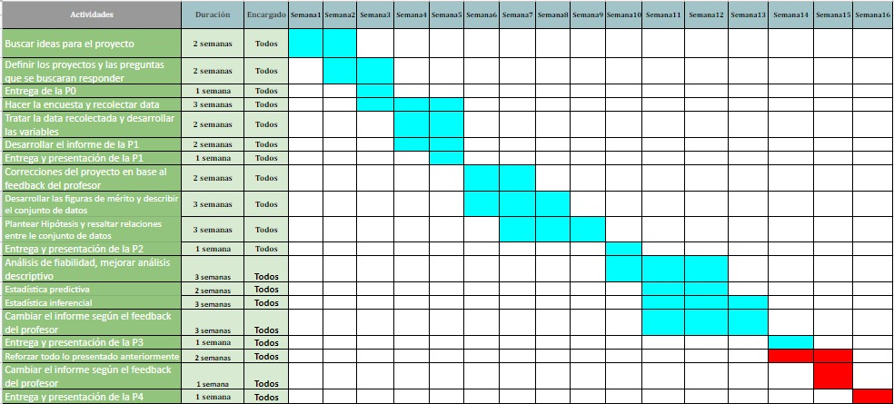

### 1. Introducción 

Durante toda la etapa universitaria existen diversos factores que influyen en el rendimiento académico del estudiante y aparentemente estos son muy amplios, ya que se ven listados desde una visión personal hasta lo sociocultural (perteneciente a un conjunto de ideas propio de un grupo de personas). Por lo general, los estudiantes se ven más afectados en los inicios de la etapa universitaria y aunque no lo parezca también en ciclos superiores, ya que no cuentan con la suficiente experiencia y conocimiento necesario para poder lidiar con estos problemas/factores que influyen en su rendimiento académico.

### 2. Importancia y justificación

De esta manera, la importancia de la investigación realizada por nuestro equipo radica en poder analizar la tendencia y probabilidad de éxito que poseen los estudiantes de primer ciclo mediante la apreciación y estudio de todos aquellos posibles factores o problemáticas que pueden interferir en el resultado final, ya sea bueno o malo. Por lo que deseamos llegar a una conclusión con un alto nivel de certeza de aquello que sucederá como consecuencia de las acciones tomadas por los estudiantes a lo largo de su primer ciclo, y de esta manera evitar que los nuevos estudiantes lleguen a cometer los mismos errores a lo largo de toda su carrera profesional mediante consejos fundamentados con estadísticas reales.

### 3. Objetivos

#### 3.1 Objetivo general:


Mediante el presente proyecto se busca encontrar cuáles son los factores que hacen que un estudiante universitario tenga éxito en su primer ciclo de estudios. Factores que están desde un cuidado personal, rendimiento académico hasta una relación social.

#### 3.2 Objetivos específicos:

- Hacer un análisis descriptivo de cada variable e identificar su dispersión y valores promedios.

- Encontrar patrones que influyan en el rendimiento satisfactorio de un estudiante de primer ciclo.

- Identificar las variables aleatorias según la comparación de descriptores numéricos y gráficos de cada variable.

### Preguntas planteadas

- ¿El estado mental de la persona está relacionado a que tan perseverante es?
- ¿El vivir solo, afecta el estado mental?
- ¿Las horas de sueño afectan el estado mental?
- ¿Las horas de ocio aumentan o disminuyen tus horas extra académicas?
- ¿Las horas de ocio aumentan o disminuyen el nivel de estrés?
- ¿El nivel de estrés determina qué tan socialmente te desenvuelves?
- ¿El vivir solo aumenta o disminuye el nivel de estrés?
- ¿El nivel de estrés te empuja a ingerir sustancias extrañas(drogas)?
- ¿El nivel de perseverancia se relaciona con el nivel socioeconómico?
- ¿Mientras más horas extra académicas tengas, menos sociable eres?


### 4. Marco Teórico

Conocer los factores de éxito en el primer ciclo académico puede ser decisivo al momento de decidir cómo desenvolverte en el ambiente universitario. Tomando eso en cuenta se ha llevado a cabo esta investigación para determinar aquellos factores que puedan ayudar al estudiante  a empezar de buena manera el  primer semestre universitario.

Ciertos factores pueden parecer muy obvios para el  estudiante o el público en general, sin embargo, esto no los excluye de una adecuada investigación. Como ejemplo: “Uno de los factores que más influyen … es el hecho de recibir apoyo  económico  y  moral” (Mireya Sarahí Abarca, María Teresa Gómez Pérez, Mª de Lourdes Covarrubias Venegas, 2015).
Los resultados obtenidos servirán para identificar y relacionar variables que tengan un aparente impacto significativo en el desempeño académico del estudiante. De esta manera esta investigación puede ser utilizada como una herramienta o guía para poder condicionarse a sí mismo y obtener buenos resultados en los cursos del primer semestre universitario.

### 4.1 Aspectos metodológicos de la encuesta

- **Población objetivo**: Está compuesta por ***estudiantes universitarios de segundo ciclo o superior***.

- **Unidad muestral**: Es ***un estudiante universitario de segundo ciclo o superior***.

- **Tipo de muestreo**: El muestreo de la encuesta es **muestreo no probabilístico por conveniencia**, ello dado que es una encuesta compartida por redes sociales y por lo tanto no todas las personas tienen la misma probabilidad de llenar la encuesta.

***PLANIFICACIÓN DEL GRUPO***

**Diagrama de Gantt**




### 5. Variables

En la presente investigación se cuenta con **16 variables**, en la siguiente tabla se muestra las preguntas realizadas y sus restricciones:

|Pregunta     | Variable     |    Tipo de variable    | Restricción       |
|--------------------  | -----------------------  | ---------------------  | ---------------- |
|   ¿En qué ciclo te encuentras?    | Ciclo actual     |        Categórica ordinal         | 1, 2 a más | 
|   ¿Cuántos cursos has jalado a lo largo de tu vida universitaria? | Cursos jalados hasta la actualidad  | Numérica discreta      | Números enteros no negativos |
|¿Cuántos de los cursos que jalaste fueron en tu primer ciclo universitario?| Cursos jalados en el primer ciclo | Numérica discreta   | Números enteros no negativos |
|   ¿Cuál es tu índice de masa corporal?    |Índice de masa corporal    |        Numérica continua               | Números racionales no negativos |
|   ¿Cuántas horas de asesoría tenías a la semana durante el primer ciclo?| Horas semanales de asesoría     | Numérica discreta  | Números enteros enteros no negativos|
|¿Cuánto tiempo le dedicabas semanalmente a realizar actividades extra académicas en el primer ciclo?| Horas semanales de actividades extra académicas| Numérica discreta  | Números enteros menor a 50|
|   ¿Cómo calificarías tu nivel de estrés durante el primer ciclo?    | Nivel de estrés     |     Categórica ordinal               | Muy alto, alto, medio, bajo, Son estrés |
|   ¿A qué nivel socioeconómico perteneces?    | Nivel socioeconómico     |      Categórica ordinal             | A, B, C, D, E |
|   ¿Cuántas horas semanales de ocio aproximadamente pasabas durante el primer ciclo?    | Horas semanales de ocio     |  Categórica ordinal  | 1-4 horas, 5-8 horas, 9-12 horas, más de 12 horas |
|   ¿Qué tan sociable consideras que fuiste durante el primer ciclo?    | Nivel de sociabilidad     |        Categórica ordinal  | Muy sociable, Moderadamente sociable, poco sociable, nada sociable |
|   ¿Vivías solo durante el primer ciclo?    |    Independencia en casa (vivir solo)  |  Categórica nominal      |   Si, No |
|   ¿Cuántas horas diarias dormías durante el primer ciclo?    | Horas diarias usadas para dormir     |       Categórica ordinal  | 4-5 horas, 5-8 horas, 8 horas a más  |
|   ¿Cuál era tu estado de ánimo durante el primer ciclo?    | Estado de ánimo general     |        Categórica ordinal    | Alegre, Neutral (normal), Triste, Depresivo |
|   ¿Cuál fue tu nivel de perseverancia durante el primer ciclo?    |Nivel de perseverancia     |   Categórica ordinal  | Alto, Medio, Bajo, Nulo |
|   ¿Consumiste sustancias que alteren tu estado mental y físico?    | Consumo de sustancias que alteran el estado mental y físico| Categórica nominal | Si, No |
|   ¿Cuál fue tu promedio ponderado durante el primer ciclo?    | Promedio ponderado durante el primer ciclo     |  Numérica continua     | Numero racional positivo menor a 20 |


####  <span style="color: blue;"> Numéricas (6) </span>

**Discretas**

Variable|Definición|
--------|----------|
Total_jalados| Cursos jalados hasta la actualidad|
Jalados_primer_ciclo|Cursos jalados en el primer ciclo|
Horas_semanales_asesoria| Horas semanales de asesoría|
Horas_semanales_extracademico| Horas semanales de actividades extra académicas

**Continuas**

Variable|Definición|
--------|----------|
IMC| Índice de masa corporal|
Promedio_ciclo_1 | Promedio ponderado del primer ciclo|

####  <span style="color: blue;"> Categóricas </span>

**Ordinal**

Variable|Definición|
--------|----------|
Ciclo_actual| Ciclo actual|
Nivel_estres| Nivel de estrés
Nivel_socieconomico| Nivel socioeconómico
Horas_semanales_ocio|Horas semanales de ocio
Nivel_sociabilidad|Nivel de sociabilidad
Horas_diarias_dormir| Horas diarias usadas para dormir
Estado_animo| Estado de ánimo general
Nivel_perseverancia|Nivel de perseverancia

**Nominal**

Variable|Definición|
--------|----------|
Independencia|Independencia en casa (vivir solo)
Consumo_sustancia|Consumo de sustancias que alteran el estado mental y físico

### 6. Carga de Información y Limpieza del Data Frame

#### <span style="color: blue;"> Carga de Información </span>

```{r setup, include=FALSE}
knitr::opts_chunk$set(fig.align = "center", echo = FALSE)
```

```{r , message=FALSE}
## Descargar las librerías siguientes en caso no las tenga

library(readr)
library(dplyr)
library(modeest)
library(TeachingDemos)
```


```{r}
# Cargamos los datos de la encuesta y colocamos los data types de cada uno
DP <-  read_csv("Datos_encuesta.csv", col_types = "ccnnnnnccccccccccnc")
```


```{r}
# DPL es nuestros datos limpios
# Llamamos a la función names para obtener el nombre de nuestras variables
DPL <- DP[,-1]  #Eliminamos la primera columna que es la columna por default que coloca Forms
DPL <- DPL[,-18] #Eliminamos la ultima columna de contacto
DPL <- DPL[,-11] # Eliminamos la variable Nro_amigos_ciclo_! ya que va relacionado con Nivel_sociabilidad
names(DPL)
```

<span style="color: green;"> **Dimensiones del dataframe** </span>

```{r warning=FALSE, message=FALSE}
# Verificamos la dimensión de nuestra base de datos
dim(DPL)
```

Como se puede apreciar, tenemos **214 observaciones** obtenidas a partir de la encuesta realizada y dado que esta data tiene casillas vacías y en algunos casos datos mal llenados procederemos a hacer la limpieza de esta.

<span style="color: green;"> **Casos completos e incompletos** </span>

```{r warning=FALSE, message=FALSE}
# Vemos la cantidad de casos completos e incompletos
sum(complete.cases(DPL))
sum(!complete.cases(DPL))
```

De las 214 observaciones que tenemos solo **85 son casos completos** y **129 casos incompletos**.

<span style="color: green;"> **Datos completos e incompletos** </span>

```{r warning=FALSE}
# Verificamos la cantidad de casillas llenas

sum(!is.na(DPL)) #Cantidad de celdas llenas
sum(is.na(DPL)) #Cantidad de celdas vacías
```
Con respecto a los **datos incompletos y completos tenemos 864 y 2560 respectivamente**.


#### <span style="color: blue;"> Limpieza del Data Frame </span>

Empezamos con la limpieza de datos a partir de ciertas restricciones de cada una de las variables:


<span style="color: green;"> **Filtrado de la variable Ciclo_actual** </span>

Dado que nuestra investigación está centrada en estudiantes de segundo ciclo para arriba, eliminamos aquellas filas en las que los encuestados marcaron primer ciclo. 

De la misma manera, omitimos todas aquellos casos en las que sean casos incompletos.

```{r}
DPL <- filter(DPL, Ciclo_actual=="2 a más") # Filtramos solo a estudiantes de 2 ciclo a más
```

<span style="color: green;"> **Filtrado de la variable IMC** </span>


Filtramos los datos que sean mayores a 0.

```{r}
DPL <- filter(DPL,DPL$IMC>0)
```


```{r}
unique(DPL$IMC)
range(DPL$IMC)
```

Corregimos los valores mayores a 70, ello dado que una persona con IMC mayor a dicho valor considerando que posee una talla de 1.8 en promedio debe pesar máximo 226.8 Kg, por lo cual es improbable que dicho valor de IMC mayor a 70 sea de en los universitarios.

```{r}
DPL[which(DPL$IMC>70),4]
which(DPL$IMC>70)
```

```{r}
DPL[43,4] <- 20.8
DPL[54,4] <- 19.5
```


<span style="color: green;"> **Filtrado de la variable Promedio_ciclo_1** </span>


```{r}
unique(DPL$Promedio_ciclo_1)
range(DPL$Promedio_ciclo_1)
```

Identificamos los valores que poseen un valor más de 20 y los corregimos poniendo el punto decimal ya que el encuestado le puso coma.

```{r}
DPL[which(DPL$Promedio_ciclo_1>20),16]
which(DPL$Promedio_ciclo_1>20)
```
```{r}
DPL[43,16] <- 17.6
DPL[131,16] <- 18.53
```


<span style="color: green;"> **Filtrado de la variable Horas_semanales_extracademico** </span>


```{r}
unique(DPL$Horas_semanales_extracademico)
range(DPL$Horas_semanales_extracademico, na.rm = TRUE)
```
Identificamos los valores que poseen un valor más de 50, ello dado que considerando que equivale a un valor de 2.5 días de estudios extraacadémicos, y los convertimos a NA.

```{r}
DPL[which(DPL$Horas_semanales_extracademico>50),6]
which(DPL$Horas_semanales_extracademico>50)
```
```{r}
DPL[32,6] <- NA
DPL[126,6] <- NA
```

#### <span style="color: blue;"> Vista general de datos inciales y finales </span>

Para tener una idea de cómo están nuestros datos vamos a darle una vista rápida a los primeros y últimos datos.

```{r}
head(DPL)
tail(DPL)
```

<!-- EXPORTAMOS LA BASE DE DATOS -->
<!-- ```{r} -->
<!-- write_csv(DPL,"D:\\Datos_limpios.csv") -->
<!-- ``` -->


### 7. Descriptores Numéricos y Gráficos


### <span style="color: green;"> Variables numéricas </span>

#### <span style="color: blue;"> Variable Promedio del primer ciclo </span>

```{r echo=FALSE}
hist(DPL$Promedio_ciclo_1, main = "Histograma de Promedio del primer ciclo", xlab = "Promedio del primer ciclo", ylab = "Frecuencia", breaks = 20)
legend('topright',legend=c("Media","Mediana"),col=c("blue","chocolate"),lwd=2)
abline(v=mean(DPL$Promedio_ciclo_1), col="blue", lwd=2)
abline(v=median(DPL$Promedio_ciclo_1), col="chocolate", lwd=2)

```


```{r echo=FALSE}
round(mean(DPL$Promedio_ciclo_1),2)
median(DPL$Promedio_ciclo_1)
```
La gráfica anterior nos muestra el promedio de notas obtenido en el primer ciclo de los encuestados. A partir de ello se puede observar que los datos presentan una cola hacia a la izquierda por lo que estaría **sesgado hacia la izquierda**. Ello se comprueba al obtener la media y la mediana de los datos de dicha variable, y es que el valor de la media del promedio obtenido en primer ciclo de los estudiantes encuestados es de $\mu=15.46$ y de la mediana $Me=15.86$, dándose que $\mu<Me$ y por tanto confirma el sesgo hacia la izquierda.

```{r echo=FALSE}
boxplot(DPL$Promedio_ciclo_1, xlab = "Promedio primer ciclo", main="Boxplot del Promedio de primer ciclo", horizontal = TRUE,na.rm = TRUE)
abline(v=mean(DPL$Promedio_ciclo_1,na.rm=TRUE), lty="dashed",col="blue",lwd=2)
legend('topright',legend=c("Media"),col=c("blue"),lty="dashed",lwd=2)
```


```{r echo=FALSE}
max(DPL$Promedio_ciclo_1)
min(DPL$Promedio_ciclo_1)
IQR(DPL$Promedio_ciclo_1)
```

A partir del gráfico de caja y bigotes se puede apreciar que los datos de la variable promedio del primer ciclo presentan un mínimo de $10.5$ y un máximo de $19.6$, con respecto al rango intercuartil el valor obtenido es de $2.95$, siendo un valor relativamente pequeño que nos indica que hay una alta homogeneidad dentro del 50% de los datos de esta variable. El gráfico está en horizontal para poder apreciar mejor el rango, a su vez se muestra la línea punteada que representa la media poblacional del promedio del primer ciclo, del cual a partir de ella se observa que la media del promedio de primer ciclo de los estudiantes encuestados es menor que su mediana.

```{r echo=FALSE}
round(var(DPL$Promedio_ciclo_1),2) # Varianza
round(sd(DPL$Promedio_ciclo_1),2) # Desviación estandar
round(sd(DPL$Promedio_ciclo_1)/mean(DPL$Promedio_ciclo_1)*100,2) #Coeficiente de variabilidad
```
Con respecto a los valores de la varianza y la desviación estándar se obtienen los valores $\sigma^2=4.33$ y $\sigma=2.08$ respectivamente. De la misma manera, en cuanto al coeficiente de variabilidad este tiene un valor $cv = 13.46\%$ por lo que a partir de dicho valor y los descriptores de dispersión anterior la variable promedio del primer ciclo posee una dispersión relativamente pequeña. 


##### <span style="color: green;"> Intervalo de Confianza de la variable Promedio primer ciclo </span>

- Nivel de confianza: 0.8
- Significancia: 0.2
- Tamaño de la muestra: 153

Dado que la dispersión de la variable promedio del primer ciclo es relativamente pequeña, como se señaló anteriormente, se trabajará con un nivel de confianza de 0.8, es decir priorizaremos un margen de error pequeño a que un mayor grado de confianza. 


```{r}
confianza1=0.80
significancia1=1-confianza1
sd1=sd(DPL$Promedio_ciclo_1)
n1=length(DPL$Promedio_ciclo_1)
media.muestral1=mean(DPL$Promedio_ciclo_1)
me1=qt(1-significancia1/2,n1-1)*sd1/sqrt(n1) #Margen de error
IC1=c(media.muestral1-me1,media.muestral1+me1)
round(IC1,2)
```
El intervalo de confianza para esta variable es de $15.24 < \mu < 15.68$

#### <span style="color: blue;"> Variable Índice de masa corporal </span>

```{r echo=FALSE}
hist(DPL$IMC, main = "Histograma del Índice de Masa Corporal", xlab = "Índice de Masa Corporal", ylab = "Frecuencia", breaks = 20)
legend('topright',legend=c("Media","Mediana"),col=c("blue","chocolate"),lwd=2)
abline(v=mean(DPL$IMC), col="blue", lwd=2)
abline(v=median(DPL$IMC), col="chocolate", lwd=2)

```


```{r echo=FALSE}
round(mean(DPL$IMC),2)
median(DPL$IMC)
```

A partir del histograma se puede observar que los datos del promedio del primer ciclo presentan una cola hacia a la izquierda por lo que estaría **sesgado hacia la izquierda**. Ello se comprueba al obtener la media y la mediana de los datos de dicha variable, y es que el valor de la media es $\mu=15.46$ y de la mediana $Me=15.86$, dándose que $\mu<Me$ y por tanto hay sesgo hacia la izquierda.


```{r echo=FALSE}
boxplot(DPL$IMC, xlab = "Indice de Masa Corporal", main="Boxplot del Indice de Masa Corporal", horizontal = TRUE,na.rm = TRUE)
abline(v=mean(DPL$IMC,na.rm=TRUE), lty="dashed",col="blue",lwd=2)
legend('topright',legend=c("Media"),col=c("blue"),lty="dashed",lwd=2)
```


```{r echo=FALSE}
max(DPL$IMC)
min(DPL$IMC)
IQR(DPL$IMC)
```

A partir del gráfico de caja y bigotes se puede apreciar que los datos de la variable promedio del primer ciclo presentan un mínimo de $17.48$ y un máximo de $65$, con respecto al rango intercuartil el valor obtenido es de $6.1$, siendo un valor relativamente pequeño que nos indica que hay una alta homogeneidad dentro del 50% de los datos de esta variable.

```{r echo=FALSE}
round(var(DPL$IMC),2) # Varianza
round(sd(DPL$IMC),2) # Desviación estandar
round(sd(DPL$IMC)/mean(DPL$IMC)*100,2) #Coeficiente de variabilidad
```
Con respecto a los valores de la varianza y la desviación estándar se obtienen los valores $\sigma^2=51.11$ y $\sigma=7.15$ respectivamente. De la misma manera, en cuanto al coeficiente de variabilidad este tiene un valor $cv = 28.1\%$ por lo que a partir de dicho valor y los descriptores de dispersión anterior la variable promedio del primer ciclo posee una dispersión relativamente grande. 


##### <span style="color: green;"> Intervalo de Confianza de la variable IMC</span>

- Nivel de confianza: 0.95
- Significancia: 0.05
- Tamaño de la muestra: 153

Para la presente variable como se puede apreciar, se tiene una dispersión relativamente grande, por lo que se trabajará con un nivel de confianza de 0.95, es decir priorizaremos un mayor grado de confianza a que un menor margen de error.


```{r}
confianza2=0.95
significancia2=1-confianza2
sd2=sd(DPL$IMC)
n2=length(DPL$IMC)
media.muestral2=mean(DPL$IMC)
me2=qnorm(1-significancia2/2)*sd2/sqrt(n2)
IC2=c(media.muestral2-me2,media.muestral2+me2)
round(IC2,2)
```

El intervalo de confianza para esta variable es de $24.31 < \mu < 26.57$

#### <span style="color: blue;"> Horas Semanales de Asesoría </span>

```{r echo=FALSE, fig.align='center'}
hist(DPL$Horas_semanales_asesoria, main = "Histograma de Horas Semanales de Asesoría", xlab = "Horas Semanales de Asesoría", ylab = "Frecuencia", breaks = 8)
legend('topright',legend=c("Media","Mediana"),col=c("blue","chocolate"),lwd=2)
abline(v=mean(DPL$Horas_semanales_asesoria, na.rm = TRUE), col="blue", lwd=2)
abline(v=median(DPL$Horas_semanales_asesoria, na.rm = TRUE), col="chocolate", lwd=2)
```

```{r echo=FALSE}
round(mean(DPL$Horas_semanales_asesoria),2)
median(DPL$Horas_semanales_asesoria)
```
A partir del histograma se puede observar que los datos de hora semanales de asesoría presentan una cola hacia a la derecha por lo que estaría *sesgado hacia la derecha*. Ello se comprueba al obtener la media y la mediana de los datos de dicha variable, y es que el valor de la media es $\mu=2.21$ y de la mediana $Me=2$, dándose que $Me<\mu$ y por tanto hay sesgo hacia la derecha.


```{r echo=FALSE}
boxplot(DPL$Horas_semanales_asesoria, xlab = "Horas Semanales de Asesoría", main="Boxplot del Horas Semanales de Asesoria", horizontal = TRUE,na.rm = TRUE)
abline(v=mean(DPL$Horas_semanales_asesoria,na.rm=TRUE), lty="dashed",col="blue",lwd=2)
legend('topright',legend=c("Media"),col=c("blue"),lty="dashed",lwd=2)
```

```{r}
max(DPL$Horas_semanales_asesoria)
min(DPL$Horas_semanales_asesoria)
IQR(DPL$Horas_semanales_asesoria)
```
A partir del gráfico de caja y bigotes se puede apreciar que los datos de la variable horas semanales de asesoría presentan un mínimo de $0$ y un máximo de $7$, con respecto al rango intercuartil el valor obtenido es de $4$, siendo un valor relativamente grande, lo cual, nos indica que vamos a obtener una dispersión de los datos dentro del 50% de los datos de esta variable. También, el gráfico nos indica que la respuesta 7 es un valor extremo único.


```{r}
round(var(DPL$Horas_semanales_asesoria),2) # Varianza
round(sd(DPL$Horas_semanales_asesoria),2) # Desviación estandar
round(sd(DPL$Horas_semanales_asesoria)/mean(DPL$Horas_semanales_asesoria)*100,2) #Coeficiente de variabilidad
```
Con respecto a los valores de la varianza y la desviación estándar se obtienen los valores $\sigma^2=3.21$ y $\sigma=1.79$ respectivamente. De la misma manera, en cuanto al coeficiente de variabilidad este tiene un valor $cv = 81.05\%$ por lo que a partir de dicho valor y los descriptores de dispersión anterior la variable horas semanales de asesoría posee una dispersión alta.


##### <span style="color: green;"> Intervalo de Confianza de Horas Semanales de Asesoría</span>


- Nivel de confianza: 0.95
- Significancia: 0.05
- Tamaño de la muestra: 153

A partir de lo presentado anteriormente se puede observar que la presente variable posee una tiene una dispersión grande, por lo que se trabajará con un nivel de confianza de 0.95, es decir priorizaremos un mayor grado de confianza a que un menor margen de error.

```{r}
confianza3=0.95
significancia3=1-confianza3
sd3=sd(DPL$Horas_semanales_asesoria)
n3=length(DPL$Horas_semanales_asesoria)
media.muestral3=mean(DPL$Horas_semanales_asesoria)
me3=qnorm(1-significancia3/2)*sd3/sqrt(n3)
IC3=c(media.muestral3-me3,media.muestral3+me3)
round(IC3,2)
```
El intervalo de confianza para esta variable es $1.92 < \mu < 2.50$

#### <span style="color: blue;"> Horas Semanales Extraacadémico </span>

```{r}
hist(DPL$Horas_semanales_extracademico, main = "Histograma de Horas Semanales Extraacadémico", xlab = "Horas Semanales Extraacadémico", ylab = "Frecuencia", breaks = 25)
legend('topright',legend=c("Media","Mediana"),col=c("blue","chocolate"),lwd=2)
abline(v=mean(DPL$Horas_semanales_extracademico, na.rm = TRUE), col="blue", lwd=2)
abline(v=median(DPL$Horas_semanales_extracademico, na.rm = TRUE), col="chocolate", lwd=2)
```

```{r}
round(mean(DPL$Horas_semanales_extracademico, na.rm=TRUE),2)
median(DPL$Horas_semanales_extracademico,na.rm=TRUE)
```

A partir del histograma se puede observar que los datos de las horas extracademicas semanales presentan una cola hacia la derecha por lo que estaría sesgado hacia la derecha. Ello se comprueba al obtener la media y la mediana de los datos de dicha variable, y es que el valor de la media es $\mu=4.36$ y de la mediana $Me=3$, dándose que $Me<\mu$ y por tanto hay sesgo hacia la Derecha.      


```{r}
boxplot(DPL$Horas_semanales_extracademico, xlab = "Horas Semanales Extraacadémicas", main="Boxplot de Horas Semanales Extraacadémicas", horizontal = TRUE,na.rm = TRUE)
abline(v=mean(DPL$Horas_semanales_asesoria,na.rm=TRUE), lty="dashed",col="blue",lwd=2)
legend('topright',legend=c("Media"),col=c("blue"),lty="dashed",lwd=2)
```


```{r echo=FALSE}
max(DPL$Horas_semanales_extracademico,na.rm=TRUE)
min(DPL$Horas_semanales_extracademico,na.rm=TRUE)
IQR(DPL$Horas_semanales_extracademico,na.rm=TRUE)
```

A partir del gráfico de caja y bigotes se puede apreciar que los datos de la variable promedio del primer ciclo presentan un mínimo de $0$ y un máximo de $35$, con respecto al rango intercuartil el valor obtenido es de $3$, siendo un valor relativamente pequeño comparado a los valores en el boxplot, nos indica que hay una alta homogeneidad dentro del 50% de los datos de esta variable.  

```{r echo = FALSE}
round(var(DPL$Horas_semanales_extracademico,na.rm=TRUE),2) # Varianza
round(sd(DPL$Horas_semanales_extracademico,na.rm=TRUE),2) # Desviación estandar
round(sd(DPL$Horas_semanales_extracademico,na.rm=TRUE)/mean(DPL$Horas_semanales_extracademico,na.rm=TRUE)*100,2) #Coeficiente de variabilidad

```

Con respecto a los valores de la varianza y la desviación estándar se obtienen los valores $\sigma^2=24.68$ y $\sigma=4.97$ respectivamente. De la misma manera, en cuanto al coeficiente de variabilidad este tiene un valor $cv = 114.06\%$ por lo que a partir de dicho valor y los descriptores de dispersión anterior la variable Horas semanales extraacadémicas posee una dispersión muy alta.


##### <span style="color: green;"> Intervalo de Confianza de Horas Semanales Extraacadémico</span>


- Nivel de confianza: 0.98
- Significancia: 0.02
- Tamaño de la muestra: 153

A partir de lo presentado anteriormente se puede observar que la presente variable posee una tiene una dispersión bien grande, por lo que se trabajará con un nivel de confianza de 0.98, es decir priorizaremos un mayor grado de confianza a que un menor margen de error.


```{r}
confianza4=0.98
significancia4=1-confianza4
sd4=sd(DPL$Horas_semanales_extracademico,na.rm=TRUE)
n4=length(DPL$Horas_semanales_extracademico)
media.muestral4=mean(DPL$Horas_semanales_extracademico,na.rm=TRUE)
me4=qnorm(1-significancia4/2)*sd4/sqrt(n4)
IC4=c(media.muestral4-me4,media.muestral4+me4)
round(IC4,2)
```
El intervalo de confianza para esta variable es de $3.42 < \mu < 5.29$


### <span style="color: green;"> Variables categóricas </span>

#### <span style="color: blue;"> Independencia </span>

```{r}
barplot(table(DPL$Independencia), ylab="Frecuencia",  main="Independencia")
```

```{r echo=FALSE}
table(DPL$Independencia)
```

Se puede observar que del grupo de objetos de estudio 22 sujetos afirman vivir independientemente (los cuales conforman aproximadamente un 14% del total de sujetos), mientras que 131 viven con familiares de manera no independiente(86%).


#### <span style="color: blue;"> Nivel de Sociabilidad </span>


```{r fig.align='center', fig.width=8}
barplot(table(DPL$Nivel_sociabilidad), main = "Nivel de Sociabilidad", xlab = "Nivel de Sociabilidad", ylab = "Frecuencia", ylim = c(0,80))
```


```{r echo=FALSE}
table(DPL$Nivel_sociabilidad)
```

Del total de 153 estudiantes, 72 sujetos se consideran moderadamente sociables (conformando aproximadamente 47% del total de estudiantes), 15 se consideran muy sociables(9.8%), 16 señalan ser nada sociables(10.5%) y 50 consideran que son poco sociables(32.7%).


#### <span style="color: blue;">  Nivel de Estrés </span>

```{r}
barplot(table(DPL$Nivel_estres), main = "Barplot de Nivel de Estrés", xlab = "Nivel de Estrés", ylab = "Frecuencia", ylim = c(0,80))
```

```{r echo=FALSE}
table(DPL$Nivel_sociabilidad)
```
Se puede observar un máximo de 64 estudiantes que afirman estar medianamente estresados(42%), 39 se consideran estar altamente estresados(25.5%), 28 están muy altamente estresados(18.3%),14 tienen bajos niveles de estrés(9%) y  8 afirman no tener estrés(5.2%).

#### <span style="color: blue;"> Nivel de Perseverancia </span>


```{r}
barplot(table(DPL$Nivel_perseverancia), main = "Barplot de Nivel de Perseverancia", xlab = "Nivel de Estrés", ylab = "Frecuencia", ylim = c(0,80))
```

```{r}
table(DPL$Nivel_perseverancia)
```

Se observa que 76 personas señalaron que se sienten medianamente perseverantes en sus cursos(49.7%), 65 tienen un alto nivel de perseverancia (42.5%), 10 señalan tener un bajo nivel de perseverancia (6.5%) y 2 personas afirman no sentirse perseverantes en sus cursos(1.3%)


###  <span style="color: green;"> Patrones </span>


```{r fig.align='center'}
boxplot(DPL$Promedio_ciclo_1 ~ DPL$Consumo_sustancia, xlab = "Consumo de Sustancias", ylab = "Promedio del primer ciclo", horizontal = TRUE)
legend('topright',legend=c("Media"),col=c("blue"),lwd=2)
abline(v=mean(DPL$Promedio_ciclo_1, na.rm = TRUE), col="blue", lwd=2)
```
```{r}
DPL %>% filter(DPL$Consumo_sustancia=="Si") -> si_consume
summary(si_consume$Promedio_ciclo_1)
```


A primera vista se puede afirmar que los alumnos que no consumen sustancias pueden obtener altos promedios y bajos, teniendo un mínimo de 10.5 y un máximo de 19.6,como también una concentración entre las notas de  14 y 16.93, mientras que aquellos que si consumen tiene como mínimo una nota de 12.37 y una nota máxima de 18.5, a su vez que también tiene una concentración entre 14.56 y 16.92.


```{r}
boxplot(DPL$Promedio_ciclo_1 ~ DPL$Nivel_socieconomico, xlab = "Consumo de Sustancias", ylab = "Promedio del primer ciclo", horizontal = TRUE)
legend('topright',legend=c("Media"),col=c("blue"),lwd=2)
abline(v=mean(DPL$Promedio_ciclo_1, na.rm = TRUE), col="blue", lwd=2)

```
Clase A
```{r}
DPL %>% filter(DPL$Nivel_socieconomico=="A") -> escala_A
summary(escala_A$Promedio_ciclo_1)
```
Clase B
```{r}
DPL %>% filter(DPL$Nivel_socieconomico=="B") -> escala_B
summary(escala_B$Promedio_ciclo_1)
```
Clase C
```{r}
DPL %>% filter(DPL$Nivel_socieconomico=="C") -> escala_C
summary(escala_C$Promedio_ciclo_1)
```
Clase D
```{r}
DPL %>% filter(DPL$Nivel_socieconomico=="D") -> escala_D
summary(escala_D$Promedio_ciclo_1)
```
Clase E
```{r}
DPL %>% filter(DPL$Nivel_socieconomico=="E") -> escala_E
summary(escala_E$Promedio_ciclo_1)
```


Se puede observa que aquellos que se consideran pertenecer al nivel A tienden a tener una concentración en las notas 16.49 y 17, los que pertenecen al nivel D tiene una mayor dispersión en las notas de los alumnos. Los de nivel E tienen una concentración entre las notas 13.9 y 16.5, sin embargo su máximo excede por mucho al máximo de los de nivel A. Los de nivel C y B tienen notas que se concentran entre 14 y 17.


```{r}
barplot(table(DPL$Consumo_sustancia,DPL$Nivel_socieconomico), main = "Consumo de Sustancias por nivel socieconómico", xlab = "Nivel Socieconómico", ylab = "Frecuencia")
legend('topleft', legend=rownames(table(DPL$Consumo_sustancia,DPL$Nivel_socieconomico)), bty='n', fill=c("gray", "gray1"))


```

```{r }
table(DPL$Consumo_sustancia,DPL$Nivel_socieconomico)
```

En esta gráfica donde se evalúa el consumo de sustancias por nivel socio económico se puede apreciar que la cantidad de "no" predomina en un 75.16% sobre los "si", donde los "no" oscilan entre 4 y 53 veces, a diferencia de los "si" que van desde 1 a 12 veces, siendo estos el otro 24.84% del total. Ahora bien, en la gráfica se puede apreciar una gran concentración de respuestas en la clase E, la cual es la más baja, donde se aprecia que el 85.48% de las respuestas obtenidas de dicha clase son "no". Además, el porcentaje de "no" en todas las clases siempre es superior al 53.33% y menor al 85.48%.


### 8. Modelos de Variables Aleatorias


|**Variable**| **Justificación**|
|------------|------------------|
|Independencia en casa | Esta variable es un variable aleatoria discreta, dado que solo tiene dos posibles resultados donde se considerará como éxito si el estudiante vive solo y fracaso el caso de que no, por lo que podría ser descrita de manera binomial. |
|Consumo de sustancias que alteran el estado mental y físico| Esta variable es un variable aleatoria discreta, dado que solo tiene dos posibles resultados donde se considerará como éxito el caso no consuma esta clase de sustancias y fracaso en caso contrario, por lo que podría ser descrita de manera binomial.|
|Cursos jalados hasta la actualidad| Esta variable es una variable aleatoria discreta debido a que la cantidad de cursos jalados es expresada en números enteros y a su vez posee una cantidad limitada para estos.|


####  <span style="color: blue;"> Variable Independencia </span>

```{r echo=FALSE}
round(table(DPL$Independencia)/nrow(DPL),2)
```
$X:$ Vivir solo

Éxito: Si vive solo

Fracaso: No vive solo

$x \sim Bin(153,0.14)$

$P(X=x) = \binom{153}{x}(0.14)^{x-1}*(0.86)^{153-x}$


```{r}
plot(dbinom(x=1:length(DPL$Independencia), size = 153, prob = 0.14), main = "Distribución binomial de Independencia", xlab = "Número de éxitos", ylab="P(X=x)", type = "l", lwd = 2)
```

A partir de la gráfica anterior, se puede apreciar que la variable independencia es efectivamente una variable discreta del modelo de distribución binomial con un tamaño de 153 y una probabilidad p = 0.14.


####  <span style="color: blue;"> Variable Consumo de Sustancias </span>
```{r}
round(table(DPL$Consumo_sustancia)/nrow(DPL),2)
```
Éxito: Si consume

Fracaso: No consume

$x \sim Bin(153,0.25)$

$P(X=x) = \binom{153}{x}(0.25)^{x}*(0.75)^{153-x}$

```{r echo=FALSE}
plot(dbinom(x=1:length(DPL$Consumo_sustancia), size = 153, prob= 0.25),main = "Distribución binomial de consumo de sutancia", xlab="Número de éxitos", ylab="P(X=x)",type="l", lwd = 2)

```

A partir de la gráfica anterior, se puede apreciar que la variable consumo de sustancia sigue efectivamente una variable discreta del modelo de distribución binomial con probabilidad de eéxito p=0.25.

####  <span style="color: blue;"> Variable Cursos jalados </span>

```{r echo=FALSE}
round(table(DPL$Total_jalados)/nrow(DPL),2)
```
$X:$  Desaprobar algún curso

Éxito: Si desaprobó

Fracaso: No desaprobó

$x \sim Bin(153,0.46)$

$P(X=x) = \binom{153}{x}(0.46)^{x}*(0.64)^{153-x}$

Esta variable es una variable aleatoria discreta debido a que la cantidad de cursos jalados es expresada en números enteros y a su vez posee una cantidad limitada para estos.

A continuación, hacemos un ejemplo de esta variable. Si tenemos como muestra a 153 personas y la probabilidad de que alguien resulte sin jalar ningún curso en toda su carrera es del 46%, ¿Cuál es la probabilidad de que al menos 80 personas no jalen ningún curso en toda su carrera universitaria? 

Donde:

*Éxito* -> no jalar ningún curso

*Fracaso*-> caso contrario

$P(x>= 80)$ -> $P(80) + P(81) + P(82) + P(83) + ... P(153)$


```{r}
round(table(DPL$Total_jalados)/nrow(DPL),2)
pbinom(80-1, 153, 0.46, lower.tail = FALSE)
```

Para este ejemplo probamos con 80 personas dado que es más de la mitad de nuestra muestra de 153 estudiantes universitarios.


```{r echo=FALSE}
plot(dbinom(x=1:length(DPL$Total_jalados), size = 153, prob= 0.46),main = "Distribución binomial de cursos jalados", xlab="Número de éxitos", ylab="P(X=x)",type="l", lwd = 2)

```

A partir de la gráfica anterior, se puede apreciar que la variable consumo de sustancia sigue efectivamente una variable discreta del modelo de distribución binomial con probabilidad de eéxito p=0.46.

### 9. Pruebas hipótesis

Para las siguientes pruebas de hipótesis dado que no se conoce la desviación estándar poblacional de cada variable se usará la distribución normal. Ello dado que nuestra muestra tiene un tamaño mayor que 30, y que según el teorema de límite central se puede aproximar a la normal trabajando con la desviación estándar muestral.

#### <span style="color: blue;"> Promedio del primer ciclo </span>

#### <span style="color: green;"> Hipótesis 1 </span>

$H_0:$ La media poblacional del promedio del primer ciclo de los estudiantes de segundo ciclo o superior es mayor o igual 11. 

$H_0:$ $\mu >= 11$

$H_1:$ La media poblacional del promedio del primer ciclo de los estudiantes de segundo ciclo o superior es menor 11. 

$H_1:$ $\mu < 11$

- Tamaño de la muestra: 153
- Nivel de confianza: 0.8
- Significancia: 0.2


```{r}
sd1 = sd(DPL$Promedio_ciclo_1)
mu1 = 11
media.muestral1 = mean(DPL$Promedio_ciclo_1) #Promedio calculado de la muestra
n1 = length(DPL$Promedio_ciclo_1)
alfa1 = 0.2
z1 <- (media.muestral1-mu1)*sqrt(n1)/sd1
z1

```
Como se mencionó anteriormente, para la variable promedio del primer ciclo se prioriza un menor margen de error dado que la dispersión de esta variable es relativamente pequeña y por tanto se trabaja con un 80% de nivel de confianza. Asimismo, se escoge el valor de 11 dado que es un promedio ponderado que nos asegura que el estudiante está en segundo ciclo o superior.

Del mismo modo, al decir que la media poblacional del promedio de estudiantes de segundo ciclo o superior es mayor o igual que 11 el tipo de prueba de hipótesis es del tipo de **prueba de cola inferior**. 

```{r}
#Puntos critico
p_critico1 <- qnorm(alfa1)
p_critico1
```


```{r}
notas_estandar <- (DPL$Promedio_ciclo_1 - mean(DPL$Promedio_ciclo_1))/sd(DPL$Promedio_ciclo_1)
```

```{r}
curve(dnorm(x, mean=mean(notas_estandar), sd=sd(notas_estandar)), from= -5, to= 30, ylab = "f(x)", main = "Distribución de Probabilidad Normal Estándar" )
legend('top',legend=c("Z crítico","Z supuesto"),col=c("red","blue"),lwd=2)
abline(v=qnorm(alfa1, mean = 0, sd = 1), col="red", lwd =2) ## Punto Critico
abline(v=z1, col="blue", lwd = 2) ## Punto Critico
cord.x <- c(-5,seq(-5,p_critico1,0.01),p_critico1) 
cord.y <- c(0,dnorm(seq(-5,p_critico1,0.01)),0) 

polygon(cord.x,cord.y,col='red')

```


Como se puede apreciar en la gráfica, el valor supuesto de que la media del promedio de los estudiantes de segundo ciclo o superior es mayor o igual que 11 está dentro de la zona de no rechazo. Del mismo modo, el valor supuesto es mayor que el punto crítico $z_\alpha =-0.8416$. Por tal motivo, **no se rechaza la hipótesis $H_0$**.


```{r echo=FALSE, out.width="85%", out.height="85%"}
hist(DPL$Promedio_ciclo_1, main = "Histograma de Promedio del primer ciclo", xlab = "Promedio del primer ciclo", ylab = "Probabilidad", breaks = 20, prob = TRUE, ylim = c(0,0.30))
legend('topleft',legend=c("Media (15.46)","Mediana (15.86)","Función de densidad normal"),col=c("blue","chocolate", "yellow4"),lwd=2)
abline(v=mean(DPL$Promedio_ciclo_1), col="blue", lwd=2)
abline(v=median(DPL$Promedio_ciclo_1), col="chocolate", lwd=2)
#lines(density(DPL$Promedio_ciclo_1), col="red", lwd = 2) #Curva relacionada a los datos
par(new=T)
curve(dnorm(x, mean=mean(DPL$Promedio_ciclo_1), sd=sd(DPL$Promedio_ciclo_1)), to = 20, ylab="", yaxt="n", xaxt="n", xlab="", col = "yellow4", lwd = 2)


```


#### <span style="color: green;"> Hipótesis 2 </span>

$H_0:$ La media del promedio del primer ciclo de los estudiantes que no consumen sustancias es mayor o igual que 14. 

$H_0:$ $\mu >= 14$

$H_1:$ La media del promedio del primer ciclo de los estudiantes que no consumen sustancias es menor que 14.  

$H_1:$ $\mu < 14$

- Tamaño de la muestra: 115 (De los que no consumen)
- Nivel de confianza: 0.80
- Significancia: 0.2

Ya que es la misma variable a estudiar para realizar prueba de hipótesis se prioriza un menor margen de error dado que la dispersión de esta variable es relativamente pequeña y por tanto se trabaja con un valor de 0.80 de nivel de confianza. Asimismo, se escoge el valor de 14 dado que es un promedio ponderado en cierto sentido alto para estudiantes universitarios con buen rendimiento.

Del mismo modo, al decir que media del promedio del primer ciclo de los estudiantes que no consumen sustancias es mayor o igual que 14 el tipo de prueba de hipótesis es del tipo de **prueba de cola inferior**. 

```{r results='hide'}
DPL %>% filter(DPL$Consumo_sustancia=="No") -> no_consume
summary(no_consume$Promedio_ciclo_1)
no_consume

```


```{r}
sd2 = sd(no_consume$Promedio_ciclo_1)
µa2 = 14
media.muestral2 = mean(no_consume$Promedio_ciclo_1) #Promedio calculado de la muestra
n2 = length(no_consume$Promedio_ciclo_1)
alfa2 = 0.2
z2 <- (media.muestral2-µa2)*sqrt(n2)/sd2
z2
```

```{r}
#Puntos critico
p_critico2 <- qnorm(alfa2)
p_critico2
```

```{r}
z.test(x=media.muestral2, mu=14, sd=sd2, n=n2, alternative = "less")
```


```{r}
notas_estandardenoconsumen <- (no_consume$Promedio_ciclo_1 - mean(no_consume$Promedio_ciclo_1))/sd(no_consume$Promedio_ciclo_1)
```

```{r}
curve(dnorm(x, mean=mean(notas_estandardenoconsumen), sd=sd(notas_estandardenoconsumen)), from= -5, to= 15, ylab = "f(x)", main = "Distribución de Probabilidad Normal Estándar" )
legend('topright',legend=c("Z crítico","Z supuesto"),col=c("red","blue"),lwd=2)
abline(v=qnorm(alfa2, mean = 0, sd = 1), col="red", lwd =2) ## Punto Critico
abline(v=z2, col="blue", lwd = 2) ## Punto Critico
polygon(1,20, col="yellow", border=NA)
cord.x <- c(-3,seq(-5,-0.84,0.01),-0.84) 
cord.y <- c(0,dnorm(seq(-5,-0.84,0.01)),0) 

polygon(cord.x,cord.y,col='red')

```


Como se puede apreciar en la gráfica, el valor supuesto de que la media del promedio del primer ciclo de los estudiantes que no consumen sustancias es mayor o igual que 14 está dentro de la zona de no rechazo. Del mismo modo, el valor supuesto es mayor que el punto crítico $z_\alpha =-0.8416$. Por tal motivo, **no se rechaza la hipótesis $H_0$**.


#### <span style="color: green;"> Hipótesis 3 </span>

$H_0:$ La media de los estudiantes que tienen horas semanales de asesoría menor igual que 3 tienen el promedio del primer ciclo menor o igual a 14. 

$H_0:$ $\mu <= 14$

$H_1:$ La media de los estudiantes que tienen horas semanales de asesoría menor igual que 3 tienen el promedio del primer ciclo mayores a 14.  

$H_1:$ $\mu > 14$

- Tamaño de la muestra: 107
- Nivel de confianza: 0.80
- Significancia: 0.2


Del mismo modo que la hipótesis 2, al ser la misma variable de estudia para esta prueba de hipótesis se prioriza un menor margen de error dado que la dispersión de esta variable es relativamente pequeña y por tanto se trabaja con un valor de 0.80 de nivel de confianza. Asimismo, se escoge el valor de 14 dado que es un promedio ponderado en cierto sentido de referencia dependiendo si es menor o mayor para decir que el estudiante tiene mal o buen rendimiento respectivamente.

Asimismo, al decir que la media de los estudiantes que tienen horas semanales de asesoría menor igual que 3 tienen el promedio del primer ciclo menor o igual a 14 el tipo de prueba de hipótesis es del tipo de **prueba de cola superior**. 

Filtro:

```{r}
f_h_aseso <- filter(DPL, Horas_semanales_asesoria <= 3) #Se filtra los valores menores iguales a 3 en la variables: Horas_semanales_asesoria.
length_aseso <-length(f_h_aseso$Horas_semanales_asesoria)
```

```{r}
sd = sd(f_h_aseso$Promedio_ciclo_1)
µ = 14
media.muestral1 = mean(f_h_aseso$Promedio_ciclo_1) #Promedio calculado de la muestra
n = length(f_h_aseso$Promedio_ciclo_1)
alfa = 0.2
z <- (media.muestral1-µ)*sqrt(n)/sd
z
```

```{r}
#Puntos critico
p_critico <- qnorm(1-alfa)
p_critico
```


```{r}
z.test(x=media.muestral1, mu=14, sd=sd, n=n, alternative = "greater")
```


```{r}
notas_estandar_aseso <- (f_h_aseso$Promedio_ciclo_1 - mean(f_h_aseso$Promedio_ciclo_1))/sd(f_h_aseso$Promedio_ciclo_1)
```


```{r}
curve(dnorm(x, mean=mean(notas_estandar_aseso), sd=sd(notas_estandar_aseso)), from= -5, to= 12, ylab = "f(x)", main = "Distribución de Probabilidad Normal Estándar" )
legend('topright',legend=c("Z crítico","Z supuesto"),col=c("red","blue"),lwd=2)
abline(v=qnorm(1-alfa, mean = 0, sd = 1), col="red", lwd =2) ## Punto Critico
abline(v=z, col="blue", lwd = 2) ## Punto Critico
cord.x <- c(0.8416,seq(0.8416,12,0.01),12) 
cord.y <- c(0,dnorm(seq(0.8416,12,0.01)),0) 

polygon(cord.x,cord.y,col='red')

```

Al analizar la gráfica se observa que nuestro Z (valor) supuesto de la media del promedio de estudiantes de segundo ciclo, con el filtro de tener horas semanales de asesoría menores o iguales a 3, es menor o igual a 14 está dentro de la zona de rechazo. Del mismo modo, el valor supuesto es mayor que el punto crítico $z_\alpha = 1.644854$. Por lo que se **rechaza la hipótesis nula $H_0$**. 


### 10. Regresión

#### <span style="color: blue;"> Regresión 1 </span>


```{r results='hide'}
unique(DPL$Horas_semanales_asesoria) # Identificamos los valores de las horas semanales de asesoria

cero=filter(DPL,DPL$Horas_semanales_asesoria==0)
cuatro=filter(DPL,DPL$Horas_semanales_asesoria==4)
dos=filter(DPL,DPL$Horas_semanales_asesoria==2)
uno=filter(DPL,DPL$Horas_semanales_asesoria==1)
tres=filter(DPL,DPL$Horas_semanales_asesoria==3)
cinco=filter(DPL,DPL$Horas_semanales_asesoria==5) 
siete=filter(DPL,DPL$Horas_semanales_asesoria==7)

mean_notas=c(mean(cero$Promedio_ciclo_1),mean(cuatro$Promedio_ciclo_1),mean(dos$Promedio_ciclo_1),mean(uno$Promedio_ciclo_1),mean(tres$Promedio_ciclo_1),mean(cinco$Promedio_ciclo_1),mean(siete$Promedio_ciclo_1))

```

El siguiente modelo de regresión muestra la relación que existe entre la varibales horas semanales de asesoría, la **variable explicativa**, y la variable promedio del primer ciclo.

##### <span style="color: green;"> Correlación entre variables </span>


```{r results='hide'}
cor(unique(DPL$Horas_semanales_asesoria),mean_notas)
```
El coeficiente de correlación de Pearson para este modelo es -0.86, lo cúal nos indica que hay una relación alta y que ambas variables son inversamente proporcional por el signo negativo que presenta. 


##### <span style="color: green;"> Coeficientes de regresión </span>

```{r results='hide'}
modelo1 <- lm(mean_notas ~ unique(DPL$Horas_semanales_asesoria))
summary(modelo1)
```

Procedemos a obtener los coeficientes de regresión empleando la función lm en conjunto con la función summary.

De esta manera, se obtienen los coeficientes estimados para el intercepto (ßo) y para la variable x (ß1).

ßo = 16.08

ß1 = -0.28

y(x)=ß0+ß1x

$y(x)=16.08-0.28x$ , x$\in$[0;7]


```{r results='hide'}
lm(mean_notas ~ unique(DPL$Horas_semanales_asesoria))
```


##### <span style="color: green;"> R cuadrado </span>

El coeficiente de determinación (R-cuadrado) es 0.6774 , el cual nos indica que hay una relación entre ambas variables pero no es mayor a 0.7, sin embargo es próximo a este valor por lo cuál podríamos afirmar que sin los datos atípicos esta regresión podría tener mayor relación. 


##### <span style="color: green;"> Gráfica de Regresión </span>


```{r echo=FALSE, fig.align='center'}
plot(unique(DPL$Horas_semanales_asesoria),mean_notas, xlab = "Horas Semanales de Asesoría", ylab = "Promedio del primer ciclo")

abline(lm(mean_notas ~ unique(DPL$Horas_semanales_asesoria)), lwd=2)

```

En este gráfico observamos la relación entre las horas semanales de asesoría(eje x) y los promedios del primer ciclo(eje y), donde se pudo aproximar los puntos hallados experimentalmente a una función lineal cuya ecuación es $y(x)=16.08-0.28x$ y coeficiente de correlación de pearson de -0.86, lo que indica una alta relación lineal. 

**Variable independiente:** Horas semanales de asesoría

**Variable dependiente:** Promedio del primer ciclo

A partir de lo anterior, se aprecia que a una mayor cantidad de horas de asesorías asistidas, nuestro promedio empieza bajar. A primera vista resulta muy extraño esta tendencia, pero si relacionamos la data de horas de estudio extracurricular y promedios del primer ciclo, notaremos que la relación es directamente proporcional. De esta manera se justificaría los resultados obtenidos en la gráfica de arriba, porque podríamos inferir que para los estudiantes les resulta más efectivo estudiar por su cuenta que asistir a las asesorías, o que utilizan las asesorías como medio para pulir y complementar sus conocimientos.


```{r results='hide'}
Horas.asesoria=unique(DPL$Horas_semanales_asesoria)
modelo.regresion1=lm(mean_notas ~ Horas.asesoria)

modelo.regresion1
mas.horas.semanales<-data.frame(Horas.asesoria=c(9,10))
mas.horas.semanales
predict(modelo.regresion1,mas.horas.semanales)

```


#### <span style="color: blue;"> Regresión 2 </span>

```{r results='hide'}
cero=filter(DPL,DPL$Horas_semanales_extracademico==0)
uno=filter(DPL,DPL$Horas_semanales_extracademico==1)
uno.tres=filter(DPL,DPL$Horas_semanales_extracademico==1.3)
uno.cinco=filter(DPL,DPL$Horas_semanales_extracademico==1.5)
dos=filter(DPL,DPL$Horas_semanales_extracademico==2)
dos.cinco=filter(DPL,DPL$Horas_semanales_extracademico==2.5)
tres=filter(DPL,DPL$Horas_semanales_extracademico==3)
cuatro=filter(DPL,DPL$Horas_semanales_extracademico==4) 
cinco=filter(DPL,DPL$Horas_semanales_extracademico==5)
seis=filter(DPL,DPL$Horas_semanales_extracademico==6)
siete=filter(DPL,DPL$Horas_semanales_extracademico==7)
ocho=filter(DPL,DPL$Horas_semanales_extracademico==8)
diez=filter(DPL,DPL$Horas_semanales_extracademico==10)
once=filter(DPL,DPL$Horas_semanales_extracademico==11)
quince=filter(DPL,DPL$Horas_semanales_extracademico==15)
dieciseis=filter(DPL,DPL$Horas_semanales_extracademico==16)
veinte=filter(DPL,DPL$Horas_semanales_extracademico==20)
veintidos=filter(DPL,DPL$Horas_semanales_extracademico==22)
treinta=filter(DPL,DPL$Horas_semanales_extracademico==30)
mn=c(mean(cero$Promedio_ciclo_1),mean(uno$Promedio_ciclo_1),mean(uno.tres$Promedio_ciclo_1),mean(uno.cinco$Promedio_ciclo_1),mean(dos$Promedio_ciclo_1),mean(dos.cinco$Promedio_ciclo_1),mean(tres$Promedio_ciclo_1),mean(cuatro$Promedio_ciclo_1),mean(cinco$Promedio_ciclo_1),mean(seis$Promedio_ciclo_1),mean(siete$Promedio_ciclo_1),mean(ocho$Promedio_ciclo_1),mean(diez$Promedio_ciclo_1),mean(once$Promedio_ciclo_1),mean(quince$Promedio_ciclo_1),mean(dieciseis$Promedio_ciclo_1),mean(veinte$Promedio_ciclo_1),mean(veintidos$Promedio_ciclo_1),mean(treinta$Promedio_ciclo_1))

HSE=c(0,1,1.3,1.5,2,2.5,3,4,5,6,7,8,10,11,15,16,20,22,30)


```


```{r results='hide'}
regresion=lm(mn~HSE)
regresion
HSEE<-data.frame(HSE=c(35,37,40))
predict(regresion,HSEE)
```


```{r}
plot(HSE,mn, xlab = "Horas Semanales Extracademico", ylab = "Promedio del primer ciclo")
abline(regresion)
```


En el anterior grafico se puede observar una baja correlación entre las variables, pero esto se debe a que existen datos atípicos en la variable dependiente, para observar como varia el coeficiente de Pearson y la función lineal con los datos atípicos, procederemos a retirarlos y volver a determinar la correlación entre estas dos variables y su nueva función lineal.


```{r results='hide'}
nuevo.mn=c(mean(cero$Promedio_ciclo_1),mean(uno$Promedio_ciclo_1),mean(dos$Promedio_ciclo_1),mean(dos.cinco$Promedio_ciclo_1),mean(tres$Promedio_ciclo_1),mean(cuatro$Promedio_ciclo_1),mean(cinco$Promedio_ciclo_1),mean(seis$Promedio_ciclo_1),mean(siete$Promedio_ciclo_1),mean(ocho$Promedio_ciclo_1),mean(diez$Promedio_ciclo_1),mean(once$Promedio_ciclo_1),mean(quince$Promedio_ciclo_1),mean(dieciseis$Promedio_ciclo_1),mean(veinte$Promedio_ciclo_1))

nuevo.HSE=c(0,1,2,2.5,3,4,5,6,7,8,10,11,15,16,20)
```

```{r results='hide'}
nueva.regresion=lm(nuevo.mn~nuevo.HSE)
nueva.regresion
nuevo.HSEE<-data.frame(nuevo.HSE=c(35,37,40))
predict(nueva.regresion,nuevo.HSEE)

plot(nuevo.HSE,nuevo.mn, xlab = "Horas Semanales Extracademico", ylab = "Promedio del primer ciclo")
abline(nueva.regresion)

summary(nueva.regresion)

cor(nuevo.HSE,nuevo.mn)
```


**Variable independiente:** Horas Semanales Extracadémico

**Variable dependiente:** Promedio del primer ciclo


En el gráfico se puede observar la nueva función lineal, cuya ecuación es $y=0.09018x+15.1783$ y coeficiente de correlación de Pearson de 0.83708, lo que indica una alta relación lineal. 

A partir de lo anterior, se aprecia que al retirar los datos atípicos, al tener una mayor cantidad de horas semanales extracadémicas, nuestro promedio va a aumentar. Esta conclusión corresponde con lo que se espera por parte de un estudiante que se dedica a estudiar en su casa para poder aprobar sus cursos, lo cual, confirma que el hecho de tener datos atípicos afecta a la función de aproximación lineal.

### 11. Conclusiones


- A partir de la presente investigación se han logrado dar respuesta a algunas preguntas planteadas inicialmente debido al análisis descriptivo realizado. Ello dado a la ayuda de los descriptores gráficos que nos permitió ver mejor como era la distribución de cada variable de la muestra estudiada.

- El estudio nos ayudo a poder apreciar que el desempeño académico y el éxito del mismo dependen principalmente de las horas de estudio extra-académicas que le demos, y cuan pulidos sean nuestros conocimientos mediante la asistencia de las asesorías, a su vez, estas variables se pueden ver afectados por temas tales como el nivel de estrés obtenido por la carga de trabajo, estado de animo, horas semanales de ocio, si consumes o no sustancias que alteren tu estado físico y mental, y finalmente las horas diarias que tomas para dormir.

- Finalmente, luego del análisis realizado se determinó que nuestra muestra no fue representativa, ya que se encontraron relaciones extrañas entre las diferentes variables tales como las horas semanales de asesoría y las horas de estudio extra-académico. Aunque se trató de explicar el porqué de dicha variación, en la aplicabilidad de la realidad parece poco certero el resultado obtenido, siendo una relación inversamente proporcional entre estas variables, cuando realmente debería tender a ser directamente proporcional.


