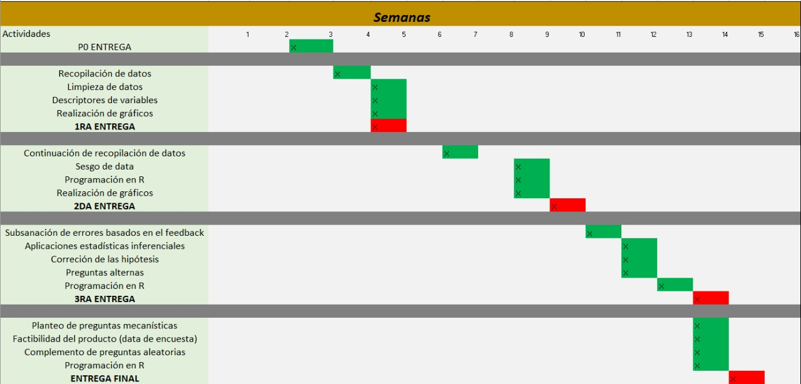
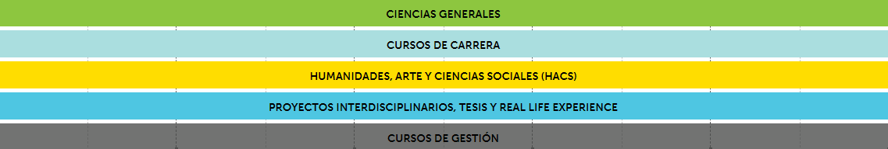

# **Introducción**


Con el objetivo de llegar a ser profesional y dedicarse a lo que les apasiona, muchas personas deciden iniciar su vida universitaria sin saber realmente lo que les espera. Gente de diferentes lugares con distintas costumbres, distinto estilo de vida y distinta educación es reunida en un mismo campus para ser sometidos a las mismas exigencias. Teniendo en cuenta que todos aspiran a la misma meta (ser exitosos en sus estudios universitarios), nos hemos propuesto averiguar cómo es que el estilo de vida de los estudiantes se relaciona con su desempeño académico.


## Importancia y justificación


La importancia del tema de estudio radica en **el impacto que tienen las actividades diarias en la salud física y mental de los estudiantes y cómo esta es reflejada en su rendimiento académico.** Sin duda alguna, cualquier factor con margen de mejora debe ser tenido en cuenta para alcanzar el máximo desempeño. Por esto, analizar y comprender cómo es que la cantidad de horas de sueño, la situación económica de una familia u otros factores afectan positiva o negativamente en el estudiante es resulta siendo algo crucial.


## Objetivos


El objetivo principal de nuestra investigación es **recopilar información relacionada al modo de vida de los estudiantes de UTEC e información relacionada a sus estudios académicos**, y el posterior riguroso análisis de la misma para determinar las relaciones que existen entre los mismos.

-   Determinar relaciones entre el estilo de vida de los estudiantes y su desempeño académico.

-   Proponer la adopción de costumbres y métodos de estudio a partir de las relaciones encontradas con el fin de apoyar a los estudiantes en su vida universitaria.


## Planificación


La siguiente tabla muestra las características y objetivos que debemos cumplir para cada entrega. Así tendremos cada detalle de nuestro proyecto al día y poder lograr los objetivos propuestos según la rúbrica.


{width="100%"}


# **Marco Teórico** {.tabset}

## **Tipo de muestreo**

En la universidad UTEC, existe una gran cantidad de estudiantes (se aproxima unos ocho mil alumnos) y no siempre se puede acceder a comunicarse con todos ellos. Al inicio se consideró nuestro tipo de muestreo como **aleatorio simple** debido a la gran cantidad de correos masivos que se enviaron por Gmail (aproximadamente seis mil correos) en la que se incluía nuestra encuesta, pero aún así no era seguro que todos hayan recibido el correo o que al menos lo hayan leído. El hecho que una sola persona no leyera el mensaje, hace que no todos tengan la misma probabilidad de participar. Además, el **muestreo aleatorio simple** no siempre es eficaz en muestras muy grandes, así que no sería del todo correcto decir que se usó ese tipo de muestreo. Por otro lado, tenemos el tipo de muestreo **no aleatorio por conveniencia**, en la que se elige a los miembros de nuestra muestra por proximidad y es usada cuando es casi imposible realizar pruebas a toda nuestra población (estudiantes de UTEC). Así que es mucho más seguro decir que se uso este tipo de muestreo.


{width="100%"}

## **Obtención de datos**


Para la obtención de datos, se realizará una encuesta a través de Google Forms y, mediante la descarga de información por las hojas de cálculo vinculadas de Google, se procederá a manejar y limpiar la base de datos formada. La encuesta será difundida por medio de las redes sociales más utilizadas por los estudiantes con el fin de tener un mayor alcance.


1.  **Población objetivo:** Estudiantes universitarios (no cachimbos) de la universidad UTEC.

2.  **Muestra:** 206 estudiantes (no cachimbos) de la universidad UTEC.

3.  **Unidad muestral:** Un estudiante (no cachimbo) de la universidad UTEC.

4.  **Variables de estudio:** Edad, periodo, carrera, escala, J_curso, N_reprobado, CIENCIA_reprobado, HACS_reprobado, PIER_reprobado, GESTION_reprobado, CARRERA_reprobado, motivo, riesgo, retirado, Motivo_retiro, Horas_estudio, Horas_sueño, Horas_deporte, Prom_ponderado, Prom_primerciclo, Prom_ultimociclo.

## **Variables**

+----------------------------------------------------------------------------------------------------+-------------------+----------+-------------------------------------------------------+
| Pregunta                                                                                           | Variable          | Tipo     | Restricciones                                         |
+====================================================================================================+===================+==========+=======================================================+
| ¿Cuál es su edad?                                                                                  | Edad              | Discreta | Número entero no negativo.                            |
+----------------------------------------------------------------------------------------------------+-------------------+----------+-------------------------------------------------------+
| ¿En qué periodo ingresó a UTEC?                                                                    | Periodo           | Ordinal  | Año de ingreso y periodo separado con guión (2020-1). |
+----------------------------------------------------------------------------------------------------+-------------------+----------+-------------------------------------------------------+
| ¿A qué carrera perteneces?                                                                         | Carrera           | Nominal  | Carreras de UTEC.                                     |
+----------------------------------------------------------------------------------------------------+-------------------+----------+-------------------------------------------------------+
| ¿A qué escala del sistema de pensiones de UTEC perteneces?                                         | Escala            | Nominal  | A - E, Becado por UTEC, Becado por terceros.          |
+----------------------------------------------------------------------------------------------------+-------------------+----------+-------------------------------------------------------+
| ¿Has reprobado algún curso?                                                                        | J_curso           | Nominal  | Sí / No                                               |
+----------------------------------------------------------------------------------------------------+-------------------+----------+-------------------------------------------------------+
| ¿ Cuántas veces has reprobado?                                                                     | N_reprobado       | Discreta | Número entero no negativo.                            |
+----------------------------------------------------------------------------------------------------+-------------------+----------+-------------------------------------------------------+
| ¿Qué curso(s) de CIENCIAS GENERALES has reprobado?                                                 | Ciencia_reprobado | Nominal  | Carreras de CIENCIAS GENERALES                        |
+----------------------------------------------------------------------------------------------------+-------------------+----------+-------------------------------------------------------+
| ¿Qué curso(s) de HUMANIDADES, ARTE Y CIENCIAS SOCIALES (HACS) has reprobado?                       | HACS_reprobado    | Nominal  | Carreras de HACS                                      |
+----------------------------------------------------------------------------------------------------+-------------------+----------+-------------------------------------------------------+
| ¿Qué curso(s) de PROYECTOS INTERDISCIPLINARIOS, TESIS Y REAL LIFE EXPERIENCE has desaprobado?      | PIER_reprobado    | Nominal  | Carreras de PIER                                      |
+----------------------------------------------------------------------------------------------------+-------------------+----------+-------------------------------------------------------+
| ¿Qué curso(s) de GESTIÓN has reprobado?                                                            | GESTION_reprobado | Nominal  | Carreras de GESTIÓN                                   |
+----------------------------------------------------------------------------------------------------+-------------------+----------+-------------------------------------------------------+
| ¿Has jalado algún curso de CARRERA?                                                                | CARRERA_reprobado | Nominal  | Sí / No                                               |
+----------------------------------------------------------------------------------------------------+-------------------+----------+-------------------------------------------------------+
| En general, ¿cuáles consideras que han sido los motivos por los que has reprobado el/los curso(s)? | Motivo            | Nominal  | Motivos Generales                                     |
+----------------------------------------------------------------------------------------------------+-------------------+----------+-------------------------------------------------------+
| ¿Actualmente te encuentras en riesgo académico?                                                    | Riesgo            | Nominal  | Sí / No                                               |
+----------------------------------------------------------------------------------------------------+-------------------+----------+-------------------------------------------------------+
| ¿Cuántas veces te has retirado de un curso?                                                        | Retirado          | Discreta | Número entero no negativo, entre 0 y 5.               |
+----------------------------------------------------------------------------------------------------+-------------------+----------+-------------------------------------------------------+
| ¿Por qué te retiraste?                                                                             | Motivo_retiro     | Nominal  | Motivos de retiro.                                    |
+----------------------------------------------------------------------------------------------------+-------------------+----------+-------------------------------------------------------+
| ¿Cuántas horas estudias a la semana?                                                               | Horas_estudio     | Discreta | Número entero no negativo.                            |
+----------------------------------------------------------------------------------------------------+-------------------+----------+-------------------------------------------------------+
| ¿Cuántas horas duermes al día?                                                                     | Horas_sueño       | Discreta | Número entero no negativo, de 4 a más.                |
+----------------------------------------------------------------------------------------------------+-------------------+----------+-------------------------------------------------------+
| ¿Cuántas horas a la semana practicas deporte?                                                      | Horas_Deporte     | Discreta | Número entero no negativo.                            |
+----------------------------------------------------------------------------------------------------+-------------------+----------+-------------------------------------------------------+
| ¿Cuál es su promedio ponderado acumulado de la carrera?                                            | Prom_Ponderado    | Continua | Número no negativo, entre 0 y 20.                     |
+----------------------------------------------------------------------------------------------------+-------------------+----------+-------------------------------------------------------+
| ¿Cuál fue su promedio ponderado en el primer ciclo?                                                | Prom_PrimerCiclo  | Continua | Número no negativo, entre 0 y 20.                     |
+----------------------------------------------------------------------------------------------------+-------------------+----------+-------------------------------------------------------+
| ¿Cuál fue su promedio ponderado en el último ciclo (ciclo anterior)?                               | Prom_UltimoCiclo  | Continua | Número no negativo, entre 0 y 20.                     |
+----------------------------------------------------------------------------------------------------+-------------------+----------+-------------------------------------------------------+


# **Datos** {.tabset}

## **Muestra representativa**


Como se dijo antes, para obtener estos datos, se hizo uso de la herramienta de Google Forms, la cual fue compartida a través de todos los grupos universitarios y estudiantes de UTEC, ya sea por Telegram o WhatsApp. La encuesta empleada representa una muestra representativa de muestreo aleatorio simple, ya que, el total de encuestados forma parte de la comunidad de estudiantes de UTEC . Dentro de esta población de muestreo se refleja el comportamiento y propiedades que tienen común entre los estudiantes que han reprobado algún curso durante su carrera universitaria.
###sacar la muestra a partir del nivel de confianza

La **muestra representativa** para un estudio con una población de 3096 estudiantes en 2021 con un nivel de confianza de 90% y un margen de error del 7% nos da 133 estudiantes para la muestra.

*El estudio realizado presenta escaza significancia, por lo cual, es indiferente elegir un nivel de confianza del 95%, 98% o 99%. Por lo cual se escogió un nivel de confianza del 95%, de manera que el estudio realizado presente veracidad sin necesidad de abarcar una gran cantidad de encuestados.*


## **Subida de datos**

Cargamos las líbrerias **dplyr**,**readr**, **ggmosaic**, **ggplot2**, **knitr**, **Rlab** y **datasets**.

```{r, echo=TRUE}
# En caso de no tener un librería, usar: install.packages("nombre_de_libería").
#install.packages("dplyr")
library(dplyr)
#install.packages("readr")
library(readr)
#install.packages("ggplot2")
library(ggplot2)
#install.packages("knitr")
library(knitr)
#install.packages("Rlab")
library(Rlab)
#install.packages("datasets")
library(datasets)
UTEC <- read_csv("Respuestas.csv") #Abrimos nuestro archivo csv para importar la data a nuestro R.
```


```{r}
nrow(UTEC) #Devuelve el número de filas de nuestra data. Cada fila representa una respuesta. 
```

Adicionalmente, agregaremos un nuevo archivo **.csv** que contendrá únicamente los cursos a los que los alumnos encuestados han desaprobado. Este archivo tendrá agrupados los cursos por: **Ciencias Generales**, **Humanidades, Artes y Ciencias Sociales**, **Proyectos Interdisciplinarios, Tesis y Real Life Experience** y **Gestión**.

```{r}
Cursos <- read_csv("Respuestas2.csv")
```


## **Limpieza de datos**

En primer lugar cambiaremos las preguntas que hicimos en nuestra encuesta y las nombraremos como las variables de nuestra tabla. Adicionalmente, eliminaremos la columna de *"Marca temporal"* que se genera por Google Forms.

```{r}
UTEC <- UTEC %>% rename(Edad = "¿Cuál es su edad?", Periodo = "¿En qué periodo ingresó a UTEC?", Carrera = "¿A qué carrera perteneces?" , Escala = "¿A qué escala del sistema de pensiones de UTEC perteneces?", J_curso = "¿Has reprobado algún curso?", N_Reprobado = "¿Cuántas veces has reprobado?" , Ciencia_reprobado = "¿Qué curso(s) de CIENCIAS GENERALES has reprobado?" , HACS_reprobado = "¿Qué curso(s) de HUMANIDADES, ARTE Y CIENCIAS SOCIALES (HACS)has reprobado?", PIER_reprobado = "¿Qué curso(s) de PROYECTOS INTERDISCIPLINARIOS, TESIS Y REAL LIFE EXPERIENCE has desaprobado?" ,  GESTION_reprobado=  "¿Qué curso(s) de GESTIÓN has reprobado?", CARRERA_reprobado = "¿Has jalado algún curso de CARRERA?", Motivo = "En general, ¿cuáles consideras que han sido los motivos por los que has desaprobado el/los curso(s)?", Riesgo = "¿Actualmente te encuentras en riesgo académico?", Retirado = "¿Cuántas veces te has retirado de un curso?", Motivo_retiro =  "¿Por qué te retiraste?", Horas_estudio = "¿Cuántas horas estudias a la semana?", Horas_sueño = "¿Cuántas horas duermes al día?", Horas_Deporte = "¿Cuántas horas a la semana practicas deporte?", Prom_Ponderado = "¿Cuál es su promedio ponderado acumulado de la carrera? Ingrese solo el número con dos decimales separados por un punto decimal. (Ej: 14.27)", Prom_PrimerCiclo = "¿Cuál fue su promedio ponderado en el primer ciclo?  Ingrese solo el número con dos decimales separados por un punto decimal. (Ej: 14.27)" , Prom_UltimoCiclo = "¿Cuál fue su promedio ponderado en el último ciclo (ciclo anterior)?  Ingrese solo el número con dos decimales separados por un punto decimal. (Ej: 14.27)") #Cambiamos las preguntas por las variables de nuestra tabla.
UTEC2 <- UTEC #Le damos un nuevo nombre a nuestra data.No siempre es necesario pero se decidió hacerlo para tenerlo mejor organizado.
UTEC2$`Marca temporal` <- NULL #Eliminamos la columna "Marca temporal" que generó el Google Forms.
```

Cambiamos el nombre de los datos **"Becado por Terceros"** y **"Beca 18 Pronabec"** por **"Beca_Terceros"**. Asimismo, cambiamos la variable **"Becado por UTEC"** a **"Beca_UTEC"**.

```{r}
UTEC2$Escala[UTEC2$Escala =="Becado por Terceros"] <- "Beca_Terceros"
UTEC2$Escala[UTEC2$Escala == "Becado por UTEC" ] <- "Beca_UTEC"
UTEC2$Escala[UTEC2$Escala == "Beca 18 Pronabec" ] <- "Beca_Terceros"
```

En nuestra data **"UTEC2"** encontramos respuestas en variables númericas y categóricas que afectan a nuestro estudio. Por lo tanto, se decidió reemplazarlas por *NA* o por su número respectivo.

```{r}
UTEC2$Ciencia_reprobado[UTEC2$Ciencia_reprobado == "Ninguno"] <- NA
UTEC2$HACS_reprobado[UTEC2$HACS_reprobado == "Ninguno"] <- NA
UTEC2$PIER_reprobado[UTEC2$PIER_reprobado == "Ninguno"] <- NA
UTEC2$GESTION_reprobado[UTEC2$GESTION_reprobado == "Ninguno"] <- NA
UTEC2$Motivo_retiro[UTEC2$Motivo_retiro== "No me he retirado de ningún curso." ] <- NA
UTEC2$Horas_sueño[UTEC2$Horas_sueño == "1 am"  ] <- 1
UTEC2$Prom_Ponderado[UTEC2$Prom_Ponderado== "No tengo" ] <- NA
UTEC2$Prom_Ponderado[UTEC2$Prom_Ponderado== "aun nada" ] <- NA
UTEC2$Prom_Ponderado[UTEC2$Prom_Ponderado== "." ] <- NA
UTEC2$Prom_Ponderado[UTEC2$Prom_Ponderado== "....." ] <- NA
UTEC2$Prom_PrimerCiclo[UTEC2$Prom_PrimerCiclo== "No tengo" ] <- NA
UTEC2$Prom_PrimerCiclo[UTEC2$Prom_PrimerCiclo== "aun nada" ] <- NA
UTEC2$Prom_PrimerCiclo[UTEC2$Prom_PrimerCiclo== "." ] <- NA
UTEC2$Prom_PrimerCiclo[UTEC2$Prom_PrimerCiclo== "....." ] <- NA
UTEC2$Prom_UltimoCiclo[UTEC2$Prom_UltimoCiclo== "No tengo" ] <- NA
UTEC2$Prom_UltimoCiclo[UTEC2$Prom_UltimoCiclo== "aun nada" ] <- NA
UTEC2$Prom_UltimoCiclo[UTEC2$Prom_UltimoCiclo== "." ] <- NA
UTEC2$Prom_UltimoCiclo[UTEC2$Prom_UltimoCiclo== "...." ] <- NA
UTEC2$Prom_UltimoCiclo[UTEC2$Prom_UltimoCiclo== "no se todavia" ] <- NA
UTEC2$Prom_UltimoCiclo[UTEC2$Prom_UltimoCiclo== "-" ] <- NA
UTEC2$Horas_estudio[UTEC2$Horas_estudio== "A la semana, estudio 20 horas." ] <- 20
UTEC2$Horas_sueño[UTEC2$Horas_sueño== "No duermo :(" ] <- 0
UTEC2$Horas_sueño[UTEC2$Horas_sueño== "6 horas y 30 min" ] <- 6
UTEC2$N_Reprobado[UTEC2$N_Reprobado== 0 ] <- 3
UTEC2$Horas_estudio[UTEC2$Horas_estudio== "80" ] <- NA
UTEC2$Horas_estudio[UTEC2$Horas_estudio== "42" ] <- NA
UTEC2$Prom_UltimoCiclo[UTEC2$Prom_UltimoCiclo== 1 ] <- NA
```

El Rstudio reconoció las variables **"Horas_sueño"**,**"Horas_estudio"**, **"Prom_Ponderado"**, **"Prom_PrimerCiclo"** y **"Prom_UltimoCiclo"** como *character*, así que las cambiaremos por *double* ya que las horas solo se representan como número.

```{r}
UTEC2$Horas_sueño <- as.numeric(as.character(UTEC2$Horas_sueño))
UTEC2$Horas_estudio <- as.numeric(as.character(UTEC2$Horas_estudio))
UTEC2$Prom_Ponderado <- as.numeric(as.character(UTEC2$Prom_Ponderado))
UTEC2$Prom_PrimerCiclo <- as.numeric(as.character(UTEC2$Prom_PrimerCiclo))
UTEC2$Prom_UltimoCiclo <- as.numeric(as.character(UTEC2$Prom_UltimoCiclo))
```


# **Descriptores gráficos y numéricos**

## Cursos Desaprobados

En UTEC, los cursos se encuentran divididos en cinco grupos: **"Ciencias Generales"**, **"Humanidades, Artes y Ciencias Sociales (HACS)"**, **"Proyectos Interdisciplinarios, Tesis y Real Life Experience"**, **"Gestión"** y **"Cursos de Carrera"**. Como nuestro proyecto se basa principalmente en los cursos desaprobados de UTEC, hemos realizado gráficos de barras por cada grupo de cursos para poder analizarlos y llegar a conclusiones óptimas.

*Notar que los colores representativos para cada grupo de cursos son los que se muestran en la imagen.*

{width="100%"}


### Ciencias Generales

En el grupo de **Ciencias Generales** tenemos 15 cursos (entre la malla 2018 y 2021). En la siguiente gráfica de barras, se pueden ver la cantidad de alumnos que han desaprobado los cursos de **Ciencias Generales**.
```{r}
par(mar = c(4, 11, 3, 2))
barplot(table(Cursos$`CIENCIAS GENERALES`),horiz=1,col= 3, las=1, cex.names = 0.8,xlim= c(0,70), main = "Cursos desaprobados - CIENCIAS", names.arg=c("Ciencia de los Materiales","Estadística y Probabilidades I","Estadística y Probabilidades II","Física I","Física II","Programación I","Matemáticas I", "Matemáticas II","Matemáticas III","Programación I","Química Experimental","Química General","Termodinámica"),xlab = "Cantidad de alumnos")
```

Como se puede apreciar, el curso con mayor cantidad de desaprobados es **Matemáticas I (malla 2018)**, también conocida como **Cálculo de una variable - vectorial** para la malla 2021. Además, el curso con menos desaprobados es **Estadística y Probabilidades** para la malla 2021 y **Ciencia de los Materiales** para la malla 2018. Finalmente, de los 15 cursos disponible en **Ciencias Generales**, solo se desaprobaron 13.

### Cursos de Carrera

En el grupo de cursos de **Carrera**, al ser específicas para cada carrera, se decidió únicamente preguntar al encuestado si aprobó o no el curso.

```{r}
par(mar = c(4, 6, 3, 10))
barplot(table(UTEC2$CARRERA_reprobado), ylim= c(0,100),names.arg=c("No desaprobaron","Sí desaprobaron"),col =5,ylab = "Cantidad de alumnos", main = "Cantidad de alumnos que desaprobaron
        uno o más cursos de CARRERA" )
```

Como se puede observar, una gran mayoría de estudiantes (94) no han desaprobado un curso de carrera, mientras que 24 de ellos sí han desaprobado.

### Proyectos Interdisciplinarios, Tesis y Real Life Experience

En el grupo de **Proyectos Interdisciplinarios, Tesis y Real Life Experience** tenemos nueve cursos (entre la malla 2018 y 2021). En la siguiente gráfica de barras, se pueden ver la cantidad de alumnos que han desaprobado los cursos de **Proyectos Interdisciplinarios, Tesis y Real Life Experience**.
```{r}
par(mar = c(5, 10, 2, 8))
barplot(table(Cursos$`PROYECTOS INTERDISCIPLINARIOS, TESIS Y REAL LIFE EXPERIENCE`),col = 12,cex.names=0.8,las=1,horiz=1, xlab = "Cantidad de alumnos", main = "Cursos desaprobados - PROYECTOS INTERDISCIPLINARIOS,
        TESIS Y REAL LIFE EXPERIENCE", cex.main=1, names.arg=c( "Desafíos Globales", "Proyecto Interdisciplinario I","Proyecto Interdisciplinario II") )
```

Como se puede apreciar, los cursos con mayor cantidad de desaprobados es **Desafíos Globales (malla 2018) ** y **Proyecto Interdisciplinario I (mallas 2018 y 2021)**. Además, el curso con menos desaprobados es **Proyecto Interdisciplinario II** para las mallas 2018 y 2021.


### Humanidades, Artes y Ciencias Sociales (HACS)

En el grupo de **Humanidades, Artes y Ciencias Sociales (HACS)** tenemos 11 cursos (entre la malla 2018 y 2021). En la siguiente gráfica de barras, se pueden ver la cantidad de alumnos que han desaprobado los cursos de **Humanidades, Artes y Ciencias Sociales (HACS)**.
```{r}
par(mar = c(4, 10, 3, 4))
barplot(table(Cursos$`HUMANIDADES, ARTES Y CIENCIAS SOCIALES`),col = 7 ,horiz=1,cex.names=0.7,las=1, main = "Cursos desaprobados - HUMANIDADES, ARTES Y CIENCIAS SOCIALES", cex.main=1, xlab = "Cantidad de alumnos", names.arg=c("Arte y Tecnología","Laboratorio de Comunicación I","Laboratorio de Comunicación II", "Perú: ¿País Industrial?"))
```

Como se puede apreciar, el curso con mayor cantidad de desaprobados es **Laboratorio de Comunicación II (malla 2018 y 2021)**. Además, el curso con menos desaprobados es **Perú: ¿País Industrial?** para la malla 2018. Finalmente, de los 11 cursos disponible en **Humanidades, Artes y Ciencias Sociales (HACS)**, solo se desaprobaron 4.

### Gestión

En el grupo de **Gestión** tenemos 10 cursos (entre la malla 2018 y 2021). En este caso, únicamente se obtuvo un desaprobado en el curso de **Finanzas Empresariales**, por lo que realizar un gráfico de barras no es necesario. 
```{r}
table(Cursos$GESTIÓN)
```

## Edad

Empleando la función *summary* obtenemos los valores mínimos, máximos, la mediana, el promedio y el primer y tercer cuartil de la variable *Edad*. Esto nos brinda información relevante para conocer con mayor precisión las características del público al que dirigimos nuestro estudio, por lo tanto es considerado un descriptor descriptivo. 

```{r}
summary(UTEC2$Edad)
```

Teniendo en cuenta a la muestra analizada, podemos observar que el rango de edades es pequeño y la mayoría de encuestados representan a una población joven teniendo como media la edad de 19.01. Sin embargo, no podemos ignorar los datos atípicos que abarcan hasta los 31 años y, aunque no representen a la población con esa edad por no ser una cantidad representativa, esto no influirá en los resultados y conclusiones de nuestro estudio de manera significativa.

En el gráfico inferior podemos observar la edad de los encuestados, donde la mayoría de nuestro publico encuestado esta entre las edades de 17 a 20 años, y otros casos a donde la edad fluctúa entre los 23,28,33 años.

```{r}
boxplot(UTEC2$Edad,col= "orange", main = "Edad de los encuestados", horizontal = TRUE)
abline(v=mean(UTEC2$Edad),col="blue",lwd=2) 
```

También se puede representar mediante un histograma:

```{r}
hist(UTEC2$Edad,ylim = c(0,0.4), col= "orange",main="Edad de los encuestados",ylab="densidad",xlab="Edad de los encuestados",freq = FALSE)
abline(v=median(UTEC2$Edad),col="red",lwd=2) 
abline(v=mean(UTEC2$Edad),col="blue",lwd=2) 
legend(200,0.012,legend=c("Mediana","Media"),lwd=2,col=c("red","blue")) 
legend(25,0.2,legend=c("Mediana","Media","Curva de distribución normal"),col=c("red","blue","yellow"),lty=1,bty="n",cex=0.9)
curve(dnorm(x, mean=mean(UTEC2$Edad), sd=sd(UTEC2$Edad)), add=TRUE, col="yellow", lwd=3)
```

El histograma cumple la función de dibujar la curva de distribución normal y describir gráficamente los valores de media y mediana esencialmente   

Patrón: En el histograma podemos observar que la mediana y la media son ligeramente iguales, siendo la media igual a 19.01 y la mediana igual a 19. Aún así, la media es mayor a la mediana, lo que ocasiona que el histograma tenga un sesgo a la derecha.


El intervalo de confianza para la variable **Edad** con un nivel de confianza de **95%** y una significancia de **5%** es:
```{r}
nc = 0.95
alfa = 0.05
var = var(UTEC2$Edad)
n = nrow(UTEC2)
media = mean(UTEC2$Edad)
z = qnorm(1-alfa/2)

ICI <- media - z * sqrt(var/n)
ICS <- media + z * sqrt(var/n)
cat("(",round(ICI,2),";",round(ICS,2),")")
```

El análisis previo cumple con un papel inferencial, ya que, demuestra el rango aproximado al 95% en donde los valores de la edad de los encuestados se encuentran. 

## Horas de sueño diaria

Para la representación de las horas de sueño diaria, utilizamos la función *summary* con la variable *Horas_sueño* para hallar la información más importante en relación a la cantidad de horas que duermen los encuestados. Nuevamente es una función que cumple para dar un análisis descriptivo de la variable. 

```{r}
summary(UTEC2$Horas_sueño)
```

Al observar que el primer cuartil es 6 y el tercer cuartil 7, entendemos que los datos están muy concentrados entre esos dos valores. Esto nos permite apreciar que, probablemente existe algo que no le permita a la muestra escapar de ese rango, debido a que existen tan solo 3 valores atípicos. Con el fin de llegar a conclusiones más precisas, se requerirá un análisis más exhaustivo de los datos.

En la parte inferior se aprecia la gráfica de horas de sueño de nuestra población encuestada, a través, de la aplicación de la función boxplot, extrayendo los datos de la encuesta realizada.

```{r}
boxplot(UTEC2$Horas_sueño,col= "orange", main = "Horas de sueño de los encuestados", horizontal = TRUE)
abline(v=mean(UTEC2$Horas_sueño, na.rm = 1),col="blue",lwd=2)
legend("topright",legend=c("Media"),lwd=2,col=c("blue")) 
```

El gráfico de caja de bigote de la variable Horas de sueño cumple un papel netamente descriptivo. Este muestra gráficamente la concentración de datos y los datos atípicos mencionados anteriormente.

Patrón: Se puede observar que la mayoría de los alumnos cumple con dormir alrededor de 6 a 7 horas, es por ello, que de acuerdo al estudio realizado por la BBC, los alumnos no duermen dentro del rango recomendado para personas de su edad. En consecuencia, es posible que esta costumbre afecte su desarrollo y su desempeño académico.

El intervalo de confianza de la media para la variable **Horas_sueño** con un nivel de confianza de **95%** y una significancia de **5** es:
```{r}
nc = 0.95
alfa = 0.05
var2 = var(UTEC2$Horas_sueño, na.rm=1)
n2 = nrow(UTEC2)
media2 = mean(UTEC2$Horas_sueño,na.rm = 1)
z2 = qnorm(1-alfa/2)

ICI2 <- media2 - z2 * sqrt(var2/n2)
ICS2 <- media2 + z2 * sqrt(var2/n2)
cat("(",round(ICI2,2),";",round(ICS2,2),")")
```

Realizamos el intervalo de confianza de esta variable para observar el comportamiento de la misma variable de manera inferencial. Debido a este análisis comprendemos que al 95% de confianza las horas de sueño de todos los estudiantes de la UTEC se encuentran en este rango. 

## Alumnos encuestados por carrera

El siguiente gráfico descriptivo es un gráfico de barras, podemos apreciar la manera en que se distribuyen los encuestados en las distintas carreras de UTEC.

```{r}
barplot(table(UTEC2$Carrera),las=3, col= "orange", ylab = "Cantidad de alumnos", main="Alumnos encuestados por carrera",names.arg=c("Bioingeniería", "CC.SS", "Ambiental", "Civil","Energía","Electrónica","Industrial","Mecánica","Mecatrónica","Química"), cex.names=0.8, ylim= c(0,35)  )
```

Patrón: Podemos afirmar que de las 10 carreras incluidas en el estudio, 7 de ellas se encuentran con una cantidad similar de estudiantes, mientras que ingeniería de la energía, ingeniería mecánica e ingeniería química cuentan con una cantidad menor de representantes en relación al resto de carreras en el estudio. Por otro lado, tenemos que la moda se representa en la barra más alta, por lo que en este caso, la moda sería **Mecatrónica**. 

## Horas de deporte semanal

```{r}
summary(UTEC2$Horas_Deporte)
```

Observando el histograma y los descriptores numéricos de las horas de deporte realizadas en una semana, podemos apreciar que manejamos una variable unimodal sesgada hacia la derecha con una gran concentración de datos entre 0 y 2 horas. El hecho de que la media se encuentre en un valor tan cercano a 2, nos indica que la mayoría de casos de la muestra no realiza o realiza muy poco deporte; lo que nos servirá para ver cómo es que esta relación influye en su desarrollo académico (ya que el deporte es una gran forma de aliviar el estrés provocado por los estudios).


A través del uso de la función *hist* se ha obtenido el gráfico de las horas de deporte semanal que la población encuestada de estudiante de UTEC practica.

```{r}
hist(UTEC2$Horas_Deporte,ylim = c(0,0.4), col= "orange",main="Horas de deporte semanal",ylab="densidad",xlab="Horas de deporte",freq = FALSE)
abline(v=median(UTEC2$Horas_Deporte),col="red",lwd=2) 
abline(v=mean(UTEC2$Horas_Deporte),col="blue",lwd=2) 
legend(200,0.012,legend=c("Mediana","Media"),lwd=2,col=c("red","blue")) 
legend(8,0.2,legend=c("Mediana","Media","Curva de distribución normal"),col=c("red","blue","yellow"),lty=1,bty="n",cex=0.9)
curve(dnorm(x, mean=mean(UTEC2$Horas_Deporte), sd=sd(UTEC2$Horas_Deporte)), add=TRUE, col="yellow", lwd=3)
```

Patrón : En promedio, los encuestados realizan 1.99 horas de ejercicio a la semana. En comparación a lo recomendado por la OMS, que son 150 minutos (2.5 horas) de actividad moderada diaria, no es una cantidad significativa para aliviar los niveles de estrés que los estudios provocan en los alumnos.
En el histograma también se aprecia la curva de distribución sesgada a la derecha.

## Escala económica

En el siguiente gráfico se logra observar la frecuencia relativa de las distintas escalas económicas de la muestra. Destaca la escala E con la mayor cantidad de alumnos.

```{r}
barplot(table(UTEC2$Escala),las=3, col= "orange", main="Estudiantes por escala económica", names.arg =c("A","B","Beca terceros","Beca UTEC","C","D","E"),cex.names=0.7)
```

## Frecuencia de alumnos en riesgo académico

El gráfico cumple con la finalidad de ser un descriptor gráfico con el cual concluimos que actualmente hay una cantidad menor de alumnos en riesgo académico que alumnos regulares en nuestra muestra de estudio; lo cual es lógico.

```{r}
barplot(table(UTEC2$Riesgo),las=3, col= "orange", main="Frecuencia relativa de alumnos en riesgo académico", horiz = TRUE , xlim = c(0,120) )
```


## Horas de estudio entre alumnos que reprobaron y no reprobaron
Así mismo estos gráficos de caja de bigote tiene la finalidad de informar descriptivamente 
que la mayoría de alumnos estudia entre 6 a 7 horas, sin importar que hayan reprobado algún curso.

```{r}
boxplot(UTEC2$Horas_sueño ~ UTEC2$J_curso,main="Horas de estudio entre alumnos que reprobaron y no reprobaron ",ylab="cantidad de horas",xlab="¿Desaprobaron al menos un curso?", col="orange")
```

Patrón : De acuerdo a lo observado en el gráfico, los alumnos estudian una cantidad de horas similar ya sea que hayan reprobado al menos un curso o no; por lo que es posible que existan otros factores más determinantes que las horas de estudio, para sentenciar si aprueban o desaprueban los cursos.

## Horas de estudio semanales vs promedio primer ciclo

La gráfica de dispersión que se presenta a continuación muestra de manera descriptiva una aglomeración de estudiantes que dedican entre 6 a 7 horas a estudiar independientemente de si han aprobado o no todos sus cursos. No obstante, también observamos que existen casos atípicos con altas calificaciones, pero también una gran cantidad de horas de estudio.

```{r}
plot(UTEC2$Prom_PrimerCiclo ~ UTEC2$Horas_estudio,xlab="Horas de estudio",ylab="Promedio primer ciclo",main="Horas de estudio vs Promedio de Primer Ciclo", col=as.factor(UTEC2$J_curso))
legend("bottomright", legend=c("No reprobaron","Sí reprobaron"),pch = 1, col=1:2, bty="y")
```


## Horas de estudio vs promedio de último ciclo

Por lo expuesto en el gráfico, los estudiantes de ultimo ciclo que estudian entre 6 a 7 horas tienen un promedio superior a 14, mientras la población de estudiantes que estudia menos de 6 horas a la semana ronda su promedio por debajo de 14.

```{r}
smoothScatter(UTEC2$Prom_UltimoCiclo ~ UTEC2$Horas_estudio,xlab="Horas de estudio",ylab="Prom. último ciclo",main="Horas de estudio vs Promedio de Último Ciclo")
```


## Proporción de desaprobados por carrera

A continuación se muestra la manera en que se distribuyen los desaprobados por las distintas carreras analizadas en el presente estudio; donde destacan las carreras de ingeniería industrial, ambiental y civil por tener la mayor proporción de desaprobados, más no necesariamente la mayor cantidad.

```{r}
mosaicplot(table(UTEC2$Carrera,UTEC2$J_curso),las=6,main="Proporción de desaprobados por carrera",col=c("orange","yellow"),cex.axis =0.7)
```

## Proporción de desaprobados por escala de precios

Por medio de la siguiente representación, se expone la relación entre cada escala económica y si han reprobado algún curso o no. Del anterior gráfico se conocía que en la escala E había la mayor cantidad de alumnos y de este gráfico se conoce que también es la escala con mayor proporción de reprobados; por lo que podemos concluir que en esa escala es donde hay mayor cantidad de alumnos reprobados.

```{r}
mosaicplot(table(UTEC2$Escala,UTEC2$J_curso),main="Proporción de desaprobados por escala de precios",col=c("orange","yellow"))
```


## Número de alumnos reprobados que se encuentran o no en riesgo

De acuerdo al gráfico la mayoría de alumnos que han reprobado algún curso una vez son 22 alumnos, y aquellos que han reprobado 2 o 3 comparten la misma cantidad de alumnos, asimismo, existe un pequeña cantidad que ha reprobado mas de 4 cursos. Por otro lado, existe una población de 5 estudiantes que se encuentra o no riesgo académico.

```{r}
e <- table( UTEC2$Riesgo,UTEC2$N_Reprobado)
barplot(e,
       beside = F,  
        col = c("orange","yellow"),
        ylim = c(0,40),
        border = "blue",
       legend = levels (UTEC2$Riesgo),
       ylab= "Cantidad de alumnos",
       xlab= "Cantidad de cursos reprobados",
       main = "Número de alumnos reprobados que se encuentran o no en riesgo"
       
       )
legend(7,30,
       legend = c(" No están en riesgo", "Sí están en riesgo"),
       fill = c("orange","yellow"),# Color de los rectángulos
       cex = 0.8,
        xpd = TRUE,
       border = "black") # Color del borde de los rectángulos
```

Patrón: Los alumnos que han reprobado al menos un curso, tienden a aprender de sus errores y no volver reprobar. De esta manera, los alumnos que llevan más de 3 cursos diferentes reprobados son muy escasos.En este sentido, se puede observar cómo la gráfica decrece de forma exponencial.

## Horas de deporte y estudio semanales

Observamos que la mayoría de los datos atípicos son los estudiantes practican mucho deporte a la semana, por lo que podemos inferir que la disciplina genera también un compromiso con el estudio. Por otro lado, vemos una concentración de alumnos que han reprobado que muestran pocas o ninguna hora de deporte o estudio semanal.

```{r}
 plot1 <- ggplot(UTEC2, aes(UTEC2$Horas_estudio,UTEC2$Horas_Deporte, color=UTEC2$J_curso)) + geom_point() + labs(y="Horas de deporte", x = "Horas de estudio ", title="Horas de deporte y estudio semanales",colour = "¿Ha reprobado algún curso?" ) + scale_color_manual(values=c("yellow", "orange")) 
plot1
```

Patrón: Los estudiantes que dedican más horas a practicar deporte trasladan esa disciplina a los estudios, estudiando una mayor cantidad de horas en relación a los estudiantes que no practican deporte.

# **Pruebas de hipótesis**

## Hipótesis bilateral:


Hipótesis nula: Los estudiantes de UTEC, que han cursado por lo menos un ciclo completo, tienen en promedio 19 años.

$H_o: µ = 19$

Hipótesis alternativa: Los estudiantes de UTEC, que han cursado por lo menos un ciclo completo, no tienen en promedio 19 años.

$H_1: µ ≠ 19$

A continuación, se procede a realizar los cálculos pertinentes y a graficar la distribución normal en los valores de la variable donde las líneas rojas representan los puntos críticos y la azul representa en valor asociado a p-value. En este caso, al ser una prueba de hipótesis bilateral, las zonas de rechazo están representadas desde los puntos críticos hacia los extremos de la distribución.

```{r}
#cantidad total de la muestra a estudiar. Para este caso, toda la encuesta completa.
q_edad=sum(!complete.cases(UTEC2))
#desviación estándar de la muestra
sd_edad <- sd(UTEC2$Edad)

#Media de la edad de la muestra
x_edad <-mean(UTEC2$Edad)

#media hipotética de la muestra
u_edad = 19

#Zobs
zobs_edad= ((x_edad-u_edad)/(sd_edad/sqrt(q_edad)))*sd_edad+x_edad
zobs_edad

#zcrit
alpha=0.05
zcrit1 <- qnorm(1-alpha/2,mean=x_edad,sd=sd_edad,lower.tail = F)
zcrit2 <- qnorm(alpha/2,mean=x_edad,sd=sd_edad,lower.tail = F)
zcrit1
zcrit2

#grafica
dum <- seq(-3.5,3.5,length=100)*sd_edad +x_edad
plot(dum,dnorm(dum,x_edad,sd_edad),type='l', xlab="Edades", ylab="Función de densidad de probabilidad", main = "Prueba de hipótesis para las edades")
legend("topright",95, legend = c("Puntos críticos", "p-valor"),col=c("red","blue"),lty=1:1, cex=0.6,)
abline(v=zcrit1, col="red") ##Punto crítico
abline(v=zcrit2, col="red") ##Punto crítico
abline(v=zobs_edad, col="blue") ##Punto asociado al p-valor

#No se rechaza

```

$19.15 (valor-p) >  15.03 (punto\ crítico)$
$19.15 (valor-p) <  22.98 (punto\ crítico)$

Tal y como se pudo apreciar en el gráfico mostrado y por los resultados obtenidos, hemos concluido que la hipótesis nula; es decir, "los estudiantes de UTEC, que han cursado por lo menos un ciclo completo, tienen en promedio 19 años" no será rechazada.

## Prueba de hipótesis unilateral de cola a la derecha:

Para esta prueba de hipótesis, lo que se busca es plantear si los estudiantes que han reprobado al menos un curso realizan poca cantidad de ejercicio físico (en concreto, menos de 2 horas a la semana). Para ello se plantea la siguiente hipótesis nula y la alternativa correspondientes.Se utilizará el valor de 2 horas para la hipótesis al ser el valor promedio de horas de deporte de toda la muestra.

Hipótesis nula: Los estudiantes que han reprobado al menos un curso realizan dos horas de ejercicio a la semana o menos.

$H_o: µ < 2$

Hipótesis alternativa: Los estudiantes que han reprobado al menos un curso realizan más de dos horas de ejercicio a la semana

$H_1: µ >= 2$

A continuación, se procede a realizar los cálculos pertinentes y a graficar la distribución normal en los valores de la variable donde las líneas rojas representan los puntos críticos y la azul representa en valor asociado a p-value. En este caso, al ser una prueba de hipótesis unilateral de cola a la derecha, la zona de rechazo está representada desde el punto crítico hacia la derecha de la distribución.

```{r}
#cantidad total de la muestra a estudiar.Para este caso, se filtra los que sí han jalado cursos.
UTECD <-  UTEC2 %>% filter(J_curso == "Si" )
q_deporte <- nrow(UTECD)

#desviación estándar de la muestra
sd_deporte <- sd(UTECD$Horas_Deporte, na.rm= TRUE)

#Media de cursos desprobados de la muestra
x_deporte <-mean(UTECD$Horas_Deporte, na.rm=1)

#media hipotética de la muestra
u_deporte = round(mean(UTEC2$Horas_Deporte, na.rm=1),0)
u_deporte

#Zobs
zobs_deporte= ((x_deporte-u_deporte)/(sd_deporte/sqrt(q_deporte)))*sd_deporte+x_deporte
zobs_deporte

#zcrit
alpha=0.05
zcrit <- qnorm(alpha,mean=x_deporte,sd=sd_deporte,lower.tail = F)
zcrit

#grafica
dum <- seq(-3,3,length=100)*sd_deporte +x_deporte
plot(dum,dnorm(dum,x_deporte,sd_deporte),type='l', xlab="Horas de deporte a la semana", ylab='función de densidad de probabilidad', main = "Prueba de hipótesis para las horas de deporte")
legend("topright",95, legend = c("Puntos críticos", "p-valor"),col=c("red","blue"),lty=1:1, cex=0.6,)
abline(v=zcrit, col="red") ##Punto crítico
abline(v=zobs_deporte, col="blue") ##Punto asociado al p-valor

```

$1.59 (valor-p) < 5.76 (punto \ crítico)$

Una vez apreciados los resultados y gráficos obtenidos para esta prueba de hipótesis, se puede determinar que la hipótesis nula no puede ser rechazada debido a que encaja dentro del rango establecido para los parámetros acordados; dando a entender que los estudiantes que han reprobado al menos un curso, realizan dos horas de ejercicio a la semana o menos.

## Prueba de hipótesis unilateral de cola a la izquierda:

Para la siguiente prueba de hipótesis, se busca estudiar la cantidad de horas que estudian a la semana en promedio las personas que no han reprobado en ningún curso. Esto con el objetivo de cumplir con las metas de la investigación y poder establecer un patrón de cuántas horas a la semana en promedio como mínimo se debería estudiar para no reprobar cursos. Se utilizará el valor de 7 horas para la hipótesis al ser el valor promedio de horas de estudio de toda la muestra.

Hipótesis nula: Los estudiantes que no han reprobado ningún curso estudian como mucho 7 horas a la semana en promedio.

$H_o: µ <= 7$

Hipótesis alternativa: Los estudiantes que no han reprobado ningún curso estudian mas 7 horas a la semana en promedio.

$H_1: µ > 7$

A continuación, se procede a realizar los cálculos pertinentes y a graficar la distribución normal en los valores de la variable donde las líneas rojas representan los puntos críticos y la azul representa en valor asociado a p-value. En este caso, al ser una prueba de hipótesis unilateral de cola a la izquierda, la zona de rechazo está representada desde el punto crítico hacia la izquierda de la distribución.

```{r}
#Cantidad que NO ha reprobado = tamaño de la muestra muestra
q_aprobados <- sum(is.na(UTEC2$N_Reprobado)) 


#desviación estándar de la muestra
UTECR <- UTEC2 %>% filter(J_curso == "No")
sd_aprobados <- sd(UTECR$Horas_estudio, na.rm= TRUE)


#Media de las horas de estudio de la muestra
x_aprobados <-mean(UTECR$Horas_estudio, na.rm= TRUE)


#media hipotética
u_aprobados=round(mean(UTEC2$Horas_estudio, na.rm = T),0)
u_aprobados

#zobs
zobs_aprobados <- ((x_aprobados-u_aprobados)/(sd_aprobados/sqrt(q_aprobados)))*sd_aprobados+x_aprobados
zobs_aprobados

#zcrit
alpha=0.05
zcrit <- qnorm(1-alpha,mean=x_aprobados,sd=sd_aprobados,lower.tail = F)
zcrit

#gráfica
dum <- seq(-3,3,length=100)*sd_aprobados +x_aprobados
plot(dum,dnorm(dum,x_aprobados,sd_aprobados),type='l', xlab="Horas de estudio a la semana", ylab='Función de densidad de probabilidad', main = "Prueba de hipótesis para las horas de estudio")
legend("topright",95, legend = c("Puntos críticos", "p-valor"),col=c("red","blue"),lty=1:1, cex=0.7,)
abline(v=zcrit, col="red") ##Punto crítico
abline(v=zobs_aprobados, col="blue") ##Punto asociado al p-valor

#No se rechaza la hipótesis
```

$5.9 (valor-p) > -1.50 (punto \crítico)$

Tal y como su pudo observar en el reciente gráfico y con los resultados obtenidos, se puede concluir que la hipótesis nula que plantea que "Los estudiantes que no han reprobado ningún curso estudian al menos 7 horas a la semana en promedio" no será rechazada ya que se encuentra dentro del rango aceptable de acuerdo a los parámetros escogidos para la variable en específico.

# **Regresión**

A continuación, se realizó una filtración de todas nuestras variables numéricas relevantes para el estudio que puedan relacionarse entre sí para observar la correlación entre ellas y seleccionar con mayor facilidad las más apropiadas para analizar.

```{r}
UTEC2 %>% select(c(1,6,16:21)) %>% cor(.,use="complete.obs")
```

## Horas de estudio (<=9) vs. Promedio de último ciclo 

Con el fin de hallar una relación estricta entre ambas variables, usaremos el comando **lm** que describa un modelo de regresión lineal y **summary** para que nos muestre un resumen de estas.

```{r}
#Horas de estudio vs Promedio del último ciclo (summary) (1)
HO <- UTEC2 %>% filter(Horas_estudio <= 9)
summary(HO$Horas_estudio)
r_1 <- lm(HO$Prom_UltimoCiclo ~ HO$Horas_estudio)
summary(r_1)
```

Al analizar el coeficiente de determinación, nos damos cuenta que el coeficiente de variación entre las variables **Prom_UltimoCiclo** y **Horas_estudio** (para **Horas_estudio** <= 9) nos da **0.05955**, lo que quiere decir que la fuerza de dicha correlación directa es muy baja y que el modelo no predice adecuadamente la variable **Prom_UltimoCiclo**.

Al fijarnos en el **F-statistic**, nos damos cuenta que el p-value es **0.001694**, lo que significa que no podemos rechazar nuestra hipótesis nula ($H_0$) al ser menor que nuestro valor alpha **0.05**. En conclusión, el modelo no es significativo y no se pueden realizar predicciones.

```{r}
#Horas de estudio vs Promedio del último ciclo (grafico) (1)
smoothScatter(HO$Prom_UltimoCiclo ~ HO$Horas_estudio,xlab="Horas de estudio (<= 9h)",ylab="Promedio último ciclo",main="Horas de estudio vs Promedio de Último Ciclo")
abline(r_1)
```

A pesar de esto, se observa cierta tendencia por ß1 = 0.3649 que indica que mientras más horas estudies (en este rango de horas), mayor será tu calificación final del ciclo a razón de 0.3649.

## Horas de estudio (>9) vs. Promedio de último ciclo 

```{r}
#Horas de estudio vs Promedio del último ciclo (summary) (2)
HM <- UTEC2 %>% filter(Horas_estudio > 9)
summary(HM$Horas_estudio)
r_2 <- lm(HM$Prom_UltimoCiclo ~ HM$Horas_estudio)
summary(r_2)
```

Al analizar el coeficiente de determinación, nos damos cuenta que el coeficiente de variación entre las variables **Prom_UltimoCiclo** y **Horas_estudio** (para **Horas_estudio** > 9) nos da **0.0001474**, lo que quiere decir que la fuerza de dicha correlación directa es muy baja y que el modelo no predice adecuadamente la variable **Prom_UltimoCiclo**.

Al fijarnos en el **F-statistic**, nos damos cuenta que el p-value es **0.9457**, lo que significa que podemos rechazar nuestra hipótesis nula ($H_0$) al ser mayor que nuestro valor alpha **0.05**. En conclusión, el modelo no es significativo y no se pueden realizar predicciones.

```{r}
#Horas de estudio vs Promedio del último ciclo (summary) (2)
smoothScatter(HM$Prom_UltimoCiclo ~ HM$Horas_estudio,ylim = c(0,20),xlab="Horas de estudio (> 9h)",ylab="Promedio último ciclo",main="Horas de estudio vs Promedio de Último Ciclo")
abline(r_2)
```

A pesar de esto, se observa cierta tendencia por ß1 = -0.003588 que indica que independientemente de cuántas horas estudies (en este rango de horas), tu calificación se mantendrá casi constante tendiendo a disminuir en -0.003588 en relación a las horas estudiadas.

## Promedio de último ciclo vs promedio de primer ciclo

Primero filtramos la información necesaria para realizar tanto la regresión con el comando **lm()** como la predicción con el comando **predict()**.

```{r}
UTECP <- UTEC2 %>% select(c(20,21)) %>% na.omit(UTEC2)
x <- (UTECP$Prom_PrimerCiclo)
y <- (UTECP$Prom_UltimoCiclo)
dat = data.frame(cbind(x,y))
r_3 <- lm(y ~ x, data=dat)
summary(r_3)
```

Al analizar el coeficiente de determinación, nos damos cuenta que el coeficiente de variación entre las variables **Prom_PrimerCiclo** y **Prom_UltimoCiclo** nos da **0.6091**, lo que quiere decir que la fuerza de dicha correlación directa es muy baja y que el modelo predice adecuadamente (en un 60.91%) la variable **Prom_UltimoCiclo**.

Al fijarnos en el **F-statistic**, nos damos cuenta que el p-value es **2.2e-16**, lo que significa que podemos rechazar nuestra hipótesis nula ($H_0$) al ser mayor que nuestro valor alpha **0.05**. En conclusión, el modeloes significativo y se pueden realizar predicciones.

```{r}
smoothScatter(UTECP$Prom_UltimoCiclo ~ UTECP$Prom_PrimerCiclo,ylim = c(0,20),xlab="Promedio de último ciclo",ylab="Promedio de primer ciclo",main="Promedio de último ciclo vs promedio de primer ciclo")
abline(r_3)
```

A pesar de esto, se observa cierta tendencia por ß1 = 0.71157 y ß0 = 4.72471 que indica que mientras mayor haya sido tu calificación en el primer ciclo, mejor será en el último ciclo académico. De la misma manera, mientras peor haya sido, peor será tu calificación en el último ciclo académico.

## Predicción de notas

Con el fin de corroborar la correlación y obtener posibles resultados en función de ciertos valores, decidimos realizar las predicciones tomando como variable independiente a **Prom_PrimerCiclo** y como variable dependiente a **Prom_UltimoCiclo**.

Primero creamos el dataframe con los valores para **Prom_PrimerCiclo** para los cuales se desea realizar la predicción y se aplica la función **predict()** con el modelo generado anteriormente **r_3** y el dataframe **pred_3**.

```{r}
#predicción
pred_3 <- data.frame(x = c(8,9,10,11,12,15,18))

predict(r_3, pred_3)

```

Como respuesta al comando **predict()** nos da los valores de respuesta para **Prom_PrimerCiclo** en valores de **Prom_UltimoCiclo**, donde se puede observar que para una nota igual o menor a 8, se seguiría desaprobando el promedio ponderado en el último ciclo; sin embargo, a partir de un valor de 9 para arriba en el promedio del primer ciclo, se empezaría a aprobar el promedio del último ciclo.

A continuación, se muestra la representación gráfica de estas predicciones donde las líneas celestes representan los intervalos de confianza y entre las lineas verdes y rojas se estiman las predicciones realizadas.

```{r}
#gráfica de predicciones
predict(r_3)
predict(r_3,pred_3, se.fit = T)
pred.w.plim <- predict(r_3,pred_3, interval = "prediction")
pred.w.clim <- predict(r_3,pred_3, interval = "confidence")
matplot(pred_3, cbind(pred.w.clim, pred.w.plim[,-1]),lty = c(1,2,2,4,4), type = "l", ylab = "Promedio del primer ciclo", xlab = "Predicción de promedio del último ciclo", main= "Predicción de notas")
```
La función de predicción que describe el modelo analizado es la siguiente:

$Y_(x)=4.724711 + 0.71157x $

## Número de cursos reprobados vs Promedio de primer ciclo

```{r}
r_4 <- lm(UTEC2$N_Reprobado ~ UTEC2$Prom_PrimerCiclo)
summary(r_4)
```

Si observamos la prueba lm realizada logramos ver que el coeficiente de variación entre las variables *Número de cursos reprobados* y *Promedio de primer ciclo* nos da un valor de *3.26e-09,* lo que quiere decir que la fuerza de dicha correlación directa es insignificante y que el modelo no predice adecuadamente la variable *Prom_PrimerCiclo*.

Al fijarnos en el *F-statistic, nos damos cuenta que el p-value es **3.256e-09, lo que significa que podemos rechazar nuestra hipótesis alternativa ($H_0$) al ser menor que nuestro valor alpha **0.05*. En conclusión, el modelo no es significativo y no se pueden realizar predicciones.

El valor de R nos indica que no existe un buen ajuste del modelo lineal de los datos, este es de *0.265*.

```{r}
smoothScatter(UTEC2$N_Reprobado ~ UTEC2$Prom_PrimerCiclo,ylim = c(0,20),xlab="Promedio de primer ciclo",ylab="Número de cursos reprobados",main="Número de cursos reprobados vs promedio de primer ciclo")
abline(r_4)
```

# **Conclusiones**

Según los resultados obtenidos:

- El curso que más se ha desaprobado es *Matemáticas I* y el grupo con más desaprobados en general es *Ciencias Generales*. Esto nos indica que los alumnos que deseen mejorar o no verse perjudicados en su promedio ponderado de manera significativa, deberán prestar especial atención y dedicar mayor cantidad de estudio a estos cursos.

- Los alumnos que se encuentran en la escala "E" Y "D" de pagos son los que más han desaprobado uno o más curso. No conocemos los motivos por los que sucede esto; sin embargo, un análisis de mayor profundidad en este aspecto podría ayudar a entender los motivos e intentar buscar soluciones.

- Las carreras con mayor índice de desaprobados son: *Ing. Industrial, **Ing. Civil* e *Ing. Ambiental*.

- El promedio de horas de sueño de un alumno de UTEC es *6.629*. Esto no cubre la cantidad de horas necesarias según las recomendaciones de la OMS que dicta que un estudiante adolescente debe descansar entre 7 y 9 horas diarias; lo que estaría perjudicando a sus estudios.

- 2 horas de ejercicio a la semana resultan insuficientes para mantener un promedio de notas aprobatorio durante la vida universitaria. En consecuencia, se recomienda que los alumnos dediquen mayor tiempo a realizar actividades físicas con el fin de aliviar el estrés y tener un mejor desempeño académico.

- Estudiar 7 horas en promedio resulta suficiente como para lograr un promedio de notas exitosas de acuerdo a lo analizado en nuestras gráficas de regresión, mientras mayor sea la cantidad de horas estudiadas en un rango de 0 a 9 horas, brindará significativas mejoras en lo que a su promedio del último ciclo se refiere, mientras que un promedio de horas de estudio mayor, no representará una mejora considerable.

- Las horas de estudio y la calificación de los estudiantes puede describirse con una relación lineal con pendiente de 0.36 para un rango de 0 a 9 horas y con una pendiente cercana a 0 para un rango mayor.Esto nos indica que a mayor estudio, mejor calificación para un rango de 0 a 9 horas.

- Las notas del primer ciclo y del último ciclo se ven relacionadas de manera lineal con pendiente de 0.71 y nuestro modelo lo predice en un 60%. Esto nos permite predecir las notas que tendrán los alumnos en el último ciclo en función de sus calificaciones del primer ciclo de manera representativa a un 60% mediante el modelo expuesto anteriormente.

- Nuestra investigación demuestra que mientras mayor haya sido tu calificación en el primer ciclo, menos cursos jalados tendrás en el transcurso de tu carrera universitaria. Esto nos permite aconsejar a los nuevos ingresantes que dediquen un gran esfuerzo en su primer ciclo académico para adaptarse a la vida universitaria y a los requerimientos que esta conlleva para así cumplir exitosamente sus estudios.

# **Correcciones**

Solucionamos las siguientes observaciones de presentaciones pasadas:

- Justificación de los valores de la media hipotética para las pruebas de hipótesis.

- Separamos en 2 partes el cruce de variables Horas de estudio vs Promedio de último ciclo para estudiarla por rangos de valores.

- Incluimos el modelo que describe la predicción en Promedio de primer ciclo vs Promedio de último ciclo

- Mejoramos la gráfica de pruebas de hipótesis al marcar toda la zona de rechazo.

- Las pruebas de hipótesis ahora tienen leyendas, se indica que es cada línea vertical, la zona de rechazo y no rechazo y se han corregido los títulos.

- Se representan las hipótesis de manera matemática.

- Las pruebas de hipótesis se muestran en los valores de la variable.

- El .rmd ejecuta errores.


