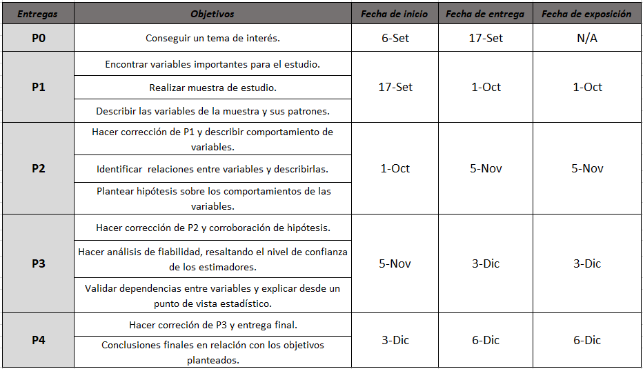
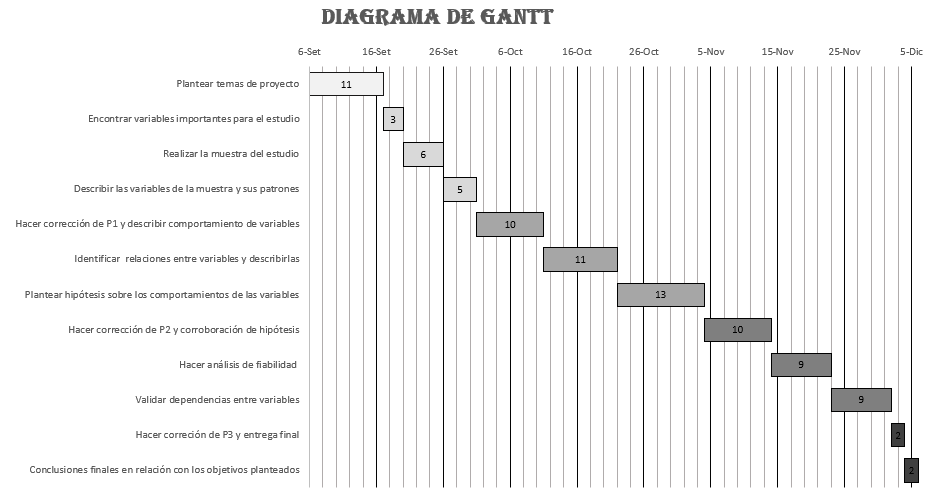

```{r,  echo=FALSE, include=FALSE}
if(require("reshape2") == FALSE) {
  install.packages("reshape2")}
``` 
```{r,  echo=FALSE, include=FALSE}
if(require("mapdata") == FALSE) {
  install.packages("mapdata")}
```
```{r,  echo=FALSE, include=FALSE}
if(require("ggrepel") == FALSE) {
  install.packages("ggrepel")}
```
```{r,  echo=FALSE, include=FALSE}
if(require("ggthemes") == FALSE) {
install.packages("ggthemes")} 
```
```{r,  echo=FALSE, include=FALSE}
if(require("readr") == FALSE) {
install.packages("readr")} 
```
```{r,  echo=FALSE, include=FALSE}
if(require("dplyr") == FALSE) {
  install.packages("dplyr")}
```
```{r,  echo=FALSE, include=FALSE}
if(require("modeest") == FALSE) {
  install.packages("modeest")} 
```
```{r,  echo=FALSE, include=FALSE}
if(require("ggplot2") == FALSE) {
  install.packages("ggplot2")}
```
```{r,  echo=FALSE, include=FALSE}
if(require("maps") == FALSE) {
  install.packages("maps")}
```
```{r,  echo=FALSE, include=FALSE}
if(require("tidyverse") == FALSE) {
  install.packages("tidyverse")} 
```
```{r,  echo=FALSE, include=FALSE}
if(require("gridExtra") == FALSE) {
  install.packages("gridExtra")}
```
```{r,  echo=FALSE, include=FALSE}
if(require("timevis") == FALSE) {
  install.packages("timevis")}
```

```{r,  echo=FALSE, include=FALSE}
library(reshape2)
library(mapdata)
library(ggrepel)
library(ggthemes)
library(readr)
library(dplyr)
library(modeest)
library(ggplot2)
library(tidyverse)
library(maps)
library(gridExtra)
library(timevis)
``` 


# **Introducción**

La presente investigación se realiza gracias a una base de datos sobre la recarga de saldos, el cual contiene información detallada y específica sobre cada negocio que recarga saldo en Lima, Perú.

En estos tiempos de pandemia las familias se vieron afectadas, debido a que sus ingresos se vieron disminuidos. Por esta razón, las personas actualmente están buscando algún ingreso extra mediante un negocio o alguna otra actividad para lograr mantenerse estable económicamente.

Este proyecto busca informar a la población y empresas acerca de la viabilidad de emprender un negocio de este tipo en la ciudad de Lima, Perú. También, es de suma relevancia para que los actuales dueños de estos servicios visualicen su negocio al corto plazo y en el mercado de recargas en general.

El desarrollo de este proyecto estadístico se caracteriza por ser **interesante**, **diferente** y **factible**. Empezando por el primer concepto, este proyecto es **interesante** debido a que el negocio de recargas de saldos puede ser una gran manera de generar empleos y de ganar dinero para muchas personas que, debido a no tener la suficiente información, están dudando en entrar a este mercado. Segundo, este trabajo es **diferente** porque genera información actual acerca de los negocios de recargas y su mercado. Por último, el estudio estadístico es **factible** debido a que la base de datos a disposición fue suministrada, con el permiso de una empresa terciaria encargada del manejo de datos, brindándonos una base con información real y crucial para nuestro proyecto.

Esta investigación busca dar respuesta a las siguientes inquietudes sobre emprender un negocio sobre la recarga de saldo en Lima, Perú.

¿Cuánto se puede llegar a ganar en este tipo de emprendimientos? y ¿Dónde se podría establecer un negocio sobre recargas de saldo?

La base datos de la muestra se reportan a continuación en el archivo [Recargas.csv](www.google.com). El archivo está codificado en formato UTF-8 consiste de 22000 observaciones de las siguientes variables:

-   `Identificador`:Es el identificador único que hace referencia al punto de venta.

-   `Nombre`:Es el nombre que lleva la empresa para diferenciarse de las demás empresas.

-   `Equipos`:Los negocios que usen un único dispositivo para realizar recargas se denotaron con "U" y los que usen varios se les denotaran con "V".

-   `Saldo`:Saldo disponible de una tienda para realizar recargas de saldo a otros equipos.

-   `Provincia`:Son las provincias del departamento Lima, Perú.

-   `Distrito`:Son los distritos del departamento Lima, Perú.

-   `Latitud`:Magnitud en decimales que permiten medir distancias geográficas respecto al Ecuador.

-   `Longitud`:Magnitud en decimales que permiten medir distancias geográficas respecto al Meridiano de Greenwich.

-   `Tipo`:Es el tipo de negocio del punto de venta.

-   `Giro`:Es el abastecimiento donde se realiza el negocio.

-   `Trimestre1`:Es la cantidad de transacciones que se realizaron desde el 1 de enero hasta el 31 de marzo.

-   `Trimestre2`:Es la cantidad de transacciones que se realizaron desde el 1 de abril hasta el 30 de junio.

-   `Trimestre3`:Es la cantidad de transacciones que se realizaron desde el 1 de julio hasta el 30 de septiembre.

-   `Trimestre4`:Es la cantidad de transacciones que se realizaron desde el 1 de octubre hasta el 31 de diciembre.

-   `Clasificación`:Es la clasificación obtiene una tienda en base a las ventas obtenidas.

# **Objetivos**

### Objetivo general

Realizar un estudio estadístico sobre las variables que intervienen a la viabilidad de emprender un negocio de recarga de saldos en Lima, Perú.

### Objetivos específicos

-   **Reconocer** las características de las variables que influyen en la recarga de saldo en Lima a través de descriptores numéricos y gráficos adecuados.
-   **Realizar** gráficos estadísticos y descriptores numéricos para el estudio de las variables.
-   **Analizar** las relaciones de las variables cuantitativas o cualitativas para resaltar las que influyen más a las recargas de saldo en Lima.
-   **Observar** los patrones entre variables que puedan ayudar al emprendimiento de un negocio.

# **Factibilidad**

### ¿Por qué es factible?

Porque se cuenta con diferentes formas de organización; con ello se podrá abordar mejor el proyecto.

En el cuadro que está a continuación podemos observar los objetivos de cada presentación que tendrá este proyecto.

{width="width" height="height"}

El grupo realizó dos diagramas de **Gantt** para poder organizar mejor los plazos de entrega, como también las presentaciones de proyecto, y así obtener un trabajo eficiente durante el ciclo universitario.

1.  Diagrama para entregas. {width="width" height="height"} <br>

2.  Diagrama para entregas de proyecto.

```{r, echo=FALSE, fig.width=10, fig.height=3}

data <- data.frame(
  id      = 1:12,
  content = c("p0", "Revisión final", "p1", "Informe","Presentación","Revisión final","p2","Informe","Presentación", "Revisión final","p3", "p4"),
  start   = c("2021-09-17","2021-09-26", "2021-10-01", "2021-10-08","2021-10-26","2021-11-01","2021-11-06", "2021-11-11","2021-11-25", "2021-12-01","2021-12-04", "2021-12-06"),
  end     = c(NA, "2021-09-30", NA, "2021-10-26","2021-11-01","2021-11-05",NA, "2021-11-25","2021-12-01","2021-12-03", NA, NA)
)

timevis(data)
```

# **Marco Teórico**

### Población objetivo

Los negocios que hacen uso del servicio de recarga de saldos en la región de Lima, Perú.

### Unidad Muestral

Un negocio de servicio de recarga de saldos en Lima, Perú.

### Recolección de datos

La base de datos fue suministrada por una empresa terciaria, la cual brindó una base de datos completa de nuestra población de estudio, pero para el desarrollo del proyecto se sacó una muestra de la población total de la base de datos.

### Tipo de Muestreo

Se aplicó un muestreo estratificado, donde cada estrato es una provincia de la región de Lima, Perú.

### Tipo de variables

+---------------+-----------------------+-------------------------------------------------------------+
| Variable      | Tipo de variable      | Restricciones                                               |
+===============+:======================+=============================================================+
| Identificador | Cualitativa nominal   | Enteros positivos de 6 dígitos                              |
+---------------+-----------------------+-------------------------------------------------------------+
| Nombre        | Cualitativa nominal   | Nombre de empresa                                           |
+---------------+-----------------------+-------------------------------------------------------------+
| Equipos       | Cualitativa           | Toma 2 valores "U" para un solo equipo y "V" para varios    |
|               |                       |                                                             |
|               | nominal               |                                                             |
+---------------+-----------------------+-------------------------------------------------------------+
| Saldo         | Cuantitativa          | Racional positivo                                           |
|               |                       |                                                             |
|               | continua              |                                                             |
+---------------+-----------------------+-------------------------------------------------------------+
| Provincia     | Cualitativa nominal   | Provincias de Lima, Perú                                    |
+---------------+-----------------------+-------------------------------------------------------------+
| Distrito      | Cualitativa nominal   | Distritos de Lima, Perú                                     |
+---------------+-----------------------+-------------------------------------------------------------+
| Dirección     | Cualitativa nominal   | Registrado en la SAT de Lima                                |
+---------------+-----------------------+-------------------------------------------------------------+
| Latitud       | Cuantitativa continua | Real positivo o negativo                                    |
+---------------+-----------------------+-------------------------------------------------------------+
| Longitud      | Cuantitativa continua | Real positivo o negativo                                    |
+---------------+-----------------------+-------------------------------------------------------------+
| Tipo          | Cualitativa ordinal   | Autoservicio, personal, minorista, mayorista, instituciones |
+---------------+-----------------------+-------------------------------------------------------------+
| Giro          | Cualitativa nominal   | Local de servicio                                           |
+---------------+-----------------------+-------------------------------------------------------------+
| Trimestre1    | Cuantitativa discreta | Entero positivo                                             |
+---------------+-----------------------+-------------------------------------------------------------+
| Trimestre2    | Cuantitativa discreta | Entero positivo                                             |
+---------------+-----------------------+-------------------------------------------------------------+
| Trimestre3    | Cuantitativa discreta | Entero positivo                                             |
+---------------+-----------------------+-------------------------------------------------------------+
| Trimestre4    | Cuantitativa discreta | Entero positivo                                             |
+---------------+-----------------------+-------------------------------------------------------------+
| Clasificación | Cualitativa ordinal   | A, B, C, D, E                                               |
+---------------+-----------------------+-------------------------------------------------------------+

# **Datos**

### Limpieza de Datos

Las consideraciones más importantes que se tomaron para la limpieza de la base de datos son las siguientes:

-   Información sin sentido.
-   Eliminación de algunos valores.
-   Información irrelevante para el estudio.
-   Reclasificación para algunas variables.
-   Eliminación de observaciones con NA's.
-   Falta de claridad de la información.


```{r echo=FALSE,include=FALSE}
dl <- read_csv("Recargas_Saldo_Lima.csv")
```
**Tabla con las variables y observaciones**
```{r echo=FALSE}
dl
```

1. Revisión general de los tipos de variables de la base de datos usando el comando `str`, sin considerar la categoría que asigna el R (numérica o categórica).
```{r}
str(dl)
```
2. Obtención de los datos y casos incompletos.
```{r}
sum(is.na(dl)) # Número de datos incompletos
sum(!complete.cases(dl)) # Numero de casos incompletos
```
3. Se encontró un caso incompleto, al analizar este dato se llegó a la conclusión que no habrá un cambio relevante en el estudio. Por lo tanto, no se hizo modificaciones.


4. La base de datos cuenta con 15 variables que se analizarán.

```{r}
ncol(dl)
```


<br>

#### **Identificador**

1. La variable "Identificador" se mantiene debido a que es un identificador único para la base de datos.

<br>

#### **Nombre**

1. La variable "Nombre" permite conocer el nombre establecido por la tienda, por lo que se conserva la variable.

<br>

#### **Equipos**

1. Se usa la función `unique` para obtener la información que contiene "Equipos".
```{r}
unique(dl$Equipos)
```
2. Los datos presentados son correctos. Por consiguiente, no se realizan mayores modificaciones. 

<br>

#### **Saldo**
1. La variable "Saldo" es un dato numérico por lo que se analiza la distribución de la información en un gráfico *boxplot*.
```{r echo=FALSE}
boxplot(dl$Saldo)
```
2. Existen dos datos notorios que no permiten una correcta apreciación de la información.

3. Evaluar el "Saldo" de los dos datos.
```{r}
datos_atipicos_SaldoRecarga <- boxplot.stats(dl$Saldo)$out # Lista con los datos atípicos de SaldoRecarga
tail(sort(datos_atipicos_SaldoRecarga), n = 2) # Obtención de los 2 valores más altos de la lista
```
4. Se filtran los datos en base a si son mayores a 100000 soles de recarga. 
```{r echo=FALSE}
filter(dl, Saldo > 100000)
```

5. El contenido de los datos es presentado como dato erróneo, puesto que no corresponde a las ventas que obtiene. Por lo tanto, se eliminan dichos datos.
```{r echo=FALSE}
dl <- dl[dl$Saldo < 100000,] # Crea un subconjunto de df con SaldoRecarga menor a 100000 soles
```

6. Creación de un *boxplot* para comprobar la información.
```{r echo=FALSE}
boxplot(dl$Saldo)
```

<br>

#### **Provincia**
1. Se usa la función `unique` para obtener la información que contiene "Provincia".
```{r echo=FALSE}
unique(dl$Provincia)
```
2. Los datos presentados son correctos. En consecuencia, no se realizan mayores modificaciones.

<br>

#### **Distrito**
1. Se usa la función `unique` para obtener la información que contiene "Distrito".
```{r echo=FALSE}
unique(dl$Distrito)
```

2. Los datos presentados son correctos. En consecuencia, no se realizan mayores modificaciones. 

<br>

#### **Latitud y Longitud**
1. Las variables "Latitud" y "Longitud" son datos numéricos por lo que se analiza la distribución de estos en un grafo de dispersión.
```{r echo=FALSE, warning=FALSE}
mapa_mundo <- map_data("world")
mapa_mundo %>%
  ggplot() + 
  geom_polygon(aes( x= long, y = lat, group = group),
               fill = "grey80",
               color = "white") +
  theme_minimal() +
  theme(
    axis.line = element_blank(),
    axis.text = element_blank(),
    axis.title = element_blank(),
    axis.ticks = element_blank(),
    panel.background = element_rect(colour= "black", size= 1)) +
  ggtitle( "Mapa del Perú") +
  coord_fixed (xlim= c(-86,-68),
              ylim= c(-18,0),
              ratio = 0.9) + geom_point(data= dl, 
             aes(x=Longitud, y = Latitud))
```
2. Las observaciones se encuentran en el espacio requerido para el estudio. Por tal motivo, no se realizan mayores cambios.

<br>

#### **Trimestre**
1. M# son datos numéricos por lo que se analiza la distribución de la información en un gráfico *boxplot*.

```{r echo=FALSE}
boxplot(dl$Trimestre1,dl$Trimestre2,dl$Trimestre3,dl$Trimestre4)
```
2. Existen datos atípicos, pero no distorsiona la representación ni interpretación de la gráfica. Por tal motivo, no se realizan mayores cambios.

<br>

#### **Clasificación**
1. Se usa la función `unique` para obtener la información que contiene "Clasificación".

```{r echo=FALSE}
unique(dl$Clasificación)
```
2. Los datos presentados son correctos, puesto que entran dentro de las categorías existentes. En consecuencia, no se realizan mayores modificaciones. 

<br>

Visualización de la base de datos limpia
```{r echo=FALSE}
dl
```

- La base de datos presentada contiene 17154 observaciones y 15 variables.

<br>


```{r echo=FALSE, include=FALSE}
df <- read_csv("Muestra.csv")
attach(df)
```

### Muestreo

La técnica de muestreo y los pasos se explican de manera detallada en el siguiente archivo [Muestreo.rmd](Muestreo.nb.html). Las consideraciones más importantes que se tomaron para la limpieza de la base de datos son las siguientes:

-   Establecer el tamaño de la muestra para el estudio.
-   Creación de estratos con respecto a la variable de provincia.
-   Aplicación de un muestreo simple a cada estrato.

# **Variables**

Para realizar el análisis y descripción se seleccionaron las variables de interés para el estudio.

### Variables Cuantitativas

#### **Saldo**

```{r, echo=FALSE}
boxplot((df$Saldo), main = "Saldo que dispone un negocio de recargas", horizontal = TRUE, xlab = "Saldo en soles")
abline(v = c(mean(df$Saldo), median(df$Saldo)), col=c("red","blue"), lwd=c(2,2), lty=c(1,2))
legend("topright", legend = c("media      2880.32", "mediana 1628.00"),
       title = "Descriptores",
       lty = 1, col = c("red","blue"), lwd = 2, box.lty = 0)
```

-   MEDIANA

```{r, echo=FALSE}
median(df$Saldo)
```

-   MEDIA

```{r, echo=FALSE}
mean(df$Saldo)
```

-   RANGO

```{r, echo=FALSE}
range(df$Saldo)
```

-   CUARTILES

```{r, echo=FALSE}
quantile(df$Saldo)
```

- **JUSTIFICACIÓN**

    -   El boxplot permite saber que el 50% de los puntos de venta dispone de un saldo para realizar recargas entre 715 y 3179 soles. Por lo tanto, es posible que un negocio estable disponga de un saldo dentro de este rango establecido.

- **ANÁLISIS**

    -   La muestra plantea que un negocio puede pedir desde 18.48 soles hasta 74866.00 soles.
    -   El 50% de las tiendas cuenta por lo menos con 1628 soles disponibles para realizar recargas.
    -   La mediana es menor a la media, por lo que los datos presentan una asimetría positiva. Esto implica que la cantidad de saldo disponible de las tiendas se concentra hacia la izquierda.

#### **Latitud y Longitud**

```{r echo=FALSE, message = FALSE, warning = FALSE}
mapa_mundo <- map_data("world")


p1 <-  ggplot(mapa_mundo) + 
  geom_polygon(aes( x= long, y = lat, group = group),
               fill = "grey80",
               color = "white") +
  theme_minimal() +
  theme(
    axis.line = element_blank(),
    axis.text = element_blank(),
    axis.title = element_blank(),
    axis.ticks = element_blank(),
    panel.background = element_rect(colour= "black", size= 1)) +
  ggtitle( "Mapa centrado en la región de Lima") +
  coord_fixed (xlim= c(-78,-75),
              ylim= c(-13,-10),
              ratio = 0.9) + 
  geom_point(data= df, aes(x=Longitud, y = Latitud), alpha = 0.1) + 
  geom_hline(yintercept = -12.24030,colour="red") + geom_hline(yintercept = -11.48918, colour="red") +
  geom_vline(xintercept = -77.21177,colour="blue") + geom_vline(xintercept = -76.69459,colour="blue") +
  geom_hline(yintercept = -12.04318,colour="green") + geom_vline(xintercept = -77.02824,colour="green")
  
p2 <-  ggplot(mapa_mundo) + 
  geom_polygon(aes( x= long, y = lat, group = group),
               fill = "grey80",
               color = "white") +
  theme_minimal() +
  theme(
    axis.line = element_blank(),
    axis.text = element_blank(),
    axis.title = element_blank(),
    axis.ticks = element_blank(),
    panel.background = element_rect(colour= "black", size= 1)) +
  ggtitle( "Mapa del Perú") +
  coord_fixed (xlim= c(-86,-68),
              ylim= c(-18,0),
              ratio = 0.9) + geom_point(data= df, 
             aes(x=Longitud, y = Latitud)) +  xlab("Titulo X") + ylab("Titulo Y") 

grid.arrange(p2, p1, ncol = 2)
```

-   CUARTILES DE LATITUD

```{r, echo=FALSE}
quantile(df$Latitud)
```

-   CUARTILES DE LONGITUD

```{r, echo=FALSE}
quantile(df$Longitud)
```

- **JUSTIFICACIÓN**

    -   Se utiliza un gráfico de mapa para poder visualizar de mejor modo la distribución de los centros de recarga. Por el lado izquierdo, se presenta el mapa del Perú para una visualización general y en la parte derecha se enfoca en la distribución obtenida en la provincia de Lima para realizar el análisis.

- **ANÁLISIS**

    -   El primer y tercer cuartil de la latitud (líneas azules) son -12.24030 y -11.48918, por lo que se puede deducir que el 50% de los centros de servicio se encuentran entre dichas latitudes. De igual manera, el primer y tercer cuartil de la longitud (líneas rojas) son -77.21177 y -76.69459, en consecuencia el 50% de las tiendas se ubicarán entre dichas longitudes. Al analizar los cuartiles de latitud y longitud en la gráfica, y compararse con las coordenadas geográfica de Lima (latitud es -12.04318 y longitud, -77.02824, representada de color verde en la gráfica) reportada por [Geodatos](https://www.geodatos.net/coordenadas/peru/lima) se puede ver que coincide en el área encerrada por los cuartiles y se ubica en un punto donde se concentran varias tiendas. Esto puede ocurrir por el tráfico de comercio que ocurre en la capital y la oportunidad de crecimiento de negocio que se puede encontrar en esta.

#### **Trimestres**

```{r, echo=FALSE}
trimestres <- data.frame(T1 = df$Trimestre1,
                   T2 = df$Trimestre2,
                   T3 = df$Trimestre3,
                   T4 = df$Trimestre4)
boxplot(trimestres, xlab = "Trimestres del año", main = "Cantidad de operaciones por trimestre", ylab = "Cantidad de operaciones por tienda",col=c("grey87","grey87","grey87","grey87"))     
```

-   PRIMER Y TERCER CUARTIL DE TRIMESTRE 1

```{r echo=FALSE}
quantile(df$Trimestre1)[c(2,4)]
```

-   PRIMER Y TERCER CUARTIL DE TRIMESTRE 2

```{r echo=FALSE}
quantile(df$Trimestre2)[c(2,4)]
```

-   PRIMER Y TERCER CUARTIL DE TRIMESTRE 3

```{r echo=FALSE}
quantile(df$Trimestre3)[c(2,4)]
```

-   PRIMER Y TERCER CUARTIL DE TRIMESTRE 4

```{r echo=FALSE}
quantile(df$Trimestre4)[c(2,4)]
```

- **JUSTIFICACIÓN**

    -   El boxplot se utiliza para analizar si existen variaciones notables entre la cantidad de operaciones que se realiza por cada trimestre y observar si existe algún tipo de patrón.

- **ANÁLISIS**

    -   Los boxplots están distribuidos homogéneamente. Analizando la gráfica, los cuartiles parecen tener los mismos valores por cada trimestre, por lo que la cantidad de operaciones no podrían presentar algún patrón de incremento con relación a los trimestres.
    -   Los primeros y terceros cuartiles de cada trimestre no varían mucho uno de otro. Esto puede significar que el 50% de las tiendas mantienen una cantidad de operaciones entre un mínimo de 58 a 304 operaciones estables en el transcurso de los trimestre del año.

### Variables Cualitativas

#### **Equipos**

```{r, echo=FALSE}
barplot((table(df$Equipos)),col=c("grey70","grey90"),
        legend.text=c("Un solo equipo (U) ","Varios equipos(V)"),main="Cantidad de negocios que usan un solo equipo(U) o varios(V)", xlab = "Negocios que usan uno o varios equipos", ylab = "Cantidad de negocios")
```

- **JUSTIFICACIÓN**

    -   Con la gráfica de barplot se puede visualizar la diferencia entre las cantidades de equipos que está utilizando cada tienda, para ello agrupamos a los que tienen más de un equipo debido a su bajo porcentaje.

- **ANÁLISIS**

    -   Según la gráfica, la mayoría de locales cuentan con solamente un equipo autorizado para realizar recargas. Por otro lado, las tiendas que cuentan con cantidades de equipos superiores o iguales a 2 son la minoría, sin superar los 200.

#### **Provincia**

```{r, echo=FALSE}
pos <- within(df, Provincia <- factor(Provincia,levels=names(sort(table(Provincia), decreasing=F))))


p <- ggplot(pos, aes(x = Provincia))+ geom_text(aes(label = ..count..), stat= "count", hjust = -0.1, size = 3.6) +  geom_bar( width = 0.7)
p + coord_flip() + ylab("Cantidad de establecimientos de recarga") + ggtitle("Cantidad de establecimientos de recarga por provincia")
```


- **JUSTIFICACIÓN**

    -   Con la gráfica de barras, la intención es mostrar qué provincias cuentan con la mayor cantidad de puntos de recarga de saldo, de manera que se pueda mostrar cuáles son las mejores opciones para las personas que desean emprender en este negocio.

- **ANÁLISIS**

    -   Al visualizar la gráfica llegamos a notar que la moda de la variable provincia es Lima, contando con 375 puntos de recarga de saldo, para ello se puede logar ver la competitividad que muestra esta provincia.

#### **Distrito**

*Cantidad de negocios por distrito*

```{r, echo = FALSE}
tabla_Distrito <- df %>% count(Distrito)
arrange(tabla_Distrito, -n)
```

- **JUSTIFICACIÓN**

    -   La intención de usar esta tabla es mostrar la gran cantidad de distritos que hay en esta muestra. Se usó una tabla para representar los datos, debido a la abundante variedad de distritos que contiene la muestra. 

- **ANÁLISIS**

    -   Por la cantidad de filas que cuenta la tabla, se puede deducir que hay 95 distritos diferentes en la muestra.

*Cantidad de negocios en los 10 distritos más frecuentes*

```{r, echo = FALSE}
tabla_Distrito <- df %>% count(Distrito)
df_distrito <- filter(tabla_Distrito, n>28)
arrange(df_distrito, -n)
```

- **JUSTIFICACIÓN**

    -   Esta nueva tabla se realizó para poder representar los 10 distritos con mayor frecuencia en la muestra, así poder analizar y visualizar cuál es la moda de esta variable.

- **ANÁLISIS**

    -   La tabla está encabeza por el distrito de ***Huaral***, este cuenta con la mayor cantidad de puntos de venta, en otras palabras es la moda de esta variable. Por lo que se puede deducir que existe una mayor competencia en dicho distrito.

#### **Tipo**

```{r,echo=FALSE}

ggplot(data = df , mapping = aes( x = Tipo)) + 
  geom_bar() +
  geom_text(aes(label = ..count..), stat= "count", vjust=-0.2) + ylab("Cantidad de comercio") + xlab("Tipo de negocio") + ggtitle("Cantidad de establecimientos de recarga por provincia")

```

- **JUSTIFICACIÓN**

    -   El gráfico de barras nos permite entender qué tipo de negocio, al que se dedica una tienda, es el más frecuente. Se puede visualizar de forma clara y detallada, con su respectiva frecuencia.

- **ANÁLISIS**

    -   En la gráfica de barras se puede evidenciar la gran probabilidad que tiene una tienda de ser ***minorista***, en comparación con las demás, esta cuenta con más de 1100 puestos.
    -   Es menos frecuente o menos probable que una tienda de ***autoservicio*** se dedique a la recarga de saldos.

#### **Giro**

```{r, echo=FALSE}
pos <- within(df, Giro <- factor(Giro,levels=names(sort(table(Giro), decreasing=F))))

p <- ggplot(pos, aes(x = Giro)) + geom_text(aes(label = ..count..), stat= "count", hjust = -0.1, size = 3.3) +  geom_bar( width = 0.7)
p + coord_flip() + ylab("Cantidad de negocios") + xlab("Tipo de tienda")+ ggtitle("Cantidad de establecimientos de recarga por provincia")
```


- **JUSTIFICACIÓN**

    -   Se usó el gráfico de barras de forma horizontal para poder visualizar todos los tipos de tienda.

- **ANÁLISIS**

    -   En el gráfico se puede ver que gran parte de los puestos son bodegas, siendo este la moda de la variable ***Giro***.
    -   Se puede observar la variedad de tipos de tienda que hay, sin embargo, se puede deducir que la ***bodega*** es el más factible para empezar un negocio.

#### **Clasificación**

```{r, echo=FALSE}
ggplot(data = df , mapping = aes( x = Clasificación)) + 
  geom_bar() +
  geom_text(aes(label = ..count..), stat= "count", vjust=-0.2) + ylab("Cantidad de negocios") + xlab("Clasificación") + ggtitle("Cantidad de establecimientos de recarga por provincia")
```

- **JUSTIFICACIÓN**

    -   Se usa el gráfico de barras de forma horizontal por la baja variedad que cuenta, así se puede ver la frecuencia de cada tipo de clasificación.

- **ANÁLISIS**

    -   En el gráfico se puede ver que las tiendas que cuentan con clasificación ***C*** son las más abundantes, seguido por las de clasificación ***D***, luego las de ***E*** y finalmente las de ***B***.

# **Distribuciones de probabilidad**

## Distribucion Binomial

#### - **Variable aleatoria "Equipo"**


- **JUSTIFICACIÓN**

    -   Escogimos la variable Equipo porque tiene solo dos posibles resultados 'U' y 'V', que significan "un solo equipo" y "varios equipos", respectivamente. Esta variable es una aleatoria debido a que se puede asociar un valor númerico a cada los dos posibles resultados de experimento de los cuales sus resultados son inciertos, es decir, es aleatorio. 
    -   Optamos por representar la probabilidad de un negocio opere con varios dispositivos, ya que la menor parte de nuestra las observaciones de nuestra base de datos usa esta modalidad de equipos. Para esto se utiliza la muestra de 12 negocios debido a que el promedio de cantidad de negocios por distrito es de 12.18. Entonces, buscamos la probabilidad de encontrar 1 negocio que utilice varios equipos, en 12 negocios escogidos aleatoriamente.
    
    
    
```{r, echo=FALSE}
prob_u <- nrow(filter(df, Equipos == "U"))/nrow(df)
prob_v <- nrow(filter(df, Equipos == "V"))/nrow(df)
Probabilidad_e <- c(prob_u,prob_v)
Equipo_e <- c("U","V")
prob_equipo <- data.frame(Probabilidad_e,Equipo_e)
prob_equipo <- rename(prob_equipo, Probabilidad = Probabilidad_e, Equipo = Equipo_e)
prob_equipo
``` 

```{r, echo=FALSE, warning=FALSE}
data.frame(cant = 0:12, p = dbinom(x = 0:12, size = 12, prob = 0.13)) %>%
  mutate(result = ifelse(cant == 1, "si", "no")) %>%
  ggplot(aes(x = factor(cant), y = p, fill = result)) +
  geom_col() +
  geom_text(aes(label = round(p,2), y = p + 0.005),
    size = 4,
    vjust = 0) +
  labs(title = "¿Cuál es la probabilidad de obtener un negocio que use varios dispositivos?",
       subtitle = "(p = 0,13)",
       x = "'n' negocios que usan varios dispositivo",
       y = "probabilidad") +
  guides(fill = FALSE) + 
  theme_hc() + 
  theme(legend.title = element_blank(),
        plot.title = element_text(hjust = 0.5),
        plot.subtitle = element_text(hjust = 0.5)) +
  scale_fill_manual(values = c("si" = "grey50", "no" = "lightgrey"))
```

- **ANÁLISIS**

    -   Podemos representar gráficamente las probabilidades para cada uno de los resultados (ver siguiente gráfico). En color gris oscuro observamos la probabilidad de encontrar un único negocio que opere con **varios dispositivos (V)**, en 12 negocios escogidos al azar y una probabilidad **p = 0.13**, el cual representa la probabilidad de que un negocio opere con varios dispositivos "V", definido como el éxito.


#### - **Variable aleatoria "Clasificación"**


- **JUSTIFICACIÓN**

    -   Escogimos la variable clasificación porque se sabe los posibles resultados que se pueden obtener, los cuales son: 'B', 'C', 'D' y 'E'. Esta variable es una aleatoria debido a que se puede asociar un valor númerico a cada los dos posibles resultados de experimento de los cuales sus resultados son inciertos, es decir, es aleatorio. 
    -   Elegimos representar la probabilidad de que las tiendas sean de la categoría 'C', ya que es la más abundante. Para esto, sabemos que en el Jockey Plaza existen 6 tiendas de recarga, y que además, que en promedio la cantidad de negocios por distrito es de 12.18. Entonces, buscamos la probabilidad de encontrar 6 tiendas de clasificación C, en 12 negocios escogidos al azar. 
    
    
    
```{r, echo=FALSE}
prob_a <- nrow(filter(df, Clasificación == "A"))/nrow(df)
prob_b <- nrow(filter(df, Clasificación == "B"))/nrow(df)
prob_c <- nrow(filter(df, Clasificación == "C"))/nrow(df)
prob_d <- nrow(filter(df, Clasificación == "D"))/nrow(df)
prob_e <- nrow(filter(df, Clasificación == "E"))/nrow(df)
Probabilidad_c <- c(prob_a,prob_b,prob_c,prob_d,prob_e)
Clasificación_c <- c("A","B","C","D","E")
prob_clasificación <- data.frame(Probabilidad_c ,Clasificación_c)
prob_clasificación <- rename(prob_clasificación, Probabilidad = Probabilidad_c, Equipo = Clasificación_c)
prob_clasificación
```  

```{r, echo=FALSE, warning=FALSE}
data.frame(cant = 0:12, p = dbinom(x = 0:12, size = 12, prob = 0.64)) %>%
  mutate(result = ifelse(cant == 6, "si", "no")) %>%
  ggplot(aes(x = factor(cant), y = p, fill = result)) +
  geom_col() +
  geom_text(aes(label = round(p,2), y = p + 0.005),
    size = 4,
    vjust = 0) +
  labs(title = "¿Cuál es la probabilidad de obtener 6 negocios de clasificación 'C'?",
       subtitle = "(p = 0,64)",
       x = "'n' negocios de clasificación 'C'",
       y = "probabilidad") +
  guides(fill = FALSE) + 
  theme_hc() + 
  theme(legend.title = element_blank(),
        plot.title = element_text(hjust = 0.5),
        plot.subtitle = element_text(hjust = 0.5)) +
  scale_fill_manual(values = c("si" = "grey50", "no" = "lightgrey"))
```

- **ANÁLISIS**

    -   Podemos representar gráficamente las probabilidades para cada uno de los resultados (ver siguiente gráfico). En color gris oscuro observamos la probabilidad de encontrar 6 tiendas de clasificación C, en 12 negocios escogidos al azar y con una probabilidad **p = 0.64**, el cual representa la probabilidad de éxito de pertenecer a la clasificación "C".


# **Patrones y Tendencias**

### Saldo disponible para realizar recargas en un año


```{r echo=FALSE}
df_a<-mutate(df, OpAn = Trimestre1+Trimestre2+Trimestre3+Trimestre4)
```

```{r echo=FALSE}
t1 <- ggplot(df_a, aes(x = OpAn, y = Saldo)) + 
  xlab("Cantidad de operaciones al año") +
  ylab("Saldo disponible para recarga(S/.)") +
  geom_point(colour="gray")+ylim(0,20000) + geom_vline(xintercept = c(450,1050),colour="grey33")
```

```{r echo=FALSE}
t2 <- ggplot(df_a, aes(x = OpAn, y = Saldo)) +
  xlab("") +
  ylab("Saldo disponible para recarga(S/.)") +
  geom_point(colour="gray") +ylim(0,2500) + geom_smooth(method = "lm", se = FALSE,color="black") + xlim(0,450)
t3 <- ggplot(df_a, aes(x = OpAn, y = Saldo)) + 
  xlab("") + ylab("") +
  geom_point(colour="gray") +ylim(2000,5500) + geom_smooth(method = "lm", se = FALSE,color="black") + xlim(450,1000)
t4 <- ggplot(df_a, aes(x = OpAn, y = Saldo)) +
  xlab("") + ylab("") +
  geom_point(colour="gray") +ylim(3000,20000) + geom_smooth(method = "lm", se = FALSE,color="black") + xlim(1000,max(df_a$OpAn))
```

```{r echo=FALSE,warning=FALSE}
t1
```

Debido a que la gráfica aparenta presentar visualmente 3 comportamientos distintos en cada uno de los intervalos establecidos, decidimos separarlo en 3 gráficas para observar de mejor manera el comportamiento de cada una.

```{r echo=FALSE,warning=FALSE}
suppressMessages(grid.arrange(t2, t3, t4,ncol = 3, bottom="Cantidad de operaciones al año"))
```


- **ANÁLISIS**

Las 3 gráficas corresponden a la cantidad de saldo que dispone una tienda en base a la cantidad de operaciones que se realiza en el año. Al parecer, se puede apreciar un patrón distinto en cada una. En la primera, mientras mayor sea la cantidad de recargas que logre un negocio mayor será el saldo del cual disponga. Esto puede deberse a que una tienda que obtenga una mayor rentabilidad en ventas puede solicitar un monto de saldo superior a su proveedor con el fin de incrementar las ventas. En la segunda, se aprecia que las tiendas que realizan entre 500 y 1000 operaciones aproximadamente no poseen un saldo mayor a 3000 soles. Se puede deber a que un proveedor define a estos negocios como estables y para evitar riesgos de pérdida por suministrar cantidades mayores de dinero se les limita el saldo que puedan obtener. En la última, se observa que el número de operaciones con relación al saldo que dispone una tienda no posee un patrón significativo a comparación de los demás, por lo que no se podría establecer una relación clara.

### Saldo disponible para realizar recargas y la clasificación de la tienda
```{r echo=FALSE}
ggplot(df, aes(x = as.factor(Clasificación), y = Saldo)) +
  geom_boxplot(colour="black") +
  xlab("Clasificación") +
  ylab("Saldo para recarga(S/.)")
```

```{r echo=FALSE,include=FALSE}
b_2 <- filter(df, Clasificación=="B" | Clasificación == "C")
  
b_3 <- filter(df, Clasificación=="C" | Clasificación == "D")
  
b_4 <- filter(df, Clasificación=="D" | Clasificación == "E")

a2 <- ggplot(b_2, aes(x = as.factor(Clasificación), y = Saldo)) +
  geom_boxplot(colour="black") +
  xlab("Clasificación") +
  ylab("Saldo disponible para recarga(S/.)") 

a3 <- ggplot(b_3, aes(x = as.factor(Clasificación), y = Saldo)) +
  geom_boxplot(colour="black") +
  xlab("Clasificación") +
  ylab("Saldo disponible para recarga(S/.)") 

a4 <- ggplot(b_4, aes(x = as.factor(Clasificación), y = Saldo)) +
  geom_boxplot(colour="black") +
  xlab("Clasificación") +
  ylab("Saldo disponible para recarga(S/.)") 

a5 <- ggplot(df, aes(x = as.factor(Clasificación), y = Saldo)) +
  geom_boxplot(colour="black") +
  xlab("Clasificación") +
  ylab("Saldo disponible para recarga(S/.)") 
```
```{r echo=FALSE}
grid.arrange(a2, a3, a4, ncol=3)
```

- **ANÁLISIS**

Observando las gráficas se puede apreciar que existe una diferencia entre la clasificación que se le da a la tienda y el saldo del que dispone. La tendencia muestra que el saldo de una empresa disminuye a medida que la clasificación va desde "B" hacia la clasificación "E". La clasificación y su saldo pueden estar asociados como un sistema de control para distribuir el saldo adecuadamente.

### Cantidad de operaciones realizadas al año y la clasificación de la tienda

```{r echo=FALSE}
ggplot(df_a, aes(x = as.factor(Clasificación), y = OpAn)) +
  geom_boxplot(colour="black") +
  xlab("Clasificación") +
  ylab("Cantidad de operaciones anuales")
```
```{r echo=FALSE,include=FALSE}
b_2 <- filter(df_a, Clasificación=="B" | Clasificación == "C")
  
b_3 <- filter(df_a, Clasificación=="C" | Clasificación == "D")
  
b_4 <- filter(df_a, Clasificación=="D" | Clasificación == "E")

c2 <- ggplot(b_2, aes(x = as.factor(Clasificación), y = OpAn)) +
  geom_boxplot(colour="black") +
  xlab("Clasificación") +
  ylab("Cantidad de operaciones anuales") 

c3 <- ggplot(b_3, aes(x = as.factor(Clasificación), y = OpAn)) +
  geom_boxplot(colour="black") +
  xlab("Clasificación") +
  ylab("Cantidad de operaciones anuales") 

c4 <- ggplot(b_4, aes(x = as.factor(Clasificación), y = OpAn)) +
  geom_boxplot(colour="black") +
  xlab("Clasificación") +
  ylab("Cantidad de operaciones anuales") 

c5 <- ggplot(df_a, aes(x = as.factor(Clasificación), y = OpAn)) +
  geom_boxplot(colour="black") +
  xlab("Clasificación") +
  ylab("Cantidad de operaciones anuales") 
```
```{r echo=FALSE}
grid.arrange(c2, c3, c4, ncol = 3)
```

- **ANÁLISIS**

En las gráficas de boxplot se puede apreciar que el 50% de las tiendas tiende a poseer menos operaciones entre una clasificación y la siguiente. La clasificación que se la a una tienda podría indicar que un negocio de recargas no dispone de los recursos necesarios para poder operar continuamente y obtener una mayor cantidad de ventas.


# **Hipótesis**

1. Primera Hipótesis

1.1. Pregunta

¿Qué categoría de tienda tiene la mayor cantidad de operaciones promedio entre las clasificaciones B y C?

1.2. Hipótesis

Las tiendas de clasificación B tienen mayor cantidad de operaciones promedio debido a que es la clasificación con mayor cantidad de operaciones. 


2. Segunda Hipótesis

2.1 Pregunta

¿En qué trimestre se realizaron más operaciones a lo largo del país?

2.2 Hipótesis

En el primer trimestre del año se realizan más recargas en el Perú, esto se podría ocasionar debido a que entre los meses de enero y marzo aumentan las personas que se encuentran de vacaciones.


3. Tercera Hipótesis

3.1. Pregunta 

¿La media de saldo disponible entre Lima Metropolitana y Lima Provincia difiere?

3.2 Hipótesis

Debido a que la mayor cantidad de tiendas de recarga se encuentra en Lima Provincia, se podría decir que la media de saldo disponible en Lima Provincia difiere a la de Lima Metropolitana. 

```{r echo=FALSE, include=FALSE}
DF <- read_csv("Limpieza.csv")
df <- read_csv("Muestra.csv")
```

```{r echo=FALSE}
DF <- mutate(DF, OpAn = Trimestre1+Trimestre2+Trimestre3+Trimestre4)
df <- mutate(df, OpAn = Trimestre1+Trimestre2+Trimestre3+Trimestre4)
```

```{r echo=FALSE}
# Base de datos poblacional de tiendas de categoría B y C
DF_B = filter(DF, Clasificación == "B")
DF_C = filter(DF, Clasificación == "C")
```

```{r echo=FALSE}
# Media poblacional de operaciones anuales de tiendas de clasificación B y C 
P_OpAn_B_mean <- mean(DF_B$OpAn)
P_OpAn_C_mean <- mean(DF_C$OpAn)
```

```{r echo=FALSE}
# Desviación estándar poblacional de operaciones anuales de tiendas de clasificación B y C
P_OpAn_B_sd <- sd(DF_B$OpAn)
P_OpAn_C_sd <- sd(DF_C$OpAn)
```

```{r echo=FALSE}
# Base de datos de la muestra de tiendas de categoría B y C
df_B = filter(df, Clasificación == "B")
df_C = filter(df, Clasificación == "C")
```

```{r echo=FALSE}
# Media muestral de operaciones anuales de tiendas de clasificación B y C
M_OpAn_B_mean <- mean(df_B$OpAn)
M_OpAn_C_mean <- mean(df_C$OpAn)
```

```{r echo=FALSE}
# Desviación estándar muestral de operaciones anuales de tiendas de clasificación B y C
M_OpAn_B_sd <- sd(df_B$OpAn)
M_OpAn_C_sd <- sd(df_C$OpAn)
```

```{r echo=FALSE}
# Cantidad de la muestra de tiendas de clasificación B y C
OpAn_B_n <- nrow(df_B)
OpAn_C_n <- nrow(df_C)
```

# **Intervalos de confianza**

El análisis que se realizará en esta sección se enfoca sobre las tiendas de categoría C debido a que representa la moda de categoría en la muestra.

## Cantidad de operaciones de las tiendas de categoría C

- **JUSTIFICACIÓN**

Se quiere establecer el número de operaciones para tener una idea de la frecuencia con la que opera dicho negocio. Para ello, se utilizarán los siguientes parámetros.

```{r echo=FALSE}
boxplot(df_C$OpAn, xlab = "Cantidad de operaciones anuales",horizontal = TRUE)
```
```{r echo=FALSE}
summary(df_C$OpAn)
```
  - Tamaño de la muestra = 746

  - Media = 1063.85

  - Varianza poblacional = 702122.8

En base al gráfico boxplot, se ve que no hay datos atípicos. Adicionalmente, el rango es 2738, la variación poblacional es 702122.8 y su desviación estándar es de 837.93, por lo que los datos para esta variable tienen una dispersión baja. En este caso, se enfoca el tener una mayor precisión para que el intervalo calculado sea adecuado. En consecuencia, el nivel de confianza a utilizar será de 0.9 y una significancia de 0.1.

  - Significancia = 0.1

  - Nivel de confianza = 0.9

Los parámetros establecidos se redondea a los siguientes valores.

  - Valor crítico = 1.645

  - Error estándar = 30.679

  - Margen de error = 50.462

Se calcula el intervalo de confianza.

${\mu \pm Z_{\frac{\alpha}{2}} \times \frac{\sigma }{\sqrt{n}}}$

${1063.85 \pm 1.645 \times 30.679}$

${1063.85 \pm 50.462}$

```{r echo=FALSE}
nc <- 0.9 
alpha <- 0.1 
media <- mean(df_C$OpAn)
n <- nrow(df_C) 
var <- var(DF_C$OpAn) 
```
```{r echo=FALSE, include = FALSE}
qnorm(1-alpha/2)
sqrt(var/n)
qnorm(1-alpha/2)*sqrt(var/n)
```


```{r echo=FALSE}
z <- qnorm(1-alpha/2)
# sqrt(var/n) error estandar
ICI <- media - z*sqrt(var/n) 
# z*sqrt(var/n) #margen de error
ICS <- media + z*sqrt(var/n)
```

- **ANÁLISIS**

IC:$[1013.389<\mu<1114.313]$

En base a los parámetros establecidos para el intervalo de confianza, la media de operaciones anuales de tiendas de categoría C se encuentra en un rango de 1013.389 a 1114.313 operaciones. La media de operaciones anuales poblacional es de 1102.743, por lo que se asegura que el dato poblacional pertenece al intervalo de confianza propuesto.

## Saldo disponible de las tiendas de categoría C

- **JUSTIFICACIÓN**

Se analiza la media del saldo disponible por un negocio de recarga para entender el monto con el que opera una tienda de dicha categoría. Para ello, se utilizarán los siguientes parámetros.

```{r echo=FALSE}
boxplot(df_C$Saldo, xlab = "Saldo disponible en soles",horizontal = TRUE)
```
```{r echo=FALSE}
summary(df_C$Saldo)
```

  - Tamaño de la muestra = 746

  - Media = 3046.384

  - Varianza poblacional = 3721970

El gráfico boxplot muestra que los datos no se encuentran concentrados en una zona particular, sin embargo al analizar la varianza poblacional y su desviación estándar de 3721970 y 1929.24 respectivamente, respecto al valor de su media de 3046 se concluye que los datos están moderadamente dispersos respecto a esta y se puede utilizar una precisión media. Por lo tanto, se establece un nivel de confianza de 0.95 y la significancia tendría el valor de 0.05.

  - Significancia = 0.05

  - Nivel de confianza = 0.95

Los parámetros establecidos se redondea a los siguientes valores.

  - Valor crítico = 1.959

  - Error estándar = 70.635

  - Margen de error = 138.374
  
Se calcula el intervalo de confianza.
  
${\mu \pm Z_{\frac{\alpha}{2}} \times \frac{\sigma }{\sqrt{n}}}$

${3046.384 \pm 1.959 \times 70.635}$

${3046.384 \pm 138.374}$

```{r echo=FALSE}
nc <- 0.95
alpha <- 0.05
media <- mean(df_C$Saldo)
n <- nrow(df_C)
var <- var(DF_C$Saldo)
```
```{r echo=FALSE}
z <- qnorm(1-alpha/2) 
# sqrt(var/n) error estandar
ICI <- media - z*sqrt(var/n) 
# z*sqrt(var/n) margen de error
ICS <- media + z*sqrt(var/n)
```

- **ANÁLISIS**

IC:$[2907.943<\mu<3184.825]$

La información obtenida indica que el intervalo de confianza para el saldo que dispone una tienda de categoría C se encuentra entre los 2907.943 a 3184.825 soles. Contrastando con la información de la población, se verifica que la media de saldo disponible es 3027.211 soles, por lo que se encuentra en el intervalo de confianza calculado anteriormente.

## Costo de operación por recarga de las tiendas de categoría C 

- **JUSTIFICACIÓN**

El obtener la media del costo que se realiza en cada operación permite entender la cantidad de saldo con la que operará y establecer un precio adecuado en base a ello. Los parámetros establecidos son los siguientes.

```{r echo=FALSE}
boxplot(df_C$Saldo/df_C$OpAn, xlab="Costo por cada operación en soles", horizontal = TRUE)
```
```{r echo=FALSE}
summary(df_C$Saldo/df_C$OpAn)
```

  - Tamaño de la muestra = 746

  - Media = 3.62

  - Varianza poblacional = 2.21

A pesar de que la gráfica indique que la mitad de datos se concentra entre los 2.5 y 3.6 soles, la media resultante de 3.62 y la desviación estándar de 1.49 indica que los valores registrados están moderadamente dispersos con respecto a la media y por lo tanto la precisión con la que se trabaja será regular. En consecuencia, el valor asignado al nivel de confianza será de 0.95 y su significancia de 0.05.

  - Significancia = 0.05

  - Nivel de confianza = 0.95

Los parámetros establecidos se aproxima a los siguientes valores.

  - Valor crítico = 1.959

  - Error estándar = 0.054

  - Margen de error = 0.107
  
Se calcula el intervalo de confianza.
  
${\mu \pm Z_{\frac{\alpha}{2}} \times \frac{\sigma }{\sqrt{n}}}$

${3.62 \pm 1.959 \times 0.054}$

${3.62 \pm 0.107}$

```{r echo=FALSE}
nc <- 0.95
alpha <- 0.05
media <- mean(df_C$Saldo/df_C$OpAn)
n <- nrow(df_C)
var <- var(DF_C$Saldo/DF_C$OpAn)
```
```{r echo=FALSE}
z <- qnorm(1-alpha/2) # nivel de confianza
# sqrt(var/n) error estandar
ICI <- media - z*sqrt(var/n) 
# z*sqrt(var/n) margen de error
ICS <- media + z*sqrt(var/n)
```

- **ANÁLISIS**

IC:$[3.51<\mu<3.72]$

El intervalo de confianza es de 3.51 a 3.72 soles por recarga hecha. La media poblacional del costo por operación realizada es 3.54 soles, lo cual coincide dentro del intervalo de confianza establecido. 

# **Prueba de hipótesis**

## Hipótesis 1

#### **Número de operaciones en base a las categorías B y C**

```{r echo=FALSE}
barplot(table(DF$Clasificación), xlab = "Clasificación de tienda", ylab = "Cantidad de tiendas")
```
```{r echo=FALSE}
ggplot(df, aes(x = as.factor(Clasificación), y = OpAn)) +
  geom_boxplot(colour="black") +
  xlab("Clasificación") +
  ylab("Cantidad de operaciones anuales")
```

- **JUSTIFICACIÓN**

Se elige la cantidad de operaciones de las tiendas de categoría B y C debido a que a pesar que B conforma la menor cantidad de tiendas en la muestra y C la mayor, ambas aparentemente muestran una cantidad de operaciones anuales mayor al resto. Por lo que se quiere establecer si existe una diferencia real entre sus operaciones promedio.

```{r echo=FALSE, include=FALSE}
mean_1 <- M_OpAn_B_mean - M_OpAn_C_mean
mean_1
var_1 <- ((P_OpAn_B_sd)^(2)/OpAn_B_n)+((P_OpAn_C_sd)^(2)/OpAn_C_n)
var_1
```

```{r echo=FALSE, include=FALSE}
sqrt(var_1)
```


${\mu_{B}}$ = Media de cantidad de operaciones de tiendas con clasificación B

${\mu_{C}}$ = Media de cantidad de operaciones de tiendas con clasificación C

${\sigma^2_B}$ = Varianza de cantidad de operaciones de tiendas con clasificación B

${n_B}$ = Cantidad de tiendas con clasificación B

${\sigma^2_C}$ = Varianza de cantidad de operaciones de tiendas con clasificación C

${n_C}$ = Cantidad de tiendas con clasificación C

**Diferencia de medias de cantidad de operaciones entre tiendas de clasificación B y C**

**Media**

${\mu_{\left(\bar{X_{B}}-\bar{X_{C}}\right )}=\mu_{B}-\mu_{C}} = 980.92$

**Varianza**

${\sigma^{2}_{\left ( \bar{X_{B}} - \bar{X_{C}} \right )} = \frac{\sigma_{B}^{2}}{n_{B}} + \frac{\sigma_{C}^{2}}{n_{C}}} = 3582.62$

**Hipótesis nula**

$H_0 : {\mu_{B}} = {\mu_{C}}$

**Hipótesis alternativa**

$H_1 : {\mu_{B}} \not= {\mu_{C}}$

- Se realiza una prueba de hipótesis de diferencia de medias con varianza poblacional conocida. Debido a que la muestra es de tamaño grande se utilizará la prueba tipo Z.

**Significancia**

${\alpha = 0.05}$

```{r echo=FALSE}
Zc <- abs(round(qnorm(0.05/2),2))
```

```{r echo=FALSE}
Alfa <- 0.05
```

- Debido a que la magnitud de la varianza obtenida en este caso es de 3582.62 y su desviación estándar es 59.86, comparándolo con la variable de cantidad de operaciones anuales, la cual funciona en miles de operaciones, se considera una dispersión moderada respecto a los datos de la variable. En consecuencia, la dispersión moderada requiere precisión y debido a dicha dispersión no se requiere tener una confianza muy elevada, por lo que se decide utilizar un nivel de confianza de 0.95.

**Valores críticos**

${Z_{c} = \pm1.96}$

```{r echo=FALSE}
Zc <- abs(round(qnorm(0.05/2),2))
```

**Valor de prueba**

$\frac{\overline{x}_B-\overline{x}_C}{\sqrt{\frac{\sigma ^2_B}{\sqrt{n_B}}+\frac{\sigma \:^2_C}{\sqrt{n_C}}}}=16.39$

```{r echo=FALSE}
Z0 <- (M_OpAn_B_mean - M_OpAn_C_mean)/sqrt(((P_OpAn_B_sd)^(2)/OpAn_B_n)+((P_OpAn_C_sd)^(2)/OpAn_C_n))
```

**Resultado de hipótesis**

```{r echo=FALSE}
funcShaded <- function(x) {
    y <- dnorm(x, mean=0, sd=1 , log=F)
    y[x < -1.96 | x > 1.96] <- NA
    return(y)
}
```


```{r echo=FALSE, warning=FALSE}
p1 <- ggplot(data.frame(x = c(-3, 18)), aes(x = x)) +
        ylab("") +
        xlab("") +
        stat_function(fun = dnorm, size = 1.6) + 
        stat_function(fun=funcShaded, geom="area", fill="Grey40", alpha=0.2) + 
        geom_vline(xintercept = -Zc,colour="Grey60", size=1) + 
        geom_vline(xintercept = Z0,colour="Grey50", linetype="dashed", size=1) +
        geom_vline(xintercept = Zc,colour="Grey60", size=1) + 
        theme_bw() + 
        theme(axis.line = element_line(size=1, colour = "Grey10"),
              panel.grid.major = element_line(colour = "Grey95"),
              panel.grid.minor = element_blank(),
              panel.border = element_blank(), panel.background = element_blank(),
              plot.title = element_text(size = 14, family = "Tahoma", face = "bold"),
              text=element_text(family="Tahoma"),
              legend.position = "bottom",
              axis.text.x=element_text(colour="black", size = 9),
              axis.text.y=element_text(colour="black", size = 9),
        )
```
```{r echo=FALSE, warning=FALSE}
p1
```

- **ANÁLISIS**

El valor de prueba es mayor al valor crítico por lo que el primero entra en la zona de rechazo y la hipótesis nula es rechazada. En conclusión, la media de operaciones anuales de tiendas de clasificación B no es igual a la media de operaciones anuales de tiendas de clasificación C, a pesar de que muestren la mayor cantidad de operaciones anuales.

## Hipótesis 2

#### **Cantidad de operaciones por tienda de los trimestres 1 y 4**

```{r, echo=FALSE}
trimestres <- data.frame(T1 = df$Trimestre1,
                   T2 = df$Trimestre2,
                   T3 = df$Trimestre3,
                   T4 = df$Trimestre4)
boxplot(trimestres, xlab = "Trimestres del año", main = "Cantidad de operaciones por trimestre", ylab = "Cantidad de operaciones por tienda",col=c("grey87","grey87","grey87","grey87"))     
```

- **JUSTIFICACIÓN**

El primer y cuarto trimestre corresponden generalmente a las épocas de vacaciones y festividades respectivamente por lo que se espera que la cantidad de operaciones que se realicen entre dichos periodos sean similares.

```{r echo=FALSE, include=FALSE}
mean_2 <- mean(df$Trimestre1) - mean(df$Trimestre4)
mean_2
var_2 <- ((sd(DF$Trimestre1))^(2)/nrow(df))+((sd(DF$Trimestre4))^(2)/nrow(df))
var_2
```

```{r echo=FALSE, include=FALSE}
sqrt(var_2)
```


${\mu_{T1}}$ = Media de cantidad de operaciones en el trimestre 1

${\mu_{T4}}$ = Media de cantidad de operaciones en el trimestre 4

${\sigma^2_{T1}}$ = Varianza de cantidad de operaciones en el trimestre 1

${n_{T1}}$ = Cantidad de tiendas en el trimestre 1

${\sigma^2_{T4}}$ = Varianza de cantidad de operaciones en el trimestre 4

${n_{T4}}$ = Cantidad de tiendas en el trimestre 4

**Diferencia de medias de cantidad de operaciones entre trimestres 1 y 4**

**Media**

${\mu_{\left(\bar{X_{T1}}-\bar{X_{T4}}\right )}=\mu_{T1}-\mu_{T4}} = 2.53$

**Varianza**

${\sigma^{2}_{\left ( \bar{X_{T1}} - \bar{X_{T4}} \right )} = \frac{\sigma_{T1}^{2}}{n_{T1}} + \frac{\sigma_{T4}^{2}}{n_{T4}}} = 84.43$

**Hipótesis nula**

$H_0 : {\mu_{T1}} = {\mu_{T4}}$

**Hipótesis alternativa**

$H_1 : {\mu_{T1}} \not= {\mu_{T4}}$

- Se realiza una prueba de hipótesis de diferencia de medias con varianza poblacional conocida. Debido a que la muestra es de tamaño grande se utilizará el Z.

**Significancia**

${\alpha = 0.01}$

```{r echo=FALSE}
Alfa <- 0.01
```

- En este caso, los valores de la varianza 84.43 y desviación estándar 9.18 se encuentran muy dispersos respecto a la media de la diferencia de medias 2.53. La alta dispersión requiere utilizar una mayor confianza en el cálculo. En consecuencia, se decide utilizar un nivel de confianza de 0.99 y la significancia de 0.01.

**Valores críticos**

${Z_{c} = \pm2.58}$

```{r echo=FALSE}
Zc <- abs(round(qnorm(0.01/2),2))
```

**Valor de prueba**

$\frac{\overline{x}_{T1}-\overline{x}_{T4}}{\sqrt{\frac{\sigma ^2_{T1}}{\sqrt{n_{T1}}}+\frac{\sigma \:^2_{T4}}{\sqrt{n_{T4}}}}}=0.275$

```{r echo=FALSE}
Z0 <- (mean(df$Trimestre1) - mean(df$Trimestre4))/sqrt(((sd(DF$Trimestre1))^(2)/nrow(df))+((sd(DF$Trimestre4))^(2)/nrow(df)))
```

**Resultado de hipótesis**

```{r echo=FALSE}
funcShaded <- function(x) {
    y <- dnorm(x, mean=0, sd=1 , log=F)
    y[x < -2.58 | x > 2.58] <- NA
    return(y)
}
```

```{r echo=FALSE, warning=FALSE}
p2 <- ggplot(data.frame(x = c(-3, 3)), aes(x = x)) +
        ylab("") +
        xlab("") +
        stat_function(fun = dnorm, size = 1.6) + 
        stat_function(fun=funcShaded, geom="area", fill="Grey40", alpha=0.2) + 
        geom_vline(xintercept = -Zc,colour="Grey60", size=1) + 
        geom_vline(xintercept = Z0,colour="Grey50", linetype="dashed", size=1) +
        geom_vline(xintercept = Zc,colour="Grey60", size=1) + 
        theme_bw() + 
        theme(axis.line = element_line(size=1, colour = "Grey10"),
              panel.grid.major = element_line(colour = "Grey95"),
              panel.grid.minor = element_blank(),
              panel.border = element_blank(), panel.background = element_blank(),
              plot.title = element_text(size = 14, family = "Tahoma", face = "bold"),
              text=element_text(family="Tahoma"),
              legend.position = "bottom",
              axis.text.x=element_text(colour="black", size = 9),
              axis.text.y=element_text(colour="black", size = 9),
        )
```
```{r echo=FALSE, warning=FALSE}
p2
```

- **ANÁLISIS**

Debido a que el valor de prueba no entra en la zona de rechazo, la hipótesis nula no es rechazada. En conclusión, el promedio de cantidad de operaciones realizadas en los trimestres 1 y 4 no difieren.

## Hipótesis 3

#### **Saldo disponible entre Lima Metropolitana y Lima provincia.**

```{r echo=FALSE}
DF_M <- filter(df,Provincia == "LIMA")
DF_P <- filter(df,Provincia != "LIMA")
df_M <- filter(df,Provincia == "LIMA")
df_P <- filter(df,Provincia != "LIMA")
```

```{r echo=FALSE}
df <- mutate(df, M_L = ifelse(Provincia == "LIMA", "LIMA", "PROVINCIA"))
barplot(table(df$M_L),xlab = "Tiendas en Lima y provincia",ylab = "Cantidad de tiendas")
```

```{r echo=FALSE}
ggplot(df, aes(x = as.factor(M_L), y = Saldo)) +
  geom_boxplot(colour="black") +
  xlab("Tiendas en Lima y provincia") +
  ylab("Saldo disponible para recargas en soles")
```

- **JUSTIFICACIÓN**

La mayor cantidad de tiendas de recarga se encuentra en provincia, a pesar de que Lima Metropolitana presente la mayor cantidad de población. La gráfica boxplot aparenta que el saldo que disponen ambas zonas se concentran similarmente, a pesar que existe una diferencia entre las cantidades de tiendas que presenta cada una. Por lo que se quiere establecer si la media del saldo que presenta cada zona es diferente o no.

```{r echo=FALSE, include=FALSE}
mean_3 <- mean(df_P$Saldo) - mean(df_M$Saldo)
mean_3
var_3 <- ((sd(DF$Trimestre1))^(2)/nrow(df))+((sd(DF$Trimestre4))^(2)/nrow(df))
var_3
```

```{r echo=FALSE, include=FALSE}
sqrt(var_3)
```


${\mu_{L}}$ = Media de saldo que dispone una tienda en Lima

${\mu_{P}}$ = Media de saldo que dispone una tienda en Provincia

${\sigma^2_{L}}$ = Varianza de saldo disponible en tiendas de Lima

${n_{L}}$ = Cantidad de tiendas en Lima

${\sigma^2_{P}}$ = Varianza de saldo disponible en tiendas de Provincia

${n_{P}}$ = Cantidad de tiendas en Provincia

**Diferencia de medias de saldo disponible entre tiendas en Lima y Provincia**

**Media**

${\mu_{\left(\bar{X_{P}}-\bar{X_{L}}\right )}=\mu_{P}-\mu_{L}} = 637.2979$

**Varianza**

${\sigma^{2}_{\left ( \bar{X_{P}} - \bar{X_{L}} \right )} = \frac{\sigma_{P}^{2}}{n_{P}} + \frac{\sigma_{L}^{2}}{n_{L}}} = 84.43$

**Hipótesis nula**

$H_0 : {\mu_{L}} = {\mu_{P}}$

**Hipótesis alternativa**

$H_1 : {\mu_{L}} \not= {\mu_{P}}$

- Se realiza una prueba de hipótesis de diferencia de medias con varianza poblacional conocida. Debido a que la muestra es de tamaño grande se utilizará el Z.

**Significancia**

${\alpha = 0.1}$

```{r echo=FALSE}
Alfa <- 0.1
```

- La varianza en este caso es 84.42 y la desviación estándar es 9.18, por lo que respecto a la media de 637.30 los datos no están muy dispersos. En el cálculo se tendrá una mayor precisión, en consecuencia el nivel de confianza a utilizar será de 0.9.

**Valores críticos**

${Z_{c} = \pm1.64}$

```{r echo=FALSE}
Zc <- abs(round(qnorm(0.1/2),2))
```

**Valor de prueba**

$\frac{\overline{x}_L-\overline{x}_P}{\sqrt{\frac{\sigma ^2_L}{\sqrt{n_L}}+\frac{\sigma \:^2_P}{\sqrt{n_P}}}}=-2.346$

```{r echo=FALSE}
Z0 <- (mean(df_M$Saldo) - mean(df_P$Saldo))/sqrt(((sd(DF_M$Saldo))^(2)/nrow(df_M))+((sd(DF_P$Saldo))^(2)/nrow(df_P)))
```

**Resultado de hipótesis**

```{r echo=FALSE}
funcShaded <- function(x) {
    y <- dnorm(x, mean=0, sd=1 , log=F)
    y[x < -1.64 | x > 1.64] <- NA
    return(y)
}
```

```{r echo=FALSE, warning=FALSE}
p3 <- ggplot(data.frame(x = c(-3, 3)), aes(x = x)) +
        ylab("") +
        xlab("") +
        stat_function(fun = dnorm, size = 1.6) + 
        stat_function(fun=funcShaded, geom="area", fill="Grey40", alpha=0.2) + 
        geom_vline(xintercept = -Zc,colour="Grey60", size=1) + 
        geom_vline(xintercept = Z0,colour="Grey50", linetype="dashed", size=1) +
        geom_vline(xintercept = Zc,colour="Grey60", size=1) + 
        theme_bw() + 
        theme(axis.line = element_line(size=1, colour = "Grey10"),
              panel.grid.major = element_line(colour = "Grey95"),
              panel.grid.minor = element_blank(),
              panel.border = element_blank(), panel.background = element_blank(),
              plot.title = element_text(size = 14, family = "Tahoma", face = "bold"),
              text=element_text(family="Tahoma"),
              legend.position = "bottom",
              axis.text.x=element_text(colour="black", size = 9),
              axis.text.y=element_text(colour="black", size = 9),
        )
```
```{r echo=FALSE, warning=FALSE}
p3
```

- **ANÁLISIS**

Debido a que el valor de prueba no entra en la zona de rechazo, la hipótesis nula no es rechazada. En conclusión, la media saldo que dispone las tiendas de recarga en Lima y en provincia son iguales.

## Hipótesis 4

#### **Cantidad de saldo disponible en base a la cantidad del número de operaciones realizadas**

```{r echo=FALSE, warning=FALSE}
t3 <- ggplot(df_a, aes(x = OpAn, y = Saldo)) + 
  xlab("") + ylab("") +
  geom_point(colour="gray") +ylim(2000,5500) + xlim(450,1000) + geom_hline(yintercept = 2418.6,colour="black")
```
```{r echo=FALSE, warning=FALSE}
t3
```


- **JUSTIFICACIÓN**

Se analiza si la media del saldo disponible para tiendas que realizan desde 500 a 1050 operaciones anuales se encontrará en un intervalo de 2000 a 3000 soles. Para ello se plantean dos pruebas de hipótesis.

```{r echo=FALSE,include=FALSE}
h4 <- filter(df, Saldo < 3000 & Saldo > 2000, OpAn >400 & OpAn < 1050)
H4 <- filter(DF, Saldo < 3000 & Saldo > 2000, OpAn >400 & OpAn < 1050)
mh4 <- mean(h4$Saldo)
nh4 <- nrow(h4)
mh4 
SD4 <- sd(H4$Saldo)
SD4
nh4
```

${\overline{X}_{S}}$ = Media muestral del saldo que dispone una tienda que realiza entre 400 a 1050 operaciones anuales

${\sigma_{S}}$ = Desviación estándar poblacional del saldo que dispone una tienda que realiza entre 400 a 1050 operaciones anuales

${n_{S}}$ = Cantidad de tiendas que realiza entre 400 a 1050 operaciones anuales

**Significancia**

${\alpha = 0.1}$

```{r echo=FALSE}
Alfa <- 0.1
```

- La desviación estándar poblacional obtenida es 273.29. Respecto a la media de cantidad de saldo en soles que dispone una tienda, los datos tienen una dispersión baja. En el cálculo se tendrá una mayor precisión, en consecuencia el nivel de confianza a utilizar será de 0.9.

**Prueba de hipótesis para la media poblacional con varianza poblacional conocida**

**Saldo disponible es menor a 3000 soles**

La primera prueba de hipótesis indica si la media del saldo disponible es menor a 3000 soles.

**Hipótesis nula**

$H_0 : {\overline{X}_{S}} >= 3000$

**Hipótesis alternativa**

$H_1 : {\overline{X}_{S}} < 3000$

Debido a que se cuenta con la varianza poblacional y la muestra es de tamaño grande se utilizará el Z.

**Valor crítico**

${Z_{c} = -1.64}$

```{r echo=FALSE}
Zc <- -abs(round(qnorm(0.1/2),2))
```

**Valor de prueba**

$\frac{\overline{X}_{S}-\mu_{0}}{\frac{\sigma_{S}}{\sqrt{n}}}=-28.22$

```{r echo=FALSE}
Z0 <- (mh4-3000)/(SD4/sqrt(nh4))
```

**Resultado de hipótesis**

```{r echo=FALSE}
funcShaded <- function(x) {
    y <- dnorm(x, mean=0, sd=1 , log=F)
    y[x < -1.64] <- NA
    return(y)
}
```

```{r echo=FALSE, warning=FALSE}
p3 <- ggplot(data.frame(x = c(-3, 3)), aes(x = x)) +
        ylab("") +
        xlab("") +
        stat_function(fun = dnorm, size = 1.6) + 
        stat_function(fun=funcShaded, geom="area", fill="Grey40", alpha=0.2) + 
        geom_vline(xintercept = Z0,colour="Grey50", linetype="dashed", size=1) +
        geom_vline(xintercept = Zc,colour="Grey60", size=1) + 
        theme_bw() + 
        theme(axis.line = element_line(size=1, colour = "Grey10"),
              panel.grid.major = element_line(colour = "Grey95"),
              panel.grid.minor = element_blank(),
              panel.border = element_blank(), panel.background = element_blank(),
              plot.title = element_text(size = 14, family = "Tahoma", face = "bold"),
              text=element_text(family="Tahoma"),
              legend.position = "bottom",
              axis.text.x=element_text(colour="black", size = 9),
              axis.text.y=element_text(colour="black", size = 9),
        )
```
```{r echo=FALSE, warning=FALSE}
p3
```

- **ANÁLISIS**

Debido a que el valor de prueba se encuentra en la zona de rechazo, la hipótesis nula es rechazada. En conclusión, la media del saldo que disponen las tiendas que realizan entre 400 a 1050 operaciones anuales es menor a 3000 soles.

**Saldo disponible es mayor a 2000 soles**

La segunda prueba de hipótesis de este caso indica si la media del saldo disponible es mayor a 2000 soles.

**Hipótesis nula**

$H_0 : {\overline{X}_{S}} <= 2000$

**Hipótesis alternativa**

$H_1 : {\overline{X}_{S}} > 2000$

Debido a que se cuenta con la varianza poblacional y la muestra es de tamaño grande se utilizará el Z.

**Valor crítico**

${Z_{c} = -1.64}$

```{r echo=FALSE}
Zc <- abs(round(qnorm(0.1/2),2))
```

**Valor de prueba**

$\frac{\overline{X}_{S}-\mu_{0}}{\frac{\sigma_{S}}{\sqrt{n}}}=20.32$

```{r echo=FALSE}
Z0 <- (mh4-2000)/(SD4/sqrt(nh4))
```

**Resultado de hipótesis**

```{r echo=FALSE}
funcShaded <- function(x) {
    y <- dnorm(x, mean=0, sd=1 , log=F)
    y[x > 1.64] <- NA
    return(y)
}
```

```{r echo=FALSE, warning=FALSE}
p3 <- ggplot(data.frame(x = c(-3, 3)), aes(x = x)) +
        ylab("") +
        xlab("") +
        stat_function(fun = dnorm, size = 1.6) + 
        stat_function(fun=funcShaded, geom="area", fill="Grey40", alpha=0.2) + 
        geom_vline(xintercept = Z0,colour="Grey50", linetype="dashed", size=1) +
        geom_vline(xintercept = Zc,colour="Grey60", size=1) + 
        theme_bw() + 
        theme(axis.line = element_line(size=1, colour = "Grey10"),
              panel.grid.major = element_line(colour = "Grey95"),
              panel.grid.minor = element_blank(),
              panel.border = element_blank(), panel.background = element_blank(),
              plot.title = element_text(size = 14, family = "Tahoma", face = "bold"),
              text=element_text(family="Tahoma"),
              legend.position = "bottom",
              axis.text.x=element_text(colour="black", size = 9),
              axis.text.y=element_text(colour="black", size = 9),
        )
```
```{r echo=FALSE, warning=FALSE}
p3
```

- **ANÁLISIS**

Debido a que el valor de prueba se encuentra en la zona de rechazo, la hipótesis nula es rechazada. En conclusión, la media del saldo que disponen las tiendas que realizan entre 400 a 1050 operaciones anuales es mayor a 2000 soles.


# **Análisis predictivo**

## Intervalo de confianza

Las variables que se utilizarán son dos. La primera variable llamada saldo disponible para realizar recargas que representará la variables dependiente "y" y la segunda variable cantidad de operaciones al año que será la variable independiente "x". Para establecer nuestro nivel de confianza analizamos las variables a través de un boxplot, su varianza y su rango. 

```{r echo=FALSE}
par(mfrow = c(1, 2), cex.main=0.9)
boxplot(df_a$OpAn,  main = "Operaciones anuales", horizontal = TRUE, xlab = "Operaciones al año")
boxplot((df$Saldo), main = "Saldo que dispone un negocio de recargas", horizontal = TRUE, xlab = "Saldo en soles")
```

```{r echo=FALSE}
range(df_a$OpAn)
var(df_a$OpAn, na.rm = FALSE)

range(df_a$Saldo)
var(df_a$Saldo, na.rm = FALSE)
```
 
Como podemos ver en el boxplot de la variable "x", esta no tiene datos atípicos asimismo posee un rango reducido que va de 44  hasta 2886. Sin embargo, su varianza es de 654685.9 lo que indica que la variable está dispersa. Con los valores indicados anteriormente se puede decir que la variable operaciones al año es moderadamente confiable. 

En el boxplot de la variable "y" podemos observar que esta tiene muchos outliers, asimismo, posee  un rango muy amplio que va desde el 18.48 hasta 74866. Además, su varianza es de 26495317 lo que indica que la variable está muy dispersa. Con los valores indicados anteriormente se puede decir que la variable saldo disponible para recarga en soles es imprecisa. 

De acuerdo al análisis podemos indicar que tenemos una variable moderadamente confiable y otra imprecisa por lo que se decidió utilizar el nivel de confianza de 90% ya que brinda una mayor precisión a nuestra regresión. De mismo modo el nivel de confianza es igual para todas las regresiones ya que se trata de las mismas variables.

## Regresión

```{r echo=FALSE}
plot(df_a$OpAn,df_a$Saldo, xlab = "Cantidad de operaciones anuales", ylab = "Saldo disponible para recarga en soles", ylim = c(0,25000))
```


En la siguiente regresión se muestra la relación entre la variable saldo disponible para realizar recargas que representará la variables dependiente "y" y la variable cantidad de operaciones al año que será la variable independiente "x".

- **Justificación**

Se busca explicar la relación entre cantidad de operaciones anuales con saldo disponible, debido que anteriormente se pudo identificar un patrón entre estas variables. En el gráfico de dispersión se puede visualizar una tendencia que mientras más cantidades de operaciones anuales, más saldo recarga dispone una tienda.

Se utilizará el modelo de regresión lineal, puesto que se consideró que el saldo disponible para realizar recargas incrementa en medida que la cantidad de operaciones al año aumenta. Esto puede suceder, ya que el negocio puede requerir un mayor monto de saldo para realizar recargas cuando sus cantidad de operaciones aumenten.


**Correlación entre las variables**

```{r, echo=FALSE}
cor.test(df_a$OpAn,df_a$Saldo)
```
Se usa la función `cor.test` para encontrar la relación entre ambas variables. La correlación entre las variables de 0.53, es decir, que presenta una proporcionalidad directa. Se considera que se tiene una correlación moderada.

```{r echo=FALSE}
regresion <- lm(df_a$Saldo ~ df_a$OpAn)
```

**Coeficientes de regresión**
```{r, echo=FALSE}
summary(regresion)
```

```{r echo=FALSE}
regresion$coefficients
```
Se usa la función `lm`  que se utiliza para ajustar la nube de puntos a un modelo lineal y llevar a cabo la regresión.

Aplicamos la función `summary` al modelo y extraemos los coeficientes estimados para el intercepto (ßo) y para la variable x (ß1).

$ßo = 55.13$

$ß1 = 3.4$

$y(x) = ß0 + ß1x$

$y(x)= 55.13 + 3.4x ; x ∈[0;2886]$

**P-valor**

$α = 0.1$

Ho: α >   p-valor

H1: α <=  p-valor

Con un α = 0.1 mayor que el p-valor = 2.2e-16  podemos rechazar la Ho, por lo tanto, el modelo es significativo.

**R cuadrado**

El R-cuadrado es 0.29, el cual es menor a 0.4, indica un bajo ajuste del modelo lineal a los datos. Pues, se logra explicar una parte reducida de la variación total del saldo disponible para hacer recargas.

**Gráfica de regresión**

```{r echo=FALSE}
plot(df_a$OpAn, df_a$Saldo, xlab='Cantidad de operaciones al año', ylab='Saldo disponible para recarga en soles', col = "gray", ylim = c(0,20000))
abline(regresion, col= "black")
legend(x = "topright", legend = c("y = 55.13 + 3.4x, x E [0;2886]"), col = c("Black"), lwd = TRUE )
```

- **Análisis**

El p-valor es inferior a 0.1, lo que indica que el modelo es significativo, sin embargo, el R-cuadrado presenta un valor bajo por lo que se ajusta a una fracción de la variación total del saldo disponible para hacer recargas por lo que el modelo no es óptimo. No obstante, la gráfica aparenta presentar 2 comportamientos distintos en los intervalos : [0,1200] y [1200,2886]. Como se puede ver en la gráfica, el primer intervalo se puede ajustar a un modelo de regresión lineal, por ello se hará el análisis del intervalo [0,1200].

$y(x)= 55.13 + 3.4x ; x ∈[0;2886]$

- **Utilizando el modelo para hacer predicciones**

Del análisis realizado previamente, se puede concluir que el modelo no es suficientemente significativo, por esta razón se llevará a cabo el análisis de predicciones con el mismo.


### Regresión intervalo [0,1200]

- **Justificación**

En la siguiente regresión se muestra la relación entre la variable saldo disponible para realizar recargas que representará la variables dependiente "y" y la variable cantidad de operaciones al año que será la variable independiente "x". Como se vio en la anterior gráfica puede haber un posible comportamiento de regresión lineal en el intervalo [0,1200] por ello ser hará las siguientes operaciones estadísticas.

**Correlación entre las variables**
```{r echo=FALSE}
re_2 <- df_a %>% filter(OpAn %in% (0:1200) )
```


```{r, echo=FALSE}
cor.test(re_2$OpAn,re_2$Saldo)
```


La correlación entre las variables es de 0.85, es decir, positiva y cercana al 1. Este valor indica que las variables presentan una fuerte relación entre ellas y que su proporcionalidad es directa o positiva. Además, se considera que la correlación obtenida es muy alta debido a que es cercana a 1.


**Coeficientes de regresión**

```{r echo=FALSE}
regresion_2<- lm(re_2$Saldo~re_2$OpAn, data = re_2, na.action = na.exclude)
```

```{r, echo=FALSE}
summary(regresion_2)
```
```{r, echo=FALSE}
regresion_2$coefficients
```
Usamos la función `lm` que se utiliza para ajustar la nube de puntos a un modelo lineal y llevar a cabo la regresión.

Aplicamos la función `summary` al modelo y extraemos los coeficientes estimados para el intercepto (ßo) y para la variable x (ß1).

$ßo = 33.85071$

$ß1 = 3.20938$

$y(x)=ß0+ß1x$

$y(x) = 33.85071 + 3.20938x ; x∈[0;1200]$


**P-valor**

$α = 0.1$

Ho: α >   p-valor

H1: α <=  p-valor

Con un α = 0.1 mayor que el p-valor < 2.2e-16   podemos rechazar la Ho, por lo tanto, el modelo es significativo.

**R cuadrado**

El R-cuadrado es 0.7167, el cual es mayor a 0.7, lo que indica un buen ajuste  del modelo lineal a los datos. Pues,  se logra explicar gran parte de la variación del saldo disponible para hacer recargas.


**Gráfica de Regresión**

```{r echo=FALSE}
plot(re_2$OpAn, re_2$Saldo, xlab='Cantidad de operaciones al año', ylab='Saldo disponible para recarga en soles', col = "112")
abline(regresion_2, col= "black")
legend(x = "topright", legend = c("y(x) = 33.85071 + 3.20938x ;   x E [0;1200]"), col = c("Black"), lwd = TRUE )
```

- **Análisis**

El p-valor es inferior a 0.1, lo que indica que el modelo es significativo, sin embargo, el R-cuadrado presenta un valor alto por lo que se ajusta a una gran parte de la variación total del saldo disponible para hacer recargas por lo que el modelo es óptimo y se hará predicciones con este. No obstante, la gráfica aparenta presentar 2 comportamientos distintos en los intervalos : [0,450] y [450,1200]. Como se puede ver en la gráfica, el primer intervalo tiene una mayor concentración de datos y se puede ajustar a un modelo de regresión lineal, por ello se hará el análisis del intervalo [0,450] más adelante.

- **Utilizando el modelo para hacer predicciones**


De acuerdo a los resultados, nuestro modelo resulta significativo y se ajusta a la siguiente expresión:

$Saldo \ disponible \ para \ recarga \ en \ soles = 33.85071 + 3.20938 \ * \ Cantidad \ de\ operaciones \ al \ año; x∈[0;1200]$

Para comprobar la validez y precisión de nuestro modelo lineal haremos una prueba de predicción. Para esto tomamos un valor al azar y calcularemos el error de regresión que es la diferencia entre el valor absoluto y el valor estimado, es decir, la resta entre el valor de la muestra y el valor calculado con los coeficientes de regresión. Cabe resaltar que el modelo solo el válido para el intervalo de 0 a 1200 operaciones al año. El valor sacado al azar es: 801 operaciones al año.


$Saldo \ disponible \ para \ recarga \ en \ soles = 33.85071 + 3.20938 \ * \ 801; x∈[0;1200]$

$Saldo \ disponible \ para \ recarga \ en \ soles = 2604.564$

Muestra para 801 operaciones al año: 2772 soles de saldo disponible para recarga


$Valor_{estimado}\ne Valor_{real}$

$2604.564\ne 2772$

$\%\:error=\left|\frac{Valor_{teórico}-Valor_{estimado}}{Valor_{teórico}}\cdot 100\right|$

$\%\:error=\left|\frac{2772-2604.564}{2772}\cdot 100\right|$
```{r, echo = FALSE}
abs((2604.564-2772)/2604.564 *100)
```

$\%\:error=6.43\%$

Se observa que el porcentanje de error es cercano al 6.43 %. Por lo que, se puede decir que nuestra regresión es significativa y ofrece una conclusión efectiva frente a las predicciones, ya que para determinar la variabilidad del saldo disponible para hacer recargas, el principal factor que influye son las operaciones al año del negocio.

### Regresión intervalo [0,450]

- **Justificación**

En la siguiente regresión se muestra la relación entre la variable saldo disponible para realizar recargas que representará la variables dependiente "y" y la variable cantidad de operaciones al año que será la variable independiente "x". Como se vio en la anterior gráfica puede haber un posible comportamiento de regresión lineal en el intervalo [0,450] por ello ser hará las siguientes operaciones estadísticas.


**Correlación entre las variables**
```{r echo=FALSE}
re_1 <- df_a %>% filter(OpAn %in% (0:450) )
```


```{r, echo=FALSE}
cor.test(re_1$OpAn,re_1$Saldo)
```


La correlación entre las variables es de 0.67, es decir, positiva. Este valor indica que las variables presentan una proporcionalidad directa o positiva. Además, se considera que la correlación obtenida es moderada.


**Coeficientes de regresión**

```{r, echo=FALSE}
regresion_1<- lm(re_1$Saldo~re_1$OpAn, data = re_1, na.action = na.exclude)
summary(regresion_1)
```
```{r, echo=FALSE}
regresion_1$coefficients
```
Se usa la función `lm` que se utiliza para ajustar la nube de puntos a un modelo lineal y llevar a cabo la regresión.

Aplicamos la función `summary` al modelo y extraemos los coeficientes estimados para el intercepto (ßo) y para la variable x (ß1).

$ßo = -295.195$

$ß1 = 4.490$

$y(x)=ß0+ß1x$

$y(x)= -295.195 + 4.490x ; x∈[0;450]$

**P-valor**

$α = 0.1$

Ho: α >   p-valor

H1: α <=  p-valor

Con un α = 0.1 mayor que el p-valor = 2.2e-16  podemos rechazar la Ho, por lo tanto, el modelo es significativo.


**R cuadrado**

El R-cuadrado es 0.45, el cual es mayor a 0.4, indica un moderado ajuste del modelo lineal a los datos. Pues, se logra explicar una parte de la variación total del saldo disponible para hacer recargas.
 
  
**Gráfica de Regresión**

```{r echo=FALSE}
plot(re_1$OpAn, re_1$Saldo, xlab='Cantidad de operaciones al año', ylab='Saldo disponible para recarga en soles', col = "112")
abline(regresion_1, col= "black")
legend(x = "topright", legend = c("y(x)= -295.195 + 4.490x ;   x E [0;450]"), col = c("Black"), lwd = TRUE )
```

- **Análisis**

El p-valor es inferior a 0.1, lo que indica que el modelo es significativo, sin embargo, el R-cuadrado presenta un valor bajo por lo que se ajusta a una fracción de la variación total del saldo disponible para hacer recargas por lo que el modelo no es óptimo. No obstante, la gráfica aparenta presentar 2 comportamientos distintos en los intervalos : [0,150] y [150,450]. El primer intervalo podría ser analizado como una regresión lineal.

$y(x)= -295.195 + 4.490x ; x∈[0;450]$

- **Utilizando el modelo para hacer predicciones**

Del análisis realizado previamente, se puede concluir que el modelo no es suficientemente significativo, por esta razón se llevará a cabo el análisis de predicciones con el mismo.

### Regresión intervalo [0,150]


- **Justificación**

En la siguiente regresión se muestra la relación entre la variable saldo disponible para realizar recargas que representará la variables dependiente "y" y la variable cantidad de operaciones al año que será la variable independiente "x". Como se vio en la anterior gráfica puede haber un posible comportamiento de regresión lineal en el intervalo [0,150] por ello ser hará las siguientes operaciones estadísticas.


```{r echo=FALSE}
re_5 <- df_a %>% filter(OpAn %in% (0:150) )
```


```{r, echo=FALSE}
cor.test(re_5$OpAn,re_5$Saldo)
```


```{r, echo=FALSE}
regresion_5<- lm(re_5$Saldo~re_5$OpAn, data = re_5, na.action = na.exclude)
summary(regresion_5)
```
  
- **Análisis**

Se concluye que el intervalo [0,150], no será óptimo para la investigación, para evidenciar una posible relación entre las variables de saldo disponible para realizar recargas que representará la variable dependiente "y" y la variable cantidad de operaciones al año que será la variable independiente "x". Debido a su baja correlación de 0.37 , su limitado R cuadrado, que solo cuenta con un 13%. Además el intervalo de [0, 150] por su limitado rango ya que no es relevante para el estudio comparado con el rango de la variable de cantidad de operaciones al año.

- **Utilizando el modelo para hacer predicciones**

Del análisis realizado previamente, se puede concluir que el modelo no es suficientemente significativo, por esta razón se llevará a cabo el análisis de predicciones con el mismo.

# **Conclusiones**

Dentro de los objetivos se propuso analizar las variables que tienen impacto en el emprendimiento de un negocio de recargas. Por lo tanto, las variables estudiadas fueron el saldo que dispone una tienda, la cantidad de operaciones realizadas al año, el número de dispositivos con los que opera y su ubicación. A partir de dichas variables se realizaron las siguientes preguntas y su respectiva conclusión.

¿Dónde se podría establecer un negocio sobre recargas de saldo?

- Analizando la cantidad de tiendas en Lima se observó que la mayoría de estas se encuentran en la zona de provincia, mientras que Lima Metropolitana contaba con una menor cantidad de este tipo de negocios. Sin embargo, la media del saldo que disponían ambas ubicaciones es similar. Por lo que no resulta necesario decidir una ubicación entre Lima Metropolitana o provincia, pues es indiferente el saldo medio que se genera en ambos lugares. 

¿Cuánto se puede llegar a ganar en este tipo de emprendimientos?

- Referente a la viabilidad de emprender un negocio de recargas en Lima, se puede establecer que las tiendas que realizan entre 500 a 1050 recargas anuales disponen de un saldo mayor a 2000 y menor a 3000 soles. Esto significa que los ingresos que se pueden llegar a generar están dentro de este rango.

¿Cuál es el equipo necesario para iniciar un negocio de recargas en Lima?

- Debido a que existe mayor probabilidad de que un negocio pueda operar con un equipo único a largo plazo es recomendable iniciar con un solo dispositivo.

¿Cuánto saldo dispone un negocio de recargas al iniciar?

- Al iniciar un negocio, las empresas realizan una media de 831 operaciones anuales. A través de la regresión lineal de 0 a 1200 se explica una aproximación del saldo que dispone la tienda el cual corresponde a 2700 soles.

# **Reflexión**

Los negocios de recarga de saldo en Lima ofrecen la oportunidad de generar un ingreso estable adicional. Debido a ello, se realizó un estudio que permite establecer los factores que intervienen en su desarrollo. En función a esto, se ha observado que se requiere una inversión inicial mínima, los ingresos de un periodo prolongado son moderados y la ubicación de un negocio de este tipo no establece una diferencia en la cantidad de operaciones que este realice. Por otro lado, se rescata que posiblemente existen factores externos como lo puede ser una pandemia, crisis económica o factores políticos que podrían influir en los resultados y deberían ser evaluados si se cuenta con la información en futuras investigaciones.

