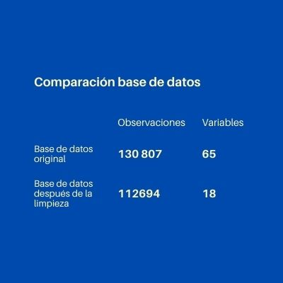

# Introducción

## Importancia y justificación

El covid-19 ha venido afectando diferentes sectores en el país y el mundo, según Hernández (2020) el virus ha repercutido negativamente en la salud mental de las personas, lo cual fue ocasionado por la incertidumbre de no saber cuándo terminara, es por eso que una estimación de cuando "finalizara" la pandemia seria de interés para la gran mayoría de personas. Por otro lado, ahora que ya se tiene las vacunas disponibles en el Perú y en muchas partes del mundo, es importante hacer seguimiento al proceso de vacunación de los diferentes países en el mundo, esto para saber si todos los países están recibiendo la protección necesaria o de no ser así, analizar cuantas dosis son necesarias para cumplir con los objetivos globales (40% de la población vacunada con 1 dosis).


# Objetivos

## Objetivo principal

El objetivo principal del trabajo es lograr obtener una información clara sobre lo que ocurre en el mundo tras los sucesos de la pandemia del Covid-19. Con la información obtenida, se pretende analizar y entender el progreso que ha venido teniendo las campañas de vacunación y demás esfuerzos por solucionar la gravedad de la situación. ¿Qué tan esperanzador es el progreso obtenido?

## Objetivos secundarios

* Determina la gravedad de la aparición de la variante Delta frente a los esfuerzos de las campañas de vacunación.
* Determinar la efectividad de las campañas de vacunación en Perú.
* Analizar el estado global de la pandemia para comprender la gravedad de la coyuntura en Perú.
* Determinar la efectividad de las campañas de vacunación en Perú.

# Factibilidad

Para poder cumplir con todas las especificaciones de las entregas posteriores, se realizó la siguiente tabla, en la que se muestra y detalla los requerimientos de cada entrega, la fecha de publicación de la tarea, el progreso que se tiene de cada entregable y la fecha de entrega del informe.


# Marco teórico

El presente trabajo se realizó con una base de datos publica para analizar la evolución de la pandemia y el efecto que ha producido la distribución y aplicación de las vacunas a nivel global. Esta base de datos es el resultado de la recolección de los reportes de los ministerios de salud de cada país, la OMS, entre otros por parte de Our World in Data. La base de datos que usaremos en nuestro estudio distribuye la información principalmente por fecha y país y presenta distintos indicadores relevantes al tema, por lo que nos permitiría obtener información sobre el estado de la pandemia en una determinada fecha y lugar y así poder relacionarla con los eventos más importantes ocurridos. Los datos fueron recogidos desde el mes de febrero de 2020. Esta organización puso estos datos accesibles para cualquier persona para poner en conocimiento cómo es posible avanzar frente a la situación actual del mundo con base en investigación y datos recogidos de fuentes oficiales.


## Población Objetivo

Ciudadanos peruanos afectados por el covid-19.

## Unidad muestral

Ciudadanos peruanos afectados por el covid-19.

## Tipo de muestreo

Censo. Ya que la recolección de la información es global y se recopila información de toda la población afectada posible.

## Variables de estudio y definición

### Numéricas

#### Numéricas discretas

| Variable | Definición                     |
| --------------|----------------------------------|
| new_cases     | Nuevos personas contagiadas de covid-19 del país          
| total_cases              |  Total de casos de covid-19 en el país            
| new_deaths             | Nuevas personas muertas en el país
| total_deaths            | Total de personas muertas en el país.
| new_vaccinations        | Nuevas personas vacunadas
| total_vaccinations        | Total de personas vacunadas contra el covid-19
| hosp_patients           | Número de pacientes con COVID-19 en el hospital en un día determinado
| people_fully_vaccinated  | Personas que fueron vacunadas con las 2 dosis
| people_vaccinated | Número total de personas que recibieron al menos una dosis de vacuna


#### Numéricas continuas

| Variable | Definición                     |
| --------------|----------------------------------|
| reproduction_rate       | Estimación en tiempo real de la tasa de reproducción efectiva (R) de COVID-19
| extreme_poverty| Proporción de la población que vive en pobreza extrema
| handwashing_facilities| Proporción de la población con instalaciones básicas para lavarse las manos en las instalaciones, año más reciente disponible
| positive_rate | La proporción de pruebas de COVID-19 que son positivas, dada como un promedio móvil de 7 días (esto es lo contrario de las pruebas por caso)
| aged_65_older | Proporción de la población de 65 años o más, año más reciente disponible
| life_expectancy | Esperanza de vida al nacer en 2019

### Categoricas

#### Categóricas nominales

| Variable | Definición                     |
| --------------|----------------------------------|
| location         |  País

#### Categórica ordinal

| Variable | Definición                     |
| --------------|----------------------------------|
| date     | Fecha


# Librerias
Para este proyecto necesitará de varias librerías y no todas son conocidas por eso les dejamos los códigos para instalarlas. Quite los "#" para instalar con las que no cuente.

```{r}
#install.packages("readr")
#install.packages("dplyr")
#install.packages("RcolorBrewer")
#install.packages("ggplot2")
#install.packages("treemapify")
#install.packages("corrplot")
#install.packages("forcats")
```


# Limpieza de datos

## Consideraciones para la eliminación de variables

Dado que la base de datos originalmente contaba con 63 variables se buscará reducir esta cantidad para que el presente trabajo sea factible y se pueda cumplir con los objetivos, se usaran los siguientes criterios para la selección de variables:

* Variables innecesarias para el estudio

### Carga de datos y librerías

```{r echo=FALSE}
library("readr")
library("dplyr")
library("RColorBrewer")
library("ggplot2")
library("forcats")
library("treemapify")
```


```{r echo=FALSE}
DI <- read_csv("owid-covid-data.csv")
head(DI, n = 1)
```

#### Revisión de resumen de datos

Examinamos de forma minuciosa el resumen de los datos para identificar datos atípicos, errores y complicaciones

#### Excluimos los datos absurdos

Borraremos las observaciones con datos atípicos pues cuentan con valores imposibles. Serán las observaciones con número de casos o muertes negativas porque no tiene sentido una cantidad de personas fallecidas negativas ni contagios negativos.


```{r}
DI <- DI[DI$new_deaths>=0 & DI$new_cases>=0,]
```

#### Borramos los datos pocos útiles

Se borrarán los datos considerados poco útiles por su carencia de datos importantes como el número de casos y número de fallecidos por covid-19.

```{r}
sum(is.na(DI$new_deaths))
```

```{r}
sum(is.na(DI$new_cases))
```

```{r}
sum(is.na(DI$total_cases))
```
```{r}
DI <- DI[!is.na(DI$new_deaths) & !is.na(DI$new_cases) & !is.na(DI$total_cases), ]
```

### Selección de variables

Elegimos las variables más representativas para nuestro tema, pero como la data está 

```{r}
original = DI
meses = strftime(original$date, "%Y-%m")
original$mes = meses
table(original$mes)
```
# STM: Serie de tiempo, Mundo
Esta data tiene el resumen mensual de cada país

```{r, warning=FALSE}
STM = group_by(original, mes)
STM %>% summarise(
  total_casos = max(total_cases,na.rm=T),
  nuevos_casos = sum(new_cases, na.rm = T),
  total_muertes = max(total_deaths, na.rm=T),
  nuevas_muertes = sum(new_deaths, na.rm = T),
  hospitalizados = sum(hosp_patients, na.rm = T),
  vacunados = max(people_vaccinated, na.rm=T),
  vacunados_completo = max(people_fully_vaccinated, na.rm = T),
  total_vacunaciones = max(total_vaccinations, na.rm=T),
  nuevas_vacunaciones = sum(new_vaccinations, na.rm = T),
  ratio_positivo = max(positive_rate, na.rm = T)) -> STM
STM = STM[3:nrow(STM),]
STM
```

```{r}
STM1 = STM[12:nrow(STM),]
table(STM1$mes)
```

* STM es de todos los meses y STM1 es para el 2021.

# PENST: Serie de Tiempo, Perú
Esta data tiene el resumen mensual de Perú

```{r, warning=FALSE}
PENST = group_by(original[original$location=="Peru", ], mes)
PENST %>% summarise(
  total_casos = max(total_cases,na.rm=T),
  nuevos_casos = sum(new_cases, na.rm = T),
  total_muertes = max(total_deaths, na.rm=T),
  nuevas_muertes = sum(new_deaths, na.rm = T),
  vacunados = max(people_vaccinated, na.rm=T),
  vacunados_completo = max(people_fully_vaccinated, na.rm = T),
  total_vacunaciones = max(total_vaccinations, na.rm=T),
  nuevas_vacunaciones = sum(new_vaccinations, na.rm = T),
  ratio_positivo = max(positive_rate, na.rm = T)) -> PENST
PENST = PENST[1:nrow(PENST),]
PENST
```

## VAC_PEN: Periodo de vacunación Perú
Simplemente es la data cortada desde a los meses que empezaron las campañas de vacunación

```{r}
VAC_PEN = PENST[12:nrow(PENST),]
VAC_PEN
```

# Rmundo: Resumen Mundo
Es el resumen total de las variables de todos los países

```{r, warning=FALSE}
Rmundo = group_by(original, location)
Rmundo %>% summarise(
  continente = unique(continent),
  total_casos = max(total_cases,na.rm=T),
  total_muertes = max(total_deaths, na.rm=T),
  vacunados = max(people_vaccinated, na.rm=T),
  vacunados_completo = max(people_fully_vaccinated, na.rm = T),
  total_vacunaciones = max(total_vaccinations, na.rm=T),
  pobreza_extrema = max(extreme_poverty, na.rm = T),
  lavado_manos = max(handwashing_facilities, na.rm = T),
  esperanza_vida = max(life_expectancy, na.rm = T),
  poblacion = max(population, na.rm = T)) -> Rmundo
```


```{r, warning=FALSE}
Rmundo = Rmundo[!is.na(Rmundo$continente),]
Rmundo$ratio = Rmundo$total_muertes / Rmundo$poblacion
Rmundo$ratio_vacunados = pmin(0.99,Rmundo$vacunados / Rmundo$poblacion)
Rmundo$ratio_completos = pmin(0.99,Rmundo$vacunados_completo / Rmundo$poblacion)
Rmundo$contagio_muerte = Rmundo$total_muertes / Rmundo$total_casos
head(Rmundo)
```

```{r}
Rmundo[(Rmundo$continente == 'North America') | (Rmundo$continente == 'South America'),]$continente = 'America'
Rmundo[(Rmundo$continente == 'Europe'),]$continente = 'Europa'
table(Rmundo$continente)
```

*Análisis: *Con esta tabla observamos la cantidad de países que han reportado los datos por cada continente. Podemos observar que casi en su totalidad se han reportado al menos una vez su situación con respecto al covid-19.

## Variables del estudio

Como se mencionó la base de datos de Our World in Data contaba con 63 variables, sin embargo, estas se recudieron después de aplicar las consideraciones mencionadas, quedando de la siguiente manera.



Como se logra ver en la imagen, las variables y observaciones se redujeron, el proceso para llevar a cabo esta limpieza se hizo en el archivo limpdata.rmd.

# Preguntas e hipotesis

| N°   | Pregunta   | Hipótesis |
|------|------------|---------------|
| 1 |¿Es la vacuna un factor determinante para evitar el aumento de número de muertes por COVID-19? | La vacuna puede prevenir efectos graves en el paciente, por lo que podría evitar que el paciente pueda morir a causa de la enfermedad.
| 2 |¿Cuál es la relación de personas hospitalizadas y la cantidad de muertes? | Las personas hospitalizadas, usualmente son en personas con efectos graves por el covid, por lo que se presume que, a más personas hospitalizadas, más personas cerca de la muerte.


## Descripción de las variables:

#### Nuevos casos

```{r}
mean(PENST$nuevos_casos, rm.na = T)
median(PENST$nuevos_casos, rm.na = T)
diff(range(PENST$nuevos_casos, rm.na = T))
sd(PENST$nuevos_casos)
```

La cantidad de casos nuevos por mes parece estar muy dispersa pues la desviación estándar tiene un valor cercano a la media y su coeficiente de variación a de estar entre 0.74 y 0.79. Asimismo, se observa que el rango entre no es tan grande por lo que probablemente no tenga datos atípicos.

```{r echo=FALSE}
ggplot(data=PENST, aes(x=factor(0),y = nuevos_casos))+
  geom_boxplot(width=0.3,color = "#F94144", size=0.3)+labs(x = "", y = "", 
              title = "Perú: Caja de bigotes de nuevos casos")+
      theme(legend.position = "none",
          axis.title.x=element_blank(),
        axis.text.x=element_blank(),
        axis.ticks.x=element_blank())
```

<br />
*Análisis*: En la caja de bigotes se puede apreciar que algunas deducciones a partir de los descriptores numéricos eran ciertas pues la cantidad de nuevos casos de covid-19 no están compactos y no hay datos atípicos por lo que la cantidad de contagios tiene un rango un poco elevado, pero no suele tener cambios muy bruscos. Además, al menos la mitad de la cantidad de contagios en los meses es menor a 106493.


#### Nuevas muertes

```{r}
summary(PENST$nuevas_muertes)
sd(PENST$nuevas_muertes)
```

La nueva muerte por mes tiene rango, media y mediana menor a los nuevos casos por mes, sin embargo, su desviación estándar también es menor por lo que se puede predecir que tendrá sus datos con una dispersión similar.

```{r echo=FALSE}
ggplot(data=PENST, aes(x=factor(0),y = nuevas_muertes))+
  geom_boxplot(width=0.3,color = "#F94144", size=0.3)+labs(x = "", y = "", 
              title = "Perú: Caja de bigotes de nuevas muertes")+
      theme(legend.position = "none",
          axis.title.x=element_blank(),
        axis.text.x=element_blank(),
        axis.ticks.x=element_blank())
```


<br />
*Análisis*: En la gráfica se puede observar una compactación baja con respecto a las nuevas muertes registradas por covid-19 y una ausencia de datos atípicos por lo que el número de muertes tiene un rango un poco alto, sin embargo, no presenta cambios muy grandes. Por otro lado, al menos la mitad del número de muertes en los meses es menor a 8523.


#### Cantidad de vacunados

```{r}
summary(PENST$nuevas_vacunaciones)
sd(PENST$nuevas_vacunaciones)
```

Las nuevas cantidades de personas vacunadas mensualmente tiene rango y media elevados, sin embargo, cuenta con una desviación estándar mucho más alta que las mismas por ende se puede afirmar que tampoco estará muy comprimida


```{r echo=FALSE}
ggplot(data=PENST, aes(x=factor(0),y = nuevas_vacunaciones))+
  geom_boxplot(width=0.3,color = "#F94144", size=0.3)+labs(x = "", y = "", 
              title = "Perú: Caja de bigotes de nuevos vacunados")+
      theme(legend.position = "none",
          axis.title.x=element_blank(),
        axis.text.x=element_blank(),
        axis.ticks.x=element_blank())
```

<br />
*Análisis*: En la gráfica se puede observar que la cantidad de nuevos vacunados al mes varía mucho, pero no de manera muy brusca porque el rango intercuartil es muy ancho y no hay señales o indicios de demasiados valores atípicos.


# Gráficos:

##: Estado actual de la pandemia

```{r echo=FALSE}
ggplot(Rmundo[Rmundo$total_casos>0,], aes(area = total_casos, fill = continente, subgroup = continente)) +
  geom_treemap()+
   scale_fill_manual(values = c("#7A2021", "#FB8C8E", "#F94144", "#7A4545", "#C73436"))+
  ggtitle("Proporción de cantidad de contagios por continente")+
geom_treemap_subgroup_text(place = "centre", alpha = 0.7, colour =
                             "white", min.size = 0)
```
<br />
América (Norte, centro y sur) es el continente con mayor cantidad de casos detectados de Covid-19, seguido de Asia, y Europa.

```{r echo=FALSE}
ggplot(Rmundo[Rmundo$vacunados>0,], aes(area = vacunados, fill = continente, subgroup = continente)) +
  geom_treemap()+
   scale_fill_manual(values = c("#7A2021", "#FB8C8E", "#F94144", "#7A4545", "#C73436"))+
  ggtitle("Proporción de cantidad de personas vacunadas por continente")+
geom_treemap_subgroup_text(place = "centre", alpha = 0.7, colour =
                             "white", min.size = 0)
```
<br />
A pesar de que América supera a Asia en cantidad de casos detectados, es el continente de Asia quien cuenta con la mayor cantidad de vacunas aplicadas superando por bastante a los demás continentes.

```{r echo=FALSE}
Rmundo %>%
  mutate(location = fct_reorder(location, total_muertes)) %>% top_n(total_muertes, n = 10) %>%
  mutate(highlight_flag = ifelse(location == 'Peru', T, F)) %>%
  ggplot( aes(x=location, y=total_muertes, label = format(total_muertes, big.mark=" "))) +
    geom_bar( stat="identity" , aes(fill=highlight_flag), alpha=.8, width=.7) +
    geom_text(size=4 , position = position_stack(vjust = 0.5), color="white") +
    labs(title = "Paises con mayor cantidad de fallecidos por COVID-19") +
    coord_flip() +
    xlab("") +
    theme_bw() +
    theme(legend.position = "none",
          axis.title.x=element_blank(),
        axis.text.x=element_blank(),
        axis.ticks.x=element_blank())
```
<br />
Perú se encuentra entre en el sexto lugar de países con mayor cantidad de fallecimientos por Covid-19 en el mundo. En los dos primeros puestos tenemos a Estados Unidos y Brasil.

```{r echo=FALSE}
Rmundo %>%
  mutate(location = fct_reorder(location, contagio_muerte)) %>% top_n(contagio_muerte, n = 10) %>%
  mutate(highlight_flag = ifelse(location == 'Peru', T, F)) %>%
  ggplot( aes(x=location, y=contagio_muerte, label=paste(round(contagio_muerte*100, 2), "%"))) +
    geom_bar( stat="identity" , aes(fill=highlight_flag), alpha=.9, width=.7) +
    geom_text(size=4 , position = position_stack(vjust = 0.5), color="white") +
    labs(title = "Paises con mayor tasa de fallecidos por infectado - COVID-19", y = "Ratio % de fallecidos entre infectados por Covid-19") +
    coord_flip() +
    xlab("") +
    theme_bw() +
    theme(legend.position = "none",
        axis.text.x=element_blank(),
        axis.ticks.x=element_blank())
```
<br />
Como podemos observar en la gráfica, Perú tiene la tercera mayor cantidad de muertes por infectado durante la pandemia. Se podría indicar que un ciudadano peruano tiene más probabilidad de morir al contraer Covid que en otros países.

```{r echo=FALSE}
Rmundo %>%
  mutate(location = fct_reorder(location, ratio_vacunados)) %>% top_n(ratio_vacunados, n = 10) %>%
  ggplot( aes(x=location, y=ratio_vacunados, label=paste(round(ratio_vacunados*100, 2), "%"))) +
    geom_bar(stat="identity", fill="#F94144", alpha=0.4, width=.7) +
    geom_text(size=4 , position = position_stack(vjust = 0.5), color="black") +
    ggtitle("Paises con mayor porcenaje de población vacunada")+
    coord_flip() +
    xlab("") +
    theme_bw()+
    theme(axis.title.x=element_blank(),
        axis.text.x=element_blank(),
        axis.ticks.x=element_blank())
```

```{r echo=FALSE}
Rmundo[Rmundo$location == "Peru",]$ratio_vacunados
```

```{r echo=FALSE}
Rmundo %>%
  mutate(location = fct_reorder(location, vacunados)) %>% top_n(vacunados, n = 10) %>%
  ggplot( aes(x=location, y=vacunados, label = paste(format(vacunados, big.mark=" "), " "))) +
  ggtitle("Paises con mayor cantidad de aplicación de vacunas")+
    geom_bar(stat="identity", fill="#F94144", alpha=0.35, width=.8) +
    geom_text(size=4 , position = position_dodge(width = 1), color="black", hjust="inward") +
    coord_flip() +
    ylab("Cantidad de vacunas aplicadas") +
    theme_bw() +
      theme(axis.text.x=element_blank(),
        axis.ticks.x=element_blank())
```

## Patrones

```{r echo=FALSE}
ggplot(data=PENST, aes(x= mes, y= nuevos_casos, group=1)) +
 geom_bar(stat="identity", fill="#F94144", alpha=0.7)+
  labs(x = "Meses", y = "Casos nuevos", 
              title = "Perú: Contagios nuevos mensuales") +
      geom_line(linetype=2, size=0.4)+
  geom_vline(xintercept = 9, color="steelblue")+
  annotate("text", x = 5, y = 260020, hjust = 0.5, label = "Primera ola", size=4, color="black")+
  annotate("text", x = 14, y = 270020, hjust = 0.5, label = "Segunda ola", size=4, color="black")+
  theme(axis.text.x = element_text(angle = 30, vjust = 1, hjust=1, size=7))
```
<br />
La gráfica anterior corresponde a los nuevos casos detectados en cada mes durante la pandemia en Perú. Podemos observar dos picos en los meses de agosto del 2020 y abril del 2021. Las zonas separadas por la línea vertical roja corresponden a la primera y segunda ola respectivamente y notamos que ambas son comparables a primera vista en cantidad de casos. También podemos apreciar que actualmente nos encontramos en un desaceleramiento de la cantidad de nuevos casos detectados, sin embargo, este no baja de los 25000 al mes.

```{r echo=FALSE}
ggplot(data=PENST, aes(x= mes, y= nuevas_muertes, group=1)) +
  geom_bar(stat="identity", fill="#F94144", alpha=0.7)+
  labs(x = "Meses", y = "Muertes nuevas", 
              title = "Perú: Muertes nuevas mensuales") +
geom_line(linetype=2, size=0.4)+
    geom_vline(xintercept = 9, color="steelblue")+
    annotate("text", x = 5, y = 20502, hjust = 0.5, label = "Primera ola", size=4, color="black")+
  annotate("text", x = 14, y = 26002, hjust = 0.5, label = "Segunda ola", size=4, color="black")+
  theme(axis.text.x = element_text(angle = 30, vjust = 1, hjust=1, size=7))
```
<br />
Podemos observar que en la segunda ola la cantidad de muertos llega números más elevados que en la primera ola. También podemos ver que la cantidad de fallecidos actualmente tiene los números más bajos desde el inicio de la pandemia.

```{r echo=FALSE}
ggplot(PENST, aes(mes, total_casos, group=1)) +
  geom_line(size=0.2)+
  geom_point(size=2, color="#F94144")+
  labs(x = "Meses", y = "Contagios", 
              title = "Perú: Evolución de la cantidad total de contagios") +
  geom_vline(xintercept = 9, color="steelblue", alpha = 0.5)+
      annotate("text", x = 5, y = 2000002, hjust = 0.4, alpha = 0.5, label = "Primera ola", size=4, color="black")+
  annotate("text", x = 10, y = 2000002, hjust = 0, alpha = 0.4, label = "Segunda ola", size=4, color="black")+
  theme(axis.text.x = element_text(angle = 30, vjust = 1, hjust=1, size=7))
```
<br />
Podemos notar al final de cada ola un ligero aplanamiento en la curva del total de casos nuevos. Este aplanamiento es más evidente en los últimos meses.

```{r echo=FALSE}
ggplot(PENST, aes(mes, total_muertes, group=1)) +
    geom_line(size=0.2)+
  geom_point(size=2, color="#F94144")+
labs(x = "Meses", y = "Fallecimientos", 
              title = "Perú: Evolución de la cantidad total de fallecimientos") +
        annotate("text", x = 5, y = 180002, hjust = 0.5, alpha = 0.4, label = "Primera ola", size=4, color="black")+
  annotate("text", x = 10, y = 180002, hjust = 0, alpha = 0.4, label = "Segunda ola", size=4, color="black")+
  geom_vline(xintercept = 9, color="steelblue", alpha = 0.5)+
  theme(axis.text.x = element_text(angle = 30, vjust = 1, hjust=1, size=7))
```
<br />
Notamos que la curva de cantidad de fallecidos se ha aplanado considerablemente en los últimos meses manteniéndose casi invariable en los 200 mil casos.

```{r echo=FALSE}

ggplot(PENST[9:nrow(PENST),], aes(mes, (total_muertes-min(total_muertes))/(max(total_muertes) - min(total_muertes)), group=1)) +
  geom_smooth(method="glm", formula = y~x, method.args = list(family = "quasibinomial"), color= "steelblue", size = 1, linetype = 5)+
  geom_point(size=1.5, color="#F94144")+
labs(x = "Meses", y = "Fallecimientos", 
              title = "Perú: Segunda ola - Ajuste a función logística")+
  theme(axis.text.x = element_text(angle = 30, vjust = 1, hjust=1, size=7),
        axis.text.y=element_blank(),
        axis.ticks.y=element_blank())
 
```
<br />
Como se puede observar la gráfica de fallecidos totales desde la segunda ola se ajusta bastante bien a una curva sigmoidea.

```{r echo=FALSE}
ggplot(VAC_PEN, aes(mes, vacunados, group=1)) +
    geom_line(size=0.2)+
  geom_point(size=2, color="#F94144")+
labs(x = "Meses", y = "Vacunados", 
              title = "Perú: Evolución de la cantidad de vacunados")+
theme(axis.text.x = element_text(angle = 30, vjust = 1, hjust=1, size=7))
 
```
<br />
Perú empezó su campaña de vacunación en febrero del 2021. Como podemos observar en el gráfico la cantidad de vacunados aumenta rápidamente. En el siguiente gráfico podemos observar que la cantidad de nuevos fallecimientos también disminuye rápidamente en este periodo:

```{r echo=FALSE}
ggplot(data=VAC_PEN, aes(x= mes, y= nuevas_muertes, group=1)) +
  geom_bar(stat="identity", fill="#F94144", alpha=0.7)+
geom_line(linetype=2, size=0.4)+
  labs(x = "Meses", y = "Muertes nuevas", 
              title = "Perú: Muertes nuevas mensuales desde la campaña de vacunación") +
  theme(axis.text.x = element_text(angle = 30, vjust = 1, hjust=1, size=7))
```

# Planteamiento de hipótesis
### ¿Es la vacuna un factor determinante para evitar el aumento de número de muertes por COVID-19?

Es sabido que la vacuna puede prevenir efectos graves en el paciente, por lo que podría evitar que el paciente pueda morir a causa de la enfermedad. \

```{r echo=FALSE}
ggplot(data=STM1, aes(x= mes, y= nuevas_vacunaciones, group=1)) +
    geom_bar(stat="identity", fill="#F94144")+
  geom_line(linetype=2, size=0.4)+
  labs(x = "Meses", y = "Cantidad de vacunados", 
              title = "Mundo: Vacunados por Covid-19 mensuales") +
  theme(axis.text.x = element_text(angle = 30, vjust = 1, hjust=1, size=7))
```

*Análisis:* Como observamos en el gráfico a finales del año 2020 en algunos países se empezaron las campañas de vacunación contra el COVID-19, yendo de esta manera en aumento el número de vacunados a nivel mundial.\

Para poder responder nuestra hipótesis planteada decidimos primeramente relacionar el número de muertos a nivel mundial y luego concentrarlo en Perú, con lo cual obtuvimos los siguientes resultados\

```{r echo=FALSE}
ggplot(STM, aes(x = nuevos_casos, y = nuevas_muertes)) +
  labs(x = "Nuevos casos", y = "Muertes nuevas", 
              title = "Mundo: Relación entre muerte y contagios") + 
    geom_point(color="#F94144", size=2) + geom_smooth(method = "lm", formula = y ~ x, se = F, size = 0.5, linetype = 2, color="black")
```

```{r echo=FALSE}
print(paste("Correlación: ",round(cor(STM$nuevas_muertes, STM$nuevos_casos),2)))
```
*Análisis:* El gráfico presentado anteriormente representa como es que han ido evolucionando las muertes y el número de contagiados a nivel mundial, siendo el valor de correlación entre ambas variables de 0.91, lo cual es un valor muy elevado lo que confirma que existe una fuerte correlación entre estas.\

*Predicción:* El gráfico de acuerdo a la regresión lineal con la correlación de 0.91(elevada), prediciendo así que aumentaran el número de casos cada 2.5e+0.7 de casos, lo que aumentara el número de muertos por caso.


```{r echo=FALSE}
ggplot(PENST, aes(x = nuevos_casos, y = nuevas_muertes)) +
  labs(x = "Nuevos casos", y = "Muertes nuevas", 
              title = "Perú: Relación entre muerte y contagios") +
    geom_point(color="#F94144",size=2) + geom_smooth(method = "lm", formula = y ~ x, se = F, size = 0.5, linetype = 2, color="black")
```
```{r echo=FALSE}
print(paste("Correlación: ",round(cor(PENST$nuevas_muertes, PENST$nuevos_casos),2)))
```
<br />
Por otro lado, con el gráfico presente podemos observar que conforme aparecen nuevos casos de COVID-19 en el país, la cantidad de muertes sigue en constante aumento, simulando casi una función lineal como muestra su línea de tendencia en el gráfico, lo cual también se reflejado en el valor de la correlación entre ambas variables.\

Es por esto que nos planteamos si es que con el inicio de las vacunaciones a nivel mundial y en el país, el número de muertes iría descendiendo, ya que son creadas con este fin, el de evitar un mayor número de muertes. Es por esto que mostramos el siguiente gráfico desde que se iniciaron las campañas de vacunación en el país, relacionado con la cantidad de muertes que se presentan.\
```{r echo=FALSE}
ggplot(STM1, aes(x = nuevas_muertes, y = nuevas_vacunaciones)) +
  labs(x = "Muertes nuevas", y = "Nuevas vacunaciones", 
              title = "Mundo: Relación entre muerte y cantidad de vacunados") +
    geom_point(color="#F94144", size=2) + geom_smooth(method = "lm", formula = y ~ x, se = F, size = 0.5, linetype = 2,color="black")
```
```{r echo=FALSE}
print(paste("Correlación: ",round(cor(STM1$nuevas_muertes, STM1$nuevas_vacunaciones),2)))
```
A nivel mundial podemos observar que la relación entre ambas variables es negativa, como nos indica el valor de su correlación -0.62, esto significa que a medida que aumentan el número de vacunados, el número de muertes desciende.

*Predicción:* Al ser la gráfica lineal y con pendiente negativa, podemos determinar de acuerdo a los datos que cada vez que 1e+09 se vacunan, el número de muertos decae en 200000, por lo cual podemos determinar que a medida que aumenten los vacunados disminuirán aún más los muerto.

```{r echo=FALSE}
ggplot(VAC_PEN, aes(x = nuevas_muertes, y = nuevas_vacunaciones)) +
  labs(x = "Muertes nuevas", y = "Nuevas vacunaciones", 
              title = "Perú: Relación entre muerte y cantidad de vacunados") +
    geom_point(color="#F94144", size=2) + geom_smooth(method = "lm", formula = y ~ x, se = F, size = 0.5, linetype = 2,color="black")
```


```{r echo=FALSE}
print(paste("Correlación: ",round(cor(VAC_PEN$nuevas_muertes, VAC_PEN$nuevas_vacunaciones),2)))
```
*Análisis:* Como se observa en el gráfico de Perú, claramente a mayor número de vacunaciones hay un menor número de muertes por COVID-19, este comportamiento se ve reflejado en la línea de tendencia que se presenta y el valor de su correlación negativo -0.95, ya que su pendiente es negativa podemos inferir que nuestra afirmación es correcta.


### ¿Cuál es la relación de personas hospitalizadas y la cantidad de muertes?

Para responder a esta pregunta se analizarán las variables cantidad de personas hospitalizadas y cantidad de muertes, ambas establecidas en meses y finalmente la relación que existe entre ambas.  

```{r echo=FALSE}
ggplot(data=STM, aes(x= mes, y= nuevas_muertes, group=1)) +
  geom_bar(stat="identity", fill="#F94144", alpha=0.7)+
geom_line(linetype=2, size=0.4)+
  labs(x = "Meses", y = "Cantidad de fallecidos", 
              title = "Mundo: Fallecidos por Covid-19 mensuales") +
  theme(axis.text.x = element_text(angle = 30, vjust = 1, hjust=1, size=7))
```

```{r echo=FALSE}
mayor <- max(STM$nuevas_muertes)
i <- which(STM$nuevas_muertes==mayor)
fecha <- STM[i,1]
print(paste("Mayor cantidad de muertos por Covid-19 en el mundo ocurrió el",fecha,"afectando a:",mayor,"personas"))
```

El gráfico muestra el mayor incremento de muertes ocurridas en abril de 2021 con un total de 1'770,734 personas, lo que también refleja la gráfica son 3 disminuciones considerables en febrero, junio, estos dos hace a que se formen picos y finalmente en noviembre del 2021 se muestra uno de los puntos más bajos ocurridos desde marzo de 2020.

```{r echo=FALSE}
ggplot(STM, aes(mes, total_muertes, group=1)) +
      geom_line(size=0.2)+
  geom_point(size=2, color="#F94144")+
  labs(x = "Meses", y = "Total de fallecidos", 
              title = "Mundo: Evolución de la cantidad de fallecidos por Covid-19") +
  theme(axis.text.x = element_text(angle = 30, vjust = 1, hjust=1, size=7))
```


```{r echo=FALSE}
ggplot(data=STM, aes(x= mes, y= hospitalizados, group=1)) +
  geom_bar(stat="identity", fill="#F94144")+
  geom_line(linetype=2, size=0.4)+
  labs(x = "Meses", y = "Cantidad de hospitalizados", 
              title = "Mundo: Hospitalizados mensuales") +
  theme(axis.text.x = element_text(angle = 30, vjust = 1, hjust=1, size=7))
```

```{r echo=FALSE}
mayor <- max(STM$hospitalizados)
i <- which(STM$hospitalizados==mayor)
fecha <- STM[i,1]
print(paste("Mayor cantidad de hospitalizados por Covid-19 en el mundo ocurrió el",fecha,"afectando a:",mayor,"personas"))
```

En la gráfica lo que refleja primero son meses en que hubo mayor cantidad de hospitalizados en el mundo, esto ocurrió en los meses de noviembre, diciembre de 2020 y enero de 2021, siendo este último el mayor con una cantidad de 8'934,041 hospitalizados, en los meses posteriores se observa a pesar de ver incrementos en la cantidad de hospitalizados estos tienden a bajar al siguiente mes o a los dos meses.

```{r echo=FALSE}
ggplot(STM, aes(y = nuevas_muertes, x = hospitalizados)) +
  labs(y = "Cantidad de fallecidos", x = "Cantidad de Hospitalizados", 
              title = "Relación: Cantidad de hospitalizados vs Cantidad de fallecidos") +
    geom_point(aes(col = "red"), size=2) +
  geom_smooth(method = "lm", formula = y ~ x, se = F, size = 0.5, linetype = 2,color="black")
```

```{r echo=FALSE}
print(paste("Correlación: ",round(cor(STM$nuevas_muertes, STM$hospitalizados),2)))
```

En este diagrama de dispersión se evalúa la relación entre la cantidad de personas hospitalizadas y los nuevos fallecidos por parte del Covid 19 y como se puede ver en la gráfica existe una correlación positiva entre ambas variables, esto es confirmado de forma numérica por el coeficiente de relación, es resultado es de 0.85 (positivo), lo cual valida la existencia de una correlación positiva.


### Relación entre variables:


```{r echo=FALSE}
ggplot(VAC_PEN, aes(x = vacunados, y = nuevas_muertes)) +
  labs(x = "Vacunados", y = "Nuevas Muertes", 
              title = "Perú: Relación entre nuevas muertes y cantidad de vacunados") +
    geom_point(color = "red", size=3) + geom_smooth(method = "lm", formula = y ~ x + I(x^2),se = F, size = 0.5, linetype = 2, color="black")
```
 <br/>
 
*Análisis:* Al tener una gráfica cóncava, durante todo el nuevo proceso de vacunación en el Perú, podemos notar que el número de muertos de 20000 aproximadamente paso a decrecer a mucho menos de 5000, sin embargo la gráfica tiende a elevarse de nuevo, pues posee un punto crítico, por lo cual la predicción que tenemos es que el número de muertes aumentara a pesar de que hayan nuevos vacunados, por las nuevas variantes del virus Covid-19.

```{r echo=FALSE}
ggplot(VAC_PEN, aes(x = vacunados, y = nuevas_muertes)) +
  labs(x = "Vacunados", y = "Nuevas Muertes", 
              title = "Perú: Relación entre nuevas muertes y cantidad de vacunados") +
    geom_point(color = "red", size=3) + geom_smooth(method = "lm", formula = y ~ x + I(x^2),se = F, size = 0.5, linetype = 2, color="black")
```


```{r echo=FALSE}
ggplot(Rmundo[Rmundo$pobreza_extrema>0,], aes(x=continente, y=pobreza_extrema, fill=continente)) +
    geom_boxplot(alpha=0.5) +
  scale_fill_manual(values = c("#7A2021", "#FB8C8E", "#F94144", "#7A4545", "#C73436"))+
    labs(x = "Continentes", y = "Índice de pobreza extrema", 
              title = "Índice de pobreza extrema por continente") +
    theme(legend.position="none")
 
```


```{r echo=FALSE}
ggplot(Rmundo[Rmundo$lavado_manos>0,], aes(x=continente, y=lavado_manos, fill=continente)) + 
    geom_boxplot(alpha=0.5) +
  scale_fill_manual(values = c("#7A2021", "#FB8C8E", "#F94144", "#7A4545", "#C73436"))+
      labs(x = "Continentes", y = "Porcentaje de acceso", 
              title = "% de acceso a Instalaciones de lavado de manos por continente") +
    theme(legend.position="none")
```

```{r echo=FALSE}
ggplot(Rmundo[(Rmundo$pobreza_extrema>0) & (Rmundo$lavado_manos > 0),],
       aes(x = pobreza_extrema, y = lavado_manos)) +
  labs(x = "Índice de probreza extrema", y = "Acceso a lavado de manos", 
              title = "") +
    geom_point(aes(color = continente))+
scale_color_manual(values = c("#7A2021", "#FB8C8E", "#F94144", "#7A4545", "#C73436"))
```


```{r echo=FALSE}
ggplot(Rmundo[(Rmundo$ratio_vacunados>0) & (Rmundo$pobreza_extrema>0),], aes(x = pobreza_extrema, y = ratio_vacunados)) +
  labs(x = "Índice de probreza extrema", y = "% población de vacunados",
       title = "%de población vacunada por índice de pobreza de los paises") +
    geom_point(aes(color = continente))+
   scale_color_manual(values = c("#7A2021", "#FB8C8E", "#F94144", "#7A4545", "#C73436"))
```

# Variables aleatorias

### 1. Total vacunados. Geométrica

```{r}
max(PENST$vacunados_completo, na.rm=T)/33000000
```
Razón de ser: este pequeño fragmento de código lo usamos para tener la probabilidad de encontrar una persona vacunada en Perú bajo el supuesto que sigamos siendo casi la misma cantidad de personas.

¿Cuál es la probabilidad de que la décima persona con quien te encuentres en Perú este vacunada?

```{r}
dgeom(10-1,0.55)
```

*Análisis:* Al salir de casa ya sea para realizar las compras, ir al trabajo o botar la basura solemos encontrarnos con más de un vecino o alguna persona en el camino por ende colocamos el valor de 10 porque es un promedio aceptable de la cantidad de personas con las que nos podemos encontrar al salir. Podemos observar que la probabilidad de que solo la décima persona que esté cerca de nosotros al salir este vacunada es muy baja.


### 2. Nuevos casos. Binomial.


```{r echo=FALSE}
print(paste("Proporción de meses con menos de 50mil casos nuevos de COVID-19 en Perú:",round(nrow(PENST[PENST$nuevos_casos < 50000,])/nrow(PENST),2)))
```

Calcula la probabilidad de que durante **4 meses** la cantidad de nuevos casos mensuales de covid-19 en Perú no supere a los 50mil, si es que la proporción es de **0.29**.

========================================================

*Éxito*: nuevos casos menor que 50,000.

*Fracaso*: nuevos casos mayor que 50,000.

*Probabilidad de éxito*: 0.29

$P(X=4)$

```{r}
round(dbinom(4,4,0.29),4)
```

*Análisis*: Elegimos la cifra 50mil nuevos contagios, debido a que, durante la primera y segunda ola, hubo incrementos de nuevos casos hasta los picos de más de 200mil mensuales y los periodos más estables no ascendían a más de 50mil casos. El ascenso hasta estos picos se mantuvo alrededor de 4 a 5 meses.


### 3. Nuevas muertes. Binomial 

```{r}
round(100*mean(max(PENST$total_muertes)/max(PENST$total_casos)),2)
```

Calcula la probabilidad de no registrar ningún caso de muerte por covid durante 14 días seguidos si la probabilidad de que alguien muera por culpa del covid-19 es de 9%.

*éxito*: no hay muertes.
*fracaso*: hay muertes.
*Probabilidad de éxito*: 1-0.09=0.91
$P(x=0)$

```{r}
dbinom(14,14,0.91)
```

*Análisis:* Elegimos 14 días o 2 semanas porque es casi la mitad de un mes y si durante casi la mitad de un mes no se muere ninguna persona por covid-19 significaría que las vacunas tienen un impacto muy eficiente en la reducción de síntomas del covid-19.


# Pruebas de hipótesis

Consideramos alpha = 0.1 ya que al tratarse de eventos que respecta diferentes países, sucesos políticos, aparición de variantes de la enfermedad, vacunas, etc. Decidimos que sería prudente reducir el valor teórico para encontrar variables que puedan describir nuestras hipótesis. Al mismo tiempo, al tener una cantidad muy considerable de observaciones, decidimos también hacer pruebas con el alpha = 0.5.

### Hipótesis 1\

$H_0:$ El número de contagiados a nivel nacional mensualmente es mayor o igual 100000, se eligió un valor de 100000 ya que según la página Statista(https://es.statista.com/estadisticas/1110077/numero-casos-muertes-covid-19-peru/), el rengo oscila en ese valor.\
$H_0:$ µ>=100000\
$H_1:$ El número de contagiados a nivel nacional mensualmente es mayor o igual 100000\
$H_1:$ µ<100000\

Para el nivel de confianza realizaremos los cálculos a un nivel de confianza del 90% y del 95%, para poder llegar a una conclusión acerca de cuál de ambos valores nos conviene, decidimos probar con estos valores debido a que la variable tiene valores muy dispersos.\
```{r echo=FALSE}
print("Mínimo")
min(PENST$nuevos_casos)
print("Máximo")
max(PENST$nuevos_casos)
```


*Nivel de confianza = 95% por ende nivel de significancia = 0.05*\
*Nivel de confianza = 90% por ende nivel de significancia = 0.1*\

```{r echo=FALSE}
µ = 100000
n= length(VAC_PEN$nuevos_casos)
media.muestral = mean(VAC_PEN$nuevos_casos)
sd.muestral=sd(VAC_PEN$nuevos_casos)
α = 0.05
a=0.1

t <- (media.muestral-µ)/(sd.muestral/sqrt(n)) #Calculo del estadístico


```
```{r echo=FALSE}
print("Media muestral")
media.muestral
```

La media muestral se obtuvo de nuestra data filtrada para Perú, en donde hallamos la media para los nuevos casos que aparecen mensualmente en el país.\
```{r echo=FALSE}
print("Desviación Estándar muestral")
sd.muestral
```
La desviación estándar muestral se obtuvo de nuestra data filtrada para Perú, en donde hallamos la desviación estándar para los nuevos casos que aparecen mensualmente país.\
```{r echo=FALSE}
print("Tamaño de la muestra")
n
print("t-estadístico")
t
```


Utilizamos el valor de T-estadístico debido a que no teníamos una desviación estándar poblacional conocida, y a su vez al estar separada en meses la data, el número de muestras no es mayor a 30, y solo tenemos 10 muestras, lo que serían 10 meses.\

```{r echo=FALSE}
print("Valor-p")
pvalor = pt(t, n - 1, lower.tail = T) 
pvalor
```
Una vez hallado el Valor-P, podemos observar que es mayor que el valor del nivel de significación, lo que significaría que no se debería rechazar la hipótesis nula.\

```{r echo=FALSE}
print("Punto crítico α = 0.05")
qt(0.05,n-1)
print("Punto crítico α = 0.1")
qt(0.1,n-1)
```
Como podemos observar el valor del "t" es mayor que el punto crítico, por lo que la hipótesis nula en primera instancia no sería rechazada.\


```{r echo=FALSE}
print("Intervalo de confianza")
IC1<-media.muestral+qt(0.025,n-1)*(sd.muestral/n)
IC2<-media.muestral-qt(0.025,n-1)*(sd.muestral/n)
IC1
IC2
```

```{r echo=FALSE}
hist(PENST$nuevos_casos, col="#DD5959", ylab="Frecuencia", xlab="Nuevos casos", main="Histograma de intervalos")

abline(v=IC1, col="red")
abline(v=IC2, col="red")
abline(v=media.muestral, col="#FF5C5C")
abline(v=µ, col="#FF3333")
legend(x = "topright", legend = c("Intervalos de confianza", "Media muestral", "Media propuesta"), fill = c("red", "#FF5C5C","#FF3333"), 
       title = "Loan")
```
```{r echo=FALSE}
curve(dnorm(x, mean=0, sd=1 , log=F), from=-3, to=3, xlim=c(-3, 3), col="#DD5959", lwd=4, ylab="",xlab="", main="Gráfico de distribución normal estándar")
polygon(c(qt(0.05,n-1), seq(qt(0.05,n-1),qt(0.1,n-1), 0.01),qt(0.1,n-1)), c(0,dt(seq(qt(0.05,n-1),qt(0.1,n-1),0.01),df=n-1),0), col="#FF3333")

polygon(c(-3, seq(-3,qt(0.05,n-1), 0.01),qt(0.05,n-1)), c(0,dt(seq(-3,qt(0.05,n-1),0.01),df=n-1),0), col="#FF5C5C")

polygon(c(qt(0.1,n-1), seq(qt(0.1,n-1),3, 0.01),3), c(0,dt(seq(qt(0.1,n-1),3,0.01),df=n-1),0), col="#DD5959")
abline(v=qt(0.05, n-1), col="#FF5C5C") ## Punto Critico
abline(v=t,col="red")
legend(x = "topright", legend = c("Punto crítico 95%","Punto crítico 90%" , "t-estadístico"), fill = c("#FF5C5C", "#FF3333","#DD5959"), 
       title = "Leyenda")
abline(v=qt(0.1, n-1), col="#FF3333")
```
```{r echo=FALSE}
curve(dnorm(x, mean=media.muestral, sd=sd.muestral , log=F), from=-100000, to=450000, col="#DD5959", lwd=4, ylab="",xlab="", main="Gráfico de distribución normal con datos de la variable")
abline(v=qnorm(0.05,media.muestral,sd.muestral),col="#FF5C5C")
abline(v=qnorm(0.1,media.muestral,sd.muestral),col="#FF3333")
abline(v=100000,col="#DD5959")
legend(x = "topright", legend = c("Punto crítico 95%","Punto crítico 90%" , "Media propuesta"), fill = c("#FF5C5C", "#FF3333","#DD5959"), 
       title = "Leyenda")
```


*Análisis:* Como se observa en la gráfica de distribución estándar el valor de t-estadístico hallado se encuentra para ambos casos dentro del área de aceptación, por lo que podríamos usar el intervalo de confianza que más con beneficie dependiendo de qué es lo que queremos lograr, si una mejor precisión o una mayor confiabilidad.

Con un nivel de significancia de 0.05 y 0.1 podemos afirmar que la media de contagios mensuales por COVID-19 en Perú es mayor o igual a 100000.

### Hipótesis 2\

Según una investigación realizada por los Centros para el Control y la Prevención de Enfermedades (CDC), afirma que en base a la evidencia de ensayos clínicos realizados a personas de 16 años de edad o más, la vacuna de Pfizer-BioNTech (COMIRNATY) mostró una efectividad del 90 % a más para prevenir casos de infecciones por el virus que causa el COVID-19(https://espanol.cdc.gov/coronavirus/2019-ncov/vaccines/different-vaccines/Pfizer-BioNTech.html). Para poner a prueba esta afirmación se tomó una muestra de 300 personas vacunadas con Pfizer al azar, ya que, al tener casi la mitad de la población peruana vacunada con esta, de las cuales a 280 se pudo observar que no presentaron infección por la enfermedad. Probaremos la afirmación de la investigación a un nivel de confianza del 95%.\

```{r echo=FALSE}
print("Total de vacunaciones")
VAC_PEN$total_vacunaciones
```
En total en el Perú se han registrado más de 40 millones de vacunaciones como indica la tabla presentada, de las cuales más de 10 millones son de la marca Pfizer, por lo cual una muestra de 300 personas vacunadas con esta vacuna es factible de encontrar.\

$H_0:$ La efectividad de la vacuna Pfizer es mayor al 90%\
$H_0:$ P>=0.9\
$H_1:$ La efectividad de la vacuna Pfizer es menor al 90%\
$H_1:$ P<0.9\

Para poder probar la veracidad de esta hipótesis decidimos utilizar el nivel de confianza al 99% o 95% porque de esta manera podemos acercarnos más hacia la realidad, ya que una vacuna debe ser tanto confiable como tener una precisión aceptable\
*Nivel de confianza = 95% por ende nivel de significancia = 0.05*\
*Nivel de confianza = 99% por ende nivel de significancia = 0.01*\
```{r echo=FALSE}
α = 0.05
p = 0.90
n = 300
x = 280

z <- ((x/n)-p) / (sqrt(p*(1-p))/sqrt(n)) #Calculo del estadístico z
print("Z-crítico")
z
```
```{r echo=FALSE}
print("Punto crítico 95%")
qnorm(0.05)
print("Punto crítico 90%")
qnorm(0.01)
```
Como podemos observar el valor del Z es mayor que el punto crítico, por lo que la hipótesis nula en primera instancia no sería rechazada.\


```{r}
print("Valor-P")
pnorm(q=z, mean=0, sd=1, lower.tail=T)  # Para obtener el valor-P
```

Una vez hallado el Valor-P, podemos observar que es menor que el valor del nivel de significación, lo que significaría que no hay pruebas suficientes para rechazar la hipótesis nula.

```{r echo=FALSE}
curve(dnorm(x, mean=0, sd=1 , log=F), from=-3, to=3, xlim=c(-3, 3), col="#DD5959", lwd=4, ylab="",xlab="", main="Gráfico de distribución normal")

polygon(c(qnorm(0.01), seq(qnorm(0.01),qnorm(0.05), 0.01),qnorm(0.05)), c(0,dt(seq(qnorm(0.01),qnorm(0.05),0.01),df=n-1),0), col="#FF3333")


polygon(c(-3, seq(-3,qnorm(0.01), 0.01),qnorm(0.01)), c(0,dt(seq(-3,qnorm(0.01),0.01),df=n-1),0), col="#FF5C5C")

polygon(c(qnorm(0.05), seq(qnorm(0.05),3, 0.01),3), c(0,dt(seq(qnorm(0.05),3,0.01),df=n-1),0), col="#DD5959")

abline(v=qnorm(0.05), col="#FF3333") ## Punto Critico
abline(v=qnorm(0.01), col="#FF5C5C")
abline(v=z, col="red")
legend(x = "topright", legend = c("Punto crítico 99%","Punto crítico 95%" , "t-estadístico"), fill = c("#FF5C5C", "#FF3333","#DD5959"), 
       title = "Leyenda")

```

```{r echo=FALSE}
print("Intervalos de confianza")
p+qnorm(0.975)*(sqrt((p*(1-p))/n))
p-qnorm(0.975)*(sqrt((p*(1-p))/n))
```

*Análisis: *Como se observa en la gráfica el valor de Z-estadístico hallado se encuentra para ambos casos dentro del área de aceptación, por lo que podríamos usar el intervalo de confianza que más con beneficie dependiendo de qué es lo que queremos lograr, si una mejor precisión o una mayor confiabilidad.\

Con un nivel de significancia de 0.05 podemos afirmar que la efectividad de la vacuna Pfizer contra el COVID-19 es mayor al 90%.\

### Hipótesis 3\


$H_0:$ Mensualmente en el Perú se realizan más de 3 millones y medio de vacunaciones, ya que de acuerdo a la información recaudada en Datos macro(https://datosmacro.expansion.com/otros/coronavirus-vacuna/peru)\
$H_0:$ µ>=3500000\
$H_1:$ Mensualmente en el Perú se realizan menos de 3 millones y medio de vacunaciones\
$H_1:$ µ<3500000\

Para el nivel de confianza realizaremos los cálculos a un nivel de confianza del 90% y del 95%, para poder llegar a una conclusión acerca de cuál de ambos valores nos conviene, decidimos probar con estos valores debido a que la variable tiene valores muy dispersos.
```{r echo=FALSE}
print("Mínimo")
min(VAC_PEN$nuevas_vacunaciones)
print("Máximo")
max(VAC_PEN$nuevas_vacunaciones)
```
*Nivel de confianza = 95% por ende nivel de significancia = 0.05*\
*Nivel de confianza = 90% por ende nivel de significancia = 0.1*\

```{r echo=FALSE}
µ = 3500000
n= length(VAC_PEN$nuevas_vacunaciones)
media.muestral = mean(VAC_PEN$nuevas_vacunaciones)
sd.muestral=sd(VAC_PEN$nuevas_vacunaciones)
α = 0.05
t <- (media.muestral-µ)*sqrt(n)/sd.muestral


```
```{r}
print("Media Muestral")
media.muestral
```

La media muestral se obtuvo de nuestra data filtrada para Perú, en donde hallamos la media para las nuevas vacunaciones que se hacen mensualmente en el país.\

```{r echo=FALSE}
print("Desviación Estándar muestral")
sd.muestral
```
La desviación estándar muestral se obtuvo de nuestra data filtrada para Perú, en donde hallamos la desviación estándar para las nuevas vacunaciones que se hacen mensualmente en el país.\

```{r echo=FALSE}
print("Tamaño de la muestra")
n
print("t-estadístico")
t
```


Utilizamos el valor de T-estadístico debido a que no teníamos una desviación estándar poblacional conocida, y a su vez al estar separada en meses la data, el número de muestras no es mayor a 30, y solo tenemos 10 muestras, lo que serían 10 meses.\

```{r echo=FALSE}
print("Valor-p")
pvalor = pt(t, n - 1, lower.tail = T) ##P-valor para 2 colas
pvalor
```
Una vez hallado el Valor-P, podemos observar que es mayor que el valor del nivel de significación, lo que significaría que no se debería rechazar la hipótesis nula.\

```{r echo=FALSE}
print("Punto critico α = 0.05")
qt(0.05,n-1)
print("Punto critico α = 0.1")
qt(0.1,n-1)
```
Como podemos observar el valor del "t" es mayor que el punto crítico, por lo que la hipótesis nula en primera instancia no sería rechazada.\


```{r echo=FALSE}
print("Intervalo de confianza")
IC1<-media.muestral+qt(0.025,n-1)*(sd.muestral/n)
IC2<-media.muestral-qt(0.025,n-1)*(sd.muestral/n)
IC1
IC2
```

```{r echo=FALSE}
hist(VAC_PEN$nuevas_vacunaciones, col="#DD5959", ylab="Frecuencia", xlab="Nuevos casos", main="Histograma de intervalos")

abline(v=IC1, col="red")
abline(v=IC2, col="red")
abline(v=media.muestral, col="#FF5C5C")
abline(v=µ, col="#FF3333")
legend(x = "topright", legend = c("Intervalos de confianza", "Media muestral", "Media propuesta"), fill = c("red", "#FF5C5C","#FF3333"), 
       title = "leyenda")
```
```{r echo=FALSE}
curve(dnorm(x, mean=0, sd=1 , log=F), from=-3, to=3, xlim=c(-3, 3), col="#DD5959", lwd=4, ylab="",xlab="", main="Gráfico de distribución normal estándar")
polygon(c(qt(0.05,n-1), seq(qt(0.05,n-1),qt(0.1,n-1), 0.01),qt(0.1,n-1)), c(0,dt(seq(qt(0.05,n-1),qt(0.1,n-1),0.01),df=n-1),0), col="#FF5C5C")

polygon(c(-3, seq(-3,qt(0.05,n-1), 0.01),qt(0.05,n-1)), c(0,dt(seq(-3,qt(0.05,n-1),0.01),df=n-1),0), col="#FF3333")

polygon(c(qt(0.1,n-1), seq(qt(0.1,n-1),3, 0.01),3), c(0,dt(seq(qt(0.1,n-1),3,0.01),df=n-1),0), col="#DD5959")
abline(v=qt(0.05, n-1), col="#FF3333") ## Punto Critico
abline(v=t,col="red")
legend(x = "topright", legend = c("Punto crítico 95%","Punto crítico 90%" , "t-estadístico"), fill = c("#FF3333", "#DDA759","#FF5C5C"), 
       title = "Leyenda")
abline(v=qt(0.1, n-1), col="#FF5C5C")
```
```{r echo=FALSE}
curve(dnorm(x, mean=media.muestral, sd=sd.muestral , log=F), from=-5500000, to=15000000, col="#DD5959", lwd=4, ylab="",xlab="", main="Gráfico de distribución normal con valores de la variable")
abline(v=qnorm(0.05,media.muestral,sd.muestral),col="#FF5C5C")
abline(v=qnorm(0.1,media.muestral,sd.muestral),col="#FF3333")
abline(v=3500000,col="#DD5959")
legend(x = "topright", legend = c("Punto crítico 95%","Punto crítico 90%" , "Media propuesta"), fill = c("#FF5C5C", "#FF3333","#DD5959"), 
       title = "Leyenda")
```


*Análisis:* Como se observa en la gráfica de distribución estándar el valor de t-estadístico hallado se encuentra para ambos casos dentro del área de aceptación, por lo que podríamos usar el intervalo de confianza que más con beneficie dependiendo de qué es lo que queremos lograr, si una mejor precisión o una mayor confiabilidad.

Con un nivel de significancia de 0.05 y 0.1 podemos afirmar que la media de vacunaciones mensuales por COVID-19 en Perú es mayor o igual a 3 millones y medio.


### Análisis Predictivo

#### Regresión 1: Nuevos casos y Nuevas muertes

La variable 'Cantidad de nuevas muertes' (nuevas_muertes) representará a la variable dependiente "y" y la variable 'Cantidad de nuevos casos' (nuevos_casos) será la variable independiente "x" tanto a nivel mundial como de Perú.

##### Correlación entre las variables

*Mundo:*

La correlación entre las variables es 0.88, la cual es positiva y cerca al 1. Esto representa una relación proporcional directa o positiva.

*Perú: *
 
La correlación entre las variables es 0.91, la cual es positiva y fuerte por su cercanía al 1. Esto representa una relación proporcional directa.
 
##### Coeficientes de regresión

Aplicamos **summary** a la función de modelo lineal (lm) para obtener los coeficientes estimados de la regresión.

*Mundo: *

ßo = 3.104e+05 <br />
ß1 = 1.351e-02 <br />
$y(x) = ß1*x+ßo$ <br />
$y(x) = (1.351e-02)x+(3.104e+05)$


*Perú: *

ßo = -5.479e+02 <br />
ß1 = 9.510e-02 <br />
$y(x) = ß1*x+ßo$ <br />
$y(x) = (9.510e-02)x-(-5.479e+02)$

##### R cuadrado

*Mundo: *

El R-cuadrado resultó 0.77, el cual es mayor a 0.7, los cual indica es capaz de explicar el 77.03% del comportamiento de la variable nuevas_muertes.

*Perú: *

El R-cuadrado resultó 0.83, el cual es mayor a 0.7, los cual indica un buen ajuste del modelo lineal que es capaz de explicar en un 82.7% la variabilidad de nuevas_muertes. 

##### Gráfica de regresión

```{r echo=FALSE}
ggplot(STM,aes(nuevos_casos,nuevas_muertes))+
geom_point(color="red", size=2)+ geom_smooth(method = "lm", formula = y ~ x,size=0.5, linetype=2, colour = "black")+
  labs(x = "Nuevos casos", y = "Muertes nuevas", 
              title = "Mundo: Relación entre muerte y contagios") 
```

Se utilizó este modelo de regresión lineal debido a que se consideró que a medida que se incrementan la cantidad de casos de personas por Covid-19 (variable independiente), la cantidad de muertes tienden a aumentar (variable dependiente). Esto puede ocurrir debido a que la política de seguridad sanitaria requiere un registro de toda persona diagnosticada con Covid-19 y posterior a eso la persona será tratada. Finalmente se entiende que el incremento de casos de covid-19 explica un incremento en el número de muertes. Además, el p-valor del modelo es significativo (8.112e-08).


```{r echo=FALSE}
print(paste("Correlación: ",round(cor(STM$nuevas_muertes, STM$nuevos_casos),2)))
```

<br />
*Análisis:* El gráfico presentado anteriormente representa como es que han ido evolucionando las muertes y el número de contagiados a nivel mundial, siendo el valor de correlación entre ambas variables de 0.91, lo cual es un valor muy elevado lo que confirma que existe una fuerte correlación entre estas.\

**Proyecciones**

Tomando los anteriores meses se realizaron una serie de proyecciones de nuevos casos de covid-19, posteriormente se analizaron con la ecuación de regresión obteniendo una variación que concuerda con la relación entre las variables.

```{r echo=FALSE}
caso1 <- round(median(STM$nuevos_casos[(16:22)], na.rm = T),0)
caso2 <- round(mean(STM$nuevos_casos[(17:22)], na.rm = T),0)
caso3 <- round(median(STM$nuevos_casos[(18:22)], na.rm = T),0)
caso4 <- round(mean(STM$nuevos_casos[(19:22)], na.rm = T),0)
```

```{r echo=FALSE}
print(paste("Proyección 1:",caso1, "| Muertes: ",round((1.351e-02*caso1+3.104e+05),0)))
print(paste("Proyección 2:",caso2, "| Muertes: ",round((1.351e-02*caso2+3.104e+05),0)))
print(paste("Proyección 3:",caso3, "| Muertes: ",round((1.351e-02*caso3+3.104e+05),0)))
print(paste("Proyección 4:",caso4, "| Muertes: ",round((1.351e-02*caso4+3.104e+05),0)))
```

```{r echo=FALSE}
ggplot(PENST,aes(nuevos_casos,nuevas_muertes))+
geom_point(color="red", size=2)+ geom_smooth(method = "lm", formula = y ~ x,size=0.5, linetype=2, colour = "black")+
  labs(x = "Nuevos casos", y = "Muertes nuevas", 
              title = "Perú: Relación entre muerte y contagios")
```

```{r echo=FALSE}
print(paste("Correlación: ",round(cor(PENST$nuevas_muertes, PENST$nuevos_casos),2)))
```
<br />
Por otro lado, con el gráfico presente podemos observar que conforme aparecen nuevos casos de COVID-19 en el país, la cantidad de muertes sigue en constante aumento, simulando casi una función lineal como muestra su línea de tendencia en el gráfico, lo cual también se reflejado en el valor de la correlación entre ambas variables.\

Es por esto que nos planteamos si es que con el inicio de las vacunaciones a nivel mundial y en el país, el número de muertes iría descendiendo, ya que son creadas con este fin, el de evitar un mayor número de muertes. Es por esto que mostramos el siguiente gráfico desde que se iniciaron las campañas de vacunación en el país, relacionado con la cantidad de muertes que se presentan.\

**Proyecciones**

Tomando los anteriores meses se realizaron una serie de proyecciones de nuevos casos de covid-19, posteriormente se analizaron con la ecuación de regresión obteniendo una variación que concuerda con la relación entre las variables.

```{r echo=FALSE}
caso1 <- round(median(PENST$nuevos_casos[(16:22)], na.rm = T),0)
caso2 <- round(mean(PENST$nuevos_casos[(17:22)], na.rm = T),0)
caso3 <- round(median(PENST$nuevos_casos[(18:22)], na.rm = T),0)
caso4 <- round(mean(PENST$nuevos_casos[(19:22)], na.rm = T),0)
```

```{r echo=FALSE}
print(paste("Proyección 1:",caso1, "| Muertes: ",round((1.351e-02*caso1+3.104e+05),0)))
print(paste("Proyección 2:",caso2, "| Muertes: ",round((1.351e-02*caso2+3.104e+05),0)))
print(paste("Proyección 3:",caso3, "| Muertes: ",round((1.351e-02*caso3+3.104e+05),0)))
print(paste("Proyección 4:",caso4, "| Muertes: ",round((1.351e-02*caso4+3.104e+05),0)))
```

### Regresión 2: Hospitalizados y cantidad de muertos

La variable 'Cantidad de nuevas muertes' (nuevas_muertes) representará a la variable dependiente "y" y la variable 'Cantidad de hospitalizados' (hospitalizados) será la variable independiente "x" tanto a nivel mundial como de Perú.

##### Correlación entre las variables

La correlación entre las variables es 0.83, la cual es positiva y cerca al 1. Esto representa una relación proporcional directa o positiva.

##### Coeficientes de regresión

Aplicamos **summary** a la función de modelo lineal (lm) para obtener los coeficientes estimados de la regresión.

ßo = 4.664e+05 <br />
ß1 = 1.477e-01 <br />
$y(x) = ßo +ß1*x$ <br />
$y(x) = (1.477e-01)x+(4.664e+05)$ <br />

##### R cuadrado


El R-cuadrado resultó 0.69, lo cual indica que es capaz de explicar en un 69.32% la variabilidad de nuevas_muertes.

##### Gráfica de regresión

```{r echo=FALSE}
grafico1 = ggplot(STM,aes(hospitalizados,nuevas_muertes))
grafico1 + geom_point(color="red", size=2)+ geom_smooth(method = "lm", formula = y ~ x,size=0.5, linetype=2, colour = "black")+ xlab("Cantidad de hospitalizados") + ylab("Cantidad de nuevas muertes") + ggtitle("Mundo: Hospitalizados vs Nuevas muertes") + theme(plot.title = element_text(hjust = 0.5))
```

Se utilizó este modelo de regresión lineal debido a que se consideró que a medida que se incrementan la cantidad de casos de personas hospitalizadas (variable independiente), la cantidad de muertes tienden a aumentar (variable dependiente). Esto puede ocurrir debido al presentar los síntomas, las personas buscan ser atendidas a los centros hospitalarios para que le suministren oxígenos y otros tratamientos. Además, el p-valor del modelo es significativo (1.532e-06).

**Proyecciones**

Tomando los anteriores meses se realizaron una serie de proyecciones de nuevos hospitalizados por covid-19, posteriormente se analizaron con la ecuación de regresión obteniendo una variación que concuerda con la relación entre las variables.

```{r echo=FALSE}
caso1 <- round(median(STM$hospitalizados[(16:22)], na.rm = T),0)
caso2 <- round(mean(STM$hospitalizados[(17:22)], na.rm = T),0)
caso3 <- round(median(STM$hospitalizados[(18:22)], na.rm = T),0)
caso4 <- round(mean(STM$hospitalizados[(19:22)], na.rm = T),0)
```

```{r echo=FALSE}
print(paste("Proyección 1:",caso1, "| Muertes: ",round((1.477e-01*caso1+4.664e+05),0)))
print(paste("Proyección 2:",caso2, "| Muertes: ",round((1.477e-01*caso2+4.664e+05),0)))
print(paste("Proyección 3:",caso3, "| Muertes: ",round((1.477e-01*caso3+4.664e+05),0)))
print(paste("Proyección 4:",caso4, "| Muertes: ",round((1.477e-01*caso4+4.664e+05),0)))
```

### Regresión 3: Cantidad de vacunados y Nuevas muertes

La variable 'Cantidad de vacunaciones' (nuevas_vacunaciones) representará a la variable dependiente "y" y la variable 'Cantidad de nuevas muertes' (nuevas_muertes) será la variable independiente "x" tanto a nivel mundial como de Perú.

##### Correlación entre las variables

*Mundo:*

La correlación entre las variables es -0.6, la cual es negativa y moderada. Esto representa una relación proporcional directa o positiva.

*Perú: *
 
La correlación entre las variables es -0.94, la cual es negativa y fuerte por su cercanía al -1. Esto representa una relación proporcional inversa.

##### Coeficientes de regresión

Aplicamos **summary** a la función de modelo lineal (lm) para obtener los coeficientes estimados de la regresión.

*Mundo: *

ßo = 6855801798 <br />
ß1 = -3180 <br />
$y(x) = ßo +ß1*x$ <br />
$y(x) = 6855801798-3180x$ <br />

*Perú: *

ßo = 2.178e+04 <br />
ß1 = -2.954e-03 <br />
$y(x) = ßo +ß1*x$ <br />
$y(x) = 2.178e+04-2.954e-03*x$ <br />

##### R cuadrado

*Mundo: *

El R-cuadrado resultó 0.35, el cual es bajo, que sólo es capaz de explicar el 35.42% del comportamiento de la variable nuevas_muertes.

*Perú: *

El R-cuadrado resultó 0.78, el cual es mayor a 0.7, lo cual indica un buen ajuste del modelo lineal que es capaz de explicar en un 77.78% la variabilidad de nuevas_muertes. 

##### Gráfica de regresión

```{r echo=FALSE}
grafico1 = ggplot(STM1,aes(nuevas_vacunaciones,nuevas_muertes))
grafico1 + geom_point(color="red", size=2)+ geom_smooth(method = "lm", formula = y ~ x,size=0.5, linetype=2, colour = "black") + xlab("Cantidad de nuevos vacunados") + ylab("Cantidad de nuevas muertes") + ggtitle("Mundo: Nuevas vacunaciones vs Nuevas muertes") + theme(plot.title = element_text(hjust = 0.5))
```

Se utilizó este modelo de regresión lineal debido a que se consideró que a medida que se incrementan la cantidad de personas vacunadas (variable independiente), la cantidad de muertes tienden a disminuir (variable dependiente). Esto se consideró debido a cuantas más personas inmunizadas la probabilidad de sobrellevar el covid-19 incrementaría. Finalmente se obtuvo una relación no tan fuerte, considerando que si se desea analizar el comportamiento de las muertes sería necesario incluir otros factores que no permitan comprender esta variabilidad.

```{r echo=FALSE}
grafico1 = ggplot(VAC_PEN,aes(nuevas_vacunaciones,nuevas_muertes))
grafico1 + geom_point(color="red", size=2)+ geom_smooth(method = "lm", formula = y ~ x,size=0.5, linetype=2, colour = "black") + xlab("Cantidad de nuevos vacunados") + ylab("Cantidad de nuevas muertes") + ggtitle("Perú: Nuevas vacunaciones vs Nuevas muertes") + theme(plot.title = element_text(hjust = 0.5))
```

Se utilizó también la regresión lineal para las mismas variables, pero a nivel nacional, esta relación es mucho más fuerte que la de nivel mundial, logrando mostrar que el incremento de las vacunaciones impacta en la cantidad de muertes. Además, el p-valor del modelo es significativo (5.547e-05).

**Proyecciones**

Tomando los anteriores meses se realizaron una serie de proyecciones de nuevos vacunados de covid-19, posteriormente se analizaron con la ecuación de regresión obteniendo una variación que concuerda con la relación entre las variables.

```{r echo=FALSE}
caso1 <- round(median(PENST$nuevas_vacunaciones[15], na.rm = T),0)
caso2 <- round(median(PENST$nuevas_vacunaciones[(13:21)], na.rm = T),0)
caso3 <- round(median(PENST$nuevas_vacunaciones[14], na.rm = T),0)
```

```{r echo=FALSE}
print(paste("Proyección 1:",caso1, "| Muertes: ",round(2.178e+04-2.954e-03*caso1),0))
print(paste("Proyección 2:",caso2, "| Muertes: ",round(2.178e+04-2.954e-03*caso2),0))
print(paste("Proyección 3:",caso3, "| Muertes: ",round(2.178e+04-2.954e-03*caso3),0))
```

Porcentaje de error de la función de regresión

```{r}
c1 <- PENST$nuevas_muertes[PENST$nuevas_vacunaciones==2511353]
c2 <- PENST$nuevas_muertes[PENST$nuevas_vacunaciones==5544323]
c3 <- PENST$nuevas_muertes[PENST$nuevas_vacunaciones==781850]
print(paste("Error de proyección 1: ",round(100*(c1-14361)/c1,1)))
print(paste("Error de proyección 2: ",round(100*(c2-5402)/c2),1))
print(paste("Error de proyección 3: ",round(100*(c3-19470)/c3),1))
```

Con los resultados de los errores de la predicción podemos observar que el error de la función obtenida con la regresión no es mayor a 16.4% por lo que puede predecir 


# Conclusiones, reflexiones y recomendaciones

* Perú se ubica en el sexto lugar de países con mayor cantidad de fallecido por covid-19.
* A partir de regresiones y gráficos de dispersión entre variables numéricas pudimos observar patrones y tendencias que permiten obtener predicciones con cierto rango de error.
* Se ha calculado una correlación inversa entre la cantidad de vacunados y muertes a nivel de Perú de -0.94, además se pudo observar una reducción en el número de muertes llegando a las cifras más bajas desde principios de la pandemia.
* Se comprueba la mortalidad de la enfermedad al encontrar una correlación entre nuevos casos y nuevas muertes, con una correlación de 0.86 a nivel mundial y 0.91 en Perú.
* Si al encontrar una base de datos esta tiene más de 20 variables entre las cuales solo te sirven cerca de la mitad o menos lo mejor es crear una nueva data que solo contenga las variables que serán de utilidad para tu estudio para agilizar el análisis de dato.
* Al comparar variables siempre se debe confirmar que ambas variables sean estáticas o cambien con respecto a la misma cantidad de días, meses o años porque de lo contrario los resultados no ayudarían a obtener información alguna por más que parezcan razonables.
* Si la base de datos es demasiado grande llegando a tener más de 50000 observaciones lo mejor es segmentar los datos en el objetivo para trabajar solo con una proporción de los datos y no sobrecargar procesos en la computadora.
* La data brinda información diaria, sin embargo, se necesita acumular la data en un periodo de tiempo, ya que podría generarse desfase debido a que la enfermedad toma un tiempo para desarrollarse causando muertes u hospitalizados e igualmente las vacunas toman un tiempo para inmunizar a las personas. Tomando en cuenta estos periodos, usualmente de 15 días, por esta razón se acumuló la data de forma mensual.


