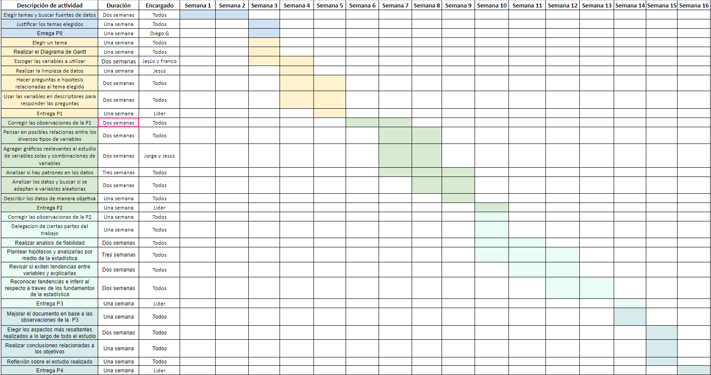
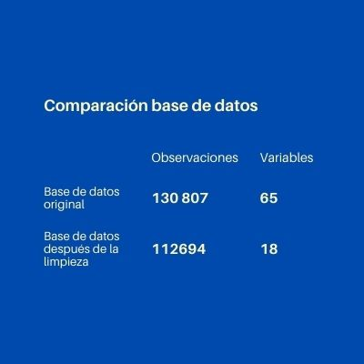

Análisis de la situación del Covid-19 y las vacunas en el mundo
========================================================
author: Grupo 8
date: 03/12/21
autosize: true

<br />


Importancia y justificación
========================================================

El covid-19 ha venido afectando diferentes sectores en el país y el mundo, según Hernández (2020) el virus ha repercutido negativamente en la salud mental de las personas, lo cual fue ocasionado por la incertidumbre de no saber cuando terminara, es por eso que una estimación de cuando "finalizara" la pandemia seria de interés para la gran mayoría de personas. Por otro lado, ahora que ya se tiene las vacunas disponibles en el Perú y en muchas partes del mundo, es importante hacer seguimiento al proceso de vacunación de los diferentes países en el mundo, esto para saber si todos los países están recibiendo la protección necesaria o de no ser así, analizar cuantas dosis son necesarias para cumplir con los objetivos globales (40% de la población vacunada con 1 dosis).


Objetivos
========================================================

Objetivo general
- El objetivo principal del trabajo es lograr obtener una información clara sobre lo que ocurre en el mundo tras los sucesos de la pandemia del Covid-19. Con la información obtenida, se pretende analizar y entender el progreso que han venido teniendo las campañas de vacunación y demás esfuerzos por solucionar la gravedad de la situación. ¿Qué tan esperanzador es el progreso obtenido?
  

========================================================
Objetivos secundarios
* Determina la gravedad de la aparición de la variante Delta frente a los esfuerzos de las campañas de vacunación.
* Determinar la efectividad de las campañas de vacunación en Perú.
* Analizar el estado global de la pandemia para comprender la gravedad de la coyuntura en Perú.

Factibilidad
========================================================



Marco teórico
========================================================

El presente trabajo se realizo con una base de datos pública para analizar la evolución de la pandemia y el efecto que ha producido la distribución y aplicación de las vacunas a nivel global. Esta base de datos es el resultado de la recolección de los reportes de los ministerios de salud de cada país, la OMS, entre otros por parte de Our World in Data. La base de datos que usaremos en nuestro estudio distribuye la información principalmente por fecha y país y presenta distintos indicadores relevantes al tema, por lo que nos permitiría obtener información sobre el estado de la pandemia en una determinada fecha y lugar y así poder relacionarla con los eventos más importantes ocurridos. Los datos fueron recogidos desde el mes de febrero de 2020. 

========================================================

Esta organización puso estos datos accesibles para cualquier persona para poner en conocimiento como es posible avanzar frente a la situación actual del mundo con base en investigación y datos recogidos de fuentes oficiales.

- Población objetivo: 207 países afectados por el covid-19
- Unidad muestral: país afectado por el covid-19
- Tipo de muestreo: Censo

Variables de estudio
========================================================

Numéricas discretas (10)

| Variable | Definición                     |
| --------------|----------------------------------|
| new_cases     | Nuevos personas contagiadas de covid-19 del país          
| total_cases              |  Total de casos de covid-19 en el país            
| new_deaths             | Nuevas personas muertas en el país
| total_deaths            | Total de personas muertas en el país.
| new_vaccinations        | Nuevas personas vacunadas
| total_vaccinations        | Total de personas vacunadas contra el covid-19
| hosp_patients           | Número de pacientes con COVID-19 en el hospital en un día determinado
| people_fully_vaccinated  | Personas que fueron vacunadas con las 2 dosis
| people_vaccinated | Número total de personas que recibieron al menos una dosis de vacuna
| population | Población en 2020

Variables de estudio 
========================================================

Numéricas continuas (6)

| Variable | Definición                     |
| --------------|----------------------------------|
| reproduction_rate       | Estimación en tiempo real de la tasa de reproducción efectiva (R) de COVID-19
| extreme_poverty| Proporción de la población que vive en pobreza extrema
| handwashing_facilities| Proporción de la población con instalaciones básicas para lavarse las manos en las instalaciones, año más reciente disponible
| positive_rate | La proporción de pruebas de COVID-19 que son positivas, dada como un promedio móvil de 7 días (esto es lo contrario de las pruebas por caso)
| aged_65_older | Proporción de la población de 65 años o más, año más reciente disponible
| life_expectancy | Esperanza de vida al nacer en 2019

Variables de estudio
========================================================

Categóricas nominales (2)

| Variable | Definición                     |
| --------------|----------------------------------|
| continent     | Continente
| location         |  País

Categórica ordinal (1)

| Variable | Definición                     |
| --------------|----------------------------------|
| date     | Fecha

Variables de estudio
========================================================

<div align="center">

</div>
<br />


```r
PENST = group_by(original[original$location=="Peru", ], mes)
PENST %>% summarise(
  total_casos = max(total_cases,na.rm=T),
  nuevos_casos = sum(new_cases, na.rm = T),
  total_muertes = max(total_deaths, na.rm=T),
  nuevas_muertes = sum(new_deaths, na.rm = T),
  vacunados = max(people_vaccinated, na.rm=T),
  vacunados_completo = max(people_fully_vaccinated, na.rm = T),
  total_vacunaciones = max(total_vaccinations, na.rm=T),
  nuevas_vacunaciones = sum(new_vaccinations, na.rm = T),
  ratio_positivo = max(positive_rate, na.rm = T)) -> PENST
PENST = PENST[3:nrow(PENST),]
VAC_PEN = PENST[12:nrow(PENST),]
```


```r
Rmundo = group_by(original, location)
Rmundo %>% summarise(
  continente = unique(continent),
  total_casos = max(total_cases,na.rm=T),
  total_muertes = max(total_deaths, na.rm=T),
  vacunados = max(people_vaccinated, na.rm=T),
  vacunados_completo = max(people_fully_vaccinated, na.rm = T),
  total_vacunaciones = max(total_vaccinations, na.rm=T),
  pobreza_extrema = max(extreme_poverty, na.rm = T),
  lavado_manos = max(handwashing_facilities, na.rm = T),
  esperanza_vida = max(life_expectancy, na.rm = T),
  poblacion = max(population, na.rm = T)) -> Rmundo
Rmundo = Rmundo[!is.na(Rmundo$continente),]
Rmundo$ratio = Rmundo$total_muertes / Rmundo$poblacion
Rmundo$ratio_vacunados = pmin(0.99,Rmundo$vacunados / Rmundo$poblacion)
Rmundo$ratio_completos = pmin(0.99,Rmundo$vacunados_completo / Rmundo$poblacion)
Rmundo$contagio_muerte = Rmundo$total_muertes / Rmundo$total_casos
Rmundo[(Rmundo$continente == 'North America') | (Rmundo$continente == 'South America'),]$continente = 'America'
Rmundo[(Rmundo$continente == 'Europe'),]$continente = 'Europa'
```


Variables aleatorias
=========================================================================================================================

### 1. Total vacunados. Geométrica


```r
max(PENST$vacunados_completo, na.rm=T)/33000000
```

```
[1] 0.5460177
```

¿Cuál es la probabilidad de que la décima persona con quien te encuentres en Perú este vacunada?


```r
dgeom(5-1,0.55)
```

```
[1] 0.02255344
```

=========================================================================================================================

### 2. Nuevos casos. Binomial.


```r
round(100*mean(PENST$ratio_positivo[PENST$mes!="2021-11"], na.rm=T),2)
```

```
[1] 16.9
```

Calcula la probabilidad de que en una semana no se encuentren casos nuevos de covid-19 en Perú si la probabilidad de que existan contagios es de 17%.

*éxito*: no hay contagios.
*fracaso*: hay contagios.
*Probabilidad de éxito*: 1-0.17=0.83
$P(X<=7)$ -> $P(X<=7)$


```r
dbinom(7,7,0.83)
```

```
[1] 0.2713605
```


Pruebas de hipótesis
=========================================================================================================================

Pruebas de hipótesis 1

Según una investigación realizada por los Centros para el Control y la Prevención de Enfermedades (CDC), afirma que en base a la evidencia de ensayos clínicos realizados a personas de 16 años de edad o más, la vacuna de Pfizer-BioNTech (COMIRNATY) mostró una efectividad del 90 % a más para prevenir casos de infecciones por el virus que causa el COVID-19 (https://espanol.cdc.gov/coronavirus/2019-ncov/vaccines/different-vaccines/Pfizer-BioNTech.html). Para poner a prueba esta afirmación se tomo una muestra de 300 personas vacunadas con Pfizer al azar de las cuales a 280 se pudo observar que no presentaron infección por la enfermedad. Probaremos la afirmación de la investigación a un nivel de confianza del 95%.

=========================================================================================================================

H_0: La efectividad de la vacuna Pfizer es mayor al 90%
H_0: P>=0.9
H_1: La efectividad de la vacuna Pfizer es menor al 90%
H_1: P<0.9
Nivel de confianza $α$ = 1- 0.95=0.05

```
[1] 1.924501
```


```
[1] "Punto crítico"
```

```
[1] -1.644854
```

=========================================================================================================================


```r
print("Valor-P")
```

```
[1] "Valor-P"
```

```r
pnorm(q=z, mean=0, sd=1, lower.tail=T)  # Para obtener el valor-P
```

```
[1] 0.9728541
```

Una vez hallado el Valor-P, podemos observar que es menor que el valor del nivel de significación, lo que significaría que no hay pruebas suficientes para rechazar la hipótesis nula.

=========================================================================================================================


```
[1] "Intervalos de confianza"
```

```
[1] 0.9339476
```

```
[1] 0.8660524
```

=========================================================================================================================

Pruebas de hipótesis 2

$H_0:$ El número de contagiados a nivel nacional mensualmente es mayor o igual 100000<br />
$H_0:$ µ>=100000<br />
$H_1:$ El número de contagiados a nivel nacional mensualmente es mayor o igual 100000<br />
$H_1:$ µ<100000<br />
Nivel de confianza $α$ = 1- 0.95=0.05<br />


```r
µ = 100000
n= length(PENST$nuevos_casos)
media.muestral = mean(PENST$nuevos_casos)
sd.muestral=sd(PENST$nuevos_casos)
α = 0.05
t <- (media.muestral-µ)*sqrt(n)/sd.muestral #Calculo del estadístico
t
```

```
[1] 0.3973062
```

=========================================================================================================================


```
[1] "Valor-p"
```

```
[1] 1.30465
```
Una vez hallado el Valor-P, podemos observar que es mayor que el valor del nivel de significación, lo que significaría que no hay pruebas suficientes para rechazar la hipótesis nula.<br />


```
[1] "Punto critico"
```

```
[1] -2.085963
```
Como podemos observar el valor del "t" es mayor que el punto crítico, por lo que la hipótesis nula en primera instancia no sería rechazada.<br />

=========================================================================================================================


```
[1] "Intervalo de confianza"
```

```
[1] 99053.97
```

```
[1] 113931.8
```

=========================================================================================================================


Regresiones
=========================================================================================================================


Regresión 1: Nuevos casos y Nuevas muertes<br />

La variable 'Cantidad de nuevas muertes' (nuevas_muertes) representará a la variable dependiente "y" y la variable 'Cantidad de nuevos casos' (nuevos_casos) será la variable independiente "x" tanto a nivel mundial como de Perú.<br />

*Mundo:*
La correlación entre las variables es 0.88, la cual es positiva y cerca al 1. Esto representa una relación proporcional directa o positiva.

*Perú: *
La correlación entre las variables es 0.91, la cual es positiva y fuerte por su cercanía al 1. Esto representa un una relación proporcional directa.
 

Coeficientes de regresión<br />


```

Call:
lm(formula = nuevas_muertes ~ nuevos_casos, data = STM, na.action = na.exclude)

Residuals:
    Min      1Q  Median      3Q     Max 
-331174 -146068   -1352  140981  413319 

Coefficients:
              Estimate Std. Error t value Pr(>|t|)    
(Intercept)  3.104e+05  9.434e+04   3.290  0.00366 ** 
nuevos_casos 1.351e-02  1.650e-03   8.189 8.11e-08 ***
---
Signif. codes:  0 '***' 0.001 '**' 0.01 '*' 0.05 '.' 0.1 ' ' 1

Residual standard error: 217000 on 20 degrees of freedom
Multiple R-squared:  0.7703,	Adjusted R-squared:  0.7588 
F-statistic: 67.06 on 1 and 20 DF,  p-value: 8.112e-08
```

=========================================================================================================================


*Mundo: *

El R-cuadrado resultó 0.77, el cual es mayor a 0.7, los cual indica es capaz de explicar el 77.03% del comportamiento de la variable nuevas_muertes.

*Perú: *

El R-cuadrado resultó 0.83, el cual es mayor a 0.7, los cual indica un buen ajuste del modelo lineal que es capaz de explicar en un 82.7% la variabilidad de nuevas_muertes. 

##### Gráfica de regresión


=========================================================================================================================


=========================================================================================================================


=========================================================================================================================


