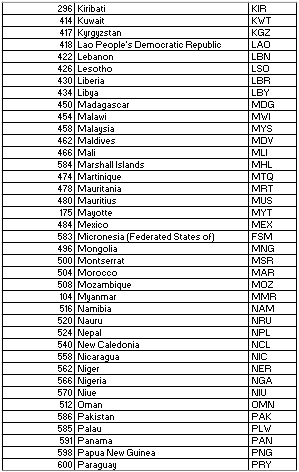

------------------------------------------------------------------------

<div style="text-align: justify">

# Tema: Generación Eléctrica Renovable Mundial

## Introducción y justificación

A media que las fuentes de energías no renovables se van agotando y que a su vez los efectos del cambio climático son cada vez más notorios, las fuentes de energías renovables se están convirtiendo en el nuevo foco de atención para la investigación. El uso de energías limpias ha llegado a formar parte de los indicadores de los Objetivos de Desarrollo Sostenible, creados por las Naciones Unidas con la finalidad de formar un futuro mejor y sustentable.
\

## Objetivo

En la presente investigación se desea mostrar la evolución del uso de energías renovables a nivel mundial. Al escoger el "Objetivo \#7: Garantizar el Acceso a una Energía Asequible, Fiable, Sostenible y Moderna para todos" podemos apreciar la capacidad instalada de generación de energía limpia en cada país. Con estos datos, se pueden formar planes de acción para mejorar la tecnología y tener un suministro de servicios energéticos modernos.
\

**Diagrama de Gantt**

 

## Población y Muestreo
La población en esta investigación consiste de 168 países, lo cuales han sido escogidos por medio de un **muestreo por conveniencia**. Todos los países que conforman la base de datos están en vías de desarrollo. Esta información y resultados se necesitan para cumplir el objetivo de crear planes de apoyo e introducir nuevas tecnologías de esta índole a los que les sea necesario y dependiendo de la zona en la que se encuentren. Por este motivo, no participan en el estudio países como EEUU, Canadá, Rusia y Australia. 

## Variables

;

\

### Filtrado de la data y renombramiento de las variables

Se cambia el nombre de las variables de inglés a español y con nombres que se puedan reconocer de mejor manera. Además, el nombre de los continentes o "Regiones Continentales" también se han traducido al español para una mayor facilidad y comprensión de los gráficos.
```{r}
library(readr)
library(dplyr)
library(plotly)
GE <- read_csv("Energia.csv")
```

```{r,echo=FALSE, include=FALSE}
unique(GE$parentName) #Permite conocer todas las formas que han respondido para la variable periodo
GE %>% mutate(parentName = 
        ifelse(parentName == "Caribbean", "Caribe", 
        ifelse(parentName == "Central America", "America Central",
        ifelse(parentName == "Central Asia", "Asia Central",
        ifelse(parentName == "Eastern Africa", "Africa Oriental",
        ifelse(parentName == "Eastern Asia", "Asia Oriental",
        ifelse(parentName == "Middle Africa", "Africa Central",
        ifelse(parentName == "Northern Africa", "Africa Norte",
        ifelse(parentName == "Oceania (exc. Australia and New Zealand)", "Oceania",
        ifelse(parentName == "South-Eastern Asia", "Asia Sudoriental",
        ifelse(parentName == "South America", "America Sur",
        ifelse(parentName == "Southern Africa", "Africa Sur",
        ifelse(parentName == "Southern Asia", "Asia Sur",
        ifelse(parentName == "Southern Asia (excluding India)", "Asia Sur (Sin India)",
        ifelse(parentName == "Western Africa", "Africa Occidental",
        ifelse(parentName == "Western Asia", "Asia Occidental",
               
               parentName
        ))))))))))))))))-> GE
```
Se ha filtrado la data por continente para poder realizar la traducción de las variables.
```{r,echo=FALSE, include=FALSE}
Energy2 <-GE %>% filter(parentName %in% c("Caribe","America Central","Asia Central","Africa Oriental","Asia Oriental","Africa Central","Africa Norte","Oceania","Asia Sudoriental","America Sur","Africa Sur","Asia Sur","Asia Sur (Sin India)","Africa Occidental","Asia Occidental")) %>%
  select(geoAreaCodigo,geoAreaNombre,level_,parentCode,parentName,X,Y,ISO3,UN_Member,value_2000,value_2001,value_2002,value_2003,value_2004,value_2005,value_2006,value_2007,value_2008,value_2009,value_2010,value_2011,value_2012,value_2013,value_2014,value_2015,value_2016,value_2017,value_2018,value_2019,latest_value,n_years,min_year,max_year )

Energy2$UN_Member[Energy2$UN_Member ==1] <- "ES MIEMBRO"
Energy2$UN_Member[Energy2$UN_Member ==0] <- "NO ES MIEMBRO"

Energy2 <- rename(Energy2,`Valor2000`=`value_2000`)
Energy2 <- rename(Energy2,`Valor2001`=`value_2001`)
Energy2 <- rename(Energy2,`Valor2002`=`value_2002`)
Energy2 <- rename(Energy2,`Valor2003`=`value_2003`)
Energy2 <- rename(Energy2,`Valor2004`=`value_2004`)
Energy2 <- rename(Energy2,`Valor2005`=`value_2005`)
Energy2 <- rename(Energy2,`Valor2006`=`value_2006`)
Energy2 <- rename(Energy2,`Valor2007`=`value_2007`)
Energy2 <- rename(Energy2,`Valor2008`=`value_2008`)
Energy2 <- rename(Energy2,`Valor2009`=`value_2009`)
Energy2 <- rename(Energy2,`Valor2010`=`value_2010`)
Energy2 <- rename(Energy2,`Valor2011`=`value_2011`)
Energy2 <- rename(Energy2,`Valor2012`=`value_2012`)
Energy2 <- rename(Energy2,`Valor2013`=`value_2013`)
Energy2 <- rename(Energy2,`Valor2014`=`value_2014`)
Energy2 <- rename(Energy2,`Valor2015`=`value_2015`)
Energy2 <- rename(Energy2,`Valor2016`=`value_2016`)
Energy2 <- rename(Energy2,`Valor2017`=`value_2017`)
Energy2 <- rename(Energy2,`Valor2018`=`value_2018`)
Energy2 <- rename(Energy2,`Valor2019`=`value_2019`)
Energy2 <- rename(Energy2,`Valor2020`=`latest_value`)
Energy2 <- rename(Energy2,`Nivel`=`level_`)
Energy2 <- rename(Energy2,`Miembro_ONU`=`UN_Member`)
Energy2 <- rename(Energy2,`Regiones_Continentales`=`parentName`)
Energy2 <- rename(Energy2,`Codigos_Continentales`=`parentCode`)
Energy2 <- rename(Energy2,`Longitud`=`X`)
Energy2 <- rename(Energy2,`Latitud`=`Y`)
Energy2 <- rename(Energy2,`Pais`=`geoAreaNombre`)
Energy2 <- rename(Energy2,`Codigo_area`=`geoAreaCodigo`)
Energy2 <- rename(Energy2,`num_anios`=`n_years`)
Energy2 <- rename(Energy2,`min_anio`=`min_year`)
Energy2 <- rename(Energy2,`max_anio`=`max_year`)
Energy2
```

### Análisis de cada variable

[**Análisis de la variable "Codigos Continentales", "Regiones Continentales", "ISO3", "Codigo_area" y "Pais":**]{style="color:darkblue"}

Los códigos mostrados en la variable "Codigos_Continentales", "ISO3" y "Codigo_area" están clasificados por continentes y países, respectivamente. Esta clasificación está gestionada por la Organización Internacional de Normalización (ISO), la Organización de las Naciones Unidas (ONU) y la Asociación Latinoamericana de Integración (ALADI). Todos estos códigos han sido formados para usos estadísticos aumentando el empleo de los datos y facilitando su intercambio a nivel internacional. Los códigos son otorgados gracias a un algoritmo de la ONU que es desarrollado desde 1974.


```{r}
#NumeroDePaisesPorRegion<-table(Energy2$`Regiones_Continentales`)
#NumeroDePaisesPorRegion
#max(NumeroDePaisesPorRegion)
```

[*Código ISO por Zona o Continente:*]{style="color:mediumblue"}

Código Continental      |     Región Continental                      |  N. de Países |
------------------------|---------------------------------------------|---------------|
5                       | 	América del Sur                             |  14        |
11                      |     Africa Occidental                        |    16        |
13                      |      America Central                       |      8        |
14                      |      Africa Oriental                        |      20      |
15                      |      Africa del Norte                      |     6        |
17                      |     Africa Central                           |9            |
18                      |       Africa del Sur                       | 5           |
29                      |      Caribe                                |  26         |
30                      |        Asia Oriental                      |4            |
34                      |        Asia del Sur                       | 1          |
35                      |       Asia Sudoriental                      |  11          |
127                     |        Asia del Sur (sin India)             |    8       |
143                     |        Asia Central                          |     5        |
145                     |     	 Asia Occidental                       |     16      |
543                     |   Oceania (sin Australia y Nueva Zelanda)  | 19          |


En el caso de Oceanía no se incluye Australia ni Nueva Zelanda porque no participan en el estudio.

[*Código ISO por País:*]{style="color:mediumblue"}

<!--C:\Documentos\Estadistica_2021_1\!-->
<!--C:\Documentos\Estadistica_2021_1\!-->
<!--C:\Documentos\Estadistica_2021_1\!-->
<!--C:\Documentos\Estadistica_2021_1\!-->
<!--C:\Documentos\Estadistica_2021_1\!-->
\
<!--C:\Documentos\Estadistica_2021_1\!-->

\
\
[**Análisis de la variable "Nivel":**]{style="color:darkblue"}
\
La variable Nivel de Área Geográfica es asignada por las Naciones Unidas a los diferentes países luego de hacer una investigación estadística.
En la siguiente gráfica se busca representar la distribución de esta variable.

[*Gráficos:*]{style="color:mediumblue"}

```{r}
barplot(round(table(Energy2$Nivel),digits=2), main="Cantidad de países", ylab="Cantidad de países", xlab="Nivel",col=c("lightblue", "blue"),ylim=c(0,200), las=1)
```

```{r}
N<-Energy2%>% filter(Nivel=="5")
N
```
Existen ocho países pertenecientes al Nivel 5 y todos pertenecen a Asia del Sur.
\
\
\
[**Análisis de la variable "Longitud":**]{style="color:darkblue"}

La longitud es una medida que se usa en la cartografía y expresa la distancia en ángulos desde un punto dado en la superficie y el meridiano que se toma como 0°.La longitud divide la Tierra en el hemisferio oriental y el hemisferio occidental.

Descriptores Numéricos      |        Valores         |  
----------------------------|------------------------|
Media                       |      9.29          |      
Mediana                     |      19.8              |      
Rango                       |       353.86              |      
Varianza                    |       6393.43        |   
Desviación Estándar         |       79.96            |    
Rango Intercuartil       	  |      	117.14              |    
Coeficiente de Variación    |       8.61             |

-   El rango presenta un valor de 353.86, el cual vemos que es un valor alto porque el rango total de una variable como la longitud es de 360° (todo el mundo) y el presentado en esta ocasión es muy cercano. Esto nos indica que se han extraído los datos de muchas ubicaciones alrededor de la Tierra.

-   El valor 79.96 representa la desviación estándar. Se puede considerar que el valor es alto porque se aleja muchísimo de la media (9.29), esto también se deja en claro que es debido a que la recolección de datos ha sido llevada a cabo por tanto hemisferio oriental como occidental.

En conclusión, la variable **longitud** presenta una considerable dispersión de datos al analizar el rango y desviación estándar. Se puede llegar a comparar para determinar el comportamiento de los demás datos, pero por ahora estos nos indican que la variable sí presenta cierta dispersión. Podemos afirmar que es por el muestreo realizado, llevando a cabo el estudio en países de 15 regiones continentales.

Cálculo de los descriptores numéricos indicados:
```{r}
round(mean(Energy2$`Longitud`, na.rm=T),2)
round(median(Energy2$`Longitud`, na.rm=T),2)
rango <- max(Energy2$`Longitud`, na.rm=T) - min(Energy2$`Longitud`, na.rm=T)
round(rango, digits=2)
round(var(Energy2$`Longitud`, na.rm=T), digits=2)
round(sd(Energy2$`Longitud`, na.rm=T), digits=2)
round(IQR(Energy2$`Longitud`, na.rm=T), digits=2)
round(sd(Energy2$`Longitud`, na.rm=T)/mean(Energy2$`Longitud`, na.rm=T), digits=2)
```

```{r}
hist(Energy2$`Longitud`, main = "Histograma de la Longitud",
      xlab = "Longitud (grados)", ylab = "Frecuencia",
      col = "lightblue")
```
Los valores negativos de longitud hacen referencia al hemisferio occidental; los positivos, al oriental. El hemisferio occidental incluye en nuestro caso a los países de América del Sur, Centro América, el Caribe y solo algunos países del norte de África. Todas las otras 11 regiones continentales pertenecen al hemisferio oriental y es por esto que se aprecia más abundancia en valores positivos.

\
\

[**Análisis de la variable "Latitud":**]{style="color:darkblue"}

La latitud es la distancia angular entre la línea ecuatorial y un punto determinado de la superficie de la Tierra. La latitud divide el planeta en el hemisferio sur y el hemisferio norte.

Descriptores Numéricos      |        Valores         |  
----------------------------|------------------------|
Media                       |       8.81           |      
Mediana                     |       12.11               |      
Rango                       |       99.77              |      
Varianza                    |       359.99         |   
Desviación Estándar         |       18.97            |    
Rango Intercuartil       	  |      	21.85              |    
Coeficiente de Variación    |       2.15             |

-   El rango presenta un valor de 99.77, el cual si lo comparamos con el valor 353.86 de la longitud, no tiene una dispersión significativa.

-   El valor 359.99 representa la varianza. Como podemos notar el valor es bajo comparado con el 6393.43 de la longitud, lo que implica que la latitud varía menos.

-   El coeficiente de variación es de 2.15 y, al compararlo directamente con el de longitud (8.61), nos indica que la latitud presenta una menor dispersión relativa.

En conclusión, la variable **latitud** presenta una menor dispersión de datos al ser comparada con la variable **longitud**, esto gracias a que los valores presentados del rango, varianza y coeficiente de variación presentan grandes diferencias en magnitud. 

Cálculo de los descriptores numéricos indicados:
```{r}
round(mean(Energy2$`Latitud`, na.rm=T),2)
round(median(Energy2$`Latitud`, na.rm=T),2)
rango <- max(Energy2$`Latitud`, na.rm=T) - min(Energy2$`Latitud`, na.rm=T)
round(rango, digits=2)
round(var(Energy2$`Latitud`, na.rm=T), digits=2)
round(sd(Energy2$`Latitud`, na.rm=T), digits=2)
round(IQR(Energy2$`Latitud`, na.rm=T), digits=2)
round(sd(Energy2$`Latitud`, na.rm=T)/mean(Energy2$`Latitud`, na.rm=T), digits=2)
```

\
\
```{r}
hist(Energy2$`Latitud`, main = "Histograma de la Latitud",
      xlab = "Latitud (grados)", ylab = "Frecuencia",
      col = "lightblue")
```

La latitud presenta sus valores poniendo como negativo a los países ubicados en el hemisferio sur y como positivos, a los del hemisferio norte. El gráfico indica que hay mayor presencia de países en el hemisferio norte y esto es debido a que este mismo incluye al Caribe, Centro América, África del Norte, África Occidental, parte de África Central y Oriental y todo Asia.

\
\
[**Análisis de la variable "Miembro_ONU":**]{style="color:darkblue"}

La variable "Miembro_ONU" es de tipo binaria y nos indica si el país estudiado es miembro de las Naciones Unidas.

En general, todos los países pueden ser Miembros de las Naciones Unidas cuyos Estados luchen por la paz y estén dispuestos a cumplir con las obligaciones consignadas en la Carta de las Naciones Unidas. La Asamblea General y el Consejo de Seguridad son los encargados de admitir a todos los miembros.

```{r}
MUN<-Energy2%>% filter(Miembro_ONU=="NO ES MIEMBRO")
MUN
```

Hay 26 países de los 168 que no son miembros de las Naciones Unidas


```{r}
barplot(table(Energy2$Miembro_ONU), horiz=F,ylim=c(0,200),col=c("lightblue", "blue"),main ="¿ES MIEMBRO DE LA ONU?",ylab="Cantidad de países",las=1,font.axis=4)
```


\
\
[**Análisis de la variable "num_anios" (Número de años estudiados):**]{style="color:darkblue"}

Esta variable representa el número de años en los que se ha realizado la investigación. 

```{r}
Energy2 %>% filter(num_anios=="20")
```
En este caso, todos los países han participado en el estudio por 20 años.
\
\
\
[**Análisis de la variable "min_anio" y "max_anio":**]{style="color:darkblue"}

La variable "min_anio" y "max_anio" representan el primer y último año en el que se ha realizado el estudio, respectivamente.

En todos los casos, hay datos desde el 2000 y el 2019 siendo este un informe 100% completo.

\
\
\
[**Análisis de la variable "Valor2000":**]{style="color:darkblue"}

La variable "Valor2000" indica la capacidad instalada de generación eléctrica por fuentes renovables en el año 2000. Este valor se entrega en watts per cápita.

Descriptores Numéricos      |        Valores         |  
----------------------------|------------------------|
Media                       |      79.6              |      
Mediana                     |      15.25             |      
Rango                       |       1388.26          |      
Varianza                    |       28449.64         |   
Desviación Estándar         |       168.67           |    
Rango Intercuartil       	  |      	76.55            |    
Coeficiente de Variación    |       2.12             |


-   El rango tiene un valor de 1388.26, el cual se podría considerar alto. Sin embargo, considerando que este es el primer año de estudio, todos los países presentan una menor generación eléctrica. Entonces este rango podría ser considerado mínimo al compararlo con los años posteriores.

-   Al comparar desviación estándar de 168.67 con la media de 79.6, se aprecia que estos valores se alejan mucho (siendo la desviación estándar casi el doble de la media). Sin embargo, no se aleja tanto como, por ejemplo, para las variables de longitud, donde la desviación estándar es más de 8 veces la media.

En conclusión, la variable "Valor2000" presenta cierta dispersión de datos, pero esta van a seguir aumentando en las variables de años posteriores. Además, se nota la tendencia de la mediana (15.25) afirmando que la mayoría de datos son menores de los que da alusión la media (79.6).

Cálculo de los descriptores numéricos indicados:
```{r}
round(mean(Energy2$`Valor2000`, na.rm=T),2)
round(median(Energy2$`Valor2000`, na.rm=T),2)
rango <- max(Energy2$`Valor2000`, na.rm=T) - min(Energy2$`Valor2000`, na.rm=T)
round(rango, digits=2)
round(var(Energy2$`Valor2000`, na.rm=T), digits=2)
round(sd(Energy2$`Valor2000`, na.rm=T), digits=2)
round(IQR(Energy2$`Valor2000`, na.rm=T), digits=2)
round(sd(Energy2$`Valor2000`, na.rm=T)/mean(Energy2$`Valor2000`, na.rm=T), digits=2)
```

\
\

```{r}
hist(Energy2$`Valor2000`, main = "Generación Eléctrica en el año 2000",
      xlab = "watts per cápita", ylab = "Frecuencia",
      col = "lightblue", breaks=14)
abline(v=79.6, col="red") #media
abline(v=15.25, col="blue") #mediana
```

El gráfico demuestra un sesgo a la derecha: la media (línea azul) es mayor que la mediana (línea roja). Se aprecia que el rango llega hasta casi 1400 debido al máximo valor recopilado. Este valor pertenece a Paraguay y es igual a 1388.262 watts per cápita. Esto es debido a que desde hace muchos años, casi el de la energía eléctrica en Paraguay es producida en centrales hidroeléctricas. El valor de Paraguay es la primera razón por la cual la media y mediana son tan diferentes: la media es afectada de gran manera por valores atípicos. Es por esto que se debe prestar más atención al intervalo con más valores de generación eléctrica: 0 al 100. Para este entonces, muchas islas del Caribe y Oceanía, tanto como países en África y las zonas más pobres de Asia no han sifo introducidos a la tecnología de las fuentes de energía renovable.

```{r}
which.max(Energy2$Valor2000) #Paraguay
```

\
\
\
[**Análisis de la variable "Valor2019":**]{style="color:darkblue"}
La variable "Valor2019" indica la capacidad instalada de generación eléctrica por fuentes renovables en el año 2019. Este valor se entrega en watts per cápita.

| Descriptores Numéricos   | Valores |
|--------------------------|---------|
| Media                    | 174.99  |
| Mediana                  | 70.73   |
| Rango                    | 3060.39 |
| Varianza                 | 99418.4 |
| Desviación Estándar      | 315.31  |
| Rango Intercuartil       | 174.74  |
| Coeficiente de Variación | 1.8     |

-   El rango para el 2019 es 3060.39 y al ser comparado con el del 2000 (1388.26) se puede notar un incremento. A lo largo de estos 20 años que han transcurrido, todos los países han empezado a introducir energías renovables. Algunos de estos países han empezado desde cero, mientras que otros han ido evolucionando. Es por lo mencionado anteriormente que el rango ha aumentado de manera tan significativa.

-   La desviación estándar casi se ha duplicado de lo que era a inicios del estudio: en el 200 tenía un valor de 168.67 y en 2019, 315.31. De la misma manera, el valor de la desviación estándar (315.31) sigue alejando de la media (174.99) por casi el doble. La evolución de los datos y la tecnología es una buena señal para el desarrollo de inclusión tecnológica mundial, aún así resulte en una gran dispersión de datos.

-   El coeficiente de variación es 1.8 y ha disminuído de lo que era al inicio del estudio (2.12) significa que presenta una menor dispersión de datos. Se puede afirmar que es porque todas las islas y países han podido incluir ela tecnología requerida, ya sea en pocas cantidades.

Cálculo de los descriptores numéricos indicados:
```{r}
round(mean(Energy2$`Valor2019`, na.rm=T),2)
round(median(Energy2$`Valor2019`, na.rm=T),2)
rango <- max(Energy2$`Valor2019`, na.rm=T) - min(Energy2$`Valor2019`, na.rm=T)
round(rango, digits=2)
round(var(Energy2$`Valor2019`, na.rm=T), digits=2)
round(sd(Energy2$`Valor2019`, na.rm=T), digits=2)
round(IQR(Energy2$`Valor2019`, na.rm=T), digits=2)
round(sd(Energy2$`Valor2019`, na.rm=T)/mean(Energy2$`Valor2019`, na.rm=T), digits=2)
```

```{r}
hist(Energy2$`Valor2019`, main = "Generación Eléctrica en el año 2019",
      xlab = "watts per cápita", ylab = "Frecuencia",
      col = "lightblue", breaks=28)
abline(v=174.99, col="red") #media
abline(v=70.73, col="blue") #mediana
```

La gráfica del 2019 sigue es muy parecida a la del 2000: sesgada a la derecha (la línea azul es la mediana y la línea roja es la media). Sin embargo, cuando se aprecia el rango, cambia totalmente la perspectiva. El rango en el 2019 es de 3060.39, mientras que en el 2000 era 1388.26 (menos que la mitad). Se podría decir que, con el pasar de los años, la evolución tecnológica ha sido un éxito; no obstante, se sigue teniendo la mayoría de los datos en el menor intervalo: 0 al 100. Lamentablemente, siguen habiendo países donde la generación eléctrica es menor a 2 watts per cápita y la mayoría son en África.
Por otro lado, sigue existiendo gran diferencia entre la media (174.99) y mediana (70.73). La mediana indica y hace énfasis en que la los datos se parten en una magnitud muy pequeña, mientras que la mediana se ve directamente afectada por los valores atípicos. El país con mayor generación eléctrica ahora es Bután con un valor de 3060.446 watts per cápita, seguido por Paraguay con 1253.751 watts per cápita. Se debe reconocer que Bután experta el 95% de la electricidad que produce a la India y esta proviene en su totalidad de fuentes renovables, principalmente de las centrales hidroeléctricas.En el caso de Paraguay, la generación eléctrica permanece uniforme a lo largo de los años, pero se reduce un poco hasta este punto.

\
\
## Preguntas de investigación

| Preguntas                | Hipótesis |
|--------------------------|----------------------------------------------------|
|¿Cuál es el porcentaje de diferencia entre la generación eléctrica de los países que son miembros de la ONU y los que no lo son (a lo largo del estudio)? |De los 168 países, solo 26 no son miembros de la ONU. De estos países, muchos empiezan con una nula participación; sin embargo, con el pasar de los años y las nuevas tecnologías son introducidas se puede inferir que la diferencia de generación eléctrica disminuye. A partir del 2009 se nota un cambio en los valores de los países no miembros y estos mismos tienen un aumento más rápido y significativo que los demás. Por lo tanto, también podría ocurrir que los países no miembros superen en promedio la capacidad de generación eléctrica de los que sí lo son.|
|¿En qué año hubo un máximo de capacidad de generación de energía en Sudamérica y qué país fue?|Sudamérica consiste de 14 países, de los cuales 6 presentan un incremento continuo a lo largo de los años: Guayana Francesa, Paraguay, Uruguay, Brasil, Venezuela y Chile. Además, se registra un incremento significativo en los valores del año 2010 para la mayoría de países. Por lo tanto, con estas consideraciones se puede reducir el rango de respuesta.|
|¿A partir de qué año Oceanía se vuelve la segunda región continental con más capacidad de generación eléctrica?|Para la región de Oceanía no está incluído Australia ni Nueva Zelanda, es por esto que es curioso como la región comienza en un nivel tan bajo al inicio del estudio y la rapidez en la que los valores de cada año han aumentado en magnitud. Considerando que la mayoría de la región son islas o conjuntos de islas, estas mismas poseen un gran suministro de recursos naturales que pueden ser utilizados como fuentes de energía limpia. Se estima que el año en el que Oceanía empieza a liderar como segundo puesto ha sido a partir del 2010 (año donde se evidencia un incremento general).|
|¿Qué porcentaje de la generación eléctrica en el 2000 y 2019 viene de parte de los países que no son miembros de la ONU?|Considerando el incremento de generación eléctrica de los países que no son miembros de la ONU y las diferencias entre el promedio del año 2000 y 2019, se podría inferir que en el anterior esta contribución no es significativa o está pareja con los países miembros. Sin embargo, se supone que para el año 2019 este porcentaje de contribución sea mucho mayor (casi más de la mitad en comparación a los países que sí son miembros de la ONU).|
|¿Qué diferencia hay en la generación de electricidad de los países del hemisferio occidental con los del hemisferio oriental? ¿Cúal tiene mayor capacidad? ¿Por qué?|De las 15 regiones continentales, 11 pertenecen al hemisferio oriental; las demás, al occidental. Sería sencillo inferir que los países ubicados en el hemisferio oriental generan más electricidad renovable. No obstante, es necesario tener en consideración que el continente con la generación más alta es Sudamérica (perteneciente al hemisferio occidental).|
|¿Cuál es el porcentaje que aporta Perú en la capacidad de generación eléctrica total de Sudamérica? (En el primer y último año de estudio: 2000 y 2019)|Sudamérica es el continente que más aporta en la investigación para capacidad de generación eléctrica renovable a lo largo de los años. Es por esto que para Perú, al pertenecer a ese grupo de países que lo conforman, se podría inferir que tiene una participación considerable. De igual forma, no se debe parar de considerar que la principal fuente de energía en el Perú proviene del petróleo y el gas natural.|
|¿Cuáles son los 5 países que más necesitan apoyo para implementar tecnologías para una generación de electricidad renovable?|Al inicio del estudio se puede apreciar la escasez de aporte por parte de los países de zonas africanas. Se considera de importancia tener la información de su desarrollo a lo largo de los años para evaluar distintas vías de solución. |


## Patrones


[**América:**]{style="color:darkblue"}
```{r}
#1
ASI <- Energy2 %>% filter(`Regiones_Continentales`== "Caribe") #%>% count(`Regiones_Continentales`)
S_ASI <- data.frame( colSums (ASI[ , 10:29]))

SA <- Energy2 %>% filter(`Regiones_Continentales`== "America Sur") #%>% count(`Regiones_Continentales`)
S_SA <- data.frame( colSums (SA[ , 10:29]))

OC <- Energy2 %>% filter(`Regiones_Continentales`== "America Central") #%>% count(`Regiones_Continentales`)
S_OC <- data.frame( colSums (OC[ , 10:29]))

SUMA <- data.frame(S_ASI , S_SA, S_OC)

matplot(SUMA, type = "b", cex = 1, pch = 21, col = 2:6, ylab="watts per capita", xlab="Anios" ,xaxt = "n")
axis(1, at = seq(1,
                 20, by = 1),
     labels = 0:19)

legend("topleft", legend = c( "Caribe","America Sur","America Central"), lty = 1, col = 2:6)
```

Podemos visualizar en la gráfica los valores acumulados de la capacidad instalada de generación eléctrica renovable en las regiones continentales tales como: Caribe, América Sur y América Central. Donde el que posee una mayor acumulación en watts per cápita es América del Sur, incluso teniendo valores de 500 watts per cápita desde el año 2000, llegando al 2019 casi alcanzando los 7000 watts per cápita. También podemos concluir de la gráfica que tanto el Caribe como América Central tuvieron desarrollos casi constantes en su generación eléctrica hasta el año 2010, que fue cuando sus valores ascendieron de forma creciente y lineal llegando a valores de 2000 y 2200 watts per cápita, en el Caribe y América Central, respectivamente.


[**Asia:**]{style="color:darkblue"}
```{r}
#2
ASORI <- Energy2 %>% filter(`Regiones_Continentales`== "Asia Oriental") #%>% count(`Regiones_Continentales`)
S_ASORI <- data.frame( colSums (ASORI[ , 10:29]))

ASOC <- Energy2 %>% filter(`Regiones_Continentales`== "Asia Occidental") #%>% count(`Regiones_Continentales`)
S_ASOC <- data.frame( colSums (ASOC[ , 10:29]))

ASOR <- Energy2 %>% filter(`Regiones_Continentales`== "Asia Sudoriental") #%>% count(`Regiones_Continentales`)
S_ASOR <- data.frame( colSums (ASOR[ , 10:29]))

AC <- Energy2 %>% filter(`Regiones_Continentales`== "Asia Sur") #%>% count(`Regiones_Continentales`)
S_AC <- data.frame( colSums (AC[ , 10:29]))

SUMA2 <- data.frame(S_ASORI , S_ASOC, S_ASOR,S_AC)

matplot(SUMA2, type = "b", cex = 1, pch = 21, col = 2:6, ylab="watts per capita", xlab="Anios" ,xaxt = "n")
axis(1, at = seq(1,
                 20, by = 1),
     labels = 0:19)

legend("topleft", legend = c( "Asia Oriental","Asia Occidental","Asia Sudoriental","Asia Sur"), lty = 1, col = 2:6)
```

En esta gráfica podemos observar la capacidad instalada de generación eléctrica renovable acumulada en 4 regiones continentales de Asia. Donde Asia Occidental tiene mayores valores acumulados de watts per cápita comparado con las otras regiones continentales llegando a un valor por encima de los 2500 watts per cápita en el 2019. Vale decir que Asia Occidental y Asia Oriental presentan un comportamiento de una función exponencial. Por otro lado, Asia Sudoriental, se mantuvo masomenos en los 500 watts per cápita los primeros 8 años de estudio (Hasta el 2008), de ahí en adelante presentó una tendencia lineal de crecimiento. Finalmente, la región Asia Sur presenta valores por debajo de los 94 watts per cápita en los 20 años de estudio, esto se puede ver reflejado en la gráfica mostrada.


```{r}
#3
ANA <- Energy2 %>% filter(`Regiones_Continentales`== "Asia Central") #%>% count(`Regiones_Continentales`)
S_ANA <- data.frame( colSums (ANA[ , 10:29]))

PLA <- Energy2 %>% filter(`Regiones_Continentales`== "Asia Sur (Sin India)") #%>% count(`Regiones_Continentales`)
S_SPLA <- data.frame( colSums (PLA[ , 10:29]))


SUMA5 <- data.frame(S_ANA,S_SPLA)

matplot(SUMA5, type = "b", cex = 1, pch = 21, col = 2:6, ylab="watts per capita", xlab="Anios" ,xaxt = "n")
axis(1, at = seq(1,
                 20, by = 1),
     labels = 0:19)

legend("topleft", legend = c( "Asia Central","Asia Sur (Sin India)"), lty = 1, col = 2:6)
```

La gráfica nos muestra la capacidad instalada de generación eléctrica renovable acumulada de las regiones continentales de Asia Central y Asia Sur (Sin India). Podemos apreciar que Asia Central ha tenido una tendencia casi constante a los largo de los últimos 20 años. Mientras que la región Asia Sur (Sin India) sí ha tenido un crecimiento significativo del 2006 al 2007 de 1000 a 2500 watts per cápita. A partir del 2007 en adelante, los valores se mantuvieron casi constantes hasta el 2018, año en que tuvo un nuevo crecimiento llegando al 2019 con un valor ligeramente menor de 3500 watts.


[**África:**]{style="color:darkblue"}
```{r}
#4
AFS <- Energy2 %>% filter(`Regiones_Continentales`== "Africa Sur") #%>% count(`Regiones_Continentales`)
S_AFS <- data.frame( colSums (AFS[ , 10:29]))

IND <- Energy2 %>% filter(`Regiones_Continentales`== "Africa Oriental") #%>% count(`Regiones_Continentales`)
S_IND <- data.frame( colSums (IND[ , 10:29]))

AFO <- Energy2 %>% filter(`Regiones_Continentales`== "Africa Occidental") #%>% count(`Regiones_Continentales`)
S_AFO <- data.frame( colSums (AFO[ , 10:29]))

AN <- Energy2 %>% filter(`Regiones_Continentales`== "Africa Norte") #%>% count(`Regiones_Continentales`)
S_AN <- data.frame( colSums (AN[ , 10:29]))

AFN <- Energy2 %>% filter(`Regiones_Continentales`== "Africa Central") #%>% count(`Regiones_Continentales`)
S_AFN <- data.frame( colSums (AFN[ , 10:29]))

SUMA3 <- data.frame(S_AFS,S_AFN , S_IND, S_AFO,S_AN)

matplot(SUMA3, type = "b", cex = 1, pch = 21, col = 2:6, ylab="Watts per capita", xlab="Anios" ,xaxt = "n")
axis(1, at = seq(1,
                 20, by = 1),
     labels = 0:19)

legend("topleft", legend = c( "Africa Sur","Africa Central","Africa Oriental","Africa Occidental","Africa Norte"), lty = 1, col = 2:6)
```

En la presente gráfica de puntos con líneas de tendencia de la región africana, nos da a entender que África Oriental es la región continental que presenta una mayor capacidad instalada de generación eléctrica acumulada, comparada con las demás de África. Con un valor cercano a los 1400 watts per cápita. Vale decir que África Sur y África Central presentan un comportamiento muy similar con crecimientos lentos a lo largo de los años. Con valores que oscilan entre los 250 - 480 watts per cápita. Una respuesta al porqué los países de la región continental de África Oriental poseen más watts per cápita que los demás, es por el hecho de que los países geográficamente extensos, su población crece velozmente y por ende, un aumento en la demanda de energía. Según el estudio "Planning and Prospects for Renewable Power: Eastern and Southern Africa", que estima los planes de energía que se piensan desarrollar en África Oriental, afirma que la región presenta todas las condiciones necesarias para explotar y potenciar los recursos eólicos y solares.


[**Oceanía:**]{style="color:darkblue"}
```{r}
#5
OCE <- Energy2 %>% filter(`Regiones_Continentales`== "Oceania") #%>% count(`Regiones_Continentales`)
S_OCE <- data.frame( colSums (OCE[ , 10:29]))


SUMA4 <- data.frame(S_OCE)

matplot(SUMA4, type = "b", cex = 1, pch = 21, col = "blue", ylab="watts per capita", xlab="Anios" ,xaxt = "n")
axis(1, at = seq(1,
                 20, by = 1),
     labels = 0:19)

legend("topleft", legend = c( "Oceania"), lty = 1, col = "blue")
```

La gráfica nos muestra el comportamiento de la capacidad instalada de energía eléctrica renovable acumulada, medida en watts per cápita, en la región continental de Oceanía. Donde se nota que ha ido aumentando en los últimos 20 años. Del 2000 a 2011 el crecimiento era paulatino. Sin embargo, a partir del 2012 tuvo un claro ascenso llegando al 2020 con un valor casi de 4000 watts per cápita. Siguiendo la tendencia, podemos decir que seguirá creciendo en los próximos años.

[**Contraste entre el promedio mundial y los años de estudio:**]{style="color:darkblue"}
```{r,echo=FALSE}
Energy2
ab <- round(mean(Energy2$`Valor2000`,na.rm=T),2) #Capacidad instalada de generación electrica renovable promedio mundial del 2000
bc <- round(mean(Energy2$`Valor2001`,na.rm=T),2) 
cd <- round(mean(Energy2$`Valor2002`,na.rm=T),2) 
de <- round(mean(Energy2$`Valor2003`,na.rm=T),2) 
ef <- round(mean(Energy2$`Valor2004`,na.rm=T),2) 
a <- round(mean(Energy2$`Valor2005`,na.rm=T),2) 
b <- round(mean(Energy2$`Valor2006`,na.rm=T),2) 
c <- round(mean(Energy2$`Valor2007`,na.rm=T),2) 
d <- round(mean(Energy2$`Valor2008`,na.rm=T),2) 
e <- round(mean(Energy2$`Valor2009`,na.rm=T),2) 
f <- round(mean(Energy2$`Valor2010`,na.rm=T),2) 
g <- round(mean(Energy2$`Valor2011`,na.rm=T),2) 
h <- round(mean(Energy2$`Valor2012`,na.rm=T),2) 
i <- round(mean(Energy2$`Valor2013`,na.rm=T),2) 
j <- round(mean(Energy2$`Valor2014`,na.rm=T),2) 
k <- round(mean(Energy2$`Valor2015`,na.rm=T),2) 
l <- round(mean(Energy2$`Valor2016`,na.rm=T),2) 
m <- round(mean(Energy2$`Valor2017`,na.rm=T),2) 
n <- round(mean(Energy2$`Valor2018`,na.rm=T),2) 
o <- round(mean(Energy2$`Valor2019`,na.rm=T),2)

Capacidad=c(ab,bc,cd,de,ef,a,b,c,d,e,f,g,h,i,j,k,l,m,n,o)
Anio=c("2000", "2001", "2002", "2003", "2004","2005", "2006", "2007", "2008", "2009", "2010", "2011", "2012","2013", "2014", "2015", "2016", "2017","2018", "2019")
DD <- data.frame(Capacidad,Anio)

plot(DD$Capacidad~DD$Anio,xlab= "Año", ylab= "Capacidad instalada de generación electrica",main= "Promedio de Generación Eléctrica Renovable Mundial", col ="blue")

eq = function(x){0.2597*x*x - 0.3313*x + 77.739} #5.1218*x - 10181

curve(eq, from=1, to=20 , xlab="Tiempo(años)", ylab="Capacidad instalada de generación eléctrica(Watts/percapita)", main = "Promedio mundial vs Tiempo ", col="red")
legend(x = "topleft", legend = c("0.2597x^2 - 0.3313x + 77.739"))
```

Tras calcular el promedio (media aritmética) de cada año nos damos con la favorable noticia del incremento brusco a partir del 2007.A pesar de la la gráfica se vea muy alentadora, el valor máximo (2019) es 174.99, lo cual es relativamente bajo. Podemos inferir que el aumento creciente es gracias a los países más desarrollados que conforman parte del estudio, pero la cantidad de países con poco acceso a las mismas tecnologías y con generación eléctrica mínima son las que "frenan" este crecimiento. Este promedio puede ser un poco confuso y engañoso, como explica el capítulo 2 de "Cómo Mentir con Estadísticas" debido a que solo un porcentaje pequeño de países ha llegado a producir una cantidad considerablemente grande de energía a base de fuentes renovables y la otra parte más grande, no.
Podemos teorizar que si Europa y Norte América fueran parte del estudio, la media aritmética se dispararía mucho más teniendo como resultado una base de datos todavía más dispersa. De esta manera, el promedio no sería muy significativo.


[**Capacidad de generación eléctrica promedio para miembros y no miembros de la ONU:**]{style="color:darkblue"}
```{r}
Anio = c("2000", "2001", "2002", "2003", "2004","2005", "2006", "2007", "2008", "2009", "2010", "2011", "2012","2013", "2014", "2015", "2016", "2017","2018", "2019")

w <- filter(Energy2, Miembro_ONU == "ES MIEMBRO")
t <- filter(Energy2, Miembro_ONU == "NO ES MIEMBRO")
promedio_watts_per_capita <- c(mean(w$Valor2000) , mean(w$Valor2001), mean(w$Valor2002), mean(w$Valor2003), mean(w$Valor2004), mean(w$Valor2005), mean(w$Valor2006), mean(w$Valor2007), mean(w$Valor2008), mean(w$Valor2009), mean(w$Valor2010), mean(w$Valor2011), mean(w$Valor2012), mean(w$Valor2013), mean(w$Valor2014), mean(w$Valor2015), mean(w$Valor2016), mean(w$Valor2017), mean(w$Valor2018), mean(w$Valor2019))


rr <- c(mean(t$Valor2000) , mean(t$Valor2001), mean(t$Valor2002), mean(t$Valor2003), mean(t$Valor2004), mean(t$Valor2005), mean(t$Valor2006), mean(t$Valor2007), mean(t$Valor2008), mean(t$Valor2009), mean(t$Valor2010), mean(t$Valor2011), mean(t$Valor2012), mean(t$Valor2013), mean(t$Valor2014), mean(t$Valor2015), mean(t$Valor2016), mean(t$Valor2017), mean(t$Valor2018), mean(t$Valor2019))

promedios_a <- data.frame(promedio_watts_per_capita,Anio,rr)

plot_ly(data = promedios_a, x = ~ Anio, y = ~ promedio_watts_per_capita, name= "Miembro_ONU" , type = "bar" )%>% add_trace(y=rr, name= "No_Miembro_ONU")
```

Esta gráfica representa cómo varía el promedio de los países que son miembros de la ONU y de los que no en la capacidad de generación eléctrica (watts per cápita) a lo largo de todos los años en el que se realizó el estudio. En esta gráfica podemos observar que el promedio, tanto de los países que pertenecen a la ONU como de los que no, ha ido en crecimiento. También podemos observar que la curva de crecimiento de los países que no pertenecen a la ONU es más pronunciada respecto a la curva de los países que sí pertenecen a esta última. Esto se debe principalmente a dos factores. El primer factor es que sólo 26 países no pertenecen a la ONU lo cual ayuda a que cada crecimiento afecte en mayor medida el promedio. El segundo factor es el crecimiento atípico que tuvieron algunos países, tal es el caso de Aruba que pasó de generar de 0 a 295.706 watts per cápita entre los años 2008 y 2009, o el caso de Tokelau que pasó de generar 18.45 a 817.7 watts per cápita entre los años 2011 y 2012. En ambos casos el crecimiento se debe al implemento de grandes proyectos para la generación de energías renovables (Parques eólicos,instalaciones de paneles solares, etc.)


## Modelos de Variables Aleatorias

|    Variables    |                          Justificación                                   |
|-----------------|--------------------------------------------------------------------------|
|Miembro_ONU|Esta variable indica si el país estudiado pertenece a la ONU o no. Es una variable aleatoria discreta y puede ser descrita por un modelo binomial. Donde n representa las veces que se realiza el experimento, y p representa la probabilidad de que este ultimo tenga éxito.Refiriendo a éxito cuando el país pertenezca a la ONU. x~Bin(168,0.845238)|
|Nivel|Esta representa el nivel de área geográfica donde se realizo el estudio. Siendo una variable aleatoria discreta y a su vez puede ser descrita por un modelo binomial. Donde n representa la cantidad de veces que se realiza el experimento y p la probabilidad de que este tenga éxito. Definiendo éxito cuando el país seleccionado sea de nivel 5. x~Bin(168,0.047619)|
|Valor 2019|Esta variable representa la capacidad de generación eléctrica en el 2019. Es identificada como una variable aleatoria discreta y puede usarse para una distribución de Bernoulli. Donde, cuando x=1 sería la situación de éxito en la que el valor de el país elegido aleatoriamente sea mayor o igual a la media De otra manera, se presentaría un fracaso y x=0. x~Be(0.279762)|
|Regiones Continentales|Esta variable indica a qué continente o región continental pertenece un país. Se puede comportar como una variable aleatoria discreta con una     distribución de Bernoulli en diferentes casos. Estos casos pueden modificarse para que salga el éxito que se desee. Por ejemplo, si se considera éxito que un país sea de Sudamérica, el fracaso sería que no lo sea. x~Be(0.08333)|
 

## Hipótesis

[**Hipótesis 1:**]{style="color:mediumblue"}

```{r}
#DEFINIENDO LA POBLACIÓN OCCIDENTAL
OCCIDENTE<-Energy2 %>% filter(Longitud<0)
OCCIDENTE
mean(OCCIDENTE$Valor2019)
sqrt(var(OCCIDENTE$Valor2019))
```


```{r}
# DEFINIENDO LA POBLACIÓN ORIENTAL
ORIENTE<-Energy2 %>% filter(Longitud>0)
ORIENTE
mean(ORIENTE$Valor2019)
```

```{r}
# MUESTRA ALEATORIA PARA LA PRUEBA DE HIPÓTESIS
muestras<-function(f,c){
  m=matrix(0,f,c)
  md=matrix(0,f,1)
  for(i in 0:f){
    m[i,]=sample(OCCIDENTE$Valor2019,c,replace=F)
    md[i]=mean(m[i,]) }
  x<-data.frame(m)
  x
}

m1<-muestras(1,30)
m1

rowSums(m1)/30
```

$H_0$: La generación eléctrica renovable promedio de los países en el hemisferio occidental es *mayor o igual* a la de los países del hemisferio oriental en el año 2019.

$H_0$: $μ_{oc}$>=$μ_{or}$ V $μ_{oc}$>=146.1708

$H_1$: La generación eléctrica renovable promedio de los países en el hemisferio occidental es *menor* a la de los países del hemisferio oriental en el año.

$H_1$: $μ_{oc}$<$μ_{or}$ V $μ_{oc}$<146.1708

Nivel de confianza = 95% \
Nivel de significancia: α = 5%\
Población: N = 69\
Media poblacional: μ=216.3402\
Tamaño de la muestra: x=30\
Media muestral: x=226.2191\
Desviación estándar: σ=266.1873\

Se considera que en el occidente los datos están dispersos debido a que el rango de valores puede ir desde 0.6 hasta 1200. El valor anterior es causa de aquellos países del Caribe que no tienen disponible este tipo de tecnología y su desarrollo es lento. El último hace referencia a los países de Sudamérica, los cuales tienen un avance predominante a lo largo del estudio. Este es el motivo por el que se prioriza un nivel de confianza alto de 95%.

Punto crítico:
```{r}
α=0.05
pc1<-qnorm(α,0,1)
pc1
```
Valor crítico:
```{r}
α =0.05
µ1 = 216.3402
σ1 = 266.1873
n1 = 30
x1 = 226.2191
zc1 <- (x1-µ1)*sqrt(n1)/σ1
zc1
```

Intervalo de confianza:
```{r}
ICI=x1-zc1*(σ1/sqrt(n1))
ICS=x1+zc1*(σ1/sqrt(n1))
ICI
ICS
```

IC: [216.3402<µ<236.098]

Valor-p:
```{r}
pnorm(zc1,0,1)
```

Como el Valor-p = 0.5805396 es mayor que α = 0.05 y el valor crítico zc1=0.203274 es mayor que el punto crítico pc1=-1.644854, no rechazamos la $H_0$.

```{r}
ejex <- seq(-3,3,0.01)
ejey <- dnorm(ejex)
plot(ejex,ejey,type='l', lwd=5, col=3, xlab = "X",
     ylab = "F(x)")
lizq <- pc1
aux.x <- ejex[ejex<=lizq]
aux.y <- dnorm(aux.x)
polygon(c(3,-3,aux.x,lizq),c(0,0,aux.y,0),col='blue')
abline(v=pc1, col= "blue", lwd=5)
abline(v=zc1 , col= "red", lwd=5)
text(-2.5,0.3,'Zona de rechazo', col="blue")
text(0,0.1,"Zona de no rechazo")
legend(x = "topright", legend = c("Punto critico = -1.64", " Valor Critico = 0.20"), lty = c(1, 1),  col = c(4, 2),lwd = 2) 
```

**Conclusión**

Al realizar el análisis de la variable *Valor2019* en el hemisferio occidental llegamos a la conclusión de que la hipótesis nula es aceptada. Debido a que se tiene una prueba de hipótesis de tipo unilateral con cola a la *izquierda*, se calculan algunos indicadores para llegar a esta conclusión. En primer lugar, se obtiene el punto crítico con el nivel de significancia modelado a una distribución normal estándar quedando como resultado el -1.64. Este valor se compara con el "z crítico" o "valor crítico", el cual depende de la media muestral (también es modelado como una distribución normal estándar) y queda como resultado 0.2. Por la naturaleza del tipo de distribución, si el valor crítico es mayor que el punto crítico, este mismo entra en la zona de no rechazo: **0.2>-1.64**

\
\
[**Hipótesis 2:**]{style="color:mediumblue"}

```{r}
# DEFINIENDO LA POBLACIÓN
ONU<-Energy2 %>% filter(Miembro_ONU=="ES MIEMBRO")
ONU
mean(ONU$Valor2019)
sqrt(var(ONU$Valor2019))
```

```{r}
#ESCOGER UNA MUESTRA ALEATORIA PARA LA PRUEBA DE HIPÓTESIS
muestras<-function(f,c){
  m=matrix(0,f,c)
  md=matrix(0,f,1)
  for(i in 0:f){
    m[i,]=sample(ONU$Valor2019,c,replace=F)
    md[i]=mean(m[i,]) }
  x<-data.frame(m)
  x
}

m<-muestras(1,50)
m

rowSums(m)/50
```

$H_0$: La generación eléctrica renovable promedio de los países miembros de la ONU es *mayor o igual* a 150 watts per cápita en el año 2019.

$H_0$: μ>=150

$H_1$: La generación eléctrica renovable promedio de los países miembros de la ONU es *menor* a 150 watts per cápita en el año 2019.

$H_1$: μ<150

Nivel de confianza = 95% \
Nivel de significancia: α = 5%\
Población: N = 142\
Media poblacional: μ=157.8545\
Tamaño de la muestra: x=50\
Media muestral: x=211.0541\
Desviación estándar: σ=324.0554\

Los países miembros de la ONU conforman 142 de los 168 países del estudio, por lo que sus datos presentan una gran irregularidad. Incluye países de todos los hemisferios; tanto los que tienen una pobre/baja generación eléctrica, como los que más destacan. Debido a esto se prioriza una mayor confianza sobre una mayor precisión con un nivel de confianza de 95%.

Punto crítico:
```{r}
α=0.05
pc2=qnorm(α,0,1)
pc2
```
Valor crítico:
```{r}
α=0.05
µ2 = 157.8545
σ2 = 324.0554
n2 = 50
x2 = 211.0541
zc2 <- (x2-µ2)*sqrt(n2)/σ2
zc2
```

Intervalo de confianza:
```{r}
ICI=x2-zc2*(σ2/sqrt(n2))
ICS=x2+zc2*(σ2/sqrt(n2))
ICI
ICS
```

IC: [157.8545<µ<264.2537]

Valor-p:
```{r}
pnorm(zc2,0,1)
```
Como el Valor-p = 0.8771475 es mayor que α = 0.05 y el valor crítico zc2=1.160845 es mayor que el punto crítico pc2=-1.644854, no rechazamos la $H_0$.

\
```{r}
ejex <- seq(-3,3,0.01)
ejey <- dnorm(ejex)
plot(ejex,ejey,type='l', lwd=5, col=3, xlab = "X",
     ylab = "F(x)")
lizq <- pc2
aux.x <- ejex[ejex<=lizq]
aux.y <- dnorm(aux.x)
polygon(c(3,-3,aux.x,lizq),c(0,0,aux.y,0),col='blue')
abline(v=pc2, col= "blue", lwd=5)
abline(v=zc2 , col= "red", lwd=5)
text(-2.5,0.3,'Zona de rechazo', col="blue")
text(0,0.1,"Zona de no rechazo")
legend(x = "topright", legend = c("Punto critico = -1.64", " Valor Critico = 1.16"), lty = c(1, 1),  col = c(4, 2),
       lwd = 2) 
```
**Conclusión**

Al realizar el análisis de la variable *Valor2019* para los países miembros de la ONU llegamos a la conclusión de que la hipótesis nula es aceptada. Debido a que se tiene una prueba de hipótesis de tipo unilateral con cola a la *izquierda*, se calculan algunos indicadores para llegar a esta conclusión. En primer lugar, se obtiene el punto crítico con el nivel de significancia quedando como resultado el -1.64. Este valor se compara con el "z crítico" o "valor crítico", el cual depende de la muestra que obtengamos y queda como resultado 1.16. Por la naturaleza del tipo de distribución, si el valor crítico es mayor que el punto crítico, este mismo entra en la zona de no rechazo: **1.16>-1.64**
\
\
[**Hipótesis 3:**]{style="color:mediumblue"}

```{r}
# DEFINIENDO LA POBALCIÓN
AMERICA<-Energy2 %>% filter(Regiones_Continentales %in% c("America Sur","America Central", "Caribe"))
AMERICA
```

```{r}
#ESCOGER UNA MUESTRA ALEATORIA PARA LA PRUEBA DE HIPÓTESIS
muestras<-function(f,c){
  m=matrix(0,f,c)
  md=matrix(0,f,1)
  for(i in 0:f){
    m[i,]=sample(AMERICA$Valor2019,c,replace=F)
    md[i]=mean(m[i,]) }
  x<-data.frame(m)
  x
}

m3<- (muestras(1,30))
x <-list(m3)
```

$H_0$: La proporción de países americanos que tienen una media mayor o igual a la total del 2019, es *menor o igual* a 65%.

$H_0$: $μ$<=0.65

$H_1$: La proporción de países americanos que tienen una media mayor o igual a la total del 2019, es *mayor* a 65%.

$H_1$: $μ$>0.65

Nivel de confianza = 95%\
Nivel de significancia: α = 5%\
Proporción: 0.65\
Tamaño de la muestra: n=30\
Tamaño de la muestra que cumple: x=15\

Debido a la gran dispersión de datos se opta por utilizar los valores comunes para el nivel de confianza conservando el 95% para preservar la precisión común. En el caso de disminuir el valor se obtendrá un margen de error muy alto. 

Punto crítico:
```{r}
α=0.05
pc3=qnorm(1-α,0,1)
pc3
```

Valor crítico:
```{r}
α=0.05
p3=0.65
n3=30
x3=15

zc3<-(x3/n3-p3) / sqrt(p3*(1-p3)/n3)
zc3

z3<-qnorm(1-0.05/2)
z3

sigma=sqrt((p3*(1-p3))/n3)
```

Intervalo de confianza:
```{r}
p3-z3*sigma
p3+z3*sigma
```

IC: [0.4793218 , 0.8206782]

Valor-p:
```{r}
pnorm(1-zc3,0,1)
```

Como el Valor-p = 0.9967606 es mayor que α = 0.05 y el valor crítico zc2= -1.72 es menor que el punto crítico pc2= 1.644854, no rechazamos la $H_0$.

```{r}
ejex <- seq(-3,3,0.01)
ejey <- dnorm(ejex)
plot(ejex,ejey,type='l', lwd=5, col=3, xlab = "X",
     ylab = "F(x)")
lizq <- -pc3
aux.x <- ejex[ejex<=lizq]
aux.y <- dnorm(aux.x)
polygon(c(-lizq,-rev(aux.x),3),c(0,rev(aux.y),0),col='blue')
abline(v=pc3, col= "blue", lwd=5)
abline(v=zc3 , col= "red", lwd=5)
text(2.5,0.2,'Zona de rechazo', col="blue")
text(0,0.1,"Zona de no rechazo")
legend(x = "topright", legend = c("Punto critico = 1.64", " Valor Critico = -1.72"), lty = c(1, 1),  col = c(4, 2),
       lwd = 2)
```

**Conclusión**

Al realizar el análisis de la variable *Valor2019* para los países que pertenecen a América llegamos a la conclusión de que la hipótesis nula es aceptada. Debido a que se tiene una prueba de hipótesis de tipo unilateral con cola a la *derecha*, se calculan algunos indicadores para llegar a esta conclusión. En primer lugar, se obtiene el punto crítico con el nivel de significancia quedando como resultado el 1.64. Este valor se compara con el "z crítico" o "valor crítico", el cual depende de la muestra que obtengamos y queda como resultado -1.72. Por la naturaleza del tipo de distribución, si el valor crítico es menor que el punto crítico, este mismo entra en la zona de no rechazo: **-1.72<1.64**

El gráfico probabilístico normal nos permite comparar la distribución empírica de un conjunto de datos con la distribución Normal. Por tanto, dicho gráfico se puede considerar como una técnica gráfica para la prueba de normalidad de un conjunto de datos.
La construcción del gráfico de probabilidad normal se realiza a través de los cuantiles de la normal estándar, de forma que aceptaremos la hipótesis de normalidad de los datos, siempre que los puntos en el gráfico tengan un comportamiento suficientemente rectilíneo. Lo deseable es que los residuos estandarizados estén lo más cerca posible a la línea punteada que aparece en el gráfico. En este caso, no parece que los residuos sigan una distribución normal.


\

## Regresion Lineal Simple

[**Regresión 1: Valor 2010 y Valor 2019**]{style="color:mediumblue"}

Se muestra la relación entre la variable dependiente "y" que es *Valor2019* y la variable independiente "x" que es *Valor2010*.

\
[Correlación entre las variables]{style="color:mediumblue"}
La correlación entre las variables es 0.92, la cual es positiva y muy cercana a la unidad, indicando que existe una gran fuerza de relación lineal entre los valores.

```{r}
x1<-Energy2$Valor2010
y1<-Energy2$Valor2019

data1<-data.frame(cbind(x1,y1))

cor(data1)
```
\
[Coeficientes de regresión]{style="color:mediumblue"}
Para el análisis de regresión se utiliza la función *lm*, que ajusta las variables a un modelo lineal. Luego, con la función *summary* se pueden extraer los coeficientes estimados: $β_0$, el coeficiente de intersección paramétrico y $β_1$, el coeficiente de regresión paramétrico o la pendiente.

```{r}
regresion1 <- lm(y1 ~ x1, data = data1)
summary(regresion1)
```

$β_0$ = 46.11688
$β_1$ = 1.20975

$y(x)=46.11688+1.20975x$

\
[Coeficiente de Determinación ($R^2$)]{style="color:mediumblue"}
El $R^2$ es 0.854, siendo este muy cercano a la unidad y mayor que 0.7, lo cual indica que el ajuste lineal tiene buena precisión.

\
[Prueba de Hipótesis para el intercepto $β_0$]{style="color:mediumblue"}

$H_0: β_0=0$
$H_0: β_0≠0$

Debido a que la significancia α=0.05 y el p_valor=1.17e-05: α>p_valor, por lo que se rechaza la hipótesis nula $H_0$. Por lo tanto, $β_0$ es diferente de cero.

\
[Prueba de Hipótesis para el coeficiente $β_1$]{style="color:mediumblue"}

$H_0: β_1=0$
$H_0: β_1≠0$

Debido a que la significancia α=0.05 y el p_valor=2e-16: α>p_valor, por lo que se rechaza la hipótesis nula $H_0$. Por lo tanto, $β_1$ es diferente de cero.


```{r}
confint(regresion1,level=0.95)
```

-   Con un nivel de significancia de 0.05 se puede afirmar que $β_0$ (intercepto) se encuentra entre [25.977512 , 66.256249]
-   Con un nivel de significancia de 0.05 se puede afirmar que $β_1$ (coeficiente de la edad) se encuentra entre [1.133086 , 1.286408]

\
[Gráfica de Regresión]{style="color:mediumblue"}
```{r}
plot(data1$x1, data1$y1, xlab = "Valor 2010", ylab = "Valor 2019")
abline(regresion1, col="red")

```

\
[Gráfica de Error de Regresión]{style="color:mediumblue"}
$e=y_i-(46.11688+1.20975x)$

```{r}
jte <- Energy2

attach(jte)
names(jte)
library(ggplot2)
grafic = ggplot(jte,aes(Valor2010, Valor2019))


grafic + geom_point() + labs(x="Valor 2010", y= "Valor 2019") + geom_smooth(method = "lm", colour = "blue")
```
Se puede apreciar que todos los países presentan un incremento en el 2019 dependiendo de sus valores del 2010, por esto este motivo gráfico y el valor de los coeficientes necesarios se llega a la conclusión de que el ajuste lineal es significativo.


\
[**Regresión 2: Años y Valor 2019 de Perú**]{style="color:mediumblue"}

Se muestra la relación entre la variable dependiente "y" que es *Valor2019* en Perú y la variable independiente "x" que es *Años*.

\
[Correlación entre las variables]{style="color:mediumblue"}
La correlación entre las variables es 0.85, la cual es positiva y muy cercana a la unidad, indicando que existe una gran fuerza de relación lineal entre los valores.

```{r}
x2<-c(2000,2001,2002,2003,2004,2005,2006,2007,2008,2009,2010,2011,2012,2013,2014,2015,2016,2017,2018,2019)

y2<-c(109.353,112.087,111.995,112.521,112.374,116.846,116.217,115.467,115.222,116.803,121.126,120.940,125.333,128.989,136.196,154.285,185.297,185.251,194.488,202.997)

data2<-data.frame(cbind(x2,y2))

cor(data2)
```
\
[Coeficientes de regresión]{style="color:mediumblue"}
Se extraen los coeficientes estimados: $β_0$, el coeficiente de intersección paramétrico y $β_1$, el coeficiente de regresión paramétrico o la pendiente.

```{r}
regresion2 <- lm(y2 ~ x2, data = data2)
summary(regresion2)
```

$β_0$ = -8961.4907
$β_1$ = 4.5266

$y(x)=-8961.4907+4.5266x$

\
[Coeficiente de Determinación ($R^2$)]{style="color:mediumblue"}
El $R^2$ es 0.73, siendo este muy cercano a la unidad y mayor que 0.7, lo cual indica que el ajuste lineal tiene buena precisión.

\
[Prueba de Hipótesis para el intercepto $β_0$]{style="color:mediumblue"}

$H_0: β_0=0$
$H_0: β_0≠0$

Debido a que la significancia α=0.05 y el p_valor=1.88e-06: α>p_valor, por lo que se rechaza la hipótesis nula $H_0$. Por lo tanto, $β_0$ es diferente de cero.

\
[Prueba de Hipótesis para el coeficiente $β_1$]{style="color:mediumblue"}

$H_0: β_1=0$
$H_0: β_1≠0$

Debido a que la significancia α=0.05 y el p_valor=1.54e-06: α>p_valor, por lo que se rechaza la hipótesis nula $H_0$. Por lo tanto, $β_1$ es diferente de cero.

\
[Gráfica de Regresión]{style="color:mediumblue"}
```{r}
plot(data2$x2, data2$y2, xlab = "Años", ylab = "Valor 2019")
abline(regresion2, col="red")
```
\
[Gráfica de Error de Regresión]{style="color:mediumblue"}
$e=y_i-(-8961.4907+4.5266x)$

```{r}
jte <- data2
attach(jte)
names(jte)
library(ggplot2)
grafic = ggplot(jte,aes(x2, y2))

grafic + geom_point() + labs(x="Años", y= "Valor 2019") + geom_smooth(method = "lm", colour = "blue")
```


\
\
Se puede apreciar que  aun así la correlación y el coeficiente de determinación hayan tenido valores óptimos para un ajuste lineal, las gráficas demuestran lo contrario. Puede que las variables escogidas sigan un incremento a lo largo de los años, pero su variación no cumple con la eficiencia requerida una regresión lineal simple. Podemos notar que la mayoría de valores salen del margen de error recomendado debido al comportamiento curvilíneo de la función. 
\
\

## Conclusiones Finales

Después de realizar el estudio correspondiente hemos llegado a observar patrones muy alentadores, un ejemplo de estos patrones es el crecimiento que se tuvo en el promedio de watts per cápita entre los años 2000 y 2019. 

Del mismo modo, también llegamos a identificar países que a lo largo del estudio han tenido poca o nula preocupación en incrementar su capacidad instalada de generar energías renovables ya que se encuentran muy por debajo del promedio mundial. Estos países se encuentran en su gran mayoría en las regiones de África, el Caribe y Oceanía, lo cual llegamos a saber gracias al análisis de las hipótesis planteadas. 

Es por esto que llegamos a la conclusión de que, si bien la generación de energías renovables a tenido un incremento en los años que se realizó el estudio, esto no supone que se llegara a alcanzar el “Objetivo 7: Garantizar el Acceso a una Energía Asequible, Fiable, Sostenible y Moderna para todos”. Esto es debido a que, como mencionamos anteriormente, no todos los países tienen una política que busque crear o incrementar su capacidad instalada de generar energía por fuentes renovables. Es por esto que se  recomendaría a la ONU desarrollar planes de acción para que esta regiones puedan acceder a la tecnología de las energías renovables de mejor manera.


