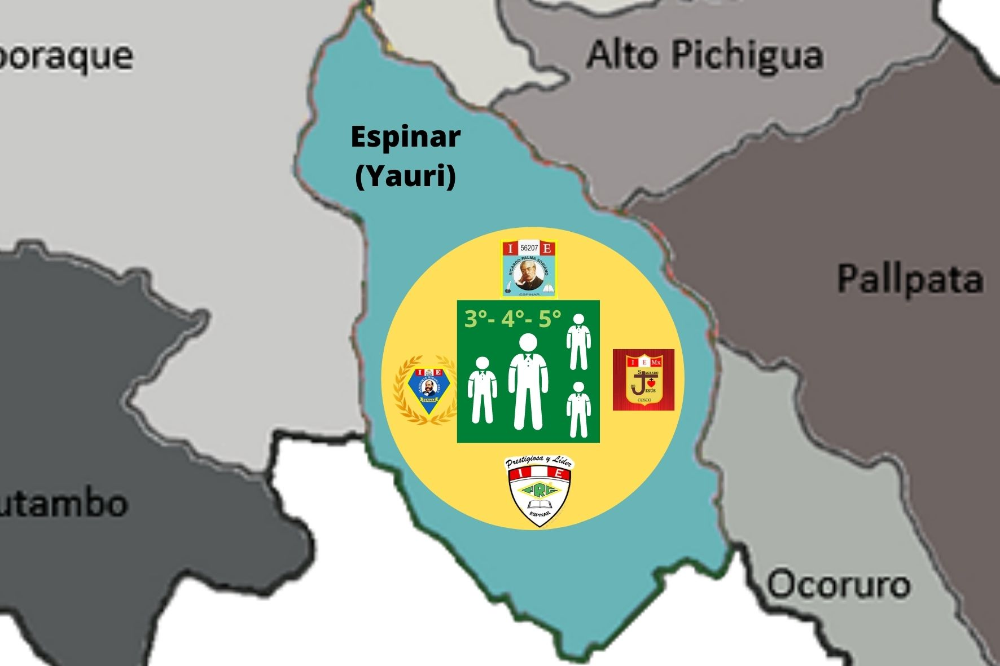
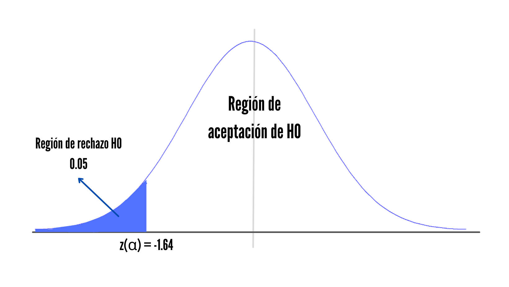
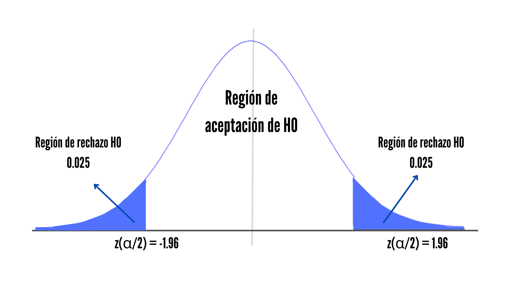
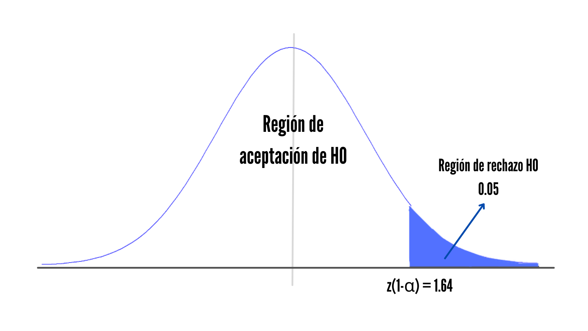

```{r echo=FALSE}
library(readr)
library(plyr)
library(modeest)
```

```{r echo=FALSE}
D<-read.csv("datos.csv")
```
# <span style="color:purple"> __Proyecto__  </span> 
<div style="text-align: justify">
__Título:__ Estudio del nivel de conocimiento y prácticas de Internet en la vida cotidiana de estudiantes de 3° a 5° de secundaria en el distrito de Yauri/Espinar/Cusco  
  
__Título corto:__ Seguridad e Internet en Espinar
<div/>  

<center>

</center> 

## __1. Introducción__
### <span style="color:blue"> 1.1. Pregunta </span>  
¿Cuáles son los factores más influyentes en los conocimientos que tienen alumnos de 3° a 5° de secundaria sobre los riesgos de navegar por Internet?  

### <span style="color:blue"> 1.2. Objetivos </span>  
Este estudio tiene como objetivo encontrar los factores más influyentes sobre la ciberseguridad, para esto analizaremos factores económicos y sociales, tratando de encontrar un vínculo entre estos.  

### <span style="color:blue"> 1.3. Importancia y justificación </span>  
En los últimos años, el Internet a trasendido enormemente, la mayoría de las personas en áreas metropolitanas y rurales cuentan con servicio a Internet, navegar por la Web es algo tan cotidiano en nuestras vidas. Sin embargo, estar o navegar por páginas web no nos asegura que tengamos algún conocimiento sobre las prácticas seguras de esta; es por eso que a través de este proyecto, averiguaremos los factores que influyen en los conocimientos acerca de las prácticas seguras en la Net.

## __2. Marco teórico__   
### <span style="color:blue"> 2.1. Población </span>  
#### __2.1.1 Población objetivo__
Alumnos de 3°, 4° y 5° de secundaria del distrito de Yauri, provincia Espinar(Cusco)  
  
#### __2.1.2 Muestra__ 
* Los alumnos de 3° a 5° de secundaria de los colegios:  
  + IE Almirante Miguel Grau  
  + IE Sagrado Corazón de Jesús  
  + IE Ricardo Palma  
  + IE Pedro Ruiz Gallo  
    
#### __2.1.3 Unidad muestral__
Cada estudiante de 3°, 4° y 5°de secundaria de los colegios seleccionados

<center>

</center>

### <span style="color:blue"> 2.2. Variables </span> 
#### __2.2.1 Variables cualitativas__ 
* Cualitativa Nominal:    
   + Colegio    
   + Disponibilidad de recursos tecnológicos no materiales  
   + Disponibilidad de recursos tecnológicos materiales  
   + Uso de addblock  
   + Red social más usada  
   + Acceso a Internet  
   + Sexo
     
#### __2.2.2 Variables cuantitativas__  
* Cuantitativa Continua:   
   + Edad (años): <div style="text-align: justify"> La variable nos ayudará a tener un mayor conocimiento acerca de nuestros usuarios encuestados, y trataremos de ver si esto influye en el conocimiento de buenas prácticas en el Internet <div/>
   + Ingresos familiares por mes (soles): <div style="text-align: justify"> Es una variable cuantitativa continua pues es un número que puede contener decimales, aunque solo es visible en ciertos datos. Tiene mucha importancia en la investigación pues nos muestra el nivel de activos de el usuario, trataremos con esta variable establecer una correlación directa con el nivel de conocimiento sobre ciberseguridad <div/>
   + Tiempo en internet (horas): <div style="text-align: justify"> Dado que es un estudio sobre las buenas prácticas en Internet, se intentará buscar una correlación con otras variables, creemos que el tiempo que un usuario transcurre en Internet es importante. <div/>
   + Nivel de conectividad: <div style="text-align: justify"> Esta variable ha sido planteada para tratar de encontrar una correlación con el tiempo que un estudiante transcurre en Internet o con los ingresos mensuales de la familia. <div/>
     
* Cuantitativa Discreta:  
   + Edad que aprendió usar Internet: <div style="text-align: justify"> Esta variable es cuantitativa discreta pues solo se puede medir con valores enteros positivos, es de importancia para la investigación pues determina un punto de inicio en el aprendizaje de los conocimientos informáticos <div/>
   + Promedio escolar de último trimestre: <div style="text-align: justify"> Es una variable cuantitativa continua pues es un promedio que describe el nivel de responsabilidad y dominio de aprendizaje del estudiante, es de importancia para la investigación pues nos da una referencia directa del nivel de dominio de nuevos aprendizajes de un estudiante y posterior realizar una correlación de alta fidelidad entre Nivel de conocimiento de ciberseguridad y ultimo promedio trimestral.  <div/>
   + Número de contenido multimedia empleado por día: <div style="text-align: justify"> Esta variable es cuantitativa discreta pues es un conteo de unidades, es de importancia para la investigación pues nos describe un recuento mas completo sobre la actividad del usuario en la red, por tanto una mejor opción para determinar una correlación de este con su conocimiento sobre ciberseguridad.  <div/>  
   + Puntaje del test de conocimiento de ciberseguridad: <div style="text-align: justify"> Esta variable es cuantitativa discreta pues solo mide valores enteros entre 0 y 10 inclusive, es de importancia para la investigacion pues nos muestra el nivel de conocimientos sobre ciberseguridad del estudiante encuestado. <div/>
   + Grado: <div style="text-align: justify"> Esta variable se encontrará en un rango de 3° a 5° grado de secundaria, debido a que es nuestro estudio está basado en esta población. <div/>
   + Frecuencia del spam: <div style="text-align: justify"> Esta variable es cuantitativa discreta pues se usan valores enteros de porcentaje para esta medición (0% - 25% - 50% - 75% - 100%). es de importancia para la investigación pues determina la cercanía del usuario a su desenvolvimiento de el usuario en sitios web que lucran con los datos de navegación del usuario (cookies) y en consecuencia describen el nivel de conocimiento sobre ciberseguridad básico. <div/>
   + Número de aplicaciones descargadas al mes: <div style="text-align: justify"> Esta variable es cuantitativa discreta pues es un conteo de unidades, es de importacia de la investigacion pues determina la actividad del usuario en la descarga de contenido multimedia, por tanto podemos estudiar su correlación con el numero de horas en actividad en la red y a su ves indicar su relacion con nivel de aprendizaje sobre ciberseguridad. <div/> 
   + Número de recursos materiales:<div style="text-align: justify"> Es una variable cuantitativa discreta  pues es un conteo de unidades, es de importancia para la imvestigacion pues es un indicador de acceso a dispositivos electrónicos y por consiguiente poder establecer una correlación de este dato con el nivel de conocimientos sobre ciberseguridad. <div/>
   + Número de recursos no materiales:<div style="text-align: justify"> Es una variable cuantitativa discreta  pues es un conteo de unidades, es de importancia para la imvestigacion pues es un indicador de acceso a software basico y antivirus, por consiguiente este indicador sirve para poder establecer una correlación de este dato con el nivel de conocimientos sobre ciberseguridad. <div/>
   + Dispositivos con acceso a Internet:<div style="text-align: justify"> Es una variable cuantitativa discreta  pues es un conteo de unidades, es de importancia para la investigación pues es un indicador de acceso a dispositivos con acceso a internet y por consiguiente poder establecer una correlación de este dato con el nivel de conocimientos sobre ciberseguridad del estudiante. <div/>
   + Interés en la ciberseguridad:<div style="text-align: justify"> Es una variable cuantitativa discreta pues describe en porcentaje el nivel de interes en ciberseguridad, es importante para la investigacion porque determina el nivel de interes en el area por consiguiente poder determinar si este es determinante en el nivel de conocimientos sobre la Ciberseguridad. <div/>
   
## __3. Datos__ 
<div style="text-align: justify">
La recolección de los datos fue a través de una encuesta realizada en Google Forms: [Evaluación de buenas prácticas de ciberseguridad en la vida cotidiana](https://docs.google.com/forms/d/1fGetNbEOgSdnAEjnEYVPWOkCEYb6WRQlZ7P4GKqzYMI/prefill), al cual se accedía con un correo institucional para tener mayor seguridad y certeza de las respuestas.
<div/>  
  
Para poder apreciar nuestros datos obtenidos hasta el 13 de diciembre, importaremos las librerías necesarias para analizar nuestras variables individualmente. Para este momento, el número de usuarios encuestados es:
```{r echo=FALSE}
nrow(D)
```
## __4. Descriptores__
### <span style="color:blue"> 4.1 Descriptores numéricos </span> 
#### __4.1.1 Puntuación__
##### Descriptores de posición
* Media, mediana y cuartiles
```{r echo=FALSE}
summary(D$Puntuacion)
```
* Moda 
```{r echo=FALSE}
table(D$Puntuacion)
```
```{r echo=FALSE}
mfv(D$Puntuacion)
```
##### Descriptores de dispersión  
* Rango
```{r echo=FALSE}
Rango1 = (max(D$Puntuacion) - min(D$Puntuacion))
Rango1
```
* Rango intercuartil  
```{r echo=FALSE}
IQR(D$Puntuacion)
```
* Varianza    
```{r echo=FALSE}
var(D$Puntuacion)
```
* Desviación estándar   
```{r echo=FALSE}
sd(D$Puntuacion)
```

##### _Análisis_
<div style="text-align: justify">
Podemos apreciar que la nota mínima es **cero**, lo que podría significar que algunas personas no tienen el menor conocimiento acerca de las prácticas de ciberseguridad; asimismo apreciamos que la media es de 5, al igual que la mediana. Gracias al rango, podemos concluir que los puntajes varían desde el mínimo al máximo valor, esto se ve reflejado en la varianza y la desviación estándar.
<div/> 

#### 1.2. Horas por motivos académicos    
##### Descriptores de posición
* Media, mediana y cuartiles
```{r echo=FALSE}
summary(D$Cantidad.de.horas.diarias.promedio.frente.a.una.pantalla..Laptop..Computadora..Tablet.o.Celular.Inteligente..para.fines.academicos)
```
* Moda 
```{r echo=FALSE}
mfv(D$Cantidad.de.horas.diarias.promedio.frente.a.una.pantalla..Laptop..Computadora..Tablet.o.Celular.Inteligente..para.fines.academicos)
```
##### Descriptores de dispersión  
* Rango
```{r echo=FALSE}
Rango1 = (max(D$Cantidad.de.horas.diarias.promedio.frente.a.una.pantalla..Laptop..Computadora..Tablet.o.Celular.Inteligente..para.fines.academicos) - min(D$Cantidad.de.horas.diarias.promedio.frente.a.una.pantalla..Laptop..Computadora..Tablet.o.Celular.Inteligente..para.fines.academicos))
Rango1
```
* Rango intercuartil  
```{r echo=FALSE}
IQR(D$Cantidad.de.horas.diarias.promedio.frente.a.una.pantalla..Laptop..Computadora..Tablet.o.Celular.Inteligente..para.fines.academicos)
```
* Varianza    
```{r echo=FALSE}
var(D$Cantidad.de.horas.diarias.promedio.frente.a.una.pantalla..Laptop..Computadora..Tablet.o.Celular.Inteligente..para.fines.academicos)
```
* Desviación estándar   
```{r echo=FALSE}
sd(D$Cantidad.de.horas.diarias.promedio.frente.a.una.pantalla..Laptop..Computadora..Tablet.o.Celular.Inteligente..para.fines.academicos)
```
##### _Análisis_
<div style="text-align: justify">
En promedio los entrevistados pasan seis horas navegando en internet por fines académicos, sin embargo, vemos que el mínimo de horas que pasan en internet por día son tres horas, tomando en cuenta que las clases son virtuales, podríamos deducir que hay personas que sólo utilizan el internet para sus clases virtuales. 
<div/> 

####  1.3. Horas para entretenimiento   
##### Descriptores de posición
* Media, mediana y cuartiles
```{r echo=FALSE}
summary(D$Cantidad.de.horas.diarias.promedio.frente.a.una.pantalla..Laptop..Computadora..Tablet.o.Celular.Inteligente..para.fines.de.entretenimiento)
```
* Moda 
```{r echo=FALSE}
mfv(D$Cantidad.de.horas.diarias.promedio.frente.a.una.pantalla..Laptop..Computadora..Tablet.o.Celular.Inteligente..para.fines.de.entretenimiento)
```
##### Descriptores de dispersión  
* Rango
```{r echo=FALSE}
Rango1 = (max(D$Cantidad.de.horas.diarias.promedio.frente.a.una.pantalla..Laptop..Computadora..Tablet.o.Celular.Inteligente..para.fines.de.entretenimiento) - min(D$Cantidad.de.horas.diarias.promedio.frente.a.una.pantalla..Laptop..Computadora..Tablet.o.Celular.Inteligente..para.fines.de.entretenimiento))
Rango1
```
* Rango intercuartil  
```{r echo=FALSE}
IQR(D$Cantidad.de.horas.diarias.promedio.frente.a.una.pantalla..Laptop..Computadora..Tablet.o.Celular.Inteligente..para.fines.de.entretenimiento)
```
* Varianza    
```{r echo=FALSE}
var(D$Cantidad.de.horas.diarias.promedio.frente.a.una.pantalla..Laptop..Computadora..Tablet.o.Celular.Inteligente..para.fines.de.entretenimiento)
```
* Desviación estándar   
```{r echo=FALSE}
sd(D$Cantidad.de.horas.diarias.promedio.frente.a.una.pantalla..Laptop..Computadora..Tablet.o.Celular.Inteligente..para.fines.de.entretenimiento)
```
##### _Análisis_
<div style="text-align: justify">
Podemos apreciar que el máximo de horas que alguien puede pasar utilizando algún dispositivo electrónico es 15 horas mientras que el mínimo es una hora, la media es seis; al igual que la media de las horas que pasan en internet por fines académicos (el anterior punto). 
<div/> 

#### 1.4. Número de aplicaciones descargadas al mes 
##### Descriptores de posición
* Media, mediana y cuartiles
```{r echo=FALSE}
summary(D$Numero.de.aplicaciones.descargadas.al.mes)
```
* Moda 
```{r echo=FALSE}
mfv(D$Numero.de.aplicaciones.descargadas.al.mes)
```
##### Descriptores de dispersión  
* Rango
```{r echo=FALSE}
Rango1 = (max(D$Numero.de.aplicaciones.descargadas.al.mes) - min(D$Numero.de.aplicaciones.descargadas.al.mes))
Rango1
```
* Rango intercuartil  
```{r echo=FALSE}
IQR(D$Numero.de.aplicaciones.descargadas.al.mes)
```
* Varianza    
```{r echo=FALSE}
var(D$Numero.de.aplicaciones.descargadas.al.mes)
```
* Desviación estándar   
```{r echo=FALSE}
sd(D$Numero.de.aplicaciones.descargadas.al.mes)
```
##### _Análisis_
<div style="text-align: justify">
La mediana es 4 y la media es 5 aproximadamente, la desviación estándar es alta, lo que indica que nuestros datos están dispersos respecto a la media.
<div/> 

#### 1.5. Frecuencia del Spam 
##### Descriptores de posición
* Media, mediana y cuartiles
```{r echo=FALSE}
summary(D$Frecuencia.de.spam)
```
* Moda 
```{r echo=FALSE}
mfv(D$Frecuencia.de.spam)
```
##### Descriptores de dispersión  
* Rango
```{r echo=FALSE}
Rango1 = (max(D$Frecuencia.de.spam) - min(D$Frecuencia.de.spam))
Rango1
```
* Rango intercuartil  
```{r echo=FALSE}
IQR(D$Frecuencia.de.spam)
```
* Varianza    
```{r echo=FALSE}
var(D$Frecuencia.de.spam)
```
* Desviación estándar   
```{r echo=FALSE}
sd(D$Frecuencia.de.spam)
```
##### _Análisis_
<div style="text-align: justify">
Como podemos observar, la media y la mediana están cerca del 25%, lo que nos indica que no reciben constantemente Spam, esto es comprobado gracias al primer cuartil el cual es cero, lo que nos indica que en el mejor de los casos, no reciben ningún SPAM.
<div/> 

#### 1.7. Interés en temas de seguridad en Internet 
##### Descriptores de posición
* Media, mediana y cuartiles
```{r echo=FALSE}
summary(D$InterÃ.s.en.la.ciberseguridad....)
```
* Moda 
```{r echo=FALSE}
mfv(D$InterÃ.s.en.la.ciberseguridad....)
```
##### Descriptores de dispersión  
* Rango
```{r echo=FALSE}
Rango1 = (max(D$InterÃ.s.en.la.ciberseguridad....) - min(D$InterÃ.s.en.la.ciberseguridad....))
Rango1
```
* Rango intercuartil  
```{r echo=FALSE}
IQR(D$InterÃ.s.en.la.ciberseguridad....)
```
* Varianza    
```{r echo=FALSE}
var(D$InterÃ.s.en.la.ciberseguridad....)
```
* Desviación estándar   
```{r echo=FALSE}
sd(D$InterÃ.s.en.la.ciberseguridad....)
```
##### _Análisis_
<div style="text-align: justify">
La mayoría de los encuestados, alumnos de 3° a 4° de secundaria, no tiene tanto interés en formar parte de alguna clase o charla hacerca de la prácticas seguras al momento de navegar en Internet.
<div/> 

#### 1.6. Edad en la que aprendieron utilizar el Internet 
##### Descriptores de posición
* Media, mediana y cuartiles
```{r echo=FALSE}
summary(D$Edad.aprende.a.usar.Internet)
```
* Moda 
```{r echo=FALSE}
mfv(D$Edad.aprende.a.usar.Internet)
```
##### Descriptores de dispersión  
* Rango
```{r echo=FALSE}
Rango1 = (max(D$Edad.aprende.a.usar.Internet) - min(D$Edad.aprende.a.usar.Internet))
Rango1
```
* Rango intercuartil  
```{r echo=FALSE}
IQR(D$Edad.aprende.a.usar.Internet)
```
* Varianza    
```{r echo=FALSE}
var(D$Edad.aprende.a.usar.Internet)
```
* Desviación estándar   
```{r echo=FALSE}
sd(D$Edad.aprende.a.usar.Internet)
```
##### _Análisis_
<div style="text-align: justify">
La mayoría de los encuestados, alumnos de 3° a 4° de secundaria, empezaron a navegar por en la Net a partir de los ocho años, esto lo concluimos a través de la moda, asimismo, la mediana es igual y la media es un valor cercano. Se podría deducir que los datos estarán cerca a la media, lo cual lo comprobamos con la desviación estándar.
<div/> 


```{r echo=FALSE}
D$Red.social.mas.usada[D$Red.social.mas.usada=="Whattsapp"]<-"WhatsApp"
D$Red.social.mas.usada[D$Red.social.mas.usada=="Whatsapp"]<-"WhatsApp"
D$Red.social.mas.usada[D$Red.social.mas.usada=="WhatsApp "]<-"WhatsApp"
D$Red.social.mas.usada[D$Red.social.mas.usada=="  WhatsApp"]<-"WhatsApp"
D$Red.social.mas.usada[D$Red.social.mas.usada=="whatsApp "]<-"WhatsApp"
D$Red.social.mas.usada[D$Red.social.mas.usada=="facebook "]<-"Facebook"
D$Red.social.mas.usada[D$Red.social.mas.usada=="Facebook "]<-"Facebook"
D$Red.social.mas.usada[D$Red.social.mas.usada=="WhatsApp, facebook"]<-"WhatsApp,Facebook"
D$Red.social.mas.usada[D$Red.social.mas.usada=="Facebook, Whatsapp"]<-"WhatsApp,Facebook"
D$Red.social.mas.usada[D$Red.social.mas.usada=="twitter "]<-"Twitter"
D$Red.social.mas.usada[D$Red.social.mas.usada=="Twitter "]<-"Twitter"
D$Sexo[D$Sexo=="B"]<-"X"
D$Sexo[D$Sexo=="f"]<-"F"
D$Sexo[D$Sexo=="m"]<-"M"
D$Colegio[D$Colegio=="I.E. N° 57003 Almirante Miguel Grau"]<-"A. Miguel Grau"
D$Colegio[D$Colegio=="I.E. N° 57003 Almirante Miguel Grau"]<-"A. Miguel Grau"
D$Colegio[D$Colegio=="I.E. N° 56207 Ricardo Palma Soriano Espinar"]<-"R.P.S.Espinar"
D$Colegio[D$Colegio=="I.E. Teniente Coronel Pedro Ruiz Gallo"]<-"T.C.P.Ruiz Gallo"
D$Colegio[D$Colegio=="I.E. N° 56175 Sagrado Corazón De Jesús"]<-"S.C. de Jesus"
```

### <span style="color:blue"> 4.2 Descriptores gráficos </span> 
#### 4.2.1 Colegio 
<div style="text-align: justify">
Nuestro objetivo era la población del distrito de Espinar de 3° a 5° de secundaria, es por eso que elegimos cuatro colegios, a continuación veremos la pparticipación de estos cuatro colegios (I.E. N° 57003 Almirante Miguel Grau,I.E. N° 56207 Ricardo Palma Soriano Espinar,I.E. N° 56175 Sagrado Corazón De Jesús,I.E. Teniente Coronel Pedro Ruiz Gallo)
<div/> 

```{r echo=FALSE}
TabG<-table(D$Colegio)
barplot(TabG, main="Histograma de colegios", col = "deepskyblue")
```

#### 4.2.2 Grado y edad
<div style="text-align: justify">
La encuesta fue realizada a alumnos de 3° a 5° año de secundaria, podemos observar que la mayoría de los encuestados fueron de **tercero de secundaria**
<div/> 
```{r echo=FALSE}
TabG<-table(D$Grado)
barplot(TabG, main="Histograma de grados", col = "cadetblue", xlab="Grado de Secundaria",ylab="Cantidad de encuestados")
```
<div style="text-align: justify">
Con respecto a la edad, notamos que la moda es 14 años, siendo la mayor edad 17 y la menor 13, asimismo se podría decir que está sesgado a la derecha
<div/> 

```{r echo=FALSE}
TabEdad<-table(D$Edad)
barplot(TabEdad, main="Histograma de edad", col = "aquamarine3", xlab="Años")
```

#### 4.2.3 Acceso a Internet 
<div style="text-align: justify">
Del histograma se aprecia que gran cantidad de los encuestados cuentan con conexión a Internet es sus hogares.
<div/> 

```{r echo=FALSE}
D$Acceso.a.internet[D$Acceso.a.internet=="Sí"]<-"Si"
TabNet<-table(D$Acceso.a.internet)
barplot(TabNet, main="Acceso a Internet", col = "darkseagreen3")
```

#### 4.2.4 Horas en Internet 
<div style="text-align: justify">
De la gráfica de tiempo en Internet por fines académico apreciamos un sesgo a la derecha, mientras que en la gráfica de tiempo en la Web con fines de oscio tiene un sesgo hacia la izquierda.
<div/> 
```{r echo=FALSE}
TabhAcad<-table(D$Cantidad.de.horas.diarias.promedio.frente.a.una.pantalla..Laptop..Computadora..Tablet.o.Celular.Inteligente..para.fines.academicos)
barplot(TabhAcad, main="Histograma horas en internet por fines académicos", col = "darkseagreen1",xlab="Horas")
```
```{r echo=FALSE}
TabhEn<-table(D$Cantidad.de.horas.diarias.promedio.frente.a.una.pantalla..Laptop..Computadora..Tablet.o.Celular.Inteligente..para.fines.de.entretenimiento)
barplot(TabhEn, main="Histograma horas en internet con fines de oscio", col = "darkslategray3",xlab="Horas")
```
#### 4.2.5 Uso de Addblock 
<div style="text-align: justify">
Podemos apreciar que hay una gran mayoría que no utiliza un bloqueador de anuncios.
<div/> 
```{r echo=FALSE}
TaAb<-table(D$Uso.de.addblock)
barplot(TaAb, main="Utilizan Addblock", col = "darkblue")
```


## __5. Patrones__
### <span style="color:blue"> 5.1 Entre dos categóricas </span>
#### Red social y Sexo
<div style="text-align: justify">
Compararemos el género de la persona con la Red social que más usan, podemos apreciar que las mujeres utilizan más WhatsApp y los varones utilizan más Facebook.
<div/> 
```{r echo=FALSE}
mosaicplot(table(D$Sexo,D$Red.social.mas.usada),col=c("thistle2","slategray3","orange","mediumorchid1"),main="Red Social por Sexo")
```

### <span style="color:blue"> 5.2 Entre una categórica y una numérica </span> 
#### Puntuación y Sexo
<div style="text-align: justify">
Se puede apreciar que tanto hombres como mujeres tienen una mediana de 5 aproximadamente, sin embargo, el quartil 1 de los varones es más bajo que el de la mujeres, de lo cual se infiere que el mínimo puntaje pertenecería a un encuestado de sexo masculino.
<div/> 
```{r echo=FALSE}
boxplot(D$Puntuacion~D$Sexo, xlab = "Sexo", ylab = "Puntuacion",col = c("deeppink", "blue1", "grey"))
```
#### Uso de addblock y Frecuencia de Spam
<div style="text-align: justify">
De la gráfica se puede apreciar que el cuartil 3 de las personas entrevistadas que **sí** usan un bloqueador de anuncio son los que tienen más frecuencia de Spam.En caso contrario, los que **no** usan bloqueador de Spam, recibe anuncios con menos frecuencia; aunque cabe añadir que cuenta con un dato atípico el cual indica que aquí se encuentra el valor máximo de frecuencia 75%.
<div/> 
```{r echo=FALSE}
boxplot(D$Frecuencia.de.spam~D$Uso.de.addblock, xlab = "Addblock", ylab = "Frecuencia de Spam",col = c("indianred1", "lawngreen"))
```
#### Ingresos familiares por mes e Internet
<div style="text-align: justify">
Se puede apreciar que los que cuentan con Internet  en sus hogares tienen mayor mediana que los que no cuentan con este servicio en sus viviendas, así que se podría deducir que el sueldo influye en el contrato de algún servicio de Internet. 
<div/> 
```{r echo=FALSE}
boxplot(D$Ingresos.familiares.por.mes..soles.~D$Acceso.a.internet, xlab = "Acceso a internet", ylab = "Ingresos familiares mensuales",col = c("lightpink2", "palegreen2"))
```

### <span style="color:blue"> 5.3 Entre dos numéricas </span> 
#### Aplicaciones descargadas y Spam
* Covarianza:
```{r echo=FALSE}
round(cov(D$Numero.de.aplicaciones.descargadas.al.mes,D$Frecuencia.de.spam),3)
```
* Correlación
```{r echo=FALSE}
cor<- cov(D$Numero.de.aplicaciones.descargadas.al.mes,D$Frecuencia.de.spam)/(sd(D$Numero.de.aplicaciones.descargadas.al.mes)*sd(D$Frecuencia.de.spam))
round(cor,2)
```
<div style="text-align: justify">
De los descriptores numéricos de interacción, podemos apreciar que la covarianza es mayor que 1, lo cual nos indicaría que cuando la cantidad de aplicaciones descargadas por mes aumenta, la frecuencia del Spam también aumentaría. Cabe añadir, que la correlación entre ambas variables está más próxima a cero, además se aprecia en la siguiente gráfica que no se puede hallar una línea de tendencia; por lo cual podemos asegurar que **NO** tienen una buena relación.
<div/> 
```{r echo=FALSE}
pairs(D$Numero.de.aplicaciones.descargadas.al.mes~D$Frecuencia.de.spam)
```
#### Escuela y entretenimiento
* Covarianza
```{r echo=FALSE}
round(cov(D$Cantidad.de.horas.diarias.promedio.frente.a.una.pantalla..Laptop..Computadora..Tablet.o.Celular.Inteligente..para.fines.academicos, D$Cantidad.de.horas.diarias.promedio.frente.a.una.pantalla..Laptop..Computadora..Tablet.o.Celular.Inteligente..para.fines.de.entretenimiento),3)
```
* Correlación
```{r echo=FALSE}
cor<- cov(D$Cantidad.de.horas.diarias.promedio.frente.a.una.pantalla..Laptop..Computadora..Tablet.o.Celular.Inteligente..para.fines.academicos, D$Cantidad.de.horas.diarias.promedio.frente.a.una.pantalla..Laptop..Computadora..Tablet.o.Celular.Inteligente..para.fines.de.entretenimiento)/(sd(D$Cantidad.de.horas.diarias.promedio.frente.a.una.pantalla..Laptop..Computadora..Tablet.o.Celular.Inteligente..para.fines.academicos)*sd(D$Cantidad.de.horas.diarias.promedio.frente.a.una.pantalla..Laptop..Computadora..Tablet.o.Celular.Inteligente..para.fines.de.entretenimiento))
round(cor,2)
```
Debido a que la covarianza es negativa, se deduce que estas variables son indirectamente proporcionales; cuando una crece, la otra decrece. Asimismo, podemos ver que la correlación se sigue acercando a cero, por lo que estas variables tampoco guardan una relación lineal.
```{r echo=FALSE}
smoothScatter(D$Cantidad.de.horas.diarias.promedio.frente.a.una.pantalla..Laptop..Computadora..Tablet.o.Celular.Inteligente..para.fines.academicos, D$Cantidad.de.horas.diarias.promedio.frente.a.una.pantalla..Laptop..Computadora..Tablet.o.Celular.Inteligente..para.fines.de.entretenimiento,xlab="Académicos",ylab="Entretenimiento",main="Comparación entre horas en Internet por ocio y por aprendizaje")

```


## __6. Variables Aleatorias__
### <span style="color:blue"> 6.1 Sexo </span> 
<div style="text-align: justify">
*Justificación:*El sexo en este caso es una variable aleatoria discreta. Manejaremos esta variable con el modelo discreto binomial. Siendo el éxito que la entrevista sea femenino (F):  
* k = 1  
* n = 152  
* p = 39/76  
*Variable aleatoria:* x = # de éxitos, en los n ensayos  
*Probabilidad:* P(F) = dbinom(1,152,0.5132)
```{r echo=FALSE}
dbinom(1,152,0.5132)
```
<div/> 

### <span style="color:blue"> 6.2 Edad en la que aprende utilizar Internet </span> 
<div style="text-align: justify">
*Justificación:* La variable es aleatoria discreta porque el espacio muestral está dado desde los 5 hasta los 14 años, lo cual indica un conjunto finito. Está variable nos da la idea de la edad con relación al uso de Internet. Ajustamos el modelo para calcular la probabilidad de encontrar a la persona entrevistada con la edad de 10 años al momento de aprender a usar Internet en la entrevista 20. Modelo discreto geométrico. 
*Variable aleatoria:*   
 ◦ x = # de entrevistas hasta hallar a la persona entrevistada con 10 años  
 ◦ y = # de entrevistas sin respuestas deseadas hasta encontrar la deseada  
 ◦ x-1=y   
 ◦ p(acierto=10) =1/2  
*Probabilidad:* P(Y=19)= dgeom(19,0.5)
```{r echo=FALSE}
dgeom(19,0.5)
```
<div/> 

### <span style="color:blue"> 6.3 Número de Apps descargadas al mes </span> 
<div style="text-align: justify">
*Justificación:* Para esta variable aleatoria discreta se ajusta para hallar la probabilidad de descargar 6 aplicaciones trimestralmente. El modelo Poisson:  
 ◦ X: Número de aplicaciones descargadas en tres meses  
   1mes   -----------> 4.8 aplicaciones  
   3meses -----------> λ =14.4 aplicaciones 
  
*Probabilidad:* P(x=6)=dpois(6,14.4)
```{r echo=FALSE}
dpois(6,14.4)
```
<div/> 


## **7. Parámetros de estudio**
○ Nivel de confianza: 95%  
○ Significancia: 5%  
○ Tamaño de la muestra: 152 observaciones  
○ Variables: 24 

### <span style="color:blue"> 7.1 Descriptores numéricos </span>
#### 7.1.1. Puntaje 
Media, mediana y cuartiles
```{r echo=FALSE}
summary(D$Puntuacion)
```
Moda 
```{r echo=FALSE}
mfv(D$Puntuacion)
```
Rango
```{r echo=FALSE}
Rango1 = (max(D$Puntuacion) - min(D$Puntuacion))
Rango1
```
Rango intercuartil  
```{r echo=FALSE}
IQR(D$Puntuacion)
```

Varianza    
```{r echo=FALSE}
var(D$Puntuacion)
```
Desviación estándar   
```{r echo=FALSE}
s1<-sd(D$Puntuacion)
s1
```
Media
```{r echo=FALSE}
x1<-mean(D$Puntuacion)
round(x1,2)
```
##### __Intervalos de Confianza media de la puntuación__
Valor mínimo
```{r echo=FALSE}
min1<-x1-(qnorm(0.975))*(s1/sqrt(150))
round(min1,2)
```
Valor máximo
```{r echo=FALSE}
max1<-x1+(qnorm(0.975))*(s1/sqrt(150))
round(max1,2)
```
Error máximo:
```{r echo=FALSE}
round((max1-min1)/2,2)
```
##### __Análisis:__
<div style="text-align: justify">
De la variable puntaje se puede apreciar que tiene una media de 5.29, una mediana y moda de 5. También se puede notar que las notas varían desde el puntaje mínimo (0) hasta el puntaje máximo (10).    
En lo que respecta a los intervalos de confianza, se puede decir que con 95% de confianza, se estima que el puntaje promedio sobre ciberseguridad de los alumnos de 3° a 5° de secundaria de la provincia de Espinar está entre 4.86 y 5.72 con un error máximo de 0.43. 
<div/> 


#### <span style="color:blue"> 7.1.2 Promedio escolar en el último trimestre </span>
Media, mediana y cuartiles
```{r echo=FALSE}
summary(D$Promedio.escolar.de.ultimo.trimestre)
```
Moda 
```{r echo=FALSE}
mfv(D$Promedio.escolar.de.ultimo.trimestre)
```
Rango
```{r echo=FALSE}
Rango0 = (max(D$Promedio.escolar.de.ultimo.trimestre) - min(D$Promedio.escolar.de.ultimo.trimestre))
Rango0
```
Rango intercuartil  
```{r echo=FALSE}
IQR(D$Promedio.escolar.de.ultimo.trimestre)
```

Varianza    
```{r echo=FALSE}
var(D$Promedio.escolar.de.ultimo.trimestre)
```
Desviación estándar   
```{r echo=FALSE}
s0<-sd(D$Promedio.escolar.de.ultimo.trimestre)
s0
```
Media
```{r echo=FALSE}
x0<-mean(D$Promedio.escolar.de.ultimo.trimestre)
round(x0,2)
```
##### __Intervalos de Confianza media del promedio escolar del último trimestre_
Valor mínimo
```{r echo=FALSE}
min0<-x0-(qnorm(0.975))*(s0/sqrt(150))
round(min0,2)
```
Valor máximo
```{r echo=FALSE}
max0<-x0+(qnorm(0.975))*(s0/sqrt(150))
round(max0,2)
```
Error máximo:
```{r echo=FALSE}
round((max0-min0)/2,2)
```
##### __Análisis:__
<div style="text-align: justify">
De la variable promedio del último trimestre se puede apreciar que tiene una media de 13.80, la mediana es 13.40; se observa a la vez que el mínimo promedio, el cual cabe mencionar que es desaprobatorio es 9.40 y que el máximo promedio es de 17.80.   
En lo que respecta a los intervalos de confianza, se puede decir que con 95% de confianza, se estima que la nota promedio alumnos de 3° a 5° de secundaria de la provincia de Espinar está entre 13.46 y 14.15 con un error máximo de 0.34. 
<div/> 


#### <span style="color:blue"> 7.1.3 Horas totales en Internet </span>
Media, mediana y cuartiles
```{r echo=FALSE}
summary(D$Horas.en.internet..total.)
```
Moda 
```{r echo=FALSE}
mfv(D$Horas.en.internet..total.)
```
Rango
```{r echo=FALSE}
Rango2 = (max(D$Horas.en.internet..total.) - min(D$Horas.en.internet..total.))
Rango2
```
Rango intercuartil  
```{r echo=FALSE}
IQR(D$Horas.en.internet..total.)
```

Varianza    
```{r echo=FALSE}
var(D$Horas.en.internet..total.)
```
Desviación estándar   
```{r echo=FALSE}
s2<-sd(D$Horas.en.internet..total.)
s2
```
Media
```{r echo=FALSE}
x2<-mean(D$Horas.en.internet..total.)
round(x2,2)
```
##### __Intervalos de Confianza media de horas totales en Internet__
Valor mínimo
```{r echo=FALSE}
min2<-x2-(qnorm(0.975))*(s2/sqrt(150))
round(min2,2)
```
Valor máximo
```{r echo=FALSE}
max2<-x2+(qnorm(0.975))*(s2/sqrt(150))
round(max2,2)
```
Error máximo:
```{r echo=FALSE}
round((max2-min2)/2,2)
```
##### __Análisis:__
<div style="text-align: justify">
De esta variable, podemos notar que la media es 11.58 horas en Internet por día; siendo la moda 12 horas, al igual que la mediana.  
Con 95% de confianza podemos decir que la estimación de las horas promedio que los estudiantes pasan en Internet se encuentra en el intervalo (11.11,12.05), el cual tiene un error máximo de 0.47.
<div/> 

## **8. Prueba de Hipótesis**
Para todos nuestras hipótesis utilizaremos Z, dado que nuestro n es mayor que 30; además para casos prácticos asumiremos nuestra desviación muestral (s) como nuestra desviación poblacional(σ).
### <span style="color:blue"> Hipótesis 1 </span>
○ Paso 1:
El promedio del puntaje respecto al conocimiento de ciberseguridad es mayor o igual a 6 puntos, el cual se considera aprobatorio.   
H0: Promedio aprobatorio   
H0: µ ≥ 6 puntos  
H1: Promedio desaprobatorio   
H1: µ < 6 puntos  

○ Paso 2:    
Nivel de significación = α = 0.05    

○ Paso 3:    
Zc = ((x̄ - µ0 )/(σ)/sqrt (n))    
Donde tenemos:     
· x̄ = 5.289     
· µ0 = 6    
· σ = s = 2.707927     
· n = 153    
Estadístico de prueba:    
```{r echo=FALSE}
z1 = (5.289 - 6)/((2.707927)/sqrt (153))
round(z1,2)
```

○ Paso 4:      
α = 0.05    
Unilateral izquierda    
Regiones de rechazo:      
```{r echo=FALSE}
round(qnorm(0.05),2)
```
<center>

</center> 

○ Paso 5:      
Podemos considerar que, con una significancia del 5%, el valor del estadístico de prueba se encuentra en la zona de rechazo para Ho.  
  
○ Paso 6:     
podemos decir que el promedio de las puntuaciones de los estudiantes es desaprobatoria (menor a 6 puntos)


### <span style="color:blue"> Hipótesis 2 </span>
○ Paso 1:    
Edad a la que aprendieron a usar Internet      
H0: La edad promedio a la que aprendieron a usar Internet es 8.5 años.    
H0: µ = 8.5 años       
H1: La edad promedio a la que aprendieron a usar Internet es diferente de 8.5      
H1: µ ≠ 8.5 años    

○ Paso 2:      
Nivel de significación = α = 0.05    

○ Paso 3:    
Zc = ((x̄ - µ0 )/(σ)/sqrt (n))    
Donde tenemos:     
· x̄ = 8.447     
· µ0 = 8.5    
· σ = s = 1.841   
· n = 153    
Estadístico de prueba:  
```{r echo=FALSE}
z2 = (8.447 - 8.5)/((1.840636)/sqrt (153))
round(z2,2)
```

○ Paso 4:      
α = 0.05    
Prueba bilateral   
Regiones de rechazo:      
```{r echo=FALSE}
round(qnorm(0.025),2)
```
<center>

</center> 

○ Paso 5:     
Con una significancia del 5% podemos encontrar el valor del estadístico de prueba en la zona de no rechazo para Ho. De manera que se acepta Ho.

○ Paso 6:     
Se puede afirmar que la edad promedio a la que un estudiante aprendió a usar el Internet es de 8.5 años.     

### <span style="color:blue"> Hipótesis 3 </span>
○ Paso 1:    
Horas para entretenimiento     
H0: Los estudiantes usan menos de 3h en Internet para fines recreativos   
H0: µ  ≤ 3h     
H1: Los estudiantes usan más de 3h en Internet para fines recreativos   
H1: µ > 3h     

○ Paso 2:    
Nivel de significación = α = 0.05    

○ Paso 3:    
Zc = ((x̄ - µ0 )/(σ)/sqrt (n))    
Donde tenemos:     
· x̄ = 5.612   
· µ0 = 3   
· σ = s = 2.681922  
· n = 153    
Estadístico de prueba:  
```{r echo=FALSE}
z3 = (5.612 - 3)/((2.681922)/sqrt (153))
round(z3,2)
```

○ Paso 4:      
α = 0.05  
Prueba unilateral derecha 
Regiones de rechazo:    
```{r echo=FALSE}
round(qnorm(0.95),2)
```
<center>

</center> 

○ Paso 5:      
Con una significancia de 5% encotramos el valor del estadístico de prueba a la derecha de la gráfica, en la zona de rechazo de Ho. 

○ Paso 6:     
Podemos decir, entonces, que los estudiantes pasan más de 3 horas en Internet con fines recreativos. 

## **9. Regresiones y predicciones**
### <span style="color:blue"> Regresión 1: Puntaje promedio VS Puntaje </span>
```{r echo=FALSE}
plot(D$Promedio.escolar.de.ultimo.trimestre~D$Puntuacion,main= "Puntaje promedio VS Puntaje", xlab="Puntaje", ylab="Puntaje promedio")
cor.test(D$Promedio.escolar.de.ultimo.trimestre,D$Puntuacion)
```
```{r echo=FALSE}
modelo1<-lm(D$Promedio.escolar.de.ultimo.trimestre~D$Puntuacion)
summary(modelo1)
```

```{r echo=FALSE}
modelo1$coefficients
```
```{r echo=FALSE}
plot(D$Promedio.escolar.de.ultimo.trimestre~D$Puntuacion,main= "Puntaje promedio VS Puntaje", xlab="Puntaje", ylab="Puntaje promedio")
abline(modelo1,col="red")
```
<div style="text-align: justify">
Tenemos con R-squared:0.8658 de las variaciones del puntaje promedio trimestral son explicadas por el modelo,lo que nos quiere decir que el 86.58% ,la pendiente es positiva , por tanto pordemos decir que si el eje "x" crece, el eje "y" asimismo, podemos obtener la correlación de ambas variables(relación fuerte o débil), al hallar la raíz cuadrada podemos ver que el valor es de 0.93048,o también por la función cor, y se acerca demasiado al 1, eso quiere decir que la relación entre la variable predictiva y la variable por predecir tiene una relación  fuerte, una vez hallado la correlación. Hallaremos los coeficientes de la ecuación que se ajuste mejor a las dos variables usando el comando coeficientes, después de eso veremos si los valores de los coeficientes son significantes o no, para ello usaremos hipótesis y jugaremos con los valores del p-value de los coeficientes.  
Para B0:   PVALUE: <2e-16  -------> MENOR A 0.05  -----> Rechazo H0 ----> Eso quiere decir que B0 es significativo  
H0: B0=0 (NO SIGNIFICATIVO)  
H1: B0≠0 (SIGNIFICATIVO)  

Para B1:   PVALUE: <2e^-16  ------> MENOR A 0.05 ------> Rechazo H0 ---> Hay evidencias que B0 es diferente de 0     
H0: B1=0 (NO SIGNIFICATIVO)  
H1: B1≠0 (SIGNIFICATIVO)  

Ahora veremos si la ecuación dada por Rstudio es significativa o no:    p-value: 2.2e^-16  
  
H0: modelo no significativo  
H1: modelo significativo  

Modelo de regresión:  
Puntaje promedio (trimestral) = 9.9270701 + 0.7330664*(Puntaje sobre cyberseguridad)
  
Nos damos cuenta que el p-value de la ecuación es menor a 0.05, entonces rechaza H0, eso quiere decir que el modelo es **significativo**.
<div/>

#### _Gráficas residuales_
```{r echo=FALSE}
residuos1 <- rstandard(modelo1)
valores.ajustados <- fitted(modelo1)
plot(valores.ajustados, residuos1, ylab="Residuos",xlab = "Valores ajustados")
```
No se observa ningún patrón especial, por lo que la homocedasticidad como la linealidad resultan hipótesis razonables.

#### _Normalidad_
```{r}
qqnorm(residuos1)
qqline(residuos1, col = "red")
```
Dado que los puntos están relativamente alineado, la normalidad también parece aceptable.

### <span style="color:blue"> Regresión 2: Ingresos familiares mensuales VS Nivel de conectividad </span>
```{r echo=FALSE}
plot(D$Ingresos.familiares.por.mes..soles.~D$Nivel.de.conectividad,main= "Ingresos familiares por mes VS Nivel de conectividad", ylab="Ingresos familiares por mes (en soles)", xlab="Conectividad")
cor.test(D$Ingresos.familiares.por.mes..soles.,D$Nivel.de.conectividad)
```
```{r}
modelo2<-lm(D$Nivel.de.conectividad~D$Ingresos.familiares.por.mes..soles.)
```
```{r}
summary(modelo2)
```
```{r}
modelo2$coefficients
```
```{r}
plot(D$Nivel.de.conectividad~D$Ingresos.familiares.por.mes..soles.,main= "Ingresos familiares por mes VS Nivel de conectividad", ylab="Ingresos familiares por mes (en soles)", xlab="Conectividad")
abline(modelo2,col="red")
```
<div style="text-align: justify">
Tenemos con R-squared:0.993, el 99.3% de las variaciones de ingresos familiares son explicados por este modelo, entonces si a ellos le sacamos la raíz cuadrada, podemos obtener la correlación de ambas variables(relación fuerte o débil), al hallar la raíz cuadrada podemos ver que el valor es de 0.99 y se acerca demasiado al 1, la pendiente es positiva , por tanto podremos decir que si el eje "x" crece, el eje "y" se acerca demasiado al 1, eso quiere decir que la relación entre la variable predictiva y la variable por predecir tiene una relación  fuerte, una vez hallado la correlación. Hallaremos los coeficientes de la ecuación que se ajuste mejor a las dos variables usando el comando coeficientes, después de eso veremos si los valores de los coeficientes son significantes o no, para ello usaremos hipótesis y jugaremos con los valores del p-value de los coeficientes.   

Para B0:   PVALUE: 0.875  -------> MAYOR A 0.05  -----> Acepto H0 ----> Eso quiere decir que B0 debería de haber sido 0  
H0: B0=0 (NO SIGNIFICATIVO)  
H1: B0≠0 (SIGNIFICATIVO)  

Para B1:   PVALUE: <2e^-16  ------> MENOR A 0.05 ------> Rechazo H0 ---> Hay evidencias que B0 es diferente de 0     
H0: B1=0 (NO SIGNIFICATIVO)  
H1: B1≠0 (SIGNIFICATIVO)  

Ahora veremos si la ecuación dada por Rstudio es significativa o no:    p-value: 2.2e^-16  
  
H0: modelo no significativo  
H1: modelo significativo  
  
Modelo de regresión:    
Ingresos familiares mensuales = -0.09359224 + 0.04574168*(Nivel de conectividad)
  
Nos damos cuenta que el p-value de la ecuación es menor a 0.05, entonces rechaza H0, eso quiere decir que el modelo es **significativo**
<div/>

#### _Gráficas residuales_
```{r echo=FALSE}
residuos2 <- rstandard(modelo2)
valores.ajustados <- fitted(modelo2)
plot(valores.ajustados, residuos2, ylab="Residuos",xlab = "Valores ajustados")
```
No se observa ningún patrón especial, por lo que la homocedasticidad como la linealidad resultan hipótesis razonables.

#### _Normalidad_
```{r}
qqnorm(residuos2)
qqline(residuos2, col = "red")
```
Dado que los puntos están relativamente alineado, la normalidad también parece aceptable.


### <span style="color:blue"> Regresión 3: Apps por día VS Horas en la Net </span>
```{r echo=FALSE}
plot(D$Numero.total.de.contenido.multimedia.visto..usado.o.descargado.por.dia..~D$Horas.en.internet..total.,main="Apps VS Horas en internet",xlab="Horas en internet por día",ylab="Apps utilizadas/descargadas por mes")
cor.test(D$Numero.total.de.contenido.multimedia.visto..usado.o.descargado.por.dia..,D$Horas.en.internet..total.)
```
```{r echo=FALSE}
modelo3<-lm(D$Numero.total.de.contenido.multimedia.visto..usado.o.descargado.por.dia..~D$Horas.en.internet..total.)
summary(modelo3)
```
```{r echo=FALSE}
modelo3$coefficients
```
```{r echo=FALSE}
plot(D$Numero.total.de.contenido.multimedia.visto..usado.o.descargado.por.dia..~D$Horas.en.internet..total.,main="Apps VS Horas en internet",xlab="Horas en internet por día",ylab="Apps utilizadas/descargadas por mes")
abline(modelo3,col="red")
```
<div style="text-align: justify">
Tenemos con R-squared:0.3462,el modelo explica el 34.62% de las variaciones de las apps utilizadas mensualmente; además que obtenemos que la correlación es 0.592  la pendiente es positiva , por tanto pordemos decir que si el eje "x" crece, el eje "y" tambi?n y se acerca de manera regular al 1, eso quiere decir que la relación entre la variable predictiva y la variable por predecir tiene una relación media fuerte, una vez hallado la correlación. Hallaremos los coeficientes de la ecuación que se ajuste mejor a las dos variables usando el comando coeficientes, después de eso veremos si los valores de los coeficientes son significantes o no, para ello usaremos hipótesis y jugaremos con los valores del p-value de los coeficientes.
Para B0:   PVALUE: 0.3462   -------> MAYOR A 0.05  -----> Acepto H0----> eso quiere decir que B0 es 0
H0: B0=0 (NO SIGNIFICATIVO)
H1: B0≠0 (SIGNIFICATIVO)

Para B1:   PVALUE: 1.173e^-15  ------> MENOR A 0.05 ------> Rechazo H0-----> eso quiere decir que B1 es diferente de 0
H0: B1=0 (NO SIGNIFICATIVO)
H1: B1≠0 (SIGNIFICATIVO)

Ahora veremos si la ecuación dada por Rstudio es significativa o no:    p-value: 1.173e^-15

H0: modelo no significativo  
H1: modelo significativo

Modelo de regresión:    
Apps = 0.4907160 + 0.5141972*(Horas en Internet)

Podemos apreciar que el p-value de la ecuación es menor a la significancia (0.05), entonces rechazamos H0, lo que quiere decir que el modelo es **significativo**.
<div/>

#### _Gráficas residuales_
```{r echo=FALSE}
residuos3 <- rstandard(modelo3)
valores.ajustados <- fitted(modelo3)
plot(valores.ajustados, residuos3, xlab="Valores ajustados",ylab = "Residuos")
```
No se observa ningún patrón especial, por lo que la homocedasticidad como la linealidad resultan hipótesis razonables.

#### _Normalidad_
```{r}
qqnorm(residuos3)
qqline(residuos3, col="red")
```
Dado que los puntos están relativamente alineado, la normalidad también parece aceptable.

## **10. Conclusiones**
<div style="text-align: justify">
○ Del estudio se podría decir que los alumnos de la provincia de Espinar, tienen conocimientos básicos acerca de la seguridad y buenas prácticas en el Internet; tal y como pudimos observar la media es de 5.28; un puntaje relativamente bajo.  
○ Entre los factores que influyen en el conocimiento de estas prácticas, pudimos identificar una fuerte relación entre el promedio trimestral y el puntaje obtenido en el test de ciberseguridad, además que estos valores están fuertemente relacionados, por lo que el empeño o el esmero que le ponen al colegio es un factor importante en los conocimientos buenas prácticas de Internet pueden tener.   
○ Adicionalmente, los ingresos familiares respecto al nivel de conectividad están bastante relacionados, sin embargo, recordemos que entre nuestros entrevistados, una pequeña parte no contaba con servicio de Internet en su domicilio.  
○ Además, podemos apreciar que el uso de bloqueadores de anuncios (Addblock), no son realmente efectivos, dado que los usuarios que cuentan con este servicio, contradictoriamente a lo esperado, reciben mayor frecuencia de Spam en comparación de los que no cuentan con esta extensión.  
○ A lo largo de la encuesta también se les preguntó su interés de participar en charlas o recibir clases sobre seguridad en Internet, a lo que la mayoría tenía un 18% de interés en formar parte de estas actividades.
<div/>

# Integrantes
+-----------------------+-----------------------+---------------------+
|      Integrantes      |        Código         |    Participación    |
+=======================+=======================+=====================+
| Choquepura Puma,      |       202020039       |        100%         |
| Luis Angel  (L1)      |                       |                     |
+-----------------------+-----------------------+---------------------+
| Conde Aguirre,        |       202020048       |        100%         |
| Abdul Emerson         |                       |                     |
+-----------------------+-----------------------+---------------------+
| Conga Angulo,         |       202020050       |        100%         |
| Jhon Fabricio (L2)    |                       |                     |
+-----------------------+-----------------------+---------------------+
| Cosme Ayala,          |       202010239       |        100%         |
| Jackelyn Dayana       |                       |                     |
+-----------------------+-----------------------+---------------------+
| Culqui Vasquez,       |       202020056       |        100%         |
| Jhosley Yeltzin       |                       |                     |
+-----------------------+-----------------------+---------------------+

