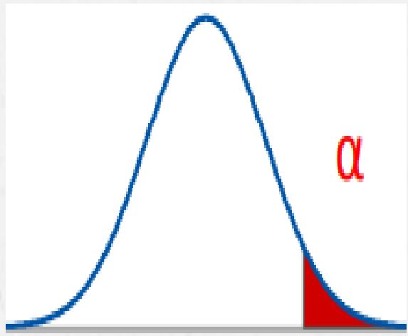

## Introducción
### Tema seleccionanado:
1. Estudio de la cantidad de horas de sueño en estudiantes de UTEC en pandemia y factores que afectan en su tiempo de sueño. 

a) **¿Es el estudio de interés para la audiencia? **
    El estudio está relacionado con la salud física y mental de los                 universitarios de UTEC después de la implementación del modo virtual a las      clases causada por la pandemia del Covid-19, estos temas son de alta            relevancia para la audiencia seleccionada.

b) **¿Qué información se desea aportar al final del estudio?**
    Promedio de la cantidad de horas de sueño de un universitario en modo           virtual así cómo los posibles efectos o cambios que ocasionan en su vida        personal y académica. Comparar estos resultados con estándares adecuados de     horas de sueño (en base a la edad). 

c) **¿Es posible llegar a la información que se propone de manera específica y        concreta?**
    Sí, mediante una encuesta para recabar información que nos gustaría conocer     de los estudiantes de UTEC que será difundida por medio del correo              institucional.
    
## Programación de actividades


## Objetivos:


#### Principal
- Analizar los horarios de sueño de alumnos de UTEC y ver los diferente factores que pueden influenciar las horas de sueños asi como probables problemas a la salud o de índole académico.


#### Específicos
- Identificar las horas a la semana se dedican a dormir un estudiante de utec en dias regulares, fines de semana y épocas de exámenes.
- Analizar si las horas de sueño pueden tener impacto en la vida personal y académica de   los estudiantes de UTEC.
- Analizar y identificar que habitos puedan afectar las horas de sueño.

## Introducción /importancia y justificación


<div style="text-align: justify">
Este trabajo realizará un estudio/análisis  completo sobre la cantidad de horas de sueño en los estudiantes de UTEC, nuestro público objetivo, y el impacto que puede tener en la vida personal y académica de estos. Es de suma importancia efectuar este estudio ya que se ve relacionado la salud física y mental del alumno de UTEC, temas delicados e importantes ya que tras la coyuntura política y del COVID-19 la salud mental se vio más deteriorada. Todo esto se justifica a través de datos obtenidos por una encuesta realizada por nuestro equipo  la cual nos permitirá obtener variables e información suficiente para responder las preguntas planteadas en el objetivo.
<div/>


## Marco teórico
Nuestro estudio sera realizara mediante encuesta. Por ello armamos una encuesta con las preguntas que podría necesitar nuestra investigación. Y las repartimos por diversos medios en donde este nuestro publico objetivo los estudiantes de utec.

#### Muestra
- Estudiantes de todas las carreras de UTEC

#### Unidad muestral
- Estudiante de UTEC

#### Tipo de Muestreo
- **Muestreo aleatorio simple**: tomaremos estudiantes al azar de todas las carreras de UTEC

## Variables con su clasificación

**Pregunta**|**Variable**|**Tipo de variable**|**Restricciones**|
------------|------------|--------------------|-----------------|
*Ingrese su Código de estudiante UTEC*|Código de estudiante|Numérica discreta|Número de al menos 9 cifras
*Ingrese su Carrera*|Carrera|Categórica nominal|Carrera disponible en UTEC
*Ingrese su Ciclo actual*|Ciclo|Numérica discreta|Entero positivo menor a 15
*Ingrese su Edad*|Edad|Numérica discreta|Entero positivo
*Ingrese su Sexo*|Sexo|Categórica nominal|Masculino, Femenino, Otro
*¿Cuántas horas duerme por día de Lunes a Viernes? (En horas)*|Horas de sueño (Lunes a Viernes)|Numérica continua|Entero positivo
*¿Cuántas horas duerme por día los fines de semana? (En horas)*|Horas de sueño (Fin de semana)|Numérica continua|Entero positivo
*¿Cuántas horas duerme por día en semana de exámenes? (En horas)*|Horas de sueño (Semana de exámenes)|Numérica continua|Entero positivo
*¿Tiene dificultad para conciliar el sueño en la noche? (ej: me demoro cómo 30 minutos para dormir)*|Dificultad para dormir|Categórica ordinal|Nada,Poco,Regular,Bastante
*¿Suelo despertar a mitad de la noche?*|Se despierta de noche|Categórica ordinal|Nada,Poco,Regular,Bastante
*¿No se siente bien descansado después del sueño nocturno?*|No se sentirse bien descansado|Categórica ordinal|Nada,Poco,Regular,Bastante
*¿Se despierta muy temprano?*|Despertarse muy temprano|Categórica ordinal|Nada,Poco,Regular,Bastante
*¿Tiene preocupaciones constantes respecto del sueño? (Te preocupas por dormir poco)*|Preocupaciones respecto al sueño|Categórica ordinal|Nada,Poco,Regular,Bastante
*¿Cuántas horas a la semana le dedicas a actividades extracurriculares?*|Horas de actividades extracurriculares|Numérica continua|Entero positivo
*¿En qué momento del día regularmente realizas tus actividades extracurriculares?*|Momento del día que realiza actividades extracurriculares|Categórica nominal|Mañana, Tarde, Noche, No realizo
*¿Suele consumir bebidas con cafeína en la noche? (como café,gaseosa,etc)*|Consumo de bebidas con cafeína|Categórica ordinal|Nada,Poco,Regular,Bastante
*¿Suele tomar siestas durante el día?*|Siestas durante el día|Categórica ordinal|Nada,Poco,Regular,Bastante
*¿Suele pasar mucho tiempo frente a una pantalla por las noches? (celular,laptop,etc)*|Tiempo frente a una pantalla|Categórica ordinal|Nada,Poco,Regular,Bastante
*Ingrese la hora en que se acuesta regularmente*|Hora de dormir|Numérica continua|Entero positivo
*Ingrese la hora en que se despierta regularmente*|Hora de despertarse|Numérica continua|Entero positivo
*Ingrese su promedio del ciclo Pasado*|Promedio|Numérica continua|Número real mayor igual a 0
*¿Qué descripción califica mejor tus horarios de sueño?*|Descripción de horario de sueño|Categórica nominal|Lo respeto bastante, Suelo respetarlo, No suelo respetarlo 

## Obtención de datos
La siguiente base de datos se obtuvo mediante un Google Forms compartido con estudiantes de UTEC de diferentes carreras, se obtuvo 101 respuestas, para completar la base nos faltan 49 respuestas que se conseguirán en las siguientes semanas.

```{r}
library(readr)
library(dplyr)
library(ggplot2)
library(stringr)
base<-read_csv("Horas de sueno.csv")

```

Para tener la base de datos mas ordenada (Ya que la normal las variables tienen nombres largos) se decidió crear una segunda base `P1` con nombres de variables mas cortos.

```{r}
P1 <- base

new <- c("Marca Temporal", "Usuario","Codigo Estudiante", "Carrera", "Ciclo","Edad","Sexo","Horas de sueño - L.V" , "Horas de sueño - F.S","Horas de sueño - Examenes",
         "Sintomas-S1","Sintomas-S2",
         "Sintomas-S3", "Sintomas-S4", "Sintomas-S5","Horas A.Extra", "Momento del dia - A.Extra",
         "Habitos - Cafe", "Habitos - Siestas" , "Habitos - Horas.Pantalla" , 
         "Hora en que se acuesta","Hora en que se despierta","Promedio_ciclo_pasado",
         "Calificacion - Horario de sueño", "X")

colnames(P1) <- new
```

Funciones:
```{r}
redondeo<- function(n){
  round(n,2)}
```

---

## Evaluación de Variables
En esta sección revisaremos y analizaremos varias de nuestras variables. Esto con el fin de usar la información para llegar a nuestras conclusiones.

### Sesgo de la recolección de datos
<div style="text-align: justify">Para identificar algunos sesgos de la data recolectada se algunos datos basicos como la edad/ciclo. Como se vera mas adelante las caracteristicas mayoritaria de los participante se puede explicar porque la recepción de la encuesta llego a alumnos de nuestro mismo ciclo (3°) y una edad entre 18 y 19.<div/>
#### Ciclo
<div style="text-align: center">
```{r echo=FALSE}
barplot(table(P1$Ciclo), col = "brown2", main = "Distribucion de los ciclos de los Encuestados",
        ylab = "Frecuencia", xlab = "Ciclo",border = rgb(0,0,0,0.2))
```
<div/>
<div style="text-align: justify">
Como se muestra en la gráfica de barras la mayoría de nuestros encuestados esta en 3° ciclo. Aunque se ve también una mayoria en los estudiantes de 1° y 4° ciclo.  
<div/>
<div style="text-align: justify">
#### Edad
<div/>
<div style="text-align: center">
```{r echo=FALSE}
barplot(table(P1$Edad), col = "cadetblue1", main = "Distribucion de la edad de los Encuestados",
        ylab = "Frecuencia", xlab = "Edad",border = rgb(0,0,0,0.2))
abline(v=median(P1$Edad), col='red', lwd=1, lty=3)
```

```{r echo=FALSE}
summary(P1$Edad)
```
<div/>

<div style="text-align: justify">
En esta gráfica de distribución de edad nos muestra que la mayoría de nuestros encuestados rondan entre los 18 a 19 años. Y vemos que la mediana se encuentra en 19 y como media 18.85 por lo que tanto como nuestra mediana es mayor que nuestra media esto nos indica que tiene una distribución asimetrica negativa (Sesgada a la izquierda).
<div/>

<div style="text-align: justify">
<div style="text-align: justify">
### Horas de Sueño
Acá evaluamos las variables de las horas de sueño de los encuestados.Esto para comparar como varia las horas de sueño entre 3 horarios: De Lunes a Viernes , Los fines de semana y En epoca de examenes. 
¿Habra alguna diferencia? ¿Por que sucedería esta diferencia?

<div/>
<div/>

```{r echo=FALSE}
layout(matrix(c(1:4), nrow=2, byrow=FALSE))

barplot(table(P1$`Horas de sueño - L.V`),main = "Lunes a Viernes", col = "chartreuse4", ylab = "Frecuencia", xlab = "Horas de sueño",border = rgb(0,0,0,0.2))
barplot(table(P1$`Horas de sueño - F.S`), main = "Fin de semana",col = "aquamarine3",ylab = "Frecuencia", xlab = "Horas de sueño",border = rgb(0,0,0,0.2))
barplot(table(P1$`Horas de sueño - Examenes`),main = "Epoca de Examenes", col = "cyan3",ylab = "Frecuencia", xlab = "Horas de sueño",border = rgb(0,0,0,0.2))
```
<div style="text-align: justify">
Las graficas presentadas anteriormente presentan las horas de sueño de los encuestados en los 3 horarios antes mencionados. De ello podemos observar que hay una inclinación a dormir 6 - 7 horas los lunes a viernes que contrasta con las 7-8 horas que presentan los fines de semana. Esto se debe principalmente a a los horarios de clases usuales que hay de Lunes - Viernes en comparación a los fines de semana en las que en su mayoria estan libres. Información que se podría considerar evidente pero nos ayuda a verificar que se suele dormir menos en dias **regulares**.

Algo más interesante se observa a compararlo con la grafica que nos da en la Épocas de exámenes. En la que la inclinación va a dormir menos ( Entre 5 - 6 horas ). Una hipótesis inicial sugeriría que este cambio a dormir menos horas de lo regular ( Lunes - Viernes) seria puesto en estudiar en los exámenes. Aunque tambien es un poco precupante si consideramos que lo sano seria dormir entre 7 - 8 horas.

Para poder ver mejor estos datos vamos a sacar unos calculos de las graficas presentadas:
<div/>

<div style="text-align: center">

**Horas de sueño de Lunes a Viernes**
```{r echo=FALSE}
summary(P1$`Horas de sueño - L.V`)
```
**Horas de sueño los Fines de semana**
```{r echo=FALSE}
summary(P1$`Horas de sueño - F.S`)
```
**Horas de sueño en Epocas de Examenes**
```{r echo=FALSE}
summary(P1$`Horas de sueño - Examenes`)
```
<div style="text-align: justify">

Con estos resultados podemos constatar lo dicho anteriormente. En donde se observa que  la Mediana de las **Horas de sueño de Lunes a Viernes** es 6 horas en contraste con las 8 horas de los **Fines de semana** y las (un tanto preocupante) 5 horas que hay en las épocas de exámenes.

Algo aparte que podemos verificar es que las Medianas y medias de los 3 Horarios no estan muy alejadas entre si. Lo que sugiere que la distribución de los datos no es dispersa sino más uniforme 

<div/>


<div style="text-align: justify">
### Sexo y Sueño
En esta sección se revisara y analizara si hay alguna conexión entre el sexo de la persona y las horas de sueño que esta tiene. ¿Quien dormirá mas horas? ¿Esta relacionado el nivel de sueño con el sexo?


Primero veamos la distribución que tenemos en el sexo de nuestros encuestados
<div/>
<div style="text-align: center">
```{r}
barplot(table(P1$Sexo),main = "Distribución por sexo", col = c("darksalmon","dodgerblue4","forestgreen"), ylab = "Frecuencia", xlab = "Sexo",border = rgb(0,0,0,0.2))
```
<div style="text-align: justify">
Como vemos en la grafica en la mayoría de de nuestros entrevistados son genero Masculino. Pero para dar un testimonio mas factible veamos cual es la proporción de cada uno.
<div/>
<div style="text-align: center">
```{r echo=FALSE, results='hide' ,message=FALSE}
P1 %>% group_by(Sexo) %>% filter(Sexo == "Femenino") %>% count(n = sum(Sexo== "Femenino"))
```
```{r echo=FALSE , results='hide', message=FALSE}
P1 %>% group_by(Sexo) %>% filter(Sexo == "Masculino") %>% count(n = sum(Sexo== "Masculino"))
```
<div/>
<div style="text-align: justify">
Aca verificamos lo visto anteriormente en donde tenemos un Total de 43 entrevistados del genero Femenino y 57 masculino asu vez que 1 en la parte de otros.

Ahora vamos a comparar los horarios de sueño con el sexo para ver sus posibles diferencias y analizarlas

<div/>
<div style="text-align: center">

**Horarios de sueño y Sexo**
```{r echo=FALSE}
layout(matrix(c(1,2,3), nrow=1, byrow=FALSE))
boxplot(formula= P1$`Horas de sueño - L.V` ~ P1$Sexo, data= P1,main="Lunes a Viernes", horizontal = 0,col = c("darksalmon","dodgerblue4","forestgreen"), ylab = "Horas de Sueño", xlab = "",border = rgb(0,0,0,0.9),names=c("F","M","O"))
abline(h=median(P1$`Horas de sueño - L.V`), col='red', lwd=1, lty=3)
abline(h=mean(P1$`Horas de sueño - L.V`), col='blue', lwd=1, lty=3)

boxplot(formula= P1$`Horas de sueño - F.S` ~ P1$Sexo, data= P1,main="Fin de semana", horizontal = 0,col = c("darksalmon","dodgerblue4","forestgreen"), ylab = "Horas de Sueño", xlab = "",border = rgb(0,0,0,0.9),names=c("F","M","O"))
abline(h=median(P1$`Horas de sueño - F.S`), col='red', lwd=1, lty=3)
abline(h=mean(P1$`Horas de sueño - F.S`), col='blue', lwd=1, lty=3)

boxplot(formula= P1$`Horas de sueño - Examenes` ~ P1$Sexo, data= P1,main="Temporada de Examenes", horizontal = 0,col = c("darksalmon","dodgerblue4","forestgreen"), ylab = "Horas de Sueño", xlab = "",border = rgb(0,0,0,0.9),names=c("F","M","O"))
abline(h=median(P1$`Horas de sueño - Examenes`), col='red', lwd=1, lty=3)
abline(h=mean(P1$`Horas de sueño - Examenes`), col='blue', lwd=1, lty=3)

```
<span style="color:blue">
- - - = Media 
</span>
|
<span style="color:red">
- - - = Mediana
</span>

<div/>

<div style="text-align: justify">
Como se puede observar en las 3 graficas de cajas en donde comparamos el sexo con los horarios de sueño, podemos observar que las horas de sueño para ambos sexos en los 3 horarios son bastantes parecidos. Lo que podemos destacar en que de lunes a viernes los de sexo masculino suelen dormir menos que las mujeres en el estudio. Ademas que la mediana de ambos sexo (F y M) en los 3 horarios son similares.

**Observaciones y Posibles errores:**


El error puede provenir que no sabemos la proporción de Hombres - Mujeres en UTEC así que si bien tenemos 101 observaciones no podemos afirmar si esta muestra es representativa para comparar si las horas de sueño tengan que ver con el sexo de la persona.

<div/>
<div style="text-align: justify">

### Edad y Sueño
En esta sección vamos a analizar si hay alguna relación entre tiempo de sueño y la edad de los alumnos de UTEC. ¿Afecta la edad a las horas de sueño?

<div/>
<div style="text-align: center">
```{r echo=FALSE}
layout(matrix(c(1:4), nrow=2, byrow=FALSE))

plot(x=P1$Edad,y=P1$`Horas de sueño - L.V`,main="Lunes a Viernes", ylab = "Horas de Sueño", xlab = "Edad")
lines(lowess(x=P1$Edad,y=P1$`Horas de sueño - L.V`), col = "blue", lwd = 3)

plot(x=P1$Edad,y=P1$`Horas de sueño - F.S`,main="Fin de semana", ylab = "Horas de Sueño", xlab = "Edad")
lines(lowess(x=P1$Edad,y=P1$`Horas de sueño - F.S`), col = "blue", lwd = 3)

plot(x=P1$Edad,y=P1$`Horas de sueño - Examenes`,main="Temporada Examenes", ylab = "Horas de Sueño", xlab = "Edad")
lines(lowess(x=P1$Edad,y=P1$`Horas de sueño - Examenes`), col = "blue", lwd = 3)
```
Para una mejor visión de estos ya que a primera vista en las graficas no muestra uba relación tan clara vamos a revisar sus correlaciones
**Correlación Lunes a Viernes**
```{r echo=FALSE}
cor(x=P1$Edad,y=P1$`Horas de sueño - L.V`)
```
**Correlación Fines de semana**
```{r echo=FALSE}
cor(x=P1$Edad,y=P1$`Horas de sueño - F.S`)
```
**Correlación Temporada se examenes**
```{r echo=FALSE}
cor(x=P1$Edad,y=P1$`Horas de sueño - Examenes`)
```
<div style="text-align: justify">

Después de ver los gráficos y analizar las correlaciones se puede observar que no hay relación tan fuerte entre la edad y la cantidad de horas de sueños de los encuestados. A lo mas una parecida en la época de exámenes pero no es tan fuerte

**Observaciones y Errores**


Dada la cantidad de entrada que tenemos ademas de la variabilidad de los habitos de sueño. No podemos afirmar que haya una relación entre sueño y edad en la población escogida. Ademas, que estamos tratando con una pobñación relativamente joven (Entre 16 - 23 años) asi que las horas de sueño pueden variar mucho.

<div/>
<div style="text-align: justify">

### Habitos y sueños

Vamos a analizar una serie de habitos y ver si estos afectan o influyen en las horas de dormir de los estudiantes de utec.
<div/>

#### Cafe y Sueño
¿El consumo de bebidas con cafeina puede afectar a las horas de sueño?
<div style="text-align: center">
**Frecuencia de consumo de Bebidas con Cafeína y Horarios de sueño**


**Compararación de Lunes-Viernes y Epoca de Examnes**
```{r echo=FALSE}
layout(matrix(c(1,1,2,2), nrow=1, byrow=FALSE))

boxplot(formula= P1$`Horas de sueño - L.V`~ P1$`Habitos - Cafe`, data= P1,main="Lunes a Viernes", horizontal = 0,col = c("darksalmon","dodgerblue4","forestgreen","firebrick"), ylab = "Horas de Sueño", xlab = "",border = rgb(0,0,0,0.9))

boxplot(formula= P1$`Horas de sueño - Examenes`~ P1$`Habitos - Cafe`, data= P1,main=" Epoca Examenes", horizontal = 0,col = c("darksalmon","dodgerblue4","forestgreen","firebrick"), ylab = "Horas de Sueño", xlab = "",border = rgb(0,0,0,0.9))

```
<div/>

<div style="text-align: justify">
Viendo los 2 gráficos podemos ver que los que marcaron que siempre consumen cafe en noche son los que que suelen tener menos horas de sueños. Esto se hace mas evidente a ver la gráfica de la época de exámenes en donde mediana de los que siempre consumen esta en 4 horas y los de regular en aproximadamente 5.

Para tener otro punto de vista vamos a comparar las graficas de horas de Sueño en examenes y Consumo de cafeína en epoca de exámenes.
<div/>
<div style="text-align: center">
```{r echo=FALSE}
layout(matrix(c(1,2), nrow=1, byrow=FALSE))

barplot(table(P1$`Horas de sueño - Examenes`),main = "Epoca de Examenes", col = "cyan3",ylab = "Frecuencia", xlab = "Horas de sueño",border = rgb(0,0,0,0.2))

boxplot(formula= P1$`Horas de sueño - Examenes`~ P1$`Habitos - Cafe`, data= P1,main="Consumo de cafeina", horizontal = 0,col = c("darksalmon","dodgerblue4","forestgreen","firebrick"), ylab = "Horas de Sueño", xlab = "",border = rgb(0,0,0,0.9),las=2)
```
<div/>

<div style="text-align: justify">
En una curiosidad de las cosas a comparar las gráficas podemos ver que los que Regularmente y siempre beben bebidas con cafeína en la noche coincide con asu vez con los que duermen de 4 a 5 horas en epocas de examenes. De esto podríamos mandar una hipótesis de que el consumo de café en esta época afecta a las horas de sueño. 
<div/>

<div style="text-align: justify">
<div style="text-align: justify">
### Sintomas a la hora de dormir y probabilidad de insomnio

En esta sección vamos a hacer uso de las preguntas acerca de los síntomas que tienen los alumnos de utec a la hora de dormir. Esto para analizar la relación que tengan con las horas de sueño ademas de ver posibles casos de desarrollo de insomnio. 


Primero recordemos como estaban puestas la variables de los sintomas en la base de datos P1:
<div/>
<div/>

**Variable**|**Pregunta del Síntoma**|
------------|-----------|
Sintomas-S1|*¿Tiene dificultad para conciliar el sueño en la noche? (ej: me demoro cómo 30 minutos para dormir)*
Sintomas-S2|*¿Suelo despertar a mitad de la noche?*
Sintomas-S3|*¿No se siente bien descansado después del sueño nocturno?*
Sintomas-S4|*¿Se despierta muy temprano?*
Sintomas-S5|*¿Tiene preocupaciones constantes respecto del sueño? (Te preocupas por dormir poco)*

#### Tratamiento de la base de datos
<div style="text-align: justify">

Para poder usar los sintomas que estan en variable categoricas lo pasaremos a variables numericas. Para hacer esto asignaremos un valor correspondiente a lo que puso el encuestado por cada sintoma:

**Frecuencia**|**Valor**|
--------------|---------|
Nada| 0
Poco| 1
Regular|2
Bastante| 3

```{r}
P2 <-P1 %>% mutate(PS_1=case_when(`Sintomas-S1`=="Nada"~0,`Sintomas-S1`=="Poco"~1,
                                  `Sintomas-S1`=="Regular"~2,`Sintomas-S1`=="Bastante"~3 ),
                   PS_2=case_when(`Sintomas-S2`=="Nada"~0,`Sintomas-S2`=="Poco"~1,
                                  `Sintomas-S2`=="Regular"~2,`Sintomas-S2`=="Bastante"~3 ),
                   PS_3=case_when(`Sintomas-S3`=="Nada"~0,`Sintomas-S3`=="Poco"~1,
                                  `Sintomas-S3`=="Regular"~2,`Sintomas-S3`=="Bastante"~3 ),
                   PS_4=case_when(`Sintomas-S4`=="Nada"~0,`Sintomas-S4`=="Poco"~1,
                                  `Sintomas-S4`=="Regular"~2,`Sintomas-S4`=="Bastante"~3 ),
                   PS_5=case_when(`Sintomas-S5`=="Nada"~0,`Sintomas-S5`=="Poco"~1,
                                  `Sintomas-S5`=="Regular"~2,`Sintomas-S5`=="Bastante"~3 ))%>% mutate(Probabilida_Insomnio = PS_1 + PS_2 + PS_3 + PS_4 + PS_5  )
```

Con esto obtenemos una nueva base de datos  a las que se añadido unas nuevas variables para poner el puntaje de cada síntoma y una para sumar el valor de los sintomas. A continuación se detallan estas variables:

**Variable**|**Descripción**|
------------|---------------|
PS_1| Es el puntaje en la pregunta *¿Tiene dificultad para conciliar el sueño en la noche? (ej: me demoro cómo 30 minutos para dormir)*
PS_2| Es el puntaje en la pregunta *¿Suelo despertar a mitad de la noche?*
PS_3| Es el puntaje en la pregunta *¿No se siente bien descansado después del sueño nocturno?*
PS_4| Es el puntaje en la pregunta *¿Se despierta muy temprano?*
PS_5|Es el puntaje en la pregunta  *¿Tiene preocupaciones constantes respecto del sueño? (Te preocupas por dormir poco)*
Indice_de_Insomnio| Es la suma de los valores de los 5 PS.

Para referencia la **Indice_de_Insomnio** es un valor que va de 0 - 15 puntos mientras más cerca del 15  más alta son las probabilidades que el estudiante pueda tener una caso de insomnio prematuro.

**Observación**

Esta medida puede tener errores ya que viene de la propia percepción de las personas y las preguntas usadas son preguntas que se hacen para ver el estado del sueño de la persona ademas de ser preguntas que se puede hacer para ver si una persona pueda o esta llevando un caso de Insomnio.
Al ser un estudio poco extenso con solo 5 preguntas de síntomas, estas preguntas pueden no abarcar lo suficiente para medir un probable caso de insomnio pero nos sera útil este caso como un indicador de ello.

<div/>
<div style="text-align: center">

```{r echo=FALSE}
barplot(table(P2$Probabilida_Insomnio),main = "Distribución del indice de Insomnio", col = "darkorange",ylab = "Frecuencia", xlab = "Indice de insomnio",border = rgb(0,0,0,0.2))
```
```{r echo=FALSE}
summary(P2$Probabilida_Insomnio)
```

<div/>

<div style="text-align: justify">

Analizando la gráfica podemos darnos cuenta que la mayor tendencia es de 7 o 8 En la probabilidad de Insomnio. Esto despues de sacar unos cálculos y confirmar que la mediana es 7 y la media 7.515. Podemos decir que la población de estudiante tomada en la muestra se encuentra en un rango adecuado en la que no presntan casos de insomnio prematuro.


Aunque tambien tenemos cierta población que se encuentra en niveles preligros de 10 - 13 que podrian o estan presentando cuadros de insomnio.

<div/>

##### **Relación Síntomas horas de sueño**

Vamos a verificar si hay alguna relación entre la Probabilidad de insomnio y las horas de sueño.

<div style="text-align: center">
```{r echo=FALSE}

layout(matrix(c(1:4), nrow=2, byrow=FALSE))
plot(x=P2$Probabilida_Insomnio,y=P2$`Horas de sueño - L.V`,main="Lunes a Viernes", ylab = "Horas de Sueño", xlab = "Puntaje insomnio")

lines(lowess(x=P2$Probabilida_Insomnio,y=P2$`Horas de sueño - L.V`), col = "blue", lwd = 3)


plot(x=P2$Probabilida_Insomnio,y=P2$`Horas de sueño - F.S`,main="Fin de semana", ylab = "Horas de Sueño", xlab = "Puntaje insomnio")

lines(lowess(x=P2$Probabilida_Insomnio,y=P2$`Horas de sueño - F.S`), col = "blue", lwd = 3)

plot(x=P2$Probabilida_Insomnio,y=P2$`Horas de sueño - Examenes`,main="Epoca de examenes", ylab = "Horas de Sueño", xlab = "Puntaje insomnio")

lines(lowess(x=P2$Probabilida_Insomnio,y=P2$`Horas de sueño - Examenes`), col = "blue", lwd = 3)

```
En las graficas no se ve una relación muy clara entre los parametros. Asi que para verificar el patron vamos a ver su correlación.

**Correlación Lunes a viernes**
```{r echo=FALSE}
cor(x=P2$Probabilida_Insomnio,y=P2$`Horas de sueño - L.V`)
```
**Correlación Fin de Semana**
```{r echo=FALSE}
cor(x=P2$Probabilida_Insomnio,y=P2$`Horas de sueño - F.S`)
```
**Correlación Epoca de examenes**
```{r echo=FALSE}
cor(x=P2$Probabilida_Insomnio,y=P2$`Horas de sueño - Examenes`)
```

<div/>
<div style="text-align: justify">
<div style="text-align: justify">

Despues de sacar los calculo se puede apreciar que la variable Probabilidad de Insomnio no esta estrechamente relaciónada con las horas de sueño.


**Observación y error**


El error puede deberse al ser pocas preguntas o que las preguntas tengan poco impacto a la hora de determinara la probabilidad de tener insomnio.
<div/>
<div/>
<div style="text-align: justify">

<div style="text-align: justify">
### Modelos de Variables Aleatorias

<div/>
<div/>
--------------------------------------------------------

####  Sexo

La variable sexo es una variable aleatoria discreta y puede ser descrito mediante un modelo geométrico. Donde se realizará 7 veces un experimento aleatorio hasta obtener por primera vez un hombre.


**Hallando P**:

La probabilidad seria es sacar un hombre. Asi que al indagar en la base datos tenemos:


- N° de encuestados: 107
- N° Hombres: 61


La probabilidad de exito es  61 $\div$ 107 : 0.57

- p(éxito)=0.57=p   , p(fracaso)=q
- variable aleatoria : x= 7 # de ensayos hasta obtener por primera vez un hombre.
- espacio muestral: qqqqqp
- **RStudio utilizamos:**
- y=x-1, probabilidad : p(y=6) ---> dgeom(k,p)
```{r message=FALSE}
#dgeom(k,p)
dgeom(6,0.57)
```


--------------------------------------------


#### Edad

La variable edad es una variable aleatoria discreta y puede ser descrita mediante un modelo binomial. Donde se realiza un experimento aleatorio a 20 entrevistados ,¿ Cuál es la probabilidad de que de 3 a 7 entrevistados tenga 18 años?


**Hallando P**:


Para hallar *P* como nos piden entrevistados de 18 años buscamos en nuestra 
base de datos cuentas personas de 18 años hay sabiendo que tenemos un total de 107 encuestados.


- N° de encuestados: 107
- N° Entrevistados con 18 años : 37
```{r echo=FALSE, results='hide', message=FALSE}
edad_18 <- filter(base, base$`Ingrese su Edad`==18 )
```


La probabilidad de exito es  37 $\div$ 107 : 0.35


-  p(éxito)=0.35=p , p(fracaso)=q
-  variable aleatoria : x=  # de entrevistados que tengan 18 años, en el total de ensayos.
-  n: total de entrevistados


- **RStudio utilizamos:**


- probabilidad : p(x=k)---> dbinom(x,n,p)


```{r message=FALSE}
sum(dbinom(3:7,20,0.35))
```

--------------------------------------------


#### Horas de dormir

La variable hora de dormir, nos indica la hora en la que un alumno de UTEC se acuesta a dormir regularmente, es una variable del tipo aleatoria y puede ser representada mediante un modelo binomial. donde se realiza un experimento aleatorio 20 veces , hasta obtener un alumno que se acueste a dormir a las 12 am.


**Hallando P**:


Para hallar *P* como nos piden entrevistados que se van a dormir a las 12 am buscamos en nuestra 
base de datos cuentas personas se van a dromir a las 12 am hay sabiendo que tenemos un total de 107 encuestados.


- N° de encuestados: 107
- N° Entrevistados que se acuestan a las 12:00 AM : 36
```{r echo=FALSE, results='hide', message=FALSE}
dormir_12 <- filter(base, base$`Ingrese la hora en que se acuesta regularmente`=="12:00 AM" )
```


La probabilidad de exito es  36 $\div$ 107 : 0.33


- p(éxito)=0.33=p , p(fracaso)=q
- variable aleatoria : x=  # alumnos que se acuestar a domir a las 12am, en los 20 ensayos .
- n: numero de veces que se repite el experimento
- **RStudio utilizamos:**

- probabilidad : p(x=k)---> dbinom(k,n,p)

```{r message=FALSE}

dbinom(1,20,0.33)

```

----------------------------------------


#### Horas de sueño de lunes a viernes

La variable horas de sueño(de lunes a viernes) es una variable aleatoria y podría ser representada mediante el modelo binomial negativa.Donde se realizara un experimento a aleatorio a 20 entrevistados hasta obtener un entrevistado por tercera vez que duerma 6 horas de lunes a viernes.


**Hallando P**:


Para hallar *P* como nos piden entrevistados que duerman 6 horas de lunes a viernes 
entonces buscamos en nuestra en 
base de datos sabiendo que tenemos un total de 107 encuestados.


- N° de encuestados: 107
- N° Entrevistados que duermen 6 horas en horario de lunes a viernes : 40
```{r echo=FALSE, results='hide', message=FALSE}
dormir_6 <- filter(base, base$`¿Cuántas horas duerme por día de Lunes a Viernes? (En horas)`==6 )
```


La probabilidad de exito es  40 $\div$ 107 : 0.37

- p(éxito)=0.37=p   ,p(fracaso)=q
- variable aleatoria : x=20  
- ensayos hasta obtener por tercera vez una persona que duerma 6 horas.
- **RStudio utilizamos:**
- y=x-k,probabilidad: p(y=k)---> dnbinom(y,k,p)
- y=20-3

```{r message=FALSE}
dnbinom(17,3,0.37)

```


### Intervalos de confianza

----------------------------------------


##### Intervalo de confianza para la media poblacional de Horas de sueño de Lunes a viernes

- n = 101
- S = 1.152354
- x = 6.178218
- confianza = 95%
- nivel de  significacion = 5%
```{r}
n<-nrow(P1)
s<-sd(P1$`Horas de sueño - L.V`, na.rm = TRUE)
x<-mean(P1$`Horas de sueño - L.V`)
x-qnorm(1-(0.05/2))*(s/sqrt(n))
x+qnorm(1-(0.05/2))*(s/sqrt(n))
qnorm(1-(0.05/2))*(s/sqrt(n))
```


**Resultados**


<div style="text-align: center">
 <h4>
 **5.953481 < u < 6.402954**
 
 
 **Error Máximo = 0.2247364**
 <h4/>
<div/>

<div style="text-align: justify">
**Analisis de Resultados**


El intervalo  de confianza de las horas de sueño promedio en un horario de lunes a viernes  va de entre 5.953481 a 6.402954  horas. Con un confianza del 95% vemos que la horas promedio de sueño siguen siendo menores a lo recomendado de 7 horas.
<div/>
<div/>

<div style="text-align: justify">
<p>&nbsp;</p>
#### Intervalo de confianza para la media poblacional de Horas de sueño en época de exámenes

<div/>
- n = 101
<div/>
- S = 1.395679
<div/>
- x = 5.178218
<div/>
- confianza = 95%
<div/>
- nivel de  significacion = 10%
<div/>
```{r}
n<-nrow(P1)
s<-sd(P1$`Horas de sueño - Examenes`, na.rm = TRUE)
x<-mean(P1$`Horas de sueño - Examenes`)
x-qnorm(1-(0.10/2))*(s/sqrt(n))
x+qnorm(1-(0.10/2))*(s/sqrt(n))
qnorm(1-(0.10/2))*(s/sqrt(n))
```


**Resultados**


<div style="text-align: center">
 <h4>
 **4.949788 < u < 5.406647**
 
 
 **Error Máximo = 0.2284295**
 <h4/>
<div/>

<div style="text-align: justify">
**Analisis de Resultados**

Teniendo los resultados del intervalo de confianza para la media poblacional. Con un 95% de confianza podemos ver que la media de la horas de sueño en epoca de **examenes** va de entre 4.95 a 5.41. Esto es una estadistica que ya no debería sorprendernos pero fortalece mas la suposicción que en epoca de exámenes los alumnos suelen dormir menos.


<div/>
<div style="text-align: justify">
<p>&nbsp;</p>
#### Intervalo de confianza para la media poblacional de Horas de sueño los fines de semana
<div/>
<div/>
- n = 101
<div/>
- S = 1.308616
<div/>
- x = 7.49505
<div/>
- confianza = 95%
<div/>
- nivel de  significacion = 10%
```{r}
n<-nrow(P1)
s<-sd(P1$`Horas de sueño - F.S`, na.rm = TRUE)
x<-mean(P1$`Horas de sueño - F.S`)
x-qnorm(1-(0.10/2))*(s/sqrt(n))
x+qnorm(1-(0.10/2))*(s/sqrt(n))
qnorm(1-(0.10/2))*(s/sqrt(n))
```

**Resultados**


<div style="text-align: center">
 <h4>
 **7.28087 < u < 7.709229**
 
 
 **Error Máximo = 0.2141799**
 <h4/>
<div/>

<div style="text-align: justify">

**Analisis de Resultados**

Teniendo los resultados de la media poblacional de las horas de sueño de los fines de semana. Con una confianza de 95% de confianza podemos observar que en los **fines de semana** se suele dormir entre 7.28 a 7.71 horas. Esto reafirma la suspusición de que en fines de semana se suele dormir más, pero a su vez es algo curioso porque no llega a ser 8 horas cuya cantidad se dice ser la saludable a la hora de dormir. ¿Pero por que sucedera esto?


<div/>
<p>&nbsp;</p>
### Pruebas de Hipotesis

----------------------------------------

#### Hipotesis 1

Estudios y el decir popular recomiendan dormir 8 horas diarias para tener una buena calidad
de sueño y un estilo de vida saludable. En jovenes/adultos de 18 a más años se indica que 
lo recomendable es que dormir de 7 horas a más. Pero 


<div style="text-align: center">
**¿ Esto se cumple en los alumnos de Utec?**
<div/>
<div style="text-align: justify">

<p>&nbsp;</p>

$\sf{H_{0}}$ : Las horas de sueño promedio de los estudiantes de Utec en horario regular (Lunes - Viernes ) es menor o igual que 7 horas.
<div>
$\sf{H_{0}}$ : µ <= 7
<div/>
<p>&nbsp;</p>
$\sf{H_{1}}$ : Las horas de sueño promedio de los estudiantes de Utec en horario regular (Lunes - Viernes ) es mayor que 7 horas.
<div>
$\sf{H_{1}}$ : µ > 7
<div/>
<div/>
Nivel de confianza= 95%

Tamaño de la muestra= 20

La hipotesis tendria la forma **Unilateral derecha**
<p>&nbsp;</p>
**Muestra tomada y calculos**

```{r echo=FALSE}
datos_1<-c(4 , 4  ,6  ,7,  5,  7,  5,  5,  6,  8, 10,  6,  6,  6,  7,  4,  5,  4,  8,  5)
datos_1
```

```{r echo=FALSE}
summary(datos_1)
```
**Desviación muestral** : 1.586124

```{r echo=FALSE, message=FALSE ,results='hide'}
sd(datos_1)
```

**Estadistico de prueba**: Usamos el modelo de T-Student

$\sf{T_{calc}}$ :  -3.101491
```{r echo=FALSE, message=FALSE ,results='hide'}
Tcal =  (5.9 - 7)/(1.586124/sqrt(20))
Tcal
```
**Punto de la region Critica**

$\sf{T_{(0.95,19)}}$ : 1.729133
```{r echo=FALSE, message=FALSE, results='hide'}
qt(0.95,19)
```
```{r echo=FALSE, message=FALSE, results='hide'}
x=seq(4,10,by=0.5)
dnorm(x,7,1.586124)
```

```{r echo=FALSE,}
curve(dnorm(x,7,1.586124),xlim=c(0,15),col="blue",lwd=2,
      xlab="x",ylab="f(x)",main="Función de Densidad")
abline(v =  10, col="red")
```
<div style="text-align: center">


**$\alpha$** : 1.729133
<div/>


#### Intervalo de confianza para la hipótesis 1

Haciendo los calculos tendriamos:
<div style="text-align: center">


 **5.157671 < u < 6.642329 **

```{r , results='hide'}
 5.9 - (2.093024* (1.586124/sqrt(20))) 
 5.9 + (2.093024* (1.586124/sqrt(20))) 
```
<div/>


#### Conclusión hipótesis 1
<div style="text-align: justify">
Analizando los resultados de la hipotesis, el valor de T crítico que delimita la zona de rechazo es 1.729133. Asi mismo, el valor de T supuesto es de -3.101491 y se ubica en la zona 
de no rechazo. Con ello la Hipotesis Nula no puede ser rechazada, esto a su vez es confirmado al hallar que el intervalo de confianza del promedio del sueño en horario regular (lunes a viernes) va de 5.157671 a 6.642329. Con ello podemos decir que los estudiantes de Utec suelen dormir de 7 horas a menos al dia de lunes a viernes. Esto, claro esta, se encuentra fuera de lo recomendado para una sueño satisfactorio.
<div/>

----------------------------------------

#### Hipotesis 2
<div style="text-align: justify">
¿Se puede afirmar que a medida que aumenta el numero de ciclos que lleva un estudiante las horas de sueño disminuyen? Entonces se puede afirmar una relacion entres estas dos variables son proporcionalmente inversa. Primero, se tiene que saber que lo recomendado en personas mayores a 18 años es de 7 horas. Para la comprobación de esta hipotesis se compara el promedio de horas de sueño de lunes a viernes en alumnos de 5 ciclos y en adelante con el numero de horas recomendadas que es 7. 
<div/>


<p>&nbsp;</p>

$\sf{H_{0}}$ : El promedio de horas de sueño de alumnos de ciclos superiores es mayor o igual a 7 horas
<div>
$\sf{H_{0}}$ : µ >= 7
<div/>
<p>&nbsp;</p>
$\sf{H_{1}}$ : El promedio de horas de sueño de alumnos de ciclos superiores es menor a 7 horas
<div>
$\sf{H_{1}}$ : µ < 7
<div/>
<div/>
Nivel de confianza= 95%

Tamaño de la muestra= 28

Numero de horas recomendadas == u0=7

La hipotesis tendria la forma **unilateral izquierda**
<p>&nbsp;</p>


<p>&nbsp;</p>
**Muestra tomada y calculos**


```{r, echo=FALSE}
mayores<- filter(base, base$`Ingrese su Ciclo actual`>=5, )
head(mayores)
```


Promedio (mean) de horas de sueño de lunes a viernes en alumnos de 5 ciclos 
y en adelante --> X

<div style="text-align: center">
```{r echo=FALSE}
summary(mayores$`¿Cuántas horas duerme por día de Lunes a Viernes? (En horas)`)
x=  6.467 
x
```
<div/>

<div style="text-align: justify">
**Desviación muestral** : 1.083416
```{r echo=FALSE, message=FALSE, results='hide'}
S=sd(mayores$`¿Cuántas horas duerme por día de Lunes a Viernes? (En horas)`)
S

```
<div/>
**Raiz cuadrad de n**: 5.291503
```{r echo=FALSE, message=FALSE, results='hide'}
n=sqrt(28)
n
```

**Segun la formula:** 

```{r}
n=28
Tcal=(x-7)/(S/n)
Tcal
```
**Estadistico de prueba**: Usamos el modelo de T-Student


$\sf{T_{calc}}$ :  -13.12991


```{r}
r=0.05
qt(r,27)
redondeo(qt(r,27))
```
**Punto de la region Critica**

$\sf{T_{(0.05,27)}}$ : -1.7


<div style="text-align: center">


**$\alpha$** : -1.7
<div/>


#### Intervalo de confianza para la hipótesis 2

Haciendo los calculos tendriamos:
<div style="text-align: center">


 ** 5.9662565 < u < 6.847744 **

```{r , results='hide'}
 6.407 - (2.051831* ( 1.136642/sqrt(28))) 
 6.407 + (2.051831* ( 1.136642/sqrt(28))) 
```
<div/>


#### Conclusión hipótesis 2

Analizando los resultados de la hipotesis, el valor de T crítico que delimita la zona de rechazo es -1.703288. Asi mismo, el valor de T supuesto es de -13.74545 y se ubica en la zona sombreada. Con 5% de signifiacion  hay evidencias para poder confirmar que la hipotesis es correcta porque el Tcal esta dentro el area sombreada, lo cual significa que hay un rechazo al H0.. Con ello podemos decir que los estudiantes de Utec que se encuentran en quinto ciclo a mas suelen dormir menos de 7 horas al dia de lunes a viernes. Esto, claro esta, se encuentra fuera de lo recomendado para una sueño satisfactorio.


----------------------------------------

#### Hipotesis 3

La edad es un factor importante cuando hablamos de horas de sueño. Entonces, ¿Se puede afirmar que en promedio los estudiantes de UTEC con 20 años a mas son propensos a dormir menos que 7 horas recomendadas de ?. En esta hipotesis se hace uso de dos variables que son número de años y horas recomendadas. 


<p>&nbsp;</p>

$\sf{H_{0}}$ :  El promedio de horas de sueño de alumnos con 20 años a mas es mayor o igual a 7 horas
<div>
$\sf{H_{0}}$ : µ >= 7
<div/>
<p>&nbsp;</p>
$\sf{H_{1}}$ : El promedio de horas de sueño de alumnos con 20 años a mas es menor a 7 horas
<div>
$\sf{H_{1}}$ : µ < 7
<div/>
<div/>
Nivel de confianza= 95%

Tamaño de la muestra= 26

Numero de horas recomendadas == u0 = 7

La hipótesis tendria la forma **unilateral izquierda**


<p>&nbsp;</p>
**Muestra tomada y calculos**


Para un mayor orden y comodidad creamos otra base de datos donde los datos de edades esten limpios:
```{r}
edades <- filter(base, base$`Ingrese su Edad`>=20 )
```

Ver datos unicos de la columna Horas de sueño en semana de examenes:
```{r}
table(edades$`¿Cuántas horas duerme por día en semana de exámenes? (En horas)`)
```

Lo ponemos en un vector: 
```{r}
Vedad<-c (3,3,3,3,4,4,4,4,4,4,4,4,4,5,5,5,5,5,5,6,6,6,6,6,6,6)
```


Promedio (mean) de horas de sueño en semana de examenes --> X
```{r echo=FALSE}
summary(Vedad)
```

Obtenemos que el promedio(mean) es 4.615:
```{r}
prom=(4.615)
```

Hallamos la desviacion: 
```{r}
desv= sd(Vedad)
desv
```

Raiz cuadrada de cantidad de estudiantes con 20 años a mas:
```{r}
canti=26
canti=sqrt(canti)
canti
```

**Estadistico de prueba**: Usamos el modelo de T-Student

Segun la formula: 
```{r}
TCALI=(prom-7)/(desv/canti)
TCALI = redondeo(TCALI)
TCALI
```

$\sf{T_{calc}}$ :  -11.46


**Punto de la region Critica**
En base a que tenemos 95% de confianza, entonces: 

```{r echo=FALSE}
r=0.05
qt(r,25)
```

$\sf{T_{(0.05,27)}}$ : -1.708141


<div style="text-align: center">


**$\alpha$** : -1.71
<div/>


#### Intervalo de confianza para la hipótesis 3

Haciendo los calculos tendriamos:
<div style="text-align: center">


 **4.187975 < u < 5.042025**

```{r , results='hide'}
 4.615 - (2.051831* ( 1.061204/sqrt(26))) 
 4.615 + (2.051831* ( 1.061204/sqrt(26))) 
```
<div/>

<p>&nbsp;</p>
#### Conclusión hipótesis 3

Analizando los resultados de la hipótesis, el valor de T crítico que delimita la zona de rechazo es -1.708141. Así mismo, el valor de T supuesto es de -11.45 y se ubica en la zona de sombreada. Con 5% de significación  hay evidencias para poder confirmar que la hipótesis es correcta porque el Tcal esta dentro el área sombreada, lo cual significa que hay un rechazo al H0. Con ello podemos decir que los estudiantes de Utec con 20 años a mas suelen dormir menos de 7 horas en la semana de exámenes. Esto, claro esta, se encuentra fuera de lo recomendado para una sueño satisfactorio.


### Analisis predictivo

----------------------------------------


### Regresion 1


En la siguiente regresión se mostrara la relación que hay entre las variables "Horas de sueño de lunes a viernes " que sera la variable independiente "x", con la variable "Horas de sueño en epoca de examenes" que sera la variable dependiente "y".


#### Correlación entre las variables

La correlación de entre las variables es de 0.72, la cual es positva y cercana a 1. Esto nos indica que tiene una proporcionalidad positiva y directa. Al tener un correlación un tanto mayor a 0.7 decimos que tiene una relación fuerte.
```{r}
cor(x=P2$`Horas de sueño - L.V`,y=P2$`Horas de sueño - Examenes`)

redondeo(cor(x=P2$`Horas de sueño - L.V`,y=P2$`Horas de sueño - Examenes`))
```


#### Coeficiente de Regresión

Aplicamos la función lm a las dos variables. Esta función se ajuste a una nube de puntos a un modelo lineal

```{r echo=FALSE, results='hide' ,message=FALSE}
resultados_1 <- lm(P2$`Horas de sueño - Examenes` ~ P2$`Horas de sueño - L.V`,data =P2)
```

```{r echo=FALSE, results='hide' ,message=FALSE}
summary(resultados_1)
```

Despues usamos la función summary para sacar los datos de los coeficientes estimados para el **intercepto** ($\beta o$) y para la variable x ($\beta 1$).

<div>
$\beta o$ = -0.23961 
<div/>

<div>
$\beta 1$ = 0.87202
<div/>


$y(x) = \beta o + \beta 1 x $


$y(x) = -0.24  + 0.87 x ,x  \epsilon [4,10]$


#### R cuadrado


El R cuadrado es  0.5239 esto es a la mitad de 1. Esto nos indica que no es muy buen ajuste lineal a los datos. Ya que no logra explicar gran parte de la variación total de las horas de sueño en epoca de examenes.


####  Prueba de Hipotesis para el intercepto ($\beta o$)


<div>
$\sf{H_{0}}$:  $\beta o$ = 0
<div/>
<div>
$\sf{H_{1}}$:  $\beta o$ $\neq$ 0
<div/>


Con un $\alpha$ = 0.05 siendo menor al p-valor= 0.642. Podemos concluir que no rechazamos la Hipotesis Nula , con la cual, el valor del intercepto  $\beta o$ = 0.


####  Prueba de Hipotesis para las horas de sueno de lunes a viernes ($\beta 1$)


<div>
$\sf{H_{0}}$:  $\beta 1$ = 0
<div/>
<div>
$\sf{H_{1}}$:  $\beta 1$ $\neq$ 0
<div/>


Con un $\alpha$ = 0.05 siendo mayor al p-valor= 2e-16. Podemos concluir que rechazamos la Hipotesis Nula , con la cual, el valor del intercepto $\beta o$ $\neq$ 0.


####  Grafica de Regresión 


La variable independiente **x** son las horas de sueño de lunes a viernes y la variable dependiente **y** son las hors de sueño en epoca de examenes.

<div style="text-align: center">
```{r echo=FALSE, results='hide' ,message=FALSE}
plot(P2$`Horas de sueño - L.V`,P2$`Horas de sueño - Examenes`, xlab='H.S Lunes a viernes', ylab='H.S Epoca de examenes', main= "H.S de lunes a viernes vs H.S en Epoca de examenes",pch = 21,col = "darkblue", bg = "darkblue")
abline(resultados_1, col = "brown2")
```
<div/>

<div style="text-align: justify">
En este caso se utilizo un modelo de regresion lineal bajo la consideración de que si una persona duerme tan hora en un periodo regular entonces es probable que mantega ese mismo comportamiento en otros horarios mas complicados, como lo son la epoca de exámenes. 
Ya que al tener un horario de sueño ya predispuesto en un horario regular es un tanto mas complicado que este se aleje si lo tomamos en otros horarios. Esa es la razon  por la que tomamos como variable independiente **x** a las horas de sueño de lunes a viernes, ya que son horas de sueño que uno regularmente tiene. En comparación a ello tomamos a **y** como las horas de sueño en epoca de examenes, esto a razon de poder pronosticar el comportamiento de este sueño **irregular** con uno mas **regular** que es de lunes a viernes. Al final teniendo un p-valor = 2.2e-16 siendo mucho menor al $\alpha$ = 0.05 podemos decir que nuestro modelo $y(x) = -0.24  + 0.87 x ,x  \epsilon [4,10]$ es significativo.
<div/>


### Regresion 2

En la siguiente regresión se mostrara la relación que hay entre las variables "Edad "x", con la variable "Horas de sueño en epoca de lunes  a viernes" que sera la variable dependiente "y".


#### Correlación entre las variables

La correlación de entre las variables es de -0.22, la cual es negativa y alejada del 1. Esto nos indica que tiene una proporcionalidad negativa y inversa. Al tener un correlación un tanto menor a 0.7 decimos que tiene una relación debil.


```{r}
cor(x=base$`Ingrese su Edad`,y=base$`¿Cuántas horas duerme por día de Lunes a Viernes? (En horas)`)
```

#### Coeficiente de Regresión

Aplicamos la función lm a las dos variables. Esta función se ajuste a una nube de puntos a un modelo lineal

```{r echo=FALSE, results='hide' ,message=FALSE}
resultados_2 <- lm(base$`¿Cuántas horas duerme por día de Lunes a Viernes? (En horas)` ~ base$`Ingrese su Edad`,data =base)
```

```{r echo=FALSE, results='hide' ,message=FALSE}
summary(resultados_2)
```

Despues usamos la función summary para sacar los datos de los coeficientes estimados para el **intercepto** ($\beta o$) y para la variable x ($\beta 1$).

<div>
$\beta o$ = 8.40331
<div/>

<div>
$\beta 1$ = -0.11602
<div/>


$y(x) = \beta o + \beta 1 x $


$y(x) = 8.4  -  0.12x ,x  \epsilon [1,23]$


#### R cuadrado


El R cuadrado es  0.0481 esto es a menor que 1. Esto nos indica que no es muy buen ajuste lineal a los datos. Ya que no logra explicar gran parte de la variación total de las horas de sueño en epoca de examenes.


####  Prueba de Hipotesis para el intercepto ($\beta o$)


<div>
$\sf{H_{0}}$:  $\beta o$ = 0
<div/>
<div>
$\sf{H_{1}}$:  $\beta o$ $\neq$ 0
<div/>


Con un $\alpha$ = 0.05 siendo mayor al p-valor= 2.17e-14. Podemos concluir que rechazamos la Hipotesis Nula , con la cual, el valor del intercepto  $\beta o$ $\neq$ 0.


####  Prueba de Hipotesis para las horas de sueno de lunes a viernes ($\beta 1$)


<div>
$\sf{H_{0}}$:  $\beta 1$ = 0
<div/>
<div>
$\sf{H_{1}}$:  $\beta 1$ $\neq$ 0
<div/>


Con un $\alpha$ = 0.05 siendo mayor al p-valor= 0.0232. Podemos concluir que rechazamos la Hipotesis Nula , con la cual, el valor del intercepto $\beta o$ $\neq$ 0.


####  Grafica de Regresión 


La variable independiente **x** es la edad y la variable dependiente **y** son las horas de sueño en epoca de lunes a viernes.

<div style="text-align: center">
```{r echo=FALSE, results='hide' ,message=FALSE}
plot(base$`Ingrese su Edad`,base$`¿Cuántas horas duerme por día de Lunes a Viernes? (En horas)`, xlab='Edad', ylab='H.S de lunes a viernes', main= "Edad vs H.S de lunes a viernes ",pch = 21,col = "darkblue", bg = "darkblue")
abline(resultados_2, col = "brown2")
```
<div/>

<div style="text-align: justify">
En un primer momento se suponia que a medida que la edad avanza las responsabilidades incrementan, por cual ante una semana de examenes y tener que dividir la horas disponibles entre el estudio y diferentes obligaciones los de mayor edad tendrían menos horas disponibles para estudiar y para poder baleancear este problema se tendran que sacrificar una horas de las 8 horas saludables, entonces sus horas de sueño tendrán la tendencia a disminuir. Sin embargo, ante esta correlación que elaboramos mediante un modelo de regresión lineal se niega esta suposición ya que no muestra que estos tengan algun tipo de relacion o depencia, por lo cual se puede decir que no necesariamente los de mayor edad tengan que dormir menor horas por que tengan un mayor numero de responsabilidades. Ademas, analizando  el p-valor del modelo (0.02323) que al ser menor a la significancia (0.05) podemos concluir que este modelo es significativo.

<div/>

### Regresion 3


En la siguiente regresión se mostrara la relación que hay entre las variables "promedio del ciclo pasado" "x", con la variable "Horas de sueño en epoca de examenes" que sera la variable dependiente "y".


#### Correlación entre las variables

La correlación de entre las variables es de -0.2849681, la cual es negativa y alejada del 1. Esto nos indica que tiene una proporcionalidad negativa y inversa. Al tener un correlación un tanto menor a 0.7 decimos que tiene una relación debil.


```{r echo=FALSE, results='hide' ,message=FALSE}
base_prueba<-read_csv("Hora_v3.csv")

datos <- base_prueba[!is.na(base_prueba$`Ingrese su promedio del ciclo Pasado`),]
```

```{r}
cor(x=P2$Probabilida_Insomnio,y=P2$`Horas de sueño - Examenes`)
```


#### Coeficiente de Regresión

Aplicamos la función lm a las dos variables. Esta función se ajuste a una nube de puntos a un modelo lineal

```{r echo=FALSE, results='hide' ,message=FALSE}
resultados_3 <- lm(P2$`Horas de sueño - Examenes` ~ P2$Probabilida_Insomnio,data =P2)
```

```{r echo=FALSE, results='hide' ,message=FALSE}
summary(resultados_3)
```

Despues usamos la función summary para sacar los datos de los coeficientes estimados para el **intercepto** ($\beta o$) y para la variable x ($\beta 1$).

<div>
$\beta o$ = 6.30626
<div/>

<div>
$\beta 1$ = -0.14828
<div/>


$y(x) = \beta o + \beta 1 x $


$y(x) = 6.31  -  0.15x ,x  \epsilon [1,13]$


#### R cuadrado


El R cuadrado es  0.08121 esto es a menor que 1. Esto nos indica que no es muy buen ajuste lineal a los datos. Ya que no logra explicar gran parte de la variación total de las horas de sueño en epoca de examenes.


####  Prueba de Hipotesis para el intercepto ($\beta o$)


<div>
$\sf{H_{0}}$:  $\beta o$ = 0
<div/>
<div>
$\sf{H_{1}}$:  $\beta o$ $\neq$ 0
<div/>


Con un $\alpha$ = 0.05 siendo mayor al p-valor= 2e-16. Podemos concluir que rechazamos la Hipotesis Nula , con la cual, el valor del intercepto  $\beta o$ $\neq$ 0.


####  Prueba de Hipotesis para las horas de sueno de lunes a viernes ($\beta 1$)


<div>
$\sf{H_{0}}$:  $\beta 1$ = 0
<div/>
<div>
$\sf{H_{1}}$:  $\beta 1$ $\neq$ 0
<div/>


Con un $\alpha$ = 0.05 siendo mayor al p-valor= 0.00293. Podemos concluir que rechazamos la Hipotesis Nula , con la cual, el valor del intercepto $\beta o$ $\neq$ 0.


####  Grafica de Regresión 


La variable independiente **x** es el indice de insomnio y la variable dependiente **y** son las horas de sueño en epoca de examenes.

<div style="text-align: center">
```{r echo=FALSE, results='hide' ,message=FALSE}
plot(P2$Probabilida_Insomnio,P2$`Horas de sueño - Examenes`, xlab='Indice de insomnio', ylab='H.S en epoca de examenes', main= "Indice de insomnio vs H.S epoca de examenes ",pch = 21,col = "darkblue", bg = "darkblue")
abline(resultados_3, col = "brown2")
```
<div/>

<div style="text-align: justify">

En este caso se considero una regresion lineal en la consideración de que hay una relación en el indice de insomnio (suma de sintomas de posibles insomnio) y la cantidad de horas de sueño que uno duerme. Esta suposición nace de considerar que si una persona tiene un mayor indice de insomnio entonces dormira menos. Como hemos visto la correlación entre estas 2 variables no es muy buena siendo de -0.28 pero a su vez es negativa lo que indica que estas 2 variables se conportan inversamente, lo que nos confirma una de nuestras primeras supociciones (Mas indice de insomnio - Menos horas de sueño). La elección del indice de insomnio como una variable **x**  independiente fue mayormente porque este era la combinacion de varios sintomas de insomnio d ela persona y queriamos comprobar si habia una manera de predecir el comportamiento de la horas de sueño , variable **y** dependiente, con los sintomas del insomnio.


Al final teniendo un p-valor = 0.002929 siendo menor al $\alpha$ = 0.05 podemos decir que nuestro modelo $y(x) = 6.31  -  0.15x ,x  \epsilon [1,13]$ es significativo.


<div/>


### Concluciones del Trabajo

<div style="text-align: justify">
- Es necesario darle la importancia que se merece a la cantidad de horas de sueño que nosotros como estudiante de UTEC rendimos, en especial que ahora nos encontramos en virtualidad y la salud mental se vio mas afectada,  entonces al no cumplir con las horas 8 horas que normalmente son recomendadas puede traer complicaciones personales y academicas. En nuestra investigacion se vio demostrado que mas de 50% de los encuestados presento dificultades para conciliar el sueño, sentir que no durmio bien o sentirse bien descansado despues de un sueño nocturno y tener constantes preocupaciones respecto a sus cantidades de horas de sueño. Del mismo modo se vio afectado el ámbito académico, en nuestra investigación tambien se identifico que en semana de exámenes el 44% de las estudiantes no cumplen con las 8 horas recomendadas, que el 87.9% de lunes a viernes duermen menos de 7 horas y esto lo confirmamos en una de nuestras hipótesis al asegurar que estudiantes mayores de 18 años duermen menos de lo recomendado,  alumnos de ciclos superiores y mayores de 20 años duermen menos de lo recomendado. Entonces se puede ver claramente el deterioro de la cantidad de horas de sueño en los estudiantes de UTEC y como esto los afecta en lo personal como lo académico. 


- Este es un estudio que busca la reflexión en la importancia de la cantidad de horas de sueño y se esperamos que con estos resultados expuestos se pueda apreciar y darle la importancia necesaria en este tema tan delicado.


- Se puede apreciar que hay una disminución de las horas de sueño en alumnos de ciclos más altos comparados con alumnos de primeros ciclos, esto lo logramos concluir gracias a una prueba de hipótesis realizada y al cálculo de los intervalos de confianza

<div/>
 
 


----------------------------------------


