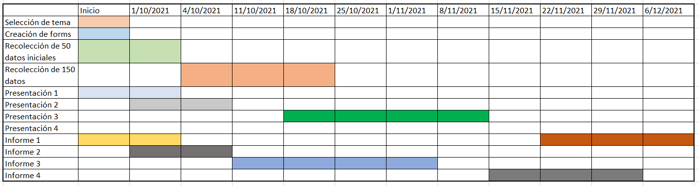

# Objetivos
## Objetivo General

 En esta investigación se desea saber cuáles son los factores que influyen en el estrés de los jóvenes universitarios.
 
## Objetivos específicos

-   Identificar la relación entre el estrés y factores personales
-   Identificar la relación entre el estrés y actividades curriculares
-   Identificar los principales estresores.


# Tipo de muestreo

El muestreo es no probabilístico por conveniencia.Nos dirigimos exclusivamente a estudiantes de UTEC.


# Relevancia

-La importancia de la investigación radica en que el estrés aumenta el riesgo de contraer enfermedades cardíacas, obesidad y depresión. Controlándolo se evita que el rendimiento del estudiante disminuya. Por ende, identificar los factores que causan el estrés puede servir para prevenir estos problemas.

    

# Disponibilidad de Datos

Los datos para la investigación se recopilarán mediante encuestas a universitarios a través de Google Forms. Además, los datos recopilados han sido restringidos a una respuesta por estudiante, y únicamente se accede al cuestionario con correo UTEC.


# Variables

| Pregunta                                                             | Variable      | Tipo          | Restricciones        |
|----------------------------------------------------------------------|---------------|---------------|----------------------|
| Indicar su sexo                                                      | Sexo          | Cat. Nominal  | Mayúscula            |
| ¿Cuál es su edad?                                                    | Edad          | Num. Discreta | Positivo mayor a 14  |
| ¿Es becado?                                                          | Becado        | Cat.Nominal   | Mayúscula            |
| ¿Es independiente económicamente?                                    | Independencia | Cat. Nominal  | Mayúscula            |
| ¿Cuántos convivientes tiene?                                         | Convivientes  | Num. Discreta | Positivo entero      |
| ¿Tiene un espacio para estudiar?                                     | Espacio       | Cat. Nominal  | Mayúscula            |
| ¿Alguien en su familia tiene o tuvo COVID?                           | Covid         | Cat. Nominal  | Mayúscula            |
| ¿Que tan estresado estas?                                            | Estres        | Cat. Ordinal  | Mayúscula            |
| ¿Que ciclo estas cursando?                                           | Ciclo         | Num. Discreta | Entero Positivo      |
| ¿Cual es tu carrera?                                                 | Carrera       | Cat. Nominal  | Mayúscula            |
| ¿Cuantos cursos estas llevando?                                      | Cursos        | Num. Discreta | Entero Positivo      |
| ¿Cual es tu promedio de tu anterior ciclo?                           | Promedio      | Num. Continua | Positivo menor de 20 |
| ¿Cual es la velocidad de tu internet?                                | Internet      | Num. Discreta | Positivo             |
| ¿Cuantas horas de estudio tienes a la semana?                        | HEstudio      | Num. Continua | Positivo             |
| ¿Que hace para sobrellevar los síntomas de estrés?                   | Estrategia    | Cat. Nominal  | Opciones reducidas   |
| Indicar la actividad que más te relaja                               | Act_relaja    | Cat. Nominal  | Opciones reducidas   |
| Selecciona tu principales estresor académico                         | Estresor      | Cat. Nominal  | Opciones reducidas   |
| Selecciona la estrategia  adoptada para sobrellevar el estrés        | Estrategia    | Cat Nominal   | Opciones reducidas   |
| Indicar cuantos cursos estas llevando por segunda vez                | Bika          | Num. Discreta | Entre 0 y 5          |
| Cuantas horas has usado tu celular los últimos 7 días                | HUso          | Num. Discreta | Positivo             |

El nivel de estrés del 1 al 5 el RStudio lo toma como numérica discreta ,pero para nosotros es una categórica ordinal (Poco, Muy poco, Regular, Bastante, Demasiado). Esto mismo pasa con la velocidad de internet, decidimos que los encuestados califiquen, que tan buena es su velocidad del 1 al 5.

# Diagrama de Gant

{width=800}

# Base de datos

```{r}
library(readr)
library(dplyr)
library(plyr)
library(kableExtra)
library(ggVennDiagram)
library(ggplot2)
PE<-read_csv("Base.csv")
```

## Columnas en la base

```{r,echo=TRUE}
length(names(PE))
head(names(PE),5)
```

Al inicio de la base se tienen 3 variables que no son necesarias para el estudio: Marca temporal, correo y políticas de privacidad. Por lo que se pueden eliminar.

```{r,echo=TRUE}
PE[,4:ncol(PE)]-> PE1
length(names(PE1))
```

## Renombrar columnas

Del mismo modo, es necesario cambiar el nombre de las columnas para facilitar su manipulación

```{r,echo=TRUE}
names(PE1)[1]<-paste("Ingreso")
names(PE1)[5]<-paste("Independencia")
names(PE1)[6]<-paste("Convivientes")
names(PE1)[7]<-paste("Espacio")
names(PE1)[8]<-paste("Internet")
names(PE1)[9]<-paste("Covid")
names(PE1)[10]<-paste("Estres")
names(PE1)[13]<-paste("NCursos")
names(PE1)[14]<-paste("NHACS")
names(PE1)[15]<-paste("NCiencias")
names(PE1)[16]<-paste("NCarrera")
names(PE1)[17]<-paste("NPI")
names(PE1)[18]<-paste("NGestion")
names(PE1)[19]<-paste("Promedio")
names(PE1)[20]<-paste("Organizaciones")
names(PE1)[21]<-paste("Bika")
names(PE1)[22]<-paste("Trika")
names(PE1)[23]<-paste("HEstudio")
names(PE1)[24]<-paste("HEstudio.mas")
names(PE1)[25]<-paste("HEstudio.menos")
names(PE1)[26]<-paste("Act.relaja")
names(PE1)[27]<-paste("TopApps")
names(PE1)[28]<-paste("HUso")
names(PE1)[29]<-paste("SFisico")
names(PE1)[30]<-paste("SPsico")
names(PE1)[31]<-paste("SComport")
names(PE1)[32]<-paste("Estresor")
names(PE1)[33]<-paste("Estrategia")
names(PE1)
```
## Limpiar base

```{r,echo=TRUE}
PE1$Ingreso[PE1$Ingreso=="202110623"]<-NA
PE1$Ingreso<-as.character(PE1$Ingreso)
PE1$Organizaciones[PE1$Organizaciones=="O"]<-NA
PE1$Organizaciones[PE1$Organizaciones=="UDS"]<-NA
PE1$Bika[PE1$Bika=="O"]<-NA
PE1$HEstudio.mas[PE1$HEstudio.mas=="Opción 1"]<-NA
PE1$HEstudio.mas<-as.numeric(PE1$HEstudio.mas)
PE1$Promedio<-as.numeric(PE1$Promedio)
PE1<-filter(PE1,PE1$Promedio<=20)
PE1$Estrategia[PE1$Estrategia=="ESTRATEGIAS DE ESTUDIO"]<-"OTRAS ACTIVIDADES"
PE1$Estrategia[PE1$Estrategia=="Jugar DOTA"]<-"OTRAS ACTIVIDADES"
PE1$Estrategia[PE1$Estrategia=="Estar con mi gata"]<-"OTRAS ACTIVIDADES"
PE1$Estrategia[PE1$Estrategia=="POSITIVISMO"]<-"OPTIMISMO"
```

## Quitar NAs
Eliminamos los valores nulos


```{r}
sapply(PE1, function(x) sum(is.na(x)))
```
```{r,echo=TRUE}
PE2<-PE1[!is.na(PE1$Ingreso),]
PE3<-PE2[!is.na(PE2$Ciclo),]
PE4<-PE3[!is.na(PE3$Carrera),]
PE5<-PE4[!is.na(PE4$NCursos),]
PE6<-PE5[!is.na(PE5$Organizaciones),]
PE6<-PE6[!is.na(PE6$HEstudio.mas),]
```

# Descriptores numéricos y gráficos

A continuación, los principales descriptores numéricos y gráficos para poder caracterizar la muestra y obtener algunas conclusiones relacionadas al tema de estudio.

## Cantidad de encuestados

Observaciones

```{r}
length(PE1$Sexo)
```
Observaciones válidas
```{r}
length(PE6$Sexo)
```


## Sexo de encuestados

```{r}
DD2<-filter(PE6,PE6$Sexo=="MASCULINO")
DD3<-filter(PE6,PE6$Sexo=="FEMENINO")
```

Hombres:
```{r}
length(DD2$Sexo)
```

Mujeres:
```{r}
length(DD3$Sexo)
```

Porcentajes:
```{r}
paste0(round(100*length(DD3$Sexo)/length(PE6$Sexo),2),"%")
paste0(round(100*length(DD2$Sexo)/length(PE6$Sexo),2),"%")
```

Aproximadamente el 38.8% de las observaciones fueron llenadas por mujeres, mientras el 61.2% fueron hombres. La diferencia entre ambas cantidades no es tan grande, por lo que se puede afirmar que la muestra es representativa de cada sexo.


### Histograma
```{r }
Tabsexo<-table(PE6$Sexo)
barplot(Tabsexo,main="Personas encuestadas por sexo",xlab="Sexo",ylab="Número de personas",col=c("red","blue"))
```


## Edades de encuestados

General:

```{r}
summary(PE6$Edad)
```
Debido a que la media y la mediana no se encuentran muy cercanas podemos afirmar que los datos presentan cierta asimetría hacia la izquierda. El promedio de las edades de los entrevistados es de 18.93, aproximadamente 19 años. La mitad de ellos son menores a 18 años y solo un 25% supera los 19.25 años. La persona más joven entrevistada tiene 16 años, mientras que la más longeva tiene 26 años. Por ende, el Rango de edades es de 10 años, y el rango intercuartil es de 1.25 años. 
En base a ello, los valores atípicos son cualquiera menor a 16 y mayor a 21.
Esto se comprueba con un diagrama de cajas:
```{r}
boxplot(PE6$Edad,col="red",main="Distribución de edades", ylab="Edad")
```

Mujeres:
```{r}
columnaM<-DD3$Edad[complete.cases(DD3$Edad)]
summary(columnaM)

```
El promedio de las edades de mujeres entrevistadas es de 18.66 años, mientras que la mediana es de 18. Se encuentran ligeramente separadas, por lo que se genera una asimetría hacia la izquierda. En este caso, la mujer más joven en ser entrevistada tiene 17 años y la más adulta tiene 25 años. El rango de edades es 8 años. La mitad de mujeres entrevistadas son menores de edad, y al menos el 25% de mujeres tienen 19 años o más. El rango intercuartil es de 1 año, por lo que los valores atípicos son edades menores de 16.5 y mayores que 20.5.


Hombres:
```{r}
columnaH<-DD2$Edad[complete.cases(DD2$Edad)]
summary(columnaH)
```
Para el sexo masculino la media y mediana se encuentran muy cercanas, ambas son aproximadamente 19 años, por lo que la distribución es más simétrica. Un cuarto de los hombres entrevistados tienen 18 años o menos, mientras que otro 24% tiene 20 a más años. El hombre más joven entrevistado tiene 16 años y el mayor, 26 años. El rango es de 10 años, y el rango intercuartil es de 2 años. Los valores atípicos son aquellos menores a 15 años y mayores a 23.


```{r}
boxplot(formula = PE6$Edad ~ PE6$Sexo, data=PE6, col=c("red","blue"),main="Distribución de edades por sexo",ylab="Edad",xlab="Sexo")
```


## Año de ingreso de encuestados
```{r}
tabIngreso<-table(PE6$Ingreso)
barplot(tabIngreso, col = c("greenyellow","green","green1","green2","green3","green4"), main = "Año de ingreso de encuestados",xlab = "Año")

```

```{r}
TabIngresoSexo<-table(PE6$Sexo,PE6$Ingreso)
barplot(TabIngresoSexo,col =  c("greenyellow","deepskyblue"),main = "Año de ingreso por sexo",xlab = "Año")
legend("topright",legend = c("Masculino","Femenino"), fill = c("deepskyblue","greenyellow"), bty = "o",
       cex = 0.8)

```

Se puede apreciar la distribución de los encuestados según el año de ingreso. La mayoría son de la promoción 2020. También la mayoría de hombres son de este año. El caso en el que hay más encuestadas que encuestados es en los ingresantes de 2021.

## Situación de estrés
```{r}
columnaEstres<-table(PE6$Estres)
barplot(columnaEstres, col = c("greenyellow","yellow","orange1","orangered1","red3"),main = "Nivel de estrés en los encuestados", xlab = "Nivel de estrés")
```

Gran parte de los encuestados se encuentran entre medianamente a muy estresados por las clases virtuales.

### Por ciclo

```{r}
EstresCiclo<-table(PE6$Ciclo,PE6$Estres)
mosaicplot(EstresCiclo,col = c("greenyellow","yellow","orange1","orangered1","red3"),main = "Nivel de estrés según el ciclo",xlab = "Ciclo")
legend("topright",legend = c(1,2,3,4,5), fill = c("greenyellow","yellow","orange1","orangered1","red3"), bty = "o",
       cex = 0.65,title = "Nivel de estrés")
```

Se puede apreciar que el grupo con mayor estrés se trata de los encuestados de los ciclos 2, 3 y 5. Para los de primer ciclo no se puede dar una conclusión concreta ya que sólo un encuestado pertenece a aquel ciclo. Por parte de los ciclos superiores, es posible que su estrés sea menor debido a que están más acostumbrados a la carga académica.

### Por carrera

Renombramos algunas variables para visualizar los nombres en el diagrama de barras.
```{r,echo=TRUE}
PE6$Carrera[PE6$Carrera=="ADMINISTRACION Y NEGOCIOS DIGITALES"]<-"Adm"
PE6$Carrera[PE6$Carrera=="BIOINGENIERIA"]<-"Bio"
PE6$Carrera[PE6$Carrera=="CIENCIA DE LOS DATOS"]<-"CD"
PE6$Carrera[PE6$Carrera=="INGENIERIA AMBIENTAL"]<-"Am"
PE6$Carrera[PE6$Carrera=="INGENIERIA CIVIL"]<-"Civ"
PE6$Carrera[PE6$Carrera=="CIENCIAS DE LA COMPUTACIÓN"]<-"CC"
PE6$Carrera[PE6$Carrera=="INGENIERIA DE LA ENERGIA"]<-"En"
PE6$Carrera[PE6$Carrera=="INGENIERIA ELECTRONICA"]<-"El"
PE6$Carrera[PE6$Carrera=="INGENIERIA INDUSTRIAL"]<-"Ind"
PE6$Carrera[PE6$Carrera=="INGENIERIA MECANICA"]<-"Mc"
PE6$Carrera[PE6$Carrera=="INGENIERIA MECATRONICA"]<-"Mt"
PE6$Carrera[PE6$Carrera=="INGENIERIA QUIMICA"]<-"Qm"
```


```{r}
EstresCarrera<-table(PE6$Estres,PE6$Carrera)
barplot(EstresCarrera,col = c("greenyellow","yellow","orange1","orangered1","red3"),main = "Nivel de estrés por carrera", xlab = "Carrera")
legend("topright",legend = c(1,2,3,4,5), fill = c("greenyellow","yellow","orange1","orangered1","red3"), bty = "o",cex = 0.8,title = "Nivel de estrés")
```

La mayoría de los encuestados pertenecen a la carrera de Ingeniería Civil, por lo que existe una gran concentración en los niveles más altos de estrés. Sin embargo, la carrera con más encuestados con un nivel de estrés muy alto es Bioingeniería.


### Por Cursos

```{r}
summary(PE6$NCursos)
```


La mitad de los encuestados lleva en este ciclo 6 cursos o menos, y sólo un 25% lleva 7 cursos o más. El máximo de cursos que algún encuestado lleva es 9.


```{r}
TabEstresCursos<-table(PE6$Estres,PE6$NCursos)
TabEstresCursos%>%
kbl(caption = "Nivel de estrés según la cantidad de cursos") %>%
  kable_classic(full_width = T, html_font = "Cambria")%>%
  row_spec(5, bold = T, color = "white", background = "#900C3F") %>%
  row_spec(4, bold = T, color = "white", background = "#C70039") %>%
  row_spec(3, bold = T, color = "white", background = "#FF5733") %>%
  row_spec(2, bold = T, color = "white", background = "#FFC300") %>%
  row_spec(1, bold = T, color = "white", background = "#C7E298") 
```


```{r}
pie(TabEstresCursos[,7],col=c("greenyellow","yellow","orange1","orangered1","red3"),main = "Nivel de estrés en estudiantes con 7 cursos")
legend("topright",legend = c(1,2,3,4,5), fill = c("greenyellow","yellow","orange1","orangered1","red3"), bty = "o",cex = 1,title = "Nivel de estrés")
```
La mayor cantidad de encuestados con 7 cursos tiene un nivel de estrés alto (nivel 4). 

```{r}
c1<-c(round(100*TabEstresCursos[5,]/sum(TabEstresCursos[5,]),2))
pie(TabEstresCursos[5,],labels =paste0(c1,"%"),main = "Número de cursos de estudiantes con nivel de estrés alto",col = rainbow(length(TabEstresCursos[5,])))
legend("topright",legend = c(1:9), fill = rainbow(length(TabEstresCursos[5,])), bty = "o",cex = 1,title = "Cursos")
```

De los encuestados más estresados son aquellos alumnos matriculados en 6 a más cursos, osea, con una carga académica mayor.

### Por estresores

```{r}
TabEstresEstresores<-table(PE6$Estres,PE6$Estresor)
TabEstresEstresores%>%
kbl(caption = "Nivel de estrés según el estresor") %>%
  kable_classic(full_width = T, html_font = "Cambria")%>%
  row_spec(5, bold = T, color = "white", background = "#900C3F") %>%
  row_spec(4, bold = T, color = "white", background = "#C70039") %>%
  row_spec(3, bold = T, color = "white", background = "#FF5733") %>%
  row_spec(2, bold = T, color = "white", background = "#FFC300") %>%
  row_spec(1, bold = T, color = "white", background = "#C7E298") 
```
```{r}
c2<-c(round(100*TabEstresEstresores[5,]/sum(TabEstresEstresores[5,]),2))
pie(TabEstresEstresores[5,],labels =paste0(c2,"%"),main = "Principales estresores de estudiantes con nivel de estrés alto",col = rainbow(length(TabEstresEstresores[5,])))
legend("topright",legend = colnames(TabEstresEstresores), fill = rainbow(length(TabEstresEstresores[5,])), bty = "o",cex = 0.5,title = "Cursos")
```

El principal estresor de los encuestados que presentan una situación de estrés mayor es la presencia de Evaluaciones en la etapa académica, seguido del tiempo limitado para hacer trabajos. Por ende, se puede afirmar que la excesiva carga académica es una de las principales razones del estrés en los encuestados.


# Patrones y tendencias
```{r}
pairs(PE6$HUso~PE6$HEstudio)
```

```{r}
cor(PE6$HEstudio,PE6$HUso)
cov(PE6$HEstudio,PE6$HUso)
```
```{r}
colores<-c("greenyellow","yellow","orange1","orangered1","red3")
plot(x=PE6$HEstudio,y=PE6$HUso,col=colores[PE6$Estres],pch=16,xlab = "Horas de estudio",ylab = "Horas de uso del celular",main = "Uso del celular según el tiempo destinado a estudiar")
legend("topleft",legend = c(1,2,3,4,5), fill = c("greenyellow","yellow","orange1","orangered1","red3"), bty = "o",cex = 0.8,title = "Nivel de estrés")
```

La relación entre las variables Horas de estudio y Horas de uso de celular tienen una covarianza positiva. Es decir que mientras una aumenta, la otra hace lo mismo. A pesar que la correlación tiende a 0 (por lo que la relación no es lineal), la causalidad se puede justificar. Conforme una persona dedica más tiempo al estudio, puede requerir información, o usar su dispositivo para acompañar su jornada académica, ya sea con música o aplicaciones de estudio. También se aprecia que hay una concentración de personas con altos niveles de estrés en zonas cercanas al origen. Esto se debe a que destinan muy poco tiempo a los estudios, por lo que es probable que se vean afectados por la carga académica, que se ha demostrado que impacta en el estrés. Por otra parte, al extremo derecho se puede observar una serie de puntos con un menor nivel de estrés. Esto se debe a que dedican más tiempo a los estudios, por lo que la carga académica es mejor distribuida.


# Modelos probabilísticos

```{r}
#total de estudiantes
T_est<-sum(table(PE6$NCiencias))
T_est
```

```{r}
#total  de estudiantes que llevan los 3 tipos cursos
t_2<-filter(PE6,NHACS!=0 & NCiencias!=0 & NCarrera!=0)
t_3<-select(t_2,NHACS,NCiencias,NCarrera)
nrow(t_3)
```

```{r}
#total que llevan solo ciencia NCiencias
t_4<-filter(PE6,NHACS==0 & NCiencias!=0 & NCarrera==0)
t_5<-select(t_4,NHACS,NCiencias,NCarrera)
nrow(t_5)
```

```{r}
#total que llevan solo  NCarrera
t_6<-filter(PE6,NHACS==0 & NCiencias==0 & NCarrera!=0)
t_7<-select(t_6,NHACS,NCiencias,NCarrera)
nrow(t_7)
```

```{r}
#total que llevan solo NHACS
t_8<-filter(PE6,NHACS!=0 & NCiencias==0 & NCarrera==0)
t_9<-select(t_8,NHACS,NCiencias,NCarrera)
nrow(t_9)
```

```{r}
#total que llevan solo  NHACS y ciencia
t_10<-filter(PE6,NHACS!=0 & NCiencias!=0 & NCarrera==0)
t_11<-select(t_10,NHACS,NCiencias,NCarrera)
nrow(t_11)
```

```{r}
#total que llevan ninguno
t_12<-filter(PE6,NHACS==0 & NCiencias==0 & NCarrera==0)
t_13<-select(t_12,NHACS,NCiencias,NCarrera)
nrow(t_13)
```

```{r}
#total que llevan NHACS y carrera
t_14<-filter(PE6,NHACS!=0 & NCiencias==0 & NCarrera!=0)
t_15<-select(t_14,NHACS,NCiencias,NCarrera)
nrow(t_15)
```

```{r}
#total  de estudiantes que llevan  solo ciencia y carrera
t_16<-filter(PE6,NHACS==0 & NCiencias!=0 & NCarrera!=0)
t_17<-select(t_16,NHACS,NCiencias,NCarrera)
nrow(t_17)
```

*Se desea saber la probabilidad de que un encuestado lleve cursos de carrera, HACs y ciencias*

```{r}
P3<-nrow(t_3)/T_est
paste0(round(100*P3,2),"%")
```

Es muy probable encontrar estudiantes que estén llevando los 3 tipos de cursos en este ciclo. Esto se puede atribuir a que en la Universidad UTEC la mayoría de estos cursos  se ofrecen entre el 3cer a 6to ciclo y la muestra tiene una alta presencia de estudiantes de estos ciclos.

*La probabilidad de que un encuestado no lleve ningún curso de HACS*
```{r}
P_no_hac<-(nrow(t_5)+nrow(t_7)+nrow(t_17))/T_est
paste0(round(100*P_no_hac,2),"%")
```

Es menos probable encontrar algún estudiante que no este llevando algún curso de hacs ya que son cursos que mayormente están  dentro de la malla curricular  para los primeros  6 ciclos.

*La probabilidad de que un encuestado lleve algún curso de carrera*
```{r}
P_carrera<-(nrow(t_3)+nrow(t_7)+nrow(t_17)+nrow(t_15))/T_est
paste0(round(P_carrera*100,2),"%")
```

Es más probable  encontrar algún alumno que este llevando al menos 1 curso de carrera.


```{r}
U<-1:152
Carrera<-1:126
HACS<-c(9:106,127:147)
Ciencias<-c(29:126,128:147,148:151)
x<-list(U,Carrera,HACS,Ciencias)
ggVennDiagram(x, color = "black", lwd = 0.8, lty = 1,category.names = c("U","Carrera",
                                    "HACS",
                                    "Ciencias"),label = "count") +
  scale_fill_gradient(low = "#F4FAFE", high = "#4981BF") +
 theme(legend.position = "none")
  
```


## Modelo Binomial

Se asume que una persona con un nivel de estrés de 1 o 2 no se encuentra estresada, y aquellos encuestados en nivel 3, 4 y 5 sí pueden considerarse estresados. En base a ello, obtenemos el espacio muestral:
```{r}
n<-length(PE6$Estres)
n
```
Hallamos los casos favorables (persona no estresada):
```{r}
p<-length(PE6$Estres[PE6$Estres=="1"|PE6$Estres=="2"])
p
```
De este modo obtenemos que las probabilidades de no estar estresado es:
```{r}
PNEstresado<-p/n
paste0(round(100*PNEstresado,2),"%")
```
Por lo que la posibilidad de estar estresado es el complemento
```{r}
PEstresado<-1-PNEstresado
paste(round(100*PEstresado,2),"%")
```

*¿Cuál sería la probabilidad de que entre 15 a 17 persoas de un grupo de 20 encuestados se encuentren estresados?*
```{r}
paste0(round(100*sum(dbinom(15:17,20,PEstresado)),2),"%")
```
1)  La probabilidad  que de 15 a 17 personas estén estresadas de un grupo de 20  es 11.08 % lo que quiere decir que es muy poco probable que pueda ocurrir este evento.

*¿Cuál es el valor esperado en esta situación?*
```{r}
E=20*PEstresado
E
```
2) Se puede afirmar lo anterior, debido a que el valor esperado de la muestra es de 16 personas estresadas por cada 20 encuestados.

*¿Los datos son muy dispersos?*
```{r}
D1=20*PEstresado*PNEstresado
D1
```
3) Con la varianza (1.1) concluimos que los datos no están muy dispersos,porque en su mayoría las personas están estresadas.


## Modelo geométrico

*¿Cuál es la probabilidad que, de un grupo de 40 encuestados, los 20 primeros se encuentren estresados?*

```{r}
paste0(round(100*dgeom(20,PNEstresado),2),"%")
```
1) La probabilidad de que las primeras 20 tengan estrés es baja, solo un 1.75%.

*¿Cuál es el valor esperado en esta situación?*

```{r}
E1=PEstresado/PNEstresado
E1
```
2) Se espera tener primero, 15 personas encuestadas con estrés,para que la 16 persona no tenga estrés. Es por esto que la posibilidad de que los primeros 20 encuestados tengan solo estrés es baja.

*¿Los datos son muy dispersos?*

```{r}
D1=(PEstresado/PNEstresado)/PNEstresado
D1
```
3) Sí, los datos en esta situación están muy dispersos.


## Modelo hipergeométrico

*¿Cuál es la probabilidad de encontrar 5 mujeres con independencia económica del total de mujeres encuestadas?*
```{r,echo=TRUE}
#k=número de mujeres
k<-nrow(DD3)
k
```

```{r,echo=TRUE}
#MIN=número de mujeres con independencia económica
M<-filter(DD3,DD3$Independencia=="SI")
MIN<-nrow(M)
MIN
```

```{r,echo=TRUE}
#VARIABLE ALEATORIA
#X=5 mujeres con independencia económica
x<-5
```

```{r,echo=TRUE}
#Número de encuestados
N<-nrow(PE6)
```

```{r,echo=TRUE}
#Rango={1,2,3,4,5,6,7,8,9}

dhyper(5,9,59,59)
```

```{r,echo=TRUE}
#ESPERADO
E<-(k*(MIN/N))
E
```

```{r,echo=TRUE}
#VARIANZA
V<-E*(1-(MIN/N))
V
```
1) Se encuentran 9 encuestadas que presentan independencia económica.

2) La probabilidad de encontrar a 5 mujeres con independencia económica en el grupo de mujeres encuestadas es de 1.3%

3) El esperado es de 3.49

4) La variabilidad d elos datos es de 3.28. Su dispersión de datos no es tan grande.

# Pruebas de hipótesis
Todas las pruebas de hipótesis se realizarán con una significancia del 5%
$\alpha=0.05$
## Hipótesis 1
### Planteamiento de hipótesis
Se cree que el promedio ponderado  de los estudiantes de UTEC durante de el contexto de pandemia  para el semestre 2021-1  es mayor o igual a 15:

  * $\mu:$Promedio ponderado,

  * $H_0:\mu\ge15$

  * $H_1:\mu<15$
  
### Estadístico de prueba
```{r}
m2<-head(PE6$Promedio,25)
u01<-15
X<-mean(m2)
s<-sd(m2)
n<-25
T1calc<-(X-u01)/(s/sqrt(n))
T1calc
```


### Regiones críticas
```{r}
t<-qt(0.05,n-1)
```

```{r}
x<-seq(-5,5,0.001)
hist <- dnorm(x, mean=0, sd=1) 
plot(x, hist, type="l",ylab="",xlab="",main="Regiones de rechazo", lty = 1, lwd = 3, yaxs="i") # yaxs="i" localiza en el eje el límite del dato
polygon(c(x[x <= t], t), c(dnorm(x[x <= t]), 0), col="lightblue")
abline(v=T1calc,col="green",lwd=2)
text(t, .1,round(t,2))
text(T1calc, .1,round(T1calc,2))
```

### Criterio de decisión
Nuestro estadístico de prueba es aproximadamente 3.79, mientras que el área de rechazo se encuentra hasta -1.71. Por lo tanto, no se rechaza nuestra hipótesis.
### Intervalo de confianza
Como tenemos una significancia de 5%, la confianza es de 95%, por lo tanto, se calculan los límites para el intervalo de confianza:
```{r}
l<-qt(1-0.025,n-1)
Linf<-X-(l*s/sqrt(n))
Linf
Lsup<-X+(l*s/sqrt(n))
Lsup
```
```{r}
x<-seq(-5,5,0.001)
hist <- dnorm(x, mean=0, sd=1) 
plot(x, hist, type="l",ylab="",xlab="",main="Intervalo de confianza", lty = 1, lwd = 3, yaxs="i",xaxt="n",yaxt="n") # yaxs="i" localiza en el eje el límite del dato

polygon(c(x[x <= -l], -l), c(dnorm(x[x <= -l]), 0), col="lightblue")
polygon(c(x[x >= l], l), c(dnorm(x[x >= l]), 0), col="lightblue")

text(l, .1,round(Lsup,2))
text(-l, .1,round(Linf,2))
```


### Conclusiones
Podemos afirmar que el promedio ponderado de los estudiantes de UTEC es mayor a 15, es decir, no se rechaza $H_0$. Además, el intervalo de confianza oscila entre 14.53 y 16.31

## Hipótesis 2
### Planteamiento de hipótesis
Se cree que el promedio de las horas de estudio por semana de los estudiantes de UTEC durante de el contexto de pandemia  para el semestre 2021-1 es menor o igual a 40.

  * $\mu$: Promedio de horas de estudio.

  * $H_0$$\mu\le40$
  
  * $H_1:\mu>40$
  
### Estadístico de prueba
```{r}
m<-head(PE6$HEstudio,28)
u02<-40
X2<-mean(m)
s2<-sd(m)
n2<-28
T2calc<-(X2-u02)/(s2/sqrt(n2))
T2calc
```

### Regiones críticas
```{r}
t2<-qt(1-0.05,n2-1)
```

```{r}
x<-seq(-7,7,0.001)
hist <- dnorm(x, mean=0, sd=1) 
plot(x, hist, type="l",ylab="",xlab="",main="Regiones de rechazo", lty = 1, lwd = 3, yaxs="i") # yaxs="i" localiza en el eje el límite del dato
polygon(c(x[x >= t2], t2), c(dnorm(x[x >= t2]), 0), col="lightblue")
abline(v=T2calc,col="green",lwd=2)
text(t2, .1,round(t2,2))
text(T2calc, .1,round(T2calc,2))
```

### Criterio de decisión
Nuestro estadístico de prueba es aproximadamente -5.69, mientras que el área de rechazo se encuentra desde 1.7. Por lo tanto, no se rechaza nuestra hipótesis.
### Intervalo de confianza
Como tenemos una significancia de 5%, la confianza es de 95%, por lo tanto, se calculan los límites para el intervalo de confianza:
```{r}
l2<-qt(1-0.025,n2-1)
Linf2<-X2-(l2*s2/sqrt(n2))
Linf2
Lsup2<-X2+(l2*s2/sqrt(n2))
Lsup2
```
```{r}
x<-seq(-5,5,0.001)
hist <- dnorm(x, mean=0, sd=1) 
plot(x, hist, type="l",ylab="",xlab="",main="Intervalo de confianza", lty = 1, lwd = 3, yaxs="i",xaxt="n",yaxt="n") # yaxs="i" localiza en el eje el límite del dato

polygon(c(x[x <= -l2], -l2), c(dnorm(x[x <= -l2]), 0), col="lightblue")
polygon(c(x[x >= l2], l2), c(dnorm(x[x >= l2]), 0), col="lightblue")

text(l2, .1,round(Lsup2,2))
text(-l2, .1,round(Linf2,2))
```

### Conclusiones
se confirma que el promedio de horas de estudio semanales es menor a 40. La hipótesis se confirma ya que el estadístico de prueba no se encuentra en la zona de rechazo. Por otra parte, el intervalo de confiaza se encuentra entre 14.68 y 26.82 horas de sueño a la semana

## Hipótesis 3
### Planteamiento de hipótesis
Se cree que el 65% de los alumnos de UTEC se encuentran en un nivel de estrés 4 o 5.

  * $\overline{P}:$ Proporción poblacional de estrés de nivel 4 o 5.

  * $H_0:\overline{P}=65\%$
  
  * $H_1:\overline{P}\ne65\%$
  
### Estadístico de prueba
```{r}
NivEstres<-table(PE6$Estres)
(NivEstres[5]+NivEstres[4])/nrow(PE6)
```
```{r}
po<-0.65
qo<-1-po
n3<-nrow(PE6)
p<-0.6644737
q<-1-p
Zcalc<-(p-po)/sqrt((po*qo)/n3)
Zcalc
```

### Regiones críticas
```{r}
z1<-qnorm(0.05/2)
z2<-qnorm(1-(0.05/2))
```

```{r}
x1<-seq(-5,5,0.001)
hist <- dnorm(x1, mean=0, sd=1) 
plot(x1, hist, type="l",ylab="",xlab="",main="Regiones de rechazo", lty = 1, lwd = 3, yaxs="i") # yaxs="i" localiza en el eje el límite del dato
polygon(c(x1[x1 >= z2], z2), c(dnorm(x1[x1 >= z2]), 0), col="lightblue")
polygon(c(x1[x1 <= z1], z1), c(dnorm(x1[x1 <= z1]), 0), col="lightblue")
abline(v=Zcalc,col="green",lwd=2)
text(z1, .1,round(z1,2))
text(z2, .1,round(z2,2))
text(Zcalc, .1,round(Zcalc,2))
```

### Criterio de decisión
Nuestro estadístico de prueba es aproximadamente 0.37, mientras que el área de no rechazo se encuentra entre -1.96 y 1.96. Por lo tanto, no se rechaza nuestra hipótesis.
### Intervalo de confianza
Como tenemos una significancia de 5%, la confianza es de 95%, por lo tanto, se calculan los límites para el intervalo de confianza:
```{r}
l3<-qnorm(1-0.025)
Linf3<-po-(l3*sqrt(po*qo/n3))
Linf3
Lsup3<-po+(l3*sqrt(po*qo/n3))
Lsup3
```
```{r}
x<-seq(-5,5,0.001)
hist <- dnorm(x, mean=0, sd=1) 
plot(x, hist, type="l",ylab="",xlab="",main="Intervalo de confianza", lty = 1, lwd = 3, yaxs="i",xaxt="n",yaxt="n") # yaxs="i" localiza en el eje el límite del dato

polygon(c(x[x <= -l3], -l3), c(dnorm(x[x <= -l3]), 0), col="lightblue")
polygon(c(x[x >= l3], l3), c(dnorm(x[x >= l3]), 0), col="lightblue")

text(l3, .1,paste(round(100*Lsup3,2),"%"))
text(-l3, .1,paste(round(100*Linf3,2),"%"))
```
### Conclusiones
El estadístico de prueba se encuentra fuera de los intervalos de rechazo. Por ende, se puede concluir que el 65% de los estudiantes de UTEC se encuentran en un nivel de estrés de 4 o 5. Además, con un 95% de confianza, la proporción de población con este nivel de estrés se encuentra entre el 57.42% y 72.58%.

## Hipótesis 4

### Planteamiento de hipótesis

Se cree que el promedio de las horas de uso del celular por semana de los
estudiantes de UTEC durante de el contexto de pandemia para el semestre
2021-1 es mayor a 50.

   * $\mu$:Promedio de horas de estudio semanales
   
   * $H_0: \mu\le50$

   * $H_1:\mu>50$

### Estadístico de prueba

```{r,echo=TRUE}
m<-head(PE6$HUso,25)
u04<-50
X4<-mean(m)
s4<-sd(m)
n4<-25
T4calc<-(X4-u04)/(s4/sqrt(n4))
T4calc
```

### Regiones críticas

```{r}
t4<-qt(1-0.05,n4-1)
```

```{r}
x<-seq(-7,7,0.001)
hist <- dnorm(x, mean=0, sd=1) 
plot(x, hist, type="l",ylab="",xlab="",main="Regiones de rechazo", lty = 1, lwd = 3, yaxs="i") # yaxs="i" localiza en el eje el límite del dato
polygon(c(x[x >= t4], t4), c(dnorm(x[x >= t4]), 0), col="lightblue")
abline(v=T4calc,col="green",lwd=2)
text(t4, .1,round(t4,2))
text(T4calc, .1,round(T4calc,2))
```

### Criterio de decisión

Nuestro estadístico de prueba es aproximadamente -3.43, mientras que el
área de rechazo se encuentra desde 1.7. Por lo tanto,no se rechaza H0 y se rechaza
nuestra hipótesis.

### Intervalo de confianza

Como tenemos una significancia de 5%, la confianza es de 95%, por lo
tanto, se calculan los límites para el intervalo de confianza:

```{r,echo=TRUE}
l4<-qt(1-0.025,n3-1)
Linf4<-X4-(l4*s4/sqrt(n4))
Linf4 
Lsup4<-X4+(l4*s4/sqrt(n4))
Lsup4
```


```{r}
x<-seq(-5,5,0.001)
hist <- dnorm(x, mean=0, sd=1) 
plot(x, hist, type="l",ylab="",xlab="",main="Intervalo de confianza", lty = 1, lwd = 3, yaxs="i",xaxt="n",yaxt="n") # yaxs="i" localiza en el eje el límite del dato

polygon(c(x[x <= -l4], -l4), c(dnorm(x[x <= -l4]), 0), col="lightblue")
polygon(c(x[x >= l4], l4), c(dnorm(x[x >= l4]), 0), col="lightblue")

text(l4, .1,round(Lsup4,2))
text(-l4, .1,round(Linf4,2))
```

### Conclusiones

se confirma que el promedio de horas del uso del celular por semana no es mayor a 50.
La hipótesis se rechaza ya que el estadístico de prueba no se encuentra
en la zona de rechazo para H0. Por otra parte, el intervalo de confianza sd
encuentra entre 19.12 y 41.71 horas de uso del celular por semana.


# Regresión lineal

## Variables

* Variable independiente $X_1$= número de cursos que lleva en el ciclo 2021-2

* Variable dependiente $Y_1$= número de horas estudiando en promedio por día en una semana

```{r}
X1<-PE6$NCursos
Y1<-PE6$HEstudio/7
```

## Diagrama de dispersión para ambas variables

```{r}
pairs(X1~Y1)
```

Creamos un Data Frame que contenga ambas variables

```{r}
datosreg<-data.frame("Numeros cursos"=X1 ,"Horas de estudio por dia"=Y1)
datosreg
```

## Regresión

Guardamos en resultados del intercepto  ($\beta_0$) y la pendiente del ajuste lineal ($\beta_1$)

```{r}
resultados<-lm(datosreg$Horas.de.estudio.por.dia ~datosreg$Numeros.cursos,data=datosreg)
summary(resultados)
```

## Pruebas de significancia

Fijamos un nivel de confianza de 95%.

### Intercepto

* $\alpha=0.05$

* $H_0:\beta_0=0$

* $H_1:\beta_0\ne 0$

* p-valor según el reporte $\rightarrow\;p-valor=0.06542$

* Conclusión $\alpha <p-valor$ entonces no se rechaza $H_0$

### Pendiente

* $\alpha=0.05$

* $H_0:\beta_1=0$

* $H_1:\beta_1\ne 0$

* p-valor según el reporte $\rightarrow\;p-valor=0.00252

* Conclusión $\alpha >p-valor$ entonces  se rechaza $H_0$

### Modelo

* $\alpha=0.05$

* $H_0:$ $modelo$ $significativo$

* $H_1:$ $modelo$ $no$ $significativo$

* p-valor según el reporte $\rightarrow\;p-valor=0.00252

* Conclusión $\alpha >p-valor$ entonces no se rechaza $H_0$

## Conclusión general

Hay evidencias de que el modelo es apropiado o significativo.
$$Y_1=0.3272\cdot X_1+1.1927$$

* $\beta_0:$ Es lógico que se acepte $H_0=0$ ya que cuando uno no tiene ningún curso, no tiene necesidad de invertir tiempo en estudio.

* $\beta_1:$ El numero de horas de estudio por día, aumentara por cada curso adicional  en 0.3272

## Gráfico del ajuste lineal

```{r}
plot(datosreg$Numeros.cursos,datosreg$Horas.de.estudio.por.dia,xlab="Numero cursos ",ylab="horas de estudio por día")
abline(resultados)
```

## Análisis residuales

```{r}
residuos<-rstandard(resultados)
valores.ajustados<-fitted(resultados)
plot(valores.ajustados,residuos)
```

La gráfica presenta signos  heterocedasticidad lo cual significa una mala calidad para la regresión.

##Análisis de la normalidad

```{r}
qqnorm(residuos)
qqline(residuos)
```

Podemos apreciar que cierta cantidad de los puntos no se encuentran alineadas con la recta, por lo que la normalidad es poco aceptable.

## Análisis de la correlación

```{r}
cor(X1,Y1)
```

Se presenta una correlación baja (0.2 aproximadamente), por lo que el modelo lineal no es tan certero para describir la relación entre ambas variables, pero también refleja que existe una relación directa, mientras una aumenta la otra hace lo mismo.

# Conclusiones

Los principales estresores identificados son las evaluaciones y el tiempo limitado para culminar una sobrecarga de trabajos asignados, de los cuales algunos alumnos consideran no entender ciertos temas.

Otro factor que puede agraviar el nivel de estrés es el mal uso de los celulares. Quienes usan este dispositivo en un contexto en el que invierten más tiempo en los estudios, tienen menos nivel de estrés. En cambio, quienes usan más este dispositivo y no pasan un buen tiempo estudiando, se exponen a mayores niveles de estrés debido a la carga académica.

Gran parte de los estudiantes con una cantidad de cursos entre 5 a 7, se encuentran estresados. Esto quiere decir que los deberes universitarios influyen en el estrés. Aún así existen anomalías, como estudiantes con 7 cursos y bajo nivel de estrés. Esto se debe a que no todos llevan el mismo tipo de cursos. Aquellos con mayor cantidad de cursos ''ligeros'' como HACS, no presentan un nivel de estrés tan alto.


# INTEGRANTES

-   ***Roger Kevin Rodríguez***

-   ***Rubí Reyes Aragón (Líder)***

-   ***Rodrigo Rojas Dávalos***

-   ***Esteban Ramírez Taype***

-   ***Adriana Abrielle Rojas***
