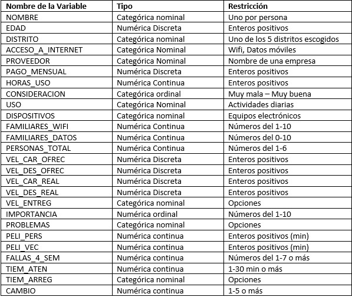
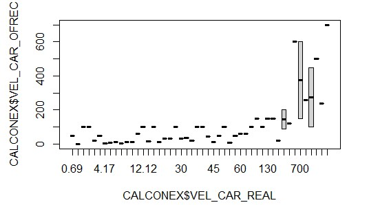
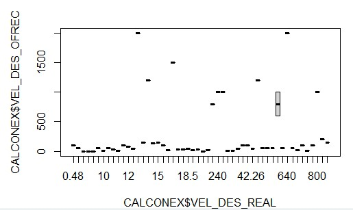
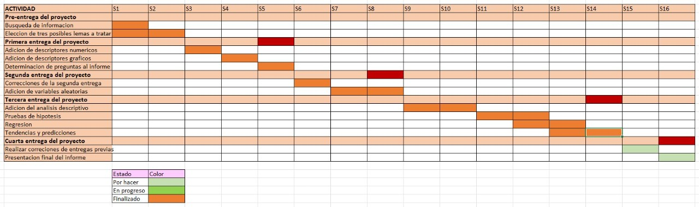
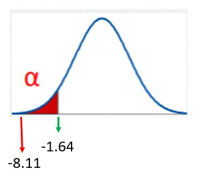
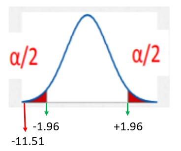
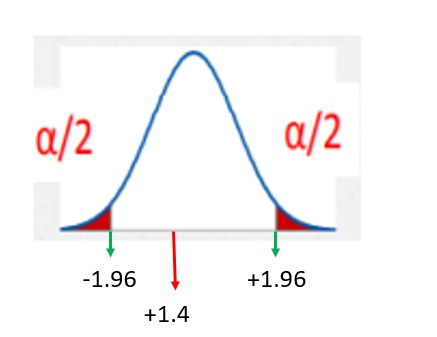
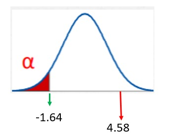

# [CALIDAD DE CONEXIÓN DE INTERNET EN 5 DISTRITOS DE LIMA]{style="color:blue"} {.smaller .build}

```{r eval=TRUE, echo=FALSE, message=FALSE,warning=FALSE}
library(readr)
library(dplyr)
library(vctrs)

CALIDCONEX<-read.csv("CALIDADDECONEXION1.csv")
#"CALIDADDECONEXION" Data frame total referente a la información de la encuesta realizada

```


------------------------------------------------------------------------

## [1. Introducción]{style="color:blue"} {.build}

### [Interés para la audiencia]{style="color:green"} {.build}

::: {style="text-align: justify"}
Debido a lo acontecido en los últimos dos años por la pandemia (coronavirus), el acceso a Internet se convirtió en uno de los servicios básicos importantes para la sociedad, y a la vez uno de los más difíciles de conseguir para gran parte de la población a causa de los precios, accesibilidad de la red, entre otros.
:::

------------------------------------------------------------------------

### [Información que se desea aportar]{style="color:green"} {.build}

::: {style="text-align: justify"}
[Lo que buscamos aportar con esta investigación es información acerca de la cantidad de personas que tuvieron acceso a Internet en 5 distritos de Lima, las dificultades y facilidades que presentaron, cuales fueron sus molestias, y así a la vez hacer una comparación acerca de que distritos fueron los menos perjudicados, sobre todo en la época en la que la pandemia estuvo más fuerte y se presentaron muchas dificultades.]{style="color:black"}
:::

------------------------------------------------------------------------

### [¿Por qué elegimos este tema?]{style="color:green"} {.build}

::: {style="text-align: justify"}
La elección de nuestro estudio esta justificado por:

-   [Es **importante** porque el uso de Internet es prácticamente diario en la mayoría de los hogares, se usa para diferentes actividades como por ejemplo: estudiar desde casa, trabajo remoto, navegar en las redes, etc; por lo tanto, tener una buena conexión es esencial para poder realizar nuestras actividades sin problemas.]{style="color:black"}\
-   [Es **factible** ya que usaremos una base de datos, la cual lo obtendremos de una encuesta enfocada en los 5 distritos elegidos, la cual tendrá preguntas relevantes acerca de la calidad de Internet en los hogares de cada una de las personas encuestadas.]{style="color:gray16"}\
-   [Es **específico** porque nos enfocaremos en solo 5 distritos, los cuales son los de una mejor calidad de vida por lo que guardan una relación. Estos son: San Isidro, San Borja, San Juan de Miraflores, Barranco y Santiago de Surco.]{style="color:gray16"}
:::

------------------------------------------------------------------------

## [2. Objetivos]{style="color:blue"} {.build}

### [**Objetivos General**]{style="color:green"} {.build}

Analizar que tan buena es la conexión a Internet, en 5 puntos distintos de la capital de Lima, y que tan bueno es el servicio ofrecido por las diferentes empresas hoy en día.

### [**Objetivos específicos**]{style="color:green"} {.build}

1.  Comparar cual es la diferencia de calidad de conexión entre uno y otro distinto.
2.  Analizar si las empresas dan la cantidad de Internet que ofrecen o si es que este es mucho menos o mucho más.
3.  Determinar si los ciudadanos estarían conformes con el servicio que se les ofrece, o estarían en total desacuerdo.
4.  Analizar si las compañías que ofrecen Internet solucionan los problemas con efectividad y de la mejor manera para sus clientes.

------------------------------------------------------------------------
***
## [3. Marco teórico]{style="color:blue"} {.build}

-   [**Población objetivo**: Población de 5 distritos de la ciudad de Lima, que usa el servicio de Internet.]{style="color:black"}

-   [**Tipo de muestreo**: ENCUESTA]{style="color:black"}

-   [**Unidades muestrales**: 55 (Por ahora)]{style="color:black"}

-   **Audiencia**:

    -   [Público interesado en saber que calidad de Internet ofrecen las empresas y que tan buena es, y así también poder elegir una compañía para sus hogares a partir de esta investigación.]{style="color:black" size="10"}

------------------------------------------------------------------------


## [**4. Variables**]{style="color:blue"} {.build}

### [**Variables de Encuesta 'CALIDAD DE CONEXIÓN'**]{style="color:green"}

::: {style="text-align: justify"}
```{r echo=FALSE, out.width = '80%'}

```
:::

------------------------------------------------------------------------


## [**5. Descriptores numéricos y gráficos**]{style="color:blue"} {.build}

### [**EDADES**]{style="color:purple"} {.build}

::: {style="text-align: justify"}
```{r echo=FALSE, out.width = '80%'}
knitr::include_graphics("C1.jpg")
```

Aquí queremos ver cual es la edad promedio de las personas que responden nuestra encuesta ya que podemos deducir que son las interesadas acerca de la investigación.
:::

------------------------------------------------------------------------


### [**Variables Categóricas**]{style="color:purple"} {.build}

#### [**Variable DISTRITO**]{style="color:purple"} {.build}

::: {style="text-align: justify"}
Para esta variable se realiza un diagrama de barras, para observar aproximadamente cuantas personas respondieron de cada distrito.

```{r eval=TRUE, echo=FALSE, message=FALSE,warning=FALSE}
DISTRITO<-table(CALIDCONEX$DISTRITO)
barplot(DISTRITO,main = "Cantidad de encuestados por distrito",xlab="Distrito", ylab = "Cantidad de personas", col = "aliceblue")
```
:::

------------------------------------------------------------------------


[**Observaciones**]{style="color:purple"}\

::: {style="text-align: justify"}
La gráfica de barras nos revela que tenemos más encuestados de San Juan de Miraflores, pero de igual forma hay encuestados de los otros distritos, los cuales irán subiendo más adelante.
:::

------------------------------------------------------------------------


#### [*Variable ACCESO_A\_INTERNET:*]{style="color:purple"}

::: {style="text-align: justify"}
Para esta variable se realizará un gráfico de barras para visualizar cuántas personas usan WIFI o datos móviles en prepago y postpago.

```{r eval=TRUE, echo=FALSE, message=FALSE,warning=FALSE}
ACCESO_A_INTERNET<-table(CALIDCONEX$ACCESO_A_INTERNET)
barplot(ACCESO_A_INTERNET,main = "Acceso a Internet",xlab="Servicio", ylab = "Cantidad", col = "aliceblue")
```
:::

----------------------------------------------------------------------

[**Observaciones**]{style="color:purple"}\

::: {style="text-align: justify"}
En el gráfico se puede observar claramente que la mayoría usa WIFI en sus hogares.
:::

------------------------------------------------------------------------

#### [*Variable PROVEEDOR:*]{style="color:purple"}

::: {style="text-align: justify"}
En esta variable se realizará una gráfica de barras para conocer cual es el proveedor más usado que ofrece el servicio a Internet.

```{r eval=TRUE, echo=FALSE, message=FALSE,warning=FALSE}
PROVEEDOR<-table(CALIDCONEX$PROVEEDOR)
barplot(PROVEEDOR,horiz = 1,main = "Proveedores del servicio de Internet",xlab = "Cantidad de usuarios",cex.names = 0.5, las=1, col = "aliceblue")
```
:::

------------------------------------------------------------------------

[**Observaciones**]{style="color:purple"}\

::: {style="text-align: justify"}
En la gráfica mostrar que el servicio más usado es el que brinda Movistar, seguido de Claro y Entel, mientras que los demás tienen una menor cantidad de usuarios.
:::

-----------------------------------------------------------------------

#### [*Variable PAGO_MENSUAL:*]{style="color:purple"}

::: {style="text-align: justify"}
En esta variable se mostrará cuánto pagan por tener el servicio a Internet.

```{r eval=TRUE, echo=FALSE, message=FALSE,warning=FALSE}
PAGO_MENSUAL<-table(CALIDCONEX$PAGO_MENSUAL)
barplot(PAGO_MENSUAL,horiz = 1,main = "Pago Mensual",xlab = "Cantidad en soles",cex.names = 0.5, las=1, col = "darkolivegreen1")
```
:::

------------------------------------------------------------------------

[**Observaciones**]{style="color:purple"}\

::: {style="text-align: justify"}
En la gráfica mostrar que la mayoría de precios oscilan entre 50 y 70 soles.
:::

------------------------------------------------------------------------

#### [*Variable HORAS_DE_USO:*]{style="color:purple"}

::: {style="text-align: justify"}
En este gráfico se mostrará cuántas horas promedio al día usan el Internet nuestro encuestados.

```{r eval=TRUE, echo=FALSE, message=FALSE,warning=FALSE}
HORAS_DE_USO<-table(CALIDCONEX$HORAS_USO)
barplot(HORAS_DE_USO,main = "HORAS DE USO DIARIO",xlab="Horas", ylab = "Cantidad", col = "coral")
```
:::

------------------------------------------------------------------------

[**Observaciones**]{style="color:purple"}\

::: {style="text-align: justify"}
En el gráfico se puede observar que la mayoría usa el Internet por más de 11 horas al día.
:::

------------------------------------------------------------------------

#### [*Variable CONSIDERACION:*]{style="color:purple"}

::: {style="text-align: justify"}
En este gráfico se mostrará cuál es la percepción que tienen los encuestados respecto a su conexión a Internet, siendo esta desde muy mala hasta muy buena.

```{r eval=TRUE, echo=FALSE, message=FALSE,warning=FALSE}
CONSIDERACION<-table(CALIDCONEX$CONSIDERACION)
barplot(CONSIDERACION,main = "Consideración de las personas respecto a su Internet",xlab="Consideración", col = "khaki1")
```
:::

------------------------------------------------------------------------

[**Observaciones**]{style="color:purple"}\

::: {style="text-align: justify"}
En el gráfico se puede observar que la mayoría piensa que su Internet es regular en sus hogares.
:::

------------------------------------------------------------------------

#### [*Variable USO:*]{style="color:purple"}

::: {style="text-align: justify"}
En este gráfico se mostrará cuales son las actividades más frecuentes para las que las personas usan el Internet.

```{r eval=TRUE, echo=FALSE, message=FALSE,warning=FALSE}
USO<-table(CALIDCONEX$USO)
barplot(USO,main = "Actividades para los que se usa el Internet en casa",xlab="Actividades", ylab = "Frecuencia" , col = "aliceblue")
```
:::

------------------------------------------------------------------------

[**Observaciones**]{style="color:purple"}\

::: {style="text-align: justify"}
En el gráfico se puede observar que lo más frecuente es usar las redes sociales haciendo uso del Internet.
:::


------------------------------------------------------------------------

[**Observaciones**]{style="color:purple"}\

::: {style="text-align: justify"}
Podemos Observar en el gráfico de barras que lo que más se usa es la laptop, pero también está muy cerca el celular, por lo que se deduce que estos dos son los más utilizados por los encuestados, mientras el Ipad, computadora y tablet serían lo menos usados, teniendo los 3 cifras parecidas.
:::

------------------------------------------------------------------------

#### [*Variable FAMILIARES_WIFI:*]{style="color:purple"}

::: {style="text-align: justify"}
En este gráfico de barras se mostrará cuántos familiares prefieren usar WIFI y no datos móviles.

```{r eval=TRUE, echo=FALSE, message=FALSE,warning=FALSE}
FAMILIARES_WIFI<-table(CALIDCONEX$FAMILIARES_WIFI)
barplot(FAMILIARES_WIFI,main = "Uso de WIFI", ylab = "Frecuencia" , col = "coral")
```
:::

------------------------------------------------------------------------

[**Observaciones**]{style="color:purple"}\

::: {style="text-align: justify"}
Podemos Observar en el gráfico de barras en promedio de 4 personas en cada hogar prefiere usar WIFI.
:::

------------------------------------------------------------------------
#### [*Variable FAMILIARES_DATOS:*]{style="color:purple"}

::: {style="text-align: justify"}
En este gráfico de barras se mostrará cuántos familiares prefieren usar datos móviles y WIFI.

```{r eval=TRUE, echo=FALSE, message=FALSE,warning=FALSE}
FAMILIARES_DATOS<-table(CALIDCONEX$FAMILIARES_DATOS)
barplot(FAMILIARES_DATOS,main = "Uso de datos móviles", ylab = "Frecuencia" , col = "coral")
```
:::

------------------------------------------------------------------------

[**Observaciones**]{style="color:purple"}\

::: {style="text-align: justify"}
Podemos Observar en el gráfico de barras en promedio de tan sólo 1 persona en cada hogar usa datos móviles.
:::

------------------------------------------------------------------------

#### [*Variable PERSONAS_TOTAL:*]{style="color:purple"}

::: {style="text-align: justify"}
En este gráfico de barras se mostrará cuantas personas usan al mismo tiempo la red WIFI en cada hogar de los encuestados.

```{r eval=TRUE, echo=FALSE, message=FALSE,warning=FALSE}
PERSONAS_TOTAL<-table(CALIDCONEX$PERSONAL_TOTAL)
barplot(PERSONAS_TOTAL,main = "Cantidad de personas que usan el WIFI simultáneamente", ylab = "Frecuencia" , col = "coral")
```
:::

------------------------------------------------------------------------

[**Observaciones**]{style="color:purple"}\

::: {style="text-align: justify"}
Podemos Observar en que cerca de 4 personas usan la red WIFI simultáneamente.
:::

------------------------------------------------------------------------

#### [*Variable VEL_CAR_OFREC :*]{style="color:purple"}

::: {style="text-align: justify"}
En este gráfico queremos ver cuántos MPBS de subida es lo que ofrecen las empresas en MBPS.

```{r eval=TRUE, echo=FALSE, message=FALSE,warning=FALSE}
VEL_CAR_OFREC<-table(CALIDCONEX$VEL_CAR_OFREC)
barplot(VEL_CAR_OFREC,main = "VELOCIDAD DE CARGA OFRECIDA",xlab="MBPS", ylab = "Cantidad", col ="darkolivegreen1")
```
:::

------------------------------------------------------------------------

[**Observaciones**]{style="color:purple"}\

::: {style="text-align: justify"}
Podemos observar que la mayoría de clientes solicitan un Internet de 100 Mbps, por lo que es lo que la mayoría de personas debería de recibir.
:::

------------------------------------------------------------------------

#### [*Variable VEL_DES_OFREC :*]{style="color:purple"}

::: {style="text-align: justify"}
En este gráfico queremos ver cuántos MBPS de bajada es lo que ofrecen las empresas en MBPS.

```{r eval=TRUE, echo=FALSE, message=FALSE,warning=FALSE}
VEL_DES_OFREC<-table(CALIDCONEX$VEL_DES_OFREC)
barplot(VEL_DES_OFREC,main = "VELOCIDAD DE DESCARGA OFRECIDA",xlab="MBPS", ylab = "Cantidad", col ="darkolivegreen1")
```
:::

------------------------------------------------------------------------

[**Observaciones**]{style="color:purple"}\

::: {style="text-align: justify"}
Podemos observar que la mayoría de clientes solicitan un Internet entre 70 y 140 Mbps, de bajada por lo que es lo que la mayoría de personas debería de recibir.
:::

------------------------------------------------------------------------

#### [*Variable VEL_CAR_REAL :*]{style="color:purple"}

::: {style="text-align: justify"}
Con este gráfico, vamos a poder comparar si lo observado en la gráfica de carga ofrecida es lo que realmente llega como señal a los hogares.

```{r eval=TRUE, echo=FALSE, message=FALSE,warning=FALSE}
VEL_CAR_REAL<-table(CALIDCONEX$VEL_CAR_REAL)
barplot(VEL_CAR_REAL,main = "VELOCIDAD DE CARGA REAL",xlab="MBPS", ylab = "Cantidad", col = "darkolivegreen1")
```
:::

------------------------------------------------------------------------

[**Observaciones**]{style="color:purple"}\

::: {style="text-align: justify"}
Podemos observar que la mayoría de clientes no recibe realmente lo que solicitan,a excepción de unos casos.
:::

------------------------------------------------------------------------

#### [*Variable VEL_DES_REAL :*]{style="color:purple"}

::: {style="text-align: justify"}
Con este gráfico, vamos a poder comparar si lo observado en la gráfica de descarga ofrecida es lo que realmente llega como señal a los hogares.

```{r eval=TRUE, echo=FALSE, message=FALSE,warning=FALSE}
VEL_DES_REAL<-table(CALIDCONEX$VEL_DES_REAL)
barplot(VEL_DES_REAL,main = "VELOCIDAD DE DESCARGA REAL",xlab="MBPS", ylab = "Cantidad", col = "darkolivegreen1")
```
:::

------------------------------------------------------------------------

[**Observaciones**]{style="color:purple"}\

::: {style="text-align: justify"}
Podemos observar que la mayoría de clientes no recibe realmente lo que solicitan, ya que lo máximo es 85, mientras que en la gráfica de descarga ofrecida teníamos valores de más de 140 MBPS.
:::

------------------------------------------------------------------------

#### [*Variable VEL_ENTREG:*]{style="color:purple"}

::: {style="text-align: justify"}
En esta variable se usará un gráfico de barras horizontal y se mostrará con respecto a los 4 gráficas anteriores si es que lo que las compañías dan en MBPS es mucho más o mucho menos de lo que ofrecen.

```{r eval=TRUE, echo=FALSE, message=FALSE,warning=FALSE}
VEL_ENTREG<-table(CALIDCONEX$VEL_ENTREG)
barplot(VEL_ENTREG,horiz = 1,main = "¿Te dan muchás MBPS más o menos de lo ofrecido?",xlab = "Frecuencia",cex.names = 0.5, las=1, col = "blue")
```
:::

------------------------------------------------------------------------

[**Observaciones**]{style="color:purple"}\

::: {style="text-align: justify"}
Podemos observar que la mayoría de clientes percibe que le dan un poquito menos de lo ofrecido.
:::

------------------------------------------------------------------------

#### [*Variable IMPORTANCIA:*]{style="color:purple"}

::: {style="text-align: justify"}
En esta gráfica veremos cuán importante es el Internet en la vida de las personas desde su percepción.

```{r eval=TRUE, echo=FALSE, message=FALSE,warning=FALSE}
IMPORTANCIA<-table(CALIDCONEX$IMPORTANCIA)
barplot(IMPORTANCIA,horiz = 1,main = "Importancia del Internet en el día a día",xlab = "Importancia",cex.names = 0.5, las=1, col="coral")
```
:::

------------------------------------------------------------------------

[**Observaciones**]{style="color:purple"}\

::: {style="text-align: justify"}
En la gráfica se puede ver que todos piensan que el Internet del 1 al 10 es un 10 de importancia.
:::

------------------------------------------------------------------------

#### [*Variable PROBLEMAS:*]{style="color:purple"}

::: {style="text-align: justify"}
En esta gráfica veremos cuales son los principales problemas que se presentan al usar el Internet.

```{r eval=TRUE, echo=FALSE, message=FALSE,warning=FALSE}
PROBLEMAS<-table(CALIDCONEX$PROBLEMAS)
barplot(PROBLEMAS,main = "Principales problemas que se presentan al usar el internet",xlab = "PROBLEMAS",col ="aliceblue")
```
:::

------------------------------------------------------------------------

[**Observaciones**]{style="color:purple"}\

::: {style="text-align: justify"}
Como se puede ver el problema más común es que se va el Internet sin razó´n ni motivo alguno, lo que provoca molestias.
:::

------------------------------------------------------------------------

#### [*Variable PELI_PERS:*]{style="color:purple"}

::: {style="text-align: justify"}
En este gráfico mostraremos cuánto demora en descargar una película en la casa del encuestado, creemos que esto nos servirá para ver que tan rápido se puede navegar en el Internet.

```{r eval=TRUE, echo=FALSE, message=FALSE,warning=FALSE}
PELI_PERS<-table(CALIDCONEX$PELI_PERS)
barplot(PELI_PERS,main = "TIEMPO DE DESCARGA DE UNA PELÍCULA", ylab = "Frecuencia" , col = "coral")
```
:::

------------------------------------------------------------------------

[**Observaciones**]{style="color:purple"}\

::: {style="text-align: justify"}
Como se puede ver el promedio estaría entre 2 y 4 minutos, lo cual no sería mucho tiempo considerando que una película es muy pesada.
:::

------------------------------------------------------------------------

#### [*Variable PELI_VEC:*]{style="color:purple"}

::: {style="text-align: justify"}
En este gráfico mostraremos cuánto demora en descargar una película en la casa de un vecino del encuestado, creemos que esto nos servirá para ver que tan rápido se puede navegar en el Internet con otra compañía.

```{r eval=TRUE, echo=FALSE, message=FALSE,warning=FALSE}
PELI_VEC<-table(CALIDCONEX$PELI_VEC)
barplot(PELI_VEC,main = "TIEMPO DE DESCARGA DE UNA PELÍCULA EN UN CONOCIDO", xlab = "minutos", ylab = "Frecuencia" , col = "coral")
```
:::

------------------------------------------------------------------------

[**Observaciones**]{style="color:purple"}\

::: {style="text-align: justify"}
Como se puede ver el promedio estaría entre 30 minutos, lo que si se considera un tiempo prolongado para descargar un video de película.
:::

------------------------------------------------------------------------

#### [*Variable FALLAS_4\_SEM*]{style="color:purple"}

::: {style="text-align: justify"}
En esta gráfica veremos cuántas fallas en el Internet, en promedio, se ha podido evidenciar durante las últimas 4 semanas.

```{r eval=TRUE, echo=FALSE, message=FALSE,warning=FALSE}
FALLAS_4_SEM<-table(CALIDCONEX$FALLAS_4_SEM)
barplot(FALLAS_4_SEM,horiz = 1,main = "FALLAS QUE HUBIERON DURANTE LAS ÚLTIMAS 4 SEMANAS",xlab = "Frecuencia",cex.names = 0.5, las=1, col="coral")
```
:::

------------------------------------------------------------------------

[**Observaciones**]{style="color:purple"}\

::: {style="text-align: justify"}
Como se puede ver el promedio es de 1 falla en las últimas 4 semanas, lo que si bien no es mucho, tener 1 falla al mes tmp es algo tan cómodo o agradable para los clientes.
:::

------------------------------------------------------------------------

#### [*Variable TIEM_ATEN*]{style="color:purple"}

::: {style="text-align: justify"}
En esta gráfica queremos presentar cuánto se demoraron en atender una llamada telefónica al reportar una falla con la conexión Internet.

```{r eval=TRUE, echo=FALSE, message=FALSE,warning=FALSE}
TIEM_ATEN<-table(CALIDCONEX$TIEM_ATEN)
barplot(TIEM_ATEN,main = "TIEMPO DE ATENCIÓN ANTE UNA FALLA CON LA CONEXIÓN A INTERNET",xlab = "Frecuencia",col="coral")
```
:::

------------------------------------------------------------------------

[**Observaciones**]{style="color:purple"}\

::: {style="text-align: justify"}
Como se puede ver el promedio está entre 1 y 5 min, lo que no sería mucho tiempo, considerando que las compañías pueden recibir muchas llamas simultáneas.
:::

------------------------------------------------------------------------

#### [*Variable TIEM_ARREG*]{style="color:purple"}

::: {style="text-align: justify"}
En esta gráfica queremos presentar cuánto tiempo se tardaron en arreglar la falla técnica que se tuvo.

```{r eval=TRUE, echo=FALSE, message=FALSE,warning=FALSE}
TIEM_ARREG<-table(CALIDCONEX$TIEM_ARREG)
barplot(TIEM_ARREG,horiz = 1,main = "TIEMPO DE ARREGLO ANTE UNA FALLA CON LA CONEXIÓN A",xlab = "Frecuencia", cex.names = 0.5, las=1,col="coral")
```
:::

------------------------------------------------------------------------

[**Observaciones**]{style="color:purple"}\

::: {style="text-align: justify"}
Como se puede ver la mayoría de fallas se arreglo en algunos días por lo que esto significaría que los clientes se quedaron sin Internet por ciertos días en sus hogare, lo cual pudo haber traído complicaciones.
:::

------------------------------------------------------------------------

#### [*Variable CAMBIOS:*]{style="color:purple"}

::: {style="text-align: justify"}
En esta gráfica vemos cuántas veces se han tenido que cambiar de empresa buscando una mejor conexión.

```{r eval=TRUE, echo=FALSE, message=FALSE,warning=FALSE}
Cambios<-table(CALIDCONEX$CAMBIO)
barplot(Cambios,horiz = 1,main = "Cantidad de veces de cambio",xlab = "Cambio",cex.names = 0.5, las=1, col="coral")
```
:::

------------------------------------------------------------------------

[**Observaciones**]{style="color:purple"}\

::: {style="text-align: justify"}
Se puede ver que a pesar de los problemas la mayoría solo se ha cambiado 1 vez o nunca en toda su vida.
:::

------------------------------------------------------------------------

### [**Variables Agregadas**]{style="color:purple"} {.build}

#### [**Variable COMPA_CARGAS**]{style="color:purple"} {.build}

Para esta variable queremos realizar una comparación entre las variables de carga real y carga ofrecida, para observar cuánta es la diferencia.

::: {style="text-align: justify"}
```{r echo=FALSE, out.width = '80%'}

```
:::

------------------------------------------------------------------------

[**Observaciones**]{style="color:purple"}\

::: {style="text-align: justify"}
Como vemos la diferencia de la carga ofrecida y la real es notoria, por lo que esto sería una estafa de parte de las empresas a los clientes.
:::

------------------------------------------------------------------------

#### [**Variable COMPA_DESCARGAS**]{style="color:purple"} {.build}

Para esta variable queremos realizar una comparación entre las variables de descarga real y descarga ofrecida, para observar cuánta es la diferencia.

::: {style="text-align: justify"}
```{r echo=FALSE, out.width = '80%'}

```
:::

------------------------------------------------------------------------

[**Observaciones**]{style="color:purple"}\

::: {style="text-align: justify"}
Como vemos la diferencia de la descarga ofrecida y la real es bastante notoria, por lo que esto se consideraría una estafa de parte de las empresas a los clientes.
:::

------------------------------------------------------------------------

## [6. PREGUNTAS DE LA ENCUESTA]{style="color:blue"} {.build}

-   Nombres

-   Edad

-   ¿De qué distrito eres?

-   ¿Con qué tipo de acceso a Internet cuenta?

-   ¿Qué proveedor de Internet usas?

-   ¿Cuánto pagas al mes por el servicio de Internet?

-   ¿Cuántas horas al día usa el Internet?

-   ¿Cómo considera que es su conectividad a Internet?

-   ¿Para que usan Internet?

-   ¿Con que dispositivos usas más el Internet?

-   ¿Cuántos familiares usan la red Wi-fi?

-   ¿Cuántos familiares utilizan datos?

------------------------------------------------------------------------

-   ¿Cuántas personas en total usan el Internet simultáneamente en tu casa?

-   ¿Cuál es la velocidad de carga(subida) que le ofrecieron?

-   ¿Cuál es la velocidad de descarga (bajada) le ofrecieron?

-   ¿Qué velocidad de descarga (bajada) tiene usted en realidad?

-   ¿Qué velocidad de carga(subida) tiene usted en realidad?

-   ¿podría decirme si su compañía proveedora le entrega menos velocidad de la prometida?

-   ¿Cuán importante crees que es el uso de Internet e tu vida diaria?

-   ¿Qué tipos de problemas tienes con tu Internet?

-   ¿Cuánto tiempo le toma a usted descargar una película vía Internet?

-   ¿Cuánto tiempo cree que le toma a sus amigos del barrio de otro proveedor de Internet a descargar una película?

-   ¿Cuántas veces se ha interrumpido el servicio de Internet durante las últimas 4 semanas aproximadamente?

------------------------------------------------------------------------

-   Cuánto tiempo llamó para reportar el inconveniente, ¿Cuánto demoraron en atenderlo(a)?

-   ¿Cuánto tardó en ir un técnico a su hogar?

-   ¿Cuántas veces se ha cambiado de compañía tratando de resolver los problemas de conexión?

------------------------------------------------------------------------

## [7. CONCLUSIONES DE LA ENTREGA P1]{style="color:blue"} {.build}

De la encuesta, investigación y todos los gráficos que hemos realizado hasta ahora, podemos decir que si se evidencia un problema con la calidad de Conexión que se tiene en los hogares, algunos de los motivos que podemos deducir (ya que el estudio aún no esta terminado), es la cantidad de personas que lo usan, pero podemos decir que el mayor problema es que las empresas no cumplen con lo que prometen, esto trae problemas ya que también hemos podido ver que el uso del Internet es de suma importancia para las personas, ya que hoy en día se utiliza para casi todo lo que realizamos, debido a la pandemia y que muchos estudian y trabajan desde casa. Esperamos seguir avanzando en nuestro estudio y poder tener una conclusión más concreta.

------------------------------------------------------------------------


P2 


------------------------------------------------------------------------

## [1. CORRECCIONES DE LA ENTREGA ANTERIOR]{style="color:blue"} {.build}

En esta entrega, consideramos agregar más descriptores numéricos que en la entrega anterior faltaron, a su vez agregamos gráficos más exactos que en la primera entrega, ya que esta vez trabajamos con una base de datos de 152 personas encuestadas de los 5 distritos en los que nos enfocamos.

Tratamos de limpiar la encuesta lo mejor posible, además que la encuesta fue muy puntual por lo que no hubo mucho que mejorar.

------------------------------------------------------------------------

## [**2. Variables**]{style="color:blue"} {.build}
### [**Variables de Encuesta 'CALIDAD DE CONEXIÓN'**]{style="color:green"}

```{r echo=FALSE, out.width = '80%'}

```


------------------------------------------------------------------------

## [**3. Descriptores numéricos y gráficos**]{style="color:blue"} {.build}
## Cantidad de encuestados / Observaciones
En esta variable podemos ver cual es la cantidad de personas que hemos logrado encuestar hasta el momento, siendo en total 152 entre mujeres y varones de distintas edades, de los 5 distritos en los que nos enfocamos
```{r}
length(CALIDCONEX$NOMBRE)
```
------------------------------------------------------------------------

Cantidad de variables
Aquí podemos ver la cantidad de variables que pudimos obtener de nuestra encuesta con las diferentes preguntas que realizamos.
```{r}
length(CALIDCONEX)
```
Descriptores numéricos según edades
aqui observamos la media, mediana y cuartiles de las edades que respondieron nuestra encuesta, que la media es alrededor de 22 años.  
```{r}
summary(CALIDCONEX$EDAD)
```

Observamos que la mediana de las edades es de 20 años, obteniendo como edad mínima 15 años y edad máxima de 59 años

------------------------------------------------------------------------

### [**Variables Categóricas**]{style="color:purple"} {.build}
#### [**Variable Distrito**]{style="color:purple"} {.build}

::: {style="text-align: justify"}
Para esta variable se realiza un diagrama de barras, para observar aproximadamente cuantas personas respondieron de cada distrito.

```{r eval=TRUE, echo=FALSE, message=FALSE,warning=FALSE}
Distrito<-table(CALIDCONEX$DISTRITO)
barplot(Distrito,main = "Cantidad de encuestados por distrito",xlab="Distritos", ylab = "Cantidad de personas",col=c("red","blue","green","black", "orange"))
```
:::

------------------------------------------------------------------------

[**Observaciones**]{style="color:purple"}\

::: {style="text-align: justify"}
La gráfica de barras nos revela que tenemos más encuestados de San Juan de Miraflores, siguiéndole el distrito de barranco, mientras que en San Borja, tenemos la menor cantidad de personas encuestadas.
:::

------------------------------------------------------------------------

#### [*Variable ACCESO A INTERNET:*]{style="color:purple"}

::: {style="text-align: justify"}
Para esta variable se realizará un gráfico de barras para visualizar cuántas personas usan WIFI o datos móviles en prepago y postpago.

```{r eval=TRUE, echo=FALSE, message=FALSE,warning=FALSE}
ACCESO_A_INTERNET<-table(CALIDCONEX$ACCESO_A_INTERNET)
barplot(ACCESO_A_INTERNET,main = "Acceso a Internet",xlab="Servicio", ylab = "Cantidad de usuarios", col=c("red","blue","green"))
```

En el gráfico se puede observar claramente que la mayoría se conecta mediante la red WIFI en sus hogares.
:::

------------------------------------------------------------------------


#### [*Variable PROVEEDOR:*]{style="color:purple"}

::: {style="text-align: justify"}
En esta variable se realizará una gráfica de barras para conocer cual es el proveedor más usado que ofrece el servicio a Internet.

```{r eval=TRUE, echo=FALSE, message=FALSE,warning=FALSE}
Proveedor<-table(CALIDCONEX$PROVEEDOR)
barplot(Proveedor,horiz = 1,main = "Proveedores del servicio de Internet",xlab = "Cantidad de usuarios",cex.names = 0.5, las=1,col=c("Black","yellow","red","green", "lightgreen","blue","pink","lightblue", "orange","brown"))
```
:::

------------------------------------------------------------------------

[**Observaciones**]{style="color:purple"}\


En la gráfica mostrada, el servicio más usado es el proveedor Movistar, seguido de Claro y Entel, mientras que los demás tienen una menor cantidad de usuarios como se observa con Econocable y Fiberpro.


------------------------------------------------------------------------

#### [*Variable PROVEEDOR:*]{style="color:purple"}


En esta variable se realizará una gráfica de barras para conocer cual es el proveedor que tiene mayor consideración respecto al servicio de Internet que brinda.

Cada color tiene su misma representación de proveedor con el gráfico anterior

------------------------------------------------------------------------

## Diagrama de barras apiladas

```{r eval=TRUE, echo=FALSE, message=FALSE,warning=FALSE}
provedorconsi<-table(CALIDCONEX$PROVEEDOR,CALIDCONEX$CONSIDERACION)
barplot(provedorconsi,main = "CONSIDERACIONES DE LOS USUARIOS ",xlab="Consideraciones", ylab = "Cantidad de usuarios", col = c("Black","yellow","red","green", "lightgreen","blue","pink","lightblue", "orange","brown"))


##legend(x="topright",legend=c("Win","Nubyx","Movistar","Fiberpro","Entel","Econocable", "Conectica", "bitel","Alextel"), fill=c("brown","orange","lightblue","pink","blue", "lightgreen","green","red", "yellow","Black"),title="Consideración")

```

------------------------------------------------------------------------

[**Observaciones**]{style="color:purple"}\

::: {style="text-align: justify"}
Teniendo en cuenta la gráfica anterior el color representativo celeste es de Movistar, nos damos cuenta que la mayoría dice que su servicio es regular y como muy buena consideración tenemos al proveedor Win


:::
------------------------------------------------------------------------

#### [*Variable PAGO MENSUAL:*]{style="color:purple"}

::: {style="text-align: justify"}

En esta variable se mostrará cuánto pagan por tener el servicio a Internet.

```{r eval=TRUE, echo=FALSE, message=FALSE,warning=FALSE}
PagMen<-table(CALIDCONEX$PAGO_MENSUAL)
barplot(PagMen,horiz = 1,main = "Pago Mensual",xlab = "cantidad de usuarios", ylab="cantidad en soles ",cex.names = 0.5, las=1, col = "aliceblue")
```
:::

------------------------------------------------------------------------

[**Observaciones**]{style="color:purple"}\

::: {style="text-align: justify"}
En la gráfica Se observa que los mayores usuarios pagan 80 soles, siguiéndole los precios de 60 y 100 soles  por el servicio de Internet, a nuestro parecer es un precio razonable siempre y cuando te den lo que te ofrecen es decir sea un buen servicio

:::

------------------------------------------------------------------------


## Diagrama de puntos

```{r}
EDAC<-CALIDCONEX$EDAD
stripchart(EDAC,method = "overplot", main= "EDAD DE LOS USUARIOS",xlab = "EDAD") 

```

Podemos observar que tenemos concentración de usuarios en la edad de 16 a 27 años


------------------------------------------------------------------------

#### [*Variable HORAS_DE_USO:*]{style="color:purple"}

::: {style="text-align: justify"}
En este gráfico se mostrará cuántas horas promedio al día usan el Internet nuestro encuestados.

```{r eval=TRUE, echo=FALSE, message=FALSE,warning=FALSE}
HORAS_DE_USO<-table(CALIDCONEX$HORAS_USO)
barplot(HORAS_DE_USO,main = "HORAS DE USO DIARIO",xlab="Horas", ylab = "Cantidad", col = "coral")
```
:::

------------------------------------------------------------------------

[**Observaciones**]{style="color:purple"}\

::: {style="text-align: justify"}
En el gráfico se puede observar que la mayoría usa el Internet por más de 12 horas al día, esto es entendible, ya que hoy en día donde todo es virtual, es muy común que las personas esten frente a una computadora durante todo el día, en incluso durante varias horas durante la noche, haciendo actividades de trabajo o estudio, o simplemente entreteniéndose.
:::

------------------------------------------------------------------------

#### [*Variable CONSIDERACION:*]{style="color:purple"}

::: {style="text-align: justify"}
En este gráfico se mostrará cuál es la percepción que tienen los encuestados respecto a su conexión a Internet, siendo esta desde muy mala hasta muy buena.

```{r eval=TRUE, echo=FALSE, message=FALSE,warning=FALSE}
CONSIDERACION<-table(CALIDCONEX$CONSIDERACION)
barplot(CONSIDERACION,main = "Consideración de las personas respecto a su Internet",xlab="Consideración", col = "khaki1")
```
:::

------------------------------------------------------------------------

[**Observaciones**]{style="color:purple"}\

::: {style="text-align: justify"}
En el gráfico se puede observar que la mayoría piensa que su Internet es regular en sus hogares, esto dependerá mucho del servicio que obtengan, ya que algunas empresas son más transparentes al momento de ofrecer Internet.
:::

------------------------------------------------------------------------

#### [*Variable USO:*]{style="color:purple"}

::: {style="text-align: justify"}
En este gráfico se mostrará cuales son las actividades más frecuentes para las que las personas usan el Internet.

```{r eval=TRUE, echo=FALSE, message=FALSE,warning=FALSE}
USO<-table(CALIDCONEX$USO)
barplot(USO,main = "Actividades para los que se usa el Internet en casa",xlab="Actividades", ylab = "Frecuencia" , col = "aliceblue")
```
:::

------------------------------------------------------------------------

[**Observaciones**]{style="color:purple"}\

::: {style="text-align: justify"}
En el gráfico se puede observar que lo más frecuente es usar el Internet para trabajar, esto se debe a que desde que empezó la pandemia muchos trabajos se volvieron remotos,s por lo que las personas trabajadores se ven en la obligación de usar una laptop o computadora con WIFI permanentemente para poder cumplir su labor
:::

------------------------------------------------------------------------

#### [*Variable FAMILIARES_WIFI:*]{style="color:purple"}

::: {style="text-align: justify"}
En este gráfico de barras se mostrará cuántos familiares prefieren usar WIFI y no datos móviles.

```{r eval=TRUE, echo=FALSE, message=FALSE,warning=FALSE}
FAMILIARES_WIFI<-table(CALIDCONEX$FAMILIARES_WIFI)
barplot(FAMILIARES_WIFI,main = "Uso de WIFI", ylab = "Frecuencia" , col = "coral")
```
:::

------------------------------------------------------------------------

[**Observaciones**]{style="color:purple"}\

::: {style="text-align: justify"}
Podemos Observar en el gráfico de barras en promedio de 3 a 4 personas en cada hogar prefiere usar WIFI.
:::

------------------------------------------------------------------------

#### [*Variable FAMILIARES_DATOS:*]{style="color:purple"}

::: {style="text-align: justify"}
En este gráfico de barras se mostrará cuántos familiares prefieren usar datos móviles y WIFI.

```{r eval=TRUE, echo=FALSE, message=FALSE,warning=FALSE}
FAMILIARES_DATOS<-table(CALIDCONEX$FAMILIARES_DATOS)
barplot(FAMILIARES_DATOS,main = "Uso de datos móviles", ylab = "Frecuencia" , col = "coral")
```
:::

------------------------------------------------------------------------

[**Observaciones**]{style="color:purple"}\

::: {style="text-align: justify"}
Podemos Observar en el gráfico de barras en promedio de tan sólo 2 persona en cada hogar usa datos móviles.
:::

------------------------------------------------------------------------

#### [*Variable CARGA OFRECIDA :*]{style="color:purple"}

::: {style="text-align: justify"}
En este gráfico queremos ver cuánto es lo que ofrecen las empresas en MBPS.

```{r eval=TRUE, echo=FALSE, message=FALSE,warning=FALSE}
CargOfrec<-table(CALIDCONEX$VEL_CAR_OFREC)
barplot(CargOfrec,main = "VELOCIDAD DE CARGA OFRECIDA",xlab="MBPS", ylab = "Cantidad", col ="lightblue")
```

Podemos observar que la mayoría de clientes solicitan un Internet de 100 Mbps, por lo que es lo que la mayoría de personas debería de recibir.
:::

------------------------------------------------------------------------

#### [*Variable CARGA REAL :*]{style="color:purple"}

::: {style="text-align: justify"}
Con este gráfico, vamos a poder comparar si lo observado con el grupo anterior es lo que realmente llega como señal a los hogares.

```{r eval=TRUE, echo=FALSE, message=FALSE,warning=FALSE}
CargReal<-table(CALIDCONEX$VEL_CAR_REAL)
barplot(CargReal,main = "VELOCIDAD DE CARGA REAL",xlab="MBPS", ylab = "Cantidad", col = "green")
```

Podemos observar que la mayoría de clientes no recibe realmente lo que solicitan,a excepción de unos casos.

:::

------------------------------------------------------------------------

#### [*Variable VEL_DES_OFREC :*]{style="color:purple"}

::: {style="text-align: justify"}
En este gráfico queremos ver cuántos MBPS de bajada es lo que ofrecen las empresas en MBPS.

```{r eval=TRUE, echo=FALSE, message=FALSE,warning=FALSE}
VEL_DES_OFREC<-table(CALIDCONEX$VEL_DES_OFREC)
barplot(VEL_DES_OFREC,main = "VELOCIDAD DE DESCARGA OFRECIDA",xlab="MBPS", ylab = "Cantidad", col ="darkolivegreen1")
```
:::

------------------------------------------------------------------------

[**Observaciones**]{style="color:purple"}\

::: {style="text-align: justify"}
Podemos observar que la mayoría de clientes solicitan un Internet entre 100 Mbps, de bajada por lo que es lo que la mayoría de personas debería de recibir.
:::

------------------------------------------------------------------------

#### [*Variable VEL_DES_REAL :*]{style="color:purple"}

::: {style="text-align: justify"}
Con este gráfico, vamos a poder comparar si lo observado en la gráfica de descarga ofrecida es lo que realmente llega como señal a los hogares.

```{r eval=TRUE, echo=FALSE, message=FALSE,warning=FALSE}
VEL_DES_REAL<-table(CALIDCONEX$VEL_DES_REAL)
barplot(VEL_DES_REAL,main = "VELOCIDAD DE DESCARGA REAL",xlab="MBPS", ylab = "Cantidad", col = "darkolivegreen1")
```
:::

------------------------------------------------------------------------

[**Observaciones**]{style="color:purple"}\

::: {style="text-align: justify"}
Podemos observar que la mayoría de clientes no recibe realmente lo que solicitan, ya que lo máximo es 85, mientras que en la gráfica de descarga ofrecida teníamos valores de más de 140 MBPS.
:::

------------------------------------------------------------------------

#### [*Variable VEL_ENTREG:*]{style="color:purple"}

::: {style="text-align: justify"}
En esta variable se usará un gráfico de barras horizontal y se mostrará con respecto a los 4 gráficas anteriores si es que lo que las compañías dan en MBPS es mucho más o mucho menos de lo que ofrecen.

```{r eval=TRUE, echo=FALSE, message=FALSE,warning=FALSE}
VEL_ENTREG<-table(CALIDCONEX$VEL_ENTREG)
barplot(VEL_ENTREG,horiz = 1,main = "¿Te dan muchás MBPS más o menos de lo ofrecido?",xlab = "Frecuencia",cex.names = 0.5, las=1, col = "aliceblue")
```
:::

------------------------------------------------------------------------

[**Observaciones**]{style="color:purple"}\

::: {style="text-align: justify"}
Podemos observar que la mayoría de clientes percibe que le dan poca velocidad, es decir que no cumplen con lo dicho al momento de contratar un servivicio de Internet, la diferencia es bastante clara.
:::

------------------------------------------------------------------------

#### [*Variable IMPORTANCIA:*]{style="color:purple"}

::: {style="text-align: justify"}

En esta gráfica veremos cuán importante es el Internet en la vida de las personas por las horas de uso del servicio

```{r eval=TRUE, echo=FALSE, message=FALSE,warning=FALSE}

cov(CALIDCONEX$IMPORTANCIA,CALIDCONEX$HORAS_USO)

cor(CALIDCONEX$IMPORTANCIA,CALIDCONEX$HORAS_USO)
```

------------------------------------------------------------------------

```{r}
cambiopago<-pairs(CALIDCONEX$IMPORTANCIA ~ CALIDCONEX$HORAS_USO)
cor(CALIDCONEX$IMPORTANCIA,CALIDCONEX$HORAS_USO)

```

------------------------------------------------------------------------

Observamos que la importancia con las horas de uso, no tienes una relación lineal debido a que nuestra correlación no sale cercano a la unidad.

:::

------------------------------------------------------------------------

#### [*Variable PROBLEMAS:*]{style="color:purple"}

::: {style="text-align: justify"}
En esta gráfica veremos cuales son los principales problemas que se presentan al usar el Internet.

```{r eval=TRUE, echo=FALSE, message=FALSE,warning=FALSE}
PROBLEMAS<-table(CALIDCONEX$PROBLEMAS)
barplot(PROBLEMAS,main = "Principales problemas que se presentan al usar el internet",xlab = "PROBLEMAS",col ="aliceblue")
```
:::

------------------------------------------------------------------------

[**Observaciones**]{style="color:purple"}\

::: {style="text-align: justify"}
Como se puede ver el problema más común es que se va el Internet sin razón ni motivo alguno, lo que provoca molestias.
:::

------------------------------------------------------------------------

#### [*Variable PELI_PERS:*]{style="color:purple"}

::: {style="text-align: justify"}
En este gráfico mostraremos cuánto demora en descargar una película en la casa del encuestado, creemos que esto nos servirá para ver que tan rápido se puede navegar en el Internet.

```{r eval=TRUE, echo=FALSE, message=FALSE,warning=FALSE}
PELI_PERS<-table(CALIDCONEX$PELI_PERS)
barplot(PELI_PERS,main = "TIEMPO DE DESCARGA DE UNA PELÍCULA", ylab = "Frecuencia" , col = "coral")
```
:::

------------------------------------------------------------------------

[**Observaciones**]{style="color:purple"}\

::: {style="text-align: justify"}
Como se puede ver demorarían en descargar una película 10 minutos y otro inclusive mas de una hora lo cual es mucho tiempo de espera
:::

```{r}
mean(CALIDCONEX$PELI_PERS)
```
PODEMOS VER QUE EL PROMEDIO DE CUANTO TIEMPO DEMORA EN DESCARGAR UNA PELÍCULA ES ALREDEDOR DE 38 MIN.

------------------------------------------------------------------------

#### [*Variable PELI_VEC:*]{style="color:purple"}

::: {style="text-align: justify"}
En este gráfico mostraremos cuánto demora en descargar una película en la casa de un vecino del encuestado, creemos que esto nos servirá para ver que tan rápido se puede navegar en el Internet con otra compañía.

```{r eval=TRUE, echo=FALSE, message=FALSE,warning=FALSE}
PELI_VEC<-table(CALIDCONEX$PELI_VEC)
barplot(PELI_VEC,main = "TIEMPO DE DESCARGA DE UNA PELÍCULA EN UN CONOCIDO", xlab = "minutos", ylab = "Frecuencia" , col = "coral")
```
:::

------------------------------------------------------------------------

[**Observaciones**]{style="color:purple"}\

::: {style="text-align: justify"}
Como se puede ver el promedio estaría entre 30 minutos, lo que si se considera un tiempo prolongado para descargar un video de película.
:::

------------------------------------------------------------------------

#### [*Variable FALLAS_4_SEM*]{style="color:purple"}

::: {style="text-align: justify"}
En esta gráfica veremos cuántas fallas en el Internet, en promedio, se ha podido evidenciar durante las últimas 4 semanas.

```{r eval=TRUE, echo=FALSE, message=FALSE,warning=FALSE}
FALLAS_4_SEM<-table(CALIDCONEX$FALLAS_4_SEM)
barplot(FALLAS_4_SEM,horiz = 1,main = "FALLAS QUE HUBIERON DURANTE LAS ÚLTIMAS 4 SEMANAS",xlab = "Frecuencia",cex.names = 0.5, las=1, col="coral")
```
:::

------------------------------------------------------------------------

[**Observaciones**]{style="color:purple"}\

::: {style="text-align: justify"}
Como se puede ver el promedio es de más de 30 fallas en las últias s4 semanas, esto es realemente preocupante, ya que en un mes se reportan muchísimas fallas con el internet utilizado por las personas diariamente, esto podría traer complicaciones considerando la importancia de Internet hoy en día.
:::

------------------------------------------------------------------------

#### [*Variable TIEM_ATEN*]{style="color:purple"}

::: {style="text-align: justify"}
En esta gráfica queremos presentar cuánto se demoraron en atender una llamada telefónica al reportar una falla con la conexión Internet.

```{r eval=TRUE, echo=FALSE, message=FALSE,warning=FALSE}
TIEM_ATEN<-table(CALIDCONEX$TIEM_ATEN)
barplot(TIEM_ATEN,main = "TIEMPO DE ATENCIÓN ANTE UNA FALLA CON LA CONEXIÓN A INTERNET",xlab = "Frecuencia",col="coral")
```
:::

------------------------------------------------------------------------

[**Observaciones**]{style="color:purple"}\

::: {style="text-align: justify"}
Como se puede ver el promedio está entre 1 min, lo que no sería mucho tiempo, considerando que las compañías pueden recibir muchas llamas simultáneas.
:::

------------------------------------------------------------------------

#### [*Variable TIEM_ARREG*]{style="color:purple"}

::: {style="text-align: justify"}
En esta gráfica queremos presentar cuánto tiempo se tardaron en arreglar la falla técnica que se tuvo.

```{r eval=TRUE, echo=FALSE, message=FALSE,warning=FALSE}
TIEM_ARREG<-table(CALIDCONEX$TIEM_ARREG)
barplot(TIEM_ARREG,horiz = 1,main = "TIEMPO DE ARREGLO ANTE UNA FALLA CON LA CONEXIÓN A",xlab = "Frecuencia", cex.names = 0.5, las=1,col="coral")
```
:::

------------------------------------------------------------------------

[**Observaciones**]{style="color:purple"}\

::: {style="text-align: justify"}
Como se puede ver la mayoría de fallas se arreglo en más de 1 hora, esto significar´´ia que los clientes se quedaron sin Internet por al menos 1 hora, en la cual pueden perder reuniones importantes.
:::

------------------------------------------------------------------------

#### [*Variable CAMBIOS:*]{style="color:purple"}

::: {style="text-align: justify"}
En esta gráfica vemos cuántas veces se han tenido que cambiar de empresa buscando una mejor conexión.

```{r eval=TRUE, echo=FALSE, message=FALSE,warning=FALSE}
Cambios<-table(CALIDCONEX$CAMBIO)
barplot(Cambios,horiz = 1,main = "Cantidad de veces de cambio",xlab = "Cambio",cex.names = 0.5, las=1, col="coral")
```
:::

------------------------------------------------------------------------

[**Observaciones**]{style="color:purple"}\

::: {style="text-align: justify"}
Se puede ver que a pesar de los problemas la mayoría solo se ha cambiado 1 vez o nunca en toda su vida.
:::

------------------------------------------------------------------------

## Valores para el Diagrama de cajas
#En que se usa mas el internet, segun las edades de los clientes


```{r}
summary(CALIDCONEX$EDAD[CALIDCONEX$USO=="Estudiar"])

```
```{r}
summary(CALIDCONEX$EDAD[CALIDCONEX$USO=="Jugar"])

```

```{r}
summary(CALIDCONEX$EDAD[CALIDCONEX$USO=="Redes sociales"])

```

```{r}
summary(CALIDCONEX$EDAD[CALIDCONEX$USO=="Trabajar"])
```

------------------------------------------------------------------------

```{r }
boxplot(formula=CALIDCONEX$EDAD~CALIDCONEX$USO,data=CALIDCONEX,main="USO DEL INTERNET POR EDADES ",xlab="USO",ylab="EDAD",col=c("red","blue","green","orange"))
```

------------------------------------------------------------------------

Podemos observar algunos valores atípicos en el uso del trabajo para las edades mayores a 30 años

También se observa que los valores de la mediana en el uso del Internet es de 19 a 20.5


------------------------------------------------------------------------

## Mosaico

```{r}
pagoconsi<-table(CALIDCONEX$IMPORTANCIA,CALIDCONEX$CAMBIO)

mosaicplot(pagoconsi, main="IMPORTANCIA DEL INTERNET ",xlab="IMPORTANTE",ylab="CAMBIOS" ,col=c("green","red","blue","orange","lightgreen"))

legend(x="topright",legend=c("Muy importante", "Importante","Regular"," poco importante", "Sin importancia"),fill=c("green","red","blue","orange","lightgreen"),title="Importancia ")
```
Podemos observar que las personas que mas importante les parece el internet son los que menos cambios de proveedor realizan, tal vez se deba por tercer factores como por ejemplo, el tiempo de instalación del nuevo servicio es por ello que ya no obtan a cambiarse de proveedor.


------------------------------------------------------------------------

## [**4. Variables Agregadas**]{style="color:blue"} {.build}

#### [**Variable COMPA_CARGAS**]{style="color:purple"} {.build}

Para esta variable queremos realizar una comparación entre las variables de carga real y carga ofrecida, para observar cuánta es la diferencia.

::: {style="text-align: justify"}
```{r echo=FALSE, out.width = '80%'}

```
:::

------------------------------------------------------------------------

[**Observaciones**]{style="color:purple"}\

::: {style="text-align: justify"}
Como vemos la diferencia de la carga ofrecida y la real es notoria, por lo que esto sería una estafa de parte de las empresas a los clientes.
:::

------------------------------------------------------------------------

#### [**Variable COMPA_DESCARGAS**]{style="color:purple"} {.build}

Para esta variable queremos realizar una comparación entre las variables de descarga real y descarga ofrecida, para observar cuánta es la diferencia.

::: {style="text-align: justify"}
```{r echo=FALSE, out.width = '80%'}

```
:::

------------------------------------------------------------------------

[**Observaciones**]{style="color:purple"}\

::: {style="text-align: justify"}
Como vemos la diferencia de la descarga ofrecida y la real es bastante notoria, por lo que esto se consideraría una estafa de parte de las empresas a los clientes.
:::

------------------------------------------------------------------------

## [**5. PROBABILIDADES**]{style="color:blue"} {.build}

#PROBABILIDAD DE TENER UN CLIENTE QUE USE EL SERVICIO PARA TRABAJAR 

```{r}
table(CALIDCONEX$USO)
```

#Probabilidad de encontrar un cliente que use el internet para trabajar
```{r}
table(CALIDCONEX$USO=="Trabajar")/nrow(CALIDCONEX)
```

Tenemos que la probabilidad de escoger a 1 cliente que use el servicio para trabajar es de 0.6776316

------------------------------------------------------------------------

##PROBABILIDAD DEL MODELO BINOMIAL

Si tomamos como muestra 30 personas, la probabilidad de que de 18 a 20 personas de esa muestra quieran un nuevo servicio de Internet es: 

Obteniendo de referencia el gráfico de mosaico un 45% de que quieran un nuevo servicio y un 55% no desean el cambio de servicio.


```{r}
sum(dbinom(18:20,30,0.45))
```
obtenemos que la probabilidad es de 6.64% de que se cambie de servicio


#Hallamos el valor esperado
numero de muestra por el porcentaje de cambio de servicio


```{r}
valorEsperado<-30*0.45
valorEsperado

```
Valor esperado de 13.5

------------------------------------------------------------------------

#Hallamos nuestra dispersión de datos
```{r}
DesviacionEstandar<-(30*0.45*0.55) 
DesviacionEstandar
```

Obtenemos un valor de dispersión de 7.425, esto se debe a que tenemos el porcentaje de cambio de un nuevo servicio es de 45% y no cambio de 55%, valores muy cercanos

------------------------------------------------------------------------

## [6. CONCLUSIONES DE LA ENTREGA P2]{style="color:blue"} {.build}

De la encuesta, investigación y todos los gráficos que hemos realizado hasta ahora que ya tenemos un poco más de información, podemos decir que lo que deducíamos de la entrega P1 se va confirmando  y los problemas con la calidad de conexión a una red de Internet son mayormente por la cantidad de personas que lo usan, pero podemos decir que el mayor problema es que las empresas no cumplen con lo que prometen, esto trae problemas ya que también hemos podido ver que el uso del Internet es de suma importancia para las personas, ya que hoy en día se utiliza para casi todo lo que realizamos, debido a la pandemia y que muchos estudian y trabajan desde casa. Esperamos seguir avanzando en nuestro estudio y poder tener una conclusión más concreta.

------------------------------------------------------------------------

## [7. FACTIBILIDAD]{style="color:blue"} {.build}
```{r echo=FALSE, out.width = '80%'}

```

------------------------------------------------------------------------


P3 

------------------------------------------------------------------------
***
# [CALIDAD DE CONEXIÓN DE INTERNET EN 5 DISTRITOS DE LIMA]{style="color:blue"} {.smaller .build}

```{r eval=TRUE, echo=FALSE, message=FALSE,warning=FALSE}
library(readr)
library(dplyr)
library(vctrs)

CALIDCONEX<-read.csv("CALIDADDECONEXION1.csv")
#"CALIDADDECONEXION" Data frame total referente a la información de la encuesta realizada

```

***
## <span style="color:darkcyan">1. Variables aleatorias continuas</span>{.smaller .build}

```{r eval=TRUE, echo=FALSE, message=FALSE,warning=FALSE, fig.align="center"}

op=par(mfrow=c(1,2))


#------------------------------------
hist(CALIDCONEX$VEL_CAR_OFREC,probability = 1,main = "VEL_CAR_OFREC",xlab = "Velocidad de carga ofrecida de internet", breaks = 50)
#------------------------------------
hist(CALIDCONEX$VEL_DES_OFREC,probability = 1,main = "VEL_DES_OFREC",xlab = "Velocidad de descarga ofrecida de internet", breaks = 50)


#------------------------------------

par(op)

```

***


```{r eval=TRUE, echo=FALSE, fig.align="center", message=FALSE, warning=FALSE}
op=par(mfrow=c(1,2))


#------------------------------------
hist(CALIDCONEX$VEL_CAR_REAL,probability = 1,main = "VEL_CAR_REAL",xlab = "Velocidad de carga real de internet", breaks = 50)
#------------------------------------
hist(CALIDCONEX$VEL_DES_REAL,probability = 1,main = "VEL_DES_REAL",xlab = "Velocidad de descarga real de internet", breaks = 50)

#------------------------------------

par(op)


```

***

<p style="text-align: justify;"> Hallamos $u$ a partir de la sumatoria de cada de la variable entre la cantidad de datos.
</p>

```{r eval=TRUE, echo=FALSE, message=FALSE,warning=FALSE}


mu_VEL_CAR_REAL<-sum(CALIDCONEX$VEL_CAR_REAL)/126
mu_VEL_DES_REAL <- sum(CALIDCONEX$VEL_DES_REAL)/126
#126 lo sacamos de la cantidad de datos 
y<-table(CALIDCONEX$VEL_DES_OFREC) #126 datos 

#126 lo sacamos de la cantidad de datos 
y1<-table(CALIDCONEX$VEL_DES_OFREC) #126 datos 

mu_VEL_CAR_OFREC <- sum(CALIDCONEX$VEL_CAR_OFREC)/126
#42 lo sacamos de la cantidad de datos 
y2<-table(CALIDCONEX$VEL_CAR_OFREC) #42 datos 


mu_VEL_DES_OFREC <- sum(CALIDCONEX$VEL_DES_OFREC)/46
#46 lo sacamos de la cantidad de datos 
y3<-table(CALIDCONEX$VEL_DES_OFREC) #46 datos 

```


|Variable|$\mu$|
|:----:|:--------------:|
|VEL_CAR_OFREC|`r round(mu_VEL_CAR_OFREC, 4)`|
|VEL_DES_OFREC|`r round(mu_VEL_DES_OFREC, 4)`|
|VEL_CAR_REAL|`r round(mu_VEL_CAR_REAL, 4)`|
|VEL_DES_REAL|`r round(mu_VEL_DES_REAL, 4)`|


***
## <span style="color:darkcyan"> 2. Intervalos de confianza</span> {.smaller .build}

<span style="color:purple"> </span>


#### <span style="color:purple">**Parámetros del Estudio**:</span> {.smaller .build}
<span style="color:purple"> </span>

* **Nivel de confianza:** $95 \%$ 

* **Significancia:** $\alpha=0.05$

* **Tamaño de la muestra:** $152$

<span style="color:purple"> </span>
<p style="text-align: justify;">Se utiliza dicho nivel de confianza ya que se trata de una encuesta que hemos realizado a una muestra de 152 observaciones, ademas nos da un buen valor de credibilidad de los operadores con buen internet..</p>   
</br>

***
#### <span style="color:purple">**Intervalos de confianza de las proporciones**:</span>


```{r eval=TRUE, echo=FALSE, message=FALSE,warning=FALSE}

##VELOCIDAD DE CARGA ENTREGADA

alfa<-0.05

p_VEL_CAR<-(table(CALIDCONEX$VEL_CAR_REAL)/length(CALIDCONEX$VEL_CAR_REAL))[1]
z_VEL_CAR<-qnorm(alfa/2)
izq_VEL_CAR<-p_VEL_CAR-z_VEL_CAR*sqrt((p_VEL_CAR*(1-p_VEL_CAR))/length(CALIDCONEX$VEL_CAR_REAL))[1]
der_VEL_CAR<-p_VEL_CAR+z_VEL_CAR*sqrt((p_VEL_CAR*(1-p_VEL_CAR))/length(CALIDCONEX$VEL_CAR_REAL))

pres_VEL_CAR<-z_VEL_CAR*sqrt((p_VEL_CAR*(1-p_VEL_CAR))/length(CALIDCONEX$VEL_CAR_REAL))

```

<span style="color:dodgerblue4"> </span>

<span style="color:dodgerblue4">**Variable `VELOCIDAD`**:</span>

|VELICIDAD|    L. inferior|   L. superior|Proporción poblacional|
|:----:|:--------------------:|:--------------------:|:--------------:|
|VEL CARGA   |`r round(izq_VEL_CAR,4)`|`r round(der_VEL_CAR,4)`|`r round(p_VEL_CAR,4)`|

<p style="text-align: justify;">Como se pudo observar en el gráfico, la proporción de la velocidad de carga real puede ser un valor entre `r round(izq_VEL_CAR,4)` y `r round(der_VEL_CAR,4)`. Entonces, su intervalo de confianza sería: (`r round(izq_VEL_CAR,4)`; `r round(der_VEL_CAR,4)`) con una precisión de `r round(pres_VEL_CAR,4)`.</p> 


<span style="color:purple"> </span>

***
#### <span style="color:purple">**Intervalos de confianza de las proporciones**:</span>


```{r eval=TRUE, echo=FALSE, message=FALSE,warning=FALSE}
##VELOCIDAD DE DESCARGA 

p_VEL_DES<-(table(CALIDCONEX$VEL_DES_REAL)/length(CALIDCONEX$VEL_DES_REAL))[1]

z_VEL_DES<-qnorm(alfa/2)

izq_VEL_DES <-p_VEL_DES-z_VEL_DES*sqrt((p_VEL_DES*(1-p_VEL_DES))/length(CALIDCONEX$VEL_DES_REAL))[1]

der_VEL_DES<-p_VEL_DES+z_VEL_DES*sqrt((p_VEL_DES*(1-p_VEL_DES))/length(CALIDCONEX$VEL_DES_REAL))

pres_VEL_DES<-z_VEL_DES*sqrt((p_VEL_DES*(1-p_VEL_DES))/length(CALIDCONEX$VEL_DES_REAL))
```


<span style="color:dodgerblue4"> </span>

<span style="color:dodgerblue4">**Variable `VELOCIDAD`**:</span>


|VELICIDAD|    L. inferior|   L. superior|Proporción poblacional|
|:----:|:--------------------:|:--------------------:|:--------------:|
|VEL DESCARGA|`r round(izq_VEL_DES,4)`|`r round(der_VEL_DES,4)`|`r round(p_VEL_DES,4)`|

<p style="text-align: justify;">Como se pudo observar en el gráfico, la proporción de la velocidad de descarga real puede ser un valor entre `r round(izq_VEL_DES,4)` y `r round(der_VEL_DES,4)`. Entonces, su intervalo de confianza sería: (`r round(izq_VEL_DES,4)`; `r round(der_VEL_DES,4)`) con una precisión de `r round(pres_VEL_DES,4)`.</p> 


<span style="color:purple"> </span>

<p style="text-align: justify;">Para la proporcion se utilizó la formula del 
P: proporcion de la población 

FORMULA  P +-  Z * raiz(p*q/n) .</p> 
***


#### <span style="color:purple">**Intervalos de confianza de las medias**:</span>

<span style="color:purple"> </span>


```{r eval=TRUE, echo=FALSE, message=FALSE,warning=FALSE}
##VELOCIDAD DE CARGA ENTREGADA

alfa<-0.05

p_VEL_CAR_REAL<-mean(CALIDCONEX$VEL_CAR_REAL)


z_VEL_CAR_REAL<-qnorm(1-alfa/2)
z1<-z_VEL_CAR_REAL*sd(CALIDCONEX$VEL_CAR_REAL)/sqrt(length(CALIDCONEX$VEL_CAR_REAL))
izq_VEL_CAR_REAL<-p_VEL_CAR_REAL - z1


der_VEL_CAR_REAL<-p_VEL_CAR_REAL + z1


##VELOCIDAD DE DESCARGA 
  
p_VEL_DES_REAL<-mean(CALIDCONEX$VEL_DES_REAL)

z_VEL_DES_REAL<-qnorm(1-alfa/2)

z2<- (z_VEL_DES_REAL*sd(CALIDCONEX$VEL_DES_REAL)/sqrt(length(CALIDCONEX$VEL_DES_REAL)))
izq_VEL_DES_REAL <-p_VEL_DES_REAL -  z2

der_VEL_DES_REAL <-p_VEL_DES_REAL +  z2


##VELOCIDAD DE CARGA ENTREGADA OFRECIDA

alfa<-0.05

p_VEL_CAR_OFREC<-mean(CALIDCONEX$VEL_CAR_OFREC)

z_VEL_CAR_OFREC<-qnorm(1-alfa/2)

z3<- (z_VEL_CAR*sd(CALIDCONEX$VEL_CAR_OFREC)/sqrt(length(CALIDCONEX$VEL_CAR_OFREC)))

izq_VEL_CAR_OFREC<-p_VEL_CAR_OFREC - z3

der_VEL_CAR_OFREC<-p_VEL_CAR_OFREC + z3


##VELOCIDAD DE DESCARGA OFRECIDA
  
p_VEL_DES_OFREC<-mean(CALIDCONEX$VEL_DES_OFREC)

z_VEL_DES_OFREC<-qnorm(1-alfa/2)

z4<- (z_VEL_DES_OFREC*sd(CALIDCONEX$VEL_DES_OFREC)/sqrt(length(CALIDCONEX$VEL_DES_OFREC)))

izq_VEL_DES_OFREC<-p_VEL_CAR_OFREC - z4


der_VEL_DES_OFREC<-p_VEL_DES_OFREC + z4

```
<span style="color:purple"> </span>

***

<span style="color:dodgerblue4">**Intervalo de confianza para la `media`**:</span>

<span style="color:purple"> </span>

|Variable|    L. Inferior|   L. Superior|
|:----:|:--------------------:|:--------------------:|:--------------:|
|VEL_CAR_OFREC|`r round(izq_VEL_CAR_OFREC, 4)`|`r round(der_VEL_CAR_OFREC,4)`|
|VEL_DES_OFREC|`r round(izq_VEL_DES_OFREC, 4)`|`r round(der_VEL_DES_OFREC, 4)`|
|VEL_CAR_REAL|`r round(izq_VEL_CAR_REAL, 4)`|`r round(der_VEL_CAR_REAL, 4)`|
|VEL_DES_REAL|`r round(izq_VEL_DES_REAL, 4)`|`r round(der_VEL_DES_REAL, 4)`|

<span style="color:black">  </span>

<p style="text-align: justify;">Como se puede observar, la media de la velocidad carga ofrecida del servicio de internet en un día puede ser un valor entre `r round(der_VEL_CAR_OFREC,4)` y `r round(izq_VEL_CAR_OFREC,4)` .</p>


<p style="text-align: justify;">Para el intervalo de confianza para la media se utilizó el Z </p>
<p style="text-align: center;"> X - Z * σ/ raiz(n)  </p>  


<span style="color:purple"> </span>
***


## [3. EVALUACIÓN Y PRUEBAS DE HIPÓTESIS]{style="color:blue"} {.build}

Para la evaluación utilizaremos una significancia de 50% = 0.05

### [Hipótesis 1]{style="color:black"}

En esta hipótesis se evaluará si es que la cantidad de personas dentro de un hogar que usan el WIFI es mayor o igual a 5, instalado por un proceedor, al mismo tiempo durante el día. Para ello usaremos la prueba de t-student, unilateral izquierda, con una significancia de α = 0.05, para analizar si es que nuestra hipótesis cumple y hallar su rechazo también.

H0 : La cantidad de personas que usan el WIFI de un hogar es mayor igual a 5. 

H1 : La cantidad de personas que usan el WIFI de un hogar es menor a 5.

H0 :  µ ≥5

H1 :  µ < 5

------------------------------------------------------------------------

```{r}
Base <- read.csv("CALIDADDECONEXION1.csv")
summary(Base$FAMILIARES_WIFI)
sd(Base$FAMILIARES_WIFI)
dim(Base)
qnorm(0.05)
```

------------------------------------------------------------------------

Como nuestra muestra es de 152 personas encuestadas,o sea es mayor a 30, estaremos hallando y usando el z. 

Z = -8.11

------------------------------------------------------------------------

### [Regiones Críticas]{style="color:green"}

```{r echo=FALSE, out.width = '80%'}

```

------------------------------------------------------------------------

### [Decisión]{style="color:green"}

Como tenemos que Zcalc = -8.11 es menor a α = -1.64 deducimos que Z SI PERTENECE a la región sombreada, entonces SE RECHAZA H0. 

### [Conclusión]{style="color:green"}

Con el 0.35 de significancia, hay evidencias para rechazar H0, entonces se puede considerar que el promedio de cantidad de personas que utilizan el WIFI de un hogar al mismo tiempo NO es mayor o igual a 5 personas.

------------------------------------------------------------------------

### [Hipótesis 2]{style="color:black"}

En esta hipótesis estaremos indagando en la cantidad de fallas que presentan los clientes durante 4 semanas en su conectividad.Para ello usaremos la prueba de t-student, bilateral, con una significancia de α = 0.025, para analizar si es que nuestra hipótesis cumple y hallar su rechazo también.

H0 : La cantidad de fallas que presenta en 4 semanas es igual a 30. 

H1 : La cantidad de fallas que presenta en 4 semanas es diferente a 30.

H0 : µ = 30

H1 : µ ≠ 30

------------------------------------------------------------------------


```{r}
summary(Base$FALLAS_4_SEM)
sd(Base$FALLAS_4_SEM)
dim(Base)
qnorm(0.025)
```

------------------------------------------------------------------------

Como nuestra muestra es de 152 personas encuestadas,o sea es mayor a 30, estaremos hallando y usando el z. 

Z = -11.51


------------------------------------------------------------------------


### [Regiones Críticas]{style="color:green"}

```{r echo=FALSE, out.width = '80%'}

```

------------------------------------------------------------------------

### [Decisión]{style="color:green"}

Como tenemos que Zcalc = -11.51 es menor a α = -1.96 deducimos que Z SI PERTENECE a la región sombreada, entonces si RECHAZO H0. 

### [Conclusión]{style="color:green"}

Con el 0.05 de significancia, hay evidencias para rechazar H0, entonces NO se puede considerar que el promedio de cantidad de fallas que se presentan en 4 semanas es de 30 en cada cliente.

------------------------------------------------------------------------

### [Hipótesis 3]{style="color:black"}

En esta hipótesis estaremos evaluando si es que el tiempo en que se demora en descargar una película en casa de igual a 30 minutos. Para ello usaremos la prueba de t-student, bilateral, con una significancia de α = 0.025, para analizar si es que nuestra hipótesis cumple y hallar su rechazo también.

H0 : El tiempo promedio que se demora en descargar una película en tu casa es igual a 30 minutos. 

H1 : El tiempo promedio que se demora en descargar una película en tu casa es diferente a 30 minutos. 

H0 : µ = 30

H1 : µ ≠ 30
Para la evaluación de hipótesis se considerará una significancia 5%(α=0.025).

------------------------------------------------------------------------

```{r}
Base <- read.csv("CALIDADDECONEXION1.csv")
summary(Base$PELI_PERS)
sd(Base$PELI_PERS)
dim(Base)
qnorm(0.025)
```

------------------------------------------------------------------------

Como nuestra muestra es 152,o sea es mayor a 30, podemos utilizar el Z 

Z=1.40

------------------------------------------------------------------------

### [Regiones Críticas]{style="color:green"}

```{r echo=FALSE, out.width = '80%'}

```

------------------------------------------------------------------------

### [Decisión]{style="color:green"}

Como Zcalc = 1.40 no PERTENECE a la región sombreada, entonces no RECHAZO H0. 

### [Conclusión]{style="color:green"}

Con el 0.05 de significación, hay evidencia para no rechazar H0 entonces se puede considerar que el promedio de tiempo es igual a 30 minutos.

------------------------------------------------------------------------

### [Hipótesis 4]{style="color:black"}

En esta hipótesis planteamos si es que la velocidad promedio real calculado a través del speedtest es mayor igual a 50 MBPS. Para ello usaremos la prueba de t-student, unilateral izquierda, con una significancia de α = 0.05, para analizar si es que nuestra hipótesis cumple y hallar su rechazo también.

H0 : La velocidad promedio real medida a través de speedtest es mayor igual a 50.

H1 : La velocidad promedio real medida a través de speedtest es menor a 50

H0 : µ ≥ 50

H1 : µ < 50

------------------------------------------------------------------------

```{r}
summary(Base$VEL_CAR_REAL)
sd(Base$VEL_CAR_REAL)
dim(Base)
qnorm(0.05)
```

------------------------------------------------------------------------

Como nuestra muestra es 152,o sea es mayor a 30, podemos utilizar el Z= 4.58

------------------------------------------------------------------------

### [Regiones Críticas]{style="color:green"}

```{r echo=FALSE, out.width = '80%'}

```

------------------------------------------------------------------------

### [Decisión]{style="color:green"}

Como Zcalc = 4.58 NO PERTENECE a la región sombreada, entonces NO RECHAZO H0. 

### [Conclusión]{style="color:green"}
Con el 0.35 de significación, hay evidencia para no rechazar H0 entonces se puede considerar que la velocidad promedio real es mayor igual a 50.

------------------------------------------------------------------------

## [4. REGRESIONES - TENDENCIAS Y PREDICCIONES]{style="color:blue"} {.build}
Para realizar el gráfico de regresión, nos basamos en la siguiente ecuación:

Y = b0 + b1*X

Y: Valor pronosticado de Y
b0: Estimación de B0
b1: Estimación de B1

Usando las siguientes variables, construiremos funciones que permitan estimar el valor futuro de la variable de estudio:

V2 = Edad
V6 = Pago mensual
V7 = Horas de uso
V13 = Personas en Total
V16 = Velocidad de carga real

------------------------------------------------------------------------

```{r}
library(readr)
Trabajo <- read.csv("CALIDADDECONEXION1.csv")
v6 <- Trabajo$PAGO_MENSUAL
v7 <- Trabajo$HORAS_USO
v13 <- Trabajo$PERSONAL_TOTAL
v16 <- Trabajo$VEL_CAR_REAL
v17 <- Trabajo$VEL_DES_REAL
```

------------------------------------------------------------------------
### [Coeficiente de correlacion de Pearson]{style="color:green"}
Usaremos la siguiente ecuación para determinar la relación entre variables:

r = cov(VAR1,VAR2)/sqrt(var(VAR1))*sqrt((var(VAR2)))

r : Coeficiente de relacion de Pearson
VAR1: Primera variable
VAR2: Segunda variable

```{r}
r1 <- cov(v17,v13)/sqrt(var(v17))*sqrt((var(v13)))
r2 <- cov(v7,v13)/sqrt(var(v7))*sqrt((var(v13)))
r3 <- cov(v16,v13)/sqrt(var(v16))*sqrt((var(v13)))
```

Usando la ecuación en las variables antes mencionadas, encontramos lo siguiente:

-V17/V13 : El resultado es -0.209, entonces su correlación es negativa.
-V7/V13 : El resultado es 0.609, entonces su correlación es positiva.
-V16/V13 : El resultado es de -0.049, entonces su correlación es negativa.

Como todas las relaciones cumplen, entonces se construye lo siguiente: 

### [Regresion: Edad - Pago Mensual]{style="color:green"}
Para este gráfico usaremos las variables V2 y V6, tomando en cuenta que la variable independiente es V2 y la variable dependiente es V6.
Nuestra muestra es de 152 personas encuestadas, entonces las medias de las dos variables son:

M_V2 = mean(v17) = 2644.04
M_V6 = mean(v13) =  3.53

------------------------------------------------------------------------

```{r}
M_V2 <- mean(v17)
M_V6 <- mean(v13)
```

Siguiendo con la rustica de construcción para la recta de regresión, hallamos la covarianza y la varianza:

------------------------------------------------------------------------
VAR_1 = var(v17) = 14863953.92
COV_1 = cov(v17,v13) = -501.72

```{r}
VAR_1 <- var(v17)
COV_1 <- cov(v17,v13)
```

------------------------------------------------------------------------

Se arma la ecuación de la siguiente manera:

b1 = cov(V17,v13)/var(V17) = -3.37

b0 = M_V6 - b1*M_V2 = -3.62

```{r}
b1 <- COV_1/VAR_1 
b0 <- M_V6 - b1*M_V2
```

------------------------------------------------------------------------

Finalmente obtenemos la siguiente ecuación:

Y = 3.62 - 3.37*X

------------------------------------------------------------------------

### [Grafico 1: Velocidad de descarga real - Total de personas]{style="color:green"}
```{r}
lm1<-lm(Trabajo$VEL_DES_REAL ~ Trabajo$PERSONAL_TOTAL)
plot(Trabajo$VEL_DES_REAL ~ Trabajo$PERSONAL_TOTAL, pch=20, main = "Vel. descarga vs Total de personas", xlab="Vel. descarga", ylab = "Total de Personas",col=rgb(0,0,0,0.2))
abline(lm1,col="red")
```

------------------------------------------------------------------------

## Correlación del pago mensual con la edad

```{r}
cor(Trabajo$VEL_DES_REAL, Trabajo$PERSONAL_TOTAL)
```

------------------------------------------------------------------------

## ¿Se puede predecir la velocidad de descarga real a partir del total de personas?
- La correlación entre la velocidad de descarga y del total de personas es de 0.02. Esto nos da un indicio de que podría existir una relación entre las dos variables.
- Primero debemos determinar si los residuos siguen el modelo normal(0, sigma = constante).
- La media de los residuos es -1.239866e-15.

------------------------------------------------------------------------

## Resumen de la regresión
```{r}
summary(lm1)
```

------------------------------------------------------------------------

En primer lugar, debemos de verificar que los residuos siguen el modelo normal:
la media de los residuos es:
```{r}
mean(lm1$residuals)
```

------------------------------------------------------------------------

## Histograma de los residuos es 

```{r}
hist(lm1$residuals, main ="Histograma de Residuos", freq=FALSE, col ="violet")
curve(dnorm(x,mean=mean(lm1$residuals),sd=sd(lm1$residuals)),add=TRUE, col="red") 
```

------------------------------------------------------------------------

### [Obvservaciones:]{style="color:green"}

-La ecuación de regresión es : Y = 3.62 - 3.37*X
-Los residuos se encuentran dentro del intervalo de <-10,40>

------------------------------------------------------------------------

### [Grafico 2: Horas de uso - Total de personas]{style="color:green"}
```{r}
lm2<-lm(Trabajo$HORAS_USO ~ Trabajo$PERSONAL_TOTAL)
plot(Trabajo$HORAS_USO ~ Trabajo$PERSONAL_TOTAL, pch=20, main = "Horas de uso vs Total de personas", xlab="Horas de uso", ylab = "Total de personas",col=rgb(0,0,0,0.2))
abline(lm2,col="red")
```

------------------------------------------------------------------------

## Correlación del pago mensual con la edad

```{r}
cor(Trabajo$HORAS_USO, Trabajo$PERSONAL_TOTAL)
```

------------------------------------------------------------------------

## ¿Se puede predecir el uso de horas a partir del total de personas?
- La correlación entre el uso de horas a partir del total de personas es de 0.24 . Esto nos da un indicio de que podría existir una relación entre las dos variables.
- Primero debemos determinar si los residuos siguen el modelo normal(0, sigma = constante).
- La media de los residuos es 1.093282e-16.

------------------------------------------------------------------------

## Resumen de la regresión

```{r}
summary(lm2)
```
------------------------------------------------------------------------

En primer lugar, debemos de verificar que los residuos siguen el modelo normal:
La media de los residuos es: 
```{r}
mean(lm2$residuals)
```

## Histograma de los residuos es 

```{r}
hist(lm2$residuals, main ="Histograma de Residuos", freq=FALSE, col ="violet")
curve(dnorm(x,mean=mean(lm2$residuals),sd=sd(lm2$residuals)),add=TRUE, col="red") 
```

------------------------------------------------------------------------

### [Obvservaciones:]{style="color:green"}

-La ecuacion de regresion es : Y = 2.62 + 0.11*X
-Los residuos se encuentran dentro del intervalo de <-8,6>

------------------------------------------------------------------------

### [Grafico 3: Velocidad de carga real - Total de personas]{style="color:green"}
```{r}
lm3<-lm(CALIDCONEX$VEL_CAR_REAL ~ CALIDCONEX$PERSONAL_TOTAL)
plot(CALIDCONEX$VEL_CAR_REAL ~ CALIDCONEX$PERSONAL_TOTAL, pch=20, main = "Velocidad de carga real versus Total de personas", xlab="Velocidad de carga real", ylab = "Total de personas",col=rgb(0,0,0,0.2))
abline(lm3,col="red")
```

------------------------------------------------------------------------

## Correlación del pago mensual con la edad

```{r}
cor(CALIDCONEX$VEL_CAR_REAL, CALIDCONEX$PERSONAL_TOTAL)
```

------------------------------------------------------------------------

## ¿Se puede predecir el total de personas a partir de la velocidad de carga?
- La correlación entre el total de personas a partir de la velocidad de de carga es de 0.09 . Esto nos da un indicio de que podría existir una relación entre las dos variables.
- Primero debemos determinar si los residuos siguen el modelo normal(0, sigma = constante).
- La media de los residuos es 7.932251e-16.

------------------------------------------------------------------------

## Resumen de la regresión

```{r}
summary(lm3)
```

------------------------------------------------------------------------

En primer lugar, debemos de verificar que los residuos siguen el modelo normal:
La media de los residuos es:
```{r}
mean(lm3$residuals)
```

------------------------------------------------------------------------

## Histograma de los residuos es 

```{r}
hist(lm3$residuals, main ="Histograma de Residuos", freq=FALSE, col ="violet")
curve(dnorm(x,mean=mean(lm3$residuals),sd=sd(lm3$residuals)),add=TRUE, col="red") 
```

------------------------------------------------------------------------

### [Obvservaciones:]{style="color:green"}

-La ecuación de regresión es : Y =  3.55 - 7.72*X
-Los residuos se encuentran dentro del intervalo de <-50,50>
M
------------------------------------------------------------------------

P4:

------------------------------------------------------------------------
***
# [CALIDAD DE CONEXIÓN DE INTERNET EN 5 DISTRITOS DE LIMA]{style="color:blue"} {.smaller .build}

```{r eval=TRUE, echo=FALSE, message=FALSE,warning=FALSE}
library(readr)
library(dplyr)
library(vctrs)

CALIDCONEX<-read.csv("CALIDADDECONEXION1.csv")
#"CALIDADDECONEXION" Data frame total referente a la información de la encuesta realizada

```

***
## <span style="color:darkcyan">1. Variables aleatorias continuas</span>{.smaller .build}

```{r eval=TRUE, echo=FALSE, message=FALSE,warning=FALSE, fig.align="center"}

op=par(mfrow=c(1,2))


#------------------------------------
hist(CALIDCONEX$VEL_CAR_OFREC,probability = 1,main = "VEL_CAR_OFREC",xlab = "Velocidad de carga ofrecida de internet", breaks = 50)
#------------------------------------
hist(CALIDCONEX$VEL_DES_OFREC,probability = 1,main = "VEL_DES_OFREC",xlab = "Velocidad de descarga ofrecida de internet", breaks = 50)


#------------------------------------

par(op)

```

***


```{r eval=TRUE, echo=FALSE, fig.align="center", message=FALSE, warning=FALSE}
op=par(mfrow=c(1,2))


#------------------------------------
hist(CALIDCONEX$VEL_CAR_REAL,probability = 1,main = "VEL_CAR_REAL",xlab = "Velocidad de carga real de internet", breaks = 50)
#------------------------------------
hist(CALIDCONEX$VEL_DES_REAL,probability = 1,main = "VEL_DES_REAL",xlab = "Velocidad de descarga real de internet", breaks = 50)

#------------------------------------

par(op)


```

***
## <span style="color:darkcyan"> 2. Intervalos de confianza</span> {.smaller .build}

<span style="color:purple"> </span>


#### <span style="color:purple">**Parámetros del Estudio**:</span> {.smaller .build}
<span style="color:purple"> </span>

* **Nivel de confianza:** $95 \%$ 

* **Significancia:** $\alpha=0.05$

* **Tamaño de la muestra:** $152$

<span style="color:purple"> </span>
<p style="text-align: justify;">Se utiliza dicho nivel de confianza ya que se trata de una encuesta que hemos realizado a una muestra de 152 observaciones, ademas nos da un buen valor de credibilidad de los operadores con buen internet..</p>   
</br>

***

<p style="text-align: justify;"> Hallamos $u$ a partir de la sumatoria de cada de la variable entre la cantidad de datos.
</p>

```{r eval=TRUE, echo=FALSE, message=FALSE,warning=FALSE}


#Media poblacional para la velocidad de carga real 
mu_VEL_CAR_REAL<-mean(CALIDCONEX$VEL_CAR_REAL)

#Media poblacional para la velocidad de descarga real
mu_VEL_DES_REAL <- mean(CALIDCONEX$VEL_DES_REAL)

#Media poblacional para la velocidad de carga ofrecida 
mu_VEL_CAR_OFREC <- mean(CALIDCONEX$VEL_CAR_OFREC)

#Media poblacional para la velocidad de descarga real 
mu_VEL_DES_OFREC <- mean(CALIDCONEX$VEL_DES_OFREC)


```


|Variable|$\mu$|
|:----:|:--------------:|
|VEL_CAR_OFREC|`r round(mu_VEL_CAR_OFREC, 4)`|
|VEL_DES_OFREC|`r round(mu_VEL_DES_OFREC, 4)`|
|VEL_CAR_REAL|`r round(mu_VEL_CAR_REAL, 4)`|
|VEL_DES_REAL|`r round(mu_VEL_DES_REAL, 4)`|

***

#### <span style="color:purple">**Intervalos de confianza Para la media**:</span>


```{r eval=TRUE, echo=FALSE, message=FALSE,warning=FALSE}

##VELOCIDAD DE CARGA OFRECIDA
confianza1= 0.95
muestra1 = length(CALIDCONEX$VEL_CAR_OFREC)
alfa= 1-confianza1
valor1 = 1 -alfa/2
media1=mean(CALIDCONEX$VEL_CAR_OFREC)
desviacion1 = sd(CALIDCONEX$VEL_CAR_OFREC)/sqrt(muestra1)
izq_VEL_CAR_OFREC = media1 - qnorm(valor1)*desviacion1/sqrt(muestra1)
der_VEL_CAR_OFREC = media1 + qnorm(valor1)*desviacion1/sqrt(muestra1)
pres_VEL_CAR_OFREC =qnorm(valor1)*desviacion1/sqrt(muestra1)

##VELOCIDAD DE DESCARGA OFRECIDA
confianza1= 0.95
muestra2 = length(CALIDCONEX$VEL_DES_OFREC)
alfa= 1 -confianza1
valor1 = 1 - alfa/2
media2=mean(CALIDCONEX$VEL_DES_OFREC)
desviacion2 = sd(CALIDCONEX$VEL_DES_OFREC)/sqrt(muestra2)

izq_VEL_DES_OFREC = media2 - qnorm(valor1)*desviacion2/sqrt(muestra2)
der_VEL_DES_OFREC = media2 + qnorm(valor1)*desviacion2/sqrt(muestra2)
pres_VEL_DES_OFREC= qnorm(valor1)*desviacion2/sqrt(muestra2)
##VELOCIDAD DE CARGA REAL
confianza1= 0.95
muestra3 = length(CALIDCONEX$VEL_CAR_REAL)
alfa= 1 -confianza1
valor1 = 1 - alfa/2
media3=mean(CALIDCONEX$VEL_CAR_REAL)
desviacion3 = sd(CALIDCONEX$VEL_CAR_REAL)/sqrt(muestra3)
izq_VEL_CAR_REAL = media3 - qnorm(valor1)*desviacion3/sqrt(muestra3)
der_VEL_CAR_REAL = media3 + qnorm(valor1)*desviacion3/sqrt(muestra3)

pres_VEL_CAR_REAL =qnorm(valor1)*desviacion3/sqrt(muestra3)

##VELOCIDAD DE DESCARGA REAL
confianza1= 0.95
muestra4 = length(CALIDCONEX$VEL_DES_REAL)
alfa= 1 -confianza1
valor1 = 1 - alfa/2
media4=mean(CALIDCONEX$VEL_DES_REAL)
desviacion4 = sd(CALIDCONEX$VEL_DES_OFREC)/sqrt(muestra4)
izq_VEL_DES_REAL = media4 - qnorm(valor1)*desviacion4/sqrt(muestra4)
der_VEL_DES_REAL = media4 + qnorm(valor1)*desviacion4/sqrt(muestra4)

pres_VEL_DES_REAL = qnorm(valor1)*desviacion4/sqrt(muestra4)

```

<span style="color:purple"> </span>

***

<span style="color:dodgerblue4">**Intervalo de confianza para la `media`**:</span>

<span style="color:purple"> </span>

|Variable|    L. Inferior|   L. Superior|
|:----:|:--------------------:|:--------------------:|
|VEL_CAR_OFREC|`r round(izq_VEL_CAR_OFREC, 4)`|`r round(der_VEL_CAR_OFREC,4)`|
|VEL_DES_OFREC|`r round(izq_VEL_DES_OFREC, 4)`|`r round(der_VEL_DES_OFREC, 4)`|
|VEL_CAR_REAL|`r round(izq_VEL_CAR_REAL, 4)`|`r round(der_VEL_CAR_REAL, 4)`|
|VEL_DES_REAL|`r round(izq_VEL_DES_REAL, 4)`|`r round(der_VEL_DES_REAL, 4)`|

<span style="color:black">  </span>

<p style="text-align: justify;">Tenemos la media de cada variable que hemos trabajado, un ejemplo es la velocidad de carga ofrecida de internet puede ser  un valor entre  `r round(izq_VEL_CAR_OFREC,4)` y  `r round(der_VEL_CAR_OFREC,4)` .</p>


<p style="text-align: justify;">Para poder calcular nuestro intervalo de confianza para la media hemos utilizado el "Z" </p>

<p style="text-align: center;">  " Teniendo como fórmula de estudio  - > X - Z * σ/ raiz(n)   " </p>  


<span style="color:purple"> </span>

***

<span style="color:dodgerblue4">**Precisión de confianza para la `media`**:</span>

<span style="color:purple"> </span>

|Variable|    Presición |  
|:----:|:--------------------:|
|VEL_CAR_OFREC|`r round(pres_VEL_CAR_OFREC, 4)`|
|VEL_DES_OFREC|`r round(pres_VEL_DES_OFREC, 4)`|
|VEL_CAR_REAL|`r round(pres_VEL_CAR_REAL, 4)`|`
|VEL_DES_REAL|`r round(pres_VEL_DES_REAL, 4)`|

<span style="color:black">  </span>

<p style="text-align: justify;">Tenemos la precisión de nuestras variables.</p>

<span style="color:purple"> </span>

***

<p style="text-align: justify;"> Hallamos $P$ a partir del numero de éxito entre la cantidad de datos totales.
</p>


```{r eval=TRUE, echo=FALSE, message=FALSE,warning=FALSE}


#Media poblacional para la velocidad de carga real 
exito1=length(table(CALIDCONEX$VEL_CAR_OFREC))
p_VEL_CAR_OFREC = exito1/length(CALIDCONEX$VEL_CAR_OFREC)

#Media poblacional para la velocidad de descarga real
exito2=length(table(CALIDCONEX$VEL_DES_OFREC))
p_VEL_DES_OFREC = exito2/length(CALIDCONEX$VEL_DES_OFREC)

#Media poblacional para la velocidad de carga ofrecida 
exito3=length(table(CALIDCONEX$VEL_CAR_REAL))
p_VEL_CAR_REAL = exito3/length(CALIDCONEX$VEL_CAR_REAL)
#Media poblacional para la velocidad de descarga real 
exito4=length(table(CALIDCONEX$VEL_DES_REAL))
p_VEL_DES_REAL = exito4/length(CALIDCONEX$VEL_DES_REAL)


```


|Variable|$\P$|
|:----:|:--------------:|
|VEL_CAR_OFREC|`r round(p_VEL_CAR_OFREC, 4)`|
|VEL_DES_OFREC|`r round(p_VEL_DES_OFREC, 4)`|
|VEL_CAR_REAL|`r round(p_VEL_CAR_REAL, 4)`|
|VEL_DES_REAL|`r round(p_VEL_DES_REAL, 4)`|


***

#### <span style="color:purple">**Intervalos de confianza de las proporciones**:</span>


```{r eval=TRUE, echo=FALSE, message=FALSE,warning=FALSE}

##VELOCIDAD DE CARGA OFRECIDA

exito1=length(table(CALIDCONEX$VEL_CAR_OFREC))
p_VEL_CAR_OFREC = exito1/length(CALIDCONEX$VEL_CAR_OFREC)
q_VEL_CAR_OFREC = 1 - p_VEL_CAR_OFREC

p_izq_VEL_CAR_OFREC = p_VEL_CAR_OFREC - qnorm(valor1)*sqrt(p_VEL_CAR_OFREC*q_VEL_CAR_OFREC/length(CALIDCONEX$VEL_CAR_OFREC))

p_der_VEL_CAR_OFREC = p_VEL_CAR_OFREC + qnorm(valor1)*sqrt(p_VEL_CAR_OFREC*q_VEL_CAR_OFREC/length(CALIDCONEX$VEL_CAR_OFREC))

##VELOCIDAD DE DESCARGA OFRECIDA

exito2=length(table(CALIDCONEX$VEL_DES_OFREC))
p_VEL_DES_OFREC = exito2/length(CALIDCONEX$VEL_DES_OFREC)
q_VEL_DES_OFREC = 1 - p_VEL_DES_OFREC

p_izq_VEL_DES_OFREC = p_VEL_DES_OFREC - qnorm(valor1)*sqrt(p_VEL_DES_OFREC*q_VEL_DES_OFREC/length(CALIDCONEX$VEL_DES_OFREC))

p_der_VEL_DES_OFREC = p_VEL_DES_OFREC + qnorm(valor1)*sqrt(p_VEL_DES_OFREC*q_VEL_DES_OFREC/length(CALIDCONEX$VEL_DES_OFREC))


##VELOCIDAD DE CARGA REAL

exito3=length(table(CALIDCONEX$VEL_CAR_REAL))
p_VEL_CAR_REAL = exito3/length(CALIDCONEX$VEL_CAR_REAL)
q_VEL_CAR_REAL = 1 - p_VEL_CAR_REAL

p_izq_VEL_CAR_REAL = p_VEL_CAR_REAL - qnorm(valor1)*sqrt(p_VEL_CAR_REAL*q_VEL_CAR_REAL/length(CALIDCONEX$VEL_CAR_REAL))

p_der_VEL_CAR_REAL = p_VEL_CAR_REAL + qnorm(valor1)*sqrt(p_VEL_CAR_REAL*q_VEL_CAR_REAL/length(CALIDCONEX$VEL_CAR_REAL))

##VELOCIDAD DE DESCARGA REAL

exito4=length(table(CALIDCONEX$VEL_DES_REAL))
p_VEL_DES_REAL = exito4/length(CALIDCONEX$VEL_DES_REAL)
q_VEL_DES_REAL = 1 - p_VEL_DES_REAL

p_izq_VEL_DES_REAL = p_VEL_DES_REAL - qnorm(valor1)*sqrt(p_VEL_DES_REAL*q_VEL_DES_REAL/length(CALIDCONEX$VEL_DES_REAL))

p_der_VEL_DES_REAL = p_VEL_DES_REAL + qnorm(valor1)*sqrt(p_VEL_DES_REAL*q_VEL_DES_REAL/length(CALIDCONEX$VEL_DES_REAL))

```
<span style="color:purple"> </span>

***

<span style="color:dodgerblue4">**Intervalos de confianza de las proporciones`**:</span>

<span style="color:purple"> </span>

|Variable|    L. Inferior|   L. Superior| 
|:----:|:--------------------:|:--------------------:|
|VEL_CAR_OFREC|`r round(p_izq_VEL_CAR_OFREC, 4)`|`r round(p_der_VEL_CAR_OFREC,4)`|
|VEL_DES_OFREC|`r round(p_izq_VEL_DES_OFREC, 4)`|`r round(p_der_VEL_DES_OFREC, 4)`|
|VEL_CAR_REAL|`r round(p_izq_VEL_CAR_REAL, 4)`|`r round(p_der_VEL_CAR_REAL, 4)`|
|VEL_DES_REAL|`r round(p_izq_VEL_DES_REAL, 4)`|`r round(p_der_VEL_DES_REAL, 4)`|

<span style="color:black">  </span>

<p style="text-align: justify;">Hallamos la proporción de cada variable estudiada, la proporción de la velocidad carga ofrecida del servicio de Internet en un dia      puede ser un valor entre `r round(p_izq_VEL_CAR_OFREC,4)` y `r round(p_der_VEL_CAR_OFREC,4)` .</p>


<p style="text-align: justify;">Para la proporción  se utilizó la siguiente formula </p>

<p style="text-align: center;">  "   p  - Z* raiz(p*q/n)   " </p>  


<span style="color:purple"> </span>
***

## [3. EXPLORATORIAS]{style="color:blue"} {.build}

- ¿Existe menor gasto de dinero en San Isidro comparado con el distrito de Surco?

```{r}
aggregate(CALIDCONEX$PAGO_MENSUAL,by=list(CALIDCONEX$DISTRITO), FUN = sum)

```

------------------------------------------------------------------------

Como se puede observar, el dinero que se gasta en la adquisición del servicio de Internet es mayor en Surco (S/.2090) en comparación al distrito de San Isidro (S/. 2029) durante el periodo de estudio. Se puede deducir del resultado obtenido que por la cantidad de entrevistados es que este se obtiene, así como se muestra en la siguiente gráfica.

```{r}
DISTRITO<-table(CALIDCONEX$DISTRITO)
barplot(DISTRITO,main = "Cantidad de encuestados por distrito",xlab="Distrito", ylab = "Cantidad de personas", col = rainbow(5))
```

------------------------------------------------------------------------

Además, de la gráfica podemos observar que a pesar de la baja cantidad de encuestados en el distrito de San Isidro, este se encuentra muy cerca al gasto total que tienen los entrevistados en Surco, por lo que decimos que el dinero gastado en Surco no es tan significativo que en San Isidro, es decir que las personas encuestadas en este distrito, gastan poco en el servicio de Internet.

------------------------------------------------------------------------


## [4. ANÁLISIS INFERENCIAL]{style="color:blue"} {.build}

- ¿Ha disminuido la demanda del acceso a Internet en los distritos muestreados con respecto al total de personas?

 En términos generales, la respuesta a esta pregunta sería “NO”. Como se pudo observar gráfica anterior "Cantidad de encuestados por distrito" y en esta gráfica:
 
-----------------------------------------------------------------------
 
```{r}
APRE<-table(CALIDCONEX$CONSIDERACION)
barplot(APRE,main = "Consideración de la calidad de internet",xlab="CONSIDERACIÓN", ylab = "Cantidad de Usuarios", col = rainbow(5))
```

------------------------------------------------------------------------

 En ambas gráficas nos damos cuenta que los usuarios consideran que el Internet brindado por su operador es regular, por ende se podría decir que el consumo de Internet no se reduciría, sino más bien, el que si lo haría sería la variable "proveedor" ya que los usuarios que consideraron que su Internet es de mala a muy mala calidad tienen un disgusto, sin embargo, cabe destacar que esto ocurre al menos en nuestro periodo de estudio con nuestros datos específicos y estas tendencias podrían cambiar más adelante en el tiempo por diversos factores. Por lo tanto, este hallazgo sería válido solo para el periodo de tiempo que estamos estudiando y además nos puede servir para hacer algunas predicciones respecto a estas variables. 

------------------------------------------------------------------------

## [5. ANÁLISIS PREDICTIVO]{style="color:blue"} {.build}

- ¿Es posible predecir si en los próximos meses la demanda de Internet aumentará?
No, esto debido a que el el uso de Internet no solo obedece a variables ya antes mencionadas, ya que para predecir su comportamiento es necesario evaluar también otras variables que no estamos considerando.

------------------------------------------------------------------------


## [6. REGRESIONES - TENDENCIAS Y PREDICCIONES]{style="color:blue"} {.build}
Para realizar el gráfico de regresión, nos basamos en la siguiente ecuación:

Y = b0 + b1*X

Y: Valor pronosticado de Y
b0: Estimación de B0
b1: Estimación de B1

Usando las siguientes variables, construiremos funciones que permitan estimar el valor futuro de la variable de estudio:

V2 = Edad
V6 = Pago mensual
V7 = Horas de uso
V13 = Personas en Total
V16 = Velocidad de carga real

------------------------------------------------------------------------

```{r}
library(readr)
Trabajo <- read.csv("CALIDADDECONEXION1.csv")
v6 <- Trabajo$PAGO_MENSUAL
v7 <- Trabajo$HORAS_USO
v13 <- Trabajo$PERSONAL_TOTAL
v16 <- Trabajo$VEL_CAR_REAL
v17 <- Trabajo$VEL_DES_REAL
```

------------------------------------------------------------------------
### [Coeficiente de correlacion de Pearson]{style="color:green"}
Usaremos la siguiente ecuación para determinar la relación entre variables:

r = cov(VAR1,VAR2)/sqrt(var(VAR1))*sqrt((var(VAR2)))

r : Coeficiente de relacion de Pearson
VAR1: Primera variable
VAR2: Segunda variable

```{r}
r1 <- cov(v17,v13)/sqrt(var(v17))*sqrt((var(v13)))
r2 <- cov(v7,v13)/sqrt(var(v7))*sqrt((var(v13)))
r3 <- cov(v16,v13)/sqrt(var(v16))*sqrt((var(v13)))
```

Usando la ecuación en las variables antes mencionadas, encontramos lo siguiente:

-V17/V13 : El resultado es -0.209, entonces su correlación es negativa.
-V7/V13 : El resultado es 0.609, entonces su correlación es positiva.
-V16/V13 : El resultado es de -0.049, entonces su correlación es negativa.

Como todas las relaciones cumplen, entonces se construye lo siguiente: 

### [Regresion: Edad - Pago Mensual]{style="color:green"}
Para este gráfico usaremos las variables V2 y V6, tomando en cuenta que la variable independiente es V2 y la variable dependiente es V6.
Nuestra muestra es de 152 personas encuestadas, entonces las medias de las dos variables son:

M_V2 = mean(v17) = 2644.04
M_V6 = mean(v13) =  3.53

------------------------------------------------------------------------

```{r}
M_V2 <- mean(v17)
M_V6 <- mean(v13)
```

Siguiendo con la rustica de construcción para la recta de regresión, hallamos la covarianza y la varianza:

------------------------------------------------------------------------
VAR_1 = var(v17) = 14863953.92
COV_1 = cov(v17,v13) = -501.72

```{r}
VAR_1 <- var(v17)
COV_1 <- cov(v17,v13)
```

------------------------------------------------------------------------

Se arma la ecuación de la siguiente manera:

b1 = cov(V17,v13)/var(V17) = -3.37

b0 = M_V6 - b1*M_V2 = -3.62

```{r}
b1 <- COV_1/VAR_1 
b0 <- M_V6 - b1*M_V2
```

------------------------------------------------------------------------

Finalmente obtenemos la siguiente ecuación:

Y = 3.62 - 3.37*X

------------------------------------------------------------------------

### [Grafico 1: Velocidad de descarga real - Total de personas]{style="color:green"}
```{r}
lm1<-lm(CALIDCONEX$VEL_DES_REAL ~ CALIDCONEX$PERSONAL_TOTAL)
plot(CALIDCONEX$VEL_DES_REAL ~ CALIDCONEX$PERSONAL_TOTAL, pch=20, main = "Vel. descarga vs Total de personas", xlab="Vel. descarga", ylab = "Total de Personas",col=rgb(0,0,0,0.2))
abline(lm1,col="red")
```

------------------------------------------------------------------------

## Correlación del pago mensual con la edad

```{r}
cor(CALIDCONEX$VEL_DES_REAL, CALIDCONEX$PERSONAL_TOTAL)
```

------------------------------------------------------------------------

## ¿Se puede predecir la velocidad de descarga real a partir del total de personas?
- La correlación entre la velocidad de descarga y del total de personas es de 0.02. Esto nos da un indicio de que podría existir una relación entre las dos variables.
- Primero debemos determinar si los residuos siguen el modelo normal(0, sigma = constante).
- La media de los residuos es -1.239866e-15.
- Como se acerca a 0 no guarda una relación lineal.

------------------------------------------------------------------------

## Resumen de la regresión
```{r}
summary(lm1)
```

------------------------------------------------------------------------

En primer lugar, debemos de verificar que los residuos siguen el modelo normal:
la media de los residuos es:
```{r}
mean(lm1$residuals)
```

------------------------------------------------------------------------

## Histograma de los residuos es 

```{r}
hist(lm1$residuals, main ="Histograma de Residuos", freq=FALSE, col ="violet")
curve(dnorm(x,mean=mean(lm1$residuals),sd=sd(lm1$residuals)),add=TRUE, col="red") 
```

------------------------------------------------------------------------

### [Obvservaciones:]{style="color:green"}

-La ecuación de regresión es : Y = 3.62 - 3.37*X
-Los residuos se encuentran dentro del intervalo de <-10,40>

------------------------------------------------------------------------

### [Grafico 2: Horas de uso - Total de personas]{style="color:green"}
```{r}
lm2<-lm(CALIDCONEX$HORAS_USO ~ CALIDCONEX$PERSONAL_TOTAL)
plot(CALIDCONEX$HORAS_USO ~ CALIDCONEX$PERSONAL_TOTAL, pch=20, main = "Horas de uso vs Total de personas", xlab="Horas de uso", ylab = "Total de personas",col=rgb(0,0,0,0.2))
abline(lm2,col="red")
```

------------------------------------------------------------------------

## Correlación del pago mensual con la edad

```{r}
cor(CALIDCONEX$HORAS_USO, CALIDCONEX$PERSONAL_TOTAL)
```

------------------------------------------------------------------------

## ¿Se puede predecir el uso de horas a partir del total de personas?
- La correlación entre el uso de horas a partir del total de personas es de 0.24 . Esto nos da un indicio de que podría existir una relación entre las dos variables.
- Primero debemos determinar si los residuos siguen el modelo normal(0, sigma = constante).
- La media de los residuos es 1.093282e-16.
- Como se acerca a 0 no guarda una relación lineal.

------------------------------------------------------------------------

## Resumen de la regresión

```{r}
summary(lm2)
```
------------------------------------------------------------------------

En primer lugar, debemos de verificar que los residuos siguen el modelo normal:
La media de los residuos es: 
```{r}
mean(lm2$residuals)
```

## Histograma de los residuos es 

```{r}
hist(lm2$residuals, main ="Histograma de Residuos", freq=FALSE, col ="violet")
curve(dnorm(x,mean=mean(lm2$residuals),sd=sd(lm2$residuals)),add=TRUE, col="red") 
```

------------------------------------------------------------------------

### [Obvservaciones:]{style="color:green"}

-La ecuacion de regresion es : Y = 2.62 + 0.11*X
-Los residuos se encuentran dentro del intervalo de <-8,6>

------------------------------------------------------------------------

### [Grafico 3: Velocidad de carga real - Total de personas]{style="color:green"}
```{r}
lm3<-lm(CALIDCONEX$VEL_CAR_REAL ~ CALIDCONEX$PERSONAL_TOTAL)
plot(CALIDCONEX$VEL_CAR_REAL ~ CALIDCONEX$PERSONAL_TOTAL, pch=20, main = "Velocidad de carga real versus Total de personas", xlab="Velocidad de carga real", ylab = "Total de personas",col=rgb(0,0,0,0.2))
abline(lm3,col="red")
```

------------------------------------------------------------------------

## Correlación del pago mensual con la edad

```{r}
cor(CALIDCONEX$VEL_CAR_REAL, CALIDCONEX$PERSONAL_TOTAL)
```

------------------------------------------------------------------------

## ¿Se puede predecir el total de personas a partir de la velocidad de carga?
- La correlación entre el total de personas a partir de la velocidad de de carga es de 0.09 . Esto nos da un indicio de que podría existir una relación entre las dos variables.
- Primero debemos determinar si los residuos siguen el modelo normal(0, sigma = constante).
- La media de los residuos es 7.932251e-16.
- Como se acerca a 0 no guarda una relación lineal.

------------------------------------------------------------------------

## Resumen de la regresión

```{r}
summary(lm3)
```

------------------------------------------------------------------------

En primer lugar, debemos de verificar que los residuos siguen el modelo normal:
La media de los residuos es:
```{r}
mean(lm3$residuals)
```

------------------------------------------------------------------------

## Histograma de los residuos es 

```{r}
hist(lm3$residuals, main ="Histograma de Residuos", freq=FALSE, col ="violet")
curve(dnorm(x,mean=mean(lm3$residuals),sd=sd(lm3$residuals)),add=TRUE, col="red") 
```

------------------------------------------------------------------------

### [Obvservaciones:]{style="color:green"}

-La ecuación de regresión es : Y =  3.55 - 7.72*X
-Los residuos se encuentran dentro del intervalo de <-50,50>
M

***


## [7. EVALUACIÓN Y PRUEBAS DE HIPÓTESIS]{style="color:blue"} {.build}

Para la evaluación utilizaremos una significancia de 50% = 0.05

### [Hipótesis 1]{style="color:black"}

En esta hipótesis se evaluará si es que la cantidad de personas dentro de un hogar que usan el WIFI es mayor o igual a 5, instalado por un proceedor, al mismo tiempo durante el día. Para ello usaremos la prueba de t-student, unilateral izquierda, con una significancia de α = 0.05, para analizar si es que nuestra hipótesis cumple y hallar su rechazo también.

H0 : La cantidad de personas que usan el WIFI de un hogar es mayor igual a 5. 

H1 : La cantidad de personas que usan el WIFI de un hogar es menor a 5.

H0 :  µ ≥5

H1 :  µ < 5

------------------------------------------------------------------------

```{r}
Base <- read.csv("CALIDADDECONEXION1.csv")
summary(Base$FAMILIARES_WIFI)
sd(Base$FAMILIARES_WIFI)
dim(Base)
qnorm(0.05)
```

------------------------------------------------------------------------

Como nuestra muestra es de 152 personas encuestadas,o sea es mayor a 30, estaremos hallando y usando el z. 

Z = -8.11

------------------------------------------------------------------------

### [Regiones Críticas]{style="color:green"}

```{r echo=FALSE, out.width = '80%'}

```

------------------------------------------------------------------------

### [Decisión]{style="color:green"}

Como tenemos que Zcalc = -8.11 es menor a α = -1.64 deducimos que Z SI PERTENECE a la región sombreada, entonces SE RECHAZA H0. 

### [Conclusión]{style="color:green"}

Con el 0.35 de significancia, hay evidencias para rechazar H0, entonces se puede considerar que el promedio de cantidad de personas que utilizan el WIFI de un hogar al mismo tiempo NO es mayor o igual a 5 personas.

------------------------------------------------------------------------

### [Hipótesis 2]{style="color:black"}

En esta hipótesis estaremos indagando en la cantidad de fallas que presentan los clientes durante 4 semanas en su conectividad.Para ello usaremos la prueba de t-student, bilateral, con una significancia de α = 0.025, para analizar si es que nuestra hipótesis cumple y hallar su rechazo también.

H0 : La cantidad de fallas que presenta en 4 semanas es igual a 30. 

H1 : La cantidad de fallas que presenta en 4 semanas es diferente a 30.

H0 : µ = 30

H1 : µ ≠ 30

------------------------------------------------------------------------


```{r}
summary(Base$FALLAS_4_SEM)
sd(Base$FALLAS_4_SEM)
dim(Base)
qnorm(0.025)
```

------------------------------------------------------------------------

Como nuestra muestra es de 152 personas encuestadas,o sea es mayor a 30, estaremos hallando y usando el z. 

Z = -11.51


------------------------------------------------------------------------


### [Regiones Críticas]{style="color:green"}

```{r echo=FALSE, out.width = '80%'}

```

------------------------------------------------------------------------

### [Decisión]{style="color:green"}

Como tenemos que Zcalc = -11.51 es menor a α = -1.96 deducimos que Z SI PERTENECE a la región sombreada, entonces si RECHAZO H0. 

### [Conclusión]{style="color:green"}

Con el 0.05 de significancia, hay evidencias para rechazar H0, entonces NO se puede considerar que el promedio de cantidad de fallas que se presentan en 4 semanas es de 30 en cada cliente.

------------------------------------------------------------------------

### [Hipótesis 3]{style="color:black"}

En esta hipótesis estaremos evaluando si es que el tiempo en que se demora en descargar una película en casa de igual a 30 minutos. Para ello usaremos la prueba de t-student, bilateral, con una significancia de α = 0.025, para analizar si es que nuestra hipótesis cumple y hallar su rechazo también.

H0 : El tiempo promedio que se demora en descargar una película en tu casa es igual a 30 minutos. 

H1 : El tiempo promedio que se demora en descargar una película en tu casa es diferente a 30 minutos. 

H0 : µ = 30

H1 : µ ≠ 30
Para la evaluación de hipótesis se considerará una significancia 5%(α=0.025).

------------------------------------------------------------------------

```{r}
Base <- read.csv("CALIDADDECONEXION1.csv")
summary(Base$PELI_PERS)
sd(Base$PELI_PERS)
dim(Base)
qnorm(0.025)
```

------------------------------------------------------------------------

Como nuestra muestra es 152,o sea es mayor a 30, podemos utilizar el Z 

Z=1.40

------------------------------------------------------------------------

### [Regiones Críticas]{style="color:green"}

```{r echo=FALSE, out.width = '80%'}

```

------------------------------------------------------------------------

### [Decisión]{style="color:green"}

Como Zcalc = 1.40 no PERTENECE a la región sombreada, entonces no RECHAZO H0. 

### [Conclusión]{style="color:green"}

Con el 0.05 de significación, hay evidencia para no rechazar H0 entonces se puede considerar que el promedio de tiempo es igual a 30 minutos.

------------------------------------------------------------------------

### [Hipótesis 4]{style="color:black"}

En esta hipótesis planteamos si es que la velocidad promedio real calculado a través del speedtest es mayor igual a 50 MBPS. Para ello usaremos la prueba de t-student, unilateral izquierda, con una significancia de α = 0.05, para analizar si es que nuestra hipótesis cumple y hallar su rechazo también.

H0 : La velocidad promedio real medida a través de speedtest es mayor igual a 50.

H1 : La velocidad promedio real medida a través de speedtest es menor a 50

H0 : µ ≥ 50

H1 : µ < 50

------------------------------------------------------------------------

```{r}
summary(Base$VEL_CAR_REAL)
sd(Base$VEL_CAR_REAL)
dim(Base)
qnorm(0.05)
```

------------------------------------------------------------------------

Como nuestra muestra es 152,o sea es mayor a 30, podemos utilizar el Z= 4.58

------------------------------------------------------------------------

### [Regiones Críticas]{style="color:green"}

```{r echo=FALSE, out.width = '80%'}

```

------------------------------------------------------------------------

### [Decisión]{style="color:green"}

Como Zcalc = 4.58 NO PERTENECE a la región sombreada, entonces NO RECHAZO H0. 


### [Conclusión]{style="color:green"}
Con el 0.35 de significación, hay evidencia para no rechazar H0 entonces se puede considerar que la velocidad promedio real es mayor igual a 50.


------------------------------------------------------------------------


## [8. REFLEXIONES Y CONCLUSIONES]{style="color:blue"} {.build}

### [8.1. REFLEXIONES]{style="color:black"} {.build}

- A lo largo de este trabajo hemos podido resolver muchas de nuestras dudas acerca de la calidad de conexión que se presenta en Lima, específicamente en 5 de los distritos de nuestra capital.

- Una de las principales interrogantes que planteamos fue si es que las empresas daban lo ofrecido a sus cliente, ahora podemos que en la gran mayoría de casos no es así, si bien hay excepciones, la mayoría de nuestros encuestados dijo que no recibían lo que les ofrecían.

- Además de ello, también podemos ver que el Internet hoy en día es muy importante en la vida de las personas, ya sea para el estudio, trabajo o relajación.

- Por otro lado, en los hogares es común que una familia use el internet simultáneamente, por ello es que también baja la velocidad de Internet.

------------------------------------------------------------------------

### [8.2. CONCLUSIONES]{style="color:black"} {.build}

- En conclusión, podemos decir que logramos el objetivo de analizar la calidad de conexión a Internet en 5 distritos de Lima, llegando así a decir que esta misma depende de muchos factores, como la cantidad de personas que lo usan, para que lo usan, el tiempo que es usado y desde dónde se usa. En términos generales se podría decir que la calidad es intermedia, y que varía depende de cada caso.

------------------------------------------------------------------------

## [ FACTIBILIDAD]{style="color:blue"} {.build}

```{r echo=FALSE, out.width = '80%'}

```

------------------------------------------------------------------------

## [** GRACIAS **]{style="color:blue"} {.build}