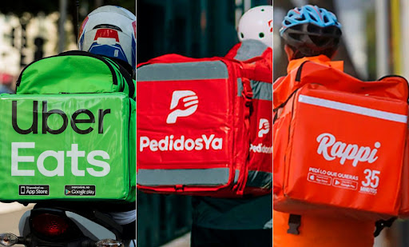
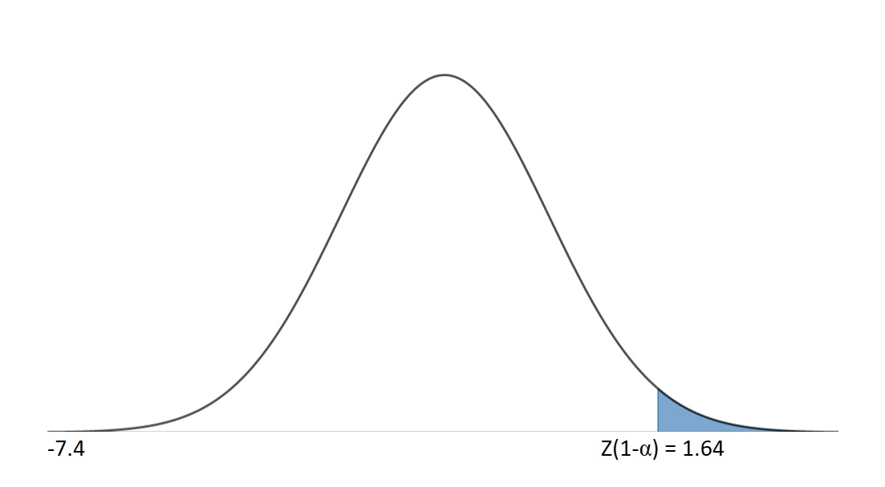
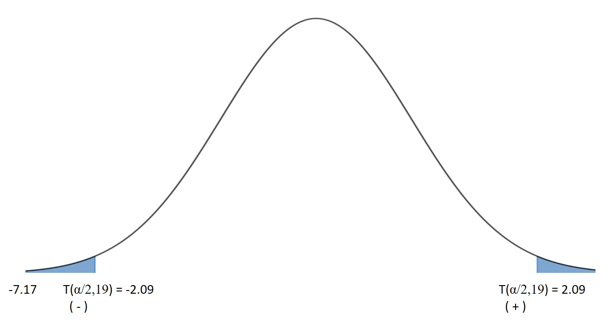
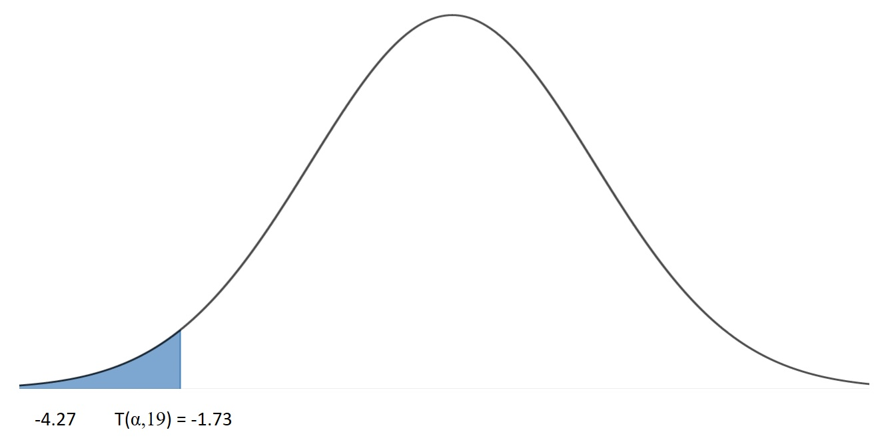

# **Tema: Compra de productos virtual**

# Introducción

Es notorio que el uso de la tecnología se ha incrementado en gran magnitud debido a la pandemia. Esto se puede notar en el uso de plataformas virtuales para organizar clases, reuniones y conferencias. Así mismo, se observa que el flujo de dinero es mayor a través de transferencias, pagos en línea y el uso de monedas virtuales. Si bien la mayor parte del mundo ha sido afectado por este cambio, es más notorio en las ciudades más desarrolladas en los distintos países. Por lo tanto, es de interés el poder estudiar cómo se expone este cambio en el Perú, específicamente en el estudio de compras y adquisición de servicios de manera online en la diferentes distritos durante el periodo del aislamiento social.

## Importancia

Como el estudio brindará análisis estadísticos, este permitirá planear y tomar decisiones en base a resultados obtenidos por la organización, recolección e interpretación de datos. El estudio podría ser de mucha importancia para alguna empresa que se base en un aplicativo móvil y ofrezca servicios de delivery.

## Justificación

A través de la recolección de datos se podría observar ciertas tendencias y, quizás, formar un "buyer persona" que beneficiaría a la persona u organización que acceda a los datos obtenidos. Cada columna de datos contará con descriptores numéricos que podrán ser interpretados de la mejor manera.

## Objetivo

Reconocer qué productos se compran mayormente en línea después del impacto de la pandemia y si el usuario cree que comprar en línea es más seguro que ir en persona. También, observar y clasificar las diferentes inquietudes que se puede tener al realizar las compras. En paralelo, observaremos cual de estas inquietudes es la más frecuente entre los encuestados para proveer al público observador una alerta para tener más cuidado en sus futuras compras en línea.

## Encuesta

A continuación se presentará la encuesta realizada con algunas de las preguntas más relevantes y los datos obtenidos con sus respectivo análisis:
```{r echo=TRUE, message=FALSE}
library(plyr)
library(readr)
library(dplyr)
CL<-read_csv("CL.csv")
```


+------------------------------------------------------------------------------------------------------------------+--------------------------------------------------------------------------------------------------------------------+---------------------+-------------------------------------------------------+
| Preguntas                                                                                                        | Variables                                                                                                          | Tipo de Variables   | Restricciones                                         |
+==================================================================================================================+====================================================================================================================+=====================+=======================================================+
| Edad                                                                                                             | Edades de (18-30)                                                                                                  | Numérica Discreta   | 18 a 30 años de edad                                  |
+------------------------------------------------------------------------------------------------------------------+--------------------------------------------------------------------------------------------------------------------+---------------------+-------------------------------------------------------+
| Sexo                                                                                                             | Mujer y Hombre                                                                                                     | Categórica Nominal  | --                                                    |
+------------------------------------------------------------------------------------------------------------------+--------------------------------------------------------------------------------------------------------------------+---------------------+-------------------------------------------------------+
| ¿Con qué frecuencia compra usted productos en línea? (1-10)                                                      | Número del (1-10) que indica la frecuencia de compras en productos en línea.                                       | Numérica Discreta   | Solo numeros del 1-10                                 |
+------------------------------------------------------------------------------------------------------------------+--------------------------------------------------------------------------------------------------------------------+---------------------+-------------------------------------------------------+
| ¿Aproximadamente cuanto gasta en linea?                                                                          | Cantidad en soles que la gente gasta al comprar en linea                                                           | Numérica Continua   | \-                                                    |
+------------------------------------------------------------------------------------------------------------------+--------------------------------------------------------------------------------------------------------------------+---------------------+-------------------------------------------------------+
| ¿Qué tipos de servicios suele comprar en línea? (Califique de mayor frecuencia)                                  | El tipo de servicio en línea con mayor frecuencia de uso                                                           | Categórica Nominal  | Solo es un servicio(el de mayor frecuencia)           |
+------------------------------------------------------------------------------------------------------------------+--------------------------------------------------------------------------------------------------------------------+---------------------+-------------------------------------------------------+
| ¿Qué tipos de servicios suele comprar en línea? (Califique de menor frecuencia)                                  | El tipo de servicio en línea con menor frecuencia de uso                                                           | Categórica Nominal  | Solo es un servicio(el de menor frecuencia)           |
+------------------------------------------------------------------------------------------------------------------+--------------------------------------------------------------------------------------------------------------------+---------------------+-------------------------------------------------------+
| ¿Que sitios de comercio electrónico suele usar usted con mayor frecuencia?(Califique de mayor frecuencia)        | El sitio que se suele usar para realizar comercio electrónico con mayor frecuencia                                 | Categórica Nominal  | Solo es un comercio (el de mayor frecuencia)          |
+------------------------------------------------------------------------------------------------------------------+--------------------------------------------------------------------------------------------------------------------+---------------------+-------------------------------------------------------+
| ¿Que sitios de comercio electrónico suele usar usted con menor frecuencia?(Califique de menor frecuencia)        | El sitio que se suele usar para realizar comercio electrónico con menor frecuencia                                 | Categórica Nominal  | Solo es un comercio (el de menor frecuencia)          |
+------------------------------------------------------------------------------------------------------------------+--------------------------------------------------------------------------------------------------------------------+---------------------+-------------------------------------------------------+
| ¿Aproximadamente cuánto gasta en línea?                                                                          | Valor aproximado del gasto que realiza la persona al comprar en línea                                              | Numérica continua   | Valor positivo                                        |
+------------------------------------------------------------------------------------------------------------------+--------------------------------------------------------------------------------------------------------------------+---------------------+-------------------------------------------------------+
| ¿Cuáles son sus mayores inquietudes sobre comprar servicios en línea? (Escoja su mayor inquietud)                | Mayor preocupación que siente la persona al realizar una compra online                                             | Categórica Nominal  | Solo es una inquietud (la de mayor inquietud)         |
+------------------------------------------------------------------------------------------------------------------+--------------------------------------------------------------------------------------------------------------------+---------------------+-------------------------------------------------------+
| ¿Ha sufrido personalmente alguna de las siguientes?                                                              | Alguna inquietud en específico que sufrió la persona                                                               | Categórica Nominal  | Solamente inquietudes y problemas al comprar en línea |
+------------------------------------------------------------------------------------------------------------------+--------------------------------------------------------------------------------------------------------------------+---------------------+-------------------------------------------------------+
| ¿Con qué frecuencia le surgen inquietudes de privacidad que le impiden comprar productos en línea?               | Reiteración de inquietudes que sufrieron las personas                                                              | Categórica Ordinal  | Solo una referencia al tiempo estimado de reiteración |
|                                                                                                                  |                                                                                                                    |                     |                                                       |
| \                                                                                                                |                                                                                                                    |                     |                                                       |
+------------------------------------------------------------------------------------------------------------------+--------------------------------------------------------------------------------------------------------------------+---------------------+-------------------------------------------------------+
| ¿Qué tan cómodo/a se siente al comprar productos en línea en una empresa que conoce?                             | Nivel de comodidad que experiencia el cliente al realizar la compra                                                | Categórica Ordinal  | Solo una referencia al nivel de comodidad             |
+------------------------------------------------------------------------------------------------------------------+--------------------------------------------------------------------------------------------------------------------+---------------------+-------------------------------------------------------+
| ¿Qué tan seguro/a está de que su información personal se mantiene confidencial cuando compra productos en línea? | Nivel de seguridad  de confidencialidad de sus datos personales que sienten las personas al realizar las compras   | Categórica Ordinal  | Solo una referencia al nivel de seguridad             |
+------------------------------------------------------------------------------------------------------------------+--------------------------------------------------------------------------------------------------------------------+---------------------+-------------------------------------------------------+
| ¿Qué tan seguro/a está de que su información de pago se mantiene segura cuando compra productos en línea?        | Nivel de seguridad  de confidencialidad de su información de pago que sienten las personas al realizar las compras | Categórica Ordinal  | Solo una referencia al nivel de seguridad             |
+------------------------------------------------------------------------------------------------------------------+--------------------------------------------------------------------------------------------------------------------+---------------------+-------------------------------------------------------+
| ¿Qué método de pago utiliza más a menudo cuando compra productos en línea?                                       | Elección del método de pago más utilizado para realizar la compra                                                  | Categórica Nominal  | Solo un método de pago (el de mayor frecuencia)       |
+------------------------------------------------------------------------------------------------------------------+--------------------------------------------------------------------------------------------------------------------+---------------------+-------------------------------------------------------+
| ¿Aproximadamente cuántas veces realiza compras virtuales al mes?(Ingresar solo el número de veces)               | Cantidad de veces que la persona realiza compras virtuales por mes                                                 | Numérica Discreta   | Valor positivo                                        |
+------------------------------------------------------------------------------------------------------------------+--------------------------------------------------------------------------------------------------------------------+---------------------+-------------------------------------------------------+
| ¿En qué sitio web se siente usted más cómodo/a al realizar una compra?                                           | Opción que representa mayor comodidad a la hora de comprar                                                         | Categórica Nominal  | Solo un sitio web (el más cómodo)                     |
+------------------------------------------------------------------------------------------------------------------+--------------------------------------------------------------------------------------------------------------------+---------------------+-------------------------------------------------------+

### Edad y Sexo

Debido a que la restricción de las edad es de 18 a 30 años se tuvo que filtrar los datos de la encuesta obteniendo el siguiente gráfico:

```{r}
CL1<-filter(CL,CL$Sexo=="Hombre"| CL$Sexo=="Mujer")
CL3<-filter(CL1,CL1$Edad<31)
CL5<-filter(CL3,CL3$Edad>17)
```

```{r}
Tabsexo<-table(CL5$Sexo)
barplot(Tabsexo,main="Sexo", col=c("black","pink"))
```

```{r}
quantile(CL5$Edad,prob=c(0.25,0.5,0.75), na.rm=TRUE)
boxplot(formula=CL5$Edad~CL5$Sexo, data=CL5, ylab="Edad",xlab="Sexo",col=c("grey","pink"))
```

### ¿Con qué frecuencia compra usted productos en línea? (1-10)


En esta pregunta de la encuesta se realizó con el propósito de ver con que frecuencia los encuestados realizan compras en línea. Se les dio un número del (1-10) siendo el 1 de menor frecuencia y el 10 de mayor frecuencia. A continuación se observa un gráfico para ver y analizar los resultados:

```{r}
Tab110<-table(CL5$'¿Con que frecuencia compra usted productos en linea? (1-10)')
barplot(Tab110, main="Frecuencia de Compras", col=rainbow(9))
```

### ¿Aproximadamente cuanto gasta en linea?

El propósito de esta pregunta es saber cuánto gastan los usuarios en soles al realizar compras de forma virtual por mes, para poder realizar un estudio sobre el promedio de las cantidades que nuestros encuestados gastan. A continuación, observaremos los diferentes gastos acordes al Sexo.


```{r}
summary(CL5$`¿Aproximadamente cuanto gasta en linea?2`)
boxplot(formula=CL5$`¿Aproximadamente cuanto gasta en linea?2`~CL5$Sexo, data=CL5, ylab="Gasto Mensual",xlab="Sexo",col=c("grey","pink"))
```

### ¿Cuales son sus mayores inquietudes sobre comprar servicios en linea? (Escoja su mayor inquietud)

El propósito de esta pregunta tiene que ver con la intranquilidad de los usuarios al realizar una compra en un sitio virtual. En ello tenemos algunas alternativas en el cual los encuestados lograrán escoger la de su conveniencia.

```{r}
Tabmayorinquietud<-table(CL5$`¿Cuales son sus mayores inquietudes sobre comprar servicios en linea? (Escoja su mayor inquietud)`)
etiquetainquietud<-paste0(round(100*Tabmayorinquietud/sum(Tabmayorinquietud),2),"%")
pie(Tabmayorinquietud, labels=etiquetainquietud, clockwise = TRUE,col = rainbow(6), main="Grafica sobre mayores inquietudes al comprar")
legend("bottomright",c("Ninguna","Que clonen tu tarjeta","Que el producto llegue dañado
","Que no puedas observar el producto", "Que tarde en llegar","Ser estafado"),cex=0.50,fill=rainbow(6))

```

### ¿Con qué frecuencia le surgen inquietudes de privacidad que le impiden comprar productos en línea?

Esta pregunta se hizo para conocer el nivel promedio de inquietudes sobre la privacidad de las personas encuestadas cuando realizan compras virtuales. Los niveles que se les presenta son los siguientes: "Siempre", "De vez en cuando", "La mayor parte del tiempo", "Nunca", "Cerca de la mitad del tiempo".

```{r}
Tabfrecinquietud<-table(CL5$`¿Con qué frecuencia le surgen inquietudes de privacidad que le impiden comprar productos en línea?`)
etiquetafrecinquietud<-paste0(round(100*Tabfrecinquietud/sum(Tabfrecinquietud),2),"%")
pie(Tabfrecinquietud, labels=etiquetafrecinquietud, clockwise = TRUE,col = rainbow(6), main="Grafica sobre frecuencia de inquietudes al comprar")
legend("bottomright",c("Cerca de la mitad del tiempo", "De vez en cuando
", "La mayor parte del tiempo", "Siempre","Ser estafado"),cex=0.53,fill=rainbow(6))

```

### ¿Que tipos de servicios suele comprar en linea? (Califique de mayor frecuencia) y ¿Que tipos de servicios suele comprar en linea? (Califique de menor frecuencia)


El propósito de esta pregunta es seleccionar la alternativa que suele comprar con mayor reiteración, en el cual se debe optar por la opción de preferencia. El objetivo de esta pregunta consiste en seleccionar la alternativa que menor cantidad de veces pudiste realizar una compra en los comercios electrónicos o como también que no llegaste hacer ninguna compra en las opciones que fue realizado en la encuesta.

```{r}
Tabserv<-table(CL5$`¿Que tipos de servicios suele comprar en linea? (Califique de mayor frecuencia)`)
etiqueta<-paste0(round(100*Tabserv/sum(Tabserv),2),"%")
pie(Tabserv, labels=etiqueta, clockwise = TRUE,col = topo.colors(6), main="Mayor Servicios que Compran en Línea")
legend("topright",c("Accesorios","Transporte","Delivery","Ropa","Alimentos","electrodomésticos"),cex=0.6,fill=topo.colors(6))
Tabmenorfrec<-table(CL5$`¿Que tipos de servicios suele comprar en linea? (Califique de menor frecuencia)`)
etiqueta<-paste0(round(100*Tabmenorfrec/sum(Tabmenorfrec),2),"%")
pie(Tabmenorfrec, labels=etiqueta, clockwise = TRUE,col = topo.colors(6), main="Menor Servicios que Compran en Línea")
legend("topright",c("Accesorios","Alimentos","Delivery","Ropa","Electrodoméstico","Transporte"),cex=0.6,fill=topo.colors(6))
```

### ¿Que sitios de comercio electrónico suele usar usted con mayor frecuencia?(Califique de mayor frecuencia) y ¿Que sitios de comercio electrónico suele usar usted con mayor frecuencia?(Califique de menorfrecuencia)

{width="653"}

El propósito de esta pregunta tiene que ver a la cantidad de veces que frecuentamos al utilizar alguno de los comercios electrónicos de nuestra preferencia. En ello tenemos algunas opciones de comercios electrónicos en el cual los encuestados lograran optar por el cual se sientan más inclinados.

El objetivo de esta pregunta consiste en seleccionar la alternativa, en el cual se debe optar por la menor cantidad de veces que pudiste realizar una compra en los comercios electrónicos o como también que no llegaste hacer ninguna compra en las opciones que fue realizado en la encuesta.

```{r}
TabSitiosMayor<-table(CL5$`¿Que sitios de comercio electrónico suele usar usted con mayor frecuencia?(Califique de mayor frecuencia)`)
SitiosMayor<-paste0(round(100*TabSitiosMayor/sum(TabSitiosMayor),2),"%")
pie(TabSitiosMayor, labels=SitiosMayor, clockwise = TRUE,col = rainbow(5), main="Sitio de Mayor Frecuencia")
legend("topright",c("Beat","Indriver","Pedidosya","Rappi","Uber"),cex=0.6,fill=rainbow(5))
TabSitiosMenor<-table(CL5$`¿Que tipos de servicios suele comprar en linea? (Califique de menor frecuencia)`)
SitiosMenor<-paste0(round(100*TabSitiosMenor/sum(TabSitiosMenor),2),"%")
pie(TabSitiosMenor, labels=SitiosMenor, clockwise = TRUE,col = rainbow(7), main="Sitio de Menor Frecuencia")
legend("topright",c("Beat","Capify","Didi","Indriver","Pedidosya","Rappi","Uber"),cex=0.6,fill=rainbow(7))
```

### ¿Qué tan cómodo/a se siente al comprar productos en línea en una empresa que conoce?


El propósito de esta pregunta tiene la intención de conocer si la persona se sienta cómoda mientras pide el producto en línea. Se presentó opciones de nivel de comodidad las cuales son: "Muy cómodo/a", "Algo cómodo/a", "No tan cómodo/a" y "Nada cómodo/a". A continuación, se mostrará el código y una tabla que muestre cómo el publico encuestado se siente al momento de realizar una copia en línea de los datos obtenidos.

```{r}
Tabcomodidad<-table(CL$`¿Qué tan cómodo/a se siente al comprar productos en línea en una empresa que conoce?`)
etiqueta<-paste0(round(100*Tabcomodidad/sum(Tabcomodidad),2),"%")
pie(Tabcomodidad, labels=etiqueta, clockwise = TRUE,col = topo.colors(6), main="Grafica sobre comodidad al comprar")
legend("topright",c("Muy cómodo/a","Algo cómodo/a","No tan cómodo/a","Nada cómodo/a"),cex=0.6,fill=topo.colors(6))
```

### ¿Qué tan seguro/a está de que su información personal se mantiene confidencial cuando compra productos en línea?

{width="668"}

El propósito de esta pregunta tiene la intención de conocer si la persona siente que su información personal no está siendo filtrada y se siente seguro al pedir el producto en línea. Se presentó opciones de nivel de seguridad las cuales son: "Extremadamente seguro/a", "No tan seguro/a", "Muy seguro/a", "Nada seguro/a" y "Algo seguro/a". A continuación, se mostrará el código y una tabla que muestre que tan seguras se sienten las personas al comprar en línea respecto a su información personal.

```{r}
Tabinfopersona<-table(CL$`¿Qué tan seguro/a está de que su información personal se mantiene confidencial cuando compra productos en línea?`)
barplot(Tabinfopersona, main = "Gráfico de Seguridad de Información Personal", xlab = "Seguridad", ylab = "# de Personas", col="brown")
```

### ¿Qué tan seguro/a está de que su información de pago se mantiene segura cuando compra productos en línea?


El propósito de esta pregunta tiene la intención de conocer si la persona siente que su información de pago no está siendo filtrada y se siente seguro al pedir el producto en línea. Se presentó opciones de nivel de seguridad las cuales son: "Extremadamente seguro/a", "No tan seguro/a", "Muy seguro/a", "Nada seguro/a" y "Algo seguro/a". A continuación, se mostrará el código y una tabla que muestre que tan seguras se sienten las personas al comprar en línea respecto a su información de pago.

```{r}
Tabinfopago<-table(CL5$`¿Qué tan seguro/a está de que su información de pago se mantiene segura cuando compra productos en línea?`)
etiquetapago<-paste0(round(100*Tabinfopago/sum(Tabinfopago),2),"%")
pie(Tabinfopago, labels=etiquetapago, clockwise = TRUE,col = rainbow(6), main="Grafica sobre seguridad de pago al comprar")
legend("topright",c("Algo seguro/a","Nada seguro/a","Muy seguro/a","Extremadamente seguro/a", "No tan seguro/a"),cex=0.6,fill=rainbow(6))

```

### ¿Qué método de pago utiliza más a menudo cuando compra productos en línea?


Esta pregunta se hizo para específicamente monitorear el método de pago que utiliza el encuestado al momento de realizar una compra en línea. Como podemos observar se colocaron distintos métodos de pago el cual se tuvo que escoger la opción de la que se usa con mayor frecuencia.

```{r}
CL6<-filter(CL5,CL5$`¿Qué método de pago utiliza más a menudo cuando compra productos en línea?`=="Tarjeta de crédito"| CL5$`¿Qué método de pago utiliza más a menudo cuando compra productos en línea?`=="Tarjeta de débito")
Tabmetodo<-table(CL6$`¿Qué método de pago utiliza más a menudo cuando compra productos en línea?`)
barplot(Tabmetodo,xlab="Metodos de Pago",col=rainbow(8),legend.text = rownames(Tabmetodo),args.legend = list(x="topright",inset=c(0.5,0)))
```

### ¿Aproximadamente cuántas veces realiza compras virtuales al mes?(Ingresar solo el numero de veces)

El propósito de esta pregunta es saber el promedio de cuántas veces al mes los encuestados realizan compras virtuales.En el gráfico se observa que la mayor densidad de personas realiza compras entre 2 y 4 veces al mes y , la menor densidad, 5 y más de 12 veces al mes.

```{r}
Tabveces<-table(CL5$`¿Aproximadamente cuántas veces realiza compras virtuales al mes?(Ingresar solo el numero de veces)`)
plot(density(Tabveces, bw=0.8), lwd=3,col = "red", main = "Cantidad de veces que realiza compras")
```


# **Hipótesis**

Primero hallaremos la cantidad de datos que tiene nuestra muestra

```{r echo=TRUE}
dim(CL)
```


## Hipotesis 1:

### Plantear hipótesis

En esta hipótesis se evaluará si es que los gastos de las personas de entre 18 a 30 años es menor o igual a 250 soles mensuales.  

H0 : Los gastos de las personas es menor o igual a 250 soles.
H0 : **u ≤ 250**

H1 : Los gastos de las personas es mayor a 250 soles.
H1 : **u > 250**

### Fijar nivel de significancia

Utilizaremos una significancia de 5% = 0.05. 

### Calcular el estadístico de la prueba

Para el cálculo estadístico de la prueba haremos uso de la formula Z porque tenemos una desviación estándar conocida, no conocemos el sigma y nuestra base de datos no es pequeña (base de datos pequeña es menor a 30 datos).

```{r echo=TRUE}
mean(CL$`¿Aproximadamente cuanto gasta en linea?2`)
```
```{r echo=TRUE}
sd(CL$`¿Aproximadamente cuanto gasta en linea?2`)
```

Siendo nuestro Zcal = -7.4

### Graficar las regiones criticas

Hallamos el punto crítico

```{r echo=TRUE}
qnorm(1-0.05)
```
```{r echo=TRUE}
round(qnorm(0.95),2)
```

Por lo que la gráfica nos queda



### Aplicar los criterios de decisión

Siendo nuestro Zcal = -7.4 menor a Z(1-α) = 1.64, entonces inferimos que Zcal NO PERTENECE a la región sombreada y NO RECHAZO H0 

### Conclusiones

Antes de esto tenemos que hallar el intervalo de confianza que trabajaremos, la precisión entre otras.
Sabemos que por la significancia de 0.05, la precisión es del 95%

Al tener una muestra grande ya tenemos la desviación de esta por lo que simplemente trabajaremos con ella

Entonces Se trabajaría con un Z(1-α/2)

```{r echo=TRUE}
qnorm(1-0.025)
```
Entonces nuestro intervalo entraría entre la media +- Z(1-α/2)*la desviación/la raíz del n

El intervalo entraría entre: 154.38 +- Z(168.49/13)

Por lo que el intervalo de confianza estaría entre: **128.98 < u < 179.78**

Y el error de este sería: **E = 25.4**

En conclusión, si hay un **NO RECHAZO DE H0** entonces se considera que los gastos de las personas de entre 18 a 30 años es menor o igual a 250 soles mensuales.  


## Hipotesis 2:

### Plantear hipotesis

En esta hipótesis se evaluara si la frecuencia de compra de las personas de 18 a 30 años es igual o diferente a 6. 

H0 : La frecuencia de compra de las personas es igual a 6.
H0 : **u = 6**

H1 : La frecuencia de compra de las personas es diferente a 6.
H1 : **u ≠ 6**

### Fijar nivel de significancia

Utilizaremos una significancia de 5% = 0.05. 

### Calcular el estadístico de la prueba

Para el cálculo estadístico de la prueba haremos uso de la formula Tcal porque tenemos una desviación estándar conocida, no conocemos el sigma y nuestra base de datos no es pequeña (base de datos pequeña es menor a 30 datos), pero generamos un pequeño vector aleatorio de 20 datos de la muestra para identificar nuestra media y desviación poder usar la formula de Tcal. 

```{r echo=TRUE}
muestra_1<-replicate(1,sample(CL$`¿Con que frecuencia compra usted productos en linea? (1-10)`,20),F)
muestra_1

```

Se crea el vector con la muestra

```{r echo=TRUE}
Muestra_aleatoria_1<-c(1,3,5,3,3,6,5,10,1,6,7,7,8,2,2,7,3,7,3,3)
```

Hallamos la media de la muestra:

```{r echo=TRUE}
mean(Muestra_aleatoria_1)
```
La desviación:

```{r echo=TRUE}
sd(Muestra_aleatoria_1)
```

Siendo nuestro Tcal = -7.17

### Graficar las regiones criticas

Hallamos los puntos críticos

```{r echo=TRUE}
qt(0.025,19)
```
Redondeamos:

```{r echo=TRUE}
round(qt(0.025,19),2)
```
Por lo que nos queda




### Aplicar los criterios de decisión

Siendo nuestro Tcal = -7.17 menor a T(α/2,19) = -2.09, entonces inferimos que Tcal PERTENECE a la región sombreada y RECHAZO H0 

### Conclusiones


Antes de esto tenemos que hallar el intervalo de confianza que trabajaremos, la precisión entre otras.
Sabemos que por la significancia de 0.05, la precisión es del 95%

Al tener una muestra grande ya tenemos la desviación de esta por lo que simplemente trabajaremos con ella

Entonces Se trabaría con un T(1-α/2)

```{r echo=TRUE}
qt(1-0.05/2,19)
```
Entonces nuestro intervalo entraría entre la media +- T(1-α/2)*la desviación/la raíz del n

El intervalo entraría entre: 4.6 +- T(0.975,19)(2.54/13)

Por lo que el intervalo de confianza estaría entre: **4.19 < u < 5.01**

Y el error de este sería: **E = 0.41**

En conclusión, si hay un **RECHAZO DE H0** entonces se considera que la frecuencia de compra de las personas de 18 a 30 años es diferente a 6. 


## Hipotesis 3:

### Plantear hipótesis 

En esta hipótesis se evaluara si los compradores de 18 a 30 años son en promedio mayor o igual a 22 años. 

H0 : La edad promedia de compradores es mayor o igual a 22 años.
H0 : **u ≥ 22**

H1 : La edad promedia de compradores es menor a 22 años.
H1 : **u < 22**

### Fijar nivel de significancia

Utilizaremos una significancia de 5% = 0.05. 

### Calcular el estadístico de la prueba

Para el cálculo estadístico de la prueba haremos uso de la formula T porque tenemos una desviación estándar conocida, no conocemos el sigma y nuestra base de datos no es pequeña (base de datos pequeña es menor a 30 datos), pero generamos un pequeño vector aleatorio de 20 datos la muestra para identificar nuestra media y desviación para poder usar la formula de Tcal.

```{r echo=TRUE}
muestra_2<-replicate(1,sample(CL$Edad,20),F)
muestra_2
```

Se crea un vector con la muestra:

```{r echo=TRUE}
Muestra_aleatoria_2<-c(22,21,18,22,18,18,23,19,18,29,18,29,19,22,24,18,19,21,21,19)
```

Hallamos la media:

```{r echo=TRUE}
mean(Muestra_aleatoria_2)
```
Y la desviación:

```{r echo=TRUE}
sd(Muestra_aleatoria_2)
```

Por lo que Tcal = -4.27

### Graficar las regiones criticas

Hallamos el punto crítico

```{r echo=TRUE}
qt(0.05,19)
```



### Aplicar los criterios de decisión
Siendo nuestro Tcal = -4.27 mayor a T(α,19) = -1.73, entonces inferimos que Tcal NO PERTENECE a la región sombreada y RECHAZO H0 

### Conclusiones

Antes de esto tenemos que hallar el intervalo de confianza que trabajaremos, la precisión entre otras.
Sabemos que por la significancia de 0.05, la precisión es del 95%

Al tener una muestra grande ya tenemos la desviación de esta por lo que simplemente trabajaremos con ella

Entonces Se trabaría con un T(1-α/2)

```{r echo=TRUE}
qt(1-0.05/2,19)
```
Entonces nuestro intervalo entraría entre la media +- T(1-α/2)*la desviación/la raíz del n

El intervalo entraría entre: 20.9 +- T(0.975,19)*(3.35/13)

Por lo que el intervalo de confianza estaría entre: **20.36 < u < 21.55**

Y el error de este sería: **E = 0.54**

En conclusión, si hay un **RECHAZO DE H0** entonces se considera que los compradores de 18 a 30 años son en promedio menores a 22 años. 


# **Regresión**

Para realizar el gráfico de regresión, nos basamos en la siguiente ecuación:

Y = b0 + b1*X

Y: Valor pronosticado de Y
b0: Estimación de B0
b1: Estimación de B1

Las siguiente variables usaremos para identificar la viabilidad del estudio:

a1 = ¿Con que frecuencia compra usted productos en linea? 
a2 = ¿Aproximadamente cuanto gasta en linea?
a3 = Edad

```{r}
a1<-CL$`¿Con que frecuencia compra usted productos en linea? (1-10)`
a2<-CL$`¿Aproximadamente cuanto gasta en linea?2`
a3<-CL$Edad
```


Usaremos la siguiente ecuación para determinar la relación entre variables:

r = cov(VAR1,VAR2)/sqrt(var(VAR1))*sqrt((var(VAR2)))

r : Coeficiente de relacion de Pearson
VAR1: Primera variable
VAR2: Segunda variable

```{r}
x1 <- cov(a1,a3)/(sqrt(var(a1))*sqrt((var(a3))))
x2 <- cov(a2,a3)/(sqrt(var(a2))*sqrt((var(a3))))
```

Hallamos que la relación entre las variables es:

- a1/a3 = 0.17, siendo su correlación positiva, al tener una correlación muy baja no es tan buena la interpretación.
- a2/a3 = 0.1, siendo us correlación positiva, al tener una correlación muy baja no es tan buena la interpretación.

## **Regresión Monto de gasto y edad**

Para este gráfico usaremos las variables a2 y a3, tomando en cuenta que la variable independiente es a2 y la variable dependiente es a3.
Nuestra muestra es de 169 personas encuestadas, entonces las medias de las dos variables son:

```{r}
M_a2<-mean(a2)
M_a3<-mean(a3)
M_a2
M_a3
```


M_a2 = 154.3787
M_a3 = 22.9408


Entonces con estos datos halllaremos la varianza y covarianza


```{r}
Var_a2 = var(a2)
Cov_a2 = cov(a2,a3)
Var_a2
Cov_a2
```

Var_a2 = 28389.05
Cov_a2 = 99.57611


Se arma la ecuación de la siguiente manera:

b1 = cov(a2,a3)/var(a2) 

b0 = M_a2 - b1*M_a3 

```{r}
b1 <- Cov_a2/Var_a2 
b0 <- M_a2 - b1*M_a3
b1
b0
```

Finalmente obtenemos la siguiente ecuación:

y = 0.0035 + 154.2982(x)


### Grafica edad vs monto

```{r}
lm_a2<-lm(CL$`¿Aproximadamente cuanto gasta en linea?2` ~ CL$Edad)
plot(CL$`¿Aproximadamente cuanto gasta en linea?2` ~ CL$Edad, pch=20, main = "Monto gastado en linea vs edad", xlab="Monto gastado en linea", ylab = "Edad",col=rgb(0,0,0,0.2))
abline(lm_a2,col="red")
```

Correlación entre el monto gastado y la edad

```{r}
cor(CL$`¿Aproximadamente cuanto gasta en linea?2`,CL$Edad)
```

Resumen de la regresión

```{r}
summary(lm_a2)
```


En primer lugar, debemos de verificar que los residuos siguen el modelo normal:
la media de los residuos es:
```{r}
mean(lm_a2$residuals)
```
### Prueba de hipótesis de la regresión

En H0: modelo no significativo
H1: modelo significativo

Tenemos que nuestra significancia es del 0.05.

Además tenemos que nuestro p-value es de 0.01562 y al ser mayor que nuestro α no se rechaza el modelo significativo.


### Histograma de residuos es: 

```{r}
hist(lm_a2$residuals, main ="Histograma de Residuos", xlab= "Residuos", freq=FALSE, col ="violet")
curve(dnorm(x,mean=mean(lm_a2$residuals),sd=sd(lm_a2$residuals)),add=TRUE, col="red") 
```


## **Regresión Frecuencia y edad**

Para este gráfico usaremos las variables a2 y a3, tomando en cuenta que la variable independiente es a2 y la variable dependiente es a3.
Nuestra muestra es de 169 personas encuestadas, entonces las medias de las dos variables son:

```{r}
M_a1<-mean(a1)
M_a3<-mean(a3)
M_a1
M_a3
```


M_a1 = 5.142012
M_a3 = 22.94083


Entonces con estos datos hallaremos la varianza y covarianza


```{r}
Var_a1 = var(a1)
Cov_a1 = cov(a1,a3)
Var_a1
Cov_a1
```

Var_a1 = 5.789236
Cov_a1 = 2.228691


Se arma la ecuación de la siguiente manera:

b1 = cov(a1,a3)/var(a1) 

b0 = M_a1 - b1*M_a3 

```{r}
b1_a1 <- Cov_a1/Var_a1 
b0_a1 <- M_a2 - b1*M_a3
b1_a1
b0_a1
```

Finalmente obtenemos la siguiente ecuación:

y = 0.385 + 7.730(x)


### Grafica frecuencia vs edad

```{r}
lm_a1<-lm(CL$`¿Con que frecuencia compra usted productos en linea? (1-10)`~ CL$Edad)
plot(CL$`¿Con que frecuencia compra usted productos en linea? (1-10)`~ CL$Edad, pch=20, main = "Frecuencia vs edad", xlab="Frecuencia", ylab = "Edad",col=rgb(0,0,0,0.2))
abline(lm_a1,col="red")
```

Correlación entre el monto gastado y la edad

```{r}
cor(CL$`¿Con que frecuencia compra usted productos en linea? (1-10)`, CL$Edad)
```

Resumen de la regresión

```{r}
summary(lm_a1)
```


En primer lugar, debemos de verificar que los residuos siguen el modelo normal:
la media de los residuos es:
```{r}
mean(lm_a1$residuals)
```
### Prueba de hipótesis de la regresión

En H0: modelo no significativo
H1: modelo significativo

Tenemos que nuestra significancia es del 0.05.

Además tenemos que nuestro p-value es de 0.01562 y al ser mayor que nuestro α se rechaza el modelo significativo.

### Histograma de residuos es: 

```{r}
hist(lm_a1$residuals, main ="Histograma de Residuos", xlab= "Residuos", freq=FALSE, col ="violet")
curve(dnorm(x,mean=mean(lm_a1$residuals),sd=sd(lm_a1$residuals)),add=TRUE, col="red") 
```


# **Análisis predictivo**

¿Es posible predecir si en los próximos meses la compra de productos en linea aumentara o disminuirá? No, esto debido a que el aumento o disminución de las compras en linea no depende únicamente a las variables usadas en este proyecto sino que para predecir su variación es necesario evaluar otras variables que no estamos considerando como la pandemia, entre otras.

# **Conclusiones**

En conclusión, resolvimos ciertas interrogantes con nuestras hipótesis como la cantidad promedio de gastos de los consumidores, sus frecuencias de compra y la edad de los consumidores que más compran. Además, logramos analizar la relación entre monto y frecuencia de compra con la edad de los consumidores. 


# **Reflexiones**

Con este trabajo descubrimos que muchas personas han tenido que recurrir al servicio de compra en línea debido a la pandemia, además que se sienten muy cómodas comprando en tiendas que conocen y muy cómodos de que su información personal se mantenga en confidencialidad. Aunque aún existen ciertos miedos como que no pueden observar el producto, que clonen sus tarjetas, que el producto les llegue tarde o de la seguridad de su información de pago.

